# JELENTÉS 

a helyi önkormányzatoknak bérlakásépítésre és korszerűsítésre juttatott pénzügyi támogatások ellenőrzéséről

---

3. Önkormányzati és Területi Ellenőrzési Igazgatóság
3.2. Pénzügyi Szabályszerüségi és Teljesítményellenőrzési Főcsoport Iktatószám: V-1004-28/2003.
Témaszám: 652
Vizsgálat-azonosító szám: V0074

# Az ellenőrzést felügyelte: 

dr. Lóránt Zoltán
főigazgató
Az ellenőrzés végrehajtásáért felelős:
Németh Péterné
főcsoportfőnök
Az ellenőrzést vezette:
Turnheimné Lakos Zsuzsa
vizsgálatvezető, főcsoportfőnök-helyettes
A számvevői jelentések feldolgozásában és a jelentés összeállításában
közremüködött:
Hirka Mihály
számvevő tanácsos
Preller Zsuzsanna
számvevő tanácsos
Az ellenőrzést végezték:

Csepreginé Tancsik Erzsébet
számvevő
Endrődi Péterné
számvevő
Hirka Mihály
számvevő tanácsos
dr. Karáné Kőszegi Zsuzsanna
számvevő tanácsos
Klinga László
számvevő tanácsos
Kozák György
számvevő tanácsos
Kozma Gábor
számvevő

## Laki Dóra

számvevő tanácsos
Nagy Istvánné dr.
számvevő
Pálfi András
számvevő tanácsos
Preller Zsuzsanna
számvevő tanácsos
Szihalminé Kovács Zsuzsanna
számvevő
dr. Szücs Zoltán
számvevő tanácsos

---

# A témához kapcsolódó eddig készített számvevőszéki jelentések: 

címe
sorszáma
A helyi önkormányzatok lakás- és nem lakás célját szolgáló 359 ingatlanvagyonával való gazdálkodásának ellenőrzéséről

---

# TARTALOMJEGYZÉK 

BEVEZETÉS ..... 3
I. ÖSSZEGZŐ MEGÁLLAPÍTÁSOK, KÖVETKEZTETÉSEK, JAVASLATOK ..... 6
II. RÉSZLETES MEGÁLLAPÍTÁSOK ..... 13

1. Az önkormányzatok lakásállományának alakulása ..... 13
1.1. Az önkormányzatok lakásgazdálkodása 1995-2000. évek között ..... 13
1.2. A lakásépítési program hatása a vizsgált önkormányzatok lakásállományára 2001-2002. évben ..... 15
2. A bérlakásállomány bevételei és kiadásai ..... 17
2.1. A lakbérbevételek alakulása ..... 17
2.2. A múködtetésre és felújításra fordított kiadások és azok forrásai ..... 19
3. A bérlakások elidegenítéséből származó bevételek kezelése és felhasználása ..... 22
3.1. A bevételek kezelése és felhasználása ..... 22
3.2. A lakásvagyon elidegenítéséből származó követelések alakulása ..... 24
4. Az önkormányzatok lakásgazdálkodásának szabályozottsága, tervszerűsége ..... 25
4.1. A bérlakásokkal kapcsolatos szabályozási, működtetési feladatok ellátása ..... 25
4.2. A pályázatokhoz benyújtott lakáskoncepciók jellemzői ..... 26
5. A lakáscélú támogatási előirányzatok kezelési feladatainak ellátása ..... 28
6. A támogatások igénylése ..... 31
6.1. A benyújtott pályázatok szabályszerűsége ..... 31
6.2. A pályázatok elbírálása ..... 33
7. A támogatott programok megvalósítása ..... 34
7.1. Az önkormányzatok beruházási tevékenységének és közbeszerzéseinek szabályozottsága, a közbeszerzési eljárások lebonyolítása ..... 34
7.2. A támogatott programok finanszírozása ..... 36
7.3. A támogatások felhasználásának szabályszerűsége ..... 39
7.4. A támogatott programok forrásösszetételének alakulása ..... 42
7.5. A programok fajlagos költségeinek alakulása ..... 45
8. A támogatással megvalósult lakások használatbavételének és működtetésének szabályszerűsége ..... 47

---

8.1. Az elkészült lakások használatbavétele ..... 47
8.2. A lakásállomány múködtetése ..... 48
8.3. A támogatások felhasználásának ellenőrzése ..... 51
MELLÉKLETEK

1. sz. melléklet A vizsgált önkormányzatok lakásállományának alakulása
2. sz. melléklet Lakások megoszlása szobaszám és komfortfokozat szerint
3/a sz. melléklet Egy lakásra jutó bevételek és kiadások alakulása a vizsgált önkor- mányzatoknál
3/b sz. melléklet Egy lakásra jutó kiadások alakulása település típusonként a vizsgált önkormányzatoknál
3. sz. melléklet Nyertes önkormányzati pályázatok száma 2002. év végéig és a vizs- gáltak aránya
4. sz. melléklet A vizsgált önkormányzatok néhány fontosabb adata

# RÖVIDÍTÉSEK JEGYZÉKE 

| ÁSZ | Állami Számvevőszék |
| :-- | :-- |
| ÁTBP | Állami Támogatású Bérlakás Program |
| BM | Belügyminisztérium |
| GM | Gazdasági Minisztérium |
| SzCsM | Szociális és Családügyi Minisztérium |
| Kht. | Magyar Lakás-innovációs Kht. |
| LEP | Laképületek Energiamegtakarítási Programja |
| LTB | Lakásügyi Tárcaközi Bizottság |
| Áht | Az államháztartásról szóló 1992. évi XXXVIII. törvény |
| Ámr. | Az államháztartás múködési rendjéről szóló |
|  | 217/1998.(XII.30.) Korm. rendelet |
| Kbt. | A közbeszerzésekről szóló 1995. évi XL. törvény |
| kormányrendelet | A lakáscélú állami támogatásokról szóló 12/2001. (I.30.) |
|  | Korm. rendelet |
| lakástörvény | A lakások és helyiségek bérletére, valamint az elidegeníté- |
|  | sükre vonatkozó egyes szabályokról szóló 1993. évi |
|  | LXXVIII. törvény |

---

# JELENTÉS 

## a helyi önkormányzatoknak bérlakásépítésre és korszerúsítésre juttatott pénzügyi támogatások ellenőrzéséről

## BEVEZETÉS

Az Állami Számvevőszék 2003. évi ellenőrzési terve alapján vizsgálta a helyi önkormányzatoknak bérlakásépítésre és korszerűsítésre juttatott pénzügyi támogatások igénybevételét és felhasználását. Az ellenőrzés jogalapja az Állami Számvevőszékről szóló 1989. évi XXXVIII. törvény 2. § (5) bekezdése, az államháztartásról szóló 1992. évi XXXVIII. törvény 120/A. § (1) bekezdése, valamint az éves költségvetési törvények.

A helyi önkormányzatok tulajdonába került jelentős lakásvagyonnal való gazdálkodást, a jogszabályi előírások betartását az Állami Számvevőszék az 19911995. évekre vonatkozóan ellenőrizte első ízben ${ }^{1}$. A vizsgálat azt állapította meg, hogy az önkormányzatok egy része nem - több esetben pedig a lakástörvénynél szélesebb körűen - szabályozta a törvényben előírt feladatokat. A lakásgazdálkodás szabályozása és gyakorlata számos esetben ellentétes volt a törvényi előírásokkal. A lakásértékesítési bevételeknek az önkormányzatok egy része nem nyitott elkülönített számlát, s e bevételeket vagy azok egy részét nem a törvényben meghatározott módon és célra használta fel. Így e bevételek a lakáságazat gondjainak megoldása szempontjából gyakorlatilag elvesztek.

A vizsgálat javasolta, hogy a lakástörvény szigorúbb jogkövetkezményeket fogalmazzon meg azokkal az önkormányzatokkal szemben, amelyek a lakások értékesítéséből származó bevételeket nem a törvényben megfogalmazott célra használták fel. Javasolta továbbá, hogy a lakásgazdálkodási feladatok megvalósíthatósága érdekében a Pénzügyminisztérium tekintse át az önkormányzatok lakás-felújítási és lakásépítési pénzeszközei bővítésének a lehetőségét.

A bérlakásépítés támogatására vonatkozó 2000. évi kormánydöntés alapján a Magyar Köztársaság 2000. évi költségvetéséről szóló 1999. évi CXXV. törvény, valamint a 2001-2002. évi költségvetésről szóló 2000. évi CXXXIII. törvény eredeti előirányzatai, valamint az ezek átcsoportosításáról szóló kormányhatározatok az Állami Támogatású Bérlakás Programra 2000-2002. évekre összesen

[^0]
[^0]:    ${ }^{1}$ Jelentés a helyi önkormányzatok lakás- és nem lakás célját szolgáló ingatlanvagyonával való gazdálkodásának ellenőrzéséről (1997.)

---

52,9 milliárd Ft-ot irányoztak elő. Ezen felül a Kormány a lakóépületek energia megtakarítási programjára 1,6 milliárd Ft támogatást biztosított.

Az összesen 54,5 milliárd Ft-os előirányzatra 1871 pályázati kérelem érkezett, melynek $73 \%$-át teszik ki a nyertes pályázatok. A pályázati támogatás $87 \%$-át önkormányzatok nyerték el. A lakáscélú állami támogatásokat a települési önkormányzatok a bérlakás állomány növelésére, az iparosított technológiával épült lakóépületek energiatakarékos korszerűsítésére, felújítására, a nagyvárosi lakóépülettömbök korszerűsítésére, felújítására, közművesített építési telkek kialakítására, az egyházak lakhatást szolgáló egyházi ingatlanok korszerűsítésére, felújítására és nyugdíjasházak építésére vehették igénybe.

A vizsgálat e fenti lakáscélú támogatások közül a települési önkormányzatok által a bérlakás állomány növelésére (ezen belül a szociális elhelyezést biztosító bérlakások kialakítására, a költségalapon meghatározott lakbérú bérlakások létesítésére, a garzonházak kialakítására, nyugdíjasház vagy idősek otthona létesítésére), valamint az iparosított technológiával épült lakóépületek energiatakarékos felújítására, illetve ezek gépészeti rendszereinek, berendezéseinek korszerűsítésére, felújítására megpályázott támogatások igénylésére és felhasználására irányult. Az ellenőrzés nem terjedt ki a 12/2001 (I. 30.) Korm. rendeletben közvetlenül a lakosságnak, illetve az önkormányzatok számára biztosított egyéb támogatásokra (pl. kamattámogatás).

A bérlakás-állomány növelése érdekében - valamennyi jogcím esetében - új lakás építésére és vásárlására, használt lakás vásárlására és korszerűsítésére, felújítására, valamint önkormányzati tulajdonú ingatlanok lakás célra történő átalakítására igényelhettek pályázat útján támogatást az önkormányzatok.

A 2002. évi választásokat követően a Kormány az 1139/2002. (VIII. 12.) Korm. határozatban intézkedett a Nemzeti Lakásprogram kialakításához és az építési ágazat átszervezéséhez szükséges szervezeti, pénzügyi és intézményi feltételek biztosításáról, amelybe a Széchenyi Terv lakástámogatásai beépültek. Az állami támogatású bérlakás-programmal kapcsolatos feladatok ellátását a Gazdasági Minisztériumtól a Belügyminisztérium vette át. A 2003. évi költségvetésről szóló 2002. évi LXII. törvény a bérlakás-programra további 10 milliárd, az energiatakarékos felújítási programra pedig 2 milliárd Ft eredeti előirányzatot biztosított. 2003. szeptember 1-jén hatályba lépett a lakás- és építésügy intézményrendszerének korszerűsítését biztosítani hivatott Országos Lakás- és Építésügyi Hivatalról szóló 135/2003. (VIII. 29.) Korm. rendelet. A kormányhatározatban foglaltak - és az azóta társadalmi vitára bocsátott Nemzeti Lakásprogram - fő célkitűzése a lakás mobilitás növelése, a lakásállomány korszerűsítése, a bérlakások arányának ésszerű bővítése, a fiatalok és a szociálisan rászorulók lakáshoz juttatásának elősegítése.

A vizsgálat célja annak megállapítása volt, hogy

- az előirányzatok kezelője a pályázatok elbírálása, a támogatások folyósítása és a felhasználás ellenőrzése során betartotta-e a jogszabályi előírásokat;

---

- az önkormányzatok eleget tettek-e a lakás- és helyiséggazdálkodással kapcsolatos rendeletalkotási, szabályozási kötelezettségüknek, a lakásgazdálkodás koncepcionális elképzeléseken alapult-e, tervszerűsége biztosított volt-e;
- a lakásértékesítésből befolyt bevételeket elkülönítetten kezelték-e, ezek a források biztosították-e a bérlakásépítéshez szükséges önerőt; a támogatások igénybevétele és felhasználása szabályszerűen történt-e, a támogatásból megvalósított lakások fenntartása és üzemeltetése megfelel-e a jogszabályi előírásoknak;
- a támogatások hatására hogyan alakult a helyi önkormányzatok bérlakás állománya és annak összetétele. A bérlakásépítés szükségességét igazolta-e a lakásigénylők számának alakulása;
- eredményesnek ítélhető-e a bérlakás-program eddigi megvalósulása.

A helyszíni vizsgálatot 48 pályázó önkormányzatnál (7 fóvárosi kerületi önkormányzatnál, Budapest Főváros Önkormányzatánál, 5 megyeszékhelyen, 15 tízezer fő feletti, illetve 10 tízezer fő alatti lakosú városban, továbbá 10 községi önkormányzatnál), valamint az előirányzatok kezelői feladatát ellátó Belügyminisztérium Lakás- és Építéspolitikai Főosztályán és az operatív feladatok elvégzésével megbízott Magyar Lakás-innovációs Kht.-nál folytattuk le. Az ellenőrzés a nyertes önkormányzati pályázatok közel 18\%-ára terjedt ki, melyek alapján a pályázók a bérlakás-állomány növelésére az önkormányzatok számára biztosított előirányzat 34\%-át, a lakóépületek energiatakarékos korszerűsítésére rendelkezésre álló előirányzatnak pedig 30\%-át nyerték el (lásd 4. számú melléklet). A vizsgált kör nagyságrendje lehetővé teszi, hogy a helyszíni ellenőrzés tapasztalatait országosan is jellemzőnek tekintsük.

A vizsgálat a lakások bérbeadásához és az elkülönített lakásszámlához kapcsolódó bevételek és kiadások alakulása tekintetében az 1998-2002. évekre, a lakásállomány alakulása tekintetében az 1995-2002-ig terjedő időszakra, míg a vizsgált pénzügyi támogatás felhasználása esetében a pályázati rendszer bevezetésétől, a 2000. évtől a 2003. év II. negyedévében lefolytatott helyszíni vizsgálatokig tartó időszakra terjedt ki.

---

# I. ÖSSZEGZŐ MEGÁLLAPÍTÁSOK, KÖVETKEZTETÉSEK, JAVASLATOK 

Az önkormányzatok tulajdonában lévő lakásállomány az 1996-2000. években országosan - az előző időszakhoz képest ugyan lassabb ütemben - tovább csökkent. A 2000. év végi állomány az 1995. évinek a $62 \%$-ára esett vissza, s az összes lakás $4,3 \%$-át tette ki a korábbi $7,1 \%$-kal szemben. A csökkenő részarány nemcsak az önkormányzati tulajdonú lakások folyamatos értékesítésének tudható be, hanem annak is, hogy az új lakások csökkenő hányadát - a vizsgált településeken 1,5-4,8\%-át - építették az önkormányzatok.

A 2000. évben elindított bérlakás-program - elismerve, hogy az önkormányzatok saját forrásai nem elégségesek a meglévő lakásállomány felújítására, illetve a felmerülő igényekkel arányos gyarapítására - országosan több mint 9 ezer, a vizsgált önkormányzatoknál pedig 3071 önkormányzati lakás és idősek otthonában, nyugdíjas házban lévő lakrész létrehozásához, valamint országosan közel 17 ezer, illetve a vizsgált körben 2566 lakás energia megtakarítást eredményező korszerűsítéséhez járul hozzá. A program hatása 2002-ben vált érezhetővé, amikorra a vizsgált körben átadásra került a támogatott lakások $45 \%$-a és a főváros kivételével a csökkenés megállt, illetve kis mértékben nőtt a lakásállomány, komfortfokozat és szobaszám szerinti összetétele pedig - elsősorban a községekben - javult. A bérlakásépítési program hatására a lakásigénylők, illetve a bérlakásokra pályázók száma az önkormányzatoknál növekedett.

A lakások bérbeadása megfelelően szabályozott volt, valamennyi önkormányzat - még a lakástörvény által erre nem kötelezett, 20 lakást meg nem haladó állománnyal rendelkezők is - rendeletben szabályozta a lakások bérbeadásának, elidegenítésének szabályait és a lakbérek mértékét. A korábbi ÁSZ vizsgálathoz képest érzékelhető pozitív változás annak is tulajdonítható, hogy a megfelelő szabályozottság pályázati feltétel volt, így az önkormányzatok úgy alakították rendeleteiket, hogy azok a bérlakás program keretében épülő lakások bérbeadásánál is alkalmazhatóak legyenek.

Lakásgazdálkodási koncepcióval korábban csak az önkormányzatok egyötöde rendelkezett. Négyötödük, miután megfelelő források nélkül nem tervezett fejlesztéseket, csak a pályázathoz készítette azt el, bár a lakásgazdálkodással kapcsolatos célkitűzéseiket célszerű lett volna már hamarabb is megfogalmazniuk. Az önkormányzatok fele határozta meg hosszabb távú céljait és azok elérésének módját is a helyzetértékelésen túlmenően. A koncepciók megléte sem biztosította a várt eredményt: még azoknál az önkormányzatoknál is összességében csökkent az elmúlt évek során a lakásállomány, amelyek koncepciójukban korábban a csökkenés megállítását fogalmazták meg.

A koncepciókban felvázolt célok megvalósításához, a bérlakás-állomány növeléséhez, illetve felújításához szükséges többletforrást az állami támogatáson kívül egyes önkormányzatok a vállalkozói tőke bevonásával, mások a lakbérek

---

jelentősebb emelésével kívánják előteremteni. Az előbbi is feltételezi a lakbérek jelentősebb emelését, hiszen a magántőke ráfordításai - még kedvező kamatozású hitel igénybevétele esetén is - csak költségalapú lakbérek alkalmazásával térülhetnek meg.

A felmerülő kiadások alig több mint negyedét fedező jelenlegi lakbérek egy lakásra előírt összege az elmúlt öt évben megduplázódott, ugyanakkor a lakbérhátralék aránya mérséklődött, összege azonban tovább nőtt. A bérlakást igénylők anyagi kondíciói mellett a vállalkozói tőke bevonásával építendő lakások bérét csak egy alapjaiban új lakbér-támogatási rendszer kialakításával lehetne megfizethetővé tenni, ami ismét állami és/vagy önkormányzati forrásokat igényel. A vizsgált önkormányzatok közel fele még a lakások múködtetéséhez is a lakbéren kívüli többletforrásokat kénytelen bevonni, a felújításokhoz pedig több mint $60 \%$-uk vesz igénybe más forrást. Mindemellett a felújítási tevékenység csak a legszükségesebb munkákra irányult. A felújítások alapvető forrása a lakások értékesítéséből befolyt bevétel volt.

A lakásértékesítési bevételeket az önkormányzatoknak - a húsznál nem több lakással rendelkezők kivételével - a többi bevételtől elkülönített számlán kell elhelyezniük, s a lakástörvényben, illetve az önkormányzat rendeletében meghatározott célokra - így például a meglévő bérlakás állomány felújítására, gyarapítására - használhatják fel. Az önkormányzatok kétharmada - a lakástörvény előirása ellenére - nem szabályozta a lakáseladásból származó bevételei felhasználását. A számla nyitására kötelezettek közel harmada (ez az összes ellenőrzött önkormányzat negyedét teszi ki) az előírás ellenére a befolyt bevételt visszapótlási kötelezettséggel költségvetési elszámolási számlájára helyezte és napi gazdálkodásába bevonta - jobb esetben magasabb kamattal járó beruházási hitelt váltott ki vele -, illetve nagyobb kamat elérése érdekében kincstárjegyet vásárolt érte. Ennek ellenére analitikus nyilvántartásaikból e bevételek és felhasználásuk alakulása nyomon követhető volt.

A vizsgált önkormányzatok öt év alatt 22,5 milliárd Ft lakásértékesítési bevétellel gazdálkodhattak, melynek közel háromnegyedét lakás célra - részben a bérlakás program saját forrásaként - használták fel. Annak következtében, hogy a felhasználható összeg $12 \%$-át nem lakás célra is felhasználták átmenetileg vagy más számlán tartották, 2002. december 31-én a számlákról az analitikus kimutatásban szereplő záró-egyenleg $54 \%$-a hiányzott. A vizsgált fővárosi kerületi önkormányzatok a lakástörvény előírása ellenére - egy kivételével - nem utalták át befolyt bevételük felét arra az elkülönített számlára, amelyről pályázat útján a fővárosi közgyűlés döntése alapján nyerhettek volna felújítási célra támogatást. A lakásértékesítési bevételek kezelése mindezek ellenére kedvezőbb képet mutat korábbi vizsgálatunkhoz képest, hiszen akkor azt állapítottuk meg, hogy a vizsgált körben egy önkormányzat sem felelt meg maradéktalanul a lakástörvényben előírt ez irányú követelményeknek.

A lakástámogatási programok megvalósításához szükséges állami forrásokat a központi költségvetésben a 2000-2002. években fokozatosan, előirányzatátcsoportosításokkal biztosították. Az előirányzatok átcsoportosítása, kezelése szabályszerűen történt, azok felhasználásáról a célnak megfelelően döntöttek. Az előirányzatokat kezelő minisztériumok feladataikat a jogszabályi előírásoknak megfelelően végezték. A pályázatkezelési és a támogatás felhaszná-

---

lásával kapcsolatos operatív feladatokat megbízott Kht. útján látták el, amely a miniszteri utasításoknak megfelelően járt el.

Az önkormányzatok a támogatásra vonatkozó pályázati felhívásban rögzített feltételeknek eleget tettek, pályázataikat pedig - az idősek otthona létesítésére benyújtott pályázatokhoz mellékelt megvalósíthatósági tanulmányok szakmai minősítésén kívül - a Kht. felülvizsgálta. Ez kizárta a feltételeknek meg nem felelő, illetve hiányos pályázatok befogadását. A pályázatok elbírálása egységes szempontrendszer szerint történt. Az LTB a döntés előkészítés során készült előterjesztés alapján tett javaslatot a pályázatok támogatására. A rangsorolás lényeges szempontja volt a fajlagos költségek alakulása, ami esetenként irreálisan alacsony bekerülési költségek tervezésére késztette az önkormányzatokat. A 2002-ben megalakult Lakáspályázati Bizottság az állami támogatási bérlakás programra vonatkozó saját értékelő rendszerét csak 2003. szeptemberében fogadta el.

A támogatásból megvalósított beruházások nagyságrendje miatt a kivitelezők kiválasztásakor szinte minden esetben közbeszerzési eljárásra volt szükség. A közbeszerzési eljárások rendje az önkormányzatoknál nem volt megfelelően szabályozott, de az eljárások lebonyolítása a kivitelező kiválasztása során -egy kivétellel, amikor a szerződés utólagos módosításával megsértették a közbeszerzési törvény előírását, s ezért felvetettük a polgármester felelősségét - szabályszerűen történt. A lebonyolítót és a tervezőt rendszeresen az eljárás mellőzésével választották ki, a közbeszerzési eljárások megtörténtének ellenőrzése azonban a támogatás folyósításának megkezdése előtt nem biztosított.

A beruházások finanszírozása nem volt problémamentes. A támogatási szerződések a kormányrendeletnél - amely csak a költségvetésben történő elkülönítést írja elő - szigorúbb előírást tartalmaztak azzal, hogy a saját erő elkülönített számlán tartását követelték meg. Gondot okozott a beruházások műszaki ütemezése, a kivitelezők számláinak fizetési határideje és a támogatási szerződések közötti összhang hiánya, a támogatási szerződések késedelmes megkötése, a támogatások késedelmes vagy hiányos igénylése és időnként határidőn túli utalása. A finanszírozási problémák miatti időszakos likviditási gondot az önkormányzatok többsége pótlólagos saját források bevonásával áthidalta.

A támogatásokat az önkormányzatok 90\%-a a pályázatokban meghatározott cél és műszaki tartalom megvalósítására használta fel. Öt önkormányzatnál változott a műszaki tartalom, közülük azonban csak egy kezdeményezte a támogatási szerződés módosítását. A céltól eltérő támogatás igénybevételt két program esetében állapított meg a vizsgálat, amelyek a nem egyértelmű szabályozásra, illetve a támogatási szerződésben meghatározott céltól eltérő felhasználásra voltak visszavezethetők. A jogtalanul igénybevett támogatás rendezéséhez az érintett önkormányzatok kezdeményezték a szükséges intézkedéseket. Az elnyert támogatásról két esetben mondtak le a vizsgált önkormányzatok.

A támogatott programok forrásösszetétele - pályázati szinten, átlagosan megegyezett a pályázati kiírásban meghirdetettel ( $70 \%$ támogatás, $30 \%$ saját forrás). A tényleges bekerülési költségek azonban lényegesen meghaladták a támogatás elnyerése érdekében alultervezett költségeket. Ennek eredményeként

---

a saját források aránya 44,8\%-ra növekedett a támogatás arányának 55,2\%-ra való csökkenése mellett. A vizsgált programok $43 \%$-a fejeződött be a helyszíni vizsgálatok lefolytatásáig, ezek mintegy $80 \%$-ánál túllépték a pályázat szerinti bekerülési költségszintet. Emiatt az önkormányzatok többsége többletforrások bevonására kényszerült, ezt a programok több mint negyed részénél kedvezményes hitel igénybevételével oldották meg.

Az új lakások elszámolt bekerülési költsége - egy program kivételével - a méltányolható lakásigény bekerülési költsége alatt maradt, eleget téve ezzel a pályázati feltételeknek. A befejezett lakások telekár nélküli átlagos, tényleges bekerülési költsége és fajlagos költsége a budapesti programok esetében 63\%kal magasabb, 226 ezer $\mathrm{Ft} / \mathrm{m}^{2}$ volt, mint a vidéki beruházásoknál, de vidéki viszonylatban is jelentős eltérések tapasztalhatók - többek között a műszaki megoldásoktól, a lakások méretétől függően - az új lakások építési költségeit tekintve. Kedvezőbb - 35\%-kal kisebb - fajlagos költségekkel tudtak lakásokat létrehozni önkormányzati ingatlanok átalakításával és használt lakások vásárlásával, felújításával. A fővárosban, nagyobb városokban - figyelembe véve a meglévő lakásállományt, elemezve a ráfordításigényt - érdemes lenne megfontolni, hogy ne új lakások építésével növeljék a lakásszámot; gazdaságosabb és elegendő lehet a rossz állapotú lakások felújításával, nem lakás célú épületek átalakításával javítani a lakásállomány minőségét.

Legnagyobb ráfordítással az idősek otthonait és a nyugdíjasházakat építették, ezek költségei azonban nem hasonlíthatók össze a bérlakásépítés költségeivel, mivel működésükhöz speciális szakmai feltételeket kell biztosítani. Az idősek otthonára vonatkozó feltételek eltérő volta - nem elsősorban lakhatási probléma, hanem ápolási, gondozási feladat ellátása - miatt az e címen nyújtott támogatás idegen a bérlakás támogatás keretei között. Az idősek otthonára megkötött támogatási szerződések 2003-ig nem voltak összhangban a kormányrendelettel.

A támogatással létrehozott, befejezett ingatlanok használatbavétele minden esetben megtörtént, az elkészült lakásokat - a költségalapú lakbérú lakások egy részének kivételével, melyeknél a bérlőkijelölés elhúzódott - a bérlők részére kiutalták. A korábban átadott ingatlanokra a Magyar Állam javára előírt elidegenítési és terhelési tilalom bejegyzésénél lemaradás tapasztalható, de a bejegyzésekre folyamatosan sor kerül. Ezen felül az önkormányzatok banki hitelfelvétele miatt is megterhelték a befejezett programok egyötödénél az ingatlanokat.

A támogatással megépített bérlakásállomány múködtetése során az önkormányzatok több mint fele nem az előírásoknak megfelelően, elkülönített bankszámlán tartja a múködtetéshez kapcsolódó bevételeket és kiadásokat, mivel az ezzel kapcsolatos túlzott követelmények indokolatlanul terhelik az önkormányzatokat. A múködtetéssel kapcsolatos éves beszámolási kötelezettség nem szabályozott megfelelően, teljesítését pedig nem követelték meg az önkormányzatoktól. A támogatásból épített költségalapú lakbérú bérlakások üzemeltetése során jelentős felhasználható többletbevételek még nem keletkeztek, múködtetésükről, lakbérbevételük alakulásáról nincsenek még megalapozott következtetésekhez szükséges tapasztalatok.

---

Az önkormányzati bérlakás-állomány növelésére, illetve energiatakarékos felújítására biztosított támogatások országosan a meglévő önkormányzati bérla-kás-állomány közel 10\%-ának felújítását és 5\%-os növelését tette lehetővé. Az épülő lakások több mint egynegyede költségalapú lakbérű, ami segítheti a la-kás-mobilitás növelését. A program hatásaként - és részben a rosszabb minőségű, felújításra szoruló lakások további értékesítésének eredményeként - korszerűsödött az önkormányzati tulajdonú lakásállomány, javult a komfortfokozat szerinti összetétele. Tervszerűbbé és szabályozottabbá vált az önkormányzati lakásgazdálkodás. A lakáspályázati rendszernek eredményei mellett azonban - hasonlóan az egyéb pályázati rendszerben elosztott támogatásokhoz - hátránya, hogy nem segíti a beruházások önrészéhez elegendő forrással nem rendelkező önkormányzatok hátrányos helyzetének mérséklését, az esélyegyenlőség és a népességmegtartó képesség növelését, hiszen saját erő nélkül az állami forrásra sem pályázhatnak.

A támogatások felhasználásának ellenőrzését a megbízott Kht. külső szakértők bevonásával látta el. A folyamatban lévő, illetve befejeződött programok 63\%ánál nem volt ellenőrzés a helyszíni vizsgálat bezárultáig, az ellenőrzések dokumentumai pedig csak az ellenőrzöttek egyharmadánál álltak rendelkezésre.

A helyszíni ellenőrzés során a tapasztalt hiányosságok felszámolására a számvevői jelentésekben az érintett önkormányzatok számára javaslatokat fogalmaztunk meg arra vonatkozóan, hogy

- a lakások elidegenítéséből származó bevételek felhasználásának módját - a lakástörvénynek megfelelően - rendeletükben szabályozzák;
- a lakástörvénynek megfelelően, a törvény által arra kötelezettek az önkormányzati lakások elidegenítéséből származó bevételeket elkülönített számlán helyezzék el, és gondoskodjanak a más célra felhasznált összegek visszapótlásáról, a fővárosi kerületi önkormányzatok pedig a lakásértékesítésből származó bevételek 50\%-át utalják át a Fővárosi Önkormányzat számlájára;
- élve valamennyi jogszabályban biztosított lehetőséggel, törekedjenek a felhalmozott lakbérhátralékok csökkentésére;
- a közbeszerzések során tartsák be a Kbt. előírásait;
- a Kht.-nál kezdeményezzék a szerződés módosítását a befejezési határidő és a műszaki-pénzügyi ütemezés aktualizálása érdekében, vagy jelezzék a szerződéstől eltérő műszaki tartalom megvalósítását, illetve vegyék fel a kapcsolatot a jogosulatlanul igénybevett támogatás rendezésére vonatkozóan;
- a kormányrendeletnek megfelelően gondoskodjanak arról, hogy a beruházások elkészültét követően a szakmai beszámolókat határidőben készítsék el és küldjék meg a minisztériumnak; biztosítsák a támogatással megvalósult épületekkel, lakásokkal kapcsolatos bevételek és kiadások jogcímenként elkülönített számlán való nyilvántartását és erről a minisztérium tájékoztatását.

---

A számvevői jelentések megállapításait az ellenőrzött önkormányzatok elfogadták, a feltárt hiányosságok megszüntetésére tervezett vagy már megtett intézkedésekről $21 \%$-uk be is számolt.

A számvevői jelentésekben tett javaslatokon kívül a részletes és összegző megállapítások alapján javasoljuk

# a belügyminiszternek: 

1. Tegye meg a szükséges intézkedéseket a vizsgálat által feltárt jogtalan támogatásigénybevételek rendezésére: a folyamatban lévő egyeztetést követően foglaljon állást a nem egyértelmű szabályozásból adódóan vitatott igénybevétel (Balatonlelle) jogosságát illetően, és gondoskodjon a jogtalanul igénybevett támogatások (Egyek, illetve Balatonlelle) visszafizettetéséről.
2. Gondoskodjon arról, hogy a pályázati kiírásban tegyék egyértelművé a támogatható nem lakás célú helyiségek fogalmát.
3. Gondoskodjon arról, hogy a támogatási szerződésekhez kapcsolódóan
a) szabjanak határidőt a támogatásról szóló döntést követően a támogatási szerződés megkötésére, valamint a szerződés teljesítésének megkezdésére; ezek be nem tartását, illetve az indoklási kötelezettség elmulasztását szankcionálják,
b) hozzák összhangba a 12/2001. (I. 30.) Korm. rendelet 38. § (2) bekezdés a) pontjával, illetve a pályázati kiírás IV/3. pontjával a támogatási szerződéseknek a beruházáshoz szükséges saját erő rendelkezésre tartására vonatkozó előírását,
c) tegyék a támogatási szerződések megkötésének feltételévé a közbeszerzési eljárások lefolytatását.
4. Az idősek otthona férőhelyeinek bővítését célzó igényekre vonatkozóan:
a) fontolja meg, hogy ezek támogatására ne a lakásprogram keretében kerüljön sor, ennek megfelelően tegyen javaslatot a 12/2001. (I. 30.) Korm. rendelet 26. §-ának módosítására,
b) a korábbi döntések alapján még folyamatban lévő beruházások esetén módosítsák az idősek otthonainak támogatási szerződését annak érdekében, hogy elkerülhető legyen - a pályázati feltételek 2003. évi módosítását követően - az otthonba történő felvétel kétféle elbírálása.
5. A pályáztatás során ösztönözze, hogy az önkormányzatok a meglévő ingatlanok átalakításával, valamint használt lakások vásárlásával és minőségi felújításával növeljék a bérlakásállományt, tekintettel a kedvezőbb bekerülési költségekre.
6. Írja elő a lakások használatbavételét követő szakmai beszámoló számonkérését az önkormányzatoktól.
7. Vizsgáltassa felül a támogatással megépült lakásokkal kapcsolatos bevételek és kiadások húsz évig elkülönített bankszámlán való tartásának kötelezettségét, és a realitásoknak megfelelően - az analitikus és főkönyvi nyilvántartások megfelelő részletezé-

---

sének előírásával - módosítsák azt; határozzák meg az éves beszámoló jelentés tartalmi és formai követelményeit.
8. Tegyen javaslatot a lakások és helyiségek bérletére, valamint az elidegenítésükre vonatkozó egyes szabályokról szóló 1993. évi LXXVIII. törvény 62. § (1) bekezdésének a lakásértékesítési bevételek elkülönített számlán tartására vonatkozó előírásának módosítására, ami - az önkormányzat pénzügyi helyzetének függvényében - lehetővé teszi visszapótlási kötelezettséggel az átmeneti más irányú felhasználást, egyben szankcionálja is ennek elmulasztását.

---

# II. RÉSZLETES MEGÁLLAPÍTÁSOK 

## 1. Az önkORMÁNYZATOK LAKÁsÁllomÁnyÁNAK alAKULÁSA

### 1.1. Az önkormányzatok lakásgazdálkodása 1995-2000. évek között

Az önkormányzati lakásállomány alakulásában meghatározó jelentőségű volt a lakástörvényben 1994. évtől bevezetett vételi jog, melynek alapján a bérlők alanyi jogon kaptak vásárlási lehetőséget. A lakások privatizációja már 1991-1993-ban megindult, amikor országosan évenként 60-80 ezer lakást adtak el az önkormányzatok. A törvénymódosítást követően ez a folyamat felgyorsult, 1994-1995-ben az eladott lakások száma 198 ezer db volt. Így összességében 1991-1995. között 413 ezer lakást értékesítettek, vagyis a KSH adatai szerint 1990. év végén - tehát az önkormányzatok megalakulásának időpontjában - meglévő, az önkormányzatok által fenntartott 703 ezer db-os lakásállománynak az 58,6\%-át. Az egyéb csökkenésekkel együtt 1995. év végére az állomány 284 ezer db-ra csökkent, ami az eredeti állomány 40,4\%-a. Ezzel az önkormányzati tulajdonú lakások aránya $7,1 \%$-ot tett ki.

A következő öt évben, 1996-2000-ben az önkormányzatok lakásállományának csökkenése folytatódott, de üteme folyamatosan lassult. 1996-ban ugyan még az eladott lakások száma 47 ezer db volt, de öt év alatt összesen csak 104 ezer lakás kelt el. Így a 2000. év végi önkormányzati lakásállomány az egyéb csökkenéssel együtt 176 ezer db-ra, az 1995. évinek a $62 \%$-ára, az induló 1990. évinek a negyedére esett vissza, s már csak 4,3\%-os részarányt képviselt az összes lakáson belül.

Az önkormányzati lakások számának alakulása (a vizsgált önkormányzatoknál)
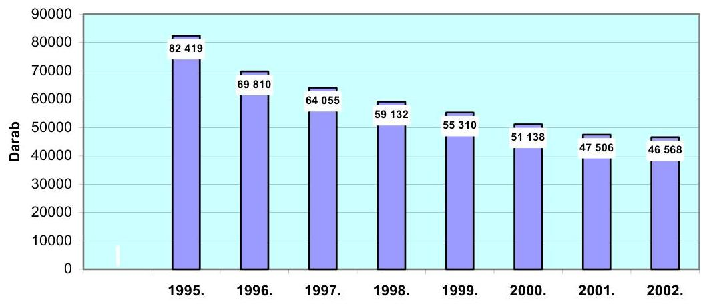

---

A vizsgált önkormányzatok lakásállománya 1996-2000 között az országossal azonos mértékben csökkent. A 2000. év végi állomány 51138 db volt, ami az 1995. évi 82419 db-nak szintén a 62\%-a. Öt év alatt a 32515 db-os csökkenéssel (eladás, bontás, más célra történő felhasználás) szemben a vásárolt, épített, kialakított lakások száma mindössze 1234 db-ot tett ki.

A vizsgált önkormányzatok lakásállományának változása
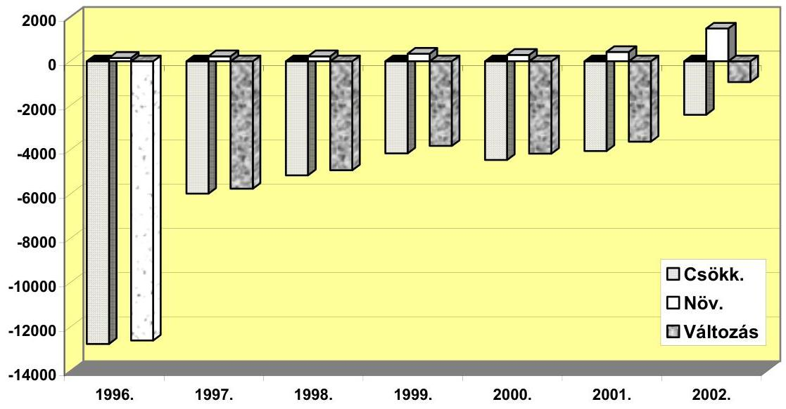

A csökkenés mértéke a budapesti kerületi önkormányzatoknál az átlagosnál valamivel nagyobb volt, míg a 10 ezernél kisebb lélekszámú városokban, nagyközségekben, községekben az átlagosnál kisebb. Ez utóbbit az magyarázza, hogy a kistelepüléseken a bérlakás-állomány nem jelentős, elsősorban szolgálati lakásokból áll (a 20 érintett településből 14-nél 20 db alatt volt).

A vizsgált önkormányzatok lakásállományának változását az 1. számú melléklet mutatja be.

A vizsgált körben az önkormányzati lakások aránya az 1995. évi 11,8\%-ról 2000. év végére 7,2\%-ra esett vissza. (Az országosnál magasabb részarány arra vezethető vissza, hogy a vizsgált minta $27 \%$-át teszik ki a jelentősebb bérlakásállománnyal rendelkező főváros, illetve megyeszékhely városok önkormányzatai.) Településtípusonként jelentősek az eltérések:

| Településtípus | Ellenőrzött ön-   kormányzatok   száma | Önkormányzati lakásállo-   mány aránya, \% |  |
| :-- | :--: | :--: | :--: |
|  |  | $\mathbf{1 9 9 5 .}$ | $\mathbf{2 0 0 0 .}$ |
| Főváros | 8 | 17,5 | 10,5 |
| Megyeszékhelyek | 5 | 8,0 | 5,7 |
| Városok 10 ezer fő fölött | 15 | 7,8 | 4,0 |
| Városok 10 ezer fő alatt | 10 | 3,2 | 2,1 |
| Községek | 10 | 1,0 | 0,8 |
| Összesen | $\mathbf{4 8}$ | $\mathbf{1 1 , 8}$ | $\mathbf{7 , 2}$ |

---

Az önkormányzati lakásállomány részarányának csökkenésében - a lakáseladások mellett - szerepe volt annak is, hogy az újonnan épült lakásokból az önkormányzatok részesedése folyamatosan elmaradt a lakásállományból való részesedésüktől. Míg az önkormányzati lakások aránya $11,8 \%$ és $7,2 \%$ között alakult, addig a településeken megépült összes lakásnak az önkormányzatok által épített és az egyéb nem lakáscélú ingatlanokból kialakított lakások (számuk együttesen 492 db volt) aránya csak 1,5-$4,8 \%$-ot tett ki. A megvásárolt lakások száma ( 742 db ) ennél jelentősebb volt, de az együttes növekedés is elmaradt a természetes személyek és az egyéb szervezetek által épített lakások növekedésének ütemétől.

Az üresen álló önkormányzati lakások száma 1400-1700 db között alakult, ami a lakások 2,1-3\%-át jelentette. A kisebb városokban, községekben - összesen 16 településen - nem volt üresen álló lakás, mivel megüresedés esetén ezeket szinte azonnal újból kiadják. A nagyvárosok, megyeszékhelyek mindig tartanak fenn - a lakásállomány 0,5-1\%-át kitevő - üres lakásokat az esetleg előadódó szükséghelyzetre való tekintettel.

A helyszíni vizsgálatok tapasztalata szerint az üres lakások mintegy fele felújításra váró, felújítás alatt lévő, illetve éppen kiadásra váró lakás. Az üres lakással rendelkező 32 település egyharmadánál található bontásra váró, rossz műszaki állapotú lakás, ami sokszor a lakók nem megfelelő életvitele miatt vált használhatatlanná.

Miskolcon a ténylegesnél több üres lakást tartottak nyilván, mivel 93 lebontott lakásnak az állományból való kivezetése még nem történt meg.

# 1.2. A lakásépítési program hatása a vizsgált önkormányzatok lakásállományára 2001-2002. évben 

A lakásépítési program keretében országosan 2002. év végéig elkészült 3154 db lakás $44 \%$-át a vizsgált önkormányzatok építtették.

A vizsgált önkormányzatoknál a lakásépítési program hatása 2001ben még nem érvényesült, a lakásállomány az év elejéhez viszonyítva - hasonlóan az országos állománycsökkenéshez, amely $6,2 \%$-os volt - további 7,1\%-kal csökkent. Az éves 4053 db-os lakáscsökkenéssel szemben - melynek több mint kétharmada volt a lakáseladás - mindössze 421 db volt a növekedés, tehát alig haladta meg a csökkenések 10\%-át. A növekedés $37 \%$-át adta a program keretében elkészült 156 lakás.

A bérlakás építési program hatása 2002-ben vált érezhetővé, ami egyrészt az épített, vásárolt és kialakított lakások számának növekedésében, másrészt az eladásoknak az előző évhez viszonyított $45 \%$-os csökkenésében mutatkozott meg. Ez összhangban volt az önkormányzatok - pályázatokhoz csatolt lakásépítési koncepcióival, amelyek általában a lakásállomány növelését, illetve stabilizálását tűzték ki célul (lásd részletesebben a 4.2. pontban).

A vizsgált önkormányzatoknál összességében - a fővárosi kerületi önkormányzatok lakásállományának 58\%-os részaránya miatt - még mindig csökkent a lakásállomány.

---

A vizsgált önkormányzatok lakásállományának változása 2002-ben (lakásszám, Db)
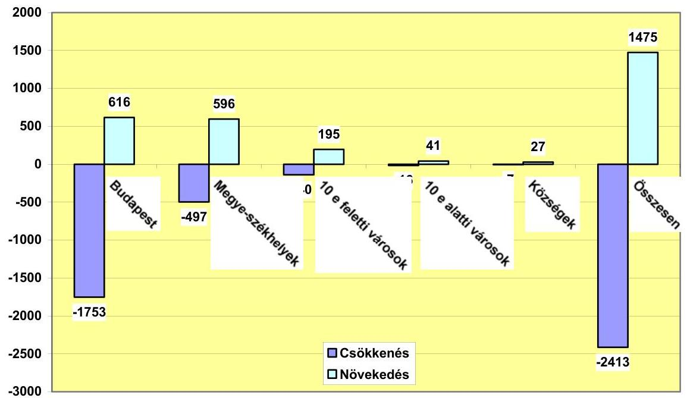

Az átadott 1475 db lakás száma ugyan közel 20\%-kal meghaladta az 19962000. évek között létesített önkormányzati lakások számát, az eladott lakások száma ( 1565 db ) pedig csak egyharmada volt az 1996-2000. évek közötti éves átlagos eladásnak, de összességében mégis meghaladta az átadott lakások számát. Budapest kivételével a vizsgált valamennyi településkategóriánál ebben az évben először nőtt a lakásállomány. A budapesti kerületi önkormányzatoknál tapasztalható ellentétes tendencia egyrészt annak a következménye, hogy Budapesten az épített, vásárolt és kialakított lakások aránya a teljes önkormányzati lakásállományhoz viszonyítva kisebb volt, mint a többi városban (míg Budapesten ez az arány 2,3\%, a 10 ezer fő́́él nagyobb és a megyeszékhely városokban 4,1-4,2\% volt), másrészt az összes lakáseladás $82 \%$-ára Budapesten került sor.

A vizsgált fővároson kívüli településeken összességében jelentősen nőtt az önkormányzatok által épített és kialakított lakások aránya a felépített összes lakáson belül. Míg a vizsgált időszak korábbi éveiben ezek legnagyobb aránya 1999-ben volt 4,8\%-kal, addig 2002-ben a vidéken épülő lakások közel egyhatodát ( $16,3 \%$-át) építették az önkormányzatok. A vizsgált önkormányzatoknál a 2002. év során átadott 1475 db önkormányzati lakás $84 \%$-a, 1238 db lakás épült meg a lakásépítési program keretében.

A vizsgált önkormányzatok 2002. évi lakásállományát, az önkormányzati lakások változásának 1996-2002. évi adatait az 5. számú melléklet mutatja be.

---

A lakásépítési program hatására gyakorlatilag nem változott a lakások szobaszám szerinti megoszlása. Mindkét évben a lakásállomány közel felét tették ki az egyszobás, egynegyedét a kétszobás lakások. A másfélszobás lakások részesedése $15 \%$-os, a kétszobásnál nagyobbaké pedig $10 \%$-os volt. A változás mindössze annyi volt, hogy fél százalékkal csökkent az egyszobás lakások aránya, és szinte ugyanilyen mértékben ( $0,6 \%$-kal) nőtt a másfélszobás lakásoké.

Jelentősebben változott a két év alatt a lakások komfortfokozat szerinti összetétele. 2000-ben az állomány egy-egy harmadát tették ki az összkomfortos, komfortos, valamint az ennél alacsonyabb komfortfokozatú lakások. 2002-re valamennyi településtípusnál nőtt az összkomfortos lakások aránya, összességében $34,6 \%$-ról $37,7 \%$-ra. A felépült lakások - egy-két esetet kivéve összkomfortosak. Ezzel egyidejúleg csökkent a komfort nélküli lakások aránya, együttesen 21,9\%-ról 17,5\%-ra. Kedvezőtlennek mondható, hogy nem csökkent $-2,7 \%$-ot tett ki - a szükséglakások aránya.

Az üresen álló lakások aránya ebben a két évben 3\%-ról 4,4\%-ra nőtt. Az ideiglenesen megüresedett lakások számának növekedése a korábbi indokokon kívül (szükséghelyzet, felújításra váró, felújítás alatt lévő, kiadásra váró) arra is visszavezethető, hogy az új lakások megépítésével, a többlépcsős lakáscserék következtében elhúzódott a lakások bérlőinek a kiválasztása.

Budapest IV. kerületi önkormányzatánál a 220 üresen álló lakásból a 175 újonnan épített, költségalapú bérlakás bérlőinek kiválasztása 2003-ra áthúzódott.

Ózdon - a korábbi bontásokat követően 2002-ben - 21 db üres lakás olyan telepszerű területen helyezkedik el, melyekre a helyszíni tapasztalatok szerint a lakosság részéről nincs igény.

Egyek nagyközségben 2002. év végén a 26 önkormányzati lakás fele állt üresen. A program keretében megvásárolt 12 lakás felújítását 2002. decemberére fejezték be, ebből 8 lakás bérlőjének kiválasztása 2003-ra húzódott át.

A vizsgált önkormányzatok lakásállományának megoszlását szobaszám és komfortfokozat szerint a 2. számú melléklet mutatja be.

# 2. A BÉrLAKÁsÁLLOMÁNY BEVÉTELEI És KIADÁSAI 

### 2.1. A lakbérbevételek alakulása

A vizsgált önkormányzatoknál 2002-ben 2661 millió Ft volt az előírt lakbér, - a lakásállomány 21,2\%-os csökkenése mellett - 53,8\%-kal több, mint 1998-ban. A bevételi előírás növekedési ütemében - a lakások átlagos komfortfokozatának javulása mellett - a lakbérek emelkedése volt meghatározó: az egy lakásra jutó előírt lakbér éves összege a vizsgált időszakban 95,3\%-kal 29260 Ft-ról 57151 Ft-ra nőtt.

Az alaplakbérek az elmúlt 5 évben településenként változóan 22\%-tól 3-4szeres mértékéig növekedtek. A 2002-ben alkalmazott alaplakbéreket a következő táblázat szemlélteti:

---

| Megnevezés | Lakbér $\mathrm{Ft} / \mathrm{m}^{2} /$ hó |  |
| :-- | --: | --: |
|  | Komfortos | Összkomfortos |
| Központi fekvésú lakások |  |  |
| Budapest | $60-130$ | $71-190$ |
| Megyeszékhelyek | $113-238$ | $113-238$ |
| 10 ezer főnél nagyobb városok | $60-180$ | $65-230$ |
| 10 ezer főnél kisebb városok | $15-161$ | $20-179$ |
| Községek | $28-140$ | $92-200$ |
| Lakótelepi lakások |  |  |
| Budapest | $70-130$ | $88-190$ |
| Megyeszékhelyek | $92-218$ | $103-218$ |
| 10 ezer főnél nagyobb városok | $60-195$ | $65-230$ |
| 10 ezer főnél kisebb városok | $54-110$ | $66-150$ |

Az önkormányzati rendeletek az $1 \mathrm{~m}^{2}$-re meghatározott alaplakbéreket különböző korrekciós tényezőkkel - pl. a lakás épületen belüli fekvése (földszint, legfelső szint), a lakás műszaki állapota (felújított, vizes, gombásodó, stb.), van-e közlekedő helyiség, kert, milyen a fürdőszoba (kád, zuhanyzó) - módosítják.

A vizsgált önkormányzatoknál az előírt lakbér 96\%-a, 2553 ezer Ft folyt be 2002-ben, ami 71\%-kal haladta meg az 1998. évit. E növekedés meghaladta az elöírt lakbér 54\%-os növekedési ütemét, ami annak tudható be, hogy javult a lakbérfizetési fegyelem. Ennek következtében az elöírt lakbérhez viszonyítva 52-ről 40\%-ra csökkent átlagosan a lakbérhátralék aránya.

| Év | A befolyt lakbér | Hátralék |
| :--: | :--: | :--: |
|  | az elöirt lakbér \%-ában |  |
| 1998. | 86,2 | 52,2 |
| 1999. | 95,5 | 50,0 |
| 2000. | 96,7 | 45,7 |
| 2001. | 94,1 | 43,6 |
| 2002. | 95,9 | 40,3 |

A lakbérhátralék arányában és alakulásában településtípusonként jelentős eltérések tapasztalhatók. A budapesti kerületi önkormányzatoknál a hátralék aránya kisebb, 34-40\%-os ugyan, de annak csökkenése nem folyamatos. A megyeszékhely és a 10 ezer főnél nagyobb városoknál - a jelentős (összesen 27, illetve $15 \%$-os) és folyamatos csökkenés ellenére - az átlagosnál lényegesen magasabb volt a hátralék aránya. A 10 ezer főnél kisebb városokban a hátralék arányának $11 \%$-ról $26 \%$-ra való növekedése, a községekben pedig $10 \%$ körüli stagnálása tapasztalható.

A lakbérhátralék csökkentésében az önkormányzatok hatékonyabb behajtási tevékenységének is szerepe volt. 15 vizsgált önkormányzatnál indítottak bírósági eljárást (pl. a Fővárosi Önkormányzatnál 253 peres eljárás van folyamatban, Kisvárdán a vizsgált időszakban 72 bírósági eljárás fejeződött be, Hajdúnánáson 28 jogerős bírósági ítélet született) a hátralék behajtása,

---

illetve a bérleti szerződés felbontása céljából. A jogcím nélküli lakókkal szemben 7 önkormányzat élt a kilakoltatás eszközével is.

Kaposváron az elmúlt négy évben 88 lakót költöztettek ki, Békéscsabán évenként 2-10 esetben fordult elő kényszer lakáskiürítés, Kisvárdán 14 esetben került sor kiköltöztetésre, Orosházán 2001-2002-ben 10 családot lakoltattak ki.

Ugyancsak 7 önkormányzatnál mondtak fel bérleti szerződéseket, és 10-nél éltek a fizetési meghagyás, illetve a bírósági letiltás eszközével. Felszólítást - a lakbérhátralékkal nem rendelkező 5 önkormányzat kivételével - valamennyi önkormányzat rendszeresen küld a tartozóknak, ezek hatása azonban nem jelentős.

Nyíregyházán az 1998. évi lakbérhátralék összege 18\%-kal nőtt 2002. év végére, ugyanakkor mértéke - a korábbi 158\%-ról - az éves lakbér előirányzat 64\%-ára csökkent. A fizetési hajlandóság javulása a Piac és Vagyonkezelő Kft. behajtással kapcsolatos intézkedéseinek köszönhető. A Kft 2002-ben

- 402 felszólítást küldött ki;
- 168 bérlővel kötött megállapodást a hátralék részletekben történő megfizetésére;
- 105 bérlő esetében kezdeményezte a bérleti jogviszony felmondását;
- 41 fizetési meghagyást adtak ki, és 119 esetben került sor végrehajtási lap kiállítására;
- 82 bírósági per nyomán 41 jogerős ítélet született, aminek alapján a bérlők jogcím nélküli lakókká váltak.

A hátralékok behajtása érdekében tett lépések komoly munkaerő- és időráfordítást igényelnek, de az önkormányzatok tapasztalatai alapján a többi bérlőt is a pontos fizetésre ösztönzik.

Több önkormányzatnál (Békéscsaba, Orosháza, Szarvas) az eladósodott családokat alacsonyabb komfortfokozatú, vagy kisebb lakásokba költöztetik. Ezzel általában a meglévő tartozás nem térül meg az önkormányzatnak, de az önkormányzatok tapasztalata szerint a család inkább képes a kisebb összegű lakbér jövőbeni fizetésére.

# 2.2. A múködtetésre és felújításra fordított kiadások és azok forrásai 

Az 1998-2002 közötti öt év alatt a vizsgált önkormányzatoknál a lakások fenntartására 35406 millió Ft-ot fordítottak, ennek 85\%-át működtetésre, 15\%-át pedig felújításra. Az ezen időszak alatt befolyt 10263 millió Ft lakbérbevétel átlagosan a bérlakásokkal kapcsolatos kiadásoknak csak valamivel több mint egynegyedét fedezte. Kedvező tendencia, hogy az öt év során a lakbérek a kiadások növekvő hányadát - 1998-ban 22,8\%-át, 2002-ben pedig már $32 \%$-át - fedezték, mivel a lakbérbevétel - annak nagyobb ütemű emelésének, valamint az eredményesebb behajtási tevékenységnek köszönhetően - majdnem kétszer olyan gyorsan nőtt (117,4\%-kal), mint a lakásokra fajlagosan fordított kiadások ( $60,4 \%$-kal). (Az egy lakásra jutó bevételek és kiadások alakulását lásd a 3/a-3/b. számú mellékletekben.)

---

A lakásokra fordított kiadások forrásainak megoszlása a vizsgált önkormányzatoknál, \%
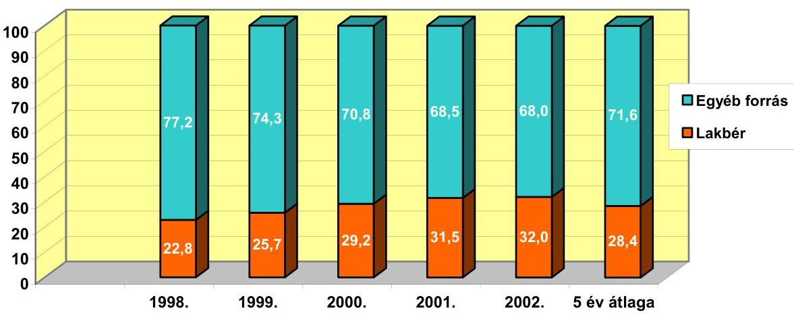

Az átlagos adatok mögött településtípusonként különböző tendenciák figyelhetők meg. Míg a budapesti kerületekben a kiadásoknak a lakbérbevételek csak 22,8\%-át fedezték, a megyeszékhelyeken ez az arány $43,5 \%$, a többi településen pedig meghaladta az 50\%-ot. Bár Budapesten növekedett a legnagyobb mértékben az egy lakásra jutó előírt éves lakbér (2002-ben 107\%-kal volt magasabb, mint 1998-ban), az még a működtetési kiadásoknak is csak 30\%-át fedezi. A fővároshoz hasonlóan - Kaposvár kivételével - a vizsgált megyeszékhelyeken sem elegendő a lakbér a múködési kiadásokra.
Összesen 23 önkormányzat volt kénytelen a működtetési kiadások finanszírozásához más forrást is bevonni. Ezek közül 10 önkormányzat a nem lakáscélú helyiségek bérleti díjából, 13 pedig más forrásból pótolta a hiányzó összeget. 21 önkormányzatnál a lakbérbevétel fedezte ezeket a kiadásokat, 4 önkormányzat nem mutatott ki számviteli nyilvántartásában múködtetési kiadást. Ez elsősorban a kis településekre jellemző, ahol nem tartanak fenn külön szervezetet a lakások múködtetésére, s emellett a kiadásoknak a számviteli nyilvántartásokban történő pontos elkülönítése sem megoldott.

Az egy lakásra jutó múködtetési kiadások átlagosan az 1998. évi 89,9 ezer Ft-ról 2002-re 140,4 ezer Ft-ra (156,2\%-ra) nőttek a vizsgált önkormányzatoknál összességében. A növekedés Budapesten és a 10 ezer főnél nagyobb városokban volt a legnagyobb (171-172\%), ám míg előbbinél 2002-ben lakásonként 183 ezer Ft-ot fordítottak múködésre, addig utóbbiaknál ennek csak alig több, mint negyedét, de a megyeszékhelyeken is csak 53\%-át, a kisebb településeken pedig mindössze 12\%-át. A kisebb városokban 50,9\%-kal, a megyeszékhelyeken csak $28,9 \%$-kal nőttek a múködési kiadások, a községekben ugyanakkor csökkentek.

Míg a fővárosban és a megyeszékhelyeken, nagyobb városokban a működtetéssel járó kiadások a meghatározóak, addig a kisebb településeken a felújítási kiadások. A budapesti és a megyeszékhely önkormányzatokra öt év átlagában egyaránt 15\%-os felújítási hányad jellemző. Ez azonban egy lakásra vetítve a fővárosi 32,3 ezer Ft-tal szemben a megyeszékhelyeken átlagosan csak 15,1 ezer Ft-ot tesz ki. A 10 ezer főnél kisebb városokban és a községekben lényegesen

---

nagyobb a felújításokra fordított hányad (40-58\%), és az egy lakásra fordított felújítási kiadások is magasabbak voltak, mint a nagyobb városokban. E települések átlagosan elérték (az időszak elején többszörösen meghaladták, a végén azonban kétharmadát tették ki) a fővárosi fajlagos felújítási kiadásokat.

Egy lakásra jutó kiadások alakulása 2002-ben
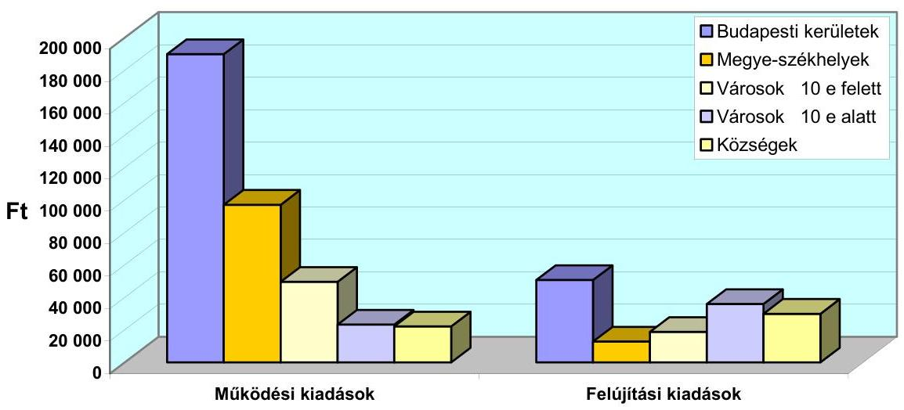

A felújítási kiadások öt éven belüli dinamikáját vizsgálva igen jelentősek az eltérések. Budapesten 2002-ben - a lakásállomány rosszabb állapota és a magasabb kivitelezési költségek miatt - három és félszer költöttek többet egy lakás felújítására, mint 1998-ban. A megyeszékhelyeken ugyanakkor az egy lakásra jutó felújítási kiadás a felére csökkent ugyanebben az időszakban, mivel csak a legszükségesebb felújításokat végzik el. A többi településen a tárgyévi igényeknek megfelelően költöttek erre a célra. A vizsgált önkormányzatoknál a felújításra fordított pénzeszközök nagyságrendje azt mutatja, hogy nem tervszerú a felújítási tevékenység, a lakásállomány múszaki állapotának szinten tartása érdekében mindig csak a legszükségesebb munkák elvégzésére került sor.

A felújítások alapvető forrása a lakások értékesítéséből befolyt bevétel volt, amiből 4 milliárd Ft-ot - az összes felújítási kiadás 78,9\%-át - fordított a vizsgált önkormányzatok 35\%-a felújításokra. 7 kisebb település a lakbérből fedezte a felújításokat is, egyéb forrást - többek között nem lakáscélú helyiségek bérleti díját - 11 település használt fel.

Nem költöttek felújításra 11 önkormányzatnál az elmúlt öt évben, ezek között négy város (Szarvas, Hajdúnánás, Ibrány és Dabas) is található.

---

# 3. A BÉrLAKÁSOK ELIDEGENÍTÉSÉbÔL SZÁRMAZÓ BEVÉTELEK KEZELÉSE ÉS FELHASZNÁLÁSA 

### 3.1. A bevételek kezelése és felhasználása

A lakástörvény 62. §-a alapján az önkormányzat köteles a tulajdonába került lakások elidegenítéséből származó - 1994. március 31. napját követően befolyó, az elidegenítéshez kapcsolódó kiadásokkal csökkentett - teljes bevételét elkülönített számlán elhelyezni, és felhasználásának szabályait az önkormányzat rendeletében meghatározni. Nem vonatkozik ez a kötelezettség azokra a községi önkormányzatokra, amelyek tulajdonában lévő lakások száma nem haladja meg a 20-at. Az előírás célja a többi bevételtől való elkülönítéssel a vagyonfelélés elkerülése, a nyomon követhető felhasználás, a meglévő bérla-kás-állomány felújításához vagy megújításához forrás biztosítása. Az elkülönített számla megnyitására a vizsgált 48 önkormányzatból 38 volt kötelezett, de a számla megnyitásáról csak 30 önkormányzat intézkedett, és a számla bevételeinek felhasználását csak ezek egyharmada szabályozta.

A számla megnyitási kötelezettségének 8 városi önkormányzat nem tett eleget; a vizsgált községi önkormányzatok közül a lakásszám egyik helyen sem haladta meg a 20-at. Az elkülönített számlát megnyitó 30 önkormányzat közül 4 semmilyen forgalmat nem bonyolított le a számlán, a lakáseladásokból származó bevételek - szabálytalanul - a költségvetési elszámolási számlájukra folytak be.

Az analitikus nyilvántartások alapján valamennyi önkormányzatnál megállapítható volt a lakásértékesítésből befolyt bevétel, illetve annak felhasználása. Az analitika és az elkülönített lakásszámlák egyenlegének egyeztetése alapján megállapítható, hogy a számlát vezető önkormányzatoknak is csak a fele (14 önkormányzat) tartja az elkülönített számlán a pénzt. (További 3 önkormányzat pedig a befolyt összeget már teljes egészében elköltötte.)

Az elkülönített számla nyitására kötelezett önkormányzatok 37\%ánál nem állt rendelkezésre e számlán az analitikában kimutatott egyenleg. A 2002. december 31-én hiányzó összeg 2718 millió Ft, amiből öt önkormányzatnál 1894 millió Ft közvetlenül a költségvetési elszámolási számlákra került, mert az önkormányzat nem rendelkezik elkülönített számlával, illetve meglévő számláját nem használja. További 576 millió Ft-ot (hat önkormányzatnál) ugyan az elkülönített számlákra fizettek be, de azt a kiskincstári rendszer keretében azonnal átutalták a költségvetési elszámolási számlákra és bevonták a napi gazdálkodásba. A fennmaradó 248 millió Ft-ért három önkormányzat (Békéscsaba, Gödöllő és Orosháza) a kedvezőbb kamat elérése érdekében befektetési jegyeket, illetve kincstárjegyeket vásárolt. Négy önkormányzatnak 204 millió Ft-os többlete van: az analitikus nyilvántartások szerint a teljes rendelkezésre álló összeget felhasználták, de az elkülönített számlájukon még van pénz.

---

A számlavezetésre kötelezett önkormányzatoknál a lakások értékesítéséből származó bevételek 1998-2002. között 19307 millió Ft-ot, az időszak nyitóegyenlegével együtt 22963 millió Ft-ot tettek ki.

A bevételek - amelyek az adott évben eladott lakások utáni első befizetéseket, valamint a korábbi években (beleértve a tanácsok idején) eladott lakások törlesztő részleteit, továbbá az elkülönített számlán lévő, illetve a lekötött összegek után kapott kamatbevételeket is tartalmazzák - évente 3380 és 4550 millió Ft között alakultak.

A lakástörvény 63. §-a rendelkezik arról, hogy a fővárosi kerületi önkormányzat a lakások elidegenítéséből származó - törvény által meghatározott kiadásokkal csökkentett - bevételének 50\%-át a fővárosi közgyűlés számláját vezető pénzintézethez, elkülönített számlára köteles befizetni annak érdekében, hogy az így létrehozott alapból a kerületi önkormányzatok felújítási, rehabilitációs munkáit időről-időre pályázati úton támogatni lehessen. Ennek megfelelően a vizsgálatba bevont kerületi önkormányzatoknak 5229 millió Ft befizetési kötelezettségük volt, aminek azonban csak a 8,5\%-át (445 millió Ft-ot) utalták át a fővárosi önkormányzat számlájára.

# A 23 fóvárosi kerületi önkormányzat közül összesen öt teljesítette 

mind az 5 évben befizetési kötelezettségét, nyolc részben tett ennek eleget, 10 pedig egyáltalán nem fizetett. A vizsgált hét fővárosi kerületi önkormányzat közül befizetési kötelezettségének az elmúlt 5 évben csak a IX. kerületi önkormányzat tett eleget.

A fővárosi önkormányzat kimutatása szerint számlájára 1998-2002. között a kerületi önkormányzatok 3169 millió Ft-ot fizetettek be, ugyanakkor 5146 millió Ft támogatást ítéltek meg számukra, melyből ebben az időszakban 2819 millió Ft-ot utaltak át.

A fővárosi önkormányzatok befizetési kötelezettségének teljesítése esetén a számlavezetésre kötelezett vizsgált önkormányzatok összesen jogosan 17734 millió Ft-ot - nyitóegyenleggel növelt bevétel csökkentve a fővárosnak járó kerületi befizetésekkel (22 963-5229 millió Ft) - használhattak volna fel. A nem teljesített befizetések miatt a lakásértékesítésből ténylegesen rendelkezésre álló összeg azonban ennél magasabb, 22518 millió Ft volt. Ebből a törvény szerinti lakáscélú felhasználás 16704 millió Ft (ennek közel 24\%-át, 3968 millió Ft-ot az önkormányzati lakások felújítására fordították), az egyéb kiadás (banköltség, hátralék behajtás költsége) 805 millió Ft volt. A felhasználás figyelembevételével 5009 millió Ft a záróegyenleg, ennek azonban - a fentiekben jelzett többlettel együtt és a leírt szabálytalanságok következtében - csak közel a fele, 2495 millió Ft volt ténylegesen az elkülönített lakásszámlán. A hiányzó 2718 millió Ft egészének visszapótlása nem minden önkormányzatnál látszik biztosítottnak.

Budapest XXI. kerületi önkormányzatánál a hiányzó összeg 1358 millió Ft, a IV. kerületi önkormányzatnál 423 millió Ft. Több mint 100 millió Ft hiányzik Budapest VI. kerületi, a nyíregyházi, a sátoraljaújhelyi és a váci önkormányzatoknál.
1999. január 1-től a lakástörvény - lakáscélú felhasználásként e forrás terhére lehetővé tette a lakóövezetbe sorolt területek közművesítését, építési telkek ki-

---

alakítását, lakásépítési és lakásvásárlási támogatás nyújtását is. Erre a célra a felújításokon felül fennmaradó részből az önkormányzatok mintegy 2000 millió Ft-ot fordítottak. A további 10736 millió Ft-ot az önkormányzatok lakások vásárlására, építésére, illetve kialakítására fordították.

A vizsgálat három önkormányzatnál tapasztalt a törvényben meghatározott céloktól eltérő felhasználást.

Budapest Főváros XXI. kerületi önkormányzata 77\%-ban a lakástörvényben meghatározott célokra használta lakásalapját. Más célra - többek között irodahelyiségek vásárlására - 150 millió Ft-ot fordított.

Sátoraljaújhely Város Önkormányzata a 36 millió Ft-ot kitevő lakáscélú felhasználáson kívül 123 millió Ft-ot fordított különböző nem lakáscélú fejlesztési kiadások finanszírozására, melyek fedezeteként zárszámadási rendeletében is a lakásszámlát tüntette fel.

Békéscsaba Megyei jogú Város Önkormányzatánál az adósságkezelési programhoz kapcsolódóan a bérlők elmaradt rezsi számláit fizették ki 8,8 millió Ft - a felhasználás $1 \%$-át kitevő - összegben.

A helyszíni ellenőrzés egy esetben állapította meg a lakásalap számlán lévő pénznek olyan felhasználását, illetve kezelését, ami ugyan a tételes jogszabályokba nem ütközik, de a lakástörvény szellemével mindenképpen ellentétes volt.

Debrecen Megyei Jogú Város Önkormányzata a Malom-köz rendezése során a saját telektulajdoni részéhez az OTP tulajdonrészét is megvásárolta a lakásalap terhére 160 millió Ft-ért, majd telekrendezést hajtott végre. A kialakított telkeket 300 millió Ft-ért eladta. A bevétel a költségvetési elszámolási számlára befolyt, de a lakásalap számlára nem pótolta vissza az onnan kifizetett 160 millió Ft-ot.

# 3.2. A lakásvagyon elidegenítéséből származó követelések alakulása 

A lakásvagyon elidegenítéséből származó követelésállomány 2002. év végén 14,3 milliárd Ft volt a vizsgált önkormányzatoknál. A követelésállomány $71,5 \%$-át, 10,2 milliárd Ft-ot a fővárosi kerületi önkormányzatoknál tartják nyilván, $22 \%$ ( 3,1 milliárd Ft) a megyeszékhelyeken lévő követelésállomány, a többi vizsgált 26 városban összesen nem éri el az 1 milliárd Ft-ot.

Ez utóbbiból négy városban (Gödöllő, Kazincbarcika, Orosháza, Vác) haladja meg a követelésállomány a 100 millió Ft-ot, kilenc városban pedig 10-40 millió Ft közé esik.

Komolyabb fejlesztési forrást tehát gyakorlatilag a fővárosi kerületi önkormányzatok, a megyeszékhelyek és a fenti települések követelésállománya jelenthetne. Mivel azonban ezek visszafizetése akár 15-20 évre is elhúzódik, így a nagyobb saját forrást igénylő lakásépítések helyett a felújítások finanszírozását segítheti.

---

A törlesztő részletek rendszertelen fizetéséből keletkezett hátralék összege nem jelentős, és az elmúlt években nem is változott számottevően, 198-209 millió Ft-ot tett ki, ez 2002-ben a követelésállomány 1,4\%-a volt. A hátralékosok száma 2002. év végére az 1998. évi 54\%-ára csökkent, az egy hátralékosra eső összeg ugyanakkor $58 \%$-kal, átlagosan 18,3 ezer Ft-ra nőtt, ami arra utal, hogy a nagyobb összeggel tartozók hátraléka tovább halmozódik.

Jelentősebb a hátralék Budapest XI. kerületében, ahol annak egy hátralékosra jutó összege meghaladta a 60 ezer Ft-ot, Nyírbátorban 58,9 ezer Ft, Szarvason 79,7 ezer Ft volt, 30 ezer Ft felett volt Budapest XIII. és XXI. kerületében, valamint Békéscsabán.

# 4. AZ ÖNKORMÁNYZATOK LAKÁSGAZDÁLKODÁSÁNAK SZABÁLYOZOTTSÁGA, TERVSZERŰSÉGE 

### 4.1. A bérlakásokkal kapcsolatos szabályozási, múködtetési feladatok ellátása

A vizsgált önkormányzatok a lakástörvényben előírt rendeletalkotási kötelezettségüknek eleget tettek. Valamennyi rendeletalkotásra kötelezett önkormányzat szabályozta a lakások elidegenítésének és bérbeadásának szabályait, valamint a lakbérek mértékét. A budapesti kerületi önkormányzatok és a nagyvárosok általában külön-külön rendeletet alkottak, a kisebbek ezt általában egy rendeletbe vonták össze. A lakásbérletre vonatkozó rendeletek a törvénynek megfelelően tartalmazzák a lakásbérlet létrejöttére, a lakásbérleti jog folytatására, a felek jogaira és kötelezettségeire, valamint a lakásbérlet megszüntetésére vonatkozó előírásokat.

A vizsgált időszakban egyre több önkormányzat (a vizsgált önkormányzatok mintegy fele) tért át a szociális lakások bérlőinek pályázat útján történő kiválasztására. Kétféle gyakorlat alakult ki: van ahol megmaradt a lakást igénylők nyilvántartása, és a nyilvántartásban szereplők pályázhatnak, másutt pedig a nyilvántartásokat is megszüntették, és gyakorlatilag bárki beadhat pályázatot.

A hatályban lévő rendeletek úgy készültek, hogy az abban foglaltak a támogatás keretében épülő szociális lakások bérbeadásánál is alkalmazhatók. Öt önkormányzatnál kellett erre való tekintettel a rendeletet kiegészíteni. A költségalapú bérbeadásra vonatkozó szabályozással 15 önkormányzat egészítette ki korábbi rendeletét.

A lakástörvény nem tette kötelezővé az önkormányzati rendelet megalkotását a községi önkormányzatoknak abban az esetben, ha az önkormányzat lakásállománya nem haladta meg a 20 db -ot, ennek ellenére a vizsgált községi önkormányzatok közül 4 rendelkezett már korábban is a lakások bérletére vonatkozó rendelettel. A pályázati feltételek ugyanakkor valamennyi pályázó önkormányzat számára előírták a lakások bérletéről és elidegenítéséről szóló rendeletet. Ennek alapján még azok a települések is elkészítették rendeletüket, amelyek csak idősek otthonára nyújtottak be pályázatot (pl. Szendrőlád, Hosszúpályi, Hetes).

---

A bérlő kiválasztási jogot a nagyobb településeken a képviselő-testületek bizottságai, a kisebb városi, községi önkormányzatoknál a képviselő-testületek gyakorolják. E döntések után kötik meg az üzemeltetők a bérlőkkel a szerződéseket.

A lakások múködtetési, üzemeltetési feladatait az önkormányzatok 36\%-ánál az e célra létrehozott gazdasági társaságok látják el (fővárosi kerületek és a nagyobb városok), 14\%-nál az önkormányzat intézménye végzi a múködtetéssel, fenntartással kapcsolatos feladatokat, az önkormányzatok felénél - jellemzően a kisebb önkormányzatoknál - pedig külön szervezetet e célra nem hoztak létre, a feladatot a polgármesteri hivatal szervezeti egységei látják el. Az önkormányzatok az üzemeltetőket csak a testületeken keresztül, az éves beszámoltatással ellenőrzik.

A lakbértámogatás formáját, mértékét az önkormányzatok háromnegyede szabályozta, a többi önkormányzatnál a lakbérek alacsony mértéke mellett már nem tartják indokoltnak a bérlők további támogatását, illetve a rászorulókat a szociális ellátás keretében, lakásfenntartási támogatás formájában segítik.

# 4.2. A pályázatokhoz benyújtott lakáskoncepciók jellemzői 

Az önkormányzatok 80\%-a a lakásépítési program megindítása előtt nem rendelkezett lakáskoncepcióval. A megyeszékhelyeken kívül csak néhány város (Orosháza, Sarkad, Ózd, Dabas, Vác) készített koncepciót. Az önkormányzatok többsége támogatások nélkül, saját forrás hiányában nem tervezett fejlesztéseket, ezért a lakásgazdálkodással kapcsolatos célkitűzéseit sem fogalmazta meg sem önálló koncepció, sem gazdasági programja keretében. Ebben meg lehetett volna határozni a lakásgazdálkodás céljait és körvonalazni a beavatkozási lehetőségeket. A koncepciók megléte esetén - a bérlakás építési program megindításáig - valószínűleg kevesebb önkormányzatnál fordult volna elő a lakásszám folyamatos csökkenése, s nemcsak a programnak köszönhetően vált volna célkitűzéssé a lakások számának növelése.

A pályázat benyújtása előtt 38 önkormányzat készítette el lakáskoncepcióját. Ebből 14 a település lakáshelyzetének rövid értékelésén túl csak a lakásépítési program keretében megvalósítandó feladatokat határozta meg célként, a lakásgazdálkodással kapcsolatos egyéb főbb célkitűzéseket nem tartalmazta. Négy önkormányzatnál (Máriapócs, Szendrőlád, Hosszúpályi, Hetes) kizárólag az idősek otthonának megépítése szerepel célként. Volt olyan koncepció is, amely sem felépítésében, sem tartalmában nem felelt meg a pályázati feltételekben meghatározottaknak.

Balatonboglár Város Önkormányzata nem rendelkezett lakáskoncepcióval, ezért a pályázathoz a testület ciklusprogramját mellékelték. Ez azonban nem mutatja be a település lakáshelyzetét, nem határozza meg a lakáspolitika stratégiai céljait, nem foglalkozik lakásgazdálkodási kérdésekkel, az esetleges lakásállomány bővítésének szükségességével. A pályázat elbírálása során ezek pótlását az önkormányzattól nem kérték.

Túlzott terveket tartalmaz az 1724 lakosú Dédestapolcsány Község Önkormányzatának lakáskoncepciója. Stratégiai célként rögzíti a lakásigények felmérése

---

alapján - mivel a lakásigénylőkről nem vezetnek nyilvántartást - 95 lakás felépítését ( 15 db szociális, 30 db költségalapú bérlakás, 20 db garzonlakás, 30 lakrészes nyugdíjasház). Ezzel a településen az önkormányzati lakások aránya az országos átlag többszöröse lenne.

Az önkormányzatoknak csak a fele készített olyan koncepciót, amely a jelenlegi helyzet bemutatásán túl meghatározza a hosszabb távú célokat, valamint azok elérésének módját is.

A koncepciókban megfogalmazott célok közül

- az első lakáshoz jutás támogatását az önkormányzatok közel 60\%-a tartja legfontosabbnak. Ezt visszatérítendő, és vissza nem térítendő támogatások nyújtásával, kedvezményes árú telkek biztosításával kívánják megoldani;
- a szociális bérlakás állomány növelését az önkormányzatok fele tartja fontos, megvalósítandó feladatnak, melyhez szükségesnek látja a támogatási rendszer fenntartását;
- a meglévő lakásállomány minőségi és komfortfokozat szerinti javítását, a minőségi lakáscserék segítését, a költségalapú bérlakások állományának növelését, az állagmegóvási, felújítási munkák tervszerű elvégzését, a bérlakás állomány csökkenésének megállítását az önkormányzatok mintegy egyharmada kezeli kiemelten.

A felsorolt célokon kívül lényegesnek tartják még a tiszta tulajdonú lakóépületek kialakítását, az avult, gazdaságosan fel nem újítható lakóépületek felszámolását, nagyobb települések az átmeneti lakások számának növelését.

Néhány önkormányzatnál a lakáskoncepciójukkal ellentétes gyakorlat tapasztalható.

Budapest Főváros XI. kerületi önkormányzata 1999-ben elfogadott koncepciójában a bérlakás állomány csökkenésének megállítását határozta el, ennek ellenére négy év alatt 349 lakást adtak el, miközben a vásárolt és épített lakások száma csak 148 db .

Miskolc Megyei Jogú Város Önkormányzata már 1995-ben a lakásszám stabilizálását tartotta fontosnak, ugyanakkor az azóta eltelt időszakban 646 lakással többet adtak el, mint ahányat vásároltak, illetve építettek.

Sátoraljaújhely Város Önkormányzata is a lakásszám stabilizálását határozta el 2000. év végén, ennek ellenére 2001-2002-ben 60 db lakást adtak el, a lakásállomány $13 \%$-át, és csak 18 -at építettek.

A célok megvalósításához szükséges többletforrást az önkormányzatok különbözőképpen kívánják előteremteni. Az önkormányzatok egyhatoda a lakbérek jelentősebb emelését tervezi. Ettől azt várja, hogy e bevételek fedezzék a kiadásokat. Annak ellenére, hogy valamennyi vizsgált önkormányzat az elmúlt 5 évben növelte a lakbéreket (egyharmaduk legalább a duplájára, vagy azt meghaladó mértékben), azok - mint azt a 2.2. pontban bemutattuk a kiadásoknak csak valamivel több mint egynegyedére voltak elegendőek.

---

Néhány önkormányzat (jellemzően a Szabolcs-Szatmár-Bereg Megyében vizsgált önkormányzatok) a magán, illetve vállalkozói tőke bevonását tervezi a bérlakásépítésbe, de elképzeléseik konkrétabb kifejtésével, illetve gyakorlati megvalósításával a vizsgálat során csak a IX. Kerületi Önkormányzatnál találkoztunk.

A Budapest IX. kerületi önkormányzat forrásait kis területekre koncentrálva felértékelési folyamatokat tervez elindítani, melynek lényege, hogy az eladandó telkek környezetének rendbetételével azokat a magánbefektetők számára vonzóbbá, ezáltal értékesebbé tegyék. Az önkormányzati telkek értékesítésével kívánják az önkormányzat bevételeit növelni.

A lakáskoncepciókban megfogalmazottak ellenére a vizsgált önkormányzatok egyharmadánál 2002-ben is csökkent a lakásállomány, mert az önkormányzatok - amellett hogy a bérlakás program keretében építkeznek - igyekeznek megszabadulni azoktól a lakásoktól, amelyek felújítására sokat kellene fordítani. A fővárosi kerületek, megyeszékhelyek lakáskoncepcióiban - annak ellenére, hogy az gazdaságosabb az új lakások építésénél (lásd 7.5. pont) - nem kap kellő súlyt a lakásállomány minőségének a rosszabb állapotú lakások felújításával, nem lakás célú épületek átalakításával való javítása.

A megalapozottabb lakáskoncepciók készítését, valamint a tervszerű lakásgazdálkodást szolgálná, ha az önkormányzatok ismernék a lakásigénylők számát, azonban az erről korábban vezetett nyilvántartásokat - a jogszabályi előírás eltörlése miatt - az önkormányzatok 42\%-a megszüntette. Véleményük szerint azok nem mutatták a valós helyzetet, mivel igényüket - a teljesítés idejének bizonytalansága miatt - sokan be sem adták. Az önkormányzatok egyre nagyobb része esetenként méri fel az igényeket. A vizsgálat tapasztalatai alapján megállapítható, hogy a bérlakás program beindulását követően az igénylők, pályázók száma megtöbbszöröződött.

Az építés hatására az igénylők száma Tokajon 32-ről 65-re, Szarvason 22-ről 138ra, Özdon 90-ről 173-ra, Encsen 3-ról 43-ra nőtt.

A felépült lakásokra Orosházán és Hajdúnánáson 8-szoros, Nyírábrányban 5szörös, Mezőberényben 3-szoros volt a pályázók száma.

Az esetenként megüresedő lakásokra Gödöllőn 20-30-szoros, Vácon 40-szeres, Kisvárdán 13-szoros volt a pályázók száma.

# 5. A LAKÁSCÉLÚ TÁMOGATÁSI ELŐIRÁNYZATOK KEZELÉSI FELADATAINAK ELLÁTÁSA 

A bérlakásépítés támogatásáról 2000. júniusában döntött a kormány, aminek elvi alapjait a Lakáscélú támogatásokról szóló 106/1988. (XII. 26.) MT rendelet 2000. július 1-től hatályos módosításával teremtette meg, lehetőséget adva az önkormányzatoknak, hogy pályázat útján állami támogatáshoz juthassanak bérlakás állományuk növelése érdekében. A támogatás igénylésével, felhasználásával kapcsolatos részletes szabályozás szükségességét a kormány határozatában 2001. januárjában fogalmazta meg, felhatalmazva a gazdasági minisztert a lakáscélú állami támogatásokról szóló új kormányrendelet véglegezésére.

---

Ennek megfelelően az ÁTBP, valamint a LEP előirányzatából nyújtható támogatások részletes, teljes körű szabályozása a 12/2001. (I. 31.) Korm. rendelet elfogadásával született meg.

A támogatás elveinek, céljainak meghatározásával párhuzamosan megkezdődött megvalósításához szükséges források megteremtése is, az elvek és a források összehangolására azonban csak fokozatosan, különböző előirányzatok átcsoportosításával volt lehetőség a költségvetésben, amiről kormányhatározatokban döntöttek.
2000. évben az induló pénzügyi feltételeket 2000 millió Ft előirányzat átcsoportosítás teremtette meg, amit ugyanebben az évben három részletben még 17300 millió Ft-tal egészítettek ki, így a bérlakás program megvalósítására 19300 millió Ft előirányzat állt rendelkezésre, amit a Magyar Államkincstárnál nyitott letéti számlán kezeltek.
2001. évre a költségvetési törvény az ÁTBP-re 4000 millió Ft, a LEP-re 3000 millió Ft eredeti előirányzatot biztosított, az előirányzat átcsoportosítások eredményeként az ÁTBP felhasználható éves előirányzat 12816 millió Ft-ra, a LEP előirányzata 118 millió Ft-ra változott.

A 2002. évi eredeti előirányzat az ÁTBP esetében 5000 millió Ft, a LEP esetében 4000 millió Ft volt, ami év közben 20809 millió Ft-ra növekedett, illetve a LEP esetében 1415 millió Ft-ra csökkent.
2003. I. félévéig az ÁTBP végrehajtására 10020 millió Ft, a LEP-re 2000 millió Ft módosított előirányzattal rendelkeztek, melyeket a 2166/2003. (VII. 22.) Korm. határozat 1000 millió, illetve 100 millió Ft-tal csökkentette.

Az előirányzatok átcsoportosítása szabályszerűen történt, azokat a kormány határozatai alapján döntő részben a Pénzügyminisztérium fejezet Lakástámogatások címének terhére hajtották végre. Ezen kívül a 2000. évi CXXXIII. törvény által kapott felhatalmazással élve a gazdasági miniszter hajtott végre átcsoportosítást az ÁTBP és a LEP előirányzatai között a lakáscélú pályázatok finanszírozása céljából. A felhasználható előirányzatokat növelték a befizetett pályázati díjak is.

A vizsgált időszakban - az előirányzat módosulásokat is figyelembe véve - az ÁTBP megvalósítására összesen 61947 millió Ft előirányzat állt rendelkezésre, melynek terhére az éves előirányzatok 96-99\%-a erejéig, összesen 51151 millió Ft kötelezettségvállalás történt a pályázatokra. A 2003. évi előirányzat terhére az I. félévben döntés még nem született.

A LEP-re összesen 3533 millió Ft elöirányzatot biztosítottak, ami a 2003. évi 2000 millió Ft-os előirányzat kivételével szintén felhasználásra került.

Az előirányzat felhasználással szemben a pályázatokra ténylegesen kiutalt támogatás 2003. június 30-ig az ÁTBP esetében 30243 millió Ft volt, ami a vizs-

---

gált időszak átlagában 59\%-os folyósítási aránynak felel meg². A LEP finanszírozásánál az átlagos folyósítási arány csak 33\%-os, a kiutalt támogatás 505 millió Ft volt.

Az előirányzat-maradványok kezelése az Áht előírásainak megfelelően történt.
A 2001. évi előirányzat maradványok közül a LEP előirányzatából 20 millió Ftot átcsoportosítottak az ÁTBP előirányzatára, a LEP előirányzatának kötelezettségvállalással nem terhelt 61,7 millió Ft maradványát a pénzügyminisztérium elvonta. Az elvont maradvány átutalásáról határidőben intézkedtek, a kötelezettséggel terhelt előirányzat maradvány további felhasználása biztosított volt.

Az ÁTBP előirányzatok szakmai kezelője a GM-on belül a Lakáspolitikai Főosztály, a kormányváltást követően a BM Lakáspolitikai és Építésgazdasági Főosztálya volt. A kezelő feladatait, illetve az előirányzatok felhasználásának eljárási rendjét az erre vonatkozó GM, majd BM utasítás szabályozta. A kezelő feladatait ennek megfelelően végezte, az előirányzatok felhasználásának elvimódszertani szabályait azonban külön dokumentált módon nem alakították ki, mert a pályázatok folyamatos benyújtásából, valamint a hiánypótlási lehetőségből eredően előre nem lehetett tervezni az előirányzat felhasználását. A gyakorlatban a 2000. évtől az LTB ülésein felhasználható előirányzat mértékéről - az LTB ülések jegyzőkönyveinek tanúsága szerint - a miniszter döntött.

A minisztérium a pályázatkezelési feladatok, valamint az előirányzatok terhére nyújtott állami támogatás felhasználásával kapcsolatos operatív feladatok elvégzésével a Magyar Vállalkozásfejlesztési Kht.-t, majd a Magyar Lakásinnovációs Kht.-t bízta meg. A Kht. és a kezelő közti jogviszonyt közhasznú szerződésben szabályozták.

A kezelő a megbízottak kiválasztásánál a közbeszerzésekről szóló jogszabályi előírásokat figyelembe vette.

A lakáscélú állami támogatásokról szóló kormányrendeletnek megfelelően az ÁTBP előirányzatából finanszírozták az előirányzat működtetésével, kezelésével, felhasználásával, a szerződések előkészítésével, nyilvántartásának tárgyiés személyi feltételeivel, ellenőrzésével kapcsolatos költségeket, ami 2001. évben 94,9 millió Ft, 2002. évben 130,4 millió Ft volt. Ez évente a módosított előirányzat $0,74 \%$, illetve $0,63 \%$-át jelentette, amit az előirányzat kiadásai között tartottak nyilván.

A megbízott a minisztérium által készített mintaszerződések alkalmazásával készítette el a támogatási szerződéseket. A támogatási szerződések aláírásánál azonban 2001. évben nem vették figyelembe a miniszteri utasítás szerinti he-

[^0]
[^0]:    ${ }^{2}$ Az önkormányzati bérlakásépítés állami támogatásával és az ÁTBP előirányzat 20002002. évi felhasználásával a jelentésünkkel párhuzamosan elkészült, a Gazdasági és Közlekedési Minisztérium fejezet múködésének ellenőrzésére vonatkozó ÁSZ jelentés 6.9. pontja is foglalkozik.

---

lyettesítési rendet, így több esetben a támogatási szerződéseket az utasítás szerinti közigazgatási államtitkár helyett a politikai államtitkár írta alá.

A megbízott - annak ellenére, hogy az előirányzatok kezelésére vonatkozó szabályzatokat csak 2003. évben aktualizálta - a jogszabályoknak és a GM, illetve a BM utasításoknak megfelelően végezte az utalványozási, könyvelési, nyilvántartási és információszolgáltatási feladatokat.

# 6. A TÁmOGATÁsOK IGÉnVLÉse 

Az önkormányzatok a bérlakás program keretében 2000-2003. első félév végéig 893 db pályázatot nyújtottak be, ebből 868 db pályázatot bíráltak el. Az elbírált pályázatok mintegy $62 \%$-a nyert támogatást, ami 9367 db bérlakás építését tette lehetővé az önkormányzatok számára.

A vizsgált pályázatok országos, valamint az ellenőrzött önkormányzatokra vonatkozó adatait a 4. számú melléklet mutatja be.

A vizsgálatba bevont önkormányzatok 121 db pályázatot nyújtottak be a bérlakás állomány növelésére, így vizsgálatunk az összes elbírált pályázat 13,9\%át érintette. Ezen pályázatok $36,4 \%$-a szociális bérlakásépítésre, $35,5 \%$-a költségalapú bérlakásépítésre vonatkozott. Ezen kívül 15,7-a volt az idősek otthonára, $8,3 \%$-a a garzonházakra és $4,1 \%$-a a nyugdíjasházakra irányuló igénylés.

A beadott pályázatok $80 \%$-a kedvező elbírálásban részesült, így 97 program keretében 2575 lakással növelhették a vizsgált önkormányzatok bérlakás állományukat, valamint 496-tal az idősek otthona és nyugdíjasházi lakószobák számát. A támogatott programok közül 71 új építéssel, 11 használt lakások vásárlásával és felújításával és 15 nem lakás célú ingatlanok átalakításával valósult meg.

Az iparosított technológiával épült lakóépületek energiatakarékos korszerűsítésére és felújítására összesen 387 db pályázat érkezett, ezek közül 355 db támogatásáról döntöttek, ami $92 \%$-os támogatottságot jelentett és országos szinten 16798 db lakás felújítására biztosított forrást.

A vizsgált önkormányzati körben 64 db pályázatot nyújtottak be ilyen jogcímen, ezek közül csak egy került elutasításra, a többi épület esetében támogatta a minisztérium a 2566 db lakás felújítását.

A vizsgált önkormányzatok néhány pályázati adatát az 5. számú melléklet mutatja be.

### 6.1. A benyújtott pályázatok szabályszerűsége

A támogatásokra különböző jogcímeken pályázó önkormányzatok a kormányrendeletben és az ez alapján készült pályázati felhívásban rögzített feltételeknek szinte minden esetben eleget tettek. A pályázatok elbírálását megelőző szigorú felülvizsgálat nem is tette lehetővé a pályázati feltételeknek meg nem felelő, illetve hiányos pályázatok befogadását.

---

A támogatásra vonatkozó első pályázati felhívásnak (2000. június 27.) a pályázatok elbírálására vonatkozó előírása lehetővé tette a tartalmi és/vagy formai szempontból nem megfelelő vagy hiányos pályázatok kizárását a további részletes bírálatból. Ennek ellenére a GM nem élt a hiányos pályázatok támogatásból történő kizárásának lehetőségével. A pályázatok bontását követő formai ellenőrzés során azonnal felkérte az önkormányzatokat a szükséges dokumentumok hiánypótlására. A hiánypótlásra vonatkozó felszólítási kötelezettséget a 2002. évi pályázati felhívásba már beépítették.

A pályázati feltételek között szereplő határozathozatali kötelezettségének minden önkormányzat eleget tett. A képviselő-testületek a bérlakás állomány pályázati úton történő növeléséről és az ehhez szükséges saját erő elkülönítéséről szóló határozataikat meghozták, ezeket a pályázati dokumentációhoz mellékelték. Amennyiben a pályázatban a saját forrás biztosítását hitel felvételével tervezték, a pályázat benyújtásakor a bank szándéknyilatkozatával, illetve a támogatási szerződés megkötésekor aláírt banki hitelszerződéssel rendelkeztek.

Új lakás építése esetén az építési telek, ingatlan lakás célra történő átalakításakor az ingatlan a pályázó önkormányzatok tulajdonában volt, ezt tulajdoni lappal igazolták. Az ingatlanok saját forrásként történő figyelembevétele esetén az ingatlanok értékét az előírásoknak megfelelően két, egymástól független, hivatalos értékbecslés alapján állapították meg, az erről szóló dokumentumok minden esetben rendelkezésre álltak.

Az idősek otthona létesítésére benyújtott pályázatoknál feltétel volt a szociális igazgatásról és szociális ellátásokról szóló 1993. évi III. törvény, illetve a személyes gondoskodást nyújtó szociális intézmények szakmai feladatairól és működési feltételeiről szóló 1/2000. (I. 7.) SzCsM rendelet előírásainak megfelelő megvalósíthatósági tanulmány elkészítése. A vizsgálatok megállapításai szerint az ilyen jogcímen pályázó 12 önkormányzatból három önkormányzat esetében (Debrecen, XI. ker., Szendrőlád) elkészítették ugyan a tanulmányt, de az tartalmában nem mindenben felelt meg a fenti jogszabályi előírásoknak. Nem tartalmazták pl. a személyes szolgáltatást nyújtó ellátási formák és szolgáltatások bemutatását, a térítési díj nagyságát, a jelenleg is működő ellátási rendszerben várható változásokat, a működtetés feltételeit és forrásait, az ellátási körzetre vonatkozó ellátási mutatókat, az elhelyezendő nyugdíjasok várható társadalmi összetételét.

A pályázat kiírója a szakmai követelményeknek való megfelelés érdekében a komplett pályázati anyagokat a szakminisztériummal előzetesen felülvizsgáltatta, a szakminisztérium minősítése azonban a megvalósíthatósági tanulmányok részletes véleményezésére nem tért ki.

A 2003. évi pályázati kiírás szerint az idősek otthona létesítésének feltétele, hogy az önkormányzatnak rendelkeznie kell a szociális igazgatásról és a szociális ellátásokról szóló 1993. évi III. törvény alapján megalkotott és a képviselőtestület által elfogadott szolgáltatástervezési koncepcióval. Az időközben módosított törvény szerint e koncepciók elkészítésének határideje a megyei önkormányzatok számára 2003. december 31., a települési önkormányzatok számára pedig - annak érdekében, hogy figyelembe tudják venni a megyei koncepci-

---

óban foglaltakat - 2004. december 31. Ebből adódóan 2003-ban - elsősorban a települési önkormányzatoktól - a koncepciót megkövetelni nem lehet.

Az iparosított technológiával épült lakóépületek energiatakarékos felújítására benyújtott pályázatoknál minden önkormányzat első lépcsőben meghirdette a helyi pályázati feltételeket, elkészítették a lakásonkénti költségmegosztást és ugyancsak lakásonkénti forrásmegosztást. Rendelkeztek a lakástulajdonosok részéről szükséges saját erő biztosítását igazoló dokumentumokkal. A felújítások pénzbeli támogatásának összegéről és formájáról határozatot hoztak.

A vizsgálatok megállapításai szerint a pályázatok benyújtása előtt megkezdett beruházásra egy esetben sem igényeltek támogatást az önkormányzatok.

# 6.2. A pályázatok elbírálása 

A pályázatok elbírálása során alkalmazandó egységes szempontrendszert az LTB 2000. szeptemberi ülésén fogadta el. A rangsoroláshoz hét szempontot határoztak meg, amelyből hat db számszerűsített, az objektív megítélést segítő értékelő szempont volt, ez az értékelés során 72,2\%-os arányt - ebből a fajlagos költségek alapján adható pontok maximuma $44,4 \%$-ot - képviselt. Az egy nem számszerúsíthető szempont aránya $27,8 \%$-os volt, melyben a település korábbi ár- és belvízkáraira, a bérlakásban elhelyezendő rendőrökre, tűzoltókra vagy fogyatékos személyekre voltak tekintettel. E tényezők figyelembevételével módosulhatott a pályázatok pontszámok alapján megállapított sorrendje.

A pályázatok elbírálási szempontrendszerének egyik pontja alapján az alacsonyabb fajlagos költséggel épített lakások előnyt élveztek. Az önkormányzatok egy része - nem dokumentált okból - pályázatát visszavonta és az új pályázatban a bekerülési költséget alacsonyabb szinten tervezte. Így esetenként irreálisan alacsonyak voltak a tervezett bekerülési költségek. Ez a megvalósítás során jelentős költségtúllépést eredményezett, ami a tényleges bekerülési költségek vizsgálata során (lásd 7.5 pont) is megállapítható.

A kidolgozott értékelési rendszert a pályázati jogcímek bővülésével továbbfejlesztették. Az iparosított technológiával épült lakóépületek energiatakarékos felújítására és korszerűsítésére vonatkozó pályázatok elbírálásához is kidolgoztak egy hasonló felépítésű értékelési rendszert, ezt azonban az LTB véleményalkotásához nem alkalmazta, mivel minden tartalmi és formai szempontból megfelelő pályázatról pozitív véleményt alkottak.

Az LTB által elfogadott értékelési rendszert beépítették a pályázatok elbírálásának döntés-előkészítő folyamatába. A döntés előkészítésére először a GM egy hattagú döntés-előkészítési bizottságot hozott létre. A bizottság egyrészt formai ellenőrzést végzett, másrészt összeállította a döntéshez szükséges előterjesztést.

A döntés-előkészítés folyamatában a Kht. megalakulása hozott változást, amely átvette az előterjesztés elkészítésének feladatait, és kialakította a pályázatok nyilvántartásának és kezelésének rendjét. A központilag meghatározott elvi-módszertani előírások hiányában a Kht. a gyakorlati igények és tapasz-

---

talatok hatására alakította ki az előterjesztések szerkezetét és tartalmát.

Az előterjesztések alapján az LTB a pályázatokat a formai és tartalmi követelményeknek való megfelelés szerint véleményezte, majd önkormányzatonként javaslatot tett a pályázat támogatásáról.

A pályázatok elutasítása két ok miatt következett be, egyrészt a tartalmi és formai követelményeknek való meg nem felelés miatt, illetve az értékelési rendszer alapján történő hátrasodródás következtében. Az okokról írásban értesítették az önkormányzatokat. Az írásbeli értesítésre kialakított formalizált levélben a tartalmi és formai okok miatti elutasításnál megnevezték az elutasítás indokát, az értékelési pontrendszer alapján elutasított önkormányzatoknál pedig minden esetben az állami támogatás alacsony hasznosulására hivatkoztak.

A kormányváltást követően a korábban kidolgozott értékelő szempontrendszert nem vették át. Az ezt követően megalakult Lakáspályázati Bizottság - saját értékelő rendszerének kidolgozásáig, amire a helyszíni vizsgálatok lezárásáig még nem került sor - a fajlagos bekerülési költséget állította a minősítés középpontjába, ami a továbbiakban is a költségek alultervezését eredményezhette volna. A Bizottság által 2003. szeptemberében elfogadott, vizsgálati megállapításainkat is figyelembevevő új kiértékelési rendszer - a differenciáltabb és 200 ezer $\mathrm{Ft} / \mathrm{m}^{2}$-es fajlagos költségig terjedő pontozási skála beállításával, e költségek korábbiaknál kisebb súlyával - segíti a beruházások költségigényének reális tervezését.

# 7. A TÁMOGATOTT PROGRAMOK MEGVALÓsÍTÁSA 

### 7.1. Az önkormányzatok beruházási tevékenységének és közbeszerzéseinek szabályozottsága, a közbeszerzési eljárások lebonyolítása

A támogatás igénybevételével megvalósított beruházások nagyságrendje szinte minden esetben elérte az éves költségvetési törvényben meghatározott közbeszerzési értékhatárt, ezért a beruházások kivitelezőinek kiválasztása során a Kbt. és az önkormányzatok erre vonatkozó saját helyi rendeleteinek előírásai szerint kellett eljárni. Mindössze 3 program esetében nem volt szükség közbeszerzési eljárás lefolytatására, ezek közül 2 (Nyírábrány, Egyek) használt lakások vásárlására, egy program (Békéscsaba) 3 db szociális bérlakás kialakítására vonatkozott. Ezeknél a megvásárolt lakások egyedi értéke, illetve az átalakítás költsége nem érte el a közbeszerzési értékhatárt.

Az ellenőrzött önkormányzatok 27\%-a helyi rendeletben egyáltalán nem szabályozta sem beruházásainak, sem az ezzel kapcsolatos közbeszerzési eljárás lebonyolításának rendjét. Egy önkormányzatnál (Elek) a rendelet a törvényi előírásokkal ellentétes volt, mert az éves költségvetési törvényben meghatározottnál 50\%-kal magasabb közbeszerzési értékhatárt jelölt meg.

---

Több önkormányzat rendelkezett ugyan beruházási szabályzattal, vagy az önkormányzat beruházásainak és felújításainak megvalósítását szabályozó rendelettel, de ezek a közbeszerzési eljárásra vonatkozóan csak a Kbt. előírásainak alkalmazását írták elő, részletes, a helyi sajátosságoknak megfelelő szabályozást nem tartalmaztak. A Kbt. előírásai ugyan nem teszik kötelezővé az önkormányzatok számára a közbeszerzés szabályairól szóló helyi rendelet megalkotását, de a rendszeresen beruházási tevékenységet végző városok esetében (pl.: Balatonlelle, Balatonboglár, Marcali, Orosháza) indokolt lenne a törvényi előírásoknál részletesebb helyi szabályozás megalkotása.

A vizsgált önkormányzatok mintegy 94\%-a a támogatásból megvalósított beruházások lebonyolításakor szabályszerűen járt el. Két önkormányzat nem folytatott le közbeszerzési eljárást, s ezzel megsértette a Kbt. előírásait, a finanszírozó Kht. azonban egyik esetben sem hiányolta a közbeszerzés elmaradását.

Marcali város 27 db szociális elhelyezést biztosító új lakásra nyert támogatást, az önkormányzat a lakásokat a városban elhelyezkedő laktanya átalakításával lakásokat építő vállalkozótól kívánta megvásárolni. E speciális helyzetre hivatkozva mellőzte a közbeszerzési eljárás lefolytatását, ami ellentétes a Kbt. 70. § (3) bekezdés c.) pontjával.

Miskolc városban egy volt gyárépület átalakításával terveztek bérlakásokat létesíteni. Az átalakítás fogalmát azonban az önkormányzat tévesen felújításként értelmezte, és a megvalósítandó két programot nem minősítette a KBT besorolása szerinti építési beruházásnak. Ennek megfelelően a kivitelezést - a vagyonrendeletének megfelelően - az önkormányzat saját társaságával végeztette, amivel megsértette a Kbt. 8. § (1) bekezdésében foglaltakat.

A támogatások folyósításának megkezdése előtt a közbeszerzési eljárások lefolytatásának megtörténtét nem ellenőrizték, így a lebonyolító és a tervező kiválasztása rendszeresen az eljárás mellózésével történt (pl. IV. kerület, XI. kerület, XXI. kerület).

Egy önkormányzatnál (Nyírábrány) fordult elő, hogy a - szabályszerűen lefolytatott közbeszerzési eljárásnak megfelelően megkötött - kivitelezői szerződés pénzügyi ütemezésre vonatkozó részét később módosították, holott a vállalkozó a kiviteli munkát éppen a másokénál kedvezőbb pénzügyi ütemezésre vonatkozó ajánlatával nyerte el. Ez ellentétes volt a Kbt. 73. § (1) bekezdésével, ezért felvetettük a polgármester felelősségét.

A vizsgált körben jellemzően a közbeszerzési eljárásokat bonyolító megbízásával folytatták le a nagyobb városok esetében is (pl.: Kaposvár, Nyíregyháza, Békéscsaba). Csak kilenc önkormányzatnál végezte a hivatal saját apparátusa az eljárások lebonyolítását. Talán ennek is köszönhetően a közbeszerzési eljárásokat alapvetően szabályszerűen folytatták le, csak hét program esetében fordultak jogorvoslati kérelemmel a közbeszerzési döntőbizottsághoz, és az mindössze három esetben adott helyt a kérelemnek. Két önkormányzatnál (VI. kerület, Szarvas) határozatot hozott az eljárásban történt szabálytalanság megszüntetéséről, egy önkormányzatnál (Hosszúpályi) a törvénysértő döntést megsemmisítette, és egymillió Ft bírság, valamint 150 ezer Ft eljárási díj megfizetésére kötelezte az önkormányzatot.

---

Problémát okozott még a közbeszerzési eljárások során, hogy az önkormányzatok mintegy 25\%-ánál többszöri közbeszerzési eljárást kellett lefolytatni az első eljárások eredménytelensége miatt. Az eredménytelenség oka szinte minden esetben az volt, hogy a kivitelezői árajánlatok lényegesen meghaladták a pályázatokban szereplő tervezett kivitelezési költségeket. Ilyen okok miatt pl. Ózd városnál csak két eredménytelen nyílt közbeszerzési eljárás után, a tárgyalásos eljárás során sikerült a kivitelezőt kiválasztani. A többszöri eljárások a szerződéskötés, illetve a beruházások befejezési határidejének elhúzódásához vezettek.

Békéscsaba két fecskeház beruházása - s helyszíni vizsgálat idején - a támogatási szerződések megkötése után egy évvel még mindig nem kezdődött el, a pályázathoz képest magas kivitelezői árajánlatok miatt a beruházások megvalósulása kétséges. A helyszíni vizsgálat lezárultát követően az egyik, 70 millió Ft támogatás igényű pályázat megvalósításáról az önkormányzat lemondott.

# 7.2. A támogatott programok finanszírozása 

A megvalósítás szakaszában a beruházások finanszírozásának folyamata - a vizsgálatok által feltárt problémák alapján - sem az önkormányzatok, sem a finanszírozó Kht. részéről nem minden esetben ítélhető pozitívnak.

A beruházások műszaki ütemezése és a kivitelezők számláinak fizetési határideje a vizsgált önkormányzatok 43\%-ánál nem volt összhangban a támogatási szerződésben rögzített pénzügyi, finanszírozási ütemezéssel (pl.: Ózd, Orosháza, Balatonboglár). Ennek oka elsősorban az volt, hogy a támogatási szerződések megkötését követően bonyolították le az önkormányzatok a közbeszerzési eljárásokat, választották ki a kivitelezőket, és kötötték meg a kivitelezőkkel a szerződéseket. Így - különösen a közbeszerzési eljárások elhúzódása miatt - a sokszor több hónappal később létrejött kivitelezői szerződésekben a műszakipénzügyi ütemezést nem lehetett a korábban megkötött támogatási szerződésekhez igazítani, hiszen mind a beruházás kezdési- és befejezési határideje, mind a támogatások igénylésének időpontjai sem voltak már tarthatóak.

Az összhangot - az önkormányzatok jelzése alapján - a támogatási szerződések módosításával néhány esetben (pl.: Kaposvár, Marcali, Gödöllő, XI. kerület) utólag megteremtették, de legtöbbször az igénylések nem követték az eredeti támogatási szerződés szerinti ütemezést.

A támogatási szerződések késedelmes megkötése is likviditási gondot okozott (pl. Debrecen, Kaposvár, Kisvárda, Egyek).

Debrecenben a panellakások korszerűsítése során a támogatás igénylésére csak a rendkívül későn megkötött támogatási szerződés alapján nyílt lehetőség, így a számlák beérkezése és a támogatás igénylése közt átlagosan 143 nap telt el.

Tab, XIII. kerület, Tokaj önkormányzatánál a támogatási szerződésben rögzített első részteljesítési határidő megelőzte a támogatási szerződés aláírásának időpontját, ezért az önkormányzatok nem tudták az ütemezésnek megfelelően igénybe venni a támogatást.

---

Ennek ellenére csak három önkormányzat kényszerült rá, hogy a finanszírozási problémák miatt szükséges pótlólagos forrást hitel felvételével biztosítsa.

Ibrány a pénzügyi ütemezés összehangolásának hiánya miatt az idősek otthona építése során a 2001. 10. 01-től folyamatosan beérkezett kivitelezői számlák után az első támogatási összeget 2002. 07. 08-án kapta meg. Addig a kivitelező részére mintegy 50 millió Ft-ot fizettek ki, amit csak folyószámlahitel igénybevételével tudtak teljesíteni.

Kisvárda önkormányzata a támogatási szerződés aláírásának elhúzódása következtében még nem rendelkezett aláírt támogatási szerződéssel, a kivitelezési szerződés ütemezésének megfelelően érkező számlákat szintén csak folyószámlahitel igénybevételével tudta kiegyenlíteni.

Egyek önkormányzata esetében a használt lakások vásárlása a támogatási szerződés aláírását megelőzően elkezdődött, így 35 millió Ft áthidaló hitel felvételére kényszerült, hogy fizetési kötelezettségének eleget tudjon tenni.

A Kht. a kivitelezési és a támogatási szerződések műszaki-pénzügyi ütemezése összhangjának megteremtése érdekében 2002. I. negyedévében megváltoztatta a támogatási szerződések megkötésének addigi gyakorlatát, így ezután a támogatási szerződés aláírására csak a közbeszerzési eljárás lefolytatása és a kivitelezői szerződés megkötése után kerülhetett sor. A változtatásnak pozitív hatása volt, így a szerződés szerinti ütemezések, illetve a lekötött összegek jobban igazodtak a tényleges igénybevételhez, a támogatások igénylésére a kivitelezővel kötött megállapodásnak megfelelő ütemben kerülhetett sor.

A támogatások utalása a meghatározott forrásösszetétel szerint, a készültségi fokkal arányosan és utólagosan, az önkormányzat által benyújtott számlák és a teljesítést igazoló dokumentumok alapján történt. Az önkormányzatok és a minisztérium között létrejött támogatási szerződésben rögzítették, hogy a támogatás utalására a számla benyújtását követő 30 napon belül kerül sor.

A vizsgált önkormányzatok mintegy 30\%-ánál fordult elő, hogy az igényelt támogatás - a benyújtandó dokumentumok hiánya vagy hiányosságai miatt nem minden esetben érkezett meg 30 napon belül. A késés az esetek többségében csak pár napos volt, és egy-egy önkormányzatnál 1-3 db igénylést érintett. Rendszeres és hosszabb ideig tartó késedelmet okozott viszont a támogatások folyósítása során, hogy a beruházás készültségi fokának és a saját forrás arányának megítélésében vita volt az önkormányzatok és a finanszírozó Kht. között. A 2003 októberében - vizsgálatunkat követően a teljesítés igazolásához és a támogatás igényléséhez - elkészült adatlap-tervezet már egyértelművé teszi a számítás módszerét.

Orosháza városnál a szociális bérlakások építése során két igénylés esetében 78 illetve 55 nap után érkezett meg a támogatás, mert a beruházás átlagos készültségi fokát eltérően állapították meg.

Budapest IV. kerületi önkormányzatánál - abból adódóan, hogy a pályázat szerinti költségvetést jelentős mértékben meghaladták a tényleges kivitelezési költségek - az igénylések során a tervezetthez képest magasabb lett a szükséges saját erő aránya. A Kht. ezért az igényelttől eltérően állapította meg a folyósítandó támogatás összegét. Az önkormányzat az illetékes minisztériumnál kifogásolta -

---

a számítási módszer hosszas egyeztetésének és a hiánypótlások időigényének betudhatóan - a támogatások folyósításának sorozatos elhúzódását.

Késleltette a támogatásokhoz való hozzájutást az is, hogy az önkormányzatok rendszeresen jelentős késéssel, sokszor a kivitelezői számlák fizetési határidejének lejártakor igényelték a támogatásokat. Ez a vizsgált önkormányzatok 27\%-ánál volt jellemző. (pl.: Kazincbarcika, VI. kerület, Balatonboglár, Sarkad)

Vegyes képet mutat az önkormányzatok és a kivitelezők közötti finanszírozási kapcsolat alakulása. A vizsgálatok 62 program esetében elemezték a beruházások finanszírozásának alakulását. Ezek alapján megállapítható, hogy a fizetési határidő-túllépések rendszeresek voltak, csak 8 program megvalósítása során tettek eleget maradéktalanul a kivitelezői számlákon megadott fizetési határidőknek. Ezek az önkormányzatok - egy kivételével (Sarkad) - a támogatás megérkezésétől függetlenül a teljes számla összegét saját forrásból egyenlítették ki. Ezt a gyakorlatot egyébként a vizsgált önkormányzatok 35\%-ánál tapasztalták a helyszíni vizsgálatok, ami jogszabállyal és a támogatási szerződéssel nem ellentétes ugyan, de - abban az esetben ha ezt a fizetési határidő nem indokolta - finanszírozási szempontból nem volt célszerú az önkormányzatok részéről, mivel más feladatoktól vont el időlegesen pénzeszközöket.

A fizetési határidő-túllépések oka általánosíthatóan:

- a támogatások késői igénylése,
- a támogatások határidőn túli megérkezése,
- a rövid fizetési határidők,
- az önkormányzatok ügyintézésének hiányosságai, adminisztrációs hibák,
- az önkormányzati saját forrás átmeneti hiánya,
- a támogatási szerződések megkötésének elhúzódása.

A vizsgált programok 60\%-ánál a fizetési határidő túllépés nem volt jelentős, de 11 program esetében rendszeresen elérte a 15-282 naptári napos időtartamot is.

Debrecen önkormányzatánál a panellakások felújítása során rendszeresen 115193 napos fizetési határidő-túllépésekkel valósult meg a beruházás, melynek oka az volt, hogy a támogatási szerződés késedelmes megkötése miatt nem volt lehetőség a támogatás igénylésére.

Egyek önkormányzata estében a használt lakások vásárlása már a támogatási szerződés aláírását megelőzően megkezdődött, ezért a lakások vételárát csak 2336 nappal a fizetési határidő után tudták kiegyenlíteni.

Sátoraljaújhely a szociális bérlakások építése során a támogatás határidőn túli folyósítása miatt lépte túl a fizetési határidőt két számla estében 39 illetve 72 nappal.

---

Kazincbarcikán és Orosházán a 9 db költségalapú bérlakás kialakítása során a támogatások későn történő igénylésén túl a hivatal adminisztrációs hibája okozta a 31-40 napig terjedő fizetési határidő-túllépést.

A fizetési határidők túllépése miatt a kivitelezők késedelmi kamatot nem számítottak fel.

# 7.3. A támogatások felhasználásának szabályszerűsége 

A támogatásokat az önkormányzatok 90\%-a a pályázatokban meghatározott cél és műszaki tartalom megvalósítására használta fel. Öt önkormányzat (VI. kerület, Szarvas, Ibrány, Debrecen, Kaposvár) esetében történt az eredeti pályázatokhoz képest múszaki tartalomváltozás, de ezzel kapcsolatosan csak egy önkormányzat járt el szabályszerűen.

Kaposvár önkormányzatánál az épülő 20 lakásos szociális bérlakás utcafrontján 2 db üzlethelyiség is kialakításra került. Támogatásból nem építhető nem lakás céljára szolgáló helyiség, ezért a támogatási szerződés módosítását kezdeményezték. A nem lakáscélú helyiségekre jutó kivitelezési költség arányának megfelelően a saját erőként figyelembevett ingatlan és a támogatás összegét csökkentették a készpénzes önrész egyidejű megemelésével.

A többi önkormányzat nem jelezte a műszaki tartalomváltozást, támogatási szerződés módosítására ilyen okból nem került sor. A módosítást a Kht. sem kezdeményezte, holott a támogatások igényléséhez benyújtott dokumentumok alapján a változás látható volt. Három önkormányzat esetében a pályázathoz képest nem támogatott, többlet műszaki tartalom valósult meg, ami a kivitelezési költségeket jelentősen megnövelte. A nem támogatott múszaki tarta-lom-változás a támogatási szerződés módosítását indokolta volna, mivel ezzel a saját erőként figyelembe vehető ingatlanérték és a finanszírozási arány is változott.

Debrecen esetében üzlethelyiségeket építettek, Ibrány önkormányzatnál az idősek otthona további bővítését elősegítő többletmunkákat végeztek (pince, liftakna, tetőtér, beépítés lehetősége). A VI. kerületi önkormányzatnál a többletmunkák egy részére előre nem látható műszaki okok miatt, más részére pedig az önkormányzat további igényei miatt került sor.

Egy önkormányzat (Szarvas) a pályázatban meghatározott műszaki tartalom egy részét (beépített konyhabútorok, tűzhelyek) forráshiányra hivatkozva nem teljesítette, de a vizsgálat megállapításai alapján a hiányzó munkák elvégzése megkezdődött.

A támogatás igénybevételének vizsgálata során 3 önkormányzatnál állapítható meg a pályázati feltételeknek meg nem felelő cél támogatása, illetve az eredeti céltól eltérő felhasználás.

Miskolcon az önkormányzat egy 41 lakásos társasház három lépcsőháza alumínium nyílászáróinak energiatakarékos korszerűsítésére nyújtott be 2001. december 29-én pályázatot. Ez esetben - a pályázati kiírás december elején megváltoztatott tartalma miatt - már a pályázat nem felelt meg a kiírásban rögzített feltételeknek, ami szerint csak abban az esetben jogosult az önkormányzat a támogatásra, ha a nyílászárók szigetelése és cseréje legalább a lakások 90\%-át érinti,

---

itt pedig csak a lépcsőházi ablakok cseréje valósult meg. Ennek ellenére a döntéshozók - a korábbi kiírásnak megfelelő és december 31-ig benyújtott pályázatok, így Miskolc esetében is - a támogatást megítélték az önkormányzat számára.

Egyek önkormányzatánál a megállapított 880 ezer Ft jogtalan támogatás igénybevétele a használt lakások vásárlása során történt, ahol a lakásra vonatkozó adásvételi szerződést magasabb összegre kötötték meg a tulajdonos írásos árajánlatánál. Az önkormányzat - ahelyett, hogy pályázatát az időközben felmerült többlet igénnyel (plusz egy lakás megvétele) módosította volna - az egyik pályázott lakás árát emelte meg. A számvevői megállapítást az önkormányzat elfogadta, visszafizetési szándékát jelezte, és intézkedett a jogtalanul igénybevett támogatás visszafizetéséről.

Balatonlelle város a szociális és költségalapú bérlakásokhoz 12 db garázst is tervezett építeni. Pályázatában a garázsokra jutó költségeket a - nem támogatott nem lakás célú helyiségek költségei között mutatta ki, az igényelt támogatás öszszegének megállapítása során a beruházások teljes bekerülési költségét azonban mégsem csökkentették ezzel, így 13430 ezer Ft támogatást vettek igénybe jogtalanul. A támogatás jogtalan igénybevétele a nem egyértelmú szabályozásra vezethető vissza, a probléma rendezése érdekében az önkormányzat megállapításunkat követően egyeztetést kezdeményezett a minisztériummal.

A garázsok építésére igénybevett támogatások jogszerúsége a nem egyértelmú szabályozás miatt vitatható. A kormányrendelet 34. § (3) bekezdése előírja, hogy a lakóépületekben elhelyezkedő nem lakáscélú helyiségek tulajdonosaira jutó költségek fedezetére állami támogatás nem vehető igénybe. Ugyanezt tartalmazza az önkormányzati bérlakás állomány növelésére kiírt pályázati felhívás IV./3. pontja is. A pályázati kiírás 1. és 4. számú mellékleteinek lábjegyzetei azonban ennél megengedőbb szabályokat rögzítenek. Lakáscélúnak minősítik a lakásokhoz tartozó kiszolgáló helyiségeket (pl. babakocsi tároló), nem lakás célú helyiségként csak az üzlethelyiségeket, üzleti forgalomba kerülő garázsokat és az olyan helyiségeket nevesítik példaként, amelyből piaci alapú bevétel származik. A mellékletek megjegyzései egyrészt nincsenek teljesen összhangban a jogszabályi előírással, másrészt csak példálózó módon, nem egyértelmúen határozzák meg a nem lakás célú helyiségek fogalmát.

A fogalmak tisztázása különösen a garázsok esetében lényeges, mivel több önkormányzat a jogszabályban kötelezően előírt parkolók építése helyett - a telek és az épület adottságainak függvényében - garázsok építésével kívánta megoldani a gépkocsik tárolását. A vizsgált programok esetében a garázsok általában a nem támogatott múszaki tartalomban szerepeltek. Az utóbbi két évben azonban a pályázatok elbírálása során már lakáscélú ráfordításnak minősítették az ezzel kapcsolatos költségeket, de a lakások hasznos alapterületébe nem számították be, így a programok fajlagos költségei emelkedtek, ami a pályázatok rangsorolása során hátrányt jelentett. A garázsépítés céljának minősítését nehezíti, hogy bérbeadásukkal - különösen a költségalapú bérlakásokhoz kapcsolódóan - piaci alapú bevételei keletkezhetnek az önkormányzatnak.

A kivitelezés során a kivitelezővel kötött szerződésben foglalt határidőket az ellenőrzött önkormányzatok 25\%-ánál nem tartották be, ez 12 önkormányzatot jelentett, melyek közül 8 önkormányzatnál a vállalkozási szerződé-

---

seket is módosították a határidőcsúszás miatt (pl.: Szikszó, Hetes, Kisvárda, Kaposvár).

A támogatási szerződések módosítására a kivitelezési határidők változása miatt 10 önkormányzat esetében került sor (pl. Ibrány, Tab, Balatonlelle). A határidő-csúszásokat a legtöbb helyen a kedvezőtlen időjárási viszonyokkal, a különösen kemény téllel indokolták.

A támogatási szerződésekben - az Ámr. 87. §. (4) bekezdésével összhangban rögzítették, hogy az időbeli ütemezés első határidejétől számított 3 hónapon belül a szerződés teljesítését meg kell kezdeni, illetve a támogatás igénybevételét kezdeményezni kell. A szerződések magukba foglalták a késedelemre vonatkozó jelentési kötelezettséget is.

A beruházások megkezdésére, illetve a jóváhagyott támogatások igénybevételére az önkormányzatok 38\%-ánál a támogatási szerződésben rögzített ütemezéshez képest késve került sor. Késedelmének okát a minisztérium felé ezek 78\%-a indokolta. Öt önkormányzat nem tett eleget a támogatási szerződésben rögzített indoklási kötelezettségének, ezért a támogatási szerződés szerint a minisztérium jogosult lett volna a szerződéstől elállni. A fenti követelmények azonban nem mindig érvényesültek az elmúlt évek pályázatkezelési feladatainak ellátása során. A szerződéstől való elállás jogával a minisztérium összesen 7 esetben élt, ebből csak egy vizsgált önkormányzat esetében.

A XII. kerületi önkormányzat 108, illetve 55 db használt lakás vásárlására nyert támogatást. A támogatási szerződések aláírása a vitás kérdések és többszöri egyeztetések, valamint a szerződés hiányos mellékletei miatt egy évvel elhúzódott. Ekkor már a szerződések mellékleteiben szereplő igénylések első, illetve harmadik ütemének határideje is lejárt, mivel a szerződés mellékletét képező tel-jesítés-ütemezés módosítására nem került sor. Az önkormányzat csak a támogatási szerződés aláírását négy hónappal követően kezdeményezett szerződésmódosítást a befejezési határidők és az ütemezés változtatására. Kérelmére a BM La-kás-politikai és Építéshatósági Főosztálya több hónap elteltével a támogatástól való elállásról értesítette a polgármestert. Indoklása szerint a szerződés szerinti első ütem határidejétől számított három hónapon belül az önkormányzat nem kezdeményezte a támogatás igénybevételét, és késedelmét írásban nem mentette ki. Az önkormányzat a döntés jogosságát vitatja és bírósághoz fordult, az eljárás jelenleg folyamatban van.

Az elnyert támogatásról a vizsgált önkormányzatok közül két önkormányzat mondott le.

Nyírbátor 32 db szociális bérlakás építésére nyert támogatást, a közigazgatási hivatal azonban az építési engedélyt lakossági fellebbezésre hatályon kívül helyezte, így a képviselő-testület lemondott a megvalósításról.

Pécel önkormányzata pénzügyi okok miatt mondott le a támogatásról: az előkészítés során nem számolt a saját erőként biztosítandó forrás reális nagyságrendjével, hitel igénybevételét pedig nem tudta vállalni.

A helyszíni ellenőrzés megállapításai alapján indokolt lett volna a támogatásról lemondani a IX. kerületi önkormányzatnak, ahol 2000 szeptembere óta nem került sor a támogatási szerződés aláírására, s ezért a program megvalósí-

---

tása kétségessé vált. Ennek oka, hogy az önkormányzat nem fogadja el a 30 db használt lakás vásárlásánál előírt területi kikötést, mely szerint a lakások vásárlására csak az önkormányzat közigazgatási határán belül kerülhet sor, s amit a fővárosi kerületek nem minden esetben tudnak betartani. Szintén indokolt lett volna a lemondás Békéscsaba önkormányzatánál, ahol a két fecskeház program megvalósítása a saját forrás hiánya miatt már hosszú ideje kétséges.

A pályázattal elnyert támogatások 92 db használt lakás vásárlására adtak lehetőséget az önkormányzatoknak. A vizsgálatok megállapításai szerint a lakásvásárlásokra szabályszerűen került sor, az önkormányzatok a pályázatban vállalt darabszámú és paraméterű lakást vásárolták meg, illetve egy esetben a tervezettnél több lakás vettek.

Nyírbátor önkormányzata a tervezettnél kedvezőbb feltételekkel tudta a pályázatban szereplő 4 db használt lakást megvásárolni, így szerződés-módosítást kezdeményezett, hogy a támogatás teljes összegének felhasználásával még 3 db lakást vásárolhasson. Szerződésmódosítási kérelmét a minisztérium jóváhagyta.

A használt lakások vásárlására irányuló 11 programból 8 valósult meg, illetve folyamatban van a megvalósítása. Három elfogadott program meghiúsult, mivel a IX. kerületben a fenti okok (területi kikötés) miatt nem vették igénybe a támogatást, a XII. kerületi önkormányzat 2 db programja estében pedig a minisztérium állt el a szerződéstől.

Az iparosított technológiával épült lakóépületek energiatakarékos korszerüsítése és felújítása jogcímen 63 elfogadott pályázatból a vizsgálatok időpontjáig 8 fejeződött be, 16 megvalósítása folyamatban volt. A vizsgálatok az ilyen célra nyújtott támogatások felhasználása során szabálytalanságot nem állapítottak meg, a támogatások nem haladták meg - a pályázati feltételek közt szereplő - egy lakásra jutó felújítási költségek egyharmadát, illetve a 400 ezer Ft-ot. Az önkormányzatok a támogatások folyósítása előtt és a beruházás folyamán felügyelték a felújítások pályázati feltételeknek megfelelő elvégzését.

# 7.4. A támogatott programok forrásösszetételének alakulása 

A kormányrendelet és a pályázati kiírás szerint az önkormányzatok a bérlakásépítéshez a beruházási költségek 70, illetve 80\%-át igényelhették vissza nem térítendő támogatás formájában. Az ehhez szükséges saját forrást a tulajdonukban levő pénzeszközökből, pénzintézeti hitelből és a program megvalósításához szükséges ingatlan értékéből biztosíthatták.

A vizsgálatok 64 befejeződött, illetve folyamatban levő támogatott program forrásösszetételének alakulását elemezték. Átlagosan, az összes programot figyelembe véve pályázati szinten a saját erő 29,8\%-os volt - a támogatás aránya $70,2 \%$-, ami megközelítőleg azonos a pályázati kiírásban szereplővel.

A tényleges bekerülési költségek alapján ugyanez az arányszám már lényegesen megváltozott, a saját erő aránya átlagosan 44,8\%-ra emelkedett, 55,2\%-os támogatás mellett. Ennél még kedvezőtlenebb az önkormányzatok számára, ha csak a befejezett beruházások bekerülési költségei alapján

---

vizsgáljuk ugyanezt az arányt, mert így a tényleges bekerülési költségek csaknem felét ( $49,1 \%$-át) kellett az önkormányzatoknak saját forrásból biztosítani. A pályázati kiírás szerint ugyanis a támogatásról szóló döntés után a támogatás összege nem emelkedhet akkor sem, ha az önkormányzatoknak a pályázattól eltérően további költségei merülnek fel a program megvalósítása során. A többletköltségeket az önkormányzat köteles fedezni.

A vizsgált beruházások forrásösszetételének alakulása, \%
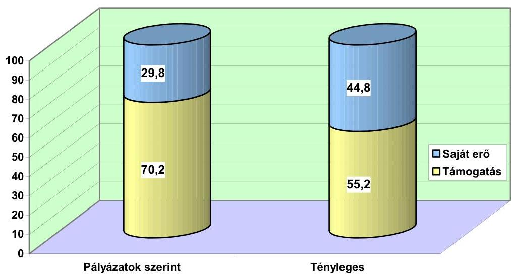

Az önkormányzatok számára kedvezőtlen forrás-arány változást elsősorban a beruházási költségek alultervezése okozta, de közrejátszott ebben az is, hogy a saját erő részeként - túlértékeléssel - figyelembevett ingatlanérték nem eredményezett valós pénzügyi forrást, így a kivitelezés során pótlólagos pénzeszközök biztosítását tette szükségessé. A kedvezőbb elbírálás miatt mint arról a 6.2. pontban már szó volt - többször sor került a pályázatok módosítására is, amit az önkormányzatok a tervezés körülményeiben beálló változásokra, pontatlanságokra, illetve költségtakarékos megoldások kimunkálására hivatkozva kértek, valójában azonban a kimutatott bekerülési költség csökkentése, illetve a magasabb saját erő biztosítása volt az oka.

A teljes bekerülési költséget, ezáltal a fajlagos költségeket csökkentette a XI. kerület költségalapú bérlakás pályázatában 134 ezer Ft-ról 125 ezer Ft-ra. Hatásában ugyanezt eredményezte a költségtakarékos megoldások kimunkálására hivatkozva Debrecen és Tokaj város önkormányzata. A saját erő arányát növelte 20\%-ról 26\%-ra Békéscsaba önkormányzata, Nyíregyháza pályázatában kétszeri módosítás után a saját erő aránya $40 \%$-ra emelkedett.
A közremúködő szervezettel történt konzultációt követően Gödöllő város önkormányzata a 43 db költségalapú bérlakás eredeti pályázatát visszavonta és bekerülési költségét 187 millió Ft-tal csökkentette. Hasonlóan járt el a váci önkormányzat, amely a 45 db szociális bérlakás bekerülési költségét 344 millió Ft-tal, 766 millió Ft-ról 422 millió Ft-ra csökkentette. (E program várható bekerülési költsége 598 millió Ft.)

A programok megvalósítása átlagosan 27\%-kal került többe a tervezetthez képest, az ehhez szükséges saját erő azonban $90 \%$-kal növekedett a pályázatokban szereplőhöz viszonyítva. Emiatt az önkormányzati költségvetésekben a

---

pályázatok benyújtásakor erre a célra elkülönített források nem fedezték a beruházások tényleges költségét, így az önkormányzatoknak további saját forrást kellett biztosítani. Ezt a programok 27\%-ánál kedvezményes hitel igénybevételével oldották meg, a pályázatokhoz eredetileg tervezett hitel összege a megvalósítás során több mint hatszorosára emelkedett.

A programok bekerülési költsége és források szerinti összetétele
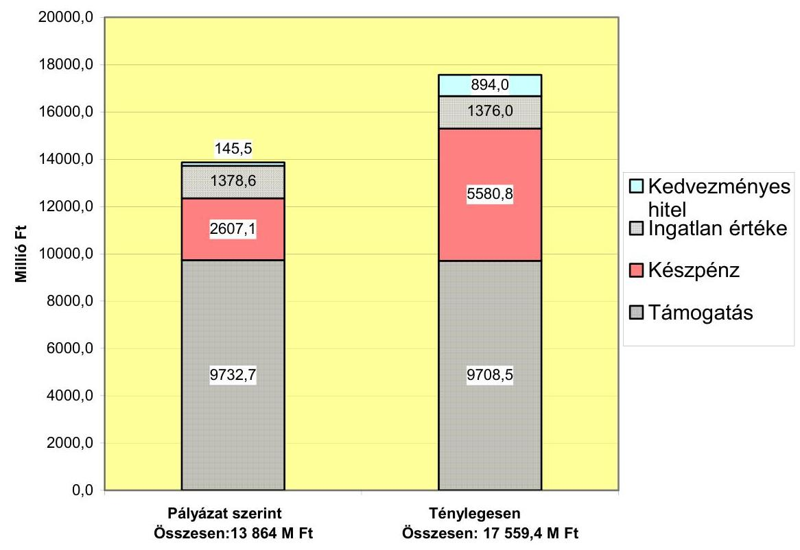

Nyolc program esetében a saját erőt kizárólag az önkormányzati ingatlan képezte a pályázatokban, ezeknél - egy kivételével (Debrecen szoc. bérlakás átalakítással) - jelentős további forrást kellett hozzárendelni a programok megvalósítása során.

Debrecen önkormányzata az idősek otthona beruházásához a pályázatban saját erőként csak a 32051 ezer Ft értékű telekingatlan szerepelt, ténylegesen, a már szerződött kiviteli költségek alapján a bekerülési költség 58\%-kal lesz magasabb a tervezettnél. Így a megvalósításhoz további 92752 ezer Ft szükséges.

Különösen szembetűnő volt a bekerülési költségek növekedése és ezzel együtt a saját forrás-támogatás arány változása négy költségalapú bérlakás építés esetében, ahol a többlet forrást további fejlesztési célú bevételek bevonásával biztosították az önkormányzatok.

A XIII. kerületben - a reális szintnél alacsonyabban tervezett fajlagos bekerülési költség, a garázsok, felszíni parkolók kialakításának kötelezettsége és az építőanyag árak növekedése következtében - kétszeresére emelkedett a bekerülési költség, s így a saját erő aránya a pályázat szerinti $50 \%$-ról $75,8 \%$-ra, a készpénzben

---

levő saját forrás 4,5 szeresére növekedett, ami 400 millió Ft többlet kiadást jelentett.

A IV. kerületi önkormányzat két programja esetében - szintén a bekerülési költségek alultervezése miatt - a készpénzben biztosított saját forrás összege mintegy 2,5 szeresére növekedett, aránya a tervezett 53\%-kal szemben a tényleges adatok alapján 73,5 és $74,5 \%$-os volt, míg az állami támogatás aránya 26,5 és $25,5 \%$-ra csökkent.

Nyíregyháza egyik költségalapú programjánál - többek között a felmerülő többletmunkák miatt - a készpénzes saját erő 2,7 szeresére növekedett, aránya $40 \%$ helyett $64,6 \%$-os lett a $35,4 \%$-os támogatási arány mellett.

A támogatási szerződések előírták, hogy a készpénzben levő saját erőt a program pénzügyi lebonyolítására megnyitott elkülönített bankszámlán az önkormányzat köteles rendelkezésre tartani, az erről szóló banki igazolás a szerződés részét képezte. A támogatási szerződésnek ez a pontja indokolatlanul szigorúbb előirást tartalmaz a kormányrendelet és a pályázati kiírás feltételeihez képest, ami csak a készpénzben vállalt saját erő költségvetésben történő elkülönítését követeli meg. E követelménynek finanszírozási és likvidítási gondok miatt nem minden önkormányzat tudott eleget tenni (pl. Vése, Szarvas, Orosháza, XI. kerület) és a banki igazolás kiadása után viszszavezette a pénzt a költségvetési elszámolási számlájára. A szükséges saját forrást csak az egyes számlák kifizetésekor, az azokhoz szükséges összegben biztosította.

# 7.5. A programok fajlagos költségeinek alakulása 

A helyszíni vizsgálatok időpontjáig 42 program fejeződött be, ezek $80 \%$-ban túllépték a pályázat szerinti bekerülési költségeket, mindössze 9 program esetében tudták tartani az eredeti költségszintet (pl. Sarkad fecskeház és költségalapú bérlakások, Miskolc idősek otthona, Mezőberény garzonházak, költség alapú bérlakások), ebből is két program használt lakás vásárlására irányult.

A pályázati feltételek között szerepelt, hogy a lakások bekerülési költségei nem haladhatják meg a méltányolható lakásigény bekerülési költségét, amit a hatályos pénzügyminiszteri közlemények tartalmaztak, külön a budapesti, illetve más helyiségekben épülő lakásokra, valamint 2000. illetve 2001-2002. évekre vonatkozóan, eltérő mértékben.

Pályázati szinten valamennyi önkormányzat eleget tett ennek a követelménynek. A tervezett bekerülési költségek messze elmaradtak a méltányolható bekerülési költségektől, ennek ellenére több pályázat elutasításra került azzal az indokkal, hogy túl magasak a fajlagos költségei. Az önkormányzatok dokumentáltan nem szerezhettek információt arra vonatkozóan, hogy milyen költségszinten van esély a pályázat kedvező elbírálására.
A tényleges adatok alapján egy kivételével minden önkormányzat beruházása a méltányolható költségek alatt maradt.

A VI. kerületi önkormányzatnál a 22 db költségalapú bérlakás építési költsége $75 \%$-kal meghaladta a tervezett bekerülési költséget és $7 \%$-kal túllépte a méltányolható bekerülési költséget is. A jelentős költségnövekedés két okra vezethető

---

vissza. Egyrészt a kivitelezővel kötött átalánydíjas szerződés a két év áremelkedései és az erősen visszafogott pályázati fajlagos költségek miatt $60 \%$-kal magasabb lett a tervezettnél, másrészt a kivitelezés során hat pótmunka szerződést kötöttek, 38 millió Ft értékben.

A befejezett, új építésű lakások telekár nélküli átlagos, tényleges teljes bekerülési költsége a 2000. évi programok esetében Budapesten 94\%-a, vidéken 64\%-a, a 2001-2002 évi programoknál Budapesten 83\%-a, vidéken 57\%-a volt a közleményekben meghatározott méltányolható bekerülési költségnek. Ebből látható, hogy Budapesti viszonylatban lényegesen drágább volt az építés, mint vidéken, amit a drágább munkaerő és munkadíjak, valamint a nagyobb nyereségtartalom okozott.

Ugyanez a tendencia tapasztalható az átlagos fajlagos költségek elemzése során is. Az $1 \mathrm{~m}^{2}$-re jutó tényleges bekerülési költség az összes befejezett új lakásra vonatkozóan 176 ezer $\mathrm{Ft} / \mathrm{m}^{2}$, ugyanez Budapesten 226 ezer $\mathrm{Ft} / \mathrm{m}^{2}$, vidéken 139 ezer $\mathrm{Ft} / \mathrm{m}^{2}$ volt.

A lakások $1 \mathrm{~m}^{2}$-re jutó bekerülési költsége (ezer Ft )
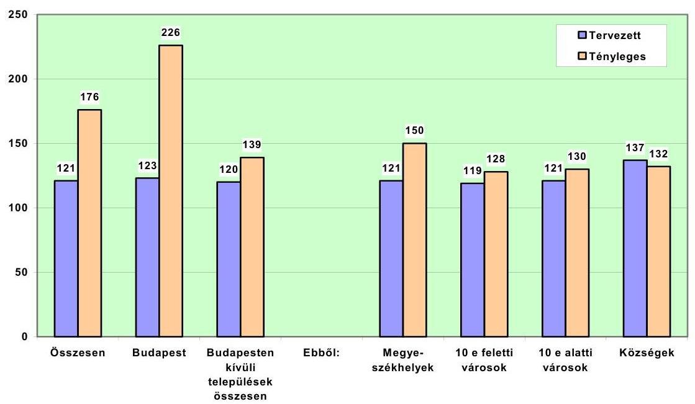

A budapesti átlagot is meghaladó fajlagos költségekkel építkeztek a VI. kerületben ( 227 ezer $\mathrm{Ft} / \mathrm{m}^{2}$ ) és a IV. kerületben ( 233 ezer $\mathrm{Ft} / \mathrm{m}^{2}$ és 256 ezer $\mathrm{Ft} / \mathrm{m}^{2}$ ). Ezzel szemben 183 ezer Ft-os, illetve 189 ezer Ft-os négyzetméter áron szintén költségalapú bérlakások épültek a XI. kerületben és a XIII. kerületben. Ez azt jelzi, hogy nem minden önkormányzat törekedett a költségtakarékos építési módok alkalmazására.

A vidéki átlaghoz képest is jelentős eltérések tapasztalhatók az új lakások építési költségeit tekintve. Az átlagot 7 program (pl. Kaposvár, Debrecen) fajlagos költségei haladták meg, ami a lakások méreteire, az alkalmazott műszaki megoldásokra és a beépített anyagok minőségére vezethető vissza.

---

Vidéki viszonylatban legmagasabb fajlagos költsége a Nyíregyházán megépült költségalapú 29 lakásos háznak volt, ahol 228 ezer $\mathrm{Ft} / \mathrm{m}^{2}$ volt a tényleges bekerülési költség. A kis alapterületű lakások építési költségéhez hozzáadódott az emeletráépítéssel megvalósult beruházás miatt a meglévő épületen felmerült többletmunkák (hőszigetelés, felújítás stb.) el nem különített ráfordítása is.

Az átlagot nem érte el 14 program építési költsége (pl. Mezőberény, Orosháza, Sátoraljaújhely). Új bérlakásokat legolcsóbban Mezőhegyesen (119 ezer $\mathrm{Ft} / \mathrm{m}^{2}$ ), Tokajban ( 107 ezer $\mathrm{Ft} / \mathrm{m}^{2}$ ) és Szarvason ( 109 ezer $\mathrm{Ft} / \mathrm{m}^{2}$ és 93 ezer $\mathrm{Ft} / \mathrm{m}^{2}$ ) építettek.

Az önkormányzati ingatlanok átalakításával létrehozott bérlakások esetében lényegesen kedvezőbbek voltak a fajlagos költségek. Az eredetileg nem lakáscélú ingatlanok átalakításának költsége átlagosan 114 ezer Ft-ot tett ki négyzetméterenként, de ennél lényegesen alacsonyabb költségekkel is tudtak bérlakásokat kialakítani.

Debrecenben 84 db szociális bérlakást létesítettek a volt szovjet repülőtéri lakások átalakításával. A megvalósítás költségei rendkívül kedvezően alakultak, az $1 \mathrm{~m}^{2}$ re jutó bekerülési költség 74 ezer Ft volt. A megvalósítás során a tervezett költségeket nem lépték túl, sőt 0,5\%-os megtakarítást értek el, így 1776 ezer Ft támogatást nem vettek igénybe.

A támogatott jogcímek közül legkisebb kiadással a használt lakások vásárlásával és felújításával növelhették bérlakás állományukat az önkormányzatok. Átlagosan 65 ezer $\mathrm{Ft} / \mathrm{m}^{2}$ fajlagos költséggel valósultak meg ezek a programok.

A legmagasabb fajlagos bekerülési költséggel az idősek otthonait és a nyugdíjasházakat építették. Pl. Elek város idősek otthona 282 ezer $\mathrm{Ft} / \mathrm{m}^{2}$, Kaposvár nyugdíjasháza 318 ezer $\mathrm{Ft} / \mathrm{m}^{2}$ költséggel valósult meg. Az ilyen jogcímen létrehozott épületek költségei azonban nem összehasonlíthatóak a bérlakásokkal és a méltányolható költségekkel, mivel a működéshez szükséges kiszolgáló és közösségi létesítmények építése és a technikai feltételek megteremtése okozza a többletköltségeket.

# 8. A TÁmOGATÁSSAL MEGVALÓSULT LAKÁSOK hASZNÁLATBAVÉTELÉNEK ÉS MŰKÖDTETÉSÉNEK SZABÁLYSZERŰSÉGE 

### 8.1. Az elkészült lakások használatbavétele

A támogatott programok közül a helyszíni vizsgálatok időpontjáig 42 program fejeződött be, a létrehozott ingatlanok használatbavétele minden esetben szabályszerűen megtörtént, az elkészült lakásokat az önkormányzatok rendeleteinek megfelelően kiválasztott bérlők részére kiutalták. Egy önkormányzatnál (Marcali) az elkészült lakásokat nem a pályázatban szereplő jogcímnek megfelelően és szintén egy önkormányzatnál (Egyek) nem teljes körűen hasznosították.

Marcali városban a bérlők kiválasztása során az önkormányzat nem vette figyelembe, hogy a támogatással megvalósuló szociális bérlakásokban - az önkormányzat rendeletének megfelelően - csak szociálisan rászorulók helyezhetők el.

---

A 27 lakásból 11 lakást szolgálati lakásként hasznosítottak, ami ellentétes a pályázati feltételekkel.

Egyek önkormányzata 12 db használt lakást vásárolt és újított fel a támogatás igénybevételével. Ezek közül 2000. évben 4 db-ra, 2003. évben szintén 4 db-ra kötöttek bérleti szerződést, további 4 db lakás három éve üresen áll, ami azt jelzi. hogy nem a valós igények alapulvételével nyújtották be pályázatukat.

A BM a kormányrendelet 43. § (3) bekezdése előírásának, - mely szerint a támogatással létrehozott bérlakásokra, garzonházra, nyugdíjasházra és idősek otthonára 20 évig elidegenítési és terhelési tilalmat kell a Magyar Állam javára bejegyeztetni - az ellenőrzött befejeződött programok 40\%-ánál a vizsgálatok időpontjáig nem tett eleget.

A Kht. a záró beszámolóval egyidejúleg az elidegenítési és terhelési tilalom bejegyzéséhez hozzájáruló nyilatkozatot kért az önkormányzatoktól, melynek birtokában a földhivatal a bejegyzési kérelmet teljesítette. Jelentősebb lemaradás a 2001-ben elnyert pályázatoknál volt tapasztalható, de a Kht. megalakulásakor átvett pályázati állománynál fokozatosan folyt az elidegenítési és terhelési tilalom bejegyzésének kezdeményezése.

A befejeződött programok közül kilencnél (21\%) került sor az ingatlanok megterhelésére banki hitelfelvétel miatt is, illetve egy önkormányzatnál (Marcali) a lakások teljes vételárának kiegyenlítéséig a kivitelező részére történő jelzálogjog bejegyzésére.

Az önkormányzatoknak a lakások használatbavételét követő 60 napon belül bizonylatokkal és hatósági nyilatkozatokkal alátámasztva szakmai beszámolót kellett készíteniük. Ennek a kötelezettségének négy önkormányzat (Debrecen, Egyek, XI. kerület, Vése) nem, két önkormányzat (XIII. kerület, Orosháza) az előírt határidőn túl tett eleget.

# 8.2. A lakásállomány múködtetése 

A támogatással megépített bérlakás állomány múködtetése során az önkormányzatok több mint fele (57\%-a) nem a pályázati kiírás és a támogatási szerződésekben elốrt követelményeknek megfelelően, elkülönített bankszámlán tartja a múködtetéshez kapcsolódó bevételeket és kiadásokat. A pályázati kiírás és a támogatási szerződések előírásai szerint ezeket 20 évig elkülönített bankszámlán kell tartani, azonban a szabálytalanul eljáró önkormányzatok magas aránya is jelzi, hogy ez az előírás túlzott követelményeket támaszt a lakások múködtetésével kapcsolatban, ezen kívül finanszírozási, likviditási szempontból sem előnyös, hogy a keletkező többletbevételeket ideiglenesen sem vonhatja be az önkormányzat a költségvetési gazdálkodásba. Az elkülönített bankszámlákkal kapcsolatos adminisztráció és a pénzforgalmukkal kapcsolatos költségek (különösen a több támogatott programot is megvalósító, nagyobb városok esetében pl. Kaposvár) szükségtelenül terhelik az önkormányzatokat, hiszen a bevételek és kiadások elkülönítését az analitikus és főkönyvi nyilvántartások megfelelő részletezésével meg lehet oldani.

---

Az önkormányzatoknak a jogcímek szerint elkülönített bankszámlák éves forgalmáról minden év szeptember 30-ig jelentést kell küldeniük a minisztérium felé, amit a támogatási szerződések írtak elő. Ez alapján a beruházások használatbavételi időpontjának figyelembevételével 11 önkormányzatnak volt jelentési kötelezettsége, de ennek csak 3 önkormányzat (Sarkad, Marcali, Miskolc) tett eleget.

Az éves beszámolási kötelezettség teljesítése számos problémát vetett fel a pályázatkezelési feladatok ellátásával kapcsolatban. Az előírt jelentés formai és tartalmi követelményeit nem határozták meg, és a beszámolási kötelezettség elmaradását nem szankcionálták, mivel a Kht.-nál nem alakították ki az éves beszámolási kötelezettség teljesítésének nyilvántartását. Így nem volt rendszerezett és használható információjuk az adatszolgáltatást nem teljesítők ről.

A költség alapon meghatározott lakbérú bérlakások üzemeltetése során jelentős, felhasználható többlet bevételek még nem keletkeztek a vizsgálatok időpontjában. Felhasználásra egy önkormányzatnál, a pályázati feltételeknek megfelelően került sor.

A XIII. kerületi önkormányzatnál a költség alapú lakbérú lakások múködtetésének egyenlege 2002. II. félévében 5 millió Ft volt, amit a rossz állapotú lakások fenntartására fordítottak.

A támogatott idősek otthona beruházások közül 4 db fejeződött be a helyszíni vizsgálatok időpontjáig (Nyírábrány, Miskolc, Ibrány, Elek). Az otthonok speciális múködési feltételeit az 1/2000/(II.7.) SzCsM rendelet, illetve az 1993. évi III. törvény előírásai szerint mindenhol biztosították, múködési engedéllyel rendelkeznek, illetve egy esetben (Miskolc) folyamatban van a múködési engedély kiadása. A múködési engedéllyel rendelkező otthonokban az elhelyezettekkel az ellátási szerződéseket megkötötték, ami tartalmazza a szolgáltatásokért fizetendő havi térítési díj összegét is.

Három múködő otthon közül kettő (Nyírábrány, Ibrány) emelt színtű ellátást nyújt, egy (Elek) esetében a feltételek a normál színvonalú idősek otthona előírásainak felelnek meg (múködési engedélyük is erre vonatkozik), mivel az apartmanokban nincs fürdőszoba és két fő elhelyezése esetében az 1 főre jutó lakótér nem éri el a $10 \mathrm{~m}^{2}$-t. Ennek ellenére az önkormányzat rendelete alapján a beköltözőktől 600 ezer Ft egyszeri hozzájárulást szedtek be, ezzel megsértették az 1993. évi III. törvény 117/B. § (1) bekezdését, mely szerint egyszeri hozzájárulás csak az átlagot jóval meghaladó minőségi elhelyezési körülményeket biztosító intézményben kérhető. Ez az intézmény nem biztosítja ezeket a feltételeket, ezért a vizsgálat a törvényes állapot helyreállítására szólította fel az önkormányzatot, melyre - az ÁSZ tájékoztatása alapján - a megyei közigazgatási hivatal is felszólította.

Az idősek otthonára juttatott támogatások vizsgálata során megállapítható, hogy a bérlakás program keretein belül idegen az ilyen jogcímen nyújtott támogatás. Az idősek otthonának fő célja a lakhatás mellett az időskorúak ápolásának, gondozásának, egészségügyi ellátásának a biztosítása. A létrehozott otthonok nem bérlakásként múködnek, más az

---

ágazati besorolásuk, a múködtetésük során speciális tárgyi és személyi feltételeknek kell eleget tenni, csak intézményi keretek között működtethetők.

A pályázati feltételekben és a megkötött támogatási szerződésekben az idősek otthonában való elhelyezésre vonatkozó kikötések az elmúlt években szigorúbbak voltak a kormányrendelet előírásánál. E szerint az idősek otthonába is csak olyan személyt helyezhetnek el, aki nem rendelkezik határozatlan idejű bérleti jogviszonnyal vagy lakástulajdonnal, annak ellenére, hogy a kormányrendelet ezt a feltételt csak a nyugdíjasház létesítése esetén köti ki. A 2003. évi pályázati feltételek már összhangba kerültek a kormányrendelettel.

Megvalósításuk során a beruházások bekerülési költségei és egyéb paraméterei, fajlagos ráfordításai nem hasonlíthatók össze a bérlakás program keretében egyéb jogcímen nyújtott támogatásokkal. „Népszerűségét" (főleg a kisebb települések esetében) annak köszönheti, hogy működtetéséhez normatív állami hozzájárulás igényelhető, így a gondozottak által fizetett térítési díjakkal együtt nyereségesen működtethető az önkormányzatok számára.

A nyugdíjasházak építésére nyújtották be a legkevesebb pályázatot (4 db) az önkormányzatok, ebből három nyert támogatást. Ennek oka, hogy az időskorúak ellátásának biztosítására elterjedtebb forma az idősek otthonában történő elhelyezés, ami a működtetés szempontjából is kedvezőbb az önkormányzatoknak. Befejezett és működő nyugdíjasház 1 db létesült eddig a támogatásból (Kaposvár). Működtetése során a pályázati kiírás feltételeit betartották, a személyes gondoskodást nyújtó ellátásokat (orvos, ápoló, portaszolgálat, étkeztetés) biztosítják, de a pályázati kiírásban előírt ellátási szerződést - amit jogszabály csak az idősek otthonára ír elő - nem kötötték meg az elhelyezettekkel, a külön fizetendő szolgáltatások díját is a lakásbérleti szerződésekben rögzítették.

A támogatásból garzonház és fecskeház építésére 7 önkormányzat nyert támogatást, ebből két beruházás fejeződött be (Mezőberény, IV. kerület). A bérlőkijelölés során a kormányrendelet előírásai szerint jártak el, vizsgálták a pályázók állandó jellegű kereső tevékenységét, a lakáscélú előtakarékosságot, életkort, családi állapotot. Mindkét önkormányzatnál gondoskodtak az előírt feltételek folyamatos fennállásának ellenőrzéséről is.

A XI. kerület folyamatban lévő programja esetében jelezte a vizsgálat, hogy a bérlőkijelölés már 2002. szeptemberében megtörtént, de az alapján a jogszabályi előírások szerinti feltételek megléte - a szükséges információk hiányában - nem volt ellenőrizhető.
A támogatással megvalósult lakások üzemeltetését minden önkormányzatnál a korábbi formában, az önkormányzat egyéb bérlakás állományát is kezelő szervezettel oldották meg.

Az elkészült, illetve olyan folyamatban levő lakásépítések esetében, ahol az üzemeltetés formájáról már döntés született az önkormányzatok 64\%-ánál az üzemeltetést az önkormányzat polgármesteri hivatala, illetve költségvetési szerve látja el. 36\%-ánál az önkormányzat 100\%-os, vagy többségi tulajdonában álló gazdasági társasága végzi a lakásállomány kezelését.

---

Az üzemeltetést végző gazdasági társaságok esetében a pályázati feltételek, a támogatási szerződés és a jogszabályi előírások érvényesülésének közvetlen ellenőrzése nem megoldott. Az önkormányzatok ellenőrzési jogaikat csupán testületi szinten gyakorolják az üzemeltetési feladatok végrehajtásáról a társaságok beszámoltatásával.

# 8.3. A támogatások felhasználásának ellenőrzése 

A jogszabályokban a Kht. részére előírt ellenőrzési feladat rendjének kialakítására és múködésére vonatkozó szabályozás tervezetét 2001. decemberében dolgozták ki, de a kezelő általi jóváhagyása nem történt meg.

A szabályozás szerint az ellenőrzések folyamatba illeszkedő, záró, illetve rendkívüli ellenőrzések voltak. A folyamatba illeszkedő ellenőrzések a támogatási szerződés végrehajtása közben, a műszaki tartalom és készültség felmérésével a támogatás folyósításának megalapozottságát vizsgálták. A záró ellenőrzés a feladatteljesítést, annak minőségét és műszaki paramétereit méri fel. Rendkívüli ellenőrzést hajtottak végre, ha olyan információ vagy dokumentum került a birtokukba, ami azt indokolttá tette.

Az ellenőrzési feladatokat a Kht. külső szakértők (8 fő) bevonásával látta el. A régiónként szervezett feladatellátást az egységes munkalapok alkalmazása segítette. A helyszíni ellenőrzésről készített jegyzőkönyv az azonosító adatokon túl tartalmazta az észrevételeket, a szakértői jelentés rögzítette a megállapításokat. A helyszíni ellenőrzés dokumentációja - a felelős műszaki vezető egyetértésével - rögzítette a költségarányos készültségi fokot, ami alapján jóváhagyták a kiutalandó támogatás összegét. Ezt követően az ellenőrzés dokumentációja bekerült az önkormányzat pályázati anyagába.

Az önkormányzatoknál a folyamatban levő, illetve befejeződött programok $63 \%$-ánál nem volt helyszíni ellenőrzés. 16 önkormányzatnál jártak a Kht. külső szakértői, de az ellenőrzésekről készült jelentések, jegyzőkönyvek csak öt esetben álltak rendelkezésre az önkormányzatoknál, mivel az ellenőrzést végzők számára nem írták elő, hogy számukra is adjanak egy példányt. A vizsgálatok két esetben állapítottak meg az önkormányzat igénylésében szereplőhöz képest készültségi fok eltérést.

Budapest, 2003. december " "

Dr. Kovács Árpád

Melléklet: $\quad 5 \mathrm{db} \quad 6$ lap

---

# A vizsgált önkormányzatok lakásállományának változása 

Összesen
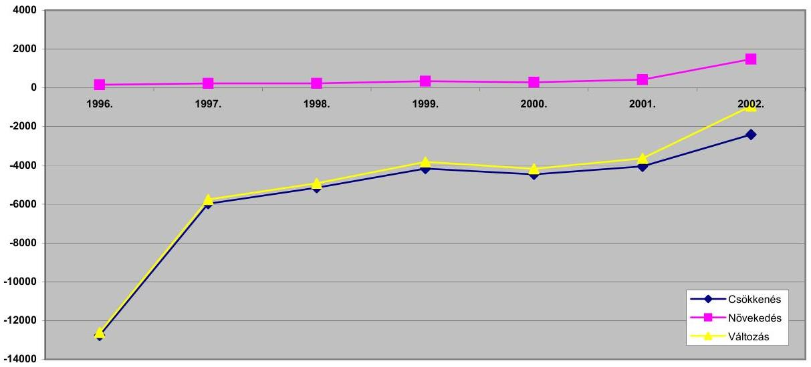

Budapesten
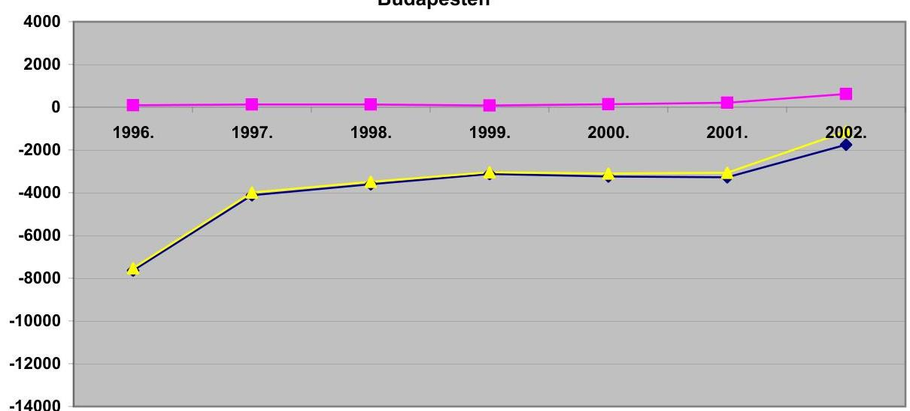

A többi vizsgált településen
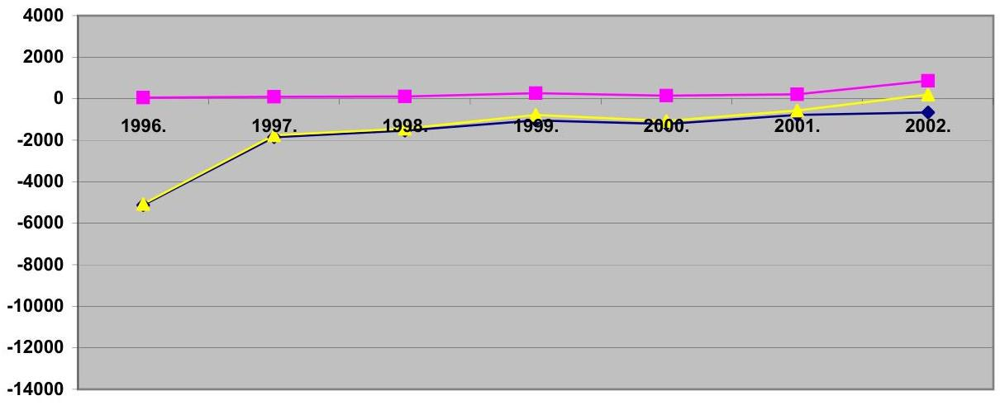

---

# Lakások megoszlása szobaszám szerint a vizsgált önkormányzatoknál 

| Település csoport | Év | Szobaszám |  |  |  |  |  |
| :--: | :--: | :--: | :--: | :--: | :--: | :--: | :--: |
|  |  | 1 | $11 / 2$ | 2 | $21 / 2$ | 3 | $31 / 2$ és   nagyobb |
| Budapest | 2000. | 57,1 | 10,0 | 21,8 | 4,2 | 5,7 | 1,2 |
|  | 2002. | 58,0 | 10,1 | 20,5 | 4,0 | 6,4 | 1,1 |
| Megyeszékhely | 2000. | 40,4 | 21,0 | 25,9 | 5,0 | 4,2 | 3,5 |
|  | 2002. | 39,8 | 21,1 | 26,3 | 5,2 | 4,2 | 3,5 |
| Város 10 e fölött | 2000. | 42,0 | 16,8 | 34,7 | 2,8 | 3,4 | 0,3 |
|  | 2002. | 40,8 | 18,4 | 34,4 | 2,9 | 3,1 | 0,4 |
| Város 10 e alatt | 2000. | 27,0 | 10,8 | 45,1 | 6,6 | 7,6 | 3,0 |
|  | 2002. | 27,5 | 10,9 | 43,8 | 8,0 | 7,1 | 2,7 |
| Község | 2000. | 26,4 | 3,3 | 46,2 | 9,9 | 12,1 | 2,2 |
|  | 2002. | 16,9 | 6,8 | 46,6 | 13,6 | 14,4 | 1,7 |
| Összesen | 2000. | 49,4 | 14,5 | 24,9 | 4,3 | 5,0 | 1,9 |
|  | 2002. | 48,9 | 15,1 | 24,6 | 4,4 | 5,2 | 1,9 |

## Lakások megoszlása komfort fokozat szerint a vizsgált önkormányzatoknál

| Település csoport | Év | Össz-   komfortos | Komfortos | Fél-   komfortos | Komfort   nélküli | Szükség   lakás |
| :-- | :--: | :--: | :--: | :--: | :--: | :--: |
| Budapest | 2000. | 24,5 | 35,3 | 11,5 | 25,9 | 2,8 |
|  | 2002. | 25,7 | 38,7 | 12,3 | 19,7 | 3,6 |
| Megyeszékhely | 2000. | 55,5 | 22 | 4,3 | 15,6 | 2,6 |
|  | 2002. | 58,6 | 21,6 | 4,1 | 13,7 | 2,0 |
| Város 10 e fölött | 2000. | 22,3 | 45,7 | 7,9 | 22,4 | 1,7 |
|  | 2002. | 25,7 | 44,1 | 8,2 | 20,6 | 1,4 |
| Város 10 e alatt | 2000. | 20,4 | 63,1 | 3,4 | 11,7 | 1,4 |
|  | 2002. | 26,6 | 58 | 3,6 | 10,5 | 1,3 |
| Község | 2000. | 24,2 | 49,4 | 3,3 | 19,8 | 3,3 |
|  | 2002. | 45,8 | 37,3 | 4,2 | 10,2 | 2,5 |
| Összesen | 2000. | 34,6 | 32,4 | 8,5 | 21,9 | 2,6 |
|  | 2002. | 37,7 | 33,4 | 8,7 | 17,5 | 2,7 |

---

# Egy lakásra jutó bevételek és kiadások alakulása a vizsgált önkormányzatoknál (Ft-ban)

|  Év | Elöirt | Befolyt | Befolyt lakbér az
elöirt \%-ában | Müködési
kiadások | Felújítási
kiadások | Kiadások
összesen | A befolyt lakbér és az
összes kiadások
aránya,\%  |
| --- | --- | --- | --- | --- | --- | --- | --- |
|   | éves lakbér |  |  |  |  |  |   |
|  1998. | 29260 | 25218 | 86,2 | 89868 | 17923 | 107790 | 23,4  |
|  1999. | 34580 | 33013 | 95,5 | 100864 | 26407 | 127271 | 25,9  |
|  2000. | 42656 | 41243 | 96,7 | 116264 | 23474 | 139737 | 29,5  |
|  2001. | 51123 | 48084 | 94,1 | 127685 | 24492 | 152178 | 31,6  |
|  2002. | 57151 | 54818 | 95,9 | 140396 | 32530 | 172925 | 31,7  |
|  Index 2002/1998 | 195,3 | 217,4 |  | 156,2 | 181,5 | 160,4 |   |

3/B.sz.melléklet a V-1004-28/2003.sz.jelentéshez

## Egy lakásra jutó kiadások alakulása település típusonként a vizsgált önkormányzatoknál (Ft-ban)

|  Év | Budapesti
kerületek | Megye-
székhelyek | Városok 10 ezer
lakos felett | Városok 10 ezer
lakos alatt | Községek | Összesen  |
| --- | --- | --- | --- | --- | --- | --- |
|  1998. | 120836 | 99518 | 43946 | 61056 | 110648 | 107790  |
|  1999. | 155792 | 97296 | 53572 | 44377 | 63550 | 127271  |
|  2000. | 175706 | 97604 | 65975 | 65606 | 64034 | 139737  |
|  2001. | 201528 | 97170 | 64681 | 50125 | 48330 | 152178  |
|  2002. | 233992 | 110061 | 68598 | 59368 | 52213 | 172925  |
|  5 év átlaga | 172768 | 100268 | 58768 | 56191 | 67115 | 138009  |
|  2002/1998 \% | 193,6 | 110,6 | 156,1 | 97,2 | 47,2 | 160,4  |

---

# Nyertes önkormányzati pályázatok száma 2002. év végéig és a vizsgáltak aránya

|  Jogcím | Nyertes önkormányzati pályázatok |  |  |  |  |  | Vizsgált az összes \%-ában |  |   |
| --- | --- | --- | --- | --- | --- | --- | --- | --- | --- |
|   | országos összesen |  |  | vizsgált |  |  | száma | lakások | támogatás  |
|   | száma | lakások | támogatás | száma | lakások | támogatás |  |  |   |
|   | db | db | MFI | db | db | MFI | db | db | MFI  |
|  Bérlakás állomány növelése | 542 | 9367 | 43895,2 | 97 | 3071 | 14814,1 | 17,9 | 32,8 | 33,7  |
|  Ebből |  |  |  |  |  |  |  |  |   |
|   | Szociális | 249 | 4575 | 20033,9 | 38 | 1291 | 6094,1 | 15,3 | 28,2  |
|   | Költségalapú | 191 | 2568 | 12713,2 | 35 | 1042 | 4675,4 | 18,3 | 40,6  |
|   | Fecskeház | 33 | 750 | 2933,6 | 7 | 242 | 969,6 | 21,2 | 32,3  |
|   | Idősek otthona | 50 | 976 | 5545,1 | 14 | 368 | 2237,4 | 28,0 | 37,7  |
|   | Nyugdíjasház | 19 | 498 | 2669,4 | 3 | 128 | 837,6 | 15,8 | 25,7  |
|  Lakóépületek energiatakarékos korszerűsítése |  | 355 | 16798 | 1553,2 | 63 | 2566 | 460,0 | 17,7 | 15,3  |
|  Mindösszesen |  | 897 | 26165 | 45448,4 | 160 | 5637 | 15274,1 | 17,8 | 21,5  |

---

# A vizsgált önkormányzatok néhány fontosabb adata

|  Önkormányzatok | A település 2002. év végi |  | 1996-2002. között az önkormányzati lakások számának |  | A növekedésből támogatás igénybevételével 2002. december 31ig átadott | 2002. év végéig |  |  |   |
| --- | --- | --- | --- | --- | --- | --- | --- | --- | --- |
|   | teljes lakásállománya | ebből: önkormányzati |  |  |  | elfogadott pályázatok száma | lakásállomány bővítése | idösek otthona, nyugd. ház | energia-
takarékos felújítás  |
|   |  |  | csökkenése | növekedése |  |  |  |  |   |
|  Főváros | 2209 | 2209 | 916 | 85 | 0 | 1 | 1 |  |   |
|  Budapest IV.ker | 43713 | 1213 | 1374 | 422 | 288 | 3 | 3 |  |   |
|  Budapest VI.ker | 25763 | 2711 | 7200 | 22 | 22 | 1 | 1 |  |   |
|  Budapest IX.ker | 34427 | 7241 | 5191 | 444 | 0 | 1 | 1 |  |   |
|  Budapest XI.ker | 70205 | 2244 | 1719 | 228 | 50 | 3 | 2 | 1 |   |
|  Budapest XII.ker | 34263 | 1706 | 960 | 47 | 7 | 2 | 2 |  |   |
|  Budapest XIII.ker | 59643 | 7857 | 6366 | 142 | 68 | 2 | 1 |  | 1  |
|  Budapest XXI.ker | 32893 | 1896 | 3023 | 7 | 0 | 1 | 1 |  |   |
|  Főváros összesen | 303116 | 27077 | 26749 | 1397 | 435 | 14 | 12 | 1 | 1  |
|  Békéscsaba | 27774 | 446 | 918 | 55 | 0 | 6 | 5 | 1 |   |
|  Debrecen | 84322 | 4632 | 2311 | 436 | 95 | 7 | 3 | 1 | 3  |
|  Kaposvár | 27067 | 1297 | 869 | 220 | 208 | 30 | 4 | 1 | 25  |
|  Miskolc | 74421 | 5821 | 1750 | 281 | 192 | 11 | 2 | 1 | 8  |
|  Nyíregyháza | 46561 | 1998 | 922 | 219 | 163 | 30 | 4 |  | 26  |
|  Megyeszékhelyek összesen | 260145 | 14194 | 6770 | 1211 | 658 | 84 | 18 | 4 | 62  |
|  Dabas | 5758 | 44 | 130 | 4 | 0 | 1 |  | 1 |   |
|  Gödöllő | 11251 | 137 | 465 | 0 | 0 | 1 | 1 |  |   |
|  Hajdúnánás | 6820 | 356 | 169 | 35 | 32 | 1 | 1 |  |   |
|  Kazincbarcika | 12820 | 779 | 778 | 2 | 0 | 3 | 2 | 1 |   |
|  Kisvárda | 6544 | 237 | 89 | 3 | 0 | 2 | 2 |  |   |
|  Marcali | 5154 | 166 | 137 | 27 | 27 | 1 | 1 |  |   |
|  Mezőberény | 4659 | 112 | 23 | 68 | 44 | 4 | 4 |  |   |
|  Nyírbátor | 4765 | 161 | 132 | 13 | 5 | 4 | 4 |  |   |
|  Orosháza | 14191 | 315 | 624 | 72 | 37 | 3 | 3 |  |   |
|  Özd | 15458 | 1167 | 1212 | 27 | 12 | 2 | 2 |  |   |
|  Pécel | 4228 | 104 | 128 | 0 | 0 | 1 | 1 |  |   |
|  Sarkad | 4344 | 42 | 25 | 23 | 15 | 2 | 2 |  |   |
|  Sátoraljaújhely | 6821 | 401 | 397 | 19 | 18 | 2 | 2 |  |   |
|  Szarvas | 7963 | 231 | 32 | 62 | 38 | 4 | 4 |  |   |
|  Vác | 13335 | 479 | 816 | 50 | 0 | 1 | 1 |  |   |
|  Városok 10 e felett összesen | 124111 | 4731 | 5157 | 405 | 228 | 32 | 30 | 2 | 0  |

---

5.sz.melléklet a V-1004-28/2003. sz. jelentéshez

|  Önkormányzatok | A település 2002. év végi |  | 1996-2002. között az önkormányzati lakások számának |  | A növekedésből támogatás igénybevételével 2002. december 31ig átadott |  | 2002. év végéig |  |   |
| --- | --- | --- | --- | --- | --- | --- | --- | --- | --- |
|   | teljes lakásállománya | ebből: önkormányzati |  |  |  | elfogadott pályázatok száma | lakásállomány bővítése | idösek otthona, nyugd. ház | energia-
takarékos felújítás  |
|   |  |  | csökkenése | növekedése |  |  |  |  |   |
|  Balatonboglár | 2709 | 37 | 32 | 6 | 6 | 1 | 1 |  |   |
|  Balatonlelle | 2123 | 20 | 26 | 0 | 0 | 2 | 2 |  |   |
|  Elek | 2017 | 12 | 10 | 3 | 0 | 2 | 1 | 1 |   |
|  Encs | 2328 | 27 | 38 | 9 | 0 | 1 | 1 |  |   |
|  Ibrány | 2362 | 27 | 14 | 8 | 2 | 4 | 3 | 1 |   |
|  Máriapócs | 723 | 5 | 5 | 0 | 0 | 1 |  | 1 |   |
|  Mezöhegyes | 2984 | 88 | 5 | 10 | 10 | 1 | 1 |  |   |
|  Szikszó | 2157 | 5 | 21 | 17 | 0 | 3 | 3 |  |   |
|  Tab | 1808 | 161 | 42 | 0 | 0 | 1 | 1 |  |   |
|  Tokaj | 1830 | 66 | 84 | 25 | 18 | 1 | 1 |  |   |
|  Városok 10 e alatt összesen | 21041 | 448 | 277 | 78 | 36 | 17 | 14 | 3 | 0  |
|  Dédestapolcsány | 657 | 3 | 2 | 0 | 0 | 2 | 1 | 1 |   |
|  Egyek | 2423 | 26 | 4 | 12 | 12 | 1 | 1 |  |   |
|  Hajdúbagos | 810 | 8 | 0 | 0 | 0 | 1 |  | 1 |   |
|  Hetes | 391 | 3 | 1 | 0 | 0 | 1 |  | 1 |   |
|  Hosszúpályi | 1891 | 8 | 11 | 0 | 0 | 1 |  | 1 |   |
|  Nyirábrány | 1476 | 26 | 2 | 17 | 17 | 3 | 2 | 1 |   |
|  Szendrőlád | 439 | 3 | 0 | 0 | 0 | 1 |  | 1 |   |
|  Szigetszentmárton | 736 | 9 | 1 | 0 | 0 | 1 | 1 |  |   |
|  Újkígyós | 2268 | 16 | 3 | 0 | 0 | 1 |  | 1 |   |
|  Vése | 372 | 16 | 4 | 10 | 8 | 1 | 1 |  |   |
|  Községek összesen | 11463 | 118 | 28 | 39 | 37 | 13 | 6 | 7 | 0  |
|  Mindösszesen | 719876 | 46568 | 38981 | 3130 | 1394 | 160 | 80 | 17 | 63  |

---

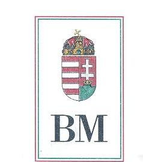

BELÜGYMINISZTER

Iktatószám: 19-57/1/2003.
$1-a-2 / 44 / 2003$.
Dr. Kovács Árpád Úrnak
Állami Számvevőszék
Elnöke
Budapest

Tisztelt Elnök Úr!

Hiv. szám: V-104-26/2003.

Faxou más megïll.
Ar. hóraut 2016h
Paisaugeti úmal
Nemeth Pui ühóter hoüi.
Féuspt.
$x 1 / 29$ fele
$A 1.27$.

Az Állami Számvevőszék által készített, a helyi önkormányzatoknak bérlakásépítésre és korszerűsítésre juttatott pénzügyi támogatások ellenőrzéséről szóló jelentés tervezetét megkaptam.

Tájékoztatom Elnök urat, hogy a jelentés-tervezet megállapításaira észrevételt nem teszek.

Budapest, 2003. november 20.

Tisztelettel:
