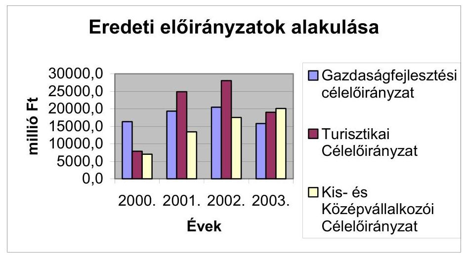
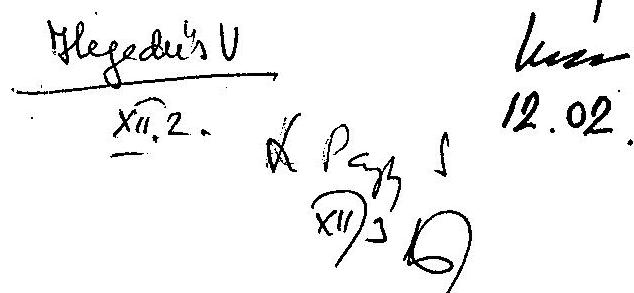
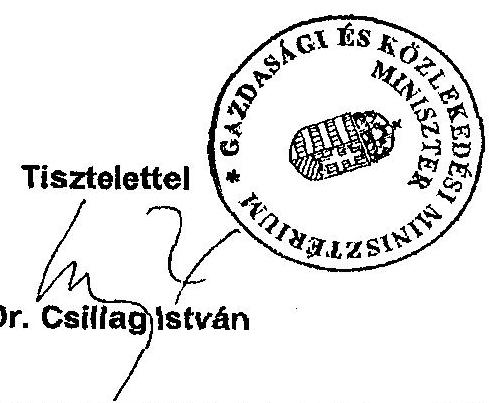
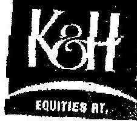
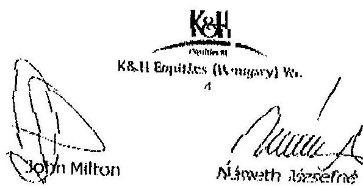

# JELENTÉS 

## A Gazdasági és Közlekedési Minisztérium fejezet müködésének ellenőrzése

---

2. Államháztartás Központi Szintjét Ellenőrző Igazgatóság 2.3.Átfogó Ellenőrzési Főcsoport
V-012-052/2003.
Témaszám: 647
Vizsgálat-azonosító szám: V 0070
Az ellenőrzést felügyelte:
Bihary Zsigmond
főigazgató
Az ellenőrzés végrehajtásáért felelős:
Hegedűsné dr. Müllern Veronika
főcsoportfőnök
Az ellenőrzést vezette:
Papp Sándor
számvevő főtanácsos
Makkai Mária
főcsoportfőnök-helyettes
Dr. Ocskovszki Jánosné
osztályvezető főtanácsos
Az ellenőrzést végezték:

| Bartolák Márta | Csóry Györgyné | Dr. Horváth Erika |
| :-- | :-- | :-- |
| Számvevő | számvevő tanácsos,   tanácsadó | számvevő gyakornok |
| Megyesiné Jalkóczi | Murányi Sándor | Szélpál Ferenc |
| Erzsébet | számvevő gyakornok | számvevő tanácsos |
| Számvevő | Dr. Zsombor András | Lődiné Cser Zsuzsanna |
| Szólya Ildikó | számvevő | számvevő |
| számvevő gyakornok | Papp József | Böröcz Imre |
| Somodiné Fehér | számvevő | számvevő tanácsos |
| Julianna | Tóth Árpád | Jakab Péter |
| számvevő | számvevő tanácsos | külső szakértő |
| Szabó Zoltán | Dr. Jártas Ágnes |  |
| számvevő tanácsos | számvevő tanácsos |  |
| Hajagos Józsefné |  |  |
| számvevő tanácsos |  |  |
| főtanácsadó |  |  |

A témához kapcsolódó eddig készített számvevőszéki jelentések:
Jelentés a Gazdasági Minisztérium fejezet múködésének pénzügyi gazdasági ellenőrzéséről (1999.)

---

## Eierlikör (1)

Menge: 1 Drink

2 Zentiliter Zitronensaft
2 Zentiliter Zuckersirup
1 Zentiliter Zuckersirup
1 Zentiliter Zuckersirup
etwas Zitronensaft
etwas Zuckersirup
etwas Zuckersirup
etwas Zuckersirup
etwas Zuckersirup
etwas Zuckersirup
etwas Zuckersirup
etwas Zuckersirup
etwas Zuckersirup
etwas Zuckersirup
etwas Zuckersirup
etwas Zuckersirup
etwas Zuckersirup
etwas Zuckersirup
etwas Zuckersirup
etwas Zuckersirup
etwas Zuckersirup
etwas Zuckersirup
etwas Zuckersirup
etwas Zuckersirup
etwas Zuckersirup
etwas Zuckersirup
etwas Zuckersirup
etwas Zuckersirup
etwas Zuckersirup
etwas Zuckersirup
etwas Zuckersirup
etwas Zuckersirup
etwas Zuckersirup
etwas Zuckersirup
etwas Zuckersirup
etwas Zuckersirup
et

---

# TARTALOMJEGYZÉK 

BEVEZETÉS ..... 5
I. ÖSSZEGZŐ MEGÁLLAPÍTÁSOK, KÖVETKEZTETÉSEK, JAVASLATOK ..... 9
II. RÉSZLETES MEGÁLLAPÍTÁSOK ..... 20

1. A minisztérium szervezetének változása, irányító tevékenysége ..... 20
1.1. A minisztérium szervezeti felépítése ..... 20
1.2. A minisztérium fejezetirányító tevékenysége ..... 21
1.3. A támogatási előirányzatok felhasználásának irányítása ..... 22
1.4. A fejezet múködésének szabályozottsága ..... 24
1.5. A támogatási célt szolgáló előirányzatok szabályozása ..... 27
1.6. Az ellenőrzési tevékenységek ellátása ..... 29
1.6.1. A felügyeleti és belső ellenőrzési tevékenység ..... 29
1.6.2. A támogatási előirányzatok felhasználásának ellenőrzése ..... 32
2. A fejezeti költségvetés végrehajtása ..... 33
2.1. A tervezési rendszer kialakítása ..... 33
2.2. A kiadási és bevételi előirányzatok teljesítése ..... 34
2.3. Feladat (program)finanszírozás szabályai alá tartozó előirányzatok felhasználása ..... 38
2.4. Összehangolás szabályai alá tartozó előirányzatok felhasználása ..... 39
3. A gazdasági és közhasznú társaságokban való részvétel ..... 41
3.1. A szakmai, illetve gazdasági tevékenységek költségvetésen kívülre szervezésének okai ..... 41
3.2. Gazdasági társaságok ..... 42
3.3. Közhasznú társaságok ..... 43
3.4. Garancia szövetkezetek ..... 45
3.5. A tulajdonosi érdekeltség gazdasági eredményei ..... 46
4. Az informatikai rendszer múködése ..... 48
4.1. Az informatikai környezet szervezeti háttere, szabályozottsága ..... 48
4.2. Informatikai stratégia kialakítása ..... 49
4.3. Az informatikai eszközellátottság és védelme ..... 50
5. A fejezeti kezelésű előirányzatok felhasználása ..... 52
5.1. A „Földmérés és térképészet beruházásai" fejezeti kezelésű előirányzat felhasználása ..... 52
5.2. Útfenntartási és - fejlesztési célelőirányzat felhasználása ..... 53
5.2.1. Mecseki Uránércbánya bezárása ..... 54

---

6. A támogatási célú előirányzatok felhasználása ..... 55
6.1. Az előirányzatok kezelésével kapcsolatos feladatok szervezeti háttere ..... 55
6.2. A támogatások gazdaságpolitikai célkitűzései ..... 57
6.3. A támogatási források ..... 58
6.4. Gazdaságfejlesztési célelőirányzat ..... 59
6.5. Turisztikai célelőirányzat felhasználása ..... 64
6.6. A Kis-és Középvállalkozói Célelóirányzatból elnyerhető támogatások ..... 68
6.7. Az Aktív foglalkoztatáspolitikai célellóirányzatból elnyerhető támogatások ..... 72
6.8. Lakások, intézmények energia-megtakarítását célzó támogatások ..... 74
6.9. Állami támogatású önkormányzati bérlakásépítés ..... 76
6.10.A Megyei Területfejlesztési Tanácsok kereteinek felhasználása ..... 79
6.11. A miniszteri keretből pályáztatás nélkül nyújtott támogatások felhasználása ..... 81
6.12. A vizsgált támogatások eredményességének értékelése ..... 81
7. Pályázati információs rendszer ..... 82
MELLÉKLETEK
8. számú A Gazdasági és Közlekedési miniszter levele
9. számú A fejezetet érintő évenkénti feladatváltozások
10. számú Közremúködői díjak alakulása
11. számú A korábbi számvevőszéki vizsgálatok alapján tett javaslatok realizálása
12. számú A helyszínen vizsgált pályázatok összesítése
13. számú Tanúsítványok
FÜGGELÉKEK
14. számú Jelentés az Állami Autópálya Kezelő Rt. pénzbefektetési tevékenységének ellenőrzéséről

---

# RÖVIDÍTÉSEK JEGYZÉKE 

| ÁAK Rt. | Állami Autópálya Kezelő Részvénytársaság |
| :--: | :--: |
| AFC | Aktív Foglalkoztatási Célok |
| Áht. | Államháztartási törvény |
| ÁKK Rt. | Államadósság Kezelő Központ Részvénytársaság |
| ÁKMI Kht | Állami Közúti Műszaki Információs Kht |
| Ámr | Államháztartás múködési rendjéről |
| ÁTBP | Állami Támogatású Bérlakás Program |
| BM | Belügyminisztérium |
| ÉKMA Rt. | Észak-Kelet-Magyarországi Autópálya Fejlesztő és üzemeltető Részvénytársaság |
| ESZA | Európai Szociális Alap |
| FVM | Földmúvelésügyi és Vidékfejlesztési Minisztérium |
| G.Ig. | Gazdasági Igazgatóság (GKM) |
| GFC | Gazdaságfejlesztési Célelóirányzat |
| GKM | Gazdasági és Közlekedési Minisztérium |
| GM | Gazdasági Minisztérium |
| GSZ | Gazdálkodó Szervezet |
| Gt. | Gazdasági társaságokról szóló törvény |
| IF | Informatikai Főosztály |
| ITDH | Magyar Befektetési és Kereskedelemfejlesztési Kht., |
| KHE Rt. | K\&H Equities (Hungary) Értékpapírkereskedelmi Rt. |
| KHVM | Közlekedési és Hírközlési Minisztérium |
| KKC | Kis- és Középvállalkozói Célelóirányzat |
| KMÜFA | Központi Múszaki Fejlesztési Alap |
| KöVíM | Közlekedési és Vízügyi Minisztérium |
| KVI | Kincstári Vagyoni Igazgatóság |
| MÁELGI | Magyar Állami Eötvös Lóránd Geofizikai Intézet |
| MÁFI | Magyar Állami Földtani Intézet |
| MÁK | Magyar Államkincstár |
| MeH | Miniszterelnöki Hivatal |
| MFB | Magyar Fejlesztési Bank |
| MFB Rt. | Magyar Fejlesztési Bank Rt. |
| MGSZ | Magyar Geológiai Szolgálat |
| MTT | Megyei Területfejlesztési Tanács |
| MVf Kht | Magyar Vállalkozásfejlesztési Kht |
| NA Rt. | Nemzeti Autópálya Részvénytársaság |
| NKÖM | Nemzeti Kulturális Örökség Minisztériuma |
| OMFB | Országos Műszaki Fejlesztési Bizottság |
| OMIKK | Országos Mérésügyi és Információs Központ |
| PIR | Pályázati Információs Rendszer |
| PSZÁF | Pénzügyi Szervezetek Állami Felügyelete |

---

REGÉC Regionális Gazdaságépítési Célelóirányzat
RFH Regionális Fejlesztési Holding
SzMSz Szervezeti és Müködési Szabályzat
SZMSZ Szervezeti és Müködési Szabályzat
Szt. Számviteli törvény
TC Turisztikai Célelóirányzat
ÚFCE Útfenntartási és Fejlesztési Célelóirányzat
UKIG
Útgazdálkodási és Koordinációs Igazgatóság

---

# JELENTÉS 

## a Gazdasági és Közlekedési Minisztérium fejezet múködésének ellenőrzéséről

## BEVEZETÉS

A minisztérium tevékenységében a vizsgált időszakban alapvető - a szervezeti struktúra átalakulását jelentő - feladatváltozások történtek. Ennek során 2000ben a Munkaerőpiaci Alap kezelése, ezzel a foglalkoztatási és munkaügyi szakterület, valamint a lakástámogatási program a Gazdasági Minisztériumhoz (GM) került, a külgazdaság-politika és a külgazdasági tevékenység irányítása viszont a Külügyminisztériumhoz. A 2002. évi kormányváltást követően a közlekedési feladatokat az elnevezéssel kibővített Gazdasági és Közlekedési Minisztérium, a foglalkoztatási és munkaügyi szakterületet viszont más tárca, a Foglalkoztatáspolitikai és Munkaügyi Minisztérium látja el. Az idegenforgalom ágazati irányításáért 2003. július 01-től a gazdasági és közlekedési miniszter a felelős. Az ezt megelőző évben a feladat a MeH hatáskörébe tartozott.

A minisztérium 2000 elején 18 önálló költségvetési szerv, míg 2003. elején a feladatnövekedések következtében 44 önálló és 4 részben önálló költségvetési szerv felügyeletét látta el. A fejezet 2002. évi átlagos statisztikai létszáma 8236 fő volt.

A fejezet 2000. évi eredeti kiadási előirányzata 78,6 milliárd Ft volt, ez 2002-re a Széchenyi Tervvel és feladatváltozásokkal összefüggésben 126,8 milliárd Ftra nőtt, a kormányzati struktúraváltozás következtében a közlekedési feladatok tárcához kerülésével 2003-ban már 325,7 milliárd Ft-ot tett ki. A teljesített kiadási előirányzatok több mint a felét a fejezeti kezelésű előirányzatok finanszírozására fordították. Ezek között 2001-től nagyságrendileg is meghatározó részt képviseltek a különböző, az államháztartáson kívüli fejlesztések finanszírozását szolgáló előirányzatok. Ezek összege 2001-ben 86 milliárd Ft, 2002-ben 75,6 milliárd Ft volt.

Az államháztartásról szóló 1992. évi XXXVIII. törvény 120/A. § alapján az ÁSZ ellenőrzi az államháztartás forrásait, azok felhasználását és a vagyonnal való gazdálkodást. A jelen ellenőrzés végrehajtására az Állami Számvevőszékről szóló 1989. évi XXXVIII. törvény 1. § (2), a 2. § (1), (3) és az (5) - (7), valamint a 17. § (3) bekezdésében foglaltak adnak jogszabályi alapot.

Az ellenőrzés célja annak értékelése, hogy a fejezet:

- működésének és gazdálkodásának szervezeti, irányítási rendszerét, költségvetési, személyi és tárgyi feltételeit a szakmai feladatokkal és az Európai

---

Unióhoz való csatlakozási folyamat követelményeivel összhangban alakítot-ta-e ki;

- gazdálkodásának feladatait, felügyeleti és ágazati irányító tevékenységét a jogszabályi előírásoknak megfelelően látta-e el, a költségvetés tervezési, végrehajtási és ellenőrzési rendszere biztosította-e a különböző jogcímeken rendelkezésre álló közpénzek szabályszerű és eredményes felhasználását, a felhasználás során teljesültek-e a kitűzött ágazati -, szakmai célok;
- informatikai rendszerét a kormányzati és ágazati informatikai fejlesztési koncepcióhoz, az európai integrációhoz igazodóan alakította-e ki, az intézmények működését, valamint a fejezeti kezelésű előirányzatok felhasználását támogató informatikai rendszereinek szabályozottsága, múködtetése, fejlesztése megfelelt-e a célszerűségi, megbízhatósági szempontoknak, a források szabályszerű és hatékony felhasználásának;
- irányító és gazdálkodó tevékenységében hasznosította-e a korábbi ÁSZ ellenőrzések megállapításait és javaslatait.

Az átfogó ellenőrzés a fejezeti irányításra és gazdálkodásra, a fejezet költségvetési szervei közül elsősorban a minisztérium irányító és gazdálkodó szervezeteinek, a Geológiai Szolgálat és a fejezetnél új intézményként jelentkező Útgazdálkodási és Koordinációs Igazgatóság múködésére, valamint a fejezeti kezelésű előirányzatokhoz kapcsolódó feladatokat ellátó szervezetekre, továbbá a beruházásokra, így a Mecseki Uránércbánya bezárására, a Földmérés és térképészet beruházásaira fordított előirányzat felhasználására terjedt ki.

Teljesítmény-ellenőrzés módszerével értékeltük az egyes fejezeti kezelésű előirányzatok felhasználását. Hatékonysági szempontból értékeltük a pályázati mechanizmus működését, a pályázatok rendszerben töltött idején keresztül, valamint a közreműködő szervezetek pályázatkezelési tevékenységét a határidők betartása, a döntések megalapozottsága és az ellenőrzési tevékenység megvalósulása szempontjából. Gazdaságossági szempontból a közbeszerzési eljárások lefolytatására való törekvést értékeltük. Eredményességi szempontból vizsgáltuk az egyes támogatási programokban meghatározott célok, valamint az egyes pályázatokban vállaltak megvalósulását.

Az ellenőrzést a hatályos jogszabályok ismeretében, a fejezetnél 1999-ben végzett átfogó, valamint a költségvetési tervezés és zárszámadás keretében végzett ellenőrzések tapasztalataira, a helyszíni vizsgálatok során bekért és a fejezet által a vizsgálathoz kitöltött tanúsítványok adataira alapozva folytattuk le.

Az ellenőrzés 2000-2002. közötti időszakot fogta át, de érintette a 2003. évből a helyszíni vizsgálat végéig tartó időszak pénzügyi adatait is. Az átfogó ellenőrzés végrehajtásával párhuzamosan került sor a fejezet 2002. évi költségvetési zárszámadásának ellenőrzésére, amelynek megállapításait a zárszámadásról szóló jelentés tartalmazza.

Az átfogó ellenőrzés - az ÁSZ elnökének 2003. július 16-i döntése alapján - kiegészült az Állami Autópálya Kezelő Rt. (továbbiakban: ÁAK Rt.) pénzbefektetési tevékenységének célvizsgálatával, eleget téve ezzel a Magyar Köztársaság miniszterelnöke felkérésének. Megjegyezzük, hogy hasonló tartalmú megkere-

---

sés érkezett az Országgyűlés Számvevőszéki bizottságának elnökétől képviselői kezdeményezésként, valamint a Pénzügyi Szervezetek Állami Felügyelete (továbbiakban: PSZÁF) elnökétől.

Az ÁAK Rt.-t a Kormány felhatalmazása alapján a Nemzeti Autópálya Részvénytársaság (továbbiakban: NA Rt.) hozta létre három társaság - az állami tulajdonú Észak-Kelet-Magyarországi Autópálya Fejlesztő és üzemeltető Rt., (továbbiakban: ÉKMA Rt.) a Nyugat-Magyarországi Autópálya Rt. és az Állami Autópálya Rt. - egyesülésével. A társaságot a cégbíróság 2000. augusztus 29-én jegyezte be. Az ÁAK Rt. létrehozását elrendelő 2037/2000. (II. 29.) Korm. határozat, illetve a társaság alapító okirata szerint feladata a teljes gyorsforgalmi úthálózat, a fejlesztési programban megjelölt műtárgyak üzemeltetése, a díjszedés biztosítása, a gyorsforgalmi úthálózat melletti területek hasznosítása, továbbá a jogelődje által felvett hitelek adósságszolgálatának költségvetési forrásból származó teljesítése.

Az ÁAK Rt. 2000. augusztus 29-i megalakulásától 2002. január 1-jéig kincstári vagyon volt, melynek vagyonkezelőjeként az NA Rt.-t jelölték ki. 2002-ben az MFB Rt. többszöri tőkeemeléssel részesedést szerzett a társaságban és december 30-án többségi (59\%) tulajdonnal rendelkezett úgy, hogy a Magyar Államot szavazatelsőbbségi jog illette meg. A közvetlen állami tulajdoni hányad vagyonkezelője továbbra is az NA Rt. volt. A társaság fölött az alapítói jogokat 2002. december 30-ig a Közlekedési, Hírközlési és Vízügyi Minisztérium, a tulajdonosi jogokat az NA Rt. és a Magyar Fejlesztési Bank Rt. (továbbiakban: MFB Rt.) gyakorolta. 2003. január 1-jén a Magyar Állam kivásárolta az MFB részvényhányadát, ezzel 100\%-os közvetlen állami (kincstári) tulajdonná vált az ÁAK Rt. A vagyonkezelői jogot 2003. január 1-15. között a KVI gyakorolta, majd január 15-től a GKM-et jelölte ki erre a feladatra.

Az ÁAK Rt. forrásai elsősorban a tulajdonosok által végrehajtott tőkeemelésből származtak, amelynek eredményeként a társaság jegyzett tőkéje 2002. december 31-én 34 milliárd Ft volt. Az ÁAK Rt. 2002. évi auditált beszámolója szerint a társaság értékpapír állománya 2002. december 31-én közel 5 milliárd Ft, készpénzállománya pedig 13 milliárd Ft volt.

A kiegészítő ellenőrzés jogalapja az Állami Számvevőszékről szóló 1989. évi XXXVIII. tv. 2. § (6) bekezdése - miszerint az ÁSZ ellenőrzi az állami vagyon kezelését, az állami tulajdonban lévő vállalatok, vállalkozások vagyonértékmegőrző és vagyongyarapító tevékenységét - és a 21. § (3) bekezdése.

Az ellenőrzés célja annak értékelése volt, hogy

- az ÁAK Rt. a közpénzekből juttatott és a saját forrásaiból képződött szabad pénzeszközeit célszerűen, szabályzatainak megfelelően hasznosította-e;
- az ÁAK Rt. és az értékpapír-forgalmazó társaságok között létrejött vagyonkezelési szerződésben foglalt jogok és kötelezettségek a hatályos belső szabály-zatoknak megfeleltek-e;
- az ÁAK Rt. feletti tulajdonosi irányítás és ellenőrzés a pénzbefektetések területén hogyan érvényesült.

---

Az ellenőrzésnek nem volt feladata az ÁAK Rt. teljes tevékenységének értékelése, valamint az autópálya beruházásokhoz szükséges források biztosítási módjának minősítése sem. Ezért a jelentés nem tesz megállapításokat az MFB Rt.-t érintően az ÁAK Rt.-nél végrehajtott - a rendelkezésünkre bocsátott indoklás szerint - a gyorsforgalmi úthálózat üzemeltetési és fenntartási kiadásai költségvetési előirányzatból biztosított forrásból, az adósságszolgálat teljesítésére átadott tőkeemelésre.

Az ellenőrzött időszak 2002. január 1. - 2003. június 30. volt, de érintette a helyszíni vizsgálat lezárásáig tartó időszak pénzügyi folyamatait is. Az ellenőrzés az ÁAK Rt.-re terjedt ki. Tájékozódtunk a GKM, a PSZÁF illetékeseinél, valamint az NA Rt. vezérigazgatójánál és a K\&H Equities (Hungary) Értékpapírkereskedelmi Rt.-nél (továbbiakban: KHE Rt.). A KHE Rt.-nél az ÁAK Rt.-re vonatkozó dokumentumok eredetiségéről és teljes körűségéről szerettünk volna megbizonyosodni. A KHE Rt. írásbeli tájékoztatása szerint minden eredeti dokumentumot átadtak a rendőrségnek (a függelék 1. sz. melléklete). Hiteles másolatot a társaság nem készített. Ezért sem a dokumentumok teljes körűségéről, sem eredetiségéről nem állt módunkban meggyőződni, az ÁAK Rt.-nél és a KHE Rt.-nél nem ugyanazok a dokumentumok találhatók meg. Az egyes vizsgálati kérdések megválaszolásában a KHE Rt. együttmúködött, amelynek jogalapját az ÁSZ tv. 21. § (3) bekezdése teremtette meg.

Az ÁAK Rt. pénzbefektetési tevékenysége ellenőrzésének részletes megállapításait a függelék tartalmazza.

A jelentést az Állami Számvevőszékről szóló 1998. évi XXXVIII. tv. III. fejezet 25. § (1) bekezdésének megfelelően észrevételezésre megküldtük Dr. Csillag István gazdasági és közlekedési miniszter úrnak, aki a jelentésben foglaltakat elfogadta, észrevételt nem tett. Levele másolatát a jelentés 1. számú melléklete tartalmazza.

---

# I. ÖSSZEGZŐ MEGÁLLAPÍTÁSOK, KÖVETKEZTETÉSEK, JAVASLATOK 

A GKM két nagy strukturális, ill. infrastrukturális ágazatot, a gazdasági és a közlekedési ágazatot irányítja, többek között ellátja a gazdaságfejlesztési, a műszaki innovációs, a közlekedéspolitikai, a befektetés-ösztönzési, gazdaságkutatási és idegenforgalmi feladatokat.

A minisztérium alapfeladatait is érintő kormányzati szerkezet változása következtében a közlekedési feladatok a 2002. évtől a Gazdasági és Közlekedési Minisztérium hatáskörébe kerültek. Ezzel a felügyelt önálló és részben önálló szervezetek, valamint a minisztériumon belül a helyettes államtitkárságok száma növekedett. A törvényekben, kormányrendeletekben, határozatokban foglalt feladat átcsoportosításokhoz hatástanulmányok nem készültek, pontosabban a vizsgálat során nem voltak fellelhetők, ezek hiányában a végrehajtási mechanizmus és a finanszírozási igény nem találkozhatott. ${ }^{1}$

A gyakori feladatváltozásokkal összefüggésben a minisztérium Szervezeti és Múködési Szabályzata 11 alkalommal változott. Pl. a turizmus irányítása 2002ben a Miniszterelnöki Hivatal, egy év elteltével, a kormányzati munka felülvizsgálatát követően ismét a minisztérium felügyelete alá került. ${ }^{2}$ Az évenkénti nagyszámú feladat változás többletterhet jelentett a minisztérium apparátusának, amely elsősorban a gazdasági-pénzügyi és az ellenőrzési területet érintette. Egy létszámában lecsökkent ellenőrzés nem volt adekvát a megnövekedett feladatokkal. A szervezeti változások a minisztérium irányítási tevékenységére kedvezőtlenül hatottak, zavarták a folyamatos munkavégzést, a szervezeti egységek közötti kapcsolattartást, a koordinációt, emellett a 307 főt érintő átszervezések jelentős kiadással jártak. ${ }^{3}$ A 2002. évi feladatváltozásokkal összefüggésben végrehajtott intézményi fejezeti kezelésű előirányzatok, valamint a vagyon átadások-átvételek év végéig elhúzódtak. ${ }^{4}$

[^0]
[^0]:    ${ }^{1}$ A KEHI 2003. áprilisában megkezdte „A 2002. évben megszűnt, illetve átalakult minisztériumoknál az átalakulás körülményeire és az átadás-átvételi eljárás szabályszerűségére" irányuló témavizsgálatát, amely vizsgálatunk lezárásakor még folyamatban volt.
    ${ }^{2}$ A 2000-2003. évek közötti feladatváltozásokat a 2. sz. melléklet tartalmazza.
    ${ }^{3}$ pl. a közlekedési ágazat 238 fős átvételének dologi kiadásai összességében 380 millió forintot tettek ki.
    ${ }^{4}$ Az 2002. évi zárszámadás ellenőrzésének megállapítása szerint, a zárszámadási törvényjavaslat áttekinthetőségét rontotta, hogy 2002. december közepéig az évközi előirányzat módosítások teljesítési adatok és kapcsolódó előirányzat maradványok nyilvántartása, a gazdálkodással kapcsolatos dokumentumok tárolása a korábbi fejezeti rend alapján a feladatokat átadó fejezeteknél történt.

---

A minisztérium múködésének szabályozottsága összességében megfelelő, azonban a törvényi szintű ágazati szabályozás hiányos. A foglalkoztatáspolitika, valamint a kis- és középvállalkozások támogatására vonatkozó törvény megjelent, de a turizmusról szóló törvény a vizsgálat lezárásáig - az ÁSZ erre vonatkozó korábbi javaslata ellenére-nem készült el. A minisztériumban folyamatban van a Nemzeti Turizmus Fejlesztési Stratégia kidolgozása. ${ }^{5}$ A 2002. évi feladatváltozással összefüggésben felmerült szabályozási hiányosságok pótlása a helyszíni ellenőrzés ideje alatt folyamatban volt. A fejezeti kezelésű előirányzatok szabályozása és kezelése csak részben felelt meg az Áht. előírásainak, mert a szabályzatok esetenként az előírt határidőre (február 15.) nem készültek el. Az intézmények működését felmérő kérdőív alapján a működés szabályozottsága nem volt teljes körű, pl. az SzMSz-eket nem minden esetben aktualizálták, egyes intézményeknél a számviteli és leltározási szabályzatok hiányoztak.

A felügyeleti ellenőrzési feladatokat a vonatkozó kormányrendeletnek megfelelően látták el. Az Ellenőrzési Főosztály a kötelező és a felsőszintű vezetői utasításra elrendelt terven felüli vizsgálatokat a vizsgált időszakban a korábbinál 40\%-kal alacsonyabb létszámmal látta el. Mindezek következtében az egy főre jutó vizsgálatok száma közel megháromszorozódott, feladatait csak külső szakértők igénybevétele mellett tudta teljesíteni. Egy, a megnövekedett feladatokkal nem arányos, létszámában erősen lecsökkent ellenőrzés felelősen nem tudja ellátni a számában és minőségében magasabb követelményű felügyeleti feladatokat. Az ellenőrzési programok - tartalmi, formai hiányosságok miatt - nem minden esetben feleltek meg a kormányrendelet előírásainak. Az ellenőrzéseket követő intézkedési tervek az előírások szerint elkészültek, végrehajtásukat utóellenőrzés keretében nyomon követték. Az Útfenntartási és Fejlesztési Célelőirányzat felhasználásának teljes körű ellenőrzése csak 2003-tól működött valamennyi érintett intézetnél.

A fejezet eredeti előirányzatai a kormányzati munkamegosztás változásából adódó szervezeti és feladat-változások, valamint az azokhoz kapcsolódó elői-rányzat-átadások, illetve -átvételek következtében 2003-ra a négyszeresére 323 milliárd Ft -ra - nőttek. Az előirányzatok módosítása szakmailag indokolt időpontban és mértékben, a hatásköri előírásoknak és a kiemelt előirányzatokra vonatkozó szabályoknak megfelelően valósult meg. A személyi juttatások teljesítése a vizsgált 2000-2002. években több mint kétszeresére nőtt, a fejezet átlaglétszámának $23 \%$-kal történt emelkedése mellett, az egy főre számított átlagos személyi juttatás $71 \%$-kal nőtt. A 2000 - 2002. évi zárszámadások szöveges indoklásai alapvetően megfeleltek a rendeleti előírásoknak, ugyanakkor a nemzetközi segélyek és a PHARE támogatások teljesítésére nem tértek ki.

A kialakított koncepció szerint a minisztérium elsősorban az elvi-stratégiai feladatok megoldására koncentrált, az operatív feladatok ellátását külső szervezetekre - gazdasági és közhasznú társaságokra - bízt a.

[^0]
[^0]:    ${ }^{5}$ A törvény megalkotása - a turizmus szakterület álláspontja szerint - ezt megelőzően nem időszerű.

---

A fejezet 2002. végén 11 társaságban rendelkezett tartós 17. 770,6 millió Ft-os állami részesedéssel. A 27 saját alapítású gazdasági társaságban 3.866,5 millió Ft értékben volt érdekelt, valamint 31 közhasznú társaságban 14. 878,1 millió Ft értékben rendelkezett részesedéssel. A tulajdonosi jogok gyakorlásának szakmai szervezeti háttere az ÁAK Rt-t érintő rövid időszak (2003. jan. 1-15) kivételével biztosított volt, a részesedésként megtestesülő vagyonról nyilvántartást vezettek, a tulajdonosi jogkör gyakorlását, a vagyon kezelésével összefüggő nyilvántartási kötelezettségét az SzMSz szabályozta.

A különböző fejlesztéseket megvalósító vállalkozások hitelfelvételeinek támogatására létrehozott hét garancia szövetkezet múködése során csak részben érték el az alapításkor megfogalmazott célt. A bankok a szövetkezeteket nem tekintették partnernek, az ügyfelek az eljárások bonyolultsága miatt a szövetkezetek szolgáltatásait nem vették igénybe. ${ }^{6}$ A garancia konstrukció eredeti célja - vagyis kölcsönös garancia nyújtása a tagként belépő vállalkozók számára - eddig nem valósult meg.

Az informatikai terület múködésének függetlensége biztosított volt, a hosszú távú fejlesztést szolgáló Informatikai Stratégia csak 2003-ban készült el. Az egyes projektek erőforrásigényének meghatározása hiányzott, ezért a megvalósítandó feladatokról sem lehetett felelősen dönteni. Az informatikai környezet szabályozása az Informatikai Szabályzat 2003. évi kiadásával sem vált teljessé, hiányzott, pl. a projektkezeléshez és rendszerfejlesztéshez kapcsolódó szabályzat. ${ }^{7}$

A fejezet 2003. évi költségvetésében 63 fejezeti kezelésú előirányzat felett rendelkezett, ezek előirányzata 253,9 milliárd Ft volt. A 2000. évi költségvetés előirányzatai között szereplő Földmérés és Térképészet beruházásai előirányzat harmadát nem az eredeti célnak megfelelően használták fel, a Mecseki Uránércbánya bezárása előirányzat felhasználásánál ésszerűsítő csökkentés eredményeként, egy feladatot 670 millió Ft-tal alacsonyabb költséggel realizáltak.

A gazdasági miniszter felelősségi körébe tartozó feladatokon belül meghatározó jelentőségűek voltak 2001-től a Széchenyi Terv néven ismert és kezelt fejlesztések megvalósítását szolgáló támogatási célprogramok, amelyek a gazdaságfejlesztést, a foglalkoztatást, a kis és középvállalkozásokat, a turizmust, a bérlakás építési program megvalósulását, valamint a lakóépületek, illetve önkormányzati intézmények energiatakarékossági célzatú rekonstrukcióját támogatták. Az előirányzatok pénzeszközeit pályázati úton lehetett elnyerni.

[^0]
[^0]:    ${ }^{6}$ Az ÁSZ a 2001. évi zárszámadás ellenőrzése során vizsgálta a szövetkezetek alapításának körülményeit és múködését, az akkori jelentésben is indokoltnak tartotta a szövetkezetek múködési céljának és módjának teljes körű felülvizsgálatát.
    ${ }^{7}$ A szakterület jelzése szerint a hiányzó szabályzatok készítése folyamatban van, várhatóan 2003 végére készülnek el.

---

A célelőirányzatok felhasználását a 2001. évet megelőzően miniszteri rendelet formájában egyedileg szabályozták, ekkortól a vállalkozási célelőirányzatok felhasználására és kezelésére vonatkozó miniszteri rendelet kiadásával a szabályozási környezet egységessé, és ezzel átláthatóbbá vált.

A gazdaságfejlesztési célok megfogalmazása, a fejlesztési stratégián alapuló tervezés és a célok kijelölése 2001-től a Széchenyi Terv beindulásával valósult meg. Egyes, pl. a Gazdaságfejlesztési illetve az Aktív foglalkoztatási célelőirányzat esetében a célkitúzéseket számszerúsítetten is megfogalmazták (pl. termelési érték növekedése, foglalkoztatottak létszáma, megőrzött munkahelyek száma stb.). A konkrét, - így beruházási és megtérülési, kapacitás- illetve munkahely bővítési elvárásokat - a pályázati kiírások, a számszerúsített mutatókat a pályázatok tartalmazták. A Gazdaságfejlesztési és a Regionális gazdaságépítési célelőirányzatot 2003. január 1-től a Beruházás ösztönzési célelőirányzatba vonták össze.

A célelőirányzatokon belül a prioritások alapvetően változatlanok maradtak, de a támogatható körök és célok bővültek. A vizsgált időszakban meghatározó volt a gyógyturizmus, a versenyképes beruházások, a regionális fejlesztések, a bérlakás építési program támogatása. Kiemelten szerepelt a munkahelyteremtés ösztönzése, a Gazdaságfejlesztési célelőirányzatból támogatott pályázók 26 ezer, az Aktív foglalkoztatási célelőirányzatból támogatott pályázók 56000 munkahely megteremtését vállalták. Növekvő szerepet kapott a turizmus támogatásán belül a más tárcákkal közösen indított pályázatok, ezek összege 2002-ben elérte a 2200 millió Ft-ot.

A támogatási források dinamikusan nőttek, az öt legnagyobb támogatási kör eredeti előirányzatának összege több mint kétszeresére nőve 2002 elején 81 milliárd Ft-ot tett ki. Jelentős változás 2002 közepétől állt be, a támogatási összegek csökkentek, emiatt jellemzővé vált pályázatok forráshiány miatti elutasítása, megszűnt a támogatási előleg igénybevételének lehetősége is.

A pályázati kiírások központi irányítás mellett, egységes elvek és azonos formai követelmények alapján készültek, az ezekben megfogalmazott célok a célelőirányzatok felhasználását szabályozó miniszteri rendeletekben meghatározott célkitűzésekhez és támogatási jogcímekhez igazodtak. A pályázati kiírások részletesen tartalmazták a pályázatokkal szemben támasztott követelményeket, az elbírálás szempontrendszerét, a döntési mechanizmus fázisait. A pályázókat a pályázatok elkészítésében részletes útmutatókkal, regionális információs szolgálatok múködtetésével segítették. A költségvetési pénzek védelmét szolgálta, hogy a beruházás jellegű támogatásokhoz biztosítékot, bankgaranciát, vagy jelzálogjog bejegyzést követeltek meg, emellett a rendeletileg biztosított előleg el nem számolása esetén visszafizetési kötelezettséggel éltek, ennek elmaradása esetén inkasszót nyújtottak be.

A pályázatok értékelését, a döntési javaslattételt pályázat specifikusan kialakított tárcaközi szakmai bizottságok végezték. A bírálati szempontrendszer két előirányzat esetében csak általános követelményeket rögzített, de pl. a gazdasági és a foglakoztatási támogatások esetében mutatószámos, ill. összehasonlító pontrendszert alkalmaztak. A források 2002-től csökkentek, ezért a versenyképes beruházások elbírálásánál már hatékonysági és gazdaságossági mu-

---

tatókat is alkalmaztak. A támogatásra kerülő pályázatok becsült számát (és a rendelkezésre álló források nagyságát) 2003-től már a pályázati kiírás is tartalmazta. A pályázatok elbírálása szakaszosan, a befogadás sorrendjében történt.

A támogatások kezelésének részfeladatait a minisztériummal kötött szerződések alapján külső közremúködő szervezetek látták el. A szervezetek a pályázati rendszerhez illeszkedő belső eljárási rendjüket és ellenőrzési szabályzatukat elkészítették, ezeket a minisztérium jóváhagyta. Kifogásolható, hogy a közremúködőkkel kötött szerződések általában késve születtek meg. A közremúködő szervezetek közötti együttmúködés a munka zavartalan és ütemes lebonyolítását segítő szerződések révén megfelelő volt. A feladatok ellátását a minisztérium finanszírozta, ennek rendjében 2001-től érvényesült a költségvetési szemlélet, a keretszerződések már rendelkeztek az elismerhető költségek köréről és legnagyobb összegéről.

A pályázatkezelési mechanizmus a közreműködő szervezetek folyamatos előkészítő és pályázatkezelő tevékenysége ellenére a pályázók figyelmetlensége és a közreműködők késedelmessége miatt - csak részben tekinthető hatékonynak. A pályázók széles körű információs ellátottsága (regionális ügyfélszolgálatok, részletes pályázati útmutatók, formanyomtatványok, Internetes oldalak stb.) ellenére a pályázók figyelmetlensége miatt, a hiánypótlások aránya esetenként a $70 \%$-t is meghaladta. A keretek felhasználásnak hatékonyságát rontotta a pályázatoknak a pályázati rendszerben töltött ideje, a közreműködők a rendeletben meghatározott határidőket nem tartották be. A pályázók késedelmessége miatt a miniszteri döntést követő szerződéskötések jelentősen elhúzódtak, indokolatlan késedelem esetén a közreműködők a támogatástól több esetben elálltak, ennek ellenére a szerződéskötések átlagos időtartama - bár 2002re lecsökkent -, de még ekkor is 120 napot tett ki, esetenként az egy évet is meghaladta. Feltűnő ellentét ugyanakkor, hogy különösen a turisztikai pályázatok esetében a pályázat befogadása és a bizottsági ülés között gyakran alig egy hét telt el, de előfordult egy nap alatt történt előterjesztés is, ez pedig nem biztosít megalapozott döntést. Gyakoriak voltak a pályázók által kezdeményezett szerződésmódosítások, ezek elsősorban a beterjesztett költségvetés illetve határidők módosítására irányultak, a módosítások egyes pályázatoknál többször is megismétlődtek. Ezek nem kellően megalapozott pályázói előkészítésre utalnak, emellett növelték a közreműködők feladatait, mivel újabb előkészítési időt és un. kisbizottsági döntést igényelt.

A pályázatok üzleti terveinek felülvizsgálatát, valamint a felhasználás ellenőrzését folyamatba épített és utóellenőrzés keretében a Kincstár látta el, mellette az MVF. Kht. is ellátott ilyen feladatokat, ezen kívül folyamatba épített ellenőrzéseket az MFB is végzett. A befejezett programok egységes szempontok szerinti megítélését lehetővé tevő átfogó monitoring és hatékonyság-vizsgálati rendszert csak részben alakították ki, pl. a fejlesztést célzó támogatások esetében a vállalások teljesülését önbevalláson alapuló évenkénti adatbekéréssel követik nyomon. A fejlesztések hosszútávú eredményességét záróellenőrzés keretében értékelik, ezt a szabályozás szerint 5-10 éves működtetési idő elteltével végzik el, erre az eltelt idő rövidsége miatt még nem került sor. Az ellenőrzés során részletesen vizsgált 35 pályázatnál a támogatások összességében eredményesen valósultak meg, a foglalkoztatási támogatásoknál a többletlét-

---

szám alkalmazása megtörtént, hiányosság csupán a munkanélküliek foglalkoztatásánál mutatkozott. A miniszteri keretek odaítélésénél, illetve a turisztikai célú támogatások esetében az előirányzat céljaihoz nem igazodó döntések is születtek. A támogatási előirányzatok felhasználásának eredményességéről értékelés nem készült. ${ }^{8}$

A támogatások kezelésére és nyomon követésére kialakított Pályázati Információs Rendszer használata nem az előzetes elképzelések szerint valósult meg. A minisztérium a közreműködő szervezetektől nem követelte meg egységes használatát, fejlesztését nem központilag hajtották végre, működéséből hiányoztak az adatellenőrzési kontrollok. Mindezek következtében a rendszer szigetszerű, egymástól elkülönülten működő rendszerekből áll, a közreműködők által készített jelentések emiatt esetenként kézi munkával előállítottak, nem megbízhatóak. A rendszer nem támogatja az Interneten keresztül történő használatot.

A korábbi számvevőszéki vizsgálatok alapján tett javaslatokat a minisztériumtöbbségében végrehajtotta.

Az Állami Autópálya Kezelő Rt. (ÁAK Rt) megalapításától (2000. aug. 29.) kezdve rendelkezett átmenetileg szabad pénzeszközökkel (2001. december 31-én mintegy 7 milliárd Ft, 2002. december 31-én mintegy 18 milliárd Ft). Ezek forrását a díjbevételek és egyéb források mellett tőkeemelések és az Nemzeti Autópálya Rt. (NA Rt) által nyújtott előlegek képezték. Az átmenetileg szabad pénzeszközök felhasználására az ÁAK Rt.-nek alapítása óta semmilyen belső előírása, szabályzata nem volt, illetve nincs.

Az ÁAK Rt. számára számlavezető bankjai 2002. december 11-ig bezárólag végeztek értékpapír-ügyleteket. Az ügyletek tárgya állampapír volt, ezért nem jelentettek pénzügyi kockázatot és azokról letéti igazolások voltak.

Az ÁAK Rt. 2002. harmadik negyedévi gazdasági és pénzügyi helyzete nem indokolta, hogy befektetési lehetőségeket keressen, viszont reálisan számított arra, hogy az MFB Rt. végrehajtja a költségvetési törvényben előírt tőkeemelést 15,3 milliárd Ft összegben. Az ÁAK Rt. 2002. november elején a KHE Rt.-vel befektetési tanácsadásra keret megállapodást, értékpapír adásvételére bizományosi keretszerződést kötött és egyúttal értékpapír ügyfélszámlát nyitott az ügyletek lebonyolítása céljából. A szerződések megkötését azzal indokolta az ÁAK Rt. hogy az átmenetileg szabad pénzeszközei befektetésével hozamot kívánt elérni. A befektetéssel megbízott társaságot nem kellett pályáztatni, mivel a befektetési szolgáltató tevékenység nem tartozik a közbeszerzési törvény hatálya alá.

A szerződések megkötéséről az ÁAK Rt. vezérigazgatója az igazgatóságot nem tájékoztatta akkor sem, amikor az NA Rt. által átutalt előlegből az ÁAK értékpapírt vásároltatott. A vezérigazgató szabályozás hiányában hatáskörét kiterjesztően értelmezte, tekintet nélkül az értékhatárra és az ügylet kockázatá-

[^0]
[^0]:    ${ }^{8}$ A célelőirányzatokból megvalósult programok teljesítéséről, a pénzeszközök felhasználásáról szóló beszámolók a helyszíni vizsgálatunkat követően, a jelentés írásának időszakában készültek el, így ezeket a vizsgálat már nem értékelhette.

---

ra. Az igazgatóság tájékoztatásának hiánya az ÁAK Rt. vezérigazgatóján túl az NA Rt. vezérigazgatójának is felróható, mivel egyben ő az ÁAK Rt. igazgatóságának elnöke is.

Az ÁAK Rt. társasági formában múködik, pénzforgalmát - miközben állami feladatot lát el - nem a Kincstár bonyolítja, ennélfogva bármikor rendelkezhet átmenetileg szabad pénzeszközzel. Az ÁAK Rt. az MFB Rt.-től kapott tőkeemelés és az NA Rt. által átutalt előlegekből, összesen 16 milliárd Ft olyan pénzeszközt helyezett el a KHR Rt.-nél vezetett ügyfélszámláján, amely állami költségvetésből származott, így az minden szempontból közpénznek minősül.

2002 decemberében az NA Rt. a földterületszerzés finanszírozásának gyakorlatát megváltoztatta, az utólagos finanszírozásról az előfinanszírozásra tért át. Ennek keretében2002. decemberében két részletben 10 milliárd Ft-ot utalt át az ÁAK Rt. részére előlegként.

Az előfinanszírozásnak szakmai indoka nem volt. Ennek utólag az ad külön jelentőséget, hogy az előfinanszírozásra való áttérés eredményeként az ÁAK Rt. további jelentős összegű, átmenetileg szabad pénzeszközhöz jutott, és ez volt a forrása a KHE Rt.-nél elhelyezett befektetések döntő hányadának.

Az NA Rt. vezérigazgatója írásbeli nyilatkozatában rögzítette, hogy „az ESA '95 szabályai szerint az NA Rt. mint állami tulajdonban álló, állami feladatokat költségvetési forrásokból ellátó vállalat része az államháztartás rendszerének, kiadásai hatással vannak az GDP arányos államháztartási hiány mértékére. Ugyanakkor az ÁAK Rt. bevételeinek többsége nem költségvetési forrásból származik, hanem a matrica eladások folytán üzleti bevételként jelentkezik, ennél fogva nem része az államháztartási körnek, s kiadásai nincsenek hatással az említett hányadosra. Önmagában az előleg átadásának a 2003. évi költségvetésre nincs semmilyen hatása."

A maradvány felhasználásának ( 10 milliárd Ft földterületszerzésre +3 milliárd Ft az M7 informatikai beruházási feladataira) következménye - a nyilatkozat szerint -, „hogy ez a kiadás nem az NA Rt. 2003. évi 79,4 milliárd Ft-os költségvetését terheli, azaz összességében 2003-ban a 79,4 milliárd Ft FIFA elöirányzaton túl, további 13 milliárd Ft szolgál autópálya építési célokat. Amennyiben a tárgybani 13 milliárd Ft nem kerül felhasználásra hiteltörlesztés céljára, vagy nem kerül átadásra az ÁAK Rt.- részére, akkor azt az NA Rt. 2003-ban nem használhatta volna fel."

Az, hogy az NA Rt. kiadásai az ESA '95 előírásai szerint hatással vannak a GDP arányos államháztartási hiány mértékére tény. Az NA Rt.-nek azonban nem feladata az államháztartási hiány befolyásolása és figyelése és arról nincs dokumentum, hogy az államháztartás hiányáért felelős ilyen jellegű utasítást adott volna.

A földterületszerzésre kötött finanszírozási szerződésben az NA Rt. rendelkezett az előleg felhasználásáról, kezeléséről és az ÁAK Rt. elszámolási kötelezettségéről is. E szerint az ÁAK Rt. az átutalt összeget elkülönített számlán volt köteles tartani. Az ÁAK Rt. a volt vezérigazgató tudtával, a szerződést megszegve az előleget értékpapír ügyletek finanszírozására használta fel, amelyre se joga, se felhatalmazása nem volt. A 2003. júniusa óta rendelkezésre álló dokumentumokból megállapítható, hogy a brókercég valójában portfoliókezelést végzett. Az ÁAK Rt. a szerződésben foglaltak végrehajtását nem ellenőrizte, nem kért rendszeres elszámolást, nem ellenőrizte, hogy számláján milyen tranzakciók

---

történtek, nem követelte meg a saját nyilvántartásához szükséges dokumentumokat, letéti igazolásokat és utólag tőzsdei ügyleteket is legalizált. Ez azt mutatja, hogy az ÁAK Rt.-nél a vezetői és a folyamatba épített ellenőrzés nem múködött, és a társaság a KHE Rt.-vel folytatott ügyleteivel kockáztatta a rendelkezésére bocsátott közpénzt. Az ÁAK Rt. egyetlen tranzakciós szerződést, vagy elszámolást sem iktatott, könyveiben a gazdasági eseményeket nem a számviteli előírásoknak megfelelő időben rögzítette, azokról analitikus nyilvántartást nem vezetett. 2002-ben sem számviteli politikája, sem számlarendje nem volt, (egyik jogelődje - az ÉKMA Rt. - 1997. óta hatályos számviteli politikáját alkalmazta) és ezzel megsértette a számvitelről szóló 2000. évi C. törvény (továbbiakban: Szt.) könyvvezetésre, bizonylati rendre vonatkozó előírásait. ${ }^{9}$ Mindezért az Szt. előírásai szerint a gazdálkodó képviseletére jogosult személyt - jelen esetben a volt vezérigazgatót - terheli a felelősség. ${ }^{10}$

Az ÁAK Rt. a 16 milliárd Ft befektetésen kívül 2003-ban egy olyan ügyletet kötött 0,5 milliárd Ft értékben, amelynek keretében halasztott fizetéssel, valójában hitelt nyújtott a szerződő félnek és a KHE Rt. nem volt aláírója a szerződésnek. Az ügylet megkötése előtt az ÁAK Rt. az ügyletet ajánló brókercég felügyelő bizottsági tagjának ügyvédi irodájától kapott olyan szakvéleményt, hogy az ügylet kockázatmentes. Az ÁAK Rt. a szakvélemény alapján 2003. március 13-i dátummal megkötötte a szerződést, de nyilvántartásában (iktatókönyv) sem az ügyvédi szakvéleményt, sem a szerződést, sem az utalásról szóló rendelkezést nem szerepeltette. Nem ellenőrizte, hogy a szerződő fél rendelkezik-e az eladott értékpapírokkal.

A GKM minisztere, mint a tulajdonosi jogok gyakorlója 2003-ban elsősorban a törvényben meghatározott feladatait - a 2002. évi beszámoló elfogadása, a 2003. évi üzleti terv jóváhagyása, az Alapító Okirat módosítása, az FB és az igazgatóság ügyrendjének valamint az SZMSZ elfogadása - látta el, határozatai ezen területekre vonatkoztak.

[^0]
[^0]:    ${ }^{9}$ Az M7 autópálya felújítás pénzügyi folyamatának ellenőrzéséről 2003 novemberében közzétett ÁSZ jelentés is megállapította, hogy az ÁAK Rt. érvényes számviteli politikával 2003. május végéig nem rendelkezett (annak tervezetét csak 2003. június 6-án terjesztették elő), amely nem felel meg a számviteli törvény 14. § (8) bekezdésében foglaltaknak. A számviteli törvény 14. § (3) bekezdése szerint minden gazdálkodónak legalább a törvény 14. § (4)-(5) bekezdésében részletezett tartalmú számviteli politikával kell rendelkeznie, amelyet a megalakulástól, vagy a törvénymódosítástól számított 90 napon belül kell elkészíteni. Az ÁAK Rt. 2000 augusztusában alakult, tehát a 90 napos határidő lejárt. A számviteli politika elkészítéséért a gazdálkodó képviseletére jogosult személy a felelős (14. § (9) bek.). A számviteli politika hiánya miatt nem ítélhető meg teljes bizonyossággal az eszközök és források értékelése és a kiegészítő melléklet tartalma. Az ÁAK Rt. éves beszámolóit ugyanaz a könyvvizsgáló, mint az NA Rt.-nél minden évben elfogadó nyilatkozattal látta el annak ellenére, hogy nem volt számviteli politikája.
    ${ }^{10}$ A jelentés tervezetet az Állami Számvevőszékről szóló 1989. évi XXXVIII. tv. 23. §-nak megfelelően megküldtük az ÁAK Rt volt vezérigazgatójának, aki észrevételében a jelentésben felvetett felelősségét vitatta. Megállapításaink alapján ugyanakkor a hatályos számviteli előírások megsértéséért felelőssége egyértelműen megállapítható volt.

---

Az ÁAK Rt. igazgatóságának feladata - az ügyrendjében rögzítettek szerint biztosítani a részvényesi jogok gyakorlója döntéseinek és érdekeinek megfelelő, jogszerú és gazdaságos ügymenetet. Az ÁAK Rt. egyik igazgatósági tagja a GKM delegáltja. Az igazgatósági tag és a GKM Vagyonpolitikai főosztálya amely az ÁAK Rt. vagyonkezelését végzi - között az információáramlás nem biztosított.

Az FB ellenőrzési munkatervében egyik évben sem szerepelt a társaság teljes körű szabályozottságának és az átmenetileg szabad pénzeszközök befektetésének vizsgálata. Ez utóbbi témát a 2003. augusztus 21-én meghatározott, 2003. évi munkaterv sem tartalmazza. Az FB szakmai irányítása alá tartozó belső ellenőrzést egy fő látja el, amely a társaság tevékenységéhez és több mint 900 fős létszámához képest aránytalanul kevés.

Az ÁSZ rendelkezésére bocsátott iratok alapján az FB-nek nem volt tudomása az előleg szerződéstől eltérő felhasználásáról. Az FB tagja - a munkáltatói oldal képviseletében - az ÁAK Rt. főkönyvelője, aki több esetben a tranzakciós szerződések aláírója volt. A dokumentumok szerint, mint FB tag elmulasztotta a testület tájékoztatását a szerződéstől eltérő pénzfelhasználásról. A tulajdonosi jogokat gyakorló miniszter, a PSZÁF más ügyben nyilvánosságra hozott határozatát követően, 2003. június 17-én közvetlen minisztériumi vizsgálatot rendelt el az ÁAK Rt.-nél, amelynek eredményeképpen a vezérigazgatót leváltotta. A GKM közigazgatási államtitkárának 2003. november 19-i levele szerint az ÁAK Rt. - a minisztériumi vizsgálat javaslatának megfelelően - külső szakértő bevonásával belső vizsgálatot folytatott le és annak eredményéről az Igazgatóságot tájékoztatta. Az ÁAK Rt. az igazgatóság határozata alapján augusztus 8án büntető feljelentést tett.

A GKM 2003. augusztus végére elkészítette a kizárólagos tulajdonosi irányítása alá tartozó társaságokra vonatkozó pénzgazdálkodási és követelményi rendszert, amelynek betartását tulajdonosi határozattal elrendelte.

Az Állami Számvevőszék az M7 autópálya felújítás pénzügyi folyamatának ellenőrzéséről szóló jelentésében is megállapította, hogy nincs olyan hatályban lévő jogszabály, amely gazdasági társaságok költségvetési eredetű bevételei elkülönített kezelését, nyilvántartását, az elszámolási kötelezettséget és az ellenőrzésével kapcsolatos felhatalmazásokat teljes körűen szabályozza. Az ÁAK Rt. pénzbefektetési tevékenységével kapcsolatban tapasztaltak is több olyan kérdésre ráirányítják a figyelmet, amelyek az ellenőrzés megítélése szerint átgondolást, illetve szabályozást igényelnek.

Általános tapasztalat, hogy a társasági formában való múködtetést nem előzi meg hatástanulmány, amely bemutatná annak előnyeit és hátrányait, és ennek hiányában az ellenőrzés számára nincs az értékeléshez megfelelő viszonyítási alap. Belátható, hogy ha ezek a társaságok államháztartáson kívül látnak el feladatot és irányításuk nincs közvetlenül államigazgatási szerv alá rendelve (pl. az MFB Rt. szerepe az autópálya finanszírozásában 2002. végéig), akkor e szervezeti formának van létjogosultsága. Abban az esetben azonban, amikor közvetlen minisztériumi irányítás érvényesül (pl. ÁAK Rt. 2003. évtől), megfelelő indoklás hiányában kevésbé fogadható el a társasági forma alkalmazása.

---

A Kormány évente beszámol az Országgyűlésnek az Állami Privatizációs és Vagyonkezelő Rt. és a hozzá tartozó társaságok gazdálkodásáról, vagyonáról. A miniszteri felügyelet alá tartozó társaságok vagyonértékmegőrző tevékenységéről, sem a Kormány, sem az Országgyűlés nem kap tájékoztatást, így arról sem, hogy a társaságoknál mikor, mekkora nagyságrendű és milyen indokból keletkeznek állami költségvetésből származó szabad pénzeszközök és azokat hogyan hasznosítják.

Nem vitatható, hogy az ÁAK Rt. e jelentésben megjelölt szabad pénzeszközei közpénznek minősülnek, annak ellenére, hogy azok költségvetési eredete nem közvetlen, hanem áttételes. Az előzőekben jelzett kérdéskörök is a közpénz felhasználásának átláthatóságát és ellenőrizhetőségét érintik. Mind szakmai körökben, mind a széles nyilvánosság által elfogadott és alkalmazott kifejezés a közpénz, azonban fogalmának jogszabályi definiálása nem történt meg, és ez eltérő értelmezésre ad lehetőséget.

A helyszíni ellenőrzés megállapításainak hasznosítása mellett javasoljuk:

# a Kormánynak 

az átláthatóság és elszámoltathatóság biztosítása érdekében

1. kezdeményezze az Áht módosítását úgy, hogy az állami feladatokat ellátó társaságok esetében is az e feladatok megvalósításához biztosított állami támogatások pénzforgalmának lebonyolítása a Magyar államkincstáron keresztül történjen, és intézkedjen a kockázatok minimalizálása érdekében a többségében állami tulajdonú gazdasági társaságok szabályzatában a pénzügyi szolgáltatások igénybevétele rendjének rögzítéséről;
2. követelje meg az állami tulajdonú társaságok felett tulajdonosi jogokat gyakorló miniszterek beszámolóját a kezelésükben lévő társaságok vagyonérték-megőrző és vagyongyarapító tevékenységéről;
3. Kezdeményezze az Áht. módosítását annak érdekében, hogy a kincstári körbe tartozó társaságok vagyonkezeléséről az Országgyűlés a Kormánytól évente tájékoztatást kapjon;
4. mérlegelje az állami feladatokat ellátó, közpénzből finanszírozott társaságok költségvetési szervvé történő átalakításának lehetőségét;
5. definiálja a közpénz fogalmát.

## a gazdasági és közlekedési miniszternek:

1. gyorsítsa fel a Nemzeti Turizmus Fejlesztési Stratégia kidolgozását és a döntés függvényében készítse elő annak törvényi szabályozását;
2. intézkedjen az intézményi szabályzatok teljes körűvé tételéről;

---

3. építse be a tervezési rendszerbe a támogatások gazdaságra gyakorolt hatásának megítéléséhez szükséges célrendszert;
4. fejlessze tovább a támogatásból megvalósuló összes projekt hatékonyságának jövőbeni megítélését lehetővé tevő monitoring- és hatékonyság-vizsgálati rendszert;
5. gondoskodjon a GKM kezelésében lévő célelőirányzatokból megvalósult programok szakmai teljesítésének, a pénzeszközök felhasználásának és a gazdaságra gyakorolt hatásának évenkénti értékeléséről;
6. intézkedjen a pályázati rendszer egyes ciklusaira meghatározott határidők betartásáról, a megalapozott döntésekhez szükséges időtartam biztosításáról, a határidők túllépése és az indokolatlan szerződésmódosítások szankcionálásáról;
7. gondoskodjon a kitűzött céltól eltérő döntések gyakorlatának megszüntetéséről;
8. vizsgáltassa felül a pályázati információs rendszert és intézkedjen egy egységes - az internetes hozzáférést és dokumentum kezelést is lehetővé tevő - pályáztatási rendszer bevezetéséről;
9. fokozza tulajdonosi ellenőrzéseit;
10. szabályozza az információáramlást a minisztérium illetékes főosztálya és a minisztérium által az ÁAK Rt. igazgatóságába delegált tagja között;
11. vizsgáltassa ki, hogy az ÁAK Rt.-nél feltárt ügyviteli, számviteli fegyelemsértés miatt - a volt vezérigazgatón kívül - kit terhel a felelősség és a szükséges fegyelmi intézkedéseket tegye meg;
12. tárja fel, hogy milyen okokból változtatta meg az NA Rt. a földterületszerzés utófinanszírozási gyakorlatát, és a vizsgálat eredményének ismeretében mérlegelje, hogy szükség van-e további intézkedésekre;
13. követelje meg az ÁAK Rt.-től, hogy dolgozza ki számlarendjét, maradéktalanul tartsa be ügykezelési rendjét, növelje a társaság belső ellenőrzési létszámát és következetesen szerezzen érvényt a vezetői és a folyamatba épített ellenőrzéseknek.

---

# II. RÉSZLETES MEGÁLLAPÍTÁSOK 

## 1. A MINISZTÉRIUM SZERVEZETÉNEK VÁLTOZÁSA, IRÁNYÍTÓ TEVÉKENYSÉGE

### 1.1. A minisztérium szervezeti felépítése

A minisztériumi szervezet felépítése, struktúrája a feladatváltozásokkal összefüggésben folyamatosan változott. A Minisztérium Szervezeti és Múködési Szabályzata 2000-2003. évek között összesen 11 alkalommal módosult.

Az OMFB Hivatala 1999-ben Korm. határozat alapján megszűnt, ezzel egyidejúleg az OMIKK, KMÜFA, EK-FP 5 keretprogram előirányzatai a jogutód Oktatási Minisztériumhoz kerültek.

A foglalkoztatáspolitika, a munkaerőpiaci szervezet irányítása, a Munkaerő-piaci Alap kezelése 2000-től a szociális és családügyi minisztertől a gazdasági miniszter hatáskörébe kerültek, indoka a szociális szempontok helyett a gazdasági növekedés által motivált foglalkoztatás politika volt.

A gazdaságmozgósítási feladatok 1999-ben a MEH-től a GM-hez kerültek.
A Magyar Befektetési és Kereskedelemfejlesztési Közhasznú Társaságot (ITD-H) 2001-től a GM és a KüM közösen múködtette.

Alapvető változást jelentett, hogy a Magyar Köztársaság minisztériumainak felsorolásáról szóló 2002. évi XI. tv. alapján jogutódlással megszűnt a Gazda-sági-, valamint a Közlekedési és Vízügyi Minisztérium. A közlekedési ágazattal kapcsolatos feladatokat az így létrehozott Gazdasági és Közlekedési Minisztérium vette át. A törvényben, valamint a gazdasági és közlekedési miniszter fe-la-dat- és hatásköréről szóló 171/2002. (VIII. 9.) Korm. rendeletben foglaltak alapján a tárca feladatai alapvetően megváltoztak.

Az idegenforgalommal, a nemzeti fejlesztési tervvel, valamint a területfejlesztéssel kapcsolatos feladatok a MEH-hez kerültek. Ugyanakkor a GM a MEH-től átvette a Magyar Fejlesztési Bank felügyeletének feladatát.

A GM hatásköréből az újonnan létrehozott Foglalkoztatáspolitikai és Munkaügyi Minisztériumhoz kerültek a foglalkoztatáspolitikai feladatok, az Állami Foglalkoztatási Szolgálat irányítása, a Munkaerőpiaci Alap múködtetése, az Európai Bérfelzárkóztatási Titkársághoz tartozó feladatok, valamint a Munkaügyi Közvetítői és Döntőbírói Szolgálat.

A lakásgazdálkodással, a lakáspolitikai feladatokkal, az Állami Támogatású Bérlakás Programmal, az iparosított technológiával épült lakóépületek energiatakarékos korszerűsítésével, felújításával kapcsolatos feladatok a belügyminiszter feladat és hatáskörébe kerültek.

---

A közlekedési ágazattal a fejezethez került többek között az Útgazdálkodási és Koordinációs Igazgatóság (a továbbiakban UKIG) amely munkáját az országos közúthálózat-kezelői rendszert múködtető 19 megyei közútkezelő Kht. valamint az Állami Közúti Műszaki és Információs Kht. (a továbbiakban ÁKMI) segítségével végzi. Tevékenysége kiterjed az Útfenntartási és fejlesztési Célelóirányzat müködtetésére, a közútkezelő közhasznú társaságok tevékenységének szervezésére, ellenőrzésére, az útgazdálkodási koordinációval, az országos közúthálózat fejlesztésével, útberuházásokkal kapcsolatos feladatokra, a nemzetközi programok ügykezelésére, az UKIG intézményi gazdálkodásának koordinálására.

A kormányzati feladatokon belül az idegenforgalom ágazati irányítása egy éven belül ismét változott. A Magyar Köztársaság minisztériumainak felsorolásáról szóló 2003. évi XXVII. törvénnyel módosított 2002. évi XI. törvény 1 §-a alapján a 92/2003. (VII.1.) Kormányrendelet ágazat felelősként 2003. július 1jétől ismét a gazdasági és közlekedési minisztert jelölte ki.

A kormányzás egy éves áttekintése során, a közelgő EU tagságra is tekintettel, olyan döntés született, hogy a MeH-ben a törvényeIőkészitői feladatot kell erősiteni, az egyes szakmai feladatok ellátását más szervezeti keretekben kell megoldani.

A feladatváltozások összesen 307 fős létszám átszervezését tették szükségessé, a létszámbővülés-, ill. csökkenés végeredményként a fejezet létszáma 2003-ra 167 fővel bővült. A közlekedési ágazat átszervezésének dologi ill. felhalmozási kiadásai a minisztériumnak 2002 II. és 2003. I félévében összességben 379,6 millió forintba kerültek, ez egy főre lebontva 1,6 millió forintot tett ki. a többi átszervezés költséghatása nem kimutatható.

A közlekedési szakterület létszám átvétele 236 fő volt, a költöztetés 26,7; az irodák átalakításai 142,7; az eszközbeszerzések 166,8; az informatikai hálózat bővítések 43,4 millió forintba kerültek. A létszám csökkenés 69 fő volt, de ebből a turisztikai terület 2003. évi visszakerülése miatt a létszám ismét 50 fővel nőtt.

# 1.2. A minisztérium fejezetirányító tevékenysége 

A fejezet szervezeti háttere a feladatváltozások következtében megduplázódott és átalakult. A 2002. évi összevonást követően egyes kiemelt, pl. EU csatlakozással kapcsolatos feladatok magasabb szintre kerültek, a helyettes államtitkárságok száma 5-ről 6-ra nőtt, ezek között két újat alakítottak ki. A GM 1998. évben 18 önálló és 3 részben önálló, 2000. évben 37 önálló és 3 részben önálló, a 2002. évi feladatváltozást követően a GKM 44 önálló és 4 részben önálló költségvetési szerv felügyeletét látta el.

Korábban főosztályként funkcionáltak az EU Integrációs, az Energetikai, a Kis- és Középvállalkozás Fejlesztési, valamint a Gazdasági Koordinációs és a Pénzügyi helyettes államtitkárságok. Feladatátadás következtében megszűnt a Foglalkoztatáspolitikai és a Turisztikai helyettes államtitkárság. Az EU támogatások felhasználásával kapcsolatos feladatokat 16/2003. (V. 15.) GKM utasítás alapján több szervezeti egység látta el. Címzetes államtitkári szintre kerültek a EU támogatások, helyettes államtitkári szintre az EU integrációval felhasználásával kapcsolatos feladatok. Az EU alapok felhasználásának pénzügyi feladatait a Költségvetési Főosztály látja el.

---

A két tárca összevonását követően a költségvetési irányítási feladatokat célszerűen megosztották. A költségvetési tervező munka minisztériumon belüli koordinációja a Költségvetéspolitikai és Koordinációs Osztály feladata lett. Az évenkénti nagyszámú feladatváltozás elsősorban a gazdasági-pénzügyi területnek, valamint az ellenőrzésnek jelentett többletterhet. A fejezetek közötti előirányzat átcsoportosítások végrehajtása, a megállapodások előkészítése, különösen a Költségvetési Főosztályt érintette.

A Fejezeti Felügyeleti Osztály a tárca kiemelt feladatát képező felügyeleti tevékenységet látja el, illetve jogszabályokban foglalt nyilvántartási, pénzügytechnikai és folyamatba épített ellenőrzési feladatokat végez. A Költségvetéspolitikai és Koordinációs Osztály átfogó pénzügyi, gazdasági elemző, döntés- és jogszabály előkészítés keretében kiemelt feladata még, a szakma-politikai elképzelések pénzügyi, gazdasági megalapozása, a támogatási célprogramok teljes körű pénzügyi és gazdasági felügyeletének ellátása, valamint a célprogramok felhasználásáról naprakész információk szolgáltatása a minisztérium vezetése felé.

A miniszter feladat- és hatáskörének változásával, valamint az egyéb kormányzati döntésekkel összefüggésben a Minisztérium Igazgatás engedélyezett létszáma az 1999. évi 625 fővel szemben 2002. évben 557 fő volt. A minisztériumokban foglalkoztatott köztisztviselők és munkavállalók létszámáról szóló 2242/2002. (VIII.12.) Korm. határozattal megállapított engedélyezett létszám 615 fő.

A végrehajtás során a GKM kétoldalú miniszteri szintű megállapodásokat írt alá a struktúraváltozásban érintett minisztériumokkal. A megállapodások rögzítették a feladat átcsoportosítás által érintett intézményi, fejezeti kezelésű előirányzatokat, valamint a vagyonváltozásokat. A szakmai munka folyamatos ellátása mellett, a fejezetek közötti megállapodásokban foglalt feladatok végrehajtása 2002. december 13-ig elhúzódott.

A 2362/2002. (XII. 5.) Korm. határozat az átszervezésekhez kapcsolódó eredeti, a módosított előirányzatok és a 2002. december 13-ai átadás időpontjáig felmerülő kiadások és bevételek átvezetéséről rendelkezett.

A minisztérium a feladatátcsoportosításhoz szükséges létszám-, előirányzat-, vagyonátadás (és elhelyezés) vonatkozásában a Miniszterelnöki Hivatallal, a Pénzügyminisztériummal, a Foglalkoztatási és Munkaügyi Minisztériummal és a Belügyminisztériummal kötött megállapodást. A GKM és a Környezetvédelmi és Vízügyi Minisztérium közötti megállapodás rendelkezett a KöViM igazgatása költségvetésének a megosztásáról.

Az ÁSZ a zárszámadás ellenőrzése keretében évenként értékelte a minisztérium fejezetirányító- és ellenőrző tevékenységét. A 2002. évi költségvetés teljesítéséről szóló zárszámadási törvényjavaslat a szerkezeti változásokból adódó kisebb torzításokat tartalmaz. A zárszámadási törvényjavaslat áttekinthetőségét hátrányosan befolyásolta, hogy a 2002. december közepéig az évközi előirányzatmódosítások, teljesítési adatok és a kapcsolódó előirányzat-maradványok nyilvántartása, a gazdálkodással kapcsolatos dokumentumok tárolása a régi fejezeti rend alapján, a feladatokat átadó fejezeteknél történt.

# 1.3. A támogatási előirányzatok felhasználásának irányítása 

A gazdasági miniszter felelősségi körébe tartozó feladatokon belül, a fejezet gazdálkodásában 2001-től meghatározó jelentőségű Széchenyi Terv keretében

---

foglalt támogatási célprogramok irányítása eggyel magasabb szintre került. A pályázati rendszerek múködtetésével kapcsolatos feladatok koordinálására a Gazdaság-koordinációs és Pénzügyi Helyettes Államtitkárságon belül elkülönített szervezetet hozott létre.

A Széchenyi Terv c. program felfutása, a pályázatok várhatóan növekvő száma következtében bővült az irányítók köre, az irányítás szintje államtitkári, illetve helyettes államtitkári szintre került. A növekedés 2003-ban azonban - a Kis- és Középvállalkozási Célelóirányzatot kivéve - megtorpant, a rendelkezésre álló források lecsökkentek, viszont a felduzzadt kezelői szervezet csökkentése még nem kezdődött meg.

A Pályázati Koordinációs és Monitoring Titkárság feladata többek között vezetői döntéseket megalapozó információk szolgáltatása, hatékonyságot ellenőrző egységes módszerek kidolgozása stb.

A támogatási rendszer kezelésével kapcsolatos részfeladatokat a pályázati mechanizmus múködtetését, a minisztérium jogszerűen külső, döntően a tulajdonosi jogkörébe tartozó szervezeteknek, ún. közremúködő szervezeteknek adta át (részletesen a jelentés 6.1. pontjában). A pályázatok pénzügyi kezelésével és ellenőrzésével kapcsolatos feladatokat a GM szerződéssel a Magyar Államkincstár Rt.-re bízta, emellett a Turisztikai céleloóirányzat esetében 2002-ig a pályázatok döntés-előkészítésébe is bevonta. A MÁK mellett más közreműködő szervezetek is elláttak ilyen feladatokat.

A MÁK vállalta a szerződéses adatok rögzítését, a pénzügyi kezelést, az ellenőrzési feladatokat (közbenső, utó és záró), a cégfigyelést a csődeljárások és köztartozás tekintetében.

A közreműködő szervezetek megbízásával a szigorúan szabályozott közalkalmazotti és köztisztviselői létszám nem növekedett. A közreműködők által elvégzett feladatok pénzügyi támogatásánál nem érvényesült a költségvetési gazdálkodásra jellemző takarékossági szemlélet

A Magyar Vállalkozásfejlesztési Kht-val, 2001. 05. 22-én kötött közhasznú szerződés 3. sz. mellékletének adatai alapján megállapítható, hogy a személyi költségek minden vonatkozásban biztosítják a köztisztviselői juttatásokat, egy általános intézményi átlagot meghaladó mértékben. A személyenkénti átlagos, 202 ezer Ft-t kitevő havi jövedelmen túl 13. havi fizetést és plusz három havi jutalmat kalkuláltak. A járandóságokat kiegészíti a budapesti utazási és ruházati költségtérítés, étkezési és üdülési hozzájárulás. A 114 millió Ft-os tárgyi eszköz kalkulációból 14 millió Ft gépkocsi beszerzéssel kapcsolatos, amihez további 12 millió forintos üzembentartási költség járult.

A közreműködő szervezetek feladataikat a minisztériummal kötött megállapodásokban rögzített díjazás ellenében végezték. A 2000-ben érvényben lévő rendelkezések nem korlátozták a célellóirányzatok terhére, a közreműködők finanszírozására fordítható összegeket, így ezek az érdekelt felek - alkut követő - megállapodásán múlt. Változást ebben az 1/2001. (I. 5.) GM rendelet 6. § (6) bekezdése hozott, melynek értelmében a minisztérium a közreműködő szervezetek részére, a támogatandó célok, részfeladatok megvalósítására, meghatározott összegú támogatási keretet adott. A szerződő felek által vállalt kötelezettségeket egy eset kivételével keretszerződésekben rögzítették.

---

A szerződések rögzítették a keret felhasználásának és a támogatás folyósításának feltételeit, az elszámolások módját, a szerződések nem teljesítése esetén alkalmazható jogkövetkezményeket, és a közreműködő szervezeteknél a részfeladatok végrehajtásával kapcsolatosan felmerülő elismerhető költségek körét és ezek legnagyobb összegét.

A Magyar Vállalkozásfejlesztési Kht-val, 2001. 05. 22-én kötött közhasznú szerződéssel kapcsolatban kifogásolható, hogy nem kerültek bele a nem szerződésszerú teljesítések esetén alkalmazandó jogkövetkezmények.

# 1.4. A fejezet múködésének szabályozottsága 

A minisztériumnak külön alapító okirata nincs, az Országgyűlés hozta létre a Magyar Köztársaság minisztériumainak felsorolásáról szóló 2002. évi XI. törvénnyel, a miniszter feladat- és hatáskörét pedig a 171/2002. (VIII. 9.) Korm. rendelet határozza meg. A GKM rendelkezik költségvetési alapokmánnyal, a felügyelete alá tartozó intézmények pedig aktualizált alapító okirattal.

Az MGSZ a Magyar Geológiai Szolgálatról szóló 132/1993. (IX. 29.) Korm. rendelet hatályba lépésétől 2000 szeptemberéig nem rendelkezett a felügyeleti szerv által jóváhagyott alapító okirattal. Az elkészült alapító okirat már követi az 19932000 közötti jogszabályi változásokat, de az 1993-ban kiadott, felügyeleti szerv által jóváhagyott SZMSZ-t a vizsgálat időpontjáig nem aktualizálták, ezért több feladatot sorolt fel, mint az alapító okirat.

A minisztérium Szervezeti és Múködési Szabályzata (SzMSz) 2000-2003. között összesen 11 alkalommal módosult, folyamatosan követte a minisztériumi szervezet felépítésében, struktúrájában, és a feladatváltozásokkal összefüggő változásokat. Ugyanakkor a helyszíni vizsgálat időpontjáig az új minisztériumi szervezet viszonylag rövid idejű működéséből eredően az egyes főosztályokon belüli szervezeti egységek (pl. osztályok) feladatkörét meghatározó ügyrendek és munkaköri leírások összeállítása és a meglevők aktualizálása 2003 közepén még folyamatban volt.

A minisztérium múködési szabályairól szóló 1/2003. (I. 31.) GKM, valamint az ezt módosító 21/2003. (VIII. 4.) GKM utasítások alapján múködött minisztérium.

Az MGSZ hatályos SZMSZ-e tartalmi elemeit tekintve nem felelt meg az államháztartás múködési rendjéről szóló 217/1998. (XII. 30.) Korm. rendelet 10. § (4) bekezdésében foglaltaknak, az alapító okiratnak. Nem tartalmazta teljes egészében az alapító okiratban meghatározott földtani feladatokat.

Az UKIG esetében a miniszter 2003. május 10-én új, a korábbi módosításokkal egységesített szerkezetű alapító okiratot adott ki, de az SZMSZ-t nem igazították a szervezeti változásokhoz az ellenőrzés befejezéséig.

A módosuló struktúrának és feladatoknak megfelelően a többször változott SzMSz-t a költségvetési gazdálkodás egyes részterületeit meghatározó belső szabályzatok kiegészítik. A minisztérium múködésének szabályozottságát az ÁSZ 2002. évi zárszámadási vizsgálata alapján összességében megfelelőnek minősítette.

---

Az államháztartásról szóló 1992. évi XXXVIII. és a számvitelről szóló 2000. évi C. törvény, az államháztartás múködési rendjéről szóló 217/1998. (XII. 30.) Korm. rendeletben, valamint az államháztartás szervezetei beszámolási és könyvvezetési kötelezettségeinek sajátosságairól szóló 249/2000. (XII. 24.) Korm. rendeletben előírt szabályzatokat a minisztérium elkészítette.

Az ÁSZ 2002. évi zárszámadási vizsgálata a szabályozottsággal kapcsolatban megállapította többek között, hogy:
„A gazdálkodás szabályozottsága a GKM Igazgatásnál és a Gazdasági Igazgatóságnál általában összhangban volt a 249/2000. (XII. 24.) Korm. rendelet 8. § (3)-(11) bekezdéseiben és a 47-49. §-okban foglalt előirásokkal. A szabályzatokat a kormányzati struktúra változásával összefüggő feladatmódosítások átvezetése, az átadás - átvételek elhúzódása miatt csak 2003. évben aktualizálták.

A GKM Igazgatás számviteli politikájában, számlarendjében szereplő előírások tükrözik a szakmai feladatokat és sajátosságokat. Az intézmény rendelkezik a szabályszerű gazdálkodás feltételeit biztositó leltározási, selejtezési, pénzkezelési szabályzatokkal."

Az UKIG gazdálkodásának szabályozása megfelelt a jogszabályi előírásoknak és biztosította az elvárásoknak megfelelő működés kereteit, azonban folyamatos aktualizálásuk nem történt meg teljes körűen. A szabályzatokon felül több, a napi működési feladatokhoz kapcsolódó eljárásról igazgatói utasításban rendelkeztek. A felügyeleti ellenőrzés által feltárt szabályottsági hiányt a helyszíni ellenőrzés idejére pótolták.

A minisztérium az Áht. 49. §. o) pontja alapján a fejezeti kezelésú előirányzatokkal való gazdálkodás évenkénti szabályozásával kapcsolatban előírtakat csak részben teljesítette, a két éves költségvetési törvény és a kormányváltást követő szerkezet és feladat változás miatt. A Mecseki Uránércbánya bezárása beruházási előirányzat felhasználására külön szabályozás nem készült. A programfinanszírozás körébe vont fejezeti kezelésű előirányzatok általános szabályzata nem készült el.

A Mecseki Uránércbánya esetében a Pénzügyminisztérium a 217/1998. (XII. 30.) Korm. rendeletben foglaltakra hivatkozva, a külön szabályozást nem tartotta szükségesnek. A jogbizonytalanság miatt a KEHI javasolta az Áht. módosítását, de a PM ezt nem kezdeményezte a vizsgálat időpontjáig.

Az egyes fejezeti kezelésű előirányzatokkal kapcsolatos eljárás rendjéről szóló 20/2001. (VII. 18.) GM rendeletet a 15/2002. (IV. 19.) GM rendelet aktualizálta.

A fejezeti kezelésű előirányzatoknak a szakmai tartalomra, a pénzügyi bonyolítás rendjére, a tervezésre és a beszámoltatásra vonatkozó szabályait célelőirányzatonként, vagy több előirányzatra együttesen miniszteri rendeletek rögzítették, az eljárási rendeket (például a pályáztatás feltételei) miniszteri utasítások tartalmazták.

Az intézmények gazdasági szervezetének felépítése és feladatai az SZMSZ-ek által szabályozottak, ezen belül 38 gazdasági szervezet rendelkezett ügyrenddel, 7 intézmény (16\%) nem. Az ügyrendrendek részletesen tartalmazták a szervezet feladatait, a vezetők és a beosztottak feladat-, hatás- és jogkörét, 5 (11\%) esetben azonban nem. Közbeszerzési szabályzatot 37 -en készítettek, 7 -en (16\%) nem. A gazdálkodáshoz kapcsolódó szabályozás alapvetően

---

megfelelő, csak néhány intézmény hanyagolta el ezirányú kötelezettségét. (A feltüntetett adatok az intézmények által kitöltött kérdőíveken alapulnak, ezért mutatkozik eltérés az intézmények számában.)

Az érvényesítés rendjét, a kötelezettségvállalást, az ellenjegyzést, utalványozást valamennyi intézmény szabályozta.

Az intézmények számviteli rendszerének szabályozottsága 45 gazdálkodónál alapvetően megfelel, ugyanakkor egyes intézményeknél ezek hiányoznak, számlarend 2 esetben (4\%) nem készült, számlatükröt 2 intézmény, számviteli politikát 1 intézmény nem készített, a szakmai feladatok és azok sajátosságai 45 intézményből ( 39 válaszolt), 1 intézménynél nem épültek be. Pénzkezelési szabályzattal 44 intézmény rendelkezik.

Az MGSZ-nél a Számlarend, a Bizonylati Szabályzat és az Album elkészítése az ellenőrzés ideje alatt volt folyamatban.

Az UKIG felügyeleti ellenőrzéséről készített jelentés megállapította, hogy az intézmény nem rendelkezett a számvitelről szóló 2000. évi C. törvényben illetve az államháztartás szervezeti beszámolási és könyvvezetési kötelezettségeinek sajátosságairól szóló 249/2000 (XII. 24.) Korm. rendeletben foglaltaknak megfelelő Számviteli politikával. Ezt követően az intézmény a Számviteli politikát, valamint az eszközök és források értékelésének szabályzatát elkészítette.

Hasonló a helyzet a vagyonvédelem tekintetében, az eszközök és források leltározási és leltárkészítési szabályzatával 44 intézmény rendelkezik, értékelési szabályzatot 40 intézmény (89\%) készített, 3 nem, értékcsökkenési szabályzatot a 45 intézményből 25 készített, 20 nem (44\%)

Az MGSZ leltározása, az eszköznyilvántartása szabályozott volt, azonban a leltározási gyakorlat nem felelt meg a vizsgált időszakban az államháztartás szervezetei beszámolási és könyvvezetési kötelezettségek sajátosságairól szóló többször módosított 249/2000. (XII. 24.) Korm. rendelt 37. §-ában, illetve a hatályos 8/1995. sz. főigazgatói utasítás 1.4. pontjában rögzítetteknek. A leltár a tény állapot és az analitikus nyilvántartások közötti egyeztetés, összevetés lehetőségét nem biztosította.

Az 1999. áprilisában hatályba lépett Gazdálkodási Szabályzat tartalmazza az UKIG leltározási, házipénztár kezelési, valamint selejtezési eljárási rendjét. A leltározásokat kétévente végezték és a szabályzatban foglaltaknak megfelelően hajtották végre. Az UKIG elkészítette a tárgyi eszközgazdálkodás három éves gördülő tervét, valamint az államháztartás múködési rendjéről szóló 217/1998 (XII. 30.) Korm. rendelet alapján az elemi költségvetését és az éves vagyongazdálkodási tervét. A tárgyi eszközök analitikus nyilvántartását számítógépes feldolgozással biztosították. Az eszközök egyedi nyilvántartó lapjai tartalmaztak minden szükséges adatot. Az eszközök hasznosítása és selejtezése a - hatályos jogszabályoknak megfelelően aktualizálásra szoruló - Gazdálkodási Szabályzatban foglalt előírásoknak megfelelt.

A szakmai feladatokat ellátó intézmények közül az MGSZ és az UKIG múködésük ellátásához kiépítették minőségbiztosítási rendszerüket. A Magyar Geológiai Szolgálat cím intézményrendszere az MGSZ Központi Hivatala, a MÁFI és a MÁELGI 2001-ben kiépítette és azóta is múködteti az ISO 9002 szabvány köve-

---

telményeinek megfelelő minőségbiztosítási rendszerét. Az UKIG 2000-ben vezetette be az ISO szabvány szerinti minőség-irányítási rendszerét.

Az MGSZ minősítés érvényessége 2003. december 31-én lejár. A megváltozott gazdasági környezet, az Európai Unióhoz való csatlakozás által támasztott feltételek teljesítése miatt mindhárom intézménynél célszerű 2003. év folyamán a minőségbiztosítási rendszer megújítása, az MSZ EN ISO 9001: 1996. szabványra való áttérés.

Az UKIG MSZ EN ISO 9001: 2001 új szabvány szerinti minőségirányítási rendszerre való áttérés érdekében 2002. év végére elkészítették a minőségirányítási kézikönyvet. Az auditálásra 2003. júniusában került sor. Az ISO tanúsítvány szükséges feltétel volt az EU segélyfinanszírozási feladatok ellátásához. Az ISO minőségirányítási rendszer a közúti adminisztráció költségvetési feladatainak minőségügyi eljárásait tartalmazza. Az érvényes tanúsítvány megszerzését követően kerül sor évente egy megerősítő auditálásra, ahol a belső auditokat követő vezetőségi átvizsgálás alapján a minősítő szervezet felülvizsgálja az előző év tevékenységének minőségi színvonalát és meghatározza az esetleges javítási potenciálokat, ellenőrzi azok végrehajtását.

# 1.5. A támogatási célt szolgáló előirányzatok szabályozása 

A GM kezelésében lévő vizsgált célelőirányzatok felhasználását a 2001. évet megelőzően miniszteri rendelet formájában egyedileg szabályozták. A négy legnagyobb célelőirányzat szabályozására 2001-ben kiadott GM rendelettel megvalósult a vállalkozási célelőirányzatok felhasználásának és kezelésének egységes szabályozása a Széchenyi Terv céljaival összhangban. A szabályozási környezet ezzel átláthatóbbá vált. A célelőirányzatok felhasználásának szabályaira külön ágazati, ill. kormányrendelet jelent meg. Törvényi szintü szabályozás csak a foglalkoztatáspolitika, valamint a kis- és középvállalkozások támogatására vonatkozóan született. A turizmusról szóló törvény a vizsgálat lezárásáig nem készült el, az ÁSZ erre vonatkozó korábbi javaslata ellenére.

A Gazdaságfejlesztési Célelóirányzat, a Turisztikai Célelóirányzat, a Kis- és Középvállalkozói Célelóirányzat és a Regionális Gazdaságépítési Célelóirányzat felhasználására, kezelésére, múködésére vonatkozó szabályozást a GM vállalkozási céleloóirányzatainak szabályozásáról szóló 1/2001. (I. 5.) GM rendelet tartalmazta.

Az Állami támogatású bérlakás program, valamint a Lakóépületek energiamegtakarítási programja fejezeti kezelésű előirányzatokból nyújtható támogatások feltételeit, a pénzügyi lebonyolítás szabályait a lakáscélú állami támogatásokról szóló 12/2001. (I. 31.) Korm. rendelet foglalta össze.

A kis- és középvállalkozásokról, fejlődésük támogatásáról a 1999. évi XCV. törvény, a foglalkoztatás elősegítéséről és a munkanélküliek ellátásáról a többször módosított 1991. évi IV. törvény rendelkezik. Az Aktív foglalkoztatási célok támogatása fejezeti kezelésű előirányzat speciális voltára tekintettel nem tartozott az egyszerúsítés érdekében kidolgozott, valamennyi céleloóirányzat múködtetését egységesen szabályozó 1/2001.(I. 5.) GM rendelet hatálya alá, ennek megfelelően felhasználásának és kezelésének részletes szabályairól 2001 után is külön jogszabály rendelkezett (a 8/2000. (III. 3.) GM rendelettel módosított 21/1999. (IV. 28.) GM rendelet).

---

A Széchenyi Terv keretében kiírt pályázatok pályázatkezelési mechanizmusának felügyeleti szintű szabályozása időben nem történt meg.

A Széchenyi-terv keretében kiírt pályázatok pályázatkezelési szabályzatát és eljárási rendjét a 18/2001. (IX. 10.) GM utasítás rögzítette. Ez többek között a pályázatok döntés előkészítésére és értékelésére vonatkozó rendelkezéseket tartalmazta, a pályázati felhívások 2001. január 15-ei megjelenését követően csak 2001 szeptemberében lépett hatályba. ${ }^{11}$

A támogatások ellenőrzési és monitoring rendszerére vonatkozóan egységes irányelvek a kezelő minisztérium szabályozási szintjén nem születtek.

A Gazdasági Minisztérium vállalkozási célelőirányzatainak szabályozásáról szóló 1/2001. (I. 5.) GM rendelet rögzítette a pályázati mechanizmus egyes lépéseinek határidejét, eszerint a hiánytalanul összeállított pályázat beadásának napjától számított 90 napon belül kell a támogatási döntésnek megszületnie. A közremúködő szervezetek a határidőt rendszeresen túllépték. A rendelet azonban az ennél hosszabb határidő alkalmazására is lehetőséget adott. A szerződéskötés határidejét a rendelet rögzítette, de a közremúködők szankcióval csak ritkán éltek (megállapítások részletesen a 6.4 -6.10. pontokban).

A rendelet 11. § (3) bek. szerint: „A közremüködő szervezet a beérkezett pályázatokat a pályázat beadási határidejétől számított 45 napon belül, folyamatos beadási határidő esetén havi rendszerességgel köteles a bizottságok elnökei részére eljuttatni. Az előkészítési határidő attól a naptól számít, amikor a pályázó a pályázatát hiánytalanul benyújtotta. A bizottság a pályázatokkal kapcsolatos szakmai álláspontját és döntési javaslatát legkésőbb a pályázatnak a közremüködő szervezet által történő átadásától számított 15 napon belül alakítja ki. A bizottság a támogatási igénynél kisebb összeg odalélésére is tehet javaslatot. A gazdasági és közlekedési miniszter vagy az általa kijelölt személy a pályázatokról azok döntésre való előterjesztésétől számított 30 napon belül, de legalább háromhavonkénti rendszerességgel dönt. A támogatásról hozott döntés e rendelet alkalmazásában kötelezettségvállalásnak minősül. A pályázati felhívás rendelkezhet úgy is, hogy a pályázatokat a minisztérium egy vagy több meghatározott időpontban egyidejúleg bírálja el."

A 12. § (8) bek. szerint: „Amennyiben a támogatási döntés kedvezményezettjének mulasztásából vagy neki felróható egyéb okból a támogatási szerződés megkötésére a Minisztérium vagy a közremüködő szervezet által a szerződéskötésre meghatározott megfelelő határidő határnapjától számított 30 napon belül nem kerül sor, a támogatási döntés érvényét veszti."
${ }^{11}$ A minisztérium észrevétele szerint a 18/2001.(IX. 10.)GM utasítás hatályon kívül helyezésével életbe lépett a GKM költségvetési fejezetében szereplő egyes célelőirányzatok forrásainak terhére meghirdetett pályázatok egységes szemléletű kezeléséről szóló 17/2003. Szabályzat.

---

# 1.6. Az ellenőrzési tevékenységek ellátása 

### 1.6.1. A felügyeleti és belső ellenőrzési tevékenység

A költségvetési intézmények felügyeleti, valamint belső ellenőrzését a vizsgált időszakban a 15/1999. (II. 5.) Korm. rendelet szabályozta.

A felügyeleti költségvetési ellenőrzés különböző szervezeti formákban valósult meg. Az Ellenőrzési Főosztály feladatait az SZMSZ szabályozta, a GKM részletes Ellenőrzési Úgyrendje az előírt határidőre elkészült.

A GM 2000. és 2001. évi szervezeti felépítésében elkülönült a felügyeleti és a függetlenített belső ellenőrzés, - a Fejezeti Monitoring Bizottság titkársági feladatait is 2002. júniusig ellátó - Ellenőrzési Főosztály a közigazgatási államtitkár felügyelete alatt múködött. A GKM ellenőrzési szervezete főosztályként, a miniszter közvetlen felügyelete alatt látja el a felügyeleti, és a belső ellenőrzési feladatokat.

Az Ellenőrzési Főosztály létszáma 2000-2002. évek között 13 főről 8 főre csökkent. A feladatnövekedés ellenére 2003. évben további létszámcsökkentést írt elő a minisztérium vezetése. A Főosztály a szükséges létszám biztosításának igényét a minisztérium vezetése felé jelezte. ${ }^{12}$

A vizsgálatok száma a revizori létszám változatlansága, illetve csökkenése mellett is folyamatosan emelkedett. A külső megbízások száma az ellenőrzött időszakban csökkent.

A 2000. évben 39, 2001-ben 41, 2002-ben 74 volt a ténylegesen megvalósított (tervezett és terven felüli) ellenőrzések száma. A GM 2000-ben 37 önálló és 3 részben önálló, 2002. év végén pedig 44 önálló és 4 részben önálló költségvetési intézmény felügyeletét látta el. További feladatokat jelentett a pályáztatási célelőirányzatok vizsgálata, a beszámolók javasolt megbízhatósági felülvizsgálata, és az uniós alapok 5, illetve $15 \%$-os ellenőrzésével kapcsolatos munkák. Az alkalmazásban lévő revizorok 2000-ben átlagosan 3, 2001-ben 4 és 2002-ben 10 vizsgálatot folytattak le.

Az Ellenőrzési Főosztály féléves munkatervek alapján dolgozott, melyeket a miniszter hagyott jóvá. A munkatervek és az ez alapján készült ellenőrzési programok esetenként formai és tartalmi szempontból 2003-ig nem feleltek meg teljes körűen az előírásoknak, ezt követően a programok elfogadhatóak voltak..

Az ellenőrzési programból hiányzott az ellenőrzés típusának azonosítása, a feladatok részletes meghatározása, a jelentés elkészítésének a határideje.

A munkatervek nem jelölték minden évben azonosan és negyedévnél részletesebb idő meghatározással a vizsgálat időtartamának kezdő és befejező dátumát és az ellenőrzések pontos típusát. A témavizsgálatok a vizsgált területnek megfelelő címmel - összevontan - szerepeltek, a beszámoló azonban ellenőrzési tételenként azonosította azokat. A vizsgálatokat az ellenőrzések kimutatásában és a beszá-

[^0]
[^0]:    ${ }^{12}$ A minisztérium vezetése a helyszíni vizsgálatot követően elállt a tervezett létszámcsökkenéstől.

---

molóban nem azonos feladatbontással, megnevezéssel, illetve hivatkozási számmal mutatták be.

A munkatervek összeállításakor elsődleges szempont a rendszeres feladatként jelentkező átfogó felügyeleti vizsgálatok lefolytatása volt, emellett a miniszter, a politikai államtitkár és a közigazgatási államtitkár utasítására növekvő számú, terven felüli vizsgálatokat is végeztek.

Meghatározó szerep jutott a hároméves felügyeleti ellenőrzések mellett a fejezeti kezelésű előirányzatokkal kapcsolatos tulajdonosi - költségvetési, szabályszerűségi és célszerűségi - ellenőrzéseknek. Eseti jelleggel tervezték a közbeszerzési eljárások a vizsgálatát.

A 2000. évben 39 tervezett vizsgálatából 28 valósult meg, de 11 ellenőrzést végeztek terven kívül, 2001. évben 37 -ből 27 teljesült és 14 terven kivülit teljesítettek. 2002-ben 43 tervezettből 33 valósult meg és emellett még további 42 nem tervezett vizsgálatot végeztek. Terven felül a lakossági bejelentésekkel és panaszok elbírálásával kapcsolatos, a MeH Közpénzügyi Államtitkárságtól kapott többletfeladatokkal, valamint a felső vezetés által elrendelt belső ellenőrzés jellegű (pl. felújítási költségek, ingatlanértékesítések) vizsgálatokat végeztek.

Az átfogó vizsgálatok során általában teljesültek a rendeletben foglalt előírások, azonban a jelentések az intézményi belső ellenőrzést nem értékelték részletesen. A jelentésre vonatkozó előírások nem minden esetben érvényesültek teljes körűen.

Az ellenőrzések javaslataira épülő intézkedési tervek az előírások szerint elkészültek, végrehajtásuk utóellenőrzését a soron következő átfogó vizsgálatok során végezték el.

Az ellenőrzésekről vezetett nyilvántartás megfelelő volt. éves ellenőrzési beszámoló minden évben határidőre elkészült, de a 2000. és 2001. éves ellenőrzési beszámolók nem mutatták be kielégítően a munkatervben foglaltak teljesítését.

Az ellenőrzött célelőirányzatok közül a GFC, és a TC kezelői kiépített belső ellenőrzéssel, saját Ellenőrzési Szabályzattal, 2003-tól ellenőrzési kerettervvel és térképpel rendelkeztek.

A keretterv a beérkező pályázatok helyszíni ellenőrzésének mértékét határozza meg, az ellenőrzési térkép pedig az ellenőrzési feladat lefedettségének állásáról tájékoztat.

A fejezeti kezelésú előirányzatok ellenőrzése jogszabályi vagy szerződéses felhatalmazás alapján történt. A támogatási célelőirányzatok pályáztatási rendszere ellenőrzésének elemi szintje a közreműködőkön keresztül valósult meg az elő-, folyamatba épített és utóellenőrzések végrehajtásával. Az előirányzatokat kezelők a saját, át nem ruházható felelősségük szempontjait mérlegelve határozták meg a vizsgálandó témákat.

A célelőirányzatok teljes körú, valamint önálló hatékonysági vizsgálata az ellenőrzött időszakban a kapacitás és a források szűkössége, a hatékony-

---

sági vizsgálatok módszertanának és gyakorlatának a magyar ellenőrzési rendszerben való általános hiánya miatt nem valósulhatott meg.

Az egyes fejezeti kezelésű előirányzatokkal és gazdálkodásukkal kapcsolatos eljárás rendjét 2000. évig külön miniszteri rendeletekben, a 2001. évtől egységesen szabályozták. A vállalkozási célelőirányzatok felhasználását, kezelését, müködtetését és ellenőrzését az 1/2001. (I. 5.) GM rendelet, továbbá a gazdálkodási rendjüket a 8/2001. (III. 29.) GM utasítás szabályozta.

Az Útfenntartási és Fejlesztési Célelóirányzat (UFCE) ellenőrzési rendszere eltért a többi vizsgált céleloóirányzattól. Az UFCE többszintű, minden tevékenységet és területet átfogó ellenőrzése a vizsgált időszakban nem valósult meg.

Az előirányzat múködését szabályozó 12/1999. (III. 11.) KHVM rendelet nem tartalmaz az ellenőrzésre vonatkozó előírásokat. Az UFCE ellenőrzése a rendelet által meghatározott feladatokat végző közhasznú társaságok ellenőrzése útján valósult meg. A kht-k tulajdonosi és az UFCE költségvetési ellenőrzése nem különült el. Az UFCE gazdálkodását a KöViM felügyelete idején nem vizsgálta könyvvizsgáló.

A fejezet költségvetési intézményeinek ellenőrzésének és az intézmények belsö ellenőrzésének helyzetéről 2000-2003. közötti időszakra vonatkozóan 45 fejezeti intézménytől kérdőíves formában tájékozódtunk. Helyszíni vizsgálatot a Magyar Geológiai Szolgálat (MGSz), a minisztérium Gazdasági Igazgatóság (G Ig.) és az Útgazdálkodási és Koordinációs Igazgatóság (UKIG) belső ellenőrzésével kapcsolatosan végeztünk.

Az ellenőrzött intézmények belső ellenőrzési tevékenységüket vezetői és munkafolyamatba épített, valamint függetlenített belső ellenőrzés útján látták el.

Az előírt határidőhöz képest késéssel adták ki mindhárom intézménynél az új, ill. a módosított Belső Ellenőrzési Szabályzatot, ezek tartalma esetenként nem volt kielégítő. Például a G Ig. nem részletezte az ellenőrzés típusait és módszereit. Az UKIG csak 2003-ban készítette el ellenőrzési szabályzatát.

A vezetői ellenőrzés körébe tartozó belső szabályzatok rendelkezésre álltak. A vezetői megbeszélések és a beszámoltatások, valamint a vezetők helyszíni ellenőrzései az intézmények több mint 80\%-nál megvalósultak.

A munkafolyamatba épített ellenőrzés rendjét nem szabályozták kellően.
Az intézmények függetlenített belső ellenőrzés 2000. évben 6; 2001-2002. évben 4-4 intézménynél nem múködött, ezt a tevékenységet az intézmények közel felénél külső szakértő látta el. Az ellenőri kapacitás feladatokhoz viszonyított aránytalanságát mutatta, hogy az intézmények általában 1 fő revizort alkalmaztak. A belső ellenőröknek alig több mint fele vett részt a vezetői megbeszéléseken. A 15/1999. (II. 5.) Korm. rendelet előírásai alapján múködő függetlenített belső ellenőrzéssel kapcsolatban több hiányosság is felmerült.

A GSz-nél alkalmazásban álló, felsőfokú végzettségű, szakirányú képesítéssel nem rendelkező ellenőr, a G Ig-nél egy fő külső szakértő látta el a belső ellenőri feladatot. Az UKIG 2002. decemberig nem rendelkezett függetlenített belső ellenőrzéssel.

---

Az MGSz és a G Ig függetlenített belső ellenőrzésének szervezetben elfoglalt helye, illetve független működése a gyakorlatban megvalósult. Az UKIG-nál a belső ellenőrzési szervezet függetlensége nem volt biztosított.

Az intézmények belső ellenőrei az első számú vezető által jóváhagyott munkatervek alapján látták el feladataikat, melyek tartalma nem minden esetben tükrözte a Rendelet előírásait. Például az MGSZ ellenőrzési munkatervei nem tartalmazták a vizsgálatok időbeli ütemezését, valamint a vizsgálat célját és a típusát.

Az éves ellenőrzési beszámoló nem minden esetben készült el határidőre, tartalma és kezelése kifogásolható volt. A G Ig-nél csak 2001. év közepétől készültek éves ellenőrzési beszámolók, de ezeket a vezetői testület nem tárgyalta meg. A vizsgált időszakban kb. 10 intézményében nem tárgyalták meg az éves ellenőrzési beszámolókat. Az MGSZ ellenőrzési jelentéseiben hiányzott a munkaterv teljesítésének értékelése, valamint a végzett munka összevont tapasztalatai.

A külső, - pl. ÁSZ - ellenőrzések intézményekre vonatkozó megállapításaira a belső ellenőrzés a vizsgált esetekben intézkedési javaslatot készített és figyelemmel kísérte azok végrehajtását.

# 1.6.2. A támogatási előirányzatok felhasználásának ellenőrzése 

A pályázatkezelés feladataival megbízott közreműködő szervezetek a pályázatok kezeléséhez kapcsolódó ellenőrzési feladatokat is végeztek, az ehhez szükséges belső eljárási rendjüket és ellenőrzési szabályzatukat - eltérő tartalommal és részletezettségben - elkészítették.

Az MVf Kht. Pályázatkezelési Kézikönyve 2002. második felében került kiadásra. A MÁK Rt. a 2001. szeptember és október hónapban elkészítette az Ellenőrzési Szabályzatát és Eljárási Rendjét. Az MVf Kht. Ellenőrzési Szabályzata a vizsgálat idején tervezet formájában állt rendelkezésre.

A MÁK a megállapodások alapján vállalta a támogatások folyamatba épített, az utó-, valamint az üzleti tervek ellenőrzésének feladatát. Az ellenőrzések végrehajtására a Kincstári Központ eljárási rendet dolgozott ki, a MÁK megyei fiókjai éves ellenőrzési ütemtervet készítettek. A támogatott által vállalt kötelezettségek teljesítésének ellenőrzése közbenső és utóellenőrzés keretében történt.

A MÁK 2002-ben a GFC és a REGÉC támogatások eljárási rendjét vezérigazgatói utasítással, a TC eljárási rendjét elnöki utasítással léptette életbe.

A közbenső ellenőrzések a beruházások időarányos megvalósítását állapították meg, a lehívások a jogszabályoknak megfelelően történtek.

A GFC, REGÉC, és a fejlesztési célú TC támogatások esetében az $50 \%$-os teljesítés elérésekor minden esetben közbenső ellenőrzést végeztek, helyszíni jegyzőkönyv felvételével.

Utóellenőrzés a beruházás, és a program befejezéséhez kapcsolódott, a minisztérium megbízási szerződése szerinti arányban helyszíni ellenőrzéssel egybekötve. A REGÉC utóellenőrzési arányát a szerződés nem egyértelműen fogalmazta meg, ugyanakkor támogatások mindegyikén elvégezte a helyszí-

---

ni ellenőrzést. A helyszíni vizsgálatok során egy esetben találtunk példát szankciók alkalmazására.

A Gazdaságfejlesztési Célelóirányzat támogatási vizsgálatára teljes körú helyszíni ellenőrzési megbízást kaptak. A REGÉC támogatásainak utóellenőrzési megbízása a megbízási szerződésben bizonytalan: „A helyszini utóellenörzéseket a Kincstár a Minisztérium által megadott gyakorisággal végzi. ...Az ellenőrzési kerettervet a Kincstár köteles egyeztetni a Regionális Gazdaságépitési Célelóirányzat kezelójével és a keretgazdákkal, valamint az Ellenőrzési Főosztállyal".

Békés Megyei területfejlesztési Tanács: foglalkoztatási kötelezettség (AFC szerződés) be nem tartása miatt 4 millió Ft visszafizetési kötelezettség.

A MÁK fejlesztéseknél záró ellenőrzést az 5 éves múködtetési határidő végén végez. Ezekre még a GM-mel kötött megbízási szerződés alapján az eltelt idő rövidsége miatt nem került sor.

# 2. A FEJEZETI KÖLTSÉGVEtÉS VÉGREHAJTÁSA 

### 2.1. A tervezési rendszer kialakítása

A fejezet 2000-2003. évekre vonatkozó tervezési munkafolyamata során a Kormány által meghatározott prioritások érvényesültek, a költségvetési előirányzatok tartalmi és számszaki levezetései összhangban álltak azokkal.

Az előirányzatok meghatározásához, számszerúsítéséhez Tervezési Körirat, valamint a Magyar Köztársaság 2000-2002. évi költségvetési irányelveiről szóló 2085/1999. (IV. 26.) Korm. határozatban foglalt előírások álltak rendelkezésre. A fejezet által kidolgozott előirányzatok 2000-2002. években egyaránt meghaladták a PM által meghatározott irányszámokat, a 2003. évet érintő költségvetési javaslat megvalósításának forrásigénye szintén túllépte a PM javaslatában foglaltakat.

A fejezet költségvetésének tervezéséért felelős szerv - az általános és kötelezően érvényesítendő követelményeken túl - a fejezet sajátosságaihoz igazodó részletes útmutatót, tervezési módszertant az intézmények részére csak a 2003. évi tervezési munkához biztosított, de továbbra sem alakítottak ki számukra elszámolási modellt. Az intézményi előirányzatokat a PM által kidolgozott fela-dat- és teljesítménymutatók alapulvételével tervezték, az intézményi sajátosságokat nem vették figyelembe.

A fejezet az MGSZ bevételeinek tervezésekor az előző évi tervadatokat figyelembe véve adta meg a költségvetés sarokszámait, de nem vette figyelembe a feladat sajátos jellegéből fakadóan, hogy a nagyobb beruházások, útépítések elmaradása esetén a beruházásokat megalapozó geológiai vizsgálatok sem szükségesek.

A tervező munka segítése céljából a PM által telepített informatikai adatbázis hatékonyságot, egyszerúsítést szolgáló hatása nem volt megállapítható.

A rendszer nem ad lehetőséget a tervezési adatok több szempontot is kielégítő elemzési, ellenőrzési célú - felhasználására, lekérdezésére és csoportosítására, va-

---

lamint nem alkalmas az elemi költségvetések - költségvetési javaslat jóváhagyását követő - megalkotására, illetve ismételt megtervezésére.

# 2.2. A kiadási és bevételi előirányzatok teljesítése 

A GM fejezet eredeti elöirányzatai - a kormányzati munkamegosztás változásából adódó szervezeti és feladat-változások, valamint az azokhoz kapcsolódó előirányzatok-átadások, illetve átvételek következtében - a vizsgált időszak végére négyszeresére nőttek ( 78,6 milliárd Ft-ról 323 milliárd Ft -ra). Az egyes években módosított előirányzat és azok teljesítése különösen a támogatások összegszerű növekedése következtében az eredeti előirányzattól jelentősen eltértek, tényleges teljesítési adatok a módosított előirányzaton belül alakultak. A növekedésen belül kiemelkedett a támogatási előirányzatok 2001. évi előző évhez képest közel kétszeresére történt növekedése.

Pl. a 2001. évi támogatási előirányzat a 2000. évi bázishoz viszonyítva $92 \%$-kal növekedett, éven belül a költségvetési támogatások eredeti 81.581,2 M Ft összegű előirányzata év végére 108.343,8 M Ft-ra módosult.

A fejezet támogatási előirányzatán belül meghatározó jelentőségű volt a Széchenyi Tervben foglalt fejlesztések megvalósítását szolgáló támogatási célprogramok 146,6 \%-os (31,4 Mrd Ft-os), az Állami támogatású bérlakás program 2 Mrd Ft-os, valamint a bevételek egy részének központosítása miatt bekövetkező, további 8,6 Mrd Ft-os emelkedése.

Az MGSZ cím bevételi előirányzatain belül a saját bevételek teljesítése a feladataiból fakadó sajátosságok miatt az eredeti, illetve a megnövelt módosított bevételi előirányzattól is elmaradt. Az eredeti és a tényleges előirányzat összege között 2000. évben 111,4 millió Ft, 2001. évben 355,8 millió Ft, 2002. évben 30,2 millió Ft eltérés mutatkozott.

A bevételek eredeti előirányzatát 2000-ben 697,2 M Ft, 2001-ben 902,1 M Ft, 2002-ben 929,8 M Ft összegben határozták meg. Az eredeti előirányzatokat mind felügyeleti szervi, mind intézményi hatáskörben a központi szakmai feladatokhoz rendelt előirányzatok miatt módosították. A 2000. év folyamán az UKIG több beruházási témakörbe tartozó - korábban az Útfenntartási és Fejlesztési Célelóirányzatból finanszírozott - munkát pl. „Gyorsforgalmi úthálózat fejlesztési program" vett át. Az „Állami és Önkormányzati közúthálózat árvízkárainak helyreállítása" ágazati előirányzat elszámolásának biztosításához 2001. évben felügyeleti szervi hatáskörben 5.096,6 millió Ft-tal megemelték az aktuális előirányzatot.

Az intézmények működési forrásaik hiányait kiegészítő költségvetési támogatás mindössze $7 \%$-kal nőtt, a kieső forrásokat a gazdálkodás terén tett takarékossági intézkedésekkel igyekeztek pótolni.

Az MGSZ saját bevételeket kiegészítő költségvetési támogatása, 2000-ben 829,4 millió Ft, 2001-ben 888,9 millió Ft, 2002-ben 892,8 millió volt. A saját bevételek elmaradása miatt takarékos gazdálkodást célzó intézkedéseket tett. A forgácsoló műhelyt megszüntették, a felszabadult ingatlan részeket bérbeadással hasznosította. Az MGSZ pénzügyi helyzetét javította, hogy különböző jogcímeken 173,5 millió Ft támogatást kapott, pl. az Oktatási Minisztériumtól a kutatói bérek rendezésére, kutatásfejlesztésre (eszközbeszerzési) 2001-2002-ben összesen 172 millió Ft támogatási többletet kapott.

---

A többletbevételt és az előző évi előirányzat-maradványt az Áht. 93. (2)-(3) bekezdéseiben előírtaknak megfelelően, az előirányzat módosítása után használták fel.

A GM fejezet 2000-2002. évekre fejezeti tartalékot nem tervezett, de az összevonást követően a KÖVIM fejezettől a GKM fejezethez 132,5 M Ft költségvetési támogatási előirányzat átvételére került sor.

A fejezeti tartalékból - a miniszter által - kifizetésre jóváhagyott és engedélyezett összegek előirányzat-módosítással kerültek a GKM Igazgatás címhez vagy közvetlenül intézményhez (előre nem látható feladatokra, a nélkülözhetetlen nagyjavítások elvégzésére, eseti kormánykötelezettségek teljesítésére és az egyéb állami feladatellátás finanszírozására).

A GKM fejezet 2003. évi 150 M Ft-os fejezeti tartalék előirányzatából a helyszíni vizsgálat befejezésének időpontjáig 10,6 M Ft-ot engedélyezett a miniszter felhasználásra, melyből 3,7 M Ft kifizetése teljesült.

A 2003. évi engedélyezett és már kifizetett tételek között szerepelt például az E Világ című folyóirat megjelenéséhez nyújtott 1 M Ft összegű támogatás, és a Roosevelt téren álló Deák szobor rekonstrukciójának támogatására adott 5 M Ft .

Az előirányzatok módosítása szakmailag indokolt időpontban és mértékben, a hatásköri előírásoknak és a kiemelt előirányzatokra vonatkozó szabályoknak megfelelően valósult meg. Az előirányzatok közötti átcsoportosítások nyilvántartása és folyamatos vezetése a vizsgált intézményeknél biztosított és nyomon követhető volt, a szükséges dokumentumok rendelkezésre álltak. Az évközi előirányzat-módosításokat a Költségvetési Főosztály intézményi, fejezeti kezelésű előirányzati és fejezeti összesítés formájában egyaránt nyilvántartotta.

Az előirányzat-módosításokat a helyszíni vizsgálat, a Turisztikai, valamint a Kisés Középvállalkozási Célelóirányzat, illetve két intézmény, a GM (GKM) Igazgatás és a GM (GKM) Gazdasági Igazgatóság (GI) esetében a 2000-2002. évekre ellenőrizte.

Az UKIG dologi kiadások előirányzatát a vizsgált időszakban mind intézményi mind felügyeleti hatáskörben módosították, ezek közül pl az árvíz okozta károk helyreállítására átadott pénzek voltak a legjelentősebbek. Rendhagyó többletfeladatként jelentkezett 2001-ben a XVII. KöViM költségvetési fejezet „Állami és Önkormányzati közúthálózat árvízkárainak helyreállítása" ágazati előirányzat célja az országos közúthálózaton, valamint az önkormányzati közúti vagyontárgyakban keletkezett károk helyreállítási munkálatainak 5.096,6 millió Ft-tal történő finanszírozása volt. 2002. évben további öt fejezeti kezelésű - a közutakat érintő árvíz helyreállításokat célzó - előirányzatot 1.653,4 millió Ft-tal növelték meg.

Az UKIG 2001. és 2002. évi költségvetésről szóló 2000. évi CXXXIII. törvény 5 § (4) bekezdése értelmében megvalósult 2002. szeptember 1-jével megvalósult közalkalmazotti bérfejlesztés többletkiadásának fedezetére kormányzati hatáskörben 21,7 millió Ft-tal megemelték a támogatási előirányzatot.

Az ÁSZ 2000 - 2002. közötti időszakban végzett zárszámadás ellenőrzései során több megállapítást tett.

---

A 2000. évi beszámoló az Áht rendelkezésével ellentétesen- nem a költségvetési törvényben meghatározott címrendben és összegben tartalmazta az éves előirányzatokat. A feladatváltozások következtében és előírt kormányzati hatáskörű előirányzat-módosításokat a fejezet visszamenőlegesen eredeti előirányzatként mutatta ki. Az Áht. 39. § (1) bekezdése a fejezetek közötti előirányzat átcsoportosításra ad felhatalmazást a Kormány számára, de a felhatalmazás nem terjed ki az éves eredeti előirányzatok visszamenőleges módosítására, átcsoportosítására.

A 2000. évi a fejezetek között év közben, kormányzati hatáskörben végrehajtott módosításokat a fejezet beszámolójában eredeti előirányzatként számolták el.

A 2001. év decemberében a fejezeti kezelésű előirányzatoknál végrehajtott módosítások miatt a feladatok végrehajtása a következő évre áthúzódott.

A kormányzati struktúra és a költségvetés fejezetrendjének 2002. évi beszámolója a szerkezeti változásokból adódó - kisebb torzításokat tartalmaz. A 2002. év decembere közepéig az évközi előirányzat-módosításokat, teljesítési adatokat és a kapcsolódó előirányzat-maradványokat, valamint a gazdálkodással kapcsolatos dokumentumokat a régi fejezeti rend alapján, a feladatokat átadó fejezetek tartották nyilván és kezelték.

A fejezet a központi költségvetés általános tartalékából a vizsgált időszakban összesen 5.500 millió Ft támogatást kapott. Ebből kiemelkedik a regionális Gazdaságépítési Célelőirányzatnak juttatott 1.770 millió Ft, és a 2002. évi általános tartalékból, Kormányhatározattal múködési és felhalmozási célra kapott összesen 3530,9 millió Ft támogatást. Egyszeri, céljellegú pótelőirányzatot a fejezet 2000. évben a tárgyévi létszámcsökkentés többletkiadásainak támogatás-arányos fedezetére 205,2 millió Ft-ot, 2001. évben hat tételt érintően összesen 639,9 millió Ft-ot kapott.

A személyi juttatások teljesítése a vizsgált 2000-2002. években több mint kétszeresére nőtt, a fejezet átlaglétszámának $23 \%$-kal történt emelkedése mellett, az egy főre számított átlagos személyi juttatás $71 \%$-kal nőtt.

A fejezetre vonatkozó személyi juttatás- és létszámadatok szerint a 2000. évben a 6669 fős átlaglétszámhoz 11801 millió Ft személyi juttatást, azaz $147460 \mathrm{Ft} /$ fő havi átlag juttatást biztosítottak. A 2001. évre vonatkozó összesítés szerint a 6491 fő átlaglétszámú állomány részére 13 931,6 millió Ft személyi juttatás kifizetésére került sor, ami $178858 \mathrm{Ft} /$ fő havi átlag juttatást jelentett. A tényleges átlaglétszám 2002. évben 8236 fő, a kifizetett személyi juttatás összege 24927 millió Ft, a havi átlag juttatás $252215 \mathrm{Ft} /$ fő volt.

Az MGSZ személyi juttatás előirányzata csak a kötelező illetmény emelés összegével változott. Az előirányzat döntő mértékben a rendszeres személyi juttatások kifizetését fedezte, de pl. a jogszabály által előírt jubileumi jutalom (köztisztviselők) 2003-ra esedékes összegét csak részben tette lehetővé. A 13. havi illetmény a jogszabályoknak megfelelően minden évben kifizetésre került. Megbízási szerződéseket földtani kutatás keretében végzett szolgáltatásokra, általában tanulmányok, térképek, adatbázisok elkészítésére kötöttek.

A vizsgált időszakban kifizetett jutalom összege a személyi juttatások növekedését jelentősen meghaladva kb. 2,5 -szeresére nőtt.

---

A 2000. évben 1025 millió Ft, a 2001. év során 1074 millió Ft, a 2002. évben pedig 2644 millió Ft jutalmat fizettek ki.

Létszám és személyi juttatás keret fejezeten belüli átcsoportosítására 2002. évben került sor. Az előirányzat-átcsoportosítás elrendelését a minisztérium felügyelete alá tartozó intézmények központosított illetmény-számfejtési feladatainak a GM Gazdasági Igazgatósághoz történt telepítése és az ezzel járó létszám átcsoportosítás váltotta ki. A végrehajtás megfelelt az Áht vonatkozó rendelkezéseinek.

Az intézkedéssel érintett 15 intézménytől 2002. év II-IV. negyedévre összesen 35662 e Ft, valamint 5 fő létszám, 2003. évre, szintre hozás céljából további 12336 e Ft, valamint 2 fő létszám került átadásra. A GM Gazdasági Igazgatóság költségvetésében 2002. év II-IV. negyedévre 1.369 e Ft-ot, valamint 2 fő létszámot, 2003. évre 455 e Ft-ot különítettek el erre a célra.

A fejezeti költségvetési beszámolóra vonatkozó általános szabályokat az államháztartás működési rendjéről szóló 217/1998. (XII. 30.) Korm. rendelet XIV. fejezete, a költségvetés alapján gazdálkodó szervek beszámolási és könyvvezetési kötelezettségéről szóló 54/1996. (IV. 12.) Korm. rendelet, valamint az államháztartás szervezeti beszámolási és könyvvezetési kötelezettségének sajátosságairól szóló 249/2000. (XII. 24.) Korm. rendelet írta elő.

Az éves beszámolók elkészítéséhez, a beszámolási elvekről és feladatokról a Pénzügyminisztérium által évenként kibocsátott Körirat tartalmazott előírásokat, illetve útmutatást. A beszámolók a Körirat által - a szöveges indoklással szemben - támasztott tartalmi követelményeknek alapvetően megfeleltek, ugyanakkor több programról nem nyújtottak kellő tájékoztatást.

A Körirat előírásainak megfelelően a szöveges indoklás során kitértek az intézmények működési tevékenységének és a feladatok teljesítésének értékelésére. Beszámoltak a fejezeti kezelésű előirányzatok felhasználásáról, a felhasználók köréről, a szakmai célprogramok esetében az elosztási rendszerekről és a teljesített feladatokról. Értékelték a támogatási célelőirányzatok bevételeinek és kiadásainak alakulását, a támogatások eredményességét, valamint az éves maradványok nagyságát.

Elmaradt azonban a segélyből megvalósuló programok, az EU jogharmonizációt elősegítő projektek, ezen belül a PHARE programok céljának, eredményeinek, valamint az előirányzat-felhasználások esetleges elmaradásának részletes leírása, indoklása.

A beszámolók szöveges indoklást követő táblázatok nem tették lehetővé minden esetben a kellő összehasonlíthatóságot, összevethetőséget.

Míg a 2000. évi beszámoló adattáblája a teljes munkaidőben foglalkoztatott dolgozók személyi juttatás- és létszám adatait, addig a 2001. évre vonatkozóan e tárgyban összeállított adatsor már a teljes és részmunkaidőben foglalkoztatottak kereset és létszám adatait tüntette fel. A 2002. évi fejezeti beszámoló szerkezeti felépítése a korábbi években tapasztaltaktól eltérő képet mutatott, ami nem biztosítja az adatok folytonos nyomon követhetőségét és összevethetőségét.

A beszámoló számszaki anyagában feltüntetett fejezeti zárszámadási adatoknak a kincstári adatbázissal történt év végi egyeztetése során 2000. évben az

---

éves módosított előirányzatok adatai, a 2000., 2001. és 2002. években pedig a bevételek és kiadások teljesítési összegei között is jelentős eltérés volt, ezeket a Kincstárral a fejezet egyeztette.

Eltéréseket eredményeztek például a kerekítési hibák, a téves kódhasználat, a túlfizetés és tervezési hibák miatti fedezethiány, az elszámolási rendszerek különbözősége, a téves kincstári feldolgozás, stb. A 2002. évi hatályos jogi szabályozás alapján eltérést okozott például a kincstári körön kívüli, kereskedelmi banknál vezetett devizaszámla egyenlege, az előző évi előirányzat-maradvány elszámolása, a házipénztár záró pénzkészlete, stb.

A zárszámadási feladatokra vonatkozó jogszabályi előírások alapvetően teljesültek. A költségvetési beszámolók számszaki felülvizsgálatát a 217/1998. (XII. 30.) Korm. rendelet követelményeivel összhangban elvégezték. A fejezet irányítása alatt működő költségvetési szervek által ellátott szakmai feladatok értékelését a szakmai területek megfelelő színvonalon elkészítették. Az érdemi pénz-ügyi-számviteli ellenőrzés a háromévenkénti felügyeleti ellenőrzés keretében megvalósult.

A fejezeti kezelésű célelőirányzatok felhasználásáról készült költségvetési beszámoló felülvizsgálatát könyvvizsgálók végezték el.

# 2.3. Feladat (program)finanszírozás szabályai alá tartozó előirányzatok felhasználása 

A programfinanszírozás körébe vont 14 programhoz 2000. évben 12080,7 M Ft részprogrammal lekötött kiadási előirányzat tartozott, 2001. és 2002. években a feladatfinanszírozás egyaránt 13 programra terjedt ki. Az előirányzatok szakmai tartalmára, a megvalósítás és a pénzügyi lebonyolítás módjára vonatkozó átfogó szabályzat nem készült.

A programokra 2000. évben 11206,2 M Ft, 2001. évben 1209,7 M Ft, 2002. évben 3522 M Ft összegű kifizetés történt.

Az ellenőrzött időszakban a program- illetve feladatfinanszírozást a 217/1998 (XII. 30.) Korm. rendelet (továbbiakban Ámr.) VII. fejezetének 70-77. §-ai szabályozták. Az EU támogatással megvalósuló feladatokra külön jogszabályban 255/2000. (XII. 25.) Korm. rendelet és a 8005/2001. (PK. 15.) PM tájékoztató - foglaltak voltak irányadók.

A feladatfinanszírozás körébe vont fejezeti kezelésű előirányzatok és a központi beruházások száma - döntően közlekedési ágazat 2002. évi átvétele révén - (15ről 23-ra) és előirányzata (12 milliárd Ft-ról 100 milliárd Ft-ra) növekedett.

Az ellenőrzés során 7 tételt vizsgáltunk meg részletesebben: egy központi beruházást (Földmérés és térképészet beruházásai) és 5 fejezeti kezelésű előirányzatot, melyből 4 tétel (Segélyből megvalósuló ITD-H által kezelt PHARE program; Bp-Ferencváros-Soroksár vasútvonal rehabilitáció; Püspökszilágyi radioaktív hulladékkezelő és tároló telep visszanyerhetőségi és elhelyezési lehetőségeinek értékelése; Energia Acquis átvétele, intézményfejlesztés) PHARE segélyből támogatott program volt, 1 pedig (Autóbusz rekonstrukció) egyéb fejezeti kezelésű célelőirányzatban foglalt feladat.

---

A programok gyakran nem a Feladatismertetőben, illetve az Engedélyokiratban foglalt pénzügyi ütemezésben valósultak meg. A PHARE megállapodás záró időpontjára a feladatokat teljesítették, az egyes részprogramoknál azonban előfordultak határidő túllépések és késedelmes számlakiegyenlítések.

A G. Ig. Hold utcai ingatlanjának felújítására jóváhagyott 390 M Ft felhasználása - a felújításra vonatkozó 2002. évi terv többszöri módosítása következtében áthúzódott a 2003. évre. A földmérés és térképészet beruházásai közül a MÁFI 78 M Ft-os felújítása 2000. szeptembere helyett 2001. novemberében fejeződött be. A programok határidőinek előzetes meghatározásánál nem érvényesültek a részben előre ismerhető szempontok (műemlék jelleg, garanciális előírások, stb.). A Bp Ferencváros - Soroksár vasútvonal rekonstrukciója pénzügyileg jelentős késedelemmel teljesült.

A finanszírozási okmányok rendelkezésre álltak, azonban a dokumentumok egységes tartalma és kezelése, nyilvántartása nem teljes körben volt megfelelő. Az egységes kezelést elősegítő eljárási rend nem minden szempontból nyújtott elégséges támpontot a feladatfinanszírozást végzők számára. A végrehajtásról készítendő szakmai értékelés módját, annak tartalmi és formai követelményeit több esetben nem határozták meg előzetesen. A programban megjelölt cél és a rendelkezésre álló költségvetési támogatási összeg esetenként nem volt összhangban.

A finanszírozási okmányokról a keltezés esetenként hiányzott. Az alapokmányok tartalma nem nyújtott kellő információt a megvalósítandó célokról és az elérni kívánt teljesítménymutatókról. Előfordult, hogy az ismertetőket, az engedélyokiratokat, illetve az alapokmányokat több hónapos késéssel nyújtották be a Kincstár illetve az ÁHH felé.

Az 1994. évben indult Autóbusz rekonstrukciós program célját hosszabb távra meghatározták, de ahhoz nem állt rendelkezésre a megfelelő forrás.

A Bp Ferencváros - Soroksár vasútvonal 2001. évi - Phare segélyből és költségvetési támogatásból megvalósuló - rekonstrukciójának ellenőrzése kapcsán több eljárási hiányosságot is tapasztaltunk.

A MÁV Rt. a költségvetési forrásból finanszírozott munkák körére az engedélyezett források rendelkezésre állását megelőzően kért ajánlatot és kötött szerződést. A Phare tender szerződéskötés esetében a jóváhagyott forrás összeget meghaladó megállapodást kötöttek. A szükséges forrásokat utólagosan biztosították. A költségvetési és a Phare támogatással finanszírozott feladatokat és forrásokat nem választották el.

A munka során felmerülő 710,5 M Ft-os pótlólagos költségvetési támogatási többletigény oka nem volt tételesen megállapítható. A több forrásból megvalósuló feladatot egy egységként tervezték meg. Az Alapokmányokat a tervezett ráfordítások alapján állították ki, a megkötött szerződések ezektől jelentősen eltértek.

Előzetes részletes gazdaságossági és megtérülési számítások nem készültek. A rekonstrukció során olyan munkák is megvalósultak, melyek csak későbbi beruházásokat követően hasznosulnak, célszerűségük jelenleg - használati értékük hiányában - nem ítélhető meg.

# 2.4. Összehangolás szabályai alá tartozó előirányzatok fel-

---

# használása 

Az összehangolási kötelezettséggel járó rendeleti szabályozás, nem minden esetben felelt meg a 217/1998. (XII. 30.) Korm. rendeletben meghatározottaknak, pl. az FVM rendeletek esetében késett, ezért az ezzel járó egyeztetések a pályázati kiírás során történtek.

A 2003. költségvetési évre szóló 2002. évi LXII. törvény 57. § (1) bekezdése szerint kötelező a területfejlesztési célok megvalósítását szolgáló fejezeti kezelésű előirányzatok pályázati rendszerben történő felhasználásának összehangolása, végrehajtását a 24/2003. (III. 4.) Korm. rendelet szabályozta.

A területfejlesztési támogatásokkal kapcsolatos (FVM) rendeletek általában az előírt határidő (február 15-e) után jelentek meg, ezért a GM előirányzatok és a FVM Megyei Területfejlesztési Tanácsok pályázatainak és forrásainak előzetes összehangolása nem történhetett meg, erre a későbbi pályázati kiírások egyeztetése során kerülhetett sor.

A tárcák közötti összehangolás részletes szabályait nem határozták meg felsőbb jogszabályok és belső eljárási rendek. A jogszabályok előzetes harmonizálása elsősorban a tárcaközi egyeztetések útján, valamint a PM felülvizsgálatával, a fejezetek közötti összehangolás az éves jogszabály megalkotását követően, a pályázati tervezetek ismertetésén, illetve a tárcaközi bizottságok tevékenységén keresztül valósult meg.

A Turisztikai Célelóirányzat összehangolási tevékenységét a más előirányzatra kevésbé jellemző közös pályázati megállapodások (lovas turizmus, világörökségi helyszínek, kerékpárutak építése, ifjúsági táborozás) alapján történt keretátadások és a pályázati felhívások - a kapcsolódó fejezethez történő - közvetlen megküldése határozta meg.

Az UFCE esetében az éves jogszabály megalkotását követően a fejezetek közötti összehangolás az évek alatt kialakult szokások szerint a keretátadások megvalósulásával és az együttmúködési megállapodások megkötésével ment végbe. Az előirányzat kb. $6 \%$-a tartozik az összehangolás körébe.

A célellóirányzatok GKM fejezeten belüli összehangolásában, a technikai eljárások egységesítésében, az informatikai rendszer alakításában, a pályáztatás ellenőrzési rendszerének kidolgozásában részt vett az Ellenőrzési Főosztály, illetve a Pályázati Koordinációs Monitoring Bizottság (PKMB). A pályázati rendszerek egységesítése 2001-ben elkezdődött, 2003-ra a legtöbb tartalmi elem harmonizációja megtörtént.

A 2003-ban kiadott belső szabályzatok - az UFCE kivételével - helyettes államtitkár illetve főigazgató szintre helyezték a kiemelt előirányzatok kezelői jogát.

A pályáztatási rendszerek összehangolása során a 16/2003. és 17/2003. (IV. 1) sz. Szabályzatokat az UFCE-ra is kiterjesztették, melyek a fejezeti kezelésű előirányzatok egységes szemléletű felhasználását, valamint a pályáztatások egységes kezelését voltak hivatottak megteremteni. Elismerték ugyanakkor az UFCE felhasználási eljárási rendjének módszertani útmutatójában, és a 12/1999. (III. 11.) KHVM rendeletben foglaltak elsődleges alkalmazását.

---

# 3. A GAZDASÁGI ÉS KÖZHASZNÚ TÁRSASÁGOKBAN VALÓ RÉSZVÉTEL 

### 3.1. A szakmai, illetve gazdasági tevékenységek költségvetésen kívülre szervezésének okai

A minisztérium elsősorban az elvi koncepcionális feladatok megoldására helyezte a hangsúlyt, ezért a stratégiai feladatok ellátására operatív háttérintézményeket létesített gazdasági és közhasznú társaságok formájában. A közigazgatás korszerűsítésének, átszervezésének célja a tevékenységek letisztulása, a kiszervezett létszám következtében a foglalkoztatás költségeinek csökkentése volt.

A miniszter a vizsgált időszakban teljes vagy részleges tulajdonosi jogokat gyakorolt különböző, részben kincstári, részben az állam vállalkozói vagyoni körébe tartozó gazdálkodó szervezetekben. A fejezet 2002. végén 11 társaságban 17. 770,6 millió Ft rendelkezett tartós állami részesedéssel. A 27 saját alapítású gazdasági társaságban 3.866, 5 millió Ft értékben volt érdekelt, valamint 31 közhasznú társaságban 14. 878,1 millió Ft értékben rendelkezett részesedéssel.

A minisztériumnál a tulajdonosi jogok gyakorlásának szakmai, szervezeti háttere az Állami Autópálya Kezelő Rt. (ÁAK Rt.) kivételével (2003 eleje) biztosított volt. A társaságok tevékenységét figyelemmel kísérték, a felügyelő bizottságokba delegált állandó, vagy eseti meghatalmazottal. A közhasznú társaságokban a részesedésként megtestesülő vagyon pontos nyilvántartására kellő figyelmet fordítottak, a mérleg valódiságának ellenőrzése biztosított volt.

A társaságok könyvvizsgálói a jogszabálynak megfelelően a társaságok múködését ellenőrizték, felügyelték, a könyvvizsgálói jelentések, a záradékok a Vagyonpolitikai Főosztályon évente megtalálhatóak voltak. A társaságok határozott idejű megbízással rendelkező ügyvezetőinek, könyvvizsgálóinak újraválasztása, megbízásuk előkészítése, az alapítói egyeztetés az ellenőrzés időpontjában, folyamatban volt.

Az ÁAK Rt. felett a részvényesi jogokat az állam nevében 2002. december 31-ig az NA Rt., 2003. január 1. - január 15. között a Kincstári Vagyoni Igazgatóság (továbbiakban: KVI) gyakorolta, 2003. január 15-től a társaság vagyonkezelője a GKM lett.

A minisztérium tulajdonosi jogkörébe, a felügyelete alá tartozó, vagy a minisztérium által alapított gazdasági és közhasznú társaságokban a tulajdonosi jogkör gyakorlását, a vagyon kezelésével összefüggő nyilvántartási kötelezettséget az ellenőrzött időszakban hatályos, a miniszter feladat- és hatáskörét meghatározó kormányrendeleteken alapuló miniszteri utasítással kiadott SZMSZ szabályozta. A fejezet felügyeletét ellátó szerv vezetője a hatáskörébe utalt feladatokkal kapcsolatos eljárási rendet a 10/2003.(III.25.) GKM utasításban adta ki. A Vagyonpolitikai Főosztály gazdasági és közhasznú társaságokkal foglalkozó munkatársainak munkaköri leírásai ellenőrzésünk idején előkészítés alatt voltak. A szervezeti háttér és a feladatmegosztás a vizsgált időszakban változott:

---

A Gazdasági és Közlekedési Minisztérium ideiglenes múködésének egyes szabályairól a miniszter az 1/2002.(VI. 10.) GKM utasításában önálló Vagyonpolitikai Főosztályt hozott létre, előtte a feladatot a Költségvetési Főosztály látta el.

Az SZMSZ-en és az eljárási rendet meghatározó Úgyrenden kívül, Vagyongazdálkodási Szabályzat, a Számviteli politika mellékletét képező Értékelési Szabályzat rendelkezett a feladat végrehajtásáról, a gazdasági és közhasznú társaságokhoz kapcsolódó jogok értékeléséről, a saját tőke alakulása analitikus nyilvántartása vezetéséről.

A feladatot a GM-nél 2000-2001. januárig 3 fő, 2001 februárjától 1 fő érdemi munkatárs látta el, a szakmai főosztályok értékelésére támaszkodva. A közhasznú társaságokkal kapcsolatos feladatok a társaságokat felügyelő szakmai főosztályokhoz tartoztak.

# 3.2. Gazdasági társaságok 

A gazdasági társaságokat - az államháztartásról szóló 1998. évi XXXVIII. törvény szerint - különböző műszaki, biztonságtechnikai, kutatási stb. tevékenységekre alapították. A tulajdoni joggyakorlás jogcíme alapítás vagy jogszabályi rendelkezés volt, ezen keresztül biztosították az alapvető gazdasági ágazatokban - mint pl. energetika - a közvetett módon gyakorolt felügyeleti jogkört. A szabályokat a társaságok alapító okirataiban, a társasági szerződésekben határozták meg. A minisztériumi osztalékpolitika dokumentált formában nem volt fellelhető, a kidolgozása folyamatban van.

A miniszterhez rendelt tartós állami tulajdonú társaságok, döntően K+F és minőségellenőrző tanúsító cégek körét a privatizációs törvény jelölte ki. A tárca ezekben a társaságokban elsősorban - az általa delegált tagok bevonásával - a felügyelő bizottságokon keresztül gyakorolta tulajdonosi ellenőrzési jogait. A tartós állami tulajdonú részesedéssel működő társaságok privatizációjából származó bevétel, valamint ezen társaságok üzletrészeire, részvényeire kifizetett osztalék a központi költségvetés bevételét képezte.

A 20 energetikai gazdasági társaságra kiterjesztett 1-1 db szavazatelsőbbséget biztosító tulajdonrész azt a célt szolgálja, hogy a Kormány energiapolitikájáért felelős miniszter ellenőrizni tudja ezen társaságok múködését és indokolt esetben élhessen vétójogával. Ez az energia ellátás biztonságának megőrzésére és folyamatos fenntartására irányul.

A Vagyonpolitikai Főosztályon a gazdasági társaságok alapító okiratai, a társasági szerződések, a társaságok múködésére vonatkozó alapbizonylatok, határozatok, az alapító határozatával megerősített éves üzleti tervek, megállapodások, beszámolók, mérlegek, jelentések és az éves üzleti terv teljesítéséről készített 2000-2001. évi értékelő jelentések a társaságok múködéséről az ellenőrzés rendelkezésére álltak, a 2002. évi üzleti terv teljesítés értékelése az ellenőrzés ideje alatt folyamatban volt.

A tárca a tulajdoni körébe tartozó vagyont piaci alapon, a gazdálkodó szervezetekre általánosan érvényes jogi feltételek betartása mellett múködteti. A gazdasági miniszter által alapított, a kincstári vagyon körébe tartozó társaságok piaci viszonyok között múködtek.

---

A támogatásban részesülő társaságok árbevétele a tárca célelőirányzatából, illetve pályázaton elnyert, központi forrásból származott. Ezeknél a társaságoknál a tárca döntése értelmében osztalékelvonás nem volt, a nyereséget a társaságok múködésébe forgatták vissza.

A Regionális Fejlesztési Holding Rt-ben megtestesülő GKM részesedés felett a tulajdonosi jogkör gyakorlása 2002 júliusában a Miniszterelnöki Hivatalhoz került. A részesedés változásáról, térítésmentes átadásáról, átvételéről megállapodás, vagy jegyzőkönyv még nem készült el, így a Kincstári Vagyoni Igazgatóságnál (KVI) a vagyonkezelési szerződés módosításának kezdeményezése nem történt meg. Ugyanakkor a KVI a jogszabály alapján, de a GKM vagyonkezelési szerződésének a módosítása nélkül, a részesedések kivezetését elvégezte. A vagyonátadásra vonatkozó GKM-MeH megállapodást az ellenőrzés idópontjáig nem kötötték meg.

A változásra az állam tulajdonában lévő vállalkozói vagyon értékesítéséről szóló 1995. évi XXXIX. törvény (privatizációs törvény) 1. számú mellékletét módosító a Magyar Köztársaság 2001. és 2002. évi költségvetés módosításáról szóló 2002. évi XXIII. törvény 3. számú melléklete alapján került sor. Az átadásról a privatizációs törvény módosulásával összefüggő intézkedésekről szóló 2192/2002. (VI. 21.) Kormány határozat intézkedett.

# 3.3. Közhasznú társaságok 

A támogatási előirányzatok felhasználása megoszlott, az irányítói feladatokat a minisztérium szakterületei látták el, a végrehajtás feladatait az előkészítés, a pályázati mechanizmus múködtetését szerződés alapján közremúködő szervezetekre bízta. A pénzügyi műveleteket a Magyar Államkincstár ill. megyei fiókjai végezték, az egyes pályázatkezelési feladatokat a minisztérium tulajdonosi érdekeltségi körébe tartozó Kht-k, valamint a regionális területfejlesztési irodák látták el.

A minisztérium által alapított közhasznú társaságok - a Közlekedési, Hírközlési és Vízügyi Tartalékgazdálkodási Kht. kivételével - közhasznú szervezetek. A közhasznú társaságok alapításáról és közhasznú szervezetként történő nyilvántartásba vételéről a cégbírósági bejegyzés minden esetben megtörtént.

A minisztérium közhasznú szervezetet az államháztartásról szóló 1992. évi XXXVIII. törvény 94. § 4. bek. szerint a pénzügyminiszter előzetes hozzájárulásával hozhat létre. A Közlekedési, Hírközlési és Vízügyi Tartalékgazdálkodási Kht. közhasznúsági szerződéssel nem rendelkezett, 668,8 millió Ft jegyzett tőke és a tőketartalékba adott készletek hozadékából, valamint a korlátozás nélkül végezhető vállalkozási tevékenységből származó árbevételeiből fedezi költségeit.

A társaságok alapító okiratai a közhasznú társaságokról szóló 1997. évi CLVI. törvény 7. §-ban előírt tartalmi követelményeknek megfeleltek. A beszámolási szabályokra, a közhasznúsági jelentés kötelező tartalmára, a központi költségvetésből kapott támogatások elszámolására vonatkozó előírásokat a létesítő okiratok tartalmazták.

---

A Vagyonpolitikai Főosztályon az alapító okiratok, a társaságok működésére vonatkozó alapbizonylatok, határozatok, az alapító határozatával megerősített éves üzleti tervek, megállapodások, beszámolók, mérlegek, közhasznúsági jelentések és az éves üzleti terv teljesítéséről készített 2000-2001. évi értékelő jelentések a társaságok múködéséről rendelkezésre álltak, a 2002. évi üzleti terv teljesítés értékelése az ellenőrzés időpontjában folyamatban volt.

A minisztérium központi költségvetéséből kifizetést minden esetben üzleti tervvel, költségvetéssel alátámasztott írásbeli megállapodás, közhasznú szerződés alapján eszközöltek. A szerződések tartalmazták a támogatásokkal való elszámolás módját, feltételeit, határidejét.

A társaságok tevékenységüket a közhasznú szervezetekről szóló 1997. évi CLVI. Törvénynek megfelelően az alapítóval évenként megkötött közhasznúsági konkrét feladatokra meghatározott szerződések alapján végezték.

A Magyar Vállalkozásfejlesztési Kht-t a GM a fejezetében szereplő központi költségvetési forrású célelőirányzatok kezelésére hozta létre, tevékenységét, létszámát a vállalkozáserősítő programokra beérkezett pályázatok és támogatási igények lebonyolításának közremúködői feladataival összefüggésben bővítette.

A Magyar Befektetési és Kereskedelemfejlesztési Kht-t (ITDH) a magyar vállalkozások exportjának segítése, a kollektív exportösztönzés, új kiviteli piacok feltárása, kis- és középvállalkozások felkészítése az EU integrációból adódó feladatok céljából hozták létre, támogatását önálló fejezeti kezelésű előirányzatként biztosították.

Az Energia Központ Kht. az energia hatékonysági és energia statisztikai ügynökségi feladatokkal, a környezetvédelmet szolgáló hazai és nemzetközi együttmúködés elősegítésével kapcsolatos teendőkkel foglalkozott.

A Magyar Gazdaságelemző Intézet Kht-t a döntéseket előkészítő, megalapozó információs anyagok szolgáltatása, vizsgálati jelentések elemzése és hatásvizsgálatok készítése, mikro-, kis- és középvállalkozások monitoring rendszerének kialakítása, múködtetése, támogatása, a kutatások koordinálása céljából hozták létre.

A Közlekedési, Hírközlési és Vízügyi Tartalékgazdálkodási Kht. a közlekedési, hírközlési és vízügyi céltartalék megfelelő szinten és minőségben tartása érdekében beszerzi, tárolja, kezeli, hasznosítja és nyilvántartja az állami céltartalékot. A tevékenység végrehajtása érdekében korlátozás nélkül végezhet elsősorban építőipar vállalkozási tevékenységet.

A Vasútegészségügyi Szolgáltató Kht. a MÁV RT. munkavállalói részére egészségmegőrzési, gyógyító-megelőző, egészségügyi rehabilitációs, továbbá szociális családsegítő tevékenységet végez. Ezen kívül az időskorúak gondozását látja el közhasznú tevékenységként.

Az Állami Közúti Műszaki és Információs Kht. és a 19 Megyei Közútkezelő Kht. 1996. június 1-vel, az 1996. május 13-án a Kincstári Vagyoni Igazgatóság és a Közlekedési, Hírközlési és Vízügyi Minisztérium által aláírt megállapodás alapján, a közútkezelő költségvetési szervek megszűntetésével jött létre. (részletes megállapítások a jelentés 5.2. pontjában)

---

A közhasznú társaságok száma, a társaságokba fektetett vagyon értéke a közfeladatok ellátásának bővülésével emelkedett. A közhasznú társaságok múködésükre a központi költségvetésből 2002-ben 22. 072,3 millió Ft-ot kaptak állami feladat ellátásra, illetve támogatásként. A 2003. évi költségvetés szerint az ÁKMI és a 19 közútkezelő kht., az ESZA Kht., és a MGI Kht. nélkül) 21. 887,0 millió Ft-ot terveztek a központi költségvetésből közhasznú feladataik teljesítésére.

A Magyar Gazdaságelemző Intézet Kht. 2002. év végén önálló fejezeti kezelésű előirányzat lett, múködési költségvetését már a Magyar Köztársaság 2003. évi költségvetéséről szóló 2002. évi LXII. törvény ennek megfelelően tartalmazta.

A Közlekedési, Hírközlési és Vízügyi Tartalékgazdálkodási Kht. költségvetési támogatásban nem részesült, múködése feltételeit a vállalkozási tevékenységéből biztosította.

A Vasútegészségügyi Szolgáltató Kht.-t az OEP finanszírozza.
Az alapítói törzstőke értéke változott. Nagyságát, a saját üzletrészek alakulását a kormányzati munkamegosztás változása, a határozott időre létrejött társaság (Hannover 2000.) megszűntetése, a végrehajtott tőkeemelés mértéke, a közhasznú tevékenység jellege befolyásolta.

Az 1998-ban alapított, 50,5 millió Ft törzstőkéjű Fertődi Eszterházy Kastély Kht., melyben a fejezet is 1 millió Ft pénzbetéttel és 1,98 \% tulajdoni részaránnyal rendelkezett, 2002. januárban jogutód nélkül megszűnt.

A 2000. évben 6 millió Ft törzstőkével létrehozott Európai Szociális Alap Nemzeti Programirányító Iroda Társadalmi Szolgáltató Kht. (ESZA Kht.) 2002. évben átkerült az Foglalkoztatáspolitikai és Munkaügyi Minisztériumhoz.

A 2001-ben 5 millió Ft törzstőkével alapított, a GM 100 \%-os tulajdonát képező Magyar Lakás-innovációs Közhasznú társaságot a kormányzati munkamegosztás változás következtében 2002-ben a Belügyminisztériumnak adták át.

# 3.4. Garancia szövetkezetek 

A fejezet a 2001. december 31-i saját alapítású gazdasági társaságai között hét garancia szövetkezetben összesen 350,0 millió Ft részesedéssel szerepelt. A Garancia szövetkezeteket a kis- és középvállalkozói célelőirányzat forrásaiból a GM vállalkozási célelőirányzatainak szabályozásáról szóló 1/2001. (I.5.) GM rendelet 19. § (2) bekezdés b. pontja alapján alapította.

Az ÁSZ 2001. évi ellenőrzése alapján ${ }^{13}$ a GKM intézkedési tervet készített, amelynek végrehajtása vizsgálatunk idején folyamatban volt. A terv a szövetkezeti forma átalakítása mellett annak fenntartását célozta. Ez körvonalazó-

[^0]
[^0]:    ${ }^{13}$ A 2001. évi költségvetése végrehajtásának ellenőrzéséről szóló jelentésben javasoltuk a garancia szövetkezetek alapítása körülményeinek, múködési céljának és módjának teljes körű felülvizsgálatát, szükség esetén a szövetkezetek más gazdasági társasági formában történő átalakítását.

---

dott a szövetkezetek további múködésével kapcsolatos, 2003. februári előterjesztésben. A garancia szövetkezetek hatékony múködésének elősegítése és továbbfejlesztése érdekében az eredeti szerződő felek - 2003. április 30-án - egy új együttműködési megállapodást írtak alá.

Pl. kívánatos a szövetkezet, mint jogi forma fennmaradása, a GKM több forrást nem biztosít a tőkeellátásának javítására, a GKM által jegyzett szövetkezetenkénti 50 millió, összesen 350 millió Ft értékű részjegy tőke nem, csak annak hozamai használhatók fel múködési költség céljára.

A megállapodás egy 2003. első félévében megnyíló, működőképes, a mikro- kis és közepes méretű vállalkozásokhoz eljutó támogatási konstrukció megindítását célozta. A hét regionális garanciális szövetkezetben a minisztériumot hét igazgatósági és több felügyelő bizottsági hely illeti meg. A megállapodás alapján a garancia szövetkezetek lehetőséget biztosítanak az integrálódott takarékszövetkezetek számára tagként történő belépéshez.

A fejezet a Kis- és középvállalkozói célelóirányzatból, valamint a Gazdaságfejlesztési célelóirányzat pénzeszközeiből 2000-ben alapított 7 garancia szövetkezetben, 2001. végén a pénzbeli betét 20 millió Ft-ról 50 millió Ft-ra történt növelésével 350 millió Ft részesedéssel rendelkezett. A részesedések és a tulajdoni hányadok a vizsgált időszakban pénzbetétek növelése és társulás változás miatt változtak.

A garancia szövetkezetek csak részben érték el az alapításkor megfogalmazott célt, a bankok a szövetkezeteket nem tekintették partnernek, az ügyfelek az eljárások bonyolultsága miatt a garancia szövetkezetek szolgáltatásait nem vették igénybe. A garancia konstrukció eredeti célja - vagyis a kölcsönös garancia nyújtása a tagként belépő vállalkozók számára - eddig nem valósult meg.

Az ÁSZ 2001. évi zárszámadási jelentésében javasolta a garancia szövetkezetek alapításának, múködési céljának és módjának teljes körű felülvizsgálatát. A javaslat alapján elkészített intézkedési terv szerint a szövetkezet, mint jogi forma fennmaradása kívánatos, a konstrukció átalakítása mellett. A terv végrehajtása folyamatban van.

# 3.5. A tulajdonosi érdekeltség gazdasági eredményei 

A gazdasági társaságok üzletszerű gazdasági tevékenység végzésére jöttek létre, ugyanakkor a közhasznú társaságok is végezhetnek vállalkozási tevékenységet, de csak a közhasznú tevékenységük elősegítése érdekében. A vizsgált időszakban a GM alapítású társaságok eredményesen gazdálkodtak. Az eredmények elszámolása a könyvvizsgálói záradékkal alátámasztva a számvitelről szóló 2000. évi C. törvénynek megfelelően történt.

2000-ben 3, 2001-2002. években 1-1 volt veszteséges, 2002-ben a Kht-k és GT-k eredményes gazdálkodása következtében egyenlegében 543,8 millió Ft eredményt értek el. A közhasznú társaságok 2000-ben 6 millió Ft, 2001-ben 448 millió Ft, 2002-ben 584 millió Ft eredményt értek el. A gazdasági társaságok összességében 2000-ben 17,4 millió Ft, 2001-ben 32,1 millió Ft nyereséget értek el, illetve 2002ben 40,2 millió Ft veszteséget realizáltak. A mérlegeket a könyvvizsgálók felülvizsgálták, elfogadó záradékkal látták el. Az éves beszámolókat a könyvvizsgálói

---

záradékkal ellátva a felügyelő bizottságok, és a taggyűlések az alapító okiratoknak, társasági szerződéseknek megfelelően elfogadták, jóváhagyták.

A minisztérium az osztalék felhasználására, külön szabályozással, osztalékpolitikával nem rendelkezett, annak szabályait az alapító okiratokban, a társasági szerződésekben rögzítették. A mérleg szerinti eredmény felosztásánál a törekvés az volt, hogy a társaságok az elért eredményt a közszolgáltatások megfelelő színvonalú ellátásához szükséges fejlesztésekre fordíthassák.

Osztalékot a vizsgált időszakban összesen 6 esetben fizettek, 2000. évben 1550 ezer Ft, 2001. évben 12. 270 ezer Ft, 2002. évben 109. 526 ezer Ft összegben, ezen belül is a legjelentősebb összeget, 85.000 ezer Ft-ot az ÉKKO Kft. fizetett.

A gazdasági társaságok a vizsgált időszakban támogatásban nem részesültek. Közhasznú szervezetek állami támogatásban az 1997. évi CLVI. törvény 14. § (2) bekezdése értelmében csak írásbeli szerződés alapján részesülhettek. A támogatást a pályázati rendszer forrásául szolgáló fejezeti kezelésű célelőirányzataiból finanszírozták. A szúrópróbaszerűen kiválasztott 3 társaság a törvényi előírások szerint járt el.

Az ellenőrzés során 3 állami közútkezelő közhasznú társaság 2000-2002. években minden esetben rendelkezett közhasznúsági szerződéssel. A közhasznú feladat ellenértékét, a tényleges munka elvégzését, a szakmai teljesítés igazolását követően a kiadott számla ellenében a kifizetés az Útfenntartási és fejlesztési célelőirányzatból történt.

Az előirányzatból egyéb múködési célra a Magyar Befektetési és Kereskedelemfejlesztési Kht.-nél 2000-2002. évek között 1230,8 millió Ft-ot, 2003. I. félévében 307,7 millió Ft-ot, az Energiaközpont Kht-nél ugyanezen időszakokban 77,0 millió Ft-ot, illetve 19,3 millió Ft-ot fizettek ki.

A GKM érdekeltségi körébe tartozó közhasznú és gazdasági társaságok működéséről, a részükre nyújtott támogatás hatékonyságának vizsgálatáról, a szervezetek által végzett tevékenység ellátásának színvonaláról, gazdaságosságáról, jövedelmezőségéről, a vagyon változásáról értékelés készítése a Vagyonpolitikai Főosztály feladata volt - a szakmai felügyeletet ellátó főosztályok elemzése alapján. Az éves üzleti terv teljesítéséről készített 2000-2001. évi értékelő jelentések elkészültek, de a támogatások felhasználásának hatékonyságáról értékelést nem tartalmaztak, mivel jogszabályi rendelkezések hiányában ilyen irányú ellenőrzést nem végezhettek. A költségvetési szabályozási rendszerből hiányzik az állami feladatok, a költségvetési szervek, közhasznú és gazdasági társaságok által elérendő célok és elvárt eredmények meghatározása, a nyújtott támogatás hatékonyságának vizsgálata.

Az éves értékelésekben kitértek a gazdasági társaságok rövid bemutatására a tevékenységet, a tulajdonosi szerkezetet, az összefoglaló pénzügyi információkat, a személyzeti ügyeket illetően. Értékelték az üzleti terv megvalósulását, ismertették a tulajdonosi döntéseket, illetve tulajdonosi szemlélettel a jövőre nézve a rendelkezésre álló információk alapján határozati javaslatot tettek. A 2002. évi teljesítés értékelése az ellenőrzés ideje alatt folyamatban volt.

A beszámoltatási, értékelési szempontrendszer átdolgozását az ellenőrzés időszakában a minisztérium megkezdte. A kincstári vagyonba tartozó vagyon-

---

elemek számbavételi módszerének kialakítása, egységes információs adatbázis kidolgozása szintén előkészítés alatt áll.

A beszámoltatási, értékelési szempontrendszer összeállításához szükséges a közhasznú és gazdasági társaságok részére nyújtott támogatások hatékonysága, teljesítménye vizsgálatához az elérendő célok, az elvárt eredmények meghatározása és egységes értékelési kritérium rendszer kidolgozása.

# 4. AZ INFORMATIKAI RENDSZER MŰKÖDÉSE 

### 4.1. Az informatikai környezet szervezeti háttere, szabályozottsága

A fejezet Informatikai főosztálya (IF) 2000. márciusától a közigazgatási államtitkár felügyelet alatt múködött, jelenlegi elhelyezkedése megfelel az Informatikai és Tárcaközi Bizottság ajánlásának, ágazati koordinációs feladatát a szervezeti átalakulások nyomán 2002-től az IF már nem látta el.

Az SZMSZ szerint az (IF) feladatai közé tartozik, az informatikai tervek összehangolása, de feladatként jelenik meg az ágazati informatika nyomon követése is.

Az IF 15 külső céggel állt szerződéses kapcsolatban, ezt a feladatok volumene, a speciális szakmai tudás és a létszám helyzet következtében a feladatok, pl. az üzemeltetési feladatok és a rendszerfejlesztések részbeni kiadását indokolta.

Az informatikai feladatok elkülönítése 34 intézménynél az SZMSZ-ben megtörtént, 11 intézménynél ( $24 \%$ ) nem különült el, az informatikai feladatok vezetői szintű irányítása 38 intézménynél biztosított 7 esetben (16\%) nem. Hozzáférési jogosultságokat 9 intézménynél (20\%) nem rögzítették.

Az Informatikai Biztonsági Szabályzat (IBSZ) rendelkezik először GKM szintű független informatikai biztonsági felügyelői feladatkör ellátására, korábban ilyen funkció nem volt, az ellenőrzés idejéig ezt a pozíciót nem töltötték be. Az információbiztonság szabályozási feladataival foglalkozó informatikai adatvédelmi referens feladatait csak a munkaköri leírása rögzíti.

A GKM-nek sem általános, sem az informatikai területre vonatkozó, dokumentált biztonságpolitikája nincs, ennek hiányát már egy 2000.-2001. évben külső cég által készített audit is kifogásolta. Elkészült több, az informatikai rendszer szabályozott környezetét alapvetően meghatározó szabályzat, dokumentum, pl. IBSZ, Közszolgálati Adatvédelmi Szabályzat, Belső Ellenőrzési Szabályzat, ugyanakkor hiányosságok is tapasztalhatók. Az IBSZ csak 2003. márciusában lépett hatályba.

Hiányzik a rendkívüli események egységes és részletes kezelési rendje, bár egy-egy részterületre vonatkozóan az IBSZ tartalmaz nagyvonalú hivatkozásokat e feladatokat illetően. Szoftver licensz-gazdálkodási szabályzat sincs jelenleg, de ennek kidolgozása folyamatban van. Nincs projektkezelési szabályzat, rendszerfejlesztési és projektkezelési módszertanként az ITB ajánlásokban foglaltak jelennek meg a hivatkozások szintjén. Hiányzik (bár egyes elemei az IBSZ-ben megtalálhatóak) a rendszer egyes elemeinek teljes életciklusára (igényfelmérés, megvalósíthatóság

---

vizsgálata, tervezés, fejlesztés, tesztelés, átadás-átvétel, bevezetés, üzemeltetés, módosítás, selejtezés) vonatkozó egységes szabályzat is.

Az IBSZ az Informatikai Főosztály vezetőjének feladatává teszi „megfelelő jogosultsági struktúra" kialakítását. A vizsgálat időszakában e követelménynek megfelelő dokumentum (munkakör/funkció - IT rendszer jogosultsági mátrix) még nem volt. A jogosultságok vezetői jóváhagyása dokumentált, de a jóváhagyott jogosultságok visszakeresése, nyilvántartása nehézkes, nehezen kezelhető és egy ellenőrzés kapcsán nem áttekinthető.

# 4.2. Informatikai stratégia kialakítása 

A GM 1999-ben készített egy stratégia tervet, ennek karbantartása, aktualizálása azonban nem történt meg. Ez tartalmában nem teljes mértékig követte a megfelelő informatikai ajánlásokat.

Az 1999. évben készült Informatikai Stratégia elkészítési módjában, tartalmában, végtermékeiben, illetve formai, szerkezeti elemeit illetően nem elégítette ki a kormányzati standardként elfogadott Informatikai Tárcaközi Bizottság ajánlásának követelményeit (pl. erőforrás és kockázat részletezettség), de tartalmazta egy IT stratégia legfontosabb elemeit. Az alkalmazások köre, pl. az adatvagyon gazdálkodásra, az informatikai üzemeltetésre, a rendszerfejlesztésre, az informatikai biztonságra, a szabályozásra, a minőségbiztosításra, és az ágazati informatikára terjedt ki.

Az ágazati informatikai stratégia hiányában, pl. a PIR fejlesztésével, üzemeltetésével kapcsolatos stratégiai döntések sem születtek meg. A PIR üzemeltetése, fejlesztése megfelelő koordináció nélkül történt.

Az informatikai költségvetés tervezésének problémáit mutatja, hogy jelentős az eltérés az informatikai fejlesztések, üzemeltetés pénzügyi forrása és az igények között. A 2003. évi költségvetés esetében, az igény 600 M Ft volt, a forrás 216 M Ft.

A GKM 2003-ra elkészített egy Informatikai stratégiát, ez 3 évre szóló középtávú célokat foglal magában, a fejezet informatikai helyzetére alapozva határozta meg a minisztérium informatikai jövőképét és meghatározta a stratégia célkitűzéseit szolgáló, jövőben megvalósítandó projekteket. A helyzetelemzés és a jövőkép az alábbi legfontosabb területeket fogja át: informatikai szervezet és menedzsment, ill. informatikai infrastruktúra.

Informatikai Stratégiát, ill. tájékoztatót 38 intézményből - 1999. év végéig 12 készített, de aktualizálásuk 2003-ig - néhány kivétellel - nem történt meg.

Az Informatikai Stratégiából hiányzott az azonosított projektek végrehajthatóságának előfeltételei és az egyes projektek becsült erőforrás igényei, a projektek kockázatai. Így a stratégia tervezete inkább koncepció, így projekt erőforrás terv hiányában nem biztosít megfelelő alapot a ténylegesen megvalósítandó feladatokról felelős döntéshozatalhoz.

Az egységes és konzisztens IT stratégia kialakítását nehezítette, hogy a fejezet hatásköre, feladata, szervezeti sruktúrája többször változott, ennek jelentős funkcionális, ill. az informatikai infrastrukturális vonatko-

---

zása volt. Ez a szinte folyamatosan változó környezet semmiképpen nem kedvezett a középtávú tervek készítésének, illetve e tervek stabilitásának, következetes végrehajtásának. Ennek egyenes következménye, hogy a költségvetés tervezési folyamatban középtávú stratégia tervek hiányában az informatikai fejlesztéseket érdekérvényesítése korlátozott volt, így az igények és fejlesztésre fordított erőforrások között jelentős különbségek mutatkoztak.

Az informatikai projektekhez, fejlesztésekhez minőségbiztosítást nem alkalmaznak, e feladat kapcsán elégségesnek ítélték, hogy e feladatokat a közbeszerzési eljárások minősített beszállítói és fejlesztői közremúködésével bonyolítják le. A beszállítók és fejlesztők minősített státusza azonban nem válthatja ki egy projekthez kapcsolódó minőségbiztosítást.

# 4.3. Az informatikai eszközellátottság és védelme 

Az Informatikai Főosztály 2000. évben 74,7 M Ft-ot, 2001. évben 92,5 M Ft-ot, 2002. évben 133,8 M Ft-ot költött adatfeldolgozásra, számítástechnikai oktatásra, szoftverüzemeltetésre, a 2003. évi terv 216 M Ft- fordított. Ugyanakkor a GKM informatikai célú kiadásairól a 2000-2002-es időszakra nincs évenként összesített kimutatása.

A minisztérium főosztályai szakmai igényeik szerinti adatbázisok kialakítására, üzemeltetésére, vásárlására külső cégekkel kötöttek szerződéseket az informatikai főosztály ellenjegyzése nélkül.

Mindezek az IF koordinációs feladatát megnehezítették. Az informatikai témájú szerződések a megkötése a 2003-tól Miniszteri utasítás alapján központosított lett, ezzel, ha nem is teljes körűen, de az informatikai tevékenység átláthatóbbá és jobban tervezhetővé, irányíthatóbbá vált.

Az informatikai tárgyú beszerzéshez az IF ellenjegyzése szükséges, de az intézményeknek továbbra sincs sem egyeztetési, sem tájékoztatási kötelezettsége az IF felé és ez továbbra is megnehezíti ágazati koordinációs feladatának ellátásában.

A GKM 2000. és 2002. között 134,2 millió Ft informatikai fejlesztést hajtott végre projektszerúen, ezek elsősorban a biztonságot ill. az adatbázis fejlesztést és kezelést célozták. Nem átgondolt fejlesztési döntésre utal a Monitoring Külkereskedelmi Adatpiac, amely - MEH forrásból 39,5 millió Ft ráfordítással elkészült de nem használják.

A fejlesztések közül kiemelkedik pl. az MVf Kht. által feldolgozott pályázati adatokra alapozott adatpiac kifejlesztése. Egységes elektronikus címtár (címtár projekt) alapján történik a dolgozói nyilvántartás, ami a humán rendszerből emeli át az aktuális adatokat. A GKM - a minisztériumok között egyedülálló módon kiterjesztette Kormányzati Iratkezelő Rendszer (KIR 2) használatát az egész minisztériumra. A rendszerrel növelhető a kormányzati és közigazgatási munka hatékonysága, átláthatósága és ellenőrizhetősége. A rendszer lehetőséget teremt nemcsak az iratok iktatására, hanem azok elektronikus tárolására is, ez utóbbi funkciójának használata nem kötelező és még nem terjedt el. A rendszer a beépített funkcionális lehetőségei révén egy későbbi szakaszban bevezetésre tervezett elektronikus ügyintézés alapját is képezheti.

---

A GKM informatikai rendszerei központi serverei és felhasználói munkaállomásai alapvetően PC alapúak. Az alkalmazott hardver környezet és a felhasznált operációs rendszerek összetétele vegyes, ez biztonsági kockázatokat hordoz a fejlesztések, a biztonsági menedzsment, a képzett személyzet biztosíthatóságát illetően.

A GKM jelenleg több épületben helyezkedik el, a munkaállomások (PC-k) így több helyi hálózatra kapcsolódnak. Ezek a helyi hálózatok össze vannak egymással és a külvilággal kapcsolva. A hálózatok részben a Miniszterelnöki Hivatalban található, részben GKM üzemeltetésű tűzfalakkal védetten kormányzati hálózatra is csatlakoznak. A kormányzati háló össze van kapcsolva, és egyetlen, központi tűzfallal védett ponton csatlakozik az Internethez.

A GKM számítógépes - a Gazdasági Igazgatóság által kezelt - hardver és szoftvernyilvántartásokkal rendelkezik, de ezek költségvetési szemléletűek, analitikus jellegűek, az év végi leltárak igényeinek jól megfelelnek, ugyanakkor az Informatikai Főosztály elvárásait (pl. az eszközök műszaki tartalma, számítástechnikai jellemzők) nem elégítik ki minden szempontból.

Az informatikai rendszer központi hardver elemeinek, aktív hálózati elemeit magában foglaló épületek fizikai védettsége eltérő, kártyás beléptető rendszer, biztonsági szolgálat ill. porta szolgálat, mint rendszer egyaránt előfordul. A központi számítógéptermeket jellemzően nem védi a belépést regisztráló beléptető rendszer, de a termeket védő, biztonsági zárakkal felszerelt ajtók/rácsok kulcskezelése szabályozott és a belépők köre korlátozott, nem megoldott a tüzvédelem.

A kifogásolható védelmi színvonalhoz hozzájárul, hogy a minisztérium fizikailag széttagoltan 4 épületben múködik és ezt a vizsgálat időszakban többszöri költözés, átszervezés nehezítette. Vagyis beruházásvédelmi megfontolásokból az átmeneti vagy bizonytalan állapotokban csak a legszükségesebb erőforrásokat költötték biztonsági eszközök és berendezések beszerzésére és felszerelésére. A Tűzvédelmi Szabályzat előírásai csak kézi tűzoltó készülékek telepítését írja elő.

Az informatikai rendszer kritikus elemeit általában szünetmentes tápegységek üzemeltetik, méretezésüket a rendelkezésre álló anyagi források határozták meg, ezért a minimális cél nem a folyamatos üzem fenntartása, hanem az áramszünet esetén történő adatvesztések nélküli rendszerleállítás megteremtése volt. Ennek megfelelően a szünetmentes tápegységek áthidalási ideje 5-30 perc között váltakozik.

A felhasználók azonosítására alapvetően jelszavas azonosítást alkalmaznak, szabályzat szintjén meghatározták a jelszavakra vonatkozó legfontosabb paramétereket, így azok hosszát, szerkezetét, ismételhetőségi periódusát de az alkalmazott rendszerek eltérő tulajdonságai miatt egységes jelszópolitikát nem dolgoztak ki. A GKM informatikai rendszerében a személyiségi jogokat érintő adatok védelme a Közszolgálati Adatvédelmi Szabályzathoz igazodó.

A GKM 2000-2001. évben elvégeztette kritikus alkalmazásainak informatikai biztonsági auditját, ennek során megállapították a tényleges biztonsági állapot és az elvárt követelmények közötti különbségeket, és megtörtént az alkalmazói rendszereknek - az IBSZ mellékletét képező - biztonsági osztályba

---

sorolása is. Az elemzés alapján cselekvési terv készült, de kockázati tényező, hogy az audit megállapításai közül számos ma is aktuális.

Ilyen, pl. a tartalék rendszerek és hardver elemek, a rendszertesztelési és bevezetési előírások hiányoznak, az üzemeltetéssel szemben támasztott követelmények, valamint az üzemeltetési dokumentációk hiánya. (Informatikai Üzemeltetési Szabályzat elfogadás alatt)

A GKM informatikai rendszerének vírusvédelme megoldott, a központi gépeket valamint a munkaállomásokat egyaránt a vírusvédelmi rendszer megfelelő komponense védi.

Az informatikai rendszerekhez való hozzáférés engedélyezési eljárása jól definiált és kontrollált. Egy adott személy hozzáférési jogosultságát az Informatikai Főosztály vezetője engedélyezi, a szükséges beállításokat és a munkatárs hálózatba történő felvételét a rendszergazda végzi el.

A GKM nem rendelkezik a szervezet valamennyi lényeges múködési folyamatára kiterjedő Múködésfolytonossági Tervvel és Katasztrófaelhárítási Tervvel. Ez utóbbi dokumentum elkészítését a GKM Informatikai Biztonsági Szabályzata melléklete tervezett feladatként említi. ${ }^{14}$

# 5. A FEJEZETI KEZELÉSŰ ELŐIRÁNYZATOK FELHASZNÁLÁSA 

### 5.1. A „Földmérés és térképészet beruházásai" fejezeti kezelésú előirányzat felhasználása

A Magyar Köztársaság 2000. évi költségvetése a „Földmérés és térképészet beruházásai" fejezeti kezelésű előirányzata a Magyar Geológiai Szolgálatnak 125 M Ft központi beruházási forrást biztosított, a törvényjavaslat szövege szerint „a MÁELGI székháza fütési- és vízrendszerének, valamint a MÁFI székház tetőszerkezetének rekonstrukciójára". A központi beruházási keretből 20002001. években összesen 83 millió Ft-ot használtak fel, ebből 42 millió Ft felhasználása eltért a költségvetési törvényjavaslatban tervezett céltól. A felhasználás során a közbeszerzésekről szóló 1995. évi XL törvény, valamint a központi költségvetési szervek szabadkézi vétellel történő beszerzéseinek szabályairól szóló 126/1996. (VII. 24.) Kormány rendelet előírásait betartották.

A törvényjavaslat szerint a beruházási előirányzat a felújítási költségekhez adott támogatást. A 2000-ben a törvényjavaslatban megjelölt célnak megfelelően használtak fel 38,3 M Ft-ot.(a MÁFI -nál 11 M Ft-ot épület felújításra, a MÁELGInél 27,3M Ft-ot fútéskorszerűsítésre). Nem megengedett célon belül 25,1 millió Ftot gépkocsi vásárlásra, 16 millió Ft-ot számítástechnikai eszköz beszerzésre fordítottak. A központi forrásból 2000. évben fel nem használt keretet, 45,6 millió Ftot kötelezettségvállalással lekötötték, ezt 2001. évben használták fel.

[^0]
[^0]:    ${ }^{14}$ A szakterület jelzése szerint a szabályzatok elkészítése a helyszíni vizsgálat ideje alatt folyamatban volt, bevezetésük 2003 végére várható.

---

A „Földmérés és térképészet beruházásai" fejezeti kezelésű előirányzat címe félrevezető, mivel az szakmai beruházásra utal. Az eredeti cél szerint az előirányzat épület-felújításra vonatkozott, ugyanakkor a programfinanszírozási alapokmányon, a programismertetőn (2000. február 1-jén) a cél meghatározásakor már a fűtésrendszer korszerűsítésén, a tetőszerkezet rekonstrukcióján túl a minisztérium a rendkívüli tárgyi eszköz beszerzést is nevesített. A dokumentumok hiányossága hogy a Magyar Államkincstár és a Gazdasági Minisztérium között a 2000. január 10-én létrejött programfinanszírozási szerződéssel nem egybevethető, mert konkrétan nem olvasható ki, hogy milyen feladatokra kötötték, ezt a finanszírozási szerződések is csak általánosságban fogalmazták meg.

# 5.2. Útfenntartási és - fejlesztési céleIőirányzat felhasználása 

A céleIőirányzat az autópályák és autóutak kivételével, az országos közutak fenntartását, üzemeltetését és fejlesztését szolgálja. A döntési hatáskört a közlekedési és vízügyi miniszter gyakorolta a 2002-ig, ekkor a kormányzati struktúra változásával a hatáskör a gazdasági és közlekedési miniszterhez került. A céleIőirányzat kezelésének szabályozottsága megfelelő.

A költségvetési gazdálkodást szabályozó törvényeken és rendeleteken kívül, az Útfenntartási és - fejlesztési céleIőirányzathoz kapcsolódó feladatok szabályozásáról szóló - időközben módosított - 12/1999. (III.11.)KHVM rendelet tartalmazta mindazokat a tudnivalókat, melyek a pályázati rendszer múködtetéséhez, a kezeléshez, tervezéshez, múködtetéshez és felhasználáshoz szükséges. A rendeletben nem szabályozott kérdéseket a Tárcaközi Bíráló Bizottság ügyrendje szabályozta.

A céleIőirányzat múködetésével összefüggő feladatokat így a megalapozott tervezéseket az Útgazdálkodási és Koordinációs Igazgatóság (UKIG) és 19 megyei közútkezelő kht látta el. Az éves költségvetési igényt a közútkezelő Kht-k éves munkaterve alapján és az országos közúthálózat fenntartásához szükséges források felmérésére 1999-ben készült „Útfenntartási Stratégiai Terv 2000-2006." c. tanulmány alapján tervezték, majd a költségvetési törvényben rögzített előirányzatok ismeretében jelölték ki az éves feladatokat.

Önálló programként jelent meg az EU-hoz történő csatlakozással összefüggésben, a közutak 11,5 tonnás tengelyterhelésre való felkészítése, amely program 7414 Km-nyi közutat érint. A 2001-ben elkészült „Kiemelt úthálózat burkolat megerősítésének gazdaságossági vizsgálata" c. tanulmány ennek a programnak a tervezését készítette elő. A mellékúthálózat burkolat-megerősítési program kidolgozása 2003. öszére várható.

A céleIőirányzat feladatainak finanszírozására a vizsgált időszakban a költségvetési törvények összesen 203. 664 millió Ft-t irányoztak elő (2000-ben 68. 114 millió Ft, 2001-ben 63. 150 millió Ft, 2002-ben már 72. 400 millió Ft). Az közutak állapota a szigorú tél következtében romlott, ennek ellenére 2003-ra a költségvetési törvény a célra előző évhez képest $23 \%$-kal kevesebbet 55.700 millió Ft-tot irányzott elő. A feladatok elvégzésében nem volt elmaradás és 2002-ben még előirányzat-maradvány sem volt.

A céleIőirányzat bevételeit állami támogatás, a céleIőirányzat rendeltetésének megfelelő felhasználásra átvett pénzeszköz, nevezési-eljárási díj és késedelmi ka-

---

mat alkotta. Pl. 2002-ben a főbb jogcímekre összesen 77. 619,4 millió Ft-t fordítottak, ebből karbantartásra, üzemeltetésre 28. 545,3 millió Ft-t, fejújításra 28. 701,4 millió Ft-t, beruházásra 20. 372,7millió Ft.

A célelőirányzat felhasználásáról szóló rendelkezés a minisztérium ellenőrzési kötelezettségéről nem tesz említést, mindössze a miniszter utólagos tájékoztatását írták elő kötelezettségként az ÁKMI-nak és az UKIG-nak.

Az Útfenntartási és -fejlesztési célelőirányzathoz kapcsolódó feladatok szabályozásáról szóló 12/1999. (III. 11.) KHVM rendelet, 6. § (3) bekezdése szerint a feladatellátásra kötött szerződések teljesítésének ellenőrzését - miniszteri megbízás alapján - az Állami Közúti Műszaki és Információs Kht. (ÁKMI) és az ÁKMI irányítása mellett az illetékes állami közútkezelő Kht-k látták el.

# 5.2.1. Mecseki Uránércbánya bezárása 

A Mecseki Uránércbánya bezárása fejezeti kezelésű célelőirányzat felhasználásának szabályzat tervezetét a fejezet elkészítette. A PM álláspontja szerint azonban a beruházásra vonatkozó célelőirányzatokat nem szükséges külön rendelettel szabályozni. A jogszabályi bizonytalanság megszüntetése érdekében a PM indokoltnak találta az Áht. módosítását, ami azonban a vizsgálat időpontjáig nem valósult meg.

A minisztérium a beruházás megvalósításának szakmai koordinációját és ellenőrzését miniszteri biztoson keresztül látta el. A rekultivációs beruházás végrehajtása 1998. január 1-én kezdődött meg, és a befejezésének határidejét 2002. december 31-i dátummal határozta meg. A beruházásra a kormányhatározat 1996-os árakon számolva nettó 12 Mrd Ft, folyóáron nettó 18,5 Mrd Ft költségvetési forrást biztosított központi beruházási költségvetési előirányzatként. Finanszírozási problémák miatt a beruházás átütemezésére két ízben került sor, az eredeti költségvetési keret változatlanul hagyása mellett.

A 2001. évi kormányhatározattal engedélyezett dátummódosítás oka, hogy a 2000. évben biztosított pénzügyi feltételek jelentősen eltértek az eredeti ütemezéstől és a technológiai időszükséglet is növekedett. Az üzemeltetési és finanszírozási tapasztalatok alapján - a központi költségvetési forrás változatlanul hagyása mellett - 2004. december 31-re módosította.

A forrásokhoz igazított módosított beruházási program szerinti kivitelezés pénzügyi teljesítése feladatarányosan valósult meg. A vizsgált időszak előirányzatai az alábbi módon alakultak:
(millió Ft )

|  | 2000. | 2001. | 2002. |
| :-- | --: | --: | --: |
| Eredeti | $4.179,0$ | $3.600,0$ | $2.850,0$ |
| Módosított | $3.651,4$ | $3.772,4$ | $3.499,7$ |
| Teljesítés | $3.419,5$ | $3.122,6$ | $2.954,3$ |
| Kötelezettség. vállalással terhelt | 172,4 | 649,7 | 545,4 |
| Kötelezettség vállalással nem terhelt | 59,5 | - | - |

---

2000. évben az előirányzat-maradványt nem sikerült teljes mértékben kötelezettség vállalással terhelni, ezért a le nem kötött rész elvonásra került.

A megvalósítás során az ellenőrzött időszakban 70 közbeszerzési eljárást indítottak, és ebből 63-at zártak le. a vizsgált időszakban négyet (6 \%) támadtak meg a Közbeszerzési Döntőbizottság előtt, ebből egyszer marasztalták el az ajánlatkérőt a Kbt. 52. § (1), valamint a Kbt. 43. § (4) bekezdésének megsértése miatt. A közbeszerzési eljárásokra vonatkozó éves összegzéseket minden esetben elkészítették.

A szerződés-kötéssel végződő eljárások összege 7706 millió Ft. Ebből 960 millió Ft (12,5 \%) szolgáltatás, 439 millió Ft (5,7 \%) árubeszerzés, 6.307 millió Ft (81,8 \%) építési beruházás. A 2001. évi éves összegzésben az értékhatár alatti beszerzések száma és összértéke nem szerepelt.

A közbeszerzési eljárás értékhatára alatti beszerzések összértéke 1677 millió Ft volt. Az ajánlatkérésre vonatkozó előírást (legalább 3 ajánlat bekérést) a versenyeztetés folyamán betartották. Egy esetben Kbt.-nek az összevonásra vonatkozó előírását megkerülve a kivitelező kiválasztása szabadkézi vétel keretében versenyeztetéssel történt.
2002. évben a B041 ajánlatkérés dokumentációja szerint 3 vízfolyás kármentesítése tárgyában 47,4 millió Ft nettó értékben hirdettek két győztest úgy, hogy kiválasztották a legalacsonyabb ajánlatokat és így szerződtek, megkerülvén a közbeszerzési törvény vonatkozó előírását.

A beruházás végrehajtója gazdaságossági szempontokat előtérbe helyezve a menetközben jelentkező ésszerű jelentősen csökkentették a költségeket. A zagytározói rekultivációs munkálat kivitelezésénél 670 M Ft (kb. 30 \%) megtakarítást értek el.

A beruházás költségeinek 35 százalékát kitevő feladat tájrendezési terv kb. 2 milliárd Ft kiadást jelentő 1,5 millió $\mathrm{m}^{3}$ lösznek a 11 km-re fekvő bányából beszállításával számolt. A MECSEKÉRC Rt. más anyag-nyerőhely feltárása érdekében vizsgálatokat végzett, ennek eredményeként a közvetlen környezetben talált lösz kitermelésének, szállításának fajlagos költségei csökkentek.

A minisztérium Ellenőrzési Főosztálya felügyeleti ellenőrzés keretében, munkatervének megfelelően 2002-ben az 1998-2001. közötti időszakra rekultivációs feladataihoz biztosított pénzügyi előirányzatok ellenőrzését hajtotta végre és hiányosságot nem állapított meg. A pénzügyi számviteli folyamatok szabályozottak, a szabályzatok aktualizáltak. A beruházási folyamat belső ellenőrzésének rendszere megfelelően múködött. A kivitelezés folyamán a teljesítések jóváhagyását a MECSEKÉRC Rt. műszaki ellenőrzése végezte a szabályoknak megfelelően.A támogatási célú előirányzatok felhasználása

# 5.3. Az előirányzatok kezelésével kapcsolatos feladatok szervezeti háttere 

A minisztérium a támogatási előirányzatok irányításának jogát saját hatáskörben megtartotta, de a pályázati mechanizmus múködtetésére külső - részben tulajdonosi jogkörébe tartozó - szervezetekkel kötött szerződéseket. A pá-

---

lyázati mechanizmus zavartalan működése érdekében a céle1őirányzatot kezelő főosztály a közreműködő szervezetekkel folyamatos operatív kapcsolatot tartott fenn.

A feladatokat a Magyar Államkincstár (MÁK), a Magyar Vállakozásfejlesztési Kht (MVf Kht), az Energia Központ Kht (EK Kht), a Regionális Fejlesztési Holding Rt (RFH), és a Magyar Fejlesztési Bank Rt. (MFB) látta el. Ezenkívül az egyes elmaradott régióknak juttatott támogatásokat a megyei területfejlesztési tanácsok kezelték.

A feladatok kiterjedtek a döntés előkészítésre, szerződéskötésre, támogatások pénzügyi lebonyolítási és a támogatás rendeltetésszerú használatának ellenőrzésére.

A vizsgált időszakban a közreműködő szervezetek köre és a feladatok elosztása változott. A feladatok átadásának módját a minisztérium egyedi szerződésekben határozta meg. A közreműködők közötti feladat átadás az aktuális feladatok átadásával történt, ezeket jegyzőkönyvben rögzítették. A pályázatok kezelésének folyamatát egyes feladatok átadása kedvezőtlenül befolyásolta. Az MFB 2003. évtől az új GFC pályázatok kezelésének feladatát látta el, a korábbi átadás tapasztalatai alapján, a régi pályázatokat az RFH viszi tovább.

A gazdaságfejlesztési céle1őirányzat pályázatainak kezelését a Magyar Fejlesztési Bank Rt. 2001 decemberéig látta el. A fejlesztési típusú pályázatok esetén a döntés előkészítés és a szerződéskötés a 2002 márciusától az RFH, a pénzügyi lebonyolítás és záró ellenőrzés a MÁK feladata lett. A döntés előkészítési és szerződéskötési feladatot 2003-tól ismét az MFB Rt. látja el.

A pályázatok érkeztetését, valamint az utalványozást, a számviteli elszámolást és a nyilvántartó rendszer múködtetését valamennyi pályázat típus esetén 2001-től az MVf Kht látta el.

Az RFH 170 db. 2002 előtt kötött támogatási szerződést vett át az MFB-től. (A pénzügyi folyósítás szakaszában lévő szerződések a MÁK Rt-nek kerültek átadásra.) Az átvett szerződésekből 136-nál jelentkezett igény a szerződés módosítására, több esetben olyan szerződés esetén is, amely már közvetlenül a MÁK Rt. részére került átadásra. A támogatottak oldaláról az ügyében illetékes szervvel ismételten fel kellett vennie a kapcsolatot.

# A közremúködő szervezetekkel a feladat ellátásra a minisztérium a 

szerződéseket - az egyeztetési folyamat elhúzódásának következtében- késéssel kötötte meg. A szerződések jóváhagyása a 2002. évi pályázatok kezelésére 2002 márciusában, 2003-ra vonatkozóan a vizsgálat ideje alatt volt folyamatban.

A közreműködő szervezetek az együttműködés zavartalan és ütemes lebonyolítása érdekében egymás között együttmüködési szerződéseket kötöttek. Az egyes munkafolyamatokat megvalósító közreműködő szervezetek közötti együttmüködés megfelelő volt.

A pályázatokat, érkeztetést követően az MVf Kht az RFH részére, az RFH a szerződéskötést követően a MÁK részére a szerződéseket folyamatosan átadta. A pénzügyi bonyolításhoz a MÁK az utalványt az MVf Kht-nak továbbította.

---

Az RFH Rt. és a MÁK Rt. megállapodásban rögzítette a Széchenyi Tervben megfogalmazott célok és programok megvalósítása céljából az egymás közti zavartalan kapcsolattartás érdekében történő együttműködésük szabályait. Az RFH a regionális támogatások döntés előkészítését, a pályázatok lebonyolítását és helyszíni műszaki pénzügyi vizsgálatok lefolytatását a regionális irodákra bízta.

A Beruházás Ösztönzési Célelóirányzat pályázatainak (SMART1;2;4) meghirdetett kezelését és az együttmúködés kereteit 2003-ban az MFB és az MVf valamint az MFB és a MÁK közötti megállapodás rögzítette.

A Magyar Államkincstár Rt a pénzügyi folyamatok vitelére informatikai rendszert alakított ki és múködtetett. A nyilvántartással a pályázók köztartozásának figyelését is megoldotta.

A támogatási szerződések adatfelvitele, a támogatási szerződést érintő különféle intézkedések rögzítése a megyei fiókok feladata volt.

A fiókok a pályázat és támogatási szerződés kézhezvételekor a számítógépes nyilvántartásban rögzítik a szerződés és az esetleges módosítás adatait. A támogatás lehívása (utalvány), az ellenőrzési jegyzőkönyv készítése és a levelezés szintén e programmal készül. Az alapnyilvántartásban (szerződés) rögzítik a támogatásra vonatkozó információkat, határidőket. Az előleg-, garancia-, beszámolás-, hatás-vizsgálat-, üzleti terv- és ellenőrzés nyilvántartás bekerül a rendszerbe. Az Országos Támogatási Monitoring Rendszer (OMTR) köztartozás esetén jelzést ad a támogatási szerződéshez, melynek fennálltáig a finanszírozást a fiók felfüggeszti.

A MÁK Monitoring Osztálya 2002. elejétől az Államháztartási Hivatalhoz került. A döntéshozók kötelesek voltak a döntési adatlapot a döntéstől számított 10 napon belül a Monitoring Osztálynak megküldeni. Az APEH tájékoztatást kap, kik részesültek állami támogatásban, ezt követően a köztartozásokról az APEH ad visszajelzést. Az OMTR 2003. júl. 1-től az Államháztartási Hivatal és a Kincstár összevonása következtében ismét a Kincstárhoz került.

# 5.4. A támogatások gazdaságpolitikai célkitúzései 

Az Európa Unióhoz való csatlakozás lehetősége 2000-től sürgető tényezővé vált az ország gazdaságának felkészítését illetően, elsősorban a pályáztatási és pályázati gyakorlat megszerzésében, valamint a versenyképesség megszerzése területén. A Széchenyi Terv néven ismert program 2001-től újrafogalmazta a gazdasági célokat, és növelte a célok elérését szolgáló pályázati lehetőségeket. ${ }^{15}$

[^0]
[^0]:    ${ }^{15}$ A Széchenyi terv céljait összegezve jogszabály pontosan nem rögzítette, ezek a gazdaságfejlesztésre vonatkozó rendeletekben az egyes céleloóirányzatok célkitúzéseként jelentek meg. Először a Gazdasági Minisztérium vállalkozási céleloóirányzatainak szabályozásáról szóló 1/2001. (I. 5.) GM rendelet módosításáról 11/2001. (IV. 19.) GM rendelet említette, hogy:
    „A Gazdasági Minisztérium fejezeti kezelésú céleloóirányzatainak a Széchenyi Terv céljaival összhangban történő egységes szemléletü felhasználásának, kezelésének, müködésének, ellenőrzésének, továbbá a vállalkozások egyszerüsített eljárási rendben való támogatásának megteremtése érdekében ..... a következöket rendelem el:"

---

A Széchenyi Terv többségében vissza nem térítendő támogatásokkal adott lehetőséget a kezdő, tőkeszegény kis- és középvállalkozásoknak a felzárkózásra és a már gyakorlott vállalkozásoknak a további erősödésre (részletes megállapítások a jelentés 6.4. - 6.10. pontjaiban).

A gazdaság különböző területeinek fejlesztését célozta a Gazdaságfejlesztési Célelóirányzat, a Turisztikai Célelóirányzat, a Kis és Középvállalkozói Célelóirányzat, a Regionális Gazdaságépítési Célelóirányzat, az Állami Támogatású Bérlakás Program és az Aktív Foglalkoztatási Célok Támogatása.

# 5.5. A támogatási források 

A fejezet költségvetésében 2001. évtől meghatározó jelentőséggel bírtak a Széchenyi Terv néven ismert fejlesztések megvalósítását szolgáló ágazati célellóirányzatok (az Állami támogatású bérlakás program és a Lakóépületek energia megtakarítási programja), a vállalkozási célellóirányzatok (a Gazdaságfejlesztési, a Turisztikai, a Kis- és középvállalkozói és a Regionális gazdaságépítési célellóirányzat), valamint az Aktív foglalkoztatási célok támogatása célprogram előirányzatai. A GKM fejezet 2003. évben végén 63; összességében 253,9 milliárd Ft-ot kitevő fejezeti kezelésű előirányzattal rendelkezett.

A gazdaságpolitikai célok elérése érdekében nyújtott támogatások közül a Gazdaságfejlesztési előirányzat (2000-ben), majd Gazdaságfejlesztési célellóirányzat (2001-től), a Turisztikai célellóirányzat és a Kis- és Középvállalkozói célellóirányzat voltak a legjelentősebbek. A legtöbb pályázat és a legtöbb támogatás ezekből a forrásokból került kifizetésre. Amíg 2000-ben ezek az előirányzatok külön alcímben foglaltak helyet a költségvetési törvényben, 2001-től egy alcímbe, a Vállalkozási célellóirányzatokba kerültek.

A támogatási lehetőségekben jelentős változást hozott a 2000-ig tartó gyakorlathoz képest a Széchenyi Tervnek nevezett gazdaságélénkítési célokat szolgáló kormányprogram. A három legnagyobb támogatási cél, 2000. évi eredeti előirányzatainak összege 31. 229,7 millió Ft volt. Ez 2001-ben már 57. 645.4 millió Ft-ot tett ki, majd 2002-ben 66. 026,3 millió Ft-ra növekedett. (Az eredeti előirányzatok nem tartalmazzák az előző évi előirányzat-maradványokat). A források beszűkülése miatt 2003-ban csak a Kis- és Középvállalkozási célellóirányzatának eredeti előirányzata növekedett, $18 \%$-kal, a másik kettő lehetőségei visszaestek. Az előirányzatokat évközben pótlólagos pályázati célú forrásokkal bővültek.

[^0]
[^0]:    Korábban a 18/2001. (IX.10.) a Széchenyi Terv keretében kiírt pályázatok pályázatkezelési szabályzatáról és eljárási rendjéről szóló GM utasításban szerepel, de itt is a célellóirányzatok kezelésének szabályzataként.

---

A legdinamikusabban a Turisztikai célelőirányzat eredeti előirányzat összege növekedet. 2001-ben 316,4 \%-ra, 2002-ben 356,7 \%-ra nőtt, 2000-hez viszonyítva. A költségvetési törvény rendelkezése alapján lehetőség volt éven túli kötelezettség vállalásra ú.n. elődöntésekkel az éves eredeti kiadási előirányzat $40 \%$-áig (2003ban $70 \%$-áig). Ezzel a lehetőséggel a vizsgált időszakban valamennyi célelőirányzat esetében élt a tárca.

# 5.6. Gazdaságfejlesztési célelőirányzat 

A célelőirányzat a gazdaságpolitikai célok formálódásának, nemzetközi kötelezettségeknek az államigazgatási intézményrendszer megváltozásának megfelelően - folyamatosan - átalakult.

Létrejött a Kis- és középvállalkozói célelőirányzat 2000-ben. Ide kerültek át a Gazdaságfejlesztési célelőirányzatból finanszírozott, a kis- és középvállalkozásokat támogató források.

A külkereskedelem-politika irányítását és forrásait áthelyezték 2001-től a Külügyminisztériumhoz.

A Széchenyi Terv beindulásával egyes támogatási jogcímek (ipari park, logisztikai fejlesztések) a Regionális gazdaságépítési célelőirányzathoz kerültek.

A célelőirányzat forrásait - a nemzetgazdaság fejlesztése, a versenyképesség javítása, a nemzetközi munkamegosztásba való integrálódás elősegítése érdekében, pl. a vállalkozások erősítésének, a befektetések ösztönzésének, a minőségi és környezetirányítási rendszerek kiépítésének, az ipari parkok fejlesztésének, a kereskedelem fejlesztésének és az energiatakarékossági programok végrehajtásának feladataira koncentrálták.

A Kormány a 1156/2002. (IX.14.) kormányhatározattal elfogadta a GKM által kidolgozott SMART Hungary Középtávú beruházás ösztönzési koncepciót és annak megvalósítását szolgáló intézkedéseket.

---

A stratégia fő célja a az ország versenyképes telephelyi pozícióinak megőrzése javítása, kiemelten kezeli a gazdaság szerkezetét korszerűsítő és teljesítőképességét fokozó beruházások dinamizálását, ennek előfeltétele a gazdasági környezet javítása.

A Gazdaságfejlesztési és a Regionális gazdaságépítési célelőirányzat jogutódjaként 2003. január 1-től létrehozták a Beruházás ösztönzési célelőirányzatot. A Gazdaságfejlesztési Célelóirányzat minisztériumon belüli szakmai kezelője a Befektetési és Gazdaságfejlesztési Programok Főosztály, majd jogutódja a Gazdaságfejlesztési Programok Főosztály volt. Jelenleg a Beruházás Ösztönzési Célelóirányzat kezelője a Befektetési Főigazgatóság.

Az előirányzat évenkénti költségvetésének tervezését az aktuális Kormány programok figyelembevételével, tanulmányok és elemző munkák alapozták meg, melynek során figyelembe vették az elmúlt évek tapasztalatait is. Számtalan statisztikai adat feldolgozásával és értékelésével alakították ki a főbb célokat.

Néhány példa a forrásmunkákból:

- a magyar export áruösszetétele - külföldi érdekeltségű vállalatok és a vámszabad területek hatásainak értékelése;
- a multinacionális vállalatok magyarországi tevékenységét befolyásoló tényezők alakulása az EU-tagságra való felkészülés időszakában és belépéskor;
- a magyar gazdaság világgazdasági környezetének középtávon maghatározó tényezői;
- az EU csatlakozás és Magyarország versenyképessége, felzárkózása;
- a multinacionális és külföldi részesedésű vállalatok Magyarországon;
- a Széchenyi Terv keretében megítélt támogatások hatásvizsgálata.

A tervezés során csak 2001-től volt tapasztalható, hogy számonkérhetően, számszerúsítve is tervezzék az előirányzat egy részét. Az államtitkár részére készített feljegyzésben, „A Gazdaságfejlesztési céleloóirányzat 2001. évre vonatkozó tervkoncepciójá"-ban foglalták össze az „új elvek" szerinti tervezetet. A főbb támogatandó célok mellett már előfordult, hogy prognosztizálták a támogatások eredményét is.

Pl: az ipari parkok infrastruktúra fejlesztése és a logisztikai beruházások támogatására 2.500 millió Ft-ot terveztek. Ennek fejében 30 - 40 pályázat elfogadását, az egy főre jutó termelési érték $8-10 \%$-os növekedését valószínúsítette a keretgazda főosztály.

A beruházások 8 milliárd Ft-tos tervezett támogatás révén 140 - 160 milliárd Fttos beruházás valósul meg, melyek éves szinten 50 milliárd Ft többlet hozzáadott értéket állítanak elő.

A Gazdaságfejlesztési célellóirányzat (GFC) eredeti elöirányzata 2000-2002 között több, mint $18 \%$-al növekedett, ugyanakkor az előirányzat nevének változásával annak keretösszege is jelentősen, 2003-ban az előző évihez képest 23\%-kal csökkent. Változott a támogatási struktúra, növekvő szerepet kapott az energiatakarékossági program, és kiemelt támogatási keretet kaptak a gazdaságilag hátrányos megyék.

---

A GFC kerete a 2000. évi 17.236 millió Ft-ról 2002-re 20.459,5 millió Ft-ra emelkedett. A Beruházás Ösztönzési Célelóirányzat eredeti kiadási előirányzata 2003ra 15.800 millió Ft lett.

Az energiatakarékossági program 2000. évi 1100 millió Ft-os kerete 2002-re 2.300 millió Ft-ra emelkedett. A gazdaságilag hátrányos megyék 2000 évben 1. 600 millió Ft, 2001-ben 1.792 millió Ft, 2002-ben 1.971millió Ft támogatást kaptak.. A Gazdasági Minisztérium a csúcs technológiához kapcsolódó beruházások támogatására 2001-től közös pályázatot készített az Oktatási Minisztériummal.

# A célellöirányzat legmeghatározóbb támogatási célkitúzése a versenyképesség fejlesztése volt, ezen belül kiemelt cél olyan feldolgozó- 

ipari beruházások támogatása, amelyek hozzájárulnak a magyar gazdaság versenyképességének javulásához, magasan feldolgozott, nagy hozzáadott érték tartalmú termékek gyártására alkalmas, korszerű termelőkapacitások létesítését és/vagy azok növelését eredményezik.

A támogatás mértéke a nettó beruházási költségek $20 \%$-áig terjedhetett. Az igényelhető összeget 100 millió Ft-ban, illetve 3 milliárd forintot meghaladó beruházás esetén 200 millió Ft-ban maximalizálták. Az EU szabályaival konform minőségbiztosítási és környezetirányítási rendszerek kidolgozásához és tanúsíttatáshoz elnyerhető - vissza nem térítendő - támogatás mértéke a tervezett irányítási rendszer támogatható költségeinek maximum $50 \%$-áig, de a vállalkozás létszámától függően legfeljebb 600-1400 ezer forintig terjedhetett.

Az (európai) regionális vállalati központok kialakításának támogatására kidolgozott támogatási rendszer elnyerhető támogatás összege a központ létrehozása (és szakemberképzés) költségeinek 15, majd 2002-ben 20 és 2003-ban $30 \%$-a, de maximum 100 M Ft volt.

Az egyes pályázati konstrukciókhoz rendelt források nagysága tükrözte a támogatásstratégia prioritásait, pl. a versenyképes beruházások támogatására 2000-2002 időszakban 24.065,9 M Ft-t irányoztak elő.
(millió Ft)

|  | 2000. | 2001. | 2002. | 2003.* |
| :-- | --: | --: | --: | --: |
| Versenyképes beruházások támogatása | 7100,0 | 8006,6 | 8959,3 | 580,0 |
| Európai regionális központok kialakítása | - | 1000,0 | 300,0 | 200,0 |
| Minőség és környezetirányítási rendszer-   rek bevezetése és tanúsíttatása | 850,0 | 1200,0 | 906,0 | 120,0 |
| Környezetvédelmi szempontú technoló-   giaváltás | - | - | 205,0 | - |

A versenyképes beruházások támogatására benyújtott pályázatok támogatási igénye minden évben meghaladta a rendelkezésre álló keretet az - előirányzat 40 $\%$-áig - vállalható többlet kötelezettség felhasználása és belső forrás átcsoportosítások mellett is. A 2000 december 31-éig benyújtott, a keret kimerülése miatt még el nem bírált pályázati igények elérték a 9,7 Mrd forintot. A 2002 első félévében elfogadott 88 db pályázatból 70 darabot előző évben nyújtottak be. A 2000. évben 77 elfogadott pályázathoz 5,8 milliárd Ft, 2001 évben 232 elfogadott pályá-

---

zathoz 16,2 milliárd Ft, 2002. évben 118 elfogadott pályázathoz 9,8 milliárd Ft támogatást nyújtott a célelőirányzat.

A GFC pályázatainál 2002. második felétől forráshiány miatt több esetben pl. versenyképes beruházások esetében történt pályázat elutasítás, a környezetvédelmi szempontú technológiaváltás támogatását megszüntették.

A rendelkezésre álló forrásokra tekintettel a versenyképes beruházások támogatása esetében 2002. augusztus 2-án az új pályázatok befogadását beszüntették. A felfüggesztésig el nem bírált 102 pályázat támogatási igénye megközelítette a 8,2 Mrd Forintot. Pótlólagos keret révén 30 pályázó nyerte el az igényelt támogatást, 3120,5 millió Ft-tot, 42 pályázót forráshiány, 30-at formai/és vagy tartalmi hibák miatt elutasítottak. A minőségfejlesztési pályázatoknál a 2002. szeptember október hónapokban beérkezett 1.052 pályázatból forráshiány miatt 1.033 pályázatot elutasítottak.

Az előirányzat maradvány összege - különösen 2001-től -részben pótlólagos forrásokról szóló késői döntések a szerződéskötések idejének jelentős elhúzódása, és az utólagos finanszírozás miatt nagymértékben megemelkedett. (2001-ben 17. 616 millió Ft, 2002-ben 23.028 millió Ft)

A pályázati feltételek és az elbírálás szempontrendszere a vizsgált időszakban alapvetően nem változott, biztosítva ezzel a pályázati rendszer kiszámíthatóságát, állandóságát. Az útmutatók előírásai az évek során pályázóbaráttá váltak. A pályázat kezelés folyamatát, az elbírálás szempont rendszerét, az ellenőrzési jogosultságot a kiírások tartalmazták. Az adott pályázat típustól elvárt általános gazdaságstratégiai követelményeket, mint elbírálási szempontokat határozták meg. A beruházás összértékét alátámasztó költségvetés benyújtását a kiírás követelményként határozta meg, megalapozottságát a közremúködő szervezet vizsgálta. A beruházás jellegű projektekhez a költségvetési források védelmét szolgáló biztosíték - bankgarancia, vagy jelzálogjog bejegyzés rendszer kapcsolódott. A lehetőséggel csak néhány pályázó élt, a szerződésekhez döntően visszavonhatatlan bankgaranciát csatoltak

A versenyképes beruházások esetében 2002 második felében - a források leállítása miatt - az addig befogadott 102 pályázat elbírálásához mutatószámos hatékonysági rangsorolást dolgoztak ki.

A pályázatok hatékonysági, gazdaságossági mutatószámok alapján (megtérülési idő, a gyártandó termékek nemzetközi versenyképessége, a munkahelyteremtés, a beruházás nagysága) kerültek értékelésre és pontozásra. Előnyt jelentett, ha a beruházás a leghátrányosabb öt megyében valósul meg.

A pályázatok értékelését, a döntési javaslatok kialakítását 2000-ben a Gazdaságfejlesztési Tárcaközi Bizottság, illetve a pályázat specifikusan kialakított Szakmai Bizottságok végezték. A regionális szempontok érvényesülése érdekében a hét régió képviselője is helyet kapott. A gazdaságfejlesztési pályázatok elbírálását 2001-től - külön bíráló bizottság végezte, a bizottsági ülésen több pályázat típus értékelése történt.

A közreműködő szervezet a pályázatokról részletes értékelő anyagot készített és az ülés előtt legalább egy héttel a bizottsági tagok részére megküldte.

---

A pályázat kezelés során (rész)határidőket - pl. döntés előkészítés ill. a szerződéskötési esetében - határidőket általában túllépték, a miniszteri döntések is gyakran elhúzódtak. Az okok sokrétűek a beérkezett nagyszámú pályázat, a döntés előkészítési szakaszban elvégzendő helyszíni műszaki és pénzügyi ellenőrzések a szerződéskötéshez szükséges dokumentumok becsatolása, ill. a megfelelő pénzügyi biztosíték megteremtése.

Az MVF Kht. által kezelt VE-14 pályázatoknál 2001 évben 20 \% esetében, 2002ben $50 \%$-ot meghaladó esetben lépték túl az előkészítésre előírt 45 napos határidőt. A 2002-ben a májusi ülést követően szeptemberben, majd október végén került sor bizottsági ülésre.

A miniszteri döntések esetében 2001-ben a leghosszabb döntés idő 71 nap, a legrövidebb 6 nap volt. A 2002. szeptemberi és októberi bizottsági ülés előterjesztéseiről 2002. december hónapban történt döntés. Az RFH Rt. által kezelt 138 pályázatnál a miniszteri döntéstől a szerződéskötésig átlagosan 152 nap telt el.

A szerződéskötés elhúzódásának oka, hogy a szerződéstervezet megküldésére a pályázók több esetben nem reagáltak. Az MVF Kht. 2002. év közepén 87 - 2001. évi döntéshez kapcsolódó - pályázót szólított fel a szerződés 15 napon belül történő megkötésére, a közreműködő 42 esetben a pályázó késedelme miatt elállt a szerződéskötéstől.

A hiánypótlások a pályázók gyakorlatlansága és a pályázatok összetettsége, valamint a nagyszámú igazolás és dokumentum mellett több hatósági engedélyt becsatolása miatt váltak szükségessé. Az RFH Rt-hez 2002-ben beérkezett pályázatok több mint $70 \%$-ánál ( 100 darabnál), a VE-14 pályázatok esetén 2001 és 2002-ben több mint $50 \%$-ánál kellett a pályázót hiánypótlásra felszólítani.

Valamennyi pályázat típusnál magas volt a határidőket is befolyásoló hiánypótlások, valamint a pályázók által kezdeményezett szerződés módosítások száma. A pályázók késedelme miatt elhúzódtak a szerződéskötések is, az MVF Kht 2002 közepén a felszólításnak eleget nem tevő pályázók esetében a szerződéskötéstől elállt.

Az RFH Rt. által kötött szerződések esetében 40 szerződés módosítottak, ezek jellemzően a befejezési határidőre és a költségszerkezet módosulásra irányultak. Pl. egy szerződést háromszor, 8 szerződést kétszer módosítottak. Az RFH Rt.-nél 309 szerződés közül 165-t módosítottak, pl. három szerződést négy esetben változtattak meg. A VE-14 pályázati konstrukció szerződéseinél 560 esetben túlnyomó többségében (404 eset) a határidő módosítását kérték. Szerződés kötés elállására 2002-ben 42 esetben került sor.

A célelőirányzat felhasználásától elvárt gazdasági hatás meghatározása a vizsgált időszakban megtörtént. A tervezés során a kezelő főosztály megfogalmazta a működtetett pályázati konstrukciók keretében támogathatók várható számát, a pályázatok által megvalósuló beruházás és többlet árbevétel várható nagyságát. A támogatásra kerülő pályázatok becsült számát (és a rendelkezésre álló források nagyságát) 2003-től már a pályázati kiírás is tartalmazta.

Szigorú követelmény az öt éven belüli megtérülési idő, mint a fejlesztés gazdasági hatékonyságának elsődleges mutatója. A versenyképes beruházás eredményeként létrejövő termék nemzetközi verseny és piacképességét jelző külpiaci értéke-

---

sítés (a vállalt többlet értékesítés) értékét a támogatási szerződésbe belefoglalták. A regionális központ öt éves múködtetése során a támogatott szakképzett munkaerő foglakoztatását biztosítani kellett.

A 2000-2002 közötti időszakban 427 pályázathoz 31,8 milliárd Ft támogatást adtak, ezzel összesen 359,5 Mrd Ft, azaz a támogatási összeg tízszeresét meghaladó - beruházást terveztek megvalósítani a kedvezményezettek. Az egy forint támogatásra jutó beruházás összege azonban a vizsgált időszakban 200ben egy nagy összegű támogatás miatt kiugró ( $18,5 \mathrm{Ft}$ ) volt, ezt követően a pályázati összegek csökkenése miatt 2001-ben 10,2 Ft-ra, 2002-ben 8,9 Ft-ra esett vissza. A versenyképes beruházások támogatásán belül 317 pályázó 21.800 millió Ft támogatást kapott, a szerződésekben 3.117 milliárd Ft (számviteli beszámolóval alá támasztott) export árbevétel növekményt vállaltak, a létrejövő termelő kapacitással 26 ezer fővel több munkavállaló foglakoztatását kívánták megvalósítani.

A vizsgált időszak forrásaiból megvalósuló beruházok teljesítmény adatai - a kétéves megvalósulási és az ötéves vállalási határidőre tekintettel - a vizsgálat időszakában nem állhattak rendelkezésre. A pályázatok eredményességének és hatásának értékelését az azokban vállalt teljesítmény mutatók alapján lehetett csak elvégezni. A vizsgált időszakban az ellenőrzési rendszer keretében a MÁK Rt. - a záró ellenőrzés során - a szerződésben vállalt teljesítéseket kontrollálta, de a pályázatban bemutatott egyéb mutatók megtérülés, többlet munkaerő foglakoztatás - teljesülésére csak az 5-10 éves működtetési idő elteltével kerül sor. A kezelő főosztály monitoring rendszer keretében a adatlapok bekérésével - önbevallással - kísérte figyelemmel a beruházások, illetve az üzleti terv alakulását.

# 5.7. Turisztikai célelőirányzat felhasználása 

A magyarországi turisztikai ágazat jellemzője a turisztikai infrastruktúra elmaradottsága, a turisztikai termék kínálat gazdaságtalan összetétele, az alacsony kihasználtság és a belföldi turizmus elhanyagoltsága. A hátrányok csökkentésére módosult a támogatáspolitika, előtérbe került a termál- és gyógyfürdők létrehozása, felújítása, a konferenciaturizmus fejlesztése, a belföldi turizmus és a vendéglátás fejlesztése, a vallási turizmus támogatása. Az évente meghirdetett turizmusfejlesztési programok megfeleltek ezeknek a célkitűzéseknek.

A Széchenyi Terv beindulásával 2001-től a forrás bővítés előkészítését jelentős tervező munka - számtalan tanulmány és értékelés készítése- előzte meg.

Ilyen volt az 1999. novemberében elkészült, „A turisztikai beruházás-támogatási rendszer gazdasági hatékonyságának vizsgálata" c. tanulmány. Ez a tanulmány makró- és mikro szintű elemzésekkel és javaslatokkal is szolgált, pl: a turisztikai termékfejlesztési pályázatokhoz nyújtott kamattámogatás beruházás-generáló hatása (makroszintű elemzés), vagy a turisztikai termékfejlesztési projektek hatékonysága (mikroszintű elemzés),

Az Eutrend Kutató által készített „Gyógyturizmus hatáselemzése az ágazati kapcsolatok terendjei alapján" c. tanulmány, „A turizmus hatása a GDP-re, a munkahelyekre és a gazdasági növekedésre Magyarországon", valamint a támogatások eredményességének értékelését segítette a 2000. májusában elkészített „Mo-

---

dellszámítások a turizmus fejlesztési programjai értékeléséhez" c. munka, "Az európai országok Nemzeti Turisztikai Hivatalainak (NTO) főbb mutatói 2000-ben és 2001-ben." c. elemzés.

Az évenkénti tervezés során a marketing és propaganda feladatokat részletesen számszerúsítették ugyan, de a fő turisztikai célok számonkérhető kitűzésével adósak maradtak. Ezek nevesítésére már csak a pályázatok kiírásakor került sor. A részletes beruházási-, megtérülési adatok, kapacitásbővítés, stb. információk csak a pályázatokban jelentek meg.

A kezelő álláspontja szerint a Turisztikai Célelőirányzat céljainak elérését a támogatáson túl számtalan külső hatás is befolyásolja úgy, mint a nemzetközi helyzet, a világgazdaság állapota, árfolyamváltozások, időjárás, stb. Ezek változásait előre megjósolni elfogadható biztonsággal nem lehet. Elfogadva, hogy ezeket a hatásokat nehéz kiszámítani, de a tervezés konkrét, elérendő célok megfogalmazása nélkül nem tekinthető teljesnek.

A turizmus fejlesztésének középtávú stratégiáját, programját és cselekvési tervét 2000-ben elkészítették, ez 2007-ig ad kitekintést és előterjesztették a Kormány részére. Hosszútávú célként a fenntartható - környezetbarát és egyúttal marketing szemléletü - turizmus megteremtését tüzte ki, amely versenyképes az európai piacon, hosszú távon optimális gazdasági eredményeket nyújt, a társadalmi és a természeti környezetre kedvező hatásokat gyakorol. A fejlődési fokokat nem részletezték évenkénti bontásban.

A tervezet szerint - többek között - a külföldi látogatók száma 30 millió főre növekszik, a turisták itt tartózkodási ideje 100 millió éjszakára nő, a turizmusból származó bevételek 7.000 millió USD -t tesznek ki, 2.000 millió USD kiadás mellett, 2007-ben.

A turizmus törvényi szabályozása a vizsgálat befejezéséig sem készült el annak ellenére, hogy azt a magyar turizmus fejlődése érdekében szükséges tennivalókról szóló 44/1997 (IV.29) OGY határozat előírta. Ezt a hiányosságot a 2000. évi GM átfogó vizsgálat is megállapította. Folyamatban van a Nemzeti Turizmus Fejlesztési Stratégiájának készítése, ezt követően döntenek a törvényi szabályozás szükségességéről.

A pályázat kezelés folyamata csak részben tekinthető szabályozottnak. A pályázatkezelési szabályzatot és az eljárási rendet rögzítő miniszteri utasítás csak 2001. szeptemberében jelent meg, aktualizálása elmaradt. Pozitívum, hogy minden munkafázishoz határidőket rendelt és formanyomtatványokkal, valamint folyamatábrákkal standardizálta a kezelés mechanizmusát. Hiányosság, hogy az ellenőrzésre vonatkozó irányelveket nem rögzítette.

A pályázat kezelési utasítás valamennyi munkafázisra kiterjedő egységes és részletes szabályokat határozott meg, pl. az előkészítés, a döntéshozatal és a pénz-ügyi-számviteli feladatokat. Az előirányzat kezelője az időközben felmerült kérdéseket állásfoglalások útján szabályozta (pl. a turisztikai beruházási projekteknél a költségek belső szerkezetében bekövetkező $10 \%$-os módosulás nem vont szerződésmódosítást maga után.

A célelőirányzat felhasználásának súlypontjai 2001 évtől jelentősen megváltoztak. A Kormány a szektor egyre erősödő gazdasági szerepét felismerve egy átfo-

---

gó turizmusfejlesztési programot indított el. A turisztikai célelőirányzatból történt a nemzeti marketing és propaganda tevékenyég finanszírozása, valamint a turisztikai fejlesztések, programkínálat bővítés támogatása. Ennek megfelelően a célelőirányzat összege 2001-2002 években nagymértékben növekedett, az eredeti kiadási előirányzat 2000. évi közel 8.000 millió Ft-os összege 2001-re 24.878,4 millió Ft-ra, 2002-re 28.053,5 millió Ft-ra növekedett. A források csökkentése miatt 2003. évi előirányzat 19.000 millió Ft-ra csökkent.

A turisztikai pályázati rendszer fő céljai 2000-ben pl. a turisztikai fogadókapacitás fejlesztése, és a turisztikai kis és középvállalkozások gyógyturisztikai és szálláshely fejlesztő beruházásainak támogatása volt.

A marketing célokra 2003-ban fordítható keretet ( 7 Mrd Ft ) 35-40\%-al megemelték, célja a korábbi évek turisztikai (elsősorban egészségturisztika) fejlesztéseinek jobb kihasználása, a fejlődésnek indult belföldi turizmus serkentése.

A Turizmusfejlesztési programhoz igazodva 2001-től az alprogramok kiemelten kezelték a gazdaság szempontjából legjelentősebb turisztikai termékek fejlesztését, a kis és középvállalkozások támogatását. A támogatási stratégiában növekvő szerepet kapott decentralizáció eredményeként, a regionális pályázatok köre jelentősen kibővült. A gyógyfürdő pályázatok befogadását 2002. májusától felfüggesztették, a 2002-ben beérkezett pályázatokat - négy kivételével - forráshiány miatt elutasították.

A Turizmusfejlesztési program főbb elemei a gyógy és termálturizmus, a kastély és várturizmus, a konferencia turizmus, és egyéb minőségi turisztikai termékek (lovas-, kerékpáros-, kulturális-, bor-, vízi-, vallási és ökoturizmus) fejlesztése volt. Kiemelt célként szerepelt 2003-tól hazánk turisztikai vonzerejét elősegítő beruházások, a minőségi szálláshelyek bővítése és a turisztikai jelentőségű rendezvények támogatása.

2001-ben 19 központi és 33 regionális 2002-ben 17 központi és 42 regionális pályázatot hirdetettek meg.

A turisztikai célelőirányzatból több, a támogatási célokhoz nem illeszkedő, ill. az Áht rendelkezéseivel ellentétes felhasználások is előfordultak. Pl. a HTC Utazásszervező Kft. Csődje miatt GM vezetése nemzetgazdasági érdekből, a negatív nemzetközi visszhang elhárítása, és az utasok érdekében a Turisztikai Célelóirányzat terhére visszatérítendő támogatást nyújtott a Budapesti Kereskedelmi és Iparkamara számára az utasok hazautaztatásának költségeire.

Pl. a 2000-ben csődbement utazási irodák kötelezettségeinek teljesítéséhez történő hitelnyújtására 32 millió Ft-t használtak fel, ugyanakkor a célelőirányzat használásának és kezelésének részletes szabályozásáról szóló 12/1999. (III.24.) GM rendelet 1.§-ában felsorolt felhasználási célok között ez nem szerepelt, és ellentétes az Áht. rendelkezéseivel is. 2000. nyarán 2349 fő utas külföldön rekedt. A kölcsön visszafizetésére az ellenőrzés időpontjáig nem került sor és nem is valószínúsíthető a törlesztés.

Az „a határon túli magyar fiatalok helyzetét felmérő kutatás elősegítése" tárgyában, a GM - MeH között létrejött megállapodás a Turisztikai- és a Gazdaságfejlesztési Célelóirányzat terhére, $4.000-4.000$ E Ft fejezeti kezelésű előirányzat átcsoportosítást engedélyezett. (A Turisztikai célellóirányzat és a Gazdaságfejlesztési célellóirányzat kezelője szerint az átcsoportosítás - határidő módosítás miatt- még

---

nem történt meg, de az átcsoportosítás szabálytalansága a felhasználástól függetlenül fennáll.)

A Turisztikai Célelóirányzatok terhére történt átcsoportosításokra vonatkozó előírások megengedték a forrás átadást követő két évvel későbbi, részletes beszámolási kötelezettséget. Ez ellentétes a költségvetési gazdálkodásban megszokott évenkénti beszámolási kötelezettséggel, ezért a kedvezményezettek beszámoltatását is ehhez kell igazítani.

A támogatások felhasználásában - a Gazdasági Minisztérium pályázatai mellett - növekvő szerepet játszottak a más minisztériumokkal indított közös pályázatok.

A GM 2000-ben a NKÖM-mel a kulturális kínálat bővítésére, a KHVM-mel a kerékpárutak, az ISM-mel az ifjúsági turizmus, az FVM-mel a falusi és a lovasturizmus fejlesztésére hirdetett meg közös pályázatot 500 millió forintos forrással. A NKÖM-mel 2001-ben közösen a világörökség helyszínek turisztikai hasznosításának, a vallási turizmus fejlesztésének és a technikai örökség integrált védelmének támogatására meghirdetett pályázatok iránt kiemelkedő érdeklődés mutatkozott. A három témára összesen 292 pályázat érkezett, a 126 támogatott 600 millió Ft támogatást nyert el. A közös pályázati keretből ( 585 millió Ft) 2002ben a közös pályázatok köre tovább bővült: a Balatoni turisztikai régióban 5 pályázat került meghirdetésre a NKÖM-mel és a Balatoni Fejlesztési Tanáccsal, a Környezetvédelmi szaktárcával közös pályázati téma az ökoturizmus volt, az ISM-mel 3 pályázatot támogattak, a regionális kerékpárutak fejlesztésre a KHVMmel készült közös pályázat. A 2003. évi közös pályázati keret TC-ből biztosított része jelentősen - 2190 millió Ft-ra- növekedett.

# A vizsgált időszakban a célelőirányzathoz kapcsolódó pályázati rendszer prioritásai átalakultak, a pályázat típusok száma - a hozzájuk rendelt forrásokkal összhangban - megnövekedett. 

A pályázati rendszer forrásainak hatékonyság mérését megalapozó indikátorokat (számszerúsített követelményrendszert) a vizsgált időszakban nem határoztak meg. A bírálati szempontrendszer csak általános követelményeket rögzített (pl. a gyógyturisztikai pályázatnál: a projekt jelentős térségi hatással bír, sokszínű szolgáltatást kínál, magas minőségi színvonalat képvisel stb). A pályázatok minősítése, összehasonlíthatósága pontszámrendszer hiányában nem volt biztosított, ennek következtében a csupán általános követelményeket teljesítő pályázat már pozitív minősítést kapott. A pályázatok elbírálása a befogadás sorrendjében történt, azok összevetése és a támogatási sorrend kialakítása során, az eredményesség és hatékonyság szempontjai nem érvényesülhettek.

A pályázati cél rendszer a közvetlen hatás megvalósulását (a beruházás megvalósulását) szolgálja. A pályázatoktól elvárt hosszú távú turisztikai - nemzetgazdasági szinten jelentkező - hatás a pályázati rendszeren keresztül nem volt biztosított, mivel a pályázó szerződéses kötelezettsége csak a beruházás megvalósítására és a megvalósult tárgyi eszköz turisztikai célú hasznosítására terjed ki.

Az üzleti tervet (jövedelmezőséget, megtérülést) megalapozó számítások során bemutatott tényezők melyek a nemzetgazdasági szinten jelentkező hatást - árbe-

---

vétel (vendégforgalom, jegyár stb), költségszint - alakulásra a szerződésben nem vállal kötelezettséget. A megvalósulás során azoktól való akár jelentős eltérés esetén sem került sor szankcionálásra.

A hiánypótlások száma kiemelkedően magas $75 \%$ volt, mely a pályázati anyagok összetettségére és a pályázók gyakorlatlanságára vezethető vissza. Pl. a TU 1 pályázat típusnál a befogadás időtartama átlagosan 45 nap volt.

PL. a 2001-ben a beérkezett 59 TU-1 pályázatból 13, a 2002-ben 41 pályázatból 11 nem igényelt hiánypótlást, a TU-7 évi 150-et meghaladó pályázatából $50 \%$ os hiánypótlásra került sor.

A termálfürdő pályázatok (TU-1) esetében előfordult, hogy a befogadás és a bizottsági ülés között eltelt rövid idő - néhány nap - nem biztosította a bizottsági tagok megfelelő felkészülését, az így meghozott döntéseket nem tekinthetők megalapozottnak. A rövid időtartam a gyors pályázat előkészítéssel és az előellenőrzés elmaradásával járt.

A 2001-ben befogadott pályázatokat - két kivételtől eltekintve - a legközelebbi bizottsági ülésre beterjesztették. 18 esetben ( $30 \%$-ban) 10 napnál kevesebb idő telt el a befogadástól a bizottsági ülésig. Egy esetben a befogadás napja és a bizottsági ülés egy napra esett. A döntés előkészítéshez kapcsolódó ellenőrzésre az MVF Kht. nem továbbította a pályázatokat a MÁK Rt. részére. A 2002. évben a pályázatokat néhány (1-5) nappal a bizottság ülés előtt fogadták be.

A pályázók késedelmesen küldték vissza az aláírt szerződéseket, ezért szerződéskötések a vizsgált időszakban indokolatlanul elhúzódtak, emellett a közreműködő által a támogatottnak megküldött formalevélben az aláírt szerződés visszaküldésére 30 napos határidőt jelölt meg, de túllépés esetére vonatkozó szankcióról már nem tájékoztatott.

Két kiválasztott pályázat típusnál a gyógyfürdők (TU-1) támogatása esetében a miniszteri döntéstől számítva átlagban 164, a települések összképe javításának támogatására esetében a szerződéskötés átlagosan 139 napot vett igénybe. A legrövidebb szerződéskötési idő 38 , illetve 42 nap, a leghosszabb 398 nap volt. A szerződéskötési idő 2002-ben átlagosan 120 napra csökkent. A legrövidebb idő 60 , míg a leghosszabb 170 nap volt.

Szerződésmódosításokra a kezelő ún. kisbizottságokat múködtetett, melyben a kezelő képviselője és a közreműködő szervezet képviselői vettek részt. A döntésre a közreműködő szervezet előterjesztése alapján került sor. A szerződésmódosítások gyakoriak voltak, oka a költségösszetétel változása, az előleg igénylése, illetve egyéb formai (adat) módosítások voltak.

A 2001. évi megkötött 44 darab TU-1 típusú pályázatból mindössze 6 esetben nem történt szerződésmódosítás. Egy esetben 4- szer, 3 esetben pedig háromszor kezdeményezte a támogatott a szerződés módosítását.

# 5.8. A Kis-és Középvállalkozói Célelóirányzatból elnyerhető támogatások 

A Kormány a 1161/1998. (XII. 17.). határozatában döntött arról, hogy a mikró-, kis- és középvállalkozások fejlődésének, foglalkoztatási képességének növelése,

---

valamint a EU követelményeihez való felzárkózás érdekében egy speciális támogatási rendszert dolgoz ki e vállalkozások fejlődésének ösztönzésére, a versenyképesség javítására. Az ehhez szükséges forrásként Kis- és Középvállalkozói Célelóirányzat (KKC) - mint önálló előirányzat - 2000. évtől jelent meg a költségvetésben. A célellóirányzat kizárólag kis- és középvállalkozások fejlődésének támogatási programjait finanszírozta.

Az 1999 - 2002. évekre szóló Kis- és Középvállalkozói fejlesztési munkaprogram eredetileg 15 milliárd forintnyi támogatással számolt, 2000-re. Ebben a munkaprogramban hat területét jelölték ki a fejlesztéseknek, a tervezett forrásigények és a várt eredmények részletezésével.

A múködési feltételek javítása, a finanszírozási lehetőségek bővítése, az innovációs képesség erősítése, az üzleti információs rendszer fejlesztése, a vállalkozói kultúra fejlesztése és a felkészülés az EU-hoz történő csatlakozásra - volt a kijelölt hat terület.

A legtöbb támogatási konstrukciót - beleértve az újakat is - az előző évivel hasonló tartalommal hirdették meg. A tervezés során számtalan tanulmányt, felmérést és statisztikai adatot értékeltek. Ennek ellenére 2002-ig célokat csak általánosan fogalmaztak meg, konkrét, mutatószámokkal, vagy más módon mérhető és számonkérhető célokat csak elvétve jelöltek ki

Termelőeszköz lízing konstrukcióval a versenyképesség javítása érdekében, 500 millió Ft-os forrással, a várható eredmény közel 500 új munkahely létrehozása.

Export forgóeszköz finanszírozási hitelkonstrukcióval, 500 milliós forrásból, 20 milliárd Ft értékú export elősegítése.

Például ilyenek voltak az 1999. évi 50 millió Ft forrásigényú garanciadíj kedvezmény, kis összegú hitelekhez címen nyújtandó támogatás várt eredménye: mintegy kétezer, 20 millió Ft alatti hitelkihelyezés elősegítése. Vagy a már említett 1999 - 2002. évekre szóló fejlesztési munkaprogramból 500 millió Ft-nyi forrással, mintegy 20.000 millió forint értékú export elősegítése az export forgóeszköz finanszírozási hitelkonstrukcióval. Ugyancsak itt található az 500 millió Ft-tos tervezett forrásigényú, termelőeszköz lízing konstrukció támogatásának eredményeként elérendő cél, az 50 vállalkozásban, 500 új munkahely teremtése.

A KKC-ból meghirdetett pályázati konstrukciókban megfogalmazott támogatási célok az előző évi tapasztalatok és 2001-től a Széchenyi Terv célkitűzései alapján változtak.

2001-től 8 korábbi pályázat mellett, 7 új pályázati konstrukció jelent meg, amelyek pl. az építőanyag-ipar és a hozzá kapcsolódó bányászat, valamint a közúti közlekedési szolgáltatás területén múködő kisvállalkozások növekedésorientált fejlődési pályára állításának előmozdítását szolgálta a mikro- és kisvállalkozások piaci pozícióinak, versenyképességének javulását szolgáló beruházásainak ösztönzésén keresztül. A 2002. évre meghirdetett 9 támogatási konstrukció közül további 2 pályázat jelent meg újként.

A pályázati felhívások - néhány kivételtől eltekintve - az elbírálás szempontrendszerét 2000-ben nem tartalmazták, 2001-től valamennyi pályázati felhívás feltüntette az elbírálás szempontrendszerét, de a támogatási igények elbírálásakor érvényesítendő értékelési szempontok megfogalmazása

---

általános volt. A pályázatok értékelésénél sem alkalmaztak a pályázatok rangsorolását megkönnyítő mutatószámrendszereket, vagy összehasonlító pontrendszereket. A 2003. évre kiírt pályázatok vonatkozásában a minisztérium vezetése kijelölte a gazdaságpolitikai célokat, melynek nyomán kidolgozásra és a pályázati dossziéban közzétételre kerültek azok az értékelési elvek és összehasonlító pontrendszerek, amelyek alapján a pályázatok rangsorolhatók.

A pályázatok értékelése a kidolgozott szempontrendszer alapján pontozásos eljárás segítségével történik. Az értékelés szempontjai (mely összhangban van az Európai Unióban alkalmazott gyakorlattal) és a maximálisan adható pontszámok a pályázati útmutatókban is ismertetésre kerültek.

# A kis- és középvállalkozások fejlődését szolgáló támogatások forrása a vizsgált időszakban közel megnégyszereződött 2000-ben 5,2 milliárd, 2003-ban 20 milliárd forint -forrás állt rendelkezésre. A jelentős mértékű forrásbővülés a 2000. évi programok folytatása, kibővítése mellett a Széchenyi Terv keretében meghirdetett új pályázati konstrukciók beindítását tette lehetővé. 

|  | Meghirdetett pályá-   zati konstrukciók   száma   (darab) | Pályá-   zók   száma   (darab) | Támogatot-   tak száma   (darab) | Igényelt   támogatás   (millió fo-   rint) | Elnyert támogatás   (millió fo-   rint) |
| :--: | :--: | :--: | :--: | :--: | :--: |
| 2000 | 15 | 2037 | 678 | 22856,3 | 3761,8 |
| 2001 | 18 | 1574 | 1058 | 18773,2 | 13,253 |
| 2002* | 12 | 3955 | 2360 | 44099,4 | 24824,6 |

* A 2002. évi adatok tartalmazzák a 2001-ben meghirdetett, de 2002-ben elbírált pályázatok adatait is, továbbá a TC-ből, a GFC-ből és REGÉC-ből finanszírozott KKC-s pályázatok adatait is.

A pályázati konstrukciók kialakításakor a Gazdasági Minisztérium szakmapolitikai prioritásainak érvényesülése mellett más tárcákkal, szervezetekkel közösen dolgoztak ki és hirdettek meg támogatási lehetőségeket.

Az Egészségügyi Minisztérium szakmai segítségével 2000-ben két pályázat (a háziorvosi praxis privatizációját, illetve a háziorvosi múködtetési jog megvásárlását segítő kamattámogatás), a Közlekedési és Vízügyi Minisztérium közremúködésével szintén két pályázat (a közúti közlekedési szolgáltatók EU integrációra való felkészítésének elősegítését szolgáló képzési programok, valamint versenyképességük növelését szolgáló informatikai beruházások) támogatására írtak ki pályázatot.

A kis- és középvállalkozásokról, fejlődésük támogatásáról szóló 1999. évi XCV. törvényben és a vonatkozó miniszteri rendeletekben megfogalmazott támogatási cél, a vállalkozások indításához szükséges feltételek megteremtésének, és az ehhez segítséget nyújtó inkubátorházak létesítésének és fejlesztésének támogatására a 2000. évben a KKC-ból, 2001-2002-ben a REGÉC-ből került sor pályázat kiírására. A nyertes pályázóknak odaítélt 1140 millió Ft-os támogatással 2700 millió Ft beruházás valósult meg.

---

A pályázati kiírásokra a vizsgált időszakban összességében 55 pályázat érkezett, melyből 18 részesült pozitív elbírálásban.

A pályázatok kb. 10-20 \%-a hiánytalanul érkezett be, a hiánypótlások közel 90 \%-ára a pályázók mulasztása, figyelmetlensége miatt került sor. Egyes pályázati konstrukciók esetében a hiánypótlások a pályázati felhívások nem egyértelmű megfogalmazására, ill. ellentmondásokra vezethetők vissza.

A hiánypótoltatás aránya az orvosok által benyújtott pályázatok esetében közel $100 \%$-os volt.

A háziorvosi és szakorvosi múködtetési jog megvásárlását és gyakorlását segítő pályázatoknál a pályázók köre nem volt pontosan megfogalmazva. A mikro-, kis-, és középvállalkozások technikai korszerűsítését eredményező műszaki berendezések, gépek beszerzésének támogatására kiírt pályázatoknál nem volt egyértelmű, hogy csak a főtevékenységet lehet fejleszteni.

Előleg igénybevétele a mikro-, kis-, és középvállalkozások részére, a kisvállalkozások támogatások utófinanszírozásából adódó likviditási gondjainak enyhítése érdekében 2001-től volt biztosított, ennek mértéke az odaítélt támogatási összeg 50\%-a, de legfeljebb 100 millió forint lehetett. E jogszabályi lehetőséggel 2001. november 20. után a 2001-2002. évi nyertes pályázók $30 \%$-a, több mint 1000 pályázó élt. Az előleg címén kiutalt összeg a 2001-2002. évi pályázati kiírások alapján odaítélt támogatás mintegy $26 \%$-át tette ki, mely e címen közel 8,5 milliárd forint folyósítását jelentette. A 2003. évi pályázati konstrukciók keretében a tárca már nem biztosította az előleg igénybevételének lehetőségét.

Az államháztartás múködési rendjéről szóló, módosított 217/1998.(XII.30.) Korm. rendelet 91. § (4) bekezdése 2001. november 20-tól tette lehetővé előleg folyósítását, melynek Az előleg igénybevételével szemben a Korm. rendelet egyetlen feltételt támasztott: azt az odaítélt támogatás folyósítását megelőzően kellett igényelni.

A vizsgálat rendelkezésére bocsátott adatok szerint a helyszíni vizsgálat lezárásáig az előleget igénybe vevők több mint $90 \%$-a a felvett előleggel a támogatási szerződésben rögzített 6 hónapos határidőn belül elszámolt, 18 pályázó a fel nem használt előleget a közreműködő szervezet felszólítására visszautalta. Inkasszó benyújtására 31 pályázó esetében került sor, akik az elszámolásnak a felszólítás ellenére sem tettek eleget.

Az igényelt előleg támogatási szerződésben meghatározott céltól eltérő felhasználása szempontjából magas kockázatot jelentett, hogy a 2001. évi szerződések esetében - jogszabályi rendelkezés hiányában - az előlegre vonatkozóan biztosíték (bankgarancia, jelzálogjog) rendelkezésre bocsátása nem volt kötelező. Ennek előírása 2002-től lett kötelező.

A Gazdasági Minisztérium vállalkozási célelőirányzatainak szabályozásáról szóló 1/2001.(I.5.) GM rendelet csak a 2002. január 1-jét követően benyújtott pályázatok esetében tette kötelezővé az előleg folyósításának feltételeként biztosíték adását abban az esetben is, ha a támogatási döntés kedvezményezettje egyébként - a támogatott beruházás 5 millió forintot meg nem haladó összege folytán - biztosíték adására nem volt kötelezett.

---

A 2000. évi kiírások alapján beérkezett pályázatok mintegy 67\%-át elutasították, ez az arány 2001-ben 33\%, 2002-ben $40 \%$ volt. A visszautasítás magas arányának oka, hogy a pályázat nem felelt meg a pályázati feltételeknek, ill. a pályázó nem vagy nem a megadott határidőn belül tett eleget a hiánypótlási felszólításnak.

A kis- és középvállalkozói szektor támogatottsága - mind a nyertes pályázatok számát, mind az odaítélt támogatás nagyságrendjét figyelembe véve - a vizsgált időszakban növekedett, a pályázati konstrukciók sajátosságából adódóan a támogatások hatása, hatékonysága azonban csak a beruházások, fejlesztések üzembe helyezését követően évek múlva lesz mérhető (a támogatásoknál 10 év megtérüléssel számoltak)

# 5.9. Az Aktív foglalkoztatáspolitikai céleIőirányzatból elnyerhető támogatások 

Az Aktív foglalkoztatási célok támogatása fejezeti kezelésű előirányzatból (AFC) új munkahelyek teremtéséhez, a meglévők megőrzéséhez, a foglalkoztatási szerkezetátalakítás elősegítéséhez, valamint a munkaerő szakmastruktúrájának korszerűsítéséhez fűződő foglalkoztatáspolitikai célok elérését támogatták.

Korábban 1991-1998. között a Munkaügyi Minisztérium a Foglalkoztatási Alapból, majd később a Munkaerőpiaci Alapból múködtetett (annak decentralizált részéből, az 1998. évben központi keretből) központi munkahelyteremtő- és megőrző programot.

A Nemzeti Fejlesztési Terv részeként 1999-ben dolgozták ki a munkahelyte-remtés- és megőrzés hosszú távú programját, melynek keretében a minisztérium a 2000-2006. közötti időszakra vonatkozóan tervezte meg a programmal elérni kívánt teljesítményeket. Tekintettel azonban a foglalkoztatottság alakulását befolyásoló makrogazdasági tényezőkre, a program keretében nyújtott támogatások eredményessége (az elérni tervezett célok és a tényleges eredmények összevetésével) a megfogalmazott indikátorok segítségével is csak hozzávetőlegesen ítélhető meg.

A program koncepciójának kidolgozása során a tárca output indikátorként a támogatott beruházást és a továbbfoglalkoztatottak összlétszámát, teljesítmény indikátorként az új, illetve megőrzött munkahelyek számát, hatásindikátorként az elmaradott térségek foglalkoztatottsági szintje növekedésének, valamint a munkanélküliségi ráta csökkenésének mértékét tervezte.

Az AFC felhasználásának jogcímei a vizsgált időszakban bővültek, az elöirányzat tervezése az érintett szakmai testületek bevonásával valósult meg.

Az AFC adott évi keretének felhasználására vonatkozó szakmai javaslatot, az Országos Munkaügyi Tanács Munkaerőpiaci Bizottsága, valamint a Munkaerőpiaci Alap Irányító Testülete (MAT) is megtárgyalta.

A centralizált elbírálási és döntési megoldások mellett 2000. évtől új, helyileg kidolgozott programokhoz, projektekhez jobban igazodó, a forrásokat

---

kihelyező, egyúttal a döntéseket decentralizáló gyakorlat alkalmazására került sor.

A helyi stratégiai elképzelésekbe illeszkedő pályázatok nyerhettek támogatást az 5 leghátrányosabb helyzetú megye területfejlesztési tanácsa által meghirdetett pályázati rendszerben, valamint a megyei munkaügyi központok bonyolításával a 2000. évre kidolgozott és múködtetett munkaerőpiaci programok révén.

A munkahelyteremtés ösztönzése, a foglalkoztatottság szintjének növelése 2001. évtől önálló programként, illetve alprogramként nem jelent meg, ezért az AFC céljainak és eszközrendszerének meghatározásánál - a GM kezelésében lévő célellírányzatokból múködtetett pályázati rendszerek munkahelyteremtő hatásának növelésére helyeződött a hangsúly. A célkijelölés helyességét mutatja, hogy a pályázatok száma és az igényelt összeg ugrásszerúen megnőtt.

|  | Beérkezett pályá-   zatok száma (da-   rab) | Nyertes pályázatok száma (darab) | Igényelt támogatás (millió forint) | Elnyert támogatás (millió forint) |
| :--: | :--: | :--: | :--: | :--: |
| 2000. | 25 | 15 | 905,0 | 518,9 |
| 2001. | 185 | 94 | $4.636,5$ | 2.942,8 |
| 2002. | 584 | 106 | 8.032,6 | 2.809,0 |

A vizsgált időszakban az AFC tervezése során az előirányzat adott évi kerete felhasználására vonatkozó szakmai javaslatokban ugyancsak megfogalmazásra került az egyes alprogramok várható munkaerőpiaci hatása, a támogatással létesíteni kívánt új, illetve megőrizni tervezett meglévő munkahelyek számának alakulása.

Az AFC 2000. évi keretének felhasználására vonatkozó javaslatban a tárca a támogatások segítségével a 2000. évben összességében 5,5 - 6 ezer új munkahely létrehozásával, illetve mintegy 200-500 meg lévő munkahely megőrzésével számolt. A javaslatban megfogalmazta azon elvárását is, hogy amennyiben az AFCből pályázati úton nyújtandó támogatások intenzitása átlagosan a beruházások $20 \%$-át teszi ki, úgy a támogatások segítségével a 2000. évben 10-12 milliárd forint értékú beruházás indulhat el.

A pályázatok elbírálásának szempontrendszere - a foglalkoztatás elősegítéséről és a munkanélküliek ellátásáról szóló 1991. évi IV. törvény 39/A.§ (2) bekezdés d) pontjában foglaltak alapján 2001-től átalakult, a fő hangsúlyt a pályázó foglalkoztatási szándékának, a foglalkoztatást erősítő feltételek megteremtésének értékelésére helyezte. Az új munkahelyek létrehozásához elnyerhető kiegészítő jellegű támogatásra a 2001-2002-ben benyújtott pályázatok szakmai elbírálásához a MAT által jóváhagyott - a korábbi években alkalmazott elbírálási szempontrendszert tovább finomító - egységes értékelő lap készült.

---

Az értékelőlap a foglalkoztatással kapcsolatos feltételek teljesítésére, illetve túlteljesítésére helyezte a hangsúlyt. Meghatározott mennyiségű többletpontszám elérése volt szükséges ahhoz, hogy valamely pályázó a teljes igényelt pénzösszeget megkapja. A legnagyobb süllyal az új munkahelyeken foglalkoztatott munkanélküliek száma szerepelt.

Az előirányzat felhasználásának tervezése során megfogalmazott, az odaítélt támogatásokkal elérni kívánt rövid távú cél (a támogatások felhasználásával megvalósuló beruházások eredményeként létrehozott új munkahelyek száma, valamint az egy új munkahely létrehozásához ténylegesen felhasznált támogatás alakulása) a vizsgált időszakban összességében teljesült.

|  | Eredeti   előirány-   zat (millió   forint) | Tervezett |  | Tényleges |  |
| :--: | :--: | :--: | :--: | :--: | :--: |
|  |  | Új munkahe-   lyek száma (fő) | Támogatás   összege mun-   kahelyenként*   (ezer forint) | Új munkahe-   lyek száma (fő) | Az egy mun-   kahelyre jutó   átlagos tám-   gatás (ezer   forint) |
| 2000. | 2580 | $2400-3100$ | $1000-1500^{* *}$ | 2600 | 813 |
| 2001. | 3374 | $3500-4000$ | $1000-1500^{* *}$ | 3500 | 803 |
| 2002. | 3603 | $3500-4000$ | $1000-1200^{* * *}$ | 3300 | 782 |

*A munkahelyenként nyújtható támogatás maximális összege a 21/1999.(IV.28.) GM rendelet szerint
** A szerkezetátalakításban érintett térségekben
***Munkanélküliek alkalmazása esetén
A támogatási rendszer hosszú távú eredményessége azonban - folyamatosan és megfelelően működő monitoring rendszer esetén - csak a következő években lesz mérhető, tekintettel arra, hogy a támogatást elnyert pályázók a támogatás ellenében a támogatott fejlesztéssel létrehozott új és a már meglévő munkahelyekre vonatkozóan minimálisan 3 évre vállaltak foglalkoztatási kötelezettséget.

A munkahelyteremtő programok átfutási ideje a beruházás függvényében a foglalkoztatási kötelezettséggel együtt 4-5 év. A pályáztatás eredményére vonatkozó szakmai beszámolók is csak a programok befejezését követően készülhetnek el.

# 5.10. Lakások, intézmények energia-megtakarítását célzó támogatások 

A hosszú távú energiatakarékossági program támogatandó célrendszerét ezen belül a lakossági és intézményi energia-megtakarítás támogatását a 1107/1999. (X. 8.) Korm. határozat tartalmazta.

A célkitűzések a következők voltak: a, 2010-ig elérendően hazánk energia felhasználását 75 PJ/évvel kell mérsékelni (ez az ország éves energia felhasználásának mintegy 7\%), megfelelő intézményrendszer és pénzügyi feltételek megterem-

---

tése, és a megújuló energiahordozók 1999. évi 2,8 \% körüli részarányát 5\%-ra kell növelni.

Az energiatakarékossági program lakossági támogatása vissza nem térítendő formában történt, az önkormányzati intézmények 2000-ben kedvezményes kamatozású hitelfelvételi lehetőségre, 2001-től vissza nem térítendő támogatásra pályázhattak. A támogatásban részesíthetők köre is bővült 2001-től. A két program forrása a Gazdaságfejlesztési Célelőirányzaton (továbbiakban: GFC) belül meghatározott, energiatakarékossági programot szolgáló keret.

Keretgazda a GM Energetikai Főosztálya, a pályázatok kezelését az Energia Központ Energiahatékonysági, Környezetvédelmi és Energia Információs Ügynökség Kht.-t (EKK) végezte.

A hosszú távú energiatakarékossági program mellett 2001-ben, az iparosított technológiával épült lakóépületek energiatakarékos felújításának támogatása levált, a GM erre külön pályázatot írt ki a lakáscélú állami támogatásokról szóló 12/2001. (I. 31.) Korm. rendelet 35. § (2) bekezdése alapján. A támogatási forrásokat és a kezelői feladatokat 2002-től a kormányzati struktúraváltozás következtében megosztották, az iparosított technológiával épült lakóépületek energiatakarékos felújítása előirányzat 2 milliárd Ft kerettel a Belügyminisztériumhoz került.

E pályázat forrása a Lakóépületek Energiamegtakarítási Program fejezeti kezelésű előirányzata (LEP) A pályázatkezelési, könyvelési, beszámolási és információszolgáltatási, pénzügyi, ellenőrzési feladatait a Magyar Lakás-innovációs Kht. (MLI) megbízottként látta el. A LEP 2002. évi eredeti előirányzatából kormányhatározattal a lakossági energia-megtakarítás pályázata 2 Mrd Ft a GKM kezelésében maradt.

A pályázati kiírások a támogatandó célokat csak általános szinten tartalmazták, konkrét formában nem nevesítették. (pl. hogy mekkora mértékű energia-megtakarítást kell elérni a pályázónak) Konkrét feltétel az intézményi pályázatnál jelenik meg a beruházás gazdaságosság igazolása. (a beruházás megtérülési rátája el kell érje a mindenkori jegybanki alapkamat 0,7-szeresét) A pályázatokban ismertetett beruházásokkal kapcsolatos műszaki-gazdasági követelményrendszer számonkérése a pályázat elbírálásakor megvalósult. Az értékelési szempontrendszer objektív (pl. energetikai számítások adatai, szabványtól való eltérések stb. ) kritériumokat tartalmazott. A pályázatok műszaki értékeléséhez külső szakembereket is alkalmaztak.

A kiírások rögzítették, hogy a környezetterhelést hatékonyabban csökkentő, kedvezőbb hatékonyságú, az állami támogatás egységére jutó nemzeti szintű ener-gia-megtakarítás szerint jobb megítélésű, munkahelyteremtést eredményező (ez utóbbi csak az intézményi pályázatnál) beruházások előnyt élveznek.

Az MLI Kht-nál kezelt, LEP előirányzatból finanszírozott pályázatok esetében a nyilvántartás nem rögzítette a megtakarításra vonatkozó adatokat, így a támogatás eredményessége nem értékelhető, csak a folyósított támogatás nagysága követhető nyomon.

---

A két pályázattípusra 2000. évben 940 millió Ft, 2001-ben 970 millió Ft, 2002ben együttesen 2. 250 millió Ft módosított előirányzat állt rendelkezésre, az alábbi megoszlásban.

|  | benyúj-   tott   pályá-   zat   (db) | elfogadott pályázatok |  |  |  |  |  |
| :--: | :--: | :--: | :--: | :--: | :--: | :--: | :--: |
|  |  | $\begin{gathered} \hline \text { tétel } \\ \text { (db) } \end{gathered}$ | teljes költség millió Ft | vissza   nem   téríten-   dő tá-   mogatás   millió Ft | energia   hordozó   megta-   karitás   TJ/év | költség   meg-   takarí-   tás   millió   Ft/év | költség-   megtérülés   (év) |
| lakossági |  |  |  |  |  |  |  |
| 2000. | 533 | 289 | 522 | 150 | 38 | 51 | 10,2 |
| 2001. | 4319 | 3987 | 4475 | 1211 | 143 | 156 | 28,7 |
| 2002. | 8322 | 7938 | 8993 | 2818 | 289 | 304 | 29,6 |
| önkormányzati |  |  |  |  |  |  |  |
| 2000. | 101 | 84 | 1217 | *790 | 193 | 237 | 5,1 |
| 2001. | 105 | 97 | 1180 | 340 | 97 | 138 | 8,6 |
| 2002. | 138 | 57 | 1581 | 347 | 166 | 260 | 6,1 |

* kedvezményes hiteltámogatás

A táblázatból látható, hogy a programokon elnyert támogatások volumene a lakossági pályázatoknál a rendelkezésre álló források növekedésével együtt emelkedett. A megtérülési idők (teljes költség/éves költségmegtakarítás) az önkormányzati pályázatoknál a legjobbak. Ebben szerepe van a megtérülési rátára előírt számszerú feltételének. A lakossági pályázatok megtérülési ideje 2001. és 2002. évben magas volt, ami arra vezethető vissza, hogy az adott évi beruházásokra fordított teljesköltség-növekmény magasabb volt, mint az általa indukált költségmegtakarítás-növekmény.

2001-ben támogatás-folyósítás nem történt, ennek oka az, hogy elsőként az önkormányzatnak - a lakóépület-felújítási programjához kapcsolódóan - nyilvános pályázatot kellett kiírnia az iparosított technológiával épített - minimum 10 lakásos - lakóépületek energiatakarékos felújításának önkormányzati támogatására. Ezt a pályázati kiírást egy erre vonatkozó rendelettel kellett megerősíteni. Második lépcsőben az önkormányzat nyújtotta be pályázatát a Gazdasági Minisztériumhoz az állami támogatás elnyerésére. Ennek időigénye miatt 2001-ben folyósítás nem volt, 2002-ben 214,2 M Ft felhalmozási célú pénzeszközátadás történt.

# 5.11. Állami támogatású önkormányzati bérlakásépítés 

A támogatás célja a bérlakás-kínálat növelése volt négy jogcím alapján szociális elhelyezést biztosító bérlakások; költségalapon meghatározott lakbérú bérlakások; fiatalok, hallgatók részére garzonház; nyugdíjas házak

---

vagy idősek otthona létesítése. a támogatás formája vissza nem térítendő̉ támogatás volt.

Mind a négy jogcím esetén új lakás építése, új vagy használt lakás vásárlása, illetve e lakások felújítása, korszerűsítése, bővítése, valamint nem lakáscélú vagy használaton kívüli ingatlan lakás céljára való átalakítása (továbbiakban: átalakítás) egyaránt támogatható volt. Nyugdíjasház vagy idősek otthona létesítése címén egyházak is nyújthattak be pályázatot.

A támogatás maximális mértéke annál az önkormányzatnál, ahol az adott évben a jövedelem-differenciálódás mérséklése érdekében a költségvetési törvény alapján a központi költségvetési kapcsolatból származó források csökkentésre kerültek, a bérlakás létesítéséhez szükséges beruházási költség legfeljebb 70\%-a, minden egyéb esetben a bérlakás létesítéséhez szükséges beruházási költség legfeljebb $80 \%$-a volt.

Az Állami Támogatású Bérlakás Program (ÁTBP) felhasználásának szabályozása a már meglévő jogi szabályozással összhangban, de az Áht-ban előírt időponthoz képest késve jelent meg.

Az ÁTBP előirányzatnál 2001. és 2002. évben 10/2001. (IV. 11.) és az 1/2002. (I. 30.) GM utasítás szabályozta az eljárási rendet, de a 10/2001. (IV. 11.) GM utasítás kiadására az Áht. 49. § o) pontban előírt február 15-i határidő helyett április 11-én került sor.

A pályázat forrása az Állami Támogatású Bérlakás Program (továbbiakban: ÁTBP) fejezeti kezelésú előirányzat, eredeti előirányzata (2 milliárd Ft) átcsoportosításokkal közel tízszeresére nőtt 2000-ben. A 2001 - 2002. években további 33,6 Mrd Ft (2001-ben 12,8, 2002-ben 20,8 Mrd Ft) módosított ÁTBP előirányzat állt rendelkezésre. A lakásprogram pályázatait 2001. szeptemberig a keretgazda GM Lakáspolitikai Főosztály kezelte, 2001. júliusától fokozatosan az erre a feladatra létrehozott Magyar Lakás-innovációs Kht. (továbbiakban: MLI) vette át a tevékenységet.
(millió Ft)

|  | Állami Támogatású Bérlakás   Program Letéti Számla előirányzat |  |  | Állami Támogatású Bérlakás Program előirányzat |  |  |
| :--: | :--: | :--: | :--: | :--: | :--: | :--: |
|  | 2000. | 2001. | 2002. | 2000. | 2001. | 2002. |
| Bérlakás támogatás teljesítési adatai |  | 4028,4 | 8986, 3 | 364,3 | 521, 9 | 6768, 5 |
| Összesen: | 13. 014,7 |  |  |  |  | 7. 654,7 |

Az előirányzat a Pénzügyminisztérium fejezet 16. Lakástámogatások címéről 2.000 millió Ft átcsoportosításával jött létre és év végéig kormányzati (19. 500 millió Ft) ill. intézményi ( 3,1 millió Ft) hatáskörben történő emeléssel 19.503 millió Ft-ra nőtt. Az előirányzat 2000. végi 19. 139 millió Ft-os egyenlegét Korm. határozattal a Magyar Államkincstárnál megnyitott Állami Támogatású Bérlakás Program letéti számlára (továbbiakban: ÁTBP letét) utalták át.

---

A vizsgált időszakban 538 pályázat kapott támogatást ez 9367 db bérlakás építését tette lehetővé az önkormányzatok számára. A már befejezett pályázatok adatai alapján 203 pályázat keretében az eddig átadott 3094 bérlakás építésével bérlakás állomány növelésének mennyiségi célja részben már teljesült, ez hozzájárult az alacsony jövedelmúek bérlakáshoz jutásához. A minőségi cél megvalósulására mutat, hogy megvalósult bérlakás pályázatoknál az új lakás építése kapott prioritást. ${ }^{16}$

A 3094 lakást építésére 203 pályázat keretében 12.453,4 millió Ft állami támogatást folyósítottak. A pályázatok teljes bekerülési költsége 18.358,5 millió Ft, a támogatási arány 68 százalék volt. A 3094 lakás megoszlása a támogatás jogcímei szerint a következő volt: 1787 szociális (58 \%), 930 költségalapon meghatározott lakbérú (30 \%), 107 garzonházi (3 \%), 54 nyugdíjasházi (2 \%), 216 (7 \%) idősek otthonában lévő bérlakás.

Az $1 \mathrm{~m}^{2}$ fajlagos összköltség tág határok (116,3-183,6 ezer Ft) között változott. Az $1 \mathrm{~m}^{2}$-re jutó támogatási hányad két jogcímnél (nyugdíjasház, idősek otthona) volt a legmagasabb, részesedésük az összes támogatásból $11 \%$ volt. A befejezett pályázatok kapcsán számítható 1 lakásra jutó támogatás 4 millió Ft-ot, a teljes bekerülési költség 5,9 millió Ft-ot tett ki. A lakások átlagos nettó területe 46,9 m² volt, négyzetméterenként 86 ezer Ft támogatást tartalmaztak.

Használt lakás vásárlásakor lehetett elérni a legnagyobb $1 \mathrm{~m}^{2}$-re jutó támogatási hányadot ( $73,9 \%$ ), ami ellent mondott a minőségi szempontok preferálásának, ezt azonban kompenzálta, hogy a vásárlásra adott $1 \mathrm{~m}^{2}$-re jutó támogatás összege ebben az esetben volt a legalacsonyabb ( 55,9 E Ft). Az új lakásépítés és az átalakítás közel azonos ( 127,3 ill. 132,9 E Ft) $1 \mathrm{~m}^{2}$-re jutó fajlagos összköltsége mellett preferenciákat jelzi, hogy az új lakásépítés kb. 8 százalékponttal nagyobb támogatást kapott.

Az önkormányzatok számára a pályázatok hosszútávú monitoringja volt előírva, ez a költségalapú bérlakások lakbérszintjének, támogatási- és bérbeadási rendszerének múködésére, az épületekhez kapcsolódó bevételek és kiadások elszámolására, valamint 3 évente értékbecslő által megállapított forgalmi értékére vonatkozott. Az önkormányzatnak minden év szeptember 30 -áig kellet beszámolniuk a feladatot felügyelő GM (illetve a BM) felé. A beszámolók formai, tartalmi elemeire semmilyen előírás nem volt.

A GM lakásgazdálkodási, lakáspolitikai feladatköre 2002. május 27-étől kezdődően, a Magyar Köztársaság minisztériumainak felsorolásáról szóló 2002. évi XI. törvény 2. §-ának g) pontja alapján átkerült a Belügyminisztériumhoz. Az
${ }^{16}$ Az átfogó vizsgálattal egyidőben folytatta le az ÁSZ Önkormányzati és Terület Ellenőrzési Igazgatósága a helyi önkormányzatoknak bérlakásépítésre és korszerűsítésre juttatott pénzügyi támogatások ellenőrzését. Többek között megállapította, hogy a program hatásaként - és részben a rosszabb minőségű, felújításra szoruló lakások további értékesítésének eredményeként - korszerűsödött az önkormányzati tulajdonú lakásállomány, javult a komfortfokozat szerinti összetétele.

---

addigi keretgazda személyi állománya és az ÁTBP átkerült a BM-hez, a keretgazdai feladatokat a BM szervezetén belül Lakáspolitikai és Építésgazdasági Főosztály néven látják el a továbbiakban. Az előirányzat átadására-átvételére vonatkozó leltár elkészült.

# 5.12. A Megyei Területfejlesztési Tanácsok kereteinek felhasználása 

Az egy főre jutó bruttó hazai termelését alapul véve az Országgyúlés - az ország gazdaságilag egyik legkedvezőtlenebb helyzetében lévő megyéinek fejlesztése és a kiemelt elmaradott kistérségeik felzárkóztatása érdekében meghatározott célprogramokra pályázati rendszerben kihelyezhető támogatásokról rendelkezett. Regionális támogatás 2000-2002 között öt hátrányos helyzetű megyének jutott.

Erről az Országgyűlés a 2000. évi költségvetésről szóló 1999. évi CXXV. törvény 58. §-a (2) bekezdés c) pontja, valamint a 2001. és 2002. évi költségvetéséről szóló 2000. évi CXXXIII. törvény 61. §-a (2) bekezdés c) pontja alapján az abban meghatározott mértékben rendelkezett.

Az elkülönített keretek megyénkénti mértékéről és felhasználásának feltételeiről és módjáról a miniszter a Megyei Területfejlesztési Tanácsokkal (MTT) megállapodást kötött. A megállapodás aláírásának határidejét a költségvetési törvény február 28-ában határozta meg, de a GM a vizsgált időszakban nem tartotta be, ez időveszteséget jelentett a pályázatok kiírásában. (Pl. a 2002. évi megállapodást március 31-én írták alá.)

Az MTT pályázati rendszere decentralizált forrásfelhasználással múködött, vagyis a forrást biztosító minisztériummal egyeztetve - az ágazat-specifikus jogszabályokat (a forrás felhasználását konkrétan meghatározó miniszteri rendeleteket, határozatokat), valamint a magasabb rendú jogszabályokat is figyelembe véve alakították ki az egyes pályázati kiírásokhoz kapcsolódó feltételeket. A megállapodások, a keretszerződések részletesen taglalták a főbb elöírásokat.

A megállapodások tartalma egyeztetésekben alakult ki, általában a célrendszer, a beadás módja, a decentralizált pénz összege, a megyei feltételek és a központi feltételek közötti eltérés lehetőségei, a múködtetési költség nagysága körében jelentkeztek véleményeltérések. A megállapodások rögzítették, pl. a célelőirányzatonkénti kereteket, a pályázatok befogadására, a döntések előírásaira, és a határidőkre vonatkozó előírásokat, a szerződések formai és tartalmi követelményeit, a pályázati rendszer múködtetésére felhasználható keretek arányát, az elszámolási kötelezettségét, a közbeszerzésről szóló törvény érvényesítését, tájékoztató, illetve beszámolási kötelezettséget.

A minisztérium négy fejezeti kezelésű előirányzatból adott támogatást, ennek összegét és a felhasználás célját a MTT-kal kötött megállapodások rögzítették.

- Aktív Foglalkoztatási Célelóirányzat (továbbiakban: AFC)
- Turisztikai Célelóirányzat (TC)
- Kis- és Középvállalkozói Célelóirányzat (KKC)

---

- Gazdaságfejlesztési Célelóirányzat (GFC)

A 2001. évtől már - a korábbi évtől eltérően - a megye valamennyi településén támogatást nyújthatott, függetlenül, hogy beletartozik-e a kistérségi körbe, vagy sem. A turisztikai céleloóirányzatból a turisztikai termék és programkínálatfejlesztés, ezen belül a falusi, vízi-, kerékpáros, lovas turizmus fejlesztése, és a marketing tevékenység kapott prioritást.

A GM és az MTT által kötött megállapodások alapján keretek felett az MTT döntési joggal rendelkezett, de a GM fenntartotta felhasználással kapcsolatos egyetértési jogát. A pályázati kiírásokat a GM véleményezte és csak ezt követően, kerülhetett közzétételre. Az egyeztetési folyamatban a nézetek esetenként nem mindenben egyeztek.

A 2002. évi pályázati kiírás tervezetének SZT-VE-18, valamint az SZT-VE-20 jelű pályázatai a GM Struktúrafejlesztési Főosztály véleménye szerint eltértek a központi pályázat feltételeitől. A megyei pályázati felhívás elfogadta a támogatás alapjául az ingatlan építési - akár új építési -, felújítási költségeket, a tevékenységi területeket nem korlátozza fő tevékenységekre. A két pályázati kiírással kapcsolatban végül a minisztérium elfogadta a Tanács szövegjavaslatát és így került kiírásra a pályázat.

A szakértő tevékenység megalapozottságát, ill. a különböző célú fejlesztések értékelésének összhangját az MTT által meghatározott szakértői értékelés szempontrendszere biztosította. Ez alapvetően két irányban, a pályázó alkalmasságára, másrészt a pályázat céljára és tartalmának jellegére irányult. Az MTT az értékelés szempontjait, az adható pontok nagyságát. A döntéselőkészítő anyagokat a MTT a minisztériumnak előzetesen megküldte.

A pályázó pénzügyi megítélése a mérleg, eredmény-kimutatás és adóbevallás adatok, pl. likviditási mutató, saját tőkemegtérülés, ill. adósságszolgálati fedezet segítségével számított mutatószámok alapján történt. A mutatók értékelése a legtöbb esetben 5 fokozatú (jó, megfelelő, közepes, gyenge, nem megfelelő).

A vizsgálati körbe vont három megyében a központi források összege 6727, 2 millió Ft-t tett ki, az alábbi megoszlásban:

| Célelóirányzat | 2000. | 2001. | 2002. |
| :--: | :--: | :--: | :--: |
| AFC | 408,8 | 449,6 | 494,6 |
| TC | 210,0 | 231,0 | 254,1 |
| KKC | 273,0 | 300,3 | 330,4 |
| GFC | 1140,3 | 1254,4 | 1380,7 |
| Összesen | 2032,1 | 2235,3 | 2459,8 |

Az éves döntési keretet csökkentette az előző évekből származó determináció, a program múködtetés összege ( $2,5 \%$ ), emellett lehetőség volt a költségvetési törvényekben foglaltak szerinti $40 \%$-os kötelezettség vállalásra.

---

# 5.13. A miniszteri keretből pályáztatás nélkül nyújtott támogatások felhasználása 

A Gazdasági Minisztérium vállalkozási célelóirányzatainak szabályozásáról szóló, többször módosított, 1/2001. (I. 5.) GM rendelet alapján, 2001-től miniszteri keretet különítettek el a rendeletben foglalt támogatási célelóirányzatokból, ebből a miniszter pályáztatás nélkül meghatározott célok kivételével nyújthatott támogatást. A keret az éves előirányzat $3 \%$-ában, a Turisztikai Célelóirányzat esetében 3+2 \%-ban volt meghatározva. Az ellenőrzött időszakban a kereteket nem lépték túl, de nem megengedett célokra 2001-2002 években öszszesen 522,5 millió Ft támogatást nyújtottak.

A Turisztikai Célelóirányzatból a rendelet 6. § (2) bekezdése ellenére, 2001-ben 84 millió Ft, 2002-ben 138 millió Ft fejlesztési célú támogatást adtak.

Jóváhagytak 2001-ben, pl. református üdülő bővítésére (10 millió Ft), hóágyú beszerzésre (14 millió Ft), arborétum kialakítására (23 millió Ft), termálfürdő üzemeltetéséhez kutató fúrásra ( 15 millió Ft), Szent István szobor állítására (3 millió Ft), Széchenyi szobor állítására (1 millió Ft), vizesblokk építésére( 2 millió Ft), Gellérthegy térfigyelő rendszer kiépítésére ( 16 millió Ft). 2002-ben jóváhagyottak: országzászló felállítására ( 3 millió Ft ), multimédiás rendszer kiépítésére ( 10 millió Ft), 6 falut érintő részére 20 Km út építésére ( 25 millió Ft), egyéb fejlesztési célokra (100 millió Ft).

A rendelet szerint a nevezett célelóirányzatból csak nemzetgazdasági jelentőségű célra, a támogatás biztosításával jelentős előny elérésére, vagy hátrány elhárítására. A vizsgált időszakban a Turisztikai Célelóirányzatból 2001-ben 46,4 millió Ft, 2002-ben 12,1 millió Ft nem megengedett célú támogatást nyújtottak.

Jóváhagytak 2001-ben: Shaolin Kung Fu világbajnokságon való részvételre (6 millió Ft), a Napóleon c. filmre ( 40 millió Ft), Kegyeleti váltófutás rendezésére ( 400 E Ft), 2002-ben: szervezetek, szövetségek nemzetközi tagdíjára ( 10 millió Ft), magazin megjelentetéséhez ( 600 E Ft), jogsegélyszolgálatok müködtetésére (1,5 millió Ft).

A Turisztikai Célelóirányzat felhasználásának és kezelésének részletes szabályairól szóló, többször módosított, 12/1999.(III. 24.) GM rendelet nem korlátozta a Turisztikai Célelóirányzat terhére nyújtandó, pályáztatás nélküli támogatások számát, sem mértékét, de a fejlesztési (beruházási) célú támogatásokat kizárta ebből a körből. A rendelkezés ellenére 242 millió Ft a miniszteri jóváhagyással a pályáztatási eljárást mellőző, fejlesztési célú támogatási döntés született.

Turistafogadó és gyalogos híd kialakítására (50 millió Ft), vitorlás kikötők infrastrukturális bővítésére ( 50 millió Ft), Hajógyári szigetre infrastrukturális, higiéniás feltételek kialakítása ( 5 millió Ft), meg nem nevezett beruházásra ( 130 millió Ft), termálkút létesítésére ( 7 millió Ft ).

### 5.14. A vizsgált támogatások eredményességének értékelése

A helyszíni vizsgálatok során összesen 40 támogatás teljesítésének helyszíni vizsgálatára került sor. A pályázók a szerződésekben vállaltakat teljesítették, egyedül a munkanélküliek foglalkoztatására tett vállalások nem teljesültek hiánytalanul.

---

Az Abádszalóki Nagyközségi Önkormányzat által megvalósított Ifjúsági tábor belső útberuházás nem a pályázatban és a szerződésben (illetve szerződésmódosításban) meghatározott müszaki tartalomban valósult meg. A helyszíni vizsgálat ugyanakkor megállapította, hogy a belső út változatlan támogatási összeg folyósítása ellenére 285 méter hosszon 0,9 méterrel keskenyebb volt a támogatási szerződésben foglaltnál.

A műszaki tartalomban a Kincstári Fiók által lefolytatott (egyösszegű lehívás miatti) utóellenőrzés a műszaki átadás-átvételi jegyzőkönyvre és a helyszíni bejáráskor szemmértékre alapozva nem talált kifogásolni valót. A méreteltérés oka, hogy az út mellett korábban végzett csatornaépítés miatt az útépítést $0,9 \mathrm{~m}$-rel keskenyebb mérettel valósították meg. A megvalósítás mértéke ezzel csak $77 \%$. A vizsgálat megállapítása hatására a polgármester nyilatkozatban tett ígéretet a támogató felé intézkedést kezdeményezésére.

A tapasztalatok szerint az ellenőrök nem műszaki, hanem gazdasági szakemberek voltak, ezért az ellenőrök részéről beruházások múszaki tartalmának megítélése nehézségekbe ütközött. Műszaki szakértői háttér nélkül korrekt megállapítás az összetettebb műszaki tartalomra nem születhet meg.

Szabolcs-Szatmár Megyei regionális pályázat keretében egy cég 50 millió Ft vissza nem térintendő és 78 millió Ft kamatmentesen visszaérintendő támogatást kapott exportnövelő termelésfejlesztési célra, ennek fejében a ráfordítások 1,2 éven belüli megtérülését vállalta a devizahozamból. Vállalását külső gazdasági okokra hivatkozva nem tudta teljesíteni, ezért kérésére a GKM módosította, olyanképpen, hogy a megtérülési időt 2,5 évre emelte.

A foglalkoztatás növelésére kapott támogatások a vizsgált esetekben teljesültek, hiányosságok csak a regisztrált munkanélküliek foglakoztatásánál merültek fel. Felvételük megtörtént, de többen munkaviszonyukat megszüntették.

Pl. egy AFC támogatás keretében 50 fő ebből 30 fő munkanélküli alkalmazására adott 50 millió Ft-os támogatás nem teljesült, annyiban, hogy az átlagos állományi létszám meghaladta a vállalt létszámot, de 8 fő munkanélküli a munkaviszonyát felmondta.

# 6. PÁLYÁZATI INFORMÁcióS RENDSZER 

Kiemelt informatikai feladatok közé tartozott a pályázati rendszer kezelése és nyomon követése. A pályázatokat kezelő információs rendszerrel szembeni elvárásként fogalmazódott meg, a pályáztatás folyamatának átláthatóvá tétele.

Olyan információs rendszer kiépítése volt a cél, a várhatóan nagy mennyiségű pályázat hatékony nyilvántartása, feldolgozása, a döntések kezelése, a szerződések naprakész nyilvántartási feladatokat ellátja, emellett, az Interneten keresztül biztosítja, hogy minden pályázó saját pályázatát nyomon követhesse az értékelési és döntési mechanizmusban. A vizsgált időszakban 7 fő programcsoportban, kb. 190 pályázatot magában foglaló kb. 28000 pályázatot bonyolítottak le.

A Pályázati Információs Rendszer (PIR) fejlesztése nem központosítottan, az IF irányításával, hanem az MVf Kht. 2000. végén által indított meghívásos

---

közbeszerzési eljárást követően külső céggel kötött szerződés alapján készült el. A közbeszerzési eljárás elbírálása során az értékesítési jog még a megrendelőé volt, a szerződés aláírásakor azonban ezt megváltoztatták. A megkötött szerződés szerint a PIR program szerzői-, tulajdonosi-, értékesítési joga a kifejlesztő céget illeti meg, az MVf Kht. csupán a program használati jogával rendelkezik.

Amennyiben az intézményeknél kötött informatikai szerződésekben pontosan nem rendezik a felhasználói jogokat, akkor nem tisztázott, hogy a minisztérium és intézményei milyen formában használhatják ill. hasznosíthatják a programot, még akkor is ha adott esetben valamely szervezeti egység kiválik a minisztériumból.

A cég 2003. július 3-án a vizsgálatnak tett nyilatkozata szerint „Az MVF Kht-nál telepített PIR rendszert, a GKM pályázatait kezelő intézmények, a GKM pályázatainak kezelésére, korlátozás nélkül használhatják."

A PIR rendszer fejlesztésének folyamatában a minisztérium nem kellő gondossággal járt el, mivel kötelező használatát nem írta elő, az alapváltozatra fordított közel 50 millió Ft-os fejlesztés nem hasznosult megfelelően. ezért nem is használják teljes körúen. A támogatásban részesült pályázókkal kapcsolatos adatok közzététele nem automatikusan a PIR-ből történik, hanem jelentős pluszmunkával állítják elő és helyezik fel az Internetre.

Az alapfejlesztése 46,5 millió Ft-t az elektronikus pályázatkitöltésre 2002-ben további 3,4 millió Ft-t költöttek, ennek keretében 4 pályázattípusra készült kitöltő program, ezeket azonban nem használják. A pályázók részére internetes tájékoztatást biztosító modul 2003-ban 4,9 millió Ft-ért készült el.

A PIR kapcsolati rendszerébe a minisztérium, az MVF Kht. (mint adatgazda), a Magyar Államkincstár, a Magyar Fejlesztési Bank, az Államháztartási Hivatal, valamint a pályázatok szakmai vonatkozású kezelését végző Regionális Fejlesztési Holding (RFH) és az Energia központ Kht tartoznak. Az RFH nem használja a rendszert.

Az un. „Fehér könyv" csak évente jelent meg. A GKM honlapon a pályázati kiírások, a 2003. évi pályázatok nyertesei 2003. július 7-i aktualizálással megtalálhatóak.

A PIR továbbfejlesztésére a szerződéseket egyenként kötötték meg, ez ellentétes a közbeszerzésekről szóló 1995. évi XL. törvény 5. § előírásaival.

Az MVF Kht. a fejlesztést végző céggel 2002. áprilisig - összesen 35 szerződéskötést kötött, ebből 33 a közbeszerzés után történt általában 5 millió Ft alatti értékben, ezek összege összesen 208,4 millió Ft volt.

A GKM egyes célellóirányzatainak terhére meghirdetett pályázatok egységes szemléletű kezeléséről szóló 17/2003. évi GKM Szabályzat a PIR-t jelölte meg a pályázati rendszer központi információs adatbázisának, azonban a PIR használatát továbbra sem tette kötelezővé. Így nem valósult meg az eredeti elképzelés, miszerint a nem PIR-t alkalmazó közremúködők szabványos

---

interfészen keresztül fognak adatot szolgáltatni a PIR-be. A nem PIR-t használó közremúködők jelentős ráfordítással fejlesztették ki saját a PIR-be adatot szolgáltató rendszerüket, vagy további jelentős „kézi vezérlésű" módon szolgáltatnak adatot.

MFB Rt.-hez telepített PIR-hez a saját igényeknek megfelelően további fejlesztéseket is megrendeltek 95,6 M Ft értékben. A támogatásközvetítés kezelésére összesen 223,9 millió Ft-tot költöttek. Ez napi rendszerességgel képes az adatcserére az MVF Kht. PIR rendszerével.

A MÁK Rt. a Lotus Notes alkalmazáson fejlesztette ki a támogatások kezeléséhez szükséges rendszerét. Megfelelő szabványos kapcsolat részben már múködik, az adatok cseréjére való kialakítása folyamatban van. Az Energia Kht. CD-én adja át adatait az MVF Kht.-nak, amelyből leválogatják a PIR számára szükséges adatokat. A módszer nehézkes és a CD sérülésével az adatok elveszhetnek.

A PIR a pénzügyi kifizetések összesített adatait is tartalmazza. A rendszert 2002-ben független könyvvizsgáló auditálta, mely szerint a „szoftver viszonylag kis módosításokkal alkalmassá tehető a céleIöirányzatok számviteli és pénzügyi analitikus nyilvántartásának vezetésére". A PIR pénzügyi modulja, jelenleg még mindig nem szolgáltat pontos adatokat a hibás adatok kijavításán dolgoznak.

A PIR fejlesztése során fokozatosan körvonalazódtak az információs, ennek megfelelően a lekérdezési igények. Kialakították a pályázatokkal kapcsolatos vezetői információs rendszert, amely a felső vezetés számára készülő jelentés alapadatait tartalmazza. A Pályázati Koordinációs és Monitoring Titkárság a PIR adataiból összeállított jelentések és táblázatok elkészítéséért felelős. A PIR Statisztikai modulja meghatározott formátumú kimutatásokat képes készíteni. Az információs igények felmérése alapján 2003. közepén bevezetettek egy átdolgozott táblarendszert.

A kimutatás szakmai információkat állít elő, pl. heti, havi, negyedéves jelentéseket a GKM 2003. évi pályázatairól, a pályázatok státuszairól valamint a pályázatok forráslekötéséről.

A PIR adatbázisa hibás ill. hiányos, ezeket nem keletkezési helyükön, azaz a PIR-en belül oldották meg. Ez a párhuzamos múködést fenntartotta és részben elfedte a vezetés elôtt a PIR pontatlan adatfeltöltéséből, a közremúködő szervezetek hiányos, nem megfelelően szabályozott és megkövetelt adatszolgáltatásából eredő problémákat.

Különböző módszerekkel (telefonálás, szóbeli adategyeztetés stb.), jelentős munkával pótolva egy párhuzamos adatbázist alakítottak ki. Ezen a módon készültek a jelentésekhez szükséges statisztikák. A rendszer múködését, használatát a 17/2003 GKM Szabályzatban már szabályozza, azonban jelenleg nem megoldott a szabályozás következetes számonkérésére.

A pályázati adatok rögzítésénél hiányzik a kézileg bevitt adatok ellenőrzése. A rendszerben van egy komplex ellenőrző modul, mely lehetővé tenné a rendszer adatainak, feltöltöttségének ellenőrzését, azonban 2003. közepéig nem használták.

---

A kettős adatbevitel esetén egy "korrektúra" funkció beépítésével a PIR-be (a program kiemeli a párhuzamosan bevitt adatok közti különbségeket) könnyen kimutathatóak lennének a bevitt adatok eltérései, az esetleges elütések.

Pályázattípusonként automatikus ellenőrzéseket építettek a programba, azaz nem lehetett nagyobb számot beírni, mint a pályázati kiírásban szereplő maximális szám, funkciót azonban nem használták, ill. kikapcsolták, mert a rögzítési hiba kezelésének módjára nem volt eljárásrend. A pályázatok életútjának nyomon követését akár ügyintéző szinten biztosító PIR-nek úgynevezett Flow control modulját, a Kht nem vásárolta meg.

Elkészült az a fejlesztés 4 pályázattípusra - de még nincs bevezetve, - amely lehetővé teszi, hogy az Internetről letölthető űrlapkitöltő program segítségével a pályázó formailag hibátlan pályázatot tudjon készíteni, és ezt elmentheti elektronikus adathordozóra is. Az elektronikus úton történő pályázatbenyújtás szintén megoldást jelenthet az adatbeviteli problémákra is.

Nem meghatározottak az egyes adatok kezelésének jogosultsága, azaz hogy ki mikor milyen adatot vihet fel, ill. módosíthat. A jelenlegi jogosultsági felépítésben ugyanakkor lehetőséget kínál arra, hogy bizonyos funkciókat, pl. csak egy munkakör számára tegyen elérhetővé. A jelenlegi szabályozás és felmérés hiányában a jogosultság kialakítása és használata nem megfelelő.

A tervezés, a szabályozások és a koordináció hiánya következtében a PIR szigetszerú, egymással nehézkesen együttmúködő rendszerekből áll. A PIR-rel kapcsolatos kifogások nem a funkcionalitásából, hanem az adatszolgáltatás elégtelenségéből, az adatbeviteli-, szabályozási hiányosságból fakadnak.

A rendszer által kínált szolgáltatásokat számos tanulmány jónak, sőt magát a rendszert az államigazgatásban egyedülállónak minősíti, ugyanis eddig nem valósult meg egy a pályáztatási munkafolyamatokat ilyen magas szinten támogató, integráló informatikai rendszer.

A rendszer nem támogatja az Interneten keresztül történő használatát, ezért jelenleg minden pályázatkezelő szervnél telepíteni kell PIR szervert, illetve bérelt vonali szerverelérést kell biztosítani, ami megárágítja, és nehézkessé teszi a jövőbeni kiterjedt használatát. Az Internet alapú rendszer esetében elég lenne egyetlen helyen telepíteni a rendszert, és a felhasználók számára - böngésző programokon keresztül - hozzáférést biztosítani. Ebben az esetben a szükséges hozzáférési szintek megadásával a pályázatkezelők és a pályázok a PIR számítógépükre történő telepítése nélkül, földrajzi helyzetüktől függetlenül tudnák kezelni a rendszert.

A PIR problémáira a minisztérium belső ellenőrzései és a KEHI jelentése is felhívta a figyelmet, átfogó megoldásukra azonban 2003. májusáig nem történt intézkedés. A problémák felszámolására megfelelő javaslatok születtek melyek végrehajtása elkezdődött.

---

Dr. Kovács Árpád elnök

| Melléklet: | 6 db | 13 lap |
| :-- | :-- | :-- |
| Függelék: | 1 db | 10 lap |

---

# 1. SZÁMÚ MELLÉKLET A V-12-052/2003. SZÁMÚ JELENTÉSKEZ 

## 1. SZÁMÚ MELLÉKLET

## 2. SZÁMÚ JELENTÉSKEZ

Gazdasági és
Közlekedési
Minisztérium
$X / 157 / 33 / 2003$.

Dr. Kovács Árpád úr
elnök

Állami Számvevőszék
BUDAPEST

Tisztelt Elnök Úrl

Bihary u.
Kelum csatolni

A Gazdasági és Közlekedési Minisztérium fejezet müködésének ellenőrzéséról szóló végleges jelentést köszönettel megkaptam.

Úgy ítélem meg, hogy a GKM fejezet több, mint három éves idötartamot átfogó ellenőrzéséről szóló jelentés a realitásokat figyelembe véve értékeli a minisztérium müködését és gazdálkodását.

Megköszönöm, hogy munkatársai a helyszíni vizsgálat lefolytatásakor és a jelentés összeállításakor figyelemmel voltak arra, hogy a nemzetgazdasági szempontból is egyik meghatározó tárca feladatai rendkívül összetettek, sokrétűek. Helyénvalóan értékelték a kormányzati munkamegosztást követően végrehajtott többszöri minisztériumi szervezeti módosítás szükségességét és ezzel összefüggésben a müködőképességünk szabályozottságának folyamatos korszerűsítését.

Megnyugvással értesültem arról, hogy munkatársaink között a vizsgálat során konstruktív együttműködés alakult ki, amely megkönnyítette a vizsgálati jelentés tervezetének egyeztetését, s így a jelentésben nem maradt fenn olyan megállapítás, illetve javaslat, amellyel kapcsolatban a tárca részéről lényeges vélemény különbség lenne, ezért a végleges jelentésre észrevételt nem teszek.

Meggyőződésem, hogy az ÁSZ-nak, mint külső ellenőrző szervnek a megállapításait és javaslatait a munkánkban eredményesen tudjuk hasznosítani, amely reményeim szerint tovább fogja javítani a GKM müködésének színvonalát.

Budapest, 2003. november 28.

---

# A FEJEZETET ÉRINTŐ ÉVENKÉNTI FELADATVÁLTOZÁSOK 

A kormányzati kezdeményezésű, törvényekben, kormányrendeletekben- és határozatokban foglalt feladatváltozásokat az SzMSz-en átvezették, a belső szervezeti módosulásokkal együtt.

## 2000. év

- A miniszter feladat- és hatásköre az év során két alkalommal - a 156/1998. (IX. 30.) Korm. rendeletetet módosító 2/2000. (I. 18.), és a 102/2000. (VI. 28.) Korm. rendelet alapján - változott.
- A 2376/1999. (XII. 28.) Kormányhatározat alapján az OMFB Hivatala megszűnt. Ezzel egyidejűleg a jogutód OM fejezethez csoportosították át az OMIKK, a KMÜFA, az EK-FP 5 keretprogram előirányzatait.
- A WTO és az OECD mellé rendelt állandó magyar képviseletek által ellátott feladatokat a 2057/2000. (III. 24.) Kormányhatározat a KÜM-höz telepítette. Ezzel valamennyi külgazdaság politikai és a külgazdaság irányításához kapcsolódó feladat a KÜM-höz került.
- A foglalkoztatáspolitika stratégiájának kialakítása, a munkaerőpiaci szervezet irányítása, az ehhez kapcsolódó Munkaerőpiaci Alap feletti rendelkezési jog és a jogi szabályozási feladatok 2000. július 1-től a szociális és családügyi minisztertől - a 2000. évi LXXXIX. tv. alapján - a gazdasági miniszter hatáskörébe kerültek.
- A központi közigazgatás integrált üdülési rendszerének létrehozásáról szóló 2210/1999. (VIII. 25.) Kormányhatározat végrehajtásaként a GM 10 üdülőt adott át a MEH Központi Üdülési Igazgatóságának.
- A védelem- és biztonságpolitikai hatáskörök módosításával összefüggő egyes intézkedésekről szóló 2296/1999. (XI.19.) Kormányhatározat alapján a gazdaságmozgósítási feladatokat a GM átvette a MEH-től.

## 2001. év

- Meghatározó jelentőségű volt a Széchenyi Tervben foglaltak megvalósítását szolgáló támogatási célprogramok (Gazdaságfejlesztési, Turisztikai, Kis- és Középvállalkozói, Regionális Gazdaságépítési Célelóirányzatok, Állami Támogatású Bérlakás Program, Aktív Foglalkoztatási Célok Támogatása) bővülése.
- Az exportfejlesztés és befektetés-ösztönzés hazai és külpiaci intézményrendszere továbbfejlesztéséről, valamint a Magyar Köztársaság moszkvai kereskedelmi képviselete helyzetéről szóló 2322/2000. (XII. 21.) Kormányhatározat alapján az ITD-H-t a GM és a KÜM 2001. január 1-jétől közösen múködtette.

---

- A külföldön levő állami ingatlanokkal való egységes és takarékos gazdálkodás érdekében a még GM kezelésében levő valamennyi állami tulajdonú ingatlant a KÜM kezelésébe adtak át.

# 2002. év 

- Magyar Köztársaság minisztériumainak felsorolásáról szóló 2002. évi XI. törvény alapján jogutódlással megszűnt a Gazdasági-, valamint Közlekedési és Vízügyi Minisztérium. A törvényben, valamint a gazdasági és közlekedési miniszter feladat- és hatásköréről szóló 171/2002. (VIII. 9.) Korm. rendeletben foglaltak alapján a tárca feladatai alapvetően megváltoztak.
- a közlekedéssel kapcsolatos állami feladatok a GKM-hez kerültek,
- az idegenforgalommal, a nemzeti fejlesztési tervvel, valamint a területfejlesztéssel kapcsolatos feladatokat a MEH vette át. ${ }^{1}$ Ugyanakkor az MFB felügyeletével kapcsolatos feladatok a MEHtől a GKM-hez kerültek.
- A GKM hatásköréből újonnan létrehozott Foglalkoztatási és Munkaügyi Minisztériumhoz kerültek a foglalkoztatás politikai feladatok, az Állami Foglalkoztatási Szolgálat irányítása, a Munkaerőpiaci Alap működtetése, az Európai Bérfelzárkóztatási Titkársághoz tartozó feladatok, valamint a Munkaügyi Közvetítői és Döntőbírói Szolgálat
- A lakásgazdálkodással, a lakáspolitikai feladatokkal, az Állami Támogatású Bérlakás Programmal, az iparosított technológiával épült lakóépületek energiatakarékos korszerűsítésével, felújításával kapcsolatos feladatok a belügyminiszter feladat- és hatáskörébe kerültek.
- A gazdaságstratégiai feladatokat a Pénzügyminisztérium vette át.
${ }^{1}$ az idegenforgalom ágazati irányítása egy éven belül ismét változott. A 92/2003. /VII. 1.) Korm. rendelet ágazati felelősként 2003. július 1-től ismét a GKM-et jelölte ki.

---

# Közremúködői díjak alakulása 

-a Turisztikai Célelőirányzat (TC)
-a Gazdaságfejlesztési Célelőirányzat (GFC) és
-a Kis- és Középvállalkozói Célelőirányzat (KKC) terhére
(millió Ft)

|  | 2001. |  |  | 2002. |  |  |
| :--: | :--: | :--: | :--: | :--: | :--: | :--: |
|  | TC | GFC | KKC | TC | GFC | KKC |
| Magyar Vállalkozásfejlesztési Kht. | 406 | 190 | 205 | 400 | 100 | 279 |
| Energiaközpont Kht. |  | 200 |  |  | 250 |  |
| Regionális Fejlesztési Holding Rt. |  | 30 | 247,5 |  | 187,6 | 72 |
| GM Gazdasági Igazgatóság |  | 24,1 |  |  |  |  |
| Magyar Fejlesztési Bank Rt. |  | 733,2 | 36,6 |  | 171,9 |  |
| Magyar Államkincstár | 4,6 |  | 1 | 218,3 | 47,2 |  |
| Összesen | 350,6 | 1177,3 | 490,1 | 624,3 | 756,7 | 351 |

Megjegyzés: a táblázatban 2000. évi adatok nem szerepelnek, mert nem egyértelműek, ugyanis a TC esetén nem különböítették el a közreműködői díjat a feladatfinanszírozástól. Erre a célra a KKC terhére összesen 195, a GFC terhére 437,2 millió forintot fizettek ki.

## A céle1őirányzatok teljesített előirányzata és a közreműködői díjak összehasonlítása

(millió Ft)

|  | 2001. |  |  | 2002. |  |  |
| :--: | :--: | :--: | :--: | :--: | :--: | :--: |
|  | TC | GFC | KKC | TC | GFC | KKC |
| Teljesített előirányzatok | 9742,4 | 16604,7 | 4205,2 | 25231,7 | 17483,8 | 21248,6 |
| Közreműködői díjak összesen | 350,6 | 1177,3 | 490,1 | 618,3 | 756,7 | 351 |
| Közreműködői díjak a teljesített előirányzatok \%-ban | 3,6 | 7,1 | 1,2 | 2,5 | 4,3 | 1,7 |

---

# A korábbi számvevőszéki vizsgálatok alapján tett javaslatok realizálása 

## 1. A GAZDASÁGI MINISZTÉRIUM FEJEZET MÜKÖDÉSÉNEK ELLENŐRZÉSE (1999.)

## a gazdasági miniszternek:

1. Gondoskodjon a különböző fejezeti kezelésű célelőirányzatok teljesítménykövetelményeinek, a szakmai programok által elérni kívánt célok minőségi mutatóinak meghatározásáról, a szükséges adatbázis kialakításáról.
A fejezeti kezelésű célelőirányzatok teljesítménykövetelményeinek, a szakmai programok által elérni kívánt célok értékelési módszereinek meghatározása még nem történt meg. Létrehozták 2002-ben a GM Pályázatokat Koordináló Monitoring Bizottságát, melynek egyik feladata a hatékonyságot ellenőrző egységes módszerek kidolgozása.
2. Intézkedjen a turizmus törvényi szabályozásának előkészítéséről.

A turizmus törvényi szabályozásának előkészítése nem valósult meg.
3. Módosítsa a Turisztikai célelőirányzat felhasználását biztosító pályáztatási rendszert.

A turisztikai célelőirányzat pályáztatási rendszerének szabályozása beépült az 1/2001. (I. 5.) GM rendeletbe, mely a jelentősebb célelőirányzatok összehangolt múködésének alapjait teremtette meg.
4. Gondoskodjon arról, hogy az Informatikai stratégiai tervek megvalósításához szükséges pénzeszközöket a kormányhatározatoknak megfelelően tervezzék meg.

Az 1999. októberben készült informatikai stratégiát 2000. és 2002. év között nem aktualizálták. A 2003. évi Informatikai Stratégiát a Miniszteri Kollégium 2003. márciusában fogadta el.
5. Kezdeményezze az Aktív foglalkoztatáspolitikai célelőirányzat pályázatait véleményező MAT szerepének és feladatainak ismételt szabályozását.

A javaslat által érintett MAT vizsgálata nem képezte a jelen ellenőrzés tárgyát.
6. Követelje meg továbbra is a fejezet területén múködő költségvetési ellenőrzéstől az elemi beszámolók valódiságának ellenőrzését.

Az elemi beszámolók valódiságának ellenőrzését az Ellenőrzési Főosztály az átfogó felügyeleti ellenőrzései keretében vizsgálja. Az Állami Számvevőszék megkeresése alapján a GKM bekapcsolódott a financial audit típusú vizsgálatok végrehajtásába, azonban a 2002. évre vonatkozóan a szükséges személyi és tárgyi feltételek hiánya következtében- egyéb vizsgálatok későbbre ütemezése mellett is - csak 3 intézménynél tudtak ilyen ellenőrzést végrehajtani.

---

7. Gondoskodjon arról, hogy valamennyi intézmény alapító okiratát, valamint a hiányzó SZMSZ-eket adják ki, illetve aktualizálják.

A GKM felügyelete alá tartozó intézmények rendelkeznek aktualizált alapító okirattal. A gazdasági szervezet felépítését és feladatait szabályozó SZMSZ--ek elkészültek, ügyrenddel 38 gazdasági szervezet rendelkezik, 7 intézmény (16 \%) nem. A szervezet feladatait, a vezetők és beosztottak feladat-, hatás- és jogkörét 39 intézmény ügyrendje részletesen tartalmazza, 5 intézményé (11 \%) azonban nem.

# 2. JELENTÉS A MAGYAR KöztÁrsasÁG 2001. ÉVI KöltsÉGvetése VÉGREHAJTÁSÁNAK ELLENŐRZÉSÉRŐL 

## a gazdasági és közlekedési miniszternek

Az ÁSZ jelentés javaslatainak végrehajtására készült III-6/725/2002. sz. GKM Intézkedési terv magvalósulásáról szóló tájékoztatás alapján az alábbi intézkedések születtek.

## Vizsgálja meg:

1. a fejezeti kezelésű támogatási célelóirányzatok, az éves költségvetési előirányzatok éven túli kötelezettségvállalásának gyakorlatát;

A közremúködő szervezetek bevonásával megkezdődött a megkötött és elhúzódott, éven túli kötelezettségvállalások vizsgálata. A szerződéseket felülvizsgálták, a hatályos, illetve meg nem kötött szerződésekről tételes kimutatást készítettek. A PM 14.483/2002. sz. levelében eligazítást adott a fejezeti kezelésű támogatási előirányzatok terhére történő éven túli kötelezettségvállalások gyakorlatáról, ami azonban a 217/1998. (XII. 30.) Korm. rendelet 2003. január 1jétől hatályos módosításával érvényét vesztette. A PM jelezte, hogy a továbbiakban a módosításnak megfelelően kell eljárni.
2. a megállapodások alapján átvett, illetve átadott fejezeti kezelésű pénzeszközök elszámolási kötelezettségének betartását;

Az ÁSZ jelentés javaslata a MEH és a GM között megkötött megállapodásra vonatkozott, miszerint a MEH az induló informatikai kis- és középvállalkozások finanszírozásának elősegítésére 3.100 M Ft felhalmozási pénzeszközt biztosított a GM részére. A 2001. december 31-ig történő felhasználásról a MEH Informatikai Kormánybiztossága részére 2002. február 28-ig kellett volna elszámolni, amit a GM 2002. március 13-ig teljesített. A Költségvetési Főosztály a kezelésébe tartozó fejezeti kezelésű célelóirányzatokat érintő megállapodásokat és szabályozásokat felülvizsgálta, az elszámolási kötelezettséget megkövetelte, az elszámolás elmaradása miatt a Magyar Kereskedelmi és Iparkamara finanszírozását átmenetileg - az elszámolás pótlásáig - felfüggesztette.

---

# Biztosítsa: 

2. az érték nélkül nyilvántartott ingatlanok értékelésének elvégzését és értéken történő nyilvántartását, az ingatlanhasznosítással kapcsolatos bérleti díjaknak a vagyonkezelő bevétele közötti elszámolását;

A Vagyonpolitikai Főosztály a feladat megoldására munkabizottságot hozott létre. Az országos hidak, közutak értékcsökkenés-leírási rendszerének kialakítására a minisztérium megtette az intézkedéseket. A földhivatali ingatlannyilvántartás és a kincstári vagyonkataszter összhangjának megteremtéséhez biztosított határidő 2003. év vége. Az országos közúti ingatlanvagyon értékbecslését és nyilvántartási rendszerét 2004. év végéig kell elkészíteni.
3. az új nemzeti szabványok bevezetésével kapcsolatos kiadásoknak a felhalmozási előirányzatok terhére történő finanszírozását (mivel a szabvány az immateriális javak körébe tartozó szellemi terméknek minősül) és a szabványok nyilvántartásba vételét;

A szabványosítási feladatok támogatása, finanszírozása a 2003. évi költségvetési törvény új fejezeti kezelésű előirányzatából valósul meg Magyar szabványügyi Testület támogatása címen. Az előirányzat felhasználását szabályozó 20/2001. (VII. 18.) GM rendelet módosítása tárca-egyeztetésen van.
4. a feladatvégzés teljesítésének igazolását, dokumentálását a személyes tanácsadással kapcsolatos ügyvédi szerződések esetében is.

A Költségvetési és a Vagyonpolitikai Főosztály a személyes tanácsadással kapcsolatos szerződések teljesítéséről a megbízótól hiteles, részletes igazolási jegyzőkönyvet kér.

## 3. JELENTÉS A KÖZPONTI KÖLTSÉGVETÉS TERÜLETÉN MŰKÖDŐ BELSŐ KONTROLL MECHANIZMUSOK ELLENŐRZÉSÉRŐL (2001.)

## a fejezetek felügyeletét ellátó szervek vezetőinek:

1. Intézkedjenek annak érdekében, hogy a felügyeleti költségvetési ellenőrzés minden évben vizsgálja felül - az Állami Számvevőszék által rendelkezésre bocsátott módszertan szerint - a fejezethez tartozó intézmények költségvetési beszámolóinak megbízhatóságát, szabályszerűségét és ehhez kapcsolódóan az intézményi belső kontroll mechanizmusok kiépítettségét és múködését.

Az intézmények költségvetési beszámolóinak - az Állami Számvevőszék által rendelkezésre bocsátott módszertan szerinti - vizsgálatát a megfelelő kapacitás hiányában a fejezet nem tudta teljes körűen ellátni.
2. Tegyenek eleget - az érintett fejezeteknél - a fejezeti kezelésű előirányzatokkal kapcsolatban az Áht-ban előírt szabályozási, nyilvántartási kötelezettségeknek, pótolják a feltárt hiányosságokat. Fordítsanak gondot a fejezeti kezelésű előirányzatok felhasználásának rendszeres ellenőrzésére.

---

A fejezeti kezelésű előirányzatokkal kapcsolatos, Áht-ban előírt szabályozási, nyilvántartási kötelezettségek betartásával, a feltárt hiányosságok pótlásával, valamint a fejezeti kezelésű előirányzatok felhasználásának rendszeres ellenőrzésével kapcsolatosan döntés született a Pályázati koordinációs és Monitoring Titkárság, valamint a Pályázati koordinációs és Monitoring Bizottság létrehozásáról, valamint a jelentősebb fejezeti kezelésű előirányzatok megfelelő szabályozottságnak és múködésének biztosításáról.
3. Intézkedjenek az informatikai környezet - ITB ajánlásoknak és szabványoknak megfelelő - belső szabályozottsága érdekében a szabályzatok felülvizsgálata alapján azok kiegészítésére, a hiányosságok pótlására. Az informatikai rendszer megfelelő múködése érdekében adott esetben mérlegeljék az informatikai szervezet megerősítését, kiemelt figyelemmel az informatikai biztonság és védelem szempontjaira. A felügyeleti költségvetési ellenőrzés keretében fordítsanak figyelmet az informatikai kontrollok múködése eredményességére.

A minisztérium informatikai környezetének szabályozottsága hiányos, ami jelentős kockázatot hordoz. Az informatikai eszközök használatát rendező szabályzatok jelentős része nem készült el, vagy nem került jóváhagyásra. Az Informatikai Biztonsági Szabályzatot (IBSZ) 2003. februárjában jóváhagyták, a bevezetéséhez szükséges források rendelkezésre állnak. (A fenti hiányosságok felszámolásához Kormányzati biztonságpolitikára is szükség lenne, ami meghatározná a kötelezően betartandó minimális biztonsági intézkedéseket.)
4. Gondoskodjanak arról, hogy a fejezethez tartozó intézmények megismerjék a számvevőszéki ellenőrzés általánosítható tapasztalatait.

A fejezethez tartozó intézményeknek a számvevőszéki ellenőrzés általánosítható tapasztalatairól való tájékoztatása a GM és a KöViM részéről megtörtént.

---

# A helyszínen vizsgált pályázatok összesítése

|  Támogatott | Támogatás forrása | Beruházás kezdése | Támogatás teljesülése | Támogatás összege millió Ft | Támogatási arány
$\%$ | Támogatás célja | Szakmai vállalás | Pályázati mechanizmusban tapasztalt problémák/ Szakmai teljesítés  |
| --- | --- | --- | --- | --- | --- | --- | --- | --- |
|  MONOFERR | KKC | 2001.10.01. | 2002.04.30. | 4,4 | 32,3 | Betonacél-gyártás korszerúsítés | Gépbeszerzés | Vállalások teljesítve  |
|  MONOFERR | AFC | 2001.10.01. | 2002.04.30. | 2,0 | 16,2 | Betonacél-gyártás korszerúsítés | Gépbeszerzés, 2 fő foglalkoztatási kötelezettség |   |
|  MONOFERR | GFC | 2001.06.21. | 2001.10.31. | 21,6 | 32 | Gyorsfagyasztott zöldségek csomagolástechnikai fejlesztése | Ingatlan építés, gépbeszerzés |   |
|  Tatabánya önkormányzat | TU-7 | 2001.11.05. | 2001.11.13. | 0,4 | 7 | Területrendezés | Csónakázótó környéki fásítás | Szerződéskötések a döntést követően 2-5 hónap múlva történtek  |
|  Tatabánya önkormányzat | TU-12 | 2001.08.01 | 2002.12.20. | 9,9 | 50 | Infrastrukturális fejlesztés | Tanösvény világítás, vízvezeték, lépcsősor |   |
|  Tatabánya önkormányzat | RE-4 | 2001.11. | 2002.11. | 14,5 | 26 | Infrastrukturális fejlesztés | Kerékpárút, közvilágítás |   |
|  Tata
önkormányzat | TU-KDI-1 | 2002.06.01. | 2002.04.24. | 4,4 | 50 | Infrastrukturális fejlesztés | Szabadtéri színpad fejlesztése | Döntés 4 hónap, szerződés kötés 5 hónap (hiánypótlások, igazolások)  |
|  Tata
önkormányzat | TU-7 | 2002.04.01 | 2002.11.30. | 0,5 | 10,0 | Infrastrukturális fejlesztés | parkosítás | döntés 2 hónap, szerződéskötés 2 hónap  |
|  Tata
önkormányzat | TU-KDI-4 | 2001.06.01. | 2001.06.30. | 2,0 | 30 | Idegenforgalom | Kulturális rendezvény | szerződéskötés a rendezvényt követő 5 hónap múlva  |

---

|  Esztergom önkormányzat | TU-7 | 2002.07.04. | 2002.11.04. | 5,0 | 57 | Település összképének javítása | Utcai bútorok elhelyzése |   |
| --- | --- | --- | --- | --- | --- | --- | --- | --- |
|  Esztergom önkormányzat | TU | 2002. | 2002. | 5,0 | 50 | Idegenforgalom | Mária Valéria híd avatási ünnepsége |   |
|  Esztergom önkormányzat | TU-7 | 2001.11.01. | 2002.04.30. | 0,5 | 15 | Terület összképének javítása | Fásítás | szerződéskötés a rendezvényt követő 2-7 hónap múlva, ennek következtében határidő és ezzel szerződésmódosítások  |
|  Esztergom önkormányzat | TU-16 | 2001.06.28. | 2001.11.30. | 7,0 | 46 | Turizmus vallási fejlesztése | Bazilika díszkivilágítása |   |
|  Esztergom önkormányzat | TU-4 | 2001.08 | 2002.10. | 29,0 | 50 | Magyarországi várak turisztikai hasznosítása | Vár díszkivilágítása, lépcső műemléki rekonstrukciója |   |
|  Esztergom önkormányzat | TU-9 | 2001.08. | 2002. | 2,1 | 40 | Turisztikai fejlesztés | Fürdő fejlesztés tanulmány elvi engedélyhez |   |
|  Esztergom önkormányzat | TU-9 | 2001.09.15. | 2002.11.15. | 5,0 | 45 | Turisztikai fejlesztés | Fürdő fejlesztés megvalósíthatósági tanulmány |   |
|  Esztergom önkormányzat | TU-1 | 2002.09. | 2004.05.
(tervezett) | 900,0 | 45 | Fürdőfejlesztés | Termálfürdő |   |
|  EAGLE Ottawa Hun-
gary | V-12 | 2002. I.
negyedév | 2003. III.
negyedév | 100,0 | 19,5 | Beruházás | Kapacitás bővítés, export értékesítés növelése |   |
|  Abádszalók önkormányzat | TU-TTO-1 | 2001.09.01 | 2001.01.01. | 3,5 | 35 | Kempingek és falusi szálláshelyek fejlesztése | Ifjúsági tábor belső útépítése | az aszfaltút 4 m helyett 3,1 m szélességben épült meg  |
|  Jászapáti önkormányzat | TU-21 | 2002.07.01. | 2002.12.31. | 23,2 | 75 | Fürdőfejlesztés | Fürdő téliesítése |   |
|  Berekfürdő önkormányzat | TU-TTO-1 | 2002.02.26. | 2002.10.31. | 5,0 | 47,5 | Kempingek és falusi szálláshelyek fejlesztése | Kemping recepciós épülete |   |

---

|  Grundfos | GFC | 1999.09.13. | 2000.12.31 | $\begin{gathered} 45,0+ \ 155,0 \ \text { kamat- } \ \text { mentes } \ \text { kölcsön } \end{gathered}$ | 2,5 | Versenyképes beruházás támogatása | Szivattúgyártás beindítása (6,9 milliárd Ft árbevétel növelés) | bizottsági döntés 6-7 hónap, AFC szerződés aláírása 17 hónap múlva (hiánypótlás, lejárt igazolások)  |
| --- | --- | --- | --- | --- | --- | --- | --- | --- |
|  Grundfos | GFC | 2001.11. | 2003.06.30. | 100,0 | 13,74 | Versenyképes beruházás támogatása | 5,7 milliárd Ft árbevétel többlet 5 év alatt |   |
|  Grundfos | AFC | 2001.03.01. | 2002.12.31. | 100,0 | 11,0 | Foglalkoztatási támogatás | 237 fő foglalkozatása, ebből 75 fő munkanélküli | Vállalások teljesítve  |
|  Grundfos | SMART
HUNGARY | tervezett | tervezett | 100,0 | 6,7 | Versenyképes beruházás támogatása | 5 év alatt 6,9 milliárd Ft árbevétel többlet |   |
|  BEBUSCH | GFC | 1999.09.14. | 2000.09.30. | 63,0 | 22,4 | Versenyképes beruházás támogatása | Műanyagfeldolgozó üzem fejlesztés(5,7 milliárd Ft többletbevétel 5 év alatt) | Vállalás teljesítve  |
|  BEBUSCH | AFC | 1999.09. | 2001.06. | 25,0 | 26,0 | Foglalkoztatási támogatás | 50 fő (ebből 30 fő munkanélküli) | 33 fő munkanélküli felvéve, de 8 kilépett  |
|  BEBUSCH | GFC | 2001.12.10. | 2002.10.31. | 31,0 | 19,6 | Ipari fejlesztés |  | szerződéskötés csúszása háromszori igazolás beszerzése miatt (szerződéskötés 9 hónap alatt)
munkanélküliek részben kiléptek  |
|  BEBUSCH | AFC | 2001.12.10. | 2002.10.31. | 18,0 | 11,0 |  | 21 fő (ebből 16 fő munkanélküli) |   |
|  Kárpát-Hús Termelési Kereskedelmi Rt | GFC | 1997. |  | $\begin{gathered} 50,0+78 \ \text { kamat- } \ \text { mentes } \end{gathered}$ |  | Export termelés támogatása | 2002-ig csak 8,6 millió Ft többlet árbevételt értek el. | szerződésmódosítás a vállalt teljesítésre vonatkozóan (+1 év)  |

---

|  VI-FÜ Szolgáltató és Kereskedelmi Bt. | AFC | 2001.10.01. | 2002.12.31. | 8,0 | 35,0 | Foglalkoztatási célú | 30 fő foglalkoztatása | Szerződésmódosítás 2 esetben  |
| --- | --- | --- | --- | --- | --- | --- | --- | --- |
|   | GFC |  |  | 10,7 |  | Versenyképes beruházás célú |  | hiánypótlás  |
|  RHEU-MED | AFC | 2001.10.24. |  | 30,0 | 60,0 | Foglalkoztatási célú | 30 fő foglalkoztatása | szerződés módosítás 3 esetben  |
|   | KKC |  |  | 51,0 |  | Vállalkozás fejlesztés | nettó árbevétel duplájára növelése | szerződés módosítás 5 esetben  |
|   | TFC |  |  | 21,1 |  | Vendéglátás bővítés |  |   |

---

# A KIADÁSOK ALAKULÁSA KIEMELT ELŐIRÁNYZATONKÉNT

adatok: millió Ft-ban

|  Megnevezés | 1999.év | 2000. év |  |  | 2001. év |  |  | 2002. év |  |  | 2003.  |
| --- | --- | --- | --- | --- | --- | --- | --- | --- | --- | --- | --- |
|   | Teljesítés | Eredeti | Módosított | Teljesítés | Eredeti | Módosított | Teljesítés | Eredeti | Módosított | Teljesítés | Eredeti  |
|  Fejezeti kezelésú előirányzatok | 35701,6 | 58140,4 | 81467,8 | 62765,5 | 82378,1 | 126697,3 | 45362,4 | 175426,8 | 256853,8 | 169285,7 | 253512,8  |
|  Beruházási előirányzatok | 3471,3 | 4513,0 | 3772,8 | 3419,5 | 3723,0 | 3958,6 | 3232,8 | 39592,0 | 36677,4 | 31354,6 | 4836,2  |
|  Ágazati célelóirányzatok | 32230,3 | 53627,4 | 77695,0 | 59346,0 | 78655,1 | 122738,7 | 42129,6 | 135834,8 | 220176,4 | 137931,1 | 248676,6  |
|  Müködési előirányzat | 19177,0 | 29947,9 | 31064,4 | 28536,6 | 28269,0 | 34748,3 | 32306,0 | 68954,8 | 74604,7 | 66702,5 | 62620,3  |
|  Személyi juttatások | 6849,1 | 12139,6 | 12008,3 | 11801,0 | 12201,0 | 14160,2 | 13931,6 | 23226,3 | 25588,7 | 24945,7 | 26340,8  |
|  Munkaadókat terhelő járulékok | 2353,3 | 4611,0 | 4464,3 | 4322,9 | 4270,0 | 5043,3 | 4926,2 | 7564,9 | 8696,4 | 8370,9 | 8623,4  |
|  Dologi kiadások | 8957,4 | 12416,2 | 13282,3 | 11063,9 | 11352,0 | 14333,8 | 12270,5 | 34286,7 | 32840,7 | 26128,3 | 24816,8  |
|  Ellátottak pénzbeli juttatási | 0,0 | 0,0 | 596,2 | 596,2 | 0,0 | 759,0 | 759,0 | 0,0 | 0,0 | 0,0 | 0,0  |
|  Egyéb műk. célú támog., kiadások | 1017,2 | 781,1 | 713,3 | 752,3 | 446,0 | 452,0 | 418,7 | 3376,9 | 7478,9 | 7257,6 | 2839,3  |
|  Kamatfizetések | 0,0 | 0,0 | 0,0 | 0,3 | 0,0 | 0,0 | 0,0 | 500,0 | 0,0 | 0,0 | 0,0  |
|  Felhalmozási költségvetés | 2124,8 | 2705,1 | 5061,2 | 3790,5 | 2753,5 | 5358,8 | 3817,3 | 14964,7 | 21599,8 | 10790,6 | 6949,8  |
|  Intézményi beruházási kiadások | 1605,1 | 2106,4 | 4143,9 | 3133,1 | 2160,8 | 4446,1 | 3102,3 | 11826,5 | 15012,7 | 4749,9 | 5900,6  |
|  Felújítás | 461,5 | 577,7 | 819,1 | 553,3 | 565,7 | 674,2 | 477,0 | 2249,7 | 1463,6 | 820,4 | 1040,2  |
|  Egyéb intézményi felhalmozási kiad. | 58,2 | 21,0 | 98,2 | 104,1 | 27,0 | 238,5 | 238,0 | 888,5 | 5123,5 | 5220,3 | 9,0  |
|  Kölesönök | 30,1 | 4,0 | 32,9 | 34,2 | 25,3 | 46,5 | 38,9 | 57,3 | 138,2 | 106,4 | 151,2  |
|  Központi beruházások | 184,5 | 0,0 | 264,0 | 253,2 | 0,0 | 188,2 | 187,4 | 0,0 | 6358,3 | 6042,5 | 0,0  |
|  KIADÁSOK: | 57218,0 | 90797,4 | 117890,3 | 95380,0 | 113425,9 | 167039,1 | 81712,0 | 259403,6 | 359554,8 | 252927,7 | 323234,1  |

A 2000. és 2001. évek csak a Gazdasági Minisztérium fejezet, a 2002. és 2003. évek a Gazdasági és Közlekedési Minisztérium fejezet adatait tartalmazzák. Tanúsítom, hogy az adatok megegyeznek az érintett költségvetési intézmények költségvetési beszámolójának összesített adataival.

Budapest, 2003. október 13.

---

# A SZEMÉLYI JUTTATÁSOK ALAKULÁSÁRÓL

|  Megnevezés | 2000. év |  |  | 2001. év |  |  | 2002. év |  |  | 2003. I. félév  |
| --- | --- | --- | --- | --- | --- | --- | --- | --- | --- | --- |
|   | Eredeti elöirányzat | Módosított | Teljesítés | Eredeti elöirányzat | Módosított | Teljesítés | Eredeti elöirányzat | Módosított | Teljesítés | Eredeti elöirányzat  |
|  1. Rendszeres személyi juttatás összesen | 9562,5 | 8582,0 | 8329,1 | 9844,5 | 11220,9 | 10738,4 | 18272,6 | 18304,8 | 17451,4 | 20281,6  |
|  ebből: - alapilletmény | 7665,2 | 6995,7 | 6857,3 | 7858,1 | 8902,2 | 8560,6 | 14244,1 | 14602,4 | 13925,3 | 16268,4  |
|  2. Nem rendszeres személyi jutt. összesen | 2267,6 | 3113,3 | 3180,1 | 2186,7 | 2671,1 | 2965,2 | 4565,0 | 6578,2 | 6745,0 | 5490,4  |
|  ebből: - jutalom | 357,9 | 847,8 | 1025,3 | 429,2 | 821,1 | 1074,0 | 1083,5 | 2507,4 | 2643,9 | 1261,2  |
|  - megbízási díj | 148,7 | 191,0 | 188,8 | 152,6 | 198,4 | 191,7 | 0,0 | 0,0 | 0,0 | 0,0  |
|  3. Külső személyi juttatások összesen | 309,5 | 313,0 | 291,8 | 169,8 | 268,2 | 228,0 | 388,7 | 705,7 | 749,3 | 568,8  |
|  4. Személyi juttatás összesen: | 12139,6 | 12008,3 | 11801,0 | 12201,0 | 14160,2 | 13931,6 | 23226,3 | 25588,7 | 24945,7 | 26340,8  |

A 2000 és 2001 évek csak Gazdasági Minisztérium fejezet, a 2002 és 2003 évek a Gazdasági és Közlekedési Minisztérium fejezet adatait tartalmazzák. Tanúsítom, hogy az adatok megegyeznek az érintett költségvetési intézmények költségvetési beszámolójának összesített adataival.

Budapest, 2003. október 13. P.H.

---

# A KÖLTSÉGVETÉSI ÉS A TÉNYLEGES ÁTLAGLÉTSZÁM ALAKULÁSÁRÓL

|  Állománycsoport megnevezése | 2000. év |  | 2001. év |  | 2002. év |  | 2003.1.félév |   |
| --- | --- | --- | --- | --- | --- | --- | --- | --- |
|   | Ktgv-i létsz. | Tényl. átl. létsz. | Ktgv-i
létsz. | Tényl.
átl.létsz. | Ktgv-i létsz. | Tényl.
átl.létsz. | Ktgv-i
létsz. | Tényl.
átl.létsz.  |
|  Köztisztviselők | 2314,0 | 6062,0 | 6189,0 | 5958,0 | 5807,0 | 3919,0 | 4029,0 |   |
|  Közalkalmazottak | 682,0 | 537,0 | 549,0 | 512,0 | 416,0 | 3731,0 | 3787,0 |   |
|  Mt.alapján és egyéb foglalkoztatottak | 74,0 | 70,0 | 22,0 | 21,0 | 419,0 | 586,0 | 589,0 |   |
|  Foglalkoztatottak összesen | 3070,0 | 6669,0 | 6760,0 | 6491,0 | 6642,0 | 8236,0 | 8405,0 | 7868,0  |
|  Teljes munkaidőben foglalkoztatottak | 3044,0 | 6638,0 | 6695,0 | 6423,0 | 6597,0 | 8012,0 | 8254,0 |   |
|  Részmunkaidőben foglalkoztatottak | 26,0 | 31,0 | 65,0 | 63,0 | 45,0 | 186,0 | 149,0 |   |
|  Állományba nem tartozók |  |  |  | 5,0 |  | 38,0 | 2,0 |   |
|  Foglalkoztatottak összesen | 3070,0 | 6669,0 | 6760,0 | 6491,0 | 6642,0 | 8236,0 | 8405,0 | 7868,0  |

A 2000 és 2001 évek csak Gazdasági Minisztérium fejezet, a 2002 és 2003 évek a Gazdasági és Közlekedési Minisztérium fejezet adatait tartalmazzák. Tanúsítom, hogy az adatok megegyeznek az érintett költségvetési intézmények költségvetési beszámolójának összesített adataival.

Budapest, 2003. október 13.

---

# Függelék 

a Gazdasági és Közlekedési Minisztérium múködésének ellenőrzéséről készült jelentéshez

---

# Az Állami Autópálya Kezelő Rt. pénzbefektetési tevékenysége 

## 1. A befeKtETÉsi teVékenySÉG SZABÁLYOZOTTSÁGA ÉS ANNAK ÉRVÉNYESÜLÉSE

### 1.1. A kötelezettségvállalás szabályozottsága

Az ÁAK Rt.-nél - bár gazdálkodásának szezonalitása miatt általában rendelkezik likvid pénzeszközökkel alapítása óta - nincs olyan belső előírás, amely arra vonatkozik, hogy az átmenetileg (felhasználásig) szabad pénzeszközöket milyen formában kezelje, illetve hasznosítsa.

Az ÁAK Rt. 2002. december 11-ig is vásárolt állampapírokat a számlavezető bankjainál, a Konzumbanknál és a K\&H Rt.-nél, amelyekről letéti igazolásokkal rendelkezett és a betéti kamatnál magasabb hozamot realizált.

A cég jegyzésére - a cégnyilvántartás adatai alapján - az igazgatóság elnöke és a vezérigazgató önállóan, az ÁAK Rt. igazgatósági tagjai és az erre felhatalmazott alkalmazottai ketten együtt jogosultak.

Az ÁAK Rt. gazdálkodásával összefüggő döntések meghozatalára és ennek végrehajtására irányuló kötelezettségek vállalására egyrészt az alapító okirat, másrészt a kötelezettségvállalásokra vonatkozó szabályzat tartalmaz előírásokat.

A döntési jogkör gazdasági ügyekben a tulajdonosi jogokat gyakorló részvényes és az ÁAK Rt. gazdálkodásáért felelős igazgatóság között oszlik meg.

Az alapító okirat szerint a részvényesi jogokat gyakorló ${ }^{1}$ kizárólagos hatáskörébe tartozik többek között értékhatártól függően:

- a társaság vagyonának, vagyoni értékű jogának 200 millió forintot meghaladó mértékű terhelése;

[^0]
[^0]:    ${ }^{1}$ Az ÁAK Rt. 2000. augusztus 29-ei megalakulásától 2002. január 1-jéig kincstári vagyon volt, melynek vagyonkezelőjeként az NA Rt.-t jelölték ki.

    2002-ben az MFB Rt. többszöri tőkeemeléssel részesedést szerzett a társaságban és december 30-án többségi (59\%) tulajdonnal rendelkezett úgy, hogy a Magyar Államot szavazatelsőbbségi jog illette meg. A közvetlen állami tulajdoni hányad vagyonkezelője továbbra is az NA Rt. volt. 2003. január 1-jén a Magyar Állam kivásárolta az MFB részvényhányadát, ezzel 100\%-os közvetlen állami (kincstári) tulajdonná vált az ÁAK Rt. A vagyonkezelői jogot 2003. január 1-15. között a KVI gyakorolta, majd január 15-től a GKM-et jelölte ki erre a feladatra.

---

- a társaság éves beruházási valamint pénzügyi tervének engedélyezése, továbbá az azokban nem szereplő, utólag elhatározott eseti beruházások engedélyezése, ha azok költségei az 50 millió Ft-ot meghaladják;
- a részvénytársaság tulajdonában álló ingatlan vagy más vagyontárgy elidegenítése, ha a megkötött szerződések értéke évente az alaptőke 5\%-át meghaladja.

Az ÁAK Rt. 2003. június 6-án léptette hatályba első Szervezeti és Működési Szabályzatát (továbbiakban: SZMSZ), amely szerint az igazgatóság feladata és hatásköre a társaság gazdálkodásának irányítása, döntés az alapító okiratban meghatározott értékhatárok alatti ügyletekben.

A vezérigazgató az ÁAK Rt.-vel munkaviszonyban álló vezető állású munkavállaló, aki irányítja és ellenőrzi a részvénytársaság munkaszervezetét az alapító okirat, az SZMSZ keretei között, a tulajdonos, valamint az igazgatóság döntéseinek megfelelően. Minden olyan kérdésben jogosult dönteni, amelyben más testület nem rendelkezik kizárólagos hatáskörrel, illetőleg amely kérdésben történő döntési hatáskörrel az igazgatóság felruházta.

A kötelezettségvállalás, utalványozás és a számlák kezelésének rendjéről szóló belső szabályzat hatálya a társaság üzleti tervében szereplő pénzforgalmi előirányzatok terhére és a keretösszegek határán belül, az ott írt célok teljesítése érdekében történő kötelezettségvállalásokra vonatkozik. Nem terjed ki azon kötelezettségvállalásokra, amelyek engedélyezése a társaság alapító okirata szerint a társaság alapítójának (részvényesének) vagy igazgatóságának kifejezetten meghatározott hatásköre.

Olyan ügyletekre, amelyek nem részei az éves üzleti tervnek, vagy nem az alapító okiratban felsoroltak közé tartoznak, nincs belső előírása az ÁAK Rt.-nek, így az átmenetileg szabad saját pénzeszközök felhasználására és kezelésére sem. Mindebből következik, hogy a nem szabályozott tevékenységgel kapcsolatban a részvényesi jogok gyakorlója hozhatott volna döntést.

Az állami tulajdonú társaságok esetében nincs jogszabályi előírás arra, hogy szabad pénzeszközeiket milyen pénzügyi instrumentumokban tarthatják, és milyen pénzügyi műveleteket végezhetnek azokkal. Állami tulajdonú társasággal szemben azonban fokozott elvárás, hogy gazdálkodását, vagyonértékmegőrző és vagyongyarapító tevékenységét körültekintő gondossággal, a kockázatok minimalizálásával végezze.

Az Állami Számvevőszék az M7 autópálya felújítás pénzügyi folyamatainak ellenőrzéséről készített - 2003 évi - jelentésében is rámutatott arra, hogy szükséges és indokolt az állami tulajdonú társaságok esetében az állami feladatra juttatott közpénzek felhasználásának szabályozása, átláthatóságának és elszámoltathatóságának biztosítása. ${ }^{2}$

[^0]
[^0]:    ${ }^{2}$ Megállapította a jelentés, hogy az NA Rt. összes forrása „a vizsgált időszakban (19992003) a saját tőkével, az áthidaló hitelekkel és a szindikált hitelekkel együtt 391,6 milliárd Ft volt 2002 végéig.... Az állami garanciával felvett hitelekből és az állami garanciával kibocsátott kötvényekből származó bevételek, valamint a gazdasági társaságok-

---

Az értékpapírok közül az állampapír a kockázatmentes befektetés. A befektetett pénzeszközt kezelő szerződő partner személyében rejlő kockázat pedig úgy zárható ki, ha olyan állami intézmények szolgáltatásait veszik igénybe, amelyeknek az állam e tevékenység végzésére felhatalmazást adott, pl. Államadósság Kezelő Központ Rt., Kincstár.

# 1.2. A befektetések nyilvántartása, értékelése, elszámolása 

Az ÁAK Rt. nem szabályozta pénzügyi befektetései nyilvántartásának, értékelésének és elszámolásának rendjét és módját. 2002-ben az ÁAK Rt. számviteli politikával nem rendelkezett és a 2003 júniusában elfogadott, 2003. január 1-jétől visszamenőlegesen hatályba léptetett számviteli politika csak a gazdasági események könyvelésének határidejét szabályozta, továbbá előírta az év végi zárás során elvégzendő feladatokat, többek között teljes körű egyeztetést az analitika és a főkönyv között. Arról azonban nincs rendelkezés, hogy mely eszközökröl, illetve forrásokról kell analitikus nyilvántartást vezetni, a számviteli politika is csupán azt rögzíti, hogy „a Társaság az eszközökről és azok forrásairól, továbbá a gazdasági múveletekről olyan analitikus nyilvántartást vezet, amelyben az eszközökben és a forrásokban bekövetkezett változásokat a valóságnak megfelelően, folyamatosan, áttekinthetően mutatja be". Az Szt. 161. §-ban előírtaktól eltérően az ÁAK Rt. nem rendelkezik számlarenddel, amelyben szabályozni kellene a főkönyvi számla és az analitikus nyilvántartás kapcsolatát. Az Szt. 14. § (5) bekezdés többek között előírja, hogy a számviteli politika keretében el kell készíteni az eszközök és források értékelési szabályzatát is, amellyel az ÁAK Rt. szintén nem rendelkezik.

Az ÁAK Rt. az átmenetileg szabad pénzeszközeinek befektetését analitikusan nem, csak a 374100 Eladásra vásárolt hitelviszonyt megtestesítő értékpapírok, a hozamokat pedig a 973200 Kamatozó értékpapír kapott kamata főkönyvi számlán tartotta nyilván. A gazdasági események könyvelési határidejét az ÁAK Rt. nem tartotta be, mivel a tranzakciókat, a hozamokat a 2002. év zárásához 2003 januárjában, a 2003. évi tőkebefektetéseket ( 6019 millió) a gazdasági eseményt követően, de a hozamokat - megfelelő elszámolások, bizonylatok hiányában - a negyedéves beszámolókhoz vette nyilvántartásba. Ezzel megsértette az Szt. 165. § (3) bekezdésben előírtakat.
nak tőkejuttatásként átadott, állami célfeladatok finanszírozását szolgáló, hitelekből származó összegek tekintetében is a költségvetési juttatás felhasználására, kezelésére vonatkozó szabályozás indokolt volna. Tekintettel arra, hogy ezek később, vagy az adósságszolgálat (törlesztési kötelezettség) költségvetésből történő biztosításakor, vagy a garancia lehívásával közvetlen költségvetési kiadásokat eredményeznek. Nincs olyan hatályban lévő jogszabály -, amely gazdasági társaságok állami garanciával felvett hiteleiből származó bevételei és költségvetési eredetű tőkejuttatásai felhasználásának eljárási rendjét, nyilvántartását, elkülönített kezelését, az elszámolási kötelezettséget és az ellenőrzésével kapcsolatos felhatalmazásokat teljes körűen szabályozza."

---

# 2. A KHE Rt.-VEL KÖTÖTT SZERZŐDÉS ÉS MEGVALÓSULÁSA 

### 2.1. A szerződéskötés előzményei, a döntés megalapozottsága és indokoltsága

Az ÁAK Rt. és a KHE Rt. 2002. november 4-én kötött értékpapír-ügyfélszámla szerződést, bizományosi megbízások megkötésére vonatkozó keretszerződést, valamint november 5-én megbízási keretszerződést befektetési tanácsadásra. A KHE Rt. november 4-én az ügyfélszámlát megnyitotta.

Az ÁAK Rt. a KHE Rt.-vel történt szerződéskötés időszakában folyamatosan csökkenő likvid eszközállománnyal rendelkezett. Az év végére az ÁAK Rt. likviditási problémákkal küzdött, amit az FB 2002. december 4-i ülésén a társaság IIII. negyedéves gazdálkodásáról szóló jelentése kapcsán hozott határozata is alátámaszt:
„Az FB megállapítja, hogy a Magyar Fejlesztési Bank részvényes 2002. évre sem az éves adósságszolgálat fedezetére szolgáló összeget, sem a nem dijas autópályák üzemeltetésére és fenntartására az állami költségvetésben részére tőkejuttatás formájában biztosított összeget mindezidáig nem bocsátotta a társaság rendelkezésére.

A fenti okokból a társaságnál 8.540 millió Ft cash-flow hiány keletkezett, a társaság saját tőkéje - jelenlegi ismereteink szerint - a várható veszteség miatt a jegyzett tőke 66\%-ára (a jegyzett tőke 2/3-ára) csökkenhet."

A befektetett eszközök állománya 2002. november 5-én 3143 millió Ft volt, december 4-re 1375 millió Ft-ra csökkent.

A befektetési szolgáltató kiválasztásának és a szerződés megkötésének időszakában az ÁAK Rt. - a korábbi gyakorlatának megfelelően - meglévő likvid eszközeit állampapírban kamatoztatta, folyamatosan romló likviditási helyzete miatt - az éves üzleti tervben előirányzott tőkeemelésen kívül - nem volt várható, hogy a cég jelentős összeggel fog rendelkezni.

Az ÁAK Rt. elnökének tájékoztatása szerint ekkor még (2002. november) nem volt előre látható, hogy az NA Rt. 13 milliárd Ft előleget fog átutalni, azzal viszont reálisan számolt az ÁAK Rt., hogy az MFB Rt. végrehajtja a költségvetési törvényben előírt tőkeemelést 15,3 milliárd Ft értékben.

Állami tulajdonú társaság lévén a gondos gazdálkodás követelménye miatt az ÁAK Rt.-nek befektetési tevékenysége során kockázatának minimalizálására kell törekednie.

Az államháztartásról szóló 1992. évi XXXVIII. tv. 113/A § (3) bekezdése szerint az ÁKK Rt. és a Kincstár az állam által kibocsátott vagy állami kezességvállalással garantált, hitelviszonyt megtestesítő értékpapírok tekintetében értékpapírbizományosi, értékpapír-kereskedelmi, értékpapír forgalomba hozatalát szervező és ehhez kapcsolódó szolgáltatási, értékpapír-letétkezelési és értékpapírszámlavezetési, továbbá ügyfélszámla-vezetési tevékenységet végezhet. Az állami tulajdonú gazdasági társaságok befektetései kapcsán a kincstári körhöz tartozó ÁKK Rt. és a Kincstár jelenti a legkisebb kockázatot.

---

Az ÁAK Rt.-nek nincs olyan belső szabályzata, amely a közbeszerzés alá nem tartozó szolgáltatásokat nyújtó szerződő partnerek kiválasztását szabályozná.

A közbeszerzési törvény hatálya nem terjed ki a pénzintézeti tevékenységre, valamint az értékpapír-forgalmazásra. Nem minősül a közbeszerzési törvény hatálya alá tartozó tevékenységnek a befektetési szolgáltatási és kiegészítő befektetési szolgáltatási tevékenység (a közbeszerzésekről szóló 1995. évi XL. tv. 9. § (2) d) pontja alapján), ezért az ÁAK Rt. befektetéseinek kezelésével megbízott társaság kiválasztását a jogszabály alapján nem kellett pályáztatni.

Az ÁAK Rt. munkatársainak szóbeli nyilatkozata alapján a szerződéskötést megelőzően a vezérigazgató érdeklődött két, értékpapír-forgalmazást végző pénzintézetnél. A volt vezérigazgató írásbeli észrevételei szerint az ÁAK Rt. illetékes gazdasági vezető munkatársait kérte meg annak vizsgálatára, hogy a piaci lehetőségekhez képest a két számlavezető bank közül melyik tud kedvezőbb ajánlatot tenni. Ezt alátámasztó dokumentumot (ajánlatot, feljegyzést stb.) a vizsgálat során az ÁAK Rt.-nél nem tudtak bemutatni.

# 2.2. A szerződés megkötése, a feltételek teljesülése és ellenőrzése 

A szerződések megkötéséről, a szerződési feltételekről vagy a későbbiekben arról, hogy a 13 milliárd Ft előlegként kapott összeg befektetését e szerződések keretében a KHE Rt.-re bízták sem az igazgatóságot, sem pedig a tulajdonosi jogok gyakorlóját nem tájékoztatták.

A befektetetési szolgáltatóval való szerződés megkötése önmagában nem kifogásolható, azonban állami tulajdonban lévő gazdasági társaság, állami tulajdon megszerzéséhez, illetve állami tulajdonon végrehajtott beruházáshoz adott pénzeszközökkel nem vállalhat üzleti kockázatot az ezt tiltó törvényi rendelkezés hiányában sem.

A keretszerződés alapján az ÁAK Rt. tőzsdén kívüli és tőzsdei, értékpapírra vagy más tőzsdetermékre adásvételi szerződések létesítésére vonatkozó egyszerűsített egyedi bizományosi megbízásokat ad a KHE Rt.-nek, amely a megbízásokat az ÁAK Rt. által megadott feltételekkel teljesíti. A bizományosi szerződés alapján a KHE Rt. azt vállalta, hogy a befektetési eszközökre az ÁAK Rt. javára, saját nevében adásvételi szerződést köt. A keretszerződéssel egyidejűleg az ÁAK Rt. a KHE Rt.-nél értékpapír-ügyfélszámlát nyitott az értékpapírügyletek pénzügyi lebonyolításához, valamint tanácsadási keretszerződést kötött, amely szerint a KHE Rt. befektetési tanácsokat, illetve konkrét bizományosi szerződések megkötésére irányuló javaslatokat ad az ÁAK Rt.-nek. A szerződéseket kiegészítette az a 2003. január 15-én kelt felhatalmazás, amelyben az ÁAK Rt. meghatalmazta a KHE Rt.-t, hogy a befektetési tanácsadási szerződés keretében létrejövő állampapír ügyletek során a tranzakciókkal kapcsolatban teljes felelősséggel eljárjon összeghatárra tekintet nélkül.

A szerződések rendelkezései tág mozgásteret engedtek a KHE Rt.-nek és nem tartalmaztak olyan garanciális előírásokat, amelyek csökkenthették volna az ügyletekben rejlő kockázatot. Az ÁAK Rt. vezérigazgatója a szerződéseket utólag el-

---

fogadta és nem tiltakozott az ellen, hogy a brókercég pénzeszközeit tőzsdén is forgassa, és nem korlátozta például, hogy a befektetett összeg hány százalékát kell alacsony kockázatú értékpapírba (állampapír, kötvény) fektetni. Az állampapír ügyletekre szóló meghatalmazás is általánosságban állampapírokat említ, nem határozza meg például az állampapírok típusát (hosszú vagy rövid lejáratú). A KHE Rt. a szerződések alapján ügyfele pénzén és kockázatán önállóan vásárolt és adott el értékpapírokat.

A szerződéseket az ÁAK Rt. részéről cégszerűen a társaság gazdasági vezérigazgató helyettese és a pénzügyi igazgatóhelyettes írta alá. Az értékpapír ügyfélszámla felett az ÁAK Rt. vezérigazgatója önállóan rendelkezett (a cégadatok szerint a vezérigazgató önállóan jegyezheti a céget; ezzel a jogával az KHE Rt.-vel megkötött bizományosi szerződések esetén élt is). Az értékpapírszámla megnyitásakor az ÁAK Rt. olyan aláírás bejelentőt nyújtott be a KHE Rt.-nek - és ezt a KHE Rt. elfogadta -, amelyen nem szerepel a számla felett rendelkezésre jogosultak megjelölése és az aláírás gyakorlásának módja sem (egyedül, vagy ketten), csatoltak ugyan ehhez egy nyilatkozatot arról, hogy a számla tulajdonosa azonos a tényleges tulajdonossal, de azon sem igazolta senki - a vezérigazgató aláírása kivételével - az aláírások valódiságát.

A KHE Rt. részéről a szerződésen egy vagy két személy olvashatatlan aláírása és a KHE Rt. 3. számú pecsétje szerepel. Mindhárom, eredetiként átadott szerződés másolat volt, rajta Kulcsár Attila eredeti kézjegye, „Másolat OK" szöveggel, Kulcsár Attila ügyvezető igazgató feliratú névpecsét és a KHE Rt. 5. számú pecsétje.

A Tpt. 112. § (1) bekezdés kimondja, hogy a befektetési szolgáltató nevében cégjegyzésre, valamint az engedélyezett tevékenységgel kapcsolatos kötelezettségvállalásra kizárólag két személy együttesen jogosult. Az aláírásra jogosult személyek igazgatósági tagok vagy ügyvezetők lehetnek.

A PSZÁF a számvevőszéki vizsgálat részére adott tájékoztatása szerint Kulcsár Attila nem volt a KHE Rt. ügyvezető igazgatója, továbbá nem szerepelt a PSZÁF által az üzletkötökről és befektetési tanácsadókról vezetett névjegyzékben, ennek alapján nem írhatott alá érvényesen szerződéseket a KHE Rt. nevében, és nem végezhetett sem tanácsadói, sem üzletkötési tevékenységet.

Az ÁAK Rt. által eredetinek bemutatott, a KHE Rt.-vel megkötött szerződések egyike sem eredeti példány. Az átadott dokumentumokról nem állapítható meg, hogy a KHE Rt. részéről cégszerű-e az aláírás, eredeti aláírás és pecsét hiányában nem ítélhető meg az iratok hitelessége és valódisága. A KHE Rt. nyilatkozata alapján üzleti gyakorlatában ezt a pecsétet használták cégszerű aláírásra.

A keretszerződések és az egyedi bizományosi szerződések vagy az állampapírokra kötött egyéb szerződések egyáltalán nem szerepelnek az ügyviteli nyilvántartásokban az ÁAK Rt.-nél. Nem állapítható meg a szerződések megkötésének és teljesítésének ténye, valamint időpontja sem.

---

# 2.3. A KHE Rt. szerződéshez tartozó tranzakciók nyilvántartása, elszámolása 

A KHE Rt. szerződés keretében végrehajtott tranzakciók nyilvántartásba vételének alapjául szolgáló bizonylatok eredetisége és valós tartalma aggályos, mivel az egyes bizományosi szerződések, adásvételi szerződések a KHE Rt. részéről nem eredeti aláírásúak, a 2003. évre vonatkozólag minden értékpapír vásárlás mellől hiányzott a letéti igazolás, szemben a 2002. évvel. A bizonylatok hiányát és hiányosságát már a 2002. év zárlati munkáinál jelezte a pénzügyi igazgatóhelyettes a gazdasági vezérigazgatóhelyettes felé. Az ÁAK Rt. egyetlen tranzakciós szerződést, vagy elszámolást sem iktatott, ezért azok dátumának helytállóságát bizonyítani nem lehet.

A feljegyzés értelmében 2003 januárjától teljes körű (pénzmozgások, tranzakciók, hozamok) elszámolást készít a KHE Rt., teljes körű és bizonyító erejú elszámolásokat azonban a KHE Rt. továbbra sem készített. A havi portfolió elszámolásokat a KHE Rt. a K\&H Bank Rt. Vigadó téri fiókja, vagy a bank korábbi emblémájával ellátott levélpapírján készítette el. Az elszámolást egyedül Kulcsár Attila írta alá, aki a nyilvános céginformációs adatok szerint nem volt jogosult a KHE Rt. jegyzésére. Az elszámolásnak nincs dátuma, csak az szerepel rajta, hogy mely időpontra vonatkozik. Ezen időpontok azonban nem egyértelműek, mert az egyik elszámolási időszak zárónapja a következő hónapi elszámolás kezdőnapja is, továbbá azon a napon tranzakciókat jelző szerződéseket is aláírtak a felek. Annak azonban nincs írásos dokumentuma, hogy az ÁAK Rt. viszszaküldte azokat és kérte helyesbítésüket.

A „bianco" szerződések kitöltésekor az ÁAK Rt. nem határozta meg, hogy a KHE Rt. a megbízást saját számlás ügyletként, illetve más megbízásokkal öszszevontan vagy megbontva teljesítse, továbbá arról sem rendelkezett, hogy a KHE Rt. az ÁAK Rt. értékpapírját más értékpapír ügylethez felhasználhatja.

A szerződéseket aláírók az ÁAK Rt. 2001 januárjában hatályba lépett Iratkezelési Szabályzatában foglaltakat nem tartották be. A szabályzat valamennyi irat kezelésére vonatkozik, amelynek része az iktatás is. Az iratkezelési szabályzatban foglaltak betartásáért a szervezeti egységek vezetői a felelősek. A közvetlenül vezetőhöz érkezett iratok iktatásáról az érintett személy köteles gondoskodni a központi ügykezelő útján.

A keretszerződés szerint minden pénzügyi művelet alapja az ügyfél által adott egyszerűsített egyedi bizományosi megbízás, amelyet az ügyfélhez intézett vagy a tőle kapott befektetési javaslat előz meg. Az ajánlat közlése és elfogadása történhet szóban és írásban egyaránt.

A Tpt. 117. § alapján a befektetési szolgáltató megbízást kizárólag az üzletszabályzatban rögzített módon vehet fel, majd az ügyfél megbízási ajánlatának elfogadásáról és annak tartalmáról is köteles visszaigazolást kérni.

Sem befektetési, szerződéskötési javaslatot vagy szerződés megkötését igazoló visszaigazolást, sem tőkepiaci prognózist/elemzést tartalmazó dokumentumot az ÁAK Rt.-nél nem tudtak bemutatni.

---

A brókercég nem a szerződés előírásainak megfelelően járt el, mert az egyedi szerződéseket nem az ügylet megkötése előtt, hanem utólag íratta alá a KHE Rt. képviselője az ÁAK Rt.-vel.

A KHE Rt. üzletszabályzata szerint minden elfogadott megbízást és hatályba lépett szerződést ügyviteli rendszerében elektronikusan, visszakereshető módon rögzít és tárol. Az előállított írásbeli szerződés egy aláírt példányát az ügyfél az ügylet teljesítését követő első munkanapon átveheti.

A KHE Rt. dokumentumai között 2003. február 8 és április 28 közötti időszakra vonatkozóan számos részvény adásvételére szóló bizományosi szerződés található, aláírójuk az ÁAK Rt. nevében a volt vezérigazgató. Későbbi dátummal aláírt szerződés a KHE Rt.-nél nincs.

Az ÁAK Rt. a hozzá eljuttatott szerződéseket cégszerűen aláírta és jóváhagyólag tudomásul vette az ügyleteket annak ellenére, hogy nem rendelkezett a számláján történt mozgásokat igazoló számlakivonattal. Bár tudomása volt a brókercég szerződéstől eltérő gyakorlatáról, nem kifogásolta azt, nem számoltatta el a KHE Rt.-t és nem tett lépéseket a szabálytalan gyakorlat megszüntetésére.
2003. április 29. és június 20. közötti időszakra 56 db olyan, az ÁAK Rt. által alá nem írt, - de a KHE Rt. nevében az említett pecséttel ellátott - szerződés van, amellyel a KHE Rt., MOL, OTP, MATÁV és Richter részvényeket vett és adott el az ÁAK Rt. javára.

Az ÁAK Rt.-nél 2003 februárjától 13, a K\&H Befektetési Alapja és Kötvényalapja által kibocsátott befektetési jegy adásvételére szóló aláírt szerződés található, amelyeken nincs rajta a KHE Rt. szerződés azonosítója és aláíró pecsétje. A KHE Rt. dokumentumai között nem szerepelnek ezek a szerződések.

A Tpt. 142. § előírja, hogy az értékpapírszámlán végrehajtott műveletről a számlavezető a művelet napján visszaigazolást állít ki és azt az üzletszabályzatban meghatározott módon megküldi a számlatulajdonosnak. A számlavezető az értékpapírszámla forgalmáról és egyenlegéről a számlatulajdonos kérésére haladéktalanul számlakivonatot állít ki.

Az ügyfélszámla-kivonat és a szerződések összevetése azt mutatja, hogy az ÁAK Rt. javára végzett értékpapír-kereskedés nem az ügyfél előzetes megbízásain alapult. A KHE Rt. az ÁAK Rt. írásbeli megbízása nélkül tőzsdei ügyleteket is végzett az ÁAK Rt. értékpapírszámláján.

Az ÁAK Rt. gazdasági vezérigazgatóhelyettese, pénzügyi igazgatója és főkönyvelője szóban azt nyilatkozták, hogy a brókercég által bonyolított tőzsdei ügyeletekről nem volt tudomásuk (a keretszerződés lehetőséget nyújtott a brókercégnek arra is, hogy részvényre kössön bizományosi szerződéseket), és hogy a KHE Rt.-től kérésük ellenére sem kaptak számlakivonatot. Erről szóló írásbeli kérelmet nem mutattak be.

A nyilatkozat valóságtartalma a dokumentáció teljes hiánya miatt nem ítélhető meg. A bizományosi szerződéseket utólagosan jóváhagyólag aláírták és ezzel legalizálták a már megkötött ügyleteket és elfogadták a kimutatott hozamokat.

---

A keretszerződés mellékletét képezi a szerződés szerint az értesítések formájára vonatkozó nyilatkozat, amely a keretszerződést aláíró ÁAK Rt. munkatárs szerint nem készült el. A KHE Rt.-nél fellelhető annak az iratnak a másolata, amely szerint az ÁAK Rt. akkori vezérigazgatója úgy rendelkezett, hogy az elszámolásokat nem kéri megküldeni, azokat személyesen kívánja átvenni a KHE Rt. megbízottjától. Az ÁAK Rt. a KHE Rt. kiemelt ügyfele volt, a kapcsolatot velük Kulcsár Attila tartotta, tőle vettek át bizonyos elszámolásokat.

A szerződés szerint a KHE Rt. az ügyfélszámla egyenlegéről legalább évente két alkalommal, számlakivonatok kiküldésével tájékoztatja az ügyfelet.

Az értékpapír-ügyfélszámla vezetéséről szóló 292/2002. (XII. 27.) Korm. rendelettel módosított 284/2001. (XII. 26.) Korm. rendelet 15. § a következőket írja elő:
„(7) A számlavezető a számlatulajdonost az ügyfélszámlán történt terhelésről, illetőleg jóváírásról írásban - vagy külön megállapodás alapján más módon (pl. elektronikus úton) - számlakivonattal értesíti. A számlakivonatnak tartalmaznia kell a számlán végrehajtott múvelet azonosításához szükséges valamennyi adatot.
(8) Számlakivonatot kell készíteni minden olyan munkanapon, amikor az ügyfélszámlán terhelés vagy jóváírás történt, és azt - eltérő megállapodás hiányában - a számlatulajdonos részére haladéktalanul továbbítani kell."

A KHE Rt. képviselőjeként eljáró Kulcsár Attila számlakivonat helyett a jogszabályi előírástól eltérően havonta „portfolió elszámolás" elnevezésű dokumentumot adott át. Az ÁAK Rt. 2002. éves beszámolójának auditálásakor a könyvvizsgáló az elszámolásnak ezt a módját elfogadta annak ellenére, hogy azt nem támasztotta alá számlakivonat. Ezek az iratok formailag és tartalmilag aggályosak. Az elszámolások az anyacég (K\&H) fejlécével és Kulcsár Attila aláírásával készültek, és kizárólag a K\&H Kötvényalapból és Pénzpiaci Alapból származó befektetési jegyeket tartalmazzák, mint „portfoliót". Az elszámolásokhoz nem csatoltak számlakivonatot, ezért nem állapítható meg a számlatörténet, és, hogy az ÁAK Rt. mikor, milyen értékpapírokkal rendelkezett, illetve a tőzsdei ügyleteknél a szerződő partnerek sem azonosíthatók. Az ÁAK Rt. ügyfélszámláján 2003. január 1-jétől június 17-ig ténylegesen 66,1 milliárd Ft jóváírás és ugyanennyi terhelés történt.

A KHE Rt.-t az ÁAK Rt.-vel kötött szerződései nem hatalmazták fel portfoliókezelésre. A KHE Rt. portfoliókezelési tevékenységre adott engedélyét a PSZÁF - tájékoztatása szerint - 2002. december 5-én visszavonta, ezért nem is volt jogosult ezt végezni. A gyakorlatban - a keretszerződésektől eltérően - a KHE Rt. az ÁAK Rt. utólagos beleegyezésével portfoliókezelést végzett, melyet az ÁAK Rt. jelenlegi vezetői is annak minősítettek a vizsgálat során.

Az ÁAK Rt. volt vezérigazgatója 2003. június 13-án levélben fordult a KHE Rt.-hez, melyben kérte, hogy a „Megbizási Keretszerződésünk alapján információt adni szíveskedjenek, hogy az elmúlt időszakban 2003. február 10-től folytatólagosan milyen konkrét értékpapír megvásárlását bonyolították le...". Ezt követően további iratokat kértek a brókercégtől január 1-jétől visszamenőleg az általa kezelt ÁAK Rt. portfolióról. A levelek azt tanúsítják, hogy az ÁAK Rt. nem rendelkezett a kért dokumentumokkal és hogy azokat korábban nem is kérte. (Az ÁAK Rt. feb-ruár-május időszakra nem könyvelt értékpapírügyleteket.)

---

A KHE Rt. által megküldött kimutatások és bizonylatok alapján az ÁAK Rt. a brókercéghez intézett levelében azt közölte, hogy a kimutatások hiányosak, nem fedik le a gazdasági események egy részét, ezért kérte a még át nem adott dokumentumokat.

A KHE Rt. és az ÁAK Rt. között további egyeztetések vannak folyamatban, mert a KHE Rt.-nél és az ÁAK Rt.-nél található dokumentáció nem egyezik és az azokon szereplő aláírások hitelessége is vitatott.

A társaság felett tulajdonosi jogokat gyakorló GKM belső vizsgálatot indított az ÁAK Rt. befektetéseinek átvilágítására. Az ellenőrzés szabálytalanságokat tárt fel az ÁAK Rt. befektetési tevékenységében, személyes felelőssége miatt a miniszter június 26 -án azonnali hatállyal leváltotta az ÁAK Rt. vezérigazgatóját.

Az ÁAK Rt. 2003. július 9-én kelt beadványával a PSZÁF-hoz fordult és kérte, hogy vizsgálja ki a KHE Rt. eljárását az ÁAK Rt.-vel kötött szerződésével összefüggésben.

Az ÁAK Rt. augusztus 8 -án sikkasztás, magánokirat-hamisítás, a számvitel rendjének megsértése, hütlen kezelés és hanyag kezelés bűncselekmények miatt büntető feljelentést tett ismeretlen tettesek ellen a KHE Rt. befektetési tevékenységével összefüggésben.

A PSZÁF a Pannonplast Rt. vizsgálata során tapasztalt pénzforgalmi és adatszolgáltatási visszásságok kiderítése érdekében május 8 -tól felügyeleti célvizsgálatot tartott a KHE Rt.-nél, melyet július 4-én átfogó vizsgálattá terjesztett ki.

A PSZÁF a KHE Rt. befektetési szolgáltatási tevékenységének vizsgálata során hozott határozatával a KHE Rt. befektetési szolgáltatási, kiegészítő befektetési szolgáltatási tevékenységét részben felfüggesztette és felhívta a KHE Rt.-t, hogy ügyfeleivel történő elszámolásokat, illetve egyeztetéseket 2003. augusztus 31-ig folytassa le (III/86.203/2003. számú határozat). Az egyeztetések az ÁAK Rt.-vel 2003. szeptember 30-ig nem zárultak le.

# 3. A befeKtETÉSEK FORRÁSAI, AZOK FELHASZNÁLÁSA, HOZAMA, ELSZÁMOLÁSA 

Az ÁAK Rt. 2002. évi bevétele 64223 millió Ft, kiadása 46337 millió Ft, az év végén kimutatott szabad pénzeszköze, illetve értékpapír állománya 17886 millió Ft volt. A társaság saját múködési bevételeinek, valamint megelőző évi pénzeszközeinek és rövid lejáratú befektetéseinek értéke összesen 32733 millió Ft, a külső források pedig megoszlottak 15850 millió Ft tőkeemelésre, 13000 millió Ft NA Rt. által folyósított előlegre valamint 2640 millió Ft áfa visszatérítésre (2. sz. melléklet). Az elért 11659 millió Ft dijbevételt megalapozó dijpolitikát és díjtételeket a tulajdonos határozta meg.

Az ÁAK Rt. tőkeemelésének forrását a költségvetési törvény teremtette meg. A Magyar Köztársaság 2001. és 2002. évi költségvetéséről szóló 2000. évi CXXXIII. tv. rendelkezett az MFB Rt. tőkejuttatásáról autópálya építés céljából. A törvény e címen 2001. évre 35,2 milliárd Ft-ot, 2002. évre 36 milliárd Ft-ot irányzott elő.

---

A Kormány - a szövetkezeti üzletrészek megvásárlása kiadásainak finanszírozása céljából - az MFB Rt. tőkejuttatásának címét és előirányzatait 2045/2001. (III. 14.) illetve 2119/2001. (V. 19.) határozataival a következők szerint módosította:

| Cím | 2001. év   Mrd Ft | 2002. év   Mrd Ft |
| :-- | :--: | :--: |
| Gyorsforgalmi úthálózat üzemeltetési és fenntartási   kiadásai | 11,6 | 15,3 |
| Tóketartalék | 10,91 | 20,7 |
| Mezőgazdasági szövetkezeti üzletrészek megvásár-   lásával kapcsolatos állami hitelnyújtás fedezete | 12,69 |  |

A 2185/2001. (VIII. 20.) Korm. határozat értelmében a gyorsforgalmi utakon a matrica bevezetésével az ellenőrző kapukat el kellett bontani, ennek forrásigénye 1 milliárd Ft volt.

Az MFB Rt. a 2001. évi, összesen 12,6 milliárd Ft tőkejuttatást oly módon hajtotta végre, hogy az ÁAK Rt.-nek tárgyévben 5,25 milliárd Ft-ot utalt át, 7,35 milliárd Ft-ot pedig 2002-ben. Az MFB Rt. a 2002. évi tőkejuttatás előirányzatából - a felette tulajdonosi jogokat gyakorló gazdasági miniszter 108/2002. (XII. 5.) sz. alapítói határozata alapján - 8,5 milliárd Ft-tal emelte meg az ÁAK Rt. jegyzett tőkéjét. A határozat értelmében a tőkeemelést két ütemben (2002. december 11-én 4,2 milliárd Ft és 2002. december 18-án 4,3 milliárd Ft) hajtotta végre az MFB Rt. A költségvetési törvény csak az úthálózat üzemeltetéséhez és fenntartásához rendelte a tőkejuttatást, az adósságszolgálat - az ÁAK Rt. jogelődjei által felvett hitelek törlesztése és a kamatok megfizetése - teljesítéséről nem rendelkezett, bár a 2117/1999. (V. 26.) Korm. határozat 2002. november 7 -ig hatályos 3.3. pontja az ÁAK Rt. törlesztési kötelezettsége mellé a költségvetést rendelte forrásul. A kormányhatározat e pontja összhangban volt a közúti közlekedésről szóló 1988. évi I. törvény 33. § (2) bekezdésével, ami szerint az úthasználati díj bevételeit üzemeltetésre, fenntartásra és felújításra kell fordítani. A költségvetési törvény és a kormányhatározat nem volt összhangban, mivel a költségvetésben adósságszolgálat címen nem volt előirányzat. A dokumentumok szerint az ÁAK Rt. a 2002 decemberére ütemezett tőkeemelésből ( 8,5 milliárd Ft) adósságszolgálatra 3623 millió Ft-ot használt fel. 2002. december 20-án 3650 millió Ft-ot 2003. január 2-ig lekötött. A lekötött betét jóváírását követően, 2003. január 6-án, a társaság 3 milliárd Ft-ot ismét lekötött 2003. február 4-i lejárattal, majd ebből 3 milliárd Ft-ot átutalt a KHE Rt.-nél vezetett ügyfélszámlájára.

Az NA Rt. 2002 decemberében három ütemben, összesen 13 milliárd Ft előleget utalt át földterületek megszerzéséhez és az M7 autópálya felújításához kapcsolódó üzemi hírközlő rendszer I. fázisának megvalósításához.

A földterület megszerzésére az előleg átutalását megelőző napon (2002. december 10.) kötötte meg a szerződést az NA Rt. és az ÁAK Rt. A szerződés többek között rögzítette a földterületek megszerzésének határidejét (2003. december 31.), a hozzá rendelt forrás összegét (5 milliárd Ft), amelyet az ÁAK Rt.

---

köteles elkülönített bankszámlán kezelni; a bankszámláról a kisajátítást végző ÁAK Rt. csak „a jelen finanszírozási szerződés céljából rendelkezhet"; a bankszámla kezelésének technikai részleteit, az intézkedések és lépések megtételének rendjét a megállapodáshoz kapcsolódó végrehajtási megállapodásban 2003. január 15-ig szabályozzák.

A szerződés az előleg felhasználásának ütemezését és az előfinanszírozásra való áttérés indokát nem tartalmazta. A finanszírozás módjának megváltoztatását az autópálya fejlesztések összefüggésében az ÁAK Rt. és az NA Rt. teljes tevékenységének vizsgálatával lehetne megítélni, ez azonban nem volt a jelen vizsgálat feladata. Az ÁAK Rt. földterületszerzésre és informatikai fejlesztésre 2003. szeptemberig - fordított tényleges kifizetései alapján utólag megállapítható, hogy nem volt célszerű ekkora összeg átutalása előlegként. Az NA Rt. által átutalt 13 milliárd Ft az autópálya építésre fordítható 2003. évi forrásokat növelte.

Az ÁAK Rt. megsértette a szerződésben foglaltakat, mivel az előleget kétszeres átvezetéssel a KHE Rt.-nél vezetett ügyfél számlájára helyezte, ami nem kamatozó bankszámla, azon a végrehajtott tranzakciók során realizált hozamokat tartják nyilván. Az átutalások indokára nincs írásos dokumentum, illetve döntést megelőző gazdaságossági számítás.

A szerződést a felek 2002. december 30-án módosították, illetve kiegészítették. A módosítás értelmében az NA Rt. további 5 milliárd Ft előleget utalt át. Az elkülönített számlán kezelt előleg kamatából pedig 300 millió Ft erejéig az ÁAK Rt. - elszámolási kötelezettség mellett külön megállapodásban rögzítettek szerint (2002. december 27.) - az M7 autópálya felújításához kapcsolódó munkákat elvégezteti; 2003. február 28-ra módosították a felek a bankszámla kezelését szabályozó megállapodás elkészítésének határidejét, amely az újabb határidőre sem készült el. Az NA Rt. írásbeli tájékoztatása szerint ennek oka, hogy a megállapodásban a bankszámla kezelésén túl a területszerzés finanszírozásának egész kérdéskörét kívánják szabályozni és ennek tervezetét a vizsgálat befejezéséig még nem véglegezték. Az összeg két részletben, 4 milliárd Ft 2002. december 30-án, és 1 milliárd Ft 2002. december 31-én érkezett a Konzumbanknál vezetett számlára. A 4 milliárd Ft-ot a területszerzésre elkülönített bankszámlán keresztül futtatva 2003. január 6-án írták jóvá a KHE Rt. Keler Rt.-nél vezetett bankszámláján, majd január 9-én az ÁAK Rt., KHE Rt.-nél lévő ügyfélszámláján. Az úton lévő pénzekre nem fordított az ÁAK Rt. kellő figyelmet, így fordulhatott elő az átvezetéseknél, hogy az elmaradt befektetések számlát 2003. január 3-án terhelték meg 4 milliárd Ft-tal a földterületek megszerzésére elkülönített bankszámlára való átvezetés miatt, míg az összeget csak 2003. január 6án írták jóvá a számlán, ezzel közel 2 millió Ft kamattól esett el az ÁAK Rt. Hasonlóan a korábbi átvezetési ügylethez, ebben az esetben sincs belső dokumentum arról, hogy a 4 milliárd Ft-ot az ügyfélszámlára kell utalni.

A földterületek megszerzéséhez átutalt összeg felhasználását az ÁAK Rt. 2003. évi üzleti terve fokozatosan ütemezte, januárban 539 millió Ft-ot, februárban 3433 millió Ft-ot, márciusban 5833 millió Ft-ot. Ezzel szemben az I. féléves felhasználás összesen 1972 millió Ft, amelyből az I. negyedévi teljesítés 419 millió Ft volt. Az ÁAK Rt. a hatályos jogszabályt - a közúti közlekedésről szóló 1988. évi I. tv.33. § (2) bekezdést - megszegve nem az e célra rendelkezésre álló keret-

---

ből egyenlítette ki az ellenértéket, mivel a területszerzésre szolgáló forrás a KHE Rt.-nél volt.

Az üzemi hírközlőrendszer megvalósításának I. fázisához az NA Rt. 3 milliárd Ft előleget nyújtott, az erre vonatkozó szerződést 2002. december 27-én kötötte meg az ÁAK Rt.-vel. Az előleg a földterület szerzésre nyújtott 1 milliárd Ft-tal együtt érkezett a Konzumbanknál vezetett számlára. Az ÁAK Rt. a 3 milliárd Ftot a Konzumbanknál 2003. február 4-i lejárattal lekötötte és ezzel 19 millió Ft kamatbevételt realizált. A kamattal növelt összeget 2003. február 5-én szintén a KHE Rt.-hez utalta. Az ÁAK Rt. 2003. évi üzleti tervében az előleg felhasználását a III. negyedévre ütemezte, azonban a beruházást a vizsgálat befejezéséig még el sem kezdték. A helyszíni vizsgálat ideje alatt folyt a közbeszerzési eljárás, a kivitelezési szerződés aláírásának várható időpontja 2003. szeptember vége. Az ÁAK Rt. 2003. I. féléves beszámolójában a beruházás befejezését 2004 májusára tervezi.

Az ÁAK Rt. igazgatósága az előleg nyújtásra vonatkozó szerződések aláírására 2002. december 27-én hatalmazta fel a vezérigazgatót. A jegyzőkönyv tanúsága szerint az igazgatóság tagjainak - a szerződést aláírók kivételével - nem volt tudomásuk arról, hogy az adott felhatalmazás utólagos, hiszen a területszerzési alapszerződést már 2002. december 10-én aláírták. A jegyzőkönyv arról sem ad számot, hogy az előleget már átutalták. Az ÁAK Rt. vezérigazgatója arról sem számolt be, hogy a szerződéstől eltérően nem elkülönített bankszámlán tartják az előleget, hanem az ÁAK Rt. KHE Rt.-nél vezetett ügyfélszámláján. A teljes körű tájékoztatás hiánya az ÁAK Rt. vezérigazgatóján túl az NA Rt. vezérigazgatójának is felróható, mivel ő nem csak a másik szerződő fél, hanem az ÁAK Rt. igazgatóságának elnöke is.

Az NA Rt.-nek a gyorsforgalmi úthálózat fejlesztéséhez szükséges forrásokat tőkeági és hitel formájában, valamint szindikált hitel szervezésével az MFB Rt. biztosította a 2117/1999. (V. 6.) Korm. határozatban foglaltak szerint.

Az MFB Rt. 2002-ben a Magyar Köztársaság 2001. és 2002. évi költségvetéséről szóló 2000. évi CXXXIII. tv. alapján 2002-ben 36 milliárd Ft tőkejuttatásban részesült; hiteleit és kötvénykibocsátásait pedig a Magyar Állam készfizető kezességgel biztosította.

Az MFB Rt. 2002-ben 27 milliárd Ft tőkeemelést hajtott végre az NA Rt.-nél. A Bank a tőkeemelést két ütemben, 2002. augusztus 21-én és 2002. október 15-én teljesítette. 2002. év végén az NA Rt. két hitelcsomaggal rendelkezett, amelyet alapítói határozat alapján az MFB Rt. nyújtott. A gyorsforgalmi úthálózat és elkerülő úthálózat finanszírozása hitelcélra 2002. december 9-30. között összesen 43 milliárd Ft-ot folyósított az MFB Rt. A hitelből a költségvetési törvény alapján a Magyar Állam 5551 millió Ft-ot és kamatait átvállalta, a fennmaradó hitelt pedig állami kezességvállalással biztosította. Az NA Rt. egyéb hitelei mögött is állami kezességvállalás állt, illetve hiteleit az állam átvállalta a költségvetési törvényben meghatározottak szerint.

Az ÁAK Rt. pénzeszközeinek befektetése és az arra vonatkozó megállapodás a szabályzatok alapján nem tartozik a kötelezettségvállalások körébe. Az SZMSZ a KHE Rt.-vel létrehozott szerződés aláírásának időpontjában még nem volt hatályban.

---

A szabályozási hiányosságot az ÁAK Rt. úgy értelmezte, hogy pénzügyi befektetésével kapcsolatban a vezérigazgatónak korlátlan döntési jogköre volt mind az összeghatárral, mind pedig a pénzeszközökkel kapcsolatos pénzügyi tranzakciókkal összefüggő döntések meghozatalában. Az ÁAK Rt. igazgatóságának és felügyelő bizottságának 2003. június 27 -én megtartott együttes rendkívüli ülésén az ÁAK Rt. igazgatóságának elnöke által a keretszerződésre vonatkozóan tett kijelentése szerint „a vezérigazgatónak joga volt ilyen megállapodásokat kötni, még tájékoztatást sem kellett adnia erről." A jelenlegi szabályozás szerint ez az érvelés elfogadható, azonban indokolt lenne a döntési jogkörök egyértelmú szabályozása és korlátozása a pénzügyi befektetéseknél.

Jogszabályi oldalról nincs akadálya annak, hogy a társaság a hozzá előleg címén befolyt összeget bankszámlán kamatoztassa vagy értékpapírba fektesse. A konkrét ügyben a szerződés zárta ki ez utóbbi lehetőségét.

Az előleg pénzügyi kezelésére a finanszírozási szerződés tartalmazott rendelkezéseket, amelynek alapján az előlegként kapott összeget az ÁAK Rt.-nek elkülönített számlán kell tartania és negyedévenként be kell számolnia az összeg felhasználásáról az NA Rt. felé (ezt a számviteli politika is előírja).

Az ÁAK Rt. 2003. I. negyedéről készített ilyen elszámolást, 2,1 milliárd Ft öszszegről. A dokumentum szerint ezt az összeget az NA Rt. által átutalt előlegből egyenlítették ki, tényszerűen megállapítható azonban, hogy az e célra elkülönített számla egyenlege nulla volt. Ezzel a nyilatkozattal az ÁAK Rt. megtévesztette az NA Rt.-t, azt a látszatot keltve, hogy a szerződésben előírtaknak megfelelően használta fel az összeget.

Az ÁAK Rt. arra is felhatalmazást kapott az NA Rt.-től, hogy az előleget más bankszámlán is kamatoztathatja. A felhatalmazás a következő napra dátumozott előleg finanszírozási szerződésben megjelölt elkülönített számlára hivatkozik, és az attól való eltéréshez járul hozzá.

Mindkét iratot az NA Rt. vezérigazgatója írta alá, aki egyben az ÁAK Rt. igazgatóságának elnöke is. Az NA Rt. vezérigazgatója úgy nyilatkozott, hogy a felhatalmazás dátumát elírták. Sem az NA Rt., sem az ÁAK Rt. nem iktatta, illetve érkeztette a levelet.

A finanszírozási szerződés és a felhatalmazás az átadott összeg banki kamatoztatását (az elkülönített számlaként megjelölt folyószámlán lévő összeg lekötését) tette lehetővé, arra nem hatalmazta fel az ÁAK Rt.-t, hogy értékpapírokba fektesse.

Az előleget az ÁAK Rt. a szerződés és a felhatalmazás kifejezett rendelkezéseit megszegve, attól eltérően kezelte, amikor az elkülönített számláról az ügyfélszámlára utalta át és értékpapír ügyletek lebonyolítására használta fel. A szerződéstől való eltérésre az ÁAK Rt.-nek nem volt felhatalmazása az NA Rt.-től, a 12,4 milliárd rendkívüli forrás pénzügyi kezelésére és a 0,6 milliárd Ft saját forrás befektetésére nem volt üzleti döntés a társaság gazdálkodását irányító igazgatóság részéről.

---

# Az ÁAK Rt. által a KHE Rt.-nél elhelyezett összesen 16019 millió Ft pénzeszköz - közvetlenül és közvetve - az állami költségvetésböl származott. 

Június 19-én az ÁAK Rt. intézkedett az általa befektetett pénz és hozam visszautalásáról. Ennek eredményeként a KHE Rt. az értékpapírszámlán szereplő értékpapírok ellenértékeként, 16,6 milliárd Ft-ot átutalt. A 16019 millió Ft befektetés hozama 542 millió Ft volt, átlagosan 7,84\%. A tényleges hozam pontos értéke a havi elszámolások, valamint az ÁAK Rt. 2003. június 13-19. közötti többszöri kérésére a KHE Rt. által 2003. június 20-án megküldött, a korábbitól tartalmában eltérő kimutatások miatt nem volt megállapítható. A tényleges hozamok megállapítása csak az ÁAK Rt. és az KHE Rt. között folyó egyeztetések lezárása után lehetséges.

A 2003. június 19-ig megkötött bizományosi szerződések alapján a KHE Rt. csak állampapír ügyleteket folytathatott, valamint K\&H Pénzpiaci Alap és Kötvény Alap befektetési jegyeket vásárolhatott.

A K\&H Pénzpiaci Alap portfolió összetételében a 2002. december 31-i állapotot rögzítő havi jelentése szerint meghatározó ( $81,7 \%$ ) a pénzpiaci betét volt. A többi $18,3 \%$ változó és fix kamatozású kötvényekből, valamint diszkont kincstárjegyből állt. Az egy jegyre jutó eszközérték 1,3858 Ft volt. A havi portfolió elszámolásokban az árfolyam 2003 júniusáig fokozatosan 1,4193 Ft-ra nőtt, mialatt a betéti kamat mintegy $8 \%$-ról $5,9 \%$-ra csökkent, de februárban 3,5\%-os mélypontot is elért. A K\&H Kötvény Alap a tőkéjét 99\%-ban állampapírokba és jegybank képes értékpapírokba fektette. A 2002. december 31-i havi jelentés szerint a befektetési jegyek darabszáma 847 millió, a nettó eszközérték 2544 millió Ft volt. Az ÁAK Rt. 2003. február 6-án az eszközértéket meghaladó összegért ( 3019 millió Ft) 988,6 millió darab befektetési jegyet vásárolt, azaz a befektetési jegyek darabszámát és eszközértékét megduplázta. Egy befektetési jegy árfolyama 2003 februárjától 3,0542 Ft-ról június 19-ig 3,0812 Ft-ra változott, legmagasabb értéket májusban $(3,1653 \mathrm{Ft})$ ért el.

Az ÁAK Rt.-nek 2003. június 20-án átadott ügyfélszámla kivonat szerint a KHE Rt. közel 95 \%-ban tőzsdei részvénnyel való bizományosi tranzakciót is hajtott végre az értékpapír számlán ( 69 db .). A korábbi portfolió elszámolásoktól eltérően azonban 2003. június 18-i zárókészletként nem csak K\&H Pénzpiaci Alap és Kötvény Alap befektetési jegyet mutatott ki a KHE Rt., hanem különféle diszkont kincstárjegyeket is. Az ügyfélkészlet záró állományában a Pénzpiaci Alap befektetési jegy névértéke sem egyezett meg a 2003. június 19-i portfolió elszámolásban kimutatott értékkel. Sem a portfolió elszámolások, sem az adásvételi szerződések, és a bizonylatok nem hitelt érdemlőek, mivel nincsenek eredeti, aláírt szerződések.

A 2003. évi átutalásokról szóló - szintén 2003. június 20-án átadott -KHE Rt. kimutatás szerint 2003. február 10. és május 5. között 8 db adás-vételi szerződés alapján, összesen 3520 millió Ft-tal megterhelték az ÁAK Rt. számláját. Nem bizonyítható, hogy az ÁAK Rt. részéről volt-e valakinek tudomása az ügyletekről vagy nem. A GKM jelentésének mellékletei között szerepelnek a Betonút Rt.vel kötött adásvételi szerződések másolatai, melyeket a vevő nevében Kulcsár Attila írt alá és látta el a KHE Rt. 5. számú pecsétjével. A szerződések az ÁAK Rt.-nél nem fellelhetők. A dokumentumok szerint mind a 8 esetben az ügylet-

---

ben nem a társaság bankszámlája volt az ellenszámla, hanem a K\&H Bank Rt. úgynevezett „hídszámlája".

Az ÁAK Rt. korábban nem rendelkezett az értékpapír ügyfélszámla kivonatával, és az azt alátámasztó bizonylatokkal.

A KHE Rt. a portfolióról, az elért hozamról havonta készített elszámolást. Az elszámolások nem voltak teljes körűek és megfelelőek, illetve hibásak voltak. A hozam nagyságát az elszámolás időpontjára érvényes piaci érték (névérték x árfolyam) és a befektetett tőke különbségeként határozta meg a KHE Rt., függetlenül a tárgyhavi tranzakcióktól. A havi portfolió elszámolásban kimutatott hozam december és január hó kivételével nem realizált hozam volt. Ugyanakkor az ÁAK Rt. a nem realizált hozam befektetéseként a tárgyhó utolsó napjaiban adásvételi szerződést kötött a KHE Rt.-vel. A tárgyhót követő elszámolásban ezek az alakilag érvényes szerződések szerinti tőkebefektetések nem szerepeltek a tőkeértékben. Az elszámolásban az is kifogásolható, hogy a befektetési jegyek névértéke tranzakciótól függetlenül, indokolatlanul egyik hónapról a másikra megváltozott. Az elszámolások helyénvalóságának megállapítására csak közvetett bizonyíték van, nevezetesen az ÁAK Rt. a hozamokat, januárban a 2002. évi záráshoz, és júniusban a KHE Rt.-vel való elszámolást követően, azaz a realizálás után könyvelte, április hóban azonban nem realizált hozamokat is nyilvántartásba vett. Az elszámolások megreklamálása nem bizonyítható, írásbeli dokumentum nincs. Szóbeli tájékoztatás szerint 2003. február 28-i elszámolást követően a portfolió elszámolások kivételével nem érkezett havonta elszámolás.

# 4. A TÁRSASÁG KÖZVETLENÜL MEGVALÓsÍTOTT BEFEKTETÉSEI 

Az ÁAK Rt. 2002. évben a KHE Rt.-vel kötött befektetési szerződések aláírását megelőzően - az átadott dokumentumok szerint - összesen négy alkalommal 2002. október 21. és november 4. között folytatott értékpapír ügyletet a K\&H Bankkal, amelyeknek tárgya államkötvény volt. A szerződések szabályosak voltak és a letéti igazolásokat csatolták. Az ügyletekből 22,8 millió Ft - éves szinten $9,27 \%$ - hozamot realizáltak.

Az ÁAK Rt. nyilvántartásában 2002. november 4-ét követően egy olyan ügylet - az sem teljes körűen - lelhető fel, amelyben a KHE Rt. nem volt szerződő fél, csupán diszkont kincstárjegy vételi lehetőségről adott tájékoztatást.

A 2003. március 10-én kelt ajánlat szerint éves szinten 9,8\%-os hozam érhető el, amelyhez az a feltétel társult, hogy az 500 millió Ft vételárat 2003. március 14-én kell átutalni, míg az értékpapírt csak május 14-én adja birtokba az eladó. Az ügylet időtartamára (2003. március 1. - 2003. május 31.) az ÁAK Rt. nevében a vezérigazgató megbízási szerződést kötött egy ügyvédi irodával jogi szolgáltatás nyújtására. Tette ezt akkor az ÁAK Rt., amikor jogi szolgáltatásra több érvényes szerződéssel is rendelkezett. A szerződésben az nincs rögzítve, hogy az irodának milyen ügyben kell jogi szolgáltatást nyújtania, a megbízásokat előzetes egyeztetés alapján - kizárólag az ügyvédi iroda tulajdonosának, aki egyben a KHE Rt. felügyelő-bizottságának tagja, valamint állandó megbízással intézte a társaság ügyeit - kell ellátnia. A szerződést az ÁAK Rt.-ben nem

---

iktatták, a főkönyvi könyvelés a megbízási szerződés kifizetésének időpontját (2003. május 28.) rögzítette. Az ÁAK Rt. a megbízási szerződés lejárta előtt - a vezérigazgató teljesítés igazolása alapján - egyenlítette ki az iroda számláját.

Az ÁAK Rt. az értékpapír adásvételi szerződést, amely tartalmában megegyezett az ajánlattal, 2003. március 13-i dátummal kötötte meg az eladóval. A vételárat 2003. március 14-én kellett az ÁAK Rt.-nek átutalnia az eladó által megjelölt bankszámlákra. Az eladó 2003. március 13-i rendelkezése szerint a vételárból 301 millió Ft-ot két magánszemély részére, 199 millió Ft-ot pedig két társaság részére kellett átutalni, amelyre a hatályos jogszabályi előírás lehetőséget adott. Az ÁAK Rt. vezérigazgatója ennek ellenére úgy rendelkezett, hogy az ellenértéket egy összegben a $\mathrm{K} \& \mathrm{H}$ egyik számlájára utalta, amely fölött az ÁAK Rt.-nek nem volt rendelkezési joga, így azt nem lehetett megállapítani, hogy a megjelölt jogosultakhoz ki továbbította az összeget. Az eladónak az értékpapírokat 2003. május 14-én kellett a KHE Rt.-nél vezetett ÁAK Rt. értékpapírszámlájára átvezettetnie. A szerződésben a vételár megfizetésének és az értékpapír átadás teljesítésének időbeli szétválása miatt a vevő kötelezettségének biztosítékául az eladó a szintén a KHE Rt.-nél vezetett értékpapír- és ügyfélszámlájának teljes egyenlegét ajánlotta fel, de számlaszámát és annak szerződéskötéskori egyenlegét nem jelölte meg. Az Épt. 235. § (2) bekezdése szerint az értékpapírról rendelkezni - csak - annak birtokában lehet, a dokumentumok azonban nem bizonyítják, hogy az eladó tulajdonában volt a kincstárjegy (nem volt csatolva letéti igazolás, vagy jegyzésre vonatkozó rendelkezés) az ÁAK Rt. pedig elmulasztotta az igazolás bekérését. Az eladó kötelezettséget vállalt arra, hogy a meglévő pénz- és értékpapír állományának nettó eszközértéke nem csökken 506 millió Ft alá. A szerződés azt is rögzíttette, hogy amenynyiben a nettó eszközérték az előbbi időszak alatt bármikor 506 millió Ft alá csökken, az eladó felhatalmazza a portfoliót kezelő KHE Rt.-t a számlán lévő eszközök piaci értékesítésére és a vételár átutalására a vevő értékpapírszámlájára, a szerződést azonban a KHE Rt. nem írta alá, ezért nem tudhatott a szerződésben számára előírt kötelezettségéről. Az eladó a KHE Rt.-nek adott meghatalmazásban is csak a szerződés vonatkozó pontjait ismételte meg, számlaszám és egyenleg megjelölése nélkül. Az ügyletről ugyanezen dátummal szakvéleményt készített az ügyvédi iroda. Az ügyvédi szakvélemény szerint két magán társaság között ilyen megállapodás kötésének nincs akadálya és a szerződésben megjelölt biztosítékot megfelelőnek találta, hiányosságaira az ÁAK Rt. figyelmét nem hívta fel.

Az ÁAK Rt. sem a szerződést, sem az utalásról szóló rendelkezést, sem az ügyvéd szakvéleményét nem iktatta, azok nyilvántartásaiban nem szerepelnek.

Az ügylet jellegét tekintve a KHE Rt. tanácsadói szerepe - a 2003. január 15-i felhatalmazás ellenére -, amely arra adott jogot a KHE Rt.-nek, hogy „állampapír ügyletek során a tranzakciókkal kapcsolatban teljes felelősséggel eljárjon" az értékpapír vásárlásban, azzal magyarázható, hogy a befektetési szolgáltató a Tpt. alapján határidős ügyletet nem végezhet.

Az eladó vállalását a megjelölt határidőre teljesítette, a KHE Rt. az értékpapírról 2003. május 14-én letéti igazolást állított ki, valamint ügyfélszámla kivonatot is küldött.

---

Az ügylet pénzügyi teljesítéséhez az ÁAK Rt.-nek a KHE Rt.-vel 2003. március 13-án kötött adásvételi szerződés értelmében 357170410 Ft névértékű Pénzpiaci Alap befektetési jegyet kellett értékesítenie az 500 millió Ft vételár biztosításához. A KHE Rt. azonban a tárgyhavi portfolio elszámolásában az ügyletet nem rögzítette, az ÁAK Rt. pedig nem rendelkezik sem ügyfélszámla kivonattal, sem az elszámolás helyesbítési kérelmével, továbbá a vételár rendelkezés szerinti megfizetésének teljesítéséről szóló bizonylattal. Ezen dokumentumok, illetve a helyes portfolió elszámolás hiányában a KHE Rt.-nél vezetett értékpapírszámlából nem volt megállapítható az ügylet tényleges hozama a tervezett 19,7 millióval szemben. A KHE Rt. az elszámolásban az értékpapírt beszerzési értékkel, 500 millió Ft-tal vette figyelembe.

# 5. A TÁRSASÁG TULAJDONOSI IRÁNYÍTÁSA, ELLENŐRZÉSÉNEK ÉRVÉNYESÜLÉSE A BEFEKTETÉSI TEVÉKENYSÉGET ÉRINTŐEN 

A Magyar Állam 2002-ben közvetlenül és közvetve összesen 100\% tulajdoni hányaddal rendelkezett az ÁAK Rt.-ben, amelyből közvetlen állami tulajdon $59 \%$ volt és $41 \%$-ot a $100 \%$-os állami tulajdonban lévő MFB Rt. birtokolt. A Magyar Köztársaság 2003. évi költségvetéséről szóló 2002. évi LXII. tv. rendelkezett arról, hogy az állam megvásárolja az MFB Rt. tulajdoni hányadát. Az adásvételi szerződést, amelyet a Magyar Állam nevében a KVI kötött 2002. december 23-ára készítették elő, és 2002. december 30. lépett hatályba. Ezzel az állam közvetlen tulajdoni hányada az ÁAK Rt.-ben 100\% lett.

A 100\%-os közvetlen állami tulajdon megszerzése után 2003. január 15-ig a társaság vagyonkezelője a KVI volt, ezt követően pedig a GKM.

A GKM minisztere, mint a tulajdonosi jogok gyakorlója 2003-ban elsősorban a törvényben meghatározott feladatait - a 2002. évi beszámoló elfogadása, a 2003. évi üzleti terv jóváhagyása, az Alapító Okirat módosítása, az FB és az igazgatóság ügyrendjének valamint az SZMSZ elfogadása - látta el, határozatai ezen területekre vonatkoztak.

Az ÁAK Rt. igazgatóságának feladata - az ügyrendjében rögzítettek szerint biztosítani a részvényesi jogok gyakorlója döntéseinek és érdekeinek megfelelő, jogszerú és gazdaságos ügymenetet. Az igazgatóságban tagja többek között a GKM delegáltja is. A GKM-ben nincs szabályozva az igazgatósági tag és a vagyonkezelést gyakorló Vagyonpolitikai főosztály közötti információ áramlás. Az ügyrend szerint az igazgatóság tagjai között felosztották a feladatokat és hatásköröket. Többek között a GKM delegáltja felelős a tulajdonosi jogokat gyakorló részére jelentések és tájékoztatások készítéséért, továbbá a társaság gazdálkodásával összefüggő feladatok koordinálásáért.

Az ÁAK Rt. igazgatósága a szabad pénzeszközök hasznosítására, a pénzügyi befektetési tevékenységre vonatkozó -, valamint a társaság múködésének átláthatóságát biztosító szabályzatok elkészítésének szükségességét csak 2003. augusztus 21-i ülésén fogalmazta meg. Korábbi múködése során ilyen követelményt az igazgatóság nem támasztott.

---

A szabad pénzeszközök hasznosítása, a pénzügyi befektetések szabályozatlansága az ÁAK Rt. kockázatos ügyletei kapcsán kapott fokozott figyelmet. A GKM 2003. augusztus végére elkészítette és 2003 szeptemberében a tulajdonosi határozat formájában kiadta kizárólagos tulajdonosi irányítása alá tartozó társaságokra vonatkozó pénzgazdálkodási és követelményi rendszert. A követelmény rendszer többek között rögzíti a pénzgazdálkodási és befektetési szabályokat, azok érvényesítési eszközét és határidejét, a szabályzatok alanyi körét, a kapcsolódó tulajdonosi ellenőrzések módszereit és területeit, valamint a GKM feladatait.

Az ÁAK Rt. múködésének, ügyvezetésének ellenőrzését a gazdasági társaságokról szóló 1997. évi CXLIV. törvényben (továbbiakban: Gt.) előírtak alapján a felügyelő bizottság (FB) végezte/végzi. Az FB összetételét - a munkavállalói oldal kivételével - a 2002. július 30-i közgyűlés megváltoztatta. Az FB 2002-ben jóváhagyott munkaterv és ügyrend alapján múködött. A munkatervben nem szerepelt a befektetések, illetve átmenetileg szabad pénzeszközök hasznosításának és ez irányú szabályozottságának ellenőrzése. Az FB 2003. évre jóváhagyott munkatervvel nem rendelkezik, feladatait csak a 2003. augusztus 21-i ülésén határozta meg. Ebben sem foglalkozik nevesítetten a szabad pénzeszközök felhasználásának szabályozásával, ellenőrzésével. Az FB munkatervének októberi feladata a társaság belső szabályainak áttekintése az „üvegzseb törvény" végrehajtásával kapcsolatos kérdések tükrében. A jelenleg hatályos ügyrendet a társaság részvényesi jogait gyakorló gazdasági és közlekedési miniszter a 2003. április 2-án hozott 42/2003. számú részvényesi határozatával hagyta jóvá.

Az FB mind a 2002. évben, mind a 2003. év I. félévben az üléseit a Gt.-ben illetve az ügyrendben meghatározott feladatainak ellátása érdekében tartotta, célvizsgálatokat nem kezdeményezett.

A 2002. évi beszámoló vonatkozásában sem a gazdasági vezérigazgatóhelyettes, sem a 2003. évi üzleti terv tekintetében a vezérigazgató az átmenetileg szabad pénzeszközök kezeléséről és felhasználásáról szóbeli kiegészítésében nem adott arról tájékoztatást, hogy az előlegként kapott összeget értékpapírszámlára helyezte.

A 2003. I. negyedévi beszámoló megtárgyalásakor 2003. június 6-án hasonlóan a korábbi FB üléshez a befektetési tevékenység ellenőrzése nem merült fel, az hangzott el, hogy a szabad pénzeszközöket bankszámlán lekötött betét helyett értékpapírokban tartják.

Az ÁAK Rt. befektetési tevékenységével kapcsolatban az igazgatósággal együttesen tartott 2003. június 27-i ülésen hozott határozata értelmében az FB az igazgatóság elnökének tájékoztatóját tudomásul vette és úgy döntött, hogy a befektetésekkel kapcsolatban vizsgálatot csak hivatalos megkeresés alapján végez. Az FB e témakörben nem folytatott vizsgálatot. Az FB-nek munkavállalói oldalról tagja az ÁAK Rt. főkönyvelője, aki ez utóbbi minőségben aláírója volt a KHE Rt.-ÁAK Rt. közötti egyes tranzakciós szerződéseknek. Mint FB tagnak, kötelessége lett volna tájékoztatni a testületet a szerződéstől eltérő pénzfelhasználásról. A dokumentumokból nem állapítható meg, hogy az megtörtént-e.

---

Az NA Rt. előleg nyújtására vonatkozó szerződés megkötéséhez az FB hozzájárulását nem kérték, holott az ügyrend 5.2. pontja szerint a részvénytársaság névre szóló részvénnyel rendelkező részvényesével vagy annak képviselőjével kötendő szerződéshez az FB-nek előzetesen hozzá kell járulnia.

Az ügyrend az FB feladatai közé sorolta a társaság szabályzatainak és azok betartásának ellenőrzését. Ez irányú vizsgálatot az FB még nem végzett, és a szakmai irányítása alá tartozó belső ellenőrzés szabályozásáról sem gondoskodott 2003 februárjáig. Az FB - 2003. augusztus 21-i határozatában - döntött arról, hogy a szabad pénzeszközök felhasználására vonatkozó szabályozás javaslatát - az Alapító által készített ajánlások figyelembevételével - 2003. szeptember 30-ig készítse el a társaság.

Az FB további feladata a társaságnál múködő függetlenített belső ellenőrzés szakmai irányítása. A függetlenített belső ellenőrzés 1 főből áll, amely szakmai szempontból és a társaság több mint 900 fős létszámát tekintve kockázatos. Sem a 2002. évi, sem a 2003. évi munkaterv nem tartalmazott/tartalmaz a szabad pénzeszköz felhasználására, a befektetésekre, illetve azok szabályozottságára vonatkozó ellenőrzési feladatot. Az sem volt tárgya a munkatervnek, hogy a társaság szabályozottsága elégséges-e.

Az ÁAK Rt. vagyonkezelését 2003. évtől a GKM végzi. A minisztérium felügyeleti ellenőrzést a társaság pénzügyi befektetéseinek gyakorlata témában, a PSZÁF - Pannonplast ügyben hozott - határozatának ismeretében, az ÁAK Rt. feltételezett érintettsége miatt 2003. június 23-24. között végzett. A vizsgálat feltárta az ÁAK Rt. szabad pénzeszközeinek kezelési szabálytalanságait, miszerint az ÁAK Rt. „a kötelező gondosság elmulasztásával, a KHE Rt. elszámoltatásának hiányával lehetővé tette, hogy a KHE Rt. .... az ÁAK Rt. jóváhagyása nélkül a saját céljainak megfelelően használja az ÁAK Rt. pénzeszközeit." A vizsgálatot követően 2003. június 26-án a gazdasági és közlekedési miniszter 45/2003. sz. tulajdonosi határozatával a vezérigazgatót az ÁAK Rt. igazgatóságából visszahívta és a vezérigazgatói tisztség alól felmentette.

Budapest, 2003. december 05.

---

# A V-12-052/2003. SZÁMÚ JELENTÉS FÜGGELÉKÉHEZ 

Állami Szánuvevöszék
dr. Ocskovszky Jávasné
osztályvezető fólanácsos
Budapest
Apáczai Csere János u. 10.
J. 164

## Tisztelt Osztályvezető Fötanácsos Asszony!

A 2003. szeptember 09-én kelt megkeresésükkel kapcsolatban - együttműködési szándékunk kifejezése mellett is - arról tudjuk tájékoztatni Önt, hogy a levelükben hivatkozott társaságra vonatkozó eredeti dokumentu ób a rendőrség által folyamatba helyezett eljárás kancsín lefoglalásra kerślt, így azok nem állnak a rendelkezésünkre.

Kérjük tájékoztatásunk szíves tudomásulvételét.
fiudapest, 2003. szeptember 12.

K\&H Equities/Hungary/ Rt.

---

# 2. sz. Melléklet

## A V-12-052/2003. SZÁMÚ JELENTÉS FÜGGELÉKÉHEZ

Állami Autópálya Kezelő Rt. 2002. évi üzleti terv kiértékelése

## CASH FLOW

|  MEGNEVEZÉS | 2001. évi tény | 2002. évi üzleti terv | 2002. évi tény  |
| --- | --- | --- | --- |
|  FORRÁSOK |  |  |   |
|  1. Saját pénz- és rövid lejáratú értékpapírállomány (nyitó) | 11862 | 6810 | 6810  |
|  2. Támogatások összesen | 5250 | 20443 | 28850  |
|  tőkejuttatás (előző évi) | 5250 | 7350 | 7350  |
|  adósságszolgálatra (tárgyévi) |  | 8654 | 8500  |
|  egyéb támogatás, tartalék (tárgyévi) |  | 4439 |   |
|  forrásátvétel területszerzésre és beruházásokra (NA Rt.) |  |  | 13000  |
|  3. Müködési bevételek összesen | 20977 | 36728 | 25923  |
|  díjbevétel | 11085 | 11839 | 11659  |
|  ingatlanhasznosítás bevételei | 351 | 319 | 386  |
|  egyéb kereskedelmi tevékenység bevételei | 53 |  |   |
|  forgalomterelés egyéb vállalkozás bevételei | 734 | 1168 | 1773  |
|  kamatbevételek | 1107 | 616 | 370  |
|  egyéb bevételek | 7647 | 22786 | 11735  |
|  4. ÁFA visszatérítés/befizetés | 482 | 4067 | 2640  |
|  ÖSSZES FORRÁS: | 38571 | 68048 | 64223  |
|  KIADÁSOK |  |  |   |
|  jogelődők projekt-beruházási kiadásai | 884 | 3257 | 1843  |
|  kamatkiadások a jogelődők projekt-beruházási után | 4804 | 3575 | 3545  |
|  tőketörlesztés a jogelődők projekt-beruházási után | 3644 | 5080 | 4947  |
|  útüzemi beruházások | 1169 | 4767 | 3239  |
|  Rt. müködési beruházásai | 2832 | 7590 | 5882  |
|  Rt. müködési kiadásai | 8362 | 10380 | 9335  |
|  fenntartási feladatok | 6691 | 10119 | 9479  |
|  társasági adó és helyi adók | $-92$ |  | 20  |
|  egyéb kiadások (földterület szerzés) | 2967 | 14815 | 8047  |
|  egyéb eseti (tökeberuházás) | 500 |  |   |
|  ÖSSZE KIADÁS: | 31761 | 59583 | 46337  |
|  Saját pénz- és rövid lejáratú értékpapírállomány (záró) | 6810 | 8465 | 17886  |
|  működési célú saját pénzeszközök |  |  | 5081  |
|  autópálya fejlesztésre előlegként kezelt pénz (NA Rt.) |  |  | 12805  |