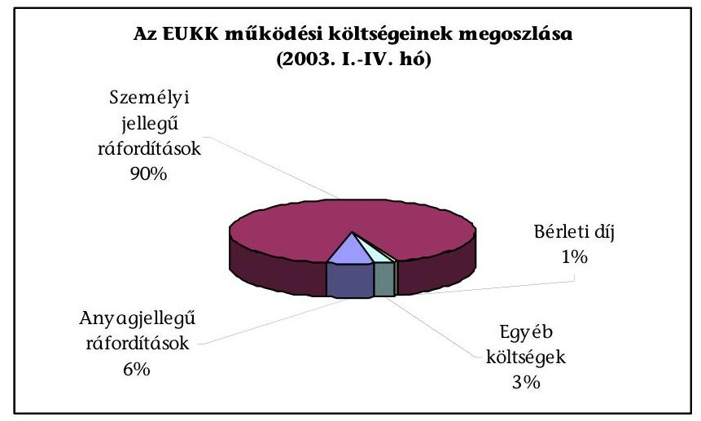
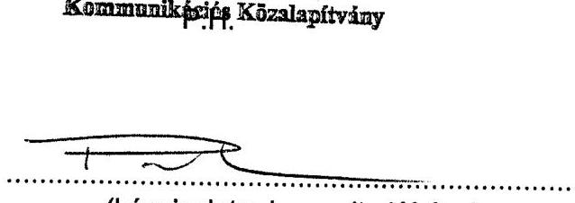
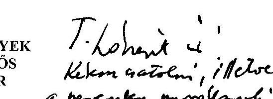
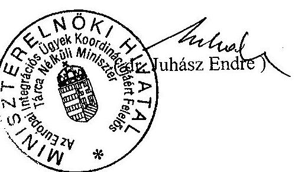
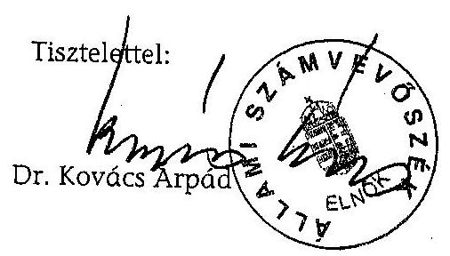
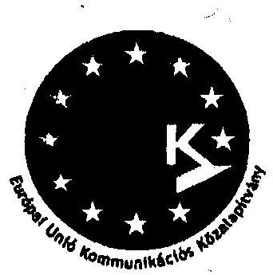
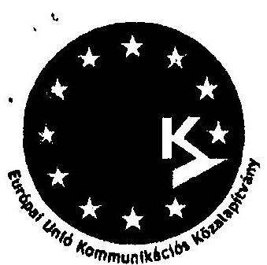
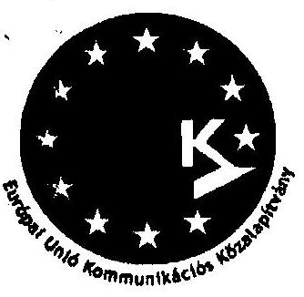
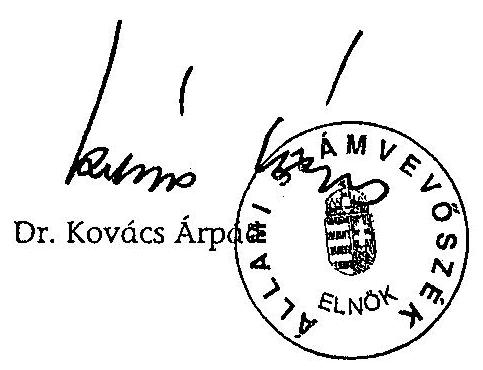

# JELENTÉS 

## az EU Kommunikációs Közalapítvány gazdálkodásának ellenőrzéséről

---

3. Önkormányzati és Területi Ellenőrzési Igazgatóság
3.1. Szabályszerüségi Ellenőrzések FőcsoportIktatószám: V-1014-100/2003.Témaszám: 667
Vizsgálat-azonosító szám: V0117
Az ellenőrzést felügyelte:
Dr. Lóránt Zoltán
főigazgató
Az ellenőrzés végrehajtásáért felelős:
Dr. Elek János
főigazgató-helyettes
Az ellenőrzést vezette:
Balázs Andrásné
főcsoportfőnök-helyettes
Az összefoglaló jelentést készítette:
Balázs Andrásné
főcsoportfőnök-helyettes
Az ellenőrzést végezték:
Pásztor Katalin
számvevő tanácsos
Robák Ferencné
számvevő

## Sas Imréné

számvevő tanácsadó
Solymár Ágnes
számvevő tanácsos

Szappanos Júlia
számvevő

# A témához kapcsolódó eddig készített számvevőszéki jelentések: 

címe
sorszáma
Jelentés a Nemzeti Gyermek és Ifjúsági Alapítvány pénzügyi- 80 gazdasági ellenőrzéséről
Jelentés a Magyar Vállalkozásfejlesztési Alapítvány részére PHARE 220 forrásból juttatott pénzügyi támogatások felhasználásának vizsgálatáról
Jelentés a fejezetek és intézményeik által az alapítványoknak 306 juttatott állami pénzek és vagyon felhasználásának, múködtetésének ellenőrzéséről
Jelentés a Magyar Alkotóművészeti Közalapítvány 347 gazdálkodásának ellenőrzéséről
Jelentés a Gandhi Közalapítvány pénzügyi-gazdasági 351 ellenőrzéséről
Jelentés a Magyarországi Cigányokért Közalapítvány pénzügyi- 372 gazdasági ellenőrzéséről

---

Jelentés a Magyarországi Nemzeti és Etnikai Kisebbségekért ..... 373
Közalapítvány pénzügyi-gazdasági ellenőrzéséről
Jelentés a médiatörvény végrehajtásának pénzügyi - gazdasági ..... 396
ellenőrzéséről
Jelentés a Magyar Rádió Közalapítvány és - kapcsolódó ..... 9806
ellenőrzésként - a Magyar Rádió Részvénytársaság
gazdálkodásának ellenőrzéséről
Jelentés a Magyar Televízió Közalapítvány és kapcsolódó ellenőrzés ..... 9812
keretében a Magyar Televízió Rt. múködésének és
gazdálkodásának ellenőrzéséről
Jelentés a Nemzetközi Pető András Közalapítvány és - kapcsolódó ..... 9822
ellenőrzésként - a Mozgássérültek Pető András Nevelőképző és
Nevelőintézet pénzügyi-gazdasági ellenőrzéséről
Jelentés a Magyar Nemzeti Üdülési Alapítványnak juttatott állami ..... 9906
eszközök felhasználásának és múködtetésének pénzügyi-gazdasági
ellenőrzéséről
Jelentés a sportcélú közalapítványok múködésének pénzügyi- ..... 9907
gazdasági ellenőrzéséről
Jelentés a Fogyatékos Gyermekek, Tanulók Felzárkóztatásáért ..... 9915
Országos Közalapítvány múködésének pénzügyi-gazdasági
ellenőrzéséről
Jelentés a Nemzeti Gyermek és Ifjúsági Közalapítvány ..... 0002
működésének pénzügyi-gazdasági ellenőrzéséről
Jelentés a Közoktatási Modernizációs Közalapítvány múködésének ..... 0011
ellenőrzéséről
Jelentés a Magyar Nemzeti Üdülési Alapítvány vagyon- ..... 0101
gazdálkodásának ellenőrzéséről
Jelentés az Országos Foglalkoztatási Közalapítvány ..... 0117
gazdálkodásának ellenőrzéséről
Jelentés az Új Kézfogás Közalapítvány gazdálkodásának ..... 0136
ellenőrzéséről
Jelentés a közalapítványoknak és az alapítványoknak az 1998- ..... 0228
2001. évek között juttatott nem normatív központi költségvetési
támogatás felhasználásának ellenőrzéséről
Jelentés a Magyar Mozgókép Közalapítvány gazdálkodásának ..... 0304
ellenőrzéséről
Jelentés a Magyar Alkotóművészeti Közalapítvány ..... 0323
gazdálkodásának ellenőrzéséről

---

# TARTALOMJEGYZÉK 

BEVEZETÉS ..... 7
I. ÖSSZEGZŐ MEGÁLLAPÍTÁSOK, KÖVETKEZTETÉSEK, JAVASLATOK ..... 11
II. RÉSZLETES MEGÁLLAPÍTÁSOK ..... 21

1. Az EUKK létrehozásának jogi, szervezeti keretei, működésének szabályossága ..... 21
1.1. Az EUKK megalapítása ..... 21
1.2. A kuratórium múködése ..... 22
1.3. A Tanácsadó Testület múködése ..... 24
1.4. A Felügyelő Bizottság múködése ..... 24
1.5. Az EUKK könyvvizsgálójának megválasztása ..... 27
1.6. Az alapító okirat és az SZMSZ összhangja ..... 28
1.7. Az EUKK titkára és munkaszervezete ..... 29
2. Az EUKK könyvvezetésének és gazdálkodásának szabályozottsága, szabályossága és célszerűsége ..... 30
2.1. Belső szabályzatok ..... 30
2.2. A számviteli nyilvántartás rendszere és szabályossága ..... 31
2.3. A 2003. évi közalapítványi költségvetés ..... 32
2.4. Múködési költségek ..... 32
2.5. A kuratórium és az FB tagjainak tiszteletdíja és költségtérítése ..... 36
2.6. A pénzforgalom szabályossága ..... 38
3. Az EUKK-nak adott állami és egyéb támogatások ..... 38
3.1. Az állami támogatás mértéke és finanszírozása ..... 38
3.2. A nem állami forrásból származó támogatások alakulása ..... 40
4. Az állami támogatás és az egyéb támogatások felhasználása a társadalmi szervezeteknek, alapítványoknak, önkormányzatoknak juttatott támogatások útján ..... 41
4.1. Pályáztatás keretében juttatott támogatások ..... 42
4.1.1. A pályáztatás szabályozottsága ..... 42
4.1.2. A társadalmi szervezeteknek és alapítványoknak adott pályázati támogatások szabályossága és célszerűsége ..... 44
4.1.3. Az önkormányzatoknak adott pályázati támogatások szabályossága és célszerűsége ..... 45
4.2. Pályázaton kívül adott egyedi támogatások ..... 48
4.2.1. A pályázaton kívül adott egyedi támogatások szabályozottsága ..... 48

---

4.2.2. A pályázaton kívül adott egyedi támogatások szabályossága és célszerűsége ..... 48
5. Az állami támogatás és az egyéb támogatások felhasználása vállalkozási szerződések és megrendelések útján ..... 51
5.1. A közbeszerzésekről szóló törvény előírásainak alkalmazása ..... 51
5.2. Az EUKK célszerinti tevékenységének ellátására kötött vállalkozási szerződések és megrendelések szabályossága ..... 56
5.3. A vállalkozási szerződések és megrendelések keretében az alapító okiratban megjelölt célok elérése érdekében teljesített kiadások ..... 58
5.3.1. A reklámtevékenység kiadásai ..... 59
5.3.2. PR és kommunikációs tevékenység ..... 62
5.3.3. Direkt marketing (DM) kommunikáció ..... 62
5.3.4. Kampányrendezvények ..... 64

# MELLÉKLETEK 

1. számú Az EUKK költségei és ráfordításai
2. számú Összesítő az EUKK 2003. április 30-ig megkötött támogatási szerződéseiről (társadalmi szervezetek és alapítványok)
3. számú Összesítő az EUKK 2003. április 30-ig megkötött támogatási szerződéseiről (megyei önkormányzatok)
4. számú Összesítő az EUKK 2003. április 30-ig megkötött támogatási szerződéseiről (megyei jogú városi önkormányzatok)
5. számú Közbeszerzési eljárás alapján megkötött vállalkozási szerződések

## FÜGGELÉK

Az EUKK gazdálkodásának ellenőrzéséhez kapcsolódó helyszíni ellenőrzések megállapításai

---

# RÖVIDÍTÉSEK JEGYZÉKE 

a 2003. évi költségvetési törvény
Áht.
BM
DM
EIP
EU
EUKK
FB
Gt.
Kbt.
Kh. tv.
MEH
MSZOSZ
MÚOSZ
PR
SZMSZ
Szt.
Tao. tv.

A Magyar Köztársaság 2003. évi költségvetésről szóló 2002. évi LXII. törvény
Az államháztartásról szóló, többször módosított 1992. évi XXXVIII. törvény
Belügyminisztérium
Direkt marketing (közvetlen piacszervezés)
Európai Információs Pont
Európai Unió
EU Kommunikációs Közalapítvány
Felügyelő Bizottság
A gazdasági társaságokról szóló 1997. évi CXLIV. törvény
A közbeszerzésekről szóló 1995. évi XL. törvény
A közhasznú szervezetekről szóló 1997. évi CLVI. törvény
Miniszterelnöki Hivatal
Magyar Szakszervezetek Országos Szövetsége
Magyar Újságírók Országos Szövetsége
Public Relations (közönségkapcsolatok)
Szervezeti és Múködési Szabályzat
A számvitelről szóló 2000. évi C. törvény
A társasági adóról és az osztalékadóról szóló 1996. év LXXXI. törvény

---

.

---

# ÉRTELMEZŐ SZÓTÁR 

Cél szerinti tevékenység

Induló vagyon

Kiemelkedően közhasznú közalapítvány

Közalapítvány

Közfeladat

Közhasznú egyszerűsített éves beszámoló

Közhasznú tevékenység

Közhasznúsági jelentés

Minden olyan tevékenység, amely az alapító okiratban megjelölt célkitűzés elérését közvetlenül szolgálja [Kh. tv. 26. § b) pontja].

A közalapítvány javára a célja megvalósításához az alapító okiratban meghatározott vagyon [Ptk. 74/A. § (1) bekezdése, 74/B. § (1) bekezdése]. A közalapítvány rendelkezésére legalább olyan mértékű vagyont kell bocsátani, amely a múködése megkezdéséhez feltétlenül szükséges [Ptk. 74/B. (4) bekezdése]. A közalapítványi vagyon pontos megjelölése nélkül a közalapítvány nem jöhet létre [BH2001. 303 számú, egyedi ügyben hozott bírósági végzés].
A kiemelkedően közhasznú közalapítványnak a közhasznú közalapítványokra előírt követelmények teljesítésén túl közhasznú tevékenysége során olyan közfeladatot kell ellátnia, amelyről törvény vagy törvény felhatalmazása alapján más jogszabály rendelkezése szerint, valamely állami szervnek vagy a helyi önkormányzatnak kell gondoskodnia, az alapító okirata szerinti tevékenységének és gazdálkodásának legfontosabb adatait a helyi vagy országos sajtó útján is nyilvánosságra hozza, továbbá a közhasznú tevékenységet maga látja el [Kh. tv. 5. § és a BH2001. 451 számú, egyedi ügyben hozott bírósági végzés].
A közalapítvány olyan alapítvány, amelyet az Országgyűlés, a Kormány, valamint a helyi önkormányzat vagy kisebbségi önkormányzat képviselő-testülete közfeladat ellátásának folyamatos biztosítása céljából hoz létre [Ptk. 74/G. § (1) bekezdése].
Közfeladatnak minősül az az állami vagy helyi önkormányzati, kisebbségi önkormányzati feladat, amelynek ellátásáról - jogszabály alapján - az államnak vagy az önkormányzatnak kell gondoskodnia [Ptk. 74/G. § (2) bekezdése].
A közhasznú nyilvántartásba vett közalapítványoknál mérlegből, közhasznú eredménykimutatásból és tájékoztató adatokból áll [224/2000. (XII. 19.) Korm. rendelet 6. § (8) bekezdése, illetve 4. és 6 . számú melléklete].

A társadalom és az egyén közös érdekeinek kielégítésére irányuló, a közhasznú közalapítvány alapító okiratában szereplő cél szerinti tevékenység [Kht. 26. § c) pontja].
Tartalmazza a számviteli beszámolót; a költségvetési támogatás felhasználását; a vagyon felhasználásával kapcsolatos kimutatást; a cél szerinti juttatások kimutatását; a központi költségvetési szervtől, az elkülönített állami pénzalaptól, a helyi önkormányzattól, a kisebbségi települési önkormányzattól, a települési önkormányzatok

---

Múködési költségek

Támogatás
Támogatás számviteli elszámolása bevételként, illetve kötelezettségként 2003-tól

Vezető tisztségviselő a közalapítványoknál
társulásától és mindezek szerveitől kapott támogatás mértékét; a közhasznú szervezet vezető tisztségviselőinek nyújtott juttatások értékét, illetve összegét; a közhasznú tevékenységről szóló rövid tartalmi beszámolót [Kh. tv. 19. § (3) bekezdése].

Az üzemeltetési, fenntartási költségek (kiadások) és az egyéb közvetett költségek (kiadások) [115/1992. (VII. 23.) Korm. rendelet 6. §].
Pénzbeli és nem pénzbeli juttatás [Kh. tv. 26. § j) pontja].
A közalapítvány, illetve a közhasznú közalapítvány a kapott alapítói, központi költségvetési, helyi önkormányzati és egyéb támogatásokat - ha jogszabály másként nem rendelkezik - bevételként számolja el. Nem bevételként, hanem kötelezettségként kell kimutatni azt az alaptevékenység céljára kapott támogatást, amelyet az alapítótól, illetve más szervezettől, pályázati vagy egyéb más úton kap, és azt továbbutalja, illetve átadja olyan szervezet részére, amely a cél szerinti feladatot közvetlenül megvalósítja, és az így támogatott szervezet az egyéb szervezettől, közhasznú egyéb szervezettől kapott eszközöket (pénzeszközöket, illetve egyéb eszközöket) bevételként mutatja ki. [A számviteli törvény szerinti egyes egyéb szervezetek beszámoló készítési és könyvvezetési kötelezettségének sajátosságairól szóló 224/2000. (XII. 19.) Korm. rendelet 2003. január 1-jétől hatályos 16. § (5) bekezdése].

A közalapítvány kuratóriumának és felügyelő bizottságának elnöke és tagja, a közalapítvánnyal munkaviszonyban vagy munkavégzésre irányuló egyéb jogviszonyban álló, az alapító okirat szerint egyszemélyi felelős vezető feladatot ellátó személy [Kh. tv. 26. § m)].

---

# JELENTÉS 

## az EU Kommunikációs Közalapítvány gazdálkodásának ellenőrzéséről

## BEVEZETÉS

A nonprofit szervezetek között 1994. január 1-jétől jelentek meg a közalapítványok, melyek megalakítására és múködésére a Ptk. az alapítványok szabályozásán belül külön feltételeket és követelményeket határozott meg az alapítók körét, az ellátandó közfeladatokat, valamint a múködés és gazdálkodás feltételeit illetően. Közalapítványt csak az Országgyúlés, a Kormány, valamint a helyi önkormányzat vagy kisebbségi önkormányzat képviselő-testülete hozhat létre állami közfeladat ellátásának folyamatos biztosítása céljából, de a közalapítvány létrehozása nem érinti az államnak, illetve az önkormányzatnak a feladat ellátására vonatkozó kötelezettségét. A közalapítványok a nyilvánosság előtt tevékenykednek, ezért alapító okiratukat, gazdálkodásuk legfontosabb adatait nyilvánosságra kell hozni. A közpénzek törvényes, felelős és közhasznú felhasználását elősegítendő a Ptk. és a közhasznú szervezetekről szóló törvény részletesen meghatározta a közalapítványok vagyonkezelő szervezete (kuratóriuma) múködésének, képviseletének, a tisztségviselők felelősségének és összeférhetetlenségének szabályait. A közalapítványok vagyonát kezelő szervezet (kuratórium) tagjai az alapítók bizalmából látják el feladatukat, de tőlük sem közvetlenül, sem közvetve nem függhetnek, az alapítók nem gyakorolhatnak meghatározó befolyást a közalapítvány vagyonának felhasználására. A közalapítványok ellenőrzésére az alapítványoknál szigorúbb követelmények vonatkoznak, így az alapítóknak már az alapítással egyidőben létre kell hozni a kuratórium ellenőrzésére jogosult ellenőrző szervet (ellenőrző vagy felügyelő bizottságot).

A Kormány által alapított közalapítványok száma és ezzel együtt az általuk ellátott állami közfeladatok támogatása évről-évre növekszik, így pl. az 1998. évi költségvetési törvény - eredeti előirányzatként - a Kormány által alapított közalapítványoknak 10,4 Mrd Ft, a 2003. évi költségvetési törvény közel 16,5 milliárd Ft támogatást hagyott jóvá ${ }^{1}$. A biztonságosan realizálódó állami támogatás miatt a közalapítványok kuratóriumainak többségére nem jellemző a költségérzékenység. Ismereteink szerint jelenleg az Országgyúlés és a Kormány alapításában 48 közalapítvány múködik vagy bírósági bejegyzés előtt áll, közülük 10 közalapítvány 2002 óta jött létre.

[^0]
[^0]:    ${ }^{1}$ Ez az összeg nem tartalmazza az Országgyúlés által alapított három „médiaközalapítvány" támogatását.

---

A közalapítványi tisztségek betöltése az országgyűlési képviselőválasztás nyertesei „politikai zsákmány"-ának része. Jellemző, hogy a Kormány által alapított közalapítványok kuratóriumainak és felügyelő bizottságainak személyi összetétele a kormányváltásokat követően csaknem teljes egészében kicserélődik, jórészt függetlenül attól, hogy az e tisztségekre szóló felkérés határozatlan vagy határozott időtartamra szólt. A mindenkori Kormány kuratóriumi és felügyelő bizottsági elnöknek, kurátornak és felügyelő bizottsági tagnak az adott koalíció bizalmát élvező személyiségeket kér fel, többnyire az előző testület által végzett munka érdemi minősítése vagy a leváltás indokolása nélkül.

Az Országgyűlés és a Kormány által alapított közalapítványok ellenőrzésénél az Állami Számvevőszék az alapítványok ellenőrzésénél több hatáskörrel rendelkezik, így nem csak az állami támogatás felhasználását, hanem a gazdálkodás törvényességét és célszerűségét is jogosult ellenőrizni.

Az EU Kommunikációs Közalapítványt a Kormány az EU Kommunikációs Közalapítvány létrehozásáról szóló 216/2002. (X. 24.) Korm. rendelettel alapította, a Fővárosi Bíróság 2002. november 11-én kelt végzésével 8718. sorszámon kiemelkedően közhasznú közalapítványként nyilvántartásba vette, amely 2002. december 10-én vált jogerőssé. Az alapító okirat szerint a közalapítvány 200 millió Ft induló vagyont, majd a helyszíni ellenőrzés 2003. június 30-i befejezéséig további 2,5 Mrd Ft támogatást, így összesen 2,7 Mrd Ft-ot kapott, részben a 2003. évi költségvetési törvény eredeti előirányzataként², részben kormányhatározatokkal.

A népszavazást követően az EU Kommunikációs Közalapítvány gazdálkodásának soron kívüli ellenőrzését kérte 2003. április 24-én a Kormány nevében - a miniszterelnök távollétében - a Miniszterelnöki Hivatalt vezető miniszter, illetve 2003. április 16-án a közalapítvány kuratóriuma. Az Állami Számvevőszéknek - alkotmányos jogállásából adódóan - nem feladata minősíteni a Kormány gazdaságpolitikáját, ezen belül például a közalapítványok számára meghatározott feladatok vagy elérendő célok tartalmát, sorrendjét, a támogatás mértékét, a célok teljesítésének helyzetét. Emiatt nem tudtunk állást foglalni abban, hogy a népszavazási eredmények tükrében ${ }^{3}$ helyes volt-e az EU Kommunikációs Közalapítvány számára meghatározott célrendszer, ezen belül a feladatok sorrendje, továbbá abban, hogy a közalapítvány elérte-e a Kormány által kitűzött célokat.

[^0]
[^0]:    ${ }^{2}$ Az EUKK számára jóváhagyott eredeti 1,5 Mrd Ft támogatási előirányzatnál többet a 2003. évi költségvetési törvény csak a Hadigondozottak Közalapítványa támogatására hagyott jóvá (4,1 Mrd Ft-ot).
    ${ }^{3}$ Az Országos Választási Bizottság által közzétett adatok szerint a népszavazáson szavazóként megjelent a választójogosultak $45,62 \%$-a, érvényesen szavazott a megjelent választópolgárok $99,44 \%$-a, igen választ adott az érvényesen szavazók $83,76 \%$-a, nem választ adott az érvényesen szavazók $16,24 \%$-a. A népszavazás eredményes volt, az érvényesen szavazó választópolgárok $83,76 \%$-a, illetve az összes választójogosult 38,00\%-a szavazott az igen válaszra, tehát az Európai Unióhoz való csatlakozásra.

---

A közalapítvány számára a Kormány a társadalomnak az Európai Unióval kapcsolatos ismeretei szintjének növelését, a csatlakozással járó lehetőségek és kihívások bemutatását, az uniós tagság mindennapi életben megjelenő hatásainak bemutatását és az Európai Unióval kapcsolatos ismeretek hozzáférhetőségének biztosítását jelölte meg. Az EU csatlakozással kapcsolatos társadalmi konszenzus megteremtése érdekében a Kormány a közalapítvány kuratóriumába és felügyelő bizottságába - a közalapítványok többségétől eltérően független, széles körben elismert személyiségeket kért fel. A kuratórium a 2003. április 12-i népszavazásig azt tűzte ki célul, hogy növelje a társadalomnak az EU-val kapcsolatos tájékozottsági szintjét, hosszú távú tájékoztató rendszert építsen ki, legalább $50 \%+1$ fős legyen a népszavazási részvétel, minél magasabb legyen az igen szavazatok aránya. A népszavazást követő értékelésében a kuratórium összességében sikeresnek minősítette saját tájékoztató tevékenységét, megállapítása szerint a fent felsoroltak közül az első két célt elérte, a negyedik célt túlteljesítette, a harmadikat viszont a vártnál alacsonyabb mértékben teljesítette. A nehézségek és kudarcok okait abban látta, hogy nem sikerült az EU csatlakozással kapcsolatos konszenzus megteremtése, nem sikerült a közvéleménnyel elfogadtatnia a közalapítvány függetlenségét, a csatlakozás egységes érvrendszerét, nem alakult ki harmonikus együttmúködés a Kormány egyes kommunikációs egységei és a közalapítvány között, a többi szervezet által végzett propagandát a közvélemény - hátrányosan - a közalapítvány tevékenységével azonosította, továbbá - másokhoz hasonlóan - a kuratórium sem számolt az alacsony részvétel bekövetkezésének esélyével.

A Kormány 2003. II. félévében további 150 millió Ft támogatást engedélyezett a közalapítványnak, 2004-re pedig az EUKK - az Országgyűlésnek benyújtott 2004. évi költségvetési törvényjavaslat szerint - közvetlenül névre címzett támogatásként 800 millió Ft előirányzattal számolhat. A törvényjavaslat indokolása szerint az EUKK 2004. évi feladata „a magyar társadalom felkészitése az EU csatlakozással járó kihívásokra és lehetőségekre, amelynek egyik legfontosabb eszköze a hosszú távra szóló folyamatos kommunikációs tevékenység, amely egyre inkább konkrét, az egyes társadalmi, gazdasági, szociális csoportok igényeihez igazított speciális információkat és ismereteket közvetít".

Az Állami Számvevőszék az Állami Számvevőszékről szóló 1989. évi XXXVIII. törvény 2. § (5) bekezdése alapján ellenőrzi a közalapítványoknál az állami költségvetésből nyújtott támogatás felhasználását, továbbá a Ptk. 74/G. § (8) bekezdése alapján ellenőrzi a közalapítványok gazdálkodásának törvényességét és célszerűségét.

# Az ellenőrzés célja az volt, hogy törvényességi és célszerűségi szempontból értékelje, hogy 

- a működés jogi, szervezeti és szabályozottsági feltételei biztosították-e a gazdálkodás törvényességét, a gazdálkodás és a könyvvezetés szabályos volt-e;
- az alapító által juttatott induló vagyonnal és a 2003. évi költségvetési törvényben, valamint az egyedi kormányhatározatokban jóváhagyott támogatással és a nem állami forrásból származó bevételekkel az alapító okiratban megjelölt célokkal összhangban gazdálkodott-e a kuratórium;

---

- a kuratórium által nyújtott támogatások, illetve a cél szerinti feladatok elvégzésére kötött vállalkozási szerződések törvényesek, célszerúek voltak-e, összhangban álltak-e a közalapítványi célokkal, gondoskodott-e a kuratórium a támogatások felhasználásának elszámoltatásáról, illetve a vállalkozási szerződések teljesítésének ellenőrzéséről;
- betartotta-e a kuratórium a múködési költségek mértékére vonatkozó előírást, a múködési költségek szabályosak és célszerúek voltak-e;
- teljesítette-e a kuratórium a múködés nyilvánosságára előírt törvényes követelményeket.

Az ÁSZ törvény 21. § (3) bekezdése alapján, ha egyes vizsgálati megállapítások kiegészítése válik szükségessé, és ehhez más szervnél is ellenőrzést kell végezni, az Állami Számvevőszék ellenőre jogosult az összefüggő tényeket ott vizsgálni. Ennek megfelelően kapcsolódó ellenőrzés keretében ellenőriztük a közalapítvány által adott támogatás felhasználását öt társadalmi szervezetnél, egy alapítványnál, egy kft.-nél, három megyei önkormányzatnál, négy megyei jogú városi önkormányzatnál, egy nagyközségi önkormányzatnál és két önkormányzati költségvetési intézménynél. Az ÁSZ törvény 2. § (9) bekezdése szerint az Állami Számvevőszék - a 2. § (5)-(6) bekezdése szerinti ellenőrzési feladataival összefüggésben - csak a 2003. június 9 -ét követően kötött szerződéseknél vizsgálhatja az államháztartás alrendszereiből finanszírozott beszerzéseket és az államháztartás alrendszereinek vagyonát érintő szerződéseket a megrendelőnél (vagyonkezelőnél), a megrendelő (vagyonkezelő) nevében vagy képviseletében eljáró természetes személynél és jogi személynél, valamint azoknál a szerződő feleknél, akik, illetve amelyek a szerződés teljesítéséért felelősek, továbbá a szerződés teljesítésében közremúködő valamennyi gazdálkodó szervezetnél. Az EUKK az ellenőrzött időszakban - megalakulásától 2003. április 30-ig - kapott induló vagyon és állami támogatás 46,2\%-ának (1261,6 millió Ft) felhasználására vállalkozókkal kötött szerződéseket. E szerződések ellenőrzése még nem tartozott az ÁSZ törvény 2. § (9) bekezdésének hatálya alá, de a reprezentatív módon kiválasztott tíz gazdasági társaság írásban hozzájárult ahhoz, hogy az Állami Számvevőszék az EU Kommunikációs Közalapítvány és a társaság által megkötött szerződés(ek)re vonatkozóan a társaságnál kapcsolódó ellenőrzést végezzen, és tudomásul vették, hogy az ellenőrzés az ÁSZ törvény eljárási szabályai szerint történik.

A helyszíni ellenőrzést követően, 2003 augusztusában a Fővárosi Főügyészség a közalapítványnál törvényességi felügyeleti ellenőrzést végzett és a feltárt jogsértések miatt - így az alapító okirat módosítása; az alapító okirat és az SZMSZ közötti összhang hiánya; a felügyelő bizottság ügyrendjének tartalma; a kuratóriumi határozatok hiányos nyilvántartása; határozathozatalnál az öszszeférhetetlenségi előírások megszegése - felszólalással élt, és indítványozta a szükséges intézkedések megtételét.

Az ellenőrzés a 2002. november 11. - 2003. április 30. közötti időszakra terjedt ki, de egyes folyamatokat a 2003. június 30 -ig terjedő időszakig értékeltünk.

---

# I. ÖSSZEGZŐ MEGÁLLAPÍTÁSOK, KÖVETKEZTETÉSEK, JAVASLATOK 

Az EU Kommunikációs Közalapítványt az alapításáról szóló kormányrendelet 2002. november 1-jei hatálybalépését követően - 2002. december 10-i jogerőre emelkedéssel - önálló jogi személyként nyilvántartásba vette a Fővárosi Bíróság, de a közalapítvány - a törvényi előírásokkal ellentétesen - már ezt megelőzően megkezdte múködését. A kuratóriumnak mindössze öt hónap állt rendelkezésére ahhoz, hogy az európai uniós csatlakozással kapcsolatos, ügydöntő országos népszavazás 2003. április 12. napjáig eredményesen megoldja az alapító okiratban megjelölt időarányos feladatait.

A közalapítvány gazdálkodását megalakulásától 2003. április 30-ig bezáróan ellenőriztük, ez időszak alatt - induló vagyonként, továbbá a 2003. évi költségvetési törvény és egyedi kormányhatározatok alapján - összesen 2700 millió Ft állami támogatást kapott, továbbá két gazdasági társaság összesen 11,3 millió Ft támogatással járult hozzá a 2003. március 15-i Nemzeti Ünnep rendezvényeihez és a Budapesten felállítandó pontonhíd költségeihez. A teljesített költségek és ráfordítások 2003. április 30 -ig bezáróan 1203,8 millió Ft-ot tettek ki, ennek $95,3 \%$-a a közalapítványi célú feladatok ellátása miatt merült fel, $4,7 \%$ volt a múködési célú kiadások aránya.

A kuratórium a közalapítványi célok teljesítése érdekében a 2003. I. félévében a rendelkezésére bocsátott 2700 millió Ft-ból 2242,4 millió Ft-ra ( $83,1 \%$ ) vállalt kötelezettséget, illetve teljesített kifizetést, ezen belül a támogatások összege 339,4 millió Ft ( $12,6 \%$ ), a vállalkozóktól megrendelt szolgáltatások összege 1903 millió Ft $(70,5 \%)$ volt.

A kuratórium 297,8 millió Ft-ot, a támogatások 87,7\%-át pályázati úton, szabályozottan, a felhasználásra kötött szerződéssel használt fel, ebből 103,6 millió Ft-ot hagyott jóvá 16 megyei önkormányzatnak, 124,2 millió Ft-ot 22 megyei jogú városi önkormányzatnak „A megyék és megyei jogú városok önkormányzatainak szerepe az Európai Unióhoz való csatlakozásig" címmel, 70 millió Ftot pedig 19 civil szervezetnek, „Az országos jelleggel múködő társadalmi szervezetek EU kommunikációs feladatainak ellátása" címmel. A közalapítvány Szervezeti és Múködési Szabályzata - helyesen - a támogatási összeg nagyságához kötötte az elszámoltatás módját, meghatározta a támogatás szabálytalan felhasználásának szankcióit, a támogatások eljárási rendjéről szóló belső szabályzat pedig szakszerűen és egyértelmúen szabályozta a támogatások jóváhagyását, folyósítását és ellenőrzését. Az ellenőrzött támogatási szerződések megfeleltek a belső szabályzatok előírásainak. A kuratórium a pályázatok pénzügyi lebonyolítására együttmúködési megállapodást kötött a Kincstárral, ennek megfelelően a támogatások pénzügyi ellenőrzését a Kincstár végezte az eredeti számlák alapján, az önkormányzatok esetében ellenérték felszámolása nélkül, a civil szervezeteknél a megítélt támogatás $1 \%$-át kitevő megbízási díj ellenében. A Szervezeti és Múködési Szabályzat előírásaival ellentétben a munkaszervezet a támogatási szerződések teljesítését nem ellenőrizte a helyszínen. A támogatások

---

közalapítvány részéről történő elszámoltatása a számvevőszéki ellenőrzés befejeződéséig nem zárult le.

Azoknál az önkormányzatoknál, önkormányzati költségvetési intézményeknél, civil szervezeteknél, ahol a reprezentatív mintavétel alapján helyszíni ellenőrzést végeztünk, a megjelölt céltól eltérő felhasználást nem tapasztaltunk. A könyvvezetésben a támogatási összeget - elszámolásra és ellenőrzésre alkalmas módon - az önkormányzatok és az intézmények elkülönítették. Egyedi jellegű hiányosságként tártuk fel az ellenőrzött önkormányzatoknál és intézményeknél, hogy egyes feladatokat a szerződéstől eltérően más szervezetnél bonyolítottak le, nem jelezték előzetesen az ÁFA visszaigénylő státuszt, nem tartották be maradéktalanul a bizonylati fegyelmet és készpénzkezelési szabályokat, egy továbbadott támogatásban részesített szervezet - még az elszámoltatását megelőzően - megkísérelte a támogatott programhoz nem kapcsolódó számlák megtéríttetését is. A feltárt és pótolható hiányosságok többsége még az ellenőrzésünk során rendeződött. Azoknál a civil szervezeteknél, ahol a reprezentatív mintavétel alapján helyszíni ellenőrzést tartottunk, ugyancsak nem tapasztaltunk a támogatás céljától eltérő felhasználást. Az ellenőrzött civil szervezeteknek azonban több mint a fele nem különítette el könyvvezetésében a kapott és a felhasznált támogatást, külön analitikus nyilvántartást sem vezetett, így a bizonylatok keveredése nehezíti az elszámoltatást és az ellenőrzést. Azt tapasztaltuk, hogy a benyújtott pályázatban szereplőnél alacsonyabb öszszegben jóváhagyott támogatással összhangban nem készült módosított költségvetés, de a tervhez képest nem a programok tartalma, hanem az események időtartama vagy a rendezvénybe bekapcsolt települések száma csökkent.

Az alapító okirat a vagyonfelhasználás módjával kapcsolatosan nem írta elő, hogy a kuratórium csak pályázati úton adhat támogatást, így a kuratórium jogosult volt pályázaton kívül is támogatásokat adni, így egyedi kérelmekre öt szervezetnek összesen 41,6 millió Ft támogatást juttatott. Az egyedi kérelmekben bemutatott, tervezett programok illeszkedtek a közalapítványi célokhoz. A támogatások eljárási rendjéről szóló szabályzat a pályázaton kívüli eljárással odaítélhető támogatások rendjét hiányosan szabályozta, mert nem jelölte meg a javaslattételre jogosult támogatási bizottság tagjait.

A kuratóriumi elnök - a közbeszerzési törvény előírásainak megkerülésével - nem rendezvényszervezési szolgáltatásra vonatkozó vállalkozási szerződést kötött a Kamarapressz Kiadó és Szolgáltató Kht.-val, hanem - kuratóriumi jóváhagyás nélkül - 19,5 millió Ft összegben támogatási szerződést. A kuratóriumnak a titkár adott utólagos tájékoztatást a támogatásról, a kht. elszámolását és a teljesítési összeg kifizetését követően. A hozott kuratóriumi határozat nem volt összhangban a valós gazdasági eseménnyel, mivel - a támogatás céljának és összegének megjelölése nélkül - nem a kht., hanem a Gazdasági és Iparkamara támogatását hagyta jóvá.

Az egyedi támogatások odaítélésénél a kuratórium következetlen volt, mivel három olyan szervezetnek is adott támogatást, amelyeknek az azonos céllal elkészített pályázati kérelmét - 109 más szervezettel együtt - korábban egyszer már elutasította. Ezzel az eljárással sérült a pályázatok elbírálásának objektivitása, hiszen a pályázati követelményeket nem teljesítő pályázók egyéb, nem nyilvános szempontok alapján mégis támogatásban részesültek.

---

A kuratórium a 2003. I. félévben a vállalkozóktól megrendelt 1903 millió Ft összegű szolgáltatásból 1581,9 millió Ft-ról (83,1\%) - a fent bemutatott eset kivételével - a közbeszerzési törvény előírásait betartva döntött. A lefolytatott eljárások közül „A klasszikus reklám, kommunikáció, illetve médiatervezés és vásárlás előkészítése és lebonyolítása" tárgyban, hirdetmény közzététele nélkül folytattak le tárgyalásos gyorsított eljárást. Ajánlattételre a korábban, hirdetmény közzétételével lefolytatott eljárás nyertes pályázóját kérték fel, egyrészt azért, mert a teljesítés alatt álló szerződés szerint - a szerződés szerinti összeg teljes kiegyenlítéséig - a társaságot meghatározott szerzői jogok illetik meg, másrészt addigi tevékenységével sikeresen bizonyított. A gyorsított eljárás alkalmazását a rendkívüli sürgősséggel indokolták, az eljárás lefolytatása időben mégis elhúzódott. Az eljárás tényleges időtartama azt jelzi, hogy a közbeszerzési folyamat nem volt kellően előkészített, így a rendkívüli sürgősségre való hivatkozás - tekintettel a tárgyalások lefolytatásának elhúzódására - nem volt megalapozott. Az ajánlatban szereplő tevékenységet a társaság a sürgősségre tekintettel részben a szerződés aláírása előtt - már a tárgyalások alatt - el is végezte.

A kuratórium által a közalapítványi célú feladatok teljesítése érdekében a 2003. I. félév végéig összesen megkötött 1903 millió Ft összegű szerződésből és megrendelésből a reklámtevékenységet szolgálta 736,8 millió Ft, PR kommunikációt 212 millió Ft, direkt marketinget és az ehhez kapcsolódó tevékenységeket 688,2 millió Ft, kampányrendezvényeket 266 millió Ft összegű kötelezettségvállalás. E szerződések és megrendelések teljesítési határideje általában a népszavazás napjához kapcsolódott. A helyszíni ellenőrzés befejezésekor - 2003. június 30 -án - még egy olyan szerződés volt, amelynek teljesítése áthúzódik 2004-re, a direkt marketing szolgáltatásra vonatkozó, 218,6 millió Ft összegű szerződés teljesítési időtartama 2003. február 3-tól 2004. május 1-jéig tart. A szerződések/megrendelések pénzügyi teljesítése 2003. április 30-ig nem érte el az 50\%-ot. A helyszínen ellenőrzött gazdasági társaságok a vállalkozói díjat - egy kivétellel - részletes költségvetéssel/árajánlattal támasztották alá, a szerződött munka teljesítéséhez kapcsolódó költségeket a könyvvezetésben elkülönítették, az elszámolt költségek a szerződésekben/megrendelésekben vállalt feladatokkal összhangban merültek fel.

A közalapítvány múködésének legfontosabb szabályait a Kormány által jóváhagyott alapító okirat tartalmazta. A kuratórium személyi összetétele megfelelt a törvényes előírásoknak, mivel a Kormány mint alapító a kuratóriumban - sem közvetlenül, sem közvetve - a vagyon felhasználására vonatkozóan meghatározó befolyást nem szerzett, és - az ellenőrzés megállapításai szerint nem is gyakorolt. A kuratórium mellett múködő Tanácsadó Testület teljesítette az alapító okiratban megjelölt feladatait. A Felügyelő Bizottság ügyrendje - melyet a kuratórium az FB döntését követően, hatáskörét túllépve megtárgyalt, módosított és jóváhagyott - hiányos és törvénysértő volt. Az ellenőrzött időszak végéig - 2003. április 30-ig - az FB mint testület nem múködött, üléseket nem tartott, beszámoltatást, ellenőrzést nem végzett, ellenőrző tevékenységét csak 2003 májusát követően kezdte meg.

A Kormány az alapító okiratban a kuratórium és a felügyelő bizottság tagjai tiszteletdijának konkrét összegét nem határozta meg, a tiszteletdíjat azzal a feltétellel engedélyezte, ha az a közalapítvány cél szerinti tevékenységét nem veszélyezteti. Ez a szabályozás hiányos és célszerűtlen, mivel a Kormány sem a

---

nevében eljáró miniszterre, sem a kuratórium számára nem ruházta át a tiszteletdíj konkrét összege megállapításának jogát, a megjelölt korlát csak „kvázi" korlát, illetve a szabályozás nem zárta ki azt az - általunk etikailag kifogásolt értelmezési lehetőséget, hogy a kuratórium jogosult lehet a saját tagjai és az őt ellenőrző FB tagjai számára megállapítani a tiszteletdíjat. A kuratórium a tiszteletdíj megállapításáról hozott határozata elfogadásakor megszegte az összeférhetetlenségi előírásokat, mivel a határozathozatalban részvett valamennyi kurátor személy szerint is érdekelt volt. A tiszteletdíjakat - a többi hasonló nagyságrendű közpénzt felhasználó vagy társadalmilag hasonlóan fontos állami közfeladatot ellátó közalapítvány kuratóriumával és felügyelő bizottságával összehasonlítva a kuratórium - a felügyelő bizottság javaslatára - indokolatlanul magasan, 200 000-300 000 Ft közötti összegben határozta meg. ${ }^{4}$ A felügyelő bizottság sem a Ptk., sem az alapító okirat szerint nem jogosult a tiszteletdíjjal kapcsolatosan a kuratórium számára előterjesztést tenni.

A kuratórium mint testület múködése a gazdálkodást érintő határozatokat illetően - az ismertetett egyedi esetek kivételével - összességében törvényes volt. Megalakulásától 2003. április 30-ig összesen tizennégy ülést tartott, ebből hármat 2002-ben, tizenegyet 2003-ban. Legintenzívebben 2003 januárjában és februárjában - a pályázatok kiírása és elbírálása időszakában - múködött. Hiányosságokat elsősorban a múködés kezdeti időszakában észleltünk, így pl. az első ülések jegyzőkönyveihez kapcsolódó anyagokat hiányosan irattározták, nem mindegyik jegyzőkönyv tartalmazta a szavazás pontos eredményét, így pl. a határozatot támogatók és ellenzők nevét, számát. Egy levélszavazást kellő számú igen szavazat hiányában is érvényesnek tekintettek, továbbá egy alkalommal cél és összeg nélkül hagytak jóvá pályázaton kívüli juttatást.

A közalapítvány éves költségvetés alapján gazdálkodott. Ennek tartalmát, szerkezetét azonban az alapító okirat nem részletezte, és a kuratórium sem határozta meg a tervezés, jóváhagyás, módosítás és a teljesítésről szóló beszámoló elkészítésének menetét, határidőit.

Az alapító okirat a közalapítvány képviseletével kizárólag a kuratórium elnökét hatalmazta fel. Az alapító okirattal ellentétesen - az ellenőrzött időszakban készített - 40 db megrendelés csaknem egyharmad részét, összesen mintegy 10 millió Ft összegben a képviseleti jog gyakorlására nem jogosult titkár írta alá. A közalapítvány eredeti Szervezeti és Múködési Szabályzatát nem az alapító, hanem - a Fővárosi Bíróság által felülvizsgált és nyilvántartásba vett alapító okirat felhatalmazása alapján - a kuratórium hagyta jóvá.

[^0]
[^0]:    ${ }^{4}$ A Kormány által alapított többi közalapítványnál a nyilvánosan hozzáférhető alapító okiratok szerint a megállapított legmagasabb összegű tiszteletdíj jelenleg a mindenkori minimálbér ötszöröse, illetve háromszorosa az Országos Foglalkoztatási Közalapítványnál, két és félszerese, illetve kétszerese a Magyar Mozgókép Közalapítványnál és a Szabadságharcosokért Közalapítványnál. Nem engedélyezett tiszteletdíjat az alapító okiratban a Kormány a kezelői feladatok ellátásáért pl. az Atlanti Kutató és Kiadó Közalapítványnál, az Avicenna, Közel-Kelet Kutatások Közalapítványnál, a Közép- és Kelet-európai Történelem és Társadalom Kutatásáért Közalapítványnál, a Magyarországi Zsidó Örökség Közalapítványnál, a Nemzetközi Pikler Emmi Közalapítványnál, a Természet-és Társadalombarát Fejlődésért Közalapítványnál.

---

A kuratórium az eredeti SZMSZ-t a képviseleti jog gyakorlását illetően a Ptk.-ba és az alapító okiratba ütköző módon módosította.

A belső szabályzatok között a számviteli politika nem szabályozta teljes körűen a közalapítványra jellemző, sajátos elszámolásokat, így a kapott támogatások kötelezettségként való nyilvántartását és elszámolását, illetve szükségtelen előírásokat is tartalmazott a jelentős összegű hibahatár meghatározásakor. A számlarend és a számlakeret olyan számlák vezetését is előírta, amelyeket a közalapítványnál nem kell használni, vagy a jogszabályok a használatát nem teszik lehetővé. A pénzkezelési szabályzat összességében körültekintően határozta meg a pénz kezelésével, mozgatásával, őrzésével és ellenőrzésével kapcsolatos szabályokat, de a közalapítványnál nem jellemző meghatározásokat is tartalmazott.

A munkaszervezet ügyrend szerinti feladataival nem indokolható, az állami vezetők juttatásait közelítő vagy meghaladó kiadásokat, illetve korlátlan költekezést tapasztaltunk a munkaszervezet vezetője és egyes alkalmazottai díjazásánál és egyéb juttatásainál, ezek közé tartozott pl. három db közép- és felsőkategóriájú gépkocsi vásárlása vagy a korlátlan, személyes célokra is szóló gépkocsi és mobiltelefon használat ${ }^{5}$. Mindezt - a kellő önmérséklet és a vezetői ellenőrzés hiánya mellett - az is elősegítette, hogy az alapító okirat számításokkal alá nem támasztott, a többi közalapítványra nem jellemző, magas múködési költségkeretet engedélyezett az EUKK-nak.

A kuratórium 2003. október 21-én kelt tájékoztatása szerint a helyszíni ellenőrzés megállapításainak hasznosítását már az ellenőrzés alatt megkezdték, megszüntették a képviseleti jog szabálytalan gyakorlását, helyesbítették a számlatükröt, a továbbadott támogatások könyvelését, pontosították, illetve kiegészítették a kuratóriumi határozatokról vezetett nyilvántartást. A felügyelő bizottság elnökének 2003. október 16-án kelt tájékoztatása szerint az FB megkezdte ellenőrző és beszámoltató feladatainak ellátását.

[^0]
[^0]:    ${ }^{5}$ Más közalapítványra is jellemző az indokolatlan költekezés, mivel az általában biztonságosan realizálódó állami támogatás gátolja a költségérzékenység kialakulását. Így pl. a Magyar Mozgókép Közalapítvány (lásd a 0304. számú ÁSZ jelentést) kilencfős munkaszervezete a rendelkezésére álló egy db saját tulajdonú és két db bérelt személygépkocsi mellett még két taxis vállalkozót is foglalkoztatott egész évre szóló szerződés keretében, akik a tényleges futásteljesítményen túl megkapták a várakozási és a készenléti díjat is; az Új Kézfogás Közalapítvány kuratóriuma (lásd a 0136. számú ÁSZ jelentést) a belvárosban bérelt az átlagosnál magasabb bérleti díjjal irodahelyiségeket. A telefonköltségek több mint fele a mobiltelefonok használata miatt merült fel, miközben ezek száma és költsége - különösen a tisztségviselőkre vonatkozóan - indokolatlan volt; a Nemzeti Gyermek és Ifjúsági Közalapítványnál (lásd a 0002. számú ÁSZ jelentést) a kurátoroknak és az FB tagoknak a költségtérítés keretében elszámolt egyes költségei nem, vagy csak részben függtek össze a közalapítvány tevékenységével. Az elszámolt költségek jelentős része nem a közalapítványnál végzett, illetve nem az érintett tisztségviselő tevékenysége miatt merült fel, hanem a személyes vagy a családtagok szükségleteinek kielégítését szolgálták. A költségek mértékét és indokoltságát hiányosan, illetve valótlanul dokumentálták.

---

A 2004. évi EU csatlakozással, illetve az EU képviselők megválasztásával lezárul a kommunikációnak a társadalom valamennyi rétegére kiterjedő, meggyőző szakasza. Az EU polgárként szükséges tudnivalók, ismeretek átadása, az állampolgárok egyedi ügyekben való tájékoztatása, eligazítása, az ezekhez szükséges oktatási feladatok és információs csatornák megszervezése már nem igényli feltétlenül a köztiszteletben álló, nagy tekintélyú személyiségek kurátori közremúködését. Megtakarítható az időigényes és költséges kuratóriumi és felügyelő bizottsági múködés, a hozzájuk kapcsolódó költségek (pl. a közalapítványon belül a tiszteletdíjak és költségtérítések, a székhely fenntartása, a munkaszervezet dologi és bérköltségei, a kötelező audit költsége, illetve a közalapítványnál elszámolt költségeken túl, pl. a Fővárosi Bíróság és a Fővárosi Főügyészség törvényességi feladatai ellátásához vagy az Állami Számvevőszék törvényességi és célszerűségi ellenőrzéseihez szükséges költség-, szakember- és időigény). Az EUval kapcsolatos kommunikációs feladatok megoldásához a közalapítványi kereten belüli feladatellátásnál költségtakarékosabb az államigazgatási kereteken belüli megoldás, amely nem zárja ki az önkormányzati és a civil szervezetek szükség szerinti bekapcsolódását a feladatok ellátásába, hiszen az állami szervek az eddigiekhez hasonlóan a jövőben is írhatnak ki pályázatokat meghatározott EU kommunikációs feladatok ellátására, a társadalom konkrét rétegeinek célzott elérésére.

A helyszíni ellenőrzés megállapításainak hasznosítása mellett javasoljuk:

# a Kormánynak 

1. Mérlegelje, hogy az EU Kommunikációs Közalapítvány alapító okiratban megjelölt feladatai az EU csatlakozást követően az európai integrációs ügyek koordinációjáért felelős tárca nélküli miniszter feladat- és hatáskörében, illetve az EU Támogatási Hivatal finanszírozásában takarékosabban megvalósíthatók-e, és ennek megfelelően indokolt-e a közalapítvány megszüntetését kezdeményezni a Ptk. 74/G. § (9) bekezdésének megfelelően.
2. Módosítsa a 236/2002. (XI. 7.) Korm. rendelet mellékleteként megállapított alapító okiratot a következőkkel (amennyiben az EU Kommunikációs Közalapítvány működése - az 1. pontban megjelölt elemzés eredményeként - továbbra is indokolt):
a) mérlegelje annak engedélyezését, hogy a kuratórium képviseleti jogot biztosíthasson az EUKK meghatározott alkalmazottainak, az alapító okiratban megjelölve a képviseleti jog gyakorlásának módját, illetőleg terjedelmét;
b) az SZMSZ jóváhagyásával, valamint a kuratóriumi tagok és az FB tagok tiszteletdíjának megállapításával hatalmazza fel az alapító képviseletében eljáró európai integrációs ügyek koordinációjáért felelős tárca nélküli minisztert;
c) a működési kiadások mértékét az éves kiadások arányában, az EUKK működésének jellemzői (pl. az állami támogatás felhasználásnak módja, a vezető tisztségviselők létszáma és díjazása, a feladatok ellátásához szükséges munkaszervezet létszáma és díjazása, rezsiköltségek) alapján, a 2003. évi gazdálkodás tapasztalatait is figyelembe véve úgy határozza meg, hogy a felhasználható keret a kuratóriu-

---

mot és a munkaszervezetet takarékos gazdálkodásra, az irreális mértékű juttatások megszüntetésére ösztönözze.
3. Dolgozza ki azokat az elveket, amelyek alapján valamennyi, a Kormány által alapított közalapítvány alapító okiratában mértéktartó takarékossággal megjelölhető, illetve szabályozható a múködési (rezsi) költségkeret, a kurátorok és FB tagok tiszteletdíja, költségtérítése. Az elvek kialakítása során célszerű differenciálni a közalapítványok sajátosságai szerint, pl. az ellátott közfeladatok száma, összetettsége, az átadott induló vagyon összege és összetétele, a vagyonkezeléssel járó döntések bonyolultsága, az állami támogatásból teljesített mindenkori tárgyévi kiadások mértéke, felhasználásának (pályázati elosztás vagy saját szervezeten belüli feladatellátás) munkaigénye, a munkaszervezet optimális létszáma stb. A múködési költségkeret ösztönözze takarékosságra a kuratóriumokat, a tiszteletdíj mértéke pedig álljon arányban a gazdasági társaságok vezető tisztségviselői felelősségével, illetve a számukra meghatározott díjazással.
4. Határozza meg részletesen - szükség esetén valamennyi érintett közalapítvány alapító okiratának módosításával - hogy a Kormány által alapított közalapítványok és alapítványok kormányzati felelőseiről és egyes feladatokról szóló 1034/2003. (IV. 24.) Korm. határozat 1. pontjában megjelölt kormánytagok az alapítót megillető jogkörökön belül konkrétan mely jogköröket és milyen feltételekkel gyakorolhatnak. Ennek keretében rendelkezzen arról is, hogy a jövőben csak az alapító okirat vagy a Kormány mint alapító nevében eljáró kormánytag állapíthatja meg a kurátorok és az FB tagok konkrét díjazását.

# az európai integrációs ügyek koordinációjáért felelős tárca nélküli miniszternek 

1. Hagyja jóvá a közalapítvány SZMSZ-ét a következők figyelembevételével (amennyiben a Kormány a számára javasolt 2. pontnak megfelelő tartalommal módosította az alapító okiratot):
a) az SZMSZ-ben a képviseleti jog gyakorlására jogosult személyek köre és a jogkör tartalma nem térhet el az alapító okiratban meghatározottól;
b) az SZMSZ határozza meg az EUKK éves költségvetésének tartalmát, szerkezetét, a költségvetés tervezésének, jóváhagyásának, módosításának és a teljesítésről szóló beszámoló elkészítésének menetét, határidőit.
2. Állapítsa meg az EUKK kuratóriumi és FB tagjainak tiszteletdíját és költségtérítését, valamint ezek havi folyósításának feltételeit, amennyiben erre a Kormány a számára javasolt 2. pontnak megfelelően módosított alapító okiratban erre felhatalmazta.
3. Kérjen 2003. december 31-ig az EUKK FB-től beszámolót a 2003. évi ellenőrzési és beszámoltatási feladatainak teljesítéséről.

## az EU Kommunikációs Közalapítvány kuratóriumának

1. Helyezze hatályon kívül a kuratórium és FB tagok tiszteletdíjáról szóló, az összeférhetetlenségi szabályokat megszegve hozott kuratóriumi határozatot.

---

2. Vizsgálja meg, kit terhel a felelősség azért, hogy a kuratórium nem a valós gazdasági eseménynek megfelelő tartalommal fogadta el a Gazdasági és Iparkamara támogatását, illetve a közbeszerzési szabályok megsértésével adott 19,5 millió Ft támogatást a Kamarapressz Kiadó és Szolgáltató Kht.-nak.
3. Vizsgálja meg, kit terhel a felelősség a munkaszervezet korlátlan költekezéséért, a magas múködési kiadásokért, illetve intézkedjék ezek megszüntetése érdekében (így pl. a munkaszervezetnek vásárolt személygépkocsik értékesítéséről, a korlátlan személygépkocsi és mobiltelefon használat megtiltásáról, az egyes munkakör ellátásához feltétlenül indokolt keretek meghatározásáról és betartásának következetes számonkéréséről).
4. Haladéktalanul intézkedjék, hogy a munkaszervezet alkalmazottai a kötelezettségvállalásoknál (pl. a megrendeléseknél) ne gyakorolják törvénysértően a képviseleti jogokat.
5. Módosítsa belső szabályzatait a következők figyelembevételével:
a) módosítsa a számviteli politikát az EUKK-ra jellemző, sajátos elszámolásokkal, így pl. a kapott támogatások kötelezettségként való nyilvántartásával és elszámolásával, továbbá törölje a jelentős összegű hibahatár meghatározásakor a feleslegesen megjelölt értékhatárt;
b) a számlarendben és a számlakeretben az EUKK sajátosságainak megfelelően csak olyan számlák vezetését írják elő, amelyeket ténylegesen használnak vagy jogszabályi előírások alapján használhatnak;
c) a pénzkezelési szabályzatban töröljék az EUKK-ra nem jellemző készpénzhelyettesítő eszközök használatának szabályozását (pl. a csekkek, a bankkártyák, üzemanyag-kártyák, tikettek, váltók kezelése);
d) a támogatások eljárási rendjének szabályzatában írja elő az egyedi (nem pályázati úton adott) támogatás döntéselőkészítési folyamatát, amely során külön megvizsgálják, hogy a kért támogatás nem fed-e vállalkozási tevékenységet, zárja ki az egyedi támogatás juttatásából azokat a kérelmezőket, akiknek az azonos célra szolgáló támogatás megadását korábban pályázati úton elutasították, jelölje ki a támogatási bizottság tagjait, a jövőben az egyedi támogatásokat e szabályzat következetes betartásával ítélje oda.
6. Készítsen - a jövő évi állami támogatás összegének függvényében és az EUKK feladatainak ismeretében - a 2004. évi költségvetéssel együtt támogatási tervet is, intézkedjék, hogy a munkaszervezet vagy a kuratórium által megbízott szakértők a támogatások érdemi és célszerinti felhasználását a helyszínen is ellenőrizzék.

# az EU Kommunikációs Közalapítvány Felügyelő Bizottságának 

1. Módosítsa ügyrendjét, törölve belőle az FB hatáskörét meghaladó, téves vagy törvénysértő szabályokat, figyelemmel a Ptk. 74/G. §-ának és a Kh. tv.-nek a felügyelő szervekre vonatkozó előírásaira és a jelentés megállapításaira.

---

2. Az alapító okirat előírásainak megfelelően folyamatosan végezze ellenőrző és beszámoltató feladatait, és erről az alapítónak vagy illetve az alapítói jogokat ellátó kormánytagnak évente adjon számot.
a helyszínen ellenőrzött megyei és helyi önkormányzatok, költségvetési intézmények, társadalmi szervezetek, alapítványok, gazdasági társaságok vezető testületeinek, illetve vezetőinek

Intézkedjenek az EUKK által közvetlenül vagy közvetetten adott támogatás célszerű és szabályos felhasználása, illetve az EUKK-val vagy az EUKK fővállalkozóival megkötött vállalkozási, szolgáltatási szerződések számvevőszéki ellenőrzése során feltárt hiányosságok megszüntetése érdekében.

---

J. ÖSSZEGZŐ MEGÁLLAPÍTÁSOK, KÖVETKEZTETÉSEK, JAVASLATOK

---

# II. RÉSZLETES MEGÁLLAPÍTÁSOK 

## 1. Az EUKK LÉTREHOZÁSÁNAK JOGI, SZERVEZETI KERETEI, MŰKÖDÉSÉNEK SZABÁLYOSSÁGA

### 1.1. Az EUKK megalapítása

A Magyar Köztársaság Kormánya az EU Kommunikációs Közalapítvány létrehozásáról szóló 216/2002. (X. 24.) Korm. rendelettel, az EU csatlakozással kapcsolatos tájékoztatási és felkészítő feladatok ellátása céljából alapította az EUKK-t, amelyet a Fővárosi Bíróság 8718. sorszámon, 2002. november 11-én vett nyilvántartásba és kiemelkedően közhasznú szervezetté minősítette a Kh. tv. 26. § c) pontjában közhasznú tevékenységként meghatározott, és az alapító okiratban megjelölt tudományos tevékenység, kutatás, nevelés és oktatás, képességfejlesztés, ismeretterjesztés, kulturális tevékenység, euroatlanti integráció elősegítése cél szerinti tevékenységek alapján. A bírósági határozat 2002. december 10 -én vált jogerőssé.

Az EUKK székhelye a Miniszterelnöki Hivatal épületében, (1024. Budapest, Szilágyi Erzsébet fasor 11/B.), a MEH-től bérelt $240 \mathrm{~m}^{2}$ alapterületű irodahelyiségekben van.

A Kormány az EUKK megalapítása óta több alkalommal módosította a nevében és képviseletében eljáró kormánytag személyére vonatkozó kijelölését, így:

- a 2002. november 11-től hatályos eredeti alapító okiratban a MEH-t vezető minisztert;
- a 2003. április 24-től hatályos, a Kormány által alapított közalapítványok és alapítványok kormányzati felelőseiről és egyes feladatokról szóló 1034/2003. (IV. 24.) Korm. határozatban a MEH társadalmi és civil kapcsolatokért felelős politikai államtitkárát;
- az európai integrációs ügyek koordinációjáért felelős tárca nélküli miniszter feladat- és hatásköréről szóló 70/2003. (V. 19.) Korm. rendelet 12. § (2) szerint 2003. május 19-től az európai integrációs ügyek koordinációjáért felelős tárca nélküli minisztert
bízta meg, hogy a közalapítvány ügyeiben, nevében és képviseletében eljárjon.
A MEH Kormányzati Informatikai és Társadalmi Kapcsolatokért felelős politikai államtitkára 2003. október 15 -én kelt észrevételében a következő tájékoztatást adta:

A Kormány által alapított közalapítványok és alapítványok kormányzati felelőseiről és egyes feladatokról szóló 1034/2003. (IV. 24.) Korm. határozat a feladatok átadására-átvételére 60 napot biztosított, ez időtartam alatt jelent meg az európai integrációs ügyek koordinációjáért felelős tárca nélküli miniszter feladat- és hatásköréről szóló 70/2003. (V. 19.) Korm. rendelet, amely a minisztert bízta meg

---

a Kormány mint alapító képviseletével, így a képviseleti jog a MEH-t vezető minisztertől közvetlenül az európai integrációs ügyek koordinációjáért felelős tárca nélküli miniszterhez került.

Az alapító okirat az EUKK célját a következők szerint határozta meg:
Az EU tagság által kínált történelmi esély maximális kihasználása érdekében szükségessé vált a magyar társadalom felkészítése az EU csatlakozással járó kihívásokra és lehetőségekre, ennek egyik legfontosabb eszköze a hosszú távra szóló folyamatos kommunikációs tevékenység, amely egyre inkább konkrét, az egyes társadalmi, gazdasági, szociális csoportok igényeihez igazított speciális információkat és ismereteket közvetít.

Mindezeknek megfelelően az EU csatlakozással kapcsolatos kommunikáció céljai az alábbiak:

- a társadalom Európai Unióval kapcsolatos ismeretei szintjének növelése, az EU tagsággal kapcsolatos hiteles tájékoztatás;
- az uniós tagság mindennapi életben megjelenő hatásainak bemutatása;
- a csatlakozással járó lehetőségek és kihívások bemutatása;
- a csatlakozás előnyeinek a gazdasági előnyökön túli bemutatása;
- a felkészülési folyamat során a gazdasági és a civil szektorok bevonása az aktív kommunikációs szerepbe;
- az EU-val kapcsolatos ismeretek hozzáférhetőségének országos szinten történő biztosítása.

Az EUKK, mint kiemelkedően közhasznú közalapítvány a Kh. tv. 26. § c) pontjának megfelelően közhasznú tevékenységként a következő tevékenységeket folytatja:

- tudományos tevékenységet, kutatást;
- nevelést, oktatást, képességfejlesztést, ismeretterjesztést;
- kulturális tevékenységet;
- az euroatlanti integráció elősegítését.

# 1.2. A kuratórium múködése 

Az EUKK-nál héttagú kuratórium működik, a kuratórium az alakuló ülését szabálytalanul, még a közalapítvány bírósági bejegyzésének 2002. december 10-i jogerőre emelkedését megelőzően, 2002. november 27-én tartotta.

A Ptk. 74/A. § (2) bekezdése szerint az alapítvány a bírósági nyilvántartásba vételével jön létre, tevékenységét a nyilvántartásba vételről szóló határozat jogerőre emelkedése napján kezdheti meg.

---

A kuratórium tagjait, közöttük a kuratóriumi elnököt a Kormány kérte fel, megbízatásuk az alapító okirat szerint határozatlan időre szól.

A kurátorok a saját maguk által elfogadott SZMSZ alapján választották meg maguk közül a kuratóriumi elnökhelyettest.

A kuratórium személyi összetétele megfelel a Ptk. 74/C. § (3) bekezdésében foglalt előírásoknak, mivel a Kormány, mint alapító a kuratóriumban sem közvetlenül, sem közvetve a vagyon felhasználására meghatározó befolyást nem szerzett, és - az ellenőrzött kuratóriumi jegyzőkönyvek és határozatok szerint nem gyakorolt.

A kurátorok a bíróságnak adott elfogadó nyilatkozatukban kijelentették, hogy az alapítóval, annak képviselőjével, valamint a kurátorokkal és a felügyelő bizottság tagjaival rokoni-, munka-, illetőleg egyéb, függőséget eredményező jogviszonyban nem állnak. Valamennyien nyilatkoztak továbbá arról, hogy a Kh. tv. 8. § (2) bekezdésében, a 9. §-ában, illetve más jogszabályokban meghatározott összeférhetetlenségi okok személyükkel kapcsolatban nem állnak fenn.

A kuratórium megalakulásától 2003. április 30-ig összesen 14 ülést tartott, ebből hármat 2002-ben, tizenegyet 2003-ban. Legintenzívebben 2003 januárjában és februárjában - a pályázatok kiírása és elbírálása időszakában - működött, ez időszakban havonta három, ezt követően havonta két ülést tartott.

Az alapító okirat értelmében a kuratóriumnak szükség szerint, de évente legalább négy alkalommal kell üléseznie.

Valamennyi kuratóriumi ülés határozatképes volt, ülésenkénti átlagosan 76\% aránnyal.

A kuratóriumi ülésekről jegyzőkönyv készült, amely tartalmazta a napirend alapján lefolyt vita fontosabb megállapításait és a hozott határozatokat.

A kuratóriumi határozatok nyilvántartása a következő esetekben nem felelt meg a Kh. tv. 7. § (3) bekezdése a) pontjának, illetve az alapító okirat XX. 1. pontjának, mivel a szavazás eredményét - a döntést támogatók és ellenzők számarányát és nevét nem tartalmazta:

- 2002. december 19-i ülésen hozott 5/a-b, 6/a-b-c, 7/a-b, 8/a-b határozatok;
- 5-6/2003, 11/2003, 13-14/2003, 16-20/2003, 22-23/2003, 35/2003, 37/2003, 44-50/2003, 53/2003, 55-58/2003, 61/2003, 67/2003. számú határozatok.

A határozatokat csak a 2003. január 23-i üléstől kezdődően számozták, az ezeket megelőző kuratóriumi határozatokat az 1-5. ülések jegyzőkönyvei tartalmazták. Az ellenőrzött időszakban (a megalakulástól 2003. április 30-ig) 69 db sorszámozott és 38 db folyamatos sorszám nélküli kuratóriumi határozat született.

A 2003. január 23-át megelőző kuratóriumi ülésekre készült előterjesztéseket hiányosan irattározták.

Így pl. a tiszteletdíjak javasolt összegéről a 2002. december 11-i kuratóriumi ülésre készített előterjesztést az EUKK munkatársai nem tudták bemutatni.

---

A helyszíni ellenőrzés 2003. június 30-i befejezéséig a kuratórium három alkalommal döntött érvényesen, egy alkalommal érvénytelenül, levélszavazás keretében.

A 2003. május 22-én elhatározott levélszavazás keretében hozott határozat a miatt volt érvénytelen, mert a megjelölt határidőig négy helyett csak három kurátor adta le a szavazatát.

# 1.3. A Tanácsadó Testület múködése 

A Tanácsadó Testület a kuratóriumnak a szakmai munka tartalmának meghatározásában, a stratégia kialakításában tanácsadó, a döntés-előkészítésben részt vevő testülete. Tagjait, illetve vezetőjét az alapító okiratnak megfelelően a Kormány nevezte ki.

A Tanácsadó testület tagjai a Kormányzati Kommunikációs Központot, a Miniszterelnök Kül- és Biztonságpolitikai Titkárságát, a Miniszterelnöki Hivatal Kormányzati Informatikai és Társadalmi Kapcsolatok Hivatalát, a Miniszterelnöki Hivatal Nemzeti Fejlesztési Terv és EU Támogatások Hivatalát, a Miniszterelnöki Hivatal koalíciós koordinációért felelős politikai államtitkárát, a Belügyminisztériumot, a Földművelésügyi és Vidékfejlesztési Minisztériumot, valamint a Külügyminisztériumot képviselik, de a Kormány a testület tagjává más minisztérium képviselőjét is kinevezheti.

Az alapító okirat szerint a Tanácsadó Testület tagjai, illetve vezetője tevékenységéért díjazásban nem részesül, a testület szükség szerint, de legalább kéthavonta ülésezik, ügyrendjét maga állapítja meg.

A testület az alakuló ülésén megállapította ügyrendjét. Az írásos dokumentáció szerint az ellenőrzött időszakban három ülést tartott, amelyeken áttekintette az EUKK közbeszerzési eljárásait, az EUKK és a minisztériumok kampányainak összehangolását, a kuratórium múködését, a 2003. április 12-i népszavazást követően összefoglaló beszámolóban értékelte saját múködését.

### 1.4. A Felügyelő Bizottság múködése

A Kormánynak, mint az EUKK alapítójának - a Ptk. 74/G. § (5) bekezdése alapján - kötelező volt a kuratórium ellenőrzésére jogosult szerv létrehozásáról is gondoskodni. Ennek megfelelően a Kormány az EUKK múködésének és gazdálkodásának ellenőrzésére háromtagú felügyelő bizottságot nevezett ki határozatlan időtartamra, az FB jogait, kötelességeit, múködését az alapító okiratban szabályozta.

Az alapító okirat feljogosította az FB-t, hogy a kuratórium tagjaitól és titkárától tájékoztatást, az EUKK-val munkakapcsolatban álló további személyektől jelentést kérjen, az EUKK könyvelésébe és más irataiba betekintsen, azokat megvizsgálja, az FB tagjai a kuratórium ülésein tanácskozási joggal részt vegyenek. Az FB kötelességei közé tartozik, hogy a kuratóriumot tájékoztassa, és annak összehívását kezdeményezze, ha arról szerez tudomást, hogy az EUKK múködése során olyan jogszabálysértés vagy a közalapítvány érdekeit egyébként súlyosan sértő esemény (mulasztás) történt, amelynek megszüntetése vagy következményeinek elhárítása, illetve enyhítése a kuratórium döntését teszi szükségessé vagy az EUKK vezető tisztségviselőinek felelősségét megalapozó tény merült fel. Ha a kuratóri-

---

um a törvényes múködés helyreállítása érdekében szükséges intézkedéseket nem teszi meg, az FB köteles haladéktalanul értesíteni a gazdálkodás törvényességét és célszerűségét ellenőrző Állami Számvevőszéket, illetőleg a törvényességi felügyeletet gyakorló ügyészséget, valamint az alapítót.

Az alapító okirat felhatalmazta az FB-t, hogy ügyrendjét maga állapítsa meg. Az FB elnök által kiadmányozott ügyrend szerint az FB az ügyrendet a 2002. december 16-i ülésén fogadta el, a kuratórium 2002. december 19-i ülésének jegyzőkönyve szerint azonban az ügyrendet a kuratórium - az alapító okiratban megjelölt hatáskörét túllépve, egyben az FB hatáskörét csorbítva - megvitatta, módosította és - az 5. a. számú határozattal - elfogadta.

Az FB ügyrendjének összeállításához tévesen adaptálta a Gt.-nek a felügyelő bizottságokkal kapcsolatos szabályait, emiatt az ügyrend a következőkben részletezettek szerint ellentétes az EUKK az alapító okiratával, a Ptk.-nak az alapítványokra, közalapítványokra, illetve a Kh. tv.-nek a közhasznú szervezetek felügyelő szerveire vonatkozó előírásaival.

Az FB ügyrendjével kapcsolatosan részletesen a következőket állapítottuk meg:

- Tévesen állapította meg az ügyrend 1.5. pontja, hogy az FB tagjai díjazásának mértékéről a kuratórium dönt, mivel a kuratórium és az FB között nincs aláfölérendeltségi viszony, az FB jogosult a kuratórium ellenőrzésére. Az FB tagjainak díjazása nem függhet a kuratórium szubjektív megítélésétől, mert ez az ellenőrzés hatékonyságát alapvetően korlátozhatja.
- Tévesen szabályozta az ügyrend 1. 2. pontja az FB tagok megbízásának időtartamát, ráadásul az alapító okirat XIV. 3. pontjában szereplő határozatlan időre szóló előírással ellentétben három éves határozott időtartamban.
- Tévesen határozta meg az ügyrend 1. 6. pontja az FB tagság megszűnésének feltételei között a megbízatás időtartamának lejártát, tekintve, hogy az alapító okirat a XIV. 3. pontjában határozatlan időre nevezte ki az FB tagokat. Az FB tagjaival kapcsolatos összes döntés a Ptk. 74/G. § (5) bekezdése alapján az alapító kizárólagos joga.
- Tévesen írta elő közalapítvány kötelességeként az ügyrend 1. 7. pontja az FB tagok nevének, anyja nevének és lakóhelyének továbbá a személyükben beállt változásoknak - bejegyzés és közzététel végett - bejelentését a Fővárosi Bíróság, mint Cégbíróságnak. Az alapítványok nyilvántartásának ügyviteli szabályairól szóló 12/1990. (VI. 13.) IM rendelet 2. számú mellékletének e) pontja nem a fenti adatok bejelentését írja elő, hanem az FB tagjainak a tagság elfogadására és a jogszabályban meghatározott követelményekre vonatkozó nyilatkozatának csatolását, amely - az alapító okirat módosításának nyilvántartásba vételét igénylő kérelemmel benyújtásakor - az alapító kötelessége. Az alapítványok nyilvántartásba vételének ügyeiben a Cégbíróságnak nincs hatásköre.
- Tévesen, illetve pontatlanul jelölte meg az ügyrend 2.5. pontja az FB kötelességei között az alapító elé terjesztendő üzletpolitikai jelentés megvizsgálását, mert az alapítónak nincs hatásköre a közalapítvány üzletpolitikai jelentéseinek jóváhagyására. A vagyon felhasználásának módjáról az alapító a Ptk. 74/B. § (1) bekezdésének c) pontjának megfelelően az alapító okirat keretei között jogosult dönteni, illetve a kuratórium évente a Ptk. 74/G. § (8) bekezdésének megfelelően a közalapítvány múködéséről köteles az alapítónak beszámolni.

---

- Tévesen állapította meg az ügyrend 2.5. pontja, hogy az Szt. szerinti beszámolóról és az adózott eredmény felhasználásáról az alapító csak az FB írásbeli jelentésének birtokában határozhat. A közalapítványoknál, így az EUKK-nál is a kuratórium - nem pedig az alapító - jogosult az éves beszámoló és a közhasznúsági jelentés elfogadására.
- Tévesen jelölték meg az ügyrend 2.10. és 2.11. pontjai, hogy az FB jogosult ellenőrizni az alapító határozatainak végrehajtását, illetve az alapítót írásbeli döntés meghozatalára felhívni. A közalapítványoknál az alapító a közalapítvánnyal, illetve kuratóriummal kapcsolatban nem hozhat határozatokat, a működési, gazdálkodási, befektetési stb. szabályokat az alapító okirat tartalmazza. Az alapító okirat törvényességi felülvizsgálatára és nyilvántartásba vételére a bíróság jogosult, de nem kötelezheti az alapítót az alapító okirat módosítására. Ha a múködés törvényessége másképp nem biztosítható, végső esetben a bíróság az alapítványt megszünteti.
- Tévesen szabályozták az ügyrend 4.1.-4.2.-4.3. pontjai a kuratórium és az FB jogát az alapító által hozott határozatok bírósági felülvizsgálatának kezdeményezésében, továbbá az FB képviseleti jogát a határozatok bírósági felülvizsgálati eljárásában (lásd az előző pontban kifejtetteket).
- Tévesen hivatkozik az ügyrend 5.5. pontja az alapító határozataira, illetve a Gt.-ben meghatározott felelősségre.

Az FB az alapító okiratban meghatározott feladatainak 2003. június 30-ig (a helyszíni ellenőrzés befejezéséig) csak kisebb részben tett eleget. Mint testület gyakorlatilag nem múködött, dokumentált beszámoltatást és ellenőrzést - az alapító okirattal, a Ptk. 74/G. § (5) bekezdésével és a saját maga által megállapított ügyrenddel ellentétesen - ez időpontig nem végzett.

Megalakulása óta az FB a kiadmányozott ügyrend szerint egy ülést tartott (2002. december 16-án), ez a dátum szerepel az ügyrenden, de az ülés dokumentált anyaga adminisztrációs mulasztás miatt nem lelhető fel. Nem ismeretes, mely más napirendeket tárgyalt még meg ezen az ülésen az FB és milyen döntéseket hozott.

Az FB nem alakított ki testületi ülésen véleményt az EUKK 2002. évi egyszerűsített éves beszámolójáról.

Ezt a kötelezettséget az ügyrend 2.5. pontja írta elő.
Az FB, mint testület háromhavonta nem vizsgálta meg a kuratóriumnak az ügyvezetésről, a közalapítvány vagyoni helyzetéről és üzletpolitikájáról szóló jelentését. Szóbeli tájékoztatás szerint az FB oly módon tett eleget ennek a kötelezettségének, hogy a kuratóriumi üléseken az ügyvezetésről, a közalapítvány vagyoni helyzetéről és üzletpolitikájáról készített közalapítványi beszámolók vitájában az FB tagja(i) résztvett(ek).

Ezt a kötelezettséget az ügyrend 2.5. pontja írta elő.
Az FB az ellenőrzött időszakban (a megalakulástól 2003. április 30-ig) nem készített éves munkatervet.

Az ügyrend 2. 2. pontja előírta, hogy az FB éves munkatervet készít és tevékenységét ennek alapján látja el.

---

A kuratóriumi üléseken - egy kivétellel - rendszeresen részt vett és hozzászólt az FB elnöke vagy tagjai. A 2003. április 4-én tartott kuratóriumi ülésre az FB nem delegált képviselőt.

Az ügyrend 1. 9. pontja előírta, hogy az FB-t a kuratórium ülésein legalább egy tagja képviseli.

Az EUKK Felügyelő Bizottságának elnöke 2003. október 16-án kelt észrevételéhez pótlólag mellékelte az FB 2003 májusa óta végzett múködését igazoló dokumentumokat, illetve a következő tájékoztatást adta:

Az FB 2003. május elején megkezdte ellenőrző és beszámoltató tevékenységét. Jogszerűnek és célirányosnak értékelte a kuratórium múködését az elkészült jegyzőkönyvek és a hozott határozatok alapján, megállapította, hogy az EUKK rendelkezett megfelelő működési és beszerzési/pályáztatási szabályzatokkal, de nem rendelkezett a múködéshez - elsősorban a kifizetések törvényességéhez szükséges pénzügyi szabályzatokkal. Emiatt az FB érdemi célvizsgálatot a pénzügyi fegyelem tárgyában nem végezhetett. Az FB a 2003. májusi ülésén három célvizsgálat elrendeléséről is döntött: a pénztárrend betartásának ellenőrzéséről; az „Európa Híd"-projekt lebonyolításának ellenőrzéséről; valamint az április 12-13-i rendezvények ellenőrzéséről. Az első két ellenőrzés értékelését az FB a 2003. szeptemberi ülésén lezárta, a harmadik ellenőrzéssel kapcsolatban még fennmaradt nyitott kérdések tisztázása miatt további konzultációkat tartott szükségesnek.

# 1.5. Az EUKK könyvvizsgálójának megválasztása 

A számviteli törvény szerinti egyes egyéb szervezetek beszámoló készítési és könyvvezetési kötelezettségének sajátosságairól szóló 224/2000. (XII. 19.) Korm. rendelet 19. §-a szerint minden közalapítványnál kötelező a könyvvizsgálat, a beszámolók felülvizsgálatára, az abban foglaltak valódiságának és jogszerűségének ellenőrzésére bejegyzett könyvvizsgálót, könyvvizsgálói társaságot kell választani, jogelőd nélkül alapított szervezet - mint például az EUKK esetében még az üzleti év fordulónapja előtt. A kuratórium jogszabályi követelményeknek megfelelő időpontban, az előírásoknak megfelelően bejegyzett könyvvizsgálót választott, pályázat útján.

A pályázat kiírása szerint egy éves időtartamra kívántak szerződést kötni, de végül a 2002-2003. évi könyvvizsgáló feladatok ellátásával bízták meg a nyertes céget. Valamennyi pályázó rendelkezett non-profit szervezetekre vonatkozó könyvvizsgálati referenciával is. A 2002. évi könyvvizsgálói feladatok ellátására tekintve, hogy a közalapítvány csak 2002. november 11-től kezdte meg múködését - irreálisan magas, átlagosan $325000 \mathrm{Ft}+\AA$ FA árajánlatot adtak. A 2003. évi átlagos ajánlat $2177000 \mathrm{Ft}+\AA$ FA volt.

A kiválasztott könyvvizsgáló díjazása a négy pályázó átlagos ajánlatánál alacsonyabb volt, mivel a 2002. és 2003. évi feladatok ellátására 1950000 Ft munkadíj + ÁFA összegben + igazolt költségek megtérítésére kötöttek szerződést.

---

# 1.6. Az alapító okirat és az SZMSZ összhangja 

A közalapítvány eredeti Szervezeti és Múködési Szabályzatát nem az alapító, hanem - a Fővárosi Bíróság által felülvizsgált és 2002. december 10-én jogerősen nyilvántartásba vett alapító okirat felhatalmazása alapján - a kuratórium hagyta jóvá. Az eredeti SZMSZ-t a kuratórium a képviseleti jog gyakorlását illetően a Ptk.-ba és az alapító okiratba ütköző módon módosította.

A közalapítvány SZMSZ-ét a kuratórium a jogerős bejegyzést megelőzően, a 2002. november 27-én tartott alakuló ülésén fogadta el.

A Fővárosi Bíróság által felülvizsgált és nyilvántartásba vett alapító okirat XIII. 17. pontja szerint a kuratórium jogosult határozni - többek között - a közalapítvány szervezeti és múködési szabályzatáról. Az alapító okiratnak ez a része nincs összhangban a Legfelsőbb Bíróságnak egyes konkrét alapító okirati rendelkezésekkel kapcsolatban kialakított iránymutatásával.

A Legfőbb Úgyész korábban - az Állami Számvevőszék elnökének megküldött, TLÚ. 5046/2001. számú levelében - tájékoztatást adott a bírósági nyilvántartási eljárásokban benyújtott ügyészi fellebbezések alapján a Legfelsőbb Bíróság konkrét alapító okirati rendelkezésekkel kapcsolatos iránymutatásáról:
„Annak nincs akadálya, hogy a belső szervezeti rend kialakítását az alapító külön szervezeti és müködési szabályzatban, illetve más belső szabályzatban határozza meg. A szervezeti és müködési szabályzatnak, illetve a belső szabályzatnak azonban összhangban kell lennie az alapító okirat rendelkezéseivel, ezért azokat a nyilvántartásba vételi eljárásban mellékelni kell a bírósági iratokhoz. Ebből következik, hogy:

- a szervezeti és müködési szabályzat, illetve a belső szabályzat rendelkezéseinek megállapítása az alapító feladata,
- a szervezeti és müködési valamint egyéb szabályzatok rendelkezései nem állhatnak ellentétben az alapító okirattal,
- a fenti feltételek meglétét a biróságnak vizsgálnia kell.

A kialakult jogalkalmazói gyakorlat szerint a kuratórium az ügyrendjét, illetve a felügyelő bizottság müködési rendjét saját maga állapíthatja meg...
...Miután azonban az alapítványok müködése törvényessége feletti ügyészi felügyelet az alapító tevékenységének értékelésére nem terjed ki, a módosítás iránt ügyészi intézkedés nem tehető, a törvénysértő rendelkezésre az alapító figyelmét csupán felhívni lehet."

Az EUKK megalakulásával egyidejűleg elkészült az SZMSZ, amely teljes körűen meghatározta a közalapítvány belső jogviszonyait, szervezeti és irányítási rendszerét, ezen belül a kuratórium feladat-, hatás- és jogkörét, múködési rendjét. Rögzítette továbbá a munkaszervezeti vezető feladatait, a Tanácsadó Testület tevékenységének folyamatát, a könyvvizsgáló feladatait és hatáskörét, az alapító okirattal azonos tartalomban az FB múködését. Szabályozta a kuratóriumi döntéseknek - a Kh. tv. előírásának megfelelő - dokumentálását, meghatározta a kuratóriumi ülések jegyzőkönyveinek formai és tartalmi előírásait.

A kuratórium az SZMSZ-t az ellenőrzött időszakban (a megalakulástól 2003. április 30-ig) egy alkalommal - törvénysértően - módosította: kiterjesztette a képviseleti jog gyakorlásával feljogosítottak körét azáltal, hogy a kuratórium

---

elnökének akadályoztatása esetére képviseleti jogot biztosított a kuratóriumi elnökhelyettesnek is. A képviseleti jog gyakorlása az SZMSZ keretei között nem szabályozható, a Ptk. 74/C. § (4) bekezdése szerint az alapító okiratban kell megjelölni az alapítvány képviseletére jogosult személyt, ha pedig a képviseletre többen jogosultak, úgy a képviseleti jog gyakorlásának módját, illetőleg terjedelmét is. A bíróság által felülvizsgált és nyilvántartásba vett alapító okirat a közalapítvány képviseletével kizárólag a kuratórium elnökét hatalmazta fel.

A kuratórium elnökhelyettese - az ellenőrzés megállapításai szerint - nem gyakorolta a képviseleti jogot. Az alapító okirattal és az SZMSZ-szel ellentétesen azonban a megrendelések csaknem egyharmad részét (összesen mintegy 10 millió Ft összegben) a képviseleti jog gyakorlására nem jogosult kuratóriumi titkár (a munkaszervezet vezetője) írta alá. (Lásd részletesen a 4.2.2.2. pontban.)

Az alapító nem élt azzal a Ptk. 74/C. § (4) bekezdésében biztosított lehetőséggel, hogy az alapító okiratban engedélyezze a kuratórium számára a kuratórium titkárának vagy más alkalmazott(ak) képviseleti jogának biztosítását, megjelölve a képviseleti jog gyakorlásának módját, illetőleg terjedelmét.

A kuratórium 2003. október 21-én kelt tájékoztatása szerint a kampány lezárultát követően visszavonták a titkárnak adott felhatalmazást a kis összegű megrendelések aláírására.

Az SZMSZ szabályozta az utalványozási rendet. Az ellenőrzés megállapításai szerint az ellenőrzött időszakban (a megalakulástól 2003. április 30-ig) csak az utalványozási joggal rendelkező személyek adtak engedélyt - a kifizetés jogosságának ellenőrzését követően - a kifizetésekre.

# 1.7. Az EUKK titkára és munkaszervezete 

Az alapító okirat az EUKK szervezetén belül külön megjelölte a titkárt, akinek a pályázat útján való megbízásáról, illetve a felmentéséről a kuratórium jogosult dönteni.

A titkár kiválasztásáról a kuratórium zárt pályázat keretében döntött. A pályázaton való részvételre a kuratórium és az FB tagjai által javasolt személyek kaptak meghívást, a pályázatokat a kuratórium három tagja bírálta el.

A pályázati kiírás szerint a munkaköri feladatokra és a bérezésre vonatkozó elképzeléseket, a kommunikációs és szervezési tapasztalatokat, a koordinációs készséget, a nyelvismeretet kellett bemutatni, valamint önéletrajzot mellékelni referenciák megjelölésével. A kiválasztásra kerülő személlyel előzetesen egy éves időtartamra kívánt szerződést kötni a kuratórium, de végül a munkaszerződést 2003. január 1-jétől kezdődően határozatlan időtartamra kötötték meg.

A pályázaton győztes személy mellett egy másik pályázóval - a titkáréval azonos juttatásokkal - stratégiai főtanácsadó munkakör betöltésére kötöttek munkaszerződést.

Az alapító okirat szerint a titkár az EUKK munkaszervezetének egyszemélyi felelős vezetője, aki feladatát munkaviszony keretében látja el, felette a munkálta-

---

tói jogokat - a kinevezés és a felmentés kivételével - a kuratóriumi elnök gyakorolja.

A titkár feladata - a kuratórium döntéseinek megfelelően - a munkaszervezet kialakítása az SZMSZ keretei között, a munkaszervezet irányítása, az EUKK-val munkaviszonyban állók felett a munkáltatói jogok gyakorlása, az SZMSZ, a pénzügyi terv, továbbá az EUKK tevékenységéről készített éves beszámoló elkészítése.

A munkaszervezeten belül az operatív feladatokat a helyszíni ellenőrzés 2003. június 30-i befejezésekor tizenhárom teljes munkaidőben foglalkoztatott munkatárs látta el, megbízási szerződéssel további egy főt foglalkoztattak. A munkaszervezet döntően a PR marketing és a rendezvényszervezés feladatainak ellátására épült, ezen túl külön-külön szervezeti egységet alkotott a pénzügyi igazgató és a pénzügyi menedzser, a stratégiai főtanácsadó, az ügyfélszolgálati és külkapcsolati menedzser, valamint a titkársági munkatársak.

A munkaviszony keretében foglalkoztatott dolgozók munkaszerződése szabályos volt, részletes munkaköri leírással is rendelkeztek.

A jogi képviselet, továbbá a munkaügyi-, pénzügyi- és számviteli tevékenységek ellátása nem tartozott a munkaszervezet alkalmazottainak munkakörébe, ezek elvégzésére az EUKK külső cégeket bízott meg, zárt meghívásos pályázat elbírálását követően.

A helyszíni ellenőrzés 2003. június 30-i befejezéséig a Kormány még nem határozott az EUKK népszavazást követő további feladatairól és az ehhez adandó állami támogatásról, a munkaszervezet jövőbeni létszáma és szervezeti felépítése ennek függvényeként alakul ki.

# 2. Az EUKK KÖNYVVEZETÉSÉNEK És GAZDÁLKODÁSÁNAK SZABÁLYOZOTTSÁGA, SZABÁLYOSSÁGA ÉS CÉLSZERŰSÉGE 

### 2.1. Belső szabályzatok

Az EUKK-nak az Szt. 14. § (3-5) bekezdései értelmében el kellett készítenie a számviteli politikát, ezen belül az eszközök és források leltárkészítési és leltározási, az eszközök és források értékelési szabályzatát, a pénzkezelési szabályzatot, továbbá az Szt. 161. §-a alapján a számlarendet.

Megállapítottuk, hogy az EUKK rendelkezett a fenti szabályzatokkal, amelyeket - a kuratórium külön jóváhagyó határozatai nélkül, de az SZMSZ-nek megfelelően - a kuratóriumi elnök hagyott jóvá.

A számviteli politikával kapcsolatosan megállapítottuk, hogy

- nem tartalmazta az EUKK-ra jellemző, sajátos elszámolásokat, így pl. a kapott támogatások kötelezettségként való nyilvántartását és elszámolását;
- a jelentős összegű hiba határ meghatározásakor feleslegesen jelölte meg az Szt. által alternatív feltételként előírt konkrét értéket.

---

Az EUKK számviteli politikája szerint jelentős összegű hibának minősül „az egy évben feltárt, egy üzleti évre vonatkozó hibák hatása, ha a saját tőke változásai abszolút értékének együttes összege a vizsgált üzleti évre készített beszámoló eredeti mérleg föösszegének 2\%-át, vagy az 500 millió Ft-ot meghaladja".

Az Szt. 3. § (3) bekezdésének 3) pontja értelmében az 500 millió Ft azokra a szervezetekre vonatkozik, ahol az eredeti mérlegfőösszeg 2\%-a meghaladja az 500 millió Ft-ot. Az EUKK 2003. évben várható 2,7 milliárd Ft költségvetési bevételeinek $2 \%$-a 54 millió Ft összeget tesz ki.

A kuratórium 2003. október 21-i tájékoztatása szerint haladéktalanul intézkedést tesznek arra, hogy a számviteli politikában érvényesüljenek a közalapítványra jellemző sajátosságok

A számlarend tartalmazta a számlák számjelét, megnevezését és tartalmát, valamint az egyes számlákat érintő gazdasági eseményeket, azoknak további számlákkal való kapcsolatát. A számlarend és a számlakeret nem vette kellően figyelembe az EUKK működésének sajátosságait és jellemzőit, számos olyan számlát is megnevezett, amelyeket nem használtak vagy jogszabályi előírások miatt nem is használhattak.

Ilyen volt pl. váltókövetelések, hátrasorolt kötelezettségek anyavállalattal szemben, váltótartozások, határidős, opciós és swap ügyletekkel kapcsolatos kötelezettségek, egyéb valódi penziós ügyletek kamatráfordítása, stb.

A pénzkezelési szabályzat összességében körültekintően határozta meg a pénz kezelésével, mozgatásával, őrzésével és ellenőrzésével kapcsolatos szabályokat, a bizonylatolás módját, a pénztárzárlat folyamatának szabályozását, de a pénzkezelés körülményei alatt az EUKK-ra nem jellemző meghatározásokat is tartalmazott, pl. a csekkek, a bankkártyák és más készpénz-helyettesítők (üzemanyag-kártyák, tikettek, váltók) kezelése.

# 2.2. A számviteli nyilvántartás rendszere és szabályossága 

Az EUKK a hatályos kormányrendelet előírásainak megfelelően kettős könyvvitelt vezetett, a 2002. évre (bírósági nyilvántartásba vételétől 2002. december 31-ig) közhasznú egyszerűsített éves beszámolót készített. A beszámoló mérlege - más gazdasági események hiányában - csak a 2002. évben az EUKK részére induló vagyonként ígért 200 millió Ft-ot tartalmazta, mint követelést.

Megállapítottuk, hogy a helyszíni ellenőrzés 2003. június 30-i befejezéséig a támogatások számviteli nyilvántartása szabálytalan volt, mivel a kapott, majd továbbadott támogatásokat nem kötelezettségként, hanem bevételként, a továbbutaláskor pedig ráfordításként számolták el.

A 224/2000. (XII. 19.) Korm. rendelet 16. § (5) bekezdése előírja, hogy nem bevételként, hanem kötelezettségként kell kimutatni azt az alaptevékenység céljára kapott támogatást, amelyet az alapítótól pályázati vagy egyéb más úton kap, és azt továbbutalja, illetve átadja olyan szervezet részére, amely a cél szerinti feladatot közvetlenül megvalósítja.

A kuratóriumi elnök a 2003 júliusában kelt levelében azt a tájékoztatást adta, hogy az ellenőrzés által feltárt hiányosságokat a féléves zárás során korrigálják.

---

Ennek megfelelően a kuratórium a 2003. október 21-én kelt egyeztető levelével együtt megküldte - a helyszíni ellenőrzés által feltárt hiányosságok kijavításaként - a 2003. június 30-i állapot szerinti, korrigált számviteli nyilvántartást.

A számviteli nyilvántartásokban munkaszámok alkalmazásával különítették el az alapítványi célú kifizetéseket és a működési kiadásokat, így az EUKK kezelőés munkaszervezete működési költségeit folyamatosan figyelemmel lehetett kísérni, illetve elemezni.

# 2.3. A 2003. évi közalapítványi költségvetés 

Az EUKK kuratóriumának - az alapító okirat szerint - éves költségvetést kell készítenie.

A költségvetés részletes tartalmát sem az alapító okirat, sem az SZMSZ nem szabályozta, a tervezési eljárást azonban az SZMSZ rögzítette.

A kuratórium 2003. január 10-én - a 2003. évre vonatkozóan - ún. költségtervet fogadott el, ebben részletesen bemutatták a tárgyévben esedékes bevételeket és kiadásokat, amelyek egyensúlyban voltak.

A bevételeknél és a kiadásoknál a kuratórium az addig jóváhagyott 2,2 Mrd Ft állami támogatással számolt.

A tervezett kiadás túlnyomó többségét (1825 millió Ft-ot) az I. félévben tervezték felhasználni, tekintettel arra, hogy számításaik szerint erre az időszakra koncentrálódnak a költségek. Emiatt az éves költségvetés a II. félévben már csak 375 millió Ft felhasználást tett lehetővé.

A költségvetés a kiadásokat a 2003. I-II. félévére előirányzott feladatok alapján részletezte, így a 2003. április 12-én megtartott népszavazás, a III.-IV. negyedévi alapfeladatok, a folyamatban lévő projektek és pályázatok, valamint a működéshez kapcsolódó kiadások teljesítésével számoltak.

A működési költségek tervezésekor - a várható 2,2 Mrd Ft állami támogatás teljes felhasználása figyelembevételével - 220 millió Ft kerettel számoltak.

Az alapító okirat szerint az EUKK múködési költségeire az éves összes kiadás legfeljebb $10 \%$-a használható fel.

### 2.4. Múködési költségek

Az ellenőrzött időszakban (a megalakulástól 2003. április 30-ig) az EUKK összes felmerült költsége és ráfordítása 1203,8 millió Ft volt, ezen belül a működési költségek 56,9 millió Ft-ot tettek ki.

Az EUKK költségeinek és ráfordításainak részletes adatait az 1. számú mellékletben foglaltuk össze.

Időarányosan 120,4 millió Ft múködési kiadást használhatott volna fel a közalapítvány.

---

Az alapító okirat szerint az EUKK múködési költségeire 2003-tól kezdődően az éves összes kiadás legfeljebb 10\%-a használható fel.

Az alapító okiratban kialakított szabályozás irreális volt, nem vette figyelembe, hogy a közalapítványi célú tevékenység túlnyomó többségét külső vállalkozókkal kötött szerződések, illetve megrendelések révén látja el az EUKK. Az ÁSZ által már ellenőrzött más közalapítványoknál, ahol a saját szervezeten belül végzett közcélú tevékenység aránya az EUKK-nál magasabb, a múködési kiadások engedélyezett aránya rendre 10\%-nál alacsonyabb. ${ }^{6}$

Az EUKK múködési költségeinek összetételét a következő diagram szemlélteti:

A legnagyobb részarányt képviselő személyi jellegú ráfordítások 51,5 millió Ft-ot tettek ki. Ebből a munkaszervezet bérköltségének és megbízási díjainak összege 22,6 millió Ft (44\%), a kuratórium és az FB költségeinek összege 13,9 millió Ft (27\%), a bérjárulékok összege 11,6 millió Ft (22\%), az egyéb személyi jellegú költségek összege 3,4 millió Ft (7\%) volt.

A múködési költségeken belül elsősorban a személyi jellegú kifizetések aránya volt kiugróan magas, mind a munkaszervezet bérköltségeit, mind a kuratórium és az FB tiszteletdíjait illetően:

- A gyakorlatilag csak állami támogatásból gazdálkodó EUKK munkaszervezete tizenhárom főfoglalkozású alkalmazottat foglalkoztatott, akiknek a havi bruttó átlagjövedelme 452000 Ft volt, amely 28-130\%-kal haladta meg az ÁSZ által legutóbb ellenőrzött, feladataik bonyolultságát, társadalmi jelen-

[^0]
[^0]:    ${ }^{6}$ Például a Közoktatási Modernizációs Közalapítványnál az engedélyezett múködési költség az éves kiadások maximum 8\%-a, Fogyatékos Gyermekek, Tanulók Felzárkóztatásáért Országos Közalapítványnál pedig 8\%-a lehet.

---

tőségét, a kezelt vagyon, illetve a kapott állami támogatást tekintve az EUKK mutatóit elérő vagy meghaladó közalapítványok adatait. ${ }^{7}$

A legalacsonyabb havi bruttó személyi alapbére a titkársági asszisztensnek volt ( 170000 Ft ), a legmagasabb pedig a kuratórium alkalmazotti állományban lévő, nem kuratóriumi tag titkárának ( 850000 Ft ). A titkár személyi alapbérét a kuratórium hagyta jóvá.

A kuratórium 2003. október 21-én kelt észrevétele szerint az EUKK dolgozóinak bérezése arányban állt a végzett tevékenységgel, - több százmillió Ft összegű szerződéssel dolgozó ügynökségek koordinálásából és ellenőrzéséből fakadó - felelősséggel, a jelentős számú rendezvény sikere érdekében a kis létszámú szervezetre háruló többletfeladatokkal, és a dolgozóknak a feladatok végrehajtásához szükséges végzettségével, magas szintű, többéves hasonló nagyságrendű feladatokban szerzett szakmai gyakorlatával. A külső vállalkozók koordinálása nemcsak többletmunkát, hanem önálló döntéshozatali képességet követelt meg. A kampányjellegú feladatokat csak a feladatokhoz igazodóan rugalmasan változtatható munkaszervezet képes ellátni. A megváltozott feladatokhoz igazodóan 2003 II. félévében az EUKK dolgozóinak 30\%-a kicserélődött, a létszáma pedig két fővel csökkent, ami 15\%-os létszám leépítést jelent.

- Az EUKK vezető tisztségviselőinek, így a kuratórium elnökének 300000 Ft/hó, a kuratórium tagjainak 250000 Ft/hó, az FB elnökének 250000 Ft/hó, az FB tagjainak 200000 Ft/hó volt a tiszteletdíja.

A tiszteletdíjakkal részletesebben a 2.5. pontban foglalkozunk.
A múködési költségeken belül második legnagyobb részarányt az anyagjellegü ráfordítások 3,5 millió Ft összege tette ki:

- Összegét tekintve a legjelentősebb tétel a nyomtatványok, irodaszerek 1,4 millió Ft összegű költsége volt, amelyet a beindítással kapcsolatosan felmerült egyszeri jellegű költségek indokoltak.
- Az ellenőrzött időszak végéig, 2003. április 30-ig a kifizetett bérleti díjak döntően gépjárműbérléshez kapcsolódóan - mindössze 0,3 millió Ft-ot tettek ki, a helyiségbérleti díjak későbbi esedékessége miatt.

A múködési költségvetés elkészítésekor 2,5 millió Ft/hó bérleti díjat tervezett az EUKK, amely a tényleges bérleti díjnak közel négyszerese volt. A kuratórium a költségvetést a megkötött bérleti szerződést követően nem módosította. A Miniszterelnökség Közbeszerzési és Gazdasági Igazgatóságával 2003. január 1-jén kötött kedvező feltételű bérleti szerződésben a bérleti díjat 9 EUR/m² összegben határozták meg, ennek megfelelően a havi bérleti díj mintegy 530 ezer Ft + ÁFA volt. Az EUKK-hoz az ellenőrzött időszakban (a megalakulástól 2003. április 30-ig) nem érkezett bérleti díj számla, az I.-V. havi bérleti díj (bruttó 3,3 millió Ft) megfizetése 2003 júniusában, egy összegben volt esedékes.

[^0]
[^0]:    ${ }^{7}$ Az Új Kézfogás Közalapítványnál 194888 Ft/hó (2000. évi átlag), Magyar Mozgókép Közalapítványnál 353400 Ft/hó (2001. évi átlag), Magyar Alkotómúvészeti Közalapítványnál 197000 Ft/hó (2002. évi átlag)

---

- Korlátlan költekezést tapasztaltunk a munkaszervezet vezetője és két alkalmazottja számára vásárolt gépkocsik beszerzésénél és használatánál. A közalapítvány a titkár számára egy SAAB 93-as típusú, a pénzügyi igazgató és a marketing igazgató számára egy-egy Volkswagen Bora típusú, saját használatra szóló személygépjárművet vásárolt, amelyhez korlátlan belföldi magánhasználatot engedélyeztek. A személygépkocsik vásárlására fordított 19 millió Ft az EUKK megalakulásától a 2003. április 30-ig teljesített, összesen 22 millió Ft beruházási jellegű kiadás $86,4 \%$-át tette ki.

A három db személygépkocsi beszerzését (típus, ár, használó, stb.) a kuratórium külön nem engedélyezte, a beszerzések fedezetét a 2003. évi múködési költségvetésben a beruházási kiadások soron, a „gépek, berendezések, gépjármú" jogcímen megtervezett 31 millió Ft képezte.

A titkárnak a kuratóriumi elnök engedélyezte (a munkaszerződésben), hogy hivatali tevékenysége céljára az EUKK - korlátlan belföldi magánhasználattal - saját használatú SAAB 93-as típusú személygépkocsit biztosít úgy, hogy a gépkocsi üzemeltetésével kapcsolatos valamennyi költséget a munkáltató viseli.

A pénzügyi igazgatónak és a marketingigazgatónak a titkár engedélyezte (a munkaszerződésben), hogy hivatali tevékenysége céljára az EUKK - korlátlan belföldi magánhasználattal - saját használatú középkategóriájú személygépkocsit biztosít úgy, hogy a gépkocsi üzemeltetésével kapcsolatos valamennyi költséget a munkáltató viseli.

A kuratórium 2003. október 21-én kelt tájékoztatása szerint a gépjárművek közül kettőt a központosított közbeszerzési rendszerben biztosított kedvezménnyel, egyet a listaárból biztosított jelentős összegű kedvezménnyel szerzett be a közalapítvány.

A stratégiai főtanácsadónak, valamint a társadalmi kapcsolatok és rendezvényszervezés menedzsernek a saját gépjármú hivatali célú használatát a titkár engedélyezte, e költségeket a személyi jellegű ráfordítások között számolta el az EUKK.
2003. I-IV. hónapban az üzemanyagköltség és a gépkocsi használatára fizetett költségtérítés együtt 589000 Ft volt, amelynek $36 \%$-át a marketing és PR igazgató, $34 \%$-át a stratégiai főtanácsadó, $20 \%$-át a titkár részére fizette ki a közalapítvány, átlagosan 5-5\% volt a pénzügyi igazgatónak, illetve a társadalmi kapcsolatok és rendezvényszervezés menedzsernek kifizetett költségtérítés aránya. A havi egy főre jutó üzemanyag költség átlagosan 29453 Ft volt.

- Az alkalmazottak számára vásárolt és használatba adott mobiltelefonok után a 2003. év január-április hónapban összesen 1137000 Ft költség merült fel (a helyszíni ellenőrzés június 30-i befejezéséig még nem került minden telefonszámla könyvelésre). A havi átlagos mobiltelefon díj összege 2003. április 30-ig 32500 Ft/fő/hó volt.

A korlátlan költekezést az önkontroll hiánya mellett az is elősegítette, hogy a havi keret betartását az érintettek és munkahelyi vezetőik egyaránt formálisnak tekintették, a hivatali célú használatot, illetve ennek jogosságát senki sem ellenőrizte, sőt még a keretet meghaladó telefonszámlákat sem kellett az érintetteknek megtéríteniük.
A titkár a tizenhárom fős apparátusból tizenkét fő számára engedélyezett

---

hivatali használatra mobiltelefont, öt főnek összeghatár korlátozása nélkül, öt főnek $25000 \mathrm{Ft} /$ hó, két főnek $10000 \mathrm{Ft} /$ hó összegig.

Az ellenőrzött négy hónap alatt a legmagasabb, 121331 Ft összegű mobiltelefon díjat - a 2003. március 5 - 2003. április 4. közötti egy hónapos időszakra - a titkár által használt mobiltelefon után kellett fizetni. A számla adatai szerint a titkár a havi munkaideje számottevő részét telefonálással töltötte, mivel a telefontársaság 717 db belföldi, 188 db nemzetközi SMS-t, 58 db WAP hívást, 315 db hangposta hívást, 809 saját kezdeményezésű hívást számlázott. Az időtartammal is mérhető telefonhasználat ebben a hónapban önmagában 37,5 órát tett ki.

Fenti számlán túl több alkalommal is meghaladta a $60000 \mathrm{Ft} /$ hó díjat a titkár, a marketing és PR igazgató, a stratégiai főtanácsadó, valamint a marketingkommunikációs menedzser által használt mobiltelefon számlája (ez utóbbi alkalmazottnak a havi kerete 25000 Ft volt).

A kuratórium 2003. október 21-én kelt észrevételében fenntartotta azt a véleményét, hogy a közalapítvány az EU csatlakozásról szóló választásokat megelőzően Magyarország egyik legnagyobb kommunikációs kampányát bonyolította le. A feladatainak végrehajtása minden dolgozótól a saját szakterületén megkövetelte, hogy a kiválasztott ügynökségek és más vállalkozók munkáját folyamatosan - a hét minden napján és a nap 24 órájában - koordinálja, ellenőrizze, a felvetett kérdésekre azonnal reagáljon, illetve a kritikus helyzetek megoldásában haladéktalanul intézkedjen. Ezeket a feladatokat mobiltelefon használata nélkül nem lehetett volna végrehajtani. A kampányidőszakot követően a munkaszervezet vezetője egy dolgozót a keret túllépés visszafizetésére kötelezett.

A működési költségek harmadik csoportját az egyéb költségek képezték, ezek összege 2003. április 30-ig 1,5 millió Ft volt (ebből a jogi képviselet díja 0,3 millió Ft, a könyvelési szolgáltatás díja 1 millió Ft, a biztosítási díjak 0,2 millió Ft összeget tettek ki).

A kuratóriumi elnök 2003. július 21-én kelt levelében azzal magyarázta a személygépkocsik és mobiltelefonok használata miatt felmerült magas költséget, hogy a közalapítvány az EU csatlakozásról szóló választásokat megelőzően Magyarország egyik legnagyobb kampányát bonyolította le. A feladatok sikeres végrehajtása minden dolgozótól a saját szakterületén megkövetelte, hogy a közbeszerzési eljárás során kiválasztott ügynökségek és más vállalkozók munkáját folyamatosan - „a hét minden napján és a nap 24 órájában" - koordinálja, ellenőrizze, a felvetett kérdésekre azonnal reagáljon, illetve a kritikus helyzetek megoldásában intézkedjen. Ezen kívül szükséges volt a Budapesten és vidéken zajló rendezvényekre, eseményekre tájékoztató anyagok ki- és visszaszállítása, illetve az azokra való eljutás.

# 2.5. A kuratórium és az FB tagjainak tiszteletdíja és költségtérítése 

Az EUKK alapító okiratában a Kormány konkrét összeg meghatározása nélkül engedélyezte a héttagú kuratórium és a háromtagú FB tagjainak tiszteletdíj fizetését, azzal a feltétellel, ha ez nem veszélyezteti a közalapítvány cél szerinti tevékenységét.

---

Az alapító okiratnak a tiszteletdíjra vonatkozó szabályozása hiányos és célszerűtlen. Hiányos azért, mert az alapító okiratban az alapító sem maga számára nem tartotta fenn, sem az alapító nevében eljáró miniszter vagy a kuratórium számára nem ruházta át a tiszteletdíj konkrét megállapításának jogát. Célszerűtlen a korlátozást illetően, mert a megjelölt korlát „kvázi" korlátozásnak tekinthető, figyelemmel az EUKK-nak például 2003-ban juttatott 2,7 Mrd Ft-ot meghaladó állami támogatására. Célszerűtlen továbbá azért, mert nem zárta ki azt az értelmezési lehetőséget, hogy a kuratórium jogosult lehet - összeférhetetlen módon és etikai kifogásokat indukálva - a saját tagjai és az FB tagjai számára megállapítani a tiszteletdíjat.

A kuratórium a 2002. november 27-i alakuló ülésén úgy határozott, hogy december 10-ig az FB tesz javaslatot a kuratóriumi tagok tiszteletdíjának összegére. Ennek megfelelően - az FB előterjesztése alapján - 2002. december 11-én a kuratórium a kuratóriumi elnöknek $300000 \mathrm{Ft} /$ hó, a kuratóriumi tagoknak $250000 \mathrm{Ft} /$ hó, az FB elnöknek $250000 \mathrm{Ft} /$ hó, az FB tagoknak $200000 \mathrm{Ft} /$ hó tiszteletdíjat állapított meg, így éves szinten a kifizetendő tiszteletdij 23,4 millió Ft.

A megállapított tiszteletdíj nincs arányban a csaknem kizárólag állami támogatást felhasználó EUKK feladataival, a kurátorok és FB tagok felelősségével, az éves szinten jelentkező munkaleterheltséggel, a foglalkoztatottak létszámával, irreálisan magas a Kormány által alapított más közalapítványok vezető tisztségviselőinek díjazásához képest is.

Egy kurátor döntött úgy, hogy a tiszteletdíjat nem kívánja felvenni, és azt egy általa megnevezett alapítványnak utaltatja át.

Etikai szempontból kifogásoltuk egyrészt azt, hogy a kuratórium tagjai saját maguk állapították meg tiszteletdíjukat, másrészt azt, hogy az alapító által a kuratórium ellenőrzésére meghatalmazott FB díjazását is megállapították. Az FB tagjainak díjazása nem függhet a kuratórium szubjektív megítélésétől, mert ez az ellenőrzés hatékonyságát alapvetően korlátozhatja.

A közalapítvány a megalakulástól 2003. április 30-ig összesen 14 millió Ft tiszteletdíjat fizetett ki az öt kurátornak és a három FB tagnak.

Az EUKK 2002. november 27-i megalakulásától 2003. április 30-ig a kuratórium 14 ülést tartott, amelyeken a kuratóriumi tagok átlagos részvételi aránya $76 \%$-os volt, egy kurátor valamennyi ülésen részt vett, két kurátor az ülések $57 \%$-án, illetve $64 \%$-án vett részt. Valamennyi kurátor a tiszteletdíj teljes összegét megkapta.

Az FB 2003-ban nem tartott testületi ülést, az ügyrendben megszabott beszámoltatást, ellenőrzést nem végzett, tevékenységük a kuratóriumi ülések 80-57$50 \%$-án történt részvételre koncentrálódott. Valamennyi FB tag 2003. április 30 -ig a tiszteletdíj teljes összegét megkapta.

A kuratórium és az FB tagjai az alapító okirat szerint a szükséges és igazolt költségeik megtérítésére is igényt tarthattak, de ennek feltételeiről külön szabályzatban kellett rendelkezni.

---

A kuratórium a saját maga által elfogadott SZMSZ-ben havi $50000 \mathrm{Ft} /$ fő öszszegben maximálta a kifizethető költségtérítést, ezen belül az utazással, telefonnal, továbbképzéssel, oktatással, szakkönyvvásárlással kapcsolatos költségek megtérítését engedélyezte, számla vagy menetlevél alapján.

A kuratóriumi és FB tagok igazoltan felmerült költségeit (utazási-, telefon-, és reprezentációs költség) a szabályzatnak megfelelő jogcímeken, a közalapítvány költségei között számolták el, a személyenként, számla alapján megtérített öszszeg nem haladta meg a havi 50000 Ft -ot.

# 2.6. A pénzforgalom szabályossága 

Az EUKK - az Áht. 18/C. § d) pontjának megfelelően - pénzforgalmi számláját a Magyar Államkincstárnál vezette.

A számlához kapcsolódó banki aláírási kartonok szerint a kuratórium elnöke, elnökhelyettese és egy kurátor voltak jogosultak aláírásra, amely megfelelt a Ptk. 74/C. § (1) bekezdése, illetve az alapító okirat előírásainak.

A véletlenszerűen kiválasztott átutalási bizonylatokat a kuratórium elnöke és elnökhelyettese együttesen írták alá.

A házipénztárban lévő készpénzt páncéldobozban tárolta a pénzügyi menedzser, a házipénztár szabályzat szerint, bizonylatokkal alátámasztva kezelte, illetve a pénztár kulcsait előírásszerűen tárolta.

A 2003. I-IV. havi kiadási és bevételi pénztár bizonylatok teljes körű ellenőrzése azt mutatta, hogy a bizonylatokat - megfelelően a pénzkezelési szabályzatnak a titkár vagy a pénzügyi igazgató teljesítésigazolás alapján utalványozta.

A pénztárjelentések elkészítésekor - a pénzkezelési szabályzat előírásától eltérő - kisebb jelentőségű hibákat tapasztaltunk.

Így pl. a pénztárjelentés nem szabványosított bizonylaton készült, ezekből a pénzkezeléssel megbízott személy nem őrzött meg egy példányt.

## 3. Az EUKK-NAK ADOTT ÁLLAMI ÉS EGYÉB TÁMOGATÁSOK

### 3.1. Az állami támogatás mértéke és finanszírozása

Az EUKK - a helyszíni ellenőrzés 2003. június 30-i befejezéséig - a 2003. évi költségvetési törvény, illetve egyedi kormányhatározatok alapján összesen 2700 millió Ft állami támogatást kapott, ebből a helyszíni ellenőrzés lezártáig 2229 millió Ft-ot utaltak az EUKK számlájára.

A költségvetés 2002. és 2003. évi általános tartaléka terhére az 1178/2002. (X. 10.) Korm. határozat alapján 200 millió Ft induló vagyont, a 2364/2002. (XII. 5.) Korm. határozat alapján 500 millió Ft támogatást, a 2059/2003. (III. 27.) Korm. határozat alapján ugyancsak 500 millió Ft támogatást biztosított a Kormány az EUKK céljainak teljesítésére, illetve múködési költségeinek fedezetére.

---

A 2003. évi költségvetési törvény a X. Miniszterelnökség fejezeten belül 1500 millió Ft előirányzatot hagyott jóvá az EUKK számára, ebből 1000 millió Ft-ot egyéb működési célú támogatások, kiadások jogcímen, 500 millió Ft-ot egyéb intézményi célú felhalmozási kiadások jogcímen.

Az előzőekben felsorolt támogatások finanszírozásáról és felhasználásáról szóló támogatási szerződést a MEH és az EUKK 2003. január 27-én kötötte meg.

Ennek az volt az oka, hogy az EUKK titkára csak 2003. január 1-jétől került állományba.

A szerződés megfelelt az Áht. és az államháztartás működési rendjéről szóló 217/1998. (XII. 30.) Korm. rendelet hatályos előírásainak. A MEH a szerződésben számadási kötelezettséget írt elő, valamint megkérte a törvényben előírt nyilatkozatot és igazolásokat.

Az induló vagyon és a 2002. évi támogatás felhasználására az EUKK a bírósági nyilvántartásba vételtől (2002. november 11-től) már jogosult volt, de a finanszírozást akadályozta, hogy a közalapítvány késedelmesen, csak 2003. január 23-án nyittatta meg a kincstári folyószámlát.

A MEH 2002. november 22-én az EUKK induló vagyonát a Miniszterelnökség fedezetbiztosítási számláján elkülönítette.

A MEH Kormányzati Informatikai és Társadalmi Kapcsolatok Hivatala Kormánymegbízottja - a kuratóriumi elnök kérésére - 2003. január 27-én kelt levelében kérte a 2002. évre az EUKK részére biztosított 700 millió Ft és a 2003. évi támogatás időarányos részének ( 125 millió Ft ) átutalását a múködési és közbeszerzési eljárások során felmerülő költségek finanszírozására, valamint a nyertes pályázók részéről a feladatteljesítések fedezetére.

Az EUKK számlájára január 29-én 700 millió Ft-ot, január 31-én 125 millió Ftot utaltak át, majd a támogatási szerződésnek megfelelően havi egyenlő részletekben állt a folyószámlán rendelkezésre a támogatás fennmaradó 1375 millió Ft-os összege. A likviditás és a fizetőképesség fenntartása - kisebb zökkenőkkel ugyan - biztosított volt.

A támogatási szerződés megkötésekor a közalapítvány által kiírt közbeszerzési eljárások még nem fejeződtek be, a kötelezettségek összege nem volt ismert, de az EUKK nem vette számba, hogy előreláthatóan május, június hónapban kell teljesíteni a kifizetéseket, ezt a finanszírozás ütemezésének eldöntésekor nem jelezték a MEH-nek.

Így 2003. március 28-án a MEH-től 404 millió Ft előrehozott támogatás biztosítását kellett kérni 2003. május 31-ig megnövekedett feladataikra hivatkozva. A támogatási szerződés 4. pontja erre lehetőséget adott. Az előrehozott támogatást a közalapítvány részletesen, tényekkel alátámasztva indokolta.

Az előrehozott támogatást az EUKK az igényelt időponthoz képest később, csak 2003. június 17-én kapta meg. A támogatási szerződést azonban ezzel egyidejúleg nem módosították, nem rögzítették szerződésben a további finanszírozás havi összegét.

---

Az előrehozott támogatási kérelmet nem az alapító okiratban az EUKK képviseletére megjelölt kuratóriumi elnök, hanem a képviseleti joggal nem rendelkező pénzügyi igazgató írta alá. Az előrehozott támogatási kérelemről a kuratórium nem hozott határozatot.

A 2059/2003. (III. 27.) Korm. határozat alapján az EUKK további 500 millió Ft támogatást kapott az éves költségvetési törvényben jóváhagyott, közvetlenül a nevére címzett támogatáson felül.

A megítélt támogatás összegével módosították a támogatási szerződést, az 500 millió Ft-ot az EUKK egy összegben kapta meg. A kuratórium a kiegészítő támogatás indoklására az 55/2003. (04. 04.) sz. kuratóriumi határozatával elfogadta a közalapítvány költségvetéséről és a többletforrás igény felhasználásáról készített kimutatást.

Az állami támogatás 2003. április 4-i felosztásánál a kuratórium mintegy 77 millió Ft összegben olyan tételeket is figyelembe vett, amelyeket az éves költségvetés kiadási előirányzatként - forrással együtt - tartalmazott, illetve az esemény már korábban lezajlott, ilyen volt pl. az „Európa-híd, ami összeköt" program, illetve a megyei jogú városok támogatása.

A 2059/2003. (III. 27.) Korm. határozattal engedélyezett 500 millió Ft támogatást a kuratórium 2003. április 4-én a következő tételekre hagyta jóvá:

- az április 9-i „Hozománygálá"-ra és április 7-12. időszak megerősített kommunikációjára: 114,7 millió Ft;
- a válaszlevelekben feltett kérdésekre a válaszok megadása telefonon vagy levélben, illetve az Interneten keresztül: 86 millió Ft;
- a célcsoport specifikus tájékoztatás kiadványaira, egyéb PR anyagokra, pólókra, dekorációkra, jelvényekre, szórólapokra, stb.: 55 millió Ft;
- az „Európa-híd, ami összeköt" program lebonyolítására, a március 15. alkalmából felállított dunai pontonhídra (a támogatás jóváhagyásakor már lezajlott az esemény): 31 millió Ft;
- kutatási tevékenységre és a hatékonyság mérésére: 13 millió Ft;
- produkciós költségekre és többlet média foglalási dijára: 60 millió Ft;
- a megyei jogú városok támogatására: 140 millió Ft.

A támogatási szerződéseket az érintett városokkal már március 3-án megkötötték, az odaítélt 124 millió Ft támogatásból március 20-ig 46 millió Ft-ot már kifizettek, így elszámolások alapján kifizetni még maximum 78 millió Ftot kellett.

# 3.2. A nem állami forrásból származó támogatások alakulása 

Az EUKK megalakulásától 2003. április 30-ig bezáróan összesen 11,25 millió Ft támogatást kapott:

- a Sun Microsystems Magyarország Számítástechnikai Kft. 5 millió Ft;
- a Vivendi Telecom Hungary Távközlési Szolgáltató Rt. 6,25 millió Ft adományt nyújtott

---

az euroatlanti integráció, mint a Kh. tv.-ben megjelölt közhasznú feladat elősegítésére.

Az adományok befogadásáról az alapító okirat előírásait figyelembevételével döntött a kuratórium, a támogató cégek a Tao. tv. 7. § (7) bekezdésének megfelelő írásbeli igazolást kaptak.

A támogatás felhasználásáról kötött szerződésekben az EUKK vállalta, hogy a támogatás összegét a 2003. március 15-i nemzeti ünnep rendezvényeire és a Budapesten felállítandó pontonhíd költségeire használja fel. Mindkét támogatási tételt teljes összegében, a megjelölt célnak megfelelően használta fel a kuratórium. A támogatás összegét elkülönítetten kezelték, a teljesítési igazolásokon feltüntették, hogy mely támogatás terhére történt a kifizetés.

A támogatásokat őrző-védő szolgáltatásra (5,25 millió Ft), vendéglátásra (3,35 millió Ft), szélforgók készíttetésére (2,6 millió Ft) és bérleti díjra ( 0,05 millió Ft) számolták el.

A kuratórium 2003 márciusában döntött további támogatások befogadásáról is:

- a MEH a március 15-i rendezvényre 20 millió Ft támogatást ajánlott fel;
- a fővárosi és a kerületi önkormányzatok is kifejezték támogatási szándékukat, kerületenként 1 millió Ft összeggel, a főváros pedig a kerületek által adományozottal megegyező összegben.

E támogatási ígérvények közül 2003. június 30-ig, a helyszíni ellenőrzés lezártáig mindössze a Józsefvárosi Önkormányzattal kötött az EUKK egy millió Ft támogatásról szerződést, továbbá a XXI. kerületi Önkormányzat utalt át - szerződés nélkül - egy millió Ft-ot, a MEH-hel a szerződés megkötése pedig folyamatban volt.

# 4. AZ ÁLLAMI TÁMOGATÁs ÉS AZ EGYÉB TÁMOGATÁSOK FELHASZNÁLÁSA A TÁRSADALMI SZERVEZETEKNEK, ALAPÍTVÁNYOKNAK, ÖNKORMÁNYZATOKNAK JUTTATOTT TÁMOGATÁSOK ÚTJÁN 

Az EUKK alapító okirat szerinti feladata a társadalom Európai Unióval kapcsolatos ismeretei szintjének növelése, a csatlakozással járó lehetőségek és kihívások, valamint az uniós tagságnak a mindennapi életben megjelenő hatásainak bemutatása, továbbá az EU-val kapcsolatos ismeretek hozzáférhetőségének biztosítása.

A célok megoldásának eszköze az olyan, hosszú távra szóló folyamatos kommunikációs tevékenység, amely az egyes társadalmi, gazdasági, szociális csoportok igényeihez igazítva speciális információkat és ismereteket közvetít.

Mindezeknek megfelelően az EU csatlakozással kapcsolatos kommunikáció céljai a következők voltak:

- a társadalom Európai Unióval kapcsolatos ismeretei szintjének növelése, az EU tagsággal kapcsolatos hiteles tájékoztatás;

---

- az uniós tagság mindennapi életben megjelenő hatásainak bemutatása;
- a csatlakozással járó lehetőségek és kihívások bemutatása;
- a csatlakozás előnyeinek a gazdasági előnyökön túli bemutatása, a felkészülési folyamat során a gazdasági és a civil szektorok bevonása az aktív kommunikációs szerepbe, az EU-val kapcsolatos ismeretek hozzáférhetőségének országos szinten történő biztosítása.

Az EUKK céljait részben támogatások juttatásával, részben vállalkozóktól megrendelt szolgáltatások teljesítésével látta el.

# 4.1. Pályáztatás keretében juttatott támogatások 

### 4.1.1. A pályáztatás szabályozottsága

Az alapító okirat szerint az EUKK írásbeli szerződés alapján, elszámolási kötelezettség előírása mellett támogathat bármely kutatást, szervezetet, intézményt, ha az összhangban áll célkitűzéseivel.

A támogatás eljárási rendjéről szóló belső szabályzat szerint a kuratórium éves támogatási terv alapján ítéli oda a támogatásokat. A támogatási tervjavaslatot az éves költségvetéssel együtt a közalapítvány titkárának kell a kuratórium elé terjeszteni, ebben külön meghatározva a csak pályázati eljárás keretében nyújtható támogatási összeget. A támogatási tervet a kuratóriumnak legkésőbb a tárgyév március 31. napjáig kell jóváhagynia. Ez 2003-ban nem történt meg.

A 2003. évben a kuratórium még a belső szabályzat jóváhagyását megelőzően (2003. január 10-én) hagyta jóvá a 2003. évi költségtervet, így ennek nem volt része az éves támogatási terv. A kuratórium a költségtervben csak a civil szervezetek és az önkormányzatok pályázataira jóváhagyott keretösszeggel számolt, egyedi támogatásokkal nem.

A kuratóriumi elnök 2003. július 21-én írt észrevétele szerint a rendkívüli feladatokra tekintettel a tárgyévben a költségek és a támogatások tervezési-módosítási tevékenysége együtt zajlott, az aktuális költségvetés tartalmazta a támogatásokkal kapcsolatos tervszámokat is. Ez a módszer biztosította, hogy a támogatások költségvetési fedezetét (forrását) folyamatosan nyomonkövessék.

A pályázatok kiírása után, de még az elbírálás és a folyósítás megkezdése előtt a kuratórium jóváhagyta a támogatások eljárási rendjéről szóló szabályzatot, amelyben meghatározta a pályázati és egyéb úton történő támogatások finanszírozási rendjét, ütemezését, szabályozta a döntéselőkészítés és a döntéshozatal menetét, az adott támogatások felhasználásának ellenőrzését. A szabályzat megfelelt a kitűzött célnak, a támogatások jóváhagyásának, folyósításának és ellenőrzésének minden mozzanatát szakszerűen és egyértelműen szabályozta.

Mindkét támogatási formában csak a kuratórium volt jogosult a támogatás odaítélésére, a támogatottakkal kötött támogatási szerződéseknek tartalmazniuk kellett a támogatás célját, az elszámolás tartalmát, határidejét és bizonylatait, az ellenőrzés módját és a szerződésszegés következményeit.

---

Külön fejezet szabályozta a támogatások felhasználásának helyszíni és pénzügyi ellenőrzésének rendjét.

Az ugyancsak később elfogadott SZMSZ a támogatási összeg nagyságához kötötte az elszámoltatás módját, illetve meghatározta a támogatás szabálytalan felhasználásának szankcióit is.

Az EUKK munkaprogramjában a teljes szavazó népesség - ezen belül a különböző társadalmi csoportok és rétegek meghatározó sajátosságait figyelembevevő - elérését tűzte ki célul, elsősorban a vidéki népesség és egyes kiemelt fontosságú társadalmi rétegek körében végzett információs tevékenységet kívánták a pályázatok kiírásával támogatni.

A kuratórium 2003. január végén elfogadta a megyéknek, a megyei jogú városoknak és a civil szervezeteknek kiírandó pályázatról szóló előterjesztést, 287 millió Ft keretösszeget hagyott jóvá a megyéknek és a megyei jogú városoknak „A megyék és megyei jogú városok önkormányzatainak szerepe az Európai Unióhoz való csatlakozásig" címmel, 70 millió Ft keretösszeget pedig a civil szervezeteknek, „Az országos jelleggel múködő társadalmi szervezetek EU kommunikációs feladatainak ellátása" címmel.

A pályázatokat február 11-én illetve február 14-én hirdette meg az EUKK. A beérkezett pályázatok formai ellenőrzését, bírálatra való előkészítését a munkaszervezet két dolgozója végezte, a bíráló bizottságot a munkaszervezet munkatársai és meghívott szakértők alkották. Javaslatuk alapján a kuratórium mindkét pályázat ügyében február 28-án határozott.

A nyertes pályázóknak a kuratórium összesen 297,8 millió forintos támogatást ítélt meg, ebből az ellenőrzött időszak végéig (2003. április 30-ig) 94,9 millió Ft (31,9\%) fizetett ki az EUKK. Minden pályázóval támogatási szerződést kötöttek, tartalma megfelelt a támogatások eljárási rendje szabályzat előírásainak.

A szerződés tartalmazta a kedvezményezett kötelezettségeit is, így pl. a támogatást csak 2003. március 3.-május 10. között kellett felhasználni, hozzá kellett járulni a támogatás felhasználásának ellenőrzéséhez. A szerződésben szerepeltek a szerződésszegés szankciói is:

- a szerződésben foglalt előírások megszegése esetén az EUKK azonnal elállhat a szerződéstől, ebben az esetben a támogatottnak azonnal vissza kell fizetnie az addig folyósított összeget;
- egy évig nem kaphat az EUKK-tól újabb támogatást.

A támogatottaknak rendelkezniük kellett a vállalt feladatok teljesítéséhez saját forrásokkal, mivel az EUKK a támogatás módjául az utófinanszírozást határozta meg. A szerződéskötéskor előleget kaptak, majd a további átutalásokat elszámolási kötelezettség teljesítéséhez kötötte az EUKK. A támogatás utolsó 20\%ának folyósítása csak a teljes pénzügyi és szakmai beszámolót követően történik.

Az EUKK a pályázatok pénzügyi lebonyolítására együttműködési megállapodást kötött a Kincstárral, amely szerint támogatások pénzügyi ellenőrzését a

---

Kincstár végzi az eredeti számlák alapján, majd a befogadott számlákról készült másolatokkal küldi meg a lehívólevelet az EUKK-nak.

Az SZMSZ előírta, hogy 5-20 millió forintos támogatási összeg esetén az ellenőrzés minden esetben kiegészül a támogatott tevékenység szúrópróbaszerű vizsgálatával, a munkaszervezet azonban a pályázatokat a támogatási szerződések teljesítését a helyszínen nem ellenőrizte.

A kuratóriumi elnök 2003. július 21-én írt észrevétele szerint az EUKK támogatásával országszerte több mint ezer rendezvény, esemény valósult meg, amelynek helyszíni ellenőrzésére a munkaszervezet nem volt képes. A megyéktől, megyei jogú városoktól bekért adatok alapján azonban a munkatársak rendezvény adatbázist állítottak össze, amelyet - kereshető formában - elhelyeztek az EUKK honlapján, hogy azokon az érdeklődők részt tudjanak venni.

# 4.1.2. A társadalmi szervezeteknek és alapítványoknak adott pályázati támogatások szabályossága és célszerúsége 

Az EUKK 2003. február 14-én hirdette meg - február 24-i beadási határidővel és március 3-i eredményhirdetéssel - nyilvános pályázatát „Az országos jelleggel múködő társadalmi szervezetek EU kommunikációs feladatainak ellátása" megnevezéssel, amelynek révén összesen 70 millió Ft-tal kívánta támogatni a civil szervezetek európai uniós csatlakozással kapcsolatos kommunikációs tevékenységét. A felhívás három országos napilapban és az EUKK honlapján jelent meg.

A pályázat keretében a következő négy feladat elvégzésére lehetett - maximum 10 millió Ft - támogatást kérni:

- az általános kampányban a szavazóképes lakosság informálása;
- a fiatalok csoport-specifikus tájékoztatása;
- a mezőgazdaságból élők csoport-specifikus tájékoztatása;
- a kis- és középvállalkozók csoport-specifikus tájékoztatása.

Az EUKK a támogatás elnyerését nem kötötte önrészhez, de az utófinanszírozás miatt a szervezeteknek rendelkezniük kellett szabad pénzeszközökkel.

A pályázattal kapcsolatos részletekről, az eljárási rendről az EUKK honlapján tájékozódhattak az érdeklődők, innen tölthették le a teljes dokumentációt is. A pályázathoz csatolni kellett a társadalmi szervezetek 2001. december 31. előtti bírósági nyilvántartásba vételéről szóló okiratot, a szervezet alapító okiratát vagy alapszabályát, a köztartozásokról szóló igazolásokat.

A felhívásra 131 szervezet jelentkezett, ebből a kuratórium mindössze 19 pályázatot ( $14,5 \%$ ) ítélt támogathatónak. A nyertes pályázók összesített költségvetése 181 millió Ft volt, ebből 146,1 millió Ft ( $80,7 \%$ ) volt az EUKK-tól várt támogatás, a különbözetet saját erőből tervezték előteremteni.

Az EUKK 70 millió Ft összegű pályázati kerete az igényelt támogatásnak csak $47,9 \%$-át tudta biztosítani.

---

A társadalmi szervezeteknek jóváhagyott támogatások részletes adatait a 2. számú mellékletben mutatjuk be.

A legmagasabb összegű - 7 millió Ft - támogatást az Európa Ház Egyesület kapta, a legalacsonyabb - 2 millió Ft - támogatásban öt pályázó részesült.

A támogatások eredményéről az EUKK 2003. március 3-án sajtóközleményben, illetve a honlapján tájékoztatta a pályázókat és a nyilvánosságot.

A nyertes társadalmi szervezetekkel a kuratórium elnöke írta alá a támogatási szerződést, a finanszírozást és az ellenőrzést - a megkötött együttműködési megállapodás alapján - a Kincstár végezte, a megítélt támogatás $1 \%$-át kitevő megbízási díj ellenében.

A támogatottak a szerződéskötést követő 15 napon belül megkapták a megítélt támogatás $40 \%$-át.

A helyszíni ellenőrzés időpontjában, 2003 júniusában a támogatott szervezetek elszámoltatása folyamatban volt.

A munkaszervezet nyilvántartása szerint ez időpontig hat pályázó nyújtotta be pénzügyi és szakmai beszámolóját, amelynek ellenőrzése befejeződött és a támogatás még fennmaradó részének átutalására intézkedtek.

A helyszínen ellenőrzött öt támogatott szervezet a pályázatában megjelölt feladatok teljesítésére fordította a támogatást. Az ellenőrzött szervezetek 60\%-a nem különítette el a kapott és a felhasznált támogatást a könyvvezetésében.

Az EUKK pályázati úton nyújtott támogatásai felhasználásának ellenőrzéséhez kapcsolódó helyszíni ellenőrzések részletes megállapításait a Függelékben foglaltuk össze.

# 4.1.3. Az önkormányzatoknak adott pályázati támogatások szabályossága és célszerűsége 

Az önkormányzatok 2003. január végén kaptak tájékoztatást arról, hogy az EUKK pályázat keretében kíván számukra támogatást adni az EU-ba történő belépésre történő felkészüléssel kapcsolatos feladataik megoldásához.

A kuratóriumi elnök a 2003. január 30-án, a BM Duna Palotában szervezett önkormányzati konferencián jelentette be, hogy az EUKK az önkormányzatokat támogató pályázat kiírására készül.

Az EUKK munkaszervezete emailben értesítette valamennyi megyei és megyei jogú városi önkormányzatot az egész ország területére kiterjedő, zártkörű meghívásos pályázat feltételeiről.

A fővárosi és a kerületi önkormányzatok azzal az indokolással maradtak ki a zártkörű, meghívásos pályázatból, hogy az EUKK a saját szervezésű rendezvényeit Budapestre tervezi, a vidéki népesség eléréséhez viszont célzott helyi rendezvényeket, akciókat tart szükségesnek.

---

A pályázati felhívás célja az volt, hogy az Európai Unióról szóló ismeretek decentralizált formában, a helyi sajátosságokra alkalmazva, megyei szintre lebontva jussanak el a lakossághoz, minél több önkormányzati kezdeményezésű és megvalósítású, magas színvonalú rendezvényen keresztül. Az EUKK olyan programokat kívánt támogatni - az EUKK és az önkormányzatok várhatóan hosszú távú együttműködése keretében - amelyek elsősorban az élményszerzést, a széles körű tájékoztatást és az általános ismeretek bővítését szolgálják, egy többlépcsős sorozat első szakaszaként.

A pályázati kiírás szerint a pályázó önkormányzatoknak részletes stratégiát kellett kidolgozniuk arra vonatkozólag, hogy milyen programokkal, rendezvényekkel segítik elő az Európai Unióhoz való csatlakozásról való tájékozódást, tájékoztatást, a következő események keretében:

- a 2003. március 15-i helyi rendezvények;
- „Hozományprogram";
- „Európa Emlékkönyv";
- „Európai Örömünnep" - 2003. április 12.,
- megyei tájékoztató rendezvénysorozatok.

A megyei önkormányzatok a teljes összeget akkor nyerhették el, ha az öt program bármelyikét a megyében lévő települések 50\%-ában megtartják, a megyei jogú városok pedig akkor, ha az öt program mindegyikét megszervezik, továbbá kiépítik a városi, illetve a megyei Európai Információs Ponttal a decentralizált tájékoztatási informatikai rendszert.

Az önkormányzatoknak a programok szervezésébe a helyi civil szervezeteket és a helyi médiumokat is be kellett vonniuk.

Bár a kuratórium úgy határozott, hogy a támogatott önkormányzati rendezvények keretében a parlamenti pártoknak is lehetőséget kell kapniuk a helyi fórumokon történő megjelenésre, ez a feltétel kimaradt a pályázati felhívásból.

A pályázati kiírás feltételül szabta továbbá, hogy az önkormányzatok legalább a pályázattal elnyert támogatással megegyező mértékű önrésszel rendelkezzenek.

A kuratórium - megfelelő pályázat esetén - kész volt valamennyi önkormányzatot hét- hét millió forinttal támogatni, ennek érdekében a pályázati támogatás fedezetéül 287 millió Ft-ot különített el.

Két önkormányzat - Győr-Moson-Sopron Megyei Közgyűlés és a Vas megyei Közgyűlés - nem élt a pályázati támogatás lehetőségével.

A benyújtott pályázatok színvonalát, szabályosságát (az előírt igazolások csatolását) az elkészítésre rendelkezésre álló rövid idő hátrányosan befolyásolta.

Az EIP-kkel való együttműködést tanúsító igazolást egyáltalán nem csatolta pl. Szombathely, illetve az eredetileg benyújtott pályázatában Kecskemét.

---

Öt önkormányzat pályázatát - Kecskemét, Kaposvár, Debrecen, Zalaegerszeg és a Zala Megyei Közgyűlés - tartalmilag nem megfelelőnek minősítette a bíráló bizottság, így e pályázatokat az érintett önkormányzatoknak a kuratórium felszólítására március 7-i határidővel ki kellett egészíteni.

A Zala Megyei Közgyűlés pályázatát a kuratórium a kiegészítés után sem találta támogathatónak, a többi pályázatot március 14-én jóváhagyta.

A kuratórium 16 megyei önkormányzatnak összesen 103,6 millió Ft, 22 megyei jogú város önkormányzatának összesen 124,2 millió Ft hagyott jóvá, amelyből április 30-ig a megyei önkormányzatoknak 20,7 millió, a megyei jogú városi önkormányzatoknak 46,2 millió Ft-ot utalt át a Kincstár.

A részletes támogatási és finanszírozási adatokat a 3. és a 4. számú mellékletekben mutatjuk be.

Maximális - 7 millió Ft - támogatásban 13 megyei és 11 megyei jogú városi önkormányzat részesült, a legalacsonyabb támogatást Debrecen ( 1,5 millió Ft), illetve a Borsod-Abaúj-Zemplén Megyei Közgyűlés (3 millió Ft) kapta.

A kuratórium csak egy esetben ítélt meg a pályázatban kért támogatásnál alacsonyabb összeget: Szombathely a pályázatában 6,25 millió Ft támogatást kért, de a kuratórium - mivel az önkormányzat nem csatolta a városi, illetve a megyei EIP-vel való együttműködést tanúsító igazolást - csak 5,5 millió Ft-ot hagyott jóvá.

Az önkormányzati támogatások finanszírozását és ellenőrzését - együttműködési megállapodás alapján - a Kincstár ellenérték felszámolása nélkül végezte.

A Kincstárnak a támogatott önkormányzatok részére a szerződéskötést követő 15 napon belül kellett folyósítania a megítélt támogatás $20 \%$-át. Ennek megfelelően kapta meg a támogatás előfinanszírozott részét valamennyi megyei önkormányzat és négy megyei jogú város, míg a többi város - likviditási gondok miatt -$40 \%$-os előleget kapott.

2003 júniusáig - az EUKK munkaszervezetének nyilvántartása szerint - tíz megyei és tizenegy megyei jogú városi önkormányzat nyújtotta be a teljesítésről készített pénzügyi és szakmai beszámolóját, amelyeknek ellenőrzése megtörtént és a támogatás fennmaradó (utófinanszírozott) részének átutalása elkezdődött.

A helyszínen ellenőrzött megyei és megyei jogú városi önkormányzatoknak nyújtott támogatások felhasználásával kapcsolatban szabálytalanságot nem állapítottunk meg. A támogatásokat minden esetben a célnak megfelelően használták fel, könyvvezetésükben a támogatási összeget elkülönítették.

Taksony önkormányzatának ellenőrzése során a bizonylati fegyelem kisebb fokú megsértését állapítottuk meg.

Az EUKK által pályázati úton az önkormányzatoknak nyújtott támogatások felhasználásának ellenőrzéséhez kapcsolódó helyszíni ellenőrzéseinek megállapításait a Függelékben foglaltuk össze.

---

# 4.2. Pályázaton kívül adott egyedi támogatások 

### 4.2.1. A pályázaton kívül adott egyedi támogatások szabályozottsága

Az EUKK alapító okirata a vagyonfelhasználással kapcsolatosan nem írta elő, hogy a kuratórium csak pályázati úton adhat támogatást.

Az alapító okirat szerint a közalapítvány támogathat bármely kutatást, szervezetet, intézményt, ha ez összhangban áll az alapító okiratban megfogalmazott céljaival.

A támogatások eljárási rendjéről szóló szabályzat - amelyet a kuratórium 2003 februárjában hagyott jóvá, majd 2003 márciusában módosított - a pályázattal, illetve a pályázaton kívüli eljárással odaítélhető támogatások rendjét egyaránt szabályozta.

A pályázati eljáráson kívüli támogatások esetében az eredeti szabályzat éves támogatási keret meghatározását írta elő, nem kötelezte azonban a kuratóriumot arra, hogy a kérelmek alapján egyedileg döntsön a juttatott támogatás összegéről és feltételeiről.

A kuratórium 2003 márciusában a szabályzatnak a pályázaton kívüli támogatásokra vonatkozó előírásait egy ún. "eljárási rend"-ben módosította, illetve kiegészítette. Ennek megfelelően az egyedi támogatások összegéről a kuratóriumnak egyedi előterjesztés alapján kell döntenie, a támogatási javaslatok benyújtására és támogatási bizottság elé terjesztésére a kuratórium, a felügyelő bizottság és a tanácsadó testület tagjai jogosultak. A kuratórium nem szabályozta, hogy a döntések előkészítésében kik vesznek részt, nem jelölte ki a javaslattevő „támogatási bizottság" tagjait, jóllehet a szabályozás szerint a kuratórium a döntéseit a támogatási bizottság előterjesztése, indoklással ellátott javaslata alapján hozza meg.

### 4.2.2. A pályázaton kívül adott egyedi támogatások szabályossága és célszerúsége

A kuratórium a helyszíni ellenőrzés 2003. június 30-i lezártáig két alkalommal - márciusban és májusban - döntött egyedi támogatási kérelmekről, amelyek alapján öt szervezet részesült, összesen 41,6 millió Ft támogatásban.

A márciusi kuratóriumi ülésen

- a SCREEN-2000 Kft. 10 millió Ft;
- a Konszenzus Alapítvány Budapesti Szervezete 1,2 millió Ft;
- a MÚOSZ 7 millió Ft;
- az MSZOSZ 3,9 millió Ft;

Az egyedi kérelmekben bemutatott, tervezett programok illeszkedtek a közalapítványi célokhoz.

---

A támogatási szerződéseket képviseleti joggal felruházott kuratóriumi elnök írta alá.

A májusi kuratóriumi ülésen a kuratórium elfogadta a titkár tájékoztatását a Gazdasági és Iparkamara támogatásáról.

A kuratóriumi határozat sem a támogatás célját, sem összegét nem tartalmazta.
Az egyedi támogatások juttatásánál a következőket állapítottuk meg:

- A kuratóriumi elnök a Kbt. 1. §-ával ellentétesen támogatási, nem pedig vállalkozási szerződést kötött a Kamarapressz Kiadó és Szolgáltató Kht.-vel, a Ptk. 74/C. § (1) bekezdésével és az alapító okirattal ellentétesen - kuratóriumi határozat nélkül - vállalt kötelezettséget és kötött a kht.-vel 19,5 millió Ft-ról támogatási szerződést. (A támogatás összege az ÁFA-t nem tartalmazta.)

Az EUKK vagyonkezelő, valamint legfőbb irányító, általános ügydöntő, ügyintéző, képviselő és kezelő szerve a kuratórium, amely a jogszabályok és az alapító okirat által meghatározott keretek között önállóan dönt. Ezt a hatáskörét a kuratórium nem ruházta át a kuratóriumi elnökre.

A támogatási szerződés hatálya nem állapítható meg, mert a szerződéskötés pontos dátumát nem tartalmazza. A szerződés tartalmában nem támogatás, hanem vállalkozási szerződés, amely rendezvényszervezési szolgáltatás vásárlásáról szól:

A szerződés 2. pontjában foglaltak alapján az EUKK és a Kamarapressz Kiadó és Szolgáltató Kht. (továbbiakban: kht.) között kötelmi jogviszony jött létre, amely különféle programok megszervezésére és lebonyolítására irányult. Ezen tevékenységéért a kht. a szerződés 3. pontjában foglaltak alapján 19500 000,-Ft díjazásban részesült. Sem a szerződésből, sem a mellékelt programtervből nem állapítható meg, hogy a szerződésben szereplő szervezési és lebonyolítási tevékenységet a kht. valójában milyen tartalommal látta el. A mellékelt teljesítésigazolásokból is csupán az derül ki, hogy a kht. az általa alkalmazott alvállalkozókkal vállalkozási szerződéseket kötött a szerződésben szereplő feladatok elvégzésére, és e szerződések alapján az alvállalkozók - a szerződésben szereplő összeget meghaladó mértékben - számlákat nyújtottak be.

A nevében támogatási szerződés tartalmában vállalkozási szerződést takar, és a szerződés 3. pontjában szereplő támogatás tartalmában vállalkozási díj. A Ptk. 207. § (5) bekezdésének második fordulata ugyanis kimondja, hogy „ha (a színlelt szerződés) más szerződést leplez, a szerződést a leplezett szerződés alapján kell megítélni."
Fentiek alapján tehát az EUKK és a kht. egy nevében támogatási, tartalmában azonban vállalkozási szerződést kötött szervezési-lebonyolítási tevékenységre, mely tevékenység beszerzése - annak értéke alapján - a Kbt. hatálya alá tartozik, az ügyletet ennek előírásai szerint kellett volna lebonyolítani.
2003. december 31-ig a közbeszerzés értékhatára szolgáltatás megrendelése esetén 10 millió Ft .

---

Az EUKK, mint a vállalkozási szerződés megrendelője - a Kbt. 1. §-ának megfelelően - a közbeszerzés hatálya alá tartozó vállalkozási szerződést a közbeszerzési eljárás szabályainak megfelelően köteles kötni.

A támogatás összegével a kht. a szerződésnek megfelelően elszámolt, számlát helyettesítő okmányt állított ki. Az elszámolás tartalmazta a kht.-nak az alvállalkozókkal kötött szerződéseit, az alvállalkozók számláit, az elvégzett munkák teljesítményigazolásait. Az alvállalkozói teljesítmények nettó összege (25,3 millió Ft) meghaladta az EUKK által adott támogatás összegét.

A kuratórium a támogatást csak az elszámolást és a kifizetést követően - a titkár tájékoztatása alapján - fogadta el, nem a valós gazdasági eseménynek megfelelő tartalommal és utólagosan, mivel a kuratóriumi határozat a Gazdasági és Iparkamara támogatását, nem pedig a kht.-vel megkötött szerződést hagyta jóvá.

- A kuratórium a márciusban jóváhagyott támogatásoknál (22,1 millió Ft) nem tartotta be a saját maga által jóváhagyott támogatási szabályzatot és eljárási rendet, mivel a határozat nem tartalmazta, hogy mely szervezetek és milyen összegű támogatásban részesülnek.

A 2003. márciusi kuratóriumi ülés előterjesztésének a támogatási javaslatokról szóló 6 . számú melléklete nem tartalmazta a beterjesztett kérelmek véleményezését, így nem derül ki, hogy a szervezet által kért és a szerződés szerint átadott támogatás összege miért tér el. Indokolás nélkül utasította el a kuratórium az előterjesztésben szereplő a Magyar Szemle Alapítvány támogatási kérelmét.

- A kuratórium következetlenül döntött, mivel három olyan szervezetnek - az MSZOSZ-nek, a MÚOSZ-nak és a Konszenzus Alapítványnak - adott támogatást, amelyeknek az azonos céllal elkészített pályázati kérelmét - 109 más szervezettel együtt - korábban egyszer már elutasította. Az EUKK pályázatait, az elbírálás objektivitását kérdőjelezi meg, ha a pályázati követelményeket nem teljesítő pályázók egyéb, nem nyilvános szempontok alapján mégis támogatásban részesülnek.
- Az MSZOSZ pályázatát a bíráló bizottság korábban azért nem javasolta támogatásra, mivel a pályázati kiírásnak nem felelt meg, nem a szervezetén kívüli célcsoport, hanem a szervezet saját tagjainak EU tájékoztató felkészítését kívánta a pályázati támogatásból megoldani.

Az MSZOSZ egyedi támogatási kérelméhez (az eredeti támogatási igényét lecsökkentve) 5,7 millió Ft végösszegű költségvetést csatolt, melyhez a kuratórium 3,9 millió Ft támogatást adott.

- A MÚOSZ korábbi pályázatát a bíráló bizottság az MSZOSZ-ével azonos indokok miatt nem támogatta.

Az egyedi támogatásra vonatkozó kérelmét a MÚOSZ nemzetközi konferencia megszervezése érdekében nyújtotta be, 140 millió Ft költségvetéssel. A kuratórium 7 millió Ft támogatást hagyott jóvá.

- A Konszenzus Alapítvány Budapesti Szervezete a pályázaton elutasított programját ismételten is változatlan tartalommal nyújtotta be. Az egyedi kérelemre a tervezett program 9,5 millió Ft költségvetéséhez a kuratórium 1,2 millió Ft támogatást adott.

---

- A márciusi kuratóriumi határozatot követően késve kötötték meg a támogatott szervezetekkel a támogatási szerződéseket, mindössze két szervezettel - a SCREEN-2000 Kft.-vel és a Konszenzus Alapítvány Budapesti Szervezetével kötöttek szerződést az ellenőrzött időszak végéig, 2003. április 30-ig.

A helyszínen ellenőrzött szervezetek közül az egyik támogatott szervezettel az EUKK a rendezvény lebonyolítását követően kötötte meg a szerződést, egy másik támogatott szervezet pedig nem a szerződésben előírt határidőben számolt el.

A pályázaton kívül adott támogatások kapcsolódó helyszíni ellenőrzéseinek részletes megállapításait a Függelékben foglaltuk össze.

# 5. AZ ÁLLAMI TÁMOGATÁs ÉS AZ EGYÉB TÁMOGATÁSOK FELHASZNÁLÁSA VÁLLALKOZÁSI SZERZŐDÉSEK ÉS MEGRENDELÉSEK ÚTJÁN 

### 5.1. A közbeszerzésekről szóló törvény előírásainak alkalmazása

Az EUKK kuratóriuma a 2003. I. félévéig összesen jóváhagyott 2700 millió Ft állami támogatás $58,6 \%$-ának felhasználásáról a közbeszerzési előírások alapján döntött.

A kuratórium a vállalkozási szerződések keretében végzett feladatainál - a szerződéses partnerek kiválasztása során - a közbeszerzések értékhatárát elért, illetve azt meghaladó beszerzéseknél érvényesítette a Kbt. előírásait, közbeszerzési eljárások alapján az EUKK 2003. április 30-ig 1128,4 millió Ft, 2003. május 23án további 453,5 millió Ft, összesen 1581,9 millió Ft összegű szerződést kötött.

A közbeszerzési eljárás alapján megkötött vállalkozási szerződések tárgyát, összegét és a szerződő partnerek nevét az 5. számú mellékletben mutatjuk be.

Az EUKK megalakulásától 2003. április 30-ig (az ellenőrzött időszakban) hirdetmény közzétételével induló tárgyalásos gyorsított eljárást folytatott le az alábbi négy témában:

- az Európa Uniós csatlakozással kapcsolatos népszavazást és csatlakozást előkészítő időszak DM kommunikációjának és adatbázis kezelésének előkészítése és lebonyolítása;
- a klasszikus reklám, kommunikáció, illetve médiatervezés és vásárlás előkészítése és lebonyolítása;
- a PR kommunikáció előkészítése és lebonyolítása;
- a rendezvényszervezés előkészítése és lebonyolítása (az utóbbiban két alkalommal folytatott le eljárást, mivel az első eredménytelenül zárult).

A tárgyalásos eljárási mód alkalmazását az indokolta, hogy az EUKK az elvégzendő feladatok megvalósításának részleteit - a feladatok közös stratégiára és egymásra épülése, valamint közös szervezése miatt - az eljárás részvételi szakaszában kiválasztott jelentkezőkkel folytatott tárgyalások folyamán alakította

---

ki, így a szerződéses feltételek pontos meghatározását a tárgyalásos eljárási mód biztosította.

Az eljárás megfelelt a Kbt. 70. § (1) bekezdés e) pontjának, mivel a szerződéses feltételek meghatározása nem volt lehetséges olyan pontossággal, illetve egyértelműséggel, amely lehetővé tette volna a nyílt vagy meghívásos eljárásban a legkedvezőbb ajánlat kiválasztását.

A gyorsított eljárást az indokolta, hogy az Európai Uniós csatlakozásra való felkészítést és tájékoztatást haladéktalanul meg kellett kezdeni, tekintettel a közalapítvány nyilvántartásba vételétől (2002. november 11.) a csatlakozásról szóló népszavazásig terjedő időszak (2003. április 12.) rövidségére.

A Kbt. 72. § (1) bekezdése alapján az ajánlatkérő a meghívásos vagy a tárgyalásos eljárás során gyorsított eljárást alkalmazhat, ha azt rendkívüli sürgősség indokolja.

Az EUKK a klasszikus reklám, kommunikáció, illetve médiatervezés és vásárlás előkészítése és lebonyolítása tárgyban második alkalommal hirdetmény közzététele nélküli tárgyalásos gyorsított eljárást folytatott le, ennek során ajánlattételre a korábban, hirdetmény közzétételével lefolytatott eljárásban nyertes pályázót kérte fel.

A Kbt. 70. § (1) bekezdés b) pontja szerint az ajánlatkérő tárgyalásos eljárást alkalmazhat, ha a szerződést műszaki-technikai sajátosságok, művészeti szempontok vagy kizárólagos jogok védelme miatt kizárólag egy meghatározott személy képes teljesíteni.

A Közbeszerzési Döntőbizottság elnöke részére megküldött tájékoztatás szerint a fenti tevékenység ellátására korábban megbízott gazdasági társasággal megkötött szerződés szerint a szerződéses összeg teljes kiegyenlítéséig a kreatív koncepcióhoz fűződő szerzői jogok a megbízottat illették meg. A gazdasági társaság az EUKK céljait sikeresen ültette át a gyakorlatba, így a tájékoztatás sikeressége miatt - a tervezettnél nagyobb tájékoztatási igény kielégítése érdekében - az EUKK a korábbi szerződéses partnert kérte fel ajánlattételre.

Bár a fenti közbeszerzésnél - a Kbt. 70. § (1) bekezdésének c) pontja alapján - a gyorsított eljárás alkalmazását a rendkívüli sürgősséggel indokolták, az eljárás lefolytatása időben mégis elhúzódott. Az eljárás tényleges időtartama azt jelzi, hogy az közbeszerzési folyamat nem volt kellően előkészített, így a rendkívüli sürgősségre való hivatkozás - tekintettel a tárgyalások lefolytatásának elhúzódására - nem volt megalapozott.

Az eljárás megkezdésétől (2003. március 12.) az eredményhirdetésig (2003. május 23.) több mint 70 nap telt el, míg korábban a két szakaszból álló eljárásnál csak 37 nap.

Az EUKK az eljárás elhúzódását egyrészt a népszavazást közvetlenül megelőző és követő időszak rendkívüli leterheltségével, másrészt az ajánlattevővel folytatott tárgyalások elhúzódásával magyarázta.

Az ajánlattevő gazdasági társaság az ajánlatban szereplő tevékenységet a sürgősségre tekintettel részben a szerződés aláírása előtt - már a tárgyalások alatt - elvégezte.

---

Az EUKK megalakulásától 2003. április 30-ig egy alkalommal hirdetmény közzététele nélküli tárgyalásos eljárást folytatott le „Tájékoztató levél megküldése és válaszlevél feldolgozása az állampolgárokkal történő kapcsolatfelvétel és a társadalom Európai Unióval kapcsolatos ismereteinek bővítése" tárgyban. A Közbeszerzési Értesítőben megjelentetett, az eljárás eredményéről szóló tájékoztató szerint a választott eljárást a népszavazásig terjedő időszak rövidsége indokolta.

Az EUKK irattárában nem található meg a Közbeszerzési Döntőbizottság elnöke részére - a Kbt. 71/B. § (2) bekezdése szerint - megküldött, az ajánlati felhívás megküldéséről, a meghívni kívánt szervezetről, valamint az eljárás megválasztását megalapozó körülményekről szóló tájékoztató levél, jóllehet a Kbt. 61. § (6) bekezdése alapján az ajánlatkérőnek az eljárással kapcsolatban keletkezett összes iratot az eljárás lezárulásától számított öt évig meg kell őriznie. A dokumentum hiányát a kezdeti időszak adminisztrációs felkészületlenségével, illetve a munkaszervezet 2003. januári felállításával magyarázták (a közbeszerzési eljárás elindításának időpontja 2002. december 20. volt).

A Közbeszerzési Értesítőben megjelentetett, a lefolytatott eljárás eredményéről szóló tájékoztató alapján az EUKK tájékoztatta a Közbeszerzési Döntőbizottságot a tárgyalásos eljárást megalapozó körülményekről, és a meghívni kívánt szervezetről. A tájékoztató szerint az állampolgárokkal való interaktív kommunikáció megvalósítása, valamint a népszavazásig terjedő időszak rövidsége indokolta a hirdetmény közzététele nélküli tárgyalásos eljárást, melynek során ajánlattételre a BM Központi Adatfeldolgozó, Nyilvántartó és Választási Hivatalát kérte fel a közalapítvány.

Az EUKK munkaszervezete a hirdetmény közzétételével indított közbeszerzési eljárások lefolytatásához eljárási rendet készített, mely szerint az ajánlatkérő nevében eljáró személy a kuratóriumi elnök, távollétében az elnökhelyettes, a döntéshozó pedig a kuratórium. Az eljárási rend tartalmazta a bíráló bizottságok és a munkájukat segítő szakértők listáját, feladatait, az eljárások ütemtervét. A háromfős bíráló bizottságok tagjai a közalapítvány alkalmazottai és az adott szakma külső szakértői voltak. A kuratórium a közbeszerzési eljárások ajánlati szakaszában fogadta el az eljáró bíráló bizottságok személyi összetételét.

Az eljárások részvételi szakaszában, valamint a rendezvények lebonyolítása tárgyban második alkalommal lefolytatott eljárásban eljáró bizottságok személyi összetételéről nem hozott határozatot a kuratórium.

A bíráló bizottság egyik tagja a fentieket alapvetően a kezdeti időszak adminisztrációs felkészületlenségével magyarázta, ugyanis a közbeszerzési eljárások részvételi szakasza 2002. decemberben elkezdődött, az EUKK munkaszervezetét pedig csak 2003. január folyamán alakították ki.

A közbeszerzési eljárásba bevont bizottsági tagok és szakértők - a Kbt. 31. § szerint - nyilatkoztak megfelelő szakértelmükről és személyi összeférhetetlenségükről.

A hirdetmény közzétételével indított tárgyalásos eljárások részvételi szakaszában az EUKK által kiírt részvételi felhívások teljesek voltak, tartalmukban megfeleltek a Kbt. előírásainak. A pénzügyi-gazdasági és műszaki alkalmasság elbírálása érdekében bekért igazolások és nyilatkozatok, valamint a jelentkezők elbírálásának szempontjai összhangban voltak. A jelentkezők alkalmasságát a

---

bíráló bizottság a felhívásban megjelölt szempontok szerint elbírálta, majd az ajánlattételre meghívni kívánt jelentkezőkről javaslatot készített a kuratórium részére.

A DM kommunikáció és adatbázis kezelés tárgyban a bizottság hat jelentkező közül ötöt alkalmasnak, egyet alkalmatlannak minősített pénzügyi-gazdasági és műszaki szempontok alapján, ajánlattételre öt alkalmas jelentkezőt javasolt, a kuratórium elfogadta a javaslatot.

A klasszikus reklám, kommunikáció, illetve médiatervezés és vásárlás tárgyban a bizottság tizenhárom jelentkező közül nyolcat alkalmasnak, kettőt érvénytelennek, hármat alkalmatlannak minősített. Ajánlattételre - a referenciák és a szakember ellátottság alapján - öt jelentkezőt javasolt, a javaslatot a kuratórium elfogadta.

A PR kommunikáció tárgyban a bizottság nyolc jelentkező közül négyet alkalmasnak, kettőt - hiányos jelentkezés miatt - érvénytelennek, kettőt a megadott szempontok alapján alkalmatlannak minősített, ajánlattételre a négy alkalmas jelentkezőt javasolta, a javaslatot a kuratórium elfogadta.

A rendezvény szervező feladatok előkészítése és lebonyolítása tárgyban - második alkalommal - tizenöt jelentkező közül a bizottság egyet kizárt, kettőt érvénytelennek, tizenkét jelentkezőt alkalmasnak minősített, ajánlattételre kilenc jelentkezőt javasolt, a kuratórium elfogadta a javaslatot.

A bíráló bizottság az ajánlattevőkkel lefolytatott tárgyalásokról jegyzőkönyvet készített, az ajánlattevők a tárgyalások során elkészítették a végleges ajánlatokat, amelyeket a bizottság a felhívásban közzétett szempontrendszer alapján értékelt.

A hirdetmény közzétételével indított tárgyalásos eljárások ajánlatait a bíráló bizottság az összességében legelőnyösebb ajánlat szempontja alapján bírálta el. A pályázatok elbírálásának szempontjait a bíráló bizottság alakította ki, melyet a kuratórium az eljárásokról készített összegzés során elfogadott.

A bírálati szempontok között az ajánlati ár valamennyi eljárásban 4-es szorzószámmal szerepelt, így a nyertes pályázó kiválasztásában ez jelentőséggel bírt. Az ajánlatok elbírálásának további szempontja a legrövidebb határidő, a legmagasabb összegű mellékkötelezettség vállalása (bankgarancia és felelősségbiztosítási összeg), illetve a DM szolgáltatásnál a legjobb műszaki-technikai felkészültség volt.

A pályázatokban feltüntetett ajánlati árak és a beérkezett pályázatok értékeléséről készített összegzés alapján megállapítottuk, hogy az ajánlati ár valamennyi pályázat esetében súlyának megfelelő értékelési pontszámmal szerepelt.

A bíráló bizottság az ajánlatok elbírálásáról javaslatot készített a kuratórium számára. A kuratórium elfogadta a bíráló bizottság értékelését, javaslatát, jóváhagyta a pályázatok nyerteseit.

A DM szolgáltatás tárgyban az öt meghívott pályázó közül választottak egy nyertest.

A klasszikus reklám, médiatervezés és vásárlás tárgyban öt meghívott cég közül négy nyújtott be pályázatot és egy nyertest választottak.

---

A PR kommunikáció tárgyban meghívott négy pályázó közül három nyertest választottak, ebből kettő konzorcium keretében pályázott.

A rendezvényszervezés tárgyban kilenc meghívott cég közül három visszalépett, így hat pályázó közül választottak három nyertest, ebből egy konzorcium volt.

A nyertes ajánlattevők között - a kis- és középvállalkozásokról, fejlődésük támogatásáról szóló 1999. évi XCV. törvény alapján - két középvállalkozás, hét kisvállalkozás és négy mikrovállalkozás volt.

A hirdetmény közzététele nélküli tárgyalásos eljárások ajánlatait a bíráló bizottság a legalacsonyabb összegű ellenszolgáltatás alapján bírálta el.

A klasszikus reklám, médiatervezés és vásárlás tárgyban második alkalommal hirdetmény közzététele nélkül indított eljárásnál a következőket állapítottuk meg:

- A kuratórium a bíráló bizottság javaslatát követően és a közbeszerzési eljárás eredményhirdetését, valamint a szerződés megkötését megelőzően nem hozott érvényes kuratóriumi határozatot az eljárásban nyertes Young and Rubicam Kft. elfogadásáról, illetve a szerződés megkötéséről, a kuratóriumi elnök az eljárás nyertesével az érvényes kuratóriumi határozatot - melyet levélszavazás útján terveztek elfogadni - megelőzően kötötte meg a szerződést. Megállapítottuk továbbá, hogy a levélszavazás érvénytelen volt.

A kuratórium 2003. május 22-én úgy döntött, hogy a közbeszerzési eljárásról új, részletesebb előterjesztés alapján, levélszavazás útján - 2003. május 23-i határidő megjelölésével - határoz. Az SZMSZ a kuratóriumi határozat érvényességét minimum négy szavazathoz köti. Az új előterjesztésre három levélszavazat határidőben (május 23.), kettő a megjelölt határidő után (2003. május 24. és 26.) érkezett be, ennek ellenére mind a közbeszerzési eljárás eredményhirdetése, mind a szerződés megkötése 2003. május 23-án megtörtént.

A kuratóriumi elnök a levélszavazás útján elfogadott határozatot nem a soron következő 2003. június 5-i, hanem az azt követő 2003. július 10-i ülésen olvasta fel.

- A szerződést a nyertes ajánlattevővel az ajánlati felhívásban megjelölt időponttól eltérő időpontban kötötték meg.

Az ajánlati felhívás 12. pontja alapján szerződéskötésre a nyertes ajánlattevővel az eredményhirdetést követő naptól számított nyolcadik napon kerül sor. A szerződést még az eredményhirdetés napján, 2003. május 23-án megkötötték.

- A Közbeszerzési Értesítő Szerkesztőbizottsága részére az EUKK által megküldött, az eljárás eredményéről szóló tájékoztatóban, továbbá a szerződésben a nyertes ajánlattevő pályázatában megjelölt - a közbeszerzés értékének 10\%át meghaladó mértékben igénybe venni kívánt - két alvállalkozó helyett csak egy szerepelt.

Az öt témában lefolytatott közbeszerzési eljárásra vonatkozóan a közalapítványnál négy pályázó tett észrevételt. Egy részvételre jelentkező vitatta a bíráló bizottság arra vonatkozó megállapítását, hogy részvételi jelentkezését hiányo-

---

san nyújtotta be, három ajánlattevő a döntést alátámasztó hivatalos értékelés megküldését kérte.

# 5.2. Az EUKK célszerinti tevékenységének ellátására kötött vállalkozási szerződések és megrendelések szabályossága 

Az EUKK az alapító okiratában meghatározott kommunikációs célok közül a következők teljesítésére kötött vállalkozási szerződéseket:

- a társadalom Európai Unióval kapcsolatos ismeretei szintjének növelése;
- az uniós tagság mindennapi életben megjelenő hatásainak bemutatása;
- a csatlakozással járó lehetőségek és kihívások bemutatása;
- az Európai Unióval kapcsolatos ismeretek hozzáférhetőségének biztosítása.

A kommunikációs tevékenységnek a népszavazásig befejeződő első szakaszában az EUKK az állampolgárok felkészülését és a népszavazáson való kellő számú részvételüket kívánta segíteni annak érdekében, hogy minél többen és minél tájékozottabban, az ügy jelentőségét és személyes szerepüket megértve hozzák meg döntésüket.

Az EUKK a célszerinti feladatainak elvégzése érdekében 2003. április 30-ig öszszesen 44 szerződést kötött 1198,7 millió Ft értékben, valamint 40 megrendelést adott társaságok részére 62,9 millió Ft értékben. A megkötött szerződésekre 2003. április 30-ig 737,4 millió Ft-ot fizetett ki, melyből 664,8 millió Ft (90,2\%) volt a hat közbeszerzési eljárás alapján megkötött szerződésre kifizetett összeg. A megrendelések pénzügyi teljesítése ugyanebben az időszakban összesen 61,8 millió Ft-ot volt.

Az ellenőrzött időszakban lefolytatott közbeszerzési eljárások nyerteseivel az EUKK összesen 1128,4 millió Ft értékű szolgáltatásra kilenc szerződést kötött, amelyekből 2003. április 30-ig 664,8 millió Ft-ot fizettek ki.

A fent megjelölt szerződéseket ellenőrizve a következőket állapítottuk meg:

- A megkötött szerződések részletesen tartalmazták a szerződés tárgyát, amelyek kivétel nélkül az EUKK célszerinti tevékenységi körébe tartoztak.
- A közbeszerzési eljárások eredményeképpen megkötött valamennyi vállalkozási szerződést az EUKK képviseletére jogosult kuratóriumi elnök írta alá.
- A szerződések tartalmazták a teljesítési határidőt, a fizetési feltételeket. A szerződések alapján a vállalkozók számlát, részteljesítések esetén részszámlát csak az EUKK által kiadott teljesítésigazolást követően nyújthattak be. A teljesítésigazolás feltételeként a vállalkozóknak részletes pénzügyi elszámolást kellett készíteni az EUKK számára. A vállalkozók által elvégzett valamennyi szolgáltatásért az EUKK csak utólag, a teljesítést és az elszámolást követően fizetett.

---

- A szerződések tartalmazták a vállalkozó teljesítésére vonatkozó garanciákat, valamint a feladat teljesítésének késedelme, meghiúsulása vagy hibás teljesítése esetére alkalmazható szankciókat.

A reklám, PR és a DM kommunikációs tevékenységekre kötött szerződések késedelmes teljesítés esetére az ügynökségi munkadíj napi 1\%-ának megfelelő késedelmi kötbért, a hibás teljesítés esetére 5 millió Ft-os teljesítési biztosíték lehívását írták elő.

A rendezvények szervezésére kötött szerződések a szerződéstől eltérő teljesítés esetére 5 millió Ft teljesítési biztosíték lehívását, nem teljesítés esetére 20\% meghiúsulási kötbér megfizetését, késedelmes teljesítés esetére a vállalkozói díj napi 1\%át, maximum annak 30\%-áig terjedő kötbér megfizetését írták elő.

- Az EUKK ajánlati felhívásának megfelelően a közbeszerzési eljárások alapján megkötött szerződésekben a vállalkozási díj 10\%-át meghaladó alvállalkozók nevét - egy kivétellel - feltüntették.

A Young and Rubicam Kft. és az EUKK között létrejött szerződés nem jelölte meg alvállalkozóként a Mac Mester Kft.-t, pedig az általa a Young and Rubicam Kft.-nek leszámlázott 40,9 millió Ft összeg a fővállalkozói, 283,3 millió Ft összegű vállalkozási díjnak a 14,4\%-át tette ki.

- A közbeszerzési eljárások alapján megkötött szerződések mellékletét képező árajánlatokban - egy kivétellel - szerepeltek a szerződéses partnerek által felszámított ügynökségi díjak, de egyik szerződés sem tartalmazott az alvállalkozók által végzett szolgáltatások díjának (a felszámított költségeken felüli jutalék) mértékére vonatkozó előírást.

A GGK Direct Kft.-vel megkötött szerződés melléklete szerinti vállalkozói díj magában foglalta az ügynökségi díjat is, de az ügynökségi díjat sem abszolút öszszegben, sem \%-ban, külön nem határozták meg.

- A teljesítésigazolásokat a szerződésekben erre feljogosított személyek egyike (kuratórium elnöke, elnökhelyettese, titkára) írta alá.

Az EUKK a megalakulástól 2003. április 30-ig a célszerinti feladatok ellátása céljából 35 olyan vállalkozási szerződést kötött, amely nem tartozott a közbeszerzési törvény hatálya alá. Valamennyi szerződést a kuratórium elnöke írta alá. E szerződések alapján az EUKK 2003. április 30-ig összesen 72,6 millió Ft-ot fizetett ki.

Szakmai tanácsadásra, kutatásra, monitoring vizsgálatokra, elemzésekre 9 szerződést kötöttek, amelyekben a szerződött összeget vállalkozási óradíjban határoztak meg. 2003. április 30-ig 7,3 millió Ft pénzügyi teljesítése történt meg.

Az EUKK által megrendezett „Európa Híd, ami összeköt" című, 2003. március 14-16-án megrendezett rendezvényhez 16 szerződés kapcsolódott, összesen 51,6 millió Ft értékben.

Szerződés módosítására két esetben került sor, mindkét esetben a fizetési határidő módosítása miatt.

---

A szerződésekben megállapított vállalkozási díjakat csak a teljesítést követően fizették ki.

A folyamatos feladatvégzésre kötött hét db szerződésnél a megállapított díjakat az EUKK időszakonként fizette ki. A nem folyamatos teljesítésre szóló szerződések közül huszonhét szerződés esetében a kifizetés egy összegben utólag, egy szerződés esetében három részletben utólag történt.

Az EUKK célszerinti feladatai ellátása érdekében 2003. április 30-ig összesen 40 megrendelést adott gazdasági társaságok részére, amelyek összege 62,9 millió Ft-ot tett ki, ebből 2003. április 30-ig 61,8 millió Ft-ot pénzügyileg teljesítettek.

A megrendelésekből tizenhárom db-ot (tízmillió Ft összegben) az EUKK titkára, két db-ot (százezer Ft alatti összegben) az EUKK egyik alkalmazottja írt alá, akiket az alapító okirat a képviseleti jog gyakorlására nem jogosított fel. A megrendelések alapján kiállított számlák kiegyenlítéséhez a banki átutalásokat azonban minden esetben a kuratórium elnöke és elnökhelyettese írta alá. A megrendelésekben rögzített díjakat csak a teljesítést követően fizették ki.

A legmagasabb - 23,3 millió Ft - megrendelést a Bonex Press Bt. kapta, a megbízás reklám szóróanyagok, valamint brosúra készítésre szólt. A megrendelt áru szállítása, a megrendelés teljesítésének igazolása, a számlázás, valamint a kifizetés szabályos volt.

A 40 megrendelésből 12 db az „Európa Híd, ami összeköt" című, 2003. március 14-16-án megrendezett rendezvényhez kapcsolódott, összesen 6,4 millió Ft értékben.

Az EUKK jelentős megrendelése volt továbbá a reklám szóróanyagokat gyártó Panga Arts Kft. (10,9 millió Ft), a közvélemény kutatásokat végző Szonda Ipsos Kft. (6,3 millió Ft) és az EU emlékkönyveket gyártó Gléda Kft. (4,5 millió Ft) felé.

A helyszínen ellenőrzött gazdasági társaságoknál megállapítottuk, hogy a vállalkozói díjat (az Expo Trade Kft. kivételével) részletes költségvetés/árajánlat támasztotta alá. A feladat teljesítéséhez kapcsolódó költségeket a könyvvezetésben elkülönítették (a GGK Direct Kft. csak részben különítette el). A felmerült költségek a szerződésekben/megrendelésekben vállalt feladatokkal összhangban merültek fel.

A vállalkozási szerződések, illetve megrendelések alapján közreműködő gazdasági társaságok kapcsolódó helyszíni ellenőrzéseinek részletes megállapításait a Függelékben foglaltuk össze.

# 5.3. A vállalkozási szerződések és megrendelések keretében az alapító okiratban megjelölt célok elérése érdekében teljesített kiadások 

Az Állami Számvevőszék ellenőrzési hatásköre az EUKK gazdálkodásának törvényességére és célszerűségére terjedt ki, nem vizsgálta az elvégzett feladatok szakmai tartalmát, a kommunikációs stratégia megfelelőségét, az egyes akciók kiválasztásának és gyakorlati lebonyolításának szakmai megoldásait, helyességét, megfelelőségét.

---

# 5.3.1. A reklámtevékenység kiadásai 

A klasszikus reklámtevékenységet a közbeszerzési eljárás keretében kiválasztott Young and Rubicam Kft. két - 2003. február 3-án és 2003. május 23-án - megkötött szerződés alapján végezte, részben alvállalkozók bevonásával.

A reklámtevékenységnek három szakasza volt:

- Első - tájékoztató szakasz - amelyben a cél a figyelemfelhívás volt, ennek megfelelően a tájékoztató anyagok elkészítése történt meg.
- Második - lelkesítő szakasz - amelyben az európai csatlakozás, mint közös érdek kiemelése volt a jellemző, ennek eszközei a különböző média hirdetések, óriásplakátok, stb. voltak.
- Harmadik - köszöntő szakasz - amelyben a pozitív döntést köszöntötték.

A három szakaszban végzett reklámtevékenység eredményeképpen 18 különböző óriásplakát, 27 fajta sajtóhirdetés, 9 féle TV spot, 17 különböző Internetes szalaghirdetés, 1 rádió spot, 2 fajta jármúreklám, 3 féle boomeráng kártya készült el.

A szerződés tárgya kommunikációs szolgáltatás nyújtása volt, amely magába foglalta a klasszikus reklámot, kommunikációt, valamint a médiával kapcsolatos reklámtevékenység tervezését és végrehajtását, tanácsadást, promóciót, az ezekhez kapcsolódó marketing tevékenységet, kiegészítő egyéb kommunikációs szolgáltatások nyújtását.

A Young and Rubicam Kft.-vel megkötött két szerződés a következő tételeket tartalmazta:

| Média reklám és gyártási költség | 249,6 millió Ft |
| :-- | --: |
| Sajtó reklám és gyártási költség | 249,8 millió Ft |
| Rádió reklám | 3,4 millió Ft |
| Óriásplakát | 75,4 millió Ft |
| Egyéb hirdetési felületek | 9,8 millió Ft |
| Internet tájékoztató | 22,2 millió Ft |
| Tájékoztató brosúrák, kiadványok | 40,7 millió Ft |
| Képjogdíjak és fotózás költségei | 45,5 millió Ft |
| 1,8 millió db tájékoztató füzet gyártása | 40,4 millió Ft |
| Vállalkozási díj összesen: | 736,8 millió Ft |

Az ellenőrzött időszakban csak a 2003. február 3-án kelt szerződés volt érvényben, így az ellenőrzés az abban foglaltak teljesítésére terjedt ki. A szerződésben rögzített bruttó vállalkozási díj 283,3 millió Ft volt, ebből a Young and Rubicam Kft. a helyszíni ellenőrzés végéig, 2003. június 30-ig 281,7 millió Ftról szóló számlát nyújtott be, amelyet az EUKK teljes egészében - reklamáció, kötbér, egyéb szankciók érvényesítésének igénye nélkül - kifizetett.

---

A Young and Rubicam Kft. összesen nyolc alvállalkozót vett igénybe:

- Mediaedge:cia Hungary Média Ügynökség Kft. - média hirdetések lebonyolítása, vállalkozási díj: 141,8 millió Ft;
- Mac Mester Reklámszervező és Kiadói Kft. - reklám hordozók gyártása, vállalkozási díj: 40,9 millió Ft;
- Future Films Kft. - reklámfilm készítés, vállalkozási díj: 26,9 millió Ft;
- MyFILM Kft. - reklámfilm gyártás, vállalkozási díj: 14,3 millió Ft;
- Cabbage Group Production Kft. - reklámfilmgyártáshoz stúdió biztosítása, vállalkozási díj: 4,4 millió Ft;
- Egyéni vállalkozó - fotózás, vállalkozási díj: 3,5 millió Ft;
- Portland Hungary Kft. - jármú reklámkampány, vállalkozási díj: 0,6 millió Ft;
- Művészeti Mesterség Bt. - jelvénykészítés, vállalkozási díj: 0,2 millió Ft.

A szerződések és megrendelések alapján a Young and Rubicam Kft. az alvállalkozóknak bruttó 232,6 millió Ft vállalkozási díjat fizetett, így az alvállalkozói díjak az EUKK által kifizetett összeg 82,6\%-át tették ki.

A Mac Mester Kft.-nek kifizetett 42,9 millió Ft vállalkozási díjból a Young and Rubicam Kft. 2 millió Ft menedzselés díjat a saját ügynöki díjába beszámította.

Az alvállalkozókkal megkötött szerződések és az általuk kiszámlázott költségek számlák alapján felszámított költségek teljes egészében a megrendelés teljesítésével kapcsolatban merültek fel.

A Young and Rubicam Kft. elvégzett feladatra előkalkulációt az árajánlat keretében készített, amely a szerződés mellékletét képezte. A számítógépes program alapján készített kimutatás - a felszámított kulturális adó és a kft. által végzett kreatív tervezési dí kivételével - tételesen tartalmazta az alvállalkozók által kiszámlázott összegeket, így azokról utókalkulációt nem készítettek.

A Young and Rubicam Kft. a szerződésben rögzített feladatok közül csak az ún. kreatív munkát, az arculattervezést végezte alvállalkozó bevonása nélkül, amelynek díja bruttó 9,1 millió Ft volt, az elvégzett munkaóra kimutatásokkal alátámasztva. Ezen kívül a kft. 0,3 millió Ft szállítási költséget, 2,8 millió Ft kulturális adót, valamint 36,9 millió Ft ügynökségi díjat (a kiszámlázott szolgáltatás $15 \%$-át) számlázott. Ennél magasabb ügynökségi díjat (19,3\%-ot) csak az egyik alvállalkozó, a Mac Mester Kft. érvényesített.

Az EUKK szerződéses, illetve megrendeléses és a helyszínen ellenőrzött partnerei által a vállalkozási díj \%-ában meghatározott átlagos ügynökségi díj $8,5 \%$ volt. A legalacsonyabb a $2,0 \%$-os (Mediaedge:cia Kft.), a legmagasabb a 19,3\%-os (Mac Mester Kft.) ügynökségi díj volt. Az átlag felett összesen három társaság esetében volt a kiszámlázott ügynökségi díj (a Mac Mester Kft. 19,3\%, a Young and Rubicam Kft. 15,0\%, Bonex Press Bt. 9,9\%). Két társaság nem számított fel a közalapítványnak ügynökségi díjat (Expo Trade Kft., Millenáris Kht.), valamint egy

---

társaság (GGK Direct Kft.) az ügynökségi díjat a közalapítványnak benyújtott számlákon nem tüntette fel.

A Young and Rubicam Kft. által 2003. március 18-án benyújtott 116181306 Ft -ról, illetve 2003. április 15-én benyújtott 165533808 Ft-ról szóló számlák teljesítését a közalapítvány maradéktalanul igazolta és ezeket teljes összegben kifizette.

Az EUKK - a tájékoztatási tevékenység sikeressége érdekében, a tervezettnél nagyobb tájékoztatási igény kielégítésére a Young and Rubicam Kft.-vel 2003. május 23-án bruttó 453,5 millió Ft vállalkozói díj összegben újabb szerződést kötött. Megállapítottuk, hogy a kft. az ajánlatban szereplő feladatokat részben - a sürgősségre tekintettel - már az ajánlat elbírálása és a szerződés megkötése előtt elvégezte.

A Young and Rubicam Kft. bemutatta a szerződésben vállalt feladat teljesítéséről kiállított 388,7 millió Ft-ról szóló, 330265. számú számlát (és az ahhoz kapcsolódó alvállalkozói számlákat), amelyet az EUKK-nak is megküldött teljesítésigazolás és kiegyenlítés céljából. A csatolt alvállalkozói számlákon az utolsó teljesítési időpont 2003. április 28. volt.

A Young and Rubicam Kft.-nél, valamint az általa igénybevett alvállalkozók közül a vállalkozási díj nagyságának tekintetében két legjelentősebb kft.-nél, a Mediaedge:cia Kft.-nél és a Mac Mester Kft.-nél kapcsolódó ellenőrzés keretében helyszíni ellenőrzést tartottunk. Megállapítottuk, hogy az elszámolt költségek teljes egészében a szolgáltatás teljesítésével kapcsolatban merültek fel, e költségeket mindkét alvállalkozó a könyvvezetésében elkülönítette. Az elvégzendő feladatokra az alvállalkozók árajánlatot készítettek.

A részletes megállapításokat a Függelék tartalmazza.
A Bonex Press Bt. a reklámtevékenység keretében összesen 23,2 millió Ft összegű megrendelést teljesített, ennek során elkészített 1,1 millió db tájékoztató füzetet bruttó 17,9 millió Ft-ért, százezer db EU papírzászlót 1,4 millió Ft-ért, ötvenezer db hűtőmágnest 1,8 millió Ft-ért, százezer db matricát és százezer db autómatricát 2,1 millió Ft-ért.

A megrendeléseket megelőzően az EUKK minden esetben árajánlatot kért.
A megrendelés teljesítését követően a bt. kiszámlázta a szolgáltatások díját, amelyeket az EUKK 2003. április 30-ig kiegyenlített.

A bt. a feladatok teljesítéséhez három alvállalkozót 20,9 millió Ft összegben (ez a megrendelési összeg $90,1 \%$-át tette ki) vett igénybe.

A bt. által a számlákban érvényesített költségek teljes egészében a megrendelések teljesítésével kapcsolatban merültek fel.

A Bonex Press Bt.-nél kapcsolódó helyszíni ellenőrzést tartottunk, ennek részletes megállapításait a Függelék tartalmazza.

---

# 5.3.2. PR és kommunikációs tevékenység 

Az EUKK a PR kommunikációra összesen 212 millió Ft összegben kötött szerződést:

- a mezőgazdasági szektorra és az ún. „Ernyő" (általános) kampányokra vonatkozó PR kommunikációs tevékenységet a Hill and Knowlton Hungary Kft. által vezetett háromtagú konzorcium végezte, 98,8 millió Ft vállalkozási dijért;
- a kis- és középvállalkozásoknak szóló kommunikációs szolgáltatásokat a Headline PR Szolgáltató és Kereskedelmi Kft. által vezetett konzorcium végezte, 30,7 millió Ft vállalkozási dijért;
- a fiataloknak szóló kommunikációs szolgáltatásokat a Well Reklámügynökség Kft. végezte, 68,5 millió Ft vállalkozási dijért.

E szerződések alapján 2003. április 30-ig összesen 38,7 millió Ft pénzügyi teljesítés történt.

Az EUKK a PR tevékenység részeként sajtóközpontot múködtetett, amelyre 2003. április 30 -ig 14,0 millió Ft összegben kötött szerződést.

A Hill and Knowwlton Kft.-nél kapcsolódó ellenőrzés keretében helyszíni ellenőrzést tartottunk. Megállapítottuk, hogy az ellenőrzött bizonylatok alapján felszámított költségek teljes egészében a szerződésben vállalt szolgáltatás teljesítésével kapcsolatban merültek fel, a feladat teljesítéséhez kapcsolódó költségeket a kft. a könyvvezetésében elkülönítette. Az elvégzendő feladatra árajánlatot készített, amely a szerződés mellékletét képezte.

A részletes megállapításokat a Függelék tartalmazza.

### 5.3.3. Direkt marketing (DM) kommunikáció

A DM és kapcsolódó tevékenységek szerződés szerinti összege az ellenőrzött időszakban 688,2 millió Ft volt.

Az EUKK direkt marketing tevékenységének főbb elemei a postai levelezés, a 181-es EU információs vonal és az EUKK Internetes oldal múködtetése voltak. A tevékenységet közbeszerzési eljárás során nyertes pályázók (a BM Központi Adatfeldolgozó, Nyilvántartó és Választási Hivatala és a GGK Direct Kft.) végezték, illetve az EUKK megbízási szerződéssel külső szakértőket is bevont.

Az EUKK létrejöttéről, az EU csatlakozásról és a népszavazásról tájékoztató levelet készített, amelyet - a BM Adatfeldolgozó Hivatal adata szerint - 3 millió 548 ezer háztartásba juttatott el.

A tájékoztató levélhez mellékelt válaszlevél visszaküldésével az érintettek jelezhették a számukra fontos témákat ( 11 megadott témából 3 téma megjelölésével), melyekről kiadványok megküldése révén kaptak tájékoztatást.

A válaszlevelet a címzettek 14,7\%-a küldte vissza (a BM Adatfeldolgozó Hivatal adata alapján 523 ezer visszajelzés érkezett postán és Interneten keresztül).

---

A visszaküldött válaszlevelek, valamint telefonon és Interneten érkezett igénylések alapján 498 ezer igénylő részére küldtek ki 1 millió 779 ezer tájékoztató füzetet.

A tájékoztató füzetek

- 27\%-át „Együtt Európában - út a sikerhez";
- 16\%-át „Európai polgárként biztonságban";
- 12\%-át „Mindennapi pénzügyeink az EU-ban"
címú kiadványok képezték.
A közalapítvány „EU információs tájékoztatási központ"-ot alakított ki, melyet a GGK Direct Kft. 2003. februártól folyamatos telefonos ügyfélszolgálat keretében üzemeltet, ez az EUKK információs tájékoztató vonala.

A 181-es telefonszámon az EU csatlakozással kapcsolatos kérdésekkel a call center munkatársaihoz lehet fordulni, vagy számítógéppel vezérelt automata rendszer vehető igénybe. A rendszer adat-, illetve tudásbázisát - szakértők bevonásával - folyamatosan bővítik. A kérdéseket a call center munkatársai a tudásbázisban meglévő válaszok esetében azonnal megválaszolják, vagy - a pontos válasz beszerzése után - postai úton (levélben), elektronikus úton (e-mailben), illetve telefonon keresztül adják meg a választ. A GGK Direct Kft. áprilisi értékelése alapján átlagosan heti 9300 hívás érkezett a 181-es telefonszámra.

A helyszíni ellenőrzés során azt tapasztaltuk, hogy az adatbázisban meglévő, illetve ott nem szereplő témákra egyaránt érkeztek kérdések.

A kapcsolatfelvétel és informálódás további lehetőségét képezte az Internetes honlapon elérhető „tudásbázis".

A GGK Direct Kft. 2003. áprilisi értékelése alapján átlagosan napi 1500-2000 látogató kereste fel az EUKK honlapját.

A DM és kapcsolódó tevékenységek szerződés szerinti 688,2 millió Ft összegéből 2003. április 30-ig az EUKK 431,4 millió Ft-ot fizetett ki az alábbiak szerint:

- A lakossági tájékoztató levelek kiküldésével és a válaszlevelek feldolgozásával kapcsolatban a BM Központi Adatfeldolgozó, Nyilvántartó és Választási Hivatala által elvégzett szolgáltatás magába foglalta a nyomtatványok legyártását, megszemélyesítését, borítékolását és a postai úton visszaérkezett válaszkártyák feldolgozását. Az elvégzett munkákról készített teljesítésigazolási jegyzőkönyvet a kuratóriumi elnök írta alá. A kiszámlázott, és 2003. április 30-ig kifizetett szolgáltatás értéke 223,8 millió Ft volt.
- A válaszlevelek anyagköltsége 3,9 millió Ft volt, amelyet az EUKK 2003. április 30 -ig kifizetett.
- A tájékoztató füzetek (a lakosság részére 1,8 millió db, egyéb szervezetek részére 1,1 millió db) elkészítési/gyártási költsége szerződés szerint 61,4 millió Ft volt, ebből 2003. április 30 -ig 24,7 millió Ft-ot fizetett ki az EUKK.

---

- A tájékoztató- és válaszlevelek, valamint tájékoztató füzetek kiküldésének 2003. április 30-ig kifizetett, a Magyar Posta Rt.-vel kötött szerződés szerint átlagosan 5\% engedménnyel számlázott postaköltsége 162,7 millió Ft volt.
- A GGK Direct Kft.-vel 2004. május 1-jéig tartó határozott időre kötött szerződés szerinti vállalkozási díj 218,6 millió Ft volt. A szerződés magába foglalta az adatbázis rendszer felállítását és kezelését, a telemarketing szolgáltatást, az Internet alkalmazás költségeit, a válaszlevelek kiküldési költségét. A kft. részére 2003. április 30-ig 16,3 millió Ft-ot fizetett ki az EUKK.
- Megbízási szerződések alapján a „tudásbázis" - a kérdések és válaszok - kialakításának költsége 17,8 millió Ft volt, amelyet az EUKK 2003. április 30. után fizetett ki.

# 5.3.4. Kampányrendezvények 

Az Európa Uniós csatlakozással és népszavazással kapcsolatos főbb rendezvényeket részben a közbeszerzési eljárásban nyertes kivitelezők, részben vállalkozási szerződéssel megbízott szervezetek, részben maga az EUKK bonyolította le. A rendezvények szervezésének és lebonyolításának költsége szerződés szerint összesen 266 millió Ft volt, ebből az EUKK 2003. április 30-ig 172,9 millió Ft-ot fizetett ki.

Az EU csatlakozáshoz, illetve népszavazáshoz kötődő rendezvények voltak:

- 2003. február 27-én „Önkormányzati EU-Csúcs": a MEH által szervezett rendezvény lebonyolításához az EUKK 9,8 millió Ft-tal járult hozzá, az Expo Trade Kft.-vel kötött szerződés alapján;
- 2003. március 14-16-án „Európa-híd": a rendezvényt az EUKK saját maga szervezte és bonyolította le, költsége 62,3 millió Ft volt, ebből 2003. április 30 -ig 54,4 millió Ft-ot fizettek ki.

A hídon - az EUKK adatai szerint - több mint 400 ezren mentek át.

- 2003. április 4-6-án „Európa Karaván": a rendezvényt a tárgyalásos közbeszerzési eljárásban nyertes Médiasprint Sportmarketing Kft. bonyolította, célja a népszavazás népszerüsítése, a részvételre való felhívás és az ahhoz kapcsolódó reklámkommunikáció volt, költsége 54,5 millió Ft, amely összeget az EUKK 2003. április 30-ig kiegyenlített.

Hat kamion hetvenfős személyzettel - Budapestet és a megyeszékhelyeket érintve - különböző programokat bonyolított le, a programok alatt szórólapokat és EU füzeteket osztottak. Helyszínenként - az EUKK adatai szerint - átlagosan 2-3000 látogató volt.

- 2003. április 9-én „Európa Gála": a rendezvényt a tárgyalásos közbeszerzési eljárásban nyertes Pentaton Művész és Koncertügynökség Kft. szervezte a Budapest Sportarénában, költsége 54,2 millió Ft volt, amelyet az EUKK 2003. április 30 -ig kiegyenlített.

A zenés, táncos rendezvénynek - az EUKK adatai szerint - mintegy 8000 nézője volt, az M1, M2 és a Duna Tv is közvetítette.

---

- 2003. április 12-én „Egy szavazás éjszakája": a rendezvényt a Millenáris Kht. az EUKK-val közösen rendezte a Millenáris Parkban, költsége 5 millió Ft volt, amelyet az EUKK 2003. április 30-át követően egyenlített ki.

A rendezvény egészét vagy részeit a televízió-csatornák élőben közvetítették.

- 2003. április 13-án „Eurófória Fesztivál": a rendezvényt a tárgyalásos közbeszerzési eljárásban nyertes Momentum Hungary Kft. szervezte, költsége 80,2 millió Ft volt szerződés szerint, ebből 2003. április 30-ig nem volt kifizetés. A kft. a helyszíni ellenőrzés idején nyújtotta be számláját az EUKK-hoz 52,8 millió Ft-ra, a teljesítésigazolás és elszámolás az ellenőrzés 2003. június 30-i befejezésekor még folyamatban volt.

A népszavazás megünneplése céljából szervezett rendezvény a Felvonulási téren és a Tabánban zajlott, zenei és szórakoztató programokkal. Az „Európa Futás" futóverseny nem került megrendezésre, ezért a lebonyolítás költsége a szerződéses összeg alatt maradt.

Budapest, 2003. november
Melléklet: $\quad 5 \mathrm{db} \quad 5$ lap
Függelék: $\quad 1 \mathrm{db} \quad 25$ lap

---

1. számú melléklet

EUKK KÖLTSÉGEI ÉS RÁFORDÍTÁSAI a V-1014/2003. számú jelentéshez

|   |  |  | adatok eFt-ban  |
| --- | --- | --- | --- |
|  Költségek és ráfordítások |  | 2003. I.-IV. hó |   |
|   | működési | alapítványi célú | összes  |
|  Anyagjellegű ráfordítások | 3 500 | 208 125 | 211 625  |
|  vásárolt energia |  |  | 0  |
|  utazási költségek | 116 | 1 022 | 1 138  |
|  szállítás, rakodás | 292 |  | 292  |
|  posta | 100 | 162 682 | 162 782  |
|  telefon költségek | 477 |  | 477  |
|  egyéb telekommunikációs költségek |  | 40 | 40  |
|  nyomtatvány, irodaszer | 1 392 |  | 1 392  |
|  fenntartási,-javítási karbantartási költségek |  |  | 0  |
|  egyéb anyagköltség és anyagjellegű ráf. | 1 123 | 44 381 | 45 504  |
|  Személyi jellegű rárordítások | 51 483 | 2 082 | 53 565  |
|  bérköltségek | 21 324 |  | 21 324  |
|  megbízási díjak | 1 310 | 1 273 | 2 583  |
|  tiszteletdíjak (kurátorok+FB tagok) | 13 877 |  | 13 877  |
|  napidíjak |  |  | 0  |
|  reprezentációs költségek | 426 | 809 | 1 235  |
|  oktatás, továbbképzés | 2 454 |  | 2 454  |
|  egyéb személyi jellegű költségek | 492 |  | 492  |
|  személyi jellegű költségek közterhei | 11 600 |  | 11 600  |
|  Bérleti díjak | 344 | 125 | 469  |
|  Értékcsökkenési leírás |  |  | 0  |
|  Egyéb költségek | 1 539 | 822 012 | 823 551  |
|  szakértői díjak |  | 13 915 | 13 915  |
|  jogi képviselet díja | 355 | 3 238 | 3 593  |
|  könyvelés, könyvvizsgálat díja | 968 |  | 968  |
|  egyéb szolgáltatási költségek |  |  | 0  |
|  reklám költségek |  | 283 681 | 283 681  |
|  PR marketing szolgáltatások |  | 36 880 | 36 880  |
|  piackutatás |  | 5 243 | 5 243  |
|  rendezvény szervezés |  | 184 987 | 184 987  |
|  grafikai szolgáltatások |  | 6 501 | 6 501  |
|  direkt marketing költségek |  | 286 704 | 286 704  |
|  hatósági díjak, illetékek |  |  | 0  |
|  közzétételi díjak |  | 635 | 635  |
|  bankköltségek |  |  | 0  |
|  biztosítási díjak | 154 |  | 154  |
|  egyéb költségek | 62 | 228 | 290  |
|  Az EUKK által nyújtott támogatások | 0 | 114 580 | 114 580  |
|  pályázaton kívül |  | 19 700 | 19 700  |
|  pályázati úton | 0 | 94 880 | 94 880  |
|  civil szervezetek |  | 28 000 | 28 000  |
|  önkormányzat |  | 66 880 | 66 880  |
|  egyéb |  |  | 0  |
|  Egyéb ráfordítások |  |  | 0  |
|  Pénzügyi műveletek ráfordításai |  |  | 0  |
|  Rendkívüli ráfordítások |  |  | 0  |
|  Költségek és ráfordítások összesen | 56 866 | 1 146 924 | 1 203 790  |

Alulírott az Állami Számvevőszékről szóló 1989. évi XXXVIII. törvény 24. § (c) pontja alapján aláírásommal igazolom, hogy a feltüntetett adatok teljesek és a közalapítvány nyilvántartásaival, okmányaival mindenben egyeznek.

Budapest, 2003. június hó 25. nap

Európai Unió Kommunikációs Közalapítvány

202 202 202 202 202 202 202 202 202 202 202 202 202 202 202 202 202 202 202 202 202 202 202 202 202 202 202 202 202 202 202 202 202 202 202 202 202 202 202 202 202 202 202 202 202 202 202 202 202 202 20

---

# Összesítő az EUKK 2003. április 30-ig megkötött támogatási szerződéseiről

(társadalmi szervezetek és alapítványok)

|  Az
adatlap
sorszáma | A szerződéses partner neve | A szerződés
összege
(ezer Ft-ban) | 2003. ápr. 30-ig
teljesített kifizeté
(ezer Ft-ban)  |
| --- | --- | --- | --- |
|  1 | Magyar Madártani és Természetvédelmi Egyesület | 4000 | 1600  |
|  2 | Magyar Tanya és Falugondnoki szövetség | 4000 | 1600  |
|  3 | Diák- és Ifjúsági Újságírók Országos Egyesülete (DUE) | 2000 | 800  |
|  4 | Mediátor Alapítvány | 4900 | 1960  |
|  5 | Magyar Máltai Szeretetszolgálat Egyesület | 2000 | 800  |
|  6 | Európa ház Egyesület | 7000 | 2800  |
|  7 | Mozgáskorlátozottak Egyesületeinek Országos Szövetsége | 4000 | 1600  |
|  8 | Helyi Televiziók Egyesülete | 3000 | 1200  |
|  9 | Értelmi Fogyatékosok és Segítöik Országos Érdekvédelmi
Szövetsége | 2000 | 800  |
|  10 | Magyar Település- és Területfejlesztők Szövetsége | 4000 | 1600  |
|  11 | Magyar Polgári Együttmüködés Egyesület | 5000 | 2000  |
|  12 | Jövőért Közéleti Ismeretterjesztő Közhasznú Egyesület | 3000 | 1200  |
|  13 | Nyugdíjasok Országos Képviselete | 4000 | 1600  |
|  14 | Magyar Termelői Értékesítő és szolgáltató
Szervezetek/Szövetkezetek Hangya együttmüködése (HANGYA) | 3000 | 1200  |
|  15 | Közép- és Kelet-Európai Választási Szakértők Egyesülete
(ACEEEO Titkárság) | 2000 | 800  |
|  16 | Politikai Tanulmányok Intézete Alapítvány | 4000 | 1600  |
|  17 | Magyar Teleház szövetség Egyesület | 6500 | 2600  |
|  18 | Magyarországi Tartalomszolgáltatók Egyesülete | 2000 | 800  |
|  19 | Municipium Magyarország Alapítvány | 3600 | 1440  |
|  Összesen |  | 70000 | 28000  |

Alulírott az Állami Számvevőszékről szóló 1989. évi XXXVIII. törvény 24. § c) pontja alapján aláírásommal kijelentem, hogy a feltüntetett adatok teljesek és az EUKK nyilvántartásaival, okmányaival mindenben egyeznek.

Budapest, 2003. május 15 nap Európai Unió Kommunikációs Közzéptárány

---

# Összesítő   az EUKK 2003. április 30-ig megkötött támogatási szerződéseiröl 

(megyei önkormányzatok)

| $\begin{gathered} \text { Az } \\ \text { adatlap } \\ \text { sorszáma } \end{gathered}$ | A szerződéses partner neve | A szerződés összege (ezer Ft-ban) | 2003. ápr. 30-ig teljesített kifizetés (ezer Ft-ban) |
| :--: | :--: | :--: | :--: |
| 20 | Komárom-Esztergom megye | 6000 | 1200 |
| 21 | Heves megye | 7000 | 1400 |
| 22 | Somogy megye | 7000 | 1400 |
| 23 | Csongrád megye | 7000 | 1400 |
| 24 | Bács-Kiskun megye | 7000 | 1401 |
| 25 | Nógrád megye | 3605 | 721 |
| 26 | Borsod-Abaúj-Zemplén megye | 2960 | 592 |
| 27 | Hajdú-Bihar megye | 7000 | 1400 |
| 28 | Békés megye | 7000 | 1400 |
| 29 | Baranya megye | 7000 | 1400 |
| 30 | Jász-Nagykun-Szolnok megye | 7000 | 1400 |
| 31 | Szabolcs-Szatmár-Bereg megye | 7000 | 1400 |
| 32 | Fejér megye | 7000 | 1400 |
| 33 | Veszprém megye | 7000 | 1400 |
| 34 | Pest megye | 7000 | 1400 |
| 35 | Tolna megye | 7000 | 1400 |
| Összesen |  | 103565 | 20714 |

Alulírott az Állami Számvevőszékről szóló 1989. évi XXXVIII. törvény 24. § c) pontja alapján aláírásommal kijelentem, hogy a feltüntetett adatok teljesek és az EUKK nyilvántartásaival, okmányaival mindenben egyeznek.

Budapest, 2003. május 15 nap

(képviseletre jogosult aláírása)

---

# Összesito 

## az EUKK 2003. április 30-ig megkötött támogatási szerződéseiröl

(megyei jogú városi önkormányzatok)

| $\begin{gathered} \text { Az } \\ \text { adatlap } \\ \text { sorszáma } \end{gathered}$ | A szerződéses partner neve | A szerződés összege (ezer Ft-ban) | 2003. ápr. 30-ig teljesített kifizetés (ezer Ft-ban) |
| :--: | :--: | :--: | :--: |
| 36 | Veszprém | 6679 | 2671 |
| 37 | Szombathely | 5500 | 2200 |
| 38 | Székesfehérvár | 7000 | 2800 |
| 39 | Hódmezővásárhely | 4000 | 1600 |
| 40 | Tatabánya | 6957 | 2783 |
| 41 | Nagykanizsa | 7000 | 2800 |
| 42 | Pécs | 7000 | 2800 |
| 43 | Szekszárd | 2279 | 912 |
| 44 | Békéscsaba | 3716 | 1486 |
| 45 | Salgótarján | 7000 | 2800 |
| 46 | Szolnok | 7000 | 2800 |
| 47 | Győr | 3500 | 1400 |
| 48 | Dunaújváros | 6000 | 2400 |
| 49 | Miskolc | 7000 | 2800 |
| 50 | Nyíregyháza | 7000 | 2800 |
| 51 | Sopron | 5000 | 2000 |
| 52 | Kecskemét | 7000 | 1400 |
| 53 | Debrecen | 1506 | 301 |
| 54 | Kaposvár | 7000 | 1400 |
| 55 | Zalaegerszeg | 2065 | 413 |
| 56 | Eger | 7000 | 2800 |
| 57 | Szeged | 7000 | 2800 |
| Összesen |  | 124201 | 46166 |

Alulírott az Állami Számvevőszékről szóló 1989. évi XXXVIII. törvény 24. § c) pontja alapján aláírásommal kijelentem, hogy a feltüntetett adatok teljesek és az EUKK nyilvántartásaival, okmányaival mindenben egyeznek.

Budapest, 2003. május 15 nap
Európai Uató
Xsammunikátáłłasazalaptivány
(képviseletre jogosult aláírása)

---

# Közbeszerzési eljárás alapján megkötött 

## vállalkozási szerződések

| Szerződés tárgya | Szerződéses partnerek | Összeg (millió Ft) |
| :--: | :--: | :--: |
| Lakossági tájékoztató levél | BM Adatfeldolgozó Hivatala | 239,6 |
| Direkt marketing tevékenység | GGK Direkt Kft. | 218,6 |
| Összesen |  | 458,2 |
| Klasszikus reklám tevékenység | Young and Rubicam Kft | 283,3 |
| klasszikus reklám kiegészítése | Young and Rubicam Kft | 453,5 |
| Összesen |  | 736,8 |
| PR kommunikáció: |  |  |
| ernyő és agrár program | Hill and Knowlton Kft. | 98,8 |
| kis- és középvállalkozók | Headline PR Kft. | 30,7 |
| fiatalok tájékoztatása | Well Reklámügynökség | 68,5 |
| Összesen |  | 198,0 |
| Rendezvények: |  |  |
| Európa Gála | Pentaton Kft. | 54,2 |
| Európa Karaván | Médiasprint Kft. | 54,5 |
| Európa Fesztivál | Momentum Kft. | 80,2 |
| Összesen |  | 188,9 |
| Mindösszesen |  | 1581,9 |

Budapest, 2003. november

---

FÜGGELÉK

---

# FÜGGELÉK

---

# Az EUKK gazdálkodásának ellenőrzéséhez kapcsolódó helyszíni ellenőrzések megállapításai 

## 1. A TÁRSADALMI SZERVEZETEKNEK, ALAPÍTVÁNYOKNAK ÉS GAZDASÁGI TÁRSASÁGOKNAK NYÚJTOTT TÁMOGATÁSOK

### 1.1. Magyar Madártani és Természetvédelmi Egyesület (MME)

Az EUKK kuratóriuma az MME 7 millió Ft-os pályázata alapján 4 millió Ft támogatást hagyott jóvá. Az MME a költségvetést átdolgozta, a pályázatban vállalt tizenkilenc megyei rendezvényt hatra módosította.

Az MME a támogatás 40\%-át március 20-án megkapta. Az összeget a számvitelében nem különítette el, az „Alapítványoktól kapott támogatás" számlán könyvelte. A támogatás felhasználását a 2138-as munkaszámon, EU kommunikációs program elnevezéssel könyvelte, de ezen a munkaszámon a közalapítvány támogatásán kívül más forrás, elsősorban sajáterő felhasználása is nyilvántartásra került.

MME az EUKK-tól kapott támogatás terhére megbízási szerződést kötött a WWF Világ Természeti Alap Magyarország Alapítvánnyal (WWF). A szerződésben kikötött feladatok teljesítéséről a WWF két számlát állított ki összesen 1,1 millió Ft összegben, április 25-i és május 6-i keltezéssel, amelyeket az MME kiegyenlített. A kapcsolódó helyszíni ellenőrzés során megállapítottuk, hogy a WWF két gazdatalálkozót szervezett, közremúködött az „Unióba a természettel" című kiadvány elkészítésében, megszervezte a szerződésben vállalt sajtótájékoztatót. A rendezvényeket április 16. és május 29. között bonyolódtak le.

A bemutatott számlamásolatok és számlaösszesítők szerint az MME a támogatást a pályázatban feltüntetett célokra fordította, így gazdatalálkozót szervezett hat megyében, a WWF-fel közösen elkészítette az „Unióba a természettel" című kiadványt.

Az eredetileg benyújtott pályázatban tervezett események közül - a csökkentett összegű közalapítványi támogatás miatt - nem valósult meg a budapesti sajtótájékoztató és tizenhárom megyei gazdatalálkozó. Az internetes tájékoztató elkészült, de az Interneten a helyszíni ellenőrzés 2003. június 30-i befejezésekor még nem volt olvasható.

### 1.2. Magyar Máltai Szeretetszolgálat Egyesület

Az EUKK kuratóriuma az egyesület 2,15 millió Ft-os pályázata alapján 2 millió Ft támogatást hagyott jóvá.

Az egyesület a támogatás 40\%-át április 1-jén megkapta. Az összeget a számvitelében nem különítette el, a 9. számlaosztály Pályázatok számláján könyvelte. A számlához kapcsolódó analitikus nyilvántartást nem vezetett. A támogatás felhasználását külön számlán nem vezette, róla analitikus nyilvántartást nem készített.

---

A közalapítványnak készített számlaösszesítőhöz könnyen beazonosítható számlamásolatokat mellékeltek. Az elszámolt költségek 70\%-át szállásra és étkezésre fizették ki a helyszínt biztosító Népfőiskola Alapítvány számlája alapján.

Az egyesület a támogatást a pályázatban feltüntetett célokra fordította. A pályázatban vállalt háromnapos program helyett - a költségek arányos csökkenése mellett takarékossági okokból - két nap alatt tartotta meg Uniós állampolgárként Magyarországon című konferenciáját. A konferencián az egyesület országos hálózatának vezetői vettek részt. A programhoz kapcsolódó tájékoztató készült.

# 1.3. Értelmi Fogyatékosok és Segítőik Országos Érdekvédelmi Szövetsége (ÉFOÉSZ) 

Az EUKK kuratóriuma az ÉFOÉSZ 5009000 Ft-os pályázata alapján 2 millió Ft támogatást hagyott jóvá. A csökkentett támogatás felhasználásával kapcsolatos helyesbített költségvetés nem készült.

Az ÉFOÉSZ a megítélt támogatás 40\%-át április 9-én megkapta.
Az összeg felhasználására külön munkaszámot nyitott a munkaszervezet. A munkaszám tartalmazta a felhasználó szervezeti egység, a támogató, valamint a feladat - ebben az esetben konferencia - kódját. Az ÉFOÉSZ könyvelése azonban - az Szt. 165. § (3) bekezdésével ellentétesen - nem volt naprakész, mivel a vidéki rendezvények gazdasági eseményeit a számvitelben a helyszíni ellenőrzés 2003. június 30 -i befejezéséig nem rögzítették.

A bemutatott számlamásolatok szerint az ÉFOÉSZ a támogatást a pályázatban feltüntetett célokra fordította. A két legmagasabb összegű számlát az ERFO Ipari Kereskedelmi és Szolgáltató Kft. állította ki összesen 400000 Ft értékben 1000 db dosszié és 1000 db kiadvány értékesítéséről. A további két 100000 Ft feletti számla vendéglátásról készült.

A pályázatban saját erőként feltüntetett kiadvány költségeit a budapesti rendezvény elszámolásában tüntették fel.

A Budapestre tervezett kétnapos konferencia helyett egynapos valósult meg. A pályázatban vállalt tíz megyei "EU-nap" helyett hat megyében tartottak rendezvényt.

### 1.4. Nyugdíjasok Országos Képviselete (NYOK)

Az EUKK kuratóriuma a NYOK 8797000 Ft-os pályázata alapján 4 millió Ft támogatást hagyott jóvá. A tervezettnél alacsonyabb támogatás felhasználásával kapcsolatosan módosított költségvetés nem készült, a tervhez képest a programok számát nem csökkentették.

A NYOK a támogatás 40\%-át március 20-án megkapta.

---

A NYOK egyszeres számviteli nyilvántartást vezet. A bemutatott eredeti számlák ellenőrzése és a NYOK elnökségének készített beszámoló alapján a NYOK a támogatást a pályázatban feltüntetett célokra fordította, 28 rendezvényt szervezett és egy kiadványt készített, 5000 példányban.

A NYOK három részletben készített elszámolást az Államkincstár részére. Az elsőben 1600000 Ft utazási-, posta-, telefonköltség, reprezentációs kiadás szerepelt. A második elszámolás 1600000 Ft harminc fő részére kifizetett megbízási di̇̃ól szólt. A harmadikban egy 620000 Ft-os számla szerepelt.

A 100000 Ft-nál magasabb összegű számlák az 5000 példányos kiadvány nyomdaköltségéről ( 3198000 Ft ), egy konferencia terembérletéről és vendéglátási költségekről ( 1685000 Ft ), továbbá hat főnek kifizetett megbízási dijról szóltak.

# 1.5. Magyar Teleház Szövetség Egyesület (MTSZ) 

Az EUKK kuratóriuma az MTSZ 10 millió Ft-os pályázata alapján 6,5 millió Ft támogatást hagyott jóvá. Az MTSZ a pályázatban vállalt 150 kistelepülési rendezvényt a csökkentett támogatási összeg miatt 80-ra módosította.

Az MTSZ a támogatás $40 \%$-át megkapta, a számlavezető banknál külön alszámlán tartották nyilván az EUKK-támogatást, a pályázattal kapcsolatos felhasználást kizárólag erről az alszámláról teljesítettek.

A pályázatban vállalt feladatok teljesítésére az MTSZ szabályos szerződéseket kötött a kistelepülési programok szervezőivel, a régiók koordinátoraival és a központi szervezet szállítóival. A teljesítéseket a szerződő partnerek kiszámlázták, a szervezők írásos beszámolót készítettek.

Az MTSZ a pályázattal kapcsolatban számlaösszesítőt készített, de ez a helyszíni ellenőrzés időpontjában még nem tartalmazta valamennyi, a pályázattal összefüggésben kifizetett számlát, mivel az MTSZ számviteli elszámolásai - az Szt. 165. § (3) bekezdésével ellentétesen - nem voltak napra készek.

Az EUKK támogatásából az MTSZ 80 kistelepülési rendezvényt valósított meg. A Pillár Alapítvány által szervezett Úton Európa felé elnevezésű road-show 5 rendezvényére telepítettek a teleház mozgalmat népszerűsítő sátrat. Internetes honlapjukon EU-elérhetőséget biztosítottak, kiadványt szerkesztettek. A kiadvány nyomdai szerkesztés előtt áll.

### 1.6. Konszenzus Alapítvány Budapesti Szervezete

A támogatást a kuratórium pályázaton kívül adta.
A Konszenzus Alapítvány Budapesti Szervezete támogatási kérelmet nyújtott be „Együtt Európába - kirekesztés nélkül" címmel roma találkozók rendezvényköltségeinek támogatására. A MEH-hez benyújtott rendezvényprogramot és költségvetést 2003. március 12-én kelt levelével a MEH Roma ügyekért felelős politikai államtitkára megküldte az EUKK-nak. A program költségvetése 9,5 millió Ft volt. A kuratórium a rendezvényre 1,2 millió Ft támogatást ítélt meg

---

2003. március 20-án. A támogatási szerződést április 27-én kötötték meg az április 1-jei rendezvény lebonyolítását követően.

A rendezvényt a benyújtott támogatási kérelemhez képest szűkített programmal bonyolította le a Konszenzus Alapítvány Budapesti Szervezete. A támogatási szerződésben a támogatási cél igazodott a ténylegesen végrehajtott feladathoz, mivel a szerződést utólag kötötték meg. A programból csak a Budapesti Nagygyűlés valósult meg 4,2 millió Ft összegben, melyet a MEH is utólag támogatott. A MEH által nyújtott támogatás 3 millió Ft volt.

A Konszenzus Alapítvány Budapesti Szervezete utólag, április 16-án küldött az EUKK-nak költségvetést a támogatási szerződés alátámasztására. A költségvetésben a MEH-től kapott támogatást saját erőként mutatta ki.

A MEH-hez ugyancsak a rendezvény lebonyolítását követően (április 3-án) nyújtott be az alapítvány költségvetést. Abban pedig az EUKK-tól kapott támogatást tüntette fel saját forrásként.

A rendezvény felhasznált saját forrása az alapítványi könyvelés adatai szerint 1000 Ft volt. A helyszíni ellenőrzés során a főkönyvi adatok szerint roma nagygyűlésre elszámolt költsége 4,2 millió Ft volt.

A támogatás felhasználása a bemutatott számlák és nyilvántartások alapján a támogatási célnak megfelelő volt. A támogatással az alapítvány teljes összegében elszámolt, s azt az EUKK elfogadta. A támogatás elszámolásához benyújtott eredeti bizonylatokra az EUKK felvezette, hogy „EUKK támogatáshoz elszámolva".

A támogatási összeget 2003. május 15-én az EUKK teljes összegében (1,2 millió Ft) átutalta az alapítványnak.

A kuratóriumi elnök 2003. július 21-i K 473/03 számú levelében adott tájékoztatása szerint az alapítvány az EUKK felé, a részére jóváhagyott 1,2 millió Ft támogatási összeg felhasználásáról - a támogatási szerződés szerinti tartalommal - szakmai és pénzügyi elszámolást nyújtott be, melyben a teljes összegről tételesen, számlákkal igazoltan elszámolt.

# 1.7. SCREEN-2000 Kft. 

A támogatást a kuratórium pályázaton kívül adta.
A SCREEN-2000 Kft. a támogatási szerződéssel 10 millió Ft támogatást kapott a kérelméhez benyújtott műsorrendben részletezett a Magyar ATV bemutatásra került műsorok elkészítéséhez. A kft. a kérelmet - nyilatkozata szerint - a MEHhez nyújtotta be, s azt az „eljárási rend"-ben rögzítettek szerint a tanácsadó testület elnöke a kuratórium elé terjesztette.

A támogatás összegéből 2003. április 9-én 8 millió Ft-ot utalt át szerződés szerint az EUKK a Magyar ATV csatornáján sugárzott műsorokra.

---

A kft. a támogatási szerződésben is rögzített műsorrendje szerint készítette el műsorait, azokat digitálisan archiválta és az elszámolás mellékleteként átadta az EUKK-nak.

A támogatási szerződés szerint az elkészült műsorok DVD változata alapján kisebb felbontású, megfelelően tömörített változatot kellett volna a www.magyarország.hu weboldalon elhelyeztetnie a KOPINT-DATORG Rt.-vel. A támogatott szóbeli nyilatkozata szerint ez nem valósult meg.

A helyszíni ellenőrzés időpontjában 2003. június 10 -én a kft. az EUKK felé még nem számolt el, nem tartotta be a szerződésben előírt május 15 -ei határidőt.

A helyszíni ellenőrzés időpontjában a kft. részére 3 szállítója nem nyújtott még be számlát.

A könyvelésben nettó 2,8 millió Ft teljesítést könyveltek le. A rendelkezésre álló számlák alapján a támogatás felhasználása cél szerint történt, a támogatás felhasználását igazoló számlákat a kft. kifizette.

A SCREEN-2000 Kft. a támogatással a helyszíni ellenőrzést követően elszámolt az EUKK felé, az elszámolás mellékleteként bemutatta az eredeti számlákat, a teljesítést és az elszámolást az EUKK elfogadta, az elszámolás szabályos volt.

# 2. A MEGYEI ÖNKORMÁNYZATOKNAK NYÚJTOTT ÉS ÁltALUK TOVÁBBADOTT TÁMOGATÁSOK 

### 2.1. Pest Megyei Önkormányzat

A Pest Megyei Önkormányzat pályázat szerinti „egyéb" rendezvényének elszámolását szúrópróbával ellenőriztük, nem találtunk hiányosságot a nyilvántartásokban és a bizonylatokban.

### 2.1.1. Taksony

A Pest Megyei Önkormányzat által szervezett rendezvények közül a Taksony Nagyközség által szervezett „EU-fória" rendezvénysorozat kiadásait tételesen ellenőriztük. A tételes ellenőrzés során olyan készpénzfizetési számlákat találtunk, melyeket a taksonyi önkormányzat fizetett ki, de a számlát a Pest megyei önkormányzat nevére állították ki (523456, 047764, 51664, 51662, 000000527/03 számú számlák).

E számlákat a Taksonyi Önkormányzat fizette ki, majd benyújtotta Pest Megye Önkormányzati Hivatalának. A hivatal a számlák ellenértékét átvételi elismervény ellenében készpénzben térítette meg Taksony Polgármesteri Hivatalának. A készpénz átvételi elismervényeket nem csatolták az elszámolásokhoz, illetve a számviteli bizonylatokhoz. Megsértették az Szt. 165. § (3) bekezdése a) pontját, mely szerint a pénzeszközöket érintő gazdasági műveletek, események bizonylatainak adatait késedelem nélkül, készpénzforgalom esetén a pénzmozgással egyidejűleg, illetve bankszámla forgalomnál a hitelintézeti értesítés

---

megérkezésekor, az egyéb pénzeszközöket érintő tételeket legkésőbb a tárgyhót követő hó 15 -éig a könyvekben rögzíteni kell.

# 2.2. Jász-Nagykun-Szolnok Megyei Önkormányzat 

A megyei önkormányzatnak pályázati úton 7 millió Ft támogatást ítélt meg az EUKK kuratóriuma. Ebből a szerződés aláírását követően a szerződés szerinti összeg 20\%-a két részletben (2003. március 17-én 140000 Ft , majd március 28án 1260000 Ft ) érkezett az önkormányzat számlájára. Az önkormányzat a pályázatban vállalt feladatokat végrehajtotta, a programsorozatra 14,8 millió Fttal számolt el, a pályázatban vállalt kötelezettségeinek túlteljesítését saját forrásból fedezte. Az elszámolás nem tartalmazta az önkormányzatnál a programok szervezésével kapcsolatos rezsi és egyéb felmerülő, el nem különíthető költségeket.

A helyszínen a mintavétellel megtekintett bizonylatok, beszámolók a pályázatba foglalt feladatok végrehajtását támasztják alá.

Az önkormányzat 2 millió Ft-ot pályázati úton ítélt meg települési önkormányzatoknak és civil szervezeteknek.

Az önkormányzat által kiírt pályázatra 5 megyei hatáskörú civil szervezet és 15 település adta be pályázatát. A pályázatok elbírálása után olyan javaslat született, hogy kivétel nélkül minden pályázó hozzájutott pályázati támogatáshoz.

A pályázatok elfogadásáról Jász-Nagykun-Szolnok Megyei Közgyűlés Európai Integrációs és Regionális Bizottsága, valamint a Társadalmi és Civil Kapcsolatok Bizottsága döntött az 1/2003. (III. 17.) számú közös határozatban.

A Jász-Nagykun-Szolnok Megyei Verseghy Ferenc Könyvtár látta el a megyei önkormányzat EU csatlakozással kapcsolatos - az EUKK-hoz benyújtott pályázatában megfogalmazott - feladatainak egy részét. A könyvtáron belül múködött a megyei Európai Információs Pont, a megyei rendezvények egy részét is az intézmény szervezte.

Az önkormányzat által szervezett és lebonyolított események eredményességét a Megyei Közgyűlés határozatban fogadta el (65/2003. (VI. 27.) sz. hat.).

Rákóczifalva Önkormányzata a megítélt 350000 Ft támogatásról tételesen elszámolt és ugyancsak bizonylatokkal támasztotta alá a felhasznált önerőt is, mely meghaladta a pályázatban vállalt összeget. A támogatásként megkapott 0,35 millió Ft-ot saját erővel egészítette ki, az Emberkék az Emberért, a Fáklyás emlékfutás, a Brit Napok és az Európai iskolák napja rendezvényekre kiadása, 0,71 millió Ft volt. Az elszámolásokat alátámasztó bizonylatok tételes ellenőrzése alapján megállapítottuk, hogy a támogatási célnak megfelelően használta fel a támogatást.

A Vöröskereszt megyei szervezete a 90000 Ft támogatási összegért tájékoztató előadások szervezését vállalta, melyet teljesített. A rendezvényekről a számlák mellett a meghívókat is csatolta elszámolásához. Az elszámolásokat alátá-

---

masztó bizonylatok tételes ellenőrzése alapján megállapítottuk, hogy a támogatási célnak megfelelően használta fel a támogatást.

A Jász-Nagykun-Szolnok Megyei Verseghy Ferenc Könyvtár elszámolását alátámasztó bizonylatok közül a szúrópróbával kiválasztott bizonylatok ellenőrzése alapján megállapítottuk, hogy azok a lebonyolított rendezvényekkel kapcsolatban felmerült szolgáltatások és beszerzések számlái, ezeket az intézmény kifizette. Az intézmény részben önállóan gazdálkodó szervezet, önálló bankszámlával rendelkezik. Az elvégzett feladatokat előfinanszírozta, az önkormányzat felé elszámolt. Az önkormányzat a kincstári felülvizsgálatot követően rendezi a feladatok elvégzésével kapcsolatban az intézménynél felmerült költségeket. Az intézmény analitikus nyilvántartást vezetett. ÁFA-visszaigénylő, de erről a támogatással kapcsolatban az önkormányzat nem kért be nyilatkozatot. A nyilatkozatot az önkormányzat pótlólag, a helyszíni ellenőrzést követően megkérte, s azt az ÁSZ részére megküldte. Az intézmény a feladattal kapcsolatban 1,2 millió Ft-ot használt fel, a felhasználást eredeti számlákkal, a kifizetést bank- és pénztárnaplóval igazolta. A kifizetést bizonyító okmányok az elszámolás bizonylataként a helyszíni ellenőrzéskor még a kincstárban voltak.

# 2.3. Hajdú-Bihar Megyei Önkormányzat 

Az uniós kampányban a megyei programok lebonyolításában a megyei önkormányzat intézményei közül öt vállalt feladatot, a bevont társadalmi és egyéb szervezetek száma húsz volt. A megye a pályázatban vállalt feladataira az alábbi részletezésben használta fel a támogatást és a biztosított önrészt:

Hozományprogramra
EU-ROADSHOW
Rendhagyó történelemvárók
Megyei vetélkedők
EU Információs nap
EU Teaház
EU Postaládák és EU kiadványok
Települési lapok támogatása
Fórumok, vándorkiállítás
Összesen:

0,9 millió Ft
6,9 millió Ft
0,2 millió Ft
1,1 millió Ft
0,1 millió Ft
0,1 millió Ft
1,4 millió Ft

1,5 millió Ft
12,2 millió Ft

A helyi médiát az önkormányzat a rendezvényekkel kapcsolatos híranyaggal látta el, a rendezvényekre meghívást kaptak a média képviselői, a megrendezett programokról tudósítottak. A megyei lapnak szabad felhasználásra uniós információkat is átadott az önkormányzat, ezek közléséért nem fizetett.

Megállapítottuk - helyszíni ellenőrzés alatt bemutatott dokumentumok, filmfelvételek alapján -, hogy takarékosan használták fel a rendelkezésre álló pénzt. Törekedtek olyan eszközök beszerzésére, melyeket többször, más-más helyszínen is felhasználhattak.

Ilyen volt például a „megyei roadshow" rendezvénysorozatra megrendelt színpadi háttér, melyen csak a települések nevét kellett rendezvényenként cserélni.

---

A rendezvényeken a vendéglátás költségeit minimalizálták, elsősorban a gyerekeknek szóló programokhoz biztosítottak pogácsát és üdítőt.

A Teleház Szövetséggel kötött szerződést a Hajdú-Bihar Megyei Önkormányzat az Európai Uniós népszavazás előkészületeivel kapcsolatos négy rendezvény lebonyolítására. A szerződést az önkormányzat felbontotta a szövetség szerződéstől eltérő tevékenysége miatt. A szerződésre, illetve a szerződésbontásig elvégzett feladatokra az önkormányzat a helyszíni ellenőrzés napjáig nem fizetett.

# 3. MEGYEI JOGÚ VÁROSOKNAK NYÚJTOTT TÁMOGATÁSOK 

### 3.1. Eger

Az EUKK kuratóriuma a támogatott pályázata alapján 7 millió Ft támogatási összeget hagyott jóvá az EU csatlakozással kapcsolatos rendezvények lebonyolítására. A támogatási összegből 2003. március 17-én 2,8 millió Ft-ot kapott meg az önkormányzat.

A támogatási összegből megvalósított rendezvényeket a hivatal költségvetésének címrendje szerint a 12173 idegenforgalmi rendezvények EU számlán tartották nyilván. A támogatás felhasználása a bemutatott számlák és nyilvántartások alapján a támogatási célnak megfelelő volt. A 7 millió Ft felhasználását tételesen ellenőriztük, a cél szerinti felhasználást alakilag, tartalmilag megfelelő számlákkal támasztották alá.

A támogatással az önkormányzat a támogatási szerződés szerint teljes összegében elszámolt.

A támogatási szerződésben előírt 50 \% önrészt az önkormányzat különböző előirányzataiból biztosította, mivel költségvetésében erre vonatkozó EU csatlakozással kapcsolatos előirányzat nem szerepelt.

Az Európai Unióhoz való csatlakozásig pályázatban megfogalmazott feladatokra Eger városa összességében 14,05 millió Ft-ot fordított.

A város közgyűlése külön határozatban fogadta el a pályázatban vállalt hozományprogram végrehajtását 19 igen és egy nem szavazattal.

### 3.2. Veszprém

Veszprém Megyei Jogú Város az EUKK Kuratóriumának határozata alapján 6,7 millió Ft támogatást kapott a benyújtott pályázatba foglaltak alapján az EU csatlakozással kapcsolatos feladatok végrehajtására.

A támogatásból előlegként 2,7 millió Ft-ot utalt át a közalapítvány március 17én.

A pályázatban foglalt feladatokat végrehajtották, a támogatás összegével és a saját erővel (13,4 millió Ft-tal) elszámoltak.

---

# 3.2.1. Városi Múvelődési Központ és Könyvtár 

A feladatok egy részének végrehajtását a pályázattól eltérően az önkormányzat átcsoportosított a Városi Múvelődési Központ és Könyvtárhoz, nem saját, önkormányzati szervezésben hajtották végre. Az átcsoportosított feladatokhoz a megállapodásban max. 4 millió Ft-ot biztosított az önkormányzat, a finanszírozás utólagos volt az intézmény elszámolását követően. A helyszíni ellenőrzés során szúrópróba ellenőrzéssel az intézmény elszámolásában a Csalán Természet és Környezetvédő Egyesület, a Veszprémi Nők Kerekasztala Egyesület, az Ifjúsági Információs és Tanácsadó Iroda a művelődési központhoz benyújtott elszámolásait, számláit tekintettük át. A Művelődési Központ az elszámolásokat befogadta, de a helyszíni ellenőrzés időpontjáig még nem történt kifizetés.

Az ellenőrzés során a Csalán Természet és Környezetvédő Egyesület számlái között kifogásoltuk a program lebonyolítása után kiállított számlákat, illetve kifizetési bizonylatokat, mivel nem a programmal kapcsolatban felmerült költségekről szóltak (ezek a következő számlák voltak: DC 3411/2003. számú, 2003. V. 30. keltezésű, YA 599398 számú, 2003. V. 6. keltezésű, YE 73616/2003. V. 6. számú). Az egyesület elszámolása a biztosított 0,8 millió Ft keretet meghaladta, az 1 millió Ft-ról nyújtottak be számlákat. Az elszámolásra kifizetés nem történt, a támogatás pénzügyi rendezését a számlák újbóli felülvizsgálatának kell megelőznie.

A Művelődési Központ által saját lebonyolításban készített programok elszámolása megfelelő volt.

Az EU csatlakozással kapcsolatos feladatok fedezetét elkülönítetten tartották nyilván. A főkönyvi könyvelésben az Európai Uniós ügyek, a nemzeti ünnepek, és a gondnokság szakfeladatokon számolták el az önkormányzat felmerült kiadásait 13357250 Ft értékben. Az analitikus nyilvántartás és a főkönyvi könyvelés adatai megegyeztek.

### 3.3. Kecskemét

A város benyújtott pályázatát a kuratórium a bíráló bizottság minősítése alapján nem fogadta el, a végső döntést a hiánypótlásra adott határidő lejártáig függőben hagyta. A város módosította pályázatát, a módosított pályázatot a kuratórium a 39/2003. (03. 14.) sz. határozatával elfogadta.

A város által benyújtott eredeti pályázat nem tartalmazta a megyei EIP-vel kötött együttműködési megállapodást, ezt a város a kuratórium által kitűzött hiánypótlási határidőn belül megküldte a közalapítványnak.

Az önkormányzatnak 7 millió Ft támogatást ítélt meg az EUKK kuratóriuma. Ebből 2003. március 20-án 1,47 millió Ft-ot kapott meg az önkormányzat. A támogatás felhasználása a támogatási szerződés mellékletét képező kiegészített pályázat szerint történt. A támogatási összeget és a saját erőt teljes egészében felhasználták.

Az önkormányzat a támogatással és a saját erő felhasználásával egyaránt elszámolt.

---

A feladat fedezetének felhasználását elkülönítetten tartották nyilván (analitikus nyilvántartás), az elvégzett feladatokról kiállított bizonylatok a megkötött vállalkozási, megbízási szerződésekben foglaltak alapján készültek. A teljesítést minden esetben igazolták. A kifizetések a számlák alapján megtörténtek.

# 3.4. Kaposvár 

A város benyújtott pályázatát a kuratórium a bíráló bizottság minősítése alapján nem fogadta el, a végső döntést a hiánypótlásra adott határidő lejártáig függőben hagyta. A város módosította pályázatát, a kuratórium a 39/2003. (03. 14.) sz. határozatával elfogadta.

Kaposvár Megyei Jogú Városnak az EUKK Kuratóriuma határozata 7 millió Ft támogatást ítélt meg az EU csatlakozással kapcsolatos pályázatban vállalt feladataihoz. Az Önkormányzat a támogatás 1,4 millió Ft-os előlegét 2003. március 20-án kapta meg.

A támogatás felhasználása a támogatási szerződés mellékletét képező módosított pályázat szerint történt. Az elfogadott pályázat szerint a város ez évben is hagyományos tavaszi rendezvényeit bonyolította le, de ez évben ezeket az EU csatlakozás jegyében rendezte meg.

A helyszíni ellenőrzés keretében tételesen összehasonlítottuk a jóváhagyott, módosított pályázatba foglalt és felsorolt, tervezett események listáját, az elszámolásban feltüntetett, lebonyolított események sorával.

A hozományprogram keretében rendezte meg a város a már hagyománynak számító „Tavaszi Fesztivál" rendezvénysorozatot, de idén az „Együtt Európában" mottóval. A festők városa hangulatfesztivál mottóját is a csatlakozás jegyében választották meg: „Amit Kaposvár az Európai Unióba visz". Az április 12-13-ára tervezett rendezvényeiket is megszervezték utcabállal és tűzijátékkal ünnepeltek, bár a részvételi arány ezeken a záró rendezvényeken, mint a helyszínen ellenőrzött városokban itt is alacsony volt. Elsősorban a város ifjúságát és az ott tanuló diákokat, mint célcsoportot keresték meg a civil szervezetek által szervezett rendezvényekkel és tájékoztatókkal.

A végrehajtott programokról készült dokumentációk, fényképek, meghívók tanúsága szerint a rendezvényeket a támogatási szerződés mellékleteként csatolt, módosított pályázat szerint hajtották végre.

A támogatási összegét és a biztosított $50 \%$ saját erőt - z elszámolás szerint - teljes egészében felhasználták. (A saját erő összegét a képviselő testület a 25/2003. (II. 17.) önkormányzati határozatával biztosította.)

Az önkormányzat által vállalt feladatok egy részét - március 15-i rendezvények, hozomány program - saját intézményük, az Együd Árpád Általános Művelődési Központ bonyolította le. Az intézménnyel két szolgáltatási szerződést kötött a városi önkormányzat 10,7 millió és 0,2 millió Ft értékben. Az intézmény a szerződéses feladatait végrehajtotta. A szerződés szerinti összeget leszámlázta az önkormányzatnak. Ugyanakkor részletes elszámolást is benyújtott, melyet számlamásolatokkal támasztott alá.

---

Az önkormányzat a feladatokkal kapcsolatban analitikus nyilvántartást vezetett, a főkönyvben pedig a feladatra képzett egységkódot alkalmazott. Az ellenőrzés által kiválasztott tételek a könyvelésben szerepeltek.

# 3.4.1. Együd Árpád Általános Múvelődési Központ 

A Művelődési Központ helyszíni ellenőrzése kapcsán az intézmény által végrehajtott feladatok költségeit szúrópróbával ellenőriztük. Kifogásoltuk, hogy a Művelődési Központ két olyan bizonylatot is csatolt az elszámoláshoz, mely nem a pályázatban vállalt feladatokkal kapcsolatos és a kifizetés a 2002. évben, az EUKK megalakulása előtt történt.

Az 1201663 sorszámú kiadási pénztárbizonylatot a Nemzeti Kulturális Örökség Minisztériumához 2002-ben benyújtott pályázatuk pályázati dijának kifizetésére állították ki. A kifizetett pályázati díj 56250 Ft volt. Elszámolták még az NKÖM-hez benyújtott pályázat 137 Ft-os postaköltségét is ( 0615860 kiadási pénztárbizonylat).

Elszámolt az intézmény olyan tevékenységekre adott előleget is, melyek a lebonyolított rendezvények reklámköltségeire adott előlegek voltak ugyan, de még január hónapban kifizették (G 0782729. számla 1,0 millió Ft; AN 459012. számla 0,1 millió Ft). Az előleget az indokolta, hogy a rendezvénysorozat reklámfüzetének már előzetesen (a megrendelés szerint február 6-ig) meg kellett jelennie.

A pályázatban vállalt információs feladatok elszámolásai között nem szerepelt az ún. „europortal" (internetes honlap) létrehozásával kapcsolatos - egyébként nem számottevő - költség és az EIP-vel kapcsolatban felmerült kiadás, az ingyenesen hívható telefonvonalat is a hivatal biztosította, a hivatal költségvetésében számolták el. Magyarázatként szolgált erre, hogy csak olyan költségeket vettek számba, amit számlával alá is tudtak támasztani.

Az intézmény a feladatokkal kapcsolatban analitikus nyilvántartást vezetett, a főkönyvben pedig a feladatra képzett egységkódot alkalmazott. Az ellenőrzés által kiválasztott tételek a könyvelésben szerepeltek.

## 4. VÁllalKOZÁSI SZERZŐDÉSEK, ILLETVE MEGRENDELÉSEK ALAPJÁN KÖZREMŰKÖDŐ GAZDASÁGI TÁRSASÁGOK

### 4.1. Hill and Knowlton Kft.

A kft.-vel az EUKK hirdetmény közzétételével indított, tárgyalásos közbeszerzési eljárással kötött szerződést.

Az EUKK és a Hill and Knowlton Kft. által vezetett konzorcium 2003. február 3án szerződést kötöttek, melynek tárgya kommunikációs szolgáltatás nyújtása, amely magába foglalta a médiával kapcsolatos PR tevékenység tervezését és végrehajtását, promóciót és egyéb PR marketing tevékenységet kiegészítő szolgáltatásokat, tanácsadást. A szerződés értelmében az EUKK megbízta a Hill and Knowlton Kft. által vezetett konzorciumot az Európai Uniós csatlakozással ösz-

---

szefüggő népszavazást és a csatlakozást előkészítő időszak PR kommunikációjának előkészítésével és lebonyolításával a mezőgazdasági szektorra és az ún. Ernyő kampányra vonatkozóan.

A szerződés szerint a konzorcium tagjai a következők voltak:

- Hill and Knowlton Hungary Kft.;
- Capital Communications Pénzügyi, Vállalati és Üzleti Kommunikációs Ügynökség;
- GJW Politikai és Kommunikációs Tanácsadó Kft.

A konzorcium tagjai a feladatok teljesítéséhez igénybevettek a szerződésben nevesített alvállalkozókat is. A konzorcium tagjai a közbeszerzési eljárás során egymással konzorciális megállapodást kötöttek, melyben rögzítették a feladatok megosztását a felek között és az együttmúködés kereteit. Az alvállalkozókkal pedig a konzorcium kötött megállapodást, amely tartalmazta a kampány feladat megszervezése és lebonyolítása során a felek közötti együttmúködés feltételeit.

A kft. vezetője teljes körűen az ellenőrzés rendelkezésére bocsátotta a konzorcium tagjai között létrejött szerződést, valamint a fentiekben említett alvállalkozókkal megkötött szerződéseket és az általuk kiszámlázott költségek számláit.

A feladat elvégzésére a konzorcium kiválasztása hirdetmény közzétételévei induló tárgyalásos közbeszerzési eljárással történt. A szerződés szerint a bruttó vállalkozási díj 98812500 Ft volt, mely összegből a közalapítvány az ellenőrzött időszak végéig - 2003. április 30-ig - 23\%-ot, azaz 22508028 Ft-ot fizetett ki. A szerződés 2003. május 31-ig tartó határozott időre szólt. A kft. benyújtotta a közalapítványhoz a március és április hónapra vonatkozó számláit is (58 755736 Ft ), azonban a helyszíni ellenőrzés idején az elszámolások kölcsönös egyeztetése még folyamatban volt.

A kft. kiszámlázott továbbá az EUKK felé 12183681 Ft-ot eseti megrendelések alapján végzett szolgáltatásokért úgy, mint: a február 10-i nagyköveti reggeli megszervezéséért, az Európa Híd sajtó és protokoll szervezési munkájáért, az április 12-i rendezvénnyel kapcsolatos feladatok elvégzéséért. Ezek kiegyenlítése a helyszíni ellenőrzés időpontjáig nem történt meg, az elszámolás folyamatban volt.

Az ellenőrzés megállapította, hogy a kft. részére az alvállalkozók, a konzorcium tagjai és egyéb beszállítók összesen nettó 21391902 Ft-ot számláztak ki. A helyszíni ellenőrzés részére bemutatott dokumentumok alapján az alvállalkozók (Café PR Kommunikációs Szolgáltató Kft., Rátky és Társai Kft., Hitesy Bartucz Hollai Üzleti Tanácsadó Kft.) nettó 6045750 Ft-ot, a konzorcium tagjai nettó 7594000 Ft-ot számlázott le a Hill and Knowlton felé (ez az összeg a februári teljesítést tartalmazza, március és április hónapokra vonatkozóan még nem történt számlázás). A Hill and Knowlton Kft.-hez az egyéb beszállítóktól beérkezett számlák összege nettó 6695450 Ft volt. Az eseti feladatokhoz kapcsolódóan összesen nettó 1056702 Ft-ra érkezett a kft.-hez szállítói számla.

---

A szerződésben vállalt feladat teljesítéséhez kapcsolódó, a konzorciumi tagok, alvállalkozók és egyéb beszállítók által kiszámlázott költségeket a kft. a könyvvezetésében munkaszám alkalmazásával számítógépes program segítségével különítette el.

A kft.-hez beérkező számlák (nettó 21,4 millió Ft) közül kiválasztott minta (nettó 17,9 millió Ft-ról szóló 17 db számla) ellenőrzésével kapcsolatban megállapítottuk, hogy az ellenőrzött bizonylatok alapján felszámított költségek teljes egészében a megrendelés teljesítésével kapcsolatban merültek fel.

Az elvégzett feladatra előkalkuláció az árajánlat elkészítése keretében történt, amely a szerződés mellékletét képezte. Tekintettel arra, hogy a számítógépes program alapján készített kimutatás tételesen tartalmazta az alvállalkozók által kiszámlázott összegeket, amely egyben utókalkuláció is volt.

A kft. vezetője nyilatkozott arról, hogy az EUKK vezető tisztségviselőivel a Ptk. 685. § b) pontja szerinti közeli hozzátartozói viszonyban nem áll.

# 4.2. GGK Direct Kft. 

A kft.-vel az EUKK hirdetmény közzétételével indított, tárgyalásos gyorsított közbeszerzési eljárással kötött szerződést.

A GGK Direct Kft. cégbírósági bejegyzésének időpontja: 1996. április 1.
Az GGK Direct Kft. és az EUKK 2003. február 3-án szerződést kötöttek direkt marketing szolgáltatásokra. A szerződésben az EUKK megbízta a kft.-t az Európai Uniós csatlakozást előkészítő időszak direkt marketing kommunikációjának és adatbázis kezelésének előkészítésével és lebonyolításával. A szerződést a felek 2004. május 1-jéig tartó határozott időre kötötték meg, a vállalkozási díj bruttó 218555000 Ft (nettó 174844000 Ft ) volt.

A kft. ajánlatában részletes költségvetést készített, amely a szerződés mellékletét is képezte.

A kft. a szerződésben vállalt tevékenységre a helyszíni ellenőrzés befejezéséig öt számlát nyújtott be a közalapítványhoz összesen nettó 75418309 Ft , bruttó 94272887 Ft értékben, melyet a közalapítvány kiegyenlített, ebből 16250188 Ft-ot 2004. április 30- ig, 78022699 Ft-ot 2004. április 30-át követően.

A szerződés előírta, hogy a kft. részére harmadik felek által kiállított számlamásolatok a kft. által az EUKK felé kiállított számlák mellékletét képezik, ezeket a számlákat a kft. a közalapítvány részére - a helyszíni ellenőrzés idején megküldte.

A kft. vezetője az ellenőrzés rendelkezésére bocsátotta a szerződésben meghatározott feladatra elszámolt közvetlen költségek alapbizonylatait, nevezetesen a kft. részére harmadik felek (beszállítók) által kiállított számlákat és szerződéseket. Az ellenőrzés megállapította, hogy a kft. részére harmadik felek (beszállítók) által végzett szolgáltatások értéke nettó 35792166 Ft volt, ebből nettó 32147166 Ft volt a lekönyvelt szolgáltatások étéke, nettó 3645000 Ft a még ki

---

nem számlázott helyiség bérleti díj időarányos része volt (szerződés szerint). A harmadik felek által végzett szolgáltatások értéke a közalapítvány felé kiszámlázott szolgáltatatás $47 \%$-át tette ki. A kiszámlázott szolgáltatásra elszámolt költségek összege nem tartalmazta a feladatok végrehajtása kapcsán a kft.-nél felmerült saját költségeket.

A kiszámlázott szolgáltatás értéke (nettó 75418309 Ft ) és az elvégzett feladatra elszámolt költségek (nettó 35792166 Ft ) közötti különbözet 39626143 Ft volt, ez az összeg tartalmazta a kft-nél a szolgáltatással kapcsolatban felmerült közvetlen költségeket, a közvetett (rezsi) költségeket és a vállalkozói jutalék összegét.

A kft.-hez beérkezett számlák/szerződések ellenőrzése során megállapítottuk, hogy az ellenőrzött bizonylatok alapján felszámított költségek teljes egészében a szerződésben foglalt, illetve a közalapítvány által megrendelt kiegészítő feladatok teljesítésével kapcsolatban merültek fel.

A szerződésben vállalt feladat teljesítéséhez kapcsolódó költségeket a kft. a könyvvezetésében részben különítette el. A közvetlen költségek közül a harmadik felek által kiszámlázott költségeket elkülönítették, a kft.-nél a szolgáltatással kapcsolatban felmerült közvetlen költségeket nem mutatták ki a költségviselőnkénti elszámolásban.

Az elvégzett feladatra előkalkuláció az árajánlat keretében készült, amely a szerződés mellékletét képezte. Tekintettel arra, hogy a közalapítvány és a kft. közötti keretszerződés 2004. május 1 -jéig tartó határozott időre szól, így a kiszámlázott szolgáltatásról utókalkuláció még nem készült.

A kft. vezetője nyilatkozott arról, hogy tudomása szerint a GGK Direct Kft. vezető tisztségviselői az EUKK vezető tisztségviselőivel nem állnak a Ptk. 685. § b) pontja szerinti hozzátartozói viszonyban.

# 4.3. Pentaton Múvész és Koncertügynökség Kft. 

A kft.-vel az EUKK hirdetmény közzétételével indított, tárgyalásos gyorsított közbeszerzési eljárással kötött szerződést.

A Pentaton Kft. cégbírósági bejegyzésének időpontja: 1989. augusztus 14.
Az EUKK és a Pentaton Kft. által vezetett háromtagú konzorcium 2003. március 25 -én szerződést kötöttek, melynek tárgya a Budapest Arénában 2003. április 9-én a Hozomány (Európa) Gála című rendezvény megszervezése és lebonyolítása volt.

A szerződés szerint a bruttó vállalkozási díj 54230625 Ft volt, mely összeget az EUKK az ellenőrzött időszak végéig - 2003. április 30-ig - kiegyenlített a Pentaton Kft. által kiállított számla alapján.

A konzorciumi tagok közül a feladat megvalósításában végül a Népmúvészeti Egyesületek Szövetsége nem vett részt, mert ők a pályázatban nem az elnyert rendezvény, hanem egy másik tematikájának kidolgozásával vettek részt. A Juventus Bt. a gálaest óriásbábos nyitányának megvalósításával közreműkö-

---

dött 2500000 Ft-os megbízási díjért, amelyet a Pentaton által elszámolt összeg tartalmaz.

A vállalkozó a szerződésben meghatározott vállalkozói díjat - pályázatában részletes költségvetéssel támasztotta alá.

A kft. vezetője teljes körűen az ellenőrzés rendelkezésére bocsátotta a szerződésben meghatározott feladatra elszámolt költségek alapbizonylatait: a kft. által kifizetett szállítói számlák másolatait, pénztárkifizetések alapbizonylatait.

Az ellenőrzött bizonylatok alapján elszámolt költség (40 345375 Ft ) teljes egészében a rendezvény lebonyolításával és megszervezésével kapcsolatban merült fel és összhangban volt a szerződésben rögzített feladattal.

Az elvégzett feladatra ténylegesen elszámolt költségekről az analitikus nyilvántartás keretében "témaelszámolás lista" készült mely a feladatra felmerült költségeket részletesen tartalmazta.

A vállalkozási szerződésben feltüntetett ügynökségi jutalék 5264500 Ft volt. Az ellenőrzés megállapította, hogy a ténylegesen elszámolt költségek és az ÁFA nélküli vállalási díj különbsége 3039125 Ft volt, tehát a kft. jutaléka 2225375 Ft-tal volt kevesebb, mint amely összegre a szerződés lehetőséget adott.

A szerződésben vállalt feladat teljesítéséhez kapcsolódó költségeket a kft. a könyvvezetésében (analitikus nyilvántartás keretében) elkülönítette.

A kft. ügyvezető igazgatója nyilatkozott arról, hogy tudomása szerint Pentaton Kft. vezető tisztségviselői az EUKK vezető tisztségviselőivel nem állnak a Ptk. 685. § b) pontja szerinti hozzátartozói viszonyban.

# 4.4. Médiasprint Sportmarketing Kft. 

A feladat elvégzésére a kft. kiválasztása hirdetmény közzétételével induló tárgyalásos közbeszerzési eljárással történt.

Az EUKK és a Médiasprint Kft. 2003. március 12-én szerződést kötöttek, melynek tárgya az „Európa nap és országos EU roadshow", és a népszavazáshoz kötődő rendezvények szervezése, előkészítése és lebonyolítása volt.

A szerződés szerint a bruttó vállalkozási díj 54510550 Ft volt (nettó 43608440 Ft), mely összeget az EUKK az ellenőrzött időszak végéig - 2003. április 30-ig kiegyenlített a Médiasprint Kft. által kiállított számla alapján.

A kft. a feladat teljesítéséhez, a rendezvények lebonyolításához igénybevett alvállalkozókat. Az alvállalkozókkal minden esetben a kft. képviseletében eljárni jogosult, ügyvezető igazgató kötötte meg a szerződést, megrendelés esetén ő írta alá a megrendeléseket. Az ellenőrzés megállapította, hogy az alvállalkozók és a kft. között létrejött megrendelések alapján meghatározott - a kft. által az alvállalkozók felé kifizetett - bruttó vállalkozási díjak, valamint a Médiasprint Kftnél a rendezvény lebonyolításával kapcsolatban felmerült költségek nettó (ÁFA nélküli) összege 41099946 Ft volt. Az EUKK és a kft. közötti szerződésben és az

---

azzal összhangban lévő számla alapján a kft. a közalapítvány felé nettó 43608440 Ft vállalkozási díjat számlázott le, így az eltérés - a kft. által elvégzett szolgáltatás díja - 2508494 Ft (6\%) volt.

A szerződésben vállalt feladat teljesítéséhez kapcsolódó költségeket a kft. a könyvvezetésében munkaszám segítségével elkülönítette. A rendezvényhez kapcsolódó költségek a kft. számítógépes nyilvántartásában számla tételenkénti kimutatásban is kigyűjthetőek voltak, a könyvelési program segítségével több szempont szerinti kigyűjtés is megvalósítható.

A kft. vezetője teljes körűen az ellenőrzés rendelkezésére bocsátotta a fentiekben említett alvállalkozókkal megkötött szerződéseket és az abban meghatározott feladatokra elszámolt költségek alapbizonylatait, számlákat, teljesítés igazolásokat. A számlákon feltüntették, hogy mely rendezvényhez kapcsolódott az adott költségtétel.

Az ellenőrzött bizonylatok alapján felszámított költség teljes egészében a megrendelés teljesítésével kapcsolatban merült fel. A megrendelt munkák elkészültek, a rendezvényeket megtartották.

Az elvégzett feladatra előkalkuláció az árajánlat elkészítése keretében történt. A tényleges teljesítést követően a beérkezett bizonylatok alapján tételes utókalkuláció történt, mely alapján a Médiasprint Kft. által realizált szolgáltatási díj (6\%) némileg alatta maradt az ajánlatban szereplő $10 \%$ szervezési díjnak.

A kft. vezetője nyilatkozott arról, hogy az EU Kommunikációs Közalapítvány vezető tisztségviselőivel a Ptk. 685. § b) pontja szerinti közeli hozzátartozói viszonyban nem áll.

# 4.5. Young and Rubicam Kft. 

A feladat elvégzésére a kft. kiválasztása hirdetmény közzétételével induló tárgyalásos közbeszerzési eljárással történt.

Az EUKK és a Young and Rubicam Kft. 2003. február 3-án szerződést kötöttek, melynek tárgya kommunikációs szolgáltatás nyújtása volt, amely magába foglalta a klasszikus reklámot, kommunikációt, valamint a médiával kapcsolatos reklámtevékenység tervezését és végrehajtását, tanácsadást, promóciót, és az ezekhez kapcsolódó marketing tevékenységet kiegészítő egyéb kommunikációs szolgáltatások nyújtását.

A szerződés szerint a bruttó vállalkozási díj 283375000 Ft volt, mely összegből a kft. az ellenőrzött időszak végéig - 2003. április 30-ig - 281715114 Ft-ot kiszámlázott, melyet az EUKK teljes egészében kifizetett.

A kft. a feladatok teljesítéséhez igénybevett alvállalkozókat. Az ellenőrzés megállapította, hogy az alvállalkozók és a kft. között létrejött szerződések és megrendelések alapján kiszámlázott - a kft. által az alvállalkozók felé kifizetett bruttó vállalkozási díj 232618395 Ft volt. Az EUKK és a kft. közötti szerződésben és az azzal összhangban lévő számlák (a kifizetés két részletben történt) alapján a kft. a közalapítvány felé bruttó 281715114 Ft vállalkozási díjat

---

számlázott le. A kft. a szerződésben rögzített feladatok közül az un. kreatív munkát, arculattervezést saját maga alvállalkozó bevonása nélkül - végezte, melynek ellenértéke bruttó 9088125 Ft volt, és amelyekről a kft. minden esetben az elvégzett munkaóra kimutatásokkal számolt el az EUKK felé. Az EUKK felé kiszámlázott szállítási költség összesen 252500 Ft , valamint a kulturális adó 2789531 Ft volt. A kft. által felszámított és kiszámlázott ügynökségi díj bruttó 36966563 Ft volt, mely a kiszámlázott szolgáltatás $15 \%$-a volt.

A kft. szerződésben vállalt feladatának ellátásához az alábbi alvállalkozók közremúködését vette igénybe:

- Mediaedge:cia Hungary Média Ügynökség Kft. - média hirdetések lebonyolítása, vállalkozási díj: 141796585 Ft;
- Mac Mester Reklámszervező és Kiadói Kft. - reklám hordozók gyártása, vállalkozási díj: 42944500 Ft volt, melyből a kft. 40919500 Ft összeget számlázott ki az EUKK felé (eltérés 2025000 Ft menedzselés díja, amely összeget a kft. a saját ügynöki díja terhére nem számlázott tovább).
- Future Films Kft. - Reklámfilm készítés, vállalkozási díj: 26946250 Ft;
- MyFILM Kft. - Reklámfilm gyártás, vállalkozási díj: 14305605 Ft;
- Cabbage Group Production Kft. - Reklámfilm gyártáshoz stúdió biztosítása, vállalkozási díj: 4362205 Ft;
- Egyéni vállalkozó - Fotózás, vállalkozási díj: 3500000 Ft;
- Portland Hungary Kft. - Jármú reklám kampány, vállalkozási díj: 613250 Ft;
- Művészeti Mesterség Bt. - Jelvény készítés, vállalkozási díj: 175000 Ft;

A szerződésben vállalt feladat teljesítéséhez kapcsolódó, az alvállalkozók által kiszámlázott költségeket, a kft. a könyvvezetésében munkaszám alkalmazásával számítógépes program segítségével különítette el.

A kft. vezetője teljes körűen az ellenőrzés rendelkezésére bocsátotta a fentiekben említett alvállalkozókkal megkötött szerződéseket és az általuk kiszámlázott költségek számláit.

Az ellenőrzött bizonylatok alapján felszámított költség teljes egészében a megrendelés teljesítésével kapcsolatban merült fel. A megrendelt munkák elkészültek.

Az elvégzett feladatra előkalkuláció az árajánlat elkészítése keretében történt, amely a szerződés mellékletét képezte. Tekintettel arra, hogy a számítógépes program alapján készített kimutatás - a felszámított kulturális adó és a kft. által végzett kreatív tervezési díj kivételével - tételesen tartalmazta az alvállalkozók által kiszámlázott összegeket, így azokról utókalkulációt nem készítettek.

Az EUKK és a kft. a tájékoztatási tevékenység sikeressége érdekében a tervezettnél nagyobb tájékoztatási igény kielégítésére 2003. május 23-án szerződést kötöttek, mint a hirdetmény közzététele nélküli tárgyalásos gyorsított közbeszer-

---

zési eljárás nyertesével. A szerződés 6. pontja alapján a kft. az ajánlatában szereplő tevékenységet a sürgősségre való tekintettel részben a szerződés aláírása előtt elvégezte. A szerződés 2. számú melléklete szerint a vállalkozói díj bruttó 453540000 Ft volt.

A helyszíni ellenőrzés során a kft. bemutatta az utóbbi szerződésben vállalt feladat teljesítéséről kiállított 330265 sz. 388691023 Ft-ról szóló számlát és az ahhoz kapcsolódó alvállalkozói számlákat, melyet az EUKK felé is megküldött teljesítés igazolás és kiegyenlítés céljából. Az ellenőrzés megállapította, hogy a leszámlázott szolgáltatás teljesítése a kft. részéről a szerződéskötést megelőzően megtörtént (az EUKK-nak benyújtott számlához csatolt alvállalkozói számlákon feltüntetett teljesítési időpontok alapján az utolsó időpont 2003. április 28.).

A kft. vezetője nyilatkozott arról, hogy az EUKK vezető tisztségviselőivel a Ptk. 685. § b) pontja szerinti közeli hozzátartozói viszonyban nem áll.

A Young and Rubicam Kft. által igénybevett alvállalkozók közül a vállalkozási díj nagyságának tekintetében két legjelentősebb kft.-nél a Mediaedge:cia Kft.nél (61\%) és a Mac Mester Kft.-nél (17,6\%) végeztünk további kapcsolódó helyszíni ellenőrzést.

# 4.6. Mediaedge:cia Hungary Média Ügynökség Kft. 

Az EUKK és a Young and Rubicam Kft. 2003. február 3-án szerződést kötöttek, melynek tárgya kommunikációs szolgáltatás nyújtása, amely magába foglalta a klasszikus reklámot, kommunikációt, valamint a médiával kapcsolatos reklámtevékenység tervezését és végrehajtását, tanácsadást, promóciót, és az ezekhez kapcsolódó marketing tevékenységet kiegészítő egyéb kommunikációs szolgáltatások nyújtását.

A kft. a feladatok teljesítéséhez igénybevett alvállalkozókat, többek között a média hirdetések lebonyolítására a Mediaedge:cia Hungary Média Ügynökség Kft.-t. Az alvállalkozó által végzett szolgáltatások: sajtó, rádió, TV hirdetések, járműreklámok, és billboard készítés.

Az alvállalkozó a kft. felé 22 db számlát nyújtott be, összesen 141796585 Ft értékben.

Az alvállalkozó kft. vezetője teljes körűen az ellenőrzés rendelkezésére bocsátotta a fentiekben említett szolgáltatásokra a beszállítók által leszámlázott költségekről készített tételes kimutatást, amely tartalmazta az alvállalkozóhoz beérkező számlák adatait, többek között a szállító megnevezését, a számla összegét, valamint a Young and Rubicam felé továbbszámlázott összeget.

Az ellenőrzött bizonylatok alapján felszámított költségek teljes egészében a szolgáltatás teljesítésével kapcsolatban merültek fel.

A szerződésben vállalt feladat teljesítéséhez kapcsolódó költségeket az alvállalkozó a könyvvezetésében az ügyfél (Young and Rubicam) és a szolgáltatás (EUKK) megjelölésével munkaszám alapján számítógépes program segítségével

---

különítette el. Az alvállalkozó kft.-nél a fenti feladatokra 139016260 Ft költség merült fel, amely az alvállalkozó által a Young and Rubicam Kft. felé továbbszámlázott összegnél 2780325 Ft-tal (2\%) volt kevesebb. Ez az összeg az alvállalkozó által felszámított jutalék volt.

Az elvégzett feladatra árajánlat, média terv készült, amely tartalmazta az elérendő célt és az ahhoz szükséges média eszközöket és azok árait. A tevékenységgel kapcsolatban felmerült tényleges költségeket a számviteli nyilvántartás teljes körűen, tételesen tartalmazta, amely egyben utókalkuláció is volt.

# 4.7. Mac Mester Kft. 

Az EUKK és a Young and Rubicam Kft. 2003. február 3-án szerződést kötöttek, melynek tárgya kommunikációs szolgáltatás nyújtása, amely magába foglalta a klasszikus reklámot, kommunikációt, valamint a médiával kapcsolatos reklámtevékenység tervezését és végrehajtását, tanácsadást, promóciót, és az ezekhez kapcsolódó marketing tevékenységet kiegészítő egyéb kommunikációs szolgáltatások nyújtását.

A kft. a feladatok teljesítéséhez igénybevett alvállalkozókat, többek között a reklám hordozók gyártására a Mac Mester Kft.-t. Az alvállalkozó által végzett szolgáltatások: jelvények, freecardok, zászlók, billboardok gyártása.

Az alvállalkozó a Young and Rubicam Kft.-nek 12 db számlát nyújtotta be, öszszesen bruttó 42944500 Ft (nettó 34355600 Ft ) értékben.

Az alvállalkozó kft. vezetője az ellenőrzés rendelkezésére bocsátotta a fentiekben említett szolgáltatásokra elszámolt - a beszállítói által benyújtott - számlákat, melynek bruttó összege 33524750 Ft (nettó 26819800 Ft ).

Az ellenőrzött bizonylatok alapján felszámított költségek teljes egészében a szolgáltatás teljesítésével kapcsolatban merültek fel.

A szerződésben vállalt feladat teljesítéséhez kapcsolódó - a beszállítók által kiszámlázott - költségeket a kft. a könyvvezetésében munkaszám alkalmazásával, számítógépes program segítségével különítette el.

Az alvállalkozó kft.-nél a fenti feladatokra 27709310 Ft közvetlen költség merült fel (ebből 26819800 Ft volt a beszállítók által benyújtott számlák nettó értéke). Az alvállalkozó kft. a Young and Rubicam Kft.-nek 34355600 Ft-ot számlázott, amely a közvetlen költségek mellett a közvetett (rezsi) költségeket és a nyereséget is tartalmazta (19,3\%).

Az elvégzett feladatra árajánlat készült. A tevékenységgel kapcsolatban felmerült közvetlen költségeket a számviteli nyilvántartások teljes körűen, tételesen tartalmazták, amely egyben utókalkuláció is volt.

### 4.8. Expo Trade Kft.

A kft.-vel megkötött szerződés a közbeszerzési értékhatár alatt volt.

---

Az Expo Trade Kft. cégbírósági bejegyzésének időpontja: 2001. december 14.
Az EUKK és az Expo Trade Kft. - 2003. február keltezéssel - szerződést kötöttek. melynek tárgya a 2003. február 27-i „Önkormányzati EU Csúcs" konferenciához a helyszín és a kapcsolódó szolgáltatások biztosítása volt.

A szerződés szerint a vállalkozási díj 7800000 Ft + ÁFA együtt 9750000 Ft volt, mely összeget az EUKK az ellenőrzött időszak végéig - 2003. április 30-ig kiegyenlített az Expo Trade Kft. által kiállított 26/2003. számú számla alapján.

A vállalkozó a vállalkozói díj alátámasztására előkalkulációt/árajánlatot (költségvetést) nem készített. Az ügyvezető igazgató tájékoztatása szerint a presztízsértékű megbízás későn érkezett, így nem volt mód megalapozott előkészítésére.

A kft. vezetője teljes körűen az ellenőrzés rendelkezésére bocsátotta a szerződésben meghatározott feladatra elszámolt költségek alapbizonylatait, úgymint a kft. által kifizetett beszállítói számlákat és megbízási szerződéseket.

Az ellenőrzött bizonylatok alapján felszámított 8330233 Ft költség teljes egészében a rendezvény lebonyolításával kapcsolatban merült fel és összhangban volt a szerződésben rögzített feladattal.

A szerződés teljesítéséhez elszámolt 8330233 Ft költség és a szerződés szerinti 7800000 Ft vállalkozási díj közötti eltérés nettó 530233 Ft volt, azaz a közalapítvány részére kiszámlázott szerződés szerinti vállalkozási díj nem fedezte a tényleges költségeket, emiatt a szerződés teljesítéséből a kft.-nek vesztesége keletkezett. A kft. ügyvezetője ezzel kapcsolatban elmondta, hogy mivel előkalkuláció nem készült, menetközben a rövid határidő (egy hét) következtében a szerződésben vállalt díjnál magasabb költségek mellett lehetett lebonyolítani a rendezvényt.

A szerződésben vállalt feladat teljesítéséhez kapcsolódó költségeket a kft. analitikus nyilvántartás keretében pozíciószám szerint tételesen elkülönítette, ez egyben utókalkuláció is volt, mivel tartalmazta a rendezvényre elszámolt árbevételt, költséget és eredményt.

A kft. vezetője nyilatkozott arról, hogy tudomása szerint az Expo Trade Kft. vezető tisztségviselői az EUKK vezető tisztségviselőivel nem állnak a Ptk. 685. § b) pontja szerinti hozzátartozói viszonyban.

# 4.9. Millenáris Kht. 

A kht.-val megkötött szerződés a közbeszerzési értékhatár alatt volt. Az EUKK a célszerinti tevékenysége ellátása céljából a Millenáris Kht.-tól az ellenőrzött időszak alatt három alkalommal rendelt meg szolgáltatást:

- 2003. január 23-án az EUKK megrendelte a millenáris parkban megrendezésre kerülő sajtótájékoztatóhoz szükséges helyszínt, melynek ára 125000 Ft (a terembérleti díj 81250 Ft , a technikai berendezések bérleti díja 43750 Ft ) volt;

---

- 2003. február 10-én az EUKK megrendelte a kht.-től a közalapítvány média központjának kialakításához (iroda lezárásához) szükséges 4 részes műanyag keretes üvegajtó elkészítését, melynek bruttó ára 395894 Ft volt;
- 2003. április 12-én az "Egy választás éjszakája" című rendezvény lebonyolítását, melynek leszámlázott bruttó vállalkozási díja 4978055 Ft.

A Millenáris Kht. a megrendelések teljesítését követően mind a három alkalommal kiszámlázta a közalapítvány felé a szolgáltatások díját. A három megrendelés bruttó értéke összesen 5498949 Ft volt, mely összegből a közalapítvány az ellenőrzött időszak végéig - 2003. április 30-ig - 520894 Ft-ot fizetett ki a számlákon feltüntetett fizetési határidőknek megfelelően, az utolsó számlát bruttó 4978055 összegről - 2003. május 2-ig a fizetési határidőig kiegyenlített az EUKK. A fenti szolgáltatásokkal kapcsolatban a kht.-nél felmerült költségeket a kht. változatlan összegben továbbszámlázta a közalapítvány felé, így abból nyeresége nem származott.

A kht. a 2003. január 23-i megrendeléshez kapcsolódóan - mint bérbeadó - a feladat teljesítéshez nem vett igénybe alvállalkozót. A 2003. április 12-i rendezvény hat kiemelt feladatának lebonyolításához összesen hat alvállalkozót vont be a kht.:

- a videotechnikai berendezések bérlése - Visualpower Kft.
- a parkolási szolgáltatás - LBY Kft.
- a távbeszélő szolgáltatás - Magyar Távirati Iroda Rt.
- a videofelvétel készítése - ÁSZ Kulturális és Szolgáltató Bt.
- a rendezvényszervezés - Masztodon Kft.
- a növény dekoráció - Harkai és Társa Park-Építő Kft.

Az alvállalkozók és a kht. között létrejött megrendelések alapján a meghatározott - a kht. által az alvállalkozók felé kifizetett - bruttó vállalkozási díj 4978055 Ft volt. Az EUKK és a kht. által megkötött szerződésben és az azzal összhangban lévő számla alapján a kht. a közalapítvány felé bruttó 4978055 Ft vállalkozási díjat számlázott le. Így tehát a kht. rendezvénnyel kapcsolatosan felmerült költségeit továbbszámlázta a közalapítványnak, azon haszna nem származott.

A 2003. február 10-én az EUKK által megrendelt szolgáltatás elvégzéséhez, az építési szerelési munkákhoz a kht. igénybevett egy alvállalkozót (Hofstadter Faipari Termelő Kft.), melytől árajánlat bekérését követően megrendelte a munkát, melynek bruttó ára 395894 Ft volt. Az EUKK felé ugyanez az összeg került továbbszámlázásra, abból a kht.-nek nyeresége nem származott.

Az EUKK által megrendelt és a kht. által elvégzett feladattal kapcsolatban felmerült költségeket a kht. a könyvvezetésében a szállítói számlák számítógépes analitikus nyilvántartásával különítette el. A kht. teljes körűen az ellenőrzés rendelkezésére bocsátotta a fentiekben említett megrendeléseket, szerződéseket és az abban meghatározott feladatokra elszámolt - az alvállalkozók által kibo-

---

csátott - költségszámlákat, az alvállalkozók és a kht. közötti megrendeléseket, teljesítésigazolásokat.

Az ellenőrzött bizonylatok alapján felszámított költségek teljes egészében a megrendelés teljesítésével kapcsolatban merültek fel. A megrendelt munkák elkészültek, a rendezvényeket megtartották. A 2003. április 16-i rendezvényre vonatkozóan az elvégzendő feladatokra előkalkuláció készült, melyet a szerződésben rögzítettek. A szolgáltatásokkal kapcsolatban felmerült tényleges költségek a tervezett költségek alatt maradtak, a tervezett költségek 94\%-át tették ki, azokról utókalkulációt nem készítettek.

A kht. vezetője nyilatkozott arról, hogy az EUKK vezető tisztségviselőivel a Ptk. 685. § b) pontja szerinti közeli hozzátartozói viszonyban nem áll.

# 4.10. Bonex Press Bt. 

A bt.-től megrendelt árubeszerzések értéke a közbeszerzési értékhatár alatt volt. Az EUKK célszerinti tevékenysége ellátása céljából a Bonex Press Bt.-től az ellenőrzött időszak alatt összesen négy alkalommal rendelt meg szolgáltatást:

- 2003. március 25 -én az EUKK megrendelte a bt.-től az EU tájékoztató füzetek gyártását (11 fajtát, fajtánként 100000 db füzetet), melynek ára 14300000 $\mathrm{Ft}+\mathrm{ÁFA}$ volt;
- 2003. március 28 -án az EUKK megrendelte a Bt-től az EU papírzászlók gyártását ( 100000 db ), melynek ára 1128000 Ft + ÁFA volt;
- 2003. március 31-én az EUKK megrendelt EU hűtőmágnesek gyártását ( 50000 db ), melynek ára 1450000 Ft + AFA volt;
- 2003. március 31-én az EUKK megrendelt EU matricákat ( 100000 db ) és autómatricákat ( 100000 db ), melynek ára 1695500 Ft + ÁFA volt.

A megrendeléseket minden alkalommal az EUKK részéről történő árajánlatkérés előzte meg. A Bonex Bt. a megrendelés teljesítését követően mind a négy alkalommal kiszámlázta a közalapítvány felé a szolgáltatások díját. A négy megrendelés bruttó ára összesen 23216875 Ft , azaz huszonhárommillió kétszáztizenhatezer nyolcszázhetvenöt forint volt, mely összeget az EUKK az ellenőrzött időszak végéig - 2003. április 30-ig - kiegyenlített a Bonex Press Bt. által kiállított számlák alapján. A bt. a feladatok teljesítéséhez, annak természete miatt (nyomdai munkák), indokoltan igénybevett alvállalkozókat. Az alvállalkozók és a bt. között létrejött megrendelések alapján megállapított - a bt. által az alvállalkozók felé kifizetett - bruttó vállalkozói díj 20939000 Ft volt. Az EUKK-val létrejött megrendelésekben és az azzal összhangban lévő számlák alapján a Bt által a közalapítványnak leszámlázott bruttó vállalkozói díj 23216875 Ft -ot tett ki. Így az eltérés - a bt. által elvégzett szolgáltatás díja 2277875 Ft $(9,8 \%)$ volt.

A szerződésben vállalt feladat teljesítéséhez kapcsolódó költségeket a bt. a könyvvezetésében a szállítók analitikus nyilvántartásával különítette el. A bt. vezetője teljes körűen az ellenőrzés rendelkezésére bocsátotta a fentiekben említett megrendelésekben meghatározott feladatokra a bt. által igénybevett szol-

---

gáltatások megrendeléseit, az alvállalkozók által a bt. felé kiállított számlákat, valamint a teljesítésekkel kapcsolatos szállítói leveleket. Az ellenőrzött bizonylatok alapján felszámított költség teljes egészében a megrendelés teljesítésével kapcsolatban merült fel. A megrendelt termékek teljes egészében leszállításra és átadásra kerültek. Az elvégzett feladatra előkalkuláció az idő rövidsége miatt írásban nem készült. A szolgáltatásokkal kapcsolatosan felmerült tényleges költségek és számlázások teljes egészében megegyeztek az árajánlatban foglalt összegekkel. Az igénybevett alvállalkozók neve: Printorg Office Kft., Magnetta Kft., GB-LUXX Kft.

Budapest, 2003. november

---

# Az kurórai integrációs ügyek koordinációjáért felelős tárca nélküli miniszter

## Dr. Kovács Árpád úr az Állami Számvevőszék elnöke Budapest

Budapest, 2003. december 8.

12.12. 12.12.

Tisztelt Elnök Úr!

Köszönöm 2003. november 12-i levelét és annak mellékleteként az Állami Számvevőszéknek az EU Kommunikációs Közalapítvány gazdálkodásának ellenőrzéséről készített jelentését. A részletes és alapos jelentés hozzájárul ahhoz, hogy a Kormány az EU Kommunikációs Közalapítvány működéséről pontos és reális képet kapjon.

Ugyanakkor úgy vélem, hogy a jelentés megállapításai és javaslatai elsősorban a Közalapítvány kuratóriumának szólnak, hiszen a 216/2002. (X.24.) Korm. rendelettel jóváhagyott alapító okirat szerint a kuratórium - a jogszabályok és az alapító okirat által meghatározott keretek között - önállóan dönthet valamennyi, a Közalapítványt érintő kérdésben és pénzeszközeivel szabadon gazdálkodik. Egyébként a kuratórium elnöke észrevételeit Elnök Úrnak 2003. november 25-i levelében már meg is tette.

A fentiekre tekintettel az alábbiakban csupán a Kormánynak és az európai integrációs ügyek koordinációjáért felelős tárca nélküli miniszternek címzett javaslatokra szeretnék reagálni.

A tárca nélküli miniszternek tett javaslatok 3. pontjával egyet tudok érteni. Az itt jelzett beszámolót a Közalapítvány felügyelő bizottságától meg fogom kérni.

A tárca nélküli miniszternek tett javaslatok 1. és 2. pontjában foglaltak végrehajtása - mint arra e pontok szövegezése is utal - a Kormánynak tett javaslatok elfogadásától és végrehajtásától függ. Így a jelenlegi helyzetben konkrét választ nem tudok adni.

Levelezési cím: Miniszterelnöki Hivatal, 1357 Budapest, Pf. 2.
Irodaház: 1055 Budapest, Kossuth Lajos tér 4.
Tel.: 441 3840, Fax: 441 3842

---

A Kormánynak tett javaslatok természetesen a Kormány egészének mérlegelését igénylik. Mindazonáltal, mint érintett miniszternek, véleményem a következő.

Az 1. pontot illetően megismétlem a dr. Lóránt Zoltán főigazgató úrnak írt 2003. október 14-i levelemben foglaltakat, mely szerint Magyarországnak az Európai Unióhoz történő csatlakozása nem csupán kormányzati, hanem társadalmi ügy is, így az mind kormányzati, mind pedig társadalmi kommunikációt igényel. Az EU Kommunikációs Közalapítvány a társadalmi kommunikáció formája illetőleg megtestesülése. Mint ilyennek, felállásában és működésében a Kormánytól a lehető legnagyobb függetlenséget kell élveznie. A Közalapítvány elsődleges rendeltetése a társadalomnak az EU tagsággal kapcsolatos hiteles tájékoztatása és az EU-val kapcsolatos ismeretek hozzáférhetőségének országos szinten történő biztosítása. Erre véleményem szerint mind a csatlakozás előtt, mind pedig az után szükség volt és szükség lesz. Ezért, bár elismerem, hogy az EU Kommunikációs Közalapítvány feladatai valamely miniszter feladat- és hatáskörében esetleg takarékosabban valósítható meg, ez a megoldás ellentétben állna a kommunikáció társadalmi jellegével, lényegében a társadalmi kommunikációt megszüntetné. E helyzetre tekintettel a magam részéről nem tervezem a Kormánynál a Közalapítvány megszüntetésének kezdeményezését.

A Kormánynak tett javaslatok sorában a 2., 3. és 4. pont tekintetében az a véleményem, hogy a szabályozásnak általánosnak kell lennie. Maga a jelentés is utal arra (7. oldal), hogy jelenleg 48 közalapítvány működik vagy áll bírósági bejegyzés előtt. Ebben a helyzetben nem lenne helyes az EU Kommunikációs Közalapítványt egyedileg kezelni. A javaslatok 3. és 4. pontjában foglaltak mérlegelése, illetőleg pozitív döntés esetén a szabályozás kidolgozása megítélésem szerint a pénzügyminiszter, a Miniszterelnöki Hivatalt vezető miniszter és az igazságügyi miniszter feladat- és hatásköre. A magam részéről erre figyelmüket fel fogom hívni. Ha ilyen jellegű általános szabályozás történik, akkor az nagyrészt vagy esetleg teljes egészében tárgytalanná teszi a 2. pont végrehajtását.

Tisztelettel

---

# Dr. Palánkai Tibor úr 

kuratóriumi elnök
EU Kommunikációs Közalapítvány

## Budapest

## Tisztelt Elnök Úr!

Az EU Kommunikációs Közalapítvány gazdálkodásának ellenőrzéséről készült jelentéshez a kuratórium nevében írt észrevételeit áttanulmányoztuk. Észrevételeit az ellenőrzési bizonyítékok - közöttük az EUKK dokumentumai - nem támasztják alá, így a jelentés valamennyi megállapítását változatlan tartalommal fenntartjuk.

A Kamarapressz Kiadó és Szolgáltató Kht. támogatásával kapcsolatos észrevételében nem jelölte meg, melyik kuratóriumi ülésen hozott a kuratórium határozatot a rendezvény támogatásáról. A rendelkezésünkre bocsátott jegyzőkönyvek alapján megállapítottuk, hogy 2003 márciusában két kuratóriumi ülést tartottak, de sem a 2003. március 6-i, sem a 2003. március 20-i kuratóriumi ülések jegyzőkönyvei és határozatai nem igazolják azt az állítását, hogy „a rendezvény támogatását a kuratórium már 2003. márciusi ülésén elhatározta". A 2003. március 6-i kuratóriumi ülésen a népszavazás napja körüli rendezvények támogatásáról a kuratórium nem határozott. Ezen az ülésen „a közalapítvány ügyvezető titkára tájékoztatta a kuratóriumot az EUKK-nak a március 15-i eseményekben való részvételéről, ennek kapcsán beszámolt az Európa Híd programról, valamint arról, hogy ennek feldíszítését és a Híd köré szervezett programokat a közalapítvány anyagilag támogatja".

A 2003. március 20-i kuratóriumi ülésen a rendezvények támogatásával kapcsolatosan a jegyzőkönyv a következőket tartalmazza: A pénzügyi helyzet áttekintése során: „a népszavazás körüli rendezvények kapcsán felmerült, hogy a közalapítvány a fennálló költségvetési hiány miatt nem tud további rendezvényeket szervezni, ill. támogatni". Támogatások jóváhagyása során: „a kuratórium összesen 22.068.000, Ft értékú egyszeri, vissza nem térítendő támogatás odaítéléséről döntött a Támogatási Szabályzatban foglaltaknak megfelelően". Ez a határozat - ahogy a jelentésünk 50. oldalán kifogásoltuk - nem tartalmazta a támogatott szervezetek nevét, a támogatás célját és a támogatás összegét. Csak a megkötött támogatási szerződésekből derült ki, hogy a fenti összegen belül - kerekítve - a SCREEN-2000 Kft. 10 millió Ft, a Konszenzus Alapítvány Budapesti Szervezete 1,2 millió Ft, a Magyar Újságírók Országos Szövetsége 7 millió Ft, a Magyar Szakszervezetek Országos Szövetsége 3,9 millió Ft támogatást kapott. A Kamarapressz Kiadó és Szolgáltató Kht. támogatását tehát - állításával ellentétben - a 22068000 Ft összeg nem tartalmazta.

A kuratórium az április 12-i rendezvényekről a következők szerint döntött: „Egyetértett azzal, hogy az EUKK április 12-én a népszavazás megünneplésére rendezvényt szervezzen a Millenárison, a rendezvényen biztosítani kell a nyugalmat, valamint gondoskodni kell arról, hogy a vendégeket senki se zavarhassa az ünneplés során". Felhatalmazta az ügyvezető titkárt, hogy „az április 13-i rendezvény szervezését elnyerő

---

céggel folytasson tárgyalásokat az esemény április 16-ra történő átszervezésének lehetőségeiről". Ezen az ülésen tehát a kuratórium nem határozott a „rendezvény támogatásáról", illetve „a szervező támogatásáról", nem volt szó arról sem, hogy a rendezvényt nem a közalapítvány, hanem más kezdeményezte.

A kuratóriumi jegyzőkönyvek és határozatok tehát nem támasztják alá azt a magyarázatot, hogy csak formális okokból nem került rögzítésre a "Kamarapressz Kiadó és Szolgáltató Kht. által szervezett rendezvény támogatása", hiszen a határozat félreérthetetlenül „a rendezvény szervezését elnyerő cég"-gel folytatandó tárgyalásról döntött. Továbbá az említett dokumentumok nem igazolják azt, hogy „a kuratórium elnöke a kuratórium tudtával és jóváhagyásával kötött támogatási szerződést". Fenti indokok miatt a Kamarapressz Kiadó és Szolgáltató Kht.-val kötött szerződéssel kapcsolatos valamennyi megállapítást fenntartjuk.

Az MSZOSZ pályázatát - ahogy ezt az ellenőrzés során megállapítottuk - a bíráló bizottság és a kuratórium azért nem javasolta támogatásra, mivel a pályázati kiírásnak nem felelt meg, ugyanis nem a szervezetén kívüli célcsoport, hanem a szervezet saját tagjainak (tagszervezeteinek) EU tájékoztató felkészítését kívánta az MSZOSZ a pályázati támogatásból megoldani. Az egyedi támogatási kérelemben a korábban megjelölt felhasználási célon az MSZOSZ nem változtatott, csupán a tervezett rendezvények számát csökkentette. A Konszenzus Alapítvány budapesti szervezetének pályázatát eredetileg sem a bíráló bizottság, sem a kuratórium nem támogatta. Az egyedi támogatási kérelemhez az alapítvány a korábbi programot nyújtotta be az EUKK-nak, amely alapján a kuratórium - pályázaton kívül - egyedi támogatásban részesítette. A kuratóriumi határozatból nem derült ki - ahogy a többi, egyedileg támogatott szervezetnél sem - hogy milyen szempontok alapján mérlegelt a kuratórium, aminek eredményeként az eredetileg tervezett országos rendezvénysorozatból csak a budapesti rendezvény megvalósítását támogatta. Emiatt továbbra is fenntartjuk azt az álláspontunkat, hogy az elbírálás objektivitását kérdőjelezi meg, ha a pályázati követelményeket nem teljesítő pályázók „szándékát" a pályázati kiíráson túlmenő egyéb, nem nyilvános szempontok alapján mégis „támogatásra méltónak találja" a kuratórium, és a pénzügyi támogatás odaítélését még a jegyzőkönyvben való rögzítés céljából sem indokolja.

A tiszteletdíjakkal kapcsolatosan tévesen hivatkozik jelentésünkre, amikor azt írja: „mint azt jelentésükben leírták, a közalapítványok gyakorlatában a kuratóriumi tagok díjazását a mindenkori minimálbér ötszörösében állapítják meg." Az ÁSZ jelentés egy helyen, a 15. oldal 5. számú lábjegyzetében tett összehasonlítást más közalapítványok gyakorlatával, ez a mondat azonban a fenti állítást nem tartalmazza. Terjedelmi okok miatt a lábjegyzetben nem részleteztük a név szerint említett közalapítványok kuratóriumi elnökei és kurátorai tiszteletdíjának összegét, de értelemszerủen a magasabb összeg a kuratóriumi elnök, az alacsonyabb öszszeg a kurátorok tiszteletdíját jelenti. Ezek az adatok egyértelműen cáfolják álláspontját, mely szerint „ezt a határt mi sem léptük túl", hiszen az EUKK kuratóriumi elnökének tiszteletdíja a 2003. évi 50000 Ft összegű minimálbér hatszorosa, a kurátoroké pedig ötszöröse volt. Azt az általános jellegű kijelentést, amely szerint „a közalapítványok alapító okiratai a tiszteletdíjak megállapítását a kuratórium hatáskörébe adják azzal, hogy azt az alapítónak jóvá kell hagynia", az ÁSZ eddig végzett ellenőrzései nem támasztják alá, konkrét példákkal viszont kijelentését nem támasztotta alá. A tiszteletdíjakról a kuratórium a 2002. december 11-i ülésén

---

döntött. A kuratóriumi ülés jegyzökönyve szerint az ülésen nem volt jelen a Miniszterelnöki Hivatalt vezető miniszter, aki az EU Kommunikációs Közalapítvány létrehozásáról szóló 216/2002. (X. 24.) Korm. rendeletnek az ez időpontban hatályos 1. § (2) bekezdése szerint jogosult volt az alapító nevében eljárni. Nem felel meg tehát a valóságnak az, hogy „a tiszteletdijról szóló kuratóriumi ülésen az alapító képviselője is jelen volt, aki - bár ezt az alapító okirat nem írta elő - a tiszteletdij mértékét jóváhagyta, az ellen kifogást nem emelt. Az EUKK kuratóriuma ennek megfelelően döntött."

Az SZMSZ képviseletre vonatkozó részének törvénysértő minősítésével kapcsolatos megállapítást munkatársaim már két alkalommal is megindokolták (a számvevői jelentés, illetve a jelentéstervezet egyeztetése során). Álláspontunkat a Legfelsőbb Bíróság konkrét alapító okirati rendelkezésekkel kapcsolatban hozott végzései támasztják alá. A Legfelsőbb Bíróság több eseti döntésében rámutatott arra, hogy a Ptk. 74/C. § (4) bekezdése értelmében a képviseletre jogosult személyeket az alapító okiratnak az elnök akadályoztatása esetére is meg kell határoznia. [Kny. V. 35049/1999/4, Kny. II. 28666/1999/4.] A képviseleti jog gyakorlásának alapító okirattól eltérő szabályozására a közalapítvány kuratóriumának azért sincs törvényes lehetősége, mert a képviselet átruházásának szabályait az alapító okiratban az alapítónak kell meghatároznia, az alapítvány ügyelben eljárni jogosult helyettes képviselő személyével kapcsolatos esetleges kizáró okokat pedig a bíróságnak kell vizsgálnia. Az ÁSZ ellenőrzését követően tartott fővárosi főügyészségi törvényességi felügyeleti vizsgálat is törvénysértőnek minősítette a kuratóriumi elnökhelyettesre vonatkozó rendelkezéseket, mivel az alapító okirat a kurátorok közül elnökhelyettest nem jelölt ki, az alapító okirat az elnökhelyettesi tisztséget nem ismeri.

A közalapítvány múködési költségeinek mértékével és indokoltságával kapcsolatosan megállapításainkat észrevételében konkrét tényekkel nem cáfolta. A jelentésben bemutatott példák esetében megállapítottuk, hogy a kifizetések előtt sem a korlátlan, sem a korlátozott mértékben engedélyezett költségeknél nem ellenőrizték a felmerült költségek indokoltságát. A jelentésben az ellenőrzött időszak végéig - ahogy a levelében is hivatkozik rá - tényszerűen rögzítettük a pénzügyi teljesítés főbb adatait, többek között azt, hogy a közalapítvány 2003. április 30-ig teljesített múködési kiadásainak aránya 4,7\%-ot tett ki - azaz nem érte el az alapító okiratban engedélyezett $10 \%$-os arányt. Az alacsony pénzügyi teljesítés azonban nem a takarékos gazdálkodással függött össze, hanem egyrészt azzal, hogy ez időpontig még nem fizettek ki minden költségszámlát, másrészt azzal, hogy irreálisan magas volt az engedélyezett keret.

Tájékoztatom, hogy levelét és válaszomat a jelentéshez csatoltuk.
Budapest, 2003. december 13.
Melléklet: 1 pld. jelentés

---

Aż Európei Unió
Kommunikációs
Közalapítvány
Kuratóriumá és
Felügyelö bizottsága

Dr. Paláckel Tibor
a Kussitótum elnöke

Kuratóriumi tagok:
Dr. Ágí Attila
Dr. Gichán Attila
Dr. Gerő András
Dr. Kádár Béla
Dr. Sorsody Imre
Dr. Csáki György
a Felügyelö bizottság elnöke
Felügyelö bizottsági tagok:
Dr. Dainstát Ákos
Valtseburg György

Iktatószám: K-564/03
Hivatkozási szám: V-1014-101/2003

## Dr. Kovács Árpád elnök

## Állami Számvevőszék

## Budapest

## Tisztelt Elnök Úr!

Köszönettel megkaptuk az Állami Számvevőszék által az EU Kommunikációs Közalapítvány gazdálkodásának ellenőrzéséről készült jelentését.

Az EUKK megalakulásától kezdve vállalta a társadalmi nyitottságot, így a szerződéseiben - még az ÁSZ törvény 2. § (9) bekezdésének hatályba lépése előtt - megkövetelte a partnerei hozzájárulását ahhoz, hogy az ÁSZ akár helyszíni ellenőrzést hajtson végre.

Megköszönjük az Állami Számvevőszék munkatársai alapos, minden részletre kiterjedő munkáját, és megnyugvással tapasztaljuk, hogy az Állami Számvevőszék megállapítása szerint a Közalapítvány, a teljesítésbe bevont alvállalkozók, önkormányzatok és civil szervezetek a rendelkezésére álló forrásokat a szerződésekben vállalt feladatokkal összhangban, és a közalapítványi céloknak megfelelően használták fel, amit az ÁSZ helyszíni ellenőrzése is minden esetben alátámasztott.

Az Állami Számvevőszék helyszíni ellenőrzése megállapításainak a napi munkában való hasznosítása már az ellenőrzés alatt megkezdődött, a további teendők meghatározására a végleges ÁSZ jelentés tanulmányozása alapján elvégzett ellenőrzéseket követően kerül sor.

A jelentésben foglaltak komoly segítséget nyújtanak nekünk ahhoz, hogy a Közalapítvány eddigi tevékenységét tárgyilagosan elemezhessük, az eddig elkövetett esetleges hibákat és hiányosságokat a jövőben kijavíthassuk.

A Jelentéshez tett észrevételeket a közalapítvány kuratóriuma 2003. november 24.-i ülésén megtárgyalta.

---

Az Eaillami Unió
Kommunikációs
Közalapítvány
Kuratóriuma és
Felügyelö bizottsága
Dr. Petánicol Tibor
a Kuratórium elnöke
Kuratóriumi tagok:
Dr. Ágh Attila
Dr. Chátán Attila
Dr. Gartó András
Dr. Miután Stóia
Dr. Gomody Imre
Dr. Csóki György
a Felügyelö bizottság elnöke
Felügyelö bizottsági tagok:
Dr. Detrokói Ática
Habsburg György

Az Állami Számvevőszék Jelentésében foglaltakhoz a közalapítvány kuratóriuma részéről az alábbi konkrét észrevételeket tesszük.
1./ A Jelentés 12. oldalán és 4.2. pontjában, a támogatások odaitélésével kapcsolatban leírtak rámutatnak a vállalt feladat nehézségére és összetettségére. Úgy kellett megalkotni a müködésre vonatkozó belső szabályokat, hogy közben - ezzel párhuzamosan - meg kellett kezdeni a feladatokat is ahhoz, hogy azok megszervezhetők és végrehajthatók legyenek a rendelkezésre álló igen rövid idő alatt.

A kezdeti időszak adminisztrációs felkészületlenségéből fakad az is, hogy a jegyzőkönyvbe nem került rögzítésre a kuratóriumhoz benyújtott egyedi támogatási igények kuratóriumi ülésen elhangzott elbírálása, az adott támogatási összeg indoklása, valamint, hogy formálisan nem került rögzítésre a megszületett döntés a Kamarapressz Kiadó és Szolgáltató Kht. által szervezett rendezvény támogatásáról.

A Kamarapressz Kiadó és Szolgáltató Kht.-val a kuratórium elnöke a kuratórium tudtával és jóváhagyásával kötött támogatási szerződést, mivel a rendezvény támogatását a kuratórium már 2003. márciusi ülésén elhatározta. Miután a rendezvényt nem az Alapítvány kezdeményezte és szervezete, s az nem szolgáltatás megrendeléséről szólt, ezért a Kuratórium értelemszerủen nem vállalkozási-megbízási, hanem támogatási szerződés megkötése mellett döntött.

A Kamarapressz Kiadó és Szolgáltató Kht.-val megkötött szerződés tartalmának, s a hivatkozott szerződésben szereplő, véleményünk szerint téves megfogalmazások ellenőrzésére felkérjük a Felügyelő Bizottságot, mivel a kuratórium döntése egyértelműen támogatásról szólt. (Megjegyzés: A kuratórium az április 12.-hez kapcsolódó saját rendezvényeit - amint azt az ÁSZ jelentés 5.3.4 pontja is tartalmazza - a közbeszerzési eljárás során nyertes ajánlattevőkkel kötött megbízási szerződéssel bonyolította le.)

Az MSZOSZ és a Konszenzus Alapítvány részére jóváhagyott egyedi támogatások odaitélésével kapcsolatban nem tudjuk elfogadni az ÁSZ "objektivitást" megkérdőjelező kritikáját.

A közalapítvány által 2003. februárban "Az országos jelleggel müködő társadalmi szervezetek részére EU kommunikációs feladataira" kiirt pályázattal egy széles réteget elérni képes, országos rendezvénysorozatot kívánt támogatni.

---

Az Európai Uróó
Kommunikációs
Községeitvány
Kuratórium és
Felügyelö bizottsége

Dr. Peténnal Tibor
a Kuratórium elnöke

Kuratóriumi tagolc
Dr. Ágh Attila
Dr. Gülsin Attila
Dr. Gerő András
Dr. Kádár Béla
Dr. Semody Imre
Dr. Csáki Gyöngy
a Felügyelö bizottséig elnöke

Felügyelö bizottségi tagolc
Dr. Oetreköl Ákos
Habsburg Gyöngy

Az említett két szervezet támogatási kérelmében egy szükebb réteget - a munkavállalókat, illetve a romákat - kívánta megszólítani, és részükre személyre szabott tájékoztatást adni az EU csatlakozással járó kihívásokról és lehetőségekről. Mindkét szándékot támogatásra méltónak találtuk, mivel a pályázatokban megfogalmazott célok összhangban álltak az alapító okiratban megfogalmazott célokkal, és így döntöttünk azok elfogadásáról. A jóváhagyott támogatási összegek nagyságát pénzügyi lehetőségeink, és elkötelezettségeink is befolyásolták.
(Megjegyzés: A MUOSZ időközben jelezte, hogy a pályázatában szereplő rendezvényt nem tudja a vállalt időben megtartani, így a támogatási szerződést felbontottuk.)
2./ A Jelentés 14. oldalán a kuratóriumi tiszteletdíjak megállapításával kapcsolatban az "indokolatlanul magas" megállapítást nem fogadjuk el. Mint azt jelentésükben leírták a közalapítványok gyakorlatában a kuratóriumi tagok díjazását, a mindenkori minimálbér ötszörösében állapítják meg. Ezt a határt mi sem léptük túl. A közalapítványok alapító okiratai a tiszteletdíj megállapítását a kuratórium hatáskörébe adják azzal, hogy azt az alapítónak jóvá kell hagynia. A tiszteletdíjról szóló kuratóriumi ülésen az Alapító képviselője is jelen volt, aki - bár ezt az alapító okirat nem írta elő - a tiszteletdíj mértékét jóváhagyta, az ellen kifogást nem emelt. Az EUKK kuratóriuma ennek megfelelően döntött. Megjegyezzük továbbá, hogy a szinte operatív tevékenységet végző elnök és elnökhelyettes kivételével - bár erre az alapító okirat lehetőséget adott egyik kuratóriumi tag sem részesült költségtérítésben.
3.) A Jelentés 15. oldalán és 1.6 pontjában a Szervezeti és Müködési Szabályzatának képviseletre vonatkozó részéhez megjegyezzük, hogy az kifejezetten a Ptk. 222. §-ában foglaltakra utalással tartalmazta, hogy a kuratórium elnökét akadályoztatása esetén az elnökhelyettes helyettesíti és ilyenkor a Közalapítvány képviseletét az elnökhelyettes a Ptk. szerinti képviseleti meghatalmazás alapján látja el. Az előzőekből következően az SZMSZ II/3. pontja álláspontunk szerint nem ellentétes sem a Ptk. 74/C. § /4/ bekezdésében foglaltakkal, sem pedig az Alapító Okirat XVIII. Pontjával.

Tekintettel arra, hogy a - népszavazásig terjedő intenzív szakaszt követően - a kuratórium már nem tartotta szükségesnek az elnökhelyettesi státuszt, így azt megszüntettük és az erre vonatkozó részeket a belső szabályzatainkból is töröltük. Kiemeljük továbbá, hogy a kifogásolt helyettesítési - képviselet gyakorlására egy esetben sem volt szükség.

---

Az Európai Unió
Kommunikációs
Közalapítvány
kuratóriuma és
Felügyelö bizottsége

Dr. Palánkai Tibor
a Kuratórium elnöke

Kuratóriumi tagok:
Dr. Ágú Attila
Dr. Cikkén Attila
Dr. Gerő András
Dr. Kádár Sólu
Dr. Somody Imre
Dr. Csaki György
a Felügyelö bizottséig elnöke

Felügyelö bizottsági tagok:
Dr. Dabreidi Ákos
Felkelburg György
4.) A Jelentés 15. oldalán a munkaszervezet tagjainak díjazásával és költségeivel kapcsolatban továbbra is fenntartjuk, hogy a közalapítvány titkára és vezető beosztású dolgozói - ÁSZ által vizsgált 2003. április 30ig terjedő időszakban - felmerült költségei indokoltak voltak és arányban állnak az elvégzett feladatokkal. A költségtérítések kifizetésére minden esetben bizonylat alapján került sor. A beszerzéseket a legtöbb esetben több árajánlat bekérése előzte meg, illetve a folyamatos kiadások esetében a központosított közbeszerzési rendszerhez csatlakozva törekedtek a költségek leszorítására. Hangsúlyozzuk: az áprilisi népszavazást követően, a munkafeladatok csökkenésével a felmerülő költségek is csak a töredékét képezték a korábbinak.
Megjegyezzük továbbá, hogy a Közalapítvány tényleges müködési kiadásai - mint az a Jelentésben is olvasható - a vizsgált időszakban, a teljes kiadások 4,7 \%-át tették ki.

Az Állami Számvevőszék észrevételei alapján megvizsgáljuk a működési költségek feladatokhoz igazodó további csökkentési lehetőségeit.

Az Európai Unió Kommunikációs Közalapítvány feladata továbbra is a társadalom Európai Unióval kapcsolatos ismeretei szintjének növelése, a csatlakozással járó lehetőségek és kihívások és az uniós tagság mindennapi életben megjelenő hatásainak bemutatása, és az Európai Unióval kapcsolatos ismeretek hozzáférhetőségének biztosítása.

Célunk, hogy tevékenységünkkel a jövőben is hozzájáruljunk az EU integráció sikerességéhez.

Budapest, 2003. november 25.

Tisztelettel:

Az EU Kommunikációs Közalapítvány kuratóriuma nevében:

Európai Unió
Kommunikációs Közalapítvány
Dr. Palánkai Tibor
a kuratórium elnöke

---

# Dr. Juhász Endre úr 

az európai integrációs ügyek koordinációjáért felelős tárca nélküli miniszter Miniszterelnöki Hivatal

Budapest

## Tisztelt Miniszter Úr!

Az EU Kommunikációs Közalapítvány (EUKK) gazdálkodásának ellenőrzéséről készített jelentéshez tett észrevételeit - amelyek a Kormánynak tett javaslatokra vonatkoztak - áttanulmányoztam, és a következőkről tájékoztatom.

Egyetértek azzal az álláspontjával, hogy Magyarországnak az Európai Unióhoz történő csatlakozása nem csupán kormányzati, hanem társadalmi ügy is, így ez kormányzati és társadalmi kommunikációt egyaránt igényel. Abban tér el a véleményünk, hogy az EUKK az EU-val kapcsolatos társadalmi kommunikáció egyedüli formája, illetve megtestesülése lenne. Az EUKK közalapítványként önálló jogi személy és - jogerős bírósági bejegyzése óta - még alapítójától, a Kormánytól is független, de az eddigi tapasztalatok nem igazolják azt, hogy csak és kizárólag az EUKK - mint független szervezet - közbeiktatásával lehetne a társadalom számára az EU tagsággal kapcsolatosan hiteles információt nyújtani, illetve az EU-val kapcsolatos ismeretek hozzáférhetőségét országos szinten biztosítani. Ezt az EUKK-nál szerzett ellenőrzési tapasztalataink is alátámasztják, hiszen például a kuratórium úgy adott a megyei és megyei jogú városi önkormányzatoknak pályázati úton támogatást, hogy az önkormányzati szervezésű rendezvények mellett - többek között - feltételül szabta a Külügyminisztérium által a megyeszékhelyeken müködtetett „európai információs pont"-okkal való együttmúködést is. Álláspontomat támasztja alá továbbá a kuratórium által a társadalmi szervezetek számára - ugyancsak nyilvános pályázatok alapján - juttatott támogatás, amelynek révén nem az EUKK, hanem a társadalmi szervezetek voltak azok, amelyek közvetlenül juttatták el a hatókörükbe tartozó egyes társadalmi rétegekhez az információkat.

Ismeretes, hogy a minisztériumok a központi költségvetés által támogatott egyes feladatokat nyilvánosan meghirdetett pályázatokkal külső szervezetek útján oldanak meg, ezeken keresztül - az adott téma sajátosságával összhangban civil szervezetek is kapnak támogatást. Ellenőrzéseink során azt tapasztaltuk, hogy a minisztériumok szakemberei - ha nem is teljesen hibátlanul, mint ahogy

---

az EUKK sem - megoldották a különböző pályázati célok és feltételek kidolgozását, a pályázatok elbírálását, a jóváhagyott támogatások finanszírozását és elszámoltatását. Álláspontom szerint e folyamat idöigényét és költségeit az EUKK további közbeiktatása indokolatlanul növeli.

Jelen ellenőrzésünk az EUKK gazdálkodásának ellenőrzésére vonatkozott, ennek következtében az EUKK-nál feltárt konkrét hiányosságok megoldását kezdeményeztük a Kormánynak tett 2. számú javaslat keretében, feltéve, hogy a Kormány az EUKK további müködtetése mellett dönt. A Kormánynak tett 3. és 4. számú javaslat előkészítése - amely valamennyi közalapítványra vonatkozik időigényes, ezért célszerütlennek tartom az EUKK-val kapcsolatos intézkedések meghozatalát emiatt elhalasztani.

Tájékoztatom, hogy levelét és jelen válaszomat a jelentéshez csatoltuk.
Budapest, 2003. december 13 .
Melléklet: 1 pld. jelentés

Tisztelettel:
