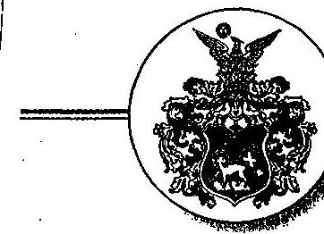
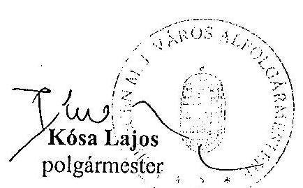
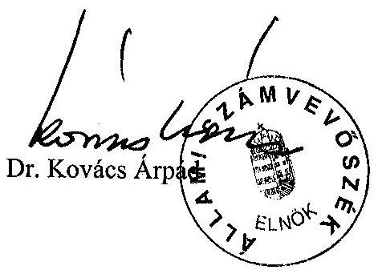

# JELENTÉS 

## Debrecen Megyei Jogú Város Önkormányzata gazdálkodásának átfogó ellenőrzéséről

---

3. Önkormányzati és Területi Ellenőrzési Igazgatóság
3.3 Átfogó Ellenőrzések FőcsoportIktatószám: V-1002-7/31/13/2003.Témaszám: 635
Vizsgálat-azonosító szám: V0102
Az ellenőrzést felügyelte:
Dr. Lóránt Zoltán
főigazgató
Az ellenőrzés végrehajtásáért felelős:
Dr. Sepsey Tamás
főcsoportfőnök
Az ellenőrzést vezette:
Csecserits Imréné
főcsoportfőnök-helyettes
Az ellenőrzést végezték:
Fórián Erika
számvevő tanácsos
Kóródi József
főtanácsadó
Nyikon Zsigmondné
számvevő
A témához kapcsolódó - az elmúlt 3 évben készített - számvevőszéki jelentések:
címe
sorszáma
Jelentés a nagyvárosi tömegközlekedés feladatellátásának és 0123
finanszírozásának ellenőrzéséről
Jelentés a települési önkormányzatok szilárdhulladék-gazdálkodási 0221
feladatai ellátásának ellenőrzéséről
Jelentés a helyi önkormányzatok egyes pénzügyi befektetésekkel 0318
történő gazdálkodásának ellenőrzéséről

---

# TARTALOMJEGYZÉK 

BEVEZETÉS ..... 5
I. ÖSSZEGZŐ MEGÁLLAPÍTÁSOK, KÖVETKEZTETÉSEK, JAVASLATOK ..... 7
II. RÉSZLETES MEGÁLLAPÍTÁSOK ..... 16
1.A költségvetés tervezésének, végrehajtásának és a zárszámadás elkészítésének szabályszerűsége ..... 16
1.1.A költségvetés tervezésének, a költségvetési rendelet megalkotásának, elfogadásának szabályszerűsége ..... 16
1.2.A költségvetési előirányzatok módosításának szabályszerűsége ..... 17
1.3.A gazdálkodás szabályozottsága, szabályszerűsége ..... 19
1.4.A munkafolyamatba épített ellenőrzések szabályozottsága és gyakorlati múködése a pénzügyi, gazdálkodási és számviteli feladatellátás területén ..... 22
1.5.A bizonylati rend és fegyelem szabályszerűsége ..... 23
1.6.A vagyon nyilvántartásának és leltározásának szabályszerűsége ..... 23
1.7.A vagyongazdálkodással kapcsolatos feladat- és döntési hatáskörök szabályozottsága, a vagyonváltozást előidéző intézkedések szabályszerűsége, célszerűsége ..... 25
1.8.Az Önkormányzat által céljelleggel - nem szociális ellátásként - juttatott támogatásokkal történő elszámoltatás szabályszerűsége ..... 28
1.9.A követelések, részesedések, értékpapírok év végi értékelésének szabályszerűsége ..... 29
1.10.A múködési és felhalmozási bevételek, kiadások alakulása ..... 31
1.11.A költségvetés egyensúlyának helyzete ..... 32
1.12.A közbeszerzési eljárások szabályszerűsége ..... 33
1.13.A Hivatal helyi kisebbségi önkormányzatok gazdálkodását segítő tevékenysége ..... 35
1.14.A zárszámadási kötelezettség teljesítésének szabályszerűsége ..... 36
2.Egyes kiemelt önkormányzati feladatok és a rendelkezésre álló források összhangja ..... 38
2.1.A feladatok meghatározása és szervezeti keretei ..... 38
2.2.Egyes naturális mutatókkal mérhető feladatok bevételei és kiadásai ..... 44
2.3.A jelentős ráfordítást igénylő önként vállalt feladatok ellátása ..... 48
3.A belső irányítási, ellenőrzési rendszer múködésének értékelése ..... 49
3.1.Az Önkormányzat informatikai rendszerének szabályozottsága, múködése ..... 49
3.2.A helyi ellenőrzési rendszer kialakítása, múködése ..... 51
3.3.A könyvvizsgálati kötelezettség teljesítése ..... 52
3.4.A korábbi számvevőszéki ellenőrzések javaslatainak hasznosulása ..... 52

---

# MELLÉKLETEK 

1. számú Az önkormányzati vagyon értékének alakulása (1 oldal)

2/a. számú Múködési célú bevételek és kiadások alakulása (1 oldal)
2/b. számú Felhalmozási célú bevételek és kiadások alakulása (1 oldal)
3. számú A Holding alapításával és múködésével kapcsolatos részletesebb információk ( 3 oldal)
4. számú Az Önkormányzat gazdálkodását meghatározó főbb adatok, mutatószámok (1 oldal)
5. számú Kósa Lajos polgármester úr észrevétele (2 oldal)
6. számú Kósa Lajos polgármester úr észrevételére adott válaszlevél (2 oldal)

---

# RÖVIDÍTÉSEK JEGYZÉKE 

| Ötv. | a helyi önkormányzatokról szóló 1990. évi LXV. törvény |
| :--: | :--: |
| Htv. | a helyi önkormányzatok és szerveik, a köztársasági megbízottak, valamint egyes centrális alárendeltségú szervek feladat- és hatásköreiről szóló 1991. évi XX. törvény |
| Áht. | az államháztartásról szóló 1992. évi XXXVIII. törvény |
| Kbt. | a közbeszerzésekről szóló 1995. évi XL. törvény |
| Számv. tv. | a számvitelről szóló 2000. évi C. törvény |
| Ámr. | az államháztartás múködési rendjéről szóló 217/1998. (XII. 30.) Korm. rendelet |
| Vhr. | az államháztartás szervezetei beszámolási és könyvvezetési kötelezettségének sajátosságairól szóló 249/2000. (XII. 24.) Korm. rendelet |
| Nek. tv. | a nemzeti és etnikai kisebbségek jogairól szóló 1993. évi LXXVII. törvény |
| Szoc. tv. | a szociális igazgatásról és szociális ellátásokról szóló 1993. évi III. törvény |
| Gyvt. | a gyermekek védelméről és a gyámügyi igazgatásról szóló 1997. évi XXXI. törvény |
| Kjt. | a közalkalmazottak jogállásáról szóló 1992. évi XXXIII. törvény |
| Önkormányzat | Debrecen Megyei Jogú Város Önkormányzata |
| Közgyűlés | Debrecen Megyei Jogú Város Közgyűlése |
| SzMSz | Debrecen Megyei Jogú Város Önkormányzata és Polgármesteri Hivatala Szervezeti és Müködési Szabályzata |
| Hivatal | Debrecen Megyei Jogú Város Polgármesteri Hivatala |
| ügyrend | Debrecen Megyei Jogú Város Polgármesteri Hivatalának Ügyrendje |
| Holding | Debreceni Vagyonkezelő Rt. |

---

.

---

# JELENTÉS 

## Debrecen Megyei Jogú Város Önkormányzata gazdálkodásának átfogó ellenőrzéséről

## BEVEZETÉS

Debrecen Budapesttől 220 km-re, az Alföld keleti részének közúti és vasúti csomópontjában fekszik, területe $461 \mathrm{~km}^{2}$. A település 207800 fős állandó lakosságával Magyarország második legnagyobb városa, Hajdú-Bihar megye székhelye, az Észak-alföldi Régió régióközpontja. Adottságai kedvezőek a nagytérségi szerepkör betöltéséhez, gazdasági, oktatási, kereskedelmi, kulturális, egészségügyi kapcsolatai országhatáron túl is jelentősek.

Az Önkormányzat gazdasági, szociális, egészségügyi, gyermekvédelmi, oktatási, közművelődési, sport és egyéb feladatait - a törvényes keretek között - költségvetési szervek, saját tulajdonú részvénytársaságok, korlátolt felelősségű társaságok, közhasznú társaságok, alapítványok, civil szervezetek és más társaságok szolgáltatásainak az igénybevételével végezte és végzi.

Az Önkormányzat - 2002-ben - 37507 millió Ft költségvetési előirányzatból gazdálkodhatott, mely összegnek a $80 \%$-a múködési, $20 \%$-a fejlesztési feladatok megvalósítására állt rendelkezésre. Az Önkormányzat 2002. évi számviteli mérlegének főösszege 262867 millió Ft volt.

Debrecen Megyei Jogú Város Önkormányzatának Közgyűlését 50 fő alkotja. A Közgyűlés munkáját 12 állandó bizottság és 583 fős hivatal segíti. A hivatali feladatokat - 5 főosztályi szervezetben - szakosított formában, 17 osztály köztisztviselői végzik.

Az Önkormányzat - 2002-ben - 122 költségvetési intézményt tartott fenn, melyekben a különböző szakmai és gazdasági feladatokat 9082 fő közalkalmazott látta el.

A városban - a vizsgált időszakban - örmény, bolgár és cigány kisebbségi önkormányzat múködött.

A vizsgálat az Ötv. 92. § (1) bekezdése, valamint az Áht. 120/A § (1) bekezdése alapján, a 2003. évi munkatervben szereplő feladatként, az Állami Számvevőszék Önkormányzati és Területi Ellenőrzési Igazgatósága V-1002-7/2003. számú ellenőrzési programjában foglaltaknak megfelelően történt.

## Az ellenőrzés célja annak értékelése volt, hogy:

- az önkormányzati gazdálkodás törvényességét, szabályszerűségét biztosítot-ták-e a tervezés, a költségvetés végrehajtása és a zárszámadás során; a gaz-

---

dálkodás szabályszerűségét biztosító kontrollok ${ }^{1}$ megfelelően segítették-e a végrehajtást;

- az Önkormányzat által ellátott feladatok és az azokhoz rendelkezésre álló pénzforrások összhangja biztosított volt-e, különös tekintettel egyes kiemelt feladatokra;
- a helyi kisebbségi önkormányzat gazdálkodása során érvényesültek-e az Áht. és a vonatkozó kormányrendeletek előírásai.

Az ellenőrzött időszak: a 2002. év, valamint a 2003. I. negyedév, az 1.7; 2.1-2.3; 3,2-3.4. ellenőrzési programpontok esetében a 2000-2002. évek.

[^0]
[^0]:    ${ }^{1}$ A gazdálkodás szabályszerűségét biztosító kontroll alatt értjük a kiépített és működő belső irányítási és szabályozási rendszert, valamint a belső ellenőrzési funkciók ellátását.

---

# I. ÖSSZEGZŐ MEGÁLLAPÍTÁSOK, KÖVETKEZTETÉSEK, JAVASLATOK 

Az önkormányzati gazdálkodás törvényességét, szabályszerűségét az alábbiakban bemutatottak alapján részben biztosították a tervezés, a költségvetés végrehajtása és a zárszámadás során.

Az önkormányzati feladatokat több évre kijelölő gazdasági programmal az Önkormányzat nem rendelkezett.

A költségvetés tervezésének, megállapításának rendje - a tájékoztatásul bemutatandó mérlegek, kimutatások, s szöveges indoklásuk tartalmi követelményeinek meghatározását kivéve - a törvényi előírásoknak megfelelt. Az éves költségvetési koncepciót a polgármester határidőben a Közgyűlés elé terjesztette. A bizottságok és a kisebbségi önkormányzatok koncepcióról kialakított véleményét nem mellékelték a koncepcióhoz, arról a kisebbségi önkormányzatok elnökei szóban tájékoztatták a Közgyűlést. A költségvetési rendelettervezethez nem csatolták a közvetett támogatásokat tartalmazó kimutatást és annak szöveges indokolását, nem határozták meg az Áht-ban előírt - költségvetés és zárszámadás előterjesztésekor bemutatandó - mérlegek, kimutatások tartalmi követelményeit.

A költségvetési rendelet évközi módosításának gyakoriságára vonatkozó helyi előírás a polgármester és az intézményvezetők hatáskörében végrehajtott elői-rányzat-módosításokról a Közgyűlés tájékoztatását a jogszabályban előírt negyedévenkénti tájékoztatás helyett a féléves, a háromnegyed-éves beszámolóval és a zárszámadással azonos időpontban határozza meg. Továbbá a polgármester, az intézményvezetők és a jegyző ezirányú feladatait elmulasztották meghatározni, megsértve ezzel a jogszabályi előírásokat. A vizsgált évben végrehajtott előirányzat-változtatásokkal nem a jogszabályban előírt módon és időben módosították a költségvetési rendeletet. Elmaradt a költségvetési rendeletnek az utolsó negyedév előirányzat-változásaival történő módosítása, arról a zárszámadás keretében értesült a Közgyűlés.

A gazdálkodási jogkörökre vonatkozó polgármesteri és jegyzői együttes utasításban az érvényesítésre, kötelezettségvállalásra, utalványozásra és ellenjegyzésre jogosultakat célszerűen határozták meg. Nem rendelkeztek azonban a szakmai teljesítések igazolására jogosult személyekről. Ezt a feladatot a munkaköri leírások sem tartalmazzák. A gazdálkodással, a pénzügyi-számviteli feladatok ellátásával kapcsolatos belső szabályzatokban az üzemeltetésre, kezelésre átadott eszközökre vonatkozóan nem írták elő az eszközök leltározásának és selejtezésének rendjét, elmaradt az üzemeltetők és a Hivatal feladatainak konkrét meghatározása. Továbbá a tényleges mennyiségi felvételen alapuló leltárt helyettesítő - a részletező nyilvántartások alapján készített összesítő kimutatás meghatározott időszakonkénti alkalmazásához nem kérték a felügyeleti szerv egyetértését és nem határozták meg az összesítő kimutatás tartalmát és formáját. A számlarendben a tárgyi eszközök analitikus nyilvántartását, a könyvelés részére készítendő feladások tartalmi, formai követelmé-

---

nyét, valamint a beruházások eredményeként létrejött tárgyi eszközök bekerülési értéke meghatározásának, az azokról vezetendő analitikus nyilvántartások és a feladások rendjét, továbbá az aktiválásukhoz kapcsolódó eljárási rendet nem szabályozták. Elmaradt a házipénztáron kívüli pénzkezelés rendjének szabályozása is.

A belső ellenőrzést segítő kontrollrendszert szabályozták. Az operatív gazdálkodás részterületeit tartalmazó szabályzatokban és a munkaköri leírásokban azonban a teljesítés szakmai igazolásának feladatát és eljárási módját, az üzemeltetésre, kezelésre átadott eszközök nyilvántartásával kapcsolatos feladatköröket, a munkafolyamatba épített egyeztetési, ellenőrzési feladatokat nem határozták meg. Ezért a Hivatalban a gazdálkodás alapvető folyamatainak kialakított rendje nem alkot egységes zárt rendszert.

A Hivatalban a számviteli rend és a bizonylati fegyelem a jogszabályi előírásoknak megfelel. A nyilvántartásokba történő bejegyzés alapbizonylatai szabályszerűek, az általános alaki, tartalmi követelményeknek megfelelnek A beruházások aktivált értékét azonban nem állapították meg helyesen, a bekerülési érték részét képező kiadásokat nem a jogszabály előírása szerint vették számba.

Az Önkormányzat aktualizált vagyongazdálkodási rendelete alkalmas a vele szemben támasztott követelmények kielégítésére. Abban a vagyonelemek meghatározása, s forgalomképesség szerinti elkülönítése megtörtént. Az konkrétan nevesíti továbbá a vagyont üzemeltető szerveket, s meghatározza a tulajdonosi jogok gyakorlásának rendjét. Ez utóbbiak közül a használhatatlanná vált vagyontárgyak selejtezésével, s az üzemeltetésre átadott eszközökkel kapcsolatos hatáskörök, feladatok rögzítése, valamint annak az értékhatárnak a meghatározása maradt el, amely felett vagyont értékesíteni nyilvános versenytárgyalás útján szabad.

Az Önkormányzat a vagyonnal való tervszerű, átgondolt gazdálkodás megvalósítása érdekében középtávú vagyongazdálkodási irányelveket, s azokra alapozottan pedig évente vagyongazdálkodási koncepciót fogadott el. Ez utóbbiak előírásait a város költségvetési koncepciójában és költségvetésében - valamenynyi vizsgált évben - számításba vették azok készítői.

A vagyon forgalomképesség szerinti elkülönítését a számviteli nyilvántartásban biztosították. A kialakított rendszer megfelel a tulajdonvédelmi követelményeknek és a központi előírásoknak is. Az Önkormányzat szabályszerűen tett eleget az ingatlanvagyon kataszteri és számviteli nyilvántartása teljes körűvé tételére vonatkozó központi előírásnak.

Az Önkormányzat nettó vagyona - a vizsgált időszakban - főként az érték nélküli ingatlanok, központi intézkedés alapján történő, értékének megállapítása és számviteli nyilvántartásba vétele következtében - 23700 millió Ft-ról 254900 millió Ft-ra - közel tizenegyszeresére növekedett. A Hivatal 2002. évi mérlegében kimutatott eszközök és források leltárral alátámasztottak voltak.

Az Önkormányzat - a vonatkozó jogszabályi előírást megelőzően - kialakította a céljelleggel juttatott támogatások elszámolásának rendszerét. A támo-

---

gatásokra minden esetben megállapodásokat kötöttek és a felhasználási cél megjelölése mellett előírták az elszámolási kötelezettséget is. A felhasználás ellenőrzési rendjét célszerűen alakították ki. Két támogatás visszafizetési kötelezettségét állapították meg, amelyeknek a befizetése megtörtént. A célnak megfelelő felhasználások további biztosítása érdekében a 2003. évtől a folyósítások feltételeit szigorították.

Az Önkormányzat a számviteli politikában meghatározta - a hatályos jogszabályi előírásoknak megfelelően - az eszközök értékelésének, a terven felüli értékcsökkenés és az értékvesztés elszámolásának elveit. A 2002. év végén elvégzett egyedi értékelések során e szabályokat két részesedés, egy hitelviszonyt megtestesítő értékpapír értékvesztésének visszaírásakor nem tartották be.

Az Önkormányzatnál az ellátott feladatok és az azokhoz szükséges pénzforrások összhangja - a vizsgált időszakban - biztosított volt. Ezt következetes, átgondolt gazdálkodással, a költségvetési bevételek növelésére, illetve a kiadások mérséklésére tett folyamatos intézkedésekkel sikerült elérnie az Önkormányzatnak. Előbbiek közül meghatározóak voltak a pénzeszközátvételek, a sikeres pályázatok, a helyi adók beszedésének eredményessége, a felesleges vagyontárgyak értékesítése, s az átmenetileg szabad pénzeszközök lekötése révén elért többletbevételek. A kiadásoknál érzékelhető megtakarítást főként a különböző racionalizálási intézkedések (intézmények megszűnése, átszervezése, vagyonkezelő társaság alapítása) eredményeztek.

Az Önkormányzat 2002. évi múködési célú bevételei fedezték a működési kiadásokat. A felhalmozási bevételekből nem kellett működésre pénzeszközt átcsoportosítani. A költségvetési rendelet mellékleteként "Finanszírozási terv"-et készítettek, mely tartalmát tekintve, a likviditási tervvel egyező, azonban annak évközi aktualizálása elmaradt.

Az Önkormányzat adósságot keletkeztető kötelezettségvállalásai során (hitelfelvétel, kötvénykibocsátás) az értékhatárt illetően betartották az Ötv. előírásait, de e törvény előírásait megsértve tették, mert a kötvénykibocsátás, a garancia és kezességvállalás esedékes összegét nem vették figyelembe a számításuk során. Ez utóbbiakról megbízható nyilvántartást nem vezetnek a Hivatalban, annak ellenére, hogy ez az adósságot keletkeztető kötelezettségvállalás felső határa megállapításának egyik meghatározó tényezője.

A kötelezettségvállalások analitikus nyilvántartását vezetik. Abban azonban az előző évről áthúzódó kötelezettségvállalások felvezetése, illetve a kötelezettségvállalások teljesítésének regisztrálása az igazgatási és beruházási kiadások esetében nem történt meg.

Az Önkormányzat a vizsgált időszakban kiegyensúlyozott gazdálkodást folytatott, aminek eredményeként ÖNHIKI támogatás igénybevételére nem kényszerült. A településen - a magánszemélyek kommunális adója és a telekadó kivételével - valamennyi helyi adófajtát bevezették.

A közbeszerzési eljárás helyi szabályait a Közgyűlés rendeletben meghatározta, annak előírásai összhangban vannak a vonatkozó törvényben foglaltakkal. A megvizsgált három közbeszerzési eljárás közül az Önkormányzat egynél - a

---

szerződés módosítása során - megsértette a törvényben és a helyi rendeletben foglaltakat. Ezen túlmenően a szolgáltatások becsült értékét nem számították egybe, így nem indítottak közbeszerzési eljárást a lakossági hozzájárulással megvalósult út- és járdaépítések kivitelezési munkáinál, és az érték nélkül nyilvántartott ingatlanok értékbecslésénél. Az Önkormányzat ez ideig nem vizsgálta a közbeszerzési eljárás centrális (Hivatal és intézmények beszerzéseire összevont) bevezetésének lehetőségét.

A városban három kisebbségi önkormányzat múködik. Mindhárom önkormányzat elnöke - a Közgyűlés felhatalmazása alapján - a polgármesterrel megállapodást kötött a pénzügyi-gazdasági feladatok ellátására. A Hivatal e dokumentum alapján elvégezte a könyvelési feladatokat, valamint az egyéb operatív teendők ellátásához segítséget nyújtott. A számviteli rend és a pénzkezelés megfelelő ellátásában a Hivatalnak jelentős szerepe volt.

A Közgyűlés a jogszabály által előírt határidőben elfogadta a 2002. évi költségvetés végrehajtásáról szóló rendeletét. Megsértették a vonatkozó központi előírásokat, mert a zárszámadási rendeletben az eredeti előirányzatot nem szerepeltették, csak a módosított előirányzatot és a teljesítés összegeit rögzítették, továbbá a rendeletben nem mutatták be az előírt mérlegeket és kimutatásokat, s a tényleges létszámadatokat.

Az Önkormányzat pénzmaradványának jóváhagyása a 2002. évi zárszámadás keretében - költségvetési szervenkénti részletezettségben - szabályszerűen történt. A központi előírásokkal ellentétes, hogy a Közgyűlés a zárszámadásról szóló rendelettel - a pénzmaradvány összegével egyezően - a következő évi költségvetési rendeletet is módosítja. Ez utóbbira azután kerülhet sor, ha a költségvetési szervek vezetői a pénzmaradvány felhasználásának jogcímeit meghatározták. A Hivatal pénzmaradványának megállapítása és jóváhagyása a jogszabályi előírásoknak megfelelően történt. Vállalkozási tevékenységet a 2002. évben a Hivatal nem végzett.

A feladatok hatékonyabb, gazdaságosabb ellátását, a költségvetési kiadások csökkentését eredményezték a - vizsgált időszakban - végrehajtott racionalizálási (vagyonkezelő részvénytársaság megalapítása, az oktatási intézmények élelmezési tevékenységének vállalkozásba adása, a költségvetési intézmények gazdasági szervezeteinek integrációja, s más kisebb, szinte valamennyi ágazatot érintő, ésszerűsítő) intézkedések.

A vagyonkezelő részvénytársaság (Holding) megalapítása és múködése következtében - a korábbi formában történő múködésük időszakában kifizetetthez viszonyítva - csökkent a városüzemeltetési feladatokat ellátó társaságok részére juttatott önkormányzati támogatások összege, (2001-ben és 2002-ben a Holdinghoz tartozó tagtársaságok üzemviteli, illetve kamattámogatást az Önkormányzattól nem kaptak). A Hivatal a városüzemeltetési problémák megoldása érdekében korábban közvetlenül intézkedhetett az illetékes társaságok felé. Ezt a Holding megalakulása óta csak azon keresztül teheti meg. E kapcsolatoknak a részletes szabályozása viszont nem történt meg, ami a Hivatalban nehezíti a városüzemeltetéssel kapcsolatos ügyintézést.

---

Az Önkormányzat kötelező feladatai mellett önként vállaltakat is végez. Ezek elkülönített számbavétele és a feladatellátás szervezeti formájának meghatározása viszont elmaradt. A nem kötelező feladatok ellátására - a vizsgált időszakban - fordított kiadások nem veszélyeztették a törvényben kötelezően előírtak végrehajtását.

Az informatikai rendszerrel összefüggő szabályzatokkal rendelkeztek, katasztrófa elhárítási tervvel nem. A pénzügyi területet tekintve a számítástechnika alkalmazása a Hivatal más osztályaihoz viszonyítva alacsonyabb szintű, az erre a célra alkalmas programok kis száma miatt. A pénzügyi, gazdálkodási dolgozók munkaköri leírásai nem tartalmazzák az informatikai rendszer használatával kapcsolatos feladatokat. A Hivatal számítógépes ellátottsága a gépek életkorát figyelembe véve közepesnek minősíthető, az üzemeltetés személyi feltételei biztosítottak.

Az Önkormányzat teljesítette a törvényben előírt ellenőrzési kötelezettségét, kialakította a felügyeleti és a belső ellenőrzési feladatok végrehajtásához szükséges szervezeti kereteket, ezek szabályozása is megtörtént.

Az önállóan gazdálkodó intézmények átfogó pénzügyi-gazdasági ellenőrzését kétévente - a szabályozásnak megfelelően elvégezték. A belső ellenőrzés keretében is lényeges pénzügyi-gazdasági folyamatokat vizsgáltak. Az ellenőrzésekről készített jelentések tartalmi színvonala megfelelő.

Fentieken túl ellenőrizték a normatív állami hozzájárulással kapcsolatos adatszolgáltatást és a központosított előirányzatok igénybevételével, elszámolásával összefüggő dokumentumokat. A cél, címzett támogatások igénybevétele és elszámolása vizsgálatának a munkafolyamatba épített ellenőrzés keretében tettek eleget. Az ellenőrzések tapasztalatait összegző jelentést évente a Közgyűlés elé terjesztették, melyeket az elfogadott.

A korábbi számvevőszéki vizsgálatok - a nagyvárosi tömegközlekedés feladatellátása és finanszírozása, a települési önkormányzatok szilárd hulladékgazdálkodási feladatellátása és az egyes pénzügyi befektetésekkel történő gazdálkodás ellenőrzése - során tett javaslataink nem hasznosultak teljes körűen. Elmaradt a tömegközlekedési szolgáltatások teljesítményekhez jobban igazodó zóna tarifarendszerének bevezetése, az Önkormányzat által tisztántartandó területek meghatározása helyi rendeletben és az Önkormányzat 2002. év végi költségvetési beszámolójában, illetve vagyonmérlegében a pénzügyi befektetéseknek a következő évi rendeltetésük alapján történő besorolása, a befektetett eszközök, vagy a forgóeszközök közé.

A helyszíni ellenőrzés megállapításainak hasznosítása mellett javasoljuk:

# a polgármesternek 

a törvényes állapot helyreállítása és a jogszabályi előírások betartása érdekében:

1. biztosítsa, hogy a költségvetés végrehajtása során a kötelezettségvállalás - az Áht. 12/A. § (1) bekezdésében rögzítettek szerint - a jóváhagyott kiadási előirányzatok mértékéig terjedjen;

---

2. tegye meg a szükséges intézkedéseket annak érdekében, hogy a Közgyűlés - az Áht. 108. § (1) bekezdésének előírása alapján - rendeletben szabályozza azt az értékhatárt, amely felett vagyont értékesíteni, továbbá vagyonkezelési, használati, hasznosítási jogát átengedni csak nyilvános versenytárgyalás útján lehet;
3. kezdeményezze, hogy a Közgyűlés rendeletben határozza meg az Áht. 118 §-ban előírt, a költségvetés és a zárszámadás előterjesztésekor bemutatandó, mérlegek, kimutatások tartalmi követelményeit;
a munka színvonalának javítása érdekében:
4. gondoskodjon az Állam Számvevőszék korábbi - a nagyvárosi tömegközlekedés feladatellátása és finanszírozása, a települési önkormányzatok szilárd hulladékgazdálkodási feladatellátása és az egyes pénzügyi befektetésekkel történő gazdálkodás ellenőrzése - vizsgálatai során tett javaslatok teljes körű hasznosításáról;
5. kezdeményezze, hogy a Közgyűlés a vagyongazdálkodásról szóló helyi rendeletben határozza meg önkormányzati szinten (Hivatal, intézmények, gazdasági társaságok) az üzemeltetésre átadott eszközökkel és a használhatatlanná vált vagyontárgyak selejtezésével kapcsolatos hatásköröket és feladatokat;
6. gondoskodjon a Hivatal, a Holding és a tagtársaságok kapcsolatrendszerének teljes körű, valamennyi részfolyamatot magába foglaló szabályozásáról, s a végrehajtásért felelős munkakörök pontos megjelöléséről;
7. az SzMSz kiegészítéseként terjessze a Közgyűlés elé - az Önkormányzat által végzett feladatok teljes körű számbavételét tartalmazó - kimutatást, amelyből egyértelműen megállapíthatóak a kötelező, illetve az önként vállalt feladatok, továbbá az, hogy azokat milyen szervezeti formában látják, illetve láttatják el;
8. vizsgáltassa meg a centrális közbeszerzési eljárás bevezetésének lehetőségét;
9. kezdeményezze, hogy a számvevőszéki jelentést a Közgyűlés megtárgyalja és a feltárt hiányosságok megszüntetése érdekében készíttessen intézkedési tervet;

# a jegyzönek 

a törvényes állapot helyreállítása és a jogszabályi előírások betartása érdekében:
1. a költségvetés elkészítésével, jóváhagyásával és módosításával összefüggően
a) csatolja - az Ámr. 28. § (3) bekezdése szerint - az éves költségvetési koncepció előterjesztéséhez a helyi kisebbségi önkormányzatok és a bizottságok koncepció tervezetről alkotott véleményét;
b) gondoskodjon arról, hogy a költségvetés-tervezet előterjesztéséhez - az Áht. 118. §-a alapján - a 116. § 10. pontja szerinti közvetett támogatásokról készüljön kimutatás és ahhoz szöveges indokolás;
c) intézkedjen annak érdekében, hogy a költségvetési rendelettervezetben - az Ámr. 53. §-ában foglaltak szerint - legyenek meghatározva az előirányzat-

---

módosításokra vonatkozó előírások és olyan időben készítse el a költségvetési rendelet módosítási javaslatot, hogy legkésőbb az Ámr. 53. § (2) és (6) bekezdésében előírt határidőig a Közgyűlés alkosson rendeletet a saját hatáskörben elrendelt és a nem általa kezdeményezett előirányzat-változtatásokról;
2. a gazdálkodással és a számvitellel kapcsolatos szabályozást illetően
a) határozza meg az operatív gazdálkodással összefüggő jogkörök szabályzatában az Ámr. 135. § (3) bekezdése szerint - a Hivatalban a teljesítések szakmai igazolására jogosultak körét, azok feladatait és az eljárás módját;
b) határozza meg a Hivatalra és az intézményekre vonatkozóan, egységes tartalommal - a Htv. 140. § (1) bekezdés c) pontja szerint - a számviteli politika és a számlarend keretében helyileg szabályozandó feladatokat, gondoskodjon továbbá azok önkormányzati szintű végrehajtásáról;
c) szabályozza - az Ámr. 134. § (4) és (6) bekezdése szerint - az évenkénti kötelezettségvállalások analitikus nyilvántartásának rendjét, s azok pontos, naprakész vezetését következetesen kérje számon;
d) határozza meg - a Vhr. 37. § (4) bekezdése alapján - a leltározás elvégzését igazoló leltárt helyettesítő, a részletező nyilvántartások alapján készített összesítő kimutatások tartalmát, formáját, s azok meghatározott időszakonkénti alkalmazásához a Közgyűlés hozzájárulását kérje meg;
e) szabályozza a számlarendben - a Számv. tv. 161. § (2) bekezdés c) pontja alapján - az üzemeltetésre, kezelésre átadott eszközökre vonatkozóan a főkönyvi számlák és az analitikus nyilvántartások kapcsolatát;
f) határozza meg - a Vhr. 49. § (2) bekezdésére figyelemmel -a tárgyi eszközök analitikus nyilvántartásának vezetési módját;
g) határozza meg az eszközök és források leltárkészítési és leltározási szabályzatban, valamint a felesleges vagyontárgyak hasznosításáról és selejtezés végrehajtásáról szóló szabályzatban - a Vhr. 37. § (5) bekezdésében foglaltaknak megfelelően az üzemeltetésre, kezelésre átadott eszközök leltározási és selejtezési feladatainak részletes feladatait;
h) gondoskodjon a pénzkezelési szabályzatban a készpénzkezelésre vonatkozó előírások - a Vhr. 8. § (3), (4) bekezdés d) pontja szerint - kiegészítéséről a házipénztáron kívüli pénzkezelés szabályainak a meghatározásával;
3. a vagyongazdálkodás és nyilvántartás tekintetében
a) gondoskodjon arról, hogy a beruházások eredményeként létrejött tárgyi eszközök bekerülési értékét a Számv. tv. 47. § (1)-(2) és (4)-(9) bekezdésekben foglaltak alapján állapítsák meg. Ennek figyelembevételével határozza meg a beruházásokról vezetendő analitikus nyilvántartások, s az azokból a főkönyvi könyvelés részére készítendő feladások tartalmi és formai követelményeit. A szabályozást terjessze ki a meg nem valósult beruházások már elszámolt beruházási költségeinek a kivezetésével összefüggő feladatokra;

---

b) biztosítsa, hogy a gazdasági társaságokban lévő tulajdoni részesedést jelentő befektetések és hitelviszonyt megtestesítő értékpapírok év végi értékelését (értékvesztés elszámolását, vagy visszaírását) minden esetben a Számv. tv. 54. §-ában és a Hivatal számviteli politikájában foglaltak szerint végezzék el;
c) biztosítsa, - a 2002-ben végzett ÁSZ ellenőrzés során tett javaslat alapján - hogy az év végi költségvetési beszámolóba, illetve vagyonmérlegbe a pénzügyi befektetések a Számv. tv. 27. § és a Vhr. 21. § előírásainak megfelelően, azok tartósságának minősítése alapján kerüljenek be a befektetett eszközök, vagy a forgóeszközök közé;
4. a pénzgazdálkodás terén
a) biztosítsa, hogy a likviditási terv évközben - az Ámr. 139. §-a szerint - folyamatosan aktualizálásra kerüljön;
b) gondoskodjon - az Ötv. 88. §-a alapján - az Önkormányzat adósságot keletkeztető éves kötelezettség-vállalása felső határának pontos megállapítása érdekében arról, hogy a kötvénykibocsátásról, továbbá a garancia- és kezességvállalásról és azok évenkénti esedékes összegeiről naprakész, analitikus nyilvántartás álljon rendelkezésre;
5. intézkedjen annak érdekében, hogy a közbeszerzési eljárások esetében a vonatkozó központi és helyi előírásokat - köztük a Kbt. 5. § (2) bekezdésében foglaltakat a becsült értékre vonatkozóan, illetve a 73. § (1) bekezdésében rögzítetteket a szerződésmódosítás során követendő eljárást illetően - tartsák be a Hivatalban;
6. a költségvetés végrehajtásáról készített zárszámadás esetében
a) biztosítsa, hogy az éves zárszámadásról szóló helyi rendelettervezet - az Áht. 18. $\S$-ának előírásai szerint - a költségvetési rendelettel összehasonlítható szerkezetben készüljön;
b) gondoskodjon arról, hogy a zárszámadás tervezetben a tényleges létszámadatok - költségvetési szervenkénti részletezésben - ismertetésre kerüljenek az Ámr. 29. § (1) bekezdés f) pontja szerint;
c) gondoskodjon arról, hogy a zárszámadás előterjesztésekor az Áht. 118. §-ában kötelezően előírt, a 116. § 4., 8. pontja, valamint szöveges indoklással együtt a 9. és 10. pontja szerinti mérlegek, kimutatások bemutatásra kerüljenek;
d) intézkedjen annak érdekében, hogy az intézmények pénzmaradványának összegével a Közgyűlés a költségvetési rendeletet - az Ámr. 53. § (6) bekezdése szerint - az intézményvezetői döntéseket követően módosítsa;
a munka színvonalának javítása érdekében:
7. intézkedjen, hogy a Hivatalban a pénzügyi-számviteli munka területén a gépi feldolgozás részaránya növekedjék. Gondoskodjon arról, hogy az informatikai eszközöket használó dolgozók munkaköri leírásait - az e feladatok részletes megfogalmazásával - az illetékes vezetők egészítsék ki;

---

8. gondoskodjon arról, hogy az informatikai rendszerben keletkezett adatok védelme érdekében katasztrófa elhárítási terv készüljön;

# a Közgyűlésnek 

kérjen tájékoztatást a polgármestertől az Önkormányzat intézményrendszerében, feladatellátásában strukturális változást eredményező megtett intézkedésekről, valamint a végrehajtás során szerzett tapasztalatokról.

---

# II. RÉSZLETES MEGÁLLAPÍTÁSOK 

## 1. A KÖLTSÉGVETÉS TERVEZÉSÉNEK, VÉGREHAJTÁSÁNAK ÉS A ZÁRSZÁMADÁS ELKÉSZÍTÉSÉNEK SZABÁLYSZERŰSÉGE

### 1.1. A költségvetés tervezésének, a költségvetési rendelet megalkotásának, elfogadásának szabályszerúsége

Az Önkormányzat az 1999-2002. évekre vonatkozóan az Ötv. 91. § (1) bekezdésében előírt gazdasági programmal nem rendelkezett, a Közgyűlés erre az időszakra fejlesztési programot határozott meg. A 2003-2006. évekre az évenkénti költségvetés megalapozottsága és tervszerűsége érdekében a Közgyűlés 2002 decemberében elfogadta gazdasági programját, amelyben a helyi adottságoknak megfelelő, reális célokat fogalmaztak meg. A programban a következő évekre Debrecen város fejlesztésével, az intézményhálózat múködtetésével, a szociális ellátással, továbbá az önkormányzati gazdálkodással kapcsolatos kiemelt feladatok kerültek meghatározásra.

A 2002. évi költségvetési koncepciót az Ámr. 28. §-ában elöírtak szerint a várható bevételek és kötelezettségek figyelembevételével állították öszsze, s azt a polgármester határidőben a Közgyűlés elé terjesztette. A koncepciót a bizottságok és a kisebbségi önkormányzatok megtárgyalták, a kialakított véleményt jegyzőkönyvben rögzítették, amelyeket azonban nem csatolták a koncepcióhoz, megsértve ezzel az Ámr. 28. § (3) bekezdésében foglalt előírásokat. A bizottságok és a kisebbségi önkormányzatok elnökei szóban tájékoztatták a Közgyűlést. A Közgyűlés határozattal döntött a tervező munka során betartandó elvekről, szabályokról, amelyeket a Hivatal a költségvetési rendelettervezet összeállítása során figyelembe vett.

A költségvetési rendelettervezet előkészítése, egyeztetése megfelelt az Áht. 68. § (1) bekezdésében foglalt előírásoknak. A Hivatalban a költségvetés összeállításához az adatszolgáltatás rendszerét az egyes főosztályok, osztályok feladatellátásához igazodóan alakították ki. Az adott évi költségvetés tervezésének jogszerű, határidőkhöz kötött végrehajtását körirat alapozta meg, az egységes adatszolgáltatás érdekében tervezési útmutatót is készítettek. A rendelettervezet egyeztetése az intézményvezetőkkel, érdekképviseleti szervekkel megtörtént, a tervezetet a bizottságok is megvitatták. A Pénzügyi bizottság a folyamatban lévő fejlesztésekre tervezett összeg csökkentését és a tárgyévre további fejlesztések felvételét javasolta a Közgyűlésnek. A polgármester a költségvetési rendelettervezetet a könyvvizsgáló véleményével együtt határidőben, 2001. december 10-én terjesztette a Közgyűlés elé. A javaslatban az Önkormányzat 2002. évi 30561 millió Ft összegű kiadási és bevételi előirányzatait az Ámr. 26. §-ában meghatározottak szerint munkálták ki. Figyelembe vették szerkezeti változásként a megszűnő feladatok éves szintű törlését (gyermekélelmezési konyhák), az intézménykorszerűsítésből adódó előirányzatváltozásokat.

---

A Közgyűlés az Áht. 118. §-ában előírt költségvetési mérlegek, kimutatások tartalmát rendeletben nem határozta meg. A Közgyúlés számára az Áht. 116. § 6., 9. pontjaiban előírtak szerint az Önkormányzat összevont mérlegeit és elkülönítetten a helyi kisebbségi önkormányzatok mérlegeit, valamint a többéves kihatással járó döntések számszerúsítését tájékoztatásul bemutatták. A közvetett támogatásokról - adóelengedések, adókedvezmények öszszegéről - nem tájékoztatták a Közgyűlést és a szöveges indokolásuk sem készült el, megsértve ezzel az Áht. 118. §-ában hivatkozott 116. § 10. pontjában foglaltakat.

A Közgyűlés a 2002. évi költségvetési rendeletet a Pénzügyi bizottság véleményének figyelembevételével - a tervezetben szereplő fejlesztési előirányzatok módosításával - fogadta el, abban meghatározták a címrendet és a kimutatások, mérlegek tartalmi felépítésénél figyelembe vették az Ámr. 29. § (1) bekezdésében előírtakat. A végrehajtás szabályait részletesen - a költségvetési rendeletmódosítás kivételével - a magasabb rendú jogszabályokkal összhangban határozták meg. A Közgyűlés a 2002. évi költségvetésről szóló 49/2001. (XII. 28.) számú rendeletének 4. § (7) bekezdése, továbbá a 4/2003. (II. 20.) számú rendeletének 7. § (3) bekezdése a polgármestert arra kötelezte, hogy az év közbeni előirányzat-módosításokról a féléves, a háromnegyed éves és az éves beszámolás (zárszámadás) alkalmával adjon tájékoztatást a Közgyűlésnek. Ez az előírás az alábbiak miatt nem alkalmas arra, hogy az évközbeni előirányzat-változtatásokkal az Ámr. 53. § (2) bekezdésében meghatározottak szerint a költségvetési rendelet módosításra kerüljön.

- Az Ámr. a rendeletmódosítás negyedévenkénti gyakoriságát írja elő. Az önkormányzatok (így Debrecen önkormányzata is) az első negyedévben is folyamatosan kapják a központi költségvetésből a pótelőirányzatokat, amelyekkel a költségvetési rendeletben szereplő előirányzatokat legalább negyedévente módosítani kell. A helyi előírás szerint viszont a rendelet módosításához az előterjesztést csak a féléves beszámolóval egyidejűleg kapja meg a Közgyűlés.
- Az Ámr. 2002. évben hatályos előírása szerint a költségvetési rendelet utolsó módosításának legkésőbb a zárszámadást megelőző ülésen - 2003. január 1től pedig legkésőbb a költségvetési beszámoló felügyeleti szervhez történő megküldésének jogszabályban meghatározott határidejéig - kell megtörténnie. A helyi szabályozás azonban a költségvetési rendelet módosításához a tájékoztatási kötelezettséget a zárszámadással azonos időpontra írja elő.
- A költségvetési rendelet a negyedévenkénti módosítási kötelezettséget, továbbá az intézményvezetők, a polgármester és a jegyző ezzel összefüggő feladatait nem határozza meg.

# 1.2. A költségvetési előirányzatok módosításának szabályszerűsége 

Előirányzat módosítási hatásköre a polgármesternek a Közgyűlés felhatalmazása alapján, az önállóan gazdálkodó költségvetési szervek vezetőinek az Áht. 93. § (4) bekezdésében és az Ámr. 53. § (4) bekezdésében meghatározottak

---

alapján volt. Az Önkormányzat előirányzatainak megváltoztatása így közgyúlési, polgármesteri és intézményvezetői hatáskörben történt.

Az előirányzat-módosításokat dokumentumokkal alátámasztották. A közgyűlési hatáskörbe tartozó költségvetési előirányzatok módosítására előterjesztett javaslatok részletes információt biztosítottak a Közgyűlés számára a pótelőirányzatok forrásairól, a módosítások indokairól. A polgármester és az intézményvezetők a részükre biztosított hatáskört betartva hoztak döntéseket az előirányzatok módosításáról. A polgármester saját hatáskörben hozott döntéseit minden esetben határozat rögzítette. Az önkormányzati intézményvezetők belső bizonylaton jelezték saját hatáskörű előirányzatmódosításaikat, a kisebbségi önkormányzatok esetében a kisebbségi testület által hozott határozatok képezték a módosítás alapját.

Az éves gazdálkodás során a megvizsgált dokumentumok 9\%-ánál a kötelezettségvállalás megelőzte az előirányzat-módosítást. Az előirány-zat-módosítást megelőző kötelezettségvállalással megsértették az Áht. 93. § (1) bekezdésében és 98. § (3) bekezdésében előírtakat, mely szerint a költségvetési szervek a kiemelt előirányzataikon belül kötelesek gazdálkodni, azaz a kötelezettségvállalás előtt meg kell győződniük arról, hogy a rendelkezésre álló kiadási előirányzat biztosítja-e a fedezetet. Az év végén azonban olyan kötelezettségvállalás és pénzügyi teljesítés nem volt, amelyre az előirányzat nem állt rendelkezésre.

A jogszabályi előírásoktól eltérő helyi szabályozás következtében a költségvetési rendelet módosítása során megsértették az Ámr. 53. § (2) bekezdésében foglaltakat, mivel az előírt legalább négy alkalom helyett a 2002. évben háromszor történt rendeletmódosítás. (Az Önkormányzat a 2002. évben havonta kapott a központi költségvetésből különböző jogcímeken pótelőirányzatokat.) A költségvetési rendelet első módosításakor a Közgyűlés 8/2002. (IV. 15.) számú rendeletével a pénzmaradvány jóváhagyásáról döntött, az első negyedévi előirányzat-változtatásokat nem vezették át. A 24/2002. (IX. 15.) számú rendeletbe a Közgyűlés hatáskörébe tartozó, továbbá a polgármesteri, intézményvezetői hatáskörben június 30 -ig végrehajtott előirányzatmódosítások épültek be. A Közgyűlés 28/2002. (XI. 25.) számú rendeletében a szeptember 30-i időpontig a polgármester és az intézményvezetők által meghozott döntésekkel módosította a költségvetési rendeletet. Ezt követően a végrehajtott előirányzat-módosításokról a Közgyűlés a 2003. április 3-án benyújtott záro számadásról szóló előterjesztés keretében értesült, ezekkel a változtatásokkal a 2002. évi költségvetési rendeletet nem módosították (központi költségvetésből származó forrás 1890 millió Ft, intézményvezetői hatáskörben 467 millió Ft, polgármesteri hatáskörben 498 millió Ft végrehajtott előirányzat-módosítás). Ezzel megsértették az Ámr. 53. § (2) és (6) bekezdéseiben a költségvetési rendelet módosítására vonatkozó előírásokat.

A módosítások a költségvetési rendeletnek megfelelő tagolásban, azzal összehasonlítható szerkezetben készültek. A benyújtott rendelettervezetekben a költségvetési rendelet mellékleteinek megváltoztatására tettek javaslatot, a szöveges rész számadatainak a megváltoztatását nem kezdeményezték. Ezáltal a módosított költségvetési rendelet szöveges részében és a mellékleteiben meghatározott előirányzatok eltérnek egymástól.

---

A költségvetési rendeletben jóváhagyott előirányzatokról és azok változásairól az Áht. 103. § (1) és (2) bekezdéseiben előírt követelményeknek megfelelő nyilvántartást vezetnek. E feladatot a Hivatalban 12 fő végzi. A kézi vezetésű nyilvántartások mellett a 2002. évtől egy dolgozó látja el az önkormányzati szintű előirányzat-módosítások számítógépes rögzítését. Az ebből összesített adatokat egyeztetik a manuális nyilvántartásokkal. A nyilvántartások áttekinthetőek, hitelt érdemlően dokumentáltak (időrendi sorrendben mutatják - a módosítási jogkör megjelölésével - a határozat számát, az előirány-zat-változtatás indokát, időpontját, összegét és az érintett költségvetési címeket, alcímeket).

# 1.3. A gazdálkodás szabályozottsága, szabályszerűsége 

A Hivatal az operatív gazdálkodáshoz, a pénzügyi-számviteli feladatok ellátásához szükséges évenként aktualizált belső szabályzatokkal rendelkezik. A szabályzatok előírásai - az üzemeltetésre, kezelésre átadott eszközök és a teljesítések szakmai igazolásának kivételével - a jogszabályi követelményekkel összhangban és a helyi sajátosságok, célszerűségek figyelembevételével rögzítik a feladatokat.

Az operatív gazdálkodással összefüggő jogköröket az 1/2002. számú együttes polgármesteri és jegyzői utasítás tartalmazza az alábbiak szerint:

- kötelezettséget vállalni csak írásban lehet;
- a kötelezettségvállalás jogát a polgármester meghatározott feladatokra, célszerű összeghatárok megjelölésével átruházta az alpolgármesterekre, jegyzőre, feladatkörükhöz tartozó ügyekben a főosztályvezetőkre, osztályvezetőkre és a városmarketing csoport vezetőjére;
- a kötelezettségvállalások ellenjegyzését a jegyző a gazdálkodási főosztályvezető, vagy annak akadályoztatása esetén a pénzügyi osztályvezető hatáskörébe utalta;
- utalványozásra a polgármester felhatalmazása alapján a gazdálkodási főosztályvezető és pénzügyi osztályvezető, helyi adó és gépjármúadó visszautalása tekintetében az Adóügyi osztály vezetője jogosult. Az utalvány ellenjegyzését felhatalmazás alapján a Pénzügyi osztály dolgozói végzik;
- az érvényesítéssel a jegyző a Pénzügyi osztály - az Ámr. 135. § (2) bekezdésében előírt képesítéssel rendelkező - dolgozóit bízta meg.

A kötelezettségvállaláshoz és ellenjegyzéshez kapcsolódóan meghatározták azok nyilvántartási és eljárási rendjét. A hatásköröket a dolgozók munkaköri leírásában konkrétan nevesítették.
A teljesítések szakmai igazolására jogosult személyekről, s azok feladatairól, az eljárás módjáról az utasításban nem rendelkeztek, megsértve ezzel az Ámr. 135. § (4) bekezdésében előírtakat. Ezt a feldatot a munkaköri leírások nem tartalmazzák, ezáltal a felelősség érvényesítésének feltételét nem teremtették meg.
Az összeférhetetlenség eseteit az Ámr. 138. § (1) és (3) bekezdéseiben foglaltak

---

szerint szabályozták, érvényesültek az összeférhetetlenségre vonatkozó jogszabályi és helyi előírások.

A jegyző a jogszabályi előírást ${ }^{2}$ megsértve írásban nem rendelkezett az önkormányzati intézmények számviteli rendjének kialakításáról annak érdekében, hogy az Önkormányzat és intézményei azonos elvek szerint határozzák meg azokat a szabályokat, amelyekre a gazdálkodással kapcsolatos központi előírások választási lehetőséget adnak. Az egységes számviteli rend érvényesülését a felügyeleti ellenőrzések keretében segítették elő.

A gazdálkodás szabályszerűségét, célszerűségét meghatározó szabályzatok előírásai az SzMSz-szel, az ügyrenddel és a munkaköri leírásokkal összhangban állnak. Az ügyrend és a belső szabályzatok nem tartalmazzák az egyes osztályok gazdálkodással összefüggő feladatainak folyamatleírását, a kapcsolódó pontokat, döntés-végrehajtási szempontokat. Ezeket az adott feladatokhoz kapcsolódóan utasítások írják elő.

A Vhr. 8. § (3)-(4) bekezdései alapján kialakították és írásban rögzítették a Hivatal számviteli politikáját, ennek keretében meghatározták az elveket és elkészítették az előírt belső szabályzatokat, így

- a pénzkezelési szabályzatot;
- az eszközök és források leltárkészítési és leltározási szabályzatát;
- a felesleges vagyontárgyak hasznosításáról és selejtezés végrehajtásáról szóló szabályzatot;
- a számlarend és számlatükröt;
- az eszközök és források értékelési szabályzatát.
önköltségszámítási szabályzat készítésére a Hivatal nem kötelezett.

# A számviteli politikában meghatározott elveket és a gazdálkodás sajátosságait azonban az alábbi szabályzatokban nem érvényesítették. 

Az eszközök és források leltárkészítési és leltározási szabályait a 2001. december 1-től hatályos 7/2001. számú együttes polgármesteri és jegyzői utasítás rögzíti. Ebben nem írták elő az üzemeltetésre átadott eszközök leltározásának rendjét (elmaradt az üzemeltetők és a Hivatal feladatainak konkrét meghatározása, nem állapították meg a leltározás elvégzésének és a dokumentumok beküldésének határidejét, a leltár kiértékelésnek és az eltérések rendezésének módját) rögzítették, hogy a leltározást az üzemeltető végzi. Az ingatlanok, gépek, berendezések és járművek leltározási szabályainak meghatározása során megsértették a Vhr. 37. § (3)-(4) bekezdéseiben foglaltakat. Ezen eszközök mennyiségi felvétellel történő leltározását a szabályzat négyévenként írja elő annak ellenére, hogy a jogszabály évenkénti mennyiségi felvétellel történő leltározást hatá-

[^0]
[^0]:    ${ }^{2}$ A Htv. 140. § (1) bekezdés c) pontja szerint a jegyző "kialakítja a saját, valamint intézményei számviteli rendjét a költségvetési szervekre vonatkozó előírások alapján."

---

roz meg. A Vhr. 37. § (4) bekezdésében foglaltak szerint a mennyiségi felvétellel történő leltározást a felügyeleti szerv egyetértésével helyettesítheti a részletező nyilvántartások alapján készített összesítő kimutatás akkor, ha a tulajdon védelme megfelelően biztosított és ellenőrzött, valamint az eszközök és azok állományában bekövetkezett változásról folyamatosan részletező nyilvántartást vezetnek mennyiségben és értékben. A részletező nyilvántartások egyeztetésével készített leltárhoz nem kérték a felügyeleti szerv - azaz a Közgyűlés - egyetértését és nem határozták meg az összesítő kimutatás tartalmát, formáját.

A jogszabályi követelményeknek megfelelő tartalommal elkészített pénzkezelési szabályzatban meghatározták a megnyitott bankszámlák körét, azok felett rendelkezésre jogosult személyeket. A bankszámlák és a pénztár kapcsolatrendszerét, a pénzkezelés rendjét, ellenőrzését is rögzítették. Elmaradt viszont az előírások kiterjesztése a házipénztáron kívüli pénzkezelés szabályaira, azok kapcsolódási és elszámolási rendjének meghatározása (családi események díja).

A számlarend hiányosságai:

- nem írja elő a leltározási bizonylat szigorú számadású nyomtatványként történő kezelését. E tekintetben a Számv. tv. 168. § (1) bekezdésében foglalt követelménynek az eszközök és források leltárkészítési és leltározási szabályzata felel meg;
- a tárgyi eszközök analitikus nyilvántartásának, továbbá a könyvelés részére készítendő feladások tartalmi, formai követelményét a Vhr. 49. § (1)-(2) bekezdéseinek előírásai ellenére nem határozták meg. A szabályozásnak különös jelentősége van azért, mert a főkönyvi könyvelés számára két osztályról (Vagyonkezelési, Ellátási osztály) érkeznek a kimutatások egymástól eltérő formában. A jogszabályi követelményeknek tartalmi és formai szempontból az Ellátási osztályé felel meg.

A felesleges vagyontárgyak hasznosításáról és selejtezés végrehajtásáról szóló szabályzatban - a Vhr. 37. § (5) bekezdés előírásait megsértve az üzemeltetésre átadott eszközök selejtezésének rendjét nem alakították ki. A szabályozás hiányosságából eredően évente nem mérték fel az üzemeltetésre átadott eszközök közül selejtezendő eszközök körét. A 2002. évben az önkormányzati ingatlanvagyon teljes körű leltározása során olyan épületek hiányát állapították meg, amelyek a korábbi években használhatatlanná váltak, majd lebontásra kerültek, így ezek az eszközök a nyilvántartásokból a 2002. évi leltározás alapján kerültek kivezetésre.

Az eszközök és források értékelési szabályzata a jogszabályi előírásoknak megfelelően készült.

---

# 1.4. A munkafolyamatba épített ellenőrzések szabályozottsága és gyakorlati múködése a pénzügyi, gazdálkodási és számviteli feladatellátás területén 

A Hivatalban a különböző belső szabályzatokban - az üzemeltetésre átadott eszközök kivételével - a pénzkezelési, a gazdálkodási és számviteli feladatokra meghatározták azokat a munkafázisokat (ellenőrzési pontokat), amelyekben a munkafolyamatba épített ellenőrzéseket el kell végezni, továbbá az ellenőrzés viszonyítási alapját, módját, az eltérések rendezésével kapcsolatos teendőket. A meghatározott kontrollok végrehajtásának számonkérhetősége érdekében e feladatok az érintett dolgozók munkaköri leírásába is beépültek.

A szabályozás azonban nem teljes körű, mert az eszközök és források leltárkészítési és leltározási szabályzata, valamint a számlarend az üzemeltetésre átadott eszközökkel kapcsolatos egyeztetési, ellenőrzési feladatokat nem határozza meg, ezeket a munkaköri leírások sem tartalmazzák. A munkafolyamatba épített ellenőrzési feladat nincs írásban rögzítve azokra a kezelésre, üzemeltetésre átadott ingatlanokra, amelyekről az analitikus nyilvántartást az üzemeltető vezeti és az összesítő kimutatásokat (feladásokat) is ő készíti.

A belső kontrollok működését mutatja, hogy az operatív gazdálkodással összefüggő szabályokat betartották, s a bizonylati fegyelem megfelel a Számv. tv. 165-167. §-aiban elöírtaknak.
A gazdálkodási jogkörök gyakorlása (kötelezettségvállalás, utalványozás, ellenjegyzés, érvényesítés) során a központi és helyi elöírásokat betartották. Utasításra történő ellenjegyzés, utalványozás, vagy érvényesítés nem fordult elő.

A pénzkezelési szabályzat által előírt előzetes és utólagos pénztári ellenőrzést elvégezték. Az utólagos felülvizsgálatra a szabályzat szerint két dolgozó együttesen jogosult. A bizonylatokon azonban ezt a feladatot a megbízott két dolgozó közül csak az egyik dolgozó látta el. A pénztár ellenőrzésére ezt a szigorú intézkedést azért vezették be a 2002. évben, mert a munkafolyamatba épített ellenőrzés során - a főkönyvi könyvelés ellenőrzésekor - észlelték, hogy egy pénztári befizetés nem jelent meg a banki jóváírások között. Ezt követően a hasonló esetek megakadályozása érdekében a szabályokat tovább szigorították (az ilyen jellegű banki befizetések elrendelésének, végrehajtásának részletesebb meghatározásával és erre vonatkozó ellenőrzések előírásaival). A szigorítást követően ezt a feladatot a megbízott két dolgozó közül csak az egyik dolgozó látta el.

A szigorítást követően a pénztárellenőrzést a két dolgozó közül az egyik elmulasztotta, emiatt felelősségét nem állapították meg, a mulasztás feltárását követően a pénztárellenőrzés két fő általi elvégzését biztosították.

A gazdálkodáshoz kapcsolódóan az informatikai rendszer továbbfejlesztése és gyakorlati alkalmazása a 2002. évben a kötelezettségvállalások, az előirányzatok és azok megváltoztatásának számítógépes nyilvántartása bővült. A bevezetés évében szükségesnek tartották a manuális nyilvántartások további vezetését is, amely jelenleg is tart és a kontrollt erősíti. Ugyanakkor

---

az Önkormányzatnál a beruházások, felújítások analitikus nyilvántartási rendszerére nem terjesztették ki a számítógépes adatfeldolgozást.

# 1.5. A bizonylati rend és fegyelem szabályszerűsége 

A Hivatalban a Számv. tv. 165-167. §-aiban, valamint a Vhr. 51-52. §-aiban előírtaknak megfelelően a számvitel bizonylati elvére és rendjére vonatkozó előírásokat betartották. Az eszközök, illetve azok forrásainak állományát, összetételét megváltoztató valamennyi gazdasági múveletről készült bizonylat. A számviteli nyilvántartásokba történő bejegyzés alapjául szolgáló bizonylatok szabályszerűek, azok a gazdasági eseményekre vonatkozóan előírt adatokat valósághűen tartalmazták és az általános alaki, tartalmi követelményeknek megfeleltek. A kifizetéseket a teljesítésigazolások után érvényesítették. A bevételek beszedésének és a kifizetések teljesítésének elrendeléséhez formanyomtatványt rendszeresítettek. A banki és pénztári bizonylatokat a formanyomtatványon az arra jogosult utalványozta, ellenjegyezte és érvényesítette.

A gazdasági események adatainak a számviteli elszámolása, nyilvántartásba vétele, szakfeladati besorolása - a beruházások aktivált értékének kivételével - a jogszabályi és helyi előírásoknak megfelelően történt.

A beruházások bekerülési értékének megállapítása során azonban megsértették a Számv. tv. 47. § (2) bekezdés a), c), d) pontjaiban, (5)(6) bekezdéseiben és a számlarendben foglaltakat. A 2002. év végén 2112 millió Ft eszköz beruházási értékét aktiváláskor 2059 millió Ft bekerülési értékben állapították meg. Az aktivált értékben nem vettek figyelembe összesen 35 millió Ft kiadást - ez az összeg a tőkeváltozás számlával szemben kivezetésre került a számviteli nyilvántartásból -, amelyből a legnagyobb összeg az ipari park kialakításához kapcsolódóan 1998-2001. évek között teljesített 17 millió Ft kiadás volt. Ezen túlmenően az aktivált értékben nem vettek figyelembe, hanem azonnal kiadásként számoltak el olyan tételeket (a kisajátítások során kifizetett összegek; a különböző engedélyezési díjak, kezelési költségek, hatósági díjak; a kapcsolódó pályázatok elkészítésével, benyújtásával összefüggő kiadások), amelyek a bekerülési érték részét képezik. E hiányosság következtében a 2002. évben az aktivált beruházások számviteli nyilvántartás szerinti értékét összesen 18 millió Ft-tal kevesebb összegben állapították meg.

### 1.6. A vagyon nyilvántartásának és leltározásának szabályszerűsége

Az Önkormányzat vagyonával történő gazdálkodásról a Közgyűlés - hét alkalommal módosított - 25/1997. (VI. 20.) rendelete intézkedik. Ennek a 8. §-a írja elő a vagyongazdálkodás tervezésével kapcsolatos teendőket, mely szerint a Közgyűlés:

- a vagyon múködtetésének tervezhetősége érdekében középtávú vagyongazdálkodási irányelveket;

---

- évente pedig - a következő évre vonatkozóan - vagyongazdálkodási koncepciót
fogad el. A rendelet hivatkozott szakasza azt is előírja, hogy a vagyongazdálkodási koncepció rendelkezéseit a költségvetési koncepció elkészítésénél figyelembe kell venni.

A Közgyűlés - a vagyongazdálkodásáról szóló rendeletének megalkotása óta két vagyongazdálkodási irányelvet fogadott el. Az első az 1998-2000-ig, a második pedig a 2001-2004-ig terjedő időszakra fogalmazta meg - az Önkormányzat vagyonára vonatkozóan - a gazdálkodás prioritásait. A Közgyűlés 1997-től kezdődően minden évben megalkotta a város - következő évre szóló vagyongazdálkodási koncepcióját is. Ezek mindegyike a vonatkozó középtávú irányelvre épült, s a Közgyűlés által történő elfogadásukra a város költségvetési koncepciójának a meghatározásával egyidőben került sor.

A vagyongazdálkodási koncepció előírásait a költségvetési koncepció és a költségvetés összeállításánál minden vizsgált évben számításba vették.

A vagyon nyilvántartása a Hivatal számvitelében - a beruházások aktiválása, az üzemeltetésre átadott ingatlanok és a befektetett pénzügyi eszközök nyilvántartása során a már részletezett hiányosságoktól eltekintve - a vonatkozó központi és helyi előírásoknak, illetve a tulajdonvédelmi követelményeknek megfelelően történik. A törzsvagyont mind a főkönyvben, mind az analitikában elkülönítették az egyéb vagyontól.

Az Önkormányzat 2002-ben eleget tett az önkormányzatok tulajdonában lévő ingatlanvagyon nyilvántartási és adatszolgáltatási rendjéről szóló kormányrendelet vonatkozó előírásainak ${ }^{3}$. Önkormányzati szinten elvégezték a központilag meghatározott módszertan alapján az ingatlanok egyedi értékelését, s azok ingatlankataszteri, és számviteli nyilvántartásba vételét és az értékadatok egyeztetését.

Az értékadatokat is tartalmazó tételes leltárfelvételi ívek 2003 februárjában készültek el az ingatlanvagyon-kataszter adatai alapján az említett vagyoni körről. Mindezek következtében az ingatlanvagyonról - 2002. december 31-i fordulónappal - készített leltár értékadatai megegyeztek az ingatlanvagyonkataszter és a számvitel értékadataival.

A beépítetlen földterületek, az idegen tulajdonú felépítménnyel beépített földterületek, az utak, a közterületek, a zöldövezetek, az árkok, a csatornák megállapított értékének a számvitelbe történő felvétele következtében az Önkormányzat ingatlanvagyona - 2002-ben - közel 200000 millió Ft-tal növekedett.

A hivatali beszámoló könyvviteli mérleg adatait részben a 2002. december 31-i fordulónappal végrehajtott tényleges mennyiségi felvételen

[^0]
[^0]:    ${ }^{3}$ A 147/1992. (XI. 6.) Korm. rendelet módosításáról intézkedő 48/2001. (III. 27.) Korm. rendelet 1. §-a írja elő az ingatlanvagyon kataszteri nyilvántartás teljes körűvé tételét.

---

alapuló leltározással, illetve az annak alapján készült leltárakkal, részben egyeztetés alapján alátámasztottak.

- A helyszínen tényleges mennyiségi felvételezéssel leltározták az ingatlanokat, a készleteket, s a pénztárban a készpénzt.
- A gépek, berendezések, felszerelések, a járművek, az egyéb aktív és passzív vagyonrészek (beruházások, részesedések, értékpapírok, követelések, bank-számla-követelés, rövid és hosszú lejáratú kötelezettségek, aktív és passzív függő, átfutó, kiegyenlítő tételek) leltározására a vonatkozó nyilvántartások (analitika, főkönyv) adatainak a tételes egyeztetésével került sor.

Az Önkormányzat tulajdonában lévő - más gazdálkodó szervek részére üzemeltetésre, kezelésre, működtetésre - átadott eszközök a Hivatal számvitelében és vagyonmérlegében a vonatkozó kormányrendelet előírásai szerint és teljes körűen szerepelnek. A Hivatal 2002. december 31-i vagyonmérlegében hét gazdasági társaság részére - üzemeltetési céllal - átadott vagyon értéke szerepel. Az üzemeltetésre átadott eszközök - az üzemeltető gazdasági társaságok részvételével - 2002. december 31-i fordulónappal tényleges mennyiségi felvételezéssel leltározásra kerültek.

Az Önkormányzat az üzemeltetőknek átadott eszközök állagmegóvására, pótlására - a vizsgált időszakban - forrásokat nem biztosított, az érintett önkormányzati vagyon értékében - ilyen címen - változás nem következett be.

A mérlegben nem szereplő - a számvitelben csak mennyiségben nyilvántartott - kis értékű eszközök leltározása, egyeztetése folyamatosan történt és történik a Hivatalban. Tényleges mennyiségi felvételen alapuló leltározásukra a 2000. év végén került sor.

Az Önkormányzat a vizsgált befektetett eszközök 2002. évi tervszerinti értékcsökkenését - a Vhr. és a helyi szabályozás szerint - helyesen számolta el. Az e körben ellenőrzött vagyonrészek év végi egyedi értékelése is szabályszerűen történt.

# 1.7. A vagyongazdálkodással kapcsolatos feladat- és döntési hatáskörök szabályozottsága, a vagyonváltozást előidéző intézkedések szabályszerűsége, célszerűsége 

Az önkormányzati vagyon értékének alakulását - a 2000. január 1. és 2002. december 31. között - az 1. számú melléklet számadatai szemléltetik.

Az Önkormányzat saját vagyonának értéke - 23696 millió Ft-ról 254927 millió Ft-ra - közel tizenegyszeresére növekedett az elmúlt három évben. A vagyon értékén belül összetétel-változás is bekövetkezett, ugyanis a befektetett, illetve a forgóeszközök részaránya 2000. január 1-jén 86\% és 14\%, 2002. december 31én pedig $97 \%$ és $3 \%$ volt az Önkormányzatnál.

A fenti érték és belső összetétel változását több tényező idézte elő, melyek közül a meghatározóak az alábbiak voltak:

---

- az ingatlanvagyon-kataszter adatai alapján - a 2001. év végén - az érték nélkül nyilvántartott ingatlanok száma 3964 db volt, ami az összes ingatlan $72 \%$-át tette ki. A 2002. december 31. állapot szerint a teljes állomány értékének megállapítása megtörtént, ami közel 200000 millió Ft-os értéknövekedést eredményezett;
- az Önkormányzat tulajdonában lévő ingatlanok száma különböző jogcímeken egyrészt növekedett (nagyobb területek megosztása), másrészt csökkent (az értékesítések, a gazdasági társaságokba történő apportálás, valamint az egyházi tulajdonba adás következtében). Mindezek eredményeként az ingatlanállomány a 2000. január 1-i 5027 db-ról 2002. december 31-re 5914 dbra nőtt;
- a költségvetési bevételek növelése érdekében, illetve a befektetői kereslet élénkülése következtében jelentős számú ingatlanértékesítés történt. A vizsgált időszakban 629 db ingatlan került értékesítésre, mintegy 4100 millió Ft értékben;
- az elmúlt években négy ingatlant adott át az Önkormányzat egyházi tulajdonba, melyekért 557 millió Ft kártalanítást kapott;
- a 2000-2002. közötti években megvalósult fejlesztések eredményeként mintegy 8,6 millió Ft-tal nőtt az Önkormányzat vagyona;
- a részesedések több mint 4000 millió Ft-os növekedését az okozta, hogy a Debreceni Vagyonkezelő Rt. 2000. évben történő megalapítása, illetve az Önkormányzat gazdasági társaságainak az új részvénytársaságba történő apportálása előtt a társaságok eszközei átértékelésre kerültek.

A vagyonváltozást eredményező intézkedések szabályszerűségét, célszerűségét három ingatlanértékesítés dokumentumainak az áttekintése alapján minősítettük. Az ezekhez kapcsolódó döntések célszerúek voltak, s a végrehajtásuk szabályszerűen történt.

A Közgyűlés az Önkormányzat tulajdonában lévő Debrecen, Kossuth u. 12-14. szám alatti iroda épületét forgalomképessé nyilvánította. Ez annak kapcsán vált lehetővé, hogy az ott dolgozó hivatali apparátus elhelyezése a Kálvin téri új irodaépületben kapott helyet. Az Önkormányzat - a Cívis Ház Rt-n keresztül - csere ajánlatot küldött az ugyanitt elhelyezett Hajdú-Bihar Megyei Földhivatal részére az ingatlanra vonatkozóan, tekintettel arra, hogy az alkalmas a Hajdú-Bihar Megyei Földhivatal, a Debreceni Körzeti Földhivatal és az FVM Hajdú-Bihar Megyei Földművelésügyi Hivatal együttes elhelyezésére. A két fél között előzetes egyezség született az elidegenítésekkel kapcsolatosan. Az ingatlancserét megelőző előkészítés során az Önkormányzat két ingatlanforgalmi szakértővel, a HajdúBihar Megyei Földhivatal a használatában lévő ingatlanokról egy szakértővel készíttetett szakvéleményt a forgalmi érték meghatározására. Az Önkormányzat tulajdonában lévő fenti ingatlan forgalmi értékét az egyik szakértő 252 millió Ftban, a másik 273 millió Ft-ban állapította meg. A Hajdú-Bihar Megyei Földhivatal használatában lévő ingatlan forgalmi értékét a szakértő 105,2 millió Ft-ban határozta meg, melyet a Földművelésügyi és Vidékfejlesztési Minisztérium és Kincstári Vagyonigazgatóság is elfogadott. Az Önkormányzat - a Közgyűlés 197/2000. (IX. 7.) határozata alapján - az ingatlant 230 millió Ft-ért értékesítette (cserélte), arra való hivatkozással, hogy a hivatali apparátus kiköltöztetését követően az épület mintegy 1000 millió Ft összegű felújításra szorult volna, aminek

---

hiányában az ingatlan további hasznosítása piaci értéken nem lett volna lehetséges. Ezt követően a 2000. december 11-én kelt adásvétellel vegyes csereszerződés alapján az ingatlan a Magyar Állam tulajdonába, illetve a Hajdú-Bihar Megyei Földhivatal és FVM Hajdú-Bihar Megyei Földművelésügyi Hivatal vagyonkezelésébe került. A szerződés szerint az Önkormányzat bruttó 230 millió Ft értékű ingatlant értékesített, illetve cserélt. Ellenértékként a Magyar Államtól 105,2 millió Ft értékű csereingatlant kapott, továbbá 124,8 millió Ft-ot a Hajdú-Bihar Megyei Földhivataltól, illetve az FVM Hajdú-Bihar Megyei Földművelésügyi Hivataltól. A 124,8 millió Ft 2000. decemberében teljes összegben megérkezett az Önkormányzat bankszámlájára.

A Tiszántúli Környezetvédelmi Felügyelőség 2001-ben vételi ajánlatot juttatott el az Önkormányzathoz az annak tulajdonában lévő Debrecen, Hatvan u. 16. szám alatti beépítetlen ingatlanra. Az Önkormányzat az ingatlan értékbecslését két ingatlanforgalmi szakértővel elvégeztette, s azok eredményét ismertette a vételi ajánlatot tevővel. A telek forgalmi értékét az egyik szakértő 41,6 millió Ft-ban, a másik 39,2 millió Ft-ban állapította meg. A Tiszántúli Környezetvédelmi Felügyelőség azt kérte a Közgyűléstől, hogy az értékbecslések átlagaként számított 40,4 millió Ft-ért jelölje ki vevőként. Ez megtörtént, a felek az adásvételi szerződést 2001. szeptember 25-én aláírták. Vevő - 2001. október 26-án - a teljes vételárat megfizette eladó részére. Az ügylet során pályáztatásra, árverés útján történő értékesítésre nem került sor, mivel önkormányzati érdek, hogy a régióközponttá váláshoz szükséges intézmények kiépüljenek a városban. Erre a Közgyűlésnek az Önkormányzat vagyonával való gazdálkodásról szóló 25/1997. (VI. 20.) rendeletének 23. § (2) bekezdés c) pontja adott lehetőséget.

A város egészségügyi ellátásának racionalizálása kapcsán a Debrecen, Simonyi u. 1. szám alatti épület egészségügyi célú használata megszűnt. Tekintettel arra, hogy az említett önkormányzati feladat ellátása más helyen biztosított, a Közgyűlés az ingatlant forgalomképes vagyonná nyilvánította, s értékesítésre kijelölte. A forgalmi érték meghatározására két szakértő készített értékbecslést. Az ingatlan bruttó forgalmi értékét az egyik szakértő 188,1 millió Ft-ban, a másik 195,2 millió Ft-ban állapította meg. A Közgyűlés ezek átlagértékében, 192,3 millió Ft-ban határozta meg az induló árverési árat. Az árverésen egyetlen vevő vett részt, aki a kikiáltási áron - 192,3 millió Ft-ért - vásárolta meg az ingatlant. Vevő - 2002. szeptember 2-án - a 192,3 millió Ft teljes vételárat megfizette az Önkormányzat részére.

A hatályos vagyongazdálkodási rendelet a teljes vagyoni körre tartalmaz kötelező elöírásokat. Hatálya kiterjed az Önkormányzat tulajdonában lévő vagyonra és azok használóira, s kezelőire (Hivatal, intézmények, gazdasági társaságok, közhasznú társaságok) egyaránt.

Egyértelműen meghatározza a törzsvagyon és a forgalomképes vagyon kategóriákat. A törzsvagyon körébe tartozó forgalomképtelen és korlátozottan forgalomképes vagyontárgyak kategóriáit - az Ötv. 79. §-ának figyelembevételével tartalmazza a rendelet. Meghatározza a forgalomképesség szerinti besorolás megváltoztatásának módját és jogosultját is, mely szerint ez a Közgyűlés kizárólagos hatáskörébe tartozik. Konkrétan rögzíti továbbá azt is, hogy a törzsvagyont a többi vagyontárgytól elkülönítetten kell nyilvántartani.

Ugyancsak intézkedik a Közgyűlés részére történő beszámolás rendjéről és rendszerességéről is, mely szerint a jegyző évente köteles a vagyoni helyzet alakulásáról e feladatot teljesíteni.

---

A rendelet az egyes vagyontípusokkal való gazdálkodási, rendelkezési jogosultságokat szabályozta. Abban nem rögzítették viszont:

- a használhatatlanná vált vagyontárgyak selejtezésével kapcsolatos hatásköröket;
- az üzemeltetésre átadott eszközök analitikus nyilvántartásával kapcsolatos jogköröket, feladatokat;
- az Áht. 108.§ (1) bekezdésének az előírása ellenére azt az értékhatárt, amely felett vagyont értékesíteni, a vagyonkezelés jogát, a vagyon használatát, hasznosítását átengedni nyilvános versenytárgyalás útján lehet.

Az Áht. 108. § (2) bekezdésében foglaltak alapján konkrét szabályokat tartalmaz a vagyongazdálkodási rendelet az önkormányzati követelésről történő lemondás feltételeire és jogosultjaira egyaránt. E jogkör - értékhatártól függően a polgármestert, a Pénzügyi bizottságot és a Közgyűlést illeti meg.

Az elmúlt három évben három esetben került sor követelés elengedésére. A polgármester a vagyongazdálkodásról szóló rendeletben biztosított jogköre alapján összesen mintegy 0,2 millió Ft önkormányzati követelésről mondott le. A lemondás mindhárom esetben és az Áht. 108. § (2) bekezdése alapján történt.

# 1.8. Az Önkormányzat által céljelleggel - nem szociális ellátásként - juttatott támogatásokkal történő elszámoltatás szabályszerűsége 

Az Önkormányzatnál 1999. évben a jogszabály (2001. január 1-i) hatályba lépése előtt kialakították az Áht. 13/A. § (2) bekezdésében foglalt előírásoknak megfelelően a céljelleggel juttatott támogatásokkal való elszámolást és a felhasználás ellenőrzésének rendszerét, amelyet az éves költségvetési rendeletekben határoztak meg. A Közgyűlés által a költségvetési rendeletben egyes címenként (alcímenként) jóváhagyott támogatási keretösszegekből támogatottakról - az alapítványok részére nyújtott támogatások kivételével - az önkormányzati bizottságok javaslatai alapján a polgármester döntött. Az alapítványok részére a támogatásokat a Közgyűlés az éves költségvetési rendeletben az Ötv. 10. § (1) bekezdés d) pontjában előírtaknak megfelelően határozta meg. A költségvetési rendeletben előírtak szerint az egymillió Ft feletti támogatások felhasználásának ellenőrzését be kellett építeni az éves ellenőrzési munkatervbe, az egymillió Ft alatti támogatások esetében az ellenőrzést a 4/2000. számú polgármesteri és jegyzői utasítás szerint kellett elvégezni.

A támogatásokról készült dokumentumok áttekintése alapján megállapítottuk, hogy:

- a folyósítás az arra hatáskörrel rendelkező (polgármester, alapítványok esetében a Közgyűlés) döntésén alapult;
- a polgármester és a támogatásban részesültek egyedi támogatási megállapodásokban rögzítették a feltételeket, támogatás összegét, felhasználásának

---

jogcímeit, a finanszírozás ütemezését, az összeggel való elszámolás módját és határidejét, az elszámolás elmulasztásának következményét.

A megállapodásokban a felhasználást konkrét célhoz kötötték. A támogatásokkal a tárgyévet követő január 31-ig kellett elszámolni. Abban az esetben, ha a folyósítás több részletben történt, akkor a következő részlet kifizetése előtt az előzővel el kellett számolni. Ennek elmulasztása a további támogatás felfüggesztését eredményezte. Kifizetés visszatartása ezen ok miatt nem következett be.

A 2001. évben 654 szervezet és magánszemély összesen 800,5 millió Ft támogatásban részesült, amelyből 26 alapítvány 54,3 millió Ft támogatást kapott.
A felhasználások ellenőrzését az egymillió Ft feletti támogatásoknál a Hivatal Ellenőrzési osztálya munkatervben meghatározott célellenőrzés keretében a helyszínen folytatta le. A 2001. évi felhasználás ellenőrzését teljes körűen 34 támogatottnál a helyszínen végezték. A célvizsgálatok során a pénzeszközök rendeltetésszerű felhasználását, annak megfelelő dokumentálását és az Áht. 13/A. § (2) bekezdésében foglalt elszámolási feltételek teljesülését vizsgálták. Két esetben visszafizetési kötelezettséget állapítottak meg. A céltól eltérő felhasználás miatt 0,016 millió Ft, a felhasználás számlával történő igazolásának elmaradása miatt 0,5 millió Ft visszafizetése megtörtént. A vizsgálat eredményeként könyvvezetési kötelezettségek terén észlelt hiányosságokra is felhívták a figyelmet. Az egymillió Ft alatti támogatások elszámoltatását a benyújtott bizonylatok alapján végezték. A vizsgálat a cél szerinti felhasználásra, a dokumentumok alaki, formai szempontú minősítésére egyaránt kiterjedt. Céltól eltérő felhasználást nem állapítottak meg.

Az Önkormányzat a 2002. évben céljelleggel 828,8 millió Ft támogatást nyújtott különböző szervezetek és magánszemélyek részére.

A 2002. évben 577 db támogatási szerződést kötött az Önkormányzat, a támogatottak között 24 alapítvány volt, 49,5 millió Ft összegű támogatással. A tárgyévet követő január 31-i elszámolási kötelezettségének 15 támogatott vállalkozás, illetve szervezet nem tett eleget. Ezekben az esetekben felszólításra március hónappal bezárólag - megtörtént az elszámolás.

A 2002. évi támogatás felhasználását 40 támogatottnál a helyszínen ellenőrizték, amely az egymillió Ft feletti támogatások teljes körét jelentette. Az egymillió Ft alatti támogatások elszámolását a benyújtott bizonylatok alapján folytatták le. Céltól eltérő felhasználást nem állapítottak meg.

A Közgyűlés a 2003. évben a korábbiaknál is szigorúbb feltételt szabott a céljellegú támogatások folyósítására, ennek során előírta a köztartozások igazolásának csatolását. Amennyiben egy támogatottnak 60 napot meghaladó esedékes köztartozása áll fenn, annak megfizetéséig a támogatási megállapodás nem köthető meg.

# 1.9. A követelések, részesedések, értékpapírok év végi értékelésének szabályszerűsége 

A Hivatal 2002. évben aktualizált számviteli politikája tartalmazza mindazokat az előírásokat, amelyek a központi jogszabályok 2002. január 1-i változá-

---

sai miatt indokolttá váltak. A helyi szabályozás a Számv. tv. 53. § (1)-(2) bekezdéseiben, 54-56. §-aiban és a Vhr. 31-32. §-aiban meghatározottakkal összhangban rögzíti az eszközök értékelésének, a terven felüli értékcsökkenés és értékvesztés elszámolásának elveit.

A Hivatalnál az eszközök 2002. évi értékelése során a jogszabályi és helyi előírásokat figyelembe vették. Az immateriális javak és tárgyi eszközök könyv szerinti értéke nem volt jelentősen magasabb a piaci értéknél, ezért a Vhr. 30. § (1) bekezdése szerint terven felüli értékcsökkenést nem kellett elszámolni. A követeléseknél a Számv. tv. 55. § (1) bekezdésében meghatározott feltételek nem álltak fent, ezért értékvesztést nem számoltak el.

A tulajdoni részesedést jelentő befektetéseknél és a hitelviszonyt megtestesítő egy évnél hosszabb lejáratú értékpapíroknál szabályosan, a Számv. tv. 54. § (1) bekezdésében foglaltak szerint számoltak el értékvesztést. Az Önkormányzatnak a 2002. évben tulajdoni részesedést jelentő befektetése 30 gazdasági társaságban volt összesen 16776 millió Ft összegben. Hat társaság esetében volt indokolt értékvesztést elszámolni, amelyeket szabályszerűen bizonylattal alátámasztva elvégeztek.

Értékvesztés visszaírása, a rendelkezésre álló adatok, információk alapján négy társaságnál volt indokolt, amelyet elvégeztek. Az alábbi két esetben viszont a visszaírással megsértették a Számv. tv. 54. § (3) bekezdésében foglaltakat, mivel azt bizonylatok nem támasztották alá.

Mindkét gazdasági társaság több éve felszámolás alatt áll. Az egyik (Minőségi Kefegyártó Kft.) társaságnál a saját tőke és jegyzett tőke aránya 1999. évben olyan mértékben csökkent, hogy az Önkormányzatnak a befektetés könyv szerinti értékét 63\%-ra kellett leszállítania. Ezt követően 2000. évben további értékvesztés elszámolásával a társaságban lévő önkormányzati tulajdoni részesedés 0-ra csökkent. A 2002. évi értékeléskor az elszámolt értékvesztés a névérték összegére ( 18,1 millió Ft) visszaírásra került annak ellenére, hogy annak jogszabályi feltétele ${ }^{4}$ nem állt fenn. A másik esetben egy részvénytársaságban (Debreceni Építőipari Tervező és Vállalkozó Rt.) lévő önkormányzati tulajdoni részesedés teljes összegét 1996. évben értékvesztésként elszámolták A társaság jelenleg is felszámolás alatt áll, azonban annak vagyoni helyzetéről a visszaírást ( 4,5 millió Ft) megalapozó dokumentált információ évek óta nem áll rendelkezésre.

A hitelviszonyt megtestesítő értékpapíroknál a Pillér ingatlanbefektetési jegy esetében a visszaírást a tőzsdei árfolyam változása alapján szabályosan végezték el. A Rezidencia ingatlanbefektetési jegy 2002. év végi értékelése során azonban megsértették a Számv. tv. 54. § (5) bekezdés b) pontjában foglaltakat, a Rezidencia ingatlanbefektetési jegyet a 17,7 millió Ft helyett 55,3 millió Ft-tal szerepeltették, annak értékvesztését nem számolták el. A jegy kibocsátója 1995 óta felszámolás alatt áll és a felszámoló 2001. június 7 -én az Önkormányzat ( 55,3 millió Ft) hitelezői igényét 17,7 millió Ft-ban igazolta vissza.

[^0]
[^0]:    ${ }^{4}$ A Vhr. 32/A. § (2) bekezdésének előírása szerint visszaírást abban az esetben kell alkalmazni, amennyiben a piaci érték jelentősen meghaladja a nyilvántartási értéket.

---

Az elszámolt terven felüli értékcsökkenéseket, értékvesztéseket és visszaírásokat az egyedi nyilvántartásokban és a főkönyvben rögzítették. A részesedések és hitelviszonyt megtestesítő értékpapírok leltárában befektetésenként áttekinthető módon kimutatták a névértéket, az elszámolt értékvesztést és visszaírását, valamint a könyv szerinti nettó értéket.

Az Önkormányzat a Számv. tv. 57. § (3) bekezdése szerinti piaci értéken való értékelés lehetőségével nem élt, azt - a számviteli politika szerint - nem kívánja alkalmazni.

# 1.10. A múködési és felhalmozási bevételek, kiadások alakulása 

Az Önkormányzat 2002. évi múködési célú bevételei ( 31311,7 millió Ft) fedezték a múködési kiadásokat ( 28201,4 millió Ft). Az egyensúly biztosítása érdekében, már a költségvetés készítése és jóváhagyása során fokozott figyelmet fordítottak az ellátandó feladatok pénzigénye és a várható bevételek közti összhangra. A működési kiadások részaránya az összes kiadáson belül 81,9 \% (2/a. számú melléklet).

A felhalmozási célú kiadások az eredeti előirányzatot 12,3\%-kal haladták meg, ezzel szemben a bevételek eredeti előirányzata 14,5\%-kal túlteljesült. A költségvetés összeállításakor tervezett hiányt felhalmozási hitelfelvétellel és kötvénykibocsátással kívánták finanszírozni. A felhalmozási kiadások növekedése összhangban volt a rendelkezésre álló forrásokkal, az intézmények múködtetésének színvonala emiatt nem romlott.

A saját bevétel volumenében folyamatosan nőtt a vizsgált években, de az öszszes költségvetési bevételhez képest az aránya csökkenő tendenciát mutat (2000. évben 66,2\%, 2002. évben 38,8\%). Ennek oka, hogy az előző évekhez képest nagyobb arányú bevétel növekedés tapasztalható a központosított állami támogatás, a közoktatási célú állami támogatás, a személyi jövedelemadó esetében. Ezen túlmenően a bevételek köre 2002. évben bővült a kötvénykibocsátással.

Az Ámr. 139. §-ában foglaltak alapján „A helyi önkormányzat pénzállományának alakulásáról a jegyző - szükség szerint aktualizálva - likviditási tervet készít". A költségvetési rendelet mellékleteként a jegyző „Finanszírozási terv"-et készített, amely tartalmát tekintve a likviditási tervvel szemben támasztott követelményeknek megfelel. A bevételeket és a kiadásokat reálisan vették figyelembe, a helyi adó és a gépjármú adó esetében figyelemmel voltak arra, hogy a vonatkozó törvény előírásaiból következően, a bevétel zöme március és szeptember hónapokban érkezik az Önkormányzathoz. Hiányosság, hogy év közben a finanszírozási tervet nem módosították az aktuális pénzügyi helyzetnek megfelelően.

Az Ötv. 88. § (2) bekezdése alapján számított adósságot keletkeztető kötelezettségvállalás felső határát nem lépték túl, 42,9\%-ban használták ki. Az Önkormányzat a hitelfelvétel felső határának megállapítása során a 2002. évben 5 éves lejáratra történt kötvénykibocsátás (1304,9 millió Ft), a garancia és kezességvállalás ( 649 millió Ft) összegeivel nem számolt, annak alakulásáról analitikus nyilvántartást nem készített. Ezzel megsértette az Ötv. 88. § (2) bekezdésének előírásait. Az Önkormányzat a részére juttatott vissza nem téríten-

---

dő ISPA támogatás garanciájaként - a vizsgált időszakban - közoktatási intézményekre jegyeztetett be jelzálogot, a Közgyűlés 37/2002. (II. 21.) számú határozata alapján.

# A kötelezettségvállalások analitikus nyilvántartásának ellenőrzése alapján az alábbi hiányosságokat állapítottuk meg: 

- a 2002. évi kötelezettségek rögzítése során, az igazgatási és a beruházási kiadásoknál nem vették figyelembe a 2001. évről áthúzódó kötelezettségeket, azokat a számla kifizetésekor vezették fel. Az Ámr. 134. § (6) bekezdése szerint a kötelezettségvállalásokhoz kapcsolódóan olyan analitikus nyilvántartást kell vezetni, amelyből megállapítható az évenkénti kötelezettségvállalás összege;
- az előirányzat feletti összeg kifizetésével a kiadási előirányzatot túllépték a Bárczy Gusztáv Gyógypedagógiai intézmény rekonstrukciója és a Mester utcai óvoda átmeneti otthonná történő átalakítása során (összesen 2,3 millió Ft-tal). Az Áht. 12/A. § (1) bekezdése alapján a költségvetés végrehajtása során tárgyévi fizetési kötelezettség a jóváhagyott kiadási előirányzatok mértékéig vállalható és kifizetések is ezen összeghatárig rendelhetők el.

### 1.11. A költségvetés egyensúlyának helyzete

Az Önkormányzat a 2002. évben és azt megelőzően sem kényszerült ÖNHIKI ${ }^{5}$ támogatás igénybevételére a központi költségvetésből.

A költségvetési egyensúly biztosítása érdekében, a nem kötelezően ellátandó feladatok kiadásait csökkentették, a 2001. és a 2002. évek viszonylatában. A folyószámla-hitelkeret összege mindkét évben 500 millió Ft volt, amelyből az igénybevétel a 2001. évben átlagosan 12,3 millió Ft, a 2002. évben 8,9 millió Ft volt.

Az átmenetileg szabad pénzeszközök lekötéséből származó kamatbevétel növekvő tendenciájú, e címen a 2001. évben 36,4 millió Ft, a 2002. évben pedig 47,2 millió Ft összeg realizálódott. Jelentős, 45,8 millió Ft volt a 2002. évben az értékpapír ügyletekből származó hozambevétel is.

A Közgyűlés a helyi adókról szóló 1990. évi C. törvény kihirdetését követően két lépcsőben döntött (1991. és 1992-ben) a helyi adók bevezetéséről. Két adófajtát nem vezettek be a városban: a magánszemélyek kommunális adóját és a telekadót. Az adó mértéke a 2002. évben - a törvényben rögzített felső határhoz viszonyítva - a vagyoni típusú adóknál $33,3 \%$, a kommunális jellegű és az iparűzési adónál pedig $100 \%$ volt.

A Közgyűlés helyi adókra vonatkozó döntései a vizsgált időszakban nem tartalmaztak adómérték emelést. Ennek oka, hogy az iparűzési adó és a vállalkozók kommunális adója a törvényi felső határt már korábban elérte, az épít-

[^0]
[^0]:    ${ }^{5}$ Önhibájukon kívül hátrányos helyzetben lévő (működési forrás-hiányos) helyi önkormányzatok támogatása.

---

ményadó, illetve az idegenforgalmi adó vonatkozásában pedig a Közgyűlés az emelést nem tartotta indokoltnak.

A 2001. évi hatályos helyi adó rendelet mentesített néhány korábban nem preferált vállalkozói kört az adózás alól (háziorvosok, kétmillió Ft árbevételt meg nem haladó vállalkozók, vásári és piaci kereskedők). Ezek a mentességek az önkormányzati bevételeket csak viszonylag kis mértékben érintették, ugyanakkor több mint 8000 vállalkozót mentesítettek az iparűzési adó megfizetése alól. Az előzőeket kiegészítette a helyi adó rendelet - a magánszemélyek szociálisan érzékenyebb helyzetben lévő csoportját érintő - 2002. január 1-jétől történt módosítása, amely szerint az építményadó megfizetése alól mentes a külterületen lévő építmény tulajdonosa, ha az ingatlant állandó bejelentett lakosként lakás céljára használja és további lakástulajdonnal nem rendelkezik.

Az Önkormányzat - 2003-2006 közötti időszakra készített - gazdasági programjában célként szerepel, hogy a helyi adóból származó bevétel részaránya az összes költségvetési bevételen belül érje el a 19-20\%-ot. Ez az arány 2002-ben $16 \%$ volt.

# 1.12. A közbeszerzési eljárások szabályszerűsége 

A Közgyűlés az Önkormányzat beruházásainak rendjéről és a közbeszerzési eljárásokról szóló 53/1995. (XI. 28.) számú rendeletét a 23/2000. (VI. 20.) számú rendeletével módosította. A szabályozás megfelel a Kbt. 96. § (2) bekezdésében foglalt előírásoknak. A rendelet rögzíti a közbeszerzési eljárás kiírásával és elbírálásával kapcsolatos tevékenységre, továbbá az abban eljáró személyekre vonatkozó előírásokat; az értékhatár alatti beszerzések részletes szabályait; a közbeszerzési eljárás lefolytatásával kapcsolatos feladat- és hatásköröket.

A Kbt. 5. § (2) bekezdés alapján "a becsült érték kiszámítása során mindazon árubeszerzések vagy építési beruházások vagy szolgáltatások értékét egybe kell számítani, amelyek
a) beszerzésére egy költségvetési évben kerül sor, és
b) beszerzésére egy ajánlattevővel lehetne szerződést kötni, továbbá
c) rendeltetése azonos vagy hasonló, illetőleg felhasználásuk egymással összefügg."

A szolgáltatások becsült értékét a Kbt. 5. § (2) bekezdésében foglaltakat figyelembe véve egybe számították az alábbi esetekben:

- gyermekélelmezési konyha, valamint az oktatási intézmények főzőkonyháinak üzemeltetése;
- a Hivatal épületeinek takarítása;
- Debrecen-Hortobágy települések belterületén a szúnyogok légi úton történő irtása;
- közhasználatú zöldterületek fenntartása, kezelése.

Ugyanakkor a Kbt. fenti előírását megsértették:

---

- nem indítottak közbeszerzési eljárást a lakossági hozzájárulással megvalósuló út- és járdaépítések kivitelezési munkáinál. A költségvetési rendelet alapján e munkák tervezett kiadása a 2002. évben 200 millió Ft volt, mely a zárszámadási rendelet szerint 288,7 millió Ft-ban realizálódott. A beruházásokra az építő közösségi pályázatok elbírálása alapján került sor. Az útépítés a 2002. évben 34 utcát érintett;
- az Önkormányzatnak - ingatlanvagyon-katasztere teljes körűvé tétele érdekében - az érték nélkül nyilvántartott ingatlanok értékét a Vhr. 18. § (1) bekezdése szerint meg kellett állapíttatni. A feladatot az üzemeltetésre átadott eszközök tekintetében az üzemeltető társaságok, a többi ingatlan vonatkozásában pedig ingatlanforgalmi szakértő cégek, illetve személyek végezték el. Az Önkormányzat e címen 33,6 millió Ft-ot fizetett ki az értékbecslést végzők részére. A szolgáltatást részekre bontották és közbeszerzési eljárást nem indítottak.

A közbeszerzési eljárás centrális (Hivatal, intézmények) megvalósításának lehetőségét, célszerűségét nem vizsgálták.

Az építési beruházások közbeszerzési eljárásainak vizsgálata alapján az alábbiakat állapítottuk meg:

- a Mester utcai óvoda átmeneti otthonná történő átalakításának közbeszerzési eljárása szabályszerű volt. Az átalakítani kívánt épületet a Közgyűlés a 196/2002. (IX. 19.) számú határozatában forgalomképes vagyonná nyilvánította. A közbeszerzés nyílt eljárású volt, bonyolítása megfelelt az előírásoknak. A tulajdonosi bizottság határozatában szereplő javaslatok alapján a polgármester a szerződést a felhívás, a dokumentáció és az ajánlat tartalmának megfelelően kötötte meg a nyertes kivitelezővel, 52,4 millió Ft összegben;
- a József Attila Általános Iskola átalakítása, 8 tantermes épületszárnnyal való bővítésére vonatkozóan a közbeszerzési eljárás szabályszerű volt. A nyertes kivitelezővel kötött 255 millió Ft-os szerződést, a Közbeszerzési Értesítőben szereplő tájékoztatónak és a Kbt. 62. § (1) bekezdésének megfelelően kötötték, nyílt közbeszerzési eljárás keretében;
- a Debrecen, Mester-Hunyadi utca csomópont korszerüsítése során a közbeszerzés nyílt előminősítéses eljárása szabályszerű volt. A nyertessel a vállalkozói szerződést 290,6 millió Ft-ban kötötték meg 2001. június 1-jén. A fizetési határidőt 2002. január 15-ében állapították meg. A vállalkozási szerződést két alkalommal módosították. Az első módosítás keretében a szerződés tárgyát képező munka befejezési határidejét 2001. június 25. helyett 2001. augusztus 2-ben állapították meg közös megegyezéssel azért, mert a megrendelő a kivitelezésre alkalmas munkaterületet késve, 2001. június 5-én adta át a vállalkozónak. A második szerződésmódosításra ${ }^{6}$

[^0]
[^0]:    ${ }^{6}$ A módosítás okai - a műszaki lehetőségek figyelembevétele mellett - a következők voltak: a Hunyadi utcán a Kölcsey Ferenc Művelődési Központ előtt buszsáv kialakítása; a Csemete utcán új járdavonal kiépítése; a Károly Gáspár térnél két balra, egy egyenes és egy jobbra sáv kialakítása.

---

2001. augusztus 1-jén került sor, melyben az eredeti bruttó vállalási árat 337,6 millió Ft-ra emelték. Ezzel megsértették a Kbt. 73. § (1) bekezdésének előírását. A többletköltség 37,6 millió Ft + áfa összege a közbeszerzési értékhatárt meghaladta, a Kbt. 2. § (1) bekezdése ellenére új közbeszerzési eljárást nem írtak ki. A Magyar Köztársaság 2001. és 2002. évi költségvetéséről szóló 2000. évi CXXXIII. törvény 59. § (1) bekezdés b) pontja alapján az építési beruházások közbeszerzési értékhatára 36 millió Ft.

A megvizsgált közbeszerzési eljárásoknál az egyes eljárási fajtákat a Kbt. 26. §ának megfelelően választották ki. Az ajánlatok elbírálása, bontás, határidő betartása megfelelt a törvényi előírásoknak. Az eljárás ezen szakaszának dokumentálása a Kbt. előírása szerint történt. A szerződéseket a felhívás, a dokumentáció és az ajánlat tartalmának megfelelően kötötték meg.

A Közbeszerzések Tanácsa Közbeszerzési Döntőbizottság a 2002. évben négy esetben hozott határozatot az Önkormányzat közbeszerzési eljárásaival kapcsolatosan. Ezek közül egy jogorvoslati kérelmet elutasított, két esetben az Önkormányzat ellen indított eljárást megszüntette, egy alkalommal a jogorvoslati kérelemnek részben helyt adva, kétmillió Ft bírságot szabott ki. A Közbeszerzések Tanácsa Közbeszerzési Döntőbizottság határozata alapján - ez utóbbi esetben - az Önkormányzat megsértette a Kbt. 59. § (1) bekezdésében foglaltakat, a legkedvezőbb ajánlattevőre vonatkozó szabálytalan kikötése miatt. Eszerint a nyertes ajánlattevővel való tárgyalások eredménytelensége esetén az Önkormányzat a harmadik legkedvezőbb ajánlattevővel kívánt szerződést kötni, nem a másodikkal. A Kbt. 59. § (1) és 62. § (1) bekezdései alapján az ajánlatkérőt az eredményhirdetésen megnevezett második legkedvezőbb ajánlattevőre vonatkozóan is kötik a kiírásban meghatározott feltételek. A szerződést az Önkormányzat a nyertes ajánlattevővel kötötte meg.

# 1.13. A Hivatal helyi kisebbségi önkormányzatok gazdálkodását segítő tevékenysége 

A megyei jogú városi önkormányzat mellett évek óta örmény, bolgár és cigány kisebbségi önkormányzat működik. A gazdálkodási feladataik végrehajtása érdekében - a testületek felhatalmazása alapján, azok nevében - mindhárom kisebbségi önkormányzat elnöke a polgármesterrel az Áht-ban meghatározott tartalmú együttmüködési megállapodást kötött. Az örmény és cigány kisebbségi önkormányzattal 1998. május 28 -án, a bolgár kisebbségi önkormányzattal 1999. január 14-én megkötött megállapodások alkalmasak arra, hogy a kisebbségi önkormányzatok együttmúködése a költségvetés tervezés, az operatív gazdálkodás és a beszámolás területein a jogszabályi előírásoknak megfelelő legyen. Azokban az Áht. 66. § és 68. § (3) bekezdés és az Ámr. 29. § (10) bekezdés előírásainak megfelelően meghatározták a költségvetésről és zárszámadásról, valamint a költségvetési előirányzat-módosításokról szóló kisebbségi önkormányzati határozatok települési önkormányzat részére történő átadásának határidejét.
Mindhárom kisebbségi önkormányzat költségvetési határozatát az elnökök a megállapodásokban rögzített határidőben továbbították a polgármester részére, a települési önkormányzat költségvetési rendelettervezetének elkészítéséhez. A költségvetési előirányzatok módosításáról a kisebbségi önkormányzatok ha-

---

tározattal döntöttek. A beszámolók jóváhagyása is határozattal történt, azokat a települési önkormányzat zárszámadási rendeletébe és az éves beszámolójába beépítették.

A települési önkormányzat költségvetési elszámolási számlájához kapcsolódóan a polgármester a kisebbségi önkormányzatok pénzforgalmának lebonyolítására az Ámr. 103. § (6) bekezdés c) pontjában előírt alszámlákat nyitott. A Hivatal a központi költségvetésből juttatott támogatás teljes összegét és a települési önkormányzat által nyújtott támogatást is a kisebbségi önkormányzatok rendelkezésére bocsátotta, azok felhasználásáról a költségvetés alapján a kisebbség önkormányzatok elnökei rendelkeztek. A kifizetések kivétel nélkül készpénzben történtek a Hivatal házipénztárán keresztül. A pénzforgalomhoz kisebbségi önkormányzatonként külön bevételi és kiadási pénztárbizonylatokat alkalmaztak. A megállapodásokban foglaltak szerint a kötelezettségvállalást, az utalványozást a kisebbségi önkormányzatok elnökei, a teljesítések igazolását az elnökhelyettesek végezték. Az ellenjegyzést és a bizonylatok érvényesítését a Hivatal kijelölt dolgozói látták el.
A települési önkormányzat számvitelében a kisebbségi önkormányzat bevételei és kiadásai elkülönítésére külön szakfeladatot nyitottak, így a kisebbségi önkormányzatok tényleges pénzforgalma elkülönítetten megállapítható, ellenőrizhető.

# 1.14. A zárszámadási kötelezettség teljesítésének szabályszerűsége 

A polgármester az Önkormányzat 2002. évi gazdálkodásáról készült beszámolót, az egyszerúsített tartalmú beszámolót, s a zárszámadásról készített rendelettervezetet az Áht. 82. §-ában foglalt határidőig a Közgyűlés elé terjesztette megvitatás és jóváhagyás céljából. A rendelettervezetet a könyvvizsgáló felülvizsgálta és az erről készített jelentését az előterjesztéshez a jegyző csatolta.

A Közgyűlés a zárszámadási rendelettel - a jóváhagyott pénzmaradvány összegével egyezően - már a következő évi költségvetési rendeletet is módosította, ezáltal ${ }^{7}$ megsértette az Ámr. 53. § (4) bekezdésében hivatkozott 51. § (1) bekezdés a) pontjában foglaltakat. A pénzmaradványnak a Közgyűlés által történő jóváhagyása után a költségvetési szervek vezetői az Ámr. 67. § (1) bekezdés alapján jogosultak a pénzmaradvány felhasználási jogcímeinek a meghatározására. A polgármester - az Ámr. 53. § (6) bekezdése alapján - ezt követően tájékoztatja a Közgyűlést az önállóan gazdálkodó költségvetési szervek előirányzat módosításáról, s ezek összegével kezdeményezi a költségvetési rendelet módosítását.

[^0]
[^0]:    ${ }^{7}$ A Közgyűlés 10/2003. (IV. 30.) számú - 2002. évi zárszámadási - rendeletével módosították a 2003. évi költségvetési rendeletet.

---

A zárszámadási rendeletben - az Áht. 18.§-ban előírtak ellenére - eredeti előirányzatot nem szerepeltettek, csak a módosított előirányzatot és a teljesítés öszszegeit rögzítették.

Az Önkormányzat 2002. évi zárszámadási rendelete nem tartalmazta a tényleges létszámadatokat költségvetési szervenkénti részletezésben, ezzel megsértették az Áht. 69. § (1) bekezdésében és az Ámr. 29. § (1) bekezdés f) pontjában foglaltakat.

További hiányosság, hogy a Közgyűlés a zárszámadási rendelettel egyidőben hagyta jóvá a költségvetési rendeletének utolsó módosítását is. Ezáltal megsértették az Ámr. 53. § (2) és (6) bekezdéseinek, valamint az Áht. 12/A. § (1) bekezdésének előírásai. Ez utóbbi alapján a költségvetés végrehajtása során, a tárgyévi fizetési kötelezettség a jóváhagyott kiadási előirányzatok mértékéig vállalható és a kifizetések is ezen összeghatárig rendelhetők el.

Az Önkormányzat az Áht. 118. §-ában foglaltakat megsértette, nem határozta meg az Áht. 116. § 8., 9., 10. pontjai szerinti kimutatások és mérlegek tartalmát és azokat a hivatkozott törvény előírásait megsértve, nem csatolta teljes körűen a zárszámadáshoz. Így:

- elmaradt a többéves kihatással járó döntések - ennek keretében a hitelállomány - számszerűsítése összesen és évenkénti részletezettségben történő bemutatása, valamint annak szöveges indoklása;
- a polgármester nem mutatta be a Közgyűlés részére a közvetett támogatásokat és azok szöveges értékelését;
- az Önkormányzat teljes körű vagyonát tartalmazó kimutatást, s annak szöveges értékelését nem készítették el. A 2002. évi zárszámadási rendelet 4. §ának hivatkozása alapján vagyonkimutatásként a költségvetési beszámoló mérleg űrlapját csatolták. Ez a kimutatás tartalmát tekintve nem alkalmas arra, hogy a Közgyűlés teljes körű és megfelelő részletezettségű információt kapjon a vagyonállapotról és annak változásáról.

A Hivatal a pénzmaradványát az éves beszámoló készítése keretében állapította meg, a beszámoló készítési és könyvvezetési kötelezettségről szóló Vhr. 15. számú mellékletének megfelelően. Vállalkozási tevékenységet a 2002. évben a Hivatal nem végzett. Az Önkormányzat pénzmaradványát a Közgyűlés költségvetési szervenként hagyta jóvá.

Az Ámr. 125. § (1) bekezdése alapján az Önkormányzat helyi adó beszedési számláin, a pótlék és bírság beszedési számlán hó végén - kivéve június és december hónapot - rendelkezésre álló összeget legkésőbb a tárgyhót követő hó 10. napjáig az Önkormányzat költségvetési elszámolási számla javára átutalta. A helyi adóbeszedési számlákon lévő összeget a bevétel nagysága miatt, március és szeptember hónapban több utalás keretében bonyolították le a tárgyhót követő hónap 10-ig - az építmény, a vállalkozók kommunális, az idegenforgalmi, az iparűzési adó, valamint a pótlékok, bírságok esetében - a költségvetési elszámolási számla javára. A beszámoló készítési idöpontokban a jogszabályi előírásoknak megfelelően (félévkor és év végén) a helyi adó beszedési számláknak a 2002. évben nem volt egyenlege.

---

# 2. EGYES KIEMELT ÖNKORMÁNYZATI FELADATOK ÉS A RENDELKEZÉSRE ÁLLÓ FORRÁSOK ÖSSZHANGJA 

### 2.1. A feladatok meghatározása és szervezeti keretei

Az Önkormányzat által - kötelezően és önként vállalt formában - végzendő közszolgálati feladatok ellátásának szervezeti keretei az elmúlt évtizedben kialakultak. Az Önkormányzat az Ötv-ben, és az egyéb szakmai törvényekben nevesített feladatait költségvetési szervek, gazdasági társaságok (kht., rt., kft.) alapítványok, továbbá egyházi és civil szervezetek segítségével látta el, illetve végzi jelenleg is.

Az Önkormányzat az Ötv-ben nevesített városüzemeltetéssel kapcsolatos feladatai túlnyomó részét gazdasági társaságai szolgáltatásainak az igénybevételével teljesítette az elmúlt évtizedben. E feladatok másik részét pedig részben költségvetési szerve, részben külső szolgáltatók látták és látják el jelenleg is.

A város többségi tulajdonában lévő - önkormányzati alapfeladatok ellátását biztosító - gazdasági társaságok egy részénél (DKV Debreceni Közlekedési Rt., Debreceni Gyógyfürdő Kft.) problémák merültek fel a jövedelmezőséget illetően. A tőkevesztés elkerülése és a szolgáltatási szint fenntartása érdekében az Önkormányzat évente több százmillió Ft összegű működési és fejlesztési támogatást nyújtott ezen társaságok részére.

A Közgyűlés 2000. március 9-én hozott határozatával döntött a Debreceni Vagyonkezelő Rt. létrehozásáról. A Holding alapításával és múködésével kapcsolatos részletesebb adatokat a 3. számú mellékletben foglaltuk össze.

A cégcsoport:

- mérleg szerinti eredménye a 2000. évi 62 millió Ft-os veszteségről, 2002-ben 1231 millió Ft nyereségre emelkedett;
- eszközeinek értéke - 2000. december 31-től 2002. év végére - 39510 millió Ft-ról 48031 millió Ft-ra növekedett.

A tagtársaságok holding formában történő múködtetése kedvező hatással volt az Önkormányzat gazdálkodására, költségvetésére. A Holding megalakulásának évében (2000-ben) a város költségvetésében 452 millió Ft volt betervezve az érintett társaságok támogatására, ezzel szemben csak 273 millió Ft került kifizetésre, mert a cégcsoport az év második felében maga finanszírozta a különbözetet. 2001-ben és 2002-ben a Holdinghoz tartozó tagtársaságok üzemviteli, illetve kamattámogatást az Önkormányzattól nem kaptak.

A Közgyűlés évente részletes információt kapott a Holding vagyoni, pénzügyi és jövedelmi helyzetéről, arról viszont - vizsgálatunk időpontjáig - nem kért átfogó tájékoztatást, hogy a vagyonkezelő részvénytársaság megalakítása, múködése konkrétan milyen hatással volt a tagtársaságai által végzett önkormányzati feladatok ellátásának színvonalára. A Holding megalakulásával a Hivatal városüzemeltetéssel foglalkozó osztályának a tagtársaságokkal való korábbi

---

közvetlen, operatív munkakapcsolata megszűnt, az áttételessé vált. A városüzemeltetési problémák megoldása érdekében teendő konkrét intézkedéseket a vagyonkezelő rt-n keresztül kezdeményezhet az illetékes osztály. Elmaradt viszont a Hivatal, a Holding és a tagtársaságok ez irányú kapcsolatrendszerének részletes szabályozása, ami a Hivatalban nehezíti a gyors és hatékony ügyintézést.

A gyermekjóléti alapellátások, a gyermekvédelmi szakellátások, a szociális alap és szakellátások szervezeti megoldásában a vizsgált időszakban néhány racionalizálási intézkedésre került sor.

- A Közgyűlés a 2001. évben az Egyesített Bölcsődei és Módszertani Központ férőhelyeinek számát 20 -al csökkentette. Ennek következtében nyolc fő közalkalmazotti jogviszonya szűnt meg az intézményben.
- A Reménysugár Otthonban - a szakmai feladatok 2002. évben történ átszervezése kapcsán - 16 fő közalkalmazotti létszám megszüntetésére került sor.

Az Országgyűlés a közoktatásról szóló 1993. évi LXXIX. törvény 85. § (4) bekezdésében kötelezte a települési önkormányzatokat, hogy 2000. július 31-ig készítsék el a közoktatási feladatellátási, intézményhálózat-múködtetési és fejlesztési tervüket (a továbbiakban intézkedési terv). A Közgyűlés a 73/2000. (IV. 6.) határozatával fogadta el „Debrecen Város 2000-2006-ig terjedő időtartamra vonatkozó közoktatási feladatellátási, intézményhálózat-müködtetési és fejlesztési terv"ét. A dokumentum egyrészt bemutatja a helyi oktatás szerkezeti és tartalmi részét érintő változásokat, másrészt javaslatokat fogalmaz meg a fenntartó részére különböző célszerű intézkedések megtételére. Tartalmazza továbbá, hogy az Önkormányzat kötelező oktatási feladatait milyen módon látja el, bemutatja az intézményrendszer múködtetésével, fenntartásával, átszervezésével összefüggő középtávú elképzeléseket.

Az intézkedési terv 27. pontja a város polgármesterének feladatul előírta a tervben foglaltak megvalósulásának időközi értékelését és azok szükség szerinti felülvizsgálatának előkészítését. Ezt - 2003. áprilisában - megtette, elkészítette azt az előterjesztés-tervezetet, amely bemutatja az elmúlt három évben végzett munkát. E dokumentum szerint az intézkedési tervben foglalt feladatok időarányos részét - döntő többségükben - sikerült végrehajtani. A felülvizsgálat során az is egyértelmúvé vált, hogy - az intézményhálózat gazdaságos múködtetése és a kapacitások optimálisabb kihasználása érdekében - az eredeti tervet célszerű több új elemmel kiegészíteni. A Közgyűlés által 2000-ben elfogadott intézkedési terv végrehajtásaként az oktatásban több racionalizálási intézkedés is történt, melyek közül a legfontosabbak az alábbiak voltak:

- minden évben a beiratkozást megelőzően az óvodai és általános iskolai felvételekről és csoportszám indítási lehetőségekről, továbbá az álláshelyek megszüntetéséről, növeléséről, munkakör-átcsoportosításról - a feladatellátás tükrében - a Közgyűlés hozta meg a döntést;
- az önkormányzati oktatási intézmények racionálisabb feladatellátásának, létszámának kialakításához 2000-ben felmentéssel, korengedményes nyugdíjazással 17 fő létszámcsökkenést eredményező intézkedés történt;

---

- külterületi iskolák megszüntetésére, illetve városi intézményekhez történő csatolására is sor került. Így a tagintézmények ellátottsága mind tárgyi, mind szaktanári feltételekben lényegesen javult. Demográfiai és gazdaságossági szempontok figyelembevételével többcélú intézményeket is létrehoztak. Ennek keretében alacsony kapacitáskihasználtsággal múködő óvodákat csatoltak iskolákhoz, ami az óvodák 7,5\%-át érintette. Mindezek eredményeként 53 fővel csökkent a közalkalmazottak létszáma;
- két középiskola kollégiumát egy intézménnyé szervezte az Önkormányzat, továbbá - profiltisztítás címén - átszervezte a gimnáziumi oktatás rendszerét is úgy, hogy a szakképző intézményekben megszüntette a gimnáziumi oktatási formát;
- az oktatási intézmények racionálisabb feladatellátásának, létszámának kialakítása érdekében 2002-ben osztályszám, óvodai csoportszám csökkentése, valamint - a kerettanterv bevezetéséből adódó feladatváltozás következtében - 11 intézménynél 27 fő közalkalmazott jogviszonyának a megszüntetésére került sor.

Az előbbieken túl - nagyságrendjük miatt - még indokolt kiemelni az új gazdasági egységek létrehozását, valamint a gyermekélelmezés vállalkozásba adását.

Az Önkormányzat már 1997. évben foglalkozott azzal, hogy - az intézményhálózat nagyságára tekintettel - a gazdasági feladatok ellátását miként lehetne egységesíteni, racionalizálni. Az akkor elkészült előterjesztés alapján a Közgyűlés abban döntött, hogy az óvodák egy gazdasági egységet alkossanak.

A Hivatal vezetése - érzékelve azt, hogy a rendszerben alkalmazott munkaerő nem kellő hatékonysággal múködik - továbbra is szükségesnek tartotta az Önkormányzat által fenntartott költségvetési intézmények gazdálkodásának átszervezését. Ennek megvalósítása érdekében a polgármester 2000. év végén előterjesztést tett a Közgyűlés részére, melyben az átszervezés indokaként az alábbi problémák voltak megfogalmazva:

- az Ámr. - 2000. január 1-jétől - a költségvetési szervek gazdasági vezetői részére kötelező képzettség (szakirányú felsőfokú iskolai végzettség vagy felsőfokú iskolai végzettség és emellett mérlegképes könyvelői vagy ezzel egyenértékű szakképesítés) meglétét írta elő. Ekkor az Önkormányzat által fenntartott 122 intézményből 60 rendelkezett önálló gazdálkodási jogkörrel. Ezek közül csupán 15-nél felelt meg a gazdasági vezető szakképzettsége a kormányrendeletben előírtaknak. Tekintettel arra, hogy a munkaerőpiacon felsőfokú végzettséggel rendelkező, a közalkalmazotti bérezést elfogadó, elegendő munkaerő nem állt rendelkezésre. Az Ámr. 18. § (4) bekezdésének a költségvetési szervek gazdasági vezetői képzettségére vonatkozó előírásainak a betartása szervezési intézkedéssel valósítható meg;
- az átszervezés másik fő indoka az intézményekben foglalkoztatott gazdasági apparátus létszámának csökkentése következtében elérendő költségvetési megtakarítás volt. Az integráció megvalósításával mintegy 20\%-os létszám-csökkentést kívántak elérni.

---

Az előterjesztés szerint a költségvetési szervek gazdasági egységeinek összevonásával egyrészt az Ámr 18. § (4) bekezdésében előírtaknak maradéktalanul eleget tesz az Önkormányzat, másrészt számottevő költségvetési megtakarítást ér el.

A Közgyűlés a 67/2001. (IV. 12.) határozatával döntött az Önkormányzat fenntartásában működő költségvetési szervek gazdasági egységeinek az átszervezéséről. Az intézkedés eredményeképpen - 2001. július 1-jével - a 60 önállóan gazdálkodó költségvetési intézmény 13-ra, az ott foglalkoztatott közalkalmazotti létszám 51 fővel, közel 1/5-ével, csökkent.

A költségvetési szervek gazdasági egységei - 2001. július 1-jei - racionalizálásának tapasztalatairól, ezideig összegző beszámoló nem készült. Ilyen kötelezettséget a Közgyűlés nem írt elő a polgármester részére. Az Ellenőrzési osztály ennek ellenére - a jegyző intézkedése alapján, a 2002. évi munkaterve szerint a hét új gazdasági egység közül ötnél a helyszínen vizsgálta az integráció gyakorlati megvalósulását. A 2002-ben végzett ellenőrzésekről készített beszámolóban a Közgyűlés is tájékoztatást kapott az új gazdasági egységeknél szerzett tapasztalatokról. E szerint a gazdasági egységek összevonásának eredményeként:

- 51 fő létszám-megtakarítást ért el az Önkormányzat, ami évi 70 millió Ft kiadási megtakarítást jelentett az Önkormányzat számára;
- eleget tett az Önkormányzat az Ámr. 18. § (4) bekezdése - a gazdasági vezetők képzettségére vonatkozó - kötelező előírásának;
- a Hivatal illetékes osztályai és a gazdasági egységek közötti munkakapcsolat - az előző időszakhoz viszonyítva - közvetlenebb, rugalmasabb és az információáramlás is lényegesen gyorsabb.

Az Önkormányzat intézményeiben - 2002. június 30-ig - összesen 117 konyha üzemelt és látta el az étkeztetési feladatokat. A vendéglátás és közétkeztetés keretében történő élelmiszer-előállítás és forgalmazás feltételeiről szóló rendelet ${ }^{8}$ értelmében a közétkeztetésben - 2003. január 1-től - saját élelmiszer biztonsági rendszert kell működtetni.

Az intézmények konyhái - jelentős összegű beruházási, vagy felújítási ráfordítások nélkül - nem tudtak volna megfelelni a HACCP rendszer követelményeinek. Ezért külső szakértők bevonásával felmérették a konyhák állapotát és beruházásigényét. A műszaki szakvélemények alapján készített számítás szerint 2000 millió Ft fejlesztési forrásra lett volna szükség ahhoz, hogy a konyhák megfeleljenek az előírt minőségbiztosítási követelményeknek. Az Önkormányzat a 2002. december 31-i határidőig, de azt követően sem tudta volna biztosítani a 2000 millió Ft-ot az említett beruházások megvalósítására. A finanszírozási forrás hiányára való tekintettel a polgármester az oktatási intézmények főző, és melegítő konyháinak a bérbeadására tett javaslatot.

[^0]
[^0]:    ${ }^{8}$ A Veszélyelemzés Kritikus Szabályozási Pontok, HACCP rendszer részletes előírásait a 80/1999. (XII. 28.) GM-EüM-FVM együttes rendelet 3. § (3) bekezdése tartalmazza.

---

A Közgyűlés - fenti indokok alapján - határozatban döntött arról, hogy az önkormányzati nevelési-oktatási intézmények és a Gyermekélelmezési Konyha által nyújtott közétkeztetést - 2002. június 30 -ával - vállalkozásba adja, s az addig költségvetési intézményként múködő Gyerekélelmezési Konyhát megszünteti. A lefolytatott közbeszerzési eljárás eredményeként - 2002. július 1-től - egy kft. végzi az oktatási ágazatban a köz- és a munkahelyi étkeztetést.

A szolgáltató kft. az Önkormányzattal - 2002. április 18-án - megkötött szerződésben vállalta, hogy

- az Önkormányzat tulajdonában lévő Gyermekélelmezési Konyha, illetve az intézményeknél üzemelő főző és tálalókonyhák bérlet formájában történő, üzemeltetésével ellátja az oktatási intézményekben a közétkeztetési feladatokat;
- a konyhák üzemeltetését önállóan, a gyerek és diákétkeztetés és munkahelyi vendéglátás törvényi előírásainak - különös tekintettel a vendéglátás és közétkeztetés keretében történő élelmiszer-előállítás és -forgalmazás feltételeiről szóló 80/1999. (XII. 28.) GM-EüM-FVM együttes rendeletre - megfelelő színvonalon, a szakmai előírások maradéktalan betartásával, kulturáltan, saját kockázatára végzi, ezért anyagi felelősséget vállal. Emellett folyamatosan biztosítja a személyes gondoskodást nyújtó szociális intézmények szakmai feladatairól és működésük feltételeiről szóló 1/2000. (I. 7.) SzCsM rendeletben rögzített energia és tápanyag tartalmat;
- a főző konyhák átalakítására, korszerűsítésére, a tálalókonyhák kialakítására, a korszerű szállító edényzet beszerzésére és a szükséges járműpark biztosítására - egy éven belül - 1100 millió Ft-ot fordít;
- a bérlemények (eszközök és helyiségek) bérlete fejében összesen évi 80 millió Ft + áfa átalány bérleti díjat fizet.

A szolgáltató tudomásul vette, az ajánlati felhívással egyezően, hogy a nyersanyagnorma megállapítása továbbra is kizárólagosan az Önkormányzat joga.

A korrekt partnerkapcsolat érdekében a felek megállapodtak abban is, hogy rendszeresen ülésező „Étkezési Bizottság"-ot hoznak létre. A bizottságban arányos képviseletet kapott a megrendelő, az érintett intézmények, és a szolgáltató. A bizottság jogosult az adagok mennyiségi és minőségi (állag, hőmérséklet, tálalás) ellenőrzésére és az azzal kapcsolatos észrevételek megtételére.

A kft. szerződésben vállalt kötelezettségeit teljesítette.

- Közel egy éven belül elvégzett 1100 millió Ft összegű beruházást, amelynek a bizonylatmásolatait a Hivatal részére átadta. Az illetékes főosztályvezető azokat az Önkormányzat könyvvizsgálójával felülvizsgáltatta, aki az elszámolásokat elfogadásra javasolta.
- A beruházás révén 14 főzőkonyha került a legkorszerűbb technikával kialakításra. A beépített kapacitás - a pályázatban szereplő 26000 ételadaghoz viszonyítva - jelentős tartalékot is tartalmaz, aminek következtében a későbbiekben - újabb beruházás nélkül - lehetőség nyílik a szolgáltatás esetleges bővítésére.

---

- A sok elaprózott főzőkonyhát megszüntette, helyettük a kapacitásokat koncentrálta. Ezáltal, és a fenti technológiai korszerűsítés révén, elérte, hogy a gyermekélelmezést a korábbi munkaerőnek az 50\%-ával múködteti.

Az Önkormányzat gazdaságilag jó döntést hozott akkor, amikor az oktatási ágazatban az étkeztetési tevékenység ellátását szakvállalkozásra bízta.

- A szolgáltató által elvégzett beruházások révén a tárgyi feltételek megújultak, s így megfelelnek a központilag előírt minőségi követelményeknek.
- Azzal, hogy az étkeztetést képzett szakemberek által vezetett vállalkozás végzi, az intézményvezetők mentesültek e feladat ellátása alól. Az intézményeknek az étkeztetéssel összefüggően csak adminisztratív feladatai (megrendelés, térítési díj beszedése) vannak a tevékenység átszervezése óta.
- Az Önkormányzat, illetve a Hivatal érintett osztályainak - a gyermekétkeztetéssel kapcsolatos - feladatai arra összpontosíthatóak, hogy a kft. tevékenységét folyamatosan ellenőrizzék, s betarttassák a szerződésben vállalt kötelezettségeit.
- A tervezésben és a gazdálkodásban egyaránt hosszú távú kiszámíthatóságot és biztonságot jelent az, hogy az élelmezési rezsikulcs mértéke - a szerződés szerint - 10 éven keresztül változatlan marad.
- Az Önkormányzatnak a gyermekélelmezést befolyásoló szerepe, egyrészt azáltal érvényesül, hogy az élelmezési norma összegét évente a Közgyűlés határozza meg, másrészt az intézmények által foglalkoztatott "Étkezési Bizottság" és "étkezési ellenőrök" feladata az élelmezés színvonalának az ellenőrzése és a megállapítások továbbítása az intézményvezetők részére.
- Az oktatási ágazatban végzett gyermekélelmezési tevékenység vállalkozásba adásával 576 fő közalkalmazotti létszámcsökkentésre került sor, ami több mint 500 millió Ft megtakarítást eredményezett éves szinten az Önkormányzatnak.

A Közgyűlés a 39/1999. (XII. 23.) rendeletében határozta meg a közművelődési feladatok körét, ellátásának szervezeti kereteit és finanszírozási formáit. Ennek alapján került elfogadásra a város 2000-2004. évekre készített közművelődési programja, aminek időarányos teljesítéséről 2001. év végén a Közgyűlés is tájékoztatást kapott.

A vizsgált időszakban e területen is történtek racionalizálási intézkedések. Ezek a Debreceni Sportcentrum Szolgáltató Közhasznú Társaság, a Nagyerdei Kultúrpark Közhasznú Társaság 2000. évben történő alapítása. Mindkét társaság a korábban költségvetési szervként múködő intézmények bázisán alakult. Kht-vá való átalakításuk indoka az volt, hogy - e szervezeti formában előnyösebb gazdasági feltételekkel végezhetik feladataikat (a költségvetésinél kevesebb kötelező előírás a gazdálkodásban, szabadabb létszámgazdálkodás, társasági adómentesség, helyi adókötelezettséget érintő adókedvezmény, illetékkedvezmény, vámkedvezmény).

Az Önkormányzat - 2002. január 1-től - egy közhasznú társasággal kötött ellátási szerződést a személyes gondoskodást nyújtó ellátási formán belül több sza-

---

kosított ellátás (nappali melegedő, éjjeli menedékhely, hajléktalanok átmeneti szállása, rehabilitációs intézmény), továbbá a családok átmeneti otthonának múködtetésére.

Családsegítésre és gyermekjóléti feladatok ellátására két alapítvánnyal és három egyesülettel van ellátási szerződése az Önkormányzatnak. Egy egyházi intézmény a fogyatékosok nappali ellátását végzi az előbbi formában.

A Közgyűlés átfogóan még nem értékelte a vázolt ellátási formának az önkormányzati feladatellátásban betöltött szerepét, s azok célszerűségét.

Az Önkormányzat - a vizsgált időszakban - két közalapítványt létesített. A Közgyűlés 2000-ben - a Hajdú-Bihar Megyei Önkormányzattal közösen - a Munkácsy Trilógiáért Közalapítványt, 2002-ben az Ôrváros Debrecen Szerepe Magyarország XX. századi Történelmében Közalapítványt hozta létre. Az Önkormányzat az alapító okiratban meghatározott célkitűzések megvalósítása érdekében előbbi szervezetnek egymillió Ft-ot, utóbbinak kétmillió Ft-ot bocsátott rendelkezésére.

# 2.2. Egyes naturális mutatókkal mérhető feladatok bevételei és kiadásai 

Az oktatási-nevelési és szociális intézményekben a fenntartási, működési kiadások - vizsgált időszakban bekövetkezett - növekedését részben központi, részben önkormányzati döntések eredményezték. A központi intézkedések közül a meghatározóak a következők voltak:

- a közalkalmazottak garantált illetménye - 2001. január 1-től - valamennyi fizetési fokozatban 8,7\%-kal nőtt. 2002. január 1-től - a bértábla módosulása miatt - ez a növekmény, a 2001. évihez viszonyítva, átlagosan 7,6\% volt. 2002. szeptember 1-jétől az illetmények növekedése a pedagógusok esetében $49 \%$-os, az oktatási ágazat egyéb közalkalmazottai esetében $46 \%$-os, az egészségügyi, szociális területen $79 \%$-os, a kulturális ágazatban szintén 79\%os mértékű volt;
- a Kjt. módosításai következtében nőtt az illetménypótlék számítási alapja is. A pótlékalap összege a 2000 . évben 14600 Ft , 2001-ben 15900 Ft , 2002-ben pedig 17100 Ft volt;
- a munkabérek kötelező legkisebb összege (minimálbér) a 2000. évi 25000 Ft-ról 2001. január 1-jétől 40000 Ft-ra, 2002. január 1-jétől pedig 50000 Ftra módosult. Ezek az intézkedések az intézményekben foglalkoztatottaknak mintegy kétharmadát érintették;
- a központi intézkedések következtében arányosan megnőtt a munkaadókat terhelő járulék összege is. A társadalombiztosítási járulék mértéke 5\%-kal csökkent, az egészségügyi hozzájárulásé viszont 15\%-kal növekedett az ellenőrzött időszakban.

A kiadások növekedésében a következő - intézményeket érintő - önkormányzati döntések töltöttek be meghatározó szerepet:

---

- az Önkormányzat a dologi kiadások - infláció miatti - növekedésére évente mintegy 6-8\%-os mértékben saját forrásból biztosított fedezetet;
- a Közgyűlés több olyan, az intézmények szakmai munkáját érintő, döntést hozott - a vizsgált időszakban -, amelyek a kiadások emelkedésével jártak.

Ilyen intézkedések voltak - többek között - az alábbiak: középfokú oktatási intézményekben új, 9. évfolyamok indításának, akkreditált iskolai rendszerú felsőfokú képzés, két tanítási nyelvű oktatás bevezetésének engedélyezése. Általános iskolában fogyatékos tanulók nappali rendszerú szakképesítés megszerzésére felkészítő iskolai oktatás engedélyezése 9., 10. évfolyamon. Ál-talános- és középiskolákban gyógytestnevelés múködtetésének engedélyezése. Hasonló - az ellátások tartalmi színvonalát javító - intézkedések történtek a bölcsődei, a nappali- és a bentlakásos szociális intézményekben is.

A kiadások növekedési üteme feladatonként eltérő mértékű volt. Az - a 2002. és a 2000. év vonatkozó számadatai összehasonlításának tükrében - 18-44\% között szóródott. A változás a nappali szociális intézményi ellátásnál volt a legkisebb, a gimnáziumi oktatásnál pedig a legnagyobb. A kiadások feladatonként eltérő mértékű növekedése több tényező együttes hatásának a következménye, melyek közül a meghatározóak a következők:

- az egyes feladatok ellátása érdekében felmerült összes kiadáson belül a személyi és a dologi kiadások megoszlása, egymáshoz viszonyított aránya;
- az ellátottak számában bekövetkezett változások (növekedés, vagy csökkenés) és azok mértéke;
- az adott feladatot érintő racionalizálási intézkedések és azok eredményessége.

A vizsgált feladatok többségének ellátása bérigényes tevékenység. A vizsgált időszakban - a Kjt. többszöri módosítása következtében - a közalkalmazotti bérek és azok járulékai jelentős mértékben megnövekedtek. Ezért egy feladat ellátására fordított kiadás nagyságrendjét, illetve növekedésének mértékét lényegesen befolyásolja az, hogy az összes kiadáson belül a bérek és járulékaik milyen részarányt képviselnek. A vizsgált feladatok tekintetében ezek az arányok - 2002-ben - a következőképpen alakultak: a szociális ellátások területén átlagosan $66 \%$, a kollégiumi ellátásnál $76 \%$, a bölcsőde, az ál-talános- és középiskolák esetében $80 \%$, míg az óvodai ellátás területén $88 \%$.

Az ellátottak száma 2000. évről 2002. évre

- a bölcsődei, illetve a bentlakásos szociális intézményi ellátásban stagnált;
- a nappali szociális intézményi ellátásban, s a szakközépiskolai oktatásban nőtt;
- az óvodai nevelésben, az általános iskolai- és a gimnáziumi oktatásban, valamint a kollégiumi ellátásban csökkent.

Mindezek következtében az egy feladatmutatóra jutó kiadás - a feladat összes kiadása növekedési üteméhez viszonyítva - a bölcsődei és a bentlakásos szociá-

---

lis intézményi ellátás tekintetében érdemben nem változott. A nappali szociális intézményi ellátásnál $14 \%$-kal, a szakközépiskolai oktatásnál pedig 7\%-kal alacsonyabb volt az egy feladatmutatóra jutó kiadás növekedési üteme - a feladatok összkiadása növekedéséhez viszonyítva - a kapacitások jobb kihasználtságának következményeként. A következő feladatok esetében viszont - a kapacitások nem kellő kihasználtsága miatt - a feladatmutatókra jutó kiadás növekedési üteme lényegesen meghaladta a feladatokra elszámolt kiadások növekedési ütemét. Ez az eltérés az óvodai ellátásnál 18\%, az általános iskolai oktatásnál $4 \%$, a gimnáziumi oktatás esetében $9 \%$, a kollégiumi ellátás tekintetében pedig $6 \%$.

# Az egyes mutatókra jutó kiadások és bevételek - a vizsgált időszakban az alábbiak szerint alakultak. 

- Az egy bölcsődei ellátottra jutó kiadás - 2000-ről 2002-re - 24,4\%-kal növekedett. Az emelkedésben meghatározó szerepe volt a végrehajtott racionalizálási intézkedéseknek és a 100\%-ot meghaladó kapacitáskihasználtságnak. A feladat finanszírozásában a normatíva átlagos mértéket meghaladó növekedésének következtében - az állami hozzájárulás részaránya $21 \%$-ról $24 \%$-ra emelkedett, az önkormányzati támogatásé pedig $73 \%$-ról $70 \%$-ra csökkent. Az intézményi saját bevételek - egyébként sem számottevő - 6\%-os mértéke változatlan maradt.
- Az egy óvodai neveltre jutó kiadás - a vizsgált időszakban - 59,5\%-kal, szembetünően nagymértékben növekedett. Az óvodai ellátásra fordított kiadásokból $88 \%$-os részarányt képviseltek - 2002-ben - a bérek és járulékaik. Ebből következően a központi bérintézkedések az átlagosnál nagyobb mértékben növelték a szakfeladat összes kiadását is. A másik tényező az volt, hogy az óvodai neveltek száma 2000-ről 2002-re 11\%-kal csökkent. A feladat finanszírozásában a központi szerepvállalás részaránya - részben az ellátottak számának csökkenése, részben a központi források (támogatás hozzájárulás) alacsony növekedési üteme miatt - 64\%-ról 52\%-ra csökkent, az önkormányzati támogatásé pedig $35 \%$-ról $47 \%$-ra emelkedett. Az intézményi saját bevételek $1 \%$-os részesedése nem változott.
- Az egy általános iskolai tanulóra jutó kiadás - 2000-ről 2002-re 48,1\%-kal nőtt. A jelentős mértékű emelkedés több tényező együttes hatásának a következménye. Ezek: a fenntartó többletkiadást indukáló intézkedései, a tevékenység átlagosnál nagyobb munkaerő-igényessége, s az oktatottak számának csökkenése. A Közgyűlés engedélyezte például egyes iskolákban a gyógytestnevelés bevezetését, továbbá hozzájárult általános iskolában fogyatékos tanulók nappali rendszerủ szakképesítés megszerzésére felkészítő oktatás bevezetéséhez. Mindezek többletkiadással jártak. Az általános iskolai oktatásra fordított kiadásokból $80 \%$-os részarányt képviseltek -2002-ben - a bérek és járulékaik. Az általános iskolai oktatásban résztvevők száma, 2000-ről 2002-re közel 3\%-kal csökkent. A feladat finanszírozásában a központi források részaránya - a fenntartó által engedélyezett többletfeladatok, a normatív hozzájárulások és a támogatások alacsony mértékű növekedése, továbbá a tanulók létszámának csökkenése következtében - 85\%ról $74 \%$-ra mérséklődött. Az önkormányzati támogatás részesedése pedig $12 \%$-ról $21 \%$-ra, míg az intézményi saját bevételeké $3 \%$-ról $5 \%$-ra emelkedett.

---

- A nappali szociális intézmény egy ellátottjára jutó kiadás - 2000ről 2002-re - minimálisan 3,2\%-kal emelkedett. Ebben meghatározó szerepe volt annak, hogy a szolgáltatást igénybe vevők száma 14\%-kal növekedett. Másrészt - a tevékenység kevésbé bérigényes jellegéből adódóan az összes kiadás növekedési üteme is jóval alacsonyabb mértékű. A 2002. évi kiadásokból a bér és járulékai csupán 66\%-os részarányt képviselt. Ezen túl a fenntartó által végrehajtott racionalizálási intézkedések is hozzájárultak a kiadások mérsékléséhez. A feladat finanszírozásában - fenti intézkedések és a normatíva átlagos mértéket meghaladó növekedésének következtében - az állami hozzájárulás részaránya $49 \%$-ról $71 \%$-ra emelkedett, az önkormányzati támogatásé pedig $36 \%$-ról $12 \%$-ra csökkent. Az intézményi saját bevételek részesedése $15 \%$-ról $17 \%$-ra módosult.
- A bentlakásos szociális intézmény egy ellátottjára jutó kiadás - a vizsgált időszakban - 32,6\%-kal, reális mértékben növekedett. Ez a központi és a fenntartói intézkedések, a feladatellátás viszonylag alacsony bérigényessége (a bér és járulékai mindösszesen 66\%-os részarányt képviseltek a kiadásokon belül), továbbá az engedélyezett mértéket meghaladó (101,5\%-os) ellátotti létszámmal való múködés együttes hatásának az eredménye. A feladat finanszírozásában - főként a normatíva átlagos mértéket meghaladó növekedésének következtében - az állami hozzájárulás részaránya $52 \%$-ról $55 \%$-ra növekedett. Az intézményi saját bevételek finanszírozásban betöltött szerepe viszont $37 \%$-ról $31 \%$-ra mérséklődött. E két tényező együttes hatásaként az önkormányzati támogatás mértéke $11 \%$-ról $15 \%$-ra változott.
- Az egy gimnáziumi tanulóra jutó kiadás - a vizsgált időszakban 45,6\%-kal, jelentős mértékben növekedett. Az emelkedés több tényező együttes hatásának a következménye. Ezek: a fenntartó többletkiadást eredményező intézkedései, a tevékenység átlagosnál nagyobb munkaerőigényessége, s az oktatottak számának a jelentős csökkenése. A többletkiadással járó intézkedések egyike volt a két tanítási nyelvű oktatás bevezetésének engedélyezése. A gimnáziumi oktatásra fordított kiadásokból $80 \%$-os részarányt képviseltek - 2002-ben - a bérek és járulékaik. Az oktatásban résztvevők száma, 2000-ről 2002-re, több mint 6\%-kal csökkent. A feladat finanszírozásában a központi források részaránya - főként a normatív hozzájárulások és a támogatások alacsony mértékű növekedése, továbbá a tanulók létszámának jelentős csökkenése következtében 84\%-ról 74\%-ra mérséklődött. Az önkormányzati támogatások részesedése pedig 11\%-ról 20\%-ra nőtt, míg az intézményi saját bevételeké $5 \%$-ról $6 \%$-ra változott.
- Az egy kollégiumi ellátottra jutó kiadás - 2000-ről 2002-re - 34\%kal, reális mértékben növekedett. Ennek elérésében jelentős szerepe volt a fenntartó által a kollégiumi ellátás területén végrehajtott racionalizálási intézkedésnek, továbbá annak, hogy a tevékenység bérigénye közepes (a kiadásokon belül a bér és járulékai $76 \%$-os részarányt képviseltek). Kedvezőtlenül hatott viszont az egy ellátottra jutó kiadás alakulására az a tény, hogy a kollégiumban elhelyezettek száma több mint $4 \%$-kal csökkent a vizsgált időszakban. A feladat finanszírozása - a többi vizsgált ellátási formáétól eltérően alakult. Ugyanis az e célra központilag juttatott források mindhárom évben - 2000-ben 30\%-kal, 2001-ben 36\%-kal, 2002-ben pedig 29\%-kal - meghaladták a felmerült kiadások összegét.

---

- Az egy szakközépiskolai tanulóra jutó kiadás - 2000-ről 2002-re 33\%-kal, reális mértékben növekedett. Ez a központi és a fenntartói intézkedések, a feladatellátás maximálisnál alacsonyabb bérigényessége (a bér és járulékai $80 \%$-os részarányt képviseltek a kiadásokon belül), továbbá az oktatásban résztvevők számának a közel 6\%-os növekedése együttes hatásának az eredménye. A feladat finanszírozásában a központi források részaránya - a normatív hozzájárulások és a támogatások, a kiadásokhoz képest - alacsony mértékű növekedése, továbbá a kapacitások engedélyezettet meghaladó kihasználása együttes eredményeként $70 \%$-ról $67 \%$-ra, minimális mértékben, csökkent. Egyidejúleg az önkormányzati támogatások részesedése $24 \%$-ról $29 \%$-ra, míg az intézményi saját bevételeké $6 \%$-ról $4 \%$ ra változott.

# 2.3. A jelentős ráfordítást igénylő önként vállalt feladatok ellátása 

A jelentősebb önként vállalt feladatok kiadásai az Önkormányzat költségvetésében - a vizsgált évek sorrendjében - 6\%-os, 11\%-os és 8\%-os részarányt képviseltek.

Az önként vállalt feladatokra fordított kiadásokból az e körbe tartozó intézmények (Csokonai Színház, Debreceni Közterület Felügyelet, Debreceni Filharmonikus Zenekar) múködtetési és felhalmozási kiadása 2000-ben 48\%, 2001-ben $40 \%, 2002$-ben pedig $43 \%$ részarányt képviselt.

A nem kötelező feladatokhoz kapcsolódó múködési és felhalmozási célú pénzeszközátadások közvetett formában éreztették hatásukat az Önkormányzat feladatellátásában. A múködési célú támogatások elosztása pályázatok alapján történt, ami biztosította, hogy olyan célok kapjanak prioritást, amelyek a város érdekeivel összhangban vannak (nagyrendezvényekhez kapcsolódó feladatok).

Az önként vállalt feladatok kiadásai nem veszélyeztették a különböző törvények által kötelezőként előírtak végrehajtását.

Az Önkormányzat - a vizsgált időszakban - múködési és fejlesztési feladatai megvalósításához, pénzátvételek és pályázatok útján is jutott többletforrásokhoz.

Az ilyen címen realizált bevételek az évenkénti összes kiadásnak a töredékére $(1,8 \%, 1,6 \%, 0,4 \%)$ nyújtottak fedezetet, de az egyes feladatok tekintetében meghatározó szerepet töltöttek be. A pályázati pénzeszközök felhasználásával megvalósult beruházások finanszírozásában 2001-ben átlagosan $49 \%$, 2002-ben pedig $64 \%$-os részarányt képviseltek e külső források.

A pénzátvételek, illetve a pályázatok útján keletkezett bevételek az ellátott feladatok széles körét érintették mind a múködés, mind a fejlesztés területén (rendezvények támogatása, pedagógiai szakszolgálat, szaktanácsadás, non-profit szolgálat támogatása, környezeti életfeltétel javítása, intézmények szakmai és módszertani feladatainak támogatása, turizmus, idegenforgalmi kiadás támogatása, könyvtári állomány gyarapítása).

---

Az Önkormányzat által pályázatok útján évenként elnyert összegekben 2000ről 2001-re növekedés, 2001-ről 2002-re radikális csökkenés következett be.

A fogyatékos személyek jogairól és esélyegyenlőségük biztosításáról szóló 1998. évi XXVI. törvény 29. § (6) bekezdése előírja, hogy a jogszabály kihirdetésekor már meglévő középületek akadálymentessé tételét fokozatosan, de legkésőbb 2005. január 1-ig el kell végezni. E kötelezettség teljesítésében a helyi önkormányzatokra is komoly feladatok hárulnak.

A Hivatal illetékesei - a polgármester kezdeményezésére - felmérték az önkormányzati intézmények akadálymentesítésének költségeit és a munkálatok elvégzésének időszükségletét, aminek alapján a Közgyűlés részére előterjesztés készült. A dokumentum szerint a 268 objektumnál - 2002. évi árszinten - közel 1000 millió Ft-ra lenne szükség az említett feladatok finanszírozására.

A Közgyűlés - a 256/2002. (XII. 19.) határozatával - megállapította, hogy a jogszabály által előírt akadálymentesítési feladatokat - az előírt határidőre nem tudja teljesíteni, s a forrás oldalról sem tudja a szükséges fedezetet biztosítani. A Közgyűlés arra vállalt kötelezettséget, hogy az Önkormányzat 2003. évi költségvetésében 10 millió Ft-ot különít el fenti feladatokra.

Az Önkormányzat - a vizsgált időszakban - elvégezte az akadálymentesítést az Új Városháza, a Mester utcai Anyák Védőotthona, a Családsegítő- és Gyermekvédelmi Szolgálat Felsőjózsa-i beruházása, a Vojtina Bábszínház, a Böszörményi út 68. szám alatti Gyermekvédelmi Intézmény, a Jerikó utcai Tüdőszűrő Állomás, a Kandia u. 4. szám alatti Fogyatékosok Nappali Intézménye, s a József Attila Általános Iskola felújítása, átalakítása keretében. Mindezek 11,3 millió Ft többletkiadást jelentettek az említett fejlesztéseknél.

# 3. A BELSŐ IRÁNYÍTÁSI, ELLENŐRZÉSI RENDSZER MŰKÖDÉSÉNEK ÉRTÉKELÉSE 

### 3.1. Az Önkormányzat informatikai rendszerének szabályozottsága, múködése

Az Önkormányzat informatikai stratégiája 1999. év decemberében készült, a Debreceni Városi Informatikai Központ Kft. által, mely négy fejlesztési fázist ölel át, így: az önkormányzati adminisztráció korszerűsítése és hatékonyságának növelése; az Önkormányzathoz közvetlenül kapcsolódó intézmények és saját tulajdonú vállalkozások rendszerbe kapcsolása; a városban múködő kis, közép és nagyvállalkozások, továbbá a banki- és kereskedelmi szféra bekapcsolása; a kialakított infrastruktúra és szolgáltatások kiajánlása a régió irányába. Katasztrófa elhárítási tervvel a Hivatal nem rendelkezik, de a 7/2001. számú jegyzői utasítás, az archiválás és a biztonsági másolatok készítése kapcsán közvetetten tartalmaz ide kapcsolódó előírásokat.

Az informatikai szabályzatot a 7/2001. számú jegyzői utasítás tartalmazza. A szabályozás tartalmát tekintve megfelelő, az alábbi lényeges elemeket rögzíti: a Hivatal informatikai tevékenységével összefüggő feladatok és hatáskörök rendje; műszaki-technikai, szakmai védelmi intézkedések; hardverekhez; adathor-

---

dozókhoz; szoftverekhez kapcsolódó védelmi intézkedések; katasztrófa helyzet bekövetkezésekor az informatikai rendszer helyreállításának sorrendje; adatokhoz kapcsolódó védelmi intézkedések. Az informatikai rendszer adatbiztonsági eljárási rendje kialakításra került, melyet az előzőekben hivatkozott jegyzői utasítás tartalmaz. A pénzügyi-számviteli számítógépes programokat felhasználók köre dokumentált.

A pénzügyi-számviteli területen dolgozó 41 főből 27 fő rendelkezik a számítógépes feladat ellátásához szükséges igazolt alapfokú informatikai képzettséggel. A pénzügyi terület felhasználóinak munkaköri leírása nem tartalmazza az informatikai rendszer használatát. A Hivatalban az informatikai rendszer hozzáférési jogosultság rendszere az informatikai szabályzatban rögzítésre került, de program részletezettségű szabályozás nem készült.

A Hivatal szolgáltatási szerződést kötött a Debreceni Városi Informatikai Központ Kft-vel, mely keretében a kft. ellátja az üzemeltetés koordinálását, irányítását; az esetenkénti meghibásodások elhárítását, a felmerülő igények kielégítését, azonban az informatikai rendszer üzemeltetési leírásával nem rendelkeznek. Egységes, integrált, valamennyi munkafázist lefedő és kiszolgáló pénzügyi rendszer, az erre alkalmas programok kis száma miatt nincs kialakítva. A Hivatal hardver ellátottsága a gépek életkorát figyelembe véve közepesnek minősíthető.

A pénzügyi ügyviteli folyamatokról leírással, illetve a számítógépes programok használatával kapcsolatos engedélyezési jogkörökröl dokumentációval nem rendelkeznek. A pénzügyi-számviteli számítógépes programrendszerben lévő adatokért felelősök körét nem határozták meg.

# A vásárolt informatikai eszközök és a szoftverek nyilvántartása megfelelő módon történik, ezek egyezősége a számviteli adatokkal biztosított. 

A Hivatalnál a pénzügyi-számviteli munkavégzés során alkalmazott felhasználói programok közül

- a TÁH által biztosított, érték nélkül átvett programok a nyilvántartásban nem szerepelnek;
- a programok mintegy 60\%-a esetében a szükséges leírások nem, vagy hiányosan állnak rendelkezésre. Nincs leírása az alábbi programoknak: pénzügyi és áfa nyilvántartási rendszer; költségvetési keretek nyilvántartási rendszere; támogatási rendszer befizetési moduljának illesztése; számlázási rendszer; pénzügyi rendszer integrálása; költségvetési előirányzat-nyilvántartás. A programdokumentációk 84,6\%-ának nincs felhasználói rendszer leírása.

A számítógépes rendszer által előállított számviteli bizonylatok adatait évente kinyomtatták tárolás, megőrzés céljából, (gépi beszámoló, főkönyvi kivonat, áfa analitika, kötelezettségvállalás nyilvántartása, bevételi analitika, előirány-zat-nyilvántartás) a főkönyvi számlalapokat kivéve, melyek 1998. évtől lemezen, gépen elérhetőek, visszatölthetőek, kinyomtathatóak.

---

# 3.2. A helyi ellenőrzési rendszer kialakítása, múködése 

"A Polgármesteri Hivatal külső pénzügyi-gazdasági, pénzügyi, tulajdonosi ellenőrzési szabályzat"-át az 5/2000. számú, míg "a Polgármesteri Hivatal belső ellenőrzési szabályzat"-át a 8/2000. számú polgármesteri és jegyzői együttes utasítás rögzíti. Tartalmában mindkét szabályozás megfelelő.

Az Önkormányzat kialakította a jogszabály által feladatkörébe utalt ellenőrzési feladatok végrehajtásához szükséges szervezeti kereteket. A felügyeleti jellegű költségvetési és a tulajdonosi ellenőrzést az Ellenőrzési osztály végzi, mely szervezetileg a Gazdálkodási főosztályhoz tartozik. Az ellenőrzési feladatokat kilenc főállású dolgozó látja el. A Hivatal belső ellenőrzését a Szervezési és jogi főosztály Jogi osztályának belső ellenőrei (két fő) látják el, egy fő munkakörébe tartozik a pénzügyi-gazdasági folyamatok ellenőrzése. A felügyeleti és a belső ellenőrzést végző dolgozók közül két főnek nincs felsőfokú iskolai végzettsége, de szakmai felsőfokú képesítéssel rendelkeznek.

A 2002. és 2003. évi felügyeleti ellenőrzéseket tartalmazó munkatervet a polgármester és a jegyző közösen hagyta jóvá. Az ellenőrzési ütemterv alapján - a szabályozásnak megfelelően - az önállóan gazdálkodó intézmények pénzügyi-gazdasági ellenőrzésére kétévenként sor került. A 2002. évben három témában végeztek ellenőrzéseket, így: az Önkormányzat tulajdonában lévő, az intézmények által használt ingatlanvagyon és az intézmények alapító okiratában megjelölt alaptevékenység összhangjának vizsgálata; az intézmények által kapott szakképzési hozzájárulás felhasználásának teljes körű ellenőrzése 2001. évet érintően; a közoktatásban gyermekétkeztetésben részesülők térítési díj kedvezményéhez biztosított központi kiegészítő támogatás pénzügyi rendezéséhez szolgáltatott intézményi alapadatok felülvizsgálata. Célvizsgálatot egy esetben végeztek, bejelentés miatt. Az Önkormányzat költségvetéséből egymillió Ft feletti összeggel támogatott szervezeteknél (34 esetben) célellenőrzés keretében vizsgálták a felhasználásuk célszerűségét.

Az ellenőrzési programok lényeges területeket emelnek ki. Az elvégzett ellenőrzések tartalmilag színvonalasak, a megállapítások áttekinthető, egyértelmű módon vannak rögzítve.

A belső ellenőrzési feladatok éves ütemterv alapján meghatározásra kerültek, az éves ütemtervek és az ellenőrzésekhez kapcsolódó megbízólevelek a jegyző jóváhagyásával, aláírásával lettek kibocsátva. A vizsgálati programok lényeges feladatokat határoztak meg. Az ellenőrzési jelentések tartalmasak, azonban a költségvetési és a zárszámadási rendelet jelen ellenőrzés során feltárt hiányosságai a belső ellenőrzés eredményesebb múködése révén megelőzhetőek lettek volna.

A központi költségvetésből kapott hozzájárulások és támogatások igénylésével, felhasználásával, elszámolásával kapcsolatos eljárási rendet a jegyző nem szabályozta teljes körűen. A felügyeleti ellenőrzések keretében a normatív állami hozzájárulás adatszolgáltatásának felülvizsgálata folyamatosan biztosított. A központosított előirányzatok igénybevételének és elszámolásának vizsgálatai az átfogó pénzügyi-gazdasági ellenőrzések során kerültek elvégzésre, azonban

---

a cél, címzett támogatások igénybevételének és elszámolásának vizsgálatára az ellenőrzések nem terjedtek ki.

A Htv. 138. § (1) bekezdés g) pontja a Közgyűlés részére előírja, hogy „meghatározott időszakonként áttekinti az általa alapított és fenntartott költségvetési szervek ellenőrzési tapasztalatait". A fenti előírásoknak megfelelően a 2002. és 2003. évben is a Közgyűlés elé terjesztették az előző évi ellenőrzések tapasztalatairól szóló beszámolót, melyet a Közgyűlés határozatával elfogadott.

# 3.3. A könyvvizsgálati kötelezettség teljesítése 

Az Önkormányzat - az Ötv. 92/A. § (1) bekezdése alapján - a 2002. évben és az azt megelőző években is, kötelezett volt folyamatos könyvvizsgálatra, valamint az egyszerűsített tartalmú beszámoló készítésére és annak könyvvizsgáló által történő felülvizsgálatára. A könyvvizsgáló kiválasztásánál és megbízásánál betartották a szakmai követelményekre és az összeférhetetlenségre vonatkozó törvényi előírásokat.

A 2002. évi egyszerűsített tartalmú beszámoló felülvizsgálatáról készített könyvvizsgálói jelentés szerint az ellenőrzés kiterjedt a számviteli és vagyonkataszteri nyilvántartások egyezőségének vizsgálatára is, a Vhr. 46. § (1) bekezdésében foglaltaknak megfelelően. A könyvvizsgáló a Hivatal és az intézmények összesített adatait tartalmazó 2002. évi egyszerúsített beszámoló felülvizsgálata során jelentős eltérést, illetve abban az Önkormányzat által szerepeltetett adatoktól eltérő értéket nem állapított meg, azt hitelesítő záradékkal látta el.

Fentieken túl a könyvvizsgáló a Hivatalban és az intézményeknél a helyszínen ellenőrizte - külön program alapján - a gazdálkodás több kiemelt területét. Ennek kapcsán írásbeli észrevételei, javaslatai voltak, melyek hasznosulására a vizsgált intézmények a szükséges intézkedéseket megtették.

### 3.4. A korábbi számvevőszéki ellenőrzések javaslatainak hasznosulása

Az elmúlt három évben az Állami Számvevőszék három témavizsgálatot tartott az Önkormányzatnál, ezek az alábbiak voltak: a nagyvárosi tömegközlekedés feladatellátásának és finanszírozásának ellenőrzése; a települési önkormányzatok szilárd hulladékgazdálkodási feladatainak ellenőrzése; valamint az Önkormányzat egyes pénzügyi befektetéseivel történő gazdálkodásának vizsgálata.

A nagyvárosi tömegközlekedés feladatellátásának és finanszírozásának ellenőrzésére 2000. évben került sor. A számvevői jelentésen túl, az országos összefoglaló jelentés is tartalmazott javaslatokat az Önkormányzat részére, ezek közül egy, a szolgáltatási teljesítményekhez jobban igazodó zóna tarifarendszer bevezetése nem valósult meg.

A települési önkormányzatok szilárd hulladékgazdálkodási feladatai ellátásának 2001. évi ellenőrzése alkalmával célszerúségi javasla-

---

tokat rögzített az ellenőrzés. Ezek közül az Önkormányzat által tisztántartandó területek meghatározása a helyi rendelet módosításával még nem történt meg. A további javaslatok a Hivatal ügyrendje és az osztály dolgozóinak munkaköri leírása közötti szorosabb kapcsolat; a város szilárd hulladék kezelési helyzetéről készített tájékoztatót a Közgyűlés elé terjesztése; a közterület helyszíni ellenőrzésének hangsúlyosabb kezelése; a tevékenységet jellemző mérőszámok és a statisztikai adatok megbízhatósága, hasznosítása érdekében a szükséges intézkedéseket megtették.

Az Önkormányzat egyes pénzügyi befektetéseivel történő gazdálkodásának 2002. évi ellenőrzése kapcsán tett javaslatok közül a 20032006. évekre vonatkozó gazdasági program elkészült, illetve az ellenőrzés által feltárt számszaki eltérések rendezése megtörtént. Egy javaslat realizálása elmaradt. Az Önkormányzat 2002. év végi költségvetési beszámolójában, illetve vagyonmérlegében a pénzügyi befektetések, a Számv. tv. 27. § és a Vhr. 21. § előírásai ellenére nem a következő évi rendeltetésük alapján kerültek besorolásra a befektetett eszközök, vagy a forgóeszközök közé.

Budapest, 2003. december " "

Dr. Kovács Árpád

Melléklet: $\quad 7 \mathrm{db} \quad 11$ lap

---

Debrecen Megyei Jogú Város Önkormányzata

# Az önkormányzati vagyon értékének alakulása 

Adatok: millió Ft-ban

| A tétel megnevezése | 2000.   január 1. | 2001.   december 31 | 2002.   december 31. | 2002/2000 |
| :-- | --: | --: | --: | --: |
| Immateriális javak | 34 | 43 | 53 | $155,9 \%$ |
| Tárgyi eszközök | 10751 | 16539 | 208522 | $1939,6 \%$ |
| ebből:   ingatlanok | 8924 | 14892 | 206470 | $2313,6 \%$ |
| Befektetett pénzügyi eszközök | 12832 | 16872 | 16972 | $132,3 \%$ |
| ebből:   részesedések | 12695 | 16687 | 16724 | $131,7 \%$ |
| Üzemeltetésre átadott eszközök | 502 | 608 | 29271 | $5830,9 \%$ |
| Befektetett eszközök | 24119 | 34062 | 254818 | $1056,5 \%$ |
| Forgóeszközök | 3915 | 5982 | 8049 | $205,6 \%$ |
| Eszközök összesen | $\mathbf{2 8 0 3 4}$ | $\mathbf{4 0 0 4 4}$ | $\mathbf{2 6 2 8 6 7}$ | $\mathbf{9 3 7 , 7 \%}$ |
| Kötelezettségek | 4338 | 5947 | 7940 | $183,0 \%$ |
| Saját vagyon összesen   (saját tőke+ tartalékok) | $\mathbf{2 3 6 9 6}$ | $\mathbf{3 4 0 9 7}$ | $\mathbf{2 5 4 9 2 7}$ | $\mathbf{1 0 7 5 , 8 \%}$ |

---

Debrecen Megyei Jogú Város Önkormányzata

2/a. számú melléklet a V-1002-7/31/2003. számú jelentéshez

Működési célú bevételek és kiadások 2002. év

|  Bevételek | Eredeti előirányzat | Módosított előirányzat | Teljesítés | Kiadások | Eredeti előirányzat | Módosított előirányzat | Teljesítés  |
| --- | --- | --- | --- | --- | --- | --- | --- |
|  Intézményi tevékenység bevételei | 2 381 138 | 3 072 683 | 3 114 831 | Intézmények működési célú kiadásai | 17 947 461 | 21 185 079 | 20 404 893  |
|  Önkormányzat saját bevételei | 6 008 950 | 6 488 889 | 7 607 232 | - Személyi juttatások | 9 623 844 | 11 058 266 | 10 805 398  |
|  - Helyi adók | 5 405 000 | 5 473 925 | 6 275 356 | - Munkaadót terhelő járulékok | 3 530 205 | 3 963 350 | 3 896 127  |
|  - Illetékek | 480 000 | 481 462 | 773 026 | - Dologi kiadások | 4 780 537 | 6 139 683 | 5 684 224  |
|  - Működési célra átvett pénzeszközök | 120 950 | 530 502 | 549 007 | - Ellátottak pénzbeli juttatása | 12 875 | 15 147 | 10 439  |
|  - Sajátos bevételek | 3 000 | 3 000 | 9 843 | - Pénzeszköz átadás | 0 | 8 633 | 8 705  |
|  Önkormányzat átengedett bevételei | 5 905 566 | 5 891 888 | 5 878 190 |  |  |  |   |
|  - Személyi jövedelemadó | 5 575 564 | 5 561 888 | 5 561 888 | Polgármesteri Hivatal kiadásai | 2 175 971 | 2 379 220 | 2 307 161  |
|  - Gépjárműadó | 330 000 | 330 000 | 316 302 | - Személyi juttatások | 1 332 963 | 1 434 251 | 1 398 323  |
|  Támogatások, kieg., véglegesen átvett pénzeszközök | 210 889 | 427 175 | 563 337 | - Munkaadót terhelő járulékok | 443 770 | 481 723 | 469 301  |
|  - Alaptevékenység körében végzett szolgáltatás | 4 950 | 93 807 | 94 948 | - Dologi kiadások | 398 238 | 462 246 | 438 537  |
|  - Kiszámlázott termékek és szolgáltatások áfa-ja | 47 139 | 57 914 | 56 800 | - Pénzeszköz átadás | 1 000 | 1 000 | 1 000  |
|  - Áfa visszatérülés | 0 | 0 | 0 | Önkormányzat központi kez. szakfeludatai | 4 129 773 | 6 153 967 | 5 489 380  |
|  - Kamatbevétel | 45 000 | 45 021 | 133 500 | - Személyi juttatások | 19 146 | 50 422 | 48 259  |
|  - Egyéb alaptevékenység bevételei | 75 800 | 96 800 | 134 724 | - Munkaadót terhelő járulékok | 47 470 | 63 903 | 62 105  |
|  - Egyéb bevételek | 12 000 | 107 633 | 101 240 | - Dologi kiadások | 2 252 092 | 3 283 521 | 2 622 895  |
|  - Alkalmazottak térítése (üdülő) | 2 300 | 2 300 | 2 948 | - Tb. szoc. pol. és egyéb TB. juttatás | 763 600 | 1 464 747 | 1 464 747  |
|  - Hatósági engedély, felügyeleti ellenőrzés | 17 200 | 17 200 | 34 078 | - Pénzeszköz átadás | 1 047 465 | 1 291 374 | 1 291 374  |
|  - Szellemi és anyagi infrastruktúra magáncélú igénybevétele | 6 500 | 6 500 | 5 099 |  |  |  |   |
|  Állami hozzájárulás | 8 832 772 | 11 635 612 | 11 635 612 | Tartalékok | 325 762 | 310 989 | 0  |
|  - Normatív állami hozzájárulás | 436 762 | 434 997 | 434 997 | - Általános tartalék | 0 | 268 074 |   |
|  - Közoktatási célú állami támogatás | 7 693 220 | 7 403 596 | 7 403 596 | - Céltartalék | 325 762 | 42 915 |   |
|  - Normatív kötött felhasználású támogatás | 257 575 | 252 630 | 252 630 |  |  |  |   |
|  - Központosított állami támogatás | 218 699 | 3 180 654 | 3 180 654 |  |  |  |   |
|  - Színházi tevékenység támogatása | 160 700 | 297 916 | 297 916 |  |  |  |   |
|  - Egyéb központosított állami támogatás | 0 | 0 | 0 |  |  |  |   |
|  - Tűzoltóság támogatása | 65 816 | 65 819 | 65 819 |  |  |  |   |
|  Társadalombiztosítás finanszírozása | 1 239 654 | 1 471 060 | 1 470 519 |  |  |  |   |
|  - Egyeteti szolgálat ellátás | 63 512 | 65 636 | 65 095 |  |  |  |   |
|  - OEP alap és szakellátás | 1 176 142 | 1 405 424 | 1 405 424 |  |  |  |   |
|  Nyitó pénzmaradvány |  | 1 041 948 | 1 041 948 |  |  |  |   |
|  Bevételek összesen | 24 578 967 | 30 029 255 | 31 311 669 | Kiadások összesen | 24 578 967 | 30 029 255 | 28 201 434  |
|  Bevételi többlet |  |  |  | 1 282 414 |  |  |   |
|  Kiadási megtakarítás |  |  |  | 1 827 821 |  |  |   |
|  Záró maradvány |  |  |  | 3 110 235 |  |  |   |

---

Debrecen Megyei Jogú Város Önkormányzata

2/b. számú melléklet a V-1002-7/31/2003. számú jelentéshez

Felhalmozási célú bevételek és kiadások 2002. év

Adatok: ezer Ft-ban

|  Bevételek | Eredeti előirányzat | Módosított előirányzat | Teljesítés | Kiadások | Eredeti előirányzat | Módosított előirányzat | Teljesítés  |
| --- | --- | --- | --- | --- | --- | --- | --- |
|  Önkormányzat felhalmozási és tőkejellegű bevételei |  | 3 320 500 | 3 409 826 | 2 270 217 | Intézményi felhalmozási kiadások |  | 33 053  |
|  - Ingatlanok értékesítése | 634 000 | 671 450 | 226 027 |  |  |  |   |
|  - Földterület értékesítése | 1 720 000 | 1 722 210 | 1 072 463 |  | Önkormányzat központi kezelésű feladatai |  | 4 187 793  |
|  - Gép, berendezés, immateriális j. értékesítése | 0 | 4 840 | 4 874 |  | - Beruházási kiadások | 3 240 093 |   |
|  - Részvények értékesítése | 16 000 | 16 000 | 3 200 |  | - Fejlesztési jellegű kiadások | 64 000 |   |
|  - Privatizáció | 120 000 | 120 000 | 5 226 |  | - Közművelődési feladatok | 700 |   |
|  - Osztalék, hozam | 10 000 | 10 000 | 16 144 |  | - Felújítási kiadások | 400 000 |   |
|  - Vagyon bérbeadásából származó bevétel | 112 500 | 157 326 | 190 273 |  | - Értékesített tárgyi eszk., imm. jav. áfa-ja | 158 500 |   |
|  - Államkötvény és egyéb értékpapír | 500 000 | 500 000 | 554 010 |  | - Felhalmozási célú pénzeszköz átadás | 15 500 |   |
|  - Ingatlan kiváltás | 208 000 | 208 000 | 198 000 |  | - Vagyongazdálkodási kiadás | 309 000 |   |
|  Támogatások, kieg. és véglegesen átvett pénzeszközök |  | 286 500 | 955 058 | 970 684 | - Városüzemeltetési kiadások | 0 |   |
|  - Felhalmozásra átvett pénzeszköz | 23 000 | 691 558 | 750 166 |  |  |  |   |
|  - Kiszámlázott termékek és szolgáltatások áfa-ja | 0 | 0 | 48 787 |  | Adósságszolgálat |  | 1 313 347  |
|  - Fiatal házasok lakástámogatása | 38 000 | 38 000 | 55 024 |  |  |  |   |
|  - Értékesített tárgyi eszközök áfa-ja | 158 500 | 158 500 | 73 266 |  | Tartalékok |  | 447 407  |
|  - Áfa visszatérülés | 67 000 | 67 000 | 43 441 |  | - Általános tartalék | 315 000 |   |
|  Cél-, és címzett támogatások |  | 269 600 | 289 500 | 289 500 | - Céltartalék | 132 407 |   |
|  Céljellegű decentralizált támogatások |  | 0 | 37 500 | 37 365 |  |  |   |
|  Nyitó pénzmaradvány |  | 0 | 681 348 | 681 348 |  |  |   |
|  Hitel felvétel |  | 800 000 | 800 000 | 782 067 |  |  |   |
|  Kötvény kibocsátás |  | 1 305 000 | 1 305 000 | 1 304 995 |  |  |   |
|  Bevételek összesen |  | 5 981 600 | 7 478 232 | 6 336 176 | Kiadások összesen |  | 5 981 600  |
|  Bevételi lemaradás |  |  |  |  | -1 142 056 |  |   |
|  Kiadási megtakarítás |  |  |  |  | 1 265 572 |  |   |
|  Záró maradvány |  |  |  |  | 123 516 |  |   |

---

# A Holding alapításával és múködésével kapcsolatos részletesebb információk 

A Közgyűlés a 41/2000. (III. 9.) számú határozatával úgy döntött, hogy a 100\%-ban tulajdonában lévő gazdasági társaságok feletti tulajdonosi jogokat a holdingszervezet létrehozásával - a holdingközpont gyakorolja. A vagyonkezelő részvénytársaságot 20 millió Ft alaptőkével 2000. május 3-án jegyezte be a Cégbíróság. A részvénytársaságban az Önkormányzat mellett 100 ezer Ft-os részesedése van az Önkormányzat által alapított Debreceni Humán Szolgáltató Közhasznú Társaságnak (továbbiakban: DEHUSZ Kht.) is, ugyanis a gazdasági társaságokról szóló 1997. évi CXLIV. törvény 4. § (4) bekezdése alapján egyszemélyes gazdasági társaság nem lehet gazdasági társaság egyedüli tagja, illetve részvényese. Így a Debreceni Vagyonkezelő Rt-ben 99,5\%-os tulajdonrészszel rendelkezett a város, illetve 0,5\%-os részesedése van a DEHUSZ Kht-nak.

Ezt követően a Közgyűlés a 175/2000. (VII. 6.) számú határozatával az Önkormányzat a Debreceni Vagyonkezelő Rt. tulajdonába adta - 2000. július 7-én tíz, korábban kizárólagos önkormányzati tulajdonban lévő gazdasági társaságának 16274 millió Ft összegű részesedését és üzletrészét. Így a következő társaságok kerültek a Debreceni Vagyonkezelő Rt. irányítása alá:

- CÍVIS Ház Rt.
- Debreceni Vízmú Rt.
- DKV Debreceni Közlekedési Rt.
- Debreceni Hőszolgáltató Rt.
- Debreceni Innovációs és Ipari Park Kft.
- Debreceni Gyógyfürdő Kft.
- Debreceni Városi Televízió Kft.
- Debreceni Kulturális és Fesztiválközpont Kft.
- Debreceni Lapkiadó Kft.
- Debrecen Városi Informatikai Kft.

A közös irányítás alá vont társaságok adottságai és a Holding kialakításával kapcsolatban megfogalmazott célok alapján egy olyan irányító társaság jött létre a Debreceni Vagyonkezelő Rt. megalakításával, amely stratégiai, pénzügyi és vagyonkezelői funkciót tölt be, továbbá operatív jellegű eszközöket is felhasznál a cégek irányítása során (a tervek teljesítésének folyamatos figye-

---

lemmel kísérése, az eltérések okainak elemzése, a munkáltatói jogok gyakorlása a tagtársaságok vezetői beosztásban foglalkoztatott dolgozói tekintetében).

A Holding ezen funkciói betöltéséhez a következő kiemelt feladatokat látja el:

- pénzügy: likviditástervezés, pénzügyi erőforrások elosztása,
- számvitel: közös számviteli politika kialakítása, konszolidáció,
- controlling: átfogó controlling koncepció kidolgozása, controlling rendszer múködtetése (felelősségi és elszámolási egységek kialakítása, stratégiai és üzleti tervezés, beszámolás),
- adó- és jogi tanácsadás: cégcsoport szintű adóoptimalizálás, adó és jogi tanácsadás, vállalatcsoport szintű biztosítási szerződések,
- beszerzés: központi beszerzési politika kialakítása, logisztikai rendszer centralizálása, egymás közötti szolgáltatásnyújtás koordinálása,
- beruházás: fejlesztési prioritások meghatározása, kiemelt fejlesztési projektek menedzselése, beruházások tervezése és összehangolása, egységes informatikai rendszer kialakítása,
- marketing: társaságonkénti marketing koordinálása, illetve egyéb marketing funkciók ellátása,
- vagyongazdálkodás: társaságonkénti portfolió értékelése, új vállalkozási lehetőségek felkutatása.

A szervezet kialakításával az Önkormányzatnak az apportált társaságok feletti közvetlen irányítási lehetősége megszűnt. Az Önkormányzat a Vagyonkezelő Rt-t irányítja közvetlenül, tulajdonosi jogosítványait a társaság legfőbb szervében, a Holding közgyűlésén gyakorolhatja. A társaságokat a Debreceni Vagyonkezelő Rt. igazgatósága és elnök-igazgatója irányítja.

A holdingszervezet kialakítása után, az új irányítási rendszer kiépítése érdekében a rt-ket és kft-ket egyszemélyes gazdasági társaságokká alakították át, azaz megszüntették az igazgatóságokat, és az ügyvezetői feladatok ellátására vezérigazgatókat és ügyvezetőket neveztek ki azok élére. A kialakított rendszerben a részvénytársaságok vezérigazgatói, illetve a korlátolt felelősségű társaságok ügyvezetői a Holding igazgatóságának, illetve a Holding elnök-igazgatójának alárendeltségében dolgoznak. A Holding döntéseit írásban kapják meg a tagtársaságok vezetői, amelyek kötelező érvénnyel végrehajtandók. A döntési és végrehajtási folyamat közötti idő csökkenésének az alapja egyrészt a Holding gyors döntéshozatali képességében (az igazgatóság ad-hoc jelleggel, bármikor összehívható) másrészt a döntések tagtársaságok vezetőivel való gyors megismertetésében rejlik. További következménye a Holding és a tagtársaságok közötti közvetlenebb kapcsolatnak az, hogy a tagtársaságok tevékenységénél rendszeres, a gazdálkodás részterületeire is kiterjedő szorosabb kontrollt és beszámoltatást eredményez, amely a gondosabb pénzügyi tervezésben és beszámolásban, ezeken keresztül pedig a nagyobb gazdálkodási fegyelemben jelenik meg.

---

A Holding megalapításával, vagyis az Önkormányzat tulajdonában lévő gazdasági társasági részesedések Vagyonkezelő Rt-be történt apportálásával, az Önkormányzatnak a tagtársaságokkal való közvetlen irányítási kapcsolata megszűnt. Az Önkormányzat az általa alapított Vagyonkezelő Rt-t irányítja, tulajdonosi jogosítványait a Holding társaság vezető tisztségviselőinek és felügyelő bizottságának adott feladat-meghatározások és beszámoltatások útján gyakorolhatja. A Debreceni Vagyonkezelő Rt. vezető tisztségviselőinek önkormányzati beszámoltatásakor azonban a Holding szervei gazdálkodási eredményei mellett megjelennek a tagtársaságok tevékenységét tükröző pénzügyi kimutatások és egyéb jelentések, amelyeken keresztül kontrollálhatja az Önkormányzat a tagtársaságok múködését. Mivel függelmileg a tagtársaságok vezetői a Holding elnök-igazgatója, illetve igazgatósága alá vannak rendelve, így ez jelentősen egyszerűbbé és hatékonyabbá teszi a cégcsoport irányítását.

---

# Az önkormányzat gazdálkodását meghatározó főbb adatok, mutatószámok 

| Megnevezés | 2002. év |
| :--: | :--: |
| A település állandó lakosainak száma (fő) | 207800 |
| A közgyülés tagjainak a száma (fő) | 50 |
| A közgyülés munkáját segítő állandó bizottságok száma (db) | 12 |
| Az önkormányzati hivatalban foglalkoztatott köztisztviselők száma (fő) | 583 |
| Az összes vagyon értéke, a 2002. december 31-i számviteli mérleg szerint (millió Ft) | 262867 |
| Az adósságállomány értéke 2002. december 31-én (millió Ft) | 3512 |
| Az egy lakosra jutó adósságállomány ( Ft ) | 16900 |
| Az összes költségvetési bevétel (millió Ft) | 40312 |
| Ebből: saját bevétel (millió Ft), melyből | 21443 |
| helyi adóbevétel (millió Ft) | 6275 |
| Az egy lakosra jutó összes költségvetési bevétel (Ft) | 193994 |
| Az egy lakosra jutó saját bevétel (Ft) | 103191 |
| Az egy lakosra jutó helyi adóbevétel (Ft) | 30197 |
| Saját bevétel/Összes költségvetési bevétel (\%) | 53,19 |
| Helyi adó bevétel/Összes költségvetési bevétel (\%) | 15,57 |
| Az összes költségvetési kiadás (millió Ft) | 36936 |
| Ebből: felhalmozási célú kiadás (millió Ft) | 6213 |
| Az összes költségvetési kiadásból a felhalmozási kiadás részaránya (\%) | 16,82 |
| Az egy lakosra jutó költségvetési kiadás (Ft) | 177748 |
| Az egy lakosra jutó felhalmozási kiadás (Ft) | 29899 |
| Az önkormányzat által fenntartott költségvetési intézmények száma (db) | 122 |
| Ebből: részben önállóan gazdálkodó (db) | 109 |
| Az önkormányzat által fenntartott költségvetési intézményekben foglalkoztatott közalkalmazottak száma (fő) | 9082 |

---

# Debrecen Megyei Jogú Város Polgármestere 

4024 Debrecen, Piac u. 20.
Telefon: (52) 511-410 $\cdot$ Fax: (52) 511-401 $\cdot$ E-mail: polgarmester@ph.debrecen.hu
$76.942-4 / 2003$.

## Dr. Kovács Árpád   Állami Számvevőszék Elnöke

## Budapest

Tisztelt Elnök Úr !

Debrecen Megyei Jogú Város Önkormányzatánál 2003. évben végzett átfogó ellenőrzésről készült jegyzőkönyvet kézhez kaptam.
A jegyzőkönyvben foglaltakat alapvetően elfogadom és a felsorolt hibák, hiányosságok kijavítására a szükséges intézkedést megteszem, az intézkedési terveket az Állami Számvevőszékhez is el fogom juttatni.

Mindezek mellett azonban két dologban szeretném véleményemet kifejteni.

1. A jegyzőkönyv hiányosságként rögzíti, hogy a lakossági hozzájárulással megvalósuló út- és járdaépítések esetében az önkormányzat közbeszerzési eljárást nem indított, ugyanakkor az e célra felhasznált összeg meghaladta a közbeszerzési értékhatárt.
A vizsgálat során is szakmai vitát folytattunk ebben a kérdésben. Pl. 2003. évben 61 utcában épült meg úgy az út, hogy az építés költségeihez a lakossagi befizetése! t is felhasználtuk. Az, hogy mely utcák épülnek meg, attól függ, hogy a lakosság vállalja-e a megállapított önrész befizetését. A befizetéseket minden utca esetén egy időpontra összehozni nem lehet. Minden egyes utca építésének külön építési engedélye van, és építési engedélyenként a beruházás költsége nem haladta meg a közbeszerzési értékhatárt. Minden beruházás esetén is adott létesítményenként vizsgáltuk és vizsgáljuk az értékhatárt. Jelen esetben a Közbeszerzési Törvényt nem sértettük meg, ugyanis a törvény 5. §-a a részekre bontás tilalmát 3 feltételhez köti, melyből az valóban teljesül, hogy adott évben kerül sor a beruházásra, ugyanakkor ezt egy kivitelező nem tudná elvégezni - nincs olyan kivitelező, aki április és november 1. között 61 területre fel tudna vonulni - és felhasználásuk sem függ egymással össze, ugyanis egy adott utcának az építése nem került megbontásra.
Fentiek alapján tehát a közbeszerzést ezekben az esetekben nem lehet lebonyolítani és előírni.
2. A jegyzőkönyv rögzíti hiányosságként, hogy a saját hatáskörű előirányzat módosításokat csak félévkor, háromnegyedévkor, illetve az éves zárszámadás

---

előterjesztésével egy időben eszközöltük, a jegyzőkönyv szerint legalább 4 alkalommal kellene rendeletet módosítani. A 217/1998. (XII. 30.) Korm. rendelet 53. §. (2) bekezdése rögzíti, hogy „A képviselö-testület negyedévenként, de legkésőbb a költségvetési szerv számára a költségvetési beszámoló felügyeleti szervhez történő megküldésének külön jogszabályban meghatározott határidejéig, de december 31-i hatállyal..." A számvevökkel ezen szöveg értelmezéséről szakmai vitát folytattunk, mi továbbra sem azt olvassuk ki ebből, hogy kötelesek vagyunk negyedévente - és különösen fontos ez az első negyedévet illetően, hiszen ezt még időben is lehetetlen ütemezni, tekintettel a zárási munkákra és az új költségvetési év indítására - rendeletet módosítani, mert a szöveg „de legkésőbb" fordulata szerint, akár ez évente egyszer is megtehető. Azt, hogy a legutolsó módosítás ne a zárszámadással együtt történjen megoldható.

Természetesen a fenti vélemény rögzítés mellett is mindent megteszünk annak érdekében, hogy a jegyzőkönyvben rögzített hiányosságokat felszámoljuk. Szeretném jelezni Elnök Úr felé, hogy olyan előírásokat tartalmaz az Áht. és a végrehajtási rendelete is, amelyek végrehajtása túlzott előírásnak, illetve indokolatlannak tünik. Példaként jelezném, hogy - a jegyzőkönyv is előírta hiányosságként - a koncepcióhoz, illetve a költségvetéshez a bizottsági véleményeket csatolni kell. Az SZMSZ-ünk rögzíti, hogy legalább 1 héttel korábban kell a közgyűlési előterjesztéseket postázni, és ezt követően kerül sor a bizottsági ülésekre. A bizottsági ülések még a közgyűlés előtti napon is megtartásra kerülhetnek, így az elkészült jegyzőkönyveket fizikailag képtelenség csatolni a már kiküldött anyaghoz, annál is inkább, mivel 2003. szeptembere óta az előterjesztéseket a képviselők elektronikus úton kapják meg. Miért nem elegendő az, hogy a bizottsági (jelen esetben 12 bizottság) jegyzőkönyvek a költségvetés irattári példányához csatolásra kerülnek, annál is inkább, mert a közgyűlésen a költségvetés tárgyalása a bizottsági vélemények ismertetésével kezdődik. De ugyanígy problémát fog jelenteni az az előirás is, mely szerint a zárszámadáshoz csatolni kell a teljes körű vagyonkimutatást, ez 6000 ingatlan esetében is megoldhatatlan, ne is beszélve az egyéb vagyonrészekről, továbbá nem is biztos, hogy gazdaságilag célszerú ezek nyilvánosságra hozatala. (A zárszámadás szöveges része egyébként minden évben tartalmazza a vagyoni helyzet értékelését, bár a jegyzőkönyv 37. oldala ezt másképp rögzíti.)

Szükségét látom annak, hogy a gyakorlati tapasztalatok alapján mind az Áht., mind annak végrehajtási rendelete felülvizsgálatra kerüljön, ennek alapján a szabályozás igazodjon a mai felgyorsult gazdasági körülményekhez, az előírások ésszerűek legyenek. Ebben a munkában felajánlom közremüködésünket.

Szeretném megköszönni a vizsgálatban résztvevők munkáját, a vizsgálat ideje alatt a hivatal dolgozóival korrekt szakmai kapcsolatot alakítottak ki, jogos észrevételeinket figyelembe vették.

Debrecen, 2004. január 7.

Tisztelettel:

---

# Állami Számvevőszék 

## Kósa Lajos úr,   polgármester

Debrecen Megyei Jogú Város Önkormányzata

## Debrecen

## Tisztelt Polgármester Úr!

Köszönettel vettem az Állami Számvevőszék Debrecen Megyei Jogú Város Önkormányzata gazdálkodásának átfogó ellenőrzéséről készített jelentésével kapcsolatos levelét, melyben tájékoztat, hogy a jelentésben megállapított hiányosságok megszüntetése és a javaslatok megvalósítása érdekében a szükséges intézkedéseket meg kívánja tenni.

A levélben a korábbi számvevői jelentésre adott teljes körủ egyetértésen túlmenően felvetett véleményével kapcsolatban álláspontom a következő:

1. A közbeszerzésekről szóló törvény alapján a becsült érték kiszámítása során a tárgyéven belüli árubeszerzések, építési beruházások, valamint szolgáltatások értékét egybe kell számítani. Amennyiben több egybeszámítandó beszerzési tárgy együttes értéke eléri vagy meghaladja a közbeszerzési törvényben előírt értékhatárt, úgy közbeszerzési eljárást kell tartani. Nem minősül a törvény megsértésének, ha az így egybeszámított értékủ beszerzési tárgyakat több közbeszerzési eljárás keretében szerzik be, vagy egy közbeszerzési eljárás keretében részajánlat megtételének lehetőségét biztosítja az ajánlatkérő.

Fentiekre tekintettel a jelentés megállapítása, hogy az Önkormányzat megsértette a közbeszerzési törvényt, megalapozott, ugyanis az Önkormányzat nem írt ki az öszszes út- és járdaépítésre közbeszerzési eljárást, ezzel nem is adott lehetőséget, hogy egy ajánlattevő elvégezhesse a közbeszerzés tárgyát képező munkákat, de nem élt az Önkormányzat sem az egyes útszakaszokra tagolt közbeszerzés, sem a részajánlat lehetőségével.
2. Amennyiben év közben az Országgyülés, a Kormány, illetve valamely költségvetési fejezet, vagy elkülönített állami pénzalap a helyi önkormányzat számára pótelöirányzatot biztosít, arról a polgármesternek a Közgyűlést a hatályos jogszabályi előírás alapján tájékoztatnia kell. A Közgyűlés negyedévenként, de legkésőbb a költségvetési szerv számára a költségvetési beszámoló felügyeleti szervhez történő

---

megküldésének külön jogszabályban meghatározott határidejéig, december 31-i hatállyal dönt a költségvetési rendeletének ennek megfelelő módosításáról.

Az előírásokból következik és a jelentésben is azt rögzítettük, hogy az Önkormányzat költségvetési rendeletét a pótelöirányzatokról kapott értesítést követően - legkésőbb negyedéven belül - módosítani kell. Tekintettel arra, hogy Debrecen Megyei Jogú Város Önkormányzata a 2002. és 2003. évben folyamatosan kapott a központi költségvetésből pótelöirányzatokat, ezért azok összegeivel a költségvetési rendeletben szereplő előirányzatokat legalább negyedévente módosítani kellett volna.

A jogszabály szövegéből egyértelműen következik, hogy a „de legkésőbb" fordulat azokra az előirányzat-módosításokra vonatkozik, melyek tekintetében a pótelöirányzat az év utolsó negyedévében érkezik, viszont a módosítására már nincs lehetőség a következő negyedév végéig, tekintettel a költségvetési beszámoló felügyeleti szervhez történő megküldése február 28-ai határidejére.

Köszönettel vettem a központi jogszabályokkal kapcsolatos javaslatait, azokat a 2003. évi vizsgálatok tapasztalatainak összegzése során figyelembe vesszük.

Ön, munkatársai és a Polgármesteri hivatal dolgozói által a vizsgálatban részt vevő munkatársak részére nyújtott segítséget ezúton is megköszönöm.

Budapest, 2004. január "30"

Tisztelettel:
