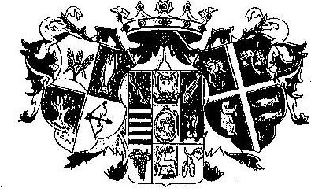
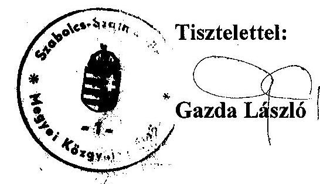

# JELENTÉS 

a Szabolcs-Szatmár-Bereg Megyei Önkormányzat gazdálkodásának átfogó ellenőrzéséről

---

3. Önkormányzati és Területi Ellenőrzési Igazgatóság
3.3 Átfogó Ellenőrzések Főcsoport
Iktatószám: V-1002-7/34/16/2003.
Témaszám: 635
Vizsgálat-azonosító szám: V0102
Az ellenőrzést felügyelte:
Dr. Lóránt Zoltán
főigazgató
Az ellenőrzés végrehajtásáért felelős:
Dr. Sepsey Tamás
főcsoportfőnök
Az ellenőrzést vezette:
Csecserits Imréné
főcsoportfőnök-helyettes
Az ellenőrzést végezték:
Kenéz Sándor
számvevő tanácsos
Dr. Szücs Zoltán
számvevő tanácsos
Valu Tibor
tanácsadó

A témához kapcsolódó - az elmúlt három évben készített - számvevőszéki jelentések:
címe
sorszáma
Jelentés az önkormányzati feladatellátás szervezeti formáiról és 0012
működésük célszerűségének ellenőrzéséről
Jelentés a közbeszerzésekről szóló törvény végrehajtásának 0109
ellenőrzéséről
Jelentés a helyi önkormányzatok tartós szociális ellátási 0317
feladatainak ellenőrzéséről az idősek otthonainál

---

# TARTALOMJEGYZÉK 

BEVEZETÉS ..... 5
I. ÖSSZEGZŐ MEGÁLLAPÍTÁSOK, KÖVETKEZTETÉSEK, JAVASLATOK ..... 7
II. RÉSZLETES MEGÁLLAPÍTÁSOK ..... 16

1. A költségvetés tervezésének, végrehajtásának és a zárszámadás elkészítésének szabályszerűsége ..... 16
1.1. A költségvetés tervezésének, a költségvetési rendelet megalkotásának, elfogadásának szabályszerűsége ..... 16
1.2. A költségvetési előirányzatok módosításának szabályszerűsége ..... 19
1.3. A gazdálkodás szabályozottsága, szabályszerűsége ..... 21
1.4. A munkafolyamatba épített ellenőrzések szabályozottsága és gyakorlati működése a pénzügyi, gazdálkodási és számviteli feladatellátás területén ..... 24
1.5. A bizonylati rend szabályszerűsége ..... 26
1.6. A vagyon nyilvántartásának és leltározásának szabályszerűsége ..... 27
1.7. A vagyongazdálkodással kapcsolatos feladat és döntési hatáskörök szabályozottsága, a vagyonváltozást előidéző intézkedések szabályszerűsége, célszerűsége ..... 29
1.8. Az Önkormányzat által céljelleggel - nem szociális ellátásként - juttatott támogatásokkal történő elszámoltatás szabályszerűsége ..... 35
1.9. A követelések, részesedések, értékpapírok év végi értékelésének szabályszerűsége ..... 37
1.10. A működési és felhalmozási bevételek, kiadások alakulása ..... 39
1.11. A költségvetés egyensúlyának helyzete ..... 41
1.12. A közbeszerzési eljárások szabályszerűsége ..... 41
1.13. A zárszámadási kötelezettség teljesítésének szabályszerűsége ..... 42
2. Egyes kiemelt önkormányzati feladatok és a rendelkezésre álló források összhangja ..... 44
2.1. A feladatok meghatározása és szervezeti keretei ..... 44
2.2. Egyes naturális mutatókkal mérhető feladatok bevételei és kiadásai ..... 46
2.3. A jelentős ráfordítást igénylő önként vállalt feladatok ellátása ..... 49
3. A belső irányítási, ellenőrzési rendszer működésének értékelése ..... 50
3.1. Az Önkormányzat informatikai rendszerének szabályozottsága, működése ..... 50
3.2. A helyi ellenőrzési rendszer kialakítása, működése ..... 51
3.3. A könyvvizsgálati kötelezettség teljesítése ..... 53
3.4. A korábbi számvevőszéki ellenőrzések javaslatainak hasznosulása ..... 54

---

# MELLÉKLETEK 

1. számú Az Önkormányzat 2002. évi bevételeinek és kiadásainak alakulása (1 oldal)
2. számú Az önkormányzati vagyon nagyságának alakulása (1 oldal)
3. számú Az Önkormányzat gazdálkodását meghatározó főbb adatok, mutatószámok (1 oldal)
4. számú Egyes önkormányzati feladatok finanszírozása (1 oldal)
5. számú Gazda László elnök úr észrevétele (1 oldal)

---

# RÖVIDÍTÉSEK JEGYZÉKE 

Ötv.
Áht.
Kbt.
Sztv.
Htv.

Ámr.
Vhr.

SzMSz
vagyongazdálkodási rendelet

ÁSZ
TÁH
OEP
Önkormányzat
Közgyűlés
Közgyűlés elnöke
főjegyző
Gazdasági és vagyonbizottság
Pénzügyi bizottság
Önkormányzat hivatala
ügyrend
Pénzügyi és vagyongazdálkodási osztály
Illetékhivatal
Ellátó szervezet
a helyi önkormányzatokról szóló 1990. évi LXV. törvény az államháztartásról szóló 1992. évi XXXVIII. törvény a közbeszerzésekről szóló 1995. évi XL. törvény a számvitelről szóló 2000. évi C. törvény
a helyi önkormányzatok és szerveik, a köztársasági megbízottak, valamint egyes centrális alárendeltségű szervek feladat- és hatásköreiről szóló 1991. évi XX. törvény az államháztartás működési rendjéről szóló 217/1998. (XII. 30.) Korm. rendelet
az államháztartás szervezetei beszámolási és könyvvezetési kötelezettségének sajátosságairól szóló 249/2000. (XII. 24.) Korm. rendelet

A Szabolcs-Szatmár-Bereg Megyei Közgyűlés és szervei Szervezeti és Működési Szabályzatáról szóló, többször módosított 2/1999. (II. 5.) számú önkormányzati rendelet
Az önkormányzat vagyonáról és a vagyongazdálkodás szabályairól szóló többször módosított 9/1997. (VII. 4.) számú önkormányzati rendelet
Állami Számvevőszék
Területi Állami Háztartási Hivatal
Országos Egészségbiztosítási Pénztár
Szabolcs-Szatmár-Bereg Megyei Önkormányzat
Szabolcs-Szatmár-Bereg Megyei Közgyűlés
Szabolcs-Szatmár-Bereg Megyei Közgyűlés elnöke
Szabolcs-Szatmár-Bereg Megyei Önkormányzat főjegyzője
Szabolcs-Szatmár-Bereg Megyei Közgyűlés Gazdasági és Vagyonbizottsága
Szabolcs-Szatmár-Bereg Megyei Közgyűlés Pénzügyi Bizottsága
Szabolcs-Szatmár-Bereg Megye Önkormányzatának Hivatala
A főjegyző által kiadott 2-2/1998. számú rendelkezés
Szabolcs-Szatmár-Bereg Megyei Önkormányzat Hivatalának Pénzügyi és Vagyongazdálkodási Osztálya
Szabolcs-Szatmár-Bereg Megyei Illetékhivatal
Szabolcs-Szatmár-Bereg Megyei Önkormányzat Ellátó Szervezete

---

# 4

---

# JELENTÉS 

## a Szabolcs-Szatmár-Bereg Megyei Önkormányzat gazdálkodásának átfogó ellenőrzéséről

## BEVEZETÉS

Az Ötv. 92. § (1) bekezdése, valamint az Áht. 120/A. § (1) bekezdése alapján Szabolcs-Szatmár-Bereg Megyei Önkormányzat gazdálkodását az Állami Számvevőszék Önkormányzati és Területi Ellenőrzési Igazgatósága a V-1002-7/2003. számú ellenőrzési program figyelembe vételével vizsgálta.

## Az ellenőrzés célja annak értékelése volt, hogy:

- az önkormányzati gazdálkodás törvényességét, szabályszerűségét biztosították-e a tervezés, a költségvetés végrehajtása és a zárszámadás során; a gazdálkodás szabályszerűségét biztosító kontrollok ${ }^{1}$ megfelelően segítették-e a végrehajtást;
- az Önkormányzat által ellátandó feladatok és az azokhoz rendelkezésre álló pénzforrások összhangja biztosított volt-e.

Az ellenőrzött időszak: a 2002. év, valamint a 2003. I. negyedév, az 1.7., 2.1-2.3., 3.2-3.4. ellenőrzési programpontok esetében a 2000-2002. évek.

Az Önkormányzat földrajzi elhelyezkedése, a megyében lévő települési önkormányzatok száma, valamint a kötelező és önként vállalt koordinációs feladatok miatt fontos szerepet tölt be a megye önkormányzatai között.

A megye az ország legkeletibb megyéje, ahol - a 2002. évi önkormányzati képviselő választásokat követően - 229 települési önkormányzat van, e tekintetben az ország ötödik legnagyobb megyéje. Kötelező feladatai a területi szolgáltatást végző intézmények fenntartása és működtetése. Az önként vállalt koordinációs feladatai körében érdekérvényesítési, érdekképviseleti feladatokat lát el.

A Közgyűlés tagjainak száma 48 fő, munkáját 13 állandó bizottság segíti.
A megye lakosainak száma 600 ezer fő. Az Önkormányzat 2003. évi költségvetésének főösszege 27 milliárd Ft, számviteli mérlegének főösszege pedig a 2002. év végén 24 milliárd Ft volt.

[^0]
[^0]:    ${ }^{1}$ A gazdálkodás szabályszerűségét biztosító kontroll alatt értjük a kiépített és működő belső irányítási és szabályozási rendszert, valamint a belső ellenőrzési funkciók ellátását.

---

Az Önkormányzat intézményeinek száma 43, valamennyi önálló gazdálkodási jogkörrel rendelkezik. Az Önkormányzat hivatalában és intézményeiben foglalkoztatottak száma - a 2003-ra jóváhagyott költségvetés szerint - 6515 fő, ebből 197 fő köztisztviselő. Az önkormányzati - egészségügyi, szociális, oktatási és közművelődési - feladatellátást segíti öt közalapítvány.

---

# I. ÖSSZEGZŐ MEGÁLLAPÍTÁSOK, KÖVETKEZTETÉSEK, JAVASLATOK 

Az Önkormányzat gazdálkodásában döntően érvényesültek a központi jogszabályi előírások, azonban a költségvetési és zárszámadási önkormányzati rendeletek és a számviteli szabályzatok, az eszközök és források értékelésére, valamint a pénzkezelésre vonatkozó szabályzatok kivételével, hiányosak. Ezek negatívan hatottak a szabályszerű gazdálkodás feltételeinek és körülményeinek a kialakítására, a tervezésre, az operatív gazdálkodásra, a számviteli rend- és a beszámolási kötelezettség teljesítésére.

A feladatokat több évre kijelölő - gazdasági program céljainak megfelelő munkaprogrammal rendelkezik az Önkormányzat. A 2002. évre szóló költségvetés tervezése és a költségvetési rendelet alkotása során az Önkormányzatnál - két eset kivételével - betartották a vonatkozó jogszabályi előírásokat. A költségvetési rendelettervezet előkészítése során a tervezés módszerére és a költségvetési javaslat kidolgozására vonatkozó jogszabályi előírásokat megsértették azzal, hogy a rendelet tervezethez nem csatolták a Pénzügyi bizottság véleményét, valamint a rendelet tervezetben az Önkormányzat hivatalának költségvetését nem feladatonként mutatták be.

Az Önkormányzat három költségvetési szerv esetében a jogszabályi előírás ellenére nem a Közgyűlés által jóváhagyott előirányzatokat szerepeltette a központi pénzügyi információs rendszer számára megküldött költségvetési tájékoztatóban.

A 2002. évi költségvetési, valamint az előirányzat módosításokat jóváhagyó közgyűlési rendeletek együttesen teljes körűen tartalmazták a költségvetés végrehajtásával kapcsolatos előírásokat, lényeges szabályokat.

A Közgyűlés - a jogszabályban előírtak ellenére - önkormányzati rendeletben nem határozta meg a költségvetés és a zárszámadás jóváhagyása során a Közgyűlés részére tájékoztatásul bemutatandó mérlegek, kimutatások részletes tartalmi követelményeit ${ }^{2}$. E hiányosság ellenére a költségvetési és a zárszámadási rendelet tervezetek tartalmazták a jogszabályban előírt mérlegeket, kimutatásokat.

A Közgyűlés a 2002. évre vonatkozó költségvetési rendeletében jóváhagyott előirányzatokat nyolc alkalommal módosította. A Közgyűlés a 2003. február 14-én tartott ülésén az Országgyűlés, a Kormány, valamint költségvetési fejezet és elkülönített állami pénzalap által az Önkormányzat részére biztosított pótelőirányzatokon túlmenően a jogszabályban foglaltakat megsértve egyéb

[^0]
[^0]:    ${ }^{2}$ A Közgyűlés elnöke a Közgyűlés részére a követelmények meghatározására vonatkozó javaslatot nem terjesztett elő.

---

bevételi és kiadási előirányzatot is módosított visszamenőlegesen 2002. december 31-i hatállyal.

A költségvetési rendeletben jóváhagyott előirányzatokat, azok változásait önkormányzati szinten, azon belül költségvetési szervenként, kiemelt előirányzati bontásban nyilvántartották.

A zárszámadási rendeletben szereplő - önkormányzati szintű - módosított előirányzatokat a teljesítési adatok nem haladták meg, de a költségvetési szervek szintjén több intézménynél egyes kiemelt kiadási előirányzatot túlléptek. A túllépések okait az Önkormányzat, illetve az Önkormányzat hivatala részéről nem vizsgálták, ennek következtében felelősségre vonásra sem került sor.

A főjegyző kialakította és szabályozta az Önkormányzat hivatala számviteli politikáját és elkészítette az annak részét képező számviteli szabályzatokat. A számviteli politika nem tartalmazza, hogy a számviteli elszámolás és értékelés szempontjából mit tekintenek lényegesnek, nem lényegesnek, továbbá nem jelentős és jelentős összegnek. A szabályozási hiányosság jogszabályi előírásokba ütköző. A főjegyző a jogszabályi előírást megsértve nem készítette el a számlarendet. A leltározási szabályzatban meghatározta, hogy a leltározás elvégzését igazoló leltárt helyettesítheti a részletező nyilvántartások alapján készített összesítő kimutatás, a jogszabályban foglaltakat megsértette, mivel ehhez a Közgyűlés egyetértését nem kérte. A gazdálkodás szabályszerű lebonyolítása érdekében a Közgyűlés elnöke és a főjegyző utasításokat, intézkedéseket, rendelkezéseket adott ki. Az Önkormányzat hivatala - mint önálló gazdálkodási jogkörrel rendelkező költségvetési szerv - a jogszabályban előírt SzMSz-szel nem rendelkezik.

A szabályzatok tartalmazzák a helyi sajátosságokat, de a szabályozás nem terjedt ki az ellátandó feladat teljes folyamatára, amelynek hiánya a munkavégzés során is éreztette hatását. A gazdálkodás végrehajtásának szabályait tartalmazó, a Közgyűlés elnöke és a főjegyző által kiadott együttes rendelkezés ellentétes a jogszabályban, az SzMSz-ben és az Ellátó szervezet alapító okiratában foglaltakkal, mivel abban egy másik, önálló gazdálkodási jogkörrel rendelkező költségvetési intézmény, az Ellátó szervezet részére is meghatároztak gazdálkodási kötelezettségeket, jogosultságokat. Előírták részére, hogy az Önkormányzat hivatalának költségvetésében előirányzott felhalmozási jellegű kiadásokból és egyes dologi kiadásokból megvalósítandó feladatokat lebonyolítsa és vezesse a kapcsolódó analitikus nyilvántartásokat. Elmaradt azonban az analitikus nyilvántartás és az Önkormányzat hivatalában vezetett főkönyvi számlák közötti kapcsolat szabályozása, az ezzel összefüggő gazdálkodási, ellenőrzési feladatok hatásköri rendezése. Az Önkormányzat hivatala pénztárosának munkaköri leírása az Önkormányzat hivatalának hatáskörébe nem tartozó tevékenység elvégzésének kötelezettségét - az önálló gazdálkodási jogkörrel rendelkező költségvetési intézmény, az Ellátó szervezet, pénztárosi feladatainak ellátását - is tartalmazza.

A munkafolyamatba épített belső ellenőrzési feladatok szabályozási keretét a főjegyző által kiadott ellenőrzési szabályzat adja meg. Az ügyrend melléklete részletesen tartalmazza az ellenőrizendő feladatot, a feladat ellátásáért felelős belső szervezeti egységet, az ellenőrzést végző személyt. A szabályzat a vezetői ellenőrzés eszközeit, a munkafolyamatba épített ellenőrzés követelményeit foglalja magába. A Pénzügyi és vagyongazdálkodási osztály köztisztviselőinek munkaköri leírásaiban az egyeztetési feladatok előírásai jelentették a munkafolyamatba épített ellenőrzési kötelezettséget, ezek dokumentálásának módját viszont nem határozták meg. Szabályozatlan a szakmai teljesítés igazolásának módja. A jogszabályban foglaltakat megsértve - az előírt esetekben - a bevételek nem kerültek utalványozásra és ellenjegyzésre.

Az Önkormányzat hivatalában a bizonylati rendet és az alkalmazandó nyomtatványokat a főjegyzőnek a számviteli rend szabályozásáról szóló rendelkezése tartalmazta. Az Önkormányzat hivatala és az Ellátó szervezet közötti elszámolás során a gazdasági események belső bizonylataként olyan számviteli bizonylatokat is használtak, amelyek nem feleltek meg a jogszabályban előírt tartalmi követelményeknek. A költségvetés végrehajtása során alkalmazott további számviteli bizonylatok megfeleltek az előírt alaki és tartalmi követelményeknek. A kötelezettségvállalásokon az
 ellenjegyzés nem történt meg maradéktalanul, a kötelezettségvállalások nyilvántartását nem szabályozták. A bizonylatokat minden esetben - a teljesítések szakmai igazolását követően - érvényesítették. A kiadások utalványozása és annak ellenjegyzése megtörtént. A gazdasági események számviteli nyilvántartásban történő rögzítése során a számviteli alapelvek érvényesültek, a könyvvezetés a számviteli előírásoknak megfelelően, rendezett formában történt.

A vagyon számviteli analitikus nyilvántartásával kapcsolatos feladatok szabályozása a jogszabályi előírást megsértve, nem történt meg. Az önkormányzati vagyon számviteli analitikus nyilvántartását a költségvetési intézmények végzik. Az Önkormányzat hivatala költségvetésében szereplő előirányzatok terhére megvalósított beruházásokkal összefüggő, a vagyon változását érintő gazdasági események bizonylatait az Önkormányzat hivatalának főkönyvi könyvelésében rögzítik, az ezzel összefüggő analitikus nyilvántartást az Ellátó szervezetnél és az intézményeknél végzik. Az analitikus és főkönyvi könyvelés, valamint az ingatlanvagyon-kataszter adatainak egyeztetését a 2002. évben elvégezték. Az ingatlanvagyon-kataszter vezetése az Önkormányzat hivatalánál történik. A törzsvagyon elkülönített nyilvántartása a számviteli analitikus nyilvántartásokban és az ingatlanvagyon-kataszterben is megtörténik. A 2002. évi leltározási kötelezettséget - az üzemeltetésre átadott eszközök kivételével - a leltározási szabályzatban foglaltak szerint teljesítették. A 2002. évi zárszámadás mellékleteként bemutatott vagyonkimutatás, az analitikus és főkönyvi nyilvántartások valamint az ingatlanvagyon-kataszter adatai között 2002. december 31-én az egyezőség fennállt. A 2003. január 1-jei ingatlanstatisztika értékadatai az ingatlanvagyon-kataszter adataival megegyeztek. Az ingatlanvagyon-kataszteri nyilvántartás jogszabályoknak megfelelő kiegészítése - a korábban érték nélkül nyilvántartott ingatlanok értékének megállapítása tekintetében - megtörtént. Az értékcsökkenések elszámolásánál betartották a jogszabályi előírásokat.

A Közgyűlés rendeletet alkotott a vagyonnal való gazdálkodás szabályairól. Meghatározták a vagyongazdálkodással kapcsolatos feladatokat és döntési hatásköröket, valamint az eszközök törzsvagyonba és egyéb vagyonba történő besorolásának szempontjait, a forgalomképesség szerinti besorolás megváltoztatásának módját. A vagyongazdálkodásról szóló rendelet előírásai tartalmaz-

---

zák a vagyoncsoportok teljes körű felsorolását, az üzemeltetésre átadott eszközökkel kapcsolatos jogköröket. Az Önkormányzat eszközeinek értéke 2000-ről 2002-re 49%-kal növekedett, ezt meghaladóan az immateriális javak, az üzemeltetésre, kezelésre átadott eszközök, forgóeszközökön belül a követelések és az ennek részeként a kisértékű követelések is, valamint pénzeszközök értéke emelkedett.

A Közgyűlés, a bizottságok és a Közgyűlés elnöke által juttatott működési célú támogatások 23%-ánál megsértették az államháztartásról és a közhasznú szervezetekről szóló jogszabályokban foglaltakat, nem írták elő a számadási kötelezettséget a támogatott szervek részére, nem határozták meg a rendeltetésszerű felhasználás ellenőrzésének módját. A Közgyűlés döntése alapján az Önkormányzat hivatala, a bizottságok és a bizottsági megbízás alapján eljáró közalapítvány, valamint a Közgyűlés elnöke a működési célú támogatások 77%-a esetében előírtak számadási és beszámolási kötelezettséget, amelynek a támogatott szervek bizonylatokkal, illetve Közgyűlés részére átadott részletes beszámolóval eleget tettek. A felhalmozási célú pénzeszközátadás az árvízkárosult családok részére bútorvásárlás céljára történt, amelyről a megyei Helyreállítási és újjáépítési bizottság és az érintett települési önkormányzatok együttesen döntöttek, akik a cél szerinti felhasználást ellenőrizték. Az önkormányzat által céljelleggel - nem szociális ellátásként - juttatott támogatásokról vezetett analitikus nyilvántartása nem tartalmazza az elszámolási kötelezettség határidejét, illetve annak teljesítését.

A követelés elengedésével kapcsolatos szabályokat a vagyongazdálkodási rendelet tartalmazza, ezt figyelembe véve a 2002. évben 743 ezer Ft követelés intézményi térítési díj elengedésére került sor. A követelések, részesedések, értékpapírok év végi értékelésének, értékvesztésének elszámolási szabályozása megtörtént, ugyanakkor a 2002. évi könyvviteli mérleg készítéséhez az Önkormányzat hivatala nem kérte be a követelések, részesedések értékeléséhez szükséges bizonylatokat, a kisértékű követelések értékelését nem végezték el. Az Önkormányzat követelésállománya a vizsgált időszakban folyamatosan nőtt.

Az Önkormányzat által ellátott feladatok és azokhoz rendelkezésre álló saját pénzforrások összhangja a működési célú feladatokat tekintve biztosított volt. A költségvetési beszámolók 2000-2002. évi teljesítési adatai szerint önkormányzati szinten a működési célú bevételek mindegyik évben fedezték a működési célú kiadásokat. Az Önkormányzat hivatala által 2000. és 2001. évben igénybe vett működési célú hitelből egy intézmény - Szatmár-Beregi Kórház - átmeneti likviditási gondjait oldották meg. Forráshiány a fejlesztési célú feladatokkal kapcsolatban keletkezett, amelyet középlejáratú hitelfelvétellel rendezett az Önkormányzat. A hitelfelvétellel kapcsolatos előterjesztésben számítás anyagként, összegszerűen - az adóságot keletkeztető éves kötelezettségvállalás jogszabályban meghatározott felső határát nem mutatták be. Az Önkormányzat által vállalt, évenkénti adósságot keletkeztető kötelezettségvállalás során betartották az Ötv. vonatkozó előírását.

A tervezett 2002. évi feladatok zavartalan ellátása, a biztonságos pénzgazdálkodás alátámasztása érdekében a pénzállomány alakulásáról likviditási tervet készítettek. Az Önkormányzat hivatalában a jogszabályban foglaltakat megsértve nem szabályozták a kötelezettségvállalások nyilvántartási formáját,

---

tartalmát és nem vezettek olyan nyilvántartást, amelyből megállapítható a költségvetési évet terhelő kötelezettségvállalások összege.

A Közgyűlés megalkotta a közbeszerzési eljárás helyi szabályairól szóló rendeletét, de a 2002. évben érvényben lévő szabályozás nem terjedt ki a közbeszerzési eljárásban résztvevők összeférhetetlensége igazolásának módjára. Az Önkormányzat hivatala a közbeszerzési eljárást szabályszerűen folytatta le. A közbeszerzési eljárás lezárásáról a határozatot Kbt. előírásait megsértve nem személy, hanem a Közgyűlés hozta meg.

A Közgyűlés elnöke az előírt határidőn belül nyújtotta be a Közgyűlés részére a főjegyző által elkészített zárszámadási rendelettervezetet, amely szerkezetében azonos volt a költségvetési rendelet szerkezetével, ezen okból meg is ismételte a költségvetési rendelet hibáit. A zárszámadáshoz csatolták az előírt mérlegeket, kimutatásokat. A vagyonkimutatás azonban - az ingatlanok kivételével - nem nyújtott részletes információt, mivel nem részletesen, hanem összevontan - mérlegcsoportonként - tartalmazott értékadatokat. A zárszámadást tárgyalásával egyidejűleg a Közgyűlés módosította az Önkormányzat vagyongazdálkodási rendeletét, amelynek melléklete ingatlanonként tartalmazza az ingatlan címét, helyrajzi számát, területét, tulajdoni arányát, ingatlan kataszteri sorszámát, számviteli bruttó értékét és megállapított becsült értékét. A Közgyűlés zárszámadási rendeletében jóváhagyta az önállóan gazdálkodó költségvetési szervei 2002. évi pénzmaradványát. Az Önkormányzat által felhasználható, továbbá az intézményektől elvont, valamint a feladattal terhelt pénzmaradványt önállóan gazdálkodó költségvetési szervek szerinti bontásban bemutatták.

Az Önkormányzat a kötelező feladatok ellátásáról saját intézményhálózat és közalapítványok útján gondoskodott. A költségvetési intézmények gazdasági vezetőinek 35%-a rendelkezett a jogszabály által előírt iskolai végzettséggel és szakmai képesítéssel. A vizsgált időszakban a Demecser városban működő Vári Emil Gimnázium működtetését - a városi Önkormányzat kezdeményezésére 2000. évben adta át az Önkormányzat. Az intézmények feladatellátásával kapcsolatos módosításokról a Közgyűlés egyedi előterjesztések alapján döntött, együttesen nem értékelte a kialakított szervezeti rendszer működésének célszerűségét. A Közgyűlés működésének anyagi, technikai feltételeit biztosító Ellátó szervezet alapító okiratában meghatározott feladatokon túlmenően a Közgyűlés elnöke és főjegyzője által kiadott együttes rendelkezésben - jogszabályban foglaltakat megsértve - további feladatokat határoztak meg. Az Ellátó szervezet az Önkormányzat hivatalának költségvetésében szereplő feladatokat is ellát, az ott szereplő kiadási előirányzatok teljesítésére kötelezettséget vállalt, Szervezeti és Működési Szabályzatát a Közgyűlés nem hagyta jóvá.

Az önként vállalt feladatok költségvetési kiadáson belüli aránya a vizsgálattal érintett években nem érte el az egy százalékot, így az nem veszélyeztette az Önkormányzat működését és a kötelező feladatok ellátását. A Közgyűlés rendeleteiben nem nevesítette az önként vállalt és kötelezően ellátandó feladatait.

Az Önkormányzat hivatala a hivatalra vonatkozó informatikai stratégia elkészítését a 2000. évben PHARE támogatáshoz készült pályázat benyújtásakor

---

elkészítette. A váratlan események esetére nem készítettek katasztrófa elhárítási tervet, nem szabályozták az informatikai rendszer hozzáférési jogosultságát, nem határozták meg az engedélyezési jogköröket, a dolgozók nem rendelkeznek informatikai-számítástechnikai képzettséggel. Az adatbiztonság érdekében a főjegyző 2002. május 23-án közszolgálati adatvédelmi szabályzatot adott ki. Az informatikai rendszerről üzemeltetési leírás nem készült.

A Közgyűlés a felügyeleti és belső ellenőrzés szervezeti kereteit, feltételeit kialakította, az éves költségvetési rendeletekben a létszámot és a költségvetési előirányzatot az ellenőrzések végrehajtásához biztosította. A Közgyűlés nem határozta meg az önálló gazdálkodási jogkörrel rendelkező költségvetési szerveknél elvégzendő pénzügyi ellenőrzés gyakoriságát. A főjegyző - a Közgyűlés felhatalmazása nélkül - önálló intézkedésben állapította meg az Önkormányzat ellenőrzési szabályzatát, amely tartalmazza az ellenőrzés feladatait, az ellenőrzések típusait, a lebonyolítás szabályait, az Önkormányzat hivatala belső ellenőrzését, az ellenőrzéssel kapcsolatos feladat és hatásköröket, az összeférhetetlenség szabályait, valamint az ellenőrzések nyilvántartásával kapcsolatos feladatokat. Az ellenőrzésekről készült jelentések megfelelő információt szolgáltattak a Közgyűlésnek és szerveinek, az ellenőrzött szervezeti egységeknek pedig segítséget jelentettek a feltárt hibák, hiányosságok kiküszöbölésében. A Közgyűlés a költségvetési szervek ellenőrzésének tapasztalatait évente a zárszámadás keretében a főjegyző részletes beszámolója alapján áttekintette. Az Önkormányzat hivatalának belső ellenőrzési rendszerét a főjegyző az Önkormányzat hivatala ügyrendjében szabályozta, amely tartalmazza az ellenőrizendő feladatot, a feladat ellátását és az ellenőrzést végző belső szervezeti egységet, munkaköri megnevezéseket.

Az ÁSZ által végzett korábbi ellenőrzésekről készült számvevői jelentéseket a Közgyűlés elé terjesztették, a jelentésekben megfogalmazott javaslatok alapján minden esetben intézkedtek a hiányosságok megszüntetésére.

A helyszíni ellenőrzés megállapításai mellett a gazdálkodás szabályszerűségének és a munka színvonalának javítása érdekében javasoljuk:

# a Közgyűlés elnökének: 

## a törvényes állapot helyreállítása és a jogszabályi előírások betartása érdekében:

1. terjessze a Közgyűlés elé az Áht. 118. §-ában előírt mérlegek és kimutatások tartalmának meghatározására vonatkozó rendelettervezetet;
2. csatolja a költségvetési koncepcióhoz a Pénzügyi bizottság írásos véleményét a költségvetési koncepció tervezetéről az Ámr. 28. § (3) bekezdésében előírtak betartása érdekében;
3. a szabályszerű költségvetési gazdálkodás biztosítása céljából:
a) gondoskodjon arról, hogy a Közgyűlés, a bizottságok és a Közgyűlés elnöke által céljelleggel juttatott - nem szociális jellegű - támogatások esetében az Áht.

---

13/A. § (2) bekezdésében, valamint a közhasznú szervezetekről szóló 1997. évi CLVI. törvény 14. § (2) bekezdésében előírtak betartása érdekében a számadási kötelezettség előírása és a kapott elszámolás szerinti felhasználás ellenőrzése megtörténjen;
b) biztosítsa, hogy az alapítványok, közalapítványok támogatásáról az Ötv. 10. § (1) bekezdésében foglaltaknak megfelelően a Közgyűlés döntsön;
c) intézkedjen „az Önkormányzat gazdálkodása végrehajtásának szabályai"-t tartalmazó - Közgyűlés elnöke és főjegyző által közösen kiadott - 1-4/2000. (VIII. 15.) számú rendelkezés felülvizsgálatára és módosítására annak érdekében, hogy a feladatok, jogkörök, hatáskörök meghatározásánál az Ámr. 134. § (1)-(3) bekezdésében foglaltak betartása kerüljenek;
d) gondoskodjon arról, hogy az Ámr. 136. §-ában foglaltaknak megfelelően a bevételek - a termékértékesítésből és szolgáltatásból befolyó bevételek kivételével - utalványozásra kerüljenek;
4. kezdeményezze a Közgyűlés a közbeszerzésekről szóló 15/1999. (IX. 23.) számú rendeletének kiegészítését a Kbt. 31. § (2) bekezdésében foglalt összeférhetetlenség igazolás formájának meghatározásával;
5. gondoskodjon arról, hogy a közbeszerzési eljárások esetében az eljárást lezáró határozatot a Kbt. 31. § (3) bekezdésében foglaltaknak megfelelően személy hozza meg;
6. kezdeményezze, hogy a Közgyűlés - az Ötv. 92. § (2) bekezdésében előírt kötelezettség teljesítése érdekében - határozza meg az önálló gazdálkodási jogkörrel rendelkező költségvetési szerveknél elvégzendő pénzügyi ellenőrzés gyakoriságát;
7. kezdeményezze, hogy az intézmények leltározási és leltárkészítési szabályzataik elkészítése során a Vhr. 37. § (4) bekezdésében leírt leltározási módszer igénybevételi lehetőségéről a Közgyűlés hozza meg döntését;

# a munka színvonalának javítása érdekében: 

8. kezdeményezze, hogy a számvevőszéki jelentést a Közgyűlés tárgyalja meg, és a feltárt hiányosságok megszüntetése érdekében készíttessen intézkedési tervet;

## a főjegyzőnek:

## a törvényes állapot helyreállítása és a jogszabályi előírások betartása érdekében:

1. gondoskodjon a költségvetési rendelettervezet
 elkészítése során az Ámr. 29. § (1) bekezdés e) pontjában előírtak betartása érdekében arról, hogy az Önkormányzat hivatalának költségvetése feladatonként meghatározásra kerüljön;
2. a költségvetési gazdálkodás szabályszerű végrehajtása érdekében:
a) biztosítsa a költségvetési előirányzatok módosítására irányuló rendelettervezetek előkészítése során, hogy az Ámr. 53. § (2) bekezdésben foglaltaknak megfelelően

---

a költségvetési előirányzatok tárgyévet követő időben - december 31-i hatállyal - történő módosítására csak az államháztartás többi alrendszere által biztosított pótelőirányzatok esetében kerüljön sor;
b) biztosítsa az Ámr. 43. § (3) bekezdésében előírt tartalmi és formai szempontok alapján megvalósított ellenőrzés elvégzésével, hogy a költségvetési szervek által összeállított költségvetés és az államháztartási pénzügyi információs rendszer részére küldendő adatszolgáltatás tartalma azonos legyen a Közgyűlés által elfogadott költségvetési rendeletben foglaltakkal;
c) kísérje figyelemmel az intézmények gazdálkodását, előirányzat túllépés esetén a Htv. 140. § (1) bekezdés e) pontjában biztosított jogkörében eljárva vizsgálja meg azok okait és indokolt esetben tegyen javaslatot felelősségvonásra;
d) készítse el és kezdeményezze az Ámr. 10. § (4) bekezdésében foglaltakat figyelembe véve az Önkormányzat hivatalának, mint önálló gazdálkodási jogkörrel rendelkező költségvetési szerv Szervezeti és Működési Szabályzatának jóváhagyását;
e) kezdeményezze az - az Ámr. 10. § (4) bekezdésében foglaltak alapján - az Ellátó szervezet Szervezeti és Működési Szabályzatának jóváhagyását;
f) vizsgálja felül az Önkormányzat hivatalában pénztárosi munkakört ellátó dolgozó munkaköri leírását, biztosítsa, hogy abban kizárólag az Önkormányzat hivatala pénztárának kezelésével kapcsolatos feladatok szerepeljenek;
g) alakítsa ki az Önkormányzat hivatalának - a Vhr. 49. § (1) bekezdésben előírt számlarendjét;
h) rendelkezzen - az Ámr. 135. § (3) bekezdésében foglaltak alapján - a szakmai teljesítések igazolásának módjáról;
i) szerezzen érvényt annak, hogy az Önkormányzat hivatala és az Ellátó szervezet elszámolásai során alkalmazott számviteli bizonylatok feleljenek meg a Sztv. 166. és 167. §-aiban foglaltak alaki és tartalmi követelményeknek, kifizetéseket az Önkormányzat hivatalának költségvetéséből csak ilyen bizonylatok ellenében teljesítsenek;
j) biztosítsa a kötelezettségvállalások nyilvántartásának az Ámr. 134. § (6) bekezdésében előírt módon történő vezetését és az Ámr. 134. § (4) bekezdése alapján szabályzatban rögzítse a kötelezettségvállalások rendjét és nyilvántartásának formáját;
k) gondoskodjon arról, hogy az Önkormányzat adósságot keletkeztető kötelezettségvállalására vonatkozó előterjesztésekben bemutatásra kerüljön a kötelezettségvállalásnak az Ötv. 88. § (2) bekezdés szerint meghatározott felső határa;
l) biztosítsa a Sztv. 54. § (1) és (2) bekezdésében foglaltaknak megfelelően a részesedések évenkénti értékelését;

---

m) végezze el a Sztv. 55. § (1) bekezdésben foglaltaknak megfelelően a követelések minősítését, értékelését;
n) kezdeményezze, hogy a kisösszegű és behajthatatlan követelésállomány nyilvántartásánál érvényesüljenek a Magyar Köztársaság 2003. évi költségvetéséről szóló 2002. évi LXII. törvény 7. § (1) bekezdésében, valamint az Áht. 108. § (4) bekezdésében foglaltak;
3. gondoskodjon arról, hogy az Ötv. 92. § (2) bekezdésében előírt belső ellenőrzési feladatok elvégzésre kerüljenek;

# a munka színvonalának javítása érdekében: 

4. biztosítsa, hogy az önkormányzat által céljelleggel - nem szociális ellátásként - juttatott támogatások analitikus nyilvántartásából az Áht. 13/A. §-ban előírt számadási kötelezettség határideje és annak határidőn belüli teljesítése, valamint a felhasználás és a számadás ellenőrzésének elvégzése megállapítható legyen;
5. kezdeményezzen intézkedéseket a követelésállomány csökkentése érdekében;
6. szabályozza az informatikai rendszer hozzáférési jogosultsági rendszerét és dokumentálja az engedélyezési jogköröket;
7. támogassa az informatikai képzettség javítása érdekében a dolgozók továbbképzésen, tanfolyamon való részvételét.

---

# II. RÉSZLETES MEGÁLLAPÍTÁSOK 

## 1. A KÖLTSÉGVETÉS TERVEZÉSÉNEK, VÉGREHAJTÁSÁNAK ÉS A ZÁRSZÁMADÁS ELKÉSZÍTÉSÉNEK SZABÁLYSZERŰSÉGE

### 1.1. A költségvetés tervezésének, a költségvetési rendelet megalkotásának, elfogadásának szabályszerűsége

Az Ötv. 91. § (1) bekezdése a helyi önkormányzatok részére gazdasági program készítését írja elő. A Közgyűlés a vizsgált időszakot megelőzően a 2000-2002. évekre vonatkozó középtávú célkitűzéseit a 26/2000. (V. 5.) határozatával jóváhagyott - a gazdasági program céljainak megfelelő - munkaprogramban határozta meg.

A munkaprogram és mellékletei stratégiai jelleggel tartalmazzák az Önkormányzat legfontosabb - területfejlesztéssel, gazdálkodással, egészségüggyel, szociális feladatokkal, gyermekvédelemmel, közoktatással, közművelődéssel, sporttal és nemzetközi kapcsolatokkal összefüggő - feladatait, célkitűzéseit és meghatározzák az Önkormányzat kötelező és a megye fejlődését elősegítő önként vállalt feladatai ellátásához kapcsolódó prioritásokat.

A munkaprogramban foglaltak végrehajtását a Közgyűlés - a 2002. évi helyi és kisebbségi önkormányzati képviselőválasztásokat megelőzően - 2002. szeptember hónapban tartott ülésén tárgyalta és a 71/2002. (IX. 27.) számú határozatával fogadta el a beszámolót, illetve a megválasztandó Közgyűlés számára ajánlásokat fogalmazott meg.

A megválasztott új Közgyűlés - az SzMSz 15. § (1) bekezdésében foglaltaknak megfelelően - a megbízatásának időtartamára, 2003-2006. évekre a 2003. február 14-én tartott ülésén hozott 5/2003. (II. 14.) számú határozatával elfogadott munkaprogramban határozta meg cselekvésének fő irányait, amely alkalmas arra, hogy szabályozza a feladatok rangsorolását és ezáltal a tervszerű feladatmeghatározást és végrehajtást.

A helyzetelemzés keretében a Közgyűlés tájékoztatást kapott a megye gazdasági viszonyairól, társadalmi- és életkörülményekről, az önkormányzati működés feltételrendszeréről. A program célkitűzései a területfejlesztési, pénzügyi, gazdálkodási, egészségügyi, szociális, gyermekvédelmi, közoktatási, közművelődési, sport, turisztika-idegenforgalom feladatainak ellátásával megvalósuló együttműködés meghatározásával, társadalmi szervekkel kapcsolatosak, valamint védelmi feladatokra irányultak. A program tartalmazza a megvalósítás lehetséges forrásait is.

A Közgyűlés elnöke a 2001-2002. évekre vonatkozó - a főjegyző által elkészített - költségvetési koncepciót (előzetes számítási anyagot) határidőben - az Áht. 70. §-ában előírt november 30-ai határidőt betartva - 2000. november 27-én terjesztette a Közgyűlés elé.

---

Az előterjesztést megelőzően a Közgyűlés bizottságai - köztük a Pénzügyi bizottság - megtárgyalták a költségvetési koncepciót, azonban a Pénzügyi bizottság írásos véleményét az Ámr. 28. § (3) bekezdésében előírtakat megsértve nem csatolták az előterjesztéshez, azt a bizottság elnöke az ülésen terjesztette elő.

A Közgyűlés a 124/2000. (XI. 27.) számú határozatával fogadta el az Önkormányzat 2001-2002. évekre vonatkozó költségvetési koncepcióját, amelyben - az OEP finanszírozásából átvett pénzeszközzel és azok kiadásai kivételével - számba vette a várható önkormányzati bevételeket, kiadásokat és az ellátandó feladatokat.

- A 2002. évre várható bevételeket az előterjesztés mellékletében jogcímenként csoportosították, külön részletes kimutatásban a bevételek 71%-át kitevő központi költségvetésből származó - támogatásokat és szja-t. A kiadásokat működési és fejlesztési szempont szerint prognosztizálták, külön kiemelve az önként vállalt feladatok kihatásait.
- A koncepció 106 millió Ft forráshiányt tartalmazott, alapvető irányelvként az intézmények működőképességének a biztosítása került meghatározásra. Ennek érdekében prioritásként határozta meg a koncepció a fizető- és hitelképesség megőrzését, a saját- és működési bevételek reális tervezését, növelését, az intézmények alkalmazotti létszámának egyedi felülvizsgálatát, annak lehetőség szerinti csökkentését, a pályázat útján megvalósításra tervezett fejlesztések előkészítését, azok fenntartási, működési kiadási többletének finanszírozását, valamint az önkormányzati vagyon besorolásának felülvizsgálatát, a vállalkozói vagyon körének bővítését.

A 2001-2002. évekre vonatkozó költségvetési rendelettervezet előkészítése során, ezen belül az Önkormányzat hivatala és az intézmények kiadási és bevételi előirányzatainak meghatározásakor, a költségvetési javaslat előirányzatainak számszerű kimunkálását az Ámr. 26. §-ában előírtak szerint végezték el. A rendelettervezet javasolt előirányzatait a hivatkozott jogszabályban foglaltak alapján - a tervévet megelőző év eredeti előirányzatából kiindulva, a szerkezeti változásokkal és szintre hozásokkal módosított, valamint az előirányzati többlettel növelt összegben - készítették elő.

A 2001-2002. évekre vonatkozó költségvetési rendelettervezetben szereplő intézményenkénti támogatás, saját bevétel, kiadás, kiemelt előirányzatok és létszám - az Ámr. 29. § (4) bekezdésében előírt - egyeztetésének eredményét írásban dokumentálták.

A Közgyűlés elnöke a 2001-2002. évekre vonatkozó költségvetési rendelettervezetet a Közgyűlés 2001. február 19-i ülésére terjesztette elő, amelyet a Közgyűlés az 5/2001. (II. 22.) számú rendeletével fogadott el. A rendelettervezetet a Közgyűlés bizottságai - köztük a Pénzügyi bizottság - megtárgyalták. A rendelettervezet beterjesztését megelőzően a Közgyűlés döntött azokban a kérdésekben, amelyek a tervezett előirányzatokat megalapozták. A rendelettervezet előterjesztéséhez a könyvvizsgáló írásos jelentését igen, de a Pénzügyi bizottság véleményét tartalmazó dokumentumot nem csatolták, megsértve az Ámr. 29. § (9) bekezdésében előírtakat.

---

A Közgyűlés - az Áht. 118. §-ában előírtak ellenére - önkormányzati rendeletben nem határozta meg a költségvetés (és a zárszámadás) mellékleteként tájékoztatásul bemutatandó mérlegek, kimutatások tartalmi követelményeit. E hiányosság ellenére a költségvetési rendelettervezet - tájékoztatási céllal - tartalmazta az Áht. 118. §-ában előírt mérlegeket, kimutatásokat.

A költségvetési rendelettervezet, illetőleg a jóváhagyott költségvetési rendelet szerkezete, tartalma tekintetében megsértették az Ámr. 29. § (1) bekezdés e) pontjában előírtakat a következő hiányosság miatt:
a rendelet 3-as számú mellékletei a Közgyűlés, az Önkormányzat hivatala és - az Önkormányzat hivatalának belső szervezeti egységeként működő - illetékhivatal költségvetési előirányzatait csak kiemelt előirányzatonkénti részletezettségben tartalmazzák, így az Önkormányzat hivatala költségvetését feladatonkénti bontásban a rendelet nem tartalmazza.

Önkormányzati szinten működési hiány nélküli költségvetést fogadott el a Közgyűlés, a fejlesztési forráshiány összegét 162,9 millió Ft-ban határozta meg, amelyre a tervezett fejlesztési célú hitel felvétele nyújtott fedezetet.

A Közgyűlés az Önkormányzat hivatalának kiadásai között a 45,4 millió Ft általános tartalékon kívül - közalkalmazottak és köztisztviselők 2001. évi bérfejlesztésének, közoktatási közalapítvány szakmai tevékenységének, valamint pedagógiai szakszolgálat megszervezésének fedezetére - összesen 345,9 millió Ft előirányzatot különített el céltartalék címén.

A 2001-2002. évi költségvetési rendelet - a költségvetés operatív végrehajtásának elősegítésére - tartalmazott a költségvetés végrehajtásával kapcsolatos szabályokat, mint

- az intézmények előirányzat-módosítási hatáskörének gyakorlását;
- az intézmények év közbeni férőhely kihasználtságának csökkenése esetén alkalmazandó finanszírozási gyakorlatot;
- az önkormányzati biztos kirendelésének feltételeit;
- az intézmények által végezhető vállalkozási tevékenység engedély útján történő gyakorlásának feltételeit, valamint
- felhatalmazta a Közgyűlés elnökét és a főjegyzőt a bevételek kedvezőtlen alakulása esetén szükséges hitel felvételére.

A Közgyűlés az SzMSz 75. § (6) bekezdésében foglaltak alapján a rendelet mellékletében meghatározott összeghatárig - az Áht. 74. § (2) bekezdésében biztosított felhatalmazás alapján - előirányzat felhasználási hatáskört engedett át, illetőleg egyes előirányzatokra rendelkezési jogosultságot biztosított a bizottságok és a Közgyűlés elnöke részére, azonban a hozott döntésekről történő beszámolás rendjét nem írta elő.

Az Önkormányzat elfogadott költségvetési rendelete alapján a költségvetési szervek költségvetési adatszolgáltatásait a Pénzügyi és vagyongazdál-

---

kodási osztály tartalmi és formai szempontból ellenőrizte és a költségvetési alapokmányokat az Ámr. 43. § (3) bekezdésében előírtaknak megfelelően továbbították a TÁH részére. Ennek ellenére a költségvetésről szóló adatszolgáltatás - három költségvetési szerv esetében - számszakilag eltért a Közgyűlés által elfogadott költségvetéstől.

A TÁH részére átadott költségvetési szervenkénti alapokmányokban szereplő önkormányzati szintű és nettósított (intézményfinanszírozás nélküli) költségvetési főösszeg 914,5 millió Ft-tal, ezen belül a személyi kiadások összege 400,1 millió Ft-tal, a munkaadót terhelő járulékok összege pedig 206,3 millió Ft-tal, a dologi kiadások összege pedig 308,1 millió Ft-tal volt több mint a költségvetési rendeletben jóváhagyott előirányzat.

Az eltérés oka, hogy az OEP által finanszírozott három kórház a Közgyűlés által 2001. február hónapban a költségvetési rendeletben 2002. évre jóváhagyott előirányzatokat - az eltelt időszak alatt az általuk ellátott feladatok nagyságrendjében bekövetkezett változások miatt - „saját hatáskörben" megváltoztatta.

# 1.2. A költségvetési előirányzatok módosításának szabályszerűsége 

A Közgyűlés a 2002. évre vonatkozó költségvetési rendeletében jóváhagyott előirányzatokat nyolc alkalommal, összesen 6932,4 millió Ft-tal módosította. A főösszeget
 érintő módosítások az eredeti előirányzat 35,6%-át tették ki. Ezen kívül végrehajtottak 368,2 millió Ft - főösszeget nem érintő - előirányzatok közötti átcsoportosítást, amely az eredeti előirányzatok összegének 1,9%-át jelentette. A költségvetési előirányzatok módosítására előterjesztett rendelettervezetek csak az eredeti előirányzatokat tartalmazó, ún. alap-költségvetési rendelet megváltoztatására irányultak.

A két évre szóló költségvetés jóváhagyását követő egy év alatt bekövetkezett változások miatt első alkalommal - a 2002. évi költségvetés jóváhagyásának időszakában - a Közgyűlés 2002. február 8-án az 1/2002. (II. 11.) számú rendeletével módosította a két évre szóló költségvetés 2002. évi ütemét, a költségvetés főösszegét 1665,8 millió Ft-tal felemelte, amely az éves előirányzat növekedésének 24%-át tette ki.

A módosítás keretében elsősorban az átvett pénzeszközök előirányzata került felemelésre 1110,8 millió Ft-tal, de növekedett 206,6 millió Ft-tal az Önkormányzat sajátos működési bevétele, 180 millió Ft-tal a felhalmozási és tőkejellegű bevétel, 140,1 millió Ft-tal a költségvetési támogatás, 60 millió Ft-tal a felhalmozási célú hitel előirányzata, a működési bevételek eredeti előirányzata pedig 31,7 millió Ft-tal csökkent. A módosítás összegét meghaladta a működési kiadások többlete, amely 1703,3 millió Ft-ot tett ki, míg a felhalmozási kiadások 200,8 millió Ft-os növelése mellett a tartalékokból összesen 238,3 millió Ft-ot használtak fel.

A 2002. évi költségvetés előirányzatait a Közgyűlés utolsó alkalommal a 2003. február 14-én tartott ülésén alkotott 1/2003. (II. 17.) számú rendelettel módosította, így a határidő tekintetében betartották az Ámr. 53. § (6) bekezdésében előírtakat.

---

A megállapított módosított előirányzatoktól 272,5 millió Ft-tal többet szerepeltettek a zárszámadásról alkotott rendelet 1-es számú mellékletében, mivel az intézményi pénzmaradványok összegeivel az előirányzatokat a Közgyűlés és az intézmények is saját hatáskörben felemelték. Az előirányzat módosítások során az Önkormányzatnál betartották az Áht. 74. §-ában előírtakat.

- A költségvetési kiadások teljesítésének szabályszerű elszámolása érdekében gondoskodtak a központi költségvetésből juttatott pótelőirányzatoknak, az OEP-től és más szervektől átvett pénzeszközöknek, a saját bevételi többleteknek, az előző évi pénzmaradvány igénybevételének, a Közgyűlés rendelkezése alapján a bizottságok és a Közgyűlés elnöke saját hatáskörében hozott döntéseiknek a költségvetési rendeleten történő átvezetéséről.
- Az önkormányzati intézmények - a költségvetési rendelet 19. § d) pontjában meghatározott időpontig - jelezték saját hatáskörű előirányzat módosításaikat, amely éves szinten 2332,3 millió Ft volt, így azokat a Közgyűlés a költségvetési rendelet módosításaival utólag jóváhagyta.

A Közgyűlés a 2002. évi költségvetési előirányzatok módosítása tárgyában alkotott nyolc rendelete közül egy - az 1/2003. (II. 17.) számú - rendelet sérti az Ámr. 53. § (2) bekezdésében foglaltakat, mert december 31-ét követően a költségvetési beszámoló felügyeleti szervhez történő megküldésének határideje előtt az Országgyűlés, a Kormány, illetve valamely költségvetési fejezet, vagy elkülönített állami pénzalap által az Önkormányzat részére biztosított pótelőirányzattal lehet a költségvetési előirányzatokat december 31-i hatállyal módosítani.

A Közgyűlés 2003. február 14-én tartott ülésen hozott 1/2003. (II. 17.) számú rendelet 3. §-ában a „Felhalmozási és tőkejellegű bevétel" és az „Átvett pénzeszközök" terhére összesen 148,6 millió Ft-tal emelte fel a fejlesztési célú kiadási előirányzatot.

Az előirányzat módosításokat dokumentumokkal alátámasztották, ezek megalapozását tartalmazó iratokat rendezetten, áttekinthetően nyilvántartották. A bizottsági hatáskörben hozott döntéseket a bizottsági határozatok, a Közgyűlés elnöke által saját hatáskörben hozott döntéseket - amelyeknek kihatása 2002. évben 12,2 millió Ft volt - belső bizonylatok rögzítették. A Közgyűlés döntését igénylő előirányzat-módosítások indokát belső feljegyzések, átiratok támasztották alá, illetve a Közgyűlés döntését nem igénylő, központi költségvetési kapcsolatokból eredő változásokat leiratok igazolták. A költségvetési rendelet módosítására benyújtott előterjesztések részletesek voltak, azok alapján a Közgyűlés a beterjesztett módosításokat jóváhagyta.

A jóváhagyott előirányzatokat, azok változásait önkormányzati szinten, azon belül költségvetési szervenként, illetve kiemelt előirányzati bontásban nyilvántartották.

Az Önkormányzat hivatalának költségvetési előirányzatait a főkönyvi nyilvántartásban is rögzítették, e nyilvántartási rendszer keretében biztosították az előirányzatok változásának folyamatos, naprakész követését.

---

A 2002. évi költségvetési beszámoló, illetve zárszámadási rendelet szerint a költségvetési rendelet módosított előirányzatait, ezen belül a kiemelt előirányzatokat a teljesítési adatok - önkormányzati szinten - nem haladták meg. Az önállóan gazdálkodó költségvetési szervek szintjén viszont az engedélyezett előirányzatokat, ezen belül egyes kiemelt kiadási előirányzatokat a teljesítési adatok több intézménynél meghaladták. Ezen intézmények megsértették az Áht. 93. §-a (1) bekezdésében foglaltakat, nem a jóváhagyott előirányzatokon belül gazdálkodtak.

A zárszámadási rendelet melléklete szerint a 43 önállóan gazdálkodó költségvetési szerv közül hat költségvetési szervnél a személyi juttatások, 13 költségvetési szervnél a munkaadókat terhelő járulékok előirányzatát, míg 22 költségvetési szervnél pedig a módosított kiadási előirányzatot haladta meg a teljesítés összege. Egy költségvetési szervnél a személyi juttatások módosított előirányzatát 13,5%-kal lépték túl.

A túllépések okait az Önkormányzat, illetve az Önkormányzat hivatala részéről nem vizsgálták, ennek következtében felelősségre vonásra sem került sor.

A 2002. évi zárszámadás teljesítési adatai alapján - észlelve a túllépéseket - a Közgyűlés az 5/2003. (IV. 22.) számú rendelet 3. §-ban intézkedett a túllépések jövőbeni megszüntetése érdekében.

# 1.3. A gazdálkodás szabályozottsága, szabályszerűsége 

A Közgyűlés az operatív gazdálkodással összefüggő rendelkezéseket az SzMSz 1. számú mellékletében fogalmazott meg, amely szerint átruházott hatáskörben a

## Közgyűlés bizottságai

- a befektetett eszközök beszerzésével, értékesítésével, közbeszerzési eljárások, illetve közbeszerzési értékhatárt el nem érő, 5 millió Ft-on felüli beruházások, felújítások versenytárgyalásainak lefolytatásával kapcsolatos feladatok elvégzésére kaptak felhatalmazást;
- döntenek az éves költségvetési rendeletekben hatáskörükbe utalt források elosztásáról, valamint
- az Önkormányzat által fenntartott költségvetési szervek, intézmények SzMSz-eit az ügyrendi és jogi bizottság jogosult jóváhagyni;

## Közgyűlés elnöke

- rendelkezik az éves költségvetésben jóváhagyott - a 2002. évben 9 millió Ft elnöki keret felhasználásáról;
- jogosult a hatáskörrel rendelkező szerv döntése szerint vagyonhasznosítási jogügyletek, a nem intézményi használatban lévő bérleti és - a Közgyűlés Pénzügyi bizottsága véleményének figyelembevételével - biztosítási szerző-

---

déseket kötni, átmenetileg szabad pénzeszközöket egy évnél rövidebb lejáratú időtartamra lekötni;

- hatáskörébe tartozik az 5 millió Ft értékhatár alatti, ellenérték nélkül felajánlott vagyon elfogadása, valamint
- jóváhagyja az önkormányzati vagyont használó intézmény vezetőjének kérelmére a használatában, kezelésében lévő 2 millió Ft értéket meg nem haladó egyedi ingó vagyontárgyak, vagyonértékű jog adás-vételét és a 30 ezer Ft egyedi értéket meg nem haladó elavult, kiselejtezett ingóságok értékesítését.

Az átruházott hatáskörben hozott döntésekről - egy kivételével - a Közgyűlés soron következő ülésein megtörtént a beszámolás.

A Közgyűlés elnöke a részére jóváhagyott elnöki keret felhasználásáról csak egy alkalommal, a 2002. évet követően a zárszámadást tárgyaló Közgyűlésen számolt be.

# A gazdálkodás szabályszerű lebonyolítása érdekében szabályzatokat és belső rendelkezéseket (Közgyűlés elnöki, főjegyzői utasítás, intézkedés, főjegyzői rendelkezés) adtak ki. 

Az Önkormányzat gazdálkodása végrehajtásának szabályait a Közgyűlés elnöke és a főjegyző a közösen kiadott 1-4/2000. (VIII. 15.) számú rendelkezésben szabályozta, amely kiterjed - többek között - a gazdálkodás lebonyolításának rendjére. A rendelkezés 5/c pontja szerint „felhalmozási jellegű kiadások, egyes dologi kiadások technikai lebonyolítása és analitikus nyilvántartása az Ellátó szervezet feladata. Ennek fedezetét - külön igénylőlevél alapján - tényleges számlák figyelembevételével az Önkormányzat hivatala Pénzügyi és vagyongazdálkodási osztálya utalja át." A feladat meghatározásakor nem egyértelműsítették, hogy mely „beruházásokkal, illetve dologi kiadásokkal" kapcsolatos az Ellátó szervezet felhatalmazása, és a „kiadások technikai jellegű lebonyolítása" milyen operatív gazdálkodási és ellenőrzési feladatokat jelent az Ellátó szervezet számára, valamint az Önkormányzat hivatala az Ellátó szervezet által kért összeg átutalását megelőzően milyen gazdálkodási, ellenőrzési feladatok elvégzésére jogosult, illetve köteles. E feladatok az Ellátó szervezet alapító okiratában nem szerepelnek. A Közgyűlés 11/2003. számú Önkormányzat hivatalának alapító okiratát jóváhagyó határozata szerint az Önkormányzat hivatala a „gazdálkodás megszervezésének módjára tekintettel önállóan gazdálkodó, az előirányzatok feletti rendelkezési jogosultság szempontjából teljes jogkörrel rendelkező költségvetési szerv". A Közgyűlés határozatában foglaltak és a Közgyűlés elnöke és a főjegyző által közösen kiadott rendelkezés közötti összhang nem biztosított.

A Közgyűlés elnöke - az Ámr. 134. § (3) bekezdésében foglalt felhatalmazás alapján - az 1-4/2002. (VI. 5.) számú rendelkezésével - külföldi kiküldetés időtartamára - a Pénzügyi bizottság elnökét, az 1-5/2002. (XI. 5.) számú és az 17/2002. (XII. 12.) számú rendelkezéseivel pedig a két főállású alelnököt hatalmazta fel - távollétében - a kötelezettségvállalási és utalványozási jogkörök gyakorlásával. A kötelezettségvállalások és utalványozások ellenjegyzésével a főjegyző a 2-7/2001. (X. 1.) számú rendelkezésével - tartós távolléte, illetve személyét érintő kifizetések esetére - az aljegyzőt bízta meg.

---

Az Önkormányzat hivatala - mint önálló gazdálkodási jogkörrel rendelkező költségvetési szerv - az Ámr. 10. § (4) bekezdésében előírt SzMSz-szel nem rendelkezik.

Az operatív gazdálkodási jogköröket - az SzMSz 71. § (2) bekezdésében foglalt felhatalmazás alapján a főjegyző által - a Közgyűlés elnökének az egyetértésével - kiadott - az Önkormányzat hivatala ügyrendjéről szóló 2-2/1998. számú rendelkezés tartalmazza. Az ebben foglaltak alapján a főjegyző által 2002. március hónapban kiadott - a dolgozók által megismert, általuk elfogadott és átvett - munkaköri leírásokban mindezek egyértelműen rögzítésre kerültek, így a dolgozókkal szembeni felelősség érvényesíthető.

Az Önkormányzat hivatala pénztárosának munkaköri leírásában a „kapcsolódóan elvégzi az önálló gazdálkodási jogkörrel rendelkező Ellátó szervezet házipénztár kezelési feladatait" kötelezettség meghatározás a Vhr. 8. § (3) bekezdés, valamint a (4) bekezdés d) pontjában foglalt hatáskör elvonását jelenti, mivel az Ellátó szervezetnek kell elkészítenie a saját számviteli politikáját, ezen belül a pénzkezelési szabályzatát és annak vezetője jogosult kijelölni a házipénztár kezelőjét.

A főjegyző az Ámr. 135. § (3) bekezdésben előírtakat megsértve nem szabályozta szakmai teljesítés igazolásának módját és nem jelölte ki az ezt végző személyeket.

A Közgyűlés elnöke - a főjegyző helyett - az 1-3/2003. (II. 5.) számú rendelkezésével jelölte ki a reprezentációs kiadások számlái teljesítésének igazolását végző személyt.

Az érvényesítéssel megbízott személy rendelkezik az előírt iskolai és pénzügyiszámviteli képesítéssel.

A főjegyző a Htv. 140. § (1) bekezdés c. pontjában foglaltak alapján 1992. április 7-én „Irányelv”-et adott ki a költségvetési szervek számlarendjének kialakításához, az azt követő években ennek aktualizálására is sor került. Az Önkormányzat hivatala saját számviteli szabályozását - a Vhr. 8. § (3) bekezdésének megfelelően - a főjegyző a 2-12/2001. (XII. 28.) számú, majd ezt hatályon kívül helyezve a 2-7/2003. (V. 19.) számú rendelkezése tartalmazza, amelynek része a számviteli politika és a Vhr. 8. § (4)-(5) bekezdése alapján ahhoz kapcsolódó szabályzatok.

Mindkét számviteli politika tartalmazza a helyi szabályokat, nem rögzíti viszont, hogy a számviteli elszámolás és az értékelés szempontjából mit tekintenek lényegesnek, nem lényegesnek, továbbá jelentős és nem jelentős összegnek, ez utóbbi vonatkozásában meghatározza, hogy a számviteli elszámolás szempontjából mi minősül nem jelentős árfolyamváltozásnak.

A Önkormányzat hivatala a Vhr. 49. § (1) bekezdésében előírt - az alkalmazásra kijelölt számlák számjelét, megnevezését, tartalmát, a számla értékváltozásának jogcímeit, alapbizonylatait, az ezekhez kapcsolódó analitikus nyilvántartások formáját, tartalmát, vezetését, az összesítő kimutatások (feladások) rendjét tartalmazó - számlarendet nem készítette el. A főjegyző 2-7/2003 (V.
 19.) számú rendelkezésében a Vhr. 49. § (1) bekezdésében meghatározott feladatok közül a gazdasági eseményekkel kapcsolatos könyvelési tételek, a bizonylati rend és az alkalmazandó nyomtatványok körét határozta meg.

A leltározási és leltárkészítési feladatokat a főjegyző 2-9/2001. (XII. 28.) számú rendelkezése tartalmazza. A szabályzat meghatározza az összesítő kimutatás tartalmát, formáját és kellékeit és előírta, hogy - nyilvántartástól függetlenül - mennyiségi felvétellel kell az ingatlanokat öt, a gépeket, berendezéseket, felszereléseket három, míg a beruházásokat évenként leltározni. A szabályzat elkészítésénél - a nem említett mérlegtételek tekintetében - éltek a Vhr. 37. § (4) bekezdésében adott lehetőséggel, miszerint - miután a hivatalnál a tulajdon védelme megfelelően biztosított és ellenőrzött - a leltározás elvégzését igazoló leltárt helyettesítheti a részletező nyilvántartások alapján készített összesítő kimutatás. Ehhez azonban a Vhr. 37. § (4) bekezdésében foglaltak szerint a felügyeleti szerv - Közgyűlés - egyetértése is szükséges, az előírást megsértve azonban ebben az ügyben a Közgyűlés nem döntött.

Az eszközök és források értékelésére vonatkozó szabályozás - a Vhr. 8. § (4) bekezdés b.) pontja alapján elkészített - 2-10/2001. (XII. 28.) számú főjegyzői rendelkezés keretein belül történt. A szabályzat tartalmazza a minősítés, valamint az eszközök és források értékelésének szabályait, amely összhangban van a Vhr. 27-36. §-aiban szereplő kötelező előírásokkal. Ennek keretein belül nevesíti az eszközök beszerzési értékébe beszámítandó kifizetések, ráfordítások tartalmát, megnevezését, az értékvesztés és értékvesztés visszaírásának lehetőségét, a piaci értéken történő értékelés esetén követendő eljárás elveit, módszereit.

Az Önkormányzat hivatala saját kivitelezésben beruházási tevékenységet nem végez, rendszeresen terméket nem állít elő, nem értékesít, szolgáltatást nem nyújt, ezért önköltség számítási szabályzat készítésére nem kötelezett.

A 2-11/2001. (XII. 28.) számú főjegyzői rendelkezéssel kiadott pénzkezelési szabályzat tartalmazza a bankszámla és a készpénz forgalmára vonatkozó szabályokat, a bankszámlák és pénztár kapcsolatrendszerét, készpénz felvételének szabályait, a házipénztári keret összegét, a készpénz szállításának, őrzésének, kezelésének, ellenőrzésének rendjét, az ezekkel kapcsolatos munkaköröket, feladatokat, kötelezettségeket.

Az Önkormányzat hivatala elkészítette a feleslegessé vált vagyontárgyak hasznosításának, selejtezésének szabályzatát, előírásai azonban nem érvényesülnek, mert a vagyonkezelési feladatokat az Ellátó szervezet végzi.

# 1.4. A munkafolyamatba épített ellenőrzések szabályozottsága és gyakorlati működése a pénzügyi, gazdálkodási és számviteli feladatellátás területén 

Az Önkormányzat hivatala belső ellenőrzési feladatait a - a Szabolcs-Szatmár-Bereg Megyei Önkormányzat ellenőrzési szabályzatáról szóló 2-6/2000. (IX. 1.) számú főjegyzői rendelkezés tartalmazza, amely egyrészt a vezetői ellenőrzés eszközeit, másrészt a munkafolyamatba épített ellenőrzés szabályozási keretét adja meg. A rendelkezés függeléke a munkafolyamatba épített ellenőrzés legfontosabb területi, tartalmi követelményeit tartalmazza, amelynek 2. pontjában a pénzügyi és számviteli munkaterület, az éves költségvetés és annak végrehajtási szabályai szerepelnek, valamint rögzíti azt, hogy az ellenőrzéseket a hivatal szabályzataiban és a munkaköri leírásokban foglaltak alapján kell végezni.

Az Önkormányzat hivatalának ügyrendje tartalmazza a hivatal irányításával, vezetésével kapcsolatos feladatokat. Felsorolja a belső szervezeti egységek jogállását és feladatait. A munkavégzéssel kapcsolatos munkafolyamatba épített - munkakörönként ellátandó - ellenőrzési feladatokat is az ügyrendben jelölték ki, amely nevesíti a feladatot, az azt ellátó belső szervezeti egységet, az ellenőrzést végző személyt.

A Pénzügyi és vagyongazdálkodási osztály köztisztviselőinek munkaköri leírásaiban részletesen meghatározták a dolgozók feladatait, ezen belül az egyes - a belső ellenőrzési szabályzatban előírt - egyeztetési jellegű feladatok előírása jelentette a munkafolyamatba épített ellenőrzéseket. Nem tartalmazták a munkaköri leírások az egyes feladatok végrehajtásával kapcsolatos határidőket és a feladat elvégzésénél használandó dokumentumokat. Az érintett dolgozók munkaköri leírásai tartalmazzák az érvényesítési feladatokat.

A belső szabályzatokban, rendelkezésekben nem rögzítették a belső ellenőrzés során feltárt hiányosságok dokumentálásának módját, ennek következtében a gyakorlatban erre és külön dokumentált intézkedések megtételére sem került sor.

A költségvetés végrehajtási szakaszaiban megjelenő munkafolyamatba épített ellenőrzési feladatok végrehajtásra kerültek, a pénztárellenőr az ellenőrzés tényét valamennyi bizonylaton aláírásával dokumentálta. A bizonylatokat a kijelölt dolgozó érvényesítette, a főjegyző ellenjegyezte, a Közgyűlés elnöke, illetve alelnökei pedig utalványozták.

A teljesítések igazolása - a szabályozás hiányának ellenére - minden esetben megtörtént.

A kötelezettségvállalási hatáskört a bizonylatok 5,7%-ánál nem az arra jogosult gyakorolta, ezen kötelezettségvállalások ellenjegyzésére nem került sor, az utalványozás a Közgyűlés elnöke részéről megtörtént.

A főjegyző az Önkormányzat hivatala belső szervezeti egysége - illetékhivatal számára történő áruszállításra, szolgáltatás elvégzésére írt alá megrendeléseket, szerződéseket - vállalt kötelezettséget - úgy, hogy a Közgyűlés elnökétől erre hatáskört nem kapott, ezen kötelezettségvállalások ellenjegyzései minden esetben elmaradtak.

A bevételeket rendszeresen nem utalványozták és nem ellenjegyezték, ezzel megsértették az Ámr. 136. § (6) bekezdésében foglaltakat, amelyek szerint csak a termékértékesítésből, szolgáltatásból - számla, egyszerűsített számla, számlát helyettesítő okirat, átutalási postautalvány alapján - befolyó bevétel beszedését nem kell külön utalványozni.

A 2002. évi és a 2003. I. félévi gazdálkodást érintően tételesen ellenőrzött bizonylatokon nem fordult elő utasításra történő ellenjegyzés, vagy érvényesítés.

# 1.5. A bizonylati rend szabályszerűsége 

Az Önkormányzat hivatalában a bizonylati rendet és az alkalmazandó nyomtatványokat a főjegyző a 2-7/2003. (V. 19.) számú rendelkezésében határozta meg.

A Sztv. 166-167. §-ában a bizonylatokra előírt követelményeket megsértve az Önkormányzat hivatala és az Ellátó szervezet közötti elszámolások során belső bizonylatként olyan bizonylatokat is használtak, amelyek nem feleltek meg az előírt tartalmi követelményeknek:

- az illetékhivatal részére végzett áruszállításról és szolgáltatásokról szóló számlák 6,5%-ánál vevőként az illetékhivatal van feltüntetve, annak ellenére, hogy az illetékhivatal az Önkormányzat hivatalának belső szervezeti egysége, alapító okirattal nem rendelkezik, a TÁH által vezetett törzskönyvi nyilvántartásban nem szerepel;
- az Ellátó szervezet a Közgyűlés és az Önkormányzat hivatala működési feltételeinek a biztosítása keretében - az Ámr. 134. § (3) bekezdésben foglaltakat megsértve - több olyan termék- és szolgáltatásvásárlásra vállalt kötelezettséget, amelynek fedezete, költségvetési előirányzata az Önkormányzat hivatalának költségvetésében szerepelt. A bizonylatok 6,1%-ánál fordult elő, hogy a kötelezettségvállaló és az utalványozó is az Ellátó szervezet vezetője volt, a teljesítésekről szóló számlákon vevőként az Ellátó szervezet szerepelt, ezen számlák összegeit a szállítók felé az Ellátó szervezet egyenlítette ki. Ezt követően az Ellátó szervezet az eredeti számlákról belső bizonylatként másolatot készített, amelynek alapján az Önkormányzat hivatala az összegeket az Ellátó szervezet részére átutalta;
- az Önkormányzat hivatala és az Ellátó szervezet egy épületben van elhelyezve, a két költségvetési szerv részére egy telefonközpont áll rendelkezésre. A telefonközpont működési költségeire a fedezet az Ellátó szervezet költségvetésében, az Önkormányzat hivatalánál használt mellékállomások költségeire pedig az Önkormányzat hivatala költségvetésében szerepel. A telefonközpont és mellékállomások költségeit együttesen tartalmazó számla végösszegét havonta az Ellátó szervezet mint vevő fizeti ki, majd a mellékállomások költségeiről belső bizonylatként „költségértékelés" című kimutatást készít és megküldi az Önkormányzat hivatalának, s itt ez a kifizetés bizonylata.

A költségvetés végrehajtása során alkalmazott további számviteli bizonylatok megfeleltek az előírt alaki és tartalmi követelményeknek.

Az Önkormányzat hivatalával közszolgálati jogviszonyban álló köztisztviselők és köztisztviselőnek nem minősülő munkavállalók ideiglenes külföldi kiküldetésének engedélyezését és a külföldi kiküldetéssel kapcsolatos költségek elszámolásának rendjét a Közgyűlés elnöke az 1-7/2003. (V. 22.) számú, valamint a főjegyző a - 2-3/2003. (II. 1.) számú rendelkezésével módosított - 2-4/2001. (VII. 12.) számú rendelkezéseikkel szabályozták. Az ellenőrzött bizonylatok alapján a szabályozás szerinti, differenciált napidíjak kifizetésére került sor.

A kifizetéseket a teljesítések szakmai igazolása után minden esetben érvényesítették. A kifizetések elrendeléséhez formanyomtatványt rendszeresítettek, amelyeken aláírásokkal jelezték minden esetben az utalványozást és annak ellenjegyzését. Az érvényesítő ezt a formanyomtatványt is aláírta, annak ellenére, hogy a csatolt dokumentumokon végezte el az érvényesítést.

Az előlegek kezelése - egy kivételével - megfelelt a pénzkezelési szabályzatban foglaltaknak, a készpénzforgalom során a kiadott előlegekről a megadott határidőben elszámoltak az előleget felvevők.

Az Önkormányzat hivatala pénztárából a 2002. év során összesen 2,3 millió Ft került utólagos elszámolás címén kifizetésre az Ellátó szervezet egyik dolgozója részére, aki azt az Önkormányzat hivatala költségvetésében jóváhagyott - többségében rendezvényekkel kapcsolatos - feladatok kiadásainak fedezetére használta fel, a felvett előleggel rendszeresen elszámolt. Az Ellátó szervezet dolgozója részére történő előleg kifizetés gyakorlata sérti az Önkormányzat hivatala pénzkezelési szabályzatának előírásait, mivel nem hivatali dolgozó előleg felvételére nem jogosult.

Az Önkormányzat hivatala költségvetési gazdálkodása során a bevételeket és kiadásokat tartalmuknak megfelelően, az előírt szakfeladaton számolták el, ezek a valóságban is megtalálhatók voltak. A könyvvezetés a számviteli előírásoknak megfelelően, rendezett formában történik.

# 1.6. A vagyon nyilvántartásának és leltározásának szabályszerűsége 

Az Önkormányzat vagyonának nyilvántartási rendszerét a főkönyvi könyvelés és az analitikus nyilvántartások együttese biztosítja, amelynek szabályozása az Önkormányzatnál nem történt meg. Az önkormányzati vagyon nyilvántartását az önálló gazdálkodási jogkörrel rendelkező Ellátó szervezet, és az Önkormányzat intézményei végzik. A befektetett eszközök változását érintő gazdasági események bizonylatainak főkönyvi könyvelését az Önkormányzat hivatalánál végzik, analitikus nyilvántartására pedig az Ellátó szervezetnél, intézményeknél kerül sor. Az analitikus és főkönyvi könyvelés, valamint az ingatlan-vagyon-kataszter adatainak egyeztetéseit az Önkormányzat hivatala valamennyi intézménynél a 2002. évben elvégezte. Az ellenőrzött időszakban az ingatlanvagyon nyilvántartási és adatszolgáltatási rendjéről szóló 147/1992. (XI. 6.) Korm. rendelet előírásai alapján a kataszteri nyilvántartást a 48/2001. (III. 27.) Korm. rendelet előírásainak megfelelően módosították, a korábban érték nélkül nyilvántartott ingatlanok értékét megállapították, ami 3109 millió Ft vagyonérték növekedést eredményezett. A kataszteri nyilvántartásokat folyamatosan vezették.

A 2002. évre vonatkozóan az ingatlanvagyon-kataszter december 31-i értékadatai, a számviteli analitikus nyilvántartás, a főkönyvi könyvelés bruttó érték adatai és az ingatlan statisztika értékadatai összhangban voltak.

A nyilvántartások vezetése az Ellátó szervezetnél számítógépes program felhasználásával történik, mindez - a főkönyvi könyvelés elkülönülése miatt - felesleges adminisztrációt, egyeztetéseket eredményez az Önkormányzat hivatala és az önálló gazdálkodási jogkörrel rendelkező Ellátó szervezet között. A kialakított analitikus nyilvántartásoknál lényeges szempont volt a könyvviteli mérleg megfelelő sorának alátámasztása, az eszközök és tartozékok értékében bekövetkezett változások pontos, naprakész dokumentálása.

A befektetett pénzügyi eszközök között lévő egyéb tartós részesedésekre vonatkozó analitikus nyilvántartás adatai, a vagyonvédelmet szolgáló és az eszközök értékének alátámasztását megalapozó dokumentumokat az Önkormányzat hivatala nem kérte be.

A törzsvagyon elkülönített nyilvántartása az ingatlanvagyon-kataszterben, főkönyvi és az analitikus nyilvántartásokban is megoldott. A vagyongazdálkodási rendelet 2-5. §-ai tartalmazták a vagyonelemek felsorolását, törzsvagyon, forgalomképtelen és korlátozottan forgalomképes, forgalomképes bontásban. Az egyes vagyonelemek törzsvagyonba való besorolása, valamint a forgalomképesség megállapítása a vagyongazdálkodási rendelet 2. és 5. §-ai alapján történt. Az ingatlanvagyon-kataszter „I" lapján a vagyon jellege és forgalomképessége szerinti megjelölésnél a törzsvagyon alábontását is elvégezték.

Az Önkormányzat hivatalában a 2002. évben eleget tettek a leltározási kötelezettségüknek. A kötelezettségek, a követelések, a függő-, átfutó- és kiegyenlítő bevételek, illetve kiadások év végi állományát egyeztették. A szállítói, vevői állomány egyeztetése egyeztető levelek, visszaigazolások alapján történt. Az üzemeltetésre átadott eszközök leltározásával kapcsolatos feladatokat azonban nem szabályozták sem a vagyongazdálkodási rendeletben, sem az üzemeltetési szerződésekben. Az üzemeltetésre átadott 1141,7 millió Ft nettó értékű eszköz könyvviteli mérleg szerinti adatának
 alátámasztása leltárral az Önkormányzat hivatalánál nem történt meg, megsértve a Sztv. 69. § (1) bekezdésében és a Vhr. 37. § (5) bekezdésében előírtakat.

Az Önkormányzat az üzemeltetésre átadott eszközök bővítéséhez pénzeszközt nem biztosított.

A leltárak kiértékelése megtörtént, eltéréseket nem rögzítettek.
Selejtezést az Önkormányzat hivatalánál a vizsgált időszakban nem végeztek.
Az Önkormányzat hivatalában az immateriális javak és a tárgyi eszközök értékcsökkenési leírását - negyedévenként - a Vhr. 30. § (2) bekezdésében foglaltaknak megfelelően, a tényleges használat időtartamától függően számolták el.

---

# 1.7. A vagyongazdálkodással kapcsolatos feladat és döntési hatáskörök szabályozottsága, a vagyonváltozást előidéző intézkedések szabályszerűsége, célszerűsége 

A vagyongazdálkodással kapcsolatos feladat és döntési hatáskörök szabályozását a vagyongazdálkodási rendelet tartalmazza. A jogkörök szabályozása a vagyonhoz fűződő jogok (tulajdonos, üzemeltető) és a vagyonhasznosítási formák szerint történt. A Közgyűlés hatáskörét a vagyongazdálkodási rendelet 13. §-a határozza meg. A Közgyűlés kizárólagos hatáskörébe tartozik:

- az önkormányzati vagyontárgyak forgalomképesség szerinti besorolása, ingatlan vásárlása, cseréje, értékesítésre történő kijelölése;
- gazdasági társaságok üzletrészeire vonatkozó döntések, hitel felvétele, hitel felvételéhez vagyoni fedezet biztosításáról döntés, kötvény, váltó kibocsátása és elfogadása, kezesség vállalás, értékpapír vásárlás;
- örökléssel történő tulajdonszerzés, az Önkormányzat intézményei által gazdasági és közhasznú társaságokban részesedés megszerzésének, értékesítésének engedélyezése;
- társadalmi szervezet, közalapítvány, alapítvány létrehozásának engedélyezése, ezen szervezetekhez történő csatlakozás, hozzájárulás, támogatások engedélyezése.

A vagyongazdálkodási rendeletben és annak mellékletében felsorolt esetekben és értékhatárok között a Közgyűlés a Közgyűlés elnökének, az intézményvezetőknek döntési jogkört biztosított. A véleményezési jogkör gyakorlójaként egyes esetekben a Pénzügyi, valamint a Gazdasági és Vagyonbizottságokat jelölte meg a rendelet.

A vagyongazdálkodási rendelet 14. § (6) bekezdése a Közgyűlés elnökének jogkörébe utalta:

- a vagyon hasznosítási jogügyletek szerződéseinek megkötését;
- a nem intézményi használatban lévő vagyontárgyak bérleti szerződéseinek megkötését;
- a Pénzügyi bizottság véleményének figyelembe vételével a biztosítási szerződések megkötését;
- az átmenetileg szabad pénzeszközök - egy évnél rövidebb lejáratra történő - lekötését;
- az 5 millió Ft értékhatár alatt, ellenérték nélkül felajánlott vagyon elfogadásának jóváhagyását;
- az önkormányzati vagyont használó intézmény vezetőjének kérelmére a használatában, kezelésében lévő 2 millió Ft értéket meg nem haladó egyedi ingó vagyontárgyak, vagyonértékű jog adás-vételének és a 30 ezer Ft egyedi értéket meg nem haladó elavult, kiselejtezett ingóságok értékesítésének jóváhagyását.

---

A Pénzügyi bizottság hatáskörébe tartozik a vagyongazdálkodási rendelet 14. § (3) bekezdés a) pontja szerint:

- gépkocsik adás-vételének engedélyezése;
- az önkormányzati vagyon nyilvános értékesítésének, hasznosításának ellenőrzése;
- biztosítási szerződések megkötésének véleményezése.

A Gazdasági és Vagyonbizottság hatáskörébe tartozik a vagyongazdálkodási rendelet 14. § (4) bekezdés alapján:

- a Közgyűlés által értékesítésre kijelölt 10 millió Ft értékhatár alatti ingatlan elidegenítése, használatának illetve hasznosítási jogának átengedése, biztosítékul adása, egyéb módon történő megterhelése;
- a 2000 ezer Ft-tól 5000 ezer Ft értékhatárok közötti ingó vagyontárgy adásvételének engedélyezése, kivéve a gépkocsik adás-vételét, továbbá a használó szervezet alapításához szükséges, valamint az éves költségvetésben jóváhagyott beszerzéseket.

A vagyonkezelő szervezet vezetőjének hatáskörébe tartozik a Gazdasági és Vagyonbizottság jóváhagyásával:

- a közszolgáltatásnál nélkülözhető vagyon öt évet meg nem haladó határozott időtartamra, bérbeadás útján történő hasznosítása;
- a 2 millió Ft-ot meg nem haladó értékben ingóvagyon megvásárlása, kivéve az alapellátáshoz szükséges, valamint az éves költségvetésben jóváhagyott beszerzéseket.

A vagyon üzemeltetői számára (intézmények) a használati jog gyakorlását az Önkormányzat által meghatározott feladatok ellátásához biztosították.

A vagyongazdálkodási rendelet előírásai a vagyoncsoportok teljes körű felsorolását tartalmazták, szabályozták a forgalomképesség szerinti besorolás megváltoztatásának módját.

A vagyongazdálkodási rendelet 11. § a követelések elengedésére vonatkozó szabályokat rögzíti, amely szerint az Önkormányzat és szerve csak az alábbi esetekben mondhat le részben vagy egészben követeléséről:

- csődegyezségi megállapodás;
- bírói egyezség;
- felszámolási eljárás során, ha a felszámoló által írásban adott nyilatkozat alapján a kötelezettség várhatóan nem térül meg;
- ha a végrehajtási eljárás során nem, vagy csak részben térült meg;
- a követelés igazoltan csak veszteséggel (aránytalan költségráfordítással) érvényesíthető;

---

- kötelezettje nem lelhető fel, s ez dokumentumokkal hitelt érdemlően bizonyított.

A vagyongazdálkodási rendelet tartalmazza az önkormányzati vagyon hasznosításának nyilvánosságára vonatkozó szabályokat. Az önkormányzati vagyont 5 millió forint értékhatár felett értékesíteni, a vagyon használatát, hasznosítási jogát átengedni -ha a törvény kivételt nem tesz- csak nyilvános versenytárgyalás útján, a legjobb ajánlattevő részére lehet. A versenytárgyalás lebonyolítása a vagyonkezelő szerv feladata, a szabályszerű lebonyolítást a Pénzügyi bizottság ellenőrzi.

A 2002. évi költségvetési gazdálkodás során a vagyon értékét, összetételét befolyásoló gazdasági események: beruházás, felújítás, beszerzés, értékesítés, értékcsökkenés voltak. A felhalmozási feladatok és a felújítások kiadási előirányzatait feladatonként és célonként a költségvetési rendelet mellékletei tartalmazták és azokat a Közgyűlés, valamint a bizottságok jóváhagyása mellett valósították meg. A vizsgált időszakban történt ingatlan értékesítések és vásárlások közgyűlési, bizottsági döntésen, adásvételi szerződéseken és az azokat alátámasztó határozatokon alapultak, ezek megfeleltek a helyi előírásoknak és az elhatározott céloknak.

- A Nagykálló-Ludastó Postakerti ingatlan 7 millió Ft-ért került értékesítésre, az értékesítést a Nagykálló Pszichiátriai Szakkórház igazgatója kezdeményezte, a Közgyűlés értékesítésre a Gazdasági és Vagyonbizottság véleménye alapján jelölte ki az ingatlant. A vagyongazdálkodási rendelet előírásai szerint megtörtént az ingatlan értékbecslése, a nyilvános pályázat kiírása. A vételi ajánlatok beérkezése után az ajánlatok bontásáról jegyzőkönyvet készítettek, a beérkezett ajánlatokról a Gazdasági és Vagyonbizottság javaslata alapján a Közgyűlés döntött, az adásvételi szerződést a Közgyűlés elnöke írta alá.
- Kéked üdülőtelek a nyírbátori Bethlen Gábor Szakközépiskola által történt átvétellel került az Önkormányzat tulajdonába. Az intézmény javaslata alapján a Közgyűlés értékesítésre jelölte ki az ingatlant. A többszöri hirdetés ellenére egy ajánlat érkezett, a Gazdasági és Vagyonbizottság elfogadta a hirdetményben közzétett 500 ezer Ft eladási árral szemben érkezett 300 ezer Ft-os vételi ajánlatot, az ingatlan értékesítése megtörtént.
- Általános Iskola és Diákotthon Nagydobos intézmény részére lakásotthonok vásárlására az Önkormányzat pályázatot nyújtott be a Szociális és Családügyi Minisztériumhoz, a pályázatban 34,4 millió Ft támogatást igényelt. A 19923/012/2002. támogatási szerződés szerint 24 millió Ft támogatást biztosított a minisztérium. A Közgyűlés határozata alapján került sor a lakásotthonok kialakítására, a pályázat benyújtására, a saját erő biztosítására. A támogatási szerződés megkötése után a megvásárlásra felajánlott ingatlanok értékbecslését elvégezték, a Gazdasági és Vagyonbizottság javaslata alapján a Közgyűlés döntött a lakásotthonok célját szolgáló ingatlanok megvásárlásáról.
- Ingatlanrész átvételére az Univerzum Üzletházban az UNITERV Kft. felszámolása során került sor. A kft. illetéktartozása miatt az Önkormányzat benyújtotta igényét a felszámoló felé, a vagyon felosztásakor 8 m² ingatlanrész került az Önkormányzat tulajdonába.

A vagyonváltozások, a bérleti szerződések megkötése minden esetben a szabályozás szerint történt.

Az Önkormányzat gazdasági társaságaitól 2002. évben osztalékban nem részesült.

A 2000-2002. évek közötti időszak jelentősebb vagyonváltozásai az alábbiak voltak:

- az immateriális javak állománya 2002. évben 204%-kal növekedett a bázisidőszakhoz (2000. évhez) képest, több beszerzés is történt elsődlegesen a szellemi termékek (szoftverek) vonatkozásában, ami magasabb értékű volt az elszámolt értékcsökkenés összegénél;
- az ingatlanok értéke 8109,7 millió Ft-ról 15814,5 millió Ft-ra, 95%-kal nőtt, amelyet 61%-ban az Önkormányzat ingatlanvagyonának értékelése, 39%-ban a beruházások és felújítások aktiválása miatti növekedés okozott;
- a gépek, berendezések és felszerelések értéke 4,9%-kal nőtt, a beszerzések értéke magasabb volt az elszámolt értékcsökkenéstől;
- a járművek könyvviteli mérleg szerinti értéke 2002. évre 13,2%-kal nőtt, mivel az elszámolt értékcsökkenés összegét meghaladta a beszerzések - gépkocsi vásárlások - értéke;
- a beruházások és felújítások év végi állományának értéke a 2000. évi 2147,7 millió Ft-ról 2002. évre 323,5 millió Ft-ra, 85%-kal csökkent, ezt a folyamatban lévő beruházások és felújítások üzembe helyezése okozta (Gacsály Szociális Otthon, Fehérgyarmat Kórház és a Móricz Zsigmond Színház rekonstrukció);

A Közgyűlés 114/1997. (XII. 29.) számú, illetve 5/1998. (I. 30.) számú határozataiban döntött az Önkormányzat 90%-os részesedésével gazdasági társaság létrehozásáról Hargita Megye Tanácsával (Románia) közösen Szabó-Har Kft. néven. A Közgyűlés 23/2001. (II. 19.) számú határozatában felhatalmazta a Közgyűlés elnökét, hogy Hargita Megye Tanácsával együttesen a Hargita-fürdőn lévő Ózon szálloda értékesítésére kiírt árverésen részt vegyen. A szálloda tulajdonjogát a tervek szerint az Önkormányzat a Szabó-Har Kft. részére kívánta megszerezni. Az árverésre 2001. február 20-án 17850 DEM, akkori árfolyamon 2485256 Ft bánatpénz átutalásra került. A szerződés a szálloda vételárának ki nem egyenlítése - az Önkormányzat nem teljesített - miatt meghiúsult. A Romániában eljáró bíróság az Önkormányzat megbízásából eljáró Szabó-Har Kft. keresetét elutasította, a bánatpénz visszafizetésére a vevő mulasztása miatt nem intézkedett. A szerződés meghiúsulása, a bánatpénz elvesztése körülményeinek kivizsgálása a Közgyűlés 84/2003. (VI. 26.) határozata alapján 2003. június 26-án megkezdődött.

- a befektetett pénzügyi eszközök év végi értéke 48%-kal csökkent 2002. évre a 2000. évhez képest. Ezen eszközcsoporton belül az egyéb tartós részesedések összege a 2000. évi 123,7 millió Ft-ról a 2002. évre 40,7 millió Ft-ra, 68,6%-kal csökkent. A vizsgált időszakban az Önkormányzat intézményeinél 7 millió Ft-tal nőtt a befektetett pénzügyi eszközök értéke. Az Önkormányzat a Sóstó Fejlesztési Rt.-ben lévő 50%-os tulajdonú részarányt kitevő, 90 millió Ft névértékű részesedését értékesítette a másik 50% tulajdoni részaránnyal rendelkező Nyíregyháza Megyei Jogú Város Önkormányzata részére a tulajdonrész konkrét felértékelése nélkül - egyezség alapján - kétszeres névértéken, 180 millió Ft-ért;

- az üzemeltetésre, kezelésre átadott eszközök értéke a 2000. évi 91,3 millió Ft-ról 2002. évre 1147,7 millió Ft-ra emelkedett. A növekedést a Jósa András Kórház által a vállalkozásoknak üzemeltetésre átadott eszközök értéke okozta;

A 2002 évi beszámoló adatai szerint 1147,7 millió Ft nettó értékű üzemeltetésre átadott eszköze van az Önkormányzatnak, ami a Jósa András Kórház, Kisléta Ápoló-Gondozó Otthon, Ellátó Szervezet beszámolóiban szerepel. Eltérést az analitikus nyilvántartás és a beszámoló adatai között az üzemeltetésre átadott eszközöknél tapasztalt a vizsgálat. Az Ellátó szervezet beszámolójában szereplő 15,8 millió Ft-tal szemben ezen eszközök nettó értéke az analitikus nyilvántartás és főkönyvi adatok szerint 1009,8 millió Ft. Az eltérés oka, hogy a beszámolóban 994 millió Ft üzemeltetésre átadott eszközérték az ingatlanok mérlegsorban szerepel.

- a forgóeszközök értéke 72%-kal nőtt, amelyet a készletek értékének 23%-os csökkenése, a követelések állományának 72%-os növekedése, a pénzeszközök értékének 109%-os növekedése és az egyéb aktív pénzügyi elszámolások állományának 98%-os növekedése eredményezett;
- a követelések állománya 2000-2002. évek között 72%-kal nőtt, 2002. december 31-én 1145,8 millió Ft volt, ebből 1036,2 millió Ft az illeték kintlévőség. Az összes követelés 32%-a - 363,4 millió Ft - lejárt határidejű követelés, 4%-a 50,2 millió Ft - 365 napnál hosszabb ideje lejárt követelésként van nyilvántartva. A követelések között szerepel, a Jósa András Kórház 53,1 millió Ft-os követelése, ami a detoxikálás, illetve a kapcsolódó mentőszállítások költségeit tartalmazza, az állomány 2000 óta alig változott, beszedésére - az intézmény által a vizsgálathoz beküldött tanúsítvány szerint - hatékonyan intézkedni nem tudnak. A követelések minősítését a Szt. 55. § (1) bekezdésében foglaltakat megsértve nem végezték el;
- a behajtásra
 tett intézkedések költségkihatása, az adósok fellelhetősége, a Magyar Köztársaság 2001-2002. évi költségvetéséről szóló 2000. évi CXXXIII. törvény 8. § (5) bekezdésében meghatározott 80 ezer Ft értékhatár figyelembevételének (kisösszegű követelések) szempontjai alapján a nyilvántartott kisösszegű követelések értékelését nem végezték el, ezzel megsértették az Áht. 108. § (4) bekezdését; foglaltakat megsértve nem történt meg;
- folyamatosan nő a szociális ellátást nyújtó intézményekben az intézményi térítési dí hátralék összege ${ }^{3}$;

Kék Madár Ápoló-Gondozó Otthon, Gacsály: 2000. évben 237,3 ezer Ft, 2002. évben 1280,4 ezer Ft;

[^0]
[^0]:    ${ }^{3}$ Forrás: Az intézmények által a vizsgálathoz a követelésállomány alakulásáról és összetételéről beküldött tanúsítványok.

---

Ápoló-Gondozó Otthon, Kisléta: 2000. évben 1525,5 ezer Ft, 2002. évben 2009,5 ezer Ft;

Ápoló-Gondozó Otthon, Győrtelek: 2000. évben 443,5 ezer Ft, 2002. évben 918,6 ezer Ft;

- a saját tőke 13 802,1 millió Ft-ról 19 749,3 millió Ft-ra 43%-kal növekedett a - saját tőkét csökkentő tételek mellett - korábban értékkel nem rendelkező vagyontárgyak 3109 millió Ft-os értékelése, az időszakban üzembe helyezett beruházások - Gacsály Ápoló Gondozó Otthon 574,1 millió Ft, Móricz Zsigmond Színház 1302,5 millió Ft, Szatmár-Beregi Kórház 431,2 millió Ft, Mérk Ápoló Gondozó Otthon konyha 66,9 millió Ft, felújítások, beszerzések 39,1 millió Ft, gépek, járművek állománycsoporthoz tartozó egyéb változások 453,2 millió Ft - aktiválása következtében;
- a tartalékok értéke a vizsgált időszakban 265%-kal nőtt, a tárgyévi költségvetési tartalék 366,2 millió Ft-os, a vállalkozási tartalék 10,6 millió Ft-os emelkedése miatt;
- a kötelezettségek 76%-os növekedésének oka a rövid lejáratú kötelezettségek összegének (szállítói kötelezettségek, egyéb rövid lejáratú kötelezettségek) 175,8 millió Ft-os 29%-os, a hosszúlejáratú kötelezettségek 319 millió Ft-os 129%-os, valamint az egyéb passzív pénzügyi elszámolások állományának 87%-os növekedése.

A rövid lejáratú kötelezettségek 29%-kal nőttek a 2000. évi 601,9 millió Ft-tal szemben a 2002. évi rövid lejáratú kötelezettség 777,6 millió Ft. Az Önkormányzat és intézményei pénzügyi helyzetének romlását jelzi, hogy a pénzeszközök és a rövid lejáratú kötelezettségek arányát kifejező likviditási mutató ${ }^{4}$ az 1999. évi 1,9-ről 2002. évre 1,47-re csökkent. A kötelezettségek mérleg főösszeghez viszonyított aránya 2000. évben 13%, a 2002. évben 16%.

Az Önkormányzat eszközeinek és forrásainak értéke a vizsgált időszakban - az eszközcsoportoknál részletesen leírtak következtében - 18 582,9 millió Ft-ról 24 032,6 millió Ft-ra, 49%-kal növekedett.

A vagyongazdálkodási rendeletben szabályozta a Közgyűlés a pénzügyi követelésekről történő lemondás módját és eseteit. Követelést - térítési díjat - az ellenőrzött időszakban 743 ezer Ft összegben engedtek el. A követelés elengedése a vagyongazdálkodási rendelet előírásainak megfelelően történt.

[^0]
[^0]:    ${ }^{4}$ Forrás: Az Önkormányzat 1999. évi és 2002. évi egyszerűsített mérlege.

---

# 1.8. Az Önkormányzat által céljelleggel - nem szociális ellátásként - juttatott támogatásokkal történő elszámoltatás szabályszerűsége 

Az Önkormányzat a 2002. évben pénzeszközátadások keretében támogatta a közalapítványokat, alapítványokat, az egyesületeket, az egyházakat, a nonprofit egyéb szervezeteket, háztartásokat és közhasznú társaságokat.

Az Önkormányzat hivatala 2002. évi költségvetéséből a következő jogcímeken és összegben fizettek ki támogatásokat:

| Megnevezés | millió Ft |
| :-- | --: |
| Működési célú pénzeszközátadások | 443,5 |
| - alapítványoknak | 10,8 |
| - közalapítványnak | 277,4 |
| - egyesületeknek | 65,5 |
| - egyházaknak | 0,7 |
| - non-profit egyéb szervezeteknek | 26,0 |
| - háztartásoknak | 1,1 |
| - közhasznú társaságoknak | 62,0 |
| Felhalmozási célú pénzeszközátadások | 197,2 |
| - háztartásoknak | 197,0 |
| - egyéb vállalkozásoknak | 0,2 |

A működési célra adott támogatások címzettjeit és a támogatott célt a támogatási összeg:

- 85%-a esetében a Közgyűlés a költségvetést megállapító, illetve az azt módosító rendeletei;
- 12,3%-a esetében az éves költségvetési rendeletben a Közgyűlés bizottságai részére szakmai feladatok végrehajtásának támogatására jóváhagyott - elsősorban pályáztatás útján - történő elosztásáról hozott határozatok;
- 2,7%-a esetében pedig a Közgyűlés elnöke részére a költségvetési rendelet mellékletében jóváhagyott elnöki keret felhasználása során hozott Közgyűlés elnökének döntései
határozta meg.
A közalapítvány támogatása címen a Magyar Köztársaság 2001. és 2002. évi költségvetéséről szóló 2000. évi CXXXIII. törvény 8. számú mellékletében foglaltak alapján az Önkormányzatot normatív, kötött felhasználású támogatás címen megillető 277,4 millió Ft-nak a Szabolcs-Szatmár-Bereg Megyei Közoktatási Közalapítvány részére történő átutalása szerepel.

---

A Közgyűlés döntése alapján az Önkormányzat hivatala, a bizottságok és a bizottsági megbízás alapján eljáró közalapítvány, valamint a Közgyűlés elnöke a működési célú támogatások 77%-a esetében előírta számadási és beszámolási kötelezettséget, amelynek a támogatott szervek bizonylatokkal, illetve Közgyűlés részére adott részletes beszámolóval eleget tettek.

Az Önkormányzat Sport bizottsága:

- a 4/2002. (IV. 23.) számú határozatával a fogyatékosok szabadidős sportrendezvényeire 490 ezer Ft, a roma sportrendezvényekhez 390 ezer Ft, a nők, családok szabadidős rendezvényeihez 390 ezer Ft, szabadidős rendezvényekhez 3150 ezer Ft, a versenyszerű szabadidősport rendezvényekhez pedig 810 ezer Ft támogatást biztosított. A határozatban a bizottság felkérte a Megyei Testnevelési és Sport Intézetet, hogy - többek között - a támogatási szerződéseket kösse meg és gondoskodjon a támogatások elszámoltatásáról. Az intézet szerződéseket nem kötött, de a bizottság döntéséről szóló kiértesítő levélben a támogatás-elszámolási kötelezettségről tájékoztatta a támogatott szerveket, a támogatás kiutalásának feltételeként az elszámolási kötelezettséget meghatározta;
- az 5/2002. (IV. 23.) számú határozatával - egyesületek és költségvetési szervek részére - a Gyermek és ifjúsági korosztály sportcélú táborozásához 2500 ezer Ft támogatást biztosított. A bizottság felkérte a SPORI-SPORT Közalapítványt, hogy a határozatban megjelölt támogatottakkal a támogatási szerződéseket kösse meg és gondoskodjon a támogatások elszámoltatásáról, ennek megfelelően a szerződéseket a közalapítvány megkötötte.

Az Önkormányzat Sportbizottsága az Ötv. 10. § (1) bekezdés d) pontjában foglaltakat megsértve két esetben, összesen 165 ezer Ft-ról a fogyatékosok versenysport-rendezvényének lebonyolítását elősegítő alapítvány támogatásáról döntött.

A Közgyűlés a két általa alapított közhasznú társaság alapító okirat szerinti feladatainak megvalósításához 62 millió Ft támogatásról döntött. A közhasznú társaságokkal a közhasznú szervezetekről szóló 1997. évi CLVI. törvény 14. § (2) bekezdésében foglaltakat megsértve a támogatásról írásbeli szerződést nem kötött. Az Önkormányzat 100%-os tulajdonában lévő Kölcsey Televízió Kht. 2002. évi közhasznúsági jelentését, amely tartalmazta a részére nyújtott 60 millió Ft önkormányzati támogatás felhasználását is - a Közgyűlés elfogadta.

A működési célú támogatások között tévesen szerepeltették a Szabolcs-Szatmár-Bereg Megyei Fejlesztési Tanács részére átutalt öt millió Ft tagdíjat.

A felhalmozási célra átadott pénzeszközök - támogatások - 99,9%-át a Helyreállítási és újjáépítési bizottság által - az árvízkárosult családok részére történő bútorvásárlás céljára - adott összegnek a célszerinti felhasználása tette ki. A központi költségvetésből az Önkormányzat részére átutalt összeg terhére történt a bútorvásárlás, annak az árvízkárosult családok közötti elosztása pedig a megyei Helyreállítási és újjáépítési bizottság és az érintett települési önkormányzatok együttes döntései alapján történt. A támogatások célszerinti fel-

---

használásának ellenőrzése az önkormányzatok és a Helyreállítási és újjáépítési bizottság részéről tételesen megtörtént.

Az Önkormányzat hivatalában a támogatások analitikus nyilvántartásából nem állapítható meg az elszámolási kötelezettség határideje, illetve annak teljesítése.

A Közgyűlés megtárgyalta az öt támogatott közalapítvány 2002. évi gazdálkodásáról, támogatás felhasználásáról készített beszámolóját, azt jóváhagyva a támogatás célszerinti felhasználását állapította meg.

A támogatások felhasználásának ellenőrzését a benyújtott bizonylatok, beszámolók szerint végezték.

# 1.9. A követelések, részesedések, értékpapírok év végi értékelésének szabályszerűsége 

A részesedések, értékpapírok és követelések értékelési feladatait az Önkormányzat hivatala a 2002. évben érvényben lévő számviteli politikája részeként értékelési szabályzatban határozták meg. A szabályzatban a Sztv. és a Vhr. értékelésre vonatkozó általános előírásain túl más szabályokat nem határozták meg.

A Vhr. 30. § (1) bekezdésében foglaltakat megsértve nem vizsgálták dokumentáltan a 2002. évi költségvetési beszámoló mérlegének összeállítása során a terven felüli értékcsökkenés, az értékvesztés elszámolásának és visszaírásának szükségességét.

Az Önkormányzat 2002. évi könyvviteli mérlegében a részesedések értéke 40,7 millió Ft volt. Ebből egy - 100%-ban önkormányzati tulajdonú - társaságnál nyilvántartott részesedés értéke 5 millió Ft-ot tesz ki, míg a fennmaradó 35,7 millió Ft nyilvántartott részesedés tíz társaságban volt, a 200 ezer Ft-os vagyon résztől a 8 millió Ft-os és 90%-os vagyonrészesedésig terjedően. A Sztv. 54. § (1) és (2) bekezdéseiben foglaltakat és az értékelésre vonatkozó szabályokat megsértve a 2002. évi mérlegkészítéskor, de azt megelőzően sem vizsgálták dokumentáltan az egyes részesedések könyv szerinti és a piaci értékének viszonyát. A nyilvántartott részesedések esetében nem állapítható meg a saját tőke, jegyzett tőke aránya, az Önkormányzatnál az ehhez szükséges beszámolókat, adatokat, információkat nem kérték be. A vizsgált időszakban nem vizsgálták az értékvesztés elszámolásának szükségességét.

- A Rákóczi Bankban lévő 1%-os tulajdonosi részesedést biztosító 10 millió Ft névértékű részesedését 1999. évben leértékelte az Önkormányzat. A felszámolási eljárás megkezdésekor 9,8 millió forint értékvesztést számoltak el. Az 1999. évben indított felszámolási eljárás helyzetéről információt, adatot nem kért be az Önkormányzat a 2001-2002. év végi leltározáskor. A nyilvántartott 200 ezer Ft részesedés további értékvesztés elszámolásának szükségességét nem vizsgálta az Önkormányzat.
- A Közgyűlés 114/1997. (XII. 29.) számú, illetve 5/1998. (I. 30.) számú határozataiban döntött az Önkormányzat 90%-os részesedésével gazdasági társaság létrehozásáról Hargita Megye Tanácsával (Románia) közösen Szabó-

---

Har Kft. néven. E részesedés 22500 USD, 5010736 Ft törzstőkét jelentett. A gazdasági társaság vagyonának alakulásáról a befektetés évenkénti értékeléséhez szükséges adatokkal a 2000-2002. évi költségvetési beszámoló készítés időpontjában nem kérte be. Az Önkormányzat szerint a gazdasági társaság alapítása óta semmilyen gazdasági tevékenységet nem végzett. Az ÁSZ vizsgálat részére, kérésre megküldött 2003. augusztus 28-i banki számlakivonat szerint a Kft. 20 932,08 USD bankszámlapénzzel rendelkezik, tényleges vagyonáról éves beszámoló hiányában nincs adat.

- Nincs az Önkormányzatnak információja az Agro-Bio Projekt Kft. 250 ezer Ft (16%), a Regionális Fejlesztési Kht. 8000 ezer Ft (0,7%), a Besz-Híd Kht. 400 ezer Ft (31%), a Conexus D Rt. 3000 ezer Ft (1,3%), a Keletfa Kft. 5800 ezer Ft (2,9%) részesedéseiről, ezen részesedések év végi értékelését 2000-2002. években nem végezték el. Az értékeléshez szükséges adatok bekérése érdekében intézkedés nem történt.

Az éves beszámolók adatai szerint az Önkormányzat értékpapírral nem rendelkezik.

A követeléseket a főkönyvi és analitikus nyilvántartásban kimutatott könyvszerinti értéken vették számításba a mérlegkészítés során. A követelés-állomány megállapítása a vevőknél az egyeztető levelekkel alátámasztott összesítő kimutatások; az illetékek esetében a zárási összesítő „fennálló tartozás" adata alapján; a rövid lejáratú kölcsönök körében a részletező nyilvántartásnak az adósokkal történt egyeztetése szerint; az egyéb követeléseknél az év végi összesített kimutatások adatainak egyeztető levelei alapján történt. A 2002. év végi értékelési feladatok keretében az Önkormányzat a követelésekkel kapcsolatosan a Sztv. 55. § (1) bekezdésben foglaltakat megsértve az értékelést nem végezte el, az ahhoz szükséges bizonylatokat nem kérte be. 2002. január 1. napjától kötelező az értékvesztés elszámolása, ha a mérlegkészítéskor rendelkezésre álló információk alapján a követelés könyvszerinti értéke
 és a várhatóan megtérülő összeg közötti veszteségjellegű különbözet tartósnak és jelentősnek mutatkozik. A lejárt határidejű, 365 napon túli, valamint a kis összegű követelések, az Áht. 108. § (4) bekezdésében foglalt előírásokat megsértve, a mérlegben teljes összegben szerepelnek. A követelések könyvviteli mérleg szerinti értékében éven túli követelések is találhatók ${ }^{5}$.

Az értékelés fentiekben részletezett hiányosságai következtében a részesedések és a követelések 2002. évi mérlegértékének megállapítása során megsértették a Sztv. 54-55. §-ait és a Vhr. 31. § előírását.

Az Önkormányzatnál 2002. január 1-től nem éltek az egyes vagyonrészek piaci értéken való értékelésének és nyilvántartásának lehetőségével.

[^0]
[^0]:    ${ }^{5}$ Forrás: Az analitikus nyilvántartás adatai és az intézmények által a vizsgálathoz megküldött tanúsítványok.

---

# 1.10. A működési és felhalmozási bevételek, kiadások alakulása 

Az Önkormányzat az éves költségvetések készítésénél figyelemmel volt az ellátandó feladatok forrásigénye és a várható bevételek közötti egyensúly biztosítására.

A működési célú bevételek a vizsgált években fedezték a működési célú kiadásokat. A felhalmozási célú kiadások mindhárom évben meghaladták az e címen képződő bevételeket. A felhalmozási célú hiányt az Önkormányzat középlejáratú hitelfelvétellel fedezte, működési célú pénzeszközök bevonására nem került sor.

A működési és felhalmozási célú bevételek és kiadások alakulását mutatja be a következő táblázat:

| Megnevezés | 2000. év   tény | 2001. év   tény | 2002. év   tény | $2002 / 2000$.   $\%$ |
| :-- | --: | --: | --: | --: |
| Működési bevételek millió Ft-ban | 18047,5 | 20314,9 | 24655,1 | 136,6 |
| Felhalmozási bevételek millió Ft-   ban | 2769,4 | 2172,9 | 2337,1 | 84,4 |
| Összes költségvetési bevétel   millió Ft-ban | 20816,9 | 22487,8 | 26992,2 | 129,6 |
| Működési bevétel az összes bevétel   \%-ában | 86,7 | 90,3 | 91,3 | 105,3 |
| Felhalmozási bevétel az összes be-   vétel \%-ában | 13,3 | 9,7 | 8,7 | 65,4 |
| Működési kiadások millió Ft-ban | 17244,4 | 19425,5 | 23602,1 | 136,9 |
| Felhalmozási kiadások millió Ft-   ban | 3315,4 | 2408,6 | 2470,6 | 74,5 |
| Összes költségvetési kiadás   millió Ft-ban | 20559,8 | 21834,1 | 26072,7 | 126,8 |
| Működési kiadás az összes kiadás   \%-ában | 83,9 | 89,0 | 90,5 | 107,9 |
| Felhalmozási kiadás az összes kia-   dás \%-ában | 16,1 | 11,0 | 9,5 | 59,0 |

A működési célú bevételek és kiadások is közel azonos arányban nőttek a vizsgált években. A növekedés a bevételek esetében 36,6%-os, a kiadások esetében 36,9%-os volt. A működési bevételek és kiadások aránya is nőtt az összes bevételhez és kiadáshoz viszonyítva, ugyanakkor a felhalmozási bevételek és kiadások aránya évről évre csökkent.

A költségvetések előirányzatain belül a működést szolgáló előirányzatok képviselik a meghatározó súlyt. A működést szolgáló előirányzatok közül a kiadási előirányzatok 2000-ben 83,9%-ot, 2001-ben 89%-ot, 2002-ben 90,5%-ot jelentettek.

---

Az összes költségvetési bevételen belül a saját bevételek összege 2002-ben 21520,4 millió Ft volt, az összes bevétel 81,8%-a, a költségvetési támogatásból származó bevétel 3864,6 millió Ft, az összes bevétel 14,7%-a, az előző évi pénzmaradvány és az igénybe vett hitel összege 924,8 millió Ft, az éves bevétel 3,5%-a volt.

Az Önkormányzat több évre vonatkozó adósságállományának összes tőketartozása a 2002. év végén összesen 967,1 millió Ft-ot tett ki, ami a kalkulált kamatteherrel együtt 1296,4 millió Ft fizetési kötelezettséget jelent. Az adósságállomány döntő része az Önkormányzat fejlesztési célú középlejáratú hiteltartozásából tevődik össze. Az éves szintű hiteltörlesztési kötelezettség 2003-ban 269,6 millió Ft.

Az Önkormányzat a felhalmozási célú feladatok megvalósítása érdekében vett fel évente növekvő összegben éven túli lejáratú hitelt. A felvett hitel összege 2000-ben 217,2 millió Ft, 2001-ben 224,9 millió Ft, 2002-ben pedig 296,2 millió Ft volt.

Az Önkormányzat által tervezett feladatok folyamatos, zavartalan ellátása, a biztonságos gazdálkodás alátámasztása érdekében a pénzállomány várható alakulásáról likviditási tervet a 2002. és a 2003. évekre készítettek - a költségvetési rendelet mellékleteként - ezáltal teljesültek az Ámr. 139. §-ban előírtak.

Az Önkormányzat a hitelfelvételen kívül a 2002. évben az Ötv. 88. §-a szerinti adósságot keletkeztető kötelezettséget nem vállalt. A hitelfelvétel esetében az előterjesztésben a Közgyűlés számára nem mutatták be, hogy a tervezett hitelfelvétel belül van az Ötv. 88. §-a szerint meghatározott korláton. A hitelfelvétellel kapcsolatban hozott testületi határozatban a Közgyűlés nyilatkozott arról, hogy a felvenni tervezett hitel nagyságát tekintve nem esik az Ötv. korlátozása alá.

Az Ötv. 88. §-ában meghatározottak alapján a hitelfelvételi lehetőség felső határa 2002-ben 810 millió Ft volt, így az Önkormányzat által vállalt adósságot keletkeztető évenkénti kötelezettség nagysága nem sérti az Ötv. 88. §-ban foglalt előírásokat.

Az Áht. 103. § (2) bekezdés értelmében a költségvetési szerveknek olyan nyilvántartást kell vezetniük - helyi szabályozással alátámasztva - amelyből megállapítható a kiadási előirányzatokat terhelő kötelezettségvállalások összege, továbbá a bevételi előirányzatok teljesítését előre jelző - a teljesülés várható időpontja szerint rögzített - bevételi előirányzatok alakulása. A nyilvántartásnak az Ámr. 134. § (6) bekezdés szerint alkalmasnak kell lennie az évenkénti kötelezettségvállalások összegének megállapítására is, ezt megsértve az Önkormányzat hivatalában nem szabályozták a kötelezettségvállalások nyilvántartását, nem vezettek olyan nyilvántartást, amelyből hiánytalanul megállapítható a költségvetési évet terhelő kötelezettségvállalások összege.

A TATIGAZD program tartalmazza a kötelezettségvállalással kapcsolatos nyilvántartást, azonban az nem teljes körű, mivel a ténylegesen teljesített kifizetések kö-

---

telezettségként történő elszámolása mellett csupán a szállítói állomány még ki nem egyenlített nagyságával számol a nyilvántartás összeállítása során. Így azon kötelezettségek, amelyek még számlázásra nem kerültek, nem jelennek meg a nyilvántartásban.

# 1.11. A költségvetés egyensúlyának helyzete 

Az Önkormányzat költségvetése a vizsgált években a működési előirányzatokat illetően nem volt forráshiányos. A működési célú bevételek önkormányzati szinten minden évben fedezték a kiadásokat és az éves pénzmaradványok is fedezetet nyújtottak az áthúzódó fizetési kötelezettségek teljesítéséhez.

Az Önkormányzat hivatalánál likvid hitelfelvételre a 2000. évben 30460 ezer Ft, a 2001. évben 817 ezer Ft összegben került sor a Szatmár-Beregi Kórház átmeneti finanszírozási gondjainak megoldása érdekében.

### 1.12. A közbeszerzési eljárások szabályszerűsége

A Közgyűlés élt a Kbt. 96. § (2) bekezdésében kapott felhatalmazással és 15/1999. (IX. 23.) számmal rendeletet alkotott a közbeszerzési eljárás helyi szabályairól. A rendelet előírásai megfelelnek a Kbt. előírásainak. A szabályozás az eljárások lefolytatásának szabályain túl kiterjed az abban közreműködők kötelezettségeire, felelősségére, az eljárás lezárására. A közbeszerzési eljárásra vonatkozó 2002-ben érvényes előírások nem terjedtek ki a Kbt. 31. § (2) bekezdésében előírt összeférhetetlenség igazolásának módjára. A helyi szabályozás szerint az intézmények önállóan is lefolytathatnak közbeszerzési eljárást, melynek szabályait intézményi szabályzatban rögzítik.

Az ellenőrzés részére átadott összegzés szerint az Önkormányzat hivatala a 2002. évben közbeszerzési eljárást nem folytatott le.

A hivatalnak a 2002. évi költségvetésében szereplő felhalmozási és dologi kiadási előirányzatok, az év végi teljesítési adatok, valamint a szállítói szerződések vizsgálata alapján közbeszerzési értékhatár feletti beszerzési eljárást nem kellett lebonyolítania. Az intézményi beszámolók szöveges részében az intézmények tájékoztatást adtak az általuk lefolytatott közbeszerzési eljárásokról. A beszámolók adatai szerint a Jósa András Kórház - Rendelőintézet Nyíregyháza a 2002. évben anyag-eszköz beszerzésnél 13 tendercsoportban 348,9 millió Ft, szolgáltatásnál 60 millió Ft nettó értékben folytatott le közbeszerzési eljárást. A Nagykálló Pszichiátriai Szakkórház három nyílt eljárást folytatott le gyógyszerbeszerzés, kórházi textiliatisztítás, röntgen berendezés beszerzéseknél.

A felügyeleti ellenőrzések során az eljárások lefolytatásának szükségességét, a közbeszerzési eljárások lefolytatásának szabályszerűségét vizsgálják.

Az ellenőrzés egy, a 2001. évben indított és a 2002. évben befejezett közbeszerzési eljárás szabályszerűségét vizsgálta.

---

Az Önkormányzat 2001. november 21-én - a Kbt. 26. §-ában előírtakkal összhangban - nyílt eljárást írt ki Mérk községben Ápoló-Gondozó Otthon, konyha, étterem építése, mosoda rekonstrukciós kivitelezési munkáinak elvégzésére. Az eljárás lebonyolításában az ajánlatkérő nevében és megbízásából a Király Point Mérnöki és Szolgáltató Kft. Nyíregyháza járt el.

Az eljárás lefolytatása szabályszerű volt. A nyílt eljárás lefolytatására, az ajánlattételre, az ajánlatok felbontására, értékelésére és az eredményhirdetésre megállapított szabályokat, illetve határidőket teljes körűen betartották. Az ajánlattevők alkalmasságának megállapításáról, a benyújtott ajánlatok felbontásáról, ismertetéséről jegyzőkönyvet készítettek. Az értékelést a felhívásban rögzített szempontok szerint végezték. A Kbt. 31. § (3) bekezdésben foglaltaknak megfelelően a közbeszerzési eljárást lezáró határozat meghozatalát szakvéleményével segítő bizottság megalakult és elkészítette a döntés előkészítési jegyzőkönyvét. A nyertes ajánlattevő kiválasztására a döntést - az Önkormányzat Pénzügyi bizottságának határozatában szereplő javaslatok alapján - a Közgyűlés hozta meg. A Kbt. 61. §-ában előírt írásbeli összegzést, valamint a tájékoztatót határidőben elkészítették, és hirdetményben közzétették. Az eljárás lezárásáról a határozatot a Kbt. 31. § (3) bekezdésében előírtakat megsértve, nem személy, hanem a Közgyűlés hozta meg.

A közbeszerzési eljárás nyertesével a szerződések megkötése a Kbt. 62. §-ának megfelelően történt. A szerződés módosítására egy esetben 787 ezer Ft összegben került sor, amelyet pótmunkaként jelentkező tetőtér kiépítéshez kapcsolódó tűzvédelmi rendszer tett szükségessé. A szerződésmódosítás megfelelően dokumentálásra került, abban a tervező, bonyolító, kivitelező, műszaki ellenőr, az Önkormányzat képviselője részt vett.

# 1.13. A zárszámadási kötelezettség teljesítésének szabályszerűsége 

Az Önkormányzat a Vhr. 7. §-a és 10. § (1) és (5) bekezdései alapján teljesítette a 2002. évről - december 31-i fordulónappal - a beszámoló készítési és adatszolgáltatási kötelezettségét.

Az Önkormányzatot megillető 1473 ezer Ft összegű illetékbevétel átutalása év közben és év végén is az Ámr. 124. § (3) és (4) bekezdéseiben előírt határidőben megtörtént.

A Közgyűlés elnöke - az Áht. 82. §-ában foglaltak szerint - az előírt határidőn belül benyújtotta a Közgyűlés részére a főjegyző által előkészített, a Pénzügyi bizottság által megtárgyalt és véleményezett 2002. évi zárszámadási rendelettervezetet. A Közgyűlés a 2003. április 17-i ülésén megtárgyalta és a 4/2003. (IV. 22.) számú rendeletével 26 992,3 millió Ft bevételi, 26 072,8 millió Ft kiadási főösszeggel jóváhagyta az Önkormányzat zárszámadását. Az Önkormányzat zárszámadási rendeletében nem szerepel az eredeti előirányzat, a bevételek és kiadások módosított előirányzata viszont 272,5 millió Ft-tal több a legutolsó költségvetési rendeletmódosítás alkalmával elfogadott módosított előirányzattól, amely az Áht. 74. § (1) bekezdésében foglaltakat sérti, mivel az intézményi pénzmaradványok összegeit kétszeresen vették figyelembe.

---

A költségvetés végrehajtásáról szóló zárszámadást az elfogadott költségvetéssel összehasonlítható módon készítették el, ezzel betartották az Áht. 18. §-ában előírtakat, viszont részben megismételték a költségvetési rendelet hiányosságait.

Az Önkormányzat hivatala költségvetésének végrehajtását feladatonkénti bontásban a rendelet nem tartalmazza.

A Közgyűlés rendeletében nem határozta meg az Áht. 118. § szerinti mérlegek tartalmát, ennek ellenére az Önkormányzat zárszámadásának keretében bemutatták az Áht. 118. § szerinti mérlegeket.

Bemutatták továbbá az Ötv. 78. § (2) bekezdésében is előírt, a vagyoni állapotot tükröző vagyon-, illetve
 törzsvagyon-kimutatást, ez azonban csak összevontan, mérlegcsoportonkénti részletezettséggel mutatja be az Önkormányzat vagyonát, amely – az ingatlanokat kivéve – a Közgyűlés számára nem nyújt részletes információt.

A zárszámadást tárgyaló Közgyűlésen a 4/2003. (IV. 22.) számú rendeletével módosította az Önkormányzat vagyongazdálkodási rendeletét, amelynek melléklete részletesen tartalmazza – ingatlanonként – az ingatlan címét, helyrajzi számát, területét, tulajdoni arányát, ingatlan-kataszteri sorszámát, bruttó értékét és megállapított értékét.

A Közgyűlés a zárszámadási rendeletében jóváhagyta az Önkormányzat, azon belül az önállóan gazdálkodó költségvetési szervei 2002. évi pénzmaradványát. Az önkormányzati szintű pénzmaradvány összege 520,3 millió Ft volt, amely megegyezett az összevont költségvetési beszámoló helyesbített pénzmaradvány összegével. A pénzmaradvány-kimutatást az Ámr. 65-67. §-aiban foglaltak figyelembevételével, szabályszerűen készítették el.

A Közgyűlés elnöke a 2002. évi zárszámadási rendelettervezettel együtt, de külön napirendként terjesztette a Közgyűlés elé az Önkormányzat 2002. évi egyszerűsített beszámolóját. A Közgyűlés – betartva a Vhr. 10. § (11) bekezdésének előírását – a zárszámadási rendelet jóváhagyásakor – a 20/2003. (IV. 7.) számú határozatával – döntött az egyszerűsített mérleg, pénzforgalmi jelentés, pénzmaradvány- és eredmény-kimutatás elfogadásáról.

Az egyszerűsített beszámoló felülvizsgálatának megállapításairól készített könyvvizsgálói jelentés szerint két költségvetési szervnél 2002. évben a vállalkozási tevékenységből származó pénzforgalmi eredmény együtt 9188 ezer Ft volt. A vállalkozási tartalék felhasználásának szabályairól szóló Ámr. 69. § (1) és (2) bekezdésében foglaltakon túlmenően – az Ámr. 69. § (3) bekezdése alapján biztosított lehetőséggel nem élt – a Közgyűlés további szabályokat nem állapított meg. A könyvvizsgálói jelentés szerint a tárgyévi költségvetési beszámoló adatai a tárgyév auditált egyszerűsített beszámoló adataival egyezőek voltak.

A főjegyző teljesítette az Ámr. 149. § (5) bekezdésében előírt kötelezettségét, az önállóan gazdálkodó intézményeket írásban értesítette az éves számszaki, szöveges indokolással alátámasztott költségvetési beszámolóik elfogadásáról

---

és a Közgyűlés által, intézményi felhasználásra jóváhagyott és elvont pénzmaradvány összegéről.

# 2. EGYES KIEMELT ÖNKORMÁNYZATI FELADATOK ÉS A RENDELKEZÉSRE ÁLLÓ FORRÁSOK ÖSSZHANGJA 

### 2.1. A feladatok meghatározása és szervezeti keretei

A Közgyűlés az Ötv. 70. § (1) bekezdésben foglaltak figyelembevételével határozta meg SzMSz-ében az Önkormányzat által ellátandó feladatokat. Az SzMSz szabályozása azonban az ellátandó feladatokat általánosságokban fogalmazza meg. Azt rögzíti, hogy feladata az Önkormányzatnak:

- törvényben előírt olyan alapfeladat ellátása, lakossági közszolgáltatások biztosítása, amelynek megoldására a települési Önkormányzat nem kötelezhető;
- a megye egészére, vagy részére kiterjedő olyan körzeti jellegű közszolgáltatás megszervezése, amelynek ellátása törvényi előíráson alapul.

Lehetőséget biztosít az SzMSz a kötelező feladatokon túl, önként vállalt közfeladatok ellátására is, olyan feladat esetében, amelyet jogszabály nem utal más szerv kizárólagos feladat- és hatáskörébe, rendelkezésre állnak a feladat ellátásához szükséges személyi és tárgyi feltételek, az önként vállalt feladat nem veszélyezteti a kötelezően előírt feladatok ellátását. Az SzMSz-ben a kötelezően ellátandó és önként vállalt feladatok nincsenek nevesítve.

Az Önkormányzat a kötelezően ellátandó feladatait döntően az általa alapított költségvetési szervein keresztül látta el. Az önkormányzati feladatellátást 2003. január 1-jei állapot szerint 43 önállóan gazdálkodó költségvetési szerv biztosította. Az önállóan gazdálkodó intézményekhez részben önálló gazdálkodási jogkörrel rendelkező intézmény nem kapcsolódott. A költségvetési szervek gazdasági vezetői számára – az Ámr. 18. § (4) bekezdésében előírt – szakirányú felsőfokú iskolai végzettségről és szakmai képesítésekről a főjegyző 2000. február hónapban a költségvetési szervek vezetőitől információt kért. Az információ alapján a Pénzügyi és vagyongazdálkodási osztály által naprakészen vezetett nyilvántartás adatai a vizsgálat időpontjában azt mutatják, hogy:

- három költségvetési szervnél az álláshely üres;
- 15 fő rendelkezik az előírt felsőfokú iskolai, szakmai végzettséggel;
- két személy esetében a szakirányú felsőfokú iskolai végzettség megszerzése folyamatban van;
- a 23 fő gazdasági vezető közül három fő az előírt szakirányú felsőfokú iskolai végzettséggel és szakmai képesítéssel, 20 fő pedig az előírt szakirányú felsőfokú iskolai végzettséggel nem rendelkezik.

A felügyeleti szerv vezetője az Ámr. 68. §-ában kapott hatáskörrel nem élt, a képesítési előírások teljesítése alól felmentést nem adott.

---

Az Önkormányzat egyes feladatainak ellátásáról a következők szerint gondoskodott:

- a szakosított szociális ellátás feladatait a megyében 10 ápoló-gondozó otthon biztosítja. Az intézmények fő profilja a pszichiátriai szempontból sérült személyek elhelyezésének és gondozásának biztosítása. A 10 intézményből két intézményben alapfokú oktatási feladat is folyik;
- az egészségügyi feladatellátás keretében a kötelező feladat ellátását három önállóan gazdálkodó intézmény biztosítja. A három intézmény közül kettő általános kórházként, egy intézmény pedig pszichiátriai szakkórházként működik;
- a gyermek- és ifjúságvédelmi feladatok ellátására kilenc intézményt működtet a Közgyűlés. A kilenc intézmény közül két intézményben oktatási feladatok is ellátásra kerülnek az általános iskolai, illetve szakmunkásképzési feladat területén;
- az oktatási feladatellátás keretében az Önkormányzat 12 önálló gazdálkodási jogkörrel rendelkező intézményt működtet. Az intézménystruktúra keretében alap- és középfokú oktatás valósul meg. Az alapfokú általános iskolai oktatást négy intézmény speciális szakiskola keretében, a középfokú oktatás feladatait nyolc intézmény látja el;
- a közművelődési feladatellátás területén hét intézményt működtet az Önkormányzat. Az intézmények közül a Móricz Zsigmond Színház és a Bujtosi Szabadidő Csarnok Nyíregyháza Megyei Jogú Városi Önkormányzattal közös fenntartásban működik. A színház esetében az éves költségvetés 49%-át, a Szabadidő Csarnok esetében 30%-át biztosítja az Önkormányzat;
- a Közgyűlés működését segíti az Önkormányzat hivatala, az anyagi, technikai feltételek biztosítását és működtetését az önálló gazdálkodási jogkörrel rendelkező Ellátó szervezet látja el, amelynek alapító okiratát a 120/1992. (XI. 27.) számú határozatával hagyta jóvá. Az abban meghatározott alap-, kiegészítő- és vállalkozási tevékenység és a jelenleg ellátott tevékenységek között nincs összhang. Az alapító okiratban meghatározott feladatokon túlmenően ellátja a főjegyző által kiadott – Önkormányzat hivatala ügyrendjéről szóló – 2-2/1998. számú, valamint – az Önkormányzat ellenőrzési szabályzatát tartalmazó – 2-6/2000. számú főjegyzői rendelkezésekben az Ellátó szervezet számára meghatározott feladatokat is. Az Ellátó szervezet a Közgyűlés által jóváhagyott Szervezeti és Működési Szabályzattal nem rendelkezik.
- a szociális, egészségügyi, oktatási és közművelődési feladatokat lát el öt közalapítvány. A közalapítványok az alapító okirataikban foglaltak alapján közoktatási, nyelvoktatási, sport, tudományos és mentálhigiénés feladatokat végeznek. A mentálhigiénés közalapítvány a 2000. évi létesítését követően érdemi tevékenységet nem végzett;
- gazdaságszervezési és gazdaságélénkítési feladatokat lát el az a hat közhasznú társaság, amelyben az Önkormányzat és intézmények az alábbi tulajdoni hányaddal rendelkeznek:

---

- Kölcsey Televízió Kht. 100%;
- Léta – Mentál Kht. 80%;
- Kórházi Informatikai Fejlesztést és Beruházást Koordináló Kht. 50%;
- BESZHID Kht. 31%;
- Északkelet-Magyarországi Regionális Egészségügyi és Szervezetfejlesztési Kht. 16,6%;
- Egészségért 98 Kht. 11,1%;
- az Önkormányzatnak öt gazdasági társaságban van érdekeltsége, a részesedés összege 14261 ezer Ft, a részesedés mértéke egy gazdasági társaságban 50% feletti, négy gazdasági társaságban pedig 50% alatti;
- köztisztasági feladat – szilárd hulladékkezelés – megyei szintű megoldása érdekében társultak három önkormányzat kivételével a megyében működő önkormányzatok. A feladatellátás érdekében tervezett beruházás gesztori feladatait vállalta fel és látja el az Önkormányzat.

A Közgyűlés – a vizsgált időszakban a választási ciklus végén – a 2002. évben áttekintette a tervezett feladatok végrehajtásának tapasztalatait, eredményeit. A beszámolás során azonban a feladatellátás alternatív szervezeti lehetőségeinek elemzése nem kapott súlyt.

Egyedi előterjesztések formájában került a testület elé az intézményi feladatellátás módosulásával összefüggő szervezeti változások javaslata, illetve egy-egy részterület hosszú távú programja.

Az 52/2002. (VI. 7.) számú határozat tartalmazza a gyermekvédelmi rendszer továbbfejlesztésével kapcsolatos feladatokat. A 37/2002. (V. 3.) számú határozat a fogyatékosokat ellátó intézményrendszer átalakításának hosszú távú programját határozza meg. A 15/2003. (II. 14.) számú határozat szól a megye idegenforgalom-fejlesztési koncepciója és stratégiai programja elfogadásáról;

Feladatátadás a vizsgált időszakban egy esetben volt. A Demecser városban működő Vári Emil Gimnázium működtetését a városi önkormányzat kezdeményezésére a 2000. évben adta át az Önkormányzat.

Az intézmények feladatellátásával kapcsolatos szervezeti módosulások a vizsgált időszakban 14 esetben szerepeltek a Közgyűlés napirendjén. A szervezeti módosulások a létrehozott lakóotthonok intézményi keretek közé történő integrálásának szabályozását és egy oktatási intézmény belső átszervezési feladatait tartalmazták.

# 2.2. Egyes naturális mutatókkal mérhető feladatok bevételei és kiadásai 

Az Önkormányzat által ellátott, naturális mutatókkal mérhető feladatok fajlagos kiadásainak vizsgálatát az óvodai nevelés, az általános iskolai oktatás, a bentlakásos szociális intézményi ellátás és a középfokú oktatás vonatkozásában végezte el az ellenőrzés a 2000-2002. évekre. (Az egyes önkormányzati fel-

---

adatok finanszírozásának adatait a 4. számú melléklet tartalmazza.) A vizsgálattal érintett feladatokra fordított kiadások fajlagos értéke a vizsgált időszakban 40% feletti mértékben nőtt. A növekedés alapvető oka a vizsgált időszakban bekövetkezett közalkalmazotti bérfejlesztés, amelynek fedezete nem a normatív állami hozzájárulások között, hanem – a beszámolási rendszerből adódóan – az önkormányzati támogatások között került elszámolásra. A vizsgálattal érintett intézmények esetében a személyi juttatásokra fordított kiadások növekedése meghaladta az 1,5 milliárd Ft-ot. Ugyanezen időszakban a dologi jellegű kifizetések 108 millió Ft-tal emelkedtek.

Óvodai nevelés egy intézményben – Gyermekvédelmi Központ Nyírbátor – valósul meg. Az ellátottak száma a vizsgált időszakban fokozatosan csökkent, 2000-ben 36 fő, 2001-ben 20 fő, 2002-ben 14 fő volt. Az egy ellátottra jutó működési kiadás 2001-ben az előző évihez képest 1823 ezer Ft/főről 1272 ezer Ft/főre csökkent, majd 2002-ben 1300 ezer Ft/főre emelkedett. A források között az önkormányzati támogatás volt mindhárom évben a meghatározó, mértéke 83% felett volt. Az óvodai ellátásra fordított kiadás 2002-ben 18206 ezer Ft-ot tett ki, a 2000. évi 65638 Ft-tal szemben.

Általános iskolai oktatás 2000-ben öt, 2001-től hat intézményben folyt. Az egy tanulóra jutó működési kiadások összege a 2000. évi 300400 Ft/főről 454696 Ft/főre, azaz 51,4%-kal emelkedett. Az általános iskolai tanuló létszám 2002-ben 50 fővel volt magasabb a 2000. évinél. A működési kiadások ugyanakkor 60,1%-kal nőttek. A kiadások finanszírozásában az állami támogatás részaránya nőtt, a 2000. évi 60,2%-kal szemben 2002-ben 68,7%-os volt. Az intézményi saját bevételek részaránya a kiadások fedezetében 2,4-3,7% között változott. A tényleges részarány nagyságát alapvetően az átvett pénzeszközök nagysága határozta meg. Az önkormányzati támogatás részaránya 37,3 és 27,9% között realizálódott, növekvő abszolút összeg mellett. Az önkormányzati támogatás összege 2002-ben 13,4%-kal volt magasabb, mint 2000-ben. Az általános iskolai oktatásra 2000-ben 257443 ezer Ft-ot, 2002-ben 412409 ezer Ft-ot fordított az Önkormányzat.

A bentlakásos szociális intézményi ellátás összes működési kiadása 47%-kal nőtt a vizsgált időszakban, az ellátottak számának 2%-os növekedése mellett. A létszám változásának alacsony mértéke ellenére az egy ellátottra jutó kiadás a 2000. évi 729114 Ft/főről 1052313 Ft/főre, 44%-kal emelkedett. A kiadások finanszírozásában meghatározó részaránya – bár csökkenő mértékben – az állami hozzájárulásnak volt. Az állami hozzájárulás részaránya 2000-ben 63,6%-ot, 2002-ben 56,9%-ot tett ki, a nominális érték 29%-os növekedése mellett. Az intézményi saját bevétel abszolút összegének növekedése mellett részaránya a 2000. évben 35,1%, 2002-ben 29,5% volt.

A kiadások növekedési
 üteménél alacsonyabb mértékben növekvő állami hozzájárulás és saját intézményi bevétel mellett a kiadások finanszírozását a jelentősen növekvő önkormányzati támogatás tette lehetővé. Az önkormányzati támogatás részaránya 2000-ben 1,3%-ot, 2002-ben 13,6%-ot tett ki. A szociális intézményi ellátásra fordított kiadás 2000-ben 1136 millió Ft, 2002-ben 1671 millió Ft volt.

---

A középfokú oktatás keretében az egy tanulóra jutó kiadások összege a 2000. évi 189983 Ft/főről 2002. évre 270057 Ft/főre 42%-kal emelkedett. A fajlagos kiadás emelkedési üteménél kisebb mértékben - 32%-kal nőtt az összes kiadás összege - amely 2002-ben 1137 millió Ft volt - annak következtében, hogy a tanuló létszám 4535 főről 4209 főre - 7,2%-kal - csökkent elsősorban a Demecser Városi Önkormányzatnak történő intézmény-átadás következményeként.

A kiadások finanszírozásában az állami hozzájárulás csökkenő mértékben, de meghatározó arányban biztosította a fedezetet. Az állami hozzájárulás részaránya 2002-ben 62,6% volt, a 2000. évi 59,4%-kal szemben. Az intézményi működési bevételek aránya és tényleges összege is csökkenő tendenciát mutat. Jelentősen nőtt az önkormányzati támogatás aránya és összege a bevételeken belül. A vizsgálattal érintett három év alatt az egy főre eső önkormányzati támogatás 49,4%-kal nőtt. A középfokú oktatás feladataira a 2000. évi 861,6 millió Ft-tal szemben 2002-ben 1136,7 millió Ft-ot fordított az Önkormányzat. A kiadások ezen időszakban 31,9%-kal nőttek.

Az Önkormányzat a 2000. évtől kezdődően foglalkozott a mozgáskorlátozott személyek akadálymentes közlekedését biztosító feladatokkal. A Közgyűlés a 72/2002. (IX. 27.) számú határozatával jóváhagyta az Önkormányzat és intézményei középtávú akadálymentesítési programját és kinyilvánította, hogy az ágazati főhatóságok támogatásához igazodóan a szükséges mértékű önerőt biztosítja. A program az akadálymentesítés megvalósításának költségeit 339 millió Ft-ban valószínűsíti, amihez 239 millió Ft állami támogatás igénybe vételével számol.

A Közgyűlés a 26/2001. (IV. 23.) számú határozatával fogadta el a szociális intézmények 2001-2002 évre vonatkozó rekonstrukciós programját, kapcsolódva az 1006/2001. (II. 12.) Korm. határozatban megjelent programhoz. E program keretében az Önkormányzat 103 millió Ft támogatásban részesült. Az állami támogatás elősegítette három szociális intézmény teljes külső és belső akadálymentesítésének megoldását. Az Önkormányzat által elvégzett rekonstrukciós beruházás keretében további két intézmény épületeinek akadálymentesítése történt meg.

Az Önkormányzat 2001-ben 1,3 millió Ft, 2002-ben 401,7 millió Ft értékben végzett szociális intézményeinél olyan rekonstrukciós beruházásokat, amelyek keretében az akadálymentesítés is megtörtént.

A 2003. évi költségvetésben egy intézmény rekonstrukciója keretében van tervezve akadálymentesítés. Az első félévben a Szakolyi Ápoló-Gondozó Otthon akadálymentesítésére történt kifizetés 3,6 millió Ft összegben. A jóváhagyott középtávú program szerint 2003-ban 11 intézmény akadálymentesítésének kellene megtörténnie, így az e célra biztosított éves költségvetési előirányzat és a középtávú terv célkitűzései közötti összhang nincs biztosítva, mivel a középtávú terv a 2003. évre 95350 ezer Ft értékű beruházás megvalósulásával számolt, 28640 ezer Ft saját erő ráfordítás mellett.

---

# 2.3. A jelentős ráfordítást igénylő önként vállalt feladatok ellátása 

Az Önkormányzat a kötelező és az önként vállalt feladatait rendeleteiben nem nevesítette. Az éves költségvetési rendeletekben azonban egyes önként vállalt támogatásokat nevesítve határozott meg a Közgyűlés:

- szervezeteknek fizetendő tagdíjak;
- közhasznú társaságok és alapítványok támogatása;
- elnöki és bizottsági hatáskörben felhasználható előirányzatok;
- millenniumi rendezvények támogatása;
- sportfeladatok támogatása.

A rendeletekben meghatározott önként vállalt feladatok előirányzatai évenként 147,5-186,6 millió Ft között változtak. A mellékletben nevesített feladatok között azonban több olyan támogatás is szerepel, amely az Önkormányzat kötelezően ellátandó feladatainak megvalósulását szolgálja.

A 2002. évi költségvetés előirányzatai között önként vállalt feladat megvalósulásához nyújtott támogatásként lett bemutatva többek között:

- a Területfejlesztési Tanács tagdíja 5 millió Ft;
- a könyvvizsgáló díjazása 4,2 millió Ft;
- az önkormányzati vagyon biztosítási díja 5 millió Ft;
- kötelező sportfeladatok támogatása 5,2 millió Ft;
- Önkormányzat hivatala informatikai fejlesztése 4 millió Ft összegben.

Az intézmények alapító okiratai sem kötelező és önként vállalt, hanem alap, kiegészítő és vállalkozási feladatokat határoznak meg ellátandó feladatként. Az intézmények alapító okiratai 12 intézmény számára teszik lehetővé vállalkozási tevékenység végzését. A 2002. évi költségvetés végrehajtásáról szóló beszámoló adatai szerint azonban mindössze két intézmény - színház és a Tiszadobi Gyermekváros - végzett ténylegesen vállalkozási tevékenységet.

Az éves költségvetések végrehajtásáról szóló rendeletek tényadatai azt mutatják, hogy az önként vállalt feladatokra teljesített kifizetések nem érték el az éves költségvetési előirányzat 1%-át, így jelentős ráfordítást igénylő feladatellátást az Önkormányzat nem vállalt, az önként vállalt feladatok a kötelező feladatellátást nem veszélyeztették.

---

# 3. A BELSŐ IRÁNYÍTÁSI, ELLENŐRZÉSI RENDSZER MŰKÖDÉSÉNEK ÉRTÉKELÉSE 

### 3.1. Az Önkormányzat informatikai rendszerének szabályozottsága, működése

Az Önkormányzat hivatalánál strukturált kábelezési rendszerű, úgynevezett CAT 5 UTP hálózat épült ki. A hálózat alkalmas a nagytömegű és gyors adatátvitelre, mind a számítástechnikai eszközök, mind a telefonok ezen keresztül üzemelnek. A hálózat a 2000. évben PHARE támogatással valósult meg. A támogatási pályázatban részletesen meghatározták az informatikai rendszer fejlesztési céljait, feladatait, ez a munkaanyag tartalmazza a hivatal informatikai stratégiáját.

A területfejlesztési és nemzetközi kapcsolatok osztályán három fő informatikus látja el a rendszer üzemeltetésével, karbantartásával kapcsolatos feladatokat.

A folyamatos, biztonságos munkavégzés érdekében, váratlan események esetére nem készítettek katasztrófa elhárítási tervet. Az adatbiztonsági eljárást a főjegyző a 2003. május 23-án kiadott közszolgálati adatvédelmi szabályzatban határozta meg. Az informatikai rendszer programrészletezésű hozzáférési jogosultsági rendszerét, az engedélyezési jogköröket, szabályzatban nem rögzítették. Minden dolgozó esetében a munkahelyi vezető írásban határozta meg, hogy kik, milyen programokat és milyen hozzáféréssel jogosultak használni.

Az Ellátó szervezet az informatikai eszközökről gépkönyvet vezet. Ez az egyedi nyilvántartás a számítógépekhez rendelve tartalmazza a különböző műszaki paramétereket és az egy konfigurációba tartozó eszközöket. A gépkönyv két példányban készül. Az egyik a kiadott számítógéppel együtt a dolgozónál van, ennek másodpéldánya az Ellátó szervezetnél. Ezzel a megoldással tudják nyomon követni a munkahelyek és dolgozók közötti eszközmozgásokat. A gépkönyvnek, mint egyedi nyilvántartásnak az adatait dokumentáltan egyeztették a tárgyi eszközök egyedi nyilvántartásaival, a számviteli adatokkal. A mintavétel alapján kiemelt gépkönyvekben feltüntetett hely minden esetben megegyezett a számviteli nyilvántartásban megjelölt hellyel.

A vizsgálat során a pénzügyi-számviteli területen dolgozó köztisztviselők munkaköri leírását vizsgálva megállapítottuk, hogy valamennyi dolgozó munkaköri leírásában szerepelt konkrét számítógépes program alkalmazása. A feladat meghatározás esetükben megfelelően tükrözte a ténylegesen ellátott feladatokat. A dolgozók nem rendelkeznek informatikai-számítástechnikai képzettséggel.

A hivatal hardver és szoftver-ellátottsága a pénzügyi gazdálkodási folyamatok rendszerszerű működését biztosítja. A hivatal a pénzügyi-számviteli feladataihoz több felhasználói programot alkalmazott:

- főkönyvi könyvelési rendszer;
- a banki átutalások végzésére;

---

- költségvetési szervek költségvetés és beszámoló feldolgozó rendszer;
- a tárgyi eszköz könyvelésére és nyilvántartására (Ellátó szervezetnél);
- a központosított illetmény-számfejtés végzéséhez;
- költségvetési szervek évközi adatszolgáltatásának feldolgozó rendszere;
- kataszteri program;
- az illetékhivatalnál külön rendszer működik.

A használt programokhoz felhasználói leírás rendelkezésre áll, üzemeltetési dokumentációval azonban nem rendelkeznek.

# 3.2. A helyi ellenőrzési rendszer kialakítása, működése 

Az Ötv. 92. § (2) bekezdésében megfogalmazott ellenőrzési kötelezettsége teljesítése érdekében a Közgyűlés nem határozta meg az - ellenőrzött időszak alatt működő 43 - önálló gazdálkodási jogkörrel rendelkező költségvetési szervek vonatkozásában - az ellenőrzés rendszeressége és folytonossága érdekében - az elvégzendő pénzügyi ellenőrzés gyakoriságát.

Az önállóan gazdálkodó intézményeknél elvégzendő felügyeleti jellegű ellenőrzési feladatok ellátásához szükséges feltételeket a Közgyűlés biztosította, a szervezeti kereteket kialakította.

Az éves költségvetési rendeletekben meghatározta az éves ellenőrzési tervet, megjelölve az elvégzendő ellenőrzés fajtáját, tervezett időpontját és a revizori napok számát. A meghatározott ellenőrzési feladatok végrehajtásához - az Önkormányzat hivatala kiemelt előirányzatának és létszámának meghatározása keretében - öt főfoglalkozású revizori álláshelyet és a kapcsolódó előirányzatokat jóváhagyta.

A Közgyűlés eleget tett a Htv. 138. § (1) bekezdés g) pontjában előírt kötelezettségének, ugyanis az általa alapított, illetve fenntartott költségvetési szervek ellenőrzésének tapasztalatait évente, az éves költségvetési beszámolók, zárszámadások keretében áttekintette, ezekről a főjegyző az előterjesztésben részletesen beszámolt.

A Közgyűlés az SzMSz 53. § (3) bekezdés „A” pontjában a Pénzügyi bizottság számára „ellenőrzi a megyei Önkormányzat gazdálkodását” hatáskört, feladatot is meghatározott, de ennek végrehajtására nem került sor. A Közgyűlés a 120/2001. (XII. 20.) számú határozatával megbízta a Pénzügyi bizottságot két rekonstrukcióval kapcsolatban felmerült többletköltségek okainak kivizsgálásával. A bizottság az ellenőrzés eredményeként javaslatot készített a beruházások pénzügyi problémáinak rendezésére, amelyről a Közgyűlést tájékoztatta.

Az Önkormányzat hivatala belső ellenőrzési rendszerét és működtetési szabályait - az SzMSz 71. § (2) bekezdésében foglalt felhatalmazás alapján a főjegyző által - a Közgyűlés elnökének az egyetértésével - kiadott - az Önkormányzat hivatala ügyrendjéről szóló - 2-2/1998. számú rendelkezés

---

tartalmazza. Ebben nevesítve van a munkakörönként ellátandó ellenőrzési feladat, a feladatot ellátó belső szervezeti egység, az ellenőrzést végző személy.

A rendelkezés annak ellenére határoz meg feladatot az - önálló gazdálkodási jogkörrel rendelkező költségvetési szervként működő - Ellátó szervezet vezetőjének, hogy az nem rendelkezik az Önkormányzat hivatala költségvetési gazdálkodásán belül hatáskörrel.

A több mint öt évvel korábban kiadott ügyrend belső ellenőrzésre vonatkozó előírásait a főjegyző nem módosította. A jogszabályokban az Önkormányzat számára előírt kötelezettség végrehajtásaként a főjegyző a 2-6/2000. (IX. 1.) számú rendelkezésével kiadta „a Szabolcs-Szatmár-Bereg Megyei Önkormányzat Ellenőrzési Szabályzat”-át, amelyre vonatkozóan a Közgyűlés jóváhagyását nem kérte.

- A szabályzat tartalmazza az ellenőrzés feladatait, az ellenőrzések típusait, a lebonyolítás szabályait, az Önkormányzat hivatala belső ellenőrzésének feladatait, az ellenőrzéssel kapcsolatos feladat és hatásköröket, az összeférhetetlenség szabályait, valamint az ellenőrzések nyilvántartásával kapcsolatos feladatokat.
- A szabályzat rendelkezései szerint az ellenőrzési típusok közül - a törvényességre, szakmai feladatellátásra és a pénzügyi gazdasági tevékenységre irányuló - komplex ellenőrzést legalább négy, átfogó-költségvetési ellenőrzést kétévente kell végezni.
- A szabályzat II. fejezete szerint az Önkormányzat hivatala a belső ellenőrzéséről részmunkaidős belső ellenőr foglalkoztatásával gondoskodik. A feladat az illetékes köztisztviselő munkaköri leírásában meghatározásra került, e feladat dokumentált végrehajtására azonban - az Ötv. 92. § (2) bekezdésében foglaltak ellenére - nem került sor.

A Közgyűlés 2003. április 17-i ülésére került előterjesztésre - a 2002. évi költségvetés teljesítéséről szóló beszámoló keretében - a pénzügyi-gazdasági ellenőrzés tapasztalatairól szóló jelentés, amelyet a Közgyűlés a 4/2003. (IV. 22.) számú rendelet 9. §-ával - az ellenőrzési megállapítások tapasztalatainak konkrét minősítése nélkül - elfogadott.

Az önkormányzati intézmények ellenőrzésével foglalkozók létszáma a 2002. évben öt fő volt. Egy köztisztviselő munkaköri leírásában az ellenőrzési feladatok mellett a Mezőgazdasági bizottság titkári teendőinek az ellátása is meghatározásra került. E feladat ellátása azonban nem akadályozta az éves ellenőrzési tervben megállapított feladatok végrehajtását.

Az ellenőrzést végző köztisztviselők a 2002. évben az ellenőrzési szabályzatban foglaltak figyelembevételével, a főjegyző által kiadmányozott ellenőrzési program betartásával végezték feladataikat.

A program tartalmazta a vizsgálat célját, részletes vizsgálati feladatokat, az erőforrásokkal - ezen belül munkaerővel és bérrel, készlettel és eszközökkel való gazdálkodással, a belső ellenőrzés funkcionálásával, valamint a gazdálkodás rendjével és fegyelmével kapcsolatos ellenőrzés szempontjait.

---

Az ellenőrzésről készített beszámoló szerint a Közgyűlés által az 5/2001. (II. 22.) számú rendelet 17.
 §-ával a 2002. évre jóváhagyott ellenőrzési terv végrehajtásra került. Az előterjesztés VIII. fejezete szerint a 2002. évben hét költségvetési szervnél komplex vizsgálatra és 14 költségvetési szervnél pedig a gazdálkodás pénzügyi-gazdasági ellenőrzésére került sor.

A helyszíni vizsgálatokról készített jelentések a vizsgálati programokkal összhangban, azokkal azonos szerkezetben készültek. A jelentések a vizsgálat céljának és módszerének ismertetésén kívül tartalmaztak megállapításokat és javaslatokat, az ellenőrzési programban foglalt célokra választ adtak, ezáltal megfelelő információt szolgáltattak, a törvényes állapot helyreállítása céljából feladatot határoztak meg, az ellenőrzött intézményeknek segítséget jelentettek a feltárt hibák, illetve hiányosságok megszüntetésében.

Az ellenőrzött szervek vezetői írásban észrevételt tettek a jelentésekben megfogalmazottakra, indokolt esetben intézkedési tervet készítettek. A vizsgált időszakban utóellenőrzés tartására nem került sor.

# 3.3. A könyvvizsgálati kötelezettség teljesítése 

Az Önkormányzat az Ötv. 92/A. § (1) bekezdése alapján könyvvizsgálatra kötelezett, amely feladatot az 1999. év óta ugyanaz a könyvvizsgáló látja el. Az Önkormányzat választott könyvvizsgálója a Magyar Könyvvizsgálói Kamara bejegyzett, regisztrált és költségvetési minősítéssel rendelkező tagja, továbbá írásban nyilatkozott, hogy személyével szemben összeférhetetlenség nem áll fenn. A könyvvizsgálói feladattal, ezen belül az egyszerűsített tartalmú - az Önkormányzat és intézményei adatait összevontan tartalmazó - éves pénzforgalmi jelentés, könyvviteli mérleg, továbbá pénzmaradvány és eredménykimutatás felülvizsgálatával megbízott könyvvizsgáló kiválasztásakor az Önkormányzat betartotta az Ötv. 92/B. §-ában előírtakat.

A könyvvizsgáló írásban véleményezte az éves költségvetés készítésével kapcsolatos előterjesztéseket, rendelettervezeteket, felülvizsgálta a 2002. évi költségvetés végrehajtásáról szóló előterjesztést és zárszámadási rendelettervezetet, valamint az Önkormányzat egyszerűsített tartalmú költségvetési beszámolóját. A könyvvizsgáló az Önkormányzat költségvetési szervei adatait összevontan tartalmazó 2002. évi egyszerűsített mérleg, egyszerűsített pénzforgalmi jelentés és egyszerűsített pénzmaradvány-kimutatás, valamint a 2002. évi zárszámadási előterjesztés felülvizsgálatáról a 2002. március 27-i jelentésében számolt be, amelyhez - többek között - mellékelte az egyszerűsített tartalmú beszámolót. A könyvvizsgáló az egyszerűsített mérleget, az egyszerűsített pénzforgalmi jelentést és az egyszerűsített pénzmaradvány-kimutatást érintően auditálási eltérést nem állapított meg, az Önkormányzat 2002. évi költségvetési zárszámadására és beszámoló jelentésére „A beszámoló az Önkormányzat vagyoni és pénzügyi helyzetéről megbízható és valós képet ad." záradékot adott. A Közgyűlés a 2002. évi egyszerűsített beszámolót és az ahhoz mellékelt könyvvizsgálói jelentést a 20/2003. (IV. 17.) számú határozatával elfogadta.

---

A zárszámadáshoz mellékelt könyvvizsgálói jelentés a gazdálkodás rendszerének a vizsgálatával, az egyszerűsített beszámoló és a zárszámadási rendelettervezet felülvizsgálatával kapcsolatos megállapításokat és a beszámoló hitelesítését tartalmazta. A könyvvizsgáló is kiemelte jelentésében, hogy

- egyes intézmények - az előző évekhez hasonlóan - nem tartják be az előirányzat szerinti gazdálkodás követelményét, módosított kiadási előirányzatokat meghaladó kiadásokat teljesítettek;
- a behajthatatlan követelések rendjét rendeletben kell szabályozni.

A könyvvizsgáló az Önkormányzat részére részletesen leírta a 2002. évi költségvetési gazdálkodással, a vagyonnal, az Önkormányzat pénzügyi számviteli rendszerének alapdokumentumaival és a költségvetési beszámoló részeinek vizsgálatával kapcsolatos megállapításait. Összefoglalójában lényeges megállapításait rögzítette és jelezte az Önkormányzat által megteendő intézkedések szükségességét.

# 3.4. A korábbi számvevőszéki ellenőrzések javaslatainak hasznosulása 

Az ÁSZ az elmúlt három évben az Önkormányzatnál a feladatellátás szervezeti formáit, a Kbt. végrehajtását, az időskorú bentlakásos szociális ellátás helyzetét ellenőrizte. ${ }^{6}$ A feladatellátás szervezeti formáiról, az időskorú bentlakásos szociális ellátás helyzetéről készült jelentés javaslatot nem tartalmazott. A Kbt. végrehajtásáról készült jelentés öt javaslatot tartalmazott, a számvevői jelentésekben megfogalmazott javaslatok hasznosultak:

- a vizsgálatokról készült jelentéseket minden esetben a Közgyűlés elé terjesztették;
- a Kbt. végrehajtásának vizsgálata során felvetett felelősség kérdésében a Közgyűlés nyugdíjazás miatt eltekintett a felelősségre vonástól;
- az intézményi beszámolók (szöveges) összeállításához minden évben útmutatót ad ki a pénzügyi és vagyongazdálkodási osztály, felhívja a figyelmet a közbeszerzési eljárások lefolytatásával kapcsolatos tájékoztatásra;
- a felügyeleti ellenőrzések során a Kbt. végrehajtását ellenőrzik;

[^0]
[^0]:    ${ }^{6}$ Az önkormányzati feladatellátás szervezeti formái és működésük célszerűségének ellenőrzéséről a Szabolcs-Szatmár-Bereg Megyei Önkormányzatnál végzett vizsgálat megállapításairól 1999. november.

    A Kbt. végrehajtásának ellenőrzéséről Szabolcs-Szatmár-Bereg Megyei Önkormányzatnál 2000. december.

    Az önkormányzatok tartós szociális ellátási feladatainak ellenőrzése a Szabolcs-Szatmár-Bereg Megyei Önkormányzatnál 2002. december.

---

- a beruházási, felújítási, rekonstrukciós munkáknál az értékhatárok betartására, a beszerzések részekre bontásánál tapasztalt hiányosságok megszüntetésére intézkedtek.

Budapest, 2003. december "
Dr. Kovács Árpád
Melléklet: $\quad 5 \mathrm{db} \quad 5$ lap

---

Szabolcs-Szatmár-Bereg Megyei Önkormányzat

# Az önkormányzati vagyon nagyságának alakulása

|  Mérlegsor megnevezése | 2000. év
(ezer Ft) | 2001. év
(ezer Ft) | 2002. év
(ezer Ft) | Változás %-a |  |   |
| --- | --- | --- | --- | --- | --- | --- |
|   |  |  |  | 2001/2000. | 2002/2001. | 2002/2000.  |
|  Immateriális javak | 17285 | 51225 | 52524 | 296,36 | 102,54 | 303,87  |
|  Tárgyi eszközök | 13153990 | 14513455 | 19192076 | 110,34 | 132,24 | 145,90  |
|  ebből: ingatlanok | 8109685 | 9121845 | 15814518 | 112,48 | 173,37 | 195,01  |
|  beruházások | 2147647 | 2413455 | 323590 | 112,38 | 13,41 | 15,07  |
|  Befektetett pénzügyi eszközök | 175237 | 180000 | 90302 | 102,72 | 50,17 | 51,53  |
|  Üzemeltetésre átadott eszközök | 91251 | 285107 | 147679 | 312,44 | 51,80 | 161,84  |
|  Befektetett eszközök összesen | 13437763 | 15029787 | 19482581 | 111,85 | 129,63 | 144,98  |
|  Forgóeszközök összesen | 2646974 | 3553080 | 4549999 | 134,23 | 128,06 | 171,89  |
|  ebből: követelések | 667529 | 827627 | 1145779 | 123,98 | 138,44 | 171,64  |
|  pénzeszközök | 874106 | 1510581 | 1825047 | 172,81 | 120,82 | 208,79  |
|  Eszközök összesen | 16084737 | 18582867 | 24032580 | 115,53 | 129,33 | 149,41  |
|  Saját tőke összesen | 13802094 | 15249848 | 19749308 | 110,49 | 129,50 | 143,09  |
|  Tartalék összesen | 142391 | 512253 | 519155 | 359,75 | 101,35 | 364,60  |
|  Kötelezettségek összesen | 2140252 | 2820766 | 3764117 | 131,80 | 133,44 | 175,87  |
|  ebből: rövid lejáratú kötelezettségek | 601875 | 659001 | 777646 | 109,49 | 118,00 | 129,20  |
|  hosszú lejáratú kötelezettségek | 246742 | 447781 | 565764 | 181,48 | 126,35 | 229,29  |
|  Források összesen: | 16084737 | 18582867 | 24032580 | 115,53 | 129,33 | 149,41  |

Forrás: Államháztartási Hivatal Költségvetési Nyilvántartási és Adatfeldolgozási Főosztály éves költségvetési beszámoló "01" számú űrlap adatai

---

Szabolcs-Szatmár-Bereg Megyei Önkormányzat

# Az önkormányzat 2002. évi bevételeinek és kiadásainak alakulása 

Adatok: ezer Ft-ban

| Mérlegsor megnevezése | Eredeti | Módosított | Teljesítés |
| :--: | :--: | :--: | :--: |
|  | előirányzat |  |  |
| Bevételek |  |  |  |
| Intézményi működési bevételek | 1236877 | 1453880 | 1563825 |
| Kamatbevételek | 53937 | 54988 | 50385 |
| Gépjárműadó | - | - | - |
| Helyi adók és kapcsolódó pótlékok, bírságok | - | - | - |
| Illetékek | 965880 | 1273966 | 1473280 |
| Személyi jövedelemadó | 3323764 | 3348312 | 3348312 |
| Egyéb átengedett adók, adójellegű bevételek | - | - | - |
| Önkorm. megillető bírságok és egyéb sajátos bevételek | - | - | 2714 |
| Működési célra átvett pénzeszközök | 11971809 | 14320544 | 14413595 |
| Költségvetési kiegészítések, visszatérülések | - | - | 14906 |
| Felhalmozási és tőkejellegű bevételek | 125000 | 354150 | 166202 |
| ebből: |  |  |  |
| Tárgyi eszköz, immateriális javak értékesítése | - | 49150 | 61019 |
| Önkorm. lakások, egyéb helyiségek ért., cseréje | - | - | 433 |
| Részesedések értékesítése | - | - | 90000 |
| Felhalmozási célra átvett pénzeszközök | 10000 | 512203 | 486702 |
| Kölcsönök visszatérülése, igénybevétele | - | 421 | 483 |
| Saját bevételek összesen | 17687267 | 21318464 | 21520404 |
| Önkormányzat költségvetési támogatása | 2506818 | 3912157 | 3864592 |
| Előző évi pénzmaradvány igénybevétele | - | 635193 | 628650 |
| Hitelek bevételei | 162866 | 509034 | 296167 |
| Értékpapírok bevételei | - | - | - |
| Egyéb finanszírozás bevételei | - | - | - |
| BEVÉTELEK MINDÖSSZESEN | 20356951 | 26374848 | 26309813 |
| Kiadások |  |  |  |
| Személyi juttatások | 7846189 | 9023854 | 8823966 |
| Munkaadókat terhelő járulékok | 2824803 | 3179035 | 3074076 |
| Dologi kiadások | 7747448 | 9470229 | 9484736 |
| Egyéb folyó kiadások | 163758 | 207648 | 211858 |
| Ellátottak pénzbeli juttatása | 526688 | 559119 | 554840 |
| Működési célú pénzeszköz átadás | 183870 | 750736 | 769569 |
| Társadalom- és szociálpolitikai juttatások | - | - | - |
| Tervezett maradvány, eredmény, tartalék | 421348 | 114536 | 2898 |
| Felújítás | 65000 | 458759 | 399668 |
| Intézményi beruházási kiadások | 560215 | 2329324 | 2034065 |
| Egyéb felhalmozási kiadások | - | - | - |
| Részesedések vásárlása | - | 6500 | 6500 |
| Felhalmozási célú pénzeszköz átadások | 4400 | 235340 | 244569 |
| Kölcsönök törlesztése, nyújtása | - | 12965 | - |
| Hitelek törlesztése | 13232 | 26803 | 30414 |
| Értékpapírok kiadásai | - | - | 40000 |
| KIADÁSOK MINDÖSSZESEN | 20356951 | 26374848 | 25677159 |

Forrás: Államháztartási Hivatal Költségvetési Nyilvántartási és Adatfeldolgozási Főosztály éves költségvetési beszámoló "80" számú űrlap adatai

---

Szabolcs-Szatmár-Bereg Megyei Önkormányzat

# Az Önkormányzat gazdálkodását meghatározó adatok, mutatószámok 

| Megnevezés | 2002. év |
| :--: | :--: |
| A megye állandó lakosainak száma (fő) | 600053 |
| A közgyűlés tagjainak a száma (fő) | 48 |
| A közgyűlés munkáját segítő állandó bizottságok száma (db) | 13 |
| Az önkormányzati hivatalban foglalkoztatott köztisztviselők száma (fő) | 197 |
| Az összes vagyon értéke, a 2002. december 31-i számviteli mérleg szerint (millió Ft) | 24032 |
| Az adósságállomány értéke 2002. december 31-én (millió Ft) | 967 |
| Az egy lakosra jutó adósságállomány (Ft) | 1611 |
| Az összes költségvetési bevétel (millió Ft) | 26992 |
| Ebből: saját bevétel (millió Ft), melyből | 21520 |
| helyi adóbevétel (millió Ft) | 0 |
| Az egy lakosra
 jutó összes költségvetési bevétel (Ft) | 44983 |
| Az egy lakosra jutó saját bevétel (Ft) | 35863 |
| Az egy lakosra jutó helyi adóbevétel (Ft) | 0 |
| Saját bevétel/Összes költségvetési bevétel (\%) | 79,7 |
| Helyi adó bevétel/Összes költségvetési bevétel (\%) | 0 |
| Az összes költségvetési kiadás (millió Ft) | 26073 |
| Ebből: felhalmozási célú kiadás (millió Ft) | 2477 |
| Az összes költségvetési kiadásból a felhalmozási kiadás részaránya (\%) | 9,5 |
| Az egy lakosra jutó költségvetési kiadás (Ft) | 43461 |
| Az egy lakosra jutó felhalmozási kiadás (Ft) | 4128 |
| Az önkormányzat által fenntartott költségvetési intézmények száma (db) | 43 |
| Ebből: részben önállóan gazdálkodó (db) | 0 |
| Az önkormányzat által fenntartott költségvetési intézményekben foglalkoztatott közalkalmazottak száma (fő) | 6318 |

---

Szabolcs-Szatmár-Bereg Megye Önkormányzata

Egyes önkormányzati feladatok finanszírozása

| Megnevezés | 2000. év | 2001. év | 2002. év | A finanszírozási források megoszlásának változása (+/- százalékpont) |  |
| :--: | :--: | :--: | :--: | :--: | :--: |
|  |  |  |  | 2001-2000. év | $\begin{gathered} 2002-2001 . \\ \text { év } \end{gathered}$ |
| Övodai nevelés: egy neveltre, oktatottra jutó kiadás (Ft/fő) | 1823278 | 1272150 | 1300429 |  |  |
| Egy ellátottra jutó kiadás változása (előző év = 100\%) |  | 69,8 | 102,2 |  |  |
| A kiadások forrásának megoszlása (\%) |  |  |  |  |  |
| - állami hozzájárulás, támogatás | 5,5 | 9,1 | 10,0 | 3,6 | 0,9 |
| - önkormányzati támogatás | 89,6 | 83,4 | 86,4 | -6,2 | 3,0 |
| - intézményi saját bevétel | 4,9 | 7,5 | 3,6 | 2,6 | -3,9 |
| Középiskolai oktatás: egy neveltre, oktatottra jutó kiadás (Ft/fő) | 189983 | 227258 | 270057 |  |  |
| Egy ellátottra jutó kiadás változása (előző év = 100\%) |  | 119,6 | 118,8 |  |  |
| A kiadások forrásának megoszlása (\%) |  |  |  |  |  |
| - állami hozzájárulás, támogatás | 61,8 | 59,9 | 64,6 | -1,9 | 4,7 |
| - önkormányzati támogatás | 23,7 | 23,7 | 24,9 | 0,0 | 1,2 |
| - intézményi saját bevétel | 14,5 | 16,4 | 10,5 | 1,9 | -5,9 |
| Bentlakásos szociális intézményi ellátás: egy ellátottra jutó kiadás (Ft/fő) | 729114 | 821797 | 1052314 |  |  |
| Egy ellátottra jutó kiadás változása (előző év = 100\%) |  | 112,7 | 128,0 |  |  |
| A kiadások forrásának megoszlása (\%) |  |  |  |  |  |
| - állami hozzájárulás, támogatás | 63,6 | 64,4 | 56,9 | 0,8 | -7,5 |
| - önkormányzati támogatás | 1,3 | -0,6 | 13,5 | -1,9 | 14,1 |
| - intézményi saját bevétel | 35,1 | 36,2 | 29,6 | 1,1 | -6,6 |

---

# SZABOLCS-SZATMÁR-BEREG MEGYEI KÖZGYÜLÉS ELNÖKÉTŐL 

Nyíregyháza, Hősök tere 5.
Telefon: (42) 599-501
Fax: (42) 599-512
$1297 / 2003$.

## Dr. Kovács Árpád Úr   Állami Számvevőszék Elnöke

## Budapest

## Tisztelt Elnök Úr!

Az Állami Számvevőszék által a Megyei Önkormányzatunknál - a V-1002-7/34/2003. szám alatt - végzett átfogó ellenőrzésről készült, a vizsgálatot végzők által rendelkezésemre bocsátott, illetve Elnök úr által megküldött jelentésben foglaltakkal egyetértek, észrevételt nem kívánok tenni.

Az ellenőrzés által feltárt hiányosságok megszüntetésére intézkedési terv készült, az abban foglaltak végrehajtása megkezdődött.

A jelentésben foglaltakról - az intézkedési tervvel együtt - a Közgyűlést a soron következő ülésen tájékoztatom.

Nyíregyháza, 2003. december 18.

