# JELENTÉS 

a központi költségvetést megillető 2001-2002. évi jövedéki adóbevételek realizálása hatékonyságának és eredményességének ellenőrzéséről

---

2. Államháztartás Központi Szintjét Ellenőrző Igazgatóság
2.1. Teljesítmény Ellenőrzési FőcsoportIktatószám: V-26-46/2002-2003.Témaszám: 630Vizsgálat-azonosító szám: V0043
Az ellenőrzést felügyelte:
Bihary Zsigmond
főigazgató
Az ellenőrzés végrehajtásáért felelős:
Kemény Emil
főcsoportfőnök
Az ellenőrzést vezette:
Vörös Mária
osztályvezető főtanácsos
Az ellenőrzést végezték:
Dr. Földvári Gábor Számvevő gyakornok
Temesváry Miklós számvevő

Kapronczai Gabriella számvevő tanácsos

## A témához kapcsolódó eddig készített számvevőszéki jelentések:

A Vám- és Pénzügyőrség működésének és gazdálkodásának ellenőrzése (1995)
A központi költségvetés vám- és egyes adóbevételei realizálásának pénzügyi - gazdasági ellenőrzése (1999)
A Magyar Köztársaság 2000. évi költségvetése végrehajtásának ellenőrzése
A Magyar Köztársaság 2001. évi költségvetése végrehajtásának ellenőrzése

Jelentéseink az Országgyűlés számítógépes hálózatán és az Interneten a www.asz.hu címen is olvashatók.

---

# TARTALOMJEGYZÉK 

BEVEZETÉS ..... 9
I. ÖSSZEGZŐ MEGÁLLAPÍTÁSOK, KÖVETKEZTETÉSEK, JAVASLATOK ..... 12
II. RÉSZLETES MEGÁLLAPÍTÁSOK ..... 18

1. A VP intézkedései a jövedéki szakterület szervezeti struktúrájának, valamint informatikai, ezen belül a nyilvántartási rendszerének továbbfejlesztésére ..... 18
1.1. A szervezeti struktúra változásai ..... 18
1.2. A személyi feltételek alakulása ..... 19
1.3. A jövedéki feladatokat támogató informatikai rendszerek ..... 19
1.3.1. Jövedéki nyilvántartási és vezetői információs rendszer ..... 20
1.3.2. Adat- és információkapcsolat ..... 21
1.3.3. Adatállományok archiválása és védelme ..... 22
2. Az ellenőrzési tevékenység eredményessége ..... 24
2.1. Az ellenőrzések előkészítése ..... 25
2.1.1. Adóellenőrzési programok ..... 25
2.1.2. A kockázati tényezők értékelése az ellenőrzésre való kiválasztásnál ..... 25
2.2. A legnagyobb összegű jövedéki adót fizető adóalanyok, valamint a legnagyobb adómentes felhasználók ellenőrzése ..... 26
2.3. A bor, mint új jövedéki termék ellenőrzésének eredményessége ..... 27
2.4. A VP-hez benyújtott önrevíziós bevallások ellenőrzése ..... 28
2.5. A jövedéki biztosítékok ellenőrzése ..... 28
2.6. A jövedéki adó visszaigénylésének ellenőrzése ..... 29
2.7. A VP és az APEH együttműködése az ellenőrzések terén ..... 30
2.8. A jövedéki termékek illegális előállítása és forgalmazása felderítésének eredményessége ..... 30
2.8.1. Piacellenőrzések ..... 31
2.8.2. Közúti ellenőrzések ..... 31
2.8.3. Vasúti és vízi ellenőrzések ..... 32
2.8.4. Határforgalmi ellenőrzések ..... 32
2.8.5. Adójegyekkel és zárjegyekkel kapcsolatos visszaélések felderítése ..... 33
3. Az ellenőrzések eredményeként hozott határozatok megalapozottsága ..... 33
3.1. Első- és másodfokú határozatok ..... 33
3.2. A határozatok bírósági felülvizsgálata ..... 34

---

3.3. Méltányosság alkalmazása ..... 34
3.4. A kiszabott bírságok pénzügyi teljesítése ..... 35
4. A jövedéki tevékenység hatékonyságának és feladatteljesítésének mérése ..... 36
4.1. Az erőforrások felhasználásának hatékonysága ..... 36
4.2. A jövedéki szakterület feladatteljesítésének mérése ..... 37
5. Felkészülés az EU csatlakozásra ..... 37

---

# MELLÉKLETEK 

1/a-b. sz. melléklet: Észrevételek
2. sz. melléklet: Tanúsítványok táblázatai (1-20)

1. sz. táblázat a jövedéki adóalanyok számáról 1998-2002.
2. sz. táblázat a jövedékhez kapcsolódó államháztartási számlák egyenlegéről 1998-2002.
3. sz. táblázat a jövedéki adóbevételek alakulásáról 1998-2002.
4. sz. táblázat a jövedéki szakterülethez kapcsolódó kiadások alakulásáról 2001-2002.

4/1. sz. táblázat a VP kiadási előirányzatainak teljesítése 1998-2000.
5. sz. táblázat a jövedéki szakterületen foglalkoztatottak nyelvismeretéről 1998-2002.

5/1. sz. táblázat a jövedéki szakterületen foglalkoztatottak összetételéről 1998-2002.
6. sz. táblázat a rendszergazdák létszám és informatikai végzettség szerinti megoszlása 2001. év
6/1. sz. táblázat a rendszergazdák létszám és informatikai végzettség szerinti megoszlása 2002. év
6/2. sz. táblázat a rendszergazdák létszám és informatikai végzettség szerinti megoszlása 2003. év
7. sz. táblázat a jövedéki szakterületen foglalkoztatottak iskolai végzettségéről 1998-2002.
8. sz. táblázat a méltányossági kérelmek alakulásáról 1998-2002.
9. sz. táblázat az önrevízió alakulásáról 1998-2002.
10. sz. táblázat a közigazgatási perek számáról és értékéről 1998-2002.

11/1. sz. táblázat a piacellenőrzéssel összefüggésben kiszabott szankciókról 1998-2002.

11/2. sz. táblázat a közúti ellenőrzéssel összefüggésben kiszabott szankciókról 1998-2002.

11/3. sz. táblázat a vasúti ellenőrzéssel összefüggésben kiszabott szankciókról 1998-2002.

11/4. sz. táblázat a vízi úton végzett ellenőrzéssel összefüggésben kiszabott szankciókról 1998-2002.
11/5. sz. táblázat határforgalmi ellenőrzéssel összefüggésben kiszabott szankciókról 1998-2002.
11/6. sz. táblázat a közérdekű bejelentéssel összefüggésben kiszabott szankciókról 1998-2002.
11/7. sz. táblázat a külső szerv megkeresésére végzett ellenőrzéssel összefüggésben kiszabott szankciókról 1998-2002.

---

12/1. sz. táblázat a legnagyobb jövedéki adót fizető adóalanyok ellenőrzéséről (Ásványolaj) 2001-2002.
12/2. sz. táblázat a legnagyobb jövedéki adót fizető adóalanyok ellenőrzéséről (Alkoholtermék) 2001-2002.
12/3. sz. táblázat a legnagyobb jövedéki adót fizető adóalanyok ellenőrzéséről (Sör) 2001-2002.
12/4. sz. táblázat a legnagyobb jövedéki adót fizető adóalanyok ellenőrzéséről (Bor) 2001-2002.
12/5. sz. táblázat a legnagyobb jövedéki adót fizető adóalanyok ellenőrzéséről (Pezsgő) 2001-2002.
12/6. sz. táblázat a legnagyobb jövedéki adót fizető adóalanyok ellenőrzéséről (Köztes alkoholtermék) 2001-2002.
12/7. sz. táblázat a legnagyobb jövedéki adót fizető adóalanyok ellenőrzéséről (Dohánygyártmány) 2001-2002.
13. sz. táblázat a legnagyobb keretengedélyes felhasználók ellenőrzéséről 2001-2002.

14/1. sz. táblázat a jövedéki ellenőrzés által felderített adózás alól elvont jövedéki termékekről 1998. év
14/2. sz. táblázat a jövedéki ellenőrzés által felderített adózás elvont jövedéki termékekről 1999. év
14/3. sz. táblázat a jövedéki ellenőrzés által felderített adózás alól elvont jövedéki termékekről 2000. év
14/4. sz. táblázat a jövedéki ellenőrzés által felderített adózás alól elvont jövedéki termékekről 2001. év
14/5. sz. táblázat a jövedéki ellenőrzés által felderített adózás alól elvont jövedéki termékekről 2002. év
15. sz. táblázat az ellenőrzött piacok számának alakulásáról (ellenőrzések számáról), valamint az ellenőrzésre fordított munkaóráról 1998-2002.
16/1. sz. táblázat a külső szerv megkeresésére végzett ellenőrzések alakulásáról 1998-2002.

16/2. sz. táblázat a közérdekű bejelentés alapján végzett ellenőrzések alakulásáról 1998-2002.
16/3. sz. táblázat a vasúton végzett ellenőrzések alakulásáról 1998-2002.
16/4. sz. táblázat a vízi úton végzett ellenőrzések alakulásáról 1998-2002.
16/5. sz. táblázat a közúti ellenőrzések alakulásáról 1998-2002.
16/6. sz. táblázat a piaci ellenőrzések alakulásáról 1998-2002.
17. sz. táblázat az ellenőrzések eredményességéről 1998-2002.
18. sz. táblázat a gázolaj jövedéki adójának visszatérítéséről 1998-2002.

---

19. sz. táblázat a jövedéki szakterület engedélyezett és betöltött létszámáról 1998-2002. év
20. sz. táblázat az illegális termék-előállítás és -forgalmazás felderítési adatai 1998-2002. év
21. sz. melléklet: Az illegális termék-előállítás és -forgalmazás helyzetértékelése

---

# RÖVIDÍTÉSEK JEGYZÉKE 

| Art. | 1990. évi XCI. törvény az adózás rendjéről |
| :--: | :--: |
| APEH | Adó- és Pénzügyi Ellenőrzési Hivatal |
| ÁSZ | Állami Számvevőszék |
| EU | Európai Unió |
| FVM | Földművelésügyi és Vidékfejlesztési Minisztérium |
| hlf | hektoliterfok |
| Jöt. | 1997. évi CIII. (többször módosított) törvény a jövedéki adóról és a jövedéki termékek forgalmazásának különös szabályairól |
| Jszt. | a jövedéki szabályozásról és ellenőrzésről, valamint a bérfőzési szeszadóról szóló 1993. évi LVIII. törvény |
| KEA | Közvetlen Elektronikus Adatkapcsolat |
| MOL Rt. | Magyar Olajipari Részvénytársaság |
| NYOSZAD | Nyomozati és Szabálysértési Rendszer |
| OBI | Országos Borminősítő Intézet |
| PM | Pénzügyminisztérium |
| SEED | Jövedéki Adatcsere Rendszer (EU) |
| SZMSZ | Szervezeti és Működési Szabályzat |
| tf | térfogat |
| VÁMREG | Vámregisztrációs Rendszer |
| VIR | Vezetői Információs Rendszer |
| VP | PM Vám- és Pénzügyőrség |
| VPI | Vám- és Pénzügyőri Iskola |
| VPOP | Vám- és Pénzügyőrség Országos Parancsnoksága |
| VPSZP | Vám- és Pénzügyőrség Számlavezető Parancsnoksága |
| VPVI | Vám- és Pénzügyőrség Vegyvizsgáló Intézet |

---

# ÉRTELMEZŐ SZÓTÁR 

Adómentes felhasználó: A jövedéki termék adómentes beszerzésére a Jöt.-ben meghatározott engedéllyel rendelkező, a jövedéki terméket az e törvényben meghatározott adómentes célra felhasználó személy.

Adóraktár: (ideértve a Jöt. 54/E. § szerinti egyszerűsített adóraktárt is): Az a fizikailag (pl. fallal, kerítéssel, mérési ponttal) elkülönített - terméktávvezeték adóraktár kivételével -, helyrajzi számmal beazonosított, egy technológiai egységet képező üzem, raktár, ahol a Jöt.-ben meghatározott engedély birtokában jövedéki termék előállítása folyik, illetve ahol olyan jövedéki termék tárolását, raktározását végzik, amely után az adót még nem fizették meg.

Adóraktár engedélyese: Az a személy, aki (amely) az adóraktárban - a Jöt.-ben meghatározott engedély birtokában - jövedéki termék előállítására, illetve olyan jövedéki termék tárolására, raktározására jogosult, amely után az adót még nem fizették meg.

Betárolás: A jövedéki termék fizikai mozgatása, amelynek közvetlen következményeként a jövedéki termék az adóraktár területére vagy az adómentes felhasználó üzemébe, raktárába beszállításra kerül.

Jövedéki ügy: A jövedéki termékkel, az adójeggyel, a zárjeggyel összefüggő adó- és egyéb kötelezettségek teljesítése, hatósági felügyelete, jövedéki ellenőrzése és az ezekkel kapcsolatos eljárás.

Jövedéki adóügy: Az olyan jövedéki ügy, amely a jövedéki adóztatási feladat ellátásával függ össze - ideértve az adójeggyel megfizetett általános forgalmi adó bevallását és az egyéb adókötelezettségek teljesítését, ellenőrzését is -, valamint az ezekkel kapcsolatos eljárás.

Jövedéki termék: A Jöt. meghatározása szerint: az ásványolaj, az alkoholtermék, a sör, a bor, a pezsgő, a köztes alkoholtermék, a dohánygyártmány.

Jövedéki termék belföldi előállítása:

A belföldön bármilyen alapanyag, termék felhasználásával, bármilyen eljárással végzett termelési, feldolgozási, kiszerelési (palackozási) tevékenység, amelynek eredményeként jövedéki termék jön létre.

---

Jövedéki termék importálása:

Kitárolás:

Vámtarifaszám:

Megállapítás nélkül zárult ellenőrzés

Felderítés

A jövedéki termék külföldről belföldre, vámhatáron át történő behozatala vagy egyéb módon történő bejuttatása, valamint a jövedéki termék vámárunak vám adóraktárból a vámjogról, a vámeljárásról, valamint a vámigazgatásról szóló 1995. évi C. törvény (a továbbiakban: vámtörvény) rendelkezései szerint történő kiraktározása.

A jövedéki termék fizikai mozgatása, amelynek közvetlen következményeként a jövedéki termék az adóraktár területét vagy az adómentes felhasználó üzemét, raktárát elhagyja.

A Kereskedelmi Vámtarifa 1998. június 30-án hatályos szövegének áruazonosító számai. A tíz számjegynél kevesebb számjeggyel megadott vámtarifaszám esetén annak valamennyi alszámos bontása is ideértendő.

Ellenőrzés során jogsértést nem tártak fel.

Ellenőrzés során jogsértést tártak fel.

---

# JELENTÉS 

## a központi költségvetést megillető 2001-2002. évi jövedéki adóbevételek realizálása hatékonyságának és eredményességének ellenőrzéséről

## BEVEZETÉS

Az ÁSZ az ellenőrzési stratégiai tervében célul tűzte ki a költségvetés legnagyobb bevételeit kitevő adók beszedésére kialakított rendszerek működésének teljesítmény szemléletű ellenőrzését. Ennek keretében 2002-ben vizsgáltuk az áfa visszaigénylési rendszerét ${ }^{1}$, folyamatban van a személyi jövedelemadó bevallási és visszaigénylési rendszerének vizsgálata és 2004-re irányoztuk elő a társasági adó beszedésére kialakított rendszer működésének ellenőrzését.

A központi költségvetés bevételeinek a vizsgált években közel 13%-a származott jövedéki adóból (2001-ben 523 Mrd Ft, 2002-ben 567 Mrd Ft). A jövedéki adóról és a jövedéki termékek forgalmazásának különös szabályairól szóló 1997. évi CIII. törvény (továbbiakban: Jöt.) rendelkezései alapján a Vám- és Pénzügyőrség (továbbiakban: VP) feladata a jövedéki termékek előállításának és forgalmazásának ellenőrzése, a jövedéki adó beszedése, az illegális termékelőállítás és -forgalmazás felderítése, a jövedéki engedélyek kiadása, valamint eljárás az adójeggyel és zárjeggyel kapcsolatos ügyekben. A Jöt. tárgyi hatálya az ásványolaj termékekre, alkoholtermékekre, sörre, borra, pezsgőre, köztes alkoholtermékekre és dohánygyártmányokra terjed ki.

A Jöt. tételesen meghatározza azokat a célokat (pl. alkoholtermék felhasználása vegyipari, gyógyszeripari, kozmetikai termékek előállításához), amelyek esetében a jövedéki termék adómentesen használható fel. Az adómentes felhasználó is jövedéki adóalany: a jövedéki termékre mindaddig adófelfüggesztés érvényesül, amíg nem számol el annak felhasználásával a vámhivatal felé. Ha a jövedéki terméket az engedélyezettől eltérő célra használják fel, az adót meg kell fizetni.

A VP felett a szakmai és gazdálkodási felügyeletet a Pénzügyminisztérium (továbbiakban: PM) látja el.

Az ellenőrzés célja annak értékelése volt, hogy a vámhatóság milyen intézkedéseket tett a jövedéki adóbevételek minél teljesebb körű beszedésére, ezen belül eredményesen valósította-e meg a szervezeti és nyilvántartási rendszeré-

[^0]
[^0]:    ${ }^{1}$ Az áfa visszaigénylési rendszerének ellenőrzéséről készített jelentésünket
 2003. áprilisában terjesztettük az Országgyűlés elé.

---

nek korszerűsítését, a jelentős költségvetési befizetést teljesítő jövedéki adóalanyok hatékonyabb ellenőrzését, a törvényi előírások betartatását, valamint a jövedéki termékek illegális gyártásának és forgalmazásának felderítését és megakadályozását.

A központi költségvetés egyensúlyi pozíciójának fenntartásában meghatározó szerepe van a VP által beszedett adóbevételek teljesülésének. Az 1999. évi számvevőszéki ellenőrzés a VP adó- és vámbevételeket realizáló tevékenységének eredményességét elősegítő javaslatokat tett, amelyek hasznosulása a költségvetés likviditását kedvezően befolyásolta.

A teljesítmény ellenőrzés módszerének alkalmazásával kerestük a választ az ellenőrzés céljában megfogalmazott kérdésekre. Ehhez azonban hiányoztak azok makrogazdasági folyamatokon alapuló olyan kritériumok, amelyek meghatároznák a feladatteljesítés elvárható mértékét. Ezért ellenőrzésünk során a VP által végrehajtott ellenőrzések eredményességének értékelésekor az alább felsorolt tényezők együttes alakulását vettük figyelembe:

- megállapítással zárult ellenőrzések, illetve adóellenőrzések arányának alakulása az összes ellenőrzésen belül;
- váratlan és célellenőrzések, valamint a jogszabályban előírt ellenőrzések arányának alakulása,
- kockázatelemzés alkalmazása az ellenőrzések tervezéséhez, illetve az ellenőrzésre történő kiválasztáshoz;
- a jövedéki ellenőrzések száma és az ellenőrzések során feltárt elkövetési érték alakulása,
- a legnagyobb adóalanyoknál, valamint a legnagyobb adómentes felhasználóknál végzett ellenőrzések tervezése, előkészítése (a technológiai folyamat azon pontjainak meghatározása, ahol legnagyobb az ellenőrzés kockázata), végrehajtása;
- a jövedéki adó visszaigénylésére benyújtott bevallás-ellenőrzések számának, valamint az ellenőrzésekkel feltárt és jogszerűen visszatartott adóösszegek értékének alakulása;
- együttműködés a belső és külső szervekkel.

A vizsgálat során elvégeztük az ÁSZ korábbi ellenőrzéseinek utóellenőrzését, valamint értékeltük:

- a VP jövedéki feladatok ellátására kialakított szervezeti struktúráját,
- az ellenőrzések végrehajtását támogató informatikai rendszerét (különös tekintettel a nyilvántartási rendszerére),
- valamint a jövedéki ellenőrzések végrehajtásának, illetve
- az illegális termékgyártás és -forgalom felderítésének és megakadályozásának eredményességét.

---

Az értékelés alapját képező tanúsítványokat a 2. számú melléklet tartalmazza.
Az ellenőrzésre az Állami Számvevőszékről (továbbiakban: ÁSZ) szóló 1989. évi XXXVIII. tv. 2. § (4) bekezdése alapján került sor, amely a 2001. január 1. 2002. december 31. közötti időszakot foglalta magában, figyelembe véve az ezt megelőző három év (1998-2000) adatait, valamint a helyszíni ellenőrzés lezárásáig bekövetkezett változásokat. Feltüntetjük a helyszíni ellenőrzést követő időszakban tett VP intézkedéseket is.

A helyszíni ellenőrzésre bevont szervezetek: PM és a VP következő szervezetei: VPOP Jövedéki Igazgatósága, VPOP funkcionális főosztályai, VP valamennyi (7 db) regionális parancsnoksága, VP Számlavezető Parancsnokság, Központi Járőrszolgálati Parancsnokság, VP Vegyvizsgáló Intézet, hivatalok: 16. és 18. számú Budapesten, Kiskőrös, Kecskemét, Záhony, Komárom, Miskolc, Debrecen, Szeged, Pécs, Győr, Székesfehérvár, Eger.

A jelentés tervezetét egyeztettük a PM illetékes államtitkár-helyettesével, valamint a VP országos parancsnokával. Leveleik másolatát az 1. számú melléklet tartalmazza.

---

# I. ÖSSZEGZŐ MEGÁLLAPÍTÁSOK, KÖVETKEZTETÉSEK, JAVASLATOK 

A VP a jogszabályi változásokkal összhangban alakította ki a háromszintű szervezeti struktúráját (VPOP Jövedéki Igazgatósága, regionális parancsnokságok, hivatalok), amelynek valamennyi szintjén létrehozta a jövedéki tevékenység szervezeti egységeit, irányítási szintjeit.

A jövedéki szervezet létszámfejlesztése a bor jövedéki termékkörbe vonásának jogszabályokban meghatározott feladatváltozásaival összhangban valósult meg, amely a 2000. és 2001. években összesen $26 \%$-os létszámnövekedést jelentett. Az állományi létszám szabadság, valamint egyéb távollét miatt kiesett munkaidejét túlórák teljesítésével, vagy vezénylések elrendelésével pótolták. Figyelembe véve az EU csatlakozás után várható változásokat, a VP 2001-ben felmérte a jövedéki feladatok ellátásához szükséges technológiai és hivatali szintre lebontott létszámigény-tervezetét, amelyet a PM a helyszíni vizsgálat befejezéséig nem hagyott jóvá.

A jövedéki szervezet feladatteljesítésének értékeléséhez a VP nem dolgozott ki egységes módszereket és mutatókat. A Jövedéki Igazgatóság a feladatteljesítés mérésére a tervezett bevétel teljesítési mutatót alkalmazza. A regionális parancsnokságok - a rendelkezésre álló munkaidőmérleg adatait felhasználva - munkaidő felhasználás hatékonysági mutatót képeznek. Költséghatékonysági mutatókat a VP egyik szintjén sem számítanak. A VP kimutatásaiban nem különíti el a jövedéki szakterülethez tartozó kiadásokat - bár nyilvántartási rendszere erre alkalmas -, ezért a jövedéki feladatok ráfordításainak adatait az értékelésekhez csak tájékoztató adatként vettük figyelembe.

A pénzügyminiszter a 2003. februárjában kiadott, 1815/2003 ügyiratszámú, „A Pénzügyminisztérium 2003. évi ágazati kiemelt teljesítménycéljai" című leiratában feladatként határozta meg a VP részére, hogy dolgozzon ki az új monitoring rendszer kialakítása érdekében olyan mutatószámrendszert, amely alapján az egyes szervezetek működése, teljesítménye objektív módon értékelhető. Az értékelő rendszer a bevételek területén már 2000 óta működik.

A jövedéki adóellenőrzések és a jövedéki ellenőrzések, valamint a hatósági felügyelet keretében végzett ellenőrzések eredményessége a vizsgált időszakban az egyes részterületeken különbözően alakult, összességében javult. A kockázatkezelés általánossá tételével, az ellenőrzési programok jobb megalapozottságával, a váratlan és célellenőrzések számának növelésével, a külső és belső együttműködés javításával az eredményesség jelentős mértékű további növelése lenne elérhető.

A jövedéki adóellenőrzések eredményessége javuló tendenciát mutatott, a megállapítással zárult ellenőrzések aránya az összes adóellenőrzésen belül 1998. és 2002. között $43 \%$-ról $50 \%$-ra nőtt.

---

A VP nem alkalmazott kockázatelemzést az adóellenőrzések, a jövedéki ellenőrzések tervezéséhez és végrehajtásához, továbbá a jövedéki termékek illegális előállításának és forgalmazásának ellenőrzéséhez - a határvámhivatalok teherforgalmi ellenőrzése kivételével -, ami hozzájárulhatott volna az ellenőrzések eredményességének növeléséhez.

A VP az adóraktárak ellenőrzését jogszabályi előírás és előzetesen elkészített tervek alapján hajtotta végre. Az ellenőrzésekhez készített adóellenőrzési programok azonban formálisak, az elvégzett ellenőrzések rutinszerűek, az ellenőrzésre való kiválasztásnál nem veszik figyelembe az adóalanyok jövedéki termékfelhasználásának volumenét, mint kockázat-növelő tényezőt. A VP nem minden esetben végezte el a legnagyobb adót befizető adóalanyok (amelyek a jövedéki adóbevétel több mint $90 \%$-át fizették be) rendszeres adóellenőrzését a jövedéki ellenőrzéseken túlmenően.

A jövedéki ellenőrzések száma az 1998. évi 42 114-től 2002-ben 62 414-re, azaz 1,5-szeresére emelkedett. Hasonló mértékben nőtt a megállapítással zárult jövedéki ellenőrzések száma is (1998-ban 5093 db, 2002-ben pedig 7151 db ), aránya azonban az összes ellenőrzésen belül minden évben $11 \%$ körül alakult. Az egy ellenőrzésre jutó idő $8 \%$-kal csökkent, a feltárt elkövetési érték az 1998. évi 385377 E Ft-ról 2002-ben 543857 E Ft-ra, azaz közel $41 \%$-kal emelkedett.

A bor 2000. évi jövedéki termékké válásával nőtt a jogszabály alapján kötelezően előírt ellenőrzések száma. A bor jövedéki szabályozásával kapcsolatos jogalkotás nem volt következetes, a jogszabályokat rövid időn belül többször változtatták, a jogszabály módosítások előkészítéséhez a PM nem készített pénzügyi, gazdasági elemzéseket. A jogszabály-változtatásokat a borszakma szorgalmazta, s azzal a Hegyközségek Tanácsa és az FVM is egyetértett.

A jövedéki adó visszaigénylésére benyújtott bevallások ellenőrzésének eredményességét külső és belső tényezők egyaránt meghatározzák. A visszaigénylések jogszerűségét alátámasztó dokumentumok megbízhatósága korlátozott. A mezőgazdasági munkák tényleges elvégzése, illetve ennek alapján a gázolajfelhasználás helyszíni ellenőrzése az adott évben is csak formálisan végezhető el, több évre visszamenőleg pedig egyáltalán nem. A visszaigénylések jogszerűségének ellenőrzését nehezíti, hogy a hivataloknál nem állnak rendelkezésre pontos adatok az adóalanyok tulajdonában, vagy bérleményében lévő és megművelt földterületek nagyságáról. A kötelezően elvégzendő ellenőrzések kiválasztását a vámhivatalok a VPOP titkos utasításai alapján végzik. Az ellenőrzések által visszatartott adó összege és aránya a vizsgált időszakban csökkent.

A hatósági felügyelet keretében végzett, megállapítással zárult ellenőrzések aránya az összes ellenőrzésen belül 1,24 \%-ról 2,81 \%-ra nőtt, miközben több mint háromszorosára emelkedett az ellenőrzések száma és mintegy kétharmadára csökkent az egy ellenőrzésre jutó idő. Az ellenőrzések során tett megállapítások értéke az 1998. évi 101816 E Ft-ról 2002-re 235625 E Ft-ra (231 \%) emelkedett.

A VP és az APEH együttműködése formális, a közös ellenőrzések nem összehangoltak, nincsenek közös vizsgálati programok, nem egyeztetett az ellenőrzés alá

---

vonandó időszak, illetve a különböző bevallások (dohány áfa, bor áfa stb.) adatai. Az ellenőrzések eredményességének növelését eredményezné a belterületi vámhivatalok és a VP nyomozati szerveinek együttműködése az ellenőrzések gyakorlati végrehajtásában.

A jövedéki termékek illegális előállításának és forgalmazásnak felderítésére a területi vámhivatalok a határidős hatósági feladatok mellett humánerőforrást csak a „maradékelv" alapján különítenek el. A VP rendészeti szempontból nem dolgozott ki az ellenőrzés végrehajtását segítő módszertant, de az eredményesség növelése céljából évente elemzéseket és értékeléseket készít az ellenőrzések súlypontjainak és területeinek alakulásáról. Az ellenőrzési típusok közül a piacellenőrzés a legeredményesebb, a felderítési mutató az 1998. évi $24 \%$-ról 2002. évre $33 \%$-ra emelkedett. A közúti ellenőrzések 2-3 %-a zárult felderítéssel, az átlagos érték 6-7 E Ft/felderítési eset volt a vizsgált időszakban. A VP növelte a vasúti (2001-ben 163, 2002-ben 244) és a vízi (2001-ben 4, 2002-ben 32) ellenőrzések számát és nőtt a felderítések aránya is. A határforgalmi ellenőrzések eredményessége javult a fejlesztések és a teherforgalom ellenőrzésénél alkalmazott kockázatkezelési eljárás hatására. A 2000. évi 12340 felderítéssel szemben a 2001. és 2002. években 13877 , illetve 17125 felderítést hajtottak végre, amely a bázisévhez viszonyítva $12 \%$-os, illetve $39 \%$-os növekedést jelent.

Az adóalanyok a megállapítással zárult határozatok kevesebb mint $4 \%$-a ellen nyújtottak be bírósági fellebbezést. A bíróság a fellebbezések elbírálásakor a VP határozatok 70-80 %-át megalapozottnak ítélte, azokat helybenhagyta. Az ellenőrzésre kiválasztott legnagyobb értékű határozatok közül két esetben mulasztási bírságot szabott ki a vámhivatal, annak ellenére, hogy adóhiány esetén a Jöt. és az Art. adóbírság kiszabását írja elő. Az adóbírság a ténylegesen kiszabott mulasztási bírságnak mintegy tízszerese lett volna. A legnagyobb perértékű ügyek pervesztésének oka a bírósági ítéletek indokolása szerint az esetek $40 \%$-ában az volt, hogy a VP a határozatait nem megfelelően támasztotta alá, illetve eljárási hibát követett el.

A méltányossági kérelmek elbírálásakor a vámhivatalok nem mindig tartották be az Art. előírásait. A vizsgált 20 kérelem közül a kérelmezők három esetben csak részletfizetést kértek a teljes tartozásra, a vámhivatal viszont kérelem nélkül mérsékelte a kiszabott adót és bírságot. Csak az adóbírság hivatalból történő elengedését, illetve mérséklését teszi lehetővé az Art. a VP számára. Méltányossági kérelmeket olyan esetekben is elfogadtak, amikor az abban foglaltak igazolásához a kérelmező a Jöt. által előírt dokumentumokat nem mellékelte.
1999. és 2002. között a VP által kiszabott bírságoknak átlagosan mindössze 7,4 %-a folyt be a költségvetésbe. Az alacsony hatásfokú behajtás legfőbb oka, hogy a nagyobb értékre elkövetett jogsértések (borhamisítás, illegális alkoholelőállítás) elkövetői vagy ismeretlenek, vagy a kiszabott nagy összegű bírságok megfizetéséhez nem rendelkeznek pénzügyi fedezettel, vagyonnal. ${ }^{2}$

[^0]
[^0]:    ${ }^{2}$ A megállapítás részletes kifejtése a 36. oldal 1-3 bekezdéseiben található.

---

A VP a vizsgált években továbbfejlesztette az 1998-ban bevezetett jövedéki informatikai rendszerét, annak működésében fennakadás nem volt. ${ }^{3}$ Az ellenőrzések végrehajtásának támogatásához, a határozatok elkészítéséhez a szükséges információk rendelkezésre álltak, a számítógépes rendszer alkalmas a jövedéki adóbevallások feldolgozására, de nem teszi lehetővé - vezetői információs rendszer hiányában - a jövedéki tevékenységhez szükséges elemzések és értékelések készítését.

Bővült a jövedéki számítógépes nyilvántartási rendszerben az adatlekérdezés lehetősége, de továbbra sem működik a VP teljes tevékenységére kiterjedő, a feladatok ellátásához kapcsolódó adatok és egyéb információk elemzését, értékelését támogató vezetői információs rendszer.
 (VIR). ${ }^{4}$ A jövedéki szakterület nyilvántartási rendszere csak korlátozott mértékben tud adatot szolgáltatni egy VP szintű vezetői információs rendszerhez. A VP nem fogalmazott meg lekérdezési, statisztika-készítési és kockázatelemzési követelményeket a jövedéki számítógépes nyilvántartási rendszer kialakításakor, az ehhez szükséges adattárakat sem alakította ki, ugyanakkor biztosította a PM részére a jövedéki adóbevételek tervezéséhez és folyamatos figyeléséhez szükséges adatokat és elemzéseket. A tervezés megalapozottságát mutatja, hogy a tényleges bevételek és az előirányzatok közötti eltérés a vizsgált időszakban évente 1,5 % körül volt.

A jövedéki számítógépes rendszer és folyószámla-rendszer közötti adatkapcsolat lehetővé teszi a kötelezettségek és azok teljesítésének zárt rendszerű, naprakész vezetését és figyelését. A VP Informatikai Adatbiztonsági és Adatvédelmi Szabályzata nem tartalmaz a jövedéki rendszer és a VP egyéb informatikai rendszereinek egyes moduljaihoz, illetve programjaihoz rendelt, az egyes felhasználói jogosultsági szintek részletes leírását. A rendszergazdák a legmagasabb jogosultsági szinttel rendelkeznek, amelynek következtében olyan beavatkozásra (pl.: engedélyezés, határozatkészítés) is lehetőségük van, amely nem tartozik a munkakörükhöz.

Az Informatikai Adatbiztonsági és Adatvédelmi szabályzatban előírtakat a helyszíni ellenőrzésbe bevont hivataloknál nem minden szempontból tartották be. Ennek oka egyrészt elhelyezési gondokra, másrészt informatikai szakmai ismeretek hiányára vezethető vissza. A VPSZP számítógéptermi üzemeltetési feltételei nem felelnek meg az üzembiztonsági, valamint a munka- és adatvédelmi előírásoknak.

A nyilvántartási rendszer nem teszi lehetővé a hivataloknál az adatokon végrehajtott műveletek esetében a jogosultság ellenőrzését. A rendszerben a napló-

[^0]
[^0]:    ${ }^{3}$ Jelentés a központi költségvetés vám- és egyes adóbevételei realizálásának pénzügyigazdasági ellenőrzéséről (1999): „Az új jövedéki engedélyek kiadása nem volt zökkenőmentes. A jövedéki engedélyeket manuális úton kellett kiállítani, mert a VP számítógépes feldolgozó rendszere nem készült el határidőre. Később a már kiadott engedélyeket bevonták és új, gépi úton előállított engedélyeket adtak ki."
    ${ }^{4}$ Jelentés a központi költségvetés vám- és egyes adóbevételei realizálásának pénzügyigazdasági ellenőrzéséről (1999): "A hatósági tevékenység VP általi elemzését, kiértékelését jelenleg még nem támogatja megfelelő információs rendszer."

---

zási adatokat központilag tárolják, de a végrehajtott műveletek jogosultságát az esetleges visszaélések felderítése érdekében - a VPOP Jövedéki Igazgatósága (mint irányító szerv) eddig nem ellenőrizte. ${ }^{5}$

A PM a helyszíni ellenőrzés ideje alatt a VP bevonásával megkezdte a Jöt. módosításának előkészítését az EU követelményeinek megfelelően. A VP elkészítette a jövedéki szakterület EU csatlakozásra történő felkészítésének ütemtervét, a feladatok végrehajtásának megkezdését 2003. év végétől tervezi.

A jelentésben megfogalmazott javaslataink az 1998-2002. évek adatainak elemzésén, valamint a megismert folyamatok értékelésén alapulnak, de a 2003. évi folyamatokra és eredményekre vonatkozóan is érvényesek.

A helyszíni ellenőrzés megállapításainak hasznosítása mellett javasoljuk:

# a pénzügyminiszternek 

1. Vizsgáltassa felül, hogy a jogszabály által kötelezően előírt ellenőrzések száma - a célszerűségi és eredményességi szempontok figyelembevételével - hogyan csökkenthető és ennek alapján tegyen javaslatot a jogszabály módosítására annak érdekében, hogy a VP a rendelkezésre álló erőforrásokkal növelhesse a váratlan és célellenőrzések számát.
2. Kérje fel a VP országos parancsnokát, hogy dolgoztasson ki:
a) teljesítménymutatókon alapuló értékelési rendszert az ellenőrzések eredményesebb végrehajtása érdekében;
b) következetes ellenőrzési rendszert, hogy az első-, illetve másodfokon, valamint a méltányossági kérelmek elbírálásakor hozott határozatoknál a VP szervei a törvényi előírásokat következetesen betartsák;
c) kockázatkezelési eljárást mind a jövedéki termékek illegális előállításának és forgalmazásának ellenőrzésére, mind pedig a legnagyobb jövedéki adót fizető adóalanyok és adómentes felhasználók adóellenőrzésre való kiválasztásához;
3. Kérje fel a VP országos parancsnokát, hogy intézkedjen:
a) vezetői információs rendszer kifejlesztéséről, beleértve a statisztikai követelményeknek megfelelő jövedéki adattár kialakítását, figyelembe véve az egyes vezetői szintek információs igényeit is;
b) az adatbiztonsági és adatvédelmi szabályzatban leírtak megtartásáról, figyelembe véve a központi számítógéptermi beosztások létszámigényét és rendjét a munkavédelmi és adatbiztonsági szabályok betartása mellett;
[^0]
[^0]:    ${ }^{5}$ Jelentés a központi költségvetés vám- és egyes adóbevételei realizálásának pénzügyigazdasági ellenőrzéséről (1999): „A számítógépes adatbázisba történő behatolás lehetősége rendkívül aggályos. Nagyobb hozzáértés esetén nem zárható ki rejtve maradásának lehetősége. Nem rendszeresítettek felderítésre szolgáló ellenőrzéseket sem."

---

c) az adatokon végrehajtott műveletek naplózásának végrehajtásáról és azok rendszeres ellenőrzéséről.
4. Kérje fel a VP országos parancsnokát, hogy vizsgáltassa felül és határozza meg a rendszergazdák adat- és program-hozzáférési jogosultságát, intézkedjen annak betartásáról.
5. Kísérje figyelemmel és rendszeresen számoltassa be a VP országos parancsnokát a számára megfogalmazott feladatok végrehajtásáról.

---

# II. RÉSZLETES MEGÁLLAPÍTÁSOK 

## 1. A VP INTÉZKEDÉSEI A JÖVEDÉKI SZAKTERÜLET SZERVEZETI STRUKTÚRÁJÁNAK, VALAMINT INFORMATIKAI, EZEN BELÜL A NYILVÁNTARTÁSI RENDSZERÉNEK TOVÁBBFEJLESZTÉSÉRE

### 1.1. A szervezeti struktúra változásai

A VP a jogszabályi változásokkal összhangban alakította ki a háromszintű szervezeti struktúráját (VPOP Jövedéki Igazgatósága, regionális parancsnokságok, hivatalok), szervezetének mindhárom szintjén létrehozta a jövedéki tevékenység szervezeti egységeit, irányítási szintjeit.

A Jöt. 2001. január 1-től lehetőséget teremtett a kizárólagosan jövedéki tevékenységre szakosodott jövedéki hivatalok és jövedéki központok kialakítására. A VP Kecskeméten Jövedéki Központot, Kiskőrösön és Szerencsen pedig Jövedéki Hivatalt állított fel. A már korábban kizárólag jövedéki tevékenységre kijelölt vámhivatalok (16. sz. és a 18. sz.) jogköre változatlan maradt. 2002. januárjától működik a Vám- és Pénzügyőrség Országos Parancsnoksága (továbbiakban: VPOP) Jövedéki Igazgatósága (a korábbi Jövedéki Főosztály utódja), amely a jövedéki feladatok központi irányító szerve.

A VP a kiemelt adózók ellenőrzésére nem alakított ki önálló szervezeti egységet, nem dolgozott ki speciális módszertant, és az ellenőrzésre kiválasztásnál nem veszi figyelembe azok nagyságrendjét kockázat-növelő tényezőként. ${ }^{6}$ A VPOP kezdeményezte a PM-nél az önálló szervezeti egység létrehozását, a PM azonban ezt - szakmai és ellenőrzéstechnikai szempontokra hivatkozva - nem tartotta szükségesnek.

A VP elkészítette Szervezeti és Működési Szabályzatát ${ }^{7}$ (továbbiakban: SZMSZ), szervezeti egységei a helyi sajátosságokat is figyelembe vevő ügyrendeket határidőre elkészítették. Az egyes ügyrendek a szervezeti struktúrának megfelelő hierarchikus rend szerint kapcsolódnak egymáshoz.

A pénzügyminiszter a VP SZMSZ-ét 2002. 10. 24-i hatállyal hagyta jóvá, mely a középfokú szervek részére 60 napos, az alapfokú szervek részére pedig 90 napos határidővel írt elő új ügyrend-készítési kötelezettséget.

[^0]
[^0]:    ${ }^{6}$ A központi költségvetés vám- és egyes adóbevételei realizálásának pénzügyigazdasági ellenőrzéséről készült 1999. évi jelentés javaslatot tett arra, hogy a legnagyobb adófizetők ellenőrzésére a VP alakítson ki önálló szervezeti egységet és dolgozzon ki speciális módszertant.
    ${ }^{7}$ Magyar Köztársaság 2001. évi költségvetése végrehajtásának ellenőrzéséről szóló jelentés javaslata a PM részére: „Követelje meg a Vám- és Pénzügyőrség Országos parancsnokától a hiányzó szervezeti és informatikai szabályzatok kidolgozását és a meglévők felülvizsgálatát."

---

# 1.2. A személyi feltételek alakulása 

A jövedéki szervezet létszámfejlesztése a 2000 és 2001 években a feladatváltozásokkal összhangban valósult meg, amely összesen $26 \%$-os növekedést jelentett. Ennek $80 \%$-a az alsó fokú, $10 \%$-a középfokú, $10 \%$-a pedig a felsőfokú szervek létszámellátottságát javította (19. sz. táblázat).

A VP jövedéki szakterületének engedélyezett létszáma 2000-ben 173 fővel növekedett a bor jövedéki termékkörbe vonása miatt. Ezt 2001-ben további 57 fős emelkedés követte, 2002-ben pedig 9 fős csökkenés. A szakterület munkatársainak több mint $80 \%$-a 35 év alatti.

A jövedéki szervezet feltöltötte engedélyezett létszámkeretét. Az állományi létszám szabadság, valamint egyéb távollét miatt kiesett munkaidejét túlórák teljesítésével, vagy vezénylések elrendelésével pótolták. A VP 2001-ben felmérte a jövedéki szakterületek feladatainak ellátásához szükséges, technológiai és hivatali szintre lebontott létszámigényét, figyelembe véve az EU csatlakozás után várható változásokat is. Ezt a PM a helyszíni vizsgálat befejezéséig nem hagyta jóvá.

## A humánerőforrás iskolai végzettségének szintje emelkedett, a nyelvismerettel rendelkező munkatársak aránya nőtt, a jövedéki eljárási ismeretek megszerzése biztosított.

A felsőfokú szervnél 2002-ben a foglalkoztatottak 60 %-a, a középfokú szerveknél $47 \%$-a, az alsó fokú szerveknél $22 \%$-a, a VP teljes állományának pedig $26 \%$-a rendelkezett felsőfokú iskolai végzettséggel. A nyelvvizsgával rendelkezők aránya 2002-ben a Jövedéki Igazgatóságon $19 \%$, a középfokú szerveknél $13 \%$, az alsó fokú szerveknél pedig $11 \%$ (5. és 5/1. sz. táblázat).

A felsőfokú végzettség nem minden esetben eredményezte egyértelműen a termék-specifikus (elsősorban vegyipari, illetve pénzügyi, számviteli) szakmai ismeretek színvonalának emelkedését, mivel a megszerzett képesítések mintegy fele nem ezzel kapcsolatos. Az ilyen jellegű képesítések megszerzését a VP vezetése nem támogatta, tanulmányi szerződést nem kötött.

A Dél-alföldi Regionális Parancsnokság állományából 124 fő, a beiskolázottak 57,4 %-a, a Nyugat-Dunántúli Regionális Parancsnokság állományából 108 fő, a beiskolázottak $49 \%$-a nem szakirányú iskolai tanulmányokat folytat (pl. művelődésszervező, tanárképző, egészségügyi szakok).

### 1.3. A jövedéki feladatokat támogató informatikai rendszerek

A VP biztosította a PM részére a jövedéki adóbevételek tervezéséhez és folyamatos figyeléséhez szükséges adatokat és elemzéseket. A tervezés megalapozottságát mutatja, hogy a tényleges bevételek és az előirányzatok közötti eltérés a vizsgált időszakban évente 1,5 % körül alakult. A VP által adott negyedéves kimutatások, valamint a tényleges és az adott évben várható bevételek alakulásáról készített féléves jelentések alapján a PM figyelemmel kíséri a költségvetés adott évben várható jövedéki adóbevételeit, illetve a

---

VP a PM-mel egyeztetve teszi meg a bevételek biztosítása érdekében a szükséges intézkedéseket.

A VP a vizsgált időszakban folyamatosan továbbfejlesztette az 1998-ban bevezetett jövedéki informatikai rendszerét, annak működésében fennakadás nem volt. Az ellenőrzések végrehajtásának támogatásához, a határozatok elkészítéséhez a szükséges információk rendelkezésre álltak, a számítógépes rendszer alkalmas a jövedéki adóbevallások feldolgozására, de csak korlátozott mértékben teszi lehetővé - vezetői információs rendszer hiányában - a jövedéki tevékenységhez szükséges elemzések és értékelések készítését.

# 1.3.1. Jövedéki nyilvántartási és vezetői információs rendszer 

A VP iratkezelési rendje biztosítja az iratok, dokumentumok kézi nyilvántartásba vételét, de azok gyors visszakereshetősége - számítógépes támogatottság hiányában - nem megoldott.

A helyszíni vizsgálat ideje alatt egy újonnan kifejlesztett iktatási rendszer tesztelése folyt, bevezetését a VP az országos parancsnokságon és a középfokú szerveknél 2003. második felére tervezte. A vámhivatali szintű alkalmazásra az adatátviteli hálózat szűkössége, valamint a nem elégséges számítógépes memóriakapacitás és darabszám miatt későbbi időpontban kerülhet sor.

A VP országos parancsnoka a 2003. október 29-én levelében arról tájékoztatott, hogy szerződést kötött az iktatórendszer kiegészítésére. A fejlesztés célja az eddig számítógépes iktatással nem támogatott folyamatok bevonása a rendszerbe.

A jövedéki engedélyek kiadását és a határozatok elkészítését a nyilvántartási rendszer 1998 óta támogatja, annak működésében - jogszabályi változás miatti programmódosítás kivételével - fennakadás nem volt. ${ }^{8}$ (A nyilvántartási rendszer egyes moduljainak értékelését 2. pont részletezi).

A jövedéki számítógépes rendszer nem alkalmas a hivataloktól rendszeresen kért, adott időszakokra vonatkozó kimutatások automatikus elkészítésére. A bevallások és határozatok adatai a számítógépes nyilvántartási rendszerből lekérdezhetők, egyéb, a heti jelentések elkészítéséhez szükséges adatokat (pl. ellenőri órák száma, elkobzási adatok) azonban a rendszer nem tárolja, kigyűjtésük a kézi nyilvántartásokból történik.

A jövedéki informatikai rendszer ismerete az egyes hivataloknál eltérő színvonalú. A Jövedéki Igazgatóság megszervezte és segítette a számítógépes nyilvántartási rendszer országos körű képzését, valamint on-line súgót

[^0]
[^0]:    ${ }^{8}$ Jelentés a központi költségvetés vám- és egyes adóbevételei realizálásának pénzügyigazdasági ellenőrzéséről (1999): „Az új jövedéki engedélyek kiadása nem volt zökkenőmentes. A jövedéki engedélyeket manuális úton kellett kiállítani, mert a VP számítógépes feldolgozó rendszere nem készült el határidőre. Később a már kiadott engedélyeket bevonták és új, gépi úton előállított engedélyeket adtak ki."

---

építtetett be a rendszerbe a programok kezelhetőségének megkönnyítésére. Ennek ellenére egyes hivataloknál nem teljes körűen ismerik a program által nyújtott lehetőségeket.

A VP bővítette a jövedéki számítógépes nyilvántartási rendszerben az adatlekérdezési lehetőségeket az ÁSZ 1999. évi vizsgálatának javaslatára, de továbbra sem alakított ki a VP teljes tevékenységére kiterjedő, a feladatok ellátásához kapcsolódó adatok és egyéb információk elemzését, értékelését támogató vezetői információs rendszert (VIR). ${ }^{9}$ A jövedéki szakterület nyilvántartási rendszere csak korlátozott mértékben tud adatot szolgáltatni egy VP szintű vezetői információs rendszerhez. A VP nem fogalmazott meg lekérdezési, statisztika-készítési és kockázatelemzési követelményeket a jövedéki számítógépes nyilvántartási rendszer kialakításakor, az ehhez szükséges adattárak kialakítása sem történt meg.

# 1.3.2. Adat- és információkapcsolat 

A VP nem teremtette meg a közvetlen kapcsolatot a vámregisztrációs és információs számítógépes rendszer, valamint a nyomozati számítógépes rendszer között. ${ }^{10}$ A vám és a szabálysértési nyomozati adatok - a hozzáférési jogosultságok figyelembevételével - a jövedéki szakterület számára lekérdezhetőek.

A személyi adatok védelme miatt a VP nem teremtette meg a közvetlen kapcsolatot a jövedéki rendszer és a bűncselekményeket nyilvántartó és nyomon követő Nyomozati-szabálysértési Nyilvántartási rendszer (NYOSZAD) között, emiatt a nyomozati rendszer még kumulált adatokat sem szolgáltat a jövedéki ellenőrzések tervezéséhez.

A jelentés-tervezet egyeztetése során a VP arról tájékoztatott, hogy 2003. októberétől megkezdte a különböző rendszerek egységes, Intranet alapú lekérdezési lehetőségének kiépítését.

Adatcsere csak a jövedéki rendszer és a folyószámlarendszer között van, a váminformációs rendszerből az adatok jelenleg is csak lekérdezhetők. A jövedéki számítógépes rendszer és folyószámla-rendszer közötti adatkapcsolat biztosítja a kötelezettségek és azok teljesítésének zárt rendszerű, naprakész vezetését és figyelését. A folyószámla-rendszer lehetővé te-

[^0]
[^0]:    ${ }^{9}$ Jelentés a központi költségvetés vám- és egyes adóbevételei realizálásának pénzügyigazdasági ellenőrzéséről (1999): "A hatósági tevékenység VP általi elemzését, kiértékelését jelenleg még nem támogatja megfelelő információs rendszer."
    ${ }^{10}$ Jelentés a központi költségvetés vám- és egyes adóbevételei realizálásának pénzügyigazdasági ellenőrzéséről (1999): „A VPOP a jövedéki informatikai rendszer fejlesztésére 1997. novemberében kötött szerződés szoros és egységes kapcsolat kialakítást állított követelményként a már működő rendszerekkel (VÁMREG, VÁMSZÁM, VÁMSZLA, VP VIR stb.) szemben, biztosítva a különböző részterületek szabályozott kapcsolatát, a párhuzamos tevékenységek elkerülését, valamint a több lépcsőben történő bevezetést. Teljesítését azonban a kivitelezőn nem kérték számon."

---

szi az adóalanyokkal az éves folyószámla egyeztetést, bár a Jöt. erre vonatkozó kötelezettséget nem ír elő. 


#### Abstract

A vámjogról, a vámeljárásról, valamint a vámigazgatásról szóló 1995. évi C. törvény 135. § (9) bekezdése szerint „A számlavezető vámszerv a vámfizetési folyószámlák helyzetéről jogcímenként köteles negyedévenként zárlatot készíteni, és az egyenlegről az ügyfelet évente rendszeresen, külön kérésre harminc napon belül értesíteni." A vámtörvény véghatáridőt nem határoz meg. A Jöt. az egyenlegközlésre nem állapít meg különös eljárási szabályokat, ezért az adózás rendjéről szóló 1990. évi XCI. törvény előírásai a mérvadók. Az Art. 32. § (9) bekezdése szerint „Ha az adószámla tartozást vagy túlfizetést mutat, az állami és az önkormányzati adóhatóság az adózó adószámlájának egyenlegéről és a tartozásai után felszámított késedelmi pótlékról magánszemély adózók részére augusztus 31-éig, más adózók részére október 31-éig értesítést ad ki."


A folyószámla vezetéséért felelős VPSZP a jövedéki adó befizetési kötelezettségeket, mint előírási adatokat, a keletkezésüket követő napon, míg a befizetéseket a banki kivonatok beérkezésétől számított két munkanapon belül lekönyveli a folyószámla vezető rendszer keretében.

## A VP megteremtette az adóalanyok adóbevallásai elektronikus úton történő biztonságos fogadásának és későbbi feldolgozásának feltételeit.

A Közvetlen Elektronikus Adatkapcsolaton (továbbiakban: KEA) keresztül adóbevallást benyújtó adóalanyok száma 2001. decembere és 2002. decembere között a közel kétszeresére növekedett (892 db-ról 1802 db-ra). A rendszer működésével kapcsolatos biztonsági vizsgálatot az ÁSZ a 2002. évi zárszámadás ellenőrzése keretében elvégezte.

A VP - az ÁSZ 2001. évi ellenőrzésekor tett javaslata alapján - felülvizsgálta és aktualizálta az Adó- és Pénzügyi Ellenőrzési Hivatallal (továbbiakban: APEH) kötött együttműködési megállapodást az adatok átadására vonatkozóan. ${ }^{11}$ Az együttműködési megállapodásnak megfelelően a VP és az APEH kölcsönösen átadják egymásnak az adózók, valamint a vám- és bírságfizetésre kötelezettek tartozásainak adatait.

### 1.3.3. Adatállományok archiválása és védelme

A VPOP 2000. szeptemberében elkészítette, majd 2002. novemberében módosította az Informatikai Adatbiztonsági és Adatvédelmi Szabályzatát. A szabályzatban előírtakat a helyszíni ellenőrzésbe bevont hivataloknál nem minden szempontból tartották be. Ennek oka egyrészt elhelyezési gondokra, másrészt informatikai szakmai ismeretek hiányára vezethető vissza.

[^0]
[^0]:    ${ }^{11}$ Jelentés a Magyar Köztársaság 2001. évi költségvetése végrehajtásának ellenőrzéséről: „A VP végezze el a vám- és adóbeszedési utasítás, valamint a VPOP-APEH közötti megállapodás felülvizsgálatát és szükség szerinti kiegészítését, különös tekintettel az adatszolgáltatási irányokra és az átadott-átvett adatok tartalmára, annak érdekében, hogy a végrehajtásból befolyt összegek a megfelelő folyószámlára kerüljenek."

---

A vizsgált hivatalok közül csak egy tartotta be a vonatkozó szabályzat azon előírását, hogy „az adatmentéseket tartalmazó adathordozókat a szerverszobától távol lévő másik helyiségben kell tárolni". A hivatalok nem tartják be egységesen a szabályzatban megfogalmazott tűzrendészeti előírásokat, amely szerint „a központi eszközök elhelyezésére szolgáló helyiségben tűzveszélyes anyagot tartani tilos".

Országos szinten vannak hivatalok, ahol a rendszergazdák semmilyen számítástechnika végzettséggel nem rendelkeznek. A jövedéki ellenőrzési feladatok ellátásával foglalkozó hivatalok közül 2001-ben 9-nél, 2002-ben 6-nál egyáltalán nem volt rendszergazda. 2003-ra ez a szám 4 hivatalra csökkent. A hivataloknál a rendszergazda feladatokat ellátó munkatársak mintegy $39 \%$-a (2001-ben $39,5 \%, 2002$-ben $38,6 \%$ ) nem rendelkezett semmilyen informatikai végzettséggel (6,6/1,6/2. számú táblázatok). A régió parancsnokságok esetében ez az arány sokkal kedvezőbb (2001-ben $22 \%, 2002$-ben $18 \%, 2003$-ban $13 \%$ ) volt. Az eseti lekérdezések, statisztikák elkészítésére kiképezhető, felsőfokú informatikai végzettséggel rendelkező rendszergazdák aránya a hivataloknál 2001-ben $30 \%$, 2002-ben $41 \%$, míg 2003-ban már $43 \%$ volt.

# A VPSZP számítógéptermi üzemeltetési feltételei nem felelnek meg az üzembiztonsági, valamint a munka- és adatvédelmi előírásoknak. 

Egy időben csak egy operátor dolgozik a számítógépteremben 24 órás műszakban. A 24+72 órás váltásokkal dolgozó operátorok összlétszáma 4 fő.

## A VP Informatikai Adatbiztonsági és Adatvédelmi Szabályzata nem

rendelkezik a jövedéki rendszer egyes moduljaihoz, illetve programjaihoz a hozzáférési jogosultság meghatározásáról és nyilvántartásának módjáról. A VP nem készített az egyes felhasználói jogosultsági szintekre vonatkozó részletes leírást.

A VPOP Jövedéki Igazgatósága által 2002. márciusában az adathozzáférések biztonsága tárgyában tartott vizsgálata során előírták, hogy a rendszert fejlesztő „készítse el a jövedéki rendszer felhasználói jogosultsági szintekhez tartozó pontos leírását". A fejlesztő a helyszíni vizsgálat befejezéséig ezt a feladatot nem teljesítette.

A helyszíni ellenőrzésbe bevont hivataloknál a számítógépes rendszer működtetéséért felelős rendszergazdák a legmagasabb jogosultsági szinttel rendelkeznek. Ennek következtében olyan feladatok elvégzésére (pl.: engedélyezés, határozatkészítés) is lehetőségük van, amely nem tartozik a munkakörükhöz.

## A nyilvántartási rendszer jelenleg sem biztosítja a hivataloknál az

adatokon végrehajtott műveletek esetében a jogosultság ellenőrzését. Ezt az ÁSZ már az 1999. évi jelentésében is észrevételezte. ${ }^{12}$ A rendszer központilag tárolja ugyan az egyes adatokhoz történő hozzáférés idejét és a műveletet végrehajtó személy kódját, de az utolsó hozzáférést megelőző összes változtatásról az adatok a vámhivataloknál nem állnak rendelkezésre esetleges belső kontroll céljából. A központi adatállományban tárolt naplózási adatok

[^0]
[^0]:    ${ }^{12}$ Jelentés a központi költségvetés vám- és egyes adóbevételei realizálásának pénzügyigazdasági ellenőrzéséről (1999): „A számítógépes adatbázisba történő behatolás lehetősége rendkívül aggályos. Nagyobb hozzáértés esetén nem zárható ki rejtve maradásának lehetősége. Nem rendszeresítettek felderítésre szolgáló ellenőrzéseket sem."

---

alapján a VPOP Jövedéki Igazgatósága a végrehajtott műveletek jogosultságára vonatkozóan ellenőrzést nem végzett.

# 2. AZ ELLENŐRZÉSI TEVÉKENYSÉG EREDMÉNYESSÉGE 

A jövedéki adóellenőrzések és a jövedéki ellenőrzések, valamint a hatósági felügyelet keretében végzett ellenőrzések eredményessége a vizsgált időszakban az egyes részterületeken különbözően alakult, összességében javult. A kockázatkezelés általánossá tételével, az ellenőrzési programok jobb meglapozottságával, a cél- és váratlan ellenőrzések számának növelésével, a külső és belső együttműködés javításával az eredményesség jelentős mértékű további növelése lenne elérhető.

A jövedéki adóellenőrzések eredményessége javuló tendenciát mutatott. A megállapítással zárult ellenőrzések aránya az összes adóellenőrzésen belül 1998 és 2002 között $43 \%$-ról $50 \%$-ra nőtt, az adóvizsgálatok száma a nyolcszorosára, az egy ellenőrzésre jutó idő a háromszorosára emelkedett. Az ellenőrzések számszerű növekedésének magyarázata, hogy a mezőgazdasági felhasználású gázolaj jövedéki adója visszautalás előtti ellenőrzéseinek egy részét a megkezdett jövedéki ellenőrzés helyett jövedéki adóellenőrzésként fejezték be. A VP nem készített kimutatást arról, hogy az összes adóellenőrzésen belül mennyi a mezőgazdasági felhasználású gázolaj jövedéki adójának visszautalásához kapcsolódó adóellenőrzések száma.

A VP nem minden esetben végezte el a legnagyobb adót befizető adóalanyok (továbbiakban: legnagyobb adózók) rendszeres adóellenőrzését a jövedéki ellenőrzéseken túlmenően. A VPOP álláspontja, hogy a rendszeres adóellenőrzés - a legnagyobb adózók megbízhatóságát figyelembe véve - nem indokolt.
1998. és 2002. között az egyik dohánygyárnál egyetlen adóvizsgálatot sem végeztek, a legnagyobb adófizetőnél pedig összesen egy adóvizsgálatot tartottak.

A jövedéki ellenőrzések száma az 1998. évi 42 114-től 2002-ben 62 414-re, azaz 1,5-szeresére emelkedett. Az 1998. és 2002. közötti 5 évben a megállapítással zárult jövedéki ellenőrzések aránya az összes ellenőrzésen belül évente $11 \%$ körül alakult, amely 1998-ban 5093 db, 2002-ben pedig 7151 db volt. Az egy ellenőrzésre jutó idő $8 \%$-kal csökkent. A jövedéki ellenőrzések során feltárt elkövetési érték az 1998. évi 385 377 E Ft-ról 2002-ben 543 857 E Ft-ra, azaz közel $41 \%$-kal emelkedett.

A vizsgált években a megállapítással zárult - hatósági felügyelet keretében végzett - ellenőrzések aránya az összes ellenőrzésen belül 1,24 %-ról 2,81 %-ra nőtt, miközben több mint háromszorosára emelkedett az ellenőrzések száma és mintegy kétharmadára csökkent az egy ellenőrzésre jutó idő. A hatósági felügyelet keretében végzett ellenőrzések során tett megállapítások értéke az 1998. évi 101 816 E Ft-ról 2002-re 235 625 E Ft-ra, azaz 231 %-ra emelkedett (17. sz. táblázat).

---

# 2.1. Az ellenőrzések előkészítése 

### 2.1.1. Adóellenőrzési programok

A vámhivatalok az adóellenőrzéseket megelőzően készítenek vizsgálati programot, de azokban az ellenőrzési célokat formálisan határozzák meg.

A helyszíni ellenőrzés során kiválasztott 15 dokumentum mindegyikében olyan ellenőrzési célok is szerepelnek, amelyek helyszíni ellenőrzés nélkül a vámhivatal adatbázisából, nyilvántartásaiból megválaszolhatók. Ilyen célok például, hogy a társaság idejében eleget tett-e adófizetési kötelezettségeinek, benyújtotta-e havi elszámolásait és bevallásait, kiszabtak-e számára bírságot és/vagy késedelmi pótlékot, illetve azokat befizette-e, van-e folyamatban méltányossági kérelme.

### 2.1.2. A kockázati tényezők értékelése az ellenőrzésre való kiválasztásnál

2001-2002. években az adóraktárak ellenőrzésére jogszabályi előírás alapján került sor, amely a jövedéki termékekkel kapcsolatos tevékenységek állandó felügyeletére, az adóalanyok folyamatos ellenőrzésére terjedt ki. A törvényi előírásokon felül végzett ellenőrzésekre kiválasztásnál a vizsgált időszakban a VP kockázatelemzést nem alkalmazott.

A Jöt. módosítása 2003. január 1-től csökkentette a kötelezően előírt ellenőrzések számát. Ettől az időponttól a vámhivatalok kockázatelemzéssel választják ki az adóalanyokat helyszíni ellenőrzésre. A kockázatelemzés eredményességének értékelésére vonatkozó dokumentumokat a helyszíni ellenőrzés lezárásáig a VP nem adott át.

A VP a jövedéki termékek illegális előállításának és forgalmazásának ellenőrzéséhez - a határvámhivatalok teherforgalmi ellenőrzése kivételével - kockázatelemzést nem alkalmaz, az ellenőrzéseket előzetesen elkészített tervek alapján végzi. Az ellenőrzési tervben a VP jövedéki termékkörökre bontva határozza meg az ellenőrzési területeket, figyelembe véve a korábbi évek tapasztalatait, valamint a jogszabályi változásokat. Az ellenőrzési tervet különböző vezetési szinteknek megfelelően intézkedési tervre, negyedéves időtartamra szóló ellenőrzési programra, illetve havi ellenőrzési munkatervre bontják le. Az ellenőrzési tervektől a vámhivatalok gyakran eltértek. Ennek oka - a VP indokolása szerint -, hogy a felderítések, valamint a bejelentések kivizsgálása és a kapcsolódó államigazgatási feladatok időigénye előre nem tervezhető. A tervezett ellenőrzések végrehajtására is csak részben, illetve korlátozott mértékben került sor. Az ellenőrzésre kijelölés a hivatalvezetők szakmai tapasztalatain és szubjektív mérlegelésén alapul.

A VP szervezeti rendszerén belül csak a Központi Járőrszolgálati Parancsnokság rendelkezik "Művelet Előkészítő és Kockázatelemző Önálló Alosztállyal". Ennek feladata, hogy az ellenőrzési helyszínek környezetéről, az ott folyó tevékenységekről, a közúti forgalom rendjéről és az ellenőrzések hatékonyságát befolyásoló egyéb tényezőkről információt gyűjtsön, és arról folyamatosan tájékoztassa a Parancsnokság akció osztályait. Az információk gyűjtése és elemzése hatására a felderítések eredményessége a vizsgált években folyamatosan nőtt. 2000-ben az

---

ellenőrzések 13 %-ában derítettek fel jogsértést, ez 2001-ben $26 \%$-ra, 2002-ben $29 \%$-ra emelkedett. Országos átlagban a belterületi vámhivatalok felderítési mutatója a fenti időszakban 10-15 \% között alakult.

# 2.2. A legnagyobb összegű jövedéki adót fizető adóalanyok, valamint a legnagyobb adómentes felhasználók ellenőrzése 

A jövedéki adóbevétel több mint $90 \%$-át befizető legnagyobb adózók, valamint a legnagyobb adómentes felhasználók ellenőrzésére kialakított gyakorlat nem járult hozzá az ellenőrzések eredményességének javításához (3. sz. táblázat). Az ellenőrzések többsége megállapítás nélkül zárult, amit a VP az adóalanyok jogkövető magatartásának és az egyes adózóknál a folyamatos jelenlétnek tulajdonított és nem vizsgálta, hogy milyen egyéb tényezők játszhattak ebben szerepet. A helyszíni ellenőrzésbe bevont vámhivataloknál és regionális parancsnokságoknál ezen adóalanyok ellenőrzéséhez készített adóellenőrzési programok formálisak, az elvégzett ellenőrzések rutinszerűek, az ellenőrzésre való kiválasztásnál nem veszik figyelembe az adóalanyok jövedéki termékfelhasználásának volumenét, mint kockázatnövelő tényezőt.

Az ásványolajtermék meghatározása (több tucat tarifaszám alapján) és az ahhoz kapcsolódó 7 féle adómérték csak laborvizsgálattal kontrollálható, a mennyiségi adatok ellenőrzése technológiai ismereteket is feltételez. Alkoholtermékek esetén a tarifális besorolásnál az élelmiszeripari szabványokat is figyelembe kell venni.

Az ellenőrzésbe bevont pénzügyőrök elmondása szerint a Pénzügyőr Iskolán nem megfelelő a jövedéki termékek előállításával kapcsolatos képzés, a kapott ismeretanyag nem elegendő az ellenőrzési munka elvégzéséhez. A VPOP Jövedéki Igazgatóságának álláspontja szerint a Pénzügyőr Iskola (továbbiakban: PI) megfelelő alapképzést nyújt, a speciális ismeretek elsajátítása a pénzügyőrök önképzési feladata.

A legnagyobb adóraktárak közül a MOL Rt. Dunai Finomítóban a készletnyilvántartási elszámolások adatainak méréssel történő ellenőrzésére a VP-nek nincs lehetősége, mivel ez esetenként több napos üzemszünetet okozna. A több millió forintos kárt okozó leállás elkerülése céljából az ellenőrzés a társaság által kiállított készlet-nyilvántartási adatlapok oldalankénti aláírásában és lepecsételésében merül ki.

A tíz legnagyobb jövedéki adót fizető ásványolaj adóraktárban, 2001-ben 979 ellenőrzésből $6(0,6 \%)$ zárult jogsértést feltáró megállapítással, amelynek eredményeként 680 E Ft bírságot szabtak ki, 2002-ben pedig 500 ellenőrzésből $1(0,25 \%)$ zárult jogsértést feltáró megállapítással, ennek keretében 2316 E Ft bírságot szabtak ki (12/1. sz. táblázat).

A tíz legnagyobb jövedéki adót fizető alkoholtermék adóraktárban 2001. évben 587 ellenőrzésből $6(1,0 \%)$ zárult jogsértést feltáró megállapítással, amelynek eredményeként 305 E Ft bírságot szabtak ki, 2002-ben 647 ellenőrzésből 11 (1,7 \%) zárult jogsértést feltáró megállapítással, amelyek keretében 2102 E Ft bírságot szabtak ki (12/2. sz. táblázat).

---

A tíz legnagyobb jövedéki adót fizető sör adóraktárban 2001. évben 413 ellenőrzésből $5(1,2 \%)$ zárult jogsértést feltáró megállapítással, amelynek eredményeként 1062 E Ft bírságot szabtak ki, 2002-ben 389 ellenőrzésből 2 ( $0,5 \%$ ) zárult jogsértést feltáró megállapítással, amelyek keretében 100 E Ft bírságot szabtak ki (12/3. sz. táblázat).

A tíz legnagyobb jövedéki adót fizető bor adóraktárban 2001. évben 468 ellenőrzésből 7 ( $1,5 \%$ ) zárult jogsértést feltáró megállapítással, amelynek eredményeként 52120 E Ft bírságot szabtak ki, 2002-ben 434 ellenőrzésből 11 (2,5 \%) zárult jogsértést feltáró megállapítással, amelyek keretében 420 E Ft bírságot szabtak ki (12/4. sz. táblázat).

A tíz legnagyobb jövedéki adót fizető pezsgő adóraktárban 2001. évben 250 ellenőrzésből 1 ( $0,4 \%$ ) zárult jogsértést feltáró megállapítással, amelynek eredményeként 50 E Ft bírságot szabtak ki, 2002-ben 244 ellenőrzésből 1 ( $0,4 \%$ ) zárult jogsértést feltáró megállapítással, amelynek keretében 5 E Ft bírságot szabtak ki (12/5. sz. táblázat).

A hat dohánygyártmány adóraktárban 2001. évben 336 ellenőrzésből 2 ( $0,6 \%$ ) zárult jogsértést feltáró megállapítással, amelynek eredményeként 100 E Ft bírságot szabtak ki, 2002-ben 341 ellenőrzésből 2 ( $0,6 \%$ ) zárult jogsértést feltáró megállapítással, amelyek keretében 100 E Ft bírságot szabtak ki (12/7. sz. táblázat).

A tíz legnagyobb keretengedélyes felhasználó 2001-ben 15943 E hl (100 \%), 2002-ben 17691 E hl (111 \%) alkoholterméket, 2001-ben 317212 hl (100 \%), 2002-ben 450454 hl (142 \%) ásványolajterméket használt fel adómentesen (13. sz. táblázat).

A tíz legnagyobb keretengedélyes felhasználónál (alkoholtermék és ásványolajtermék együtt) 2001. évben 437 ellenőrzésből 2 ( $0,4 \%$ ) zárult megállapítással, amelynek eredményeként 10080 E Ft bírságot szabtak ki, ebből 2003. áprilisban a VPOP 10060 E Ft bírságot felügyeleti intézkedés keretében hatályon kívül helyezett. 2002-ben 446 ellenőrzésből $5(1,1 \%)$ zárult megállapítással, amelynek keretében 330 E Ft bírságot szabtak ki.

Két év átlagában mintegy 80 Mrd Ft a tíz legnagyobb adómentes felhasználó által felhasznált jövedéki termékek adótartalma. Az összeg nagyságrendje indokolttá tenné a váratlan ellenőrzések számának növelését, illetve célellenőrzések lefolytatását egy-egy termék gyártási technológiájára vonatkozóan annak meghatározására, hogy a technológiai folyamatban hol találhatók az ellenőrzés kockázatát növelő pontok.

A gyógyszergyárak esetében speciális gyógyszergyártási szakismeret hiánya miatt a cég által megadott normákat a VP nem vizsgálja felül, nem ellenőrzi, hogy a technológiai folyamatokhoz adómentesen elszámolt jövedéki termékmennyiség felhasználása indokolt volt-e.

# 2.3. A bor, mint új jövedéki termék ellenőrzésének eredményessége 

A bor 2000. évi jövedéki termékké válásával nőtt a jogszabályokban előírt kötelező ellenőrzések száma. A bor jövedéki szabályozásával kapcsolatos jogalkotás nem volt következetes, a jogszabályokat rövid időn belül többször változtatták, a jogszabály módosítások előkészítéséhez a

---

PM nem készített pénzügyi, gazdasági elemzéseket. A jogszabályváltoztatásokat a borszakma szorgalmazta, s azzal a Hegyközségek Tanácsa és az FVM is egyetértett.

A Jöt. 2003. január 1-től hatályos módosítása a borzárjegy alkalmazását megszüntette, a kannás borokra hivatalos zár használatát írta elő. A PM az ÁSZ ellenőrzés részére nem adott át olyan, a jogszabály változását megelőzően készített elemzést, tanulmányt, vagy egyéb dokumentumot, amelyben akár a zárjegy bevezetését, akár annak megszüntetését indokolta volna. Olyan értékelés sem készült, hogy a bor jövedéki termékké nyilvánítása eredményeként növekedett-e a legális borforgalom.

# 2.4. A VP-hez benyújtott önrevíziós bevallások ellenőrzése 

Az önrevíziós bevallások ellenőrzésénél az eredményesség javításának korlátját jelenti, hogy a VP nem alakította ki az ellenőrzések végrehajtásának egységes belső szabályozását és ezen alapuló egységes gyakorlatát.

Az önrevíziós bevallások ellenőrzésének eltérő gyakorlatát mutatja, hogy a Délalföldi régió minden hozzá benyújtott önrevíziós bevallást, a Közép-Dunántúli régió pedig egyet sem ellenőrzött 1998. és 2002. között (9. sz. táblázat).

A benyújtott önrevíziók ellenőrzésének 2000. évi átlagos 66 %-os aránya 2002-re 24 %-ra csökkent. Az ellenőrzött önrevíziókat 1998-2000. között a vámhivatalok megalapozottnak találták, 2001-ben az ellenőrzött önrevíziók $10 \%$-át (5 db) (1958 E Ft értékben), 2002-ben $18 \%$-át (3 db) ( 619 E Ft értékben) utasították el. A beadott önrevíziók számának változása nem tendenciajellegű, 1998. és 2002. között 44 és 119 db között változóan alakult.

### 2.5. A jövedéki biztosítékok ellenőrzése

A vámhivatalok a jövedéki biztosítékok elfogadásánál a vizsgált időszakban eltérő gyakorlatot folytattak. A Jövedéki Igazgatóság 2002. év végén megkezdte az adóügyben eljáró vámhivatalok gyakorlatának felülvizsgálatát. A biztosítékrendszer egységes alkalmazása érdekében iránymutatás, vagy normatív utasítás kiadását tervezi.

A nyilvántartott jövedéki biztosítékok összege 2002-ben a nettó jövedéki adóbevétel $4,8 \%$-át tette ki. Amennyiben az adóellenőrzés több évre irányul, a jövedéki biztosíték nem minden esetben nyújt fedezetet az ellenőrzések esetleges megállapításaira. Fentiekre tekintettel, a jelentős költségvetési befizetéseket teljesítő jövedéki adóalanyok, illetve a nagy adómentes felhasználók esetében az adóellenőrzések gyakorításával növelhető lenne annak valószínűsége, hogy a biztosíték összege fedezetet nyújtson az adó és bírság megfizetésére.

Egy kft-nél lefolytatott két évet átfogó ellenőrzés első fokon 5,6 Mrd Ft adóhiányt állapított meg. Az adóhiány befizetésére a jövedéki biztosíték nem nyújt fedezetet.

---

# 2.6. A jövedéki adó visszaigénylésének ellenőrzése 

## A jövedéki adó visszaigénylésére benyújtott bevallások ellenőrzésének eredményességét külső és belső tényezők egyaránt meghatározzák.

A mezőgazdaságban felhasznált gázolaj jövedéki adójának visszaigénylésére a jogszabály öt évet biztosít. A mezőgazdasági munkák tényleges elvégzése, illetve ennek alapján a gázolaj-felhasználás helyszíni ellenőrzése az adott évben is csak formálisan végezhető el, több évre visszamenőleg pedig egyáltalán nem.

A kötelezően elvégzendő ellenőrzések kiválasztását a vámhivatalok a VPOP titkos utasításai alapján végzik. Az ellenőrzések által visszatartott adó összege és aránya a vizsgált időszakban csökkent. A visszaigénylések jogszerűségét alátámasztó dokumentumok megbízhatósága korlátozott.

A benyújtott bevallások 4,8\% - 14,5 \%-át ellenőrizték, az ellenőrzöttségi szint változása nem tendencia-jellegű. Az ellenőrzések eredményeként a VP a vizsgált időszakban a visszaigényelt adó mindössze 0,6-1,9 \%-át tartotta vissza, de 2000. évtől ez az arány folyamatosan csökken. Miközben a visszatérített jövedéki adó összege 11 % -kal nőtt (az 1999. évi 21.799 E Ft-ról a 2002. évi 24.276 E Ft-ra), addig a vámhivatalok ellenőrzésének eredményeként visszatartott adó összege az 1999. évi 393.494 E Ft-ról 2002. évben 147. 904 E Ft-ra, azaz 63 %-kal csökkent.

A gázolaj jövedéki adójának visszaigénylésére benyújtott bevallások száma az 1998. évi 12716 db-ról 2002. évben 112625 db-ra emelkedett. A visszaigénylések darabszáma régiónként nagy eltérést mutatott, 2002-ben az összes igénylés több mint $50 \%$-át két régióban nyújtották be ( $32
 \%-át a Dél-alföldi, 21\%-át az Észak-alföldi régióban). A visszaigénylések feldolgozása - elsősorban az adatrögzítés - a megyeszékhelyi vámhivatalok humánerőforrás-kapacitásainak jelentős részét kötötte le (18. sz. táblázat).

A debreceni vámhivatal kapacitásainak november és április között 80\%-át, az év többi részében 30\%-át kötik le a visszatérítéssel kapcsolatos feladatok, ugyanez az arány a szegedi vámhivatal esetében 60\%, ill. 15\%, az egri vámhivatal esetében 40\%, ill. 10-15\%.

A VP intézkedéseket tett a bevallások folyamatos feldolgozására és ellenőrzésére az ÁSZ korábbi megállapítása alapján. ${ }^{13}$

A bevallások adatrögzítésére a vizsgált időszakban általában megbízási, illetve vállalkozási szerződés keretében került sor. Kivétel a Dél-alföldi Regionális Parancsnokság, amely megbízási szerződés keretében 50 000 Ft/hó, vállalkozási szerződés keretében 513 Ft/óra + 25\% áfa díj mellett kötött megállapodást.

[^0]
[^0]: ${ }^{13}$ A központi költségvetés vám- és egyes adóbevételei realizálásának pénzügyigazdasági ellenőrzéséről szóló 1999. évi jelentés megállapította, hogy a mezőgazdaságban felhasznált gázolaj jövedéki adójának visszatérítése esetében a személyi feltételek nem biztosították a bevallások folyamatos feldolgozását és ellenőrzését.

---

A jövedéki számítógépes rendszer a benyújtott bizonylatok adatainak számszaki ellenőrzésével segíti a mezőgazdaságban felhasznált gázolaj utáni jövedéki adó visszaigénylések ellenőrzését. Ugyanakkor a hivataloknál nem állnak rendelkezésre pontos adatok a visszaigénylések jogszerűségének elbírálásához az adóalanyok tulajdonában, vagy bérleményében lévő és megművelt földterületek nagyságáról.

A bevallás benyújtásához a visszaigénylőnek csatolnia kell a falugazdász hitelesítését a visszaigénylés feltételeinek meglétéről. A jövedéki adó visszatérítésre vonatkozó igényjogosultságot a megművelt földterület helyrajzi száma alapján a területileg illetékes megyei földművelési hivatal nevében a falugazdász igazolja. A Földművelésügyi és Vidékfejlesztési Minisztériumtól (továbbiakban: FVM) kapott tájékoztatás szerint a falugazdászok tényleges ellenőrzést nem végeznek és nem merült fel annak igénye sem, hogy hitelesítési tevékenységüket az FVM ellenőrizze.

A helyszíni ellenőrzésbe bevont egyik vámhivatal két falugazdászt jelentett fel, akik a valótlan gázolaj felhasználást meghamísított számlák alapján igazolták.

Az FVM elutasította a VP 2000. februári azon kérését, hogy a 2000. évben kiadásra kerülő nyilvántartási számokhoz tartozó adatállományt (földterületek adatai) a VP rendelkezésére bocsássa a szükséges ellenőrzések lefolytatásához.

# 2.7. A VP és az APEH együttműködése az ellenőrzések terén

A VP és az APEH együttműködési megállapodást kötött. Az együttműködés formális, a megállapodásban foglaltak nem teljesülnek. A VP és az APEH közös ellenőrzései nem összehangoltak, nem készítenek közös vizsgálati programot, az ellenőrzés alá vonandó időszakot nem hangolják össze, a különböző bevallások adatait nem egyeztetik.

A helyszíni ellenőrzésbe bevont vámhivatalok közül mindössze kettő számolt be a közös ellenőrzések számának növekedéséről. A vizsgálatok közös előkészítésére egyetlen esetben sem került sor és az együttműködés is abban merült ki, hogy a VP a tervezett ellenőrzésekről tájékoztatta az APEH illetékes szervezeteit.

### 2.8. A jövedéki termékek illegális előállítása és forgalmazása felderítésének eredményessége

A jövedéki termékek illegális előállításának és forgalmazásának (továbbiakban: illegális jövedéki termékek) felderítésére (20. sz. táblázat) a területi vámhivatalok a határidős hatósági feladatok mellett humánerőforrást csak a „maradékelv" alapján különítenek el. A VP rendészeti szempontból nem dolgozott ki az ellenőrzés végrehajtását segítő módszertant, de az eredményesség növelése céljából évente elemzéseket és értékeléseket készít az ellenőrzések súlypontjainak és területeinek alakulásáról. A VP a piaci ellenőrzések számát belső utasításokkal növelte. Az illegális termék-előállításról és -forgalmazásról a 3. sz. melléklet tartalmaz helyzetértékelést.

Az ellenőrzések eredményességének növelését eredményezné a belterületi vámhivatalok és a VP nyomozati szerveinek együttműködése

---

az ellenőrzések gyakorlati végrehajtásában. A felderítések eredményességének javítása céljából 2001-ben negyedéves gyakorisággal, 2002-től havi rendszerességgel számolnak be egymásnak az elmúlt időszak feladatairól, tapasztalatairól és eredményeiről. A nagyobb volumenű megállapítások ellenőrzési tapasztalatait kölcsönösen hasznosítják az egyes régiókban. Az ellenőrzések tapasztalatait a régiók a havonta megrendezett értekezleteken ismertetik, a sikeres megállapítások alapján más régiókban is elvégzik azon adóalanyok ellenőrzését, amelyek esetében a vizsgálat feltételezhetően hasonló megállapítással zárulhat.

A Nyugat-Dunántúli régiónál végrehajtott ellenőrzések helytelen vámtarifaszámhoz kapcsolódó ellenőrzési tapasztalatait az Észak-Magyarországi régióban hasznosították. A helyszíni ellenőrzés befejezéséig le nem zárult adóvizsgálat során 5,6 Mrd Ft adóhiányt állapítottak meg.

# 2.8.1. Piacellenőrzések

Az illegális jövedéki termékek ellenőrzési típusai közül a piacellenőrzés a legeredményesebb, a felderítési mutató az 1998. évi 24\%-ról 2002. évre 33\%-ra emelkedett, ezen belül 2001-ben meghaladta a 41\%-ot is. Ugyanakkor mind a piacellenőrzések száma, mind pedig az ellenőrzésekre fordított átlagos idő az elmúlt években jelentős mértékben csökkent (16/6. sz. táblázat). Ennek oka a VP szerint, hogy az illegális jövedéki termékek értékesítése az ellenőrzések hatására a piacokról egyéb közterületekre terjedt át, csökkent az egy helyen felderíthető termékmennyiség, továbbá fokozódott az elkövetések szervezettsége.

A vámhivatalok a regisztrált 546 piac 86\%-át ellenőrizték. 1998-ban 3785 (14 708 ellenőri óra), 2002-ben 3496 ellenőrzést folytattak le (10 423 ellenőri óra). A piaci ellenőrzésre fordított átlagos idő 24\%-kal csökkent: 2002-ben átlagosan 2,98 órát fordítottak egy ellenőrzésre, míg 1998-ban 3,89 órát. A felderítési érték az 1998. évi 17 823 E Ft-ról 2002. évi 32 519 E Ft-ra, a fajlagos felderítési mutató pedig az 1998. évi 1212 Ft/óráról 2002-re 3120 Ft/órára emelkedett (15. sz. táblázat).

### 2.8.2. Közúti ellenőrzések

A VP közúti ellenőrzései nem eredményesek. A közúti ellenőrzések 2-3 %-a zárult felderítéssel, az átlagos érték 6-7 E Ft/felderítési eset volt a vizsgált időszakban (16/5. sz. táblázat). Az eredménytelenséghez jelentős mértékben hozzájárul, hogy a VP nem rendelkezik az ellenőrzések szakszerű végrehajtásához szükséges technikai eszközökkel (pl.: kutatóeszközök, megkülönböztetett jelzéssel ellátott gépjárművek, rakomány átvizsgálására alkalmas telephelyek, stb.). Előrelépést jelentett, hogy a VP 2002-ben valamennyi vámhivatalt ellátott egy készlet, a forgalom megállításához szükséges tárcsával, illetve fényvisszaverő ruházattal.

A közúti ellenőrzések eredményességét nem javította, hogy a VP nyomozati szerve 3 db mobil röntgenberendezést szerzett be összesen 500 M Ft összegben. Ezek üzembe helyezésére 2002. novemberében került sor. A berendezések üzemeltetésével kapcsolatban a jövedéki szakterületnek nincs rendelkezési joga.

---

A röntgenberendezések műszaki paraméterei hiányosak, így alkalmazhatóságuk korlátozott. A készülékek a helyszíni ellenőrzés befejezéséig a beruházás értékéhez viszonyítva elenyésző eredményt hoztak. A helyszíni ellenőrzés befejezéséig 361 alkoholtermék, 960 doboz cigaretta, 49 551 gázolaj, 401 bor felderítését segítették a röntgenberendezések. A röntgenkapuk főbb hiányossága, hogy a személygépkocsikat és a kamionok utasfülkéjét nem tudják átvilágítani. A készülék feltűnő, telepítése idő- és helyigényes.

# 2.8.3. Vasúti és vízi ellenőrzések

## A vizsgált időszakban a VP növelte a vasúti és a vízi ellenőrzések számát és nőtt a felderítések aránya.

#### Abstract

A vasúti ellenőrzések számát 50\%-kal emelték, a 2001. évi 163 db-ról 2002. évi 244 db-ra, amelyeknek 27, illetve 32\%-a zárult felderítéssel. A vasúti felderítések a VP összes felderítéseinek 0,1-0,2 %-át teszik ki. A vasúti ellenőrzések eredményességének javulását tükrözi, hogy az átlagos felderítési érték 18,7 E Ft-ról 49,7 E Ft-ra emelkedett, miközben az átlagos felderítési idő 15 óráról 13 órára csökkent a vizsgált években (16/3. sz. táblázat).

A VP a víziutak közül a Dunán végez alkalmi ellenőrzéseket, az egyéb folyó- és állóvizeken az ellenőrzés végrehajtásának a lehetősége sem biztosított.

A víziutak ellenőrzésére a VP légi megfigyelésre alkalmas eszközzel egyáltalán nem, míg vízi hajóegységgel is mindössze hárommal rendelkezik, amelyből kettő térítés nélkül a német társszervtől került a VP eszközparkjába. Ez utóbbi (német gyártmányú) hajókat műszaki paraméterei a tengermelléki, partmenti hajózásra teszi alkalmassá, folyami hajózásra annak méretei, mozgékonysági képesség hiánya miatt csak korlátozottan megfelelő. Az üzemeltetésre rendelt létszám a konkrét ellenőrzések végrehajtására mind a három helyen kevés, az kizárólag a hajók és úszóművek őrzésére elegendők.

Az ellenőrzések végrehajtását nehezíti, hogy a nagyobb hajók üzemanyagtartálya kb. 80-100 ezer liter adómentes üzemanyaggal tölthető fel és sem a fogyasztásuk, sem a tartályban lévő üzemanyag mennyisége - az üzemanyagtartály formája miatt - nem ellenőrizhető. A tartályok nem hitelesítettek, szerkezeti rajzuk többségében ismeretlen, űrtartalmuk nem mérhető. Az ellenőrzéseket nehezíti továbbá a rakományok nagy mennyisége és ömlesztett volta, ami csak állandó jelenlét mellett, a ki- és berakodáskor vizsgálható. Az ehhez szükséges ellenőrzési kapacitással azonban a VP nem rendelkezik.

Jogsértő cselekményt 4 ellenőrzésből egy esetben, 138 E Ft elkövetési értékben tártak fel 2001-ben, míg 2002-ben 32 ellenőrzést hajtottak végre, amelyek közül szintén egy esetben történt felderítés 495 E Ft összegben (16/4. sz. táblázat).

### 2.8.4. Határforgalmi ellenőrzések

A határforgalmi ellenőrzések eredményessége az elmúlt években javult. A fejlesztések és a teherforgalom ellenőrzésénél alkalmazott kockázatkezelési eljárás kedvezően befolyásolta a vizsgált években a határvámhivatalok felderítési mutatóit. A 2000. évi 12 340 db felderítéssel szemben a vizsgált években 13 877, illetve 17 125 felderítést hajtottak végre, amely a bázisévhez viszonyítva 12\%-os, illetve 39\%-os növekedést jelentett.

---

A számadatok jellegéből adódóan nem mutatható ki, hogy a felderítési mutatók pozitív változását miként befolyásolják a VP intézkedései és miként emelkedett az illegális jövedéki termékek forgalma a határszakaszokon. A felderítési értékek hullámzása (2000-ben 921 M Ft, 2001-ben 2365 M Ft, 2002-ben 721 M Ft) az egyes konkrét felderítések nagyságrendjével függ össze.

# 2.8.5. Adójegyekkel és zárjegyekkel kapcsolatos visszaélések felderítése

A jövedéki számítógépes rendszer lehetővé teszi az arra illetékes vámhivatal által kiadott zárjegyek és adójegyek sorszám szerinti nyilvántartását.

Az adójeggyel, zárjeggyel kapcsolatos ügyekben - a felhasználás helyszíni ellenőrzése, elszámoltatása kivételével - első fokon országos hatáskörben a 16. sz. vámhivatal jogosult intézkedni.

Az adójegyek a vizsgált időszakban biztosították, hogy a szabad forgalomba helyezett jövedéki termékek után az adóraktár az adót megfizesse, továbbá, hogy az illegálisan előállított, illetve forgalmazott jövedéki termékek a kereskedelmi forgalomban kiszűrhetővé váljanak.

## 3. Az ellenőrzések eredményeként hozott határozatok megalapozottsága

Az adóalanyok a megállapítással zárult határozatok kevesebb mint 4\%-a ellen nyújtottak be bírósági fellebbezést. A bíróság a fellebbezések elbírálásakor a VP határozatok 70-80 %-át megalapozottnak ítélte, azokat helybenhagyta (10.sz. táblázat). A helyszíni ellenőrzés részére bekért, 40 legnagyobb értékű eset között voltak olyanok, amelyekben a VP által hozott határozatok megalapozottsága kifogásolható.

### 3.1. Első- és másodfokú határozatok

A bekért határozatok alapján megállapítható, hogy két esetben mulasztási bírságot szabott ki a vámhivatal annak ellenére, hogy adóhiány esetén a Jöt. és Art. (72. §) adóbírság kiszabását írja elő. Az adóbírság a ténylegesen kiszabott mulasztási bírságnak mintegy tízszerese lett volna.

Az egyik vámhivatal ellenőrzése megállapította, hogy egy rt. gázolaj jövedéki adójának visszaigénylése alkalmával négy számlát duplán vett figyelembe a visszaigényelt tételek között. A jogosulatlan visszaigénylés miatt a vámhivatal határozatában nem állapított meg adóhiányt, hanem önrevízió elmulasztása miatt mulasztási bírságot szabott ki.

Egy másik vámhivatal szintén mulasztási bírságot állapított meg egy rt. ellenőrzése nyomán, mert az exportból visszaérkezett alkoholterméket adóraktárban tárolta, de a termékmérlegben nem szerepeltette. A későbbiekben önrevízió benyújtása nélkül a hibát korrigálták.

---

A VPOP nem minden esetben fogadta el a Vám- és Pénzügyőrség Vegyvizsgáló Intézete (továbbiakban: VPVI) vámtarifaszám megállapítására vonatkozó kérdésekben adott szakvéleményét annak ellenére, hogy speciális szakismerettel és technikai felszereléssel rendelkezik.

Egy rt. által előállított vermut vámtarifaszám besorolását a VPVI vizsgálata nem megfelelőnek minősítette, ennek 736 M Ft jövedéki adó és adóbírság vonzata lett volna. A VPOP a pénzügyminisztertől kért állásfoglalást 2002. novemberében, melyet 2003. február 26-án visszavont. Az adózó által felkért szakértő véleménye alapján a VPOP a megállapítástól elállt. Elvi problémaként jelentkezik, hogy a vámtarifaszám besorolás során az adott termékre vonatkozó szabványok és azokat kiváltó olyan minőségi előírások, mint a Magyar Élelmiszerkönyvben rögzített irányelvek alkalmazása kötelező-e. Az ügy következményeként jogszabálymódosítás van folyamatban.

Vámtarifaszám helytelen meghatározása miatt 2001 és 2002-ben 4 regionális parancsnokság területén alkalmaztak szankciót: 2001-ben 2 alkalommal, összesen 340,3 M Ft értékben, 2002-ben 3 alkalommal, összesen 13,96 Mrd Ft értékben.

Egy rt. ügyében hozott bírságot kiszabó másodfokú határozatot a VPOP felügyeleti intézkedés keretében megsemmisített és új eljárás lefolytatását rendelte el, miután az adóalany kérte a határozat bírósági felülvizsgálatát. A VPVI szakvéleménye alátámasztotta az első- és másodfokú határozatokat, de a VPOP szerint a mintavétel nem volt megfelelő.

# 3.2. A határozatok bírósági felülvizsgálata 

A legnagyobb perértékű ügyek pervesztésének oka a bírósági ítéletek indokolása szerint az esetek $40 \%$-ában az volt, hogy a VPOP a határozatait nem megfelelően támasztotta alá, illetve eljárási hibát követett el.

A 2001. és 2002. évek 20-20 legnagyobb értékű elveszített pereiben a pervesztések jellemző okai az alábbiak voltak:

- a VPOP 11 esetben nem tett eleget a tényállás tisztázására vonatkozó kötelezettségének, illetve a törvényi előírásoknak nem megfelelően alátámasztott határozatot hozott;
- a bíróság 6 esetben nem látta bizonyítottnak a lefoglalt termék besorolását, ill. jövedéki termék voltát (több esetben az OBI ellentmondó, vagy szakmailag nem megalapozott véleménye miatt);
- a VPOP eljárása 5 esetben nem felelt meg a jogszabályi előírásoknak.


### 3.3. Méltányosság alkalmazása

A méltányossági kérelmek elbírálásakor a vámhivatalok nem minden esetben tartották be az Art. 82. §-ának előírásait. A vizsgált 20 eset közül a kérelmezők három esetben csak részletfizetést kértek a teljes tartozásra, a kiszabott adót és bírságot a vámhivatal kérelem nélkül is mérsékelte. Az adóbírság kérelem nélküli elengedését, illetve mérséklését az Art. 73. §-a teszi lehetővé a VPOP számára. A méltányossági kérelmeket olyan esetekben is elfogadták, amikor az abban foglaltak igazolásához a kérelmezők dokumentumot nem mellékeltek.

A VPOP-hez benyújtott méltányossági kérelmek száma 1998. és 2001. között 1197 db-ról 4198 db-ra nőtt, 2002-re 2975 db-ra csökkent. A kérelmek átlagosan $80 \%$-át fogadták el a vámhivatalok (8. sz. táblázat).

# 3.4. A kiszabott bírságok pénzügyi teljesítése 

A VPOP Magyar Államkincstárnál vezetett „Bírság, kamat és késedelmi pótlék államháztartási bevételi számlájának" december 31-i egyenlege 1998 és 2002 között tendenciájában nőtt:
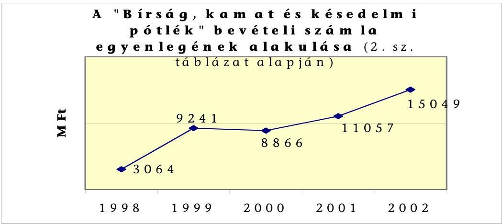

A Jszt., majd a Jöt. alapján kiszabott bírságok - a törlések ellenére - a VPOP követelésállományában növekvő tendenciát mutat.

A kiszabott bírságok és azok pénzügyi teljesítésének alakulása (E Ft)

|  | 1999. év | 2000. év | 2001. év | 2002. év | Összesen |
| :--: | :--: | :--: | :--: | :--: | :--: |
| Kiszabott bírságok: |  |  |  |  |  |
| Jövedéki bírság | 5594119 | 5944402 | 6126954 | 3551480 | 21216955 |
| Adóbírság | 544811 | 1794691 | 536178 | 81829 | 2957510 |
| Mulasztási bírság | 43185 | 43673 | 109568 | 90802 | 287228 |
| Összesen | 6182115 | 7782766 | 6772700 | 3724112 | 24461694 |
| Teljesített befizetések: |  |  |  |  |  |
| Jövedéki bírság | 179408 | 203318 | 237111 | 371254 | 991091 |
| Adóbírság | 341336 | 292654 | 30393 | 11271 | 675654 |
| Mulasztási bírság | 23001 | 24809 | 50070 | 51102 | 148981 |
| Összesen | 543745 | 520781 | 317573 | 433628 | 1815726 |

A bírság kiszabása és befizetése időben jelentősen eltérhet egymástól, ezért az adott évben kiszabott bírságok és az adott évi befizetések nem hasonlíthatók össze.

---

| A törölt bírságok alakulása |  |  |  |  |  |
| :-- | :--: | :--: | :--: | :--: | :--: |
| Megnevezés | $\mathbf{1 9 9 9 . ~ év}$ | $\mathbf{2 0 0 0 . ~ év}$ | $\mathbf{2 0 0 1 . ~ év}$ | $\mathbf{2 0 0 2 . ~ év}$ | Összesen |
| Törölt bírságok összege <br> E Ft-ban | 1931000 | 4300000 | 3566000 | 3874000 | 13676000 |
| Esetek száma (db) | 354 | 1075 | 1144 | 1254 | 3827 |

1999 és 2002 között a kiszabott bírságoknak átlagosan mindössze 7,4 \%-a folyt be a költségvetésbe. A bírságfajták közül a mulasztási bírság megfizetésének aránya a legmagasabb ( $51,9 \%$ ), az adóbírság esetében ugyanez az arány már csak $23 \%$, a jövedéki bírság realizálásának mértéke pedig mindössze 4,6 \%. Az alacsony hatásfokú behajtás legfőbb oka (az adók és bírságok behajtása az APEH feladata), hogy a nagyobb értékre elkövetett jogsértések (borhamisítás, illegális alkohol-előállítás) után kiszabott nagy összegű bírságok megfizetéséhez az elkövetők vagy ismeretlenek, vagy nem rendelkeznek pénzügyi fedezettel, vagyonnal. A VPOP a szabálysértési vagy bűntető eljárást abban az esetben is köteles lefolytatni, ha az elkövető személye nem ismert vagy az elkövetés nem bizonyítható rá (pl.: vonatfülkében talált cigaretta, vagy nem a tulajdonos által működtetett telephelyen tárolt alkoholtermék).

Külföldi állampolgárok vonatkozásában a jövedéki visszaélések visszatartó erejű szankcionálásának elsősorban jogszabályi korlátjai vannak: a külföldiek beutazását és tartózkodását szabályozó 2001. évi XXXIX. tv. végrehajtásáról szóló 25/2001. (XI. 21.) BM rendelet 6. § szerint a beutazáskor mindössze ezer Ft meglétét kell igazolnia a külföldi állampolgárnak.

A vámigazgatási eljárásokban elkövetett szabálysértések (pl. csempészet, amely jövedéki termékekre is vonatkozhat) szankcionálásának eredményességét kedvezően befolyásolja, hogy a külföldiek beutazásáról és tartózkodásáról szóló 2001. évi XXXIX. tv 32. § (2) g. pontja szerint a pénzbírság kifizetéséig, de legfeljebb két évig beutazási tilalom rendelhető el a külföldi állampolgárral szemben. Nem alkalmazható a fenti jogszabály a jövedéki eljárásban kiszabott bírságokra vonatkozóan, mivel az nem jogerős szabálysértési eljáráson, hanem jövedéki eljáráson alapul. Így a belterületen jövedéki visszaélést elkövető külföldi állampolgárokkal szemben - ha a csempészet tényállása nem bizonyítható - nincs hathatós jogi fellépési lehetőség.

# 4. A JÖVEDÉKI TEVÉKENYSÉG HATÉKONYSÁGÁNAK ÉS FELADATTELJESÍTÉSÉNEK MÉRÉSE 

### 4.1. Az erőforrások felhasználásának hatékonysága

A jövedéki szervezet feladatteljesítésének értékeléséhez a VPOP nem dolgozott ki egységes módszereket és mutatókat. A Jövedéki Igazgatóság a feladatteljesítés mérésére a tervezett bevétel teljesítési mutatót alkalmazza. A regionális parancsnokságok - a rendelkezésre álló munkaidőmérleg adatait felhasználva munkaidő felhasználás hatékonysági mutatót képeznek. Költséghatékonysági mutatókat a VPOP egyik szintjén sem számítanak.

---

A pénzügyminiszter a 2003. februárjában kiadott, 1815/2003 ügyiratszámú, „A Pénzügyminisztérium 2003. évi ágazati kiemelt teljesítménycéljai" című leiratában feladatként határozta meg a VPOP részére, hogy dolgozzon ki az új monitoring rendszer kialakítása érdekében olyan mutatószámrendszert, amely alapján az egyes szervezetek működése, teljesítménye objektív módon értékelhető. Az értékelő rendszer a bevételek területén már 2000 óra működik.

A feladat teljesíthetőségének előfeltétele a szakterületenkénti költségkimutatások biztosítása.

A VPOP kimutatásaiban nem különíti el a jövedéki szakterülethez tartozó kiadásokat - bár nyilvántartási rendszere erre alkalmas -, ezért a jövedéki feladatok ráfordításainak adatait az értékelésekhez csak tájékoztató adatként vettük figyelembe. Az ellenőrzéshez kért tanúsítványokban (4. és 4/1. sz. táblázat) a VPOP az alábbi becsült adatokat adta meg: 2001-ben a 41322 M Ft összegű összes kiadáson belül a jövedéki szakterület kiadása 6088 M Ft (14,7 \%), 2002-ben pedig a 49206 M Ft-ból 6917 M Ft (14,0 \%) volt.

A jövedéki szakterület a VPOP egészéhez viszonyítva hatékonyabban szedte be a bevételeit. A VPOP 1000 Ft bevételre 2001-ben 13,3 Ft, 2002-ben 14,7 Ft kiadást fordított ( $10 \%$-os növekedés). 1000 Ft jövedéki adó beszedése 2001-ben 12,2 Ft-ba, 2002-ben 12,8 Ft-ba került ( $5 \%$-os növekedés). A hatékonysági mutatók javulása egyrészt a Jövedéki Igazgatóság belső intézkedéseinek, másrészt az adóösszegek növekedésének következménye.

# 4.2. A jövedéki szakterület feladatteljesítésének mérése 

A VPOP a PM elvárásai alapján az éves tevékenységek értékelésére minden év novemberében más-más szempontokat határozott meg az adott évre visszamenőleg.

A VPOP a 2002 évre vonatkozó értékelési szempontokat 2002. novemberében állította össze, s akkor kérte arról a hivatalok véleményét.

A jövedéki szervezet feladatteljesítésének értékeléséhez a VPOP nem dolgozott ki egységes módszereket és mutatókat. A Jövedéki Igazgatóság a feladatteljesítés mérésére a tervezett bevétel teljesítési mutatót alkalmazza. A regionális parancsnokságok - a rendelkezésre álló munkaidőmérleg adatait felhasználva - munkaidő felhasználás hatékonysági mutatót képeznek. Költséghatékonysági mutatókat a VPOP egyik szintjén sem számítanak.

## 5. Felkészülés az EU csatlakozásra

A Jöt. alapjaiban megfelel az EU Bizottsága által meghatározott keretszabályoknak, azonban - az eddigi külső piacok belső piaccá történő átminősülése miatt - új fogalmak (pl.: kereskedelmi adóraktár, engedélyes felhasználó, szállítási biztosíték) és ezzel új eljárások bevezetése válik szükségessé. A PM a helyszíni ellenőrzés ideje alatt a VPOP bevonásával megkezdte a Jöt. módosítását az EU követelményeinek megfelelően.

---

A VPOP elkészítette a jövedéki szakterület EU csatlakozására történő felkészítésének ütemtervét, a feladatok végrehajtását 2003. szeptemberétől tervezi. A jövedéki adó témakörrel kapcsolatos ellenőrzési feladatok várható változásáról a VPOP Jövedéki Igazgatósága 2003. decemberétől tervezi tanfolyamok tartását a vámhivatalok részére.

A VPOP Jövedéki Igazgatósága 2002-ben elkészítette, majd többször módosította az Európai Unióhoz való csatlakozással kapcsolatos „reformterv" tervezetét. A munkaanyag elsősorban a szervezeti struktúra átalakítására fogalmaz meg koncepciókat, és nem terjed ki arra, hogy várhatók-e új ellenőrzési feladatok és hogyan alakulnak majd a személyi és tárgyi feltételeik.

A VPOP-nek a jövedéki engedéllyel rendelkező adóalanyok adatait a csatlakozás időpontjától kezdődően át kell adnia az EU Bizottsága számára. A tagjelölt országok a Bizottság által meghatározott ütemterv szerint az adatállomány kialakításához szükséges részletes információkat és a tesztelést segítő programokat 2003. év végéig kapják meg. Az EU az informatikai fejlesztésre vonatkozóan egyéb kötelezettségeket a tagországok részére sem ír elő, így egységes közösségi jövedéki rendszerrel nem rendelkezik, annak kidolgozása jelenleg van folyamatban, s várható bevezetési ideje 2009.

Az EU által alkalmazott SEED (Jövedéki Adatcsere Rendszer) rendszer célja, hogy minden tagállam számára közös információs bázist biztosítson azon árutermelőkre és kereskedőkre vonatkozóan, akik részt vesznek az Unión belüli, adófelfüggesztéssel bonyolított kereskedelemben.

Budapest, 2003. december

Dr. Kovács Árpád elnök

Melléklet: $\quad 3 \mathrm{db} \quad 48$ lap

---

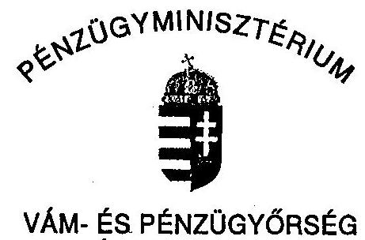

# VÁM- ÉS PÉNZÜGYŐRSÉG ORSZÁGOS PARANCSNOKA 

Szám: 37583/45-2003.
Hiv. szám: V-26-39/2002-2003

Bihary Zsigmond főigazgató úr részére
Állami
 Számvevőszék

1364 Budapest, 4.
Pf. 54.

Tisztelt Főigazgató Úr!

Tájékoztatom, hogy a központi költségvetést megillető 2001-2002. évi jövedéki adóbevételek realizálása hatékonyságának és eredményességének vizsgálatáról 2003. november 24-én véglegezett jelentés tervezettel kapcsolatban - az ismételt egyeztetésnek köszönhetően - nem maradt fenn véleménykülönbség. A Vám- és Pénzügyőrség a jelentés tervezet tényszerű megállapításait tudomásul veszi.

Kérem engedje meg, hogy ezúton is köszönetemet fejezzem ki munkatársai konstruktív magatartásáért.

Budapest, 2003. november 26.
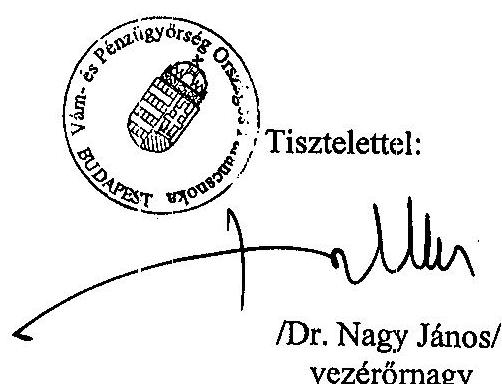

---

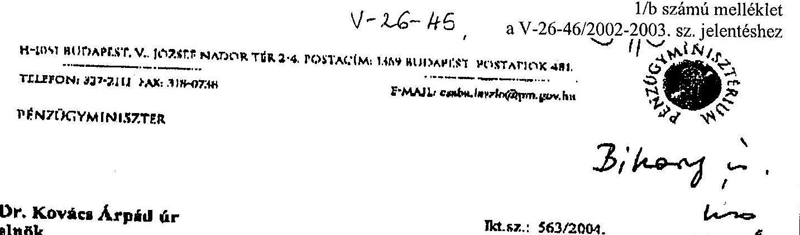

Dr. Kovács Árpád úr
elnök
Állami Számvevőszék
Budapest

Tisztelt Finók Úr!
Tájékoztatom, hogy a központi költségvetést megillető 2001-2002. évi jövedéki adóbevételek realizálása hatékonyságának és eredményességének ellenőrzéséről készített végleges jelentésben foglaltakkal egyetértek, észrevételt nem kívánok tenni.

Budapest, 2004. január "of".

Ödvözlettel:
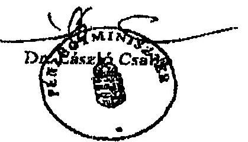

---

# Tanúsítvány a jövedéki adóalanyok számáról 1998-2002

|  Megnevezés | 1998. év | 1999. év | 2000. év | 2001. év | 2002. év  |
| --- | --- | --- | --- | --- | --- |
|  Adóraktár engedélyes | 1 011 | 1 064 | 11 467 | 11 631 | 13 427  |
|  Adómentes felhasználó engedélyes | 184 | 177 | 176 | 176 | 170  |
|  Jövedéki nagykereskedő engedélyes | 451 | 444 | 678 | 716 | 643  |
|  Jövedéki exportőr engedélyes | 156 | 159 | 267 | 297 | 283  |
|  Jövedéki importőr engedélyes | 196 | 201 | 267 | 290 | 276  |
|  Nem jövedéki engedélyes kereskedők | 77 604 | 81 180 | 86 128 | 94 486 | 100 649  |
|  Jövedéki adóalany | 1 327 | 1 325 | 12 164 | 11 760 | 13 961  |

Megjegyzés: A tanúsítványt az adott évek december 31-i állapotának megfelelően kérjük kitölteni.

A fenti adatok hitelességét igazolom.

Kelt: Budapest, 2003.

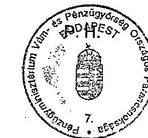

(aláírás)

---

2. számú táblázat a V-26-46/2002-2003. sz. jelentéshez

|  A jövedékhez kapcsolódó államháztartási számák megnevezése |  |  |  |  |  |  |  |  |  |  |  |  |  |  |  |  |  |  |  |  |  |  |  |  |  |  |  |   |
| --- | --- | --- | --- | --- | --- | --- | --- | --- | --- | --- | --- | --- | --- | --- | --- | --- | --- | --- | --- | --- | --- | --- | --- | --- | --- | --- | --- | --- |
|   |  |  |  |  |  |  |  |  |  |  |  |  |  |  |  |  |  |  |  |  |  |  |  |  |  |  |  |   |
|  A jövedékhez kapcsolódó államháztartási számák megnevezése |  |  |  |  |  |  |  |  |  |  |  |  |  |  |  |  |  |  |  |  |  |  |  |  |  |  |  |   |
|   |  |  |  |  |  |  |  |  |  |  |  |  |  |  |  |  |  |  |  |  |  |  |  |  |  |  |  |   |
|  10032000-01037308 VPOP Üzemanyag jövedéki adó bevételei számla | -12.234.103 | 9.064.606 | -768.159 | -11.007.572 | 13.060.403 | 545.546 | -11.553.682 | 12.384.898 | 1.235.153 | -12.386.908 | 13.303.943 | 2.187.666 | -19.414.397 | 4.922.274 | -5.730.819 |  |  |  |  |  |  |  |  |  |  |  |   |
|  10032000-01037313 VPOP Egyéb termékek jövedéki adója bevételei számla | -4.580.425 | -562.613 | -3.296.308 | -1.762.906 | -2.932.843 | -384.953 | -1.420.129 | 3.415.171 | 216.281 | -1.376.824 | 3.646.996 | 632.847 | -3.062 | 4.580.084 | 2.040.281 |  |  |  |  |  |  |  |  |  |  |  |   |
|  10032000-01037337 VPOP Törség, kamat és késedelmi pótlék bevételei számla | 3.064.605 | 3.064.605 | 3.064.605 | 9.241.195 | 9.241.195 | 9.866.667 | 8.866.667 | 8.866.667 | 11.057.335 | 11.057.335 | 11.057.335 | 15.049.135 | 15.049.135 | 15.049.135 |  |  |  |  |  |  |  |  |  |  |  |  |   |
|  10032000-01037320 VPOP Bérfőzési szeszadó bevételei számla | -474.564 | -474.564 | -474.564 | -634.052 | -634.052 | -634.052 | -402.498 | -402.498 | -288.316 | -288.316 | -288.316 | -605.541 | -605.541 | -605.541 |  |  |  |  |  |  |  |  |  |  |  |  |   |
|  10032000-01037344 VPOP Dohánygyártmány jövedéki adó bevételei számla | 1.804.977 | 1.804.977 | 1.804.977 | 81.805 | 81.805 | 81.805 | 254.877 | 254.877 | 254.877 | 560.258 | 560.258 | 560.258 | 643.282 | 643.282 | 643.282 |  |  |  |  |  |  |  |  |  |  |  |   |
|  10032000-01037351 VPOP Dohánygyármány AFA bevételei számla | - | - | - | 14.841 | 14.841 | 14.841 | 124.767 | 124.767 | 124.767 | 349.648 | 349.648 | 400.683 | 400.683 | 400.683 |  |  |  |  |  |  |  |  |  |  |  |  |   |
|  10032000-01037365 VPOP Jövedéki bírság bevételei számla | - | - | - | - | - | - | - | 7.012.541 | 7.012.541 | 7.012.541 | 6.196.341 | 6.196.341 | 4.555.163 | 4.555.163 |  |  |  |  |  |  |  |  |  |  |  |  |   |
|  10032000-01037368 VPOP Szőlőbor jövedéki adó bevételei számla | - | - | - | - | - | - | - | -66.235 | -66.235 | -66.235 | -73.774 | -55.214 | -68.888 | -17.823 | 429 | -8.522 |  |  |  |  |  |  |  |  |  |  |   |
|  Összesen: | -12.819.510 | 13.277.010 | 310.553 | -3.986.339 | 24.797.035 | 8.944.382 | 2.784.308 | 31.568.188 | 17.220.553 | 4.035.969 | 34.671.197 | 20.635.117 | 637.321 | 29.575.510 | 18.368.663 |  |  |  |  |  |  |  |  |  |  |   |

Helyesbíteti I.: Mérleg szerinti eredmény + decemberne hónapra január 20-án benyújtott adóbevallás

Helyesbíteti II.: Helyesbíteti I. - december hónapra befizetett adóelőtleg és a bevallás megfizetett különbözete

A fenti adatok hitelességét igazolom.

Budapest, 2003. március 10.

---

# Tanúsítvány a jövedéki adóbevételek alakulásáról 1998 - 2002.

|  Jövedéki termék (gyártmány) megnevezése | 1998. év | 1999. év | 2000. év | 2001. év | 2002. év  |
| --- | --- | --- | --- | --- | --- |
|  **Ásványolaj termékek** |  |  |  |  |   |
|  - ebből üzemanyagok*** | 274 352,1 | 322 731,7 | 340 262,4 | 355 514,1 | 386 672,7  |
|  - ebből nem üzemanyag ásványolaj termékek | 2 452,3 | 2 164,1 | 1 656,4 | 1 538,0 | 1 308,0  |
|  **Alkoholtermékek** | 17 798,4 | 22 427,8 | 23 987,4 | 24 607,8 | 26 967,1  |
|  **Sör** | 19 934,2 | 24 317,0 | 26 165,5 | 26 913,9 | 29 177,0  |
|  **Pezsgő** | 1 128,4 | 1 253,1 | 1 475,1 | 1 597,4 | 1 708,0  |
|  **Köztes alkohol termék** | 576,2 | 604,5 | 624,6 | 715,0 | 694,0  |
|  **Bor*** |  |  | 415,8 | 1 295,8 | 1 281,2  |
|  **Dohánygyártmány - adójegyes** | 10 850,0 | 96 300,8 | 102 091,8 | 112 292,8 | 120 260,7  |
|  - **zárjegyes** | 57 442,6 |  |  |  |   |
|  **Jövedéki adóbevétel (bruttó)** | 384 534,2 | 469 799,0 | 496 679,0 | 524 474,8 | 568 068,7  |
|  **Visszatérített adó** | -94 856,8 | -36 214,4 | -25 243,9 | -25 619,1 | -26 038,4  |
|  **Jövedéki adó (nettó)** | 289 677,4 | 433 584,6 | 471 435,1 | 498 855,7 | 542 030,3  |

*Külön bevételi számlán 2000. VIII. 1-től

**Külön bevételi számlán 1998. IX. 1-től

***A bevételből 1998-ban az Útalap számlára 75 313,2 MFt, a KKA számlára 7 930,1 MFt került átutalásra

A fenti adatok hitelességét igazolom.

Budapest, 2003. 41. 41.

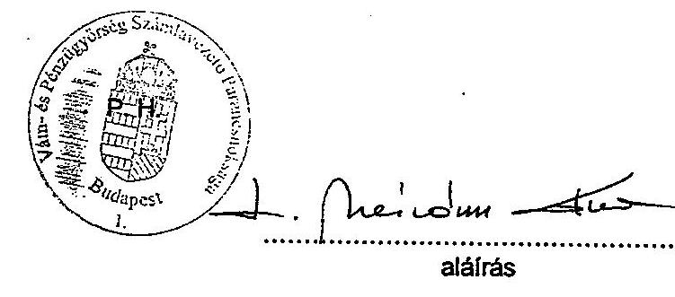

---

Tanúsítvány a jövedéki szakterülethez kapcsolódó kiadások alakulásáról 2001-2002

|  Megnevezés | 2001. év. | 2002. év.  |
| --- | --- | --- |
|  MŰKÖDÉSI KIADÁSOK | 32,244,755 | 38,466,420  |
|  - ebből jövedéki területet érintő |  |   |
|  Személyi juttatások | 16,274,071 | 20,052,830  |
|  - ebből jövedéki területet érintő |  |   |
|  Munkaadókat terhelő járulékok | 5,714,097 | 6,634,578  |
|  - ebből jövedéki területet érintő |  |   |
|  Dologi kiadások (Dologi + Egyéb folyó kiad) | 9,789,283 | 11,271,649 |
| - ebből jövedéki területet érintő | | |
| FELHALMOZÁSI KIADÁSOK | 9,076,932 | 10,739,146 |
| - ebből jövedéki területet érintő | | |
| Intézményi beruházási kiadások | 3,480,528 | 3,919,768 |
| - ebből jövedéki területet érintő | | |
| Felújítás | 264,357 | 134,147 |
| - ebből jövedéki területet érintő | | |
| Egyéb központi beruházás | 5,067,669 | 6,548,295 |
| - ebből jövedéki területet érintő | | |
| Lakástámogatás | 70,000 | 75,000 |
| - ebből jövedéki területet érintő | | |
| Lakásépítés | 194,378 | 60,498 |
| - ebből jövedéki területet érintő | | |
| KIADÁSOK ÖSSZESEN | 41,321,687 | 49,205,566 |
| - ebből jövedéki területet érintő | 6,088,174 | 6,917,373 |

Fenti adatok hitelességét igazolom: Kelt: Budapest, 2003. Március 11.

---

Tanúsítvány a VP kiadási előirányzatainak teljesítése ( 1998-2000. )

| | 1998 | 1999 | 2000 |
| --- | --- | --- | --- |
| VP kiadások összesen: | 27,283,082 | 29,190,719 | 32,048,093 |
| ebből: | | | |
| Jövedéki szakterületet érintő kiadások összesen: | 2,657,734 | 2,308,454 | 2,977,730 |

A fenti adatok hitelességét igazolom.

Kelt: Budapest, 2003. Március 26. (aláírás)

---

5. számú táblázat a V-26-46/2002-2003. sz. jelentéshez

| Megnevezés | Középfokú nyelvismerettel rendelkezik (fő) | | | | | Felsőfokú nyelvismerettel rendelkezik (fő) | | | | | |
| --- | --- | --- | --- | --- | --- | --- | --- | --- | --- | --- | --- |
| | 1998 | 1999 | 2000 | 2001 | 2002 | 1998 | 1999 | 2000 | 2001 | 2002 | |
| Hivatásos állomány | | | | | | | | | | | |
| Felsőfokú szervek előírt * | | | | | | | | | | | |
| Felsőfokú szervek tényleges | 3 | 5 | 6 | 6 | 6 | 3 | 2 | 4 | 4 | 4 | |
| Középfokú szervek előírt * | | | | | | | | | | | |
| Középfokú szervek tényleges | 3 | 3 | 8 | 10 | 9 | 2 | 2 | 3 | 3 | 3 | |
| Alapfokú szervek előírt * | | | | | | | | | | | |
| Alapfokú szervek tényleges | 19 | 33 | 51 | 74 | 88 | 8 | 10 | 11 | 12 | 12 | |
| Összesen: | 27 | 41 | 65 | 90 | 103 | 13 | 14 | 18 | 19 | 19 | |
| | | | | | | | | | | | |
| Közalkalmazotti áll. | | | | | | | | | | | |
| Felsőfokú szervek előírt * | | | | | | | | | | | |
| Felsőfokú szervek tényleges | | | | | | | | | | | |
| Középfokú szervek előírt * | | | | | | | | | | | |
| Középfokú szervek tényleges | | | | | | | | | | | |
| Alapfokú szervek előírt * | | | | | | | | | | | |
| Alapfokú szervek tényleges | | | | | | | | | | | |
| Összesen: | | | | | | | | | | | |
| Mindösszesen tényleges | 27 | 41 | 66 | 91 | 104 | 13 | 14 | 18 | 19 | 19 | |
| Mindösszesen előírt * | | | | | | | | | | | |

Kelt: Budapest, 2003.... (aláírás)

- ut jövedés a abtataleken foglalkoztatattak részére kötelezően nem nyilvános elégioz.

---

a jövedéki szakterületen foglalkoztatottak összetételéről (1998-2002) (fő)

| | Felsőfokú szerveknél (fő) | | | | Középfokú szerveknél (fő) | | | | Alapfokú szerveknél (fő) | | | |
| --- | --- | --- | --- | --- | --- | --- | --- | --- | --- | --- | --- | --- |
| | $\begin{gathered} 16-35 \ \text { éves } \end{gathered}$ | $\begin{gathered} 36-50 \ \text { éves } \end{gathered}$ | $\begin{gathered} 51-62 \ \text { éves } \end{gathered}$ | $\begin{gathered} 62 \text { év } \ \text { felett } \end{gathered}$ | $\begin{gathered} 16-35 \ \text { éves } \end{gathered}$ | $\begin{gathered} 36-50 \ \text { éves } \end{gathered}$ | $\begin{gathered} 51-62 \ \text { éves } \end{gathered}$ | $\begin{gathered} 62 \text { év } \ \text { felett } \end{gathered}$ | $\begin{gathered} 16-35 \ \text { éves } \end{gathered}$ | $\begin{gathered} 36-50 \ \text { éves } \end{gathered}$ | $\begin{gathered} 51-62 \ \text { éves } \end{gathered}$ | $\begin{gathered} 62 \text { év } \ \text { felett } \end{gathered}$ |
| Hivatásos állomány | | | | | | | | | | | | |
| 1998. év | 15 | 10 | 2 | - | 44 | 23 | 2 | - | 671 | 76 | 3 | - |
| 1999. év | 17 | 7 | 18 | 1 | - | 43 | 22 | 1 | - | 689 | 75 | 2 |
| 2000. év | 18 | 6 | 25 | - | - | 51 | 14 | 1 | - | 808 | 90 | 3 |
| 2001. év | 28 | 6 | 18 | - | - | 58 | 20 | 3 | - | 819 | 103 | 2 |
| 2002. év | 28 | 18 | 33 | 1 | - | 52 | 28 | 2 | - | 793 | 117 | 5 |
| | | | | | | | | | | | | |
| Közalkalmazotti állomány | | | | | | | | | | | | |
| 1998. év | 2 | 2 | 1 | - | 3 | 4 | - | - | 12 | 9 | 2 | - |
| 1999. év | 2 | 2 | - | 1 | 3 | 8 | - | - | 8 | 15 | 2 | - |
| 2000. év | 2 | 3 | 1 | - | 4 | 6 | 1 | - | 19 | 25 | 2 | - |
| 2001. év | 4 | 3 | - | - | 5 | 6 | - | - | 23 | 21 | 2 | - |
| 2002. év | 4 | 2 | - | - | 5 | 5 | - | - | 25 | 16 | 3 | - |

Budapest, 2003. április 22.

---

Vám- és Pénzügyőrség Országos Parancsnoksága Humánpolitikai Főosztály

# Rendszergazdák létszám és Informatikai végzettség szerinti megoszlásuk száma 2001. évben

| | VPKMRP | VPDDRP | VPÉMRP | VPDARP | VPÉARP | VPKDRP | VPNYDRP | Összesen |
| --- | --- | --- | --- | --- | --- | --- | --- | --- |
| Régió állományába lévő rendszergazdák száma | 5 | 1 | 4 | 3 | 1 | 3 | 1 | 18 |
| Számítástechnikai végzettség szerinti megoszlásuk | - | - | - | - | - | - | - | - |
| Nincs informatikai végzettsége | 1 | - | 1 | - | - | 2 | - | 4 |
| Alapfokú informatikai | - | - | - | - | - | - | - | -  |
|  Középfokú informatikai | 1 | - | 1 | - | - | - | - | 2  |
|  Felsőfokú informatikai | 3 | 1 | 2 | 3 | 1 | 1 | 1 | 12  |
|  Régióhoz tartozó, jövedéki ellenőrzéssel (is) foglalkozó hivatalok száma | 5 | 6 | 9 | 9 | 7 | 8 | 8 | 52  |
|  Hivatali állományában lévő rendszergazdák száma | 6 | 4 | 12 | 9 | 7 | 2 | 3 | 43  |
|  Számítástechnikai végzettség szerinti megoszlásuk | - | - | - | - | - | - | - | -  |
|  Nincs informatikai végzettsége | 4 | 1 | 5 | 5 | - | 2 | - | 17  |
|  Alapfokú informatikai | - | - | - | - | - | - | - | -  |
|  Középfokú informatikai | 1 | 2 | 4 | - | 6 | - | - | 13  |
|  Felsőfokú informatikai | 1 | 1 | 3 | 4 | 1 | - | 3 | 13  |

Fenti adatok hitelességét igazolom.

Kelt: Budapest, 2003. június 03.

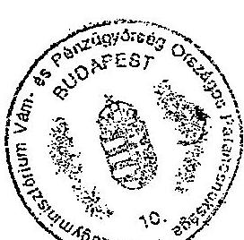

Dr. Fejes Antal ezredes főosztályvezető

---

Vám- és Pénzügyőrség Országos Parancsnoksága Humánpolitikai Főosztály

Rendszergazdák létszám és Informatikai végzettség szerinti megoszlásuk száma 2002. évben

|   | VPKMRP | VPDDRP | VPÉMRP | VPDARP | VPÉARP | VPKDRP | VPNYDRP | Összesen  |
| --- | --- | --- | --- | --- | --- | --- | --- | --- |
|  Régió állományába lévő rendszergazdák száma | 5 | 2 | 5 | 3 | 1 | 5 | 1 | 22  |
|  Számítástechnikai végzettség szerinti megoszlásuk | - | - | - | - | - | - | - | -  |
|  Nincs informatikai végzettsége | 1 | - | 1 | - | - | 2 | - | 4  |
|  Alapfokú informatikai | - | - | - | - | - | - | - | -  |
|  Középfokú informatikai | 1 | - | 2 | - | - | - | - | 3  |
|  Felsőfokú informatikai | 3 | 2 | 2 | 3 | 1 | 3 | 1 | 15  |
|  Régióhoz tartozó, jövedéki ellenőrzéssel (is) foglalkozó hivatalok száma | 3 | 6 | 9 | 9 | 7 | 8 | 8 | 50  |
|  Hivatali állományában lévő rendszergazdák száma | 3 | 4 | 13 | 9 | 7 | 4 | 4 | 44  |
|  Számítástechnikai végzettség szerinti megoszlásuk | - | - | - | - | - | - | - | -  |
|  Nincs informatikai végzettsége | 1 | 1 | 6 | 5 | - | 4 | - | 17  |
|  Alapfokú informatikai | - | - | - | - | - | - | - | -  |
|  Középfokú informatikai | 1 | 1 | 2 | - | 5 | - | - | 9  |
|  Felsőfokú informatikai | 1 | 2 | 5 | 4 | 2 | - | 4 | 18  |

Fenti adatok hitelességét igazolom.

Kelt: Budapest, 2003. június 03.

---

Vám- és Pénzügyőrség Országos Parancsnoksága Humánpolitikai Főosztály

# Rendszergazdák létszám és Informatikai végzettség szerinti megoszlásuk száma 2003. évben

|   | VPKMRP | VPDDRP | VPÉMRP | VPDARP | VPÉARP | VPKDRP | VPNYDRP | Összesen  |
| --- | --- | --- | --- | --- | --- | --- | --- | --- |
|  Régió állományába lévő rendszergazdák száma | 5 | 2 | 5 | 5 | 1 | 4 | 1 | 23  |
|  Számítástechnikai végzettség szerinti megoszlásuk | - | - | - | - | - | - | - | -  |
|  Nincs informatikai végzettsége | - | - | 1 | 1 | - | 1 | - | 3  |
|  Alapfokú informatikai | - | - | - | - | - | - | - | -  |
|  Középfokú informatikai | 1 | - | 2 | - | - | - | - | 3  |
|  Felsőfokú informatikai | 4 | 2 | 2 | 4 | 1 | 3 | 1 | 17  |
|  Régióhoz tartozó, jövedéki ellenőrzéssel (is) foglalkozó hivatalok száma | 3 | 6 | 9 | 9 | 7 | 8 | 8 | 50  |
|  Hivatali állományában lévő rendszergazdák száma | 3 | 4 | 13 | 10 | 7 | 5 | 4 | 46  |
|  Számítástechnikai végzettség szerinti megoszlásuk | - | - | - | - | - | - | - | -  |
|  Nincs informatikai végzettsége | 1 | 1 | 5 | 4 | - | 5 | - | 16  |
|  Alapfokú informatikai | - | - | - | - | - | - | - | -  |
|  Középfokú informatikai | 1 | 1 | 3 | 1 | 4 | - | - | 10  |
|  Felsőfokú informatikai | 1 | 2 | 5 | 5 | 3 | - | 4 | 20  |

Fenti adatok hitelességét igazolom.

Kelt: Budapest, 2003. június 03.

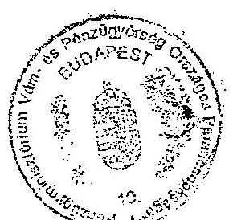

Dr. Fejes Antal ezredes főosztályvezető

---

# a jövedéki szakterületen foglalkoztatottak iskolai végzettségéről 1998-2002

|  Szervezeti egységek | Alapfokú iskolai végzettség |  |  |  |  | Középfokú iskolai végzettség |  |  |  |  | Felsőfokú iskolai végzettség |  |  |  |   |
| --- | --- | --- | --- | --- | --- | --- | --- | --- | --- | --- | --- | --- | --- | --- | --- |
|  Hivatásos állomány | 1998 | 1999 | 2000 | 2001 | 2002 | 1998 | 1999 | 2000 | 2001 | 2002 | 1998 | 1999 | 2000 | 2001 | 2002  |
|  Felsőfokú szervek | - | - | - | - | - | 14 | 14 | 12 | 7 | 15 | 13 | 11 | 12 | 27 | 32  |
|  Középfokú szervek | - | - | - | - | - | 46 | 43 | 32 | 43 | 39 | 23 | 23 | 34 | 38 | 43  |
|  Alapfokú szervek | 6 | 5 | 5 | 4 | 3 | 642 | 632 | 728 | 741 | 699 | 102 | 129 | 168 | 179 | 213  |
|  Összesen: | 6 | 5 | 5 | 4 | 3 | 702 | 689 | 772 | 791 | 753 | 138 | 163 | 214 | 244 | 288  |
|  |   |   |   |   |   |   |   |   |   |   |   |   |   |   |   |
|  Közalkalmazotti állomány |  |  |  |  |  |  |  |  |  |  |  |  |  |  |   |
|  Felsőfokú szervek | - | - | - | - | - | 5 | 5 | 6 | 7 | 6 | - | - | - | - | -  |
|  Középfokú szervek | 1 | 1 | 1 | 1 | - | 6 | 10 | 10 | 10 | 10 | - | - | - | - | -  |
|  Alapfokú szervek | 4 | 4 | 9 | 9 | 7 | 19 | 21 | 37 | 37 | 37 | - | - | - | - | -  |
|  Összesen: | 5 | 5 | 10 | 10 | 7 | 30 | 36 | 53 | 54 | 53 | - | - | - | - | -  |
|  |   |   |   |   |   |   |   |   |   |   |   |   |   |   |   |
|  Mindösszesen: | 11 | 10 | 15 | 14 | 10 | 732 | 725 | 825 | 845 | 806 | 138 | 163 | 214 | 244 | 288  |

Kelt: Budapest, 2003. április 22.

---

Tanúsítvány a méltányossági kérelmek alakulásáról 1998-2002 8. számú táblázat a V-26-46/2002-2003. sz. jelentéshez

|  Szervezet megnevezése | Beadott méltányossági kérelmek száma | Elfogadott kérelmek száma |  |  |  |  |  |  |  |   |
| --- | --- | --- | --- | --- | --- | --- | --- | --- | --- | --- |
|   | 1998 | 1999 | 2000 | 2001 | 2002 | 1998 | 1999 | 2000 | 2001 | 2002  |
|  Közép-Magyarország RP | 132 | 201 | 175 | 402 | 426 | 104 | 169 | 145 | 366 | 360 | |
|  Dél-Dúnántúli RP | 75 | 65 | 55 | 122 | 96 | 67 | 53 | 27 | 66 | 61  |
|  Észak-Magyarország RP | 223 | 519 | 351 | 1562 | 815 | 213 | 504 | 344 | 1520 | 783  |
|  Dél-Alföldi RP | 124 | 103 | 105 | 365 | 404 | 18 | 27 | 21 | 41 | 55  |
|  Észak-Alföldi RP | 450 | 521 | 980 | 1062 | 915 | 393 | 426 | 888 | 906 | 787  |
|  Közép-Dúnántúli RP | 120 | 192 | 130 | 561 | 241 | 117 | 186 | 109 | 539 | 205  |
|  Nyugat-Dúnántúli RP | 73 | 149 | 132 | 124 | 78 | 18 | 75 | 67 | 74 | 32  |
|  Összesen: | 1197 | 1750 | 1928 | 4198 | 2975 | 930 | 1440 | 1601 | 3512 | 2283  |

Fenti adatok hitelességét igazolom.

Kelt: Budapest, 2003. 03.12.

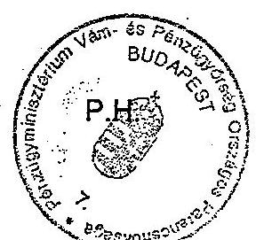

Sincerelyes

(aláírás)

---

Tanúsítvány az önrevízió alakulásáról a V-26-46/2002-2003. sz. jelentéshez 1998-2002

|  Szervezet megnevezése | Benyújtott önrevízió száma | Ellenőrzött önrevízió száma |  |  |  |  |  |  |  |   |
| --- | --- | --- | --- | --- | --- | --- | --- | --- | --- | --- |
|   | 1998 | 1999 | 2000 | 2001 | 2002 | 1998 | 1999 | 2000 | 2001 | 2002  |
|  Közép-Magyarórszágg RP | 31 | 56 | 19 | 45 | 19 | 7 | 5 | 2 | 34 | 5  |
|  Dél-Dunántúli RP | 0 | 1 | 2 | 39 | 25 | 0 | 0 | 0 | 2 | 6  |
|  Észak-Magyarórszágg RP | 0 | 1 | 3 | 8 | 3 | 0 | 0 | 0 | 0 | 1  |
|  Dél-Alföldi RP | 5 | 22 | 55 | 12 | 3 | 5 | 22 | 55 | 12 | 3  |
|  Észak-Alföldi RP | 4 | 3 | 2 | 2 | 12 | 4 | 3 | 2 | 2 | 0  |
|  Közép-Dunántúli RP | 3 | 7 | 2 | 8 | 7 | 0 | 0 | 0 | 0 | 0  |
|  Nyugat-Dunántúli RP | 1 | 2 | 7 | 5 | 2 | 0 | 0 | 0 | 0 | 2  |
|  Összesen: | 44 | 92 | 90 | 119 | 71 | 16 | 30 | 59 | 50 | 17  |

Fenti adatok hitelességét igazolom.

Kelt: Budapest, 2003. ... 03... 14......

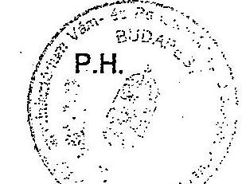

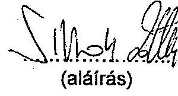

---

Tanúsítvány a közigazgatási perek számáról és értékéről a V-26-46/2002-2003. sz. jelentéshez (1998-2002)

|  Megnevezés | 1998 |  | 1999 |  | 2000 |  | 2001 |  | 2002 |   |
| --- | --- | --- | --- | --- | --- | --- | --- | --- | --- | --- |
|   | száma | értéke | száma | értéke | száma | értéke | száma | értéke | száma | értéke  |
|   | (db) | (eFt) | (db) | (eFt) | (db) | (eFt) | (db) | (eFt) | (db) | (eFt)  |
|  Év elején folyamatban lévő perek | 162 | 2 169 406,81 | 201 | 4 937 475,28 | 200 | 4 815 732,03 | 207 | 3 238 131,74 | 235 | 3 319 035,04  |
|  Tárgyévben indult perek | 344 | 6 827 175,19 | 451 | 2 965 516,20 | 286 | 1 961 440,80 | 332 | 3 819 831,78 | 325 | 1 958 192,49  |
|  Tárgyévben lezárt perek | 330 | 5 757 049,93 | 378 | 2 162 602,97 | 278 | 3 332 970,45 | 329 | 3 425 181,80 | 324 | 2 509 658,99  |
|  Év végén folyamatban lévő perek | 221 | 4 293 778,28 | 244 | 4 939 718,59 | 207 | 3 238 071,74 | 233 | 3 298 856,04 | 269 | 3 123 867,98  |
|  VP által megnyert perek | 248 | 3 883 374,05 | 283 | 1 841 141,71 | 200 | 2 643 255,50 | 253 | 2 743 005,84 | 252 | 2 209 361,64  |
|  VP által elveszített perek | 82 | 1 973 535,42 | 95 | 555 825,58 | 76 | 678 521,08 | 76 | 1 155 155,58 | 72 | 300 287,36  |

Fenti adatok hitelességét igazolom.

Kelt: Budapest, 2003.

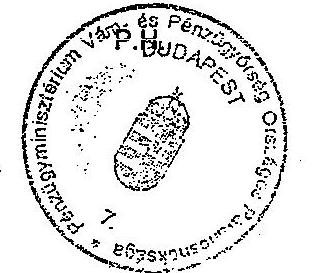

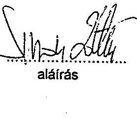

---

Tanúsítvány a piacellenőrzéssel összefüggésben kiszabott szankciókról 1998-2002.

|  Szervezet | 1998. |  |  |  | 1999. |  |  |  | 2000. |  |  |   |
| --- | --- | --- | --- | --- | --- | --- | --- | --- | --- | --- | --- | --- |
|   | Jövedéki
adó | Adó
birság | Mulasztási
birság | Jövedéki
birság | Jövedéki
adó | Adó
birság | Mulasztási
birság | Jövedéki
birság | Jövedéki
adó | Adó
birság | Mulasztási
birság | Jövedéki
birság  |
|  Közép-Magyarország RP | 0 | 0 | 0 | 20 912 | 61 | 0 | 40 | 8 833 | 45 | 0 | 170 | 1 934  |
|  Dél-Dunántúli RP | 51 | 24 | 50 | 579 | 150 | 0 | 10 | 942 | 214 | 0 | 50 | 1 910  |
|  Észak-Magyarország RP | 0 | 0 | 0 | 11 074 | 0 | 0 | 0 | 11 692 | 2 244 | 0 | 0 | 20 531  |
|  Dél-Alföldi RP | 840 | 21 | 0 | 33 338 | 180 | 0 | 80 | 7 058 | 1 148 | 0 | 190 | 8 613  |
|  Észak-Alföldi RP | 337 | 337 | 100 | 29 654 | 539 | 108 | 0 | 31 838 | 1 016 | 0 | 0 | 15 106  |
|  Közép-Dunántúli RP | 0 | 0 | 0 | 750 | 0 | 0 | 30 | 110 | 15 | 0 | 0 | 100  |
|  Nyugat-Dunántúli RP | 0 | 0 | 0 | 50 | 0 | 0 | 30 | 160 | 0 | 0 | 0 | 20  |
|  Ellenőrzési igazgatóság | 0 | 0 | 0 | 0 | 0 | 0 | 0 | 0 | 0 | 0 | 0 | 0  |
|  Központi Járórszolgálat P. | 0 | 0 | 0 | 0 | 0 | 0 | 0 | 0 | 0 | 0 | 0 | 0  |
|  Nyomozóhivatalok P. | 0 | 0 | 0 | 0 | 0 | 0 | 0 | 0 | 0 | 0 | 0 | 0  |
|  Összesen: | 1 228 | 382 | 150 | 96 357 | 930 | 108 | 190 | 60 633 | 4 682 | 0 | 410 | 48 214  |

|  Szervezet | 2001. |  |  |  | 2002. |  |  |   |
| --- | --- | --- | --- | --- | --- | --- | --- | --- |
|   | Jövedéki
adó | Adó
birság | Mulasztási
birság | Jövedéki
birság | Jövedéki
adó | Adó
birság | Mulasztási
birság | Jövedéki
birság  |
|  Közép-Magyarország RP | 334 | 0 | 0 | 3 304 | 641 | 0 | 400 | 4 225  |
|  Dél-Dunántúli RP | 501 | 0 | 150 | 4 870 | 539 | 0 | 40 | 5 289  |
|  Észak-Magyarország RP | 3 171 | 0 | 0 | 36 989 | 2 021 | 2 800 | 0 | 31 420  |
|  Dél-Alföldi RP | 1 025 | 0 | 20 | 5 952 | 2 192 | 0 | 120 | 21 325  |
|  Észak-Alföldi RP | 2 726 | 0 | 0 | 21 611 | 2 315 | 0 | 0 | 19 579  |
|  Közép-Dunántúli RP | 0 | 0 | 185 | 0 | 24 | 0 | 20 | 262  |
|  Nyugat-Dunántúli RP | 0 | 0 | 0 | 20 | 0 | 0 | 0 | 40  |
|  Ellenőrzési igazgatóság | 0 | 0 | 0 | 0 | 0 | 0 | 0 | 0  |
|  Központi Járórszolgálat P. | 0 | 0 | 0 | 0 | 0 | 0 | 0 | 0  |
|  Nyomozóhivatalok P. | 0 | 0 | 0 | 0 | 0 | 0 | 0 | 0  |
|  Összesen: | 7 757 | 0 | 355 | 72 546 | 7 732 | 2 800 | 580 | 82 140  |

A fenti adatok hitelességét igazolom.

Kelt: Budapest, 2003....... 02... 14.......

P.H.

(aláírás)

---

Tanúsítvány a közúti ellenőrzéssel összefüggésben kiszabott szankciókról a V-26-46/2002-2003. sz. jelentéshez 1998-2002

|  Szervezet | 1998. |  |  |  | 1999. |  |  |  | 2000. |  |  |   |
| --- | --- | --- | --- | --- | --- | --- | --- | --- | --- | --- | --- | --- | --- | --- | --- | --- | --- | --- | --- | --- | --- | --- | --- | --- | ---  |
|   | Jövedék | Adó | Mulasztási | Jövedék | Jövedék | Adó | Mulasztási | Jövedék | Jövedék | Adó | Mulasztási | Jövedék  |
|   |  | bírság | bírság | bírság |  | bírság | bírság | bírság | bírság |  | bírság | bírság  |
|  Közép-Magyarország RP | 0 | 0 | 0 | 32 | 0 | 0 | 0 | 100 | 38 | 0 | 0 | 5 587  |
|  Dél-Dunántúli RP | 176 | 98 | 0 | 1 913 | 215 | 0 | 0 | 1 314 | 123 | 0 | 0 | 284  |
|  Észak-Magyarország RP | 0 | 0 | 0 | 694 | 14 | 0 | 0 | 5 372 | 27 | 0 | 10 | 240  |
|  Dél-Alföldi RP | 3 699 | 164 | 1 | 22 220 | 320 | 0 | 2 | 9 904 | 108 329 | 0 | 120 | 69 783  |
|  Észak-Alföldi RP | 2 167 | 1 828 | 0 | 33 625 | 1 613 | 312 | 0 | 11 491 | 0 | 0 | 12 640 | 0  |
|  Közép-Dunántúli RP | 0 | 198 | 0 | 2 345 | 0 | 0 | 0 | 352 | 0 | 0 | 0 | 750  |
|  Nyugat-Dunántúli RP | 618 | 618 | 0 | 1 681 | 39 | 0 | 0 | 351 | 0 | 0 | 0 | 0  |
|  Ellenőrzési igazgatóság | 0 | 0 | 0 | 0 | 0 | 0 | 0 | 0 | 0 | 0 | 0 | 0  |
|  Központi Járórszolgálat P. | 0 | 0 | 0 | 0 | 0 | 0 | 0 | 0 | 0 | 0 | 0 | 0  |
|  Nyomozóhivatalok | 0 | 0 | 0 | 0 | 0 | 0 | 0 | 0 | 0 | 0 | 0 | 0  |
|  Összesen: 0 | 6 660 | 2 907 | 1 | 62 511 | 2 201 | 312 | 2 | 28 884 | 108 518 | 0 | 12 770 | 76 644  |

|  Szervezet | 2001. |  |  |  | 2002. |  |  |   |
| --- | --- | --- | --- | --- | --- | --- | --- | --- |
|   | Jövedék | Adó | Mulasztási | Jövedék | Jövedék | Adó | Mulasztási | Jövedék  |
|   |  | bírság | bírság | bírság |  | bírság | bírság | bírság  |
|  Közép-Magyarország RP | 4 930 | 0 | 0 | 24 798 | 24 | 0 | 0 | 159  |
|  Dél-Dunántúli RP | 622 | 0 | 100 | 2 088 | 164 | 0 | 50 | 1 685  |
|  Észak-Magyarország RP | 135 | 0 | 0 | 1 074 | 283 | 0 | 0 | 1 448  |
|  Dél-Alföldi RP | 3 667 | 0 | 360 | 22 880 | 10 038 | 0 | 420 | 40 044  |
|  Észak-Alföldi RP | 5 088 | 0 | 0 | 38 655 | 14 127 | 0 | 0 | 87 445  |
|  Közép-Dunántúli RP | 16 | 0 | 50 | 320 | 63 | 0 | 50 | 522  |
|  Nyugat-Dunántúli RP | 0 | 0 | 0 | 0 | 0 | 0 | 0 | 0  |
|  Ellenőrzési igazgatóság | 0 | 0 | 0 | 0 | 0 | 0 | 0 | 0  |
|  Központi Járórszolgálat P. | 0 | 0 | 0 | 0 | 0 | 0 | 0 | 0  |
|  Nyomozóhivatalok | 0 | 0 | 0 | 0 | 0 | 0 | 0 | 0  |
|  Összesen: 0 | 14 357 | 0 | 510 | 89 815 | 24 699 | 0 | 520 | 131 303  |

A fenti adatok hitelességét igazolom.

Kelt: Budapest, 2003.... 2.2... 11.

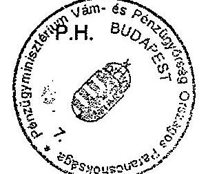

(aláírás)

---

Tanúsítvány a vasúti ellenőrzéssel összefüggésben kiszabott szankciókról 1998-2002

11/3. számú táblázat a V-26-46/2002-2003. sz. jelentéshez

(eFt)

|  Szervezet | Jövedéki adó | Adó- bírság | Mulasztási bírság | Jövedéki bírság | Jövedéki adó | Adó- bírság | Mulasztási bírság | Jövedéki bírság | Jövedéki adó | Adó- bírság | Mulasztási bírság | Jövedéki bírság  |
| --- | --- | --- | --- | --- | --- | --- | --- | --- | --- | --- | --- | --- |
|  Közép-Magyarország RP. | 0 | 0 | 0 | 0 | 0 | 0 | 0 | 107 | 83 | 0 | 0 | 414  |
|  Dél-Dunántúli RP. | 0 | 0 | 0 | 0 | 0 | 0 | 0 | 0 | 0 | 0 | 0 | 0  |
|  Észak-Magyarország RP. | 0 | 0 | 0 | 0 | 0 | 0 | 0 | 0 | 0 | 50 | 0  |
|  Dél-Alföldi RP. | 47 | 0 | 0 | 234 | 0 | 0 | 0 | 0 | 0 | 0 | 0 | 0  |
|  Észak-Alföldi RP. | 249 | 0 | 0 | 5 253 | 207 | 0 | 0 | 2 696 | 355 | 0 | 0 | 1 708  |
|  Közép-Dunántúli RP. | 0 | 0 | 0 | 0 | 0 | 0 | 0 | 0 | 0 | 0 | 0 | 0  |
|  Nyugat-Dunántúli RP. | 0 | 0 | 0 | 0 | 0 | 0 | 0 | 0 | 0 | 0 | 0 | 0  |
|  Ellenőrzési igazgatóság | 0 | 0 | 0 | 0 | 0 | 0 | 0 | 0 | 0 | 0 | 0 | 0  |
|  Központi Járórszolgálat P. | 0 | 0 | 0 | 0 | 0 | 0 | 0 | 0 | 0 | 0 | 0 | 0  |
|  nyomozóhivatalok | 0 | 0 | 0 | 0 | 0 | 0 | 0 | 0 | 0 | 0 | 0 | 0  |
|  Összesen: | 296 | 0 | 0 | 5 487 | 207 | 0 | 0 | 2 803 | 437 | 0 | 50 | 2 121  |

|  Szervezet | Jövedéki adó | Adó- bírság | Mulasztási bírság | Jövedéki bírság | Jövedéki adó | Adó- bírság | Mulasztási bírság | Jövedéki bírság | Adó- bírság  |
| --- | --- | --- | --- | --- | --- | --- | --- | --- | --- |
|  Közép-Magyarország RP. | 23 | 0 | 0 | 300 | 247 | 0 | 0 | 1 297 |   |
|  Dél-Dunántúli RP. | 0 | 0 | 0 | 0 | 0 | 0 | 0 | 0 |   |
|  Észak-Magyarország RP. | 0 | 0 | 0 | 0 | 337 | 0 | 0 | 1 687 |   |
|  Dél-Alföldi RP. | 0 | 0 | 0 | 0 | 45 | 0 | 0 | 300 |   |
|  Észak-Alföldi RP. | 323 | 0 | 0 | 1 428 | 867 | 0 | 0 | 4 508 |   |
|  Közép-Dunántúli RP. | 0 | 0 | 0 | 20 | 0 | 0 | 0 | 0 |   |
|  Nyugat-Dunántúli RP. | 0 | 0 | 0 | 0 | 0 | 0 | 0 | 0 |   |
|  Ellenőrzési igazgatóság | 0 | 0 | 0 | 0 | 0 | 0 | 0 | 0 |   |
|  Központi Járórszolgálat P. | 0 | 0 | 0 | 0 | 0 | 0 | 0 | 0 |   |
|  nyomozóhivatalok | 0 | 0 | 0 | 0 | 0 | 0 | 0 | 0 |   |
|  Összesen: | 346 | 0 | 0 | 1 748 | 1 496 | 0 | 0 | 7 792 |   |

A fenti adatok hitelességét igazolom.

Kelt: Budapest, 2003.

P.H.

(aláírás)

---

Tanúsítvány a vízi úton végzett ellenőrzéssel összefüggésben kiszabott szankciókról 1998-2002

11/4. számú táblázat a V-26-46/2002-2003. sz. jelentéshez

(eFt)

|  Szervezet | Jövedéki adó | Adó bírság | Mulasztási bírság | Jövedéki bírság | Jövedéki adó | Adó bírság | Mulasztási bírság | Jövedéki bírság | Jövedéki adó | Adó bírság | Mulasztási bírság | Jövedéki bírság  |
| --- | --- | --- | --- | --- | --- | --- | --- | --- | --- | --- | --- | --- |
|  Közép-Magyarország RP | 0 | 0 | 0 | 0 | 0 | 0 | 0 | 0 | 0 | 0 | 0 | 0  |
|  Dél-Dunántúli RP | 0 | 0 | 0 | 0 | 0 | 0 | 0 | 0 | 0 | 0 |
 ```
0 | 0 |
| Észak-Magyarország RP | 0 | 0 | 0 | 0 | 0 | 0 | 0 | 0 | 0 | 0 | 0 | 0 |
| Dél-Alföldi RP | 840 | 21 | 0 | 33 338 | 180 | 0 | 80 | 7 058 | 12 690 | 0 | 190 | 65 613 |
| Észak-Alföldi RP | 0 | 0 | 0 | 0 | 0 | 0 | 0 | 0 | 0 | 0 | 0 | 0 |
| Közép-Dunántúli RP | 0 | 0 | 0 | 0 | 0 | 0 | 0 | 0 | 0 | 0 | 0 | 0 |
| Nyugat-Dunántúli RP | 0 | 0 | 0 | 0 | 0 | 0 | 0 | 0 | 0 | 0 | 0 | 0 |
| Ellenőrzési igazgatóság | 0 | 0 | 0 | 0 | 0 | 0 | 0 | 0 | 0 | 0 | 0 | 0 |
| Központi Járőrszolgálat P. | 0 | 0 | 0 | 0 | 0 | 0 | 0 | 0 | 0 | 0 | 0 | 0 |
| nyomozóhivatalok | 0 | 0 | 0 | 0 | 0 | 0 | 0 | 0 | 0 | 0 | 0 | 0 |
| Összesen: 2001. 03. 03. 04. 05. 06. 07. 08. 09. 10. 11. 12. 13. 14. 15. 16. 17. 18. 19. 20. 21. 22. 23. 24. 25. 26. 27. 28. 29. 30. 31. 32. 33. 34. 35. 36. 37. 38. 39. 40. 41. 42. 43. 44. 45. 46. 47. 48. 49. 50. 51. 52. 53. 54. 55. 56. 57. 58. 59. 60. 61. 62. 63. 64. 65. 66. 67. 68. 69. 70. 71. 72. 73. 74. 75. 76. 77. 78. 79. 80. 81. 82. 83. 84. 85. 86. 87. 88. 89. 90. 91. 92. 93. 94. 95. 96. 97. 98. 99. 100. 101. 102. 103. 104. 105. 106. 107. 108. 109. 110. 111. 112. 113. 114. 115. 116. 117. 118. 119. 120. 121. 122. 123. 124. 125. 126. 127. 128. 129. 130. 131. 132. 133. 134. 135. 136. 137. 138. 139. 140. 141. 142. 143. 144. 145. 146. 147. 148. 149. 150. 151. 152. 153. 154. 155. 156. 157. 158. 159. 160. 161. 162. 163. 164. 165. 166. 167. 168. 169. 170. 171. 172. 173. 174. 175. 176. 177. 178. 179. 180. 181. 182. 183. 184. 185. 186. 187. 188. 189. 190. 191. 192. 193. 194. 195. 196. 197. 198. 199. 200. 201. 202. 203. 204. 205. 206. 207. 208. 209. 210. 211. 212. 213. 214. 215. 216. 217. 218. 219. 220. 221. 222. 223. 224. 225. 226. 227. 228. 229. 230. 231. 232. 233. 234. 235. 236. 237. 238. 239. 240. 241. 242. 243. 244. 245. 246. 247. 248. 249. 250. 251. 252. 253. 254. 255. 256. 257. 258. 259. 260. 261. 262. 263. 264. 265. 266. 267. 268. 269. 270. 271. 272. 273. 274. 275. 276. 277. 278. 279. 280. 281. 282. 283. 284. 285. 286. 287. 288. 289. 290. 291. 292. 293. 294. 295. 296. 297. 298. 299. 300. 301. 302. 303. 304. 305. 306. 307. 308. 309. 310. 311. 312. 313. 314. 315. 316. 317. 318. 319. 320. 321. 322. 323. 324. 325. 326. 327. 328. 329. 330. 331. 332. 333. 334. 335. 336. 337. 338. 339. 340. 341. 342. 343. 344. 345. 346. 347. 348. 349. 350. 351. 352. 353. 354. 355. 356. 357. 358. 359. 360. 361. 362. 363. 364. 365. 366. 367. 368. 369. 370. 371. 372. 373. 374. 375. 376. 377. 378. 379. 380. 381. 382. 383. 384. 385. 386. 387. 388. 389. 390. 391. 392. 393. 394. 395. 396. 397. 398. 399. 400. 401. 402. 403. 404. 405. 406. 407. 408. 409. 410. 411. 412. 413. 414. 415. 416. 417. 418. 419. 420. 421. 422. 423. 424. 425. 426. 427. 428. 429. 430. 431. 432. 433. 434. 435. 436. 437. 438. 439. 440. 441. 442. 443. 444. 445. 446. 447. 448. 449. 450. 451. 452. 453. 454. 455. 456. 457. 458. 459. 460. 461. 462. 463. 464. 465. 466. 467. 468. 469. 470. 471. 472. 473. 474. 475. 476. 477. 478. 479. 480. 481. 482. 483. 484. 485. 486. 487. 488. 489. 490. 491. 492. 493. 494. 495. 496. 497. 498. 499. 400. 401. 402. 403. 404. 405. 406. 407. 408. 409. 410. 411. 412. 413. 414. 415. 416. 417. 418. 419. 420. 421. 422. 423. 424. 425. 426. 427. 428. 429. 430. 431. 432. 433. 434. 435. 436. 437. 438. 439. 440. 441. 442. 443. 444. 445. 446. 447. 448. 449. 450. 451. 452. 453. 454. 455. 456. 457. 458. 459. 460. 461. 462. 463. 464. 465. 466. 467. 468. 469. 470. 471. 472. 473. 474. 475. 476. 477. 478. 479. 480. 481. 482. 483. 484. 485. 486. 487. 488. 489. 490. 491. 492. 493. 494. 495. 496. 497. 498. 499. 400. 401. 402. 403. 404. 405. 406. 407. 408. 409. 410. 411. 412. 413. 414. 415. 416. 417. 418. 419. 420. 421. 422. 423. 424. 425. 426. 427. 428. 429. 430. 431. 432. 433. 434. 435. 436. 437. 438. 439. 440. 441. 442. 443. 444. 445. 446. 447. 448. 449. 450. 451. 452. 453. 454. 455. 456. 457. 458. 459. 460. 461. 462. 463. 464. 465. 466. 467. 468. 469. 470. 471. 472. 473. 474. 475. 476. 477. 478. 479. 480. 481. 482. 483. 484. 485. 486. 487. 488. 489. 490. 491. 492. 493. 494. 495. 496. 497. 498. 499. 400. 401. 402. 403. 404. 405. 406. 407. 408. 409. 410. 411. 412. 413. 414. 415. 416. 417. 418. 419. 420. 421. 422. 423. 424. 425. 426. 427. 428. 429. 430. 431. 432. 433. 434. 435. 436. 437. 438. 439. 440. 441. 442. 443. 444. 445. 446. 447. 448. 449. 450. 451. 452. 453. 454. 455. 456. 457. 458. 459. 460. 461. 462. 463. 464. 465. 466. 467. 468. 469. 470. 471. 472. 473. 474. 475. 476. 477. 478. 479. 480. 481. 482. 483. 484. 485. 486. 487. 488. 489. 490. 491. 492. 493. 494. 495. 496. 497. 498. 499. 400. 401. 402. 403. 404. 405. 406. 407. 408. 409. 410. 411. 412. 413. 414. 415. 416. 417. 418. 419. 420. 421. 422. 423. 424. 425. 426. 427. 428. 429. 430. 431. 432. 433. 434. 435. 436. 437. 438. 439. 440. 441. 442. 443. 444. 445. 446. 447. 448. 449. 450. 451. 452. 453. 454. 455. 456. 457. 458. 459. 460. 461. 462. 463. 464. 465. 466. 467. 468. 469. 470. 471. 472. 473. 474. 475. 476. 477. 478. 479. 480. 481. 482. 483. 484. 485. 486. 487. 488. 489. 490. 491. 492. 493. 494. 495. 496. 497. 498. 499. 400. 401. 402. 403. 404. 405. 406. 407. 408. 409. 410. 411. 412. 413. 414. 415. 416. 417. 418. 419. 420. 421. 422. 423. 424. 425. 426. 427. 428. 429. 430. 431. 432. 433. 434. 435. 436. 437. 438. 439. 440. 441. 442. 443. 444. 445. 446. 447. 448. 449. 450. 451. 452. 453. 454. 455. 456. 457.
``` 458.
459.
460.
461.
462.
463.
464.
465.
466.
467.
468.
469.
470.
471.
472.
473.
474.
475.
476.
477.
478.
479.
480.
481.
482.
483.
484.
485.
486.
487.
488.
489.
490.
491.
492.
493.
494.
495.
496.
497.
498.
499.
400.
401.
402.
403.
404.
405.
406.
407.
408.
409.
410.
411.
412.
413.
414.
415.
416.
417.
418.
419.
420.
421.
422.
423.
424.
425.
426.
427.
428.
429.
430.
431.
432.
433.
434.
435.
436.
437.
438.
439.
440.
441.
442.
443.
444.
445.
446.
447.
448.
449.
450.
451.
452.
453.
454.
455.
456.
457.
458.
459.
460.
461.
462.
463.
464.
465.
466.
467.
468.
469.
470.
471.
472.
473.
474.
475.
476.
477.
478.
479.
480.
481.
482.
483.
484.
485.
486.
487.
488.
489.
490.
491.
492.
493.
494.
495.
496.
497.
498.
499.
400.
401.
402.
403.
404.
405.
406.
407.
408.
409.
410.
411.
412.
413.
414.
415.
416.
417.
418.
419.
420.
421.
422.
423.
424.
425.
426.
427.
428.
429.
430.
431.
432.
433.
434.
435.
436.
437.
438.
439.
440.
441.
442.
443.
444.
445.
446.
447.
448.
449.
450.
451.
452.
453.
454.
455.
456.
457.
458.
459.
460.
461.
462.
463.
464.
465.
466.
467.
468.
469.
470.
471.
472.
473.
474.
475.
476.
477.
478.
479.
480.
481.
482.
483.
484.
485.
486.
487.
488.
489.
490.
491.
492.
493.
494.
495.
496.
497.
498.
499.
400.
401.
402.
403.
404.
405.
406.
407.
408.
409.
410.
411.
412.
413.
414.
415.
416.
417.
418.
419.
420.
421.
422.
423.
424.
425.
426.
427.
428.
429.
430.
431.
432.
433.
434.
435.
436.
437.
438.
439.
440.
441.
442.
443.
444.
445.
446.
447.
448.
449.
450.
451.
452.
453.
454.
455.
456.
457.
458.
459.
460.
461.
462.
463.
464.
465.
466.
467.
468.
469.
470.
471.
472.
473.
474.
475.
476.
477.
478.
479.
480.
481.
482.
483.
484.
485.
486.
487.
488.
489.
490.
491.
492.
493.
494.
495.
496.
497.
498.
499.
410.
411.
412.
413.
414.
415.
416.
417.
418.
419.
420.
421.
422.
423.
424.
425.
426.
427.
428.
429.
430.
431.
432.
433.
434.
435.
436.
437.
438.
439.
440.
441.
442.
43. 43. 43. 43. 43. 43. 43. 43. 43. 43. 43. 43. 43. 43. 43. 43. 43. 43. 43. 43. 43. 43. 43. 43. 43. 43. 43. 43. 43. 43. 43. 43. 43. 43. 43. 43. 43. 43. 43. 43. 43. 43. 43. 43. 43. 43. 43. 43. 43. 43

---

Tanúsítvány a határforgalmi ellenőrzéssel összefüggésben kiszabott szankciókról 1998-2002

|  Határvámhivatalok | 1998. |  |  |  | 1999. |  |  |  | 2000. |  |  |   |
| --- | --- | --- | --- | --- | --- | --- | --- | --- | --- | --- | --- | --- |
|   | Jövedéki adó: 246 | Adó bírság: | Mulasztási bírság: | Jövedéki bírság: | Jövedéki adó: 246 | Adó bírság: | Mulasztási bírság: | Jövedéki bírság: | Jövedéki adó: 246 | Adó bírság: | Mulasztási bírság: | Jövedéki bírság:  |
|  Barabás | 0 | 0 | 0 | 0 | 0 | 0 | 0 | 42 | 0 | 0 | 0 | 0  |
|  Bucsu | 0 | 0 | 0 | 0 | 23 | 0 | 0 | 117 | 227 | 0 | 0 | 1 137  |
|  Hegyeghalom | 49 215 | 38 | 0 | 247 517 | 91 111 | 78 | 0 | 627 594 | 513 255 | 0 | 0 | 2 562 310  |
|  Komárom | 0 | 0 | 0 | 0 | 0 | 0 | 0 | 0 | 60 220 | 0 | 0 | 301 101  |
|  Köpháza | 10 290 | 10 290 | 0 | 100 000 | 3 158 | 0 | 0 | 20 000 | 0 | 0 | 0 | 0  |
|  Kőszeg | 0 | 0 | 0 | 0 | 0 | 0 | 0 | 0 | 0 | 0 | 0 | 0  |
|  Lónya | 0 | 0 | 0 | 0 | 0 | 0 | 0 | 0 | 0 | 0 | 0 | 200  |
|  Nyírábrány | 0 | 0 | 0 | 100 | 0 | 0 | 0 | 0 | 21 | 0 | 0 | 0  |
|  Rábefüzes | 0 | 0 | 0 | 0 | 0 | 0 | 0 | 713 | 0 | 0 | 0 | 0  |
|  Röszke | 0 | 0 | 0 | 605 | 0 | 0 | 0 | 929 | 0 | 0 | 0 | 0  |
|  Sopron | 73 557 | 73 557 | 0 | 536 000 | 186 283 | 343 | 0 | 1 025 290 | 5 277 | 0 | 0 | 19 815  |
|  Szentgothárd | 0 | 0 | 0 | 0 | 0 | 0 | 0 | 0 | 0 | 0 | 0 | 0  |
|  Szob | 0 | 0 | 0 | 0 | 0 | 0 | 0 | 0 | 60 122 | 0 | 0 | 240 560  |
|  Szombathely | 0 | 0 | 0 | 0 | 0 | 0 | 0 | 0 | 0 | 0 | 0 | 0  |
|  Tompa | 0 | 0 | 0 | 100 | 0 | 0 | 0 | 0 | 0 | 0 | 0 | 0  |
|  Türkaye | 0 | 0 | 0 | 118 | 0 | 0 | 0 | 0 | 0 | 0 | 0 | 0  |
|  Udvar | 71 | 71 | 0 | 386 | 0 | 0 | 0 | 0 | 0 | 0 | 0 | 0  |
|  Vámosszabadi | 0 | 0 | 0 | 188 078 | 0 | 0 | 0 | 0 | 0 | 0 | 0 | 0  |
|  Záhony | 0 | 0 | 0 | 270 | 0 | 0 | 0 | 83 | 0 | 0 | 0 | 40  |
|  Összesen: | 266 200 | 167 846 | 0 | 2 145 108 | 561 171 | 843 | 0 | 3 348 608 | 1 278 245 | 0 | 0 | 6 250 327  |

|  Határvámhivatalok | 2001. |  |  |  | 2002. |  |  |  |  |  |  |   |
| --- | --- | --- | --- | --- | --- | --- | --- | --- | --- | --- | --- | --- |
|   | Jövedéki adó: 246 | Adó bírság: | Mulasztási bírság: | Jövedéki bírság: | Jövedéki adó: 246 | Adó bírság: | Mulasztási bírság: | Jövedéki bírság: | Jövedéki bírság: | Jövedéki bírság: |  |   |
|  Artánd | 0 | 0 | 0 | 0 | 6 564 | 0 | 0 | 20 500 |  |  |  |   |
|  Bucsu | 0 | 0 | 0 | 0 | 0 | 0 | 0 | 0 | 0 |  |  |   |
|  Hegyeghalom | 122 591 | 0 | 0 | 605 106 | 755 937 | 0 | 0 | 3 873 938 |  |  |  |   |
|  Komárom | 0 | 0 | 0 | 100 | 0 | 0 | 0 | 0 | 0 |  |  |   |
|  Köpháza | 46 619 | 0 | 0 | 233 093 | 14 538 | 0 | 0 | 72 740 |  |  |  |   |
|  Kőszeg | 1 315 | 0 | 0 | 5 917 | 2 828 | 0 | 0 | 14 428 |  |  |  |   |
|  Nyírbátor | 87 | 0 | 0 | 434 | 0 | 0 | 0 | 0 | 0 |  |  |   |
|  Rábefüzes | 2 422 | 0 | 0 | 12 105 | 62 | 0 | 0 | 166 |  |  |  |   |
|  Sopron | 34 935 | 0 | 0 | 252 589 | 37 310 | 0 | 0 | 192 767 |  |  |  |   |
|  Szentgothárd | 38 749 | 0 | 0 | 193 745 | 0 | 385 742 | 7 909 | 0 | 0 | 39 804 |  |  |  |   |
|  Szombathely | 0 | 0 | 0 | 0 | 5 589 | 0 | 0 | 17 634 |  |  |  |   |
|  Tompa | 0 | 0 | 0 | 0 | 0 | 0 | 0 | 0 | 0 |  |  |   |
|  Udvar | 0 | 0 | 0 | 0 | 0 | 0 | 0 | 0 | 0 |  |  |   |
|  Vámosszabadi | 0 | 0 | 0 | 0 | 32 106 | 0 | 0 | 160 268 |  |  |  |   |
|  Összesen: | 493 262 | 0 | 0 | 2 955 302 | 1 681 417 | 0 | 0 | 8 585 576 |  |  |  |   |

A fenti adatok hitelességét igazolom.

Kelt: Budapest, 2003. 12.23.

P.H.

(aláírás)

---

Tanúsítvány a közérdekű bejelentéssel összefüggésben kiszabott szankciókról 1998-2002

11/6. számú táblázat a V-26-46/2002-2003. sz. jelentéshez

|  Szervezet | 1998. |  |  |  | 1999. |  |  |  | 2000. |  |  |   |
| --- | --- | --- | --- | --- | --- | --- | --- | --- | --- | --- | --- | --- |
|   | Jövedéki
adó | Adó
birság | Mulasztási
birság | Jövedéki
birság | Jövedéki
adó | Adó
birság | Mulasztási
birság | Jövedéki
birság | Jövedéki
adó | Adó
birság | Mulasztási
birság | Jövedéki
birság  |
|  Közép-Magyarország RP. | 52 | 0 | 0 | 458 495 | 20 000 | 0 | 0 | 50 000 | 1 873 | 0 | 50 000 | 250 296  |
|  Dél-Dunántúli RP. | 12320,281 | 233 | 140 | 33 246 | 528 | 101 | 0 | 4 175 | 336 | 170 | 30 | 1 762  |
|  Észak-Magyarország RP. | 359 | 0 | 70 | 4 472 | 946 | 0 | 250 | 6 979 | 4 533 | 0 | 90 | 17 811  |
|  Dél-Alföldi RP. | 497,754 | 0 | 0 | 162 168 | 579 | 0 | 0 | 6 803 | 26 069 | 0 | 0 | 64 031  |
|  Észak-Alföldi RP. | 1855,292 | 1 855 | 350 | 13 509 | 2 938 | 250 | 250 | 14 853 | 5 020 | 0 | 270 | 17 578  |
|  Közép-Dunántúli RP. | 24,89 | 199 | 0 | 3 195 | 30 | 0 | 0 | 4 232 | 100 | 0 | 0 | 991  |
|  Nyugat-Dunántúli RP. | 957 | 957 | 0 | 5 648 | 4 | 0 | 40 | 380 | 78 | 0 | 0 | 1 191  |
|  Ellenőrzési igazgatóság | 0 | 0 | 0 | 0 | 0 | 0 | 0 | 0 | 0 | 0 | 0 | 0  |
|  Központi Repülőtéri P. | 0 | 0 | 0 | 0 | 0 | 0 | 0 | 0 | 0 | 0 | 0 | 0  |
|  Központi Járőrszolgálat P. | 0 | 0 | 0 | 0 | 0 | 0 | 0 | 0 | 0 | 0 | 0 | 0  |
|  Nyomozóhivatalok P. | 0 | 0 | 0 | 0 | 0 | 0 | 0 | 0 | 0 | 0 | 0 | 0  |
|  Összesen: | 16066,434 | 3 244 | 560 | 680 733 | 25 026 | 351 | 540 | 87 421 | 38 009 | 170 | 50 390 | 353 659  |

|  Szervezet | 2001. |  |  |  | 2002. |  |  |   |
| --- | --- | --- | --- | --- | --- | --- | --- | --- |
|   | Jövedéki
adó | Adó
birság | Mulasztási
birság | Jövedéki
birság | Jövedéki
adó | Adó
birság | Mulasztási
birság | Jövedéki
birság  |
|  Közép-Magyarország RP. | 87 537 | 1 890 | 140 000 | 1 374 470 | 55 434 | 0 | 0 | 425 278  |
|  Dél-Dunántúli RP. | 882 | 0 | 20 | 7 137 | 1 330 | 0 | 140 | 9 919  |
|  Észak-Magyarország RP. | 3 111 | 0 | 160 | 11 212 | 2 102 | 0 | 290 | 6 918  |
|  Dél-Alföldi RP. | 4 831 | 0 | 100 | 52 405 | 6 293 | 0 | 170 | 33 190  |
|  Észak-Alföldi RP. | 3 937 | 0 | 300 | 16 100 | 4 815 | 0 | 200 | 8 393  |
|  Közép-Dunántúli RP. | 282 | 0 | 60 | 2 505 | 81 | 0 | 30 | 1 139  |
|  Nyugat-Dunántúli RP. | 288 | 0 | 0 | 1 739 | 280 | 0 | 0 | 1 506  |
|  Ellenőrzési igazgatóság | 0 | 0 | 0 | 0 | 0 | 0 | 0 | 0  |
|  Központi Repülőtéri P. | 0 | 0 | 0 | 0 | 0 | 0 | 0 | 0  |
|  Központi Járőrszolgálat P. | 0 | 0 | 0 | 0 | 0 | 0 | 0 | 0  |
|  Nyomozóhivatalok P. | 0 | 0 | 0 | 0 | 0 | 0 | 0 | 0  |
|  Összesen: | 100 867 | 1 890 | 140 640 | 1 465 569 | 70 334 | 0 | 830 | 486 344  |

A fenti adatok hitelességét igazolom.

Kelt: Budapest, 2003.

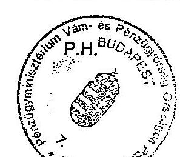

(aláírás)

---

Tanúsítvány a külső szerv megkeresésére végzett ellenőrzéssel összefüggésben kiszabott szankciókról 1998-2002

|  Szervezet | 1998. |  |  |  | 1999. |  |  |  | 2000. |  |  |   |
| --- | --- | --- | --- | --- | --- | --- | --- | --- | --- | --- | --- | --- |
|   | Jövedéki adó | Adó- bírság | Mulasztási bírság | Jövedéki bírság | Jövedéki adó | Adó bírság | Mulasztási bírság | Jövedéki bírság | Jövedéki adó | Adó bírság | Mulasztási bírság | Jövedéki bírság  |
|  Közép-Magyarország RP 012 | 7 | 0 | 1 500 000 | 404 723 | 9 | 0 | 220 000 | 200 830 | 50 | 0 | 160 110 | 91 150  |
|  Dél-Dunántúli RP 012-012-012 | 10 804 | 10 804 | 0 | 54 144 | 398 | 0 | 0 | 2 512 | 314 | 21 | 90 | 3 878  |
|  Észak-Magyarországi RP 012 | 7 | 7 | 0 | 220 | 4 201 | 0 | 50 | 21 217 | 81 | 0 | 100 | 677  |
|  Dél-Alföldi RP 012-012-012-012 | 437 | 25 | 51 | 8 299 | 371 | 0 | 515 | 11 882 | 50 362 | 3 | 340 | 278 857  |
|  Észak-Alföldi RP 012-012-012-012 | 28 | 28 | 250 | 93 788 | 33 | 33 | 50 | 771 | 323 | 0 | 50 | 2 300  |
|  Közép-Dunántúli RP 012-012-012 | 0 | 241 | 0 | 557 | 9 | 0 | 20 | 2 217 | 32 | 0 | 0 | 350  |
|  Nyugat-Dunántúli RP 012-012-012-012 | 0 | 0 | 0 | 0 | 5 | 5 | 0 | 200 | 12 | 0 | 0 | 200  |
|  Ellenőrzési igazgatóság 012 | 0 | 0 | 0 | 0 | 0 | 0 | 0 | 0 | 0 | 0 | 0 | 0  |
|  Központi Repülőtéri P 012-012-012 | 0 | 0 | 0 | 0 | 0 | 0 | 0 | 0 | 0 | 0 | 0 | 0  |
|  Központi Járőrszolgálat P 012 | 0 | 0 | 0 | 0 | 0 | 0 | 0 | 0 | 0 | 0 | 0 | 0  |
|  nyomozóhivatalok 012-012-012-012 | 0 | 0 | 0 | 0 | 0 | 0 | 0 | 0 | 0 | 0 | 0 | 0  |
|  Összesen: 012-012-012-012-012 | 11 283 | 11 105 | 1 500 301 | 561 731 | 5 026 | 38 | 220 635 | 239 628 | 51 174 | 24 | 160 690 | 377 411  |

|  Szervezet | 2001. |  |  |  | 2002. |  |  |   |
| --- | --- | --- | --- | --- | --- | --- | --- | --- |
|   | Jövedéki adó | Adó bírság | Mulasztási bírság | Jövedéki bírság | Jövedéki adó | Adó bírság | Mulasztási bírság | Jövedéki bírság  |
|  Közép-Magyarország RP 012-012-012-012 | 155 925 | 0 | 130 000 | 1 700 396 | 39 686 | 0 | 80 060 | 602 862  | |
| Dél-Dunántúli RP 012-012-012-012 | 1 022 | 0 | 30 | 2 323 | 652 | 0 | 0 | 1 311 |
| Észak-Magyarországi RP 012-012-012-012 | 84 | 0 | 0 | 937 | 312 | 0 | 70 | 2 991 |
| Dél-Alföldi RP 012-012-012-012 | 10 500 | 0 | 150 | 56 555 | 20 784 | 0 | 0 | 184 428 |
| Észak-Alföldi RP 012-012-012-012 | 2 059 | 0 | 250 | 11 981 | 5 132 | 0 | 1 000 | 30 497 |
| Közép-Dunántúli RP 012-012-012-012 | 14 | 0 | 0 | 140 | 478 | 0 | 0 | 2 454 |
| Nyugat-Dunántúli RP 012-012-012-012 | 43 | 0 | 0 | 219 | 0 | 0 | 0 | 0 |
| Ellenőrzési igazgatóság 012 | 0 | 0 | 0 | 0 | 0 | 0 | 0 | 0 |
| Központi Repülőtéri P 012-012-012-012 | 0 | 0 | 0 | 0 | 0 | 0 | 0 | 0 |
| Központi Járórszolgálat P 012 | 0 | 0 | 0 | 0 | 0 | 0 | 0 | 0 |
| nyomozóhivatalok 012-012-012-012 | 0 | 0 | 0 | 0 | 0 | 0 | 0 | 0 |
| Összesen: 012-012-012-012-012 | 169 647 | 0 | 130 430 | 1 772 551 | 67 044 | 0 | 81 130 | 824 543 |

A fenti adatok hitelességét igazolom.

Kelt: Budapest, 2003. 02.19.

P.H.

(alárás)

---

## Tanúsítvány a legnagyobb jövedéki adót fizető adóalanyok ellenőrzéséről 2001-2002. (Ásványolaj)

| Adóalany neve | Befizetett jövedéki adó összege | Ellenőrzések száma (db) | Megállapítással zárult (db) | Birság alap (eFt) | Birság (eFt) |
| --- | --- | --- | --- | --- | --- |
| 1 MOL Rt. | 293 493 136 000 | 331 | 5 | 120 | 480 |
| 2 Dunatár Rt. | 18 722 118 000 | 150 | 0 | 0 | 0 |
| 3 IPR Vámosgyörk Kft. | 3 523 047 000 | 200 | 0 | 0 | 0 |
| 4 IPR Cellőmölk Rt. | 2 885 467 000 | 21 | 0 | 0 | 0 |
| 5 Mád Oil Kft. | 2 799 678 000 | 147 | 0 | 0 | 0 |
| 6 Prímagáz Rt. | 796 497 000 | 14 | 0 | 0 | 0 |
| 7 TotalFinaElf Kft. | 263 331 000 | 1 | 1 | 0 | 200 |
| 8 Termofarm Kft. | 249 630 000 | 24 | 0 | 0 | 0 |
| 9 Shell Gas Hungary Rt. | 90 828 000 | 15 | 0 | 0 | 0 |
| 10 MALÉV Rt. | 44 488 000 | 76 | 0 | 0 | 0 |

| Adóalany neve | Befizetett jövedéki adó összege | Ellenőrzések száma (db) | Megállapítással zárult (db) | Birság alap (eFt) | Birság (eFt) |
| --- | --- | --- | --- | --- | --- |
| 1 MOL Rt. | 296 502 008 000 | 292 | 1 | 231 | 2316 |
| 2 Dunatár Kft. | 20 587 993 000 | 23 | 0 | 0 | 0 |
| 3 IPR Cellőmölk Rt. | 9 796 599 000 | 24 | 0 | 0 | 0 |
| 4 Mád Oil Kft. | 3 456 092 000 | 41 | 0 | 0 | 0 |
| 5 IPRV Rt. | 2 228 263 000 | 23 | 0 | 0 | 0 |
| 6 Petrótár Kft. | 1 674 621 000 | 20 | 0 | 0 | 0 |
| 7 M. Point Kft. | 1 265 995 000 | 19 | 0 | 0 | 0 |
| 8 Prímagáz Rt. | 590 916 000 | 12 | 0 | 0 | 0 |
| 9 IPR Vámosgyőrk Kft. | 463 298 000 | 23 | 0 | 0 | 0 |
| 10 Termofarm Kft. | 304 066 000 | 23 | 0 | 0 | 0 |

Fenti adatok hitelességét igazolom.

Kelt: Budapest, 2003. 03/9

P.H.

Aláírás

---

### Tanúsítvány a legnagyobb jövedéki adót fizető adóalanyok ellenőrzéséről 2001-2002. (Alkoholtermék)

| | | | | 2001. év | | |
| --- | --- | --- | --- | --- | --- | --- |
| Adóalany neve | Befizetett jövedéki adó összege | Ellenőrzések száma (db) | Megállapítással zárult (db) | Bírság alap (eFt) | Bírság (eFt) | |
| 1. Zwack Unicum Rt. | 8 526 346 000 | 65 | 0 | 0 | 0 | |
| 2. Győri Likőrgyár Rt. | 2 756 654 000 | 34 | 1 | 5 | 5 | |
| 3. Várda Drink Rt. | 2 722 252 000 | 178 | 0 | 0 | 0 | |
| 4. Miskolci Likőrgyár Rt. | 983 508 000 | 22 | 0 | 0 | 0 | |
| 5. Kecskeméti Likőrip. Rt. | 686 068 600 | 46 | 0 | 0 | 0 | |
| 6. Pannondrink és Mil. Kft. | 566 516 000 | 17 | 0 | 0 | 0 | |
| 7. Wöker Trade Kft. | 514 598 000 | 152 | 1 | 0 | 50 | |
| 8. Pilis 91. Kft. | 455 617 000 | 27 | 0 | 0 | 0 | |
| 9. Körös Ker Plusz Kft. | 444 680 718 | 23 | 2 | 0 | 100 | |
| 10. All-Stars Drink Kft. | 407 994 000 | 23 | 2 | 0 | 150 | |

| | | | | 2002. év | | |
| --- | --- | --- | --- | --- | --- | --- |
| Adóalany neve | Befizetett jövedéki adó összege | Ellenőrzések száma (db) | Megállapítással zárult (db) | Bírság alap (eFt) | Bírság (eFt) | |
| 1. Zwack Unicum Rt. | 8 845 625 000 | 63 | 0 | 0 | 0 | |
| 2. Győri Likőrgyár Rt. | 3 084 414 000 | 33 | 1 | 200 | 200 | |
| 3. Várda Drink Rt. | 2 773 146 000 | 143 | 0 | 0 | 0 | |
| 4. Miskolci Likőrgyár Rt. | 1 102 753 000 | 18 | 0 | 0 | 0 | |
| 5. Kecskeméti Likőrip. Rt. | 838 364 000 | 85 | 0 | 0 | 0 | |
| 6. Wöker Trade Kft. | 616 001 076 | 154 | 6 | 86 | 1 357 | |
| 7. Pilis 91. Kft. | 572 424 000 | 27 | 0 | 0 | 0 | |
| 8. Pannon Likőr Kft. | 556 790 000 | 27 | 2 | 325 | 325 | |
| 9. All-Stars Drink Kft. | 521 012 000 | 77 | 2 | 0 | 220 | |
| 10. Kaiser 2000 Kft. | 496 358 485 | 20 | 0 | 0 | 0 | |

Fenti adatok hitelességét igazolom.

Kelt: Budapest, 2003. 03.19

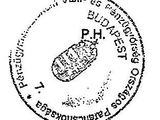

Alkoholtermék

---

# Tanúsítvány a legnagyobb jövedéki adót fizető adóalanyok ellenőrzéséről 2001-2002. (Sör)

| Adóalany neve | Befizetett jövedéki adó összege | Ellenőrzések száma (db) | Megállapítással zárult (db) | Bírság alap (eFt) | Bírság (eFt) |
| --- | --- | --- | --- | --- | --- |
| 1 Dreher Rt. | 7 999 709 000 | 26 | 0 | 0 | 0 |
| 2 Borsodi Sörgyár Rt. | 7 878 342 000 | 72 | 0 | 0 | 0 |
| 3 Brau-Union Rt. | 6 942 331 000 | 84 | 1 | 0 | 140 |
| 4 Amstel Sörgyár Rt. | 1 828 330 000 | 17 | 0 | 0 | 0 |
| 5 Pécs Sörfőzde Rt. | 1 531 802 000 | 89 | 2 | 0 | 60 |
| 6 Ilzer Sörgyár Rt. | 231 861 000 | 27 | 0 | 0 | 0 |
| 7 Johanna Kft. | 6 692 000 | 19 | 0 | 0 | 0 |
| 8 Megastúdió 2001 Bt. | 6 131 000 | 21 | 1 | 0 | 50 |
| 9 Agro Flott Bt. | 5 283 000 | 34 | 1 | 81 | 812 |
| 10 Tóblás Péter | 4 997 000 | 24 | 0 | 0 | 0 |

| Adóalany neve | Befizetett jövedéki adó összege | Ellenőrzések száma (db) | Megállapítással zárult (db) | Bírság alap (eFt) | Bírság (eFt) |
| --- | --- | --- | --- | --- | --- |
| 1 Dreher Rt. | 8 761 248 000 | 28 | 0 | 0 | 0 | 2 Borsodi Sörgyár Rt. | 8 579 601 000 | 69 | 0 | 0 | 0  |
|  3 Brau-Union Rt. | 7 040 685 000 | 58 | 0 | 0 | 0  |
|  4 Amstel Sörgyár Rt. | 1 713 550 000 | 20 | 0 | 0 | 0  |
|  5 Pécsi Sörfőzde Rt. | 1 687 668 000 | 77 | 0 | 0 | 0  |
|  6 Ilzer Sörgyár Rt. | 220 005 000 | 44 | 0 | 0 | 0  |
|  7 Johanna Kft. | 8 122 000 | 21 | 1 | 0 | 50  |
|  8 Kovács Sándorné | 5 931 000 | 24 | 1 | 0 | 50  |
|  9 Agro Flott Bt. | 4 507 000 | 28 | 0 | 0 | 0  |
|  10 Runner Beer Kft. | 4 312 000 | 20 | 0 | 0 | 0  |

Fenti adatok hitelességét igazolom.

Kelt: Budapest, 2003. 02.19

P.H.

aláírás

---

12/4. számú táblázat a V-26-46/2002-2003. sz. jelentéshez

# Tanúsítvány

## a legnagyobb jövedéki adót fizető adóalanyok ellenőrzéséről 2001-2002.

(Bor)

|  Adóalany neve |  | 2001. év |  |  |   |
| --- | --- | --- | --- | --- | --- |
|   | Befizetett jövedéki adó összege | Ellenőrzések száma (db) | Megállapítással árult (db) | Bírság alap (eFt) | Bírság (eFt)  |
|  1 | KISS ES TARSAI KERESKEDELMI TERMELO ES SZOLGALTATO | 64 283 000 | 93 | 1 | 0  |
|  2 | GRAPE-VINE BORTERM. ES KER. KFT. | 42 673 000 | 24 | 0 | 0  |
|  3 | EGERVIN BORGAZDASAG RT. | 38 531 000 | 23 | 1 | 0  |
|  4 | HENKELL & SCHINLEIN HUNGARIA BORG. ES KER. KFT. | 29 725 000 | 27 | 0 | 0  |
|  5 | VARGA PINCESZET KFT. | 24 756 000 | 48 | 0 | 0  |
|  6 | BOGNAR-VIN KFT. | 24 639 000 | 67 | 0 | 0  |
|  7 | VELEZVIN BORASZATI KFT | 23 456 000 | 49 | 1 | 0  |
|  8 | UNGOR ES UNGOR BORHAZ KERESKEDELMI KFT. | 20 228 000 | 61 | 3 | 0  |
|  9 | LE-KO UST KERESKEDELMI KORLATOLT FELELOSSEGU TARSA | 18 958 000 | 31 | 1 | 0  |
|  10 | TOKAJ KERESKEDOHAZ RT. | 19 176 000 | 45 | 0 | 0  |

|  Adóalany neve |  | 2002. év |  |  |   |
| --- | --- | --- | --- | --- | --- |
|   | Befizetett jövedéki adó összege | Ellenőrzések száma (db) | Megállapítással árult (db) | Bírság alap (eFt) | Bírság (eFt)  |
|  1 | KISS ES TARSAI KERESKEDELMI TERMELO ES SZOLGALTATO | 71 767 000 | 111 | 5 | 0  |
|  2 | GRAPE-VINE BORTERM. ES KER. KFT. | 52 014 000 | 28 | 0 | 0  |
|  3 | EGERVIN BORGAZDASAG RT. | 37 679 000 | 19 | 1 | 0  |
|  4 | HENKELL & SCHINLEIN HUNGARIA BORG. ES KER. KFT. | 30 205 000 | 31 | 0 | 0  |
|  5 | KISKUN-VIN MEZOGAZDASAGI KER. ES SZOLG. KFT. | 27 914 442 | 36 | 3 | 0  |
|  6 | VARGA PINCESZET KFT. | 26 502 000 | 76 | 0 | 0  |
|  7 | BOGNAR-VIN KFT. | 25 782 000 | 51 | 0 | 0  |
|  8 | SZIGETVIN KFT. | 22 104 000 | 24 | 1 | 0  |
|  9 | PETER PINCE SZOLO- BORTERMELO ES KERESKEDELMI KORL. | 22 127 985 | 32 | 1 | 0  |
|  10 | KECEL-BORKER KFT. | 19 883 000 | 26 | 0 | 0  |

Fenti adatok hitelességét igazolom.

Kelt: Budapest, 2003.

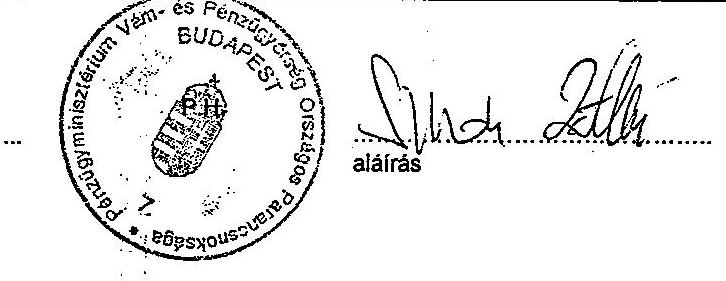

---

# Tanúsítvány a legnagyobb jövedéki adót fizető adóalanyok ellenőrzéséről 2001-2002. (Pezsgő)

|   |  | 2001. év |  |  |  |   |
| --- | --- | --- | --- | --- | --- | --- |
|   | Adóalany neve | Befizetett jövedéki adó összege | Ellenőrzések száma (db) | Megállapítással: zárult (db) | Bírság alap (eFt) | Bírság (eFt)  |
|  1 | Henkell and Söhnlein Kft. | 1127791000 | 27 | 0 | 0 | 0  |
|  2 | Hungasekt Rt. | 293587000 | 32 | 0 | 0 | 0  |
|  3 | Bacchus Drink Kft. | 47451000 | 16 | 0 | 0 | 0  |
|  4 | Szikrai Bor Kft. | 30238000 | 87 | 0 | 0 | 0  |
|  5 | Vinexport Rt. | 12526000 | 19 | 0 | 0 | 0  |
|  6 | Varga Pincészet Kft. | 11640000 | 18 | 0 | 0 | 0  |
|  7 | Vinárium Rt. | 1195000 | 20 | 1 |  | 50  |
|  8 | Pannónia Cézár Kft. | 1160000 | 19 | 0 | 0 | 0  |
|  9 | Chamon Kft. | 579000 | 17 | 0 | 0 | 0  |
|  10 | Vino-Trans Kft. | 159000 | 15 | 0 | 0 | 0  |

|   |  | 2002. év |  |  |  |   |
| --- | --- | --- | --- | --- | --- | --- |
|   | Adóalany neve | Befizetett jövedéki adó összege | Ellenőrzések száma (db) | Megállapítással: zárult (db) | Bírság alap (eFt) | Bírság (eFt)  |
|  1 | Henkell and Söhnlein Kft. | 1075309000 | 31 | 0 | 0 | 0  |
|  2 | Hungasekt Rt. | 316136000 | 40 | 0 | 0 | 0  |
|  3 | Bacchus Drink Kft. | 45122000 | 32 | 0 | 0 | 0  |
|  4 | Szikrai Bor Kft. | 35624000 | 19 | 0 | 0 | 0  |
|  5 | Varga Pincészet Kft. | 25514000 | 23 | 0 | 0 | 0  |
|  6 | Vinexport Rt. | 13567000 | 18 | 0 | 0 | 0  |
|  7 | Pannónia Cézár Kft. | 2568000 | 20 | 0 | 0 | 0  |
|  8 | Vinárium Rt. | 2484000 | 24 | 1 | 0 | 5  |
|  9 | Chamon Kft. | 744000 | 19 | 0 | 0 | 0  |
|  10 | Vino-Trans Kft. | 352000 | 18 | 0 | 0 | 0  |

Fenti adatok hitelességét igazolom.

Kelt: Budapest, 2003. 03.19

P.H.

aláírás

---

## Tanúsítvány a legnagyobb jövedéki adót fizető adóalanyok ellenőrzéséről 2001-2002. (Köztes alkoholtermék)

|  Adóalany neve | Befizetett jövedéki adóösszege | Ellenőrzések száma (db) | Megállapításai zárult (db) | Bírság alap (eFt) | Bírság (eFt)  |
| --- | --- | --- | --- | --- | --- |
|  1 Henkell and Söhnlein Kft. | 290 809 000 | 27 | 0 | 0 | 0  |
|  2 Szikrai Bor Kft. | 201 900 000 | 67 | 0 | 0 | 0  |
|  3 Zwack Unicum Rt. | 110 587 000 | 65 | 0 | 0 | 0  |
|  4 Kecskeméti Likőrip. Rt. | 24 085 000 | 46 | 1 | 0 | 50  |
|  5 Promontorbor Rt. | 22 265 000 | 54 | 1 | 0 | 70  |
|  6 Várda Drink Rt. | 11 027 754 | 22 | 0 | 0 | 0  |
|  7 Győri Likőrgyár Rt. | 9 718 000 | 34 | 1 | 5 | 5  |
|  8 FVMSZKI Kpincészete | 2 192 000 | 20 | 0 | 0 | 0  |
|  9 Völgységvin Kft. | 1 606 000 | 18 | 0 | 0 | 0  |
|  10 Kéray Kft. | 1 445 000 | 53 | 1 | 0 | 275  |

|  Adóalany neve | Befizetett jövedéki adóösszege | Ellenőrzések száma (db) | Megállapításai zárult (db) | Bírság alap (eFt) | Bírság (eFt)  |
| --- | --- | --- | --- | --- | --- |
|  1 Henkell and Söhnlein Kft. | 309 691 000 | 31 | 0 | 0 | 0  |
|  2 Szikrai Bor Kft. | 214 962 000 | 77 | 0 | 0 | 0  |
|  3 Zwack Unicum Rt. | 103 559 000 | 63 | 0 | 0 | 0  |
|  4 Promontorbor Rt. | 23 087 000 | 57 | 2 | 2 | 100  |
|  5 Kecskeméti Likőrip. Kft. | 1 584 200 | 85 | 1 | 0 | 100  |
|  6 Várda Drink Rt. | 8 845 986 | 17 | 0 | 0 | 0  |
|  7 Győri Likőrgyár Rt. | 8 816 000 | 363 | 1 | 200 | 200  |
|  8 Arany Kapu Rt. | 6 836 000 | 73 | 1 | 0 | 50  |
|  9 Helvécia Produkt | 1 419 000 | 25 | 1 | 0 | 50 |
| 10 Völgységvin Kft. | 1 256 000 | 17 | 1 | 5 000 | 20 |

Fenti adatok hitelességét igazolom.

Kelt: Budapest, 2003.03.16

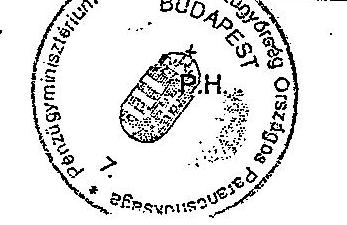

Sihai aláírás

---

# Tanúsítvány a legnagyobb jövedéki adót fizető adóalanyok ellenőrzéséről 2001-2002. (Dohánygyártmány)

| Adóalany neve | Befizetett jövedéki adó összege | Ellenőrzések száma (db) | Megállapítással zárolt (db) | Bírság alap (cft) | Bírság (cft) |
| --- | --- | --- | --- | --- | --- |
| 1 BAT, Pécsi Dohánygyár Kft. | 48 511 426 776 | 61 | 2 | 0 | 100 |
| 2 Philip Morris Mo. Kft. | 38 240 950 000 | 60 | 0 | 0 | 0 |
| 3 Reemtsma Kft. | 19 812 385 077 | 80 | 0 | 0 | 0 |
| 4 V. Tabac Rt. | 7 194 904 000 | 27 | 0 | 0 | 0 |
| 5 Róna Kft. | 747 690 848 | 80 | 0 | 0 | 0 |
| 6 Csongor Szivannyár Kft. | 47 825 000 | 28 | 0 | 0 | 0 |
| 7 Adóalany neve | Befizetett jövedéki adó összege | Ellenőrzések száma (db) | Megállapítással zárolt (db) | Bírság alap (cft) | Bírság (cft) |
| 1 BAT, Pécsi Dohánygyár Kft. | 54 161 220 139 | 60 | 2 | 0 | 100 |
| 2 Philip Morris Mo. Kft. | 34 935 372 000 | 60 | 0 | 0 | 0 |
| 3 Reemtsma Kft. | 20 283 400 563 | 84 | 0 | 0 | 0 |
| 4 V. Tabac Rt. | 8 409 138 000 | 25 | 0 | 0 | 0 |
| 5 Róna Kft. | 893 656 534 | 84 | 0 | 0 | 0 |
| 6 Csongor Szivannyár Kft. | 79 728 957 | 28 | 0 | 0 | 0 |
| 7 Adóalany neve | Befizetett jövedéki adó összege | Ellenőrzések száma (db) | Megállapítással zárolt (db) | Bírság alap (cft) | Bírság (cft) |
| 1 Fenti adatok hitelességét igazolom. | | | | | |
| Kelt: Budapest, 2003. | | | | | |

12/7. számú táblázat a V-26-46/2002-2003. sz. jelentéshez

12/7. számú táblázat a V-26-46/2002-2003. sz. jelentéshez

12/7. számú táblázat a V-26-46/2002-2003. sz. jelentéshez

12/7. számú táblázat a V-26-46/2002-2003. sz. jelentéshez

12/7. számú táblázat a V-26-46/2002-2003. sz. jelentéshez

12/7. számú táblázat a V-26-46/2002-2003. sz. jelentéshez

12/7. számú táblázat a V-26-46/2002-2003. sz. jelentéshez

12/7. számú táblázat a V-26-46/2002-2003. sz. jelentéshez

12/7. számú táblázat a V-26-46/2002-2003. sz. jelentéshez

12/7. számú táblázat a V-26-46/2002-2003. sz. jelentéshez

12/7. számú táblázat a V-26-46/2002-2003. sz. jelentéshez

12/7. számú táblázat a V-26-46/2002-2003. sz. jelentéshez

12/7. számú táblázat a V-26-46/2002-2003. sz. jelentéshez

12/7. számú táblázat a V-26-46/2002-2003. sz. jelentéshez

12/7. számú táblázat a V-26-46/2002-2003. sz. jelentéshez

12/7. számú táblázat a V-26-46/2002-2003. sz. jelentéshez

12/7. számú táblázat a V-26-46/2002-2003. sz. jelentéshez

12/7. számú táblázat a V-26-46/2002-2003. sz. jelentéshez

12/7. számú táblázat a V-26-46/2002-2003. sz. jelentéshez

12/7. számú táblázat a V-26-46/2002-2003. sz. jelentéshez

12/7. számú táblázat a V-26-46/2002-2003. sz. jelentéshez

12/7. számú táblázat a V-26-46/2002-2003. sz. jelentéshez

12/7. számú táblázat a V-26-46/2002-2003. sz. jelentéshez

12/7. számú táblázat a V-26-46/2002-2003. sz. jelentéshez

12/7. számú táblázat a V-26-46/2002-2003. sz. jelentéshez

12/7. számú táblázat a V-26-46/2002-2003. sz. jelentéshez

12/7. számú táblázat a V-26-46/2002-2003. sz. jelentéshez

12/7. számú táblázat a V-26-46/2002-2003. sz. jelentéshez

12/7. számú táblázat a V-26-46/2002-2003. sz. jelentéshez

12/7. számú táblázat a V-26-46/2002-2003. sz. jelentéshez

12/7. számú táblázat a V-26-46/2002-2003. sz. jelentéshez

12/7. számú táblázat a V-26-46/2002-2003. sz. jelentéshez

12/

---

## 13. számú táblázat a V-26-46/2002-2003. sz. jelentéshez

| Átkohozásárló | | | | | | | | | | | | | | | | | | | | | | | | | | | | | | | | | | | | | | | | | | | | | | | | | | | | | | | | | | | | | | | | | | | | | | | | | | | | | | | | | | | | | | | | | | | | | | | | | | | | |

---

Tanúsítvány a jövedéki ellenőrzés által felderített adózás alól elvont jövedéki termékekről 1998. év

| A jövedéki termék megnevezése | Mérték-
egység | Jövedéki ellenőrzés által felderített adózás alól elvont | | Az elvont mennyiségből lefoglalt mennyiség | Az elvont termék után kiszabott jövedéki bírság (eFt) |
| --- | --- | --- | --- | --- | --- |
| | | Mennyiség | Értéke fogy. áron számolva (eFt) | | |
| Dohánygyártmány | 1000 szál | 298016 | 195528 | 1152282 | 709657 |
| Alkoholtermék | hl | 117219 | 235391 | 114270 | 547140 |
| Köztes alkoholtermék | liter | 111399 | 4533 | 111029 | 226551 |
| Sör | hl | 1212 | 2234 | 666 | 6731 |
| Bor | liter | 2005 | 203 | 1991 | 25 |
| Pezsgő | liter | 3698 | 1481 | 2990 | 2452 |
| Ásványolajtermék | liter | 3145317 | 466807 | 845258 | 1785211 |
| - ebből üzemanyag | liter | 564294 | 90540 | 639385 | 1646677 |
| | | 0 | 0 | 0 | 0 |
| Összesen: | | 705085 | 948021 | 1580227 | 3292616 |

A fenti adatok hitelességét igazolom.

Kelt: Budapest, 2003. 22.12

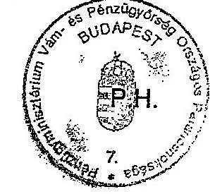

(aláírás)

---

Tanúsítvány a jövedéki ellenőrzés által felderített adózás alól elvont jövedéki termékekről 1999. év

| A jövedéki termék megnevezése | Mérték-
egység | Jövedéki ellenőrzés által felderített adózás alól elvont | | Az elvont mennyiségből lefoglalt mennyiség | Az elvont termék után kiszabott jövedéki bírság (eFt) |
| --- | --- | --- | --- | --- | --- |
| | | Mennyiség | Értéke, fogy, áron számolva (eFt) | | |
| Dohánygyártmány | 1000 szál | 36461 | 250934 | 119653 | 747091 |
| Alkoholtermék | hl | 123592 | 246363 | 121428 | 1167124 |
| Köztes alkoholtermék | liter | 415894 | 32007 | 415468 | 140842 |
| Sör | hl | 2613 | 6289 | 1775 | 18555 |
| Bor | liter | 1 | 0 | 1 | 100 |
| Pezsgő | liter | 2755 | 1530 | 816 | 11100 |
| Ásványolajtermék | liter | 2798359 | 1100352 | 1390190 | 700416 |
| - ebből üzemanyag | liter | 1883879 | 577556 | 631694 | 595747 |
| | | 0 | 0 | 0 | 0 |
| Összesen: | 0 | 973193 | 1964442 | 1043980 | 2420487 |

A fenti adatok hitelességét igazolom.

Kelt: Budapest, 2003.

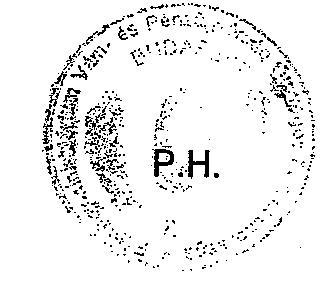

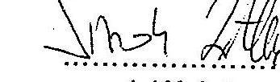

(aláírás)

---

Tanúsítvány a jövedéki ellenőrzés által felderített adózás alól elvont jövedéki termékekről 2000. év

| A jövedéki termék megnevezése | Mérték-
egység | Jövedéki ellenőrzés által felderített adózás alól elvont | | Az elvont mennyiségből lefoglalt mennyiség | Az elvont termék után kiszabott jövedéki bírság (eFt) |
| --- | --- | --- | --- | --- | --- |
| | | Mennyiség | Értéke fogy. áron számolva (eFt) | | |
| Dohánygyártmány | 1000 szál | 117169 | 249377 | 156560 | 1178744 |
| Alkoholtermék | hl | 60139 | 128413 | 58397 | 861260 |
| Köztes alkoholtermék | liter | 94603 | 7294 | 94586 | 338981 |
| Sör | hl | 1306 | 1989 | 1206 | 2526 |
| Bor | liter | 34262 | 2787 | 33266 | 1882 |
| Pezsgő | liter | 562 | 285 | 520 | 1525 |
| Ásványolajtermék | liter | 857610 | 119088 | 728892 | 281477 |
| - ebből üzemanyag | liter | 380993 | 77393 | 312866 | 181241 |
| | | 0 | 0 | 0 | 0 |
| Összesen: | 0 | 430473 | 544190 | 469254 | 2835122 |

A fenti adatok hitelességét igazolom.

Kelt: Budapest, 2003. 22.11.

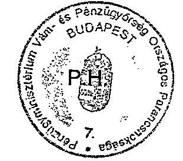

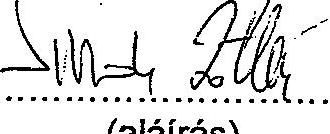

---

Tanúsítvány a jövedéki ellenőrzés által felderített adózás alól elvont jövedéki termékekről 2001. év

| A jövedéki termék megnevezése | Mérték-
egység | Jövedéki ellenőrzés által felderített adózás alól elvont | | Az elvont mennyiségből lefoglalt mennyiség | Az elvont termék után kiszabott jövedéki bírság (eFt) |
| --- | --- | --- | --- | --- | --- |
| | | Mennyiség | Értéke fogy, áron számolva (eFt) | | |
| Dohánygyártmány | 1000 szál | 504706 | 565741 | 588381 | 2731477 |
| Alkoholtermék | hl | 55623 | 113179 | 50969 | 644845 |
| Köztes alkoholtermék | liter | 280066 | 34150 | | 275109 | 149778 |
| Sör | hl | 889 | 2144 | 877 | 2500 |
| Bor | liter | 595635 | 174701 | 587378 | 143105 |
| Pezsgő | liter | 423 | 1936 | 145 | 614 |
| Ásványolajtermék | liter | 472487 | 84407 | 399168 | 341409 |
| - ebből üzemanyag | liter | 260160 | 52983 | 201616 | 209682 |
| | | 0 | 0 | 0 | 0 |
| Összesen: | 0 | 423987 | 991621 | 507572 | 4037974 |

A fenti adatok hitelességét igazolom.

Kelt:Budapest, 2003.

---

Tanúsítvány a jövedéki ellenőrzés által felderített adózás alól elvont jövedéki termékekről 2002. év

| A jövedéki termék megnevezése | Mérték-
egység | Jövedéki ellenőrzés által felderített adózás alól elvont | | Az elvont mennyiségből lefoglalt mennyiség | Az elvont termék után kiszabott jövedéki bírság (eFt) |
| --- | --- | --- | --- | --- | --- |
| | | Mennyiség | Értéke fogy. áron számolva (eFt) | | |
| Dohánygyártmány | 1000 szál | 74415 | 638410 | 91877 | 2155676 |
| Alkoholtermék | hl | 59005 | 81303 | 41060 | 327649 |
| Köztes alkoholtermék | liter | 30000 | 9837 | 29978 | 45189 |
| Sör | hl | 1062 | 2819 | 805 | 3587 |
| Bor | liter | 232999 | 36092 | 214466 | 84685 |
| Pezsgő | liter | 675 | 437 | 635 | 5569 |
| Ásványolajtermék | liter | 471124 | 107840 | 358750 | 338163 |
| - ebből üzemanyag | liter | 328881 | 87537 | 233443 | 270426 |
| | | 0 | 0 | 0 | 0 |
| Összesen: | 0 | 289197 | 906152 | 343193 | 3057032 |

A fenti adatok hitelességét igazolom.

Kelt:Budapest, 2003. ...24.18

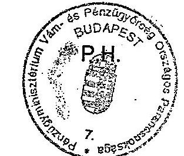

(aláírás)

---

1.  számú táblázat Tanúsítvány az ellenőrzött piacok számának alakulásáról (ellenőrzések számáról), valamint az ellenőrzésre fordított munkaóráról a V-26-46/2002-2003. sz. jelentéshez 1998-2002.

| Megyei Pk. Megnevezés | 1998. | | | | 1999. | | | | 2000. | | | |
| --- | --- | --- | --- | --- | --- | --- | --- | --- | --- | --- | --- | --- |
| | | Ellenőrzött | | Ellenőrzésre | | Ellenőrzésre | | Ellenőrzésre | | Ellenőrzött | | Ellenőrzésre |
| | | | | | | | | | | | | |
| | | | | | | | | | | | | |
| | | | | | | | | | | | | |
| | | | | | | | | | | | | |
| | | | | | | | | | | | | |
| | | | | | | | | | | | | |
| | | | | | | | | | | | | |
| | | | | | | | | | | | | |
| | | | | | | | | | | | | |
| | | | | | | | | | | | | |
| | | | | | | | | | | | | |
| | | | | | | | | | | | | |
| | | | | | | | | | | | | |
| | | | | | | | | | | | | |
| | | | | | | | | | | | | |
| | | | | | | | | | | | | |
| | | | | | | | | | | | | |
| | | | | | | | | | | | | |
| | | | | | | | | | | | | |
| | | | | | | | | | | | | |
| | | | | | | | | | | | | |
| | | | | | | | | | | | | |
| | | | | | | | | | | | | |
| | | | | | | | | | | | | |
| | | | | | | | | | | | | |
| | | | | | | | | | | | | |
| | | | | | | | | | | | | |
| | | | | | | | | | | | | |
| | | | | | | | | | | | | |
| | | | | | | | | | | | | |
| |

---

16/1. számú táblázat a V-26-46/2002-2003. sz. jelentéshez

| Az ellenőrzést végző szerv | Ellenőrzések száma (db) | | | | | | Elkövetési érték (eFt) | | | | |
| --- | --- | --- | --- | --- | --- | --- | --- | --- | --- | --- | --- |
| megnevezése | 1998. | 1999. | 2000. | 2001. | 2002. | 1998. | 1999. | 2000. | 2001. | 2002. | |
| Közép-Magyarország RP | 139 | 117 | 237 | 203 | 249 | 288 | 2 933 | 3 538 | 2 243 | 2 179 | |
| Dél-Dunántúli RP | 44 | 39 | 75 | 98 | 45 | 2 081 | 1 068 | 1 918 | 5 444 | 4 805 | |
| Észak-Magyarország RP | 199 | 174 | 264 | 472 | 396 | 31 | 7 754 | 819 | 1 348 | 307 | |
| Dél-Alföldi RP | 137 | 155 | 182 | 80 | 153 | 7 444 | 5 619 | 12 226 | 13 743 | 23 173 | |
| Észak-Alföldi RP | 786 | 732 | 543 | 791 | 796 | 61 602 | 44 513 | 70 526 | 71 791 | 70 893 | |
| Közép-Dunántúli RP | 48 | 153 | 55 | 304 | 542 | 218 | 208 | 998 | 172 | 2 954 | |
| Nyugat-Dunántúli RP | 1107 | 651 | 96 | 384 | 56 | 0 |
 | 2 250 | 184 | 448 | 7 |   |
|  Ellenőrzési igazgatóság | 0 | 0 | 0 | 0 | 0 | 0 | 0 | 0 | 0 | 0 |   |
|  Központi Járőrszolgálat P. | 1 | 3 | 2 | 107 | 89 | 0 | 435 | 401 | 144 | 124 |   |
|  Nyomozóhivatalok | 118 | 69 | 63 | 48 | 57 | 17 629 | 64 088 | 31 345 | 14 445 | 11 588 |   |
|  Összesen: | 2461 | 2024 | 1454 | 2439 | 2326 | 71 663 | 64 778 | 90 610 | 95 333 | 104 442 |   |

Fenti adatok hitelességét igazolom.

Kelt: Budapest, 2003. 03.12.

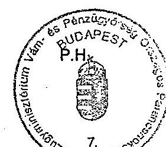

Suhas Álló (aláírás)

---

Tanúsítvány a közérdekű bejelentés alapján végzett ellenőrzések alakulásáról 1998-2002.

|  Az ellenőrzést végző szerv | Ellenőrzések száma (db) |  |  |  |  | Elkövetési érték (eFt) |  |  |  |   |
| --- | --- | --- | --- | --- | --- | --- | --- | --- | --- | --- |
|  megnevezése | 1998 | 1999 | 2000 | 2001 | 2002 | 1998 | 1999 | 2000 | 2001 | 2002  |
|  Közép-Magyarország RP | 159 | 191 | 189 | 191 | 162 | 808 | 616 | 1511 | 2450 | 4424  |
|  Dél-Dunántúli RP | 90 | 95 | 162 | 191 | 242 | 19513 | 1328 | 999 | 18197 | 5420  |
|  Észak-Magyarországi RP | 286 | 352 | 634 | 641 | 623 | 1381 | 4676 | 9991 | 8981 | 21573  |
|  Dél-Alföldi RP | 239 | 408 | 518 | 504 | 541 | 4224 | 18455 | 181574 | 11429 | 28450  |
|  Észak-Alföldi RP | 826 | 1055 | 1318 | 1299 | 1883 | 7625 | 50760 | 26672 | 133960 | 34094  |
|  Közép-Dunántúli RP | 49 | 48 | 159 | 150 | 108 | 1426 | 1267 | 2471 | 3882 | 1021  |
|  Nyugat-Dunántúli RP | 73 | 95 | 90 | 98 | 110 | 0 | 660 | 522 | 1701 | 1737  |
|  Ellenőrzési Igazgatóság | 0 | 0 | 0 | 0 | 0 | 0 | 0 | 0 | 0 | 0  |
|  Központi Járőrszolgálat P. | 2 | 33 | 91 | 281 | 51 | 0 | 2059 | 9096 | 15402 | 5099  |
|  Nyomozóhivatalok | 317 | 288 | 287 | 313 | 429 | 41415 | 41559 | 53525 | 148582 | 482325  |
|  Összesen: | 1724 | 2277 | 3161 | 3355 | 3720 | 34978 | 79822 | 232837 | 196002 | 101818  |

Fenti adatok hitelességét igazolom.

Kelt: Budapest, 2003. 11.23.

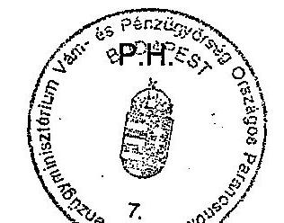


---

Tanúsítvány a vasúton végzett ellenőrzések alakulásáról a V-26-46/2002-2003. sz. jelentéshez 1998-2002.

|  Az ellenőrzést végző szerv. megnevezése | Ellenőrzések száma (db) |  |  |  |  | Elkövetési érték (eFt) |  |  |  |   |
| --- | --- | --- | --- | --- | --- | --- | --- | --- | --- | --- |
|   | 1998. | 1999. | 2000. | 2001. | 2002. | 1998. | 1999. | 2000. | 2001. | 2002.  |
|  Közép-Magyarország RP | 0 | 0 | 22 | 2 | 0 | 0 | 0 | 0 | 0 | 0  |
|  Dél-Dunántúli RP | 0 | 0 | 0 | 0 | 0 | 0 | 0 | 0 | 0 | 0  |
|  Észak-Magyarország RP | 5 | 5 | 7 | 4 | 9 | 0 | 28 | 0 | 50 | 506  |
|  Dél-Alföldi RP | 3 | 0 | 0 | 0 | 1 | 94 | 0 | 0 | 0 | 93  |
|  Észak-Alföldi RP | 65 | 124 | 110 | 135 | 210 | 2 469 | 2 976 | 1 231 | 2 143 | 11 151  |
|  Közép-Dunántúli RP | 1 | 0 | 0 | 1 | 0 | 2 | 0 | 0 | 0 | 0  |
|  Nyugat-Dunántúli RP | 8 | 15 | 21 | 14 | 13 | 0 | 0 | 0 | 0 | 0  |
|  Ellenőrzési igazgatóság | 0 | 0 | 0 | 0 | 0 | 0 | 0 | 0 | 0 | 0  |
|  Központi Járőrszolgálat P. | 0 | 0 | 12 | 7 | 11 | 0 | 0 | 1 385 | 865 | 399  |
|  Nyomozóhivatalok | 1 | 2 | 3 | 29 | 11 | 134 | 301 | 106 | 2 216 | 976  |
|  Összesen: | 82 | 144 | 172 | 163 | 244 | 2 564 | 3 004 | 2 616 | 3 058 | 12 149  |

Fenti adatok hitelességét igazolom.

Kelt: Budapest, 2003. 03.14.

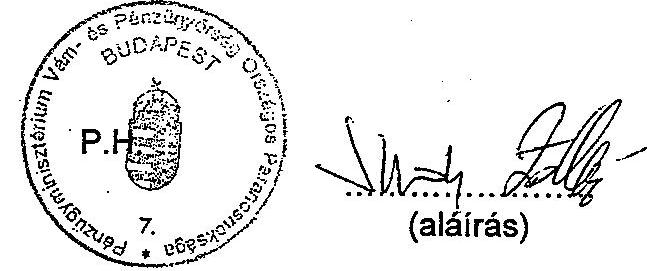

---

Tanúsítvány a vízi úton végzett ellenőrzések alakulásáról 1998-2002.

|  Az ellenőrzést végző szerv megnevezése | Ellenőrzések száma (db) |  |  |  |  | Elkövetési érték (eFt) |  |  |  |   |
| --- | --- | --- | --- | --- | --- | --- | --- | --- | --- | --- |
|   | 1998. | 1999. | 2000. | 2001. | 2002. | 1998. | 1999. | 2000. | 2001. | 2002.  |
|  Közép-Magyarország RP | 0 | 0 | 0 | 0 | 6 | 0 | 0 | 0 | 0 | 0  |
|  Dél-Dunántúli RP | 3 | 3 | 0 | 1 | 1 | 0 | 0 | 0 | 0 | 0  |
|  Észak-Magyarországi RP | 0 | 0 | 0 | 1 | 6 | 0 | 0 | 0 | 0 | 0  |
|  Dél-Alföldi RP | 0 | 6 | 0 | 0 | 0 | 0 | 0 | 0 | 0 | 0  |
|  Észak-Alföldi RP | 0 | 0 | 0 | 0 | 1 | 0 | 0 | 0 | 0 | 0  |
|  Közép-Dunántúli RP | 5 | 0 | 6 | 0 | 11 | 0 | 0 | 0 | 0 | 0  |
|  Nyugat-Dunántúli RP | 0 | 0 | 0 | 0 | 0 | 0 | 0 | 0 | 0 | 0  |
|  Ellenőrzési Igazgatóság | 0 | 0 | 0 | 0 | 0 | 0 | 0 | 0 | 0 | 0  |
|  Központi Járőrszolgálat P | 0 | 4 | 3 | 2 | 7 | 0 | 64 | 223 | 138 | 495  |
|  Nyomozóhivatalok | 0 | 0 | 0 | 0 | 0 | 0 | 0 | 0 | 0 | 0  |
|  Összesen: | 8 | 13 | 9 | 4 | 32 | 0 | 64 | 223 | 138 | 495  |

Fenti adatok hitelességét igazolom.

Kelt: Budapest, 2003. 03.04.

P.H.

(aláírás)

---

16/5. számú táblázat a V-26-46/2002-2003. sz. jelentéshez

### Tanúsítvány a közúti ellenőrzések alakulásáról 1998-2002.

|  Az ellenőrzésé végző szerv. megnevezése | Ellenőrzések száma (db) | Elkövetési érték (eFt)  |
| --- | --- | --- |
|   | 1998. | 1999.  |
|  Közép-Magyarország RP. | 678 | 1337  |
|  Dél-Dunántúli RP. | 138 | 125  |
|  Észak-Magyarországi RP. | 504 | 2552  |
|  Dél-Alföldi RP. | 429 | 378  |
|  Észak-Alföldi RP. | 477 | 2616  |
|  Közép-Dunántúli RP. | 670 | 2710  |
|  Nyugat-Dunántúli RP. | 1035 | 1466  |
|  Ellenőrzési igazgatóság | 0 | 0  |
|  Központi Járőrszolgálat P. | 136 | 192  |
|  Összesen: | 4067 | 11376  |

Fenti adatok hitelességét igazolom.

Kelt: Budapest, 2003. 11.23.

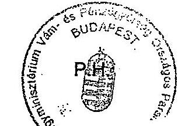


---

Tanúsítvány a piaci ellenőrzések alakulásáról 1998-2002.

|  Az ellenőrzést végző szerv | Ellenőrzések száma (db) |  |  |  |  | Elkövetési érték (eFt) |  |  |  |   |
| --- | --- | --- | --- | --- | --- | --- | --- | --- | --- | --- |
|  megnevezése | 1998. | 1999. | 2000. | 2001. | 2002. | 1998. | 1999. | 2000. | 2001. | 2002.  |
|  Közép-Magyarországg RP | 337 | 538 | 369 | 100 | 96 | 1192 | 94 | 1321 | 2655 | 1052  |
|  Dél-Dunántúli RP | 126 | 125 | 96 | 54 | 74 | 365 | 102 | 52 | 1204 | 1744  |
|  Észak-Magyarországg RP | 913 | 927 | 577 | 511 | 599 | 899 | 4226 | 4445 | 5008 | 3169  |
|  Dél-Alföldi RP | 614 | 529 | 531 | 506 | 745 | 3786 | 2179 | 3384 | 2528 | 5288  |
|  Észak-Alföldi RP | 1297 | 1369 | 1084 | 1359 | 1498 | 7255 | 10629 | 10279 | 12557 | 16625  |
|  Közép-Dunántúli RP | 232 | 253 | 189 | 193 | 231 | 1195 | 1044 | 1154 | 1265 | 1596  |
|  Nyugat-Dunántúli RP | 211 | 219 | 172 | 170 | 194 | 1148 | 1045 | 1005 | 1085 | 1243  |
|  Ellenőrzési Igazgatóság | 0 | 0 | 0 | 0 | 0 | 0 | 0 | 0 | 0 | 0  |
|  Központi Járőrszolgálat P. | 1 | 1 | 1 | 1 | 1 | 0 | 0 | 0 | 0 | 0  |
|  Nyomozóhivatalok | 10 | 10 | 10 | 10 | 10 | 0 | 0 | 0 | 0 | 0  |
|  Összesen: | 3731 | 3971 | 3029 | 2904 | 3658 | 15840 | 19320 | 21640 | 26302 | 30717  |

Fenti adatok hitelességét igazolom.

Kelt: Budapest, 2003. 03.04.

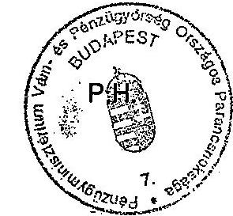
 | 220 | 210 | 240 | 38 | 156 | 73 | 26 | 11 |
| Nyugat-Dunántúli RP | 207 | 296 | 213 | 192 | 210 | 150 | 317 | 0 | 0 | 549 |
| Ellenőrzési igazgatóság | 0 | 0 | 0 | 0 | 0 | 0 | 0 | 0 | 0 | 0 |
| Központi Járőrszolgálat P. | 59 | 50 | 53 | 63 | 34 | 4137 | 4884 | 2350 | 2660 | 4082 |
| Nyomozóhivatalok | 168 | 179 | 127 | 131 | 119 | 32368 | 25687 | 65904 | 69170 | 128008 |
| Összesen: | 3785 | 4087 | 3143 | 2995 | 3496 | 17823 | 22587 | 21905 | 26639 | 32519 |

Fenti adatok hitelességét igazolom.

Kelt: Budapest, 2003. 23.11.2002.


(aláírás)

---

| 1998-2002. | | | | | | | | | | | | | | | | 17. számú táblázat a V-26-46/2002-2003. sz. jelentéshez |
| --- | --- | --- | --- | --- | --- | --- | --- | --- | --- | --- | --- | --- | --- | --- | --- | --- |
| 1998 | | | | | | | | | | | | | | | | |
| Megnevezés | | | | | | | | | | | | | | | | |
| Száma | | | | | | | | | | | | | | | | |
| Száma | | | | | | | | | | | | | | | | |
| Száma | | | | | | | | | | | | | | | | |
| Hozzáma | | | | | | | | | | | | | | | | |
| Száma | | | | | | | | | | | | | | | | |
| Száma | | | | | | | | | | | | | | | | |
| Adóvizsgálatok összesen | 30 | 479 | 233 | 69 | 375 | 192 | 194 | 3227 | 8793 | 201 | 4184 | 14277 | 240 | 11960 | 64367 | |
| Ebből megállapításokkal zárult | 13 | 40 | 233 | 37 | 32 | 192 | 52 | 1579 | 8793 | 88 | 1622 | 22093 | 120 | 4948 | 59999 | |
| Hatósági felügyelet keretében végzett ellenőrzés | 14 537 | 71 439 | 3 705 | 17 705 | 87 382 | 580 | 30437 | 118086 | 4865 | 46217 | 174953 | 63391 | 47466 | 163395 | 91541 | |
| Ebből megállapításokkal zárult | 163 | 445 | 101 816 | 175 | 594 | 6 761 | 245 | 851 | 14285 | 1209 | 5333 | 115049 | 1334 | 3317 | 235635 | |
| Jóvedéki ellenőrzés | 42 114 | 128 849 | 159 246 | 59 676 | 150 850 | 483 679 | 59549 | 155780 | 288204 | 81131 | 178165 | 378148 | 62414 | 159248 | 403709 | |
| Ebből megállapításokkal zárult | 5 093 | 13 695 | 385 377 | 5 578 | 14 092 | 834 889 | 6291 | 16878 | 589175 | 6994 | 18258 | 611595 | 7152 | 18650 | 543857 | |
| Nagykereskedelmi tevékenységet folytatóknál végzett ell. | 2 436 | 11 917 | 6 761 | 2 937 | 14 007 | 28 517 | 2731 | 11151 | 4132 | 5399 | 32867 | 14989 | 4628 | 17337 | 3343 | |
| Kiskereskedelmi tevékenységet folytatóknál végzett ell. | 29 478 | 82 396 | 59 174 | 39 421 | 99 762 | 56 501 | 37785 | 97179 | 30715 | 37920 | 91554 | 46440 | 35207 | 86294 | 33831 | |
| -ezen belül üzemanyag töltő állomás | 5 049 | 18 271 | 14 568 | 5 347 | 19 352 | 448 350 | 6997 | 27144 | 8007 | 5727 | 26583 | 5607 | 8039 | 29331 | 1798 | |
| Export, Import tevékenységet folytatóknál végzett ell. | 299 | 1 056 | 0 | 318 | 978 | 0 | 254 | 791 | 21 | 520 | 3421 | 4811 | 376 | 1478 | 0 | |

Fenti adatok hitelességét igazolom.

Kelt: Budapest, 2003. június 26.

ÁLLAMI SZÁMVE: 00YYYTJEL: 18002 A981-4337/03 Érkezeti 2002 JOL 02

Iktatószám: V-26-022/2002

Melléklet: 1518/03

---

| Szervezet megnevezése | Benyújtott Igénylések száma (db) | | | | | Visszaigényelt összeg (eFt) | | | | |
| --- | --- | --- | --- | --- | --- | --- | --- | --- | --- | --- |
| | 1998. | 1999. | 2000. | 2001. | 2002. | 1998. | 1999. | 2000. | 2001. | 2002. |
| Közép-Magyarországg RP | 542 | 4470 | 4455 | 5179 | 5385 | 5403202 | 8266861 | 8457386 | 8139949 | 7702496 |
| Dél-Dunántúli RP | 1545 | 17146 | 18084 | 15118 | 15549 | 725346 | 2561536 | 2967943 | 3156943 | 3085448 |
| Észak-Magyarországg RP | 1500 | 11953 | 12857 | 12318 | 12635 | 520396 | 1447074 | 1588080 | 1614274 | 1566257 |
| Dél-Alföldi RP | 3074 | 38674 | 34946 | 32637 | 35921 | 589380 | 3389610 | 3765813 | 3871776 | 4307543 |
| Észak-Alföldi RP | 3187 | 28934 | 26072 | 23182 | 22498 | 606092 | 2458543 | 2670293 | 2964525 | 2946357 |
| Közép-Dunántúli RP | 1046 | 8978 | 10524 | 9727 | 10062 | 593338 | 1839216 | 2139985 | 2241422 | 2411034 |
| Nyugat-Dunántúli RP | 1822 | 11667 | 12218 | 11628 | 10575 | 623135 | 1836217 | 2080065 | 2339811 | 2257276 |
| Összesen: | 12716 | 121822 | 119156 | 109789 | 112625 | 9060889 | 21799057 | 23669565 | 24328701 | 24276412 |

Fenti adatok hitelességét igazolom.

Kelt: Budapest, 2003. ...23...19.............

P.H.

(aláírás)

---

# Tanúsítvány <br> a jövedéki szakterület engedélyezett és betöltött létszámáról (1998-2002)

| | Engedélyezett létszáma (fő) | | | | | Betöltött létszáma (fő) | | | | |
| :--: | :--: | :--: | :--: | :--: | :--: | :--: | :--: | :--: | :--: | :--: |
| | 1998 | 1999 | 2000 | 2001 | 2002 | 1998 | 1999 | 2000 | 2001 | 2002 |
| Hivatásos állomány | | | | | | | | | | |
| Felsőfokú szervek | 27 | 25 | 24 | 34 | 47 | 27 | 25 | 24 | 34 | 47 |
| Középfokú szervek | 66 | 67 | 69 | 84 | 89 | 69 | 66 | 66 | 81 | 82 |
| Alapfokú szervek | 763 | 750 | 901 | 935 | 909 | 750 | 766 | 901 | 924 | 915 |
| Összesen: | 856 | 842 | 994 | 1053 | 1045 | 846 | 857 | 991 | 1039 | 1044 |
| | | | | | | | | | | |
| Közalkalmazotti áll. | | | | | | | | | | |
| Felsőfokú szervek | 5 | 5 | 6 | 7 | 6 | 5 | 5 | 6 | 7 | 6 |
| Középfokú szervek | 7 | 11 | 11 | 11 | 12 | 7 | 11 | 11 | 11 | 10 |
| Alapfokú szervek | 24 | 21 | 41 | 38 | 37 | 23 | 25 | 46 | 46 | 44 |
| Összesen: | 36 | 37 | 58 | 56 | 55 | 35 | 41 | 63 | 64 | 60 |
| | | | | | | | | | | |
| Mindösszesen: | 892 | 879 | 1052 | 1109 | 1100 | 881 | 898 | 1054 | 1103 | 1104 |

A fenti adatok hitelességét igazolom.

Budapest, 2003. március 28.
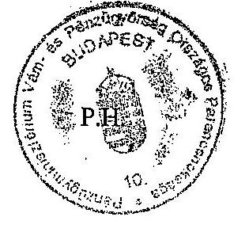

Dr. Fejes Antal ezredes főosztályvezető

---

# Az illegális termék-előállítás és -forgalmazás felderítési adatai

1998-2002

| Ellenőrzési típus | 1998 | | | 1999 | | | 2000 | | | 2001 | | | 2002 | | | | | | | :--: | :--: | :--: | :--: | :--: | :--: | :--: | :--: | :--: | :--: | :--: | :--: | :--: | :--: | :--: | :--: | :--: | :--: | :--: | :--: | :--: | :--: | :--: | | | | | | | | | | | | | | | | | | | | | | | | | | | | | | | | | | | | | | | | | | | | | | | | | | | | | | | | | | | | | | | | | | | | | | | | | | | | | | | | | | | | | | | | | | | | | | | | | | | | | | | | | | | | | | | | | | | | | | | | | | | | | | | | | | | | | | | | | | | | | | | | | | | | | | | | | | | | | | | | | | | | | | | | | | | | | | | | | | | | | | | | | | | | | | | | | | | | | | | | |

---

# 3. SZÁMÚ MELLÉKLET 

a V-26/2002-2003. sz. jelentéshez

---

.

---

# Az illegális termék-előállítás és forgalmazás helyzetértékelése 

A jövedéki termékekkel történő visszaélések mértéke, azaz jövedéki termékek illegális előállításának és forgalmazásának nagyságrendje annak jellegéből adódóan nem mérhető, de különböző becslési eljárásokkal a VP készít számvetéseket az egyes jövedéki termékekre, illetve elkövetési módokra.

A vizsgált években a korábbi évektől eltérően a jövedéki termékek közül már nem az ásványolaj-származékokra, hanem az alkohol és dohánytermékekre elkövetett visszaélések voltak a jellemzőek. 2001-ben a jövedéki terméklefoglalások $89 \%$-a, 2002-ben $97 \%$-a e termékcsoportokban jelentkezett (14/114/5. sz. táblázatok).

A VP becslése szerint az alkohol illegális előállítása és csempészete az összes alkoholfogyasztás mértékének 7-12 \%-át is kiteszi, ami évente megközelítőleg 47 Mrd Ft jövedéki adó bevétel elmaradást jelent a költségvetésnek.

Új elkövetési magatartásként jelent meg az adómentesen előállított termékek (alkohol tartalmú tisztító- és mosófolyadékok, fagyálló folyadékok, oldószerek), illegális alkoholtermék előállítási alapanyagaként történő felhasználása. Ennek a módszernek a lényege, hogy a denaturált szesz denaturált anyagának részbeni, vagy teljes kivonását követően aroma és adalékanyagok hozzáadásával szeszesitalt állítanak elő. A 48/2000. (XII. 18.) PM rendelet módosította a denaturálásra használható anyagok és a denaturálási eljárás meghatározását. Az új szabályozás a denaturáló szereket úgy határozta meg, hogy annak undorkeltő hatása csökkent és így a jogalkotó szándéka ellenére fogyaszthatóvá vált (pl. a denaturáláshoz használt etil-acetát a Diana sósborszesz alapanyaga).

A denaturált szesszel történő visszaélések mellett egyre számottevőbb a cukorcefréből történő szeszelőállítás. A szesz előállításhoz - a jelenlegi jogszabályi környezetben - a kereskedelemben bármilyen forrásból korlátlan mennyiségű kristálycukor, vagy folyékony izocukor szerezhető be. A cukor nagymennyiségű birtoklása nem bizonyítéka az illegális alkohol-előállítás előkészületének, kivéve, ha vízzel keverve már erjedési folyamatban van a folyadék.

A VP elemzései szerint a dohánytermékekre elkövetett visszaéléseket tekintve a vizsgált években továbbra is a külföldről történő csempészet volt a meghatározó, amelyet főként utasforgalomban követtek el, de nem volt ritka a teherforgalomban a legális szállítmányok közé rejtés módszere sem. Különösen az illegális dohánytermékek vonatkozásában érzékelhető jelenleg is a szervezett bűnözés, amely elsősorban a feladatmegosztásban, a technikai háttérben, a piramis felépítésű szervezettségben nyilvánul meg, amely a felderítéseket nehezebbé teszi.

Az elmúlt években a dohánytermékek feketepiaca az ország egyes területeit tekintve igen eltérően alakult. Az ukrán és román határ közelségében a teljes fogyasztás $25-35 \%$-át is elérheti az illegális dohányáru fogyasztása, addig a

---

nyugati határszélen a VP azt mindössze 2-4 \%-ra becsüli. Az országos viszonylatban átlagosan $10 \%$ körülire becsült illegális dohányáru-fogyasztás mintegy 8-10 Mrd Ft költségvetési bevétel kiesést jelentett.

Adóelmaradást okozott a vizsgált években a „üzemanyag turizmus", valamint az extrakönnyű fűtőolaj illegális felhasználása is. A gépjárművek gyári üzemanyagtartályában saját fogyasztásra, illetve értékesítésre behozott üzemanyag mértékét a VP a belföldi fogyasztás 3-6 \%-ra, adóvonzatát pedig mintegy 1225 Mrd Ft-ra becsüli. Az extrakönnyű fűtőolaj ipari felhasználásra szánt termék, amely azonban alkalmas (különösen nagy hengerűrtalmú) diesel üzemű motorok üzemeltetésére is. E tulajdonsága alapján jelentős a termék illegális felhasználása is, amelynek mennyiségét a VP az ellenőrzési tapasztalatai és a gázolaj értékesítés adatainak elemzésével az összes felhasználás mintegy 3,6 \%-ára becsüli, így a költségvetést évente mintegy 14 Mrd Ft veszteség érte a vizsgált években.

A bor jövedéki termékké válása a VP szerint nagymértékben csökkentette a hamisított bor mennyiségét (a VP ennek tényszerűségét alátámasztó elemzést nem végzett), de - figyelembe véve a bor jövedéki adójának mértékét ( $5 \mathrm{Ft} / \mathrm{l}$ ) megállapítható, hogy az illegális borpiac költségvetési bevételekre gyakorolt hatása gyakorlatilag nem számottevő.

A bor jövedéki ellenőrzése - a többi jövedéki terméktől eltérően - nem követi a termék-előállítás útját a szőlőtermeléstől az értékesítésig, vagyis nincs egymásra épülő egységes ellenőrzési rendszer.

A bor jövedéki adója megfizetésének megkerülése alapvetően két módon történik, egyrészt az adómentes ( 1000 l alatti) mennyiség különböző módon történő kijátszásával, másrészt hamisítással. Míg az előbbi elkövetési mód a kistermelők számossága miatt szinte ellenőrizhetetlen, a hamisítás ténye az előállítástól a kiskereskedelmi értékesítéséig ellenőrizhető, bizonyítható.
2003. január 1-től a Jöt. módosításával palackokat már nem kell zárjeggyel ellátni. A döntés hatására annak az ellenőrzési lehetősége is megszűnt, hogy a VP a kereskedelemben is ellenőrizhesse, hogy adóraktár állította-e elő a (többnyire valóban szőlőből készült) bort és megfizette-e a szabadforgalomba helyezett termék után az adót.

A borhamisítás - annak jellege miatt - kizárólag laboratóriumi vizsgálattal állapítható meg. Ilyen vizsgálatot végez az FVM felügyelete alatt működő Országos Borminősítő Intézet (a továbbiakban: Intézet). Az Intézet által levett és vizsgált mintákról szakhatósági határozatot hoz, ellenben amennyiben a mintát a VP veszi le és küldi el további vizsgálatra szakvéleményt állít ki, amely a bíróság előtt nem azonos súllyal bír. Az Intézetben az érzékszervi és analitikai vizsgálatok mellett NMR (izotóp-arány) vizsgálatokat is végeznek, amelynek keretében az előző vizsgálatok eredményeiből kialakított adatbázisukhoz hasonlítják a mintát. Az adatbázis relatíve kevés mintán alapszik, ezért egyértelmű és végleges besorolásra az Intézet nem tud szakértői garanciát vállalni. Az Intézethez megküldött minták nem anonimak, így a független szakértői vizsgálat feltételei nem biztosítottak.

---

A bekért jegyzőkönyvek tanúsága szerint sem a jövedéki ellenőrzés során, sem a minta feldolgozásához a vámhivatal, illetve az Intézet nem kéri a szőlő származási bizonyítványát (a szőlőtermesztésről és borgazdálkodásról szóló 1997. évi CXXI. tv. 35. §.), a hegybírót nem hallgatták meg az ügyekben, a nyilvántartásait nem vetik egybe a pincekönyvekkel. E gyakorlat hiányában, a fenti törvényben megfogalmazott jogalkotói szándék sem érvényesülhet.

A jelenlegi szabályozás szerint a szőlő-bor pincekönyv alapján nem lehet minden esetben a mintavételezett tartályban lévő borhoz tartozó szőlőszármazási bizonyítványokat. A pince könyvben a borkészletet évjárat és minőségi kategória szerint lehet összevontan nyilvántartani, és sem a szőlőszármazási bizonyítványt, sem az OBI forgalomba hozatali engedélyét nem kell feltüntetni. Ebből következik, hogy nem állítható egyértelmű bizonyossággal, hogy az adott (akár OBI engedélyes) bor csakugyan a palackon feltüntetett szőlőből készült. A fenti engedélyek, nyilvántartások összevethetőségének hiánya kétségessé teheti az ellenőrzések végrehajtásának célszerűségét. A hamisított borok kiszűrése érdekében célszerű lenne az előbbiekben jelzett nyilvántartások és engedélyek egymásra épülő, konzisztens szabályozása.

Budapest, 2003. december
