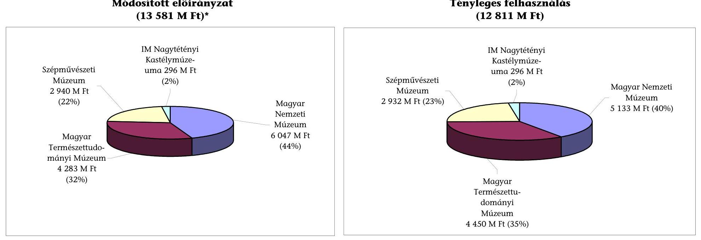
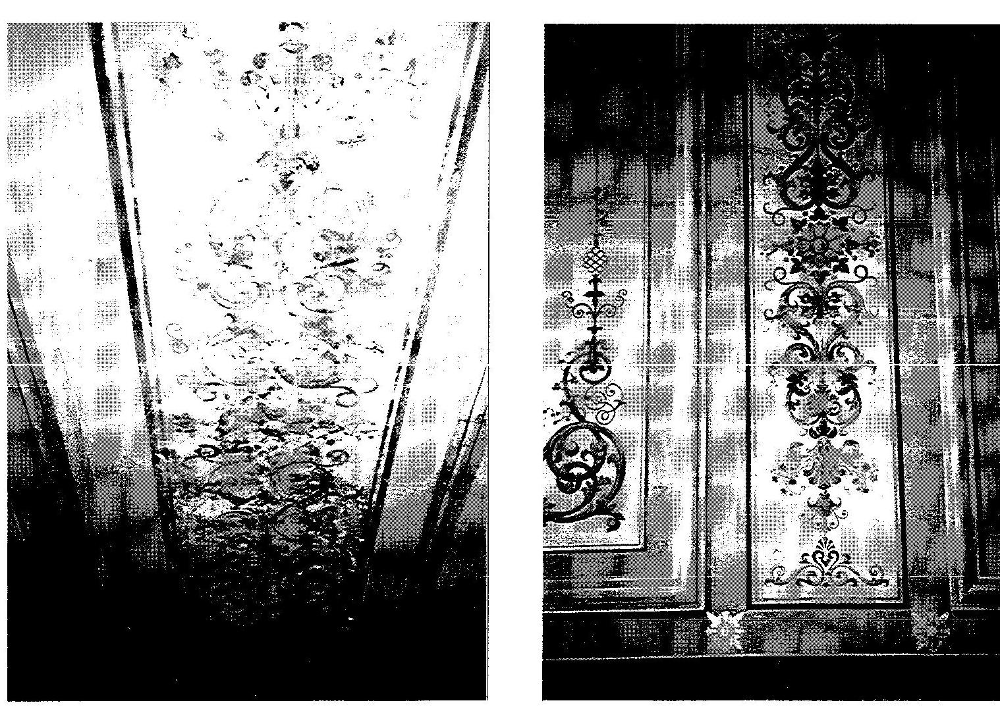
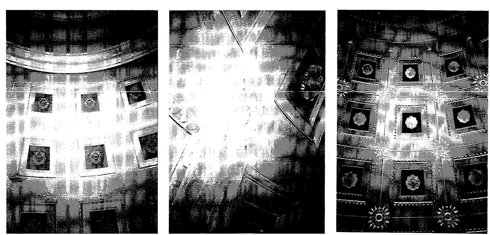
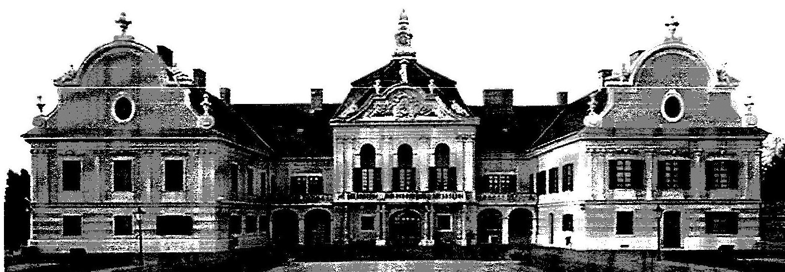

# JELENTÉS 

a múzeumi rekonstrukcióra előirányzott pénzeszközök hasznosításának ellenőrzéséről

---

2. Államháztartás Központi Szintjét Ellenőrző Igazgatóság
2.1 Teljesítmény Ellenőrzési FőcsoportIktatószám: V-16-46/2003-2004.Témaszám: 661Vizsgálat-azonosító szám: V0095
Az ellenőrzést felügyelte:
Bihary Zsigmond
főigazgató
Az ellenőrzés végrehajtásáért felelős:Kemény Emil
főcsoportfőnök
Az ellenőrzést vezette:
Bittó Zoltán
osztályvezető főtanácsos
Az ellenőrzést végezték:
Belovai Sándorné Dankó Géza Dr. Halmné Harsányi főtanácsadó számvevő tanácsos Zsuzsanna számvevő
Samu István Varga Szabolcs számvevő gyakornok számvevő tanácsos

# Az ÁSZ által a témában eddig készített jelentések címe 

sorszáma
Jelentés a közbeszerzésekről szóló törvény végrehajtásáról ..... 0109
Jelentés a központi költségvetés területén működő belső kontroll mechanizmusok ellenőrzéséről ..... 0115
Jelentés a Magyar Köztársaság 2000. évi költségvetése végrehajtásának ellenőrzéséről ..... 0126
Jelentés a Magyar Köztársaság 2001. évi költségvetése végrehajtásának ellenőrzéséről ..... 0232
Jelentés a Nemzeti Kulturális Örökség Minisztériuma fejezet működésének ellenőrzéséről ..... 0316

---

# TARTALOMJEGYZÉK 

BEVEZETÉS ..... 5
I. ÖSSZEGZŐ MEGÁLLAPÍTÁSOK, KÖVETKEZTETÉSEK, JAVASLATOK ..... 7
II. RÉSZLETES MEGÁLLAPÍTÁSOK ..... 12

1. A rekonstrukciós beruházások megalapozása, műszaki, pénzügyi előkészítése ..... 12
1.1. A rekonstrukciós célkitűzések, tervek felügyeleti, ágazati-szakmai, valamint intézményi szintű megalapozása ..... 12
1.2. A rekonstrukciós beruházási igények és programtervek összhangja a múzeumok szakmai feladataival, a műtárgyvédelem helyzete ..... 17
2. A rekonstrukciós folyamat tervek szerinti és az előírt szabályozásnak megfelelő végrehajtása ..... 18
2.1. A beruházásokra vonatkozó közbeszerzési törvény előírásainak betartása ..... 18
2.2. A rekonstrukciós tervekben foglaltak megvalósítása, különös tekintettel a múzeumi-szakmai, műemlékvédelmi, kincstári vagyoni és belső szabályozásra ..... 21
3. A rekonstrukció során felhasznált költségvetési pénzeszközök hasznosítása ..... 25
3.1. A beruházás pénzügyi eszközeinek gazdaságos és eredményes felhasználása ..... 25
3.2. A múzeumi szakmai feladatellátás eredményességének alakulása a rekonstrukció következtében ..... 30

---

# MELLÉKLETEK 

1. sz. melléklet Észrevételek és az azokra adott válaszok
2. sz. melléklet A múzeumi rekonstrukcióra felhasznált költségvetési pénzeszközök megoszlása intézményenként 1998-2002 között
3. sz. melléklet Az 1998-2003. évek intézményi rekonstrukciós ütemei és szakaszai
4. sz. melléklet A múzeumi rekonstrukcióra előirányzott pénzeszközből részesülő múzeumok fontosabb szakmai adatainak alakulása 1998-2002. években
5. sz. melléklet Tanúsítványok
6. sz. tanúsítvány A múzeum gazdálkodását jellemző főbb tényadatok alakulása az 1998-2002. években, múzeumonként
7. sz. tanúsítvány A múzeumi rekonstrukcióra biztosított fejezeti kezelésű előirányzatok és tényleges teljesítésük alakulása az 1998-2002. években, múzeumonként
8. sz. tanúsítvány A múzeumi rekonstrukcióra fordított beruházási források felhasználásának közbeszerzési pályázatonkénti alakulása az 1998-2002. években, múzeumonként
9. sz. melléklet A Magyar Nemzeti Múzeum dísztermének egyik díszítő festése restaurálás előtt és után
10. sz. melléklet A Magyar Nemzeti Múzeum kupolája restaurálás előtt és után
11. sz. melléklet A Nagytétényi Kastélymúzeum helyreállítás után

---

# RÖVIDÍTÉSEK JEGYZÉKE 

| Áht. | 1992. évi XXXVIII. törvény az államháztartásról |
| :-- | :-- |
| Ámr. | 217/1998. (XII. 30.) Korm. rendelet az államháztartás |
|  | működési rendjéről |
| ÁMRK | Állami Múemlékhelyreállítási és Restaurálási Központ |
| BVF | Beruházási és Vagyonkezelési Főosztály |
| Döntőbizottság | Közbeszerzések Tanácsa Közbeszerzési Döntőbizottsága |
| IM | Iparművészeti Múzeum |
| Kbt. | a közbeszerzésről szóló 1995. évi XL. törvény |
| KÖH | Kulturális Örökségvédelmi Hivatal |
| Kvtv. | Költségvetési törvény |
| KVI | Kincstári Vagyon Igazgatóság |
| MKM | Művelődési és Közoktatási Minisztérium |
| MNM | Magyar Nemzeti Múzeum |
| MTM | Magyar Természettudományi Múzeum |
| NKÖM | Nemzeti Kulturális Örökség Minisztériuma |
| OM | Oktatási Minisztérium |
| OMvH | Országos Műemlékvédelmi Hivatal |
| PM | Pénzügyminisztérium |
| SZM | Szépművészeti Múzeum |
| SZMSZ | Szervezeti és Működési Szabályzat |
| Sztv. | a 2000. évi C. törvény a számvitelről |

---

# 4

---

# JELENTÉS 

## a múzeumi rekonstrukcióra előirányzott pénzeszközök hasznosításának ellenőrzéséről

## BEVEZETÉS

A jelentősebb országos múzeumok felújításának finanszírozása a „Honfoglalás 1100 éves évfordulója megünneplésének előkészítése, múzeumi rekonstrukció" néven először az 1995. évi költségvetési törvényben jelent meg. Az előirányzat megnevezése 1998-tól „múzeumi rekonstrukció".

A múzeumok működését a muzeális intézményekről, a nyilvános könyvtári ellátásról és a közművelődésről szóló 1997. évi CXL. törvény (továbbiakban: Mtv.) szabályozza. A magyarországi muzeális intézmények száma jelenleg 815, melyből a múzeumok száma 140. A fenntartói kör igen széles. Az országos múzeumok száma 14, közülük 9 tartozik a Nemzeti Kulturális Örökség Minisztériuma (NKÖM) felügyelete alá.

A múzeumi rekonstrukciós programba vont országos múzeumok a kulturális örökség védelméről szóló 2001. évi LXIV. törvényben felsorolt - kizárólagos állami tulajdonban lévő és maradó - műemlék épületekben, épületegyüttesekben találhatók. A kulturális örökség védelmének összehangolása és irányítása, ágazati szakmai felügyelete a nemzeti kulturális örökség miniszterének a feladata. A múzeumok építési beruházásaira a közbeszerzésről szóló 1995. évi XL. törvény (továbbiakban: Kbt.) vonatkozik.

Az éves költségvetési törvényekben 1998-2002 között a költségvetés múzeumi rekonstrukció fejezeti kezelésű előirányzata összesen 14460 M Ft kiadást és támogatást tartalmazott. A 2000. év elején kialakult árvízi katasztrófahelyzet pénzügyi fedezetének biztosítására hozott 2076/2000. (IV. 11.), illetve a 2002-ben a Dunán és mellékfolyóin kialakult árhullám által okozott károk enyhítésére hozott 2063/2002. (XII. 5.) Korm. határozat végrehajtása során az NKÖM összesen 1014 M Ft-tal csökkentette a rekonstrukció eredeti előirányzatát. A vizsgált időszak alatt a módosított előirányzat 13581 M Ft -ot, a teljes pénzfelhasználás 12 810,6 M Ft-ot tett ki. A központi költségvetés 2003. évre 2740 M Ft támogatást tartalmazott az előirányzaton, melyet 943,1 M Ft 2002. évi maradvány egészített ki.

A fejezeti kezelésű előirányzatból az NKÖM felügyelete alá tartozó kilenc országos múzeum közül négy intézmény összesen hat műemlék-együttese részesült: a Magyar Nemzeti Múzeum (MNM), az MNM Rákóczi Múzeuma (Sárospatak), az MNM Esztergomi Vármúzeuma, a Szépművészeti Múzeum, a Magyar Természettudományi Múzeum és az Iparművészeti Múzeum Nagytétényi Kastélymúzeuma. Az ellenőrzés kiterjedt mind a négy múzeum rekonstrukciójára. A vizsgálatba vont múzeumok szakterületükön kiemelkedő jelentőségű művelődéstörténeti és tudományos gyűjteményeket gondoznak, gyűjtőterületük az egész országra kiterjed.

A múzeumi beruházások közül 2003-ig egyedül az Iparművészeti Múzeum Nagytétényi Kastélymúzeumának a felújítása fejeződött be. A másik három intézménynél még tartanak a munkálatok, 40% és 70% közötti a beruházások készültségi foka.

Az ellenőrzés célja - az előkészítés szakaszában meghatározott teljesítményellenőrzési szempontok, kritériumok alapján - annak értékelése volt, hogy a „múzeumi rekonstrukció" fejezeti kezelésű előirányzat pénzeszközei 1998-2002. évi hasznosítása során az érintett intézményeknél

- a rekonstrukciós folyamat irányítási és szabályozási rendje, műszaki és pénzügyi előkészítése, lebonyolítása, a szerződéses feltételek kialakítása költségtakarékosan biztosította-e a rekonstrukciós célkitűzések megvalósítását;
- a beruházásokat a terveknek megfelelően, eredményesen hajtották-e végre, különös tekintettel a közbeszerzési, a műemlékvédelmi és a múzeumi szakmai előírások figyelembevételére;
- a rekonstrukció során felhasznált költségvetési pénzeszközök biztosítják-e a múzeumok eredményesebb működését, szakmai feladatellátását.

Az ellenőrzés végrehajtására az Állami Számvevőszékről szóló 1989. évi XXXVIII. törvény 2. § (5) bekezdésében, valamint az államháztartásról szóló 1992. évi XXXVIII. törvény 104. § (3) bekezdésében foglaltak adtak jogszabályi alapot. ${ }^{1}$

Az ellenőrzés a múzeumi rekonstrukcióra előirányzott pénzeszközök hasznosításával összefüggésben egyrészt szabályszerűségi, másrészt gazdaságossági és eredményességi szempontok alapján értékelte a rekonstrukciós célkitűzések és tervek megvalósításának 1998-2002. évi műszaki-pénzügyi folyamatait. Az ellenőrzés a helyszíni vizsgálat befejezéséig terjedő időszak (2003. augusztus) folyamataira is kiterjedt.

A jelentés-tervezetet észrevételezésre megküldtük a nemzeti kulturális örökség miniszterének, aki nem tett észrevételt (levelének másolatát az 1/a. sz. melléklet tartalmazza). Ezt megelőzően a tervezetet megismertettük az ellenőrzött múzeumok főigazgatóival (leveleik és az arra adott válaszok másolatát az 1/b1/g. sz. mellékletek tartalmazzák).

[^0]
[^0]:    ${ }^{1}$ Történelmi érdekességként említjük meg, hogy az ellenőrzött sárospataki Rákóczi Múzeum egyik épületében a fejedelmi udvar már a XVII. század közepén „Számvevő házat és Frumentaria-t" működtetett.

---

# I. ÖSSZEGZŐ MEGÁLLAPÍTÁSOK, KÖVETKEZTETÉSEK, JAVASLATOK 

A hazai múzeumok rekonstrukciójának szükségessége az 1980-as évek végétől került a mindenkori kultúrpolitika előterébe. Ezt azonban nem követte egy rendszerszemléletű beruházási program kidolgozása az éves költségvetési törvényekben megjelenő előirányzatok megalapozásaként.

A múzeumi rekonstrukciós beruházások előkészítése alapjául az érintett múzeumok rekonstrukciós programtervei szolgáltak. A rekonstrukciós programot az 1990-es évek közepén a felügyeleti jogelőd szervezetnél, az MKM-nél múzeumi-szakmai koncepció nem alapozta meg, így a felújítások építészeti és szakmai tartalma összhangjának biztosítása nem történt meg. A múzeumi rekonstrukciós program irányítását 1999. évtől végző NKÖM-nél sem készült egységes fejezeti beruházási koncepció, csak intézményi beruházási programok készültek. A múzeumi rekonstrukció beruházási célprogram fejezeti kezelésű előirányzata az NKÖM fejezeti kezelésű előirányzatok szabályzatának megfelelően címzetten, de az előirányzat jellegétől eltérően nem pályáztatással biztosította a rekonstrukciós összegeket. Az intézményi rekonstrukciós célkitűzések, programtervek a meglévő intézményi sajátosságokhoz igazított, felmért igényeket és szükségleteket tartalmazták.

A rekonstrukciós tervek mögött intézményenként eltérő rekonstrukciós ütemek álltak. ${ }^{2}$ A beruházási ütemek végrehajtását folyamatos elhúzódások jellemezték a korábban tervezett pénzügyi források szűkülése és az előirányzatot érintő elvonások miatt. A vizsgált 1998-2002. évek 12,8 Mrd Ft összegű rekonstrukciós pénzfelhasználása az eredeti előirányzatnál 11%-kal, a módosított előirányzatnál 6%-kal volt alacsonyabb.

A minisztérium felügyeleti irányítása és szabályozási eszközei - így a fejezeti kezelésű előirányzatokra vonatkozó szabályozás, miniszteri utasítások - megfelelő keretet jelentettek a rekonstrukciós feladatok végrehajtásához. A felügyeleti szerv miniszteri értekezleteken döntött az induló rekonstrukciókról, illetve beruházási ütemekről és a folyamatban lévő beruházások szükséges módosításáról. A támogatói megállapodásokat a minisztérium megkötötte, az engedélyokmányokat megfelelően elkészítette. Összefoglalóan és intézményenként nem értékelték a múzeumi rekonstrukció helyzetét. Az értékelés elmaradása a pénzügyi nehézségeken túl, a múzeumszakmai módszertan, a szakmailag értékelhető eredményességi mutatók hiányára vezethető vissza. Két intézmény rekonstrukciójáról (SZM, MNM) készült értékelés külső társaság megbízásával.

Az intézményi szintű műszaki-pénzügyi előkészítés folyamatában a rekonstrukciós célkitűzések helytállóak voltak, mivel a rekonstrukció előtti létesítményekkel az intézmények korlátozottan tudták ellátni feladataikat. Célkitűzésként fogalmazódott meg az épületek műemléki értékeinek helyreállítása, megóvása; a múzeumokban őrzött műtárgyvagyon bemutatásához, kutatásához és

[^0]
[^0]:    ${ }^{2}$ A múzeumok egyes rekonstrukciós ütemeit és szakaszait a 3. sz. melléklet mutatja be.

---

raktározásához korszerű feltételek megteremtése. Az intézményi programtervek megalapozottak és szakmailag előremutatóak voltak. A műszaki programterv az IM Nagytétényi Kastélymúzeumánál is biztosította az alapfeladatok teljesítését, de csak szintentartást irányozott elő a pénzügyi források függvényében, szakmai-működtetési tervet nem tartalmazott.

A rekonstrukciós célokat, feladatokat a tenderkiírások és szerződések megfelelően visszatükrözték. A rekonstrukciós folyamat kockázatait az előkészítés során az intézmények nem mérték fel és pénzügyi tartalékok képzése sem történt.

A múzeumi beruházások alapdokumentumba foglalt pénzügyi ütemezését többször kellett módosítani. Az előirányzatot érintő költségvetési elvonások miatt a beruházási szakaszok átütemezésére került sor. A befejezési határidők nem a múzeumok vezetőinek hibájából tolódtak el vagy váltak bizonytalanná. A rekonstrukciós ütemek eltolódásában közrejátszott a beruházásokhoz szükséges okmányok késedelmes jóváhagyása és a tervezői, kivitelezői szerződések teljesítésének részbeni elhúzódása is.

A rekonstrukciós folyamat végrehajtása során a tervezett célok és a szükséges pénzügyi források összhangja nem valósult meg teljes mértékben. Ennek egyik következménye volt, hogy a múzeumi rekonstrukciós program keretében biztosított költségvetési összeg nem fedezte az SZM-nél az engedélyokiratba foglalt pénzügyi ütemezés teljesítését, ezért a II/2. ütem végrehajtását 2002 októberében felfüggesztették.

A közbeszerzés keretében folytatott több éves beruházások gyakorlati lebonyolítását
 megnehezítette az, hogy a minisztérium által a beruházási alapokmányokban vállalt éven túli kötelezettségeket nem követték az éves költségvetési törvényekben jóváhagyott előirányzatok. Így az ajánlatkérő teljes körűen nem rendelkezett a program teljesítését biztosító Kbt. szerinti anyagi fedezettel ${ }^{3}$.

A beruházások lebonyolítása és a legelőnyösebb kivitelezők kiválasztása érdekében a múzeumok összesen 18 közbeszerzési eljárást indítottak, 10,1 Mrd Ft beszerzési értékben. Ezek közül 3 eljárást (SZM, MTM, MNM) különböző okok miatt - fedezethiány, a fedezetnél magasabb árajánlat, az eljárás megsemmisítése - eredménytelennek nyilvánítottak. A közbeszerzési eljárások során 2 esetben, részben a döntés-előkészítési folyamatban, részben az eljárás módjának kiválasztásánál nem alkalmazták megfelelően a közbeszerzésre vonatkozó előírásokat, amelynek következtében bírság kiszabására is sor került. Nem szabályozták intézményi szinten a közbeszerzési eljárást az IM Nagytétényi Kastélymúzeumnál, az MNM szabályzata pedig kiegészítésre és aktualizálásra szorul.

A rekonstrukciós folyamat - a pénzeszközök rendelkezésre állásának függvényében - az eredeti programtervektől eltérően zajlott, a megvalósításban résztvevő társaságokkal megkötött szerződéseket többször módosították. A módosított szerződésekben vállalt kötelezettségeknek a tervezők teljes mértékben, a lebonyolítók és a kivitelezők nagyobb részt eleget tettek. A szerződésmódosításokból a megrendelőknek nem származott hátránya.

A vizsgált időszakban megvalósult beruházások az ellenőrzés megállapítása szerint megfeleltek a rekonstrukciós terveknek, az ajánlati felhívásoknak és a kivitelezési szerződéseknek. A beruházási ütemeket, szakaszokat az OMVH, illetve annak jogutódja a KÖH által kiadott engedélyeztetési tervek alapján, a műemlékvédelem érdekeit figyelembe véve valósították meg. Az intézményi SZMSZ-ekben, valamennyi múzeum megfelelően szabályozta a beruházással kapcsolatos vezetői feladatokat és a vezetői felelősségvállalást.

A beruházók és a lebonyolítók folyamatosan ellenőrizték a beruházások kivitelezését, esetenként külső szakértők véleményét is igénybe vették. Fedezet nélküli kötelezettségvállalást ellenőrzésünk nem tárt fel.

A költségvetési pénzeszközök felhasználását a múzeumok alapvetően az engedélyokiratban foglalt céloknak megfelelően végezték. A rendelkezésre álló források a szerződésben rögzített beruházási feladatok megvalósításához elégségesek voltak, mert több alkalommal a helyreállítás műszaki tartalmát a pénzeszközök nagyságához igazították.

A rendelkezésre álló beruházási összegeket a múzeumok nem lépték túl. A beruházási szakaszok átütemezése, a menet közben felmerült és indokolt pótmunkák elvégzése, a határidők módosítása és az elvonások miatti forrásátütemezések a gazdaságosság ellen hatottak. Így az MTM 3,5 Mrd Ft összegű III. ütemének 2002. évi befejezési határidejével szemben - a műszaki tartalom bővülése és a pénzügyi-műszaki ütemterv módosítása alapján - a befejezési határidő 2004. évre, a beruházási ütem tervezett összege 4,8 Mrd Ft-ra módosult.

A költségek emelkedésén túl károk is jelentkeztek a rekonstrukciós folyamatban. A beruházási szakaszok elmaradása és elhúzódása miatt az SZM Román csarnokának állaga folyamatosan romlik, az MTM Emlős Gyűjteménye (300 db kitömött nagyemlős) a korábbi tárolási körülmények miatt károsodott.

A gazdaságosság a közbeszerzési eljárás módján és a kiválasztott ajánlatokon keresztül érvényesült. A megrendelők az összességében legkedvezőbb ajánlatok kiválasztásával a gazdaságosság elvének érvényesítésére törekedtek. A múzeumok gazdálkodásában feszültséget okoz az újonnan belépő létesítmények fenntartási, üzemeltetési kiadásának növekedése.

A pénzügyi lebonyolítás és elszámolás módja a vizsgált múzeumoknál megfelelt a hatályos jogszabályoknak és a belső szabályzatoknak. Nem szabályozták és nem is dokumentálták a tárgyi eszközök üzembe helyezésének folyamatát az MNM-nél, ezért az ellenőrzés nem tudta megállapítani, hogy a beruházások aktivált értéke helyes értékben szerepel-e a nyilvántartásban. A felhasznált pénzeszközök vagyonnyilvántartásban lévő megjelenítése nem volt egységes, mert két múzeum beruházását a fejezeti és az intézményi vagyonnyilvántartás egyaránt tartalmazta. Ennek szabályozását a minisztérium megvalósította, de gyakorlati rendezése még folyamatban van.

A rekonstrukció eddig lezárt ütemei biztosították a múzeumi szakmai feladatok magasabb szintű, eredményesebb ellátását. A felhasználói igények szinte teljes

---

mértékben teljesültek és megteremtették a múzeumi létesítmények mennyiségi és minőségi változásait. Pozitívan értékelhető, hogy az eddig elért eredményeket a múzeumok folyamatos üzemeltetése mellett érték el.

A rekonstrukcióban érintett múzeumok és filiálék legfontosabb szakmai teljesítménymutatói - kiállítások száma, alapterületük, kiállítási területük, egyéb múzeumi szakmai feladatokhoz kapcsolódó területek - javultak, 5-17%-os emelkedést mutatnak a rekonstrukciót megelőző állapothoz képest. Egyedül a látogatói létszám csökkent 1%-kal. Az intézmények nem rendelkeznek közművelődési, kiállításszervezési és marketing-stratégiával, a látogatottság növelése, a szakmai lehetőségek jobb kihasználása érdekében. A műtárgyak bemutatása, elhelyezése, technikai védelme a rekonstrukció eddig befejezett szakaszait követően javult, de az MNM Rákóczi Múzeumánál és az IM Nagytétényi Kastélymúzeumánál teljes mértékben még nem megoldott, úgyszintén a szükséges személyi feltételek biztosítása sem.

Az intézmények rekonstrukciós célkitűzései megfeleltek a múzeumszakmai feladatellátásnak. A rekonstrukciós program végrehajtása a költségvetési források mérséklődése ellenére is eredményesen halad, hozzájárul nemzeti értékeink megőrzéséhez, a múzeumok alapfeladatai színvonalasabb biztosításához. A múzeumok tervezett rekonstrukciójának befejezéséhez további beruházási ütemek és források szükségesek (SZM, MNM, MTM).

A helyszíni ellenőrzés megállapításainak hasznosítása mellett javasoljuk:

# a nemzeti kulturális örökség miniszterének: 

1. Tekintse át a múzeumi rekonstrukció befejezéséhez szükséges forrásokat, s ennek ismeretében dolgoztasson ki kultúrpolitikai és idegenforgalmi szempontok figyelembevételével középtávú, szakmailag megalapozott beruházási koncepciót a múzeumi rekonstrukció további folyamatára.
2. Kezdeményezze a jelenleg fejezeti kezelésű múzeumi rekonstrukció előirányzat átalakítását annak érdekében, hogy az előzetesen eldöntött támogatási összegek az érintett intézményekre nevesítetten jelenjenek meg az éves költségvetési törvényekben.
3. Készíttessen a rekonstrukciós folyamat múzeumszakmai értékeléséhez a nemzetközi gyakorlat alapján módszertant, szakmailag értékelhető eredményességi mutatókat.
4. Gondoskodjon arról, hogy a felügyelete alá tartozó múzeumok vezetői:
a) törekedjenek a felújítások építészeti és szakmai tartalmának összhangjára a múzeumszakmai modernizáció elősegítése érdekében;
b) szabályozzák és alakítsák ki a tárgyi eszközök, immateriális javak üzembe helyezésének dokumentálását és megjelenítését a vagyonnyilvántartásban;
c) járjanak el minden esetben szabályszerűen a közbeszerzési pályázatok meghirdetésekor és készítsenek aktualizált közbeszerzési szabályzatot, amely tartalmazza a filiálékra vonatkozó szabályozást is;

---

d) dolgozzanak ki közművelődési, kiállítás-szervezési és marketing stratégiát a rekonstrukció nyomán biztosított szakmai lehetőségek kihasználása és a látogatottság növelése érdekében; az újabb múzeumi rekonstrukciós ütemeket megelőzően minden esetben készüljön átfogó és a felügyeleti szerv által is elfogadott részletes szakmai koncepció, működtetési és marketing terv;
e) gondoskodjanak a műtárgyak megfelelő elhelyezéséről, technikai védelméről, s a szükséges személyi feltételek biztosításáról.
5. Kísérje figyelemmel az ellenőrzés megállapításainak, javaslatainak hasznosítását az érintett múzeumoknál.

---

# II. RÉSZLETES MEGÁLLAPÍTÁSOK 

## 1. A REKONSTRUKCIÓS BERUHÁZÁSOK MEGALAPOZÁSA, MŰSZAKI, PÉNZÜGYI ELŐKÉSZÍTÉSE

### 1.1. A rekonstrukciós célkitűzések, tervek felügyeleti, ágazatiszakmai, valamint intézményi szintű megalapozása

A múzeumi rekonstrukciós program az NKÖM jogelődjénél, a MKM-nél indult a 3111/1994. Korm. határozat alapján, ezért átfogó beruházási koncepciót az NKÖM nem készített. A beruházások szakmai alapjául az érintett múzeumok által készített rekonstrukciós programtervek szolgáltak. A rekonstrukciós programot az 1990-es évek közepén a felügyeleti jogelőd szervezetnél, az MKM-nél múzeumszakmai koncepció nem alapozta meg. Így a felújítások építészeti és szakmai tartalma összhangjának biztosítása nem történt meg.

A minisztérium tájékoztatása szerint középtávú szakmai koncepció kidolgozását kezdték meg a teljes központi beruházási körre vonatkozóan.

A múzeumi rekonstrukció beruházási célprogram fejezeti kezelésű előirányzata az NKÖM fejezeti kezelésű előirányzatok szabályzatának megfelelően címzetten, de az előirányzat jellegétől eltérően nem pályáztatással biztosította a múzeumi előirányzatokat. Így a 14 országos múzeumból, s az NKÖM felügyelete alá tartozó 9 országos hatáskörű múzeumból mindössze 4 intézmény részesült a rekonstrukciós előirányzatból, részben a 3111/1994. Korm. határozat, részben minisztériumi értekezleti döntések alapján.

Az 1999. évi programismertető az 1999-2003. évekre 19,9 Mrd Ft-ot irányzott elő a múzeumi rekonstrukciókra. A költségvetési törvények 15,2 Mrd Ft előirányzatot biztosítottak ugyanezen időszakra a múzeumi beruházások számára. A rekonstrukció költségvetési támogatása 2000. évtől kezdődően csökkenő tendenciát mutatott. Ez azt eredményezte, hogy az e célra nyújtott összeg nem fedezte a múzeumi rekonstrukciók engedélyokiratba foglalt pénzügyi ütemezésének a teljesítését. (A költségvetési pénzeszközök rendelkezésre állását és felhasználását az 2. sz. melléklet szemlélteti.)

Az ellenőrzött időszakban - az előzetes tervekkel ellentétben - az érintett 4 múzeum rekonstrukciója közül egyedül az Iparművészeti Múzeum Nagytétényi Kastélymúzeuma felújítása fejeződött be, a többi folyamatban lévő beruházás 2003. első félévéig nem zárult le. Az egyes rekonstrukciós szakaszok és a megvalósítások elhúzódásának fő oka a korábban tervezett pénzügyi forrásoknak az eredeti elképzelésekhez viszonyított beszűkülése, valamint az előirányzatot érintő költségvetési elvonások. Ennek következtében a beruházási szakaszok átütemezésére is sor került. A rekonstrukció lelassulásában esetenként közrejátszott az is, hogy elhúzódott a beruházásokhoz szükséges okmányok jóváhagyása, a tervezői és a kiviteli szerződések teljesítése. Mindezek együttesen eredményezték a meglévő pénzügyi források felhasználásának a

---

csúszását, amelyek azonban nem a múzeumok vezetőinek hibájából adódtak. (A rekonstrukciós ütemeket és szakaszokat a 3. sz. melléklet, az azokhoz kapcsolódó pénzügyi teljesítéseket a 5. sz. melléklet intézményi tanúsítványi adatai mutatják be.)

Az MNM rekonstrukciójának az 1999-2003 közötti befejezésére 1999. január 15-én 5700 M Ft támogatást hagyott jóvá az NKÖM. A részprogram engedélyokiratba foglalt 5558,8 M Ft nem tartalmazta az árindex növekedésének fedezetét, az elhúzódás kockázata már a rekonstrukció kezdetén megjelent. Az eredeti engedélyokirat létesítmény jegyzéke a rekonstrukciós programtervtől eltérő ütemezést tartalmazott, majd többször módosították.

Az MNM Rákóczi Múzeuma új szakaszának rekonstrukciójára, amit a 2001-2003. évekre terveztek, 650 M Ft támogatást hagyott jóvá a 2001. június 6-i miniszteri értekezlet. A 2001. évi 170 M Ft előirányzatból csak 56 M Ft-ot tudtak felhasználni, holott az első ütem kivitelezési tervei már előző évben elkészültek, de a beruházási program egyeztetése, kiegészítései miatt az NKÖM csak 2001. július hóban kötötte meg a múzeummal a finanszírozási megállapodást.

Az SZM rekonstrukciójának teljes befejezéséről 2001. június 13-án született döntés: a programterv alapján a 2001-2006 közötti építési feladatok költségét 15,3 Mrd Ft-ra becsülték. A bizonytalan költségvetési támogatás miatt az engedélyokirat csak a 2001-2004. évekre (II./2 ütem) vonatkozó 6,2 Mrd Ft-ot tartalmazta. 2002. november 7-én a minisztérium módosította a finanszírozási megállapodást: elvonta a 2003. és 2004. évre ígért összegeket.

Az MTM rekonstrukciójának III. befejező üteméről 2001. szeptember 26-án döntött a miniszteri értekezlet: 3,5 Mrd Ft-ot és 2002. évi befejezést irányoztak elő. Az árvizi károk enyhítésére 2000-ben 640,2 M Ft-ot, 2001-ben 350 M Ft-ot vontak el a beruházástól. A befejezés határideje 2004-re tolódott ki, az NKÖM pedig 2002-ben 627,7 M Ft-tal, 2003-ban 570 M Ft-tal módosította a beruházás értékét.

A múzeumi rekonstrukció költségvetési előirányzatát, illetve az egyes múzeumok alapdokumentumba foglalt pénzügyi ütemezését többször módosították. Ennek következtében a befejezési határidők is eltolódtak vagy bizonytalanná váltak. A módosítások a tervezettnél alacsonyabb költségvetési támogatások, az árvizi elvonások, a többletmunkák és a beruházási alapokmányban szereplő összegnél magasabb vállalási ár (MTM) miatt váltak szükségessé. Így a rekonstrukciós célok, és a szükséges pénzügyi források összhangja nem valósult meg teljes mértékben.

A vizsgált 1998-2002. évek közötti költségvetésekben a múzeumi rekonstrukció összesen 14460 M Ft eredeti kiadási és
 támogatási előirányzatot tartalmazott. A módosított előirányzat összesen 13581 M Ft volt, ami 879 M Ft-tal és 6%-kal kevesebb az eredeti előirányzatnál. A teljes pénzfelhasználás $12810,6 \mathrm{M}$ Ft volt, ami az eredeti előirányzatnál 11%-kal, a módosított előirányzatnál 6%-kal volt alacsonyabb.

A fejezeti elvonások elsősorban a központi beruházásokat, köztük a múzeumi rekonstrukciót sújtották. Az ellenőrzött időszakban az éves támogatások összegét mindössze egy évben, 2001-ben növelték 85 M Ft-tal, két évben számottevő elvonás és minimális támogatás történt: 2000-ben 840,2 M Ft elvonás és 50 M Ft támogatás, 2002-ben pedig 173,9 M Ft elvonás.

---

A rekonstrukció eredeti költségvetési előirányzata 1998-ban 2000 M Ft volt, amit nem módosítottak. A ténylegesen rendelkezésre álló forrás az előző évi maradvánnyal együtt 2160,5 M Ft volt.

1999-ben az eredeti előirányzat 2300 M Ft, az MKM szétválását követően az OM maradvány elszámolással 2306,5 M Ft-ra nőtt.

2000-ben az eredeti előirányzat 3500 M Ft volt, ami összesen 790,2 M Ft-tal csökkent. Az árvízi katasztrófahelyzet miatt a kormány az NKÖM fejezettől 1240,2 M Ft-ot vont el, melynek 68%-át, 840,2 M Ft-ot a múzeumi rekonstrukció előirányzatára terheltek. Az előző évi maradványt - 10,6 M Ft - is tartalmazott jóváhagyott előirányzat 2720,4 M Ft-ra mérséklődött.

2001-ben a 3010 M Ft-os előirányzat két ütemben, összesen 85 M Ft-tal nőtt, a maradvánnyal együtt a módosított előirányzat 3098,2 M Ft lett.

2002-ben az eredeti, 3650 M Ft előirányzatot a dunai árvízi károk miatt 173,9 M Ft-tal csökkentették. A módosított előirányzat - a 281 M Ft előző évi maradvánnyal együtt - 3757,1 M Ft lett.

2003-ban az eredeti előirányzat 2740 M Ft volt, ezt növeli a jelentősen megnőtt maradványok értéke: 943,1 M Ft.

A fejezeti kezelésű előirányzaton belül minden évben voltak belső átcsoportosítások. A minisztérium arra törekedett, hogy az adott időpontban fel nem használt forrásokat ideiglenesen azok az intézmények kapják meg, ahol a folyamatban lévő szakaszok megvalósításához az szükséges volt.

1999-ben az MNM központi beruházásból 50 M Ft-ot a sárospataki, 37,6 M Ft-ot a Magyar u. 40. rekonstrukcióra, 44 ezer Ft-ot az SZM II. ütemére, 62 ezer Ft-ot az IM Nagytétényi Kastélymúzeum rekonstrukcióra csoportosítottak át.

2002-ben ugyancsak az MNM központi beruházás előirányzatából 450 M Ft-ot kapott az MTM beruházása. Az SZM III. ütemének előirányzatát 363 M Ft-tal csökkentették, ebből 186,5 M Ft az MNM-nek jutott, míg 2,6 M Ft-t az SZM részére visszapótoltak.

# Ellentmondás húzódik a több éves beruházások esetében az Ámr. és 

a Kbt. között. A támogatásban részesülő múzeumok és az NKÖM között az adott beruházási ütem finanszírozására létrejött megállapodás, valamint a beruházási alapokmány is kötelezettségvállalásnak minősül. A tényleges éves előirányzatot azonban minden esetben csak az adott évi költségvetési törvény deklarálja. Ugyanakkor a Kbt. szerint a közbeszerzési eljárás ajánlati felhívását az ajánlatkérő csak akkor teheti közzé, ha rendelkezik a szerződés teljesítését biztosító anyagi fedezettel, vagy az arra vonatkozó biztosítékkal, hogy a teljesítés időpontjában az anyagi fedezet rendelkezésre áll.

Az SZM esetében jogvita alakult ki a több éves kötelezettségvállalás visszavonása miatt. A II./2 ütem sikeres közbeszerzési eljárást követően, az értékelés napján a Beruházási és Vagyonkezelési helyettes államtitkár a közbeszerzési eljárás eredménytelenné nyilvánítását kérte a múzeumtól, mert a költségvetési tárgyalások során láthatóvá vált, hogy 2003-ban nem lesz fedezet a beruházásra. Az SZM az érvényes alapokmány és a támogatói megállapodás birtokában eredményt hirdetett. Az NKÖM ezt követően módosította az alapokmányt, így szerződéskötésre már nem került sor. A Közbeszerzési Döntőbizottság a második helyezett kérelmé-

---

re lefolytatott eljárást követő döntésében az SZM eljárását helyben hagyta azzal az indoklással, hogy a beruházási alapokmánnyal az NKÖM éven túli kötelezettséget vállalt.

Az Ámr. 2000. évtől hatályos módosítását követően az előirányzat pénzügyi elszámolása az intézményeknél jelent meg, az előirányzat teljesítése a költségvetés végrehajtásáról szóló törvényekben az NKÖM közgyűjtemények cím alatt szerepelt. Az Ámr. 73. § (6) bekezdés alapján a zárszámadási törvényekben az előirányzat teljesítéseként a fejezeti kezelésű előirányzatra év végén visszavezetett maradvány összege szerepel, ami nem biztosítja az áttekinthetőség és a valódiság elvét sem, mert technikailag a maradvány összege a kiadási oszlopban jelenik meg.

A minisztérium szabályozási eszközei - így a fejezeti kezelésű előirányzatokra vonatkozó szabályozás és a beruházásokról szóló miniszteri utasítás megfelelő keretet jelentettek a rekonstrukciós feladatok végrehajtásához.

A fejezet miniszteri értekezleteken döntött az induló rekonstrukciókról, illetve beruházási ütemekről és a folyamatban lévő beruházások szükséges módosításáról. A támogatói megállapodásokat a minisztérium megkötötte, az engedélyokmányokat elkészítette.

A vizsgált időszak alatt érvényben levő SZMSZ alapján az NKÖM Gazdasági helyettes államtitkárság felügyelete alá tartozó BVF feladata volt a fejezethez tartozó intézmények beruházási előirányzatainak tervezése és törvényességi felügyelete.

A Főosztály feladatairól az SZMSZ mellett a minisztérium közbeszerzési szabályairól szóló 10/1999. számú miniszteri utasítás, majd a 5/2000. (KK. 11.) NKÖM utasítás és a minisztérium beruházásainak tervezésére, előkészítésére, jóváhagyására, megvalósítására vonatkozó eljárási rendről szóló 3/2000. (KK. 7) NKÖM utasítás rendelkezett. A program, későbbiekben feladatfinanszírozás előírásait jogszabályi szinten az Ámr. VII. fejezete tartalmazza. A 3/2000. utasítás hatálya alatt az Ámr. feladatfinanszírozásra vonatkozó változtatásait a 2003. áprilisban hatályba lépett 8/2003. (KK. 12.) miniszteri utasítás már tartalmazza.

Az 5/2000. (KK. 11.) utasítás szerint a közbeszerzések tervezése, előkészítése, az eljárás lebonyolítása a kezdeményező szervezet igénybejelentése alapján a Beruházási és Vagyonkezelési Főosztályon belül a Közbeszerzési és Vagyonkezelési Osztály feladata. A vizsgált időszak alatt ilyen osztály nem állt fel, és a hatályos SZMSZ sem nevesített ilyen szervezeti egységet.

A Közbeszerzési Szabályzat hatálya a 10. címben szereplő fejezeti kezelésű előirányzatokra is kiterjed, de miután a minisztérium az előirányzat feletti rendelkezési jogot átadta az intézményeknek, ezért az utasítás a múzeumi rekonstrukció keretében lefolytatott közbeszerzési eljárásokra nem vonatkozik. A törvény és a miniszteri utasítás figyelembe vételével az intézmények saját közbeszerzési szabályzatuk szerint járnak el.

# Az NKÖM különállóan és összefoglalóan nem értékelte a múzeumi rekonstrukció helyzetét. Az értékelés elmaradása a pénzügyi nehézségeken túl a múzeumszakmai módszertan, a szakmailag értékelhető eredményességi

---

mutatók hiányára vezethető vissza. Az egyes rekonstrukciók, illetve ütemek indítását és módosítását - a szabályozás szerinti értékhatártól függően - államtitkári és miniszteri értekezletek tárgyalták. Két intézményről készült értékelés külső társaság megbízásával.

A CCC + Bogner Consulting prezentációt tartott az MNM-nél és a minisztériumban államtitkári szinten. Ennek hatására az MNM-nél minimális módosításokat eszközöltek a kiviteli tervekben. Az SZM esetében a leírt javaslatok a III. ütem elhalasztása miatt nem érvényesülhettek.

A rekonstrukciós célkitűzések megalapozottak voltak, a beruházás előkészítési feladatait az intézmények megfelelően látták el. A programtervekben pontos célokat határoztak meg, ezekhez határidőket rendeltek.

Az MNM második rekonstrukciós programtervében a rekonstrukció kivitelezését eredménykategóriákban is meghatározták, de a céloknak való megfelelés kritériumait a programterv nem fejtette ki.

Az MTM a rekonstrukció költségkihatásait tervezői költségbecslések és részletes ajánlati költségvetések kiírásával mérték fel. Hatásvizsgálatot nem végeztek, erre sem módszertan, sem pénzügyi forrás nem állt rendelkezésre.

Az MTM részletes pénzügyi műszaki ütemterve az ajánlati költségvetés részeként, a beruházási részfolyamatokkal összhangban került kialakításra. A szükséges erőforrások a beruházás folyamán rendelkezésre álltak ugyan, de a szűkös, többször változó támogatási előirányzatok miatt a megvalósításra jelentős késedelemmel került sor.

Az MNM rekonstrukciójának előkészítésekor nem határozták meg pontosan az egyes ütemek műszaki tartalmát. A II. ütem műszaki elemeit többször megváltoztatták, más tartalom szerepelt az előminősítési eljárásban és más az ajánlati felkérésben. Mivel a III. ütem programtervének prognosztizált bekerülési költsége meghaladta az engedélyokmányban rendelkezésre bocsátott forrást, ezt az ütemet sem a tervezett tartalommal, hanem azt csökkentve írták ki.

Az MNM Rákóczi Múzeuma rekonstrukciójának előkészítésére együttműködési megállapodást kötött az OMvH-val és az Állami Műemlék-helyreállítási és Restaurálási Központtal (ÁMRK). A felújítás tervezett befejezési időpontja - 2003. december 31. és a rekonstrukciós programban meghatározott cél között - állandó kiállítás feltételeinek megteremtése a 300. évfordulóra, 2003. július 16-ra nem volt meg az összhang.

Az IM Nagytétényi Kastélymúzeuma felújítását megelőzően átfogó koncepció, szakmai program nem készült.

Az SZM programterveiben szereplő ütemezést több alkalommal módosítani kellett a pénzügyi fedezet csökkentése, illetve megvonása miatt.

A rekonstrukció céljaihoz rendelt hatásvizsgálatot az intézmények nem készítettek, a folyamat kockázatait nem mérték fel. A pénzügyi műszaki ütemtervben nem határoztak meg tartalékot.

Pénzügyi kockázatot jelentett az MTM esetében a vizsgált időszakot megelőzően, az I. ütem fővállalkozójának csődje, ezért a III. ütemben cél volt a tőkeerős fővállalkozó kiválasztása a közbeszerzési eljárásban.

---

A műemlék épületek esetében a régészeti feltárás, falkutatás eredményezett költségmódosítást például az SZM rekonstrukciójánál.

Pénzügyi kockázatot jelentett a beruházás során bekövetkezett költségvetési támogatások kormány szintű csökkentése 2000., 2001. és 2003. években.

# 1.2. A rekonstrukciós beruházási igények és programtervek összhangja a múzeumok szakmai feladataival, a műtárgyvédelem helyzete 

A beruházási igények és a rekonstrukciós programtervek a múzeumok alapfeladataival összhangban voltak. A tervekben a beruházások ütemezésével, sorrendjével pontos célokat határoztak meg az intézmények.

Az MNM sárospataki létesítményében a műemléki helyreállításon túl a közönségfogadó terek, a kiszolgáló helyiségek létesítése a műemlék együttes funkcióinak gyarapodását, kulturális idegenforgalmi szerepének növelését is célul tűzték ki.

Az MNM a programterv elkészítése előtt felmérte és a tervekben rögzítette az egyes tárak és a múzeum szervezeti egységeinek kiállítási, tárolási és munkahelyi-kutatási helyigényét.

A rekonstrukció előtti létesítményekkel az intézmények korlátozottan tudták ellátni szakmai feladataikat. A gyűjtemények raktározása, a műtárgyvédelem egyik intézménynél sem volt teljes mértékben megfelelően biztosított.

A Nagytétényi Kastélymúzeum nem tudta ellátni a feladatát, sem a műtárgyak bemutatására, sem megőrzésükre nem volt már alkalmas, amikor 1989-ben be kellett zárni.

Az MTM gyűjteményei a rekonstrukció megkezdése előtt 6 helyen, szűkös körülmények között voltak elhelyezve. A II. ütem befejezése előtt a szakmai, tárolási és bemutatási alapfeladatokat csak részben és nem megfelelő szinten tudták ellátni. A tárolás körülményei nem feleltek meg a biztonságos megőrzés (hőmérséklet, páratartalom, pormentesség) feltételeinek. További gyarapodásuk bemutatására, elhelyezésére nem volt lehetőség.

Az MNM-nél az eredeti létesítményben, a külső raktárakban a kulturális javak megőrzése, védelme alapvetően biztosított volt, de az egyenletes hőmérséklet hiánya, a zsúfolt elhelyezés gyorsították a műtárgyak - például a Károlyi Palotában tárolt textilgyűjtemény - állagának romlását. A Budavári Palota munkaszobáiban elhelyezett fotógyűjtemény számára nem tudtak temperált hőmérsékletet biztosítani.

Az MNM Rákóczi Múzeumában a régészeti gyűjtemény raktározása, a raktárak fűtésének, szellőztetésének megoldatlansága okozott gondot. A rekonstrukció során jelentkezett a várbelső udvarának csapadékvíz elvezetési problémája, a Vörös-torony beázása.

A rekonstrukciós tervek biztosították az alapfeladatok magasabb szinten történő ellátását, javították az elhelyezést, az elhasználódás, károsodások megakadályozását segítették elő.

---

Az MNM-ben a meglévő kiállítási és raktárterek rekonstrukcióján túl az MTM kiköltözésével felszabadult területeken gyűjteményi raktárak, időszaki kiállítási terem kialakítására került sor. Az udvar alatti szintbeépítésekkel a korábban szétszórt restaurátorműhelyeket, raktárakat helyezték el, a Magyar utcába költöző gazdasági
 egységek helyére tudományos osztályokat költöztettek. A felújított helyiségek korszerű munka- és egészségvédelmi felszerelésekkel vannak ellátva.

Az SZM műtárgyraktárainak korszerűsítése, új tárolókapacitások létrehozása, a fűtési és az elektromos rendszer felújítása, a korszerű biztonsági rendszer kiépítése biztosítják az alapfeladatok magasabb szintű ellátását.

A beruházási folyamat elhúzódása miatt az infrastruktúrában nem keletkezett kimutatható kár, illetve ilyen irányú felméréseket az intézmények nem készítettek. Műtárgyak károsodása azonban előfordult a vizsgálat szerint.

Az SZM Román csarnoka a II. világháború óta nem volt felújítva, állaga folyamatosan romlik. A rekonstrukció III. ütemének 2002. évi leállítása miatt a pusztulás tovább folytatódik.

Az MTM Emlős gyűjteményében (300 db kitömött nagyemlős) a hőmérsékletingadozás, a páratartalom változása, gombafertőzések miatt jelentős károkat okozott a beruházás elhúzódása.

# 2. A REKONSTRUKCIÓS FOLYAMAT TERVEK SZERINTI ÉS AZ ELŐÍRT SZABÁLYOZÁSNAK MEGFELELŐ VÉGREHAJTÁSA 

### 2.1. A beruházásokra vonatkozó közbeszerzési törvény előírásainak betartása

A múzeumi rekonstrukciós előirányzatból részesült 4 intézmény, illetve a nevükben eljáró lebonyolítók közül az MTM és IM teljes mértékben betartották a Kbt. előírásait. Az SZM és az MNM esetében részben a döntéselőkészítési folyamatban, részben az eljárás módjának kiválasztásánál nem minden esetben alkalmazták megfelelően a közbeszerzésre vonatkozó előírásokat. Ennek következtében a Közbeszerzések Tanácsa Közbeszerzési Döntőbizottsága két esetben bírsággal is sújtotta a pályázat kiíróját, illetve lebonyolítóját.

Az MNM rekonstrukció III. ütemének kivitelezésére nem a legkedvezőbb eljárási formát választották először. A múzeum és a lebonyolító részéről 2002. június 4-én az Architekton Rt-t kérték fel egyedül a földszint, valamint a főbejárati előlépcső rekonstrukciós munkálatainak ajánlattételére, közzététel nélküli, tárgyalásos közbeszerzési eljárás során. Miután a Kbt. 1999. szeptember 1-től hatályos módosítása előírta, hogy a hirdetmény közzététele nélkül induló tárgyalásos eljárás megkezdésekor az ajánlati felhívást meg kell küldeni a Közbeszerzési Döntőbizottság számára, a Bizottság a bekért anyagok alapján az eljárást szabálytalannak minősítette és megsemmisítette. A lebonyolító MÜBER-INVECON Kft-re 1 M Ft, az ügyvezető igazgatójára 100 E Ft személyes bírságot szabtak ki.

Az Architekton Rt jogorvoslati kérelmet nyújtott be a sárospataki MNM Rákóczi Múzeuma, vár rekonstrukciója és műemléki helyreállítási munkáinak III. ütemére meghirdetett közbeszerzési eljárás ellen. A beadott kérelemnek a Bizottság

---

részben helyt adott és megsemmisítette a részvételi dokumentáció egy pontját. Emellett 1 M Ft pénzbírságot rótt ki az ajánlatkérőre.

A múzeumok és a nevükben eljáró bonyolítók az előminősítési és az ajánlati felhívásokban megfelelő követelményeket és teljesítési garanciákat kötöttek ki az ajánlattevők számára. Az eljárások során nem volt elsődleges szempont a legalacsonyabb árajánlattevő kiválasztása, megfelelően az összességében legelőnyösebb ajánlatokat választották ki. A nyertes ajánlattevőt több tényező figyelembevételével (műszaki alkalmasság, referencia, ajánlati ár, pénzügyi és gazdasági alkalmasság, műszaki tartalom, határidő stb.), pontozásos elbírálás alapján határozták meg.

Az ajánlati felhívásokban megfogalmazott követelmények a beruházási igényeket tükrözték. A felhívások és a hozzá kapcsolódó dokumentációk megfelelően biztosították a pályázók részére a szükséges információkat az ajánlatok összeállításához.

A közbeszerzési eljárások lefolytatása során a Kbt. lehetőséget biztosított az esetleges hiánypótlási felhívásra, ezzel a lehetőséggel azonban nem minden múzeum élt.

Az MNM eljárásai során hiánypótlási lehetőséget nem biztosított. Az MTM a pályáztatás során a hiánypótlásra az előminősítési ajánlatok bontásakor biztosított lehetőséget. 3 pályázó élt éves beszámolók, pályázóra vonatkozó bankinformációk benyújtásával. Az IM és az SZM eljárásainál hiánypótlási felhívásra nem került sor.

A vizsgált időszak alatt a múzeumi rekonstrukcióra biztosított fejezeti kezelésű előirányzatból történő részesedés során a 4 múzeum és 2 filiáléja a legelőnyösebb kivitelezők kiválasztása érdekében összesen 18 közbeszerzési eljárást indított, 10,1 Mrd Ft beszerzési értékben. Ezek közül 3 eljárást (SZM, MTM, MNM) különböző okok miatt - fedezethiány, a fedezetnél magasabb árajánlat, az eljárás megsemmisítése - eredménytelennek nyilvánítottak.

Az SZM 2002. évi II/2. rekonstrukciós ütem közbeszerzési eljárása során az Architekton Rt. ajánlata volt a legelőnyösebb. A hivatalos és már halasztott eredményhirdetés előtt az NKÖM beruházási és vagyonkezelési helyettes államtitkára levélben tájékoztatta az intézmény főigazgatóját, hogy a következő évi költségvetési támogatások központi beruházási kerete nem teszi lehetővé a múzeumi rekonstrukció következő ütemének megkezdését. Így kérte, hogy nyilvánítsák eredménytelennek a közbeszerzési eljárást. A múzeum azonban az érvényes alapokmány és a támogatói megállapodás birtokában kihirdetette a pályázat eredményét. A Minisztérium az eredményhirdetést követően 450 M Ft-ról 87 M Ft-ra módosította az alapokmányt, így az eljárás nyertesével nem került sor a fővállalkozói szerződés megkötésére, aki ezért pert indított az SZM ellen.

Az eljárás második helyezettje, a Középületépítő Rt. jogorvoslati kérelmet nyújtott be a Közbeszerzési Döntőbizottsághoz, melyben kérte az ajánlatkérő eljárást lezáró döntés megsemmisítését. Álláspontja szerint a múzeum jogsértően járt el, mert már a kihirdetés előtt képtelenné vált a teljesítésre, nem volt jogosult érdemben értékelni az ajánlatokat.

A Döntőbizottság a jogorvoslati kérelmet egyébként elutasította, azonban az Áht. és az Ámr. rendelkezéseinek áttekintése után azt a következtetést vonta le, hogy

---

több évre vonatkozó feladatfinanszírozásra vállalt kötelezettség esetén a kötelezettségvállalás nem csak az egyes költségvetési évekre vonatkozik, hanem a vállalásnak megfelelően több évre terjed ki. Megállapította azt is, hogy az SZM-nek megküldött levél nem felelt meg a kötelezettségvállalással - így annak megszüntetésével - szemben támasztott formai követelményeknek, mert azt nem a kötelezettségvállalási és utalványozási szabályzat szerinti jogosult - a közigazgatási államtitkár - írta alá és nem történt meg az ellenjegyzése sem.

Az MTM-nél a III. ütem 1. és 2. szakaszára tett érvényes ajánlatok közül az intézmény vezetője csak az 1. szakaszra vonatkozóan hirdetett nyertest. A múzeumot kormányzati intézkedés során ért 2000. évi költségvetési előirányzat csökkentése következtében a 2. szakaszra tett ajánlatok összegei nagyobbak voltak a módosított részprogram engedélyezési okiratban foglalt előirányzatnál, ezért a 2. szakaszra vonatkozó eljárást a Kbt. 60. § (1) bekezdés. d.) pontja alapján érvénytelennek minősítették.

Az MNM esetében 1 eljárást (rekonstrukció II. ütem, közzététel nélküli tárgyalásos eljárás) - a nem megfelelő eljárási mód kiválasztása miatt - bírság terhe mellett a Közbeszerzési Döntőbizottság szabálytalannak minősítéssel megsemmisített.

A szabályosan lefolytatott és 15 érvényes közbeszerzési eljárás közül 11 nyílt, illetve az értékhatárt meghaladó esetekben kétfordulós előminősítéses nyílt eljárásra került sor. A közzététel nélküli tárgyalásos eljárást összesen 4 alkalommal az MNM és a hozzá tartozó Rákóczi Múzeum választotta. Az eljárásokat a Kbt. előírásainak megfelelően folytatták le. A közzététel nélküli, tárgyalásos eljárás mellett szólt az I. ütem kivitelezőjének minőségi munkája és a nagyfokú helyi ismerete. Ugyanakkor választásával a múzeum nem feltétlenül a legkedvezőbb ajánlatokat választotta, miután egy ajánlatkérő részvétele az eljárásban eleve kizárta a versenyhelyzet kialakulását.

Alkalmatlannak minősített ajánlattevő egyik közbeszerzési eljárásban sem szerepelt.

Az ajánlatkérések során a pénzügyi kockázat csökkentése érdekében egy múzeum, az MTM kötött ki biztosítékot.

A biztosíték összege a III. ütem összegére 15 M Ft + ÁFA, annak első szakaszára 9 M Ft + ÁFA, a második szakaszára 6 M Ft + ÁFA volt. Az összeg arányban állt a közbeszerzés értékével.

A közbeszerzési eljárások időigénye, a beruházások bonyolultsága és az összegek nagyságrendje több esetben indokolttá tette lebonyolító szervezet alkalmazását. Az eredményes közbeszerzési eljárások egyharmadát, összegszerűségét tekintve mindössze 5%-át saját lebonyolításban (MNM Rákóczi Múzeuma) végezték. Az eljárások kétharmadánál vettek igénybe lebonyolítókat (MÜBER INVECON Kft., MÜBER INVEST Kft., Kreatív 2000 Kft.), amelyek a beszerzés összegének meghatározó, 95%-os értékét képviselték.

A közbeszerzési eljárás során a kiválasztott pályázók, a múzeumok és a fővállalkozók között megkötött vállalkozói szerződések és módosításaik többnyire biztosították a tervek megvalósítását. A befejezés időpontját egyértelműen rögzítették, de a kivitelezési szerződéseket jellemzően - a

---

befejezési határidőket és összegszerűségét is beleértve - többször módosították.

Az SZM II. szakaszának rekonstrukciós folyamatában több alkalommal volt csúszás, megtorpanás. A vizsgált időszakban 4 alkalommal módosították a Barokk csarnok kivitelezési szerződésének befejezési határidejét, a befejezés csaknem 14 hónapot késett. A csúszást a 2000. évi árvíz miatti fedezetmegvonás, illetve a csak a kivitelezés során felszínre került hibák, előre nem látható többletfeladatok okozták.

Az MNM I. rekonstrukciós ütemének fővállalkozói szerződését csak egyszer változtatták, amely szerint a határidőt 50 nappal meghosszabbították. A II. ütem fővállalkozói szerződését összesen 11 alkalommal módosították. Ennek keretében a befejezési határidőt háromszor változtatták meg, amely végül kilenc hónapos eltolódást jelentett az eredetileg vállalt határidőhöz képest. A szerződés összegét kétszer módosították, emelték. A módosításra az előre nem látható, de a rendeltetésszerű használathoz nélkülözhetetlen műszaki szükségességből felmerült munkák fedezetére volt szükség, így azok indokoltak voltak.

A sárospataki várrekonstrukcióval kapcsolatos kivitelezési szerződéseket a teljesítési határidő vonatkozásában 5 esetben módosították.

Az MTM III. ütemének 2. szakasza sem készült el az előírt határidőre. A vállalkozói szerződéseket több esetben módosították, amely a megrendelőnek nem jelentett többletkiadást, azonban a beruházási költség jelentősen megemelkedett.

A megkötött szerződések tartalmazták a beruházó által igényelt és a nyertes pályázó által vállalt teljesítési garanciákat. A vállalkozási szerződésekben rögzítésre kerültek szankciók a nem megfelelő teljesítésekre vonatkozóan. A szerződéses feltételek között azonban előfordult a korábbi feltételekhez viszonyított, a múzeum számára hátrányos visszalépés is.

Az SZM által megkötött szerződésben a késedelmes teljesítés esetére a nettó vállalkozói díj 0,1%-át kitevő napi kötbért állapítottak meg, ami a vállalkozónak felróható meghiúsulás esetén ugyanennek a 10%-át tette ki.

A megrendelői érdekek érvényesítésében visszalépést és kedvezőtlenebb szerződési feltételeket jelentett az MNM II. és a III. ütem kivitelezői szerződéseiben, - szemben a tervezői szerződésekkel és az I. ütem fővállalkozói szerződésével - hogy részhatáridő csúszás esetén a múzeum nem érvényesítheti a késedelmi kötbér intézményét.

# 2.2. A rekonstrukciós tervekben foglaltak megvalósítása, különös tekintettel a múzeumi-szakmai, műemlékvédelmi, kincstári vagyoni és belső szabályozásra 

A rekonstrukciós folyamat eredményesen halad, a megvalósítás üteme azonban nem felel meg a programtervekben kitűzött céloknak és nem volt összhangban az engedélyokiratok létesítményjegyzékeiben foglaltakkal sem.

Az MNM-nél a programtervbe foglalt megvalósítási időszak nem volt reális és időközben pótmunkák is szükségessé váltak.

---

Az MNM Rákóczi Múzeuma beruházásánál a döntések elhúzódása, a közbeszerzési eljárások időigénye miatt a tárgyévi felhasználások alacsonyak voltak, jelentős csúszások voltak jellemzők a pénzügyi és műszaki teljesítésben.

A rekonstrukció megvalósításában résztvevő társaságokkal megkötött szerződéseket (határidő, kivitelezői díjak, lebonyolítói díj változása miatt) többször módosították.

Az MNM a MÜBER INVECON Kft-vel kötött megbízási szerződést a lebonyolításra, amit egy alkalommal módosítottak, kétszer pedig kiegészítésre került. Az ellenőrzés az alkalmazott 2,2%-os lebonyolítói díjat magasnak ítélte. Összehasonlításként az NKÖM beruházási szabályzatában saját lebonyolítás esetén elszámolható díjtételként 2%-ot, az MNM filiáléinál 1,6-1,8%-os díjat állapítottak meg.

Az MNM rekonstrukcióját előkészítő tervezői szerződéseket négy alkalommal módosították a határidő, illetve a vállalási ár tekintetében. A kivitelezésre kötött fővállalkozói szerződések közül az I. ütemre vonatkozót egyszer, a II. ütemét 11 alkalommal kellett módosítani. A módosítások a határidőt, a pénzügyi ütemtervet és a szerződés összegét is érintették. Törölték a programból a koronázási jelvények terme helyreállítását és elmaradt az időszaki
 kiállításokra szolgáló terem felújítása, helyettük az északi udvar, a díszlépcsőház, a homlokzat többletmunkáit finanszírozták. Az eredeti vállalási ár 16%-át kitevő költségnövekedést olyan előre nem látható, nélkülözhetetlen feladatok indokolták, mint a „pollacki” díszítőfestések rekonstrukciója, a lépcsőház födémjének, a főlépcsőnek a statikai megerősítése, a pincetér könnyező gombás fertőzöttségének megszüntetése.

Az MTM felújításának tervezői szerződését két alkalommal, a kivitelező szerződés összegét egy ízben, 11%-kal módosították. A lebonyolítói szerződésben rögzített megbízási díj a bekerülési költség 1,7%-a, a prémium 0,2%-a volt.

Az SZM kivitelezési szerződését öt alkalommal módosították a határidő, a műszaki tartalom és a vállalási ár tekintetében. Az okok között a bontás, feltárás során keletkezett restaurálási igény, rejtett műszaki hiba és az árvízi katasztrófahelyzet miatti fedezet elvonások szerepeltek. A kivitelezés 22,5%-kal lett drágább.

A módosított szerződésekben vállalt kötelezettségeknek a tervezők teljes mértékben, a lebonyolító és a kivitelezők döntő többségben eleget tettek.

Az MTM-nél a kivitelezést a terveknek és a szerződésnek megfelelően végezték el, a tervek és a szerződés módosítása együtt járt a kivitelezés szükséges változtatásával.

Az MNM lebonyolítója elmulasztotta a szerződésben vállalt negyedéves írásbeli beszámolók elkészítését, a fővállalkozók pedig négy szakasz kiviteli határidejét nem tudták tartani.

A szerződésmódosításokból a megrendelőnek jellemzően nem származott hátránya.

Az MNM sárospataki beruházásánál a kivitelező a műemléki kötöttségekre (régészeti kutatás, feltárás alapján szükséges részletterv módosítások), az időjárás miatti gátló körülményekre hivatkozással kezdeményezte a határidő módosításokat, amelyhez a megrendelő minden esetben hozzájárult.

---

Az SZM rekonstrukciója során több esetben a megrendelő kívánságára módosították a műszaki tartalmat, jobb minőségű kivitelezést, a műtárgyak fokozott védelmét, a múzeumi feladatok magasabb szintű ellátását biztosították ezáltal.

A megrendelői érdekek érvényesítésében visszalépésre is volt példa, amikor a későbbi ütemek megvalósítása során kedvezőtlenebb szerződési feltételekkel állapodtak meg.

Az MNM a II. és III. ütem kivitelezésére kötött fővállalkozói szerződései szerint részhatáridő csúszás esetén nem érvényesíthetett késedelmi kötbért, bár az I. ütemnél erre jogosult volt.

A rekonstrukció, illetve az elkészült ütemek befejezésekor az átvétel műszaki átadás-átvételi eljárással történt. Az eljárás lezárására az átvétel során felvett hibajegyzék tételeinek kijavítását követően került sor.

Az SZM II. ütemének kivitelezésekor az átadás-átvételi eljárás során nem állapítottak meg hibákat, a megrendelő és a lebonyolító a kivitelezés minőségéért elismerését fejezte ki.

A vizsgált időszakban megvalósult beruházások műszaki szempontból megfeleltek a rekonstrukciós terveknek, az ajánlati felhívásnak és a kivitelezési szerződésnek.

Az SZM rekonstrukciójának megvalósítási üteme az ajánlati felhívásban meghatározottnál lassúbb volt, de a szerződés módosított feltételeivel összhangban volt.

Az MTM-ben a megvalósított rekonstrukciós ütemeinek a késedelmét a költségvetési előirányzatok csökkenése eredményezte.

A rekonstrukció egyes szakaszait a műemlékvédelmi hatóság által az engedélyezési tervek alapján kiadott építési engedélyek és a műemlékvédelem érdekeit figyelembe véve valósították meg. A rekonstrukció a műemlék épületegyüttesek jellegét az esetek többségében nem változtatta meg.

Ez alól kivételt képez az MTM beruházás: a Ludoviceum korábban részben az ELTE egyetemi oktatási-kutatási célú épületeként működött, tetőtere nem volt beépítve, felszín alatti szintek nem voltak.

Az MNM Rákóczi Múzeumnál a volt Borostyán Szálló átalakításával változott az épület használatának jellege, a zeneiskolai részt azonban a régebbi konyha területén alakították ki, amely nem műemlék épület.

Az MNM megkapta az OMvH építési engedélyét mindkét udvar térszint alatti beépítésére, de a két udvar üvegtetős lefedéséhez nem járult hozzá. Az MNM fellebbezését követően az északi udvar megváltoztatott lefedési tervéhez a módosított építési engedélyt megadta, de a déli oldal lefedéséhez továbbra sem járult hozzá.

Az intézmények a kincstári vagyon kezelésére vonatkozó szabályozásnak megfelelően jártak el. A vagyonkezelési szerződések a valós adatokat tartalmazták, az MNM-nél aktualizálásuk folyamatban volt.

---

Az MTM a Kincstári Vagyoni Igazgatósággal 1997. december 16-án kötött szerződéssel megkapta a Ludovika Akadémia kezelői jogát. A szerződést több esetben módosították: kiterjesztették a múzeum kezelői jogát az Állattár, Növénytár, Embertani tár, Ásvány- és Kőzettár, valamint a Könyvtár lelet-, illetve könyvanyagára. 2003-ban más intézmények részére átruházásra került két ingatlanának kezelői joga.

A kincstári vagyon kezelésére vonatkozó szabályoknak nem felelt meg az egyik intézmény nyilvántartása.

A KVI 2002. évi vizsgálata az MNM-nél megállapította, hogy 1998-ban a főépület a kincstári vagyonkataszterben 409,5 M Ft nettó értékben, míg az intézmény mérlegbeszámolójában az aktiválást követően 3589,7 M Ft értékben tartották nyilván. Emellett a Magyar utca 40. épületét a vagyonkataszterbe nem jelentették be. A múzeum pótolta a hiányosságokat. A KVI a rekonstrukció okán az ingatlanok jelentős értéknövekedése miatt is javasolta vagyonkezelési szerződés aktualizálását, ami a vizsgálat idején folyamatban volt.

Az intézményi SZMSZ-ben valamennyi múzeum megfelelően szabályozta a beruházással kapcsolatos vezetői feladatokat, és a vezetői felelősségvállalást.

Saját filiáléi rekonstrukciójának a pénzügyi lebonyolítását az MNM végezte, gazdálkodási és kötelezettségvállalási szabályzatában meghatározta a rekonstrukcióval kapcsolatos kötelezettségvállalás, utalványozás rendjét és ennek megfelelően járt el. Az 1999. november 30-án életbe léptetett közbeszerzési szabályzat korszerűsítésre szorult, a Kbt. módosításait követő változtatások jóváhagyása folyamatban volt. Az ellenőrzés megállapítása szerint a beruházások nagyságához képest a szabályozás részletezettsége nem volt megfelelő.

Az MTM a beruházás megvalósítása során az NKÖM érvényes közbeszerzési szabályzatának, a fejezeti és kincstári együttműködés kialakított rendszerének megfelelően járt el.

Az SZM a rekonstrukció során betartotta a belső előírásokat. A közbeszerzési szabályzatban a múzeum képviseletére jogosult tisztségviselőt, a bíráló bizottság tagjait jelölték ki. Ezen túl a közbeszerzést nem szabályozták, az eljárások során a Kbt. előírásainak megfelelően bonyolították le az eljárást.

Az intézmények belső ellenőrzései a rekonstrukció végrehajtását nem vizsgálták.

Az MNM-nél a vizsgált időszak alatt a 15/1999. (II. 15.) Korm. rendelet által előírt függetlenített belső ellenőrt nem alkalmaztak, amit létszámhiánnyal indokoltak. 2001-ben megbízás alapján egy külső társasággal végeztették el a filiálék gazdálkodásának ellenőrzését, amely a rekonstrukcióval összefüggő hiányosságokat nem tárt fel.

Bejelentés alapján a felügyeleti szerv célellenőrzést folytatott a 2000. évi beruházás teljesítés igazolásaira, a valós teljesítésekre, a számlák jogos kifizetésére vonatkozóan. Az ellenőrzés a tevékenységet szabályosnak találta.

---

# 3. A REKONSTRUKCIÓ SORÁN FELHASZNÁLT KÖLTSÉGVETÉSI PÉNZESZKÖZÖK HASZNOSÍTÁSA 

### 3.1. A beruházás pénzügyi eszközeinek gazdaságos és eredményes felhasználása

A múzeumi rekonstrukciós programban résztvevő intézmények a beruházási pénzeszközöket eredményesen, a múzeumok alapfeladatainak jobb ellátásának megfelelően, de az eddig megvalósított beruházási szakaszokat és ütemeket nem az eredetileg tervezett és előirányzott költségvetési kereteken belül valósították meg. Bizonyos forráskiegészítéseket külön PM keretből vagy más fejezeti kezelésű előirányzatból pótolták.

A sárospataki MNM Rákóczi Múzeuma eddigi ütemeit a jóváhagyott finanszírozási alapokmányban és létesítményjegyzékben szereplő előirányzat keretein belül valósították meg, de a régészeti kutatás, feltárás és a tervek készítésével egyidejűleg végzett vizsgálatok alapján indokolt pótmunkáknál külön fedezetről gondoskodtak. A Pénzügyminisztérium (PM) 2000. évben - külön részprogram engedélyokiratban - fejezeten közötti átcsoportosítás útján különböző pótmunkák (pl. statikai vizsgálatok miatt szükséges födém megerősítés) fedezetére 50 M Ft-ot biztosított a rekonstrukciós program 2001. évi indítását megelőzően.

A volt Trinitárius Kolostor templomtere alatt a régészeti feltárás során előkerült középkori ház épen maradt falai bemutatására, bemutatóhellyé alakítására 2001. évben a PM a fejezeten keresztül 20 M Ft-tal megemelte a rekonstrukcióra biztosított 650 M Ft előirányzatot.

A Lórántffy loggia restaurátori munkáinak megkezdésére, kőrestaurátori munkáira 2001. évben a KVI útján a Miniszterelnöki Hivatalt vezető miniszter 23 M Ft támogatást biztosított.

Az MNM a beruházási pénzeszközöket eredményesen, de nem az eredetileg tervezett keretek között használta fel. Az eredetileg befejező ütem megvalósításához biztosított forrásokból finanszírozták ugyanis az I. beruházási ütem utolsó részét (közbeszerzését) 304 M Ft-ot, így a befejezéshez eredetileg tervezett 5558,8 M Ft összeg nem lesz elegendő. A befejezéshez jóváhagyott támogatás nem tartalmazta az infláció miatt szükséges tartalékot, így a III. ütem teljesítése várhatóan áthúzódik a következő évre. A teljes rekonstrukció befejezéséhez pedig szükség lesz egy további ütem jóváhagyására és finanszírozására.

Az IM Nagytétényi Kastélymúzeuma helyreállítását az eredeti előirányzat szerinti költségvetést kismértékben meghaladó összegben valósították meg: az 1998-1999. évekre az eredeti előirányzat 296 M Ft volt, a módosított előirányzat, illetve a tényleges teljesítés pedig 296,4 M Ft. Az elmaradt feladatokra: a kerítés felújítására, növénycserére, falkárpitozásra, faanyavédelemre, és a XVIII. sz. festett termek restaurálásának megvalósítására 1998. október 29-én tárgyalásos közbeszerzési eljárás keretében kért a múzeum ajánlatot a KIPSZER FT Rt-től, amelyeket nem a múzeumi rekonstrukciós pénzeszközökből, hanem más forrásból finanszírozták.

Az MTM a beruházás megvalósított szakaszait a III. ütem kivételével az eredeti előirányzat szerinti költségvetésen belül valósították meg. A III. ütem 1. szakaszának eredeti előirányzat szerinti költségvetése 2279 M Ft-ot, a tényleges költségvetés 2339,8 M Ft-ot tett ki. A beruházás III. üteme 2. szakaszának kivitelezése folyamatban van, várhatóan 2004-ben fejeződik be. A beruházás II. ütemében az

---

eredeti előirányzat szerinti összeg, 1826,2 M Ft biztosította a beruházás befejezését.

A rendelkezésre álló beruházási forrásokat a múzeumok nem lépték túl, azonban a beruházási szakaszok átütemezése, a menet közben felmerült és indokolt pótmunkák elvégzése, a határidők módosítása és az elvonások miatti forrásátütemezések azt eredményezték, hogy a múzeumok tervezett rekonstrukciójának befejezéséhez további beruházási ütemek és források szükségesek (SZM, MNM, MTM).

Az ellenőrzési tapasztalatok azt mutatták, hogy a rekonstrukció során felmerült problémák és az abból eredő pótmunkák indokoltak voltak, mert azokat műszaki szükségesség vagy műemléki feltárások indokolták. A kivitelezők és a megrendelők az egyes beruházási ütemek-szakaszok átadás-átvétele alkalmával hibajegyzékeket vettek fel. A hiányosságokat kijavították, amelyek a jóváhagyott költségvetéseket nem növelték. Fedezet nélküli kötelezettségvállalással az ellenőrzés nem találkozott.

Az MNM-nél történő kivitelezés során az I. ütem 1998-1999-ben végzett munkáit vállalási áron valósították meg. A II. ütem teljes bekerülési költsége 3536,5 M Ft lett, ami 8%-kal magasabb az alapszerződésben rögzített árnál. A felmerült pót- és többletmunkák értéke az elmaradt két szakasz árával együtt 527,8 M Ft volt. A pót- és többletmunkák a feltárások során keletkezett és a múzeum által is elismert többletkiadásokat, illetve a kivitelezés alatt a megrendelő részéről jelentkezett többletigényeket tartalmazta.

Az MTM beruházása során is végzett a kivitelező pótmunkákat, amelyeket a rekonstrukció további folytatásához indokoltak voltak. Utólagos hatósági előírások (a Tűzoltóság részére kialakított út, a füstelvezető ablakok méretezése, a beruházás ideje alatt módosított felvonó szabvány miatt, illetve előrehozott munkaként (a teljes múzeumi komplexumot ellátó kazán beépítése) végeztek pótmunkákat, amely a további rekonstrukciós ütem megvalósításánál és az üzemeltetésnél jelentős megtakarítást eredményez.

Az SZM-nél a feltárások során felszínre került értékek helyreállítása miatti többletfeladatok, illetve a megrendelő által kért módosítások növelték a rekonstrukció költségvetését 410 M Ft összegben, a II/1/2. ütem kivitelezése során. Tervezési pontatlanság, vagy műemlékvédelmi előírás megváltozása miatt nem volt túllépés. A kivitelező hibája miatt sem került sor a költségvetés módosítására. A helyreállítás során elvégeztetett pótmunkák indokoltak voltak, azokat minden esetben szerepeltették az építési naplóban, jóváhagyásuk a koordinációs értekezleten történt meg. A pótmunkák szükségességét tervezői indoklással fogadták el és ezt jegyzőkönyvben
 rögzítették.

A beruházók és a lebonyolítók az ellenőrzési tapasztalatok szerint folyamatosan ellenőrizték a beruházások folyamatát, amely összességében a tervek és a szerződések szerint történtek, esetenként külső szakértők véleményét is igénybe vették. Kontrolling rendszert a pénzeszközök átlátható, költségtakarékos felhasználásához nem alakítottak ki, függetlenített belső ellenőrt egyik intézménynél sem alkalmaztak. Ennek okait az intézmények pénz- és szakemberhiánnyal indokolták.

Az MNM-nél a megrendelő részéről a főmérnök és a lebonyolító megfelelően ellenőrizték a kivitelezés során a pénzügyi ütemtervnek megfelelő felhasználást,

---

esetenként külső szakértők véleményét is igénybe vették. Az ellenőrzés színvonalát azonban a többszöri műszaki vezetőváltás hátrányosan befolyásolta. A részszámlák kifizetése előtt a kivitelező tételesen és százalékosan elszámolt a költségekkel. A részszámlák szerinti szakaszok kivitelezését a lebonyolító és a főmérnök igazolta.

Az MNM Rákóczi Múzeuma a rekonstrukció műszaki ellenőrzésére 2002. évben a II. ütem keretében 3 vállalkozástól kért árajánlatot, amelyek közül a legkedvezőbb árajánlatot tevővel kötött megbízási szerződést a műszaki ellenőrzési feladatokra.

A kivitelezést az MNM, a múzeum, a műszaki ellenőr, a tervezői művezetést végző ÁMRK és a kivitelező részvételével rendszeresen értékelték. A műszaki ellenőr az észrevételeket építési naplóban rögzítette, jelenléte a kivitelezés során segítette a felmerülő és műszaki megoldást igénylő kérdésekben a folyamatos egyeztetést. A tervező a rendszeres tervezői művezetést a helyszínen, egyeztetett időpontban biztosította, a műemléki előírásoknak megfelelő döntések meghozatalát segítette.

Az MTM-nél a kivitelezési szerződésekben alkalmazott ár- és költségképzési módszerek megfelelőek voltak, azokat a lebonyolító szakmailag ellenőrizte. A rekonstrukciós munkák tenderrel kerültek kiadásra. A versenytárgyalás folyamatában került sor a termékek, beépítésre kerülő anyagok, szolgáltatások árainak meghatározására, amelyet a gyakori rendszerességgel szervezett egyeztetéseken szükség szerint változtattak.

Az IM-nél a kivitelezés a terveknek és a szerződéseknek megfelelően történt, amit a lebonyolító a beruházás során folyamatosan ellenőrzött. Az átadás-átvétel során megállapított hiányosságok, hibák kijavítása megtörtént, a helyreállított épületet a megrendelő átvette. A szerződéses feltételek teljesültek.

A megrendelők a nyílt és tárgyalásos eljárások végén többnyire egyösszegű szerződéseket kötöttek a kivitelezőkkel végleges prognosztizált átalányáron, amely a tenderdokumentáció beárazott költségvetésének a végösszege volt, így azok megfelelőek voltak. Ennek megfelelően a gazdaságosság nagymértékben a közbeszerzési eljárás módján és a kiválasztott ajánlaton keresztül értékelhető. A megrendelő az eljárási módok megválasztásánál nem minden esetben, de az összességében legkedvezőbb ajánlatok kiválasztásánál törekedett a gazdaságosság elvének érvényesítésére.

A műszaki és pénzügyi folyamatok nem minden esetben álltak összhangban egymással, illetve a többszöri szerződésmódosítások révén teremtődött meg az összhang közöttük. A rekonstrukció nyomán a karbantartási költségek nem csökkentek. Ennek oka egyrészt az inflációban keresendő, másrészt az átadott korszerűbb berendezések, felszerelések rendszeresen felmerülő karbantartási költségei többletkiadásokat jelentettek a korábbiakhoz képest.

Az IM Nagytétényi Kastélymúzeuma rekonstrukciója során a műszaki és a pénzügyi folyamatok összhangja az ütemtervnek megfelelően valósult meg, módosításra nem került sor. Az IM szintjén emelkedtek a karbantartási költségek, de a Nagytétényi Kastélymúzeum esetében az összehasonlítás nem értékelhető, mert a rekonstrukciót megelőzően a múzeum közel egy évtizeden át nem működött, a karbantartás a halaszthatatlan állagmegóvási munkákra korlátozódott.

---

Az MNM Rákóczi Múzeuma rekonstrukciójára jóváhagyott éves keretek alapján a kőrestaurátori munkát is magába foglaló építőipari munkákra 2001-2002. évben rendelkezésre álló előirányzatokat szerződéssel lekötötték, azonban a döntések elhúzódása, a közbeszerzési eljárás időigénye miatt előrelátható volt, hogy a szerződés szerinti kivitelezési idő nem lesz elegendő a megvalósításhoz. A szerződésmódosítások révén teremtődött meg az összhang a pénzügyi és műszaki folyamatok között.

Az SZM esetében is a szerződésmódosítások jelentették a műszaki és pénzügyi folyamatok összhangját. A II/1/2. ütem kivitelezése nem az eredeti ütemtervnek megfelelően valósult meg. A tiszai árvíz miatti fedezet elvonás, előre nem látható többletmunkák, rejtett hiba előfordulása miatt a kivitelezési határidőt többször módosították, összesen mintegy 14 hónappal.

A MTM-nél a műszaki és pénzügyi folyamatok csak részben voltak összhangban. 2001. június 30-án kormányzati előirányzat elvonás miatt a beruházó a kivitelezővel módosító megállapodást kötött, az ütemtervet módosították. A kivitelező az elvégzett munkák ellenértékét több hónapos késedelemmel kapta meg. A karbantartási költségek nem összemérhetők, az egyes múzeumi tárak különböző telephelyről kerültek az új létesítménybe.

# A pénzügyi lebonyolítás és elszámolás módja a vizsgált múzeumoknál megfelelt a hatályos jogszabályoknak és a belső szabályzatoknak. Nem szabályozták azonban és nem is dokumentálták a tárgyi eszközök üzembe helyezésének folyamatát az MNM-nél és sárospataki filiáléjánál, amelyet a számviteli politikában kell rögzíteni.

Az MNM Múzeum krt-i épületére 5916,5 M Ft értéknövekményt számoltak el, de ennek dokumentálása nem volt követhető a számviteli feladásokból, ezért azt nem lehetett megállapítani, hogy a nyilvántartások megfelelő értékben tartalmazzák-e az aktivált beruházások értékét. A 2002. december 31-i állapotnak megfelelő analitikus nyilvántartás szerint az épület bruttó értéke 7459 M Ft volt. A vizsgált időszak alatt az MNM főépületére - éves 2%-os amortizációs kulcs mellett - 321,5 M Ft-ot számoltak el értékcsökkenésként. A Magyar utcai gazdasági igazgatósági épület bruttó értéke 217 M Ft, a 2002. december 31-ig korrigált amortizációja $13,4 \mathrm{M}$ Ft volt.

Sárospatakon a kifizetett számlák alapján az analitikus nyilvántartásokban az eszközökben történt változásokat felvezették a beruházások közé, amelynek év végi állományát aktiválták a tárgyi eszközök megfelelő csoportjában. A számlázott, kifizetett felhalmozási kiadásokat az analitikus nyilvántartásokban év végén megfelelő dokumentálás nélkül aktiválták. Üzembe helyezéshez, használatba vételhez a rekonstrukció egyes szakaszaiban a műszaki és hatósági feltételek rendelkezésre álltak, azonban üzembe helyezési okmányban nem rögzítették ezeket, és az üzembe helyezéssel kapcsolatos engedélyezési eljárás rendjét, hatásköri szabályait sem határozták meg.

A múzeumi rekonstrukciót érintő beruházások vagyon-nyilvántartásban történő megjelenítésénél találkozott ellenőrzésünk a felügyeleti szervnél és a múzeumoknál is azzal a rendszerbeli problémával, amely az Ámr. szerint finanszírozott bizonyos központi beruházások támogatásánál, valamint a nem költségvetési intézmények támogatása esetén merült fel. Az NKÖM 1999. évben a költségvetési támogatást fejezeti számláról fizette ki a múzeumoknak, így ezek a felhasználások a fejezet költségvetésében és könyvelésében szerepelnek jelenleg is, mint befejezetlen beruházások. A minisztérium által készített kimutatás sze-

---

rint ebből a múzeumi rekonstrukciós előirányzatból kifizetett és a befejezetlen állományban lévő beruházások értéke 2308,6 M Ft volt.

A múzeumi rekonstrukciós támogatásokban érintett múzeumoktól f. év júniusában nyilatkozatot kért a minisztérium, így megállapítható volt, hogy az intézmények különböző gyakorlatot követtek. Két múzeum (MTM és IM) nem, de a másik két múzeum (SZM és MNM) szerepeltette a beruházásra kifizetett költségvetési támogatást vagyon-növekményként az intézményi mérlegbeszámolóban. Így a fejezet vagyonkimutatása nem a valóságos állapotot tükrözi, abban a múzeumi rekonstrukció előirányzat vonzataként csak 1426 M Ft halmozódás tapasztalható (MNM 896 M Ft, SZM 530 M Ft).

A költségvetési szerveknél régóta megoldatlan probléma az elszámolt amortizáció összegének a tényleges visszapótlása, mivel jellegüknél fogva nem végeznek olyan termelő vagy szolgáltató tevékenységet, amelyek során az árképzésnél figyelembe vehetnék az amortizációt, mint kalkulációs tételt. A tárgyi eszközök szinten tartása, illetve bővítése a saját és egyéb források szűkössége miatt csak a felügyeleti szerv támogatásával oldható meg. Az ellenőrzés megállapította, hogy a jelenleg is folyó múzeumi rekonstrukció során többszörösét juttatta vissza a felügyeleti szerv az Sztv. szerint elismert amortizáció összegénél, de ez a rekonstrukció befejezése után nem garantált a fenntartási szükségletek érdekében. A ténylegesen elszámolt amortizáció összege nem fedezi a visszapótlást, mivel ezek a múzeumi műemléki épületek alacsony értéken szerepeltek a nyilvántartásokban a rekonstrukció előtt.

Az MNM főépületének nyilvántartási értéke a rekonstrukció előtt mindössze 811 M Ft volt, az SZM épülete 1288 M Ft-os bruttó értéken szerepelt a nyilvántartásokban. Az ellenőrzés alá eső épületek minimális szinten tartásához elszámolt, de ténylegesen vissza nem juttatott forrás összege az 1998-2002. években 777 M Ft volt.

# A múzeumok eredményesen, alapvetően az engedélyokiratban foglalt céloknak megfelelően használták fel a beruházási forrásokat.

A rendelkezésre álló források a tervezett és a szerződésben rögzített beruházási feladatok megvalósításához elégségesek voltak, mert több alkalommal a helyreállítás műszaki tartalmát a pénzeszközök nagyságához igazították vagy kisebb nagyságrendje miatt nem okozott gondot a felhasználása. A módosított előirányzatok összegét nem lépték túl.

Az IM Nagytétényi Kastélymúzeumában a nagy értékű bútorok és kárpitok bemutatásának elengedhetetlen feltétele lett volna a légkondicionálás beruházói megvalósítása, ennek fedezetét azonban a rendelkezésre álló forrás már nem biztosította.

Az MNM Esztergomi Vármúzeum rekonstrukciójának támogatása alapvetően a királyi városok rekonstrukciójára jóváhagyott fejezeti kezelésű előirányzatból történt. A Vármúzeum Lipót Teraszának helyreállítására 2001. évi felhasználás mellett 50 M Ft külön keretet biztosítottak a múzeumnak az előirányzatból, amelyet felhasználtak.

Az MNM budapesti épületegyüttesére fordított összeg a módosított előirányzaton belül maradt, annak 86,4%-a, 4450 M Ft volt. A 2002. évi kimutatott maradvány

---

összege 678,1 M Ft volt, ami magába foglalja az SZM-től átcsoportosított és később elvont összeget. Így a ténylegesen felhasználható előirányzat maradvány összege 491,6 M Ft, ami az MNM III. ütem közbeszerzési eljárásának elhúzódása miatt keletkezett.

Az MTM összes eredeti előirányzata 3521,6 M Ft volt, a 2003. évi módosított előirányzata 4769,3 M Ft-ra, 35%-kal növekedett. A beruházás során a vizsgált időszakban módosított fejezeti kezelésű előirányzatok teljes összegét felhasználták, azokat a részprogram engedélyokiratban foglaltak szerinti célokra fordították. A beruházási feladatok megvalósításához rendelkezésre álló pénzügyi forrás az I. és II. ütem megvalósításához elégséges volt. A III. ütem vizsgált időszakában a többször módosított támogatási előirányzatok a beruházási feladatok megvalósítását csak a tervezettnél hosszabb idő alatt, magasabb költséggel tették lehetővé.

A múzeumi rekonstrukciós előirányzatából részesült múzeumok saját bevételeket nem vontak be a beruházásokba, így emiatt az intézmények gazdálkodásában emiatt nem okozott feszültséget a rekonstrukció. Egyre nagyobb feszültséget okoz azonban az újonnan belépő létesítmények fenntartási, üzemeltetési kiadásainak növekedése, amellyel nem tart lépést a költségvetés által e célra biztosított működési támogatás.

A múzeumok a rekonstrukció során elvégzett munkákról, a helyreállítás helyzetéről az éves költségvetési beszámolók szöveges részében és éves munkajelentésekben, esetenként felügyeleti kérésre, illetve saját kezdeményezésre (MTM) elkülönítetten adtak számot. A rekonstrukció értékelése az IM Nagytétényi Kastélymúzeum megnyitását követő első év működéséről készített vezetői beszámoló keretében történt meg.

# 3.2. A múzeumi szakmai feladatellátás eredményességének alakulása a rekonstrukció következtében

A rekonstrukció eddig lezárt ütemei biztosították a múzeumi szakmai feladatok magasabb szinten való, eredményesebb ellátását. A felhasználói igények szinte teljes mértékben teljesültek és megteremtették a múzeumi létesítmények mennyiségi és minőségi változásait. Pozitívan értékelhető, hogy az eddig elért eredményeket a múzeumok folyamatos üzemeltetés mellett érték el.

## Az épületekkel, létesítményekkel összefüggő és a tervekben megfogalmazott felhasználói igények és azok műszaki tartalmi kivitelezése döntően megvalósultak.

Az MNM beruházásának II. üteme során az átadott terek szakmai, műszaki és esztétikai szempontból megfeleltek az elvárásoknak. A területhiány csökkent, de nem szűnt meg teljesen. A múzeum területe $2063 \mathrm{~m}^{2}$-rel bővült, ugyanakkor a II. emeleti $820 \mathrm{~m}^{2}$-ről az MTM még nem
 tudott kiköltözni, így az időszaki kiállítási termek kialakítása a II. ütem keretében elmaradt.

Az IM-nél a beruházást kiváltó problémákat, amelyek a Nagytétényi Kastélymúzeum üzemeltetését lehetetlenné tették, magával a múzeum helyreállításával és megnyitásával oldották meg.

---

A programtervekbe foglalt épületekkel összefüggő felhasználói igények, illetve azok műszaki-tartalmi kivitelezése az MTM beruházása II. ütemére vonatkozóan teljes mértékben megvalósultak, a III. ütem folyamatban van. A rekonstrukciót kiváltó problémákat - amely a múzeumi épület hiánya, a szűkös tároló helyek és a gyűjteményi anyagok nem megfelelő elhelyezése volt - a beruházás vizsgált időszakára vonatkozóan megoldották. A beruházás ütemezése végrehajtásának eredményeképpen a problémák egy része az érintett gyűjtemények esetében megoldódott, a többi tárgyi gyűjteményi anyagának megfelelő elhelyezése a további beruházás függvénye.

Az ellenőrzési tapasztalatok szerint a múzeumok belső intézményi szinten különböző fórumokon (vezetői értekezleteken, építői bizottsági üléseken stb.), de külső céggel is (SZM, MNM) értékelték, illetve értékeltették a rekonstrukció helyzetét, megvalósulását.

Az MNM-nél átfogó elemzés külső társaság, a CCC&Bogner Kft. által készített intézmény-fejlesztési terv részeként készült, ennek hatására a kiviteli terveket kisebb mértékben módosították. A társaságot szabadkézi vételi eljárás keretében választották ki, amelyet a rekonstrukciós előirányzatból fedeztek.

Az NKÖM ugyanezt a társaságot bízta meg az SZM rekonstrukciójának felülvizsgálatával. A tanulmány elkészült, annak tartalmát azonban a múzeum tájékoztatása szerint velük nem ismertették.

A rekonstrukcióban érintett múzeumok és filiálék legfontosabb teljesítménymutatói - kiállítások száma, alapterületük, kiállítási területük, egyéb múzeumi szakmai feladatokhoz kapcsolódó területek - javultak, 3-17%-os emelkedést mutatnak a vizsgált időszak alatt. (A múzeumok fontosabb szakmai adatainak alakulását a 4. sz. melléklet tartalmazza.)

A látogatók létszáma 1998. évről 1999. évre 831 ezer főre, 5%-kal emelkedett. Az érintett múzeumi telephelyeken 2002. évben rendezett állandó és időszaki kiállításokat összesen 783 ezer fő látogató tekintette meg, amely 1%-os visszaesést jelentett az 1998. évi látogatottsághoz képest. A látogatói létszám csökkenését lényegében az MNM budapesti főépületben lévő kiállítások iránti érdeklődés visszaesése okozta. A múzeumi rekonstrukcióban érintett múzeumok kiállításait az elmúlt öt év alatt összesen 4 millió látogató tekintette meg.

Az MNM budapesti épületének látogatottsága 2002. évben 239 ezer fő volt, amely 22%-kal volt alacsonyabb az öt év előtti látogatói létszámnál. Jelentős csökkenés tapasztalható az 1999-2001. évben, amikor a látogatók száma 420 ezer főről 164 ezer főre, mintegy 39%-kal visszaesett. Ennek legfőbb okát a múzeum a szent korona Parlamentbe történő átszállításában látja. Ezzel összefüggésben a látogatók csökkenésének okozója az is, hogy a turistáknak összeállított kulturális programok közé - az Országház megtekintése mellett - tematikailag az MNM már nem fér a programba.

Az intézmények összalapterülete 137 ezer m²-ről 156 ezer m²-re, 14%-kal emelkedett. Tényleges területbővülést a beruházás csak az MNM-nél eredményezett. Az SZM kivitelezési munkálatai restaurálást jelentettek, az MTM esetében pedig a területbővülés várhatóan a 2004. februári átadáskor lesz mérhető.

---

Az összes alapterületen belül a vizsgált időszakban két múzeumnál (SZM, MTM) változatlan maradt a kiállítási terület és az egyéb múzeumi tevékenységhez kapcsolódó raktárak, restaurátor műhelyek, stb. által elfoglalt terület.

A minőségi változás mellett 15%-os mennyiségi változást is tapasztaltunk a kiállítási terület emelkedésénél, amely 25 ezer m²-ről 29 ezer m²-re történő bővülést jelentett. Az egyéb múzeumi tevékenységhez kapcsolódó terület ennél kisebb - 5%-os - mértékben 37 ezer m²-ről 39 ezer m²-re gyarapodott.

A gyűjteményi javak bemutatásának aránya az MTM-nél - a magas gyűjteményi egyedszámok miatt - 0,52 ezrelékről 0,47 ezrelékre változott. Az IM Nagytétényi Kastélymúzeumban kiállított műtárgyak száma változatlanul 300 bútorcsoport volt. Az MTM kivételével a múzeumok nem tudtak adatot szolgáltatni a kiállított tárgyak számáról.

# A műtárgyak bemutatása, elhelyezése, technikai védelme a rekonstrukció eddig befejezett szakaszait követően javult, de teljes mértékben még nem biztosított. A magasabb szintű technikai feltételek mellett a szükséges személyi feltételek nem mindenhol megoldottak. 

Az MNM Rákóczi Múzeuma a rekonstrukció keretében, a kiállítások rendezése kapcsán egyaránt folyamatosan fejlesztette az őrzött és a kiállításokon bemutatott kulturális örökség biztonságának technikai feltételeit. A múzeumban ennek ellenére az elmúlt években két alkalommal fordult elő műtárgylopás. Az utóbbi években telepített korszerű technikai berendezések mellett is indokolt a biztonsági szolgálat megerősítésével kapcsolatos költségvetési többletigényt (1 fő képzett biztonsági vezető és 9 fő biztonsági őr) a múzeum 21,5 M Ft-ban számszerűsítette, amelyre vonatkozóan az MNM főigazgatója a NKÖM támogatását kérte.

A volt Trinitárius Kolostor átalakítását követő területbővítés miatti többletköltségekre a múzeum 2002. évben 6 fő alkalmazásához és energiaköltségekre 12 M Ft többletigényt fogalmazott meg, amelyre 2002 decemberében a NKÖM a Kulturális célfeladat tartaléka terhére a sárospataki Rákóczi Múzeum részére 6 M Ft-ot biztosított.

A volt Borostyán Szálló átadását követő kiállítótér növekedés miatt 2003-ra 42,8 M Ft többletköltséget számszerűsített az MNM Rákóczi Múzeuma a teremőrök, őr-portás, takarítószemélyzet alkalmazása, a megnövekedett energiafelhasználás miatt. A fenntartó a 2003. évi költségvetésben 23,7 M Ft-ot biztosított erre a célra.

## A rekonstrukció befejezett szakaszainak használatba vételét követően egy múzeum esetében akadályozta a feladatellátást a nem kellően átgondolt és előkészített helyreállítás, a működtetési terv hiánya. A rekonstrukció előkészítése során nem készült kiállítás-szervezési és marketing stratégia.

Az IM Nagytétényi Kastélymúzeumban nincs megfelelő nagyságú és elhelyezkedésű kiállítótér, ahol időszaki kiállításokat lehetne rendezni. Nem alakítottak ki raktárhelyiségeket, nincs kiszolgáló tér. A kiállítások előkészítésére alkalmas helyiségek, műhelyek is hiányoznak. A kiállításokhoz kapcsolódó, nagy látogatottságú rendezvények megtartására is korlátozott a múzeum lehetősége, miután a díszterem mindössze 30-40 fő befogadására alkalmas.

---

A kastélyépület egyik szárnya a XXII. Kerületi Önkormányzat kezelésében van, fogyatékkal élőknek ad otthont. Ezt az épületrészt nem újították fel. A habilitációs intézmény várhatóan 2004. évben elköltözik. A múzeum, amennyiben megkapja a kezelési jogot, nemcsak a hiányzó helyiségeket tervezi kialakítani, hanem megvalósíthatná marketing elképzeléseit egy komplex művészeti, kulturális központ létrehozására.

Budapest, 2004. február

Dr. Kovács Árpád

Melléklet: 8 db 16 lap

---

1. sz. melléklet
a V-16-46/2003-2004. sz. jelentéshez

# ÉSZREVÉTELEK ÉS AZ AZOKRA ADOTT VÁLASZOK

---

2. sz. melléklet a V-16-46/2003-2004. sz. jelentéshez

## **A múzeumi rekonstrukcióra felhasznált költségvetési pénzeszközök megoszlása intézményenként 1998-2002 között**

* tartalmazza a Széphalmi Kazinczy Emlékcsarnoknak adott 15 M Ft előirányzatot.

---

# Az 1998-2003. évek intézményi rekonstrukciós ütemei és szakaszai 

## A./ Magyar Nemzeti Múzeumnál

| Ütemek/szakaszok | Megnevezés |
| :-- | :-- |
| I. ütem (1998.) | A középső szárny pince és földszint felújítása és szigetelésének a befejezése, valamint a középső szárnyba és a pincébe kerülő kövek elhelyezése. |
| I. ütem (1998.) | III. emelet déli oldal rekonstrukciós munkái, valamint az időközben műszaki szükségességből felmerült munkák kivitelezése. |
| I. ütem (1999.) | III. emelet déli oldal rekonstrukciós munkáinak a befejezése. |
| II. ütem (1999-2002.) I. szakasz | Északi udvar pincesüllyesztés, beépítés, angol akna. |
| II. szakasz | I. emeleti időszaki és régészeti kiállítás. |
| III. szakasz | Előcsarnok, rotunda. |
| IV. szakasz elmaradt | Koronázási terem. |
| V. szakasz | Üzemi lépcsőház, shop. |
| VI. szakasz | Hangszertár. |
| VII. szakasz elmaradt | II. emeleti időszaki kiállítás. |
| VIII. szakasz | Díszterem, kupola, lépcsőház. |
| IX. szakasz | III. emeleti történeti képcsarnok, régészeti raktár. |
| X. szakasz | Pince kőtár, III. emeleti régészeti raktár bútorozás. |
| XI. szakasz | Homlokzatok. |
| XII. szakasz | Kerítés. |
| XIII. szakasz | Magyar utca 40. |
| III. ütem (2003.) | Földszint. |

## B./ Szépművészeti Múzeumnál

| Ütemek/szakaszok | Megnevezés |
| :--: | :--: |
| I. ütem (1989-1992.) | A Hősök tere felé néző kétszintes tércsoport: az Ion, a Márvány és a Pergamon csarnok, az un. Magyar termek és az Antik kiállítás termei. 3000 m² új kiállító és közönségszolgálati terem (az Egyiptomi kiállítás, a XIX. századi kiállítótermek, a XX. századi kiállítás, időszaki kiállító terem, múzeumi bolt, kávézó, közönségforgalmi terek ruhatárral és WC csoportokkal). |
| II. ütem (1994-től) | Az Állatkert felőli többszintes épülettest. |
| II/1. ütem (1994-2001.) | Műtárgyraktárak, fotóműterem, öltözők, gépészeti terek a Barokk és a Reneszánsz csarnok alatt. A kazánház, a hőközpont és az elektromos energiaellátás részleges újjáépítése, mélyföldszinti munkaszobák és műhelyek kialakítása, a Barokk csarnok felújítása, a Dór csarnok, az I. emeleti képtár és a I. 1/2 emeleti tanulmányi kiállítás felújítása. |
| II/2. ütem (2002-től) | A Román csarnok és térsége felújítását 2002. novemberben felfüggesztették. |

---

# C./ Magyar Természettudományi Múzeumnál 

| Ütemek/szakaszok | Megnevezés |
| :-- | :-- |
| II. ütem (1997-1999.) | A Ludovika tetőterének átépítése. |
| III. ütem | A Ludovika épületegyüttes felújítása, a Ludovika és a Lovarda összekötése és a főépület udvar alatti terének beépítése. |
| I. szakasz (2000-2001.) | A főépület udvarszintje alatti kiállító terület, a két épület közötti, térszín alá süllyesztett összekötő épület szerkezetkész állapotig. |
| II. szakasz (2002-2003.) | Kiállítási és közönségforgalmi terek, raktárhelyiségek befejező munkái. |

---

# A múzeumi rekonstrukcióra előirányzott pénzeszközből részesülő múzeumok fontosabb szakmai adatainak alakulása 1998-2002. években 

| Kiállítások száma (db) |  |  |  |  |  |  |
| :--: | :--: | :--: | :--: | :--: | :--: | :--: |
| Múzeum megnevezése | 1998. | 1999. | 2000. | 2001. | 2002. | 2002/1998. |
| MNM Bp. | 9 | 12 | 14 | 11 | 11 | 122 |
| MNM Sárospatak | 14 | 17 | 15 | 22 | 14 | 100 |
| MNM Esztergom | 5 | 6 | 12 | 13 | 12 | 240 |
| MTM | 22 | 27 | 18 | 22 | 18 | 82 |
| SZM | 9 | 10 | 9 | 10 | 10 | 111 |
| IM Nagytétényi | 0 | 0 | 2 | 5 | 4 | 0 |
| Összesen | 59 | 72 | 70 | 83 | 69 | 117 |

| Látogatók száma (fő) |  |  |  |  |  |  |
| :--: | :--: | :--: | :--: | :--: | :--: | :--: |
| Múzeum megnevezése | 1998. | 1999. | 2000. | 2001. | 2002. | 2002/1998. |
| MNM Bp. | 308131 | 419968 | 257032 | 164435 | 239080 | 78 |
| MNM Sárospatak | 128478 | 85665 | 108833 | 98960 | 135202 | 105 |
| MNM Esztergom | 70239 | 49179 | 113242 |  |  |  |

 | 96098 | 64765 | 92 |
| MTM | 97616 | 70483 | 80014 | 126454 | 100412 | 103 |
| SZM | 189925 | 205707 | 245842 | 235982 | 215961 | 114 |
| IM Nagytétényi | 0 | 0 | 25375 | 42920 | 27697 | 0 |
| Összesen | 794389 | 831002 | 830338 | 764849 | 783117 | 99 |

| Összes alapterület $\left(\mathbf{m}^{2}\right)$ |  |  |  |  |  |  |
| :--: | :--: | :--: | :--: | :--: | :--: | :--: |
| Múzeum megnevezése | 1998. | 1999. | 2000. | 2001. | 2002. | 2002/1998. |
| MNM Bp. | 17409 | 18245 | 19470 | 19470 | 19470 | 112 |
| MNM Sárospatak | 68753 | 83894 | 83894 | 83894 | 83894 | 122 |
| MNM Esztergom | 2471 | 2471 | 4420 | 4270 | 4170 | 168 |
| MTM | 19017 | 19017 | 19017 | 19017 | 19017 | 100 |
| SZM | 27762 | 27762 | 27762 | 27762 | 27762 | 100 |
| IM Nagytétényi | 1785 | 1785 | 1785 | 1785 | 1785 | 100 |
| Összesen | 137197 | 153174 | 156348 | 156198 | 156098 | 114 |

| Kiállítási terület ( $\mathbf{m}^{2}$ ) |  |  |  |  |  |  |
| :--: | :--: | :--: | :--: | :--: | :--: | :--: |
| Múzeum megnevezése | 1998. | 1999. | 2000. | 2001. | 2002. | 2002/1998. |
| MNM Bp. | 5476 | 5476 | 5476 | 5476 | 5904 | 109 |
| MNM Sárospatak | 3949 | 3949 | 3865 | 3865 | 3763 | 95 |
| MNM Esztergom | 1119 | 1119 | 3561 | 3561 | 3561 | 318 |
| MTM | 1800 | 1800 | 1800 | 1800 | 1800 | 100 |
| SZM | 13002 | 13002 | 13002 | 13002 | 13002 | 100 |
| IM Nagytétényi | 0 | 0 | 1005 | 1005 | 1005 | 0 |
| Összesen | 25346 | 25346 | 28709 | 28709 | 29035 | 115 |

| Egyéb múzeumi terület (restaurátor műhely,raktár,stb) $\left(\mathbf{m}^{2}\right)$ |  |  |  |  |  |  |
| :--: | :--: | :--: | :--: | :--: | :--: | :--: |
| Múzeum megnevezése | 1998. | 1999. | 2000. | 2001. | 2002. | 2002/1998. |
| MNM Bp. | 4420 | 4420 | 4420 | 5250 | 5250 | 119 |
| MNM Sárospatak | 606 | 606 | 806 | 806 | 908 | 150 |
| MNM Esztergom | 370 | 370 | 852 | 702 | 602 | 163 |
| MTM | 17217 | 17217 | 17217 | 17217 | 17217 | 100 |
| SZM | 14760 | 14760 | 14760 | 14760 | 14760 | 100 |
| IM Nagytétényi | 0 | 0 | 320 | 320 | 320 | 0 |
| Összesen | 37373 | 37373 | 38375 | 39055 | 39057 | 105 |

---

5. sz. melléklet
a V-16-46/2003-2004. sz. jelentéshez

# TANÚSÍTVÁNYOK

---

6. sz. melléklet
a V-16-46/2003-2004. sz. jelentéshez

# A Magyar Nemzeti Múzeum dísztermének egyik díszítőfestése restaurálás előtt és után 

---

7. sz. melléklet
a V-16-46/2003-2004. sz. jelentéshez

# A Magyar Nemzeti Múzeum kupolája restaurálás előtt és után 

---

8. sz. melléklet

a V-16-46/2003-2004. sz. jelentéshez

# A Nagytétényi Kastélymúzeum helyreállítás után 

