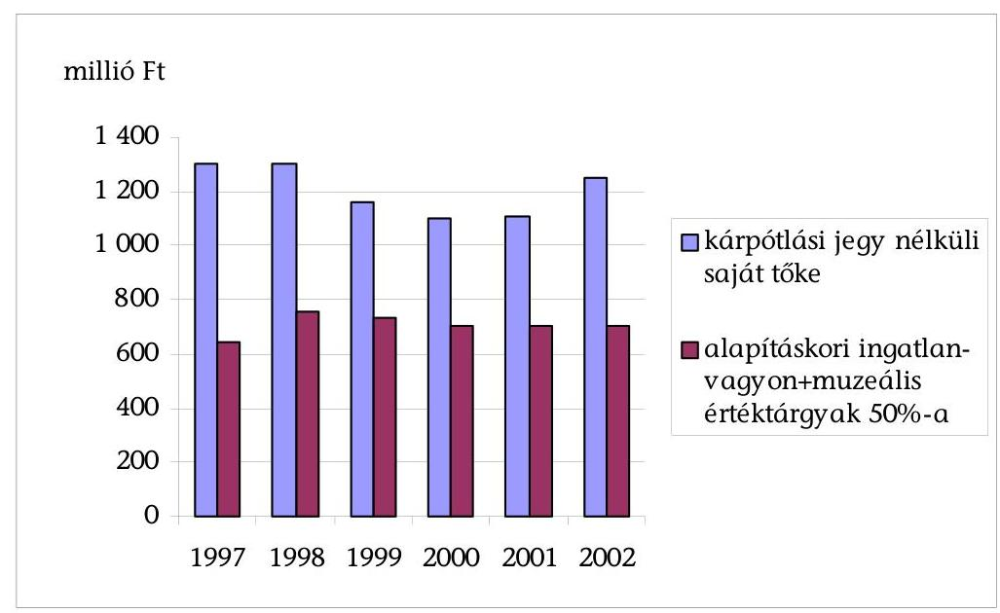
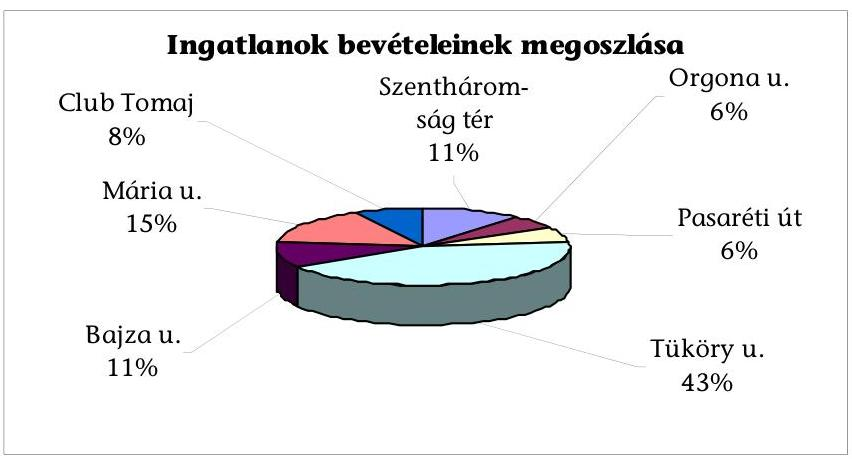
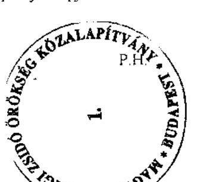
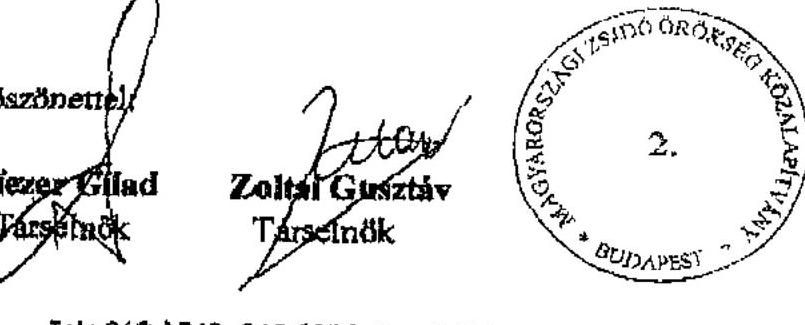
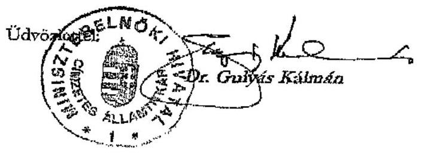

# JELENTÉS 

a Magyarországi Zsidó Örökség
Közalapítvány gazdálkodásának ellenőrzéséről

---

3. Önkormányzati és Területi Ellenőrzési Igazgatóság
3.1. Szabályszerűségi Ellenőrzések FőcsoportIktatószám: V-1008-44/2003.Témaszám: 655
Vizsgálat-azonosító szám: V0081
Az ellenőrzést felügyelte:
Dr. Lóránt Zoltán
főigazgató
Az ellenőrzés végrehajtásáért felelős:
Dr. Elek János
főigazgató-helyettes
Az ellenőrzést vezette:
Balázs Andrásné
főcsoportfőnök-helyettes
Az összefoglaló jelentést készítette:
Balázs Andrásné
főcsoportfőnök-helyettes
Az ellenőrzést végezték:
Pásztor Katalin
számvevő tanácsos
Robák Ferencné
számvevő

## Sas Imréné

számvevő tanácsadó
Solymár Ágnes
számvevő tanácsos

Szappanos Júlia
számvevő

# A témához kapcsolódó eddig készített számvevőszéki jelentések: 

címe
sorszáma
Jelentés a Nemzeti Gyermek és Ifjúsági Alapítvány pénzügyi- 80 gazdasági ellenőrzéséről
Jelentés a Magyar Vállalkozásfejlesztési Alapítvány részére PHARE 220 forrásból juttatott pénzügyi támogatások felhasználásának vizsgálatáról
Jelentés a fejezetek és intézményeik által az alapítványoknak 306 juttatott állami pénzek és vagyon felhasználásának, működtetésének ellenőrzéséről
Jelentés a Magyar Alkotóművészeti Közalapítvány 347 gazdálkodásának ellenőrzéséről
Jelentés a Gandhi Közalapítvány pénzügyi-gazdasági 351 ellenőrzéséről
Jelentés a Magyarországi Cigányokért Közalapítvány pénzügyi- 372 gazdasági ellenőrzéséről
Jelentés a Magyarországi Nemzeti és Etnikai Kisebbségekért 373

---

Közalapítvány pénzügyi-gazdasági ellenőrzéséről
Jelentés a médiatörvény végrehajtásának pénzügyi - gazdasági 396 ellenőrzéséről
Jelentés a Magyar Rádió Közalapítvány és - kapcsolódó 9806 ellenőrzésként - a Magyar Rádió Részvénytársaság gazdálkodásának ellenőrzéséről
Jelentés a Magyar Televízió Közalapítvány és kapcsolódó ellenőrzés 9812 keretében a Magyar Televízió Rt. működésének és gazdálkodásának ellenőrzéséről
Jelentés a Nemzetközi Pető András Közalapítvány és - kapcsolódó 9822 ellenőrzésként - a Mozgássérültek Pető András Nevelőképző és Nevelőintézet pénzügyi-gazdasági ellenőrzéséről
Jelentés a Magyar Nemzeti Üdülési Alapítványnak juttatott állami 9906 eszközök felhasználásának és működtetésének pénzügyi-gazdasági ellenőrzéséről
Jelentés a sportcélú közalapítványok működésének pénzügyi- 9907 gazdasági ellenőrzéséről
Jelentés a Fogyatékos Gyermekek, Tanulók Felzárkóztatásáért 9915 Országos Közalapítvány működésének pénzügyi-gazdasági ellenőrzéséről
Jelentés a Nemzeti Gyermek és Ifjúsági Közalapítvány 0002 működésének pénzügyi-gazdasági ellenőrzéséről
Jelentés a Közoktatási Modernizációs Közalapítvány működésének 0011 ellenőrzéséről
Jelentés a Magyar Nemzeti Üdülési Alapítvány vagyon- 0101 gazdálkodásának ellenőrzéséről
Jelentés az Országos Foglalkoztatási Közalapítvány 0117 gazdálkodásának ellenőrzéséről
Jelentés az Új Kézfogás Közalapítvány gazdálkodásának 0136 ellenőrzéséről
Jelentés a közalapítványoknak és az alapítványoknak az 1998- 0228 2001. évek között juttatott nem normatív központi költségvetési támogatás felhasználásának ellenőrzéséről
Jelentés a Magyar Mozgókép Közalapítvány gazdálkodásának 0304 ellenőrzéséről
Jelentés a Magyar Alkotóművészeti Közalapítvány 0323 gazdálkodásának ellenőrzéséről
Jelentés az EU Kommunikációs Közalapítvány gazdálkodásának 0351 ellenőrzéséről

---

# TARTALOMJEGYZÉK 

BEVEZETÉS ..... 7
I. ÖSSZEGZŐ MEGÁLLAPÍTÁSOK, KÖVETKEZTETÉSEK, JAVASLATOK ..... 13
II. RÉSZLETES MEGÁLLAPÍTÁSOK ..... 25

1. A MAZSÓK működése ..... 25
1.1. Kuratórium ..... 26
1.2. SZMSZ ..... 29
1.3. A képviseleti jog szabályozása ..... 31
1.4. Közalapítványi iroda ..... 33
1.5. Belső ellenőrzési rendszer, külső ellenőrzések ..... 33
1.6. Felügyelő Bizottság ..... 34
2. Gazdálkodás, könyvvezetés ..... 36
2.1. Belső szabályzatok ..... 36
2.2. Éves költségvetések ..... 37
2.3. Számviteli nyilvántartás és beszámolás ..... 37
2.4. Bevételek, költségek, működési költségek ..... 38
3. Vagyongazdálkodás ..... 40
3.1. Induló vagyon ..... 40
3.1.1. Az induló vagyonba tartozó ingatlanok ..... 42
3.1.2. Az induló vagyonba tartozó muzeális értéktárgyak ..... 44
3.2. A vagyongyarapításra tett alapítói és kuratóriumi intézkedések ..... 46
3.3. Országos Zsidó Helyreállítási Alaptól átvett vagyon ..... 47
3.4. Vagyongazdálkodás, befektetési stratégia ..... 48
3.4.1. Vagyonszerkezet ..... 49
3.4.2. Beruházási és felújítási tevékenység ..... 52
3.4.3. Ingatlanértékesítés ..... 53
3.4.4. Ingatlanhasznosítás ..... 55
3.4.5. Képviseleti jog gyakorlása a vagyongazdálkodásban ..... 58
4. A MAZSÓK által adott támogatások ..... 59
4.1. Pályázati úton adott támogatások ..... 59
4.2. Pályázat nélkül adott támogatások ..... 65
5. Az életjáradékok fedezetére kapott kárpótlási jegy felhasználása ..... 68
6. A svájci, német és osztrák kárpótlás lebonyolítása ..... 73

---

# MELLÉKLETEK 

1. számú Eszközök és források
2. számú Eredménykimutatás
3. számú Bevételek
4. számú Költségek és ráfordítások
5. számú A tárgyi eszköz állományának alakulása az 1997-2002. években
6. számú A MAZSÖK tulajdonában lévő ingatlanok hasznosítása
7. számú Adott támogatások
8. számú Magánszemélyeknek adott támogatások
9. számú Életjáradék 1997-2003

## FÜGGELÉK

A MAZSÖK gazdálkodásának ellenőrzéséhez kapcsolódó helyszíni ellenőrzések megállapításai

---

# RÖVIDÍTÉSEK JEGYZÉKE 

| ÁSZ törvény | Az Állami Számvevőszékről szóló 1989. évi XXXVIII. törvény |
| :--: | :--: |
| FB | Felügyelő Bizottság |
| IM | Igazságügyi Minisztérium |
| Kh. tv. | a közhasznú szervezetekről szóló 1997. évi CLVI. törvény |
| Kincstár | Magyar Államkincstár |
| KEI | Központi Kárrendezési Iroda |
| KVI | Kincstári Vagyoni Igazgatóság |
| MAZS | Magyarországi Zsidó Szociális Segély Alapítvány |
| MAZSIHISZ | Magyarországi Zsidó Hitközségek Szövetsége |
| MAZSIKE | Magyarországi Zsidó Kulturális Egyesület |
| MAZSÖK | Magyarországi Zsidó Örökség Közalapítvány |
| MCSZ | Magyarországi Cionista Szövetség |
| MEASZ - NÜB | Magyar Ellenállók és Antifasiszták Szövetsége - Nácizmus Üldözötteinek Bizottsága |
| MEH | Miniszterelnöki Hivatal |
|  | a magyar zsidóságot ért üldözés megbélyegzéséről és következményeinek enyhítéséről szóló 1946. évi XXV. törvény |
| NKÖM | Nemzeti Kulturális Örökség Minisztériuma |
| NYUFIG | Nyugdíjfolyósító Igazgatóság |
| OBH | Állampolgári Jogok Országgyúlési Biztosának Hivatala |
| ONYF | Országos Nyugdíjbiztosítási Főigazgatóság |
| OZSHA | Országos Zsidó Helyreállítási Alap |
| Pbvt. | a Párizsi Békeszerződésről szóló 1947. évi XVIII. törvény 27. Cikke 2. pontjában foglaltak végrehajtásáról szóló 1997. évi X. törvény |
| PM | Pénzügyminisztérium |
| Ptk. | a Polgári Törvénykönyvről szóló 1959. évi IV. törvény |
| SZMSZ | Szervezeti és Működési Szabályzat |
| Szt. | a számvitelről szóló 2000. évi C. törvény |
| UJS | Zsidó Fiatalok Magyarországi Egyesülete |
| WJRO | Zsidók Kártérítési Világszervezete |

---

.

---

# ÉRTELMEZŐ SZÓTÁR 

Az alapítvány bevételei

Az alapítvány költségei (kiadásai)

Az alapítvány kezelő
szervének költségei (kiadá-
sai)

Cél szerinti tevékenység

Induló vagyon

Kiemelkedően közhasznú közalapítvány

Közalapítvány

Közfeladat

A vállalkozási tevékenység bevétele, valamint az alapítványi célú tevékenység bevételei (minden olyan bevétel, amely nem a vállalkozási tevékenységhez kapcsolódó befizetés, ideértve a céltámogatást is) [115/1992. (VII. 23.) Korm. rendelet 3. § (1) bekezdésének a) és b) pontja].
A vállalkozási tevékenység közvetlen költségei, az alapítványi célú tevékenység közvetlen költségei, az alapítvány kezelő szervének költségei (kiadásai) és az egyéb közvetett költségek (kiadások) [115/1992. (VII. 23.) Korm. rendelet 3. § (2) bekezdésének a) és b) és c) pontja].

Az alapítvány kezelő szervének üzemeltetési, fenntartási költségei (az alapító okiratok ezeket a költségeket tekintik a kuratórium és a munkaszervezet működési költségeinek).
Minden olyan tevékenység, amely az alapító okiratban megjelölt célkitűzés elérését közvetlenül szolgálja [Kh. tv. 26. § b) pontja].

A közalapítvány javára a célja megvalósításához az alapító okiratban meghatározott vagyon [Ptk. 74/A. § (1) bekezdése, 74/B. § (1) bekezdése]. A közalapítvány rendelkezésére legalább olyan mértékű vagyont kell bocsátani, amely a működése megkezdéséhez feltétlenül szükséges [Ptk. 74/B. § (4) bekezdése]. A közalapítványi vagyon pontos megjelölése nélkül a közalapítvány nem jöhet létre [BH2001. 303 számú, egyedi ügyben hozott bírósági végzés].
A kiemelkedően közhasznú közalapítványnak a közhasznú közalapítványokra előírt követelmények teljesítésén túl közhasznú tevékenysége során olyan közfeladatot kell ellátnia, amelyről törvény vagy törvény felhatalmazása alapján más jogszabály rendelkezése szerint, valamely állami szervnek vagy a helyi önkormányzatnak kell gondoskodnia, az alapító okirata szerinti tevékenységének és gazdálkodásának legfontosabb adatait a helyi vagy országos sajtó útján is nyilvánosságra hozza, továbbá a közhasznú tevékenységet maga látja el [Kh. tv. 5. § és a BH2001. 451 számú, egyedi ügyben hozott bírósági végzés].
A közalapítvány olyan alapítvány, amelyet az Országgyűlés, a Kormány, valamint a helyi önkormányzat vagy kisebbségi önkormányzat képviselő-testülete közfeladat ellátásának folyamatos biztosítása céljából hoz létre [Ptk. 74/G. § (1) bekezdése].
Közfeladatnak az az állami vagy helyi önkormányzati, kisebbségi önkormányzati feladat, amelynek ellátásáról jogszabály alapján - az államnak vagy az önkormányzatnak kell gondoskodnia [Ptk. 74/G. § (2) bekezdése].

---

Közhasznú egyszerüsített éves beszámoló

Közhasznú tevékenység

Közhasznúsági jelentés

Támogatás
Vezető tisztségviselő a
közalapítványoknál

A közhasznú nyilvántartásba vett közalapítványoknál mérlegből, közhasznú eredmény-kimutatásból és tájékoztató adatokból áll [224/2000. (XII. 19.) Korm. rendelet 6. § (8) bekezdése, illetve 4 . és 6 . számú melléklete].

A társadalom és az egyén közös érdekeinek kielégítésére irányuló, a közhasznú közalapítvány alapító okiratában szereplő cél szerinti tevékenység [Kh. tv. 26. § c) pontja].
Tartalmazza a számviteli beszámolót; a költségvetési támogatás felhasználását; a vagyon felhasználásával kapcsolatos kimutatást; a cél szerinti juttatások kimutatását; a központi költségvetési szervtől, az elkülönített állami pénzalaptól, a helyi önkormányzattól, a kisebbségi települési önkormányzattól, a települési önkormányzatok társulásától és mindezek szerveitől kapott támogatás mértékét; a közhasznú szervezet vezető tisztségviselőinek nyújtott juttatások értékét, illetve összegét; a közhasznú tevékenységről szóló rövid tartalmi beszámolót [Kh. tv. 19. § (3) bekezdése].

Pénzbeli és nem pénzbeli juttatás [Kh. tv. 26. § j) pontja].
A közalapítvány kuratóriumának és felügyelő bizottságának elnöke és tagja, a közalapítvánnyal munkaviszonyban vagy munkavégzésre irányuló egyéb jogviszonyban álló, az alapító okirat szerint egyszemélyi felelős vezető feladatot ellátó személy [Kh. tv. 26. § m) pontja].

---

# JELENTÉS 

## a Magyarországi Zsidó Örökség Közalapítvány gazdálkodásának ellenőrzéséről

## BEVEZETÉS

A nonprofit szervezetek között 1994. január 1-jétől jelentek meg a közalapítványok, melyek megalakítására és működésére a Ptk. az alapítványok szabályozásán belül külön feltételeket és követelményeket határozott meg az alapítók körét, az ellátandó közfeladatokat, valamint a működés és gazdálkodás feltételeit illetően. Közalapítványt csak az Országgyűlés, a Kormány, valamint a helyi önkormányzat vagy kisebbségi önkormányzat képviselő-testülete hozhat létre közfeladat (állami, helyi önkormányzati vagy országos kisebbségi önkormányzati feladat) ellátásának folyamatos biztosítása céljából, de a közalapítvány létrehozása nem érinti az államnak, illetve az önkormányzatnak a feladat ellátására vonatkozó kötelezettségét. A közalapítványok a nyilvánosság előtt tevékenykednek, ezért alapító okiratukat, gazdálkodásuk legfontosabb adatait nyilvánosságra kell hozni. A közpénzek törvényes, felelős és közhasznú felhasználása érdekében a Ptk. és a közhasznú szervezetekről szóló törvény részletesen meghatározta a közalapítvány vagyonkezelő szervezete (kuratóriuma) működésének, képviseletének, a tisztségviselők felelősségének és összeférhetetlenségének szabályait. A közalapítvány vagyonát kezelő szervezet (kuratórium) tagjai az alapítók bizalmából látják el feladatukat, de tőlük sem közvetlenül, sem közvetve nem függhetnek, az alapítók nem gyakorolhatnak meghatározó befolyást a közalapítvány vagyonának felhasználására.

A közalapítványok ellenőrzésére az alapítványoknál szigorúbb követelmények vonatkoznak, így az alapítóknak már az alapítással egy időben létre kell hozni a kuratórium ellenőrzésére jogosult ellenőrző szervet (ellenőrző vagy felügyelő bizottságot). Az Országgyűlés és a Kormány által alapított közalapítványoknál az Állami Számvevőszék nemcsak az állami támogatás felhasználását, hanem a gazdálkodás törvényességét és célszerűségét is jogosult ellenőrizni.

A 2003. év végén - az ún. média közalapítványokkal együtt - 48 működő, illetve bejegyzés alatt álló, az Országgyűlés és a Kormány által alapított közalapítvány volt. A 2003. évi költségvetési törvény - eredeti előirányzatként - az Országgyűlés és a Kormány által alapított közalapítványoknak közel 16,5 milliárd Ft támogatást hagyott jóvá ${ }^{1}$, ebből a Magyarországi Zsidó Örökség Közala-

[^0]
[^0]:    ${ }^{1}$ Ez az összeg nem tartalmazza az Országgyűlés által alapított három ún. médiaközalapítvány támogatását

---

pítványnak egyéb működési célú támogatások, kiadások jogcímen 42 millió Ft-ot. A 2004. évi költségvetési törvény 50 millió Ft támogatást hagyott jóvá.

A Magyarországi Zsidó Örökség Közalapítvány létrehozásának történelmi előzményei a következőkben összegezhetők²:
1944. április 16-án kelt a Sztójay-kormánynak "a zsidók vagyonának bejelentése és zár alá vétele tárgyában" kiadott 1600/1944. ME rendelete, amely előírta, hogy

 "az ország területén lakó minden zsidó köteles a jelen rendelet hatálybalépésekor meglévő vagyonát 1944. április 30. napjáig bejelenteni." Bejelentési kötelezettség alá esett 10000 pengő értéket meghaladó minden vagyontárgy. 1944. áprilisában további rendeletek (6138/1944. VI. BM rendelet és a 6163/1944. IV. utasítás) alapján a zsidó származású lakosságot gettóba telepítették, és elrendelték a még meglévő vagyonuk elkobzását. A Magyar Királyi Legfőbb Számvevőszék intézkedett a zsidó lakosságtól elvett arany-, platina- és ezüstékszerek, valamint egyéb vagyontárgyak felkutatására és összegyűjtésére. E célból kormánybiztosság alakult. Az elkobzott vagyontárgyak egy része az országban maradt, más részét külföldre szállították.

A háború után az új magyar kormány által meghozott első rendeletek egyike volt a 200/1945. ME rendelet. Ez az 1600/1944. ME rendeletet a többi, a zsidóságot hátrányosan érintő rendelkezéssel együtt hatályon kívül helyezte. A Kormány vállalta, hogy a zsidóság vagyonának kérdéseit 30 napon belül rendezi. 1946. május 28-án hirdették ki "a zsidókra hátrányos megkülönböztetést tartalmazó egyes jogszabályok hatálya alá tartozó magyar állampolgárok külföldre hurcolt javai tárgyában" az 5950/1946. ME rendeletet. Ennek alapján a Kormány intézkedett, hogy a magyar állampolgárok külföldre hurcolt javai felkutatására külön bizottságot kell létrehozni. A bizottság elnökét a Magyar Izraeliták Országos Irodája és a Magyar Autonóm Orthodox Izraelita Hitfelekezetek Központi Irodája által javasolt személyek közül a pénzügyminiszter nevezte ki.
1946. november 15-én lépett hatályba a magyar zsidóságot ért üldözés megbélyegzéséről és következményeinek enyhítéséről szóló 1946. évi XXV. törvény (a továbbiakban: Mzsbet.). Ebben az új hatalom kinyilvánította, hogy "a magyar nép nem azonosítja magát a faji üldözéssel" és rendezni kívánja a vagyoni sérelmeket. A törvény 2. § (1) bekezdése szerint "az állam mindazokat a hagyatékokat, amelyeket örökösök hiányában a (2) bekezdésben említett személyek hagyatékaként megszerzett vagy megszerez, az alábbi rendelkezések szerint létesítendő külön alapnak engedi át." A (2) bekezdés szerinti rendelkezések "azoknak a személyeknek akár Magyarország területén, akár külföldön lévő hagyatékaira terjednek ki, akik izraelita vallásuk vagy zsidó származásuk címén ellenük folytatott üldözés folytán vagy üldözéssel okszerú kapcsolatban szerzett sebesülés, sérülés vagy más egészségromlás következtében 1941. év június hó 26. napja és 1946. évi december hó 31. napja között életüket vesztették." A (3) bekezdés szerint "Az Alapra ${ }^{3}$ szállnak át hazahozataluk esetében a külföldre hurcolt azon vagyontárgyak is, amelyek az izraelita vallásúak,

[^0]
[^0]:    ${ }^{2}$ Forrás: Az Alkotmánybíróság 16/1993. (III. 12.) AB határozat indokolása
    ${ }^{3}$ Létrehozta a 3200/1947. ME rendelet, Országos Zsidó Helyreállítási Alap elnevezéssel

---

illetőleg zsidó származásuk miatt üldözött személyek birtokából az elmúlt uralmi rendszer intézkedései következtében jogtalanul kikerültek, feltéve, hogy jogszerű tulajdonosuk a minisztérium által kibocsátandó rendelkezések szerint nem állapítható meg."

Az 1947. február 10-én kelt Párizsi Békeszerződés - többek között - arra kötelezte a Kormányt, hogy mindazoknak az üldözötteknek a vagyonát, akik a Holocaust áldozataként elpusztultak és utánuk örökös nem jelentkezett vagy igénybejelentés nem történt, ruházza át a magyarországi zsidó szervezetekre. Az 1947. július 25-én kihirdetett 1947. évi XVIII. törvénnyel az Országgyűlés becikkelyezte a békeszerződést, ezzel a Párizsi Békeszerződést a hozzátartozó mellékletekkel együtt az ország törvényei közé iktatta.

E törvény 27. Cikk 1. és 2. pontjában Magyarország kötelezettséget vállalt arra, hogy

- „minden olyan esetben, amidőn magyar fennhatóság alá tartozó személyeknek Magyarországon levő javaira, törvényes jogaira vagy érdekeire e személyek faji származása vagy vallása miatt 1939. évi szeptember hó 1. napja óta zár alá vételt, elkobzást vagy kényszerkezelést rendeltek el, az említett javakat, törvényes jogokat és érdekeket tartozékaikkal együtt visszaállítja, vagy, ha a visszaállítás lehetetlen, e tekintetben megfelelő kártalanítást ad"4
- „mindazoknak a személyeknek, szervezeteknek vagy közösségeknek Magyarországon levő összes javait, jogait és érdekeit, akik, illetőleg amelyek egyénenként vagy mint összességek tagjai faji, vallási vagy más fasiszta szellemű zaklató rendszabály tárgyai voltak, amennyiben azokra nézve a jelen Szerződés életbelépésétől számított hat hónap alatt örökös nem jelentkezett vagy igénybejelentés nem érkezett, át fogja ruházni az ilyen személyeket, szervezeteket vagy közösségeket Magyarországon képviselő szervezetekre. Az átruházott javakat ezek a szervezetek az említett magyarországi összességek, szervezetek és közösségek életben maradt tagjainak támogatására és helyreállítására fogják fordítani. Ezeket az átruházásokat a jelen Szerződés életbelépése után 12 hónapon belül kell foganatosítani, s azok magukban fogják foglalni a jelen Cikk 1. bekezdése értelmében visszaállítandó javakat, jogokat és érdekeket is."5

A bekövetkezett államosítások és a megváltozott politikai helyzet következtében az Mzsbet. végrehajtási rendeletének kiadására nem került sor.

Az Alkotmánybíróság a 16/1993. (III. 12.) AB határozatban megállapította, hogy Magyarország csak részben tett eleget a Párizsi Békeszerződésben foglalt kötelezettségének. Az indokolás szerint azoknak a kötelezettségvállalásoknak, amelyeket a 27. cikk 1. pontja tartalmaz, a kárpótlási jogszabályok megalkotásával a Magyar Állam eleget tett, a 27. cikk 2. pontjának azonban nem, továbbá nem tett eleget az Mzsbet.-ben vállalt kötelezettségének sem. Az állam helytállási kötelezettsége független attól, hogy a szóban forgó vagyontárgyak

[^0]
[^0]:    ${ }^{4}$ Lásd a Párizsi Békeszerződés 27. Cikk 1. pontját
    ${ }^{5}$ Lásd a Párizsi Békeszerződés 27. Cikk 2. pontját

---

állami tulajdonba kerültek-e vagy sem. Az Alkotmánybíróság arra a következtetésre jutott, hogy a "megfelelő" kártalanítás nem jelenti szükségképpen a teljes értékű kártalanítást, hanem az az ország gazdasági teljesítőképességéhez mért részleges kárpótlás nyújtásával is lehetséges, ha abban javaikban, törvényes jogaikban és érdekeikben sérelmet szenvedettek hátrányos megkülönböztetés nélkül részesülnek. Az Országgyűlés 1992-ben, az ún. II. kárpótlási törvény keretében ${ }^{6}$ rendelkezett az 1939. május 1-jétől 1949. június 8-ig terjedő időben alkotott jogszabályok alkalmazásával az állam által az állampolgárok tulajdonában igazságtalanul okozott károk orvoslásáról.

Az alkotmánybírósági határozat azonban azt is megállapította, hogy az alkotmányellenes helyzet továbbra is fennáll azáltal, hogy nem teljesült az Mzsbet.-ben és a Párizsi Békeszerződés 27. Cikk 2. pontjában előírt módon az örökösök nélküli vagyon szervezeteknek vagy ezek közösségeinek történő átadása. A Magyar Állam e kötelezettségeit - a történelmi körülmények megváltozása folytán - a törvényben előírt módon már nem is tudja teljesíteni. Az Alkotmánybíróság szerint a természetes személyek "megfelelő" kártalanításának részleges kárpótlás útján történő rendezése értelemszerűen irányadó a szervezetek kártalanítására is. A kárpótlás ugyan a szervezetet illeti meg, de azt - a Párizsi Békeszerződés rendelkezésének megfelelően - a szervezet az üldözött népcsoport életben maradt tagjainak és azok közösségeinek támogatására használja. Az Alkotmánybíróság felhívta az Országgyűlést, hogy 1993. december 31-ig tegye meg a szükséges intézkedéseket az alkotmányellenes helyzet felszámolására, a nemzetközi szerződésekben vállalt kötelezettségek teljesítésére.

Az Országgyűlés a Párizsi Békeszerződés kihirdetését követő negyvenkilenc, illetve az Alkotmánybíróság felhívását követő három év elteltével, 1996-ban hozott határozatában ${ }^{7}$ egyetértett a Kormány azon szándékával, hogy - az Mzsbet.-ben vállalt kötelezettség teljesítéséhez megfelelő szervezetként - közalapítványt hozzon létre. Felhatalmazta a Kormányt, hogy a közalapítványnak juttatandó vagyoni körről (ingatlan, muzeális értéktárgy, életjáradékra váltható kárpótlási jegy, készpénz) és annak mértékéről tárgyalásokat folytasson a magyarországi zsidóságot képviselő szervezetek képviselőivel és felhívta a Kormányt, hogy a rendezés érdekében szükséges törvényjavaslatokat 1996. november 30-ig terjessze az Országgyűlés elé. E határozat végrehajtásaként

- az 1997. március 12-én kihirdetésre került Pbvt. ${ }^{8}$ szabályozta a túlélő, rászorult idősek részére juttatandó életjáradék jogi feltételeit. A törvény indokolá-

[^0]
[^0]:    ${ }^{6}$ Lásd a tulajdonviszonyok rendezése érdekében, az állam által az állampolgárok tulajdonában az 1939. május 1-jétől 1949. június 8-ig terjedő időben alkotott jogszabályok alkalmazásával igazságtalanul okozott károk részleges kárpótlásáról szóló 1992. évi XXIV. törvényt, egységes szerkezetben a végrehajtásáról szóló 92/1992. (VI. 10.) Korm. rendelettel
    ${ }^{7}$ Lásd a Párizsi Békeszerződés 27. Cikke 2. pontjának végrehajtásával kapcsolatos feladatokról szóló 89/1996. (X. 30.) OGY határozatot
    ${ }^{8}$ Lásd a Párizsi Békeszerződésről szóló 1947. évi XVIII. törvény 27. Cikke 2. pontjában foglaltak végrehajtásáról szóló 1997. évi X. törvényt

---

sa szerint „a Párizsi Békeszerződés 27. Cikke 2. pontjának közalapítványi formában történő végrehajtásával a Magyarországon lévő hagyatékokra, vagyonra vonatkozó rendelkezés végrehajtásra került. Azt a hagyatékot (vagyontárgyat), amelyet a magyar állam - örökös vagy igénybejelentés hiányában - e törvény hatálybalépését követően szerez meg, külön törvény rendelkezései szerint kell a közalapítványnak átadni. Ezzel megvalósul az az igény, hogy minden ilyen esetben a törvényhozásnak kell rendelkeznie a közalapítvány javára";

- a Kormány az 1035/1997. (IV. 10.) Korm. határozattal - az örökös nélkül elhalt zsidó származású, vallású, sérelmet szenvedett személyek után a zsidó közösségek kárpótlására, a közösség életben maradt tagjai javára és érdekében - létrehozta a Magyarországi Zsidó Örökség Közalapítványt.

Az alapító okirat szerint a közalapítvány célja, hogy a részére átruházandó javakból, azok hozadékából megteremtse annak lehetőségét, hogy azok a személyek, akik zsidó származásuk miatt faji, vallási vagy más fasiszta szellemű zaklató rendszabályok elszenvedői voltak, és utódaik, ha Magyarországon élnek (életvitelszerűen Magyarországon tartózkodnak), továbbá e személyek közösségei, ha Magyarországon bejegyzett székhelyük van és Magyarországon működnek, újjászervezhessék vallási, kulturális, oktatási rendszerüket, erősíthessék zsidó identitásukat, és a személyek szociális helyzetüket javíthassák.

A közalapítvány induló vagyonként ingatlanokat és muzeális értéktárgyakat (hét ingatlant 1271,8 millió Ft értékben és tíz muzeális értéktárgyat 12,4 millió Ft értékben), valamint 4 milliárd Ft címletértékű - kizárólag életjáradékra váltható - kárpótlási jegyet kapott, valamint a Kormány kötelezettséget vállalt arra, hogy a folyamatos működés biztosítása érdekében az éves költségvetési törvényekben meghatározott összegű költségvetési támogatásban részesíti.

A közalapítványt a Fővárosi Bíróság a 11. Pk. 60604/97/3. számú végzésével 1997. június 6-án nyilvántartásba vette, majd 2001. február 14-én - 1998. január 1-jei visszamenő hatállyal - kiemelkedően közhasznú szervezetnek minősítette. Az eredeti alapító okirat a Magyar Közlöny 1997/61. számában jelent meg. A közalapítványt illetően az alapítót megillető jogkört a Miniszterelnöki Hivatal egyházi ügyekért felelős címzetes államtitkára gyakorolja ${ }^{9}$.

A kuratóriumot az Állami Számvevőszék adatlapok kitöltésével 2001-ben beszámoltatta a kapott állami támogatás felhasználásáról, a gazdálkodás törvényességét és célszerűségét átfogóan azonban még nem ellenőrizte.

# Az Állami Számvevőszék az ÁSZ törvény 2. § (5) bekezdése alapján ellenőrzi a közalapítványoknál az állami költségvetésből nyújtott támogatás felhasználását, továbbá a Ptk. 74/G. § (8) bekezdése alapján a gazdálkodás törvényességét és célszerűségét. 

[^0]
[^0]:    ${ }^{9}$ Lásd a Kormány által alapított közalapítványok és alapítványok kormányzati felelőseiről és egyes feladatokról szóló 1034/2003. (IV. 24.) Korm. határozatot

---

# Az ellenőrzés célja az volt, hogy törvényességi és célszerűségi szempontból értékelje, hogy 

- a működés jogi és szervezeti feltételei, valamint a gazdálkodás és a könyvvezetés szabályozottsága biztosították-e a gazdálkodás törvényességét;
- az alapító által juttatott ingatlan- és műkincsvagyon értéke, állaga és összetétele kellő fedezetet nyújtott-e
 a közalapítvány céljainak teljesítéséhez, a kuratórium az alapító okiratban megjelölt célokkal összhangban gazdálkodott-e a kapott vagyonnal, megőrizte-e az alapító okiratban megjelölt mértékű saját tőkét (törzsvagyont);
- az alapító és a kuratórium együttműködött-e az alapító okiratban meghatározottaknak megfelelően a közalapítvány vagyonának gyarapításában;
- a kuratórium rendeltetésszerűen, törvényesen és célszerűen használta-e fel a kapott állami támogatást, a nem állami szervezetektől és a saját vállalkozásaiból származó bevételeit.

Az ÁSZ törvény 21. § (3) bekezdése alapján, ha egyes vizsgálati megállapítások kiegészítése szükségessé válik, és ehhez más szervnél is ellenőrzést kell végezni, az Állami Számvevőszék ellenőre jogosult az összefüggő tényeket ott vizsgálni. Ennek megfelelően kapcsolódó ellenőrzés keretében ellenőriztük a közalapítvány által adott támogatás felhasználását a Magyarországi Zsidó Szociális Segély Alapítványnál, a MAZSIHISZ Szeretetkórháznál és a Magyar Zsidó Kulturális Egyesületnél.

Az ellenőrzés a közalapítvány 1997. évi megalakulásától a 2003. augusztus 31-ig tartó időszakra terjedt ki, de egyes folyamatokat 2003 decemberéig értékeltünk.

---

# I. ÖSSZEGZŐ MEGÁLLAPÍTÁSOK, KÖVETKEZTETÉSEK, JAVASLATOK 

A Párizsi Békeszerződés és az Mzsbet. előírásai teljesítéseként az Országos Zsidó Helyreállítási Alap (OZSHA) számára kellett átadni azoknak a személyeknek a hagyatékát, akik izraelita vallásuk vagy zsidó származásuk miatt ellenük folytatott üldözés folytán 1941. június 26. - 1946. december 31. között életüket vesztették, és amely hagyatékot a Magyar Állam örökösök hiányában megszerzett. Az átadásra meghatározott vagyontárgyaknak a számbavétele 1946-47-ben nem történt meg, az azóta bekövetkezett változások miatt ezeknek a konkrét vagyontárgyaknak az átadása már nem teljesíthető. Az átadásra meghatározott vagyon értékének megközelítő becslésére azonban a rendszerváltozást követően sem került sor.

Az 1993. évi alkotmánybírósági határozat szerint a természetes személyek "megfelelő" kártalanításának részleges kárpótlás útján történő rendezése értelemszerűen irányadó a szervezetek kártalanítására is. A Kormány által megbízott kormánybizottság és a zsidó szervezetek között az 1993-1996. évek közötti időszakban közel négy évig elhúzódó egyeztetés eredményeként 1996 közepére konszenzus alakult ki abban, hogy az - 1946-ban létrehozott és formálisan 1997-ig meglévő - OZSHA helyett vagyonkezelő szervezetként közalapítvány jöjjön létre. Meghatározásra került a MAZSÖK induló vagyona is.

A MAZSÖK kuratóriuma az ellenőrzési megállapítások egyeztetése során 2004 januárjában kezdeményezte a „zsidók tulajdonából kikerült ingó- és ingatlanvagyon" felmérését és értékelését, hogy ily módon megállapítható legyen a más vagyoni kárpótlással arányos kárpótlás összege.

A MAZSÖK az 1997. március 27-én hatályba lépett Pbvt.-ben és a közalapítvány alapításáról szóló kormányhatározatban a számára rendelt vagyont 2003 végéig nem kapta meg maradéktalanul, így az 1993. évi alkotmánybírósági határozatban megállapított alkotmányellenes helyzet részben továbbra is fennállt.

Az OZSHA 1997. március 27-én jogutód nélkül megszűnt, vagyona a MAZSÖK-öt illette meg. Ez a vagyon azonban a MAZSÖK számára csak minimális vagyongyarapodást eredményezett. Az OZSHA ismert vagyona a megszűnésekor alig egymillió forint készpénz volt, amelyet a MAZSIHISZ kezelt, és a törvény hatálybalépését követően átadott a MAZSÖK-nek. A földhivatalokban és a levéltárakban évekig tartó kutatás eredményeként a MAZSÖK az OZSHA nevére bejegyezve mindössze hét kis értékű vidéki ingatlant talált, ebből négy résztulajdon volt, amely közalapítványi célokra csak korlátozottan hasznosítható, miközben a tulajdonosi kötelezettségek teljesítésének költségei (életveszély elhárítás, bontás stb.) a MAZSÖK-öt terhelik. Két, 100%-os tulajdonban lévő nyíregyházai ingatlant 2002-ben összesen 5,2 millió Ft-ért értékesített a kuratórium, míg az OZSHA-tól származó többi ingatlan hasznosításából 2003 végéig nem származott bevétel.

---

2003 decemberéig a MAZSÖK nem kapott olyan hagyatékokat (vagyontárgyakat), amelyeket a magyar állam - örökös vagy igénybejelentés hiányában 1997. március 27-ét követően szerzett meg. E hagyatékok (vagyontárgyak) átadásához szükséges külön törvényt az Országgyűlés 2003 végéig nem alkotta meg. A MEH egyházi kapcsolatokért felelős címzetes államtitkára 2003 decemberében - figyelemmel arra, hogy nem ismert a meghozandó törvény hatálya alá tartozó vagyontárgyak jellege, mennyisége, értéke - kezdeményezte, hogy az érintett tárcák, valamint a MAZSÖK és a MAZSIHISZ bevonásával alakuljon a törvényjavaslat előkészítésére egyeztető bizottság.

Az alapító okirat rögzítette, hogy a kuratórium a Kormánnyal együtt közreműködik a MAZSÖK vagyonának gyarapításában, beleértve a külföldön lévő, a törvény ${ }^{10}$ hatálya alá tartozó ún. uratlan vagyon felkutatását, hazahozatalát is. A vagyon gyarapítására - ezáltal a MAZSÖK bevételi forrásainak növelésére - a Kormány mint alapító még nem intézkedett, bár a kuratórium vezetői 2003 közepén ezt írásban is kérték.

A MAZSÖK - a részleges kárpótlás fejében - összesen 5284,2 millió Ft értékű induló vagyont kapott: 4 milliárd Ft címletértékű kárpótlási jegyet, 1271,8 millió Ft értékű ingatlant és 12,4 millió Ft értékű múkincset (festményt). A Kormány a MAZSÖK létrehozásáról szóló kormányhatározatban arra is kötelezettséget vállalt, hogy a folyamatos működés biztosítása érdekében a közalapítványt az éves költségvetési törvényekben meghatározott összegű költségvetési támogatásban részesíti.

E határozat végrehajtásaként az 1997-2003. évek között a MAZSÖK működési célokra összesen 234 millió Ft állami támogatást kapott. Az állami támogatás összege az 1997-2002. évek között - eredeti előirányzatként - évente 30 millió Ft volt. A 2002. évi kormányváltást követően a MAZSÖK tárgyévi módosított állami támogatási előirányzata 42 millió Ft-ra növekedett, mivel 2002 végén a költségvetés általános tartaléka terhére a Kormány - a MAZSÖK kérését elfogadva - 12 millió Ft pótelőirányzatot biztosított. A 2003. évre az Országgyűlés az éves költségvetési törvényben 42 millió Ft, majd a 2004. évi költségvetési törvényben 50 millió Ft eredeti előirányzatot hagyott jóvá, ez utóbbi felhasználási céljai között a működés támogatása mellett először szerepel a szociális, kulturális, karitatív és egyéb feladatok támogatása. Az állami támogatás az elmúlt években nem nyújtott (és 2004-ben sem nyújt) fedezetet a MAZSÖK ingatlanvagyona jövedelemtermelő képessége megtartásához és növeléséhez szükséges felújítások fedezetére, ezen keresztül azoknak a kiemelkedően közhasznú tevékenységek ellátásának biztosítására, amelyeket a MAZSÖK-nek, mint közalapítványnak alapító okirata szerint el kell látnia.

A MAZSÖK induló vagyonának átadása csak a kárpótlási jegyet illetően volt zökkenőmentes, az alapító okirat mellékletében átadásra kijelölt hét ingatlan közül egy (háromszázmillió forint értékű) ingatlant a MAZSÖK egy év késéssel vette birtokba, illetve az átadásra kijelölt tíz festmény közül öt festményt (nyolcmillió forintot meghaladó értékben) 2003 végéig nem vett

[^0]
[^0]:    ${ }^{10}$ Mzsbet.

---

birtokba. A Kormány csak az 1135/2003. (XII. 24.) Korm. határozatban intézkedett arról, hogy a kifogásolt öt festmény helyett - a KVI és a MAZSÖK által megkötött csereszerződés útján - a kuratórium által is elfogadhatónak tartott öt másik festmény kerüljön a MAZSÖK tulajdonába.

Az induló vagyon késedelmes birtokba adását a vagyontárgyak kijelölésének nem megfelelő előkészítése okozta: a késedelmesen birtokba vett ingatlant a Kormány korábban már egy állami szervnek adta - alacsony bérleti díj mellett - használatba, illetve öt festményről a szakértők szerint nem volt megállapítható, hogy azok per-, teher- és igénymentesen vannak-e állami tulajdonban.

A MAZSÖK az induló vagyon több mint ¾ részét - a törvényben meghatározott módon - négymilliárd forint címletértékű kárpótlási jegyben kapta meg, amelyet kizárólag életjáradékra válthat. Az életjáradékra váltható kárpótlási jegy igénylésével és juttatásával kapcsolatos eljárási rend megállapítására a Kormány az alapító okiratban a kuratóriumot hatalmazta fel azzal, hogy az életjáradékra váltható kárpótlási jegy juttatása a személyenkénti hatszázezer forint címletértéket nem haladhatja meg. A kuratórium egy-egy személy életjáradékára kétszázezer forint fedezetet állapított meg, így húszezer, 60. életévét betöltött igényjogosult számára vált lehetővé az életjáradék folyósítása. Az eredetileg jóváhagyott négymilliárd forint címletértékű kárpótlási jegy a 2004. évtől esedékes további életjáradékokra már nem nyújtott volna fedezetet, ezért az Országgyűlés 2003. november 24-én ${ }^{11}$ további ezer fő életjáradéka fedezetére elegendően, kétszázmillió forint keretet hagyott jóvá.

A 2002. év végéig - az éves zárszámadási törvények szerint - a központi költségvetés tizenegymilliárd Ft-ot meghaladó összeget fordított az 1947-es Párizsi Békeszerződésből eredő kárpótlás keretében folyósított életjáradék fedezetére.

Az életjáradék induló összege 1997-ben a hatvan éves nőknél 2278 Ft/hó, a hatvan éves férfiaknál 2860 Ft/hó volt. 2003-ban ez az összeg - az éves költségvetési törvényekben az átlagos nyugdíjemelés mértékével és időpontjával megegyező növekedések következtében - 5621 Ft/hó, illetve 7058 Ft/hó összegre növekedett.
1997. július 1. - 2003. szeptember 30. között a MAZSÖK összesen 20751 fő részére bocsátott ki határozatot, amelyből 20488 db életjáradékot jóváhagyó, 263 db - igényjogosultság hiányában - elutasító határozat volt. További 138 kérelmező hiányosan nyújtotta be igényét, ezért esetükben határozat még nem született. A MAZSÖK a fenti időszakban összesen 20111 fő, 60. életévét már betöltött igényjogosult esetében kezdeményezte az életjáradék folyósítását. 2003 szeptemberében 14232 fő részesült életjáradékban.

A jelenleg hatályos előírások szerint a MAZSÖK csak azoknak a Holocaust-túlélő igényjogosultaknak állapíthatja meg az életjáradékot, akik a 60. életévüket betöltötték. A kárpótlási jegy életjáradékként történő felhasználása során a MAZSÖK-nek a kárpótlási jegyek életjáradékra váltásáról szóló 1992. évi

[^0]
[^0]:    ${ }^{11}$ Lásd a Pbvt.-t módosító 2003. évi CVIII. törvényt

---

törvény rendelkezéseit ${ }^{12}$ kell alkalmazni, de nem vonatkozik a Holocaust-túlélőkre e törvénynek az az előírása, hogy a 60. évet be nem töltött személyek közül azok, akik munkaképességüket legalább 67%-ban elveszítették, ugyancsak életjáradékban részesülhetnek. A mintegy 40-50 személyt érintő hátrányos és méltánytalan megkülönböztetés feloldását a kuratórium 2003 novemberében kezdeményezte az Igazságügyi Minisztériumnál.

Az igényjogosultságot és az életjáradék induló összegét a MAZSÖK állapítja meg, a megállapított járadékot a Nyugdíjfolyósító Igazgatóság folyósítja, a kárpótlási jegy fedezet alakulását a Központi Kárrendezési Iroda tartja nyilván. Az életjáradék folyósításával kapcsolatos feladatok megszervezésében a Nyugdíjfolyósító Igazgatóság, a Központi Kárrendezési Iroda, valamint a MAZSÖK kifogástalanul együttműködtek, ennek eredményeként a törvényben megszabott feladatok teljesítése szabályos és zökkenőmentes volt.

A MAZSÖK-nél az igényjogosultság és az életjáradék összegének megállapítása tartalmilag megfelelt a törvényes előírásoknak, az erről szóló határozatokat azonban az alapító okiratnak a képviseleti jogra vonatkozó előírásaival ellentétben a mindenkori kuratóriumi titkár, illetve a megbízott kuratóriumi titkár írta alá. A kuratórium a döntések előkészítésére - az SZMSZ előírásainak megfelelően - létrehozta az életjáradéki bizottságot, amely azonban nem végzett érdemi munkát.

A Kormány az alapító okiratban a MAZSÖK céljaként azt határozta meg, hogy az átruházandó javakból, illetve ezek hozadékából teremtsen lehetőséget a kedvezményezett személyek és szervezetek számára ahhoz, hogy újjászervezhessék vallási, kulturális, oktatási rendszerüket, erősíthessék zsidó identitásukat, és a személyek szociális helyzetüket javíthassák. A kuratórium a vagyon fenti célok teljesítését biztosító kezeléséhez nem készített stratégiát, így nem határozta meg például a vagyon jövedelemtermelésre képes jövőbeni összetételét, ennek elérési módját, bár a stratégiai terv kidolgozását saját maga számára előírta a vagyonkezelési és befektetési szabályzatban. A kuratórium azt a célt tűzte maga elé, hogy vagyonkezelése révén - az alapító okiratban megjelölt célok teljesítése mellett - megőrizze, és lehetőség szerint gyarapítsa induló vagyonát. Ennek érdekében a kuratórium a törzsvagyont az alapító
 okirathoz képest - amely az életjáradékra váltható kárpótlási jegy nélkül számított mindenkori induló vagyon értékének 50%-át írta elő törzsvagyonként - nagyobb értékben határozta meg, e körbe sorolta - a Badacsony Club-Tomaj üdülőingatlant kivéve - valamennyi, induló vagyonként átvett ingatlanát. A törzsvagyon kezelésekor azonban a kuratórium nem volt következetes, mivel 2002-ben 241 millió Ft-ért értékesített egy törzsvagyonba tartozó ingatlant (Bp. II. Orgona u. 8.), de emiatt az alapító okiratban meghatározott mérték alá nem csökkent a törzsvagyon. A vagyon jövedelemtermelő képességét tekintve az értékesítés racionális döntés volt, mivel hat év alatt a jelzett ingatlan bérbeadásából mindössze 12,5 millió Ft jövedelem keletkezett, és az ingatlan bérleti szerződésének megszűnését követően új bérlőt nem találtak.

[^0]
[^0]:    ${ }^{12}$ Lásd az 1992. évi XXXI. törvény 2. §-ának (1) bekezdését, 8. §-ának (1) és (3) bekezdését, továbbá a 10. §-át.

---

Az induló vagyonként kapott ingatlanvagyonból származó jövedelem az 1997-2002. évek között alig 30%-kal haladta meg azt az összeget, amit a MAZSÓK a központi költségvetésből működési kiadásaira kapott, pedig a kuratóriumnak az alapító okirat szerint a vagyon hozamából kellett finanszíroznia cél szerinti (közhasznú) feladatait. Az alapító okirat megengedte a kuratóriumnak, hogy a vagyonnal vállalkozási tevékenységet folytasson, illetve az ingatlanokat bérbeadás útján hasznosítsa. Az ellenőrzött időszakban a kuratórium nem végzett olyan vállalkozási tevékenységet, amely veszélyeztette volna a közalapítvány céljának megvalósítását. A vállalkozási tevékenység eredménye révén (amely 99%-ban az ingatlanok bérbeadásából és az értékesített tárgyi eszközök bevételéből származott) az 1997-2002. évek között a kuratórium 252 millió Ft fedezetet teremtett a cél szerinti (közhasznú) feladatok finanszírozásához. Az átmenetileg szabad pénzeszközökből - a befektetési szabályzat előírásainak megfelelően - államilag garantált értékpapírt vásárolt, amelyből 2002 végéig további 83,8 millió Ft hozam származott.

Az induló vagyonként kapott ingatlanok jövedelemtermelő képességét (690,1 millió Ft bevétel, 583,9 millió Ft költség, 106,2 millió Ft hozam) negatívan befolyásolta, hogy műszaki állapotuk az átvételkor mindössze 70%-os szintű volt, de a Kormány a felújításhoz szükséges fedezet biztosítására sem az alapításról szóló kormányhatározatban, sem az alapító okiratban nem vállalt kötelezettséget, külön céltámogatási előirányzatot az éves költségvetési törvények sem tartalmaztak. Emiatt - a bérbeadás útján történő hasznosítás érdekében - a kuratóriumnak kellett megteremteni a felújítás, korszerűsítés, fokozott karbantartás fedezetét, amelynek költsége az ellenőrzött időszakban közel százmillió Ft-ot tett ki. Az aktivált beruházás és felújítás összege 48,6 millió Ft volt. Az ingatlanok bérlőinek a MAZSÓK az elvégzett felújításokat olyan számlák alapján térítette meg, amelyek összegét a bérlők az általuk kifizetett számlák bemutatásával nem támasztották alá. A MAZSÓK által kifizetett számlákról hiányzott az utalványozás engedélyezése vagy a teljesítés igazolása.

A kuratórium 2003 végéig még nem mérte fel valamennyi ingatlan esedékes felújításának költségigényét, de például a 360 millió Ft értékben nyilvántartásba vett és az elmúlt hat év alatt 59,7 millió Ft veszteséget okozó Badacsony Club-Tomaj üdülőingatlan fűtési rendszerének felújítása mintegy 160-180 millió Ft összegű felújítási munka elvégzését teszi szükségessé.

A MAZSÓK-nak az ellenőrzött időszakban nem volt kuratóriumi határozattal elfogadott támogatási koncepciója és pályáztatási szabályzata. A gyakorlatban a kuratórium az egyedi döntéssel odaítélt támogatásokat tekintette elsődlegesnek, emiatt a pályázati támogatás pénzügyi kereténél a „maradványelv" érvényesült. A kuratórium a MAZSÓK megalapításától a 2003. év első félévéig összesen 404 millió Ft támogatást fizetett ki, ebből pályázatok alapján 164,3 millió Ft-ot (40,7%), egyedi döntésekkel 239,7 millió Ft-ot (59,3%).

A források szűkössége miatt a benyújtott 1525 pályázat alig 20%-ának ítélt meg támogatást a kuratórium. A pályázati felhívásokat 1998 márciusában és decemberében, valamint 2000 februárjában, az országos napilapokban és az Interneten hirdették meg, a vallási élet, a zsidó nép egységét szolgáló feladatok, valamint a szociális célok támogatására lehetett pályázni. A felhívások nem tartalmazták a pályázókkal, a pályázatok elbírálásával kapcsolatos kritériumokat és az eljárási szabályokat. A pályázatokat a kuratórium ütemtelenül bírálta el, emiatt a támogatásra szoruló és a támogatást igénylő szervezetek számára kiszámíthatatlan volt a pályázati támogatás realizálása. A pályázatok alapján jóváhagyott támogatásból 50% oktatási és kulturális célokat, 18% szociális célokat, 15% vallási célokat, 14% egészségügyi célokat, 3% egyéb célokat szolgált. A megkötött szerződések szabályosak és célszerűek voltak, a finanszírozás teljesítményarányosan, utólagosan történt. A pályázók a vállalt feladatok teljesítéséről beszámolót készítettek, amelyeket az elszámolással együtt nyújtottak be. A szerződésekben előírt beszámolási határidő túllépését - a szerződésben rögzítettek ellenére - a MAZSÖK nem szankcionálta, emiatt a támogatások felhasználása, elszámolása és a kifizetés teljesítése esetenként évekig elhúzódott. A benyújtott számlákat csak a szabályosság szempontjai alapján ellenőrizték, a pályázatokban vállalt szakmai célok teljesülését sem a kuratórium, sem a közalapítványi iroda, sem az FB nem vizsgálta.

A kuratórium a pályázaton kívül, egyedileg megítélt támogatásokat, a támogatott közösségek kiválasztását, a támogatható célokat sem az SZMSZ-ben, sem más belső szabályzatban nem szabályozta, annak ellenére, hogy a kuratóriumi üléseken rendszeresen vita tárgyát képezte a pályázaton kívüli támogatások elbírálásának rendje, a döntések objektivitása. A mintegy 17-18 működő zsidó szervezet közül az ellenőrzött időszakban csak 9 szervezet kapott pályázaton kívül támogatást, rendszeresen 5, esetileg 4 szervezet. A támogatott szervezetek, intézmények körét és a támogatási összeget a kuratórium évente határozta meg, a működésük segítése céljából.

A kuratóriumi jegyzőkönyvek és határozatok hiányosan rögzítették a szavazással kapcsolatos adatokat, emiatt a döntéshozatalra vonatkozó összeférhetetlenségi szabályok betartását - öt kurátor egyben a pályázaton kívül támogatott intézmények és szervezetek vezetője is volt - nem tudtuk ellenőrizni.

Az 1998-2001. évek között a jóváhagyott támogatásokhoz kapcsolódó szerződések és az elszámolások több mint fele nem volt fellelhető a MAZSÖK irattárában. A támogatott szervezeteknek csak 51%-a számolt el a támogatás felhasználásáról, az elszámolás hiányát azonban a közalapítvány 2002 elejéig nem kifogásolta. A késedelmesen elszámoló szervezeteket ezt követően felszólították, ennek hatására az elszámolások 2003 végéig teljes körűen megtörténtek.

A MAZSÖK az 1997-2002. évek között összesen 12600,7 millió Ft bevétellel rendelkezett, amelynek 92,5%-a alapítványi célú bevétel, ezen belül a külföldről kapott támogatás 11346 millió Ft volt. A külföldi támogatásokból 11 118,7 millió Ft felhasználási célja kötött volt, az osztrák, német és svájci kárpótlások finanszírozását szolgálta, amelynek lebonyolításáért a MAZSÖK 209,1 millió Ft költségtérítést kapott. Az előzőeken kívül további 18,2 millió Ft adomány származott külföldről. A MAZSÖK pénzforgalmi számláját - a külföldi támogatásokkal kapcsolatos pénzforgalom kivételével, amelyet a törvény előírásaival ellentétben 2002 végéig az OTP Banknál nyitott számlákon bonyolított le - a Kincstárnál vezette.

Az alapító okirat a közalapítványi vagyon kezelésére huszonegy tagú kuratóriumot hozott létre. A kuratórium személyi összetétele megfelelt a törvényes előírásoknak, mivel a Kormány a kuratóriumban a vagyon felhasználására

---

meghatározó befolyást nem szerzett és nem gyakorolt. A kurátorok az alapító okirat szerint a MAZSÖK részéről támogatásban vagy más anyagi juttatásban nem részesülhetnek, és - az ellenőrzés megállapításai szerint - nem részesültek. A kuratórium folyamatos működését a megalakulásától napjainkig szervezeti, jogi és személyi tényezők akadályozták. A nagy létszámú kuratórium közel fele életvitelszerűen külföldön él. 2001 óta az alapító nem nevezte meg - az alapító okirat szerint szavazati joggal rendelkező - tiszteletbeli elnök személyét, a funkció betöltetlensége a kuratórium határozatképes létszámban való összehívásának esélyeit csökkenti. Az alapító okirat korábbi előírásai kétharmadnál magasabb megjelenési arányhoz kötött határozatképesség és a kuratórium teljes létszámához számított 2/3-os többséget igénylő határozatok nagy száma - az ellenőrzött időszak egészében, de különösen az 1999-2001. évek között folyamatosan akadályozta a működést. Ezeket a szigorú működési szabályokat a MAZSÖK feladatai nem indokolták, a Kormány által alapított többi közalapítványnál sem jellemzők. A jelenleg hatályos alapító okirat ésszerűen módosította a határozatképességhez szükséges részvételi arányt, a minősített többséget igénylő határozatok számát, és a 2/3-os többség számítási módját.

Az alapítói intézkedések elhúzódása is nehezítette a MAZSÖK működését. Bár a MAZSÖK 1998. január 1-jei hatállyal kiemelkedően közhasznú szervezetként szerepel a bírósági nyilvántartásban, a nyilvántartásba vételi eljárás 1998 elejétől 2001. február 14-ig húzódott az alapító okirat módosítást előkészítő PM, illetve egyes kurátorok lemondása vagy a bejegyzéshez kötelezően megteendő kurátori nyilatkozat aláírásának elhúzódása miatt. 1999-ben a MEH - arra hivatkozással, hogy a MAZSÖK nem tudta igazolni közhasznú nyilvántartásba vételének megtörténtét - átmenetileg - szabálytalanul felfüggesztette az állami támogatás folyósítását, mivel nem vette figyelembe, hogy a MAZSÖK a törvény szerint a nyilvántartásba vételi eljárás ideje alatt kiemelkedően közhasznú szervezetnek minősült.

Részben az alapító okirat határozatképességre vonatkozó előírásai, részben a kurátorok (köztük elsősorban a külföldön élő kurátorok) kuratóriumi üléseken való megjelenési készsége miatt az összehívott kuratóriumi ülések határozatképtelenség miatt rendre elmaradtak. A kuratórium a határozatképtelen ülések miatt nem kezdeményezte a rendszeresen hiányzó kurátorok visszahívását, jóllehet erre az SZMSZ szerint lehetősége lett volna. Hiányzott a visszahívások megalapozott kezdeményezésének az adminisztrációs feltétele is, mivel a kurátorok jelenlétéről a 2002. I. negyedév végéig nem vezettek kimutatást. A MAZSÖK-nek az 1998. év elejétől a 2002. I. negyedév végéig nem volt olyan nyilvántartása, melyből egyértelműen megállapítható lett volna a kuratóriumi ülések időpontja, a résztvevők száma, az ülés esetleges elmaradásának indoka, a megtartott ülések határozatképessége, a döntéshozatalban résztvevők száma és szavazatuk tartalma. Ezek az adminisztrációs hiányosságok a kuratórium korábbi titkárának róhatók fel. 1999-ben és 2000-ben a kuratóriumi ülések gyakorisága nem felelt meg az alapító okirat előírásának, amely szerint évente legalább négy ülést kell tartani. A 2003. év III. negyedévének végéig mindössze egy határozatképes ülést tartott a kuratórium.

Az SZMSZ-t az alapító okiratban rögzített felhatalmazás alapján a kuratórium hagyta jóvá. Az SZMSZ meghatározta a szervezeti és irányítási rendszert, ezen

---

belül a kuratórium feladat-, hatás- és jogkörét, működési rendjét, a munkaszervezet feladatait. A kuratórium által jóváhagyott hatályos SZMSZ-ben a működés körébe nem tartozó képviseleti jog gyakorlása és a határozathozatali összeférhetetlenség szabályozása nincs összhangban az alapító okirattal és a törvényi előírással, ezeknek az önálló szabályozására a kuratórium nem is jogosult.

Az ellenőrzött időszakban a MAZSÖK-nél a képviseleti jog gyakorlása szabálytalan volt. Az alapító okirat 2001. december 31-ig - a Ptk. ez időpontig hatályos előírásával ellentétesen - engedélyezte, hogy a kuratórium az SZMSZ-ben a működés körében a képviseletre delegálás részletes szabályait rendezze, illetve más személyek részleges képviseleti jogosultságáról is rendelkezzen. Az alapító okirat e részét a nyilvántartásba vételi eljárás során a bíróság nem kifogásolta. Az eredeti alapító okirat - a Ptk.-val ellentétesen - különbséget tett a képviseleti jog gyakorlása és a kötelezettségvállalás között, és miközben képviseleti joggal két-két meghatározott tisztséget betöltő kurátort együttesen ruházott fel, a kurátorok számára - a kuratóriumnak történő utólagos beszámolási kötelezettség mellett -
 engedélyezte meghatározott értékhatár alatt a kötelezettségvállalást. A jelenleg hatályos alapító okirat szerint ugyancsak együttesen gyakorolható két-két meghatározott tisztséget betöltő kurátor által a képviseleti jog, de e kuratóriumi tisztségviselők meghatározott értékhatár alatt egyedül is jogosultak kötelezettségvállalásra, a kuratóriumnak való utólagos beszámolási kötelezettséggel. A kuratórium által jóváhagyott eredeti SZMSZ és ennek melléklete - 2001. december 31-ig, az ez időpontig hatályos Ptk. előírásaival ellentétesen - a kuratóriumi titkár és a titkárhelyettes, illetve más alkalmazottak számára is engedélyezte meghatározott esetekben a képviseleti jog gyakorlásába tartozó kötelezettségvállalásra, utalványozásra, a bankszámla feletti rendelkezésre való jogosultságot. A titkárhelyettes külön felhatalmazást kapott a MAZSÖK szabad pénzeszközeinek - az előírásoknak megfelelő és jövedelmező - lekötésére.

MAZSÖK alapító okirata és SZMSZ-e - a működési körbe tartozó képviseleti jog gyakorlását illetően - 2002. január 1-jét követően összhangba került az ez időponttól hatályos Ptk. előírásaival. Továbbra is szabálytalanok azonban - az alapító okiratban megjelölt felhatalmazás hiányában - az SZMSZ-nek azok a rendelkezései, amelyek a működés körébe nem tartozó ügyekben adtak felhatalmazást a közalapítvány alkalmazottainak a képviseleti jog gyakorlására.

A MAZSÖK működésének és gazdálkodásának ellenőrzésére az eredeti alapító okirat szerint 1997-ben négytagú FB-t hozott létre, a bizottság elnökét és tagjait a Kormány három évre kérte fel azzal, hogy a tagok ismételten is megbízhatók. Az FB működését az alapító okirat részletesen szabályozta. Az alapító okirat meghatározta az FB tagjaival kapcsolatos összeférhetetlenségi előírásokat, meghatározta ellenőrzési feladatait és jogait, valamint az alapítónak szükség szerint, de legalább évenkénti beszámolási kötelezettségét. Az FB tagjai a felkérést elfogadták, de az FB nem kezdte meg a működését. A Kormánynak mind a könyvvizsgáló, mind a MAZSÖK-öt ellenőrző KEI jelezte, hogy az FB nem működik, így nem látja el ellenőrzési feladatait. A 2001-ben felkért, új személyi összetételű FB sem kezdte meg testületként a működését, ügyrendet, munkatervet nem készített, a kuratóriumot nem ellenőrizte. Az FB tagjai rendszeresen meghívást kaptak a kuratóriumi ülésekre, de ezeken csak egy-három FB tag

vett részt. 2003-ban az alapító okirat módosításával ismét megváltozott az FB személyi összetétele, amely megkezdte működését, a könyvvizsgálóval együtt előterjesztette a MAZSÖK 2002. évi tevékenységének és a számviteli beszámolónak a vizsgálatáról készített jelentést. A hatályos alapító okirat - szabálytalanul, mivel a kuratórium és az FB között nincs hierarchikus kapcsolat - előírta, hogy az FB a munkatervét és az éves beszámolóját terjessze a kuratórium elé.

Az ellenőrzött időszakban a MAZSÖK függetlenített belső ellenőrt nem alkalmazott, a vezetői és a munkafolyamatba épített ellenőrzési rendszer szabályozása és működése hiányos volt. A könyvvizsgáló munkája során a belső ellenőrzési rendszer hiányosságaira írásban felhívta a kuratórium jelenlegi titkárának figyelmét, javaslatokat tett ezek felszámolására, pl. a külföldi kiküldetések elszámolásaival és a bérszámfejtéssel kapcsolatosan. A könyvvizsgáló úgy ítélte meg, hogy a feltárt hiányosságok nem tették kétségessé az éves beszámoló megbízhatóságát.

A kuratórium elkészítette a jogszabályokban kötelezően előírt szabályzatokat, ezek közül a pénzkezelési szabályzat volt hiányos, mivel nem szabályozta a kincstári kártya használatára jogosultak körét és az általuk felvehető készpénzlimítet, valamint a pénztár záró készpénzállományát. A pénztárban rendszeresen magas volt a készpénz záróállomány, amely azt jelzi, hogy a készpénz felvétel során nem vették figyelembe az adott napi pénzforgalomhoz szükséges mennyiséget.

Az alapító okirat éves költségvetés készítésére kötelezte kuratóriumot, amelynek elfogadásához minősített (2/3-os) szavazattöbbséget írt elő. A kuratórium a határozatképes ülések megszervezési nehézségei ellenére - minden évben elfogadta a költségvetést, de 1997-ben és 2002-ben csak az év utolsó harmadában. A költségvetésekben nem tervezték meg a vállalkozási tevékenység eredményének alapítványi célú felhasználását, illetve a szabad pénzeszközök nagyságát és hozamát, emiatt a kuratórium nem kapott teljes körű információt a pénzügyi folyamatok áttekintéséhez.

A MAZSÖK a tevékenységek számviteli nyilvántartását a hatályos jogszabályok előírásainak megfelelően vezette, így elkülönítette az alapítványi célú és vállalkozási bevételeit és kiadásait, a fel nem osztható költségeket pedig bevételarányosan osztotta meg. A MAZSÖK a jogszabályok előírásainak megfelelően kettős könyvvitelt vezetett, egyszerűsített éves beszámolót, és az 1999. évtől kezdődően közhasznú beszámolót készített. Az éves beszámolót és a közhasznú beszámolót a kuratórium az alapító okirat előírásainak megfelelően elfogadta. A beszámoló mérlegét minden évben leltárral alátámasztották. Az 1999. és a 2001. évi közhasznú beszámoló hiányos volt, mivel nem tartalmazta a költségvetési támogatást és a cél szerinti juttatásokat. A 2002. évi beszámolót csak a helyszíni ellenőrzés időpontjában, 2003 szeptemberében fogadta el a kuratórium, elmulasztva a beszámoló elkészítésének törvényben meghatározott, az üzleti év mérleg-fordulónapját követő 150. napban megjelölt határidejét.

A MAZSÖK működési költsége az 1997-2002. évek között - a külföldről kapott kárpótlások lebonyolítási költsége nélkül - 293,2 millió Ft volt, ugyanebben az időszakban működési célú támogatásként a központi költségvetésből

192 millió Ft-ot kapott, így az állami támogatás a felmerült működési költségeknek csak 2/3-át fedezte. A különbözetet a kuratóriumnak a MAZSÖK saját bevételeiből kellett fedeznie.

A kuratórium az 1998-2003. években nyilvánosságra hozta a közalapítvány gazdálkodásának legfontosabb adatait. Az alapítónak készített éves beszámolóban - bár az alapító okirat szerint a MAZSÖK működéséről kellett volna beszámolni - a kuratórium csak az állami költségvetési támogatás felhasználásáról számolt el.

A külföldi kárpótlások tartalmi szabályosságát a támogatók által megbízott nemzetközi könyvvizsgáló cégek ellenőrizték, illetve ellenőrzik. A Svájci Alap által nyújtott humanitárius támogatásból közel húszezer érintett személy kapott összesen 6,6 milliárd Ft támogatást, mértéke 1400 USD/fő vagy annak megfelelő Ft összegű volt. A Német Szövetségi Köztársaság humanitárius segélyéből mintegy 19 ezer személy összesen 1,8 milliárd Ft segélyben részesült, a segélyezettek 2/3-a 600 DM/fő, 1/3-a 1100 DM/fő vagy annak megfelelő Ft összegű segélyt kapott. Az Osztrák Megbékélési Alap még folyamatban lévő támogatásából 2003. június 30-ig kétezer jogosult személy kapott 3,1 milliárd Ft kárpótlást. A svájci program befejezését követően a kapott támogatásból 21 ezer USD maradvány keletkezett, amelyet a kuratórium a Kincstárnál vezetett bankszámlán elkülönített. A maradványt a támogató - további támogatással együtt - humanitárius szolgáltatások nyújtásához (pl. házi gondozás, különféle orvosi szolgáltatások) tervezi felhasználni a Magyarországi Zsidó Szociális Alapítvány közreműködésével. A német alapból kapott adományból a lebonyolítás költségeinek elszámolása után mintegy 30 millió Ft maradvány keletkezett, ebből 20,6 millió Ft-ot 2002-ben a 60 éven aluli Holocaust-túlélők támogatására fordította a kuratórium, a fennmaradt összeget pedig a folyamatban lévő ún. „német gettónyugdíj" szervezésével, ügyintézésével kapcsolatos kiadásokra, és egyéb - még nem konkretizált - célra tervezi felhasználni. A MAZSÖK a számviteli politika előírásának megfelelően a külföldről kapott támogatásokat és azok terhére teljesített kifizetéseket a könyvvezetésében elkülönítette. A számviteli adatok szerint a MAZSÖK az 1998-2002. években összesen 171,9 millió Ft lebonyolítási költséget számolt el. A számvevőszéki ellenőrzés a működési költségtérítés előírásszerű felhasználására irányult, ennek során szabálytalanságot nem tapasztaltunk.

A helyszíni ellenőrzés megállapításainak hasznosítása mellett javasoljuk:

# a Kormánynak 

1. Vizsgálja felül - a MAZSÖK kuratóriumának közreműködésével - a részleges kárpótlás keretében induló vagyonként átadott ingatlanok jövedelemtermelő képességének és a MAZSÖK alapító okiratában megjelölt célok teljesíthetőségének összhangját és ennek eredményeként az éves költségvetési törvényjavaslatokban kezdeményezze a MAZSÖK számára
a) a már átadott ingatlanok jövedelmező hasznosításához szükséges felújítások céltámogatását;

b) az alapító okiratban megjelölt személyek, közösségek és célok támogatására felhasználható állami támogatás juttatását
biztosító előirányzat jóváhagyását.
2. Alakítson tárcaközi egyeztető bizottságot - amelybe meghívja a MAZSÖK és a MAZSIHISZ képviselőit is - annak a törvényjavaslatnak a szakmai előkészítésére, amely a Párizsi Békeszerződésről szóló 1947. évi XVIII. törvény 27. Cikke 2. pontjában foglaltak végrehajtásáról szóló 1997. évi X. törvény 4. § (2) bekezdése alapján - az Alkotmánybíróság 16/1993. (III. 12.) AB határozatában megállapított alkotmányellenes helyzet teljes körű rendezése érdekében - intézkedik azoknak a hagyatékoknak (vagyontárgyaknak) a Magyarországi Zsidó Örökség Közalapítványnak való átadásáról, amelyet a Magyar Állam - örökös vagy igénybejelentés hiányában - e törvény hatálybalépését követően szerzett vagy szerez meg.
3. Kezdeményezze az Országgyűlésnél a Párizsi Békeszerződésről szóló 1947. évi XVIII. törvény 27. Cikke 2. pontjában foglaltak végrehajtásáról szóló 1997. évi X. törvény 2. § (3) bekezdésében felsorolt hivatkozások bővítését az 1992. évi XXXI. törvény 1. § b) pontjával annak érdekében, hogy azok a Holocaust-túlélők, akik munkaképességüket legalább 67%-ban elveszítették, de még a 60. életévet nem töltötték be, életjáradékban részesülhessenek.
4. Támogassa a MAZSÖK-nek azt a törekvését, hogy a kárpótlási törvényekben a vagyoni kárpótlásokkal kapcsolatosan meghatározott aránnyal azonos kárpótlási arány kialakítása érdekében a kuratórium felmérje és értékelje azt a vagyoni kört, amelynek magyarországi zsidó szervezetekre való átruházására a Párizsi Békeszerződésről szóló 1947. évi XVIII. törvény 27. Cikke 2. pontja kötelezte Magyarország Kormányát. A felmérés, adatgyűjtés és értékelés lebonyolításához szükséges pénzeszközöket - figyelemmel a MAZSÖK saját bevételeinek alacsony összegére - céltámogatásként biztosítsa a közalapítvány számára. Az értékelés eredménye alapján vizsgálja meg a közalapítványnak juttatandó további vagyon indokoltságát.
5. Módosítsa, illetve egészítse ki a MAZSÖK alapító okiratát a következőkkel:
a) egészítse ki a kuratórium határozathozatalára vonatkozó szabályokat - a határozatképességhez szükséges feltételek bővítése érdekében - a levélszavazás szabályozásával;
b) mérlegelje, szükség van-e a közalapítványnál a tiszteletbeli kuratóriumi elnöki funkcióra, ennek megfelelően - figyelemmel a kuratórium határozatképességének biztosítására - döntsön a tiszteletbeli elnöki funkció soron kívüli betöltéséről vagy a funkció megszüntetéséről;
c) a képviseleti jog gyakorlásával kapcsolatos felhatalmazást hozza összhangba az engedélyezett kötelezettségvállalásokkal, figyelemmel a Ptk. 74/C. § (3) bekezdésének előírására, ennek keretében célszerű, ha az alapító okiratban engedélyezi, hogy a kuratórium a kuratóriumi titkárnak a működés körén túlmenően is képviseleti jogot biztosíthasson, megjelölve a képviseleti jog gyakorlásának módját, illetőleg terjedelmét;

d) a kuratórium és a felügyelő bizottság kapcsolatának pontosítása érdekében az alapító okirat azt rögzítse, hogy a felügyelő bizottság a munkatervét és éves beszámolóját tájékoztatásul terjeszti a kuratórium elé.

# a Magyarországi Zsidó Örökség Közalapítvány kuratóriumának 

1. Haladéktalanul intézkedjék, hogy csak az alapító okiratban képviseleti joggal felruházott személyek és a meghatározott keretek között gyakorolják a képviseleti jogot (beleértve a kötelezettségvállalást, a bankszámlával kapcsolatos rendelkezést, az életjáradék megállapítását elfogadó vagy elutasító határozatok aláírását), a képviseleti jog gyakorlásának részletes szabályait tartalmazó belső szabályzatokat hozza összhangba az alapító okirattal.
2. Készítse el a vagyonkezelésnek az alapító okiratban előírt célok teljesítését leginkább elősegítő stratégiáját, amelyben meghatározza a vagyon jövőbeni, jövedelemtermelésre vagy közhasznú célú felhasználásra alkalmas összetételét, az egyes vagyonelemek kezelésének és hasznosításának célszerű módszereit.
3. Dolgozza ki a MAZSÖK támogatási koncepcióját, amelyben meghatározza valamenynyi Magyarországon működő zsidó szervezet és közösség normatív és nem normatív támogatásának elveit és módszereit, e koncepcióra alapozva módosítsa a pályázati úton és az egyedileg adható támogatások szabályzatát, figyelemmel arra, hogy az Áht. 2003. június 9-től hatályos 104/A. § (2) bekezdése szerint a közalapítvány
 köteles pályázatot kiírni, ha az általa nyújtott cél szerinti juttatás az évi egymillió forintot meghaladja.
4. Gondoskodjék arról, hogy az egyes közalapítványi feladatok előkészítésére létrehozott munkabizottságokba olyan személyek kapjanak felkérést, akik képesek és készek a meghatározott teendők ellátására. A munkabizottságok vezetőit a kuratórium évente számoltassa be a végzett munkáról, adjon iránymutatást a soron következő legfontosabb feladataikhoz, szükség esetén személycserékkel biztosítsa a bizottságok működőképességét.
5. Tervezze meg a közalapítvány éves költségvetésében a vállalkozási tevékenység eredményének alapítványi célú felhasználását, illetve a szabad pénzeszközök nagyságát és hozamát is.
6. Adjon számot az alapítónak készített éves beszámolókban - az alapító okirat előírásainak megfelelően - a MAZSÖK működéséről.
7. Hozza összhangba a közalapítvány SZMSZ-ét a közhasznú szervezetekről szóló 1997. évi CLVI. törvény és a hatályos alapító okirat rendelkezéseivel és az alapító hatáskörébe tartozó előírásokat törölje.
8. Egészítse ki a pénzkezelési szabályzatot a kincstári kártya használatára vonatkozó szabályokkal és a pénztárban maximálisan tartható készpénz mennyiség megállapításával.
9. Szabályozza az ingatlanok bérlői által végezhető beruházási-felújítási munkákhoz adott tulajdonosi (kuratóriumi) hozzájárulás megadásának és e költségek megtérítésének feltételeit, az elszámolás határidejét, műszaki és pénzügyi tartalmát.

---

# II. RÉSZLETES MEGÁLLAPÍTÁSOK 

## 1. A MAZSÖK MŰKÖDÉSE

A MAZSÖK-öt a Kormány az 1035/1997. (IV. 10.) Korm. határozattal hozta létre, a Fővárosi Bíróság 11.PK 60.604/97/3. számú végzésével 6686. sorszám alatt 1997. június 16-án vette nyilvántartásba.

Az alapító okirat szerint a MAZSÖK célja, hogy „a részére átruházandó javakból, azok hozadékaiból megteremtse annak lehetőségét, hogy azok a személyek, akik zsidó származásuk miatt faji, vallási vagy más fasiszta szellemű zaklató rendszabályok elszenvedői voltak, és utódaik, ha Magyarországon élnek (életvitelszerűen Magyarországon tartózkodnak), továbbá e személyek közösségei, ha Magyarországon bejegyzett székhelyük van és Magyarországon működnek, újjászervezhessék vallási, kulturális, oktatási rendszerüket, erősíthessék zsidó identitásukat, és a személyek szociális helyzetüket javíthassák".

A MAZSÖK-öt a Fővárosi Bíróság csak 2001. február 14-én, a 11.PK.60.604/97/17. számú végzésével nyilvánította kiemelkedően közhasznú szervezetnek, de a Kh. tv. előírásainak megfelelően 1998. január 1-jei visszamenő hatállyal. A bírósági nyilvántartásba vétel elhúzódását elsősorban az alapító okirat módosítását a Kormány nevében előkészítő PM okozta, de közrejátszott benne a kuratórium és egyes kurátorok is.

A MAZSÖK már 1998 elején kezdeményezte a közalapítvány közhasznú szervezetként való bejegyzését. A Fővárosi Bíróság azonban 1998. április 12-én hiánypótlásra kötelezte a közalapítványt, mivel az alapító okirat módosítására csak az alapító jogosult. Ezt követően a Kormány a 1080/1998. (VI. 3.) számú határozatával módosította az alapító okiratot, és felhatalmazta a pénzügyminisztert, hogy a nevében intézkedjen a MAZSÖK közhasznú szervezetként történő nyilvántartásba vételéről. A módosított alapító okirat azonban nem felelt meg a Kh. tv. előírásainak, így a Fővárosi Bíróság 1999. január 18-án az alapító okirat további módosítását és kiegészítését rendelte el. A bíróság a hiánypótlásra előírt határidőt a pénzügyminiszter kérésére többször meghosszabbította. Időközben a kuratórium egyik társelnöke elhalálozott, egy kurátor pedig a megbízatásáról lemondott. A MAZSÖK alapító okiratának módosítása, illetve a kuratórium és a felügyelő bizottság kiegészítése érdekében a Kormány és a MAZSÖK képviselői 2000. július 28-án egyeztető tárgyalást tartottak. A tárgyalás során megállapodtak arról, hogy a kiemelkedően közhasznú fokozat bejegyzéséhez szükséges intézkedéseket megteszik, valamint egyeztették, hogy a kuratórium és a felügyelő bizottság tagjai közé a delegálásra jogosult szervezetek kiket jelölnek. Megállapodtak, hogy egy fővel csökkentik a kuratórium létszámát, mivel az elhalálozás miatt megüresedett egyik társelnöki státuszt nem kívánták betölteni.

A Kormány csak a 2000. év végén, az 1110/2000. (XII. 23.) Korm. határozattal hagyta jóvá a MAZSÖK módosított alapító okiratát, egyúttal teljesítve a Fővárosi Bíróság által még 1998. április 12-én és 1999. január 18-án előírt hiánypótlásokat is.

---

A Kormány a MAZSÖK megalapítása óta a nevében és képviseletében eljáró kormánytag személyére vonatkozó kijelölésről a következők szerint döntött:

- a MAZSÖK létrehozásáról szóló 1035/1997. (IV. 10.) Korm. határozat 4. pontjában a pénzügyminiszter kapott felhatalmazást arra, hogy a közalapítvány nyilvántartásba vétele során az alapító nevében eljárjon;
- a MAZSÖK alapító okiratának módosításáról szóló 1080/1998. (VI. 3.) Korm. határozat - közhasznúsági nyilvántartásba vétele érdekében - felhatalmazta a pénzügyminisztert, hogy az alapító nevében intézkedjen a MAZSÖK közhasznú szervezetként történő nyilvántartásba vételéről, valamint a módosított alapító okiratnak - a bírósági nyilvántartásba vételét követően - a Magyar Közlönyben történő közzétételéről.
- a Kormány által alapított közalapítványok és alapítványok kormányzati felelőseiről és egyes feladatokról szóló 1034/2003. (IV. 24.) Korm. határozatban az alapítót megillető jogkör gyakorlójának a MEH egyházi ügyekért felelős címzetes államtitkárát jelölte meg.

A MAZSÖK alapító okirat szerinti közhasznú tevékenységei a következők: szociális tevékenység, családsegítés, időskorúak gondozása, tudományos tevékenység, kutatás, nevelés és oktatás, képességfejlesztés, ismeretterjesztés, kulturális tevékenység, kulturális örökség megóvása, műemlékvédelem, hátrányos helyzetű csoportok társadalmi egyenlőségének elősegítése, emberi és állampolgári jogok védelme, rehabilitációs foglalkoztatás.

Az alapító okirat módosítására és személyi változásokra az ellenőrzött időszakban még kétszer került sor:

- Az 1041/2003. (V. 7.) Korm. határozat tudomásul vette egy kurátor elhalálozását, valamint az FB elnökének és egy tagjának lemondását, két - Kormány által delegált - kurátort és egy FB tagot felmentett, illetve visszahívott, az FB-be új elnököt és két új tagot delegált.
- Az 1070/2003. (VII. 18.) Korm. határozat új kuratóriumi tagokat és felügyelő bizottságot nevezett ki.

Az 1997. július 10-től hatályos eredeti alapító okirat a Magyar Közlöny 1997/61 számában, a jelenleg hatályos alapító okirat 2003. október 31-én, a Magyar Közlöny 2003/125 számában jelent meg.

A közbeeső - a Fővárosi Bíróság által bejegyzett - módosítások a Ptk. 74/G. § (6) bekezdése rendelkezése ellenére, amely szerint a közalapítvány alapító okiratát hivatalos lapban közzé kell tenni - a Magyar Közlönyben nem jelentek meg.

A MAZSÖK jelenlegi székhelye Budapest V. kerület, Tüköry u. 3.

# 1.1. Kuratórium 

A MAZSÖK vagyonát az alapító okirat szerint huszonegy tagú kuratórium kezeli. A kuratórium tisztségviselőit - tiszteletbeli elnökét, legfeljebb három társelnökét, illetve három alelnökét - a Kormány jogosult kijelölni, a kuratórium tagjai közül. Az eredeti alapító okirat szerint a kuratóriumnak egy tiszteletbeli

---

elnöke, három társelnöke, két alelnöke volt, a jelenleg hatályos alapító okirat szerint a tiszteletbeli elnöki funkció betöltetlen (később kerül kinevezésre), a kuratóriumnak két társelnöke és két alelnöke van. A tiszteletbeli elnöki funkció betöltetlensége miatt a huszonegy tagú kuratórium 2001 óta csak húsz fővel működik. A jelenlegi huszonegy tagú kuratóriumban az eredeti alapító okirathoz képest a kurátorok több mint fele (tizenegy fő) személye változott.

A kuratórium tagjainak megbízatása 2001. március 1-jéig három évre, ezt követően határozatlan időre szólt.

A kurátorok - a törvényes előírásoknak megfelelően - elfogadó nyilatkozatukban kijelentették, hogy az alapítóval, annak képviselőjével, valamint a kurátorokkal és a felügyelő bizottság tagjaival rokoni-, munka-, illetőleg egyéb, függőséget eredményező jogviszonyban nem állnak. Valamennyien nyilatkoztak továbbá arról, hogy a törvényekben (Kh. tv. 8. § (2) bekezdése, 9. §-a) meghatározott összeférhetetlenségi okok személyükkel kapcsolatban nem állnak fenn.

Az alapító okirat szerint a kuratórium tagjait a Kormány mint alapító kérte fel a zsidó szervezetek javaslata alapján jelölt személyek közül, a magyarországi és nemzetközi zsidó szervezetek, valamint a tudomány és a közélet kiemelkedő személyiségei köréből. A Kormány a kuratóriumba két tagot delegált.

A kuratórium személyi összetétele megfelelt a Ptk. 74/C. § (3) bekezdésében foglalt előírásoknak, mivel az alapító a kuratóriumban a vagyon felhasználására meghatározó befolyást nem szerzett és - az ellenőrzés megállapításai szerint - nem gyakorolt.

A kurátorok az alapító okirat szerint a MAZSÖK részéről támogatásban vagy más anyagi juttatásban nem részesülhetnek, és - az ellenőrzés megállapításai szerint - nem részesültek.

Az alapító okirat előírásai - a nagy létszámú (huszonegy tagú) kuratórium és a kétharmadnál magasabb megjelenési arányhoz kötött határozatképesség - az ellenőrzött időszak egészében, de különösen az 1999-2001. évek között akadályozta a kuratórium működését.

Az eredeti alapító okirat szerint a kuratórium akkor volt határozatképes, ha az ülésen a kuratórium legalább 14 tagja jelen volt. Az alapító okirat 2001. évi módosításakor a határozatképességhez szükséges létszám 12 főre csökkent.

A jelenleg hatályos alapító okirat szerint a kuratórium akkor határozatképes, ha az ülésen a kuratórium legalább 11 tagja jelen van, közöttük egy társelnök vagy alelnök.

Határozatképes kuratóriumi ülést 1997-ben hét, 1998-ban hat, 1999-ben három, 2000-ben három, 2001-ben öt, 2002-ben négy, 2003-ban - a helyszíni ellenőrzés szeptember végi befejezéséig - mindössze egy alkalommal tudtak tartani. A határozatképtelenség miatt elmaradt üléseket nyolc napon belül meg kellett volna ismételni, de - az 1997. év kivételével - újabb üléseket nem hívtak össze, így 1999-ben és 2000-ben a kuratóriumi ülések gyakorisága nem felelt meg az alapító okirat előírásának, amely szerint évente legalább négy ülést kell tartani.

---

A kuratórium a határozatképtelen ülések miatt nem kezdeményezte a rendszeresen hiányzó kurátorok visszavonását, jóllehet erre az SZMSZ felhatalmazást adott. A visszahívás megalapozott kezdeményezésének az adminisztrációs feltételei is hiányoztak, mivel a hiányzásokról nem vezettek kimutatást.

Az SZMSZ szerint a kuratóriumi ülésekről a rendszeresen vagy indokolatlanul hiányzó kurátor kuratóriumi tagságának megszüntetését kezdeményezheti a kuratórium a delegáló szervezetnél és a Kormánynál.

A jelenleg hatályos alapító okirat a korábbiaknál részletesebben szabályozta a kuratórium döntési jogosultságát és módosította a minősített többséget igénylő ügyek körét:

- az eredeti alapító okirat a kuratórium kizárólagos hatáskörébe tartozó döntésként hét feladatot jelölt meg, a módosított alapító okirat - a kuratórium döntési jogosultságát pontosítva - huszonhárom olyan feladatot jelölt meg, amelyeknek eldöntése a kuratórium hatáskörébe tartozik;
- lényegesen módosult a 2/3-os igenlő szavazatot igénylő döntésekhez előírt feltétel, az eredeti alapító okirat tíz olyan ügyet jelölt meg, ahol a döntések meghozatalához a kuratórium tagjai 2/3-ának igenlő szavazata szükséges, a módosított alapító okirat ezeknek az ügyeknek a számát hétre csökkentette úgy, hogy a döntéshez elegendő a kuratóriumi ülésen résztvevő tagok 2/3-ának igenlő szavazata.

A módosított alapító okirat a minősített többséget igénylő ügyek közé sorolta az alapítványi támogatásokról szóló döntéseket, ugyanakkor kivonta a minősített többséget igénylő ügyek közül a vagyont érintő döntéseket.

A kuratóriumi határozatok nyilvántartása 2002. I. negyedév végéig nem felelt meg a Kh. tv. 7. § (2) bekezdés a) pontjának, mivel a szavazás eredményét - a döntést támogatók és ellenzők számát - a jegyzőkönyv, illetve a határozatok nem minden esetben tartalmazták. A MAZSÖK-nek 1998 elejétől - a kuratóriumi titkár személyében bekövetkezett változástól - nem volt olyan nyilvántartása, melyből egyértelműen megállapítható a kuratóriumi ülések időpontja, a résztvevők száma, az ülés esetleges elmaradásának indoka, a megtartott ülések határozatképessége, a döntéshozatalban résztvevők száma és szavazatuk. Az adminisztrációs hiányosságok a kuratórium korábbi titkárának róhatók fel, mivel az SZMSZ szerint a jegyzőkönyv vezetéséről, tartalmi helyességéről, kezeléséről, a személyes adatok védelméről a kuratórium titkárának kell gondoskodnia.

A kuratóriumi ülésekről készített jegyzőkönyvek hiányosan tartalmazták a határozatképességgel kapcsolatos adatokat, nem
 derült ki, hogy az adott kérdésben hányan szavaztak, csak az, hogy a határozatot egyhangúlag fogadták el. 1999. június 24-től nem számolták meg az érvényes szavazatok számát sem. A 2002. év végéig a kuratórium összesen 276 határozatot hozott, ezeknek mindössze 31,5%-ában jelölték meg az igen szavazatok arányát.

A kuratóriumi ülések jelenléti íveiből nem derült ki, ki a kurátor, ki a meghívott, mivel az aláírások szétválasztása nem történt meg.

Az alapító okirat szerint a kuratóriumi ülések tanácskozási jogú állandó résztvevője a kuratórium titkára, de aláírása a jelenléti íveken nem szerepelt.

---

A kuratóriumi jegyzőkönyvek irattározása hiányos, mivel egy zárt ülés jegyzőkönyvét nem a közalapítványnál helyezték el. Az ülés jegyzőkönyve helyett irattározott emlékeztető szerint - amelyen az ülés dátumát és napirendjét nem tartalmazza - a zárt ülés jegyzőkönyve a MAZSIHISZ-nél van.

Az SZMSZ 2002. március 21-i módosítását követően a kuratóriumi határozatok nyilvántartása rendezett és szabályos, a határozatok szövegét a jegyzőkönyv hitelesítő érvényesíti.

A jelenleg hatályos alapító okirat a Kh. tv. előírásainak megfelelően külön előírja, hogy a kuratóriumnak - a közalapítványi irodán keresztül - gondoskodnia kell olyan nyilvántartás vezetéséről, amelyből a kuratórium döntésének tartalma, időpontja és hatálya, illetve a döntést támogatók és ellenzők számaránya (ha lehetséges, személye) megállapítható (határozatok könyve).

A kuratórium saját munkájának segítésére a kuratórium tagjaiból állandó bizottságokat hozott létre, amelyek feladatait az SZMSZ-ben szabályozta. A bizottságok döntés-előkészítő feladatokat láttak el a pénzügyi- és vagyongazdálkodással, az életjáradékkal és pályáztatásokkal kapcsolatban.

# 1.2. SZMSZ 

Az eredeti alapító okirat szerint az SZMSZ megállapításához és módosításához a kuratórium tagjai 2/3-ának - a jelenleg hatályos alapító okirat szerint a kuratóriumi ülésen résztvevő tagok 2/3-ának - igenlő szavazata szükséges.

A MAZSÖK SZMSZ-ét az alapító okirat felhatalmazása alapján a kuratórium hagyta jóvá. Az SZMSZ alapító által történő jóváhagyásának jogát eltérően ítéli meg a legfőbb ügyész, a Legfelsőbb Bíróság - az egyes konkrét alapító okirati rendelkezésekkel kapcsolatban kialakított iránymutatása alapján, illetve az Igazságügyi Minisztérium.

A közalapítvány közhasznú szervezetként történő nyilvántartásba vételi eljárása során a Fővárosi Bíróság 1998. április 21-én kelt, 11.Pk.60604/1997/4. számú végzésében hiánypótlásra szólította fel az alapítót. A végzés 2. pontja előírta, hogy a Kh. tv. 4. § (1) bekezdése, valamint a 7. § (1) bekezdése szerint az alapító okiratot egészítsék ki az e szakaszokban előírtakkal, az ott megjelölt pontok és sorrend szerint. A végzés rögzíti azt is, hogy a Kh. tv. 7. § (2) bekezdése lehetőséget ad arra, hogy az ott leírtakat a belső szabályzat tartalmazza, de a kialakult bírói gyakorlat szerint ezeket a rendelkezéseket is az alapító okiratba kell foglalni. A Kh. tv. előírásai alapján módosított alapító okiratot a Fővárosi Bíróság 2001. február 14-én, a 11.PK.60.604/97/17. számú végzésével nyilvántartásba vette.

A kuratórium által - az alapító okirat felhatalmazása alapján - jóváhagyott SZMSZ melléklete (a közalapítványi iroda ügyrendje) azonban a képviseleti jog biztosításával és gyakorlásával kapcsolatosan az alkalmazottakra vonatkozó szabályokat is tartalmaz (kötelezettségvállalás, banki aláírások), amelyeket a Ptk. 74/C. § (4) bekezdése 2001. december 31-ig nem tett lehetővé, 2002. január 1-jétől pedig az alapító okiratban kellett volna erről az alapítónak intézkedni (lásd részletesen az 1.3. pontban).

---

A Legfőbb Ügyész korábban - az Állami Számvevőszék elnökének megküldött, TLÚ. 5046/2001. számú levelében - tájékoztatást adott a bírósági nyilvántartási eljárásokban benyújtott ügyészi fellebbezések alapján a Legfelsőbb Bíróság konkrét alapító okirati rendelkezésekkel kapcsolatos iránymutatásáról:
„Annak nincs akadálya, hogy a belső szervezeti rend kialakítását az alapító külön szervezeti és működési szabályzatban, illetve más belső szabályzatban határozza meg. A szervezeti és működési szabályzatnak, illetve a belső szabályzatnak azonban összhangban kell lennie az alapító okirat rendelkezéseivel, ezért azokat a nyilvántartásba vételi eljárásban mellékelni kell a bírósági iratokhoz. Ebből következik, hogy:

- a szervezeti és működési szabályzat, illetve a belső szabályzat rendelkezéseinek megállapítása az alapító feladata,
- a szervezeti és működési valamint egyéb szabályzatok rendelkezései nem állhatnak ellentétben az alapító okirattal,
- a fenti feltételek meglétét a bíróságnak vizsgálnia kell.

A kialakult jogalkalmazói gyakorlat szerint a kuratórium az ügyrendjét, illetve a felügyelő bizottság működési rendjét saját maga állapíthatja meg...
... Miután azonban az alapítványok működése törvényessége feletti ügyészi felügyelet az alapító tevékenységének értékelésére nem terjed ki, a módosítás iránt ügyészi intézkedés nem tehető, a törvénysértő rendelkezésre az alapító figyelmét csupán felhívni lehet."

Az IM közigazgatási államtitkára a 2004. január 9-én kelt - a megállapítások egyeztetésére tett észrevételek keretében - a következő álláspontot fejtette ki:
„A közalapítvány szervezeti és működési szabályzata az alapító okiratnak megfelelően a közalapítvány szervezeti felépítésének és működési rendjének részletszabályait állapítja meg. Annak természetesen nincsen akadálya, hogy e részletszabályokat is - pl. az alapító okirat részeként vagy mellékleteként - maga az alapító állapítsa meg. Azt azonban az alapítványi (illetve az adott esetben a közalapítványi) függetlenség - Ptk. 74/C. §-a (3) bekezdésében is megfogalmazott - alapelvével ellentétesnek tartanánk, ha az alapító vagy az őt képviselő kormánytag az alapító okirat mellett, azon kívül, a szervezeti és működési szabályzat megállapításával és szükség szerinti módosításával - közvetett módon - beavatkozhatna a vagyon felhasználásával kapcsolatos döntések meghozatalába. Az alapítványi, közalapítványi autonómia megfelelő biztosítása és megőrzése érdekében ezért az a megoldás látszik helyesnek, hogy mindazokat a kérdéseket, amelyeket az alapító a közalapítványi szervezet és működés körében jelentősnek és fontosnak ítél, magában az alapító okiratban szabályozza, a szervezet és működés részletkérdéseinek szabályozását pedig a kezelő szervezetre bízza. Ebből következően azzal a generális megállapítással, miszerint a szervezeti és működési szabályzat megállapítását törölni kell a kezelő szervezet hatásköréből, a magunk részéről nem értünk egyet, a problémakör differenciáltabb kezelését tartanánk helytállónak."

A kuratórium az eredeti SZMSZ-t a 35/1997. (XI. 26.) számú határozatával fogadta el. Az SZMSZ rögzítette a MAZSÖK szervezeti és irányítási rendszerét, ezen belül a kuratórium feladat-, hatás- és jogkörét, működési rendjét, a munkaszervezet feladatait.

Az alapító okiratnak a Kh. tv. alapján végrehajtott módosítását követő több mint egy év múlva (a 2002. március 21-i kuratóriumi ülésen) hagyta jóvá a kuratórium az SZMSZ módosítását, így ez időszak alatt az SZMSZ nem volt összhangban az alapító okirattal. A módosított SZMSZ az alapító okiratban meg-

---

határozott kereteken belül részletesen szabályozta a kuratóriumi határozatoknak a Kh. tv. előírásainak megfelelő dokumentálását.

Az SZMSZ mellékleteként jóváhagyott „Közalapítványi iroda ügyrend" munkakörönként rögzítette az utalványozási rendet, de az érintett alkalmazottaknak az ezzel kapcsolatos jogokat, kötelezettségeket és felelősséget rögzítő, személyre szóló munkaköri leírást nem adták át.

# 1.3. A képviseleti jog szabályozása 

A MAZSÖK alapító okirata 2001. december 31-ig - a Ptk. ez időpontig hatályos 74/C. § (4) bekezdésének előírásával ellentétesen - engedélyezte, hogy a képviseleti jogot a kuratórium az alapító okiratban megjelölt személyeken túl más személyekre kiterjessze és ezt az SZMSZ-ben szabályozza. Az alapító okirat e részét a nyilvántartásba vételi eljárás során a bíróság nem kifogásolta.

Az eredeti - 1997. június 16-án nyilvántartásba vett - alapító okirat szerint "a közalapítvány Szervezeti és Működési szabályzata (a továbbiakban SZMSZ) a működés körében a képviseletre delegálás részletes szabályait rendezi, és más személyek részleges képviseleti jogosultságáról is rendelkezhet."

A Ptk. 2001. december 31-ig hatályos 74/C. § (4) bekezdése szerint, „ha az alapító az alapítvány kezelésére külön szervezetet hoz létre, az alapító okiratban rendelkeznie kell annak összetételéről és meg kell jelölnie az alapítvány képviseletére jogosult személyt, ha pedig a képviseletre többen jogosultak, úgy a képviseleti jog gyakorlásának módját, illetőleg terjedelmét is". 2002. január 1-jétől 74/C. § (4) bekezdésének módosításával vált lehetővé, hogy „kezelő szerv (szervezet) az alapítvány alkalmazottjának képviseleti jogot biztosíthat, megjelölve a képviseleti jog gyakorlásának módját, illetőleg terjedelmét".

A MAZSÖK eredeti és a 2001. február 14-én bírósági nyilvántartásba vett módosított alapító okirata - a Ptk.-val ellentétesen - különbséget tett a képviseleti jog gyakorlása és a kötelezettségvállalás között, és azoknak a kurátoroknak is engedélyezte - meghatározott keretek között - a kötelezettségvállalást, akik képviseleti joggal egyébként nem rendelkeznek.

A Ptk. a képviseleti jog gyakorlása részének tekinti a kötelezettségvállalást is. A jogi személyekre vonatkozó V. fejezet 29. § (2) bekezdéséhez füzött magyarázat szerint a képviselő a jogi személy nevében eljárva jognyilatkozataival jogokat szerezhet, kötelezettséget vállalhat, képviseli a jogi személyt bíróság és más hatóságok előtt. A képviselő személyének azonosíthatónak kell lennie.

Az alapító okirat - miközben azt írta elő, hogy a közalapítványt a kuratórium bármelyik társelnöke és alelnöke együttesen képviseli - ezzel ellentétesen szabályozta az 500000 Ft (illetve 2001. február 14-től az 1000000 Ft) alatti kötelezettségvállalásokat, mivel csak a megjelölt összeg feletti kötelezettségvállalás jóváhagyását vonta kuratóriumi hatáskörbe azzal, hogy az a kuratóriumi tag, aki ezt az összeget meg nem haladó kötelezettségvállalásról dönt, erről utólag köteles a kuratóriumnak beszámolni.

A jelenleg hatályos alapító okirat szerint a MAZSÖK-öt egy társelnök és egy alelnök együttesen képviseli, akadályoztatás esetén két társelnök vagy két alelnök is eljárhat, ugyancsak együttesen. A képviseleti jog szabályozásának ellentmond az, hogy egymillió forint alatt mind a társelnökök, mind az alelnökök egyedül is vállalhatnak kötelezettséget, de ezekről utólag a kuratóriumnak kötelesek beszámolni.

Az alapító okirat 2001. december 31-ig - a Ptk. 29. § (4) bekezdésével és az ez időpontig hatályos 74/C. § (4) bekezdésének előírásával ellentétesen - lehetővé tette, hogy az SZMSZ a működés körében a képviseletre delegálás részletes szabályait rendezze, és más személyek részleges képviseleti jogosultságáról rendelkezzen. Az alapító okirat e részét a nyilvántartásba vételi eljárás során a bíróság nem kifogásolta.

A Ptk. 29. § (4) bekezdése szerint, ha jogszabály a jogi személy létrejöttét nyilvántartásba vételhez köti, a bejegyzett körülmények megváltoztatása harmadik személyek irányában csak akkor hatályos, ha a változást a nyilvántartásba bevezették. Ennek a rendelkezésnek az az oka, hogy a képviselő személyével kapcsolatos esetleges kizáró okokat a bíróságnak meg kell vizsgálnia. A Ptk. 2001. december 31-ig hatályos 74/C. § (4) bekezdése szerint az alapítvány képviseletével csak a kezelő szerv (kuratórium) tagját lehetett megbízni.

A kuratórium az alapító okirat előírásának megfelelően jóváhagyta az SZMSZ mellékleteként a „Közalapítványi iroda ügyrend"-jét, és ebben a kuratóriumi titkár és a titkárhelyettes számára engedélyezte - meghatározott esetekben - a kötelezettségvállalást és utalványozást. A kuratóriumi titkár felhatalmazást kapott az iroda működtetésével, az ingatlanok üzemeltetésével, a jóváhagyott pályázatok finanszírozásával, a kárpótlási tevékenységből adódó dologi költségekkel kapcsolatban a kötelezettségvállalásokra, utalványozásra, továbbá egyéb ügyekben 500000 Ft értékhatárig vállalhatott kötelezettséget. A kuratóriumi titkár távolléte, illetve két aláírás szükségessége esetén a titkár helyettese, illetve az asszisztensek vállalhattak kötelezettséget, a kuratóriumi titkár által írásban adott felhatalmazás alapján. A titkár helyettese külön felhatalmazást kapott, hogy gondoskodjon a szabad pénzeszközök előírásoknak megfelelő és jövedelmező
 lekötéséről.

A jelenleg hatályos alapító okirat 7.7. pontjának az a rendelkezése, amely az SZMSZ szabályozására bízta a működés körében a képviseletre delegálás részletes szabályait, 2002. január 1-jétől összhangba került a Ptk. ez időponttól hatályba lépő 74/C. § (4) bekezdésének rendelkezéseivel, így e körben is törvényessé vált a képviseleti jog gyakorlása.

Az eredeti és a 2001. február 14-én bírósági nyilvántartásba vett módosított alapító okirat külön nem szabályozta a bankszámla feletti rendelkezést, amely része a vagyon kezelésének, a képviseleti jog gyakorlásának. A kuratórium által az SZMSZ mellékleteként jóváhagyott „Közalapítványi iroda ügyrend”-je szerint - a Ptk. vonatkozó előírásaival ellentétben - a kuratóriumi titkár volt jogosult a közalapítvány bankszámlája feletti rendelkezésre, ugyanabban a körben, mint amire kötelezettséget vállalhatott. A kuratóriumi titkár távolléte, illetve két aláírás szükségessége esetén a titkár helyettese, illetve az asszisztensek rendelkezhettek a bankszámla felett, a kuratóriumi titkár által írásban adott felhatalmazás alapján.

---

A Ptk. 29. § (3) bekezdése szerint a bankszámla felett való rendelkezéshez minden esetben két képviseleti joggal felruházott személy aláírása szükséges. Jogszabály ezektől a rendelkezésektől eltérhet.

A Kincstárnál vezetett számlákhoz a banki aláírás bejelentő kartonok eredeti példányai csak részben voltak fellelhetők. 1998-ban a kincstári számla feletti rendelkezési joga csak az iroda dolgozóinak volt: a megbízott kuratóriumi titkárnak, az asszisztensnek és a gazdasági vezetőnek. A 2000. évben készpénzfelvételre ugyanaz a három alkalmazott volt jogosult a MAZSÓK részéről. A 2002. évtől a bejelentő kartonokon a készpénz felvétel kivételével a közalapítvány dolgozói mellett már az alapító okiratban képviseletre kijelölt kurátorokat is bejelentették a számla feletti rendelkezésre jogosultak közé.

# 1.4. Közalapítványi iroda 

A közalapítványi iroda működését az alapító okirat előírásainak megfelelően az SZMSZ, illetve az SZMSZ mellékleteként jóváhagyott ügyrend szabályozta. Az irodát a kuratórium által kinevezett kuratóriumi titkár vezette, aki ellátta az alapító okiratban és az SZMSZ-ben számára meghatározott feladatokat.

Az ellenőrzött időszakban a kuratóriumi titkár személye három alkalommal cserélődött. A jelenlegi kuratóriumi titkárt nyílt pályázat alapján, három évre, 2/3-os többségi szavazattal alkalmazta 2002. március 21-től a kuratórium.

Az operatív feladatokat négy munkatárs látta el, megbízási, illetve munkaszerződéses jogviszony keretében, teljes munkaidőben. A jogi képviseletet, a bérszámfejtést és a könyvelést külső vállalkozók, vállalkozások látták el, illetve végezték.

A MAZSÓK a kárpótlással kapcsolatos munkákra változó létszámban alkalmazott munkavállalókat, megbízásos jogviszonyban.

A szerződésekben feltüntették, hogy mely kárpótlással kapcsolatos munkavégzésre kötötték, a teljesítés igazolása a ledolgozott órák alapján történt.

A megbízási szerződéseket határozatlan időre, visszavonásig kötötték. A megbízások visszavonását nem dokumentálták, de évente újrakötötték a szerződéseket. Ezt a gyakorlatot a jelenlegi kuratóriumi titkár megszüntette, a szerződési feltételeknek megfelelően a munkavégzés megszűnésekor felmondta a szerződéseket.

### 1.5. Belső ellenőrzési rendszer, külső ellenőrzések

Az ellenőrzött időszakban a MAZSÓK függetlenített belső ellenőrt nem alkalmazott, a vezetői és a munkafolyamatba épített ellenőrzési rendszer szabályozása és működése hiányos volt.

Az azonos feladatokat eltérően szabályozták az SZMSZ mellékleteként elfogadott különböző szabályzatokban. Mind az alapító okirattal, mind az SZMSZ-szel ellentétes volt, hogy az ügyrend szerint a bankszámla feletti rendelkezés jogát csak a MAZSÓK alkalmazottai gyakorolták.

---

A házipénztár szabályzat a kuratóriumi titkárt tette felelőssé a pénztár ellenőriztetéséért, de nem jelölte meg a pénztárellenőr személyét. A közalapítványi iroda ügyrendje szerint a titkár helyettesének feladata volt a pénztár ellenőrzése. A véletlenszerűen kiválasztott tizenegy pénztárjelentést pénztárellenőrként a kuratóriumi titkár vagy a helyettese írta alá. A kiküldetési költségek elszámolásánál hiányosan működött a munkafolyamatba épített belső ellenőrzés, így előfordult, hogy a pénzügyi teljesítés előtt nem tárták fel a bizonylati rend és okmányfegyelem hiányosságait, például az osztrák kártérítéssel kapcsolatos lebonyolítási munkáknál.

Az ellenőrzött időszakban a MAZSÓK-nál ügyészségi törvényességi felügyeleti vizsgálat nem volt.

A KEI 1998-ban a Kormány megbízásából végzett ellenőrzést a MAZSÓK-nál. Az ellenőrzés megállapításai és javaslatai alapján a MAZSÓK szabályzatait felülvizsgálták, átdolgozták, és a kuratórium a szabályzatokat az SZMSZ mellékleteként elfogadta.

A MAZSÓK-nak, mint közalapítványnak kötelező könyvvizsgálatot ír elő a jogszabály.

A számviteli törvény szerinti egyes egyéb szervezetek beszámoló készítési és könyvvezetési kötelezettségének sajátosságairól szóló 224/2000. (XII. 19.) Korm. rendelet 19. § (1) bekezdése szerint kötelező a könyvvizsgálat minden közalapítványnál.

A kuratórium már a MAZSÓK megalakulásának első évében, 1997-ben - pályázat útján - intézkedett a könyvvizsgálat elvégeztetéséről. A 2001. évtől az alkalmazott könyvvizsgálat rendszere folyamatos könyvvizsgálat.

A jelenlegi könyvvizsgálónak évenként újítják meg a megbízási szerződését.
A könyvvizsgáló munkája során a belső ellenőrzési rendszer hiányosságaira írásban felhívta a kuratórium jelenlegi titkárának figyelmét, javaslatokat tett ezek felszámolására, pl. a külföldi kiküldetések elszámolásaival és a bérszámfejtéssel kapcsolatosan. A könyvvizsgáló úgy ítélte meg, hogy a feltárt hiányosságok nem tették kétségessé az éves beszámoló megbízhatóságát.

A könyvvizsgáló a javaslatait már az előző kuratóriumi titkárnak is megtette, de a feladatok teljesítése elmaradt.

A javaslatok teljesítéseként a kuratóriumi titkár elkészítette a külföldi kiküldetések engedélyezésének és elszámolásának szabályzatát, felmondta a bérszámfejtést végző vállalkozóval kötött szerződést és e feladatok ellátásával a Kurátor Kft.-t bízta meg.

# 1.6. Felügyelő Bizottság 

A MAZSÓK működésének és gazdálkodásának ellenőrzésére az alapító az eredeti alapító okirat szerint 1997-ben négytagú FB-t hozott létre, a bizottság elnökét és tagjait a Kormány három évre kérte fel azzal, hogy a tagok ismételten is megbízhatók. Az FB működését az alapító okirat részletesen szabályozta. Az alapító okirat meghatározta az FB tagjaival kapcsolatos összeférhetetlenségi

---

előírásokat, meghatározta ellenőrzési feladatait és jogait, valamint az alapítónak szükség szerint, de legalább évenkénti beszámolási kötelezettségét. Az FB tagjai a felkérést elfogadták, de az FB nem kezdte meg a működését.

A Kormánynak mind a könyvvizsgáló, mind az ellenőrzést végző KEI jelezte, hogy az FB nem működik, a testület nem tölti be ellenőrzési funkcióját.

A Kormányzati Ellenőrzési Iroda 1998-ban tartott ellenőrzésének megállapításai között szerepelt, hogy a közalapítványnál nem működik az FB.

A könyvvizsgáló 1999. december 10-én az alapító kijelölt képviselőjét - a pénzügyminisztert - írásban tájékoztatta arról, hogy az 1999. évi elővizsgálata során az FB-vel lehetetlen volt az együttműködést kialakítani.

Az alapító okirat 2001. évi módosításakor a Kormány - az FB működőképességének megteremtése érdekében - megváltoztatta az FB személyi összetételét, egyben a FB tagok létszámát hét főre emelte fel, és a felkért személyeknek a megbízatást határozatlan időtartamra adta. Az alapító okirat szerint a bizottság az ügyrendjét maga állapítja meg, évente legalább négy alkalommal ülésezik, munkáját éves munkaterv alapján végzi. Az alapító okirat szerint az FB-nek a munkatervét és az éves beszámolóját a kuratórium elé kell terjeszteni, de nincs megjelölve, hogy ezt az FB csak a kuratórium tájékoztatása, nem pedig jóváhagyás céljából teszi. A kuratórium és az FB között nincs hierarchikus kapcsolat, sőt a Ptk. 74/G. § (5) bekezdése szerint az FB jogosult a kuratórium ellenőrzésére.

A 2001-ben felkért, új személyi összetételű FB sem kezdte meg testületként a működését, ügyrendjét, munkatervét nem készítette el, ellenőrzést nem végzett. Az FB tagjai rendszeresen meghívást kaptak a kuratóriumi ülésekre, de ezeken csak egy-három FB tag jelent meg. Az alapítónak az FB nem számolt be működéséről. Az alapító nem szólította fel az FB-t megbízatása, illetve a beszámolási kötelezettség teljesítésére.

Az FB 2003. május 14-én megtartott üléséről készült jegyzőkönyv szerint azt állapította meg, hogy „... sem az alapító, sem más külső vagy kuratóriumi szerv nem biztosított egyetlen esetben sem az FB részére olyan tárgyi és személyi feltételt, amely lehetővé tette volna az FB részére az értelemszerű rendeltetésüknek megfelelő feladatok elkészítését, elvégzését.”

A 1070/2003. (VII. 18.) Korm. határozat az alapító okirat módosításával ismét megváltoztatta az FB személyi összetételét, amely megkezdte működését. A helyszíni ellenőrzés befejezéséig (2003. szeptember 30.) a kuratórium elfogadta (2003. szeptember 17.) az FB és a könyvvizsgáló előterjesztésében a közalapítvány 2002. évi tevékenységének és éves beszámolójának a vizsgálatáról készített jelentést.

---

# 2. GAZDÁLKODÁS, KÖNYVVZETÉS 

### 2.1. Belső szabályzatok

A MAZSÓK-nak, mivel az alapító okirata szerint befektetési tevékenységet is folytathat, a Kh. tv. 17. §-a szerint befektetési szabályzatot kell készítenie. A befektetési szabályzatot a kuratórium elkészítette és elfogadta, tartalma megfelelt a jogszabályi követelményeknek.

A számvitelről szóló 2000. évi C. törvény 14. § (3-5) bekezdései előírásainak megfelelően a MAZSÓK elkészítette a számviteli politikát, ezen belül az eszközök és források leltárkészítési és leltározási-, az eszközök és források értékelési szabályzatát és a pénzkezelési szabályzatot, továbbá a 161. § szerint a számlarendet.

A számviteli politika rögzítette a számviteli elszámolások módját, lényegét, a bevételek, kiadások és ráfordítások tevékenységenkénti (a vállalkozási és cél szerinti tevékenység) elkülönítésének elvét, az eszközök és források értékelésének elveit, a MAZSÓK-re jellemző, sajátos elszámolásokat, mint pl. a kapott és továbbadni tervezett támogatások kötelezettségként való nyilvántartását és elszámolását.

A számlarend és a számlatükör figyelembe vette a MAZSÓK működésének sajátosságait és jellemzőit. A számlarendet a számviteli változásokkal összhangban, időben módosították.

A számlarend tartalmazta a számlák számjelét, megnevezését és tartalmát, valamint az egyes számlákat érintő gazdasági eseményeket, az analitikus nyilvántartásokat, azok főkönyvi elszámolással való egyeztetését, a számviteli bizonylatok körét, megőrzési rendjét.

A pénzkezelés és a pénzforgalom szabályozására készített pénzkezelési szabályzat tartalmazta a pénz kezelésével, mozgatásával, őrzésével és ellenőrzésével kapcsolatos szabályokat, a bizonylatolás módját, a pénztárzárlat folyamatának szabályozását. Hiányossága az volt, hogy nem szabályozta a kincstári kártya használatát, valamint a pénztárban maximálisan tartható készpénz mennyiségét. A pénztárban rendszeresen magas volt a készpénz záróállomány, amely azt jelzi, hogy a készpénz felvétel során nem vették figyelembe az adott napi pénzforgalomhoz szükséges mennyiséget.

A pénztárban lévő záró pénzkészlet 1997. július 31-én 210895 Ft, 1998. november 30-án 1554926 Ft, 2000. május 31-én 1196845 Ft volt.
2003. június 2-án az átadás-átvételi jegyzőkönyv szerint 547346 Ft; 257 euró; 4 AT5 készpénzt, valamint 224000 Ft értékű, 224 db étkezési utalvány és 2670 Ft értékű postai levélbélyeg volt a pénztárban.

A leltárkészítési és leltározási szabályzat összeállításakor figyelembe vették a vagyonvédelmi szempontokat. A szabályzat alkalmazása hiányos volt, mivel az idegen helyen tárolt eszközökről nem kértek be tárolási nyilatkozatot annak bizonyítására, hogy az eszközök tényleg fellelhetők.

---

# 2.2. Éves költségvetések 

Az alapító okirat éves költségvetés készítésére kötelezte a kuratóriumot, amelynek elfogadásához minősített (2/3-os) szavazattöbbséget írt elő.

A határozatképes kuratóriumi ülések összehívásának nehézségei ellenére a kuratórium 1997-2003. évek között minden évben elfogadta a MAZSÓK költségvetését, de 1997-ben és 2002-ben már csak formálisan, mivel a határozatképtelen ülések miatt a költségvetés jóváhagyása csak az év utolsó harmadában volt lehetséges.

Az 1997-98. években a költségvetés főösszege - a kuratórium határozata alapján - nem haladhatta meg a megítélt állami támogatást (30 millió Ft), emiatt a vállalkozási tevékenység tervezett eredményét és felhasználását a költségvetésben - helytelenül - nem szerepeltették. Az 1999. évtől részben módosították a korábbi évek téves gyakorlatát, és a költségvetést cél szerinti és vállalkozási tevékenységre megbontva
 készítették el, már részleteiben is megtervezték a cél szerinti működéssel és a vállalkozási tevékenységgel kapcsolatos kiadásokat, de nem vették számításba a vállalkozási tevékenység eredményének alapítványi célú felhasználását, illetve szabad pénzeszközök nagyságát és hozamát.

### 2.3. Számviteli nyilvántartás és beszámolás

A MAZSÖK a jogszabályok előírásainak megfelelően kettős könyvvitelt vezetett, egyszerűsített éves beszámolót, és az 1999. évtől kezdődően közhasznú beszámolót készített. Az éves beszámolót és a közhasznú beszámolót a kuratórium az alapító okirat előírásainak megfelelően elfogadta. A beszámoló mérlegét minden évben leltárral alátámasztották.

Az 1999. és a 2001. évi közhasznú beszámoló hiányossága az volt, hogy nem tartalmazta a költségvetési támogatást és a cél szerinti juttatásokat.

A kuratórium a gazdálkodásának legfontosabb adatait - a Ptk. 74/G. § (8) bekezdésének megfelelően - nyilvánosságra hozta. A kuratórium az alapítónak készített éves beszámolóban csak az állami költségvetési támogatásról számolt el, holott az alapító okirat szerint évente a közalapítvány működéséről köteles számot adni.

A beszámolókat - a 2001. évi kivételével - nem a MAZSÖK képviseleti joggal felruházott tisztségviselői, hanem a közalapítvány képviseletére nem jogosult kuratóriumi titkár írta alá, a 2000. évi beszámoló pedig aláíratlan maradt. A 2002. évi beszámolót a helyszíni ellenőrzés időpontjában, 2003. szeptemberében fogadta el a kuratórium, ezáltal nem teljesítette a beszámoló elkészítési határidejeként a jogszabályban meghatározott, az üzleti év mérleg-fordulónapját követő 150. nap határidőt.

A számviteli törvény szerinti egyes egyéb szervezetek beszámoló készítési és könyvvezetési kötelezettségének sajátosságairól szóló 224/2000. (XII. 19.) Korm. rendelet 20. § (4) bekezdése szerint a közalapítványok - amelyek a Ptk. 74/G. § (8) bekezdése szerint fontosabb adataikat kötelesek nyilvánosságra hozni - a közzétételnek pl. a Magyar Közlöny Hivatalos Értesítőjében való megjelentetésével, a székhelyén történő betekinthetőséggel vagy egyéb más, a számviteli politikájában rögzített módon tehetnek eleget. A közzététel határideje az adott üzleti év mérlegfordulónapját követő 150. nap.

A MAZSÖK a tevékenységek számviteli nyilvántartását a hatályos jogszabályok előírásainak megfelelően vezette, így elkülönítette az alapítványi célú és vállalkozási bevételeit és kiadásait, a fel nem osztható költségeket pedig bevételarányosan osztotta meg.

# 2.4. Bevételek, költségek, működési költségek 

A MAZSÖK 1997-2002. évek között összesen 12600,7 millió Ft bevétellel rendelkezett, amelynek 92,5%-a alapítványi célú bevétel volt. Az ellenőrzött időszakban az állami támogatás részaránya az összes bevételnek mindössze 1,5%-át, az alapítványi célú bevételnek 1,6%-át tette ki. A bevételek legjelentősebb része, 11346 millió Ft (90%) külföldről kapott támogatás (kárpótlás, a kárpótlás lebonyolításával kapcsolatos költségtérítés valamint adomány) volt.

A MAZSÖK a központi költségvetésből - az éves költségvetési törvényekben közvetlenül névre szólóan - az 1997-2002. évek között összesen 192 millió Ft működési célú támogatást kapott:

- Az állami támogatás nominális összege 1997-2001. évek között nem változott, így reálértéke csökkent, mivel a MAZSÖK számára az Országgyűlés minden évben változatlanul 30 millió Ft előirányzatot hagyott jóvá.

Az 1997. évi „töredékév" működési kiadásaira - a MAZSÖK-öt a Fővárosi Bíróság 1997. június 16-tól nyilvánította jogi személynek, így ez időponttól kezdhette meg működését - a kuratórium 30 millió Ft támogatást kapott.

- A 2002. évre az éves költségvetési törvény eredeti előirányzatként ugyancsak 30 millió Ft támogatást hagyott jóvá, de ezt év végén - a költségvetés általános tartaléka terhére - a Kormány a MAZSÖK kérésére 12 millió Fttal kiegészítette. 2003-ban az Országgyűlés az előző évi módosított előirányzattal azonos összeget, 42 millió Ft támogatási előirányzatot hagyott jóvá. A 2004. évi költségvetési törvényjavaslat a MAZSÖK támogatására a korábbi két évnél 8 millió Ft-tal többet, 50 millió Ft-ot irányzott elő, és kibővítette a támogatható célokat is, mivel a javaslat a működés támogatása mellett szociális, kulturális, karitatív és egyéb feladatokat is megjelölt a felhasználási célok között.

Az alapító okiratban a Kormány vállalta, hogy a közalapítványt, annak létrehozásáról szóló 1035/1997. (IV. 10.) Korm. határozat 3. pontja alapján, a folyamatos működés biztosítására az éves központi költségvetési törvényben évenként meghatározott összegű költségvetési támogatásban részesíti.

Az ellenőrzött időszakban a MAZSÖK egyéb alapítványi célú bevétele és a pénzügyi műveletek bevételeinek összege 121,1 millió Ft volt, megközelítette a kapott állami támogatás 2/3 részét. A vállalkozási tevékenység révén - amely megfelelt az alapító okiratban előírt követelményeknek - a MAZSÖK 941,6 millió Ft bevételhez jutott, ez az összeg a kapott állami támogatás közel ötszörösét tette ki.

---

A MAZSÖK az alapító okirat szerint vállalkozási tevékenységet folytathat, amelynek mértéke nem haladhatja meg a kárpótlási jegy nélkül számított induló vagyonba tartozó vagyontárgyak összesített, mindenkori értékének 50%-át. Vállalkozási tevékenységet a kuratórium kizárólag belföldön, az alapító okiratban meghatározott célkitűzések megvalósítása érdekében folytathat, de csak úgy, ha az a közalapítvány céljának megvalósítását nem veszélyeztetheti, és felelősségvállalása az adott ügylet során nem haladhatja meg vagyoni hozzájárulása összegét. Az induló vagyont képező ingatlanokat a kuratórium bérbeadás útján is hasznosíthatta.

A közalapítvány bevételeit a 3. számú melléklet tartalmazza.
Az állami támogatást 1999-től támogatási szerződéssel kapta a MAZSÖK a támogatást adó fejezettől. A támogatási szerződésekben elszámolási kötelezettséget, és - a MAZSÖK kérésére - havi időarányos támogatást írtak elő.

A MAZSÖK támogatása 1998-1999 között a Miniszterelnökség, 2000-2002 között az NKÖM, 2003-ban a Miniszterelnökség fejezetben szerepelt.

A 2004. évi törvényjavaslat ugyancsak a Miniszterelnökség fejezetben irányozta elő a MAZSÖK támogatását.

A támogatás felfüggesztésére két évben is sor került, mivel a támogatás nyújtásához a szerződésben előírt igazolásokat, illetve nyilatkozatokat nem nyújtotta be a közalapítvány a támogatást folyósító minisztériumoknak:

- 1999-ben a MAZSÖK nem tudta igazolni közhasznú szervezetként való bejegyzését - az 1. pontban részletezett, részben az alapítónak, részben egyes kurátoroknak felróható okok miatt - erre hivatkozással a MEH szabálytalanul, átmenetileg felfüggesztette a tárgyévi költségvetési támogatás finanszírozását.

A MAZSÖK közhasznú nyilvántartásba vételének eljárása már 1998 elején megkezdődött, a Kh. tv. 27. §-a szerint pedig az a szervezet, amelyik a közhasznúsági nyilvántartásba vételére irányuló kérelmét 1998. június 1-je előtt benyújtotta, 1998. január 1-jétől a nyilvántartásba vételt elrendelő határozat jogerőre emelkedésének időpontjáig, illetve amíg kérelmét a bíróság el nem utasította, a kérelemben megjelölt közhasznúsági fokozat szerinti jogállásúnak minősül.

- 2001-ben az NKÖM azért függesztette fel a költségvetési támogatás finanszírozását, mivel a MAZSÖK a támogatás folyósításához szükséges nyilatkozatokat és a támogatás tervezett felhasználásáról szóló részletes költségvetést nem tudta a minisztériumhoz benyújtani. Ennek az volt az oka, hogy a kuratórium az alapító okirat módosításának elhúzódása miatt - ugyancsak részben az alapítónak, részben egyes kurátoroknak felróható okok miatt - a 2000. év második felétől működés- és döntésképtelenné vált.

A MAZSÖK a kapott állami támogatással a szerződések szerinti részletezésben elszámolt.

A MAZSÖK az 1997-2002. években összesen 16 538,5 millió Ft költséget és ráfordítást számolt el, ebből a cél szerinti (közhasznú) tevékenység költségei és ráfordításai 15 848,9 millió Ft-ot tettek ki.

---

A közalapítvány költségeit és ráfordításait a 4. számú melléklet tartalmazza.
A cél szerinti (közhasznú) tevékenységre elszámolt költségekből a közalapítvány által adott támogatásokat részletesen a jelentés 4. pontjában, a külföldi kárpótlásokat a 6. pontjában mutatjuk be.

A cél szerinti (közhasznú) tevékenység költségein és ráfordításain belül a kuratórium és a munkaszervezet működési költsége az 1997-2002. évek között a külföldről kapott kárpótlások lebonyolítási költsége nélkül - 293,2 millió Ft volt, ugyanebben az időszakban működési célú támogatásként a központi költségvetésből 192 millió Ft-ot kapott, így az állami támogatás a felmerült működési költségeknek 65,5%-át fedezte.

A működési költségek évenkénti alakulását a 2. számú melléklet tartalmazza.
Az összes költségen és ráfordításon belül a vállalkozási tevékenység költségei és ráfordításai 689,6 millió Ft tettek ki. Figyelembe véve a vállalkozási tevékenység bevételeként realizált 941,6 millió Ft-ot, a MAZSÖK 252,0 millió Fttal - az ugyanebben az időszakban kapott állami támogatást 31,3%-kal meghaladóan - tudta növelni a közhasznú tevékenységre fordítható forrásait.

A vállalkozási tevékenység bevételei között számolta el a MAZSÖK pl. az ingatlanokért kapott bérleti díjat (690,1 millió Ft), az értékesített tárgyi eszközök bevételét (242,9 millió Ft).

A MAZSÖK pénzforgalmi számláját - az Áht. 18/C. § (6) bekezdésének d) pontja előírásaival összhangban - a Kincstárnál vezette, de - ellentétben az Áht. 18/C. § (7) bekezdésével - a külföldi támogatásokkal kapcsolatos pénzforgalmát 2002 végéig az OTP Banknál nyitott számlákon bonyolította. Ezt a közalapítványi iroda azzal magyarázta, hogy a külföldi kárpótlások beindulásakor a Kincstárnál még nem lehetett devizaszámlát nyitni, a későbbiekben pedig a jól működő rendszert a közalapítványi iroda nem kívánta megszakítani azzal, hogy a MAZSÖK számláit áthelyezi a Kincstárba.

Az ellenőrzött időszakban átmenetileg szabad pénzeszközeit hasznosította, államilag garantált értékpapírt vásárolt, a befektetési szabályzata előírásainak megfelelően.
1997. december 31-én 39 millió Ft, 1998. december 31-én 8,4 millió Ft, 1999. december 31-én 63,9 millió Ft, 2000. december 31-én 29,8 millió Ft értékű, 2001. december 31-én 39,3 millió Ft, 2002. december 31-én 352,3 millió Ft értékben rendelkezett értékpapírokkal.

# 3. VAGYONGAZDÁLKODÁS 

### 3.1. Induló vagyon

A MAZSÖK az alapító okirata szerint induló vagyonként a következő eszközöket kapta:

---

- 4 milliárd Ft címletértékű, kizárólag életjáradékra váltható kárpótlási jegyet, amelyet a Párizsi Békeszerződés 27. Cikke 2. pontjában foglaltak végrehajtásáról szóló 1997. évi X. törvény rendelkezései szerint használhat fel;
- az alapító okirat mellékletében felsorolt hét ingatlant (1271,8 millió Ft értékben);
- az alapító okirat mellékletében felsorolt tíz muzeális értéktárgyat (12,4 millió Ft értékben).

Az induló vagyon megállapításának előzményei a következőkben összegezhetők:
Az Alkotmánybíróság 1993. évi határozata alapján a Kormány 1993-ban az Országos Zsidó Helyreállítási Alap (Alap) működtetésére Tárcaközi Bizottságot hozott létre, egyúttal felhatalmazta a PM politikai államtitkárát, az IM közigazgatási államtitkárát (majd az IM politikai államtitkárát) és az OKKH elnökét a zsidó szervezetekkel történő egyeztető tárgyalásokra. Az érdemi tárgyalások elhúzódása miatt csak 1994. április 21-én tudott megállapodni a bizottság a zsidó szervezetek hazai és külföldi képviselőivel az Alap működtetésének felújításában vagy más szervezet létrehozásában azzal, hogy ennek személyi és tárgyi feltételeit a zsidó szervezetek egyeztetett ajánlása alapján, hatvan napon belül benyújtják. E határidőn belül a zsidó szervezetektől nem érkezett javaslat, és a kormányváltás miatt a bizottság mandátuma is lejárt.

A 2098/1994. (X. 20.) Korm. határozat új tárcaközi bizottságot hozott létre a PM, az IM, a KüM, az MKM politikai államtitkárai és az OKKH elnöke részvételével, amely az 1995. február 8-i alakuló ülésen úgy foglalt állást, hogy az AB határozata szerint az állam kártalanítási kötelezettségét teherbíró-képességével arányban kárpótlás útján is lehet teljesíteni, és ez összhangban áll az Alkotmányban meghatározott jogegyenlőséggel, mert minden kárpótlásra jogosultat, illetve annak jogutódját a törvényben meghatározott egyenlő módú és mértékű kárpótlás illeti meg. Az 1995. július 17-i ülésén a bizottság, valamint a zsidó szervezetek hazai és külföldi képviselői két albizottság létesítését határozták el.
 A dokumentációs albizottsághoz a zsidó szervezetek - izraeli levéltári dokumentációk alapján - mintegy háromezer ingatlanigényt jelentettek. Ezeknek az ingatlanoknak egy része azonban időközben más célra felhasználásra került, illetve államosították vagy értékesítették, és az eredeti állapot a hazai földhivatali nyilvántartásokkal sem volt egyeztethető, amellett hogy az igény nem volt összhangban a magyar kárpótlási törvényekkel (1991. évi XXV. tv., 1992. évi XXIV. tv.)

A zsidó szervezetekkel történt egyeztetések eredményeként 1996. július 2-án konszenzus alakult ki abban, hogy közalapítvány jöjjön létre, meghatározásra került a közalapítvány induló vagyona.

A 89/1996. (X. 30.) OGY határozat 2. pontjában az Országgyűlés felhatalmazta a Kormányt, hogy a közalapítványnak juttatandó vagyoni körről (ingatlan, muzeális értéktárgy, életjáradékra váltható kárpótlási jegy, készpénz) és annak mértékéről tárgyalásokat folytasson a magyarországi zsidóságot képviselő szervezetek vezetőivel.

A MAZSÖK létrehozásáról szóló 1035/1997. (IV. 10.) Korm. határozat 5. pontja felhívta a pénzügyminisztert az alapító okirat mellékletében felsorolt ingatlanok, muzeális értéktárgyak - a bírósági nyilvántartásba vételt követő 30 napos határidőn belüli - közalapítvány tulajdonába adására. A MAZSÖK-öt a Fővárosi Bíróság 1997. június 16-án vette nyilvántartásba, így a vagyonátadást 1997. július 17-ig le kellett volna bonyolítani.

Az alapító okiratban meghatározott, fentiekben részletezett induló vagyon azonban még 2003. december végéig sem volt teljes körűen a MAZSÖK birtokában, mivel elmaradt öt festmény átadása (8,1 millió Ft nyilvántartási értékben), illetve közel egy év késéssel (1998. június 30-án) történt meg egy ingatlan átadása (300 millió Ft nyilvántartási értékben).

Lásd részletesebben a 3.1.1. és a 3.1.2. pontban.
Az 1070/2003. (VII. 18.) Korm. határozat 3. pontja a pénzügyminiszternek adott, fent megjelölt feladatot tartalmazó részt - az induló vagyon hiányos átadása ellenére - hatályon kívül helyezte, de az 1135/2003. Korm. határozatban intézkedett az öt kifogásolt festmény cseréjéről.

Lásd részletesebben a 3.1.2. pontban.
A MAZSÖK kuratóriuma az ellenőrzési megállapítások egyeztetése során, a 2004. január 7-én kelt észrevételében kezdeményezte a „zsidók tulajdonából kikerült ingó- és ingatlanvagyon" felmérését és értékelését, hogy ily módon megállapítható legyen a kárpótlás összege:
„Azt még el lehet fogadni, hogy a megfelelő kártérítés - Fair Compensation - nem jelent teljes körű kártérítést, ugyanakkor az Alkotmánybíróság határozatából kiindulva az elvesztett vagyonért adott kárpótlás elveinek, így az elvett vagyonhoz viszonyított arányainak is igazodni kellene az egyéb kárpótlási arányokhoz. A vagyoni kárpótlásokkal kapcsolatos törvényekből leszűrhető az a következtetés, hogy általában az elvett vagyon értékének csak egy részét kapták meg a kárpótoltak. Alappal várhatja tehát el a magyarországi zsidóság, hogy a zsidó áldozatoktól gyilkosságok útján megszerzett és örökös nélkül maradt vagyon értékének hasonlóan kiszámított részét megkapja a MAZSÖK. Ehhez az szükséges, hogy a Kormány tegye lehetővé a zsidók tulajdonából kikerült ingó- és ingatlanvagyon felmérését és értékelését, hogy ily módon megállapítható legyen a kárpótlás összege."

# 3.1.1. Az induló vagyonba tartozó ingatlanok 

Az alapító okirat melléklete minden - az induló vagyonba tartozó - ingatlanra vonatkozóan tartalmazta annak értékét.

Az ingatlanok értékbecslését megbízás alapján 1996 decemberében végezte el egy vagyonértékelő társaság, az így megállapított értékek alapján határozták meg az induló vagyonba tartozó ingatlanok értékét.

Az értékbecslések - többek között - tartalmazták:

- az értékelt vagyontárgy tulajdonjogát;
- az értékelés célját és felhasználását;
- az értékelt vagyonelemek (földterület, építmények, épület) leírását;
- az 1996. december 31-én érvényes valós piaci értékét.

Az ingatlanok az alapító által - a forgalmi értékbecslésen alapuló - az alapító okiratban meghatározott értéken kerültek a MAZSÖK mérlegébe.

Az ingatlanok tulajdonjogának térítésmentes átadásáról mind a hét ingatlanra vonatkozóan megállapodást kötött az átadó (Kincstári Vagyon Igazgatóság) és a MAZSÖK.

A hét ingatlan közül hat ingatlant 1997. július - augusztus hónapokban a MAZSÖK birtokba vett, a Bp. V. Tüköry u. 3. szám alatti ingatlant (alapító okirat melléklete szerint 300 millió Ft értékű) azonban a közalapítvány csak 1998. június 30-án vette át.

A Bp. V. Tüköry u. 3. szám alatti ingatlant használati jog terhelte, ugyanis a Kormány az egyes ingatlanok használatba adásáról szóló 1132/1995. (XII. 27.) határozatában hozzájárult ahhoz, hogy az épület az Állampolgári Jogok Országgyűlési Biztosának Hivatala (OBH) használatába kerüljön. A MAZSÖK azért nem akarta átvenni az ingatlan tulajdonjogát, mert az OBH az ingatlant üzemeltető Belvárosi Irodaház Kft.-nek alacsony (piaci ár alatti) bérleti díjat fizetett (a 2600 m²-es irodaházért 673 Ft/hó/m²+ÁFA összegben), amely az épület üzemeltetésének költségeit sem fedezte, így az OBH használati jogának azonos feltétekkel történő további biztosítása jelentős veszteséget okozott volna. Az 1997. augusztus 12-i megbeszélésről felvett jegyzőkönyv szerint a MAZSÖK az ingatlant csak abban az esetben kívánta volna átvenni, ha az OBH által fizetett bérleti díjat a piaci viszonyokhoz (2600 Ft/hó/m²) igazíthatja.

Az ingatlant a MAZSÖK végül elfogadta, mert a tárgyalások eredményeként nem az OBH-val, hanem a KVI-vel köthetett piaci áron bérleti szerződést. Ezt követően az ingatlant a KVI 1998. június 23-án jegyzőkönyv szerint átadta a MAZSÖKnek, majd 1998. június 30-án megállapodást kötöttek a tulajdonjog térítésmentes átadásáról. Bár - a jegyzőkönyv alapján - az ingatlan üzemeltetése 1998. július 1-jétől a MAZSÖK feladata lett, az üzemeltetési szerződést csak 1999. március 25-én kötötték meg, mivel a MAZSÖK és a KVI közötti bérleti szerződés is csak 1999. február 23-án jött létre. A bérleti szerződésben a KVI elfogadta a 2600 Ft+ÁFA/m² összegű havi bérleti díjat, valamint kötelezte magát arra, hogy az 1998. július 1. - 1999. február 28. közötti időszakra járó bérleti díjat megfizeti.

Az alapító okirat a közalapítványi célok teljesítése fedezeteként, illetve forrásaként jelölte a MAZSÖK részére átruházott javakat, illetve azok hozadékát. Az átadás-átvételről szóló jegyzőkönyvek szerint azonban az ingatlanok műszaki állapota - a MAZSÖK tulajdonába kerüléskor - átlagosan 70%-os volt, amely szükségessé tette az ingatlanok műszaki állapotának helyreállítását, a hasznosítás érdekében a folyamatos felújításukat, korszerűsítésüket, fokozott karbantartásukat.

A Kormány az ingatlanok felújításához szükséges fedezet biztosítására sem az alapításról szóló kormányhatározatban, sem az alapító okiratban nem vállalt kötelezettséget, és erre külön céltámogatási előirányzatot az éves költségvetési törvények sem tartalmaztak. A MAZSÖK forrásai nem elegendőek az induló vagyonként kapott ingatlanokon szükséges felújítások elvégzésére, ezért a 2003. június 3-án írt levélben a kuratórium társelnöke és alelnöke kérte a miniszterelnöktől annak megvizsgálását, hogy a MAZSÖK a felújítások fedezetére céltámogatást, illetve további (legalább) öt jövedelmezően hasznosítható ingatlant kapjon.

Az induló vagyonként átadott ingatlanokra fordított felújítási költségek alakulásával (beruházásokkal) a 3.4.2. pontban foglalkozunk.

# 3.1.2. Az induló vagyonba tartozó muzeális értéktárgyak 

Az alapító okirat nevesítette az induló vagyonba tartozó tíz muzeális értéktárgyat és meghatározta azok értékét. Ebből öt festmény 2003 végéig nem került a MAZSÖK birtokába, mivel az állam tulajdonjoga - szakértői vélemény szerint - tisztázatlan volt, emiatt a kuratórium vezető tisztségviselői és kuratóriumi titkára - az átvételre vonatkozó kuratóriumi határozat ellenére - a festményeket nem vette át.

A Művelődési és Közoktatási Minisztérium szakértői véleményt készíttetett a festmények per-, teher- és igénymentességének bizonyításáról. Az 1997. július 1-jén elkészített szakértői vélemény szerint öt kép tulajdonjoga tisztázatlan, öt képé rendezett volt.

A szakértői vélemény alapján a kuratóriumi titkár azt javasolta a kuratóriumnak, hogy csak akkor vegye át a képeket, ha a Kormány szavatolja azok per-, teher- és igénymentességét. Ennek ellenére a kuratórium úgy határozott, hogy a kuratóriumi titkár a MAZSÖK részére felajánlott valamennyi műtárgyat vegye át (20/1997. (VII. 30.) számú kuratóriumi határozat).

A kuratóriumi titkár még a kuratóriumi ülést megelőzően, 1997. július 24-én (jegyzőkönyv felvételével) átvett a KVI-tól öt festményt (4,3 millió Ft értékben), amelyeket letéti szerződés alapján, térítésmentesen a Zsidó Múzeumban helyeztek el.

A MAZSÖK átvette az alapító okirat mellékletében összesen 4300 millió Ft nyilvántartási értékkel szereplő alábbi öt festményt:

1. Ismeretlen magyar festő: Férfi portré
2. Mednyánszky László: Táj
3. Mednyánszky László: Tájkép
4. Iványi Grünwald Béla: Gémeskútnál
5. Aba-Novák Vilmos: Majális

Az öt át nem vett festményre vonatkozóan - a fenti kuratóriumi határozattal ellentétesen - a MAZSÖK két társelnöke és két alelnöke 1997. október 30-án írásban arról tájékoztatta az MKM miniszterét, hogy mivel öt festmény tulajdonjoga tisztázatlan, ezért nem tudta azokat átvenni a MAZSÖK.

Az át nem vett öt festmény a MAZSÖK alapító okiratának mellékletében összesen 8100 millió Ft nyilvántartási értékkel szerepelt, e festmények az alábbiak voltak:

1. Rippl-Rónai: Párizsi nő
2. Rippl-Rónai: Anella legvígabb kiadásban
3. Székely Bertalan: Fiatal nő képmása
4. Csók István: Sokác menyecske
5. Csók István: Varrogató nő

A kuratórium a 38/1998. (XII. 9.) számú határozatában ismételten felhatalmazta az irodát, hogy a festményeket átvegye, de ez a későbbiekben sem történt meg.

Az NKÖM-mel 1998 óta folytatott szakmai egyeztetések eredményéről a MAZSÖK kuratóriumának társelnöke és alelnöke 2003. június 3-án írt levelében azt a tájékoztatást adta a miniszterelnöknek, hogy az át nem vett öt festmény értékével azonos értékű másik öt festmény kijelölése megtörtént, melyeket MAZSÖK információi szerint az NKÖM megbízásából jelenleg a Műcsarnok őriz:

1. Mednyánszky László: Hegyek között vonuló trén
2. Iványi Grünwald Béla: Tópart táj kanászfiúval
3. Kmetty János: Tabáni részlet
4. Diener-Dénes Rudolf: Asztali csendélet gyümölcsökkel
5. Koszta József: Virágcsendélet

Az IM közigazgatási államtitkára 2004. január 9-én kelt levelében azt a tájékoztatást adta, hogy a Kormány az 1135/2003. (XII. 24.) Korm. határozatban intézkedett arról, hogy a MAZSÖK javára induló vagyonként rendelt tíz festmény közül a kuratórium által kifogásolt öt festmény helyett - a KVI és a MAZSÖK által megkötött csereszerződés útján - a kuratórium által is elfogadhatónak tartott öt új kép kerüljön a MAZSÖK tulajdonába.

Az IM-nek a fent jelzett levélben kifejtett álláspontja szerint a közalapítványi vagyonrendelés egyoldalú jognyilatkozattal történik, a közalapítvány javára rendelt vagyont a közalapítványnak elfogadnia nem kell, ilyen jognyilatkozat megtételére nem csak szükség, de - az esetek többségében - jogi lehetősége sincs, hiszen a vagyonrendelés időpontjában a közalapítvány még nem létezik, miután pedig létrejön (a bírósági nyilvántartásba vétellel) a javára rendelt vagyont már meg is szerezte. Ennek megfelelően a közalapítvány kezelő szervezete a közalapítvány javára rendelt vagyonnal - a vagyon felhasználására, a vagyonnal való gazdálkodásra vonatkozó, alapító okiratba foglalt előírások keretein belül - szabadon rendelkezhet, annak visszavételét és újabb alapítói vagyonrendelésként más vagyontárgyak rendelkezésére bocsátását azonban nem követelheti.

Ez természetesen nem zárja ki azt, hogy az alapító és a közalapítvány az alapítói vagyonrendelésként juttatott vagyon tekintetében abban állapodjanak meg, hogy az alapító a közalapítvány javára rendelt vagyontárgyak vagy azok egy része helyett - ezek visszaszármaztatása mellett - új vagyontárgyak tulajdonjogát ruházza a közalapítványra. Ez a megállapodás azonban nem minősül alapítói vagyonrendelésnek (nem egyoldalú jognyilatkozat és nem is a közalapítvány létrehozására, a létrehozásához szükséges vagyonnal való ellátására irányul), ebből következően nem igényli
 az alapító okirat módosítását. Az alapító és a közalapítvány között létrejött ilyen tartalmú megállapodásra a polgári jog szerződéses szabályai az irányadók, a fentebb ismertetett tartalmú megállapodás lényegét tekintve csereszerződés (Ptk. 378. §). Az 1135/2003. (XII. 24.) Korm. határozatban a Kormány tudomásul vette, hogy a KVI és a MAZSÓK között öt újabb festmény tekintetében ilyen tartalmú megállapodás jöjjön létre.

---

# 3.2. A vagyongyarapításra tett alapítói és kuratóriumi intézkedések 

A Pbvt. 4. § (2) bekezdése alapján azt a hagyatékot (vagyontárgyat), amelyet a magyar állam - örökös vagy igénybejelentés hiányában - e törvény hatálybalépését követően szerez meg, külön törvény rendelkezései szerint kell a közalapítványnak átadni.

A MAZSÓK kuratóriumának az alapító okirat szerint együtt kell működnie az alapítóval a MAZSÓK vagyonának gyarapításában, beleértve a külföldön lévő, az Mzsbet. hatálya alá tartozó, ún. uratlan vagyon felkutatását, hazahozatalát is.

A vagyon gyarapítására a Kormány mint alapító a MAZSÓK megalapítása óta külön intézkedést nem tett, bár a kuratórium vezetői 2003 közepén ezt írásban külön is kérték.

A MAZSÓK kuratóriumának társelnöke és alelnöke a 2003. június 3-án írt levelében jelezte a miniszterelnöknek a külön törvény hiányát, és arról adott tájékoztatást, hogy álláspontjuk szerint tisztázatlan, mekkora az a vagyontömeg, amely az időközben megszűnt OZSHA nevében van, illetve amelynek a Pbvt. hatályba lépése előtti időszakban az OZSHA-ba kellett volna kerülni. Megítélésük szerint jelentős ingatlanvagyonról van szó, amely a MAZSÓK-ot illeti meg, ezért feltétlenül szükséges törvényi szabályozás útján a kialakult helyzet végleges és egyértelmű megoldása.

2003 decemberéig a MAZSÓK nem kapott olyan hagyatékokat (vagyontárgyakat), amelyeket a magyar állam - örökös vagy igénybejelentés hiányában 1997. március 27-ét követően szerzett meg. E hagyatékok (vagyontárgyak) átadásához szükséges külön törvényt az Országgyűlés még nem alkotta meg, így e tekintetben az Alkotmánybíróság 16/1993. (III. 12.) AB határozatában megállapított alkotmányellenes helyzet továbbra is fennáll.

A MEH egyházi kapcsolatokért felelős címzetes államtitkára 2003 decemberében - figyelemmel arra, hogy jelenleg nem ismert a meghozandó törvény hatálya alá tartozó vagyontárgyak jellege, mennyisége, értéke - kezdeményezte az IM-nél, hogy az érintett tárcák, valamint a MAZSÓK és a MAZSIHISZ bevonásával alakuljon a törvényjavaslat előkészítésére egyeztető bizottság.

Az IM közigazgatási államtitkára az ellenőrzési megállapítások egyeztetése során a 2004. január 4-én kelt levelében az Állami Számvevőszéket arról tájékoztatta, hogy a fent említett külön törvényt az Mzsbet.-nek a Pbvt. által hatályon kívül helyezett 2. §-ának hatálya alá tartozó, de az állam által csak a Pbvt. hatályba lépése után szerzett vagyonnak a MAZSÓK javára való átadásáról kell megalkotni:
„E rendelkezés indoka az volt, hogy minden olyan esetben, amikor az állam ilyen vagyont szerez meg, törvényhozási úton történjen rendelkezés a közalapítvány javára. Az izraelita vallásuk vagy zsidó származásuk címén ellenük folytatott üldözés folytán vagy üldözéssel okszerű kapcsolatban szerzett sebesülés, sérülés vagy más egészségromlás következtében az 1941. évi június 28. napja és az 1946. évi december 31. napja között életüket vesztett személyek hagyatékát örökös hiányában az állam - az „ipso iure öröklés" elve alapján - már a Pbvt. hatályba lépése előtt megszerezte. Ebből következően itt

---

csak az Mzsbet. 2. §-ának (3) bekezdésében írt azokról a „külföldre hurcolt" vagyontárgyakról lehet szó, és erről is csak hazahozataluk esetében, amelyek „az izraelita vallásúak, illetőleg zsidó származásuk miatt üldözött személyek birtokából az elmúlt uralmi rendszer intézkedései következtében jogtalanul kikerültek, feltéve, hogy jogszerű tulajdonosuk a minisztérium ${ }^{13}$ által kibocsátandó rendelet rendelkezései szerint nem állapítható meg. A tervezet nem tesz említést arról, hogy a Pbvt. hatályba lépése óta az állam hozzájutott-e már ilyen külföldre hurcolt zsidó javakhoz, és megtörtént-e ezek hazahozatala. Mindaddig ugyanis, amíg erre nem kerül sor (és kérdéses, hogy egyáltalán sor kerül-e), addig e vagyontárgyak - közalapítvány javára történő - átadásáról rendelkező törvény elfogadása nemcsak idő előtti, de ésszerűtlen is lenne (hiszen az átadás szabályozása során nyilvánvalóan nem lehetne eltekinteni e vagyontárgyak jellegétől, mennyiségétől és értékétől.) ... A törvény megalkotása előtt ugyanis - álláspontom szerint - rendelkezni kellene azokkal a vagyonelemekre vonatkozó konkrét és egyeztetett háttérinformációkkal, amelyek tulajdonképpen a jogszabály-előkészítéshez nélkülözhetetlenek lennének, és azt új törvény hatálya, eljárásrendje ezeken alapulna. Ha ugyanis előbb lenne a törvény meghozva, az csak egy keretjogszabály lehetne, melynek végrehajthatósága nehézségekbe ütközne, és amely folyamatosan módosításra szorulna, ha az újabb és újabb vagyonelemek sorsa tisztázódna. Véleményem szerint ezért, ha a fent írt, a MEH által létrehozni tervezett egyeztető bizottság munkája megkezdődik és konkrét javaslatok is születnek, akkor válik időszerűvé a törvény előkészítésére irányuló kormányzati döntés."

# 3.3. Országos Zsidó Helyreállítási Alaptól átvett vagyon 

A Pbvt. hatálybalépésével egyidejűleg a 4. § (3) bekezdése alapján az OZSHA jogutód nélkül megszűnt, meglévő vagyonát a közalapítványnak kellett átadni, a 4. § (2) bekezdése alapján azt a hagyatékot (vagyontárgyat), amelyet a magyar állam - örökös vagy igénybejelentés hiányában - e törvény hatálybalépését követően szerez meg, külön törvény rendelkezései szerint kell a közalapítványnak átadni.

Az OZSHA tulajdonában 1997-ben mindössze 1,1 millió Ft készpénz volt, amelyet a MAZSIHISZ kezelt.

A MAZSÓK az alapítványok gazdálkodási rendjéről szóló 115/1992. (VII. 23.) Korm. rendelet átadáskor hatályos 8. § (3) bekezdésének megfelelően fenti összeget tőkeváltozásként nyilvántartásba vette.

A MAZSÓK az OZSHA nevére bejegyzett ingatlanvagyon felkutatása céljából megkereste a megyei levéltárakat és földhivatalokat annak érdekében, hogy információkat szerezzen olyan ingatlanokról, amelyeknél tulajdonosként az OZSHA szerepel, feltételezve, hogy ennek mennyisége - a tragikus történelmi előzmények alapján - jelentős kell, hogy legyen. A keresés eredményeként azonban a MAZSÓK számára csak néhány kis értékű ingatlant lehetett megszerezni:

- Nyíregyháza, Hatzel tér 5. alatti ingatlan kizárólagos tulajdon;
- Nyíregyháza-Oros, Magyar u. 22. alatti ingatlan kizárólagos tulajdon;

[^0]
[^0]:    ${ }^{13}$ Lásd a Pbvt. által ugyancsak hatályon kívül helyezett 3200/1947. ME rendeletet

---

- Budapest, XXII. Kölcsey u. 5. udvar 2/4 résztulajdon;
- Szolnok, Somogyi B. u. 14. alatti lakóház 2/4 résztulajdon;
- Sátoraljaújhely, beépítetlen terület (429 m²) kizárólagos tulajdon;
- Pusztaföldvár, Táncsics u. 21. alatti lakóház 1/6 résztulajdon;
- Adásztevel, három helyrajzi szám alatti ingatlan 2/20, 2/20, 1/12 résztulajdon.

Az OZSHA-tól a tulajdonába került fenti ingatlanokat a MAZSÓK a 0 számlaosztályban, érték nélkül vette nyilvántartásba, ellentétesen az átvételkor hatályos számviteli előírásokkal.

A számvitelről szóló 1991. évi XVIII. törvény 35. § (14) bekezdése szerint a térítés nélkül (visszaadási kötelezettség nélkül) átvett eszköz beszerzési ára az átadónál kimutatott nyilvántartás szerinti (legfeljebb forgalmi, piaci) érték, illetve az ajándékként, hagyatékként kapott eszköz, továbbá a többletként fellelt eszköz esetében az eszköznek az állományba vétel időpontjában meglévő piaci értéke.

A MAZSÓK a fellelt hét ingatlanból négyet csak korlátozottan tud hasznosítani, mivel ezeknek csak résztulajdonosa, ugyanakkor a tulajdonosi kötelezettségek miatt költségek terhelik.

Így pl. a Pusztaföldváron lévő ingatlanépületet életveszélyes állapota miatt le kellett bontatni, melynek költségeit (107000 Ft-ot) a MAZSÓK - mint az ingatlan 1/6-od részének tulajdonosa - tulajdonrésze arányában átvállalt és kifizetett.

A két kizárólagos tulajdonában lévő ingatlant eladta:

- a Nyíregyháza, Hatzel tér 5. szám alatti ingatlant 2,8 millió Ft-ért;
- a Nyíregyháza-Oros, Magyar u. 22. szám alatti ingatlant 2,4 millió Ft-ért.

Az ingatlanok értékesítésével részletesebben a 3.4.3. pontban foglalkozunk.

# 3.4. Vagyongazdálkodás, befektetési stratégia 

A vagyont érintő döntési jogköröket az ellenőrzött időszakban az alapító okirat, valamint - ezzel összhangban - a vagyonkezelési és befektetési szabályzat szabályozta.

A kuratórium a 4/1998. (III. 18.) számú határozatával fogadta el a vagyonkezelési és befektetési szabályzatot.

Az alapító okirat meghatározta a MAZSÓK törzsvagyonát, amely a saját tőkének az alapításkori ingatlanvagyon és muzeális értéktárgy 50%-ának megfelelő érték, illetve annak a KSH megelőző évi fogyasztói árindexével folyamatosan átértékelt összegének mértéke alá nem csökkenhet. E szabály alkalmazásakor a saját tőke számításánál az életjáradékra váltható kárpótlási jegy, illetve annak forintértéke nem vehető figyelembe.

---

Az alapító okirat a vagyon felhasználásának és a vagyonnal való gazdálkodásnak a szabályozása során úgy rendelkezett, hogy a kuratórium a vagyonnal - a közhasznú célok megvalósítása érdekében - vállalkozhat, de a vállalkozás mértéke nem haladhatja meg az induló vagyon - az életjáradékra váltható kárpótlási jegy nélkül - számított mindenkori értékének az 50%-át. Az induló vagyont képező ingatlanokat bérbeadás útján is hasznosíthatta a kuratórium.

A kuratórium a törzsvagyonba tartozó - tartós elidegenítési tilalom alatt álló vagyoni körbe sorolta - 4/1998. (III. 18.) számú kuratóriumi határozattal - a Club-Tomajon kívül valamennyi, induló vagyonként átvett ingatlanát.

Bár a törzsvagyon mértékét meghaladó vagyonrész felhasználásáról a kuratórium szabadon dönthet, a saját maga által elfogadott vagyonkezelési szabályzatban a vagyon kezelésének céljaként - amellett, hogy anyagi fedezetet biztosítson a közalapítványi célok elérésére - az alapítói vagyon megőrzését, lehetőség szerinti gyarapítását írta elő.

A vagyonkezelési és befektetési szabályzat szerint a kuratóriumnak meg kell határoznia a MAZSÓK vagyonának jövőbeni szerkezeti összetételét, valamint a befektetési stratégia irányát, ezt a feladatot azonban a kuratórium nem teljesítette, így nem tekintette át, hogy a kárpótlási jegy nélküli induló vagyon 50%-ának felhasználásával hogyan tudná a cél szerinti feladatokat a leghatékonyabban támogatni.

A vagyont érintő kérdésekről az ellenőrzött időszakban a kuratórium egyedi határozatokban döntött.

# 3.4.1. Vagyonszerkezet 

A MAZSÓK saját tőkéjének induló összege az alapításkor 5284,2 millió Ft volt, ebből 4000 millió Ft-ot tett ki az életjáradékra váltható kárpótlási jegy. A 2002. évi éves beszámoló szerint a saját tőke összege 1276,2 millió Ft volt. A csökkenés összege az 1997-2002. évek között 4008,0 millió Ft volt, amelyből 3974,4 millió Ft (99,2%) a kifizetett életjáradék miatt következett be.

A saját tőkének az összes forrásállományon belüli részaránya - tőkeellátottsági mutató - az 1997. évi 100%-ról 2002. évre 92,2%-ra csökkent, az ellenőrzött időszakban átlagosan 87,9%-os volt.

A saját tőke részaránya a forrásállományon belül 1999-ben volt a legalacsonyabb. Ennek az volt az oka, hogy a hatályos számviteli szabályozásnak megfelelően a külföldről kapott és az adott évben ki nem fizetett támogatásokat a rövidlejáratú kötelezettségek között kellett nyilvántartani. Az idegen források aránya ebben az évben volt a legmagasabb (34,1%).

A saját tőke változását az 1. számú melléklet tartalmazza.
A saját tőke összegének 1997-2002. évek közötti 4008,0 millió Ft összegű csökkenése a következő tételekből tevődött össze:

- a mérleg szerinti negatív előjelű eredmény (veszteség) a saját tőkét 3975,4 millió Ft-tal csökkentette;

---

A negatív előjelű eredmény (veszteség) 82,5%-a 1997-ben keletkezett, mivel ez évben kellett elszámolni 3297,8 millió Ft összegben a célszerinti tevékenység közvetlen költségei és ráfordításai, azon belül a személyi jellegű ráfordítások között a kifizetett életjáradék kárpótlási jegy fedezetét.

A vállalkozási tevékenységből származó adózás előtti eredmény összesen 252 millió Ft volt. A vállalkozási tevékenység értékelésével részletesen a 3.6. pont foglalkozunk.

- az
 1997-ben az OZSHA-tól véglegesen átvett pénzeszköz értéke a saját tőkét 1,1 millió Ft-tal növelte;
- az előző év éves beszámolóinak korrigálásából adódóan a tőkeváltozás a saját tőkét 45,1 millió Ft-tal csökkentette és 11,4 millió Ft-tal növelte (a tőkeváltozást 1999-ben, 2000-ben és 2002-ben korrigálták).

A kárpótlási jegy nélkül számított saját tőke összege 1303,0 millió Ft-ról 1250,6 millió Ft-ra csökkent, de az alapításkori ingatlanvagyon és muzeális értéktárgy 50\%-át kitevő - a KSH fogyasztói árindexével korrigált - értékét minden évben jelentősen meghaladta, annak átlagosan 1,7-szerese volt. A MAZSÓK tehát eleget tett az alapító okiratnak a saját tőke nagyságára vonatkozó előírásainak.

A kárpótlási jegy értékével korrigált saját tőke és az alapításkori ingatlanok, valamint muzeális értéktárgyak 50\%-ának egymáshoz viszonyított aránya az 1997-2002. évek között a következő volt:

A rövidlejáratú kötelezettségek részaránya az összes forrásállományon belül 11,3\% volt, összege évente átlagosan 212,1 millió Ft-ot tett ki. A hatályos számviteli előírásoknak megfelelően a rövidlejáratú kötelezettségek között tartották nyilván a külföldi kárpótlási projektek finanszírozására kapott és fel nem használt támogatást, valamint a MAZSÓK belföldi adó- és járulékfizetési kötelezettségeit. Hosszúlejáratú kötelezettsége a MAZSÓK-nak az ellenőrzött időszak alatt nem volt.

---

A rövidlejáratú kötelezettségek év végi állománya az 1999. és a 2001. években volt a legmagasabb, amelyből a fel nem használt külföldről kapott támogatás összege 1999-ben 757,3 millió Ft (98,5%), 2001-ben 166,4 millió Ft (81,4%) volt.

A tárgyi eszközök értéke átlagosan 1011,5 millió Ft volt, aránya az eszközökön belül átlagosan 59,7%. A hat év átlagában a tárgyi eszközök 99%-át az ingatlanok értéke, 1,0%-át a műszaki és egyéb berendezések értéke tette ki. Az ingatlanok részaránya a tárgyi eszközökön belül az időszak alatt 98,9%-99,2% között mozgott.

A befektetett pénzügyi eszközök értéke átlagosan 304,2 millió Ft volt, aránya az eszközökön belül átlagosan 16,5%.

A befektetett pénzügyi eszközöket teljes egészében a MAZSÖK tulajdonában lévő kárpótlási jegy tette ki.

A forgóeszközök értéke átlagosan 406,3 millió Ft volt, aránya az eszközökön belül átlagosan 22,2%. A forgóeszközök 57,6%-át a pénzeszközök, 22,3%-át a követelések és 20,1%-át a rövid lejáratú értékpapírok képviselték.

A rövidlejáratú értékpapírok átlagos állománya 88,8 millió Ft, a 2002. év végi állomány 352,3 millió Ft volt.

A követelések állománya 1997-ben volt a legmagasabb (316,8 millió Ft), amelyből 308,1 millió Ft volt az alapítóval szemben fennálló követelés, amelyet az induló vagyonként át nem adott ingatlan és múkincsek miatt. A 2002. évi mérlegben egyéb követelésként 9,8 millió Ft-ot tartottak nyilván, ebből 8,1 millió Ft volt az alapítóval szemben fennálló követelés, a még mindig át nem adott műkincsek miatt.

A pénzeszközök értéke 1999-ben volt a legmagasabb (770,6 millió Ft), amelynek 98%-a (758,5 millió Ft) a külföldi támogatásokból származott.

A MAZSÖK eszközeinek és forrásainak alakulását az 1. számú mellékletben mutatjuk be.

A MAZSÖK induló ingatlan vagyonának könyvszerinti értéke 1271,8 millió Ft, 2002. december 31-én 864,6 millió Ft volt, az időszak alatt folyamatosan csökkent.

Az 1997. év végi ingatlan állomány még nem tartalmazta az induló vagyon részeként megjelölt Tüköry u.-i ingatlan könyvszerinti értékét (300 millió Ft), mivel az csak 1998-ban került a MAZSÖK birtokába.

Az ingatlan állomány értékének az 1997-2002. évek közötti 407,2 millió Ft-os csökkenését az alábbi állományváltozások eredményezték:

- az 1997-2002-ben aktivált beruházások és felújítások értéke 27,9 millió Ft-tal növelte az ingatlanok értékét;
- az ingatlanok után elszámolt értékcsökkenési leírás összege 381,7 millió Ft-tal csökkentette az ingatlanok értékét;

---

- az értékesítés miatt kivezetett ingatlan (Bp. II. Orgona u.) könyv szerinti értéke 53,4 millió Ft volt.

Az induló vagyonba tartozó ingatlanok száma az 1997-2002. években egy ingatlan (Budapest, II. Orgona u. 8. sz.) értékesítése miatt csökkent (részletesen a 3.4.3. pontban).

Az ingatlanok 1997. évi nyitó és 2002. évi záró állományát az 5. számú melléklet tartalmazza.

# 3.4.2. Beruházási és felújítási tevékenység 

A MAZSÖK az 1997-2002. években beruházásra és felújításra összesen 99,9 millió Ft-ot fordított, az aktivált beruházás és felújítás összege 48,6 millió Ft-ot tett ki.

Ebből a tárgyi eszközként aktivált beruházás és felújítás összege 44,9 millió Ft, az immateriális javak (szoftverek) között aktivált összeg 3,7 millió Ft volt. A tárgyi eszközökön belül az ingatlanokon végzett beruházás 27,9 millió Ft-ot, a műszaki berendezések, gépek beszerzése 6,6 millió Ft-ot, az egyéb berendezések aktivált értéke 9,0 millió Ft-ot, a harmincezer Ft alatti tárgyi eszközök beszerzése 1,4 millió Ft-ot tett ki.

A MAZSÖK-nek 2002. december 31-én befejezetlen beruházás állománya nem volt.

Az ingatlanokkal kapcsolatos beruházások teljes egészében az induló vagyonba tartozó ingatlanokhoz kapcsolódtak.

A MAZSÖK tulajdonában lévő ingatlanokhoz kapcsolódóan aktivált beruházásokat a 6. számú melléklet tartalmazza.

Az ingatlanokon elvégzett összes beruházás (27,9 millió Ft) 71,7%-át 2001-ben végezték el, összesen 20,0 millió Ft összegben, az alábbi ingatlanokon:

- a Bp. I. Szentháromság tér alatt lévő Burg Hotel 9,1 millió Ft értékben;
- a Badacsonyi Club-Tomaj üdülő 9,2 millió Ft értékben;
- a Bp. II. Pasaréti úti ingatlan 1,2 millió Ft értékben;
- a Bp. VI. Bajza u.-i ingatlan 0,5 millió Ft értékben.

Ugyanebben az időszakban a tárgyi eszközök karbantartására, fenntartására és javítására összesen 51,4 millió Ft-ot fordított a MAZSÖK.

A javítási, karbantartási költségek 1998-2002. évek alatt átlagosan 10,3 millió Ft-ot tettek ki (1997-ben, a megalakulás évében csak 0,1 millió Ft volt a javítás, karbantartás költsége).

A kuratórium - mint a MAZSÖK vagyonának kezelője - az ellenőrzött időszakban a beruházásokról külön határozatot nem hozott, azokról az éves költségvetések elfogadásának keretében döntött.

---

Az ellenőrzött hat év alatt az éves költségvetésekben elfogadott beruházási előirányzat összesen négy millió Ft, az elvégzett beruházások tényleges értéke pedig 48,6 millió Ft volt, a költségvetést azonban a kuratórium emiatt nem módosította.

Az éves költségvetések szerint beruházásokra a hat év alatt összesen 4 millió Ft-ot (2000. évre 2 millió Ft-ot, 2002. évre 2 millió Ft-ot) tervezett a kuratórium. Ezzel szemben a tényleges beruházás és felújítás értéke 48,6 millió Ft volt. Az éves költségvetések szerint ugyanakkor javításra és karbantartásra 93,9 millió Ft-ot terveztek (2000. évre 36,4 millió Ft-ot, 2001. évre 45 millió Ft-ot, 2002. évre 12,5 millió Ft-ot). Ezzel szemben a tényleges javítási karbantartási költségek 51,3 millió Ft volt.

A MAZSÖK tulajdonában lévő ingatlanokon végzett beruházások közül a Bp. I. Szentháromság téri ingatlanon, valamint a Badacsony Club-Tomaj üdülő ingatlanon végzett beruházásokat ellenőriztük. A munkákat az ingatlanok bérlői végeztették el, amelyekről a MAZSÖK nevére egy-egy számlát bocsátottak ki, a végzett munkák ellenértékét a MAZSÖK ez alapján térítette meg a bérlőknek. A kibocsátott számlák nem tartalmaztak minden szükséges adatot, így a kibocsátott számla összegét a bérlők az elvégzett munkákhoz kapcsolódó, általuk kifizetett számlák bemutatásával nem igazolták, a MAZSÖK által kifizetett számlákról hiányzott az utalványozás engedélyezése, a Szentháromság téri ingatlanon végzett beruházás számláján nem szerepelt a közalapítvány részéről a teljesítés igazolása.

Budapest I. Szentháromság téri ingatlanon 2001-ben végzett beruházás aktivált értéke 9,1 millió Ft volt, amely a víz és csatorna elhasználódott alap és felszálló vezetékeinek cseréjét, valamint a csatorna bekötés tervezési díját, a Badacsony Club-Tomaj üdülő ingatlanon 2001-ben 9,2 millió Ft értékben elvégzett beruházás az ingatlanon elvégzett közműépítést és az ehhez kapcsolódó föld és sziklamunkákat foglalta magában. Ez a két beruházás a MAZSÖK ingatlanain végzett beruházások (27,9 millió Ft) 65,6%-át tette ki.

A beruházáshoz kapcsolódó átutalási bizonylatokat a Bp. I. Szentháromság téri ingatlan esetében a kuratóriumi titkár és a közalapítványi iroda egyik alkalmazottja, a Badacsony Club-Tomaj ingatlan esetében a kuratórium társelnöke és alelnöke írta alá.

A javítási és karbantartási költségek 38%-a (19,6 millió Ft) 2001-ben merült fel. Ezen belül 5 millió Ft (25,5%) a Budapest I. Szentháromság tér alatt lévő ingatlannal, 10,3 millió Ft (52,6%) a Badacsonyi Club-Tomaj ingatlannal volt kapcsolatos.

Az ingatlanokon elvégzett beruházásokat és felújításokat (48,6 millió Ft) teljes egészében saját forrásból, azon belül is a vállalkozási tevékenysége bevételéből finanszírozta a közalapítvány.

# 3.4.3. Ingatlanértékesítés 

Az induló vagyonba tartozó hét ingatlanból a közalapítvány egy (Bp. II. Orgona u. 8.) ingatlant értékesített 2002-ben.

---

Az értékesítés oka az volt, hogy az ingatlan bérlője 2000-ben felmondta a bérleti jogviszonyt és új bérlő (a közalapítvány négy ingatlanközvetítő társaságot bízott meg az ingatlan bérbeadásával) nem jelentkezett. Az ingatlan hasznosításából származó eredmény a hat év alatt összesen 12,5 millió Ft volt, amely az ingatlan értékesítési árának (241 millió Ft) 5,2%-át jelentette.

Az ingatlant a tulajdonba és birtokba vételkor egy kft. bérelte, amelyből a közalapítványnak 1997-ben 5,6 millió Ft, 1998-ban 15,0 millió Ft, 1999-ben 14,6 millió Ft, 2000-ben 4,1 millió Ft bevétele származott. Az ingatlannal kapcsolatban felmerült költségek összesen 26,8 millió Ft-ot tettek ki, melyből az elszámolt értékcsökkenés 9,3 millió Ft volt.

A kuratórium a 8/2002 (IV. 24.) számú határozatával engedélyezte az ingatlan értékesítését, a minimális eladási árat 220 millió Ft-ban állapította meg. A határozat szerint az értékesítésből származó bevételt addig kincstári jegybe fektetik, amíg a kuratórium másik ingatlan megvételéről nem dönt.

A kuratórium az ingatlanértékesítésre vonatkozó fenti határozatában nem vette figyelembe, hogy a 4/1998. (III. 18.) számú kuratóriumi határozattal a Bp. II. Orgona u. 8. sz. ingatlant a MAZSÖK törzsvagyonába sorolta, e határozatot az értékesítés engedélyezésekor nem módosította.

Az értékesítést megelőzően a MAZSÖK - összhangban a vagyonkezelési és befektetési szabályzat előírásával - szakértői értékbecslést készíttetett, amely az ingatlan „normál" piaci értékét 225 millió Ft-ra, „gyorseladási" értékét pedig 180 millió Ft-ra becsülte. Az ingatlan megvételére négy ajánlat érkezett, 188-241 millió Ft között, a MAZSÖK a legmagasabb vételárat ajánló vevővel kötötte meg a szerződést 241 millió Ft összegben, amely a kuratórium által meghatározott minimális eladási árat 9,5%-kal, az értékbecslés által meghatározott „normál" piaci értéket 7,1%-kal haladta meg, az értékesítésből keletkezett eredménye 187,6 millió Ft volt.

Az értékesített ingatlan könyvszerinti értéke 53,4 millió Ft volt:

- bekerülési értéke 60 millió Ft;
- az időszak alatt elszámolt értékcsökkenés 9,3 millió Ft;
- az ingatlanon végzett aktivált beruházás 2,7 millió Ft.

Az adásvételi szerződést a MAZSÖK részéről az alapító okirat szerint képviseletre feljogosított személyek (kuratórium társelnöke és alelnöke) együttesen írták alá. A MAZSÖK számlájára a vételár befolyt, azt a kuratóriumi határozatnak diszkont kincstárjegybe fektették.

A MAZSÖK az ellenőrzött időszakban további két - az OZSHA-tól származó ingatlant értékesített:

- 2000-ben a kuratórium határozatának megfelelően nyílt liciten értékesítették a Nyíregyháza, Hatzel tér 5. szám alatti ingatlant 2,8 millió Ft-ért. Az induló ár 8000 Ft/m² volt. Az árverésről közjegyzői okiratba foglalt jegyzőkönyv készült, amely szerint csak egy licitáló jelent meg, így az értékesítés az induló áron történt. Mivel az
 ingatlan a MAZSÖK számviteli nyilvántartá-

---

sában érték nélkül szerepelt, az értékesítés 2,8 millió Ft-tal növelte az eredményt.

- 2002-ben a MAZSÖK értékesítette a Nyíregyháza-Oros Magyar u. 34. szám alatti ingatlant 2,4 millió Ft vételárért. A kuratórium úgy határozott, hogy a 1,5 millió Ft tervezett eladási árból befolyt összeget támogatásként a Nyíregyházi Zsidó Hitközségnek adja, pályázaton kívül. A MAZSÖK 2,4 millió Ft-ért adta el az ingatlant, így a kuratórium újabb határozata alapján a hitközség 1,9 millió Ft támogatást kapott (a befolyt vételárat csökkentették a bevételt terhelő társasági adóval).

# 3.4.4. Ingatlanhasznosítás 

Az ellenőrzött időszakban a cél szerinti feladatok pénzügyi fedezetét - az alapító okirat előírásának megfelelően - teljes egészében a MAZSÖK-nek átadott induló vagyon hasznosításából származó hozam biztosította. Az ingatlanok bérbeadásából származó bevételnek (690,1 millió Ft) és az ingatlanokkal kapcsolatosan felmerült - amortizáció nélküli - költségeknek (202,2 millió Ft) a különbsége (487,9 millió Ft) teremtette meg a MAZSÖK célszerinti támogatásainak (400,7 millió Ft), valamint az ingatlanokon elvégzett beruházásoknak és felújításoknak (48,6 millió) a fedezetét. Az ellenőrzött időszak alatt a MAZSÖK vállalkozási tevékenységének bevétele 941,6 millió Ft volt. Ezen belül 690,1 millió Ft (73,3%) az ingatlanok bérbeadásából, 242,9 millió Ft (25,8%) az ingatlanok értékesítéséből, 5,2 millió Ft (0,5%) a pénzügyi műveletek bevételéből és 3,4 millió Ft (0,4%) az egyéb vállalkozási bevételből származott.

Az ingatlanok bérbeadásából származó bevétel az 1997-2002. években összesen 690,1 millió Ft volt, az ugyanezen időszakban elszámolt 583,9 millió Ft költség mellett, így az ingatlanok hasznosításából 106,2 millió Ft eredmény keletkezett (lásd a 6. számú mellékletet). A felmerült költségek 65,4%-a az ingatlanok értékcsökkenési leírása volt (381,7 millió Ft). Az ingatlanokkal kapcsolatos javítási és karbantartási költségek 45,7 millió Ft-ot (7,8%), az üzemeltetési költségek 78,8 millió Ft-ot (13,5%) tettek ki az időszakban.

A bérleti díjból származó bevétel összege 1997-ben 42,3 millió Ft, 1998-ban 123,4 millió Ft, 1999-ben 171,1 millió Ft, 2000-ben 146,7 millió Ft, 2001-ben 144,1 millió Ft, 2002-ben 62,5 millió Ft volt.

Az ingatlanok bérbeadásból származó bevételeit csökkentette, hogy a megüresedett helyiségek ismételt bérbeadása a kuratóriumi titkárok személyének változása miatt akadozott, elsősorban a 2001-2002. I. félévében volt jellemző, hogy az ingatlanokban található helyiségek bérlő hiányában üresek voltak.

---

Az ingatlanok bérbeadásából származó összes bevétel (690,1 millió Ft) ingatlanonkénti megoszlása az 1997-2002. évek közötti időszakban a következő volt:

Az ellenőrzött időszakban realizált bérleti díjbevétel 69,6%-át az alábbi három ingatlan bérbeadása eredményezte:

- Az induló vagyonként kapott Bp. V. Tüköry u. 3. szám alatti ingatlant használati (bérleti) jog terhelte. Az 1997-2002. évek alatt a bérbeadásából származó bevétel 300,6 millió Ft volt, ez az összes bérleti díj bevétel 43,6%-át tette ki. A KVI és a MAZSÖK által 1999. február 23-án megkötött bérleti szerződés szerint a megállapított bérleti díj összege havi 6,7 millió Ft + ÁFA volt, amely összeget, a szerződés értelmében, évenként felülvizsgáltak és a KSH által közzétett inflációs ráta alapján, módosítottak. Ennek megfelelően 2001-ben a havi bérleti díj 8,2 millió Ft + ÁFA volt.

A bérleti díj összege 1998-ban 28,1 millió Ft, 1999-ben 77 millió Ft, 2000-ben 89,2 millió Ft, 2001-ben 98,2 millió Ft, 2002-ben 8,1 millió Ft volt.

A bérleti díj 1998-tól 2001-ig évről évre növekedett, azonban 2002-ben jelentősen lecsökkent, amelynek oka az volt, hogy 2002. januárban a bérlővel a bérleti jogviszony megszűnt. Az ingatlan birtokbaadásáról 2002. január 15-én jegyzőkönyvet készítettek. Így a 2002. évre már csak egy havi bérleti díjat (8,1 millió Ft) kapott a MAZSÖK.

Az ingatlanból 2003-ban már ismét bevételhez jutott a MAZSÖK, mivel az új kuratóriumi titkárnak 2003-ban sikerült más bérlőknek bérbe adni az ingatlant (GKI Gazdaságkutató Rt., Evimar Kft., a Parragi Ügyvédi Iroda, Magyarországi Zsidó Szociális Segély Alapítvány).

- Az induló vagyonba tartozó Bp. VIII. Mária u. 54. szám alatti ingatlant a MAZSÖK ugyancsak bérlővel kapta meg. Az 1997-2002. évek alatt az ingatlan bérbeadásából származó bevétel 105,5 millió Ft volt, ez az összes bérleti díj bevétel 15,3%-át tette ki. A bérlővel - a Vám- és Pénzügyőrség Országos Parancsnokságával - 1997. november 28-án kötött a közalapítvány bérleti szerződést (1997. július 1-jei visszamenőleges hatállyal). A havi bérleti díj 2,3 millió Ft+ÁFA volt, amelyet a szerződés értelmében, évenként felülvizsgáltak és a KSH által közzétett inflációs ráta alapján módosítottak. Ennek megfelelően 1998-ban a havi bérleti díj 2,7 millió Ft + ÁFA, 1999-ben 3,1 millió Ft + ÁFA, 2000-ben 3,4 millió Ft + ÁFA volt.

---

A bérleti díjból származó bevétel összege 1997-ben 13,8 millió Ft, 1998-ban 32,6 millió Ft, 1999-ben 37,2 millió Ft, 2000-ben 15,4 millió Ft, 2001-ben 1,9 millió Ft, 2002-ben 4,6 millió Ft volt.

A bérleti díj 1997-től 1999-ig évről évre növekedett, azonban 2000-ben jelentősen lecsökkent, amelynek oka az volt, hogy a bérlő és a MAZSÖK 2000. május 15-i hatállyal kölcsönösen megállapodtak a bérleti szerződés felmondásában.

Az ingatlanból 2002-ben és 2003-ban azonban már ismét bevételhez jutott a MAZSÖK, mivel az új kuratóriumi titkárnak 2002-ben négy (Hajtás Pajtás Kft., Net Áruház Kft., Rodope Trade Kft., Zsidó Ifjúság Központja Közhasznú Alapítvány), majd 2003-ban további öt másik bérlővel sikerült új bérleti szerződést kötni.

- Az induló vagyonba tartozó Bp. VI. Bajza u. 26. szám alatti ingatlant a MAZSÖK 1997. július 9-én vette át a KVI-től. Az ingatlan tekintetében 1992. novembertől határozatlan ideig tartó bérleti szerződés volt érvényben az Albán Köztársaság Nagykövetsége (bérlő) és a CD Hungary Ingatlanforgalmazó és Szolgáltató Rt. (bérbeadó) között. 1997. augusztus 13-án a MAZSÖK kötötte meg a nagykövetséggel a bérleti szerződést, ez alapján az 1997-2002. évek alatt a bérbeadásából származó bevétel 74,2 millió Ft volt, amely az összes bérleti díj bevétel 10,8%-át tette ki.

A bérleti díjból származó bevétel összege 1997-ben 10,8 millió Ft, 1998-ban 24,5 millió Ft, 1999-ben 26,2 millió Ft, 2000-ben 10,3 millió Ft, 2001-ben 0,6 millió Ft, 2002-ben 1,8 millió Ft volt.

A bérleti díj 2000. évben az előző évi bevétel 39,3%-ára csökkent, majd 2001. évre tovább csökkent, amelynek oka az volt, hogy az Albán Nagykövetséggel a bérleti jogviszony megszűnt.

Az új kuratóriumi titkárnak csak 2003. július 31-én sikerült - tizenkét évre szóló határozott időre - bérleti szerződést kötni egy oktatási alapítvánnyal. A szerződés a MAZSÖK számára előnyös, mivel az induló bérleti díj 1,8 millió Ft + ÁFA/hó, amelyet hat éven át minden évben a KSH által megadott fogyasztói árindex + 6%-kal növelnek.

Az OZSHA-tól származó ingatlanok hasznosításából a MAZSÖK-nek bevétele nem származott.

Az ellenőrzött hat év alatt az ingatlanok közül a legnagyobb veszteséget (59,7 millió Ft-ot) a Badacsony Club-Tomaj okozta, mivel az ingatlanból származó 52,4 millió Ft bérleti díj bevétel még a 85,5 millió Ft összegben elszámolt értékcsökkenési leírást sem fedezte. Hat év alatt az ingatlannal kapcsolatban felmerült összes költség 112,1 millió Ft volt.

Az ingatlan az induló vagyon részeként 360 millió Ft bekerülési értékkel került a MAZSÖK-höz.

A bérleti szerződést 1998 novemberében kedvezőtlen kondíciókkal kötötte meg a MAZSÖK egy kft.-vel 15 évre, szálloda és üzletek kialakítása és hasznosítása céljából. A szerződésben megállapított induló bérleti díj 8,7 millió Ft/év volt.

---

Az alacsony bérleti díj megállapításának az volt az oka, hogy a bérlő a szerződésben 35 millió Ft értékű felújítási (beruházási) munka elvégzését vállalta. A megkötött bérleti szerződés azonban hiányosan szabályozta a bérlő által végzett munkák elszámolásának határidejét és tartalmát, emiatt a felújítási (beruházási) munkák elvégzését igazoló dokumentumokkal a MAZSÖK mint tulajdonos - a helyszíni ellenőrzés befejezéséig - nem rendelkezett. Így pl. a MAZSÖK az elvégzett beruházásról és annak költségeiről csak a beruházást támogató Magyar Fejlesztési Bank Rt. 2002. november 7-én - az ingatlan műszaki korszerűsítéséhez felhasznált kamattámogatás tárgyában felvett jegyzőkönyvből - értesült, amely szerint a beruházás 1999. április 30-án befejeződött, aktivált költsége 46,6 millió Ft, a költségként elszámolt ráfordítása pedig 26,4 millió volt.

A MAZSÖK a helyszíni ellenőrzés idején - 2003. szeptember 18-án - tárgyalást folytatott a bérlővel, a felvett emlékeztető szerint igényelte, hogy mindazokat a számlákat, amelyek a bérlő által a bérleti szerződésben vállalt beruházás teljesülését dokumentálják, adják át másolatban a közalapítványnak.

A kuratóriumi titkár 2003 augusztusában szakvéleményt készíttetett az üdülőingatlan fűtési rendszerének állapotáról, amely szerint a szükséges felújítás becsült költsége 160-180 millió Ft.

# 3.4.5. Képviseleti jog gyakorlása a vagyongazdálkodásban 

A vagyonkezelést és vagyongazdálkodást érintő képviseleti jog gyakorlása nem felelt meg a Ptk. hatályos előírásának, mivel a MAZSÖK-öt nem csak azok a kurátorok képviselték, akik erre az alapító okiratban felhatalmazást kaptak.

A Ptk. 74/C. § (4) bekezdése csak 2002. január 1-jétől tette lehetővé az alkalmazottaknak a képviseleti jog biztosítását. (Eszerint az alapító az alapító okiratban úgy is rendelkezhet, hogy a kezelő szerv (szervezet) az alapítvány alkalmazottjának képviseleti jogot biztosíthat, megjelölve a képviseleti jog gyakorlásának módját, illetőleg terjedelmét.)

A képviseleti jogot a MAZSÖK-nél a következők szerint gyakorolták:

- Az induló vagyonba tartozó ingatlanok tulajdonjogának térítésmentes átvételéről szóló megállapodásokat a kuratóriumi titkár írta alá.

Az első ütemben átvett öt ingatlan esetében a kuratórium utólag jóváhagyta az átvételt.

A Tüköry u. és Mária u.-i ingatlanok átvételével a kuratórium külön határozatban (előzetesen) bízta meg a kuratóriumi titkárt.

- A két értékesített nyíregyházi ingatlan adásvételi szerződéseinek aláírására a kuratórium, illetve a kuratórium két társelnöke - a Ptk. 74/C. (4) bekezdésével ellentétesen - adott felhatalmazást a kuratóriumi titkárnak, illetve a nyíregyházi Zsidó Hitközség elnökének.

A 2000. október 25-én kelt adásvételi szerződést a Nyíregyháza Hatzel tér 5. szám alatti ingatlan értékesítéséről a kuratórium határozata alapján a kuratóriumi titkár írta alá.

---

A 2002. július 2-án kelt adásvételi szerződést a Nyíregyháza-Oros Magyar u. 34. szám alatti ingatlan értékesítéséről a kuratórium két társelnöke által adott meghatalmazás alapján a nyíregyházi Zsidó Hitközség elnöke írta alá.

- az ingatlanok bérbeadásáról szóló bérleti szerződésekben a MAZSÖK-öt - a 2003. év kivételével - a kuratórium felhatalmazása alapján a kuratóriumi titkár képviselte.

A 2003-ban megkötött bérleti szerződéseket a kuratóriumi titkár kuratóriumi határozat nélkül kötötte meg, mivel határozatképes kuratóriumi ülés ez évben csak szeptember 17-én volt.

# 4. A MAZSÖK Által adott Támogatások 

### 4.1. Pályázati úton adott támogatások

A MAZSÖK alapításától 2002. december 31-ig összesen 400,7 millió Ft támogatást fizetett ki, a 2003. év első félévében 3,3 millió Ft-ot. A pályázati úton nyújtott támogatás az összes kifizetett támogatás 40,7%-át tette ki (2002. december 31-ig 161 millió Ft, 2003-ban 3,3 millió Ft).

A MAZSÖK Pénzügyi Bizottsága
 1998-ban és 1999 első félévében meghatározta a támogatásokra, illetve a pályázati célokra kifizethető keretösszeget. Ennek forrása az alapítvány ingatlanvagyonából származó bevétel volt.

A nem pályázati úton nyújtott támogatások és tartalékképzés után a bizottság pályázati célra a következő összegeket javasolta:

- 1998 első félévére 30,4 millió Ft-ot;
- 1998 második félévére 52 millió Ft-ot (a bevétel függvényében feltételesen 34 millió Ft-os kötelezettségvállalást);
- 1999 második félévére 65,3 millió Ft-ot.

A 2000. évtől előzetes javaslat nem készült, a pályázati célokra kifizetett támogatások forrása a MAZSÖK saját (elsősorban vállalkozási) bevételeiből származott.

A MAZSÖK által nyújtott támogatások alakulását a 4. számú melléklet mutatja be.

A MAZSÖK-nek nincs kuratóriumi határozattal elfogadott támogatási koncepciója és pályáztatási szabályzata. Az SZMSZ előírásának megfelelően a kuratórium létrehozta a szervezési és pályáztatási bizottságot.

A 2002-ben elfogadott SZMSZ-ben ez a bizottság „pályáztatási bizottság" néven szerepelt.

Az SZMSZ szerint a pályáztatási bizottság feladata a zsidó vallási, kulturális, oktatási és más közösségek támogatásával kapcsolatos közalapítványi feladatok előkészítése, a támogatások pályáztatási rendszerének kidolgozása, a pályázatok elbírálása, a lebonyolításban a közalapítvány irodájának támogatása, javaslattétel a támogatások odaítélésére.

A kuratórium 1999-ben elfogadta a pályáztatási bizottság ügyrendjét, amely a bizottság javaslattételi, a kuratórium döntéseit előkészítő munkájának technikai feltételeit foglalta össze.

A pályáztatási bizottság ügyrendje nem szabályozta az elbírálás módszereit, a javaslatokhoz vezető döntési mechanizmust.

Bár az eljárási rend és módszerek kialakítására a közalapítványi iroda vezetője 1998 óta több javaslatot készített, de ezeket a kuratórium nem hagyta jóvá:

- 1998 januárjában előterjesztést készített a pályáztatási bizottság ülésére a kuratórium rendelkezésére álló megpályázható pénzek elosztásának rendjére;
- 1998 júniusában írásban tett javaslatot a kuratórium alelnökének a pályázatok elbírálásának technikájára;
- 1999 júniusában javaslatot dolgozott ki a pályázatok elbírálási rendjének módosítására;
- a továbbfejlesztett javaslatot a 2000. év januári kuratóriumi ülés megtárgyalta, de a benyújtott javaslatokat nem fogadta el, mert az előterjesztés nem felelt meg elvárásainak. Arra kötelezte a közalapítványi irodát, hogy 2000. február 28-ig dolgozza ki a pályázatok normalizálásának rendjét, az egységes pályázati kérdőív tervezetét, a pályázatok minimális formai kereteit és javaslatát terjessze a pályáztatási bizottság elé. A kuratórium úgy határozott, hogy nem választja szét a fixen támogatandó és a pályázati úton elosztandó témaköröket, nem támogatja a kidolgozott pontrendszert és a pályázati témák szerinti kiírást, nem hoz létre külön bizottságot a vallási, a szociális és egészségügyi témával foglalkozó pályázatok elbírálására.
- a kuratórium 2001 májusában ismételten kötelezte a pályáztatási bizottságot arra, hogy a következő kuratóriumi ülésre dolgozzon ki a szervezetek támogatására vonatkozóan olyan javaslatot, ami előre meghatározott kritériumrendszeren alapul. E feladatot a bizottság 2003 szeptemberéig (a helyszíni ellenőrzés befejezéséig) nem hajtotta végre, de a határozat teljesítésének számonkérését mind a kuratórium, mind az FB elmulasztotta.

A MAZSÖK a pályázati felhívásokat az országos napilapokban és az Interneten hirdette meg 1998 márciusában és decemberében, valamint 2000 februárjában, minden esetben azonos szöveggel: a vallási élet, a zsidó nép egységét szolgáló feladatok, valamint a szociális célok támogatása célokra lehetett pályázati úton támogatást kérni. A kiírás szerint előnyben részesül az a pályázó, amely - az egyébként azonos feltételek mellett - a pályázati célokat kisebb támogatással vagy szélesebb körben vagy a pályázó eddigi munkássága alapján nagyobb valószínűséggel képes elérni. A felhívás a pályázókkal, a pályázatok elbírálásával kapcsolatban egyéb kritériumokat és az eljárási szabályokat nem fogalmazta meg.

A március 31-ig beérkezett pályázatok bírálati határideje május 31., a május 31-ig beérkezett pályázatok bírálati határideje augusztus 31. volt.

A MAZSÖK pályáztatási tevékenysége nem volt egyenletes. Az irodához 2002. végéig összesen 1525 pályázatot nyújtottak be, ebből 319 db (20,9%) volt az elfogadott pályázatok száma.

A pályázatok részletes adatait a 7. számú mellékletben mutatjuk be.
A legtöbb pályázat 1999-ben érkezett (469 db), a legkevesebb 2002-ben (209 db). Az évek közötti egyenlőtlen eloszláshoz az is hozzájárult, hogy a MAZSÖK nem minden évben hirdetett meg pályázatot.

A legnagyobb arányban az 1998-ban beérkezett pályázatokat ítélte támogathatónak a kuratórium, a beküldött 248 db pályázatból 114 db-ot (46%) támogatott. A támogatott pályázatok aránya 2001-ben volt a legalacsonyabb, a beérkezett 326 pályázatból 39 db-ot (12%) támogattak.

A pályázatokat a kuratórium ütemtelenül bírálta el (1998 júniusa, 1998 októbere, 1999 júniusa, 2000 januárja, 2000 júniusa, 2001 augusztusa), emiatt a támogatásra szoruló és a támogatást igénylő szervezetek számára kiszámíthatatlan volt a MAZSÖK pályázati támogatása.

Az ütemtelen elbírálást a kuratóriumtól független tényező is befolyásolta, így pl. a kurátorok mandátuma 2000. június 16-án lejárt, ezért az új személyi összetételű kuratórium jogerős bírósági bejegyzéséig - azaz 2001 márciusáig - a MAZSÖK-nek nem volt legitim vagyonkezelő szervezete.

Munkaszervezési okok miatt nem hozott a kuratórium 2001 augusztusa és 2003 szeptembere között pályázatokkal kapcsolatos támogatási határozatot.

A kuratórium 1999 elején meghatározta az egyes célok között felosztható támogatási arányokat, amelyeket a 2000. évre is hatályban tartott. E határozatnak megfelelően a pályázatokra fordítható összegből a pályázati bizottságnak a következő arányokat kellett figyelembe venni:

- egészségügyi célokra 14%;
- szociális célokra 18%;
- oktatás és kulturális célokra 50%;
- vallási célokra 15%;
- egyéb célokra 3%.

A kuratórium a pályázatok támogatásakor figyelembe vette a pályáztatási bizottság előterjesztéseit, ezekkel érdemben foglalkozott, a hozott határozatok nem az előterjesztések formális elfogadását jelentették:

- az 1998. június 16-i kuratóriumi ülés három módosítással fogadta el a pályázati bizottság előterjesztését;

- a 24/2001. (08. 30.) számú kuratóriumi határozat szerinti támogatási lista több mint fele eltért a pályázati bizottság 2001/1. számú döntésével elfogadott javaslattól;
- a 2003. szeptember 17-i kuratóriumi ülésen a javaslat változtatás nélküli elfogadása mellett határozott a kuratórium.

A pályázatok elbírálásával kapcsolatosan nem tudtuk ellenőrizni a határozathozatallal kapcsolatos összeférhetetlenségi szabályok megtartását, mivel a jegyzőkönyvekből nem lehetett megállapítani, hogy az egyes pályázatok támogatásának jóváhagyásakor résztvett-e a szavazásban és hogyan szavazott a pályázatot benyújtó szervezet által delegált kurátor.

A Kh. tv. 8. § (1) bekezdésének b) pontja szerint a vezető szerv határozathozatalában nem vehet részt az a személy, aki a határozat alapján bármilyen más előnyben részesül, illetve a megkötendő jogügyletben egyébként érdekelt.

A jóváhagyott pályázatok kezelése szervezett módon történt.
A kuratóriumi titkár írásban értesítette a pályázatok nyerteseit, és aláírásra elküldte részükre a támogatási szerződést. Az iroda minden esetben szerződést kötött a támogatottakkal.

Mivel sem a pályázati felhívás, sem a kuratóriumi határozat nem fogalmazta meg a támogatás felhasználásával kapcsolatos szabályokat, kritériumokat, a felhasználás célszerűségét és szabályosságát csak a szerződésben lefektetett előírásokkal összehasonlítva lehetett értékelni.

# A MAZSÖK által megkötött pályázati szerződések szabályosak voltak:

- Az 1997-1999 között kötött szerződések tartalmazták a támogatott témát, a támogatást megítélő kuratóriumi határozat számát, a jóváhagyott összeget, megszabta a teljesítésről szóló beszámoló és pénzügyi elszámolás határidejét, a határidő túllépése esetén - szankcióként - kamatfizetési kötelezettséget helyezett kilátásba, továbbá rögzítette, hogy a szerződéstől való eltérés esetén a közalapítvány a folyósítást beszüntetheti, a támogatottat visszafizetésre kötelezheti. A MAZSÖK a szerződésben azt is kikötötte, hogy a szerződés teljesítését a helyszínen is ellenőrizheti. A szerződéshez mellékletként csatolták azt a pályázati költségvetést is, amelyet a támogatott a jóváhagyott összeg felhasználására kidolgozott.
- A 2000. évtől a megkötött szerződések formaszövegébe bekerült az is, hogy a MAZSÖK előleget csak kivételes esetben ad, a mellékletben rögzített módon. A korábbi évek szerződéseihez hasonlóan előírták, hogy a pályázó köteles a teljesítésről beszámolót és az adott határidőig részletes elszámolást készíteni. Mivel a támogatás utófinanszírozással történt, ezért a pénzügyi elszámolás tartalmaként előírták, hogy a pályázó köteles a nevére kiállított és a pályázati céllal, valamint a mellékelt költségvetéssel egyértelmű kapcsolatba hozható tartalmú számlák másolatát átadni, és a MAZSÖK csak ezt követően teljesíti az átutalást.

A kuratórium által elutasított pályázókat a közalapítványi iroda vezetője minden esetben írásban értesítette arról, hogy a beadott pályázat a kuratóriumtól nem kapott támogatást.

A pályázók beszámolót készítettek a vállalt feladatok teljesítéséről, az elszámolásukat a beszámolóval együtt nyújtották be. Az elszámolás több tételben is történhetett, de a MAZSÖK mindig csak az elszámolásban szereplő összeget utalta át.

A szerződésben előírt beszámolási határidő túllépését - a szerződésben rögzítettek ellenére - a MAZSÖK nem szankcionálta, emiatt a támogatások felhasználása, elszámolása és a kifizetés teljesítése esetenként évekig elhúzódott.

Emiatt a kuratórium határozatban kötelezte a kuratóriumi titkárt az érintett pályázók felszólítására, a fel nem használt pályázati összegekkel 1999. szeptember 30-ig való elszámolásra.

2002 októberében a kuratórium felfüggesztette a 2001 előtt jóváhagyott és az addig fel nem használt pályázati támogatások kifizetését azzal, hogy az érintett pályázók, ha kívánják, azonos vagy megújított témákkal újra pályázhatnak.

Az elszámolásokat a közalapítványi iroda csak a benyújtott számlák szabályosságát illetően ellenőrizte, a pályázókat szükség esetén hiánypótlásra szólította fel. A számlák elfogadásáról, a kifizetés engedélyezéséről a kuratóriumi titkár döntött.

Kifogásoltuk, hogy a pályázatokban vállalt szakmai célok teljesülését sem a közalapítványi iroda, sem a kuratórium, sem az FB nem vizsgálta, a pályázatok teljesítésének elfogadásáról a kuratórium nem hozott határozatot, és a kuratóriumi titkártól sem kért beszámolót a pályáztatás folyamatáról, a feladatok teljesüléséről.

A helyszíni ellenőrzés során véletlenszerűen kiválasztva ellenőriztünk 22 db pályázatot 39,3 millió Ft összegben, ez a minta a támogatott 319 db pályázat 6,9%-át, a kuratórium által megítélt 365,2 millió Ft támogatás 10,8%-át tette ki.

Az ellenőrzött pályázatokhoz valamennyi pályázó készített költségvetést, amelyben feltüntette a bevonni tervezett egyéb forrásokat is. Támogatásukról a kuratórium határozattal döntött, a támogatás finanszírozására szerződést kötöttek, amely tartalmazta a kuratóriumi határozat számát is.

A szerződéseket a MAZSÖK részéről - a Ptk. 74/C. § (4) bekezdésével és az alapító okirattal ellentétesen - a képviseleti joggal nem rendelkező kuratóriumi titkár írta alá.

A kuratórium a kuratóriumi titkárt csak a pályázati nyertesek értesítésére kérte fel.

Az átutalást - egy pályázat kivételével - számlamásolatokkal alátámasztott elszámolás előzte meg.

Az Országos Rabbiképző Intézet Goldmark Kórusa "Elektromos zongora vásárlása és CD kiadása" című 800 ezer Ft-os pályázatára a második részletet (400 ezer Ft-ot) előlegként adta a MAZSÖK.

A MAZSIHISZ temetőrendezési pályázatai elszámolásaihoz jól áttekinthető formában a számlamásolatokon kívül az árajánlatokat, a teljesítésigazolásokat, a kifizetések bizonylatait is csatolta a pályázó.

Az elszámolásokat a közalapítványi iroda ellenőrizte és a kuratóriumi titkár fogadta el, aki szükség esetén hiánypótlásra szólította fel a támogatottakat.

Pl. a szegedi Zsidó Hitközség Szeretetotthonának támogatásával kapcsolatban a kuratóriumi titkár nem fogadta be a mobiltelefon beszerzésével kapcsolatos számlát.

Az ellenőrzött támogatások közül 14 db elszámolása megfelelt a szerződésben kikötött feltételeknek, ezek a pályázatok az ellenőrzésre kiválasztott támogatások összegének 67,8%-át (26,6 millió Ft) nyerték el.

A szerződésekben kikötött elszámolási és beszámolási határidőket a támogatottak átlépték, de a MAZSÖK nem alkalmazta a szerződésben kikötött szankciókat.

Az Országos Rabbiképző-Zsidó Egyetem informatikai fejlesztésre jóváhagyott 2,9 millió Ft-os támogatásáról készült szerződés 2000. november
 30-ig írta elő a támogatás felhasználásának pénzügyi elszámolását. A közalapítványi iroda vezetője a pályázó kérésére szabálytalanul, kuratóriumi határozat nélkül hat hónappal meghosszabbította a határidőt. A határidő módosítása ellenére 2003. szeptember 30-ig (a helyszíni ellenőrzés befejezéséig) az egyetem nem számolt el

Az Amerikai Alapítványi Iskolának az oktatási eszközök vásárlására kapott kétmillió Ft-ról szerződés szerint 1999. június 30-ig kellett volna elszámolni, de az utolsó részlettel csak 1999. december 16-án számolt el.

A helyszínen ellenőrzött pályázatokban a MAZSÖK kivétel nélkül minden esetben zsidó szervezeteket, zsidóságról szóló kutatásokat vagy kiadványok megjelentetését támogatta, így eleget tett az alapító okiratban megfogalmazott közalapítványi céloknak. A pályázó szervezetek közötti kapcsolatok a benyújtott pályázatok, szerződések alapján nem voltak átláthatók, előfordult például, hogy nem az a szervezet számolt el a támogatással, amelyik kapta. A helyszíni ellenőrzés során azonban megállapítottuk, hogy ezeket a támogatásokat az elszámolást benyújtó – önálló jogi személynek minősülő – szervezetek belső szervezeti egységei kapták, így az elszámolások formáját utólag nem kifogásoltuk.

A Bálint Zsidó Közösségi Ház Salom Klubja a klub működési feltételeinek javítására adott 1,5 millió Ft-os támogatásáról szóló elszámoláshoz olyan számlákat csatolt, amelyek a Magyarországi Zsidó Szociális Segély Alapítvány (MAZS) nevére szóltak. A közalapítványi iroda megkeresésére a MAZS nyilatkozatot adott arról, hogy a Bálint Zsidó Közösségi Ház a MAZS szervezeti egysége. A MAZSIHISZ készítette el és nyújtotta be az Országos Rabbiképző, a Zsidó Múzeum, a Veszprémi Zsidó Hitközség, a Budapesti Zsidó Hitközség Scheiber Sándor Iskolája pályázatainak elszámolásait. A pályázatok elszámolói között a MAZSÖK kurátorai is megtalálhatók voltak (pl. a Zsidó Oktatási és Információs Központ Alapítvány pályázatát, illetve a MAZSIHISZ által készített és benyújtott elszámolásokat kurá-

---

torok írták alá), de ezeket az elszámolásokat a közalapítványi iroda a többi elszámolással azonos módon kezelte és ellenőrizte.

# 4.2. Pályázat nélkül adott támogatások 

Az alapító okirat nem írta elő azt, hogy a MAZSÖK csak pályázati úton adhat támogatást, így a kuratórium mind pályázati úton, mind pályázaton kívül adhatott támogatást. A pályázaton kívüli támogatásokból magánszemélyek nem részesedtek, kizárólag közösségek részére adományozta a kuratórium.

A kuratórium a pályázaton kívüli támogatásokat, a támogatott közösségek kiválasztását, a támogatható célokat sem az SZMSZ-ben, sem más belső szabályzatban nem rögzítette, annak ellenére, hogy a kuratóriumi üléseken rendszeresen felmerült a pályázaton kívüli támogatások elbírálásával kapcsolatosan hozott határozatok objektivitásának kérdése. A MAZSÖK által pályázaton kívül megítélt támogatási összeg 1997-2003 között összesen 239,7 millió Ft volt, ez a jóváhagyott összes támogatás (404,0 millió Ft) 59,3%-át tette ki.

A pályázaton kívül nyújtott támogatások adatait a 7. számú melléklet tartalmazza.

A pályázati bizottság adatai szerint 1999-ben Magyarországon tizenhét zsidó szervezet volt, amelyek közül 1997-2003 között csak kilenc szervezet kapott rendszeresen vagy esetileg pályázaton kívüli támogatást.

A kiválasztás vagy mellőzés szempontjait elvi jellegű, átfogó kuratóriumi szabályozás nem támasztotta alá. A támogatott közösségek körét és a támogatási összeget minden évben a kuratórium határozta meg, ennek során évente hét-nyolc szervezetet támogatott a következők szervezetek közül:

- B’nai B’rith
- Magyarországi Cionista Szövetség
- MAZS
- MAZSIHISZ Szeretetkórház
- MAZSIKE
- MEASZ-NÚB
- Munkaszolgálatosok Országos Egyesülete
- UJS

Közülük öt szervezetet a kuratórium az 1998-2002. évek mindegyikében támogatott.

A 2001. évben a fenti szervezeteken túl a Roma Polgárjogi Alapítvány és a Magyar Auschwitz Alapítvány is kapott támogatást.

A kuratóriumi jegyzőkönyvek és határozatok 2002. I. negyedév végéig hiányosan rögzítették a szavazással kapcsolatos adatokat, emiatt a határozathozatal-

---

ra vonatkozó összeférhetetlenségi szabályok [Kh. tv. 8. § (1) bekezdés b) pont] betartását nem tudtuk ellenőrizni.

A kuratóriumi társelnökök 2004. január 7-én kelt észrevételükben tévesnek minősítették azt az álláspontot, amely szerint összeférhetetlenség van a kurátorok személye és a támogatott szervezetek között. Véleményük szerint a Kh. tv. 8. § (1) bekezdése kizárólag személyi összeférhetetlenséget állapít meg, ezt nem lehet kiterjesztően értelmezni, és törvényi alapon kizárni a döntéshozatalból azoknak a szervezeteknek a vezetőit, amelyek a kuratóriumtól támogatást kapnak. A törvény szövegéből következik, hogy az előnyben részesülés, illetőleg a megkötendő jogügyletben érdekelt kifejezés csak az adott személyre, hozzátartozóira vonatkozhat, illetőleg a tulajdonában álló gazdasági szervezetre, de nem vonatkozhat társadalmi szervezetre. Véleményük szerint azonban erkölcsileg az a helyes, ha az adott szervezet vezetője csak rendkívüli szükség esetén (pl. határozatképesség biztosítása) vesz részt a szavazásban.

A kuratóriumi társelnökök álláspontját azért nem tudtuk elfogadni, mivel a Kh. tv. 8. § (1) bekezdésének b) pontja szerint a vezető szerv határozathozatalában nem vehet részt az a személy, aki a megkötendő jogügyletben egyébként érdekelt. Véleményünk szerint „egyéb” érdekeltségnek tekinthető annak a szervezetnek a támogatása, amelyik a kurátort a MAZSÖK kuratóriumába delegálta. Öt kurátor egyben a pályázaton kívül támogatott közösségek vezetője is volt.

A pályázaton kívül nyújtott támogatásokkal – egy kivétellel – a MAZSÖK az alapító okiratában megfogalmazott célokat támogatta.

A 2001. évben a MAZSÖK egy millió Ft-ot juttatott a Roma Polgárjogi Alapítványnak az egykori roma kényszermunkások – osztrák forrásból származó – kárpótlásával kapcsolatos feladatainak ellátására, annak ellenére, hogy a roma szervezetek nem tartoznak az alapító okiratban megjelölt támogatandó közösségi körbe.

Az egyedileg támogatott szervezetekkel – a MAZS kivételével, amely a MAZSÖK nevében végzi a segélyezést – a MAZSÖK 2002-től kezdődően minden alkalommal támogatási megállapodást kötött. Az 1998-2001. évek között a jóváhagyott támogatásokhoz kapcsolódó támogatási szerződések és az elszámolások több mint fele nem volt fellelhető a MAZSÖK irattárában, a rendelkezésre álló dokumentumok szerint az ebben az időszakban támogatott szervezeteknek csak 44%-val kötött megállapodást és/vagy szerződést a MAZSÖK:

| Évek | Támogatott közösségek   száma | Megállapodás/szerződés   (db) |
| :-- | :--: | :--: |
| 1998 | 8 | 1 |
| 1999 | 8 | 6 |
| 2000 | 8 | 0 |
| 2001 | 10 | 8 |

2002-ben hét szervezet kapott támogatást a MAZSÖK-től, valamennyi szerződés alapján.

A támogatásokat a MAZSÖK a közösségek működésének segítésére juttatta, összhangban az alapító okiratával. Az ellenőrzött időszakban a megállapodá-

---

sok/szerződések nem voltak egységes szerkezetűek, de részletesen rögzítették a konkrét támogatás adományozásának és elszámolásának feltételeit.

Az 1998-ban megkötött szerződés részletesen rögzítette a feltételeket, a támogatott célt, a támogatás összegét, a beszámolást és pénzügyi elszámolást, a támogatás elkülönített kezelését, a támogatás felhasználásának ellenőrzését és a szerződésszegés esetét.

Az 1999. és a 2001. évi megállapodások rögzítették a támogatás összegét, a folyósítás módját, az elkülönített kezelést, a beszámolást (időszakos és zárójelentés formában), továbbá a támogatás felhasználásának ellenőrzését.

A 2000. évre vonatkozóan a közalapítványi iroda nem tudta bemutatni a pályázaton kívüli támogatásokkal kapcsolatos megállapodások iratanyagát, illetve – a személyi változások miatt – az iroda nem rendelkezett információval arról, hogy kötött-e a MAZSÖK az érintett szervezetekkel a támogatás felhasználására vonatkozóan megállapodást.

A 2002. évi megállapodások tartalmazták a kuratóriumi határozatokkal megítélt összegeket, a folyósítás feltételeit. A megállapodások rögzítették a kizárólagosan támogatható célokat, előírták a támogatás felhasználásáról készítendő – az aláírásra jogosult képviselő és a támogatott könyvelését végző személy vagy szervezet képviselője által aláírt bizonylatokkal alátámasztott – elszámolást, illetve a jogszerűtlen felhasználás esetét és következményét.

Valamennyi támogatási megállapodást/szerződést a MAZSÖK részéről – a Ptk. 74/C. § (4) bekezdésével és az alapító okirattal ellentétesen – a képviseleti joggal nem rendelkező kuratóriumi titkár írta alá. Az egyedi támogatások teljesítésének figyelemmel kísérését, a támogatások felhasználásának szakmai és pénzügyi ellenőrzését sem az SZMSZ, sem egyéb belső szabályzat nem rögzítette. Bár a megállapodások/szerződések beszámolási és elszámolási kötelezettséget írtak elő, nem mindegyik évben rögzítették az elszámoláshoz benyújtható bizonylatokkal kapcsolatosan a formai és tartalmi követelményeket. A támogatott szervezeteknek csak 51%-a számolt el az egyedi támogatás felhasználásáról: 1998-ban egy közösség részösszegről, 1999-ben egy, 2000-ben három, 2001-ben kilenc, 2002-ben valamennyi közösség elszámolt.

Az 1998. évi támogatás részösszegéről a MAZSIHISZ Szeretetkórház részletes számítógépes bevételi okmánynapló megküldésével számolt el.

A 2001. évben a MEASZ-NÜB részére a közalapítvány kuratóriuma kétmillió Ft támogatást ítélt meg, amelyről támogatási megállapodás is született. A kétmillió Ft-tal a MEASZ-NÜB elszámolt. A főkönyvi adatok szerint a MAZSÖK a MEASZ-NÜB részére ténylegesen hárommillió Ft-ot fizetett ki, ebből egy millió Ft-tal a közösség nem számolt el, amit a közalapítvány nem kifogásolt.

A Magyarországi Cionista Szövetség (MCSZ) 2001. évi kétmillió Ft összegű támogatás elszámolásában négy olyan számlamásolatot nyújtott be, amelyen nem a szövetség, hanem Oz Veshalom – Habonim Dror Baráti Kör neve szerepelt. A négy számla összértéke 477 043 Ft volt. A támogatási szerződést a MCSZ képviselője írta alá, de a szövetség ebben nem kapott felhatalmazást arra, hogy más névre kiállított számlát nyújtson be az elszámoláshoz. A baráti kör nevére kiállított számlák a cionista szeminárium megrendezésével kapcsolatosan merültek fel.

---

A támogatások nem teljes körű elszámolását a MAZSÖK a 2002. évig nem kifogásolta. A késedelmesen elszámoló szervezetek felszólítására csak a 2002-2003. években került sor: 2002-ben négy szervezetet szólított fel a 2001. évi támogatással történő elszámolásra, 2003-ban pedig két szervezetet a 2002. évi támogatás elszámolására. A felszólításnak az érintettek eleget tettek.

A támogatás felhasználását a MAZSÖK a Munkaszolgálatosok Országos Szövetségénél és a MAZS-nál a helyszínen is ellenőrizte, a feltárt hiányosságokat az érintettek rendezték.

# 5. AZ ÉLETJÁRADÉKOK FEDEZETÉRE KAPOTT KÁRPÓTLÁSI JEGY FELHASZNÁLÁSA 

A MAZSÖK létrehozásáról 1035/1997. (IV. 10.) Korm. határozatban a Kormány a MAZSÖK javára 4 milliárd Ft címletértékű, kizárólag életjáradékra váltható kárpótlási jegyet rendelt.

A kárpótlási jegy felhasználását a Pbvt. szabályozta, amely – többek között – rendelkezett az életjáradékban részesíthetők köréről. A 2. § (1) és (2) bekezdése szerint a kárpótlási jegy annak az állandó jelleggel (életvitelszerűen) Magyarországon élő, magyar állampolgár javára váltható át életjáradékra, aki a Párizsi Békeszerződésről szóló 1947. évi XVIII. törvény 27. Cikkének 2. pontja szerint támogatásban részesíthető és 1997. január 1. napjával, illetve az ezt követő években a 60. életévét betöltötte.

A Pbvt. 2. § (1) bekezdése előírta, hogy az életjáradék összegét a kárpótlási jegyek életjáradékra váltásáról szóló 1992. évi XXXI. törvény melléklete alapján és az igénybejelentéskor betöltött életkor figyelembevételével kell meghatározni. A (4) bekezdés pedig úgy rendelkezett, hogy az e törvény szerinti életjáradék emeléséről az éves költségvetési törvényben kell dönteni.

Az életjáradék fizetéséhez szükséges pénzügyi fedezetet a központi költségvetésben évente tervezni kell, és azt az ONYF részére a Kincstárral kötött külön megállapodás szerint át kell utalni. Az életjáradék folyósításának költségeit a központi költségvetés biztosítja.

A Pbvt. 2. § (5) bekezdése szerint a MAZSÖK a szabályzatában az életjáradékban részesítést meghatározott feltételekhez kötheti és a járadék igénylésének és juttatásának eljárási rendjét szabályozza. A MAZSÖK az életjáradékot megállapító döntésében rendelkezik az életjáradék induló összegéről és az annak megfelelően átváltott kárpótlási jegy címletértékéről. A MAZSÖK induló vagyona részét képező négymilliárd Ft címletértékű kárpótlási jegyet a
 teljes összegű átváltásig az OKKH köteles őrizni.

A kuratórium az életjáradék folyósítással kapcsolatos munkák beindítására a következő intézkedéseket tette:

- Az 1997. április 30-án kiadott felhívásban tájékoztatta a nyilvánosságot a MAZSÖK megalakulásáról, amely tartalmazta azt is, hogy a vagyonához tartozó négymilliárd Ft értékű kárpótlási jegy kizárólag a vészkorszak túlélőinek életjáradékára fordítható. Az igényjogosultak jelentkezési határidejét 1997. június 15-én határozta meg azzal, hogy a határidőn túl benyújtott igényeket csak a benyújtás időpontjától kezdődően ismeri el. A kuratórium

---

az 1997. június 30-ig beérkezett igények alapján az igényjogosultak számára az életjáradék folyósításának kezdetét július 1-jei dátummal fogadta el.

- 1997 júniusában az életjáradék mértékét személyenként egységesen kétszázezer Ft címletértékű kárpótlási jegy átváltásával számított induló összeggel határozta meg, így a kárpótlási jegy húszezer fő életjáradékára biztosított fedezetet.
- 1997 júniusában elfogadta „Az 1997. évi X. törvény alapján járó életjáradékra való jogosultság elbírálásának rendje" c. előterjesztést, mely az igénybejelentések vizsgálatának technikai részleteire, valamint a beérkezett igények iktatásának, számítógépes feldolgozásának rendjére vonatkozott. A kuratórium nem élt azzal a Pbvt. adta lehetőséggel, hogy az életjáradékban részesítést feltételekhez kösse.
- A kuratórium nem vett részt az életjáradékok megállapítására vonatkozó folyamat egyetlen mozzanatában sem, a jogosultságot nem vizsgálta, az igénylőknek kiadott határozatokat sem csoportosan, sem egyénileg nem szavazta meg. A kuratórium döntéseinek előkészítésére létrehozott életjáradéki bizottság érdemi munkát nem végzett.

A MAZSÖK alapító okirata külön nem szabályozta a kárpótlási jegy felhasználásával kapcsolatos döntési hatásköröket, a kuratóriumot hatalmazta fel arra, hogy a kárpótlási jegy igénylésének és juttatásának eljárási rendjét szabályozza. A kuratórium által jóváhagyott SZMSZ szerint az életjáradék határozattal történő - akár csoportos - megállapítása a kuratórium át nem ruházható hatásköre.

A kuratórium a határozatainak az előkészítése érdekében hozta létre az életjáradéki bizottságot. (A 2002-ben elfogadott SZMSZ-ben a bizottság életjáradéki és szervezési bizottság néven szerepelt.) Az SZMSZ szerint az életjáradéki bizottság feladata volt többek között, hogy javaslatot tegyen az alapító által juttatott 4 milliárd Ft értékű, kizárólag életjáradékra váltható kárpótlási jegy kezelésére és az életjáradékra való jogosultság elveinek megállapítására. A bizottság feladata, hogy előkészítse az életjáradékra való jogosultság vitás esetekben történő elbírálását és azt kuratórium elé terjessze, továbbá, hogy dolgozza ki a kuratórium életjáradéki igényt elutasító határozata elleni jogorvoslati rendet.

Az életjáradéki bizottság munkájáról a MAZSÖK irattárában két dokumentum található, az 1997. szeptember 24-i bizottsági ülés jelenléti íve és az 1997. október 28-i keltezésű, kuratóriumi ülésre készített előterjesztés.

A kuratórium 2001 májusában ismételten létrehozta az életjáradéki bizottságot.
Az életjáradéki bizottság tagjai - hasonlóan a MAZSÖK egyéb tisztségviselőihez munkájukért semmilyen javadalmazásban nem részesültek.

- 1997 júniusában kötelezte a közalapítványi irodát arra, hogy a jogosultakat az életjáradék megállapításáról és annak mértékéről értesítse, valamint arra, hogy szervezze meg és terjessze elő az elutasított igénylők jogorvoslati rendjét.

A közalapítványi iroda megbízási szerződést kötött a Jutasi & Társai Ügyvédi Irodával, amely kiterjedt az életjáradékkal kapcsolatos igényjogosultsággal kapcsolatos feltételek meglétének ellenőrzésére is.

---

Az életjáradék-jogosultság elbírálása a közalapítványi iroda és az ügyvédi iroda közreműködésével történt.

Az ügyvédi iroda az életjáradék igénylést abból a szempontból vizsgálta át, hogy az megfelelt-e a törvényben meghatározott kritériumoknak és az elbírálás szempontjaira vonatkozó kuratóriumi határozatnak. Ha a rendelkezésre álló dokumentumok nem voltak elégségesek az igényjogosultság elbírálásához, a jelentkezőket hiánypótlásra szólította fel. A beérkezett igénybejelentéseket és a csatolt iratokat az ügyvéd véleményével ellátta (a kérelem megfelel-e vagy nem a törvényes előírásoknak) és átadta a közalapítványi irodának. Az igénybejelentőket a közalapítványi iroda határozatban értesítette kérelmük elbírálásáról. A határozatok az ügyvéd véleménye alapján készültek. A véletlenszerűen kiválasztott iratanyag mindegyikénél megegyezett a határozat tartalma a javaslatéval.

Az életjáradék megállapításáról szóló határozatot - a Ptk. 74/C. § (4) bekezdésével és az alapító okirattal ellentétesen - a mindenkori kuratóriumi titkár, illetve a megbízott kuratóriumi titkár írta alá. A kuratórium nem vizsgálta a döntések jogosságát, nem határozott elfogadásukról, így nem gyakorolta az SZMSZ-ben - saját maga által - meghatározott hatáskörét.

A jogtanácsos által vitathatónak ítélt igénybejelentések ügyében a kuratórium helyett - törvényes felhatalmazás nélkül - a kuratóriumi titkár döntött.

A kuratórium az ellenőrzött időszakban nem számoltatta be a kuratóriumi titkárt az életjáradék megállapítással kapcsolatos feladatok ellátásáról, és ezt az FB sem ellenőrizte. A helyszíni ellenőrzés során az életjáradékkal kapcsolatos tevékenységet illetően - a kuratóriumi hatáskör és a képviseleti jog szabálytalan gyakorlásán kívül - hiányosságot nem tapasztaltunk.

Az igényjogosultaknak kézbesített határozat tartalmazta a járadék induló összegét is: 1997-ben egy hatvan éves nő 2278 Ft/hó, egy hatvan éves férfi 2860 Ft/hó járadékot kapott, 2003-ra a hasonló korú jogosultak járadéka 5621 Ft/hó, illetve 7058 Ft/hó összegre növekedett.

A közalapítványi iroda az OKKH által átadott szoftvert használta a járadék összegének megállapításához. A szoftver segítségével a kérelmező életkorának meghatározása után, a kérelmező nemének megfelelően, az 1992. évi XXXI. törvény mellékletében szereplő táblázatból megállapította az adott korhoz tartozó, 100 ezer Ft kárpótlási jegyre jutó életjáradékot, ennek az összegnek a kétszerese volt a MAZSÖK-életjáradék, mivel a kuratórium személyenként 200 ezer Ft fedezetet állapított meg.

Az életjáradék összegének 1997-2003. évek közötti alakulását a 9. számú melléklet tartalmazza.

A MAZSÖK és az ONYF 1997. november 27-én kötött megállapodást az életjáradék folyósításának eljárási rendjéről.

1997 októberében a PM összehívta a NYUFIG, a Kincstár és az OKKH munkatársait, ezt követően állapodott meg - az életjáradékra vonatkozóan - a MAZSÖK és a NYUFIG az együttműködés és a technikai jellegű feladatok ellátásának módjában. A megállapodás szerint a MAZSÖK az indítandó tételekről a NYUFIG részére elektronikus adathordozón (floppyn) adja át az igényjogosultak adatait. Ennek melléklete a kedvezményezetteknek kiküldött, a folyósításról szóló értesítés egy

---

példánya és tételes kísérőjegyzéke. A NYUFIG a folyósítást a floppyn közölt adatok alapján végzi, ellenőrzési kötelezettsége csak az adatok megfelelő kitöltésére korlátozott. A folyósítás a MAZSÖK által megadott címre történik. A nyugdíjfolyósítási törzsszámmal rendelkezők esetében a NYUFIG megvizsgálta, hogy a jogosult életben van-e, az elhalálozottak esetében gondoskodott a folyósítás megszüntetéséről.

Az éves költségvetési törvények az ellenőrzött időszak mindegyik évében tartalmazták az életjáradék emelésének mértékét, az átlagos nyugdíjemelés mértékével és időpontjával megegyezően. Az ONYF főigazgatója minden évben levélben értesítette a kuratóriumi titkárt az életjáradék emelésének mértékéről.

A Pbvt. 2. § (4) bekezdése szerint az életjáradék emeléséről az éves költségvetési törvény keretében kell dönteni.

A közalapítványi irodához 1997-2003 között összesen 21152 igénybejelentés érkezett. Az 1997. évben beérkezett igénybejelentések feldolgozása nagy feladatot rótt a MAZSÖK-re, az összes bejelentés 90,9%-a (19 224 főre vonatkozóan) 1997-ben érkezett be, mivel ez évben kellett az életjáradékot megállapítani valamennyi 60. éves és annál idősebb igényjogosult számára. A közalapítványi iroda a beérkezett igénybejelentések 98,1%-ánál, 20751 fő részére bocsátott ki életjáradékot megállapító határozatot, 263-at elutasított, 138 esetben hiányos igénybejelentés miatt nem hoztak határozatot. (Ezek a kérelmezők a hiánypótlást felszólítás ellenére sem végezték el.) 263 db elutasító határozatból 30 db indokolása szerint a kérelmet azért utasították el, mert az igénybejelentő 1945. május 9. után született, 233 elutasítás egyéb okok miatt történt - pl. az igénybejelentő nem magyar állampolgár, illetve az üldöztetések vagy a kérelem benyújtása idején nem tartózkodott életvitelszerűen Magyarországon.

A MAZSÖK a vizsgált időszakban összesen 20111 fő esetében kezdeményezte a NYUFIG-nál az életjáradék folyósításának megkezdését. 1997 óta a NYUFIG összesen 5879 fő járadékának folyósítását szüntette meg, elsősorban az igényjogosult elhalálozása (5818 fő), illetve adminisztrációs hibák miatti kétszeres igény-megállapítás (61 fő) miatt. 2003 szeptemberében 14232 fő részesült életjáradékban.

A MAZSÖK a még hatvan év alatti igényjogosultak (640 fő) életjáradéki határozatait csak a hatvanadik életév betöltése után adja át a NYUFIG-nak. A közalapítványi iroda és a NYUFIG együttműködik a járadékfizetésre jogosultak adatainak pontosításában (pl. a járadékfizetés megkezdése előtt elhalálozottak), illetve kiszűrik az adminisztrációs hibákat.

A MAZSÖK az OKKH-nak az igénybevett járadékkal kapcsolatos adatokat - a kárpótlási jegy lekötött, illetve még felhasználható fedezetének figyelemmel kísérése miatt - csak a NYUFIG-gal végzett egyeztetés után továbbítja, így 1997-2003 között 19957 járadékos belépéséről küldött a MAZSÖK értesítést az OKKH-nak.
2003. szeptember végéig - a helyszíni ellenőrzés befejezéséig - már csak 43 fő számára lehetett volna az életjáradék-folyósítását elindítani, ugyanis a MAZSÖK 537 főnek már postázta az igényjogosultságot elfogadó határozatot, akik 2005. május 9-ig betöltik a hatvanadik életévét. Az ügyvédi irodánál a 40 db-ot meghaladta a még el nem bírált kérelmek száma. A MAZSÖK 2003. június 3-án levél-

---

ben fordult a miniszterelnökhöz, kérve, hogy a Kormány - elszámolási kötelezettség mellett - további 750 fő járadékának biztosítására nyújtson fedezetet.

Az Országgyűlés 2003. november 24-én a 2003. évi CVIII. törvénnyel módosította a Pbvt.-t, így a 4 milliárd Ft értékű kárpótlási jegy mellé további 200 millió Ft értékű keretet engedélyezett az életjáradék fedezete céljára, ugyanakkor 2006. május 9-ig történő, jogvesztő bejelentési határidőt állapított meg az igényjogosultak számára. A 200 millió Ft keret (az eddigi gyakorlatnak megfelelő 200000 Ft fedezet/fő figyelembevételével) további 1000 igényjogosult számára biztosítja a járadék fedezetét. Az 1947-es Párizsi Békeszerződésből eredő kárpótlásra az éves költségvetési törvényekben a tervezett és a teljesített életjáradék előirányzatok az éves költségvetési és zárszámadási törvények szerint a következők szerint alakultak:
millió Ft-ban

| Évek | Előirányzat | Teljesítés |
| :--: | :--: | :--: |
| 1997 | 1200,0 | 1100,0 |
| 1998 | 1500,0 | 1865,0 |
| 1999 | 2060,1 | 1892,0 |
| 2000 | 2400,0 | 2000,0 |
| 2001 | 2340,0 | 2041,0 |
| 2002 | 2500,0 | 2157,0 |
| 2002 végéig összesen: | 12000,1 | 11055,0 |
| 2003 | 2900,0 |  |
| 2004 | 2700,0 |  |
| 2004 végéig összesen: | 17600,1 |  |

A jelenleg hatályos törvényi előírások szerint a közalapítvány csak azok számára állapíthatja meg az életjáradékot, akik a 60. életévét betöltötték és az egyéb feltételeknek megfelelnek. A kárpótlási jegy életjáradékként történő felhasználása során az 1992. évi XXXI. törvény 2. §-ának (1) bekezdését, 8. §-ának (1) és (3) bekezdését, továbbá a 10. §-át kell alkalmazni. E törvény azonban az 1. § a) és b) pont szerint - nemcsak azokat tekinti életjáradékra jogosultnak, akik 60. életévüket betöltötték, hanem azokat is, akik munkaképességüket legalább 67%-ban elveszítették. Ezt a megkülönböztetést a kuratórium észrevételezte, és - a helyszíni ellenőrzés 2003. szeptember 30-i befejezését követően kezdeményezte az IM-nél az életjáradékra jogosító feltételek megváltoztatását annak érdekében, hogy azok a Holocaust-túlélő igényjogosultak is kaphassanak életjáradékot, akik - bár még nem töltötték be a 60. életévüket, de a munkaképességüket legalább 67%-ban elveszítették.

A MAZSÖK az érintettek számát a
 60. év alatti mintegy 450 igényjogosult 10%-ában prognosztizálja.

---

# 6. A SVÁJCI, NÉMET ÉS OSZTRÁK KÁRPÓTLÁS LEBONYOLÍTÁSA 

A MAZSÖK közreműködött nemzetközi kárpótlások és adományok szétosztásában, az ellenőrzött időszakban összesen 11,5 milliárd Ft kárpótlást fizetett ki külföldi forrásból származó támogatásból:

- a Svájci Alap által nyújtott humanitárius támogatásból közel húszezer érintett személy kapott összesen 6,6 milliárd Ft támogatást, mértéke 1400 amerikai dollár, vagy annak megfelelő Ft/fő volt;
- a Német Szövetségi Köztársaság humanitárius segélyéből mintegy 19 ezer személy összesen 1,8 milliárd Ft segélyben részesült, a segélyezettek 2/3-a 600 DM, 1/3-a 1100 DM, vagy annak megfelelő Ft-ot kapott;
- az Osztrák Megbékélési Alap folyamatban lévő támogatásából 2003. június 30-ig kétezer jogosult személy kapott 3,1 milliárd Ft kárpótlást.

A lebonyolítás tényleges költsége mindhárom külföldi támogatásnál megtérült, mivel a Svájci Alap utólag, az Osztrák Alap a támogatással egyidőben költségtérítést fizetett, a német adomány maradványa pedig fedezte a felmerült költséget.

A külföldről finanszírozott kárpótlásokra vonatkozóan az ellenőrzés a kapott támogatások lebonyolításának szabályozottságát, a közalapítvány által kifizetett támogatások összegét, valamint a lebonyolítás tényleges költségeit és azok megtérülését értékelte. A támogatások célszerű felhasználását és elszámolását a támogatók által megbízott nemzetközi könyvvizsgáló cégek voltak jogosultak ellenőrizni.

A Svájci Bankszövetség által létrehozott Svájci Alap a Holocaust Rászorult Áldozataiért (továbbiakban Svájci Alap) a Zsidó Kárpótlási Világszervezet a WJRO közreműködésével az 1998-2002. években összesen 27,2 millió USD humanitárius támogatást nyújtott a Holocaust Magyarországon élő rászoruló áldozatainak.

A támogatás közvetlen kifizetésének lebonyolításáról szóló - 1997. december 10-én kelt - a WJRO és a MAZSÖK közötti megállapodást a MAZSÖK részéről a kuratórium társelnöke és alelnöke írták alá. A megállapodás alapján a támogatásra jogosult volt mindenki, aki

- zsidó és az országban élt, amikor az a német uralom alatt állt, német megszállás alatt volt, a németekkel együttműködő kormány uralma alatt állt;
- 1997. december 10-én életvitelszerűen Magyarországon élt;
- Magyarországon minden jogosult személy rászorulónak minősült.

A megállapodás előírta egy különleges Bizottság létrehozását a MAZSÖK és a WJRO közötti kapcsolat fenntartására, beleértve a szétosztási projekt végrehajtásának felügyeletét, figyelemmel kísérését.

A Bizottságba öt tagot a WJRO, öt tagot a MAZSÖK delegált. Utóbbiak delegálásáról - öt kurátor - a kuratórium 36/1997. (XI. 26.) számon határozott. A Bizott-

---

ság elfogadta a program lebonyolításának költségvetését, jóváhagyta a támogatás elosztására kiválasztott pénzintézet megbízását, meghatározta, a jelentkezési határidőt, a jelentkezések feldolgozásának menetét és sorrendjét (életkor szerinti sorrendben, a legidősebbeken elkezdve).

A megállapodás tartalmazta a támogatás elosztásának és kifizetésének részletes szabályait. A projekt igazgatója a kuratórium titkára, lebonyolítása a közalapítvány feladata volt, a lebonyolítást a Svájci Alap könyvvizsgálói voltak jogosultak ellenőrizni.

A támogatás feltételeinek mindazon személyek megfeleltek, akik jogosultak voltak életjáradékra. Így a MAZSÖK az adatbázisában szereplő jogosultaknak értesítést küldött. Az értesítés a megállapodásnak megfelelően tartalmazta, hogy a Svájci Alaptól kapott összeg humanitárius támogatás a Holocaust rászoruló áldozatai részére, és nem kárpótlás vagy jóvátétel a Svájcban letétbe helyezett javak után. A jogosult az értesítéshez mellékelt nyilatkozat visszaküldésével arról nyilatkozott, hogy a támogatásra igényt tart, zsidó származású, a Holocaust idején Magyarországon élt és a kérelem benyújtásakor életvitelszerűen Magyarországon tartózkodott.

A MAZSÖK a jogosultak jegyzékét megküldte a WJRO részére az általuk meghatározott formában. A WJRO a megküldött lista, illetve a jogosult létszám alapján, részletekben utalta a támogatást a MAZSÖK által megjelölt bankszámlára. A megállapodásnak megfelelően a MAZSÖK külön bankszámlát nyitott a támogatás elosztásához, és a lebonyolítással kapcsolatos költségek elszámolásához.

Az egyes jogosultaknak kifizetett támogatási összeg 1400 USD, vagy annak megfelelő Ft volt. A támogatás teljes összegét a jogosultak három részletben kapták meg. A támogatás első részlete 400 USD (1997. december 10-én kelt megállapodásnak megfelelően), a második részlete 600 USD (1999. évi kiegészítő megállapodás alapján), a harmadik részlete 400 USD (2000. évi kiegészítő megállapodás szerint) volt. A támogató a 2001. és 2002. években biztosította a jelentkezési határidő után beérkezett igények teljesítését is (negyedik ütemben fejenként 1400 USD összegben).

A MAZSÖK a jogosultaknak a támogatás összegéről kiállított deviza-, vagy annak megfelelő összegről kiállított Ft-csekket küldött, melyet a megjelölt pénzintézetnél - az értesítésben megadott határidőn belül - válthattak be. A negyedik ütemben a támogatást a jogosultak devizában kapták meg. Amennyiben a jogosult a csekk megküldése előtt elhunyt, örököse - jogerős hagyatéki végzés alapján - jogosult volt a csekket beváltani. A beváltott utalványokról a megbízott pénzintézet által készített listát a MAZSÖK folyamatosan továbbította a WJRO részére az általa előírt formában. A projekt igazgatója és a WJRO képviselője folyamatosan egyeztették a jogosultak létszámadatait, a kifizetések összegét, valamint a bankszámlákon lévő pénzeszközöket.

A MAZSÖK - a könyvvezetési és számítógépes adatállománya alapján - az 1998-2002. években 19785 személy részére összesen 6600,8 millió Ftnak megfelelő támogatást fizetett ki. A támogatottak 94%-a (18 654 fő) 1400 USD, 3%-a (569 fő) 1000 USD, 3%-a (562 fő) 400 USD vagy annak megfelelő Ft összegű támogatásban részesült. A jogosultak átlagosan 60%-a devizában, 40%-a Ft-ban igényelte a támogatást.

---

A részletekben kifizetett humanitárius támogatásban részesítettek száma - a Holocaust-túlélők folyamatos csökkenése miatt - kifizetési ütemenként csökkent:

- az első ütemben a támogatás első részét (400 USD/fő) 19521 jogosult személy vette fel, összesen 7,8 millió USD összeget;
- a második ütemben a támogatás második részét (600 USD) 18973 jogosult személy - a korábbi ütemnél 3%-kal kevesebb - vette fel, összesen 11,4 millió USD összeget;
- a harmadik ütemben a támogatás harmadik részét (400 USD) 18418 jogosult személy - a korábbi ütemnél ismét 3%-kal kevesebb - vette fel, összesen 7,4 millió USD összeget;
- a negyedik ütemben a támogatás teljes összegét (1400 USD) 250 fő kapta meg, és - jogerős hagyatéki végzés alapján - örökösök részére fizettek kárpótlást, a két jogcímen együtt 0,6 millió USD összeget.

Az összes támogatás (6600,8 millió Ft) 24,2%-át 1998-ban, 41,7%-át 1999-ben, 31,4%-át 2000-ben, 1,6%-át 2001-ben, 1,1%-át 2002-ben fizette ki a közalapítvány. (A kifizetett támogatásokat a 8. számú melléklet 2.1. sora mutatja be.)

Az elosztási program befejezését követően a kapott támogatásból a MAZSÖK devizaszámláján 21 ezer USD maradvány volt, mely összeget - a támogató rendelkezése alapján, a további felhasználási cél megjelöléséig - 2003-ban a MAZSÖK a Kincstárnál vezetett bankszámlán elkülönített. A támogató fél - további támogatással együtt - humanitárius szolgáltatások nyújtásához (pl.: házi gondozás, különféle orvosi szolgáltatások) tervezi felhasználni a Magyarországi Zsidó Szociális Alapítvány közreműködésével.

A program lebonyolításának költségeire az 1998-2002. években 105,9 millió Ft-ot (0,4 millió USD) kapott a MAZSÖK, mely összeg fedezetet nyújtott a támogatással kapcsolatban felmerült költségre (104,0 millió Ft).

A megállapodásban a támogatás lebonyolításának költségeit a WJRO úgy vállalta, ha azt előzetesen írásban engedélyezte. A MAZSÖK összeállította a támogatási részletek költségvetését, a WJRO pedig a lebonyolítás költségeit részletekben térítette meg.

A MAZSÖK a számviteli politika előírásának megfelelően a külföldről kapott támogatásokat és azok kifizetéseit könyvvezetésében elkülönítette. A könyvvezetés adatai alapján a MAZSÖK az 1998-2002. években összesen 104,0 millió Ft lebonyolítási költséget számolt el a következők szerint:

- a megbízott pénzintézet által felszámított bankköltség (38,7 millió Ft) - utalványok beváltásának költsége, számlavezetési díj - a lebonyolítás költségeinek 37,2%-át tette ki;
- a munkabérköltség, megbízási és szakértői díj valamint bérjárulék jogcímen elszámolt költség (32,2 millió Ft) a felmerült költségek 31,0%-át alkotta;
- a jogosult személyek értesítésével, nyilatkozatok bekérésével kapcsolatban kifizetett postaköltség (16,6 millió Ft) 16,0% volt az összes költségen belül;

---

- a beszerzett tárgyi eszközök (számítógép, szoftver) (2,7 millió Ft), valamint a felhasznált nyomtatvány és irodaszer értéke (5,8 millió Ft) együtt a költségek 8,1%-át képezte;
- az egyéb címen - hirdetési díj, helyiségbérleti díj, különféle szolgáltatások igénybevétele - kifizetett költség részaránya (8,0 millió Ft) 7,7% volt.

A Német Szövetségi Köztársaság Kormánya az 1998-1999. években összesen 14,5 millió DM humanitárius segélyt nyújtott a nemzetiszocialista üldözés áldozatai részére. A MAZSÖK irattárában lévő dokumentumok alapján a kapott adomány cél szerinti felhasználásáért és az esetleges maradvány elszámolásáért a MAZSIHISZ vállalt felelősséget. A MAZSÖK a támogatásokkal kapcsolatos ügyintézési feladatokat végezte, illetve a segélyt kifizette a jogosultaknak.

A humanitárius segély kifizetésének pénzügyi lebonyolítására vonatkozó szerződés vagy megállapodás a közalapítvány irattárában nem volt. A közalapítványi iroda vezetőjének a 2002. április 24-i kuratóriumi ülésen elhangzott hozzászólása szerint a MAZSÖK birtokában írásos megállapodás nincs.

A MAZSÖK-nél a „segélyek elosztásának eljárása és kritériumai" című dokumentum volt megtalálható. E dokumentum alapján egyéni kérelemre támogatásban részesülhetett:

- aki a nemzetiszocializmus alatt faji, vallási vagy világnézeti okok miatt üldöztetést szenvedett;
- bizonyíthatóan koncentrációs táborban vagy gettóban tartották fogva, vagy emberhez nem méltó körülmények között elrejtőzve kellett élnie;
- akinek 1997. január 1-jén Magyarországon volt az állandó lakóhelye.

Az üldöztetést és fogva tartást a Nemzetközi Keresőszolgálat igazolta. Amennyiben a kérelmező neve nem szerepelt a nyilvántartásban, a jogosultságot a MAZSIHISZ által kijelölt háromfős vizsgálóbizottság javaslata alapján a MAZSIHISZ elnöke és ügyvezetője igazolta.

A vizsgálóbizottság az igénylő által kitöltött kérdőív és a közalapítványnál meglévő dokumentumok (igazolások, bizonyítványok) összevetésével állást foglalt az igény alaposságáról és javaslatot tett a MAZSIHISZ vezetőinek a kérelmek elfogadására.

A segély elosztásával kapcsolatos adminisztrációs feladatokat, valamint a banki kifizetések megszervezését és lebonyolítását végezte a MAZSÖK.

A MAZSÖK a támogatás igényléséhez - a közalapítványnál meglévő, az életjáradék megállapításának adatbázisa alapján - kérdőívet küldött, majd a jogosultakat tájékoztatta a segély összegéről és a részükre egyidejűleg megküldött Ft-csekk, illetve devizaértesítő beváltásának módjáról. A segélyezés pénzügyi lebonyolítása a Svájci Alap támogatásánál leírtak szerint történt.

Azok a személyek, akik deportálva voltak és a Nemzetközi Keresőszolgálat azt igazolta 1100 DM, akiknek a jogosultságát a vizsgálóbizottság javaslatára a MAZSIHISZ vezetői igazolták, 600 DM összegű segélyt kaptak.

---

A jogosultak a segély összegét két részben kapták meg. Az első rész 500 DM, illetve annak megfelelő Ft, a második rész - az igazolástól függően - 600 DM, illetve annak megfelelő Ft, vagy 100 DM-mel egyenértékű Ft összeg volt.

A MAZSÖK az 1998-2001. években 18825 személy részére összesen 1826,8 millió Ft segélyt fizetett ki. A segély első részét (összesen 9,4 millió DM) 18811 fő, a második részt (összesen 4,7 millió DM) 18063 fő vette fel. A támogatottak 66%-a (12 352 fő) 600 DM, 30%-a (5713 fő) 1100 DM, vagy annak megfelelő Ft segélyben részesült, 4%-a (760 fő) pedig csak a segély első részét, 500 DM-t, vagy annak megfelelő Ft-ot vett fel. Az érintett személyek 66%-a DM-ben, 34%-a Ft-ban igényelte a segély kifizetését.

A segély összegének (1826,8 millió Ft) 8,2%-át 1998-ban, 57,4%-át 1999-ben, 34,2%-át 2000-ben és 0,2%-át 2001-ben fizette ki a közalapítvány. A kifizetett segély összegét a
 8. számú melléklet 2.2. sora tartalmazza.

A Német Alapból kapott adomány a segélyek kifizetésén túl fedezte a lebonyolítás költségeit (27,2 millió Ft), valamint a 2001. évi éves beszámolóban mintegy 30 millió Ft maradványt számolt el bevételei között a MAZSÖK. Ennek 2/3 részét (20,6 millió Ft-ot) 2002-ben a 60 éven aluli túlélők támogatására használta fel a kuratórium, és az így fennmaradt összeget a folyamatban lévő un. „német gettónyugdíj" szervezésével, ügyintézésével kapcsolatos kiadásokra, és egyéb - még nem konkretizált - célra tervezi felhasználni a MAZSÖK.

A német fél részéről a maradvány felhasználásának engedélyezéséről szóló dokumentum a MAZSÖK irattárában nem volt.

A MAZSÖK a segélyezés lebonyolításának költségeire az 1998-2001. években 27,2 millió Ft-ot számolt el:

- a kifizetéssel megbízott pénzintézet által felszámított bankköltség (12,5 millió Ft) - az utalványok beváltásának költsége, számlavezetési díj, egyéb bankköltség - a lebonyolítás költségeinek 46%-át tette ki;
- a jogosult személyek értesítésével kapcsolatban, és egyéb címen elszámolt postaköltség összege (6,1 millió Ft) 22,4%-a volt az összes költségnek;
- a bérköltség a bérjárulékkal együtt (4,6 millió Ft) a lebonyolítási költségek 16,9%-át jelentette;
- a beszerzett tárgyi eszközök - számítógép, szoftver - (1,1 millió Ft), valamint a felhasznált nyomtatvány és irodaszer értéke (2 millió Ft) együtt a költségek 11,4%-a volt;
- az egyéb jogcímen felmerült költségek aránya (0,9 millió Ft) 3,3% volt.

A Magyar Köztársaság Kormánya és az Osztrák Szövetségi Kormány között 2000. október 24-én együttműködési megállapodás jött létre az Osztrák Köztársaságnak a nemzeti-szocialista rendszer egykori rabszolga- és kényszermunkásainak nyújtandó önkéntes szolgáltatásaival kapcsolatban. A megállapodás alapján az osztrák kormány gondoskodott arról, hogy az Osztrák Megbékélési Alap (a továbbiakban: Megbékélési Alap) 672 millió osztrák schilling értékhatárig egyszeri pénzjuttatásban részesítse azon természetes személyeket, akik a mai Ausztria területén szenvedtek rabszolga, illetve kényszermunkát. A kárpótlás részletes feltételeit - a kétoldalú egyezmény alapján - a Megbékélési Alap és a MAZSÖK közötti szerződésben kellett szabályozni. A kárpótlás a helyszíni ellenőrzés idején folyamatban volt, az osztrák fél a kérvények beadásának határidejét 2003. december 31. időpontban jelölte meg.

Egyszeri pénzjuttatásra jogosultak azok, akiket a nemzeti-szocialista rendszer a mai Osztrák Köztársaság területére deportált és rabszolga- vagy kényszermunkára kötelezett, deportálásuk időpontjában magyar állampolgárok voltak és 2000. február 15-én állandó lakóhelyük a Magyar Köztársaság területén volt vagy magyar állampolgárságúak voltak. Jogosultak továbbá, akiket gyermekként a 12. életévük betöltése előtt szüleikkel vagy egy szülővel együtt a mai Ausztria területére deportáltak, vagy az édesanya rabszolgamunkája alatt ott születtek. (Akiket Mauthausenben és melléktáboraiban, Dachauban és melléktáboraiban tartottak fogva, nem az osztrák, hanem a hasonló német alaptól jogosultak kárpótlásra.)

A kárpótlási folyamat részletes szabályait a Megbékélési Alap és a MAZSÖK között 2001. január 24-én megkötött szerződés tartalmazta. A szerződés rendelkezett a támogatási feltételek közzétételéről, tartalmazta a jogosultság megállapításának, az igények feldolgozásának folyamatát, a kifizetés lebonyolítását. A kárpótlás lebonyolítását a Megbékélési Alap által megbízott könyvvizsgáló cég volt jogosult ellenőrizni.

A kárpótlás folyamata a következő:

- a MAZSÖK a kérelmeket és igazolásokat (dokumentum, hitelesített tanúvallomás), valamint a jogosult által aláírt lemondó nyilatkozatot - amelyben az érintett arról nyilatkozik, hogy az Osztrák Köztársasággal és osztrák vállaltokkal, a Német Szövetségi Köztársasággal és német vállaltokkal szemben rabszolga- és kényszermunka címen nem támaszt további követelést - összegyűjti, feldolgozza, listát küld azokról az Alap részére;
- a Megbékélési Alap megbízottja - nagy tételszámnál - szúrópróbaszerűen ellenőrzi a mindenkori listát, a jogosultságot személyes tárgyaláson egyezteti a közalapítvánnyal, ennek során a Megbékélési Alap képviselője meghatározza a kárpótlás mértékét;
- a Megbékélési Alap képviselője a jogosnak ítélt kérelmet az Alap Főbizottsága elé terjeszti jóváhagyásra, a jóváhagyott állományról a Megbékélési Alap a MAZSÖK-öt értesíti és átutalja a kárpótlás összegét, valamint annak 4%-os mértékében az adminisztrációs költségek fedezetét;
- a MAZSÖK a jóváhagyott kárpótlás összegéről értesíti a jogosultat és a megbízott pénzintézetet, a pénzintézet a kárpótlás összegét a jogosult (ha a jogosult 2000. február 15. után halt meg az örökös) nevére megnyitott devizaszámlára korábban osztrák schilling, jelenleg euró devizanemben utalja.

A MAZSÖK 2003. június 30-ig 2010 érintett személy részére 3094,8 millió Ft-nak megfelelő összegű kárpótlást fizetett ki, ebből a 2001-2002. években 1616 fő részére 2581 millió Ft-ot, 2003-ban további 394 fő részére 513,8 millió Ft-ot. (A Megbékélési Alap a helyszíni ellenőrzés októberi befejezéséig 3240 fő részére utalt át mintegy 18,3 millió euró kárpótlási összeget.)

A 2003. június 30-ig kárpótolt személyek 72,5%-a (1457 fő) a rabszolgamunkásokat megillető, 14,1%-a (283 fő) az ipari munkásokat megillető, 2,2%-a (45 fő) a mezőgazdasági munkásokat megillető kárpótlási összeget kapott. A kárpótoltak 11,2%-ának (225 fő) a rabszolgamunkások kárpótlási összegének 1/3 részét fizette ki a MAZSÖK, mivel az érintettek a kárpótlás 2/3 részét a Német Alaptól korábban már megkapták.

A kárpótlás mértéke:

- rabszolgamunkások 105000 osztrák schilling, illetve 7630,65 euró/fő;
- ipari munkások 35000 osztrák schilling, illetve 2543,55 euró/fő;
- mezőgazdasági munkások 20000 osztrák schilling, illetve 1453,46 euró/fő.

A kárpótlás összegének (3094,8 millió Ft) 64,9%-át 2001-ben, 18,5%-át 2002-ben, 16,6%-át 2003 első félévben fizette ki a MAZSÖK. A 2001-2002. években kifizetett támogatást a 8. számú melléklet 2.3. sora tartalmazza.

A MAZSÖK a 2001-2002. években a kárpótlás lebonyolításának költségeire 103,2 millió Ft bevételt számolt el.

A Megbékélési Alap a 2001. január 24-én megkötött szerződés 5. §-a alapján az adminisztrációs költségeket az átutalt kárpótlási összegekkel együtt, annak 4%-a mértékében téríti meg. Költségtérítés jogcímen 2001-ben 80,3 millió Ft-ot, 2002-ben 22,9 millió Ft-ot kapott a MAZSÖK.

A támogató által fizetett költségtérítés összege 67,5 millió Ft-tal haladta meg a MAZSÖK által elszámolt tényleges költséget (35,7 millió Ft). A költségek megtérítésére kapott bevétel, és a lebonyolítás tényleges költségei azonban időben eltérnek, ugyanis a támogató a támogatással együtt utalja a költségtérítést, a kárpótlás kifizetése (örökösök felkutatása) pedig a támogatás beérkezését követően indul, így a lebonyolítás költségeit is később számolja el a közalapítvány.

A könyvvezetés adatai alapján a MAZSÖK a 2001-2002. években összesen 35,7 millió Ft lebonyolítási költséget számolt el a következők szerint:

- a bérköltség, szakértői díj és bérjárulék együtt (18 millió Ft) a lebonyolítás költségeinek 50,4%-a volt;
- a kifizetéssel megbízott pénzintézet által felszámított bankköltség (3,4 millió Ft), és az elszámolt postaköltség (3,4 millió Ft) aránya 19,1% volt;
- az egyéb költségek összege (10,9 millió Ft) - tárgyi eszközök beszerzése, nyomtatvány és irodaszer költség, hirdetési díj, bérleti díj, különféle egyéb költség - 30,5%-a volt a lebonyolítás költségeinek.

Budapest, 2004. január

| Melléklet: | 9 db | 9 lap |
| :-- | :-- | :-- |
| Függelék: | 1 db | 9 lap |

Dr. Kovács Árpád

---

# A MAGYARORSZÁGI ZSIDÓ ÖRÖKSÉG KÖZALAPÍTVÁNY ESZKÖZEI ÉS FORRÁSAI

(adatok: millió Ft-ban, egytizedes pontossággal)

|  Megnevezés | Alapításba
Kivíz érték | 1997. év | 1998. év | 1999. év | 2000. év | 2001. év | 2002. év  |
| --- | --- | --- | --- | --- | --- | --- | --- |
|  A. Befektetett eszközök (I+II+III+IV) | 5276,1 | 1652,6 | 1592,6 | 1407,4 | 1246,2 | 1098,2 | 899,6  |
|  I. Immateriális javak |  | 0,6 | 0,8 | 0,5 | 0,3 | 0,3 | 0,2  |
|  II. Tárgyi eszközök | 1276,1 | 949,8 | 1176 | 1087,1 | 1012,9 | 969,1 | 873,8  |
|  1. Ingatlanok | 1271,8 | 939,6 | 1166,8 | 1079 | 1005,2 | 958,3 | 864,6  |
|  2. Műszaki és egyéb berendezések, gépek, járművek | 4,3 | 10,2 | 9,2 | 8,1 | 7,7 | 10,8 | 9,2  |
|  3. Beruházások, beruházásokra adott előlegek |  |  |  |  |  |  |   |
|  III. Befektetett pénzügyi eszközök |  | 702,2 | 415,8 | 319,8 | 233 | 128,6 | 23,6  |
|  1. Részesedések |  |  |  |  |  |  |   |
|  2. Értékpapírok | 4000 | 702,2 | 415,8 | 319,8 | 233 | 128,6 | 23,6  |
|  3. Adott kölcsönök (1 éven túl) |  |  |  |  |  |  |   |
|  4. Hosszú lejáratú bankbetétek (1 éven túl) |  |  |  |  |  |  |   |
|  IV. Befektetett eszközök értékhelyesbítése |  |  |  |  |  |  |   |
|  B. Forgóeszközök (I+II+III+IV) | 8,1 | 357,6 | 108,6 | 844,1 | 284,9 | 360,6 | 481,8  |
|  1. Készletek |  |  |  |  |  |  |   |
|  II. Követelések |  | 316,8 | 12,1 | 9,6 | 63 | 32 | 10  |
|  1. Követelések érvszállításból és szolgáltatásokból |  | 8,7 | 3,3 | 0,3 | 36,2 | 5,9 | 0,2  |
|  2. Váltókövetelések |  |  |  |  |  |  |   |
|  3. Rövid lejáratú kölcsönök |  |  |  |  |  |  |   |
|  4. Egyéb követelések | 8,1 | 308,1 | 8,6 | 9,3 | 26,8 | 26,1 | 9,8  |
|  III. Értékpapírok |  | 39 | 8,4 | 63,9 | 29,8 | 39,3 | 352,3  |
|  1. Eladásra vásárolt kötvények |  | 25 |  |  |  | 39,3 | 8,0  |
|  2. Saját és eladásra vásárolt részvények, üzletnézék |  |  |  |  |  |  |   |
|  3. Egyéb értékpapírok |  | 14 | 8,4 | 63,9 | 29,8 |  | 343,4  |
|  IV. Pénzeszközök |  | 1,8 | 88,1 | 770,6 | 192,1 | 289,3 | 119,5  |
|  C. Aktív időbeli elhatárolások |  | 1,7 | 36,7 | 4,3 | 10,7 | 2,7 | 2,2  |
|  E. Eszközök összesen (A+B+C) | 5284,2 | 2023,0 | 1737,7 | 2253,8 | 1541,5 | 1461,5 | 1383,6  |
|  D.

 Saját tőke (I+II+III) | 5284,2 | 2003,2 | 1720,8 | 1481,9 | 1333,7 | 1236,7 | 1276,2  |
|  I. Induló tőke | 5284,2 | 5284,2 | 5284,2 | 5284,2 | 5284,2 | 5284,2 | 5284,2  |
|  II. Tőkeváltozás |  | -3279 | -3563,4 | -3802,3 | -3950,5 | -4047,3 | -4008  |
|  ebből: tárgyévi eredmény |  | -3279 | -284,4 | -198,6 | -159,6 | -96,9 | 44,3  |
|  III. Értékelési tartalék |  |  |  |  |  |  |   |
|  E. Ciltartalék |  |  |  |  | 12,8 | 17,2 | 3,2  |
|  F. Kötelezettségek (I+II) |  | 6 | 15,7 | 769 | 178,7 | 204,3 | 99  |
|  1. Hosszú lejáratú kötelezettségek |  |  |  |  |  |  |   |
|  1. Beruházási és fejlesztési hőzék |  |  |  |  |  |  |   |
|  2. Egyéb hosszú lejáratú hőzék |  |  |  |  |  |  |   |
|  3. Hosszú lejáratra kapott kölcsönök |  |  |  |  |  |  |   |
|  4. Egyéb hosszú lejáratú kötelezettségek |  |  |  |  |  |  |   |
|  II. Rövid lejáratú kötelezettségek |  | 6 | 15,7 | 769 | 178,7 | 204,3 | 99  |
|  1. Követelések érvszállításból és szolgáltatásokból |  | 5,4 | 5,7 | 1,3 | 5,3 | 31,2 | 2,3  |
|  2. Rövid lejáratú hőzék és kölcsönök |  |  |  |  |  |  |   |
|  3. Köztartozások (adó, járulék, vám, illeték, stb) |  | 2,3 | 5,9 | 8,3 | 5,4 | 6,4 | 31  |
|  3/a. Ebből: 60 napon túl lejárt esedékességű tartozás |  |  |  |  |  |  |   |
|  4. Egyéb rövid lejáratú kötelezettségek |  | 0,3 | 7,1 | 759,4 | 168 | 166,7 | 65,7  |
|  G. Passzív időbeli elhatárolások |  | 0,7 | 1,4 | 4,9 | 16,6 | 3,3 | 5,2  |
|  F. Főösszegzésben (D+E+F+G) | 5284,2 | 2013,9 | 1737,8 | 2253,8 | 1541,8 | 1461,5 | 1383,6  |

Alulírott az Állami Számvevőszékről szóló 1989. évi XXXVIII. törvény 24. §-valapítvány nyilvántartásával, okmányával mindenben egyeznek. Budapest, 2003. 10. 10.

---

# A MAGYARORSZÁGI ZSIDÓ ÖRÖKSÉG KÖZALAPÍTVÁNY EREDMÉNYKIMUTATÁSA

(adatok: millió Ft-ban, egytizedes pontossággal)

|  Megnevezés | 1997. év | 1998. év | 1999. év | 2000. év | 2001. év | 2002. év  |
| --- | --- | --- | --- | --- | --- | --- |
|  A. Összes (közhasznú) tevékenység bevétele (1-4) | 31,5 | 1846,8 | 3881,4 | 2845,9 | 2303,3 | 750,2  |
|  1. (Közhasznú) célra, működésre kapott támogatás | 30 | 30 | 30 | 30 | 30,9 | 42  |
|  a.) alapítótól | 30 | 30 | 30 | 30 | 30 | 42  |
|  b.) államháztartás alrendszeréből |  |  |  |  |  |   |
|  c.) más adományozótól |  |  |  |  | 0,9 |   |
|  2. Pályázati úton elnyert támogatás |  |  |  |  |  |   |
|  3. Cél szerinti (közhasznú) tevékenységből származó bevétel |  |  |  |  |  | 3,2  |
|  4. Egyéb bevétel | 1,5 | 1816,8 | 3851,4 | 2815,9 | 2272,4 | 705  |
|  B. Vállalkozási tevékenység bevétele | 42,3 | 123,7 | 172,6 | 149 | 144,3 | 309,7  |
|  C. Összes bevétel (A+B) | 73,8 | 1970,5 | 4054 | 2994,9 | 2447,6 | 1059,9  |
|  D. Cél szerinti (közhasznú) tevékenység költségei és ráfordításai (1+2) | 309 | 2160,7 | 4099,9 | 3021 | 2405,6 | 852,7  |
|  1. Cél szerinti tevékenység közvetlen költségei és ráfordításai | 3297,8 | 2098,2 | 4014,5 | 2887,3 | 2288,4 | 797,6  |
|  2. Működési költségek (kezelőszerv ktg-ei és egyéb közvetett ktg-ek) | 11,2 | 62,5 | 85,4 | 133,7 | 117,2 | 55,1  |
|  E. Vállalkozási tevékenység költségei és ráfordításai | 44,9 | 89,5 | 149 | 133,6 | 138,9 | 133,7  |
|  F. Összes tevékenység költségei és ráfordításai (D+E) | 3353,9 | 2250,2 | 4248,9 | 3154,6 | 2544,5 | 986,3  |
|  G. Adózás előtti eredmény | -3280,1 | -279,7 | -194,9 | -159,6 | 5,3 | 176  |
|  H. Adófizetési kötelezettség |  | 4,8 | 3,7 |  |  | 29,4  |
|  I. Tárgyévi eredmény (C-F-H) | -3280,1 | -284,5 | -198,6 | -159,6 | -96,9 | 44,3  |

Alulírott az Állami Számvevőszékről szóló 1989. évi XXXVIII. törvény 24. § (c) pontja alapján aláírásommal kijelentem, hogy a feltüntetett adatok teljesek és a közalapítvány nyilvántartásaival mindenben egyeznek.

Budapest, 2003. védőur.... holnap

---

### 3. sz. melléklet a V-1008/2003. számú jelentéshez

## MAGYARORSZÁGI ZSIDÓ ÖRÖKSÉG KÖZALAPÍTVÁNY BEVÉTELEI

|  Sor.
sz. | Megnevezés | 1997 | 1998 | 1999 | 2000 | 2001 | 2002 | Összesen  |
| --- | --- | --- | --- | --- | --- | --- | --- | --- |
|  1 | Költségvetési támogatás | 30 | 30 | 30 | 30 | 30 | 42 | 192  |
|  2 | Külföldről kapott támogatások |  | 1808 | 3818,1 | 2798,2 | 2245,1 | 676,6 | 11346  |
|  2.1 | Osztrák projekt |  |  |  |  | 2007,9 | 573,1 | 2581  |
|  2.2 | Német projekt |  | 188,7 | 1051,8 | 649,9 | 38 |  | 1928,4  |
|  2.3 | Svájci projekt |  | 1598,8 | 2733,5 | 2098,2 | 106,9 | 71,9 | 6609,3  |
|  2.4 | Külföldi támogatások költségtérítése |  | 20,5 | 32,8 | 43,9 | 80,3 | 31,8 | 209,1  |
|  2.5 | Egyéb külföldről kapott adomány |  |  |  | 6,2 | 12 |  | 18,2  |
|  3 | Egyéb alapítványi célú bevétel |  |  | 0,4 | 8,1 | 13,7 | 20,3 | 42,5  |
|  3.1 | SZJA 1%-ból bevétel |  |  |  |  | 0,9 |  | 0,9  |
|  3.2 | Értékesített tárgyi eszközök bevétele |  |  |  | 3 |  | 0,2 | 3,2  |
|  3.3 | Egyéb bevétel |  |  | 0,4 | 5,1 | 12,8 | 20,1 | 38,4  |
|  4 | Pénzügyi műveletek bevétel | 1,5 | 8,8 | 32,9 | 9,6 | 14,5 | 11,3 | 78,6  |
|  5 | Rendkívüli bevétel |  |  |  |  |  |  |   |
|  A | Alapítványi célú bevételek összesen (1.-5.) | 31,5 | 1846,8 | 3881,4 | 2845,9 | 2303,3 | 750,2 | 11659,1  |
|  6 | Ingatlanok bérleti díja | 42,3 | 123,4 | 171,1 | 146,7 | 144,1 | 62,5 | 690,1  |
|  7 | Értékesített tárgyi eszközök bevétele |  |  |  |  |  | 242,9 | 242,9  |
|  8 | Egyéb vállalkozási bevétel |  | 0,3 | 1,1 | 2 |  |  | 3,4  |
|  9 | Pénzügyi műveletek bevétel |  |  | 0,4 | 0,3 | 0,2 | 4,3 | 5,2  |
|  10 | Rendkívüli bevétel |  |  |  |  |  |  | 0  |
|  B | Vállalkozási tevékenység bevétele összesen (7.-10.) | 42,3 | 123,7 | 172,6 | 149 | 144,3 | 309,7 | 941,6  |
|  C | ÖSSZES BEVÉTEL (A+B) | 73,8 | 1970,5 | 4054 | 2994,9 | 2447,6 | 1059,9 | 12600,7  |

Alulírott az Állami Számvevőszékről szóló 1989. évi XXXVIII. törvény 24. § (c) pontja alapján aláírásommal kijelentem, hogy a feltüntetett adatok teljesek és a közalapítvány nyilvántartásaival, okmányával mindenben egyeznek.

Budapest, 2003.

---

## 4. sz. melléklet a V-1008/2003. számú jelentéshez

|  Kültségek és ráfordítások | 1997 |  |  | 1998 |  |  | 1999 |  |  | 2000 |  |  | 2001 |  |  | 2002 |  |   |
| --- | --- | --- | --- | --- | --- | --- | --- | --- | --- | --- | --- | --- | --- | --- | --- | --- | --- | --- |
|   | Szabályozott | Vállalkozás | Összesen | Szabályozott | Vállalkozás | Összesen | Szabályozott | Vállalkozás | Összesen | Szabályozott | Vállalkozás | Összesen | Szabályozott | Vállalkozás | Összesen | Szabályozott | Vállalkozás | Összesen 

 |
|  Anyagjellegű ráfordítások | 3,7 | 3,0 | 6,7 | 13,7 | 11,4 | 25,1 | 13,0 | 10,0 | 13,6 | 24,4 | 10,3 | 24,7 | 15,0 | 24,1 | 20,0 | 6,8 | 11,0 | 17,0  |
|  anyagcöltség | 1,1 | 1,5 | 2,4 | 0,2 | 2,1 | 4,3 | 1,0 | 2,8 | 5,9 | 2,5 | 5,0 | 0,9 | 2,7 | 5,1 | 7,0 | 0,9 | 6,0 | 6,9  |
|  utasítási költségek |  |  | 0,0 | 0,1 |  | 0,1 | 0,0 |  | 0,9 | 7,0 |  | 7,0 | 7,5 |  | 7,5 | 0,1 |  | 0,1  |
|  posta költségek | 2,0 | 0,4 | 2,4 | 10,0 |  | 10,0 | 6,8 |  | 4,8 | 6,9 | 0,1 | 7,0 | 5,5 |  | 3,2 | 1,0 |  | 1,0  |
|  telefon költség | 0,6 | 0,4 | 1,0 | 0,9 | 0,4 | 1,8 | 1,0 | 0,4 | 1,4 | 1,7 | 0,6 | 1,3 | 1,5 |  | 1,8 | 1,6 | 0,1 | 1,7  |
|  előfizetési díjak |  |  | 0,0 |  |  | 0,0 | 0,2 |  | 0,2 | 1,8 |  | 1,8 | 0,5 |  | 0,5 | 0,1 |  | 0,1  |
|  javítás, karbantartási költségek |  | 0,1 | 0,1 | 0,4 | 8,9 | 9,5 | 1,1 | 6,8 | 7,8 | 1,7 | 6,0 | 7,7 | 0,6 | 19,0 | 19,6 | 1,8 | 5,0 | 6,8  |
|  egyéb anyag és anyagcöltségi költségek |  | 0,8 | 0,8 | 0,1 |  | 0,1 |  |  | 0,0 |  |  | 0,0 |  |  | 0,0 |  | 0,4 | 0,4  |
|  Személyi jellegű ráfordítások | 3,8 | 4,9 | 8,7 | 21,2 | 0,4 | 21,6 | 24,9 | 0,7 | 25,5 | 23,3 | 0,9 | 24,2 | 41,4 | 2,0 | 43,4 | 31,2 | 6,5 | 27,7  |
|  bérköltségek | 1,1 | 1,4 | 2,5 | 14,9 | 0,5 | 18,2 | 17,2 | 0,5 | 17,7 | 14,0 | 0,6 | 18,0 | 20,9 | 1,3 | 23,2 | 11,6 | 4,8 | 16,4  |
|  megbízási díjak | 1,2 | 1,9 | 3,4 |  |  | 0,0 |  |  | 0,0 | 6,8 |  | 4,8 | 7,3 |  | 7,3 | 3,3 |  | 3,3  |
|  tiszteleti díjak |  |  | 0,0 |  |  | 0,0 |  |  | 0,0 |  |  | 0,0 |  |  | 0,0 |  |  | 0,0  |
|  napidíjak |  |  | 0,0 |  |  | 0,0 | 0,7 |  | 0,7 | 2,5 |  | 2,5 | 1,6 | 0,1 | 1,7 | 0,2 |  | 0,2  |
|  reprezentációs költségek |  |  | 0,0 | 0,1 |  | 0,1 | 0,2 |  | 0,2 | 0,5 |  | 0,5 | 0,2 |  | 0,5 | 0,2 |  | 0,2  |
|  egyéb személyi jellegű költségek | 0,2 | 0,2 | 0,4 | 0,4 |  | 0,4 | 0,6 |  | 0,6 | 0,9 |  | 0,5 | 1,2 | 0,1 | 1,3 | 0,4 | 0,1 | 0,5  |
|  személyi jellegű költségek közterhe | 1,0 | 1,4 | 2,4 | 5,8 | 0,1 | 5,9 | 6,1 | 0,2 | 6,3 | 8,1 | 0,3 | 8,4 | 10,0 | 0,5 | 10,5 | 5,3 | 1,6 | 6,9  |
|  Értékcsökkenési leírás | 0,2 | 30,4 | 30,6 | 2,7 | 73,6 | 76,3 | 2,7 | 80,7 | 91,4 | 2,6 | 78,1 | 90,7 | 2,5 | 47,0 | 69,0 | 2,0 | 44,9 | 46,9  |
|  Egyéb költségek | 3,1 | 6,6 | 9,7 | 23,1 | 4,1 | 17,2 | 27,4 | 22,4 | 59,8 | 43,5 | 29,9 | 71,0 | 31,6 | 32,5 | 64,1 | 20,0 | 11,4 | 37,4  |
|  burándai díjak, reklám költségek | 0,5 | 0,7 | 1,2 | 1,7 | 1,1 | 2,0 | 1,0 | 0,2 | 1,3 | 2,0 | 0,7 | 2,7 | 1,3 | 0,3 | 1,0 | 2,8 | 0,2 | 2,0  |
|  bérlleti díjak | 0,1 | 1,5 | 1,4 | 2,3 | 0,2 | 3,8 | 3,4 | 0,2 | 3,6 | 3,8 | 0,2 | 4,0 | 4,0 | 0,2 | 4,2 | 4,7 | 0,6 | 5,6  |
|  könyvveszteség díja | 0,2 |  | 0,2 | 0,3 |  | 0,3 | 0,6 |  | 0,6 | 0,7 |  | 0,7 | 1,0 | 0,1 | 1,1 | 0,4 | 1,5 |   |
|  más vállalkozó általi szolgáltatás | 0,8 | 3,8 | 4,6 | 2,8 | 1,9 | 4,7 | 3,2 | 20,5 | 24,0 | 2,8 | 28,2 | 31,0 | 5,5 | 20,0 | 34,5 | 0,8 | 13,4 | 14,2  |
|  szakértői díjak | 1,4 | 0,8 | 2,2 | 2,4 | 0,5 | 2,9 | 6,3 | 0,1 | 6,8 | 14,1 | 0,2 | 14,3 | 13,5 | 0,1 | 13,4 | 4,7 | 1,7 | 6,4  |
|  bézközlődések |  |  | 0,0 | 11,0 |  | 11,0 | 21,0 |  | 21,6 | 17,7 |  | 17,7 | 2,6 |  | 2,6 | 2,2 |  | 2,2  |
|  biztosítási díjak | 0,1 |  | 0,1 | 0,7 | 0,2 | 0,9 | 0,1 | 1,0 | 1,1 | 1,2 | 0,1 | 1,2 | 1,2 | 0,1 | 1,3 | 2,3 |  | 2,3  |
|  egyéb költségek |  |  | 0,0 | 0,2 | 0,2 | 0,4 | 1,4 | 0,1 | 1,8 | 1,2 | 0,1 | 1,2 | 2,7 | 2,8 | 5,5 | 1,4 | 0,8 | 2,2  |
|  A.M-KISÉH által nyújtott támogatások | 2297,0 | 0,0 | 2297,0 | 2098,2 | 0,0 | 2698,2 | 4014,5 | 0,0 | 4014,5 | 2887,2 | 0,0 | 2887,3 | 2288,4 | 0,0 | 2288,8 | 797,6 | 0,0 | 797,6  |
|  életjavaslatok képzési jegyből | 2297,8 |  | 2297,0 | 286,4 |  | 286,4 | 96,0 |  | 96,0 | 66,8 |  | 86,8 | 104,4 |  | 104,4 | 105,0 |  | 103,0  |
|  képzési esély adományból |  |  |  | 1598,2 |  | 1598,2 | 2720,7 |  | 2700,7 | 2072,1 |  | 2073,1 | 106,0 |  | 106,0 | 71,0 |  | 71,0  |
|  képzési német adományból |  |  |  | 149,1 |  | 149,1 | 1020,0 |  | 1050,0 | 624,7 |  | 624,7 | 3,0 |  | 3,0 | 0,1 |  | 0,1  |
|  képzési utalvány adományból |  |  |  |  |  | 0,0 |  |  | 0,0 |  |  | 0,0 | 2007,9 |  | 2007,9 | 273,1 |  | 873,1  |
|  pályázati támogatás |  |  |  | 23,6 |  | 23,6 | 52,7 |  | 52,7 | 43,1 |  | 43,1 | 23,0 |  | 23,0 | 18,6 |  | 18,6  |
|  pályázaton kívüli támogatás |  |  |  | 40,9 |  | 40,9 | 65,1 |  | 65,1 | 59,6 |  | 59,6 | 43,2 |  | 43,2 | 30,0 |  | 30,9  |
|  Egyéb ráfordítások | 0,4 | 0,0 | 0,4 | 1,3 | 0,0 | 1,3 | 1,6 | 3,7 | 5,3 | 3,1 | 14,9 | 16,9 | 17,2 | 12,8 | 30,0 | 4,4 | 53,5 | 57,9  |
|  emlékeztető eszközök könyvszerű értéke |  |  | 0,0 |  |  | 0,0 |  |  | 0,0 |  |  | 0,0 |  |  | 0,0 |  |  | 0,0  |
|  célhatékony képzés |  |  | 0,0 |  |  | 0,0 |  |  | 0,0 |  | 12,8 | 12,8 | 17,2 |  | 17,2 |  |  | 0,0  |
|  feljelségű veszteség |  |  | 0,0 |  |  | 0,0 | 0,1 |  | 0,1 | 0,9 |  | 0,4 |  | 12,8 | 12,8 |  |  | 0,0  |
|  egyéb ráfordítások | 0,4 |  | 0,4 | 1,3 |  | 1,3 | 1,2 | 3,7 | 8,2 | 1,7 | 2,0 | 3,7 |  |  |  |  |  |   |

---

5. sz. melléklet a V-1008/2003. számú jelentéshez

## A MAZSŐK TÁRGYIESZKÖZ ÁLLOMÁNYÁNAK ALAKULÁSA 1997-2002. ÉVEKBEN

|  Sor. sz. | Megnevezés | Bekerülés időpontja | Bekerülési

 érték | Növekedés értéke | Elszámolt értékcsökkenés | Egyéb csökkenés | Könyvviszony érték 2002. XII. 31-én  |
| --- | --- | --- | --- | --- | --- | --- | --- |
|  1. | Ingatlanok |  |  |  |  |  |   |
|  1.1. | Bp. I. Szemlélektség tér | 1997.07.09 | 207 | 9,1 | 87,4 |  | 158,7  |
|  1.2. | Bp. II. Ótgon a. | 1997.07.09 | 60 | 2,7 | 9,3 | 33,4 |   |
|  1.3. | Bp. II. Pasaréti út | 1997.07.09 | 42 | 1,9 | 6,7 |  | 37,2  |
|  1.4. | Bp. V. Tüköry a. | 1998.06.30 | 300 | 3,5 | 113 |  | 190,5  |
|  1.5. | Bp. VI. Bázis a. | 1997.07.09 | 308 | 0,3 | 14,6 |  | 93,9  |
|  1.6. | Bp. VIII. Mária a. | 1997.08.27 | 194,8 | 1 | 65,2 |  | 130,6  |
|  1.7. | Badacsonytomaj Csobánc-Tomaj | 1997.07.25 | 360 | 9,2 | 85,5 |  | 283,7  |
|  2. | Műszaki berendezések, gépek |  |  | 6,6 | 6,3 |  | 0,3  |
|  3. | Egyéb Berendezések |  |  | 9 | 4,4 |  | 4,8  |
|  4. | Beruházás |  |  |  |  |  |   |
|  5. | Járulékos Ft. alatti tárgyi eszközök |  |  | 1,4 | 1,4 |  |   |
|  6. | Minthozások |  | 4,3 |  |  |  | 4,3  |
|  6.1. |  |  |  |  |  |  |   |
|  6.2. |  |  |  |  |  |  |   |
|  6.3. |  |  |  |  |  |  |   |
|  6.4. |  |  |  |  |  |  |   |
|  6.5. |  |  |  |  |  |  |   |
|  6.6. |  |  |  |  |  |  |   |
|  6.7. |  |  |  |  |  |  |   |
|  6.8. |  |  |  |  |  |  |   |
|  6.9. |  |  |  |  |  |  |   |
|  6.10. |  |  |  |  |  |  |   |
|   | Összes tárgyi eszköz |  | 1276,1 | 44,9 | 393,8 | 53,4 | 873,8  |

Alulírott az Állami Számvevőszékről szóló 1989. évi XXXVIII. törvény 24. § (c) pontja alapján aláírásommal kijelentem, hogy a feltüntetett adatok teljesek és a közalapítvány nyilvántartásával, okmányával mindenben egyeznek.

Budapest, 2003. 10. 10.

---

6. sz. melléklet a V-1008/2003. számú jelentéshez

# A MAZSŐK TULAJDONÁBAN LÉVŐ INGATLANOK HASZNOSÍTÁSA

adatok millió Ft-ban, egy tizedes pontossággal

|  Sor sz. | Ingatlan megnevezése | 1997. | 1998 | 1999. | 2000. | 2001. | 2002. | Összesen | Aktivált beruházás  |
| --- | --- | --- | --- | --- | --- | --- | --- | --- | --- |
|   |  |  |  |  |  |  |  |  | időpontja értéke  |
|  1. | Szentháromság tér |  |  |  |  |  |  |  |   |
|   | Bevétel | 5,4 | 9,9 | 0,3 | 8,7 | 24,3 | 25,5 | 74,1 | 2001.03.01  |
|   | Költség | 11,6 | 18 | 17,5 | 16,6 | 21,6 | 16,4 | 101,7 |   |
|   | Eredmény | -6,2 | -8,1 | -17,2 | -7,9 | 2,7 | 9,1 | -27,6 |   |
|  2. | Orgona u. |  |  |  |  |  |  |  |   |
|   | Bevétel | 5,6 | 15 | 14,6 | 4,1 |  |  | 39,3 | 2000.05.10  |
|   | Költség | 1,7 | 6,5 | 7,3 | 3,5 | 1,1 | 6,7 | 26,8 | 2000.05.31  |
|   | Eredmény | 3,9 | 8,5 | 7,3 | 0,6 | -1,1 | -6,7 | 12,5 |   |
|  3. | Pasaréti út |  |  |  |  |  |  |  |   |
|   | Bevétel | 2,9 | 6,8 | 7,6 | 9 | 9,2 | 8,5 | 44 | 1999.10.18  |
|   | Költség | 0,8 | 2,1 | 2,9 | 2,8 | 2,1 | 2,2 | 12,9 | 2001.09.20  |
|   | Eredmény | 2,1 | 4,7 | 4,7 | 6,2 | 7,1 | 6,3 | 31,1 |   |
|  4. | Tüköry u. |  |  |  |  |  |  |  |   |
|   | Bevétel |  | 28,1 | 77 | 89,2 | 98,2 | 8,1 | 300,6 | 2002.11.21  |
|   | Költség |  | 15,2 | 50,9 | 55,3 | 57,2 | 16,7 | 195,3 | 2002.12.28  |
|   | Eredmény |  | 12,9 | 26,1 | 33,9 | 41 | -8,6 | 105,3 |   |
|  5. | Bajza u. |  |  |  |  |  |  |  |   |
|   | Bevétel | 10,8 | 24,5 | 26,2 | 10,3 | 0,6 | 1,8 | 74,2 | 2001.09.30  |
|   | Költség | 3,5 | 5,8 | 10 | 4,3 | 18 | 4,4 | 46 |   |
|   | Eredmény | 7,3 | 18,7 | 16,2 | 6 | -17,4 | -2,6 | 28,2 |   |
|  6. | Mária u. |  |  |  |  |  |  |  |   |
|   | Bevétel | 13,8 | 32,6 | 37,2 | 15,4 | 1,9 | 4,6 | 105,5 | 2002.10.01  |
|   | Költség | 6,9 | 22,4 | 23,4 | 15 | 11,4 | 10 | 89,1 | 2002.10.25  |
|   | Eredmény | 6,9 | 10,2 | 13,8 | 0,4 | -9,5 | -5,4 | 16,4 |   |
|  7. | Club tomaj üdülő |  |  |  |  |  |  |  |   |
|   | Bevétel | 3,8 | 6,5 | 8,2 | 10 | 9,9 | 14 | 52,4 | 2001.12.15  |
|   | Költség | 6,7 | 16 | 29,9 | 19,5 | 25,5 | 14,5 | 112,1 |   |
|   | Eredmény | -2,9 | -9,5 | -21,7 | -9,5 | -15,6 | -0,5 | -59,7 |   |

Alulírott az Állami Számvevőszékről szóló 1989. évi XXXVIII. törvény 24. § (c) pontja alapján aláírásommal kijelentem, hogy a feltüntetett adatok teljesek és közalapítvány nyilvántartásaival, okmányaival mindenben egyeznek.

Budapest, 2003. október

P.H.

Képviseletre jogosult aláírása

---

1. sz. melléklet a V-1008/2003. számú jelentéshez

# A MAZSŐK által adott támogatások

|  Évek | Pályázatok száma és megoszlása |  |  |  | Odaítélt összeg és megoszlása |  | Kifizetett összeg és megoszlása |  | Pályázaton kívüli támogatások |  | Támogatások összesen  |
| --- | --- | --- | --- | --- | --- | --- | --- | --- | --- | --- | --- |
|   |  |  | Elfogadott |  |  |  |  |  |  |  |   |
|   |  |  |  |  |  |  |  |  | szervezetek száma | millió Ft | millió Ft  |
|   | db | % | db | % | millió Ft | % | millió Ft | % |  |  |   |
|  1998. | 248 | 16,26 | 114 | 35,74 | 69,6 | 19,06 | 23,6 | 14,66 | 8 | 40,9 | 64,5  |
|  1999. | 469 | 30,75 | 81 | 25,39 | 132,3 | 36,23 | 52,7 | 32,73 | 8 | 65,1 | 117,8  |
|  2000. | 273 | 17,90 | 52 | 16,30 | 103,0 | 28,20 | 43,1 | 26,77 | 7 | 59,6 | 102,7  |
|  2001. | 326 | 21,38 | 39 | 12,23 | 51,8 | 14,18 | 23,0 | 14,29 | 10 | 43,2 | 66,2  |
|  2002. | 209 | 13,71 | 33 | 10,34 | 8,5 | 2,33 | 18,6 | 11,55 | 7 | 30,9 | 49,5  |
|  Összesen |  |  |  |  |  |  |  |  |  |  |  |

 | 1525 | 100,00 | 319 | 100,00 | 365,2 | 100,00 | 161,0 | 100,00 | 40 | 239,7 | 400,7  |

Alulírott az Állami Számvevőszékről szóló 1989. évi XXXVIII. törvény 24. § (c) pontja alapján aláírásommal kijelentem, hogy a feltüntetett adatok teljesek és a

Budapest, 2003. (koll. hó 80. nap)

Képviseletre jogosult aláírása

---

8. sz. melléklet a V-1008/2003. számú jelentéshez

A MAZSÖK által magánszemélyeknek adott támogatások

|  Sz. szám | Megnevezés | 1997. |  | 1998. |  | 1999. |  | 2000. |  | 2001. |  | 2002. |  | Összesen |   |
| --- | --- | --- | --- | --- | --- | --- | --- | --- | --- | --- | --- | --- | --- | --- | --- |
|   |  |  |  |  |  |  |  |  |  |  |  |  |  |  |   |
|   |  |  |  |  |  |  |  |  |  |  |  |  |  |  |   |
|   |  |  |  |  |  |  |  |  |  |  |  |  |  |  |   |
|   |  |  |  |  |  |  |  |  |  |  |  |  |  |  |   |
|   |  |  |  |  |  |  |  |  |  |  |  |  |  |  |   |
|  1. | Sárjónutók | 16 489 | 3 297,8 | 1 432 | 286,4 | 480 | 96,6 | 434 | 86,8 | 523 | 104,4 | 515 | 105,0 | 19 872 | 3 974,4  |
|  2. | Képpótlás |  |  |  |  |  |  |  |  |  |  |  |  |  |   |
|  2.1. | - svájci adományból * |  |  | 19 092 | 1 598,2 | 18 634 | 2 750,7 | 18 308 | 2 073,1 | 400 | 106,9 | 466 | 71,9 | 19 785 | 6 600,5  |
|  2.2. | - német adományból * |  |  | 2 321 | 149,1 | 16 262 | 1 050,0 | 18 000 | 624,7 | 78 | 3,0 |  |  | 18 825 | 1 826,8  |
|  2.3. | - osztrák adományból |  |  |  | 0,0 |  | 0,0 |  |  | 1 095 | 2 007,9 | 521 | 573,1 | 1 616 | 2 581,0  |
|  3. | Támogatás pályázati úton |  |  | 11 | 2,3 | 5 | 0,9 | 6 | 2,2 | 4 | 1,2 | 2 | 1,3 | 28 | 8,0  |
|  3.1. | - irodalom, művészeti alkotások |  |  | 6 | 1,3 |  |  | 1 | 0,2 | 1 | 0,3 | 1 | 0,2 | 9 | 1,9  |
|  3.2. | - tudományos tevékenység, kutatás |  |  | 5 | 1,2 | 4 | 0,7 | 4 | 1,0 | 3 | 1,0 | 1 | 1,0 | 17 | 4,9  |
|  3.3. | - kulturális tevékenység |  |  |  |  |  |  |  |  |  |  |  |  |  |   |
|  3.4. | - szociális tevékenység |  |  |  |  |  |  |  |  |  |  |  |  |  |   |
|  3.5. | - egyéb |  |  |  |  | 1 | 0,2 | 1 | 1,0 |  |  |  |  | 2 | 1,2  |
|  4. | Összesen | 16 489 | 3 297,8 | 22 856 | 2 036,2 | 35 401 | 3 897,6 | 36 749 | 2 786,8 | 2 099 | 2 233,4 | 1 504 | 749,3 | 60 126 | 14 991,0  |

- A támogatás kifizetése részletekben történt, ezért az éves létszámadatok nem összeadhatók.

Aláírott az Állami Számvevőszékről szóló 1989. évi XXXVIII. törvény 24. § (c) pontja alapján aláírásommal kijelentem, hogy a feltüntetett adatok teljesek és a közalapítvány nyilvántartásával, okmányával mindenben egyeznek.

Budapest, 2003. *Feltételek 10...*

P. H.

A képviseletre jogosult aláírása

---

MAZSOK életjáradék 1997-2003

|  Kor | Nők |  |  |  |  |  |  | Férfiak |  |  |  |  |  |   |
| --- | --- | --- | --- | --- | --- | --- | --- | --- | --- | --- | --- | --- | --- | --- |
|   | 1997 | 1998 | 1999 | 2000 | 2001 | 2002 | 2003 | 1997 | 1998 | 1999 | 2000 | 2001 | 2002 | 2003  |
|  60 | 2278 | 2722 | 3310 | 3780 | 4188 | 4854 | 5621 | 2860 | 3418 | 4156 | 4746 | 5259 | 6095 | 7058  |
|  61 | 2388 | 2854 | 3470 | 3963 | 4391 | 5089 | 5893 | 2994 | 3578 | 4351 | 4969 | 5505 | 6380 | 7388  |
|  62 | 2510 | 2999 | 3647 | 4165 | 4614 | 5348 | 6193 | 3132 | 3743 | 4551 | 5198 | 5759 | 6675 | 7730  |
|  63 | 2644 | 3160 | 3843 | 4388 | 4862 | 5635 | 6525 | 3286 | 3927 | 4775 | 5453 | 6042 | 7003 | 8109  |
|  64 | 2786 | 3329 | 4048 | 4623 | 5122 | 5936 | 6874 | 3454 | 4128 | 5020 | 5732 | 6352 | 7362 | 8525  |
|  65 | 2942 | 3516 | 4275 | 4883 | 5410 | 6270 | 7261 | 3640 | 4350 | 5290 | 6041 | 6693 | 7757 | 8983  |
|  66 | 3112 | 3719 | 4522 | 5164 | 5722 | 6632 | 7680 | 3842 | 4591 | 5583 | 6375 | 7064 | 8187 | 9481  |
|  67 | 3296 | 3939 | 4790 | 5470 | 6061 | 7025 | 8135 | 4054 | 4845 | 5892 | 6728 | 7455 | 8640 | 10005  |
|  68 | 3498 | 4180 | 5083 | 5805 | 6432 | 7455 | 8633 | 4288 | 5124 | 6231 | 7116 | 7884 | 9138 | 10582  |
|  69 | 3718 | 4443 | 5403 | 6170 | 6836 | 7923 | 9175 | 4538 | 5423 | 6594 | 7531 | 8344 | 9671 | 11199  |
|  70 | 3958 | 4730 | 5752 | 6568 | 7278 | 8435 | 9768 | 4908 | 5865 | 7132 | 8145 | 9024 | 10459 | 12112  |
|  71 | 4222 | 5045 | 6135 | 7006 | 7762 | 8996 | 10417 | 5100 | 6095 | 7412 | 8464 | 9378 | 10869 | 12586  |
|  72 | 4496 | 5373 | 6534 | 7461 | 8267 | 9581 | 11095 | 5402 | 6455 | 7849 | 8964 | 9932 | 11511 | 13330  |
|  73 | 4786 | 5731 | 6969 | 7958 | 8818 | 10220 | 11835 | 5732 | 6850 | 8330 | 9512 | 10540 | 12216 | 14146  |
|  74 | 5134 | 6135 | 7460 | 8520 | 9440 | 10941 | 12670 | 6096 | 7285 | 8859 | 10116 | 11209 | 12991 | 15044  |
|  75 | 5508 | 6582 | 8004 | 9140 | 10127 | 11737 | 13591 | 6504 | 7772 | 9451 | 10793 | 11958 | 13859 | 16049  |
|  76 | 5930 | 7086 | 8617 | 9840 | 10903 | 12637 | 14634 | 6952 | 8308 | 10103 | 11537 | 12783 | 14815 | 17156  |
|  77 | 6404 | 7653 | 9306 | 10628 | 11775 | 13647 | 15803 | 7456 | 8910 | 10835 | 12373 | 13709 | 15889 | 18399  |
|  78 | 6932 | 8254 | 10073 | 11504 | 12746 | 14773 | 17107 | 8010 | 9572 | 11640 | 13292 | 14728 | 17070 | 19767  |
|  79 | 7526 | 8994 | 10937 | 12490 | 13839 | 16039 | 16573 | 8634 | 10318 | 12547 | 14328 | 15876 | 18400 | 21307  |
|  80 | 8108 | 9797 | 11913 | 13605 | 15074 | 17471 | 20231 | 9322 | 11140 | 13546 | 15470 | 17141 | 19866 | 23005  |
|  81 | 8952 | 10698 | 13009 | 14856 | 16460 | 19077 | 22091 | 10094 |

 12062 | 14667 | 16750 | 18559 | 21510 | 24909  |
|  82 | 9806 | 11718 | 14249 | 16272 | 18030 | 20897 | 24199 | 10954 | 13095 | 15924 | 18185 | 20149 | 23353 | 27043  |
|  83 | 10774 | 12875 | 15656 | 17879 | 19810 | 22960 | 26588 | 11922 | 14247 | 17324 | 19784 | 21921 | 25406 | 29420  |
|  84 | 11868 | 14182 | 17245 | 19694 | 21821 | 25290 | 29286 | 13004 | 15540 | 18897 | 21580 | 23911 | 27713 | 32092  |
|  85 | 13102 | 15657 | 19039 | 21742 | 24091 | 27921 | 32333 | 14214 | 16986 | 20855 | 23588 | 26135 | 30290 | 35076  |
|  86 | 14586 | 17335 | 21079 | 24073 | 26672 | 30913 | 35797 | 15562 | 18597 | 22614 | 25825 | 28614 | 33164 | 38404  |
|  87 | 16094 | 19232 | 23386 | 26707 | 29591 | 34296 | 39715 | 17072 | 20401 | 24808 | 28330 | 31390 | 36381 | 42129  |
|  88 | 17894 | 21383 | 26002 | 29694 | 32901 | 38132 | 44157 | 18758 | 22416 | 27258 | 31138 | 34490 | 39974 | 46290  |
|  89 | 19924 | 23809 | 28952 | 33063 | 36634 | 42459 | 49168 | 20642 | 24667 | 29995 | 34254 | 37954 | 43989 | 50939  |
|  90 | 22210 | 26541 | 32274 | 36857 | 40837 | 47330 | 54808 | 22734 | 27167 | 33035 | 37726 | 41800 | 48446 | 56100  |
|  91 | 24754 | 29581 | 35970 | 41078 | 45515 | 52752 | 61087 | 25022 | 29901 | 36360 | 41523 | 46007 | 53322 | 61747  |
|  92 | 27594 | 32975 | 40098 | 45791 | 50737 | 58804 | 68095 | 27530 | 32898 | 40004 | 45685 | 50618 | 58666 | 67935  |
|  93 | 30746 | 36741 | 44677 | 51021 | 56531 | 65519 | 75871 | 30514 | 36464 | 44340 | 50637 | 56105 | 65026 | 75300  |
|  94 | 34276 | 40960 | 49807 | 56880 | 63023 | 73044 | 84585 | 33840 | 40439 | 49174 | 56157 | 62221 | 72114 | 83508  |
|  95 | 37844 | 45224 | 54992 | 62801 | 69554 | 80648 | 93390 | 36765 | 43935 | 53425 | 61011 | 67601 | 78350 | 90729  |
|  96 | 41444 | 49526 | 60224 | 68775 | 76203 | 88319 | 102273 | 40454 | 48343 | 56785 | 67133 | 74363 | 86210 | 99831  |
|  97 | 45324 | 54162 | 65861 | 75213 | 83336 | 96586 | 111847 | 44426 | 53089 | 64556 | 73723 | 81685 | 94673 | 109631  |
|  98 | 49506 | 59160 | 71939 | 82154 | 91026 | 105499 | 122168 | 48726 | 58228 | 70805 | 80860 | 89592 | 103837 | 120243  |
|  99 | 54032 | 64568 | 78515 | 89664 | 99347 | 115143 | 133336 | 53398 | 63811 | 77594 | 88613 | 98183 | 113794 | 131773  |
|  100 | 58936 | 70429 | 85642 | 97803 | 108365 | 125595 | 145439 | 58472 | 69874 | 84967 | 97032 | 107512 | 124606 | 144294  |
|  101 | 64204 | 76795 | 93383 | 106643 | 118161 | 136949 | 158587 | 64010 | 76492 | 93014 | 106222 | 117694 | 136407 | 157959  |

---

FÜGGELÉK

---

# FÜGGELÉK

---

# A MAZSÖK gazdálkodásának ellenőrzéséhez kapcsolódó helyszíni ellenőrzések megállapításai 

## 1. Magyarországi Zsidó Szociális Segély Alapítvány

A Magyarországi Zsidó Szociális Segély Alapítvány az ellenőrzött időszakban a MAZSÖK megbízásából és nevében a 60 év alatti, életjáradékban nem részesülő Holocaust-túlélők szociális segélyezését végezte. A MAZSÖK az 1998-2002. években segélyezésre összesen 121,5 millió Ft-ot fordított, mely összeget az alapítvány fizette ki a jogosultaknak.

A MAZSÖK a támogatásból a 60 év alatti Holocaust-túlélők évenként egyszeri, valamennyi jogosult azonos mértékű segélyezésére 87,4 millió Ft-ot, a szociálisan rászorulók további segélyezésére 33,4 millió Ft-ot, postaköltség megtérítésére 0,7 millió Ft-ot adott.

Az alapítvány egyszeri segélyezésre 87,3 millió Ft-ot, szociális segélyezésre 28,5 millió Ft-ot, postaköltségre 1,1 millió Ft-ot fizetett ki, a maradvány 2002. december 31-én 4,6 millió Ft, 2003. augusztus 31-én 1,5 millió Ft volt.

A segélyezésre felhasznált támogatásokról minden esetben a kuratórium döntött, a támogatás összhangban volt az alapító okiratban „szociális tevékenység, családsegítés" címen megjelölt, cél szerinti közhasznú tevékenységgel.

Az alapítvány könyvvezetésében a segélyezésre kapott támogatás és felhasználás összegét elkülönítette, könyvelési rendszerében külön költségvetési soron tartotta nyilván.

A jogosultaknak - életjáradékban nem részesülő 60 év alatti túlélők - két jogcímen fizetett segélyt az alapítvány:

- valamennyi jogosultnak évenként egyszeri, azonos mértékű juttatást fizetett;
- a szociálisan rászorulók részére - saját segélyezési kritériumai szerint - havi rendszeres segélyt folyósított.

A MAZSÖK az évenként egy alkalommal fizetett segély felhasználására és elszámolására nem kötött megállapodást az alapítvánnyal.

A juttatás mértékét és a jogosultak körét a MAZSÖK kuratóriuma határozta meg, mely szerint valamennyi 60 év alatti túlélő jogosult volt a támogatásra, mértékét 1998-ban 10000 Ft/fő, 1999. évtől 15000 Ft/fő összegben jelölte meg a kuratórium.

Az alapítvány - 2001. év kivételével - évenként egyszeri, azonos összegű juttatásra összesen 87,3 millió Ft-ot fizetett ki. A támogatásban részesítettek száma az életjáradékra való jogosultság megszerzése miatt folyamatosan csökkent.

A kifizetett segély összege

- 1998-ban 2280 fő részére 22,8 millió Ft;

---

- 1999-ben 1843 fő részére 27,5 millió Ft;
- 2000-ben 1535 fő részére 23 millió Ft;
- 2002-ben 937 fő részére 14 millió Ft volt.

A MAZSÖK nem írta elő a segélyezési célból átadott pénzeszközök felhasználásának, és a fel nem vett segélyeknek az elszámolását.

Az alapítvány a 2002. év kivételével a felhasználásról nem számolt el, és a 2002. évi elszámolást sem támasztotta alá a segélyek kifizetését igazoló dokumentummal. A fel nem vett segélyt folyamatosan újraküldte a kedvezményezettekhez, az így fennmaradt összeg - 2002. december 31-én 0,1 millió Ft - pedig az alapítványnál maradt.

Az egyszeri segélyek kifizetését a MAZSÖK az 1998. és 1999. évi kifizetésekre vonatkozóan a helyszínen egy alkalommal ellenőriztette. Az ellenőrzés azt állapította meg, hogy az alapítvány a kapott összeget az érintetteknek elküldte, a kézbesíthetetlen összeg az alapítvány kezelésében volt.

A MAZSÖK a szociálisan rászorulók segélyezésére adott támogatások felhasználására és elszámolására vonatkozó együttműködési megállapodást 1999-ben és 2001-ben 5-5 millió Ft-ra kötött az alapítvánnyal. A megállapodás tartalmazta a támogatás célját és feltételeit, de a felhasználásról szóló elszámolást csak a támogatás első részletére vonatkozóan írta elő.

Nem kötött megállapodást a MAZSÖK az alapítvánnyal 1998-ban 6,4 millió Ft, 2000-ben 10 millió Ft és 2002-ben 7 millió Ft összegekre.

Az alapítvány a szociálisan rászorulók segélyezésére kapott pénzeszközök felhasználásáról - a 2002. év kivételével - nem számolt el teljes körűen, csupán az éves támogatások első részletének felhasználásáról. A részelszámolás tartalmazta a kifizetett segély és a maradvány összegét, de az együttműködési megállapodástól eltérően nem tartalmazta a támogatottak nevét, a támogatás indokát és mértékét.

A 2002. évi támogatás felhasználásáról szóló elszámolás már tartalmazta a segélyezettek számát, a segély összegét, a felhasznált támogatást és a maradvány összegét, de az alapítvány az elszámolást nem támasztotta alá a kifizetést igazoló dokumentummal.

Az alapítvány a 60 éven aluli Holocaust-túlélők rendszeres szociális segélyezésére az ellenőrzött időszakban összesen 28,5 millió Ft-ot fizetett ki:

- 1998-ban 125 jogosult részére 8 hónapra 7,3 millió Ft-ot, átlag 7300 Ft/fő/hó;
- 1999-ben 139 jogosult részére 6 hónapra 6,1 millió Ft-ot, átlag 7300 Ft/fő/hó;
- 2000-ben 115 jogosult részére 6 hónapra 6,6 millió Ft-ot, átlag 9600 Ft/fő/hó;
- 2001-ben 96 jogosult részére 9 hónapra 8,0 millió Ft-ot, átlag 9200 Ft/fő/hó;
- 2002-ben 51 fő részére 1 hónapra 0,5 millió Ft-ot, átlag 9800 Ft/fő/hó összegben.

---

Az alapítvány a MAZSÖK támogatásával nem fedezett hónapokra a segélyt egyéb támogatásból és adományból fedezte.

A szociális segély folyósításának feltétele a kérelmezőnek meghatározott jövedelemhatár (segélyszint) alatti jövedelme volt. A segély összegét a kérelmező családjának igazolt összes jövedelme és az előírt összeghatár különbözeteként számították (100 Ft-ra kerekített összegben), legalacsonyabb összegét 1000 Ft-ban, legmagasabb összegét 10000 Ft-ban jelölték meg.

A segélyezés feltétele (jövedelemhatár) az alábbiak szerint változott:

- 1998. június 1-jétől 1 főre 32000 Ft, 2 főre 45000 Ft, további személyekre 8000 Ft volt;
- 2000. április 1-jétől 1 főre 42400 Ft, 2 főre 59700 Ft, további személyekre 8000 Ft volt;
- 2001. február 1-jétől 1 főre 44200 Ft, 2 főre 61900 Ft, további személyekre 8000 Ft volt;
- 2002. április 1-jétől 1 főre 51200 Ft, 2 főre 71800 Ft, további személyekre 8000 Ft volt.

# 1.1. A Bálint Zsidó Közösségi Ház támogatása 

A MAZSÖK kuratóriuma az alapító okiratban megjelölt közalapítványi céllal összhangban, az 1998-2001. években az alapítvány önelszámoló egységeként működő és az alapítvány szervezetébe tartozó Bálint Zsidó Közösségi Ház (továbbiakban Bálint Ház) által benyújtott - alábbiakban felsorolt - pályázatokat összesen 5,9 millió Ft-tal támogatta:

A Shalom Klub működési feltételeinek javításához 1,5 millió Ft, a Kamarazenekar támogatása címen 1 millió Ft, a számítógéppark fejlesztéséhez 0,5 millió Ft, a Hóra táncklub működéséhez 0,6 millió Ft, a Forrás Oktatási Központ működéséhez 0,9 millió Ft, a Zsidó hagyomány őrzése az óvodáskortól pályázatra 0,8 millió Ft, utcabál megrendezéséhez 0,6 millió Ft támogatást kapott a Bálint Ház.

A Bálint Ház részére nyújtott támogatásra vonatkozóan megállapítottuk, hogy a támogatási összeg folyósításának és a felhasználás elszámolásának folyamata átláthatatlan volt, tekintettel arra, hogy a pályázó neve, az átutalások kedvezményezettje, valamint az elszámoláshoz csatolt költségszámlák címzettje egymástól eltért.

A MAZSÖK a pályázati úton adott támogatás felhasználására és elszámolására vonatkozó támogatási szerződést közvetlenül a Bálint Házzal kötötte meg, a szerződésben az alapítványt nem jelölte meg annak
 ellenére, hogy a Bálint Ház nem önálló jogi személy. Kifogásoltuk, hogy a támogatási szerződést a közalapítvány nevében nem az alapító okiratban képviseletre feljogosított személyek írták alá.

A MAZSÖK a támogatási összeg 94%-át, (5,5 millió Ft-ot) az alapítvány részére, 6%-át (0,4 millió Ft-ot) - a pályázattal kapcsolatos számlák alapján - közvetlenül a számlát kiállító gazdasági társaságok (szállítók) részére fizette ki. Ezáltal a szállítóknak közvetlenül kifizetett támogatási összeg a támogatott könyvvezetésében sem bevétel, sem pedig költség oldalon nem jelent meg.

---

A támogatott elszámolásaihoz mellékelt számlamásolatok alapján megállapítottuk, hogy azok 98%-ban az alapítvány nevére és címére voltak kiállítva (a pályázó a Bálint Ház volt).

A támogatási összeg felhasználásának elszámolásához a pályázó a kifizetésekről szóló számlák másolatait csatolta, a számlákon nem tüntette fel, hogy kizárólag a MAZSÖK által adott támogatáshoz került elszámolásra. Ez az elszámolási mód nem zárta ki ugyanazon költségszámlák többszöri (más támogató felé történő) elszámolásának lehetőségét.

A támogatott szervezet nem számolt el 0,4 millió Ft támogatással (az összes támogatás 6,8%-ával).

A Forrás Oktatási Központ működtetéséhez kapott 0,9 millió Ft támogatás elszámolásához 0,5 millió Ft összegben nyújtott be részelszámolást.

Az alapítvány könyvvezetésében a támogatási szerződés vonatkozó előírásától eltérően a támogatási összeg felhasználását a Bálint Ház költségei között nem különítette el.

# 2. MAZSIHISZ SZERETETKÓRHÁZ 

A MAZSÖK az 1998-2002. években a Szeretetkórház részére összesen 81 millió Ft támogatást nyújtott. A kuratórium pályázati úton 33 millió Ft támogatást adott, ebből 1998-ban 21 millió Ft-ot a „Működési, fenntartási költség támogatása”, és 1999-ben 12 millió Ft-ot a „Szociális célok” címen benyújtott pályázatokra. A benyújtott pályázatokat azonban a támogatott a helyszínen nem tudta bemutatni, és a közalapítvány irattárában sem volt megtalálható. A pályázaton kívüli támogatás - konkrét támogatási cél megjelölése nélkül - 48 millió Ft volt, 2000. és 2001. években egyaránt 24-24 millió Ft összegekben.

A kétféle módon való támogatás (pályázati úton és pályázaton kívüli) indokolatlan volt, ugyanis a kórház - 2002. év kivételével - az ellenőrzött időszakban rendszeresen kapott támogatást, és a támogatás célja a működési és fenntartási tevékenység támogatása volt.

A Szeretetkórház 2003. májusában benyújtott 10 millió Ft-os pályázatában már konkrétan megjelölte a kért támogatással megvalósítani tervezett felújítási munkát. A MAZSÖK támogatási szerződése pedig tartalmazta, hogy a pályázó a szerződésben megjelölt felújításra használhatja fel a támogatást, és az elszámoláshoz benyújtott számlának egyértelműen a szerződés szerinti munkát kell tartalmaznia.

A 2003. évben adott támogatásról a kuratórium a szerződés megkötését és az első részlet kifizetését (2003. 07. 15.) követően utólag (2003. 09. 17.) határozott.

A Szeretetkórháznak adott támogatás összhangban volt az alapító okiratban „szociális tevékenység, családsegítés, időskorúak gondozása” címen megjelölt, cél szerinti közhasznú tevékenységgel, odaítéléséről a kuratórium határozott.

A pályázati úton adott támogatások felhasználására és elszámolására a MAZSÖK szerződést kötött. Kifogásoltuk, hogy a támogatási szerződést a köz-

---

alapítvány nevében nem az alapító okiratban képviseletre feljogosított személyek írták alá.

A MAZSÖK nem kötött szerződést a pályázat nélkül adott támogatás felhasználására és elszámolására, 2000-ben 24 millió Ft, 2001-ben 24 millió Ft támogatási összegekre.

A Szeretetkórház a pályázati úton 1998-1999. években nyújtott támogatások felhasználásáról a szerződéstől eltérően számolt el. A szerződésben a MAZSÖK részletes beszámoló és pénzügyi elszámolás elkészítését írta elő, a Szeretetkórház azonban csak részösszegekkel számolt el, a támogatás teljes összegéről nem készített beszámolót.

A részelszámolás összegében az 1998. évben nyújtott (21 millió Ft) támogatás két részletének (11 millió Ft), és az 1999. évi támogatás (12 millió Ft) első részletének (6 millió Ft) felelt meg.

A Szeretetkórház a pályázat nélkül, 2000-2001. években nyújtott támogatások felhasználásáról szöveges beszámoló formájában elszámolt, jóllehet a közalapítvány nem írt elő elszámolási kötelezettséget. A beszámoló a támogatási összeg felhasználását kiadási jogcímenként részletezte, úgymint különféle felújítási munka, élelmezési anyag, szakmai anyag, gyógyszer és gyógyászati segédeszköz. Tartalmazta továbbá a beszámoló, hogy az egyes tételek számla szinten a könyvelésben megtalálhatók.

A támogatás felhasználásáról szóló karbantartási, felújítási és javítási számlákat a Szeretetkórház a helyszíni ellenőrzésnek bemutatta. Az élelmezési anyag, szakmai anyag, gyógyszer és gyógyászati segédeszközök jogcímeken elszámolt támogatást a kórház könyvvezetése alátámasztotta.

A 2000. évben felújításra, karbantartásra, javításra a támogatás 60%-át, egyéb működésre 40%-át fordították, 2001-ben a támogatás felhasználásának előzőek szerinti megoszlása 55%:45% volt.

A MAZSÖK a támogatás célszerű felhasználását a helyszínen nem ellenőrizte. A Szeretetkórház a kapott támogatást könyvvezetésében bevételi oldalon elkülönítette, de a támogatásra elszámolt költségeket nem különítette el.

# 3. Magyar Zsidó Kulturális Egyesület 

A Magyar Zsidó Kulturális Egyesület (MAZSIKE) 1988-ban alakult azzal a céllal, hogy kereteket nyújtson a Magyarországon élő zsidók identitásának pozitív megéléséhez, kulturális tevékenység folytatásához, lehetőséget teremtsen Izraellel való kapcsolattartáshoz, a zsidó vallás megismeréséhez. A MAZSIKE az 1998-2002. években 14,7 millió Ft támogatást kapott a MAZSÖK-től. Ez az összeg a következőket tartalmazza:

- működési célú közvetlen támogatások 4,0 millió Ft;
- pályázati úton kapott támogatások 4,5 millió Ft;
- a Szombat szerkesztőségének támogatása 6,2 millió Ft.

---

A Szombat a MAZSIKE évente tíz alkalommal megjelenő folyóirata, amelynek a MAZSÖK-től kizárólag pályázati úton kapott támogatásait mind a MAZSIKE, mind a MAZSÖK elkülönítetten tartotta nyilván.

A MAZSIKE Szombat szerkesztősége az 1998-2002. években 6,2 millió Ft támogatást kapott a MAZSÖK-től. Ez az összeg évenként a következők szerint alakult:

Adatok millió Ft-ban

| 1998 | 1,2 |
| :-- | :--: |
| 1999 | 1,8 |
| 2000 | 1,0 |
| 2001 | 1,5 |
| 2002 | 0,7 |
| Összesen (1998-2002) | $\mathbf{6 , 2}$ |

A kapott támogatások felhasználására és elszámolására vonatkozó együttműködési megállapodás/szerződés tizenhárom támogatott esetében nem volt fellelhető sem a közalapítványnál, sem a MAZSIKE nyilvántartásában.

Az ellenőrzött időszakban a MAZSÖK - pályázati úton és pályázaton kívül összesen 21 alkalommal juttatott támogatást a MAZSIKE részére. A kuratórium - a 2001. II. féléves közvetlen támogatás kifizetésén túl - a MAZSIKE támogatásairól minden alkalommal határozatot hozott.

A közalapítvány és a MAZSIKE nyilvántartásában 3 benyújtott pályázatot, illetve 18 elutasított pályázati dokumentumot tartott. Így a pályázati úton kapott támogatások 20%-ához kapcsolódóan volt fellelhető benyújtott pályázat.

Együttműködési megállapodás/szerződés 8 támogatással (38%) kapcsolatosan volt fellelhető. Az együttműködési megállapodásokat/szerződéseket a MAZSÖK titkára írta alá.

A MAZSIKE a MAZSÖK-től kapott pénzeszközök felhasználásáról minden alkalommal, teljes összegben - számlamásolatok és összesítő jegyzék megküldésével - elszámolt.

A MAZSÖK a pályázaton kívül nyújtott működési célú támogatásokat elsősorban nyomdai munkák, telefon, posta, irodaszerek, terembérlet költségeinek fedezetére nyújtotta.

A pályázati úton nyújtott támogatásokat - többek között - a következő célokra fordította a MAZSIKE:

- Magyar-zsidó jövőkép szimpózium megtartására;
- Zsidó kultúra napja rendezvény;
- Hírlevél kiadási költségei;

---

- Szombat esti Társasági kör programok;
- Zsidó sorsok magyar filmen elkészítése;
- Évkönyv készítése.

A MAZSIKE a kapott támogatásokat a könyvelésében bevételi oldalon elkülönítette, a kiadási oldalon nem különítette el. A MAZSIKE egyszeres könyvvitelt vezetett, a támogatásokat így egyéb nyilvántartásában analitikusan külön kezelte.

Az ellenőrzött időszakban a MAZSÖK a helyszínen nem ellenőrizte a pénzeszközök rendeltetésszerű felhasználását.

Budapest, 2004. január

---

# Magyarországi Zsidó Örökség Közalapítvány 

1054 Budapest, Tükögy utca 3.
Bankszámlaszám: 10032000-00280594-00000000

## Dr. Kovács Árpád úr részére Állami Számvevőszék

Tisztelt Elnök úr!

Köszönettel vettük a MAZSÖK gazdálkodásának ellenőrzéséről készített jelentést (V-1008-45/2003. Témaszám:655), amelyet észrevételezésre 2004. január 27-én küldtek meg.

Engedje meg, hogy az anyag tanulmányozása után megköszönjük a korrekt és szakszerű elemző-összegzõ munkát, amelyet Ön és munkatársai végeztek. Az átvilágítás eredményét hasznosítani fogjuk tevékenységünkben.

A jelentést korábban Önöknek egyeztettük, újabb észrevételeket nem teszünk.

Budapest, 2004. február 10.

Tel.: 269-1068, 269-0973, Fax: 269-1018
web: www.mazsok.hu e-mail: mazsok@nslender.hu

---

# Miniszterelnöki Hivatal 

## Egyházi Kapcsolatok Címzetes Államtitkára

2035 Budapest, Bithory 1. 12.
06-1-441-2553 o 06-1-441-2152

Dr. Kovács Árpád elnök úr részére

Iktatószám: XXXVIII/EK/ŐT/44/5/2004.
Hivatkozási szám: V-1008-46/2003.
Témaszám: 633

## Állami Számvevőszék Budapest

Tisztelt Elnök Úr!

Hivatkozással Kiss Péter miniszter úr részére 2004. január 27-én kelt, fent megjelölt levelére, a Magyarországi Zsidó Örökség Közalapítványnál folytatott átfogó ellenőrzésről készített jelentéstervezetet illetékességből ismételten átvizsgáltam és a következő észrevételeket kívánom tenni:

A tervezet 22. és 23. oldalain az Állami Számvevőszék 5 pontban fogalmaz meg a Kormánynak ajánlásokat:

## 2. ponttal kapcsolatos észrevétel:

Figyelemmel arra, hogy a tárcaközi egyeztető bizottság felállításának okszerűségét az egyeztetés jelen szakaszában az Igazságügyi Minisztérium vitatja, kérem, hogy a pont „szükség szerint alakítandó tárcaközi egyeztető bizottságot” szöveggel egészüljön ki. Az Igazságügyi Minisztérium álláspontja szerint, a külön törvény megalkotásának csak akkor van tényleges oka, ha a konkrét vagyoni elem átadásának szükségessége merül fel, és azt külön aktussal a közalapítvány tulajdonába kell adni. Figyelemmel arra, hogy jelenleg konkrét vagyontárgyról nem tudunk, a külön törvény megalkotásának nincs jogi indoka.

A tervezet 29-30. oldalain a Szervezeti és Működési Szabályzat elfogadása ügyében teljes egészében osztom az Igazságügyi Minisztérium véleményét és egyetértek azzal, hogy továbbra is a legfőbb szerv, azaz a kuratórium kompetenciája legyen a szervezeti és működési kérdések részletszabályainak kidolgozása.

---

A tervezet 38. oldalán a jelentés készítői úgy fogalmaznak, hogy a „2004. évi költségvetési törvényjavaslat a MAZSÖK támogatására ... 30 millió Ft-ot irányzott elő”. A Magyar Köztársaság 2004. évi költségvetéséről és az állami háztartás hároméves kereteiről szóló 2003. évi CXVI. törvény 1. számú mellékletében az 50 millió forintos támogatás a Miniszterelnökség fejezet alatt a MAZSÖK támogatására elfogadásra került.

Kérem, hogy észrevételeimet figyelembe venni szíveskedjék!

Budapest, 2004. február 10.

---

# Kiss Péter úr 

miniszter

## Miniszterelnöki Hivatal

## Budapest

## Tisztelt Miniszter Úr!

A Magyarországi Zsidó Örökség Közalapítvány gazdálkodásának ellenőrzéséről készült, Miniszter úrnak egyeztetésre megküldött jelentésünkkel kapcsolatban a MEH egyházi kapcsolatok címzetes államtitkára három észrevételt juttatott el hozzám, amelyekre a következő tájékoztatást adom:

- Az Igazságügyi Minisztérium közigazgatási államtitkára a 2004. január 9-én kelt, az Állami Számvevőszék főigazgatójának írt levelében nem a tárcaközi egyeztető bizottság felállításának okszerűségét vitatta, hanem azt, hogy Pbtv.-ben megjelölt vagyontárgyak közalapítvány javára történő átadásáról rendelkező törvény azelőtt készüljön el, mielőtt rendelkeznének azokkal a vagyonelemekre vonatkozó konkrét és egyeztetett háttér-információkkal, amelyek a jogszabály-előkészítéshez nélkülözhetetlenek lennének, és amelyeken az új törvény hatálya, eljárásrendje alapulna. E levél szerint, ha a MEH által létrehozni tervezett egyeztető bizottság munkája megkezdődik, és konkrét javaslatok is születnek, akkor válik időszerűvé a törvény előkészítésére irányuló kormányzati döntés.

A Kormánynak szóló 2. számú javaslatunk olyan tárcaközi egyeztető bizottság alakítására irányul, amelynek a törvényjavaslat szakmai előkészítése a feladata, e munka szükségességét sem a MEH, sem az IM, sem a MAZSÖK nem vitatja.

- A jelentés 29-30. oldalán tényszerűen bemutattuk, hogy az SZMSZ alapító által történő jóváhagyásának jogát eltérően ítéli meg a Legfőbb Ügyészség, a Legfelsőbb Bíróság - az egyes konkrét alapító okirati rendelkezésekkel kapcsolatban kialakított iránymutatása alapján -, illetve az Igazságügyi Minisztérium. Álláspontunk szerint az okozza a problémát, hogy az SZMSZ egyúttal ügyrend is, jóllehet az előbbi jóváhagyása a Legfőbb Ügyészség és a Legfelsőbb Bíróság
 egyedi döntései szerint az alapító, az utóbbié pedig - az alapító okiratban meghatározott szabályokon belül maradva - a kuratórium joga. Ellenőrzésünk során azt tapasztaltuk, hogy a kuratórium az alapító okirat felhatalmazására alapozva a nyilvántartásba vételt követően nemcsak ügyrendi, hanem az alapító hatáskörébe tartozó szabályokkal is módosította az SZMSZ-t, nagyobb hatáskört megállapítva saját maga számára pl. a működés, összeférhetetlenség, a képviseleti jog gyakorlása, stb. ügyekben. Az SZMSZ törvényességét a kuratórium az alapító hatáskörébe tartozó előírások törlésével helyre tudja állítani, ezért kezdeményeztük (7. számú javaslat), hogy a kuratórium hozza össz-

---

hangba SZMSZ-ét a közhasznú szervezetekről szóló 1997. évi CLVI. törvény és a hatályos alapító okirat rendelkezéseivel, és az alapító hatáskörébe tartozó előírásokat törölje.

- Azt a tényt, hogy a 2004. évi költségvetési törvény 50 millió Ft támogatást hagyott jóvá, a jelentés a 8. oldal 1. bekezdésében és a 14. oldal 4. bekezdésében tartalmazza. A 38. oldal 2.4. pontjában azért volt indokolt a törvényjavaslatra külön is hivatkozni, mert a törvényjavaslat fejezeti indokolásában szerepelt az, hogy a javasolt támogatási összeg nemcsak a működés támogatását, hanem a szociális, kulturális, karitatív és egyéb feladatok ellátását is szolgálja.

Tájékoztatom, hogy a levelet és jelen válaszomat a jelentéshez csatoltuk.
Kérem Miniszter Úr szíves közreműködését, hogy a Kormánynak tett javaslataink megvalósuljanak.

Budapest, 2004. február
Melléklet: 1 pld. jelentés
Tisztelettel:

Dr. Kovács Árpád
