# JELENTÉS 

## az Állami Számvevőszék 2003. évi tevékenységéről

| 0403 | J/8813. | 2004. február |
| :-- | :-- | :-- |

---

Jelentéseink az Országgyúlés számítógépes hálózatán és az Interneten a www.asz.hu címen is olvashatók.

---

# TARTALOMJEGYZÉK 

1. AZ ÁSZ 2003. ÉVI FELADATAI ..... 5
1.1. Az ellenőrzési munka súlypontjai ..... 5
1.2. Az egyéb számvevőszéki feladatok ..... 9
1.2.1. Ellenjegyzési jogkör ..... 9
1.2.2. Javaslattételi jogkör ..... 10
2. AZ ÁSZ 2003. ÉVI ELLENŐRZÉSEI ..... 11
2.1. A főbb tapasztalatok ..... 11
2.1.1. A központi költségvetés ..... 11
2.1.2. Az elkülönített állami pénzalapok ..... 19
2.1.3. A társadalombiztosítási alapok ..... 21
2.1.4. A helyi önkormányzatok ..... 23
2.1.5. Az állami vagyon ..... 29
2.1.6. Az államháztartáson kívüli szervezetekkel kapcsolatos ellenőrzések ..... 31
2.1.7. A politikai pártok gazdálkodása ..... 32
2.1.8. Egyes kiemelt területekre vonatkozó ellenőrzési tapasztalatok ..... 32
2.2. Következtetések, tanulságok ..... 45
3. AZ ELLENŐRZÉSEK HASZNOSÍTÁSA ..... 49
3.1. A jelentések országgyűlési tárgyalása, határozatok és az országgyűlési kapcsolatok ..... 49
3.2. A számvevőszéki javaslatok érvényesülése ..... 53
3.2.1. A javaslatok érvényesülése az Országgyűlés szintjén ..... 54
3.2.2. A javaslatok érvényesülése kormányzati szinten ..... 57
3.2.3. A javaslatok érvényesülése a vizsgált szervezeteknél ..... 59
3.3. Büntető feljelentések, közérdekű bejelentések ..... 60
3.4. A számvevőszéki tevékenység nyilvánossága ..... 63
4. AZ ELLENŐRI MUNKA MINŐSÉGÉNEK FEJLESZTÉSE ..... 66
4.1. A szervezeti modell múködésének és törvényi hátterének áttekintése ..... 66
4.1.1. A megújult szervezet múködési tapasztalatai ..... 66
4.1.2. Javaslat a számvevőszéki törvény változásaira ..... 66

---

4.2. Humán erőforrás gazdálkodás és fejlesztés ..... 67
4.2.1. Személyi feltételek ..... 67
4.2.2. Oktatás-továbbképzés ..... 70
4.3. Az ellenőrzések minőségbiztosítása ..... 72
4.4. A módszertani munka ..... 72
4.5. Az ellenőrzést segítő hazai és nemzetközi kapcsolatok ..... 74
4.6. Intézményi informatika, informatikai kapcsolatok ..... 78
5. AZ INTÉZMÉNY MŰKÖDÉSE ÉS GAZDÁLKODÁSA ..... 79
MELLÉKLETEK
Az ÁSZ 2003. évi ellenőrzési tervének főbb módosulásai (1. számú melléklet)
2003. évi jelentések jellemzői (2. számú melléklet)
2001-2003-ban tett, még meg nem valósult jelentősebb törvénymódosításra vonatkozó ÁSZ javaslatok (3. számú melléklet)
ÁSZ jelentések az országgyűlési bizottságok/plenáris ülések napirendjén 2003-ban (4. számú melléklet)
Az Állami Számvevőszék 2003. évi jelentéseiben a fejezetek vezetőinek megfogalmazott javaslatok és az azokra adott válaszok (5. számú melléklet)
FÜGGELÉK
Összefoglalók a 2003-ban befejezett ellenőrzések tapasztalatairól

---

# Jelentés 

## az Állami Számvevőszék 2003. évi tevékenységéről

Az Állami Számvevőszék (ÁSZ) feladatait törvényi előírások határozzák meg. E mellett az éves beszámoló jelentéseket elfogadó országgyűlési határozatok is adnak iránymutatást a szervezet tevékenységére. A 35/2003. (IV. 9.) országgyűlési határozat a mellett, hogy elismerte az intézmény 2002. évi tevékenységét, megerősítette az intézmény stratégiai céljait.

Az Országgyűlés e határozatában „Változatlanul szükségesnek tartja a központi költségvetés végrehajtásának ellenőrzésénél a beszámolók megbízhatóságát - a financial audit módszer alkalmazásával - minősitő ellenőrzések fokozatos teljes körüvé tételét a fejezeti ellenőrző szervezetek bevonásával,...".

Kifejezte egyetértését azzal, „hogy az Állami Számvevőszék választási ciklusonként minden helyi önkormányzatnál legalább egy alkalommal ellenőrzést végez, s ezen belül az átfogó ellenőrzéseket a jelentős nagyságrendú költségvetéssel, illetve vagyonnal rendelkező közel 300 megyei, városi és fővárosi, valamint kerületi önkormányzatra összpontosítja. ...az átfogó ellenőrzések tapasztalatait összegező jelentés mellett a fővárosi, fővárosi kerületi, megyei, megyei jogú városi önkormányzatok átfogó ellenőrzéseiről önkormányzatonként számvevőszéki jelentés kerüljön közreadásra.".

Az Országgyűlés határozatában felkérte „a Kormányt, hogy ... biztosítsa a költségvetési forrásokat az INTOSAI XVIII. kongresszusának 2004. évi budapesti megrendezéséhez.".

Egyben szükségesnek tartotta „az Állami Számvevőszékről szóló 1989. évi XXXVIII. törvény módosítását a szervezet függetlenségének erősitése, valamint az idejét múlt, nem teljesíthető rendelkezések kiiktatása érdekében.".

Az itt felsorolt feladatok - a törvényekben előírt kötelezettségek és jogosítványok mellett - az ÁSZ 2003. évi tevékenységi súlypontjainak árnyalását segítették. Az éves jelentésben a törvényekben és az Országgyűlés határozatában megfogalmazott feladatok teljesítéséről, az államháztartás egyes területeinek múködésével kapcsolatos ellenőrzési tapasztalatokról, a folyamatok és a megtett intézkedések figyelembevételével számolunk be.

---

Az utóbbi néhány évben az Országgyűlés munkánk iránt megnyilvánuló fokozottabb figyelmének köszönhetően javaslataink realizálásáról egyre kedvezőbb, s így bővebb tájékoztatást adhatunk. A törvényi változások érzékelhetően több esetben támaszkodtak az ÁSZ ajánlásaira.

Az ÁSZ intézményi és emberi erőforrás fejlesztési, kapcsolatépítési és kommunikációs tevékenységének főbb jellemzői is helyet kapnak az éves jelentésben.

A jelentés három fő szerkezeti egységből áll. Az első számot ad az intézmény ellenőrzési tevékenységéről, az ellenőrzési munka minőségének fejlesztéséről, az ÁSZ működéséről és gazdálkodásról. A második rész (mellékletek) áttekinti a 2003-ben készült jelentések fontosabb jellemzőit, bizottsági tárgyalásait és a javaslatok hasznosulását. A harmadik rész (függelék) az egyes ellenőrzések legfontosabb megállapításait, a jelentések mondanivalójának lényegét mutatja be.

A 2003. évi gazdálkodásáról az ÁSZ az éves zárszámadás keretében részletesen, külön is tájékoztatást ad az Országgyűlésnek. A pénzügyi beszámolót benyújtás előtt - pályázaton kiválasztott, magyar könyvvizsgáló cég auditálja.

---

# 1. Az ÁSZ 2003. ÉVI FeladATAI 

### 1.1. Az ellenőrzési munka súlypontjai

Az ÁSZ 2003-ban is elnöke által jóváhagyott - az Országgyúlés Számvevőszéki bizottsága által megtárgyalt és észrevételei figyelembevételével véglegezett - ellenőrzési tervben foglaltak szerint végezte tevékenységét.

A 2003. évi ellenőrzési tervben összesen 75 téma szerepelt. Ezek közül 24 vizsgálat már 2002-ben folyamatban volt. A további ellenőrzések közül 26 húzódott át 2004-re. A tervezett feladatokban történt változások következtében az eredetileg jóváhagyott tervben szereplő 49 befejezni tervezett vizsgálattal szemben 2003-ban 56 ellenőrzésről készült jelentés. Az ellenőrzési terv év közbeni változását az 1. számú melléklet mutatja be. A mellékletben jelzett - az ellenőrzési munka arányaiban - kisebb mérvű módosításoktól eltekintve az éves feladatok a tervezett ütemezés szerint valósultak meg. A felhasznált kapacitás mintegy $5 \%$-kal haladta meg az előirányzottakat, melyet a belső szakmai képzésre fordított idők terhére, illetve szervezési intézkedésekkel még tudtunk biztosítani.
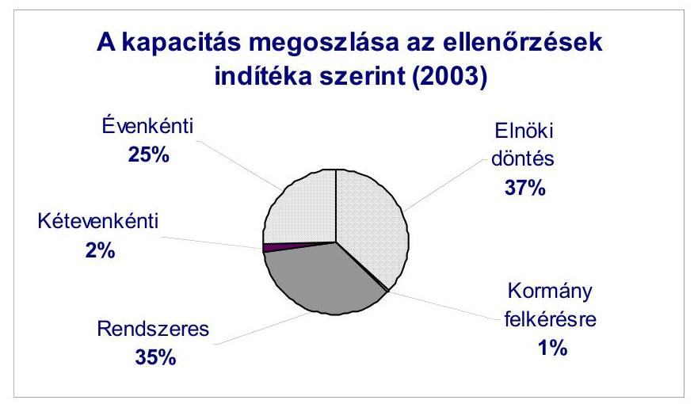

A 2003-ban elkészült jelentések jellemzőit (a jelentés tárgya, száma, a jelentést készítő igazgatóság, az ellenőrzés jogszabályi alapja és indoka, célja, a költségvetési nagyságrend) a 2. számú melléklet tartalmazza.

Ellenőrzési tevékenységünk 2003-ban összesen 60.060 ellenőri napot igényelt.
A 2003-as ellenőrzési kapacitás felhasználásában 63\%-ot jelentett a nagyobb, törvényekben előírt kötelezettségek meghatározott gyakoriságú (évenkénti, kétévenkénti, illetve rendszeres) ellenőrzési feladatok teljesítése. Ez egyben determináció is a saját, intézményi költségvetésünk alakításában.

---

Az ÁSZ vizsgálati feladatai között első helyen szerepeltek az évenkénti ellenőrzési kötelezettséggel meghatározott feladatok.

Az állami költségvetés zárszámadása, az önkormányzati feladatokhoz kapcsolódó állami támogatások igénylésének és felhasználásának szabályszerűségi vizsgálata (a cél- és címzett támogatások, valamint a kötött felhasználású normatív támogatások felhasználásának ellenőrzése), az állami költségvetés megalapozottságának véleményezése, az ÁPV Rt. és az MTI Rt. múködésének ellenőrzése.

Ebben a témakörben 6 ellenőrzési jelentés készült. Ezek közül a legnagyobb feladatot a 2002. évi költségvetés végrehajtásának ellenőrzése jelentette.

A zárszámadás ellenőrzése keretében - az elszámoltatás korszerűsítése érdekében - fontos törekvésünk volt az öt éve kísérletként megbízhatósági nyilatkozattal záruló pénzügyi szabályszerűségi ellenőrzések számának növelése. 2003-ban, a 2002. évi zárszámadás vizsgálatakor, az ilyen típusú ellenőrzések minden fejezetet érintettek.

Az ellenőrzés kiterjedt az érintett szervezetek szabályozottságának, a költségvetési és a kincstári beszámoló számszaki egyezőségének, a mérleg valódiságának és a pénzforgalmi jelentés megbízhatóságának, továbbá a szöveges beszámolónak a minősítésére. A költségvetési beszámolók, elszámolások minősítéséhez elegendő és megfelelő bizonyítékot szereztünk.

A 2003. évi ellenőrzési tervünkben meghatározott pénzügyi szabályszerűségi típusú ellenőrzések maradéktalanul teljesültek, és ily módon 2002-re vonatkozóan a fejezetek kiadási főösszegének közel 30\%-át fedtük le.

Kétévenkénti ellenőrzési kötelezettséget jelentő feladatként 2003-ban a pártok gazdálkodásáról 9 jelentés készült.

A rendszeres ellenőrzési feladatok teljesítéseként 18 jelentést tett közzé az ÁSZ 2003-ban. A törvények által megszabott rendszeres feladatok meghatározó részét a költségvetési fejezetek és a helyi önkormányzatok gazdálkodásának átfogó ellenőrzése képezte.

Az ÁSZ a központi költségvetés 7 fejezeténél és 1 fejezeti jogosítvánnyal rendelkező költségvetési címnél végzett több évre visszanyúló átfogó ellenőrzést 2003ban.

Az önkormányzati ellenőrzések struktúrájára vonatkozó továbbfejlesztési koncepciónak megfelelően 2003-ban - arányaiban - meghatározóvá vált az önkormányzatok gazdálkodásának átfogó ellenőrzése.

A 35/2003.(IV.9.) OGY határozatának megfelelően a jelentős költségvetési kockázatot hordozó önkormányzatokról (megyei, megyei jogú városi, fővárosi és fővárosi kerületi önkormányzat) 5 önálló jelentés is készült. Ennek célja egyrészt az Országgyűlés tájékoztatása az önkormányzatok feladat-ellátásáról, pénzügyi egyensúlyi helyzetéről, a vagyonváltozásról, irányítási és kontroll rendszerének múködéséről, másrészt az önkormányzatok gazdálkodásának segítése, a törvényességre, szabályszerűségre vonatkozó megállapításokkal, javaslatokkal.

---

A törvényi előírások teljesítése mellett a 2003. évi ellenőrzési kapacitás 37\%-át vehették igénybe olyan témakörök, amelyek gyakoriságát törvény nem rögzíti. Az elnöki hatáskörben eldönthető ellenőrzések körében 23 vizsgálatról készült jelentés 2003-ban, ebből 1 a Magyar Köztársaság miniszterelnöke felkérése alapján került véghajtásra.
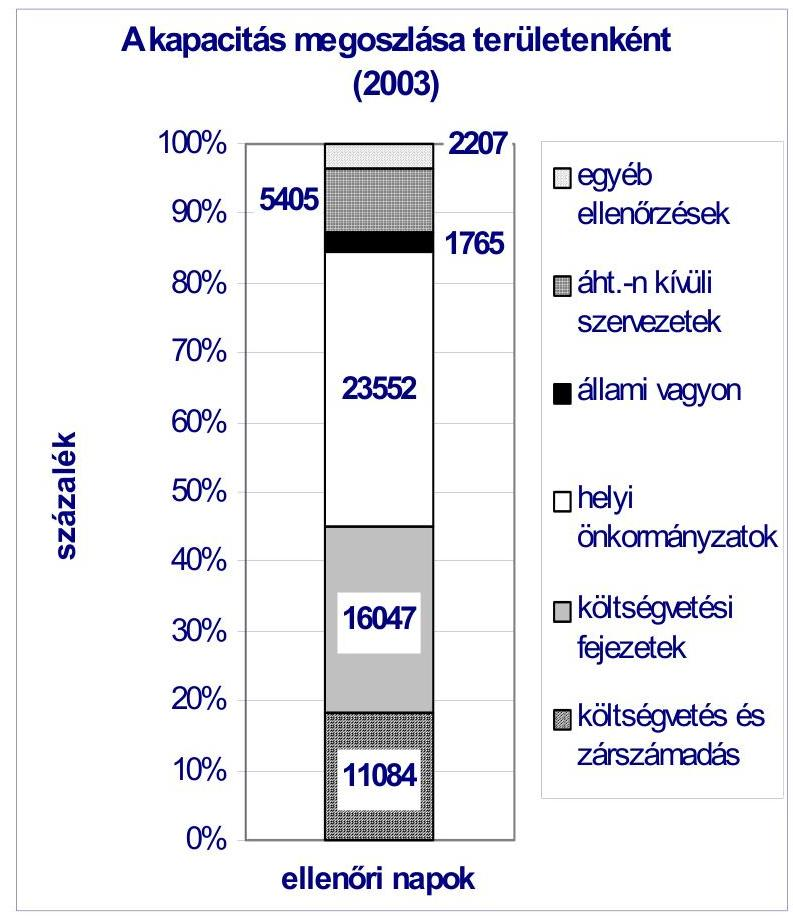

Az ÁSZ elnökének hatáskörébe tartozó ellenőrzések témáinak megválasztása egyben sajátos értékválasztás, amelyet 2003-ban is a stratégia alapvető célkitűzése határozott meg. E szerint az ÁSZ a nagy összegű költségvetési pénzfelhasználással járó és jelentős kockázatot hordozó feladatokra, a közszféra, illetve a nemzetgazdasági versenyképesség kritikus pontjaira, valamint a lakosság életminőségét befolyásoló területekre összpontosítja kapacitását.

A társadalomban betöltött szerepéből adódóan folyamatosan kiemelt figyelmet kap az egészségügy és a szociális ellátás. 2003-ban közzétettük az állami és egyházi tulajdonban lévő kórházak, egyetemi klinikák gazdálkodása, az Egészségbiztosítási Alap, a mozgáskorlátozottak támogatására előirányzott pénzeszközök hasznosulása, valamint az önkormányzatok tartós szociális ellátási feladatainak ellenőrzéséről készült jelentéseket.

---

Vizsgáltuk a nemzetközi versenyképesség javulását szolgáló tudásalapú társadalom kialakítása szempontjából fontos oktatási, felsőoktatási, illetve szakképzési tevékenységeket.

Uniós csatlakozásunkkal összefüggésben figyelmet fordítottunk a regionális infrastruktúra kiépítésére, ezen belül a területfejlesztési tanácsok és munkaszervezeteik támogatásának igénylésére és felhasználására. Évenként ellenőrizzük a helyi önkormányzatok beruházásaihoz nyújtott címzett- és céltámogatások felhasználását, 2003-ban megvalósult a Fertő-tó térség természetvédelmének és az M7-es autópálya pénzügyi folyamatának ellenőrzése.
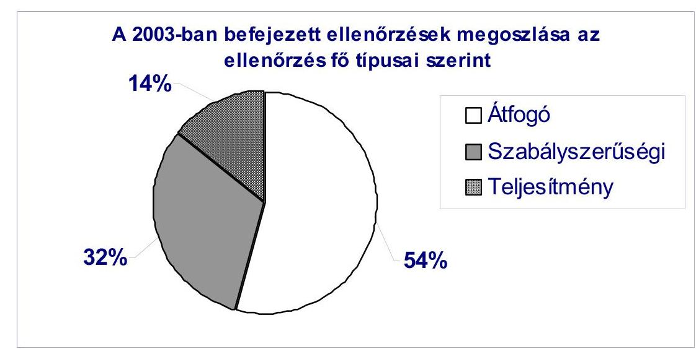

Az ÁSZ ellenőrzéseit, azok típusa szerint három fő csoportba sorolja, úgymint szabályszerűségi, átfogó és teljesítmény-ellenőrzések. Az ellenőrzéseinket a nemzetközi (INTOSAI) standardok alapján a legjobb nemzetközi gyakorlat figyelembevételével folytatjuk le. Az éves, kétéves és rendszeres ellenőrzési feladatokat jellemzően szabályszerűségi és átfogó ellenőrzésekkel teljesítjük. A leginkább szabad választás az ellenőrzés típusa tekintetében az elnöki hatáskörben meghatározott ellenőrzések esetében adott.

A szabályszerűségi ellenőrzések mellett egyre jobban előtérbe kerülnek a gazdaságosságra, hatékonyságra, eredményességre koncentráló ellenőrzések. Az ÁSZ 2003-as ellenőrzési tervében 20 teljesítmény-ellenőrzés szerepelt. Ebből 7 publikálására került sor az év folyamán.

Ezek: a katonai védelmi beruházások ellenőrzése, az ÁFA visszaigénylési rendszerének ellenőrzése, a központi költségvetést megillető jövedéki adóbevételek realizálása ellenőrzése, a felsőoktatási intézményhálózat integrációjának ellenőrzése, a Fertő-tó természetvédelmi helyzetének ellenőrzése, a mozgáskorlátozottak támogatására előirányzott pénzeszközök hasznosulásának ellenőrzése, az állami és egyházi tulajdonban lévő kórházak, egyetemi klinikák gazdálkodásának ellenőrzése.

---

# 1.2. Az egyéb számvevőszéki feladatok 

Az ÁSZ nemzetközi összehasonlításban is széles körűnek tekinthető feladatköre, felhatalmazásai nem közvetlenül és kizárólag ellenőrzési kötelezettségeket és jogosultságokat jelentenek, hanem olyan - rendszerint az ellenőrzési tapasztalatokra is támaszkodó - tevékenységeket, amelyek a közpénzek és a közvagyon hasznosítása átláthatóságának és elszámoltathatóságának előmozdítása szempontjából fontosak, illetve az állam alkotmányos múködését erősítik.

Az Alkotmány és a számvevőszéki törvény szerint a költségvetés hitelfelvételeire vonatkozó szerződések ellenjegyzése az ÁSZ (elnökének) feladata. Utóbbi törvény előírja azt is, hogy az intézmény ellenőrzése során figyelemmel kíséri az állami számviteli rend betartását, véleményezi, ellenjegyzi a továbbfejlesztésére vonatkozó javaslatokat, illetőleg ilyen javaslatot tesz. Ez az államháztartás és a pénzügyi rendszer fejlesztésében való szakmai szerepvállalás jogi megerősítése.

Az ÁSZ elnökének sajátos törvényi jogosultságai közé további véleményezések és javaslattételek is tartoznak. Véleményezi az állami vagyonkezelő szervezet belső ellenőrzési szabályzatát, s javaslatot tesz a szervezet felügyelő bizottságának elnökére, könyvvizsgálójára, továbbá a jegybank könyvvizsgálójára és az elkülönített állami pénzalapok könyvvizsgálóira.

2003-ban e feladatok köre tovább bővült. Az államháztartási törvény értelmében az állam legalább többségi befolyása alatt álló gazdálkodó szervezet esetében - ha a jegyzett tőke meghaladja a kétszáz millió forintot - a felügyelő bizottság elnökének személyére is az ÁSZ tesz javaslatot, a gazdálkodó szervezet vezetőjének megkeresése alapján.

Az EU-csatlakozás előkészítésének időszakában az előcsatlakozási források igénybevétele új intézményrendszer felállítását tette szükségessé hazánkban. A Kormány felkérte az ÁSZ-t, hogy lássa el a SAPARD Ügynökség akkreditációjához tartozó ellenőrzési feladatokat, valamint a SAPARD Program végrehajtásához kapcsolódó Igazoló Szerv feladatait.

### 1.2.1. Ellenjegyzési jogkör

A költségvetés hitelfelvételeire vonatkozóan a tavalyi év során két alkalommal került sor számvevőszéki ellenjegyzésre, a hitelfelvételek döntési folyamatának szabályszerűségi szempontból való áttekintését követően.
2003. június folyamán 500 millió euró összegű szindikált hitelfelvétellel a 2002. december 31-én átvállalt hitelek egyes elemei kerültek előtörlesztésre, amellyel megtakarítás érhető el. A 2003. évi költségvetésről szóló törvény módosította a 2002. évi költségvetést, amelynek alapján a Magyar Állam 2002. december 31-i hatállyal az eredeti hitelszerződési feltételekkel, 363 Mrd Ft értékben hitelt vállalt át, amelyek nagyobb része drága, bonyolult struktúrájú hitel volt.

---

Az Áht. 2003. évi június 30-tól hatályos módosítása alapján a pénzügyminiszter az Államadósság Kezelő Központ Rt. útján gondoskodik az állami költségvetés fizetőképességének fenntartásáról, továbbá az állam átmenetileg szabad pénzeszközeinek kezeléséről és az ezzel való gazdálkodásáról. Ez által a jogi háttere is biztosítottá vált egy készenléti hitelkeret szerződés megkötésének. A pénzügyminiszter 2003. november folyamán 500 millió euró összegű készenléti hitelkeret ellenjegyzésére kérte fel az Állami Számvevőszék elnökét. A készenléti hitelkeret rendelkezésre állása nem növelte az év végi államadósságot, így annak GDP-hez viszonyított arányát sem.

2003-ban több alkalommal került sor a számviteli rend változásával öszszefüggésben kapott ellenjegyzési jogkör gyakorlására is. Egy esetben a számviteli törvény módosítása, tíz másik esetben a végrehajtásra vonatkozó kormányrendeletek módosításaiból adódóan.

# 1.2.2. Javaslattételi jogkör 

Az ÁSZ hatályos törvényi rendelkezések alapján tesz - illetve tett 2003-at megelőzően is - javaslatot az elkülönített állami pénzalapok könyvvizsgálója, az Állami Privatizációs és Vagyonkezelő Rt. felügyelő bizottságának elnöke és könyvvizsgálója, a Magyar Fejlesztési Bank Rt. könyvvizsgálója, továbbá a Magyar Nemzeti Bank könyvvizsgálója személyére.

A felügyelő bizottsági elnökök jelölésére vonatkozó - az ún. „üvegzseb" törvénycsomag részeként megszabott - új feladatok ellátása, a végrehajtás átláthatósága érdekében „Jelölési szabályzatot" készített az ÁSZ. A hatályba léptetést és a széles körű nyilvánosságra hozatalt megelőzően a szabályzatot az adatvédelmi biztos és az Igazságügyi Minisztérium véleményezte, illetve az Országgyűlés illetékes bizottságai is megismerték azt.

A társaságoktól 2003-ban 28 kérelmet iktattunk. A hiánypótlások teljesítése után 21 kérelem volt megkeresésnek tekinthető. Ezek közül egy esetben (Mehib Rt.) nem történt személyi javaslattétel speciális rendelkezések miatt, továbbá összesen 6 kérelem elutasítására került sor, mivel nem megfelelő időpontban nyújtották be azokat, illetve a kérelmezők nem tartoztak a törvény hatálya alá.

A beszámolás időszakáig a megkeresésekre összesen 12 jelölési javaslatot tettünk, a továbbiak előkészítése pedig folyamatban van. 2004 első félévében előreláthatóan 29 társaságnál válik esedékessé a felügyelő bizottság elnökének újraválasztása.

A könyvvizsgálók pályáztatása az eddig bevált gyakorlat alapján, egyedi pályázati kiírások - de alapvetően a Jelölési szabályzatban foglaltak - szerint történik. 2003-ban a Magyar Fejlesztési Bank Rt. és a Wesselényi Miklós Ár- és Belvízvédelmi Kártalanítási Alap könyvvizsgálói pályázatait hirdettük meg és tettünk javaslatot a könyvvizsgálókra. 2004-ben terv szerint, a felkérés megérkezése esetén 2 könyvvizsgálói javaslattétel várható.

A felügyelő bizottság elnöki megbízatásra alkalmas személyek névjegyzéke, a felügyelő bizottság elnöki megbízatásra megkeresésre jelölt személyek névjegyzéke, továbbá a könyvvizsgálói megbízatásra megkeresésre javasolt könyvvizsgálók névjegyzéke a „Jelölési szabályzat"-tal együtt honlapunkon (www.asz.hu) folyamatosan elérhető.

---

# 2. Az ÁSZ 2003. ÉVI ELLENŐRZÉSEI 

### 2.1. A főbb tapasztalatok

E beszámoló a 2003. évi jelentések tapasztalataira épül, alapvetően az ismétlődő jelenségek, trendek, összefüggések bemutatásának szándékával. Jeleznünk kell, hogy a 2003-ban befejezett ellenőrzések egy része a vizsgált pénzfolyamatok sajátosságaiból adódóan korábbi évek lezárt pénzügyi adataira támaszkodik. A megállapításokat ezért igyekeztük úgy bemutatni, hogy a 2003-as államháztartási folyamatokra is következtetni lehessen.

A 2003-ról készített beszámolónkban összegzett általánosítható ellenőrzési tapasztalatok több területen megegyeznek a 2002-re megfogalmazottakkal. A költségvetési feladatok és a hozzájuk rendelt források összhangjával, a tervezéssel, a gazdálkodás szabályozottságával, az előirányzatok maradványával és a belső kontroll rendszerek kiépítettségével, működésével kapcsolatban ismételten a korábbiakkal megegyező, illetve közel azonos megállapítások tehetők.

### 2.1.1. A központi költségvetés

Az ÁSZ a költségvetési, illetve zárszámadási ellenőrzéseinek tapasztalata ismétlődően felvetette az Áht. felülvizsgálatának és megújításának kezdeményezését, hogy az a költségvetési gazdálkodás alapszabályait időtállóan rögzítse. Ezen belül indokoltnak tartottuk a költségvetés tervezése és a zárszámadás készítése ütemezésének áttekintését, módosítását, valamint a pótköltségvetés készítés feltételeinek pontosítását, illetve az Áht.-ban foglaltak következetes érvényesítését.

Az APEH és a VP illetékességébe tartozó adónemek adják a központi költségvetés közvetlen bevételeinek meghatározó hányadát. A 2003-ban lefolytatott zárszámadási ellenőrzés a részletesen vizsgált vám- és adónemeknél (áfa, szja, társasági adó, jövedéki adó, vám) az APEH és a VP valamenynyi lényeges adóztatási, vámigazgatási tevékenységét törvényesen és a saját belső előírásai szerint látta el. Ebben jelentős szerepe volt annak, hogy a hatóságok belső szabályozása és eljárási rendje megfelelően töltötte be a feladatkörét.

Ugyanakkor a költségvetés pozícióját rontotta, hogy az áfa esetében 2002 végén 73 Mrd Ft-ot utaltak vissza ellenőrzés nélkül a szabályozás szerinti határidőnél jóval rövidebb idő (10-15 nap) alatt. A vámletét számláknál az érintett adó- és vámszámlákra történő átvezetés időtartama az indokolt 12 nap helyett az ellenőrzött tranzakciók negyedénél a 20 napot is meghaladta.

A kincstári vagyon koncesszióba adásából realizált bevétel tervezése 2002-re vonatkozóan sem volt megalapozott, mivel a teljesülés az előirányzatnak 10\%-a volt. Az elmaradás az infrastruktúrával kapcsolatos koncessziós díj és árverési díj bevételi előirányzatánál jelentkezett.

---

A 2003-ban végzett zárszámadási ellenőrzés megállapította, hogy a központi költségvetés 2002. évi mérlegének föösszegei és a hiánya jelentős összegekkel haladták meg - a többszöri módosítás utáni utolsó - módosított előirányzatokat. A költségvetési hiány növekedésének - az év utolsó napjaiban módosított - előirányzatot is meghaladó mértéke (251,6 Mrd Ft) ellenére pótköltségvetési törvényjavaslat készítésére nem került sor, mivel a költségvetési törvény módosítása bizonyos kiadásokat kivont az Áht. pótköltségvetési előírásai alól.

A központi költségvetés év végi bruttó adósságának GDP-hez viszonyított aránya a 2001. évi 51,9\%-ról 54,3\%-ra emelkedett, megközelítette a maastrichti konvergencia kritérium $60 \%$-os mértékét. A teljes bruttó államadósságon belül a forintadósság állománya tovább emelkedett, részaránya az államadósság mintegy háromnegyede. A forintban fennálló adósság növekedésében a hiányt finanszírozó és adósságmegújító tartozás volt a meghatározó.

Az államháztartási reformfolyamatot illetően az előző években tett kritikai észrevételeink lényegében továbbra is helytállóak. Véleményünk változatlanul az, hogy az államháztartás egészének komplex reformját megalapozó, kiérlelt, részleteiben is kimunkált és konszenzussal elfogadott stratégia hiányában nem történhet érdemi, meghatározó változás. ${ }^{1}$

A feladatok és azok intézményi kereteinek felülvizsgálata, a célok, feladatok, források összhangjának biztosítása tekintetében - a tapasztalt pozitív irányú elmozdulások ellenére - nem történt érdemi áttörés. A 2004. évi költségvetési előirányzatok meghatározását megelőzően a fejezetek a feladatok és források összhangjának megteremtése érdekében szükséges jogszabályi előírások felülvizsgálatát jellemzően nem végezték el. Folytatódott az a nem kívánatos gyakorlat, hogy a megvalósításra kerülő intézmény-felülvizsgálatot, a feladatok prioritások szerinti rangsorolását nem tekintik folyamatos feladatnak.

A több évet felölelő átfogó ellenőrzések tapasztalatai szerint, a kormányzati munkamegosztásban - a jellemzően országgyűlési ciklusonként - bekövetkező átrendeződésekhez is kapcsolhatóan, a tárcák egy részénél végbement feladatváltozások az intézményi struktúrára is hatással voltak. Ezek új intézmények létrehozásában, átvételében, a meglévők összevonásában, átszervezésében nyilvánultak meg. Az intézményi kör tekintetében hozott döntések nagyobb része ugyanakkor nem volt köthető a költségvetési irányelvekben évek óta folyamatosan prioritást élvező intézmény- és feladat felülvizsgálathoz. E tekintetben a fejezetek többségénél továbbra is elmarad a kezdeményező szerepvállalás. Ily módon a tervezési szempontok között mindig hangsúlyosan megjelenített intézményrendszer szükítési cél nem valósult meg.

[^0]
[^0]:    ${ }^{1}$ Lásd „Vélemény a Magyar Köztársaság 2004. évi költségvetési javaslatáról", „Jelentés a Magyar Köztársaság 2002. évi költségvetése végrehajtásának ellenőrzéséről", valamint „Jelentés az Állami Számvevőszék 2002. évi tevékenységéről".

---

A központi költségvetésből finanszírozott állami feladatok köre továbbra sem csökkent. A feladatok és források összhangjának megteremtése érdekében - átfogó stratégiai iránymutatás hiányában - az egyes gazdálkodási területeken különböző, de ezen belül egységes mértékű, „fűnyíró" elven alapuló forráselvonására került sor. A jogszabályi előírások szűkítése nem valósult meg a 2004. évi tervezés során sem.

Tapasztalataink rámutattak az intézményi struktúrát érintő döntés-előkészítő munka hiányosságaira is. A nem kellően megalapozott döntések egyik példája a kincstári feladatok szervezeti kereteit érintő át- és visszaszervezés.

Előfordult, hogy hatástanulmányokat, megalapozó felméréseket nélkülöző döntések születtek olyan esetekben, amikor államháztartáson kívüli szervezet keretei közé telepítettek állami vagy állami érdekkörbe tartozó - például vagyonkezelési - feladatot.

Kedvezőtlenek a tapasztalataink a magánszektorral való feladatmegosztást illetően. ${ }^{2}$ A gazdálkodási lehetőségek bővüléséből, a szervezeti forma rugalmasságából következő előnyöket nem sikerült kihasználni, a költségvetési források szándékolt megtakarítása elmaradt, sőt esetenként jelentős költségvetési többlet-forrásigény merült fel. Egyenlőre még hiányoznak azok az útmutatók, szabályzatok, amelyek az eljárások egységességét, előkészítettségét biztosítják. A Gazdasági és Közlekedési Minisztériumtól kapott tájékoztatás szerint ezek a szabályzatok, útmutatók első darabjai 2004. második negyedévében fognak rendelkezésre állni.

Nem fordítottak mindenütt kellő figyelmet a átszervezések hatásainak értékelésére sem. Ugyanakkor pozitívum, hogy a vizsgált körben a jogszabályi előírásokat az átalakítások során általában érvényesítették.

Az államháztartás pénzügyi rendszerének továbbfejlesztése keretei közé illesztett konkrét döntés, a központosított illetményszámfejtés sem volt kellően előkészített, megvalósítása problémákkal terhelt. Nem történt meg a költségvetési szerveknél múködtetett bérszámfejtési gyakorlat, az érintettek körének, számának, a feladatot ellátók adatainak és az informatikai háttérnek a felmérése. A biztonságos és megbízható múködés biztosításához további fejlesztések szükségesek. Ez idő szerint a központosított illetményszámfejtési rendszer nem alkalmas a fejezetek által szükségesnek ítélt munkaügyi és személyzeti feladatatok integrált kezelésére, valamint a vezetői információs igények kielégítésére.

A költségvetési törvény kidolgozását befolyásoló adottságok és feltételek, nehézségek megerősítik, hogy - amint arra több ízben rámutattunk és a 2004. évi költségvetési tervező munka alapján ismételten hangsúlyoztuk - sürgető feladat az államháztartás pénzügyi rendszerének megújítása keretében a költségvetési tervezés új alapokra helyezése.

[^0]
[^0]:    ${ }^{2}$ Lásd „Jelentés a Gyermek-, Ifjúsági és Sportminisztérium fejezet müködésének ellenőrzéséről".

---

# A költségvetési kockázatok súlypontja az összeállítás technikai megvalósításáról egyre inkább a tartalmi hiányosságokra, ezen belül is a fejezeti kezelésú előirányzatok erősödő szerepére, illetve a költségvetésen kívüli finanszírozási megoldásokra, az ahhoz történő kapcsolódásokra helyeződik át. 

A költségvetést véleményező munkánk során újból összegeztük az előirányzatok megalapozottságát is befolyásoló tipikus gondokat, hiányosságokat, körülményeket.

## A törvényjavaslatok mellé jellemzően nem készülnek a szabályozás indokoltságát és szükségességét megalapozó, illetve az elvárt hatásokat bemutató tanulmányok.

Esetenként a különböző szakmai-ágazati törvényi előírások változtatásáról az Országgyúlés nem a tervező munka megkezdése előtt dönt, hanem az előirányzatok megalapozását szolgáló jogszabály-módosításokra utólag, illetve a költségvetési törvényjavaslat országgyűlési vitájával párhuzamosan kerül sor. Ezáltal olyan függőségek sora alakul ki, amely feltételrendszerében és önmagában is a költségvetési törvény belső konzisztenciáját korlátozza és a teljes körű végrehajtás akadálya lehet.

A tervező munka hiányosságainak megelőzéséhez, illetve megszüntetéséhez szükséges a főbb célok előzetes tisztázása. Ennek elmaradása miatt a költségvetési tervezésnek különösen bonyolult, esetenként egymást keresztező prioritásokkal nehezített feladatokat kell megoldania.

A 2004-es költségvetési tervszámokra vonatkozóan jeleztük a bizonytalansági tényezőket a központi költségvetés fő bevételi előirányzatai tekintetében, amelyek megalapozottsága a korábbi évekhez képest lényegesen nem változott. Egyes adónemek esetében az elkészült számítások, munkaanyagok nem biztosították megfelelően az adott előirányzatok megbízható számszerúsítését. Előrelépés viszont, hogy az adótörvény változásoknál figyelembe vették az EU tagállamokban folytatott gyakorlatot.

A költségvetési törvényjavaslat benyújtása és jóváhagyása közötti időben lényeges változások történtek az egyes makrogazdasági változókban, e mellett egyes előirányzatok is módosultak.

A költségvetési szervek kiadási előirányzatai - a normatívák hiánya mellett a megszorító intézkedések következtében - az igényekhez képest minden elemükben feszültséget hordoznak. Az előirányzat átcsoportosítási hatáskörök alacsonyabb szintre leadásával teremtett a korábbinál nagyobb mozgástér, a „gazdálkodási rugalmasság" növelése ezek oldására nem jelent elegendő eszközt.

A költségvetést megalapozó tervezési munkák a korábbi időszakokhoz viszonyítva összetettebb feladatot jelentettek. Ennek ellenére - mint ellenőrzéseink megmutatták - az előirányzatok megalapozottabbá tétele érdekében indokolt, részletesebb intézményi szintű előirányzatok kialakítása ezúttal is elmaradt.

---

A tervezést megkönnyítő normák, normatívák, feladatmutatók kidolgozására a fejezetek felügyeleti szervei érdemi lépéseket továbbra sem tettek. Ezek kidolgozását módszertani útmutatás továbbra sem segítette, így ebben a fejezetek csak saját elképzeléseikre támaszkodhattak. A kormányzati szektor teljesítményének mérése gyakorlatilag megoldatlan.

Az 1997-ben bevezetett, további két évre kitekintő gördülő tervezés az Áht.ban foglalt törvényi követelményeknek csak formálisan tesz eleget. Az aggregált költségvetési előrejelzések és részletesen kimunkált előirányzatok folyamatos, egymásra épülő rendszerének hiányában továbbra sem felelhet meg a törvényalkotói szándéknak.

Az ellenőrzött szervezetek többségénél a szabályzatok lefedték a múködés, gazdálkodás egész területét. Szúkebb körben azonban továbbra is tapasztaltuk egyes szabályzatok hiányát, illetve, hogy a jogszabályi háttér változását a belső szabályozás nem követte teljes körúen, esetenként megfelelő időben. Az előbbiekből következően a fejezetek, illetve intézményeik egy részénél a feladatok, a folyamatok szabályozása hiányos, esetenként elmaradt. Legygyakrabban az informatikai területek szabályozása volt hiányos, különösen a biztonsági követelmények érvényesítése tekintetében.

A költségvetési intézményi gazdálkodás és feladatellátás színvonalában, valamint a törvényességi, pénzügyi, szabályossági követelmények betartásában tapasztalt javulási folyamatban az intézményi beszámolók megbízhatósági ellenőrzései megállapításainak hasznosulása is közrejátszik, ugyanakkor a korábbi évek kedvezőtlen jelenségei, bár kisebb mértékben, még tapasztalhatóak voltak.

A 2002. évi költségvetési előirányzatok a tervezési kockázatokra, a kormányzati struktúra-változásra, az eltérő prioritásokra, az általános és/vagy céltartalék igénybevételre visszavezethető évközi módosítások, következtében - a költségvetési szervek irányában tovább gyưrúző hatással - jelentősen változtak.

A fejezetek többségénél 2002-ben is jellemző volt a költségvetési előirányzatok és teljesítésük - egyes fejezeteknél a bevételi előirányzatok kivételével - mind a bázis évhez, mind az eredeti és a módosított előirányzathoz viszonyított emelkedése. Jellemzően a fejezetek túlnyomó részénél a kiadások teljesítése az eredeti előirányzathoz képest 100\% feletti, a módosított előirányzat 80-100\%-a volt.

A központi költségvetési szerveknél a fejezeti kezelésű előirányzatoknál kimutatott maradvány ( 426 Mrd Ft) zöme 2002-ben keletkezett, ötöde pedig az előző évek felhasználatlan maradványa volt. A maradvány $65 \%$-a fejezeti kezelésű előirányzatokhoz, 35\%-a az intézményi gazdálkodáshoz kapcsolódott.

Jelentősebb összegű maradvány - az előző évekhez hasonlóan - azoknál a fejezeteknél keletkezett, amelyek kiterjedt intézményhálózattal, illetve szakmai programokkal, célfeladatokkal, támogatási célelóirányzatokkal rendelkeztek.

---

Nem történt változás az előirányzat maradványok jóváhagyása tekintetében. A fejezetek részére a PM - hasonlóan az előző évek gyakorlatához - késedelmesen hagyta jóvá a maradványt. Így a felügyeleti szervek sem tudták betartani a számukra előírt határidőt.

A költségvetési törvény módosított bevételi előirányzatait - az elmaradás mértékének jelentős szóródása mellett - a fejezetek közül 19 nem tudta teljesíteni. Az előirányzatok túlfeszítettségét a költségvetés véleményezése során jeleztük. Az intézményi gazdálkodásban jelentkező átmeneti likviditási problémákat részben takarékossággal, illetve előirányzat átcsoportosításokkal, feladatok halasztásával, pénzügyi technikákkal igyekeztek megszüntetni.

Az éves múködési költségek döntő többségét továbbra is a személyi kiadások képviselték. Az előirányzat módosításának döntő része kormányzati és felügyeleti hatáskörben történt. Az előirányzat növelése összefügg a 2001. évi bérpolitikai intézkedések áthúzódó hatásával, illetve azzal, hogy 2002-ben jelentős bérpolitikai intézkedések történtek.

E kiadás csoport körében a megbízási díjak vizsgálata során tapasztaltuk a legtöbb problémát, így éves, illetve folyamatos, munkaszerződés tartalmú megbízási szerződéssel történő foglalkoztatás, munkaszerződéssel foglalkoztatottak köztisztviselői juttatásban részesítése, stb.

A dologi kiadások előirányzata a fejezetek túlnyomó részénél az eredeti előirányzathoz képest jelentősen emelkedett, részben Kormány, és döntő részben fejezeti hatáskörben történt módosítások következtében.

Az eredeti előirányzathoz képest a dologi kiadások teljesítése egyes fejezetektől eltekintve, valamennyi fejezetnél $100 \%$ feletti volt, a módosított előirányzathoz viszonyítva pedig valamennyi fejezetnél $100 \%$ alatt teljesültek.

A felhalmozási kiadások előirányzatai a fejezetek túlnyomó részénél az eredeti előirányzathoz viszonyítva jelentősen emelkedtek, ugyanakkor a teljesítés adatai néhány fejezetnél kisebbek voltak, mint amire az előirányzat lehetőséget adott. A feladatok megvalósítása néhány fejezetnél áthúzódott a 2003. évre.

Az ágazati feladatok prioritásainak érvényesítésében növekvő szerepet játszanak a fejezeti kezelésú előirányzatok.

A költségvetési előirányzatok között egyre nagyobb arányt képviselnek a célfeladatok és program-finanszírozott feladatok. Az előző évekhez hasonlóan jelentős (egyes fejezeteknél közel 50\%-os) a fejezeti kezelésű előirányzatok maradványa. Elsősorban a szakmai programoknál, célfeladatoknál, támogatási célelőirányzatoknál jelentős a maradvány. Keletkezése jellemzően a felhasználással kapcsolatos döntési mechanizmusok, az eljárások, pályázatok kezelésének elhúzódására, a nem megfelelő előkészítésre, az év végén történő pótelőirányzat biztosítására, illetve a bevételek késői realizálására, illetve a támogatások bonyolításával megbízott szervezetek ügyintézésének hiányosságaira vezethető vissza.

---

A feladatfinanszírozásba vont fejezeti kezelésű előirányzatoknál a fejezetek felügyeleti szervei a költségvetési szervek gazdálkodására kiadott kormányrendelet előírása szerint meghatározták az előirányzatok célját, részletes tartalmát, a kezdeti és célállapotát, megvalósítási időtartamát, határidejét, bekerülési költségét, pénzügyi forrásösszetételét, éves ütemezését, a végrehajtásról készítendő időközi, illetve a befejezéskori szakmai értékelés módját, valamint annak tartalmi és formai követelményeit. Elkészültek a költségvetési alapokmányok, a részletes feladat-, illetve beruházási ismertetők. A feladatfinanszírozási engedélyokiratokat és a beruházási alapokmányokat a Kincstár, illetve az ÁHH jóváhagyta. A fejezeti kezelésű előirányzatok felhasználását a fejezetek felügyeleti szervei - a Ptk. előírásait figyelembe véve - szerződésekben, megállapodásokban rögzítették.

A fejezeti kezelésű előirányzatok felhasználásáról összeállított 2002. évi beszámolók felülvizsgálatának tapasztalatai eredményeként azok 27\%-át elutasító, $9 \%$-át korlátozó véleménnyel láttuk el ${ }^{3}$. A megbízható, valós képet mutató vélemények aránya $64 \%$-ot képviselt, amelyből azonban $39 \%$-nál figyelemfelhívó észrevételt tettünk.

A feltárt problémák részben a fejezeti előirányzatok ellenőrzésének hiányosságaihoz is köthetők. Az előirányzatból juttatott források helyszíni ellenőrzése a fejezetirányító munkában nem kapott megfelelő hangsúlyt. Sem a szakmai vezetés, sem a szakmai referensek részéről nem történt meg a programok, feladatok ellátásának helyszíni ellenőrzésen alapuló szakmai értékelése. A fejezeti belső ellenőrzés tevékenységében is háttérbe szorult e terület vizsgálata, részben a személyi feltételek hiánya miatt. A megfelelő ellenőrzés hiányának jelentőségét kiemeli, hogy ebből a forrásból jelentős pénzeszköz áramlik az államháztartáson kívüli körbe.

A fejezetek eszközállományának értéke gyarapodott. Két fejezet kivételével minden fejezet vagyona - bár rendkívül erős szóródást mutatva - nőtt. A vagyon növekedésében az immateriális javak vásárlása, a beruházások, a felújítások, a pénzeszközök emelkedése játszottak jelentősebb szerepet. A vagyon csökkenését az immateriális javak csökkenése, a nagyobb arányú értékesítés, a selejtezések, a térítésmentes eszközátadás, a pénzeszközök csökkenése, valamint a követelések csökkenése okozta.

Átfogó ellenőrzésünk keretében ismételten felhívtuk a figyelmet a külképviseleti ingatlangazdálkodás problémáira, amelyek a nem kellően átgondolt döntésekre, a szakmai pénzügyi szempontok érvényesítésének háttérbe szorulására, a külföldön lévő állami tulajdonú ingatlanvagyon egységes nyilvántartásának hiányára voltak visszavezethetők.

Az állam vállalkozói vagyonának értékesítése következményeként jelentősen leszűkült az ÁPV Rt-hez tartozó állami tulajdonú (résztulajdonú) gazdasági társaságok köre, ugyanakkor a minisztériumok, valamint az állami tulajdonban lévő gazdasági társaságok által alapított társaságok száma megnövekedett.

[^0]
[^0]:    ${ }^{3}$ A vizsgált előirányzatok teljesített kiadásainak százalékában.

---

A minisztériumok a többségi állami tulajdonban lévő gazdasági társaságok esetében a tulajdonosi jogok gyakorlására nem fordítanak kellő figyelmet. Az üzleti terv jóváhagyása és számonkérése megkéső és elnagyolt, és a felügyelő bizottságok ellenőrzési tevékenysége sem az átadott közpénzek súlyának megfelelő.

Kockázatosnak tartjuk - különösen a költségvetés jelenlegi helyzetében - azt a gyakorlatot, hogy a fejezetek költségvetési pénzeszközöket adnak át gazdasági szervezetek, közhasznú társaságok bankszámláira, miközben e szervezetek folyamatos feladatellátásához csak e források töredékére van szükség a tárgyévben, illetve a tárgyévet követő években. A társaságok a szabad pénzeszközeikből rendszeres kamatjövedelmet realizálhatnak.

A költségvetési belső ellenőrzés területén sem következett be a szükséges fejlődés. A költségvetési beszámoló valódisága, az intézményi múködés és gazdálkodás szabályszerűsége szempontjából kockázati tényező a belső irányítás, ellenőrzés rendszerének nem kielégítő kiépítettsége, múködése. A felügyeleti költségvetési ellenőrzés feltételei továbbra sem elégségesek. Ezt tükrözik a zárszámadás körében végzett megbízhatósági ellenőrzések eredményei is.

A feladatok teljesítését a fejezetek és a lebonyolításban közremúködő intézmények következetesen nem ellenőrzik. A fejezetek többsége nem végezte el az államháztartáson kívülre, illetve a más fejezethez átadott támogatások pénzügyi ellenőrzését.

Indokoltnak tartjuk a belső ellenőrzési rendszer múködésének felülvizsgálatát, mivel a megbízhatósági vizsgálatok végzésében fontos szerepe lenne a minisztériumok ellenőrzési szervezeteinek.

Az államháztartás belső ellenőrzésének követelményekhez igazított fejlesztése keretében az év végére - a Kormányzati Ellenőrzési Hivatal feladat- és hatáskörének tervezett újra szabályozása kivételével - megteremtődtek a feladat ellátásának jogszabályi keretei, emellett módszertani útmutatók készülnek, s munkabizottságok alakultak a további teendők meghatározására és koordinálására.

Az Országgyúlés a 69/2002. (X. 4.) és a 35/2003. (IV. 9.) határozataival megerősítette az ÁSZ stratégiáját, amely szerint a zárszámadás adatai megbízhatóságát tanúsító pénzügyi szabályszerűségi ellenőrzések csak a fejezeti belső ellenőrzési egységek bevonásával tehetők teljes körűvé és zárt rendszerűvé. A Kormány részéről azonban nem történt konkrét intézkedés a szükséges feltételek biztosítására, a feladat ellátásához szükséges ellenőri létszám feltöltésére.

Az államháztartási belső pénzügyi ellenőrzési rendszer változásából eredő feladatok ellátásához szükséges - a 2004-2006. évek közötti időszakra számított - ellenőri létszámfejlesztés megalapozása a költségvetés tervezése során prioritásként megfogalmazott feladat volt. Ennek ellenére a 2004. évi tervezés során az ellenőri létszámfejlesztéssel a fejezetek nem számoltak. Belső átcsoportosítások tervezéséről nincs információnk. A belső ellenőri tevékenységre vonatkozó kormányrendelet pedig sajátos módon 2010-ig kitolta a létszámfelté-

---

telek megteremtésének határidejét és ezzel azt, hogy a rendszer teljes körűen és zártan múködjön.

A Kormány részéről az Országgyűlés által kért intézkedések megtételének további halogatása nem teszi lehetővé, hogy a 2004. évi zárszámadási dokumentum megbízhatóságáról az ÁSZ minősítő véleményt adhasson.

# 2.1.2. Az elkülönített állami pénzalapok 

Az államháztartás elkülönített állami pénzalapok alrendszerére vonatkozó megállapításaink a 2002. évi zárszámadási és a 2004. évi költségvetési törvényjavaslat ellenőrzése keretében folytatott vizsgálatokra épültek.

Az alrendszert érintő, korábbi években végrehajtott integrációs intézkedésektől eltérő felfogást tükröz, hogy az államháztartáson belüli elkülönített finanszírozással működő alapok száma a 2003-ban hozott döntések alapján - a Wesselényi Miklós Ár- és Belvízvédelmi Kártalanítási Alappal és a 2004-től múködő Kutatási és Technológiai Innovációs Alappal - négyre emelkedett.

A 2002-ben működő két elkülönített állami pénzalap (Munkaerőpiaci Alap és a Központi Nukleáris Pénzügyi Alap) költségvetési beszámolóit az Áht. előírásainak megfelelően a jelzett évre vonatkozóan is könyvvizsgáló ellenőrizte és hitelesítő záradékkal látta el. A pénzügyi adatok vizsgálatánál támaszkodtunk a könyvvizsgálat megállapításaira, dokumentumaira. A vonatkozó törvényi előírások, illetve egyéb rendszervizsgálataink alapján az alapok számviteli és beszámolási rendszerének szabályozására, mérlegére vonatkozóan részben ismétlődő - megállapításokat tettünk. Jeleztük, hogy az éven túli kötelezettségek számviteli és költségvetési gazdálkodási szabályozása az államháztartás alrendszerére vonatkozó szabályokban nem teljes körű, az elkülönített állami pénzalap sajátosságait nem veszi figyelembe. A Munkaerőpiaci Alap költségvetési beszámolója észrevételeink ellenére továbbra sem tartalmazta az adóhatóság által beszedett bevételekhez kapcsolódó adósállomány adatát.

Az elkülönített állami pénzalapok pénzügyi helyzete lényegében kiegyensúlyozott volt. A Munkaerőpiaci Alapnál (MPA) a likviditás menedzselés 2002-ben folyamatosan előtérbe került a bevételek beérkezésének és a kiadások felmerülésének eltérő ütemével összefüggésben. Az Alap forrásaiban meghatározó járulék és hozzájárulás bevételek túlteljesülése egyértelműen a nagyobb bérkiáramlással függött össze. A többletkiadások a Kvtv. szabályainak érvényesülése mellett következtek be, zömmel az előirányzat-módosítási kötelezettség nélkül túlléphető kiadásoknál. A tervezett összeg felénél valamivel több (4,5 Mrd Ft) hiány az MPA előző évi maradványát csökkentette.

A foglalkoztatás elősegítését célzó aktív és a munkanélküliek ellátását szolgáló passzív eszközök felhasználásának MPA-n belüli aránya megközelítőleg 50-50\% volt. A főbb foglalkoztatási mutatók változatlanok maradtak (foglalkoztatási ráta $56,2 \%$, munkanélküliség $5,8 \%$ ).

---

A megváltozott munkaképességű személyeket foglalkoztató gazdálkodó szervezetek dotációjához az MPA-ból való hozzájárulás évek óta növekvő összege nem járt együtt a foglalkozási rehabilitáció helyzetének érdemi javulásával.

Az igényelt dotáció növekedése nem a rehabilitációs célú foglalkozatás javulásával, hanem a normatív módon - az adóhatóságon keresztül - igényelhető támogatás feltételrendszerével függ össze. A jelenség ugyanakkor felveti a foglalkoztatási rehabilitációért való szakmai és anyagi felelősség (illetékesség) kérdését, ebben a Foglalkoztatáspolitikai és Munkaügyi Minisztérium és az MPA szerepének tisztázását, egyértelmú meghatározását.

Az MPA - a BM fejezeten keresztül - a szociális törvényben meghatározott egyes feladatok tekintetében 2000-től biztosítja a közcélú foglalkoztatás teljes fedezetét, illetve forrása az aktív korúak rendszeres szociális segélyezésének. A települési önkormányzatok részére e célokra pénzeszköz átadásként eljuttatott források összege évről-évre dinamikusan emelkedett. Jellemzően a 2000-2002 közötti időszakban a közcélú foglalkoztatás céljára juttatott összeg megháromszorozódott.

Az önkormányzatok által ténylegesen felhasznált összegek 2002-ben is elmaradtak az Alap hozzájárulásától. Elszámolási kötelezettség hiányában azonban az átadott pénzeszközök maradványának visszautalása nem történt meg. Előrelépést jelent, hogy az ÁSZ javaslatát figyelembe véve a 2004-re vonatkozó költségvetési törvény már szabályozta ezt a kérdést.

Az MPA tervezési rendszere a korábbi évekhez képest alapvetően nem változott. A 2004. évi előirányzatok sem tükrözik azt a szemléletváltást, amit a foglalkoztatáspolitika és az uniós követelmények egyaránt megkívánnak.

A 2004. évi költségvetési előirányzatok tervezése során nem érvényesültek a foglalkoztatáspolitika, illetve a vállalkozások rehabilitációs tevékenységének támogatási rendszerével összefüggésben az EU-csatlakozás követelményei. Az aktív foglalkoztatáspolitikai eszközök felhasználásának aránya nem emelkedett, tovább nőtt a rehabilitációs célú elvonás összege.

A radioaktív hulladékok, valamint a kiégett üzemanyag elhelyezésére szolgáló tárolók létesítésére és üzemeltetésére, illetőleg a nukleáris létesítmények leszerelésének finanszírozására hivatott Központi Nukleáris Pénzügyi Alap 2002. évi költségvetési előirányzatai az előírások szerint teljesültek.

Az alap könyvvizsgálójának véleménye szerint változatlanul hiányosság tapasztalható a feladatok és a kiadások elszámolásának rendjében, mely esetenként nem biztosítja az előirányzatok felhasználásának elemzését és a megalapozott tervezést, ezért indokolt a tervezési módszer megújítása.

---

A lakosságot ért ár- és belvízzel kapcsolatos káresemények enyhítésére 2003ban létrehozott Wesselényi Miklós Ár- és Belvízvédelmi Kártalanítási Alap 2004. évi bevételi előirányzata - mintegy 400 M Ft - az alapkezelő múködési költségeit hivatott fedezni, ugyanakkor egy esetleges közeli káresemény terheinek enyhítését az Alap pénzeszközei még részlegesen sem biztosítják.

A 2004-től múködő Kutatási és Technológiai Innovációs Alap létrehozását, tervezett előirányzatait az ÁSZ által véleményezett költségvetési tör-vény-tervezet még nem tartalmazta.

# 2.1.3. A társadalombiztosítási alapok 

A Nyugdíjbiztosítási Alap (Ny. Alap) és az Egészségbiztosítási Alap (E. Alap) 2002. évi zárszámadásának ellenőrzése, illetve az alapok 2004. évi költségvetési javaslatának véleményezése mellett 2003-ban első alkalommal vizsgáltuk átfogóan - 1994-2002. évekre kiterjedően - az E. Alap múködését.

A pénzügyi, gazdasági folyamatok komplex áttekintésének igénye indokolta, hogy a vizsgálat a társadalombiztosítás egészét érintő kérdésekkel foglalkozzon. Ennek során az ellenőrzés megállapította, hogy a társadalombiztosítási rendszer megújításának koncepciójáról szóló 1991. évi országgyűlési határozatot követően elmaradt annak jogi, szakmai és pénzügyi-gazdasági megalapozása.

Az ellenőrzött időszakban az egészségbiztosítási rendszer feladata nem változott, amely szerint a biztosított jogosult az egészsége megőrzéséhez, helyreállításához és az egészségi állapota javításához szükséges egészségügyi ellátásra, továbbá a betegsége miatt kieső jövedelme részleges pótlására. Az igénybe vehető pénzbeni, természetbeni szolgáltatások köre sem változott lényegesen.

Az egészségbiztosítás keretében nyújtott ellátások finanszírozására létrehozott önálló E. Alap évről-évre pénzügyi egyensúlyi problémával küzdött, mivel nem volt összhang a bevételek és a kötelező ellátások ráfordításai között.

Gazdaságpolitikai megfontolások alapján mérsékelték a munkáltatói, illetve a munkavállalói járulékszázalékokat, amelyeknek bevételt csökkentő hatását nem ellensúlyozta az egészségügyi hozzájárulás és a munkáltatók által fizetett táppénz bevezetése, valamint a járulékalap módosítása.

Az ellátási kiadások minden évben a költségvetési előirányzatot meghaladó mértékben teljesültek. A legnagyobb növekedés évről-évre a gyógyszertámogatásnál volt. A támogatási rendszer érdemi átalakítására nem került sor, noha erre kormányhatározat is született. A tömegesen megjelenő és befogadott új termékek kiadásnövelő hatását nem sikerült mérsékelni.

Az átlagkeresetek növekedése és az infláció együttes hatására jelentősen emelkedett a rokkantsági- és baleseti nyugdíjak, hozzátartozói ellátások kiadása. A bruttó átlagkeresetek változása, az egyéni egészségbiztosítási járulé-

---

kok felső határának eltörlése következtében erőteljesen nőtt a táppénzkiadás, amely a pénzbeni ellátások legjelentősebb eleme.

Az E. Alap hiánya 1994-2002 között közel ötszörösére nőtt. Az állandósult hiány folyamatos likviditási gondokkal járt. Az ellátási kötelezettséget a naponként igénybevett állami forgóalap hitellel tudta csak teljesíteni az E. Alap.

Mindkét társadalombiztosítási alap hiánnyal zárta 2002-t, amelynek mértéke az alrendszer szintjén eredetileg tervezett (17,2 Mrd Ft-os) hiánynak csaknem a hatszorosa. Változatlan tendenciaként értékelhető, hogy az E. Alap pénzügyi helyzete alakul kedvezőtlenebbül. Az egyes ellátási kiadások megalapozatlan tervezését évről évre szóvá tesszük.

A pénzbeli ellátások közül 2002 végére a rokkantsági nyugellátások, a táppénzkiadások, valamint a terhességi-gyermekágyi segély kiadásai emelkedtek a legnagyobb mértékben.

A természetbeni ellátások között meghatározó, túl nem léphető előirányzatok mindegyikét meg kellett emelni. A gyógyító-megelőző egészségügyi ellátás finanszírozási ellentmondásai és feszültségei miatt 2002 közepén az előirányzat 50 Mrd Ft-os megemelésére került sor. Az egészségügyben végrehajtott bérintézkedéseknek a 2002. évre további 23,2 Mrd Ft-os kiadásnövelő hatása volt.

A gyógyszertámogatások eredeti kiadási előirányzata tarthatatlannak bizonyult. Az év elejétől fogva, havonta kormányhatározatokkal szabályozták az időarányos finanszírozást. A gyógyszerkiadások alakulását érdemben befolyásoló intézkedések 2002-ben sem történtek.

A társadalombiztosítás pénzügyi alapjai 2004. évi költségvetési javaslatának vizsgálata során több bizonytalansági elemet érzékeltünk. Az államháztartás egészére megfogalmazott egyensúlyi követelmény ${ }^{4}$ teljesítése egyes társadalombiztosítási bevételek „felül tervezését", egyes ellátási és a müködési kiadások „alul tervezését" eredményezte.

Mindezek következtében a Ny. Alap 2004. évi költségvetésében, induló állapotban „rejtett" hiányt láttunk. A nyugdíjkiadások tervezése 6,3\%-os nyugdíjemelést feltételezve történt. Egy esetleges kiegészítő nyugdíjemelésre az Alap költségvetése forrást nem tartalmaz, ami szintén hiányt okozhat. Az E. Alap 2004. évi költségvetésében tervezett hiányt az ellátási kiadásoknál mutatkozó feszültségek miatt alulbecsültnek értékeltük. Feszített a gyógyító megelőző egészségügyi ellátás 2004-re vonatkozó kiadási előirányzata, ami finanszírozási feszültségek keletkezését, illetve az egészségügy átalakítása szempontjából fontos programok halasztódását vetítheti előre. A legkritikusabb ellátási kiadás 2004ben is a gyógyszerek támogatási előirányzata, ami még a 2003. évi várható kiadásokat sem éri el. Tervezési szempontból különösen problematikus az infláció és az áfa-kulcs bevezetése hatásainak figyelmen kívül hagyása.

[^0]
[^0]:    ${ }^{4}$ A hiány a GDP 3,8\%-át nem haladhatja meg.

---

# 2.1.4. A helyi önkormányzatok 

Az önkormányzatok és intézményeik elsődleges kiadásainak aránya az államháztartáson belül 2003-ban lényegében változatlan volt (22\%). Az összesen 3.187 helyi önkormányzat és mintegy 1.850 kisebbségi önkormányzat kiadásai - az előző évi 10 Mrd Ft-tal szemben - 117 Mrd Ft-tal haladják meg a tárgyévi bevételeket, ebből adódóan is az adósságállomány nőtt. Az önkormányzatok romló gazdasági pozíciójára utal, hogy a múködési kiadások a bevételek növekvő részarányát kötik le (2001-ben 69\%, 2002-ben 73\%-át).

Az önkormányzati forrásszabályozási és támogatási rendszer a tárgyévben lényegét illetően nem változott. A jövedelem vonatkozásában a centralizáció erőteljes, míg a feladat, hatáskör és felelősség vonatkozásában a decentralizáció tovább nőtt.

A forrásszabályozás fejlesztésére vonatkozó javaslatok kidolgozása, az ehhez szükséges önkormányzati feladat-és hatáskörök kormányhatározatokban elrendelt felülvizsgálata továbbra is várat magára. A közigazgatási rendszer korszerűsítésével kapcsolatos feladatokat tartalmazó kormányhatározat az önkormányzati finanszírozás korszerúsítésének részletes koncepciója kidolgozására 2004. június 30-i határidőt határoz meg.

A központi költségvetés által az önkormányzatoknak átadott költségvetési támogatások és hozzájárulások aránycsökkenése - azok összegének jelentős növekedése ellenére - a központi költségvetés kiadásai között folytatódott.

Az önkormányzatoknak nyújtott állami támogatások, hozzájárulások, valamint a személyi jövedelemadóból átengedett bevétel 2003. évi növekménye (29\%) nem nyújtott fedezetet a kormányprogramból adódó bér és szociálpolitikai intézkedések körére.

A közalkalmazotti bérek átlagosan 50\%-os emelésére a támogatások növelése, az szja helyben maradó részének megemelésével (5\%-ról 10\%-ra), valamint a gépjármú súlyadó teljes egészének az önkormányzatoknál hagyásával sem biztosított teljes körűen fedezetet. Jelenleg a közalkalmazottak kétharmada, mintegy 403 ezer fő dolgozik az önkormányzatoknál és közel 8 Mrd Ft állt rendelkezésre a probléma részbeni rendezésére.

A dologi jellegú múködési kiadások szinten tartására, az inflációs hatások ellensúlyozására mind ez ideig sem épült be automatizmus a központi támogatásokba.

Az önkormányzati feladatok finanszírozása, az önkormányzatok pénzügyi helyzetének stabilizálása a központi források elégtelensége következtében továbbra is a saját bevételek növelésére ösztönzi és kényszeríti az önkormányzatokat.

---

Az önkormányzati saját források legjelentősebb tételét változatlanul a helyi adóbevételek képviselték.

A helyi adót bevezető önkormányzatok száma tovább nőtt, 3.052 önkormányzat ( $96 \%$ ) élt a helyi adókivetés lehetőségével. A helyi adóbevételek $11,3 \%$-os növekedése mind az előző évinél ( $20,3 \%$ ), mind pedig a tárgyévi bevételeknél mérsékeltebb volt, csökkent az önkormányzati bevételek közötti részaránya ( $14 \%$-ról $13,6 \%$-ra).

Az iparűzési adó növekedésének mértéke erőteljesen csökkent, miközben a legdinamikusabb tételt a telekadó jelentette. Az idegenforgalom visszaesésével párhuzamosan jelentősen csökkent az idegenforgalmi tartózkodás, és építmények utáni adó is.

A települések jelentős hányadát még ma is az jellemzi, hogy a feladatok finanszírozását a központi költségvetésből illetve annak forrásaiból kénytelen biztosítani. A települések gazdálkodásának egyik jellemzője, hogy a költségvetés szerkezete a fejlesztések rovására eltolódott a múködés biztosításának javára.

Az önkormányzatok állami támogatásokon kívüli gazdasági erejét befolyásoló saját bevételek sokszor nem a képviselőtestületek hozzáállásán, fejlesztési, beruházási politikáján, hanem olyan objektív tényezőkön múlnak, mint a település gazdasági adottságai, vagy a befektetői szándék.

# Az önkormányzatok költségvetési egyensúlyi helyzete nem javult, a 

feladatok és azok teljesítéséhez szükséges pénzügyi feltételek közötti összhang az ellenőrzött önkormányzatok közel felénél hiányzott. A tárgyévben 1.483 önkormányzat vált működésképtelenné és részesült 19,2 Mrd Ft kiegészítő támogatásban.

Az ÖNHIKI és egyéb támogatások összege 2000-ben 13,6 Mrd Ft, 2001-ben 15,2 Mrd Ft, a támogatásban részesülő önkormányzatok száma pedig 1.289, illetve 1.317 volt.

A forráshiány kialakulásában a kedvezőtlen helyi adottságokon túl szerepet játszott az intézmények elaprózottsága, nem megfelelő kihasználtsága, esetenként a helyi lehetőségekkel nem arányos feladatvállalás. Nem történt érdemi előrelépés a térségi feladatok pénzügyi finanszírozásában.

A vizsgált időszakban főként a városi önkormányzatok éltek a nem kötelező feladatok esetében az intézmények, illetve fenntartói jogosítványaik átadásának lehetőségével a megyei önkormányzatok számára. Az átadások gyakorlatilag a települési önkormányzatok múködésében jelentkező forráshiány egy részének továbbadását jelentik a megyei önkormányzatok költségvetésébe ${ }^{5}$.

[^0]
[^0]:    ${ }^{5}$ A feladatellátás túlnyomórészt továbbra is a középfokú oktatási intézményekkel kapcsolatos, de érinti a zeneiskolai képzést, a szociális ellátást, valamint a fogyatékos gyermekek alapfokú oktatását, nevelését is. Új jelenség, hogy a feladat- és intézményátadás az állami és alapítványi szféra között is történt az elmúlt évben (az FVM szakközépiskolát, a Minorita rendház kollégiumot vett át megyei önkormányzattól).

---

A múködésképtelen helyzetek kezelésére igénybe vehető támogatások az önkormányzatok pénzügyi helyzetét ugyan átmenetileg javították, de esetenként szükségessé vált a forráshiány egyéb eszközrendszerének alkalmazása is (helyi bevételek növelése, vagyonértékesítés). Mindezen eszközök külön-külön és együttesen sem alkalmasak a forráshiány tartós rendezésére, amely elodázhatatlanná teszi a feladatok értékelését, a múködési költségek csökkentését, a társulási formák alkalmazását, illetve esetenként az intézménybezárást.

A kötelező és önként vállalt feladatok és a pénzügyi források egyensúlya a vizsgált önkormányzatok felénél csak külső források (hitelfelvétel) és támogatások igénybevételével volt megoldható. Nőtt a múködési célú hitelállomány, az önkormányzatok privatizációs bevételeiket nem használták fel e hitelállomány kiváltására, vagyis az eladósodottság folytatódott. A hitelfelvétel több mint $80 \%$-kal több az előző évinél az önkormányzatok összességében ${ }^{6}$. Az eladósodási tendencia 2004-ben tovább folytatódik. Az ÁSZ a 2004. évi költségvetési terv véleményezésekor jelezte, hogy az önkormányzati feladatokhoz nem kapcsolódik megfelelő mértékű pénzügyi forrás.

A feladatellátás szervezeti formáit illetően érdemi előrelépés nem történt. A közigazgatási feladatok körjegyzöségi keretben történő ellátása továbbra is a községek, ezen belül is főként a kisközségek körében jellemző. A vizsgált 330 községi önkormányzati körben az ellenőrzöttek több mint fele alapított önálló hivatali szervezetet, a többi körjegyzőségi keretek közt múködött. Egy-egy körjegyzőségben a korábbi éveknek megfelelően átlagosan 2,8 önkormányzat vett részt.

Az ellenőrzött megyei és városi önkormányzatoknál a társulásokban rejlő lehetőségek felismerése és a társulási hajlandóság a községekhez képest szerényebb mértékben volt tapasztalható. A városi önkormányzatok társulásokban való részvételét a települési, térségi szintű fejlesztési célkitűzéseket szolgáló pénzeszközök megszerzése és a hatékonyabb felhasználása motiválta.

Kedvezőnek értékelhető, hogy a társulások körében megjelent a környezeti és természeti értékek védelme. A községekben a közös feladatellátásra irányuló együttműködés jellemző területe az intézményfenntartás, ezen belül az alapfokú oktatás, a családsegítő és gyermekjóléti szolgáltatás, valamint az egészségügyi alapellátás volt. A társulások további területei a településüzemeltetési feladatok, a település- és területfejlesztés, a kistérségi fejlesztések és a nagyobb beruházások, főként a hulladékgazdálkodás, és tisztítórendszerek területén. A vizsgált önkormányzatok $47 \%$-a volt társulás alapítója, vagy csatlakozott társuláshoz.

[^0]
[^0]:    6 A rövid lejáratú múködési célú hitelállomány összege 17 Mrd Ft-ról 26 Mrd Ft-ra emelkedett. A növekedéshez hozzájárult, hogy a számlavezető bankok az önkormányzatok múködési hiányának áthidalására rugalmas folyószámlakeretet biztosítottak, amely a múködési hitelállomány tartós fennállását, a hitelkeret folyamatos megújítását eredményezte. E kedvezőtlen tendencia kapcsolatba hozható azzal, hogy az Ötv. a likvidhiteleket kivette az önkormányzatok kötelezettségvállalási korlátjának számításából. Aggodalomra ad okot a beruházási fejlesztési célú, hosszú lejáratú elkötelezettséget jelentő hitelállomány erőteljes növekedése ( 105 Mrd Ft-ról 174 Mrd Ft-ra).

---

A gazdasági társasági forma a településüzemeltetés egyes területein jellemző, ezen belül is az rt., illetve kft. útján történő szolgáltatás. Ezek a gazdasági társaságok döntően az ivóvíz- és csatornaszolgáltatásban, a távhőszolgáltatásban, a hulladékgazdálkodásban, illetve a vagyongazdálkodás területén tevékenykedtek.

Az előző évekhez képest javult az önkormányzatok gazdálkodási tevékenységének szabályozottsága. A vizsgált önkormányzatok negyede árubeszerzéseit, építési beruházásait és szolgáltatás vásárlásait közbeszerzési eljárással bonyolította le, melyek során többségében betartották a közbeszerzésről szóló törvény és a helyi rendeletek előírásait.

Az önkormányzatok mintegy felénél állapítottunk meg az operatív gazdálkodást illetően különböző hiányosságot. Elmaradt, vagy nem az arra jogosultak végezték a kötelezettség-vállalást, utalványozást, ellenjegyzést, teljesítésigazolást, érvényesítést.

Az önkormányzatok kétharmadánál különböző súlyú hiányosságok tapasztalhatók a számviteli nyilvántartások vezetésénél, a bizonylati fegyelem betartásánál és a saját szabályzatokban előírtak megsértésénél. A gazdálkodási fegyelem sorozatos megsértése miatt a 2003-as ellenőrzések alapján 11 települési és 2 kisebbségi önkormányzatnál, összesen 24 fő felelősségét vetettük fel.

Az elfogadott költségvetések közel 80\%-ban feleltek meg a szerkezetre, tartalomra vonatkozó jogszabályi előírásoknak. A több éves kihatással járó kötelezettségek évenkénti előirányzatának bemutatása és a költségvetés végrehajtásával kapcsolatos részletes szabályok megalkotása az önkormányzatok mintegy harmadánál- főként a községeknél - elmaradt. Zárszámadási kötelezettségének az önkormányzatok döntő többsége eleget tett, a zárszámadási előterjesztéseket, elfogadott rendeleteket illetően javuló tendenciára utal, hogy az előző évi $40 \%$-kal szemben közel $70 \%$-uk megfelelt a jogszabályi előírásoknak.

A könyvvizsgálók az ÁSZ által ellenőrzött körben az önkormányzati beszámolók 97\%-át korlátozás nélkül hitelesítették, mindössze néhány esetben adtak a hiányosságok miatt korlátozó záradékot. A könyvvizsgálók többségükben a vagyoni helyzet bemutatásának pontatlanságát kifogásolták.

A települési és a helyi kisebbségi önkormányzatok az együttmúködési megállapodásokat nem kötötték meg teljes körűen, illetve azokat csak formális kötelezettségnek tekintették. A települési önkormányzatokkal a költségvetési tervezés, az operatív gazdálkodás, a beszámolás és a zárszámadás területén szükséges munkamegosztás teljes körűen nem alakult ki. A hivatalok tevékenysége a szükséges koordináció hiányában nem segítette kellően a feladatok jogszabályoknak megfelelő ellátását. Az együttmúködés hiányosságai kedvezőtlenül befolyásolták a kisebbségi önkormányzatok múködését.

---

Az állami források döntő többségét továbbra is a kötelezően ellátandó feladatok forrásául szolgáló normatív támogatások teszik ki, amelyek részben alanyi jogon illetik meg az önkormányzatokat, másrészt a különböző törvényekben megfogalmazott feladatokhoz kapcsolódóan évente változó célok és kvóták alapján kerülnek odaítélésre. A tárgyévben a vizsgálat kiemelt figyelmet fordított az állami hozzájárulások, támogatások mintegy 20\%-át kitevő kötött felhasználású (normatív kötött felhasználású és központosított előirányzatok) támogatások ellenőrzésére, amelyek együttes összege 119 Mrd Ft volt.

A központosított támogatások közül a lakossági közmúfejlesztési támogatások felhasználását illetően megállapítottuk, hogy a közmúfejlesztési feladatok megoldása, a számos ösztönző támogatási lehetőség ellenére (központosított, cél, területi támogatások) jelentős lakossági forrást igényel. Az önkormányzatok a lakossági terhek csökkentése érdekében minden támogatási lehetőséget igyekeznek megragadni, olykor a szabálytalan támogatáslehívási lehetőséget is felhasználva. Ide tartoznak a hitelintézetek és lakás-takarékpénztárak által kidolgozott konstrukciók, amelyek az állami támogatások olyan mértékű igénybevételét célozták meg, hogy az érdekeltségi hozzájárulás ténylegesen ne, vagy csak minimális mértékben terhelje a lakosokat. Az ellenőrzött önkormányzatok a részükre kiutalt közmúfejlesztési hozzájárulások 26\%-át jogtalanul vették igénybe.

A központosított előirányzatok jogcímeit érintően az önkormányzati álláshelymegszüntetéssel együtt járó létszámcsökkentéshez kapcsolódó támogatási rendszer vonatkozásában a vizsgálat megállapította, hogy az önkormányzatok elszámoltatása a létszámcsökkentési pályázatoknál csak részben megoldott. A létszámcsökkentési támogatás hatása diszfunkcionális, gyakori a létszámcsökkentés évét követően az álláshely ismételt létrehozása az átszervezések és új feladatok miatt, aminek jogszabályi korlátja nincs.

A 76 Mrd Ft normatív kötött felhasználású támogatások körében a jövedelempótló támogatások kiegészítését, valamint a közcélú foglalkoztatás támogatása jogcímeket érintően az ellenőrzés kisebb mulasztásokat tárt fel.

A közcélú foglalkoztatás támogatási keretének ésszerű felhasználását akadályozta, hogy az önkormányzatok nem rendelkeznek olyan munkaügyi információs rendszerrel, amely alkalmas lenne a munkaképes korú lakosság munkaerő-piaci helyzetének és a szociális ellátórendszerben elfoglalt helyének nyomon követésére.

A támogatások között a 40 Mrd Ft nagyságrendet képviselő céltámogatások kapcsolódnak leginkább a településfejlesztéshez. A támogatandó célok között az uniós csatlakozási követelményekkel összhangban továbbra is meghatározó súlyt képviselt a szennyvízelvezetési, tisztítási feladatok megoldása, jelezve az ország törekvését a közműolló zárására.

Az évek óta hangsúlyozott figyelemfelhívásunk ellenére a támogatási rendszerben meglévő hiányosságok nem csökkentek, változatlanul gondot okozott a fejlesztésekhez szükséges saját forrás hiánya. Az önkormányzatok a beruházások saját forrását továbbra is alapvetően az egyéb állami támogatásból és fejezeti célelőirányzatokból kívánták fedezni.

---

A címzett és céltámogatások, valamint az egyéb állami pénzalapok pályáztatási és döntési rendszerének összehangolását a vonatkozó jogszabályi előírások ellenére továbbra sem sikerült megvalósítani. Emiatt az önkormányzatok a beruházások saját forrását továbbra sem tudják a kívánt mértékben biztosítani. A pénzeszközök maradványa a kétségtelen csökkenés ellenére (1996-ban 47\%, 2002-ben 31,7\%) még mindig magas. Továbbra is meghatározó a céltámogatások maradványa, amely a korábbi évekhez hasonlóan a szennyvízelvezetés és tisztítás ágazatban keletkezett. A szabályozásváltozás nem képes feloldani a fejlesztési források iránti tartósan magas kereslet és a képződő jelentős összegű maradvány közti ellentmondást.

Az önkormányzati vagyon értéke a tárgyév végére közel kétszeresére nőtt. A növekedés mértéke mind a megelőző évit, mind pedig az elmúlt tíz év átlagát messze felülmúlta. E kiugró mértékű vagyongyarapodás döntően a korábbi években érték nélkül nyilvántartott ingatlanok érték-megállapításának - főként az ingatlan-vagyonkataszter felülvizsgálatának - az önkormányzati tulajdonban lévő ingatlanok (elsősorban belterületi földek) állományba vételének, egyidejűleg az értékelés elvégzésének a következménye.

A vagyonszerkezet változását jelzi, hogy a tárgyi eszközök - mindenekelőtt az ingatlanok - értéknövekedése az előző évi több mint kétszerese, miközben a befektetett pénzügyi eszközök értéke és részaránya csökkent. Jelentős az üzemeltetésre, kezelésre átadott eszközérték növekedése is. (Az összes önkormányzati pénzügyi befektetések több mint felével a Fővárosi Önkormányzat rendelkezik.)

Az ingatlanállományhoz kapcsolódóan 2003-ban vizsgáltuk az önkormányzatok lakás- és helyiséggazdálkodását, a támogatások igénybevételét és felhasználását, valamint a fenntartás és üzemeltetés szabályosságát.

A bérlakásépítés valamint a lakóépületek energia megtakarítási programjának támogatására a Kormány 2000-2002. évekre összesen 54,5 Mrd Ft-ot irányzott elő. A lakások bérbeadása megfelelt a vonatkozó szabályoknak, gondot okozott viszont, hogy a lakbérek növekedése ellenére (az elmúlt öt évben duplájára növekedtek) a bevételek a felmerülő kiadások alig több mint negyedét fedezik. A lakbérhátralék összege tovább nőtt. A bérlakást igénylők anyagi kondíciói mellett a vállalkozói tőke bevonásával építendő lakások bérét csak egy alapjaiban új lakbér-támogatási rendszer kialakításával lehetne megfizethetővé tenni. A vizsgált önkormányzatok 50-60\%-a a lakások múködtetéséhez, de még inkább a felújításához a lakbéren kívül többletforrásokat kénytelen igénybe venni. A lakástörvény előírása ellenére az önkormányzatok kétharmadánál szabályozatlan a lakáseladásból származó bevételek felhasználása.

A program hatásaként - és részben a rosszabb minőségű, felújításra szoruló lakások további értékesítésének eredményeként - korszerűsödött az önkormányzati tulajdonú lakásállomány, javult a komfortfokozat szerinti összetétele, szabályozottabbá vált az önkormányzati lakásgazdálkodás. Az önkormányzatok szerepe a szociálisan rászorulók lakáshoz juttatásában felerősödött, a lakásigényt benyújtók száma ennek hatására növekedett. A lakáspályázati rendszer az állami forrás pályázathoz szükséges saját erő következtében - pozitív hatása ellenére - nem járult hozzá sem az esélyegyenlőség, sem pedig a népességmegtartó képesség növeléséhez.

---

A helyi önkormányzatok pénzügyi befektetésekkel történő gazdálkodásának vizsgálati tapasztalatai szerint az önkormányzatok továbbra sem rendelkeznek átmenetileg szabaddá vált pénzeszközeik befektetésére vonatkozó programmal. Ugyanakkor az ellenőrzött önkormányzatok törekszenek a biztonság és a jövedelmezőség egyidejú érvényesítésére a befektetési szolgáltatók és a befektetési eszközök vonatkozásában egyaránt, megjelentek a pályáztatás különböző formái, illetve a zártkörú ajánlatkérések.

Az önkormányzatok eladósodási tendenciájára utal, hogy míg a pénzügyi befektetésekből származó hozambevételek 1998-1999-ben az önkormányzatok fejlesztési forrásainak kiegészítését szolgálták, 2000-2001-től ezen források az önkormányzatok egy részénél (15\%) már a múködési kiadásokat finanszírozzák. Az önkormányzatok többsége a pénzügyi befektetéseket illetően továbbra is igyekszik elkerülni a nagyobb kockázatot, emiatt nőtt az állampapírok és az alacsony hozamú befektetési jegyek aránya.

Az önkormányzati szervezetirányítás legelhanyagoltabb területét jelentő felügyeleti és belső ellenőrzés tekintetében nem történt érdemi előrelépés. A városi, nagyközségi és községi önkormányzatoknál a felügyeleti jellegú és belső ellenőrzés dokumentáltsága továbbra is hiányos, elmaradt a megállapítások összegzése, a javaslatok megfogalmazása. Felügyeleti jellegú ellenőrzési kötelezettségének a vizsgált önkormányzatok fele tett eleget. A kisközségek esetében alacsony a pénzügyi-gazdasági ellenőrzések száma, nem kielégítő a gyakorisága.

# 2.1.5. Az állami vagyon 

2003-ban az állam vállalkozói vagyonát kezelő Állami Privatizációs és Vagyonkezelő Rt. (ÁPV Rt.) 2002. évi múködését és a központi költségvetés végrehajtásához kapcsolódó tevékenységét, a közvetetten állami tulajdonban lévő Állami Autópálya Kezelő Rt. (ÁAK Rt.) pénzbefektetési tevékenységét, valamint a szintén közvetetten állami tulajdonban lévő Postabank és Takarékpénztár Rt. 1998. évi konszolidációs megállapodása teljesítését vizsgáltuk.

Az ÁPV Rt. 2002. évi múködését befolyásolta a kormányzati ciklusváltás. Az év első felében - az akkori Kormány gazdaságpolitikai törekvéseivel, irányelveivel összhangban - a vagyonkezelési tevékenység kapott prioritást, a kormányváltást követően a privatizáció újraindítása, illetve annak felgyorsítása került előtérbe.

A vagyonkezelő szervezet egész évben nem rendelkezett részvényesi jogok gyakorlója által jóváhagyott üzleti tervvel. Az ellenőrzött időszakban szervezetileg lényegében a korábbi struktúrában múködött, az új célokhoz igazodó új szervezeti és múködési szabályzat az év végén jelent meg.

Először fordult elő az ÁPV Rt. és jogelődjei történetében, hogy az állami vagyonkezelő osztalék bevételei meghaladták a privatizációból származó bevételeket. Mindemellett a korábbi szerződésekből származó kötelezettségek növekvő mértékben, további terheket jelentenek.

---

A költségvetési törvény 2002-re 32 Mrd Ft befizetési kötelezettséget írt elő az állami vagyon utáni részesedésként az ÁPV Rt. számára. Ezt a befizetési kötelezettséget az Országgyúlés később törölte. A tartalékfeltöltési kötelezettség teljesítésére év közben a költségvetésből 5 Mrd Ft pénzeszköz és 10,1 Mrd Ft államkötvény került a társasághoz. Mivel költségvetési befizetésre a vagyonkezelő részéről nem került sor, a központi költségvetés pozícióját tovább rontotta a privatizációs szervezetnek teljesített juttatás.

Jellemzően továbbra sem javult a társaság költségvetési kapcsolatainak tervezése. A költségvetési törvény 95,5 Mrd Ft előirányzatot tartalmazott a hozzárendelt vagyonnal kapcsolatos ráfordításokra, ezzel szemben a tényleges felhasználás 24,5 Mrd Ft volt.

Az ÁPV Rt. hozzárendelt vagyonába tartozó társaságok esetében előfordult, hogy támogatásként előfinanszírozásként, konkrét célra kiutalt összeget az adott társaság - a közbeszerzési eljárás során felmerült problémák miatt - az ellenőrzés befejezéséig nem használta fel. Előfordult az is, hogy szintén a hozzárendelt vagyonba tartozó társaság korábban elfogadott átalakítási koncepciója nem folytatódott, ezért az előző évben az e célra biztosított, több milliárd forintos támogatás 2002-ben nem hasznosult.

Az államháztartáson kívülre került pénzeszközök célszerű felhasználása nyomon követésének, ellenőrzésének általános megoldatlanságát támasztják alá az ÁAK Rt. pénzbefektetési tevékenységét ellenőrző célvizsgálatunk megállapításai.

Az ÁAK Rt. társasági formában múködik, pénzforgalmát - miközben állami feladatot lát el - nem a Kincstár bonyolítja, ennélfogva rendelkezhet átmenetileg szabad pénzeszközökkel.

Az ÁAK Rt. az MFB-től és az Nemzeti Autópálya Rt.-től befolyt 16 Mrd Ft olyan pénzeszközt helyezett el a K\&H Equities Értékpapírkereskedelmi Rt.-nél vezetett ügyfélszámláján, amely minden szempontból közpénznek minősül. A közpénz fogalmának nincs jogszabályi meghatározása, és ez eltérő értelmezésre adott lehetőséget.

Korábban már jeleztük, hogy a miniszteri felügyelet alá tartozó társaságok tevékenységéről sem a Kormány, sem az Országgyúlés nem kap tájékoztatást, így arról sem, hogy a társaságoknál mikor és milyen összegű, az állami költségvetésből származó szabad pénzeszközök vannak, és azokat mire használják. Nincs olyan jogszabály, amely a gazdasági társaság költségvetési eredetú bevételeinek elkülönített kezelését, nyilvántartását, elszámolási kötelezettségét szabályozná.

A Postabank és Takarékpénztár Rt. 1998. év végi konszolidációja során a Bank és a PM között konszolidációs megállapodás jött létre, amelyben meghatározták a pénzintézet kötelezettségeit a jövőbeni biztonságos múködés érdekében. Megállapítottuk, hogy a Bank a megállapodásban foglaltakat teljesítette, a múködéshez szükséges szabályzatokat elkészítette, kiépítette belső kontroll rendszerét. Hitelezési tevékenysége mind a szabályozottságát, mind a szabályosságát tekintve javult.

---

# 2.1.6. Az államháztartáson kívüli szervezetekkel kapcsolatos ellenőrzések 

A tárgyévben az ÁSZ három - Kormány által alapított - közalapítvány gazdálkodásának átfogó ellenőrzését végezte el, melyek múködését kettőnél csaknem teljes egészében, egynél pedig 70\%-ban a központi költségvetés finanszírozta. Az ellenőrzési tapasztalatok igazolják, hogy a közalapítványok által ellátott közhasznú feladatokhoz a vállalkozások és az állampolgárok adományokkal nem járulnak hozzá, a saját bevételek túlnyomó része az átmenetileg fel nem használt és pénzintézetnél lekötött állami források kamatbevételeiből származik. Mivel a központi költségvetési támogatások nominálértéke az ellenőrzött időszakban (1998-2002 között) nem változott, emiatt a közfeladatok ellátásának színvonala, a közalapítványok által támogatott személyek, szervezetek vagy közcélok száma csökkent, illetve a kedvezményezettek ellátását szolgáló ingatlanok múszaki állapota romlott.

A kuratóriumok a közfeladatokra szánt pénzeszközök döntő többségét nyilvánosan meghirdetett pályázatok alapján osztották szét, a pályázatok elbírálásának, a felhasználás ellenőrzésének folyamata szabályozott volt. A gazdálkodás törvényességének jellemző hiányosságaként állapítottuk meg, hogy olyan személyek is vállaltak kötelezettséget a közalapítvány nevében, akiknek az alapító az alapító okiratban nem engedélyezte a képviseleti jogot. A törvényes gazdálkodást megalapozó belső szabályzatok nem voltak teljes körűek, nem tükrözték az adott közalapítvány sajátosságait. Az éves pénzügyi tervezés során a kuratóriumok nem számoltak teljes körűen a rendelkezésre álló pénzügyi forrásokkal és kötelezettségekkel, s e mellett sem a tervezés, sem a pénzügyi teljesítés folyamatában nem akadályozták meg a munkaszervezet indokolatlan költekezését.

Indokolatlan - számításokkal alá nem támasztott - különbség van az egyes közalapítványok által felhasználható múködési (rezsi) költségkeret, illetve a kurátorok és FB tagok tiszteletdíjának, költségtérítésének összegében, mivel ezek megállapításakor a Kormány nem differenciált a közalapítványok sajátosságai szerint.

Ezek például: az ellátott közfeladatok száma, összetettsége, az átadott induló vagyon összege és összetétele, a vagyonkezeléssel járó döntések bonyolultsága, az állami támogatásból teljesített mindenkori tárgyévi kiadások mértéke, felhasználásának (pályázati elosztás vagy saját szervezeten belüli feladatellátás) munkaigénye, a munkaszervezet optimális létszáma, stb.

A múködési költségkeret nem ösztönzi takarékosságra a kuratóriumokat, a tiszteletdíj mértéke pedig nincs arányban a gazdasági társaságok vezető tisztségviselői felelősségével, illetve a számukra meghatározott díjazással.

Miközben a Kormány kijelölte az általa alapított közalapítványok és alapítványok kormányzati felelőseit, nem határozta meg, hogy az illetékes kormánytagok az alapítót megillető jogkörökön belül konkrétan mely jogköröket és milyen feltételekkel gyakorolhatnak.

Tisztázatlan például, hogy mely szerv vagy személy jogosult a kurátorok és az FB tagok konkrét díjazásának megállapítására.

---

# 2.1.7. A politikai pártok gazdálkodása 

A rendszeres költségvetési támogatásban részesült - kétévenkénti ellenőrzési kötelezettségű - 10 párt közül 2003-ban 7 párt ellenőrzése fejeződött be.

A pártok beszámolási és könyvvezetési kötelezettségével kapcsolatban feltárt hibák, hiányosságok ismételten megerősítették a párttörvény és a számvitelről szóló törvény összehangolásának szükségességét. Döntően az ellentmondásos szabályozásból, illetve a szabályozatlanságból következő lényeges hiba miatt 3 pártnak a Magyar Közlönyben ismételten közzé kell tennie a valóságnak megfelelő éves beszámolóját.

A pártok a törvényben meghatározott gazdálkodási tilalmakat, korlátozásokat egy eset kivételével betartották. Ez esetben ellenőrzésünk 681 ezer forint tiltott bevételt tárt fel, melynek költségvetésbe való befizetésére, valamint a központi támogatás azonos összegű csökkentésére az intézkedés megtörtént.

A pártok számviteli politikája és számviteli rendje megfelel a számviteli törvény előírásainak, de azok betartása eltérő színvonalon történik.

A 2002. évi országgyűlési választásra fordított pénzeszközöket illetően a rendelkezésre bocsátott dokumentációk tanúsága szerint a jelölő szervezetek nem lépték túl a szankció nélkül felhasználható keretösszeget. A kampányfinanszírozás átláthatóvá tétele érdekében továbbra is időszerü a választási eljárásról szóló törvény kiegészítése.

### 2.1.8. Egyes kiemelt területekre vonatkozó ellenőrzési tapasztalatok

Ellenőrzési stratégiánk egyik legfontosabb rendező elve, hogy lehetőleg a nagy összegű költségvetési pénzfelhasználásokra, a fokozott gazdasági kockázatokat hordozó területekre, a nemzetgazdaság versenyképességét befolyásoló tényezőkre, valamint a lakosság életminőségét közvetlenül érintő területekre irányítsuk elsődlegesen figyelmünket, s ezzel ellenőrzési kapacitásunkat.

A törvényekben meghatározott rendszeres ellenőrzési feladatok mellett, az ellenőrzési kapacitások függvényében, a főbb gazdasági prioritások megvalósítására ható tényezőkre, összefüggésekre fókuszálunk. Ezzel összhangban úgy kerülnek kiválasztásra az ellenőrzési témák, hogy néhány év ÁSZ jelentései a nemzetgazdaság egy-egy kiemelt területén - akár önálló elemzés keretében átfogó képet és értékelést adjanak annak meghatározó jelentőségű gazdasági folyamatairól.

A tematikailag egymással kölcsönösen összefüggő vizsgálatok sorozata - lehetőség szerint - rendszerszemléletű közelítéssel, többnyire a hatékonysági jellemzőkre irányuló ún. teljesítmény-ellenőrzésekkel igyekszik feltárni a háttérösszefüggéseket. Fokozott kihívást jelent, hogy ebben az ellenőrzési kapacitás közel $40 \%$-át kitevő körben, az elnöki döntéssel a leginkább fontos és időszerű vizsgálatokra kerüljön sor.

---

Elsősorban teljesítmény-ellenőrzések mutathatnak rá az Országgyűlés, valamint a kormányzat számára új összefüggésekre, adhatnak tapasztalatokat a főbb pénzügyi folyamatok mozgásirányáról, főbb tényezőiről és esetenként az ezek mögött meghúzódó ok-okozati összefüggésekről.

# Egészségügy és szociális ellátás ${ }^{7}$ 

Az emberek mindennapi közérzetét, életminőségét - a társadalomban betöltött szerepéből adódóan - közvetlenül érintő terület az egészségügy. A terület közismert pénzügyi helyzete tovább fokozza irányában a társadalmi érzékenységet. Az egészségügy mellett a növekvő összegű szociális jellegű támogatások ellenőrzését szintén kiemelt feladatunknak tekintjük. A területre vonatkozó eddigi ellenőrzési tapasztalatainkat a következőkben foglaljuk össze.

A magyar egészségügyi rendszernek számottevő értékei vannak, mindenekelőtt a szakmai hozzáértés, s a működési mechanizmus utóbbi években bekövetkezett korszerűsítése is. Az egészségügyi szakhálózat valódi nemzeti értéket képvisel. E mellett azonban a hazai egészségügyi rendszer megújításának szükségességét számos ok alátámasztja. Számolni kell azzal is, hogy az egészségügyi költségek prognosztizálható növekedésével a közfinanszírozású források nem képesek teljes mértékben lépést tartani.

A hazai egészségügyi rendszer megújításának irányait számba véve figyelmet kell fordítani arra, hogy a fejlett európai országokban minden eddigi reformjellegű változás ellenére továbbra is egyértelműen a közfinanszírozás a meghatározó. Az állam nem, vagy csak csekély mértékben vonult vissza a finanszírozás területén. Ez arra utal, hogy az ellátásért való felelősség nem osztható meg a magánszférával.

A hazai egészségügyi közkiadások GDP-hez viszonyított aránya ugyanakkor számottevően elmarad a fejlett országokban jellemző mértéktől. Ráadásul - a fejlett országoktól eltérően - az egészségszektornak nem volt expanziós modernizációs fejlődési szakasza, amikor állami többlet-forrásokkal támogatták volna elöregedő műszerparkjának és épületeinek, kiszolgáló infrastruktúrájának sürgető igényű megújítását.

[^0]
[^0]:    ${ }^{7}$ Az Egészségügyi Minisztérium fejezet működését 2002-ben ellenőriztük. Az Egészségbiztosítási Alap működésének, valamint az állami és egyházi tulajdonban lévő kórházak, egyetemi klinikák gazdálkodásának ellenőrzése 2003-ban fejeződött be. 2004-ben tervezzük ellenőrizni az állami egészségügyi beruházásokra és felújításokra fordított pénzeszközök hasznosulását, az egészségügyi Phare programok megvalósulását, a gyógyszerek támogatási és finanszírozási rendszerét és a fogyasztás helyzetét, az Egészségügyi, Szociális és Családügyi Minisztérium müködését, az irányított betegellátási modellkísérletet, valamint a címzett támogatásból finanszírozott egészségügyi beruházásokat, rekonstrukciókat. Az időskorúak szociális ellátásának, illetve a mozgáskorlátozottak támogatására előirányzott pénzeszközök hasznosulásának ellenőrzéséről 2003-ban tettünk közzé jelentést. A gyermekvédelemmel kapcsolatos személyes gondoskodást nyújtó ellátásokat, a családpolitikai célok teljesülését szolgáló egyes pénzösszegek hasznosulását 2004-ben ellenőrizzük.

---

Az egészségügy több, mint egy évtizedes, szinte állandósuló, de nem mindig szervesen egymásra épülő intézkedésekkel kísért átalakítási folyamatában értelemszerű célkitűzésként a lakosság egészségügyi szükségleteihez szerkezetében és területi elhelyezkedésében is igazodó, a forrásokat hatékonyan hasznosító és gazdaságosan múködő ellátórendszer megvalósítása állt.

Ennek egyik akadályozó tényezője az egészségügyi rendszernek a működési és fejlesztési igényekhez viszonyított alulfinanszírozottsága. Ebben közrejátszik, hogy a finanszírozás rendszeréből gyakorlatilag hiányzik a tőke-költségek elismerése, az amortizáció fedezete. A beruházások, fejlesztések finanszírozása - amellett, hogy a beruházási hányad a fejlesztési igényekhez képest igen alacsony - önmagában is jelzi az egészségügy sajátos feszültségeit.

A múködés és a fejlesztés finanszírozásának elkülönülése megnehezíti az átláthatóságot és a szakmai fejlesztések megalapozását. Ehhez járul, hogy mivel a kórházak nagy többsége önkormányzati tulajdonban van - a központi egészségügyi kormányzat „mozgástere" a rendszer irányításában és fejlesztésének kézbentartásában korlátozott.

A fekvőbeteg-ellátás feladatainak hatékonyabb valóra váltása - éppen a viszonylag szűkös erőforrás-ellátottság miatt, egyúttal tekintettel az egészségügyi menedzsment fejlődésének eredményeire is - igényli és lehetővé is teszi az előrelépést a kórházak „üzemszerű" múködtetése, gazdálkodása terén. Hasonlóképpen fontos, s az ellenőrzések szerint kibontakozóban van a minőségbiztosítás korszerű módszereinek alkalmazása is. Mindemellett a hazai kórháztörténet elmúlt tíz esztendeje még nem hozott elég széles körben érdemi változást a kórházak múködése, az általuk nyújtott szolgáltatások tekintetében.

1994-2001 között a fekvőbeteg-ellátás az Országos Egészségbiztosítási Pénztár finanszírozásának mintegy 60\%-át tette ki. Belső szerkezetében nem volt markáns változás. A kilencvenes évek elején tervezett változtatások, amelyek azt célozták, hogy csökkenjen a magyar egészségügy kórház centrikussága, nem teljesültek. A kórházi szektor még mindig a definitív ellátás alapintézménye, nem sikerült az ellátásokat alacsonyabb szolgáltatói szintre - akár a szakrendelőkre, akár a háziorvosra - áthelyezni. Meghatározó szerkezetváltást tehát nem sikerült az elmúlt tíz év alatt végrehajtani.

A finanszírozási rendszer nem fogadta be a jogszabályi kötelezettségből adódó többletterheket. Nem vette figyelembe az egészségügyi intézmények múködését terhelő, átlagot meghaladó árindex-változásokat, nem oldotta meg a bérpolitikai intézkedések intézményenkénti beépítését a finanszírozásba.

Az egészségügy megújítása szempontjából az elmúlt években érzékelhető előrelépést jelentett a teljesítményelvű finanszírozás bevezetése, de a megoldást több sajátos belső ellentmondás is terheli. Ezek sorában szembetűnő, hogy a homogén betegség csoportok súlyszámai alulértékelik a magas közvetlen költségekkel, több munkával járó eseteket az egyszerűbbekkel szemben. Így ellenérdekeltséget teremtenek a magas közvetlen költséggel járó, szakmailag igényesebb esetek vállalásában.

---

A kórházi gazdálkodás szempontjából meghatározó szabályok többszöri változtatása a kiszámítható és átlátható finanszírozási környezet ellen hatott. A módosításokkal, revíziókkal egyidejűleg nem minden esetben kerültek többletforrások a rendszerbe, ezért egyes intézmények gazdálkodásának egyensúlya felborult. A pénzügyi egyensúly fenntartása az utóbbi években a kórházak több mint felének sikerült. Amelyek adósságot halmoztak fel, azok közül a legtöbb fokozatosan rendezte adósságait, ám az adott pénzügyi kondíciók körülményei között ez a körforgás, ti. az adósságok keletkezése, leküzdése, majd újabb adósságok felmerülése gyakorlatilag nem számolható fel.

Az előrelépéshez - a kedvezőbb külső feltételek mellett - a kor kihívásaihoz jobban igazodó kórház-menedzselés elengedhetetlen. A költségvetési gazdálkodás kialakult formája nem nyújt megfelelő feltételeket ehhez. A kibontakozást nehezíti, hogy még nincs elegendő a menedzseri végzettségű, gyakorlatú és szemléletű vezető.

Ellentmondást jelent az is, hogy - elsősorban az előmeneteli és a bérezésiösztönzési összefüggések oldaláról - a közalkalmazotti foglalkoztatás kötöttségei nem kedveznek a korszerűbb, esetenként vállalkozás-jellegű megoldások meghonosításának, igaz, hogy ugyanakkor bizonyos biztonságot, garanciát is jelentenek, ami különösen a szolgáltatást végzők szempontjából lehet fontos.

A konszolidációs próbálkozások, valamint az új vezetési és érdekeltségiösztönzési kísérletek az adott körülmények között nem is lehettek sokkal sikeresebbek. Az érdemi előrelépés, a problémák megoldása, a modernizáció reformértékű, -léptékű változásokat igényel. A kormányok által kínált megoldási javaslatok, intézkedések azonban inkább a meglévő problémák tüneti enyhítését eredményezték, de az eddigiekben nem alapozták meg a teljesebb megújulás feltételeit.

A rendszerméretű megújulás a közgazdasági és a kórház-technológiai megalapozással együtt feltételezi és igényli a kibontakozás célhierarchiájának kimunkálását, ami a konkrét jogalkotási feladatok meghatározása szempontjából sem nélkülözhető. A modernizációs folyamatnak ugyanis egymást kizáró formái is lehetnek, és mindegyik más jogi szabályozást igényel.

A szociális intézményi ellátásokat a költségvetés általános kondíciói, illetve ezen belül speciálisan a kapcsolódó ágazati sajátosságok határozták meg.

A helyi önkormányzatok szociális és gyermekjóléti feladataik ellátásához a központi költségvetés az átengedett szja, valamint a normatív állami hozzájárulások és támogatások révén 275 Mrd Ft-ot használtak fel. E kiadások az önkormányzatok jóléti és szociális kiadásainak 16\%-át képezik. A tartós bentlakásos és átmeneti elhelyezést nyújtó szociális intézmények fenntartására fordított önkormányzati kiadások elérik a szociális feladatellátásra fordított kiadások negyedét.

---

Az önkormányzatok szociális ellátási feladatain belül 2003-ban az idősek otthonainál került sor vizsgálatra.

Az időseket ápoló-gondozó otthonok fenntartói körében az állami intézmények mellett az egyházi, illetve egyéb (nem állami) intézmények száma folyamatosan emelkedik. Az egyházi illetve egyéb fenntartók múködtetik az idősek otthona férőhelyeinek 29\%-át. A finanszírozás tekintetében a szabályozás szektorsemleges. Jellemző, hogy a nem állami otthonok fenntartói a lehetséges forrásokat illetően rugalmasabbak, mint az önkormányzatok, ugyanakkor az alacsony jövedelmű, rosszabb körülmények között élők tömegesen jelentkező ellátási igényeit az állami fenntartásban múködő otthonoknak kell kielégíteni.

A szociális törvény az idősek ellátását a fővárosi, megyei önkormányzatok kötelező feladataként szabja meg. A tartós bentlakásos elhelyezés iránti növekvő igényeket a lakosság korösszetételének alakulása, az aktív népesség csökkenő részaránya és a kedvezőtlen jövedelmi viszonyok egyaránt befolyásolják. Ezeknek az igényeknek az intézményrendszer ez idő szerint nem tud megfelelni. Ezt szemlélteti az is, hogy az intézményi elhelyezésre várók száma az elmúlt évtizedben több mint kétszeresére, mintegy 12 ezer főre nőtt, az egy éven túli várakozók száma pedig megötszöröződött.

Mindebben közrejátszik, hogy - a közszféra, az államháztartás több más területéhez hasonlóan itt is - hiányzik, illetőleg nem teljes a szociális ellátórendszer és ezen belül az intézményi ellátások fejlesztési irányait magában foglaló hosszú távú koncepció. Nincs meghatározva az ellátások valamiféle átlagos, célszerű, normatív szintje és az így körülírt szolgáltatás megvalósításának feltételrendszere. Az ellenőrzések azt mutatták, hogy az Egészségügyi, Szociális és Családügyi Minisztérium nem rendelkezik megfelelő információval a szociális ellátásra jogosultakról, az igénylőkről, szociális körülményeikről, egészségi állapotukról, s jövedelmi helyzetükről. Hasonlóképpen nincs megbízható felmérés a szociális intézményrendszer épületeinek állapotáról, múködésük személyi és tárgyi feltételeiről.

Ehhez járul még, hogy a különböző intézményfenntartók ellenőrzési feladatainak jogi szabályozása a szektorsemleges működési előírások ellenére sem egységes. Csak az állami intézményfenntartók számára kötelező az intézményeik rendszeres ellenőrzése. A tartós intézményi ellátáshoz kapcsolódó normatív állami hozzájárulás értékének felülvizsgálata és a reális szükségletekhez igazítása elmaradt.

A mozgáskorlátozott személyek támogatására jóváhagyott elkülönített fejezeti kezelésű előirányzatok a vizsgált időszak egyetlen évében sem biztosítottak elegendő fedezetet. A fogyatékossági törvényben megfogalmazott alapelvek szerint a támogatások célja a fogyatékosság miatt elszenvedett hátrányok kompenzációja ${ }^{8}$.

[^0]
[^0]:    ${ }^{8}$ A súlyosan mozgáskorlátozott személyek kormányrendelet alapján közlekedési hátrányaik (részleges) ellensúlyozására pénzbeli - szerzési, átalakítási és közlekedési - támogatást, és a KRESZ-ben meghatározott kedvezmények igénybevételére jogosító parkolási engedélyt igényelhetnek.

---

Mivel a jogszabály a támogatási összegek értékállóságát nem biztosította, a kompenzáció reálértéke egyre csökken, ezért a rosszabb szociális helyzetben lévők - megfelelő önerő hiányában - kiszorulnak a szerzési támogatás igénybevételének lehetőségéből.

E mögött olyan alapvető hiányosság is meghúzódik, hogy a tervezés során nem vették figyelembe az inflációs hatásokat, s a jogos igények számát sem. Emellett olyan elemi hibákra is rávilágított az ellenőrzés, hogy a gépkocsi szerzéshez és átalakításhoz adható támogatásra jogosultak számáról, továbbá a közlekedési támogatásban részesített személyek számáról és a kifizetett közlekedési támogatás összegéről történő adatgyűjtés nem teljes körű, ezért nem ad megbízható alapot az előirányzat tervezéséhez.

A rendszer kielégítő működését a jogi háttér sem támogatja eléggé. Igaz ugyan, hogy a döntések elősegítése érdekében kormányrendelet sorolja fel azokat a szempontokat, amelyek alapján az igénylők előnyben részesíthetők az igény-kielégítésnél, de e szempontok között nem határoz meg prioritási sorrendet, továbbá nem foglalkozik a nagyszámú várakozók igényeinek kezelésével.

A kedvezmények egyes fajtái közül a parkolási engedélyek érintik legnagyobb számban a mozgáskorlátozott embereket. A vizsgált időszakban a parkolási engedélyekhez viszonylag könnyen hozzá lehetett jutni. A kiadott engedélyek országos nyilvántartása nem volt megoldott, ezért a rendszer visszaélésekre adott lehetőséget.

# Oktatás ${ }^{9}$ 

Az ország versenyképessége szempontjából meghatározó állampolgárai tudásszintjének folyamatos fejlesztése. A tudásalapú társadalom kiépítésében az oktatási rendszer egészének kitüntetett szerepe van.

A szakképzés és munkaerő-piaci igények összefüggéseire irányuló vizsgálatunk szerint az ezredforduló körüli változások a gazdaságban és a társadalomban nem hagyták érintetlenül a szakképzés rendszerét. Ennek leginkább szembeötlő következménye a hangsúlyozott elméleti alapozó, valamint a kapcsolódó informatikai és nyelvi képzés. Mindez valamelyes alkalmazkodást jelent a változó munkaerő-piaci igényekhez, megkönnyíti az aktív korszakban egyre gyakoribbá váló váltást, továbbtanulást.

[^0]
[^0]:    9 Az oktatási, foglalkoztatási területről 2002-ben az általános iskolai oktatás minőségének javítását szolgáló intézkedések, valamint a foglalkoztatást elősegítő támogatások felhasználásának ellenőrzéséről készítettünk jelentést. 2003-ban a felsőoktatási intézményhálózat integrációját ellenőriztük, továbbá a szakképzési struktúra szerepét vizsgáltuk a munkaerőpiaci igények kielégítésében. 2004-2005-ben kerül sor a felsőoktatás normatív finanszírozási rendszere múködésének, a középfokú oktatás feltételei alakulásának, a felsőoktatás feladatfinanszíroási rendszere múködésének, az Oktatási Minisztérium fejezet, valamint a Munkaerőpiaci Alap múködésének ellenőrzésére.

---

Az általános iskolát végzett fiatalok a kilencvenes évek végétől a szakképző iskolákkal szemben előnyben részesítették az érettségit, illetve szakképzettséget is adó szakközépiskolákat. A korábban tisztaprofilú szakmunkásképző iskolák képzési struktúrájukat szakközépiskolai képzéssel bővítették. A jogszabályok által megkövetelt struktúraváltáson túl azonban a szakmaszerkezet belső változásai kevésbé voltak jelentősek.

A személyi és tárgyi feltételeik által behatárolt kapacitásaik múködtetésében meglévő intézményfenntartói érdekeltség miatt jelentősebb profilváltásra csak azokban az iskolákban került sor, ahol a gazdaság szereplőivel való szoros együttmúködés és az oktatott szakmák társadalmi presztízse motiválta az igényeket.

Korábbi javaslatunk ellenére a finanszírozási rendszer továbbra sem ismeri el az egyes szakmák gyakorlati oktatásának eltérő költségigényét. Ezzel összefügg, hogy visszaszorultak az eszközigényes szakmák, hiány jelentkezik egyes fém- és szerelőipari szakmákban. A szakképzés hiányosságai, lemaradása a munkaerő-piaci kereslettől, komoly akadályát képezi már jelenleg is a külföldi tőkebefektetéseknek.

A munkaerőpiac elvárásaihoz igazodó szakképzési szerkezet kialakítását többek közt akadályozta a hosszú és középtávú terv-koncepció hiánya, a nem megfelelő koordináció, és információáramlás.

A nemzetközi gazdasági versenyképességhez szükséges kiművelt emberfők csak korszerű, egységes felsőoktatási rendszerrel biztosíthatók. A magyar felsőoktatási intézményhálózat átalakítására, a széttagoltság csökkentésére és az erőforrások egyesítésétre irányuló törekvések az 1980-as évektől jelentkeztek a magyar oktatáspolitikában. Az Országgyűlés 1999-ben törvényben rendelkezett a magyar felsőoktatási intézményhálózat átalakításáról, kötelező jogszabályi előírást teremtve az intézmények egyesítésére, céljaiban az Európai Unió országai felsőoktatási intézményi rendszeréhez való igazodás igényével is. A törvényt a szervezeti változások meghatározásával eszközként szánták a felsőoktatás tartalmi változásainak felgyorsításához.

Az átalakítási törvény felsőoktatási szakmai-tartalmi céljait - szellemi erőforrások egyesítése, versenyképes munkaerőképzés, oktatás és kutatás fejlesztése, regionális kapcsolatok erősítése - ellenőrzéseink szerint csak részlegesen sikerült teljesíteni. A hosszabb távú integrációs folyamat kezdeti lépéseit tették meg az intézmények.

A törvényi szabályozással kialakított intézmények nem egységes modellt tükröznek a képzési szerkezet és a regionális szempontok szerint. A képzési tradíciók, a helyi képzési adottságok az egyesített múködésben meghatározóak. A belső szervezeti egységek - különösen az oktatási-képzési egységek - átalakítása, a párhuzamosságok megszüntetése nehézkesen, érdekellentétekkel terhelten halad.

---

A törvényi szabályozás végrehajtásával, a vidéki felsőoktatási intézmények esetében - mind az egy városban múködő, mind a több telephelyű intézményeknél - kialakult a regionális tudásközponttá válás lehetősége, s folyik annak megteremtése. Budapesten az intézményi integráció a képzésben nem szüntette meg az intézmények tudományterületei közötti átfedést, továbbá a duális - főiskolai, egyetemi - képzések az intézményrendszerben intézményesen is elkülönültek egymástól (műszaki, közgazdasági képzés).

A szervezetek összevonása a korábbi jogelőd intézmények és karok egymás mellé rendelését, szervezését jelentette. Az anyagi erőforrások hasznosítása területén a vagyoni elemek egyesítése formális volt, az intézményi múködtetésben nem eredményezett lényegi változásokat, megtakarításokat. Az oktatási és kutatási célú eszközök összevont kezelése és gazdaságos hasznosítása érdekében az intézmények többségénél nem történt hatékony előrelépés.

Az intézményi átalakítás a kutatás-fejlesztési tevékenységet érintette a legkevésbé. Az intézmények 70\%-ában nem történt meg a kutatásiszervezeti egységek átalakítása, viszont a tudományszervezői egységek kialakítása lezajlott. Az intézményen belüli belső integráció, tartalmi kohézió csak a gazdálkodásban valósult meg. Ezt jelzi az is, hogy a nem oktatói létszám aránya az összlétszámon belül 2\%-kal csökkent.

A vizsgált intézmények új, piacképes szakok indításával bővítették képzésüket, de változatlanul hagyták korábbi széles spektrumú (közel 400 szak), gyakran kis hallgatói létszámú szakokkal bíró képzési szerkezetüket. A kreditrendszer bevezetése megkezdődött.

A vizsgált időszakban felerősödött a székhelyen kívüli képzés. A felsőoktatási intézmények gyakran több helyen, egymással régiós átfedésben folytatnak azonos képzést. E képzéseket elsősorban a bevételi szempontok alapján szervezik.

Előrelépés történt abban, hogy az utóbbi években a korosztályos létszám több mint $40 \%$-a vált a felsőoktatás hallgatójává. Az integrálódott intézményekben a hallgatói létszámbővülés döntő részben a költségtérítéses képzés körében valósult meg. Az egy költségtérítéses hallgatóra jutó költségvetési bevételek azonban rendszerint nem fedezik az egy hallgatóra jutó múködési kiadásokat.

A hallgatói létszámbővülés nyomán megnövekedett képzési feladatokat a vizsgált időszakban közel azonos oktatói-kutatói létszámmal látták el az intézmények. Ez az oktató-hallgató arány és az oktatói óraterhelés emelkedéséhez vezetett.

Az oktatás infrastrukturális feltételei - a kibontakozó fejlesztések ellenére nem javultak. Az egy hallgatóra jutó oktatási terület a hallgatói létszámemelkedés következtében csökkent.

---

A felsőoktatás nem jutott olyan mértékben és ütemben beruházási forrásokhoz, mint ahogy azt kormányzati szinten tervezték. Ebben az is közrejátszott, hogy ezek a források egyenlőtlen intézményi megosztásban és késedelmesen álltak rendelkezésre. Különösen hiányzott az integráció alapját képező informatikai fejlesztések egységes támogatása. Nem voltak elégségesek a belső integrációt támogató múködési pénzforrások sem.

Mindezek ellenére ellenőrzésünk azt állapította meg, hogy az intézmények az integrációs célokra kapott pénzügyi forrásokat, az állami támogatást célszerűen hasznosították oly módon, hogy a feladatok megoldásához természetesen saját forrásaikat is igénybe vették.

A felmondott világbanki hitelforrásokat a kormányzati koncepcióváltás csak részben pótolta a felsőoktatás fejlesztési programmal.

Mindent összevetve ellenőrzésünk rávilágított arra, hogy az integráció összességében és általában intézményenként sem tett lehetővé számottevő költségcsökkentést, s a gazdálkodás körében gyakorlatilag nem vezetett érdemi előrelépésre, mert nem eredményezett gazdaságosabb múködést.

# Felkészülés az európai uniós csatlakozásra 

Hazánk európai uniós csatlakozása számos kihívást, egyben megoldandó feladatot jelent a gazdaság és a társadalom különféle területein.

Ellenőrzéseink során 2003-ban is kiemelten kezeltük az európai uniós csatlakozásra való felkészülési folyamatot. Ellenőrzési felhatalmazásunk keretei között részt vállaltunk az európai uniós SAPARD Programhoz kapcsolódó akkreditációs feladatokban, továbbá ellátjuk a program végrehajtásának igazoló szervi ellenőrzését.

A SAPARD Program az EU különleges előcsatlakozási programja, amelynek célja, hogy felkészítse Magyarországot az "acquis communautaire" átvételére, valamint a mezőgazdasági szektor és a vidéki gazdaság kapacitásának növelésére az egységes piacon belüli versenyképesség érdekében. A Program további célja felkészíteni Magyarországot az Európai Mezőgazdasági Orientációs és Garancia Alapból (EMOGA) finanszírozott támogatások fogadására és kezelésére. Az európai uniós támogatások folyósításának alapfeltétele a Program lebonyolítására létrehozott intézményrendszer kialakítása és akkreditálása. Az akkreditáció előtti ellenőrzéseket a Kormány felkérésére a Nemzeti Programengedélyezővel kötött Megállapodás alapján két körben 2002-ben és 2003-ban végeztük.

Az európai uniós csatlakozásra való felkészülés nem tekinthető minden vonatkozásban megnyugtatónak.

A jogalkotás területén kedvező, hogy az adótörvény változások a közösségi előírásokhoz igazodnak. Megjelent több, az agrár ágazatra vonatkozó szakágazati törvény és jogszabály. Elkészültek a filmszolgáltatásokat és a televíziós műsorszolgáltatásokat magukba foglaló audiovizuális politikára vonatkozó jogszabályok. A médiatörvény módosításának késedelme miatt azonban a MEDIA Plusz programban csak a csatlakozás után vehet részt az ország.

---

Az EU statisztikai módszereihez való igazodást illetően a KSH kiépítette - a közösségi statisztikai alapelvekkel összhangban - az állóeszköz statisztika adatbázisát, adaptálta az uniós vagyonértékelési módszertant.

A csatlakozással kapcsolatos intézményfejlesztés tekintetében változó a kép. A Külügyminisztérium Integrációs Államtitkársága jól elhatárolt feladatellátással múködött. A KSH Központi Igazgatás szervezeti egységeinek száma nőtt és differenciálódott. Az MNB megkezdte a felkészülést a Központi Bankok Európai Rendszeréhez való csatlakozáshoz.

Az uniós támogatások fogadására alkalmas intézményrendszer kiépítése azonban a szükségesnél lassabb ütemben történt. Különösen az agrártárcánál jelentkeznek hiányosságok. Nem épült ki teljes körüen az uniós támogatások fogadására és ellenőrzésére alkalmas intézményrendszer. Az informatikai szakterület sem tudta megfelelően támogatni az agrártárca szakmai tevékenységét. Mindez hátrányosan érinti az agrártámogatások lehívását és hatékony felhasználását.

A SAPARD programhoz kapcsolódó akkreditációs folyamat 2003. évi elhúzódásában és az akkreditációt elnyerő intézkedések körének szűkülésében egyrészt az Irányító Hatóság (FVM), illetve a Nemzeti Programengedélyező részéről három alkalommal kezdeményezett feladat változtatás, másrészt az akkreditációra benyújtott dokumentumok hiányosságai és hibái játszottak szerepet.

Az EU Bizottság delegációja a 2003. év végi audit missziójának ellenőrzése során megállapította, hogy az Mezőgazdasági és Vidékfejlesztési Hivatal (MVH) felkészültsége és a két új intézkedésre kialakított eljárásrendje megfelel az akkreditációs követelményeknek. Az ÁSZ ellenőri véleményével és jelentésével kapcsolatos észrevétel nem merült fel. A második körös akkreditáció előtti átvilágítás elvégzésével eleget tettünk vállalt kötelezettségeinknek.

Az FVM, illetve az MVH felkészültségének hiányosságaiból eredő többszöri feladat módosítások többletmunkát jelentettek, s a tervezettnél kevesebb intézkedés eljárásrendjének akkreditációja valósult meg.

A SAPARD előcsatlakozási program keretében 2002-ben akkreditált négy intézkedésre ("Mezőgazdasági vállalkozások beruházásainak támogatása", "Mezőgazdasági és halászati termékek feldolgozásának és marketingjének fejlesztése", "A vidéki infrastruktúra fejlesztése és javítása", "Technikai segítségnyújtás") 2003-ban 141 db kifizetés történt 1.476 M Ft támogatási összegben, melyből 1.107 M Ft uniós forrás. Ez a 2000-2003. évekre az éves pénzügyi megállapodások alapján kifizethető teljes támogatási összeg 2\%-a. A kifizetések üteme 2003 decemberében felgyorsult, az összes kifizetés 59\%-át ekkor fizettek ki.

A SAPARD Program 2003. évi igazoló ellenőrzése során a szervezeti és szabályozási változásokból adódó írásos eljárások aktualizálásának és alkalmazásának késedelme, a humánerőforrás gazdálkodás rendezetlensége, a pályá-

---

zatkezelési hiányosságok, az EU Bizottság-i döntést megelőző kötelezettségvállalás, az időkorlátokhoz nem kötött szerződéskötési és szerződés módosítási gyakorlat és annak hatásai témakörben tettünk megállapításokat.

A tapasztalt hiányosságok megszüntetésére tett ajánlások alapján az MVH megkezdte a javaslatok végrehajtását az írásos eljárások, a humánpolitika, a szerződéskötés, valamint a szerződésmódosítás területén.

A területfejlesztésről szóló törvény 1999. évi módosításának hangsúlyozottan megfogalmazott célja a régiók kötelező jelleggel történő kijelölése, a regionális szint megerősítése volt. Uniós elvárás, hogy a csatlakozó országok olyan regionális intézményeket hozzanak létre, melyek alkalmasak a támogatások fogadására és a fejlesztési programok kimunkálására.

Vizsgálatunk tapasztalata szerint nem jött létre az a szervezeti háttér, amely biztosítaná a feltételeket a hazai és az uniós támogatások eredményes fogadásához, felhasználásához. A jelenlegi struktúra csak a területfejlesztés stratégiai és taktikai kérdéseit egyaránt érintő jelentős intézkedések által lenne alkalmas a források célszerú felhasználásának biztosítására. Bár készültek stratégiai és operatív programok, struktúra tervek, a tényleges programfinanszírozás még nem múködött.

Nem mutatkozott áttörés a kistérségek településeinek összefogásával megvalósuló térségi fejlesztésekben sem, annak ellenére, hogy azok támogatására többirányú kormányzati intézkedések, szabályozásbeli módosítások történtek.

Az egyes célokhoz kapcsolódó támogatások (kistérségi felzárkóztatási fejlesztési programok kidolgozása, termelő infrastrukturális beruházások) növekedése ellenére a kistérségek pályázatai még 2003-ban is a fejlesztési programok, megvalósíthatósági tanulmányok elkészítését szolgálták. Konkrét fejlesztések csak a kiemelten ösztönzött közös beruházásaikhoz - szennyvíztisztító, szilárdhulladék lerakó - kapcsolódtak.

A területfejlesztési tanácsok megfelelő személyi, szervezeti és pénzügyi feltételek hiányában az elmúlt három évben sem tudtak a térségfejlesztés integráló, szervező erőivé válni.

A területfejlesztés támogatási rendszere változatlanul az igényekkel zökkenőmentesebben összeegyeztethető egyedi településfejlesztési feladatokat támogat, miközben a pályázati rendszer továbbra sem fordít elég figyelmet az ellátottsági különbségekre. Az eltérő mértékben rendelkezésre álló saját források és a forráskoordináció hiányosságai nem teszik lehetővé az esélyegyenlőséget.

Hiányzik a területfejlesztési források felhasználását kísérő folyamatos, eredményességet és hatékonyságot egyaránt mérő, a területfejlesztési célok és kívánalmak értékelésére képes pályázati monitoring.

---

Az előbbiekben összegezett megállapításaink gyakorlatilag alátámasztják, mintegy igazolják a fejlett országokban tapasztalt tendenciát; a régiók „begyakorlott" múködése, a regionalizáció viszonylag hosszú időt igénylő folyamat, amelynek során a szabályozás és az intézményrendszer csak fokozatosan teljesedik ki.

Ez arra is visszavezethető, hogy a regionalizáció nem pusztán, s bizonyos öszszefüggésekben nem is elsősorban közigazgatási kérdés, hanem sajátos, komplex struktúra kiépítési folyamat, ami kölcsönhatásban áll a terület- és településfejlesztés, a régió-formálás finanszírozási rendszerével is.

# Közútfejlesztés 

A stratégiai célkitűzéseinkkel összhangban megkülönböztetett figyelmet fordítunk a gyorsforgalmi úthálózat-fejlesztési program megvalósításának ellenőrzésére.

A nemzetgazdaság fejlődése szempontjából meghatározó fontosságú, nagy értékű gyorsforgalmi úthálózat fejlesztési programja többször módosult, az éppen aktuális kormányzati igények befolyásolták a felújítási és építési folyamatokat, a pénzügyi és a szakmai döntéseket.

A múlt évben az M7 autópálya Budapest-Zamárdi szakasza felújításánál elsősorban a minőségi követelmények teljesülésének, a pénzfelhasználás gazdaságosságának, eredményességének, a felújítás pénzügyi folyamatainak ellenőrzésére került sor. Vizsgálatunk kiterjedt arra is, hogy az állam tulajdonosi érdekeinek érvényesítése elősegítette-e a beruházás hatékony megvalósítását, a rendelkezésre bocsátott erőforrásokat gazdaságosan, hatékonyan és eredményesen használták-e fel.

Annak ellenére, hogy érvényben volt az a kormányrendelet, amely a közlekedési és vízügyi miniszter feladatát és hatáskörét az országos közúthálózat fejlesztése, üzemeltetése és fenntartása tekintetében szabályozta, az állam tulajdonosi érdekeit képviselni hivatott ágazati szakmai irányítás és felügyeleti ellenőrzés szerepe 2002 végéig formális volt, a szakminisztérium nem volt hatással a beruházás hatékony megvalósítására. Az alkalmazott finanszírozási konstrukció következtében a teljes rekonstrukciós program társasági beruházásként valósult meg.

Az M7 autópálya rekonstrukció kivitelezésének hatékonyságát, gazdaságosságát rontotta a végleges döntés bizonytalansága, gyakori megváltoztatása. A beruházásra vonatkozó kormányhatározatok 1997-2000 között háromszor módosultak, változott a megvalósítás határideje és a finanszírozás módja is. A rekonstrukció műszaki előkészítése 1992-től több lépcsőben és eltérő intenzitással folyt. A teljes rekonstrukciós program az eredetileg tervezett 2000. évi határidővel szemben 2002 végén fejeződött be.

Az államháztartás alrendszereiben nem jelentek meg az M7 autópálya rekonstrukció finanszírozási forrásai. Az MFB számára tőkeemelés formájában juttatott pénzeszközök kormányzati rendkívüli kiadások címen szerepeltek, ezek mellett forrásként szolgáltak a társaságok által felvett hitelek. A konst-

---

rukció miatt a költségvetésben nem mutathatók ki teljes körűen az M7 autópálya rekonstrukcióra igénybe vett források konszolidált pénzügyi kihatásai.

A finanszírozásban gazdasági társaságok, az MFB Rt. és a beruházói feladatokra létrehozott NA Rt. kaptak meghatározó szerepet. A beruházás megvalósítása során az NA Rt. és az autópálya üzemeltetői feladatokat ellátó ÁAK Rt. működési területei összekapcsolódtak mind a finanszírozásban, mind a műszaki megvalósításban.

Az M3 autópálya beruházás korábban lezárult vizsgálatánál már észrevételeztük az ilyen beruházások vállalkozásba adása rendjének hiányát és javasoltuk eljárási rend kidolgozását és alkalmazását. Megállapítható, hogy a beruházások vállalkozásba adásának eljárási rendje továbbra is szabályozatlan. A tulajdonosi jogokat gyakorló MFB Rt. erről szintén nem rendelkezett belső szabályozás keretében, így az NA Rt. Igazgatósága korlátozás nélkül tehetett javaslatot a közvetlen vállalkozói kijelöléses forma alkalmazására.

A vonatkozó 1999. évi kormányhatározat az MFB Rt. által finanszírozott beruházásokra felmentést adott a közbeszerzési törvény alkalmazása alól, ennek alapján a beruházás vállalkozásba adása nem közbeszerzési eljárás keretében valósult meg, de más versenyeztetési eljárást sem alkalmaztak.

Ellenőrzésünk során megállapítottuk, hogy a szerződéses feltételek kialakítása, valamint az átalányáras szerződés-típus elsődleges alkalmazása nem nyújtott megfelelő és elegendő garanciát, egységes követelményrendszert a közpénzek átlátható és megfelelő, pénzügyi-banki garanciák melletti felhasználásához.

Az alkalmazott feltételrendszer nem teremtette meg a gazdaságos megvalósítás lehetőségét, beleértve a vállalkozásba adás módját, a finanszírozási konstrukciót, a szerződéses árak kialakítását, a szerződéses feltételeket és a technológiai megvalósítást. A beruházás szerződéseit nem egységes rendszerben hagyták jóvá, a megkötött szerződésekben alkalmazott árformák nem egységesek. A szerződéses munkák vállalkozásba adása során nem rögzítették a fontosabb alvállalkozók körét, az általuk végzendő feladatok arányát, illetve összegét a teljes projekthez viszonyítva.

Ellenőrzési tapasztalataink is mutatják, hogy egyre több az érintkezési pont a közszféra és a versenyszféra között. A kibontakozó kooperáció velejárójaként megváltozik a közpénzek mozgásának útvonala. Az ellenőrzések gyakorta a szembetűnő anomáliákra mutatnak rá.

Az új rendszer térnyerése megelőzte annak szabályozását. Szakmai és pénzügyi kontroll-mechanizmusai csak kibontakozóban vannak, pedig a megfelelő szabályrendszer elengedhetetlen lenne annak érdekében, hogy a köz- és a magánszektor együttműködése eredményes, átlátható és ellenőrizhető legyen. Az eddigi public-private-partnership („ppp") esetekben egyelőre nem jutottak érvényre a költségkímélési elvárások, inkább közvetett állami hitelfelvételnek bizonyultak.

---

# 2.2. Következtetések, tanulságok 

A számvevőszéki ellenőrzések megállapításai jellegükből fakadóan általában a vizsgálatok lefolytatását megelőző hosszabb-rövidebb időszakra vonatkoznak. Jelentéseink célzott időszakra vonatkozó megállapításai mellett jelen összefoglalóban megkíséreljük az azokon túlmutató összefüggések feltárását is. Számos olyan megállapítás, javaslat fogalmazódott meg az elmúlt években, melyek szinte állandó szereplői az egyes ellenőrzési területekkel kapcsolatos jelentéseinknek. Jellemzően ilyen vagy ehhez hasonló, sok esetben átfogó, rendszerszemléletű ajánlásokban foglalhatók ismételten össze a 2003-as ellenőrzési tapasztalatok, építve a korábbi vonatkozó ismeretekre.

Az időnként felerősödő, majd konszolidálódó költségvetési feszültségek gyakran - mint most is - a külső hiánnyal együtt érvényesülnek. Ennek (az ún. „ikerdeficitnek") felszámolása többek közt igényli és feltételezi a költségvetés finanszírozási igényének csökkentését.

Elsősorban itt „találkoznak össze" a meghatározó jelentőségű nemzetgazdasági, pénzügyi folyamatok az ÁSZ törvényi szinten körülírt ellenőrzési hatókörével, azzal az igénnyel, hogy tárjuk fel a költségvetési gazdálkodás ésszerűsítésének, s ezáltal a költségvetési finanszírozási igények kézbentartásának, relatív mérséklésének a lehetőségeit. Ez korántsem „öncél", hanem a működés és gazdálkodás korszerűsítésére késztetéssel párhuzamosan a külső források iránti kereslet visszafogásának előfeltétele, ami megnyithatja az utat olyan irányban, hogy tovább mérséklődjön a költségvetés központosító és újraelosztó szerepe és a külső források mindinkább a nemzetgazdaság versenyképességét erősítendő, az üzleti szektor innovációkra is támaszkodó fejlesztését támogathassák.

A Magyar Köztársaság miniszterelnökének felkérésére az ÁSZ - ellenőrzési tapasztalatai alapján, élve szakmai tanácsadó szerepével - eljuttatta véleményét és javaslatait a Kormány takarékossági intézkedéseinek megalapozásához. A dokumentumot alapvetően a 2003. évi beszámoló jelentésünkben öszszegezett tapasztalatokra építve fogalmaztuk meg.

A javaslatok nemcsak a különböző időtávú konkrét takarékossági intézkedésekhez, hanem tágabb értelemben a közszféra, az államháztartás korszerűsítéséhez, megreformálásához is hozzájárulhatnak. A vélemény összeállításával az ÁSZ az alkotmányos szerepének megfelelően az Országgyúlés pénzügyi ellenőrző szervezeteként a Kormány munkáját kívánta elősegíteni, egyúttal az adófizető állampolgárokat is szolgálni.

Az ÁSZ ellenőrzései szerint elengedhetetlen a költségvetési gazdálkodásban szükséges fordulathoz, irányváltáshoz, hogy ne folytatódjék a költségvetésre vonatkozó szabályok (alkalmazásának) „felpuhítása". Ehhez ismételten át kellene gondolni a költségvetés alapját biztosító makrogazdasági tervezési folyamatot, különösen annak tervezéstechnikai megoldásait, annak érdekében, hogy a főbb makrogazdasági mutatókat érintő korrekciókkal a költségvetési törvényjavaslat összhangba kerüljön.

---

Kiemelt figyelmet érdemel, hogy a költségvetési kockázatok súlypontjai a tartalmi hiányosságokra, különösen a fejezeti kezelésű előirányzatokra, valamint a költségvetésen kívüli finanszírozási megoldásokra helyeződnek át.

A korábbiakban visszatérően hangsúlyoztuk az államháztartási törvény megújításának szükségességét, hogy azáltal lehetővé váljon a költségvetési gazdálkodás alapvető előírásainak komplex kezelése és időtálló rögzítése. Ezen belül indokoltnak tartjuk a költségvetés tervezése mellett a zárszámadás készítése ütemezésének áttekintését, valamint a pótköltségvetés készítésének az államháztartási törvényben foglaltak érvényesítése feltételeinek megteremtését.

Az államháztartás, illetve az ún. nagy ellátórendszerek átfogó és összehangolt korszerűsítése, megújítása nélkül a különböző - gyakran reálgazdasági anomáliákkal is együtt járó - pénzügyi feszültségek, finanszírozási gondok legfeljebb rövid távon kezelhetők, de a kiváltó okok felszámolása nélkül nem oldhatók meg.

Az egészségügy szervezésének, múködésének és gazdálkodásának számos olyan javítható, kiküszöbölhető hiányosságára mutattak rá az ellenőrzések, amelyek korszerűbb vezetési és szervezési módszerekkel, a belső tartalékok kiaknázásával ellensúlyozhatók, megszüntethetők.

Az E. Alap ismétlődő finanszírozási gondjai, az állandósuló „alultervezés", a gyógyszerkassza számos okra visszavezethető visszatérő hiányai nemzetgazdasági léptékű értékelést igényelnek. Kormányzati és országgyűlési szinten indokolt annak ismételt átgondolása, hogy Magyarországon a fajlagosan kisebb GDP-ből kisebb arányban jut forrás egészségügyi közkiadásokra, mint a fejlett országokban. E mellett hazánkban az egészségszektornak nem volt olyan modernizációs szakasza, amikor állami többletforrásokkal támogatták volna az egészségügyi infrastruktúra megújítását.

Az oktatási, továbbképzési struktúrák ellenőrzései arra hívják fel a figyelmet, hogy - az Európai Unió országaiban is érvényesülő tendenciának megfelelően - ezt a területet nem ágazati szemléletben, hanem gazdaságpolitikai beágyazódottsággal, átfogó humánerőforrás fejlesztési feladatként kellene kezelni. Mind az oktatási rendszer fejlesztésének fő irányait, mind a finanszírozás lehetőségeit komplex megközelítéssel lenne célszerű kialakítani.

Amint azt vizsgálataink is jelezik, ez a jelenlegitől eltérő közelítés nem pusztán azért szükséges, mert a finanszírozási és múködtetési feszültségek újratermelődnek. Az oktatási és képzési rendszerek nem pusztán versenyképességi tényezők, hanem a foglalkoztatás, a munkaerőpiac, a társadalmi esélyegyenlőség alakítása és az uniós prioritásokhoz is alkalmazkodó regionális követelmények kielégítésének tényezőjeként is számolni kell velük.

---

A felsőoktatási rendszer átalakulása, az ide kapcsolódó intézményhálózati integrációja kiemelt figyelmet érdemel. Az átalakulás során számos előremutató, innovatív jellegű kezdeményezéssel is találkoztak számvevőink. Mindamellett arra a megállapításra jutottunk, hogy az átalakulás, az integráció ez ideig nem tett lehetővé számottevő költségcsökkentést, gazdaságosabb múködést.

Az ellenőrzések ismételten ráirányították a figyelmet a felsőoktatási rendszer számos tartalmi, szervezési, szervezeti, finanszírozási problémájára, amelyeken komplex közelítéssel, s a felsőoktatás szakembereinek célirányos bevonásával megalapozott törvényi szintű változtatással szükséges és lehetséges segíteni.

A közigazgatási rendszer, illetve a közszféra megújítása, valamint az EUkövetelményekhez is igazodó területfejlesztés összefüggésében lehet és kell lépni az önkormányzati rendszer, azon belül különösen a finanszírozás, illetőleg a forrásszabályozás komplex reformja érdekében.

Visszatérő tapasztalat, hogy az alapítói céltól eltérően a közalapítványokat csaknem teljes egészében a központi költségvetés finanszírozza. Ily módon a létrehozásukat eredetileg motiváló szándék - a civil szféra bevonása az állami közfeladatok ellátásának finanszírozásába - nem valósult meg, ezért szükséges e szervezetek szerepének átgondolása.

Ellenőrzéseink megerősítik, hogy a fejlett országokhoz hasonlóan nálunk is egyre több az érintkezési pont a közszféra és a versenyszféra között. A kibontakozó kooperáció velejárójaként megváltozik a közpénzek mozgásának útvonala. Ezért fel kell felhívnunk a figyelmet arra, hogy az államháztartáson kívülre kerülő pénzek kezelése, a finanszírozás nem jól igazodik a feladatok természetéhez és a teljesítés ütemezéséhez.

A minisztériumok sokszor az időarányosnál számottevően több forrást bocsátanak a kibontakozó „ppp" konstrukció keretében a magánvállalkozók rendelkezésére. S mivel a feladat-megvalósítás szakmai és pénzügyi kontrollmechanizmusai csak kibontakozóban vannak, az eddigi „ppp" esetekben egyelőre nem jutottak érvényre a költségkímélési elvárások. Inkább burkolt állami kötelezettségvállalás, mintsem magánvállalkozói tőkebevonás valósult meg.

A zárszámadás ellenőrzése keretében egyre bővülő körben győződtünk meg a beszámolók megbízhatóságáról. Megállapítottuk, hogy a költségvetési előirányzatok szerkezetében az elmúlt évek során kedvező irányú, de csak fokozatosan kibontakozó, kisléptékű változások történnek. A fejezeti kezelésű előirányzatok között ugyan növekvő hányadot képvisel a cél- és feladatfinanszírozás aránya, szűk körre korlátozódnak a konkrét projektfinanszírozások.

---

A fejezeti kezelésű előirányzatok felhasználása során feltárt hibák és hiányosságok megerősítették azon véleményünket, hogy a belső ellenőrzési rendszer nem múködik megfelelően. A feladatok teljesítését a fejezetek és a lebonyolításban közremúködő intézmények nem ellenőrzik következetesen. A fejezetek többsége nem végezte el az államháztartáson kívülre, illetve a más fejezethez átadott támogatások pénzügyi ellenőrzését.

Indokoltnak tartjuk ezzel kapcsolatban a belső ellenőrzési rendszer múködésének felülvizsgálatát, mivel a megbízhatósági ellenőrzésekben az Áht. és a 193/2003. (XI. 26.) Korm. rendelet szerint is fontos szerepe lenne a minisztériumok ellenőrzési szervezeteinek.

A belső ellenőrzés, a zárszámadás megbízhatósági ellenőrzése feltételeinek megteremtéséhez - 2002. évi számítások szerint - 3 éven keresztül évente mintegy 1 milliárd forintos költségvetési forrásra lett volna szükség. Bár a beszámolók megbízhatósági ellenőrzésének szükségességét az Országgyúlés határozataiban ismételten megerősítette, az ÁSZ erőfeszítései ellenére nincs kellő előrelépés.

A 2003. és a 2004. évi költségvetések a feltételek megteremtésére, az ellenőri létszámbővítésre nem tartalmaznak előirányzatot, jóllehet a céltól eltérő felhasználások megakadályozásával már egy év alatt a többletforrás többszöröse megtérülne.

A belső ellenőrzésre vonatkozó kormányrendelet sajátos módon 2010-ig kitolta a létszámfeltételek megteremtésének határidejét. Ezáltal gyakorlatilag ellehetetleníti azt, hogy az országgyúlési határozatokkal ismételten megerősített módon az EU igényeinek is megfelelő teljes körű és zárt zárszámadási ellenőrzés az ÁSZ szándékainak és feladat-megoldási ütemezésének megfelelően megvalósuljon.

---

# 3. Az ellenőrzések hasznosít ÁsA 

Az ÁSZ ellenőrzési tapasztalatainak, megállapításainak és ajánlásainak elfogadása, befogadása, illetve azok hasznosítása a számvevőszék mintegy másfél évtizedes munkája során folyamatosan kedvező irányban változott. A számvevőszéki tevékenység kezdeti szakaszának éveiben főként a jelentésekben rendszerezett, helyzetfeltáró információk álltak az érdeklődés középpontjában. Az ezt követő időszakban egyre több olyan ajánlásunk épült be az államháztartás szabályozó rendszerébe és az állami élet irányításába, melyek a hiányosságok, a hibák megelőzését szolgálták és a múködést jobbító szándékkal kerültek megfogalmazásra. Ez a napjainkig tartó, folyamatosan érzékelhető tendenciát úgy értékeljük, hogy a demokratikus intézményrendszer, az ország közvéleménye számít az intézmény munkájára, egyfajta tanácsadó szerepére. Erre példa a költségvetési takarékossági intézkedésekhez kapcsolódó, 2004 elején érkezett miniszterelnöki felkérés, amelyre az ÁSZ tematikus ajánlásait a jelen beszámoló jelentés előző fejezetében összegezett tapasztalatokra építve fogalmazta meg.

Az utóbbi években egyre erőteljesebben jelentkezik az a külső (Országgyúlés, EU, nyilvánosság) és intézményen belüli igény, hogy az ÁSZ kövesse nyomon jelentéseinek, ajánlásainak hasznosítását. Ezt az Országgyúlés az ÁSZ 2002. évi tevékenységéről szóló jelentés elfogadásáról hozott 35/2003. (IV. 9.) határozatában is megerősítette, így erről a szervezet már hagyományosnak tekinthető módon összegzést ad éves jelentésében.

### 3.1. A jelentések országgyúlési tárgyalása, határozatok és az országgyúlési kapcsolatok

Az ÁSZ 2003-ban - a megelőző évekhez hasonlóan - az előírt határidőre eleget tett azoknak a kötelezettségeinek, amelyeket a hatályos törvények és országgyúlési határozatok előírnak.

A 2003-ban, illetve a korábbi időszakban kiadmányozott jelentések közül 25 szerepelt a bizottságok (vagy különbizottságok) napirendjén, önállóan vagy kapcsolódó módon, mely megközelíti az előző parlamenti ciklus azonos időszakában tárgyalt jelentések számát. A bizottságok a 2003. évi jelentések egyharmadát tűzték napirendre. Az állandó bizottságok közel egyharmadának ülésén szerepelt ÁSZ-jelentés. Az ÁSZ 2002. évi tevékenységéről szóló jelentését - minden korábbi alkalomnál több - 8 bizottság tárgyalta.

Plenáris ülésen az intézmény 2002. évi tevékenységről szóló jelentés, valamint a zárszámadási és költségvetési törvényjavaslatokhoz kapcsolódó jelentés, illetve vélemény szerepeltek.

Az ÁSZ elnöke plenáris ülésnapon négy alkalommal szólalt fel: az ÁSZ éves jelentésének tárgyalásakor, a zárszámadási és a költségvetési törvényjavaslatok expozéit követően, valamint egy képviselői kérdés kapcsán. A képviselők a plenáris ülésnapok mintegy háromnegyedén hivatkoztak hozzászólásaikban a jelentésekben megfogalmazottakra.

---

Az ÁSZ 2002. évi tevékenységéről szóló jelentésének tárgyalásakor a Számvevőszéki bizottság által benyújtott országgyűlési határozati javaslat a beszámoló elfogadásán túlmenően az Országgyűlés megerősítő magatartását fejezte ki a stratégia célok, a módszertani fejlődés, a bővülő feladatokhoz szükséges költségvetési források biztosítása, a beszámolók minősítése, valamint a nemzetközi kapcsolatokból adódó kötelezettségek körében. Az Országgyűlés határozatában egyetértett az önkormányzati ellenőrzés fejlesztésének irányával és módszerével, emellett indokoltnak tartotta az ÁSZ-ról szóló hatályos törvény módosításával „a szervezet függetlenségének erősitését, valamint az idejét múlt, nem teljesíthető rendelkezések kiiktatását." A határozati javaslatot módosítás nélkül, egyhangúlag 2003. április 7 -én fogadta el az Országgyűlés.

Az Országgyűlés 2003-ban törvényalkotási tevékenysége során több olyan törvényt, országgyűlési határozatot hozott, melyek érintették az ÁSZ feladatkörét, hatáskörét. Az Országgyűlés tavaszi ülésszakán fogadta el az ún. „üvegzseb" törvénycsomagot, amely több - az ÁSZ tevékenységével összefüggő - törvényt módosított (köztük a számvevőszéki törvényt). Ezek eredményeként bővült az ÁSZ feladat- és hatásköre.

A korábbi évekhez hasonlóan továbbra is fontos feladatának tartja az ÁSZ, hogy az Országgyűlés mind szélesebb körű tájékoztatást és figyelemfelhívást kapjon a számvevőszéki tevékenységről, ellenőrzési munkáról.

Az ÁSZ ellenőrzési tapasztalatainak hasznosulását segíti, hogy az országgyűlési képviselőkhöz eljuttatott jelentésekkel együtt az ÁSZ elnöke külön tájékoztató levélben hívja fel figyelmüket a jelentés legfontosabb megállapításaira, javaslataira. Általános gyakorlattá vált a témához, megállapításokhoz kapcsolódó korábbi jelentésekre, összefüggésekre való hivatkozás.

Az ÁSZ kapcsolata az országgyűlési képviselőcsoportokkal is rendszeres. Az előző parlamenti ciklusban megkezdett gyakorlatot folytatva az ÁSZ elnöke és vezető munkatársai 2003-ban is tájékoztatták az Országgyűlés tisztségviselőit, a képviselőcsoportokat, illetve azok vezető politikusait az ÁSZ tevékenységéről, terveiről.

Az ÁSZ elnöke szeptemberben ismét meghívást kapott a Bizottsági Elnökök értekezletére, ahol a kölcsönös együttmúködés megbeszélésén túlmenően a második félév ülésszakához nyújtható számvevőszéki segítség lehetőségeit is megtárgyalták. A Kormány törvényalkotási programjához kapcsolódóan az ÁSZ elnöke eljuttatta a bizottságok elnökeihez, az egyes programpontokhoz kapcsolódó tárgyalásra javasolt jelentések jegyzékét.

A parlamenti ciklus első évében egyeztetett, s a főtitkárok által kötött együttműködési megállapodásban rögzítettek alapján az ÁSZ munkájának eredményeit a korábbiaknál szélesebb körben teszi elérhetővé a képviselők, bizottságok, frakciók részére. Az előző évhez hasonlóan az éves ellenőrzési terv kidolgozásához minden állandó bizottságtól véleményt kértünk.

Az informatikai hálózatokon hozzáférhetők a két intézmény dokumentumai, az ellenőrzési jelentéseken túl az ellenőrzési programok is elérhetők elektronikus formában a képviselők számára.

---

Az előző évi beszámoló jelentés gyakorlatát folytatva az ellenőrzések során tett, de még meg nem valósított törvénymódosításra vonatkozó javaslatainkat a 3. számú melléklet mutatja be.

A jelentősebb törvénymódosításra vonatkozó - még meg nem valósult - számvevőszéki javaslatok ismét bekerültek az Országgyűlés „Kimutatás az Országgyűlés által meghatározott feladatokról és határidőkről" című kiadványába.

Az interpellációk, kérdések kapcsán több alkalommal ÁSZ-jelentésre hivatkoztak a felszólaló képviselők.

A Gazdasági és Közlekedési Minisztérium fejezet múködéséről szóló ÁSZ-jelentés megjelenése után annak következményei iránt érdeklődött egy képviselő, más interpellációknál a hozzászólásaik alátámasztására idéztek ÁSZ-jelentésből megállapításokat.

Képviselői kérdést egy alkalommal intéztek az ÁSZ elnökéhez.
A képviselői kérdés a választások ellenőrzésének számvevőszéki tapasztalatai iránt érdeklődött. Válaszában az ÁSZ elnöke kifejtette a témában évek óta ismert számvevőszéki álláspontot, mely a választásokra fordított pénzek forrásainak és felhasználásának rendezetlenségére, és ezekből adódóan az ellenőrzési problémákra utalt, s egyben kérte az Országgyűlést a törvényi szabályozással történő megoldásra.

A Számvevőszéki bizottság mellett a szakbizottságok közül főként a gazdasági, a költségvetési, a környezetvédelmi és az önkormányzati bizottság támaszkodott munkájában az ÁSZ jelentéseire.

A zárszámadási törvényjavaslathoz kapcsolódó jelentést, illetve a költségvetési törvényjavaslathoz készült véleményt 23 bizottság tárgyalta. Ezeken kívül 9 állandó bizottság és 1 vizsgálóbizottság tárgyalt ÁSZ-jelentést, összesen 34 napirendi pont keretében. A tárgyalt jelentések egy részét - az ÁPV Rt. ellenőrzéseiről készülteket - még a megelőző ciklus éveiben nyújtotta be az ÁSZ. (A kormányzati beszámolókhoz kapcsolódóan, a plenáris ülés napirendjére tűzéshez szükséges az általános vitára való alkalmasság ismételt megállapítása.)

Az Ifjúsági és sportbizottság a zárszámadási törvényjavaslathoz kapcsolódó ÁSZ-jelentésben foglaltakra figyelemmel külön albizottságot hozott létre az Ifjúsági és Sportminisztérium, valamint a Gyermek-, Ifjúsági és Sportminisztérium 2002. évi gazdálkodásával kapcsolatos ÁSZ-jelentésben található megállapítások kivizsgálására.
„Az állam által nagy összegű költségvetési támogatásban részesített pénzintézetek konszolidációját vizsgáló bizottság", és a „Pénzügyi Szervezetek Állami Felügyelete által feltárt brókerbotrányok ... kivizsgálására létrehozott vizsgálóbizottság" szakmai munkáját jelentéseink megküldésével, valamint vezető munkatársaink, szakembereink üléseken való részvételével segítettük.

A számvevőszéki stratégiával összhangban 2002-től az ellenőrzéseken túlmutató, összefoglaló tanulmányok készülnek egyes területekről.

---

„A korrupció elleni küzdelem a számvevőszéki közremúködés bemutatásán keresztül" című ÁSZ-nál készült tanulmányt a Gazdasági, a Számvevőszéki, valamint a Költségvetési és pénzügyi bizottságok tárgyalták. A tanulmány kapcsolódott az ún. „üvegzseb" törvény előkészítéséhez, illetve a Közbeszerzések Tanácsa elnökének beszámolóíhoz. A „Tájékoztató a helyi önkormányzatok számvevőszéki ellenőrzésének továbbfejlesztéséről" című dokumentumot, amely az Önkormányzati és Területi Ellenőrzési Igazgatóság tapasztalatait szintetizálja, valamint az önkormányzati ellenőrzések ütemezését tartalmazza, az Önkormányzati bizottság tárgyalta. Ugyancsak az ÁSZ munkatársai készítették „A helyi adók és illetékek az Állami Számvevőszék helyi önkormányzatoknál vegzett ellenőrzései tükrében" című tanulmányt. Ezek mellett az ÁSZ-FEMI-nél kibontakozó elemző-értékelő karakterű kutatások eredményeként elkészült „A fekvőbeteg ellátás tíz éve - egy lehetséges terápia elemei" című tanulmány, amelyet az Egészségügyi bizottság, valamint „A nonprofit szektor múködése és ellenőrzése" tárgyú áttekintés, amelyet a Társadalmi szervek bizottsága tárgyalt meg.

Az Önkormányzati bizottság az éves beszámoló tárgyalása kapcsán külön bizottsági önálló indítványt nyújtott be az ÁSZ „létrejötte óta folytatott tevékenységének elismeréséről".

Az Országgyúlés Számvevőszéki bizottságával folyamatos, és az ÁSZ országgyúlési kapcsolattartásában továbbra is meghatározó az együttmúködés. Bár önálló napirendként viszonylag kevés ÁSZ-jelentést tárgyalt a bizottság, a kölcsönös tájékoztatás rendszeres. Az ÁSZ elnöke, illetve vezető munkatársai a bizottság ülésein részt vettek, az intézmény múködésének, ellenőrzési témáinak főbb kérdéseiről tájékoztatást adtak. A Számvevőszéki bizottság elsősorban a törvényalkotó munkájához kapcsolódóan támaszkodott az ellenőrzések megállapításaira, és módosító javaslatokat nyújtott be, illetve támogatott az ÁSZ tevékenységének elősegítése érdekében.

Például zárszámadáskor támogatta az önkormányzati támogatások elszámolására vonatkozó javaslatokat, illetve azt, hogy az ÁSZ jelentésében megfogalmazott javaslatok végrehajtására a Kormány és az illetékes fejezeti felelős vezetők feladattervet készítsenek. Az új közbeszerzési törvény tárgyalása során támogatta azt a képviselöi módosító indítványt, amely az eredeti javaslatban szereplő - a Közbeszerzési Tanács tervezett összetételéből adódó - ellenőrzési összeférhetetlenségi helyzetet oldotta fel, a hatályos szabályozás további fenntartásával.

A bizottság módosító javaslat benyújtásával élt annak érdekében, hogy az MTV Rt. és Magyar Rádió Rt. gazdálkodásával kapcsolatos pénzügyminiszteri jogosítványok ne bővüljenek. Az ÁSZ 2004. évi költségvetésének fejezeti főösszegének módosítására, továbbá az ún. „üvegzseb" törvényjavaslat tárgyalása során módosító javaslatot nyújtott be az ÁSZ-t közvetlenül érintő feladatbővítés pontosabb kodifikációjára.

Az Országgyúlés az ÁSZ 2001. évi tevékenységéről szóló jelentés elfogadásakor hozott 69/2002. (X. 4.) sz. határozatában előírta, hogy a 2003. évi ellenőrzési tervben szerepeljen az MNB emissziós tevékenységének ellenőrzése. Időközben ismertté vált, hogy az ÁSZ ezen - törvényben foglalt feladata - az EU előírásaival nincs összhangban. A Számvevőszéki bizottság önálló indítványának megszavazását követően az ÁSZ éves ellenőrzési tervéből törlésre került a feladat.

---

Az MNB-ről szóló törvény módosítása során az ÁSZ-ról szóló törvény módosítása azonban nem kapta meg a szükséges, minősített többséget igénylő támogatást.

A Számvevőszéki bizottság 2003 decemberében - a korábbi gyakorlatnak megfelelően - kihelyezett ülésen tűzte napirendre az ÁSZ 2004. évi ellenőrzési tervének tervezetét.

Az Alkotmány és a számvevőszéki törvény rögzíti, hogy az ÁSZ - Országgyúlés által megválasztott - vezetői az elnök és az alelnökök. Az ÁSZ korábban megválasztott alelnökeinek a mandátuma 2001 augusztusában, illetve novemberében lejárt. Azóta az elnök - mint választott vezető - egyedül látja el feladatát. Az alelnökök jelölésére alakult bizottság 2003-ban két alkalommal ülésezett (februárban és májusban), azonban javaslatot eddig nem nyújtott be az Országgyűlésnek.

Az egyes ellenőrzési jelentésekben megfogalmazott javaslatok, illetve azok realizálódása az ÁSZ honlapján figyelemmel kísérhető. A bizottságok és a plenáris ülések napirendjén szereplő ÁSZ-jelentésekről, a bizottsági és plenáris döntésekről készült kimutatást a 4. számú melléklet foglalja össze.

# 3.2. A számvevőszéki javaslatok érvényesülése 

A számvevőszéki ellenőrzési megállapítások és javaslatok hasznosítása esetenként még az ellenőrzés lefolytatása alatt, de jellemzően a jelentés közzétételét követően kezdődik meg. A felvetett ajánlások számos esetben a jogi szabályozási környezet újragondolásának megkezdésével, illetve a jogszabályok módosításával valósulnak meg. Az ellenőrzött szervezetek tennivalóikat intézkedési tervben összegzik, s azt tájékoztatásul megküldik az ÁSZ-nak.

Stratégiánknak megfelelően küldetésünknek tartjuk a magas szintű bizonyossággal végzett ellenőrzésekre alapozott tanácsadó szerepünk erősítését, az értékadó ellenőrzést, amellyel célunk az ellenőrzött szervezetek tevékenységének, a közpénzekkel való gazdálkodásnak eredményességének növelése, javítása. Ezért a legjobb nemzetközi gyakorlat átvételével, a módszertani fejlesztő munka eredményeinek mind szélesebb körben való alkalmazásával törekvésünk, hogy az ellenőrzött szervezetekben, rendszerekben, folyamatokban rejlő kockázatok feltárása, a szabályszerűség érvényesülésének, a hatékony, eredményes, gazdaságos múködést gátló tényezők bemutatása mellett megalapozott, konszenzuson alapuló javaslatokkal szolgáljunk.

Az elmúlt évben végzett ellenőrzéseink során számos javaslatot tettünk a szabályozásra, a hibák, szabálytalanságok megelőzésére, a közpénzek hatékonyabb felhasználására vonatkozóan. Javaslataink fogadtatása az ellenőrzöttek részéről lényegében kedvezőnek ítélhető. Ezt jelzi, hogy a vizsgált szervek intézkedési terveikben visszaigazolták ajánlásainkat. Esetileg fordult csak elő ennek hiánya, illetve a kiegészítés kérés igénye. Ugyanakkor volt rá eset, hogy szükségesnek tartott, az egyeztetési folyamatban kiérlelt és a miniszter által elfogadott javaslatunktól eltérő álláspontot fejtett ki utólag a - végrehajtásban érintett - fejezethez tartozó társaság vezetője.

---

Ellenőrzéseink során fokozott figyelmet fordítunk a korábbi megállapításaink, ajánlásaink hasznosulására, a tett intézkedések végrehajtásának ellenőrzésére, nyomon követésére. Kedvezőnek ítéljük, hogy a jogi szabályozásra tett javaslataink közül több a jogalkotó munka során érvényesítésre került.

Az ÁSZ, illetve az ÁSZ Fejlesztési és Módszertani Intézete által készített tanulmányok iránti érdeklődés jelzi azokat a lehetőségeket, amelyek a számvevőszék általános tanácsadó, az államháztartási folyamatok hátterét bemutató szerepe lehetőségéhez kapcsolódnak.

# 3.2.1. A javaslatok érvényesülése az Országgyúlés szintjén 

Az Országgyűlés a törvényjavaslatok, országgyűlési határozatok bizottsági, plenáris tárgyalása során, a Kormány pedig a törvényjavaslatok előkészítésénél rendszeresen figyelembe vette az ÁSZ jelentéseiben megfogalmazott tapasztalatokat, javaslatokat. Kiemelendő ezek közül az ún. „üvegzseb" törvény, a közbeszerzésekről szóló új törvény, a párttörvény, hagyományosan a zárszámadási, illetve költségvetési törvények, az MTV Rt., a Duna TV Rt. és a Magyar Rádió Rt. költségvetései, a főváros-kerületek forrásmegosztását szabályozó törvény, az MNB-ről szóló törvény módosítása, az egyes szociális tárgyú törvények módosítása, illetve a mozgóképről szóló törvény.

Nemzetgazdasági jelentősége miatt külön is említendő, hogy a közbeszerzési eljárások felszínre került belső ellentmondásai, a különböző nemzetközi kötelezettségek, a gyakorlati tapasztalatok alapján felmerült technikai jellegű kiegészítések, és nem utolsó sorban az ellenőrzés eredményei, változásokat tettek szükségessé a közbeszerzési törvényben.

- A 2003 végéig számos alkalommal módosított törvény egységes szerkezetű, új jogszabályként történő megalkotását, elfogadását és kihirdetését mindenekelőtt az EU-csatlakozás tette szükségessé. Az ÁSZ javaslataival 2002 ősze óta vett részt az új közbeszerzési törvény koncepciójának kialakításában. Az új közbeszerzési törvény az ÁSZ vonatkozó ellenőrzési megállapításaival, javaslataival összhangban került összeállításra.
- Az ÁSZ a törvény céljának megvalósulását közvetlenül jogorvoslatkezdeményezési jogkörével élve, közvetetten pedig az ellenőrzési tapasztalatainak összegzése során, a közbeszerzési törvény egyes rendelkezéseinek módosítására tett javaslatok formájában segítette. (A Közbeszerzések Tanácsa mellett múködő Döntőbizottság az ÁSZ által kezdeményezett valamennyi ügyben megindította a jogorvoslati eljárást.) Az egyes pénzügyi tárgyú törvények módosításáról szóló törvény, továbbá az ún. "üvegzseb" törvénycsomag több tekintetben figyelembe vette a közbeszerzési törvény pontosítására és kiigazítására tett számvevőszéki javaslatokat.
- Az új közbeszerzési törvény hatályba lépése, elsősorban a törvény alanyi hatályának kiterjesztésével, várhatóan ellenőrzési többletfeladatot jelent az ÁSZ részére, melyhez valószínűsíthetően az eddigieknél több jogorvos-lat-kezdeményezés is társul.

---

A javaslatok kiérleltségére, megalapozottságára enged következtetni, hogy egyre több az olyan javaslatunk, amelyek nyomán a jogszabályok már a következő évtől módosulnak. A 2004. évi költségvetési törvénybe több javaslatunk épült be:

- Jelentősebb változás történt a települési önkormányzatok közötti jövedelemkülönbségek mérséklését célzó személyi jövedelemadó kiegészítése tekintetében. Az adóerő-képességgel összefüggő lemondásokból és az év végi elszámolásokból keletkező többletek az önkormányzatokat kiegészítésük arányában illetik meg.
- A foglalkoztatást elősegítő támogatások felhasználását érintően a költségvetési törvény rögzítette a közcélú foglalkoztatás támogatására szolgáló előirányzatok maradványából igényelhető többlettámogatás szabályainak megállapítására vonatkozó határidőt.
- A forrásdecentralizáció egységes elvekre épülő rendszerének kialakításával, a forráskoordináció érvényesítésével, a területfejlesztési célú források elkülönítésével és az ország kevésbé fejlett térségeinek gyorsabb ütemű felzárkóztatására szolgáló pénzeszközök bővítésével kapcsolatos javaslatok beépültek a 2004. évi költségvetésbe. A forráskoordinációval kapcsolatos törvénymódosítás összhangban van a helyi önkormányzatok beruházásaihoz és rekonstrukcióihoz nyújtott 2002. évi címzett és céltámogatások igénybevételének és felhasználásának vizsgálatáról készített jelentés javaslatával is.
- A jogosulatlanul igénybe vett normatív kötött felhasználású támogatások, központosított előirányzatok és céltámogatások visszafizetési, illetve viszszavonási kötelezettségei beépültek a zárszámadási törvénybe és ennek megfelelően került kiadásra a végrehajtását szolgáló PM-BM rendelet is.
- A 2004. évi költségvetési törvény a gyakorlati oktatáshoz történő differenciált normatív állami hozzájárulással fenntartóikon keresztül ösztönzi a szakképző iskolákat arra, hogy a gyakorlati képzés második évfolyamát a tanulók vállalkozásoknál végezzék el.

A forrásmegosztás elveit, kereteit tartalmazó Ötv. módosítást követően az Országgyűlés megalkotta a fővárosi önkormányzat és a kerületi önkormányzatok közötti, a forrásmegosztás normatív módszereiről szóló 2003. évi CXIV. törvényt.

Az Országgyűlés elfogadta a felsőoktatásról szóló törvény módosítását. E módosítás - a törvény indokolása szerint - a felsőoktatást érintő közoktatási, szakképzési, felnőttképzési és munkajogi szabályozással való összhang megteremtését célozta (megelőzve az átfogó módosítást). A törvénymódosítás munkajogi szabályozási része - javaslatunk értelmében - külön választja az egyetemi, főiskolai tanári kinevezést és a munkaviszony, közalkalmazotti jogviszony létesítését. E törvénynek egy másik módosítása 2005. szeptember 1-jei hatállyal egységesen hallgatói jogviszonyként kezeli a felsőfokú szakképzésben részt vevő szakközépiskolai, eddigi tanulói és felsőoktatási intézményi hallgatói státuszt. E felsőfokú szakképzési kettős jogviszonyt jelentésünk megállapításként rögzítette. (A felsőoktatási törvény átfogó módosítása,

---

illetve új törvény kidolgozása és Országgyúlés elé terjesztése 2003. november helyett 2004-re tervezett.)

Az MNB törvény több bekezdése javaslatainknak megfelelően egészült ki.
Az Országgyúlés a Nemzeti Civil Alapprogramról kiadott törvénnyel ismerte el a társadalmi szervezetek és alapítványok működési feltételei állami garanciákkal való biztosításának szükségességét. Az ÁSZ korábbi javaslatai nyomán az Alapprogram - egyes célok kivételével - kizárólagosságot biztosít a közhasznú jogállást elnyert civil szervezetek támogatásának.

Az Országgyűlés 2003. évi törvényalkotói munkája alapján az ÁSZ feladatköre és hatásköre jelentősen bővült, a hagyományosan nem számvevőszéki ellenőrzési feladatok területén is.

- Az ún. „üvegzseb" törvény egyik lényeges elemeként az ÁSZ felhatalmazást kapott, hogy az állami pénzek felhasználását a költségvetési szervek körén túl is ellenőrizhesse. Így a közpénzek útját azoknál a magáncégeknél is követheti, amelyek az állami vagy önkormányzati szervekkel szerződéses viszonyba lépnek.

A törvénycsomag az államháztartási törvény módosításával is bővítette az ÁSZ feladatait, a törvényben meghatározott társaságok felügyelő bizottsági elnökeinek személyére történő számvevőszéki javaslattétellel.

- A pártok múködését segítő, tudományos, ismeretterjesztő, kutatási, oktatási tevékenységet végző alapítványokról szóló törvény a politikai kultúra fejlesztése érdekében létrehozandó alapítványok törvényességi ellenőrzését az ÁSZ-hoz rendelte. A mintegy 1 milliárd forint költségvetési támogatásban részesülő alapítványok gazdálkodásának ellenőrzésére kétévenként kerül sor.

A törvényjavaslatok és a módosító javaslatok összeállításánál figyelembe vették az ÁSZ visszatérő - a pártfinanszírozással kapcsolatos - javaslatainak egy részét.

- Az Országgyúlés 2003-ban 2 új elkülönített állami pénzalapról (a Wesselényi Miklós Ár- és Belvízvédelmi Kártalanítási Alapról, illetve a Kutatási és Technológiai Innovációs Alapról) alkotott törvényt. Ez további feladatbővülést jelent az ÁSZ-nak az alapok gazdálkodásának ellenőrzésére, illetve a könyvvizsgálók jelölésére vonatkozóan.

Az EU-val kapcsolatos jogharmonizációs törvényalkotási folyamat részeként benyújtásra került (eddig elfogadásra nem) ÁSZ törvény módosítását is tartalmazó több előterjesztés. Ezek közül ki kell emelni az Alkotmány módosítására vonatkozó törvényjavaslatot, amely deregulációs, valamint az ÁSZ szervezetét érintő kodifikációs (elnevezésbeli) változtatásokat tartalmaz. Az Alkotmány módosításának elfogadása után sor kerülhet a benyújtott törvényjavaslatok, illetve az ÁSZ-ról szóló törvény áttekintésére, s ennek alapján a 35/2003. (IV. 9.) OGY határozat szerinti módosítására.

---

# 3.2.2. A javaslatok érvényesülése kormányzati szinten 

Az éves beszámoló jelentés elmaradhatatlan részévé vált 1999-től a fejezetek vezetőitől kért tájékoztató levelek feldolgozásával készülő összegzés, amely bemutatja, hogy tapasztalataink, és ajánlásaink hogyan segítették az ellenőrzött szervezeteknél az irányító munkát, a gazdálkodást, az intézmények felügyeleti ellenőrzését. Ez a tájékoztatás azért is fontos információ az ÁSZ számára, mert a számvevőszéki javaslatok figyelembevételére - a törvényesség helyreállítására irányuló jogi realizálás kezdeményezésén túl - nincs általános érvényű törvényi előírás.

A fejezetek vezetői a megkeresésnek minden évben eleget tettek. Válaszaik év-ről-évre mind teljesebbé váltak. Mindezek mellett megjegyezzük, hogy a javaslatok megvalósításának tényéről és hatásairól teljesebb és (közgazdasági) következtetések levonására is alkalmas képet az esetek többségében csak célvizsgálat, utóellenőrzés keretében kaphatunk.

Az ÁSZ annak alapján választja meg javaslatainak címzettjét, hogy az adott ajánlás megvalósítására - illetékességénél, hatáskörénél fogva - mely szervezet (vezetője) tehet érdemi lépéseket. Az ÁSZ 2003-ban 295 javaslatot tett, ebből 54 címzettje a Kormány.

Jelen beszámolónkhoz a Kormánynak tett javaslatokról a Kormány nevében nem kaptunk tájékoztatást (néhány javaslat hasznosítását egy tárca jelezte). A tájékoztató válaszlevelek azt mutatják, hogy az egyes tárcáknak címzett ajánlások jellemzően megvalósultak, illetve megvalósításuk folyamatban van, de éppen a legátfogóbb, több tárcát érintő, koncepcionális változtatásokat és közmegegyezést igénylő javaslataink hasznosításáról nincs információ. A 2004-es költségvetési takarékossági intézkedéseket előkészítő miniszterelnöki felkérés és az arra adott számvevőszéki vélemény világított rá arra, hogy milyen fontos lenne ezen javaslatok megvalósítása, és az erről való visszacsatolás szabályozása.

A javaslatok több mint egynegyede jogi szabályozásra irányult, törvény, kormányrendelet vagy miniszteri rendelet módosítását célozta. A beérkezett válaszok szerint a jogi szabályozásra irányuló javaslatok mintegy felére az ellenőrzöttek már konkrét intézkedéseket tettek, az esetek további mintegy $30 \%$-ában az intézkedések folyamatban vannak, vagy a jövőben tervezik megtenni azokat.

A javaslatok egyötöde az ellenőrzöttek belső szabályozási rendszerének, illetve a fejezeti és a belső ellenőrzés múködésének felülvizsgálatát, továbbfejlesztését célozta. A beérkezett válaszok alapján e javaslatok 60\%-ával kapcsolatban konkrét intézkedések történtek.

A többi ajánlás tekintetében az érintettek megkezdték a javaslat hasznosításának előkészítését, illetve egyetértettek az ÁSZ javaslatában megfogalmazottakkal, de csak a jövőben tervezik annak realizálását.

---

A javaslatok mintegy 15\%-a szabálytalanul teljesített pénzügyi tranzakciók rendezését, számviteli, nyilvántartási szabálytalanságok javítását és a beszámolás szabályszerűségének helyreállítását célozta. A beérkezett válaszok alapján a pénzügyi rendezésre irányuló (jellemzően a pártok és önkormányzatok finanszírozásával kapcsolatos), és a beszámolás szabályszerűségének helyreállítását célzó javaslatok szinte kivétel nélkül megvalósultak. A nyilvántartási szabálytalanságok javítására irányuló ajánlások többségükben realizálódtak.

A javaslatok közel negyedét a zárszámadási ellenőrzéshez kapcsolható ajánlások jelentették. A 2002. évi zárszámadási vizsgálatban a fejezetek múködését pénzügyi szabályszerűségi ellenőrzés keretében vizsgálta és tájékoztatást kért a jelentésekben foglalt megállapítások hasznosításáról. A beérkezett válaszok alapján azon fejezeteknél, melyek beszámolóit az ÁSZ elutasító záradékkal látta el, az elutasításhoz vezető szabálytalanságok javítása megtörtént vagy megkezdődött.

A hitelesítő záradékot kapott fejezetek is megkezdték a beszámoló minősítését nem befolyásoló hiányosságok megszüntetését. A fejezetek mintegy 40\%-a számolt be a fejezeti és belső ellenőrzés területén a pénzügyi szabályszerűségi ellenőrzési módszertan elsajátításának megkezdéséről vagy annak az ellenőrzési munka során való alkalmazásáról.

A javaslatok egy része stratégiai tervek, koncepciók kidolgozását ajánlotta. A válaszok szerint ezek az ajánlások mintegy $80 \%$-ban pozitív fogadtatásra találtak, megvalósultak, vagy az ellenőrzöttek a jövőben tervezik azok realizálását.

A javaslatok kisebb hányadára a válaszok nem tértek ki, vagy eredményes megvalósításról nem lehet számot adni, mivel a tájékoztatás szerint nem történt intézkedés, illetve a javaslatokat célszerűségi, hatásköri szempontból nem tartották indokoltnak. Egyes esetekben az ellenőrzött a fennálló szabályozást megfelelőnek tartja.

Az ÁSZ a tárcák vezetői által tett intézkedések végrehajtását további ellenőrzései során figyelemmel kíséri, jelentéseiben kitér ezek megvalósítására. A legfontosabb ajánlásainkat és az ezekre adott válaszokat a 5. sz. melléklet foglalja össze.

2003-ban a következőkben részletezett konkrét intézkedések valósultak meg a kormányzat szintjén, egyetértésben a számvevőszéki javaslatokkal.

A Kormány 2003-ban - az ÁSZ javaslatait is hasznosítva - több intézkedést tett a közalapítványok vizsgálatával feltárt hiányosságok (alapító okiratok módosítása, nyilvánosságra hozása, egyes alapítói jogok ellátásának átruházása, a kuratóriumok személyi összetételének változtatása, a végzett munkáról történő beszámoltatás) megszüntetésére.

---

Az államháztartás működési rendjéről szóló 217/1998. (XII. 30.) Korm. rendelet a költségvetési beszámoló és a zárszámadás adattartalmának egyezősége érdekében megállapította az önkormányzatok költségvetési rendelete módosításának utolsó határidejét.

A helyi önkormányzatok színházi támogatásáról szóló 2/2003. (I. 25.) NKÖM rendelet megteremtette annak lehetőségét, hogy az önkormányzati költségvetési támogatást csökkentő önkormányzatok ne juthassanak indokolatlan öszszegű központi színházi támogatáshoz.

Az önkormányzati ellenőrzési feladatok szakmai követelményeinek meghatározása érdekében kiadták az önkormányzati költségvetési szervekre is kiterjedően a költségvetési szervek belső ellenőrzéséről szóló 193/2003. (XI. 26.) Korm. rendeletet.

Elkészült és hatályossá vált a frekvenciahasználati jogosultság megszerzését szolgáló árverés és pályázat szabályairól szóló 11/2003. (I. 3.) Korm. rendelet.

A szociális intézmények informatikai ellátottságának fejlesztésére vonatkozó javaslattal összefüggésben az egészségügyi és a szociális ágazatra kidolgozták a magyar Információs Társadalom Stratégiát.

Az ÁSZ korábbi javaslataival összhangban az ún. „üvegzseb" törvényből eredő feladatokról kiadott 1096/2003. (IX. 11.) Korm. határozat rendelkezik a közfeladatot ellátó szervek feladatellátásának jellemzésére és teljesítményének mérésére alkalmas mutatók kidolgozásáról. Mindez előfeltétele a teljesítményellenőrzés megvalósíthatóságának, de ugyanakkor az „egységes normaalkotás" követelménye minden ágazatban várat magára.

A Kormány az államháztartási függetlenített belső ellenőrzés megoldása érdekében a központi költségvetésből, alapokból - többek között - a társadalmi szervezeteknek juttatott pénzeszközök felhasználásának ellenőrzéséért felelős állami szervet jelölt ki.

# 3.2.3. A javaslatok érvényesülése a vizsgált szervezeteknél 

Az ellenőrzött szervezetek tevékenységük során törekedtek a feltárt szabálytalanságok, hibák, hiányosságok felszámolására. Az ennek érdekében tett intézkedéseik kedvező hatásai a tevékenységek, a múködés szabályozottságának, a gazdálkodás színvonalának javulásában tükröződnek.

Az ellenőrzések során tett javaslatokat a vizsgált intézmények rendszerint elfogadták. A feltárt hiányosságok felszámolása érdekében az ellenőrzött szervek többsége megküldte az ÁSZ részére intézkedési tervét, amelyben a javasolt feladatok végrehajtását, felelősök és határidők megjelölésével előirányozták.

---

# 3.3. Büntető́ feljelentések, közérdekú bejelentések 

## Büntetö́ feljelentések

Az ÁSZ a számvevőszéki és a büntetőeljárási törvény rendelkezéseinek megfelelően 2003-ban is eleget tett feljelentési kötelezettségének minden olyan ügyben, amikor a számvevőszéki vizsgálat bűncselekmény megalapozott gyanúját állapította meg, és azt megfelelően dokumentálni lehetett.

Fennállása óta az ÁSZ 47 számvevőszéki vizsgálat nyomán kezdeményezett büntetőeljárást.

A 2002. évihez hasonlóan, a 2003-ban tett feljelentéseink egyikében sem tagadták meg a nyomozást. Büntető eljárást 2003-ban 8 alkalommal kezdeményeztünk. Ebből 7 esetben vizsgálati jelentés alapján, 1 esetben - az ÁSZ részére ismeretlen személy részéről megküldött, államtitkot tartalmazó dokumentum ügyében - államtitoksértés törvényi tényállás alapján. A 2003-ban lefolytatott vizsgálatokhoz kapcsolódóan további 2 feljelentés van folyamatban. A feljelentéseket 6 esetben ismeretlen tettes ellen tettük.

A számvitel rendjének megsértése bűncselekmény megalapozott gyanúja 2, jogosulatlan gazdasági előny megszerzése 4, hanyag, illetve hűtlen kezelés 11 esetben fordult elő. A folyamatban levő ügyekben szintén jogosulatlan gazdasági előny, a számvitel rendjének megsértése, illetve magánokirat hamisítás megalapozott gyanúját fogjuk felvetni.

A tavalyi évhez képest jelentős változás, hogy - a Btk. 2001. április 1-jén bekövetkezett módosítása hatásaként végbement szemléletváltozásból adódóan is - megnőtt a jogosulatlan gazdasági előny megszerzése bűncselekmény megalapozott gyanúja miatt tett feljelentések száma, részben a gazdasági előny megszerzése, részben a visszafizetési kötelezettség elmulasztása miatt.

A módosítás óta már nem csupán a megtévesztő magatartással végzett jogosulatlan gazdasági előny megszerzése büntetendő, hanem az is, ha valaki egyébként jogszerűen jut hozzá a támogatáshoz, de visszafizetési kötelezettsége keletkezik és annak nem tesz eleget.

Továbbra is gyakori a számvitel rendjének megsértése. A helyi önkormányzatok esetében - ami a közérdekű bejelentésekben, panaszokban is tükröződik - visszatérő probléma a gazdálkodási fegyelem be nem tartása. Ez főként a nem megfelelő szakértelemre, a leltározási, könyvvezetési problémákra vezethető vissza.

A 2003-ban tett büntető feljelentések közül egyes esetekben a nyomozás megszüntetésre került, míg más, sokszor hasonló tényállású esetekben a nyomozás folytatódik és ügyészi, sőt bírói szakba is eljut. Ez összefüggésben áll azzal, hogy a bűnüldöző hatóságoknál (rendőrség, ügyészség) a büntetőjogi jogalkalmazás során az egységes jogértelmezési, jogalkalmazási gyakorlat még kialakulóban van.

---

Az ÁSZ 2002. évi munkájáról szóló jelentésében felvetette annak szükségességét, hogy kapjon tájékoztatást az általa kezdeményezett büntetőeljárások előrehaladásáról. Kedvező változás tapasztalható e téren. Az általunk kezdeményezett büntető eljárások folyamatáról, a nyomozás megindításáról, megszüntetéséről, a vádemelés tényéről egyre több esetben megkapjuk a szükséges tájékoztatást a nyomozó hatóságoktól, illetve ügyészségektől. Jogerős ítélet született 1 feljelentésünk kapcsán, 1 esetben a nyomozás felfüggesztésére, 2 esetben a nyomozás megszüntetésére került sor. A többi ügyben a nyomozás ismereteink szerint folyamatban van.

# Közérdekü bejelentések 

Az utóbbi öt évben - évente közel azonos számban - összesen 1217 közérdekű beadvány érkezett, ebből 2003-ban 289 közérdekű bejelentés és panasz címzettje volt az ÁSZ. Ezen kívül hivatalos szervektől további 70 megkeresést kaptunk, melyekben vizsgálati jelentéseinket, ezekhez kapcsolódó állásfoglalásunkat kérték, illetve a közérdekű bejelentésekhez kapcsolódó tájékoztatást tartalmaztak.

## A közérdekú bejelentések megoszlása 2003-ban témájuk szerint

| Helyi önkormányzatokkal kapcsolatos | 173 | $60 \%$ |
| :-- | --: | --: |
| Kisebbségi önkormányzattal kapcsolatos | 12 | $4 \%$ |
| Állami támogatás felhasználásával kapcsolatc | 16 | $6 \%$ |
| Állami szervekkel, intézményekkel kapcsolatos | 13 | $4 \%$ |
| Egyéb, a fentiekbe nem sorolható | 75 | $26 \%$ |
| Összesen: | 289 | $100 \%$ |

A bejelentések témáiban nem tapasztalható változás. Érthető módon - összefüggésben a lakosságot, az adófizető állampolgárokat érintő szolgáltatásokkal, a mindennapi életvitelt befolyásoló helyi igényekkel, lehetőségekkel és korlátokkal - a helyi önkormányzatok gazdálkodásával, a vonatkozó szabályozás hiányosságaival, s - részben ezzel összefüggésben - az önkormányzati vezetők vélt, vagy valós visszaéléseivel, továbbá az önkormányzatoknak juttatott állami költségvetési támogatásokkal kapcsolatos bejelentések aránya a meghatározó. Ez 2003-ban a beadványok mintegy kétharmadát tette ki.

A bejelentések 21\%-a más szervektől (közigazgatási hivatalok, APEH, ügyészség) áttétellel került az ÁSZ-hoz. Ezek a bejelentések szinte kivétel nélkül a helyi önkormányzatok gazdálkodásának ellenőrzését kérik.

---

Az ÁSZ, mint ellenőrző szervezet állásfoglalás kiadására nem jogosult. Az eddigi gyakorlatnak megfelelően a bejelentők mellett hivatalos szervek is gyakran kérnek az ÁSZ-tól állásfoglalást. Ez jelzi azt a valós igényt, hogy különböző indítékból adódóan fontosnak tartanák az ÁSZ szakmai megítélésének és állásfoglalásának megismerését. A hatáskör hiánya miatt e bejelentéseket és megkereséseket - megfelelő tájékoztatás, szakmai segítségadás mellett - sorra el kellett utasítani.

2003-ban a bejelentések 8\%-a hasznosult az ellenőrzésekben oly módon, hogy az éppen folyamatban lévő ellenőrzés kitért a jelzett probléma vizsgálatára, vagy az a tervezett ellenőrzéseinkben szerepel majd. Előfordult, hogy kifejezetten a bejelentésre tekintettel került sor az ellenőrzés ütemezésére.

A bejelentések 16\%-át áttétel nélkül, hatáskör hiánya miatt az ÁSZ elutasította, míg 17\%-ukat hatáskör hiányában tette át az illetékességgel rendelkező más szervhez. A hatáskör hiányában, tájékoztatás kérése céljából más szervhez részben vagy egészben áttett bejelentésekkel, panaszokkal kapcsolatosan a megkeresett szervek tájékoztatták az ÁSZ-t.

A bejelentések 34\%-ában - az ellenőrzési tervre tekintettel - közvetlen ellenőrzés elrendelésére nem volt lehetőség kapacitás hiánya, illetve a bejelentés kézhezvételekor már lezárt számvevőszéki vizsgálat miatt.

Az elmúlt öt évben a bejelentések előterjesztők szerinti megoszlási arányai állandósultak. A bejelentések mintegy harmada névtelenül érkezett (2003-ban 31\%). Ezek, valamint a vizsgálatot nem kérő, tájékoztató bejelentések a kialakult gyakorlatnak megfelelően általában további intézkedést nem igényelnek, kivéve, ha az intézkedést a bejelentés súlya indokolja, illetve a bejelentésben bűncselekmény alapos gyanújáról számolnak be. Az utóbbi esetben a szükséges intézkedés érdekében a bejelentés áttételre kerül az illetékes hatósághoz.

# A közérdekú bejelentések megoszlása 2003-ban az előterjesztő szerint 

| Névtelen | $31 \%$ |
| :-- | --: |
| Magánszemély | $48 \%$ |
| Önkormányzati képviselő, polgármester, jegyző | $16 \%$ |
| Egyéb (gazdasági társaság, szakszervezet, egyesület) | $5 \%$ |
| Összesen: | $100 \%$ |

---

# 3.4. A számvevőszéki tevékenység nyilvánossága 

Az ÁSZ 2003. évi külső és belső tájékoztatási munkáját a kialakult és bevált gyakorlat mellett, az Országgyúlés és az adófizető állampolgárok folyamatosan fejlődő, az igényeket jobban kiszolgálni tudó tájékoztatása jellemezte.

E téren fő feladatunknak változatlanul az Országgyúlés tájékoztatását tekintettük. Emellett, jelentéseinket továbbra is megküldtük mind nyomtatott, mind elektronikus formában a szakkönyvtáraknak is. A jelentések összefoglalóit megjelentettük a Magyar Közlöny mellékletét képező Hivatalos Értesítőben, az önkormányzatokkal kapcsolatos vizsgálatokat a valamennyi helyi önkormányzathoz eljutó Önkormányzati Tájékoztatóban. A legnépszerűbb információs forrás - folyamatos és dinamikus növekedést mutatva, évi mintegy 45 ezer látogatóval - változatlanul internetes honlapunk volt, ahol a jelentések teljes szövege, a szervezettel kapcsolatos számos információ, továbbá a jelentésekről készült összefoglalók angol nyelvre fordítva is elérhetők.

A tájékoztató munka fejlesztését igényelte az elmúlt évben, hogy az ÁSZ feladatainak gyarapodásával évről-évre több jelentés, valamint a jelentések tapasztalatait feldolgozó, a gazdasági-pénzügyi folyamatok tendenciáit bemutató összefoglaló tanulmány készült (korrupció, egészségügy, helyi önkormányzatok, nonprofit szektor témákban). ${ }^{10}$

A jelentések közvéleménnyel való megismertetése terén, a korábbi évekhez hasonlóan változatlanul támaszkodtunk a sajtó közremúködésére. A rendszeres sajtótájékoztatók, interjúk és szakcikkek, az internetes honlapunk, illetve a számos könyvtárban elérhető dokumentumaink együttesen szolgálják az információs kapcsolatot. A korábbi évekhez hasonlóan negyedévente sajtótájékoztatót tartottunk, ahol az újságírók megkapták az időszakban megjelent jelentésekről részükre készült összefoglalókat. Az ÁSZ információi a korábbi évekhez viszonyítva egyenletesebb időbeni eloszlással kerültek a közvélemény elé. A mediaszereplések őszi csúcsa a zárszámadási időszakkal és az INTOSAI rendezvénnyel magyarázható.
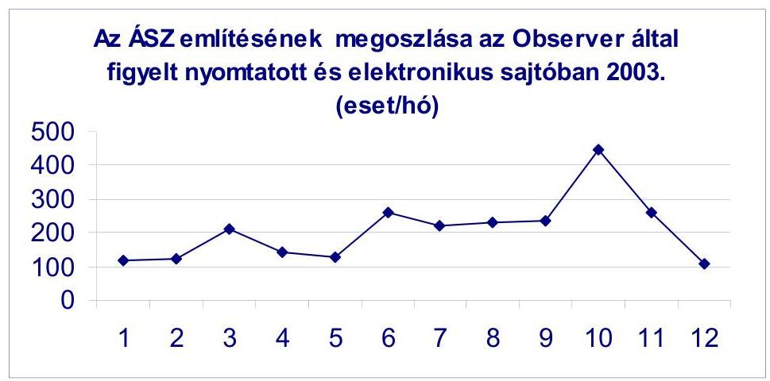

[^0]
[^0]:    ${ }^{10}$ V.ö. a 2.1. alfejezetben írottakkal.

---

A sajtókapcsolatok szervezésével folyamatosan törekszünk arra, hogy a publikációk minél hívebben tükrözzék az ÁSZ véleményét, megállapításait. Ezt szolgálja a 2003. januárban indult „Fórum" rovat, ahol az „Elnöki fogadóóra" és az „ÁSZ jelentések fóruma" közvetlen kapcsolatot teremtett a közvéleménnyel. Az ÁSZ ily módon újabb lehetőségeket kínált munkájának, tevékenységének interaktív megismertetésére. A tapasztalatok kedvezőek, annak ellenére, hogy nem tömeges az érdeklődés.

A nyilvánosság erősítését szolgálja, hogy megújítottuk és könnyebben használhatóbbá tettük az internetes honlapunkat.

Átalakítottuk a honlap szerkezetét, menürendszerét és új tartalommal töltöttük fel. Többek között bővítettük és kiegészítettük az ÁSZ-ról szóló információk körét, közzétettük a felügyelő-bizottsági elnökjelöléssel kapcsolatos információkat, a tervezési irányelveket, az ÁSZ éves ellenőrzési- és oktatási tervét, megújítottuk jelentéseink adatbázisát, közzétettük az elkészült ellenőrzés módszertani kiadványainkat, bővítettük a nemzetközi kapcsolatainkról szóló információk körét. A megújult honlap az ún. „üvegzseb" törvényből adódó publikálási kötelezettségeinket is támogatja.

Az Observer Médiafigyelő gyűjtése szerint (amely nem teljes körű az országban) a televízióadásokban 163, a rádióadásokban 210, az internetes újságokban 372, míg az írott sajtóban 1014 esetben publikáltak az ÁSZ-ról. Összességében az évi mintegy 2000 megjelenés megfelelően tájékoztatja a közvéleményt az ÁSZ munkájáról.
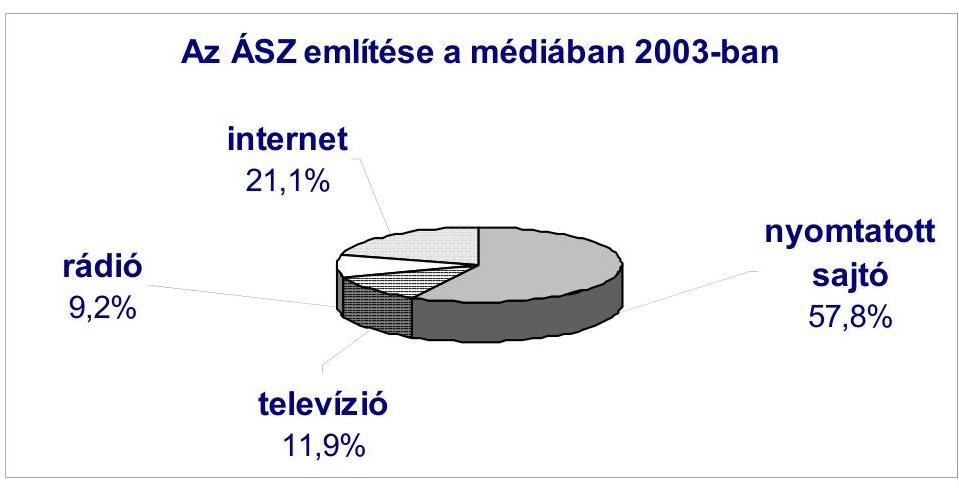

Az ÁSZ tájékoztatási feladatai között jelentős helyet foglal el a hivatal munkáját közvetlenül segítő belső tájékoztatás. A számítógépes hálózat lehetővé teszi a szakmai információktól, a múködéssel, programokkal kapcsolatos információkon keresztül, a sajtóban megjelent publikációk többféle lekérdezhetőségét, valamint a külföldi tapasztalatszerzések útijelentései, az elnöki értekezletek programja és emlékeztetői, továbbá az Országgyúlés plenáris és bizottsági üléseivel kapcsolatos információk elérhetőségét a budapesti és a vidéki munkatársak számára egyaránt.

---

Az ÁSZ Szakkönyvtára szakmai információs központ. Az elmúlt években is az ÁSZ ellenőrzési munkájához és kutatási feladataihoz kapcsolódó hazai és idegennyelvű szakirodalomnak az igényekre épített tervszerű beszerzéséről, feldolgozásáról és a munkatársakhoz való eljuttatásáról gondoskodott a TINLIB integrált könyvtári rendszerben.

A Szakkönyvtár biztosította a munkatársak részére a helyben olvasást, kölcsönzést, tájékoztatást, adatszolgáltatást és másolat készítést, lehetővé tette az ÁSZ jelentéseinek elérését a nyilvánosság, az újságírók, a tanulók és az állampolgárok számára. Speciális szolgáltatást nyújtott azoknak, akik szakdolgozatuk témájául választották az ÁSZ történetét, nemzetközi ellenőrzési és módszertani témákat, melyek feldolgozásához, irodalomkutatással és dokumentumok szolgáltatásával járult hozzá. Rendszeresen állított össze publikációs jegyzéket (például korrupció, ellenőrzés-történet, egészségügy, foglalkoztatáspolitikai stb. témákban).

Az egyetemi, főiskolai, valamint a különböző hazai és külföldi konferenciákon tartott előadások, az oktatómunka - közvetve - ugyancsak szolgálja az ÁSZ tapasztalatainak széles körű, szakmai igények szerint rétegzett megismerését. Egyre több szakdolgozat, PhD-értekezés választja a számvevőszéki munkát témájául. Noha ez mindenképpen kedvező, azzal a következménnyel is jár, hogy erőforrásaink közül erre is kell fordítanunk.

Az információ növekedésével egy időben az eligazodás igénye is erőteljesebb. Növekszik az igény a strukturált információ, a strukturált források, így a könyvtári adatbázisok iránt is. Ennek jegyében a Szakkönyvtár évről évre fejlesztette szolgáltatásait.

Folyamatosan fejlődik az Útijelentés és a Sajtófigyelő adatbázis. Különböző szempontok szerint csoportosíthatók az ÁSZ-ról megjelent híradások (jelentésenként, Internet, vidéki médiák stb.). Gyorsszemle készült a vezetők részére a napi újságcikkekről, tartalomjegyzék készült 17 féle közlönyből, folyóiratból. Rendszeres témafigyelést végzett a Szakkönyvtár SAPARD, PHARE, felsőoktatás és $\mathrm{K}+\mathrm{F}$ témákban.

Könyvtárközi kölcsönzés révén biztosította a gyűjtőkörön kívül eső igények kielégítését.

---

# 4. Az ELLENŐRI MUNKA MINŐSÉGÉNEK FEJLESZTÉSE 

### 4.1. A szervezeti modell múködésének és törvényi hátterének áttekintése

### 4.1.1. A megújult szervezet múködési tapasztalatai

Az ÁSZ vezetése áttekintette a 2002. január 1-jével bevezetett új szervezeti és irányítási rendszer múködési tapasztalatait. Az új vezetési, irányítási modell jobb lehetőséget teremtett az egymással sokrétű, kölcsönös kapcsolatban álló központi költségvetési és önkormányzati államháztartási alrendszer komplex, de egyben a sajátosságokhoz is jobban igazodó ellenőrzéséhez. Előrelépés tapasztalható a brit számvevőszéki gyakorlatból átvett pénzügyi szabályszerűségi ellenőrzés és a teljesítmény-ellenőrzés módszerének meghonosításában, valamint a nemzetközi (EU, INTOSAI) metodikai követelmények, sztenderdek alkalmazásában. Az eredmények bizonyították a megújult irányításiszervezeti modell múködőképességét.

A szervezeti felülvizsgálat eredményeként - mindenek előtt az elmúlt időszak új jogszabályaira, az ún. „üvegzseb" törvényben összefoglalt jogszabálycsomagból adódó új feladatokra, valamint az Európai Unióhoz való csatlakozás időpontja közeledéséből adódó teendőkre tekintettel - 2004. január 1-jétől két új osztály működik az Államháztartás Központi Szintjét Ellenőrző Igazgatóságon, és egy Jelölést Előkészítő Iroda a Jogi és Igazgatási osztályon belül. A megnövekedett feladatokkal összefüggésben a vezetői munkamegosztás is differenciálódott.

Az alaptevékenységet érintő területeken csak kivételesen, szakmai specialitásokhoz kapcsolódva és az ÁSZ felelősségének teljes érvényesítése mellett kerülhet sor külső foglalkoztatásra (akár vállalkozási, akár megbízási szerződéssel). A 2004-re tervezett szervezeti fejlesztésekre a költségvetési törvény által meghatározott 44 fő létszámfejlesztés megfelelő alapot teremt a feladatellátáshoz, s ehhez a szükséges források is rendelkezésre állnak.

### 4.1.2. Javaslat a számvevőszéki törvény változásaira

Az Országgyúlés 35/2003. (IV. 9.) számú határozatában szükségesnek tartotta „az Állami Számvevőszékről szóló 1989. évi XXXVIII. törvény módosítását a szervezet függetlenségének erősitése, valamint az idejét múlt, nem teljesíthető rendelkezések kiiktatása érdekében."

A határozat alapján a Kormány jogalkotási tervének részét képezi a számvevőszéki törvény módosítása, melyet az ÁSZ-szal egyeztetve az Igazságügyi Minisztérium készít elő és nyújt be az Országgyúlésnek.

A módosítás - elfogadása esetén - azon túl, hogy kiiktatná az idejétmúlt, felesleges rendelkezéseket a számvevőszéki törvényből, alapvetően három elvi jelentőségű kérdésben eredményezne változást.

---

A szervezet függetlenségének megerősítését segítené, ha más alkotmányos fejezetekhez hasonlóan az ÁSZ az általa összeállított fejezeti költségvetési javaslatot közvetlenül terjeszthetné be az Országgyűlésnek. A szervezet függetlenségét a jelenlegi szabályozáshoz képest még egyértelműbben juttatná kifejezésre továbbá az is, ha a törvény az ÁSZ-t az állam legfőbb pénzügyi ellenőrző szerveként határozná meg.

Az ún. fejezetgazdai szerephez kapcsolódó felhatalmazások megváltoztatása is felfogható úgy, mint a függetlenség sajátos megnyilvánulása. Ezzel az ÁSZ saját gazdálkodása nem keveredne az intézmény szakmai irányító tevékenységével.

A szervezet operatív múködésének biztosítását segítené, ha az elnök és az alelnökök egyidejú akadályoztatása esetén a főtitkár korlátozott jogkörben képviselhetné a szervezetet, és a főigazgatók bevonásával jogosult és köteles lenne megtenni az intézmény törvényi kötelezettségeinek teljesítéséhez elengedhetetlen intézkedéseket.

# 4.2. Humán erőforrás gazdálkodás és fejlesztés 

### 4.2.1. Személyi feltételek

A feladatok ellátásához szükséges munkatársi létszám és a növekvő szakmai követelményeknek megfelelő felkészültség folyamatos biztosítása, valamint a személyi állomány munkafeltételeinek és körülményeinek javítása érdekében 2003-ban - a központi közigazgatás-fejlesztési programmal párhuzamosan megtörténtek a megfelelő intézkedések. Ezek a köztisztviselői karriermenedzsment valamennyi elemére kiterjedtek: a szakember-utánpótlásra, az előmenetel szervezésére, a továbbképzés hatékonyságának fokozására, a dolgozói közérzet és fizikai egészségvédelem javítására is. Az ellenőrzések szakmai színvonalával azonos hangsúlyt kap a számvevők erkölcsi-etikai szilárdságának szavatolása.
2003. december 31-én a betöltött létszám 559 fő volt, azaz - a feladatbővülésre tekintettel országgyűlési jóváhagyással - 35 fővel nőtt a megelőző évhez képest. A teljes állomány átlagéletkora 47,6 év, ami a középtávú személyzetpolitikai célok között kitűzött fiatalítás eredményességére utal (1999-ben az átlagéletkor 50 év volt).

Folytatódott a legfiatalabb, diplomás pályakezdő korosztály bevonása az ellenőrzési munkába. Az év során számvevőként belépettek fele gyakornoki státuszba került. E fiatalok többségének indulása ígéretes. A következő években azonban a most már megfelelően alakuló korösszetételre is tekintettel - a szakmai tapasztalatok fontossága miatt - a gyakornokok felvételét alacsonyabb arányban tervezzük.

---

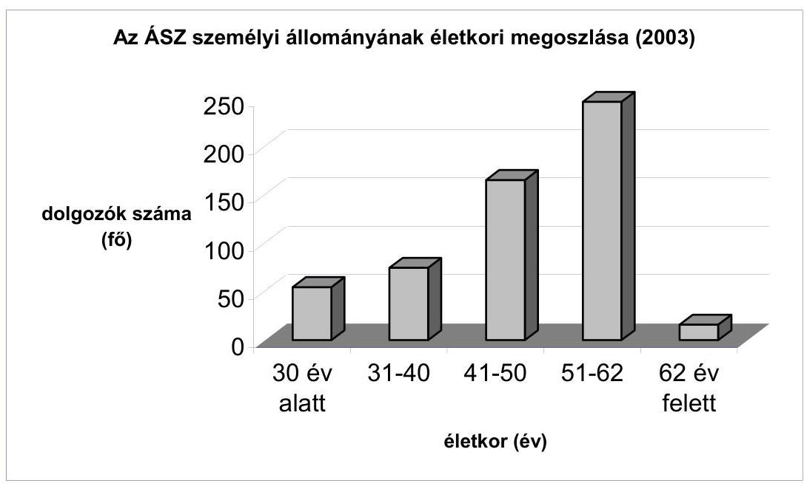

Szervezetünkben a fluktuáció hagyományosan alacsony. Az év során mindössze 11 fő távozott, közülük heten nyugdíjba mentek.

Az ÁSZ iránti érdeklődést, a szervezet stabilizálását, társadalmi beágyazódottságát az is mutatja, hogy a csekély számban megüresedő, ténylegesen betölthető álláshelyekre 2003-ban mintegy 800 jelentkező adta be önéletrajzát az alkalmazás reményében. A szakember-utánpótlás kiválasztásánál a végzettségi, illetve erkölcsi előfeltételek megléte esetén a felsőfokú számviteli-ellenőrzési szakképesítéssel rendelkezőket, az uniós nyelve(ke)t beszélőket preferáljuk, továbbá az ellenőrzési munka iránti motivációt, elköteleződést vizsgáljuk.
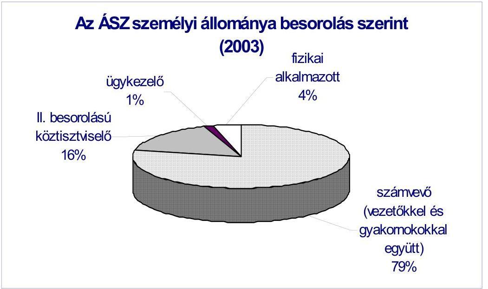

---

A pénzügyi szabályszerűségi ellenőrzéseket végzők esetében az okleveles könyvvizsgáló képesítést, a komplex vizsgálatokhoz több diploma vagy többirányú képesítettség meglétét szorgalmazzuk. Jelenleg 120 könyvvizsgáló, 97 mérlegképes könyvelő és közel 100 egyéb pénzügyi-számviteli jellegű képesítéssel rendelkező számvevő dolgozik az ÁSZ-nál.

Az EU-kapcsolatrendszer kialakítására tekintettel kiemelten fontos angol, francia vagy német nyelvvizsgával 174 munkatársunk rendelkezik, és számuk a számvevői korosztályváltással folyamatosan emelkedik.

Az ellenőrzéseket döntő hányadban kinevezett számvevők végzik. A számvevőszéki törvény azonban - speciális szakértelmet igénylő feladatokra, adott esetben vizsgálati kapacitáshiány pótlására - külső (megbízott) ellenőrök foglalkoztatására is módot ad. 2003-ban az ÁSZ vezetése a külső szakemberek foglalkoztatása eddigi tapasztalatainak áttekintése alapján újrarendezte a megbízásos, illetve szakértői státusz kérdéseit. Az év során változó időtartamban (1-12 hónap) összesen 32 külső szakértővel, illetve ellenőrzési szakemberrel álltunk megbízásos jogviszonyban.

Az állami hivatalokban a munkamódszerek jelentős átalakulása, valamint a korrupció megelőzése érdekében az utóbbi években itthon és külföldön egyaránt megélénkült az érdeklődés a közszolgálat erkölcsi-etikai szilárdságának kérdései iránt. Számos országban - kivált ezek ellenőrző szervezeteinél - elkészítették vagy korszerűsítették a köztisztviselők etikai kódexét, amely elvi alapokat és gyakorlati kritériumokat ad az igazgatásban követendő magatartásformák, valamint a közjog támogatásaként szolgálati normák, erkölcsi előírások szabályzatba foglalásához. A 2003 februárban elnöki utasítással hatályba léptetett számvevőszéki magatartásszabály-gyűjtemény alapvetően az INTOSAI Etikai Kódexének előírásaira, valamint a hazai közigazgatásfejlesztés vonatkozó munkálataira támaszkodik.

Itt jegyezzük meg, hogy számvevőinkkel szemben erkölcsi vétség miatt eljárásra, szankcionálásra évek óta nem került sor.

A munkatársak a törvény által előírt vagyonnyilatkozat-tételi kötelezettségüknek 2003-ban is eleget tettek.

Az elmúlt évben a munkatársak egészségvédelmének kérdései is előtérbe kerültek.

A számítógépen legtöbbet dolgozók általános szemészeti vizsgálaton vettek részt, és a képernyő előtti munkavégzés ártalmas hatásainak minimalizálása érdekében az ÁSZ anyagilag is hozzájárult a veszélyeztetettek védőszemüvegkészítési költségeihez. A szervezet valamennyi (fővárosi és megyei) irodahelyiségére kiterjedően ergonómiai felmérést végeztünk az egészségkárosodás, illetve a munkahelyi balesetek megelőzésére. Az év folyamán a dolgozók nagy számban vettek részt az általános egészségi állapotukat feltérképező önkéntes szűrővizsgálaton.

---

# 4.2.2. Oktatás-továbbképzés 

A munkatársak felkészítésében és ismereteik bővítésében a 2002. évi ÁSZ stratégia szakmai-fejlesztési céljai a meghatározóak. E mellett a Kormány 20032006. évi ciklusprogramjának kiemelt továbbképzési főirányait (uniós ismeretek, ECDL, vezetőképzés) is szem előtt tartottuk.

2003-ban 33 szakmai témában tartottunk oktató-továbbképző foglalkozásokat. Munkatársaink emellett összesen 83 különböző külső szakmai rendezvényen, konferencián, kerek-asztal vitán vettek részt.

A beszámolási év végén 63 tanulmányi szerződésünk volt munkatársaink iskolarendszerű, vagy tanfolyami továbbképzésének támogatására. A szerződések zömében egyetemi-főiskolai másoddiploma, valamint ECDL nemzetközi informatikai jogosítvány megszerzésére irányultak. Az érintettek döntő többsége kiemelkedő eredménnyel végezte tanulmányait.

A vonatkozó 2002. és 2003. évi országgyűlési határozatok szellemében folytattuk a „legjobb ellenőrzési gyakorlat" adaptálását szolgáló szakmai kurzusokat. A pénzügyi szabályszerűségi ellenőrzési módszerek elsajátítását a kormányzati és az önkormányzati ellenőrök, valamint könyvvizsgálók számára szervezett keretekben lehetővé tettük. E továbbképzésekre a ellenőrző társszervezetek több mint 60 szakemberének jelentkezését fogadtuk el.
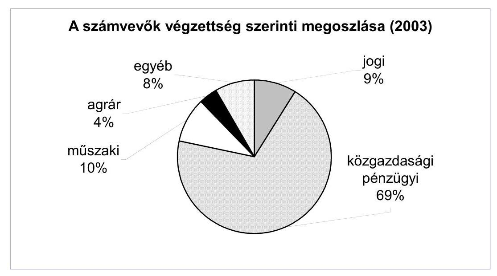

A továbbképzés keretében a gyakorlati vizsgálati módszerek és eszközök általánossá tételét (esettanulmányok, mintavételezés, információkezelés), kiegészítő jelleggel pedig a kapcsolódó készségek többirányú fejlesztését (írásbeli és beszédkommunikációs tréningek) szorgalmaztuk.

---

Az ismeret-struktúrában is jelentős változást eredményező életkori generációváltásra, a számvevő gyakornokok intenzív bevonására - beleértve a tervszerű tanfolyami és másoddiplomás beiskolázásokat - kiemelt figyelmet fordítottunk.

Az ÁSZ minden évben jelentős volumenű belső képzést valósít meg (évente átlagosan mintegy 150-200 oktatási nap, 800-1200 fő résztvevővel).

2003 januártól rendszeresítettük a „Knowledge Linker" számítógépes rendszert, beépítettük az ÁSZ számítógépes hálózatába. Ez alkalmas a belső oktatásszervezési feladatok számítógépes nyilvántartásán túlmenően a nemzetközi szabványoknak megfelelően kialakított távoktatási (e-learning) tananyagok használatára.

Az elmúlt évben - kísérleti jelleggel - két e-learning tananyagot illesztettünk a rendszerbe, a Microsoft Office programok használatát oktató ECDL tananyagot, valamint a CD-jogtár használatát oktató programot. A tapasztalatok alapján a jövőben további távoktatási tananyagokat teszünk hozzáférhetővé munkatársainknak.

A projekt keretében megkezdtük - a Magyar Közigazgatási Intézettel és a rendszer fejlesztőivel közösen - az ÁSZ által kidolgozott pénzügyi szabályszerűségi ellenőrzési módszertan távoktatási tananyagának elkészítését. A befejezést követően az ÁSZ ellenőrei a belső hálózaton, a fejezeti belső ellenőrzési egységekben dolgozók jelszavas belépéssel az Interneten keresztül érhetik el a tananyagot, a kidolgozott mintapéldákkal és vizsgakérdésekkel.

A projekt eredményeként megvalósuló távoktatási tananyagot minősíttetjük a Magyar Közigazgatási Intézettel, ami ily módon a köztisztviselői továbbképzési program része lesz.

Szervezetünk idegen nyelvi alapképzést már nem szervez, hanem - a számvevőszéki feladatok igényeihez konkrétan igazodva - a speciális szakmai tudás megszerzését támogatjuk. Programszerűen - munkaköri feladatokhoz kapcsolódóan - 38 munkatárs folytatott haladó, felsőszintű nyelvi tanulmányokat támogatásunkkal az elmúlt évben (British Council, Goethe Institut, francia és osztrák intézet, ENA-nyelvgyakorlat).

A szakmai-szellemi erőforrás-fejlesztés és a legkorszerűbb ellenőrzési ismeretek elterjesztése érdekében szerződéses együttműködésben állunk öt szakirányú felsőfokú oktatási intézménnyel. A kapcsolattartásban lényeges szerep hárul az ellenőrzési munka elméleti-módszertani fejlesztésén munkálkodó intézményünkre, az ÁSZ Fejlesztési és Módszertani Intézetére.

A szakmai-tudományos együttműködés részeként az egyetemekről, főiskolákról évente nagyságrendileg 20 hallgató érkezik szakmai gyakorlatának eltöltésére, vagy munkatársaink konzultációs segítsége mellett ellenőrzési tárgykörű szakdolgozata elkészítésére. Az elmúlt két évben mind több tanszékről kérik fel számvevőszéki és intézeti vezetőinket, munkatársainkat szakdolgozatok, diplomamunkák, valamint PhD-értekezések opponensének, bírálójának.

---

# 4.3. Az ellenőrzések minőségbiztosítása 

Az ÁSZ ellenőrzési véleményének megbízhatóságát, az ellenőrzési megállapítások és javaslatok megalapozottságát szavatolni hivatott belső minőségkontroll és minőségbiztosítási rendszer eredményesen múködik. Véglegesített jelentéseink megállapításait sem az ellenőrzött szervek, sem a parlamenti viták során nem kérdőjelezték meg. Megalapozottságukat - szakmai alapon nem vitatták.

Az ellenőrzési igazgatóságokon múködő vezetői felügyelet és csoport rendszerú felülvizsgálat, továbbá a szervezetileg is független Minőségbiztosítási Önálló Osztály megalapozottságra vonatkozó ellenőrzés-szakmai és jogi észrevételei a jelentéstervezeteken átvezetésre kerültek. Kiemelt figyelmet fordítottunk arra, hogy az ÁSZ jelentéseibe foglalt megállapításokat, következtetéseket elégséges és megfelelő ellenőrzési bizonyítékok támasszák alá. Jelentések csak az önálló osztály ezt igazoló tanúsítványa alapján kerülhettek véglegesítésre, illetve benyújtásra az elnöki értekezletre.

A zárszámadási vizsgálat részeként végrehajtott minősítő pénzügyi szabályszerűségi ellenőrzések, valamint a helyi önkormányzatoknál végzett átfogó ellenőrzések előkészítése, végrehajtása és dokumentálása, az ellenőrzési eredmények megbízhatósága - az erre irányuló minőségbiztosítási felülvizsgálat tapasztalatai alapján - az elvárt ütemben és a jó minőség irányába fejlődött. A minősítő, pénzügyi szabályszerűségi ellenőrzésekre előírt magas ellenőrzési bizonyosság követelményének kitúzése indokolt volt, mert így az ellenőrzött éves költségvetési beszámolók megbízhatóságáról hiteles képet tudtunk adni.

A már lezárt 2003. évi ellenőrzések utólagos felülvizsgálatánál ellenőriztük a munkafolyamatba épített belső kontrollok múködését is. Az ellenőrzési igazgatóságokon 2002-től kibővített munkafolyamatba épített belső kontrollrendszer múködése egyes ellenőrzési területeken érzékelhető színvonal emelkedést eredményezett.

### 4.4. A módszertani munka

Az ÁSZ 2002-ben stratégiája felülvizsgálata keretében áttekintette az ellenőrzés szakmai szabályozását szolgáló dokumentumok rendszerét, és az új stratégia keretében meghatározta a szakmai munka fejlesztésének fő irányait és feladatait.

Az elmúlt években az ellenőrzések tapasztalatai alapján a módszertant folyamatosan fejlesztettük, részletes segédleteket és munkaanyagokat készítettünk, a tapasztalatokat oktatás keretében ismertettük a számvevőkkel és az ezt igénylő minisztériumok ellenőrzési apparátusával. A folyamat eredményeképpen értük el, hogy az ellenőrzést végző munkatársaink egyre több gyakorlati tapasztalattal és elméleti ismerettel rendelkeznek és ennek hatására mélyebben képesek feltárni a beszámoló jelentések összefüggéseit, hibáit, hiányosságait. Ezen kívül a tárcák is megismerték az ellenőrzés módszertanát, és jobban ügyelnek munkavégzésük során a szabályok betartására.

---

Az ellenőrzési tapasztalatok megerősítik, hogy a nemzetközi standardokon alapuló, ÁSZ által kidolgozott módszertan következetes alkalmazása megfelelően biztosítja a hibák feltárását, az Országgyűlés hiteles tájékoztatását, a döntések szakmai megalapozását.

Az ÁSZ-nál folyó módszertani munkát az intézmény Módszertani bizottsága koordinálja. A bizottság minden, a módszertanhoz kapcsolható összeállítást megtárgyal, melyek csak ezt követően, a bizottság ajánlásával kerülhetnek az elnöki értekezlet napirendjére.

Az elmúlt évben döntés született arról, hogy el kell készíteni az ellenőrzési tevékenységet átfogó és elvi jelleggel szabályozó Ellenőrzési Kézikönyvet, továbbá folytatni kell az egyes ellenőrzési típusok sajátosságaihoz igazodó fejlesztési munkát, a módszertanok és segédletek kidolgozását.

Az Ellenőrzési Kézikönyv - amelyet erre felkért munkatársaink szerzőiszerkesztői kollektívája állít össze - meghatározza a számvevőszéki ellenőrzés, az azt megvalósító számvevői szakmai tevékenység rendező elveit és alapvető követelményeit.

A Kézikönyv az ÁSZ eddigi módszertani tapasztalataira támaszkodva, s figyelmet fordítva az ún. legjobb nemzetközi gyakorlatra is sajátos szakmai integratív szerepet tölt be az ellenőrzési tevékenység vitelében és fejlesztésében. A Kézikönyv kialakításában közreműködnek az ÁSZ Fejlesztési és Módszertani Intézetének munkatársai is.

Az ÁSZ Fejlesztési és Módszertani Intézetének, szakmai-kutatási műhelyének 2003. évi tevékenységében a fő hangsúlyt a módszertani fejlesztések mellett különböző szakmai tanulmányok képezték a 2003-2005. évi kutatásifejlesztési terv alapján.

A számvevőszéki stratégiához igazodóan az intézet foglalkozik a pénzügyi rendszer, valamint a reálszféra fő folyamatait befolyásoló közgazdasági öszszefüggésekkel is. E tanulmányok rendszerint az ellenőrzések szintetizálható tapasztalataira is támaszkodnak, a számvevőszéki vizsgálatok sokrétű hasznosításának lehetőségeit bővítik az ÁSZ, illetve kutatási háttérintézménye tanácsadási tevékenysége körében. Ezek sorából említhetők a fekvőbetegellátással, illetőleg tágabban az egészségügyi rendszer fejlesztésével, a nonprofit szektor múködésével és ellenőrzésével, valamint az EU-hoz csatlakozó országok számvevőszéki tevékenységével foglalkozó tanulmányok, s rövidesen megjelenik a hazai privatizációs folyamatot és annak hatását átfogóan értékelő tanulmány is.

Tapasztalataink szerint az Intézet által készített tanulmányokat is - minden szándékunk ellenére - ÁSZ-jelentésként kezelik. Ezek részben az ÁSZ ellenőrzési tapasztalatain alapulnak, de azokon túl szakirodalmi, kutatási és egyéb más információkat is összegeznek. Az összeállítások azt szolgálják, hogy az országgyűlési képviselők átfogó képet kapjanak egy-egy területről, és nem döntések megalapozását célozzák.

---

Az Intézet munkatársai előadóként 2003-ban is részt vettek az ÁSZ belső kép-zési-továbbképzési programjaiban. Az ÁSZ képviseletében, elnöki megbízás alapján egyik munkatársuk bekapcsolódott az INTOSAI szakmai fejlesztésiképzési szervezetének, az IDI-nek (INTOSAI Development Initiatives) a környezetvédelmi ellenőrzésekre vonatkozó módszertani-oktatási tevékenységébe.

Az ÁSZ Szervezeti és Múködési Szabályzata szerint az elnök hosszú távú stratégiai munkáját, konzultatív jelleggel, Tanácsadó Testület segíti. A Testület 2003-ban 11 ülést tartott, évi feladatai főként a koordinált stratégiai kutató munka eredményeként elkészült tanulmányoknak, elemzéseknek az áttekintésével, valamint a számvevőszéki tevékenység fő irányait és arányait meghatározó belső tervek kialakításával, megalapozásával voltak kapcsolatosak.

E mellett a gondolatcserében helyet kaptak a pénzügyi szabályszerűségi ellenőrzések megvalósításával, kiterjesztésével kapcsolatos tennivalók, valamint az ellenőrzések nyilvánosságának továbbfejlesztése. A tárgyalt kérdésekben a Testület elnöke a szakmai vita alapján a teendőket meghatározó, írásba foglalt állásfoglalásokat készített.

# 4.5. Az ellenőrzést segítő hazai és nemzetközi kapcsolatok 

Az ÁSZ-nak alkotmányos pozíciójából, valamint a hazai pénzügyi ellenőrzési rendszerben elfoglalt helyéből adódóan is - stratégiai vonalvezetésének megfelelően - fontos feladata, sajátos „küldetése" - a hazai ellenőrzési kultúra színvonalának emeléséhez való hozzájárulás. Ezt szolgálja hazai kapcsolatrendszerének építése, fejlesztése is.

Az ÁSZ vezetése súlyt helyez arra, hogy munkatársai a napi feladatok elvégzése mellett - a kölcsönös érdekek, a sokoldalú tapasztalatszerzés s a számvevőszéki tevékenység hasznosítása érdekében - aktívan vegyenek részt szakmai szervezetek, munkacsoportok, bizottságok tevékenységében, így többek között a számvitellel, az informatikával, a belső ellenőrzéssel, illetve az önkormányzati finanszírozás, ellenőrzés továbbfejlesztésével foglalkozó bizottságok munkájában.

Az elmúlt években már számot adtunk arról, hogy fokozatosan bővülnek kapcsolataink a gazdasági felsőoktatás és kutatás intézményeivel. 2003-ban tovább bővült e kooperáció palettája: sor került az együttmúködési megállapodás aláírására a Miskolci Egyetemmel.

A megállapodás arra irányul, hogy - hasznosítva a számvevők tudását, tapasztalatait, valamint az egyetem oktatási és tudományos kapacitását együttműködés bontakozzék ki a graduális és posztgraduális képzésben, a módszertani és kutatási tevékenységben, amely a vezetési-szervezési, a jogi, valamint az ellenőrzési kultúra színvonalának emelésével, a hazai pénzügyi ellenőrzés EU-követelményeknek is megfelelő fejlesztésével hozzájárul a közpénzekkel, közvagyonnal való jogszerú és hatékony gazdálkodáshoz.

---

A korábban létrejött együttműködések keretében - amint arra jelentésünk más helyein már utaltunk - támogatjuk a hallgatók szakmai gyakorlatát, diplomamunkáinak elkészítését. Emellett munkatársaink, vezetőink több helyen közreműködnek az oktatásban, s az egyetemek, főiskolák által rendezett tudományos konferenciákon is. ${ }^{11}$

Az elmúlt évben is folytatódott az a gyakorlat, hogy vezetőink, munkatársaink aktívan közreműködtek szakmai egyesületek tevékenységében (elsősorban a Magyar Pénzügyi-Gazdasági Ellenőrök Közhasznú Egyesülete, a Magyar Közgazdasági Társaság, a Gazdálkodási és Tudományos Társaságok Szövetsége, Szervezési és Vezetési Tudományos Társaság munkájában). Emellett többen tartottak előadásokat különböző országos szakmai rendezvényeken, konferenciákon.

Az ÁSZ folyamatosan törekszik arra, hogy nemzetközi kapcsolatai a szakmai felkészültséget, az ellenőrzési tevékenység mind magasabb színvonalát segítsék elő. Ez a vezérelve a nemzetközi szakmai szervezetekben vállalt feladatainknak, valamint a kétoldalú kapcsolatépítésnek is. Ugyanakkor az Európai Unióhoz való csatlakozás feltételeinek megteremtése is évek óta az egyik legfontosabb eleme a szervezet építésének, a munkatársak felkészítésének.

Az elmúlt közel másfél évtizedben a nemzetközi tevékenységünkbe fektetett erőforrások megtérültek. A különféle célú külföldi kiküldetések szakmai hozadékát folyamatosan beépítjük az ellenőrzéseket megalapozó módszertani fejlesztő munkába, illetve felhasználjuk azokat a munka általános szervezettségének tökéletesítésére.

A fontosabbnak ítélt külföldi utazásokról készített útijelentéseket rendszeresen megküldjük a az Országgyűlés és Kormány illetékes vezetőinek. Jó eredményként könyveltük el, hogy az Európai Bizottság éves ország-jelentésében az ÁSZ felkészültsége és munkája pozitív megítélést kapott.

2003-ban a fő súlypontokat az INTOSAI 2004 októberében megrendezendő XVIII. kongresszusára való felkészülés, az Európai Unióhoz való csatlakozás követelményeinek teljesítése, a konkrét ellenőrzési kapcsolatok erősítése, valamint a nemzetközi aktivitás fokozása jelentették. E feladatok külföldi utazásokban, az idelátogató vendégek fogadásában, a folyamatos kapcsolattartásban mutatkoznak meg.

[^0]
[^0]:    11 Az együttmüködés sokszinüségét szemlélteti, hogy az ÁSZ esetenként elismerésben részesíti a tudományos tevékenységet végző hallgatókat. Legutóbb, 2003 végén az ÁSZ elnöke külön díját kapta a Szent István Egyetem Gazdaság- és Társadalomtudományi Kara Tudományos Diákköri Konferenciája záróünnepségén a legeredményesebb munkát végző hallgató.

---

Az ÁSZ előtt álló egyik legnagyobb kihívás a közeljövőben a legfőbb állami ellenőrzési intézmények szakmai szervezete, az INTOSAI XVIII. kongresszusa megrendezése 2004. október 10-16. között. A hozzávetőlegesen 600-800 vendéggel, köztük 160-180 miniszteri rangú vezetővel megrendezendő kongreszszuson egyéb fontos témák mellett a nemzetközi szervezet jövőjével kapcsolatosan is várhatóan fontos döntések születnek majd.

A szervezés jól halad, amit az INTOSAI Kormányzó Tanácsának legutóbbi budapesti ülése is elismert. Az értekezlettel egyidejúleg rendeztük meg (az INTOSAI Főtitkársága felkérése alapján) a szervezet 50 éves fennállásának jubileumi ünnepségét és az ehhez kapcsolódó tudományos ülésszakot. E kettős nemzetközi rendezvényen 120 külföldi vendégünk volt, köztük 26 számvevőszéki elnök.

Az INTOSAI több bizottságának munkájában hagyományosan közreműködünk, így például a belső ellenőrzési szabvány bizottság, illetve a privatizáció ellenőrzési munkacsoport tevékenységében.

Újszerű feladat közreműködésünk az INTOSAI jövőjével foglalkozó munkacsoport tevékenységében. Az itt folyó munka legfontosabb tanulsága, hogy más szupranacionális szervezetekhez hasonlóan - a globalizáció hatásai mindinkább teret nyernek az INTOSAI-ban is. Ennek kapcsán a legfontosabb nemzetgazdasági, pénzügyi folyamatok mozgatórugóinak és hatásmechanizmusainak feltárására és elemzésére irányuló hatékonysági vizsgálatok (tematikus elemzések, az egyre korszerűbb metodikával megvalósítható teljesítmény-ellenőrzések) kerülnek előtérbe, miközben teljessé válik a nemzetközileg is „csereszabatos" szabályszerűségi vizsgálatok egységes metodikája. Mindez kijelöli azt az utat az ÁSZ számára.

Részt veszünk az INTOSAI európai regionális tagszervezete (EUROSAI) munkájában, ezen belül a képzési bizottság, az IT és a környezetvédelmi ellenőrzési munkacsoport tevékenységében.

Az ÁSZ viszonylag új tagja az Európai Regionális Ellenőrzési Intézmények Szervezetének (EURORAI). E szervezeten belüli tevékenységen keresztül az ÁSZ önkormányzati és területi ellenőrzési munkája színvonalának folyamatos emeléséhez kívánunk újabb és újabb tapasztalatokat szerezni.

Az ÁSZ részese az EU-tagjelölt országok és az Európai Számvevőszék 1996 ősze óta folyó együttműködésének. 2003-ban jelentős eredményeket ért el az ellenőrzési munka minőségbiztosításának szempontrendszere, illetve az ellenőrzési kézikönyvek tartalmi kérdéseinek kidolgozásában, és tevékeny részese volt más szakmai témákban folyó közös munkáknak. Ezek mérhető hasznot hoznak pl. az információtechnológiai ellenőrzésben, a kockázatértékelés és a mintavételezés folyamatában.

Az ÁSZ tevékenyen részt vett az Európai Számvevőszék alkotmányos helyét, jövőbeli múködési rendjét illető hazai és külföldi egyeztetésekben, kapcsolódva az Európai Alapszerződés kidolgozásához.

---

Az ÁSZ 2003-ban is folytatta az Európai Számvevőszékkel való közvetlen ellenőrzési együttműködést, kapcsolódva a PHARE és ISPA területeken végzett vizsgálataikhoz. Az Európai Számvevőszék elnöke felajánlására egyik munkatársunk fél évet töltött ez elnök kabinetirodájában, ami közvetlenül és közvetve is segíti a jobb együttmúködést intézményeink között.

Folyamatosan részt vettünk az Európai Koordinációs Tárcaközi Bizottság pénzügyi ellenőrzési munkacsoportja tevékenységében, annak érdekében, hogy az Európai Bizottság által is elfogadható magyar kormányzati belső pénzügyi ellenőrzési modell alakuljon ki. Szerepvállalásunk elsősorban a kormányzati belső ellenőrzés stratégiája kidolgozásának, majd pedig a kapcsolódó jogszabályi háttér megteremtésének szakmai támogatására irányult.

A NATO kapcsolatokat tekintve a legfontosabb feladatunk a 2003 májusában tartott budapesti védelmi ellenőrzési szeminárium előkészítése és megrendezése volt, melyet a résztvevők sikeresnek minősítettek. Ezen a rendezvényen először vettek részt a hét leendő tagország küldöttei. A rendezvény központi témája a védelmi kiadások felhasználásának számvevőszéki teljesítményellenőrzése volt mind a béke időszakában, mind háborús körülmények között.

A kétoldalú kapcsolatok 2003 folyamán tovább bővültek, elnöki szintű látogatásra került sor Ukrajnában és Észtországban, míg Budapesten a litván főszámvevőt fogadta az ÁSZ elnöke. Az egyes számvevőszékekkel fenntartott kapcsolatainkban egyre növekszik azok szabályozott mederbe terelése, amit az is jelez, hogy az észt és az ukrán partner intézményekkel már előkészítettük a kétoldalú megállapodás megkötését. (Az ÁSZ-nak jelenleg Brazília, az Egyesült Királyság, Lengyelország, Oroszország és Szlovákia számvevőszékeivel van kétoldalú megállapodása.)

A Brit Számvevőszékkel való együttműködésünk folyamatos szakmai segítséget jelent. Az Osztrák Számvevőszékkel fenntartott korrekt és jó viszony jegyében 2003-ban is sor került a hagyományosnak tekinthető határmenti találkozóra az elnökök között.

2003-ban a szomszédos országok számvevőszékeivel végeztünk párhuzamos ellenőrzéseket, s hasonlóak előkészületben vannak.

A Szlovén Számvevőszékkel a két ország vasúti összeköttetését közvetlenül megteremtő új pályaszakasz építésének vizsgálatát végeztük el, míg az osztrák partnerekkel a Fertő tó természetvédelmének koordinált ellenőrzését hajtottuk végre.

Előkészületi szakaszban van egy-egy párhuzamos ellenőrzés a kulturális örökség részét képező műemlékek védelméről az izraeli, a nagy közlekedési infrastrukturális beruházások területén a svájci számvevőszékkel. A már említett ukrán kapcsolatfelvétel egyik eredménye lesz, hogy 2004-ben párhuzamos ellenőrzést hajtunk végre a Felső-Tiszavidék árvízvédelmével kapcsolatban.

---

Az ÁSZ folyamatosan súlyt helyez arra, hogy munkatársai közül mind többen állják meg a helyüket a nemzetközi megmérettetésben is. Jelentős eredménynek tartjuk, hogy magyar tagot javasolhattunk az OECD Auditori Testületébe a 2003-2006 közötti időszakra.

Miközben előmozdítjuk munkatársaink továbbképzését külföldön (pl. Egyesült Államok Számvevőszéke, Európai Számvevőszék, az INTOSAI International Development Initiative révén stb.) a fejlett ellenőrzési módszerek megismerését lehetővé tesszük közép- és kelet-európai partnereink számára is.

# 4.6. Intézményi informatika, informatikai kapcsolatok 

Az informatikai és telekommunikációs fejlesztések 2003-ban is évente aktualizált, az ÁSZ elnöke által jóváhagyott részletes IT stratégiában meghatározott projekt tervek szerint valósultak meg.

2003 végére az ÁSZ minden munkatársa - akinek munkaköréhez számítógép szükséges - rendelkezett munkaállomással és/vagy notebook számítógéppel.

Az ÁSZ 1996 óta kapcsolódik a kormányzati hálózati rendszerhez (EKG), s egy PHARE tender eredményeként - rendelkezik országos, minden telephelyre (18 vidéki iroda és a két kisebb budapesti iroda, Bécsi u., Dunaház) kiépített adatátviteli bérelt vonali hálózattal, amely az ÁSZ központban kialakított védelmi rendszeren keresztül kapcsolódik az EKG-hoz.

Az országos hálózatunk sávszélessége azonban már nem felelt meg a jogszabályi változásokból adódó többletfeladatokból és a megnövekedett létszámból adódó igényeknek. Ezért - a Miniszterelnöki Hivatal Kormányzati Informatikai és Társadalmi Kapcsolatok Hivatalával egyeztetve - 2003 végén bővítettük a sávszélességeket.

Az infrastruktúra bővítése mellett új alkalmazásokat fejlesztettünk. Folyamatosan felülvizsgáljuk a már bevezetett rendszereket is. Az elmúlt évben folytattuk az ÁSZ honlapjának tartalmi és formai továbbfejlesztését.

2002-ben vezettük be a „Szekreter" vizsgálat-nyilvántartó rendszerünk tervezési és munkaidő elszámolási moduljait, amely lehetőséget nyújt a kapacitáskihasználás folyamatos figyelemmel kísérésére. 2003-ban a realizálás modul bevezetésére került sor. Minden jelentés kiadmányozását követően, a jelentésben megfogalmazott javaslatok címzettenként automatikusan bekerülnek a rendszerbe. Lehetőség van a javaslatokra tett intézkedések folyamatos nyomon követésére. A rendszerben lévő adatok az ÁSZ megújult internetes honlapján is megtekinthetők.

A naprakész múködéshez szükséges parlamenti adatbázisok frissítését az Országgyúlés Hivatala informatikusainak együttmúködésével oldottuk meg.

---

# 5. Az intÉZMÉNY MÜKÖDÉSE És GAZDÁlKODÁSA 

## A költségvetési gazdálkodás

Az ÁSZ - már hagyományosan - a 2003. évi gazdálkodásáról szóló beszámolóját is pályázat útján kiválasztott, független könyvvizsgálóval hitelesitteti. A könyvvizsgálók tevékenységüket várhatóan 2004 áprilisában fejezik be, a vizsgálati jelentést - az előző évek gyakorlatának megfelelően - 2004. április 30 -áig megküldjük az Országgyúlés Számvevőszéki bizottsága részére.

Az ÁSZ 2003. évi feladatainak ellátására a költségvetési törvényben 5.916,9 M Ft került jóváhagyásra, melynek fedezetét $5.896,9 \mathrm{M}$ Ft támogatás és 20,0 M Ft saját bevétel biztosította. Ez a megelőző év módosított előirányzatához képest $11 \%$-os növekedést jelent. A költségvetési forrásokkal való gazdálkodás mozgásterét csökkenti az ÁSZ előtt álló szakmai feladatok mintegy kétharmadának törvényi, illetve országgyúlési határozatok általi meghatározottsága. Ez a tény is indokolttá teszi a többi alkotmányos fejezetnél már alkalmazott törvénymódosítást, mely szerint a fejezet költségvetési javaslatát a Kormány változtatás nélkül lenne köteles benyújtani az Országgyúlésnek, elkerülvén ezzel az ÁSZ feletti kormányzati kontroll látszatát is (bár e területen a korábbi években jelentősebb gondjaink nem voltak).

A kiadási főösszegből a személyi juttatások előirányzatai 3.160,0 M Ft-ot, a munkaadókat terhelő járulékok 989,1 M Ft-ot, a dologi kiadások 1.146,6 M Ft-ot, az intézményi beruházási kiadások 242,3 M Ft-ot, a felújítási előirányzatok 378,9 M Ft-ot jelentettek.

A jóváhagyott előirányzatot az évközi módosítások 536,4 M Ft-tal növelték. A módosítások után 6.453,3 M Ft állt rendelkezésre.

A módosításokból 271,9 M Ft a köztisztviselők jogállásáról szóló törvény módosításának, 140,0 M Ft az ún. „üvegzseb" programban meghatározott új feladatok végrehajtására biztosított összegnek, $97,9 \mathrm{M}$ Ft az előző évi előirányzatmaradvány jóváhagyásának, $15,0 \mathrm{M}$ Ft a SAPARD program nemzeti akkreditációs vizsgálatával összefüggő feladatoknak, 0,4 M Ft az átállási gázár kompenzációra biztosított előirányzatoknak, 9,4 M Ft meghatározott feladatokhoz (INTOSAI rendezvény lebonyolításához, ellenőrzési távoktatási tananyag elkészítéséhez) biztosított hozzájárulásnak, 1,8 M Ft dolgozók részére folyósított lakásvásárlási kölcsönök törlesztésének következménye.

A felhasználás 5993,9 M Ft, amely a kiadási előirányzat 92,88\%-a. A személyi juttatások és a munkaadókat terhelő járulékok együttes összege a kiadások $74,7 \%$-át tették ki, a dologi kiadások aránya $14,1 \%$, a felhalmozási kiadásoké pedig $11,2 \%$ volt. A maradvány (melynek összege a $8,1 \mathrm{M}$ Ft bevételi elmaradás figyelembe vételével $451,3 \mathrm{M}$ Ft) $6 \%$-a feladatelmaradásból származik, a többi ( $94 \%$ ) teljes egészében kötelezettségvállalással lekötött, a teljesítések, illetve a számlák megküldése 2004-re való áthúzódásának következménye.

---

Kiemelt feladatot jelentett az elhelyezési feltételek biztosítása, a meglévő irodaépületek állagának megőrzése, illetve javítása, valamint az eszközellátottság fejlesztése.

A rendelkezésre álló előirányzatok összességében biztosították az intézmény zavartalan feladat-ellátásához a működési, üzemeltetési feltételeket. Ez alól kivételt jelentett, hogy az ún. „üvegzseb" törvény alapján bővülő feladatok teljesítéséhez szükséges pénzügyi feltételek biztosítása - bár igényeinket már áprilisban jeleztük a Pénzügyminisztérium felé, annak érdekében, hogy a törvény hatályba lépését követően azonnal megkezdhessük a munkát - csak december 23-án történt meg. Mivel a szükséges beszerzéseket előkészítettük, így az előirányzat jelentős részét a tárgyévben felhasználtuk. Az elmaradt intézkedések azonban késleltették a törvény gyakorlati érvényesülését előmozdító számvevőszéki tevékenységek kibontakoztatását.

# Fejlesztések 

Az ÁSZ több éve folyamatosan igényelte a kormányzat segítségét Budapesten működő szervezeti egységei egy székházba való elhelyezéséhez, amely jelentős mértékben csökkenthetné a fenntartási, működési költségeket. Mivel e megoldásra reális lehetőség a közeljövőben nem látszik, elengedhetetlenné vált a jelenleg használt, vagyonkezelésünkben lévő székházak rekonstrukciójának megkezdése, illetve folytatása.

2003-ban a legnagyobb volumenű feladatot az Apáczai Csere János utcai központi épület életveszélyes homlokzatának felújítása jelentette. Ez, valamint az évek óta ütemesen folyó belső felújítási munkák, részben a napi tevékenység folyamatos vitelének biztosítása, részben az állami vagyon értékmentése miatt voltak szükségesek. ${ }^{12}$

A munkálatok júniusban kezdődtek és szeptemberben fejeződtek be. E célra öszszesen 255,3 M Ft került felhasználásra. Novembertől tovább folytatódott az épület belső tereinek, valamint elektromos hálózatának rekonstrukciója a III. emelet felújításának megkezdésével. A homlokzat-felújításhoz kapcsolódóan 9,8 M Ft értékben korszerú megfigyelőrendszer is kiépítésre került, míg 2004-re maradt a Kulturális Örökségvédelmi Hivatal által megkövetelt homlokzati szobrok elkészíttetése és felállítása.

A Garibaldi utcai garázsban átépítésre került a balesetveszélyes lépcső. A Lónyay utcai irodaházban padlóburkolat cserére, valamint két emeleten irodahelyiségek célszerűbb kialakítására került sor. A Bécsi utcai iroda-együttes tárgyalóját az elhelyezési feltételek biztosítása érdekében munkaszobákká alakíttattuk. A jelentősebb összegű bútorbeszerzésekre az intézményi létszám növekedésével összefüggésben került sor. Budapesten és a megyei ellenőrzési irodákban összesen 17 munkaszobában sikerült lecserélni az elhasználódott bútorokat.

[^0]
[^0]:    ${ }^{12}$ 2002-ben az 1869-ben épült központi épület alsó szintjeinek elektromos hálózatát újítottuk fel, mivel az elosztó és kábelhálózat előregedett és túlterhelt, a világítási berendezések korszerütlenek és pazarlóak voltak. Az elektromos rekonstrukció mellett, azzal egyidejűleg a falfelületeket is helyreállították, s megtörtént a nyílászárók karbantartása.

---

A megyei ellenőrzési irodák tervezett felújításának egy része a partner önkormányzatok forráshiánya miatt a következő évekre halasztódott.

Az előbbiekben már jelzett „székház gondjaink" miatt egyre jelentősebb öszszegeket (2003-ban 65,7 M Ft-ot) kényszerültünk irodabérlésre fordítani, mivel az újonnan hatályba lépett törvények által előírt feladatok létszámtöbbletét a meglévő székházakban már nem tudtuk elhelyezni.

Az IT infrastruktúra fejlesztések az ÁSZ IT stratégiájának megfelelően történtek.

A dolgozói adatnyilvántartás és kezelés biztonságosabbá tétele, illetve gyorsítása érdekében 2003. január 1-jével új, közös bér-, munkaügyi és személyzeti programrendszert vezettünk be. Az adatkonvertálással kapcsolatos kezdeti nehézségek megoldódtak, a rendszer üzembiztonsága és folyamatos fejlesztése (aktualizálása) várhatóan hosszú távra szavatolható, megoldható. A 2002-ben bevezetett ÁSZ metacímtár rendszerünket - amely tartalmazza az ÁSZ teljes alkalmazotti állományának, valamint szerződéses dolgozóinak címinformációs adatait - illesztettük a 2003 januárjában indított új illetmény-számfejtési rendszerünkhöz. A kialakított rendszer teljes körű és megbízható adatforrást biztosít a központi kormányzati címtár számára, valamint az ÁSZ többi informatikai rendszerének dolgozói adatbázisa automatikusan, naponta frissítésre kerül.

A XVIII. INTOSAI kongresszussal kapcsolatos informatikai fejlesztéseket 2002ben indítottuk el. A Kongresszus többnyelvű honlapja és angol nyelvű regisztrációs rendszere 2003 márciustól elérhető az Interneten (www.incosai2004.hu). A Kongresszus dokumentumainak és levelezésének kezelését az ÁSZ-ban két éve folyamatosan üzemelő ügykövetési rendszerben, külön adatbázisban valósítjuk meg. A kongresszussal kapcsolatos informatikai fejlesztések 30 M Ft-ot jelentettek.

2003-ban bevezettünk az ÁSZ saját tulajdonú gépjármúparkjának üzemeltetéséhez kapcsolódó nyilvántartási feladatokat támogató számítógépes rendszert, amely megoldja a gépjármúvek egyedi, analitikus nyilvántartását. A rendszer fejlesztése, bevezetése és oktatása 2 M Ft-ba került.

2003 első félévben befejeztük az Apáczai Csere János utcai számítógépes hálózat aktív eszközeinek cseréjét, amely a felhasználók számítógépei és a szerverek közötti lényegesen gyorsabb, hatékonyabb kommunikációt biztosít az épületben. Jelentős, mintegy 5,5 M Ft-os megtakarítást értünk el azzal, hogy a központi épületben történő fejlesztést összekapcsoltuk a Vörösmarty téri Medimpex irodaházban bérelt irodák számítógépes hálózatának kiépítésével.

A Vörösmarty téren, a Medimpex irodaházban bérelt irodahelyiségekben 2003 májusában befejeződött a telekommunikációs hálózat kiépítése. Az épületben összesen 268 db végpontot létesítettünk. A beruházás során az ÁSZ központi számítógép hálózatának közvetlen elérése mikrohullámú összeköttetéssel valósult meg. Az itt dolgozó munkatársaink így a központi épületben dolgozókkal azonos színvonalú informatikai szolgáltatásokat vehetnek igénybe, kapcsolódhatnak az ÁSZ Intranet rendszeréhez, valamint az ÁSZ központi tűzfal rendszerén keresztül biztosított az Internet elérése is. A Medimpex irodaházban a meglévő telekommunikációs rendszerünkhöz illeszkedő telefonalközpontot építettünk ki, digitális rendszertelefon készülékekkel. A mobiltelefon hálózatok irányába indított telefonhívásokat a költségek csökkentése érdekében itt is GSM

---

interfész biztosítja. A telephelyeink IT infrastruktúrájának kialakítására és továbbfejlesztésére 35 M Ft -ot költöttünk.

2003-ban befejeződött az ÁSZ Apáczai u., Lónyay u. és Vörösmarty téri irodáinak telefonalközpontjait IP hálózaton összekötő fejlesztés. A bevezetést követően a három épületben dolgozók közvetlenül a mellékállomás kapcsolási számát tárcsázva, kapcsolási- és percdíjak nélkül telefonálhatnak egymásnak. Előzetes számításaink szerint ezt a lehetőséget kihasználva éves szinten közel 1,5 M Ft takarítható meg a távközlési kiadásokból.

Az elmúlt évben összesen 127 db asztali PC, valamint 28 db notebook számítógépet vásároltunk központosított közbeszerzési eljárással. Minden megyei irodában lecseréltük az elavult nyomtatókat. Összesen 26 db új nyomtatót vásároltunk. A Medimpex irodaházban nagyteljesítményű hálózati nyomtatókat állítottunk üzembe.

Költségvetési tervünknek megfelelően, a dinamikusan növekvő számítógépes szolgáltatások megfelelő színvonalú kiszolgálása érdekében négy új szervergépet vásároltunk. Az egyik a Medimpex székház fájlszerver funkcióit látja el, egy másikat a Duna házban csere szerverként állítottunk üzembe, egy szerver az 1996-ban vásárolt tűzfal szerverünk cseréjét szolgálja, egyet pedig biztonsági tartalék szerverként üzemeltetünk. A számítógépes munkahelyek (hardver és szoftver környezet) kialakítása az elmúlt évben 60 M Ft-ba került. A szervergépek vásárlására 10 M Ft -ot fordítottunk.

A központi nyomdába két új gép került beszerzésre, ezáltal csökkenthetővé vált a külső nyomdai kapacitások igénybe vétele. A fénymásolók cseréjét két megyei irodában, az Apáczai Csere János utcai és a Lónyay utcai székházban tudtuk megoldani.

Az ÁSZ gépkocsiparkjából - központosított közbeszerzési eljárás keretében - 5 db 5 évesnél idősebb gépjárművet cseréltünk le, összesen 33,4 M Ft értékben.

2003 decemberében készült el az ÁSZ aktualizált Informatikai Biztonsági Szabályrendszere, amely a jelenlegi helyzet felmérésén és kockázatelemzésén alapul. A projekt eredményeként az ÁSZ rendelkezik informatikai rendszerének szabályos időszakonkénti kockázatelemzésére és a szabályrendszer frissítésére vonatkozó szabványos, az EU-normáknak megfelelő módszertani ajánlással is, amely lehetőséget biztosít számunkra a jövőben a rendszeres aktualizálásra, a biztonsági intézkedések hatásának nyomon követésére. A projekt megvalósítása 12 M Ft-ba került.

# Külföldi szakmai utak és az INTOSAI Kongresszusa 

2003-ban az ÁSZ munkatársai 53 külföldi úton vettek részt, és azokon 102 kiküldött 896 napot töltött el. (Az egy külföldi útra eső átlagmunkanap-szám a hosszú időtartamú képzések nélkül 4,4 nap/út.) A külföldi utazások költségei 28,1 millió forintot tettek ki, mely az éves előirányzat 70\%-át jelenti. ${ }^{13}$

[^0]
[^0]:    ${ }^{13}$ 2002-ben az ÁSZ munkatársai 54 külföldi úton vettek részt, amely összesen 611 napot vett igénybe. A hivatalos külföldi utazások költségei megközelítették a 27 M Ft-ot.

---

Az utak közül 12 a különböző képzési formákban való részvételhez kapcsolódott (összesen 716 napban), 33 utazás a nemzetközi szervezetekkel (INTOSAI, EUROSAI, NATO, EU) való kapcsolattartást, valamint a számvevőszékek közötti kétoldalú szakmai együttmúködést, a további 8 egyéb rendezvényeken való részvételt szolgálta.

Az ÁSZ elnöke 9 alkalommal utazott hivatalosan külföldre, összesen 30 nap időtartamban. Egy elnöki út átlagos költsége 370 ezer forint, az egy napra jutó költség pedig 111 ezer forint volt. (Ezek jelentősen alacsonyabbak a 2002. év számainál, amit a tengerentúli utak feladat-torlódás és egészségügyi okok miatti elmaradása okozott.)

Az ÁSZ vezetői és munkatársai külföldi útjaikon tolmácsot nem vesznek igénybe, a különféle szakmai konferenciákra felkért előadásokért díjat nem vesznek fel, ezekben az esetekben a regisztrációs díjat, egyes alkalmakkor az utazási költségeket is a külföldi fél viseli.

Az utazásokról, azok hasznosítható tapasztalatairól minden esetben belső szabályokban meghatározott módon úti jelentés készült. Valamennyi úti jelentés mindenki számára hozzáférhetően megtalálható az ÁSZ könyvtárában.

Az INTOSAI 2003. és 2004. évi rendezvényeinek szervezésére az eddigi kötelezettségvállalás 637 M Ft-ot tesz ki. Az INTOSAI Kormányzó Tanácsának 2003ban lebonyolított ülésére, illetve a 2004. évi Kongresszus szervezésére az elmúlt év végéig 208 M Ft-ot költöttünk. A tervezetthez képest alacsonyabb költségeket az befolyásolta, hogy a szervezési feladatokat az ÁSZ munkatársai saját maguk végezték el, így mintegy 30-40 M Ft költségmegtakarítást tudtunk elérni.

Az INTOSAI 50 éves jubileumi ünnepségének megtartásához - amelyet az INTOSAI Főtitkárság felkérése alapján szerveztünk meg - a nemzetközi szervezet 30 ezer dollárral járult hozzá, ezzel mintegy 7 M Ft-tal csökkentette a költségvetési támogatás igényt.

# A függetlenített belső ellenőrzés 

Az ÁSZ vezetése megfelelő súlyt fektet arra, hogy a szervezet jogszerú, hatékony múködését a vezetést támogató belső ellenőrzés útján is előmozdítsa. Ennek jegyében - a vonatkozó jogszabályi előírásokra is tekintettel - függetlenített belső ellenőrzési tevékenységet egy fő belső ellenőr lát el.

Feladatait a vonatkozó jogszabályi előírások és az ÁSZ belső szabályzatai szerint, az ÁSZ elnökének közvetlenül alárendelve, éves munkaterv alapján végezte. Tevékenységében érvényesült a funkcionális függetlenség. A beszámolási időszakban elvégzett - az ÁSZ gazdálkodásával kapcsolatos - ellenőrzések tényfeltárásaival és javaslataival segítve a vezetést hozzájárult az ellenőrzött szervezeti egységek munkája szakmai színvonalának növeléséhez.

A belső ellenőr jelentéseit - tájékoztató jelleggel - megküldtük az Országgyúlés Számvevőszéki bizottsága elnökének.

---

A beszámolási időszakban a belső ellenőr fontosabb megállapításai a következők voltak:

- A vizsgált területeken a feladatokat szabályszerűen, gazdaságosan hajtották végre, így az Apáczai Csere János u. 10. alatti központi irodaház 2002. évi felújítási munkáinak végzése, a tüzvédelemmel kapcsolatos intézkedések megtétele, a felesleges vagyontárgyak 2002. évi selejtezése és hasznosítása, a 2001-2003. években eszközölt iroda-bérletek végrehajtása a jogszabályokban és a belső szabályzatokban/utasításokban meghatározott követelményeknek megfelelően történt.
- A belső szabályozás összhangban van a jogszabályi előírásokkal. A belső utasítások és szabályzatok alapvetően megfelelő módon tartalmazzák a vizsgált területekkel kapcsolatos feladatokat, felelősségi és hatásköri feltételeket, a munkamegosztást az egyes szervezeti egységek között. A vizsgálatok során tapasztalt kisebb jelentőségű hiányosságok megszüntetése érdekében a belső szabályozás egyes részletkérdésekben kiegészítésre szorul. Ennek végrehajtása a belső ellenőr javaslatainak megfelelően folyamatban van.

Az ÁSZ belső ellenőre 2004 elejétől részt vesz az Államháztartási Belső Pénzügyi Ellenőrzési Tárcaközi Bizottság egyik szakmai albizottsága munkájában.

Budapest, 2004. február " "

Dr. Kovács Árpád
elnök

---

# MELLÉKLETEK 

Az ÁSZ 2003. évi ellenőrzési tervének főbb módosulásai (1. számú melléklet) ..... 1
2003. évi jelentések jellemzői (2. számú melléklet) ..... 3
2001-2003-ban tett, még meg nem valósult jelentősebb törvénymódosításra vonatkozó ÁSZ javaslatok (3. számú melléklet) ..... 15
ÁSZ jelentések az országgyúlési bizottságok/plenáris ülések napirendjén 2003-ban (4. számú melléklet) ..... 19
Az Állami Számvevőszék 2003. évi jelentéseiben a fejezetek vezetőinek megfogalmazott javaslatok és az azokra adott válaszok (5. számú melléklet) ..... 23

---

## Eierlikör (1)

Menge: 1 Drink

2 Zentiliter Zitronensaft
2 Zentiliter Zuckersirup
1 Zentiliter Zuckersirup
etwas Zuckersirup
etwas Zuckersirup
etwas Zuckersirup
etwas Zuckersirup
etwas Zuckersirup
etwas Zuckersirup
etwas Zuckersirup
etwas Zuckersirup
etwas Zuckersirup
etwas Zuckersirup
etwas Zuckersirup
etwas Zuckersirup
etwas Zuckersirup
etwas Zuckersirup
etwas Zuckersirup
etwas Zuckersirup
etwas Zuckersirup
etwas Zuckersirup
etwas Zuckersirup
etwas Zuckersirup
etwas Zuckersirup
etwas Zuckersirup
etwas Zuckersirup
etwas Zuckersirup
etwas Zuckersirup
etwas Zuckersirup
etwas Zuckersirup
etwas Zuckersirup
etwas Zuckersirup
etwas Zuckersirup
etwas Zuckersirup
et

---

# Az ÁSZ 2003. évi ellenőrzési tervének főbb módosulásai 

Az ÁSZ 2003-as ellenőrzési tervében 75 ellenőrzés szerepelt, ebből 2003-as publikálásra 49 jelentést terveztünk. A terv jóváhagyását követően a Kormány nevében a Magyar Köztársaság miniszterelnöke az Országos Cigány Önkormányzat, a Magyarországi Cigányokért Közalapítvány és a Nemzeti és Etnikai Kisebbségekért Közalapítvány elmúlt évi gazdálkodásában az állami költségvetésből juttatott támogatás felhasználásának, valamint az EU Kommunikációs Közalapítvány gazdálkodásának soron kívüli ellenőrzését kérte.

Az ÁSZ elnökének döntése alapján az ellenőrzési tervbe az új vizsgálatok bekerültek, azonban ezek teljesíthetősége a munkatervi feladatok átrendezését követelte meg. Az alapítványoknál a soron kívüli ellenőrzések teljesítése érdekében a Magyarországi Zsidó Örökség ellenőrzésének időbeni átütemezésére került sor. A 2004. évre áthúzódó feladatokat pedig az Illyés közalapítvány gazdálkodásának ellenőrzése helyett lehetséges elvégezni.

A 2003-ra ütemezett ellenőrzési feladatok közül - szakmai indokok alapján törlésre került „Az informatikai és hírközlési-fejlesztési és frekvenciagazdálkodási célokra fordított pénzeszközök hasznosulásának ellenőrzése", de egyes ellenőrzési programpontjai a zárszámadási ellenőrzés keretében valósultak meg. „A családpolitikai programokra fordított pénzeszközök hasznosulásának ellenőrzése" című ellenőrzési feladat 2004-re került áthelyezésre. A Magyar Nemzeti Bank bankjegy- és érme kibocsátó tevékenységének ellenőrzése törlését, az e vizsgálat elvégzésére utasító korábbi országgyűlési határozat hatályon kívül helyezése indokolta.

Az Országgyűlés támogatta, hogy a helyi önkormányzatok átfogó ellenőrzésének tapasztalatait összegző jelentés mellett a fővárosi, fővárosi kerületi, megyei, megyei jogú városi önkormányzatok átfogó ellenőrzéseiről önkormányzatonként kerüljön jelentés közreadásra. Az országgyűlési határozat végrehajtása 2003-ban megkezdődött, így szükségessé vált az ellenőrzési terv módosítása. Ezekből 5 önkormányzati átfogó ellenőrzésről készült már jelentés.

A 2002-ben befejeződött MÁV vizsgálat részeként - elnöki döntés alapján - a Zalalövő-Bajánsenye vasútvonal építésének magyar-szlovén párhuzamos vizsgálatáról 2003-ban önálló ÁSZ jelentés készült.

Többlet feladatként jelentkezett a SAPARD második körös akkreditáció előtti ellenőrzése, továbbá az EMOGA Garancia Részleg kifizető ügynökség feladatát ellátó szervezet akkreditáció előtti ellenőrzése is.

---

# 2

---

|  2003. évi jelentések jellemzői |  |  |  |  | 2. számú melléklet  |
| --- | --- | --- | --- | --- | --- |
|  Sorszám | A jelentés tárgya, száma | Jelentést készítő
főcsoport | Az ellenőrzés jogszabályi alapja és indoka | Az ellenőrzés célja | Az ellenőrzött költségvetési
nagyságrend  |
|   | I. 2002-ben megkezdett, 2003-ra áthúzódó ellenőrzések |  |  |  |   |
|  1. | A Magyar Köztársaság 2002. évi költségvetése végrehajtásának ellenőrzése
(pénzügyi és egyéb szabályszerűségi)
0329 | 3.3. Átfogó Ellenőrzések Főcsoport
2.2. Pénzügyi Ellenőrzési Főcsoport
1.1. Szervezetirányítási és Kapcsolattartási Főcsoport | törvényekben előírt évenkénti ellenőrzési kötelezettség | annak megállapítása, hogy az előterjesztett törvényjavaslat teljes körűen és helyesen tartalmazza-e a költségvetési év lezárásához szükséges rendelkezéseket; a központi költségvetés teljesítését bemutató adatok, információk valósághűen tükrözik-e a 2002. évi folyamatokat; a Kormány és a költségvetést végrehajtó szervezetek betartották-e az államháztartás gazdálkodására vonatkozó jogszabályi előírásokat; a zárszámadás és az azt megalapozó nyilvántartások, dokumentumok megfelelnek-e a szabályszerűség és a valódiság követelményének. | az államháztartás kiadásainak föösszege: 10.862,3 Mrd Ft  |
|  2. | A katonai védelmi beruházások ellenőrzése
(teljesítmény-ellenőrzés)
0333 | 2.3. Átfogó Ellenőrzési Főcsoport | az ÁSZ elnökének döntése alapján végzett egyéb ellenőrzések | annak értékelése, hogy a Honvédelmi Minisztérium és a Magyar Honvédség irányítási és felügyeleti tevékenysége, valamint gazdálkodási rendje biztosította-e a katonai védelmi beruházások tervezésének, megvalósításának szabályszerűségét és eredményességét, illeszkedését a haderőreform folyamatához; valamint a megvalósított katonai védelmi beruházások a célkitűzéseknek megfelelő tartalommal, ütemezéssel és a tervezett költségvetési keretek között teljesültek-e. | az ellenőrzött beruházások értéke: 10,9 Mrd Ft  |
|  3. | A Magyar Köztársaság Ügyészsége fejezet működésének ellenőrzése
(átfogó)
0305 | 2.3. Átfogó Ellenőrzési Főcsoport | törvényekben előírt rendszeres ellenőrzési kötelezettség | annak értékelése, hogy a fejezet felügyeleti, irányítási és működési rendje, költségvetése, személyi és tárgyi feltételei megfelelően igazodtak-e a feladatokhoz, továbbá a Legfőbb Ügyészség a fejezet költségvetési gazdálkodását, intézményeket felügyelő tevékenységét célszerűen, eredményesen látta-e el, mennyiben hasznosította a korábbi számvevőszéki ellenőrzés megállapításait, javaslatait. | a fejezet kiadásai: 2001-ben: 16,0 Mrd Ft 2002-ben: 17,5 Mrd Ft  |
|  4. | A Külügyminisztérium fejezet működésének ellenőrzése
(átfogó)
0314 | 2.3. Átfogó Ellenőrzési Főcsoport | törvényekben előírt rendszeres ellenőrzési kötelezettség | annak értékelése, hogy a fejezet szervezeti, irányítási és működési rendje, költségvetése, személyi és tárgyi feltételei összhangban voltak-e a szakmai feladatokkal, biztosította-e azok hatékony és eredményes végrehajtását; megítélni továbbá az előirányzatok felhasználásának, a költségvetési és gazdálkodási feladatok ellátásának törvényességét és célszerűségét, a külképviseletek gazdálkodását, valamint a korábbi számvevőszéki ellenőrzések megállapításainak, javaslatainak hasznosítását. | a fejezet kiadásai: 2001-ben: 48,2 Mrd Ft 2002-ben: 45,6 Mrd Ft  |
|  5. | A Nemzeti Kulturális Örökség Minisztériuma fejezet működé- | 2.3. Átfogó Ellenőrzési Főcsoport | törvényekben előírt rendszeres ellenőrzési kötelezettség | annak értékelése, hogy a fejezet szervezeti, irányítási és működési rendje, költségvetése összhangban volt-e a szakmai feladatokkal; megítélni a tárca fejezet irányító, intézményeket fel- | a fejezet kiadásai: 2001-ben: 100,6 Mrd Ft  |

---

|  Sorszám | A jelentés tárgya, száma | Jelentést készítő föcsoport | Az ellenőrzés jogszabályi alapja és indoka | Az ellenőrzés célja | Az ellenőrzött költségvetési nagyságrend  |
| --- | --- | --- | --- | --- | --- |
|   | sének ellenőrzése
(átfogó)
0316 |  |  | ügyelő tevékenységének célszerűségét; a fejezeti kezelésű előirányzatok felhasználásánál és a kiemelt kulturális beruházások lebonyolításánál a törvényességi, célszerűségi és eredményességi szempontok érvényesítését. | 2002-ben: 82,7 Mrd Ft  |
|  6. | A Földművelésügyi és Vidékfejlesztési Minisztérium fejezet működésének ellenőrzése (átfogó)
0320 | 2.3. Átfogó Ellenőrzési Főcsoport | törvényekben előírt rendszeres ellenőrzési kötelezettség | annak értékelése, hogy a fejezet szervezeti, irányítási, működési rendje, költségvetése összhangban volt-e a szakmai feladatokkal; gazdálkodása, az agrártámogatások odaítélése törvényes és szabályszerű volt-e; irányító és gazdálkodó tevékenységében hasznosította-e a korábbi ÁSZ ellenőrzések javaslatait. | a fejezet kiadásai:
2001-ben: 299,1 Mrd Ft
2002-ben: 331,6 Mrd Ft  |
|  7. | Az ÁFA visszaigénylési rendszerének ellenőrzése
(teljesítmény-ellenőrzés)
0310 | 2.1. Teljesítmény Ellenőrzési Főcsoport | az ÁSZ elnökének döntése alapján végzett egyéb ellenőrzések | annak értékelése, hogy eredményes-e az import és belföldi forgalmi adó visszaigénylésére az APEH által kialakított és működtetett rendszer; a visszaigénylési rendszer eredményes működtetését mennyiben alapozza meg a Hivatal által kialakított ellenőrzési stratégia és tervezés, valamint a különböző ellenőrzések (bizonylat- és adóellenőrzések) kiválasztási rendszere. | a központi költségvetés nettó ÁFA bevételei:
2000-ben: 1153,8 Mrd Ft
2001-ben: 1243,9 Mrd Ft
2002-ben: 1304,9 Mrd Ft  |
|  8. | A központi költségvetést megillető 2001-2002. évi jövedéki adóbevételek realizálása hatékonyságának és eredményességének ellenőrzése
(teljesítmény-ellenőrzés)
0357 | 2.1. Teljesítmény Ellenőrzési Főcsoport | az ÁSZ elnökének döntése alapján végzett egyéb ellenőrzések | annak értékelése, hogy a vámhatóság milyen intézkedéseket tett a jövedéki adóbevételek minél teljesebb körű beszedésére, ezen belül eredményesen valósította-e meg a szervezeti és nyilvántartási rendszerének korszerűsítését, a jelentős költségvetési kapcsolatokkal rendelkező jövedéki adóalanyok hatékonyabb ellenőrzését, a törvényi előírások betartatását, valamint a jövedéki termékek illegális gyártásának és forgalmazásának felderítését és megakadályozását. | Jövedéki adóbevételek:
2001-ben: 523 Mrd Ft
2002-ben: 567 Mrd Ft  |
|  9. | A felsőoktatási intézményhálózat integrációjának ellenőrzése (teljesítmény-ellenőrzés) 0311 | 2.1. Teljesítmény Ellenőrzési Főcsoport | az ÁSZ elnökének döntése alapján végzett egyéb ellenőrzések | annak megítélése, hogy a felsőoktatási intézményhálózat integrációjának végrehajtási rendje, a szervezetkorszerűsítés folyamata összhangban áll-e a felsőoktatási intézményhálózat átalakításáról szóló törvényben, továbbá a felsőoktatási intézmények autonóm belső szabályozásában foglaltakkal; az integrálódott felsőoktatási intézmények személyi és tárgyi feltételei milyen oktatási, kutatási teljesítmények elérését tették lehetővé a vizsgált időszakban; valamint hogy az átalakított felsőoktatási intézmények célszerűen és eredményesen használták-e fel a rendelkezésükre álló forrásokat, kiemelten a költségvetési támogatásokat. | az integrált intézmények felsőoktatási célú központi támogatása 2000-ben: 93,7 Mrd Ft
költségvetési kiadásai 2000-ben:185,1 Mrd Ft  |
|  10. | A helyi és a helyi kisebbségi önkormányzatok gazdálkodásának átfogó ellenőrzése | 3.3. Átfogó Ellenőrzések Főcsoport | törvényekben előírt rendszeres ellenőrzési kötelezettség | annak megállapítása, hogy az önkormányzati gazdálkodás törvényessége, szabályszerűsége biztosított-e; a tervezés, az operatív gazdálkodás, a számviteli bizonylati rend és a beszámolá- | a helyi és helyi kisebbségi önkormányzatok 2002. évi összes kiadásai: 2.285,9 Mrd Ft  |

---

|  Sorszám | A jelentés tárgya, száma | Jelentést készítő
főcsoport | Az ellenőrzés jogszabályi alapja és indoka | Az ellenőrzés célja | Az ellenőrzött költségvetési
nagyságrend  |
| --- | --- | --- | --- | --- | --- |
|   | (átfogó)
0319 |  |  | si kötelezettség teljesítése során érvényesültek-e a jogszabályokban és a belső szabályzatokban megfogalmazott követelmények; az önkormányzat által ellátandó feladatok és az azokhoz rendelkezésre álló pénzforrások összhangja biztosított volt-e; a gazdálkodás és a feladatellátás érdekében kialakított irányítási kontrollrendszerek megfelelően segítették-e azok végrehajtását. | vagyona: 6.423,0 Mrd Ft
ellenőrzött bevétel: 359,9 Mrd Ft  |
|  11. | Budapest Főváros IV. kerület Önkormányzata gazdálkodásának átfogó ellenőrzése
(átfogó)
0345 | 3.3. Átfogó Ellenőrzések Főcsoport | törvényekben előírt rendszeres ellenőrzési kötelezettség | annak értékelése, hogy az önkormányzati gazdálkodás törvényességét, szabályszerűségét biztosították-e a tervezés, a költségvetés végrehajtása és a zárszámadás során; az Önkormányzat által ellátandó feladatok és az azokhoz rendelkezésre álló pénzforrások összhangja biztosított volt-e; valamint a helyi kisebbségi önkormányzat gazdálkodása során érvényesültek-e az Áht. és a vonatkozó kormányrendeletek előírásai. | A Polgármesteri hivatal és intézményeinek 2002. évi költségvetési kiadásai: 13,4 Mrd Ft
Mérleg föösszege 2002. dec. 31-én 25,3 Mrd Ft  |
|  12. | Budapest Főváros V. kerület Önkormányzata gazdálkodásának átfogó ellenőrzése
(átfogó)
0346 | 3.3. Átfogó Ellenőrzések Főcsoport | törvényekben előírt rendszeres ellenőrzési kötelezettség | annak értékelése, hogy az önkormányzati gazdálkodás törvényességét, szabályszerűségét biztosították-e a tervezés, a költségvetés végrehajtása és a zárszámadás során; az Önkormányzat által ellátandó feladatok és az azokhoz rendelkezésre álló pénzforrások összhangja biztosított volt-e; valamint a helyi kisebbségi önkormányzat gazdálkodása során érvényesültek-e az Áht. és a vonatkozó kormányrendeletek előírásai. | Az önkormányzat 2003. évi költségvetésének föösszege 12 Mrd Ft
Mérleg föösszege 2002. dec. 31-én: 22 Mrd Ft  |
|  13. | Budapest Főváros XXII. kerület Önkormányzata gazdálkodásának átfogó ellenőrzése
(átfogó)
0347 | 3.3. Átfogó Ellenőrzések Főcsoport | törvényekben előírt rendszeres ellenőrzési kötelezettség | annak értékelése, hogy az önkormányzati gazdálkodás törvényességét, szabályszerűségét biztosították-e a tervezés, a költségvetés végrehajtása és a zárszámadás során; az Önkormányzat által ellátandó feladatok és az azokhoz rendelkezésre álló pénzforrások összhangja biztosított volt-e; valamint a helyi kisebbségi önkormányzat gazdálkodása során érvényesültek-e az Áht. és a vonatkozó kormányrendeletek előírásai. | Az önkormányzat 2003. évi költségvetésének föösszege 7,68 Mrd Ft
Mérleg föösszege 2002. dec. 31-én: 8,45 Mrd Ft  |
|  14. | Debrecen Megyei Jogú Város Önkormányzata gazdálkodásának átfogó ellenőrzése
(átfogó)
0355 | 3.3. Átfogó Ellenőrzések Főcsoport | törvényekben előírt rendszeres ellenőrzési kötelezettség | annak értékelése, hogy a gazdálkodás törvényességét, szabályszerűségét biztosították-e a tervezés, a költségvetés végrehajtása, során; a feladatok és az azokhoz rendelkezésre álló pénzforrások összhangja biztosított volt-e, különös tekintettel egyes kiemelt feladatokra. | Az önkormányzat 2002. évi költségvetésének föösszege 37,5 Mrd Ft
Mérleg föösszege 2002. dec. 31-én: 262,9 Mrd Ft  |
|  15. | Szabolcs-Szatmár-Bereg megye Önkormányzata gazdálkodásának átfogó ellenőrzése
(átfogó) | 3.3. Átfogó Ellenőrzések Főcsoport | törvényekben előírt rendszeres ellenőrzési kötelezettség | annak értékelése, hogy a gazdálkodás törvényességét, szabályszerűségét biztosították-e a tervezés, a költségvetés végrehajtása, során; a feladatok és az azokhoz rendelkezésre álló pénzforrások összhangja biztosított volt-e. | Az önkormányzat 2003. évi költségvetésének föösszege 27 Mrd Ft
Mérleg föösszege 2002. dec. 31-  |

---

|  Sorszám | A jelentés tárgya, száma | Jelentést készítő fócsoport | Az ellenőrzés jogszabályi alapja és indoka | Az ellenőrzés célja | Az ellenőrzött költségvetési nagyságrend  |
| --- | --- | --- | --- | --- | --- |
|   | 0356 |  |  |  | én: 24 Mrd Ft  |
|  16. | A helyi önkormányzatok egyes pénzügyi befektetésekkel történő gazdálkodásának ellenőrzése
(egyéb szabályszerűségi)
0318 | 3.3. Átfogó Ellenőrzések Főcsoport | az ÁSZ elnökének döntése alapján végzett egyéb ellenőrzések | annak megállapítása, hogy a helyi önkormányzatok az államháztartásról szóló 1992. évi XXXVIII. törvény 104. § (3) bekezdésének megfelelően a tulajdonukban lévő mintegy 200 Mrd Ft pénzügyi befektetéssel felelős módon és rendeltetésszerűen gazdálkodtak-e; a közüzemi gazdasági társasági részese- déseken kívüli befektetett pénzügyi eszközökkel és a forgóeszközök között nyilvántartott értékpapírokkal a helyi önkor- mányzatokról szóló 1990. évi LXV. törvény 78. § (1) bekezdése szerint, az önkormányzati célok megvalósítását szolgáló módon gazdálkodtak-e. | az ellenőrzött helyi önkormányzatok befektetett pénzügyi eszközei összesen
2000-ben: 429 Mrd Ft
2001-ben: 451 Mrd Ft
forgóeszközök között nyilvántartott értékpapírjai összesen:
2000-ben: 87,6 Mrd Ft
2001-ben: 60,6 Mrd Ft  |
|  17. | A szakképzési struktúra szerepe a munkaerő-piaci igények kielégítésében
(egyéb szabályszerűségi)
0321 | 3.2. Pénzügyi Szabályszerűségi és Tel-jesítményellenőrzések Főcsoport | az ÁSZ elnökének döntése alapján végzett egyéb ellenőrzések | annak megállapítása, hogy az iskolarendszerű szakképzés ho- gyan illeszkedett a munkaerőpiaci igényekhez, megfelelően működött-e az oktatás és a munkaerőpiac közötti kapcsolatrendszer; az iskolarendszerű szakképzésben feladattal rendel- kező központi, területi és helyi szervek hogyan tettek eleget jogszabályban előírt kötelezettségeiknek; a rendelkezésre álló központi és helyi források kellő lehetőséget teremtettek-e a szakképzés felismert irányváltásához. | az ellenőrzött intézmények szakképzési kiadásai:
1998: 3,2 Mrd Ft
1999: 4,0 Mrd Ft
2000: 4,3 Mrd Ft
2001: 4,8 Mrd Ft  |
|  18. | Az önkormányzatok tartós szociális ellátási feladatainak ellenőrzése
(egyéb szabályszerűségi)
0317 | 3.2. Pénzügyi Szabályszerűségi és Tel-jesítményellenőrzések Főcsoport | az ÁSZ elnökének döntése alapján végzett egyéb ellenőrzések | annak feltárása, hogy az önkormányzatok megfelelő intézkedéseket tettek-e az idősek otthonaiban biztosított ellátások fej- lesztése érdekében, megfogalmazódtak-e az elérendő célok, a végrehajtandó feladatok, kialakult-e a szakmai munka értékelésének és ellenőrzésének rendszere; az idősek tartós bentlakásos intézményi ellátásának feltételrendszerében bekövetkezett vál- tozások elősegítették-e az idősek otthonaiban a szakmai munka és az intézményi ellátás feltételeinek javítását. | az ellenőrzött intézmények kiadásai
1999-ben: 5,0 Mrd Ft
2000-ben: 5,7 Mrd Ft
2001-ben: 6,2 Mrd Ft  |
|  19. | A területfejlesztési tanácsok és munkaszervezeteik rendelkezésére álló támogatások igénylésének és felhasználásának ellenőrzése
(egyéb szabályszerűségi)
0327 | 3.2. Pénzügyi Szabályszerűségi és Tel-jesítményellenőrzések Főcsoport | az ÁSZ elnökének döntése alapján végzett egyéb ellenőrzések | annak áttekintése és értékelése, hogy a területfejlesztés megyei és regionális szereplői feladataik ellátásánál, munkaszervezeteik kialakításánál és működtetésénél betartották-e a területfej- lesztési törvény módosított előírásait, gazdálkodásukban érvé- nyesült-e a törvényesség, a célszerűség és az eredményesség követelménye; a területfejlesztési források decentralizált döntéshozatali rendje kellő hatékonysággal szolgálta-e a területfej- lesztési feladatok összehangolását, a térségi felzárkóztatás és területkiegyenlítődés folyamatát, a rendelkezésre álló források célszerű felhasználását. | a területfejlesztési források ala-kulása:
2000-ben: 89,8 Mrd Ft
2001-ben: 133,9 Mrd Ft
2002-ben: 127,6 Mrd Ft  |
|  20. | Az Egészségbiztosítási Alap | 2.3. Átfogó Ellenőr- | az ÁSZ elnökének dön- | annak értékelése, hogy az Egészségbiztosítási Alap (E. Alap) | az E. Alap kiadásai  |

---

|  Sorszám | A jelentés tárgya, száma | Jelentést készítő
főcsoport | Az ellenőrzés jogsza-
bályi alapja és indoka | Az ellenőrzés célja | Az ellenőrzött költségvetési
nagyságrend  |
| --- | --- | --- | --- | --- | --- |
|   | működésének ellenőrzése
(átfogó)
0324 | zési Főcsoport | tése alapján végzett
egyéb ellenőrzések | és kezelője az Országos Egészségbiztosítási Pénztár (OEP)
szervezeti és irányítási rendszere, annak jogi, pénzügyi- gazda-
sági és egyéb feltételei megfelelően igazodtak-e a feladatok-
hoz; az OEP a rendelkezésére álló közpénzek felhasználásával
törvényesen, célszerűen és eredményesen látta-e el az alapke-
zelői és intézményi gazdálkodást irányító, felügyelő feladatait;
az OEP és igazgatási szervei törvényesen, célszerűen és eredményesen végezték-e a természetbeni és pénzbeli ellátások fi-
nanszírozását. | 2001-ben: 915,0 Mrd Ft
2002-ben: 1111,2 Mrd Ft  |
|  21. | A FIDESZ - Magyar Polgári
Párt 2000 - 2001. évi gazdál-
kodása törvényességének elle-
nőrzése
(pénzügyi-szabályszerüségi)
0308 | 3.1. Szabályszerüsé-
gi Ellenőrzések Fő-
csoport | törvényekben előírt két-
évenkénti ellenőrzési kö-
telezettség | annak megállapítása, hogy a párt által készített és a Magyar
Közlönyben közzétett éves beszámolók a törvényi előírásoknak
megfelelnek-e, a könyvvezetéssel és a valósággal megegyező
adatokat tartalmaznak-e, a könyvvezetés és a gazdálkodás so-
rán betartották-e a vonatkozó jogszabályi és belső előírásokat,
a párt működéséhez szabályszerűen igénybe vehető forrásokat
használt-e fel, nem folytatott-e a párttörvény által tiltott gaz-
dálkodó tevékenységet, illetve nem fogadott-e el tiltott ado-
mányt. | a FIDESZ MPP 2000 évi
kiadásai: 632,0 M Ft
bevételei: 702,9 M Ft
2001. évi
kiadásai: 710,4 M Ft
bevételei: 785,5 M Ft  |
|  22. | A Magyar Demokrata Fórum
2000 - 2001. évi gazdálkodása
törvényességének ellenőrzése
(pénzügyi-szabályszerüségi)
0313 | 3.1. Szabályszerüsé-
gi Ellenőrzések Fő-
csoport | törvényekben előírt két-
évenkénti ellenőrzési kö-
telezettség | mányt megállapítása, hogy a párt által készített és a Magyar
Közlönyben közzétett éves beszámolók a törvényi előírásoknak
megfelelnek-e, a könyvvezetéssel és a valósággal megegyező
adatokat tartalmaznak-e, a könyvvezetés és a gazdálkodás so-
rán betartották-e a vonatkozó jogszabályi és belső előírásokat,
a párt működéséhez szabályszerűen igénybe vehető forrásokat
használt-e fel, nem folytatott-e a Párttörvény által tiltott gaz-
dálkodó tevékenységet, illetve nem fogadott-e el tiltott ado-
mányt. | a Magyar Demokrata Fórum
2000 évi
kiadásai: 109,1 M Ft
bevételei: 120,3 M Ft
2001. évi
kiadásai: 124,7 M Ft
bevételei: 129,3 M Ft  |
|  23. | A 2002. évi országgyűlési vá-
lasztásra fordított pénzeszkö-
zők elszámolásának ellenőrzése
a jelölő szervezeteknél és a
független jelölteknél
(egyéb szabályszerűségi)
0307 | 3.1. Szabályszerüsé-
gi Ellenőrzések Fő-
csoport | törvényekben előírt renk-
szeres ellenőrzési kötele-
zettség | annak megállapítása, hogy a 2002. évi általános országgyűlési
képviselő választáson indult jelölő szervezetek és független je-
löltek betartották-e a választási eljárásról szóló 1997. évi C.
törvénynek a jelöltek támogatásának felső összeghatáráról, va-
lamint a választásokra fordított pénzeszközök nyilvánosságra
hozataláról szóló rendelkezéseit. |   |
|  24. | A Postabank és Takarékpénztár
Rt. konszolidációjának ellenőrzése
(átfogó)
0309 | 2.1. Teljesítmény El-
lenőrzési Főcsoport | az ÁSZ elnökének döntése alapján végzett
egyéb ellenőrzések | annak értékelése, hogy a Postabank és Takarékpénztár Rt. és a
Pénzügyminisztérium között, az 1998. évi konszolidáció keretében kötött konszolidációs szerződésben foglaltak megvaló-
sultak-e, ehhez kapcsolódóan a bank szervezete, működési
rendszere, személyi és tárgyi feltételei biztosítják-e a bank | a konszolidációhoz való állami
hozzájárulás összege 2002. dec.
31-ig: 174,5 Mrd Ft  |

---

|  Sorszám | A jelentés tárgya, száma | Jelentést készítő
főcsoport | Az ellenőrzés jogszabályi alapja és indoka | Az ellenőrzés célja | Az ellenőrzött költségvetési
nagyságrend  |
| --- | --- | --- | --- | --- | --- |
|   |  |  |  | prudens működését, a Postabank Work Out Kft. tevékenysége, a bank konszolidációjakor általa megvásárolt portfolió alakulása, értékesítése eredményes volt-e. |   |
|  25. | A Magyar Televízió Közalapítvány és az MTV Rt. működésének ellenőrzése
(átfogó)
0315 | 2.3. Átfogó Ellenőrzési Főcsoport | az ÁSZ elnökének döntése alapján végzett egyéb ellenőrzések | annak feltárása, hogy az állami vagyon működtetése során mi okozta a törzsvagyon jelentős mértékű elvesztését, és szabályos volt-e a társaság gazdálkodása; 1997-2001 között miként gyakorolta az MTV Közalapítvány a ráruházott tulajdonosi jogokat az MTV Rt-nek adott központi költségvetési támogatás felhasználásával kapcsolatosan. | az MTV Rt. 2002. évi összes költsége és ráfordítása: 30,8 Mrd Ft bevételei: 19,2 Mrd  |
|  26. | A Magyar Mozgókép Közalapítvány gazdálkodásának ellenőrzése
(átfogó)
0304 | 3.1. Szabályszerüségi Ellenőrzések Főcsoport | az ÁSZ elnökének döntése alapján végzett egyéb ellenőrzések | annak értékelése, hogy a közalapítvány törvényesen és célszerűen gazdálkodott-e az induló 460,4 M Ft összegű vagyonával és az 1997-2001 között mintegy 4 Mrd Ft központi költségvetési támogatással. Vagyongazdálkodásával és a központi költségvetési támogatás felhasználásával hogyan járult hozzá az állami mozgókép mecenatura feladatainak ellátásához, az európai integráció audiovizuális programjaiból fakadó kötelezettségeinek teljesítéséhez. | a közalapítvány által 1998 és 2001 között kapott központi költségvetési támogatások összege: 4 Mrd Ft az ORTT Műsorszolgáltatási Alaptól kapott támogatás: 50 M Ft  |
|  27. | A Magyar Alkotóművészeti Közalapítvány gazdálkodásának ellenőrzése
(átfogó)
0323 | 3.1. Szabályszerüségi Ellenőrzések Főcsoport | az ÁSZ elnökének döntése alapján végzett egyéb ellenőrzések | annak értékelése, hogy a gazdálkodás törvényes és célszerű volt-e, a közalapítvány vagyonvesztésének folyamata megállt-e, ennek érdekében milyen hatásfokú intézkedéseket tett a kuratorium; a működési feltételek biztosítják-e az alkotóművészek támogatását, a közalapítvány hatáskörébe tartozó nyugellátásokat. | a közalapítvány által 1998 és 2002 között kapott állami támogatások összege 3,7 Mrd Ft  |
|  28. | A Magyar Nemzeti Bank belső (banküzemi) működésének ellenőrzése
(egyéb szabályszerüségi)
0328 | 2.1. Teljesítmény Ellenőrzési Főcsoport | az ÁSZ elnökének döntése alapján végzett egyéb ellenőrzések | annak értékelése, hogy az MNB banküzemi működése megfelel-e a törvényi előírásoknak, ezen belül az ellenőrzés kiterjed az intézményi gazdálkodásra, a banküzemi eredmény nagyságára, az általános működési költségekre, a beruházások és ingatlangazdálkodás alakulására és a belső ellenőrzési tevékenységre. | az MNB 2002. évi működési költségei: 13,5 Mrd Ft  |
|   | II. 2003-ban induló, 2003-ban befejezett ellenőrzések |  |  |  |   |
|  29. | Vélemény a Magyar Köztársaság 2004. évi költségvetéséről (egyéb szabályszerűségi)
0338 | 3.3. Átfogó Ellenőrzések Főcsoport
2.2. Pénzügyi Ellenőrzési Főcsoport
1.1. Szervezetirányítási és Kapcsolattartási Főcsoport | törvényekben előírt évenkénti ellenőrzési kötelezettség | annak értékelése, hogy a 2004. évi költségvetési törvényjavaslat előirányzatai, továbbá a 2005-2006. évekre kimunkált számszerűsített elképzelések megalapozottak-e, illetve teljesíthetőek-e, a fejezetek és társadalombiztosítási alapok költségvetési törvényjavaslatainak összeállítása megfelel-e az Áht., és a végrehajtására kiadott kormányrendeletek előírásainak. A helyi önkormányzatok bevételi szabályozó rendszere biztosítja-e az önkormányzati feladatellátás pénzügyi forrásait. | az államháztartás 2004. évi tervezett bruttó kiadásai összesen: 11.903,5 Mrd Ft az államháztartás 2004. évi tervezett bruttó bevételei összesen: 11.029,2 Mrd Ft  |

---

|  Sorszám | A jelentés tárgya, száma | Jelentést készítő
főcsoport | Az ellenőrzés jogszabályi alapja és indoka | Az ellenőrzés célja | Az ellenőrzött költségvetési
nagyságrend  |
| --- | --- | --- | --- | --- | --- |
|  30. | A Központi Statisztikai Hivatal fejezet működésének ellenőrzése
(átfogó)
0334 | 2.3. Átfogó Ellenőrzési Főcsoport | törvényekben előírt rendszeres ellenőrzési kötelezettség | annak értékelése, hogy a KSH fejezet szervezeti, irányítási és működési rendszere, továbbá költségvetési előirányzatai összhangban voltak-e a jogszabályokban meghatározott szakmai feladatokkal; a költségvetés végrehajtása során biztosították-e a rendelkezésre álló közpénzek szabályszerű és célszerű felhasználását; a fejezeti kezelésű előirányzatok felhasználásánál a törvényességi, célszerűségi szempontokat érvényesítették-e. | a fejezet kiadásai:
2001-ben: 22,3 Mrd Ft
2002-ben: 15,3 Mrd Ft  |
|  31. | A Történeti Hivatal fejezet működésének ellenőrzése
(átfogó)
0322 | 2.3. Átfogó Ellenőrzési Főcsoport | törvényekben előírt rendszeres ellenőrzési kötelezettség | annak értékelése, hogy a fejezet szervezeti, irányítási és működési mechanizmusa, költségvetési előirányzatai összhangban voltak-e a jogszabályokban meghatározott szakmai feladatokkal; valamint a költségvetés tervezési, végrehajtási rendszere, a belső kontroll mechanizmusok biztosították-e a különböző jogcímen rendelkezésre álló közpénzek szabályszerű és a fejezeti gazdálkodás sajátosságainak megfelelő, célszerű felhasználását. | a fejezet kiadásai:
2001-ben: 475,9 M Ft
2002-ben: 546,7 M Ft  |
|  32. | A Fertő tó térség természetvédelmének ellenőrzése
(teljesítmény-ellenőrzés)
0339 | 2.3. Átfogó Ellenőrzési Főcsoport | az ÁSZ elnökének döntése alapján végzett egyéb ellenőrzések | annak értékelése, hogy a természet- és környezetvédelem jogi eszköztára és szervezeti háttere eredményesen és hatékonyan támogatta-e a térség természetvédelmét, értékeinek megóvását és a nemzetközi szerződésekben vállalt kötelezettségek teljesítését; a Fertő tó térség védelmére biztosított erőforrásokat gazdaságosan, hatékonyan és eredményesen használták-e fel, valamint a Környezetvédelmi és Vízügyi Minisztérium mennyiben tett eleget a törvényekben és más jogszabályokban rögzített felügyeleti tevékenységének. | a természetvédelmi fejlesztésekkel kapcsolatos kiadások:
hazai forrásból: 289,3 M Ft
nemzetközi forrásból:
1476,5 M Ft
közlekedési fejlesztésekkel kapcsolatos kiadások: 14 Mrd Ft  |
|  33. | A Gazdasági és Közlekedési Minisztérium fejezet működésének ellenőrzése
(átfogó)
0350 | 2.3. Átfogó Ellenőrzési Főcsoport | törvényekben előírt rendszeres ellenőrzési kötelezettség | annak értékelése, hogy a fejezet szervezeti, irányítási és működési rendjét, költségvetését a szakmai feladatokkal és az EU-s követelményekkel összhangban alakította-e ki; gazdálkodási feladatait, felügyeleti és ágazati irányító tevékenységét a jogszabályi előírásoknak megfelelően látta-e el; informatikai rendszerét a kormányzati és ágazati informatikai fejlesztési koncepcióhoz igazodva alakította-e ki. Az ellenőrzés kiegészült az ÁAK Rt. célvizsgálatával. | a fejezet kiadási előirányzatai:
2000-ben 78,6 Mrd Ft
2002-ben 126,8 Mrd Ft
2003-ban 325,7 Mrd Ft  |
|  34. | A Gyermek-, Ifjúsági és Sportminisztérium fejezet működésének ellenőrzése
(átfogó)
0341 | 2.3. Átfogó Ellenőrzési Főcsoport | törvényekben előírt rendszeres ellenőrzési kötelezettség | annak értékelése, hogy a fejezet szervezeti, irányítási és működési rendszere, költségvetése összhangban volt-e a szakmai feladatokkal; a tárca fejezetirányító tevékenysége során eleget tett-e a törvényekben és jogszabályokban előírt intézményeket felügyelő tevékenységének; a fejezeti kezelésű előirányzatok felhasználásánál és a beruházások - kiemelten a Budapest Sportcsarnok - a felújítások lebonyolításánál és megvalósításá- | a fejezet kiadásai:
2001-ben: 27,6 Mrd Ft
2002-ben: 33,1 Mrd Ft  |

---

|  Sorszám | A jelentés tárgya, száma | Jelentést készítő fócsoport | Az ellenőrzés jogszabályi alapja és indoka | Az ellenőrzés célja | Az ellenőrzött költségvetési nagyságrend  |
| --- | --- | --- | --- | --- | --- |
|   |  |  |  | nál a törvényességi, célszerűségi szempontok szerint jártak-e el. |   |
|  35. | A polgári nemzetbiztonsági szolgálatok gazdálkodásának ellenőrzése
(egyéb szabályszerűségi)
0348 | 2.3. Átfogó Ellenőrzési Főcsoport | törvényekben előírt rendszeres ellenőrzési kötelezettség | a polgári nemzetbiztonsági szolgálatok feladatai és a meglévő forrásai összhangjának, a fejezeti szintű és az intézményi gazdálkodás irányítása színvonalának megítélése, továbbá a működésre fordított bizalmi kiadások szabályszerűségi szempontok szerinti, az egyéb előirányzatok törvényességi, célszerűségi és eredményességi szempontok szerinti ellenőrzése. | a polgári nemzetbiztonsági szolgálatok cím kiadásai:
2001-ben: 25,0 Mrd Ft
2002-ben: 31,2 Mrd Ft  |
|  36. | A helyi önkormányzatok beruházásaihoz és rekonstrukcióihoz nyújtott 2002. évi címzett és céltámogatások igénybe vételének és felhasználásának ellenőrzése
(egyéb szabályszerűségi)
0332 | 3.2. Pénzügyiszabályszerűségi és Teljesítményellenőrzési Főcsoport | törvényekben előírt évenkénti ellenőrzési kötelezettség | annak megállapítása, hogy a címzett és céltámogatások 2002. évi előirányzatának megállapítása, módosítása, a pályázatok és igénybejelentések döntés előkészítése, valamint a támogatások felhasználásának nyilvántartása a kapcsolódó törvényi szabályozásnak megfelelően történt-e; az önkormányzatok beszerzéseik (beruházásaik) során érvényesítették-e a közbeszerzésekről szóló 1995. évi XL. törvény előírásait; az önkormányzatok a tervek szerint valósították-e meg a beruházásokat. | 2002 során felhasznált címzett és céltámogatások összege: 64,4 Mrd Ft  |
|  37. | A helyi önkormányzatoknak bérlakás építésre és korszerűsítésre juttatott pénzügyi támogatások ellenőrzése
(egyéb szabályszerűségi)
0349 | 3.3. Átfogó Ellenőrzések Főcsoport | az ÁSZ elnökének döntése alapján végzett egyéb ellenőrzések | annak megállapítása, hogy a rendelkezésre álló támogatási előirányzatok kezelője a pályázatok elbírálásánál, valamint a helyi önkormányzatok a pályázatok benyújtásánál és a támogatások felhasználásánál betartották-e a törvényi előírásokat; a lakásalap-számlán rendelkezésre állt-e a beruházáshoz szükséges önerő; az elmúlt évek támogatásai következtében hogyan alakult a helyi önkormányzatok bérlakás állománya és annak összetétele. | a helyi önkormányzatok által 2002 végéig elnyert bérlakásépítési és korszerűsítési támogatások: 45,4 Mrd Ft
ebből vizsgált összeg: 15,3 Mrd Ft  |
|  38. | A 2002. évi országgyűlési, valamint helyi és kisebbségi önkormányzati képviselőválasztások lebonyolításához felhasznált pénzeszközök ellenőrzése
(egyéb szabályszerűségi)
0325 | 3.3. Átfogó Ellenőrzések Főcsoport | törvényekben előírt rendszeres ellenőrzési kötelezettség | annak megállapítása, hogy a választásokkal kapcsolatos feladatokat ellátó központi szerveknél, a közigazgatási hivataloknál és a helyi önkormányzatoknál működött választási irodáknál az ellátandó feladatok költségigényét megalapozottan tervezték-e, a jogszabályi előírásoknak megfelelően használták-e fel a pénzeszközöket, a pénzügyi elszámolást a vonatkozó jogszabályokban előírt módon és határidőre teljesítették-e. | az országgyűlési választásokra felhasznált pénzeszközök: 5,4 Mrd Ft a helyi és kisebbségi önkormányzati képviselőválasztásokra felhasznált pénzeszközök: 4 Mrd Ft  |
|  39. | Kötött felhasználású támogatások 2002. évi felhasználásának ellenőrzése
(egyéb szabályszerűségi) | 3.3. Átfogó Ellenőrzések Főcsoport | törvényekben előírt évenkénti ellenőrzési kötelezettség | annak megállapítása, hogy a központi költségvetésből a különböző feladatokra normatívan vagy pályázati rendszerben juttatott támogatásokról az ágazati szabályozásnak megfelelően döntöttek-e az igények elbírálói; a támogatások felhasználásánál és elszámolásánál a helyi önkormányzatok betartották-e a | vizsgált összeg: központosított előirányzatokból: 7,6 Mrd Ft normatív kötött felhasználású támogatásokból: 67 Mrd Ft  |

---

|  Sorszám | A jelentés tárgya, száma | Jelentést készítő
főcsoport | Az ellenőrzés jogszabályi alapja és indoka | Az ellenőrzés célja | Az ellenőrzött költségvetési
nagyságrend  |
| --- | --- | --- | --- | --- | --- |
|   | 0331 |  |  | vonatkozó jogszabályi előírásokat. |   |
|  40. | Az Állami Privatizációs és Vagyonkezelő Rt. 2002. évi működésének és a központi költségvetés végrehajtásához kapcsolódó tevékenységének ellenőrzése (átfogó) 0330 | 2.3. Átfogó Ellenőrzési Főcsoport | törvényekben előírt évenkénti ellenőrzési kötelezettség | annak értékelése, hogy a költségvetési törvényben az Állami Privatizációs és Vagyonkezelési Rt. tevékenységét érintő előirányzatok, kötelezettségek, garanciavállalások hogyan teljesültek, összhangban voltak-e a törvényi előírásokkal; a társaság működési bevételei, ráfordításai az üzleti tervében meghatározott célkitűzéseknek megfelelően, a törvényben előírt keretek között alakultak-e. | az ÁPV. Rt. hozzárendelt vagyona 2002. év végén:
720,4 Mrd Ft
saját vagyona: 13,5 Mrd Ft;
2002. évi bevételei: 5,3 Mrd Ft
működési kiadása: 4,5 Mrd Ft  |
|  41. | A Magyar Távirati Iroda Rt. 2002. évi gazdálkodásának ellenőrzése (átfogó) 0326 | 2.3. Átfogó Ellenőrzési Főcsoport | törvényekben előírt évenkénti ellenőrzési kötelezettség | annak feltárása, hogy a társaság szabályozása, szervezeti és működési rendszere összhangban volt-e a feladatokkal, törvényesen, célszerűen és eredményesen gazdálkodott-e a rendelkezésre bocsátott vagyonnal és a központi költségvetésből a részvénytársaság közszolgálati feladatai ellátásához nyújtott működési és céltámogatással. | az MTI Rt. 2002 évi
mérlegfőösszege 3,7 Mrd Ft
kapott támogatásai: 1,3 Mrd Ft
üzleti vesztesége: 168,8 M Ft  |
|  42. | A Magyar Nemzeti Bank 2002. évi működésének ellenőrzése (átfogó) 0340 | 2.1. Teljesítmény Ellenőrzési Főcsoport | az ÁSZ elnökének döntése alapján végzett egyéb ellenőrzések | annak értékelése, hogy az MNB működése megfelel -e a törvényesség követelményeinek, biztosított-e a közgyűlési határozatok végrehajtása; megítélni továbbá az MNB számlavezetési tevékenységét, az állam megbízása alapján végzett értékpapír és hitelügyletek lebonyolítását, az állam megbízottjaként végzett külföldi forrásbevonást, az adósságszolgálat kezelését, valamint az intézményi gazdálkodást | az MNB 2002. évi
működési költségei:
13,5 Mrd Ft
mérlegfőösszege 4232,0 Mrd Ft
eredménye -4,9 Mrd Ft  |
|  43. | A Magyar Rádió Közalapítvány és a Magyar Rádió Rt. működésének ellenőrzése (átfogó) 0335 | 2.3. Átfogó Ellenőrzési Főcsoport | az ÁSZ elnökének döntése alapján végzett egyéb ellenőrzések | annak értékelése, hogy a Magyar Rádió Közalapítvány (MR KA) a tulajdonosi, a felügyeleti és a gazdasági jogosítványait törvényesen és célszerűen gyakorolta-e; a Magyar Rádió Rt. törvényesen és eredményesen gazdálkodott-e a rábízott vagyonnal és a központi költségvetési támogatással; mennyiben hasznosultak a korábbi számvevőszéki ellenőrzés megállapításai javaslatai. | az MR KA mérlegfőösszege 2001-ben :6,3 Mrd Ft 2002-ben: 6,1 Mrd Ft a MR Rt mérlegfőösszege 2001-ben: 20,3 Mrd Ft 2002-ben: 23,2 Mrd Ft  |
|  44. | A Magyar Demokrata Néppárt 2000-2001-2002. évi gazdálkodása törvényességének ellenőrzése (pénzügyi-szabályszerüségi) 0343 | 3.1. Szabályszerüségi Ellenőrzések Főcsoport | törvényekben előírt kétévenkénti ellenőrzési kötelezettség | annak megállapítása, hogy, a párt által készített és a Magyar Közlönyben közzétett éves beszámolók a törvényi előírásoknak megfelelnek-e, a könyvvezetéssel és a valósággal megegyező adatokat tartalmaznak-e, a könyvvezetés és a gazdálkodás során betartották-e a vonatkozó jogszabályi és belső előírásokat, a párt működéséhez szabályszerűen igénybe vehető forrásokat használt-e fel, nem folytatott-e párttörvény által tiltott gazdálkodó tevékenységet, illetve nem fogadott-e el tiltott adományt. | az MDNP 2000. évi
bevételei: 32,8 M Ft
kiadásai: 33,0 M Ft
2001. évi bevételei: 47,4 M Ft
kiadásai: 45,2 M Ft
2002. évi bevételei: 15,9 M Ft
kiadásai: 24,9 M Ft  |
|  45. | A Magyar Igazság és Élet Párt- | 3.1. Szabályszerüsé- | törvényekben előírt két- | annak megállapítása, hogy, a párt által készített és a Magyar | a MIÉP 2001. évi  |

---

|  Sorszám | A jelentés tárgya, száma | Jelentést készítő föcsoport | Az ellenőrzés jogszabályi alapja és indoka | Az ellenőrzés célja | Az ellenőrzött költségvetési nagyságrend  |
| --- | --- | --- | --- | --- | --- |
|   | ja 2001-2002. évi gazdálkodása törvényességének ellenőrzése (pénzügyi-szabályszerüségi) 0337 | gi Ellenőrzések Főcsoport | évenkénti ellenőrzési kötelezettség | Közlönyben közzétett éves beszámolók a törvényi előírásoknak megfelelnek-e, a könyvvezetéssel és a valósággal megegyező adatokat tartalmaznak-e, a könyvvezetés és a gazdálkodás során betartották-e a vonatkozó jogszabályi és belső előírásokat, a párt működéséhez szabályszerűen igénybe vehető forrásokat használt-e fel, nem folytatott-e párttörvény által tiltott gazdálkodó tevékenységet, illetve nem fogadott-e el tiltott adományt. | bevételei: 249,5 M Ft kiadásai: 159,2 M Ft 2002. évi bevételei: 192,9 M Ft kiadásai: 281,4 M Ft  |
|  46. | A Független Kisgazda-, Föld-munkás- és Polgári Párt 2001-2002. évi gazdálkodása törvényességének ellenőrzése (pénzügyi-szabályszerüségi) 0336 | 3.1. Szabályszerüségi Ellenőrzések Főcsoport | törvényekben előírt kétévenkénti ellenőrzési kötelezettség | annak megállapítása, hogy, a párt által készített és a Magyar Közlönyben közzétett éves beszámolók a törvényi előírásoknak megfelelnek-e, a könyvvezetéssel és a valósággal megegyező adatokat tartalmaznak-e, a könyvvezetés és a gazdálkodás során betartották-e a vonatkozó jogszabályi és belső előírásokat, a párt működéséhez szabályszerűen igénybe vehető forrásokat használt-e fel, nem folytatott-e párttörvény által tiltott gazdálkodó tevékenységet, illetve nem fogadott-e el tiltott adományt. | az FKgP 2001. évi bevételei: 416,0 M Ft kiadásai: 418,2 M Ft 2002. évi bevételei: 422,7 M Ft kiadásai: 424,8 M Ft  |
|  47. | A Szabad Demokraták Szövetsége 2001-2002. évi gazdálkodása törvényességének ellenőrzése (pénzügyi-szabályszerüségi) 0352 | 3.1. Szabályszerüségi Ellenőrzések Főcsoport | törvényekben előírt kétévenkénti ellenőrzési kötelezettség | annak megállapítása, hogy, a párt által készített és a Magyar Közlönyben közzétett éves beszámolók a törvényi előírásoknak megfelelnek-e, a könyvvezetéssel és a valósággal megegyező adatokat tartalmaznak-e, a könyvvezetés és a gazdálkodás során betartották-e a vonatkozó jogszabályi és belső előírásokat, a párt működéséhez szabályszerűen igénybe vehető forrásokat használt-e fel, nem folytatott-e párttörvény által tiltott gazdálkodó tevékenységet, illetve nem fogadott-e el tiltott adományt. | az SzDSz 2001 évi bevételei: 347,2 M Ft kiadásai: 354,7 M Ft 2002. évi bevételei: 643,0 M Ft kiadásai: 639,8 M Ft  |
|  48. | A Magyar Szocialista Párt 2001-2002. évi gazdálkodása törvényességének ellenőrzése (pénzügyi-szabályszerüségi) 0353 | 3.1. Szabályszerüségi Ellenőrzések Főcsoport | törvényekben előírt kétévenkénti ellenőrzési kötelezettség | annak megállapítása, hogy, a párt által készített és a Magyar Közlönyben közzétett éves beszámolók a törvényi előírásoknak megfelelnek-e, a könyvvezetéssel és a valósággal megegyező adatokat tartalmaznak-e, a könyvvezetés és a gazdálkodás során betartották-e a vonatkozó jogszabályi és belső előírásokat, a párt működéséhez szabályszerűen igénybe vehető forrásokat használt-e fel, nem folytatott-e párttörvény által tiltott gazdálkodó tevékenységet, illetve nem fogadott-e el tiltott adományt. | az MSZP 2001 évi bevételei: 1.032,9 M Ft kiadásai: 1.069,8 M Ft 2002. évi bevételei: 1.230,0 M Ft kiadásai: 1.543,0 M Ft  |
|  49. | Az M7-es autópálya felújítás pénzügyi folyamatának ellenőrzése (egyéb szabályszerűségi) 0342 | 2.1. Teljesítmény Ellenőrzési Főcsoport | az ÁSZ elnökének döntése alapján végzett egyéb ellenőrzések | annak értékelése, hogy a Kormány gyorsforgalmi úthálózat fejlesztési programjának keretében megvalósult Budapest-Zamárdi közötti M7 autópálya építés és felújítás folyamatában érintett szervezeteknél a műszaki és a pénzügyi lebonyolítás, a szerződéses feltételek, az árképzési elv kialakítása, az elszámolások rendje hatékonyan és költségtakarékosan szolgálta-e a kormányzati célkitűzések megvalósítását. | a felújítás nettó bekerülési összege 72,4 Mrd Ft  |
|  50. | Országos Örmény önkormány- | 3.1. Szabályszerüsé- | törvényekben előírt rend- | annak megállapítása, hogy a országos kisebbségi önkormány- |   |

---

|  Sorszám | A jelentés tárgya, száma | Jelentést készítő föcsoport | Az ellenőrzés jogszabályi alapja és indoka | Az ellenőrzés célja | Az ellenőrzött költségvetési nagyságrend  |
| --- | --- | --- | --- | --- | --- |
|   | zat gazdálkodásának utóellenőrzése
(egyéb szabályszerűségi)
0354 | gi Ellenőrzések Főcsoport | szeres ellenőrzési kötelezettség | zat a korábbi ÁSZ ellenőrzése során észlelt hiányosságokat megszüntette-e és a javaslatok hasznosítására sor került-e, valamint a törvényes állapot helyreállítása érdekében készített intézkedési tervében felvállalt feladatokat végrehajtotta-e. |   |
|  51. | A mozgáskorlátozottak támogatására előirányzott pénzeszközök hasznosulásának ellenőrzése
(teljesítmény-ellenőrzés)
0344 | 2.1. Teljesítmény Ellenőrzési Főcsoport | az ÁSZ elnökének döntése alapján végzett egyéb ellenőrzések | annak értékelése, hogy az Egészségügyi, Szociális és Családügyi Minisztérium fejezet költségvetésében a mozgáskorlátozottak támogatására elkülönített fejezeti kezelésű előirányzatot milyen hatékonysággal használták fel, továbbá segítette-e a pénzeszközök felhasználása a kitűzött szociálpolitikai célok eredményes megvalósítását, javította-e a mozgáskorlátozottak ellátásának feltételeit. | a súlyosan mozgáskorlátozott személyek közlekedési kedvezményeinek forrásául szolgáló fejezeti kezelésű előirányzat kiadása évente 4 Mrd Ft  |
|   | Terven felüli |  |  |  |   |
|  52. | Az EU Kommunikációs Közalapítvány gazdálkodásának ellenőrzése
(egyéb szabályszerűségi)
0351 | 3.1. Szabályszerűségi Ellenőrzések Főcsoport | Országgyűlési határozat és egyéb felkérés alapján végzett ellenőrzések | A Ptk. 74/G. § (8) bekezdése alapján annak értékelése, hogy a közalapítvány az alapító okiratban megjelölt céloknak megfelelően, szabályosan és célszerűen gazdálkodott-e vagyonával és a kapott központi költségvetési támogatással. | a Közalapítvány induló vagyona 2002. dec. 10-én 200 M Ft 2003. június 30-ig a kapott támogatások összege 2,5 Mrd Ft  |
|   | 2002. évről áthúzódó, 2003. évi ellenőrzési tervben nem szerepel |  |  |  |   |
|  53. | Az állami és egyházi tulajdonban lévő kórházak, egyetemi klinikák gazdálkodásának ellenőrzése
(teljesítmény-ellenőrzés)
0301 | 2.1. Teljesítmény Ellenőrzési Főcsoport | az ÁSZ elnökének döntése alapján végzett egyéb ellenőrzések | annak értékelése, hogy az egészségügyi teljesítményfinanszírozási rendszerben bekövetkezett változások miként befolyásolták az intézmények gazdálkodását, a felügyeleti szervek milyen szerepet töltöttek be a kórházaik gazdálkodásában, valamint az állami és az egyházi kórházak törekedtek-e a rendelkezésükre álló személyi és anyagi erőforrások minél gazdaságosabb felhasználására, és egyidejűleg a betegellátás körülményeinek javítására. | az állami és egyházi tulajdonban lévő kórházak, egyetemi klinikák OEP finanszírozása 1999-ben: 64,1 Mrd Ft 2000-ben: 71,5 Mrd Ft 2001-ben: 80,1 Mrd Ft  |
|  54. | A Kereszténydemokrata Néppárt 2000-2001. évi gazdálkodása törvényességének ellenőrzése
(pénzügyi-szabályszerűségi)
0302 | 3.1. Szabályszerűségi Ellenőrzések Főcsoport | törvényekben előírt kétévenkénti ellenőrzési kötelezettség | annak megállapítása, hogy a párt által készített és a Magyar Közlönyben közzétett éves beszámolók a törvényi előírásoknak megfelelnek-e, a könyvvezetéssel és a valósággal megegyező adatokat tartalmaznak-e, a könyvvezetés és a gazdálkodás során betartották-e a vonatkozó jogszabályi és belső előírásokat, a párt működéséhez szabályszerűen igénybe vehető forrásokat használt-e fel, nem folytatott-e a párttörvény által tiltott gazdálkodó tevékenységet, illetve nem fogadott-e el tiltott ado- | a KDNP 2000. évi bevételei: 57,8 M Ft kiadásai: 110,4 M Ft 2001. évi bevételei: 33,3 M Ft kiadásai: 70,5 M Ft.  |

---

|  Sorszám | A jelentés tárgya, száma | Jelentést készítő föcsoport | Az ellenőrzés jogszabályi alapja és indoka | Az ellenőrzés célja | Az ellenőrzött költségvetési nagyságrend  |
| --- | --- | --- | --- | --- | --- |
|  55. | A Munkáspárt 2000-2001. évi gazdálkodása törvényességének ellenőrzése (pénzügyi-szabályszerüségi) 0303 | 3.1. Szabályszerüségi Ellenőrzések Főcsoport | törvényekben előírt kétévenkénti ellenőrzési kötelezettség | annak megállapítása, hogy a párt által készített és a Magyar Közlönyben közzétett éves beszámolók a törvényi előírásoknak megfelelnek-e, a könyvvezetéssel és a valósággal megegyező adatokat tartalmaznak-e, a könyvvezetés és a gazdálkodás során betartották-e a vonatkozó jogszabályi és belső előírásokat, a párt működéséhez szabályszerűen igénybe vehető forrásokat használt-e fel, nem folytatott-e a párttörvény által tiltott gazdálkodó tevékenységet, illetve nem fogadott-e el tiltott adomátípő́seszerzési eljárások lefolytatásának vizsgálata, az érték szempontjából legfontosabb szerződések ellenőrzése mind a magyar, mind a szlovén területen, a beruházás jelentősebb módosításainak, azok alátámasztottságának áttekintése | a Munkáspárt 2000. évi bevételei: 93,2 M Ft kiadásai: 203,9 M Ft 2001. évi bevételei: 102,6 M Ft kiadásai: 101,4 M Ft  |
|  56. | A Zalalövő-Bajánsenye-Hodos-Murska Sobota vasútvonal építésének ellenőrzése (átfogó)
0312 | 2.3. Átfogó Ellenőrzési Főcsoport | az ÁSZ elnökének döntése alapján végzett egyéb ellenőrzések | mátípő́seszerzési eljárások lefolytatásának vizsgálata, az érték szempontjából legfontosabb szerződések ellenőrzése mind a magyar, mind a szlovén területen, a beruházás jelentősebb módosításainak, azok alátámasztottságának áttekintése | a beruházás összes költsége Magyarországon 29,7 Mrd Ft (117,37 M EURO) Szlovéniában 107,96 M EURO  |

---

# 2001-2003-ban tett, még meg nem valósult jelentősebb törvénymódosításra vonatkozó ÁSZ javaslatok 

A)

Javaslatok, melyek az ÁSZ korábbi jelentései alapján bekerültek a „Kimutatás az Országgyülés által meghatározott feladatokról és határidőkröl" c. kiadványba, de megvalósításuk még nem történt meg

## Jelentés az erdőgazdálkodás ellenőrzéséről (0030)

A Kormány kezdeményezzen törvénymódosítást annak érdekében, hogy állami pénzeszközökből kincstári tulajdonon megvalósuló beruházások kincstári vagyont eredményezzenek, ne válhassanak társasági tulajdonná. Intézkedjen az erdővagyont érintő állami támogatások jelenlegi számviteli elszámolásának megváltoztatására, megszüntetve az erdőtelepítések jelenlegi számviteli elszámolása gyakorlatából adódó tulajdonjogi problémákat.

## Jelentés a Magyar Köztársaság 2000. évi költségvetése végrehajtásának ellenőrzéséről (0126)

A Kormány gyorsítsa fel az államszámviteli törvény megalkotására irányuló munkálatokat.

## Jelentés a társadalombiztosítás pénzügyi alapjai 2000. évi költségvetése végrehajtásának ellenőrzéséről (0127)

A Kormány tekintse át a társadalombiztosítás pénzügyi alapjai költségvetésének tartalmi kérdéseit, ezzel összefüggésben az Áht. és az A.T. szabályozásának kapcsolatát.

## Jelentések a Pártok gazdálkodása törvényességének ellenőrzéseiről

A Kormány kezdeményezze a korábbi pártvizsgálatok alapján tett jelzésekre is figyelemmel azon, a pártok számviteli nyilvántartási és beszámolási rendszerét érintő ellentmondások feloldását, amelyek a pártok múködéséről és gazdálkodásáról szóló - többször módosított - 1989. évi XXXIII. törvény, valamint a 2001. január 1. napjától hatályos új Számviteli törvény között továbbra is fennállnak.

## Jelentés a települési önkormányzatok adóztatási tevékenységének vizsgálatáról (0121)

A belügyminiszter és a pénzügyminiszter kezdeményezzék az önkormányzati törvény felülvizsgálata keretében a feladat- és hatáskör, valamint a finanszírozási rendszer átfogó felülvizsgálatát, a kötelező feladatok ellátásában a finanszírozási kötelezettségek és garanciák egyértelmúbb, számonkérhető meghatározását.

---

# Jelentés a Magyar Távirati Iroda Rt. 2001. évi gazdálkodásának ellenőrzéséről (0236) 

A Kormány kezdeményezze a nemzeti hírügynökségről szóló törvény (Nht.) és az MTI Rt. létrehozásáról szóló 70/1997. (VII. 15.) OGY határozat (az MTI Rt. alapító okirata) módosítását az MTI Rt.-re vonatkozó tulajdonosi jogok, az eljárási rendek, a döntési folyamatok, valamint a közfeladatok szükséges mértékű támogatásának pontosítása és szabályozása érdekében.
A Kormány kezdeményezze az Nht. 2. § (1) bekezdése h) pontjában megjelölt (a választási időszak alatti tájékoztatásra vonatkozó) külön törvény megalkotását.

## B)   Javaslatok az ÁSZ 2003. évi ellenőrzései alapján

## Jelentés a Gazdasági és Közlekedési Minisztérium fejezet múködésének ellenőrzéséről (0350)

A Kormány kezdeményezze az Áht módosítását úgy, hogy az állami feladatokat ellátó társaságok esetében is az e feladatok megvalósításához biztosított állami támogatások pénzforgalmának lebonyolítása a Magyar államkincstáron keresztül történjen, és intézkedjen a kockázatok minimalizálása érdekében a többségében állami tulajdonú gazdasági társaságok szabályzatában a pénzügyi szolgáltatások igénybevétele rendjének rögzítéséről;

A Kormány kezdeményezze az Áht. módosítását annak érdekében, hogy a kincstári körbe tartozó társaságok vagyonkezeléséről az Országgyűlés a Kormánytól évente tájékoztatást kapjon;

## Vélemény a Magyar Köztársaság 2004. évi költségvetéséről (0338)

A Kormány kezdeményezze az államháztartási törvény felülvizsgálatát és teljes megújítását annak érdekében, hogy a törvény a költségvetési gazdálkodás alapszabályait időtállóan rögzítse a megváltozott környezeti feltételek figyelembevétele mellett. Ennek keretében:

- tekintse át a költségvetés tervezésének és a zárszámadás készítésének ütemezését és kezdeményezze annak módosítását, hogy a tervezés és a beszámolás reálisan végrehajtható és ellenőrizhető munkafolyamat legyen;
- teremtse meg annak feltételeit, hogy a pótköltségvetés készítésének szabályai az Áht. 41. § (1) bekezdésében foglaltak szerint érvényesüljenek.

---

# Jelentés a Magyar Köztársaság 2002. évi költségvetése végrehajtásának ellenőrzéséről (0329) 

A Kormány tűzze napirendre a foglalkoztatási törvény (Flt.) és a rehabilitációval kapcsolatos jogi szabályozás komplex felülvizsgálatát, szükség szerinti módosítását, az összhang megteremtését, az EU elvárásainak érvényesítését. Ezzel összefüggésben tekintse át a Munkaerőpiaci Alap (MPA) teljes múködési rendszerét.

## Jelentés a megyei területfejlesztési tanácsok és munkaszervezeteik rendelkezésére álló támogatások igénylésének és felhasználásának ellenőrzéséről (0327)

A Kormány a területfejlesztési törvény módosítás előkészítése során a törvényjavaslatba építse be:

- A közigazgatás átfogó reformjának tervezett alapelveihez igazodóan a területfejlesztés, annak egyes szintjei feladatának, hatáskörének átalakítását, az EU-ban alkalmazott gyakorlat magyarországi átvételéhez szükséges döntések meghozatalát, az uniós támogatások fogadása feltételeinek kialakítását.
- A területfejlesztés intézményrendszerének átalakítása során az államháztartás részét képező szervezeti megoldások alakuljanak ki és biztosítsa a törvényességi felügyelet egységes gyakorlásának feltételeit.
- A közpénzek felhasználása átláthatóságának és nyilvánosságának igényére figyelemmel a területfejlesztés átalakuló rendszerében kapjon nagyobb súlyt a támogatások felhasználásának szabályszerű, eredményes megvalósulását célzó ellenőrzés.

## Jelentés a felsőoktatási intézményhálózat integrációjának ellenőrzéséről (0311)

A Kormány kezdeményezze a felsőoktatási törvény módosítását az Európai Felsőoktatási Térségben való eredményes részvételünk céljából, az integrálódott intézmények egységesebb és hatékonyabb múködése, a felsőoktatási képzési szerkezet és annak intézményen belüli szervezeti egységei átalakíthatósága érdekében.

## A 2002. évi országgyúlési választásra fordított pénzeszközök elszámolásának ellenőrzése a jelölő szervezeteknél és a független jelölteknél (0307)

A Kormány kezdeményezze a választási eljárásról szóló törvény kiegészítését figyelemmel az Állami Számvevőszék korábbi jelentéseiben megfogalmazott javaslataira is - annak érdekében, hogy a választási kampány finanszírozása átlátható legyen.

---

# Jelentés a Magyar Távirati Iroda Rt. 2002. évi gazdálkodásának ellenőrzéséről (0326) 

Az Országgyűlés tekintse át és módosítsa a 68/2002. (X. 4.) OGY határozatban megfogalmazott jogalkotási feladatnak megfelelően a nemzeti hírügynökségről szóló törvényt és az MTI Rt. Alapító Okiratát a teljes körűen összehangolt szabályozás kialakítása, a közszolgálati feladatok és az azok ellátásához szükséges állami támogatás egyértelműbb és pontosabb meghatározása érdekében.

## Jelentés a Magyar Televízió Közalapítvány és az MTV Rt. müködésének ellenőrzéséről (0315)

Az Országgyűlés fontolja meg - a közalapítvány és az Rt. alapítása óta eltelt időszak rendkívül kedvezőtlen működési, gazdálkodási tapasztalataira figyelemmel - a közszolgálati média átfogó újraszabályozását;

## Jelentés a helyi önkormányzatoknak bérlakás építésre és korszerúsítésre juttatott pénzügyi támogatások ellenőrzéséről (0349)

A belügyminiszter tegyen javaslatot a lakások és helyiségek bérletére, valamint az elidegenítésükre vonatkozó egyes szabályokról szóló 1993. évi LXXVIII. törvény 62. § (1) bekezdésének a lakásértékesítési bevételek elkülönített számlán tartására vonatkozó előírásának módosítására, ami - az önkormányzat pénzügyi helyzetének függvényében - lehetővé teszi visszapótlási kötelezettséggel az átmeneti más irányú felhasználást, egyben szankcionálja is ennek elmulasztását.

## Jelentés a Magyar Köztársaság 2002. évi költségvetése végrehajtásának ellenőrzéséről (0329)

A belügyminiszter kezdeményezze a helyi önkormányzatokról szóló 1990. évi LXV. törvény 88. § (7) bekezdésének módosítását, amely alapján a folyamatosan megújított (éven belül visszafizetett és újra felvett) hitelek ne tartozzanak a hivatkozott bekezdésben meghatározott likvid hitelek körébe, ezáltal a 88. § (2) és (3) bekezdésében foglalt korlátozás (hitelfelvételi korlát) vonatkozzon a folyamatosan megújított hitelállományokra is.

---

# ÁSZ jelentések az országgyűlési bizottságok/plenáris ülések napirendjén 2003-ban*

|  Sorszám | ÁSZ
szám* | OGY
szám | A jelentés címe | Bizottság | A bizottsági tárgyalás dátuma | A plenáris tárgyalás dátuma | Megjegyzés  |
| --- | --- | --- | --- | --- | --- | --- | --- |
|  1. | 9830 | J/658 | Jelentés az Állami Privatizációs és Vagyonkezelő Rt. hozzárendelt vagyonnal kapcsolatos 1997. évi tevékenységének ellenőrzéséről | Gazdasági
Környezetvédelmi | $\begin{gathered} 10.08 . \ 12.10 . \end{gathered}$ |  | Az előző ciklusban benyújtott, de plenáris ülésen nem tárgyalt jelentés általános vitára való alkalmasságának ismételt megállapítása.  |
|  2. | 9926 | J/659 | Jelentés az Állami Privatizációs és Vagyonkezelő Rt. 1998. évi müködésének és a központi költségvetés végrehajtásához kapcsolódó tevékenységének ellenőrzéséről | Környezetvédelmi
Gazdasági | $\begin{gathered} 09.23 . \ 10.08 . \end{gathered}$ |  | Az előző ciklusban benyújtott, de plenáris ülésen nem tárgyalt jelentés általános vitára való alkalmasságának ismételt megállapítása.  |
|  3. | 0031 | J/660 | Jelentés az Állami Privatizációs és Vagyonkezelő Részvénytársaság tevékenységének, a hozzárendelt vagyon alakulásának, privatizációjának és müködtetésének ellenőrzéséről | Gazdasági
Környezetvédelmi | $\begin{gathered} 10.08 . \ 12.10 . \end{gathered}$ |  | Az előző ciklusban benyújtott, de plenáris ülésen nem tárgyalt jelentés általános vitára való alkalmasságának ismételt megállapítása.  |
|  4. | 0109 |  | Jelentés a közbeszerzésekről szóló törvény végrehajtásának ellenőrzéséről | Gazdasági | 05.07. |  | A Közbeszerzések Tanácsa beszámoló jelentéseihez (J/743 és J/2607) kapcsolódóan tárgyalták a jelentést.  |
|  5. | 0116 | J/661 | Jelentés az Állami Privatizációs és Vagyonkezelő Rt. 2000. évi müködésének és a központi költségvetés végrehajtásához kapcsolódó tevékenységének ellenőrzéséről | Gazdasági
Környezetvédelmi | $\begin{gathered} 10.08 . \ 12.10 . \end{gathered}$ |  | Az előző ciklusban benyújtott, de plenáris ülésen nem tárgyalt jelentés általános vitára való alkalmasságának ismételt megállapítása.  |
|  6. | 0233 | J/758 | Jelentés az Állami Privatizációs és Vagyonkezelő Rt. 2001. évi müködésének és a központi költségvetés végrehajtásához kapcsolódó tevékenységének ellenőrzéséről | Környezetvédelmi | 12.10. |  | A törvényi kötelezettség alapján történő évenkénti beszámolóhoz kapcsolódó jelentés, melyet a Bizottság általános vitára alkalmasnak talált.  |

---

|  Sorszám | ÁSZ Szám* | OGY Szám | A jelentés címe | Bizottság | A bizottsági tárgyalás dátuma | A plenáris tárgyalás dátuma | Megjegyzés  |
| --- | --- | --- | --- | --- | --- | --- | --- |
|  7. | 0244 | J/1659 | Vélemény a Magyar Televízió Részvénytársaság 2003. évi költségvetési támogatási igényének megalapozottságáról, indokoltságáról | Költségvetési és pénzügyi Kulturális és sajtó | $\begin{gathered} 03.05 . \ 03.18 . \end{gathered}$ |  | Az OGY. 89/2002.(XI.13.) határozata alapján lefolytatott célvizsgálat. A Kulturális bizottság állásfoglalást adott ki, kérve az OGY elnökét, hogy kötelezze a kuratóriumokat a költségvetési igényeik megalapozására.  |
|  8. | 0245 | J/1660 | Vélemény a Duna Televízió Részvénytársaság 2003. évi költségvetési támogatási igényének megalapozottságáról, indokoltságáról | Költségvetési és pénzügyi Kulturális és sajtó | $\begin{gathered} 03.05 . \ 03.18 . \end{gathered}$ |  | Az OGY. 94/2002.(XI.13.) határozata alapján lefolytatott célvizsgálat. A Kulturális bizottság állásfoglalást adott ki, kérve az OGY elnökét, hogy kötelezze a kuratóriumokat a költségvetési igényeik megalapozására.  |
|  9. | 0301 |  | Jelentés az állami és egyházi tulajdonban lévő kórházak, egyetemi klinikák gazdálkodásának ellenőrzéséről | Egészségügyi | 02.12. |  |   |
|  10. | 0306 | J/2545 | Jelentés az Állami Számvevőszék 2002. évi tevékenységéről | Társadalmi szervezetek Számvevőszéki Környezetvédelmi Gazdasági Területfejlesztési Önkormányzati Egészségügyi Költségvetési és pénzügyi | $\begin{gathered} 03.12 . \ 03.18 . \ 03.18 . \ 03.18 . \ 03.18 . \ 03.18 . \ 03.19 . \ 03.19 . \end{gathered}$ | $\begin{gathered} 03.25 . \ 04.07 . \end{gathered}$ | 35/2003. (IV. 9.) OGY határozat az Állami Számvevőszék 2002. évi tevékenységéről szóló jelentés elfogadásáról. Az Önkormányzati bizottság 03.26-án, H/3213. szám alatt önálló bizottsági indítványt nyújtott be az ÁSZ létre jötte óta folytatott tevékenységének elismeréséről.  |
|  11. | 0309 |  | Jelentés a Postabank és Takarékpénztár Rt. konszolidációjának ellenőrzéséről | Számvevőszéki | 04.15. |  |   |

---

|  Sorszám | ÁSZ Szám* | OGY Szám | A jelentés címe | Bizottság | A bizottsági tárgyalás dátuma | A plenáris tárgyalás dátuma | Megjegyzés  |
| --- | --- | --- | --- | --- | --- | --- | --- |
|  12. | 0318. 0319. 0331. 0332. 0327. |  | Összefoglaló a helyi és a helyi kisebbségi önkormányzatoknál 2003. évben befejezett számvevőszéki ellenőrzések tapasztalatairól | Önkormányzati | 10.01. |  | A jelentéseket együttesen – a zárszámadási törvényjavaslat tárgyalásához kapcsolódóan – tűzték napirendre.  |
|  13. | 0324. |  | Jelentés az Egészségbiztosítási Alap működésének ellenőrzéséről | Egészségügyi | 09.17. |  |   |
|  14. | 0326. | J/3741/1 | Jelentés a Magyar Távirati Iroda Rt. 2002. évi gazdálkodásának ellenőrzéséről | Kulturális és sajtó | 10.27. |  | A törvényi kötelezettség alapján történő évenkénti beszámolóhoz kapcsolódó jelentés, melyet a Bizottság általános vitára alkalmasnak talált.  |
|  15. | 0327. |  | A területfejlesztési tanácsok és munka-szervezeteik rendelkezésére álló támogatások igénylésének és felhasználásának ellenőrzéséről | Területfejlesztési | 09.09. |  |   |
|  16. | 0329. | T/4966/1 | Jelentés a Magyar Köztársaság 2002. évi költségvetése végrehajtásának ellenőrzéséről | 23 bizottság | 09.08.-16. | 09.16.-11.17. |   |
|  17. | 0330. | J/4940 | Jelentés az Állami Privatizációs és Vagyonkezelő Rt. 2002. évi működésének és a központi költségvetés végrehajtásához kapcsolódó tevékenységének ellenőrzéséről | Környezetvédelmi | 12.10. |  | A törvényi kötelezettség alapján történő évenkénti beszámolóhoz kapcsolódó jelentés, melyet a Bizottság általános vitára alkalmasnak talált.  |
|  18. | 0335. |  | Jelentés a Magyar Rádió Közalapítvány és a Magyar Rádió Részvénytársaság működésének ellenőrzéséről | Kulturális és sajtó | 11.18. |  | A Magyar Rádió Közalapítvány (J/4847) beszámoló jelentéséhez kapcsolódva tűzte napirendre a Bizottság.  |
|  19. | 0338. | T/5601/1 | Vélemény a Magyar Köztársaság 2004. évi költségvetési javaslatáról | 23 bizottság | 10.20.-26. | 10.28.-12.15. |   |

---

|  Sorszám | ÁSZ szám* | OGY szám | A jelentés címe | Bizottság | A bizottsági tárgyalás dátuma | A plenáris tárgyalás dátuma | Megjegyzés  |
| --- | --- | --- | --- | --- | --- | --- | --- |
|  20. | 0340. |  | Jelentés a Magyar Nemzeti Bank 2002. évi müködésének ellenőrzéséről | Gazdasági Számvevőszéki | $\begin{gathered} 11.19 . \ 11.24 . \end{gathered}$ |  | Az MNB törvény módosítása - a T/6458 sz. törvényjavaslathoz kapcsolódóan - tüzték napirendre a bizottságok.  |
|  21. | 0342. |  | Jelentés az M7 autópálya felújítás pénzügyi folyamatának ellenőrzéséről | Gazdasági | 12.04. |  | A 2003-2015-ig szóló magyar közlekedéspolitikáról szóló országgyűlési határozati javaslat (H/6195.) tárgyalásához kapcsolódóan tüzték napirendre.  |
|  22. | 0350. |  | Jelentés a Gazdasági és Közlekedési Minisztérium fejezet müködésének ellenőrzéséről | PSZÁF által feltárt brókerbotrány... vizsgálóbizottság | 12.17. |  | A jelentés függelékeként csatolt: „Az Állami Autópálya kezelő Rt. pénzbefektetési tevékenységről" szóló ellenőrzést tárgyalták részletesen.  |
|  23. | Tanulmányy |  | A korrupció elleni küzdelem a számvevőszéki közremüködés bemutatásán keresztül | Gazdasági Számvevőszéki Költségvetési és pénzügyi | $\begin{gathered} 02.05 . \ 03.04 . \ 04.29 . \end{gathered}$ |  | A tanulmányt általában a bizottságok a az un. "üvegzseb"törvény előkészitésénél, illetve a Közbeszerzések Tanácsa beszámolóinak vitájához kapcsolódóan tárgyalták.  |
|  24. | Tanulmányy |  | Tájékoztató a helyi önkormányzatok számvevőszéki ellenőrzésének továbbfejlesztéséről | Önkormányzati | 03.18. |  | Az ÁSZ 2002. évi tevékenységéről szóló jelentéshez kapcsolódóan tárgyalták.  |

---

# Az Állami Számvevőszék 2003. évi jelentéseiben a fejezetek vezetőinek megfogalmazott javaslatok és az azokra adott válaszok 

## A fejezetek vezetőinek tett javaslatok

## Belügyminiszter

| Jelentés az állami és egyházi tulajdonban lévő kórházak, egyetemi klinikák gazdálkodásának ellenőrzéséről (0301) |  |
| :--: | :--: |
| Javaslat: | Fogalmazza meg igényként, hogy a felügyelt egészségügyi intézménye készítsen több évre szóló humánpolitikai stratégiát, annak érdekében, hogy a gazdasági terület vezetése hosszabb időszakra állandósuljon, az intézmény gazdálkodásának stabilitása érdekében. |
| Válasz: | A BM Központi Kórház és Intézményei a BM Humánpolitikai Stratégiájának alapulvételével elkészítette humánerőforrás stratégiáját. |
| Javaslat: | Dolgoztasson ki stratégiát a kórház elavult orvosi berendezéseinek cseréjére, és határozza meg annak pénzügyi ütemezését. |
| Válasz: | Kimunkálásra került a stratégia, megvalósitásának ütemezése több évre tervezett. |
| Javaslat: | Kísérje figyelemmel, és rendszeresen számoltassák be az egészségügyi intézmények vezetőit a számukra megfogalmazott javaslataink hasznosításáról. |
| Válasz: | A folyamatos tájékoztatást a 2004. január 1-jétől magvalósult centralizált irányitás biztositja. |
| Jelentés a helyi önkormányzatok egyes pénzügyi befektetésekkel történő gazdálkodásának ellenőrzéséről (0318) |  |
| Javaslat: | Kezdeményezze a helyi önkormányzatokról szóló 1990. évi LXV. törvény 91. § (1) bekezdésében előírt gazdasági program tartalmi követelményeinek és elkészítési határidejének jogszabályi meghatározását. |
| Válasz: | A Kormány foglalkozik az Átfogó Fejlesztési Terv kidolgozás kérdéseivel, elfogadását követően célszerü a jogi iránymutatás kiadása. |
| Javaslat: | Kezdeményezze a helyi önkormányzatokról szóló 1990. évi LXV. törvény 88. § (7) bekezdésének módosítását, amely alapján a folyamatosan megújított (éven belül viszszafizetett és újra felvett) hitelek ne tartozzanak a hivatkozott bekezdésben meghatározott likvid hitelek körébe, ezáltal a 88. § (2) és (3) bekezdésében foglalt korlátozás (hitelfelvételi korlát) vonatkozzon a folyamatosan megújított hitelállományokra is. |
| Válasz: | A hivatkozott törvény módosítását tartalmazó előterjesztés-tervezetében szerepel az éves kötelezettségvállalás szabályainak pontositása. |
| Jelentés a helyi és a helyi kisebbségi önkormányzatok gazdálkodásának átfogó ellenőrzéséről (0319) |  |
| Javaslat: | Kezdeményezze az önkormányzati törvény felülvizsgálata kapcsán az önkormányzatok kötelező feladatainak egyértelmű meghatározását. |
| Válasz: | A 1113/2003. (IX. 11.) Korm. határozatban megfogalmazott feladatok koordinálásának felelőse a Miniszterelnöki Hivatalt vezető miniszter és a belügyminiszter. Végrehajtás határideje 2004. március 31. |

---

| Javaslat: | Koordinálja és segítse a közigazgatás tervezett informatikai korszerűsítése keretében az önkormányzatok pénzügyi-számviteli feladatainak ellátásához szükséges hardverszoftver ellátottság fejlesztését, a szakmai követelmények egységesítését, rendszerszervezési eljárások elvégzését és ennek alapján az integrált adatnyilvántartások, feldolgozások elterjesztését. |
| :--: | :--: |
| Válasz: | 2002 szeptemberében többoldalú megállapodás keretében a Zalaegerszegi Önkormányzat vállalta az országos referenciahely szerepét, melyhez a BM 48 M Ft-os támogatást nyújtott. A továbbiak fedezete az IHM költségvetésében szerepel. |
| Jelentés a 2002. évi országgyűlési, valamint a helyi és kisebbségi önkormányzati képviselő választások lebonyolítására felhasznált pénzeszközök ellenőrzéséről (0325) |  |
| Javaslat: | Kérjen a BMKH-tól a választások tényleges kiadásainak megismerése érdekében a 2002. évi választásokra fordított teljes összegről, az eredeti és módosított terv, valamint tényadatok összehasonlítását is tartalmazó elszámolást. |
| Válasz: | A kimutatást a Belügyminisztérium Központi Adatfeldolgozó, Nyilvántartó és Választési Hivatal (BMKH) elkészítette és a felügyeleti szerv részére megküldte. |
| Javaslat: | Határozza meg, hogy a választások tényleges kiadásainak megismerése érdekében a jövőben a BMKH a közbenső tájékoztatási célt szolgáló - 60 napon belüli - elszámolási kötelezettségen túlmenően mely időponton belül készítsen elszámolást a végleges kiadásokról. |
| Válasz: | A müködő számítógépes rendszer lehetővé teszi, hogy a BMHK 180-210 napos határidőn belül elszámolási kötelezettségének eleget tegyen. |
| Javaslat: | Kezdeményezze, hogy a jövőbeni önkormányzati választások megfelelő előkészítése érdekében is tartalmazzon előirányzatot az előkészítés, lebonyolítás feladataihoz, a választást megelőző és a választási év költségvetése. |
| Válasz: | A választások megfelelő előkészitése érdekében kiadásra került a 8/2002. számú hivatalvezetői intézkedés. |
| Javaslat: | Intézkedjen a BMKH-n belül olyan belső szabályozási és eljárási rend kialakítására, amely szavatolja a közbeszerzési törvény előírásainak maradéktalan betartását. |
| Válasz: | 2003. augusztus 31-én kiadásra került a 9/2003. számú hivatalvezetői intézkedés. |
| Javaslat: | Tegyen intézkedést a közbeszerzési előírások megsértése miatti felelősség megállapítása érdekében. |
| Válasz: | A felelősség megállapítására, szakemberek bevonásával, célvizsgálatot végzett a Felügyeleti és Ellenőrzési Hivatal. |
| Javaslat: | Intézkedjen, hogy a BMKH a következő választásokhoz megalapozott költségtervet készítsen. |
| Válasz: | A 8/2003. számú hivatalvezetői intézkedés rendelkezik a javaslat megvalósításáról. |
| Jelentés a Magyar Köztársaság 2002. évi költségvetése végrehajtásának ellenőrzéséről (0329) |  |
| Javaslat: | Gondoskodjon - a martinsalakos házakkal kapcsolatban - az érintett önkormányzatok mielőbbi elszámoltatásáról. |
| Válasz: | Az elszámolási kötelezettséget a jelenlegi ütemet szabályozó 40/2003. (III.27.) Korm. rendelet rögzíti. |

---

| Javaslat: | Kezdeményezze az ellenőrzés által feltárt jogosulatlan központi támogatás előirányzat lekötések miatt 804653 E Ft céltámogatási előirányzat csökkentését a jelentés II. Részletes megállapítások fejezet B.2. A helyi önkormányzatok c. pontjának 4. számú melléklet szerint a Magyar Köztársaság 2001. és 2002. évi költségvetésének 2002. évi végrehajtásáról szóló törvényjavaslatban. |
| :--: | :--: |
| Válasz: | A 37/2003. (XII. 20.) PM-BM együttes rendelet tartalmazza az előirányzatcsökkentésre javasolt céltámogatás - Országgyülés által - mérsékelt összegét. |
| Jelentés a kötött felhasználású támogatások 2002. évi felhasználásának ellenőrzéséről (0331) |  |
| Javaslat: | Kezdeményezze a lakáscélú állami támogatásokról szóló 12/2001. (I. 31.) Korm. rendelet 24. § (1) bekezdésének módosítását a kamattámogatásos hitel törlesztésénél biztosítható türelmi idő előírásával. |
| Válasz: | A tárca tájékoztatása szerint várhatóan január végén kerül sor a BM előterjesztése alapján a Korm. rendelet módosítására a javaslat figyelembevételével. |
| Javaslat: | Írja elő a létszámcsökkentési támogatási pályázatokban a tovább, illetve újrafoglalkoztatás utólagos ellenőrzését. |
| Válasz: | A 2004. évről szóló költségvetési törvény 5. sz. melléklete rögzíti az ÁSZ javaslatát. |
| Javaslat: | Módosítsa a települési szilárd hulladék közszolgáltatás-fejlesztés pályázati kiírását úgy, hogy az önkormányzati szinten elért megtakarítások felhasználására csak BM engedély alapján legyen lehetőség. |
| Válasz: | A feladatra szánt központosított előirányzat 2004-ben a Regionális Területfejlesztési Tanácsok döntési jogkörébe tartozik. A megtakaritások felhasználását is a Regionális Területfejlesztési Tanácsok engedélyezéséhez célszerü kötni. |
| Jelentés a cimzett és céltámogatások igénybevételének és felhasználásának vizsgálatáról (0332) |  |
| Javaslat: | Vizsgálja felül a központi támogatásokkal megvalósuló önkormányzati beruházások sokcsatornás hazai támogatási rendszerét, figyelemmel az EU támogatási rendszerre. A támogatások egységesítése, összevonása - különösen a szennyvízközmű beruházásoknál - elősegítené a pénzeszközök koncentrált felhasználása révén a támogatások hatékonyságának növelését, a pénzeszközök átláthatóságának, ellenőrizhetőségének javulását. |
| Válasz: | Az önkormányzati pénzügyi szabályozórendszer továbbfejlesztéséről készített tervezet tartalmazza az ÁSZ javaslatait. |
| Javaslat: | Kezdeményezze az ellenőrzés által feltárt jogosulatlan központi támogatás előirányzat lekötések miatt 804653 ezer Ft céltámogatási előirányzat csökkentését - a képviselőtestületek által időközben lemondott céltámogatási előirányzatok figyelembevételével - a Magyar Köztársaság 2002. évi költségvetésének végrehajtásáról szóló törvényjavaslatban (a 3. sz. melléklet szerint). |
| Válasz: | A 37/2003. (XII. 20.) PM-BM együttes rendelet tartalmazza az előirányzatcsökkentésre javasolt céltámogatás - Országgyülés által - mérsékelt összegét. |

---

| Jelentés a mozgáskorlátozottak támogatására előirányzott pénzeszközök hasznosulásának ellenörzéséről (0344) |  |
| :--: | :--: |
| Javaslat: | Segitse elő, hogy a szerzési támogatások odaítélése során - a 164/1995. (XII. 27.) Korm. rendeletben megfogalmazott előnyfeltételek érvényesítésénél - egységes gyakorlat szerint járjanak el a közigazgatási hivatalok. |
| Válasz: | A közigazgatási hivatalok számára az ESZCSM 2004 májusában útmutatót kíván ösz-   szeállítani, melyben számítanak a BM közremüködésére. |
| Javaslat: | Terjessze ki a közigazgatási hivatalok felügyeleti ellenőrzését, a gépjármü-szerzési támogatás odaítéléséről szóló határozatok szabályszerűségének ellenőrzése mellett, a kialakított egységes gyakorlat értékelésére. |
| Válasz: | A 15/1999. (II.5. ) Korm. rendelet hatályon kívül helyezésével a korábbi gyakorlat megszünt, az ellenörzés további formájáról még nincs döntés. |

# Egészségügyi, szociális és családügyi miniszter 

| Jelentés az állami és egyházi tulajdonban lévő kórházak, egyetemi klinikák gazdálkodásának ellenőrzéséről (0301) |  |
| :--: | :--: |
| Javaslat: | Tegyen lépéseket az egészségügyi finanszírozási rendszer változtatásainak kiszámíthatósága, tervezhetősége érdekében, és törekedjen arra, hogy a finanszírozás alapját képező paraméterek revíziójára csak a költségvetés tervezésének időszakában kerülhessen sor.   A tárca igyekszik a változtatásokat a lehető legkisebb gyakorisággal végrehajtani, és figyelmet fordítani az indokolatlan finanszírozási igények kiszürésére. |
| Javaslat: | Teremtse meg annak lehetőségét, hogy az egészségügyi finanszírozási rendszer változásai a gyógyító-megelőző ellátások valós költségadatain alapuljanak. |
| Válasz: | A tárca szerint a finanszírozás változásai alapvetően a valós költségadatokon alapulnak azáltal, hogy az orvosi eljárások pontszámának módosítása a 6/1998. (III. 11.) NM rendelet által szabályozottan történik. |
| Javaslat: | Kezdeményezze a teljesítményarányos finanszírozás sajátosságait figyelembevevő, pénzügyi-nyilvántartásokkal és gazdálkodási módszerekkel szemben támasztott ágazati követelmények kidolgozását. |
| Válasz: | A témában illetékes PM elöterjesztéseire a tárca megtette javaslatait, észrevételeit. |
| Javaslat: | Vizsgáltassa felül a tárca által fenntartott egészségügyi intézmények alapító okiratait, szervezeti és müködési szabályzatait, és aktualizáltassa azokat. |
| Válasz: | Az alapító okiratok, szervezeti és müködési szabályzatok felülvizsgálata és aktualizálása folyamatban van. |
| Javaslat: | Vizsgáltassa meg a tárca által fenntartott kórházak orvosi gépeinek állományát, a pótlások és a fejlesztések lehetőségeit, a fenntartói kötelezettségek teljesítése érdekében készüljön stratégiai terv az elavult géppark cseréjére. |
| Válasz: | A pótlásokra és fejlesztésekre terv készült, a jövőben, a szükséges pénzügyi fedezet megteremtésére az ingatlan-felhasználásból származó bevételek nyújthatnak lehetőséget. |

---

| Javaslat: | Kísérje figyelemmel és rendszeresen számoltassák be az egészségügyi intézmények vezetőit a számukra megfogalmazott javaslataink hasznosításáról. |
| :--: | :--: |
| Válasz: | Az intézmények vezetői rendszeresen beszámolnak a szakmai felügyeletet ellátó vezetőnek az őket érintő javaslatok hasznosításáról. |
| Jelentés a helyi önkormányzatok tartós szociális ellátási feladatainak ellenőrzéséről az idősek otthonainál (0317) |  |
| Javaslat: | Készítsen a szociális ellátórendszer egészére vonatkozó hosszú távú koncepciót és határozza meg, valamint hatástanulmányokkal támassza alá a céloknak megfelelően elérendő állapot konkrét paramétereit. |
| Válasz: | 2003-ban megkezdődött a szociális törvény felülvizsgálata és a tárca kidolgozta a megújitás fö irányait. |
| Javaslat: | Készítsen a hosszú távú koncepció alapján - a szakmapolitikai irányelvekben megfogalmazott célok éves megvalósítási ütemeire vonatkozóan - részletes pénzügyi adatokkal is alátámasztott tervet. |
| Válasz: | Az új törvény koncepcionális kérdéseit a Kormány 2004. januárjában tárgyalja meg. |
| Javaslat: | Fogalmazza meg a prioritásokat és a szakmai pályázati programokat a szociális szolgáltatások feladatellátásának arányában. |
| Válasz: | Az év első hónapjaiban kerül kiírásra a szociális szak- és alapellátás fejlesztésére irányuló pályázati felhívás; az intézményrendszer fejlesztésének fö iránya 2004-ben a saját lakókörnyezetben történő ellátási formák fejlesztése. |
| Javaslat: | Módosítsa a statisztikai beszámolási rendszert a szociális törvényhez kapcsolódó ellátási típusoknak megfelelően. |
| Válasz: | A tárca felvette a kapcsolatot a KSH-val melynek keretében sor került az integrált intézményi formák adatgyüjtésének biztositására. |
| Javaslat: | Kezdeményezze a szociális intézmények informatikai ellátottságának fejlesztését, melynek alapján naprakész adatok nyerhetők a szociális ellátórendszer tervezéséhez. |
| Válasz: | A tárca 2004-től országos figyelő rendszer kiépitését tervezi, melynek bázisa a megyei módszertani intézet lesz. Kidolgozásra került a Magyar Információs Társadalom Stratégia az egészségügyi és a szociális ágazatra vonatkozóan. A programcélok között szerepel az ügyvitel, nyilvántartás fejlesztése, az információs hálózat bővítése. A forrásokat a minisztérium költségvetésében megtervezték. |
| Javaslat: | Tegyen javaslatot a megyei önkormányzatok koordináló feladatainak ellátásához szükséges jogkör és információk biztosítására. |
| Válasz: | Az erre vonatkozó javaslat a szociális törvény megújítási programjában szerepel. |
| Jelentés az Egészségbiztosítási Alap múködésének ellenőrzéséről (0324) |  |
| Javaslat: | Vizsgálja felül szakmailag a gyógyszer- és a gyógyászati segédeszköz támogatások előirányzatának zárt jellegét és tegyen javaslatot annak átalakítására. |
| Válasz: | A gyógyszerek, tápszerek, immunológiai készítmények teljes állománya felülvizsgálatra került. Jelenleg végső fázisban van a vonatkozó rendelet kidolgozása. Folyamatban van a gyógyászati segédeszközökkel kapcsolatos EszCsM rendelet kidolgozása. |

---

| Jelentés a Magyar Köztársaság 2002. évi költségvetése végrehajtásának ellenőrzéséről (0329) |  |
| :--: | :--: |
| Javaslat: | Értékelje az irányított betegellátás modellkísérletének finanszírozási és szakmai tapasztalatait és az OEP bevonásával, dolgozza ki a széleskörű alkalmazás lehetőségeit (elsődlegesen a gyógyító-megelőző egészségügyi ellátás és a gyógyszertámogatás területén). Gondoskodjék arról, hogy a modellkísérlet pénzügyi adatai a költségvetés tervezésénél és végrehajtásánál követhetőek legyenek. |
| Válasz: | A modellkísérlet 2 millió lakosra való kiterjesztését a 2004. évi költségvetés tartalmaz$z a$. |
| Javaslat: | Vizsgálja felül felügyeleti jogkörében az OEP informatikai fejlesztéseinek helyzetét, a kitűzött célok megvalósulását, annak érdekében, hogy a további fejlesztések az egészségbiztosítás ágazati szakmapolitikai céljait tartósan szolgálják. |
| Válasz: | A javaslat hasznosítására a tájékoztatás nem tért ki. |
| Jelentés a mozgáskorlátozottak támogatására előirányzott pénzeszközök hasznosulásának ellenőrzéséről (0344) |  |
| Javaslat: | Tegyen javaslatot - a támogatási rendszer általános felülvizsgálatáig - a jelenlegi szabályozás módosítására. Ennek kapcsán:   - fontolja meg az orvosi szakvéleményezés rendszerének átalakítását az OFP-ban meghatározott intézkedések keretében; |
| Válasz: | A jelentésben foglaltak részben hasznosultak, a további megvalósitásuk folyamatban van. |
| Javaslat: | - intézkedjen, hogy a szerzési támogatást bármely (jogszerű) indokkal igénylők azonos feltételrendszerủ elbírálásban részesüljenek. Ennek érdekében a 164/1995. (XII. 27.) Korm. rendelet olyan módosítására tegyen javaslatot, amely a határozathozatalt a 4/A. §-ban szabályozott esetekben is a települési önkormányzatok jegyzőinek hatáskörébe utalja; |
| Válasz: | A vonatkozó Korm. rendelet közigazgatási hivatalok általi egységes alkalmazása érdekében szakmai útmutató készül. |
| Javaslat: | - vizsgálja felül az egyenlő esélyű hozzáférés érdekében az előnyben részesítés szempontrendszerét, alakítsa ki az előnyfeltételek rangsorát, figyelemmel a jogosultság első megállapítása óta eltelt várakozási időre is; |
| Válasz: | Az Útmutató alapján sor kerül az előnyszempontok prioritásai, a várakozási idő tartamának értékelése, és az előnyt jelentő feltételek egységesitésére. |
| Javaslat: | - dolgoztasson ki törvényes megoldást azon mozgáskorlátozott személyek helyzetének rendezésére, akik 1994. január 1. előtt szereztek jogosultságot szerzési támogatásra, igényük kielégítésére azonban egyértelmủ jogi szabályozás hiányában mindeddig nem került sor. Rendelje el az e körben kezelendő igények tételes felmérését; |
| Válasz: | A törvényes megoldás kidolgozását a 164/1995 (XII. 27.) Korm. rendelet átfogó módositásával egyidejüleg tervezik megoldani. |

---

| Javaslat: | - rendelje el olyan információs rendszer kialakítását, amely támogatja a súlyosan   mozgáskorlátozott személyek közlekedési kedvezményei rendszerével kapcsolato   sts stratégiai tervezést; |
| :--: | :--: |
| Válasz: | A kedvezmények rendszerével kapcsolatban 2003 novemberében elöterjesztés készült,   mely érinti a stratégiai tervezést. A jogszabály-változtatásra tett javaslatot az Esély-   egyenlöségi Kormányhivatal vállalta fel. |
| Javaslat: | - gondoskodjon a pénzügyminiszterrel való együttmüködése keretében a támogatá-   sok reálértékének megőrzéséről és a támogatási rendszer eredményes müködésé-   hez szükséges forrás biztosításáról az éves költségvetésekben. |
| Válasz: | Az éves költségvetés kialakításánál lehetőségekhez mérten gondoskodnak a rendszer   eredményes müködéséről. A támogatások reálértékének megörzését kiemelt feladatnak   tekintik. |
| Javaslat: | Segítse elő, hogy a szerzési támogatások odaítélése során - a 164/1995. (XII. 27.)   Korm. rendeletben megfogalmazott előnyfeltételek érvényesítésénél - egységes gya-   korlat szerint járjanak el a közigazgatási hivatalok. |
| Válasz: | 2004-től Útmutató segíti az egységes alkalmazást. |
| Javaslat: | Terjessze ki a közigazgatási hivatalok felügyeleti ellenőrzését, a gépjármü-szerzési   támogatás odaítéléséről szóló határozatok szabályszerűségének ellenőrzése mellett, a   kialakított egységes gyakorlat értékelésére. |
| Válasz: | Az ellenörzések tartalmát a részt vevő tárcák képviselői elöre egyeztetik. Az elöbb   említett Útmutató kiadása után a javaslat beépülhet a vizsgálati tervekbe. |

# Foglalkoztatáspolitikai és munkaügyi miniszter 

| Jelentés a szakképzési struktúra szerepéről a munkaerőpiaci igények kielégítésében (0321) |  |
| :-- | :-- |
| Javaslat: | Szabályozza a foglalkoztatási törvény 50. § (1) bekezdés f) pontjában - az iskolafenntartók orientálására vonatkozóan - a munkaügyi központok számára meghatározott tevékenységhez kapcsolódó szakmai irányítási feladatokat. |
| Válasz: | A tárca és az Állami Foglalkoztatási Szolgálat kiemelten foglalkozik a szakmák mun-   kaerő-piaci helyzetével, különös tekintettel a hiányszakmákra. A feladatok teljesitésére   Intézkedési Terv készült. |
| Jelentés a kötött felhasználású támogatások 2002. évi felhasználásának ellenőrzéséről (0331) |  |
| Javaslat: | Kezdeményezze a közcélú foglalkoztatással kapcsolatban a teljesítés igazolásához szükséges foglalkoztatási dokumentumok meghatározását. |
| Válasz: | A javaslat hasznosítására a tájékoztatás nem tért ki. |

---

| Vélemény a Magyar Köztársaság 2004. évi költségvetési javaslatáról (0338) |  |
| :-- | :-- |
| Javaslat: | Gondoskodjon - a foglalkoztatási politika megváltozott követelményrendszerére is   figyelemmel - a Munkaerőpiaci Alap tervezési rendszerének korszerűsítéséről. |
| Válasz: | A tervezési rendszer korszerüsitési lehetőségeit a jövő évi terv elkészitésekor vizsgálják   meg. |
| Javaslat: | Dolgoztassa ki az Áht. 13/A. § (2) bekezdésében foglaltak érvényesítésére, a   Munkaerőpiaci Alapból finanszírozott vagy támogatott szervezetek részére céljelleggel   juttatott összegek felhasználásának beszámolási kötelezettségét, illetőleg ennek ellen-   örzési rendszerét. |
| Válasz: | A támogatott szervezetek beszámolási kötelezettsége eddig is része volt az MPA gaz-   dálkodási folyamatának. |

# Földművelésügyi és vidékfejlesztési miniszter 

| Jelentés a Földművelésügyi és Vidékfejlesztési Minisztérium fejezet müködésének ellenőrzéséről (0320) |  |
| :--: | :--: |
| Javaslat: | Intézkedjen a hiányzó gazdálkodási szabályzatok pótlásáról, a meglevő szabályzatok kiegészítéséről és aktualizálásáról, a közbeszerzéseket felügyelő szervezet és nyilvántartás kiépítéséről. |
| Válasz: | A tárca a számviteli politikáját a hiányzó szabályzatokkal kiegészitett, valamint a meglévő szabályzatokat aktualizálta. |
| Javaslat: | Gondoskodjon a fejezeti kezelésű előirányzatok teljesítményszemléletű és minél teljesebb körű értékelési rendszerének kialakításáról. |
| Válasz: | Az agrárkutatási és müszaki fejlesztési fejezeti kezelésü előirányzatok pályázati kiírásai már tartalmaznak a támogatások hasznosulásának és hatásának vizsgálatára alkalmas ellenőrzési pontokat, melynek következtében a támogatási rendszer 2004-re átláthatóbbá válik. |
| Javaslat: | Intézkedjen az intézményi gazdálkodás szabálytalanságainak megszüntetéséről. |
| Válasz: | Az Ellenőrzési Főosztály folyamatosan vizsgálja az intézményi gazdálkodás szabálytalanságainak feltárását és megszüntetését. |
| Javaslat: | Vizsgálja felül és hozza összhangba az éves agrártámogatási jogcímek részletezettségét a minisztérium agrártámogatási nyilvántartási rendszerével és biztosítsa az agrártámogatási rendszer felhasználásának átláthatóbbá tételét. |
| Válasz: | Az intézkedések következtében, 2004-re a támogatási rendszer egyszerübbé, átláthatóbbá válik, megszünik az egymást átfedő támogatások lehetősége. |
| Javaslat: | Biztosítsa a feltételeket és a pénzügyi forrásokat a támogatások hasznosulásának értékelését lehetővé tevő monitoring és ellenőrző tevékenységhez. |
| Válasz: | A támogatási jogcímekről vezetett részletes nyilvántartások lehetővé teszik a támogatások monitoringját az elfogadástól a megvalósitásig. Az intézkedések befejezése után hatékonyság-vizsgálatra kerül sor. |

---

| Javaslat: | Gyorsítsa fel az Európai Unióhoz való csatlakozás követelményeinek megfelelő egységes állami adatbázis kialakítását, és pótolja a csatlakozáshoz szükséges intézményfejlesztésben kialakult elmaradást. |
| :--: | :--: |
| Válasz: | 2003-ban megkezdődött az ügyfélregisztráció, elkezdődött a gazda-blokk adatbázis kialakítása.   Folyamatban van a jogi háttér megteremtése, akkreditációs kritériumok kidolgozása, Igazoló Szerv kiválasztása, eljárásrendek, kézikönyvek kidolgozása, szoftverfejlesztés, az MVH és a megyei kirendeltségek kialakítása. |
| Javaslat: | Alakítsa ki az agrártámogatásokhoz kapcsolódó évenkénti kötelezettségvállalások megállapítását lehetővé tevő analitikus nyilvántartást. |
| Válasz: | A kötelezettségvállalások nyilvántartása a minisztérium és területi szervei közötti együttmüködés keretében történik, továbbfejlesztése 2004 során szükséges. |
| Javaslat: | Hozza létre valamennyi támogatási rendszernél a támogatások nyomon követhetőségének informatikai hátterét. |
| Válasz: | A megvalósitandó informatikai rendszer elveinek rögzitése megtörtént. A szükséges szoftverfejlesztések időarányosnak tekinthetők. Az Informatikai Biztonsági Szabályzat integrálása, harmonizálása folyamatban van.   2003-ban több támogatási jogcím kezelöje alakította ki eljárásrendjét, ez a folyamat 2004-ben folytatódik. |
| Javaslat: | Az informatikai miniszter koordinálása mellett építse ki és minél előbb vezesse be az EU támogatások alapvető feltételeként meghatározott Integrált Igazgatási és Ellenőrzési Rendszer informatikai hátterét. |
| Válasz: | A megvalósitandó informatikai rendszer elveinek rögzitése megtörtént. A támogatások nyomon követhetőségét biztositó szoftverfejlesztések - az intézkedési terv által megszabott határidőket figyelembe véve - időarányosnak tekinthetők. |
| Jelentés a (0329) | Magyar Köztársaság 2002. évi költségvetése végrehajtásának ellenőrzéséről |
| Javaslat: | Gondoskodjon a kincstári vagyon hasznosításának, illetve bérbeadásának vagy elidegenítésének, valamint értékesítésének szabályozásáról. |
| Válasz: | A Nemzeti Földalapkezelő Szervezet (NFA) elkészítette Vagyonnyilvántartási Szabályzat Tervezetét, melynek véglegesitése és aláírása folyamatban van. Elkészült a földhaszonbérelt területek hasznosítási tervéhez kapcsolódó adatszolgáltatás. A Honvédelmi Minisztérium vagyonkezelésében lévő egyes állami tulajdonú termőföldek NFA részére történő átadásával kapcsolatosan miniszteri szintü egyeztetések folynak. |

---

# Gazdasági és közlekedési miniszter 

| Jelentés az állami és egyházi tulajdonban lévő kórházak, egyetemi klinikák gazdálkodásának ellenőrzéséről (0301) |  |
| :--: | :--: |
| Javaslat: | Teremtse meg a kórházak és a felügyelet operatív kapcsolattartásának lehetőségét, az egészségügyet ismerő szakemberek alkalmazásával. |
| Válasz: | 2002. október 1-től kialakításra került a Vasút-egészségügyi titkárság, mely megteremtette az intézményekkel történő operatív kapcsolattartás lehetőségét. |
| Javaslat: | Határozza meg azon információk körét, amelyeket a pénzügyi adatszolgáltatás mellett rendszeresen bekér a gyógyító-megelőző ellátást nyújtó intézményeitől. |
| Válasz: | Döntés született a Vasút-egészségügyi Integrált Vezetői Információs Rendszer kialakításáról. 2003. év során elkészült az IT rendszerterv és a vezetői információs adatbázis terve, amelyhez a forrásokat elkülönítették. |
| Javaslat: | Tegyen lépéseket az intézményi forrásjuttatás terén kialakítandó fejlesztéspolitika érdekében, legalább középtávú fejlesztési tervek kidolgozásával. |
| Válasz: | Az intézmények elkészítették 5 éves szakmai fejlesztési tervüket, kidolgozásra került a vasút-egészségügy fejlesztési program, létrejött a program szervezet és kidolgozásra került annak középtávú munkaterve. |
| Jelentés a Zalalövő-Bajánsenye-Hodoš-Murska Sobota vasútvonal építésének ellenőrzéséről (0312) |  |
| Javaslat: | A két ország közötti vasúti kapcsolat kiépítésének tervezésében és kivitelezésében illetékes intézmények elsősorban a beruházás előkészítő fázisában működtek együtt, meghatározták a beruházás gazdaságossági értékelésének egységes alapelveit. Javasoljuk, hogy a jövőben az intézmények szorosabban működjenek együtt a beruházások megvalósítása és végrehajtásának ellenőrzése során. Az ilyen együttműködés lehetővé tette volna a beruházási költségek, a beruházás végrehajtásának és hatásainak követésére szolgáló egységes módszertan kidolgozását, és ezzel biztosított lett volna a beruházás nagyobb összehasonlíthatósága a két ország között. |
| Válasz: | A beruházás költségeit három különböző vonalvezetési változatra becsülték meg és a várható forgalmat is több scenárió egybevetésével határozták meg. A szlovén fél az utólagos hatékonysági számításokat a becsült forgalom adataiból számította. A költségek növekedését mindkét országban hitelt érdemlően igazolták és dokumentálták. A kivitelezési munkák pályáztatásánál a magyar fél nagyobb versenyt biztosított az ajánlattevőknek és lehetővé tette a kiválasztási eljárások hatékony ellenőrzését. |
| Javaslat: | Javasoljuk, hogy a két ország illetékes intézményei (a közlekedési minisztériumok a vasút-társaságokkal együttműködve) közösen elemezzék azokat az okokat, amelyek miatt nem teljesült az új vasútvonalra tervezett teherforgalom és gyengén kihasznált a személyszállító vonatok kapacitása, valamint minél előbb hozzanak megfelelő intézkedéseket, melyek a teher- és személyforgalom növelését eredményezik. |
| Válasz: | A koordináló vegyes bizottság ülésén döntés született, hogy közösen vizsgálják a forgalom alakulását az új vonalon, és közösen keresik azokat az intézkedéseket, amelyekkel a személy- és teherforgalom növelhető.   Az értékelő közös jelentés várhatóan 2004. februárban készül el. |

---

| Jelentés a Magyar Köztársaság 2002. évi költségvetése végrehajtásának ellenőrzéséről (0329) |  |
| :--: | :--: |
| Javaslat: | Intézkedjen a PM fejezet 17/1. Vegyes kiadások költségvetési alcím 17/1/8. K-600 hírrendszer müködtetésére szolgáló előirányzatból megvalósult beruházások, beszerzett eszközök nyilvántartásba vételéről és annak a megfelelő fejezet, illetve költségvetési intézmény mérlegében való szerepeltetéséről. |
| Válasz: | A K-600 hírrendszer müködtetésére szolgáló PM elöirányzatból a GM/GKM nem részesült, viszont a volt KöViM ezen elöirányzatból beruházás címén kifizetést teljesitett. A beruházások nyilvántartásba vétele elkezdödött és várhatóan 2004. január végéig befejeződik. |
| Jelentés az M7 autópálya felújítás pénzügyi folyamatának ellenőrzéséről (0342) |  |
| Javaslat: | Szabályozza Alapítói Határozatban az NA Rt.-nél a fejlesztési beruházások vállalkozásba adásának az eljárási rendjét, amely tartalmazza a tervezés, a műszaki előkészítés, a pályáztatás, illetve a pályáztatás nélküli ajánlatkéréssel történő megvalósítás szabályait, továbbá a kötelezően alkalmazandó szerződéses feltételek körét és az attól való eltérés engedélyezésének feltételeit.   Szabályozza Alapítói Határozatban az NA Rt.-nél a beruházások műszaki, gazdasági elszámolásának rendjét. Alakítsa ki az állami beruházások teljesítmény követelményeinek és teljesítmény értékelésének rendszerét, és az ehhez szükséges adatbázist. |
| Válasz: | A tárca Alapító Határozatban szabályozta az NA Rt.-nél a fejlesztési beruházások vállalkozásba adásának eljárási, továbbá a beruházások müszaki, gazdasági elszámolásának rendjét. Az NA Rt. Igazgatósága november 26-i ülésén módosította a Versenyeztetési Szabályzatát. A Primavera nevü monitoring rendszer korszerüsitésre került a KEHI és az ÁSZ ajánlásainak figyelembevételével. |
| Javaslat: | Kezdeményezze a mélyépítési árindexek önálló nyilvántartásának visszaállítását, az országos közúthálózat fejlesztési program ár- és költségelemzésének támogatása céljából. |
| Válasz: | Az NA Rt. a KSH, illetve az UKIG feladatának tekinti az autópálya épitésre vonatkozó mélyépitési árindexek megállapitását, illetve erre vonatkozó egységár gyüjtemény létrehozását. |
| Javaslat: | Kezdeményezzen - tulajdonosi joggyakorló hatáskörében eljárva - kiegészítő vizsgálatot, független igazságügyi szakértők bevonásával:   - a törzskönyvi adatok felülvizsgálatára, a megvalósulási terv valóságnak megfelelő összeállítására (az abszolút mérési pontok korrekt helyreállításával);   - a ténylegesen megvalósított autópálya beruházás műszaki technológiai adatainak, a dokumentációkban rögzített műszaki jellemzők felülvizsgálatára;   - a beépített aszfaltmennyiség és anyagszerkezet (eruptív helyett dolomitos közet) költségkihatásainak elemzésére;   - a garanciális és jótállással összefüggő tevékenységek felülvizsgálatára a valós helyzetnek megfelelő dokumentálás, a pénzügyi kihatások, valamint a felelősségi kérdések egyértelmű és pontos tisztázása érdekében. |
| Válasz: | Az NA Rt. a javaslatban szereplő kiegészitő vizsgálatok elvégzésére független igazságügyi szakértőket kért fel, a vizsgálatok folyamatban vannak, az eredmények 2004. június 30-ig várhatók. |

---

| Javaslat: | Vizsgáltassa felül - az NA Rt. Igazgatóság elnökének, az ÁAK Rt. és a KVI vezérigazgatójának bevonásával - a 2002. december 31 -én megkötött, háromoldalú, az átadott eszközökre vonatkozó megállapodást, mivel az M7-es autópálya felújításra és építésre ténylegesen elszámolható eszközök összege 1 Mrd Ft-tal kevesebb. A társaság könyveiben az elszámolásokat a valódiság elvével összhangban javíttassa. |
| :--: | :--: |
| Válasz: | Az NA Rt. elnök-vezérigazgatója az M7-es utópálya Budapest-Zamárdi közötti szakasza vagyonátadási szerződésének 1 Mrd Ft-tal való korrekciója tárgyában egyeztető tárgyalást tartott és ennek nyomán előkészités alatt áll a szerződés értékhelyesbitése. A hiba forrásául szolgáló gyüjtőszámlát ugyanakkor az NA Rt. megszüntette. Az NA Rt. elnök-vezérigazgatója írásbeli utasitást kapott, hogy az esetleges felelősségre vonásra is kiterjedően részletesen vizsgálja meg az ügyet. Az NA Rt-nél indult belső vizsgálat megállapította, hogy az M7-es, M3-as és M30-as autópályák elszámolásánál adódó különbözetek összevontan nem módosittják a háromoldalú (NA Rt.-KVIÁAK Rt.) szerződés 2003. december 31-én fennálló értékét, igy nem kell módositani a 2002. december 31-ei adósságátvállaló szerzödést sem. A PM-ben tartott megbeszélés is az elszámolási különbözetek összevonását támogatta. |
| Javaslat: | Dolgoztassa ki az NA Rt. Igazgatóság elnökével a "több projektet érintő szerződések" elszámolási rendjét úgy, hogy a pénzeszközök felhasználása az egyes projektek kivezetésekor egy-egy projektre elkülöníthetők legyenek, a számviteli alapelvek érvényesülésére figyelemmel. |
| Válasz: | A elszámolási rend és a jelentéstételi rend kidolgozása folyamatban van. Elkészitési határideje 2004. március 31. |
| Javaslat: | Vizsgáltassa felül az NA Rt. Igazgatóság elnökével a szerződésmódosítások formai és tartalmi követelményeit, valamint a szerződésmódosítások kötelező nyilvántartási rendjét, különös tekintettel a kompenzációs megállapodásokra és azok költségkalkulációira. |
| Válasz: | Az NA Rt. új egységes szerződés nyilvántartó rendszerének kidolgozása folyamatban van. Bevezetése 2004. I. félévében várható. |
| Javaslat: | Követelje meg az NA Rt. Igazgatóság elnökétől, hogy a pályázók a beruházások vállalkozásba adása - a versenyeztetési eljárás - során jelöljék meg a fontosabb alvállalkozókat és az általuk végzendő munka arányát, vagy összegét, a projekt egészéhez viszonyítva. Minden esetben vizsgáltassa meg, hogy ezen vállalkozók rendelkeznek e a feladat elvégzéséhez szükséges szerkezeti, pénzügyi és eszközfeltételekkel, referenciákkal és szakismeretekkel. |
| Válasz: | A közbeszerzési törvény elöírásainak megfelelően az NA Rt. elöírta a 10 \%-nál nagyobb mértékben foglalkoztatni kivánt alvállalkozók nevesitését, hangsúlyozva a kiírásban meghatározottak betartását. Az NA Rt. elnök-vezérigazgatója intézkedése kapcsán az elkövetkezendő időben megjelenő pályázati felhívások biráló és döntöbizottságaiban a GKM, valamint az üzemeltető ÁAK Rt. kötelezően képviselti magát. |

---

# Gyermek-, ifjúsági és sportminiszter 

| Jelentés a (0329) | Magyar Köztársaság 2002. évi költségvetése végrehajtásának ellenőrzéséről |
| :--: | :--: |
| Javaslat: | Készüljön a Sportfólió Kht. vonatkozásában szakmailag megalapozott eredmény elemzés, különös tekintettel a veszteségforrások feltárására |
| Válasz: | Döntés született a társaságok által ellátott feladatok szervezeti és finanszírozási rendszerének teljes áttekintéséről, melynek célja részben a szervezeti és a finanszírozási rendszer összehangolása volt. A feladat ellátására önálló osztály alakult, amelynek létrehozásával megvalósult a társasági tulajdon kezelésével összefüggő feladatok egységes minisztériumi szervezeti kerete. |
| Javaslat: | Vizsgálja felül a Sportfólió Kht. befektetési politikáját, és csak azon társaságok müködését tartsa fenn, amelyek nélkül a közhasznú feladat nem oldható meg. |
| Válasz: | A vizsgálat elkezdődött, mely része az önálló osztály feladatának. |
| Javaslat: | Adja át a Magyar Sportmarketing Kft.-t a GyISM Igazgatás cím részére, emellett fontolja meg a hasonló profilú társaságok összevonását. |
| Válasz: | A Sportfólió Kht. átalakítása során valósítható meg a Kft. „GyISM igazgatása cím" részére történő átadása. |
| Jelentés a (0341) | Gyermek-, Ifjúsági és Sportminisztérium fejezet müködésének ellenőrzéséről |
| Javaslat: | Gondoskodjon a fejezeti irányító tevékenység szabályozása keretében a minisztérium gazdálkodási ügyrendjének az elkészíttetéséről, valamint az előirányzat átcsoportosítási jogkörök egyértelmű meghatározásáról. |
| Válasz: | A fejezet, ezen belül a minisztérium, ellenőrzési rendszerének átalakítása az e területen felmerülő problémákat véglegesen rendezi. |
| Javaslat: | Intézkedjen a tulajdonosi joggyakorlás eszközei útján a közhasznú és más gazdasági társaságok számára nyújtott támogatások évenkénti rendszeres értékeléséről és a szükséges konzekvenciák levonásáról, különös tekintettel a Sportfolió Kht. működésére és veszteséges gazdálkodására. |
| Válasz: | A javaslat hasznosítására a tájékoztatás nem tért ki. |
| Javaslat: | Biztosítsa a költségvetési gazdálkodás szabályszerű és célszerű végrehajtása érdekében a teljes körű, céloknak megfelelő előirányzat-felhasználást, a fedezet nélküli kötelezettségvállalások megszüntetését, az általános tartalék jogszabályi kritériumok szerinti igénybevételét, a pályáztatási folyamat hatékony előkészítésével az átfutási idő rövidítését. |
| Válasz: | A tárca a gazdálkodásra vonatkozó belső szabályozás átalakításával küszöbölte ki a hiányosságokat. |
| Javaslat: | Vizsgáltassa felül a megbízási szerződéseket a költségvetési pénzeszközök takarékos felhasználása és a tartós szerződések megszüntetése céljából. |
| Válasz: | A javaslat hasznosítására tájékoztatás nem tért ki. |

---

| Javaslat: | Törekedjen a fejezeti ellenőrzési tevékenység további erősítésére, ezen belül a felügyeleti ellenőrzés teljesebb körűvé tételére; a függetlenített belső ellenőrzés jogszabály szerinti müködésére; a belső kontroll rendszer müködési feltételei kockázatainak csökkentésére és a fejezeti kezelésű előirányzatok szakmai jellegü helyszíni ellenőrzésének kiterjesztésére. |
| :--: | :--: |
| Válasz: | Megerősitésre került a belső ellenőrzés. |
| Javaslat: | Gondoskodjon a fejezet informatikai stratégiájának véglegesítéséről és elfogadásáról, valamint a Mobilitás pályázati rendszerei és a minisztérium szervezeti egységei közötti informatikai kapcsolat létrehozásáról. |
| Válasz: | Külső szakértők bevonásával folyik a komplex szabályozás kialakítása. |
| Javaslat: | Végeztesse el a központi beruházásoknál a bekerülési érték számviteli törvény szerinti meghatározását és aktiválását. |
| Válasz: | A miniszter a PM állásfoglalását kérte. |

# Honvédelmi miniszter 

| Jelentés az állami és egyházi tulajdonban lévő kórházak, egyetemi klinikák gazdálkodásának ellenőrzéséről (0301) |  |
| :--: | :--: |
| Javaslat: | Kísérje figyelemmel, és rendszeresen számoltassák be az egészségügyi intézmények vezetőit a számukra megfogalmazott javaslataink hasznosításáról. |
| Válasz: | A javaslat hasznosítására a tájékoztatás nem tért ki. |
| Jelentés a felsőoktatási intézményhálózat integrációjának ellenőrzéséről (0311) |  |
| Javaslat: | Tekintse át a katonai felsőoktatás területén folytatott képzéseket, figyelembe véve a haderőreform szempontjait. Segítse elő a lineáris képzés kialakítását, a kreditrendszer teljessé tételét, valamint a hatékony át- és továbbképzési formák kialakítását a katonai felsőoktatásban. |
| Válasz: | A képzés szerkezete figyelemmel a haderőreform szempontjaira áttekintésre került, átalakítása megkezdődött. A had- és biztonságtechnikai mérnöki szak már a lineáris kétciklusú képzés jegyeit hordozza, a ZMNE-n a kreditrendszerü képzés fokozatosan kerül bevezetésre. |
| Javaslat: | Intézkedjék, hogy a Zrínyi Miklós Nemzetvédelmi Egyetem (ZMNE) tegye alkalmassá az intézményi számviteli rendszerét a katonai felsőoktatási képzési költségeinek szakterületenként (szakonkénti) kimutatására és a képzési költségeknek a polgári képzés azonos szakterületi képzésével való összehasonlítására. |
| Válasz: | A HM fejezet számviteli rendszere alkalmas a katonai felsőoktatás képzési költségeinek szakterületenkénti kimutatására. A „projekt" kódokat kialakították és alkalmazzák; a szakfeladat kódok kialakítása folyamatban van. Az új rendszer teljes körü alkalmazását 2005.-től tervezi a tárca. |

---

| Javaslat: | Kérjék fel a felügyeletük alá tartozó felsőoktatási intézmények vezetőit, hogy:   - készítsenek aktualizált cselekvési tervet az intézményen belüli tartalmi integráció   megvalósítására; |
| :--: | :--: |
| Válasz: | A ZMNE rendelkezik a tartalmi integráció megvalósitására vonatkozó cselekvési tervvel. |
| Javaslat: | - törekedjenek az oktatás-képzésben és az oktatási szervezeti egységek területén a   meglevő párhuzamosságok megszüntetésére; |
| Válasz: | A képzési szerkezet átalakítása és a profiltisztitás jegyében történik a tanszékek racio-   nális szervezeti integrációja. |
| Javaslat: | - alakítsák ki a karok közötti átoktatás szabályozását és pénzügyi rendjét; |
| Válasz: | Az Egyetemi Tanács az oktatói óranormák megemeléséről, és a foglalkozások lehetsé-   ges összevonásáról, valamint a kontaktórák jogszabály által megengedett szintü csök-   kentéséről döntött. |
| Javaslat: | - tekintsék át, értékeljék és a jelenlegi helyzetnek megfelelően módosítsák az in-   tézményfejlesztési terveket; |
| Válasz: | Az intézményfejlesztési terv áttekintése megtörtént, a költségcsökkentés lehetőségeit   tárcaközi bizottság megvizsgálta, megállapításai szerint a reformfolyamatok folytatása   szükséges. |
| Javaslat: | - készítsenek intézményi szintű kutatási tervet ott, ahol ennek gyakorlatát nem ala-   kították ki; |
| Válasz: | A ZMNE müködésében gyakorlat a kutatási tervek készitése. |
| Javaslat: | - fordítsanak gondot a vezetői információs rendszer és a hiányzó kari adatszolgáltatás kiépítésére, az intézményi szintű szabályzatok és a kari szabályzatok teljes körű meglétére, összhangjára; |
| Válasz: | E témában a rektori intézkedés kiadását 2004. áprilisára tervezik. |
| Javaslat: | - kísérjék figyelemmel a minőségbiztosítási előírásoknak megfelelően a diplomások elhelyezkedését - a képzési szaknak megfelelő pályán maradással - karonként, tudományterületenként. Az igényekhez igazodó képzésről alakítsanak ki közvetlen munkakapcsolatokat a régió munkaadói szervezeteivel; |
| Válasz: | A kapcsolattartási feladatokat a 29/2002. HM utasitás és az egyetem SZMSZ-e tartal-   mazza. A honvédség igényeinek megfelelö oktatás, végzettek beosztásba helyezése,   fiatal tisztek pályán maradással kapcsolatos információinak gyüjtése, értékelése terü-   letén kölcsönös az együttmüködés. |
| Javaslat: | - szorgalmazzák a lezáratlan vagyonmegosztási és vagyonkezelési kérdések rende-   zését; |
| Válasz: | A ZMNE esetében nem volt rendezetlen kérdés. |

---

| Javaslat: | - az adósságállománnyal rendelkező orvosegyetemi karok folytassanak felelős gazdálkodást, számviteli nyilvántartásukban - gyakorlatban is alkalmazható módon - különítsék el az oktató- és gyógyító-ellátó tevékenységet, ezzel párhuzamosan vegyenek részt az EszCsM konszolidációs programjában. |
| :--: | :--: |
| Válasz: | A ZMNE tevékenységét nem érinti a javaslat. |
| Javaslat: | Kísérje figyelemmel az ellenőrzés megállapításainak, javaslatainak hasznosítását a felsőoktatási intézményekben. |
| Válasz: | Az ellenőrzés megállapításait a kiadott intézkedési terv szerint teljesítik; az érintett fejezetek valamint a ZMNE éves jelentésükben beszámolnak a javaslatok hasznosulásáról. |
| Jelentés a Magyar Köztársaság 2002. évi költségvetése végrehajtásának ellenőrzéséről (0329) |  |
| Javaslat: | Intézkedjenek a PM fejezet 17/1. Vegyes kiadások költségvetési alcím 17/1/8. K-600 hírrendszer működtetésére szolgáló előirányzatból megvalósult beruházások, beszerzett eszközök nyilvántartásba vételéről és annak a megfelelő fejezet, illetve költségvetési intézmény mérlegében való szerepeltetéséről.   A K-600 hírrendszer a GKM és az IHM kezelésében van, a rendszer még nem került aktiválásra. |
| Jelentés a katonai védelmi beruházások ellenőrzéséről (0333) |  |
| Javaslat: | Gondoskodjon:   - a honvédség védelmi képességeinek felülvizsgálatáról szóló utasításának eredményes végrehajtásáról; |
| Válasz: | Kidolgozásra került a fejlesztési terv, mely tartalmazza az átalakitás során érvényesitendő legfontosabb követelményeket és szempontokat, védelempolitikai prioritásokat, önkéntes haderövel szembeni elvárásokat. |
| Javaslat: | - a NATO és a hazai védelmi tervezés folyamatának harmonizálásáról, ennek keretében követelje meg a Védelmi Tervező Rendszer (és alrendszerei) alkalmazhatósági szintre hozását; |
| Válasz: | A Tárca Védelmi Tervező Rendszer fejlesztése keretében az Integrált rendszervázlat jóváhagyásra került, 2004. március végéig megtörténik a rendszertervek jóváhagyása, a TVTR kisérleti bevezetése. A NATO haderő tervezése felülvizsgálat alatt áll, a változások jóváhagyása 2005. június-júliusra várható. |
| Javaslat: | - a védelmi felülvizsgálat eredményeire alapozva a képesség-orientált infrastrukturális fejlesztési gyakorlat általánossá tételéről, racionális és müködőképes döntési szintek kialakításáról, az ezt támogató információs-informatikai rendszer megszervezéséről és nem utolsó sorban a személyi-tárgyi feltételek biztosításáról; |
| Válasz: | Az infrastruktúrális fejlesztések egységes tervezési rendjére és az MH új állományszerkezetének megfelelő a személyi állomány elhelyezésére vonatkozó koncepció kidolgozásra került. A HM szervek új SZMSZ-einek kidolgozása, a HM Hatásköri Jegyzék és HM Információ Kapcsolati Rendszer átdolgozása biztositja a megfelelő hatásköri és információáramlási rend kialakítását. A Laktanya Rekonstrukciós Program (LRP) 2004. évi terve jóváhagyásra került, az előkészitő munkák megkezdődtek. |

---

| Javaslat: | - a tárca költségvetési ellenőrzési feladatai szélesítéséről - a teljesítményellenőrzések felvételével - a honvédség védelmi képességei és az infrastrukturális fejlesztések viszonylatában; |
| :--: | :--: |
| Válasz: | A fejezet felügyeletének belső ellenőrzési egysége a pénzügyminiszter által kiadott kézikönyv minta alapján végzi az EU elvárásoknak megfelelő belső ellenőrzéseit, melyek között szerepel ÁSZ ajánlások érvényesitése. |
| Javaslat: | - a védelmi beruházások előkészítésében és kontrolljában a műszaki-gazdasági elemzések és ellenőrzések megerősítésének feltételeiről, a költségvetési érdekek fokozottabb védelme érdekében, a beruházásokkal összefüggő tevékenységek vállalkozási szférába eső döntő hányadára tekintettel. |
| Válasz: | A konkrét feladatok indítását müszaki gazdasági elemzések és döntés előkészitő tanulmányok előzik meg. |
| Javaslat: | Kezdeményezze a közbeszerzési előírások módosítását a tárgyalásos eljárási forma védelmi beruházásokra történő kiterjedtebb alkalmazása érdekében |
| Válasz: | A Közbeszerzések sajátos szabályairól szóló Kormányrendelet előterjesztésére a Miniszterelnöki Hivatal kapott felkérést. |

# Informatikai és hírközlési miniszter 

| Jelentés a Magyar Köztársaság 2002. évi költségvetése végrehajtásának ellenőrzéséről (0329) |  |
| :--: | :--: |
| Javaslat: | Intézkedjenek a PM fejezet 17/1. Vegyes kiadások költségvetési alcím 17/1/8. K-600 hírrendszer működtetésére szolgáló előirányzatból megvalósult beruházások, beszerzett eszközök nyilvántartásba vételéről és annak a megfelelő fejezet, illetve költségvetési intézmény mérlegében való szerepeltetéséről. |
| Válasz: | E témában érdemi lépés „A Magyar Honvédség 2004-2013 köztötti időszakra vonatkozó átalakításának és szervezeti struktúrájának kialakításáról" szóló 2236/2003. (X. 1.) Korm. határozat 11. pontjában foglalt vizsgálat lezárását követően várható. |

---

# Környezetvédelmi és vízügyi miniszter 

| Jelentés a Fertő tó térség természetvédelmének ellenőrzéséről (0339) |  |
| :-- | :-- |
| Javaslat: | Alakítsa ki a természetvédelemre fordított kiadások pontos számbavételének módszerét. |
|  | Gondoskodjon a Fertő tó fenntartható fejlődését megalapozó tanulmány komplex szakmai-pénzügyi tervvé való továbbfejlesztéséről. |
|  | Biztosítson forrásokat a védett területek természetvédelmét biztosító állami kezelésbe vétel folytatásához. |
|  | Intézkedjen a minisztérium koordinálásában végrehajtott fejlesztések eredményeként létrehozott létesítmények jogszabályoknak megfelelő aktiválásáról. |
| Válasz: | Az intézkedési terv 2003. november 12-én került jóváhagyásra, megvalósitása folyamatban van. |

## Miniszterelnöki Hivatalt vezető miniszter

| Jelentés a Magyar Köztársaság 2002. évi költségvetése végrehajtásának ellenőrzéséről (0329) |  |
| :--: | :--: |
| Javaslat: | Vizsgáltassa meg az In-Forrás Kht. végelszámolása elhúzódásának okait, és tegye meg a szükséges intézkedéseket a társaság megszűnése vonatkozásában. |
| Válasz: | A Miniszterelnöki Hivatal a végelszámolás elősegitésére a szükséges lépéseket megtette. |
| Jelentés a polgári nemzetbiztonsági szolgálatok gazdálkodásának ellenőrzéséről (0348) |  |
| Javaslat: | Kezdeményezze:   - a nemzetbiztonsági szolgálatok objektumaira vonatkozó építésügyi hatósági engedélyezési eljárások titokvédelmi követelményeket kielégítő szabályozását, a törvényi felhatalmazás módosításával (1997. évi LXXVIII. tv.), amely lehetővé teszi a kérdéskörben a Kormány rendeletalkotási jogát;   - az NBSZ véleményének figyelembevételével - a hatékony operatív feladatellátás érdekében - az államháztartás szervezetei beszámolási és könyvvezetési kötelezettségének sajátosságairól szóló 249/2000. (XII. 24.) Korm. rendeletben az önköltség számításának kötelezettsége alóli mentességet a nemzetbiztonsági céllal összeállított termékek, eszközrendszerek vonatkozásában;   - a polgári nemzetbiztonsági szolgálatok költségvetése tervezésének, pénzellátásának, előirányzat-felhasználásának, kincstári gazdálkodásának és nyilvántartásának egyes szabályairól szóló 19/1997. (II. 13.) Korm. rendelet módosítását annak érdekében, hogy az általánosan érvényes gazdálkodási szabályoktól indokolt eltérések teljes köre megfelelően szabályozott legyen. |
| Válasz: | A jelentésben foglaltak végrehajtására a Nemzetbiztonsági Iroda és a három polgári nemzetbiztonsági szolgálat intézkedési tervet készített, melyet az ÁSZ elnöke is jóváhagyott. Az intézkedési terv végrehajtása megkezdődött. |

---

| Javaslat: | Gondoskodjon:   - a polgári nemzetbiztonsági szolgálatok állománytáblájában megjelölt beosztások, munkakörök - hivatásos állomány tagjával, köztisztviselővel vagy közalkalmazottal való - betöltésének és az átminősítések részletes szabályozásáról (ideértve a kapcsolódó költségvetési tervezést meghatározó szabályok kiadását), a szolgálatok személyi juttatásokkal való gazdálkodásában ezek következetes érvényesítéséről;   - a polgári nemzetbiztonsági szolgálatok informatikai fejlesztés hatáskörének megfelelő koordinációjáról, a müködő rendszerek felügyeletéről, a biztonságos müködés feltételeinek szabályozottságáról;   - a polgári nemzetbiztonsági szolgálatok belső szabályozásainál tapasztalt hiányosságok (elmaradt aktualizálások, szervezeti felépítéshez igazodó pontosítások, hiányzó munkaköri leírások) felszámolásáról. |
| :--: | :--: |
| Válasz: | Megkezdődött a szolgálatok gazdálkodását érintő valamennyi jogszabály felülvizsgálata. |

# Nemzeti Kulturális Örökség minisztere 

| Jelentés a Magyar Mozgókép Közalapítvány gazdálkodásának ellenőrzéséről (0304) |  |
| :--: | :--: |
| Javaslat: | Vizsgálja meg és érvényesítse a minisztérium szervezeti egységeinek és/vagy köztisztviselőinek felelősségét a közalapítvány kuratóriuma törvénysértő müködésének kialakulásáért, a Kormány által megteendő alapítói intézkedésekkel kapcsolatos előterjesztések elmulasztásáért és/vagy késedelmes előkészítéséért, a nemzeti kulturális örökség miniszterének hatáskörébe utalt kurátor felkérésének elhúzódásáért, továbbá az alapító okirat módosításának bírósági bejegyzéséhez szükséges intézkedések elmulasztásáért. |
| Válasz: | A minisztérium által kijelölt bizottság 2003. szeptember 15-én a felelősségi kérdések vizsgálatát lezárta, véleménye szerint köztisztviselői fegyelmi felelősség nem állapitható meg. |
| Javaslat: | Dolgoztassa ki a minisztérium által adott (köz)alapítványi támogatások felhasználásának beszámolási és ellenőrzési rendszerét, tartalmi követelményeit, és ez alapján intézkedjék a támogatások szerződés szerinti teljesítésének ellenőrzéséről, a szerződésszegés szankcionálásáról. |
| Válasz: | A tárca, Gazdálkodási Szabályzatának mellékletét képező szerződésmintáinál, érvényesiteni fogja az ÁSZ javaslatait. |
| Jelentés a Nemzeti Kulturális Örökség Minisztériuma fejezet müködésének ellenőrzéséről (0316) |  |
| Javaslat: | Rendeljen el célvizsgálatot - korábbi döntésének érvényt szerezve - a megalakulás óta végbement szervezeti változások célszerűségének, eredményességének és a hatáskörök megosztásának felülvizsgálatára. |
| Válasz: | A javasolt célvizsgálat 2004 elején zárult le, melynek eredményeként szerkezeti és szervezeti átalakításokra, feladat-átcsoportositásokra kerül sor. |

---

| Javaslat: | Intézkedjen a feladat- és szervezeti változások figyelembevételével a hiányzó ügyrendek kidolgozásáról, a hiányzó intézményi szabályzatok kiadásáról, az elavult szabályzatok korszerűsítéséről. |
| :--: | :--: |
| Válasz: | Az ügyrendeket a szervezeti egységek elkészítették, de azok az új SZMSZ elfogadását követően átdolgozandók. |
| Javaslat: | Tegyen intézkedéseket a humán erőforrás fejlesztési terv elkészíttetésére, a szükséges köztisztviselői, közalkalmazotti létszám üres álláshelyeinek színvonalas betöltésére:   - vizsgáltassa felül a tartós munkavégzésre irányuló megbízási és vállalkozási jogviszonyokat, alakítsák át azokat köztisztviselői jogviszonnyá. Az ehhez szükséges létszám engedélyezése érdekében megalapozott javaslattal forduljon a Kormányhoz; |
| Válasz: | 2003 végével megtörtént a tartós munkavégzésre irányuló megbizási és vállalkozási jogviszonyok átvilágitása. Az ezzel kapcsolatos személyi döntésekre 2004. február végén kerül sor. |
| Javaslat: | - rendelje el, hogy a megbízási és vállalkozási szerződéssel csak eseti feladatokra alkalmazzanak külső munkatársakat, és jogszabályban előírt pályáztatással válasszák ki az érintett vezetői munkakörök betöltésére alkalmas személyeket; |
| Válasz: | A javaslat végrehajtása folyamatban van. |
| Javaslat: | - intézkedjék annak érdekében, hogy a minisztériumi belső ellenőrzés személyi feltételeinek régóta húzódó rendezése megvalósuljon. |
| Válasz: | 2003. január 1-jétől újabb 1 fő belső ellenőri státusz köztisztviselői kinevezéssel betöltésre került. |
| Javaslat: | Hozza meg azokat a döntéseket, amelyek a fejezet, a minisztérium és az intézmények információs rendszereinek továbbfejlesztéséhez szükségesek:   - tekintse át az informatika fejezeti szintű helyzetét, és hozza meg a szükséges döntéseket, különös tekintettel az informatikai biztonság vonatkozásában; |
| Válasz: | A tárca Informatikai Szabályzatát aktualizálta, mely rendelkezik a Biztonságtechnikai Szabályzat és Katasztrófaterv megalkotásáról. |
| Javaslat: | - nevezze ki az informatikai biztonság szervezeti felelőseit, a minisztérium adatvédelmi biztosát és adatvédelmi felelőeét, egyben vizsgálja meg az elmaradt intézkedés okát és intézkedjen a felelősségre vonás érdekében; |
| Válasz: | A Biztonságtechnikai Szabályzat elfogadásával egyidejüleg kerül sor a felelősök kijelölésére, elöreláthatóan 2004 első félévében. |
| Javaslat: | - határozza meg a védelmet igénylő számítástechnikai eszközök és adatok körét, amelyeket a biztonsági politika részeként el kell rendelni. |
| Válasz: | Az aktualizált szabályzat tartalmazza mindazon elöírásokat és alapelveket, melyek a megfelelő adatvédelmi, adatbiztonsági követelmények kielégitése érdekében szükségesek. |

---

| Javaslat: | Fordítson nagyobb gondot a fejezet a civil szféra kulturális szerveződéseivel való jobb együttműködésre, a költségvetési tervezés során megalapozott észrevételeik figyelembe vételére, szervezettebb tájékoztatásukra. |
| :--: | :--: |
| Válasz: | „A Nemzeti Kulturális Örökség Minisztériumának civil stratégiája" c. dokumentum részeként elkészül a tárca „civil regisztere", valamint meghatározásra kerülnek az együttmüködés területei, az érdekérvényesités, illetve a képviselet lehetőségei. |
| Javaslat: | Rendelje el egy nagyobb időtartamot átfogó, a kulturális örökség megóvását, helyreállítását megalapozó terv készitését a pénzeszközök tervszerűbb elosztása és felhasználása érdekében:   - biztosítsa, hogy a módosított SZMSZ-nek megfelelő szervezet mind a kiemelt előirányzatok, mind a pályázatok keretében kiosztható pénzösszegek szakmailag megfelelően előkészített, pénzügyileg helyesen megbecsült munkákra kerüljenek felhasználásra; |
| Válasz: | A tárca megtette a szükséges intézkedéseket, a párhuzamosságok megszüntetésével nő a rendelkezésre álló pénzeszközök felhasználásának hatékonysága. |
| Javaslat: | - dolgoztasson ki javaslatokat arra nézve, hogy a műemlékek tulajdonosai érdekeltek legyenek a műemléképületek állagának megóvásában, helyreállításában. |
| Válasz: | A tárca megkezdte az érdekeltségi rendszer kidolgozását, de az a jelenlegi költségvetési helyzetben nem valósitható meg. |
| Javaslat: | Kezdeményezze a költségvetési előirányzat-maradványok elszámolásánál és azok felhasználásánál a jogszabályok módosítását, kiegészítését, a bizonylatolás és a kötelezettség vállalás pontositására vonatkozóan. |
| Válasz: | A javaslat hasznosítására tájékoztatás nem tért ki. |
| Jelentés a Magyar Alkotómüvészeti Közalapítvány gazdálkodásának ellenőrzéséről (0323) |  |
| Javaslat: | Működjön közre a kuratórium által kidolgozandó középtávú pénzügyi és intézkedési terv összeállításában, majd a tervvel megalapozott állami támogatás összegének a tárgyévi költségvetési törvényjavaslatokban való előterjesztésében. Az állami támogatás felhasználási céljai és az ezekhez rendelt összegek között kerüljön külön feltüntetésre a nem MAOE tagok, illetve a MAOE-n túl más szervezetek számára adható támogatások célja és összege. |
| Válasz: | A Magyar Alkotómüvészeti Közalapítvány kuratóriuma kidolgozta a középtávú pénzügyi és intézkedési tervet, amelyet az ÁSZ is elfogadott. A költségvetési fejezetben megbontásra került külön a MAK-nak és a MAOE-nak jutatott támogatás, igy elkülönül a folyósitás, a felhasználás és a felhasználás ellenörzése. |
| Javaslat: | Gondoskodjék a Magyar Alkotómüvészeti Közalapítvány 2001. július 19-től hatályos alapító okiratának a Magyar Közlönyben történő közzétételéről. |
| Válasz: | Az Alapitó Okirat az ÁSZ által javasolt kiegészitésekkel és pontositásokkal elkészült, 2004-ben a Magyar Közlönyben jelenik meg. |
| Javaslat: | Teljesítse a kuratórium művészeti és szociális támogatásokkal kapcsolatos döntései előkészítését végző kilenctagú művészeti-szakmai tanácsadó testület tagjainak kinevezésével kapcsolatos feladatát a hatályos alapító okirat 6.9. pontjának megfelelően, egyúttal határozza meg a kuratórium és a testület együttműködési rendjét, a Kormány |

---

|  | által alapított közalapítványok és alapítványok kormányzati felelőseiről és egyes feladatokról szóló 1034/2003. (IV. 24.) Korm. határozat 1. pontjában adott felhatalmazás alapján. |
| :--: | :--: |
| Válasz: | A javaslat hasznosítására a tájékoztatás nem tért ki. |
| Javaslat: | Állapítsa meg a Magyar Alkotóművészeti Közalapítvány 2001. július 19-től hatályos alapító okirata 6.11. pontjában a kuratórium és az FB tagjai számára engedélyezett díjazás összegét, az elszámolható költségek körét és a költségtérítés felső határát, a Kormány által alapított közalapítványok és alapítványok kormányzati felelőseiről és egyes feladatokról szóló 1034/2003. (IV. 24.) Korm. határozat 1. pontjában adott felhatalmazás, illetve a hatályos alapító okirat alapján. |
| Válasz: | A javaslat hasznosítására a tájékoztatás nem tért ki. |
| Javaslat: | Kezdeményezze a művészeti tevékenységet közvetlenül támogató, nem lakáscélú műteremhálózat építésének támogatását a Kormánynál és az önkormányzatoknál.   A hosszú távú koncepció kidolgozása érdekében a tárca e témával foglalkozó munkacsoportot állított fel. |
| Jelentés a kötött felhasználású támogatások 2002. évi felhasználásának ellenőrzéséről (0331) |  |
| Javaslat: | Módosítsa a 13/2002. (IV. 13.) NKÖM rendeletet úgy, hogy a 5. § (7) bekezdésében megjelölt pályázatok elbírálását követően történjen az érdekeltségnövelő támogatás elosztása. |
| Válasz: | A javaslat teljesítése folyamatban van. A rendelettervezet elkészült, elözetes szakmai egyeztetése megtörtént. |
| Javaslat: | Biztosítsa, hogy az önkormányzatok közművelődési érdekeltségnövelő támogatás elosztása a 13/2002. (IV. 13.) NKÖM rendelet 3. §-a szerint történjen. |
| Válasz: | Az ajánlás érvényesitésre került a helyi önkormányzatok könyvtári és közmüvelödési érdekeltségnövelő támogatásával kapcsolatosan, a rendelet alapján 2003-ban benyújtott pályázatok elbírálásánál. |

# Oktatási miniszter 

| Jelentés az állami és egyházi tulajdonban lévő kórházak, egyetemi klinikák gazdálkodásának ellenörzéséről (0301) |  |
| :--: | :--: |
| Javaslat: | Pontosítsa az egyetemek alapító okiratában a gyógyító-megelőző ellátásokkal kapcsolatos rendelkezéseket. |
| Válasz: | A tárca a szükséges pontositásokat az orvos- és egészségtudományi képzést folytató egyetemek alapitó okirataiban megtette. |
| Javaslat: | Tegyen lépéseket a klinikákat működtető, pénzügyi nehézségekkel küzdő egyetemek gazdálkodási egyensúlyának visszaállítása érdekében. |
| Válasz: | A tárca elöterjesztést készitett az orvos- és egészségtudományi képzést folytató intézmények konszolidációjára, az egészségügyi konszolidációs program részeként az intézmények, elsösorban a klinikák, helyzetének vizsgálata folyamatban van. |

---

| Javaslat: | Gondoskodjon az egészségügyi gazdálkodás sajátosságait ismerő szakemberek alkalmazásáról, ezáltal lehetővé téve a hatékonyabb felügyeleti ellenőrzéseket. |
| :--: | :--: |
| Válasz: | A javaslat hasznosítására a tájékoztatás nem tért ki. |
| Javaslat: | Tegyen lépéseket a klinikák gyógyító-megelőző, oktatási és kutatási feladatai bevételeinek és kiadásainak elkülönített kimutatása érdekében. |
| Válasz: | Az intézmények kötelezettséget vállaltak a hatékony müködést biztositó gazdálkodási rend kialakítására. |
| Javaslat: | Kezdeményezze az egyetemi klinikákkal kapcsolatos kötelezettségekről szóló megállapodás aláírását az egészségügyi, szociális és családügyi miniszterrel, az Ftv. 116/A $\S$-a értelmében. |
| Válasz: | A tárcák közötti együttmüködési megállapodás aláírása megtörtént, mely az oktatási tárca számára képviseletet biztosit az orvos- és egészségtudományi képzést folytató karok, intézmények vezetőiből álló testületben. |
| Javaslat: | Dolgoztasson ki közép- és hosszú távú stratégiát a klinikák fejlesztéseinek, orvosi berendezései pótlásának támogatására, és határozza meg ezek pénzügyi ütemezését. |
| Válasz: | A javaslat hasznosítására a tájékoztatás nem tért ki. |
| Javaslat: | Kezdeményezze - az egészségügyi, szociális és családügyi miniszterrel együttműködve - a Semmelweis Egyetem volt Szabolcs utcai klinikáival kapcsolatos adósságának rendezését. |
| Válasz: | Az Oktatási Minisztérium előterjesztést készített a Kormány számára az országos egészségtudományi képzést folytató intézmények konszolidációjára. Az érintett intézmények az évi konszolidációs program keretében kaptak pótlólagos támogatást. Az egyetemen megkezdődött a gazdasági terület átalakítása. |
| Javaslat: | Kísérje figyelemmel és rendszeresen számoltassák be az egészségügyi intézmények vezetőit a számukra megfogalmazott javaslataink hasznosításáról. |
| Válasz: | A javaslat hasznosítására a tájékoztatás nem tért ki. |
| Jelentés a felsőoktatási intézményhálózat integrációjának ellenőrzéséről (0311) |  |
| Javaslat: | Végezze el a felsőoktatás stratégiai jellegủ fejlesztési terve kidolgozását a magyar felsőoktatásban működő hivatalos testületek és a felsőoktatási szakemberek széles körű bevonásával. |
| Válasz: | A stratégia kidolgozását felsőoktatási szakértőkből álló bizottság 2003 szeptemberében megkezdte. |
| Javaslat: | Dolgozza ki az integrációs tapasztalatok ismeretében a felsőoktatási törvény megváltoztatására irányuló javaslatokat   - az intézményi tapasztalatok függvényében az irányítás-vezetés, testületi-döntési rendszer, intézményi, kari és hallgatói képviseleti, szavazati jogosultságokra, valamint a képzési rendszer korszerűsítésére; |
| Válasz: | Javaslat készült a felsőoktatási törvény módosítására és az elkészitő munkálatok során két törvényjavaslatról született döntés. A 2003. évi XXXVIII. törvény az oktatásról szóló törvények harmonizációjára irányult. A Csatlakozás az Európai Felsőoktatási térséghez címü fejlesztési program új felsőoktatási törvény kiadását célozta meg. |

---

| Javaslat: | - a közalkalmazotti és a felsőoktatási törvény együttes alkalmazásából adódó foglalkoztatási problémák megoldására. |
| :--: | :--: |
| Válasz: | A 2003. évi XXXVIII. törvény hatályba lépését követően a tárca módosította a közalkalmazottak jogállásáról szóló törvény felsőoktatásban való végrehajtásáról szóló 33/2000. (XII. 26.) sz. OM rendeletet. |
| Javaslat: | Tekintse át az állami felsőoktatás - integráció utáni - intézményhálózatát a feltárt problémák és az Európai Felsőoktatási Térség követelményei függvényében és a szükséges korrekciókra való javaslattétel után stabil, egységes integrálódott intézményi hálózatot müködtessen. |
| Válasz: | A tárca az intézmények szabályzatait áttekintette, ennek kapcsán ajánlásokat tett az intézményi belső integráció elősegitésére és körlevelein keresztül ad iránymutatást az egységes szervezeti struktúra megvalósitására. |
| Javaslat: | Segítse elő iránymutatással és központi pénzügyi források biztosításával az intézmények egységes tanulmányi, gazdálkodási és vezetésirányítási rendszerének kialakítását, informatikai hátterének biztosítását. |
| Válasz: | A tárca kiemelt figyelmet forditott az egységes tanulmányi, gazdasági, vezetésirányitási rendszer megalapozására, hallgatói tanulmányi centrumok kialakítására, informatikai fejlesztésekre a kreditrendszerü oktatás bevezetésére. |
| Javaslat: | Alakítsa ki a korszerü kari struktúra és müködés, valamint a kari belső oktatási szervezeti egységek átalakításának, a párhuzamosságok megszüntetésének, az oktatási szervezeti egységek (intézetek, tanszékek) intézményi szintre emelésének koncepcióját, dolgozza ki iránymutatását az óraterhelések egységesebb intézményi szabályozásához. |
| Válasz: | Az intézmények szabályzatait áttekintették és ajánlásokat tettek a szervezeti belső integráció elősegitésére. |
| Javaslat: | Készítse elő a felsőoktatási szakemberek közremüködésével, a képzési szerkezet jelenlegi elkülönült rendszerének (főiskolai, egyetemi) a helyébe lépő, az Európai Felsőoktatási Térséghez illeszkedő több ciklusú, lineáris rendszerének kialakítását. Értékelje a képzési szakok és indításuk jelenlegi helyzetét, törekedjen a gazdaságosabb, korszerü alapképzés szak-, szakcsoporti rendszerének bevezetésére. |
| Válasz: | Létrejött a Bologna Bizottság, mely szakemberek közremüködésével kidolgozta a képzési szerkezet átalakitására vonatkozó javaslatát, figyelemmel az Európai Felsőoktatási Térséghez illeszkedő tanulmány javaslataira. |
| Javaslat: | Vizsgálja felül az intézmény-fejlesztési tervek alapján kötött intézményi megállapodások helyzetét és a pénzügyi források hiánya miatt kezdeményezze a megállapodások módosítását, a fejlesztések pénzforrásokhoz igazodó ütemezését. |
| Válasz: | Intézmény-fejlesztési tervek alapján megállapodást kötött intézmények feladatainak monitorozása az év második felében kezdődik. |

---

| Javaslat: | Alapozza munkaerő prognózisokra az egyes tudományterületekhez kapcsolódó karokra felvehető, államilag finanszírozott hallgatói létszám meghatározását. A felsőoktatási intézményekre bízott költségtérítéses felvételi létszám felügyeleti egyeztetésekor legyen meghatározó szempont, hogy az oktatás személyi és tárgyi feltételei intézményen belül rendelkezésre álljanak. |
| :--: | :--: |
| Válasz: | A minisztérium oktatáspolitikai célja, hogy 2010-ig a 18-23 éves korosztály 50\%-a beléphessen a felsőfokú képzésbe. Megbizható munkaerő-piaci prognózisok hiányában az intézmények regionális kapcsolataik alapján, intézményfejlesztési terveikkel összhangban alakitják képzési szerkezetüket. |
| Javaslat: | Tekintse át és ennek ismeretében szabályozza az intézmények költségtérítéses szolgáltatásként végzett oktatási tevékenységét, különös tekintettel a felmerülő kiadások fedezetére, valamint az intézményi és regionális munkaerőpiaci igények összhangjának megteremtésére. |
| Válasz: | A szolgáltatást igénybe vevők esetében a felvételi követelmények meghatározása a felsőoktatási intézmények hatásköre lett. A bevétel felhasználása az Áht. keretein belül az intézmények hatásköre, melyből fedezniük kell a tevékenység kiadásait. |
| Javaslat: | Dolgozzon ki programot a kollégiumi ellátottsági szint növelésére. |
| Válasz: | A kollégiumi férőhelyszám bővitését szolgáló PPP program elkészült, a Kormány jóváhagyása után részben megtörtént a tenderek kiírása. |
| Javaslat: | Kérjék fel a felügyeletük alá tartozó felsőoktatási intézmények vezetőit, hogy:   - készítsenek aktualizált cselekvési tervet az intézményen belüli tartalmi integráció megvalósitására; |
| Válasz: | A felsőoktatási intézmények középtávú intézmény-fejlesztési tervet (IFT) készítettek. |
| Javaslat: | - törekedjenek az oktatás-képzésben és az oktatási szervezeti egységek területén a meglevő párhuzamosságok megszüntetésére; |
| Válasz: | A tárca körlevélben hívta fel az intézményvezetők figyelmét az elvégzendő feladatokra. A tervek ellenőrzésére az intézmények éves jelentéseiben kerül sor. |
| Javaslat: | - alakítsák ki a karok közötti átoktatás szabályozását és pénzügyi rendjét;   - tekintsék át, értékeljék és a jelenlegi helyzetnek megfelelően módosítsák az intézményfejlesztési terveket;   - készítsenek intézményi szintű kutatási tervet ott, ahol ennek gyakorlatát nem alakították ki; |
| Válasz: | A javaslatok hasznosítására a tájékoztatás nem tért ki. |
| Javaslat: | - fordítsanak gondot a vezetői információs rendszer és a hiányzó kari adatszolgáltatás kiépítésére, az intézményi szintủ szabályzatok és a kari szabályzatok teljes körű meglétére, összhangjára; |
| Válasz: | Intézkedés történt az egységes tanulmányi, gazdasági, vezetésirányitási rendszer megalapozására. |

---

| Javaslat: | - kísérjék figyelemmel a minőségbiztosítási előírásoknak megfelelően a diplomások elhelyezkedését - a képzési szaknak megfelelő pályán maradással - karonként, tudományterületenként. Az igényekhez igazodó képzésről alakítsanak ki közvetlen munkakapcsolatokat a régió munkaadói szervezeteivel; |
| :--: | :--: |
| Válasz: | Az intézmények regionális kapcsolataik alapján és az intézmény-fejlesztési terveikkel összhangban alakítják képzési szerkezetüket. |
| Javaslat: | - szorgalmazzák a lezáratlan vagyonmegosztási és vagyonkezelési kérdések rendezését; |
| Válasz: | A tárca az érintett intézeteket felszólította, azonban a nyilvántartások eltéréseinek rendezése lassan halad. |
| Javaslat: | - az adósságállománnyal rendelkező orvosegyetemi karok folytassanak felelős gazdálkodást, számviteli nyilvántartásukban - gyakorlatban is alkalmazható módon különítsék el az oktató- és gyógyító-ellátó tevékenységet, ezzel párhuzamosan vegyenek részt az EszCsM konszolidációs programjában. |
| Válasz: | Az intézmények kötelezettséget vállaltak a hatékony müködést biztositó gazdálkodási rend kialakítására. |
| Javaslat: | Kísérjék figyelemmel az ellenőrzés megállapításainak, javaslatainak hasznosítását a felsőoktatási intézményekben. |
| Válasz: | Az felsőoktatási vezetők ülésein és a „Csatlakozás az Európai Felsőoktatási Térséghez" címü anyag vitafórumain napirendre került az ÁSZ vizsgálat intézményi feladatainak áttekintése. E mellett körlevélben hívták fel az intézményvezetők figyelmét a feladatokra. |
| Jelentés a szakképzési struktúra szerepéről a munkaerőpiaci igények kielégítésében (0321) |  |
| Javaslat: | Dolgoztassa ki a szakképzés fejlesztésére vonatkozó - a gazdaság igényeinek és a szakképzés szerkezetének összehasonlító elemzésén alapuló - közép- és hosszú távú terveket. |
| Válasz: | A szakképzés munkaerőpiaci megfelelőségével kapcsolatos feladatok megvalósitása a Foglalkoztatáspolitikai és Munkaügyi Minisztériummal, illetve a Belügyminisztériummal együttmüködve megkezdődött, de a szakmai fejlesztések jellegéből adódóan 2003ban kézzel fogható eredmény csak a szakmai kidolgozó munka szintjén érhető tetten. |
| Javaslat: | Kezdeményezze a napirenden lévő közigazgatási reform során - a helyi önkormányzatok feladatainak és hatásköreinek áttekintésével összefüggésben - a szakképzés mint térségi feladat ellátásához szükséges feladatok, hatáskörök újragondolását, valamint a költségarányos finanszírozás elvének érvényesülése érdekében a differenciált gyakorlati képzési normatíva meghatározását. |
| Válasz:   Javaslat: | A javaslat hasznositása a Foglalkoztatáspolitikai és Munkaügyi Minisztériummal, valamint a Belügyminisztériummal együttmüködve megkezdődött.   Módosítsa a szakképzési hozzájárulás rendszerét:   - kezdeményezze, hogy a szakképzési hozzájárulási kötelezettséget az APEHadóbevallásban is bruttó módon mutassák be a vállalkozások, melyhez kapcsolódóan az adóhatóság adjon tájékoztatást az OM-nek ellenőrzési tapasztalatairól; |
| Válasz: | A tárca az ÁSZ javaslatait hasznositotta a szakképzési hozzájárulásokról szóló 2003. évi LXXXVI. sz. törvényi szabályozás előkészitésekor, amelynek során a felvetett adójogi probléma is újraszabályozásra került. |

---

| Javaslat: | - szabályozza az intézményeknek közvetlenül átadott szakképzési hozzájárulás cél szerinti felhasználásával kapcsolatos elszámoltatási és ellenőrzési kötelezettséget. |
| :--: | :--: |
| Válasz: | A módosított Törvényben szabályozásra került a felvetett számviteli és pénzügytechnikai szabályozást igénylő probléma. |
| Javaslat: | Teremtse meg a Munkaerőpiaci Alap fejlesztési és képzési alaprészére vonatkozó döntések előkészítésével kapcsolatos OSZT feladatok titkársági teendőinek ellátásához szükséges személyi feltételeket. |
| Válasz: | A javaslat hasznosítására a tájékoztatás nem tért ki. |
| Javaslat: | Tegyen javaslatot a szakképzési hozzájárulást szabályozó 2001. évi LI. törvény módosítására, amely   - határozza meg a határon túli oktatás, a felsőfokú képzés, valamint a felnőttoktatás esetében a szakképzés fogalmát az egyedi döntések alapján adható támogatások szempontjából;   - biztosítson döntési hatáskört a decentralizált alaprész elosztásával kapcsolatban a regionális fejlesztési és képzési bizottságoknak. |
| Válasz: | A szakképzési hozzájárulásról szóló 2001. évi LI. törvény átdolgozásakor a javaslatok jelentős mértékben beépültek a szakképzési hozzájárulásról és a képzés fejlesztésének támogatásáról szóló 2003. évi LXXXVI. törvény norma szövegébe. |
| Javaslat: | Kezdeményezze a foglalkoztatáspolitikai és munkaügyi miniszterrel való együttműködést, melynek keretében   - tegyék összehasonlíthatóvá a szakképzés szerkezetét bemutató oktatási statisztikát és a gazdaság igényeire vonatkozó munkaerőpiaci statisztikát és rendszeresen elemezzék azt; |
| Válasz: | A tárca a vonatkozó jogszabály módosításával, a munkakörök Országos Képzési Jegyzékben történő szerepeltetésével tette lehetővé az adatösszevetést. |
| Javaslat: | - gondoskodjanak a végzett tanulók elhelyezkedésére vonatkozó adatok gyűjtéséről és azok nyilvánosságra hozataláról. |
| Válasz: | A tárca bekapcsolódott az Állami Foglalkoztatási Szolgálat adatszolgáltatási körébe tartozó feladatok kimunkálásába, várhatóan lehetővé válik az adatokkal kapcsolatos elemzés. |

---

# Pénzügyminiszter 

| Jelentés a Kereszténydemokrata Néppárt 2000-2001. évi gazdálkodása törvényességének ellenőrzéséről (0302) |  |
| :--: | :--: |
| Javaslat: | A Párttörvény 4. § (4) bekezdése utolsó mondata értelmében a Párt költségvetési támogatását a meg nem engedett gazdálkodásból származó 3867 ezer Ft összeggel csökkenteni kell. Jelenleg a Párt költségvetési támogatásban nem részesül, ezért vizsgálja meg a szankció alkalmazásának lehetőségét. |
| Válasz: | A párt a választási eredményeknek megfelelően 2002 második félévétől nem rendelkezett állami támogatással. |
| Jelentés a Munkáspárt 2000-2001. évi gazdálkodása törvényességének ellenőrzéséről (0303) |  |
| Javaslat: | A Párttörvény 4. § (4) bekezdése utolsó mondata értelmében a Párt költségvetési támogatását a meg nem engedett gazdálkodásból származó 262 ezer Ft összeggel csökkentse. |
| Válasz: | A javaslatnak megfelelően a támogatás csökkentése megtörtént. |
| Jelentés a Postabank és Takarékpénztár Rt. konszolidációjának ellenőrzéséről (0309) |  |
| Javaslat: | Rendezze jogilag az ÁPV Rt. a Reorg-Apport Rt. eszközeinek értékesítéséből származó többletbevétel elvonásának módját. |
| Válasz: | Az ÁPV Rt. Igazgatósága 2004 elején tárgyalja a Reorg Apport Rt. jövőjét, ideértve a társaság eszközeinek értékesitéséből származó többletbevétel elvonásának módját is. |
| Javaslat: | Mérje fel a Postabank és Takarékpénztár Rt. a közvetett, illetve közvetlen tulajdonában lévő, kiürített, aktív tevékenységet nem végző társaságok helyzetét és dolgozzon ki eljárást megszüntetésükre. |
| Válasz: | A tájékoztatás a javaslat hasznosítására nem tért ki. |
| Jelentés az áfa visszaigénylési rendszer ellenőrzéséről (0310) |  |
| Javaslat: | Dolgoztassa ki az APEH adó- és járulékbeszedési tevékenysége fejlesztésének kö-zép- és hosszú távú koncepcióját, figyelembe véve az ÁSZ korábbi javaslatait. |
| Válasz: | A feladatot több lépcsőben tervezik végrehajtani, először bevezetik az adózók egységes kategóriarendszerét. A továbbfejlesztés során 2004. június 30-ig kialakitják a kockázatértékelés szabályrendszerét, 2005. január 1-ig meghatározzák az egyes gazdálkodókhoz tartozó kockázati értékeket. |
| Javaslat: | Vizsgálja felül az APEH ellenőrzési tevékenységéből származó bevételek tervezési gyakorlatát az ellenőrzésből származó (önkéntes befizetésen kívüli) bevételek és az ellenőrzöttségi szint összhangjának megteremtése érdekében. |
| Válasz: | A felülvizsgálat megtörtént, e szerint a reviziós bevételek nyilvántartási rendje és az ellenőrzéshez kötődő bevételek elszámolása megfelelő. Egységes rendszerben szabályozták az ellenőrzések tervezését és elkészült az ellenőrzési kiválasztásra vonatkozó koncepció. |

---

| Javaslat: | Kérje fel az APEH elnökét   - a visszatérítések és a fizetési könnyítésben részesített adóalanyok befizetései alakulásának elemzésére, az áfa visszatérítések feltételeinek belső szabályozására; |
| :--: | :--: |
| Válasz: | Az elemzés eredményeként megállapítható, hogy a könnyitési határozatban kapott kedvezményeket az áfa visszatérítést kapott adózók átlagosan 19,5\%-ban teljesítették. Az áfa visszautalást a jogszabályok betartásával végzik, a belső ügymenetet elnöki utasitások szabályozzák |
| Javaslat: | - a rendszergazdák adathozzáférési jogosultságainak felülvizsgálatára és módosítására annak érdekében, hogy csak a munkakörükhöz közvetlenül kapcsolódó feladatok ellátására legyenek jogosultak; |
| Válasz: | A felülvizsgálat megkezdődött, befejezése után kerülhet sor a jelenlegi szabályozás módositására. |
| Javaslat: | - az APEH közép- és hosszú távú ellenőrzési stratégiájának kidolgozására; |
| Válasz: | Az APEH szervezeti stratégiája 2003 júniusában indult. Ennek keretében megkezdődött az ügyfélcentrikus szolgáltató adóigazgatási tevékenység megerősitése, a hatósági tevékenység informatikai fejlesztése, az új szervezetirányitási értékelési rendszer kialakítása, az adóigazgatási folyamatok pénzügyi monitoring rendszerének kialakítása és a szervezet korszerüsitése. A stratégiában foglalt elvek szerint elkészült az informatikai stratégia, valamint az adóbeszedési és ellenőrzési tevékenységre vonatkozó stratégia tervezete. |
| Javaslat: | - az áfa-visszaigénylési rendszert érintő különleges ellenőrzési feladatokat ellátó szervezeti egységek ellenőrzési eredményeinek hasznosítására;   - a kiutalás előtti ellenőrzésre történő kiválasztási rendszer felülvizsgálatára és módosítására az egységes végrehajtás és a kiválasztás objektivitásának növelése érdekében; |
| Válasz: | A kiutalás előtti ellenőrzésre való kiválasztás objektivitásának növelése érdekében módositásra került a 3/1995. APEH utasitás, elkészült a Kifogásolható Magatartást Tanúsitó Vállalkozások rendszer használatát szabályozó utasitás. |
| Javaslat: | - az utólagos ellenőrzésre történő kiválasztást támogató egységes számítógépes rendszer kialakítására, figyelemmel az ellenőrzés kockázati tényezőire és az objektivitás követelményeire. |
| Válasz: | A koncepció megvalósitását támogatja az informatikai rendszerek központositása. |
| Javaslat: | Kísérje figyelemmel, és rendszeresen számoltassa be az APEH elnökét a számára megfogalmazott feladatok végrehajtásáról. |
| Válasz: | Az áfa kiutalásoknál alkalmazott rendszerről az APEH elnöke 2003 májusában tájékoztatta a pénzügyminisztert, a pénzforgalom alakulásáról havi jelentés nyújt tájékoztatást. |

---

| Jelentés a Magyar Demokrata Fórum 2000-2001. évi gazdálkodása törvényességének ellenőrzéséről (0313) |  |
| :--: | :--: |
| Javaslat: | A párttörvény 4. § (4) bekezdése utolsó mondata értelmében csökkentse a Párt költségvetési támogatását, a meg nem engedett gazdálkodásból származó, 681000 Ft összeggel. |
| Válasz: | A javaslatnak megfelelően a csökkentés megtörtént. |
| Jelentés a helyi önkormányzatok egyes pénzügyi befektetésekkel történő gazdálkodásának ellenőrzéséről (0318) |  |
| Javaslat: | Kezdeményezze a 249/2000. (XII. 24.) Korm. rendelet módosítását az értékvesztés elszámolás szempontjából jelentős összeg meghatározási elvének előírásával. |
| Válasz: | A 249/2000. (XII.24.) Korm. rendeletet módositó 278/2003. (XII.24.) Korm. rendelet 2004. január 1-jétől hatályos rendelkezése meghatározza a jelentős összegü eltérés mértékét. |
| Jelentés a helyi és a helyi kisebbségi önkormányzatok gazdálkodásának átfogó ellenőrzéséről (0319) |  |
| Javaslat: | Kezdeményezze a helyi önkormányzatok feladat- és hatásköri rendszerének felülvizsgálatához kapcsolódó önkormányzati finanszírozási rendszer korszerűsítése keretében - az „üvegzseb" programmal összhangban - a hatályos szakfeladat-rend átgondolását, szükséges mértékủ módosítását, annak érdekében, hogy a főbb alapellátási formák kiadásai-bevételei, feladatmutatói, a különböző szintű tervezéshez, a költségarányos finanszírozási rend és a teljesítmény-követelmények kialakításához, valamint ezek teljesítésének ellenőrzéséhez megállapíthatók legyenek. |
| Válasz: | A tárca nem tartja célszerünek a jelenlegi szakfeladat rend további bontását. Véleménye szerint a javasolt szétválasztás bonyolultabbá tenné az információs rendszert. A javaslat megvalósitása nagy tömegü pótlólagos feladatot jelentene az önkormányzatok számára, melyhez többletforrások szükségesek. |
| Javaslat: | Határozza meg   - az Ötv. 1. § (4) bekezdés szerint a közszolgáltatási kötelezettség veszélyeztetése nélkül önként vállalható feladatok,   - valamint az Ötv. 1. § (5) bekezdése alapján a kötelező önkormányzati feladatokhoz biztosítandó költségvetési források mértékének meghatározásához és a közpénzek felhasználásának átláthatóbbá tételéhez szükséges információk érdekében a helyi önkormányzatok kötelező feladatainak kiadásairól, bevételeiről vezetendő nyilvántartási rendszer követelményeit; |
| Válasz: | A tárca véleménye szerint a közszolgáltatási kötelezettség veszélyeztetése nélkül önként vállalható feladatok meghatározása nehézséget jelent. Amennyiben lenne realitása az objektiv, minden önkormányzatra egyaránt alkalmas meghatározásnak, akkor ez a szakmailag illetékes Belügyminisztérium feladata lenne. |
| Javaslat: | - kezdeményezze, hogy az államháztartás pénzügyi ellenőrzési rendszerének továbbfejlesztésével kapcsolatos jogalkotási folyamatban az önkormányzati költségvetési szervek felügyeleti ellenőrzésének gyakorisága, az ellenőrzések jellege, módszere, dokumentálási és realizálási rendszere meghatározásra kerüljön; |
| Válasz: | Az államháztartás belső pénzügyi ellenőrzési (ÁBPE) rendszere továbbfejlesztése során a Tárcaközi Bizottság konzultatív tevékenységébe bevonják az önkormányzatokat is, és figyelmet fordítanak az ÁBPE önkormányzati szinten történő megvalósitásának vizsgálatára. A további részletes szabályozást a PM által elkészitett útmutató tartalmazza. |

---

| Javaslat: | - kezdeményezze, hogy az Áht. 124. § (2) bekezdés b) pontjában foglaltak alapján a Kormány határozza meg az Áht. 116. § (6) bekezdésében előírt a költségvetés és a zárszámadás előterjesztésekor kötelezően bemutatandó mérlegek tartalmi követelményeit; |
| :--: | :--: |
| Válasz: | A tárca nem tartja szükségesnek megváltoztatni az Áht. 118. §-ában foglalt szabályt, - - mely szerint a kimutatások és a mérleg előterjesztése a helyi önkormányzat rendeletében meghatározott tartalommal történjen - tekintettel arra, hogy ezek önkormányzati rendeleteken alapulnak. |
| Javaslat: | - kezdeményezze, hogy a helyi kisebbségi önkormányzatok szabályszerű működésének elősegítése érdekében jelenjen meg a kisebbségi önkormányzatok gazdálkodásának sajátos rendjét összefoglaló kézikönyv. |
| Válasz: | A tárca a kézikönyv elkészitését az illetékes minisztérium (MeH) kezdeményezésében és koordinálásával tartja elképzelhetőnek. |
| Jelentés az Egészségbiztosítási Alap müködésének ellenőrzéséről (0324) |  |
| Javaslat: | Intézkedjen felügyeleti hatáskörében, hogy az APEH biztosítsa a ténylegesen befizetett egészségbiztosítási járulékok egyéni és munkáltatói járulékra történő megbontását, és az OEP részére történő megfelelő adatszolgáltatást. |
| Válasz: | A járulékok megbontása a munkáltatók és az APEH adminisztrációs terhét növelné. A járulék-elszámolás, -nyilvántartás rendszerének továbbfejlesztését az ellátórendszerek adatigénye is befolyásolja, ezért ezen kérdések megválaszolása a vonatkozó vizsgálat lezárása után lehetséges. |
| Jelentés a Magyar Köztársaság 2002. évi költségvetése végrehajtásának ellenőrzéséről (0329) |  |
| Javaslat: | Gondoskodjon az infrastruktúrával kapcsolatos koncessziós és árverési dijbevétel előirányzatának számításokkal alátámasztott, megalapozott tervezéséről. |
| Válasz: | A dijbevétel pontos összegének megtervezése a szakmailag felelős IHM által szolgáltatott adatok alapján részben a koncessziós szerződésekben rögzített mérték és ütemezés szerint történik, részben helyettes államtitkári egyeztetés eredménye. Az autópálya koncessziós dijbevételek tervezése a GKM vonatkozó javaslatai alapján történik. |
| Javaslat: | Kezdeményezze, hogy az Art.-ban részletesen szabályozásra kerüljenek a gyakorított támogatásigénylés törvényi feltételei. A módosítás térjen ki a rendszeres többlettámogatást igénylők esetében követendő eljárásra, a szankcionálás gyakorlatára. |
| Válasz: | A javaslatokat az APEH figyelembe vette az ellenőrzési irányelveknél. |
| Javaslat: | Gondoskodjon a Vám- és Pénzügyőrségnél az államháztartási bevételek kezelésének ellenőrzésére vonatkozó jogszabályi háttér kialakításáról. |
| Válasz: | A jogszabályi hátteret a költségvetési szervek belső ellenőrzéséről szóló 193/2003. (XI. 26.) Kormányrendelet biztositja. |

---

| Javaslat: | Gondoskodjon arról, hogy az állam által vállalt kezesség előkészitésének és a kezesség   beváltásának eljárási rendjéről szóló 151/1996. (X. 1.) Korm. rendelet módosítása tartal-   mazza, hogy az agrárgazdasági hitelekhez kapcsolódó óvadéki szerződések az állami   kezesség érvényesitéséhez szükséges dokumentumok körébe tartozanak, illetve nemle-   ges esetben a hitelintézetnek nyilatkozattételi kötelezettségét képezzék, valamint a tiltó   rendelkezés vonatkozzon az állami kezesség mellett folyósított hitelösszeg óvadéki biztosítékként való felhasználására, továbbá fontolja meg az óvadék kikötésének korlátozását. |
| :--: | :--: |
| Válasz: | Az agrárgazdasági hitelekhez kapcsolódó óvadéki szerződések a 3/2003. sz. FVM   rendelet 57. sz. melléklete 5. pontja szerint - az ÁSZ javaslatának megfelelöen - sze-   repelnek az állami kezesség érvényesitéséhez szükséges dokumentumok között. |
| Javaslat: | Követelje meg az APEH elnökétől, hogy gondoskodjon az ellenőrzésre történő kivá-   lasztás és a támogatás kiutalása előtti ellenőrzés - 2002. évhez viszonyított - arányá-   nak növeléséről, különös tekintettel, az illetékességváltozással érintett adózókra. Biz-   tosítsa a jogosulatlan támogatásigénylések kiutalásának visszatartását a vonatkozó   előírások következetes betartásával (beleértve a bevallások ellenőrzését is). |
| Válasz: | A javaslatot az APEH figyelembe vette az ellenörzési irányelveinél. |
| Javaslat: | Követelje meg a Vám- és Pénzügyőrség országos parancsnokától, hogy   - intézkedjen a vámbiztosíték bevételi számláról az érintett adó-, illetve vámbevé-   teli számlára való átvezetés időigényének lerövidítésére, hogy ezáltal az év végi   zárás időpontjában az adó- és vámbevételi számlák, valamint a kintlévőségi ál-   lomány az áthúzódó tételek esetében is helyes összegben kerüljön kimutatásra; |
| Válasz: | A vámbiztositék számlával szemben megfogalmazott kritikák megoldását jelenti a   csatlakozás. A vámbiztositék bevételi számla és a vámletéti számla átmeneti kezelésé-   vel kapcsolatban tájékoztató kiadására került sor mind az ügyfelek, mind a vámsze-   vek részére. A vámbiztositék elszámolásának ellenörzését a vámszervek folyamatos   feladatnak tekintik. |
| Javaslat: | - intézkedjen egy - a VP egész területére kiterjedő átfogó - biztonságfejlesztést   célzó (nemcsak informatikára értelmezett) projekt indításáról; |
| Válasz: | E témában intézkedési terv készült. |
| Javaslat: | - készíttesse el a VP általános informatikai biztonsági politikáját, biztonsági sza-   bályzatát, müködésfolytonossági és katasztrófatervét, továbbá gondoskodjon a   projekt végrehajtásához szükséges, adatvédelmi szakértelemmel rendelkező hu-   mán erőforrások biztosításáról. |
| Válasz: | E témában intézkedési terv készült. |
| Javaslat: | Követelje meg az előirányzat-maradványok tárgyévet követő május 15-ig történő   jóváhagyását. |
| Válasz: | A javaslat hasznosítására a tájékoztatás nem tért ki. |
| Javaslat: | Vizsgálja meg az MPA esetében annak rendezési, szabályozási lehetőségét, hogy az   alap mérlege az APEH által beszedett járulékokhoz és hozzájárulásokhoz tartozó   kintlévőségek (tőke, késedelmi pótlék, kamat) adatait is tartalmazza. |
| Válasz: | A 249/2000. Korm. rendelet kiegészült az APEH és a VPOP - az elkülönített állami   pénzalapok felé történő - adatszolgáltatási kötelezettségével. Ennek következtében az   alap beszámolójának határideje a tárgyévet követő május 31-re módosult. |

---

| Javaslat: | Tekintse át   - a késedelmi pótlék és bírság bevételek Ny. és E. Alapot megillető része számításának APEH által alkalmazott gyakorlati módszerét, a jelenlegi törvényi szabályozás helyességét; |
| :--: | :--: |
| Válasz:: | A számítások áttekintése - a APEH-hal közösen - megtörtént. A tárca az 1992. évi LXXXIV. törvény 13. sz. melléklet szerinti számítást továbbra is támogatja. |
| Javaslat: | - az APEH dolgozóinak az alapokat megillető bevételek beszedésével kapcsolatos ösztönzési rendszerét, keresve az alapfeladat ellátásán túli, valós ösztönzés lehetőségét; |
| Válasz: | Az Alapokat megillető bevételekkel kapcsolatos ösztönzésre a 2004. évi költségvetési törvény nem ad lehetőséget. |
| Javaslat: | - a társadalombiztosítási költségvetési szervek tárgyévi kiadási előirányzatai terhére történő éven túli kötelezettségvállalások szabályozását és gyakorlatát, a kötelezettségvállalással terhelt és a szabad rendelkezésű előirányzat-maradvány jóváhagyásának rendjét. |
| Válasz: | A PM a külön szabályozást nem tartja indokoltnak, mivel a szabályozás megegyezik a költségvetési szervekre vonatkozó általános szabályozással. |
| Javaslat: | Tegyen javaslatot az FPEP fővárosi elhelyezésének végleges megoldására az egészségügyi, szociális és családügyi miniszterrel együtt, a 2004. évi költségvetés kidolgozása keretében. |
| Válasz: | A 2004. évi költségvetési törvény ilyen rendelkezést nem tartalmaz, a megoldást jelentő kormány-elöterjesztés az SZCSM-nél folyamatban van. |
| Javaslat: | Kezdeményezze a jogosulatlanul igénybe vett kötött felhasználású támogatások viszszafizetését és a megállapított pótlólagos támogatás kifizetését a jelentés II. Részletes megállapítások fejezet B.2. A helyi önkormányzatok c. pontjának 2. számú melléklete szerint, valamint 26347 E Ft céltámogatás visszafizetését a 3. számú melléklete szerint. |
| Válasz: | A jogosulatlanul igénybe vett kötött felhasználású támogatások visszafizetési és viszszavonási kötelezettsége beépült a zárszámadási törvénybe, és ennek megfelelően került kialakításra a végrehajtására szolgáló PM-BM rendelet. |
| Javaslat: | Gondoskodjon arról, hogy az államháztartás pénzügyi ellenőrzési rendszerének továbbfejlesztésével kapcsolatos jogalkotási folyamatban az önkormányzati költségvetési szervek felügyeleti ellenőrzésének gyakorisága, az ellenőrzések jellege, módszere, dokumentálási és realizálási rendszere meghatározásra kerüljön. |
| Válasz: | A javaslat hasznosítására a tájékoztatás nem tért ki. |
| Javaslat: | Intézkedjenek a PM fejezet 17/1. Vegyes kiadások költségvetési alcím 17/1/8. K-600 hírrendszer működtetésére szolgáló előirányzatból megvalósult beruházások, beszerzett eszközök nyilvántartásba vételéről és annak a megfelelő fejezet, illetve költségvetési intézmény mérlegében való szerepeltetéséről. |
| Válasz: | A javaslat hasznosítására a tájékoztatás nem tért ki. |

---

| Jelentés az Állami Privatizációs és Vagyonkezelő Rt. 2002. évi múködésének és a központi költségvetés végrehajtásához kapcsolódó tevékenységének ellenőrzéséről (0330) |  |
| :--: | :--: |
| Javaslat: | Gondoskodjon, hogy az ÁPV Rt. a jóváhagyott üzleti terv alapján végezze tevékenységét. |
| Válasz: | Az ÁPV Rt. 2003 során jóváhagyott üzleti terv szerint müködött, számadását a részvényesi jogok gyakorlója által megszabott beszámolási rend szerint végezte. |
| Javaslat: | Kezdeményezze a 2002. évi zárszámadási törvényjavaslatban a Reorg-Apport Rt.-től visszatérült 5,6 milliárd Ft költségvetési támogatás központi költségvetésbe történő visszafizetését, vagy az ÁPV Rt. privatizációs tartalékába helyezését. |
| Válasz: | A visszatérült költségvetési támogatás a 2002. évi zárszámadási törvény értelmében az ÁPV Rt. privatizációs tartalékába került. |
| Javaslat: | Intézkedjen, hogy a Társaság számviteli törvénynek megfelelő éves számviteli politikája időben elkészüljön, és a Társaság aszerint végezze számadását. |
| Válasz: | A tájékoztatás a javaslat hasznosítására nem tért ki. |
| Javaslat: | Intézkedjen az MVM Rt.-től 2001. év után járó osztalék elvonásáról. |
| Válasz: | A társaság a 2001. évi osztalékát 2004 januárjában teljesíti. |
| Jelentés a kötött felhasználású támogatások 2002. évi felhasználásának ellenőrzéséről (0331) |  |
| Javaslat: | Gondoskodjon a zárszámadás keretében a 3. számú mellékletben bemutatott jogtalanul igénybe vett támogatások és pótlólagos kifizetések rendezéséről. |
| Válasz: | A jogtalanul igénybe vett támogatások visszafizetési kötelezettségei beépültek a zárszámadási törvénybe, kiadásra került a végrehajtására szolgáló PM-BM rendelet. |
| Javaslat: | Kezdeményezze a lakossági közmüfejlesztési támogatást szabályozó 73/1999. (V. 31.) Korm. rendelet kiegészítését (a lakóingatlan fogalmának meghatározását, az igénybejelentés és nyilatkozat, valamint a közmüfejlesztési hozzájárulás befizetését igazoló okmány, részletfizetés esetén és a kifizetett támogatásokról vezetendő nyilvántartás mintájának előírását), a Korm. rendelet 4. §-ában meghatározott támogatásigénylési határidő negyedévet követő napra történő változtatását, továbbá a negyedéves támogatás-igénylőlap korszerűsítését. |
| Válasz: | A rendelet módosítását a Kormány 2004. első féléves munkaterve március hónapra irányozza elő. |
| Jelentés a helyi önkormányzatok beruházásaihoz és rekonstrukcióihoz nyújtott 2002. évi címzett és céltámogatások igénybevételének és felhasználásának vizsgálatáról (0332) |  |
| Javaslat: | Vizsgálják felül a központi támogatásokkal megvalósuló önkormányzati beruházások sokcsatornás hazai támogatási rendszerét, figyelemmel az EU támogatási rendszerre. A támogatások egységesítése, összevonása - különösen a szennyvízközmű beruházásoknál - elősegítené a pénzeszközök koncentrált felhasználása révén a támogatások hatékonyságának növelését, a pénzeszközök átláthatóságának, ellenőrizhetőségének javulását. |
| Válasz: | A tárca fontosnak tartja a támogatási rendszer átláthatóságának növelését. A támogatási rendszer átalakitásának koncepciójáról 2004 elejére várható kormánydöntés. A koordinációt segíti, hogy a jövőben az uniós források központi költségvetési társfinanszirozása egy fejezettől igényelhető. |

---

| Javaslat: | Kezdeményezze a vizsgálat által feltárt jogtalanul igénybe vett 26347 ezer Ft céltámogatás visszafizettetését - az önkormányzatok által időközben visszafizetett céltámogatások figyelembevételével - és büntető kamatainak megfizettetését a Magyar Köztársaság 2002. évi költségvetésének végrehajtásáról szóló törvényjavaslatban (a 2. sz. melléklet szerint). |
| :--: | :--: |
| Válasz: | A visszafizetési és visszavonási kötelezettségek beépültek a zárszámadási törvénybe, kiadásra került a végrehajtására szolgáló PM-BM rendelet. |
| Vélemény a Magyar Köztársaság 2004. évi költségvetési javaslatáról (0338) |  |
| Javaslat: | Gondoskodjon a jelenlegi adatbázis-kezelő rendszer és a központi költségvetés fejezeteinél telepített helyi programok integrált rendszerré történő továbbfejlesztéséről. Készüljön időbeli ütemezés és a fejlesztés eszköz- és pénzügyi forrás igényét is tartalmazó, konkrét döntést megalapozó előterjesztés. |
| Válasz: | Az államháztartási adatbázis megfelelő jogosultsággal és védelem kialakításával hozzáférhetővé válhat. A megvalósíthatósági tanulmány elkészült, a feladatok konkretizálása 2004 januárjában várható. |
| Javaslat: | Kezdeményezze a költségvetési törvényjavaslat tárgyalása keretében a törvényjavaslat 5. számú mellékletében szereplő, az európai uniós fejlesztési pályázatok saját forrás kiegészítésére, továbbá a kistérségi fejlesztések és kistérségi társulások ösztönzésének támogatására szolgáló előirányzatok főbb elosztási elveinek, arányainak meghatározását. |
| Válasz: | A költségvetési törvényjavaslat előirányzatok igénybevételi szabályai kiegészültek a kistérségi társulások létesitését célzó modellkísérletek és a kistérségi területfejlesztési tanácsok fejlesztési projektjei igénybevételi lehetőségével. |
| Javaslat: | Kerüljön meghatározásra a törvényjavaslat 4. számú mellékletében szereplő normaszöveg kiegészítésében, hogy az adóerő-képességgel összefüggő lemondásokból és az év végi elszámolásokból keletkező többlet a kiegészítésben részesülő önkormányzatokat - a kiegészítésük arányában - illeti meg. |
| Válasz: | A kiegészités a törvényjavaslat országgyülési vitája során megtörtént. |
| Javaslat: | Kezdeményezze a törvényjavaslat 8. számú mellékletében a helyi önkormányzatok normatív kötött felhasználású támogatásai között tervezett Pedagógus szakvizsga és továbbképzés támogatása, továbbá a Pedagógus szakkönyvvásárlás elnevezésű támogatás előirányzatainak a 3. számú mellékletbe, a helyi önkormányzatok normatív hozzájárulásai közé kerülését, ehhez kapcsolódóan a kormányrendeletben meghatározott szabályozás egyszerűsítését. |
| Válasz: | A mellékletek jogcímrendszere az önkormányzati szabályozásban mértékadó koalíciós szakértők megállapodása szerint került kialakításra. |
| Javaslat: | Kezdeményezze a közcélú foglalkoztatás támogatására szolgáló előirányzatok maradványából igényelhető többlettámogatás szabályainak megállapítására vonatkozó határidő költségvetési törvényben történő rögzítését. |
| Válasz: | A hivatkozott határidőt a költségvetési törvény a Kormány számára 2004. március 31-ben határozta meg. |

---

| Jelentés a Magyar Nemzeti Bank 2002. évi müködésének ellenőrzéséről (0340) |  |
| :-- | :-- |
| Javaslat: | Tisztázza az MNB a Központi Bankok Európai Rendszeréhez történő csatlakozásáig,   hogy az felügyelő bizottság ügyrendje minden tekintetben megfelel-e az uniós köve-   telményeknek és szükség esetén kezdeményezze annak változtatását. |
| Válasz: | A javaslat hasznosítására a tájékoztatás nem tért ki. |

# A Központi Statisztikai Hivatal elnöke 

| Jelentés a Központi Statisztikai Hivatal fejezet múködésének ellenőrzéséről (0334) |  |
| :--: | :--: |
| Javaslat: | Kezdeményezze, hogy az államháztartás vagyonnyilvántartásai megbízhatóságának javításához az adaptált EU-s módszertanok a kormányzat által meghatározott körben hasznosításra kerüljenek. |
| Válasz: | A módszertanok hasznosításának előkészitése folyamatban van, a teljesités feltétele, hogy az államháztartás vagyonára vonatkozó jogszabályokat valamennyi érintett fél maradéktalanul betartsa. |
| Javaslat: | Gondoskodjon a fejezet informatikai stratégiájának elkészítéséről, az informatikai biztonság felügyeletének teljes függetlenségéről, a biztonsági előírások betartása hiányzó feltételeiről, a belső fejlesztések minőségbiztosításáról. |
| Válasz: | A javaslat hasznosítására a tájékoztatás nem tért ki. |
| Javaslat: | Intézkedjen a fejezet intézményeinél a belső kontroll rendszer egyes elemeinél (alapító okiratok, költségvetési alapokmányok, a függetlenített belső ellenőrzés, pénzügyi jogkörök gyakorlása, a kötelezettségvállalások nyilvántartása) tapasztalt szabálytalanságok megszüntetése érdekében. |
| Válasz: | Kialakításra került a Modernizációs Programiroda, melynek feladata a fejlesztés, a humánpolitikai és az informatikai szakmai munkák összehangolása |
| Javaslat: | Vizsgálja felül az Informatikai Főozztály feladat- és hatáskörét. |
| Válasz: | A felülvizsgálat folyamatban van. |
| Javaslat: | Vizsgálja felül a kutatóintézetek vállalkozási tevékenységének jogosultságát és közbeszerzési gyakorlatát, az utóbbinál az önálló lebonyolítás indokoltságát. |
| Válasz: | A kutatóintézetek közbeszerzési gyakorlatáról, az önálló bonyolítás indokoltságáról 2004. február 20-ig születik döntés. |

---

# A legfőbb ügyésznek tett javaslatok: 

| Jelentés a Magyar Köztársaság Ügyészsége fejezet múködésének ellenőrzéséről (0305) |  |
| :--: | :--: |
| Javaslat: | Kezdeményezze az államháztartásról szóló többször módosított 1992. évi XXXVIII. törvény 88. § (4) bekezdésében foglaltak teljesítése és a teljes körű alapító okirat adattartalom biztosítása érdekében az ügyészségről szóló 1972. évi V. törvény kiegészítését megfelelő melléklettel. |
| Válasz: | A gazdálkodási és felelősségi körök megosztásáról szóló legfőbb ügyészi utasitás melléklete foglalkozik majd az adattartalom biztositásával. A szabályozás a szervezeti átalakitásokra való tekintettel folyamatban van. |
| Javaslat: | Intézkedjen:   - az ügyészi szervezetbe tagolt Országos Kriminológiai Intézet szakmai integrációját biztosító feladatok és azok költségvetési összefüggéseinek meghatározására, valamint a szolgáltatás rendjének szabályozására; |
| Válasz: | Az intézet gazdálkodási jogkörének megváltoztatásával a szolgáltatás rendjének külön szabályozása nem szükséges, a feladatok és azok költségvetési vonatkozása Gazdasági Föigazgatóság - az előkészités alatt lévő - ügyrendjében kerül szabályozásra. |
| Javaslat: | - a fejezeti kezelésű előirányzat felhasználásával, gazdálkodásával, továbbá a számviteli politika és keretei között készítendő szabályzatok jogszerủ kiadására, illetve szükség szerint kezdeményezze a vonatkozó jogszabályok módosítását. |
| Válasz: | A szabályzatok kiadását a fejezet 2003 során végrehajtotta. |
| Javaslat: | Gondoskodjon:   - a jogszabályban előírt költségvetési (belső) ellenőrzések végrehajtásához szükséges ellenőri kapacitásról, figyelemmel a fejezethez tartozó költségvetési szervek besorolásának módosítására, valamint a fellebbviteli föügyészségek létrehozására; |
| Válasz: | Az OKRI gazdálkodási jogkörének módosításával és a gazdálkodás centralizálásával a belső ellenőrzési rendszer átalakítása megoldódott. A részjogkörü költségvetési egységeknél 2003. március 1-jétől egy fö belső ellenőrrel biztositott a feladatok végrehajtása. |
| Javaslat: | - a külső ellenőrzések által feltárt szabályozási hiányosságok megszüntetéséről, az ezzel összefüggő belső kontrollok müködtetéséről; |
| Válasz: | Az elözöekhez hasonlóan az ellenőrzések megállapitásai, tapasztalatai, ajánlásai figyelembevételével intézkedési terv készült. Végrehajtása következtében javult a gazdálkodás szinvonala. |
| Javaslat: | - a 2002 utáni évekre szóló informatikai stratégia kellő mélységủ kidolgozásáról, hasznosítva a stratégiai tervezés államigazgatásban elfogadott általános szempontjait; |
| Válasz: | Az „Informatikai Stratégiai Terv 2003-2007" címü dokumentum elkészült. |

---

| Javaslat: | - az informatikai stratégia végrehajtásának megalapozottan tervezhető ütemezéséhez olyan szabályozási háttér kialakításáról, amely biztosítja az erőforrások célok szerinti koordinált és ellenőrzött felhasználását; |
| :--: | :--: |
| Válasz: | Az Informatikai Stratégiai Terv tartalmazza az erőforrás igényeket. A személyi erőforrás szükséglet biztositására a Személyügyi Továbbképzési és Igazgatási Főosztály tesz javaslatot. Az erőforrások felhasználásának koordinálására és ellenőrzésére a hatályos előirások megfelelően alkalmazhatók. |
| Javaslat: | - az ügyészségi tevékenység egészét átfogó biztonságpolitika kialakításáról és annak érvényesítését biztosító szervezeti rendszer meghatározásáról, hangsúlyozottan az informatikai biztonságot stratégiai alapon megvalósító szabályozási és szervezeti háttér megteremtéséről. |
| Válasz: | A biztonsági koncepcióról a 22/2003. (ÜK. 11.) LÜ utasitás rendelkezik. Kialakítás alatt áll az Adatvédelmi és Müszaki Biztonsági Önálló Osztály. |

# Külügyminiszter 

## Jelentés a Külügyminisztérium fejezet múködésének ellenőrzéséről (0314)

| Javaslat: | Készítse el a külképviseletek normatív ingatlangazdálkodására vonatkozó szabályozását; intézkedjen a 2003-tól egyintézményes fejezetnél a belső kontroll mechanizmusok kockázatainak csökkentése érdekében, különös tekintettel az ellenőrzési kapacitás növelésére, továbbá - elsősorban a külképviseleteknél - az ellenőrzési munka hatékonyságának növelésére. |
| :--: | :--: |
| Válasz: | A normativ ingatlan gazdálkodásra vonatkozó szabályzat tervezete elkészült, a minisztériumon belüli egyeztetést követően 2004 első félévében lép hatályba. A kockázati tényezők csökkentése érdekében folytatódott a konzuli hálózat fejlesztése, és újabb külképviseleteken került sor a Konzuli Információs Rendszer legújabb verziójának telepítésére. A Központi Illetmény-számfejtési Rendszer alkalmazásával is csökkent a belső kontrol mechanizmusok kockázata. A tárca belső kontrol mechanizmusának erősitése érdekében az Ellenőrzési Főosztály 2003. és 2004. évi munkaterveiben kiemelt feladatként szerepel a fejezet intézményeinek átfogó ellenőrzése. Az állomáshelyek folyamatos és szakmai ellenőrzése érdekében a Ellenőrzési Főosztály státusza 2 fővel növekedett. |
| Javaslat: | Intézkedjen a fejezeti kezelésű előirányzatok pénzeszközei hatékonyabb felhasználása érdekében, pótolja a szabályozási és ellenőrzési hiányosságokat. |
| Válasz: | A felhasználásról az életbe lépett 5/2003. miniszteri utasitás rendelkezik. |
| Javaslat: | Készítsen előterjesztést a kormány részére a jelenleg csak kb. 80\%-ban kihasznált berlini nagykövetségi épületkomplexum teljes körű hasznosítására, valamint a beruházás pénzügyi teljesítése során képződött maradványok felhasználására. |
| Válasz: | Az új nagykövetségi épületben a katonai attasé, az ITDH berlini kirendeltsége és a Kereskedelmi Szolgálati Iroda is helyet kapott, a kihasználatlan irodai terület aránya 2,8\%, ami nem okoz pótlólagos üzemeltetési költséget. A közeljövőben a lehetőségek még hatékonyabb kihasználása várható. |

---

# Minden fejezet vezetőjét érintő ajánlások 

| Jelentés a Magyar Köztársaság 2002. évi költségvetése végrehajtásának ellenőrzéséről (0329) |  |
| :--: | :--: |
| Javaslat: | Tegye meg a szükséges intézkedéseket a financial audit típusú ellenőrzési megállapítások alapján, különös tekintettel a minősített véleménnyel ellátott beszámoló jelentésekre. |
| BM: | Az Intézkedési Terv 2003. október 9-én került jóváhagyásra, végrehajtása folymatban van.   Az állami támogatású bérlakás program-, illetve a Központi Igazgatás szabályozottságának felügyeleti vizsgálata folyamatban van. |
| KüM: | A szakemberek felkészítése megtörtént. 2003. augusztus 1-jétől változott a külképviseletekről beérkező pénztárjelentések feldolgozása. A külképviseleti havi elszámolásokat a financial audit módszerei szerint ellenőrzik és záradékkal látják el. |
| MTA: | A financial audit teljes intézményi körben való vállalása, a szükséges költségvetési és technikai feltételek hiánya miatt csak később lehetséges. A rendelkezésre álló auditáló szoftvert hiányában 1-2 alkalommal kísérleti jelleggel kívánnak financial audit ellenőrzéseket végezni. |
| $A B:$ | Az ÁSZ megállapításait folyamatosan használják munkájuk során, elkészítették a belső ellenőrzési szabályzatot, az SZMSZ kidolgozása folyamatban van. |
| MKÜ: | A fejezet a szükséges intézkedéseket megtette. |
| KE: | Az ellenőrzésekben foglalt javaslatok hasznosításra kerültek. |
| FMM: | A financial audit típusú ellenőrzésekre való felkészülés megkezdődött. |
| HM: | A tárca a megelőzést szolgáló javaslatok érvényesitését realizáló intézkedéseket megtette. |
| IM: | Az ÁSZ megállapításait folyamatosan hasznosítják gazdálkodási, ellenőrzési, tervezési és beszámolási munkájuk során. |
| ESZCSM: | Az Országos Orvosi Rehabilitációs Intézetnél és a Balatonfüredi Szívkórháznál megtörtént a 2002. évi beszámoló auditálása. 2004-ben három intézménynél, a későbbiekben a teljes intézményi körnél tervezik a financial audit típusú ellenőrzést megvalósítani. |
| MEH: | A minősített véleménnyel ellátott fejezeti kezelésű előirányzatok közül a korábban az Országimázs Központ által kezelt egyes előirányzatokat az Országgyülés saját hatáskörben elvonta.   A Kormány elfogadta az „e-Kormányzat 2005." stratégiát és programtervet, mely meghatározza az informatikai fejlesztés fö irányait.   A korábbi pályázatok hiányos szerződéseinek áttekintése után a fel nem használt támogatások visszafizetésére kerül sor.   A Miniszterelnökség Közbeszerzési és Gazdasági Igazgatóságánál az érintett szabályzatok módosításra kerültek, a számlarend átdolgozása folyamatban van. |

---

| OM: | A tárca az érintett intézmények vezetőit intézkedési terv készitésére és a feltárt hiányosságok felszámolására szólította fel, a hibák kijavítása folyamatban van. A KVI vagyonkezelői szerződés és az OM nyilvántartás közötti eltérések felszámolására együttmüködés jött létre. |
| :--: | :--: |
| Bírósá-   gok: | A megyei bíróságoknál megállapított számviteli szabályozási hiányosságokat megszüntették, a kifogásolt számviteli nyilvántartásokat helyesbítették. |
| IHM: | A megállapítások alapján intézkedési terv készült, a realizálás folyamatban van. Az ÁSZ módszertana alapján megkezdődött az intézményi beszámolók financial audit típusú ellenőrzése. |
| KÖVM: | A tárca a kormányzati struktúra változással összefüggésben felmerült problémák megoldása érdekében Miniszterelnöki Hivatalhoz kiván fordulni.   A számviteli törvény maradéktalan érvényesülése érdekében készített intézkedési terv részben megvalósult, részben realizálása folyamatban van. |
| GKM: | A PM állásfoglalásának megfelelően a 2003. november 30-ával végrehajtott értékhelyesbités visszarendezése folyamatban van. A számviteli törvény elöírásai és a végrehajtására kiadott 249/2000. (XII. 24.) Korm. rendeletben foglaltak nem sérültek.   Az ÁSZ javaslatainak megfelelően a GKM Igazgatás érdekeltségi körébe tartozó részesedések értékelése megtörtént.   A GKM Gazdasági Igazgatósága felülvizsgálta a szállító partnerek által befizetett kauciókat és intézkedett 4,3 MFt visszautalása érdekében. |

# Az Országgyülésnek tett javaslatok: 

| Jelentés a Magyar Televízió Közalapítvány és a Magyar Televízió Rt. müködésének ellenőrzéséről (0315) |  |
| :--: | :--: |
| Javaslat: | Fontolja meg - a közalapítvány és az Rt. alapítása óta eltelt időszak rendkívül kedvezőtlen működési, gazdálkodási tapasztalataira figyelemmel - a közszolgálati média átfogó újraszabályozását. |
| Válasz: | Az újraszabályozás még nem történt meg. |
| Javaslat: | Kérje fel a Kormányt, hogy a közszolgálati média átfogó újraszabályozásának megvalósulásáig tartó időszakra mielőbb tegyen javaslatot az MTV Rt. kiszámítható bevételekre épülő, független, veszteségmentes gazdálkodásának megoldására. |
| Válasz: | A Kulturális és sajtó, valamint a Költségvetési és pénzügyi bizottság közös állásfoglalást fogadott el. Az állásfoglalásban a bizottságok elengedhetetlennek tartották, hogy legkésőbb 2003. augusztus 31-ig elkészüljön az MTV Rt. aktualizált üzleti terve, valamint megtörténjen az új elszámolási rendszer kimunkálása és bevezetése. |

---

# Az Országgyúlésnek, mint a Magyar Televízió Közalapítvány alapítójának tett javaslatok: 

## Jelentés a Magyar Televízió Közalapítvány és a Magyar Televízió Rt. müködésének ellenőrzéséről (0315)

| Javaslat: | Kérje fel a közalapítványt a rendelkezésére álló eszközök alkalmazására - ide értve a müsoridő módosítását is - annak érdekében, hogy az Rt. kiadásai a forrásaihoz igazodjanak. |
| :--: | :--: |
| Válasz: | Az Országgyülés Elnöke felkérte a Magyar Telvízió Közalapítvány Kuratóriumának elnökét, hogy a Kuratórium legkésöbb 2003. augusztus 31-ig készittesse el és hagyja jóvá az MTV Rt. aktualizált üzleti tervét, továbbá készittessenek megvalósitási ütemptervet egy olyan elszámolási rendszer kimunkálására és bevezetésére, amely megteremti a pénzügyi folyamtok átláthatóságát. |
| Javaslat: | Módosítsa a Közalapítvány Alapító Okiratának 12.2. pontjában a "...költségtérítésre tarthatnak igényt", illetve a "Költségtérítés... megilleti." szövegrészt úgy, hogy abból alapvetően derüljön ki az alapítói szándék: az érintettek a közalapítvány tevékenységével összefüggésben felmerült, igazolt költségeik megtérítését igényelhetik, és/vagy a költségek igazolása nélkül, adóköteles költségtérítésben részesíthetők.   Egészítse ki az Alapító Okiratot a költségtérítéssel kapcsolatban választott megoldás függvényében: az elszámolható költségek körét, mértékét, a költségek igazolásának módját a közalapítvány Szervezeti és Müködési Szabályzatában kell megállapítani, vagy a költségtérítés összegét határozza meg, illetve e jogkörrel hatalmazza fel a Kuratóriumot.   Törölje az Alapító Okirat 1. sz. melléklete 5. pontját - miszerint a közalapítvány bevételei között megjelenő, az MTV Rt.-t megillető összegekre az utalási intézkedések meghozatala az elnökség feladata -, mivel az alapító okirat 1. sz. mellékletének 3. pontja konkrétan tartalmazza az MTV Rt.-t megillető bevételeket és az átutalás határidejét is. A feladat teljesítését az elnökség nem mérlegelheti, így végrehajtása nem igényel testületi döntést. |
| Válasz: | Az Országgyülés Elnöke a Kulturális és sajtó bizottságot kérte fel, az ÁSZ-jelentés megtárgyalására, s arra, hogy amennyiben egyetértenek a jelentésben az Országgyülés számára megfogalmazott javaslatokkal, úgy a bizottság nyújtson be egy a Közalapítvány alapító okiratának módosítására vonatkozó országgyúlési határozati javaslatot.   Az Országgyülés a közmédia részvénytársaságok alaptőke emelésére szolgáló költségvetési célelóirányzat felosztásáról szóló 77/2003. (VI. 24.) OGY határozatában felkérte a közszolgálati média közalapitványok kuratóriumait, hogy mielőbb hozzák meg döntésüket a támogatás célszerü felhasználásáról. A határozatban foglaltak végrehajtásáról és a közös állásfoglalásban foglaltak helyzetéről először a Költségvetési bizottság Közmédiumok gazdálkodását ellenőrző albizottsága hallgatta meg a Kuratórium elnökét, az MTV Rt. elnökét, valamint az MTV Rt. Felügyelő Bizottsága elnökét 2003 októberében. |

---

| Jelentés a Magyar Távirati Iroda Rt. 2002. évi gazdálkodásának ellenőrzéséről (0326) |  |
| :--: | :--: |
| Javaslat: | Tekintse át és módosítsa a 68/2002. (X. 4.) OGY határozatban megfogalmazott jogalkotási feladatnak megfelelően a nemzeti hírügynökségről szóló törvényt és az MTI Rt. Alapító Okiratát a teljes körűen összehangolt szabályozás kialakítása, a közszolgálati feladatok és az azok ellátásához szükséges állami támogatás egyértelmübb és pontosabb meghatározása érdekében. |
| Válasz: | Az MTI Rt. Tulajdonosi Tanácsadó Testülete (TTT) külön albizottságot hozott létre, mely javaslatait még nem küldte meg a Kulturális bizottságnak. |
| Javaslat: | Gondoskodjon az Nht. 2. § (1) bekezdése h) pontjában megjelölt külön törvény megalkotásáról. |
| Válasz: | A Kulturális bizottság a TTT javaslatainak ismeretében, egyetértése esetén, fogja a módositó indítványokat az Országgyülésnek benyújtani. |
| Javaslat: | Fontolja meg a TTT működési költségeinek az MTI Rt. működési céltámogatásától elkülönítését a következő évi költségvetési törvényben. |
| Válasz: | A tájékoztatás a javaslat hasznosítására nem tér ki. |
| Az Országgyúlésnek, mint a Magyar Rádió Közalapítvány alapítójának tett javaslatok: |  |
| Jelentés a Magyar Rádió Közalapítvány és a Magyar Rádió Részvénytársaság müködésének ellenőrzéséről (0335) |  |
| Javaslat: | Fontolja meg - a Közalapítvány és az Rt. alapítása óta eltelt időszak tapasztalataira figyelemmel - a közszolgálati médiumok átfogó újraszabályozását. Az átfogó újraszabályozás megtörténtéig   - módosítsa az MR KA alapító okiratát annak érdekében, hogy figyelemmel az 1997. évi CLVI. törvény előírásaira, az megfeleljen a közhasznúság követelményeinek;   - módosítsa az MR KA alapító okirat költségtérítésekre vonatkozó előírásait úgy, hogy abból alapvetően derüljön ki az alapítói szándék: az érintettek a közalapítvány tevékenységével összefüggésben felmerült, igazolt költségeik megtérítését igényelhetik, és/vagy a költségek igazolása nélkül, adóköteles költségtérítésben részesíthetők;   - egészítse ki az alapító okiratot a költségtérítéssel kapcsolatban választott megoldás függvényében: az elszámolható költségek körét, mértékét, a költségek igazolásának módját az MR KA SZMSZ-ében kell megállapítani vagy a költségtérítés öszszegét határozza meg, illetve e jogkörrel hatalmazza fel a Kuratóriumot. |
| Válasz: | A Kulturális bizottság ez ideig nem foglalkozott az Alapitó okirat módosításával. |
| Javaslat: | Számoltassa be a Kuratórium elnökét az ellenőrzés megállapításai és javaslatai alapján tett intézkedések végrehajtásáról. |
| Válasz: | A Kulturális bizottság meghallgatta a Kuratórium elnökének a beszámolóját. |

---

# FÜGGELÉK

---

## Eierlikör (1)

Menge: 1 Drink

2 Zentiliter Zitronensaft
2 Zentiliter Zuckersirup
1 Zentiliter Zuckersirup
etwas Zitronensaft
etwas Zuckersirup
etwas Zuckersirup
etwas Zuckersirup
etwas Zuckersirup
etwas Zuckersirup
etwas Zuckersirup
etwas Zuckersirup
etwas Zuckersirup
etwas Zuckersirup
etwas Zuckersirup
etwas Zuckersirup
etwas Zuckersirup
etwas Zuckersirup
etwas Zuckersirup
etwas Zuckersirup
etwas Zuckersirup
etwas Zuckersirup
etwas Zuckersirup
etwas Zuckersirup
etwas Zuckersirup
etwas Zuckersirup
etwas Zuckersirup
etwas Zuckersirup
etwas Zuckersirup
etwas Zuckersirup
etwas Zuckersirup
etwas Zuckersirup
etwas Zuckersirup
etwas Zuckersirup
etwas Zuckersirup
etwas Zuckersirup
et

---

# TARTALOMJEGYZÉK A JELENTÉSEK ÖSSZEFOGLALÓIRÓL 

I. A KÖLTSÉGVETÉS VÉGREHAJTÁSÁVAL ÉS A KÖLTSÉGVETÉS ELŐIRÁNYZATAINAK VÉLEMÉNYEZÉSÉVEL KAPCSOLATOS ELLENŐRZÉSEK ..... 5

1. A Magyar Köztársaság 2002. évi költségvetése végrehajtásának ellenőrzése ..... 5
2. Vélemény a Magyar Köztársaság 2004. évi költségvetéséről ..... 11
II. A KÖZPONTI KÖLTSÉGVETÉSSEL KAPCSOLATOS ELLENŐRZÉSEK ..... 14
3. A katonai védelmi beruházások ellenőrzése ..... 14
4. A Magyar Köztársaság Ügyészsége fejezet múködésének ellenőrzése ..... 16
5. A Külügyminisztérium fejezet múködésének ellenőrzése ..... 18
6. A Nemzeti Kulturális Örökség Minisztériuma (NKÖM) fejezet múködésének ellenőrzése ..... 21
7. A Földművelésügyi és Vidékfejlesztési Minisztérium működésének ellenőrzése ..... 23
8. Az általános forgalmi adó (áfa) visszaigénylési rendszer ellenőrzése ..... 26
9. A központi költségvetést megillető 2001-2002. évi jövedéki adóbevételek realizálása hatékonyságának és eredményességének ellenőrzése ..... 28
10. A felsőoktatási intézményhálózat integrációjának ellenőrzése ..... 31
11. A Központi Statisztikai Hivatal fejezet múködésének ellenőrzése ..... 33
12. A Történeti Hivatal fejezet múködésének ellenőrzése ..... 34
13. A Fertő tó térség természetvédelmének ellenőrzése ..... 36
14. A Gazdasági és Közlekedési Minisztérium fejezet múködésének ellenőrzése ..... 38
15. A Gyermek-, Ifjúsági és Sportminisztérium fejezet múködésének ellenőrzése ..... 42
16. A polgári nemzetbiztonsági szolgálatok gazdálkodásának ellenőrzése ..... 43
III. A HELYI ÉS HELYI KISEBBSÉGI ÖNKORMÁNYZATOKKAL KAPCSOLATOS ELLENŐRZÉSEK ..... 46
17. A helyi és a helyi kisebbségi önkormányzatok gazdálkodásának átfogó ellenőrzése ..... 46
18. A Budapest Főváros IV. kerület Újpest Önkormányzata gazdálkodásának átfogó ellenőrzése ..... 48
19. A Belváros-Lipótváros Budapest V. kerület Önkormányzata gazdálkodásának átfogó ellenőrzése ..... 49

---

20. A Budapest XXII. kerület Budafok-Tétény Önkormányzata gazdálkodásának átfogó ellenőrzése ..... 51
21. A Debrecen Megyei Jogú Város Önkormányzata gazdálkodásának átfogó ellenőrzése ..... 53
22. A Szabolcs-Szatmár-Bereg Megyei Önkormányzat gazdálkodásának átfogó ellenőrzése ..... 55
23. A helyi önkormányzatok egyes pénzügyi befektetésekkel történő gazdálkodásának ellenőrzése ..... 57
24. A szakképzési struktúra szerepéről a munkaerőpiaci igények kielégítésében ..... 59
25. A helyi önkormányzatok tartós szociális ellátási feladatainak ellenőrzéséről az idősek otthonainál ..... 62
26. A területfejlesztési tanácsok és munkaszervezeteik rendelkezésére álló támogatások igénylésének és felhasználásának ellenőrzése ..... 65
27. A helyi önkormányzatok beruházásaihoz és rekonstrukcióihoz nyújtott 2002. évi címzett és céltámogatások igénybevételének és felhasználásának vizsgálata ..... 68
28. A helyi önkormányzatoknak bérlakásépítésre és korszerűsítésre juttatott pénzügyi támogatások ellenőrzése ..... 72
29. A 2002. évi országgyűlési, valamint a helyi és kisebbségi önkormányzati képviselő választások lebonyolítására felhasznált pénzeszközök ellenőrzése ..... 75
30. A kötött felhasználású támogatások 2002. évi felhasználásának ellenőrzése ..... 77
IV.ELKÜLŐNÍTETT ÁLLAMI PÉNZALAPOK ..... 80
V. A TÁRSADALOMBIZTOSÍTÁSI ALAPOKKAL KAPCSOLATOS ELLENŐRZÉSEK ..... 80
31. Az Egészségbiztosítási Alap múködésének ellenőrzése ..... 80
VI.AZ ÁLLAM VÁLLALKOZÓI ÉS KINCSTÁRI VAGYONÁVAL KAPCSOLATOS ELLENŐRZÉSEK ..... 82
32. Az Állami Privatizációs és Vagyonkezelő Rt. 2002. évi múködésének és a központi költségvetés végrehajtásához kapcsolódó tevékenységének ellenőrzése ..... 82
33. A Magyar Távirati Iroda Rt. 2002. évi gazdálkodásának ellenőrzése ..... 85
VII. A KÜLFÖLDI TÁMOGATÁSOKKAL KAPCSOLATOS ELLENŐRZÉSEK ..... 87
VIII. AZ ÁLLAMHÁZTARTÁSON KÍVÜLI SZERVEZETEKKEL KAPCSOLATOS ELLENŐRZÉSEK ..... 87
34. A FIDESZ Magyar Polgári Párt 2000-2001. évi gazdálkodása törvényességének ellenőrzése ..... 87
35. A Magyar Demokrata Fórum 2000-2001. évi gazdálkodása törvényességének ellenőrzése ..... 89

---

36. A 2002. évi országgyűlési választásra fordított pénzeszközök elszámolásának ellenőrzése a jelölő szervezeteknél és a független jelölteknél ..... 92
37. A Postabank és Takarékpénztár Rt. konszolidációjának ellenőrzése ..... 94
38. A Magyar Televízió Közalapítvány és az MTV Rt. múködésének ellenőrzése ..... 96
39. A Magyar Mozgókép Közalapítvány gazdálkodásának ellenőrzése ..... 100
40. A Magyar Alkotóművészeti Közalapítvány ellenőrzése ..... 103
41. A Magyar Nemzeti Bank belső (banküzemi) múködésének ellenőrzése ..... 105
42. A Magyar Nemzeti Bank 2002. évi múködésének és gazdálkodásának ellenőrzése ..... 107
43. A Magyar Rádió Közalapítvány és a Magyar Rádió Rt. múködésének ellenőrzése ..... 108
44. A Magyar Demokrata Néppárt 2000-2002. évi gazdálkodása törvényességének ellenőrzése ..... 110
45. A Magyar Igazság és Élet Pártja 2001-2002. évi gazdálkodása törvényességének ellenőrzése ..... 112
46. A Független Kisgazda-, Földmunkás- és Polgári Párt 2001-2002. évi gazdálkodása törvényességének ellenőrzése ..... 113
47. A Szabad Demokraták Szövetsége 2001-2002. évi gazdálkodása törvényességének ellenőrzése ..... 115
48. A Magyar Szocialista Párt 2001-2002. évi gazdálkodása törvényességének ellenőrzése ..... 117
49. Az EU Kommunikációs Közalapítvány gazdálkodásának ellenőrzése ..... 118
50. A Kereszténydemokrata Néppárt 2000-2001. évi gazdálkodása törvényességének ellenőrzése ..... 121
51. A Munkáspárt 2000-2001. évi gazdálkodása törvényességének ellenőrzése ..... 123
IX.EGYÉB ELLENŐRZÉSEK ..... 126
52. Az M7 autópálya beruházás pénzügyi folyamatainak ellenőrzése ..... 126
53. Az Országos Örmény Önkormányzat pénzügyi-gazdasági tevékenységének utóvizsgálata ..... 128
54. A mozgáskorlátozottak támogatására előirányzott pénzeszközök hasznosulásának ellenőrzése ..... 130
55. Az állami és egyházi tulajdonban lévő kórházak, egyetemi klinikák gazdálkodásának ellenőrzése ..... 133
56. A Zalalövő-Bajánsenye-Hodoš-Murska Sobota vasútvonal építésének ellenőrzése ..... 136

---

# 4

---

# ÖSSZEFOGLALÓK 

## a 2002-ben befejezett ellenőrzések tapasztalatairól

## I. A KÖLTSÉGVETÉS VÉGREHAJTÁSÁVAL ÉS A KÖLTSÉGVETÉS ELŐIRÁNYZATAINAK VÉLEMÉNYEZÉSÉVEL KAPCSOLATOS ELLENŐRZÉSEK

## 1. A Magyar Köztársaság 2002. évi költségvetése végrehajtásának ellenőrzése

Az Állami Számvevőszék Alkotmányban foglalt kötelezettségének tesz eleget a költségvetés végrehajtásának helyszíni vizsgálatával és a zárszámadási törvényjavaslat törvényességi, valamint számszaki ellenőrzésével. Ezzel járul hozzá, mint a világ más, demokratikus országaiban múködő, hasonló intézmények, az Országgyúlés költségvetési jogának gyakorlásához.

A jelentés két kötetből áll. Az első kötet tartalmazza az ellenőrzés legfontosabb megállapításait és javaslatait, továbbá a zárszámadási dokumentum törvényességi és számszaki ellenőrzésére és az államháztartás alrendszereire vonatkozó részletes ellenőrzési megállapításokat. A második kötet, a Függelék, a költségvetési fejezetekre, az ÁPV Rt. költségvetési kapcsolataira, az elkülönített állami pénzalapokra és a társadalombiztosítás pénzügyi alapjaira vonatkozó megállapításokat tovább részletezi, példákkal támasztja alá. Az összefoglaló ezekre, valamint a vizsgálatok megállapításaira és az Országgyúlés plenáris ülésén elhangzott expozéra épül.

A törvényi előírásoknak megfelelően az ellenőrzés arra irányul, hogy a költségvetés végrehajtásában jog- és hatáskörrel rendelkező szervek kötelezettségeiknek és törvényi felhatalmazásaiknak eleget tettek-e, a költségvetés teljesítésének adatai valósághűen tükrözik-e az elmúlt év pénzügyi folyamatait, továbbá az Országgyúlés részére benyújtott zárszámadási dokumentum adattartalma megfelelő információt nyújt-e a költségvetési év lezárásához szükséges rendelkezések meghozatalához.

A 2002. évi költségvetés végrehajtásához kapcsolódóan helyszíni ellenőrzésre került sor - az ÁSZ fejezet kivételével - valamennyi költségvetési fejezetnél, az elkülönített állami pénzalapok és a társadalombiztosítás pénzügyi alapjai kezelőinél, a helyi önkormányzatoknál, valamint az ÁPV Rt.-nél. Az ellenőrzés kiterjedt az Országgyúlés fejezethez, illetve a Miniszterelnökség fejezethez tartozó, de fejezeti jogosítványokkal rendelkező Közbeszerzések Tanácsa, valamint a Polgári Nemzet-

---

biztonsági Szolgálatok és a Kormányzati Ellenőrzési Hivatal költségvetési címekre is.
A 2001. és 2002. évekre vonatkozó egységes költségvetési törvény magában foglalja az elkülönített állami pénzalapok és a társadalombiztosítás pénzügyi alapjainak előirányzatait is. Az alapok zárszámadásának ellenőrzésénél - tekintettel azok kötelező könyvvizsgálatára - az adatok valódiságának, hitelességének minősítésénél hasznosítottuk a könyvvizsgálat értékelését.

A helyi önkormányzatok zárszámadásával összefüggő tapasztalatokat a költségvetési kapcsolatok tematikus ellenőrzése, valamint az elmúlt évben az önkormányzatok 13\%-ánál - a megyei, városi önkormányzatok közel negyedét, a községi önkormányzatoknak pedig 12\%-át érintően - végzett átfogó ellenőrzések során a 2002. évi költségvetés tervezésével és végrehajtásával kapcsolatos megállapítások alapján összegeztük.

A költségvetési kapcsolatok közül 161 önkormányzatnál a központosított előirányzatok, valamint a normatív kötött felhasználású önkormányzati támogatások, 77 önkormányzatnál a címzett és céltámogatások igénybevételének, felhasználásának és elszámolásának, illetve ezekhez kapcsolódóan a Pénzügyminisztérium, a Belügyminisztérium és a Nemzeti Kulturális Örökség Minisztériuma elői-rányzat-módosítással, nyilvántartással és pályáztatással kapcsolatos feladatai végrehajtásának ellenőrzésére került sor.

A korábbi évek gyakorlatának megfelelően az állami költségvetés zárszámadási ellenőrzése keretében az ÁSZ - a különböző hibák, szabálysértések, megbízhatatlan elszámolások miatt - közvetlenül az érintett minisztereket kérte fel a személyi felelősség tisztázására.

A helyi önkormányzatok vonatkozásában a támogatások igénybevételével kapcsolatos jogsértések miatt 14 önkormányzatot érintően négy büntetőeljárás indítását, 12 önkormányzatnál a választott tisztségviselők személyi felelősségének megállapítását kezdeményezte az ÁSZ.

A 2002. évi zárszámadással kapcsolatban a legalapvetőbb megállapítás, hogy az államháztartás finanszírozása biztosítható volt, bár a 2002. évi költségvetési előirányzatok az évközi, alapvetően szabályszerű módosítások folytán jelentősen változtak.

Amint arra a belső kontrollmechanizmusokra irányuló egyik korábbi ÁSZ ellenőrzés is rámutatott, a vezetés és a belső ellenőrzés, irányítás gyengeségei ma nemcsak a gazdálkodás hatásfoka, hanem szabályossága és az elszámolások valódisága tekintetében is számottevő kockázatot jelentenek.

Ezért előremutató, hogy a kormány elfogadta az államháztartás belső pénzügyi ellenőrzési rendszere megújításának stratégiáját. Így lehetővé válik az elszámolások teljesebb és szakszerűbb kontrollja is, mivel a zárszámadási törvény részeként módosuló államháztartási törvény egyértelművé teszi, hogy a költségvetési szervek elemi beszámolóinak megbízhatóságát az Állami Számvevőszék által kidolgozott módszertan alapján kell felülvizsgálni.

---

Ez a törvénymódosítás összhangban van az Országgyűlésnek az Állami Számvevőszék tevékenysége értékelésekor kifejezésre juttatott szándékával, melynek értelmében a zárszámadás megbízhatóságát tanúsító számvevőszéki vizsgálat a szükséges személyi, tárgyi feltételek megteremtése ütemében, fokozatosan teljes körűvé és zárt rendszerủvé tehető. Ennek természetszerű, a magyar ellenőrzési rendszerben új minőséget jelentő következménye, hogy az Állami Számvevőszék nemcsak hibalistát bocsát az Országgyűlés rendelkezésére, hanem arról is nyilatkozik, hogy melyek azok a költségvetési szervek, amelyek beszámolói elfogadhatók, melyek csak korlátozással, illetve esetenként egyáltalán nem. Így a zárszámadás terhe a Pénzügyminisztérium mellett a teljes kormányzati apparátust terheli. Az ÁSZ - a számvevőszéki törvény felhatalmazása alapján - évente ellenőrzi az állami költségvetési javaslat megalapozottságát, a bevételi előirányzatok teljesíthetőségét, s ezzel kapcsolatos megállapításait vélemény formájában tárja az Országgyűlés elé. Ezekben a véleményekben az ÁSZ évről-évre jelezte az előirányzatok megalapozottságával kapcsolatos kockázatokat, amelyek később, a zárszámadási vizsgálatok tapasztalatai szerint indokoltnak bizonyultak. Így sok esetben a végrehajtás, a beszámolás alkalmával „váratlannak" minősített tényezők sem mások, mint tervezési hibákra visszavezethető hiányosságok. Az előirányzatok kialakításában, illetve azok módosításában is kifejezésre jut, hogy a napi ügyek szorításában a hosszú távú érdekek rendszerint alulmaradnak a rövidtávon érvényesíthető előnyökkel szemben.

Az államháztartás elmúlt évi, mintegy 10 ezermilliárd forintos aggregált kiadásából a központi költségvetés több mint 5800 milliárd forinttal részesült. A központi költségvetés 2002. évi mérlegének főösszegei és a hiány számottevően meghaladták a többszöri változtatásokkal meghatározott előirányzatokat is. Az Országgyúlés által elfogadott utolsó módosítás 2002. december 29-étől lépett hatályba, a központi költségvetés egyenlege végül az ekkor előírt hiányt is túllépte, több mint 250 milliárddal. Ennek jelentős része a különböző társadalombiztosítási alapokkal kapcsolatos kiadásokhoz kapcsolható, s részben tervezési hibaként is értékelhető. Az államháztartás finanszírozási igénye az eredeti és a módosított finanszírozási tervekhez képest is kedvezőtlenebb volt. A kincstári kör 1570 milliárd forintos hiánya közel 28 százalékkal fölülmúlta a módosított éves előirányzatot, az államháztartás egészének pénzforgalmi szemléletű hiánya pedig a GDP közel egytizedét tette ki. A teendőket érzékelteti, hogy az államadósság 2002 végén mintegy 20 százalékkal volt magasabb a 2001. évi záróértéknél, és erősen megközelítette a maastrichti konvergencia-kritérium 60 százalékos határértékét.

Az elmúlt évek ellenőrzései során tapasztalt tendenciáknak megfelelően, a központi költségvetési szervek tartozásállománya 2002-ben is javult, mind a futamidő, mind pedig az adósságnem szerinti szerkezetében, összegszerűségében viszonylag állandó, a növekvő előirányzatokhoz képest aránya csökkenő. A kincstári biztosi intézményrendszernek is része van az adósság további keletkezésének megakadályozásában.

A társadalombiztosítási alapok bevételei között mind nagyobb mértékben jelenik meg a központi költségvetés pénzeszközátadása. Ez a Nyugdíj-biztosítási Alap bevételeinek több mint 20 százalékát, az Egészségbiztosítási Alap bevételeinek mintegy 16 százalékát tette ki. Nem sikerült változtatni 2002-ben sem azon a tenden-

---

cián, hogy egyes, meghatározó egészségügyi ellátások kiadásai alultervezettek. Az Állami Számvevőszék erre évek óta felhívja a figyelmet.
Az elkülönített állami pénzalapok (Munkaerőpiaci Alap és a Központi Nukleáris Pénzügyi Alap) esetében a korábbi évekhez hasonlóan állapította meg az ÁSZ, hogy a zárszámadási törvényjavaslat csak a pénzforgalmi mérlegeket tartalmazza, de nem rendelkezik a tárgyévi egyenleg konkrét rendezési módjáról, ami a MPA esetében hiány, a KNPA-nál pedig többlet. A MPA-nál a megváltozott munkaképességű személyek foglalkoztatása, illetve a munkanélküli ellátórendszer múködtetéséhez átadott pénzeszközök vizsgálata során olyan ellentmondások voltak tapasztalhatók, melyek megerősítették, hogy időszerű a jogszabályi háttér és a múködés rendszerének újragondolása.

A helyi önkormányzati költségvetések egyensúlyi helyzetét nem sikerült javítani az elmúlt évben sem. A múködési forráshiányok mérséklésére az önkormányzatok közel fele kapott támogatást a központi költségvetésből, ennek ellenére a múködési hitelek állománya is jelentősen növekedett, az 1997 és 2001 közötti időszakban megháromszorozódott, és az elmúlt évben még tovább nőtt.

2002-ben sem érvényesült a címzett és céltámogatások, az egyéb állami támogatások, valamint az úgynevezett fejezeti előirányzatok együttes kezelése. Mindez visszavezethető arra, hogy nem történt érdemi előrelépés a forráskoordináció tekintetében.

A mindennapi gazdálkodási gyakorlatot érinti, hogy az előző évekhez hasonlóan a Pénzügyminisztérium a 2001. évi pénzmaradványokat is késedelmesen hagyta jóvá, ezért a felügyeleti szervek sem tarthatták be a határidőt. Az intézmények így maradványukhoz, ami jellemzően kötelezettségvállalásokkal terhelt volt, csak 2002 végén juthattak hozzá, és ez a kedvezőtlen gyakorlat 2003-ban sem változott.

A 2002. évi zárszámadásban foglaltak is érthetővé teszik, hogy a nemzetgazdaság versenyképességének javítására és további modernizációjára való törekvés nem nélkülözheti a kiugróan magas költségvetési hiány mérséklését. Ennek jegyében időről időre, így most is előtérbe kerül, és hangsúlyt kap az úgynevezett takarékos állam megteremtése.

A költségvetés véleményezésénél minden évben szóvá teszi az ÁSZ, hogy egy helyben topog az állami és önkormányzati feladatok elhatárolásának, az intézményi feladatstruktúrának a felülvizsgálata. A takarékos állam megvalósítása érdekében szükséges, elengedhetetlen szakmai megalapozásban előremutató gyakorlati elmozdulás nem történik. A karcsúbb, takarékos állam, a korszerű közigazgatás kialakítása korántsem egyszerű intézkedéssorozat és nem is lineáris létszámcsökkentés kérdése, hanem olyan stratégiai kérdés, amely előmozdíthatja a hazai gazdaság stabil állapotának megőrzését, a nemzetgazdaság egyensúlyi növekedési pályára állítását. Mindez feltételezi, hogy a korszerűsítés olyan átgondolt folyamat legyen, amely körültekintő előzetes hatásvizsgálatokra támaszkodik.

A pénzügyi ellenőrzés tapasztalatai is megmutatják, milyen következményei vannak, ha nem számolunk azzal, hogy egy-egy részterületen kezdeményezett, mégoly racionális változás is, hogyan hat a közszféra, az államháztartás egészére, il-

---

letve alrendszereire, vagy éppen a foglalkoztatási viszonyokra. E körben kétségkívül szükség van azoknak az igényeknek és követelményeknek a figyelembevételére is, amelyeket az Európai Unióhoz való csatlakozás állított a közszféra elé, és amelyek megvalósítása még nem teljes. Itt elsősorban az uniós támogatások fogadására és ehhez kapcsolódóan a pénzügyi ellenőrzésre kell gondolni. Ezeket a lépéseket meg kell tenni, s nemcsak az európai uniós csatlakozás külső kényszere, de magunk miatt is, a magyar adófizetők érdekeinek védelmében. Ezzel összefüggésben is fontos, lényeges lépés, hogy az úgynevezett üvegzsebtörvény gyakorlati érvényesüléséhez a pénzügyi ellenőrzés működési feltételei is igazodjanak, az erőforrások tegyék lehetővé újszerű feladatok elvégzését.

A zárszámadási jelentés képet ad a számvevőszéki ellenőrzések nyomán született javaslatokról, azok valóra váltásáról és nem kis részben a megvalósítás késlekedéséről, elmaradásáról is. A javaslatok sorsa, megvalósításuk, vagy a megvalósítás késése nem egyszerűen elhatározás kérdése. Túl a rövid és hosszú távú érdekek pénzügyi folyamatokban visszaköszönő harmonizációs gondjain, a meghatározó gazdasági összefüggések befolyásolják a kezdeményezések, javaslatok hasznosításának lehetőségeit és korlátait. Az ÁSZ javaslatai, a kedvező változásokat előmozdítani szándékozó kezdeményezései, hitelessé teszik a zárszámadás tárgyalása kapcsán a pénzügyi rendszer, az államháztartás múködésére vonatkozó következtetéseket, megelőző jellegű problémafeltárásokat. Éppen ezért a versenyképesség erősítése, a modern és takarékos államigazgatás kialakítása, általában a hatékonysági változások megalapozása és megvalósítása, rövid és hosszú távon feltételezi és igényli a pénzügyi folyamatok kiszámíthatóságát, átláthatóságát és ennek szerves részeként a teljes körű és tételes elszámoltathatóságot is.

Az elmúlt néhány év zárszámadási jelentéseiben az ÁSZ számos megállapítást és javaslatot fogalmazott meg. Ezek áttekintése alapján elmondható, hogy a költségvetési gazdálkodás területén csak lassú és kisléptékű pozitív változások történnek. Néhány területen az évente megtett azonos tartalmú - a tervezés, a beszámolás során tett és az érintettek részéről egyetértéssel fogadott - számvevőszéki észrevételek, javaslatok mellett sem tapasztalható változás, illetve csak részben történt előrelépés. Jellemzően a több alrendszert érintő, konszenzust igénylő döntések késnek.

A zárszámadást érintő többéves ellenőrzési tapasztalatok rávilágítanak arra, milyen tipikus kockázatokkal kell számolni az elszámolás, a beszámolás, illetve a közpénzek felhasználása körében, ha nem sikerül megszüntetni az ellenőrzések által feltárt visszatérő hiányosságokat.

Az Állami Számvevőszék tapasztalatai alapján elmondható, hogy az elmúlt több mint egy évtized során a zárszámadás pénzügyi, technikai összeállítása, részletessége, részben a kincstári rendszernek, részben a Pénzügyminisztérium, részben az Állami Számvevőszék folyamatos észrevételeinek köszönhetően, javult. Ugyanakkor a pénzügyi, beszámolási rendszer fejlődésével más jellegű hibák kerültek és kerülnek előtérbe. A kockázatok súlypontja az összeállítás technikai megvalósításáról egyre inkább a tartalmi hiányosságokra, illetve az állami feladatok ellátásában bekövetkező változásokból adódó, költségvetésen kívüli finanszírozási megoldásokra helyeződik át.

---

Mindez rávilágít arra, hogy az átláthatóság és az elszámoltathatóság teljes körű érvényesítése érdekében halaszthatatlan a beszámolási rendszer egészének - évek óta hiányolt - átfogó szabályozása, és a többször sürgetett államszámviteli rendszer kialakítása.
A 2002. évi zárszámadási törvényjavaslat sem mentes attól, hogy jó néhány, adott esetben tizenöt törvényi módosítást tartalmazzon. A módosítások időszerűsége nem vitatható. A törvénycsomag azonban ismételten arra enged következtetni, hogy a tervezés zaklatott körülmények között, alkalmazkodási problémákkal terhelten zajlik, ráadásul az elmúlt évek vitáiból leszűrt tapasztalatok azt mutatják, hogy ezek a törvénymódosítások a vita során elvonják a figyelmet a zárszámadás tartalmi kérdéseiről.

Hasonlóképpen visszatérő és megoldatlan probléma, a tisztánlátást, végső soron a gazdaságfejlesztési politikát is befolyásoló gond, hogy az állam vagyonáról évek óta nem áll rendelkezésre aktuális, teljes körű, egységes nyilvántartás, a kezelő szervezeteknél pedig hiteles kimutatás. Az államháztartás alrendszerei vagyonának egységes szemléletű adatrendszere egyetlen zárszámadásban sem jelent meg eddig. A nyilvántartás, az értékelés gondjai, az átértékelések olyan sajátos következménnyel is járhatnak, mint az önkormányzati alrendszerben, ahol a legutóbbi átértékelés nyomán a nyilvántartott eszközök értéke egyik évről a másikra közel megkétszereződött.

A nemzetgazdaság, illetve közelebbről az államháztartás körében is jelentős kockázatot jelent, hogy a jogalkotásról szóló törvény szabályozása ellenére az előterjesztők rendszerint nem, vagy nem teljes körben mutatják be a szükségesnek tartott változtatás társadalmi, gazdasági és szakmai körülményeit, a javaslat konkrét hatásait a költségvetésre. Ez összefügg a költségvetési törvények megalapozottságának kérdéseivel is.

A kilencvenes évtized közepén még 29 elkülönített állami pénzalap múködött. Az államháztartási reform ezeket megszüntette és előirányzataikat a költségvetésbe integrálta, ily módon alakult ki az úgynevezett fejezeti kezelésű előirányzatok rendszere. A fejezeti kezelésű előirányzatok államháztartáson kívüli felhasználása része az államháztartási modernizációnak, ezzel kapcsolatban a feladatteljesítés minősége, hatékonysága fokozott súllyal merül fel. A vizsgálatok feltárták, hogy a költségvetést így elhagyó pénzeszközök hasznosításának minisztériumi ellenőrzése nem az átadott közpénzek súlyának megfelelő.

Az ÁSZ évről-évre felhívta a figyelmet néhány, a jogbiztonságot is sértő, sajátos jogtechnikai megoldásra. Ezek jellemzően éppen a zárszámadási törvényekben jelennek meg, és az államháztartási gazdálkodás legfontosabb elveit és szabályait előíró törvénynek, az államháztartási törvénynek figyelmen kívül hagyását, vagy éppenséggel tudatos megkerülését jelentik. Ebbe a körbe tartoznak a visszatérően megvalósuló adósságátvállalások, az adósság-elengedések, egyes befizetési kötelezettségek elengedése, illetve egy-egy esetben a pótköltségvetés benyújtásának elmaradása. Az államháztartás „alaptörvényével", az államháztartási törvénnyel ellentétben álló sajátos jogtechnikai megoldásokkal szabad út nyílik a hiány növelésére. Ezért - a korábbi évekhez hasonlóan - számos javaslatot tett az ÁSZ: a Kormánynak tíz-, a fejezetek felügyeletét ellátó szervek vezetőinek huszonkilenc pontban összefoglalva. Ezek az ellenőrzési megállapítások alapján kialakult ten-

---

nivalók sokfélesége mellett általános igényként fogalmazzák meg a financial audit típusú ellenőrzési megállapítások nyomán szükséges intézkedések megtételét.

A feladatot a 2003. évi ellenőrzési terv 01. pontja tartalmazta. A jelentés nyilvánosságra hozatalának ideje 2003. augusztus hónap, sorszáma: 0329
A jelentést 23 bizottság tárgyalta meg.
A vizsgálat előkészítésétől a jelentés-tervezet elkészitéséig ráfordított ellenőri napok száma: 8001

# 2. Vélemény a Magyar Köztársaság 2004. évi költségvetéséről 

A Magyar Köztársaság 2004. évi költségvetési javaslatáról készített számvevőszéki vélemény két kötetből áll. Az első kötet tartalmazza az ellenőrzés összefoglaló megállapításait és a javaslatokat, valamint a költségvetési törvényjavaslat törvényességi és számszaki ellenőrzésére és az államháztartás alrendszereire vonatkozó részletes ellenőrzési megállapításokat. A második kötet (Függelék) az egyes fejezetek tervezőmunkájáról, előirányzataik megalapozottságáról kialakított véleményünket ismerteti.

A költségvetési ellenőrzés célja annak megállapítása volt, hogy a 2004. évi költségvetési javaslat bevételi és kiadási előirányzatai megalapozottak-e. A tervezésnél alkalmazott módszerek, az állami feladatrendszer és a szabályozók javasolt módosításai alátámasztják-e a megalapozottságot. Megfelelő módon vették-e számításba az EU-csatlakozást, illetve annak előkészítését, részletesen és megalapozottan számszerúsítették-e az EU-tól származó forrásokat, valamint a csatlakozás felkészülési költségeit. Teljesültek-e az előirányzatok kialakítására kiadott tervezési köriratban foglaltak, valamint a költségvetési javaslat összeállítása megfelel-e a törvényi előírásoknak.

A költségvetési törvényjavaslat dokumentumának tartalma, szerkezete, összeállításának metodikája nem meghatározott. A bemutatott adattartalom, az idősorok változnak. Ezért az ÁSZ évek óta hasonló megállapításokra kényszerül.
Ez évben sem jelenik meg a törvényjavaslatban az előírt bontású költségvetési létszámkeret, a többéves elkötelezettségek hatásainak bemutatása, az államháztartás alrendszereire bontott államadósság, illetve a különféle kimutatásokban a 2003. évi várható előirányzatok.

A törvényjavaslat módosítani tervezi az Áht.-t, melynek legutóbbi, a 2002. évi zárszámadási törvényjavaslatban kezdeményezett módosítása még az Országgyúlés napirendjén szerepel. A változtatások mértéke és gyakorisága - amint azt többször jelezte az ÁSZ - rontja a törvény kiszámíthatóságát és nem összeegyeztethető az állam működésének pénzügyi kereteit meghatározó törvényi jelleggel. A központi költségvetés 2004. évi fő bevételi előirányzatainak megalapozottsága a 2003. évi tervezéshez képest lényegesen nem változott. A törvényjavaslatban szereplő előirányzatok indokolásának egy része - a 2003. évi tervezési időszakban tapasztaltakhoz hasonlóan - jóval a PM munkaprogramjában rögzített határidő után készült el. Előrelépést jelentett, hogy az EU előírásaihoz igazodó várható adótörvény változások már az EU tagállamokban alkalmazott gyakorlatot is figyelembe veszik.

---

Az előirányzatok megalapozottsága érdekében több számítás, munkaanyag készült, de ez egyes adónemeknél nem volt elegendő az előirányzatok megbízható számszerűsítéséhez. Az ellenőrzés a társasági adó előirányzatát magas kockázatúnak ítélte, az adóalapot módosító tételek nem megfelelő figyelembevétele miatt. Az egyszerűsített vállalkozói adó, a bányajáradék, az energiaadó és a lakossági illetékek előirányzatát megalapozottnak, a személyi jövedelemadó előirányzatát megvalósíthatónak minősítette.

Az előirányzatok meghatározását megelőzően a fejezetek a feladatok és források összhangjának megteremtése érdekében a jogszabályi előírások felülvizsgálatát jellemzően nem végezték el. Nem történt előbbre lépés a tervezési rend új alapokra helyezése vonatkozásában sem. A fejezetek az előző évekhez hasonlóan sem vállaltak kezdeményező szerepet az intézményrendszer korszerűsítésében.
A fejezeti kezelésű előirányzatokat szakmailag indokoltan, a tervezési köriratban foglaltaknak megfelelően határozták meg, azokat számításokkal alátámasztották. A beruházásokra kiadott támogatási irányszámok jelentősen elmaradtak a fejezetek igényétől. Az egyes fejezeteknél a központi beruházások 2004. évi előirányzatának tervezése eltérő színvonalú volt.

Az uniós támogatások 2004-2006 közötti időszakra tervezett összege a koppenhágai tárgyalások eredményén, a Csatlakozási Szerződésen és a Nemzeti Fejlesztési Terven alapul, ami tartalmazza az EU Strukturális Alapok felhasználására vonatkozóan a támogatandó területeket.

Az egyes Operatív Programokat érintő kiadások és bevételek a Miniszterelnökség fejezetnél kerültek megtervezésre. Az öt Operatív Program Miniszterelnökség fejezetbe kerülésének indoklását a törvényjavaslat általános indoklása nem tartalmazza. A pénzforgalom lebonyolítására csak többoldalú megállapodások (Kincstár, fejezetek, PM) megkötése mellett van lehetőség.

A tervezési köriratban prioritásként megfogalmazott feladat volt a belső pénzügyi ellenőrzési rendszer változásából eredő 2004-2006 között számított ellenőri létszámfejlesztés megvalósítása. A kormányrendelet nem jelent meg, az ellenőri létszámfejlesztéssel a fejezetek nem számoltak, a bejelentett intézkedések tartalmáról nincs információnk.

Az elkülönített állami pénzalapok és a TB alapok kezelő szervezetei augusztus 22-i határidőre készítették el saját költségvetési javaslatukat. A költségvetés véleményezésének helyszíni ellenőrzése idején kizárólag ezeket a dokumentumokat volt módunk vizsgálni.
Az alapkezelők és a PM közötti tárgyalásokról, egyeztetésekről, a keretszámok és az egyes előirányzatok változásairól csak részleges ismeretekkel rendelkeztünk. A tervezés peremfeltételei, a Kormány egyes döntései következtében, menet közben többször és nagyságrendileg is változtak.

Az elmúlt évekhez hasonlóan kiadási feszültséget érzékelünk az E. Alap zárt előirányzatainak 2004-re meghatározott összegeinél. A gyógyító-megelőző egészségügyi ellátás tervezett összegében nem vettek figyelembe bér, illetve dologi jellegű kiadási többletet. Az egészségügyi reformhoz kapcsolódó, valamint egyéb fejlesztésekre a kassza a módosuló 2003. évi előirányzaton felül mintegy 26 Mrd Ft többle-

---

tet tartalmaz. A gyógyszerkiadások támogatási előirányzata gyakorlatilag a 2003as szinten marad. Ezért mindkét előirányzatot alultervezettnek tartjuk. Az E. Alap állandósult forráshiánya ráirányítja a figyelmet arra, hogy a belső feszültségek feloldása érdekében a szakmai és jogszabályi intézkedések meghozatala szükséges.

A helyi önkormányzatok forrásszabályozásának kereteit a 2004. évi költségvetési törvényjavaslat kidolgozásakor a kormányprogramban szereplő fő prioritások, valamint az államháztartás hiánya mérséklésének követelménye határozta meg. E főbb célok finanszírozásának igénye a támogatásokon belül belső szerkezeti átalakítást tett szükségessé. A hiány mérséklése érdekében a támogatások nem azonos mértékben növekednek az egyes céloknál, néhány területen reálértékük csökken.

Az intézmények működéséhez nyújtott normatív támogatás a várható inflációt el nem érő mértékben növekszik, viszont kiemelt támogatásban részesülnek az önkormányzati közszolgáltatások színvonalát növelő beruházások, az európai uniós pályázatok előkészítése és az ehhez szükséges önerő biztosítása. Változás következik be a települési önkormányzatok közötti jövedelemkülönbségek mérséklését célzó adóerő-képesség számításában, ezzel az elosztási rendszer átláthatóbbá válik. Ugyanakkor tervezési bizonytalanságot is okozhat, hogy a rendelkezésre álló 2002. évre vonatkozó iparűzési adóbevallás alapján kell az önkormányzatoknak prognosztizálniuk a 2004. évi adóalap nagyságát.

A meghirdetett célok elérése érdekében az önkormányzatok támogatásának belső arányai változnak, emellett a javaslat számol az önkormányzatoknál és intézményeiknél a takarékossági, hatékonyságnövelő, valamint az önkormányzatok egyéb, saját bevételeit növelő intézkedésekkel is.

A forrásszabályozás a helyi önkormányzatok saját bevételeinek növekvő hányadát veszi figyelembe a kötelező önkormányzati feladatok, múködési kiadások finanszírozásában, ezáltal szűkülnek a saját forrás tekintetében a fejlesztési lehetőségek, növekszik az önkormányzatok eladósodottsága. A közszféra béremeléséhez szükséges fedezetnek csak egy töredéke épült be a támogatásba, és a korábbi évek gyakorlatának megfelelően az inflációs hatások központi ellentételezése is elmarad. Az általános forgalmi adó törvény módosítása miatt várható áremelkedésekre sem áll rendelkezésre központi támogatás. Központi támogatás hiányában át kell ütemezni, halasztani kell egyes ágazati, szakmai törvényekben 2004. évre megfogalmazott feladatokat.

A helyi önkormányzatok feladat- és hatáskörének felülvizsgálata nem történt meg, a finanszírozás rendszere sem változott alapvetően. A költségvetési törvényjavaslat a kistérségek fejlesztésével, a közszolgáltatások többcélú társulás útján történő ellátásával kapcsolatos támogatásával segíti a reform megkezdését.

A feladatot a 2003. évi ellenőrzési terv 25. pontja tartalmazta. A jelentés nyilvánosságra hozatalának ideje 2003. október hónap, sorszáma: 0338
A jelentést 23 bizottság tárgyalta meg.
A vizsgálat előkészítésétől a jelentés-tervezet elkészítéséig ráfordított ellenőri napok száma: 2048

---

# II. A KÖZPONTI KÖLTSÉGVETÉSSEL KAPCSOLATOS ELLENŐRZÉSEK 

## 3. A katonai védelmi beruházások ellenőrzése

Az Állami Számvevőszék közelmúltban lezárt vizsgálata a teljesítmény ellenőrzés módszerével, eredmény bázisú közelítésben tekintette át a honvédség infrastruktúrájának korszerűsítésében szerepet játszó ún. katonai védelmi beruházásokat, ehhez rendszerszemléletben értékelte a haderőreform folyamatát.

A honvédelmi tárca költségvetésében „Katonai védelmi beruházások" jogcímen 24 központi beruházást szerepeltettek, melyek megvalósítását 2000-2005. évekre ütemezték. Ezek a beruházások céljaik alapján hat csoportba - kiképzési, közlekedési létesítmények építése, technikai területfejlesztések, üzemanyag töltőállomás, javítóműhely építés, speciális beruházás, szálló és legénységi épület építés, valamint egyéb létesítmények építése -voltak sorolhatók. A nevesített beruházások teljes bekerülési költségét összesen 15,4 Mrd Ft összegre becsülték, ebből az ellenőrzés alá vont beruházások összértéke 10,9 Mrd Ft volt.

Az ingatlanok vásárlására, létesítésére fordítható előirányzatok - a honvédelmi tárca beruházási adatai szerint - jellemzően a központi beruházási kiadások között szerepeltek. A központi beruházások előirányzatai mellett - összegszerűen ezek értékét jelentősen meghaladó - intézményi beruházási előirányzatokkal is gazdálkodhatott a honvédelmi tárca (melyek közel háromnegyede a gépek, berendezések és felszerelések vásárlása, létesítése soron szerepelt a költségvetésben). Annak ellenére, hogy az ellenőrzésünk nem fedte le a védelemmel kapcsolatos beruházások teljes körét, kellő alapot adott a haderő-átalakítás folyamatában a követelménytámasztás megalapozottságának, a beruházásokkal kapcsolatos irányítási, gazdálkodási és felügyeleti tevékenység súlyponti kérdéseinek megítéléséhez. Az infrastrukturális fejlesztések eredményességének ellenőrzéséhez meghatározó tényezőnek tekinthető a beruházások célmeghatározásának illeszkedése a haderőreform célkitűzéseihez. A haderő reformját a rendszerváltozást követően lényegében valamennyi kormányzati ciklusban napirendre tűzték, a haderőátalakításnak, korszerűsítésnek, stratégiai felülvizsgálatnak, illetve a jelenleg védelmi felülvizsgálatnak nevezett folyamatok még sem jutottak nyugvópontra.

Az 1999. évi NATO csatlakozással hatályba lépő parlamenti döntés hozta meg a biztonságpolitikai környezet olyan irányú változását, amelyben az ország védelméhez és a szövetségesi kötelezettségvállalások teljesítéséhez célirányosan meghatározható a korszerű, megfelelő képességű haderő. Ugyanakkor a mindenkori kormányzat és a katonai vezetés közös felelőssége, hogy a magyar fegyveres erők alkalmazását, szervezését és felkészítését szabályozó háromszintű, a NATO tagállamok védelmi szférájában alkalmazott koncepciórendszer - amely a nemzeti biztonsági és katonai stratégián, valamint a katonai doktrínák rendszerén alapul még hiányos. Ezért szorgalmaztuk, hogy a Kormány gondoskodjon a koncepciórendszer alapdokumentumainak (Nemzeti Biztonsági Stratégia, Nemzeti Katonai Stratégia és a katonai doktrínák) teljessé tételéről, illetve kidolgozásáról.

---

Az 1999. évben elrendelt stratégiai felülvizsgálat volt az első olyan közelítés, mely a honvédelem teljes egészét átfogta. A koncepcionális előkészítés hiányosságai, az egyes részterületek kiforratlansága és a szűkre szabott határidők azonban már az indításkor előrevetítették az eredményes végrehajtás korlátjait. A korszerűsítés kulcskérdése továbbra is az maradt, hogy a nemzeti érdekek és a NATO kötelezettségek teljesítéséhez - a nemzetgazdaság erőforrás lehetőségeihez igazodóan - milyen képességekkel rendelkező honvédség kialakítását lehet, illetve kell megcélozni.

A honvédség védelmi képességeinek 2002. nyarán elrendelt teljes körű felülvizsgálata - melynek egy forrásokkal megfelelően alátámasztott, kiegyensúlyozott és koherens tervet kell eredményeznie - alapozhatja meg az átalakítási folyamat komplex kezelését. Ennek jelentőségére tekintettel tartjuk fontosnak a védelmi felülvizsgálat eredményes végrehajtását és szükségesnek e folyamatot illetően a Kormány megkülönböztetett figyelemét. Mindezek egyben azt is jelentették, hogy az ellenőrzött időszak alatt a haderő-átalakítás módosuló irányai nem adhattak reális támpontot a védelmi képességek infrastrukturális hátterét biztosítani hivatott katonai védelmi beruházások időtálló célkitűzéseinek kijelöléséhez, áttételesen a teljesít-mény-ellenőrzés gazdaságossági, hatékonysági és eredményességi elemeinek megítéléséhez.

A katonai védelmi beruházások indításáról a tárca költségvetés tervezési folyamatában született érdemi döntés, ami viszont elsősorban nem a feladatrendszerből adódó igények számszerűsítésével, hanem a rendelkezésre álló keretek lebontásával történt. A kialakult gyakorlatban nem a szükséges katonai képességek meghatározásánál végezték el a finanszírozhatóság vizsgálatát, ez a beruházások elemi költségvetésbe történő felvételének eldöntésére maradt. Következményeként lazábbá vált a beruházások eredményességének, gazdaságosságának kapcsolódása a védelmi képességekhez, szemben a szövetségi rendszerben szokásos - és természetesen kívánatos - képesség-orientált fejlesztési gyakorlattal.

A tárca profiltisztítása következtében megváltozott szervezeti feltételek között, az építés-beruházási feladatok meghatározását, előkészítését, a közbeszerzési eljárások lefolytatását, a megvalósítás teljes körű szervezését, irányítását, végrehajtását minimális létszámfeltételekkel és fejezeten kívüli - lebonyolító, gazdálkodási, szerződéskötési, elszámolási, ellenőrzési tevékenységben közreműködő, tervező, kivitelező, szállító, szolgáltató - gazdálkodó szervezetek bevonásával végezték. A fejezeten belüli, illetve kívüli tevékenység-arányok elsősorban a beruházási folyamatok előkészítése és műszaki-gazdasági ellenőrizhetősége szempontjából éreztették kedvezőtlen hatásukat. Ezzel együtt a befejezett beruházások jó műszaki színvonalon, általában a felhasználók megelégedésével valósultak meg.

A katonai védelmi beruházások a tárca titokvédelmi hivatkozásával mentesültek a közbeszerzési törvény alkalmazása alól, ezért az ilyen esetekre vonatkozó kormányrendelet alapján a műszaki bonyolítók, tervezők, kivitelezők kiválasztása zártkörű eljárásban történt. Az így megvalósult korlátozott verseny a legalacsonyabb ajánlati ár kiválasztására irányult. Az építőiparban elterjedt szabadáras vállalkozási árrendszerre tekintettel az egyösszegű (átalányáras) vállalkozási szerződésekbe épített jogi garanciákkal igyekeztek kiszűrni az árnövelő vállalkozói törekvéseket.

---

Mindezekre tekintettel javasoltuk a tárca vezetésének - többek között - a képességorientált infrastrukturális fejlesztési gyakorlat általánossá tételét, a költségvetési érdekek fokozottabb érvényesítésére a beruházások előkészítése és kontrollja terén a műszaki-gazdasági elemzések és ellenőrzések megerősítését, valamint az előnyösebb közbeszerzési eljárások alkalmazhatósága érdekében az előírások módosításának kezdeményezését.

A feladatot a 2003. évi ellenőrzési terv 02. pontja tartalmazta. A jelentés nyilvánosságra hozatalának ideje 2003. szeptember hónap, sorszáma: 0333
A vizsgálat előkészitésétől a jelentés-tervezet elkészitéséig ráfordított ellenőri napok száma: 780

# 4. A Magyar Köztársaság Ügyészsége fejezet múködésének ellenőrzése 

A Magyar Köztársaság Ügyészsége költségvetési fejezet korábbi, 1997. évi átfogó ellenőrzését követő időszakban az ügyészségek törvényekben meghatározott feladatköre - az igazságügyi reform folyamatával, a bűnözés mennyiségi növekedésével és szerkezeti változásaival, valamint a közeledő Európai Uniós csatlakozással összefüggésben - jelentősen bővült. Az ügyészség e feladatokhoz igazodóan módosította szakmai szervezetét, igazgatási struktúráját, fejlesztette az alkotmányos feladatainak ellátását támogató informatikai és telekommunikációs rendszerét. A most lezárult átfogó ellenőrzés alapvetően a működés irányítására, felügyeletére koncentrált, a fejezet szintű gazdálkodás, valamint az informatikai és a biztonságtechnikai fejlesztések áttekintésével.

Az ügyészi szervezet működése egységes elvek alapján szabályozott, döntési mechanizmusa erősen centralizált. A belső szabályozások általában egyértelmű eligazítást adtak a szakmai és gazdasági szervezeti egységek együttmúködéséhez. Néhány esetben azonban - a hatékonyabb koordináció érdekében - rugalmasabb hatásköri megoldások, szélesebb körű információcsere igényére hívtuk fel a figyelmet (pl. a felügyeleti költségvetési ellenőrzések realizálását és egyes területek informatikai eszközbeszerzéseit illetően). Eredményesen kezelték a törvényi előírásokból adódó feladatbővülést, az ügyforgalom növekedését és bonyolultabbá válását és az ügyészi utánpótlás egyidejűleg jelentkező gondjait. Elsősorban a kiemelkedő súlyú bűncselekmények elleni fellépés érdekében új szervezetet hoztak létre (Központi Ügyészségi Nyomozó Hivatalt).

A költségvetési fejezethez sorolt Országos Kriminológiai Intézet ügyészi szervezethez kapcsolódása törvényi szinten 2001-ben vált rendezetté. Az ügyészség tudományos és kutató szervének minősített intézet feladatainak költségvetési kapcsolata ezt követően sem vált egyértelművé. Az intézet többirányú tevékenységére tekintettel (elsősorban külső felhasználóknak, többek között más központi költségvetési szervnek, IM, BM, ISM nyújt szolgáltatást), különösen fontosnak ítéltük a legfőbb ügyész intézkedését a szakmai integrációval összefüggő feladatok és azok költségvetési összefüggéseinek meghatározására, valamint a szolgáltatások rendjének szabályozására.

---

Az ügyészség gazdálkodását érintően megvalósították a közvetlen, folyamatos költségvetési egyeztetés és ellenőrzés feltételeit, a fejezeti és az intézményi gazdálkodást irányító - az előző átfogó ellenőrzésünk alkalmával kifogásolt - szervezeti struktúra módosítása révén. A szabályozottság is javult, a költségvetési gazdálkodás szakszerűsége és felügyelete erősödött. Ezzel együtt a fejezeti kezelésű előirányzat felhasználásával, továbbá a számviteli politika és keretei között készítendő szabályzatok jogszerű kiadásával kapcsolatosan maradtak szabályozásra váró feladatok, melyeket a legfőbb ügyész figyelmébe ajánlottunk.

Általánosságban megállapítható volt, hogy a költségvetés tervezése és végrehajtása a jogszabályi előírásoknak megfelelően történt. Az ügyészség tervezési gyakorlata - mint más szervezeteknél szerzett ellenőrzési tapasztalatok sora - arra engedett következtetni, hogy egyetlen jellemző mutatószámmal kívánták megalapozni a költségvetés tervezését. Ugyanakkor rendelkeznek több olyan adathalmazzal, melyek alkalmasak a feladatkörök ellátásának jellemzésére. A tervezés jogszabályi előírásainak módszertani megoldásaként éppen ezek költségvetési összefüggéseit célszerű feltárni. A mutatószámok alkalmazása a költségvetési szervezetek teljesítményének ellenőrizhetősége szempontjából is lényeges. Ezért hangsúlyoztuk, hogy a feladatmutatók, teljesítménymutatók kidolgozásához a költségvetési szervek potenciálisan rendelkeznek adatokkal (pl. hasznosításra ajánlottuk a szakmai felügyeleti ellenőrzéseknél alkalmazott szempontrendszert), de ehhez a szakmai és gazdasági szervek együttmúködése szükséges.

Az ellenőrzési tevékenységek részletes szabályozása elvileg megfelelő keretet adott a felügyeleti és a belső ellenőrzési feladatok ellátásához. A létszámfeltételek azonban tarthatatlanná tették a jogszabályban előírt gyakoriságú átfogó ellenőrzések végrehajtását. Az intézményi belső ellenőrzési rendszer kialakítását az erősen központosított gazdálkodásra alapozták, a vezetői és a munkafolyamatba épített ellenőrzésekre szűkítették. Ráirányítottuk a figyelmet a megfelelő ellenőri kapacitások biztosítására, ugyanakkor meg kellett jegyeznünk, hogy a fejezet részben önálló költségvetési szerveinek (főügyészségek, OKRI) részjogkörű költségvetési egységgé minősítése egyben megoldást hozhat az előírástól eltérő belső ellenőrzési gyakorlat megszüntetésére is.

Az ügyészségi informatikai stratégia - bár a törvényi változásokat követő feladatokra épült - nem komplex módon tükrözte az ügyészi szervezet szakmai információs szükségleteit, így nem nyújtott elégséges alapot a projektek rendszerszemléletű kezeléséhez. Az informatikai feladatokra vonatkozó munkamegosztás nem kellően biztosította a fejezeti irányítás, a fejlesztés és a múködtetés összehangolását, ami éreztette hatását a beszerzések koordinációjában és felügyeletében is. Ezért javasoltuk az informatika területén olyan szabályozási háttér kialakítását, amely biztosítja az erőforrások célirányos, hatékony felhasználását. A tényszerűséghez tartozik az is, hogy 2000-ig a finanszírozási és technikai peremfeltételekkel sem rendelkeztek a szükséges mértékben. Érdemben a 2000. évtől biztosított pénzügyi források (központi tartalék, PHARE finanszírozás, egyéb külső pályázatok) járultak hozzá a 2002-re megvalósított fejlesztésekhez.

Az ügyészség működésének biztonsága terén az egyes részterületeket (személy-, vagyonvédelem, informatikai biztonság) differenciáltan kezelték. Az ennek következtében felmerülő kockázatok motiválták egy átfogó biztonságpolitika kialakítá-

---

sára, továbbá annak érvényesítését biztosító szabályozási és szervezeti háttér megteremtésére irányuló javaslatunk megfogalmazását.
A helyszíni ellenőrzés megállapításainak hasznosítása mellett a legfőbb ügyésznek - az ügyészségről szóló törvény kiegészítésével, a gazdálkodás szabályozásával, a költségvetési (belső) ellenőrzésekkel, az informatikai stratégiával és az ügyészségi tevékenység egészét átfogó biztonságpolitikával kapcsolatban - több javaslatot tettünk.

A feladatot a 2003. évi ellenőrzési terv 03. pontja tartalmazta. A jelentés nyilvánosságra hozatalának ideje 2003. február hónap, sorszáma: 0305
A vizsgálat előkészitésétől a jelentés-tervezet elkészitéséig ráforditott ellenőri napok száma: 501

# 5. A Külügyminisztérium fejezet múködésének ellenőrzése 

Az Állami Számvevőszék harmadik alkalommal ellenőrizte átfogóan a Külügyminisztérium fejezet gazdálkodását és múködését. Ellenőrzésünk keretében értékeltük a fejezet szakmai feladatainak, szervezeti rendszerének múködését, a költségvetési források összhangját, a gazdálkodás törvényességét és célszerúségét az 1998tól 2002. I. félévéig terjedő időszakra vonatkozóan, továbbá a korábbi ellenőrzésünk megállapításai, javaslatai hasznosulását.

A fejezet szakmai feladatai a vizsgált időszakban kibővültek. A Külügyminisztérium klasszikus feladatai mellett - Magyarország külpolitikájának képviselete a más országokkal és a nemzetközi szervezetekkel fenntartott kapcsolatokban, gondoskodás az ország, annak állampolgárai és szervezetei jogai, érdekei védelméről külföldön, továbbá a külképviseletek múködtetése - előtérbe került az euro-atlanti integrációs feladatok összkormányzati koordinálása, hangsúlyosabbá vált a határon túli magyarokról történő gondoskodás. A Külügyminisztérium a Gazdasági Minisztériumtól átvette a külgazdasági tevékenység irányítását és a kereskedelemfejlesztési tevékenységet. Ezzel befejeződött az integrált külképviseleti rendszer létrehozása. A vizsgált időszakban - a kormányzati ciklusokat követve - a Határon Túli Magyarok Hivatala a kapcsolódó szakmai feladatokkal együtt 1998-ban a Miniszterelnöki Hivataltól a fejezethez került, majd 2002-ben vissza a Hivatalhoz. A feladatok és a kapcsolódó előirányzatok átadás-átvétele alapvetően zökkenőmentesen történt.

A fejezet éves költségvetéseinek elfogadott előirányzatai összhangban voltak a jogszabályokban meghatározott szakmai feladatokkal, megfelelően biztosították a feladatok ellátását és a kiegyensúlyozott gazdálkodás feltételeit. A fejezet gazdálkodására jellemző volt, hogy a teljesített kiadási előirányzat 1998-ról 2002-re közel megduplázódott, 1998-ban 23,5 Mrd Ft, 2002-ben 45,7 Mrd Ft volt. Az elői-rányzat-növekedést a szakmai feladatok bővülése és a köztisztviselői törvény módosítása miatt szükséges intézkedések indokolták.

A gazdálkodást alapvetően meghatározta, hogy a fejezet feladatai nagy részét a külképviseletek közreműködésével látta el. Az összes előirányzat közel kétharmadát fordították a folyamatosan bővülő számú külképviseletek (2002 végén 106)

---

kiadásaira. Ezzel összefüggésben a kiadások hasonló arányban teljesültek devizában.
A létszámmal és a személyi juttatásokkal való gazdálkodás a jogszabályi előírásoknak és a fejezet sajátosságait tükröző belső szabályozásnak megfelelő volt, kisebb szabálytalanságok a megbízási szerződéseknél fordultak elő. A vizsgált időszak alatt a személyi juttatásokra fordított kifizetések több mint kétharmadukkal növekedtek a létszámbővülés, a köztisztviselői illetményalap emelkedése, valamint a külképviseletekre kirendelt dolgozók devizaellátmányának és devizapótlékának emelkedése következtében.
A Külügyminisztérium létszáma 1998-ban 1661 fő, 2002-ben 2029 fő volt, melyből 1998-ban 912 főt, 2002-ben 1027 főt foglalkoztattak a külképviseleteken. Ezen kívül részt vettek a külképviseletek munkájában - a fejezet költségevetési létszámába nem tartozó - helyi alkalmazottak (az állomáshely országának állampolgárai) is, számuk összességében a rendelkezésre álló munkaerő $1 / 6$-át tette ki.
A külügyi munka sajátosságai következtében folyamatosan élénk munkaerőmozgás volt jellemző, a külszolgálat négy éves ciklusát általában betartották. Külszolgálatra alapvetően a minisztérium állományába tartozók pályáztak. A minisztérium dolgozóinak közel egynegyede minden évben minisztériumi beosztásából távozott külszolgálatra vagy tért onnan vissza.

A dologi kiadások körében meghatározóak voltak az üzemeltetéssel, a szakmai tevékenységgel, a reprezentációval és a kommunikációs szolgáltatással összefüggő költségek, amelyeket a szakmai feladatellátás sajátos igényei indokoltak.
Az ingatlangazdálkodással kapcsolatban az ellenőrzött időszakra is jellemző maradt, hogy a külképviseletek és a külföldön állami feladatot ellátó szervezetek, intézmények ingatlanállománya kezelésénél - az érintett tárcák részéről tapasztalt együttmúködési készség hiánya miatt - nem érvényesítettek egységes szempontokat, nyilvántartási és eljárási rendet, ezáltal nem sikerült kihasználni az esetleges közös üzemeltetések előnyeit. A KüM fejezetnél a külképviseletekkel kapcsolatos ingatlangazdálkodásban a megvalósított külképviseleti beruházásokra, ingatlanvásárlásokra vonatkozó döntésekben esetenként a szakmai-pénzügyi szempontok háttérbe szorultak. A nem kellően átgondolt döntésekre példa a párizsi magyar ingatlanok helyzete, valamint a berlini nagykövetségi rezidencia megvétele.

A párizsi magyar tulajdonú ingatlanállomány (5 a KüM, 1, a Magyar Intézet pedig a Nemzeti Kulturális Örökség Minisztériuma kezelésében) rendeltetése és változó funkciójú hasznosítása hosszabb idő alatt, egységes koncepció nélkül, eseti döntések alapján alakult ki. Ennek része volt a nagykövetségi hivatali épület reprezentatív rezidenciává alakítása; a párizsi Magyar Ház kulturális vonzatú felújítása; annak átmeneti, ám a visszarendezés pénzügyi lehetőségének biztosítása nélküli nagykövetségként történő hasznosítása; a régi rezidencia eladásának meghiúsulása, a várható - jelentős (50 \%) - értékvesztés miatt. Ennek következtében a földrajzi széttagoltság, a korlátozott kihasználtság, valamint a funkcionális problémák miatt a bennük elhelyezett intézmények feladatellátása nem volt hatékony.

A KüM és a NKÖM a vizsgált időszak alatt és a helyszíni ellenőrzés lezárásáig nem tisztázta a párizsi Magyar Házzal kapcsolatban a kezelői jog átadását és a felújítással kapcsolatos költségek megosztását.

---

A KüM a 2002 októberi külképviseleti ingatlangazdálkodási koncepciójában a párizsi magyar ingatlanok helyzetének megoldását kiemelt feladatnak tekintette, már 2003-ra intézkedéseket tervezett, amelyeknél figyelembe vette az összes ingatlant. A tervezett intézkedés lényege: értékesíteni kívánták a volt rezidencia és a kereskedelmi iroda épületét ( 1140 M Ft értékben), vásárolni kívántak új hivatali épületet ( 3400 M Ft ), amelyben a nagykövetség mellett elhelyezésre kerül a konzuli részleg és a kereskedelmi iroda is. A KüM fejezet 2003. évi elfogadott költségvetésében erre fedezet nem áll rendelkezésre.

Ugyanakkor a Külügyminisztérium megoldotta az új berlini nagykövetség épületkomplexumának megvalósítását. Sajátos konstrukcióban, a telek kétharmadának tartós bérletéért cserébe a közbeszerzéssel kiválasztott német vállalkozó 1999-2001. között - értékarányosan - felépítette és berendezte a nagykövetség épületét, valamint biztosította az új nagyköveti rezidencia megvételét is, összesen 7,2 milliárd forint értékben. A beruházás során képződött 1,4 milliárd forint maradványról és az épületkomplexum jelenleg kihasználatlan részeinek folyamatos (az eddig is tapasztalható eseti hasznosítások mellett) hasznosításáról - a KüM előterjesztése alapján - a Kormánynak kell döntenie.

A minisztérium a vízumkiadással kapcsolatos schengeni előírások bevezetésével is megnövekedett konzuli tevékenységet egységes, számítógépes alapú ügyintézést biztosító információs rendszerrel segítette. A rendszer - folyamatosan fejlesztve képes a változó, bővülő külső- és belső igények megbízható, EU-konform kielégítésére.
A fejezeti kezelésű előirányzatok pénzeszközeinek felhasználásánál a módosított előirányzathoz viszonyítva 40\%-os lemaradás mutatkozott késedelmes szabályozás (pályáztatás, kötelezettségvállalás), a fejezeti kezelésű bevételi előirányzatok tervezettől elmaradó teljesítése, továbbá feladatelmaradás miatt (a Magyarság Hírnevéért Díjra biztosított 6,4 M Ft-ot elvonásra felajánlották). Az előirányzatok felhasználását, célszerűségét, eredményességét kedvezőtlenül befolyásolták a szabályozási hiányosságok (támogatási szerződések és/vagy elszámolási, ellenőrzési előírások hiánya), a rendre elmaradó konkrét ellenőrzések.

Korábbi ellenőrzésünk megállapításai, javaslatai alapján a külügyminiszter által jóváhagyott intézkedési tervet készítettek, az abban foglalt szabályozási feladatokat késve, az ellenőrzött időszak második felére teljesítették. Ugyanakkor a Kormánynak tett javaslataink közül nem teljesült a külföldön lévő állami tulajdonú ingatlanvagyon egységes nyilvántartásával és kezelésével, valamint azok célszerű és hatékony hasznosításával kapcsolatban megfogalmazott javaslatunk. Nem került sor a felügyeleti ellenőrzés szervezeti kereteinek kialakítására sem, a belső ellenőrzést nem múködtették elég hatékonyan.

A jelen ellenőrzésünk keretében megfogalmazott javaslatainkat a tárca vezetése elfogadta. Több, általunk jelzett hiányosságot már a vizsgálatunk ideje alatt kijavítottak, pótoltak. A közigazgatási államtitkár pedig 2003 áprilisában részletes intézkedési tervet készíttetett, amelynek végrehajtásával az általunk észrevételezett mulasztások, hibák pótolhatók, kiküszöbölhetők lesznek.

---

A feladatot a 2003. évi ellenőrzési terv 04. pontja tartalmazta. A jelentés nyilvánosságra hozatalának ideje 2003. május hónap, sorszáma: 0314
A vizsgálat előkészitésétől a jelentés-tervezet elkészitéséig ráfordított ellenőri napok száma: 872

# 6. A Nemzeti Kulturális Örökség Minisztériuma (NKÖM) fejezet múködésének ellenőrzése 

A NKÖM átfogó ellenőrzése a minisztérium megalakulásától 2002. év végéig terjedő időszakot fogta át. Megállapítottuk, hogy 1998. július 8 -át követően az újonnan létrehozott minisztérium az Oktatási minisztériummal egyeztetett módon és ütemezésben vette át a feladatokat, állományába került 120 köztisztviselő a szükséges személyi juttatásokkal, valamint a külföldön múködő kulturális intézetek összesen 90 főnyi létszámmal. A minisztérium megalakulásakor 58 kulturális intézményt vett át, amelyből 10 közhasznú társaság volt. Különböző célok érdekében újabb intézmények létesültek, az ellenőrzés időpontjában számuk 75-re gyarapodott annak ellenére, hogy egyes feladatokat alapítványok, társadalmi szervezetek vettek át.

A helyszíni ellenőrzés előtt elkészültek a gazdálkodásra vonatkozó szabályzatok, amelyek megfelelően tükrözik a minisztérium sajátosságait és megfelelnek a magasabb szintű jogszabályoknak.
A helyszíni ellenőrzésbe bevont intézmények belső szabályozottsága elmarad a minisztériumétól. Az intézményeknél több szabályzat hiányzik (SzMSz, ügyrend, egyéb gazdálkodási szabályzat), a helyszíni ellenőrzés befejezésekor átdolgozás alatt állt. Nem vezették át a számviteli törvény előírásainak változásait, elavultak a munkaköri leírások. A hiányosságok azt jelzik, hogy a kulturális intézmények nem fordítanak megfelelő figyelmet a gazdasági folyamatok szabályszerűségi feltételeire.

A függetlenített belső ellenőrzés az intézményeknél elégtelen, vagy egyáltalán nincs. Ahol foglalkoztatnak belső ellenőrt, ott kisebb jelentőségű a gazdasági, szakmai tevékenység vizsgálata. Általában a szabályszerűségre irányuló ellenőrzéseket végeztetnek, amelyek a magasabb színvonalú vezetői munkához kevés segítséget adnak.
A vizsgált időszakban a fejezet pénzellátását a központi költségvetés bőkezűen biztosította. A fejezet 1999. évi teljesített kiadása 50 623,0 millió Ft-ról 2000-ben 82 729,0 millió Ft-ra (163\%) emelkedett. A költségvetésben jóváhagyott és a módosított előirányzatok közötti eltérés, valamint az előző évihez képest nagyarányú növekedés a feladatok bővülésével, illetve a kormányzati döntésekkel függött össze.

A relatív pénzbőségre utal, hogy minden évben 10000,0 millió forint felett volt az előirányzat-maradvány a fejezetnél, ez utóbbinak $80 \%$-a a fejezeti kezelésű előirányzatoknál keletkezett, ahol a tárgyévi felhasználást több tényező kedvezőtlenül befolyásolta. Ezek közé tartozott a beruházások, felújítások, célprogramok késedelmes előkészítése, tervezése, a hatósági, szakhatósági engedélyek időbeni hiánya, a pályázatok késői kiírása, az elbírálások elhúzódása. Mindezek következtében a felhasználás- a feladat - a tervezett határidőn túl teljesült. Ez a jelenség nem

---

egyedi, az ÁSZ hasonló megállapításokat tett a zárszámadások és több fejezet átfogó ellenőrzése során is.
Finanszírozási problémák alig fordultak elő (Magyar Állami Operaháznál, Hagyományok Házánál, Szabadtéri Néprajzi Múzeumnál), megoldásukban a fejezet irányító szerve előrehozott költségvetési források engedélyezésével minden esetben segített.
A kultúrpolitikai célkitűzések középpontjában az államalapítás millenniumi ünnepségeihez kapcsolódó kulturális események álltak, amelyekhez - a korábbiakhoz képest - jelentős többletforrások adtak anyagi lehetőséget. Nagymértékben javult a fejezet tárgyi eszköz ellátottsága, 1999. és 2002. között megkétszereződött a tárgyi eszközök bruttó értéke, amelyek $85 \%$-a ingatlan. Előtérbe került a fejlesztési tervekben a kulturális turizmus fejlesztésének igénye, amelyet a Nemzeti Fejlesztési Terv visz tovább (múemlékvédelem, kastélyprogram, múzeumfejlesztés, régészeti leletmentés, kulturális és közmúvelődési rendezvények). A fejezeti kezelésű előirányzatokból pályázati úton a tárca nagyon sok kulturális célt támogatott, többnyire a millenniumhoz kapcsolódóan, a támogatás felhasználásáról beszámoltatták a kedvezményezetteket, ellenőrzésükre azonban ritkán került sor.

A fejezet költségvetési létszáma az 1999. évi 5849 fơről 2002-ben 5696 főre csökkent. Fejezeti szinten az engedélyezett létszámot a tényleges létszám nem érte el. A minisztériumban és az intézményekben bizonyos munkaköröket tartós munkavégzésre irányuló megbízásos jogviszony létesítésével, vagy vállalkozói szerződés kötésével (melyek a vonatkozó jogszabályokba ütköztek) töltöttek be, egyes esetekben ügydöntő, köztisztviselői munkakörökben is.

A tárcánál és intézményeinél az informatikai rendszerek fejlesztésére informatikai stratégiát dolgoztak ki, amely 2002. októberében készült el. Ezt megelőzően az informatikai fejlesztéseket az intézmények saját hatáskörben végezték. Felső vezetői szinten döntést igénylő informatikai kérdéseket teljes körűen nem tárgyalták meg, emiatt az érdemi feladatok egy része nem teljesült határidőre (elektronikus iratkezelési rendszer, lapnyilvántartó rendszer, pénzügyi információs rendszer). Ellenőrzésünk több hiányosságot tárt fel az informatikai biztonság, az adatvédelem területén, amelyek sürgős megoldást igényelnek.

A minisztérium felügyeleti ellenőrzési tevékenységét jónak, jól szervezettnek minősítette az ÁSZ ellenőrzése. A hiányosságok megszüntetésére megfelelő javaslatok készültek, de az intézményeknél tett intézkedések nem voltak kellően eredményesek.
A helyszíni ellenőrzés lezárását követő időszakban kerültek az ÁSZ birtokába olyan iratok, amelyekből az volt megállapítható, hogy örökösök megbízásából eljáró ügyvéd szakvéleményét elfogadva a Kincstári Vagyoni Igazgatóság tulajdonosi nyilatkozatban kezdeményezte a kulturális miniszternél 4 db Munkácsy Mihály képnek a Magyar Nemzeti Galéria törzsleltárából való törlését és azok viszszaadását. A miniszter döntése alapján a képeket az örökösök visszakapták. Az Állami Számvevőszék álláspontja az, hogy kormányzati szinten tekintsék át a műalkotások, gyűjtemények tulajdonlásával, kezelésével kapcsolatos jelenlegi szabályozást, eljárási rendet, az alkalmazott gyakorlatot. Ennek alapján alakítsanak ki olyan szabályozást és eljárási rendet, amely alkalmas valamennyi múalkotás, gyűjtemény tulajdonlását és kezelését egyértelmúvé és átláthatóvá tenni, figyelemmel az állami kezelésbe vétel, a letételhelyezés körülményeire is. Egyértel-

---

művé kell tenni azt is, hogy az eljárás során mely szervek, milyen jogosultsággal rendelkezhetnek a döntések meghozatalánál.

A feladatot a 2003. évi ellenőrzési terv 05. pontja tartalmazta. A jelentés nyilvánosságra hozatalának ideje 2003. június hónap, sorszáma: 0316
A vizsgálat előkészitésétől a jelentés-tervezet elkészitéséig ráfordított ellenőri napok száma: 1029

# 7. A Földművelésügyi és Vidékfejlesztési Minisztérium múködésének ellenőrzése 

A Földművelésügyi és Vidékfejlesztési Minisztérium szakmai feladatai, ezzel együtt szervezeti kerete az ellenőrzött időszakban bővült, a más tárcáktól átvett, pl. mezőgazdasági vízügyi, és a területfejlesztési feladatokat, szervezeteket zökkenőmentesen építették be a fejezet struktúrájába. Az EU támogatások fogadására és ellenőrzésére alkalmas, az EU normáinak megfelelő intézményrendszer a késedelmes, ill. téves vezetői döntések miatt az EU által elvárt időpontra nem épült ki. A késedelmet az EU megfigyelők is elmarasztalóan véleményezték. A SAPARD támogatások kifizetésére csak 2003-tól került sor.

Az ágazati szabályozás keretében megjelent több, - a mezőgazdaságból élők teljes áttekintését biztosító nyilvántartáshoz, valamint a regionális fejlesztési tanácsok megerősítéséhez megfelelő alapot szolgáltató, és az EU jogszabályokhoz illeszkedő - szakágazati törvény és jogszabály. Az agrárfejlesztésről szóló törvény meghatározta a támogatások növekedésének GDP-hez viszonyított arányát, célként jelölte meg az EU-val szembeni hátrányok csökkentését, ennek időpontját azonban nem rögzítette.

A szakmai irányító tevékenység nem volt megfelelő színvonalú, annak ellenére, hogy a belvíz- és árvízkárok felszámolását eredményesen kezelte, illetve megelőzési, mentesítési programokkal elejét vette az export-korlátozással járó állatbetegségeknek. Kidolgozták a Vidékfejlesztési Stratégiát, kialakították ennek szervezeti hátterét, ugyanakkor a törvényi rendelkezés ellenére az agrárpolitika középtávú terve nem készült el. A Fővárosi Földhivatal ügyirathátralékát az 1999-ben hozott intézkedéssel, és pótlólagos forrásbiztosítással csak részben számolták fel. Alapvető kifogások a támogatási rendszereknél és az ágazati pénzek felhasználásánál merültek fel, általános hiányosság, hogy a tervezést, a döntési mechanizmust és a hatékony felhasználást segítő nyilvántartási, ellenőrzési, monitoring és beszámolási rendszer nem épült ki. Az agrártámogatások eredményessége nem volt mérhető, ennek oka, hogy az egyes jogcímekhez kapcsolódó konkrét célokat, mutatókat, indikátorokat nem határoztak meg. A támogatások felhasználása egy 1998. évi ÁSZ vizsgálat megállapítása ellenére továbbra is áttekinthetetlen. Az agrárgazdaság irányításához és ellenőrzéséhez szükséges mezőgazdasági szereplők összeírása megtörtént. A normatív földalapú támogatások ellenőrzésére rendelkezésre álló, egymástól elkülönült ingatlan- és földhasználati nyilvántartási rendszerek, a kifizetett támogatások jogszerűségének ellenőrzését nem teljes körűen biztosítják.

Az SZMSZ 1998-2000. között a politikai államtitkárnak széles hatás- és jogköröket adott, - amivel korlátozta a közigazgatási államtitkár hatáskörét,- különböző szakterületeket helyezett irányítása alá, döntéseit gyakorlatilag kontroll nélkül

---

hozhatta meg. Ebben az időszakban a megtörtént hibás vezetői döntések következtében végrehajtott szabálytalan kifizetések, és a tulajdonosi felügyelet visszásságai miatt a KEHI és az igazságügyi szervek több - 2002. végén részben még folyamatban levő - vizsgálatot indítottak.
A minisztérium és intézményei tevékenysége nem teljes körűen, de szabályozott. A személyi feltételeket nem biztosították mindenhol, a falugazdász hálózat személyi összetétele, státusza - a létszám több mint 30\%-ánál - nem felelt meg a köztisztviselői feladatokat meghatározó törvényi előírásoknak.
A fejezet költségvetési kiadásai a vizsgált időszakban kétszeresére nőttek, a 2002. évi előirányzat 319 milliárd Ft volt. A fejezeti költségvetést az intézmények működőképességének biztosítása jellemezte, a felhalmozási kiadások alultervezettek voltak. Egyes intézményi források biztosításánál 2002-ig esetenként az Áht. előírásait megkerülték.

A vizsgált intézmények gazdálkodása javult, ugyanakkor a személyi juttatások és a jutalmak terén szabálytalan intézkedések történtek, továbbra is kifogásolható az Agrár Intervenciós Központnál a letéti számla kezelése. Leltározási és dokumentációs hiányosságok miatt csak részben teljesültek vagyonvédelmi előírások. A vizsgált körben a közbeszerzési előírásokat betartották, ugyanakkor a tervbe vett közbeszerzési és beruházási iroda létrehozása elmaradt. A nagyszámú - 2002-ben 38 gazdasági társaságban való részvételt a termelői szférában életképesen nem működtethető szakmai feladatok ellátása motiválta, a bevételeket a korábbi hiányok pótlására forgatták vissza.

A felügyeleti ellenőrzés függetlensége 1999-től érvényesült, múködése szabályozott volt, a felügyelet érvényesülését biztosította. A belső ellenőrzés hatékonysága javult, de szabályozása, a státuszok betöltése hiányos.
Az informatikai szakterület nem kapott kiemelt prioritást, ezért a fejezet szakmai tevékenységét nem tudta teljes mértékben támogatni, a gépállomány és a hálózat fejlesztése csak pótlólagos források biztosítása révén javult. Nem készült el az EU támogatások alapvető feltételeként meghatározott Integrált Igazgatási és Ellenőrzési Rendszer. Hiányzik az átfogó biztonsági szabályzat, így a múködési környezet biztonsága kockázatos.

Az agrártámogatási rendszer hiányossági következtében a termelők hátrányos helyzetbe kerülhetnek a csatlakozás után. Elmaradt a támogatási és szabályozási rendszer EU harmonizációja, a termékpálya szabályozás gyakorlatának átvétele. A versenyképességet biztosító prioritásokat nem jelölték ki, a támogatási rendszer szétaprózódott, évente közel 100 támogatási jogcímen jelent meg. Az agrártámogatási célok kiszámíthatatlanságára és a döntések nem kellő előkészítésére utaltak a gyakori pénzeszköz átcsoportosítások, a támogatási feltételrendszer (agrárberuházások) szabályozásának gyakori változásai, vagy a célok (ültetvényelepítés) nem verseny és piacképességet segítő kijelölése. Esetenként a támogatott cél nem egyezett meg a forrás céljaival, így pl. piaci zavar elhárítására a földalapú támogatási keretből adtak termelési költség kiegészítő támogatást. Az agrártermelés támogatásánál a kötelezettségvállalás túllépte az Áht-ban megengedett mértéket, emellett a támogatási összeget csökkentette, hogy törvényben megengedett mérték kétszeresét fordították a támogatások kezelésére. Az ellenőrzések a támogatottak nagy száma ellenére csak szűk körben valósultak meg, és gyakorlatilag pénzügyi teljesítésre korlátozódtak.

---

A vizsgálatba vont ágazati célelőirányzatoknál a célok és a források összhangja biztosított volt, a tárca a kereteket a jogcímeknek megfelelően, célirányosan és átláthatóan tervezte, illetve használta fel. Hiányosság, hogy az irányítási eszközök, miniszteri utasítások gyakori változása, valamint a döntési eljárások késedelme akadályozta az ütemes felhasználást, ill. a pénzeszközök időbeni hasznosulását. A hasznosulás hatékonyságát rontotta az is, hogy a PHARE támogatásoknál alkalmazott teljesítménymérési módszereket más programokra nem adaptálták. Az EUhoz való csatlakozás nemzeti programjának finanszírozásánál, a célok és a rendelkezésre álló pénzeszközök közötti feszültséget nem sikerült feloldani, ugyanakkor a döntési mechanizmus késedelme és a 2002-ig meglevő szervezeti keret hiánya miatt a források éves kihasználása alacsony ( $40 \%$ ) maradt. Az agrárkutatás támogatásoknál pozitív fejlemény volt a pályázati rendszer bevezetése, a programok pénzügyileg teljesültek, de értékelésükhöz a teljesítések igazolásáról készült jelentések önmagukban nem elegendőek. A vidékfejlesztés 2000-től szerepelt kiemelt célként, melynek célrendszere és a feladat-összetétele országos programra támaszkodott, de forrása (2002-ben 5,5 milliárd Ft) nem volt elégséges a vidékfejlesztési politika érvényesüléséhez. A program beindítása és végrehajtása szempontjából döntő volt a kistérségi menedzserek alkalmazása. A kialakított pályázati döntési rendszer biztosította az egységes bírálat érvényesülését, de kapacitásának alultervezettsége miatt a hibalehetőség magas kockázatú volt. A jogcímet terhelő 2002. évi elvonás következtében a támogatásról kiértesített, és a beruházást elkezdett pályázóknál a visszavonás bizonytalan jogi és gazdasági helyzetet idézhet elő.

A PHARE támogatásokon belül a mezőgazdasági támogatások szakmai és pénzügyi, valamint szervezeti háttere a feladatokhoz igazodott, tevékenysége szabályozott volt. A legnagyobb összeget allokáló állategészségügyi rendszer fejlesztési programja teljesült, kiépültek az EU jövőbeni külső határain múködő állategészségügyi határellenőrző pontok, a Ferihegyi repülőtéren létrehozandó állat- és növény egészségügyi állomás esetében a projekt elindítását akadályozó tényezőket kiküszöbölve, a szerződéskötés és az építkezés megkezdése határidőben megtörtént. A területfejlesztési PHARE programok széles és több ágazatot érintő feladatok köré csoportosultak. A programokra allokált 97,75 millió euró keretből, a szerződéskötések elhúzódása miatt, 8 millió eurót nem felhasználtak fel.

Vizsgálatunk alapján javasoltuk a kormánynak az agrárpolitika középtávú tervének kialakítását és az Országgyúlés elé terjesztését, a miniszternek a szabályzatok teljes körűvé tételét, a támogatási rendszerek monitoring, nyilvántartási és ellenőrzési rendszerének kiépítését, valamint a teljesítmény szemléletű értékelési rendszer kialakítását. Javasoltuk továbbá az Európai Unióhoz való csatlakozás követelményeinek megfelelő egységes állami adatbázis kialakítását, és a csatlakozáshoz szükséges intézményfejlesztésben kialakult elmaradás mihamarabbi felszámolását.

A feladatot a 2003. évi ellenőrzési terv 06 . pontja tartalmazta. A jelentés nyilvánosságra hozatalának ideje 2003. július hónap, sorszáma: 0320
A vizsgálat előkészítésétől a jelentés-tervezet elkészitéséig ráforditott ellenőri napok száma: 1813

---

# 8. Az általános forgalmi adó (áfa) visszaigénylési rendszer ellenőrzése 

Az általános forgalmi adót (áfa/adó) 1987-ben vezették be Magyarországon. Az áfa - jellegénél fogva - hozzáadott érték adó (másként: többletértékadó), ami azt jelenti, hogy az értékesítéskor beszedett adó csökkenthető a tevékenységhez szükséges beszerzések, szolgáltatások után megfizetett (előzetesen felszámított) áfa öszszegével. Néhány kivételtől eltekintve az adóteher továbbgörgetése az utolsó értékesítési pontig tart, amikor is a termék, illetve szolgáltatás a belföldi végső fogyasztóig jut. Az adó így végső soron a fogyasztót terheli. Az áfa-t az Adó- és Pénzügyi Ellenőrzési Hivatal (APEH) szedi be az import- és a dohánytermékek után fizetett áfa kivételével. Ezt a Vám- és Pénzügyőrség határozatban veti ki.
Az ellenőrzés célja annak megállapítása volt, hogy eredményes-e az APEH által kialakított és múködtetett áfa visszaigénylési rendszer. Az eredményesség értékelésekor kulcsfontosságúnak minősítettük: az ellenőrzések tervezését, az adóalanyok ellenőrzöttségi szintjének alakulását, az ellenőrzésre történő kiválasztás rendszerének kialakítását és múködtetését, az adóbevételek realizálását, a jogosulatlan visszaigénylések feltárását és megakadályozását, a törvényben meghatározott határidők betartását és az APEH által fizetett késedelmi kamatok alakulását.

Az ellenőrzés megállapította: APEH a jogszabályokban meghatározott feladatainak eleget tesz, belső szabályzatait (utasítások, útmutatók, irányelvek) az áfavisszaigénylésekre vonatkozó törvényi előírásokkal összhangban fogalmazta meg. Belső szabályzatai valamennyi eljárásra kiterjedtek és biztosították az ellenőrzési feladatok végrehajtását.
Az APEH az ellenőrzések főbb célkitűzéseit rögzítő közép-, illetve hosszú távú stratégiával nem rendelkezik. Az ellenőrzések fő irányvonalát az éves feladattervében rögzíti, erre épül az „ellenőrzési irányelv", amelyet a Pénzügyminisztérium hagy jóvá. Az általános szakmai tevékenységet érintő feladatok meghatározását és azok igazgatóságok általi teljesítésének objektív mérőszámokon, ún. teljesítménymutatókon alapuló értékelését az APEH érdekeltségi rendszere határozza meg. A feladattervben és az ellenőrzési irányelvben megfogalmazott célkitűzések, prioritások és feladatok nincsenek összhangban az érdekeltségi rendszerrel.

Az irányelvekben változó prioritással jelenik meg a bevételek, valamint a kiutalás előtti ellenőrzéseknél a visszatartások összegének növelése, illetve az ellenőrzöttségi szint fokozása, azonban az érdekeltségi rendszerben az ellenőrzöttségi szint fokozására nem határoztak meg feladatokat, az igazgatóságok értékelésének alapja elsősorban a növekvő bevételek, illetve a visszatartott kifizetések alakulása volt. Az átlagos ellenőrzöttségi szint adóalanyi körönként eltérően alakult. A 2001. évi adatok azt mutatják, hogy az APEH az utólagos helyszíni ellenőrzésekkel átlagosan 35 évente jut el minden egyes múködő áfa adóalanyhoz (ez az átlag 1997-ben 43,3 évet jelentett): ezen belül jogi személyiségű gazdasági szervezetekhez 16,3 évenként, jogi személyiség nélküli gazdasági társaságokhoz 46,3 évente, költségvetési szervezetekhez 11 évente, egyéni vállalkozókhoz 58 évente.

Az APEH adóellenőrzési megállapításaira befolyt áfa és a jogerős áfa visszatartások együttes összege 2001-ben kb. 50 Mrd Ft volt, ami az éves áfa bevételeknek ( 1244 Mrd Ft) mindössze 4\%-a. Az ellenőrzések eredményességének és hatékony-

---

ságának növelése a fenti aránynak csak kis mértékű emelését tenné lehetővé az erőforráskorlátok miatt. Az ellenőrzöttségi szint fokozásával az adózási fegyelem javulása, ezáltal az önadózásból származó (önkéntes) befizetések, és így a költségvetési bevételek növekedése lenne elérhető. Az ellenőrzések tervezéséhez sem az APEH központja, sem az igazgatóságok nem végeztek olyan elemzéseket, hogy a meglévő erőforrások különböző elosztásával - figyelembe véve az APEH egyéb jogszabályi kötelezettségeit is - milyen mértékű bevétel- és ellenőrzöttségi szint növekedés lenne egyidejúleg elérhető.
Az ellenőrzések végrehajtásánál elsődleges szempont, hogy az ellenőrök kapacitásait azokra az adózókra fordítsák, amelyeknél legnagyobb a valószínűsége az adóeltitkolásnak. Az eredményesség növelése céljából az igazgatóságok maguk alakítják ki ellenőrzési portfoliójukat, azaz maguk döntik el, hogy melyik adóalanynál milyen típusú (kiutalás előtti, utólagos helyszíni átfogó- és adónem, pénzforgalmi, operatív) ellenőrzést hajtanak végre. Kivételt képez a megkeresés, az elrendelés és a véletlenszerű kiválasztásra végzett ellenőrzés. Azon adóalanyok esetében nagyobb a valószínűsége az ellenőrzésre történő kiválasztásnak, amelyeknél egy kisebb jelentőségű hiba is nagyobb összegű adókülönbözetet eredményez. Az éves irányelvekben megfogalmazott célkitűzések alapján az ellenőrök végeznek összefüggéseket kereső és elemző ellenőrzéseket, de az érdekeltségi rendszer hatására inkább a gyors és összegszerű megállapítást eredményező ellenőrzéseket részesítik előnyben. Az összetett és szövevényes vizsgálatok (mint pl.: a számlagyárak felderítése, kapcsolt és rokoni vállalkozások feltárása, bizonylat nélküli szolgáltatások bizonyítása, bevétel-becslés vagyongyarapodási vizsgálatok, stb.) rontanák az APEH teljesítmény-mutatóinak értékét. Az érdekeltségi rendszer arra ösztönzi az igazgatóságokat, hogy olyan adóalanyokat válasszanak ki ellenőrzésre, amelyek a megállapítások (adóhiány, stb.) behajtásához várhatóan megfelelő anyagi háttérrel is rendelkeznek.

Az áfa bevallások feldolgozását és ellenőrzésre kiválasztását segítő számítógépes rendszer csak részben járul hozzá az ellenőrzések eredményes végrehajtásához. Az utólagos ellenőrzésre kiválasztást egyáltalán nem segíti központi számítógépes rendszer. A kiutalás előtti ellenőrzéseknél az igazgatóságok a szűrés első fázisaként a bevallásoknak mintegy 10-15\%-át választják ki, amelyeknél a visszaigényelt összeget ellenőrzés nélkül kiutalásra jóváhagyják. A fennmaradó 85-90\%ból a vezető szakmai ismeretei és szubjektív megítélése alapján döntik el, hogy melyik adóalanyoknál rendelnek el ellenőrzést. A számítógépes rendszer kizárólag a visszaigénylő pozíciójú áfa bevallások közül választ ki kiutalás előtti ellenőrzésre. A befizető pozíciót mutató bevallások (az áfa levonások összege nem haladja meg az áfa-befizetések összegét) esetében a visszaigénylés jogszerűségének ellenőrzésére csak egyéb vizsgálatok keretében kerülhet sor függetlenül attól, hogy mekkora a levonásba helyezett áfa összege. Az adott adóalany ellenőrzésre történő kiválasztásának valószínűsége ebben az esetben azonban jóval kisebb, mint a kiutalás előtti ellenőrzéseknél.

Az ellenőrzésre kiválasztás munkafolyamatát központilag kidolgozott módszertani útmutatók segítik, biztosítva elvi szinten az egységes eljárást. A gyakorlatban azonban a végrehajtás igazgatóságonként eltérő. Ennek következménye például, hogy az igazgatóságok egységesen nem ellenőrizték az általuk nyilvántartott tíz legnagyobb visszaigénylő adóalanyt. Ezek között voltak olyanok, amelyeknél 5 év alatt nem végeztek áfa adónem-ellenőrzést. A helyszíni ellenőrzésbe bevont igaz-

---

gatóságoknál 2001-ben a visszaigényelt összes áfának átlagosan a 36\%-át, azaz 216,7 Mrd Ft-ot a tíz legnagyobb visszaigénylő adóalanyoknak utalták ki.

Az APEH által fizetett késedelmi kamatok összege az 1998. évi 683973 MFt-ról 2001. évre 425460 MFt-ra, azaz 62\%-ra csökkent. Ennek oka - a szakmai színvonal javulása mellett - egyrészt az a törvénymódosítás, ami a kiutalás előtti ellenőrzésekre rendelkezésre álló időt 500 EFt fölötti visszaigénylés esetében 30 napról 45 napra változtatta, másrészt a jegybanki alapkamat mérséklődése 22,5\%-ról 10,25\%-ra. A bírósági perek alapján fizetett késedelmi kamatok összege egyik évben sem haladta meg az összesen fizetett késedelmi kamat 3,6 \%-át.

Vizsgálatunk alapján szükségesnek tartjuk az APEH közép- és hosszú távú ellenőrzési stratégiájának kidolgozását, az adóalanyok ellenőrzöttségi szintjének emelését, a kiutalás előtti ellenőrzésre történő kiválasztási rendszer egységes végrehajtását és a kiválasztás objektivitásának növelését, valamint az utólagos ellenőrzésre történő kiválasztást támogató egységes számítógépes rendszer kialakítását, amely figyelembe veszi az ellenőrzés kockázati tényezőit és megfelel az objektivitás követelményeinek.

A feladatot a 2003. évi ellenőrzési terv 07. pontja tartalmazta. A jelentés nyilvánosságra hozatalának ideje 2003. április hónap, sorszáma: 0310
A vizsgálat előkészitésétől a jelentés-tervezet elkészitéséig ráforditott ellenőri napok száma: 986

# 9. A központi költségvetést megillető 2001-2002. évi jövedéki adóbevételek realizálása hatékonyságának és eredményességének ellenőrzése 

A központi költségvetés bevételeinek a vizsgált években közel 13\%-a származott jövedéki adóból (2001-ben 523MrdFt, 2002-ben 567MrdFt). A jövedéki adóról és a jövedéki termékek forgalmazásának különös szabályairól szóló 1997. évi CIII. törvény (továbbiakban: Jöt.) rendelkezései alapján a Vám- és Pénzügyőrség (továbbiakban: VP) feladata a jövedéki termékek előállításának és forgalmazásának ellenőrzése, a jövedéki adó beszedése, az illegális termék-előállítás és -forgalmazás felderítése, a jövedéki engedélyek kiadása, valamint eljárás az adójeggyel és zárjeggyel kapcsolatos ügyekben. A Jöt. tárgyi hatálya az ásványolaj termékekre, alkoholtermékekre, sörre, borra, pezsgőre, köztes alkoholtermékekre és dohánygyártmányokra terjed ki.

Az ellenőrzés célja annak értékelése volt, hogy a vámhatóság milyen intézkedéseket tett a jövedéki adóbevételek minél teljesebb körű beszedésére, ezen belül eredményesen valósította-e meg a szervezeti és nyilvántartási rendszerének korszerűsítését, a jelentős költségvetési befizetést teljesítő jövedéki adóalanyok hatékonyabb ellenőrzését, a törvényi előírások betartatását, valamint a jövedéki termékek illegális gyártásának és forgalmazásának felderítését és megakadályozását.

Vizsgálatunk során a teljesítmény ellenőrzés módszerével értékeltük a Vám- és Pénzügyőrség jövedéki feladatok ellátására kialakított szervezeti struktúráját, az ellenőrzések végrehajtását támogató informatikai rendszerét, valamint a jövedéki

---

ellenőrzések, a jövedéki adóellenőrzések végrehajtásának, továbbá az illegális ter-mék-előállítás és- forgalmazás felderítésének és megakadályozásának eredményességét.

A lefolytatott számvevőszéki ellenőrzés megállapításai szerint a VP a jogszabályi változásokkal összhangban alakította ki a háromszintű szervezeti struktúráját, amelynek valamennyi szintjén létrehozta a jövedéki tevékenység szervezeti egységeit, irányítási szintjeit. A jövedéki szervezet létszámfejlesztése a bor jövedéki termékkörbe vonásának jogszabályokban meghatározott feladatváltozásaival összhangban valósult meg, amely a 2000. és 2001. években összesen 26\%-os létszámnövekedést jelentett.
A jövedéki adóellenőrzések és a jövedéki ellenőrzések, valamint a hatósági felügyelet keretében végzett ellenőrzések eredményessége a vizsgált időszakban az egyes részterületeken különbözően alakult, összességében javult.

A VP az adóraktárak ellenőrzését jogszabályi előírás és előzetesen elkészített tervek alapján hajtotta végre. Az ellenőrzésekhez készített adóellenőrzési programok azonban formálisak, az elvégzett ellenőrzések rutinszerűek, az ellenőrzésre való kiválasztásnál nem veszik figyelembe az adóalanyok jövedéki termékfelhasználásának volumenét, mint kockázat-növelő tényezőt. A VP nem minden esetben végezte el a legnagyobb, a jövedéki adóbevétel több mint $90 \%$-át befizető adóalanyok elévülési időn belüli rendszeres adóellenőrzését.

A jövedéki adó visszaigénylésére benyújtott bevallások ellenőrzésének eredményességét külső és belső tényezők egyaránt meghatározzák. A visszaigénylések jogszerűségét alátámasztó dokumentumok megbízhatósága korlátozott. A mezőgazdasági munkák tényleges elvégzése, illetve ennek alapján a gázolajfelhasználás helyszíni ellenőrzése az adott évben is csak formálisan végezhető el, több évre visszamenőleg pedig egyáltalán nem. A kötelezően elvégzendő ellenőrzések kiválasztását a vámhivatalok a VPOP titkos utasításai alapján végzik, további ellenőrzésekre a kiválasztáshoz kockázatelemzést nem alkalmaznak. Az ellenőrzések által feltárt, visszatartott adó összege és aránya a vizsgált időszakban csökkent.

A jövedéki termékek illegális előállításának és forgalmazásnak felderítésére a területi vámhivatalok a határidős hatósági feladatok mellett humánerőforrást csak a „maradékelv" alapján különítenek el. A VP rendészeti szempontból nem dolgozott ki az ellenőrzés végrehajtását segítő módszertant, de az eredményesség növelése céljából évente elemzéseket és értékeléseket készít az ellenőrzések súlypontjainak és területeinek alakulásáról. Az ellenőrzési típusok közül a piacellenőrzés a legeredményesebb, a felderítési mutató az 1998. évi 24\%-ról 2002. évre 33\%-ra emelkedett. A közúti ellenőrzések 2-3\%-a zárult felderítéssel, az átlagos érték 6$7 \mathrm{EFt} /$ felderítési eset volt a vizsgált időszakban. A VP növelte a vasúti (2001-ben 163, 2002-ben 244) és a vízi (2001-ben 4, 2002-ben 32) ellenőrzések számát és nőtt a felderítések aránya is. A határforgalmi ellenőrzések eredményessége javult a fejlesztések és a teherforgalom ellenőrzésénél alkalmazott kockázatkezelési eljárás hatására. A 2000. évi 12340 felderítéssel szemben a 2001. és 2002. években 13877, illetve 17125 felderítést hajtottak végre, amely a bázisévhez viszonyítva $12 \%$-os, illetve $39 \%$-os növekedést jelent.

---

A VP és az APEH együttműködése formális, a közös ellenőrzések nem összehangoltak, nincsenek közös vizsgálati programok, nem egyeztetett az ellenőrzés alá vonandó időszak, illetve a különböző bevallások (dohány áfa, bor áfa stb.) adatai. Az adóalanyok a megállapítással zárult határozatok kevesebb mint $4 \%$-a ellen nyújtottak be bírósági fellebbezést. A bíróság a fellebbezések elbírálásakor a VP határozatok $70-80 \%$-át megalapozottnak ítélte, azokat helybenhagyta. Az ellenőrzésre kiválasztott legnagyobb értékű határozatok közül, azonban két esetben mulasztási bírságot szabott ki a vámhivatal, annak ellenére, hogy adóhiány esetén a Jöt. és az Art. adóbírság kiszabását írja elő. Az adóbírság a ténylegesen kiszabott mulasztási bírságnak mintegy tízszerese lett volna. A legnagyobb perértékű ügyek pervesztésének oka a bírósági ítéletek indokolása szerint az esetek $40 \%$ában az volt, hogy a VP a határozatait nem megfelelően támasztotta alá, illetve eljárási hibát követett el.
A méltányossági kérelmek elbírálásakor a vámhivatalok nem mindig tartották be az Art. előírásait. A vizsgált 20 kérelem közül a kérelmezők három esetben csak részletfizetést kértek a teljes tartozásra, a vámhivatal viszont kérelem nélkül mérsékelte a kiszabott adót és bírságot. Csak az adóbírság hivatalból történő elengedését, illetve mérséklését teszi lehetővé az Art. a VP számára. Méltányossági kérelmeket olyan esetekben is elfogadtak, amikor az abban foglaltak igazolásához a kérelmező a Jöt. által előírt dokumentumokat nem mellékelte.
1999. és 2002. között a VP által kiszabott bírságoknak átlagosan mindössze 7,4 \%a folyt be a költségvetésbe. Az alacsony hatásfokú behajtás legfőbb oka, hogy a nagyobb értékre elkövetett jogsértések (borhamisítás, illegális alkohol-előállítás) elkövetői ismeretlenek, vagy a kiszabott nagy összegű bírságok megfizetéséhez nem rendelkeznek pénzügyi fedezettel, vagyonnal.

A VP a vizsgált években továbbfejlesztette az 1998-ban bevezetett jövedéki informatikai rendszerét, annak múködésében fennakadás nem volt. Az ellenőrzések végrehajtásának támogatásához, a határozatok elkészítéséhez a szükséges információk rendelkezésre álltak, a számítógépes rendszer alkalmas a jövedéki adóbevallások feldolgozására, de nem teszi lehetővé - vezetői információs rendszer hiányában - a jövedéki tevékenységhez szükséges elemzések és értékelések készítését. Bővült a jövedéki számítógépes nyilvántartási rendszerben az adatlekérdezés lehetősége, de továbbra sem múködik a feladatok ellátásához kapcsolódó adatok és egyéb információk elemzését, értékelését támogató vezetői információs rendszer (VIR). A jövedéki szakterület nyilvántartási rendszere csak korlátozott mértékben tud adatot szolgáltatni egy VP szintű vezetői információs rendszerhez. A VP nem fogalmazott meg lekérdezési, statisztika-készítési és kockázatelemzési követelményeket a jövedéki számítógépes nyilvántartási rendszer kialakításakor, az ehhez szükséges adattárakat sem alakította ki, ugyanakkor biztosította a PM részére a jövedéki adóbevételek tervezéséhez és folyamatos figyeléséhez szükséges adatokat és elemzéseket. A nyilvántartási rendszer nem teszi lehetővé a hivataloknál az adatokon végrehajtott műveletek esetében a jogosultság ellenőrzését. A rendszerben a naplózási adatokat központilag tárolják, de a végrehajtott műveletek jogosultságát - az esetleges visszaélések felderítése érdekében - a VPOP Jövedéki Igazgatósága eddig nem ellenőrizte.
Vizsgálatunk alapján szükségesnek tartjuk az ellenőrzések végrehajtásához a kockázat-kezelés általánossá tételét, megalapozott ellenőrzési programok kidolgozását, a váratlan- és célellenőrzések számának növelését, a külső és belső együttmű-

---

ködések javítását, a jövedéki adattár kialakításával a többszintű vezetői információs rendszer bevezetését.
Mindezek együttes hatásaként lehetővé válik a VP rendelkezésére álló erőforrások hatékonyabb felhasználása, az ellenőrzések eredményességének jelentős mértékű javítása, ezáltal a költségvetés védelme, illetve bevételének növelése.

A feladatot a 2003. évi ellenőrzési terv 08. pontja tartalmazta. A jelentés nyilvánosságra hozatalának ideje 2003. december hónap, sorszáma: 0357
A vizsgálat előkészitésétől a jelentés-tervezet elkészitéséig ráforditott ellenőri napok száma: 929

# 10. A felsőoktatási intézményhálózat integrációjának ellenőrzése 

Az Országgyűlés az 1999. évi LII. törvényben 2000. január 1-jei hatállyal rendelkezett a magyar felsőoktatási intézményhálózat átalakításáról, kötelező jogszabályi előírást teremtve az intézmények egyesítésére.
Az ellenőrzés a 43 intézmény egyesítésével létrejött 17 jogutód felsőoktatási intézményre teljes körűen kiterjedt, amelyek közül 16 az Oktatási Minisztérium, 1 a Honvédelmi Minisztérium felügyelete alá tartozik. Helyszíni ellenőrzés 12 intézményt érintett. A vizsgálat alapvetően az 1999-2001. évekre irányult, az integrációt megelőző 1999. évet viszonyítási alapul véve és a helyszíni ellenőrzés befejezéséig tartó időszak (2002. október) folyamatait is magába foglalta, így az ellenőrzés a hosszabb távú integrációs folyamat kezdeti szakaszának változásait rögzítette.

Az ellenőrzés célja annak megítélése volt, hogy a felsőoktatási intézményhálózat integrációjának végrehajtási folyamata összhangban állt-e az átalakítási törvényben és a belső szabályozásokban foglaltakkal, az integrálódott felsőoktatási intézmények személyi és tárgyi feltételei milyen oktatási, kutatási teljesítmények elérését tették lehetővé a vizsgált időszakban, valamint az intézmények célszerűen és eredményesen használták-e fel a rendelkezésükre álló integrációs pénzügyi forrásokat.

Az ellenőrzés megállapította: a szervezeti átalakítást minden érintett intézményben az átalakítási törvényben előírtaknak megfelelően végrehajtották, határidőre létrejött a 17 integrálódott intézmény. Az előírások végrehajtása alól kivételt képez a vagyonmegosztások lezárása és ezzel összefüggésben a vagyonkezelési szerződések megkötése.
Az intézmények a jogi szabályozással összhangban elkészítették intézményi fejlesztési terveiket és belső átalakítási szabályozásukat. A belső szervezeti egységek különösen az oktatási-képzési egységek - átalakítása a tervekhez képest lassú, az előrehaladás részlegesen történt meg. Teljes körűen csak a gazdasági szervezeti egységeket vonták össze.

Az átalakítási törvény felsőoktatási szakmai-tartalmi céljai - szellemi erőforrások egyesítése, versenyképes munkaerőképzés, oktatás és kutatás fejlesztése, regionális kapcsolatok erősítése - szintén részleges és kezdeti időarányos teljesítést mutatnak. A megnövekedett képzési feladatokat a vizsgált időszakban közel azonos oktatóikutatói létszámmal látták el az intézmények. Az oktatói hatékonyság növekedését az egy oktatóra jutó hallgatói létszámemelkedés tükrözi, amely nem értékelhető

---

integrációs hatásként. Megfelelő mértékű a minősített egyetemi oktatók, de viszonylag alacsony a minősített főiskolai oktatók aránya. Az integrálódott intézmények $\mathrm{K}+\mathrm{F}$ tevékenységét változatlan teljesítménymutatók jellemezték.

A hallgatói létszámbővülés döntő részét a vizsgált időszakban a költségtérítéses képzés adta. Számottevően nőtt a költségtérítéses nappali tagozatos hallgatók száma. Az egy költségtérítéses hallgatóra jutó költségvetési bevételek jelentősen alatta maradtak az egy hallgatóra jutó múködési kiadásoknak. A felvételi keretszámokat nem támasztották alá kormányzati munkaerő prognózisok.

A felsőoktatási intézmények háromnegyede nem követte nyomon diplomás hallgatói elhelyezkedését.
A hallgatói vélemények nem voltak egyértelműen pozitívak az integrációs folyamatról. A folyamat haladását lassúnak, de megfelelőnek tartották. A többségi vélemény szerint az oktatás-képzés és az infrastruktúra tekintetében - a tanulmányi lehetőségek kivételével - az integráció nem hozott változást, de az intézmények által adott diploma versenyképesebbé vált.

Az oktatás infrastrukturális feltételei - az elindított strukturális fejlesztések ellenére - nem javultak. Az egy hallgatóra jutó oktatási terület csökkent a hallgatói létszámemelkedés következtében. A kisebb mértékű kollégiumi területbővülés nem ellensúlyozta az egy kollégiumi ellátottra jutó átlagos kollégiumi terület csökkenését.

A felsőoktatás nem jutott olyan mértékben és ütemben beruházási forrásokhoz, mint ahogy azt kormányzati szinten tervezték. Az 1997. évi kormányzati stratégia az integráció megvalósítását világbanki hitel segítségével és állami forrás kiegészítéssel irányozta elő. A felmondott világbanki hitelforrásokat a kormányzati koncepcióváltás csak részben pótolta a felsőoktatás fejlesztési programmal. A stratégiai célkitűzéssel szemben az egy hallgatóra jutó állami támogatás nem mérséklődött, hanem növekedett. Az intézmények az integrációs célú állami támogatást feladataik ellátására, illetve a fejlesztésekre célszerűen hasznosították.

Az anyagi erőforrások hasznosítása területén a vagyoni elemek egyesítése formális volt, az intézményi múködtetésben lényegi változásokat, megtakarításokat nem hozott. Az integráció a vizsgált időszakban összességében és intézményenként sem hozott költségcsökkenést, nem eredményezett gazdaságosabb múködést. A gazdaságosság és a hatékonyság tartalékai a képzési rendszerben vannak.

Vizsgálatunk alapján szükségesnek tartjuk az átalakítási törvény oktatás-képzési, kutatásfejlesztési tartalmi követelményeinek következetes véghezvitelét, a felsőoktatás 2010-ig szóló középtávú fejlesztési feladatainak meghatározását, a felsőoktatási törvény módosítását az integrációs tapasztalatok ismeretében és az Európai Felsőoktatási Térségben való eredményes részvételünk céljából.

A feladatot a 2003. évi ellenőrzési terv 09. pontja tartalmazta. A jelentés nyilvánosságra hozatalának ideje 2003. március hónap, sorszáma: 0311
A vizsgálat előkészitésétől a jelentés-tervezet elkészitéséig ráforditott ellenőri napok száma: 1515

---

# 11. A Központi Statisztikai Hivatal fejezet múködésének ellenőrzése 

A Központi Statisztikai Hivatal fejezet átfogó múködését az ÁSZ a jelenlegi ellenőrzésünket megelőzően 1998-ban tekintette át. A mostani ellenőrzésünk hatókörébe olyan szakmai és gazdálkodási folyamatok kerültek, amelyeket alapvetően meghatározott az EU-csatlakozás előkészítése. Ebben - a befizetések, támogatások megalapozásához - a nemzeti statisztikai hivataloknak, így a KSH adatszolgáltatásának kiemelt szerep jutott.
A vizsgált időszakban a KSH eleget tett a csatlakozással összefüggő szakmai és jogharmonizációs követelményeknek, ezekhez igazította múködési rendjét. Ezen kívül - történetében először - egymást követő két évben három országos összeírást (általános mezőgazdasági, a szőlő- és gyümölcsös ültetvényekre vonatkozó és a népszámlálás) is végrehajtott, a többletfeladatok fedezetét a fejezeti kezelésű előirányzatok biztosították. Ugyanakkor a KSH a statisztika ágazati irányításának keretében a - feladat végrehajtásáról rendelkező konkrét - jogi eszközök hiánya, továbbá az adatok gyűjtői és felhasználói képviselőiből álló Országos Statisztikai Tanács formális múködése miatt csak korlátozottan tudta ellátni a statisztikai szolgálat koordinálását, metodikai egységesítését, fejlesztését.

A fejezet intézményeinek köre változatlan maradt. A KSH feladatainak ellátása túlnyomórészt a szakmailag szorosan együttmúködő Központra és a megyei igazgatóságokra hárult, amelyek azonos feladatokkal, közel azonos létszámmal, szervezeti tagolással, egységes központi irányítás mellett, közös éves munkatervek alapján múködtek. A KSH a törvényi kötelezettségének megfelelően, önálló országos szakkönyvtárként múködtette a Könyvtárat (a Levéltárral együtt).

A KSH élén álló, államtitkári besorolású elnök munkáját két szakstatisztikai és két funkcionális elnökhelyettes támogatta. Az elnök és az elnökhelyettes váltások 1998-ban, illetve 2000-ben a szakmai munka színvonalát, pártatlanságát az EU évenkénti értékelései szerint nem befolyásolták.

A KSH feladatellátása szempontjából kulcsfontosságú informatikai területre vonatkozóan megállapítottuk, hogy annak irányításában és múködtetésében az Informatikai Főosztálynak - informatikai stratégia hiányában - túldimenzionált, a főosztály egyébként is szélesre szabott felelősségi körén túlmutató szerepe volt.
A fejezet intézményi stabilitása a vezetési, irányítási rendszer múködtetésére kedvező hatással volt. A 2000. évi állapotra vonatkozó felmérésünk eredményéhez képest a fejezet intézményeinél a függetleníttett belső ellenőrzés területén jelentős előrelépések történtek, de a kutatóintézeteknél továbbra sem teljesen megoldott az ellenőrzés helyzete. A szabályszerűség területén hiányosságok, formai hibák, pontatlanságok voltak tapasztalhatók.

A KSH eredeti kiadási főösszege 1998-tól 2002-ig közel másfélszeresére, a bevételi előirányzata pedig több mint kétszeresére növekedett, a költségvetési támogatás aránya 82-96\% volt. Kiadásai 1998-2002. évek között összesen 69,3 milliárd forintot tettek ki, ebből - egymást részben átfedő módon - a három országos összeírásra 14,4 milliárd, míg a csatlakozással közvetlenül összefüggő feladatokra 11,7 milliárd forintot fordítottak.

---

A feladatok bővülése azonban nem járt létszámnövekedéssel, a KSH engedélyezett létszáma a vizsgált időszakban 2100 fő körül mozgott. A fejezet intézményeinél a személyi juttatásokkal és a létszámmal való gazdálkodást a jogszabályi előírásoknak és a fejezet sajátosságait tükröző belső szabályozásnak megfelelően végezték. A központosított illetményszámfejtés múködtetése - a program megbízhatatlansága miatt szükséges párhuzamos feldolgozások következtében - a fejezetnél nem eredményezett megtakarítást.

A vizsgált időszakban a fejezetnél a költségvetési kiadásoknak mintegy negyedét a dologi kiadásokra fordították. A tárgyi eszközök nettó állománya két és félszeresére növekedett. A rendelkezésre álló források lehetővé tették, hogy az elmúlt öt évben valamennyi megyei igazgatóságon javultak a munkakörülmények (korszerű ügyvitel-, kommunikációs- és biztonságtechnika). Megtörtént a számítástechnikai eszközök teljes cseréje.

A 2001. évi népszámlálás teljesítményellenőrzése során megállapítottuk, hogy a feladatot a KSH szakmai irányításával, az önkormányzatokkal jól meghatározott feladatmegosztásban, a szakmai igényeknek és a nemzetközi ajánlásoknak megfelelően, a jogszabályokban rögzített költségkereteken (10,4 milliárd forint) belül eredményesen hajtották végre. A felvételi tematika, annak előkészítése és végrehajtása, az adatok feldolgozása biztosította, hogy a KSH minden adatot hasznosítani, publikálni tudjon. A másik két országos összeíráshoz hasonlóan, nem készült az egész folyamatot átfogóan elemző, értékelő beszámoló.

Korábbi vizsgálataink megállapításait, javaslatait hasznosították, a törvényi vagy az intézkedési tervben foglalt határidőt azonban több esetben túllépték.
Jelen ellenőrzésünkben a Kormánynak javasoltuk, hogy tekintse át a hivatalos statisztikai szolgálathoz tartozó szervezetek hatékonyabb együttmúködéséhez szükséges szabályozási feladatokat. A KSH elnökének javasoltuk, hogy kezdeményezze a Kormánynál a nemzeti vagyon megbízható statisztikai nyilvántartásához a KSH által adaptált EU-s módszerek széles körű alkalmazását, ezzel is hozzájárulva az éves költségvetések végrehajtásáról szóló törvényjavaslatok esetében az ÁSZ által évek óta visszatérően hiányolt vagyonmérlegek pótlásához és kiegészítéséhez. A többi javaslat a fejezetre és intézményeire vonatkozott, így az informatikai stratégia elkészítésére, az Informatikai Főosztály feladat- és hatáskörének felülvizsgálatára, továbbá a szabályozottság területén tapasztalt hiányosságok megszüntetésére.

A feladatot a 2003. évi ellenőrzési terv 26 . pontja tartalmazta. A jelentés nyilvánosságra hozatalának ideje 2003. szeptember hónap, sorszáma: 0334
A vizsgálat előkészitésétől a jelentés-tervezet elkészitéséig ráfordított ellenőri napok száma: 658

# 12. A Történeti Hivatal fejezet múködésének ellenőrzése 

A Történeti Hivatal az információs kárpótlás jegyében, a rendszerváltás jogintézményeként, de azt követően több mint fél évtizeddel, a volt állambiztonsági szervek meghatározott iratait őrző és kezelő szervként jött létre, amely biztosítja az érintettek számára a róluk nyilvántartott adatok megismerését. Adatokat, iratokat

---

szolgáltat az egyes fontos tisztségeket betöltő személyeket ellenőrző bizottságnak, hátteret nyújt a kutatási tevékenység folytatásához.
A 2001. évi törvénymódosítás a Hivatalt szaklevéltárrá minősítette, feladatait bővítette, az érintettek irat-betekintési jogát pontosította, az iratok tudományos kutathatóságát tágította.

A Hivatal megalapításáról, feladatairól 1996-ban törvény döntött, a végrehajtási határidőket a felelős intézmények (BM, KVI) azonban nem tartották be.
A Történeti Hivatal múködését, gazdálkodását az Állami Számvevőszék átfogóan még nem ellenőrizte. Jelenlegi ellenőrzésünk keretében értékeltük a Hivatal létrehozásakor a múködési, gazdálkodási feltételek kialakításának előkészítettségét, a fejezet szakmai feladatellátásának, szervezeti rendszerének, költségvetési forrásainak összhangját, a gazdálkodás törvényességét, célszerűségét megalakulásától 2002. év végéig, kitekintéssel a 2003. évi gazdálkodási folyamatokra.

A Hivatal jóváhagyott költségvetés (1997. szeptember közepéig), érvényes SzMSz, saját gazdálkodási szabályzatok nélkül múködött 1997-1998-ban. Különösen hátráltatta az iratok feldolgozását, a munkatársak alkalmazását a székházügy megoldásának kb. két és fél évig tartó elhúzódása. Múködőképessége megőrzéséhez hozzájárult, hogy a szervezetet célszerűen a szakmai (állampolgári megkeresések, tudományos kutatás, feldolgozás), illetőleg a gazdálkodási feladatok ellátásához igazodóan alakították ki.

Miközben az állampolgári megkeresések a vizsgált időszakban növekedtek - 19972003. I. negyedévben összesen több mint 11 ezer megkeresés volt -, a kiszolgálásukhoz szükséges iratanyag tematikus feltárásában elmaradás mutatkozott, amelyben a szükségszerűen párhuzamosan jelentkező feladatok ellátásának - a növekvő számú lakossági megkeresésnek és az iratanyag folyamatos feldolgozásának - nagy szerepe volt.

A Hivatal 1999-től elkészítette legfontosabb szabályzatait, amelyeket - az 1999. évi számlarendet, továbbá a leltározási és ellenőrzési szabályzatot kivéve - aktualizáltak. Hiányosságok továbbra is fennmaradtak, különösen az informatika egyes területeinél. A belső ellenőrzési rendszert nem múködtették elég hatékonyan. A megbízási szerződéssel alkalmazott belső ellenőr által feltárt hibák, hiányosságok kijavítása, az ellenőrzési tevékenységről szóló beszámoltatás több esetben elmaradt.

A vizsgált időszak alatt a Hivatal rendelkezésére álló 2,3 Mrd Ft összegű forrás kiegyensúlyozott gazdálkodást tett lehetővé.
Az időszak elején - az elhelyezési, székházátadási problémák miatt - forrásbőség volt, 1999-től a felújítási, beruházási munkálatok megindulása után előfordultak átmeneti likvidítási feszültségek, ezeket azonban előirányzat-előrehozatallal, előző évi előirányzat-maradvány januártól történő - engedélyezett - felhasználásával sikerült megoldani.

A személyi juttatásokra az ellenőrzött időszakban összesen 832 M Ft-ot fordítottak, a teljesített kiadások $36 \%$-át. A rendelkezésére álló források biztosították a köztisztviselői és az éves költségvetési törvények által előírt juttatásokat, éltek a differenciált alapilletmény emelés és címpótlékok megállapításának lehetőségével is. A

---

dologi kiadások között meghatározó volt az üzemeltetésre, fenntartásra, továbbá a szolgáltatások igénybevételére költött összegek aránya.

A fejezet költségvetési létszáma az 1997. évi 44 fơről 2002-re 79 főre emelkedett. Folyamatosan alkalmazott külsős foglalkoztatottakkal minden évben emelték a költségvetési törvényben engedélyezett létszámot.
Az erőltetett ütemű beruházási, felújítási munkálatok (a kiadások 39 \%-át fordították erre a célra) pénzügyi lebonyolítása, a szerződések megkötése, a pénzügyi jogkörök gyakorlása nem minden esetben felelt meg a jogszabályi előírásoknak, illetve a belső szabályozásnak. Az első tervekben szereplő felújítás bejezése után tovább folytatott munkálatokra nem kértek mentességet a közbeszerzési törvény hatálya alól.

Jelen ellenőrzésünk keretében javasoltuk, hogy intézkedjenek a szervezeti alapokmányok, a függetlenített belső ellenőrzésre vonatkozó szabályzatok kiegészítésére, az ellenőrzések javaslatainak realizálására, továbbá készítsék el az intézmény középtávú informatikai stratégiáját, a hiányzó informatikai szabályzatokat, a teljes körű adatvédelmi szabályzatot. Javaslatainkat a fejezet felügyeletét ellátó szerv vezetője elfogadta, azok egy részét - a szervezeti irányítás alapdokumentumaira vonatkozóan - már megvalósíttatta, a továbbiakra intézkedési tervet készíttet.

A helyszíni ellenőrzés befejezése után, 2003. március 31.-ével a Történeti Hivatal megszűnt. Jogutódja az Állambiztonsági Szolgálatok Történeti Levéltára lett, egyben az addig önálló fejezet az Országgyűlés fejezetén belül önálló címmé alakult. Az átalakítás előkészítése során annak feltételeiről, a többletfeladatok költségvetési hatásairól megvalósíthatósági tanulmány nem készült. Ugyanakkor a Kormány elrendelte az érintett fejezetek számára összesen 536,2 M Ft többletforrás biztosítását. A többletforrásból az intézmény számára 2003. június 12-éig 80,9 M Ft-ot biztosítottak az OGY fejezet előirányzat-maradványa terhére, amelyet - a Levéltártól kapott információk szerint - végkielégítésre, személyi juttatásra, intézményi beruházási kiadásokra (másológépek, irattári polcok, központi számítógép-szerver bővítése) használnak fel. A többletfeladatok további években jelentkező hatását a költségvetések tervezésekor számításba veszik.

A feladatot a 2003. évi ellenőrzési terv 27. pontja tartalmazta. A jelentés nyilvánosságra hozatalának ideje 2003. július hónap, sorszáma: 0322
A vizsgálat előkészitésétől a jelentés-tervezet elkészitéséig ráforditott ellenőri napok száma: 176

# 13. A Fertő tó térség természetvédelmének ellenőrzése 

A Fertő tó Közép Európa harmadik legnagyobb állóvize, területének nagyobb része Ausztriában, mintegy ötöde Magyarországon helyezkedik el, több nemzetközileg védett állat és növényfaj élőhelye. A két ország a természeti értékek megőrzése és a fenntartható használat érdekében kialakított nemzeti parkot 1994-ben összekapcsolta. Mindkét ország - több, a természetes vizes élőhelyek flórájának és faunájának megőrzését célzó - nemzetközi, pl. a Ramsari egyezményhez csatlakozott.
A Ramsari Egyezmény végrehajtásának vizsgálataként a két ország számvevőszékének elnökei megállapodása alapján került sor a Fertő tó környezet- és termé-

---

szetvédelmére fordított állami pénzeszközök felhasználásának ellenőrzésére. A vizsgálat célja annak értékelése volt, hogy a természet- és környezetvédelem jogi eszköztára és szervezeti háttere eredményesen és hatékonyan támogatta-e a térség természetvédelmét, értékeinek megóvását a nemzetközi szerződésekben vállalt kötelezettségek teljesítését, valamint az erőforrásokat gazdaságosan, hatékonyan és eredményesen használták-e fel.

Az ellenőrzés alapján megállapítást nyert, hogy Magyarországon a természetvédelem kezelése kiemelt. A nemzetközi egyezményekhez történt csatlakozásokat törvénnyel, illetve törvényerejű rendelettel hirdették ki, az egyezményekben vállalt kötelezettségek beépültek a jogszabályokba és az érintett szervek feladataiba. Megjelent a természeti értékek és természeti területek általános védelméről szóló törvény és rendelkezésének megfelelően elkészült a Nemzeti Környezetvédelmi Program ill. annak részeként a Nemzeti Természetvédelmi Alapterv.

A Fertő tó természetvédelmét az ellátó szervezetek múködési kiadásainak finanszírozásán felül különböző költségvetési előirányzatok és nemzetközi források biztosították. A vizsgált régió természetvédelméhez kapcsoló feladatokra hazai forrásokból az ellenőrzött időszakban 14.486,4 millió forint hazai és 1.476,5 millió forint nemzetközi forrást használtak fel, közvetlen természetvédelmi célra ezekből 289,3 millió forintot fordítottak, a többi a levegő szennyezettségét csökkentő közlekedésfejlesztés és kerékpárút építésének céljait szolgálta. A fejlesztések, kutatások összegei pontosan megállapíthatóak, ugyanakkor hiányosságként észleltük, hogy az egyes végrehajtó szervezetek múködési kiadásaiból a vizsgált területen ellátott szakfeladatok ráfordításai nem mutathatóak ki.

A Fertő tó természetvédelméhez kapcsolódó feladatok megosztottak, azokat a feladatokat ellátó szervezetek az alapítói elvárásoknak megfelelően eredményesen látták el. A tavon és környékén natúr, a megőrző, és a környező zónák kijelölése egy 1990-ben készített tanulmány koncepciója alapján megtörtént, de a kijelölt területek jegyzéke jogszabályban nem jelent meg. A védett területekre kezelési tervek készültek, de az előírások érvényesítése csak a természet védelméről szóló 1996. évi LIII. törvény 2003. évi módosításával léptek életbe. A védettség érvényesítésével járó támogatásokat és a kártalanítás rendjét szabályozó rendelkezés várhatóan 2003 végén jelenik meg.
A vizsgált időszakban 114 millió Ft ráfordítással 686 hektár védett természeti területet vettek állami kezelésbe felvásárlás révén, ennek során célszerűen több kisebb, így egységesen kezelhető területet alakítottak ki. A költségvetési forrás évente csökkent, így a vásárlások a tervezettnél lassabban haladtak előre. A tervek még kb. 1430 hektár védett terület megvásárlását irányozzák elő.

A Ramsari Egyezményben és a vizes élőhelyek fenntartásával kapcsolatban vállalt nemzetközi kötelezettségek folyamatosan teljesülnek. A víz minősége a folyamatos vizsgálatok és kotrások révén megfelelő szintű. Monitoringok és kutatások keretében állat és növényvilág felméréseket végeztek, valamint elkészült egy, a védett területek kezelését, fenntartását szolgáló feladatterv, ehhez azonban pénzügyi terv nem csatlakozott. A tóba kerülő szennyeződések további kiszűrését a tó egyik vízbefolyásánál, a Rákos pataknál kialakított két szűrőmező üzembe helyezése oldhatja meg. A vízi állat és növényvilág fenntartása érdekében a Hanság csatorna mellett 430 hektárra kiterjedő élőhely rekonstrukciót hajtottak végre.

---

A Fertő-Hanság Nemzeti Park Igazgatóság a tó és környéke vadállományának kezelésére a vadászati jogokat már megszerezte, a célszerű halgazdálkodást a halászati használati jog folyamatban levő megszerzése biztosíthatja. A szakszerű nádgazdálkodás megteremtéséhez egy központi szabályozás kiadása szükséges. A terület felett kezelői joggal rendelkező állami szervek a nádtermelés használati jogának megszerzésére törekszenek.
A vizsgált régióban az önkormányzatok három szennyvíztisztító telep kivételével, a nemzetközi előírásoknak megfelelően, gyakorlatilag megoldották a szennyvizek kezelését, ennek során a szennyvizet elvezetve a tó vízgyűitő területéről, a tótól távolabb, már megtisztítva engedik a tavat tápláló patakokba. Bányarekonstrukciók keretében korábbi bányaterületeken megkezdődött a természet-közeli állapot visszaállítása. Az így helyreállított vagyontárgyak aktiválása, a minisztérium és az érintett önkormányzatok között nem történt meg. A természet nyugalmának megőrzése érdekében kerékpárutakat, az ökoturizmus elősegítésére tanösvényeket építettek.

A vizsgált szervezetek szakhatósági feladataikat eredményesen látták el, a feltárt természetkárosító esetek száma csökkent, ugyanakkor a védett területek természetvédelmi ellenőrzése nem tekinthető hatékonynak, mert egy természetvédelmi őrre az előírásokkal szemben kétszeres nagyságú terület jut.

Az osztrák és magyar nemzeti parkok és a vízügyi hatóságok a vázolt feladatok elvégzése érdekében együttmúködnek. Az együttmúködés a magyar és osztrák társszervezetek között, a Magyar-Osztrák Nemzeti Park Bizottság, valamint az Osztrák-Magyar Vízügyi Bizottságban kiemelkedően jó. A vízügyi területen adatcsere mellett meghatározott rendszerben ellenőrzik a víz minőségét.

Megállapításaink alapján a nádasokra vonatkozó egységes jogszabály megalkotását, és a kártalanításokról szóló rendelet mihamarabbi kiadását javasoltuk a kormánynak. A miniszternek több, a gazdálkodáshoz ill. egy komplex természetvédelmi terv készítéséhez kapcsolódó javaslatot tettünk. A bányarekonstrukciók kapcsán felhívtuk a minisztérium és az érintett önkormányzat figyelmét az aktiválás végrehajtására.

A feladatot a 2003. évi ellenőrzési terv 28. pontja tartalmazta. A jelentés nyilvánosságra hozatalának ideje 2003. november hónap, sorszáma: 0339
A vizsgálat előkészitésétől a jelentés-tervezet elkészitéséig ráfordított ellenőri napok száma: 423

# 14. A Gazdasági és Közlekedési Minisztérium fejezet múködésének ellenőrzése 

Az Állami Számvevőszék átfogó vizsgálat keretében értékelte a Gazdasági és Közlekedési Minisztérium fejezet 2000-2003. közötti múködését. Az ellenőrzés a Magyar Köztársaság miniszterelnöke felkérése alapján kiegészült az Állami Autópálya Kezelő Rt. pénzbefektetési tevékenységének célvizsgálatával. Hasonló tartalmú megkeresés érkezett az Országgyűlés Számvevőszéki bizottságának elnökétől képviselői kezdeményezésként, valamint a Pénzügyi Szervezetek Állami Felügyelete elnökétől.

---

Vizsgálatunk során megállapítottuk, hogy a minisztérium tevékenységét a vizsgált időszakban jelentős feladatmódosulások érintették. A legjelentősebb a 2002. évi kormányváltáshoz kötődött, ekkor jogutódlással létrejött a Gazdasági és Közlekedési Minisztérium. A fejezet kiadási előirányzata megnégyszereződött, 2003-ban már 325,7 milliárd Ft volt, kibővült a szervezeti struktúra, a minisztérium a korábbi 18 helyett már 44 önálló és 4 részben önálló költségvetési szerv felügyeletét látta el. Az irányítási tevékenységre kedvezőtlenül hatott a gyakran oda-vissza irányú feladatváltozás (pl. a turizmus irányítási feladatok), a Szervezeti és Müködési Szabályzat 11 alkalommal változott, a változások elsősorban a gazdaságipénzügyi területnek és az ellenőrzésnek jelentettek többletterhet. Az ellenőrzés létszáma $40 \%$-kal csökkent, ezzel az egy főre jutó vizsgálatok száma közel megháromszorozódott.

Az ágazati szabályozás hiányos, mivel turizmusról szóló törvény - az ÁSZ erre vonatkozó korábbi javaslata ellenére - nem készült el, ugyanis a tárca a Nemzeti Turizmus Fejlesztési Stratégia kidolgozása előtt a törvény szükségességét nem tartja időszerűnek. A minisztérium múködésének szabályozottsága összességében megfelelő volt, azonban az intézmények működése az SzMSz-ek aktualizáltságának és a számviteli és leltározási szabályzatok esetenkénti hiánya miatt nem tekinthetőek teljes körűen szabályozottnak. Mindezek alapján a miniszter felé javasoltuk a Stratégia kidolgozásának felgyorsítását ás a szabályzatok teljes körűvé tételét.

A minisztérium 2002 végén a tárca operatív feladatait ellátó 27 saját alapítású gazdasági társaságban 31 közhasznú társaságban, 11 társaságban rendelkezett tartós részesedéssel. A tulajdonosi jogok gyakorlásának szakmai szervezeti háttere az ÁAK Rt-t érintő időszak (2003. jan. 1-15) kivételével biztosított volt. A hét garancia szövetkezetet a bankok nem tekintették partnernek, az ügyfelek szolgáltatásait nem vették igénybe, ezért fenntartásuk átgondolására javaslatot tettünk.

A fejezeti kezelésű előirányzatok felhasználását alapvetően megfelelőnek tartottuk, pl. a Mecseki Uránércbánya bezárása előirányzat esetében egy feladatot 670 millió Ft-tal alacsonyabb költséggel realizáltak. Az előirányzatokon belül 2001-től kiemelt jelentőségű Széchenyi Tervhez kapcsolódó támogatási célelőirányzatok egységes, átlátható szabályozását miniszteri rendelet biztosította. A támogatások kezelését, felhasználásának ellenőrzését külső szervezetek látták el. Kifogásoltuk, hogy a szerződéseket későn kötötték meg.

A gazdaságfejlesztési célokat 2001-től fejlesztési stratégia alapján jelölték ki, elsősorban a gyógyturizmus, a versenyképes beruházások és a munkahelyteremtés ösztönzése volt a meghatározó. A célkitűzéseket esetenként számszerúsítetten is megfogalmazták, a konkrét elvárásokat a pályázati kiírások, a vállalásokat a pályázatok tartalmazták. A támogatási források dinamikusan nőttek, 2002 közepétől azonban csökkentek, jellemzővé vált a pályázatok forráshiány miatti elutasítása, megszűnt az előleg igénybevételének lehetősége.

A pályázati mechanizmus kiépítése megfelelő volt, a támogatások kezelését külső szervezetek, a pályázatok értékelését tárcaközi szakmai bizottságok végezték, a bírálati szempontrendszer csak általános követelményeket rögzített, de esetenként mutatószám-, illetve összehasonlító pontrendszert is alkalmaztak. A támogatások

---

eredményességét monitoring rendszer keretében évente értékelik, a rendszer azonban nem teljes körű, ezért javasoltuk ennek teljes kiépítettségét. A támogatások hosszú távú eredményességének értékelését 5 -10 éves működési időt követően záróellenőrzés keretében végzik el. A pályázatkezelési mechanizmus működése csak részben tekinthető hatékonynak. A pályázók figyelmetlensége miatt a hiánypótlások aránya a 70\%-ot is meghaladta, a szerződések megkötése a késedelmes visszaküldések miatt, pl. 2002-ben átlagosan 120 napot vett igénybe, de előfordult egy éves késedelem is. Kifogásoltuk, hogy a közreműködők nem tartották be a rendeletben meghatározott határidőket. A pályázók gyakran kezdeményezték - egyes pályázatoknál többször is - a szerződések módosítását. Mindezek miatt a pályázati idő hosszú volt, ez rontotta a pénzek felhasználásának hatékonyságát, ezért miniszter felé javasoltuk hogy intézkedjen a határidők következetes betartásáról és az indokolatlan módosítások szankcionálásáról. A pályázók késedelme miatt a közreműködők rendszeresen elálltak a szerződéstől, de az újabb pályázatok kezelése ismét időt vett igénybe. A költségvetési pénzek védelmét biztosíték, bankgarancia, vagy jelzálogjog bejegyzés megkövetelésével biztosították. A támogatások nyomon követésére kialakított Pályázati Információs Rendszer használatát a minisztérium nem követelte meg, ezért a közreműködők által készített jelentéseket részben manuálisan állítják elő, így nem volt megbízható, az Interneten keresztül történő használatot nem támogatja. A megállapítások alapján a pályázati információs rendszer használatának felülvizsgálatát javasoltuk.

A részletesen vizsgált támogatásoknál megállapítottuk, hogy a pályázók a szerződésben vállaltakat jellemzően megvalósították, problémát az alkalmazott munkanélküliek gyakori kilépése jelentette. Kifogásoltuk, hogy a miniszter hatáskörében felhasználható keret, valamint a turisztikai előirányzat terhére az eredeti célhoz nem igazodó felhasználás is történt.

A fejezet működésének értékelése mellett vizsgált - 2000. augusztus 29-én alapított - Állami Autópálya Kezelő Rt. társasági formában múködik, pénzforgalmát nem a kincstár bonyolítja, rendszeresen rendelkezett szabad pénzeszközökkel, ezek egy részét számlavezető bankjain keresztül állampapírokba fektette. Megállapítottuk, hogy az átmenetileg szabad pénzeszközök felhasználására vonatkozó belső előírással, szabályzattal, valamint számviteli politikával, és számlarenddel sem rendelkezett, ezzel megsértette a számvitelről szóló 2000. évi C. törvény könyvvezetésre, bizonylati rendre vonatkozó előírásait. Az ÁAK Rt. vezetése felé javasoltuk, hogy a hiányosságokat számolja fel.

Az ÁAK Rt. reálisan számított arra, hogy a Magyar Fejlesztési Bank Rt. - a költségvetési törvényben előírtak szerint - tőkét emel a társaságnál 15,3 milliárd Ft összegben, ezért 2002. november elején a K\&H Equities (Hungary) Értékpapírkereskedelmi Rt.-vel befektetési tanácsadásra keretmegállapodást, értékpapír adásvételére pedig bizományosi keretszerződést kötött. A befektethető szabad pénzeszközöket növelte, hogy a Nemzeti Autópálya Rt. 2002 decemberében a földterületszerzések előfinanszírozására tért át, és ugyanezen hónapban, két részletben 10 milliárd Ft-ot utalt át az ÁAK Rt. részére. Az előfinanszírozásnak szakmai indoka nem volt, de jogszabályt nem sértett, ezért személyi felelősséget nem vetettünk fel. Az előfinanszírozásra való áttérés eredményeként az ÁAK Rt. számláján több milliárdos összeg állt rendelkezésre és ez volt a forrása a KHE Rt.nél elhelyezett befektetések döntő hányadának, ezért javasoltuk az előfinanszíro-

---

zás gyakorlatának felülvizsgálatát. Az ÁAK Rt. a tőkeemelésből és az előfinanszírozásként kapott összegből, összesen 16 milliárd forintot a KHE Rt.-nél helyezte el, annak ellenére, hogy az NA Rt.-vel kötött finanszírozási szerződés szerint a 10 milliárd Ft előleget elkülönített számlán kellett volna tartania. A vezérigazgató a szerződésről és az értékpapír vásárlásról az igazgatóságot nem tájékoztatta, erről szabályozás sem rendelkezett. A befektetett összeggel a brókercég valójában portfoliókezelést végzett. Az ÁAK Rt.nél a vezetői és a folyamatba épített ellenőrzés nem működött, a szerződés végrehajtását és a számláján történt tranzakciókat nem ellenőrizte, rendszeres elszámolást nem kért, és utólag tőzsdei ügyleteket is legalizált. Az ügyviteli és számviteli fegyelem megsértése miatt a miniszternek a felelősség megállapítására és a fegyelmi intézkedések megtételét javasoltuk.

A 16019 millió Ft befektetés hozama átlagosan 7,84\% vagyis 542 millió Ft volt, a befektetett tőke és hozam visszautalásáról az ÁAK Rt. 2003. június 19-én intézkedett. Az ÁAK Rt. és a KHE Rt. között az egyeztetések még nem zárultak le, így a tényleges hozamok megállapítása még nem történt meg. Az ÁAK Rt. 2003-ban még egy 0,5 milliárd Ft értékű ügyletben halasztott fizetéssel, valójában hitelt nyújtott, a KHE Rt. ebben nem vett részt. Az ÁAK Rt. nyilvántartásaiban az ügylethez kért ügyvédi szakvéleményt, a szerződést, ill. az utalásról szóló rendelkezést nem szerepeltette.

Az ÁAK Rt. egyik igazgatósági tagja a GKM delegáltja, hiányosságként állapítottuk meg, hogy az igazgatósági tag és a GKM Vagyonpolitikai főosztálya között az információáramlás nem volt biztosított. A társaság belső ellenőrzési rendszere nem múködött megfelelően, a FB ellenőrzési munkaterveiben a múködés szabályozottságának és az átmenetileg szabad pénzeszközök befektetésének vizsgálata nem szerepelt, nem volt tudomása az előleg szerződéstől eltérő felhasználásáról, és erről az ÁAK Rt. főkönyvelője, - aki az FB tagja - nem tájékoztatta a testületet. Az egy fős belső ellenőrzés a társaság tevékenységéhez képest aránytalanul kevés. A megállapítások alapján a miniszternek az információ áramlás biztosítását és a tulajdonosi ellenőrzés erősítését célzó ajánlásokat fogalmaztunk meg, az ÁAK Rt. vezetésének javasoltuk az ellenőrzések megerősítését.

A PSZÁF más ügyben nyilvánosságra hozott határozatát követően elrendelt belső vizsgálat alapján tulajdonosi jogokat gyakorló miniszter a vezérigazgatót leváltotta, és elkészült a kizárólagos tulajdonosi irányítás alá tartozó társaságokra vonatkozó pénzgazdálkodási és követelményi rendszer, amelynek betartását tulajdonosi határozattal elrendelte.

Az ÁSZ már az M7 autópálya felújítás pénzügyi folyamatának ellenőrzéséről szóló jelentésében is megállapította, és ez a vizsgálat is megerősítette, hogy nincs a gazdasági társaságok költségvetési eredetű bevételei elkülönített kezelése, nyilvántartása, az elszámolási kötelezettsége és az ellenőrzés szabályainak kötelező készítésére vonatkozó jogszabály. Ez és az ÁAK Rt. pénzbefektetési tevékenységével kapcsolatban tapasztaltak alapján javasoltuk a kormánynak, hogy az állami költségvetésből származó pénzeszközök és az állami vagyon kezeléséről történő parlamenti beszámolás kiterjesztése érdekében kezdeményezze az Áht. módosítását. Javasoltuk továbbá, hogy vizsgálja felül az állami feladatot ellátó társaságok esetében a társasági forma indokoltságát, mérlegelje átalakításukat és írja elő a tulajdonosi jogokat gyakorló miniszterek beszámolási kötelezettségét.

---

A feladatot a 2003. évi ellenőrzési terv 29. pontja tartalmazta. A jelentés nyilvánosságra hozatalának ideje 2003. december hónap, sorszáma: 0350
A jelentést a PSZÁF által feltárt brókerbotrány vizsgálóbizottság tárgyalta meg.
A vizsgálat előkészitésétől a jelentés-tervezet elkészitéséig ráforditott ellenőri napok száma: 1470

# 15. A Gyermek-, Ifjúsági és Sportminisztérium fejezet múködésének ellenőrzése 

A GYISM fejezet átfogó ellenőrzés alapvetően az irányításra és a minisztérium költségvetési szervezetére (igazgatás), feladatellátására, gazdálkodási folyamatainak ellenőrzésére, értékelésére terjedt ki. Az ellenőrzés az 1999-2002. közötti időszakra, hangsúlyozottan a 2001-2002. évekre irányult, de szükség szerint a helyszíni ellenőrzés befejezéségi terjedő időszak (2003. május) folyamataira is vonatkozik. A fejezeti kezelésű előirányzatok felhasználásánál és a beruházások lebonyolításánál kiemelten irányult az ellenőrzés az új BS (2002. novemberétől: Budapest Sportaréna) beruházásra.

Az ellenőrzés célja annak értékelése volt, hogy a Gyermek-, Ifjúsági és Sportminisztérium szervezeti, irányítási és múködési rendszere, költségvetése összhangban volt-e a jogszabályokban meghatározott szakmai feladatokkal, fejezetirányító tevékenysége során eleget tett-e az intézményeket felügyelő tevékenységének, a fejezeti kezelésű előirányzatok felhasználásánál, a beruházások lebonyolításánál érvényesítették-e a törvényességi, célszerűségi szempontokat.

Az ÁSZ ellenőrzés főbb megállapításai közé tartozik, hogy az ellenőrzött időszakban a feladatok, a szervezetek és a múködési feltételek összhangját a szükséges kormányzati intézkedésekkel biztosította a fejezet. Megállapításaink szerint a fejezet a jogszabályokkal összhangban ellátta a döntéselőkészítő és végrehajtási feladatokat.

A GYISM szervezeti, irányítási és múködési szabályozottsága alapvetően megfelelő volt, a gazdálkodási jogkörök szabályozásának kivételével. További szabályozási hiányosságként értékelhető, hogy a minisztérium nem rendelkezik az államháztartási törvény (Áht.) előírásának megfelelő alapító okirattal és ügyrenddel.

A fejezeti költségvetés eredeti előirányzata a feladatok kiteljesedése és a költségvetési források bővülése következtében az 1999. évi 13,9 Mrd Ft-ról 2002-ben 18,2 M Ft-ra nőtt. 2002-ben a szakmai feladatok pénzfelhasználásának 89\%-a sportfeladatokat, 8\%-a ifjúsági feladatokat, 3\%-a kábítószer megelőzést szolgált. A vizsgált 1999-2002. közötti időszakban a módosított kiadási előirányzat 133\%-kal növekedett, a tényleges állami támogatás összege 153\%-kal nőtt. A sportfeladatok állami támogatásának bővülése új sport- és létesítményfejlesztési programok indításával realizálódott.

A minisztérium fejezetirányító tevékenysége során 2001. és 2002. évben többször megsértette az Áht-ban és a fejezeti kezelésű előirányzatok felhasználásáról szóló szabályzatban rögzített előírást, amely szerint a fejezeti kezelésű előirányzatok csak a költségvetési törvényben jóváhagyott célokra használhatók fel. 2001-ben a

---

teljesített fejezeti kezelésű előirányzatok 3,3\%-át ( 670 MFt ) a jóváhagyott céloktól eltérően, alapvetően a Sportfolió Kht. tőkeemelésére fordították. (A Sportfolió Kht. gazdálkodásának részleteit a költségvetés 2002. évi végrehajtásáról szóló ÁSZ jelentés tartalmazza.)

A kiadási előirányzatok teljesítésénél a jogszabályi előírásokkal ellentétben fedezet nélküli kötelezettségvállalások is történtek, alapvetően 2002. I. félévében, több mint 2 Mrd Ft-os összegben. A 2002. évi kormányváltást követően a minisztérium vezetése felülvizsgálta a szabálytalan eseteket. E témakörben a hódmezővásárhelyi sportuszoda és a stadion beléptető rendszer ügyét - büntető feljelentés alapján - az ORFK vizsgálja, ezért az ellenőrzés e kötelezettségvállalásokra nem terjedt ki.

A Budapest Sportaréna beruházás ellenőrzése során megállapítást nyert, hogy célszerű volt a teljesen új funkcionális, műszaki és esztétikai alapokra épülő létesítmény beruházására irányuló döntés. Ugyanakkor az ellenőrzés azt is megállapította, hogy a Magyar Állam és a francia konzorcium által létrehozott, a beruházást bonyolító társaság tulajdonosi és döntési viszonyai, az alkalmazott szerződéses konstrukció és a tételes költségvetés nélküli, fix szerződéses ár nem biztosította megfelelően az állami érdekek érvényesülését, a takarékossági szempontok érvényre juttatását, mert a legfontosabb beruházási döntések időszakában a Magyar Állam csak 25\%-os részvényesi aránnyal rendelkezett a vegyes vállalatban. A beruházás I. üteme (csarnoképítés) határidőcsúszással készült el, a fajlagos költségei nemzetközi összehasonlításban elfogadható mértékűek. A II. ütem (emelt szintű városi tér) - melynek műszaki átadás-átvétele az ellenőrzés befejezéséig még nem valósult meg - szerződéses összege 17,5\%-kal magasabb volt a szakértői szinten javasolt árszinttől. Az eltérés 1,5 Mrd Ft összegű többletmunkára irányuló többletköltségeket tartalmazott.

Az új BS beruházás tapasztalatai alapján, a magántőke közcélú beruházásokba történő bevonásánál az ÁSZ szükségesnek tartja törvényi szabályozással biztosítani a takarékos közpénz-felhasználás fokozott érvényesülését és az állami tehervállalásnak megfelelő döntési jogosultságok meghatározását. Az ellenőrzés megállapításainak hasznosítása mellett javasoltuk a gyermek-, ifjúsági és sportminiszternek a szükséges intézkedések megtételét a fejezeti költségvetési gazdálkodás szabályszerű és célszerű végrehajtása érdekében.

A feladatot a 2003. évi ellenőrzési terv 30. pontja tartalmazta. A jelentés nyilvánosságra hozatalának ideje 2003. december hónap, sorszáma: 0341
A vizsgálat előkészitésétől a jelentés-tervezet elkészitéséig ráfordított ellenőri napok száma: 567

# 16. A polgári nemzetbiztonsági szolgálatok gazdálkodásának ellenőrzése 

A polgári nemzetbiztonsági szolgálatok - a nemzetbiztonsági szolgálatokról szóló törvényi szabályozás (Nbt.) értelmében - az Információs Hivatal, a Nemzetbiztonsági Hivatal és a Nemzetbiztonsági Szakszolgálat. A Kormány polgári nemzetbiztonsági szolgálatokat irányító szerepét 2002. II. félévétől a Miniszterelnöki Hiva-

---

talt vezető miniszter tölti be, ezzel együtt a szolgálatok irányításában miniszterelnöki határozattal kijelölt politikai államtitkár önálló felelősségi jogkört kapott. Az irányítási tevékenységet segítő szervezet a Nemzetbiztonsági Iroda, amely egyúttal költségvetési fejezeti felügyeleti szervként is múködik.

A polgári nemzetbiztonsági szolgálatok költségvetési támogatásának felhasználását szakmai célszerűség szempontjából kizárólag a felügyelő miniszter illetékes megítélni, ugyanakkor a felhasználás szabályosságának értékelése az Állami Számvevőszék feladata. A polgári nemzetbiztonsági szolgálatok számvevőszéki ellenőrzésének megfelelő feltételt biztosít a törvényi szabályozás (az Állami Számvevőszékről szóló, többször módosított 1989. évi XXXVIII. tv. 21. § (1) bek.), ami munkatársainkat feljogosítja az államtitkot vagy szolgálati titkot tartalmazó iratokba és más dokumentációkba betekintésre is.

Így megfelelő feltételek között, mintegy tíz éve rendszeresen végzünk átfogó ellenőrzéseket a polgári nemzetbiztonsági szolgálatok gazdálkodására kiterjedően, visszatérően nyomon követjük az ellenőrzéseink alapján tett intézkedéseket. A közelmúltban lezárt ellenőrzésünk a szolgálatokat irányító miniszter, illetve politikai államtitkár tevékenységét segítő felügyeleti szerv működésére, gazdálkodására, a felügyelt szolgálatok gazdálkodására, valamint a legutóbbi átfogó ellenőrzésünk megállapításainak, javaslatainak hasznosulására irányult.

Ezúttal általánosságban megállapítható volt, hogy az igazgatási, gazdálkodási tevékenység fejezeti szintű irányításának célszerűsége az ellenőrzött időszakban (1998-2003) javult, ami biztosította a törvényekben meghatározott feladatok teljesítéséhez szükséges múködési feltételeket. A szolgálatok sajátos szerepét tükröző jogszabályi környezet, részben a korábbi számvevőszéki ajánlások figyelembevételével tökéletesedett, azonban nem követte teljes mértékben a változások folyamatát. Maradtak még pontosítandó jogszabályi területek, amelyek hatással vannak a szolgálatok tevékenységére, számviteli kötelezettségeire, elsősorban a speciális múködési kiadások költségvetése terén. Ezekre alapozva javasoltuk a Kormánynak, hogy tegye meg az általános érvényű és a szolgálatok részére eltérést is megengedő jogszabályi rendelkezések (Áht., Ámr., Nbt., Hszt.) összehangolásához szükséges lépéseket, annak érdekében, hogy azok a központi költségvetésben önálló fejezetet nem alkotó, de fejezeti jogosultsággal felruházott szervek múködési, gazdálkodási, számviteli rendjéhez harmonizált követelményeket támasszanak.

A felügyeleti szerv szabályozó, ellenőrző tevékenysége, ezek folyamatossága - a jogi környezet változásainak követése - javult. Ennek hatására a szolgálatok múködésének szabályozottságában és szabályosságában minőséginek tekinthető változás vált érzékelhetővé az előző átfogó számvevőszéki ellenőrzés óta. Ugyanakkor a szolgálatokat érintően is fennmaradtak - már lényegesen kisebb súlyú tartalommal - olyan, esetleg további szabályozást igénylő kérdések is, melyek aktualitása az előző átfogó számvevőszéki ellenőrzés óta fennáll. Ezek pótlására a Miniszterelnöki Hivatalt vezető miniszter figyelmét hívtuk fel.

Az ellenőrzött időszakban a szervezett hazai és nemzetközi bűnözés alakulása, a terrorizmus ténye, továbbá az elkövetési módszerekben, eszközökben bekövetkezett változások bővülő feladatokat hoztak a szolgálatok differenciálódó tevékenységében. A feladatok teljesítése növekvő mértékű költségvetési támogatást igé-

---

nyelt, mivel az alaptevékenységükből adódóan a saját bevételük nem volt számottevő.

A költségvetési cím tervezési folyamatára azonban jellemző volt, hogy a jóváhagyott költségvetés nem volt összhangban a szolgálatok szükségleti terveire alapozott igényekkel, azzal együtt sem, hogy a polgári nemzetbiztonsági szolgálatok cím költségvetési támogatása 1999-től 2003-ig közel háromszorosára nőtt. Az elmaradások elsősorban a dologi, kiadások szükséglettől elmaradó, a belépő fejlesztésekből fakadó igényeknél voltak érzékelhetők. Így fordulhatott elő, hogy esetenként a múködéshez szükséges forrásokat a beruházási előirányzatok terhére átcsoportosítással biztosították.

A szolgálatoknál kialakított költségvetési végrehajtási, beszámolási információs rendszer általánosságban megfelelő keretet adott a források célszerű és szabályszerű felhasználásához. Ez megmutatkozott abban, hogy a költségvetési beszámolók számszakilag és tartalmilag - összhangjuk biztosítása mellett - megalapozottak voltak, a mérlegadatokat leltárral alátámasztották. Az ellenőrzés a vizsgált időszak beszámolóiban lényeges hibát nem tárt fel, a tapasztalt - kisebb - eltérések hibás adatbevitelre, a szabályozás vagy a megfelelő munkafolyamatba épített kontroll hiányára voltak visszavezethetőek, melyeket utólag korrigáltak.

Titokvédelmi követelmények indokolják, hogy az éves költségvetések zárszámadása alkalmával részletes beszámolási adatokhoz csak a Pénzügyminisztérium és az OGY Nemzetbiztonsági bizottsága jut, megvalósítva a civil kontroll egyik elemét. Az állami ellenőrzés formálódó gyakorlatában, a központi költségvetés végrehajtásának számvevőszéki pénzügyi (szabályszerűségi) ellenőrzése - az EU tagságra való felkészülés jegyében kidolgozott financial audit módszerével - a minisztériumi igazgatás és a fejezeti kezelésű előirányzatok beszámolóit minősíti.

A költségvetési fejezet intézményeire kiterjedő financial auditokat - az OGY 69/2002. (X. 4.) és a 35/2003. (IV. 9.) határozataira is tekintettel - a fejezetek felügyeletének ellenőrzési szervezetei végzik. A polgári nemzetbiztonsági szolgálatok felügyeleti szerve ez évben jelezte csatlakozási szándékát ehhez az auditálási rendszerhez. Ennek teljesülése az uniós követelményekkel harmonizáló, nemzetközi ellenőrzési standardokon alapuló pénzügyi szabályszerűségi ellenőrzési módszerét terjeszti ki a polgári nemzetbiztonsági szolgálatok területére is.

A Kormánynak tett - a jogszabályi rendelkezések összehangolására vonatkozó ajánlásunk mellett a Miniszterelnöki Hivatalt vezető miniszter figyelmébe ajánlottunk néhány javaslatot a gazdálkodás szabályozásával, az informatikai területtel és a belső szabályozással kapcsolatban.

A feladatot a 2003. évi ellenőrzési terv 31. pontja tartalmazta. A jelentés nyilvánosságra hozatalának ideje 2003. november hónap, sorszáma: 0348
A vizsgálat előkészítésétől a jelentés-tervezet elkészítéséig ráfordított ellenőri napok száma: 616

---

# III. A HELYI ÉS HELYI KISEBBSÉGI ÖNKORMÁNYZATOKKAL KAPCSOLATOS ELLENŐRZÉSEK 

## 17. A helyi és a helyi kisebbségi önkormányzatok gazdálkodásának átfogó ellenőrzése

Az államháztartás önkormányzati alrendszerét 2001-2002. évben 3176 helyi önkormányzat, 1318 helyi kisebbségi önkormányzat és mintegy 13000 költségvetési intézmény alkotta. A helyi önkormányzatok könyvviteli mérlegük szerint 2001. évben 3504, majd - döntően a korábban érték nélkül nyilvántartott ingatlanok pótlólagos érték-megállapítása következtében - 2002. évben 6423 milliárd Ft vagyonnal rendelkeztek. Évente mintegy 1900-2200 milliárd Ft költségvetési kiadással látták el feladataikat.

Az Állami Számvevőszék a helyi önkormányzatok gazdálkodását átfogó jelleggel a helyi önkormányzatokról szóló 1990. évi LXV. törvény alapján ellenőrzi. Az Állami Számvevőszék az utóbbi években arra vállalkozott, hogy a helyi önkormányzatok gazdálkodásának súlyponti kérdéseit a korábbinál szélesebb körben tekintse át és a képviselő-testületeknek, valamint az Országgyűlésnek képet adjon az önkormányzati feladatellátás szervezésének, tervezésének és végrehajtásának törvényességéről, szabályszerűségéről, hatékonyságáról is.

Az Állami Számvevőszék 2002. évben 418 helyi önkormányzat (az összes önkormányzat 13,2\%-a), közöttük 5 megyei, 6 megyei jogú városi, 6 fővárosi kerületi, 56 városi, 330 községi, valamint 136 helyi kisebbségi önkormányzat (az összes helyi kisebbségi önkormányzat 10,3\%-a) pénzügyi-gazdasági tevékenységének átfogó ellenőrzését végezte el.

Az ellenőrzött helyi önkormányzatok vagyona 2001. évben az előző évhez viszonyítva 94,7 milliárd Ft-tal, átlagosan $21,4 \%$-kal bővült. Kedvező, hogy a vagyon növekedésében a 2000. évi $29 \%$-ról 2001. évben $40,9 \%$-ra emelkedett az aktivált beruházások szerepe. Ugyanakkor az önkormányzatokat terhelő kötelezettségállomány mérleg főösszeghez viszonyított aránya a 2000. évi 8,5\%-ról 2001. évben $10,2 \%$-ra változott. Ez azt mutatja, hogy a helyi önkormányzatok csak külső források növekvő arányú bevonásával tudták közszolgálati feladataikat ellátni, eladósodottságuk növekedett.

Az elfogadott költségvetések az előző évinél magasabb arányban (77\%) feleltek meg a szerkezetre, tartalomra vonatkozó jogszabályi előírásoknak. A szükséges évközi előirányzat módosításokat az önkormányzatok felénél nem a jogszabály szerinti határidőben és nem teljes körűen végezték el. A szabálytalan előirányzatfelhasználások okait nem vizsgálták, emiatt felelősségre vonást egyetlen esetben sem kezdeményeztek.

Az önkormányzatok gazdasági tevékenységének szabályozottsága az előző években tapasztaltakhoz viszonyítva javult. A szükséges szabályzatokkal általában rendelkeztek, azonban a vásárolt dokumentumok hatályba helyezése és helyi adottságokhoz igazítása az önkormányzatok mintegy negyedénél elmaradt. Az

---

önkormányzatok mintegy felénél állapítottuk meg az operatív gazdálkodásiellenőrzési jogosultságok szabályszerű elvégzését. A többieknél elmaradt, vagy nem az arra jogosultak végezték a kötelezettségvállalást, utalványozást, ellenjegyzést, teljesítésigazolást, érvényesítést. Az önkormányzatok kétharmadánál állapítottunk meg különböző súlyú hiányosságokat a számviteli nyilvántartások vezetésénél, a bizonylati fegyelem betartásánál, a saját szabályzatokban előírtak megsértésénél. A gazdálkodási fegyelem sorozatos megsértése miatt 11 települési és kettő kisebbségi önkormányzatnál, összesen 24 fő felelősségét vetettük fel.

A helyi önkormányzatok tevékenységében a meghatározó súlyt a különböző törvényekben kötelezően előírt szolgáltatások nyújtása képezte Az ellenőrzött önkormányzatok 29\%-a módosította a vizsgált időszakban a feladatellátás szervezeti megoldását. A feladatok és a teljesítésükhöz szükséges pénzügyi feltételek közötti összhang az önkormányzatok 47,6\%-ánál nem volt biztosított. A múködési költségvetés hiányát a település kedvezőtlen adottsága, az ellátott feladatok jellege, a szétszórt és tagolt intézményhálózat, valamint a múködtetés korszerűtlen feltételei okozták. Egyensúlyt rontó tényezőt jelentett az önként vállalt feladatok jelentős ráfordítása, a kellően nem megalapozott tervezés, illetve a racionalizálási intézkedések elmulasztása, elhúzódása is.

Az Állami Számvevőszék által a helyi önkormányzatok feladatellátásával foglalkozó jelentésekben évek óta visszatérően jelzett probléma, hogy a szakfeladatrendre alapozott, összevont elszámolás nem teszi lehetővé az egyes feladatok kiadásainak áttekinthető, pontos kimunkálását.

Az önkormányzatok az ellenőrzési kötelezettséget az előző évhez hasonlóan alacsony színvonalon teljesítették, nem kezelték súlyának megfelelően. Felügyeleti jellegű ellenőrzési kötelezettségének az önkormányzatok 47,6\%-a tett eleget rendszeresen és elfogadható színvonalon. A felügyeleti jellegű, átfogó ellenőrzések száma alacsony, a vizsgálati dokumentumok szakmai színvonala sokszor nem volt megfelelő.

A kisebbségi önkormányzatok szervezetének és múködésének a szabályozása nem történt meg maradéktalanul. A települési és a helyi kisebbségi önkormányzatok együttműködési hiányosságai kedvezőtlenül befolyásolták a kisebbségi önkormányzatok múködését.
A helyszíni ellenőrzések kapcsán a számvevői jelentésekben megállapított hiányosságok megszüntetésére számos javaslatot tettünk, amelyek 78\%-a a gazdálkodás során a vonatkozó törvények, kormányrendeletek és a helyi önkormányzatok rendeleteiben, szabályzataiban előírtak betartására hívta fel a közgyűlési elnökök, a polgármesterek és a jegyzők figyelmét.
Az ellenőrzés tapasztalatai alapján a belügyminiszter és a pénzügyminiszter részére javasoltuk a közpénzek felhasználásának átláthatóbbá tételéhez szükséges nyilvántartások kialakítását, az önkormányzati ellenőrzés jogszabályi támogatását, a helyi kisebbségi önkormányzatok gazdálkodási tevékenységének fokozottabb segítését.

A feladatot a 2003. évi ellenőrzési terv 10 . pontja tartalmazta. A jelentés nyilvánosságra hozatalának ideje 2003. július hónap, sorszáma: 0319
A jelentést az Önkormányzati bizottság megtárgyalta.

---

# 18. A Budapest Főváros IV. kerület Újpest Önkormányzata gazdálkodásának átfogó ellenőrzése 

A vizsgálatot a helyi és a helyi kisebbségi önkormányzatok gazdálkodásának átfogó ellenőrzéséhez készített, országosan egységes ellenőrzési program alapján végeztük. Az Önkormányzat feladatainak végrehajtása érdekében hat önállóan és 46 részben önállóan gazdálkodó költségvetési intézményt múködtetett.
Az önkormányzati feladatok ellátására foglalkoztatott közalkalmazottak száma a 2002. évben 3144 fő volt, a Polgármesteri hivatalban 236 fő dolgozott. Az Önkormányzat a 2002. évben 13438 millió Ft költségvetési kiadást teljesített és 25 330 millió Ft értékű könyvviteli mérleg szerinti vagyonnal gazdálkodott.

Az Önkormányzatnál a gazdálkodás törvényességét, szabályszerűségét teljes körűen nem biztosították a tervezés, a költségvetés végrehajtása és a zárszámadás során. Nem határozta meg gazdasági programját, több - egyes szakterületet érintő hosszabb távú részprogramot készített. A polgármester az előírt határidőben előterjesztette a költségvetési rendelet-tervezetet, de annak szerkezete részben felelt meg a vonatkozó előírásoknak, valamint nem rögzítették teljes körűen a végrehajtás szabályait.

A Polgármesteri hivatalnál és az Önkormányzat intézményeinél 2002. évben a kiemelt előirányzatok közül a dologi kiadásoknál, a pénzeszköz-átadásnál, a felújítási és beruházási kiadásoknál volt előirányzat túllépés, amelynek okait vizsgálták, de felelősségrevonás nem történt. A Képviselő-testület az előirányzatmódosításokról és átcsoportosításokról utólag, a jogszabályban előírt határidő után, a zárszámadás elfogadásával egyidejűleg alkotott rendeletet.

Rendelkeztek a jogszabályokban előírt számviteli politikával és az ehhez kapcsolódó szabályzatokkal, de ezek nem feleltek meg teljes mértékben a hatályos jogszabályoknak, tartalmilag hiányosak voltak, aktualizálásuk a 2002. évben elmaradt, csak részben tükrözték a helyi sajátosságokat. Az írásos kötelezettségvállalás és az ellenjegyzés több esetben elmaradt, nem gondoskodtak a vállalt kötelezettségek nyilvántartásáról. Az érvényesítés a jogszabályban előírt formában nem valósult meg, a munkafolyamatba épített ellenőrzési funkció nem érvényesült.

A Polgármesteri hivatal könyvviteli mérlegében szereplő tételek értékét a főkönyvi és az analitikus nyilvántartások nem megfelelően bizonylatolt egyeztetésével, mennyiségi leltárfelvétellel, illetve összesítő kimutatásokkal támasztották alá. Az önkormányzati beruházások egy része nem eredményezett vagyonnövekedést, mert az elkészült csatornák tulajdonjogát a jogszabályi előírás ellenére térítésmentesen átadták a szolgáltató gazdasági társaságnak.

A vagyon értékének és összetételének változását befolyásoló döntéseket, a vagyongazdálkodást érintő önkormányzati rendeletekben és a helyi szabályzatokban előírt módon hozták meg. A vagyonváltozást érintő kérdésekben készült bizottsági előterjesztések és az elfogadott határozatok kevés információt tartalmaz-

---

tak. A döntés-előkészítési és döntési gyakorlat nem biztosította a köztulajdon felhasználás nyilvánosságának, átláthatóságának feltételeit.

Az Önkormányzat a közbeszerzési törvény és a helyi rendeletek előírásainak betartásával folytatta le a közbeszerzési eljárásokat. Egy esetben a közbeszerzési értékhatárt meghaladó összegű szolgáltatás vásárlásakor elmulasztották az eljárás megindítását.
Az Önkormányzat kialakította az önállóan gazdálkodó intézményei felügyeleti ellenőrzéséhez, illetve a Polgármesteri hivatal belső ellenőrzéséhez szükséges szervezeti kereteket. A Polgármesteri hivatal belső ellenőre által végzett ellenőrzések között $79 \%$ volt az ellenőrzési tervben nem szereplő feladatok aránya. A Képviselőtestület nem tekintette át a költségvetési szervek ellenőrzésének tapasztalatait, az ellenőrzések megállapításainak hasznosításáról nem gondoskodott teljes körűen.

Az Önkormányzat által ellátott feladatok és az azokhoz rendelkezésre álló források összhangja a költségvetési év egészét tekintve biztosított volt. A 2001-2002. években a működési célú bevételek fedezték a működési kiadásokat, az önkormányzati feladatok ellátásához nem volt szükség tartósan idegen források bevonására. A naturális mutatókkal mérhető feladatok (óvodai, iskolai nevelés, oktatás, bölcsődei ellátás, idősek nappali és bentlakásos gondozása) esetében a fajlagos ráfordítások jelentősen emelkedtek az ellátottak számának csökkenése és a rendelkezésre álló kapacitások ennél kisebb arányú csökkentése, illetve a költségek emelkedése miatt.

A helyi kisebbségi önkormányzatok számviteli nyilvántartásainak elkülönített vezetését, a gazdálkodásukkal kapcsolatos pénzforgalmuk jogszabályi előírásoknak megfelelő bonyolítását, a működési feltételeket megfelelően biztosították. A kerületi önkormányzat sem költségvetési, sem zárszámadási rendeleteibe az előírás ellenére nem építette be elkülönítetten a kisebbségi önkormányzatok határozattal elfogadott költségvetését és zárszámadását.
A törvényes állapot helyreállítása és a jogszabályok betartása, valamint a munka színvonalának javítása érdekében számos javaslatot tettünk a polgármesternek, illetve a jegyzőnek.

A feladatot a 2003. évi ellenőrzési terv nem tartalmazta. A jelentés nyilvánosságra hozatalának ideje 2003. december hónap, sorszáma: 0345

# 19. A Belváros-Lipótváros Budapest V. kerület Önkormányzata gazdálkodásának átfogó ellenőrzése 

A vizsgálatot a helyi és a helyi kisebbségi önkormányzatok gazdálkodásának átfogó ellenőrzéséhez készített, országosan egységes ellenőrzési program alapján végeztük.

Az Önkormányzat feladatainak végrehajtása érdekében öt önállóan gazdálkodó és 19 részben önállóan gazdálkodó költségvetési intézményt múködtetett. Az önkormányzati feladatok ellátására foglalkoztatott közalkalmazottak száma a 2002.

---

évben 1379 fő volt, a Polgármesteri hivatalban 204 fő dolgozott. Az Önkormányzat a 2002. évben 12292 millió Ft költségvetési kiadást teljesített, és 22444 millió Ft értékű könyvviteli mérleg szerinti vagyonnal gazdálkodott.
Az Önkormányzat nem rendelkezett a feladatokat hosszabb távra kijelölő gazdasági programmal. A költségvetésről és a zárszámadásról szóló rendelet szerkezete, tartalma nem teljesen felelt meg a jogszabályi előírásoknak. Nem mutatták be az önállóan gazdálkodó költségvetési szervek bevételeit költségvetési szervenként kü-lön-külön, azon belül forrásonként. A Polgármesteri hivatal bevételei nem tartalmazták a lakás és nem lakás célú helyiségek bérleti díjbevételeit és a bérbeadással összefüggő kiadásokat. A költségvetési, illetve a zárszámadási rendelet nem tartalmazta kisebbségenként a helyi kisebbségi önkormányzatok költségvetését, illetve zárszámadását. A Képviselő-testület - a vonatkozó jogszabályban előírtak ellenére - önkormányzati rendeletben nem határozta meg a költségvetéssel és a zárszámadással egyidejűleg a Képviselő-testület részére tájékoztatásul bemutatandó mérlegek, kimutatások tartalmi követelményeit. A Képviselő-testület a 2002. évi költségvetési rendeletét az előírásoknak megfelelően módosította.

A gazdálkodási jogköröket a polgármester és a jegyző együttes utasításokban szabályozták, azonban az együttes utasítások közötti összhangot és a jogszabályi előírásoknak való megfelelőséget nem mindenre kiterjedően biztosították. A kötelezően elkészítendő szabályzatokkal az Önkormányzat rendelkezett, a számviteli politika és a számlarend nem teljes körűen kidolgozott. A gazdálkodás szabályszerűségét biztosító kontrollok gyakorlati érvényesülése nem kielégítő. A gazdasági eseményeket magukba foglaló bizonylatok részben feleltek meg a velük szemben támasztott alaki és tartalmi követelményeknek.

Az Önkormányzat számviteli előírások szerint kimutatott vagyona 2000-ről 2002re 33\%-kal növekedett. Az Önkormányzat vagyoni helyzetének bemutatása nem volt teljes, mivel az üzemeltetésre, kezelésre átadott eszközökön - önkormányzati felhalmozási célú pénzeszközökből és az Önkormányzatot megillető, de fejlesztési célra gazdasági társaságainál hagyott osztalékból - megvalósított beruházások, felújítások értékét nem számolták el, és nem mutatták be. A Polgármesteri hivatal a 2002. évi könyvviteli mérlegének adatait leltárral csak részben támasztotta alá. Az évenkénti leltározási kötelezettséget nem teljesítették teljes körűen. A leltározási szabályzatban nem határozták meg a mérlegsorok alátámasztásához készítendő összesítő kimutatások tartalmát, formáját, kellékeit. A követelések, részesedések, értékpapírok év végi értékelésének szabályozása hiányos volt. A 2002. évi mérleg készítéséhez nem álltak rendelkezésre ezen eszközök értékelésére vonatkozó bizonylatok, nyilvántartások.

A céljelleggel pályázat útján juttatott támogatások esetében az egyházak, társadalmi és civil szervezetek, alapítványok és közalapítványok, valamint társasházak részére számadási kötelezettséget előírtak. A többi, céljelleggel jutatott támogatásra az eljárási szabályokat nem határozták meg. A kapott elszámolásokat elfogadták, az abban foglaltakat nem ellenőrizték.

A Képviselő-testület megalkotta a közbeszerzési eljárás helyi szabályairól szóló rendeletét, a vizsgált közbeszerzési eljárást szabályszerűen folytatták le.
Az Önkormányzat a felügyeleti és belső ellenőrzés szervezeti kereteit kialakította, de a 2003. évtől hiányosan múködtette. A felügyeleti és belső ellenőrzési feladato-

---

kat a jogszabályi előírást megsértve, megbízásos jogviszony keretében látták el. Az ellenőrzésekről készült jelentések megfelelő információt szolgáltattak, az ellenőrzött szervezeti egységeknek, intézményeknek segítséget jelentettek a feltárt hibák, hiányosságok kiküszöbölésében. A Képviselő-testület Ellenőrzési bizottsága áttekintette az intézmények felügyeleti ellenőrzésének tapasztalatait, az arról szóló tájékoztatót nem terjesztette a Képviselő-testület elé.
Az Önkormányzat költségvetése múködési forráshiányos volt. A felhalmozási és tőke jellegű bevételekből egészítették ki a működési célú bevételeket, és ezzel biztosították a működési célú kiadásaik fedezetét.

A vizsgált időszakban a Képviselő-testület döntött két intézmény összevonásáról, egy feladat átadásról, egy-egy bölcsőde, óvoda, általános iskola megszüntetéséről, két közalapítvány létrehozásáról és egy gazdasági társaság alapításáról. Döntéseit egyedi előterjesztések alapján hozta, együttesen nem értékelte a kialakított szervezeti rendszer célszerűségét. Az önként vállalt feladatok összes költségvetési kiadáson belüli aránya 2000-ben 53\%, 2002-ben $46 \%$ volt, amely jelentős terhet rótt az Önkormányzat költségvetésére.

A kerületi önkormányzat és a kisebbségi önkormányzatok közötti megállapodások megkötése elmaradt. A költségvetési és zárszámadási rendeletben kisebbségi önkormányzatonként nem mutatták be a költségvetési bevételi és kiadási előirányzatokat és azok teljesítését. A kisebbségi önkormányzatok operatív gazdálkodásának számviteli nyilvántartása során a Polgármesteri hivatalban betartották a jogszabályi előírásokat.

A törvényesség biztosítása, valamint a munka színvonalának javítása érdekében a polgármesternek, illetve a jegyzőnek több - a költségvetési és zárszámadási rendelettervezettel, az operatív gazdálkodással, a vagyongazdálkodással és a számvitellel, valamint a belső ellenőrzéssel kapcsolatos - javaslatot tettünk.

A feladatot a 2003. évi ellenőrzési terv nem tartalmazta. A jelentés nyilvánosságra hozatalának ideje 2003. december hónap, sorszáma: 0346

# 20. A Budapest XXII. kerïlet Budafok-Tétény Önkormányzata gazdálkodásának átfogó ellenőrzése 

A vizsgálatot a helyi és a helyi kisebbségi önkormányzatok gazdálkodásának átfogó ellenőrzéséhez készített, országosan egységes ellenőrzési program alapján végeztük.
Az Önkormányzat feladatainak végrehajtása érdekében hat önállóan gazdálkodó és húsz részben önállóan gazdálkodó költségvetési intézményt múködtetett. Az önkormányzati feladatok ellátására foglalkoztatott közalkalmazottak száma a 2002. évben 1032 fő volt, a Polgármesteri hivatalban 211 fő dolgozott. Az Önkormányzat a 2002. évben 7683 millió Ft költségvetési kiadást teljesített és 8449 millió Ft értékű könyvviteli mérleg szerinti vagyonnal gazdálkodott.

Az Önkormányzat rendelkezett a feladatokat hosszabb távon kijelölő gazdasági programmal. A költségvetésről és a zárszámadásról szóló rendelet szerkezete, tar-

---

talma megfelelt a jogszabályi előírásoknak, de nem mutatták be tájékoztatásul teljes körűen a jogszabályban előírt kimutatásokat, mérlegeket és a 2002. évi költségvetés előterjesztésekor a tervezett hiány összegét. A Képviselő-testület a 2002. évi költségvetési rendeletét az előírásoknak megfelelően módosította. A gazdálkodási jogkörök szabályozottsága megfelelő, a kötelezően elkészítendő szabályzatokkal az Önkormányzat rendelkezik, a számviteli politika és a számlarend részben kidolgozott. A gazdálkodás szabályszerűségét biztosító kontrollok gyakorlati érvényesülése nem kielégítő. A gazdasági eseményeket magukba foglaló bizonylatok részben feleltek meg a velük szemben támasztott alaki és tartalmi követelményeknek. A fejlesztési feladatok ellátására az Önkormányzat nem kötött szerződést.

A Polgármesteri hivatal a 2002. évi könyvviteli mérlegének adatait - a tulajdoni részesedést jelentő pénzügyi befektetések kivételével - leltárral alátámasztotta. A könyvviteli mérleg összeállításának értékelési feladatai során a követelések, értékpapírok értékelését az előírásoknak megfelelően végezték el. A tulajdoni részesedést jelentő befektetéseknél nem vizsgálták az értékvesztés elszámolásának szükségességét. Az üzemeltető részére átadott felhalmozási célú pénzeszközökből megvalósult fejlesztések, az üzemeltetőnél végrehajtott aktiválás miatt nem növelték az Önkormányzat számviteli nyilvántartás szerinti vagyonát.

Az Önkormányzat által céljelleggel juttatott támogatásokkal kapcsolatos megállapodásokban az elszámolási kötelezettséget előírták, a felhasználás ellenőrzése a közhasznú társaságoknál az éves beszámoló tudomásulvételére szorítkozott, a többi esetben a támogatások felhasználását ellenőrizték. Az Önkormányzat közhasznú társasága által kizárólagos jogosultsággal ellátott beruházási és felújítási feladatoknál a közbeszerzési eljárás nem egyértelműen szabályozott. Három szolgáltatás kivételével a közbeszerzési eljárást a jogszabályban előírt esetekben lefolytatták.

Az Önkormányzatnak nem volt múködési forráshiánya, azonban a múködési célú bevételek egy részét felhalmozási kiadásokra fordította, ezért a 2002. évben múködési célú hitel felvételére kényszerült. A takarékosság irányába hatnak a 2003. évben érvényesített szigorú költségvetési tervezési elvek, valamint az egyes kiadások visszafogására irányuló egyedi programok. A Képviselő-testület nem tekintette át és nem értékelte a nonprofit szervezetek, az egyéni és a társas vállalkozások feladatellátásban betöltött szerepét, eredményességét, a szervezeti rendszer célszerűségét. Az önként vállalt feladatok ellátására fordított kiadások növekedése, a költségvetési kiadásokon belüli részarányuk emelkedése fokozódó terhet rótt az Önkormányzat gazdálkodására. Az Önkormányzat a helyi kisebbségi önkormányzatokkal megállapodást kötött, amelyben szabályozták az együttműködés feltételeit, módját. Az abban foglaltakat azonban több esetben nem tartották be.
A Polgármesteri hivatal belső ellenőre éves ellenőrzési munkaterv alapján látta el a felügyeleti és belső ellenőrzési feladatokat, az ellenőri jelentések megfelelő színvonalúak. Az állami támogatások, hozzájárulások ellenőrzése a szűk ellenőri kapacitásból adódóan nem rendszeres. A felügyeleti és a belső ellenőri feladatok teljes körű elvégzésére a jelenlegi egy fő ellenőr nem elegendő.

---

A törvényes állapot helyreállítása és a jogszabályok betartása, valamint a munka színvonalának javítása érdekében több javaslatot tettünk az önkormányzat polgármesterének és jegyzőjének.

A feladatot a 2003. évi ellenőrzési terv nem tartalmazta. A jelentés nyilvánosságra hozatalának ideje 2003. december hónap, sorszáma: 0347

# 21. A Debrecen Megyei Jogú Város Önkormányzata gazdálkodásának átfogó ellenőrzése 

Az Önkormányzat feladatainak végrehajtása érdekében 13 önállóan és 109 részben önállóan gazdálkodó költségvetési intézményt múködtetett. Az önkormányzati feladatok ellátására foglalkoztatott közalkalmazottak száma a 2002. évben 9082 fő volt, a Polgármesteri hivatalban 583 fő dolgozott. Az Önkormányzat -2002-ben - 37507 millió Ft költségvetési előirányzatból gazdálkodhatott, mely összegnek a $80 \%$-a múködési, $20 \%$-a fejlesztési feladatok megvalósítására állt rendelkezésre. Az Önkormányzat 2002. évi számviteli mérleg szerinti vagyona 262 867 millió Ft volt.

Az önkormányzati gazdálkodás törvényességét, szabályszerűségét részben biztosították a tervezés, a költségvetés végrehajtása és a zárszámadás során. Az önkormányzati feladatokat több évre kijelölő gazdasági programmal az Önkormányzat nem rendelkezett.

A költségvetés tervezésének, megállapításának rendje - a tájékoztatásul bemutatandó mérlegek, kimutatások tartalmi követelményeinek meghatározását kivéve a törvényi előírásoknak megfelelt. Az éves költségvetési koncepciót a polgármester határidőben a Közgyűlés elé terjesztette. A bizottságok és a kisebbségi önkormányzatok koncepcióról kialakított véleményét nem mellékelték a koncepcióhoz, arról a kisebbségi önkormányzatok elnökei szóban tájékoztatták a Közgyűlést. A költségvetési rendelettervezethez nem csatolták a közvetett támogatásokat tartalmazó kimutatást és annak szöveges indokolását.

A gazdálkodási jogkörökre vonatkozó polgármesteri és jegyzői együttes utasításban az érvényesítésre, kötelezettségvállalásra, utalványozásra és ellenjegyzésre jogosultakat célszerűen határozták meg. A belső ellenőrzést segítő kontrollrendszert szabályozták, azonban a Polgármesteri hivatalban a gazdálkodás alapvető folyamatainak kialakított rendje nem alkot egységes zárt rendszert. Az operatív gazdálkodás részterületeit tartalmazó szabályzatokban és a munkaköri leírásokban a szakmai teljesítés igazolás feladatát, az üzemeltetésre átadott eszközök nyilvántartásával kapcsolatos egyeztetési, ellenőrzési feladatokat nem határozták meg. A Hivatalban a kialakított számviteli rend és a bizonylati fegyelem a jogszabályi előírásoknak megfelelt.

Az Önkormányzat aktualizált vagyongazdálkodási rendelete megfelelően részletes. A vagyon forgalomképesség szerinti elkülönítését a számviteli nyilvántartásban biztosították. A vagyon-nyilvántartási rendszer megfelel a tulajdonvédelmi követelményeknek és a központi előírásoknak. Az Önkormányzat szabályszerűen

---

tett eleget az ingatlanvagyon kataszteri és számviteli nyilvántartás teljes körűvé tételére vonatkozó központi előírásnak.

Az Önkormányzat kialakította a céljelleggel juttatott támogatások elszámoltatásának, ellenőrzésének rendszerét. A támogatásokról minden esetben megállapodást kötöttek és a felhasználási cél megjelölése mellett előírták az elszámolási kötelezettséget is. A támogatások célszerinti felhasználását ellenőrizték.

Az Önkormányzat adósságot keletkeztető kötelezettségvállalásai során (hitelfelvétel) az értékhatárt illetően betartották az önkormányzati törvény előírásait. A kötvénykibocsátás, a garancia és kezességvállalás évente esedékes összegéről megbízható nyilvántartást nem készítettek. A kötelezettségvállalások analitikus nyilvántartását vezették, abban azonban az előző évről áthúzódó kötelezettségvállalások és a kötelezettségvállalások teljesítésének nyilvántartásba vétele az igazgatási és beruházási kiadások esetében nem történt meg. Az Önkormányzat a vizsgált időszakban kiegyensúlyozott gazdálkodást folytatott, aminek eredményeként ÖNHIKI támogatás igénybevételére nem volt szüksége.

A közbeszerzési eljárás helyi szabályait a Közgyűlés rendeletben meghatározta, annak előírásai összhangban vannak a vonatkozó törvényben foglaltakkal. Az Önkormányzat a közbeszerzési értékhatárt meghaladó út- és járdaépítéseknél, a korábban érték nélkül nyilvántartott ingatlanok érték-megállapítási feladatainak megrendelésénél a közbeszerzésekről szóló törvény előírásait megsértve nem indított közbeszerzési eljárást, és egy szerződés módosítása során nem tartotta be a jogszabályi előírást.

A Közgyűlés a jogszabály által előírt határidőben elfogadta a 2002. évi költségvetés végrehajtásáról szóló rendeletét. A vonatkozó központi előírások ellenére a zárszámadási rendeletben az eredeti előirányzatot nem szerepeltették, csak a módosított előirányzatot és a teljesítés összegeit rögzítették, továbbá nem mutatták be az előírt mérlegeket és kimutatásokat, s a tényleges létszámadatokat. Az Önkormányzat pénzmaradványának jóváhagyása a 2002. évi zárszámadás keretében szabályszerűen történt.

Az Önkormányzat kötelező feladatai mellett önként vállaltakat is végzett. Ezek elkülönített számbavétele és a feladatellátás szervezeti formájának meghatározása elmaradt. A nem kötelező feladatok ellátása nem veszélyeztette a kötelező feladatok végrehajtását.

A feladatok hatékonyabb ellátása, a költségvetési kiadások csökkentése érdekében a vizsgált időszakban az Önkormányzat több intézményracionalizálási intézkedést tett. A költségvetési szervek gazdasági szervezeteit összevonta, az oktatási intézmények élelmezési feladatait vállalkozás útján biztosította, a városüzemeltetési feladatokat ellátó gazdasági társaságokat vagyonkezelő részvénytársasági (Holding) formába integrálta. A városüzemeltetési feladatokat ellátó Holding a 20012002. évben már nem igényelt működési támogatást az Önkormányzattól.

Az Önkormányzat teljesítette a törvényben előírt ellenőrzési kötelezettségét, kialakította a felügyeleti és a belső ellenőrzési feladatok végrehajtásához szükséges szervezeti kereteket és annak szabályait. Az önállóan gazdálkodó intézmények át-

---

fogó pénzügyi-gazdasági ellenőrzését a szabályozásnak megfelelően elvégezték. Az ellenőrzések tapasztalatait összegző jelentést évente a Közgyűlés elé terjesztették, amelyeket az elfogadott.

A városban három kisebbségi önkormányzat múködik, melyekkel az Önkormányzat megállapodást kötött a pénzügyi-gazdasági feladatok ellátására és a működésük feltételeit biztosította.
A helyszíni ellenőrzés megállapításainak hasznosítása mellett a törvényes állapot helyreállítása és a jogszabályi előírások betartása, valamint a munka színvonalának javítása érdekében számos javaslatot fogalmaztunk meg a polgármester és a jegyző részére. Javasoltuk továbbá, hogy a polgármester tájékoztassa a Közgyűlést az ellenőrzés megállapításairól, segítse elő a javaslatok megvalósítását, készítsen intézkedési tervet azok végrehajtása érdekében.

A feladatot a 2003. évi ellenőrzési terv nem tartalmazta. A jelentés nyilvánosságra hozatalának ideje 2003. december hónap, sorszáma: 0355

# 22. A Szabolcs-Szatmár-Bereg Megyei Önkormányzat gazdálkodásának átfogó ellenőrzése 

A vizsgálatot a helyi és a helyi kisebbségi önkormányzatok gazdálkodásának átfogó ellenőrzéséhez készített, országosan egységes ellenőrzési program alapján végeztük. Az Önkormányzat feladatainak végrehajtása érdekében 43 önálló gazdálkodási jogkörrel rendelkező intézményt múködtetett. Az önkormányzati feladatok ellátására foglalkoztatott közalkalmazottak száma a 2003. évben 6515 fő volt, az Önkormányzat hivatalában 197 fő dolgozott. Az Önkormányzat teljesített költségvetési kiadása a 2002. évben 26073 millió Ft volt. Az Önkormányzat könyvviteli mérlegében kimutatott vagyona 2002. december 31-én 24033 millió Ft, amely az előző évhez képest - a beruházások, fejlesztések és a korábban érték nélkül nyilvántartott ingatlanok értékének pótlólagos megállapítása következtében -$49 \%$-kal növekedett.

Az Önkormányzat gazdálkodásában döntően érvényesültek a jogszabályi előírások, azonban a költségvetési és zárszámadási önkormányzati rendeletek és a számviteli szabályzatok - az eszközök és források értékelésére, valamint a pénzkezelésre vonatkozó szabályzatok kivételével - hiányosak.

Az Önkormányzat a feladatokat több évre kijelölő - gazdasági program céljainak megfelelő - munkaprogrammal rendelkezik. A 2002. évre szóló költségvetés tervezése és a költségvetési rendelet alkotása során a tervezés módszerére és a költségvetési javaslat kidolgozására vonatkozó jogszabályi előírások ellenére a rendelettervezethez nem csatolták a Pénzügyi bizottság véleményét, valamint nem mutatták be feladatonként az Önkormányzat hivatalának költségvetését. A Közgyűlés az államháztartási törvényben előírtak ellenére - önkormányzati rendeletben nem határozta meg a költségvetéssel és a zárszámadással egyidejűleg a Közgyűlés részére tájékoztatásul bemutatandó mérlegek, kimutatások tartalmi követelményeit. A Közgyűlés a 2002. évre vonatkozó költségvetési rendeletét az előírásoknak megfelelően módosította, kivételt jelentett a tárgyévre visszamenőleges hatállyal

---

történő módosítás, amelynek során a jogszabályban előírtaktól eltérő indokok miatt is módosítottak előirányzatot.

A 2002. évi költségvetési, valamint az előirányzat módosításokat jóváhagyó közgyűlési rendeletek együttesen tartalmazták a költségvetés végrehajtásával kapcsolatos előírásokat, lényeges szabályokat.
A zárszámadási rendeletben szereplő - önkormányzati szintű - módosított előirányzatokat a teljesítési adatok nem haladták meg, de a költségvetési szervek szintjén több intézménynél egyes kiemelt kiadási előirányzatot túlléptek, a túllépések okait nem vizsgálták.

A számviteli politikához kapcsolódó szabályzatok tartalmazták a helyi sajátosságokat, de a szabályozás nem terjedt ki az ellátandó feladatok teljes folyamatára. A gazdálkodás szabályszerűségét biztosító kontrollok a gyakorlatban nem érvényesültek kielégítően. A gazdálkodás végrehajtásának szabályait tartalmazó, a Közgyűlés elnöke és a főjegyző által kiadott együttes rendelkezés az előírásoktól eltérően tartalmaz kötelezettségeket, jogosultságokat az önállóan gazdálkodó költségvetési intézményként működő Ellátó szervezet részére és elmaradt az intézmény és az Önkormányzat hivatala közötti kapcsolat részletes szabályozása. Az Önkormányzat hivatala a jogszabályi előírások ellenére számlarenddel és SzMSz-szel nem rendelkezik. Szabályozatlan a szakmai teljesítés igazolásának módja. A gazdálkodás szabályszerűségét biztosító kontrollok a gyakorlatban nem érvényesültek kielégítően.

A Közgyűlés rendeletben meghatározta a vagyongazdálkodással kapcsolatos feladatokat és döntési hatásköröket, valamint az eszközök forgalomképesség szerinti besorolását, illetve annak megváltoztatási módját, feltételeit. A 2002. évi könyvviteli mérleg adatait - az üzemeltetésre átadott eszközök kivételével - leltárral alátámasztották. Az Önkormányzat által céljelleggel juttatott múködési célú támogatások 77\%-a esetében számadási kötelezettséget előírtak, amelynek a támogatott szervezetek eleget tettek. Az elszámolások helyszíni ellenőrzésére nem került sor. Felhalmozási célú pénzeszközátadás az árvízkárosult családok részére bútorvásárlás céljára történt, amelyről a megyei Helyreállítási és újjáépítési bizottság és az érintett települési önkormányzatok együttesen döntöttek, valamint ellenőrizték a cél szerinti felhasználást.

A Közgyűlés rendeletet alkotott a közbeszerzési eljárás helyi szabályairól, amelyet az Önkormányzat hivatala betartott. A jogszabályi előírás ellenére nem szabályozták a közbeszerzési eljárásban részt vevők összeférhetetlenségének igazolási módját.

Az Önkormányzat a kötelező feladatok ellátásáról intézményhálózata és közalapítványok útján gondoskodott. A vizsgált időszakban együttesen nem értékelte a kialakított szervezeti rendszer működésének célszerűségét. Az Önkormányzat által ellátott feladatok és azokhoz rendelkezésre álló saját pénzforrások összhangja - a működési célú feladatokat tekintve - biztosított volt, a fejlesztési célkitűzések megvalósításához középlejáratú hitelt vettek fel, amelynél az önkormányzati törvény vonatkozó korlátozó előírását betartották.

---

A Közgyűlés a felügyeleti és belső ellenőrzés szervezeti kereteit kialakította, az ellenőrzéshez szükséges feltételeket az éves költségvetésben biztosította. Az elkészített ellenőrzési szabályzat tartalmazza az ellenőrzés feladatait, az ellenőrzések típusait, a lebonyolítás szabályait, továbbá az Önkormányzat hivatala belső ellenőrzését, az ellenőrzéssel kapcsolatos feladat- és hatásköröket, az összeférhetetlenség szabályait, valamint az ellenőrzések nyilvántartásával kapcsolatos feladatokat. A Közgyűlés a költségvetési szervek ellenőrzésének tapasztalatait évente a zárszámadás keretében, a főjegyző részletes beszámolója alapján áttekintette.
A helyszíni ellenőrzés megállapításainak hasznosítása mellett a törvényes állapot helyreállítása és a jogszabályi előírások betartása, valamint a munka színvonalának javítása érdekében számos javaslatot fogalmaztunk meg a Közgyűlés elnöke és a főjegyző részére. Javasoltuk továbbá, hogy a Közgyűlés elnöke tájékoztassa a Közgyűlést az ellenőrzés megállapításairól, segítse elő a javaslatok megvalósítását, készítsen intézkedési tervet azok végrehajtása érdekében.

A feladatot a 2003. évi ellenőrzési terv nem tartalmazta. A jelentés nyilvánosságra hozatalának ideje 2003. december hónap, sorszáma: 0356

# 23. A helyi önkormányzatok egyes pénzügyi befektetésekkel történő gazdálkodásának ellenőrzése 

A helyi önkormányzatok 2001. évi mérlegükben a befektetett eszközök között 586,3 milliárd Ft értékű befektetett pénzügyi eszközt, a forgóeszközök között 95,1 milliárd Ft értékű értékpapírt tartottak nyilván. Ez együttesen a helyi önkormányzatok eszközeinek 19,4\%-a.

Az ellenőrzés e vagyoni körnek arra a részére vonatkozott, amely nem közvetlenül szolgálja a kötelező önkormányzati feladatok ellátását. A vizsgálat keretében a közüzemi gazdasági társasági részesedéseken kívüli befektetett pénzügyi eszközökkel és a forgóeszközök között nyilvántartott értékpapírokkal folytatott gazdálkodást ellenőriztük. Nem ellenőriztük az önkormányzatok által alapított közüzemi feladatot ellátó gazdasági társaságokban tulajdonjogot jelentő részesedésekkel való gazdálkodást.

Az ellenőrzésbe bevont önkormányzatok 2001. évben a helyi önkormányzatok tulajdonában lévő befektetett pénzügyi eszközök 77\%-ával, a forgóeszközök között nyilvántartott értékpapírok 64\%-ával rendelkeztek. A mintában szerepelt a pénzügyi befektetések 56,3\%-át tulajdonló Fővárosi Önkormányzat. A pénzügyi befektetések értéke az 1998. és 2001. közötti négy év alatt 13,7\%-al növekedett és 2001. évben 681,3 milliárd forint volt. Ezen belül a gazdasági társasági részesedések számviteli nyilvántartás szerinti értéke mindössze $4,2 \%$-kal, míg a hitelviszonyt megtestesítő értékpapír állományé $49,8 \%$-kal növekedett az országosan összesített mérlegadatok szerint.

A vagyonnal való felelős gazdálkodást - amit az államháztartási törvény követelményként előír - a helyi önkormányzatok gazdasági programja alapozza meg. Gazdasági programot azonban - az önkormányzati törvényt megsértve - a helyi önkormányzatok 56\%-a nem készített. A gazdasági program készítés elmulasztása

---

összefügg azzal, hogy annak tartalmáról, elkészítésének határidejéről jogszabály nem rendelkezik és a forrásszabályozás évenkénti módosulása korlátozza a hoszszabbtávú tervezés megalapozottságát. A gazdasági döntéseket így nem a gazdasági programban kitűzött célokat figyelembe véve hozták a helyi önkormányzatok, hanem a pillanatnyi szükségletek és lehetőségek hatására.

Az önkormányzatok egy-egy feladat ellátására készített fejlesztési tervben, a költségvetési koncepciójukban, illetve költségvetésükben határoztak a pénzügyi befektetéseikről, ezek hozamát felhalmozási célra tervezték fordítani. Ezt azonban csak a vizsgált időszak első két évében tudták megvalósítani, 2000. és 2001. években az önkormányzatok $15 \%$-a már a múködtetés finanszírozására is igénybe vette a pénzügyi befektetésekből származó forrásait.

Az önkormányzatokra a kockázatkerülő magatartás volt jellemző. Törekedtek a tőzsdei, vezető részvények vásárlására és megtartására, a nem jövedelmező, várospolitikai célokat nem szolgáló befektetéseik felszámolására. Növekedett az önkormányzatok pénzügyi befektetései között az állampapírok aránya, éven belüli befektetéseiket is jellemzően állampapírokban tartották. A biztonságos állampapír állomány mellett - lényegesen kisebb arányban - ismert, alacsony kockázatú befektetési jegyeket is vásároltak.

Az önkormányzatok üzleti kapcsolatai a befektetési szolgáltatókkal egy természetes piaci kiválasztási folyamatot követően megszilárdultak. Jellemzően az ismert, ún. elsődleges forgalmazóként múködő, hitelintézetként vagy annak társaságaként alapított befektetési szolgáltatók alkotják azt a kört, amellyel az önkormányzatok üzletet kötnek.

A pénzügyi befektetések számviteli nyilvántartásával kapcsolatosan az értékvesztés elszámolására vonatkozó szabályozás hiánya, illetve az értékvesztés elszámolásának elmulasztása a jellemző híba.
Az értékvesztés elszámolásához - élve a jogszabály adta lehetőséggel - a jelentős összeget nagyon tág határok között határozták meg. Az ilyen érték megállapítási lehetőség - céljával ellentétesen - a mérlegben kimutatott vagyon értékadatának megbízhatóságát korlátozza. Az értékvesztés elszámolása és annak nyilvántartása az önkormányzatok $31 \%$-a esetében szabálytalan. A forgóeszközök között nyilvántartott, hitelviszonyt megtestesítő értékpapírok értékvesztéséről a költségvetési beszámolók űrlapján közölt adatok teljesen megalapozatlanok.

Kedvezőtlen tendencia érvényesült az önkormányzatok harmadánál. A múködési hiányuk áthidalására rugalmas folyószámla hitelkeretet biztosított a számlavezető bank. A folyószámla hitelkeret éves visszatörlesztése azonban elmaradt és a múködési hitelállomány tartós (éven túli) fennállása, a hitelkeret folyamatos megújítása és igénybevétele, illetve kedvezőtlenebb esetben halmozódása volt megfigyelhető. A likvid hitelek folyamatos megújításának és éven túli igénybevételének kedvezőtlen tendenciája logikai kapcsolatba hozható a vonatkozó jogszabályi rendelkezés értelmezési problémáival. A helyi önkormányzatokról szóló törvény a likvid hiteleket kivette az önkormányzatok kötelezettségvállalási korlátjának számításából. Ezáltal a felhalmozódó, illetve éven túli folyószámlahitelek nem terhelték (szűkítették) a törvény szerinti adósságot keletkeztető kötelezettség

---

vállalás lehetséges mértékét, az önkormányzatok ilyen típusú eladósodása nem ütközött a jogszabályi korlátba.

Az ellenőrzés tapasztalatai alapján javasoltuk a belügyminiszternek az önkormányzati törvény módosításának kezdeményezését a helyi önkormányzatok gazdasági programja tartalmi követelményeinek és elkészítési határidejének meghatározása, valamint a helyi önkormányzatok hitelfelvételi korlátjának szigorítása céljából. A pénzügyminiszternek az értékvesztés elszámolás szempontjából jelentős összeg meghatározási elve jogszabályi meghatározásának kezdeményezését javasoltuk.

A feladatot a 2003. évi ellenőrzési terv 11. pontja tartalmazta. A jelentés nyilvánosságra hozatalának ideje 2003. június hónap, sorszáma: 0318
A jelentést az Önkormányzati bizottság megtárgyalta.
A vizsgálat előkészítésétől a jelentés-tervezet elkészitéséig ráfordított ellenőri napok száma: 1132

# 24. A szakképzési struktúra szerepéről a munkaerőpiaci igények kielégítésében 

A '90-es éveket a szakképzés rendszerének átalakulása jellemezte. Ennek kezdeti lépéseit és problémáit az ÁSz 1994-95. évi vizsgálata tekintette át. A mostani ellenőrzés a közelmúlt - az 1998-2002. évek - változásait és a szakképzés munkaerőpiaci igényekhez való alkalmazkodásának összetevőit, akadályait és eredményeit vizsgálta.

A kilencvenes években az iskolarendszerű szakképzés belső szerkezete megváltozott, mivel a szakképzést egy hosszabb elméleti alapozás előzi meg, majd szakmacsoportos képzés folyik. Egyre több helyen fektetnek súlyt - részben különböző projektekhez kapcsolódva - az informatikai és a nyelvi képzésre. Mindez elősegíti a tanulók munkaerőpiaci értékének növelését, enyhíti az elhelyezkedés körüli bizonytalanságot, ugyanakkor meg is könnyíti a később szükségessé váló váltást, illetve a továbbtanulást. Az általános iskolát elvégzett, továbbtanulni szándékozó fiatalok figyelme a szakképző iskolai képzéssel szemben az érettségit, illetve az ezt követően szakképzettséget is adó szakközépiskolák felé fordult. Erre a korábban tisztaprofilú szakmunkásképző iskolák úgy reagáltak, hogy képzési struktúrájukat szakközépiskolai képzéssel bővítették.

A jogszabályok által kikényszerített struktúraváltáson túl azonban a szakmaszerkezet belső változásai kevésbé voltak jelentősek. Ebben az is szerepet játszott, hogy az iskolák és fenntartóik elsősorban a meglévő személyi és tárgyi feltételeik által behatárolt kapacitásaik múködtetésében érdekeltek. Jelentősebb profilváltásra csak azokban az iskolákban került sor, ahol a gazdaság szereplőivel szoros kapcsolatot tudtak kialakítani, illetve ahol az oktatott szakmák társadalmi presztízse mozgatta a tanulói igényeket. A végzett tanulók elhelyezkedéséről vagy munkanélkülivé válásáról az iskoláknak intézményesített formában nincs információjuk.

Ahhoz, hogy a szakképzés szerkezete összhangba kerülhessen a munkaerőpiac igényeivel, kiszámítható gazdasági környezetre, hosszabb-, de legalább középtávú

---

tudatos tervezőmunkára, helyi - regionális, megyei - szintű koordinációra, az együttműködő felek közötti sokoldalú, egységes rendszerú információáramlásra van szükség. Vizsgálati megállapításaink szerint e feltételek nagy része nem, vagy csak formálisan teljesült.

A vizsgált időszakban sem rendelkezett az OM olyan hosszú és középtávú tervvel, amely koncepcionálisan meghatározta volna a szakképzés miniszteriális feladatait. A középtávra szóló területi szintű tervezés ugyan megvalósult, de a megyei köz-oktatás-fejlesztési tervekben megfogalmazott feladatok a jogszabályban előírt aktualizálást követően sem voltak elég konkrétak. Ezt főleg az okozta, hogy a megyei önkormányzatok az intézményfenntartó önkormányzatoktól is általánosságokat tartalmazó intézkedési terveket kaptak, s így a terv elsősorban csak a saját intézményhálózatukra vonatkozó információkon alapult. A megyei fejlesztési tervek készítése során elmaradt az önkormányzatok közötti érdemi egyeztetés, így nem jelentek meg bennük azok a problémák, amelyeket például a megyei gazdasági kamarák vetettek fel.

A gazdasági kamarák - az időközben önkéntessé váló kamarai tagság miatt beszűkülő anyagi forrásaik és információbázisuk következtében - már nem rendelkeztek megfelelő személyi és tárgyi feltételekkel ahhoz, hogy önállóan felmérjék a megyék vállalkozásainak rövid és középtávú munkaerőigényét, fejlesztési irányait. Jelenleg a gazdaság szereplőinek csak egy része rendelkezik munkaerő-igényét is megfogalmazó középtávú tervvel, illetve erre alapozott szakképzési igénnyel, s azok alapján sem készülnek hosszú távú megyei vagy régió szintű munkaerőpiaci prognózisok.

A munkaügyi központok - a foglalkoztatási törvény ez irányú előírása ellenére nem tudták sem a megyei fejlesztési tervhez, sem a közvetlenül az intézményfenntartóknak adott információkkal eredményesen orientálni a képzési struktúra alakítását. A munkaügyi központok rövid távú - a többéves időtartamú szakképzéshez elegendő információt nem szolgáltató - munkaerőpiaci prognózisai elsődlegesen a már munkanélkülivé váltak - köztük a pályakezdő munkanélküliek - elhelyezkedését, iskolarendszeren kívüli átképzését segítik. A gazdaság igényeinek és a szakképzés meglévő szerkezetének összehasonlításán alapuló tervek készítését - az egymástól független, nem összehasonlítható módon nyilvántartott munkaerőpiaci és oktatási statisztikai adatok eltérő rendszere is gátolja.

A megyei önkormányzatok jelenlegi hatáskörük alapján - a mellérendeltségen alapuló önkormányzati együttműködés keretében - csak korlátozott szerepet tudnak vállalni a szakképzés és a térségi foglalkoztatási feladatok összehangolásában. A megyei fejlesztési tervek előzőekben említett gyengesége, az intézményfenntartó önkormányzatok szakképzést érintő együttműködési készségének hiánya, a megyei szakvéleményt figyelmen kívül hagyó döntései párhuzamos képzések kialakulásához, a pályakezdők munkanélküliségének újratermelődéséhez vezettek. Mindez arra is utal, hogy a jogszabályban előírt feladatok végrehajtása önmagában - a megfelelő irányítási jogosítványok és pénzügyi háttér nélkül nem eredményezte a feladatok összehangolt megvalósítását.

Az önkormányzatok és intézményeik kapcsolatát alapvetően a gazdasági szempontok határozták meg. Ennek függvényében hagyták jóvá szakképző intézmé-

---

nyük képzési struktúráját, vagy döntöttek annak megyei önkormányzat, esetleg más fenntartó részére történő átadásáról. A gazdaságból származó információk beszerzését, a közvetlen kapcsolatok kiépítését az önkormányzatok - az ebben közvetlenül érdekelt - szakképző iskoláikra bízták. E kapcsolatok azonban elsősorban nem a képzés szerkezetére, hanem a gyakorlati képzőhelyek biztosítására, az iskola számára közvetlenül átadott szakképzési hozzájárulás nagyságára voltak hatással. Ez utóbbi - a fejlesztési és képzési alaprész központi és decentralizált keretéből, illetve a megyei közoktatási közalapítványoktól pályázati úton elnyert fejlesztési forrásokkal együtt - biztosította az iskolák felhalmozási kiadásai fedezetének több mint felét. Vizsgálati tapasztalataink változatlanok abban a tekintetben, hogy a közvetlenül átadott szakképzési hozzájárulás indokolatlanul nagy különbségeket eredményez az intézmények fejlesztési forrásaiban, felhasználása ellenőrizetlen és esetenként célszerűtlen. A gazdálkodóktól átvett pénzeszközök egy részét az iskolák - azok rendeltetésétől eltérően - múködési céljaikra fordították.

Az intézményfenntartó önkormányzatok oktatáshoz kapcsolódó támogatásai, hozzájárulásai - ezen belül az évi 16-20 milliárd Ft-ot kitevő, a szakképzéshez kapcsolódó normatív állami hozzájárulások - nagyobb mértékben nőttek, mint a három év alatt összességében 35\%-kal növekvő központi költségvetésből, átengedett személyi jövedelemadóból származó forrásaik. Ez lehetővé tette, hogy a fenntartók az oktatási intézmények önkormányzati támogatásának arányát csökkentsék és felszabaduló saját forrásaik egy részét más feladatokra használják fel; így az oktatáshoz kapcsolódó kiadásaikat sem növelték átlagon felül. Ennek eredményeként intézményeiknek elsősorban a működéshez szükséges forrásokat biztosították, a fejlesztési források megszerzése érdekében pedig a különböző pályázati lehetőségek kihasználását ösztönözték.

Az iskolai szakmai gyakorlati képzés tárgyi feltételeiben az intézmények közel 70\%-ánál kedvező változás tapasztalható. A képzést folytató gazdálkodók kétharmadának képzőhelyei is megfelelnek az előírásoknak. Komoly problémát jelent viszont, hogy az iskolákban folyó gyakorlati képzésre jellemző az eszközigényes szakmák visszaszorulása. A gazdaságban emiatt már most is a fejlődést akadályozó hiány jelentkezik egyes fém- és szerelőipari szakmákban. Ez annak a következménye, hogy - korábbi javaslatunk ellenére - a finanszírozási rendszer továbbra sem ismeri el az egyes szakmák gyakorlati oktatásának eltérő költségigényét. A gyakorlati képzés jogszabályi feltételeinek meglétét a gazdasági kamarák a tanulószerződések megkötését megelőzően, illetve a képzés során a gazdálkodó szervezeteknél ellenőrizték. A vizsgázók szakmai ismereteiről a szakmai vizsgabizottságokban való részvételük során kaptak képet. Ez utóbbi tekintetében romló tendenciát tapasztaltak, melynek megállítása érdekében több javaslattal éltek az elmúlt időszakban.

Az elmúlt években több változás volt a szakképzési hozzájárulás rendszerében, ennek ellenére a hozzájárulási kötelezettség teljes körére ma sem érvényesül a bruttó elszámolás elve. A fejlesztési és képzési (szakképzési) alaprész bevétele 2002ben 18,5 milliárd Ft-ot tett ki. Felosztási elveit törvény nem szabályozza, felhasználása során nem érvényesült a szakképzés tartalmi fejlesztésére, a gyakorlati képzés feltételeinek javítására vonatkozó cél. A korábbi évek kétharmados arányáról egynegyedre csökkent a vizsgált időszakban a decentralizált keret nagysága, amiről a döntést nem decentralizáltan hozzák: a régiókban csak a döntés-

---

előkészítésre kerül sor, s a döntést az oktatási miniszter hozza meg. A központi keret egyre nagyobb hányadáról - 2002-ben az év elején az egész összegről - pályáztatás helyett egyedileg döntött a miniszter, több esetben olyan - egyes alapítványokon keresztül nem szakképző intézményeknek, határon túli diákok ösztöndíjára, stb. - célokra biztosítva forrást, melyek jogszabályellenesek, mivel nincsenek kapcsolatban a szakképzéssel.

A vizsgálat során tapasztalt, az iskolarendszerú szakképzéssel összefüggő problémák, hiányosságok többségét az elmúlt év során az oktatási tárca már feltérképezte, s jogszabály-előkészítő munkájával a szükséges változások egy részét megalapozta. A Kormány ez év januárjában határozatot hozott az iskolarendszerú szakképzés munkaerőpiac által igényelt korszerűsítésére irányuló intézkedésekről, az OM három évre szóló szakiskolai fejlesztési programot készített és indított be, a foglalkoztatáspolitikai és munkaügyi miniszter pedig intézkedési tervet készíttetett a munkaerőpiaci jelentések és előrejelzések szakképzés fejlesztési és tervezési folyamatokban történő hasznosításáról. Ezen túlmenően a szakképzésről szóló törvényt is módosították.

A vizsgálati tapasztalatok alapján több javaslatot tettünk az oktatási, illetve a foglalkoztatáspolitikai és munkaügyi miniszternek. Javasoltuk a szakképzés fejlesztésére vonatkozó közép- és hosszú távú tervek kidolgozását, a közigazgatási reformhoz kapcsolódóan a szakképzés, mint térségi feladat ellátásához szükséges fe-ladat- és hatáskörök újragondolását. A költségarányos finanszírozás elvének érvényesülése érdekében differenciált gyakorlati képzési normatíva kialakítását. A szakképzési hozzájárulás rendszerének az átláthatóságot, a kapcsolódó törvény szabályainak egyértelműbbé tételét biztosító módosítását. Az oktatási és munkaerőpiaci statisztikai és az információs rendszer összehasonlíthatóvá tételét és a végzett tanulók elhelyezkedésének nyomon követését.

A feladatot a 2003. évi ellenőrzési terv 12. pontja tartalmazta. A jelentés nyilvánosságra hozatalának ideje 2003. július hónap, sorszáma: 0321
A vizsgálat előkészitésétől a jelentés-tervezet elkészitéséig ráfordított ellenőri napok száma: 1525

# 25. A helyi önkormányzatok tartós szociális ellátási feladatainak ellenőrzéséről az idősek otthonainál 

A lakosság korösszetétele, öregedése, az aktív népesség társadalmon belüli csökkenő aránya, jövedelmi viszonyai meghatározzák a szociális szolgáltatások keresletét, ezen belül a tartós bentlakásos elhelyezés iránti igényeket. A tartós bentlakásos intézményi elhelyezésre várók száma az 1993. évi 5373 főhöz képest - a statisztikailag feldolgozott legutolsó - 2000. évre több mint duplájára 11787 főre növekedett és az egy éven túli várakozók száma megötszöröződött. A tartós bentlakásos és átmeneti elhelyezést nyújtó szociális intézmények fenntartása 2001. évben összességében 65,5 milliárd Ft-ba került.

A Szociális törvény a szociális ellátások, ezen belül a tartós bentlakásos intézményi elhelyezés biztosítását a fővárosi, megyei önkormányzatok kötelező feladataként fogalmazza meg. A tartós bentlakást nyújtó intézményekben biztosított férő-

---

helyek túlnyomó többsége ( $60 \%$-a) az idősek ellátását biztosítja. A bentlakásos intézmények férőhelyeinek $87 \%$-a tartós elhelyezést biztosít, A differenciált ellátásokat nyújtó intézmények (pszichiátriai-, szenvedélybetegek, fogyatékosok, hajléktalanok otthonai) férőhelyeinek száma az idősek ápoló-gondozó otthonaihoz képest lassan változik. A tartós elhelyezést biztosító intézmények közül az idősek ápoló, gondozó otthonainak múködő férőhelyei 1993 és 2001 között 11778 -al növekedtek, miközben az egyéb tartós bentlakásos intézményeké mindössze 3275-tel.
A tartós bentlakásos intézményi ellátások helyzetével foglalkozó 1997. évi számvevőszéki ellenőrzés tapasztalatai alapján több javaslatot fogalmaztunk meg a Kormány, a szakminisztérium és az önkormányzatok számára. Javaslataink egy része kedvező fogadtatásra talált, hatása az eltelt időszak intézkedéseiben megmutatkozott. A kedvező változások mellett néhány területen azonban nem következett be pozitív elmozdulás. Az idősek ápoló-gondozó otthonainak kihasználtsága maximális, magas a várakozók száma. Az állami intézmények mellett az egyházi, illetve a nem állami fenntartású intézmények száma folyamatosan emelkedik. Az egyházi, illetve nem állami fenntartók leginkább az idősek ápolásából vállalnak át feladatot, 2001-ben már az idősek otthona férőhelyeinek 29\%-át egyházi, illetve nem állami fenntartók múködtették.

A szociális ellátórendszer és ezen belül az intézményi ellátások fejlesztési irányait magában foglaló hosszú távú koncepció és azt megalapozó hatástanulmány nem készült. Nincs információ, számítás arra vonatkozóan, hogy mi lenne az ellátások kívánatos szintje és ez milyen eszközökkel, intézkedésekkel, forrásokkal valósítható meg. Hiányzik a hosszabb távra szóló cél és az eléréséhez szükséges az eddigi rövid távú feladatok bővítése, konkrét meghatározása. A tárca intézkedései hosszú távú koncepció és mozgásteret biztosító alternatívák hiányában kényszerpályán mozognak.

Változatlanul továbbra sem áll a tárca rendelkezésére naprakész információ a szociális ellátásokban részesülőkről, a potenciális igénylőkről, azok szociális körülményeiről, egészségi állapotáról, jövedelmi helyzetéről. Nincs megbízható adat a szociális intézményrendszer épületeinek állapotáról, működésük tárgyi-, személyi feltételeiről. A statisztikai adatszolgáltatás jelenlegi rendszere nem biztosítja az irányítás szintjén szükséges információkat.

A szociális ellátórendszer elemei nem épülnek egymásra, nem képeznek egységes rendszert. A megyei önkormányzatok által fenntartott intézményi ellátás iránti igények nagysága nagymértékben függ a települési önkormányzatok által nyújtott szolgáltatásoktól, az alapellátások körétől.
A Szociális törvény és végrehajtási rendeletei, a tárca szakmapolitikai irányelvei alapján biztosított támogatások hatására a tartós bentlakásos intézmények engedélyezett férőhelyeinek száma 1993. és 2001. között összességében 29,3\%-kal növekedett. Az idősek otthonaiban ugyanezen időszak alatt $39,8 \%$-kal lett több a férőhelyek száma. Ezen belül is meghatározó az egyházi, illetve a nem állami intézmények férőhely-növekedése (174,6\%). Az intézményi férőhelyek tekintetében az ellátottság országosan nem egyenletes. Az egyes megyék között az ellátottságot mutató tízezer 60 éven felülire jutó férőhelyek számában jelentős eltérések vannak.

---

A Szociális törvény alapján a fővárosi, megyei önkormányzatok számára kötelező a területükön lévő szakosított szociális ellátások összehangolása, koordinációs feladataik ellátásához viszont a megfelelő hatáskörök telepítése nem történt meg. Az ehhez szükséges jogosultság és információk hiányában e kötelezettségüknek nem tudtak eleget tenni és a szolgáltatástervezési koncepció módosított határidőre (2003. december 31.) történő elkészítése és ellátás-szervezési hatása is bizonytalan. Az állami fenntartású idősek otthonainak ellátási területe általában szorosan kapcsolódik az intézmény földrajzi elhelyezkedéséhez - az adott megyéhez, illetve településhez -, ugyanakkor az egyházi és a nem állami fenntartású intézményeknél ez nem jellemző, az egész ország területéről fogadják a gondozottjaikat. Ennek következtében az utóbbiaknál nincs összefüggés az adott területen jelentkező igények és azok kielégítése között. A jelenlegi jogszabályi előírások szerint az engedélyező hatóságok csak az előírt követelményeknek való megfelelést vizsgálják az új intézmények létrehozásakor, arra nincs ráhatásuk, hogy azt földrajzilag hol kívánják majd (átlagon felül, vagy alul ellátott térségben) múködtetni és az ápoltakat honnan vehetik fel. Ebből következik, hogy a férőhelyek területi eloszlása nem tud igazodni a valós igényekhez.

A követelményeknek a már több éve múködő intézmények nem felelnek meg, a lassú javulás ellenére az előírt létszámnormák, a speciális tárgyi feltételek még nem teljesülnek. Az intézmények tárgyi feltételei eltérőek, az állami fenntartású intézményekben még mindig jellemzőek a kedvezőtlen adottságú, felújításra váró otthonok, ugyanakkor a nem állami fenntartású intézmények esetenként luxus körülményeket is tudnak biztosítani gondozottjaiknak. Az időskorúak tartós bentlakásos intézményeinek múködési és fejlesztési kiadásaihoz az állam hozzájárul, de az intézményhálózat korszerűsítéséhez szükséges pénzügyi forrásokat teljes körűen nem sikerült biztosítani.

Nem került kidolgozásra a megalapozott döntésekhez elengedhetetlen szakmai és pénzügyi információs rendszer. A finanszírozás tekintetében a szabályozás szektorsemleges. A nem állami otthonok fenntartói a forrásaikat több csatornát is igénybe véve jobban tudják növelni, mint az önkormányzatok. Ugyanakkor az alacsony jövedelmű, rosszabb körülmények között élők tömegesen jelentkező ellátási igényeit az állami fenntartásban múködő otthonoknak kell kielégíteni.

A különböző intézményfenntartók ellenőrzési feladatainak jogi szabályozása nem egységes annak ellenére, hogy szektorsemleges előírások vonatkoznak a múködésre. Csak az állami intézményfenntartók számára kötelező az intézményeik rendszeres ellenőrzése. Jelen vizsgálatunk során az érintett intézményekben nem találtunk gazdálkodással kapcsolatosan súlyosabb szabálytalanságot.

A tartós intézményi ellátáshoz kapcsolódó normatív állami hozzájárulás értékének felülvizsgálata és a reális szükségletekhez igazítása elmaradt. A jelenlegi finanszírozási rendszer nem veszi figyelembe sem az ellátottak valós gondozási igényeit (kor, egészségi állapot), sem pedig azok jövedelmi helyzetét, nincs tekintettel az intézmények (fenntartóik) egyéb forrásnövelési lehetőségeire. A feladatot önként vállalók többnyire válogathatnak a felvételre várók közül, a kötelező feladatot ellátók ezt nem tehetik meg, holott ebben a körben a legszúkösebbek a rendelkezésre álló források. Ez azt eredményezi, hogy azoknak romlanak a színvonalas,

---

korszerű feltételeknek megfelelő gondozásra az esélyei, akiknek a jövedelmi helyzete nem teszi lehetővé más intézmények igénybevételét.

Az egészségügyi, szociális és családügyi miniszternek javasoltuk, hogy készítsen az ellátó rendszer egészére vonatkozóan hosszú távú koncepciót és határozza meg, valamint hatástanulmányokkal támassza alá a céloknak megfelelően elérendő állapotot. Kezdeményezze a szociális intézmények informatikai ellátottságának fejlesztését, melynek alapján naprakész adatok nyerhetők a szociális ellátó rendszer tervezéséhez. Tegyen javaslatot a megyei önkormányzatok koordináló feladatainak ellátásához szükséges jogkör és információk biztosítására.

A feladatot a 2003. évi ellenőrzési terv 13 . pontja tartalmazta. A jelentés nyilvánosságra hozatalának ideje 2003. június hónap, sorszáma: 0317
A vizsgálat előkészitésétől a jelentés-tervezet elkészitéséig ráfordított ellenőri napok száma: 1338

# 26. A területfejlesztési tanácsok és munkaszervezeteik rendelkezésére álló támogatások igénylésének és felhasználásának ellenőrzése 

Az Állami Számvevőszék 1996 óta, a területfejlesztésről és területrendezésről szóló törvény (továbbiakban: Tft.) megjelenésétől kíséri figyelemmel az egységes és öszszehangolt területfejlesztési politika érvényesítésére, a kiegyensúlyozott területi fejlődés megvalósítására, a társadalmi-gazdasági esélykülönbségek és a fejlettségbeli különbségek mérséklésére irányuló törekvéseket, s az e célokat szolgáló költségvetési pénzeszközök felhasználását.

A Tft. végrehajtásának első áttekintésére 1998-ban került sor, melynek során a megyei területfejlesztési tanácsok múködését, s a decentralizált támogatási keretek felhasználását ellenőriztük. E vizsgálat egyik fő megállapítása az volt, hogy a területfejlesztésben szükségszerűen a minőségileg új korszakot jelentő folyamat lassan indult be, melynek sikeres folytatása további kormányzati lépésektől függött. Lassan épült ki az a jogszabályi háttér, ami a törvény végrehajtását segítve előmozdította volna a területfejlesztés partnerségre képes szervezetei struktúrájának, teljes vertikumának kiépülését. Számos bizonytalanság volt tapasztalható a területfejlesztés olyan stratégiai kérdéseit illetően is, mint a cél- és eszközrendszer hoszszú távra érvényes összehangolása, a területfejlesztés középszintjének harmonikus fejlesztése, kiépítése, a területfejlesztést szolgáló források decentralizációjának növelése.

A négy évvel ezelőtt végzett vizsgálatunk kritikai éllel állapította meg, hogy a feladatok és hatáskörök felülvizsgálata, a finanszírozási rendszer átalakítása, a megye és a régió szerepének tisztázását felvállaló közigazgatási reform késik.
A Tft. hatályba lépését követő három év tapasztalatai - köztük az említett ÁSZ vizsgálat által közreadottak - késztették a kormányzatot a törvény 1999. évi módosításának kezdeményezésére, amit az Országgyűlés 1999. október 19-én fogadott el úgy, hogy az ugyanezen év november 7-től lépett hatályba.

---

A törvénymódosítás hangsúlyozott célja volt: a régiók kötelező jelleggel történő kijelölése, a regionális szint megerősítése. Az EU-hoz való csatlakozást követően rendelkezésre álló források igénybevételéhez szükséges megfelelő munkaszervezet kialakítása, mely képesek az EU támogatások regionális fogadásához szükséges adminisztratív feladatok ellátására. A csatlakozás időpontjára Magyarországnak az állami támogatások területén teljesen fel kell készülnie arra, hogy az EU vonatkozó előírásainak megfelelően kezelje a hazai állami támogatásokat is.

A közel négy éve történt, a régiók tekintetében jelentős változásokkal járó törvénymódosítás azonban nem változtatott a törvény keret-jellegén. Nem számolta fel azon bizonytalanságokat, amelyek az egyes területfejlesztési szintek jövőbeni szerepével, cél- és eszközrendszerével, a hatás- és jogkörök, egyúttal a források decentralizációjával, a fejlesztési tanácsok státuszával és múködési-gazdálkodási rendjével voltak kapcsolatosak. A törvénymódosítást követően a jelen vizsgálat befejezéséig sem hozták meg azokat a döntéseket, melyek megoldást adtak volna ezekre a kérdésekre. Mindezek azzal jártak, hogy nem teljesültek maradéktalanul a célok, amit a jogalkotó a törvénymódosítással elérni kívánt, vagyis a társadal-mi-területi egyenlőtlenségek nem mérséklődtek az ország fejlettebb és kevésbé fejlett térségei között.

A 2003. év elejére sem jött még ugyanis létre egy olyan stabil, azonos elvek szerint kialakított és múködő, egyformán fejlett, egyértelműen meghatározott céljait hatásosan támogatni tudó területi szervezeti háttér. Ez szükségszerű lenne úgy a hazai, mint az EU támogatások eredményes fogadásához, felhasználásához. A vizsgálat megállapítása szerint a jelenlegi struktúra nem alkalmas e források céloknak megfelelő felhasználását biztosítani anélkül, hogy ne születnének jelentős, a területfejlesztés stratégiai és taktikai kérdéseit egyaránt érintő intézkedések.

A megyei területfejlesztési tanácsok a 2000-2001-2002. években a TFC támogatásból 5 517; 5100 és 5781 millió Ft, a TEKI támogatásból 10 900; 10573 és 10 573 millió Ft, míg a CÉDE támogatásból 6 540; 6300 és 6300 millió Ft összegű keretekkel rendelkeztek.
A regionális fejlesztési tanácsok a TFC decentralizált keretéből nyújthattak támogatást, amelynek összege 2001. évben 5519 millió Ft, 2002. évben 6044 millió Ft volt.

A megyei decentralizált pályázati pénzeszközök, támogatási keretek 2000-2002. években nem növekedtek. A 30\%-os bővülést a hazai forrásból az árnyékrégiókra (azaz a három Dunántúli és a Közép-Magyarországi régióra) leosztott decentralizált támogatási keret eredményezte.
Jelentős késedelemmel, csak 2001-től indult be a regionális fejlesztések támogatás rendszere. Annak ellenére, hogy készültek stratégiai és operatív programok, struktúra tervek, tényleges programfinanszírozás még 2002. évben sem múködött.

Ma sincs összhang a társadalmi-gazdasági és infrastrukturális szempontból elmaradott, illetve az országos átlagot jelentősen meghaladó munkanélküliséggel sújtott 94 kistérségben lévő mintegy 1500 település és az e célra felhasználható decentralizált források nagyságrendje között. Tapasztalataink szerint az nem képes az elmaradott térségek, települések felzárkóztatásának megoldására.

---

Nem mutatkozott áttörés a kistérségek településeinek összefogásával megvalósuló térségi fejlesztésekben sem annak ellenére, hogy azok támogatására többirányú kormányzati intézkedések, szabályozásbeli módosítások történtek. Ennek hatására növekedtek az egyes célokhoz kapcsolódó támogatások (kistérségi felzárkóztatási fejlesztési programok kidolgozása, termelő infrastrukturális beruházások), melyek mértéke elérheti a 100\%-os támogatottságot is. Ennek ellenére a kistérségek pályázatai még 2002. évben is a fejlesztési programok, megvalósíthatósági tanulmányok elkészítését szolgálták. Konkrét fejlesztéseik csak a kiemelten ösztönzött közös beruházásaikhoz - szennyvíztisztító, szilárdhulladék-lerakó - kapcsolódtak. A törvénymódosítás után újjá alakult regionális tanácsok munkaszervezeti feladataikat kivétel nélkül az általuk alapított közhasznú társasági formában múködő regionális fejlesztési ügynökségekre bízták. A tanácsok és munkaszervezeteik múködésének támogatására biztosított költségvetési források valamennyi régiónál, illetve a megyék negyedénél a munkaszervezeti teendőkkel megbízott, társasági formában múködő államháztartáson kívüli szervezetekhez kerültek.

A vizsgálat megállapításai szerint a közhasznú társaságoknál fellelhetők voltak a szakmaiságnak, az intézményesülésnek azok az ismérvei, melyek a területfejlesztés elé kitűzött célok, s az EU-konform támogatáspolitika és gyakorlat elterjedését biztosíthatják területi szinten. Sajátos ellentmondás fékezte, tette bizonytalanná azonban e folyamat kiteljesedését. A területfejlesztésben egyre többet vállaló, tevékenységüket egyre szélesítő szervezetek gazdasági helyzete romlott amiatt, hogy a számukra tovább adott állami működési támogatás még az egyéb forrásokkal (pályázati források, üzleti bevételek stb.) együtt sem tette lehetővé pénzügyi stabilitásuk, érdekeltségük biztosítását. Az állami feladat ellátása viszont stabil gazdasági alapokat igényel.

A jelen témavizsgálatunk ismét azt erősítette meg, hogy a területfejlesztési tanácsok kellő személyi, szervezeti és pénzügyi feltételek hiányában az elmúlt 3 évben sem tudtak a térségfejlesztés integráló, szervező erővé válni. Nem terjedt még el a régiós szerveződés, annak támogatása. Pozitív kivételek elsősorban a dunántúli megyékben voltak érzékelhetők.

A területfejlesztés támogatási rendszere változatlanul az igényekkel zökkenőmentesebben összeegyeztethető egyedi településfejlesztési feladatokat támogat, miközben a pályázati rendszer továbbra sem alapoz az ellátottsági különbségekre. Az esélyegyenlőséget rontja az eltérő mértékben rendelkezésre álló saját forrás, amit a forráskoordináció hiányosságai tovább fokoznak.
A területfejlesztési források felhasználását nem kíséri folyamatos, teljesítményelvű, eredményességet és hatékonyságot mérő, területfejlesztési célok és kívánalmak értékelésére képes pályázati monitoring.

A vizsgált körben az önkormányzatok és a gazdálkodó szervezetek három év alatt összesen 18416 db pályázatot nyújtottak be 170 milliárd Ft-ot meghaladó összegben. A kért támogatások átlagosan 2,7-szeresen haladták meg a rendelkezésre álló lehetőségeket. A pályázók közel kétharmada (64,4\%-a) támogatási formától függően differenciált mértékben ugyan, de évről-évre csökkenő támogatásban részesült. A pályázati rendszerben - különösen az önkormányzati szférába irányuló támogatások esetében - a már négy éve is jelenlévő elaprózódás tovább folytatódott.

---

A megyei területfejlesztési tanácsok a három év alatt úgy ítéltek oda támogatásokat, hogy azok nem érték el átlagosan a 6 millió Ft-ot. A támogatás a fejlesztések tervezett összköltségének 23,2\%-át biztosította.

Az országos adatok alapján a decentralizált keretek felhasználása során TFC-ből 2000-2001. években $48,0 \%$-át, illetve $46,5 \%$-át munkahelyteremtés és megtartásra, $20 \%$-át, illetve $28 \%$-át termelő infrastruktúra fejlesztésére fordították.
A TEKI-ből 2000-2001. évben termelő infrastruktúrára 43,3\%-ot, illetve 34,2\%-ot, külterületi bekötő utak építésére $12 \%$, illetve $6 \%$-ot, vízelvezető rendszerek építésére $13,4 \%$-ot, illetve $9,4 \%$-ot, valamint $29,4 \%$-ot önkormányzati intézményei beruházásokra fordítottak.

A CÉDE keretéből teljes egészében önkormányzati fejlesztéseket támogattak.
A vizsgálati tapasztalatok alapján három szinten fogalmaztunk meg javaslatokat.

A regionális fejlesztési és a megyei területfejlesztési tanácsoknak, valamint az önkormányzatoknak elsősorban a feladatellátáshoz szükséges megfelelő munkaszervezet kialakítását, a számviteli rend betartását, a belső ellenőrzési rendszer, valamint monitoring kialakítását és a gazdálkodási fegyelem javítását javasoltuk. A Kormánynak tett javaslatunk arra irányult, hogy a területfejlesztési törvény módosítás előkészítése során a törvényjavaslatba épüljön be a közigazgatás átfogó reformjának tervezett alapelveihez igazodóan a területfejlesztés, annak egyes szintjei feladatának, hatáskörének átalakítása az EU-ban alkalmazott gyakorlat magyarországi átvételéhez szükséges döntések meghozatala az únios támogatások fogadása feltételeinek kialakítása. Ezzel együtt egyértelmúsödjön a feladat- és hatáskör, valamint forrásdecentralizáció egységes elvekre épülő rendszere, alakítsák ki a megfelelő szervezeti megoldásokat és a törvényességi felügyelet egységes gyakorlásának feltételeit.

A feladatot a 2003. évi ellenőrzési terv 14. pontja tartalmazta. A jelentés nyilvánosságra hozatalának ideje 2003. augusztus hónap, sorszáma: 0327
A jelentést a Önkormányzati bizottság megtárgyalta.
A vizsgálat előkészítésétől a jelentés-tervezet elkészítéséig ráfordított ellenőri napok száma: 1767

# 27. A helyi önkormányzatok beruházásaihoz és rekonstrukcióihoz nyújtott 2002. évi címzett és céltámogatások igénybevételének és felhasználásának vizsgálata 

Az Állami Számvevőszék a helyi önkormányzatok beruházásainak és rekonstrukcióinak megvalósítását elősegítő központi támogatások igénybevételét és felhasználását 1991. évtől vizsgálja.

A helyi önkormányzatok fejlesztéseinek irányát 2002. évben is a címzett és céltámogatások rendszere határozta meg, tekintettel arra, hogy ez a támogatási forma biztosította a fejlesztési források meghatározó (50, illetve $80 \%$-os) arányát. A 2002. évi új, induló fejlesztéseknél a társadalmilag kiemelt célokat - melyek meg-

---

valósításához céltámogatás igényelhető - az Országgyűlés a vízgazdálkodási, az egészségügyi, a hulladékgazdálkodási ágazaton belül, illetve a pincerendszerek és természetes partfalak veszély-elhárítási munkálataival összefüggésben jelölte ki.
A központi támogatásnál a vízgazdálkodási ágazatba tartozó fejlesztéseken belül - az elmúlt évekhez hasonlóan - meghatározó súlyt képviselt a szennyvízelvezetés és -tisztítás, jelezve az ország törekvését a közműolló zárására, összhangban az EU csatlakozás követelményeivel. A városi önkormányzatok a településrészekre vonatkozó szennyvízközmű beruházásokat önállóan valósítják meg, a kisebb (községi) önkormányzatok pedig társulva, közös beruházásban tudják a szennyvízközmű beruházásokat megoldani. A községi önkormányzatok emelt mértékű céltámogatáshoz jutottak, kihasználva a közös beruházásokhoz kapcsolódó preferenciákat, amellyel a nagyobb hatékonyabban üzemelő szennyvízközmű rendszerek megvalósítását kívánták elérni.

A helyi önkormányzatok támogatási rendszerében lévő problémák 2002. évben sem csökkentek. Az önkormányzatoknak - a korábbi évekhez hasonlóan - gondot okozott a központi támogatások szempontjából saját forrásnak tekintett önkormányzati források biztosítása. Ebbe a körbe tartoznak az egyéb állami támogatások (TERKI, CÉDE), illetve a fejezeti kezelésű célelóirányzatok (VICE, KAC). Az Ámr-nek a források összehangolására vonatkozó előírásai ellenére a vizsgált 2002. évben sem érvényesült a címzett és céltámogatások, az egyéb állami támogatások, illetve a fejezeti kezelésű célelóirányzatok együttes kezelése. Az egyéb állami támogatások és a címzett és céltámogatások elbírálása, döntési rendszere továbbra is külön-külön történik. Az önkormányzatok a szennyvízközmű beruházások megvalósítását elősegítő címzett és céltámogatások elnyerését követően is pályáztak egyéb állami támogatásokra. A pályázatokra vonatkozó visszajelzések, döntések - különösen a KAC esetében - továbbra is elhúzódtak, ami megnehezítette az önkormányzatok fejlesztési tevékenységének pénzügyi megalapozását. A települési önkormányzatok szennyvízközmű fejlesztéseihez pályázható támogatásoknak továbbra is túl sok csatornája van. A címzett és céltámogatások, valamint az egyéb állami támogatások (KAC, VICE, TERKI, CÉDE stb.) döntési rendszere öszszehangolásának hiánya rontja a támogatási rendszer hatékonyságát.

Döntően az előzőekkel függ össze, hogy a vizsgált beruházásoknál a közbeszerzési törvény előírását azokban az esetekben nem tartották be az önkormányzatok, amikor a közbeszerzési eljárást megindították, ha nem rendelkeztek a szerződés teljesítését biztosító anyagi fedezettel, vagy arra vonatkozó biztosítékkal, hogy a teljesítés időpontjában az anyagi fedezet rendelkezésre fog állni.
Az ellenőrzött önkormányzatok közül többen - jellemzően a községi önkormányzatok - a Kbt-ben foglalt felhatalmazással nem éltek, a közbeszerzési eljárás helyi szabályairól nem alkottak rendeletet. A helyi szabályozás elmaradását elsősorban a törvény hatálya alá tartozó beszerzések kis számával indokolták.

A beruházások lebonyolítóinak és műszaki ellenőreinek kiválasztása a vizsgált esetek 90\%-ában szabályos volt. Az építőipari kivitelezők kiválasztása - néhány értékhatár alatti beruházás kivételével - közbeszerzési eljárás keretében történt. Az önkormányzatok kétfordulós, nyílt előminősítéses eljárást alkalmaztak, megfelelve a Kbt-be foglalt előírásoknak, és érvényesítve a közbeszerzési eljárásra kialakított helyi szabályokat is. Az építőipari kivitelezők közötti élesedő piaci versenyt is

---

jelzi, hogy a közbeszerzési eljárások során az elutasított ajánlattevők vélt, vagy valós sérelmek alapján az esetek 50\%-ában jogorvoslati eljárást kezdeményeztek.
A saját forrás biztosításának gondjai, beruházás-előkészítési hiányosságok és a közbeszerzési eljárások időigénye következtében időbeli szempontból nem tervszerűek a címzett és céltámogatással megvalósuló beruházások a pályázatokban, az igénybejelentésekben megjelölt határidőkhöz viszonyítva.
A műszaki tartalom szempontjából a beruházások háromnegyede tervszerű volt. Műszaki szükségességből fordultak elő olyan tartalmi változtatások, melyek miatt nem kellett módosítani a központi támogatás alapját képező jogerős hatósági engedélyeket.

A címzett és céltámogatások 2002. év végi előirányzat maradványa 29 922,5 millió Ft, a rendelkezésre álló előirányzat 31,7\%-a. Pozitív változás, hogy a maradvány mértéke a 2001. évi 33,4\%-hoz viszonyítva csökkent, folytatva az előző években kialakult kedvező tendenciát. Az előirányzat-maradványokon belül továbbra is a céltámogatások maradványa volt a meghatározó $23417,2$ millió Ft-os összeggel, mely az előirányzat 37,2\%-a. A céltámogatási maradványok 88,3\%-a a korábbi évekhez hasonlóan - a szennyvízelvezetési és -tisztítási ágazatban keletkezett. Ezen a területen 2002-ben 20683,9 millió Ft céltámogatást nem tudtak felhasználni az önkormányzatok.

Az ellenőrzött címzett és céltámogatások maradványának összege 9389,0 millió Ft, mértéke a rendelkezésre álló előirányzathoz viszonyítva 35,7\%. Ezen belül a címzett támogatások maradványa 2171,9 millió Ft (32,5\%), a céltámogatások maradványa 7217,1 millió Ft (36,8\%). Az ellenőrzött céltámogatási maradványok döntő hányada, 97,9\%-a (7065,5 millió Ft) a szennyvízelvezetési és -tisztítási ágazatban keletkezett.

A céltámogatási maradványok kialakulásának elsődleges oka - mint az előzőekben már említettük - hogy a szennyvízközmű beruházásokhoz az egyéb állami támogatások megfelelő időben nem álltak az önkormányzatok rendelkezésére. A maradványok kialakulásához hozzájárult az is, hogy az önkormányzatok elői-rányzat-lemondási kötelezettségüket nem, vagy csak késve teljesítették.

A céltámogatást elnyert önkormányzatok a feladat megvalósítása érdekében - a Cct-t módosító 2000. évi törvény alapján - összesen 4081 millió Ft kiegészítő céltámogatásban részesültek, melyből 2003. május 1-jéig 154,4 millió Ft nem került kifizetésre, összefüggésben azzal, hogy 71 önkormányzat közül 13 önkormányzatnál a beruházás üzembe helyezése még nem történt meg.
A beruházó önkormányzatok gondoskodtak a címzett és céltámogatásokkal megvalósuló folyamatban lévő fejlesztések számviteli nyilvántartásba vételéről. A vizsgált önkormányzatok a támogatásokkal való elszámolási kötelezettségüknek az esetek $85,7 \%$-ában eleget tettek. A múszaki és pénzügyi szempontból is befejezett beruházások számviteli rendezését, aktiválását elvégezték, a teljes befejezést követő 6 hónapon belüli elszámolási kötelezettségüknek eleget tettek.

A törvényesség vonatkozásában az előző években tapasztalt, folyamatosan javuló tendencia 2002. évben kismértékben megtört. Az ÁSZ vizsgálatai szerint feltárt jogosulatlan központi támogatás előirányzat lekötések és jogtalan támogatás igénybevételek összege és aránya 1996. és 2001. év között folyamatosan csökkent.

---

Mértéke az ellenőrzött támogatásokhoz viszonyítva az 1996-1997. évi 20\%-ról 2001. évre $0,24 \%$-ra változott. A vizsgálat tárgyát képező 2002. évben viszont a jogosulatlan támogatás-igénybevétel és előirányzat-lekötés a vizsgált támogatásokhoz viszonyítva 3,16\%-ra emelkedett. Az ellenőrzés által feltárt jogosulatlan támogatás-igénybevétel $69 \%$-kal haladja meg az előző évit, a megállapított jogosulatlan támogatási előirányzat-lekötés azonban több mint 12-szerese a múlt évinek, jelezve egyúttal azt is, hogy a jogosulatlan előirányzat-lekötésnek továbbra sincs szankciója.
A jelen vizsgálat az ellenőrzött 121 beruházásnál - a jogosulatlan támogatási elő-irányzat-lekötéssel és támogatás-felhasználással összefüggésben - 13 szabálytalanságot állapított meg. A vizsgált önkormányzatoknál feltárt jogosulatlan támogatási előirányzat-lekötés és támogatás-felhasználás mindösszesen 831 millió Ft, az ellenőrzött beruházások 2002. évi támogatási előirányzatának 3,16\%-a. A vizsgálat megállapításai alapján összesen jogosulatlanul igénybe vett 26,3 millió Ft céltámogatás visszafizetési, valamint jogosulatlan céltámogatási előirányzatlekötés miatt 804,7 millió Ft előirányzat-lemondási kötelezettséget tártunk fel.

Támogatás-visszafizetési és előirányzat-csökkentési javaslatainkat nem támogatott célra történő felhasználások, nem támogatott műszaki tartalomra történő céltámogatás-igénylések, le nem vonhatóként tervezett ÁFA levonhatóvá válása, műszaki tartalom változtatás, céltámogatás befejezett beruházáshoz való részbeni felhasználása miatt tettük meg. Az okok közül 737,8 millió Ft-os összeggel meghatározó volt - három beruházást érintően - a nem támogatott műszaki tartalomra történt céltámogatás-igénylés, illetve a le nem vonhatóként tervezett ÁFA levonhatóvá válása.

A vizsgált önkormányzatok 2003. június 17-éig - az Állami Számvevőszék javaslatai alapján - 13,8 millió Ft jogtalanul igénybe vett céltámogatást fizettek vissza a Magyar Államkincstárba, továbbá 433,4 millió Ft céltámogatási-előirányzatról való lemondási kötelezettségüknek eleget tettek. Az önkormányzatok által időközben teljesített visszafizetés és lemondás az összes jogosulatlan támogatásfelhasználás és előirányzat-lekötés 53,8\%-a.

A helyszíni vizsgálatok során a helyi önkormányzatok részére tett javaslataink között a jogtalanul igénybe vett és felhasznált központi támogatások visszafizetését, a jogosulatlan előirányzat-lekötéssel összefüggő előirányzat-lemondási kötelezettségek teljesítését kezdeményeztük. Az előzőeken túlmenően javasoltuk az önkormányzatoknak a hiányzó közbeszerzési rendelet pótlását, számviteli és nyilvántartási hiányosságok megszüntetését, a beruházások időben történő kezdését, tervszerű megvalósítását.

A javaslatokon túlmenően az ÁSZ az ellenőrzés menetében a közbeszerzési törvény és egyéb jogszabályok megsértése miatt egy önkormányzat két közbeszerzési eljárásával összefüggésben jogorvoslati eljárást kezdeményezett a Közbeszerzések Tanácsa Közbeszerzési Döntőbizottságánál.

A helyszíni jelentéseinkben szereplő megállapításainkat az önkormányzatok elfogadták, azokkal összefüggésben 16 észrevételt tettek, melyek egy részében jelezték, hogy már a vizsgálat ideje alatt intézkedtek a javaslatok végrehajtásáról, illetve tájékoztatást adtak arról, hogy „Intézkedési terv"-et készítettek a felelősök és a ha-

---

táridők megjelölésével. A helyszíni vizsgálat zárásáig mindössze két önkormányzat nem teljesítette a központi támogatás visszafizetésére, illetve az előirányzat lemondására vonatkozó javaslatunkat.

A belügyminiszternek és a pénzügyminiszternek javasoltuk a jogosulatlan igénybevétel, illetve felhasználás miatt az előirányzat csökkentések és a visszafizetések érvényesítését a Magyar Köztársaság 2002. évi költségvetésének végrehajtásáról szóló törvényjavaslatban, továbbá, hogy vizsgálják felül a központi támogatásokkal megvalósuló önkormányzati beruházások sokcsatornás támogatási rendszerét, figyelemmel az EU támogatási rendszerre.

A feladatot a 2003. évi ellenőrzési terv 32. pontja tartalmazta. A jelentés nyilvánosságra hozatalának ideje 2003. szeptember hónap, sorszáma: 0332
A jelentést a Önkormányzati bizottság megtárgyalta.
A vizsgálat előkészitésétől a jelentés-tervezet elkészitéséig ráforditott ellenőri napok száma: 1063

# 28. A helyi önkormányzatoknak bérlakásépítésre és korszerűsítésre juttatott pénzügyi támogatások ellenőrzése 

A helyi önkormányzatok tulajdonába került jelentős lakásvagyonnal való gazdálkodást, a jogszabályi előírások betartását az Állami Számvevőszék az 19911995. évekre vonatkozóan ellenőrizte első ízben. A vizsgálat többek között megállapította, hogy az önkormányzatok lakásgazdálkodása nem volt tervszerű, a szabályozás és a gyakorlat számos esetben ellentétes volt a törvényi előírásokkal. A lakásértékesítési bevételek egy részét nem a lakáságazat gondjainak megoldására használták fel. A lakásgazdálkodási feladatok megvalósíthatósága érdekében javasoltuk, hogy a Pénzügyminisztérium tekintse át az önkormányzatok lakásfelújítási és lakásépítési pénzeszkózei bővítésének a lehetőségét.

A bérlakásépítés támogatására a 2000. évben született kormánydöntés, melynek alapján az Állami Támogatású Bérlakás Programra 2000-2002. évekre összesen 52,9 milliárd Ft-ot irányoztak elő. Ezen felül a Kormány a lakóépületek energiamegtakarítási programjára 1,6 milliárd Ft támogatást biztosított. Ellenőrzésünk többek között az önkormányzatok lakás- és helyiséggazdálkodásának tervszerűségét, a támogatások igénybevételének és felhasználásának szabályszerűségét, a támogatásból megvalósított lakások fenntartásának és üzemeltetésének a jogszabályi előírásoknak való megfelelését, a támogatások hatására az önkormányzati bérlakás állomány alakulását vizsgálta 48 pályázó önkormányzatnál, amelyek a bérlakás-állomány növelésére az önkormányzatok számára biztosított előirányzat $34 \%$-át, a lakóépületek energiatakarékos korszerűsítésére rendelkezésre álló előirányzatnak pedig $30 \%$-át nyerték el.

Az önkormányzatok tulajdonában lévő lakásállomány országosan a 2000. év végére az 1995. évinek a $62 \%$-ára esett vissza, s az összes lakás $4,3 \%$-át tette ki a korábbi $7,1 \%$-kal szemben. A 2000 . évben elindított bérlakás-program országosan több mint 9 ezer önkormányzati lakás és idősek otthonában, nyugdíjas házban lévő lakrész létrehozásához, valamint országosan közel 17 ezer lakás energia megtakarítást eredményező korszerűsítéséhez járul hozzá. A program hatása 2002-ben vált érezhetővé, amikorra a vizsgált körben átadásra került a támogatott lakások

---

$45 \%$-a és a főváros kivételével a csökkenés megállt, illetve kis mértékben nőtt a lakásállomány.

Lakásgazdálkodási koncepcióval korábban csak az önkormányzatok egyötöde rendelkezett, négyötödük csak a pályázathoz készítette el. A koncepciókban felvázolt célok megvalósításához, a bérlakás-állomány növeléséhez, illetve felújításához szükséges többletforrást az állami támogatáson kívül egyes önkormányzatok a vállalkozói tőke bevonásával, mások a lakbérek jelentősebb emelésével kívánják előteremteni. Az előbbi is feltételezi a lakbérek jelentősebb emelését, hiszen a magántőke ráfordításai - még kedvező kamatozású hitel igénybevétele esetén is csak költségalapú lakbérek alkalmazásával térülhetnek meg.

A lakások bérbeadása megfelelően szabályozott volt, valamennyi önkormányzat rendeletben szabályozta a lakások bérbeadásának, elidegenítésének szabályait és a lakbérek mértékét. A lakbérek az elmúlt öt évben megduplázódtak, ennek ellenére a felmerülő kiadások alig több mint negyedét fedezik. A lakbérhátralék aránya mérséklődött ugyan, összege azonban tovább növekedett. A bérlakást igénylők anyagi kondíciói mellett a vállalkozói tőke bevonásával építendő lakások bérét csak egy alapjaiban új lakbér-támogatási rendszer kialakításával lehetne megfizethetővé tenni, ami ismét állami és/vagy önkormányzati forrásokat igényel. A vizsgált önkormányzatok közel fele még a lakások múködtetéséhez is a lakbéren kívüli többletforrásokat kénytelen bevonni, a felújításokhoz pedig több mint 60\%uk vesz igénybe más forrást. Mindemellett a felújítási tevékenység csak a legszükségesebb munkákra irányult. A felújítások alapvető forrása a lakások értékesítéséből befolyt bevétel volt.

Az önkormányzatok kétharmada - a lakástörvény előírása ellenére - nem szabályozta a lakáseladásból származó bevételei felhasználását. Elkülönített számla helyett az ellenőrzött önkormányzatok negyede a befolyt bevételt visszapótlási kötelezettséggel költségvetési elszámolási számlájára helyezte és bevonta a napi gazdálkodásába. Ennek ellenére analitikus nyilvántartásaikból e bevételek és felhasználásuk alakulása nyomon követhető volt. A fővárosi kerületi önkormányzatok $43 \%$-a a lakástörvény előírása ellenére nem utalta át befolyt bevétele felét arra az elkülönített számlára, amelyről pályázat útján a fővárosi közgyűlés döntése alapján nyerhetett volna felújítási célra támogatást.

A lakástámogatási programok megvalósításához szükséges állami forrásokat a központi költségvetésben a 2000-2002. években fokozatosan, előirányzatátcsoportosításokkal biztosították. A pályázatok elbírálása egységes szempontrendszer szerint történt. A rangsorolás lényeges szempontja volt a fajlagos költségek alakulása, ami esetenként irreálisan alacsony bekerülési költségek tervezésére késztette az önkormányzatokat. A tényleges bekerülési költségek azonban lényegesen meghaladták a támogatás elnyerése érdekében alultervezett költségeket. Ennek eredményeként a saját források eredetileg 30\%-os aránya ténylegesen $44,8 \%$-ra növekedett. A vizsgált programok $43 \%$-a fejeződött be a helyszíni vizsgálatok lefolytatásáig, ezek mintegy $80 \%$-ánál túllépték a pályázat szerinti bekerülési költségszintet. Emiatt az önkormányzatok többsége többletforrások bevonására kényszerült.

---

A támogatásokat az önkormányzatok 90\%-a a pályázatokban meghatározott cél és műszaki tartalom megvalósítására használta fel. Öt önkormányzatnál változott a műszaki tartalom, közülük azonban csak egy kezdeményezte a támogatási szerződés módosítását. Jogtalan támogatás igénybevételt két pályázat esetében állapított meg a vizsgálat, az elnyert támogatásról két esetben mondtak le a vizsgált önkormányzatok, felelősségre vonást egy önkormányzatnál kezdeményeztünk.

Az elkészült lakások telekár nélküli átlagos, tényleges bekerülési költsége és fajlagos költsége a budapesti programok esetében magasabb volt, mint a vidéki beruházásoknál, de vidéki viszonylatban is jelentős eltérések tapasztalhatók az új lakások építési költségeit tekintve. Kedvezőbb fajlagos költségekkel tudtak lakásokat létrehozni önkormányzati ingatlanok átalakításával és használt lakások vásárlásával, felújításával. Legnagyobb ráfordítással az idősek otthonait és a nyugdíjasházakat építették, ezek költségei azonban nem hasonlíthatók össze a bérlakásépítés költségeivel, mivel múködésükhöz speciális szakmai feltételeket kell biztosítani. Az önkormányzati bérlakás-állomány növelésére, illetve energiatakarékos felújítására biztosított támogatások országosan a meglévő önkormányzati bérlakásállomány közel 10\%-ának felújítását és 5\%-os növelését tette lehetővé. Az épülő lakások több mint egynegyede költségalapú lakbérű, ami segítheti a lakásmobilitás növelését. A program hatásaként - és részben a rosszabb minőségű, felújításra szoruló lakások további értékesítésének eredményeként - korszerűsödött az önkormányzati tulajdonú lakásállomány, javult a komfortfokozat szerinti öszszetétele.

Lakások megoszlása komfort fokozat szerint a vizsgált önkormányzatoknál 2000.
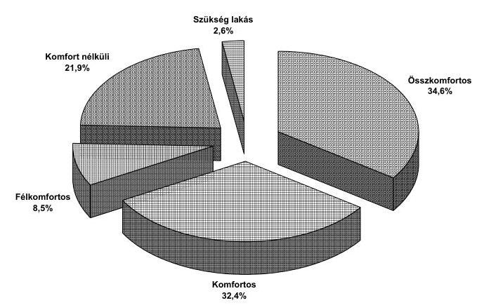
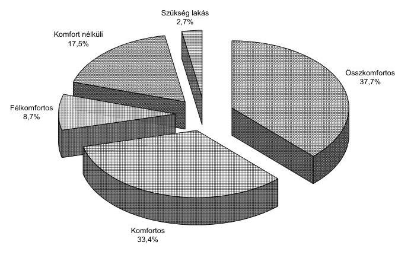
és 2002. év

Tervszerűbbé és szabályozottabbá vált az önkormányzati lakásgazdálkodás. Az önkormányzatok szerepe a szociálisan rászorulók lakáshoz juttatásában felerősödött, a lakásigényt benyújtók száma ennek hatására növekedett. A lakáspályázati rendszer azonban - eredményei ellenére - nem segíti a beruházások önrészéhez elegendő forrással nem rendelkező önkormányzatok hátrányos helyzetének mérséklését, az esélyegyenlőség és a népességmegtartó képesség növelését, hiszen saját erő nélkül az állami forrásra nem pályázhatnak.

---

A helyszíni ellenőrzés során tapasztalt hiányosságok felszámolására az érintett önkormányzatok és a belügyminiszter számára javaslatokat fogalmaztunk meg többek között a vizsgálat által feltárt jogtalan támogatás-igénybevételek rendezésére, a pályázati kiírások és a támogatási szerződések pontosítására, a bérlakásállománynak a meglévő ingatlanok átalakításával, használt lakások vásárlásával és minőségi felújításával történő növelésének ösztönzésére, a szakmai beszámolás számonkérésére vonatkozóan.

A feladatot a 2003. évi ellenőrzési terv 33. pontja tartalmazta. A jelentés nyilvánosságra hozatalának ideje 2003. december hónap, sorszáma: 0349
A vizsgálat előkészitésétől a jelentés-tervezet elkészitéséig ráforditott ellenőri napok száma: 867

# 29. A 2002. évi országgyúlési, valamint a helyi és kisebbségi önkormányzati képviselő választások lebonyolítására felhasznált pénzeszközök ellenőrzése 

A választási eljárásról és az államháztartásról szóló törvények alapján elvégeztük a 2002. április 7. és 21. napjára kitűzött országgyűlési és a 2002. október 20-án végrehajtott helyi és kisebbségi önkormányzati képviselő választás előkészítésére és lebonyolítására fordított pénzeszközök szabályszerű és célszerű felhasználásának az ellenőrzését.

A választásokra a központi költségvetés összesen 9470,7 millió Ft-ot biztosított, az országgyűlési képviselő választásra 6370,7 millió Ft-ot - ebből 170,7 millió Ft a választások lebonyolítását biztosító BM Központi Adatfeldolgozó, Nyilvántartó és Választási Hivatalnál (továbbiakban: BMKH) az intézményi költségvetési előirányzat átcsoportosításaként került erre a célra -, valamint a helyi és a kisebbségi önkormányzati képviselő választásra 3100 millió Ft-ot. A teljes összegből 61\%-ot központi kiadásra, $38 \%$-ot a választások lebonyolításában közreműködő önkormányzatok részére, és $1 \%$-ot a közigazgatási hivatalok feladataira fordítottak.

A 2002. évi választások pénzügyi előkészítése a korábbi választások tapasztalatait és javaslatainkat figyelembe véve 2000. évben megkezdődött. Ennek hatásaként az Országgyűlés a 2001-2002. évi költségvetés jóváhagyásakor az előkészítést, lebonyolítást biztosító BMKH részére az országgyűlési képviselő választáshoz a pénzügyi forrást meghatározta. Ez az intézkedés lehetővé tette, hogy a BMKH az országgyűlési képviselő választás lebonyolításához szükséges közbeszerzési eljárásokat lefolytassa. A helyi és kisebbségi önkormányzati képviselő választás lebonyolításához szükséges pénzügyi forrást az Országgyűlés később, a választás előtt mintegy négy hónappal biztosította.
Az országgyűlési és önkormányzati képviselő választások időbeli közelsége, a feladatokban jelentkező azonosságok célszerűvé tették, hogy egyes közbeszerzési eljárások mindkét választáshoz szükséges beszerzéseket tartalmazzanak. Ez a megoldás célszerűsége ellenére szabálytalan volt, mivel a BMKH a közbeszerzési eljárás megindításakor az önkormányzati képviselő választás lebonyolításához szükséges pénzügyi fedezettel nem rendelkezett. Az önkormányzati képviselő választás pénzügyi fedezetének mértékét a közbeszerzési eljárások szabályszerű elvégzéséhez korábbi időpontban kellett volna biztosítani.

---

Az 2002. évi választások tervezése, pénzügyi előkészítése és lebonyolítása az 1998. évi választásokhoz viszonyítva - a jelentésben részletesen ismertetett hiányosságokat is figyelembe véve - szabályszerűbben történt. A választások költségigényét a BMKH a 2000. évi előtervezés során nem megalapozottan, az országgyűlési választásra vonatkozóan közel egyharmaddal túltervezte, amelynek mintegy fele az informatikai és nyomdai, szállítási kiadásoknál jelentkezett. Ezen túlmenően 45 egyéni választókerületben az országgyűlési választás I. fordulójának eredményessége miatt elmaradt II. forduló tervezett kiadásának megtakarítása okozott maradványt. A választási feladatokban közreműködők részére kedvező irányú változás, hogy a személyi jellegű díjak, átlag 40\%-os növelését tervezték.

A 2002. évi választási feladatok előkészítésére - a választás irányítására, menedzselésére vonatkozó korábbi észrevételünket figyelembe véve - a belügyminiszter 2001. évben munkaszervezetet (projekt szervezetet) hozott létre, amelynek irányítói, vezetői a BMKH két hivatalvezető helyettese volt. A munkaszervezet felügyeletére három helyettes államtitkár és a BMKH vezetőjének részvételével múködő Felügyelő Bizottság kapott megbízást.

A helyi okmányirodáknál egyéb közigazgatási feladatokra már korábban kialakult a szükséges számú számítógéppel ellátott országos hálózat, így a választáshoz kapcsolódóan nem volt szükség a helyi választási szerveknél további számítógépek beszerzésére.

A választások kiadásainak-bevételeinek elkülönített nyilvántartásának lehetőségét a Pénzügyminisztérium a szakfeladatrend kibővítésével biztosította. A választásokkal kapcsolatos nem központi forrású kiadásokat jogszabályi előírás ellenére nem mutatták ki elkülönítetten az önkormányzatok. Ezért pontosan nem mérhető fel a választások teljes bekerülési költsége sem. A vizsgálati körben tapasztaltakat az országos számokra kivetítve a helyi önkormányzatok a központi költségvetésből választási célra kapott összesen 3435 millió Ft-ot, mintegy 1200 millió Ft-tal egészítették ki.

A választásokhoz biztosított támogatások felhasználásáról az önkormányzatok és a közigazgatási hivatalok elszámolást készítettek. A megyénként összesített elszámolások ellenőrzését a BMKH számítástechnikai úton elvégezte és az elszámolásokban észlelt hiányosságokat korrigálva vette figyelembe az adatokat az országos szintű összesítésnél.

A BMKH a 2002. évi választások lebonyolítása érdekében a Belügyminisztérium Beszerzési és Kereskedelmi Rt. közreműködésével tíz közbeszerzési eljárást folytatott le, az informatikai eszközök 90\%-át központosított közbeszerzés keretében szerezte be. Az országgyűlési választáshoz kapcsolódó közbeszerzések felénél a közbeszerzési törvény előírásait nem tartották be, a részekre bontás, az ajánlattételi határidő, a szerződés-módosítás és a gyorsított tárgyalás kezdeményezése tért el a törvényi követelményektől.

A BMKH mindkét választás esetében elkészítette az Országos Választási Iroda részére a belügyminiszter által előírtakkal összhangban - a választást követő 60 napon belül - a feladatonkénti csoportosítású költségtervhez viszonyított elszámo-

---

lását. Az elszámolási határidő közbenső tájékoztatás céljára megfelelő volt, azonban - a korábbi választásoknál tapasztaltakhoz hasonlóan - valamennyi választási célú kiadásról végelszámolás készítése indokolt lenne.

Az ellenőrzés tapasztalati alapján a belügyminiszter részére javasoltuk annak kezdeményezését, hogy a jövőben az Országgyűlés az önkormányzati választáshoz megfelelő időben biztosítson fedezetet, ehhez a BMKH készítsen megalapozott költségtervet. Kérjen a választást követő 60 napon belüli elszámoláson túlmenően a végleges kiadásokról is összegzést, intézkedjen a közbeszerzési előírások megsértése miatti felelősség megállapításáról, valamint arról, hogy a BMKH-n belül olyan belső szabályozási rendet alakítsanak ki, amely szavatolja a közbeszerzési törvény maradéktalan betartását.

A feladatot a 2003. évi ellenőrzési terv 34. pontja tartalmazta. A jelentés nyilvánosságra hozatalának ideje 2003. július hónap, sorszáma: 0325
A vizsgálat előkészitésétől a jelentés-tervezet elkészitéséig ráfordított ellenőri napok száma: 1255

# 30. A kötött felhasználású támogatások 2002. évi felhasználásának ellenőrzése 

Az Országgyűlés a Magyar Köztársaság 2001. és 2002. évi költségvetéséről szóló 2000. évi CXXXIII. törvényben a helyi önkormányzatok által ellátandó feladatok finanszírozásához 2002. évre összesen 14 741,1 millió forint központosított előirányzatú költségvetési támogatást, valamint 104027,8 millió forint normatív kötött felhasználású támogatást ( 89552,8 millió forint költségvetési támogatást és 14475 millió forint normatív részesedésű átengedett személyi jövedelemadót) biztosított. Év közben 9 új jogcím került be a támogatási rendszerbe, az előirányzatok összege az eredetinek közel hétszeresére növekedett, ami döntő mértékben a köztisztviselők illetményrendszerének 2001. július 1-jei módosításával és a közalkalmazottak 2002. szeptember 1-jei 50\%-os illetményemelésével kapcsolatos.

A vizsgálat a központosított előirányzatú támogatások 13 jogcíme közül az előirányzatok $51,3 \%$-át kitevő lakossági közműfejlesztés támogatása, könyvtári és közművelődési érdekeltséget növelő támogatás, hozzájárulás a létszámcsökkentéssel kapcsolatos kiadásokhoz, hozzájárulás a könyvvizsgálatra kötelezett helyi önkormányzatok számára, önkormányzati kincstárak támogatása, települési szilárd hulladék közszolgáltatás fejlesztésének támogatása jogcímekre terjedt ki.

---

Az ellenőrzés a normatív kötött felhasználású támogatások 11 jogcíméből a költségvetési előirányzatok 64,4\%-át kitevő egyes jövedelempótló támogatások kiegészítése (kiegészítő családi pótlék, időskorúak járadéka, rendszeres szociális segély, személyes szabadságukban korlátozottak kárpótlása), és az önkormányzat által szervezett közcélú foglalkoztatás támogatása jogcímekre terjedt ki.

A helyszíni ellenőrzések alapján a vizsgált jogcímeken összesen 67222 ezer forint támogatás jogosulatlan igénybevételét (az elszámolt összes költség 0,1\%-a) állapítottuk meg és 573 ezer forint pótlólagos kifizetésére tettünk javaslatot.
A támogatások igénybevételével kapcsolatos jogszabálysértések miatt 14 önkormányzatot érintően négy büntetőeljárás indítását, 12 önkormányzatnál a választott tisztségviselők munkajogi felelősségének megállapítását kezdeményeztük.

Az ellenőrzött önkormányzatok a részükre kiutalt közműfejlesztési hozzájárulás $26 \%$-át jogtalanul vették igénybe. A szokatlanul nagy arány részben annak következménye, hogy két önkormányzat ellenőrzésénél megállapított szabálytalanság miatt az ellenőrzést kiterjesztettük az érintett viziközmű társulatok érdekeltségi területén lévő további önkormányzatokra is.

Az ellenőrzött önkormányzatok több mint negyedénél (27,2\%-ánál) tapasztaltunk eltérést, 39 önkormányzatnál 40374 ezer forint jogtalan támogatás igénybevételt, egynél pedig a saját elszámolás hibája következtében visszautalt támogatás miatt 24 ezer forint pótlólagos járandóságot állapítottunk meg. A jogtalan igénybevétel okai között első helyen szerepel a még meg nem fizetett közműfejlesztési hozzájárulások utáni támogatás igénybevétele. A lakossági érdekeltségi hozzájárulásból megvalósítandó beruházás fedezetére a közmúfejlesztési társulatok kamattámogatásos hitelt vettek fel. A magánszemélyek az érdekeltségi hozzájárulásokat részletekben fizették meg. A részleteket azonban nem a közmúfejlesztési társulat részére fizették be, hanem lakáselőtakarékossági egyéni számlára. A 30\%-os állami támogatással kiegészített lakáselőtakarékossági számlájukon lévő megtakarításokat a viziközmű társulatra engedményezték. A hitel futamidejének lejártakor, 7-10 év türelmi időt követően az engedményezett megtakarításokból fogják törleszteni egy összegben a hitelt. A magánszemélyek lakáselőtakarékossági számlára történő befizetései azonban nem tekinthetők az érdekeltségi hozzájárulás megfizetésének, az ezt tanúsító igazolások alapján jogtalanul igényelték az önkormányzatok a közmúfejlesztési hozzájárulást. Az érdekeltségi hozzájárulás megfizetéséről a lakáselőtakarékossági számlákról az engedményezésnek megfelelő pénzátutaláskor adható ki jogszerűen az igazolás.

Két viziközmű társulat - a jogszabályokat megsértve - a lakossági érdekeltségi hozzájárulásból megvalósítandó beruházás forrásigényét meghaladó összegű kamattámogatásos hitelt vett fel. A beruházási számlák kifizetése után rendelkezésükre álló összeget betétként helyezték el a hitelt nyújtó pénzintézetnél. Ebből a pénzből fizették meg a társulat tagjai helyett részben vagy teljesen az önkormányzati átmeneti segély, vagy alapítványi támogatás címén a lakáselőtakarékossági befizetéseket. A szabálytalan hitelfelvétel következtében a központi költségvetésből jogtalanul vesznek igénybe kamattámogatást, lakáselőtakarékossági támogatást és lakossági közműfejlesztési támogatást a társulatok, az önkormányzatok és a magánszemélyek.

---

A könyvtári érdekeltségnövelő támogatást hat önkormányzat nem állománygyarapításra fordította.
A közművelődési érdekeltségnövelő támogatás esetében nincs előírva az önkormányzatok által biztosítandó saját forrás aránya, a felosztást a saját erő arányában kapják meg, de annak tényleges ráfordításáról nem kell elszámolni.

Az önkormányzatok elszámoltatása a létszámcsökkentési pályázatoknál csak részlegesen megoldott. A tervezett létszámleépítés alapján benyújtott pályázatoknál nincs előírva a támogatás felhasználásával kapcsolatos okmányok utólagos becsatolása az elszámoláshoz. A létszámcsökkentés évét követően az álláshely ismételt létrehozása az átszervezések, új feladatok miatt nem követhető, nem tiltott a megszüntetett álláshelyi feladatok közcélú vagy közhasznú foglalkoztatás keretében történő ellátása sem.

A könyvvizsgálatra kötelezett helyi önkormányzatok számára biztosított 120 millió forint hozzájárulás elosztása és felhasználása a jogszabályi feltételeknek megfelelően történt, 850 önkormányzat részesült egyenként 141 ezer forintos támogatásban.

Az önkormányzati kincstári rendszer bevezetését vállaló önkormányzatok számára 500 millió forint támogatást biztosított a költségvetés, de az alacsony érdeklődés miatt a Pénzügyminisztérium csak 100 millió forintot osztott szét a 25 pályázó önkormányzat között. A számvevőszéki vizsgálat egy önkormányzat esetében állapított meg 5719 ezer forint céltól eltérő támogatás felhasználást.

A települési szilárd hulladék közszolgáltatás fejlesztésének támogatása céljára biztosított évi 2 milliárd forintos keret jól szolgálta a hulladékgazdálkodásról szóló törvényben (Hgt) meghatározott önkormányzati feladatok ellátásának megszervezését, továbbfejlesztését. A megkapott támogatások elszámolása és elszámoltatása nem felelt meg a pályázati kiírásnak, a teljesítést követő 30 napon belüli elszámolási határidőt az önkormányzatok nem tartották be, a II. 28-i, illetve az V. 31-i elszámolási véghatáridőig sem számolt el a kapott támogatással az érintett önkormányzatok $17 \%$-a.

A kiegészítő családi pótlékkal kapcsolatos, a gyermekvédelmi törvényben előírt rendeletalkotási kötelezettségének két kivétellel valamennyi ellenőrzött önkormányzat eleget tett, azonban a helyi szabályozás csak 10\%-uknál tér ki minden helyileg szabályozandó feladatra.

Az időskorúak járadékát a 2002. évben hatályos jogszabályi előírás szerint hagyatéki teherként be kellett nyújtani, ezt a kötelezettséget azonban a megállapító határozatok harmada nem tartalmazta.
A rendszeres szociális segélyben részesülők száma dinamikusan növekedett. Az aktív korú nem foglalkoztatott segélyben részesülők száma 2002. évben 16\%-kal emelkedett. A segélyezettek közcélú foglalkoztatása az előző évivel azonos arányban (45\%) került sor a foglalkoztatottak számának növekedése mellett.

---

Az ellenőrzés során feltárt szabálytalanságok megszüntetése érdekében javaslatot tettünk a viziközmű társulatok részére biztosított kamattámogatásos hitel törlesztésénél biztosítható türelmi idő meghatározására, a hitelezési gyakorlat pénzintézeti ellenőrzésére, a közműfejlesztési támogatást szabályozó kormányrendelet kiegészítésére, a központosított előirányzatokkal kapcsolatos pályázati kiírások pontosítására.

A feladatot a 2003. évi ellenőrzési terv 35. pontja tartalmazta. A jelentés nyilvánosságra hozatalának ideje 2003. szeptember hónap, sorszáma: 0331
A jelentést az Önkormányzati bizottság megtárgyalta.
A vizsgálat előkészitésétől a jelentés-tervezet elkészitéséig ráfordított ellenőri napok száma: 2076

# IV. ELKÜLÖNÍTETT ÁLLAMI PÉNZALAPOK 

## V. A TÁRSADALOMBIZTOSÍTÁSI ALAPOKKAL KAPCSOLATOS ELLENŐRZÉSEK

## 31. Az Egészségbiztosítási Alap múködésének ellenőrzése

Az Állami Számvevőszék rendszeresen véleményezte az Egészségbiztosítási Alap (E. Alap) költségvetését, ellenőrizte annak végrehajtását, vizsgálta az egészségbiztosítással összefüggő egyéb ügyeket, de első alkalommal került sor az E. Alap átfogó ellenőrzésére, amely az 1994-2002 közötti időszakot érintette.

A pénzügyi, gazdasági folyamatok jobb megértése indokolta, hogy a vizsgálat a társadalombiztosítás egészét érintő kérdésekkel is foglalkozzon. Ennek során megállapította, hogy a társadalombiztosítási rendszer megújításának koncepciójáról szóló 1991. évi országgyűlési határozatot követően elmaradt annak jogi, szakmai és pénzügyi-gazdasági megalapozása.

Az egészségbiztosítás keretében nyújtott ellátások finanszírozására létrehozott önálló E. Alap évről-évre pénzügyi egyensúlyi problémával küzdött, mivel nem volt összhang a bevétel és a kötelező ellátások ráfordításai között. A költségvetési hiány 1994 és 2002 között közel ötszörösére, 18,1 Mrd Ft-ról 86,6 Mrd Ft-ra nőtt.

---

Az Égészségbiztosítási Alap bevételei, kiadásai és hiánya
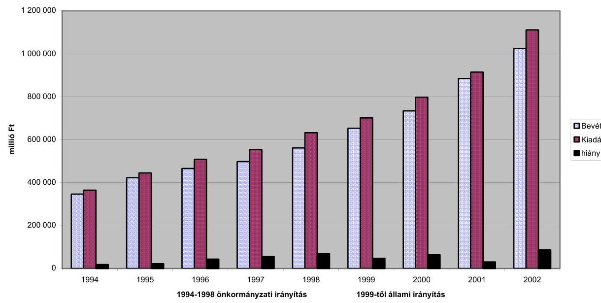

Az állandósult hiány folyamatos likviditási gondokkal járt. Az ellátási kötelezettséget a naponként igénybevett állami forgóalap hitellel tudta csak teljesíteni az E. Alap. A pénzügyi helyzet romlásában, a hiány kialakulásában szerepet játszott a változó társadalmi, gazdasági környezet, a megalapozatlan tervezés és a járuléktartozások növekedése.

Nem segítette a pénzügyi egyensúly megteremtését az ellentmondással teli ingyenes vagyonjuttatás sem. Az átadási értéken 1997. végéig számított 28,8 Mrd Ftból, 1999-ben 23,7 Mrd Ft bevétele volt az E. alapnak.
Az E. Alap irányítására 1991-ben létrehozott, ténylegesen 1993 közepétől 1998 közepéig múködő társadalombiztosítási önkormányzatok - ezen belül az Egészségbiztosítási Önkormányzat - nem váltották be a felállításukhoz fúzött reményeket, mert nem volt tényleges befolyásuk a biztosítási jogviszonyokra, a bevételekre és a kiadásokra.

Az ellenőrzött időszakban az E. Alap kezelője az Országos Egészségbiztosítási Pénztár (OEP) volt. A társadalombiztosításra vonatkozó szabályozási tevékenységben javaslattevőként, illetve a jogszabály tervezetek véleményezőjeként vett részt, amely esetenként a normaszöveg megfogalmazására is kiterjedt.
Az önkormányzati irányítás időszakában szervezetileg szétválasztották az E. Alapot kezelő önkormányzati és igazgatási apparátust. Erre az időszakra a decentralizált irányítás volt a jellemző.

Az állami irányítás ismételt bevezetését követően elkezdődött egy központosítási folyamat. Az OEP múködtetésénél alkalmazott központosított gazdálkodás javította a költséghatékonyságot, például a beruházásnál, az informatikai fejlesztésnél, a beszerzéseknél. Ugyanakkor a szervezeti, irányítási modellek nem járultak hozzá a múködés hatékonysága növeléséhez, mert nem vették figyelembe, hogy az egészségbiztosítási szolgáltatások teljesítésével, illetve a kapcsolódó rendszerek alkalmazásánál nem egyforma az igazgatási szervek feladata.

---

Az integrált rendszerfejlesztés, az informatikai környezet és múködési szabályozása, az informatikai biztonság megteremtése kiemelt feladata az OEP-nek. Erre vonatkozóan a korábbi ellenőrzések során ajánlásokat fogalmazott meg az ÁSZ, de elmaradt ezek tervszerű, következetes megvalósítása.

Az ÁSZ az átfogó ellenőrzés megállapításai alapján tette meg javaslatait a kormánynak, az érintett tárcák vezetőinek, valamint az OEP főigazgatójának.
Javasolta a Kormánynak az 1991. évi országgyűlési határozat értékelését, az egészségbiztosítás átalakítása hosszú távú koncepciójának kidolgozását, a járulék ellenében kapható és a járulékkal nem fedezett ellátások körének meghatározását.

Javasolta a pénzügyminiszternek, hogy intézkedjen felügyeleti hatáskörében az egészségbiztosítási járulékok egyéni és munkáltatói járulékra történő megbontása érdekében.

Javasolta az egészségügyi, szociális és családügyi miniszternek, hogy vizsgálja felül szakmailag a gyógyszer- és gyógyászati segédeszköz támogatások előirányzatának zárt jelletét.

Javasolta az OEP főigazgatójának, a szervezeti átvilágítás tapasztalatainak hasznosítását, a szak- és pénzügyi ellenőrzések eredményei felhasználását, az informatikai rendszerek egységes fejlesztését, az informatikai biztonság megteremtését.

A feladatot a 2003. évi ellenőrzési terv 15. pontja tartalmazta. A jelentés nyilvánosságra hozatalának ideje 2003. július hónap, sorszáma: 0324
A jelentést az Egészségügyi bizottság megtárgvalta.
A vizsgálat előkészítésétól a jelentés-tervezet elkészitéséig ráfordított ellenőri napok száma: 1664

# VI. AZ ÁLLAM VÁLLALKOZÓI ÉS KINCSTÁRI VAGYONÁVAL KAPCSOLATOS ELLENŐRZÉSEK 

## 32. Az Állami Privatizációs és Vagyonkezelő Rt. 2002. évi múködésének és a központi költségvetés végrehajtásához kapcsolódó tevékenységének ellenőrzése

Az Állami Számvevőszék törvényben előírt kötelezettségének eleget téve - 1991 óta - minden évben rendszeresen ellenőrzi az ÁPV Rt., illetve jogelődei tevékenységét. Jelen ellenőrzés célja többek között annak értékelése volt, hogy az Rt. szervezeti és működési rendszere összhangban volt-e a feladatokkal, a társaság hozzárendelt vagyona hogyan változott. Vizsgáltuk továbbá, hogy a költségvetési törvényben előírt és az ÁPV Rt. tevékenységét érintő előirányzatok, kötelezettségek, garanciavállalások hogyan teljesültek, érvényesültek-e a társaság gazdálkodásában a szabályszerűségi, takarékossági szempontok.

---

A Kormány - az előző évi állami költségvetés végrehajtásáról szóló törvényjavaslat előterjesztésével egyidejúleg - a 2000. és a későbbi évekről nem nyújtott be beszámolót az Országgyúlésnek az ÁPV Rt. tevékenységéről, a tulajdonában álló, valamint a hozzárendelt vagyon alakulásáról, hasznosításának eredményéről.

Az ÁPV Rt. 2002. évi múködését befolyásolta a kormányzati ciklusváltás. Az év első felében az - akkori Kormány gazdaságpolitikai törekvéseivel, irányelveivel összhangban - a vagyonkezelési tevékenység kapott prioritást, a kormányváltást követően a privatizáció újraindítása, illetve annak felgyorsítása került előtérbe. Először fordult elő az ÁPV Rt. és jogelődei történetében, hogy a Társaság osztalék bevételei meghaladták a privatizációból származó bevételeket. Az ÁPV Rt. egész évben nem rendelkezett a részvényesi jogok gyakorlója által jóváhagyott éves üzleti tervvel.

A Társaság hozzárendelt vagyona 2002. év végén 720 milliárd Ft, kötelezettségeinek állománya a hozzárendelt vagyon terhére 96,5 milliárd Ft volt. Saját vagyona az év során 13,5 milliárd Ft-ra (4\%-kal) nőtt. 2002-ben, 5,3 milliárd Ft múködési bevételt ért el, ugyanakkor múködési kiadása 4,5 milliárd Ft volt.

A Magyar Köztársaság 2001. és 2002. évi költségvetéséről szóló törvény 2002. évre 32 milliárd Ft befizetési kötelezettséget irányzott elő az ÁPV Rt. számára az állami vagyon utáni részesedésként. Ezt a befizetési kötelezettséget a 2001. évi költségvetés végrehajtásáról szóló zárszámadási törvényben az Országgyúlés 0 Ft-ra módosította, így befizetés nem volt. A tartalékfeltöltési kötelezettség teljesítésére a Kormány 5 milliárd Ft pénzeszközt és 10,1 milliárd Ft államkötvényt adott a Társaságnak. A tervben juttatás nem szerepelt.
Az ÁPV Rt. szervezete az ellenőrzött időszakban lényegében a korábbi struktúrában múködött, az új célokhoz igazodó új szervezeti rendszer a szervezeti és múködési szabályzat év végi módosításában jelent meg. A jogi feladatok tekintetében a társaság kapacitása nem volt összhangban a feladataival.
A Társaság a bruttó elszámolás elvétől eltérően a pénzforgalmi szemléletű ered-mény-kimutatásában nettó módon számolt el, ami azt jelenti, hogy a bevételek valós kimutatása helyett a pénzforgalmi kimutatásban ráfordítások csökkentéseként szerepeltették a teljesítéseket.

A Társaság éves üzleti tervének elkészítését, és annak teljesítését nehezítette, hogy előre nem látható kormányzati döntések alapján hajtották végre az üzleti tervet.
A Társaság a módosított, csökkentett bevételi tervét sem realizálta, elsősorban két tervezett tranzakció meghiúsulása miatt. Az elszámolt 10,0 milliárd Ft összegű privatizációs bevétel közel 39\%-a portfóliócseréből származott, ami államháztartási szempontból nem jelent privatizációs bevételt. A hozzárendelt vagyon összbevételének kétharmada, 12,8 milliárd Ft a tulajdonosi körébe tartozó cégek oszta-lék-befizetéséből származott.

Az éves költségvetési törvény 95,5 milliárd Ft előirányzatot tartalmazott a hozzárendelt vagyonnal kapcsolatos ráfordításokra. A tényleges felhasználás 24,5 milliárd Ft volt.
A vagyonkezelési ráfordításoknál és a hozzárendelt vagyon értékesítésének előkészítésénél, közel fél milliárd Ft ügyvédi költséget számoltak el versenyeztetés nélkül. Célszerűtlen ilyen nagyságrendben külső megbízás, melynek költségszükségle-

---

te (versenyeztetés nélkül) nehezebben ellenőrizhető, mint a saját alkalmazottakkal végzett munka.
A volán társaságok támogatásánál az autóbuszok beszerzésére fordított 1,5 milliárd Ft tervezése és elszámolása nem az éves költségvetési törvény végrehajtására hozott kormányhatározatok előírásainak megfelelően történt. Az ÁPV Rt. likviditási gondjai ellenére az előfinanszírozásként kiutalt összeget a volán társaságok az ellenőrzés befejezéséig nem használták fel az autóbuszok beszerzésére. Ebben részben az is közrejátszott, hogy az ÁPV Rt. a saját maga által kiírt közbeszerzési eljárást érvénytelenítette.

A hozzárendelt vagyon változását nem eredményező ráfordítások közül a vagyontárgyak vásárlására, valamint az üzleti célú befektetésekre fordított kiadásoknál a 2001. évhez hasonlóan - 2002-ben sem szerezte be a Társaság a Kormány jóváhagyását a tranzakcióihoz.

A privatizációs tartalék felhasználásának több mint felét az állam vagyon- és gazdaságpolitikai tevékenységét támogató intézkedésekkel, válsághelyzetek megszüntetésével összefüggő kiadások tették ki. Jelentős súlyt képviseltek az elvont vagyontárgyak után beálló kezesi felelősség rendezésére fordított kiadások is.
A Társaság hozzárendelt vagyona az éves vagyonpolitikai tervtől eltérően változott.
A hozzárendelt vagyonba tartozó múködő társaságok 2002-ben kedvezőtlen évet zártak. A három nagy ágazat - agrár-, erdő-, volán társaságok - esetében is egyértelmú visszaesés következett be. Ehhez hozzájárult az is, hogy az állami szabályozás meghatározó tényező az eredmény alakulása szempontjából a felsorolt ágazatoknál. A jelentős állami tulajdonnal rendelkező csoportba tartozó cégek többsége veszteséges, melyet csak részben ellensúlyozott a néhány meghatározó rt. teljesítménye.
A hozzárendelt vagyonhoz tartozó társaságok a szabad pénzeszközök kihelyezésnél és szabályozásánál eltérő gyakorlatot folytattak.
A Malév Rt. eredeti átalakítási koncepciója nem folytatódott, ezért a 2001. évben az e célra biztosított 9,2 milliárd Ft-os támogatás nem hasznosult.

A Társaság múködési bevételei, ráfordításai az üzleti tervében meghatározott célkitűzések és a törvényben előírt keretek között alakultak.
A korábbi vizsgálataink megállapításai közül többek között továbbra is fennáll, hogy nem javult a költségvetési kapcsolatok tervezése.

A helyszíni ellenőrzés megállapításainak hasznosítása mellett javasoltuk a Kormánynak, hogy az állam tulajdonában lévő vállalkozói vagyon értékesítéséről szóló 1995. évi XXXIX. törvény 25. § (2) bekezdésében foglaltaknak megfelelően nyújtsa be az Országgyűlésnek az ÁPV Rt. tevékenységéről, a tulajdonában álló, valamint a hozzárendelt vagyon alakulásáról, hasznosításának eredményéről az eddig be nem terjesztett beszámolókat. Felkértük a pénzügyminisztert gondoskodjon arról, hogy az ÁPV Rt. jóváhagyott üzleti terv alapján végezze tevékenységét.

A feladatot a 2003. évi ellenőrzési terv 36. pontja tartalmazta. A jelentés nyilvánosságra hozatalának ideje 2003. augusztus hónap, sorszáma: 0330
A jelentést a Környezetvédelmi bizottság megtárgyalta.
A vizsgálat előkészitésétől a jelentés-tervezet elkészitéséig ráfordított ellenőri napok száma: 908

---

# 33. A Magyar Távirati Iroda Rt. 2002. évi gazdálkodásának ellenőrzése 

Az Állami Számvevőszék évente ellenőrzi az MTI Rt. gazdálkodását a nemzeti hírügynökségről szóló törvény alapján. A Számvevőszék e kötelezettségének a törvény hatályba lépése óta hatodik alkalommal tett eleget.

A nemzeti hírügynökségről szóló törvény kimondja, hogy a tulajdonosi jogokat az Országgyúlés gyakorolja és az MTI Rt. alapító okirata szerint az Rt. elnöke évente beszámol az Országgyúlésnek a társaság tevékenységéről, amelynek keretében sor kerül a mérleg és az eredmény-kimutatás jóváhagyására, valamint a nyereség felosztására. Az elnök a beszámolóját az Rt. felügyelő bizottságának véleményével együtt terjeszti az Országgyűlés elé, amihez mellékelni kell az Állami Számvevőszék elnökének jelentését. Évek óta szorgalmaztuk, hogy az Országgyűlés éljen a tulajdonosi jogaival. Az Országgyűlés 2002. október 4-én visszamenőleges hatálylyal elfogadta a társaság megalapítása óta benyújtott éves beszámolókat.

A 2001. évi beszámolót az Országgyűlés azzal fogadta el a Számvevőszék kezdeményezésére, hogy át kell tekinteni a nemzeti hírügynökségről szóló törvényt és az MTI Rt. Alapító Okiratát a teljes körűen összehangolt szabályozás kialakítása, a közszolgálati feladatok és azok ellátásához szükséges állami támogatás egyértelműbb és pontosabb meghatározása érdekében. Erre azonban nem került sor.

A jogszabályok áttekintését és módosítását az MTI Rt. múködtetésére kialakított sajátos tulajdonosi megoldás indokolja. Ugyanis az Rt. tulajdonosa az Országgyúlés, irányító szervezete speciális. Nincs igazgatósága, ezt a feladatot az Rt. elnöke látja el. A Tulajdonosi Tanácsadó Testület javaslattevő, véleményező szervezet, de a törvényben meghatározott esetekben döntéseket is hozhat. A Felügyelő Bizottságnak sajátos feladatai vannak az elnöki hatalom korlátozása érdekében.

Az MTI Rt. külső és belső szabályozása a Számvevőszék korábbi javaslatai ellenére 2002-ben lényegében nem változott. Változatlanul nem egyértelmű az Országgyúlés, a Tulajdonosi Tanácsadó Testület, a Felügyelő Bizottság és az MTI Rt. elnökei között megosztott tulajdonosi irányítás és ellenőrzés törvényi szabályozása, a szervezetek feladat- és hatásköri szabályozása. A nemzeti hírügynökségi törvény, a társaság Alapító Okirata, a testületek ügyrendje, az Rt. Szervezeti és Múködési Szabályzata sem rendelkezett a tulajdonosi jogok gyakorlóinak egymás és a társaság közötti, a múködés során alkalmazandó eljárási rendről. Mindez az Rt. 2002. évi múködésében is feszültségeket okozott.

A társaság szabályzatai és a hatályos SZMSZ, valamint az SZMSZ és a munkaköri leírások közötti összehangolást az Rt. nem végezte el, ennek következtében a felelősség megállapítását nem lehetett biztosítani.
A részvénytársaság mérleg szerinti eredménye megalakulása óta először volt negatív. A veszteséget lényegében a választási céltámogatás elmaradása, a hatékonyságot javító intézkedések hiánya, a tanácsadói és ügyvédi díjak növekedése, a végkielégítés és felmondási bér címén kifizetett többletköltség és a pénzügyi múveletek nyereségének csökkenése együttesen eredményezte. Az MTI Rt. a 2002. évi

---

gazdasági tervét nem teljesítette. 150 millió Ft-os bevételkiesés mellett az üzleti veszteség 169 millió Ft, a mérleg szerinti veszteség 142383 ezer Ft volt.

Az MTI Rt.-nek juttatott múködési célú támogatások összege 2000-től változatlan volt, amihez az Rt. hatékonyságjavító intézkedésekkel nem igazodott. A 2002-re tervezett választási céltámogatás elmaradt, így a Társaságnál e célra felmerült 58 703 ezer Ft költségnek nem volt fedezete. Az MTI Rt. tényleges gazdasági tevékenysége eltért a stratégiában megfogalmazott céloktól. Az éves üzleti terv nem kapcsolódott a középtávú stratégiai tervben foglaltakhoz, és több célkitűzése időarányosan nem valósult meg. Ezek közé tartozik többek között, például, hogy elmaradt a tervezett létszám-racionalizálás, valamint nem került bevezetésre a teljesítményértékelési rendszer. A tanácsadói és ügyvédi díjak több mint 50\%-kal emelkedtek az előző évihez képest.

A vezetőváltáshoz kapcsolódó személyi és szervezeti változások miatt a végkielégítés és felmondási bér címén kifizetett többletköltség 75766 ezer Ft volt.

A részvénytársaság a nemzeti hírügynökségi törvényben meghatározott közszolgálati feladatokat lát el, amelyhez állami támogatásban részesül. Az MTI Rt. 2003-ban az előző évinél 200000 ezer Ft-tal több múködési céltámogatást kapott. Nem egyértelmú azonban, hogy a támogatás növelését milyen konkrét múködési célok (elmaradt múködési, választási céltámogatás stb.) indokolták, illetve annak mire kell fedezetet nyújtani. Az állami támogatás összegét nem az elvégzendő közszolgálati feladat és az ehhez szükséges szervezet hatékony múködése, hanem költségvetési alku eredménye alapján határozták meg. A termék vagy termékcsoport szintű önköltség utókalkuláción alapuló megállapításának, valamint a közszolgálati feladatok megállapításának hiánya következtében az MTI Rt. részére a költségvetési törvényben meghatározott múködési célú állami támogatás mértékének indokoltsága és célszerű felhasználásának megítélése nem volt lehetséges. Az MTI Rt. a támogatási szerződésekben foglaltaktól eltérően értelmezte a közbeszerzési törvény előírásait a céltámogatásokból megvalósított beszerzései, megrendelései esetében.

Az Állami Számvevőszék tavalyi jelentésében megfogalmazott megállapításai, javaslatai, illetve ajánlásai az MTI Rt. 2002. évi múködésében lényegében nem hasznosultak.

A Számvevőszék jelen ellenőrzése alapján ismét felkérte az Országgyűlést, hogy tekintse át és módosítsa a nemzeti hírügynökségről szóló törvényt és az MTI Rt. alapító okiratát a teljes körű összehangolt szabályozás érdekében. A Tulajdonosi Tanácsadó Testület, a Felügyelő Bizottság, valamint az Rt. elnökének figyelmét is ismételten, a korábban több alkalommal feltárt szabályozási hiányosságok felszámolására hívtuk fel.

A feladatot a 2003. évi ellenőrzési terv 37. pontja tartalmazta. A jelentés nyilvánosságra hozatalának ideje 2003. augusztus hónap, sorszáma: 0326
A jelentést a Kulturális és sajtó bizottság megtárgyalta.
A vizsgálat előkészitésétől a jelentés-tervezet elkészitéséig ráforditott ellenőri napok száma: 259

---

# VII. A KÜLFÖLDI TÁMOGATÁSOKKAL KAPCSOLATOS ELLENŐRZÉSEK 

## VIII. AZ ÁLLAMHÁZTARTÁSON KÍVÜLI SZERVEZETEKKEL KAPCSOLATOS ELLENŐRZÉSEK

## 34. A FIDESZ Magyar Polgári Párt 2000-2001. évi gazdálkodása törvényességének ellenőrzése

A FIDESZ-Magyar Polgári Párt a 2000. évi gazdálkodásáról szóló beszámolóját először 2001. április 27-én a Magyar Közlöny 2001. évi 48. számában, majd az önrevíziót követően 2002. október 29-én a Magyar Közlöny 133. számában tette közzé. A párt 2001. évi beszámolóját a Magyar Közlöny 42. számában, 2002. március 30-án hozta nyilvánosságra. A párt a beszámolók közzétételének törvényben előírt határidejét betartotta. Az ÁSZ a 2000. évi önrevízióval módosított és a 2001. évi közzétett beszámolók adatait ellenőrizte.

A párt 2000. évtől az előző ÁSZ vizsgálatról készült jelentés felhívása alapján megszüntette a helyi szervezetek önálló gazdálkodási és beszámolási jogosultságát. Áttért a bizonylatok alapján történő központi könyvvezetésre és beszámoló készítésre.

A párt 2001. évi beszámolójában - a számviteli politikában előírtaktól eltérően - a politikai kiadások helyett a múködési kiadások között mutatta ki a 9423 ezer Ft értékű nemzetközi tagdíjakat, ezáltal a 2001. évi beszámoló elkészítése során megsértette a számviteli törvényben megfogalmazott következetesség számviteli alapelvét. A fenti kivétellel a beszámoló mindkét évben - részleteiben és főösszegében a főkönyvi könyveléssel egyezően, a valóságnak megfelelően tartalmazta a párt bevételeit és kiadásait.

A párt beszámolóiban - a számviteli politika változásának eredményeként - az egyéb kiadások között mindkét évben kimutatták, azonos 171663 ezer Ft értékben a központi székház 1999. évi részletfizetésre történt visszavásárlásának további részleteit és esedékes kamatait. A párt 1999. évi beszámolója az eszköz beszerzések között nem a székházvásárlás első részletének megfelelő tényleges kifizetést, hanem a teljes vételárat tartalmazta. A közvélemény korrekt tájékoztatása megkövetelte volna, hogy a 2000. és 2001. évről szóló beszámolókban megjelöljék, hogy - a számviteli politika változtatása következtében - az egyéb kiadások milyen összegben tartalmaztak az 1999. évi beszámolóban már közzétett kiadást.

A párt 2000. évben elkészítette, majd 2001-ben az új számviteli törvény hatálybalépését követően módosította számviteli politikáját és számlarendjét. A számviteli politika és a számlarend a párt sajátosságainak figyelembe vételével készült el. A számviteli politika meghatározta a kötelezően vezetendő nyilvántartásokat és azok tartalmát, valamint a kötelező szabályzatok körét.

---

A számviteli politikában előírt kötelező analitikus nyilvántartások vezetésének szabályozása és gyakorlata - a készpénzforgalmi nyilvántartások vezetésének kivételével - megfelelt a jogszabályi és a belső előírásoknak. A készpénzforgalmi nyilvántartások vezetésének hiányossága, hogy a vizsgált időszakban a fővárosban és 5 megyei irodában a pártszervezetek csak évente 1-2 alkalommal fizették be a beszedett tagdijakat a pénztárba, és számolták el kiadási számláikat. Ez a gyakorlatban nem felelt meg a számviteli törvény - készpénzes pénzmozgások megtörténtének időpontjában való bizonylatolásra és nyilvántartásba vételére vonatkozó - előírásainak.

A kötelezettségvállalás és az utalványozás rendjét megfelelően szabályozták. A kötelezettségvállalás és utalványozás gyakorlata a Központi Hivatalban és 14 megyében megfelelt a követelményeknek, ugyanakkor 5 megyében és a fővárosban a készpénzes pénzmozgások $50 \%$-ában a készpénzt felvevő személy önmagának utalványozott.

A gazdasági események nyilvántartása során alapvetően betartották a számviteli törvénynek a bizonylati fegyelemre vonatkozó előírásait. A készpénzes pénzmozgásokat 6 megye kivételével idősorrendben a felmerülés időpontjában rögzítették. Az alapbizonylatok a készpénzes tagdíj befizetések dokumentumai kivételével megfeleltek a számviteli törvény bizonylatokkal szemben támasztott követelményeinek. A rendszeresített tagdijfizetési í nem tartalmazta a tagdijfizetés időpontját, ami nem felel meg a számviteli törvény bizonylatok tartalmával kapcsolatos előírásoknak. A tagdíjfizetés bizonylatolásával kapcsolatos hiányosság, hogy 6 megyében - a befizetések 30\%-ában - nem a tag által aláírt tagdíjfizetési ívvel, hanem csak összesítő kimutatással dokumentálták a tagdíj eredetét.

A párt tulajdonában álló gépkocsik után a párt a vizsgált időszakban cégautó adót nem fizetett. A személyi jövedelemadó törvény értelmében a cégautó adót kizárólag akkor nem kell megfizetni, ha a kizárólagos hivatali célú használatot az előírt dokumentumok (menetlevél, útnyilvántartás) egyértelműen bizonyítják. A gépkocsik igénybe vételét igazoló menetlevelek vezetése során nem követelték meg az útnyilvántartások vezetésére előírt szabályok betartását. Ezért a nyilvántartások alapján nem állapítható meg, hogy valóban csak hivatali célra használták-e a párt tulajdonában álló gépkocsikat.

A magántulajdonú gépkocsik igénybe vételéhez a belföldi kiküldetési rendelvényt írták elő. A kiküldetési rendelvények vezetése során a menetlevelekhez hasonlóan nem követelték meg a személyi jövedelemadó törvényben előírt szabályok betartását, továbbá a Központi Hivatalban a kiküldetéseket előzetesen nem rendelték el.

Az adó- és járulékbevallással, nyilvántartással és befizetéssel kapcsolatos jogszabályoknak - a cégautó adó fizetésével és a belföldi kiküldetési rendelvények vezetésével kapcsolatos előírások kivételével - a párt a vizsgált időszakban eleget tett. A párt nyilatkozata szerint a vizsgált években a párttörvény által tiltott pénzforrásokat nem fogadott el, tárgyi adományokat nem kapott, tiltott gazdasági társaságot nem alapított, ilyenben részesedést nem szerzett, értékpapírt nem vásárolt. Az ellenőrzés a nyilatkozatban foglaltaktól eltérő tényt nem állapított meg.

---

A párt gazdálkodásának belső ellenőrzése két részből állt. A folyamatba épített ellenőrzés mellett a párt kongresszusa által választott Számvizsgáló Bizottság látott el ellenőrző tevékenységet. A Számvizsgáló Bizottság alapvetően a Központi Hivatal és múködését, valamint az éves és a választási költségvetéseket, beszámolókat vizsgálta. Mélyebb, a helyi szervezetek gazdálkodását is elérő ellenőrzéseket nem végzett. Erre belső ellenőr alkalmazását tartotta szükségesnek, illetve ez irányú javaslatot tett a jövőre vonatkozóan.

Az előző ÁSZ vizsgálatról készült jelentés a párt Alapszabályának és gazdálkodási rendjének ellentmondásai alapján felhívta a párt elnökét az Alapszabály módosítására. Az Alapszabály módosítást csak részben hajtották végre, a helyi szervezetek önálló gazdálkodásra vonatkozó rendelkezést kivették az Alapszabályból, az éves egyszeri beszámolási kötelezettséget azonban változatlanul hagyták. Az éves egyszeri beszámolásra vonatkozó rendelkezés változatlanul hagyását a pártcsoportok egy része úgy értelmezi, hogy csak évente kell tagdíj bevételeikkel és kiadásaikkal elszámolni és a tagdijakat csak évente egy alkalommal fizetik be a megyei iroda pénztárába.

Az ellenőrzési tapasztalatok alapján az ÁSZ többek közt intézkedésre hívta fel a párt elnökét, hogy az Alapszabály és a Tagdíjszabályzatnak a tagdíj fizetésre vonatkozó előírása összhangba kerüljön egymással, és a tagdíj íven tüntessék fel a tagdíj fizetés időpontját. Intézkedjen annak érdekében, hogy a párt tulajdonában álló személygépkocsik futásteljesítményének nyilvántartási gyakorlata feleljen meg a személyi jövedelemadóról szóló törvény előírásainak, és arra az időszakra, amikor nem tudja menetlevelekkel az e törvényben előírt módon bizonyítani, hogy kizárólag hivatali célú igénybevétel történt, a cégautó adót fizessék meg. Intézkedjen, továbbá, hogy a magánszemélyek tulajdonában lévő gépkocsiknak párt céljaira történő igénybe vételének elszámolásához használt kiküldetési rendelvény megfelelő részletezésű vezetése feltétele legyen a kifizetésnek, és gondoskodjon a kiküldetések előzetes elrendeléséről.

Az ÁSZ elnöke - mint azt 2000. év óta a pártellenőrzésről készített jelentéseiben minden alkalommal - most is megismételte javaslatát a Kormánynak, hogy kezdeményezze a pártok számviteli nyilvántartási és beszámolási rendszerét érintő ellentmondások feloldását, amelyek a párttörvény, valamint a számviteli törvény között továbbra is fennállnak.

A feladatot a 2003. évi ellenőrzési terv 17. pontja tartalmazta. A jelentés nyilvánosságra hozatalának ideje 2003. március hónap, sorszáma: 0308
A vizsgálat előkészitésétől a jelentés-tervezet elkészitéséig ráforditott ellenőri napok száma: 99

# 35. A Magyar Demokrata Fórum 2000-2001. évi gazdálkodása törvényességének ellenőrzése 

A Magyar Demokrata Fórum a 2000. évi gazdálkodásáról szóló pénzügyi beszámolóját határidőben, a 2001. évit néhány nappal az előírt határidő után hozta nyilvánosságra. A 2001. évi beszámolót módosította, amelyet 2002. május 10-én tett közzé a Magyar Közlönyben.

---

A közzétett beszámolók az Országos Hivatal, a megyei és fővárosi területi irodák, valamint az Alapszabály szerint önálló gazdálkodást folytató helyi alapszervezetek bizonylatain rögzített tárgyévi bevételeket és kiadásokat tartalmazták. A helyi szervezetek és területi irodák pénzforgalmát az összesített adatokat tartalmazó bizonylatok alapján rögzítették. Ezen összesítéseket nem a beszámoló kategóriáinak megfelelően állították össze, és azok tartalmát nem ellenőrizték. Ennek következtében, továbbá a könyvvezetés hibái miatt a beszámolók nem feleltek meg a párttörvény szerint előírtaknak.

A párt gazdálkodásának, könyvvezetésének szabályozottsága az előző számvevőszéki jelentésben összefoglalt hiányosságokhoz mérten a vizsgált időszakban nem javult megfelelően. A párt nem aktualizálta az új számviteli törvény előírása ellenére számviteli politikáját, amely tartalmazná adottságainak, körülményeinek így a párttörvényben foglalt sajátos előírásoknak - leginkább megfelelő eszközöket, módszereket, amelyeknek a számviteli elszámolás szempontjából jelentősége van a gazdálkodásról megbízható és valós kép kialakításához. Számlarendet nem készített, nem aktualizálta Pénzügyi és Gazdálkodási Szabályzatát. Az új Számlarend 2002. évtől hatályos.

A párt könyvvezetését 2000. évtől könyvelő vállalkozás végzi a párttal kötött szerződés alapján. A könyvelő vállalkozás nem rendelkezett kellő információval az Országos Hivatal által vezetett kettős, illetőleg a megyei és helyi szervezetek által vezetett egyszeres könyvvezetés egységes rendszerbe foglalásához, a kétszintű központi és helyi - gazdálkodás és számvitel egységesítéséhez, ezért a vizsgált időszak könyvvezetési gyakorlata nem volt megfelelő.

Ennek következtében a könyvvezetés és a beszámoló összeállítása során mindkét évben megsértették a teljesség, a valódiság, a következetesség, a világosság számviteli alapelvét. A teljességhez hiányzott a helyi szervezetek pénzforgalmi adatainak teljes körű feldolgozása. Azáltal, hogy a könyvvitelben rögzített egyes tételek a valóságban nem megtalálhatók, nem bizonyíthatók, a kívülállók számára nem megállapíthatók, a valódiság alapelve sérült. Nem érvényesült a következetesség alapelve, mert a könyvvezetésben és a beszámolók összeállítása során nem volt biztosított az állandóság és az összehasonlíthatóság, azonos tartalmú tételeket több főkönyvi számlára könyveltek. A világosság alapelve sérült, mert a könyvvezetés nem áttekinthető, a beszámolókat nem az előírt, rendezett formában és tartalommal készítették el.

Hiányoztak az év végi záráshoz szükséges teljes körű tárgyi eszköz leltárak. Hiányosan vezették a szigorú számadás alá vont nyomtatványok nyilvántartását. Az analitikus nyilvántartások adatait - az adózásra, illetőleg járulékfizetésre vonatkozó nyilvántartások kivételével - a zárlatkor nem egyeztették a főkönyvi könyvelés adataival.
2001. évben a könyvelő vállalkozás a párt Országos Elnökségének határozata alapján számvitelileg rendezte a megelőző 8 év során felhalmozódott mindazon tételeket, amelyek a párt és egyszemélyes gazdasági társasága közti pénzügyi kapcsolatok rendezetlenségéből adódtak. Leírták az előző évek során kiegyenlítetlen szállítói tartozásaikat is.

---

A párt mindkét vizsgált évben megsértette a párttörvénynek a bevételszerző gazdálkodására vonatkozó rendelkezéseit azzal, hogy a megengedett gazdálkodási tevékenységeken és bevételi forrásokon túlmenően is jutott bevételhez. Ezáltal 2000. évben 224500 Ft, 2001. évben 456500 Ft , összesen 681000 Ft jogosulatlan bevételt ért el, amelyre alkalmazni kell a párttörvényben megfogalmazott jogkövetkezményeket. Egy helyi alapszervezet - téves átutalásból - 2000. évben 175000 Ft, a pártot meg nem illető̉ bevételt kapott.

A Párt 2000. évi bevételei között szerepelt 401108 Ft saját gazdasági társaságtól származó kamatbevétel, melynek a párttörvény által meg nem engedett minősítését a Párt vitatta. A lefolytatott belső egyeztetés eredményeként az ÁSZ a Párt indokait elfogadta. Ez a jogértelmezési probléma rámutatott arra, hogy a gazdasági élet valamennyi szereplője számára megnyugtató megoldást adna a párttörvény olyan jellegű technikai módosítása, mely egyértelműbb megfogalmazást tartalmazna a pártok megengedett bevételei tekintetében.

Az ellenőrzött időszakban a Párt Országos Számvizsgáló Bizottságának feladata volt: az Alapszabály, valamint a Pénzügyi- és Gazdálkodási Szabályzat gazdálkodásra vonatkozó rendelkezéseinek, valamint az általános Számviteli Szabályok betartásának ellenőrzése. Ezzel kapcsolatos ellenőrzést nem végeztek, ilyen irányú jelentéseket, dokumentumokat bemutatni nem tudtak. A vezetői ellenőrzés sem múködött a pártigazgatók gyakori változása, a párt gazdálkodását összefogó vezetői funkció hiánya miatt. A párt az előző számvevőszéki ellenőrzésről készült jelentésben előírt, ennek alapján a párt által készített Intézkedési Tervben összefoglalt felhívásoknak csak részben tett eleget.

Az ellenőrzési tapasztalatok alapján az ÁSZ többek közt felhívta a párt elnökét, hogy ismételten készíttesse el és tegye közzé a párt 2000. és 2001. évi gazdálkodásáról szóló módosított beszámolókat. A beszámolók tartalmának pontosítása érdekében vizsgálja felül a Vas megyei, B-A-Z megyei és a budapesti területi irodák, valamint a III. kerületi alapszervezet könyvelését is. Készíttesse el a számviteli törvénnyel összhangban lévő és a párt sajátosságait figyelembe vevő számviteli politikát. Intézkedjen a jogszabályokkal és a belső szabályzatokkal összhangban lévő, egységes könyvvezetési gyakorlat megvalósítása érdekében. Intézkedjen arról is, hogy a jogszabályokban, illetve a párt belső szabályzataiban előírt analitikus nyilvántartásokat teljes körűen és megfelelően vezessék. Intézkedjen a szigorú számadás alá vont nyomtatványok nyilvántartásának a számviteli törvény előírásai szerinti teljes körű vezetésére. Intézkedjen, hogy a leltározási szabályzatban előírtakat a leltározás megvalósítása során tartsák be. Intézkedjen a bizonylati elv és bizonylati fegyelem maradéktalan betartása és betartatása érdekében.

A párt elnökének címzett felhívások között található még, hogy intézkedjen a masonmagyaróvári alapszervezetet 2000. évben meg nem illető 175000 Ft visszautalásáról. Intézkedjen, hogy a beszámolót alátámasztó főkönyvi és analitikus elszámolások munkafolyamatba épített ellenőrzése az előírásoknak megfelelő legyen. Kezdeményezze, hogy az Országos Számvizsgáló Bizottság nagyobb súlyt fektessen a pénzügyi-számviteli ellenőrzési feladatok tárgyszerű, kritikus elvégzésére. Intézkedjen a korábbi számvevőszéki vizsgálat által meghatározott feladatok teljes körű realizálása érdekében, és szüntesse meg a párt tulajdonában nem álló

---

irodahelyiségek harmadik személyeknek való használatra átadásának gyakorlatát.

Az ÁSZ felhívására a párt elnökének - a törvény értelmében - el kell rendelnie a 681000 Ft meg nem engedett bevételi összeg befizetését, a jelentés kézhezvételétől számított 15 napon belül, a központi költségvetésbe.

Ezzel egy időben az ÁSZ elnöke javasolta a pénzügyminiszternek, hogy csökkentse a párt költségvetési támogatását a meg nem engedett gazdálkodásból származó 681000 Ft összeggel.

Az ÁSZ elnöke - mint azt 2000. év óta a pártellenőrzésről készített jelentéseiben minden alkalommal - most is megismételte javaslatát a Kormánynak, hogy kezdeményezze a pártok számviteli nyilvántartási és beszámolási rendszerét érintő ellentmondások feloldását, amelyek a párttörvény, valamint az új számviteli törvény között továbbra is fennállnak. Ezzel egy időben javasolta a Kormánynak a párttörvény olyan technikai jellegű módosítását, hogy egyértelmű legyen a párt által alapított kft-nek kamatfizetés mellett eseti jelleggel juttatott kölcsön megengedett, illetve meg nem engedett bevétellé történő minősítése.

A feladatot a 2003. évi ellenőrzési terv 18. pontja tartalmazta. A jelentés nyilvánosságra hozatalának ideje 2003. május hónap, sorszáma: 0313
A vizsgálat előkészitésétől a jelentés-tervezet elkészitéséig ráfordított ellenőri napok száma: 120

# 36. A 2002. évi országgyúlési választásra fordított pénzeszközök elszámolásának ellenőrzése a jelölő szervezeteknél és a független jelölteknél 

A választási eljárásról szóló törvény értelmében a jelölő szervezeteknél és a független jelölteknél országgyűlési választásra fordított állami és más pénzeszközök felhasználását az Állami Számvevőszéknek kell ellenőriznie. Az ellenőrzés alapját a Magyar Közlönyben közzétett kampány-beszámolók képezik, melyben számot adnak a választásra fordított állami és más pénzeszközök, anyagi támogatások öszszegéről, forrásáról és a felhasználás módjáról.

Az Állami Számvevőszék ezúttal negyed ízben vizsgálta az országgyűlési választásra fordított pénzeszközök elszámolását a jelölő szervezeteknél. Az első jelentés az 1998. évi általános választás, míg a másik kettő az 1999., 2000., 2001. évek időközi választásai elszámolásainak ellenőrzési tapasztalatait összegezte. Az Állami Számvevőszék korábbi jelentéseiben jelezte a választási törvény azon hiányosságait, amelyek nehéz feladat elé állítják az ellenőrzést. A jelentések javaslatokat fogalmaztak meg a Kormánynak, hogy kezdeményezze a választási eljárásról szóló törvény helyett egy új, a kampányfinanszírozás átláthatóságát is biztosító átfogó törvény megalkotását az Országgyúlésnél. Az új törvény megalkotása, illetve a régi törvény módosítása még nem történt meg, ezért a 2002. évi választásokat és ennek ellenőrzését a korábbi hiányos szabályozás alapján kellett végrehajtani.

---

A törvény ma sem határozza meg a pénzügyi, számviteli elszámolások tekintetében a választási kampány fogalmát, a választási költség fogalomkörébe sorolható kiadásokat, a kampányidőszakot, továbbá a beszámoló közzétételével, tartalmával kapcsolatos szabályok is kiegészítésre, pontosításra szorulnak.

Az Állami Számvevőszék ennek következtében - az 1998. évi általános választásokat és az 1999. és 2001. évi időközi választásokat követő ilyen tárgyú vizsgálataival azonosan - tudomásul vette, hogy csak az minősül kampányköltségnek, amit valamely jelölő szervezet annak minősít, és ami az elszámolási határidőig megjelent a számviteli nyilvántartásokban.

A választási eljárásról szóló törvény az ÁSZ számára az országgyúlési képviselethez jutott pártok helyszíni ellenőrzését írta elő. Tekintettel arra, hogy a FIDESZMPP az MDF-fel közösen állított jelölteket és a két párt között létrejött megállapodás alapján a kampány szervezése és a beszámolási kötelezettség a FIDESZ-MPP feladata volt, így helyszíni ellenőrzésre három pártnál került sor. A helyszínen ellenőrzött három párt a beszámolási kötelezettségét határidőben teljesítette.

A FIDESZ-MPP a 2002. évi országgyűlési képviselőválasztásról szóló elszámolását az MDF-fel közösen a Magyar Közlöny 2002. évi 86., az MSZP a 2002. évi 84. számában, az SZDSZ pedig a 2002. évi 86. számában hozta nyilvánosságra. A nyilvánosságra hozatali kötelezettség elmulasztását a törvény nem szankcionálja, így annak elmulasztása vagy késedelmes teljesítése esetén intézkedésre nincs lehetőség.

A választási eljárásról szóló törvény a jelölő szervezetek számára azt írta elő, hogy az egy jelöltre jutó kampányköltség - az állami támogatáson felül - nem haladhatja meg az 1 millió Ft-ot. A rendelkezésre bocsátott dokumentációk (nyilvántartások, bizonylatok és nyilatkozatok) alapján az ellenőrzött jelölőszervezetek nem lépték túl a szankció nélkül felhasználható keretösszeget.

A beszámolókban szereplő bevételi adatok főkönyvi elszámolásában a helyszíni ellenőrzések kisebb súlyú hiányosságokat állapítottak meg. Így például a választásra fordított pénzeszközök forrásainak jogcímeiről az ellenőrzött szervezetek nem vezettek teljes körűen elkülönített nyilvántartást, ennek következtében egyes bevételi jogcímek összegének meghatározása nem főkönyvi számlák adatai alapján, hanem számítással történt.

A jelölő szervezetek nyilvántartásai szerint a beszámolóban feltüntetett országgyúlési képviselő-választásra fordított összeg forrásai (választási célra kapott adományok, saját források) esetében betartották a pártok múködéséről és gazdálkodásáról szóló, többször módosított törvényben rögzített korlátozó előírásokat.
A nyilvántartott kampányköltségeket bizonylatokkal támasztották alá, ezek megfeleltek a számviteli törvényben meghatározott alaki és tartalmi követelményeknek.

A helyszínen ellenőrzött pártok külön belső szabályzatot készítettek a választásokkal kapcsolatos speciális nyilvántartási és gazdálkodási teendők ellátásához, amelyben a párton belül egységesen, míg pártonként egymástól eltérően szabályozták a törvényben nem definiált fogalmakat (pl. kampányköltség, kampányel-

---

számolással kapcsolatos feladatok stb.). Az előírások a gyakorlatban hatályosultak.

A helyszíni ellenőrzés megállapításainak hasznosítása mellett az ÁSZ korábbi három jelentéséhez hasonlóan változatlanul javasolta a Kormánynak, hogy a választási kampány finanszírozása átláthatóságának megteremtése érdekében - e jelentésben és korábbi jelentéseiben megfogalmazott javaslatok figyelembevételével - kezdeményezze a választási eljárásról szóló törvény kiegészítését.

A feladatot a 2003. évi ellenőrzési terv 19. pontja tartalmazta. A jelentés nyilvánosságra hozatalának ideje 2003. március hónap, sorszáma: 0307
A vizsgálat előkészitésétől a jelentés-tervezet elkészitéséig ráforditott ellenőri napok száma: 1255

# 37. A Postabank és Takarékpénztár Rt. konszolidációjának ellenőrzése 

A Magyar Állam 1998 decemberében konszolidálta a Postabankot. Ugyanekkor a Postabank a konszolidációban érintett befektetések és követelések jelentős hányadát értékesítette a tulajdonában álló Workout Kft. és a közel 100\%-ban állami tulajdonú Reorg-Apport Rt. részére.

A Kormány 1155/1998. (XII. 9.) határozatában felkérte az Állami Számvevőszék elnökét a Postabank Rt.-nél és az MFB Rt.-nél feltárt veszteségek keletkezésével kapcsolatos átfogó, a döntések meghozatalában és ellenőrzésében résztvevők teljes körére kiterjedő vizsgálatára. Az Állami Számvevőszék 1999-ben befejezett vizsgálata feltárta a hitelintézetek veszteségét előidéző okokat és értékelte hitelezési, befektetési, kockázat-kezelési és céltartalékképzési politikájukat, gyakorlatukat. Az ellenőrzésről készített jelentésben az Állami Számvevőszék rögzítette, hogy a konszolidáció költségvetésre gyakorolt végső hatása csak a Reorg-Apport Rt.-hez került követelések értékesítése, behajtása vagy leírása és a befektetések értékesítése után egyenlegezhető.

Ugyanezen kormányhatározat rögzítette azt a felkérést is, hogy az ÁSZ rendszeresen ellenőrizze a Reorg-Apport Rt.-nél és a Postabanknál az állami pénzeszközök felhasználását. Az ÁSZ elnöke arra vállalt kötelezettséget, hogy a Reorg-Apport Rt. tevékenységének ellenőrzését utólag, a kötvény-törlesztés lejáratához igazodóan rendeli el. Az ÁSZ 2001-ben hozta nyilvánosságra a Reorg-Apport Rt. tevékenységének ellenőrzéséről szóló jelentését, amelyben megállapította, hogy 2001. január 25-ig (a kötvény-törlesztés végső határidejéig) a Reorg-Apport Rt. a megvásárolt eszközöket nem tudta teljes körűen értékesíteni; a bevétel nem nyújtott fedezetet a kötvény törlesztéshez; az állam további beavatkozása vált szükségessé.

2002-ben rendelte el az ÁSZ elnöke a Postabank - konszolidációt követő - tevékenységének, a konszolidációs megállapodás végrehajtásának ellenőrzését, amelyhez kapcsolódott a Bank 100\%-os tulajdonában lévő Workout Kft. tevékenységének vizsgálata és a Reorg-Apport Rt. utóellenőrzése is. Ez a vizsgálat azt értékelte, hogy a Bank múködése megfelelt-e a konszolidációs szerződésben foglaltaknak. A konszolidáció eredményes volt-e, ehhez kapcsolódóan a Bank szervezete, működési rendszere, személyi és tárgyi feltételei biztosítják-e a prudens múködést?

---

A Workout Kft. tevékenysége megfelelt-e a létrehozás céljának, a követelések és befektetések behajtása, értékesítése eredményes volt-e? A Reorg-Apport Rt.-nek a 2001. évre megmaradt eszközök értékesítéséből származó bevétele fedezetet nyúj-tott-e kötelezettségei rendezésére, múködési költségeire, a számvevőszéki jelentésben tett javaslatok hogyan hasznosultak?

A Bank a két és fél év alatti tevékenységével a konszolidációs megállapodásban foglaltakat teljesítette, a konszolidáció eredményes volt, mivel a prudens múködés helyreállt. Mindebben a belső intézkedések mellett döntő szerepe volt annak a konszolidációs technikának, hogy a többségében kétes és rossz minősítésű eszközök kezelése, értékesítése a Workout Kft. és a Reorg-Apport Rt. feladata lett.
A Bank tőkehelyzete az 1998. évi konszolidációval rendeződött. A Bank a konszolidációt követő két évben tevékenységét együttesen 0,5 milliárd Ft mérleg szerinti nyereséggel zárta úgy, hogy a költségvetés javára 1,4 milliárd Ft ingyenes pénzátadást teljesített és 2001. évben a 2000. évi költségvetés végrehajtásáról szóló törvény alapján a Bank mentesült 2,7 milliárd Ft befizetési kötelezettség alól.

A Bankban 2001 áprilisáig tudatos szervezetfejlesztés, stabil vezetés volt. Az ezt követő mintegy másfél év alatt a szervezetet a folyamatos változás jellemezte a vezetők gyakori cserélődésének függvényében, amely hatással volt a Bank eredményességére és növelte a múködésben rejlő kockázatot. A Bank kiépítette belső kontrollrendszerét. A vezetői információk időbeli rendelkezésre állását, a döntések meghozatalát azonban nehezíti az, hogy a heterogén informatikai rendszerek miatt esetenként a szükséges adatokat csak manuális többletmunkával lehet előállítani.
Az üzleti tevékenységen belül a Bank hitelezése a konszolidációt követően pozitív irányba változott mind szabályozottságát, mind szabályosságát tekintve. Megszűnt a Bankot korábban jellemző egyoldalú hitelezési tevékenység; a lakossági hitelek aránya a mérlegfőösszeg 1998. évi 1\%-os mértékéről 10\%-ra emelkedett, a lakossági ügyfélkapcsolat nem csak a betétekre koncentrálódott. Az éven túli lejáratú hitelek aránya azonban megnőtt és ez növelte a Bank kockázatát. A konszolidációt követően csak olyan befektetés maradt a Bank tulajdonában, amely üzleti tevékenységét és banküzemi múködését támogatta. Ezt követően is teljesült az új befektetési politika, miszerint üzleti célú befektetési tevékenységet a Bank nem végez. Ennek ellenére a Bank befektetési portfoliójának minősége fokozatosan romlott, mert az egyes befektetésekkel kapcsolatban nem volt kiforrott stratégia és részben sikertelen volt a portfoliókezelés. A Bank átalakította forrásszerkezetét és az ügyfelek bizalmát visszanyerte.

A Workout Kft.-t azzal a céllal hozták létre, hogy 2000. december 31-ig értékesítse a Postabanktól megvásárolt eszközöket. Ezt a célt a Kft. a követeléseknél teljes egészében, a befektetéseknél csak részben teljesítette. Az alapítói elvárás, hogy tevékenységével a Bank korábbi veszteségeit csökkentse, nem teljesült. A három év alatt a Workout Kft. összesen 3,1 milliárd Ft veszteséget halmozott fel.

A Workout Kft.-nek a Postabank felé kötvénytörlesztési kötelezettsége volt, amelyre az értékesítésből származó bevétele nem volt elegendő. Annak időben úgy tudott eleget tenni, hogy a tulajdonában lévő befektetésektől tőkét vont el. A Workout Kft. az értékesítéseket a szabályzatoknak megfelelően bonyolította le, és

---

teljes tevékenységét a tulajdonos - Bank - ellenőrzése és jóváhagyása mellett végezte.

A Reorg-Apport Rt. utóellenőrzése során az ÁSZ megállapította, hogy a társaság a vagyonkezelési szerződés előírásait betartotta, az eszközök értékesítéséhez kapcsolódó pályáztatási és az ÁPV Rt.-vel szembeni rendszeres beszámolási kötelezettségének eleget tett. A Reorg-Apport Rt. az ÁPV Rt. felé fennállt 4,4 milliárd Ft kölcsönt visszafizette, de továbbra is rendelkezik vagyonelemekkel.
A Magyar Állam hozzájárulása a Bank konszolidációjához kapcsolódóan 2002. év végéig egyenlegében 174,5 milliárd Ft volt. (A megtérülés a Magyar Állam számára ez időszakban 2 milliárd Ft-ot tett ki.)
A konszolidáció költségvetésre gyakorolt végső hatása - a Reorg-Apport Rt. tulajdonában álló eszközök miatt - még ma sem állapítható meg.

Az ellenőrzés megállapításainak hasznosítása mellett javasoltuk a pénzügyminiszternek, hogy az ÁPV Rt. jogilag rendezze a Reorg-Apport Rt. eladatlan vagyonelemei majdani értékesítéséből származó többletbevétel elvonását. Továbbá azt is, hogy a Postabank és Takarékpénztár Rt. mérje fel a közvetett, illetve közvetlen tulajdonában lévő, úgynevezett kiürített, aktív tevékenységet nem folytató társaságok helyzetét és dolgozzon ki eljárást megszüntetésükre.

A feladatot a 2003. évi ellenőrzési terv 20. pontja tartalmazta. A jelentés nyilvánosságra hozatalának ideje 2003. április hónap, sorszáma: 0309
A jelentést a Számvevőszéki bizottság megtárgyalta.
A vizsgálat előkészitésétől a jelentés-tervezet elkészitéséig ráforditott ellenőri napok száma: 1552

# 38. A Magyar Televízió Közalapítvány és az MTV Rt. múködésének ellenőrzése 

A közalapítvány és az MTV Rt. múködését, gazdálkodását átfogóan legutóbb 1997-1998-ban ellenőrizte az Állami Számvevőszék, 2002 végén pedig az Országgyűlés határozata alapján célvizsgálat keretében értékelte az Rt. 2003. évi költségvetési támogatási igényének megalapozottságát és indokoltságát. A jelenlegi átfogó ellenőrzésnek célja annak értékelése volt, hogy 1998-2002-ben a közalapítvány gazdálkodása, valamint feladatellátása az Rt. múködése, gazdálkodása körében törvényes és célszerű volt-e; az Rt. hogyan gazdálkodott a rendelkezésére bocsátott vagyonnal, költségvetési támogatással, közszolgálati feladatai és múködésének személyi, tárgyi, pénzügyi feltételei összhangban voltak-e, a társaság stratégiája alkalmas-e közszolgálati feladatai ellátásának és rentábilis múködésének együttes biztosítására, hasznosították-e korábbi számvevőszéki ellenőrzés megállapításait, javaslatait.

A közalapítványnál és az Rt.-nél végzett számvevőszéki ellenőrzések tapasztalatai egyaránt arra hívják fel a figyelmet, hogy az ismétlődő belső szabályozási és gazdálkodási hiányosságok megszüntetése sürgető feladat. A közalapítvány és az Rt. elmúlt hat évi múködése megkérdőjelezi a médiatörvény által kialakított tulajdonosi, múködtetési, finanszírozási és gazdálkodási rend célszerűségét. A társaságnak megalakulása óta megbízással, kinevezéssel összesen hét vezetője volt. Folyamatosan intézkedési tervek, részintézkedések születtek a társaság múködésének

---

és gazdálkodásának konszolidálására, eddig eredmény nélkül. Mindez kétségessé teszi, hogy a jelenlegi szabályozási keretek között megteremthetőek-e a társaság tartósan kiegyensúlyozott működésének és gazdálkodásának feltételei, miután a veszteséges, célszerűtlen gazdálkodást a jelenlegi szabályozás nem szankcionálja, sőt deklarálja, hogy az MTV Rt. nem számolható fel.

A közalapítvány Kuratóriumának elnöksége, Ellenőrző Testülete a megalakulástól kezdve a folyamatos változásban és bizonytalanságban élt, ami egyes időszakokban nem tette lehetővé sem a közalapítvány múködésének ellenőrzését, sem az Rt. feletti tulajdonosi jogok hatékony gyakorlását. A korábbi számvevőszéki ellenőrzések megállapításait, javaslatait nem hasznosították sem a közalapítvány múködésének szabályozása, gazdálkodása, sem az Rt. irányítása, ellenőrzése területén.

A közalapítvány múködéséhez szükséges tárgyi, anyagi és személyi feltételek biztosítása és felhasználása több tekintetben továbbra is szabályozatlan, ellentmondásos, gazdálkodásának tervezése megalapozatlan volt. A tulajdonosi szerepkört betöltő közalapítványnak az általa felügyelt Rt.-vel kialakított gazdasági kapcsolata tisztázatlan érdekviszonyokat hozott létre. Miközben a médiatörvény előírása szerint a közalapítvány a saját működési költségeiben elért megtakarítást a társaság részére évről évre átutalta, az Rt. térítésmentesen biztosította a közalapítványi munkahelyek múködtetéséhez szükséges szolgáltatásokat és berendezéseket.

Az MTV Rt. feletti tulajdonosi jogosítványai tekintetében az 1998. évi számvevőszéki ajánlás ellenére a közalapítvány nem a joggyakorlás stratégiai kérdéseivel foglalkozott. A társaság élén gyakran változó vezetőkkel szemben stratégiai célkitűzéseket nem tudott érvényesíteni. A társaság gazdálkodását érintő testületi döntéseinek megalapozottsága kifogásolható. Az Rt. folyamatosan fennálló gazdálkodási gondjai ellenére a Kuratórium és elnöksége nem mérte fel és mutatta be, hogy a médiatörvény szabályozási keretei között a társaság által elérhető piaci bevételek, valamint a költségvetés által biztosított támogatások alapján milyen közszolgálati műsorszerkezet, műsoridő finanszírozható, hány sugárzási csatornát célszerű fenntartani. A társaság gazdálkodási tervei jóváhagyásának gyakorlatával asszisztált a vagyonfeléléshez, közbeszerzési törvényt megkerülő szerződéskötéseket a Kuratórium elnöksége nem akadályozott meg.

1997-2002-ben az MTV Rt. összes költsége és ráfordítása 190 milliárd Ft volt, szemben a 155 milliárd Ft összes bevételével. Ugyanezen időszak alatt a társaság rendszeres és eseti támogatásban részesült a központi költségvetésből, illetve a Músorszolgáltatási Alapból. Hat év alatt összesen 104 milliárd Ft támogatást kapott, amelyből 86,5 milliárd Ft-ot a fenti összes bevételei tartalmaznak, 17,5 milliárd Ft pedig közvetlenül a saját vagyonát növelte. A társaság alapításkori saját vagyona 18,96 milliárd Ft volt, amely a hat év alatt keletkezett összesen 35 milliárd Ft veszteség következtében - a tőketámogatás ellenére - 2002 végére 1,7 milliárd Ft-ra csökkent.

A társaság vagyont elfogyasztó gazdálkodási vesztesége részben a bevételek hiányából, részben a költségekkel nem igazán törődő gazdálkodásból, múködésből eredt.

---

A társaság bevételeit a médiatörvény, illetve az éves költségvetési törvények behatárolták. A médiatörvény hatására a reklámbevételek nagyobb része 1998-tól a kereskedelmi televíziókhoz áramlott. Az MTV Rt. kieső reklámbevételeit sem állami támogatás, sem egyéb kereskedelmi bevétel nem pótolta. A reklámpiac visszaszerzése érdekében külső cégekre bízott reklámidő-értékesítés a társaság számára hátrányos és eredménytelen volt.

Bevételei csökkenését az Rt. a múködési költségek csökkentésével nem ellensúlyozta. Az egy műsorórára eső költségeinek csökkenése ellenére az összes költségei és ráfordításai a műsoridő növelése miatt nominálisan nem csökkentek. A tervekben a műsoridő csökkentése, mint költségcsökkentési lehetőség, nem szerepelt. A közszolgáltatás sugárzási díját nagyrészt központi költségvetési támogatás fedezte, így csökkentésében nem volt érdekelt a társaság. A bevételek és a költségek, ráfordítások egyensúlyban tartása nem is volt tervezési szempont a társaságnál. Az egyes tervek elfogadásának gyakorlata a reálisan tervezhető saját bevételen és támogatáson nyugvó költségtervezés mellőzését mutatta.

Az MTV Rt. múködésének állami támogatása következetlen, ellentmondásos volt, nem hosszú távra átgondolt koncepció alapján valósult meg. Miközben kereskedelmi bevételei az 1997. évinek harmadára estek vissza, a költségvetési törvények a médiatörvényben foglaltakhoz képest $10 \%$-kal csökkentették a társaság üzemben tartási díjból való részesedését. A műsorszolgáltatás sugárzási költségének támogatási feltételeit gyakran változtatva bizonytalanná tették tervezhetőségét. A létszámleépítések támogatása is átgondolatlan volt, nem átfogó program, hanem éves igények, elszámolások alapján történt. A rendkívüli egyedi támogatások - a köztartozások költségvetési átvállalása, a tőkepótlás - szintén az átgondolt támogatási rendszer hiányát mutatják.
Ingatlanainak $95 \%$-át értékesítette, és a befolyó bevételt az eredetileg tervezett székházépítés helyett múködésének finanszírozására fordította. Az értékesítéssel állami tulajdonba került - de a múködéséhez szükséges - ingatlanokra az értékesítéssel egyidejúleg bérleti szerződéseket kötött, amelyekben a bérleti feltételek a társaság részére kedvezőtlenek. Az így kialakult függő helyzetben nincsenek garanciák az Alkotmányban és a médiatörvényben kinyilvánított közszolgálati műsorszolgáltatás függetlenségi elvének betartásához.

A külső cégekkel kötött gyártási szerződései nem egységesek, a szerződéseket nem a társaság jogi osztálya, hanem a szerződő partner készítette. A szerződésekben pontatlan a különféle jogcímeken biztosított gyártói, vállalkozói jogosultságok meghatározása, számszerűsítése, a barter-ügyletet is tartalmazó szerződésekben aránytalanul több, nehezen áttekinthető és betartható kötelezettséget vállalt fel az MTV Rt., mint a jogot átengedő fél. A társaság gyártási normatívákkal nem rendelkezett. A gyártást megelőző döntési folyamatokban nem volt szempont a fajlagos műsorgyártási költség összege.

Az archiválásra leadott külső produkciók dokumentációja hiányos, az archívum nyilvántartása nem zárt, és hiányzik a folyamatos ellenőrzés lehetősége. Az archívum használata után fizetendő jogdíj önköltségszámítással nincs alátámasztva.

Az Rt. létszámgazdálkodása koncepció nélküli volt. 1997-től négy alkalommal kapott a központi költségvetésből támogatást a racionálisabb gazdálkodás előse-

---

gítéséhez, de a lehetőséget a költségtakarékos, hatékony gazdálkodás megvalósítására a társaság egyik vezetője sem tudta a társaság javára fordítani. A létszámleépítésre kapott támogatások felhasználása átgondolatlan és szabálytalan volt. A társaság folyamatosan fizetési nehézségekkel küzdött, a szállítók finanszírozó szerepet töltöttek be múködésében. A szállítói számlák kiegyenlítése egyedi mérlegelés alapján történt.

A társaság múködésének szabályozottsága, a szabályzatok aktualizálása több területen sem volt kifogástalan. Hiányzott a hatékony irányításhoz nélkülözhetetlen aktuális szervezeti és múködési szabályzat. A szervezet többször megváltozott, a feladatkörök szabályozása viszont elmaradt. Közszolgálati műsorszolgáltatási szabályzata a médiatörvény előírásától eltérően csak 2002-ben jelent meg. A számvevőszéki vizsgálat végéig még nem volt jóváhagyott archiválási szabályzata. A belső ellenőrzés szerepe nem volt meghatározó, a részvénytársaság megalakulása óta a belső ellenőrzéssel kapcsolatos szabályzatok nem készültek el. Az 19971998. évi számvevőszéki ellenőrzés javaslatait a társaság nem hasznosította sem a szabályozás, sem a gazdálkodás területén.
A társaság 1999 júliusában újjáválasztott háromtagú Felügyelő Bizottsága ellenőrzési feladatainak eleget tett.

A munkabérek járulékainak meg nem fizetésével, a szerződéskötési gyakorlattal kapcsolatban büntető eljárások vannak folyamatban. Ezért a jelenlegi ellenőrzés alapján az Állami Számvevőszék csak a céljelleggel nyújtott támogatás jogcímétől eltérő felhasználása ügyében - jogosulatlan gazdasági előny megszerzése bűncselekmény miatt - kezdeményezett büntető eljárást ismeretlen tettes ellen. E témában - az ÁSZ ismeretei szerint - más szervezet még nem kezdeményezett bűntető eljárást.
A most nyilvánosságra hozott jelentésben az Állami Számvevőszék összesen 22 javaslatot fogalmazott meg az Országgyúlés, az MTV Közalapítvány Kuratóriuma és a Kuratórium elnöksége, az MTV Rt. Felügyelő Bizottsága részére. A közszolgálati televíziózás helyzetének mielőbbi tisztázása, rendezése érdekében az Állami Számvevőszék kiemelten fontos feladatnak tartja a közszolgálati média újraszabályozását, az újraszabályozásig tartó időszakban az MTV Rt. kiszámítható bevételekre épülő, független, veszteségmentes gazdálkodásának megoldását. Az utóbbinál - a kormányzati források ésszerű felhasználása mellett -a tulajdonosi eszközök felhasználását is annak befolyásolására, hogy az Rt. kiadásai a forrásaihoz igazodjanak.

Az MTV Rt. ügyvezető alelnöke részére a társaság múködésének és gazdálkodásának átláthatósága, ellenőrizhetősége, minél nagyobb hatékonysága érdekében 13 javaslatot fogalmaztunk meg.

A feladatot a 2003. évi ellenőrzési terv 21. pontja tartalmazta. A jelentés nyilvánosságra hozatalának ideje 2003. június hónap, sorszáma: 0315
A vizsgálat előkészítésétől a jelentés-tervezet elkészitéséig ráfordított ellenőri napok száma: 1171

---

# 39. A Magyar Mozgókép Közalapítvány gazdálkodásának ellenőrzése 

A Magyar Mozgókép Közalapítvány (MMK) - melyet a Kormány és 26 filmszakmai szervezet alapított 1998-ban - az ellenőrzött 1998-2001. évek között összesen 5,7 milliárd Ft támogatást, illetve bevételt realizált, ennek mintegy hetven százaléka származott a központi költségvetésből. A kuratórium, miközben a magyar filmgyártás fenntartásának és támogatásának ellátásában való közremúködés mellett szerepet vállalt a filmszakma életképességének megőrzésében és fejlesztésében is, 1999 közepétől romló költségvetési támogatási feltételek és önhibáján kívül ellehetetlenült múködési keretek között, törvénysértően múködött. Az ellenőrzött időszakban működő Kormány(ok)nak és az NKÖM miniszter(ek)nek felróhatóan 1999. június 29 -ét - a kuratóriumi elnök lemondását - követően a kuratórium múködésképtelenné vált, mivel az alapító okirat más személy számára nem engedélyezte a képviseleti jogok gyakorlását, az új kuratóriumi elnök bírósági bejegyeztetése viszont még 2003 január közepéig sem történt meg. Az elnökön túl két kurátor is lemondott tisztségéről, így a nyolctagú kuratórium határozatképességéhez az előírt kétharmados arányú megjelenés ellehetetlenült. A határozatképtelenség következtében az 1998-2001. évek között hozott kuratóriumi határozatok hatvan százaléka törvénysértő. Az állami közfeladatok teljesítése és a magyar filmgyártás támogatásának folyamatossága érdekében az MMK főtitkára és a titkárság vezetői hatáskörüket meghaladó döntéseket hoztak részben a kuratórium, részben a kuratóriumi elnök helyett, illetve törvénysértően gyakorolták a képviseleti jogot.

A magyar filmgyártás állami támogatására az elmúlt években többcsatornás támogatási és finanszírozási gyakorlat alakult ki, amelyben az MMK szerepe, a közremúködésével kapcsolatos kormányzati igény ellentmondásossá vált. Az MMKnak a filmgyártás támogatásában betöltött szerepe csökkent, mivel a központi költségvetésben a magyar filmgyártás támogatására szánt előirányzatok évrőlévre csökkenő hányadát kapta. Így például az 1999-2003. évek között az OGY az éves költségvetési törvényekben, az MMK számára közvetlenül névre címzetten évente 1,1 milliárd Ft előirányzatot adott. Ezen túl az NKÖM fejezeti kezelésű előirányzatai keretében „millenniumi filmprodukciók" jogcím megjelöléssel 1999-ben 700 millió Ft, 2000-ben 1050 millió Ft, 2001-2002-ben 750-750 millió Ft, „filmszakmai támogatások" jogcím megjelöléssel 2003-ban 3200 millió Ft, „első filmesek támogatása" jogcím megjelöléssel 200 millió Ft eredeti előirányzatot hagyott jóvá. Az NKÖM az MMK alapító okiratában meghatározott feladatok ellátásához szükséges pénzeszközök nagyságát, a támogatás összegét nem támasztotta alá számításokkal, az előirányzatok tervezésekor még az inflációs hatást sem vette figyelembe, így az MMK költségvetési támogatásának reálértéke folyamatosan csökkent.

Kifogásoltuk, hogy az alapító okirat és az éves beszámolók hibás összegben tüntették fel az induló vagyont, illetve az induló tőkét. A kuratórium nem elemezte a múködési költségek alakulását, nem tett intézkedéseket a túlzott mértékủ költségek csökkentésére. A feltárt gazdálkodási és számviteli hiányosságokhoz az MMK nem megfelelő szabályozottsága is hozzájárult: az SZMSZ a kuratóriumnak, illetve az MMK főtitkárának a Ptk., illetve az alapító okirat előírásait meghaladó hatásköröket adott, a számviteli politika, a pénzkezelési szabályzat, a vagyonkezelési és

---

befektetési szabályzat tartalmilag hiányos volt, illetve az alapító hatáskörébe tartozó előírásokat is szabályozott.

A kuratórium kisebb részben saját maga, döntően azonban a hét szakkollégiumon keresztül támogatta a magyar filmgyártást és filmterjesztést, az alapító okirat céljainak megfelelő, nyilvánosan meghirdetett pályázatok alapján. A pályázatokat és a jóváhagyott támogatásokat a Magyar Filmlevélben és az Interneten keresztül hozták nyilvánosságra, de a tényleges kifizetésekről és a pályázati célok megvalósulásáról a közvélemény - beleértve a szakmai közvéleményt is - nem jutott információhoz.

A kuratóriumhoz és a szakkollégiumokhoz az 1998-2001. évek alatt összesen 3784 pályázat érkezett, ebből 1674-et bíráltak el kedvezően. A szakkollégiumok a kuratórium hatáskörét elvonva döntöttek a támogatottak köréről, a támogatás céljáról, mértékéről és feltételeiről és a kuratóriumot csak utólag, szóban tájékoztatták a jóváhagyott keretek felhasználásáról vagy túllépéséről. A szerződések megszegése, az elszámolási határidő elmulasztása esetén nem érvényesítették a szerződésekben kikötött jogkövetkezményeket, előfordult, hogy szankció helyett a támogatási szerződés feltételeit módosították.

Az évenként elkészült játékfilmeket az MMK által szervezett „Magyar Filmszemlé"ken mutatták be. A producerek adatai szerint a szemléken bemutatott játékfilmek állami támogatásának aránya az 1999. évi $41 \%$-ról ( 864 millió Ft) 2002. évre $51,4 \%$-ra ( 1730,2 millió Ft) emelkedett, de az állami mecenatúrán belül az MMK szerepvállalása az 1999. évi 40,5\%-ról ( 350 millió Ft) 2002. évre 30,5\%-ra (528,5 millió Ft) csökkent.

Az 1998-2001. évek között a médiatörvényben előírt kötelezettség alapján - a magyar filmgyártás támogatása céljából - a kereskedelmi televíziók összesen 1,2 milliárd Ft befizetést teljesítettek az MMK-nak. A kuratórium azonban nem dolgozta ki e támogatások odaítélésének célrendszerét, követelményeit és folyamatát, ezért következhetett be, hogy a konkrét támogatások odaítélését a titkárság vezetői és a kereskedelmi televíziók képviselői az MMK kuratóriuma hatáskörének elvonásával és a nyilvánosság kizárásával végezték. A kuratórium a támogatásokról csak év végén, utólag kapott tájékoztatást. Az MMK titkárságának vezetői a médiatörvényben megengedett bemutatási jog kikötésén túl indokolatlanul biztosították a kereskedelmi televízióknak a támogatott művek és alkotók kiválasztásában való közremúködést.

A kuratórium nem az alapító okiratban előírt tartalomban teljesítette az alapítóknak szóló beszámolási kötelezettségét, így az alapítók nem kaptak tájékoztatást pld. a médiatörvény alapján kapott pénzeszközökről és azok felhasználásáról, az MMK múködési költségeiről, a vállalkozási tevékenységről. A gazdálkodás legfontosabb adatait az általános szabályoknak megfelelően a kuratórium nyilvánosságra hozta, az állami támogatás felhasználásáról évente szakmai értékelést és pénzügyi elszámolást készített az NKÖM-nek. A minisztérium ezek elfogadásáról, illetve az elszámolások tényleges, tartalmi felülvizsgálatáról nem tájékoztatta a kuratóriumot.

---

Az Állami Számvevőszék felszólította az MMK főtitkárát, hogy az új kuratóriumi elnök és a határozatképes létszámú kuratórium jogerős bírósági bejegyzéséig az MMK-nak juttatott állami támogatás és egyéb bevételek felhasználását - beleértve az újabb kötelezettségvállalásokat, továbbá a törvénysértő kuratóriumi határozatokon alapuló vagy kuratóriumi határozat nélküli szakkollégiumi kötelezettségvállalásokon alapuló pénzügyi teljesítéseket - haladéktalanul függessze fel. Ezt az intézkedést a további törvénysértő gyakorlat és a 2003. évi állami támogatás esetleges szabálytalan felhasználásának megakadályozása érdekében az ÁSZ elkerülhetetlennek tartotta. A Kormány a Magyar Mozgókép Közalapítvány Alapító Okiratának módosításáról szóló 1206/2002. (XII. 20.) Korm. határozatban már megtette a szükséges intézkedéseket a törvényes múködés helyreállítására, felhatalmazta a nemzeti kulturális örökség miniszterét azzal, hogy az alapító okiratot a Kormány nevében haladéktalanul aláírja és a módosítás bírósági nyilvántartásba vétele iránti eljárásban a Kormány, mint az alapítók egyike nevében és képviseletében eljárjon. Az alapító okirat jogerős bírósági nyilvántartásba vétele azonban még nem történt meg, sőt a Legfelsőbb Bíróságtól 2003. január 9-én telefonon azt a tájékoztatást kaptuk, hogy e napig bezáróan a bíróságra nem érkezett be a nyilvántartásba vétel iránti kérelem, így félő, hogy az új kuratórium munkába állása további késedelmet szenved.

A helyszíni ellenőrzés megállapításainak hasznosítása mellett javasoltuk a Kormánynak, hogy haladéktalanul intézkedjék az MMK jelenlegi határozatképtelen kuratóriuma törvénysértő működésének és pénzfelhasználásának felszámolása érdekében vagy az alapító okirat szükséges módosításának jóváhagyásáról és a bírósági bejegyzés kezdeményezéséről, vagy az MMK megszüntetésének kezdeményezéséről a Ptk. 74/G. § (9) bekezdése alapján, amennyiben a magyar filmgyártás állami támogatását más módon, illetőleg más szervezeti keretben hatékonyabban kívánja megvalósítani. Javasoltuk továbbá, hogy a Kormány vizsgálja meg és érvényesítse a kormányzati szervek és/vagy köztisztviselők felelősségét a kuratórium törvénysértő múködésének kialakulásáért, a Kormány által megteendő alapítói intézkedések elmulasztásáért, továbbá, hogy teremtse meg a szükséges szervezeti-szervezési-személyi feltételeket ahhoz, hogy az alapítói közremúködésével létrejött közalapítványok törvényes múködéséhez szükséges intézkedésekről a jövőben jogszerűen és kellő időben határozhasson.

Amennyiben az MMK - a Kormány döntésétől függően - a jövőben is közreműködői szerepet kap a magyar filmgyártás támogatásának és finanszírozásának lebonyolításával kapcsolatos állami közfeladatok ellátásában, javasoltuk az MMK alapítóinak az alapító okirat pontosítását és kiegészítését az induló vagyon összegének pontosítására, a képviseleti jogok gyakorlására, az ellenőrző bizottság feladatainak meghatározására és a felhasználható múködési költségek szabályozására vonatkozóan.

Javasoltuk a nemzeti kulturális örökség miniszterének, hogy vizsgálja ki a minisztérium köztisztviselőinek felelősségét az MMK múködésképtelenné válásában, dolgoztassa ki a minisztérium által adott támogatások felhasználásának beszámolási és ellenőrzési rendszerét, tartalmi követelményeit és ez alapján a jövőben a minisztérium következetesen intézkedjék a kiutalt támogatások szerződés szerinti teljesítésének ellenőrzéséről, az esetleges szerződésszegések szankcionálásáról.

---

Javasoltuk az MMK új összetételű kuratóriumának, hogy a módosított alapító okirat jogerős bírósági bejegyzését követően haladéktalanul intézkedjék a kuratórium, szakkollégiumok és a titkárság törvénysértő működésének és pénzfelhasználásának megszüntetéséről, ennek keretében tételesen vizsgálja felül az 1998 óta keletkezett törvénysértő kuratóriumi határozatokat, a szakkollégiumok és a főtitkár, illetve a titkárság más vezetőinek kötelezettségvállalásait, és a felülvizsgálás eredményeként intézkedjék ezek megerősítéséről, törléséről vagy módosításáról. A felülvizsgálat eredményeként feltárt, az MMK céljaival összhangban nem álló és/vagy pazarló kifizetések, továbbá a támogatottaknak adott utólagos és indokolatlan engedmények, a szerződésekben rögzített szankciók érvényesítésének elmulasztása miatt állapítsa meg és érvényesítse a szakkollégiumok és a titkárság vezetőinek a felelősségét, szükség esetén kártérítési, polgári jogi vagy büntetőjogi eljárások megindításával is.

A feladatot a 2003. évi ellenőrzési terv 22. pontja tartalmazta. A jelentés nyilvánosságra hozatalának ideje 2003. január hónap, sorszáma: 0304
A vizsgálat előkészitésétől a jelentés-tervezet elkészitéséig ráforditott ellenőri napok száma: 470

# 40. A Magyar Alkotómúvészeti Közalapítvány ellenőrzése 

A Magyar Alkotóművészeti Közalapítvány (MAK) 1994-től múködik (jogelődje az 1992-ben megszüntetett Művészeti Alap vagyonából alapított Magyar Alkotóművészeti Alapítvány), amelyet azért hozott létre a Kormány, hogy hosszú távra biztosítsa az állam támogatását a magyar irodalom, képzőművészet, iparművészet, fotóművészet és zenei alkotóművészet, illetve művészek részére. Az eredeti alapító okirat kizárólagos kedvezményezettjei a Magyar Alkotóművészek Országos Egyesülete (MAOE) és mindenkori tagjai voltak. Az alapításhoz fűzött kormányzati elgondolások nem teljesültek, mivel az átadott vagyon állami támogatás nélkül nem volt és ma sem alkalmas a közalapítványi célok teljesítéséhez. A MAK egyik legfontosabb feladata a volt Művészeti Alapba kötelezően befizetett járulékok alapján az ún. nyugdíjsegélyek fizetése, de ennek fedezetére jelenleg csak 2003. december 31-ig van érvényes kormánygarancia.

Ellenőrzésünk feltárta, hogy a mai napig nem végezték el az illetékes minisztériumok a nyugdíj és segélyezési szabályzat felülvizsgálatát, nem dolgoztak ki javaslatot a MAK vagyonának rendezésére, az alapító okiratban foglalt célrendszer más szervezeti formájának megvalósítására, a nyugdíjfolyósítás társadalombiztosításhoz történő átcsoportosítására, a nyugdíjpénztár beindításához adott hitel visszafizetésének feltételeire, jóllehet ezek a MAK jövőjét és a kedvezményezett alkotóművészek szociális ellátását alapvetően befolyásolják. Az NKÖM a MAK-ot köztestületté kívánja átalakítani, de ennek megalapozott szakmai és pénzügyi koncepcióját még nem dolgozta ki. Az ÁSZ korábbi és a jelenlegi ellenőrzési tapasztalatai alapján a zavartalan múködés kulcsa: a mindenkori vagyonkezelő testület - a közalapítvány, vagy a köztestület szervezeti formától függetlenül - legyen felkészült és képes ésszerű, a piaci viszonyoknak megfelelő gazdasági döntéseket hozni és takarékosan gazdálkodni. Az állami közfeladatok ellátásához legyen garantált állami támogatás, amely kiegészíti a meglévő vagyon múködtetésének reálisan számításba vett bevételét, továbbá a támogatási célokat és elveket, valamint a választott szervezeti formát az alkotóművészek is elfogadják.

---

Az ÁSZ 1996-ban már ellenőrizte a MAK-ot és ez alapján javaslatokat tett a feltárt súlyos gazdálkodási hiányosságok rendezésére. A kuratórium a javaslatok alapján intézkedési tervet készített. Megállapítottuk, hogy az elfogadott intézkedési tervet végrehajtották, ennek nyomán a korábban tapasztalt megalapozatlan gazdálkodáshoz és az elkövetett súlyos szabálytalanságokhoz képest ugrásszerű volt a javulás. A feltárt kisebb hiányosságokkal együtt a MAK gazdálkodása összességében szabályossá, likviditása kiegyensúlyozottá vált. Nem történt azonban érdemi változás a MAK önfinanszírozó képességének kialakításában. A vagyonfelélés 19962000 között lelassult, illetve megállt, de 2001-től e kedvezőtlen folyamat ismét megkezdődött, a 2000. év végi 534 millió Ft-os saját tőke 2002-re 449 millió Ft-ra (16\%-kal) csökkent.

A MAK az 1998-2002. években összesen 3675 millió Ft állami támogatáshoz jutott. Nemcsak a nyugdíjak kifizetéséhez szükséges fedezetet kapta meg, hanem a többi közfeladata ellátásához is (évenként növekvő összegű) támogatásban részesült. A kapott támogatás $62 \%$-a az államilag garantált, 1992. október 1. előtt megállapított nyugdíjak kifizetését, 26\%-a az 1992. október 1. után megállapított nyugdíjak kifizetését, $6 \%$-a az alkotóházak és múvészeti célú ingatlanok müködtetését, felújítását, illetve 5\%-a MAOE tevékenységének támogatását szolgálta, 1\% volt az ellenőrzött időszak végén indokoltan fel nem használt - áthúzódó - támogatás aránya.

Gondot okoz a nyugellátások megállapításában, hogy a MAK-nak jelenleg nincs Kormány által jóváhagyott, az alapító okirat mellékletét képező nyugdíjszabályzata. A MAK jelenlegi belső szabályzata jogszabályi felhatalmazás és anyagi fedezet hiányában nem adhat garanciát - az Alkotmánnyal összhangban - a szociális biztonságra vonatkozó és szerzett jogok védelmére azoknál a volt Művészeti Alap tagoknál, akiknek 1992. október 1. napjáig - a Művészeti Alap megszűnéséig nem állapították meg a nyugdíjat, de a kötelező járulékbefizetéseket teljesítették. A MAK 1996 óta gyakorolja pályáztatás útján a műteremlakások bérlőkijelölési jogát, a jelentkezők száma tízszeresen haladja meg a megüresedett műteremlakások számát, ezért a jövőben nem múteremlakások, hanem csak műteremként funkcionáló munkahelyek építése lenne kívánatos és szükséges.

A MAK művészeti céllal tíz ingatlant tart fenn, illetve üzemeltet, amelyekben öszszesen 159 férőhely van, a legtöbb (62 férőhely) a szigligeti alkotóházban. A MAOE tagjainak mintegy egyharmada, évente kétezer - kétezerötszáz művész alkotott és/vagy pihent az alkotóházakban. Az alkotóházak működtetése 1998-2002 között összesen 116,8 millió Ft veszteséget okozott a MAK-nak. A térítési díj bevételek az üzemeltetési költségeknek öt év alatt összességében 40\%-át fedezték, de évről évre csökkenő arányban: 1998-ban még 45,4\%-át, 2002-ben már csak 33\%-át. A térítési díjak - a kecskeméti, a szigligeti és a galyatetői alkotóházak kivételével -1998-2002 között nem változtak.

A MAK múködési költsége 1998-2002 között összesen 330 millió Ft volt, ami a közhasznú tevékenység költségeinek átlagosan 7,5\%-át tette ki (alacsonyabb volt, mint a többi országos hatókörű közalapítványnál). Az ellenőrzés során kifogásoltuk a képviseleti jog szabályozását és gyakorlatát, valamint a kuratóriumi és az FB tagok tiszteletdíja megállapításának módját.

---

A feltárt hiányosságok megoldása érdekében - többek között - javasoltuk a Kormánynak, hogy a Művészeti Alap volt tagjai szociális biztonsága és szerzett jogai védelme érdekében időhatár nélkül vállaljon garanciát a nyugellátás fedezetére, illetve a befizetett járulékok visszafizetésére, hagyja jóvá a MAK átdolgozott nyugdíjszabályzatát, döntsön a közalapítvány vagy köztestület szervezeti forma között, közalapítványként történő működtetés esetén - a MAK szabályos múködése érdekében - módosítsa az alapító okiratot. Javasoltuk - többek között - az NKÖM miniszterének, hogy múködjön közre a kuratórium által kidolgozandó középtávú pénzügyi és intézkedési terv összeállításában, majd a tervvel megalapozott állami támogatás összegének a tárgyévi költségvetési törvényjavaslatokban való előterjesztésében. A kuratóriumnak javasoltuk - többek között - egy középtávra szóló pénzügyi és intézkedési terv kidolgozását, amely megalapozásához felül kell vizsgálnia a művészeti célú vagyon gazdaságosabb működtetését (költségcsökkentéssel, térítési díjnöveléssel, az elmaradt felújítások pótlásával), a vállalkozási célú vagyonelemek hozamnövelésének lehetőségeit, mivel ezek alapján lehet kidolgozni a MAK szociális és művészeti jellegű közfeladataihoz nélkülözhetetlen és a vagyonfelélést megakadályozó állami támogatás nagyságát.

A feladatot a 2003. évi ellenőrzési terv 23. pontja tartalmazta. A jelentés nyilvánosságra hozatalának ideje 2003. július hónap, sorszáma: 0323
A vizsgálat előkészitésétől a jelentés-tervezet elkészitéséig ráfordított ellenőri napok száma: 483

# 41. A Magyar Nemzeti Bank belső (banküzemi) múködésének ellenőrzése 

Az Állami Számvevőszék a Magyar Nemzeti Bank múködését és gazdálkodását a Jegybanktörvényben kapott felhatalmazása alapján második alkalommal vizsgálata. Az ellenőrzés tárgya a belső (banküzemi) múködés volt.
Az MNB intézményi célkitűzései között kiemelt helyen szerepel a banküzem hatékonyabb múködtetése. A banküzem biztosítja a Jegybanktörvényben előírt feladatok ellátásához szükséges technikai hátteret és humán erőforrást. A banküzemi múködést támogatja az informatikai rendszer, amely a szervezet irányításához, az ellenőrzéshez és a döntések meghozatalához szükséges információkat és jelentéseket szolgáltatja.

Az ellenőrzés vizsgálta a belső gazdálkodási folyamatok (tervezés, beszerzés, kötelezettségvállalás) szabályszerűségét; az intézményi gazdálkodást, a múködési költségek és a fejlesztési előirányzatok felhasználását, valamint az e területeken érvényesülő ellenőrzéseket. A vizsgálat értékelte a banküzemet támogató informatikai rendszer múködési környezetének szabályozottságát, kiépítettségét, az informatikai rendszer múködtetésének biztonságát és ellenőrzöttségét.

Az MNB vezetésének célkitűzései között szerepelt a munkafolyamatok ésszerűsítése és a jegybanki feladatokhoz nem tartozó tevékenységek megszüntetése. Ennek érdekében 2002-ben tovább folytatták a 2001-ben megkezdett szervezet- és folyamatracionalizálást, valamint átszervezést, amely az év végére alapvetően befejeződött. Az átszervezést egységes módszer alapján, dokumentáltan, a zavartalan múködés biztosítása mellett hajtották végre, amelynek hatására a szervezet egy-

---

szerúsödött, javult a folyamatok átláthatósága, a múködési költségek $11 \%$-kal csökkentek az előző évihez viszonyítva.

Az MNB 2002-ben korszerűsítette tervezési rendszerét, amelyben előtérbe került az Európai Unió által megfogalmazott irányelvek alkalmazása a tervezés kockázatainak további csökkentése és a fokozottabb ellenőrzés érvényesítése érdekében. Az új eljárás alapján készült tervjavaslat és az igazgatóság elé terjesztett tervszámok közötti eltérések indokoltságát írásbeli dokumentáltság hiányában az ellenőrzés nem tudta vizsgálni, ezért a Számvevőszék javasolta az MNB elnökének a dokumentálás szabályozását a tervezési kontrolok hatékonyabb múködése érdekében. Az MNB az igazgatóság által 2002. évre jóváhagyott múködési költség előirányzatának $87 \%$-át ( $13,5 \mathrm{Mrd}$ Ft), a beruházásokra tervezett előirányzatának alig egyharmadát ( 1 Mrd Ft ) használta fel. A múködési költségek döntő része (mintegy 70\%) a személyi jellegú ráfordítások, amelyek az előző évhez viszonyítva 7\%-kal mérséklődtek. A múködési költségek közel $11 \%$-át kitevő üzemeltetési költségek 318 MFt-tal maradtak alatta az előző évinek, amelyben szerepe volt a beszerzési eljárások szigorításának. A fejlesztések tervezettnél lényegesen alacsonyabb teljesülésének oka, hogy a terv készítésekor három jelentősebb beruházásnál gyorsabb megvalósítási ütemmel számoltak, valamint egy szerződés esetében kedvezőbb fizetési feltételeket tudtak érvényesíteni. A jóváhagyott tervszámok és a tényleges teljesülés eltérései alapján a Számvevőszék a tervezés megalapozottságának javítását javasolta az MNB elnöknek.

Az MNB gazdálkodását támogató informatikai rendszer, annak biztonságos múködése szabályozott. Az MNB biztonságpolitikájában a követelmények és irányelvek meghatározásakor a nemzetközi standardokat figyelembe vette. Az informatikai biztonsági rendszert a standardoknak való megfelelés megállapítása, illetve az eltérések feltárása céljából még nem vizsgálta, ezért a Számvevőszék javasolta ennek elvégzését.

Az MNB központi informatikai rendszere ma még nem rendelkezik megfelelő katasztrófatűrő háttérrendszerrel. Az átmeneti kapacitás kiépítését 2003. évre irányozták elő. A végleges megoldást a tervezett Logisztikai központ megépítése keretében fogják biztosítani.

Az ÁSZ a tervezési rendszerrel kapcsolatban a dokumentálás szabályozását javasolta az MNB elnökének a tervezési kontrollok hatékonyabb múködése érdekében, s e mellett a jóváhagyott tervszámok és a tényleges teljesülés eltérései alapján a tervezés megalapozottságának javítására is javaslatot tett. Az ÁSZ a jegybank elnökének javasolta továbbá az informatikai biztonsági rendszer standardoknak való megfelelésének megállapítását, illetve az eltérések feltárását célzó vizsgálat elvégzését.

A feladatot a 2003. évi ellenőrzési terv 24. pontja tartalmazta. A jelentés nyilvánosságra hozatalának ideje 2003. augusztus hónap, sorszáma: 0328
A vizsgálat előkészitésétől a jelentés-tervezet elkészitéséig ráforditott ellenőri napok száma: 459

---

# 42. A Magyar Nemzeti Bank 2002. évi múködésének és gazdálkodásának ellenőrzése 

Az Állami Számvevőszék a Magyar Nemzeti Bank múködését és gazdálkodását az MNB törvényben kapott felhatalmazása alapján harmadik alkalommal vizsgálta. A vizsgálat tárgya az MNB 2002. évi múködésének ellenőrzése volt.
Az ellenőrzés vizsgálta az MNB múködésének törvényességét és szabályszerűségét, a belső ellenőrzés rendszerét, a számlavezetési tevékenységet, az állam megbízásából végzett fedezeti ügyletek lebonyolítását, az intézményi gazdálkodást, és a nemzetközi kapcsolatok alakulását. A vizsgálat kiterjedt az ÁSZ 2001. évben végzett ellenőrzése során tett megállapítások, és ajánlások hasznosítására, az MNB részéről végrehajtott intézkedésekre.

Az MNB igazgatóságának múködése 2002-ben operatívabbá vált, és döntött azokban a kérdésekben, amelyek az MNB törvény alapján kizárólagos hatáskörébe tartoznak. Az ÁSZ megállapítását figyelembe véve az igazgatóság napirendjére túzött a jegybanki alapfeladatokhoz kapcsolódó kérdéseken túlmenően múködési, gazdálkodási, szervezeti ügyeket, és döntött stratégiai kérdésekben is.

Az MNB 2001-ben belső szabályzatainak felülvizsgálatára projektet hozott létre, amelynek tevékenységét az ÁSZ ajánlásának hatására az igazgatóság folyamatosan figyelemmel kísérte. A szabályozási rendszer korszerűsítése, az új szabályzatok megalkotása várhatóan 2003. év végére fejeződik be. A projekt keretében 2003 januárjában az MNB hatályba léptette Szervezeti és Múködési Szabályzatát.
Az MNB ellenőrzési rendszere 2002-ben jelentősen átalakult, az MNB törvény 2002. évi módosítása visszaállította a felügyelő bizottságot. A törvény szerint e testület irányítja a belső ellenőrzés szervezetét, amelynek feladata az MNB teljes tevékenységének ellenőrzése, a felügyelő bizottság ellenőrzési hatásköre ugyanakkor a múködésre és a gazdálkodásra korlátozódik. Ezért az ÁSZ törvényi pontosítást javasolt, hogy az MNB belső ellenőrzése feletti irányítási jogkör a felügyelő bizottság törvényben meghatározott hatásköréhez igazodjon. Javasolta továbbá, hogy az MNB Központi Bankok Európai Rendszeréhez történő csatlakozásáig a felügyelő bizottság ügyrendje feleljen meg az uniós elvárásoknak, valamint az MNB törvény módosítását követően az MNB belső szabályzatait és szervezetét az EU követelményeivel összhangban alakítsák át. A felügyelő bizottságnak a Gt. általános szabályai szerint jelentést kell készítenie a közgyűlés számára az éves beszámolóról, de ez a kötelezettség a korlátozott hatáskör miatt csak részben teljesíthető. Az ÁSZ javasolta az MNB törvény módosítását annak érdekében, hogy a felügyelő bizottság közgyűlés felé történő jelentéstételi kötelezettsége csak azokra a gazdasági és pénzügyi folyamatokra terjedjen ki, amelyek ellenőrzésére a törvény szerint hatásköre van.

Az MNB törvényi felhatalmazás alapján vezeti a Magyar Államkincstár Rt., az Állami Privatizációs és Vagyonkezelő Rt., az Államadósság Kezelő Központ Rt., a Magyar Posta, az Országos Betétbiztosítási Alap és a Befektetővédelmi Alap, a hitelintézetek és elszámolóházak pénzforgalmi számláját. A számlavezetés a jogszabályi rendelkezésekkel összhangban szabályozott, az MNB a pénzügyi szolgáltatásokat írásban rögzített feltételek alapján és szabályszerűen nyújtja. Az igazgatóság a szolgáltatások díjait évente felülvizsgálja, a díjpolitika kialakításának alapelveit az önköltségszámítás eredményei és az üzleti szempontok képezik.

---

2002.-ben az MNB törvény felhatalmazása alapján az MNB az állam megbízásából végzett fedezeti ügyletek lebonyolítását az ÁKK Rt.-vel kötött hatályos megállapodás feltételei alapján végezte.

Az MNB 2002. évi mérlegfőösszege 4232 Mrd Ft, eredménye 4,9 Mrd Ft veszteség volt. A nettó kamat és kamatjellegű eredmény 16,1 Mrd Ft-tal, a banküzemi bevételek és banküzemi költségek, ráfordítások egyenlege mínusz 17,6 Mrd Ft-tal, a deviza árfolyamváltozás mínusz 3,4 Mrd Ft-tal hatott az eredményre. 2002. január 1-jétől a jogszabályi változás a kiegyenlítési tartalékokat és az árfolyameredményt érintette. Az MNB belső számításai alapján a módosított szabályok szerinti 2001. évi adatokhoz képest az MNB 2002-ben 66,6 Mrd Ft eredményjavulást ért el. Az MNB éves gazdálkodásán belül a múködési költségek és beruházások alakulásának értékelésével az ÁSZ 2002 augusztusában közzétett jelentése foglalkozott.

Az MNB befektetett eszközeinek állománya nettó értéken 2002. év végén 22,8 Mrd Ft volt, amelynek $57 \%$-át a tulajdonosi részesedések képviselték. Az MNB stratégiai célkitűzése, hogy a belföldi társaságokban meglévő részesedéseit - a Magyar Pénzverő Rt. kivételével - megszünteti, ezért 2002-ben folytatta a Bankjóléti Kft. ingatlanainak eladását, és 2003-ban értékesítette a Bankárképző Rt. részvényeit. 2002-ben az MNB korábbi befektetéséből - a Central Weschsel-und Creditbank AG. elszámolásához kapcsolódóan - 368 M Ft veszteség keletkezett. Az MNB-nek, mint volt tulajdonosnak, a CWAG esetleges további veszteségeivel kapcsolatban kötelezettsége nincs.
Az MNB átadta a kormányzatnak a nemzetközi fejlesztési intézményekben az állam képviseletével, és az állam által felvett kölcsönök lebonyolításával kapcsolatos feladatokat. A nemzetközi tevékenységet az integrációs felkészülés jellemezte a szakmai és szervezeti feltételek megteremtésével.

A Kormánynak javasoltuk a jegybankról szóló törvény módosításának kezdeményezését a felügyelő bizottság hatáskörével kapcsolatosan. A felügyelő bizottság ügyrendje tekintetében a pénzügyminiszternek tettünk javaslatot az uniós követelményeknek való megfelelésre vonatkozóan. Az MNB testületeinek javasoltuk, hogy a jegybanki törvény uniós jogharmonizációját követően gondoskodjanak a belső szabályzatok és a szervezet uniós követelményeknek megfelelő átalakításáról.

A feladatot a 2003. évi ellenőrzési terv 38. pontja tartalmazta. A jelentés nyilvánosságra hozatalának ideje 2003. október hónap, sorszáma: 0340
A jelentést a Gazdasági és a Számvevőszéki bizottság is megtárgyalta.
A vizsgálat elökészitésétől a jelentés-tervezet elkészitéséig ráforditott ellenőri napok száma: 505

# 43. A Magyar Rádió Közalapítvány és a Magyar Rádió Rt. múködésének ellenőrzése 

A Magyar Rádió Közalapítványt a rádiózásról és a televíziózásról szóló 1996. évi I. törvény (médiatörvény) a közszolgálati rádiós műsorszolgáltatás biztosítására, függetlenségének védelmére hozta létre az Országgyűlés. A Magyar Rádió költségvetési szervezet megszűnésével a Közalapítvány megalapította a Magyar Rádió Rt.-t, jóváhagyta annak alapító okiratát, megválasztotta az Rt. elnökét.

---

Az Állami Számvevőszék egyidejűleg vizsgálta a két jogi személyiségű szervezet működésének szabályozottságát, gazdálkodását, együttműködésüket. Mind a két szervezet működésének szabályozottsága megfelelő. Belső szabályzataik - kisebb, a működés törvényességét nem érintő hiányosságokkal - megfelelnek az alapító okiratban és a reájuk vonatkozó jogszabályoknak. A szabályszerű működést hátráltatta az a körülmény, hogy az MR KA éves beszámolóit - a médiatörvénytől eltérően - 1997-2001 közötti években az Országgyűlés nem tárgyalta meg és nem hozott ezekkel kapcsolatban határozatokat, továbbá az OGY nem módosította a Közalapítvány alapító okiratát és ennek hiányában a Fővárosi Bíróság elutasította a kiemelten közhasznú szervezetként való nyilvántartást. Közhasznúvá nyilvánítás hiányában az MR KA és általa az MR Rt. a központi költségvetésből nem részesülhetne támogatásban.

A Közalapítvány testületei szabályszerűen működnek, az előírt létszám többszöri hiánya miatt az Ellenőrző Testület működésében voltak - tőlük független okokból - fennakadások, sőt előfordult, hogy testületként nem is tudott múködni. Gyakorlati problémákat okoz az eljárási rend, hogy a társadalmi szervek kurátorai túlságosan rövid ideig látják el megbízatásukat, és nehezen tudják átlátni a döntésre eléjük kerülő különböző természetű ügyeket.
Az MR KA a működési költségeivel összességében szabályszerűen gazdálkodott. Az ellenőrzés észrevételezte, hogy a testületi tagoknak kifizetett költségtérítések amely költségek felmerülését igazolni nem kellett - és az alkalmazottak részére megállapított illetmények és juttatások viszonylag magasak, de nem voltak jogszerűtlenek. A közalapítvány pénzügyi vonatkozásban két ízben sértette meg az alapító okirat előírását, amikor a múködése fedezetére kapott támogatás fel nem használt részét év végén nem utalta át a Magyar Rádió Rt.-nek (Utólagosan megtörtént.)

Az MR KA az alapító okiratban megállapított tulajdonosi és felügyeleti jogköreit rendszeresen gyakorolta, testületei rendszeresen üléseztek és az előterjesztett ügyekben kellő időben határozatokat hoztak. Az ellenőrzés véleménye szerint az MR Rt. gazdasági - pénzügyi természetű ügyeiben a testületek kritikusabb szemléletet érvényesíthetnének, következetesebben számon kérhetnék a gazdaságstratégiai célok megvalósítását, a gazdaságosabb múködés érdekében kidolgozott tervek végrehajtását, határozottabb gazdasági követelményeket kellene támasztaniuk az Rt. vezetése elé.

A Magyar Rádió Rt. gazdálkodását az ellenőrzés - kisebb hiányosságoktól eltekintve - alapvetően szabályszerűnek találta. A Magyar Rádió Rt. megválasztott elnöke a pályázatában felvázolt rádiós szervezet kialakítását megkezdte, amelynek fókuszában a műsorszolgáltatás áll, a gazdasági célkitűzések ennek alárendeltségében jelennek meg. A helyszíni ellenőrzés tapasztalatai szerint a költségekkel való tudatos gazdálkodás érdekében történtek már vezetői szintű intézkedések, a valóságban ennek még alig van kézzel fogható eredménye. Az utóbbi két évben (2001; 2002) elért bevételek és a mérleg szerinti eredmények csökkentek, a létszámcsökkentés eredményjavító hatása még nem érzékelhető.

Az Rt. megszüntette a Rádió belső munkatársai részére korábban különféle címeken kifizetett honorárium rendszert, amelyeket részben alapbéresített, a külső megbízások felülvizsgálat alapján - indokolt esetekben - kerültek újra megkötésre.

---

Az ingatlanhasznosítás, ezen belül a Szállás utcai ingatlan értékesítése tekintetében a Számvevőszék és az ellenőrzött szervezetek között volt véleményeltérés. Az ÁSZ véleménye szerint a felesleges ingatlanok értékesítése helyeselhető, de az így elért bevételeket fejlesztésre célszerű fordítani és nem működési kiadásokra.

A jelentés alapján az ÁSZ javaslatokat tett az Országgyűlésnek, a közszolgálati médiumok átfogó újraszabályozására, a Közalapítvány kuratóriumának és elnökének, a gazdasági ügyekben való döntési jogosultság meghatározására, továbbá az Ellenőrző Testületnek és a Magyar Rádió Rt. elnökének, az ellenőrzésre és értékelésre.

A feladatot a 2003. évi ellenőrzési terv 39. pontja tartalmazta. A jelentés nyilvánosságra hozatalának ideje 2003. október hónap, sorszáma: 0335
A jelentést a Kulturális és sajtó bizottság megtárgyalta.
A vizsgálat előkészitésétől a jelentés-tervezet elkészitéséig ráforditott ellenőri napok száma: 667

# 44. A Magyar Demokrata Néppárt 2000-2002. évi gazdálkodása törvényességének ellenőrzése 

A Magyar Demokrata Néppárt a 2000. és 2001. évi pénzügyi beszámolóját a Magyar Közlönyben, határidőben közzétette. A 2002. évi beszámoló az előírt határidőt követően egy héttel jelent meg a hivatalos lapban. A nyilvánosságra hozott pénzügyi beszámolók több ponton nem feleltek meg a törvényi követelményeknek. Ebben szerepe volt a belső szabályozások hiányának és korszerűtlenségének, illetve a törvényi előírások figyelmen kívül hagyásának is.

A párt csak az új számviteli törvény rendelkezésére, 2001-től alakította ki számviteli politikáját; határozta meg a leltározási, értékelési, pénzkezelési előírásokat. A beszámoló összeállítására és könyvvezetési módjára irányadó, 1996-ban kialakított pénzügyi-gazdasági szabályozását a törvényi változásokkal összhangban nem aktualizálta.

Ennek következtében a könyvvezetés és a beszámoló összeállítása során időszakonként sérült a teljesség, a valódiság, a következetesség számviteli alapelve. Hatásaként a bevételek főösszegére vetített hiba 2000-ben 1,0 \%, 2001-ben 28,2 \%, 2002-ben 2,9 \% mértéket ért el. A 2001. évi beszámoló halmozódásból eredő hibája lényegesnek minősül, ezért az éves beszámoló ismételt megjelentetése szükséges.

A párt könyvvezetési gyakorlata nem felelt meg a számviteli előírásoknak, bevételi és kiadási jogcímeiben nem igazodott a törvényben előírt beszámolósorokhoz. A kiegészítő analitika valóságnak megfelelő vezetéséről, megőrzéséről teljes körűen nem gondoskodtak. A hiányosságok visszavezethetők voltak a leltározás nem szabályszerű bonyolítására is.

A párt által az ellenőrzést megelőző időszakban készült, de változatlanul hatályban tartott kötelezettségvállalási előírások korszerűtlenek voltak. A szabályozásban nem követték a szervezeti változásokat, illetve az ügyrendi szabályozásból hiányzott a pénzügyi hatáskör differenciálása. Az Országos Hivatalnál az alelnö-

---

kökkel kibővített utalványozási jogkört a pénztári ki- és befizetéseknél 2002. II. félévben nem gyakorolták. Ezen túlmenően rendszeresen elmaradt a bizonylatok könyvelői és pénztárellenőri hitelesítése is. Mindezek következtében sérültek a bizonylati elv és bizonylati fegyelem előírásai.

Az ellenőrzés körülményeinek megnehezülése és a számviteli rend megsértése tette indokolttá büntetőeljárás kezdeményezését.
A párt gazdálkodó tevékenysége körében tulajdonában álló ingókat hasznosított díj ellenében, szabad pénzeszközeit lekötött betétekben helyezte el. A párttörvényben foglalt korlátozásokat a vizsgált három szervezetnél betartották. Részvényt nem vásároltak, névtelen adományt nem fogadtak el, továbbá egyszemélyes kftén kívül más gazdasági társaságban részesedést nem szereztek.

A költségvetési kötelezettségek befizetését, a befizetésről szóló éves bevallást határidőre teljesítették.
A párt belső ellenőrzési rendjét a számvizsgáló bizottságok működésére alapozva szabályozták. Az Országos Számvizsgáló Bizottság 2000-2002 között ténylegesen nem funkcionált. Az Alapszabállyal összeegyeztethetetlen helyzetet rontotta, hogy nem épültek ki a pénzügyi tevékenység vezetői és munkafolyamatba épített ellenőrzésének szabályozott feltételei. A pénzügyi-számviteli ellenőrzésre adott időszaki megbízás hatása a dokumentálás hiányában, valamint a tapasztalatok vetületében nem volt értékelhető.

A pártnál az előző ÁSZ jelentés felhívására intézkedési tervet fogadtak el. Ennek alapján elkészítették a számviteli politikát, kiadták a leltározási, eszköz- és forrásértékelési, pénz- és értékkezelési szabályzatokat. A tervezett intézkedések közül nem teljesítették a módosított 1998 és 1999. évi beszámoló megjelentetését, nem biztosították a számvizsgáló bizottságok múködését, teljes körűen nem szereztek érvényt a számviteli alapelveknek, valamint a bizonylati rend és fegyelem előírásainak.

Az ÁSZ felhívta a párt elnökét ismételten az elmulasztott intézkedések végrehajtására. A vizsgálati időszakhoz kapcsolódóan a felhívás tartalmazta, hogy intézkedjen a 2001. évi beszámoló ismételt megjelentetésére, a bizonylati elv és bizonylati fegyelem előírásainak betartására, az adó- és járulékkötelezettségek önellenőrzésére. Aktualizáltassa a párt pénzügyi és gazdálkodási szabályzatát, szerezzen érvényt a hatályos számviteli alapelveknek, gondoskodjon az analitikus nyilvántartások valóságnak megfelelő vezetéséről, a leltározás szabályszerűségéről. Tegyen eleget a pénztári kifizetések szabályos utalványozásának, teremtse meg a belső ellenőrzés rendszerén keresztül a múködés törvényességének megbízható feltételeit. Az ÁSZ elnöke - mint azt folyamatosan a pártellenőrzésről készített jelentéseiben minden alkalommal - most is megismételte javaslatát a Kormánynak, hogy kezdeményezze a pártok számviteli nyilvántartási és beszámolási rendszerét érintő ellentmondások feloldását, amelyek a párttörvény, valamint a számviteli törvény között továbbra is fennállnak.

A feladatot a 2003. évi ellenőrzési terv 41. pontja tartalmazta. A jelentés nyilvánosságra hozatalának ideje 2003. november hónap, sorszáma: 0343
A vizsgálat előkészitésétől a jelentés-tervezet elkészitéséig ráforditott ellenőri napok száma: 148

---

# 45. A Magyar Igazság és Élet Pártja 2001-2002. évi gazdálkodása törvényességének ellenőrzése 

A párt az előző év gazdálkodásáról készített beszámolóit mindkét vizsgált évben, a párttörvényben előírt határidőn belül, a törvényben meghatározott formában jelentette meg a Magyar Közlönyben (a 2002. évi április 29-i 55. és 2003. évi április 30-i 45. számokban).

A beszámolók elkészítése során érvényesítették a számvitelről szóló törvényben rögzített alapelveket. A 2001. évről közzétett beszámolóban nem a megfelelő soron szerepelnek egyes tételek, azonban a hibák összegszerűen csekély mértékűek, a lényegességi küszöböt nem érik el. A 2002. évi beszámoló egyes sorainak tartalma teljes mértékben megfelel a törvényi előírásoknak.
A párt számviteli rendje jól szabályozott, az elkészített szabályzatok kielégítik a törvényi követelményeket. A számvitelről szóló törvényben előírt határidőn belül elkészítették a számviteli politikát és a törvényben kötelezően elkészíteni előírt egyéb belső szabályzatokat. A számviteli politika kielégíti a törvényi követelményeket, és megfelelő iránymutatást nyújt a könyvvezetést végzők részére a feladatellátáshoz.
A könyvvezetés a vizsgált időszakban a kettős könyvvitel rendszerében központilag, az alapbizonylatok számítógépes feldolgozásával történt, mindkét évben azonos számítógépes program alapján. A főkönyvelői feladatok ellátását és a könyvvezetést szerződés alapján külső vállalkozások végezték a vizsgált időszakban.

A könyvvezetés során érvényesültek a számviteli törvény alapelvei és tételes szabályai, továbbá a követett gyakorlat megfelelt a párt belső előírásainak is.
A főkönyvi számlákhoz kapcsolódó analitikus nyilvántartások körére, valamint a tartalmi követelményekre belső szabályzat rendelkezett.
Az analitikus nyilvántartások vezetése megfelelt a törvényi és a belső előírásokban rögzített követelményeknek. A készpénzforgalom nyilvántartását illetően egy helyi szervezetnél fordult elő nem megfelelő́ gyakorlat, a hibát év végén megszüntették.

A bizonylati rend tekintetében érvényesültek a számviteli törvény előírásai, a bizonylati fegyelem az előző vizsgálatot követően minőségileg javult.
A párt gazdálkodása során, az ellenőrzés által áttekintett nyilvántartások szerint, szabad pénzeszközeit betétekben helyezte el, részvényt nem vásárolt, tiltott gazdálkodó tevékenységet nem folytatott, egyszemélyes ktf.-t nem alapított, más gazdasági társaságban részesedést nem szerzett, névtelen adományt nem fogadott el. A gazdálkodással összefüggő egyéb jogszabályokban foglalt előírásokat a párt maradéktalanul betartotta. A párt adó- és járulékfizetési kötelezettséggel járó munkaszerződést, megbízásos jogviszonyt a vizsgált időszakban nem létesített. A személyi juttatásokat az adómentesség feltételeivel biztosította. A párt saját személygépkocsiját kizárólag hivatalos célra használta, így cégautó adó fizetési kötelezettsége nem állt fenn. Az éves bevallási kötelezettségnek mindkét évben eleget tett.
A párt a gazdálkodásának, pénzügyi és számviteli tevékenységének belső ellenőrzési rendszerét sajátosságainak és a feladatoknak megfelelően alakította ki. A

---

pártnál a folyamatos és tervszerű belső ellenőrzés eredményesen segítette a párt törvényes múködését.

A párt az Állami Számvevőszék előző ellenőrzéséről készült jelentésében rögzített hiányosságok megszüntetésére intézkedési tervet készített. Ennek alapján az ÁSZ elnökének felhívásában foglaltakat teljes körűen végrehajtották.
Az ÁSZ elnöke - mint azt folyamatosan a pártellenőrzésről készített jelentéseiben minden alkalommal - most is megismételte javaslatát a Kormánynak, hogy kezdeményezze a pártok számviteli nyilvántartási és beszámolási rendszerét érintő ellentmondások feloldását, amelyek a párttörvény, valamint a számviteli törvény között továbbra is fennállnak.

A feladatot a 2003. évi ellenőrzési terv 42. pontja tartalmazta. A jelentés nyilvánosságra hozatalának ideje 2003. szeptember hónap, sorszáma: 0337
A vizsgálat előkészitésétől a jelentés-tervezet elkészitéséig ráforditott ellenőri napok száma: 78

# 46. A Független Kisgazda-, Földmunkás- és Polgári Párt 20012002. évi gazdálkodása törvényességének ellenőrzése 

A Párt a 2001. és a 2002. évi beszámolóját a Párttörvényben előírt szerkezetben tette közzé. A 2001. évi beszámolója a törvényben előírt határidőben, 2002. április 25-én, a Magyar Közlöny 52. számában, a 2002. évi beszámolója egy hét késéssel 2003. május 7-én jelent meg a Magyar Közlöny 47. számában.

A Párt által az egyes vizsgált évekre vonatkozó beszámolóban feltüntetett bevételi adatok részleteiben és fő összegében a főkönyvi könyvelésben szereplő adatokkal megegyeztek és bizonylatokkal alátámasztottak.

A Pártnál a 2002. évi országgyűlési választások után az elszámolási fegyelem felbomlott. A Párt megyei és helyi szervezetei 2002. évi gazdálkodásuk adatairól a főkönyvi zárás időpontjáig nem számoltak el teljes körűen. A főkönyvi könyvelés alapján készített 2002. évi beszámoló nem tartalmazza teljes körűen a gazdálkodás adatait. A Párt megsértette a számviteli törvényben megfogalmazott teljesség számviteli alapelvet. A Párt vezetése a teljes körű elszámoltatás érdekében szükséges intézkedéseket megtette.

A 2002. évi beszámoló összeállítása során Dr. Torgyán József által három tételben adott, összesen 5065 ezer Ft értékű pénzbeli adományt a beszámolóban nem nevesítették.
A Párt által a vizsgált évekre vonatkozóan készített beszámoló kiadási adatai fő összegében a főkönyvi könyvelés adataival megegyeztek. Részleteiben azonban csak a 2001. évi beszámoló adatai egyeztek meg a főkönyvi könyveléssel. A 2002. évi beszámoló elkészítése során eltértek a számlarendben meghatározott módtól. A 2001. évi beszámolótól eltérően 74851 ezer Ft értékű politikai kiadást a működési kiadások között mutattak ki. Ezzel a Párt megsértette a számviteli törvényben előírt következetesség számviteli alapelvet.
A főkönyvelői feladatokat és a könyvvezetést 2002. III. negyedév végéig saját alkalmazottakkal, azóta külső szerződéses megbízással látják el. A könyvvezetés gyakorlata 2002. III. negyedév végéig megfelelt a jogszabályi és a belső előírásoknak. A pártszervezetek többsége a 2002. II. félévi gazdálkodásáról nem számolt el.

---

Ennek következtében a 2002. évi könyvvezetés nem tartalmazza teljes körűen a gazdálkodás adatait és az előírt év végi leltározást sem végezték el teljes körűen. A megyei szervezetek év végi beszámolóinak 60\%-a hiányos volt, mivel a helyi szervezetek egy része a II. félévi gazdálkodásáról csak részben, vagy egyáltalán nem számolt el. A 2002. évi leltár és annak kiértékelése nem történt meg, mivel a vezetőváltáskor a korábbi vezető ezekben a megyékben nem működött együtt az új vezetéssel, nem adta át az irodákat és az eszközöket.

A megyei és helyi szervezetek által kiállított kiadási pénztárbizonylatok tartalma a 2001. évben az esetek 28,3 \%-ában, a 2002. évben az esetek 50\%-ában nem felelt meg a követelményeknek, mivel azokon nem volt egyértelműen és hitelt érdemlően megállapítható a pénz felvevője.
A Pártnak a számviteli nyilvántartások szerint a vizsgált években csak a Párttörvény által engedélyezett támogatásokból és a gazdálkodó tevékenységekből származott bevétele. A Párt tiltott vállalkozást nem alapított. A Pártnak a tulajdonában levő Kft.-től származó bevétele nem volt.
A gépjármúhasználatot és annak elszámolási módját a Párt belső szabályzatában megfelelően, a jogszabályi előírásokkal összhangban szabályozta. Az elszámolás gyakorlata alapvetően megfelel a jogszabályi és a belső előírásoknak. Hiányosság, hogy a vizsgált kiküldetési rendelvények feléről hiányzott a kiküldetés elrendelése.

A Párt, mint munkáltató, mindkét évben eleget tett nyilvántartási, beszámolási és befizetési, valamint az egyéb jogszabályokban előírt adatszolgáltatási kötelezettségeinek.
A Párt gazdálkodásának, pénzügyi és számviteli tevékenységének belső ellenőrzési rendszerét hatályos alapdokumentumok szabályozták. A Párt Alkotmánya rendelkezett a Párt ellenőrző szervei, a Megyei Ellenőrző Bizottság és az Országos Ellenőrző Bizottság megválasztásáról, feladatköréről.

A 2001. évi és a 2002. első félévi belső ellenőrzések érdemi megállapításokat tartalmaztak. Az ellenőrzésnél feltárt hiányosságokat megszüntették, a szükséges intézkedéseket megtették. Az Országos Ellenőrző Bizottság az elnök nyilatkozata szerint a 2002 évi választás után még nem kezdte meg tevékenységét. A vezetői és munkafolyamatba épített ellenőrzés 2001. évben és 2002. I. félévében hasonlóan múködött, különböző gazdálkodási hiányosságokat tárt fel, melyek alapján megtették a szükséges intézkedéseket.

A Párt függetlenített belső ellenőrt nem alkalmazott, de két könyvvizsgálót foglalkoztatott a vizsgált időszakban, akik a beszámoló felülvizsgálatán kívül a gazdálkodást is ellenőrizték. A 2001. évi beszámolót a könyvvizsgáló hitelesítette. A Párt 2002. év gazdálkodásának vizsgálatával megbízott új könyvvizsgáló a 2002. évi beszámoló hitelesítésére vonatkozóan megtagadó nyilatkozatot tett azzal, hogy a hitelesítés csak az ÁSZ által feltárt hiányosságok megszüntetése után végezhető el, ugyanis a helyi szervezetek adatszolgáltatása 2002. évben hiányos volt, sok gazdasági esemény még nyitott volt, a hiányzó feladatokat írásban rögzítették.
A Pártnál az előző ÁSZ jelentésben megállapított hiányosságokat megszüntették.
A helyszíni ellenőrzés megállapításaira való tekintettel az Állami Számvevőszék elnöke felhívta a Párt elnökét, hogy újra készíttesse el és a Magyar Közlönyben tegye közzé a Párt 2002. évi gazdálkodásáról szóló beszámolót; intézkedjen a számlarend módosítására; a kiadási pénztárbizonylatok helyes kiállítására, a pénz át-

---

vételének igazoltatására, a belső szabályzatok maradéktalan betartására, valamint a belső ellenőrzés helyreállítására.

Az ÁSZ elnöke - mint azt folyamatosan a pártellenőrzésről készített jelentéseiben minden alkalommal - most is megismételte javaslatát a Kormánynak, hogy kezdeményezze a pártok számviteli nyilvántartási és beszámolási rendszerét érintő ellentmondások feloldását, amelyek a párttörvény, valamint a számviteli törvény között továbbra is fennállnak.

A feladatot a 2003. évi ellenőrzési terv 43. pontja tartalmazta. A jelentés nyilvánosságra hozatalának ideje 2003. szeptember hónap, sorszáma: 0336
A vizsgálat előkészitésétől a jelentés-tervezet elkészitéséig ráforditott ellenőri napok száma: 147

# 47. A Szabad Demokraták Szövetsége 2001-2002. évi gazdálkodása törvényességének ellenőrzése 

A Szabad Demokraták Szövetsége a 2001. és 2002. évi pénzügyi beszámolóját a párttörvényben meghatározott szerkezetben és határidőben közzétette. A 2001. évi beszámolóját - önrevízió végrehajtását követően - 2003. augusztus 14-én a Magyar Közlöny 96. számában ismételten nyilvánosságra hozta. Az ellenőrzés az önrevízióval módosított, valamint a 2003. április 30-án, a Magyar Közlöny 45. számában megjelent 2002. évi beszámolót vizsgálta.

A párt a beszámolók összeállítása során mindkét évben betartotta a számviteli törvényben meghatározott számviteli alapelveket, valamint a számviteli politikájában előírt követelményeket. Az éves beszámolókban nevesítették az értékhatárt meghaladó külföldi és belföldi adományokat. A 2002. évi beszámolóban az egyéb bevételek között kimutatták a választási kampány finanszírozására kapott 190 000 ezer Ft, illetve halasztott fizetési megállapodás alapján kapott 60495 ezer Ft összegű kölcsönt.

A párt a számviteli törvény előírásai szerint a számviteli politikában és a hozzárendelt szabályzatokban rögzítette a kettős könyvvezetésének és analitikus nyilvántartásának; az eszközök és források leltározásának, értékelésének; valamint a pénzkezelésének és bizonylatolásának rendjét. A szabályzatok tartalma - a számlarend kivételével - megfelelt a jogszabályi követelményeknek, a sajátos igényeknek.

A számlarend nem tartalmazta teljes körűen a párt által ténylegesen használt főkönyvi számlák számát és tartalmi leírását. Az analitikus nyilvántartások körét meghatározták, de a főkönyvi számlákkal való kapcsolatát nem részletezték. A vevők és szállítók esetében nem jelölték ki a számlakapcsolatok ellenőrzési pontjait.
Az éves beszámolás alapjául szolgáló kettős könyvvitel központosított rendszerú volt, melyet számítógépes feldolgozással, könyvelő vállalkozás vezetett.
A kötelezettségvállalás és utalványozás rendjét elnöki utasítás szabályozta. Az ellenőrzés összeférhetetlenséget állapított meg a területi szervezők egyszemélyi utalványozási és pénzkezelési jogosultsága esetében. A párt elnöke - a helyszíni elle-

---

nőrzés idején - az utalványozási jogot a megyei elnökök hatáskörébe utalta, ezzel az összeférhetetlenség megszűnt.

A párt nem érvényesítette következetesen a számviteli törvény bizonylati előírásait. A gazdasági eseményekhez kiállított bizonylatok közül a kiküldetési rendelvények kitöltése hiányosan történt, valamint a költségelszámolások csatolt bizonylatai nem mindig voltak hitelesek. A tartalmi és alaki hibákkal összefüggésben viszszaélés gyanúja nem merült fel.

A párt az ellenőrzött időszakra rendelkezésre bocsátott dokumentumok tanúsága szerint a párttörvény által megengedett gazdálkodó tevékenységet folytatott. Ennek megfelelően tiltott vagyoni hozzájárulást nem fogadott el, szabad pénzeszközeit tiltott módon nem hasznosította. A párt és saját alapítású kft.-i pénzügyi kapcsolatainak nyilvántartására elkülönített főkönyvi számlákat vezettek. A számlákon a pénzügyi kapcsolatok áttekinthetőek, megfelelően dokumentáltak voltak.
A párt munkáltatói jogkörében folyamatosan eleget tett a társadalombiztosításról és az egészségügyi ellátásról, valamint a személyi jövedelemadóról és az adózás rendjéről szóló hatályos törvényi előírásoknak. A munkaerő foglalkoztatáshoz és kifizetői feladatokhoz rendelt nyilvántartásokat áttekinthetően vezette, a kötelező adatszolgáltatásokat teljes körűen teljesítette. A pártnál kifizetett személyi jellegű keresetekből és bérjellegű jövedelmekből a munkavállalót terhelő levonásokat, valamint a munkáltatót terhelő költségvetési befizetési kötelezettségeket szabályszerűen előírták, havi rendszerességgel bevallották és befizették. A párt minden saját tulajdonú gépkocsijára rendszeres cégautó adót fizetett, a külföldi kiküldetések napidíját adó és járulék levonásával folyósította.

A párt gazdálkodásával összefüggő belső ellenőrzési feladatokat szabályozták. A vezetői és munkafolyamatba épített ellenőrzés szervezetten múködött, de a bizonylati fegyelmet sértő hiányosságokat nem tárta fel maradéktalanul. A párt választott belső ellenőrző szervének feladatkörét és beszámolási kötelezettségét az Alapszabály rögzíti. A Számvizsgáló Bizottság ennek megfelelően évente véleményezte a párt költségvetési tervét, gazdálkodási beszámolóját. A testület vizsgálatokat végzett a párt gazdálkodásának egyes részterületeit érintően is. A vizsgálatok során törvénysértést, vagy egyéb szabálytalanságot nem tártak fel.

Az ÁSZ jelentésében négy pontban sorolta fel azokat a hiányosságokat, amelyek megszüntetésére a párt elnökét az ÁSZ elnöke felhívta. A párt az előző ellenőrzés törvényességi felhívásában foglaltaknak eleget tett.
A helyszíni ellenőrzés megállapításainak hasznosítása mellett az Állami Számvevőszék elnöke felhívta a párt elnökét a számlarend módosítására, a bizonylati elv és a bizonylati fegyelem következetes érvényesítésére.

Az ÁSZ elnöke - mint azt folyamatosan a pártellenőrzésről készített jelentéseiben minden alkalommal - most is megismételte javaslatát a Kormánynak, hogy kezdeményezze a pártok számviteli nyilvántartási és beszámolási rendszerét érintő ellentmondások feloldását, amelyek a párttörvény, valamint a számviteli törvény között továbbra is fennállnak.

---

A feladatot a 2003. évi ellenőrzési terv 44. pontja tartalmazta. A jelentés nyilvánosságra hozatalának ideje 2003. december hónap, sorszáma: 0352
A vizsgálat előkészitésétől a jelentés-tervezet elkészitéséig ráforditott ellenőri napok száma: 182

# 48. A Magyar Szocialista Párt 2001-2002. évi gazdálkodása törvényességének ellenőrzése 

A Magyar Szocialista Párt a 2001. és 2002. évi gazdálkodási beszámolóját a párttörvényben meghatározott formában és határidőben közzétette a Magyar Közlönyben. A 2001. évről készített beszámoló a 2002. április 26-i 53.; a 2002. évről összeállított beszámoló a 2003. április 25-i 41. számban jelent meg.

A 2001. évi beszámoló összeállításánál érvényesítették a párttörvény előírásait, a számviteli alapelveket és rendelkezéseket. Az egyes beszámolósorok tartalma megfelelt a valódiság követelményének, mivel a feltárt hibák a megbízható és valós képet nem befolyásolták. A 2002. évről készült beszámoló "Támogatás egyéb szervezeteknek" és a "Politikai tevékenység kiadása" sorai nem feleltek meg a következetesség elvének. A párt politikai kiadásnak elszámolandó 2 millió Ft összegű hozzájárulást szervezetnek nyújtott támogatásnak könyvelt. A számviteli hiba nem minősült lényegesnek.

A párt a számviteli törvényben előírt határidőben elkészítette számviteli politikáját és 2001. január 1-től hatályba léptette a kötelező számviteli szabályozásokat. A szabályzatok összhangban álltak a törvényi követelményekkel. A kötelező szabályozáson túlmenően - a gyakorlati igényeknek megfelelően - kialakítottak a számviteli politikához kapcsolódó további szabályzatokat is. A hatályos szabályozások tartalmazták a szabályzat tárgyával kapcsolatos fogalmakat, az elvégzendő feladatokat. Rögzítették a feladatok végrehajtásának módszereit, megjelölték a végrehajtáshoz szükséges bizonylatokat, valamint a főkönyvi számlák és analitikus nyilvántartások közötti kapcsolatot.

A könyvvezetés a kettős könyvvitel rendszerében központilag, az alapbizonylatok számítógépes feldolgozásával történt, mindkét vizsgált évben azonos számítógépes program alapján. A kialakított számítógépes könyvelési rendszerből az ellenőrzés részére szükséges adatok lekérdezhetőek, a főkönyvi számlák és az analitikus nyilvántartások egyeztethetőek voltak. A rendelkezésre bocsátott dokumentumok alapján a zárlati munkálatok végrehajtása, a leltározás lebonyolítása szabályszerűen történt.

A párt a bizonylati elv és bizonylati fegyelem érvényesülése érdekében szabályozta a számla- és készpénzkezelés, valamint a kötelezettségvállalás és utalványozás rendjét. Az ellenőrzött mintában a bevételi és kiadási pénztárbizonylatokhoz, a bankkivonatokhoz az alapbizonylatok rendelkezésre álltak. Utalványozás nélküli bizonylat nem fordult elő.

A párt gazdálkodó tevékenységére vonatkozó alapvető rendelkezéseket az Alapszabály rögzítette, a részletes szabályokat gazdálkodási szabályzatba foglalták. Utóbbi részben idejét múlt előírásokat tartalmaz, így korszerűsítésre szorul. A vizs-

---

gált szervezeteknél rendelkezésre bocsátott dokumentumok alapján betartották a párttörvényben előírt gazdálkodási tilalmakat, korlátozásokat.
A külföldi kiküldetések elrendelése, elszámolása és nyilvántartása megfelelt a jogszabályi követelményeknek és belső előírásoknak.

A párt alapfeladatának teljesítéséhez - a tömegközlekedési eszközökön kívül - a tulajdonában álló járművek és magántulajdonú gépkocsik hivatali célú használatát engedélyezte. A jármúhasználat költségelszámolása a gépkocsik használatának szabályzata szerint történt.
A párt, mint munkáltató mindkét vizsgált évben eleget tett a társadalombiztosításról és az egészségügyi ellátásról szóló, valamint a személyi jövedelemadóról és az adózás rendjéről szóló törvények rendelkezéseinek. A központi költségvetéssel szembeni bevallási és befizetési kötelezettségüket teljesítették.

A párt gazdálkodásának és számviteli tevékenységének belső ellenőrzési rendszerét hatályos alapdokumentumok szabályozták, melyek részletesen meghatározták a vezetői és munkafolyamatba épített ellenőrzésnek, valamint az ellenőrző bizottságok tevékenységének feladatait.
A vezetői és folyamatba épített ellenőrzés 2001-2002 között megfelelően működött. Eredményeként érvényesültek a pénzforgalmi bizonylatolás tartalmi és alaki követelményei. A központi és területi ellenőrző bizottságok éves munkaprogram alapján, rendszeres ellenőrzést végeztek a pártszervezeteknél. Folyamatos tevékenységükkel eredményesen segítették a párt törvényes múködését.

Az ÁSZ jelentésében négy pontban sorolta fel azokat a hiányosságokat, amelyek megszüntetésére a párt elnökét az ÁSZ elnöke felhívta. A párt a felhívásban foglaltaknak eleget tett. Az intézkedéseket szabályszerűen dokumentálta, hiteles bizonylatokkal igazolta.

A helyszíni ellenőrzés megállapításainak hasznosítása mellett az Állami Számvevőszék elnöke felhívta a párt elnökét a gazdálkodási szabályzat korszerűsítésére. Az ÁSZ elnöke - mint azt folyamatosan a pártellenőrzésről készült jelentéseiben minden alkalommal - most is megismételte javaslatát a Kormánynak, hogy kezdeményezze a pártok számviteli nyilvántartási és beszámolási rendszerét érintő ellentmondások feloldását, amelyek a párttörvény, valamint a számviteli törvény között továbbra is fennállnak.

A feladatot a 2003. évi ellenőrzési terv 45. pontja tartalmazta. A jelentés nyilvánosságra hozatalának ideje 2003. december hónap, sorszáma: 0353
A vizsgálat előkészitésétől a jelentés-tervezet elkészitéséig ráfordított ellenőri napok száma: 130

# 49. Az EU Kommunikációs Közalapítvány gazdálkodásának ellenőrzése 

A népszavazást követően a Kormány és a kuratórium az EU Kommunikációs Közalapítvány (EUKK) gazdálkodásának soron kívüli ellenőrzését kérte az Állami Számvevőszéktől. Ismeretes, hogy az Állami Számvevőszéknek - alkotmányos jog-

---

állásából adódóan - nem feladata minősíteni a Kormány gazdaságpolitikáját, ezen belül például a közalapítványok számára meghatározott feladatok vagy elérendő célok tartalmát, sorrendjét, a támogatás mértékét, a célok teljesítésének helyzetét. Emiatt nem tudtunk állást foglalni abban, hogy a népszavazási eredmények tükrében helyes volt-e a közalapítvány számára meghatározott célrendszer, ezen belül a feladatok sorrendje, továbbá abban, hogy a közalapítvány elér-te-e a Kormány által kitűzött célokat.

A kuratóriumnak a megalakulásától számítva mindössze öt hónap állt rendelkezésére ahhoz, hogy az EU csatlakozásról kiírt népszavazás napjáig, 2003. április 12-ig eredményesen megoldja az alapító okiratban megjelölt időarányos feladatait. Az EUKK a megalakulásától 2003. június 30 -ig összesen 2700 millió Ft állami támogatást kapott, ebből 2003. I. félévében 2242,4 millió Ft-ra ( $83,1 \%$ ) vállalt kötelezettséget, illetve teljesített kifizetést, ezen belül a támogatások összege 339,4 millió Ft volt ( $12,6 \%$ ), a vállalkozóktól megrendelt szolgáltatások összege pedig 1903 millió Ft $(70,5 \%)$.

A kuratórium 297,8 millió Ft-ot, a támogatások 87,7\%-át pályázati úton, szabályozottan, a felhasználásra kötött szerződéssel használt fel, ebből 103,6 millió Ft-ot hagyott jóvá 16 megyei önkormányzatnak, 124,2 millió Ft-ot 22 megyei jogú városi önkormányzatnak, 70 millió Ft-ot pedig 19 civil szervezetnek. A nyertes pályázókkal kötött támogatási szerződések megfeleltek a belső szabályzatok előírásainak. Az EUKK munkaszervezete a támogatási szerződések teljesítését a támogatott szervezeteknél helyszínen nem ellenőrizte. Azoknál az önkormányzatoknál, önkormányzati költségvetési intézményeknél, civil szervezeteknél, ahol a reprezentatív mintavétel alapján helyszíni ellenőrzést végeztünk, a megjelölt céltól eltérő felhasználást nem tapasztaltunk. Kisebb szabálytalanságokat állapítottunk meg a számvitelben, a bizonylati fegyelem és a pénzkezelés előírásainak betartásában.

A kuratórium pályázaton kívül, egyedi kérelemre öt szervezetnek összesen 41,6 millió Ft támogatást adott. A kérelmekben bemutatott programok illeszkedtek a közalapítványi célokhoz. Az egyedi támogatások odaítélésénél azonban a kuratórium következetlen volt, mivel három olyan szervezetnek is adott támogatást, amelyeknek az azonos céllal elkészített pályázati kérelmét korábban egyszer már elutasította. A kuratóriumi elnök - kuratóriumi határozat nélkül, a közbeszerzési előírások megkerülésével - vállalkozási szerződés megkötése helyett 19,5 millió Ft egyedi támogatást adott egy kht.-nak.

A kuratórium, a vállalkozóktól összesen 1903 millió Ft szolgáltatást rendelt meg (reklámtevékenységet 736,8 millió Ft, PR kommunikációt 212 millió Ft, direkt marketing tevékenységet 688,2 millió Ft, kampányrendezvényeket 266 millió Ft összegben), ebből 1581,9 millió Ft-ról ( $83,1 \%$ ) a közbeszerzési törvény előírásait betartva döntött. A reprezentatív kiválasztás alapján ellenőrzött gazdasági társaságok - egy kivétellel - a vállalkozói díjat részletes költségvetéssel/árajánlattal támasztották alá, a szerződött munka teljesítéséhez kapcsolódó költségeket könyvvezetésükben elkülönítették, az elszámolt költségek a szerződésekben/megrendelésekben vállalt feladatokkal összhangban merültek fel.

A kuratórium személyi összetétele megfelelt a törvényes előírásoknak, mivel a Kormány mint alapító a kuratóriumban - sem közvetlenül, sem közvetve - a va-

---

gyon felhasználására vonatkozóan meghatározó befolyást nem szerzett, és az ellenőrzés megállapításai szerint nem is gyakorolt. A felügyelő bizottság 2003. április 30-ig mint testület nem múködött. A kuratórium intenzíven 2003 januárjában és februárjában - a pályázatok kiírása és elbírálása időszakában - ülésezett. Kezdetben a jegyzőkönyvekhez kapcsolódó anyagokat hiányosan irattározták, nem mindegyik jegyzőkönyv tartalmazta a szavazás pontos eredményét, így a határozatot támogatók és ellenzők nevét, számát. A kuratórium az eredeti SZMSZ-t - a képviseleti jog gyakorlását illetően - a Ptk.-ba és az alapító okiratba ütköző módon módosította. Néhány esetben a közalapítvány titkára felhatalmazás nélkül gyakorolta a kötelezettségvállalásoknál a képviseleti jogot. A számviteli politika nem szabályozta teljes körűen az EUKK-ra jellemző, sajátos elszámolásokat, így a kapott támogatások kötelezettségként való nyilvántartását és elszámolását, illetve szükségtelen előírásokat is tartalmazott.

Nem tartottuk etikusnak, hogy a felügyelő bizottság javaslata alapján a kuratórium határozta meg saját tagjai, továbbá a kuratórium ellenőrzését végző felügyelő bizottság tagjai számára a tiszteletdíj összegét, ennek során a döntéshozatalra való összeférhetetlenségi előírásokat is megszegték. A tiszteletdíjak összege - a többi közalapítvánnyal összehasonlítva - indokolatlanul magas, 200-300 ezer Ft/hó összegű volt. Aránytalan kiadásokat, illetve korlátlan költekezést is tapasztaltunk az egyes alkalmazottak díjazásánál és egyéb juttatásainál, amelyek megközelítették vagy meghaladták az állami vezetők juttatásait. Az alkalmazottak számára személyes és korlátlan használatra - 19 millió Ft-ért vásárolt a közalapítvány egy db felső-, illetve két db középkategóriájú személygépkocsit. A mobiltelefont korlátozás nélkül használhatták, emiatt előfordult kiugró összegű (közel 130 ezer Ft/hó) telefonköltség is. E juttatások körét és mértékét az érintett alkalmazottak feladatai nem indokolták. A korlátlan költekezést a kellő önmérséklet hiánya mellett az is elősegítette, hogy az alapító okirat - számításokkal alá nem támasztva - indokolatlanul nagy, a többi közalapítványnál nem jellemző mértékű keretet engedélyezett a múködési kiadásokra.

A 2004. évi EU csatlakozással, illetve az EU képviselők megválasztásával lezárul a kommunikációnak a társadalom valamennyi rétegére kiterjedő, meggyőző szakasza. Az EU polgárként szükséges tudnivalók, ismeretek átadása, az állampolgárok egyedi ügyekben való tájékoztatása, eligazítása, az ezekhez szükséges oktatási feladatok és információs csatornák megszervezése már nem igényli feltétlenül a köztiszteletben álló, nagy tekintélyű személyiségek kurátori közreműködését. Megtakarítható az időigényes és költséges kuratóriumi és felügyelő bizottsági működés, a hozzájuk kapcsolódó költségek (pl. a közalapítványon belül a tiszteletdíjak és költségtérítések, a székhely fenntartása, a munkaszervezet dologi és bérköltségei, a kötelező audit költsége, illetve a közalapítványnál elszámolt költségeken túl, pl. a Fővárosi Bíróság és a Fővárosi Főügyészség törvényességi feladatai ellátásához vagy az Állami Számvevőszék törvényességi és célszerűségi ellenőrzéseihez szükséges költség-, szakember- és időigény). Az EU-val kapcsolatos kommunikációs feladatok megoldásához a közalapítványi kereten belüli feladatellátásnál költségtakarékosabb az államigazgatási kereteken belüli megoldás, amely nem zárja ki az önkormányzati és a civil szervezetek szükség szerinti bekapcsolódását a feladatok ellátásába, hiszen az állami szervek az eddigiekhez hasonlóan a jövőben is írhatnak ki pályázatokat meghatározott EU kommunikációs feladatok ellátására, a társadalom konkrét rétegeinek célzott elérésére.

---

Az ellenőrzési megállapítások alapján azt javasoltuk a Kormánynak, hogy tekintse át az EUKK további működtetésének, a feladatok átcsoportosításának lehetőségét és indokoltságát a humán erőforrás- és költségminimalizálás szempontjait figyelembe véve. Az EUKK további működtetése esetén javaslatokat tettünk a Kormánynak az alapító okirat módosítására, az alapítói jogok ésszerűbb gyakorlására, továbbá a kuratóriumnak a feltárt szabálytalanságok felelőseinek megállapítására, a hiányosságok felszámolására.

A feladatot a 2003. évi ellenőrzési terv nem tartalmazza. A jelentés nyilvánosságra hozatalának ideje 2003. november hónap, sorszáma: 0351
A vizsgálat előkészítésétől a jelentés-tervezet elkészitéséig ráfordított ellenőri napok száma: 343

# 50. A Kereszténydemokrata Néppárt 2000-2001. évi gazdálkodása törvényességének ellenőrzése 

A Kereszténydemokrata Néppárt (a továbbiakban: Párt) 2000. és a 2001. évi gazdálkodásáról szóló pénzügyi beszámolóit mindkét vizsgált évben néhány nappal az előírt határidő után, a párttörvény 1. sz. mellékletében meghatározott minta szerint tette közzé a Magyar Közlönyben.

A könyvvezetésben egyik évben sem rögzítették a nem pénzben nyújtott vagyoni hozzájárulás - 5207 ezer Ft, illetőleg 3350 ezer Ft - összegét. A beszámolók egyes sorain a két évben közzétett bevételi és kiadási adatok tartalma - a központi költségvetési támogatás kivételével - nem volt azonos.
A bevételek beszámolóban közzétett főösszege 2000. évben 6,9\%-kal, 2001. évben $44,6 \%$-kal volt kevesebb, a kiadások főösszege 2000. évben 6,5\%-kal volt kevesebb, 2001. évben $20,8 \%$-kal volt több a bizonylatokban kimutatottnál.

A beszámolók tartalmával kapcsolatosan a Párt nem rendelkezett olyan számítási anyaggal, amely a beszámoló egyes soraiban szereplő adatok és a könyvvezetésben rögzítettek között tanúsítja az egyértelmű, hézagmentes és következetes megfelelést, összefüggést. A könyvvezetés és beszámoló összeállítása során megsértették a teljesség, a valódiság, a következetesség számviteli alapelveket.

A Párt gazdálkodásának szabályozásában a jogszabályi változást nem követték, mert a legutolsó Számviteli Politika még 1999. január 18-án készült, megelőzve a 2000. évi új számviteli törvény megjelenését. A 2000-ben lefolytatott korábbi ÁSZ ellenőrzés hatására elkészült Számlarend nem megfelelő, mivel nem ad kellő segítséget a Párt számvitelének megszervezéséhez, annak olyan egységes rendszerbe foglalásához, amely eszközeinek és forrásainak a gazdasági múveletek eredményre gyakorolt hatásának a követhetőségét biztosítja. Nem elégíti ki a számviteli törvényben foglaltakat. Hiányzik a Párt speciális tevékenységére vonatkozó számlák magyarázata, részletezése.

A könyvvezetés gyakorlata, megalapozottsága nem volt megfelelő. A könyvvezetést alátámasztó leltározást a vizsgált időszakban a Párt, a jogszabályi előírások ellenére nem végzett. Gyakori volt a szabálytalan utalványozás, és az utalványozás nélküli kifizetés. A szállítókkal szembeni tartozások egy jelentős részét 2000. év

---

végére vonatkozóan - az előírt elévülési időre tekintet nélkül - 4196 ezer Ft összegben a könyvviteli nyilvántartásból kivezették. Ezen kötelezettségek módosulásáról szállítói nyilatkozatok formájában írásos okmányokat felmutatni nem tudtak. Nem a Polgári Törvénykönyv elévülésről szóló előírásai szerint jártak el. A nem pénzben kapott vagyoni hozzájárulás értékét nem bizonylatolták.

Az analitikus nyilvántartások vezetése nem volt teljes körű. A részesedések analitikáját egyáltalán nem, a szigorú számadású nyomtatványok analitikáját pedig nem teljes körűen vezették. A bizonylatok közel 5\%-a nem felelt meg a számviteli rend és a bizonylati fegyelem követelményének.

Az elszámolásra kiadott előlegek elszámolása szabálytalan volt. A vizsgált időszakban elszámolási előleget úgy vettek fel, hogy a korábbi előlegekkel nem számoltak el. Az ellenőrzés időpontjáig sem fizették vissza a felvett összeget.
A személyi jellegű kifizetések tekintetében nem vezették a személyi jövedelemadó törvény szerinti fogyasztást ellenőrző nyilvántartást. A mobiltelefonok használatát nem szabályozták. A kifizetett munkabérekből, bérjellegű jövedelmekből az adóelőlegeket és járulékokat levonták, teljesítették a bevallási kötelezettséget. A befizetési kötelezettségnek azonban egyik évben sem tettek eleget. A Párt 2001. évi főkönyvi kivonat szerinti adó- és járulék tartozása 12927 ezer Ft-ot tett ki. Az APEH 7262 ezer Ft összegű tartozásra részletfizetést engedélyezett.

A Párt bevételszerző gazdálkodó tevékenysége keretében nem saját tulajdonában lévő ingatlant adott bérbe, így megsértette a párttörvényben foglaltakat. Az ingatlan bérbeadásból származó 3867 ezer Ft bevétel nem megengedett, jogtalan bevételnek minősül, ezért az összeget be kell fizetni a központi költségvetésbe. A párttörvény értelmében a Párt költségvetési támogatását is csökkenteni kellene 3867 ezer Ft-tal. A 2002. évi országgyűlési választásokon elért eredménye alapján azonban a Párt nem részesül költségvetési támogatásban, ezért jelenleg a szankció nem alkalmazható.

Ennek megfelelően jeleztük a pénzügyminiszternek a tényleges helyzetet, kértük, hogy vizsgálja meg a szankció alkalmazásának lehetőségét. Egyben javasoltuk a Kormánynak, hogy intézkedjen a párttörvény olyan irányú módosításáról, amely egyértelmű szabályozást ad a hasonló esetekre, és egyben megszünteti a költségvetési támogatásban részesülő és nem részesülő pártok között jelenleg meglévő szankcionálásbeli különbséget.

A Párt belső ellenőrzéséért felelős az Országos Pénzügyi Ellenőrző Bizottsága az általunk korábban feltárt hiányosságokat ellenőrzései során nem kifogásolta, jelentéseiben úgy állította be, mintha az előző ÁSZ ellenőrzés óta rendeződtek volna a problémák.
A korábbi Állami Számvevőszéki ellenőrzésben kifogásoltak megszüntetése csak részben történt meg, a szabálytalanságok változatlan gazdálkodási minőségben fennállnak.

A helyszíni ellenőrzés megállapításainak hasznosítása mellett az ÁSZ elnöke felhívta a Párt elnökét a feltárt hiányosságok kiküszöbölésére. Ismételten közzé kell tenni a Párt 2000. és 2001. évi gazdálkodásáról szóló beszámolókat. El kell készíteni a számviteli törvénnyel összhangban lévő Számlarendet, módosítani kell a

---

Számviteli Politikát. Javítani kell a könyvvezetési gyakorlaton, el kell érni az analitikus nyilvántartások teljes körű és megfelelő vezetését, gondoskodni kell a felvett költség-elszámolási előlegek elszámoltatásáról, illetve az elszámolási határidők betartásáról. Intézkedni kell a szigorú számadású nyomtatványok nyilvántartásának teljes körű vezetéséről, és a leltározási kötelezettség megvalósításáról. Intézkedni kell a szabálytalan utalványozás, vagy utalványozás nélküli kifizetések megszüntetéséről, a Párt tulajdonát képező személygépkocsi fogyasztást ellenőrző nyilvántartásának vezetéséről és a mobiltelefon használat szabályozásáról. Erősíteni kell a belső ellenőrzést. Meg kell szüntetni a Párt által bérelt ingatlan harmadik fél számára történő bérbeadását. A párttörvénybe ütköző, nem megengedett ingatlan hasznosításból származó 3867 ezer Ft összeget be kell fizetni a központi költségvetésbe a Jelentés kézhezvételétől számított 15 napon belül. Intézkedni kell a Párt felhalmozott adó- és járulék tartozásának a rendezéséről.
Az ÁSZ ismét javasolta a Kormánynak, hogy kezdeményezze - a korábbi pártvizsgálatok alapján tett jelzésekre is figyelemmel - azon, a pártok számviteli nyilvántartási és beszámolási rendszerét érintő ellentmondások feloldását, amelyek a pártok működéséről és gazdálkodásáról szóló törvény, valamint a 2001. január 1. napjától hatályos új Számviteli törvény között továbbra is fennállnak.

A feladatot a 2002. évi ellenőrzési terv 29. pontja tartalmazta. A jelentés nyilvánosságra hozatalának ideje 2003. január hónap, sorszáma: 0302
A vizsgálat előkészitésétől a jelentés-tervezet elkészitéséig ráfordított ellenőri napok száma: 108

# 51. A Munkáspárt 2000-2001. évi gazdálkodása törvényességének ellenőrzése 

A Munkáspárt (a továbbiakban: Párt) az előző évi gazdálkodásáról szóló beszámolóját mindkét vizsgált évben néhány nappal a párttörvényben előírt határidő után, a párttörvény 1. sz. mellékletében meghatározott minta szerint tette közzé a Magyar Közlönyben.
A Párt által közzétett beszámolók egyik évben sem a valóságnak megfelelően és nem teljes körűen tartalmazták a bevételeket és kiadásokat.

A 2000. évi beszámoló mintegy 4946 ezer Ft-tal, a 2001. évi beszámoló 6731 ezer Ft-tal kevesebb bevételt tartalmazott a ténylegesnél. Emellett az állami támogatás kivételével az egyes bevételi jogcímeken kimutatott összeg sem a tényleges helyzetet mutatja. A 2000. évi beszámoló kiadási oldala is mintegy 111455 ezer Ft-tal nagyobb összeget tartalmazott. Az 1992-ben ingyenesen kapott székház értékét (111 381 ezer Ft) indokolatlanul szerepeltették a 2000. évi beszámolóban. A 2001. évi beszámoló - hibás könyvelés miatt - 340 ezer Ft összegű kiadást nem tartalmazott.
A Párt a könyvvezetésében és az éves beszámolók összeállítása során megsértette a számviteli törvényben előírt számviteli alapelvek közül a teljesség, a valódiság, a bruttó elszámolás és a tartalom elsődlegessége a formával szemben számviteli alapelveket.

A Párt a 2000. év során - az ÁSZ ellenőrzést követően - megszűntette a pártszervezetek önálló jogi személyiségét és áttért a bizonylatok alapján történő egységes, központi könyvvezetésre. A 2000. évet azonban még a régi Számla- rend szerint

---

könyvelték. 2001-től új Számviteli Politikát készítettek, mely részét képező részletes Számlarendet nem dolgozták ki.

Részben a Számlarend hiánya miatt, részben a pénzforgalmi bizonylatok nem mindig egyértelmú tartalma miatt a könyvvezetés során azonos tartalmú gazdasági eseményeket eltérő főkönyvi számlákra könyvelték, amivel megsértették a következetesség számviteli alapelvét.

A 2000. évi főkönyvi zárás és a 2001. évi nyitás során a záró és nyitó tételei több főkönyvi számla esetében eltértek egymástól. Az eltéréseket előzetesen nem egyeztették, és könyvvitelileg nem rendezték. Ezzel megsértették a folytonosság számviteli alapelvét.
A könyvvezetési rendszer megváltoztatásával együtt nem gondoskodtak arról, hogy a Párt valamennyi gazdasági eseményének bizonylata könyvelésre kerüljön, ezért nem minden gazdasági eseményt rögzítettek a főkönyvi számlákon. A megjelentetett beszámolókból részben vagy egészben kimaradtak alapszervezetek. Ezzel megsértették a teljesség számviteli alapelvét.

A 2001. évi könyvelés során mintegy 340 ezer Ft összegű bevételt nem a bevételek között, hanem a költségszámlákon, mint költségcsökkentő tételt könyveltek el, megsértve ezzel a bruttó elszámolás számviteli alapelvét.
2000. évben 144 ezer Ft; 2001. évben 287 ezer Ft értékben hibásan az adomány bevételek közé könyvelték az ingatlanhasználattal összefüggő költségtérítés jellegű, illetve rendezvényi bevételt. Ezzel megsértették a tartalom elsődlegessége a formával szemben számviteli alapelvet.

Az analitikus nyilvántartások vezetésének rendjét és azok körét a Párt Számviteli Politikájában, illetve azok mellékletében megfelelően szabályozták.
A tárgyi eszközök egyedi nyilvántartó kartonjairól továbbra is hiányoznak a nagy értékű tárgyi eszközök egyedi azonosító adatai. A tárgyi eszközök után a Párt nem számolt el értékcsökkenést.

A készpénzforgalom nyilvántartása során a központban betartották az előírásokat, a helyi szervezeteknél és a Koordinációs Bizottságoknál azonban az esetek 30\%-ában a pénzügyi eseményeket nem a számviteli törvény előírásának megfelelő időben - megtörténtükkel egy időben - rögzítették a pénztárjelentésekben. A szervezetek közötti pénzmozgás esetén a pénz bevételezése előbb történt meg, mint ahogy azt kiadásba helyezték.

A Koordinációs Bizottságok pénztári bevételezéseinek alapbizonylati alátámasztottsága az esetek 30\%-ában hiányos, ami nem tette lehetővé a gazdasági események valóságnak megfelelő könyvelését.
A Szabolcs-Szatmár-Bereg megyei pénztárnál nem volt megfelelően dokumentált az elszámolási előleg elszámolása. A 25 ezer Ft elszámolási előleget közvetlenül kiadásként könyvelték le.

A Párt tulajdonában álló gépkocsik használatával összefüggő menetlevelek és a belföldi kiküldetési rendelvények vezetése nem felelt meg a személyi jövedelemadóról szóló törvény előírásainak, így nem állapítható meg, hogy az igénybevétel

---

valóban a Párt érdekében történt-e, illetve, hogy valós teljesítményt számoltak-e el.

Az adóbevallással, adófizetéssel és járulékfizetéssel kapcsolatos kötelezettségét a Párt a vizsgált időszakban teljesítette.
A Párt a korábbi ÁSZ vizsgálat felhívása alapján 2000-ben önellenőrzést végzett, és az 1998-2000. években - bizonylati hiányosságok miatt - személyi jellegű juttatásnak minősülő kiadás után 471 ezer Ft. összegű személyi jövedelemadót befizetett.
Tiltott gazdálkodásból a Pártnak 262 ezer Ft bevétele származott.
A Párt belső ellenőrző szervei és a folyamatba épített ellenőrzés nem múködtek megfelelően, a gazdálkodási, bizonylati és könyvelési hiányosságokat nem tárták fel.
A Párt vezetése az előző ÁSZ vizsgálat felhívása alapján intézkedéseket tett a törvényes állapot helyreállítására. Az intézkedések azonban nem vezettek megfelelő eredményre. A teljes körű és zárt számviteli nyilvántartási rend nem valósult meg, a bizonylati fegyelem a szükséges mértékig nem javult, így a könyvviteli nyilvántartások a teljes körű és valós beszámoló készítésének feltételeit nem biztosították. A helyszíni ellenőrzés megállapításainak hasznosítása mellett az ÁSZ elnöke felhívta a Párt elnökét a feltárt hiányosságok kiküszöbölésére.

Ismételten közzé kell tenni a Párt 2000. és 2001. évi gazdálkodásáról szóló beszámolókat. Figyelembe kell venni a számviteli alapelveket a beszámolók összeállításakor. El kell készíteni, és a gyakorlatban alkalmazni kell az új Számlarendet. Alakítsák ki a számviteli törvény előírásainak megfelelő bizonylati fegyelmet, és a valódiságnak megfelelő könyvvezetés érdekében követeljék meg a bizonylatokon a gazdasági események pontos rögzítését. Belső vizsgálatot rendeljenek el a szervezeten belüli pénzmozgásokkal kapcsolatos nyilvántartások egyeztetésére, és szükség esetén az egyeztetés eredménye alapján tegyék meg az intézkedéseket. A gépjármú menetlevelek, illetve a belföldi kiküldetési rendelvények vezetésének meg kell felelni a törvényi követelményeknek. A befektetett tárgyi eszközök után a jogszabályoknak megfelelően kell elszámolni az értékcsökkenést. Gondoskodni kell a folyamatba épített és belső ellenőrzési rendszer kialakításáról és múködtetéséről.

Szüntessék meg a Párt tulajdonában nem álló ingatlanok hasznosításából eredő jogtalan gazdálkodó tevékenységet. A jogtalan gazdálkodásból származó 262 ezer Ft bevételt utalják át a központi költségvetésbe.
Az ÁSZ javasolta a pénzügyminiszternek, hogy a Párt költségvetési támogatását a meg nem engedett gazdálkodásból származó 262 ezer Ft összeggel csökkentse.

Az ÁSZ ismét javasolta a Kormánynak, hogy kezdeményezze - a korábbi pártvizsgálatok alapján tett jelzésekre is figyelemmel - azon, a pártok számviteli nyilvántartási és beszámolási rendszerét érintő ellentmondások feloldását, amelyek a pártok múködéséről és gazdálkodásáról szóló törvény, valamint a 2001. január 1. napjától hatályos új Számviteli törvény között továbbra is fennállnak

A feladatot a 2002. évi ellenőrzési terv 30. pontja tartalmazta. A jelentés nyilvánosságra hozatalának ideje 2003. január hónap, sorszáma: 0303
A vizsgálat előkészitésétől a jelentés-tervezet elkészitéséig ráforditott ellenőri napok száma: 112

---

# IX. EGYÉB ELLENŐRZÉSEK 

## 52. Az M7 autópálya beruházás pénzügyi folyamatainak ellenőrzése

Az Állami Számvevőszék az M7 autópálya beruházás pénzügyi folyamatait ellenőrizte. Az ellenőrzött beruházás az M7 autópálya Budapest-Zamárdi 17-111. km szelvények közötti szakaszának felújítása, új jobb pálya építése Balatonaliga és Zamárdi között és új harmadik sáv építése a bal pályán (Székesfehérvárról Budapest felé menet). Az ÁSZ korábban vizsgálta az M3 autópálya Füzesabony-Polgár közötti szakaszt, illetve ezt követően vizsgálni fogja a szekszárdi Duna híd pénzügyi megvalósítását.

Az M7 autópálya Budapest-Zamárdi közötti szakasza rekonstrukciójának finanszírozásában - a kormányhatározatokban rögzített előírásoknak megfelelően - az MFB Rt. kapott meghatározó szerepet, a teljes rekonstrukció társasági beruházásként valósult meg. E struktúrában az állam tulajdonosi érdekeit képviselni hivatott ágazati szakmai irányítás és felügyeleti ellenőrzés szerepe 2002. év végéig formális volt, így a szakminisztérium nem volt hatással a beruházás hatékony megvalósítására, az átlátható és költségtakarékos gazdálkodásra.

A rekonstrukcióra vonatkozó kormányhatározatok 1997-2000 között háromszor módosultak, változott a megvalósítás határideje és a finanszírozás koncepciója is, a műszaki előkészítés 1992-től több lépcsőben és eltérő intenzitással folyt. A teljes rekonstrukciós program 2002. november 30 -án fejeződött be.

A beruházás nem közbeszerzési eljárás keretében valósult meg, a vállalkozási szerződések versenyeztetés nélküli megkötése kizárta a piaci árverseny árleszorító hatásának érvényesülését. Az átalányáras szerződéstípus elsődleges alkalmazása nem nyújtott megfelelő garanciát a közpénzek átlátható felhasználásához. A kiviteli tervben rögzített és a vállalkozási szerződésben leszerződött technológia nem vált be a kivitelezés megkezdésekor, ezért azt megváltoztatták, azonban emiatt a szerződések műszaki tartalmát és az árat nem módosították.

Értékben az M7 autópálya Érd-Zamárdi szakasz felújítása és a jobb pálya Balatonaliga-Zamárdi szakasz építése az NA Rt. könyveiben összesen nettó 72,4 Mrd Ft-ot képviselt. A Magyar Autópálya-építő Konzorcium ebből 64,4 Mrd Ft-ot kapott az építéssel és a felújítással kapcsolatos munkák elvégzésére. A Kincstári Vagyoni Igazgatóság a 2003. évi költségvetési törvényben előírtaknak megfelelően rendezte - az NA Rt.-vel és az ÁAK Rt.-vel megkötött háromoldalú megállapodásban - a kincstári vagyon részét képező M7 autópálya beruházás BudapestZamárdi szakaszának vagyonátadását. A háromoldalú megállapodás részét képező, az NA Rt. könyveiben szereplő 72,4 Mrd Ft összeg 1 Mrd Ft-tal több volt, mint a

---

beruházás Budapest-Zamárdi szakaszát ténylegesen érintő része. Ez a különbözet abból adódott, hogy az említett szakasz ráfordításainak elszámolásakor olyan tételeket is figyelembe vettek, amelyek egyértelműen a Zamárdi-Letenye szakaszhoz tartoznak, így elszámolásuk nem felel meg a Számviteli törvény 26. § (7) bekezdésében előírtaknak. A háromoldalú megállapodás megkötésekor - az M7-es autópálya további szakaszához tartozó ráfordítások e szakaszra történt elszámolásával - a Magyar Állam 1 Mrd Ft-tal több hitelt vállalt át, mint amennyi indokolt volt.

Az NA Rt. és tulajdonosa a beruházás szerződéseit nem egységes rendszerben hagyták jóvá. A 6 db fix átalányáras, és 5 db tételes elszámolású szerződés esetében változó a tartalékkeret alkalmazása, a fővállalkozónak nyújtott előlegek módja és mértéke, az előleg visszafizetésének garantálása, továbbá a fővállalkozó kötelezettségeinek mennyiségben, minőségben és határidőre történő teljesítési, jótállási és szavatossági bankgaranciák előírása. Az eltérések miatt a kockázatok minimalizálásának mértéke nem volt egységes. A vállalkozóknak nyújtott előlegek visszafizetésének kockázata a szerződéses feltételek módosításával növekedett. Egyes rész-szerződések tekintetében magas kockázati tényezőt jelentett a bankgarancia hiánya.

A fővállalkozói szerződésben rögzített ár és az NA Rt. által felkért társaság árbecslése minden esetben alacsonyabb volt a beruházás mennyiségi, minőségi megvalósítását és ütemezését felügyelő mérnök által kalkulált összehasonlító árnál. Ugyanakkor a jobb és bal folyópálya esetében - hidak és csomópontok nélkül - az ÁSZ szakértő összehasonlító számítása szerint a mérnökár meghaladta az akkori kereskedelmi ár felső sávját. A folyópályán a kiválasztott szerződéses tételek esetében - az elvégzett ár- és költségszakértői elemzések 27,5-31,1 Mrd Ft. között alakultak, amelyek része a mérnökár, a szerződéses ár és az NA Rt. alkalmazott szakértője szerint kalkulált ár. Ugyanakkor az ÁSZ árszakértő elemzései alapján 22,3 Mrd Ft kalkulált árat számított, figyelembe véve azt, hogy a tényleges kivitelezés térbeli és időbeli organizációs feltételei 1-2 év távlatából pontosan nem reprodukálhatók.

Az autópálya tervezésekor az élettartamot az ajánlott 20 év helyett - üzemeltetői hozzájárulással - a burkolat-megerősítések esetében a minimálisan még elfogadható 10 évben határozták meg. Ez az egyszeri bekerülési költségek szempontjából megtakarítást eredményezett, de a felújítási ciklusidő tervezését és fenntartását tekintve, hosszabb távon költségnövelő.

A tervező és a kivitelező által készített és a mérnök által jóváhagyott műszaki alapdokumentációkban a ténylegesen mért adatok egymástól a tűréshatárt meghaladóan eltértek. A garanciális hibák bejelentésére megállapított - szokásosnál rövidebb - 18 hónapos időszakra (általános gyakorlat 2-3 év) a jobbpályán csak egy nyári forgalomterhelés esett. (Viszont a félpályás forgalomterelés többletterhelést jelentett mindkét pályán.) Az üzemeltetési tapasztalatok alapján a leállósáv szélességi eltérései miatti garanciális hibák forgalombiztonsági kockázata magas. A bejelentett és feltárt garanciális hibák között súlyos hiányosságok voltak: a pályaszélesség, a pályaszint-magasság, a rétegvastagság esetében.

Mindebből az ellenőrzés arra a következtetésre jutott, hogy az alkalmazott feltételrendszer - beleértve a vállalkozásba adás módját, finanszírozási konstrukciót, a

---

szerződéses árak kialakítását, a szerződéses feltételeket és a technológiai megvalósítást - nem teremtette meg a gazdaságos megvalósítás lehetőségét.

Pozitívum viszont, hogy az M7 autópálya felújítás az első Magyarországon, amit forgalom-elterelési korlátok mellett, folyamatosan építettek. Az alkalmazott forgalomelterelések - egy kivétellel - az előírásokban ajánlott 6-9 km közötti hosszúságnak megfeleltek. Műszaki-technológiai szempontból példa nélküli feladatot jelentett a rekonstrukció, mivel az M7-es az ország egyetlen betonburkolatú autópályája volt. A kialakított projektirányítási és minőségellenőrzési rendszer dokumentált volt, a monitoring rendszer követte a kifizetéseket.

A rekonstrukció eredményeként javult a személy- és áruszállítás minősége, megnőtt az átlagos utazási sebesség, csökkent a gépjárművek üzemeltetési költsége Balatonaliga és Zamárdi között az előzetes szakértői számítások szerint, de a célok teljesülése az eltelt idő rövidsége miatt pontosan még nem értékelhető.
Az ellenőrzés megállapításai alapján ajánlást tettünk a gazdasági és közlekedési miniszternek, hogy - tulajdonosi jogkörében eljárva - Alapítói Határozatában szabályozza az NA Rt.-nél a fejlesztési beruházások vállalkozásba adásának eljárási és elszámolási rendjét, kezdeményezze a KSH elnökénél a mélyépítési árindexek önálló nyilvántartásának visszaállítását, továbbá a felújítás műszaki megvalósításával összefüggő egyes - a jelentésben tárgyalt - esetekben kiegészítő vizsgálat elvégzését. Javaslatot tettünk továbbá a 2002. december 31-én kelt, az NA Rt., az ÁAK Rt. és a KVI közötti - vagyonátadásról és vagyonkezelésről szóló - háromoldalú megállapodás felülvizsgálatára is.

A feladatot a 2003. évi ellenőrzési terv 46. pontja tartalmazta. A jelentés nyilvánosságra hozatalának ideje 2003. november hónap, sorszáma: 0342
A jelentést a Gazdasági bizottság megtárgyalta.
A vizsgálat előkészítésétől a jelentés-tervezet elkészitéséig ráfordított ellenőri napok száma: 112

# 53. Az Országos Örmény Önkormányzat pénzügyi-gazdasági tevékenységének utóvizsgálata 

Az Önkormányzatnál a törvényes állapot helyreállítására, a jogszabályi előírások betartására 2002. évben nem intézkedtek. Az ÁSZ által javasolt feladatok végrehajtására a 2003. február 16-án megválasztott új elnökség és képviselőtestület hatáskörében kezdődtek érdemi, a törvényes múködést és gazdálkodást megalapozó intézkedések.

Az Önkormányzat 2003. évben, gyűjteménybe foglalta a pénzügyi és számviteli tevékenységének irányadó előírásait. A számviteli politika és hozzárendelt leltározási, értékelési és pénzkezelési szabályozások az Önkormányzat múködésének sajátosságaira figyelemmel készültek és összhangban állnak a számviteli törvény rendelkezéseivel. Tartalmazzák a gazdálkodási jogköröket, meghatározzák a kötelezettségvállalásra, utalványozásra és ellenjegyzésre jogosultak körét.

A 2003. évi könyvvezetéshez részletes számlatükörrel rendelkeznek, mely teljes körűen nem felel meg a számviteli törvény számlarendre vonatkozó követelményeinek. Hiányzik a sajátosan alkalmazott számlák leírása, a számlakapcsolatok kije-

---

lölése. Nem rögzítették a könyvviteli zárlat konkrét tartalmát és határidejét, valamint a költségráfordítások feladatonkénti megfigyelésének módját.

A 2003-ban kialakított új Szervezeti és Múködési Szabályzatot ideiglenesen hagyták jóvá. A szabályzatban a bizottságok feladatait nem konkretizálták és részleteiben nem szabályozták az elnökség által gyakorolható feladat- és hatáskört.
Az Önkormányzat a pénzügyi-gazdasági folyamatok rögzítésére a kettős könyvvitelt alkalmazza, amely megfelel az egyéb szervezetek beszámoló készítését és könyvvezetését szabályozó kormányrendelet előírásainak. A könyvvezetés alapján a kiadások költség-nemenként megállapíthatók, de tevékenységi körönként a főkönyvi számlák nem részletezik a ráfordításokat.

Az Önkormányzat a gazdálkodási és pénzügyi szabályozásokban meghatározta a költségvetés készítésének és a költségfelhasználás operatív követésének módját. Az Önkormányzat Költségvetési Pénzügyi és Gazdasági Bizottsága által összeállított 2003. évi költségvetést a Közgyűlés megvitatta, határozattal elfogadta. Ennek alapján a testület beszámolt a 2003. évi időszaki gazdálkodásról és egyidejűleg tájékoztatást adott az évvégéig várható bevételekről és kiadásokról. A beszámolót a Közgyűlés megvitatta és határozattal elfogadta.

A bizonylati elv és bizonylati fegyelem terén a 2003. január-februári kifizetéseknél mutatkoztak hiányosságok. A pénztári kifizetéseknél a pénz felvételét nem igazolták, külső egyesületnek nyújtott 2700 ezer Ft támogatáshoz nem csatoltak megállapodást vagy számlát. A 2003. március 1-től augusztus 31-éig tételesen vizsgált bank- és pénztárbizonylatok szabályszerűnek minősültek. Az Önkormányzat pénzkezelése megfelelt a belső szabályozásoknak, utalványozás és ellenőrzés nélküli bizonylat nem fordult elő.

A törvényes állapot helyreállítását szolgálta a költségvetési befizetési kötelezettségeket érintő tartozások felmérése. Ennek keretében intézkedtek a 3397 ezer Ft APEH letiltás tisztázására.
Az Önkormányzatnál mindössze a 2002. évi egyszerűsített beszámoló állt rendelkezésre, de annak könyvelését és bizonylatait bemutatni nem tudták. Az átadásátvételi jegyzőkönyvek szerint ezeket nem adták át az új vezetésnek. Ennek következtében a beszámoló utóellenőrzése lehetetlenné vált.

Az Önkormányzat új vezetője - jogi képviselője útján - büntetőeljárást kezdeményezett ismeretlen tettesek ellen. A Budapesti Rendőr-főkapitányság Szervezett Bűnözés Elleni Igazgatósághoz benyújtott feljelentés tárgya: magánokirattal való visszaélés vétsége, számvitel rendjének megsértése, hűtlen kezelés, magánokirat hamisítás, sikkasztás és csalás bűncselekmények elkövetésének kivizsgálására irányul. A feljelentés alapján tanúmeghallgatásokkal megkezdődött a büntetőügy kivizsgálása. Az Önkormányzat a büntetőeljárás kezdeményezésével teljessé tette az ÁSZ által javasolt törvényességi intézkedések végrehajtását.

Az Önkormányzat új székhelyének megoldása koordinációs egyeztetés eredményeként küszöbön áll. Ingyenes csereingatlan és ötmillió forint költségkeret biztosítására szerződéses ajánlatot kapott.
Az ellenőrzés rendszerét az SZMSZ-ben nem szabályozták. A gazdasági munkafolyamatba épített ellenőrzés a 2003. februártól hatályos pénzügyi szabályzatban

---

meghatározott kötelezettségvállalási, utalványozási és ellenjegyzési jog gyakorlásán keresztül valósult meg. Utóbbit a Költségvetési Pénzügyi és Gazdasági Bizottság elnöke gyakorolta, mely aláírással dokumentált.

A helyszíni vizsgálat megállapításainak hasznosítása mellett az Állami Számvevőszék javasolta az Önkormányzat elnökének, hogy gondoskodjon az ideiglenes Szervezeti és Múködési Szabályzat felülvizsgálatáról és kiegészítéséről, valamint a Közgyűlés általi elfogadásáról és ennek eredményeképpen a módosított és végleges SZMSZ 2004. január 1-én történő hatályba léptetéséről. Intézkedjen a számlarend elkészítésére, továbbá a belső ellenőrzés rendszerének szabályozására.

A feladatot a 2003. évi ellenőrzési terv 47. pontja tartalmazta. A jelentés nyilvánosságra hozatalának ideje 2003. december hónap, sorszáma: 0354
A vizsgálat előkészitésétől a jelentés-tervezet elkészitéséig ráforditott ellenőri napok száma: 38

# 54. A mozgáskorlátozottak támogatására előirányzott pénzeszközök hasznosulásának ellenőrzése 

A 2001. évi - önbevalláson alapuló - népszámlálási adatok szerint az ország lakosságának 5,6\%-át teszik ki a különböző típusú fogyatékossággal élők. A mozgássérült és egyéb testi fogyatékos személyek száma ezen belül 251 ezer fő, vagyis a mozgáskorlátozottak a fogyatékos népesség legnagyobb csoportját képezik (43,9\%). Az orvosi szakvélemény alapján súlyos fokú mozgáskorlátozottnak minősülő személyek száma - akik különféle közlekedési kedvezményekben részesíthetők - ennél magasabb: 2002-ben számítások szerint meghaladta a 300 ezret (a különféle támogatások átfedései miatt számuk pontosan nem határozható meg).

A súlyosan mozgáskorlátozott személyek támogatásának jelenlegi rendszere 1991ben alakult ki, és a támogatási formák tekintetében azóta is változatlan. Orvosi szakvélemény alapján a jövedelmi korlátoknak is megfelelő súlyos mozgáskorlátozott személyek - közlekedési hátrányaik részleges kompenzálására - pénzbeli támogatásokat igényelhetnek. Ennek fajtái a jelenleg 7 évente igényelhető szerzési (személygépkocsi, rokkantkocsi, kerekesszék vásárlásához) és átalakítási támogatás, továbbá az - évi egyösszegű - közlekedési támogatás. A mozgáskorlátozott személyek (jövedelmi korlátozás nélkül) a KRESZ-ben meghatározott kedvezmények igénybevételére jogosító parkolási engedélyt is kaphatnak. Egy személy adott évben akár mind a négy kedvezményben is részesíthető.

A jogosultságot a háziorvos szakvéleménye alapján a települési önkormányzat jegyzője állapítja meg államigazgatási határozatban és a közlekedési támogatást, illetve a parkolási engedélyt illetően gondoskodik az igény közvetlen teljesítéséről. A szerzési támogatás esetében azonban az évente kiosztható utalványok keretszáma csak mintegy egyötöde a várakozók számának, így külön eljárásban a megyei közigazgatási hivatalok döntenek az adott évben szerzési támogatásban részesülők személyéről.

Vizsgálatunk célja annak értékelése volt, hogy a támogatási rendszer eredményes és célszerű működéséhez a szabályozási, szervezeti-működési és pénzügyi feltételek biztosítottak-e. Vizsgáltuk az ügyintézési folyamatok átláthatóságát, szabályozott-

---

ságát, hogy a szerzési támogatásban részesülők kiválasztásánál objektív szempontok érvényesülnek-e, betartják-e az „előnyben részesítés" jogszabályi követelményeit, vannak-e várólisták, továbbá, hogy a támogatási rendszer biztosítja-e a támogatások ésszerű felhasználásának feltételeit. A támogatási folyamat egyes szakaszait az esélyegyenlőség megvalósulása szempontjából is értékeltük. Az ellenőrzés elsősorban a 2002. év folyamataira irányult.

A helyszíni ellenőrzés érintette a támogatások forrását jelentő fejezeti kezelésű előirányzat felett rendelkező Egészségügyi, Szociális és Családügyi Minisztériumot, a főváros és hat megye közigazgatási hivatalait, továbbá egy fővárosi kerület, öt megyei jogú város, valamint egy város polgármesteri hivatalait. Az ellenőrzés előkészítéséhez és megállapításaink értékeléséhez kikértük a Mozgáskorlátozottak Egyesületeinek Országos Szövetsége véleményét. A mozgáskorlátozottak egyesületeihez eljuttatott kérdőívek alapján megismertük az érintettek véleményét a támogatási rendszer működéséről, és szintén kérdőíveken keresztül tájékozódtunk a vizsgálatba bevont polgármesteri hivatalok ügyfélszolgálatainak múködéséről.
Az ellenőrzés megállapításai szerint a szabályozás a jogosultsági feltételek többszöri szigorítása ellenére sem mérsékelte a támogatásra jogosultak számát, nem csökkentette az igények és a költségvetési lehetőségek közötti különbséget.

A jogosultság feltételét jelentő súlyos mozgáskorlátozottság fogalmát eltérően határozza meg a közlekedési támogatásokat szabályozó kormányrendelet és a fogyatékos személyek jogairól és esélyegyenlőségük biztosításáról 1998-ban elfogadott törvény. Ez mindeddig akadályozta az Országgyúlés által elfogadott Országos Fogyatékosügyi Programban megfogalmazott cél, a fogyatékossághoz kötődő különféle támogatások egy rendszerbe integrálásának végrehajtását. Az ellentmondások feloldására, a közlekedési támogatások rendszerének átalakítására kidolgozott koncepcióval a tárca még nem rendelkezik, miután a felülvizsgálatra vonatkozó kormányhatározatokat hatályon kívül helyezték.

Az orvosi szakvélemény kiadásánál megítélésünk szerint a támogatást igénylő és háziorvosának sajátos kapcsolata, továbbá az egyszemélyi döntés miatt túlsúlyba kerülhetnek a szubjektív elemek - vagy ilyen látszat alakulhat ki (korábban a minősítés testületi döntés alapján történt). Nem segíti az egységes orvosi értelmezést az egyes mozgásfunkciók minősítési fokozatai tartalmának meghatározatlansága („képtelen", „súlyosan nehezített", „nehéz").

A szerzési támogatásra jogosultak számáról eltérőek a KSH, illetve a minisztérium megbízásából a támogatásokkal kapcsolatos ügyviteli feladatokat ellátó Moneta Kft adatai, ahol 2002-ben 33182 fő szerzési támogatást igénylőt tartottak nyilván. Közlekedési támogatásban összesen 272.242 fő részesült. A kiadott parkolási engedélyek országos nyilvántartása nem megoldott, számuk csak becsülhető.

Szerzési támogatásra 2002-ben a 33182 nyilvántartott jogosult részére csupán 5300 db-os keret állt rendelkezésre. A várakozók száma az alacsony keretszám miatt 2000 és 2002 között több mint 3000 fővel emelkedett. A jelenlegi szabályozás alapján szerzési támogatásra jogosultságot szerzett 33 ezer fő várakozó igényének teljes körű kielégítése 10 Mrd Ft-os nagyságrendű kiadást jelent a költségvetés számára.

---

A jogszabály felsorolja azokat a szempontokat, melyek az adott évben szerzési támogatásban részesülők kiválasztásnál előnyként értékelhetők. Az előnyben részesítés szempontjai között azonban prioritási sorrendet nem határoz meg, nem tér ki arra, hogy a várakozási idő miként viszonyul a többi előnyt nyújtó feltételhez. A közigazgatási hivataloknál emiatt a kiválasztásra eltérő gyakorlat alakult ki, a szerzési támogatás elnyerésének esélye megyénként különböző. Nem készülnek olyan várólisták, amelyek alapján megállapítható az igények kielégítésének sorrendje, várható időpontja. Az alacsony keretszámok az azonos feltételekkel rendelkező jogosult igénylők közüli választásra kényszerítik a javaslattevő bizottságokat. Ez megítélésük szerint sérti az esélyegyenlőség elvét.

A keretszámot a szociális ellátásért felelős tárca - jelenleg az ESZCSM -határozza meg a MEOSZ-szal egyetértésben. A keret a módosítási kötelezettség nélkül túlléphető előirányzat mellett egyfajta belső korlátot jelent. Meghatározásánál, csakúgy, mint az előirányzat megtervezésénél a költségvetés egyensúlyi szempontjai kapnak szerepet. A tervezésnél sem a jogosultak számának alakulását, sem a támogatások reálértékének csökkenését nem veszik figyelembe.

A szerzési támogatás összege 1996-tól, az átalakítási támogatás nagysága 1993tól nem változott, 300 E Ft , illetve 30 E Ft . A szerzési támogatás ilyen körülmények között eredeti célját nem tölti be, hiszen a gépkocsik drágulása mellett mind nagyobb arányú önrész megfizetésére a súlyos mozgáskorlátozottak csökkenő hányadának van lehetősége. Erre is visszavezethető, hogy a szerzési támogatásra jogosító utalványok mintegy 20\%-át nem váltják be.

A források felhasználásának hatékonyságát megkérdőjelezik azok az adatok, amelyek szerint 2002-ben a szerzési támogatásra kifizetett összeg több mint felét 1 MFt, vagy annál olcsóbb (használt, több éves) gépjármú vásárlására fordították. E használt és idős gépjárművek üzembentartási és javítási költségei meghaladják egy új gépjármú hasonló költségeit.

A támogatással vásárolt személygépkocsik elidegenítési tilalmának 2001. évi ismételt bevezetése a felhasználás jogszerűsége tekintetében kedvező változást hozott.

A közlekedési kedvezmény szociális támogatásként funkcionál. 2002-ben egy, a feltételeknek megfelelő súlyosan mozgáskorlátozott személynek átlagosan 8817 Ft-ot utaltak ki e jogcímen. Az elszámolási kötelezettség nélkül folyósított közlekedési támogatás hasznosulása nem követhető. A támogatási összeg reálértékének megőrzése itt is alapfeltétele lenne a jogalkotói célok megvalósulásának.

A jelenlegi rendszerben parkolási engedélyekhez viszonylag könnyű hozzájutni. A kiadott parkolási engedélyek nyilvántartására, érvénytelenítésére hiányoznak a központi előírások, ami visszaélésekre is lehetőséget ad. A parkolási engedélyek rendszerének az Európai Unió Tanácsának ajánlásaira épülő megújítása folyamatban van.

A hivatali ügyintézés személyi és tárgyi feltételei a vizsgált intézményeknél megfelelőek, lehetővé teszik az évközi határidők megtartását. A vizsgálatba bevont megyék, illetve a főváros mozgáskorlátozott egyesületei az ügyintézési színvonalat

---

76\%-ban tartották megfelelőnek, a szervezettséggel 20\%-uk teljesen, 60\%-uk részben elégedett

A súlyos mozgáskorlátozottak közlekedési támogatásainak rendszere átalakításra szorul, normális múködése a támogatási célok, az erre épülő jogosultsági kritériumok és a költségvetésben biztosított források összhangjának megteremtését igényli. Biztosítani kell a támogatások értékállóságát. A Kormánynak és az egészségügyi és szociális miniszternek tett javaslataink erre irányulnak.

A feladatot a 2003. évi ellenőrzési terv 48. pontja tartalmazta. A jelentés nyilvánosságra hozatalának ideje 2003. november hónap, sorszáma: 0344
A vizsgálat előkészitésétől a jelentés-tervezet elkészitéséig ráfordított ellenőri napok száma: 697

# 55. Az állami és egyházi tulajdonban lévő kórházak, egyetemi klinikák gazdálkodásának ellenőrzése 

Az Állami Számvevőszék az elmúlt években több vizsgálatot végzett az egészségügy területén, amelyek a háziorvosi és a fogászati ellátás pénzeszközeinek felhasználására, a járóbeteg szakellátás helyzetére, az önkormányzati tulajdonú egészségügyi intézmények gép-műszer ellátottságára, pénzügyi helyzetük és gazdálkodásuk értékelésére vonatkoztak.

Az eddig részletesen még nem ellenőrzött állami és egyházi tulajdonban lévő kórházak, egyetemi klinikák pénzügyi-gazdasági értékelésével a fekvőbeteg ellátás hazai intézményi rendszerének gazdálkodásáról rajzolt kép vált teljesebbé.

Jelen ellenőrzésünk az 1999, 2000 és 2001. év gazdálkodási eseményeire irányult. Vizsgálatunk célja annak értékelése volt, hogy az egészségügyi finanszírozási rendszerben bekövetkezett változások miként befolyásolták az intézmények gazdálkodását, a fenntartó szervek milyen szerepet töltöttek be a kórházaik gazdálkodásában, továbbá törekedtek-e az erőforrásaik minél gazdaságosabb felhasználására és egyidejűleg a betegellátás körülményeinek javítására. Ellenőrzésünk során három - a kórházak gazdálkodása szempontjából kiemelt fontosságú - területre összpontosítottunk: a humánerőforrás gazdálkodásra, a gyógyszergazdálkodásra, és az orvosi gép-műszergazdálkodásra.

1999-ben 39 önkormányzati kórháznál került sor helyszíni ellenőrzésre. Jelen vizsgálatunkkal 24 állami fekvőbetegellátó intézmény és 4 egyházi kórház adatait elemeztük. Tíz intézményben helyszíni ellenőrzésre is sor került.
Az OEP az egészségügyi szolgáltatók részére a gyógyító-megelőző kasszákból 1999ben 338,9 Mrd Ft-ot, 2000-ben 376,1 Mrd Ft-ot, 2001-ben 410 Mrd Ft-ot utalt ki. Az E. Alap kasszáiból a vizsgált állami és egyházi intézmények átlagosan 19 \%-ban részesültek (1999-ben 64 Mrd Ft, 2000-ben 71 Mrd Ft és 2001-ben 80 Mrd Ft öszszegben), 2001-ben az országos ágyszám $17 \%$-át - az aktív ágyak $18 \%$-át, a krónikus ágyak $16 \%$-át - tartották fenn OEP támogatásból.

A költségvetési intézményként múködő kórházakat olyan piaci hatások érik, amelyek nem egyeztethetők össze a hagyományos költségvetési gazdálkodás szabálya-

---

ival. A gazdálkodási cél nem elsősorban az előre megtervezett előirányzatok betartása, hanem a pénzügyi egyensúly folyamatos megőrzése.

A gyógyító-megelőző intézményeknél a fenntartókkal szemben támasztott követelmények nincsenek részletesen kialakítva, ezért szerepvállalásuk mértéke és annak hatékonysága eltér egymástól.
Pontosításra szorul a gyógyító-megelőző ellátást végző egyetemi klinikák felügyeletével és szakmai koordinációjával kapcsolatos jogszabályi rendelkezés, a fennálló bizonytalanságok kizárása érdekében. Az egyházi kórházaknál a tulajdonosok korlátozott támogatási képessége miatt folyamatos gondot jelent az orvostechnológiai fejlesztés, az eszközök pótlása.

A vizsgált időszakot a kórházi gazdálkodás szempontjából meghatározó szabályok többszöri változtatása jellemezte, amely a kiszámítható és átlátható finanszírozási környezet ellen hatott.
Az egészségügyi intézmények kötelező pénzforgalmi alapú beszámolási rendszere nem teszi lehetővé az üzemgazdasági jellegű döntések megalapozását, a gyógyítás ráfordításainak betegszintű - a teljesített súlyszámok szerinti - követését. A költségek folyamatos követése párhuzamos elszámolási rendszer (kontrolling) működtetését teszi szükségessé. A vizsgált kórházakban megjelent a vezetői információs rendszerek bővítésének, a kontrolling egység kialakításának igénye (így próbáltak üzemgazdasági szemléletet meghonosítani a mindennapos betegellátási és gazdálkodási folyamatokban), azonban ennek személyi feltételei, finanszírozási forrásai általában nem állnak rendelkezésre.

A minőségügyi rendszerek kiépítése szemléletváltozást hozott az intézetekben. A minőségbiztosítás módszerei a működtetés, a szervezés és irányítás hatékonyságának javítását célozták.
Az intézmények - változatlan kapacitással - több beteget, rövidebb idő alatt láttak el a vizsgált három évben. Jobb lett az ágykihasználtság, rövidült az átlagos ápolási idő és javultak az egyéb betegforgalmi mutatók is.

A bér- és létszámgazdálkodás változatlanul az egészségügyi intézmények gazdálkodásának legkritikusabb területe. Az egészségügy teljes területére jellemző alacsony bérszínvonal ellentmondásban van a magas színvonalú képzettséget és szakmai ismereteket követelő betegellátási tevékenységgel.

A gyógyszergazdálkodásban elsősorban a beszerzésekben múködnek adminisztratív költségcsökkentési módszerek. A felhasználás területén hiányzik az orvosok, a gyógyszerészek és a gazdasági szakemberek kellő együttműködése. A szállítási keretszerződésekben nem mindig érvényesülnek kellően az intézeti érdekek, árfigyelési technikák még nem alakultak ki a kórházakban.

Az orvosi gépekkel-műszerekkel kényszerű hiánygazdálkodás folyik a szűkös finanszírozási források következtében. Elégtelen a tulajdonosok szerepvállalása az elavult orvosi berendezések cseréjében és pótlásában. Az egyes szakterületeket irányító országos intézetek és egyetemi klinikák által képviselt progresszív betegellátási szint a jelenleginél jóval nagyobb és korszerűbb műszerezettséget kíván. Az elavult géppark működtetése a gazdálkodást nehezíti, a magas és nehezen tervezhető pótlási, javítási ráfordítások a kórházak költségvetésének bizonytalanságát

---

fokozzák. A technikai fejlődés által gerjesztett gyors erkölcsi avulás mindennapos kihívások elé állítja a kórházak menedzsmentjét.

A gazdálkodási döntésekben előtérbe került a betegek elégedettségi színvonalának mérése, az elhelyezés komfortjának javítása. Az úniós csatlakozásunkat követően az EU tagállamok átlagához való közelítés új kihívások elé állítja a hazai kórházak menedzsmentjét és fenntartóit. A kihívás a betegek elhelyezési körülményeit, a hazai kórházak infrastrukturális helyzetét érinti elsősorban.

A vizsgált kórházak törekvései az anyagi erőforrásaik gazdaságos kihasználása érdekében nem egy irányba hatottak. Az adósságállománnyal küzdő kórházak kényszerű takarékossággal próbáltak alkalmazkodni. A takarékosság ezekben az esetekben főleg adminisztratív intézkedésekben merült ki, és kevéssé irányult valamilyen minőségi szinthez kötött felhasználási norma elérésére. A kedvezőbb anyagi helyzetben lévő kórházaknak nincs további motivációja a fajlagos ráfordításaik további ésszerűsítésére.
A gyógyító eljárások követelményrendszere, szakmai protokolljai - néhány ajánlástól eltekintve - ma is hiányoznak. Nélkülük a hatékony gazdálkodási tevékenység pontos céljai nem tűzhetők ki.

A humán erőforrás szükséglet normáit tartalmazó szabályozás érvényesítése halasztódik, az egyes tárgyi feltételekre kiterjedő követelményekhez hasonlóan. Az optimális gyógyszergazdálkodás követelményrendszere nincs meghatározva. Az orvosi gépekkel, műszerekkel való hatékony gazdálkodásra kevés a megfogalmazott normatíva.

Ebben a környezetben a kórházak törekvése a rendelkezésre álló erőforrások minél gazdaságosabb felhasználására sokszor az intézmény vezetésének elhatározásától függ. A kórházak gazdálkodásával szemben támasztott alapvető követelmény a tartósan kiegyensúlyozott pénzügyi helyzet biztosítása, amelyet ágazat-specifikus normák hiányában a menedzsment különböző módszerekkel és eszközökkel igyekszik elérni.

A külföldi szakirodalom mellett gyakran használják fel mintaként a likviditási zavarokon már túljutott társintézmények tapasztalatait. A kiadások csökkentésére irányuló technikák egy része szakmai fórumokon jut el az egészségügyi intézmények vezetőihez. Közvetítésükben kiemelt szerepet játszik az Egészségügyi Gazdasági Vezetők Egyesülete és a Kórházszövetség.

Az alkalmazott gazdálkodási módszerek eredményességét a kórházak általában nem értékelik, így nem minden esetben mutatható ki ezek célszerűsége és hatékonysága. Önmagukban az intézmények saját hatáskörű intézkedései a legjobb szándék mellett sem hozhatják meg a tőlük elvárt eredményeket, ha nem párosulnak az ágazatirányítás és a fenntartók hathatós közremúködésével.

Fontosnak tartjuk a kórházak teljesítményarányos finanszírozásának sajátosságait figyelembevevő pénzügyi nyilvántartásokkal és gazdálkodási módszerekkel szemben támasztott ágazati követelmények kidolgozását, továbbá azt, hogy a finanszírozás alapját képező paraméterek revíziójára lehetőleg a költségvetés terve-

---

zésének időszakában kerülhessen sor, a kiszámíthatóság és tervezhetőség érdekében.

Mielőbbi konkrét lépések szükségesek a pénzügyi nehézségekkel küzdő egyetemi klinikák gazdálkodási egyensúlyának visszaállítása céljából. Fontos, hogy az egyetemi klinikákkal kapcsolatos kötelezettségekről szóló megállapodás mielőbb aláírásra kerüljön az oktatási és az egészségügyi, szociális és családügyi miniszter által, a felsőoktatási törvényben megfogalmazottaknak megfelelően.

A fenntartói kötelezettségek teljesítése céljából meg kell vizsgálni az állami és egyházi kórházak orvosi gépeinek pótlási és fejlesztési lehetőségeit, közép és hoszszú távú stratégiai terveket kell készíteni az elavult géppark cseréjére, egyidejűleg meghatározva ezek pénzügyi ütemezését is.

Az egyházi kórházak gazdálkodásával kapcsolatban szükséges, hogy a fenntartók havonta elemezzék és értékeljék azok likviditási helyzetét, és vizsgálják meg annak lehetőségét, hogy az elavult orvosi gépek pótlását milyen tervszerű ütemezettséggel képesek biztosítani.

Jelentésünk megállapításai mellett javaslatot tettünk a Kormánynak (az egyetemi klinikák felügyeletével kapcsolatos jogszabályi pontosításra, adósságállomány rendezés felgyorsítására), az egészségügyi intézmények felügyeletét ellátó minisztériumok és a tulajdonos egyházak, illetve rendek vezetői részére, az egészségügyi, szociális és családügyi miniszternek (a finanszírozási rendszerrel összefüggésben), az oktatási miniszternek (a gazdálkodáshoz és a felügyeleti ellenőrzéshez kapcsolódóan). Mindezek mellett néhány javaslatunkat a gazdasági és közlekedési miniszternek, a belügyminiszternek, valamint a Magyarországi Református Egyháznak, a Magyarországi Zsidó Hit-községek Szövetségének, az Assisi Szent Ferenc Leányai Kongregációja Szerzetesrendnek, továbbá a Betegápoló Irgalmas rendnek címeztük.

A feladatot a 2002. évi ellenőrzési terv 34. pontja tartalmazta. A jelentés nyilvánosságra hozatalának ideje 2003. január hónap, sorszáma: 0301
A vizsgálat előkészitésétől a jelentés-tervezet elkészitéséig ráfordított ellenőri napok száma: 1367

# 56. A Zalalövő-Bajánsenye-Hodoš-Murska Sobota vasútvonal építésének ellenőrzése 

Magyarország és Szlovénia között a vasúti kapcsolat 1906-1907 között indult meg Murska Sobota-Šalovci-Zalalövő-Körmend vasútvonalon. A két ország közötti forgalmat a második világháború végén megszüntették, a vasútvonalat hivatalosan 1968-ban zárták be. Ebben az időben a teljes vasúti forgalom Horvát országon keresztül bonyolódott.

A vasúti kapcsolat újbóli megindítását az 1980-as években kezdeményezték. Elkészült az Ormož-Murska Sobota-Szentgotthárd nyomvonalon megépítendő vasút-

---

vonal gazdaságossági tanulmánya, amely megerősítette a beruházás létjogosultságát. A volt Jugoszlávia szétesése és az önálló szlovén állam megalakulása miatt a vasútvonal nem épült meg.

A 90-es évek elején délnyugat és északkelet Európa között a megnőtt áruforgalom miatt újból előtérbe kerültek Magyarország és Szlovénia között a közvetlen vasúti kapcsolat létesítése irányuló törekvések. Újabb gazdaságossági tanulmány készült.

A két ország jóváhagyta a Murska Sobota-Hodoš-Bajánsenye-Zalalövő nyomvonalon megépülő vasútvonalat, amely részben az egykor megszüntetett vasútvonal nyomvonalán halad. A két ország 1996-ban elfogadta a vasútvonal megépítéséről szóló végső döntést, és októberben aláírták a vasútvonal létesítéséről szóló egyezményt. A vasútvonal megépítésének fő célja: a Nyugat-, Közép- és Kelet-Európa közötti államközi tranzit- és személyforgalom volumenének növelése és megkönynyítése volt, biztosítva ezzel a két ország közötti jobb együttmúködés körülményeit is.

A két ország megállapodott abban, hogy együttműködik a vasúti összeköttetés tervezésében és kivitelezésében, ezért a résztvevő országok számvevőszékei is úgy döntöttek, hogy elvégzik a beruházás közös vizsgálatát. A vasútvonal magyar szakaszának vizsgálatát a Magyar Köztársaság Állami Számvevőszéke (ÁSZ) 2001. évben végezte el, a vasútvonal szlovén szakaszának vizsgálatát a Szlovén Köztársaság Számvevőszéke (Számvevőszék) végezte. A beruházás tervezésének, a közbeszerzési pályázatoknak és a beruházás finanszírozás helyességének vizsgálata mellett mindkét állami számvevőszék vizsgálta a vasútvonal építésének környezetvédelmi szempontjait, valamint a beruházás egyéb hatásait is. A közös jelentés bemutatja a két ország részvételét a vasútépítésben, összehasonlítja a vizsgálatok néhány eredményét - különösen a két ország közötti vasúti összeköttetés építési költségeinek mértékéről szóló adatokat - ezek alapján megállapítja, hogy a vasútvonal építése során mely ország volt gazdaságilag hatékonyabb, valamint a tervezett célok tükrében értékeli a beruházás sikerességét.

A két állam a közvetlen vasúti összeköttetést államközi projektként határozta meg, amelyet a közlekedési minisztériumok irányítottak. Elsősorban a tervezés fázisában múködtek együtt. Megállapodtak a költségbecslés közös alapelveiről és a beruházás várható hatásairól, továbbá közösen kiszámították a beruházás gazdaságossági mutatóit. A beruházási költségek növekedése miatt a két ország a beruházás kivitelezése során újból kiszámította a gazdaságossági mutatókat, de a számítás során nem alkalmaztak egységes alapelveket, éppen ezért az eredményeket nem lehetett minden területen összehasonlítani.

Mindkét országban a beruházás legfontosabb finanszírozási forrása a felvett kölcsön volt, az országok a szükséges eszközök kisebb hányadát biztosították állami költségvetésükből. A magyar fél a beruházás értékének megközelítőleg egytizedére Phare támogatáshoz jutott.

A beruházást mindkét országban a vasút-társaságok bonyolították le. Elkészítették a beruházás dokumentációját, versenyeztetési eljárásokat folytattak le, szerződést kötöttek a nyertes ajánlattevőkkel és ellenőrizték a szerződések végrehajtását. A vasút-társaságok irányították és ellenőrizték a beruházás megvalósítását, melynek

---

következtében a vasútvonal felépítése és a vasúti forgalom beindítása határidőre megtörtént. Az összes jelentős döntést megfelelően dokumentáltak, és ezzel biztosították a beruházás összes fázisának nyomon követhetőségét és átláthatóságát. A beruházás kivitelezőit a közbeszerzést szabályozó nemzeti előírásokkal összhangban nyilvános pályázatokon választották ki.

Szlovéniában nyilvános versenytárgyalást írtak ki, melyet a Szlovén Vasutak bonyolított. Magyarországon nyilvános nemzetközi pályázatokat írtak ki, a versenytárgyalás összes fázisának döntését a Közlekedési, Hírközlési és Vízügyi Minisztérium és a Pénzügyminisztérium fogadta el. A magyar fél a nemzetközi pályázatokkal nagyobb versenyt biztosított az ajánlattevőknek, a döntések illetékes intézmények által történő jóváhagyásával pedig biztosította a kiválasztási eljárások hatékony ellenőrzését. A beruházás összes költsége Magyarországon 117,37 millió EURO Szlovéniában pedig 107,96 millió EURO volt. Szlovéniában egy kilométer vasútvonal átlagban alacsonyabb költségekkel épült meg (4,40 millió EURO), mint Magyarországon (5,97 millió EURO).

A számvevők mindkét országban az érték szempontjából legfontosabb szerződéseket vizsgálták. A beruházás előre nem látható változásai miatt a kiinduló szerződéses összeg mindkét országban megváltozott, különösen Szlovéniában, ahol a változás $42,7 \%$ volt. Az összes előre nem látható növekedést mindkét országban megfelelően igazolták és dokumentálták.

A vasútvonal építés környezetre gyakorolt negatív hatásainak enyhítése érdekében mindkét országban környezetvédelmi intézkedéseket hoztak, mindenekelőtt a felszíni és a talajvizek, az állat- és növényvilága, természeti és kulturális örökség védelme, valamint a zajhatás csökkentése érdekében. A beruházás magyar szakaszának környezetvédelmi költségei a teljes beruházás értékének 2,7\%-a, a szlovén szakaszon pedig a beruházás $5 \%$-a volt. A két ország környezetvédelmi intézkedéseinek költségei a különböző nemzeti környezetvédelmi törvények és a természeti környezet különbözősége miatt eltértek.

Az új vasútvonalon bonyolított teherforgalom 2002. évi adatai alapján megállapítható, hogy még nem valósultak meg a vasúti forgalom elvárt éves növekedési arányai. A vasút-társaságoknak az új vasútvonalra elsősorban a meglevő, Horvátországon átvezető vasúti összeköttetésről sikerült árut szerezniük, de nem sikerült a közúti teherforgalmat a vasútvonalra irányítaniuk. A személyszállító vonatok kapacitása sincs kihasználva, de az új vasúti összeköttetés ennek ellenére különösen a helyi lakosság számára fontos vívmány, hiszen új vonal létesült és olcsóbb személyszállítási szolgáltatást nyújtott.

Az ellenőrzés megállapításainak hasznosítása mellett javasoltuk, hogy jövőben az intézmények szorosabban múködjenek együtt a beruházások megvalósítása és végrehajtásának ellenőrzése során. Az ilyen együttmúködés lehetővé tette volna a beruházási költségek, a beruházás végrehajtásának és hatásainak követésére szolgáló egységes módszertan kidolgozását, és ezzel biztosított lett volna a beruházás nagyobb összehasonlíthatósága a két ország között.

Javasoltuk továbbá, hogy a két ország illetékes intézményei (a közlekedési minisztériumok a vasúttársaságokkal együttmúködve) közösen elemezzék azokat az

---

okokat, amelyek miatt nem teljesültek az új vasútvonalra tervezett teherforgalom volumenének növelésére vonatkozó célkitűzések és a gyengén kihasznált a személyszállító vonatok kapacitása, valamint minél előbb hozzanak megfelelő intézkedéseket, melyek a teher- és személyforgalom növelését eredményezik.

Az ÁSZ gyakorlatában második alkalommal készült nemzetközi párhuzamos ellenőrzés alapján közös jelentés. A szlovén partnerrel folytatott együttmúködés tapasztalatai hasznosíthatók a hazai és a nemzetközi viszonylatokban egyaránt.

A jelentés nyilvánosságra hozatalának ideje 2003. április hónap, sorszáma: 0312