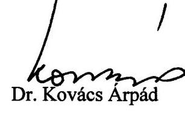

# JELENTÉS 

a Budapest Főváros II. kerület Önkormányzata gazdálkodásának átfogó ellenőrzéséről

---

3. Önkormányzati és Területi Ellenőrzési Igazgatóság
3.3 Átfogó Ellenőrzések Főcsoport
Iktatószám: V-1002-7/21/21/2003.
Témaszám: 635
Vizsgálat-azonosító szám: V0102

# Az ellenőrzést felügyelte: 

Dr. Lóránt Zoltán
főigazgató
Az ellenőrzés végrehajtásáért felelős:
Dr. Sepsey Tamás
főigazgató-helyettes
Az ellenőrzést vezette:
Csecserits Imréné
főcsoportfőnök-helyettes

Az ellenőrzést végezték:
Nagy Istvánné dr.
számvevő
Dr. Kiss Károly
számvevő tanácsos
Schósz Attila Ferencné
számvevő

A témához kapcsolódó - az elmúlt három évben készített számvevőszéki jelentések:
címe
sorszáma
Jelentés a települési önkormányzatok tulajdonában lévő közutak, 0007
hidak, alagutak fejlesztésének, fenntartásának és üzemeltetésének vizsgálatáról
Jelentés a települési önkormányzatok adóztatási tevékenységének 0121 vizsgálatáról
Jelentés az általános iskolai oktatás minőségének javítását szolgáló 0219 intézkedések ellenőrzésének tapasztalatairól

---

# TARTALOMJEGYZÉK 

BEVEZETÉS ..... 5
I. ÖSSZEGZŐ MEGÁLLAPÍTÁSOK, KÖVETKEZTETÉSEK, JAVASLATOK ..... 7
II. RÉSZLETES MEGÁLLAPÍTÁSOK ..... 17

1. A költségvetés tervezésének, végrehajtásának és a zárszámadás elkészítésének szabályszerűsége ..... 17
1.1. A költségvetés tervezésének, a költségvetési rendelet megalkotásának, elfogadásának szabályszerűsége ..... 17
1.2. A költségvetési előirányzatok módosításának szabályszerűsége ..... 20
1.3. A gazdálkodás szabályozottsága, szabályszerűsége ..... 22
1.4. A munkafolyamatba épített ellenőrzések szabályozottsága és gyakorlati működése a pénzügyi, gazdálkodási és számviteli feladatellátás területén ..... 25
1.5. A bizonylati rend szabályszerűsége ..... 27
1.6. A vagyon nyilvántartásának és leltározásának szabályszerűsége ..... 27
1.7. A vagyongazdálkodással kapcsolatos feladat- és döntési hatáskörök szabályozottsága, a vagyonváltozást előidéző intézkedések szabályszerűsége, célszerűsége ..... 29
1.8. Az Önkormányzat által céljelleggel - nem szociális ellátásként - juttatott támogatásokkal történő elszámoltatás szabályszerűsége ..... 34
1.9. A követelések, részesedések, értékpapírok év végi értékelésének szabályszerűsége ..... 39
1.10. A működési és felhalmozási bevételek, kiadások alakulása ..... 39
1.11. A költségvetés egyensúlyi helyzete ..... 42
1.12. A közbeszerzési eljárások szabályszerűsége ..... 43
1.13. A Polgármesteri hivatal helyi kisebbségi önkormányzatok gazdálkodását segítő tevékenysége ..... 46
1.14. A zárszámadási kötelezettség teljesítésének szabályszerűsége ..... 48
2. Az egyes kiemelt önkormányzati feladatok és a rendelkezésre álló források összhangja ..... 50
2.1. A feladatok meghatározása és szervezeti keretei ..... 50
2.2. Az egyes naturális mutatókkal mérhető feladatok bevételei és kiadásai ..... 52
2.3. A jelentős ráfordítást igénylő önként vállalt feladatok ellátása ..... 54
3. A belső irányítási, ellenőrzési rendszer működésének értékelése ..... 55
3.1. Az Önkormányzat informatikai rendszerének szabályozottsága, működése ..... 55
3.2. A helyi ellenőrzési rendszer kialakítása, működése ..... 56
3.3. A könyvvizsgálói kötelezettség teljesítése ..... 58
3.4. A korábbi számvevőszéki ellenőrzések javaslatainak hasznosulása ..... 59

---

# MELLÉKLETEK 

1. számú Az önkormányzati vagyon nagyságának alakulása (1 oldal)
2. számú Az Önkormányzat 2002. évi bevételeinek és kiadásainak alakulása (1 oldal)
3. számú Az Önkormányzat gazdálkodását meghatározó adatok, mutatószámok (1 oldal)
4. számú Az Önkormányzat 2002. és 2003. évi rövid távú pénzügyi befektetéseinek kronológiája (2 oldal)
5. számú Egyes feladatok kiadásainak finanszírozása (1 oldal)
6. számú Kimutatás a jelentősebb önként vállalt feladatok költségvetési súlyáról (1 oldal)
7. számú Horváth Csaba polgármester úr észrevétele (1 oldal)
8. számú Horváth Csaba polgármester úr észrevételére adott válaszlevél (1 oldal)

## FÜGGELÉKEK

1. számú: Az Önkormányzat rövid távú pénzügyi befektetései a 2002-2003. I. félév közötti időszakban (5 oldal)

---

# RÖVIDÍTÉSEK JEGYZÉKE 

| Ötv. | a helyi önkormányzatokról szóló 1990. évi LXV. törvény |
| :--: | :--: |
| Áht. | az államháztartásról szóló 1992. évi XXXVIII. törvény |
| Ámr. | az államháztartás működési rendjéről szóló 217/1998. (XII. 30.) Korm. rendelet |
| Kbt. | a közbeszerzésekről szóló 1995. évi XL. törvény |
| Számv. tv. | a számvitelről szóló 2000. évi C. törvény |
| Htv. | a helyi önkormányzatok és szerveik, a köztársasági megbízottak, valamint egyes centrális alárendeltségű szervek feladat- és hatásköreiről szóló 1991. évi XX. törvény |
| Vhr. | az államháztartás szervezetei beszámolási és könyvvezetési kötelezettségének sajátosságairól szóló 249/2000. (XII. 24.) Korm. rendelet |
| kisebbségi kormányrendelet | a kisebbségi önkormányzatok költségvetésének, gazdálkodásának, vagyonának egyes kérdéseiről szóló 20/1995. (III. 3.) Korm. rendelet |
| ÁSZ | Állami Számvevőszék |
| Önkormányzat | Budapest Főváros II. kerület Önkormányzata |
| Képviselő-testület | Budapest Főváros II. kerület Önkormányzatának Képviselő-testülete |
| Pénzügyi bizottság | Budapest Főváros II. kerület Önkormányzata Képviselőtestületének Pénzügyi bizottsága |
| Költségvetési bizottság | Budapest Főváros II. kerület Önkormányzata Képviselőtestületének Költségvetési bizottsága |
| KKS bizottság | Budapest Főváros II. kerület Önkormányzata Közoktatási, közművelődési és sport bizottsága |
| Közbeszerzési bizottság | Budapest Főváros II. kerület Önkormányzata Közbeszerzési bizottsága |
| Egészségügyi és szociális bizottság | Budapest Főváros II. kerület Önkormányzata Egészségügyi és szociális bizottsága |
| GTB | Budapest Főváros II. kerület Önkormányzata Képviselőtestületének Gazdasági és tulajdonosi bizottsága |
| Polgármesteri hivatal | Budapest Főváros II. kerület Önkormányzatának Polgármesteri hivatala |
| Pénzügyi iroda | Budapest Főváros II. kerület Önkormányzata Polgármesteri hivatalának Pénzügyi irodája |
| Vagyonhasznosítási iroda | Budapest Főváros II. kerület Önkormányzata Polgármesteri hivatalának Vagyonhasznosítási és ingatlan nyilvántartási irodája |
| Számítástechnikai csoport | Budapest Főváros II. kerület Önkormányzata Polgármesteri hivatal Pénzügyi irodájának Számítástechnikai csoportja |
| INTELIG | Budapest Főváros II. kerület Önkormányzata Intézményeit Ellátó Igazgatóság |

---

| GAMESZ | Budapest Főváros II. kerület Önkormányzata Polgármesteri hivatalának Gazdasági és Műszaki Ellátó Szervezete |
| :--: | :--: |
| SzMSz | Budapest Főváros II. kerület Önkormányzata Képviselőtestületének az Önkormányzat Szervezeti és Működési Szabályzatáról szóló 13/1992. (VII. 1.) számú rendelete |
| ügyrend | az SzMSz 9. számú melléklete: a Polgármesteri hivatal belső szervezeti tagozódásáról, hivatali munkarendjéről és ügyfélfogadási rendjéről |
| BUDSZOLG Kft. | Budai Karbantartó és Felújítási Szolgáltató Kft. |
| BER-ÚT Kht. | BER-ÚT Közútkezelő, Ingatlanberuházó, Tanácsadó és Szolgáltató Közhasznú Társaság |
| BUDÉP Kft. | BUDÉP Budai Épületfenntartó Kft. |
| ISM | Ifjúsági- és Sport Minisztérium |
| MEH | Miniszterelnöki Hivatal |
| K&H Rt. | Kereskedelmi és Hitelbank Rt. |
| vagyongazdálkodási   rendelet | Budapest Főváros II. kerület Önkormányzata Képviselőtestületének 57/1996. (XII. 27.) számú rendelete |

---

# JELENTÉS 

## Budapest Főváros II. kerület Önkormányzata gazdálkodásának átfogó ellenőrzéséről

## BEVEZETÉS

Az Ötv. 92. § (1) bekezdése, valamint az Áht. 120/A. § (1) bekezdése szerint az Önkormányzatok gazdálkodását az Állami Számvevőszék ellenőrzi. A vizsgálatot a V-1002-7/2003. számú ellenőrzési program alapján végeztük.

## Az ellenőrzés célja annak értékelése volt, hogy

- az önkormányzati gazdálkodás törvényességét, szabályszerűségét biztosították-e a tervezés, a költségvetés végrehajtása és a zárszámadás során; a gazdálkodás szabályszerűségét biztosító kontrollok ${ }^{1}$ megfelelően segítették-e a végrehajtást;
- az Önkormányzat által ellátott feladatok és az azokhoz rendelkezésre álló pénzforrások összhangja biztosított volt-e, különös tekintettel egyes kiemelt feladatokra;
- a helyi kisebbségi önkormányzat gazdálkodása során érvényesültek-e az Áht. és a vonatkozó kormányrendeletek előírásai.

Az ellenőrzött időszak: a 2002. év, valamint a 2003. I. félév, az 1.7., 2.12.3., 3.2-3.4. ellenőrzési programpontok esetében a 2000-2002. évek.

Budapest II. kerületét alkotó három településrész - Viziváros, Rózsadomb, Pesthidegkút - a főváros északnyugati részén fekszik.

A kerület lakosainak száma 2002. január 1-jén 86854 fő volt. Az Önkormányzat 30 tagú Képviselő-testületének munkáját tíz állandó bizottság segítette. A 2002. évi önkormányzati választásokat követően a polgármester személye változott.

Az Önkormányzat feladatainak végrehajtása érdekében nyolc önállóan gazdálkodó és 34 részben önállóan gazdálkodó költségvetési intézményt működtet, valamint három gazdasági társasága és egy közhasznú társasága is részt vesz a feladatok végrehajtásában. A feladatok ellátására foglalkoztatott közalkalmazottak száma a 2002. évben 2225 fő volt, a Polgármesteri hivatalban 303 fő köztisztviselő dolgozott.

Az Önkormányzat a 2002. évben 14460 millió Ft költségvetési bevételt, 13078 millió Ft költségvetési kiadást teljesített, és a 2002. év végén 20241 millió Ft értékű könyvviteli mérleg szerinti vagyonnal rendelkezett.

A kerületben a 2002. évi választásokig hat kisebbségi önkormányzat, a 2002. évi választásokat követően pedig 10 kisebbségi önkormányzat működött.

---

# I. ÖSSZEGZŐ MEGÁLLAPÍTÁSOK, KÖVETKEZTETÉSEK, JAVASLATOK 

A Képviselő-testület az Önkormányzat gazdasági programját nem határozta meg. A gazdasági program elkészítésére vonatkozó önkormányzati rendeleti szabályozás nem biztosította, hogy a gazdasági program hosszabb távra vonatkozzon. A 2002. és a 2003. évre vonatkozó költségvetési koncepciókat a polgármester határidőre a Képviselő-testület elé terjesztette, azonban a Költségvetési bizottság, valamint a kisebbségi önkormányzatok koncepcióról alkotott írásos véleményének a koncepció előterjesztéséhez történő csatolása elmaradt. A 2002. és a 2003. évi költségvetési rendeletek a jogszabályban előírt szerkezetben készültek, azonban a kötelezően előírt mérlegek, kimutatások közül tájékoztatásul nem mutatták be a közvetett támogatásokról szóló kimutatást. A vagyonkimutatás kivételével a költségvetés mellékleteként bemutatandó mérlegek és kimutatások tartalmi követelményeit nem határozták meg. A költségvetési rendeletben a bevételek és a kiadások különbségeként tervezett hiány összegét a 2002. évben nem mutatták be, valamint a hitelfelvételt bevételként szerepeltették, ezért megsértették az Áht. előírásait.

Elmaradt a 2002. és a 2003. évi költségvetési rendelettervezetek költségvetési intézményvezetőkkel történő - jegyző általi - egyeztetése, a Költségvetési bizottság rendelettervezetről kialakított véleményének csatolása. Egyes kisebbségi önkormányzatok késedelmes döntései és intézkedései miatt a cigány, a szerb, a horvát és a román kisebbségi önkormányzatok költségvetéseit kisebbségi önkormányzati határozatok hiányában építették be az Önkormányzat 2002. évi költségvetésébe.

A költségvetési rendeletben az „alapok” keretében jóváhagyott előirányzatokat a pénzeszköz átadásoknál és nem a céltartalék között különítették el, ezért megsértették az Áht. előírásait.

A Képviselő-testület a költségvetési rendeletet a 2002. évben hat alkalommal módosította, az utolsó előirányzat módosítás nem a jogszabályban előírt határidő betartásával történt. Az előirányzat változásokról nyilvántartást vezettek. Az Önkormányzat, valamint az önállóan gazdálkodó szervek szintjén a kiemelt előirányzatokon belül gazdálkodtak. A kisebbségi önkormányzatok költségvetési előirányzatainak központi támogatás növekedése miatti módosítását nem azok határozatai alapján vezették át az Önkormányzat költségvetési rendeletében.

A Polgármesteri hivatalban a gazdálkodási és az ellenőrzési jogkörök szabályozottak voltak. A polgármesteri és a jegyzői intézkedések hatásaként a szabályozás a célszerűség irányába változott, elmaradt azonban a költségvetési bevételekkel összefüggő ellenőrzési jogkörök rögzítése. A kötelezettségvállalási és az ellenjegyzési jogköröknél a felhatalmazásokat írásban rögzítették, nem szabályozták a felhatalmazottak beszámoltatásának módját, formáját. A helyszíni ellenőrzés ideje alatt hatályba lépett számviteli politikában pótolták a terven felüli értékcsökkenés elszámolásának hiányzó szabályait. A számviteli poli-

---

tika nem tartalmazott szabályozást arra vonatkozóan, hogy az egységes számviteli rendszer kialakítása érdekében mely szabályozási elemek vonatkoznak valamennyi költségvetési szervre. A leltározási szabályzat nem tartalmazta a leltározási körzetek kijelölését, az ütemterv készítését, a leltárt helyettesítő összesítő kimutatás tartalmát, formáját, a leltár és a számvitel adatainak egyeztetési kötelezettségét, a leltárkülönbözetek megállapításának és rendezésének módját, az üzemeltetésre, kezelésre átadott eszközök leltározását, egyeztetési és ellenőrzési szabályait, valamint a leltározás lezárását. A selejtezési szabályzatban nem rendelkeztek a selejtezendő vagyontárgyak feltárási rendjéről, a selejtezési jegyzőkönyv bizonylati útjáról, a selejtezett eszközök nyilvántartásból történő kivezetésének kötelezettségéről, a megsemmisítés módjáról és dokumentálásáról. A felesleges eszközök hasznosításának rendjét nem szabályozták. A pénztári és pénzkezelési szabályzatban nem határozták meg a pénztárellenőrzés gyakoriságát.

A Polgármesteri hivatalban a munkafolyamatba épített ellenőrzések keretében a kötelezettségvállalás ellenjegyzését nem végezték el a megbízási szerződéseknél és két megállapodásnál,
 ezáltal nem teljesült a kiadási előirányzat által biztosított fedezet meglétének ellenőrzése. Nem látták el a pénzügyi érvényesítési feladatokat a költségvetési bevételeknél. A pénztárellenőr a bevételi és a kiadási pénztárbizonylatokat, a pénztárjelentést, valamint a rendelkezésre álló pénzkészletet ellenőrizte, nem vizsgálta a házipénztári keret betartását. Rendszeresen túllépték a házipénztári keret szabályzatban rögzített mértékét. A számvitel területén az elvégzett ellenőrzéseket és az egyeztetéseket a 2003. évtől írásban rögzítették.

A Polgármesteri hivatalban a kiadásokkal kapcsolatos gazdasági események az 50 ezer Ft-ot el nem érő beszerzéseknél hiányzó megrendelés kivételével - kötelezettségvállaláson alapultak. A készpénzben folyósított előlegek elszámolását a pénztári és pénzkezelési szabályzat előírásai szerint végezték. Elmaradt az utalványozás a nem termékértékesítésből és szolgáltatásnyújtásból származó banki bevételeknél. A feladatellátás szakmai teljesítés igazolása megfelelő volt.

Az Önkormányzat vagyongazdálkodási rendelete tartalmazta a vagyongazdálkodással összefüggő feladat- és döntési hatásköröket. Hiányzott a követelésekről történő lemondás eseteinek szabályozása. Az ajánlatkérésre beérkezett pénzintézeti ajánlatok értékeléséről, a legkedvezőbb ajánlatra vonatkozó döntésről a célszerűség ellenére írásos dokumentum sem 2003. február elején, sem 2003. május közepén nem készült. Az Önkormányzat képviseletében a polgármester értékpapír-, értékpapír letéti- és ügyfélszámla szerződést kötött - a jegyző ellenjegyzése mellett - a K&H Rt.-vel. A szerződésben az aláírók arról rendelkeztek, hogy a K&H Rt. az Önkormányzat megbízásait sajátszámlás megbízásként, illetve más megbízásokkal összevonva teljesíti. A polgármester a vagyonnal való felelős gazdálkodás követelményét fokozottabban elősegítő nevesített alszámla nyitási (K&H Rt. üzletszabályzata, II. különös rész, 2.1.12. pont), illetve a tőkepiacról szóló 2001. évi CXX. törvény 144. § (1) bekezdése szerinti zárolt értékpapír alszámla vezetési lehetőségével nem élt. A 2003. I. félévi rövid távú

---

befektetéseknél - a Képviselő-testület felhatalmazása nélkül vásárolta meg a K&H Rt. Pénzpiaci Alapjának befektetési jegyeit².

Az önkormányzati vagyon nyilvántartásáról a törzsvagyon elkülönítésével gondoskodtak. A kialakított vagyon-nyilvántartási rendszerből hiányzott az Önkormányzat által alapított gazdasági társaságok tulajdoni részesedéseit jelentő befektetések egyedi nyilvántartása. A Polgármesteri hivatal 2002. évi könyvviteli mérlegének alátámasztásához a jegyző a leltározás végrehajtására - a leltározási szabályzatban előírtak ellenére - leltározási utasítást nem adott ki. Mennyiségi leltározást a Polgármesteri hivatalban őrzött részvényeknél és kárpótlási jegyeknél végeztek. A leltárt helyettesítő összesítő kimutatások készítésének feltételei nem álltak fenn, mivel a Polgármesteri hivatal nem rendelkezett a Képviselő-testület egyetértésével, valamint nem volt biztosított a vagyonvédelem a számítástechnikai eszközök és a szervezeti egységek közti eszközmozgatások terén. Az Önkormányzat tulajdonában lévő, de üzemeltetésre kezelésre átadott eszközök a Polgármesteri hivatal számviteli nyilvántartásában és könyvviteli mérlegében szerepeltek. Az ingatlanvagyon-kataszter 2002. december 31-i bruttó érték adata 2470 millió Ft-tal volt alacsonyabb a 2002. évi költségvetési beszámoló megfelelő adatánál. A Polgármesteri hivatal az ingatlanvagyon-értékeléssel összefüggő teljes körű egyeztetéssel az előírt határidőre nem készült el. A 2002. évi könyvviteli mérleg összeállításának értékelési feladatai során az értékvesztés elszámolásának szükségességét az Önkormányzat által alapított gazdasági társaságokban lévő tulajdoni részesedést jelentő befektetéseknél nem vizsgálták. Az Önkormányzat egy gazdasági társaságára vonatkozó tulajdoni részesedést jelentő befektetésének könyv szerinti és piaci értéke között tartós és jelentős összegű veszteségjellegű különbözet ellenére értékvesztést nem számoltak el. Az értékpapírok értékelését az előírásoknak megfelelően végezték el.

A testületi döntésen alapuló, céljelleggel juttatott támogatások esetében - a 2002. évben a Szociálpolitikai Alapból biztosított támogatások kivételével - a támogatás felhasználására és elszámolásra vonatkozó szabályokat megállapodásban rögzítették. A benyújtott elszámolásokat - a BER-ÚT Kht. elszámolása kivételével - a Polgármesteri hivatal szakmai irodái ellenőrizték. Az elszámolások felülvizsgálata alapján két társadalmi szervezetnek és egy kisebbségi önkormányzatnak kellett a fel nem használt támogatást visszafizetnie. A közoktatási megállapodás alapján juttatott támogatások felhasználására elszámolási kötelezettséget nem írtak elő és az elszámolás sem történt meg a támogatott szervezetek részéről, az Áht. vonatkozó előírását megsértve a támogatás felhasználását nem ellenőrizték. Az önkormányzati bizottságok, valamint a polgármester a 2002. évben 12 alapítványt összesen 3,6 millió Ft támogatásban részesített, az Ötv. vonatkozó előírását megsértve. Az Önkormányzat az általa támogatott szervezetek számadását a benyújtott elszámolások és bizonylatok alapján ellenőrizte, helyszíni ellenőrzést nem végzett.

[^0]
[^0]:    ${ }^{2}$ Az egyeztetés során a polgármester ezen megállapítással kapcsolatban észrevételt tett, melynek összegzése a Jelentés 30-31. oldalain, a részletes megállapítások fejezet 1.7 pontjában található.

---

A Polgármesteri hivatal a törvényben előírtak ellenére az önkormányzati lakásértékesítésből származó bevétel fővárosi önkormányzatot megillető részét -a 2002. év végén 1029,0 millió Ft-ot - nem utalta át.

Az Önkormányzat a 2002. évi költségvetésének elfogadásakor a felhalmozási bevételi többlettel biztosította a működési oldalon jelentkező forráshiányt. Az évközi gazdálkodás során a működési kiadások visszafogásával, valamint a működési bevételeknél többlet realizálásával biztosított volt a működési kiadások fedezete. Az Önkormányzat bevételei növelésének érdekében élt a helyi adó megállapításával, továbbá külső pénzügyi forrásokat - célcímzett támogatások, fővárosi átvett pénzeszközök - is igénybe vett a feladatai finanszírozásához.

Az önállóan gazdálkodó önkormányzati intézmények az évközi pénzállományuk alakulását negyedéves aktualizálással figyelemmel kísérték, a jegyző az Önkormányzat pénzállományának alakulásáról likviditási tervet nem készített. Az Önkormányzat 2002. év végi likviditási helyzetének javítása céljából hitelt vett fel, azonban annak felvétele likviditási helyzetére hivatkozással nem volt indokolt.

Az Önkormányzat a közbeszerzési törvény hatálya alá tartozó beszerzéseinek eljárási rendjét rendeletben szabályozta. A 2003. évben hatályos rendelete nem megfelelően jelölte ki a rendelet alanyi hatályát, mivel azt kiterjesztette az Önkormányzatra is. Nem a törvényi előírásnak megfelelően szabályozták a döntéshozatalt, mivel nem személyhez rendelték, hanem a 2002. évben a Beruházási zsűri, a 2003. évben a Közbeszerzési bizottság hatáskörébe utalták ${ }^{3}$. Nem határozták meg az éves összegzés készítési rendjét és a teljesítéséért felelős személyt. A Polgármesteri hivatal a 2002. évi közbeszerzési eljárásairól éves összegzést nem készített. Egy felújítási feladat (játszótér felújítás) kivételével az előírt értékhatárt elérő beszerzéseknél a közbeszerzési eljárást lefolytatták. Egy nyílt előminősítési eljárással induló közbeszerzési eljárásnál - megsértve a rendeletet - döntési hatáskörrel nem rendelkező személy hozta meg a döntést az ajánlati szakasz lezárásáról. Egy közbeszerzési eljárása ellen indult jogorvoslati eljárás, amelynek során a Közbeszerzési Döntőbizottság elmarasztalta és 1 millió Ft pénzbírság megfizetésére kötelezte az Önkormányzatot, mivel az ajánlati felhívás nem felelt meg a vonatkozó jogszabályi követelményeknek.

Az Önkormányzat a kisebbségi önkormányzatokkal nem kötötte meg a költségvetés tervezetének összeállítására, a költségvetési rendelet megalkotására és a kisebbségi önkormányzatok gazdálkodásának végrehajtó szervére vonatkozó együttműködési megállapodást. A kisebbségi önkormányzatok gazdálkodási feladataikat - megállapodás hiányában is - a Polgármesteri hivatal útján látták el. Az Önkormányzat költségvetési koncepciójának tervezetéről a kisebbségi önkormányzatok véleményét nem kérték ki. A költségvetési rendeletben kisebbségenként külön-külön mutatták be a kisebbségi önkormányzatok kiadási és bevételi előirányzatait. Az Önkormányzat a 2002. évben és a 2003.

[^0]
[^0]:    ${ }^{3}$ Az egyeztetés során a polgármester a közbeszerzési eljárás helyi szabályairól alkotott önkormányzati rendelettel kapcsolatos megállapításokra észrevételt tett, melynek összegzését a Jelentés 43-44. oldalai tartalmazzák.

---

évben is szerepeltette azon kisebbségi önkormányzatok költségvetését rendeletében, amely kisebbségi önkormányzatok késve hozták meg határozatukat, illetve nem adták át a jegyző számára az előírt határidőben. Az Önkormányzat ezzel megsértette azon jogszabályi előírást, hogy a Önkormányzat költségvetési rendeletébe a helyi kisebbségi önkormányzat költségvetése annak határozata alapján épül be. A kisebbségi önkormányzatok által hozott költségvetést módosító határozatokat nem építették be két esetben, egy esetben nem a határozatban foglaltaknak megfelelően építették be a költségvetési rendeletbe. A zárszámadási rendeletben bemutatott kisebbségi önkormányzati teljesítési adatokat a számviteli nyilvántartások alapján határozták meg, mivel a kisebbségi önkormányzatok határozatot nem hoztak. A kisebbségi önkormányzati vagyon analitikus nyilvántartását folyamatosan nem vezették, egy eszköz állományba vétele és egy eszköz állományból történő kivezetése elmaradt.

A polgármester a zárszámadási rendelettervezetet - az elfogadott költségvetéssel összehasonlítható szerkezetben - határidőre terjesztette a Képviselőtestület elé. A zárszámadáskor nem mutatták be a többéves kihatással járó döntések számszerúsített hatásait, a közvetett támogatásokat, valamint a Képviselő-testület tájékoztatására a vagyoni állapotot tükröző kimutatást. A zárszámadási rendeletben az önkormányzati szintű, valamint az önállóan gazdálkodó költségvetési intézményi pénzmaradványokat a Képviselő-testület jóváhagyta. A részben önállóan gazdálkodó intézmények esetében a pénzmaradványt nem mutatták be és arról nem döntött a Képviselő-testület. A Képviselő-testület a pénzmaradvány felosztásáról külön rendeletet alkotott.

Az Önkormányzat feladatai ellátását elsősorban saját intézményhálózatával oldotta meg, emellett gazdasági társaságai és közhasznú társasága is részt vettek a feladatellátásban. Az Önkormányzat szolgáltatásvásárlás, valamint a társulásos feladatellátás lehetőségével is élt. A Képviselő-testület a külső feladatellátók tevékenységét azok beszámolói révén figyelemmel kísérte, értékelte.

Az Önkormányzat önként vállalt feladatait az SzMSz-ben nem határozta meg, a közoktatás területén a közoktatási intézkedési tervében ilyen feladatként a gimnáziumi oktatást és a központi műhely fenntartását jelölte meg. Az önként vállalt feladatok finanszírozásába külső forrásokat is bevont az Önkormányzat, így az önkormányzati saját pénzeszközökkel együtt ezek pénzügyi fedezete biztosított volt. A kötelező feladatellátást az önként vállalt feladatok finanszírozása nem veszélyeztette.

Az Önkormányzat a 2003. évben a fogyatékos személyek érdekében a középületek akadálymentesítésére vonatkozóan szakvéleményt készíttetett, a költségvetésében a tényleges akadálymentesítésre előirányzatot nem tervezett.

Az Önkormányzat teljesítette a törvényben előírt könyvvizsgálati kötelezettségét. A könyvvizsgáló auditálási eltérésekkel, korlátozás nélkül hitelesítette az egyszerűsített tartalmú költségvetési beszámolót.

Az Önkormányzat az SzMSz-ben a Polgármesteri hivatal szervezeti egységei között a belső ellenőrzést a polgármesterhez rendelte, ellenben nem jelenítette meg a felügyeleti ellenőrzést. A Képviselő-testület nem határozta meg, hogy milyen gyakorisággal tekinti át az Önkormányzat által alapított és fenntartott

---

költségvetési szervek ellenőrzéseinek tapasztalatait és nem is tekintette át azokat. Az ellenőrzési feladatok ellátását közszolgálati jogviszony keretében foglalkoztatott ellenőrökkel valósították meg. Az önkormányzati intézmények nagy száma - nyolc önállóan gazdálkodó, 34 részben önállóan gazdálkodó miatt a felügyeleti ellenőri feladatok teljes körű elvégzésére az egy fő ellenőri létszám nem elegendő. Az ellenőrzésekről készült jelentések megfelelő információt szolgáltattak, az ellenőrzött szervezeti egységeknek segítséget jelentettek a feltárt hibák, hiányosságok kiküszöbölésében.

Az Önkormányzat számítástechnikai ellátottsága megfelelő volt. Az informatikai rendszerrel összefüggő szabályozás nem volt teljes körű, mert az Önkormányzat nem rendelkezett informatikai stratégiával és katasztrófa elhárítási tervvel.

A közbenső egyeztetés során a polgármester észrevételben fejtette ki véleménykülönbségét, amellyel kapcsolatos véleményt a részletes megállapítások 1.7. pontja tartalmaz.

A helyszíni ellenőrzés megállapításai mellett a gazdálkodás szabályszerűségének és a munka színvonalának javítása érdekében javasoljuk:

# a polgármesternek 

## a törvényes állapot helyreállítása és a jogszabályi előírások betartása érdekében

1. a költségvetési gazdálkodás jogszabályszerű kereteinek kialakítása céljából
a) kezdeményezze a Képviselő-testületnél a jegyző által előkészített gazdasági programtervezet alapján az Önkormányzat több évre szóló gazdasági programjának meghatározását az Ötv. 91. § (1) bekezdésében előírtak betartása érdekében;
b) csatolja a költségvetési koncepció tervezethez az Ámr. 28. § (3) bekezdése szerint a Költségvetési bizottság, valamint a helyi kisebbségi önkormányzatok koncepciótervezetről alkotott véleményét;
c) terjessze - a
 jegyző által készített előterjesztés alapján - a Képviselő-testület elé az Áht. 118. §-ában előírt mérlegek, kimutatások tartalmának meghatározásáról szóló rendelettervezetet;
d) csatolja a költségvetési rendelettervezethez a bizottsági véleményeket az Ámr. 29. § (9) bekezdésében foglaltak alapján;
2. intézkedjen, hogy a lakások és helyiségek bérletére, valamint az elidegenítésükre vonatkozó egyes szabályokról szóló 1993. évi LXXVIII. törvény 63. § (1) bekezdése alapján a fővárosi önkormányzatot megillető lakásértékesítésből származó bevételi rész átutalásra kerüljön;
3. intézkedjen az Ötv. 78. § (2) bekezdése alapján a vagyonállapotot tartalmazó vagyonkimutatás éves zárszámadáshoz csatolásáról;

---

4. gondoskodjon arról, hogy az Önkormányzat által céljelleggel juttatott támogatások közül az alapítványok, közalapítványok támogatása esetében a döntést a Képviselőtestület hozza meg az Ötv. 10. § (1) bekezdés d) pontjában előírtak betartása érdekében;
5. kezdeményezze, hogy kössék meg a kisebbségi önkormányzatokkal az Áht. 68. § (3) bekezdésében meghatározott megállapodásokat, ennek során az Áht. 66. §-a alapján határozzák meg a kisebbségi önkormányzatok gazdálkodásának végrehajtó szervét;
6. intézkedjen a Kbt. 2. § (1) bekezdésének, továbbá a Képviselő-testület 2/2003. (I. 28.) számú rendeletének hatálya alá tartozó árubeszerzéseknél, építési beruházásoknál és szolgáltatásoknál a közbeszerzési eljárás lefolytatásáról;
7. gondoskodjon a közbeszerzési eljárás rendjéről szóló 2/2003. (I. 28.) számú rendelet 2. §-ában az ajánlatkérő nevében eljáró személyre vonatkozó előírások következetes betartásáról;
8. kezdeményezze a Képviselő-testületnél, hogy határozzák meg, milyen gyakorisággal tekintik át a Htv. 138. § (1) bekezdés g) pontja előírásának betartása érdekében az Önkormányzat által alapított és fenntartott költségvetési szervek ellenőrzésének tapasztalatait;

# a munka színvonalának javítása érdekében 

9. kezdeményezze a számvevőszéki ellenőrzés tapasztalatainak képviselő-testületi megtárgyalását, a feltárt hiányosságok megszüntetésére készíttessen intézkedési tervet;
10. kezdeményezze - a jegyző által előkészítettek alapján - az SzMSz módosítását a gazdasági programra vonatkozó szabályozás tekintetében;
11. biztosítsa a pénzügyi befektetések szerződéskötései során a befektetések elkülönített, nevesített vagy zárolt alszámlán történő vezetését a fokozott vagyonvédelem és az ellenőrzési lehetőség érdekében, valamint gondoskodjon a vagyonváltozásra vonatkozó döntések dokumentálásáról az ideiglenesen szabad pénzeszközök rövid távú befektetésénél;
12. tartsa be a rövid távú pénzügyi befektetésekre vonatkozóan a döntéshozatala során a Képviselő-testület által előírt feltételeket;
13. kezdeményezze az SzMSz kiegészítését az Önkormányzat által önként vállalt feladatok nevesítésével;
14. kezdeményezze a Képviselő-testületnél, hogy az SzMSz-ben jelenítsék meg a felügyeleti ellenőrzést;
15. gondoskodjon a kötelezettségvállalást és az utalványozást átruházott jogkörben gyakorlók beszámoltatási módjának, formájának szabályozásáról;
16. vegye figyelembe a középületek akadálymentesítésének tervezése és annak végrehajtása során a fogyatékos személyek jogairól és esélyegyenlőségük biztosításáról szóló 1998. évi XXVI. törvény 29. § (6) bekezdésében foglalt határidőt;

---

# a jegyzőnek 

## a törvényes állapot helyreállítása és a jogszabályi előírások betartása érdekében

1. a költségvetési rendelettervezet előkészítésekor
a) gondoskodjon az Ámr. 29. § (4) bekezdésében előírtak betartása érdekében arról, hogy a költségvetési rendelettervezet önkormányzati intézményekkel történő egyeztetésének eredményét írásban rögzítsék;
b) intézkedjen, hogy a költségvetési rendelettervezetbe a kisebbségi önkormányzatok költségvetése - az Áht. 65. § (3) bekezdésében foglaltak betartásával - a kisebbségi önkormányzatok határozatai alapján épüljenek be;
c) gondoskodjon az alapoknak a céltartalék előirányzatok közötti elkülönítéséről az Áht. 73. § (1) bekezdésében előírtaknak megfelelően;
2. a költségvetési rendelet módosításakor
a) gondoskodjon az Ámr. 53. § (2) és (6) bekezdésében foglaltak betartása érdekében arról, hogy a költségvetési rendelet utolsó módosítása határidőben megtörténjen;
b) intézkedjen az Áht. 74. § (3) bekezdésének figyelembevételével, hogy a kisebbségi önkormányzatok költségvetéseit kizárólag azok határozatai alapján módosítsák, illetve a kisebbségi önkormányzatok költségvetéseit módosító határozatokat az Önkormányzat költségvetési rendeletén vezessék át;
3. biztosítsa, hogy a költségvetési és a zárszámadási rendeletek előterjesztésekor az Áht. 118. §-a alapján a Képviselő-testület részére tájékoztatásul bemutatásra kerüljön a 116. § 10. pontja szerint a közvetett támogatásokról szóló kimutatás, továbbá zárszámadáskor a 116. § 8. pontja szerinti vagyonkimutatás, és a 116. § 9. pontja alapján a többéves kihatással járó döntések számszerűsítése évenkénti bontásban;
4. gondoskodjon arról, hogy a részben önállóan gazdálkodó költségvetési szervek pénzmaradványa az Ámr. 66. § (4) bekezdésében előírtaknak megfelelően bemutatásra és jóváhagyásra kerüljön;
5. kezdeményezze a nem önkormányzati oktatási intézményekkel kötött közoktatási megállapodások felülvizsgálatát annak érdekében, hogy azokban rögzítsék az Önkormányzat által adott támogatások elszámolásának szabályait, összhangban az Áht. 13/A. § (2) bekezdésében foglaltakkal, intézkedjen továbbá, hogy az Önkormányzat által juttatott támogatások felhasználásáról benyújtott elszámolások ellenőrzése megtörténjen;
6. készítse el - az Ámr. 139. §-a alapján - az Önkormányzat pénzállományának alakulásáról a likviditási tervet és ennek tartalmát vegye figyelembe a hitel igénybevételére vonatkozó döntési javaslat előkészítésekor;

---

7. gondoskodjon az Ámr. 135. § (1)-(4) bekezdéseiben és a 136. § (1)-(6) bekezdéseiben foglaltak alapján az ellenőrzési jogkörök költségvetési bevételekre vonatkozó kiegészítéséről;
8. intézkedjen a Htv. 140. § (1) bekezdés c) pontjának betartása érdekében az egységes számviteli rendszer kialakításáról, a költségvetési intézményekre vonatkozó szabályozási elemek kijelölésével;
9. gondoskodjon a Vhr. 37. § (4) bekezdése szerint a leltározási szabályzat kiegészítéséről a leltárt helyettesítő, részletező nyilvántartások alapján készített összesítő kimutatás tartalmára, formájára vonatkozóan a felügyeleti szerv egyetértésének, a tulajdon védelmének, a részletező nyilvántartások vezetésének biztosítása mellett;
10. tartsa be a pénztári- és pénzkezelési szabályzat II. fejezetének 2.1. pontjában rögzített házipénztári keret mértékét;
11. intézkedjen, hogy az Ámr. 134. § (2) bekezdésében, valamint a vonatkozó polgármesteri intézkedésben foglaltak alapján a banki és a pénztári kifizetések írásbeli kötelezettségvállaláson alapuljanak;
12. gondoskodjon az Ámr. 134. § (7) bekezdése alapján a kötelezettségvállalás ellenjegyzésére vonatkozó előírások betartásáról a megbízási szerződéseknél és a pénzügyi támogatással kapcsolatos megállapodásoknál;
13. intézkedjen a költségvetési bevételeknek az Ámr. 135. § (1)-(4) bekezdései szerinti érvényesítéséről, valamint az Ámr. 136. § (6) bekezdésében foglaltak alapján a nem termékértékesítésből és szolgáltatásnyújtásból származó bevételek utalványozásáról;
14. intézkedjen a Vhr. 49. § (1) és (2) bekezdése alapján a tulajdoni részesedést jelentő befektetések részletező nyilvántartásának kialakításáról, és gondoskodjon az értékelési feladatok keretében ugyanezen eszközök piaci értékének vizsgálatáról a Számv. tv. 54. § (1) és (2) bekezdéseiben, valamint a Vhr. 31. §-ában az értékvesztés elszámolására előírtak betartása érdekében;
15. intézkedjen az Áht. 108. § (2) bekezdésében foglaltak alapján a követelésekről való lemondás eseteinek (ok, feltétel, körülmény) szabályozásáról;
16. gondoskodjon az Önkormányzat számviteli és ingatlanvagyon-kataszteri nyilvántartásában az ingatlanok bruttó érték adatai egyezőségének biztosításáról az önkormányzatok tulajdonában lévő ingatlanvagyon nyilvántartási és adatszolgáltatási rendjéről szóló 147/1992. (XI. 6.) Korm. rendelet;
17. gondoskodjon a Vhr. 37. § (1) bekezdésében, valamint a leltározási szabályzatban foglaltak alapján a leltározási utasítás kiadásáról és a könyvviteli mérlegben kimutatott eszközök és források évenkénti leltározásáról;
18. gondoskodjon a Vhr. 47. § (1) bekezdésében foglaltaknak megfelelően a kisebbségi önkormányzatok vagyonára vonatkozó analitikus nyilvántartásának folyamatos vezetéséről;
19. készítse elő a közbeszerzésekről szóló 2/2003. (I. 28.) számú rendelet módosítását annak érdekében, hogy a rendelet alanyi hatályát a Kbt. 96. § (2) bekezdésével

---

összhangban szabályozzák, a döntéshozatalt a Kbt. 31. § (3) bekezdése szerint határozzák meg;
20. gondoskodjon a Kbt. 61. § (9) bekezdésében előírt éves összegzés elkészítéséhez a teljesítésért felelős személy kijelöléséről és az adatszolgáltatás belső rendjének szabályozásáról;
21. biztosítsa - az Ámr. 36. § (5) bekezdése alapján - ,hogy a kisebbségi önkormányzatok zárszámadásai azok határozatai alapján épüljenek be az önkormányzati zárszámadási rendeletbe;

# a munka színvonalának javítása érdekében 

22. gondoskodjon az informatikai stratégia és a katasztrófa elhárítási terv elkészítéséről;
23. vizsgálja felül az ellenőrzési szabályzatot annak érdekében, hogy a szabályozás és annak érvényesülése összhangban legyen a megbízólevél és a megismerési záradék tekintetében;
24. gondoskodjon, hogy az Önkormányzat által biztosított támogatások felhasználása és elszámolása jogszerűségét helyszíni ellenőrzés keretében is vizsgálják;
25. gondoskodjon a felügyeleti ellenőrzés személyi feltételeinek javításáról az ellenőrzési feladatok teljes körű elvégzése érdekében;
26. rendelkezzen a leltározási szabályzatban a leltározási körzetek kijelöléséről, ütemterv készítéséről, a leltározás és a számvitel adatainak egyeztetési kötelezettségéről, a leltározási különbözetek megállapításáról, rendezéséről, az üzemeltetésre, kezelésre átadott eszközök leltározásáról, egyeztetési és ellenőrzési szabályairól, valamint a leltározás lezárásáról;
27. gondoskodjon a selejtezési szabályzat kiegészítéséről a selejtezendő vagyontárgyak feltárási rendjére, a selejtezési jegyzőkönyv bizonylati útjára, a selejtezett eszközök nyilvántartásból való kivezetésének kötelezettségére, a megsemmisítés módjára és dokumentálására, valamint a feleslegessé vált eszközök hasznosítási rendjére vonatkozóan;
28. gondoskodjon az ellenjegyzést átruházott jogkörben gyakorlók beszámoltatási módjának, formájának szabályozásáról;
29. határozza meg a pénztári és pénzkezelési szabályzatban a pénztárellenőrzés gyakoriságát.

---

# II. RÉSZLETES MEGÁLLAPÍTÁSOK 

## 1. A KÖLTSÉGVETÉS TERVEZÉSÉNEK, VÉGREHAJTÁSÁNAK ÉS A ZÁRSZÁMADÁS ELKÉSZÍTÉSÉNEK SZABÁLYSZERŰSÉGE

### 1.1. A költségvetés tervezésének, a költségvetési rendelet megalkotásának, elfogadásának szabályszerűsége

Az Ötv. 91. § (1) bekezdésében foglaltakat és az önkormányzati szabályozást megsértve a Képviselő-testület az Önkormányzat gazdasági programját nem határozta meg. Az SzMSz a 67. §-ban előírta, hogy a Képviselőtestület rendeletben évenként meghatározza gazdasági programját és költségvetését. Az SzMSz-ben foglalt szabályozás alapján nincs biztosítva az, hogy a gazdasági program hosszabb távra vonatkozzon. Az Önkormányzat egyes kiemelt feladatokra, ágazatokra - képviselő-testületi határozat formájában koncepciókat (intézkedési tervet) hagyott jóvá: lakáskoncepció, egészségpolitikai koncepció, közoktatási intézkedési terv. Ezen dokumentumok tartalmaztak hosszabb távra vonatkozóan meghatározott feladatokat, prioritásokat. A koncepciók az önkormányzati szintű gazdasági programot nem pótolták.

Az Önkormányzat a 2001. és a 2002. évek tekintetében két évre vonatkozóan határozta meg a költségvetési koncepcióját. A polgármester a 2001. és a 2002. évi költségvetési koncepciót az Áht. 70. §-ában előírt határidő - november 30. - betartásával a 2000. november 23-i képviselő-testületi ülésre terjesztette elő. Az SzMSz 7. számú mellékletében foglaltak alapján a költségvetési koncepció véleményezésére a Költségvetési bizottság kapott felhatalmazást. A Költségvetési bizottság a 2000. november 20-i ülésen kialakította állásfoglalását. A Költségvetési bizottság véleményét a koncepciót tárgyaló képviselő-testületi ülésen a Költségvetési bizottság elnöke ismertette. Az Ámr. 28. § (3) bekezdésében előírtakat megsértették, mivel a bizottság írásos véleményét nem csatolták a koncepció előterjesztéséhez. A költségvetési koncepciót a kisebbségi önkormányzatok részére megküldték, azonban írásos véleményüket nem kérték ki. Az Ámr. 28. § (3) bekezdésében foglaltakat megsértették, mivel nem csatolták a Képviselő-testület részére benyújtott költségvetési koncepció tervezethez a kisebbségi önkormányzatok koncepcióról alkotott véleményét.

A Képviselő-testület a 467/2000. (XI. 23.) számú határozattal fogadta el a költségvetési koncepciót. Az előterjesztés a központi költségvetési elképzelések bemutatása mellett tartalmazta az önkormányzati elképzeléseket, többek között a központi jogszabályi módosulások miatti közalkalmazotti, köztisztviselői illetményváltozások biztosításának módját, valamint elvi szintű meghatározását annak, hogy az önkormányzati intézményrendszer működőképességének fenntartását tekintik a legfontosabbnak.

A Képviselő-testület a Magyar Köztársaság 2001. és 2002. évi költségvetéséről szóló 2000. évi CXXXIII. törvény 124. §-ában kapott felhatalmazással élve kétéves költségvetést fogadott el a 2001. március 8-i ülésen.

---

A költségvetési rendelettervezetben az Ámr. 26. §-ában foglaltak figyelembevételével történt a kiadási és bevételi előirányzatok meghatározása.

A költségvetési rendelettervezetet a költségvetési szervek vezetőivel a jegyző az Ámr. 29. § (4) bekezdésében foglaltak ellenére nem egyeztette.

A költségvetési rendelettervezet elkészítésekor figyelembe vették a költségvetési koncepcióban megfogalmazottakat. A Költségvetési bizottság a költségvetési rendelettervezet alkalmasságát
 - képviselő-testületi általános vitára - véleményezte a 2001. február 8-i és 15-i ülésén, és a költségvetési rendelettervezettel kapcsolatosan beérkezett módosító indítványokról a 2001. március 7-i ülésen alakította ki véleményét. A rendelettervezet általános vitája során a Költségvetési bizottság mellett a Pénzügyi, az Oktatási, az Egészségügyi és szociális, valamint a Jogi bizottság véleményét is a képviselő-testületi ülésen ismertették. Az Ámr. 29. § (9) bekezdésében foglalt előírást megsértették, mely szerint a költségvetési bizottsági véleményt a rendelettervezethez kell csatolni.

Az Önkormányzat 2001. és 2002. évi költségvetéséről szóló 8/2001. (III. 12.) számú rendelete az Áht. 69. § és az Ámr. 29. §-a szerinti szerkezetben készült, tartalmazta a címrendet, a működési előirányzatokat kiemelt előirányzatonként és a létszámkeretet Önkormányzatra összesen és költségvetési szervenként, a felújítási előirányzatokat célonként, a felhalmozási kiadásokat feladatonként, a Polgármesteri hivatal költségvetését feladatonként, az általános és céltartalékot, elkülönítetten is a helyi kisebbségi önkormányzatok költségvetését, az előirányzat felhasználási ütemtervet.

A helyi kisebbségi önkormányzatok közül a cigány és a szerb - az Önkormányzat által meghatározott határidőhöz képest - késve hozta meg határozatát költségvetéséről, a román és a horvát pedig nem továbbította határidőben. Emiatt az Önkormányzat költségvetésében az Áht. 65. § (3) bekezdésében foglaltakat megsértve, a kisebbségi önkormányzat határozata nélkül alakították ki és építették be ezen kisebbségi önkormányzatok bevételi és kiadási előirányzatait.

Az Áht. 71. § (3) bekezdése figyelembevételével bemutatták a költségvetési évet követő két év várható előirányzatait.

A költségvetési rendelet a 2002. évben 13050,7 millió Ft bevételt és kiadást irányzott elő. A Képviselő-testület a bevételi források között 30,5 millió Ft működési célú hitelfelvételt, valamint 1110,8 millió Ft felhalmozási célú hitelfelvételt hagyott jóvá. A költségvetési rendelet elfogadásakor nem tartották be az Áht. 8. § (1) bekezdésében foglaltakat, mivel a hiányt nem mutatták be a költségvetési rendelet normaszövegében. Megsértették továbbá az Áht. 8/A. § (7) bekezdésében foglaltakat azzal, hogy a hitelfelvételt költségvetési bevételként vették számításba.

A Képviselő-testület a 2002-2003. évi költségvetési rendeletében a közművelődési, oktatásfejlesztési, valamint a sport és tömegsport támogatására támogatási kereteket hagyott jóvá. Az adott célokra szolgáló pénzügyi előirányzatokat Oktatásfejlesztési Alapként, Közművelődési Alapként, valamint Sport- és Tömegsport Alapként nevesítették. Az „alapok" az Önkormányzat költségveté-

---

sének támogatási keretei, elkülönített előirányzatai voltak, tartalmukat tekintve valójában céltartalékok, amelyek felhasználásáról - átruházott hatáskörben - az éves költségvetési rendeletben felhatalmazott bizottságok döntöttek. Az Önkormányzat az „alapok" keretében jóváhagyott előirányzatokat a pénzeszköz átadások között és nem a céltartalékoknál különítette el, ezzel megsértette az Áht. 73. § (1) bekezdésében a céltartalék előirányzatok elkülönítésére vonatkozó előírást.

A vagyonkimutatás kivételével a költségvetéssel egyidejúleg tájékoztatásul bemutatandó mérlegek és kimutatások tartalmi követelményeit az Áht. 118. $\S$-ában előírtak ellenére nem határozták meg rendeletben. A szabályozási mulasztás ellenére a költségvetési rendelettervezet melléklete az Áht. 118. $\S$-ában előírt mérlegek, kimutatások közül az összevont pénzügyi mérleget, a kisebbségi önkormányzatok mérlegeit, valamint a többéves kihatással járó döntések számszerűsítését tartalmazta. Az Áht. 118. §-ában előírtakat megsértve nem mutatták be az Áht. 116. § 10. pontjában előírt közvetett támogatásokat tartalmazó kimutatást.

A költségvetési rendeletben meghatározták a végrehajtásával kapcsolatos legfontosabb szabályokat: a Képviselő-testület kizárólagos hatáskörébe tartozó előirányzat módosítási hatásköröket, illetve az átruházott jogköröket, a költségvetési szervek vezetőinek előirányzat módosítási hatásköreit, a tartalékkal történő rendelkezés és az évközi szabad pénzeszközök hasznosításának szabályait, az intézményfinanszírozás rendjét.

A Képviselő-testület fenntartotta magának a költségvetés bevételi és kiadási főösszegek, a költségvetési rendeletben meghatározott átruházott hatáskörök kivételével a kiemelt előirányzatok, valamint a létszámkeretek tekintetében a kizárólagos előirányzat módosítási jogot.

A polgármesternek előirányzat módosítási jogot biztosítottak a Polgármesteri hivatal igazgatási tevékenysége és az egyéb önkormányzati feladatokra vonatkozó működési kiadásokon belüli kiemelt előirányzatok átcsoportosítására.

A költségvetési intézmények vezetői a jóváhagyott intézményi bevételi előirányzatot meghaladó többletbevételből kiadási előirányzataikat emelhették meg. A működési kiemelt kiadási előirányzatokon belül a részelőirányzatok között - a vásárolt élelmezésre tervezett előirányzat kivételével - átcsoportosítási jogot kaptak.

A polgármester kapott felhatalmazást az év során átmenetileg szabad pénzeszközök hasznosítására (betétként történő lekötésére, illetve államilag garantált értékpapír vásárlásra).

A Képviselő-testület a hitelműveletekkel kapcsolatos jogköröket saját hatáskörében tartotta annak kivételével, hogy a polgármester részére biztosította a likvidhitel felvételéről való döntést (a jóváhagyott éves költségvetési kiadások legfeljebb $5 \%$-áig).

---

Az önkormányzati biztos kirendelésére vonatkozó szabályokat külön rendeletben ${ }^{4}$ határozta meg a Képviselő-testület.

A polgármester a 2003. évi költségvetési koncepciót az Áht. 70. §-ában meghatározott határidőn ${ }^{5}$ belül, a Képviselő-testület 2002. december 13-i ülésére nyújtotta be, azonban annak tárgyalását a Képviselő-testület ezen a napon nem tűzte napirendjére. A költségvetési koncepciót a 2002. december 19-i ülésén a Képviselő-testület az 582/2002. (XII. 19.) számú határozatával fogadta el. A koncepció elfogadásának időpontjában az önkormányzati bizottságokat még nem hozták létre, így a koncepcióról bizottsági vélemény nem születhetett. Az Ámr. 28. § (3) bekezdésében előírtakat megsértették, mivel a költségvetési koncepció tervezethez a Költségvetési bizottság véleményét nem csatolták. A kisebbségi önkormányzatok véleményét a költségvetési koncepció tervezetről nem kérték ki, és nem csatolták a Képviselő-testület elé kerülő koncepció tervezethez, ezzel megsértették az Ámr. 28. § (3) bekezdésében foglaltakat.

A 2003. évi költségvetési rendelettervezetet a költségvetési szervek vezetőivel a jegyző az Ámr. 29. § (4) bekezdésében foglaltak ellenére nem egyeztette.

A polgármester a 2003. évi költségvetési rendelettervezetet az Áht. 71. § (1) bekezdésében meghatározott határidőn ${ }^{6}$ belül a 2003. február 13-i testületi ülésre terjesztette be a Képviselő-testület elé. A Képviselő-testület ezen ülésén a költségvetési rendelettervezet vitáját nem tűzte napirendjére. A Képviselőtestület a 8/2003. (III. 14.) számú rendeletével fogadta el a 2003. évi költségvetését. A költségvetési rendelettervezettel egyidejűleg az Áht. 118. §-ában előírtakat megsértve nem mutatták be tájékoztatásul az Áht. 116. §. 10. pontjában előírtaknak megfelelően a közvetett támogatások kimutatását és az abban foglaltak szöveges indoklását. A Képviselő-testület a 2003. évi költségvetés kiadási főösszegét 14653 millió Ft-ban, a bevételi főösszegét 13151 millió Ft-ban, a hiány összegét 1502 millió Ft-ban állapította meg. A Képviselő-testület a költségvetési hiány finanszírozási módjaként középlejáratú hitel felvételét határozta meg. A 2003. évi költségvetés végrehajtásával kapcsolatos szabályokat az előző évi költségvetési rendeletben foglaltakkal megegyezően határozták meg.

# 1.2. A költségvetési előirányzatok módosításának szabályszerűsége 

A Képviselő-testület a 2001-2002. évi költségvetésének a 2002. évi előirányzatait már a 2001. évben is módosította két alkalommal. Ezen előirányzat módosítások a bevételek alakulásának felülvizsgálata, valamint a fővárosi forrásmegosztás kerületre vonatkozó hatására váltak szükségessé. A Képviselő-

[^0]
[^0]:    ${ }^{4}$ Az Önkormányzat 27/1997. (VII. 7.) számú rendelete az önkormányzati biztos kirendelésének helyi szabályairól.
    ${ }^{5}$ A helyi önkormányzati képviselő-testület tagjai általános választásának évében legkésőbb december 15-ig.
    ${ }^{6}$ Az Áht. 71. § (1) bekezdése szerint a határidő a tárgyév február 15-e volt.

---

testület a 2002. évben hat alkalommal ${ }^{7}$ módosította a költségvetési rendeletében jóváhagyott előirányzatokat. Az Önkormányzat számára pótelőirányzatként biztosított összegek miatt a Képviselő-testület az Ámr. 53. § (2) bekezdésében előírt negyedévenkénti gyakorisággal döntött költségvetési rendeletének módosításáról. Az utolsó alkalommal a kapott központi költségvetési pótelőirányzatokkal a Képviselő-testület a 6/2003. (III. 13.) számú rendelettel módosította a 2002. évi költségvetési rendeletét. Az utolsó előirányzat módosítás során nem tartották be az Ámr. 53. § (2) és (6) bekezdésében előírt határidőt ${ }^{8}$.

Az évközi előirányzat módosítások során a központi költségvetésből juttatott pótelőirányzatoknak, a képviselő-testületi, bizottsági és polgármesteri hatáskörben hozott döntéseknek, az önálló gazdálkodási jogkörű költségvetési szervek saját hatáskörű előirányzat változtatásainak megfelelően módosították a költségvetési rendeletet. Az előirányzat módosításokat dokumentumokkal alátámasztották. A képviselő-testületi, illetve bizottsági hatáskörben hozott előirányzat változásokról a testületi határozatok rendelkezésre álltak.

A polgármester saját hatáskörben hozott, előirányzat átcsoportosításról szóló döntéseit tartalmazó belső bizonylatokat előirányzat módosító lappal küldték meg az előirányzat nyilvántartónak.

A kisebbségi önkormányzatok 2002. évi költségvetési előirányzatainak módosítását négy alkalommal vezették át az Önkormányzat költségvetési rendeletén. A kisebbségi önkormányzatok év közben nem hoztak határozatot központi támogatás növekedése miatti előirányzat változásról, ennek ellenére a változás összegét az Önkormányzat költségvetésében előirányzat módosításként átvezették, ezzel megsértették az Áht. 74. § (3) bekezdésében foglaltakat, mivel a helyi kisebbségi önkormányzati előirányzatok kizárólag a helyi kisebbségi önkormányzat határozata alapján módosíthatók és vezethetők át az Önkormányzat költségvetési rendeletén.

Az utolsó - 2003. március 13-i - költségvetési rendeletmódosítás során elfogadott főösszeg - 15030 millió Ft - a 2002. évi zárszámadási rendelet módosított előirányzati főösszegével egyező volt.

A zárszámadási rendelet kiadási főösszegének módosított előirányzatát a teljesítés során betartották, a felhasználás 87,02%-os volt. A bevételi főösszeg 96,2%-ban teljesült. Az Önkormányzat önálló gazdálkodási jogkörű intézményei és a Polgármesteri hivatal a kiadási főösszeg tekintetében nem lépték túl a módosított előirányzatot, a teljesítés ezen intézményi körben 84% és 94,6% között volt, és a kiemelt előirányzatokat is betartották.

[^0]
[^0]:    ${ }^{7}$ Az Önkormányzat 6/2002. (II. 26.), 9/2002. (III. 26.), 13/2002. (VI. 30.), 22/2002. (IX. 3.), 29/2002. (X. 18.) és 38/2002. (XII. 23.) számú rendeletei.
    ${ }^{8}$ Az Ámr. 53. § (2) és (6) bekezdése értelmében a Képviselő-testület legkésőbb a költségvetési szerv számára a költségvetési beszámoló felügyeleti szervhez történő megküldésének külön jogszabályban meghatározott határidejéig dönt a költségvetési rendelet módosításáról. A Vhr. 10. § (1) bekezdése értelmében az éves költségvetési beszámolót legkésőbb a következő költségvetési év február 28-ig kell a felügyeleti szervnek megküldeni.

---

Az előirányzatok és évközi módosításuk nyilvántartásának szabályozását a számviteli politika „Polgármesteri hivatal analitikus nyilvántartási rendszere" című fejezetében végezték el. A Pénzügyi irodán a központi pótelőirányzatokról, valamint a saját hatáskörben végrehajtott előirányzat változtatásokról vezették a nyilvántartást. Az önállóan gazdálkodó intézmények előirányzat módosításait a Pénzügyi irodán nyilvántartották.

Az előirányzat nyilvántartást folyamatosan és teljes körűen vezették, ez alapján biztosított volt a költségvetési rendeletmódosítások előkészítése. A nyilvántartásból biztosított információk szolgáltak alapul az előirányzat módosítás főkönyvi könyveléséhez.

A Képviselő-testület 2003. I. félévében a 2003. évi költségvetési rendeletet két alkalommal módosította a központi költségvetési kapcsolatokból eredő változások, valamint a 2002. évi pénzmaradvány felosztása miatt.

# 1.3. A gazdálkodás szabályozottsága, szabályszerűsége 

A Polgármesteri hivatalban a gazdálkodási és az ellenőrzési jogkörök szabályozottak voltak. A 2002. január 1. és 2003. június 30. közötti időszakban a gazdálkodási és az ellenőrzési jogkörökről öt polgármesteri ${ }^{9}$, és két jegyzői ${ }^{10}$ intézkedés rendelkezett.

Az 1996. július 1-től 2002. április 22-ig hatályban lévő polgármesteri intézkedés a kötelezettségvállalás és annak ellenjegyzése, az érvényesítés, valamint az utalványozás és annak ellenjegyzése gazdálkodási és ellenőrzési jogkörök általános rendjét tartalmazta. A szabályozás az Ámr. 135. § (3) bekezdésében foglaltak ellenére nem terjedt ki a szakmai teljesítés igazolásának módjával kapcsolatos előírások meghatározására. Hiányos volt az összeférhetetlenségi követelmények meghatározása, mivel a

 polgármester az egyes gazdálkodási és ellenőrzési jogkörök szabályozásánál nem rögzítette az Ámr. 135. § (5) bekezdésében és a 138. § (3) bekezdésében előírtakat, miszerint az érvényesítést végző és a szakmai teljesítést igazoló nem lehet azonos személy, valamint a gazdálkodási és az ellenőrzési jogköröket gyakorló e feladatokat nem láthatja el közeli hozzátartozó vagy maga javára. A polgármesteri intézkedés mellékletében az 1996. évi költségvetési előirányzatokhoz rendelten jelölték ki a gazdálkodási jogkörök gyakorlóit. Az 1997. évre aktualizált mellékletben rögzített funkcióknak való megfeleltetéssel gyakorolták a jogköröket a 2002. évben, mivel a melléklet 2002. évi költségvetés szerinti összeállítása elmaradt.

A gazdálkodási és az ellenőrzési jogköröket 2002. április 22-től - egy közbenső intézkedéssel kiegészítve - 2003. június 23-ig két polgármesteri és két jegyzői intézkedés szabályozta. A polgármester intézkedéseiben a kötelezettségvállal-

[^0]
[^0]:    ${ }^{9}$ Polgármesteri intézkedések: I-15/4/1996.; I-8/3/2002.; I-8/4/2002.; I-8/8/2002. I-6/8/2003.
    ${ }^{10}$ Jegyzői intézkedések: I-10/4/2002., I-10/5/2002. számúak.

---

lási és az utalványozási jogköröket tevékenységekhez (szakfeladat), és értékhatárhoz rendelten rögzítette. Külön szabályozta a jelentős összegű és az ezt el nem érő kötelezettségvállalások és utalványozások rendjét.

Az Önkormányzat nevében 36 millió Ft felett a polgármester vállalhatott kötelezettséget, 9 millió Ft és 36 millió Ft közötti kötelezettségvállalásra az alpolgármester kapott felhatalmazást. Az intézkedés kijelölte a 9 millió Ft-ot el nem érő kötelezettségvállalásra felhatalmazottakat, a Polgármesteri hivatal esetében a jegyzőt, valamint a Képviselő-testület bizottságainak hatáskörébe tartozó kiadásoknál a szakmai irodák vezetőit, értékhatár megjelölésével.

A kötelezettségvállalások ellenjegyzésére jogosultként - az Ámr. 134. § (3) bekezdésével összhangban - a jegyzőt, illetve az általa felhatalmazott személyt jelölték meg. A jegyző intézkedésében szabályozta a kötelezettségvállalás és utalványozás ellenjegyzésének rendjét, felhatalmazva a Pénzügyi iroda vezetőjét a 9 millió Ft alatti kötelezettségvállalások ellenjegyzésére és a Költségvetési csoport vezetőjét az utalványozás ellenjegyzésére. A kötelezettségvállalási és az ellenjegyzési jogköröknél a felhatalmazásokat írásban rögzítették. Nem számoltatták be a felhatalmazottakat az átruházott jogkör gyakorlásáról, és elmaradt a beszámoltatás módjának, formájának szabályozása.

Jegyzői intézkedés tartalmazta a kötelezettségvállalás, ellenjegyzés, érvényesítés és utalványozás eljárási rendjét (az általános fogalmi meghatározásokat, az ellátandó feladatok sorrendjét és tartalmát). A szabályozás kiegészült a szakmai teljesítés igazolására vonatkozó előírásokkal, valamint az érvényesítést végző személyére vonatkozó összeférhetetlenségi követelményekkel az Ámr. 135. § (5) és a 138. § (3) bekezdésében foglaltak szerint. Az érvényesítő személyére az Ámr. 135. § (2) bekezdésével összhangban előírt képesítési követelményeket az érvényesítő kijelölésekor betartották. Az intézkedés nem tartalmazta a költségvetési bevételekkel összefüggő ellenőrzési jogköröket (érvényesítés, utalványozás ellenjegyzése), amelyeket az Ámr. 135. § (1) bekezdése, valamint a 137. § (1)-(6) bekezdései írnak elő. A jegyző nem szabályozta az előzetes írásbeli kötelezettségvállalás nélküli, 50000 Ft-ot el nem érő kifizetések rendjét és nyilvántartási formáját, mivel ezt nem kívánták alkalmazni.

A Polgármesteri hivatalban a gazdálkodási és az ellenőrzési jogkörök szabályozása a helyi sajátosságok figyelembevételével - 2002. április 22-től - a célszerűség irányába változott, a jogkörök tevékenységhez és összeghatárhoz, a szakmai teljesítésigazolások témafelelőshöz rendelésével, valamint a jogkör és a felelősség megfelelő átruházásával.

A Polgármesteri hivatal számviteli politikájában a Vhr. 8. § (5) bekezdésében előírtak alapján rögzítették a számviteli elszámolásra és az értékelésre vonatkozó lényeges szempontokat, meghatározták a számviteli elszámolás és az értékelés szempontjából a nem jelentős összegeket, és a jelentős összegeket. Kijelölték a mérlegkészítés időpontját, a könyvviteli helyesbítések határidejét, szabályozták a kis értékű tárgyi eszközök és a kis értékű szellemi termékek értékelésénél figyelembe veendő szempontokat. A számviteli politika nem tartalmazott szabályozást arra vonatkozóan, hogy a Htv. 140. § (1) bekezdés c) pontjában előírt egységes számviteli rendszer kialakítása érdekében mely rendelkezések vonatkoznak az Önkormányzat felügyelete alá tartozó költségvetési szervekre. A 2002. évben nem aktualizálták a számviteli politikát, en-

---

nek következtében nem határozták meg - a Vhr. 8. § (5) bekezdés g) pontjában foglaltak ellenére - a terven felüli értékcsökkenés elszámolásának elveit. A helyszíni ellenőrzés időszaka alatt, a 2003. szeptember 15-én hatályba léptetett számviteli politikában már pótolták a vonatkozó szabályozást.

A számviteli politika keretében elkészítették a leltározási, az értékelési és a pénzkezelési szabályzatot. (A Polgármesteri hivatal önköltség számítási szabályzattal nem rendelkezett, mivel rendszeres termékértékesítést és szolgáltatásnyújtást nem végzett.)

A leltározási szabályzat ${ }^{11}$ tartalmazta a leltározási tevékenység felelősét, a leltárfelvétel módjait és szabályait, a leltári bizonylatok nyilvántartását, valamint a leltár értékadataira vonatkozó előírásokat. Rögzítették az évenkénti leltározási kötelezettséget. A jegyző a Vhr. 37. § (4) bekezdése alapján nem rendelkezett a leltárt helyettesítő összesítő kimutatás tartalmáról, formájáról, ezért az évenkénti mennyiségi felvétellel történő leltározási kötelezettség állt fenn a Polgármesteri hivatalnál. A szabályzatból hiányzott a leltározási körzetek kijelölése, az ütemterv készítése, a leltározás és a számvitel adatainak egyeztetési kötelezettsége, a leltárkülönbözetek megállapításának és rendezésének módja, a leltározás jegyzőkönyvvel történő lezárása. Nem határozták meg az üzemeltetésre, kezelésre átadott eszközök leltározásának sajátosságait, a kapcsolódó egyeztetési és ellenőrzési feladatokat.

Az értékelési szabályzatban rögzítették a bekerülési értékbe beszámítandó kifizetéseket, a tulajdoni részesedést jelentő befektetéseknél, a hitelviszonyt megtestesítő értékpapíroknál az értékvesztés, valamint az immateriális javaknál és tárgyi eszközöknél az értékcsökkenés elszámolásának szabályait. A szabályzat kitért az egyes eszközcsoportok és források értékelésének sajátosságaira. Nem aktualizálták a szabályzatot a Vhr. módosításáról szóló 295/2001. (XII. 27.) Korm. rendeletben foglaltakkal. Az aktualizálás elmaradása miatt hiányzott a terven felüli értékcsökkenésnek, a készletek és a követelések értékvesztésének és az értékvesztés visszaírásának, valamint a piaci értéken történő értékelés elveinek, módszereinek meghatározása. Az értékelési szabályzat tartalmi hiányosságait a 2003. szeptember 15-én hatályba léptetett szabályzatban pótolták.

A pénztári- és pénzkezelési szabályzat ${ }^{12}$ tartalmazta az Ámr. 103. § (6) bekezdése alapján megnyitott bankszámlák számát és megnevezését. Rögzítették a pénzkezelés lebonyolításának rendjét, meghatározták a házipénztári keretet, a szigorú számadású nyomtatványokat. Szabályozták a pénzszállítást, a pénzmegőrzést, előírták a házipénztár működtetésében közreműködők (pénztáros, pénztáros helyettese, pénztárellenőr) feladatait. Kitért a szabályzat a házipénztáron kívüli pénzkezelés szabályaira (gyermek és családos üdülőknél). Az elszámolásra kiadott pénzösszegek kifizetésének és nyilvántartásának szabályai között előírták az elszámolási határidőket. A szabályzat tartalmazta az ér-

[^0]
[^0]:    ${ }^{11}$ Az I-14/16/2000. számú jegyzői intézkedés léptette hatályba.
    ${ }^{12}$ Az I-14/11/2000. jegyzői intézkedés léptette hatályba, 2000. április 15-én.

---

tékpapírok kezelésének és nyilvántartásának szabályait. A pénztárellenőrzés gyakoriságáról nem rendelkeztek.

A számlarend a Számv. tv. 161. § (2) bekezdésében előírt kötelező elemeket tartalmazta. A számlarendben rögzítették a főkönyvi számlák számát, megnevezését és tartalmát, az analitikus nyilvántartással való kapcsolatukat, valamint a Vhr. 49. § (2) bekezdésében foglaltak alapján az analitikus nyilvántartások tartalmát. Kimunkálták az egyes főkönyvi számlákhoz tartozó gazdasági események számlaösszefüggéseit, amelyek időközbeni változással érintett része azonban - az aktualizálás hiánya miatt - elavulttá vált. Meghatározták a számlarendben foglaltakat alátámasztó bizonylati rendet, a havi, negyedéves és éves zárlati feladatok keretében elvégzendő egyeztetési feladatokat. A havi zárlati feladatok keretében előírták a részletező nyilvántartások és a főkönyvi könyvelés adatainak egyeztetését, tárgyhót követő 15 napon belül. A negyedéves zárlati feladatok között a tartós hitelviszonyt megtestesítő értékpapír állomány egyeztetésének irodák közti teendőit szabályozták, előírva az analitikus és a főkönyvi nyilvántartás közti adatszolgáltatás tartalmát.

A Polgármesteri hivatal selejtezési szabályzata ${ }^{13}$ a selejtezést a jegyző előzetes engedélyéhez kötötte. A feladatok elvégzésére háromtagú selejtezési bizottságot jelöltek ki, dokumentálására selejtezési jegyzőkönyv alkalmazását írták elő. A szabályzatban a selejtezés fogalmát nem terjesztették ki a felesleges eszközök értékesítésére, hasznosítására. Nem határozták meg a selejtezendő vagyontárgyak feltárási rendjét, a selejtezett eszközök nyilvántartásokból történő kivezetésének kötelezettségét, a megsemmisítés módját és dokumentálását.

A helyi sajátosságok figyelembevételével összeállított szabályzatok összhangban voltak az SzMSz-szel és az ügyrenddel.

# 1.4. A munkafolyamatba épített ellenőrzések szabályozottsága és gyakorlati működése a pénzügyi, gazdálkodási és számviteli feladatellátás területén 

Az SzMSz 9. számú melléklete tartalmazta a Polgármesteri hivatal feladatait, szervezeti tagozódását és ezen belül a Pénzügyi iroda helyét. A Pénzügyi iroda csoportjainak feladatait a minőségügyi eljárás keretében kidolgozott folyamatszabályozás mutatta be részletesen. A pénzügyi-gazdasági feladatok ellátásáért felelős személyek feladat- és jogkörét a munkaköri leírásuk tartalmazta.

A Pénzügyi iroda dolgozóinak munkaköri jogosultságát, munkakörük fő tartalmát, az ellátandó feladataikat és a szervezeten belüli és kívüli kapcsolataikat a munkaköri leírásokban személyre szólóan rögzítették. A jogosultságok keretében jelölték ki a költségvetési előirányzatok felhasználásához rendelt gazdálkodási és ellenőrzési jogköröket. Az ellátandó feladatok között részletesen meghatározták a munkaköri teendőket, ennek keretében kitértek az ellenőrzési, egyeztetési feladatokra is, megjelölve azok gyakoriságát.

[^0]
[^0]:    ${ }^{13}$ Az I-14/12/2000. jegyzői intézkedés léptette hatályba 2000. április 10-én.

---

A Polgármesteri hivatalban a költségvetés végrehajtásának munkafolyamatba épített ellenőrzési feladatai közül a kötelezettségvállalás ellenjegyzése a szerződések (megrendelések) 4,3\%-ánál hiányzott, amellyel megsértették az Ámr 134. § (7) bekezdésében előírtakat. A kötelezettségvállalás ellenjegyzésének elmaradása miatt nem teljesült ezekben az esetekben a kiadási előirányzat által biztosított fedezet meglétének, a kötelezettségvállalás jogszerűségének munkafolyamatba épített ellenőrzése. Elmaradt a kötelezettségvállalás ellenjegyzése a megbízási szerződéseknél és eseti jelleggel a pénzügyi támogatásokra vonatkozó megállapodásoknál.

Nem történt meg a kötelezettségvállalás ellenjegyzése a K/1216/2002., K/1215/2002., K/0091/2003. számú szerződéseknél, az állategészségügyi adminisztrációs munka megbízási szerződései esetében, a Vagyonhasznosítási iroda 2002. augusztus 9-én kötött megbízási szerződéseinél és két megállapodásnál, amelyet a Budai Napsugár Nyugdíjas Klub Egyesülettel és a Kiss Magánzenedével kötött az Önkormányzat.

A költségvetési kiadásoknál az érvényesítés ellenőrzési feladatait teljesítették. Nem látták el azonban a pénzügyi érvényesítési feladatokat az Ámr. 135. § (1) bekezdésében foglaltak ellenére a költségvetési bevételeknél, a banki bevételek esetében 2002. január 1. és 2003. június 30. között, a készpénzes bevételeknél 2002. novemberéig. A pénzügyi érvényesítés hiánya miatt nem ellenőrizték a költségvetési bevételek jogosságát és az összegszerűségét, valamint az előírt alaki követelmények betartását.

Az utalványozott bizonylatokon az utalványozás ellenjegyzése megtörtént.
A pénztárellenőr naponta elvégezte a pénztári és pénzkezelési szabályzatban rögzített pénztár ellenőrzési feladatokat. A pénztárellenőr a bevételi és a kiadási pénztárbizonylatokat, valamint a pénztárjelentést és a meglévő pénzkészletet naponta ellenőrizte. Nem vizsgálta a házipénztári keret betartását. Rendszeresen - a pénztári napok négyötödénél - túllépték a házipénztári keretet. A pénztári és pénzkezelési szabályzat II. fejezetének 2.1. pontjában meghatározott házipénztári keret 500 ezer Ft összege helyett az átlagos záró pénzkészlet 1015 ezer Ft volt.

A szakmai teljesítés igazolását, különböző formában, de valamennyi ellenőrzött bizonylatnál elvégezték. Az alkalmazott formanyomtatványon a témafelelős igazolta a feladat teljesítését. Más módon, de megfelelő tartalommal történt a műszaki feladatok teljesítésének igazolása.

A számviteli folyamatok keretében érvényesülő egyeztetési és ellenőrzési feladatok ellátását a belső ellenőrzés a 2002. évben vizsgálta. A megállapításai alapján hozott intézkedésekben meghatározták az egyeztetések elvégzésének írásbeli igazolási kötelezettségét. Az intézkedések hatásaként 2003. január 1-jétől az analitikus és a főkönyvi könyvelés közötti egyeztetés elvégzését írásban rögzítették.

---

#
 1.5. A bizonylati rend szabályszerűsége 

A kiadásokkal kapcsolatos gazdasági események 98,6%-a kötelezettségvállaláson alapult. Kötelezettségvállalás nélküli kifizetések eseti jelleggel - kilenc alkalommal - fordultak elő. A pénztári kiadási bizonylatok 2,5%-ánál hiányzott a kötelezettségvállalás, amely kifizetések az 50000 Ft-ot el nem érő beszerzések voltak. Nem rendelkeztek az Ámr. 134. § (4) bekezdése szerinti előzetes, írásbeli kötelezettségvállalás nélküli kifizetésekről, azok nyilvántartásának rendjéről, ezért ezeknél a beszerzéseknél megsértették az Ámr. 134. § (2) bekezdésében foglaltakat. A banki kifizetések kötelezettségvállaláson alapultak.

A gazdasági eseményeket magukba foglaló bizonylatok tartalmazták a Számv. tv. 167. § (1) bekezdés h) pontjában előírt hivatkozást a könyvviteli számlákra. Az érvényesítési feladatok keretében megfelelően végezték el a gazdasági események szakfeladati besorolását.

Az utalványozás a bizonylatok 1,9%-ánál hiányzott, rendszer jelleggel a banki bevételek azon körénél, amelyek nem termékértékesítésből, szolgáltatásból származtak. Ezen banki bevételeknél megsértették az Ámr. 136. § (6) bekezdésében előírtakat, mivel nem utalványozták a nem termékértékesítésből és szolgáltatásnyújtásból származó bevételeket (szabálysértési bírságok). A nem termékértékesítésből és szolgáltatásnyújtásból származó bevételek utalványozásának elmaradása miatt nem történt intézkedés az Ámr. 136. § (1) bekezdés alapján a bevételek elszámolásának elrendelésére. A banki és a pénztári kifizetések utalványozását elvégezték.

A Polgármesteri hivatalban a gazdasági események könyvviteli elszámolása során megsértették a Vhr. 51. § a) pontjának a bizonylatok feldolgozási rendjére vonatkozó előírását, mivel a 2002. évben a Képviselő-testület 467/2002. (XI. 14.) számú határozata alapján az Önkormányzat egyik gazdasági társaságának 9,0 millió Ft összegű jegyzett tőkeemelésével kapcsolatos részeseedés-állományváltozást nem könyvelték le. A gazdasági eseményt az auditálási eltérések könyvviteli rendezése keretében a 2003. évben vezették be a számviteli nyilvántartásokba.

### 1.6. A vagyon nyilvántartásának és leltározásának szabályszerűsége

Az Önkormányzat a vagyonnyilvántartás feladatait a számvitelben a részletező nyilvántartások és a főkönyvi számlák, valamint az ingatlanok esetében ezen túlmenően az ingatlanvagyon-kataszter vezetésével oldotta meg.

A kialakított számviteli vagyonnyilvántartás keretében gondoskodtak a törzsvagyon elkülönítéséről, teljesítve a Vhr. 9. számú melléklete k) pontjában előírtakat.

A tárgyi eszközök részletező nyilvántartását - a Vhr. 47. § (1) bekezdésének megfelelően - folyamatosan vezették, az évközi változásokat bizonylatok és feladások (üzemeltetésére, kezelésre átadott eszközöknél) alapján feljegyezték. Az immateriális javaknál és a tárgyi eszközöknél az értékcsökkenést időarányosan számolták el. A Polgármesteri hivatalban, a számlarendben előírtak ellenére nem alakították ki az Önkormányzat által alapított gazdasági társaságokkal kapcsolatos tulajdoni részesedést jelentő pénzügyi befektetések egyedi, részletező nyilvántartását. A Polgármesteri hivatalban őrzött részvények analitikus nyilvántartását a 2003. évben fektették fel. A Raiffeisen Bank Rt.-nél letéti kezelésben lévő részvények analitikus nyilvántartásának kialakítására 2003. I. félévében intézkedtek.

Az Önkormányzat 2002. év végi eszközállományának 4,8%-a volt üzemeltetésre, kezelésre átadott vagyon (önkormányzati tulajdonú lakások, Egészségügyi Szolgálat részére átadott vagyontárgyak) ${ }^{14}$. Az üzemeltetésre, kezelésre átadott vagyont nyilvántartották a főkönyvi számlákon, szerepeltették a könyvviteli mérlegben. A könyvviteli mérleg adatainak alátámasztásához a Polgármesteri hivatal a számlarendben előírtak ellenére nem kapott leltárigazolást az Egészségügyi Szolgálattól. Az üzemeltetők részére a 2002. évben és a 2003. év I. félévében nem adtak át felhalmozási célú pénzeszközt.

Az önkormányzatok tulajdonában lévő ingatlanvagyon nyilvántartási és adatszolgáltatási rendjéről szóló 48/2001. (III. 27.) Korm. rendelet 3. §-ában előírt értékeléssel összefüggő teljes körű egyeztetésnek az Önkormányzat határidőre (2003. január 1.) nem tett eleget.

Az ingatlanvagyon-kataszter 2003. év elejére áthúzódó felülvizsgálatát a központi szerver meghibásodása miatti adatvesztések akadályozták, amelyről a Vagyonhasznosítási iroda vezetője feljegyzést írt a jegyző részére. A nyilvántartási rendszerből elveszett adatállomány pótlását 2003. március 3-án jelezte a Vagyonhasznosítási iroda vezetője. Ezt követően két vezetői értekezlet keretében (2003. március 4. és 2003. szeptember 4.) koordinálták az adatszolgáltatási és egyeztetési feladatokat. A megbeszélések részét képezte a számítógépes program által vezérelt értékelési eljárás számviteli törvénynek való megfelelősége, az eltérő számítógépes nyilvántartási rendszerek kompatibilitása, valamint a Vagyonhasznosítási iroda élén bekövetkezett vezetőváltás. A vezetői értekezletek között további irodavezetői feljegyzések jelezték a problémákat. A helyszíni ellenőrzés ideje alatt az ingatlanok állományából az utak és a telekvagyon ingatlanvagyon-kataszteri adatállományát adták át a számviteli nyilvántartás részére.

A 2002. évre vonatkozó ingatlanstatisztikai adatszolgáltatásban és az ingatlanvagyon-kataszterben az ingatlanok bruttó érték adata 8199 millió Ft volt, amely 2470 millió Ft-tal volt alacsonyabb a 2002. évi költségvetési beszámolóban szereplő ingatlanok 10669 millió Ft összegű bruttó értékénél.

A 2002. évre leltározási utasítást a jegyző - a leltározási szabályzatban előírtak ellenére - nem adott ki. Mennyiségi felvétellel leltározást a Polgármesteri hivatalban őrzött részvényeknél és a kárpótlási jegyeknél végeztek. A letétbe helyezett részvények év végi állományát letéti igazolás támasztotta alá. Egyeztetéssel hajtották végre a leltározást a követeléseknél, a bankszámláknál, az aktív és passzív pénzügyi elszámolásoknál és a kötelezettségeknél. Nem végezték el mennyiségi felvétellel a leltározást a Vhr. 37. § (3) bekezdésében foglaltak

[^0]
[^0]:    ${ }^{14}$ Több önkormányzat közös tulajdonát képező üzemeltetésre, kezelésre átadott eszközökkel nem rendelkezett az Önkormányzat.

ellenére az immateriális javaknál és a tárgyi eszközöknél. Ezeknél az eszközöknél a részletező nyilvántartásokból készített év végi összesítő kimutatások alapján hajtották végre az egyeztetéseket, ellenőrzéseket. A leltárt helyettesítő összesítő kimutatás készítésének a Vhr. 37. § (4) bekezdése szerinti feltételei nem álltak fenn, mivel a Polgármesteri hivatal nem rendelkezett a Képviselő-testület erre vonatkozó egyetértésével. A tulajdon védelme nem volt megfelelő, mert a számítástechnikai eszközök leltári számmal való ellátottsága a 2002. évben hiányos volt, és a szervezeti egységek (irodai helyiségek) közti eszközmozgásról nem készült bizonylat.

Az eszközök és a kötelezettségek 2002. évi könyvviteli mérleg szerinti értékének meghatározásakor a tulajdoni részesedést jelentő pénzügyi befektetések kivételével megfelelően érvényesítették a Számv. tv. 16. § (1) bekezdésében előírt egyedi értékelés elvét.

A Polgármesteri hivatal 2002. év végi könyvviteli mérlegének értékadatait az ingatlanok, az értékpapírok, az üzemeltetésre, kezelésre átadott eszközök, a hosszú lejáratú kötelezettségek, a szállítói kötelezettségek egyeztetéssel felvett leltárai, és a részletező nyilvántartásokból összeállított év végi könyvviteli feladások támasztották alá. Eltérés volt a részesedések (9,0 millió Ft), a hosszú lejáratú követelések (7,8 millió Ft), az adósok (31,5 millió Ft), az egyéb követelések (10,4 millió Ft) és az egyéb kötelezettségek (30,6 millió Ft) könyvviteli mérleg szerinti értékénél a részletező nyilvántartások és a főkönyvi számlák adatai között. A részletező nyilvántartások és a főkönyvi számlák adatai közötti különbséget az okozta, hogy az adott kölcsönök, a helyi adók és az egyéb követelések túlfizetéseit az év végi zárlat keretében nem kötelezettségként, hanem követelést csökkentő eseményként könyvelték le, megsértve ezzel a Vhr. 9. § (6) bekezdésében rögzített bruttó elszámolás elvét. A részesedések év végi értékének megállapításánál az eltérés a számviteli elszámolás hiányából adódott. Az eltéréseket a könyvvizsgáló feltárta és auditálási eltérésként kimutatta. Az auditálási eltérések könyvviteli rendezését a 2003. évben végrehajtották.

# 1.7. A vagyongazdálkodással kapcsolatos feladat- és döntési hatáskörök szabályozottsága, a vagyonváltozást előidéző intézkedések szabályszerűsége, célszerűsége 

Az Önkormányzat vagyona a 2000. évtől 2002. évig terjedő időszakban folyamatosan növekedett. A növekedés mértéke 2001. december 31-én az előző évhez viszonyítva kismérvű (0,3%), míg 2002. december 31-ére 3097 millió Ft volt, amely 18,1%-os emelkedésnek felelt meg. A vagyonnövekedés a befektetett eszközöknél következett be, ezen belül legjelentősebb volt a tartósan adott kölcsönök, a beruházások és az ingatlanok értékének emelkedése 2002. december 31-ére.

- A folyamatban lévő beruházások könyvviteli mérleg szerinti értéke 2001. december 31-én 230,0 millió Ft volt, amely 2002. december 31-ére 1512,0 millió Ft-ra növekedett, azaz 557,1%-kal emelkedett. A beruházások 2002. december 31-ei értékének előző évhez viszonyított növekedését nagy összegű ingatlanfejlesztések (Csík Ferenc Általános Iskola és Gimnázium rekonstrukciója és bővítése, Klebelsberg Kúnó Kúria átalakítása, 50 db szociális bérlakás-építése, Kazinczy utcai Gondozási Központ építése) eredményezték.

- Az ingatlanok könyvviteli mérleg szerinti értéke 2002. december 31-ére a 2000. év adatához képest 37,7%-kal emelkedett. Növekedéséhez hozzájárult az - ugyanezen időszak alatt - épített 15423 fm út, 2750 fm járda és 7200 fm csatornaépítés értéke is.

A vagyonváltozások hatására a befektetett eszközök aránya az eszközökön belül a 2002. év végére 15,2 százalékponttal emelkedett meg. A forgóeszközök között - 2002. december 31-én - a pénzeszközök képviselték a legmagasabb arányt 69,9%-os részesedésükkel. A tartósan adott kölcsönök értékének változását - korábbi téves minősítés miatt - a mérlegtételek közötti átrendezés okozta.

A 2002. január 1. és a 2003. június 30. közötti időszakban az Önkormányzat rövid lejáratú értékpapírokkal gazdálkodott a rendelkezésre álló pénzeszközök hasznosítása céljából (részletezését az 1. számú függelék, az ügyleteket a 4. számú melléklet tartalmazza). A 2002. évi rövid lejáratú pénzügyi befektetések forrása a bérlakások értékesítése elszámolási számlán és a költségvetésben rendelkezésre álló pénzeszköz volt. A Polgármesteri hivatal nem utalta át a Budapest Fővárosi Önkormányzat részére a lakóépületek elidegenítéséből származó bevétel költségekkel csökkentett összegének 50%-át (a 2002. év végén 1029,0 millió Ft-ot), megsértve ezzel a lakások és helyiségek bérletéről, valamint az elidegenítésükről szóló 1993. évi LXXVIII. törvény 63. § (1) bekezdésében előírtakat. A Képviselő-testület a 2001. és 2002. évekre vonatkozó költségvetési rendeletének ${ }^{15}$ 21. § (6) bekezdésében a rövid lejáratú befektetéseket - betétlekötés, államilag garantált értékpapír vásárlás - a polgármester engedélyéhez kötötte. A Képviselő-testület rendelkezése nem volt egyértelmű, mert nem a döntési hatáskört, hanem annak engedélyezését szabályozta.

Az Önkormányzat 2002. évi rövid távú pénzügyi befektetései a 2002. évben 38,5 millió Ft hozam- és kamatbevételt eredményeztek, amely 8,2%-os éves szintű átlaghozamnak felelt meg. A rövid távú pénzügyi befektetések 2002. év végi állománya a 2003. március 19-i lejáratú 36,2 millió Ft névértékű diszkont kincstárjegyből és 800 millió Ft összegű lekötött betétből állt.

A Képviselő-testület a 2003. évi rövid távú pénzügyi befektetésére vonatkozóan, az előző évihez hasonló módon szabályozta az éves költségvetés jóváhagyása során a szabad pénzeszközök befektetésének hatáskörét.

A polgármester 2003. január 16-án pénzintézeti ajánlatokat kért diszkont kincstárjegy vásárlására és betétlekötésre. Az ajánlatok értékeléséről, a legkedvezőbb ajánlatra vonatkozó döntésről célszerűsége ellenére írásos dokumentum nem készült.

A K&H Rt. ajánlata melletti döntést követően az Önkormányzat képviseletében a polgármester az értékpapír-, értékpapír letéti- és ügyfélszámla szerződést 2003. február 7-én kötötte meg a jegyző ellenjegyzése mellett. A megkötött

[^0]
[^0]:    ${ }^{15}$ Az Önkormányzat 8/2001. (III. 12.) számú rendelete.

szerződés a K&H Rt. üzletszabályzatának formaszerződésén alapult. A szerződésben az aláírók arról rendelkeztek, hogy a K&H Rt. az Önkormányzat megbízásait sajátszámlás megbízásként, illetve más megbízásokkal összevonva teljesíti. A polgármester a vagyonnal való felelős gazdálkodás követelményét fokozottabban elősegítő nevesített alszámla nyitási (K&H Rt. üzletszabályzata, II. különös rész, 2.1.12. pont), illetve a tőkepiacról szóló 2001. évi CXX. törvény 144. § (1) bekezdése szerinti zárolt értékpapír alszámla vezetési lehetőségével nem élt.

A 2003.
 év I. félévében ideiglenesen szabadnak tekintett pénzeszköz a bérlakás értékesítése elszámolási számlán állt rendelkezésre. A bérlakás értékesítése elszámolási számláról a 2003. február 11-én a K&H Rt. részére átutalt 700 millió Ft-ot diszkont kincstárjegy vásárlására fordították. A három hónapos futamidejű, 5,7%-os hozamú diszkont kincstárjegy lejáratakor - 2003. május 14-én - 10,0 millió Ft hozamot realizált az Önkormányzat.

A polgármester a lejárt diszkont kincstárjegy hozammal növelt összegéből, 710,0 millió Ft-ból 2003. május 14-én a K&H Rt. Pénzpiaci Alapjából vásárolt befektetési jegyeket, amelyeket 2003. május 20-án eladott. A K&H Rt. Pénzpiaci Alapjának alapkezelője az alap eszközeit hitelviszonyt megtestesítő értékpapírokba és bankbetétbe vegyesen fekteti be, úgy hogy az eszközök futamideje ne haladja meg az egy évet. A polgármester ezen döntéshozatal során megsértette a Képviselő-testület a 2003. évi önkormányzati költségvetésről szóló 8/2003. (III. 14.) számú rendeletének 18. § (6) bekezdésében foglaltakat, mivel nem kapott felhatalmazást befektetési jegyek - nem államilag garantált értékpapír - vásárlására, majd eladására. A befektetési jegy a befektetési alap nevében kibocsátott értékpapír, míg az állami garanciával bíró állampapír - a tőkepiacról szóló 2001. évi CXX. törvény 5. § (1) bekezdés 5. pontja szerint - „a magyar vagy külföldi állam, illetve az MNB által kibocsátott hitelviszonyt megtestesítő értékpapír".

A közbenső egyeztetés során adott polgármesteri észrevétel szerint a befektetési jegy garanciájára vonatkozó megállapítás téves, mert a K&H Rt. Pénzpiaci Alap befektetési jegye kizárólag bankbetétet és államilag garantált rövid lejáratú értékpapírt tartalmazott.

Az észrevétel nem megalapozott, mivel a K&H Rt. Pénzpiaci Alapjának működési biztonságát ugyan növelte, hogy az alapkezelő az alap pénzeszközeit államilag garantált rövid lejáratú értékpapírba, valamint bankbetétbe fektette, ezáltal csökkentette a befektető kockázatát. (A befektetési jegy tartalma - nem bankbetét, nem államilag garantált értékpapír - ettől nem változott meg.) A befektetési jegy a tőkepiacról szóló 2001. évi törvény 5. § (1) bekezdés 14. pontjában meghatározottak szerint a befektetési alap nevében, sorozatban kibocsátott vagyoni és egyéb jogokat biztosító, átruházható értékpapír. A K&H Rt. Pénzpiaci Alap rövid lejáratú értékpapír és bankbetét befektetései nem változtatták meg a befektetési jegy hozamára vonatkozó ígéretet sem, amelyet a tőkepiacról szóló 2001. évi törvény 241. §-a a következők szerint határoz meg: „A befektetési alapkezelő az alap hozamára vonatkozó ígéretet kizárólag a tőke megóvására vonatkozó ígérettel együtt tehet. Az ígéretet köteles bankgaranciával biztosítani." A K&H Rt. Pénzpiaci Alap tőke és hozamígéretéhez állami garanciavállalás nem kapcsolódott. A polgármester véleményének alátámasztására mellékelt pénzügyminisztériumi állásfoglalás nem irányadó az Alkotmánybíróság 60/1992. (XI. 17.) határozata alapján, mivel a „jogalkotásról szóló 1987. évi XI. törvény garanciális szabályainak mellőzésével ho-

---

zott minisztériumi és egyéb központi állami szervektől származó, jogi iránymutatást tartalmazó leiratok, körlevelek, útmutatók, iránymutatások, állásfoglalások és egyéb informális jogértelmezések kiadása és az ezekkel való irányítás gyakorlata alkotmányellenes".

Az Önkormányzat a 2003. február 12. és 2003. augusztus 13. közötti rövid lejáratú befektetései révén 18,9 millió Ft hozam- és kamatbevételre tett szert, amely megfelelt az Államadósság Kezelő Központ Rt. 2003. november 5-i információszolgáltatása alapján az állampapírpiac megfelelő időpontokra vonatkozó aktuális hozamszintjének.

A Képviselő-testület a Htv. 138. § (1) bekezdés j) pontjában foglaltak alapján az Önkormányzat tulajdona és a vagyona feletti tulajdonosi jogok gyakorlására vonatkozó 57/1996. (XII. 27.) számú rendelettel fogadta el a vagyongazdálkodás szabályait. ${ }^{16}$ A vagyongazdálkodási rendelet tárgyi hatálya az Önkormányzat tulajdonában lévő ingatlan, ingó vagyonra terjedt ki, az önkormányzati tulajdonú lakások és a nem lakás céljára szolgáló helyiségek, valamint az önkormányzati beruházások kivételével. A kivételként említett vagyontárgyakkal történő gazdálkodást külön rendeletekben ${ }^{17}$ szabályozták.

Az Önkormányzat vagyonát az Ötv. 79. § (1) és (2) bekezdéseiben előírt csoportosításnak megfelelően sorolták be törzsvagyonként a forgalomképtelen és a korlátozottan forgalomképes vagyoni körbe, valamint ezen túlmenően az egyéb vagyonkörbe. A feladat- és hatásköröket a rendeletben vagyoncsoportonként és feladatonként határozták meg. A vagyongazdálkodási rendelet tartalmazta a Képviselő-testület kizárólagos feladat- és hatáskörét az önkormányzati vagyon ingyenes vagy kedvezményes átruházására, valamint a használat jogának más önkormányzat vagy állami szerv részére történő átadása esetében. A szabályozás magában foglalta az ellenérték nélküli vagy kedvezményes átruházás eseteit és módját.

A forgalomképes ingatlan- és ingóvagyon feletti döntési hatáskört a 40 millió Ft egyedi forgalmi értéket elérő vagy meghaladó vagyontárgyaknál a Képviselőtestülethez, míg a jelzett értéket el nem érő vagyon esetén a GTB-hez rendelték.

Az Áht. 108. § (1) bekezdésében előírtak alapján 200 millió Ft nettó összegben jelölték meg azt az értékhatárt, amely felett a vagyont értékesíteni, kezelésbe adni és használati jogát átengedni csak nyilvános versenytárgyalás útján lehet. A vagyontípusokkal való rendelkezési jogosultságokat - a rövid lejáratú pénzügyi befektetések kivételével - egyértelműen és célszerűen szabályozták.

A vagyonnyilvántartás szabályozása magában foglalta a zárszámadás tárgyalásakor a Képviselő-testületnek bemutatandó, az Áht. 118. §-ban hivatkozott 116. § (8) bekezdése szerinti vagyonkimutatás évenkénti összeállítási kötelezett-

[^0]
[^0]:    ${ }^{16}$ A rendeletet hat alkalommal módosították, utolsóként az Önkormányzat 1/2003. (I. 28.) számú rendeletével.
    ${ }^{17}$ A Képviselő-testület külön rendeletbe foglalta az Önkormányzat tulajdonában lévő lakások és nem lakás céljára szolgáló helyiségek bérletére, a lakások és nem lakás céljára szolgáló helyiségek elidegenítésére, valamint az Önkormányzat által megvalósított beruházásokra vonatkozó rendelkezéseit.

---

ségét, külön mellékletben ${ }^{18}$ határozták meg annak tartalmát és készítésének szabályait. Rendelkeztek az Ügyleti Nyilvántartás folyamatos vezetéséről a vagyont érintő szerződésekre vonatkozóan. Az Ötv. 78. § (2) bekezdésében, az Aht. 118. §-ában, valamint a vagyongazdálkodási rendelet 6. § (1) bekezdésében előírtak ellenére a 2000., a 2001. évi zárszámadáskor a vagyonleltárt, valamint a 2002. évi zárszámadáskor a vagyonkimutatást tájékoztatásul nem mutatták be.

A 2002-2003. I. féléve közötti időszakban a telekingatlanok értékesítése során betartották a döntéshozatal szabályait. Az ingatlanértékesítésre vonatkozó döntést a Képviselő-testület a hatáskörébe tartozó esetekben határozattal hozta meg. A határozat tartalmazta a nyilvános versenyeztetés kötelezettségét és megjelölte a pályázati induló árat. (A pályázati induló árat külső szakértő társaság határozta meg, és a Képviselő-testület ezzel egyezően rögzítette az alapárat.) A telekingatlanok értékesítése nyilvános árverés (licit) vagy a Képviselőtestület döntése alapján pályázat (írásbeli ajánlat benyújtás) keretében történt.

Nyilvános árverés keretében értékesítették a Képviselő-testület 529/2001. (XII. 20.) számú határozata alapján a Budapest II. kerület 11890/4 helyrajzi számú telekingatlant. Az 50,0 millió Ft induló árral meghirdetett ingatlan eladási ára 86,6 millió Ft lett.

Pályázati úton értékesítették a Budapest II. kerület 11389/1 helyrajzi számú telekingatlant. A Képviselő-testület 531/2001. (XII. 20.) számú határozatában 48,0 millió Ft pályázati induló árat fogadott el. A beérkezett három pályázatból a legjobb ajánlattevő 51,0 millió Ft-ért vásárolta meg az ingatlant.

Az ingatlanértékesítés adásvételi szerződéseiben az Önkormányzat számára biztosítékot nyújtó szerződési feltétel volt - az elkülönítetten kezelt - a teljes vételár átutalásának hitelt érdemlő igazolása a vevő részéről. Az Önkormányzatnak az ingatlanok értékesítéséből a 2002. évben elért bevétele 2320 millió Ft volt, amely az összes bevétel 16,1%-át, a felhalmozási bevételeknek pedig 46,1%-át biztosította. Az ingatlanértékesítés bevételéből az önkormányzati lakótelek értékesítés 1296,9 millió Ft-ot, a lakásértékesítés 607 millió Ft-ot (amelyből a fővárosi önkormányzatot megillető - költségekkel csökkentett összeg 201,2 millió Ft), míg a nem lakás céljára szolgáló helyiségek értékesítése 416,1 millió Ft-ot képviselt. A lakásértékesítés pályáztatási módszerrel történt.

A Képviselő-testület 530/2001. (XII. 20.) számú határozatában kijelölte a 2002. évben értékesítésre szánt lakások körét. Az értékesítés konkrét feltételeire vonatkozó döntést a GTB hozta meg, a határozat végrehajtását a Vagyonhasznosítási iroda végezte. A Budapest II. kerület Krecsányi utca 7. szám egyik lakásának eladásáról 23 millió Ft induló forgalmi érték meghirdetése mellett a GTB 200/2002. (IV. 8.) számú határozatában 30,3 millió Ft eladási árról döntött. A Budapest II. kerület Margit utca 7. szám alatt lévő épület egyik lakásának értékesítéséről 3,3 millió Ft induló forgalmi érték mellett, három pályázatból a legkedvezőbbet választva - a GTB 273/2002. (IV. 22.) számú határozatában 4,1 millió Ft eladási árról döntött.

[^0]
[^0]:    ${ }^{18}$ A vagyongazdálkodási rendelet 3. számú melléklete.

---

A lakásbérleti szerződésekben az Önkormányzat érdekeit védő kikötés a késedelmes fizetéshez és a más részére történő használatba adáshoz kapcsolódott.

Tárgyi eszközök térítésmentes átadása, átvétele kizárólag az Önkormányzat felügyelete alá tartozó költségvetési szervek között történt, szabályszerű könyvviteli elszámolással. A céltámogatással megvalósított szennyvízcsatorna beruházást a Polgármesteri hivatal aktiválta.

Az Önkormányzat a 2001-2002. és a 2003. évi költségvetési rendeletében egyaránt szabályozta - az Áht. 108. § (2) bekezdésében előírtak alapján - a követelések mérséklésének és elengedésének módját. Az Áht. 108. § (2) bekezdésében előírtak ellenére elmaradt a vagyongazdálkodási rendeletben a követelésekről történő lemondás eseteinek (okainak, feltételeinek) szabályozása.

A rendeletben a követelések értékhatárától és tartalmától függően kijelölték a döntésre jogosultakat, 80 ezer Ft egyedi értékhatárig a Polgármesteri hivatal követeléseire vonatkozóan a jegyzőt, 500 ezer Ft egyedi értékhatárig a polgármestert a Költségvetési bizottság egyetértésével, valamint 500 ezer Ft egyedi értékhatár felett a Képviselő-testületet.

A követelések elengedésére vonatkozó előterjesztések számot adtak a lemondás okairól és körülményeiről.

A 2001. évi könyvviteli mérleg készítése során a 2002. január 7-én elengedett követelések összege 7,8 millió Ft volt, amelynek 19,6%-a adó- és adóbírság, 80,4%-a pedig felszámolt gazdasági társaságok építésrendészeti bírsága és közterület használati díj tartozása volt. A felszámolt gazdasági társaságok esetében a követelés leírásának jogszerűségét cégbírósági végzés, illetve cégnyilvántartásból való törlés bizonyította. A költségvetési rendeletben foglalt szabályozást betartva a követelések 2001. év végi állományi értékének 0,2%-át engedte el a Képviselőtestület.

A 2002. évben nem engedtek el követelést.

# 1.8. Az Önkormányzat által céljelleggel - nem szociális ellátásként - juttatott támogatásokkal történő elszámoltatás szabályszerűsége 

Az önkormányzati támogatásokat a 2002. évben az alábbi kiadási jogcímeken és összegben biztosították:

| Megnevezés | millió Ft |
| :-- | --: |
| Működési célú pénzeszközátadások | $\mathbf{132,5}$ |
| - alapítványoknak, közalapítványoknak | 19,7 |
| - egyesületeknek, egyházaknak, | 39,5 |
| - nem önkormányzati oktatási intézményeknek | 16,0 |
| (közoktatási megállapodás alapján) | 9,0 |
| - helyi kisebbségi önkormányzatoknak | 6,1 |
| - közhasznú társaságnak | 42,2 |
| - egyéb szervezeteknek |  |
| (Polgárőrség, Tűzoltóság, Nyugdíjas klubok, Ferencesház) |  |

---

| Megnevezés | millió Ft |
| :-- | --: |
| Felhalmozási célú pénzeszközátadások | 304,4 |
| - egyéb szervezeteknek (kórház, múzeum) | 7,2 |
| - háztartásoknak (társasházaknak) | 225,1 |
| - egyházi épületek felújítására | 36,4 |
| - nem önkormányzati oktatási intézményeknek | 35,70 |

A Képviselő-testület a 2002. évi költségvetésének meghatározásakor azon nem önkormányzati - magán és alapítványi - nevelési-oktatási intézményeknek, amelyekkel az Önkormányzat közoktatási megállapodást kötött, összesen 16 millió Ft támogatási előirányzatot hagyott jóvá. A
 költségvetési rendeletben egyben felhatalmazta a KKS bizottságot, hogy a támogatási keretből az egyes intézményeknek nyújtott támogatás összegét meghatározza. A KKS bizottság a 23/2002. (III. 13.) számú határozatában öt óvoda, öt általános iskola, három gimnázium, valamint egy zeneiskola részére határozta meg a támogatási összegeket. A Képviselő-testület által meghatározott keretösszegen belül a KKS bizottság alapítványi oktatási intézménynek - Budenz Alapítványi Gimnázium - is adott támogatást, ezzel megsértették az Ötv. 10. § (1) bekezdés d) pontjában előírtakat, mely szerint az alapítványok támogatása képviselőtestületi hatáskörből nem ruházható át. A támogatást negyedéves ütemezésben utalták át az intézményeknek. Az intézményekkel kötött közoktatási megállapodásokban a juttatott támogatás felhasználásáról elszámolási kötelezettséget nem írtak elő és a támogatásban részesültek nem is nyújtottak be elszámolást. A támogatások felhasználását az Önkormányzat nem ellenőrizte. Ezzel megsértették az Áht. 13/A § (2) bekezdésében foglalt - a támogatás felhasználásának és elszámolásának ellenőrzésére vonatkozó - előírásokat.

A KKS bizottság - felhatalmazás alapján - az Oktatásfejlesztési, valamint a Közművelődési Alapokon belül a nem önkormányzati fenntartású nevelési-oktatási intézmények oktatási jellegű programjainak támogatására a 2002. évben 1 millió Ft-os, a civil szervezetek és nem önkormányzati intézmények kulturális programjainak, rendezvényeinek támogatására pedig 1,35 millió Ft-os keretet hozott létre. Ezen keretekre a bizottság alakította ki a pályázati feltételeket és a beérkezett pályázatokat elbírálta. A bizottsági döntés alapján összesen 32 szervezet (alapítványok, egyházi oktatási intézmények) részesült (20 ezer Ft és 105 ezer Ft közötti mértékű) támogatásban. A KKS bizottság alapítványoknak összesen 0,83 millió Ft támogatást biztosított, ezzel az Ötv. 10. § (1) bekezdés d) pontjában foglaltakat megsértették, mivel alapítványoknak támogatást kizárólag a Képviselő-testület állapíthat meg. A bizottsági döntés alapján a támogatott szervezetekkel megállapodást kötöttek, amelyben rögzítették a támogatást jóváhagyó bizottsági döntés számát, a támogatás összegét, a felhasználás jogcímeit, az elszámolás módját, határidejét, a támogatás utalásának ütemezését. A kapott támogatások felhasználásáról a megállapodásban előírt határidőre a támogatásban részesültek elszámoltak, egy pályázó adott be - 21 napos határidő túllépéssel - késedelmes elszámolást. Az elszámolás ún. „pályázati elszámoló lap"-on történt, amelyhez az elszámolási bizonylatokat (számlákat) mellékelték. Az elszámolásokat - a támogatási szerződésben rögzítetteknek megfelelően - a Polgármesteri hivatal Művelődési irodájának gazdasági csoportvezetője vizsgálta felül. Az el-

számolásokat minden esetben elfogadta, céltól eltérő felhasználást, illetve visszafizetési kötelezettséget nem állapított meg.

A Sport és Tömegsport Alapban rendelkezésre álló összegre (10 millió Ft) a költségvetési rendeletben kapott felhatalmazás alapján a KKS bizottság írt ki pályázatot a 2002. évben. A bizottság döntését - a 42/2002. (IV. 16.) számú bizottsági határozat - követően 66 sportegyesület, diáksportkör, iskolai sportkör részesült támogatásban, amelynek összege támogatottanként 30 ezer Ft-tól 1,1 millió Ft-ig terjedt. A bizottsági döntés alapján a támogatás felhasználásának és elszámolásának feltételeit rögzítő megállapodást kötött az Önkormányzat a támogatottakkal. A megállapodásban rögzítetteknek megfelelően minden támogatott elszámolt a támogatás felhasználásáról. A benyújtott elszámolásokat - a támogatási szerződésben előírtaknak megfelelően - a Művelődési iroda kijelölt köztisztviselői ellenőrizték. A felülvizsgálat a támogatási cél megvalósulására, valamint a támogatási összeg felhasználását alátámasztó bizonylatokra (számlák) terjedt ki. Az elszámolásokat valamennyi szervezet esetében megfelelőnek nyilvánították.

A társadalmi szervezetek és nyugdíjas klubok támogatásáról a költségvetési rendeletben elfogadott éves előirányzat - 3,4 millió Ft - terhére a Költségvetési bizottság - a költségvetési rendeletben biztosított - átruházott jogkörben döntött. A Költségvetési bizottság alapítványoknak - Ács Kató Irodalmi Alapítvány, Keresztények Segítése Alapítvány - is támogatást biztosított, ezzel megsértették az Ötv. 10. § (1) bekezdés d) pontjában előírtakat, mivel alapítványok támogatásáról kizárólag a Képviselő-testület dönthet. A Költségvetési bizottság határozatai alapján a kedvezményezett szervezetekkel megállapodást kötöttek. A megállapodás tartalmazta mindazon előírásokat, amelyek a támogatás felhasználására, elszámolására vonatkoztak. A támogatott szervezetek - egy kivételével - a támogatás felhasználásáról az elszámolást határidőre benyújtották. Ezeket a Pénzügyi iroda bizottsági referense készítette elő a költségvetési bizottsági jóváhagyásra. A bizottság a 2003. április 15-i ülésén valamennyi elszámolást véleményezte, és két esetben visszafizetési kötelezettséget állapított meg, mivel két nyugdíjas klub a támogatás teljes összegét elszámolással nem támasztotta alá. A visszafizetési kötelezettségnek (6111 Ft, illetve 11828 Ft) az érintett két szervezet eleget tett. Egy szervezet a meghosszabbított határidőre elkészítette az elszámolást. Az elszámolási határidő módosításban részesült támogatott elszámolását - annak kiegészítését követően - a Költségvetési bizottság elfogadta.

A Pénzügyi bizottság a költségvetési rendeletben kapott felhatalmazás alapján a 2002. és a 2003. évben a helyi kisebbségi önkormányzatok pályázatainak elbírálása után támogatásokat állapított meg:

- a 2002. évben az örmény kisebbségi önkormányzat részére 1,6 millió Ft-ot, a horvát kisebbségi önkormányzat részére 0,64 millió Ft-ot, a román kisebbségi önkormányzat részére 0,457 millió Ft-ot, a német kisebbségi önkormányzat részére 4,5 millió Ft-ot, a szerb kisebbségi önkormányzat részére 0,7 millió Ft, valamint a cigány kisebbségi önkormányzat részére 1,08 millió Ft-ot;
- a 2003. évben a szlovák kisebbségi önkormányzat részére 0,9 millió Ft-ot, az ukrán kisebbségi önkormányzat részére 0,98 millió Ft-ot, a görög kisebbségi

önkormányzat részére 1 millió Ft-ot, a lengyel kisebbségi önkormányzat részére 0,99 millió Ft-ot, az örmény kisebbségi önkormányzat részére 1,65 millió Ft-ot, a szerb kisebbségi önkormányzat részére 1,4 millió Ft-ot, a román kisebbségi önkormányzat részére 1,14 millió Ft-ot, a horvát kisebbségi önkormányzat részére 1 millió Ft-ot, a német kisebbségi önkormányzat részére 4,05 millió Ft-ot és a cigány kisebbségi önkormányzat részére 1,26 millió Ft-ot.

A támogatásban részesített kisebbségi önkormányzatokkal megállapodást kötött az Önkormányzat. Az abban foglaltaknak megfelelően, határidőre a szerb és az örmény kisebbségi önkormányzat elszámolást nyújtott be a 2002. évi támogatás felhasználásáról. A német, a horvát és a román kisebbségi önkormányzatok késve nyújtották be az elszámolásokat, míg a cigány kisebbségi önkormányzat részéről nem történt meg az elszámolás. A Pénzügyi bizottság 2003. május 15-i ülésén az örmény, a horvát, a román és a szerb kisebbségi önkormányzatok elszámolását elfogadta. A német kisebbségi önkormányzat esetében 0,507 millió Ft fel nem használt támogatás sorsáról nem foglalt állást a bizottság, majd későbbi döntésében visszafizetésre kötelezte a kisebbségi önkormányzatot, amelynek az eleget tett. A kisebbségi önkormányzatok részére a 2003. évi pályázati kiírásban szerepelt, hogy az elnyert támogatási összeg folyósításának feltétele, hogy a helyi kisebbségi önkormányzat a 2002. évi pályázati támogatással elnyert összegről a Pénzügyi bizottság felé az elszámolási kötelezettségének eleget tegyen. A cigány kisebbségi önkormányzattal a 2003. évi támogatásra nem kötötték meg a támogatási megállapodást, mivel a 2002. évi támogatás felhasználásáról még nem számolt el.

Az Önkormányzat a 2002. évi költségvetésében Szociálpolitikai Alapot különített el, amelyből az Egészségügyi és szociális bizottság - a költségvetési rendeletben kapott felhatalmazás alapján - pályázati eljárás keretében különböző jogcímeken (drogmegelőzési program, hátrányos helyzetű gyermekek nyári táboroztatása) biztosított nem önkormányzati fenntartású intézményeknek támogatást, összesen 2,8 millió Ft-ot. Bizottsági hatáskörben alapítványoknak - Egalitas Alapítvány, Pasaréti Ferences Alapítvány, Hit és Fény Alapítvány - is nyújtottak támogatást, ezzel megsértették az Ötv. 10. § (1) bekezdés d) pontjában foglaltakat, mivel alapítványok támogatásáról át nem ruházható hatáskör miatt a Képviselő-testületnek kell döntenie. A támogatott szervezeteket a Szociális és gyermekvédelmi iroda értesítette a megítélt támogatásról. A támogatott szervezetekkel a 2002. évben megállapodást nem kötöttek, a 2003. évben már megállapodások készültek. A 2002. évben kapott támogatásról - a Szociális és gyermekvédelmi iroda felhívása alapján - elszámolást nyújtottak be az érintett szervezetek. Az elszámolásokat szakmai és pénzügyi szempontból a Szociális és gyermekvédelmi iroda felülvizsgálta és elfogadta.

A Képviselő-testület a 2002., valamint a 2003. évi költségvetési rendeletében közbiztonsági közalapítványának részére működési célra szolgáló támogatási összeget - 12,3 millió Ft, illetve 10,0 millió Ft - hagyott jóvá. A támogatottal megállapodásban rögzítették a támogatás célját, az elszámolás határidejét és módját. A támogatási megállapodásban foglaltak alapján a Pénzügyi irodához nyújtotta be a részletes elszámolását a közalapítvány, amelyet a Pénzügyi iroda felülvizsgált és elfogadott.

A Képviselő-testület a 2002. évi költségvetési rendeletében közhasznú társaságának - BER-ÚT Kht. - 6,1 millió Ft támogatást biztosított működési kiadásaira számadási kötelezettség előírásával. Az év folyamán a megállapodások alapján négy részletben történt a támogatás folyósítása. A BER-ÚT Kht. december 30-án számlákkal alátámasztott elszámolását benyújtotta. Az elszámolásokat nem ellenőrizték, így megsértették az Áht. 13/A. § (2) bekezdésében az elszámolások ellenőrzésére vonatkozó előírást.

A Képviselő-testület a költségvetési rendelet elfogadásakor felhalmozási célú pénzeszközátadás keretében meghatározott egyházi épületek felújítására - összesen 36,4 millió Ft-ot - biztosított. A támogatott egyházakkal a Képviselő-testület által meghatározott összegekre megállapodást kötöttek, amelyben meghatározták a támogatási célt, az elszámolás módját, határidejét. Ugyancsak megállapodás rögzítette a nem önkormányzati oktatási intézmények részére nyújtott felhalmozási célú támogatásokkal, összesen 35,7 millió Ft-tal kapcsolatos szabályokat. A támogatott egyházak, illetve oktatási intézmények a megállapodásban foglaltaknak megfelelően elszámolást nyújtottak be a Pénzügyi irodához, amelyet a támogatási szerződésben rögzítettek szerint a Pénzügyi iroda vezetője felülvizsgált és jóváhagyott.

A felhalmozási célú pénzeszköz átadások között a 2002. évben a társasházak felújítására juttatott összeg volt a legmagasabb, 81,5 millió Ft. A Képviselőtestület többször módosított 20/1999. (IX. 25.) számú rendeletében szabályozta a társasházak támogatását. A támogatások odaítéléséről - pályázati eljárás keretében - átruházott hatáskörben a Településüzemeltetési Bizottság döntött. A támogatás folyósításának, elszámolásának szabályait megállapodásba foglalták. A támogatás folyósítása utólagosan történt, az elvégzett munkákról készített és a támogatott által benyújtott számlák alapján.

A támogatási szerződésben foglaltak alapján az Önkormányzat gazdasági társasága - BUDÉP Kft. - vizsgálta felül a benyújtott számlákat. A BUDÉP Kft. az építési, valamint a felmérési naplók alapján vizsgálta a felújítási munka megvalósulását és a Pénzügyi iroda felé igazolta a támogatási szerződésben meghatározott felújítási munkák megtörténtét.

A Képviselő-testület a 2002. és a 2003. évi költségvetések meghatározásakor a polgármester számára külön keretet hagyott jóvá, 3-3 millió Ft összegben. A polgármesteri keretből egyesületek, alapítványok, magánszemélyek kaptak támogatást, a 2002. évben összesen 2,4 millió Ft, a 2003. I. félévében 0,6 millió Ft összegben. Az Ötv. 10. § (1) bekezdés d) pontja értelmében alapítványok támogatásáról kizárólag a Képviselő-testület dönthet, ezért a polgármester a törvényi előírás megsértésével támogatott alapítványokat (Ács Kató Alapítvány, Addetur Alapítvány, Nők a Valódi Esélyegyenlőségért Alapítvány). A támogatásban részesített szervezetekkel, személyekkel a támogatás céljára, összegére, elszámolására vonatkozóan megállapodást kötött a polgármester. A támogatás felhasználásáról az elszámolást - amely a szakmai beszámolót és a kiadási bizonylatokat tartalmazta - a támogatott szervezetek benyújtották, amelyet a támogatási szerződésben foglaltak alapján a Pénzügyi iroda felülvizsgált. Az elszámolásokat minden esetben elfogadták.

Az Önkormányzat az általa támogatott szervezetek számadását a benyújtott elszámolások és bizonylatok alapján ellenőrizte, helyszíni ellenőrzést nem végzett.

# 1.9. A követelések, részesedések, értékpapírok év
 végi értékelésének szabályszerűsége

A Polgármesteri hivatal - a 2002. évi könyvviteli mérleg készítésével összefüggő értékelési feladatok keretében - kétféle, tőzsdén jegyzett részvénynél és a kárpótlási jegyeknél számolt el értékvesztést. Az érintett részvények és kárpótlási jegyek könyv szerinti értéke és a piaci értéke közötti különbözet tartósnak mutatkozott, veszteségjellegű és jelentős összegű volt, ezért megalapozott volt az értékvesztés elszámolása. Nem vizsgálták az értékvesztés elszámolásának szükségességét az Önkormányzat által alapított gazdasági társaságokban lévő tulajdoni részesedést jelentő befektetéseknél. A gazdasági társaságok két évre vonatkozó beszámolója alapján egy társaságnál (BUDSZOLG Kft.) a saját tőke tartósan és jelentősen csökkent. Ennél a társaságnál a befektetés könyv szerinti és piaci értéke közötti tartós és jelentős összegű veszteségjellegű különbözet miatt értékvesztést kellett volna elszámolni a Számv. tv. 54. § (1) bekezdésében és a Vhr. 31. §-ában foglaltak, valamint az értékelési szabályzat alapján. (A 2002. évi értékvesztés összege 41,1 millió Ft, amely a befektetett pénzügyi eszközök mérleg szerinti értékét csökkenti.)

A követelések év végi értékelésénél az adott kölcsönök, a helyi adók és az egyéb követelések túlfizetéseit követelést csökkentő eseményként vették számba. A téves értékelés rendezését auditálási eltérésként hajtották végre.

A Polgármesteri hivatal - a 2002. évi és a 2003. I. félévi időszakra vonatkozó belső szabályzataiban a jegyző nem rendelkezett az eszközök piaci értéken történő értékelésének elveiről, módszereiről. A 2003. szeptember 15-én hatályba léptetett számviteli politikában és értékelési szabályzatban az ingatlanvagyon nyilvántartási és adatszolgáltatás rendjéről szóló 48/2001. (III. 27.) Korm. rendeletben előírt felülvizsgálattal összefüggésben határozta meg a piaci értékelés módszerét. Ezen túlmenően nem alkalmazzák a piaci értékelést.

### 1.10. A működési és felhalmozási bevételek, kiadások alakulása

Az Önkormányzat 2000-2002. évekre szóló költségvetéseinek teljesítési adatai alapján a működési és felhalmozási célú bevételek, valamint kiadások alakulását a következő táblázat szemlélteti:

---

Adatok: millió Ft-ban

| Megnevezés | 2000. év   tény | 2001. év   tény | 2002. év   tény | 2002/2001.   % |
| :-- | :--: | :--: | :--: | :--: |
| Működési bevételek | 6869,3 | 8536,1 | 9426,3 | 110,4 |
| Felhalmozási bevételek | 4705,2 | 6103,2 | 5034,1 | 82,5 |
| Összes költségvetési bevétel | 11574,5 | 14639,3 | 14460,4 | 98,8 |
| Működési bevétel az összes | 59,4 | 58,3 | 65,2 |  |
| költségvetési bevétel %-ában | 40,6 | 41,7 | 34,8 |  |
| Felhalmozási bevétel az összes | 6760,3 | 8063,7 | 8846,8 | 109,7 |
| költségvetési bevétel %-ában | 3546,3 | 5723,9 | 4231,7 | 73,9 |
| Működési kiadások | 10306,6 | 13787,6 | 13078,5 | 94,8 |
| Felhalmozási kiadások | 65,6 | 58,5 | 67,6 |  |
| Összes költségvetési kiadás | 34,4 | 41,5 | 32,4 |  |
| Működési kiadás az összes költségvetési kiadás %-ban |  |  |  |  |

Az önkormányzati költségvetési beszámolók adatai alapján megállapítható, hogy a vizsgált időszakban a működési bevételek fedezetet nyújtottak a működési kiadásokra, valamint a felhalmozási bevételek is biztosították a felhalmozási jellegű feladatokra a finanszírozási szükségletet.

A működési bevételek összes költségvetési bevételen belüli részaránya a 2002. évben volt a legmagasabb, a 65%-ot meghaladta. A működési bevételek összegei évenként növekedtek, ennek üteme meghaladta a működési kiadások emelkedési trendjét.

Az összes költségvetési kiadáson belül a működési kiadások voltak a jelentősek, a 2000. és 2002. években mintegy kétharmados részarányt képviseltek.

A felhalmozási kiadások a 2001. évben voltak a legmagasabbak és ekkor volt a legnagyobb mértékű - 41,5%-os - az összes kiadáson belüli részarányuk is. Az összes költségvetési kiadások összegeinek a 2002/2001. évek viszonylatában bekövetkezett 5,2%-os csökkenését a felhalmozási jellegű kiadások visszafogása okozta. Ennek része volt - a felhalmozási kiadások között előirányzott - a fővárosi önkormányzat részére át nem utalt lakásértékesítésből származó bevételi rész.

A saját bevételek összege a 2001/2000. évek viszonylatában 9,5%-kal csökkent, majd a 2002. évben az előző évekhez képest a legmagasabb összegű volt (9712,8 millió Ft). A saját bevétel volt a legjelentősebb bevételi összetevő a 2000. és a 2002. évben, amelynek részaránya 71,8%, illetve 69,5% volt. Az egy lakosra jutó saját bevételek összege a 2000. évben 92038 Ft/fő, a 2001. évben 88062 Ft/fő és a 2002. évben 111831 Ft/fő volt. A helyi adóbevételek címén realizált összegek a vizsgált három évben emelkedtek és az összes bevételen belüli részarányuk is növekedett (2001. évi 18,2%-ról, 2002. évben 19,3%-ra). Az egy lakosra jutó helyi adóbevételek 2000. évhez viszonyítva 2001., 2002. években 27,9%-kal, illetve 25,6%-kal növekedtek.

Az Önkormányzat adósságállománya a 2000-2002. években folyamatosan emelkedett (a 2000. évi 109,2 millió Ft-ról a 2002. év végére 405,1 millió Ft-ra).

---

Az adósságállomány növekedésében a rövid lejáratú kötelezettségek, azon belül a 2003. évi fizetési határidővel rendelkező szállítói kötelezettségek emelkedése volt a meghatározó. A szállítói kötelezettségek összege a 2002. év végére a 2000. évihez viszonyítva több mint nyolcszorosára emelkedett (40,53 millió Ft-ról 335,02 millió Ft-ra). Az Önkormányzat adósságállománya a mérleg főösszegéhez viszonyítva a 2002. év végén volt a legmagasabb, 2%.

Az Önkormányzat költségvetési rendelete előirányzat felhasználási ütemterveket tartalmazott. Az év közbeni pénzállomány alakulásáról negyedévente aktualizált likviditási tervet az önállóan gazdálkodó költségvetési szervek - a Polgármesteri hivatal kivételével - készítettek. Önkormányzati szintre vonatkozóan likviditási terv nem készült, így a jegyző megsértette az Ámr. 139. §-ában foglaltakat.

A Képviselő-testület a 2002. évben adósságot keletkeztető kötelezettségvállalásról (kötvénykibocsátás, garancia-kezességvállalás, lízing, likvid hitel kivételével hitelfelvétel) nem döntött. A Képviselő-testület a 2003. évi költségvetésében a költségvetési hiány finanszírozására 1502 millió Ft középlejáratú hitel felvételét tervezte. A költségvetési rendelet elfogadásakor az Ötv. 88. § (2) (3) és (5) bekezdésében foglaltak figyelembevételével az előterjesztésben bemutatták az adósságot keletkeztető éves kötelezettségvállalások felső határát, amely a számítások szerint 2559 millió Ft volt.

Az Önkormányzat 2002. év végi likviditási helyzetének biztosítása céljából - a Képviselő-testülettől kapott felhatalmazás alapján ${ }^{19}$ - 600 millió Ft rövid lejáratú kölcsönszerződést kötött a polgármester. A hitelkeretből december 30-án 250 millió Ft-ot vett igénybe az Önkormányzat, amelyet rövid időn belül - 2003. január 8-án - vissza is fizetett a Raiffeisen Bank Rt.-nek. A hitel visszafizetésekor a 0,566 millió Ft hitelkamatot is kiegyenlítette az Önkormányzat. A kölcsön igénybevételének időtartama alatt a költségvetési elszámolási számla naponkénti záró egyenlege a hitel összegét lényegesen meghaladó összegű - napi 770 millió Ft feletti - volt a teljesített kifizetések mellett, ezért ezekre a napokra ezen hitel felvétele likviditási jogcímen indokolatlan volt.

A jegyző az I-14/27/2000. számú intézkedésében az Önkormányzat szerződéseinek előkészítésére, megkötésére és nyilvántartására vonatkozó szabályokat határozta meg. A kötelezettségvállalást keletkeztető szerződések mellett a megrendelésekre is vonatkozott a belső szabályozás. A szabályozásnak megfelelően alakították ki a kötelezettségvállalási nyilvántartást. Az intézkedésben foglaltak biztosították, hogy valamennyi szerződéses kapcsolat révén keletkező kötelezettségvállalás nyilvántartásba kerüljön.

Az eseti megállapodások mellett a rendszeres kifizetésekről - közüzemi díjak, biztosítások - szóló kötelezettségvállalásokat és a támogatási szerződéseket is nyilvántartották.

A nyilvántartáshoz kapcsolódó számítógépes program lehetővé tette az adott kötelezettségvállalás teljesítése alakulásának figyelemmel kísérését. A kialakí-

[^0]
[^0]:    ${ }^{19}$ A Képviselő-testület 583/2002. (XII. 13.) számú határozata.

---

tott rendszer biztosította a kötelezettségvállalások éves összegének megállapítását az Ámr. 134. § (6) bekezdésében foglaltaknak megfelelően.

# 1.11. A költségvetés egyensúlyi helyzete

Az Önkormányzat 2002. évi költségvetése az elfogadásakor - a költségvetés főösszegének egyensúlya mellett - működési forráshiányt mutatott, a felhalmozási bevételi többlettel biztosították a működési kiadások hiányzó fedezetét. Az év közbeni gazdálkodás során a működési kiadások - a személyi juttatások és a dologi kiadások - visszafogásával, illetve bevételi többletek - helyi adó, intézményi működési bevételek - realizálásával biztosították, hogy a működési bevételek fedezetet nyújtottak a működési kiadásokra.

Adatok: millió Ft-ban

| Megnevezés | 2002. év |  |
| :-- | :--: | :--: |
|  | Terv | Tény |
| Működési bevétel | 7699 | 9426 |
| Működési kiadás | 8399 | 8847 |
| Működési forráshiány/többlet | -700 | 579 |
| Felhalmozási jellegű bevétel | 5516 | 5034 |
| Felhalmozási jellegű kiadások | 4816 | 4232 |
| Felhalmozási többlet | 700 | 802 |

Az Önkormányzat felhalmozási bevételi forrásai között a 2000-2002. években a vagyon értékesítéséből származó bevétel (a földingatlanok, önkormányzati lakások, valamint nem lakás céljára szolgáló helyiségek eladásából) a 2000. évben 2347 millió Ft, a 2001. évben 1031 millió Ft, a 2002. évben pedig 2320 millió Ft volt. A felhalmozási célú bevételeken belül az egyes években ezen vagyonelemek értékesítéséből származó bevételek 49,8%, 16,9% és 46% részarányt képviseltek.

A külső források - összesen 515,7 millió Ft - igénybevétele elősegítette - elsősorban a beruházásoknál - az önkormányzati feladat ellátást. Az Önkormányzat címzett támogatást vett igénybe a Művelődési Központ kialakításához a 2002. évben 0,5 millió Ft-ot, a szennyvízcsatorna és vízgyűjtő kiépítéséhez pedig céltámogatásban részesült a 2002. évben 43,2 millió Ft összegben. A fővárosi önkormányzattól céltámogatásként, szennyvízelvezetési beruházáshoz 143,7 millió Ft-ot, valamint a Fővárosi Önkormányzat Stratégiai Alapjából a 2002. évben összesen 348,4 millió Ft-ot kapott az Önkormányzat. Minisztériumi pályázatok révén is tudott külső pénzforrásokat - 11 millió Ft - az oktatási, szociálpolitikai és beruházási feladatai megvalósításába az Önkormányzat bevonni.

Az Önkormányzat a 2002. és a 2003. év I. félévében működési kiadásai csökkentése érdekében az önkormányzati intézményhálózatban intézménymegszüntetést, összevonást nem hajtott végre.

A helyi adókról szóló 1990. évi C. törvény 1. §-ában biztosított felhatalmazás alapján a Képviselő-testület a 17/1996. (VI. 3.) és a 24/1996. (VII. 1.) számú

---

rendeleteivel - 1996. július 1-jével - az építményadót és a magánszemélyek kommunális adóját vezette be.

Az építményadó mértékét az adónem bevezetésekor a törvény szerinti maximális mértékben - az építmény hasznos alapterülete után - 900 Ft/m²-ben állapították meg. A rendelet egyes adótárgyakra az általánostól eltérő - alacsonyabb - adómértéket állapított meg: műtermekre, garázsokra, kiskereskedelmi élelmiszerüzletekre, raktárakra.

A magánszemélyek kommunális adójának mértékét lakásonként 6000 Ft/évben állapították meg a rendeletben. Az adómértéket a 2000. január 1-jétől a lakás alapterületétől függően sávosan határozták meg, így a legalacsonyabb a 60 m²-t el nem érő lakás adója lett, míg a törvényi maximumot - 12 ezer Ft/év - a 200 m²-t meghaladó alapterületű lakás esetében írták elő.

A Képviselő-testület a törvényben biztosított adómentességek és kedvezményeken túl is meghatározott kedvezményeket.

Az építményadó rendeletben tárgyi adómentességet a lakásszövetkezeti és társasházi közös használatú helyiségek közül többek között a tetőtérre, szárítóra, pincére, házi mosodára állapítottak meg.
 Az alanyi adómentességet a vakok személyi járadékában, a hadigondozotti ellátásban részesülő, valamint a gépjárműtároló 70. életévét betöltött tulajdonosa kapta.

A magánszemélyek kommunális adója alól a szükséglakás és a kényszerbérletbe adott lakás mentes volt. Alanyi adómentességet az építményadónál meghatározottakon túl a rendszeres szociális segélyben, a rendszeres gyermekvédelmi támogatásban, a lakásfenntartási támogatásban részesülők, továbbá a közgyógyellátási igazolvánnyal rendelkezők kapták.

Az Önkormányzat helyi adó bevételei - a fővárosi forrásmegosztás keretében átengedett iparűzési adót is figyelembe véve - a 2000-2002. évek viszonylatában emelkedtek: a 2000. évben 2094 millió Ft, a 2001. évben 2678 millió Ft, a 2002. évben pedig 2694 millió Ft volt. Az összes helyi adóbevételen belül a 2002. évben a fővárosi forrásmegosztás keretében kapott iparűzési adó részaránya volt a legmagasabb, 77,1\%. A magánszemélyek kommunális adójából származó bevétel 4,1\%-ot, az építményadó bevétel 17,2\%-ot képviselt az összes adóbevételen belül.

A helyi adókból származó bevételi összegek a 2000-2002. években az Önkormányzat működési bevételének 29-31\%-át tették ki. A helyi adóbevételek szükséges és nélkülözhetetlen forrást biztosítottak az önkormányzati feladatok finanszírozásához.

# 1.12. A közbeszerzési eljárások szabályszerűsége 

Az Önkormányzat a Kbt. 96. § (2) bekezdésének felhatalmazása alapján megalkotta rendeletét a közbeszerzési eljárás helyi szabályairól. A Képviselőtestület a 8/1998. (II. 26.) számú rendeletében a beruházási rendelet részeként szabályozta a közbeszerzési eljárás egyes kérdéseit, majd a 2003. évben önálló rendeletet alkotott. A Képviselő-testület 2/2003. (I. 28.) számú rendeletének 1. § (1) bekezdése szerint a közbeszerzési eljárás helyi szabályainak alanyi hatá-

---

lya kiterjedt „Budapest Főváros II. kerület Önkormányzatára, annak Polgármesteri Hivatalára, illetve általa - vagy jogelődje által - alapított önálló költségvetési szervre." A közbeszerzési rendelet alanyi hatályának az Önkormányzatra történő kiterjesztése ellentétes a Kbt. 96. § (2) bekezdésében foglaltakkal, amely arra hatalmazza fel a helyi önkormányzatokat, hogy az általuk alapított önkormányzati költségvetési szervek vonatkozásában szabályozzák a közbeszerzési eljárás egyes kérdéseit ${ }^{20}$. A Kbt. 10. § b) pontja meghatározza az önkormányzati költségvetési szerveket és a helyi önkormányzatok nem tartoznak ide.

A közbenső egyeztetés során a polgármester által adott észrevétel szerint az Önkormányzat közbeszerzési eljárás rendjéről szóló 2/2003. (I. 28.) számú rendelete alanyi hatályának az Önkormányzatra történő kiterjesztése nem jogszabálysértő, mert az elsősorban eljárási rendet szabályoz, a Kbt. anyagi jogi szabályainak kiegészítéseként.

Az észrevétel nem megalapozott, mivel a Kbt. rendelkezéseivel ellentétes az olyan önkormányzati szabályozás, amely a Kbt. 96. § (2) bekezdésében kapott felhatalmazás alapján alkotott önkormányzati rendelet hatálya alá vonja a helyi önkormányzatot ${ }^{21}$. A Kbt. 96. § (2) bekezdésében a helyi önkormányzatok rendeletalkotásra vonatkozó felhatalmazása az általa alapított önkormányzati költségvetési szervekre irányul. Az Ötv. 16. § (1) bekezdése szerint a képviselő-testület törvény által nem szabályozott helyi társadalmi viszonyok rendezésére, továbbá törvényi felhatalmazás alapján, annak végrehajtására alkot önkormányzati rendeletet. A közbeszerzési eljárás nem helyi társadalmi viszonynak, hanem a törvény által szabályozott társadalmi viszonynak minősül. E tárgyban tehát a helyi önkormányzat képviselő-testülete csak a törvényi felhatalmazás keretein belül jogosult rendelet alkotására ${ }^{22}$.

A Képviselő-testület a Kbt. 96. § (2) bekezdés b) pontjának és a 24. § (4) bekezdésének felhatalmazása alapján az értékhatár alatti beszerzések közbeszerzési rendelet hatálya alá vonását az ajánlatkérő döntésére bízta. A Képviselőtestület 2/2003. (I. 28.) számú rendelete tartalmazta az eljárás lefolytatásával kapcsolatos feladatokat, szabályozta az ajánlatkérő nevében eljáró személyek körét, a Közbeszerzési bizottság tevékenységét, az ajánlatok elbírálását előkészítő szakértői bizottság munkáját. A szakértői bizottságok feladatait mélyépítés, valamint parképítés esetén a Településüzemeltetési bizottság, magasépítés esetén a Kerületfejlesztési bizottság, árubeszerzésnél pedig három főből álló ad-hoc bizottság végzi. A közbeszerzési rendelet 9. § (1) bekezdése szerint a Közbeszerzési bizottság dönt az ajánlatokról. A szabályozás sérti a Kbt. 31. § (3) bekezdésében foglalt személyi döntésre vonatkozó előírást ${ }^{23}$.

[^0]
[^0]:    ${ }^{20}$ Ehhez kapcsolódik a 35/2001. (VII. 11.) AB határozat jogszabály értelmezése.
    ${ }^{21}$ Ezzel azonos megállapítást tartalmaz az Alkotmánybíróság 20/2003.(IV. 18.) határozata.
    ${ }^{22}$ A megállapítás összhangban van az Alkotmánybíróság 35/2001. (VII. 11.) határozatában foglaltakkal
    ${ }^{23}$ Ennek a jogszabályi értelmezéséhez kapcsolódik az Alkotmánybíróság 20/2003. (IV. 18.) számú határozata.

---

A közbenső egyeztetés keretében adott polgármester észrevétel szerint a közbeszerzési eljárás lezárására vonatkozó ügydöntő bizottsági hatáskör önkormányzati rendeletben történt biztosítása nem jogszabálysértő.

Az észrevétel nem megalapozott, mivel a Kbt. 25.§-a szerint „A közbeszerzési eljárás e törvényben meghatározott szabályaitól csak annyiban lehet eltérni, amennyiben azt e törvény kifejezetten megengedi." A Kbt. 96. § (2) bekezdésében foglalt felhatalmazás csak a törvényben nem szabályozott körben teszi lehetővé a helyi önkormányzat részére a rendeleti szabályozást. A Kbt. 31. § (3) bekezdése rögzíti, hogy az ajánlatok elbírálására létrehozott legalább háromtagú bizottság szakvélemény készítésével segíti az ajánlatkérő nevében a közbeszerzési eljárást lezáró határozatot meghozó személy döntését. A Kbt. nem tartalmazza a Kbt. 31. § (3) bekezdésében meghatározott szabályoktól való eltérést engedélyező rendelkezést.

Nem tartalmazta a rendelet a Kbt. 61. § (9) bekezdésében előírt éves összegzés elkészítéséhez szükséges adatszolgáltatás belső rendjét, és a teljesítéséért felelős személy kijelölését. A rendelet mellékletét képezte a Kbt. 31. § (2) bekezdésében előírt összeférhetetlenség kizárásának vizsgálatára szolgáló nyilatkozat.

A Polgármesteri hivatal a 2002. évben hét közbeszerzési eljárást folytatott le. (A hét eljárásból öt építési beruházásra, egy árubeszerzésre és egy szolgáltatásra vonatkozott.) A 2003. I. félévében pedig három építési beruházással és egy szolgáltatással összefüggő eljárást indított.

A Polgármesteri hivatal a 2002. évben nem folytatta le a közbeszerzési eljárást a Zsigmond téri játszótér felújítására, megsértve ezzel a Kbt. 2. § (1) bekezdésében előírtakat.

A Zsigmond téri játszótér felújítására kötött K-976/2002. számú vállalkozási szerződésben a vállalkozói díj 13,7 millió Ft (+ áfa) volt, amely meghaladta a Magyar Köztársaság 2001. és 2002. évi költségvetéséről szóló 2000. évi CXXXIII. törvény 59. § (1) bekezdés c) pontja szerint a szolgáltatásnyújtás 2002. évre vonatkozó - általános forgalmi adó nélkül számított - értékhatárát ${ }^{24}$.

A közbeszerzési eljárások szabályszerűségének ellenőrzését a Budapest II. kerület Kazinczy u. 47. szám alatti Gondozási Központ új épületének létesítésére (90,7 millió Ft) és a Lajos u. 18-20/Bécsi út 17-19-21. szám alatt épülő 50 db szociális bérlakásra (678,7 millió Ft) kiírt közbeszerzés lebonyolításának vizsgálatával végeztük el.

A Kazinczy u. 47. szám alatti Gondozási Központ építésére meghirdetett nyílt közbeszerzési eljárás során betartották a Képviselő-testület 8/1998. (II. 26.) számú rendelet ${ }^{25}$ előírásait, megsértették a Kbt. 31. § (3) bekezdésében előírtakat, mivel a döntést nem személy, hanem nyolctagú Beruházási zsűri (amely azonos a Kbt. 31. § (3) bekezdésében meghatározott bizottsággal) hozta meg.

[^0]
[^0]:    ${ }^{24}$ A vonatkozó értékhatár 9 millió Ft.
    ${ }^{25}$ A Képviselő-testület a 8/1998. (II. 26.) számú rendeletében a közbeszerzési eljárás rendjét szabályozta.

---

Az 50 db szociális bérlakás építésére vonatkozó közbeszerzési eljárás nyílt előminősítési eljárással indult. Az előminősítési eljárás részvételi szakaszában írásban nem rögzítették a szakmai bizottság - a Képviselő-testület 8/1998. (II. 26.) számú rendeletének 38. § (2) bekezdésében előírtak ellenére - bírálati véleményét. Az ajánlati szakasz lezárásáról az ajánlatkérő nevében a Képviselő-testület 8/1998. (II. 26.) számú rendeletének 35. § (1) bekezdésében előírtakat megsértve, a döntési hatáskörrel nem rendelkező vagyonhasznosítási irodavezető helyettes döntött. A közbeszerzési eljárás helyi szabályozásának megfelelően a Beruházási zsűri döntött a közbeszerzési eljárás lezárásáról, amellyel megsértették a Kbt. 31. § (3) bekezdésében előírtakat.

A 2002. évi közbeszerzési eljárásokról éves összegzést a Képviselő-testület 8/1998. (II. 26.) számú rendeletének 35. § (1) bekezdésében meghatározott ajánlatkérők nem készítettek, ezáltal megsértették a Kbt. 61. § (9) bekezdésében foglaltakat.

Az Önkormányzat a közbeszerzési eljárás centrális lebonyolításának lehetőségét nem vizsgálta. A jegyző intézkedés ${ }^{26}$ keretében határozta meg a Polgármesteri hivatalnál az értékhatár alatti beszerzések pályáztatásának szabályait.

Az Önkormányzat egy - 2002. évi - közbeszerzési eljárása (Kulturális és Művészeti Központ kialakítása) ellen három jogorvoslati kérelmet nyújtottak be. A Közbeszerzési Döntőbizottság két kérelmet elutasított. A Közbeszerzési Döntőbizottság elnöke által hivatalból kezdeményezett jogorvoslati eljárás elmarasztalta az Önkormányzatot, és mint ajánlatkérőt 1 millió Ft pénzbírság megfizetésére kötelezte. Az elmarasztalás a Kbt. 71/B. § (1) bekezdésére figyelemmel a 34. § (3) és (4) bekezdésének megsértése miatt következett be, mivel az ajánlati felhívás nem felelt meg a vonatkozó követelményeknek (hiányzott az értékelés módszere, nem jelölték meg az ajánlati árat).

# 1.13. A Polgármesteri hivatal helyi kisebbségi önkormányzatok gazdálkodását segítő tevékenysége 

A kerületben a 2002. évi kisebbségi önkormányzati képviselő választásokig hat (cigány, horvát, német, örmény, román, szerb) helyi kisebbségi önkormányzat működött. Az önkormányzati képviselő választást követően az előzőeken túl négy (lengyel, ukrán, görög, szlovák) kisebbségi önkormányzat alakult.

Az Önkormányzat a nemzeti és etnikai kisebbségek jogairól szóló 1993. évi LXXVII. törvény 28. §-ának előírása alapján egy közös használatú helyiség ingyenes használatát biztosította a kisebbségi önkormányzatoknak, valamint pénzügyi támogatást adott működésükhöz. A helyiség közüzemi költségeit is az Önkormányzat fedezte.

A kisebbségi önkormányzatok gazdálkodásának operatív feladatait a Polgármesteri hivatal látta el. Erről megállapodásban nem döntöttek, ezáltal nem tettek eleget az Áht. 66. §-ában foglalt azon előírásnak, hogy a kisebbségi önkormányzat gazdálkodásának végrehajtó szerve megállapodás alapján a Polgár-

[^0]
[^0]:    ${ }^{26}$ Az I-14/8/2000. számú jegyzői intézkedés a közbeszerzés alá nem tartozó beruházási, felújítási és egyéb feladatok pályáztatásának szabályozásáról.

---

mesteri hivatal. Az Önkormányzat és a kisebbségi önkormányzatok megsértették az Áht. 68. § (3) bekezdésében előírt azon megállapodási kötelezettséget, amely szerint megállapodásban kell rögzíteni a költségvetés tervezetének összeállítása és a költségvetési rendelet megalkotása során az együttműködésre vonatkozó részletes szabályokat és eljárási rendet.

Az Önkormányzat költségvetési koncepciójához nem kérték ki a tervezetről a kisebbségi önkormányzatok véleményét, ezáltal a polgármester nem tett eleget az Ámr. 28. § (3) bekezdésében előírt azon kötelezettségének, hogy a kisebbségi önkormányzatok véleményét a koncepcióhoz csatolja.

A jegyző az Ámr. 28. § (6) bekezdésében foglalt előírások alapján a 2001-2002. és a 2003. évi költségvetés tervezéséhez kapcsolódóan tájékoztatta a kisebbségi önkormányzatok elnökeit az Önkormányzat költségvetési koncepciójának a kisebbségi önkormányzatra vonatkozó részéről. Ezzel együtt közölte a kisebbségi önkormányzatokat megillető állami támogatás - a Magyar Köztársaság 2001. és 2002. évi költségvetéséről szóló 2000. évi CXXXIII. törvényben és a 2003. évi költségvetésről szóló 2002. évi LXII. törvényben - jóváhagyott összegét. A jegyző felkérte az elnököket, hogy a költségvetési tervezetet készítsék el, azt határozattal hagyják jóvá és a meghozott határozatot a jelzett határidőre küldjék meg részére. A tájékoztatás a költségvetési határozat szerkezeti rendjére vonatkozóan nem tartalmazott útmutatást.

Az Önkormányzat a költségvetési rendeletében kisebbségenként külön-külön mutatta be a kisebbségi önkormányzatok
 kiadási és bevételi előirányzatait. A kisebbségi önkormányzatok közül a 2002. évi költségvetési határozatot kettő (cigány, szerb), a 2003. évit egy (szerb) a megadott határidőig nem fogadta el. Két kisebbségi önkormányzat (román, horvát) nem továbbította a kért határidőre a jegyző részére a 2002. évre szóló költségvetési határozatot. Az Önkormányzat ezen kisebbségi önkormányzatok esetében az előirányzatok költségvetési rendeletbe történő beépítésével - kisebbségi önkormányzati határozat hiányában - megsértette az Áht. 65. § (3) bekezdésében foglalt azon előírást, amely szerint az Önkormányzat költségvetési rendeletébe a helyi kisebbségi önkormányzat költségvetése annak határozata alapján épül be, és azon előírást is, hogy a kisebbségi önkormányzat költségvetésére vonatkozóan döntési jogosultsággal nem rendelkezik.

Az Önkormányzat a 2002. évi pótlólag kapott központosított támogatások összegét kisebbségi önkormányzati határozatok nélkül építette be a 2002. évi költségvetési rendeletmódosításba, ezzel megsértette az Áht. 74. § (3) bekezdésében foglalt előírást, amely szerint a helyi kisebbségi önkormányzat előirányzata kizárólag a helyi kisebbségi önkormányzat határozata alapján módosítható. A román és a horvát kisebbségi önkormányzatok által hozott költségvetést módosító határozatokat (román kisebbségi önkormányzat 12/2002. (IX. 9.) számú határozat; horvát kisebbségi önkormányzat 3/2002. (III. 4.) számú határozat) nem építették be a költségvetési rendeletbe, ezzel megsértették az Áht. 74. § (3) bekezdésében foglalt azon előírást, hogy a módosítást a költségvetési rendeletben át kell vezetni. A horvát kisebbségi önkormányzat a 11/2002. (IV. 18.) számú határozatában támogatás adásáról döntött. Az Önkormányzat a költségvetési rendelet módosításánál nem a döntésnek megfelelően pénzeszköz átadásként, hanem dologi kiadás

---

módosításaként építette be, ezáltal megsértette az Áht. 74. § (3) bekezdésében foglalt azon előírást, hogy az Önkormányzat a kisebbségi önkormányzat költségvetésére döntési jogosultsággal nem rendelkezik. A zárszámadási rendeletben bemutatott kisebbségi önkormányzati teljesítési adatokat a számviteli nyilvántartások alapján állapították meg, mivel a kisebbségi önkormányzatok a zárszámadásról határozatot nem hoztak, annak meghozatalára az Önkormányzat sem kérte őket.

A Polgármesteri hivatal számviteli politikájának és a részét képező szabályzatok előírásai szerint jártak el a kisebbségi önkormányzatok esetében annak ellenére, hogy megállapodást nem kötöttek.

Az Önkormányzat nyilvántartásain belül a kisebbségi önkormányzatok vagyoni nyilvántartásának elkülönített vezetését a Polgármesteri hivatal megvalósította a kisebbségi kormányrendelet 15. § (1) bekezdésben foglalt előírás alapján. A nyilvántartást hiányosan vezették és nem volt naprakész.

- Az örmény kisebbségi önkormányzat részére ajándékozott könyvek nyilvántartásba vételét elmulasztották.
- A nyilvántartásból nem vezették ki az örmény kisebbségi önkormányzat által elajándékozott fénymásoló gépet.

A nyilvántartást vezető Polgármesteri hivatal a nyilvántartásba vétel elmulasztása miatt megsértette a Vhr. 9. § (2) bekezdésében előírt teljesség elvét és a nyilvántartásból való kivezetés elmulasztása miatt a Vhr. 47. § (1) bekezdésében előírt folyamatos analitikus nyilvántartás vezetési kötelezettséget.

A pénzforgalom bonyolítására az Ámr. 103. § (6) bekezdés c) pontja alapján az Önkormányzat költségvetési elszámolási számlájához kapcsolódó alszámlát nyitottak és használtak. A számlavezető pénzintézethez benyújtott aláírási címpéldány szerint a kisebbségi önkormányzatok elnökei és megbízott tagjai voltak jogosultak a számlák felett rendelkezni. A kisebbségi önkormányzatok készpénz forgalmát a Polgármesteri hivatal nem különítette el, azt a Polgármesteri hivataléval összevontan kezelte, ezáltal nem tett eleget a kisebbségi kormányrendelet 15. § (1) bekezdésében foglalt előírásnak. A helyszíni ellenőrzés ideje alatt a kisebbségi önkormányzatok készpénz forgalmának elkülönítéséről intézkedtek.

# 1.14. A zárszámadási kötelezettség teljesítésének szabályszerűsége 

A polgármester a 2002. évi zárszámadási rendelettervezetet az Áht. 82. §-ában előírt határidőn belül nyújtotta be. A Képviselő-testület 2003. április 17-i ülésén a 12/2003. (IV. 23.) számú önkormányzati rendeletével fogadta el az Önkormányzat 2002. évi költségvetésének végrehajtásáról szóló beszámolót. A zárszámadást az elfogadott költségvetéssel összehasonlítható módon készítették el, így eleget tettek az Áht. 18. §-ában foglaltaknak.

A zárszámadási rendeletben eredeti előirányzatként a Képviselő-testület 6/2002. (II. 26.) számú rendeletében megállapított előirányzatokat szerepeltették. A módosított előirányzathoz képest a bevételeket 96,2%-ban realizálták, míg a kiadásoknál 87,0% volt a teljesítés. A zárszámadási rendeletben jóváhagyott bevételi és kiadási kiemelt előirányzati főösszegek megegyeztek az önkormányzati szintű, összevont költségvetési beszámoló adataival.

A zárszámadási rendelet az Ámr. 29. § (1) bekezdésében meghatározott szerkezetben készült. Az Áht. 118. §-ában előírtakat megsértették, mivel a zárszámadáskor a Képviselő-testületnek tájékoztatásul bemutatandó mérlegek és kimutatások közül nem készült el:

- az Önkormányzat vagyoni állapotát tükröző kimutatás az Áht. 116. § 8. pontjában foglaltaknak megfelelően;
- a többéves kihatással járó döntések számszerűsítése évenkénti bemutatásban az Áht. 116. § 9. pontja szerint;
- a közvetett támogatások bemutatása és annak szöveges indoklása az Áht. 116. § 10. pontjában foglaltaknak megfelelően.

A zárszámadási rendelet a helyi kisebbségi önkormányzatok előirányzatainak teljesítését tartalmazta.

A zárszámadási rendelettervezetben - a Vhr. 10. § (1) bekezdésében foglaltaknak eleget téve - a polgármester előterjesztette a 2002. évi egyszerűsített mérleget, egyszerűsített pénzforgalmi jelentést, valamint az egyszerűsített pénzmaradvány kimutatást. Ezek elfogadásáról a zárszámadási rendelet jóváhagyásával döntött a Képviselő-testület.

A Képviselő-testület az önkormányzati szintű pénzmaradványt - 906,8 millió Ft - a zárszámadási rendeletben hagyta jóvá, valamint az önállóan gazdálkodó intézményenként is megállapította. Elmaradt a részben önállóan gazdálkodó költségvetési szervek pénzmaradványának megállapítása, ezzel megsértették az Ámr. 66. § (4) bekezdésében foglaltakat. A jóváhagyott pénzmaradvány felosztásáról a Képviselő-testület a 2003. évi költségvetési rendeletet módosító 18/2003. (VI. 26.) számú rendeletével döntött. Az intézményeknél képződött és jóváhagyott pénzmaradványt - 283,4 millió Ft - a Képviselő-testület az intézmények előző évről áthúzódó kötelezettségvállalásainak finanszírozására biztosította, annak megfelelően a költségvetési rendelet előirányzatait módosították. A Polgármesteri hivatal jóváhagyott pénzmaradványát - 623,4 millió Ft - többek között lakáscélú kiadásokra, kommunális beruházásokra és útépítésekre osztották fel.

A Polgármesteri hivatal pénzmaradványát az Ámr. 65-67. §-aiban foglaltaknak megfelelően mutatták ki. A pénzmaradványt a záró pénzkészlet összegéből (2367,4 millió Ft) kiindulva vezették le, korrigálva a rendezetlen tételekkel (633,8 millió Ft) és az előző években képződött tartalék maradvánnyal (1110,2 millió Ft).

---

Az Önkormányzat költségvetési szervei vállalkozási tevékenységet nem folytattak, így eredménykimutatást nem kellett készíteniük.

Az intézményi beszámolókat a felügyeleti szerv hatáskörében eljárva, a Pénzügyi iroda intézményi koordinátora az Ámr. 149. § (3) bekezdésében foglaltak figyelembevételével számszaki szempontból felülvizsgálta.

A jegyző az Ámr. 149. § (5) bekezdésében foglaltak alapján az intézményeket értesítette a 2002. évi jóváhagyott pénzmaradványról.

A Polgármesteri hivatal helyi adó (építményadó és magánszemélyek kommunális adója) gépjárműadó, valamint pótlék és bírság beszedési számlái félévi és év végi egyenlegét átvezették a költségvetési elszámolási számlára, így teljesítették az Ámr. 125. § (1) bekezdésének előírását, mely szerint ezen időpontban a számlák nulla egyenleget tartalmazhatnak. Az adóbeszedési számlákról a havonkénti rendszeres átutalások megtörténtek.

# 2. AZ EGYES KIEMELT ÖNKORMÁNYZATI FELADATOK ÉS A RENDELKEZÉSRE ÁLLÓ FORRÁSOK ÖSSZHANGJA 

### 2.1. A feladatok meghatározása és szervezeti keretei

Az Önkormányzat az SzMSz-ében az önkormányzati feladatokat, valamint azok ellátásának szervezeti keretét általános jelleggel, az Ötv. szabályainak megismétlésével határozta meg.

Az önkormányzati feladatok ellátásában az önkormányzati költségvetési szerveknek volt meghatározó szerepe, a 2002. évben hét önállóan gazdálkodó intézmény, valamint 34 részben önállóan gazdálkodó intézmény működött. A GAMESZ és a hozzá tartozó részben önállóan gazdálkodó intézmények között az Ámr. 14. § (5) és (6) bekezdésében foglaltaknak megfelelően létrejött, a munkamegosztás és felelősségvállalás rendjét rögzítő megállapodást az INTELIG - mint a GAMESZ jogutódja - a 2000. évi megalakulását követően továbbra is érvényesnek tekintette.

Az Önkormányzat egyes feladatainak ellátásáról a következők szerint gondoskodott.

A szociális, a gyermekjóléti és a családsegítő feladatokat részben önállóan gazdálkodó költségvetési szerveivel oldotta meg az Önkormányzat (gondozási központok, Családsegítő- és gyermekjóléti szolgálat). Alapítványokkal, magán intézményekkel kötött ellátási szerződések révén oldották meg a pszichiátriai betegek nappali ellátását, gyermekek átmeneti gondozását.

A bölcsődei ellátást az egyesített bölcsődék (négy telephellyel) részben önállóan gazdálkodó költségvetési szervével oldották meg.

Az egészségügyi alap- és szakellátást az Önkormányzat önálló gazdálkodó költségvetési szerve (Egészségügyi szolgálat) biztosította vállalkozó házi orvosok bevonásával.

---

Az Önkormányzat a nevelési és alapfokú oktatási feladatok ellátása érdekében 11 óvodát és 12 általános iskolát - részben önállóan gazdálkodó költségvetési szervként - tartott fenn. A középfokú oktatást három önállóan gazdálkodó költségvetési szerve - gimnáziumok - biztosította. A zeneművészeti oktatást önkormányzati zeneiskola fenntartásával oldották meg. Közoktatási megállapodásokkal a II. kerületi gyermekek részére biztosították a nem önkormányzati intézményekben az óvodai nevelés, alsó- és középfokú oktatás, valamint zeneművészeti oktatás igénybevételének lehetőségét.

A közművelődési feladatok ellátásáról az Önkormányzat két önállóan gazdálkodó költségvetési szerve - Marczibányi Művelődési Központ és Petőfi Művelődési Központ - gondoskodott.

Egyes igazgatási feladatokat kerületi önkormányzatokkal létrehozott társulásokkal oldottak meg. (A szabálysértési hatósági feladatokat a Budapest főváros I. és III. kerület önkormányzatával, a mezőgazdasági feladatokat Budapest főváros I., XI. és XII. kerület önkormányzatával.)

A kommunális feladatok közül az ivóvíz és csatornaszolgáltatást, valamint a települési szilárdhulladék gyűjtést és ártalmatlanítást a fővárosi önkormányzat gazdasági társaságai biztosították. A saját kezelésben lévő közutak karbantartásáról az Önkormányzat vállalkozók megbízásával gondoskodott.

Az Önkormányzat 38%-os üzletrésszel rendelkezik a BER-ÚT Közhasznú Társaság törzstőkéjében. A BER-ÚT Kht. speciális céllal, egy bevásárló központ létesítéséhez kapcsolódó útépítési munkákra jött létre. A BER-ÚT Kht. a 2002. évtől az Önkormányzat által benyújtott pályázatok előkészítésében, pályázatfigyelésben működött közre, valamint programszervező tevékenységet végzett.

Az önkormányzati tulajdonú ingatlanok kezelését az Önkormányzat kizárólagos tulajdonában lévő gazdasági társaság (BUDÉP Kft.) látta el. Az Önkormányzat, valamint a BUDÉP Kft. közösen alapítottak - 80%-20% tulajdoni részesedéssel - egy gazdasági társaságot (BUDSZOLG Kft.-t) karbantartó és felújítási tevékenység végzésére. A társasági szerződés módosítását követően a BUDSZOLG Kft. tevékenységi köre is bővült, valamint az Önkormányzat tulajdoni részesedése 84%-ra növekedett. Az Önkormányzat az 1996. évben 100%-os tulajdoni hányaddal a Fény utcai Piac Kft.-t alapította egy új piac komplexum létrehozására és üzemeltetésére. Az elkészült piacot jelenleg is ez a kft. üzemelteti.

Az Önkormányzat Közbiztonsági Közalapítványt hozott létre, amelynek az induló tőkéjét - 1 millió Ft - biztosította, valamint évente támogatásokkal - a 2000. évben 13,05 millió Ft, a 2001. évben 13,7 millió Ft, a 2002. évben 12,7 millió Ft - is segítette az alapítványi célok megvalósulását.

A kerületben élő regisztrált munkanélküliek számára az Önkormányzat - 2001. január 1-jétől - a Fővárosi Közhasznú Foglalkoztatási Szolgálat Kht.-vel kötött közszolgáltatási szerződés alapján közhasznú foglalkoztatást biztosított. A Kht.-vel történő megállapodásra szükség volt, mivel az Önkormányzat 2000. december 31-ével a Közhasznú Foglalkoztató Intézményét megszüntette.

---

A közoktatási intézményhálózatát érintően a közoktatási intézkedési tervben általános intézmény-racionalizálási elveket határoztak meg, amelyek alapján a Képviselő-testület meghozta az adott intézményeket érintő döntéseit.

- Intézmény összevonás két esetben volt.

A Labanc utcai Napköziotthonos Óvoda gyermeklétszáma az 1999/2000-es nevelési évre 50%-kal csökkent, az eredetileg öt csoportos óvoda csak két csoporttal működött. A Képviselő-testület döntése alapján -
 a 2001. évben - a Labanc utcai és a Virágárok utcai óvodákat összevonták. Összevonásra került 2000. augusztus 1-jével a Marczibányi Általános Iskola és a Kodály Zoltán Ének-Zenei Általános Iskola. A két oktatási intézmény egy épületben működött, így szervezetirányítási szempontból indokolták az összevonást.

- Megszüntették 2000. július 31-ével a kisegítő iskolaként működő Margit körúti Általános Iskolát, és egy másik iskola tagozataként működtették tovább. A kisegítő oktatásban részesülők létszáma nem indokolta a külön épületben történő elhelyezést.
- A gimnáziumi felnőtt oktatást - mivel nem kötelező kerületi önkormányzati feladat - 2001. július 1-jei hatállyal a Budapest Főváros Önkormányzatának átadták. A közoktatási feladat átadás-átvételről kötött megállapodásban a normatív állami hozzájárulások, támogatások, valamint a feladatellátáshoz szükséges ingó vagyon átadását is rendezték.

A Képviselő-testület 2000. május 1-jei hatállyal megalapította az INTELIG-et, amely a GAMESZ intézményellátó feladatkörét átvette. A GAMESZ - a 2001. február 28-i megszűnését követően - karbantartó-felújítási jellegű tevékenységét az Önkormányzat többségi tulajdonában álló BUDSZOLG Kft. vette át 2001. évtől.

Az Önkormányzat 2001. december 31-ével a Fővárosi Közterület Felügyelet II. kerületi alközpontjának működtetésére vonatkozó, a fővárosi önkormányzattal kötött megállapodást felmondta. A közterületi és a parkolási szabályok hatékonyabb betartása érdekében a közterület felügyeleti feladat ellátását 2002. január 1-jével a Polgármesteri hivatal szervezeti egységeként létrehozott közterület-felügyelettel oldották meg.

A Képviselő-testület a külső feladatellátók - az önkormányzati társulások, a közhasznú foglalkoztatást biztosító kht. - önkormányzati feladatellátásában betöltött szerepét azok évenkénti beszámolói alapján értékelte. A Képviselőtestület a külső feladatellátók tevékenységét eredményesnek ítélte, részvételüket a feladatellátásban továbbra is fenntartotta.

# 2.2. Az egyes naturális mutatókkal mérhető feladatok bevételei és kiadásai 

Az Önkormányzatnál a fajlagos kiadások vizsgálata a bölcsődei ellátás, az óvodai nevelés, az általános iskolai oktatás, a nappali szociális intézményi ellátás és a bentlakásos szociális intézményi ellátás tevékenységek 2000-2002. évek közötti költségvetési gazdálkodás működésre vonatkozó adatainak fel-

---

használásával történt. Az egyes naturális mutatókkal mérhető feladatok kiadásainak adatait az 5. számú melléklet tartalmazza.

A bölcsődei ellátásnál a 2002. évben az egy ellátottra jutó kiadás összege 1042323 Ft/fő volt, amely 6,6%-kal alacsonyabb a 2001. évi, és 6,2%-kal magasabb a 2000. évi mutatószám értékénél. A 2002. évi fajlagos mutató 2000. évhez viszonyított növekedését az ellátottak számának emelkedését meghaladó mérvű működési kiadásnövekedés okozta. A működési kiadásokon belül - a két év között - a dologi kiadások emelkedése volt a legmagasabb (35,6%). A bölcsődei ellátás kiadásait - az ellenőrzött évek alatt - átlagosan 75,6%-ban finanszírozta önkormányzati támogatás, és 16,8%-ban állami hozzájárulás.

Az óvodai nevelésnél az egy ellátottra jutó működési kiadás folyamatosan növekedett. Az egy óvodai ellátottra jutó működési kiadás a 2002. évben 357097 Ft/fő volt, amely 12,4%-kal haladta meg a 2001. évi, és 24,0%-kal a 2000. évi mutatószám értékét. A fajlagos kiadások növekedését az összes működési kiadás emelkedése és az ellátottak számának csökkenése okozta. Az összes működési kiadáson belül a rendszeres személyi juttatások változása volt a legmagasabb, a 2002. évi illetmények 8,56%-kal haladták meg a 2001. évi és 42,2%-kal a 2000. évi összeget. Az óvodai nevelés 2002. évi működési kiadásaiból a személyi juttatások és a munkaadót terhelő járulékok 71,1%-ot képviseltek. Az ellátottak száma fokozatosan csökkent az ellenőrzött időszak alatt, a 2002. évben a 2000. évhez viszonyítva 4,2%-kal, azaz 72 fővel kevesebben vették igénybe az óvodai ellátást. Az óvodák fenntartási kiadásaira átlagosan 61,9%-ban nyújtott fedezetet az önkormányzati támogatás, míg 36,8%-ban az állami hozzájárulás.

Az általános iskolai oktatásban az egy tanulóra jutó kiadás 2002. évi összege 275075 Ft/fő volt, amely 12,9%-kal volt magasabb a 2001. évi mutatószám értékénél, és 36,9%-kal haladta meg a 2000. év vonatkozó adatát. A 2002. évi fajlagos mutatószám növekedését a működési kiadások jelentős emelkedése (32,8%) és az oktatottak számának csökkenése (3,0%) okozta. A működési kiadásokon belül a rendszeres személyi juttatások összege a 2002. évben 42,9%-kal haladta meg a 2000. évit. Az összes működési kiadásból a személyi juttatások és a munkaadókat terhelő járulékaik 83,2%-os arányt képviseltek, emiatt az összes működési kiadás alakulását alapvetően befolyásolták az illetményekkel kapcsolatos intézkedések. A dologi kiadások mérsékeltebben 18,9%-kal emelkedtek 2000. évről 2002. évre. Az általános iskolák fenntartási kiadásaihoz az önkormányzati támogatás a 2002. évben 44,0%-ban nyújtott fedezetet, míg az állami hozzájárulás 53,4%-ban.

A nappali szociális intézményi ellátásnál az egy ellátottra jutó kiadás 2002. évben 240075 Ft/fő volt, amely a 2000. évit 8,8%-kal haladta meg. A fajlagos kiadások növekedéséhez az összes működési kiadás kismérvű emelkedése (2,8%-os), valamint az ellátottak számának folyamatos csökkenése vezetett. A nappali szociális intézményi ellátás működési kiadásain belül a személyi juttatások és járulékaik aránya 76,6%, míg a dologi kiadások részesedése 23,4%. Az e területen foglalkoztatottakat érintő illetményváltozások a rendszeres személyi juttatások összegét 24,7%-kal növelték 2002. évre a

---

2000. évhez képest. Ugyanezen időszak alatt a dologi kiadások 12,2%-kal csökkentek. A működési kiadások fedezetét a 2002. évben 30,8%-ban önkormányzati támogatás és 59,7%-ban normatív állami hozzájárulás biztosította.

A bentlakásos szociális intézményi ellátásnál a 2002. évben az egy ellátottra jutó kiadás összege 1343286 Ft/fő volt. Az egy ellátottra jutó 2002. évi kiadás összege 23,0%-kal volt magasabb az előző évi és 30,6%-kal a 2000. évi mutatószám összegénél. A fajlagos mutató értékének növekedését kizárólag az összes működési kiadás emelkedése váltotta ki, mivel az ellátottak száma változatlan maradt. A bentlakásos szociális intézményi ellátás kiadásait - 2000-2002. évig terjedő időszakban - átlagosan 39,3%-ban finanszírozta önkormányzati támogatás és 39,8%-ban állami hozzájárulás. A 2000. és a 2002. évek között az önkormányzati támogatás aránya csökkent, míg a normatív állami hozzájárulásé emelkedett. Az intézményi saját bevételek jelentősége fokozódott a feladatellátás finanszírozásában. Az intézményi saját bevételek a 2000. évben 19,0%-ban nyújtottak fedezetet a működési kiadásokra, a 2002. évben már 22,7%-ban.

# 2.3. A jelentős ráfordítást igénylő önként vállalt feladatok ellátása 

A Képviselő-testület az SzMSz-ben nem határozta meg az önként vállalt feladatainak körét. Az Önkormányzat közoktatási intézkedési tervében a közoktatási ágazatban az önként vállalt - a gimnáziumi oktatás és a Központi Műhely működtetése - feladatokat nevesítették.

Az Önkormányzat jelentősebb önként vállalt feladatai költségvetési súlyáról a 6. számú melléklet ad tájékoztatást.

Az Önkormányzat - a 2000-2002. években - önként vállalt intézmény fenntartási feladatai keretében a középiskolai oktatást, felnőttképzést, egészségügyi szakellátást, gyermektábor fenntartását, valamint környezetvédelmi feladatokat finanszírozott. A működési célú pénzeszköz átadások alapítványok (közalapítvány), társadalmi szervezetek, kisebbségi önkormányzatok, valamint önkormányzati tulajdonú kht. támogatását szolgálták. A felhalmozási jellegű támogatások között az egyházi épületek felújításához biztosított összegek mellett a társasházi felújítási, valamint a fiatal házasok lakáshoz jutását elősegítő támogatási összegek voltak jelentősek.

Az önként vállalt feladatok megvalósítására fordított kiadások a vizsgált időszakban emelkedtek, a növekedési ütemük mérséklődött (a 2000/2001. évi 14,3%-ról 2001/2002. évben 9,5%-ra). A költségvetési összes kiadáshoz viszonyítva az önként vállalt feladatok kiadási összegei egyik vizsgált évben sem érték el a 10%-os részarányt.

Az Önkormányzat feladatai ellátásához külső forrásokat is igénybe vett. A beruházásokra a 2002. évben fordított éves kiadási összeg 21,9%-át fedezték a különféle jogcímeken kapott támogatási jellegű pénzeszköz átvételek.

---

Az önkormányzati intézmények pályázati és egyéb külső források igénybevételének lehetőségével éltek. Az önkormányzati intézmények - az intézmény és az OEP finanszírozás nélküli - bevételi összegének 4,8%-át az átvett pénzeszközök tették ki a 2002. évben.

Az Önkormányzat által önként vállalt feladatok finanszírozása a 2000-2002. években a kötelező feladatok ellátását nem veszélyeztette. A pályázati lehetőségek kihasználásával, külső pénzügyi források bevonásával - elsősorban a felhalmozási célú kiadások tekintetében - kiegészítették az önkormányzati saját forrásokat.

A fogyatékos személyek jogairól és esélyegyenlőségük biztosításáról szóló 1998. évi XXVI. törvényben foglaltak végrehajtása érdekében a Polgármesteri hivatal akadálymentesítését a 2001. év végén elvégezték, amelyre 9,6 millió Ft-ot fordítottak. A folyamatban lévő önkormányzati beruházásoknál előírták, hogy az épületek már megfelelő akadálymentesítéssel készüljenek. Az Önkormányzat a 2003. évi költségvetésében 1,5 millió Ft-ot tervezett be a kerület intézményei akadálymentesítésére vonatkozó szakvélemény elkészíttetésére. Az Önkormányzat a szakvélemény kialakításával egy szakcéget bízott meg, amelynek a vizsgálatai alapján műszaki megoldási javaslatot kell kidolgoznia az önkormányzati intézményi épületek akadálymentes megközelítési lehetőségének kialakítására (a bejárat, a földszinti vizesblokk és a lift). Az Önkormányzat tényleges akadálymentesítési munkákra előirányzatot nem tervezett a 2003. évben.

# 3. A BELSŐ IRÁNYÍTÁSI, ELLENŐRZÉSI RENDSZER MŰKÖDÉSÉNEK ÉRTÉKELÉSE 

### 3.1. Az Önkormányzat informatikai rendszerének szabályozottsága, működése

Az Önkormányzat nem rendelkezett a Polgármesteri hivatalra vonatkozó informatikai stratégiával. A folyamatos, biztonságos munkavégzés érdekében, váratlan események esetére nem készítettek katasztrófa elhárítási tervet. Az adatbiztonsági eljárást kialakították, az informatikai rendszerről üzemeltetési leírás készült. A jegyző az I-10/2/2001. számú intézkedésében szabályozta a Polgármesteri hivatal számítógépes hálózatán lévő információkhoz való hozzáférés engedélyezését. Az irodavezetők tettek javaslatot arra, hogy az irányításuk alatt dolgozó köztisztviselő mely számítógépes programhoz kapjon hozzáférési jogosultságot, az engedélyt a jegyző adta ki. A jogosultságokról a Számítástechnikai csoport $^{28}$ nyilvántartást vezetett. Az informatikai adatvédelemről szóló I-14/15/2000. számú intézkedésben a jegyző szabályozta a fizikai védelem módját és a betekintési jogosultságot. A jogosulatlan hozzáférés elkerülése érdekében jelszavas védelmet alkalmaztak. A szervezeti egységekre külön-külön szabályozták az ügyviteli folyamatokat.

[^0]
[^0]:    $^{28}$ A Polgármesteri hivatal önálló szervezeti egységeként 2003. május 28-tól Informatikai irodává alakult.

---

A Számítástechnikai csoport a számítástechnikai eszközökről a 2002. évben egyedi nyilvántartást fektetett fel, azonban azt a számviteli analitikus nyilvántartással nem egyeztették. Az ellenőrzött számítástechnikai eszközök 23,3%-nál nem volt feltüntetve a leltári szám, 10,0%-nál a gyártási szám. Az eszközök házon belüli mozgatását a nyilvántartásból nem lehetett nyomon követni.

A pénzügyi-számviteli területen dolgozó 52 köztisztviselő közül hat munkaköri leírásában szerepelt konkrét számítógépes program alkalmazása. A feladat meghatározás esetükben megfelelt a ténylegesen ellátott feladatoknak.

A pénzügyi-számviteli területen két dolgozó rendelkezik ECDL vizsgával, négy dolgozó jelenleg jár a tanfolyamra. A Polgármesteri hivatal szervezésében 14 dolgozó, egyéb szervezésben öt dolgozó vett részt számítástechnikai alapképzésben. Hét fő rendelkezik számítógép kezelői és egy fő operátori vizsgával.

A Polgármesteri hivatal hardver és szoftver-ellátottsága a pénzügyi gazdálkodási folyamatok rendszerszerű működését biztosította. A Polgármesteri hivatal a pénzügyi-számviteli feladataihoz felhasználói programokat alkalmazott:

- az utalások végzésére,
- a főkönyvi könyvelés segítésére,
- a tárgyi eszközök nyilvántartására,
- a számlák nyilvántartására,
- a szerződések nyilvántartására,
- az önkormányzati hatáskörbe tartozó adók nyilvántartására, valamint
- a közterületi díjak, adott kölcsönök nyilvántartására.

A pénzügyi-számviteli felhasználói programokhoz - a közterületi díjak és az adott kölcsönök analitikus nyilvántartó program kivételével - rendelkeztek működési leírással, üzemeltetési dokumentációval és rendszer leírással.

A számítástechnikai eljárások eredményeként előállított számviteli bizonylatokat adattárolás, megőrzés céljából kinyomtatták.

# 3.2. A helyi ellenőrzési rendszer kialakítása, működése 

Az Önkormányzat az SzMSz-ben a Polgármesteri hivatal
 szervezeti egységei között a belső ellenőrzést a polgármesterhez rendelte, ellenben nem jelenítette meg a felügyeleti ellenőrzést.

A Képviselő-testület - a Htv. 138. § (1) bekezdés g) pontjában előírtak ellenére - nem határozta meg, hogy milyen gyakorisággal tekinti át az Önkormányzat által alapított és fenntartott költségvetési szervek ellenőrzéseinek tapasztalatait.

A jegyző és a polgármester I-12/6/2000. szám alatt, 2000. április 10-i keltezéssel együttes utasításként ellenőrzési szabályzatot adott ki, amelyben a belső és a felügyeleti ellenőrzés feladatait is meghatározták. Az ellenőrzési szabályzat tartalmazta a belső ellenőrzés területeit, a vezetői, a munkafolyamatba épített és a függetlenített belső ellenőrzést, a vizsgálati módszereket és az ellenőrzés folyamatát. A belső ellenőr jogállását tekintve a polgármester, a felügyeleti ellenőrzést végző ellenőr a jegyző irányítása alatt állt. Az ellenőrzések gyakoriságát nem határozták meg sem a belső, sem a felügyeleti ellenőrzés esetében. Előírták a Képviselő-testület tájékoztatását az éves ellenőrzési terv végrehajtásáról, melyért a belső ellenőrzés tekintetében a polgármester, a felügyeleti ellenőrzés tekintetében a jegyző a felelős. A jegyző az I/10/16/2002. számú intézkedésében szabályozta a vezetői ellenőrzési tevékenységet. A kiadott intézkedés alapján 2003. január 1-jétől a szervezeti egységek vezetői ellenőrzési tervet készítettek és az ellenőrzések tapasztalatait ellenőrzési naplóban dokumentálták.

A belső és a felügyeleti ellenőrzési feladatok ellátására a Ktv. 1. § (8) bekezdésében foglaltak alapján közszolgálati jogviszonyt létesítettek. Egy-egy fő végezte a felügyeleti, illetve a belső ellenőrzést.

A belső ellenőr a polgármester, a felügyeleti ellenőrzést végző a jegyző által kiadott ellenőrzési terv szerint dolgozott. Az ellenőrzési szabályzat II/2. a) pontjával ellentétben a kiadott megbízólevelek a 2002. évben jogszabályi hivatkozást nem tartalmaztak. Az ellenőrzésekhez vizsgálati programokat készítettek, melyek tartalmilag megfeleltek az ellenőrzési szabályzatban előírtaknak.

A 2002. évben az ellenőrzési tervben előírt hét belső ellenőrzési vizsgálat közül három vizsgálat elmaradt, helyette hat terven kívüli vizsgálatot folytatott le a belső ellenőr, melyből négy nem a gazdálkodást érintette ${ }^{29}$. Az elvégzett pénzügyi vizsgálatok közül három téma-, kettő cél- és egy utóvizsgálat volt. Átfogó vizsgálatot a belső ellenőr nem végzett. A felügyeleti ellenőrzési tervben elhatározott 10 vizsgálat közül kettő elmaradt, helyette másik két ellenőrzést végzett az ellenőr, három intézménynél átfogó vizsgálatot tartott, három téma- és négy célvizsgálatot végzett. Az önkormányzati intézmények száma ${ }^{30}$ miatt a felügyeleti ellenőri feladatok teljes körű elvégzésére a jelenlegi egy fő ellenőri létszám nem elegendő.

A jelentések tartalmaztak megállapításokat és javaslatokat, az ellenőrzési programban foglaltakra választ adtak, ezáltal megfelelő információt szolgáltattak a vezetők részére, az ellenőrzött szervezeti egységeknek segítséget jelentettek a feltárt hibák, illetve hiányosságok kiküszöbölésében. Az ellenőrzési szabályzat a felügyeleti ellenőrzési jelentéshez „záradékolás"31 alkalmazását írta elő, viszont a belső ellenőrzési jelentések esetében is alkalmazták a megismerési záradékot.

Az ellenőrzött szervek és szervezeti egységek vezetői levélben adtak számot arról, hogy milyen intézkedéseket tettek az ellenőrzés által feltárt hiányosságok

[^0]
[^0]:    ${ }^{29}$ Például közszolgálati szabályzat hatályosulása, polgármesteri intézkedések érvényesülése.
    ${ }^{30}$ Hét önállóan, 34 részben önállóan gazdálkodó költségvetési szerve volt az önkormányzatnak.
    ${ }^{31}$ A „záradékolás" célja annak dokumentálása, hogy az ellenőrzött a jelentés egy példányát átvette és a jelentésben rögzített megállapításokkal javaslatokkal kapcsolatban megtett és tervezett intézkedésekről nyolc napon belül tájékoztatást ad.

---

megszüntetésére. Azok realizálását a 2002. évben utóellenőrzés keretében a belső ellenőr egy esetben vizsgálta, a felügyeleti ellenőrzés keretében tervezett utóellenőrzés elmaradt.

Az elvégzett vizsgálatok tapasztalatairól készített beszámolók az egyes feladatok időigényét nem tartalmazták, a tervezett és a ténylegesen elvégzett ellenőrzések tételes összevetése elmaradt, az eltéréseket és azok okát nem indokolták. Röviden, tömören számoltak be arról, hogy hol, milyen típusú vizsgálat volt és melyek voltak a fontosabb megállapítások.

A Pénzügyi bizottság a 2002-2003. években napirendként tárgyalta a 2001-2002. években végzett ellenőrzések tapasztalatairól szóló beszámolókat és azokat határozattal tudomásul vette.

A felügyeleti ellenőrzések tapasztalatait a Képviselő-testület nem tekintette át, ezzel megsértette a Htv. 138. § (1) bekezdés g) pontjában előírtakat.

A felügyeleti ellenőrzés kiterjedt a normatív állami hozzájárulással kapcsolatos adatszolgáltatás helyességének ellenőrzésére. A vizsgálati jelentésben rögzítettek szerint az intézmények adatszolgáltatása megfelelő volt, eltérést az ellenőrzés nem mutatott ki. A cél- és címzett támogatások, valamint a központosított előirányzatok igénylését, felhasználását és elszámolását nem ellenőrizték.

# 3.3. A könyvvizsgálói kötelezettség teljesítése 

Az Önkormányzat az Ötv. 92/A. § (1) bekezdése alapján könyvvizsgálatra kötelezett volt. E feladatot az 1999. évtől a 2002. évig ugyanaz a könyvvizsgáló látta el. A polgármester a Képviselő-testület 386/2002. (X. 17.) és a 387/2002. (X. 17.) számú határozatai alapján 2002. november 1-jével új könyvvizsgálóval kötött szerződést.

A könyvvizsgálók kiválasztásakor az Önkormányzat betartotta az Ötv. 92/B. §-ában előírtakat. A könyvvizsgálók a Magyar Könyvvizsgálói Kamara bejegyzett, regisztrált és költségvetési minősítéssel rendelkező tagjai voltak, írásban nyilatkoztak, hogy személyükkel szemben összeférhetetlenség nem áll fenn.

A könyvvizsgáló írásban véleményezte a 2001-2002. és a 2003. évi költségvetési rendelettervezeteket. A 2001-2002. évekre felülvizsgálta a költségvetés végrehajtásáról szóló előterjesztéseket és zárszámadási rendelettervezeteket, valamint az Önkormányzat egyszerűsített tartalmú költségvetési beszámolóját. A könyvvizsgáló a 2002. évi egyszerűsített mérleget érintően auditálási eltérést állapított meg, az Önkormányzat költségvetési zárszámadására és a beszámolóra korlátozás nélküli hitelesítő záradékot adott.

A könyvvizsgáló a Vhr. 46. §-ában előírt vizsgálati kötelezettségét - a számviteli és vagyonkataszteri nyilvántartások egyezősége tárgyában - az Önkormányzat adatszolgáltatásának hiánya miatt nem teljesítette.

---

A könyvvizsgáló az Önkormányzat részére részletesen leírta a 2002. évi költségvetési gazdálkodással, a vagyonnal, az Önkormányzat pénzügyi számviteli rendszerének alapdokumentumaival és a költségvetési beszámoló részeinek vizsgálatával kapcsolatos megállapításait. A zárszámadási rendelettervezettel kapcsolatosan javaslatokat is tett, melyeket figyelembe vettek a 2002. év zárszámadásáról szóló rendelet elfogadásakor.

# 3.4. A korábbi számvevőszéki ellenőrzések javaslatainak hasznosulása 

Az ÁSZ az 1999. és 2002. évek között három vizsgálatot végzett az Önkormányzatnál. Ellenőrizte a közutak, hidak, alagutak fejlesztését, fenntartását, üzemeltetését, a fővárosi forrásmegosztást és az általános iskolai oktatás minőségének javítását szolgáló intézkedéseket. ${ }^{32}$

A számvevői jelentések a megállapításokon túlmenően javaslatokat nem tartalmaztak.

Budapest, 2004. február " "
dr. Kovács Árpád

| Melléklet: | 8 db | 9 lap |
| :-- | :-- | :-- |
| Függelék: | 1 db | 5 lap |

[^0]
[^0]:    ${ }^{32}$ Számvevői jelentés a települési önkormányzatok tulajdonában lévő közutak, hidak, alagutak fejlesztésének, fenntartásának és üzemeltetésének ellenőrzéséről (készült: 1999. augusztus).

    Számvevői jelentés a Budapest Főváros II kerületi Önkormányzat adóztatási tevékenységének keretében vizsgált fővárosi forrásmegosztás tapasztalatairól (készült: 2001. január).
    Számvevői jelentés a Budapest Főváros II. kerületi Önkormányzatnál az általános iskolai oktatás minőségének javítását szolgáló intézkedések ellenőrzéséről (készült: 2001. november).

---

# Az önkormányzati vagyon nagyságának alakulása

|  Mérlegsor megnevezése | 2000.év
(ezer Ft) | 2001. év
(ezer Ft) | 2002. év
(ezer Ft) | Változás %-a |  |   |
| --- | --- | --- | --- | --- | --- | --- |
|   |  |  |  | 2001/2000. | 2002/2001. | 2002/2000.  |
|  Immateriális javak | 26510 | 33113 | 61685 | 124,9 | 186,3 | 232,7  |
|  Tárgyi eszközök | 8159318 | 8905035 | 11341808 | 109,1 | 127,4 | 139,0  |
|  ebből: ingatlanok | 6808786 | 8322891 | 9377135 | 122,2 | 112,7 | 137,7  |
|  beruházások | 1063649 | 230073 | 1511743 | 21,6 | 657,1 | 142,1  |
|  Befektetett pénzügyi eszközök | 1461826 | 1444961 | 4150934 | 98,8 | 287,3 | 284,0  |
|  Üzemeltetésre átadott eszközök | 972401 | 1020756 | 981446 | 105,0 | 96,1 | 100,9  |
|  Befektetett eszközök összesen | 10620055 | 11403865 | 16535873 | 107,4 | 145,0 | 155,7  |
|  Forgóeszközök összesen | 6473618 | 5740075 | 3704778 | 88,7 | 64,5 | 57,2  |
|  követelések | 3863147 | 3564551 | 858830 | 92,3 | 24,1 | 22,2  |
|  pénzeszközök | 2425428 | 2017644 | 2588557 | 83,2 | 128,3 | 106,7  |
|  Eszközök összesen | 17093673 | 17143940 | 20240651 | 100,3 | 118,1 | 118,4  |
|  Saját tőke összesen | 14435202 | 14782099 | 17049184 | 102,4 | 115,3 | 118,1  |
|  Tartalék összesen | 2035214 | 1788409 | 2017009 | 87,9 | 112,8 | 99,1  |
|  Kötelezettségek összesen | 623257 | 573432 | 1174458 | 92,0 | 204,8 | 188,4  |
|  ebből: rövid lejáratú kötelezettségek | 106542 | 245054 | 404635 | 230,0 | 165,1 | 379,8  |
|  hosszú lejáratú kötelezettségek | 2715 |  | 482 | - | - | 17,8  |
|  Források összesen: | 17093673 | 17143940 | 20240651 | 100,3 | 118,1 | 118,4  |

Forrás: Államháztartási Hivatal Költségvetési Nyilvántartási és Adatfeldolgozási Főosztály éves költségvetési beszámoló "01" számú űrlap adatai

---

# Budapest Főváros II. Kerület Önkormányzata 

## Az Önkormányzat 2002. évi bevételeinek és kiadásainak alakulása

Adatok: ezer Ft-ban

| Mérlegsor megnevezése | Eredeti | Módosított | Teljesítés |
| :--: | :--: | :--: | :--: |
|  | előirányzat |  |  |
| Bevételek |  |  |  |
| Intézményi működési bevételek | 1086006 | 1126280 | 1091366 |
| Kamatbevételek | 128315 | 177825 | 219253 |
| Gépjárműadó | 160000 | 196000 | 201764 |
| Helyi adók és kapcsolódó pótlékok, bírságok | 2489828 | 2454703 | 2694485 |
| Illetékek | - | - | - |
| Személyi jövedelemadó | 980632 | 980506 | 980506 |
| Egyéb átengedett adók, adójellegű bevételek | - | - | - |
| Önkorm. megillető bírságok és egyéb sajátos bevételek | 600875 | 548956 | 563498 |
| Működési célra átvett pénzeszközök | 654227 | 899126 | 895346 |
| Költségvetési kiegészítések, visszatérülések | - | - | 217626 |
| Felhalmozási és tőkejellegű bevételek | 3762676 | 2811485 | 2376262 |
| ebből: |  |  |  |
| Tárgyi eszköz, immateriális javak értékesítése | 2000 | 5541 | 4561 |
| Önkorm. lakások, egyéb helyiségek ért., cseréje | 3148687 | 2459955 | 2319955 |
| Részesedések értékesítése | 300000 | 300000 | 4558 |
| Felhalmozási célra átvett pénzeszközök | 155303 | 526560 | 428557 |
| Kölcsönök visszatérülése, igénybevétele | 41800 | 48300 | 44160 |
| Saját bevételek összesen | 10059662 | 9769741 | 9712823 |
| Önkormányzat költségvetési támogatása | 2086124 | 2522383 | 2214883 |

 |
| Előző évi pénzmaradvány igénybevétele | - | 1788409 | 777255 |
| Hitelek bevételei | 1070050 | 949361 | 250000 |
| Értékpapírok bevételei | - | - | 1023955 |
| Egyéb finanszírozás bevételei | - | - | 481491 |
| BEVÉTELEK MINDÖSSZESEN | 13215836 | 15029894 | 14460407 |
| Kiadások |  |  |  |
| Személyi juttatások | 3522147 | 4067922 | 3622469 |
| Munkaadókat terhelő járulékok | 1278817 | 1444899 | 1257081 |
| Dologi kiadások | 3061150 | 3422624 | 3231100 |
| Egyéb folyó kiadások | 32081 | 91404 | 302341 |
| Ellátottak pénzbeli juttatása | - | 3100 | 5700 |
| Működési célú pénzeszköz átadás | 136929 | 155986 | 147668 |
| Társadalom- és szociálpolitikai juttatások | 272121 | 198857 | 174025 |
| Tervezett maradvány, eredmény, tartalék | 308668 | 104170 | - |
| Felújítás | 242597 | 316813 | 225115 |
| Intézményi beruházási kiadások | 3789801 | 3648368 | 2641299 |
| Egyéb felhalmozási kiadások | - | - | - |
| Részesedések vásárlása | 20000 | 16500 | 16500 |
| Felhalmozási célú pénzeszköz átadások | 482110 | 1473016 | 266737 |
| Kölcsönök törlesztése, nyújtása | 44500 | 61320 | 54620 |
| Hitelek törlesztése | 24915 | 24915 | 24915 |
| Értékpapírok kiadásai | - | - | 1003491 |
| Egyéb finanszírozás kiadásai | - | - | 105428 |
| KIADÁSOK MINDÖSSZESEN | 13215836 | 15029894 | 13078489 |

Forrás: Államháztartási Hivatal Költségvetési Nyilvántartási és Adatfeldolgozási Főosztály éves költségvetési beszámoló "80" számú űrlap adatai

---

# Budapest Főváros II. kerület Önkormányzata 

## Az Önkormányzat gazdálkodását meghatározó adatok, mutatószámok

| Megnevezés | 2002. év |
| :--: | :--: |
| A kerület állandó lakosainak száma (fő) | 86854 |
| A Képviselő-testület tagjainak a száma (fő) | 30 |
| A Képviselő-testület munkáját segítő állandó bizottságok száma (db) | 10 |
| Az önkormányzati hivatalban foglalkoztatott köztisztviselők száma (fő) | 303 |
| Az összes vagyon értéke, a 2002. december 31-i számviteli mérleg szerint (millió Ft) | 20241 |
| Az adósságállomány értéke 2002. december 31-én (millió Ft) | 405 |
| Az egy lakosra jutó adósságállomány (Ft) | 4663 |
| Az összes költségvetési bevétel (millió Ft) | 13979 |
| Ebből: saját bevétel (millió Ft), melyből | 9713 |
| helyi adóbevétel (millió Ft) | 2694 |
| Az egy lakosra jutó összes költségvetési bevétel (Ft) | 160948 |
| Az egy lakosra jutó saját bevétel (Ft) | 111831 |
| Az egy lakosra jutó helyi adóbevétel (Ft) | 31018 |
| Saját bevétel/Összes költségvetési bevétel (\%) | 69,5 |
| Helyi adó bevétel/Összes költségvetési bevétel (\%) | 19,3 |
| Az összes költségvetési kiadás (millió Ft) | 12974 |
| Ebből: felhalmozási célú kiadás (millió Ft) | 3133 |
| Az összes költségvetési kiadásból a felhalmozási kiadás részaránya (\%) | 24,1 |
| Az egy lakosra jutó költségvetési kiadás (Ft) | 149377 |
| Az egy lakosra jutó felhalmozási kiadás (Ft) | 36072 |
| Az önkormányzat által fenntartott költségvetési intézmények száma (db) | 42 |
| Ebből: részben önállóan gazdálkodó (db) | 34 |
| Az önkormányzat által fenntartott költségvetési intézményekben foglalkoztatott közalkalmazottak száma (fő) | 2225 |

---

# Az Önkormányzat 2002. és 2003. évi rövid távú, pénzügyi befektetéseinek kronológiája 

2002. év
január 9. MNB 2002/1. jelű kötvényvásárlás 513,2 millió Ft összegben a Raiffeisen Értékpapír és Befektetési Rt.-nél;

D020410 típusú diszkont kincstárjegy vásárlás 488,3 millió Ft vételi áron;
április 3. betételhelyezés 524,5 millió Ft összegben a Postabank Rt.-nél;
április 10. 300,0 millió Ft visszavezetése a bérlakás értékesítése elszámolási számlára;
betételhelyezés 200,0 millió Ft összegben a Postabank Rt.-nél;
június 5. a Postabank Rt.-nél lejárt betétek kamattal növelt értékének visszavezetése a bérlakás értékesítése elszámolási számlára;
június 12. D021002 típusú diszkont kincstárjegy vásárlás 34,1 millió Ft vételáron;
október 2. D021127 típusú diszkont kincstárjegy vásárlás 35,1 millió Ft vételáron;
november 27. D030219 típusú diszkont kincstárjegy vásárlás 35,6 millió Ft vételáron;
december 10. 800,0 millió Ft betételhelyezés;

## 2003. év

február 12. D030514 típusú diszkont kincstárjegy vásárlás 700,0 millió Ft vételáron a K&H Rt.-nél;
május 14. befektetési jegyek vásárlása 710,0 millió Ft vételáron;

---

május 20. a befektetési jegyek eladása 710,6 millió Ft-ért;
D030806 típusú diszkont kincstárjegy vásárlás 250,0 millió Ft vételáron;

D030813 típusú diszkont kincstárjegy vásárlás 250,0 millió Ft-ért;

200,0 millió Ft betételhelyezés (két hétre);
10,6 millió Ft visszautalása a költségvetési elszámolási számlára;
június 3. 200,5 millió Ft betétlekötés (két hétre, a május 20-i betételhelyezés meghosszabbítása);
június 17. 200,9 millió Ft betétlekötés (egy hétre a június 3-i betételhelyezés meghosszabbítása);
június 25. a lejárt betét 201,1 millió Ft összegének visszautalása a költségvetési elszámolási számlára;
augusztus 7. a lejárt diszkont kincstárjegy hozammal növelt 253,5 millió Ft összegének visszautalása a bérlakás értékesítése elszámolási számlára;
augusztus 14. a lejárt diszkont kincstárjegy hozammal növelt 253,8 millió Ft összegének visszautalása a bérlakás értékesítése elszámolási számlára.

---

# Egyes feladatok kiadásainak finanszirozása

|  Megnevezés | 2000. év | 2001. év | 2002. év | A finanszirozási források megoszlásának változása (+/- százalékpont) |   |
| --- | --- | --- | --- | --- | --- |
|   |  |  |  | 2001-2000. év | 2002-2001. év  |
|  Bölcsődei ellátás: egy ellátottra jutó kiadás (Ft/fő) | 981349 | 1116422 | 1042323 | - | -  |
|  Egy ellátottra jutó kiadás változása (előző év = 100\%) | - | 113,8 | 93,4 | - | -  |
|  A kiadások forrásának megoszlása (\%) |  |  |  |  |   |
|  - állami hozzájárulás, támogatás | 14,6 | 15,9 | 20,0 | 1,3 | 4,1  |
|  - önkormányzati támogatás | 78,7 | 74,6 | 73,5 | -4,1 | -1,1  |
|  - intézményi saját bevétel | 6,7 | 9,6 | 6,5 | 2,9 | -3,1  |
|  Övodai nevelés: egy ellátottra jutó kiadás (Ft/fő) | 287951 | 317584 | 357097 | - | -  |
|  Egy ellátottra jutó kiadás változása (előző év = 100\%) | - | 110,3 | 112,4 | - | -  |
|  A kiadások forrásának megoszlása (\%) |  |  |  |  |   |
|  - állami hozzájárulás, támogatás | 35,8 | 37,3 | 37,3 | 1,5 | 0  |
|  - önkormányzati támogatás | 62,3 | 61,0 | 62,3 | -1,3 | 1,3  |
|  - intézményi saját bevétel | 1,9 | 1,7 | 0,5 | -0,2 | -1,2  |
|  Általános Iskolai oktatás: egy ellátottra jutó kiadás (Ft/fő) | 200887 | 243544 | 275075 | - | -  |
|  Egy ellátottra jutó kiadás változása (előző év = 100\%) | - | 121,2 | 112,9 | - | -  |
|  A kiadások forrásának megoszlása (\%) |  |  |  |  |   |
|  - állami hozzájárulás, támogatás | 56,2 | 53,8 | 53,4 | -2,4 | -0,4  |
|  - önkormányzati támogatás | 41,0 | 43,4 | 44,0 | 2,4 | 0,6  |
|  - intézményi saját bevétel | 2,8 | 2,8 | 2,6 | 0 | -0,2  |
|  Nappali szociális intézményi ellátás: egy ellátottra jutó kiadás (Ft/fő) | 220583 | 232187 | 240075 | - | -  |
|  Egy ellátottra jutó kiadás változása (előző év = 100\%) | - | 105,3 | 103,4 | - | -  |
|  A kiadások forrásának megoszlása (\%) |  |  |  |  |   |
|  - állami hozzájárulás, támogatás | 43,8 | 51,0 | 59,7 | 7,2 | 8,7  |
|  - önkormányzati támogatás | 56,1 | 37,8 | 30,8 | -18,3 | -7  |
|  - intézményi saját bevétel | 0,2 | 11,3 | 9,6 | 11,1 | -1,7  |
|  Bentlakásos szociális intézményi ellátás: egy ellátottra jutó kiadás (Ft/fő) | 1028857 | 1092429 | 1343286 | - | -  |
|  Egy ellátottra jutó kiadás változása (előző év = 100\%) | - | 106,2 | 123,0 | - | -  |
|  A kiadások forrásának megoszlása (\%) |  |  |  |  |   |
|  - állami hozzájárulás, támogatás | 37,7 | 41,7 | 40,1 | 4 | -1,6  |
|  - önkormányzati támogatás | 43,3 | 37,5 | 37,2 | -5,8 | -0,3  |
|  - intézményi saját bevétel | 19,0 | 20,8 | 22,7 | 1,8 | 1,9  |

---

# **Kimutatás a jelentősebb önként vállalt feladatok költségvetési súlyáról**

|  Megnevezés | 2000. évi teljesítés |  | 2001. évi teljesítés |  | 2002. évi teljesítés |   |
| --- | --- | --- | --- | --- | --- | --- |
|   | összege (ezer Ft) | aránya (%) | összege (ezer Ft) | aránya (%) | összege (ezer Ft) | aránya (%)  |
|  1. Költségvetési kiadások összesen: | 10306577 |  | 13787571 |  | 13078489 |   |
|  2. Ebből: |  |  |  |  |  |   |
|  a) Önként vállalt intézményi feladatok költségvetési kiadásai: |  |  |  |  |  |   |
|  **Működési kiadások** |  |  |  |  |  |   |
|  - gimnáziumi oktatás | 420044 | 4,1 | 557719 | 4,1 | 588961 | 4,5  |
|  - felnőtt oktatás | 23526 | 0,2 | 14610 | 0,1 | 0 | 0,0  |
|  - Egészségügyi Szolgálat (járóbeteg szakellátás) | 92938 | 0,9 | 75667 | 0,6 | 90731 | 0,7  |
|  - üdültetés | 34729 | 0,3 | 39422 | 0,3 | 46287 | 0,4  |
|  - Központi Műhely | 8701 | 0,1 | 9408 | 0,1 | 10
 629 | 0,1  |
|  - parkolási rendszer kialakítása | 33 815 | 0,3 | 19 225 | 0,1 | 14 994 | 0,1  |
|  **Polgármesteri Hivatal** |  |  |  |  |  |   |
|  - Közterület Felügyelet | 0 | 0,0 | 0 |  | 35 807 | 0,3  |
|  - méltányossági szociális juttatások | 66 629 | 0,7 | 65 546 | 0,5 | 75 519 | 0,6  |
|  - környezetvédelmi feladatok | 3 337 | 0,0 | 3 454 | 0,0 | 1 535 | 0,0  |
|  - drogprevenció | 0 | 0,0 | 100 | 0,0 | 200 | 0,0  |
|  **Összesen:** | 683 719 | 6,6 | 785 151 | 5,7 | 864 663 | 6,6  |
|  b) Nem kötelező feladathoz kapcsolódó működési célú pénzeszköz átadás államháztartáson kívülre: | 83 392 | 0,8 | 83 549 | 0,6 | 100 971 | 0,8  |
|  c) Nem kötelező feladathoz kapcsolódó felhalmozásai célú pénzeszköz átadás államháztartáson kívülre: |  |  |  |  |  |   |
|  - társasházak támogatása | 96 186 | 0,9 | 87 039 | 0,6 | 81 526 | 0,6  |
|  - alapítványok, egyházak, társ. szervezetek tám. | 57 610 | 0,6 | 68 446 | 0,5 | 40 770 | 0,3  |
|  - lakosság részére adott támogatások | 2 400 | 0,0 | 28 355 | 0,2 | 59 641 | 0,5  |
|  - nem önkormányzati int. támogatása | 51 950 | 0,5 | 45 300 | 0,3 | 35 700 | 0,3  |
|  - kisebbségi önkormányzatok támogatása | 5 000 | 0,1 | 4 340 | 0,0 | 0 | 0,0  |
|  - egyéb támogatások | 5 600 | 0,1 | 25 051 | 0,2 | 2 700 | 0,0  |
|  **Összesen:** | 218 746 | 2,1 | 258 531 | 1,9 | 220 337 | 1,7  |
|  A jelentősebb önként vállalt feladatok: |  |  |  |  |  |   |
|  3. - működési kiadásai összesen | 767 111 | 7,4 | 868 700 | 6,3 | 965 634 | 7,4  |
|  4. - felhalmozásai kiadásai összesen | 218 746 | 2,1 | 258 531 | 1,9 | 220 337 | 1,7  |

---

# Az Önkormányzat rövid távú pénzügyi befektetései a 2002-2003. I. félév közötti időszakban 

A 2002. január 1. és a 2003. június 30. közötti időszakban az Önkormányzat rövid lejáratú értékpapírokkal gazdálkodott a rendelkezésre álló pénzeszközök hasznosítása céljából. A Képviselő-testület a 2001. és 2002. évekre vonatkozó költségvetési rendeletének ${ }^{1} 21 . \S$ (6) bekezdésében a rövid lejáratú befektetéseket - betétlekötés, államilag garantált értékpapír vásárlás - a polgármester engedélyéhez kötötte. A Képviselő-testület rendelkezése nem volt egyértelmű, mert nem a döntési hatáskört, hanem annak engedélyezését szabályozta.

A 2002. évi rövid lejáratú befektetések forrásai a bérlakások értékesítése elszámolási számlán és a költségvetésben rendelkezésre álló pénzeszközök voltak. A bérlakás értékesítése elszámolási számláról a rövid távú befektetésekre igénybevett pénzeszközök részét képezte a lakások elidegenítéséből származó bevételek fővárosi önkormányzatot megillető összege is. A Polgármesteri hivatal megsértette a lakások és a helyiségek bérletéről, valamint az elidegenítésükről szóló 1993. évi LXXVIII. törvény 63. § (1) bekezdésében előírtakat, mivel a lakóépületek elidegenítéséből származó - költségekkel csökkentett - bevétel Budapest Fővárosi Önkormányzatot megillető 50%-át nem utalta át, hanem felhasználta rövid távú pénzügyi befektetéseihez. A polgármester 2002. január 9-én 513,2 millió Ft értékben a Magyar Nemzeti Bank által kibocsátott MNB 2002/1 jelű kötvényt, valamint 488,3 millió Ft összegben D020410 típusú diszkont kincstárjegyet vásárolt a bérlakások értékesítése elszámolási számla terhére a Polgármesteri Hivatal számlavezető intézeténél, a Raiffeisen Értékpapír és Befektetési Rt.-nél. A kötvény és a diszkont kincstárjegy hozama egyaránt 9,6% volt, amely 0,5%-kal volt alacsonyabb a referenciahozamnál ${ }^{2}$. A 2002. április 3-án lejárt kötvény és (a 2002. április 10-én lejárt) diszkont kincstárjegy hozammal növelt összege 1024,5 millió Ft volt. A polgármester 2002. április 3-án 524,5 millió Ft összegben betétet helyezett el a Postabank Rt.-nél, míg 2002. április 10-én 300 millió Ft-ot visszavezettetett a bérlakások értékesítése elszámolási számlára, valamint 200,0 millió Ft értékben újabb betétet kötött le. A 2002. június 5-ig lekötött betét kamattal növelt összege 733,9 millió Ft volt, amelyből a kamat 9,4 millió Ft volt, 7,8%-os kamatláb mellett. A betét lejáratát követően

[^0]
[^0]:    ${ }^{1}$ Az Önkormányzat 8/2001. (III. 12.) számú rendelete.
    ${ }^{2}$ A diszkont kincstárjegyek és az MNB által kibocsátott kötvény hozamának minősítéséhez az Államadósság Kezelő Központ Rt. által jegyzett referenciahozam adatait és információit használtuk fel.

---

a kamattal növelt összeget a Postabank Rt. visszautalta a Polgármesteri hivatal bérlakás értékesítése elszámolási számlájára.

A 2001. évi költségvetési gazdálkodás során a Budaközért Rt. privatizációjából származó bevételből 2001. december 12-én a polgármester a Raiffeisen Értékpapír és Befektetési Rt.-nél 32,6 millió Ft értékben vásárolt D020612 típusú diszkont kincstárjegyet, amely 2002. június 12-én járt le. Ezen a napon a polgármester a realizált 1,5 millió Ft összegű hozammal növelt összegben újabb diszkont kincstárjegy vásárlására adott megbízást a Raiffeisen Értékpapír és Befektetési Rt.-nek. A D021002 típusú diszkont kincstárjegy hozam mértéke (8,7%) megegyezett a kötésnapi árjegyzés eladási hozamával ${ }^{3}$. A 2002. október 2-án lejárt diszkont kincstárjegy 35,1 millió Ft összegéből D021127 típusú diszkont kincstárjegyet vett a polgármester. A diszkont kincstárjegy 9,1%-os hozama 0,27 százalékponttal maradt el a referenciahozamtól. A 2002. november 27-én lejárt diszkont kincstárjegy hozammal növelt összegéből 35,6 millió Ft értékben D030219 típusú diszkont kincstárjegyet vásárolt a polgármester a Raiffeisen Értékpapír és Befektetési Rt.-nél. A diszkont kincstárjegy 7,7%-os hozammértéke 0,29 százalékponttal maradt el a referenciahozamtól, amely 103 ezer Ft-tal alacsonyabb hozamot jelentett. A polgármester a bérlakás értékesítése elszámolási számlán lévő pénzeszközből 2002. december 10-én 800 millió Ft-ot betétként helyezett el a Raiffeisen Bank Rt.-nél 2003. január 6-i lejárattal 8,4%-os kamat mellett.

Az Önkormányzat rövid távú befektetése 2002. december 31-én 35,6 millió Ft értékű diszkont kincstárjegy és 800 millió Ft betétlekötés volt. A 2002. évi rövid távú pénzügyi befektetések hozam és kamat eredménye 38,5 millió Ft volt, amelyet a 2003. évben lejáró betétlekötés kamata 4,9 millió Ft-tal növelt.

A Képviselő-testület a 2003. évi rövid lejáratú befektetéseknél - az előző évihez hasonló módon - ruházta át a jogkört. A Képviselő-testület 8/2003. (III. 14.) számú költségvetési rendeletének 18. § (6) bekezdésében a szabad pénzeszközök betétként való lekötését vagy államilag garantált értékpapír vásárlására történő felhasználását a polgármester engedélyéhez kötötte. A polgármester 2003. január 16-án nyolc pénzintézethez küldött ajánlatkérő levelet három hónaptól hat hónapig terjedő lejáratú időre, 700 millió Ft összegű betételhelyezés és diszkont kincstárjegy vásárlás hozamfeltételeire. A beérkezett kilenc pénzintézeti ajánlatból (egy pénzintézet ajánlatkérés nélkül nyújtott ajánlatot) a három hónapos lejáratú diszkont kincstárjegy vásárlására a K&H Rt. tette a legkedvezőbb ajánlatot. A három hónapra szóló betételhelyezés legmagasabb kamatajánlatát az Inter-Európa Bank Rt. ajánlata tartalmazta, amely szerint elérhető kamatbevétel 175 ezer Ft-tal haladta meg a diszkont kincstárjegy hozamát, a bankközi átutalások pénzforgalmi jutalékának számbavétele nélkül. A hat hónapra szóló legkedvezőbb betétlekötési ajánlat a CIB Bank Rt.-é volt, az ajánlata szerinti kamatbevétel 3,1 millió Ft-tal (az ajánlott kamat mértéke 0,25%-kal) volt magasabb a diszkont kincstárjegy hozamánál, a pénzforgalmi jutalék figyelembevételével 3,0 millió Ft volt a különbség. A betétlekö-

[^0]
[^0]:    ${ }^{3}$ A diszkont kincstárjegyek hozamának minősítéséhez az Államadósság Kezelő Központ Rt. által jegyzett kötésnapi árjegyzés hozam adatait és információit használtuk fel.

---

tési ajánlatok minősítésének egyik szempontja volt az Önkormányzat ismerete szerinti korlátozott mérvű állami garancia. A tőkepiacról szóló 2001. évi CXX. törvény 215. § (1) bekezdés d) pontja szerint a Befektető-védelmi Alap által nyújtott biztosítás nem terjed ki a helyi önkormányzatokra.

A pénzügyi befektetések kockázata az instrumentumokban (értékpapír, betét) és az értékpapír forgalmazási tevékenységet folytató, valamint a betétet kezelő üzletkötő szervezetek működésében rejlik.

Az értékpapírok körében az állam által kibocsátott értékpapírok (államkötvény, kincstárjegy) a központi költségvetés kötelezettségvállalását testesítik meg, ezért kockázatmentesnek tekinthetők.

A polgármester diszkont kincstárjegy vásárlás melletti döntése megfelelt az Áht. 104. § (3) bekezdésében foglaltaknak, miszerint a vagyonnal felelős módon kell gazdálkodni.

A pénzintézeti ajánlatok értékeléséről, a legkedvezőbb ajánlatot tevőre vonatkozó döntés indoklásáról célszerűsége ellenére írásos dokumentum nem készült. A K&H Rt. ajánlata melletti döntést követően az Önkormányzat képviseletében a polgármester az értékpapír-, értékpapír letéti- és ügyfélszámla szerződést 2003. február 7-én kötötte meg a K&H Rt. vezető ügyfélgazdájával, a jegyző ellenjegyzése mellett. A megkötött szerződés a K&H Rt. üzletszabályzatának formaszerződésén alapult. A szerződésben az aláírók arról rendelkeztek, hogy a K&H Rt. az Önkormányzat megbízásait sajátszámlás megbízásként, illetve más megbízásokkal összevonva teljesíti. A polgármester a vagyonnal való felelős gazdálkodás követelményét fokozottabban elősegítő nevesített alszámla nyitási (K&H Rt. üzletszabályzata, II. különös rész, 2.1.12. pont), illetve a tőkepiacról szóló 2001. évi CXX. törvény 144. § (1) bekezdése szerinti zárolt értékpapír alszámla vezetési lehetőségével nem élt. Mindkét típusú alszámla fokozott biztonságot és ellenőrizhetőséget nyújt az Önkormányzat részére.

A fokozott biztonságot és ellenőrizhetőséget a zárolt értékpapír alszámla vezetésénél a tőkepiacról szóló 2001. évi CXX. törvény 144. § (4) bekezdésének az az előírása biztosítja, miszerint az alszámláról az értékpapír csak akkor szabadítható fel, illetve terhelhető meg újra, ha erről az arra jogosult nyilatkozik.

Az értékpapír-, értékpapír letéti- és ügyfélszámla szerződést a K&H Rt. részéről két személy - a vezető ügyfélgazda és az ügyfélgazda - írta alá, és a K&H Rt a hivatalos pecsétjével látta el. A Polgármesteri hivatalban a szerződést a K-0129/2003. számon bevezették a pénzügyi nyilvántartási rendszerbe.

A bérlakás értékesítése elszámolási számláról a diszkont kincstárjegyek vásárlására 2003. február 11-én 700,0 millió Ft-ot utalt át a polgármester intézkedésére a Pénzügyi iroda a K&H Rt. részére. Az átutalást követő napon a polgármester megkötötte az adásvételi szerződést a 700,0 millió Ft értékű D030514 típusú diszkont kincstárjegyek vásárlására, 3 hónapos lejárattal. A diszkont kincstárjegy hozammértéke 5,7% volt, 0,55 százalékponttal magasabb a refe-

---

renciahozamnál ${ }^{4}$. A lejárat időpontjában
 - 2003. május 14-én - 10,0 millió Ft hozamot realizált az Önkormányzat.

A polgármester a lejárat napján a hozammal növelt összegből a K&H Rt. Pénzpiaci Alap befektetési jegyeinek vételéről döntött. A K&H Rt. Pénzpiaci Alapjának alapkezelője az alap eszközeit hitelviszonyt megtestesítő értékpapírokba és bankbetétbe vegyesen fekteti be, úgy hogy az eszközök futamideje ne haladja meg az egy évet. A polgármester megsértette a Képviselő-testület 8/2003. (III. 14.) számú rendeletének 18. § (6) bekezdésében foglaltakat, mivel nem kapott felhatalmazást befektetési jegyek (nem államilag garantált értékpapír) vásárlására, majd eladására. A befektetési jegy a befektetési alap nevében kibocsátott értékpapír, míg az állami garanciával bíró állampapír - a tőkepiacról szóló 2001. évi CXX. törvény 5. § (1) bekezdés 5. pontja szerint - „a magyar vagy külföldi állam, illetve az MNB által kibocsátott hitelviszonyt megtestesítő értékpapír". A 710,0 millió Ft értékű befektetési jegyek vásárlására, illetve hat nap után eladására megbízási szerződést kötöttek. A befektetési jegyek hat napra eső hozama 608 ezer Ft volt, amelynek - az utólag számított - éves szintű EHM mutatója 5,2% ${ }^{5}$. A polgármester a hat nap alatt ismét ajánlatkéréssel fordult három pénzintézethez. A beérkezett írásbeli ajánlatokból mind a diszkont kincstárjegy vásárlására, mind a kéthetes futamidejű betétlekötésre a K&H Rt. ajánlata volt a legkedvezőbb. A Raiffeisen Bank Rt. ajánlatában alacsonyabb volt a kamatláb és a hozam százaléka, az OTP Bank Rt. pedig mindkét befektetési területen a legkedvezőtlenebb ajánlatot nyújtotta. A beérkezett ajánlatok értékelését és a döntést írásban nem rögzítették.

A polgármester 2003. május 20-án a befektetési jegyek eladásából származó 710,6 millió Ft-ból a következő pénzügyi műveleteket hajtotta végre. Két, egyenként 250 millió Ft vételi összegben diszkont kincstárjegyet vásárolt a K&H Rt.-nél a D030806 típusút 2003. augusztus 6-i és a D030816 típusút 2003. augusztus 13-i lejárattal. A polgármester mindkét szerződést a referenciahozamhoz mérten kedvező hozamfeltételek (6,37%) mellett kötötte meg. A 2003. augusztus 6-ai lejáratú diszkont kincstárjegyek, valamint a 2003. augusztus 13-ai lejáratú diszkont kincstárjegyek hozammutatója egyaránt 0,2 százalékponttal haladta meg a referenciahozamot. A diszkont kincstárjegyek vásárlásával egyidejűleg, 2003. május 20-án a polgármester bankszámlaszerződést kötött a K&H Rt.-vel, betétlekötés céljából. A számlanyitás napján a bankszámlán 200 millió Ft összegű betétet helyeztek el kéthetes időtartamra. A befektetési jegyek eladásából 10,6 millió Ft-ot 2003. május 20-án a K&H Rt. visszautalt a Polgármesteri hivatal költségvetési elszámolási számlájára. A betétlekötést kétszer hosszabbították meg, és ennek eredményeként együttesen 1,1 millió Ft kamatot ért el az Önkormányzat, 141 ezer Ft jutalék fizetése mellett. A betétel-

[^0]
[^0]:    ${ }^{4}$ A diszkont kincstárjegyek hozamának minősítéséhez az Államadósság Kezelő Központ Rt. által jegyzett referenciahozam adatait és információit használtuk fel.
    ${ }^{5}$ Az egységes hozammutató (EHM) számítása a betéti kamat, az értékpapírok hozama és a teljes hiteldíj mutató számításáról és közzétételéről szóló 41/1997. (III. 5.) Korm. rendelet 6. § (2) bekezdésében foglaltak szerint történt.

---

helyezések éves szintű kamatlába - az EBKM mutató ${ }^{6}$ alapján - 6,8% volt. A diszkont kincstárjegyek lejáratakor hozammal együtt növelt értékét 2003. augusztus 7-én, illetve 2003. augusztus 14-én visszavezettették a bérlakások értékesítése elszámolási számlára. A 2003. augusztus 6-ai lejáratú diszkont kincstárjegy hozama 3,5 millió Ft, az augusztus 13-ai lejáratú diszkont kincstárjegyek hozama pedig 3,8 millió Ft volt.

A K&H Rt. üzletszabályzata az értékpapír-ügyfélszámla vezetéséről szóló 292/2002. (XII. 27.) Korm. rendelettel módosított 284/2001. (XII. 26.) Korm. rendelet 15. §-ával összhangban szabályozta az ügyfél számlakivonattal történő értesítését. A K&H Rt. üzletszabályzatának II. rész 2.1.22. pontja tartalmazta az ügyfél értesítésének kötelezettségét negyedévenként számlakivonattal, valamint az értékpapírszámlán végrehajtott műveletekről a visszaigazolás kiállítását. A számlakivonat - az üzletszabályzat szerint - az ügyviteli rendszerből kinyomtatott formában, külön aláírás nélkül érvényes.

A K&H Rt. negyedévenként az ügyfélfőszámláról értékpapír számlakivonatot küldött az Önkormányzat részére, amely tartalmazta a diszkont kincstárjegyek nevét, azonosító adatát, darabszámát, névértékét. Ezen túl a negyedévenként megküldött pénzszámla kivonat az ügyfélfőszámla tranzakcióit mutatta be. Az értékpapír számlakivonat tartalmilag és formailag megfelelt a K&H Rt. üzletszabályzatában előírtaknak.

A Polgármesteri hivatal számlarendjében a rövid lejáratú értékpapírok részletező nyilvántartását nem szabályozták, az általános rendelkezések vonatkoztak rá. A rövid lejáratú értékpapírok analitikus nyilvántartása tartalmazta az értékpapír vásárlás, valamint a betétlekötés dátumát, az értékpapír megnevezését, a lejárat dátumát, a pénzforgalom és a pénzforgalom nélküli bevételeket és kiadásokat, a hozam és kamat összegeket. Az analitikus nyilvántartás lehetővé tette a rövid lejáratú pénzügyi befektetések azonosítását, a tranzakciók követését. A főkönyvi nyilvántartásban - a számviteli előírásoknak megfelelően - a 29. számlacsoport számláin követték a diszkont kincstárjegyek állományának változását, a 34. számlacsoportban a rövid lejáratú betéteket könyvelték, míg a hozam- és kamatbevételeket a 9. számlaosztályban jegyezték fel. A pénzmozgás nélküli ügyleteket pénzforgalom nélküli kiadásként és bevételként könyvelték.

Az Önkormányzat a 2003. február 12. és a 2003. augusztus 13. közötti rövid lejáratú befektetései révén 18,9 millió Ft hozam (kamat) bevételre tett szert, amely a befektetési értékre vetítve együttesen éves szinten 5,6%-os hozamnak felelt meg. Ez a hozam 3,1 millió Ft-tal elmaradt a CIB Bank Rt. hat hónapra szóló betétlekötési kamatajánlatától, az ügyletek kockázatmentesebbek voltak, mert a befektetési jegyek kivételével a diszkont kincstárjegyek teljes összegére vonatkozott az állami garancia.

[^0]
[^0]:    ${ }^{6}$ Az EBKM mutató éves %-ban kifejezve jelzi, mekkora kamatbevételt jelent az ügyfélnek az adott betéti konstrukció.

---

Budapest Főváros II. kerületi Önkormányzat

1024 Budapest, Mechwart liget 1. Budapest 23. Pf. 21.1277

Telefon: 346-5430 Fax: 346-5431

1277

Dr. Kovács Árpád
Elnök

Ügyiratszám: 1/132/2004.
Tárgy: észrevétel számvevőszéki jelentésre

Állami Számvevőszék

Budapest, Pf.: 54.
1364

Tisztelt Elnök Úr!

A Budapest Főváros II. kerület Önkormányzata gazdálkodásának átfogó ellenőrzéséről 2004. február 6-án átvett számvevőszéki jelentésre az alábbi észrevételt teszem:

A számvevőszék megállapítása szerint az alapokat a céltartalékok között kell elkülöníteni az államháztartásról szóló 1992. évi XXXVIII. tv. (továbbiakban: áht.) 73. § (1) bekezdésében előírtaknak megfelelően.

E megállapítás véleményünk szerint nincs összhangban a hivatkozott jogszabályi hellyel, mivel a számvevőszék által hivatkozott jogszabályi hely az általános tartalék és a céltartalék előirányzatok elkülönítését írja elő s nem azt, hogy mit kell céltartalékként kezelni az önkormányzat költségvetésében.

Az önkormányzat költségvetésében alapokként megnevezett előirányzatok tartalmukban sem felelnek meg az áht. 73. § (2) bekezdésében foglaltaknak, mivel azok nem évközi többletigények kielégítésre szolgálnak, hanem a Képviselő-testület azon szándékát összegszerűsítik, hogy a megjelölt célokra milyen összegű támogatást kíván biztosítani.

Egyetértünk e témához kapcsolódóan a számvevőszék azon javaslatával, hogy az önkormányzat által alapoknak nevezett, a működési célú pénzeszköz átadások között elkülönített előirányzatokat keretek megjelöléssel használjuk.

Budapest, 2004. február 13.

Horváth Csaba
polgármester

---

# Horváth Csaba úr,   polgármester 

Budapest Főváros II. kerület Önkormányzata

## Budapest

## Tisztelt Polgármester Úr!

Köszönettel vettem a Budapest Főváros II. kerület Önkormányzata gazdálkodásának ellenőrzéséről készült jelentéshez tett észrevételét, amellyel kapcsolatban az alábbiakban tájékoztatom.

A megállapításunkban az Áht. 73. § (1) bekezdésében foglaltakat hivatkozva az ,,alapok" helyének megjelölésére irányítottuk a figyelmet a költségvetés szerkezetén belül. A nevezett előirányzatokat meghatározott támogatási céllal évközi többletigények fedezetére különítették el. Az elkülönítés, összhangban az Áht. 73. §. (2) bekezdésében foglaltakkal, az év közben támogatási kérelemmel az Önkormányzathoz forduló szervezetek igényeinek kielégítéséhez biztosított forrást.

A javaslatunkban foglaltak fenntartása mellett, az Áht. 69. § (1) bekezdése alapján mód van a nevezett előirányzatokat a költségvetési rendeletben speciális célú támogatásként megjeleníteni, a működési, vagy felhalmozási célú pénzeszközátadások között.

Köszönettel veszem, hogy megállapításainkat elfogadva a továbbiakban az „alap" megjelölést a támogatásokkal kapcsolatban nem használják.

A jelentés megállapításainak fenntartása mellett, várom a szabályszerűség helyreállítására, valamint a munka színvonalának javítására hozott intézkedésekkel kapcsolatos tájékoztatását.

Budapest, 2004. március 1.
Tisztelettel:

