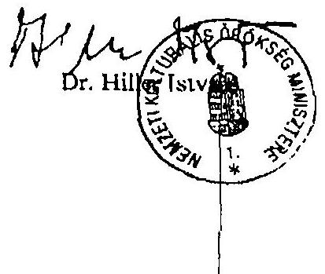
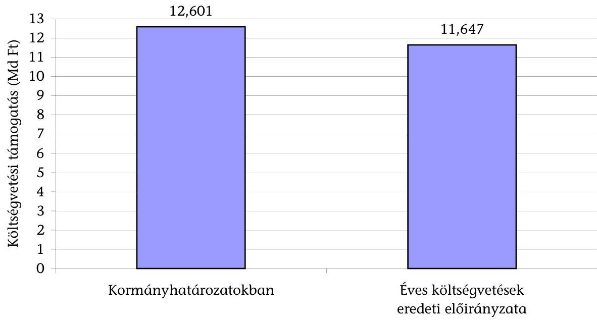
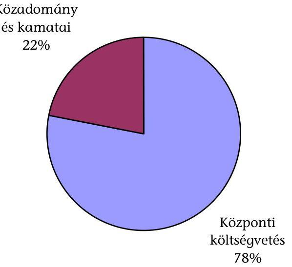
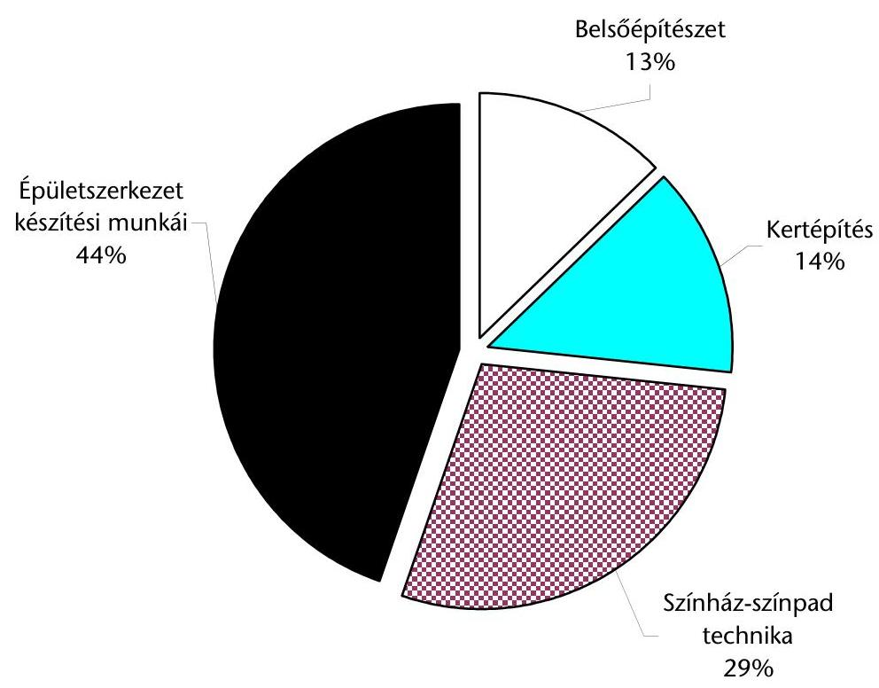
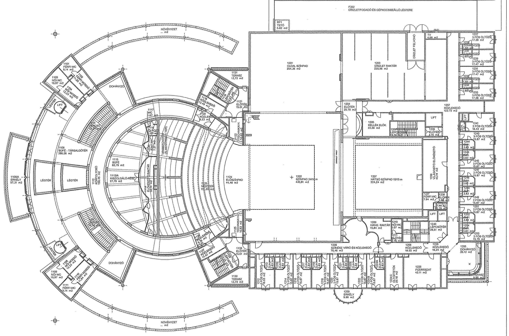
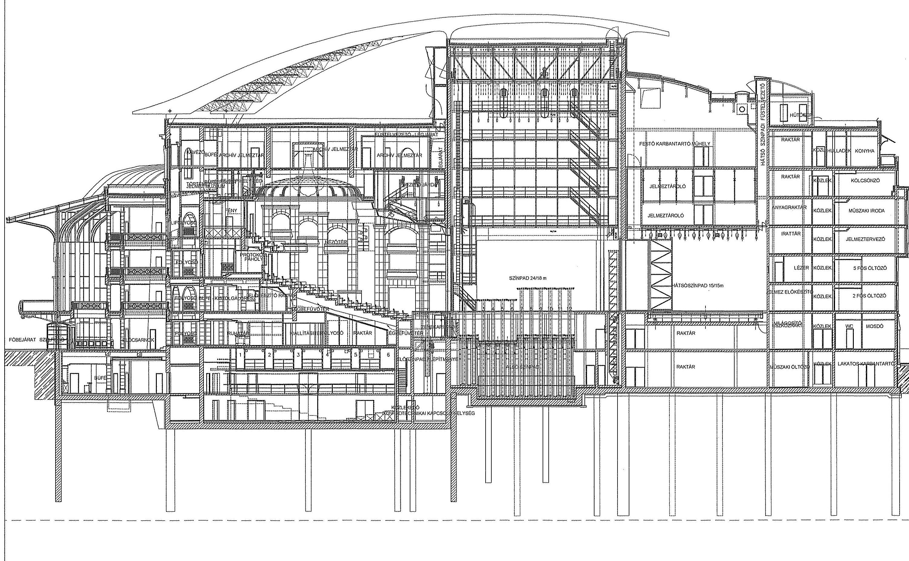
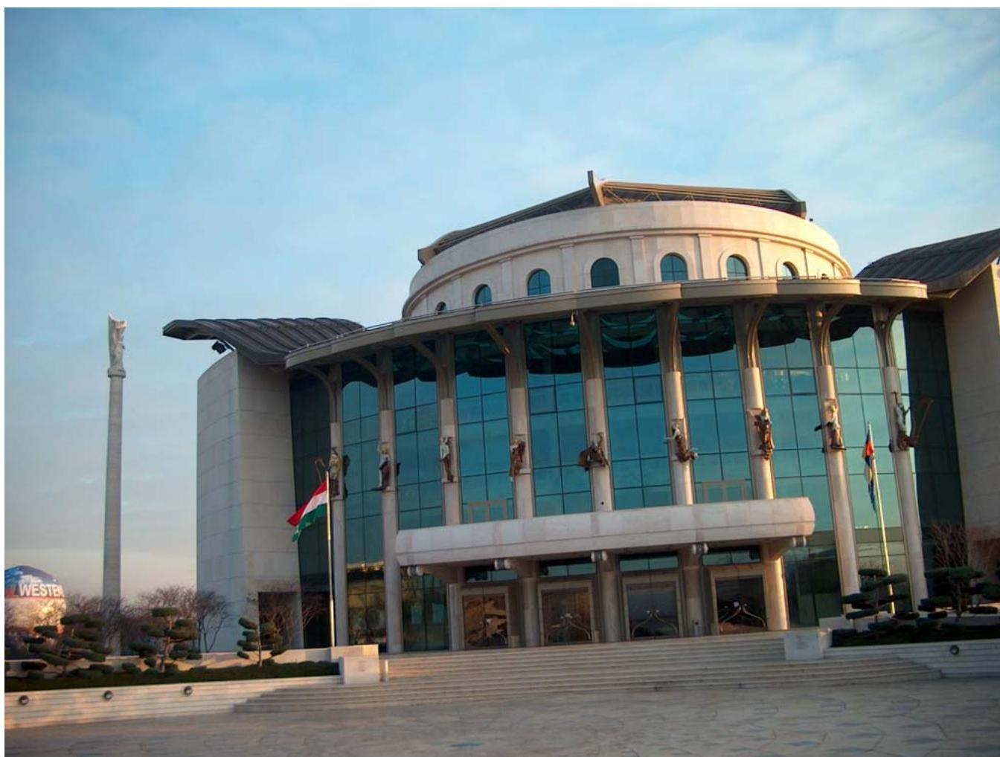
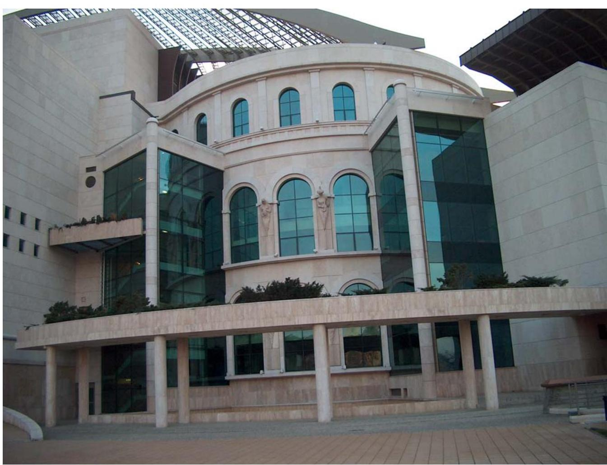
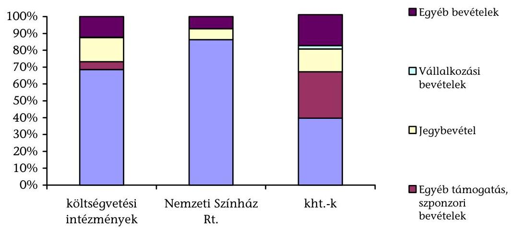

# JELENTÉS 

## a Nemzeti Színház beruházás ellenőrzéséről

---

2. Államháztartás Központi Szintjét Ellenőrző Igazgatóság
2.3. Átfogó Ellenőrzési Főcsoport
Iktatószám: V-18-60/2003-04.
Témaszám: 663
Vizsgálat-azonosító szám: V0114
Az ellenőrzést felügyelte:
Bihary Zsigmond
főigazgató
Az ellenőrzés végrehajtásáért felelős:

# Kemény Emil 

főcsoportfőnök
Az ellenőrzést vezette:
Matusek István
főcsoportfőnök-helyettes
Az ellenőrzésben részt vettek:
Jankó Géza
számvevő
dr. Mihály Sándor
számvevő tanácsos, főtanácsadó
Vértényi Gábor
számvevő gyakornok
Zagyi Judit
számvevő
Borsa Miklós
külső szakértő
Az ÁSZ által a témában eddig készített jelentések:
sorszáma
A Nemzeti Színház felépítését szolgáló pénzforrások ellenőrzéséről (1990) 16
Jelentés az új Nemzeti Színház beruházásának vizsgálatáról 1. szakasz 1997. december 31. 9804

---

.

---

# TARTALOMJEGYZÉK 

BEVEZETÉS ..... 5
I. ÖSSZEGZŐ MEGÁLLAPÍTÁSOK, KÖVETKEZTETÉSEK, JAVASLATOK ..... 8
II. RÉSZLETES MEGÁLLAPÍTÁSOK ..... 15

1. A Nemzeti Színház beruházás előkészítése és a rendelkezésre álló források ..... 15
1.1. A beruházás döntés-előkészítése, a forrásszükségletek meghatározása ..... 15
1.2. Az éves költségvetésben a beruházás előirányzatai és teljesítése; a közadományok felhasználása ..... 17
1.3. A kormányzati kezességvállalás szerepe a beruházás finanszírozásában ..... 18
1.4. A Nemzeti Színház Rt. alapítása ..... 19
1.5. Az Erzsébet téri beruházás ráfordításainak alakulása, befejezése és hasznosítása ..... 20
2. A beruházás műszaki előkészítése, a tervezés, pályáztatás és engedélyeztetés folyamata ..... 21
2.1. A lebonyolítás megszervezése ..... 21
2.2. Az épület koncepcióterve ..... 21
2.3. Az építészeti tervpályázat ..... 22
2.4. Az építési engedélyezési terv ..... 23
2.5. A színháztechnika tervezése ..... 24
3. A kivitelezők kiválasztása, a kivitelezés folyamata, megvalósítása ..... 25
3.1. A fővállalkozó kiválasztása ..... 25
3.2. A kivitelezői szerződések, a jótállás és szavatosság feltételei, valamint az átadás-átvételi eljárás ..... 26
3.3. A kivitelezés folyamatában a műszaki és pénzügyi teljesítések ellenőrzésének dokumentálása ..... 27
3.4. A színház műszaki, technikai megvalósítása ..... 27
3.4.1. A nézőtér ..... 28
3.4.2. A színháztechnika ..... 28
4. Az elkészült létesítmény üzemeltetési feltételei és múködése ..... 29
4.1. A megvalósult beruházás összehasonlítása a tervezett funkcionális és múködési követelményekkel ..... 29
4.1.1. Az épület eltérései a koncepcionális tervtől ..... 29
4.1.2. A színháztechnika terv-tény összevetése ..... 30
4.1.3. A kert terv-tény összevetése ..... 31
4.2. A Nemzeti Színház gazdálkodási formájának értékelése ..... 32

---

4.2.1. A Nemzeti Színház Rt. feladatai és működése ..... 32
4.2.2. Lehetséges gazdálkodási formák a Nemzeti Színház üzemeltetésére ..... 34
4.3. Az üzemeltetés tapasztalatai, a finanszírozás alakulása ..... 34
4.3.1. Bevételek, kiadások, költségek ..... 34
4.3.2. Az üzemeltetés személyi feltételei és kiadásai ..... 37
4.3.3. Dologi kiadások ..... 37
4.4. A színház értékelése néhány összehasonlító adat alapján ..... 38
MELLÉKLETEK

1. A nemzeti kulturális örökség miniszterének észrevétele
2. A Nemzeti Színház beruházásának költségvetési forrásai és felhasználása
3. A Nemzeti Színház Rt. múködési költségeinek összetétele
4/a A Nemzeti Színház Rt. átlaglétszámának alakulása (alkalmazottak)
4/b A Nemzeti Színház Rt. számított átlaglétszámának alakulása (vállalkozók)
4. A Nemzeti Színház beruházás szakaszai és ütemezése
5. Ábrák:
6. sz. ábra A Nemzeti Színház beruházás forrása az éves költségvetések és a kormányhatározatok szerint
7. sz. ábra A Nemzeti Színház beruházás forrásmegoszlása
8. sz. ábra A Nemzeti Színház beruházás kiadásainak megoszlása
7/a A Nemzeti Színház I. emeleti átnézeti alaprajza
7/b A Nemzeti Színház átnézeti metszete
7/c A Nemzeti Színház főbb műszaki jellemzői
8/a 1. sz. kép A Nemzeti Színház északi homlokzata
8/b 2. sz. kép A Nemzeti Színház nyugati homlokzata

# FÜGGELÉKEK 

1. A Nemzeti Színház üzemeltetésére alkalmas gazdálkodási formák értékelése

---

# RÖVIDÍTÉSEK JEGYZÉKE 

NSZ
Új Nemzeti Kht.
rt.
kht.
áfa
FB
SZMSZ
Étv.
Gt.
Kbt.
Kjt.
Ktv.
MeH
IM
KTM
NKÖM
PM

Nemzeti Színház
Új Nemzeti Színház Megvalósítási Iroda Kht.
részvénytársaság
közhasznú társaság
általános forgalmi adó
Felügyelő Bizottság
Szervezeti és Múködési Szabályzat
az épített környezet alakításáról és védelméről szóló törvény
a gazdasági társaságokról szóló törvény
közbeszerzési eljárásról szóló törvény
a közalkalmazottak jogállásáról szóló törvény
a köztisztviselők jogállásáról szóló törvény
Miniszterelnöki Hivatal
Igazságügyi Minisztérium
Környezetvédelmi és Területfejlesztési Minisztérium
Nemzeti Kulturális Örökség Minisztériuma
Pénzügyminisztérium

---

.

---

# JELENTÉS   a Nemzeti Színház beruházás ellenőrzéséről 

## BEVEZETÉS

A Millenniumi Városközpontban megalkotott Nemzeti Színház előtörténete 1995. november 23-án kezdődött, amikor a Kormány a Nemzeti Színház felépítéséről döntött, majd az építkezésre 1996-ban folyó áron 6 milliárd Ft költségvetési támogatást határozott meg. A nyílt nemzetközi tervpályázaton 1997-ben a zsűri egy magyar tervezőnek az Erzsébet térre készült művét választotta ki.

A beruházást lebonyolító Nemzeti Színház Kormánybiztosi Iroda - az engedélyezési terven alapuló költségelemzés értékelése után - 1997 decemberében a Kormányt arról tájékoztatta, hogy a választott alternatívától függően, 1997. évi áron, 8,4-11,1 milliárd Ft-os költséggel kell számolni. A Magyar Köztársaság 1998. évi költségvetésében 2 milliárd Ft-ot irányoztak elő a beruházásra. Az építkezés az 1998. március 27-i alapkőletétellel megkezdődött. Az ÁSZ 1998. évi jelentése ${ }^{1}$ áttekintette a beruházás előrehaladásának helyzetét és javaslatokat tett a Kormánynak, a művelődési és közoktatási miniszternek és a Kormánybiztosi Irodának a szükséges intézkedések megtételére.

A Kormány 1998. november 6-án úgy döntött, hogy az Erzsébet téri építkezést leállítja és a színházat egy új helyszínen építi fel, mert az 1998 nyarán végzett költségelemzés szerint a beruházás terv szerinti befejezésének várható költsége meghaladná a 19 milliárd Ft-ot. Határozatában a költségvetési támogatást 1998. évi áron 8,2 milliárd Ft-ban rögzítette, döntött a közadományok beruházási célú felhasználásáról, és kitűzte a 2002. március 15-i átadást.

A leállítást követően az új helyszín kiválasztása több mint egy évet vett igénybe. Szóba került a Városliget Dózsa György út felé eső széle, a Hungexpo építési területe, a Ganz-Mávag területe, a Margitsziget dél-nyugati partszakasza. Az új Nemzeti Színház végleges helyszínét 1999 decemberének utolsó napjaiban jelölték ki a Déli Duna (mai nevén Millenniumi) Városközpont területén. Az 1998. évi költségvetési törvényben szereplő 2 milliárd Ft előirányzat nem változott, abból az Erzsébet téri építkezésre 1,752 milliárd Ft-ot felhasználtak.

A Nemzeti Kulturális Örökség Minisztériuma a beruházás lebonyolítására 1999. január 1-jén létrehozta az Új Nemzeti Színház Megvalósítási Iroda (Új

[^0]
[^0]:    ${ }^{1}$ Jelentés az új Nemzeti Színház beruházásának vizsgálatáról (1. szakasz 1997. december 31-ig). Sorszáma: 9804

---

Nemzeti) Kht.-t, majd 2000. augusztus 1-jével megalapította a Nemzeti Színház Rt.-t (NSZ Rt.) és jogutód nélkül megszüntette az Új Nemzeti Kht.-t.

Az Új Nemzeti Kht. 2000. március 25-én szerződést kötött egy részvénytársasággal a fővállalkozói feladatok ellátására. A fővállalkozó a beruházást bankhitelből valósította meg. A hitel folyósításának feltétele volt az állami kezességvállalás. A Kormány határozatában ${ }^{2} 10,8$ milliárd Ft összeghatárig vállalt készfizető kezességet a Nemzeti Színház fővállalkozási szerződés keretében történő felépítésének finanszírozására.

Az építési beruházás kivitelezése a Nemzeti Színház Rt. lebonyolításában 2000 szeptemberében megkezdődött és 2001. december 14-én a kivitelező az épületet készre jelentette, majd 2002. március 15 -én megtartották az ünnepélyes nyitóelőadást.

Az ellenőrzés végrehajtására az Állami Számvevőszékről szóló 1989. évi XXXVIII. törvény 2. § (5) bekezdésében, az államháztartásról szóló 1992. évi XXXVIII. törvény 104. § (3) bekezdésében, valamint a közpénzek felhasználásával, a köztulajdon használatának nyilvánosságával, átláthatóbbá tételével és ellenőrzésének bővítésével összefüggő egyes törvények módosításáról szóló 2003. évi XXIV. törvény 1-2. §-ában foglaltak adtak jogszabályi alapot.

Az ellenőrzés célja annak értékelése volt, hogy a Nemzeti Színház építési beruházása gazdaságosan, eredményesen valósult-e meg. Ezen belül:

- a kormányzati döntések, határozatok kellő időben születtek-e meg, a beruházás előkészítéséhez készült-e műszaki-pénzügyi megvalósíthatósági tanulmány, a beruházáshoz szükséges források rendelkezésre álltak-e, és azokat célszerűen használták-e fel;
- a beruházás műszaki előkészítése megfelelt-e a beruházási célnak, a jogszabályi előírásoknak, végeztek-e számításokat a rendelkezésre álló források gazdaságos felhasználására a kormányhatározatok teljesítése érdekében;
- a kivitelezés megszervezésénél, végrehajtásánál a jogszabályokban és a szerződésekben foglaltak szerint jártak-e el, a kivitelezői szerződésekhez képest módosításokra, változásokra sor került-e és milyen indokokkal, a gazdasági, eredményességi kritériumokat érvényesítették-e;
- az üzemeltetés eddigi tapasztalatai alapján a megvalósult beruházás funkcionálisan és minőségben megfelel-e a beruházási célnak, megfelelő-e az összhang az üzemeltetési költségek és a rendelkezésre álló források között. A múködés gazdaságosságának, eredményességének értékelése hasonló intézmények mutatóival történt összehasonlítás alapján.

Az ellenőrzés során a helyszín kijelölésének folyamatát és az állam által juttatott telek megfelelőségét adottságnak tekintettük.

[^0]
[^0]:    ${ }^{2}$ 1092/2000. (XI. 22.) Korm. határozat a Nemzeti Színház felépítésének finanszírozásához kapcsolódó kormányzati kezességvállalásról.

---

Az ellenőrzés eredményes végrehajtását nehezítette, hogy az iratok nem egy helyen álltak rendelkezésünkre, valamint hogy az intézkedések előkészítésének és végrehajtásának dokumentálását nem az elvárható részletezettséggel végezték el.

A vizsgálatot a teljesítményellenőrzés módszerével végeztük, amelynek célját, részletes szempontjait előtanulmányban alapoztuk meg. Az előirányzott és rendelkezésre álló pénzügyi források felhasználását szabályszerűségi és gazdaságossági szempontokat figyelembe véve vizsgáltuk meg.

Az ellenőrzés az 1998-2002. évek közötti időszakra terjedt ki, a beruházás előkészítésétől a létesítmény átadásáig. A beruházás lezárását, az üzemeltetési és múködési folyamatokat a helyszíni ellenőrzés végéig (2003. X. 3-ig) figyelemmel kísértük.

Az Erzsébet téri beruházás nem volt az ellenőrzés tárgya, de azzal összefüggésben megvizsgáltuk, hogy volt-e lehetőség az objektum értékesítésére és az abból származó bevétel egy részének felhasználására az új Nemzeti Színház építésénél.

A Nemzeti Színház üzemeltetésére alkalmas gazdálkodási formákat a 1. számú függelékben értékeljük.

A jelentést az Állami Számvevőszékről szóló 1989. évi XXXVIII. törvény 25. § (1) bekezdésének megfelelően megküldtük dr. Hiller István úrnak, a nemzeti kulturális örökség miniszterének. (Levele másolatát az 1. sz. melléklet tartalmazza.)

---

# I. ÖSSZEGZŐ MEGÁLLAPÍTÁSOK, KÖVETKEZTETÉSEK, JAVASLATOK 

A Nemzeti Színház épületét 2002. február 13-án, a hozzá tartozó közparkot 2002. július 9-én, a színháztechnikai berendezéseket 2002. augusztus 4-én adta át a fővállalkozó a beruházónak.

A színháztechnika átadás-átvételének 7 hónapos késedelme nem akadályozta a 2002. március 15-i ünnepélyes megnyitót és az előadások megtartását, mert a színháztechnika felszerelése nem építési engedély köteles, és a kivitelező az üzemeltetést - próbaüzemként - saját felelősségére elvégezte.

Az Állami Számvevőszék által felkért műszaki szakértő véleménye szerint a megvalósult létesítmény magas műszaki színvonalú. Jó a díszletszállítás és mozgatás feladatainak megoldása; a művészbejáró, az öltöző kialakítása; a próbatermek, a műszaki és adminisztratív helyiségek elhelyezése; a főszínpadi színpadnyílás végső megoldása. A Nagyszínház színháztechnikája korszerű és színvonalas, de kérdéses a világviszonylatban egyedülálló főszínpadi süllyedőrendszer kihasználhatósága. A süllyedő elemek balesetveszélyesek, amit szigorú szabályok betartatásával, műszaki megoldásokkal (megállító automatika) és a működtetés állandó felügyeletével igyekeznek elhárítani. A szcenikai világítás részeként beépített mintegy 100 db programozható fényvető túlzás, meghaladja a színház igényeit. A nagyszínházi hangosítási rendszer világszínvonalú. Az akusztika minősége, ha nem is kiváló, de jó. A színpad láthatósága megfelel az ilyen típusú (keretes színpadú) színházakkal szemben támasztható - szabályokban vagy szabványokban nem rögzített - láthatósági követelményeknek. A Stúdiószínház korszerű, megfelelő színháztechnikával felszerelt kísérleti színpad. A gyalogos megközelíthetőség még nem ideális, és hiányzik a parkoló végleges megépítése.

A beruházás operatív előkészítésével kapcsolatos döntések meghozatalára 1999. április 1-jei hatállyal felruházott kormánybiztos a beruházás pénzügyi lebonyolításához pénzügyi tanácsadó cég véleményét is kikérte, és az áfa viszszaigénylés lehetőségére, valamint a nemzetközi gyakorlatra figyelemmel a színház gazdálkodási formájának az rt.-t javasolta, melyet a Kormány elfogadott. (1999. I. 1-2000. VII. 31-ig a beruházást az Új Nemzeti Kht. irányította, amely 2000. VIII. 1-jétől jogutód nélkül megszűnt és a beruházás lebonyolítását a Nemzeti Színház Rt. vette át.)

A Nemzeti Színház Rt.-t az állam alapította és közvetlenül az NKÖM irányítása alá tartozik. A társasági forma, illetve a közvetlen minisztériumi irányítás célszerűsége gazdaságossági számítások hiányában nem ítélhető meg. ${ }^{3}$

[^0]
[^0]:    ${ }^{3}$ Hasonló megállapításra jutottunk a Gazdasági és Közlekedési Minisztérium fejezet múködésének ellenőrzésénél. A jelentés sorszáma: 0350

---

Az egyszemélyes, zártkörű részvénytársaságként alapított Nemzeti Színház Rt. létrehozása annyiban törvénysértő volt, hogy az alapító csak utólag, a 2000. augusztus 1-jei megalapítást követően kérte a pénzügyminiszter - Áht.-ban előírt - egyetértését a gazdasági társaság létrehozásához (az egyetértését augusztus 21 -én adta meg a pénzügyminiszter).

Az alapítást jóváhagyó kormányhatározat előterjesztését - első változatban - a Kormány elutasította, majd átdolgozás után elfogadta ${ }^{4}$, annak ellenére, hogy az előterjesztés nem indokolta annak szükségességét és nem mutatta be gazdasági kihatásait. A Kormány az alaptőke forrásául a központi költségvetés általános tartalékát jelölte meg szabálytalanul, mert az - az Áht. rendelkezése szerint - a váratlan, nem tervezhető kiadások fedezetéül szolgál.

A részvénytársaság múködése több vonatkozásban aggályos. A társaság alapító okirata a többszöri módosítás, kiegészítés ellenére sem teljes. Nem tartalmazza a részvénytársaság feladatait, különösen azok hiányának van jelentősége, amelyeket a részvényes (a Magyar Állam) elvár, illetve amelyek teljesítését a támogatásával elő óhajt segíteni. A társaság szervezeti és múködési szabályzata elavult, nem tükrözi a tényleges szervezetet és múködést. Az igazgatóság jogkörével is felruházott vezérigazgatót munkaszerződéssel alkalmazzák, ami nincs összhangban a Gt.-vel, bár ezt az NKÖM vitatja. A színház vezetése kidolgozta a színház középtávú szakmai tervét, de ehhez tapasztalatok hiányában még nem alakítottak ki középtávú gazdasági tervet (stratégia).

A kormánybiztos kinevezési okmánya mellé a Ktv. által előírt, a feladatait és a hatáskörét tartalmazó munkaköri leírást a MeH nem tudta az ellenőrzés rendelkezésére bocsátani.

A kormányhatározatban megállapított költségvetési támogatást (200 millió Ft) alaptőke emelésként kapta meg a Nemzeti Színház Rt. Az áfa visszaigénylése azonban $25 \%$-kal megnövelte a beruházásra fordítható összeget anélkül, hogy a kormányhatározatot módosították volna.

Nehezítette a beruházási folyamat áttekintését, hogy a beruházásokkal kapcsolatos jogi szabályozás nem követte eléggé a technika fejlődését, nem egyértelmú, hogy az állami beruházások egyes fázisaihoz tartozó dokumentációknak mit kell tartalmazniuk, számos beruházási fogalom nincs egyértelmúen meghatározva.

A kormányhatározattal előírt 2002. március 15-i átadási határidő teljesítése érdekében a kormánybiztos centralizált módon irányította a végrehajtást, ami a beruházás folyamatában több kifogásolható megoldáshoz vezetett.

A beruházásról döntés-előkészítési tanulmányterv nem készült, így azt a Kormány elé jóváhagyásra sem terjeszthették. A Kormány határozatában előírta, hogy részére a beruházás előrehaladásáról három havonként írásban számoljon be a kormánybiztos. A tájékoztatást a Kormány helyett az NKÖM kapta. A

[^0]
[^0]:    ${ }^{4}$ 1069/2000. (VIII. 18.) Korm. határozat a Nemzeti Színház Részvénytársaság alapításával kapcsolatos intézkedésekről

---

kormánybiztos - a formálisan szintén felelős - NKÖM miniszterét megkerülve tartott kapcsolatot a miniszterelnökkel, napirendre való tekintet nélkül megjelenhetett a Kormány ülésein és szóbeli tájékoztatást adhatott, döntést kérhetett. A kormánybiztos eseti döntéseiről, a Kormány részére adott szóbeli tájékoztatásairól és a kormányülésen hozott döntésekről dokumentáció nem áll rendelkezésre.

Nem készült úgynevezett színházprogram, amely meghatározta volna a megvalósítandó funkciókat és az üzemeltetési költségeket alapvetően befolyásoló paramétereket.

Az új helyszínre épített színház helyiségtervét az Erzsébet térre készült I. díjas tervből kiindulva határozták meg. A helyiségterv alapján készítették el a Nemzeti Színház koncepciótervét ${ }^{5}$, amely színházi szempontból megfelelt a mai kor elvárásainak.

A beruházás részprogramjai (épületszerkezet készítése, belsőépítészet, színháztechnika, kert- és környezetrendezés) az állandó rögtönzés jegyében készültek, ami az egységes beruházási program hiányából következett.

A Nemzeti Színház építészeti kialakítására a kormánybiztos a koncepcionális terv alapján 2000 februárjában meghívásos tervpályázatot írt ki, amelyben meghatározta a kötelezően betartandó költségelőirányzatot, és a szokásosat meghaladó mértékben kötötte meg a műszaki, technológiai paramétereket. A pályázatot szabályszerűen bonyolították le, az értékelés jogszerú és szakszerú volt, amelynek eredményeképpen a Bíráló Bizottság kihirdette a pályázat nyertesét. Ezt követően azonban a kormánybiztos arról tájékoztatta a Kormányt, hogy - a felkért szakértő véleménye alapján - az összes beadott pályamú megsértette a pályázati kiírást, és az I. díjas pályamű megvalósítása 2500 millió Ft többletforrást igényel. A Kormány a támogatás összegét nem módosította, ezért a kormánybiztos a pályázat győztesét nem pályamúvének megvalósítására, hanem a kiírás alapjául szolgáló terv megvalósításában való közremúködésre hívta fel, amit nem fogadott el. A pályamúvek értékes elemei nem hasznosultak.

Az építészeti tervpályázat formális voltára utal, hogy a kiírást megelőzően, attól függetlenül megkezdődött, illetve folyt az a tervezőmunka, amely alapján később az épület megvalósult.

Az építési engedélyeztetés folyamatára rányomta a bélyegét a szoros véghatáridő. A hatóságok egyes jogszabályi előírások szigorú betartásától eltekintettek. Az építési engedélyezési kérelem tervdokumentációját az építési munka egészére kellett volna benyújtani, de az nem tartalmazta a színháztechnika ismertetését. A hiányosságok miatt 90 napon belül további terveket kellett beterjeszteni, illetve a használatbavételi engedélyezés során olyan feltételek meglétét kellett igazolni, amelyek a határozathozatal időpontjában még nem voltak meg.

[^0]
[^0]:    ${ }^{5}$ Olyan előkészítő terv, amelyben a megrendelő leírja, esetenként lerajzolja a helyiségek kapcsolatait, funkcióját. Nevezik még programtervnek és funkcionális tervnek is.

---

Az épület kivitelezésére 1999 októberében nyílt közbeszerzési eljárást írtak ki. A tendertervet jelentős hiányokkal adták ki, a dokumentáció az épület építésszerelési munkáira korlátozódott, hiányzott belőle a színháztechnika, a belsőépítészet, a kertépítés, a képzőmúvészeti munkák, a közművek, az utak, a parkolók és a környezetrendezés. A tenderterv a teljes beruházásra vonatkozó mennyiségi adatok és a bekerülési költségek megállapítására nem volt alkalmas. A kiírók nem kértek a pályázóktól adatokat az üzemeltetési paraméterekre és szerződéstervezetet a gépészeti egységek (kazánok, felvonók, légtechnikai rendszer, biztonságtechnika) folyamatos karbantartására.

Az épület kivitelezése a versenyeztetést és a kivitelező kiválasztását követően rendezetten folyt, és az épület 16 hónap alatt - az átadás-átvételi jegyzőkönyv szerint - jó minőségben felépült. A megrendelő és a vállalkozó között folyamatos volt az egyeztetés, a többszöri - dokumentumokkal nem teljes körűen alátámasztott - változtatásokat a vállalkozó gyakran többlet fizetési igény támasztása nélkül megvalósította. A színpadtechnika folyamatosan módosult, próbaüzemre nem maradt idő. A pótmunkák jelentős hányada az üzemeléshez szükséges berendezések utólagos megrendeléséből származott.

Az épület használatbavételi engedélyét 3 nappal a nyitóelőadás előtt adta ki a Ferencvárosi Önkormányzat Polgármesteri Hivatala. A színpadtechnika műszaki átadására 2001. december 15-e helyett csak 2002. augusztus 4-én került sor.

A beruházás előkészítésekor költségtakarékossági okokból nem terveztek gépkocsiparkolót létrehozni. A kormánybiztos tájékoztatása szerint a magyar államot képviselő ÁPV Rt. és a környező telkeket megvásárló kft. között létrejött adásvételi szerződésben a vevő vállalta, hogy a Nemzeti Színház számára 250 gépkocsi számára parkolót épít. Megkeresésünkre az ÁPV Rt. azt válaszolta, hogy a kft.-vel a Nemzeti Színházat érintő szerződése nincs. Az NKÖM közlése szerint az épülő kulturális központ mélygarázsában biztosítanak parkolóhelyet a színház számára. A színház használatbavételi engedélyének kiadásához szükséges létesítményt egy szomszédos, bérelt területen 37,5 millió Ft-ért kialakított ideiglenes parkolóval pótolták. A színház parkolójának végleges kialakítása további beruházást igénylő feladat, amelyről még nem hoztak döntést.

Ugyancsak költségkímélési okokból elmaradtak a déli térfal tervezett létesítményei, a szabadtéri színpad jelen formájában nem használható, átépítését tervezik, de az építkezés időpontja bizonytalan. A díszletgyártó üzemet kitelepítették, de további hasznosítása ugyancsak bizonytalan.

A Nemzeti Színház építése sajátos pénzügyi konstrukcióban valósult meg. A beruházáshoz szükséges forrást a fővállalkozó bankhitelből fedezte. A hitel folyósításának feltétele volt az állami kezességvállalás, ezért a fővállalkozói szerződés hatályba lépéséhez a Kormány határozatában ${ }^{2} 10800,0$ millió Ft összeghatárig készfizető kezességet vállalt a Nemzeti Színház fővállalkozási szerződés keretében történő felépítésének finanszírozására. Ez a megoldás lehetővé tette, hogy a központi költségvetés csak a beruházás befejezését követően, egy öszszegben egyenlítse ki a fővállalkozóval szembeni kötelezettségét. Így a finanszírozási rendszer egyszerűbb, áttekinthetőbb és takarékosabb volt. A beruházó részéről a számlaellenőrzés folyamatos volt.

---

A Nemzeti Színház beruházására a központi költségvetésből (12 601 millió Ft) és a közadományokból ( 3535 millió Ft) összesen 16136 millió Ft-ot bocsátottak rendelkezésre. (2. sz. melléklet) A Kormány 2001-ben úgynevezett „első beszerzésre" 500 millió Ft-ot biztosított az eredetileg rögzített költségvetési támogatás kereten ${ }^{4}$ felül.

A Nemzeti Színház Rt. a közadomány felhasználásáról a kormányhatározatban előírt módon elszámolt, de a tételes pénzügyi kimutatás a helyszíni ellenőrzés lezárásáig még nem volt teljes. Az elkészült összesítések szerint a beruházásra nettó 15511,0 millió Ft-ot, bruttó 19 278,8 millió Ft-ot költöttek. Ebből az épület teljes körű kivitelezése 16562,8 millió Ft-ba, a közpark létesítése 2716,0 millió Ft-ba került (5. sz. melléklet). A beruházás költségei közt nem szerepel a Nemzeti Színház Rt.-be apportált állami tulajdonú telek értéke.

A költségek összegezésekor nem hagyható figyelmen kívül, hogy a megvalósulási helyszín és az épület terveinek változásával járulékos többletköltségként merült fel az Erzsébet téri építkezés feleslegessé vált részeinek más célra (kulturális központ) való átalakítása, amely eddig 5783 millió Ft-ba került, és még legalább 8-900 millió Ft felhasználását igényli. Az objektum értékesítése a vizsgált időszakban nem sikerült, az ebből várt bevétel a Nemzeti Színház építésénél nem volt felhasználható.

Az összköltségek tekintetében a Nemzeti Színház fenntartása, múködési költségeinek összetétele más magyar színházakéval csak részben összehasonlítható. A többi magyar színháznál nem merül fel kert fenntartási költség, parkoló (garázs) költség, térvilágítás, mesterséges tó (téli) melegítésének költsége, valamint az átlagos színházakénál magasabb biztonsági és őrzési költség.

A színház egyes belsőépítészeti megoldásainak célszerűsége vitatható (pl. trópusi fából készült mosdótálak, drága és nehezen pótolható lámpatestek, egyedi, kézi szövésű szőnyeg a nézőtéri várakozóban stb.), de a színház jellegére való tekintettel elfogadható.

A Nemzeti Színház Rt. 2003 első félévében 6 munkavállalót alkalmazott, a többi munkakört (167 fő) vállalkozókkal látta el. Ez a foglalkoztatottak számára nem biztosítja a - színházaknál korábban általános - közalkalmazottakat megillető jogosítványokat és törvényi védelmet. A helyszíni ellenőrzés befejezésekor az alkalmazotti létszám 44 főre emelkedett, és 170 főt foglalkoztattak vállalkozási szerződéssel.

A színház látogatottsága 2002-ben megközelítette a 100\%-ot, amely meghaladja a magyar prózai színházak fajlagos látogatottságát. Az átlag 2500 Ft-os jegyár kétszerese a hasonló befogadó képességű, prózai színházakénak. A színház jelenlegi vezetésének véleménye szerint ilyen magas jegyárak mellett nem tartható fenn sokáig a kezdeti magas látogatottsági szint. A színház 2002. évi mérleg szerinti eredménye 203,2 millió Ft volt, a mérlegfőösszege 17 364,2 millió Ft. A jegybevétel a magas árak mellett is csak 10\%-a az összes bevételnek.

A 2003. év első félévének bevételei közel 40\%-kal elmaradtak a tervezettől, mert a központi költségvetésből kapott támogatás összege 52\%-kal volt keve-

---

sebb az I. félévre időarányosan tervezettnél, bár a jegybevétel magasabb volt a vártnál.

A Nemzeti Színház Rt. vezetése a működés finanszírozását hosszú távon 80\%-os költségvetési támogatás mellett látja biztosítottnak.

A színház működtetésével ugyan nem függ össze szorosan, de attól el nem választható „A Nemzet Színésze" cím alapítása és az azzal járó díj folyósítása. A cím létrehozását a kormánybiztos határozta el, és az NKÖM felhatalmazására mint a Nemzeti Színház Rt. vezérigazgatója alapította meg. A kormánybiztos kezdeményezésére a Kormány határozatában „A Nemzet Színésze" díj kifizetésének felelőséül a pénzügyminisztert és a kormánybiztost jelölte ki 2000 augusztusában, s ennek 2000. évi fedezetéül az rt. alaptőkéjét jelölte meg. A kormányhatározat arról nem rendelkezett, hogy az élethosszig fizetett és az infláció mértékének megfelelően emelkedő díjat a továbbiakban kinek és milyen forrásból kell rendelkezésre bocsátania. Az ellenőrzés fontosnak tartja a díj pénzügyi hátterének pontos jogszabályi rendezését azért, hogy a díj jelentőségét a jövőben se csökkenthesse a fedezet esetleges hiánya vagy tisztázatlansága.
„A Nemzet Színésze" cím adományozásának, a címmel járó díj folyósításának feltételeiről - az NKÖM tájékoztatása szerint - a közeljövőben miniszteri rendelet készül.

A helyszíni ellenőrzés megállapításainak hasznosítása mellett javasoljuk:

# a Kormánynak: 

1. Vizsgáltassa felül az állami, vagy állami támogatással megvalósuló beruházások előkészítésére és kivitelezésére vonatkozó jogszabályokat, azok egymással és az EU jogrendjével való összhangját, a fogalmak egységesítése, valamint az ellenőrizhetőség és a felelősség egyértelmű megteremtése érdekében.

## a részvényesi jogokat gyakorló nemzeti kulturális örökség miniszterének:

1. Vizsgáltassa felül a 2003. évi gazdasági beszámoló ismeretében a Nemzeti Színház gazdálkodási formájának célszerűségét, figyelemmel a vezérigazgató alkalmazására vonatkozó szerződésre, a Nemzeti Színház alapító okiratára és a Nemzeti Színház múködéséhez nyújtandó állami támogatás feltételrendszerére.
2. Dolgoztasson ki javaslatot a Kormány részére „A Nemzet Színésze" díj további folyósításának rendezésére annak érdekében, hogy a nagy társadalmi megbecsülést kifejező díj pénzügyi feltételei hosszútávon is biztosítottak legyenek.
3. Intézkedjen, hogy a Nemzeti Színház Rt. vezérigazgatója folyamatosan tartsa karban a társaság Szervezeti és Múködési Szabályzatát.

---

4. Hozzon döntést a beruházás eddig megoldatlan kérdéseiben:
a) a színház parkolóhelyének végleges megoldásáról;
b) a szabadtéri színpad hasznosításáról;
c) a déli oldal elmaradt létesítményeiről;
d) a díszletgyártó üzem hosszabb távú hasznosításáról.
5. Kísérje folyamatosan figyelemmel az általa tett intézkedések végrehajtását, és arról évente tájékoztassa az Állami Számvevőszéket.

---

# II. RÉSZLETES MEGÁLLAPÍTÁSOK 

## 1. A Nemzeti Színház beruHázás elökészítése és a rendelkeZÉSRE Álló FORRÁsOK

### 1.1. A beruházás döntés-előkészítése, a forrásszükségletek meghatározása

Az új Nemzeti Színház megépítését a Kormány kiemelt jelentőségű ügynek tekintette, a megvalósításról számos határozatot hozott. A beruházás koordinációjával összefüggő feladatok ellátására miniszteri biztost, majd kormánybiztost neveztek ki. A folyamatban az NKÖM végrehajtó, adminisztrációs feladatokat látott el.

A beruházást végig széles döntési jogkörrel vezető kormánybiztos kinevezési okmánya mellé a Ktv. ${ }^{6} 11 . \S$ (5) bekezdése által előírt, a feladatait és a hatáskörét tartalmazó munkaköri leírást sem a MeH , sem az NKÖM nem tudta az ellenőrzés rendelkezésére bocsátani.

A Kormány határozatában ${ }^{7}$ előírta, hogy folyamatos költségelemzéssel törekedni kell a költségek racionális csökkentésére és a Kormányt legalább 3 havonként tájékoztatni kell a pénzügyi, műszaki állapotról, a megtett intézkedésekről. Az Új Nemzeti Kht. operatív múködésének időszakában (1999. I. 12000. VII. 31.) az NKÖM írásbeli tájékoztatást kapott, a Kormány nem. Az NSZ Rt. megalakulása ${ }^{4}$ után az NKÖM részére két szöveges beszámoló és időszakonként számszaki beszámoló készült, amelyet az rt. felügyelő bizottsága előzetesen megtárgyalt. A kormánybiztos - a formálisan szintén felelős - nemzeti kulturális örökség miniszterét megkerülve is tartott kapcsolatot a miniszterelnökkel. A kormánybiztos - a nyilatkozatok alapján - a Kormánnyal folyamatosan kapcsolatot tartott, napirendre való tekintet nélkül megjelenhetett a Kormány ülésein, és szóbeli tájékoztatást adhatott, döntést kérhetett. A kormánybiztos eseti döntéseiről, a Kormány részére adott szóbeli tájékoztatásairól és a kormányülésen hozott döntésekről dokumentáció nem állt rendelkezésünkre.

A kormánybiztos kezdeményezésére a beruházás operatív előkészítésére, szervezésére az NKÖM 1999. január 1-jével létrehozta az Új Nemzeti Színház Megvalósítási Iroda Kht.-t, majd 2000. augusztus 1-jével a Nemzeti Színház Rt.-t, és a kht.-t jogutód nélkül megszüntette.

[^0]
[^0]:    ${ }^{6}$ A köztisztviselők jogállásáról szóló 1992. évi XXIII. törvény
    ${ }^{7}$ 1097/1999. (VIII. 26.) Korm. határozat az új Nemzeti Színház felépítéséről

---

Az rt. mint gazdálkodási forma lehetővé tette, hogy visszaigényelhessék és felhasználhassák a beruházás áfa-tartalmát, amire a beruházás elvégzésére eredetileg kijelölt NKÖM-nek és az Új Nemzeti Kht.-nak nem lett volna lehetősége. A beruházásra elkölthető összeg így az azt rögzítő kormányhatározat módosítása nélkül 25\%-kal emelkedett.

A Kormány 1998. évi árszinten 8200,0 millió Ft-ban határozta meg a beruházás költségvetési támogatási keretét, és döntött a közadományokból 1998. évre összegyűlt 2500,0 millió Ft felhasználásáról. Az ünnepélyes megnyitó időpontjául 2002. március 15 -ét jelölte ki. ${ }^{8}$

A Kormány az NSZ Rt.-t az épület kivitelezésére kötött fővállalkozói szerződés erejéig az építkezés megkezdése után felmentette a közbeszerzés szabályai alól².

A létesítmény funkciójával összefüggésben a beruházás költségkeretének megalapozásához, a legkisebb ráfordítás biztosításához, az optimális változat kiválasztásához a tervezett műszaki, pénzügyi, beruházásszervezési, -ütemezési adatok összefoglalását, a pénzszükségletek megalapozását tartalmazó megva-lósíthatósági (döntés-előkészítési) tanulmányterveket nem készítettek.

A kormánybiztos tájékoztatása szerint készült megvalósíthatósági tanulmányterv, amelyet nem hoztak nyilvánosságra a legszúkebb körben sem. Ezeket a dokumentumokat az irattárakban nem leltük fel.

Az előkészítés kezdeti szakaszában megfontolásra került az Erzsébet térre készült terv belső szerkezeti, funkcionális elemeinek hasznosítása. Az új helyszínre tervezett színház helyiségtervét kisebb változtatásokkal az előző tervből kiindulva határozták meg, más megoldásait azonban nem hasznosították.

Az Erzsébet téri beruházás leállítása és az új Nemzeti Színház kivitelezése határidejének kitúzése, valamint az épület végleges helyszínének kijelölése között 16 hónap telt el, azonban a befejezés határidejét nem módosították. ${ }^{9}$

Az építési területet illetően több helyszín felmerült (Dózsa György út - Városliget; Hungexpo építési terület; Ganz-Mávag területe, Margitsziget DNy-i partszakasza), de vagy a telektulajdonosokkal nem sikerült megegyezni, vagy a területek adottságaival szemben merültek fel fenntartások.

AZ NKÖM (beruházó) és a Fővárosi Önkormányzat (telektulajdonos) közötti tárgyalások a helyszín kijelölésére eredménytelenül zárultak. Olyan területet kellett keresni az építés helyszínéül, ahol a telek állami tulajdonban van, és több feltételnek megfelel (környezeti, közlekedési, városrendezési stb.). A beruházó erre a célra az ún. „Déli Duna Városközpont" (mai nevén Millenniumi Városközpont) területét találta alkalmasnak.

[^0]
[^0]:    ${ }^{8}$ 1141/1998. (XI. 6.) Korm. határozat a Nemzeti Színház új helyszínen történő felépítésével összefüggő feladatokról.
    ${ }^{9}$ 1141/1999. (XII. 26.) Korm. határozat az új Nemzeti Színház pontos helyszínének kijelöléséről.

---

A színház koncepcionális tervét közel egy év alatt, 1999 decemberére készítették el. A koncepcióterv megfelelt az építési engedélyezési terv kritériumainak, a tervezett épület valamennyi elemére pontos leírást, paramétert tartalmazott.

A beruházás tervezésénél a színház parkolóját a telkén kívüli helyen, és nem a beruházás keretében szándékozták megvalósítani.

# 1.2. Az éves költségvetésben a beruházás előirányzatai és teljesítése; a közadományok felhasználása 

A Kormány határozatában az új Nemzeti Színház kivitelezésére a központi költségvetés terhére 1998-ban - tárgyévi szinten - 8200,0 millió Ft támogatásról döntött ${ }^{6}$. Újabb határozataival ezt az összeget 2000-ben 10800,0 millió Ft-ra, 2001-ben 12 100,0 millió Ft-ra emelte ${ }^{7}$, az éves beruházási inflációs ráta figyelembe vételével. A költségvetési támogatáson felül a közadomány és kamatai álltak rendelkezésre.

A központi költségvetésben a Nemzeti Színház beruházás támogatása 1999-től 2002-ig az NKÖM fejezeti kezelésű előirányzatok címnél a kiemelt jelentőségű beruházások, az új Nemzeti Színház felhalmozási költségvetése és a Nemzeti Színház Rt. támogatása alcímeken jelent meg. Az éves költségvetés erre a célra 1999-ben 347,0 millió Ft, 2000-ben 1300,0 millió Ft, 2002-ben 10000,0 millió Ft eredeti előirányzatot tartalmazott. A 2001. évi költségvetés a beruházásra nem tartalmazott eredeti előirányzatot.

Az eredeti előirányzatok az előző évi maradványok, az általános tartalék terhére tett emelések, valamint a kormányhatározat alapján előírt csökkentés miatt módosultak. (2. sz. melléklet)

A Nemzeti Színház felépítésére összegyűlt közadomány kamataival együtt 3535 millió Ft volt, amely a Nemzeti Színház összes beruházásra fordítható öszszeg $22 \%$-át tette ki (6. sz. melléklet 2. ábra).

Kormányhatározat ${ }^{8}$ rendelkezett arról, hogy a közadomány felhasználására a beruházás utolsó szakaszában kerülhet sor.

A közadományból 976,7 millió Ft beruházását az NSZ Rt. saját bonyolításban végezte. Az alkalmazottaknak és vállalkozóknak összesen bruttó 57,0 millió Ft jutalmat és díjat fizettek.

A közadományt 3265 millió Ft értékű kincstárjegy formájában 2001 januárjában ruházta át az NKÖM a Nemzeti Színház Rt.-re. A kincstárjegyek értéke a kamatokkal 3535 millió Ft-ra növekedett, és mobil forrást jelentett az NSZ Rt.-nél a különböző szállítói számlák folyamatos kiegyenlítésére.

Az adományokat a kormányhatározatnak megfelelően színháztechnikai és kertépítési feladatokra fordították.

A Nemzeti Színház beruházására az NKÖM-től kapott adatok szerint a központi költségvetésből ( 12601 millió Ft, 2. sz. melléklet) és a közadományokból ( 3535 millió Ft), összesen 16136 millió Ft állt rendelkezésre. Az

---

NKÖM és a Nemzeti Színház Rt. a beruházási kiadásokra nettó 15511,0 millió Ft-ot, bruttó 19 278,8 millió Ft-ot fizetett ki.

1. táblázat. A Nemzeti Színház beruházás kiadásai (millió Ft)

| Kifizető | Nettó összeg | ÁFA | Bruttó összeg |
| :-- | :--: | :--: | :--: |
| NSZ Rt. | 15040,0 | 3658,3 | 18698,3 |
| NKÖM | 471,0 | 109,5 | 580,5 |
| Összesen | 15511,0 | 3767,8 | 19278,8 |

A végösszeget pénzforgalmi szemléletben csökkenti a Nemzeti Színház Rt. által érvényesített 72,7 millió Ft kötbér. A beruházás költségei közt nem szerepel a Nemzeti Színház Rt.-be apportált állami tulajdonú telek becsült értéke. A beruházás összegét megemelte volna, ha a gépkocsi parkolót a színház telkén építik meg.

Az NSZ Rt. a közadomány felhasználásáról a kormányhatározatban előírt módon elszámolt, de a tételes pénzügyi kimutatás a helyszíni ellenőrzés lezárásáig még nem volt teljes.

# 1.3. A kormányzati kezességvállalás szerepe a beruházás finanszírozásában 

A kivitelezésre kiírt közbeszerzési eljárás nyertese egyösszegű teljesítéssel, végszámla benyújtásával vállalta a beruházás megvalósítását. A megoldással lehetővé vált, hogy a módosítások után 10800,0 millió Ft-ra emelt árat csak a beruházás befejezésével, 2002. január 15-én fizessék ki, addig a költségvetés mentesült a kiadás teljesítésétől.

A beruházó az alvállalkozói részteljesítések kifizetésére hitelt vett fel. A hitel megítélésekor a bank-konzorcium ragaszkodott ahhoz, hogy az állam kezességet vállaljon az NSZ Rt.-ért, ezért azt a fővállalkozói szerződés hatályba lépésének feltételéül szabták.

A Kormány a Nemzeti Színház fővállalkozási szerződés keretében történő felépítésének finanszírozására 9 hónappal a szerződés aláírása és 2 hónappal a kivitelezés megkezdése után 10800,0 millió Ft összeghatárig vállalt készfizető kezességet ${ }^{2}$, az előírásoknak ${ }^{10}$ megfelelően.

[^0]
[^0]:    ${ }^{10}$ Az államháztartásról szóló 1992. évi XXXVIII. törvény 33-42. §-a; a 2000. évi költségvetésről szóló 1999. évi CXXV. törvény 34. § (1) és 42. § (2) bekezdése; az állam által vállalt kezesség előkészítésének és a kezesség beváltásának eljárási rendjéről szóló 151/1996. (X. 1.) Korm. rendelet.

---

# 1.4. A Nemzeti Színház Rt. alapítása 

Az NSZ Rt. alapításának előkészítését a kormánybiztos végezte, amelyhez pénzügyi tanácsadó cég segítségét is igénybe vette (1. sz. függelék). Célja olyan jogi és pénzügyi megoldás volt, amely biztosítja a beruházással kapcsolatos áfa visszaigénylését, továbbá a színház hosszú távú múködési feltételeit is.

A kormánybiztos az rt. alapításának tervezetét 1999 decemberében elküldte a PM-nek, amely arra hívta fel a figyelmét, hogy a hatékonyabb múködés nem bizonyított és a vállalkozássá alakítás akkor volna indokolt, ha a cél elérése saját forrásból megoldható lenne.

A nemzeti kulturális örökség minisztere 2000. augusztus 1-jén alapította meg a Nemzeti Színház Rt.-t, zárt körű részvénytársaságként, 200 millió Ft-os alaptőkével, főtevékenységként alkotó- és előadó-művészetet jelölve meg. Vezérigazgatónak a kormánybiztost jelölte ki. Az alapító igazgatóságot nem hozott létre, az igazgatóság jogaival a vezérigazgatót ruházta fel.

Az Új Nemzeti Kht.-t a minisztérium végelszámolással megszüntette, vagyonát ( 2,88 millió Ft) az NSZ Rt. alaptőkéjének emelésére használta fel.

A kormánybiztos által a Kormány elé terjesztett alapító okiratot és a kormányhatározat tervezetét a Kormány másodszorra fogadta el ${ }^{4}$, tudomásul véve az NSZ Rt. és „A Nemzet Színésze" cím alapítását. Az alaptőke forrásául a központi költségvetés általános tartalékát jelölte meg szabálytalanul, mert azt az Áht. 25. § (1) bekezdése szerint a nem valószínűsíthető, nem tervezhető kiadásokra lehet felhasználni.

Az IM és a PM áttekintette a kormányhatározat tervezetet, és több jogi aggályt fogalmazott meg az alapítással kapcsolatosan. Ezeket részben figyelembe vették az elfogadott szöveg megfogalmazásakor.

Az előkészítés során nem támasztották alá a gazdálkodási forma megváltoztatásának, a Nemzeti Színház Rt. alapításának indokoltságát sem a beruházás végrehajtása, sem a felépült színház üzemeltetése szempontjából.

Az alapítás előkészítetlenségére utal, hogy már 5 hónapja folyt a színház terveinek készítése, mikor megváltoztatták a lebonyolítás (kht. helyett rt.) és a finanszírozás rendszerét (programfinanszírozás helyett alaptőke-emelés).

Nem készítettek üzleti tervet 2000. évre, amit az NSZ Rt. előtársasági beszámolóját hitelesítő könyvvizsgáló is kifogásolt.

A minisztérium a gazdasági társaság alapításához az Áht. 94. § (4) bekezdése által előírt, pénzügyminiszteri egyetértését utólagosan, 2000. augusztus 4-én kérte meg, amelyet augusztus 21-én kapott meg.

A Gt. gazdasági társaság alapítását alapvetően üzletszerű közös gazdasági tevékenység folytatására teszi lehetővé, azonban törvény előírása, illetve engedélye alapján nyereségszerzésre nem irányuló közhasznú tevékenységre vagy más közfeladat ellátására is.

---

Az NSZ Rt. gazdálkodása alapján nyilvánvaló, hogy nyereségszerzésre nem irányuló közhasznú (kulturális) tevékenységet végez, és hogy nem törekszik üzletszerű gazdasági tevékenység folytatására. Ebből következik, hogy az NSZ Rt. gazdálkodása nem felel meg a Gt. 3. § (1) bekezdésében foglaltaknak.

A helyzet feloldására két lehetőség van. Vagy az Országgyúlés egyedi törvényt alkot a Nemzeti Színház Rt.-ről, amelyben kimondja, hogy az rt. tevékenysége nem nyereségorientált, vagy az NKÖM az alapító okiratban az NSZ Rt. tartozásaiért korlátlan és teljes felelősséget vállal, mert ebben az esetben nem alkalmazható a tartósan hátrányos üzletpolitika érvényesítésének tilalmára vonatkozó rendelkezés.

Az NSZ Rt. felügyelő bizottsága 2002 novemberében javasolta az rt. kht.-vé alakítása lehetőségének vizsgálatát. Az NKÖM és az NSZ Rt. szóban megegyezett, hogy az első teljes üzleti év (2003) lezárta után döntenek a továbblépésről.

# 1.5. Az Erzsébet téri beruházás ráfordításainak alakulása, befejezése és hasznosítása 

Az Erzsébet téri kulturális központ befejezésére és a Volán buszpályaudvar kitelepítésére a 3293,0 millió Ft költségvetési előirányzatból 3236,0 millió Ft-ot használtak fel 2002. év végéig. A beruházás megvalósításához további forrásként az NKÖM megbízásából eljáró Budai Várgondnokság Kht. 2500,0 millió Ft hitelt vett fel. A törlesztés kamattal együtt 2900,0 millió Ft összegben 2003. november 30 -ig volt esedékes. A hitel visszafizetésére a Kormány kezességet vállalt. A beruházásban a Volán buszpályaudvar kitelepítése megvalósult, a kulturális központ építése azonban csak részben fejeződött be.

A kulturális központ közparkja és a létesítmény alsó szintjén a gépkocsi parkoló elkészült és az NKÖM kezelésében végleges használatbavételi engedély alapján üzemel. Az alsó szinten lévő konferenciaterem jelenleg befejezetlen, ami az egész létesítmény rendeltetésszerú múködését nehezíti.

Az Erzsébet téri kulturális központ befejezéséhez és hasznosításához a beruházó (NKÖM) és az építési terület tulajdonosának (Fővárosi Önkormányzat) megállapodása szükséges.

Az NKÖM és a Fővárosi Önkormányzat 2000. április 3-án kötött megállapodása alapján a létesítményt 2002. év végén az NKÖM-nek át kellett volna adnia a Fővárosi Önkormányzatnak. A Fővárosi Önkormányzat azonban nem vette át az ingatlant, mert - megítélése szerint - a megvalósult létesítmény nem felelt meg a megállapodásban foglaltaknak. A Fővárosi Önkormányzatnak az ingatlan értékesítésére kiírt pályázata eredménytelenül zárult. A felek a megállapodást 2002 júniusában közös megegyezéssel módosították, addig az NKÖM 19,7 millió Ft kötbért fizetett.

A Budai Várgondnokság Kht. és a bank a hitelszerződés lejárati határidejét változatlan feltételekkel 2005. november 29-re módosította, amelynek hatályba lépéséhez a Kormány kezességvállalása szükséges.

---

Összességében az Erzsébet téri kulturális központ létesítésére eddig 5783,0 millió Ft-ot fordítottak és még - az NKÖM tájékoztatása szerint -800,0-900,0 millió Ft-ra lenne szükség a konferenciaterem építésének befejezéséhez. A hiányzó forrásnak sem a központi, sem a Fővárosi Önkormányzat költségvetésében nincs meg a fedezete.

# 2. A beruházás múszaki elöKészítéSE, a tervezés, Pályáztatás És ENGEDÉLYEZTETÉs FolYAMATA 

### 2.1. A lebonyolítás megszervezése

A beruházás előkészítésében és megvalósításában részt vevő szervezetek kapcsolatrendszere, múködése nehezen áttekinthető. A megrendelőt, a Kormányt kormánybiztos képviselte.

A beruházás résztvevőinek irányítására, a szervezetek összefogására két lehetőség kínálkozott. Az egyik szerint a megrendelő kiválaszt egy vállalkozót, ez a fővállalkozó az összes többi közreműködőt versenyezteti, majd szerződéskötés után a tevékenységüket megszervezi, ellenőrzi. A másik rendszerben a megrendelő felállítja a saját lebonyolítói szervezetét és minden vállalkozóval (mintegy horizontális felállásban) saját maga szerződik a kiválasztott partnerekkel.

Az új Nemzeti Színház beruházás előkészítő munkái látszólag az első lehetőség szerint indultak, azonban már az 1999 decemberében, a fővállalkozói verseny keretében sorra került konzultáción kikötötték, hogy az ajánlatkérő, azaz a kormánybiztos nélkül a fővállalkozó semmilyen döntést nem hozhat. A továbbiakban a teljes folyamatot végigkísérte a kétféle szervezési rendszer kettőssége, keveredése.

Az Új Nemzeti Kht. 2000. március 25 -én fôvállalkozói szerződést írt alá a színház múködésre alkalmas elkészítésére, amely a szerkezetépítésen túl tartalmazta a környezetrendezést és az ár megjelölése nélkül a színháztechnikát.

A fővállalkozói szerződés megkötését követően az Új Nemzeti Kht. és az NSZ Rt. 16 db további lebonyolítói szerződést írt alá a fővállalkozóval 2001. janu-ár-december között.

### 2.2. Az épület koncepcióterve

Az új Nemzeti Színház helyiségtervét kisebb változtatásokkal az Erzsébet térre készült nyertes pályamú alapján alkották meg, ezért a kormánybiztos nem készíttetett olyan ún. színházprogramot, amely meghatározta volna a szükséges funkciókat és az üzemeltetési költségeket alapvetően befolyásoló paramétereket.

A színház programja mutatja be az épület funkcióit és fő paramétereit: a színház profilja, társulat jellege (állandó, szerződéses), a színház múködtetésén túl ellátandó feladatok (oktatás, kísérleti műhely), játszóhelyek száma, befogadóképessége, épület éves üzemeltetési ritmusa (folyamatos, időszakos), épület napi használati ideje (folyamatos, este), múszaki színvonal (színpadtechnika, üzemeltetési feltételek).

---

Az épület koncepciótervének (programterv) készítői (egy író-dramaturgszínházi rendező, egy orosz színházi díszlettervező és egy építész) rendelkeztek a szükséges ismeretanyaggal. Az építész tapasztalatait több színház rekonstrukciós munkái, valamint a szolnoki színház újjáépítése során szerezte.

Nem fogalmazott meg szakmai elvárásokat a színházi szakma, ezért a program meghatározó elemeit is az előzőek szerinti három főnek kellett kidolgoznia. Ezt követően a színházi szakma jeles személyiségeinek bemutatták a programtervet.

A színház koncepciótervének a közönségforgalmi, színház-technológiai és az üzemi részre vonatkozó egyéb igényei, kikötései, megoldásai megfeleltek egy új, korszerű színház támasztotta követelményeknek.

A koncepcionális tervben - amely lényegesen részletesebb volt egy szokványos funkcionális tervnél - a helyiségek, helyiségcsoportok megfogalmazását, kapcsolatrendszerét olyan rajzos dokumentáció tartalmazta, amelynek megváltoztatását, alternatívák kidolgozását a megrendelőt képviselő kormánybiztos nem tartotta szükségesnek.

Az Építészeti-műszaki Központi Tervtanács 1999 decemberében értékelte az új Nemzeti Színház koncepciótervét. A Tervtanács egyetértett az épület helyszínével, színház szakmai, színház-technológiai, illetve funkcionális programjával, ugyanakkor a terv építészeti felfogásával kapcsolatban több - helyenként éles szakmai kritikát fogalmazott meg. A programtervhez gazdaságossági számítások, elemzések nem készültek.

Az opponensek szinte egybehangzóan kedvezőtlennek ítélték meg az épület tengelyének, főhomlokzatának elhelyezését, a színház viszonyát és kapcsolódását a Duna-parthoz. Színházszakmai vonatkozásban az oldalszínpad elhagyását, a nézőtér és a színpadtér kapcsolatát, a stúdiószínház helyének megválasztását javasolták újragondolni.

A színház Duna-parti oldalán lévő, sok vitát kiváltó szabadtéri színpadról a koncepcionális terv csak szűkszavúan írt. A tervező elmondása szerint nem előadások tartására, hanem közösségi térnek készítette.

# 2.3. Az építészeti tervpályázat 

Az Új Nemzeti Kht. 2000 februárjában a Nemzeti Színház épülete építészeti kialakítására meghívásos versenypályázatot írt ki. A kiírás alapjául szolgáló tervezési programot a pályázat bíráló bizottsága - közöttük az NKÖM államtitkára és a beruházás kormánybiztosa - hagyta jóvá.

A tervpályázat „hirdetményi" fejezetét az előírásoknak ${ }^{11}$ megfelelően készítették el. Nem minősíthető ugyanakkor sem jogszerűnek, sem szakszerűnek a „részletes program" fejezet.

[^0]
[^0]:    ${ }^{11}$ A településrendezési és építészeti tervpályázatok részletes szabályairól szóló 16/1998. (VI. 3.) KTM rendelet

---

Az Étv. ${ }^{12}$ 32. § (8) bekezdéséből következik, hogy a tervpályázatoktól elvárt cél az optimális funkció- és térkapcsolatok kialakítása. A pályázók ebben az esetben készen kaptak egy, a szokásosnál jóval részletesebben kidolgozott műszaki dokumentációt, azzal a szigorú kikötéssel, hogy a funkciók, illetve az elhelyezésük változtatása nem megengedett. A pályázat megkötései miatt a feladat a homlokzat tervezésére szűkült le.

A tervpályázat eredményes, a bírálat jogszerú és szakszerú volt. A Bírálóbizottság létszáma, összetétele megfelelt a vonatkozó jogszabálynak ${ }^{11}$, tevékenységéről folyamatos jegyzőkönyv készült, közbenső és végső döntéseiket szótöbbséggel hozták meg.

Az eredményhirdetést követően a nyilvánosságnak is bemutatták a beérkezett pályamúveket.

A kormánybiztos - aki a bizottság elnöke volt - az eredményhirdetést követően a pályamúveket árszakértővel felülvizsgáltatta. A Kormánnyal jelentésében tudatta, hogy az összes beadott pályamú megsértette a pályázati kiírást, és megvalósításuk többlet költséget (az I. díjas pályaműé 2500 millió Ft) okoz. (A tervpályázati kiírás tartalmazta, hogy fontos szempont a megvalósulás gazdaságossága, de az erre vonatkozó számítási metodikát nem.) Egyúttal tudatta, hogy az I. díjas pályamú megvalósítása érdekében a beruházásra kormányhatározatban rögzített összeget meg kell emelni, vagy egy olcsóbb változatot kell megvalósítani. Döntéséhez a Kormány állásfoglalását kérte. A kormánybiztos együttműködésre kérte fel a nyertes tervezőt, aki az ajánlatot visszautasította, mert nem az ő, I. díjas pályaművet használták fel.

A 15,0 millió Ft-ba került tervpályázat nem érte el az Étv. 32. § (8) bekezdésében meghatározott célját, mert a pályázati kiírás nem adott lehetőséget az optimális funkció és térkapcsolatok kidolgozására. A pályázat eredményeként létrejött pályamúvek értékes elemei, megoldásai nem hasznosultak. A kiválasztási folyamat lezárását jelentő megbízást verseny nélkül kapta meg egy építész, pontosabban az építész tervező társasága.

A pályáztatási eljárás formális voltára utal, hogy a kiírást megelőzően attól függetlenül megkezdődött, illetve folyt az a tervezőmunka, amely alapján az épület megvalósult.

# 2.4. Az építési engedélyezési terv 

Az épület koncepcióterve nem kapott kedvező Tervtanácsi állásfoglalást, de az építést engedélyező szervet a jogszabály nem kötelezi a Tervtanács véleményének figyelembe vételére.

A Nemzeti Színházhoz saját parkolót nem terveztek. A Nemzeti Színháznak legalább 164 férőhelyes, autóbusz-várakozóhelyet is tartalmazó parko-

[^0]
[^0]:    ${ }^{12}$ Az épített környezet alakításáról és védelméről szóló 1997. évi LXXVIII. törvény

---

lóval kell rendelkeznie ${ }^{13}$. Legalább 250 férőhelyes parkoló biztosításáról akartak megállapodást kötni a környező telkeken építtető kft.-vel, ami nem valósult meg. Az átmeneti időszakban ideiglenes parkolót kívántak kialakítani.

Az egyik változat szerint az épülettől keletre fekvő, jelenleg tervezési fázisban levő kongresszusi központban, a másik szerint a Nemzeti Színház épülete és a Lágymányosi híd közötti területen épülő és várhatóan 2004 októberében átadásra kerülő kulturális központ mélygarázsában kívántak parkolóhelyet biztosítani.

Az építési engedélyt 2000 augusztusában adta ki az I. fokú építésügyi hatóság, jogerőre 2000. szeptember 14-én emelkedett. Az építési engedélyezési kérelem tervdokumentációját az építési munka egészére kellett volna benyújtani, de az nem tartalmazta a színháztechnika ismertetését. Az építési engedély rendelkező része szerint 90 napon belül még további terveket kellett beterjeszteni, valamint a használatbavételi engedélyezési eljárás során az építtetőknek olyan feltételek meglétét kellett igazolniuk, amelyeket akkor még nem ismertek.

Az előírásoktól ${ }^{14}$ eltérően a színházépület építési engedély kérelméhez nem a pályázaton kiválasztott tervjavaslatot csatolták, hanem a pályázati felhívás alapját képező programtervet.

Az építési engedély kérelméhez csatolt dokumentáció nem felelt meg a jogszabályi előírásoknak ${ }^{14}$, mert hiányzott a környezeti kapcsolatok leírása, a közlekedési hatástanulmány, a színházhoz tartozó telek egységes kertészeti terve.

# 2.5. A színháztechnika tervezése 

A Nemzeti Színház színháztechnikai terveit az Erzsébet térre tervezett színház épület több fórumon megvitatott, elfogadott és nyilvánosságra hozott építési, színház-technológiai és technikai programja alapján a kormánybiztos elképzelése szerint készítették el.

## A Nemzeti Színház színháztechnikai programja, színházi szempontból megfelelt a mai kor elvárásainak.

A színpadgépezet tervei a szerelési munkák megkezdéséig nem készültek el. A gyártási és a helyszíni kivitelezési munkákat az előzetesen elképzelt szerkezet folyamatos módosítása mellett végezték, ami miatt elkészült épületrészeket kellett bontani (színpadgépezet alapozásakor), de a munkáért a vállalkozó többlet fizetési igényt nem támasztott. A színpadgépezet tervezése a kivitelezése során is változott, a többletigényeket nem dokumentálták teljes körűen.

[^0]
[^0]:    ${ }^{13}$ Az országos településrendezési és építési követelményekről szóló 253/1997. (XII. 20.) Korm. rendelet 42. § (2) és (4) bekezdései
    ${ }^{14}$ 46/1997. (XII. 29.) KTM rendelet 17. § b) pontja, 40/1999. (IV. 23.) FVM rendelet 3. §a és az 1997. évi LXXVIII. törvény 32. §-a

---

# 3. A KIVITELEZŐK KIVÁLASZTÁSA, A KIVITELEZÉS FOLYAMATA, MEGVALÓsÍTÁSA 

### 3.1. A fővállalkozó kiválasztása

A Nemzeti Színház felépítésének fővállalkozója kiválasztására 1999 októberében nyílt, kétfordulós közbeszerzési eljárást írtak ki, amelyre 7 jelentkezést adtak be. A kivitelezői pályázat kiírásakor még nem határozták meg a pontos helyszínt, és nem rendelkeztek építési engedéllyel.

Az ajánlati felhívás dátumát közel két hónappal későbbre módosították, mert a Közbeszerzések Tanácsa Közbeszerzési Döntőbizottsága megváltoztatta az ajánlatkérő döntését.

Az Új Nemzeti Kht. 4 szervezetet kért fel ajánlattételre. Az ajánlatokat a megadott határidőre benyújtották.

Az ajánlatkérési műszaki dokumentáció nem volt teljes, mert nem tartalmazta az összes, jogszabályban ${ }^{15}$ előírt dokumentumot: a jogerős építési engedélyokiratot és a hozzá tartozó tervek alapján készített, az építmény helyszínét, környezetét, jelenlegi, valamint kész állapotát rögzítő írásos dokumentumok és tervrajzok összességét, az épületgépészeti és elektromos hálózatok koncepcionális tervét, valamint egyes lényeges csomópontok részletrajzait.

## Ellentmondásos, hogy az ajánlatkérési dokumentációban az épület építés-szerelési munkáira tételes költségvetési-szöveg kiírás készült, de a színháztechnikára, valamint a belsőépítészeti és képzőmúvészeti munkákra, a környezet rendezésre, az út- és kertépítésre még alapadatokat sem közöltek.

Az ajánlattevőknek műszaki paraméterek ismerete nélkül százalékosan kellett meghatározniuk a színpadtechnikai berendezések, a belsőépítészet és a képzőművészeti alkotások árát.

Az ajánlatkérő nem kért információkat az üzemeltetési paraméterekről és költségekről, valamint szerződéstervezetet a gépészeti egységek (kazánok, felvonók, légtechnikai rendszer, biztonságtechnika) folyamatos karbantartására.

Rendkívül jelentős különbségek jelentkeztek a környezetalakítási és kertépítési munkák költségeinél. A két szélső érték (47,5 millió Ft-473,1 millió Ft) között tízszeres a különbség.

A fővállalkozói pályázat eredményes volt, az eredményhirdetés ellen nem érkezett panasz.

[^0]
[^0]:    ${ }^{15}$ A közbeszerzés keretében megvalósuló építési beruházásra vonatkozó ajánlati felhívás dokumentációjának részletes műszaki tartalmáról szóló 1/1996. (II. 7.) KTM rendelet 2. §-a

---

# 3.2. A kivitelezői szerződések, a jótállás és szavatosság feltételei, valamint az átadás-átvételi eljárás 

Az épület kivitelezésére adott ajánlati felhívással kiküldött fővállalkozói szerződéstervezet és az aláírt megállapodás között nincs tartalmi különbség, az ajánlat minden lényeges pontját tartalmazza a hatályba lépett szerződés, amely összességében alkalmas volt az épület kivitelezésére.

A fővállalkozói szerződés módosításakor kimaradtak belőle a környezetrendezési és kertépítési munkák, változtak a belsőépítészeti feladatok, valamint többletmunkaként vették fel a külső közmű kivitelezési feladatokat. Megállapodtak a színháztechnikai munkák kivitelezőjéről és áráról. Összességében a fővállalkozói szerződésben eredetileg rögzített összeg 29\%-kal, bruttó 10800 millió Ftra emelkedett.

A befejezés előtt pótszerződést írtak alá 250,0 millió Ft összeggel, amelyből mintegy 140,0 millió Ft a belsőépítészet költségnövekedése, a többi az építőmesteri munkáknál, a színház-technológiánál és a szabadtéri színpad befejező munkáinál jelentkezett.

Az épület kiviteli terveit folyamatosan, a kivitelezéssel párhuzamosan készítették, ezért a különböző szakágak tervei - gépészet, villamosság, színpadtechnika, belsőépítészet, kertépítés - csak korrekciókkal, esetenként a már megépített részek elbontását követően valósulhattak meg.

Az épület kivitelezése 16 hónapig tartott a fővállalkozó 2001. december 14-én jelentette készre. A múszaki átadás-átvétel 2002. február 13-án hiba- és hiánymentesen befejeződött, a szerződésben vállalt határidő 2001. december 31-e volt.

A színháztechnika átadás-átvételére 7 hónap csúszással 2002. augusztus 4én került sor. A folyamatos egyeztetés eredményeképpen a kazánok, szellőzőgépek, vagyonvédelmi, tűzvédelmi berendezések az előírás szerinti karbantartásokkal az elvárt színvonalon múködnek.

A kert- és környezetrendezési munkákkal érdemben csak 2001. év II. félévben kezdtek foglalkozni.

A kert- és környezetrendezés munkáira 8, formailag lebonyolítási szerződést kötött az NSZ Rt. és a fővállalkozó, szinte megegyező feladat meghatározásokkal. A szerződések tartalmilag kivétel nélkül vállalkozói szerződések. A tervezési, kivitelezési és lebonyolítói szerződés címeken kötött megállapodások tehát nem többlet vagy pótmunkákat tartalmaztak, hanem az épület körüli területen elkészítendő feladatok számos apró munkára történt felosztását.

A fővállalkozói és a további szerződések a jogszabályokban meghatározott jótállási és szavatossági megállapodásokat tartalmazták.

A színház használatbavételi engedélyének kiadásához szükség volt parkolóra, ezért egy leendő beépítési területen ideiglenes felszíni parkolót létesí-

---

tettek. A parkoló építése bruttó 37,5 millió Ft-ba került, amely a beépítés nem ismert - megkezdéséig használható.

A Nemzeti Színház használatbavételi engedélyét 2002. március 12-én adta ki a Ferencvárosi Önkormányzat Polgármesteri Hivatala 5 hatósági, szakhatósági kikötéssel.

A kert- és környezetrendezési munkák hiánytalan műszaki átadás-átvétele 2002. július 9-én lezárult.

# 3.3. A kivitelezés folyamatában a múszaki és pénzügyi teljesítések ellenőrzésének dokumentálása 

A fővállalkozó szerződésben megnevezett építésvezetője koordinálta a kivitelezési munkákat, heti kooperációs megbeszéléseken egyeztetve az előzetes ütemterv minden részletét, illetve a megvalósítási munkák során jelentkező előre nem látható eseményeket.

Az NSZ Rt.-hez beérkezett, a beruházás kiadásaival kapcsolatos 400 bizonylat közül a 2001. IV. és a 2002. I. negyedéviekből 44 db-ot szúrópróbaszerűen ellenőriztünk. 6 átalánydíjas számlán a teljesítéseket igazoló személyt nem tudtuk azonosítani, csak a „Szerződés szerint rendben" szövegű bélyegzőt használták, mert a teljesítéseket összesítő bizonylatokon igazolták.

### 3.4. A színház múszaki, technikai megvalósítása

A Nemzeti Színház színpadtechnikai, színház üzemi megvalósításának értékelésére műszaki szakértőt kértünk fel. A szakértő véleménye szerint a színház gyalogos megközelíthetősége a közönség szempontjából jelenleg nem ideális, télen vagy esős időben kedvezőtlen. Hiányzik a parkoló végleges megépítése. A művészbejáró kialakítása ellenőrzés, vendégfogadás szempontjából jó, az üzemi rész közlekedési rendszere világos, áttekinthető. A díszletszállítás útvonalszervezése jól megoldott, a rakodóhely fedett és zárt. Előnyös, hogy zártan itt oldható meg a szemétszállítás is.

Az öltözők elhelyezése jó, belső kialakításuk színvonalas. A férőhelyek száma elvileg elegendő volt, de az előadott darabok miatt az öltözők számát utólagos átalakítással a közlekedő tér rovására növelték. A próbatermek száma, mérete és kialakítása megfelelő. Jól elkülönül a művészek és a színpadi műszaki dolgozók elhelyezése, forgalmuk az előadás alatt sem keresztezi egymást.

A vezetői és adminisztratív helyiségek száma, kialakítása megfelelő. A férőhelyeket az ellátandó feladatok növekedése okozta létszámemelkedés miatt bővítették.

A színház egyes belsőépítészeti megoldásainak célszerűsége vitatható (pl. trópusi fából készült mosdótálak, drága és nehezen pótolható lámpatestek, egyedi, kézi szövésű szőnyeg a nézőtéri várakozóban stb.), de a színház jellegére való tekintettel elfogadható.

---

# 3.4.1. A nézőtér 

A Nagyszínház nézőtérének és a színpadának viszonya hagyományos keretes színpad kialakítású. A megoldás előnye, hogy takarékosabb, mint a mozgatható színpadnyílású, lényegesen egyszerűsíti a gépészeti, világítási stb. berendezéseket, valamint, hogy a nézők látószöge állandó.

A színpadnyílás 12,0 méter széles, oldalirányban nem mozgatható, magasságában a mozgó világítási híddal tetszőlegesen állítható.

A vezérlő, kezelő helyiségek elhelyezése a láthatóság (világítás) és egylégterú hallhatóság (hangosítás) kívánalmainak megfelel, a színpadra való rálátás biztosított. Zavaró a világítási pozíciók egy részénél, hogy az utólag beépítésre került nézőtéri nagycsillár útban van; a nézőtér elsötétülése után magasabbra húzzák, de bizonyos esetekben korlátoz.

A színpad láthatósága az ülőhelyekről minimum 85\%-os, kivéve az oldalpáholyokat, ahonnét minimum $82 \%$-os, ami megfelel a kitüzött, ilyen típusú színpadokkal szemben támasztható láthatósági követelményeknek.

A láthatóságot két fő tényező befolyásolja, amelyekkel kapcsolatos - szabályokban vagy szabványokban rögzített - érték nincs. Szakmailag elfogadott elvárás, hogy a leghátsó nézőtéri sor távolsága a színpad elejétől legfeljebb 20 méter legyen, valamint a nézőtéri ülésekből legalább a színpad $85 \%$-kát kell látni.

A Nagyszínház nézőtérének akusztikája a hivatalos mérések szerint, ha nem is kiváló, de jó. A színház folyamatosan dolgozik az akusztikai jellemzők javításán, belsőépítészeti berendezési (hangvető felületek beépítése) és szcenikai megoldások alkalmazásán.

A szubjektív elmarasztaló vélemény oka az, hogy a megfelelő akusztika eléréséhez lehetőleg kemény hangvető felületekre van szükség a színpadon, és a zsinórpadlás irányában is. A Nemzeti Színházban játszott előadások jelentős részénél a színpadon kevés a díszlet, így a hang a nagy térben elvész. Megfelelő, akusztikai szempontokat is figyelembe vevő díszletek esetén a panaszok jó része megszüntethető.

A Stúdiószínpad sok belső elrendezési lehetőséggel, a közönség változatos ültetésével korszerű kísérleti színpad, ehhez alakított, megfelelő színpadtechnikai, világítási és hangosítási rendszerrel.

### 3.4.2. A színháztechnika

Az ÁSZ által felkért szakértő véleménye szerint a Nagyszínházban a színpadnyílás és a színpad méretei összhangban vannak. A süllyedőrendszer és az azt múködtető alsószínpad gépezete a világon egyedülálló, de kihasználhatósága hosszú távon kérdéses.

A színpadgépészet összesen 72 darab, 1x2 méteres, elektromos múködésű, széles körűen programozható emelőpódiumból áll, amelyek felső síkja 5\%-ig a nézőtér irányába dönthető. Az egyedi tervezésű alsógépezettel egy másutt eddig nem volt veszélyhelyzet alakult ki. Az egyes gyorsan mozgó süllyedőelemek alsó végállása

---

olyan alacsony, hogy ha valaki alatta tartózkodik, a gép agyonnyomhatja. Ezt a helyzetet szigorú szabályozással, állandó zárt alsószínpaddal, komoly felügyelet melletti munkavégzéssel igyekeznek kizárni.

Az eddigi tapasztalatok szerint jó megoldás a hátsószínpadi színpadkocsi, amelyben egy gyűrűs forgószínpad van beépítve, és vezeték nélküli irányítással tud a főszínpadra és vissza közlekedni.

A főszínpadhoz csak az egyik, a keleti oldalán csatlakozik oldalszínpad. Az ilyen aszimmetrikus elrendezésre számos példát találni, előnye, hogy kisebb az épület alapterülete és kubatúrája (térfogata), ezért gazdaságos. Megkönnyíti a színpadra jutást a művészöltözők felől, rövidebb úton, közvetlenül a főszínpadra lehet belépni.

A felsőgépezet (zsinórpadlás) az általánosan megszokott és elfogadott rendszerben épült: a díszlettartók, ponthúzók, világítási tartók stb. megfelelően szolgálják az előadásokat. Vezérlési rendszerük korszerű.

Az ÁSZ által felkért szakértő véleménye szerint a színház igényeit meghaladja a világosítási rendszerbe épített mintegy 100 darab programozható, „intelligens" fényvető.

A hangosítási rendszer a technikai terület legkiegyensúlyozottabb, korszerű, magas szinten megvalósított része. Valódi világszínvonal, optikai kábelezés, digitális technika. Bár a fejlődés ezen a területen különösen gyors, a Nemzeti Színház hangrendszere hosszabb ideig korszerű marad.

# A Stúdiószínház színpadtechnikája megfelelő. 

## 4. Az elkészÜlt létesítmény ÜZEMEltetési feltételei és múKÖDÉSE

### 4.1. A megvalósult beruházás összehasonlítása a tervezett funkcionális és múködési követelményekkel

A terv-tény összehasonlításhoz az új Nemzeti Színház felépítésének kormánybiztosa által kitűzött funkcionális, működtetési követelményeket vettük alapul. Ez az épület esetében a koncepcionális terv, a színháztechnika és a kert esetében az építési engedélyezési terv.

A beruházók a kivitelezést a leendő üzemeltetőkkel folyamatosan egyeztetve fejezték be.

### 4.1.1. Az épület eltérései a koncepcionális tervtől

A közönségforgalmi rész kialakítása kis mértékben változott, mindössze az előcsarnok köríve lett keskenyebb, mert nem jött létre megállapodás a szomszédos telek tulajdonosával a túlépítésről.

---

A Nagyszínház nézőtere a tervezett 609 helyett 619 férőhellyel rendelkezik, mert a belsőépítészeti kialakítás során átosztást végeztek, és a lehetséges helyekre székeket építettek be.

Az akusztika paramétereinek tervezésekor - hazai, színházra vonatkozó előírások hiánya miatt - a nemzetközi elvárásokat vették figyelembe.

A kivitelezés során többször végeztek ellenőrző zajszint méréseket, amelyek alapján a fő hangforrásnak tartott színháztechnikai elemek (lámpák és légtechnika) által okozott zajokat a kívánt szintre csökkentették.

A Stúdiószínház az építési engedélyezési terveknek megfelelően készült el.
Az üzemi részen elhelyezett próbatermek, olvasópróba termek, öltözők, jelmezkészítő műhelyek és öltözők, jelmeztárak, díszletraktárak, valamint díszletkarbantartó műhelyek száma és kialakítása megfelel a terveknek.

A díszletépítő műhely megvalósításának és múködtetésének koncepciója többször változott. A díszletkészítést a területhiány és a felmerülő költségek miatt a színházon kívülre tervezték, majd a kivitelezési munkálatok végén a színház saját díszletépítő műhelyt hozott létre. Az üzemeltetést előbb vállalkozóval, majd saját erővel kívánták megoldani. Végül - gazdaságossági számítások alapján - pályáztatás után az üzemeltetéssel vállalkozót bíztak meg. Az üzemeltetési mód eldöntésének elhúzódása miatt a díszletépítő műhely csak 2003 augusztusától kezdett el múködni.

A szabadtéri színpad az elfogadott, illetve jóváhagyott építési tervnek megfelelően valósult meg, de nem felel meg a színházvezetés elképzeléseinek, rossz kialakítása és a HÉV zaja miatt.

A vezérigazgató 2003 januárjában a szabadtéri színpad beépítésével zárt szolgáltató részleg (Agóra) kialakításáról döntött. Az elképzelése szerint az Agóra 160 nézőt befogadó kamarateremnek, irodalmi kávéháznak, zenemúboltnak és könyvesboltnak ad majd helyet, így a Nemzeti Színház sokoldalú kulturális centrummá, találkozóhellyé válhat.

A szabadtéri színpad beépítését a közbeszerzési eljárás elindítása után a vezérigazgató forráshiány miatt 2003. június 17 -én egy évvel elhalasztotta.

A 2003. február 20-án elkészült vázlatterv és költségbecslés szerint az átalakítás 288,3 millió Ft-ba kerülne, világítási, hangosítási berendezések nélkül. A megvalósítás költségeit bankhitelből kívánják fedezni, amely 4 éven keresztül az éves mindenkori jegybevételből kerülne visszafizetésre. A megvalósításhoz az NKÖM, mint alapító az elvi hozzájárulást megadta. A hitelszerződés megkötéséhez az alapító hozzájárulása szükséges. Az építési engedélyt 2003. április 28-án megkapták.

# 4.1.2. A színháztechnika terv-tény összevetése 

A színháztechnika tervezését az épület kivitelezése közben fejezték be, és azt követően is több módosítást hajtottak végre. A színháztechnika kivitelezését ezután az épületével folyamatosan összehangolva végezték.

---

A főszínpadon a kifejezetten a Nemzeti Színház részére tervezett, összetett süllyedőrendszer a végleges tervek szerint megépült. A változtatások közül legjelentősebb a nézőtér mennyezetére helyezett csillár, amelynek felhúzását is meg kellett oldani, mert egyes fényvetőket kitakart. Nem szerepelt a tervben a három ponton rögzített személyröptető.

A nagyszínházi színháztechnikát a színház nem vette át a szerződés szerinti határidőben, mert az üzembe helyezéséhez szükséges bizonylatokat a vállalkozó nem készítette el. Az előadások megtartása érdekében az üzemeltetést - próbaüzemként - a vállalkozó saját felelősségére végezte. A színháztechnika múszaki átadás-átvételére 2002 augusztusában, 7 hónap késéssel került sor, ezért az NSZ Rt. 72,7 millió Ft összegű kötbérigényt érvényesített.

A Stúdiószínház színpadtechnikája nem változott a tervhez képest.

# 4.1.3. A kert terv-tény összevetése 

A kertépítészeti és környezetrendezési munkákat a színház építésére kötött fővállalkozói szerződés tartalmazta, azonban ezeket később kivették belőle.

A kert építési engedélyezési terveinek elkészítésével először egy kisebb kft.-t bízták meg, ám az elkészített tervet elvetették. Ezután országosan elismert kertépítő ötlettervei alapján egy jó referenciákat felmutató kertépítő cég végezte a kivitelezés jelentős részét.

A Nemzeti Színházat körbe vevő telkek az építkezést megelőzően egybefüggő állami tulajdont képeztek, amelynek a Nemzeti Színház szükségleteit figyelembe vevő újraosztását nem végezték el. A Nemzeti Színház környezetének egységes és méltó megjelenése, a színház Duna-part felőli megközelíthetősége, és a tervezett hajóállomások forgalmi kapcsolatainak létrehozása érdekében a kertépítéskor a telekhatáron túl kellett nyúlni, amelyhez a tulajdonos hozzájárulását megkapták.

A tervezett építményeket az Északi és a Nyugati térfal mentén a tervek szerint megvalósították, azonban a Déli térfal építményeinek (pl.: Vízesés kert, Manierista kert, Barlangház és stigmafal) kivitelezési munkáit a vezérigazgató költségcsökkentés céljából leállíttatta, és helyettük sorompóval zárt parkolót alakítottak ki. A Déli térfal építményei befejezésének lehetőségét nem vizsgálták, de a terület rendezése a környezet egységes kialakítása érdekében szükséges, ami további ráfordítást igényel.

A kert fenntartásában nehézséget okoz, hogy a környező épületek - a színház kertjének tervezésekor ismertekkel ellentétben - még nem készültek el. A színház épületét három oldalról építési vagy beépítetlen területek határolják. Így az őrzés-védelem, valamint a rongálás okozta károk helyreállítása a tervezettnél nagyobb ráfordítást igényel.

A Nemzeti Színház parkolóhelyeit a közvetlen környezetébe építendő létesítmények egyikében tervezték biztosítani, azonban erről az ellenőrzés lezárásáig nem született megállapodás.

---

Az NSZ Rt., illetve tulajdonosa az NKÖM a vizsgálat lezárásáig nem hozott döntést arról, hogyan kíván megoldást találni az - NSZ Rt. által elismerten is csak néhány évig fenntartható - ideiglenes parkoló kiváltására.

# 4.2. A Nemzeti Színház gazdálkodási formájának értékelése 

### 4.2.1. A Nemzeti Színház Rt. feladatai és múködése

A költségvetés kulturális feladataiból - a KSH adatai alapján - a színházak támogatására 2002-ben költött 22,6 milliárd Ft 10\%-át a Nemzeti Színház kapta, ami a színház kiemelt jelentőségére utal.

## A tulajdonos NKÖM a Nemzeti Színház feladatkörét nem határozta meg, azt teljes mértékben a vezérigazgatóra bízta.

A vizsgálat idején hatályos alapító okirat nem tartalmazza a Nemzeti Színház múködésének meghatározó jellemzőit, így többek között a kötelező és vállalható feladatait; a gazdálkodással kapcsolatos megkötéseket (nyilvános adatok és üzleti titok köre, az épület alaptevékenységen kívüli hasznosításának szabályozása, piaci ár alatti értékesítés elvei, nyereségorientált tevékenységek köre); a tisztségviselők jogait és kötelezettségeit, kinevezésük eljárási módját.

Az alapító okirat nem tartalmazza a Nemzeti Színház múködtetése és „A Nemzet Színésze" címmel járó díj adományozása feladatokat (utóbbira egy nem hivatkozott melléklet utal).

Az alapító okirat által előírt ügyrendet a tulajdonos nem készítette el. Ez különösen 2003. július 1-je előtt lett volna szervezési szempontból fontos, mert akkor a színházban a feladatokat ellátókat 95\%-ban vállalkozói és megbízási szerződések alapján alkalmazták.

A vezérigazgató adminisztrációs kötelességeit és jogait az alapító okirat részletezi, azonban szakmai feladat kijelölése - a magyar színházmúvészet hagyományainak ápolása, műhely- és otthonteremtés a kortárs drámairodalom részére - csak a 2003. január 1-jei módosítással került bele.

Nem szabályozták az NSZ Rt. által nyújtható pénzbeli és természetbeni támogatások éves értékét, a támogatási célokat és az elosztás rendszerét, amelyekkel más színházak tevékenységét segítheti.

A vezérigazgató 2003 márciusában két rendezvény esetén is színházszakmai megfontolásból a piaci ár alatti bérleti díj meghatározásához kért engedélyt. A miniszter hozzájárult a díj elengedéséhez, és javasolta a vezérigazgatónak, hogy fogalmazza meg az alapító okirat módosítását a probléma megoldására.

A színház vezetése kidolgozta a színház középtávú szakmai tervét, de ehhez nem alakítottak ki középtávú gazdasági tervet (stratégia), ezért az egyes gazdasági döntések (pl.: szabadtéri színpad beépítése) összehangoltsága és egy irányba mutatása nem biztosított. Az egyes üzleti tervek a költségvetési intézmények terveihez hasonlítanak. Az rt. hosszabb távú pénzügyi tervezését akadályozza, hogy nincsen elegendő működtetési tapasztalatuk, valamint a bevételei 85\%-át

---

kitevő költségvetési támogatás összegét és ütemezését az NKÖM (vagy a Kormány) nem határozta meg több évre előre.

A kormánybiztos kezdeményezésére az alapító okirat melléklete felhatalmazza, de nem kötelezi a vezérigazgatót „A Nemzet Színésze" cím alapítására, adományozására és a vele járó tiszteletdíj mértékének meghatározására, valamint rögzítette, hogy azt az NSZ Rt. finanszírozza. Az NSZ Rt. alapítását jóváhagyó kormányhatározat előterjesztése nem indokolta, hogy miért nem a Kormány vagy a minisztérium alapította a címet, mint más művészeti díjakat. Így „A Nemzet Színésze" cím nem állami kitüntetés, annak ellenére, hogy a neve (nemzeti) arra utal.

Az áttételesen állami díjhoz tartozó járadék fizetéséhez a 2001. évi költségvetés nem biztosított az NSZ Rt.-nek támogatást, hanem az akkor még ismeretlen mennyiségben és ütemezésben befolyó beruházási áfa-visszaigénylést jelölte meg forrásul.
„A Nemzet Színésze" címet először 2000. augusztus 22-én adták át, és az adományozás alapszabályát csak ezt követően, 2000. szeptember 1-jén készítették el. Ebben - az állami kitüntetésektől eltérően - az adományozó fenntartja magának a jogot, hogy a címet visszavonja, a járadék folyósítását felfüggessze, vagy azt az alapító céljának megfelelően felhasználja. Az NKÖM tájékoztatása szerint „A Nemzet Színésze" cím adományozásának, a címmel járó díj folyósításának feltételeiről a közeljövőben miniszteri rendelet készül.

Az alapszabály szerint „A Nemzet Színésze" címet élete végéig, de egyszerre legfeljebb 12 fő viselheti. A címet az első alkalommal a kormánybiztos (aki egyben az rt. vezérigazgatója is) ítéli oda az NKÖM minisztere egyetértésével. Ha a címet viselők száma bármilyen okból csökken, a cím birtokosai tehetnek javaslatot a megüresedett hely betöltésére.

Az NSZ Rt. hatályos SZMSZ-e sok ponton elavult, a leírt szervezeti felépítés és működés a ténylegessel csak nagy vonalakban egyezik, attól alapvető információkban (székhely megváltozott, közgyűlés nem működik) eltér. A vezérigazgató az SZMSZ aktualizálásának befejezésére 2003. december 31-ig adott határidőt.

A Nemzeti Színház Rt.-ben igazgatóságot nem hoztak létre, annak jogait a vezérigazgatóra ruházták át. A vezérigazgatót munkaszerződéssel alkalmazzák, ami nincs összhangban a Gt. 240. § (2) bekezdésével (bár ezt az NKÖM vitatja), amely szerint az igazgatóság elnökének, illetve tagjának tisztsége erre irányuló munkaviszony keretében nem látható el.

A felügyelő bizottság alapító okiratban meghatározott feladatkörén túli, operatív döntésekben is állást foglalt, ami hatásköri és felelősségi vitákhoz vezethet (pl.: Gyáli úti díszletépítő hasznosítása).

A 2001. és 2002. évi beszámolók nem az üzleti tervek alapján, terv/tény összevetésben készültek, hiányzott a tényadatok szöveges, elemző értékelése.

A 2002. évi beszámoló kiegészítő melléklete 15 -féle mutatószámot határozott meg, de azokból semmilyen következtetést nem vontak le.

---

A minisztérium nem határozta meg, milyen formában kell az NSZ Rt.-nek beszámolnia a támogatásokról. Tervei szerint ezt a később jóváhagyásra kerülő Társaságfelügyeleti Szabályzatban fogja rögzíteni.

A támogatási szerződések megkötésének folyamata nem rögzített, ezért annak elfogadása 2003-ban az üzleti év közepéig elhúzódhatott.

Az NKÖM a támogatási szerződést csak az üzleti terv elfogadása után köti meg az NSZ Rt.-vel, amit azonban hátráltat, hogy a minisztérium az éves támogatási összeget késve határozza meg.

# 4.2.2. Lehetséges gazdálkodási formák a Nemzeti Színház üzemeltetésére 

A tulajdonos, NKÖM a Nemzeti Színház feladatkörét nem határozta meg. Az ellátandó feladatok ismeretének hiányában az ellenőrzés célja nem lehet a legcélszerúbb gazdálkodási forma kijelölése, hanem az alternatívák számának csökkentése (a színház mint múködési forma és annak eddigi múködése alapján), és összehasonlító elemzése.

A Nemzeti Színház bevételeinek 85\%-át a költségvetési támogatás teszi ki, és a későbbiekben sem valószínűsíthető, hogy nyereségessé váljon, ezért múködtetése elméletileg költségvetési intézmény, közhasznú jogállású közhasznú társaság vagy nonprofit részvénytársaság formájában valósítható meg. (A részletes elemzést a 1. sz. függelék tartalmazza.)

A Nemzeti Színház üzemeltetése szempontjából a kht. vagy az rt. gazdálkodási forma a költségvetési szervhez képest több előnnyel rendelkezik, figyelembe véve a színház múködtetési jellegzetességeit. (Kötetlenebb gazdálkodás; jobb gazdasági információszolgáltatás; egyértelmú, kiszámíthatóbb és stabilabb fela-dat- és felelősségrendszer.)

A kétféle társasági forma múködésének fő különbsége, hogy a közhasznú társaság a költségvetési szervnél nagyobb, a részvénytársaságnál kisebb szakmai és gazdálkodási függetlenséget biztosít, és - ennek megfelelően is - a részvénytársasági forma nagyobb saját bevételt feltételez.

A Nemzeti Színház múködésének alapfeltétele, hogy a tulajdonos által meghatározott feladatait és több évre előrelátható és egyértelmú jogszabályi környezetben, valamint hosszabb távon tervezhető pénzügyi támogatás mellett végezhesse.

### 4.3. Az üzemeltetés tapasztalatai, a finanszírozás alakulása

### 4.3.1. Bevételek, kiadások, költségek

A Nemzeti Színház Rt.-nek a 2000. évi múködés feladataira a kormányhatározat ${ }^{4}$ szerint 200 millió Ft - és a beruházás átmenetileg szabad pénzeszközeinek lekötéséből származó 3,5 millió Ft kamatbevétel - állt rendelkezésére.

---

A 2000. évi üzleti- és pénzforgalmi terv szerint ebből személyi jellegű kiadásokra 55,360 millió Ft-ot, beszerzési kiadásokra 25,638 millió Ft-ot, múködési kiadásokra 5,287 millió Ft-ot, egyéb folyó kiadásokra 8,443 millió Ft-ot terveztek. A pénzügyi műveletek ráfordításaival ( 0,1 millió Ft ) és a Kormánybiztosi költségekkel (2 millió Ft) az összes kiadás 96,8 millió Ft, a záró egyenleg 106,672 millió Ft volt.

A Kormány határozat előírta az NSZ Rt.-nek, hogy 2001. évi múködését a beruházás áfa visszaigényléséből kell fedeznie, arra központi költségvetési támogatást nem biztosított. A Kormány 2001 decemberében 75 millió Ft működési támogatást, és az első beszerzéssel kapcsolatos kifizetésekre, felhalmozási kiadásként 500 millió Ft-ot juttatott NSZ Rt.-nek ${ }^{16}$ a 2002. évi támogatási keret terhére.
2001. évi összes bevétel 987,9 millió Ft, amelyből a visszaigényelt áfa összege 855,9 millió Ft, tárgyi eszközök értékesítésének bevétele 4 millió Ft, - az alapvetően a 2000. évi támogatás maradványából megvalósított 970 millió Ft-os tőkeemelés összege után kapott - kamatbevétel 128 millió Ft, rendkívüli bevétel 0,1 millió Ft volt.

Az áfa tartalom kimutatásáról és a visszaigényelt áfa nagyságának elszámolásáról a Nemzeti Színház Rt. folyamatosan analitikát küldött az alapító számára.

A 368,5 millió Ft összes kiadásból 122,5 millió Ft személyi, 21,9 millió Ft múködési és 74,3 millió Ft egyéb folyó kiadás volt, míg a pénzügyi műveletek ráfordításai 11,6 millió Ft-ot tettek ki.

Az új színház múködési kiadásait nem tudták pontosan megtervezni, mivel előzmény nélküli volt és számos tényező befolyásolta.

A 2001. év mérleg szerinti eredménye $\mathbf{- 1 8 9 , 6}$ millió Ft, a saját tőke öszszege 1939,8 millió Ft, a mérlegfőösszege 15002 millió Ft lett.

A Nemzeti Színház Rt. 2002. évi szervezeti-működési struktúrája kiépítésének tervezését 2001 szeptemberében kezdték meg. A 2002. évre vonatkozó üzleti tervében a Nemzeti Színház Rt. 2300 millió Ft összegű támogatási igényt jelölt meg. Ebből 575 millió Ft-ot a minisztérium még 2001. évben biztosított az NSZ Rt.-nek. Erre tekintettel a múködéshez 2002-ben a NKÖM 1725 millió Ft támogatást biztosított, amely kiegészült a megnyitó díszelőadáshoz kapcsolódó kifizetések érdekében nyújtott 96,6 millió Ft-tal. A 2002. évi költségvetés nem tartalmazta az NSZ Rt. múködése támogatásának összegét, ezért arra az Áht. 25. § (1) bekezdésével ellentétben az általános tartalékot vették igénybe.

[^0]
[^0]:    ${ }^{16}$ 2378/2001.(XII. 18.) Kormány határozat a 2001. évi általános tartalék felhasználásáról.

---

A Nemzeti Színház Rt. 2002. évi múködésének kiemelt adatai (millió Ft):

| Belföldi értékesítés árbevétele | 171 |
| :-- | :--: |
| ebből jegybevétel | 129 |
| Egyéb bevételek | 2 |
| Költségvetéssel elszámolt múködési támogatás | 1822 |
| Pénzügyi műveletek bevételei | 108 |

| Immateriális javak vásárlása | 3 |
| :-- | --: |
| Tárgyi eszközök vásárlása | 629 |
| Befejezetlen beruházás | 76 |
| Kis értékű tárgyi eszközök vásárlása | 134 |
| Anyagjellegú ráfordítások | 112 |
| Igénybevett szolgáltatások | 1189 |
| Egyéb szolgáltatások | 19 |
| Személyi kiadások | 242 |
| Bérjárulékok | 35 |

A 2002. év mérleg szerinti eredmény 203,2 millió Ft, a saját tőke összege 12 705,9 millió Ft, a mérlegfőösszege 17 364,2 millió Ft lett.

A Nemzeti Színház Rt. vezetése a múködés finanszírozását hosszú távon a 2002. évi $85 \%$ helyett - folyamatosan növekvő múködési és egyéb bevételből - 80\%-os költségvetési támogatás mellett is biztosítottnak látja.

A 2003. évi állami támogatás tervezett összege 1535,0 millió Ft volt, amely a minisztérium hozzájárulásával kiegészült a kötbérigény érvényesítésére viszszatartott 279,7 millió Ft-tal, majd 80 millió Ft elvonással csökkent (összesen 1734,7 millió Ft). 2003 I. félévének bevételei, 722,3 millió Ft elmaradtak a terv időarányos részétől, mivel a támogatás 907,0 helyett 432,1 millió Ft, és az áfa visszaigénylés ( 135,1 millió Ft) kevesebb volt, mint a tervezett. A forráshiányt nem pótolta a növekvő jegy- és egyéb bevétel, de az NSZ Rt. a hiány ellenére működőképes maradt.

A jegybevétel tervezéséhez elemzéseket végeztek, amely szerint a Nemzeti Színház Rt. magas jegyárai visszafogják a keresletet. A többi színház jegyárai lényegesen alacsonyabbak voltak, így a vezetés a jegyár csökkentése mellett döntött. A jegybevételt csökkenti a vakok és gyengénlátók részére előadásonként ingyenesen átadásra kerülő 45 jegy, ahonnan a főszínpad láthatósága nem megfelelő, továbbá a mozgássérültek részére 3000 Ft helyett 1000 Ft-ért biztosított kedvezményes férőhely. A Stúdiószínház helyárait a 2003/2004-es évadban átlagosan 2000 Ft-ra mérsékelték. A jegybevételek növelését az előadások számának növelésével tervezik elérni.

---

2003. első félév összes kiadása 1029,1 millió Ft volt, amelyből 385,3 millió Ft személyi jellegű, 277,5 millió Ft produkciós, 100,3 millió Ft múködési, 142,8 millió Ft áfa, 122 millió Ft szolgáltatás, beruházás és egyéb kiadás. A kiadási többletet a Nemzeti Színház Rt. saját tőkéjéből és a 2002. évi mérleg szerinti eredményéből pótolta.

A támogatási összegek folyósításának feltételeit kormányhatározatokban vagy támogatási szerződésekben rögzítették. A támogatási összegekkel az NSZ Rt. elszámolt.

A Nemzeti Színház Rt. költségeinek alakulásáról az eddigi adatok sem az éves, sem az évad szerinti összegzésben nem adnak egyértelmú képet (a 2002. évi előadások március 15 -én kezdődtek, a 2003. évről csak az I. félévi adatok álltak rendelkezésünkre). (3. sz. melléklet)

# 4.3.2. Az üzemeltetés személyi feltételei és kiadásai 

A Nemzeti Színház Rt. a dolgozókat fokozatosan vette fel (4/a-4/b mellékletek), igazodva az egyre növekvő feladatokhoz. Az alkalmazottak több mint 95\%-át vállalkozási szerződéssel foglalkoztatták 2003 I. félévében. A helyszíni ellenőrzés befejezésekor az alkalmazotti létszám 44 főre emelkedett, és 170 főt foglalkoztattak vállalkozási szerződéssel.

A Nemzeti Színház Rt. új vezetése 2003. január 1-jétől a művészeti koncepció kialakítása érdekében a vezérigazgató közvetlen irányítása alatt új beosztásokat létesített (EU fesztiválokért felelős munkatárs, sajtófőnök). 2003. évi pénzügyi terv kialakításánál figyelembe vették a második félév új művészeti koncepciója megvalósításához szükséges munkatársak bérét is. A személyi jellegú kiadások között kell tervezniük „A Nemzet Színésze" díj kifizetését, amelynek bruttó összege 2003. évben 144 millió Ft.

A személyi jellegú kiadások 2000-2003 között terv szerint 55,4 millió Ft-ról 773,0 millió Ft-ra, ténylegesen 43,0 millió Ft-ról várhatóan 770,0 millió Ft-ra növekednek.

### 4.3.3. Dologi kiadások

A színház épületének és környezetének elektromos energia igényét 2830 kW -ra tervezték. 2002. évi elektromos áram költsége 37 millió Ft, 2003. évre várhatóan 48 millió Ft, ami 2002. évhez képest $28 \%$-kal magasabb.

A Nemzeti Színház egyetlen áramfogyasztás-mérővel rendelkezik, így nem választható külön az épület és a kert fogyasztása. A produkciók érdekében felmerült energia igényre a téli üzemelési időszak és a nyári szünet közötti áramdíj ingadozásából lehet következtetni. Míg teljes üzem esetén a harmadik negyedévben (az első negyed évet torzítja áprilisi beüzemelés díja) átlag 3,49 millió Ft/hó áramdíjat fizettek, addig a nyári szünet időszakában ez az összeg 2,52 millió Ft/hó volt. A két időszak közötti 0,97 millió Ft többlet a színházi előadások miatt merült fel, míg az épület más elektromos eszközeire fordított összeg 2,52 millió Ft.

---

A Nemzeti Színházban a központi fűtés és szellőzés hőigényét épületen belüli gázkazánok biztosítják.

A színház melletti kilátó (Zikkurát) fűtését és a medence vízének temperálását távfűtés biztosítja, ami 2002. évben 0,2 millió Ft-ba (csak decemberben merült fel költség), 2003. I. félévben 1,8 millió Ft-ba került.

A vízfogyasztás 2002. évben 5,05 millió Ft, 2003. I. félévben 1,27 millió Ft volt.
A kert fenntartását havi átalánydíjas szerződés keretében biztosítják. A kertészeti munkákra, a színház körüli park fenntartásával kapcsolatos kiadásokra 2002. évben 0,48 millió Ft-ot, 2003. év júniusáig 0,54 millió Ft-ot fizettek ki. A kert építésével kapcsolatos jótállások 2003. első félévéig tartottak, ezért a második félévtől várható a költségek emelkedése.

A Pesti Magyar Színház készletei (jelmeztár, kelléktár, fegyvertár, bútortár, könyv- és archívumtár) közül azokat az eszközöket, amelyek a régi Nemzeti Színház tulajdonában voltak, az NSZ Rt. átvette. A vagyontárgyak átadására megállapodás született és vagyonkezelési szerződést kötöttek a Kincstári Vagyoni Igazgatósággal. A jelmezek leltározása, értékelése folyamatban van. A készletek egy része muzeális jellegű és csak eszmei értéke van. A kincstári vagyon tárgyairól elkülönített nyilvántartást vezetnek. A készletek átvétele miatt (szállítás, raktározás, leltározás) 2000-2002 években felmerült költség jelentős (32,9 millió Ft), de amíg a Pesti Magyar Színházban elzártan őrizték, addig a Nemzeti Színházban a közönség számára is láthatóvá teszik.

# 4.4. A színház értékelése néhány összehasonlító adat alapján 

Magyarországon a színházak működésének jellemzésére nincs olyan egységes mutatószámrendszer, amely a működésüket, fenntartásukat, támogatásukat kihasználtságukat országos összehasonlíthatóvá tenné. Nincs a gyakorlatban kialakított olyan mérőszám, amelyet egységesen alkalmaznának a működés jellemzésére.

Az NKÖM 1998 óta évente gyűjt statisztikai adatokat a színházak múködéséről, amely 2002-től a gazdálkodás összevont adatait is tartalmazza. A rendelkezésre álló táblázatokból az összehasonlíthatóság érdekében négy mutatót alakítottunk ki:

- Átlagos látogatottság = összes látogató/összes előadás
- Fajlagos látogatottság = átlagos látogatottság/normál férőhely
- Előadások átlagbevétele = összes jegybevétel /összes előadás
- Átlagos jegyár = összes jegybevétel/összes látogató

A KSH adatok szerint 2001-ben Magyarországon 51 színházban 95 játszóhely volt. Ebből 37 játszóhelyen volt 100-nál kevesebb, 39 játszóhelyen 100-500 között, 14 játszóhelyen 500-800, 4 játszóhelyen 800-nál több a férőhelyek száma.

Az összehasonlításként választott színházak ( 11 db ) legnagyobb játszóhelyének eladható normál férőhelyszáma közel van a Nemzeti Színházéhoz. A Magyar Állami Operaházat és a Magyar Állami Operaház Erkel Színházát a normál férőhe-

---

lyek száma szerinti lényeges eltérés ellenére azért szerepeltetjük, mert több adata a Nemzeti Színházéval megegyező.

A 2002. évadban a Nemzeti Színház 619 férőhellyel üzemelt, ami az ellenőrzés idejére 615-re csökkent. A Nagyszínház eladható normál férőhelyeként a statisztikai jelentésben 609 férőhelyet szerepeltetnek, 8 hely díszpáholyként funkcionál, 2 hely hivatalos orvosi ügyeletként szolgál.

A férőhely alapján kiválasztott színházaknál a statisztikai adatszolgáltatásból a látogatók számát, az előadások számát és a 2002. évi játszótér szerinti jegybevételt használtuk az összehasonlításhoz.

A Nemzeti Színház 2002. március 15-én tartotta első előadását. 2002. évben 91 előadáson a látogatók száma 52000 fő volt. Egész évre arányosítva ez 109 előadásnak és 64400 fő látogatónak felel meg. A vizsgált színházaknál éves viszonylatban átlagosan 202 előadást tartottak, míg a látogatók száma átlag 108800 fő volt. Az eltérés magyarázata, hogy a színháznak még szűk volt a repertoárja, és nem tudott több előadást tartani.

A Nemzeti Színház Rt. Nagyszínházának 2002. évi jegybevétele 131,0 millió Ft volt, ami egész évre arányosítva 163,0 millió Ft. Ez az érték a Magyar Állami Operaház Erkel Színházának jegybevételéhez esik legközelebb, ahol 133,0 millió Ft-ot értek el, azonban az eladható normál férőhelyek száma 2163, ami 3,5-szerese a Nemzeti Színházénak. A vizsgált színházaknál az éves átlagos bevétel 99,0 millió Ft volt.

A Nagyszínház előadásaira jutó átlagos jegybevétel a Nemzeti Színháznál 1,4 millió Ft volt, ami a Magyar Állami Operaház Erkel Színház átlagos jegybevételéhez áll közel. Ott az előadások jegybevétele átlagosan 1,2 millió Ft volt, a férőhelyek száma 2163. A vizsgált, hasonló férőhelyű játszóhelyek egy előadásra jutó átlagbevétele 0,5 millió Ft volt.

Az elemzésre kiválasztott színházakhoz képest a Nemzeti Színház magas jegybevételt realizált előadásonként. Az átlagosan 2500 Ft-os jegyár, lényegesen magasabb, mint a többi hasonló férőhelyú színháznál, ahol ez az érték 1200 Ft .

A Nemzeti Színház Nagyszínházának 609 férőhelyén 2002-ben előadásonként átlagban 570-en foglaltak helyet, ami 94\%-os fajlagos látogatottságot jelent. Kevés előadásszámmal, de átlagban nagy látogatottsággal múködött a színház. Az ország hasonló befogadó képességú színházainak fajlagos látogatottsága $81 \%$-os volt.

Budapest, 2004. március " "

Dr. Kovács Árpád

| Melléklet: | 8 db | 9 lap |
| :-- | :-- | :-- |
| Függelék: | 1 db | 4 lap |

---

II. RÉSZLETES MEGÁLLAPÍTÁSOK

---

# NEMZETI KULTURALIS OROKSEG MINISZTERIUMA 

Dr. Kovács Árpád úr részére elnők

Állami Számvevőszék
Budapest

Tisztelt Elnők Úr!

A Nemzeti Színház beruházás ellenőrzćséröl készült V-18-58/2003-04. számú jelentést köszönetlel megkaptam.

A jelentésben foglalt megállapításokkal kapcsolatban további észrevételt nem teszünk.

Budapest, 2004. március „I, ,

Tisztelettei

---

# A Nemzeti Színház beruházásának forrásai és felhasználása

|   | Eredeti előirányzat | Maradvány jóváhagyás | Évközi változás |  |  | Módosított előirányzat | Teljesítés | Maradvány  |
| --- | --- | --- | --- | --- | --- | --- | --- | --- |
|   |  |  | Növelés általános tartalékból | Növelés fejezeti tartalékból | Csökkentés |  |  |   |
|  1998. évi költségvetés | 0,0 | 0,0 | 0,0 | 0,0 |  | 0,0 | 0,0 | 0,0  |
|  1999. évi költségvetés | 347,0 | 0,0 | 0,0 | 0,0 |  | 347,0 | 19,5 | 327,5  |
|  2000. évi költségvetés | $1300,0^{1}$ | 327,5 | 0,0 | 0,0 | $-100,0^{2}$ | 1527,5 | 561,0 | 966,5  |
|  2001. évi költségvetés | 0,0 | 966,5 | $500,0^{3}$ | 0,6 |  | 1467,1 | 1467,1 | 0,0  |
|  2002. évi költségvetés | 10000,0 | 0,0 | $553,0^{4}$ | 0,0 |  | 10553,0 | 10553,0 | 0,0  |
|  Összesen: | 11647,0 | 1294,0 | 1053,0 | 0,6 | $-100,0$ | 13894,6 | 12600,6 |   |
|  Közadomány |  |  |  |  |  |  | 3535,0 |   |
|  Mindösszesen |  |  |  |  |  |  | 16135,6 |   |

1. Az eredeti előirányzatot megbontották, a többi az Erzsébet téri beruházás befejezésére szolgált.
2. Az 1999. november 22-e és 2000. május 19-e közötti belvíz és árvíz miatti védekezés költségeiről és a kárenyhítésről szóló 1058/2000. (VII. 11.) Korm. határozat alapján
3. A 2001. évi általános tartalék felhasználásáról szóló 2378/2001. (XII. 18.) Korm. határozat alapján

Az NKÖM tartalékából 0,6 M Ft, a megszűnt Új Nemzeti Kht. vagyonából 2,9 M Ft, amelyből 2,4 M Ft függőre folyt be az NKÖM beruházási számlájára, és onnan került tovább utalásra. A maradék 0,5 M Ft-ot az NSZ Rt. közvetlenül kapta meg. 4. A Miniszterelnökség, a Földművelésügyi és Vidékfejlesztési Minisztérium, a Nemzeti Kulturális Örökség Minisztériuma, a Gyermek-, Ifjúsági és Sportminisztérium, valamint a Gazdasági Versenyhivatal feladataival összefüggő költségvetési többletkiadások költségvetési támogatásáról szóló 2230/2002. (VIII. 2.) Korm. határozat alapján

---

# A Nemzeti Színház Rt. müködési költségeinek összetétele 

|  |  | millió Ft. |
| :--: | :--: | :--: |
| Megnevezés |  | 2002 | 2003 I. fév. |
| Színházi előadások költségei |  | 381 | 89 |
| ebből: | anyagköltség | 5 | 0 |
|  | igénybevett   szolgáltatások értéke | 285 | 87 |
|  | egyéb szolgáltatások   értéke | 0 | 0 |
|  | személyi jellegű   ráfordítások | 25 | 0 |
|  | értékcsökkenési leírás | 66 | 2 |
| Üzemeltetés költségei |  | 1490 | 773 |
| ebből: | anyagköltség | 107 | 56 |
|  | igénybe vett   szolgáltatások értéke | 904 | 485 |
|  | egyéb szolgáltatások   értéke | 19 | 8 |
|  | személyi jellegű   ráfordítások | 277 | 135 |
|  | értékcsökkenési leírás | 183 | 89 |
| MINDÖSSZESEN: |  | 1871 | 862 |

---

# A Nemzeti Színház Rt. átlaglétszámának alakulása

Alkalmazottak

|  Állománycsoportok megnevezése | 2000. év |  |  | 2001. év |  |  | 2002. év |  |  | 2003. I. félév |  |   |
| --- | --- | --- | --- | --- | --- | --- | --- | --- | --- | --- | --- | --- |
|   | Tervezett átlaglétszám | Tényleges átlaglétszám | Index
(\%) | Tervezett átlaglétszám | Tényleges átlaglétszám | Index
(\%) | Tervezett átlaglétszám | Tényleges átlaglétszám | Index
(\%) | Tervezett átlaglétszám | Tényleges átlaglétszám | Index
(\%)  |
|  Felsővezetők | 1 | 1 | 100,0 | 1 | 1 | 100,0 | 1 | 1 | 100,0 | 3 | 3 | 100,0  |
|  Középvezetők | 0 | 0 | - | 1 | 1 | 100,0 | 1 | 1 | 100,0 | 2 | 2 | 100,0  |
|  Színészek | 0 | 0 | - | 0 | 0 | - | 0 | 0 | - | 0 | 0 | -  |
|  Egyéb szellemiek (rendező, dramaturg, ügyelő stb.) | 0 | 0 | - | 1 | 1 | 100,0 | 1 | 1 | 100,0 | 1 | 1 | 100,0  |
|  Múszakiak, fizikaiak (díszítő, kellékes, lakatos, gépész, karbantartó, kertész stb.) | 0 | 0 | - | 0 | 0 | - | 0 | 0 | - | 0 | 0 | -  |
|  Teljes és részmunkaidősök összesen: | 1 | 1 | 100,0 | 3 | 3 | 100,0 | 3 | 3 | 100,0 | 6 | 6 | 100,0  |
|  ebből:
teljes munkaidős
részmunkaidős | 1 | 1 | 100,0 | 3 | 3 | 100,0 | 3 | 3 | 100,0 | 6 | 6 | 100,0  |
|   | 0 | 0 | - | 0 | 0 | - | 0 | 0 | - | 0 | 0 | -  |

---

# A Nemzeti Színház Rt. számított átlaglétszámának alakulása

Vállalkozói szerződéssel foglalkoztatottak

|  Állománycsoportok megnevezése | 2000. év |  |  | 2001. év |  |  | 2002. év |  |  | 2003. I. félév |  |   |
| --- | --- | --- | --- | --- | --- | --- | --- | --- | --- | --- | --- | --- |
|   | Tervezett átlaglétszám | Tényleges átlaglétszám | Index
(\%) | Tervezett átlaglétszám | Tényleges átlaglétszám | Index
(\%) | Tervezett átlaglétszám | Tényleges átlaglétszám | Index
(\%) | Tervezett átlaglétszám | Tényleges átlaglétszám | Index
(\%)  |
|  Felsővezetők | 1 | 1 | 100,0 | 1 | 1 | 100,0 | 1 | 1 | 100,0 | 3 | 3 | 100,0  |
|  Középvezetők | 3 | 3 | 100,0 | 8 | 8 | 100,0 | 10 | 10 | 100,0 | 12 | 12 | 100,0  |
|  Színészek | 0 | 0 | - | 0 | 0 | - | 22 | 22 | 100,0 | 24 | 24 | 100,0  |
|  Egyéb szellemiek (rendező, dramaturg, ügyelő stb.) | 9 | 9 | 100,0 | 18 | 18 | 100,0 | 31 | 31 | 100,0 | 41 | 41 | 100,0  |
|  Múszakiak, fizikaiak (díszítő, kellékes, lakatos, gépész, karbantartó, kertész stb.) | 6 | 6 | 100,0 | 34 | 34 | 100,0 | 79 | 79 | 100,0 | 87 | 87 | 100,0  |
|  Teljes és részmunkaidősök összesen: | 19 | 19 | 100,0 | 61 | 61 | 100,0 | 143 | 143 | 100,0 | 167 | 167 | 100,0  |
|  ebből:
teljes munkaidős
részmunkaidős | 0 | 0 | - | 0 | 0 | - | 0 | 0 | - | 0 | 0 | -  |
|   | 0 | 0 | - | 0 | 0 | - | 0 | 0 | - | 0 | 0 | -  |

---

# A Nemzeti Színház beruházás szakaszai és ütemezése

|  # | Megnevezés | Utolsó szerződés dátuma | Költség (bruttó millió Ft) |   |
| --- | --- | --- | --- | --- |
|   |  |  | Terv | Tény  |
|  1 | Épület építés-szerelési munkái |  |  | 8070,0  |
|  2 | Koncepcionális tervezés | 2000. november 27. | 40,1 | 40,1  |
|  3 | Engedélyezési, tender-, kiviteli tervek | 2001. szeptember 21. | 419,6 | 424,2  |
|  4 | Kivitelezési munkák | 2001. december 31. | 7386,0 | 7605,7  |
|  5 | Belsőépítészet |  |  | 2400,0  |
|  6 | Tervezés | 2000. október 1. | 117,0 | 117,0  |
|  7 | Kivitelezési munkák | 2001. október 25. | 581,3 | 2283,0  |
|  8 | Színház-színpad technika |  |  | 5512,3  |
|  9 | Tervezés, kivitelezés | 2002. június 17. | 5043,8 | 5387,6  |
|  10 | Lebonyolítás | 2001. január 24. | 124,7 | 124,7  |
|  11 | Közművek, kertépítés, szobrok, szakértői díjak, Gyáli úti épület |  | Tervszám hiányában nem értelmezhető | 2716,0  |
|  12 | Nemzeti Színház Rt. által kizetett összesen (1+5+8+11): |  | Tervszám hiányában nem értelmezhető | 18698,3  |
|  13 | NKÖM által kifizetett: |  | n. a. | 580,5  |
|  14 | MINDÖSSZESEN |  | n. a. | 19278,8  |

A végösszeget pénzforgalmi szemléletben csökkenti a Nemzeti Színház Rt. által érvényesített 72,7 millió Ft kötbér.

---

1. ábra

# A Nemzeti Színház beruházás forrása az éves költségvetések és a kormányhatározatok szerint 

2. ábra

## A Nemzeti Színház beruházás forrásmegoszlása ( $3535+12601$ millió Ft)

---

# A Nemzeti Színház beruházás kiadásainak megoszlása 

A kertépítés tartalmazza a közművek, szobrok, szakértői díjak és Gyáli úti díszletépítő kiadásait is.

---

# 1. EMELET

## ÁTNÉZETI ALAPRAJZ

### M = 1.250

---

Tfb sz. melléklet
a V-18-60/2003-04. sz. jelentőshoz

A-A METSZET

ÁTNÉZETI METSZET
M = 1:250

---

# A Nemzeti Színház főbb múszaki jellemzői 

## Telek

Címe: 1095 Budapest, Bajor Gizi park 1., hrsz.: 38017/39
Területe: $14621 \mathrm{~m}^{2}$
Beépítettsége: $26,4 \%$
Burkoltsága: $36,8 \%(73,6 \% 50 \%-a)$

## Épület

Tájolása: ÉNy

| nettó | bruttó |
| :--: | :--: |
| Alapterülete: | $3862 \mathrm{~m}^{2} \quad 4073 \mathrm{~m}^{2}$ |
| Szintterülete |  |
| szabadtéri színpad nélkül: | $20720 \mathrm{~m}^{2}$ |
| szabadtéri színpaddal: | $20920 \mathrm{~m}^{2}$ |

Számított építménymagasság $25,70 \mathrm{~m}$
Szintszám: 10 db
Átlagos belmagasság: $2,85 \mathrm{~m}$

## NAGYSZÍNHÁz

Nézőtéri férőhelyek száma: 619 fő
Nézőtér térfogata: $6,9 \mathrm{~lm}^{3} /$ fő
Színpad alapterülete: $430 \mathrm{~m}^{2}\left(475,2 \mathrm{~m}^{2}\right.$ előszörpaddal együtt)
Színpadnyílás: $12,00 \times 8,70 \mathrm{~m}$
Fontosabb színpadtechnikai berendezések:
72 részes főszínpadi süllyedőrendszer
12 részes zenekari árok süllyedő
12 részes mellvéd süllyedő
önjáró, hátsószínpadi kocsi, gyűrűs forgóval
3 köteles személyröptető

## STÚDIÓSZÍNHÁz

Alapterület: $370 \mathrm{~m}^{2}$
Nézőtéri férőhelyek száma: 150-200 fő (elrendezéstől függően)
Fontosabb színpadtechnikai berendezések:
Hossztengelyre szimmetrikusan, proszcénium fali véghez csatlakozóan középen egy $12 \times 12$ méteres, padlóba súlylyeszthető, kézzel mozgatható pódium rendszer.

Próbatermek száma $\quad 3 \mathrm{db}$

---

## **1. kép. A Nemzeti Színház északi homlokzata**

---

## **2. kép. A Nemzeti Színház nyugati homlokzata**

---

# Függelék 

a V-18-60/2003-04. számú jelentéshez

1. A Nemzeti Színház ÜZEMEltetésére alkalmas GAZDÁLKODÁSI FORMÁK ÉRTÉKELÉSE

---

.

---

# A Nemzeti Színház üzemeltetésére alkalmas gazdálkodási formák értékelése 

A Nemzeti Színház Rt. alapítását a kormánybiztos készítette elő.
Az Új Nemzeti Kht. 1999 novemberében pénzügyi tanácsadó céget bízott meg olyan jogi és pénzügyi megoldást kidolgozására, hogy a megbízó a beruházással kapcsolatos áfá-t visszaigényelhesse, továbbá a színház hosszú távú múködési feltételeit is a legmegfelelőbb módon biztosítsa. Egyidejúleg értékelte az rt. formájában múködő bécsi Állami Operaházban és a Burg Theater-ben szerzett tapasztalatait.

A tanulmány a beruházás lebonyolítását két változatban (eredeti és rt.) értékelte, de javaslatot nem tett. Véleménye szerint a változatlan szervezeti forma melyben az NKÖM a beruházás megrendelője, a kht. a lebonyolítója - előnye, hogy kihasználhatók a kht. által igénybe vehető adó- és illetékkedvezmények. Az rt. választása - amely esetben az NKÖM alaptőke emelésként adja a beruházásra szánt összeget - az áfa visszaigénylésének lehetőségével kedvező likviditási helyzetet és áttekinthető jogi megoldást teremtene, valamint a múködés során az amortizációban megtérülne a beruházás. Gazdasági számításokat nem készítettek.

Az ellenőrzés során a Nemzeti Színház és más színházak múködésének tapasztalatai alapján elemeztük a Nemzeti Színház üzemeltetésére alkalmas gazdálkodási formákat.

A magyarországi színházak száma tulajdonos és gazdálkodási forma szerint (2002. év, NKÖM statisztika):

| Többségi   tulajdonos   (vagy alapító) | Kv.-i   szerv | Alapítvány | Egyesület | Kht. | Kft. | Rt. | Összesen |
| :-- | :--: | :--: | :--: | :--: | :--: | :--: | :--: |
| NKÖM | 1 | 0 | 0 | 2 | 0 | 1 | 4 |
| Megyei, fővárosi   önkormányzat | 17 | 0 | 0 | 4 | 0 | 0 | 21 |
| Városi, kerületi   önkormányzat | 19 | 0 | 0 | 5 | 0 | 0 | 24 |
| Magánszemély |  | 2 | 5 | 0 | 2 | 0 | 9 |
| ÖSSZESEN | 37 | 2 | 5 | 11 | 2 | 1 | 58 |

---

Az NKÖM-nek a magukat színháznak tartó intézményekről készített statisztikájának - ugyancsak nem teljes - köre tágabb, mint a KSH-é. A KSH fogalmai szerint a színház pénzügyileg önállóan gazdálkodó, állandó épülettel és hivatásos művészekből álló társulattal rendelkező intézmény, amely rendszeresen előadásokat tart.

Magyarországon nincsen a színházak üzemeltetésére kötelező, de általánosan elfogadott gazdálkodási forma sem. A színházi szakemberek és a tulajdonosok véleménye is megosztott. Az NKÖM statisztikai nyilvántartásában 2002-ben szereplő 58 magyarországi színház nagy része költségvetési szervként múködött, de volt alapítványi, egyesületi, kht., kft. és rt. formában gazdálkodó is.

A színház nem kötelezően nyújtandó közszolgáltatás. Az Alkotmány 70/G. § (1) bekezdésében rögzíti, hogy a Magyar Köztársaság támogatja a művészeti élet szabadságát, de az ehhez szükséges intézményrendszer fenntartását nem írja elő. A helyi önkormányzatok és szerveik, a köztársasági megbízottak, valamint egyes centrális alárendeltségű szervek feladat- és hatásköreiről szóló 1991. évi XX. törvény 121. § b) pontja a települési önkormányzat és a megye önkormányzatának önként vállalt feladatai közé sorolja.

A Nemzeti Színház múködtetését sem törvény sem törvényi felhatalmazás alapján más jogszabály nem teszi állami vagy önkormányzati szerv kötelezően ellátandó feladatául.

Az NKÖM fejezet 10/2/8 számú (2003-ban Közhasznú társaságok közhasznú feladatainak és a Nemzeti Színház Rt. múködésének támogatása címú) költségvetési sora az Áht. 12. § (2) bekezdése értelmében nem jár felhasználási kötelezettséggel, csak a felhasználás jogosultságát foglalja magában.

A színház olyan közszolgáltatás, melyért az állampolgár közvetlenül is fizet, ellentétben az egészségügyi szoláltatással vagy a közoktatással. A jegyárbevétel azonban csak a színházak kiadásainak átlagosan 10-20\%-át fedezi, a többit javarészt (60-70\%) a tulajdonosok, fenntartók adják. Az egyéb bevételek mellett (10-15\%) a vállalkozási bevételek, a pályázati és szponzori támogatások elenyésző részt ( $<5 \%$ ) képviselnek.

# A magyarországi színházak bevételeinek megoszlása gazdálkodási formánként (2002. év, NKÖM statisztika): 

---

A Nemzeti Színház bevételeinek struktúrája inkább a költségvetési intézményként működő színházakéhoz hasonlít, mint a kht.-kéhoz, sőt, az állami támogatás aránya még nagyobb.

A színház mint közszolgáltatás milyenségére és mennyiségére jogszabályi előírás nincsen, azt a tulajdonosnak kell rögzítenie. A feladatok meghatározása után kell megválasztani a gazdálkodási formát, majd a létrehozott szervezettel egyeztetve kell megtervezni, aztán végrehajtani a finanszírozást.

A Nemzeti Színház működése több tekintetben eltér egy átlagos költségvetési szervétől:

- csak a támogatási szerződésben vállalt feladatokat kötelező teljesítenie;
- gazdálkodási ciklusa eltér a költségvetési évtől;
- nem egész évben, heti 6 napon, napi 10-14 órán keresztül üzemel;
- saját bevétele jelentős;
- nagy értékű, magas műszaki színvonalat képviselő vagyon tulajdonosa;
- az alkalmazottakat célszerű megbízási vagy vállalkozói szerződéssel foglalkoztatnia, a munkaszerződéseket határozott időre kötnie;
- kiadásai nem egyenletesen merülnek fel;
- amennyiben a Nemzeti Színház feladatkörét a tulajdonos megállapítja, további eltérések adódhatnak.

Az ellenőrzés véleménye szerint nem valószínűsíthető, hogy a Nemzeti Színház - akár hosszabb idő után - nyereségessé váljon, ezért múködtetése elméletileg költségvetési intézmény, közhasznú társaság vagy nonprofit részvénytársaság formájában valósítható meg. Ugyan működnek színházak alapítvány-, egyesü-let- és korlátolt felelősségű társaságként is, ezek azonban kis vagyonnal és pénzforgalommal rendelkeznek.

# 1. KÖLTSÉGVETÉSI INTÉZMÉNY ÉS NONPROFIT TÁRSASÁGOK ÖSSZEHASONLÍTÁSA 

Az ellenőrzés megállapítása szerint a Nemzeti Színház gazdálkodási formájaként a költségvetési intézmény alternatívája a nonprofit társaságok közül a Gt. 3. § (4) bekezdése értelmében vett nonprofit részvénytársaság és a Ptk. 57. §a által meghatározott közhasznú társaság (nonprofit kft.) lehet.

A két társasági forma a Nemzeti Színház múködése szempontjából több előnynyel is rendelkezik a fent felsorolt múködési jellegzetességek miatt.

A kht. vagy rt. gazdálkodási forma előnyei a költségvetési szervhez képest a Nemzeti Színház üzemeltetése szempontjából (zárójelben a költségvetési szervnél alkalmazott megkötéseket előíró jogszabályok):

1. Kötetlenebb gazdálkodás:

---

a. kötetlenebb létszám- és bérgazdálkodás (pl.: Áht. 93. § (1) Kjt., Ktv.);
b. nincs előirányzat-gazdálkodás (Áht. 12. § (2));
c. kedvezőbb likviditás (a támogatás ütemezése eltérhet a havi 1/12-ed résztől (Áht. 101. § (1)), hitelfelvétel lehetőség Áht. 100. § (1) a));
d. vállalkozási tevékenységet korlátlanul végezhet (Áht. 96. § (1));
e. befektetési tevékenységet végezhet (Áht. 100. § (1) c));
f. maradvány/eredmény elvonása kisebb mértékű (Áht. 93. § (2));
g. a közbeszerzés szabályait az rt.-nek csak az állami támogatásból megvalósított beszerzéseire kell alkalmaznia (Kbt. 1. § d).

Utóbbi lehetőség eltér a más, állami tulajdonú, nonprofit gazdasági társaságétól, mert azok beszerzései (Kbt. 1. § $f-h$ ) pontjai) teljes mértékben a közbeszerzés hatálya alá tartoznak.
2. Jobb gazdasági információszolgáltatás:
a. a közhasznú vagy az üzleti jelentés - általában - alkalmasabb, mint a költségvetési beszámoló;
b. a teljesítés szemléletű könyvelés célszerűbb, mint a pénzforgalmi.
3. Forrás bevonása könnyebb:
a. adományok, szponzori támogatások (kht.);
b. befektetők (rt.).
4. Egyértelmű, kiszámíthatóbb és stabilabb feladat- és felelősségrendszer (közhasznú szerződés, támogatási szerződés).
5. Részletesebb és folyamatosabb, bár költségesebb ellenőrzés (belső ellenőr és felügyelő bizottság, könyvvizsgáló).
6. Pontosabb vagyonmérleg (kötelező piaci áron értékelés).
7. A kht. és az rt. felelőssége (a vagyonukig) korlátozott.
8. A költségvetési szervvé alakítás jelentős költséggel, bizonytalansággal járna, mert jelenleg is rt. formában múködik.

A kht. vagy rt. gazdálkodási forma hátránya a költségvetési szervhez képest a színház üzemeltetése szempontjából:

1. Kevés a tapasztalat a megfelelő közhasznú szerződés tartalmáról.

---

2. Csődbe mehet (nem korlátozza a kötelezettségvállalást az előirányzatgazdálkodás), mely a múködést akadályozhatja/szüneteltetheti.
3. Egyszemélyes gazdasági társaság tagja csak törvény alapján lehet (Gt. 4. § (4)).
4. Az egyszemélyes gazdasági társaság jogszabályi környezete okozhat bizonytalanságot. (pl.: vezető tisztségviselő-e a vezérigazgató)
5. Általában még hátrány lehet, hogy az elavult és elhasználódott épületek és technika jelentős bizonytalansági tényező a gazdálkodásban, azonban ez itt még nem jelentkezik.

Eltérés még, hogy a költségvetési intézményben a vezetők megválasztása és felmentése kötöttebb.

A költségvetési intézményben magasabb vezető beosztás ellátására pályázatot kell kiírni a közalkalmazottak jogállásáról szóló 1992. évi XXXIII. törvény (Kjt.) 23. § (2) bekezdése értelmében, a társaságoknál azonban a Gt. 233. § d) pontja alapján a tulajdonos bízza meg. A magasabb vezető megbízatása határozatlan időre szól, és a felmentést - kérelemre - indokolni kell (Kjt. 23. § (2)-(4)), a gazdasági társaság vezető tisztségviselőinek megbízása határozott időre szól, és indoklás nélkül felmondható (Gt. 24. § (1)-(2)).

# 2. KÖZHASZNÚ TÁRSASÁG ÉS RÉSZVÉNYTÁRSASÁG ÖSSZEHASONLÍTÁSA 

A közhasznú társaságot a Ptk. 57. § (1) bekezdése kifejezetten a társadalom közös szükségleteinek kielégítését nyereség- és vagyonszerzési cél nélkül szolgáló jogi személyként alkotta meg, mely üzletszerű gazdasági tevékenységet a közhasznú tevékenység elősegítése érdekében folytathat. Múködését a Ptk. és a közhasznú szervezetekről szóló 1997. évi CLVI. törvény (Kszt.) szabályozza.

Nonprofit rt. alapítását a Gt. 3. § (4) bekezdése értelmében csak törvény írhatja elő, illetve teheti lehetővé.

A múködésük fő különbségei, hogy közhasznú társaság a költségvetési szervnél nagyobb, a részvénytársaságnál kisebb szakmai és gazdálkodási függetlenséget biztosít, és - ennek megfelelően - a részvénytársasági forma nagyobb saját bevételt feltételez.

Ha Nemzeti Színház múködtetését kht. formájában végzik, akkor Kszt. 27. § (3) bekezdése szerint köteles a közhasznúsági nyilvántartásba vételét kérni (közhasznú jogállású kht. kell legyen), mert az államháztartás alrendszereiből származó vagyon felhasználásával alapították.

A közhasznú jogállású kht. által igénybe vehető adó-, vám- és illetékkedvezmények/mentességek financiális szempontból a Nemzeti Színház esetében nem jelentenek tényleges megtakarítást, mert ezek a kiadások a tulajdonos (állam) bevételei is egyben.

---

A forrásbevonás adományozás, - nyereségérdekelt - befektetés formájában vagy (nem állam által nyújtott) pályázati úton valósulhat meg.

A közhasznú jogállású kht. támogatóit a Kszt. 6. § (1) c-d) pontjai alapján kedvezmények illetik meg, amelyek növelhetik az adakozó kedvet. A részvénytársasági forma esetében adományokra számítani általában nem életszerű, bár a Nemzeti Színház esetében ez kis mértékben megvalósult.

Befektetőket a színház múködtetéséhez jelenleg egyik formában sem lehet megnyerni, mert a kht.-ből a nyereség kivétele törvényben tiltott (Kszt. 14 § (1) bekezdése), az rt.-ből pedig bár lehetséges, távlatilag sem feltételezhető, hogy az NSZ Rt. nyereséges legyen.

Az EU pályázatokon a kht. (nonprofit szervezetként) szélesebb körben indulhat és vélhetően kisebb önrészt kell felmutatnia.

A társaság vezetése a kht. esetén kizárólag egy személyre (ügyvezető igazgató), az rt. esetében testületre (igazgatóság) is bízható.

A vezető tisztségviselők hatáskörének elvonási jogát az Áht. 95/A § (6) bekezdése egyaránt megvonta a tulajdonostól az egyszemélyes gazdasági és közhasznú társaság esetén, viszont a Gt. 22. § (5) bekezdése értelmében tehető írásbeli utasíthatósági jogát nem. Ezáltal a tulajdonos csak egyedi esetekben hozhat a társaság múködtetését közvetlenül befolyásoló döntéseket.

A támogatási szerződés (közhasznú szerződés) megkötésekor a társaság vezetői a kht. esetében nem partnerek, mert a szerződés jóváhagyása a Ptk. 59. § (1) értelmében a kht. taggyűlésének kizárólagos hatáskörébe tartozik. Ha a támogató az egyszemélyes kht. tulajdonosa, aki utasíthatja is az ügyvezetőt, akkor gyakorlatilag önmagával állapodhat meg. Az rt. esetében a támogató a szerződést az ügyvezetővel (igazgatóság vagy vezérigazgató) köti meg, ha a tulajdonos lemond az utasítási jogáról, akkor függetlenül.

Az államháztartás alrendszereinek az Áht. 2002. január 1-jétől hatályos 15. §-a általában tiltja a vállalkozásnak (rt.) nyújtott olyan támogatást, amely a verseny torzításával fenyeget, azonban a vállalkozásoknak nyújtott állami támogatások tilalma alóli mentességek egységes rendjéről szóló 163/2001. (IX. 4.) Korm. rendelet 40. § 2) bekezdése a kultúra és kulturális örökség megóvásának előmozdítása esetében kivételt tesz. A PM ez alapján a Nemzeti Színház támogatása esetén mentességet adott.

A gazdálkodás szabályozottsága a kht. esetében valamelyest kötöttebb, mint az rt.-é, mert az értékcsökkenés költségként nem számolható el, valamint váltót és hitelviszonyt megtestesítő értékpapírt nem bocsáthat ki. A közbeszerzés szabályait a kht.-nek az összes, az rt.-nek csak az állami támogatásból megvalósított beszerzésére kell alkalmaznia.

A gazdálkodása nyilvánossága kht. esetében alapesetben nagyobb, mint az rt.-é, mert sokkal szűkebben értelmezhető az üzleti titok.

---

A gazdálkodás ellenőrzöttsége hasonló, mert a mindkét forma választása esetén kötelező felügyelő bizottság felállítása és könyvvizsgáló megbízása.

A nyereség felosztása a kht. esetében a Ptk. 57. § (1) értemében tilos, rt.-nél nem, a vagyonnak az alapítói vagyon feletti részének kiadása a kht. esetében, csak az alapító okiratban meghatározott közhasznú célra fordítható, az rt.-nél kiadható.

A színház épületének fenntartása kulcsfontosságú a színház múködtetése szempontjából. Mindkét forma választása esetében a jelenlegi jogszabályi környezet miatt az épületet a társaságba kell apportálni vagy - ha minisztériumi tulajdonban marad - a társasággal vagyonkezelői szerződést kell kötni. A színház ugyanis képtelen kitermelni az államháztartás múködési rendjéről szóló 217/1998. (XII. 30.) Korm. rendelet 61. § (1) a) bekezdése által előírt, legalább a fenntartást biztosító mértékű bérleti díj fizetését a központi költségvetési szervtől bérbe vett ingatlanra.

Figyelembe kell venni azt is, hogy az épület és a kert magas műszaki színvonalú, melynek a fenntartási (karbantartási) költségei és felújítása nagy összeget követel meg.

Budapest, 2004. március