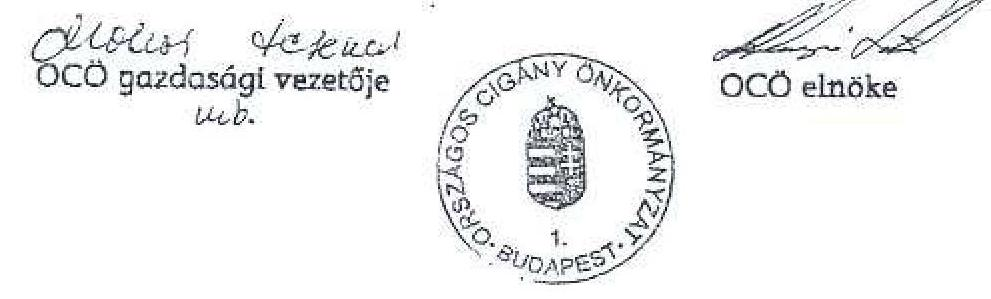
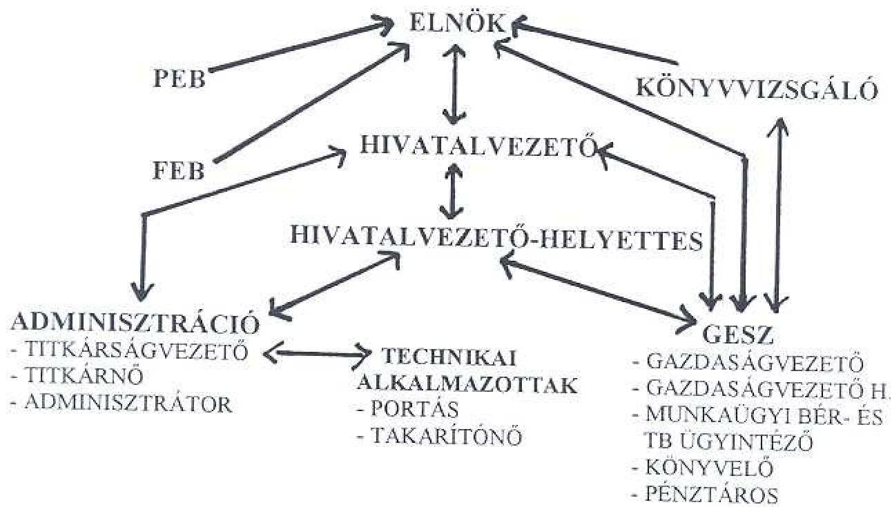
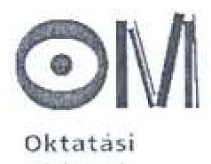

# JELENTÉS 

## az Országos Cigány Önkormányzat pénzügyi-gazdasági tevékenységének ellenőrzéséről

---

# 3. Önkormányzati és Területi Ellenőrzési Igazgatóság 

## Átfogó Ellenőrzések Főcsoport

Iktatószám: V-1018-48/2003.
Témaszám: 684
Vizsgálat azonosító szám: V0118

## Az ellenőrzést felügyelte:

Dr. Lóránt Zoltán
föigazgató
Az ellenőrzés végrehajtásáért felelős:
Németh Péterné
főcsoportfőnök
Az ellenőrzést vezette:
Borbély Zsuzsanna
számvevő tanácsos
Az ellenőrzést végezték:
Borbély Zsuzsanna Molnár Gyula Mihály dr. Telkes Imre
számvevő tanácsos számvevő számvevő tanácsos

A témához kapcsolódó eddig készített számvevőszéki jelentések:
címe
sorszáma
Jelentés az Országos Cigány Kisebbségi Önkormányzat pénzügyi-
gazdasági tevékenysége ellenőrzésének megállapításairól
Jelentés az Országos Cigány Kisebbségi Önkormányzat pénzügyi- 375
gazdasági tevékenysége ellenőrzésének megállapításairól
Jelentés az Országos Cigány Önkormányzat pénzügyi-gazdasági 0001
tevékenysége utóvizsgálatának ellenőrzési tapasztalatairól

---

# TARTALOMJEGYZÉK 

BEVEZETÉS ..... 5
I. ÖSSZEGZŐ MEGÁLLAPÍTÁSOK, KÖVETKEZTETÉSEK, JAVASLATOK ..... 6
II. RÉSZLETES MEGÁLLAPÍTÁSOK ..... 11

1. A feladatellátás szervezettsége, szabályozottsága ..... 11
1.1. Az önkormányzat szervezeti és működési rendje ..... 11
1.2. A Nek. törvényben meghatározott feladatok helyi szabályozása ..... 12
1.3. Az önkormányzat feladatellátásának szervezeti háttere ..... 13
2. Az önkormányzat működésének, a gazdálkodás rendjének szabályszerűsége ..... 13
2.1. A gazdálkodás lebonyolításának szervezeti háttere ..... 13
2.2. A gazdálkodás szabályozása ..... 14
2.3. A gazdálkodási jogkörök szabályozása ..... 16
2.4. Az OCÓ vállalkozási tevékenysége ..... 17
3. A beszámolási kötelezettség teljesítése, a költségvetés készítése és végrehajtása ..... 17
3.1. Az éves költségvetések elkészítése, elfogadása ..... 17
3.2. Az önkormányzat feladatellátása, a költségvetés végrehajtása ..... 19
3.2.1. Az önkormányzat működési feladatainak ellátása ..... 19
3.2.2. Pályázati támogatásokból ellátott feladatok megvalósítása és elszámolása ..... 23
3.2.3. Egyéb támogatások ..... 27
3.3. A pénzforgalom szabályszerűsége ..... 28
3.4. Vagyongazdálkodás, vagyonvédelem ..... 29
3.5. Az éves beszámolás és a mérleg alátámasztása ..... 30
3.6. Az éves zárszámadások ..... 31
4. Az önkormányzat ellenőrzési rendszere ..... 32

---

# MELLÉKLETEK 

1. számú melléklet Az OCÖ szervezeti változásai az elfogadott SzMSz-ek alapján 1999. és 2003. június 30. között
2. számú melléklet Kimutatás az 1999-2002. évek bevételeiről
3. számú melléklet Kimutatás az 1999-2002- évek kiadásairól
4. számú melléklet A 2000. évi milleniumi rendezvénysorozat többszörösen elszámolt kiadásai
5. számú melléklet A táborozási költségek elszámolásához benyújtott számlák összesítése
6. számú melléklet A jogtalan elszámolások összesítése
7. számú melléklet Az OCÖ vagyonának változása az 1999-2002. évi mérlegek alapján

---

# RÖVIDÍTÉSEK JEGYZÉKE 

| OCÖ | Országos Cigány Önkormányzat |
| :-- | :-- |
| Nek. tv. | A nemzeti és etnikai kisebbségek jogairól szóló 1993. évi |
| Számv. tv. | LXXVII. törvény |
| Áht. | A számvitelről szóló 2000. évi C. törvény |
| Vhr. | Az államháztartásról szóló 1992. évi XXXVIII. törvény |
|  | A számviteli törvény szerinti egyes egyéb szervezetek be- |
| SzMSz | számoló készítési és könyvvezetési kötelezettségének sajátosságairól szóló 224/2000. (XII. 19.) Korm. rendelet |
| PEB | Szervezeti és Múködési Szabályzat |
| TFB | Pénzügyi Ellenőrző Bizottság |
| GESZ | Területfejlesztési Bizottság |
|  | Gazdasági Ellátó Szervezet |

---

.

---

# JELENTÉS   az Országos Cigány Önkormányzat pénzügyi-gazdasági tevékenységének ellenőrzéséről 

## BEVEZETÉS

Az Állami Számvevőszék az Országos Cigány Önkormányzat (a továbbiakban: OCÖ) gazdálkodását megalakulása óta háromszor ellenőrizte, legutóbb az 1999. évben. Az OCÖ működéséhez nyújtott állami támogatás az 1999. évben 138 millió Ft volt, a 2003. évben 214,9 millió Ft, ami 55,7 \% növekedést jelent. Az önkormányzat a múködéséhez biztosított állami támogatás mellett programjai megvalósításához egyéb állami forrásból származó bevételekhez is hozzájutott.

Az Állami Számvevőszékről szóló 1989. évi XXXVIII. törvény 2. § (5) bekezdés, valamint a nemzeti és etnikai kisebbségek jogairól szóló 1993. évi LXXVII. törvény (a továbbiakban: Nek. tv.) 57. § felhatalmazása alapján vizsgáltuk, hogy a különböző állami forrásokból juttatott pénzeszközök felhasználása a jogszabályi előírásoknak megfelelően, célszerűen történt-e.

Az ellenőrzés célja: annak megállapítása volt, hogy

- a múködés feltételrendszere hogyan változott a vizsgált időszakban,
- a gazdálkodás szervezettsége, szabályszerűsége mennyiben felelt meg a jogszabályi követelményeknek és az önkormányzati múködés sajátosságainak,
- biztosított volt-e a gazdálkodás és a pénzeszközök felhasználásának törvényessége és szabályszerűsége, a számviteli törvény és a vonatkozó kormányrendeletek előírásainak betartása.

Az ellenőrzés az 1999. január 1. és 2003. június 30. közötti időszakra terjedt ki. Ezen időszak alatt az önkormányzat személyi összetételében, illetve vezetésében változások történtek. 2003. márciusában az országos kisebbségi választás eredménye alapján új elnök és testület kezdte meg a munkáját, de 2003. júniusában az elnök személyében ismét változás történt.

---

# I. ÖSSZEGZŐ MEGÁLLAPÍTÁSOK, KÖVETKEZTETÉSEK, JAVASLATOK 

Az Állami Számvevőszék legutóbb 1999. októberében tartott vizsgálatot az önkormányzatnál. A jelentés a számviteli politika és a szabályzatok kiegészítésére, az éves beszámoló határidőben való benyújtására, elfogadására és a Gazdasági Ellátó Szervezet (továbbiakban: GESZ) kialakítására tartalmazott javaslatokat. Az OCÖ elnöke a jelentésről az 1999. november 19-i közgyűlésen tájékoztatta a képviselőket. A vizsgálat megállapításait elfogadták, és intézkedési tervet készítettek a hiányosságok kijavítására. A tervezett intézkedések a gazdálkodás szabályozása és bonyolítása területén nem realizálódtak.

Az országos kisebbségi önkormányzatok múködését, feladatait a Nek. tv-ben határozták meg. Az OCÖ kialakította szervezeti és múködési rendjét és a munkamegosztás módját, amelyet a közgyűlés Szervezeti és Működési Szabályzatban hagyott jóvá. Nem határozták meg az SzMSZ-ben az önkormányzat által ellátott feladatokat és az OCÖ gazdálkodásával kapcsolatos előírásokat, a költségvetés és zárszámadás készítésének kötelezettségét, a vagyonnal való gazdálkodást.

Az önkormányzat múködésének szervezeti hátterét saját testületei, az általa létrehozott munkaszervezete (hivatal) és az alapított intézményei jelentik. A szervezeti feltételek megvalósítása során érvényesültek a jogszabályi előírások.

A vizsgált időszakban az OCÖ működésének feltételrendszerében bekövetkezett leglényegesebb változás az volt, hogy 2000. második félévétől a gazdálkodás lebonyolítására a hivatalon belül létrehozták a GESZ-t. A dolgozók szakmai és iskolai végzettsége, a számítástechnikai háttér biztosítja a szakmai munkavégzés feltételeit. A dolgozók munkaköri leírásait nem tudták bemutatni, ezért a betöltött munkakörrel kapcsolatos feladatok, elvárások és kötelezettségek köre az ellenőrzés által nem volt megállapítható és ellenőrizhető.

Az OCÖ gazdálkodását érintő belső szabályzatok továbbra sincsenek összhangban a számviteli törvényben és a végrehajtását biztosító kormányrendeletben meghatározott előírásokkal, a gazdálkodási sajátosságokra nem térnek ki. A közgyűlés - az SzMSz-ben előírtak ellenére - nem hozott határozatot az OCÖ elnöke által 2003. június 25 -én kiadott szabályzatokról. Az OCÖ pénzgazdálkodási szabályzatában foglaltak nem feleltek meg a vonatkozó jogszabályi rendelkezéseknek, mivel a hatáskör átruházás, a helyettesítés pontos rendjét nem határozták meg, a szabályzat mellékleteként az írásbeli felhatalmazásokat és aláírás mintákat nem csatolták, és hiányzik a teljesítés szakmai igazolásának a szabályozása.

Az OCÖ a Nek. tv-ben meghatározott költségvetés készítési kötelezettségének a 2003. évben nem tett eleget, a 2001-2002. évi költségvetés elfogadásakor pedig megsértette a költségvetési törvény elöírását, mivel 2002-re nem az abban meghatározott összeget szerepeltették. A költségvetéssel, zárszámadással kapcsolatos belső szabályozás hiánya miatt évente eltérő adattar-

---

talmú zárszámadás, pénzforgalmi kimutatás készült, ami az évek közötti öszszehasonlítást lehetetlenné tette. A feladatok valós forrásainak és kiadásainak bemutatása nem történt meg. Az országos kisebbségi önkormányzatokat gazdálkodásukat tekintve a társadalmi szervek közé sorolták be, azonban a Nek. tv. alapján költségvetés és zárszámadás készítésére kötelezettek. A költségvetés és zárszámadás felépítésére vonatkozóan nem kérhető számon a költségvetési szervekre vonatkozó előírás, de annak helyi szabályozása szükséges.

Az OCÖ feladatainak megoldásához az évente növekedő állami támogatás szolgált forrásként. A pénzügyi tervezés során csak az OCÖ közvetlen múködésével kapcsolatos kiadásokat tervezték meg, a végrehajtás során azonban ezek bővültek olyan feladatok ráfordításaival, melynek forrását pályázati úton szerezték meg.

A pénzgazdálkodás során a szabályszerűség, a célszerű és takarékos gazdálkodás követelménye nem teljesült. Az OCÖ a képviselők számára útiköltség térítést és kiküldetési költséget is biztosított, melynek rendszerét nem szabályozták. Az éves állami támogatás $10 \%$-át elnöki keretként elkülönítették, melyből segélyek, programtámogatások, ösztöndíjak és egyéb támogatások kifizetését teljesítették. A segélyek kifizetésére jogszabályi felhatalmazása nem volt az OCÖ-nek. Az elbírálás módját és feltételeit részletesen nem szabályozták és a kifizetések során jogszabályellenesen jártak el, mivel személyi jövedelemadót nem vontak belőle. Szintén szabálytalan, hogy a programtámogatásokat elszámolási kötelezettség nélkül fizették ki. A 2000. évi beszámoló készítésénél a behajthatatlan követelések (kifizetett előlegek) leírása, illetve átminősítése programtámogatássá, bár közgyűlési jóváhagyással történt, nem volt megalapozott és szabályszerű. Nem tartották be a megjelölt elszámolási határidőt, illetve az újabb elszámolásra kiadott összeg kifizetésének feltételül szabott - előzőleg felvett összeggel való elszámolásra vonatkozó - előírásokat a teljes vizsgált időszak alatt. A kifizetett számlákon a teljesítésigazolás nem szabályszerűen történt meg, hiányoznak a kifizetések mellöl a megrendelések, szerződések, ezáltal sérült a Számv. törvényben előírt bizonylati rend betartása. Az utóbbi dokumentumok hiánya, valamint a meglévő megrendelések nagyvonalú megfogalmazása miatt nem volt összemérhető és ellenőrizhető a megrendelt és elvégzett, illetve leszámlázott munka. A fentiekben említett hiányosságok megnehezítették az ellenőrzés lefolytatását.

A pályázati úton nyert forrásokból teljesített kiadások felhasználását nem különítették el támogatónként, és az elszámolás során előfordult, hogy ugyanazon számlákat három-négy támogató felé is benyújtották, ezáltal jogosulatlanul jutottak 2000-2001. években összesen 1883 ezer Ft támogatáshoz.

A pályázatot kiírók által végzett elszámoltatások során nem érvényesült az Áht. államháztartás alrendszereiből juttatott támogatások felhasználásának és elszámolásának ellenőrzési kötelezettségéről szóló előírása, mivel olyan számlákat is elfogadtak, amelyek nem feleltek meg a támogatási szerződésben meghatározott feltételeknek (nem a pályázó nevére szólt a számla, nem a szerződésben meghatározott szolgáltatás történt), illetve nem kérték számon a kifizetési bizonylatokon a pályázatra való hivatkozást, ezáltal lehetővé tették a többszöri elszámolást.

---

Az OCÖ vagyongazdálkodására vonatkozó előírásokat különböző szabályzatokban határozták meg. A leltározási és a selejtezési szabályok megszegése miatt az OCÖ vagyonának védelme nem volt megfelelő. Az OCÖ vagyonának értéke a vizsgált időszakban $80 \%$-kal csökkent.

Az éves beszámolási kötelezettségüknek - a késői közgyűlési határozathozatal miatt - a kormányrendeletben megjelölt határidőn túl tettek eleget. Az 1999. évi beszámolóhoz kiegészítő mellékletet nem mutattak be, illetve a többi évről készült kiegészítő melléklet nem felelt meg a számviteli törvény előírásainak. A mérlegek alátámasztására nem készítették el az OCÖ valamennyi eszközét és forrását mennyiségben és értékben tartalmazó fordulónapi leltárt.

Az önkormányzat ellenőrzési szabályzattal nem rendelkezett. A PEB a végzett ellenőrzésekről készült jegyzőkönyvekben tett javaslatokat, amelyek hasznosítása az ellenőrzésünk által érintett területeken nem történt meg. A gazdálkodás belső ellenőrzési rendszerét nem alakították ki.

Az ellenőrzéssel érintett időszakban az önkormányzat személyi összetételében, illetve vezetésében változások történtek. Ennek megfelelően a számvevői jelentést, illetve a jelen jelentés tervezetét észrevételezésre mind az új, mind a régi elnök számára megküldtük. Az OCÖ volt elnökével az egyeztetéseket követően is véleménykülönbségek maradtak, amelyet az adott témánál - megállapításainkat fenntartva - bemutatunk.

A pályázati támogatások jogtalan igénybevétele, valamint a számviteli fegyelem megsértése miatt ismeretlen tettes ellen feljelentést tettünk.

A helyszíni ellenőrzés megállapításainak hasznosítása mellett javasoljuk:

# a nemzeti kulturális örökség miniszterének, az oktatási miniszternek, a gyermek, ifjúsági és sportminiszternek: 

1. Gondoskodjanak a pályázati pénzek elszámolásánál az Áht. 13/A. § (2) bekezdésében foglaltak maradéktalan érvényesítéséről.
2. Vizsgálják felül a jelentésben jelzett támogatások esetében az Áht. 13/A. § (2) bekezdésének megfelelően az OCÖ visszafizetési kötelezettségét.

## Az OCÖ Közgyűlésének:

1. Határozza meg az SzMSz-ben a Nek. tv. 37. §-a alapján azokat a feladatokat, amelyeket az OCÖ a gyakorlatban ellát, valamint jelölje meg azokat is, amelyeket nem ír elő törvény, de az önkormányzat a közgyűlés hatáskörébe utal.
2. Rendelkezzen az SzMSz-ben vagy egyéb belső utasításban az éves költségvetés, a zárszámadás és vagyonleltár elkészítésének, jóváhagyásának módjáról.

---

# az OCÖ elnökének: 

1. Kezdeményezze a számviteli politika és az annak keretében készítendő szabályzatok kiegészítését és módosítását a Számv. tv. 14. § (4), (5), (8) és (9) bekezdésében foglaltaknak megfelelően az OCÖ-re jellemző sajátosságok és az OCÖ-re vonatkozó 224/2000. (XII.19.) Korm. rendelet előírásainak figyelembevételével;
2. Gondoskodjon arról, hogy a könyvvizsgáló által ellenőrzött és záradékkal ellátott egyszerűsített éves beszámolót a közgyűlés a 224/2000. (XII.19.) Korm. rendelet 20. § (6) bekezdésében előírt határidőig fogadja el.
3. Biztosítsa, hogy az egyszerűsített éves beszámoló alátámasztására a Számv. tv. 69. § (1) bekezdésében előírtaknak megfelelően készítsék el az OCÖ valamennyi eszközét és forrását mennyiségben és értékben tartalmazó leltárt a mérleg fordulónapjára vonatkozóan.
4. Intézkedjen a Számv. tv. 164. § (1) bekezdésében előírt zárlati munkák teljes körű elvégzéséről az előző éveket érintő rendező és helyesbítő tételek csökkentése, illetve elkerülése érdekében.
5. Gondoskodjon a Nek. tv. 37. § b) pontjának megfelelően az éves költségvetés és zárszámadás elkészítéséről és elfogadtatásáról.
6. Kezdeményezze a kifizetett segélyek utáni személyi jövedelemadó rendezését az Szja. törvény előírásainak megfelelően. Tartsa be a segélyek kifizetésénél a személyi jövedelemadóra vonatkozó előírásokat.
7. Terjessze a közgyűlés elé a 2003. június 25 -én kiadott belső szabályzatokat, azoknak az SzMSz-ben meghatározott elfogadása érdekében.
8. Intézkedjen a GESZ dolgozói felé a munkaköri leírások pótlásáról és kiegészítéséről a betöltött munkakörrel kapcsolatos feladatok, elvárások és kötelezettségek teljes körű meghatározása érdekében.
9. Szabályozza a teljesítés szakmai igazolásának módját és formáját.
10. Szabályozza az utazási költségek kifizetését és gondoskodjon az elszámolás és kifizetés ellenőrzéséről.
11. Számoltassa el a programokhoz nyújtott támogatás felhasználásáról az érintetteket.
12. Biztosítsa az elszámolásra felvett összegekkel kapcsolatos szabályok (elszámolási határidő, az előzőleg felvett összeggel való elszámolás nélküli újabb felvétel tilalma) teljes körű betartatását és következetes számonkérését.
13. Gondoskodjon a pályázati pénzeszközök felhasználásának támogatónként való elkülönítéséről.
14. Gondoskodjon arról, hogy a kifizetésekhez a megfelelő mellékleteket csatolják, és a számlán történő érvényesítéssel tegyék lehetetlenné annak többszöri kifizetését.

---

15. Gondoskodjon a leltározási és a selejtezési szabályzatban foglaltak maradéktalan betartatásáról és végrehajtásáról az OCÖ vagyonának védelme érdekében.
16. Készíttesse el az ellenőrzési szabályzatot és gondoskodjon a gazdálkodás minden területét lefedő ellenőrzési rendszer kialakításáról és múködtetéséről.

---

# II. RÉSZLETES MEGÁLLAPÍTÁSOK 

## 1. A feladATELLÁTÁs SZERVEZETTSÉGE, SZABÁLYOZOTTSÁGA

### 1.1. Az önkormányzat szervezeti és múködési rendje

Az OCÖ közgyűlése szervezeti és múködési rendjét és szervezetei közötti munkamegosztás módját a Szervezeti és Működési Szabályzatában (a továbbiakban: SzMSz) hagyta jóvá. Az SzMSz-t a vizsgált időszakban többször módosították. Az abban megfogalmazott vezetői és szervezeti változásokat az 1. sz. melléklet tartalmazza.

A 16/1999. (I. 27.) Kgy. határozattal módosított SzMSz szerint az önkormányzat legfőbb szervezete a közgyülés, mely rendes üléseit negyedévenként tartja. Kizárólagos hatáskörébe tartoznak a Nek. tv. 37. §-ában meghatározottak, valamint a belső szabályzatok elfogadása. Az OCÖ a közgyülés üléseire vonatkozóan nem tartotta be az SzMSz előírását, mivel a bemutatott jegyzőkönyvek szerint, évente csak három ülést tartottak és azt sem negyedéves gyakorisággal.

A tizenegy tagú elnökséget az alakuló ülésen a közgyűlés választotta. Konkrét feladatokat számukra az SzMSz-ben nem nevesítettek. A gyakorlatban az elnökség megtárgyalta a közgyűlés elé kerülő előterjesztéseket, az éves költségvetést, a zárszámadást, a mérlegbeszámolót, a Pénzügyi Ellenőrző Bizottság (a továbbiakban: PEB) jelentéseit. A Területfejlesztési Bizottság (a továbbiakban: TFB) előterjesztése alapján megtárgyalta és döntött a pályázaton meghirdetett támogatás odaítéléséről. Az SzMSZ legalább havonkénti ülésezési kötelezettséget írt elő az elnökségnek. Ennek a követelménynek nem tettek eleget, mivel 2000. évben 8, 2001. évben 6, 2002. évben pedig 4 alkalommal tartották meg az elnökségi ülést.

Az SzMSz előírása szerint az önkormányzat az alakuló ülésén - kétharmados többséggel - háromtagú Etikai Bizottságot és ugyancsak háromtagú Ellenőrző Bizottságot hozott létre. Mindkét bizottság számára előírták, hogy alkossa meg szabályzatát és jóváhagyás céljából terjessze a közgyűlés elé. Az Etikai Bizottság szabályzatát a közgyűlés jóváhagyta, Ellenőrzési Szabályzat viszont nem készült.

A 2003. évi országos kisebbségi önkormányzati választás után megalakult közgyűlés 2/2003. (III. 12.) határozatával fogadott el új SzMSz-t. Változást jelentett, hogy létrehozták az ügyvezető elnöki tisztséget a munkáltatói, banki, gazdálkodási jogkörökre vonatkozóan. Az önkormányzat szervezeti felépítéséből kimaradt az Etikai Bizottság, viszont Kabinetek megjelöléssel új szervezeteket hoztak létre. Március 28-án a további módosításkor már ügyvezető alelnöki posztot is létrehoztak. Az elnökség létszámát előbb 14 főben, majd 16 főben rögzítették, amelyen belül 1 fő elnök, 1 fő elnökhelyettes és 14 fő alelnök van. A helyszíni vizsgálat lezárásáig az utolsó módosításra a 125/2003.

---

(VI. 25.) Kgy. határozattal került sor, amikor az ügyvezető elnöki tisztséget megszüntették, és az elnökön kívül két alelnöki tisztséget hoztak létre. Az elnökség 18 tagú lett, 1 fő elnök, 2 fő elnökhelyettes és 15 fő alelnök részvételével. A szervezeti felsorolásból ez esetben is hiányzott az Etikai Bizottság, de létszámát és feladatát meghatározták. Egyik SzMSZ sem nevesítette a Területfejlesztési Bizottságot, amely az elmúlt időszakban - az e célra kapott pénzeszköz elosztásában - jelentős tevékenységet folytatott.

# 1.2. A Nek. törvényben meghatározott feladatok helyi szabályozása 

A Nek tv. 36-39. §-aiban az országos kisebbségi önkormányzatok számára általánosan határoz meg feladatokat és a közgyűlés számára megjelölt döntési jogosultságokat. A megjelölt feladatok ellátásával kapcsolatban minden önkormányzat maga dönthet arról, hogy azok közül melyeket és milyen módon teljesít. A vizsgált időszak SzMSz-ei közül egy sem nevesítette, hogy az önkormányzat pontosan milyen feladatokat lát el.

Nem fogadható el az OCÖ volt elnökének észrevétele, mely szerint „Az OCÖ közgyúlése nem tartotta szükségesnek az SZMSZ-ben tételesen felsorolni az önkormányzat feladatait, mivel azt általánosságban a Nek. tv. tartalmazza, a konkrét feladatok tételes felsorolását pedig minden évben az OCÖ éves munkaterve tartalmazta.", mivel a Nek tv-ben meghatározott feladatok közül többet nem lát el az OCÖ, illetve nem a saját szervezetével látja el. Az éves munkatervben a testület által ellátott, a tárgy évet érintő feladatok jelennek meg.

A Nek. tv. 37. § b) és c) pontjának előírása szerint az országos önkormányzat önállóan dönt költségvetéséről, zárszámadásáról, vagyonleltára megállapításáról és törzsvagyonának köréről.

A közgyűlés az SzMSz-ben az OCÖ gazdálkodásával kapcsolatos előírásokat nem rögzített. Nem határozta meg a költségvetés és zárszámadás készítésének kötelezettségét, nem szabályozta a vagyonnal való gazdálkodást. Egyetlen mondattal érintették csupán az elnök feladatai között „a költségvetési terv és zárszámadás" előterjesztését.

A Nek. tv. 37. § b) pontjában meghatározott feladat pontos elvégzéséhez szükséges, a költségvetés tartalmára, szerkezetére, elkészítésének, egyeztetésének módjára, időbeli ütemezésére vonatkozóan előírásokat az SzMSz nem tartalmazott. Az OCÖ gazdálkodását ellátó hivatal ügyrendje csupán annyit írt elő, hogy „az éves gazdálkodás tervezése (költségvetés) a gazdasági szervezetének a feladata", a zárszámadásra vonatkozóan pedig egyáltalán nem tartalmazott előírást.

Mivel egyetlen szabályzat sem rögzítette a konkrét előírásokat, nem felel meg a valóságnak az OCÖ volt elnökének magyarázata, hogy „Miután az SZMSZ 4 évre szól, a pénzügyi szabályok viszont évenként többször is változhatnak, ezért az SZMSZ gyakori módosításának elkerülése végett az OCÖ gazdálko-

---

dásával kapcsolatos elöírásokat a gazdasági-pénzügyi szabályzatok tartalmazták, melyek jóváhagyása szintén a közgyülés kizárólagos jogköre volt."

Az országos kisebbségi önkormányzatokat, gazdálkodásukat tekintve, a társadalmi szervek közé sorolták be, ugyanakkor az államháztartás múködési rendjére vonatkozó kormányrendelet is nevesíti őket. A nem egyértelmű törvényi szabályozás alapján azonban a költségvetés és zárszámadás felépítésére nézve nem kérhető számon a költségvetési szervekre vonatkozó szabályozás, de helyi szabályozás hiányában nincs lehetőség a folyamatosság és összehasonlíthatóság biztosítására.

A vagyonleltár elkészítésével a Leltározási Szabályzat részletesen foglalkozik. A vagyongazdálkodással kapcsolatos feladatokat az új ügyrend a hivatal feladataként jelölte meg, mely szerint „a teljes körű, részletes nyilvántartási rendszer kialakításáért és folyamatos naprakész vezetéséért a gazdasági vezető felel". Előírták a vagyonleltár készítési kötelezettséget, és annak mérlegmellékletként történő szerepeltetését.

# 1.3. Az önkormányzat feladatellátásának szervezeti háttere 

Az OCÖ feladatait az SzMSZ-ben meghatározott szervezetein (közgyűlés, elnökség, bizottságok) kívül hivatalával látja el. Az SzMSZ-ben megfogalmazottak szerint „a Hivatal biztosítja az Önkormányzat múködésének szakmai adminisztrációs és szervezeti feltételeit és az Önkormányzat gazdálkodási feladatainak ellátását". A vizsgált időszak alatt pozitív változás, hogy 2000. július 1-től a könyvelési és ügyviteli munkát is a Hivatalon belül végzik.

Az OCÖ jelenleg két múködő intézménnyel rendelkezik. Az Országos Cigány Információs és Művelődési Központ Kht. és a Szociális Lakásépítő, Környezetvédelmi és Vidékfejlesztési Kht. az alapító okiratukban meghatározott feladatokat látnak el.

Az előzőeken túl az OCÖ-nél a feladatok ellátásához, különböző tanulmányok készítéséhez folyamatosan külső szakértőket vesznek igénybe.

## 2. AZ ÖNKORMÁNYZAT MÜKÖDÉSÉNEK, A GAZDÁLKODÁS RENDJÉNEK SZABÁLYSZERŰSÉGE

### 2.1. A gazdálkodás lebonyolításának szervezeti háttere

Az OCÖ gazdálkodásának lebonyolítása az 1999. évig két pólusú volt. A hivatali munka irányítását és végrehajtását saját dolgozókkal látták el, ugyanakkor a könyvelési feladatokat külső szervezet végezte, megbízási szerződés alapján. Ez a kettősség a gazdálkodás lebonyolításában sok probléma forrása volt. Ennek orvoslására az OCÖ közgyűlése az 56/1999. (06. 18.) határozatával döntött - a hivatalon belül - a GESZ megalakításáról, mely tevékenységét a 2000. második félévében kezdte meg a gazdasági vezető irányításával. Feladatait 4 fővel (pénzügyi előadó, könyvelő, bérelszámoló és pénztáros) végezte és végzi. A munkavállalók iskolai és szakmai végzettsége megfelel a pénzügyi, számviteli feladatok szakszerű ellátásához előírt képesítési feltételeknek (3 fő

---

mérlegképes könyvelői képesítés, 2 fő közgazdasági szakközép iskolai végzettség). A GESZ feladatkörébe tartozott többek között az OCÖ és az általa alapított két közhasznú társaság könyvelési feladatainak elvégzése és gazdálkodásának lebonyolítása.

A munkaköri leírásokat - egy kivételtől eltekintve - nem bocsátották a rendelkezésünkre, ezért nem lehetett megállapítani azt, hogy dolgozóknak meghatározták-e a betöltött munkakörrel kapcsolatos feladataikat, elvárásokat és kötelezettségeket.

A feladatok szakszerű és színvonalas ellátásának biztosítására 3 db számítógép, számológépek, fax, fénymásolók és három szoftver (könyvelő-, bér és munkaügyi-, illetve útnyilvántartó program) állt rendelkezésre a vizsgált időszakban. A dolgozók szakmai továbbképzését tanfolyamokon való részvételi lehetőségekkel biztosították. Az OCÖ állandó könyvvizsgálójának segítségével a folyamatos konzultációs lehetőség is biztosított volt.

# 2.2. A gazdálkodás szabályozása 

Az OCÖ-nál 1998. április 30-án elkészítették a számviteli politikát és az - ehhez kötelezően kapcsolódó - eszközök és források értékelési szabályzatát, a számlarendet, valamint a leltározási és pénzkezelési szabályzatot, az akkor érvényben lévő, a számvitelről szóló 1991. évi XVIII. törvényben előírtaknak megfelelően. Ezen kívül rendelkeztek még bizonylati renddel, selejtezési, pénzgazdálkodási, elnöki keret felhasználási (segélyezési és támogatásnyújtási), valamint számítástechnikai védelmi szabályzattal is. Ezen szabályzatok a vizsgálat időtartamát tekintve végig hatályban voltak.

A szabályzatok közös jellemzője, hogy az OCÖ-re vonatkozó sajátosságokat nem jelenítették meg bennük. Az előző ÁSZ vizsgálatban feltárt hiányosságok megszüntetésére készített és megküldött intézkedési tervben foglaltak végrehajtása e területen nem történt meg.

Az 1999-ben érvényben lévő Számv. tv. és az OCÖ-re ebben az időszakban vonatkozó - a számviteli törvény szerinti egyéb szervezetek éves beszámolási és könyvvezetési kötelezettségeinek sajátosságairól szóló 219/1998. (XII. 30.) Korm. rendeletben a vizsgált időszak alatt bekövetkezett változások átvezetése a szabályzatokon nem történt meg, azaz a belső szabályzatokban foglaltak továbbra sincsenek összhangban a jogszabályi előírásokkal.

Az OCÖ elnöke 2003. június 25 -én új szabályzatokat adott ki, melyekről testületi határozatot nem hoztak, megsértve ezzel az SzMSz előírását. A hatályba léptetett szabályzatok több ponton ellentétesek a jogszabályi előírásokkal, nem szabályozták teljes körűen az OCÖ-nél előforduló gazdasági eseményeket, nem biztosították a jogszabályi előírások betartását és betarthatóságát, a következők szerint:

- a szabályzatok nagy része továbbra sem tartalmazza az OCÖ gazdálkodásának sajátosságait;
- a számviteli politika keretében:

---

téves a jogszabályi hivatkozás a számviteli politika bevezető részében, mivel az OCÖ nem költségvetési szerv, hanem „egyéb szervezetnek" minősülő társadalmi szervezet, melyre a számvitelről szóló 2000. évi C. törvény, (a továbbiakban: Számv. tv.), és a - 2001. január 1-től hatályos - többször módosított, a számviteli törvény szerinti egyes egyéb szervezetek beszámoló készítési és könyvvezetési kötelezettségének sajátosságairól szóló 224/2000. (XII. 19.) Korm. rendelet (továbbiakban: Vhr.) előírásai az irányadóak,
a mérlegkészítés időpontjának a tárgyévet követő év május 31.-i meghatározása sérti a Vhr. 20. § (6) bekezdés szabályait, mert így nem teljesíthető az elfogadást is magában foglaló „az adott üzleti év mérlegforduló napját követő 150 napon belül" megadott határidő,
a Számv. tv. 158. § (5) bekezdésében foglaltakkal ütközik a számviteli politika azon előírása, hogy a közgyűlés által elfogadott beszámolót kell a könyvvizsgáló által ellenőriztetni, mivel csak a könyvvizsgáló által ellenőrzött és záradékkal ellátott beszámoló terjeszthető a legfőbb szerv (közgyűlés) elé,
az értékcsökkenés elszámolásának szabályozásánál a költségvetési szervekre vonatkozó 249/2000. (XII. 24.) Korm. rendelet 30. § (2) bekezdés a)-k) pontjaiban előírt amortizációs kulcsok alkalmazását írták elő a Számv. tv. 52-53 $\S$-aiban megfogalmazott helyett,
hiányzik a lényeges és jelentős összeg szabályozása,

- a számlarendben vállalkozási jellegű számlatükör alkalmazását írták elő helyesen, hiányzik azonban a főkönyvi és az analitikus nyilvántartások egyeztetési módszerének és idejének meghatározása, valamint az alkalmazandó számlák tartalmának teljes körű leírása;
- az eszközök és források értékelési szabályzatában a költségvetési és a vállalkozási számvitelben alkalmazott számlák elnevezése és értékelése is szerepel (tőkeváltozás, aktív és passzív pénzügyi elszámolások), valamint olyan gazdasági eseményeket is szabályoztak (raktárra vétel, le nem vonható ÁFA), amelyek az OCÖ-nél nem fordulnak elő;
- a leltározási és leltárkészítési szabályzatban az OCÖ sajátosságait figyelmen kívül hagyva nem tértek ki a gyakorlatban alkalmazott összesítő kimutatás tartalmára, formájára és kellékeire;
- a pénztár és pénzkezelési szabályzatban a házipénztár záró pénzkészletét 100 ezer Ft-ban állapították meg, ami fokozottabb gazdálkodási fegyelmet igényel, hiányzott a pénztáros és helyettesének, valamint a pénztárellenőrnek a megnevezése, az anyagi felelősségvállalási nyilatkozat az érintettek részéről, illetve az utalványozásra jogosultak aláírás mintája.

A számviteli politika kötelező mellékleteit képező szabályzatokon kívül elkészítették a pénzgazdálkodási, a selejtezési és bizonylati szabályzatokat, azonban ezek sem tartalmazzák az OCÖ gazdálkodására jellemző sajátosságokat.

---

# 2.3. A gazdálkodási jogkörök szabályozása 

Az OCÖ a vizsgált időszakban a pénzgazdálkodási szabályzatban írta elő a gazdálkodás operatív lebonyolítását, az előírásoknak megfelelő végrehajtását biztosító jogköröket.

Az OCÖ közgyűlése 1999. március 6-án a 6/1999. határozatával fogadta el a pénzgazdálkodási szabályzatát, melyben az egyes jogkörökre vonatkozóan a következő előírások szerepelnek:

- kötelezettségvállalásra az OCÖ elnöke jogosult 5 millió Ft értékhatárig, követelés előírásra 2 millió Ft összeg határig. Akadályoztatása esetére írásos meghatalmazást adhat más személy részére;
- ellenjegyzö a hivatal gazdasági vezetője, akadályoztatása esetén más kijelölt személy;
- érvényesítő a hivatal gazdasági szervezetének megbízott dolgozója;
- utalványozó a hivatal gazdasági vezetője 500 ezer Ft-ig, illetve az állammal szembeni kötelezettségek vonatkozásában korlátlanul, a hivatal vezetője 1 millió Ft-ig, és az OCÖ elnöke 1 millió Ft felett;
- az utalványozás ellenjegyzöje a gazdasági szervezet megbízott dolgozója.

Az OCÖ pénzgazdálkodási szabályzatában foglaltak nem feleltek meg az államháztartás múködési rendjéről szóló 217/1998. (XII. 30.) Korm. rendelet előírásainak, mivel a hatáskör átruházás, a helyettesítés pontos rendjét nem határozták meg, a szabályzat mellékleteként az írásbeli felhatalmazásokat és aláírás mintákat nem csatolták.

A jogszabályellenes gyakorlatra nem fogadható el az OCÖ volt elnökének magyarázata, mely szerint „A szabályzat mellékleteként az írásbeli meghatalmazásokat nem csatolhattuk, hiszen a meghatalmazás esetenként rögzítette a személy nevét és nem arról szólt, hogy néhány kiválasztott személy részére lehet meghatalmazást adni, hanem az elvégzendő feladat jellege határozta meg azt, hogy adott esetben ki kaphat meghatalmazást." A jogszabály 134. §-a szerint kötelezettségvállalási, 136. §-a szerint utalványozási jogosultságot átruházni csak írásbeli felhatalmazással lehet, amelynek megtörténtét igazolni nem tudták.

A felelősségi és az összeférhetetlenségi előírások körében a jogszabályi előírásnak megfelelően meghatározták, hogy az egyes gazdálkodási jogkörök tekintetében mi minősül összeférhetetlennek. Előírták azt is, hogy a kötelezettségvállaló, az ellenjegyző, az utalványozó és annak ellenjegyzője nem lehet azonos személy, a kötelezettségvállaló és az utalványozó nem lehet azonos személy az érvényesítővel, aki csak pénzügyi végzettségű személy lehet.

Nem alakították ki a teljesítés szakmai igazolásának módját és formáját, emiatt nem teljes körű a gazdálkodási és ellenőrzési jogkörök szabályozottsága.

---

# 2.4. Az OCÖ vállalkozási tevékenysége 

Az OCÖ vállalkozási tevékenységet nem végzett a vizsgált időszakban.
Az OCÖ tulajdonosként, illetve résztulajdonosként vett részt a következő vállalkozásokban:

- Szociális Lakásépítő, Környezetvédelmi és Vidékfejlesztési Közhasznú Társaságot 1996. évben az 1074/1996. (VII. 10.) Korm. határozat 10. pontjában meghatározott feladatok megvalósításának elősegítésére hozta létre az OCÖ $100 \%$-os tulajdonosként, 3000 ezer Ft-os jegyzett tőkével. Célja a hátrányos helyzetben lévő, szociálisan rászorulók, elsősorban többgyermekes családok segítése, a lakáshoz jutás feltételének biztosítása;
- Országos Cigány Információs és Múvelődési Központ Közhasznú Társaság 100\%-os tulajdonosként, 3000 ezer Ft-os jegyzett tőkével, 1998. évi alapítással. Létrehozásának célja a cigány kisebbség oktatási, kulturális, közmúvelődési tevékenységének támogatása;
- ROM-DRUCK Nyomdaipari Kft-ben 95\%-os tulajdon részt, 1900 ezer Ftos vagyoni betétet vásároltak 1998. január 30-án. A Kft. felszámolása 2000. május 18-án kezdődött, a 12462 ezer Ft-os részesedés leírására 1999. és 2001. évben került sor, a megszüntető végzést a bíróság 2003. február 27-én hozta meg, mely fellebbezés miatt nem jogerős.

Az OCÖ könyveiben a részesedések között tartják nyilván a Roma Esély Alternatív Szakiskola alapításához átutalt 990 ezer Ft-os összeget, melyet a könyvvizsgáló előírásainak megfelelően 2001. évben vettek nyilvántartásba. Az alapítvány nem tekinthető vállalkozásnak, ezért részesedésként való feltüntetése nem felel meg a számviteli törvény előírásának. Az alapító okirat szerint megszűnés esetén a meglevő vagyont más cigány alapítványoknak adják át és nem az alapítóknak. Az alapítványi célú befizetést a tárgyévi egyéb vagy rendkívüli ráfordítások között kellett volna kimutatni.

Az OCÖ által alapított közhasznú társaságok és a 95\%-os mértékben tulajdonolt Kft. esetében a Nek. tv. 60. § (3) és (4) bekezdésében előírt felelősségi és a tulajdonosi jogok gyakorlására vonatkozó szabályokat betartották.

## 3. A beSZÁmolási köTELEZETTSÉG TELJESÍTÉSE, A KÖLTSÉGVETÉS KÉSZÍTÉSE ÉS VÉGREHAJTÁSA

### 3.1. Az éves költségvetések elkészítése, elfogadása

A vizsgált időszakban az OCÖ három költségvetést készített. Az 1999. évre vonatkozó költségvetését az 1999. március 6-i, a 2000. évre vonatkozót a 2000. február 19-i, a 2001-2002. évre vonatkozót pedig a 2001. március 30-i közgyűlésen fogadták el. A tervezett és tényleges bevételek és kiadások 1999-2002. évek közötti alakulását a 2. és 3. sz. mellékletben mutatjuk be. Az önkormányzat SzMSz-e a költségvetés készítésére előírásokat nem tartalmaz.

---

Az 1999. évi költségvetésben bevételként a 138000 ezer Ft állami támogatás jelent meg, ennek $50 \%$-át személyi kiadások fedezetére tervezték, amely összeg magába foglalta a fizetendő járulékokat is. A dologi kiadások - melyek az összkiadás $28 \%$-át jelentették - harmadrészét telefon és postaköltség, 24,2 \%-át könyvvizsgálói, szakértői díjak kifizetésére tervezték, valamint 7000 ezer Ft-ot (dologi költségek $20 \%$-a) állítottak be a választás miatti szállításokra.

A 2000. évi költségvetésben az állami támogatáson kívül 14694 ezer Ft egyéb bevételt is terveztek, így összesen 163594 ezer Ft felhasználásáról döntöttek. A 148900 ezer Ft-os állami támogatás $63,8 \%$-át személyi, $22,8 \%$-át dologi kiadásokra tervezték. Ezen túl az elnöki keret 10\%-os, a támogatások pedig $3,4 \%$-os részt képviseltek.

A 2001-2002. évi költségvetést egyaránt 187066 ezer Ft-os összegben fogadták el, megszegve a 2000. december 22-én kihirdetett, a Magyar Köztársaság 2001. és 2002. évi költségvetéséről szóló 2000. évi CXXXIII. törvényben (költségvetési törvény) foglaltakat. A költségvetési törvény 1. sz. melléklet XIV. Igazságügy minisztérium fejezet tartalmazta az OCÖ 2001. évre szóló 171,2 millió, illetve a 2002. évre szóló 188,3 millió Ft-os előirányzatát, amely alapján az önkormányzatnak terveznie kellett. A tervezet elkészítésekor ismert volt a 2002. évre tervezett támogatás, valamint az is, hogy sem a pénzmaradvány, sem az áthúzódó programtámogatás nem azonos a két évben. A 2002. évi költségvetést nem a törvényben megjelölt támogatási összeg figyelembevételével készítették el.

# Az OCÖ-nek 2003. évre elfogadott költségvetése nincs. 

A 2003. évi költségvetés tárgyalását a 2003. március 29-i közgyűlés 4. napirendi pontjaként jelölték meg, azonban a jegyzőkönyv tanúsága szerint azt nem tárgyalták. A 2003. május 29-én beterjesztett költségvetés csupán egy hónap bevételeit és kiadásait tartalmazta eltérő bevételi és kiadási összeggel.

Havi keret: 17908 ezer Ft, melyből személyi jellegű ráfordítás 13728 ezer Ft, dologi kiadás 1925 ezer Ft, egyéb ráfordítások 366 ezer Ft, intervenciós keret 1000 ezer Ft, összesen: 17019 ezer Ft.

A kisebbségi önkormányzatok költségvetésének, gazdálkodásának, vagyonjuttatásának egyes kérdéseiről szóló 20/1995. (III. 3.) Korm. rendelet 2. § (1) bekezdése szerint az országos kisebbségi önkormányzatok szervezetének gazdálkodására a társadalmi szervezetek gazdálkodó tevékenységéről szóló 114/1992. (VII. 23.) Korm rendelet előírásait kell megfelelően alkalmazni. Az említett rendelet a költségvetés készítésére, felépítésére vonatkozó előírásokat nem tartalmaz. A Nek. tv. 37. § b) pontja az önkormányzat döntési hatáskörébe helyezi a költségvetés megállapítását. Az önkormányzat költségvetés készítési kötelezettségének a 2002. évben a költségvetési törvényt megsértve tett eleget, 2003-ban pedig nem tett eleget, megsértve a Nek. tv-t.

---

# 3.2. Az önkormányzat feladatellátása, a költségvetés végrehajtása 

Az OCÖ működési feltételeinek biztosítására, gazdálkodása forrásaként az állami támogatás szolgált. Ennek összege évről-évre emelkedett (2. és 3. sz. melléklet). A pénzügyi tervezés során csak az OCÖ közvetlen múködésével kapcsolatos kiadásokat tervezték meg, a végrehajtás során azonban ezek bővültek egyéb feladatok ráfordításaival, melynek forrását a pályázat kiírója biztosította. Az OCÖ képviselői alapvetően a különböző cigány szervezetekkel, egymással és a helyi önkormányzatokkal meglévő kapcsolatok ápolását, a cigánysággal kapcsolatos információk és ismeretek terjesztését végezték. E feladat ellátása miatt évről évre kiemelten magas az utazási és a telefon költség.

### 3.2.1. Az önkormányzat múködési feladatainak ellátása

Az 1999-2002. évi pénzforgalmi jelentéseket, illetve a beszámolóhoz kapcsolt főkönyvi kivonatot vizsgálva megállapítottuk, hogy csak 2002-re alakítottak ki olyan számviteli nyilvántartást, amelyből az OCÖ múködési kiadásai egyértelműen megismerhetők. A 2002. évi 287305 ezer Ft teljesített kiadásból 188111 ezer Ft kapcsolható közvetlenül a múködéshez, a fennmaradó összeg pedig a pályázati és egyéb támogatásokból megvalósult feladatokhoz. A múködési kiadások 64\%-a személyi jellegú ráfordítás, 19\%-a dologi kiadás, $13 \%$-a az elnöki keret és $4 \%$-a adott támogatás. Megállapítottuk, hogy a kiadásokat nem fedezte a múködésre biztosított 187700 ezer Ft állami támogatás, valamint, hogy az elnök 5418 ezer Ft-tal túllépte az SzMSz által meghatározott mértéket.

## A pénzeszközök felhasználása során a takarékos és célszerú gazdálkodás követelménye nem érvényesült.

Az OCÖ a képviselők számára az éves költségvetésben meghatározott keret erejéig útnyilvántartáson alapuló útiköltség térítést, e kereten felül pedig kiküldetési rendelvényen elszámolt kiküldetési költséget biztosított. A kétféle elszámolási lehetőséget írásban nem szabályozták, és mivel a kifizetésre kerülő összeg kiszámítása mindkét elszámolás esetében a megtett km alapján, az APEH norma szerint kifizethető üzemanyagár, valamint az elszámolás nélkül kifizethető $3 \mathrm{Ft} / \mathrm{km}$ fenntartási költség alapján történt, a megbontás célszerútlen volt. Az így kifizetett összeg az elmúlt négy évben az állami támogatás 30$34 \%$-át jelentette.

Az utazási költség alkalmazott megosztása miatt a havi kiküldetések elszámolása nem egyszerre történik, ezáltal ellenőrzése lehetetlen. Az útiköltség elszámolások vizsgálatánál az alábbi szabálytalanságokat tapasztaltuk:

Egy képviselő 1999. január 25-én a 627227 sz. pénztárbizonylathoz csatolt kiküldetési rendelvény szerint január 17-én, 22-én, illetve 25-én Szolnok - Budapest Szolnok 220 km utat számolt el. Február 4-én, a januári költségtérítéssel elszámoló útnyilvántartás szerint a következő helyeken járt: 01. 17. Szolnok - Ózd- Szolnok 360 km, 01. 22. Szolnok- Szekszárd - Szolnok 440 km, 01. 25. Szolnok Letenye - Szolnok 680 km .

---

Másik képviselő 2001. 09.14-én az 59864 sz. és az 59865 sz. pénztárbizonylatokhoz csatolt kiküldetési rendelvényeken számolt el több napi útiköltséget. Köztük mindkét bizonylaton ugyanaznapra elszámolta a Nyíregyháza - Budapest Nyíregyháza 530 km utat.

Szintén egy képviselő számára 2002. évben 41 alkalommal utaltak, illetve fizettek ki összesen 2491390 Ft-ot útiköltség címen. Esetében a teljes évet tételesen átvizsgáltuk és 27 olyan napot találtunk, melyen kettős elszámolás történt ( 632176 Ft ). Kiküldetési rendelvényei mellett rendszeresen szálloda és éttermi számlák is megjelentek. (Az időpont azonosság ez esetben is megtalálható volt, március 13-án megszállt a Nap Szállóban Budapesten és a Platán Panzióban Veszkényben.)

Az útnyilvántartáson történt elszámolásokhoz a képviselők rövid szöveges ismertetést csatoltak a tevékenységükről, a kiküldetési rendelvények mellett beszámoló nem volt. Az OCÖ elnöke a kiküldetési rendelvényt minden esetben aláírta.

Az OCÖ volt elnökének észrevétele a belső kontroll hiányát támasztja alá. „...Minden esetben tételes összehasonlítást és ellenőrzést az adott dolgozói létszámmal túlterheltségük miatt nem lehetett végezni. Az OCÖ elnöke a kiküldetési rendelvény aláírásakor az útiköltség térítésről szóló nyilvántartást nem tudta ellenőrizni, hiszen az később került benyújtásra, így nem lehetett tudomása arról, hogy ugyanazon napokra az útnyilvántartásban is számoltak el útiköltséget...."

Az OCÖ működési kiadásaiból évente 4\% körüli volt az igénybevett szolgáltatásokra kifizetett összeg, amely a könyvvizsgáló részére kifizetett díjakból, és egyéb szakértők részére történő kifizetésekből állt. A szakértőkkel kötött határozatlan idejű szerződések mindegyikénél felmerült, hogy az elvégzendő feladatot nem határozták meg konkrétan, a havonta benyújtott számlák mellett egy esetben sem számoltak be a ténylegesen elvégzett munkáról.

A személygépkocsi javítási költségek összege és összetétele miatt teljes körűen megvizsgáltuk a gépkocsit szervizelő Kft. számláit. Az elnök részére 2000. 09. 30-án új személygépkocsit vásároltak. Október folyamán a gépjárművet felszerelték kényelmi, illetve biztonságtechnikai felszerelésekkel. A három számlára összesen 516122 Ft-ot fizettek ki. A számlán a nyilvántartásba vétel tényét nem rögzítették, de a gépjármú egyedi nyilvántartásán az értéknövekedést feljegyezték. 2001. március 29-én a 38. bankkivonatban megjelent egy 292776 Ft-os számla (számlaszám: 60640, kelt: márc. 14.), amelyben az előző számlában megjelölt eszközt is leszámláztak. A korábban megjelölt eszközt nem selejtezték le, az újat pedig nem vették nyilvántartásba, megsértve a számviteli törvény 15. § (3) bekezdésének előírását, mely szerint a könyvvitelben rögzített és a beszámolóban szereplő tételeknek a valóságban is megtalálhatóknak, bizonyíthatóknak, kívülállók által is megállapíthatóknak kell lenniük. Értékelésük meg kell, hogy feleljen az e törvényben előírt értékelési elveknek és az azokhoz kapcsolódó értékelési eljárásoknak (a valódiság elve). A számlán szereplő egyéb tételek (karosszériajavítás és fényezési munkák) együttes összege 184247 Ft volt. Kárfelvételi jegyzőkönyvet az ellenőrzés számára nem mutatott be az OCÖ. A megkötött CASCO biztosításban az önrészesedés 100 ezer Ft, az ezen felül kifizetett összegre nem érvényesítették a kárigényt. Az új autó javítására 2001. évben összesen 462867 Ft-ot fordítottak. A 2002. évi 731761 Ft összkia-

---

dásból a 65499 sz. számla (2002. 07. 11.) 212138 Ft-ról szólt, karosszéria javítás és fényezési munkák megnevezésével. A kárigényt ez esetben sem érvényesítették. A Kft. számára 2003. január-februárban összesen 899843 Ft-ot fizettek ki különböző javításokra.

Az 1999. január 27-én megalkotott SzMSz VII. fejezet 9. pontja előírása szerint az állami támogatás $10 \%$-át elnöki keretként különítették el, amely felett az elnök teljes jogkörrel rendelkezett. Az elkülönített összegből szociálisan rászorulókat, programokat, koordinátorokat támogatott az elnök, valamint ösztöndíjakat osztott.

- Az OCÖ nyilvántartásaiban szociális támogatás címen 1999-ben 5457 ezer Ft-ot, 2000-ben 5847 ezer Ft-ot, 2001-ben 8302 ezer Ft-ot, 2002-ben pedig 13866 ezer Ft-ot osztott szét az OCÖ elnöke. Míg a szétosztott összeg 1999-ben az állami támogatás $4 \%-a$, 2002-ben már a $7,4 \%$-a volt. A segélyezés nem kidolgozott elvek alapján, tehát nem objektív megítélés szerint történt. A segélyt a kérelmező levélben kérte, mely a nevén és lakáscímén kívül azonosításra szolgáló adatot nem tartalmazott. A segély jogosságának megállapításához szolgáló jövedelemigazolást nem kért az OCÖ, környezettanulmány nem készült. A 2002. évi 397 db segélykifizetést teljes körben átnéztük. Megállapítottuk, hogy 64 esetben ( 45 személy) fizettek ki 50 ezer Ft feletti összeget, ami az összes kifizetett összeg 42,62 \%-a (5935 ezer Ft) volt. Kilencen jutottak éven belül többször is nagyobb összegű segélyhez.

Egy személy 6 alkalommal összesen 800 ezer Ft, 6 személy háromszor, 2 személy kétszer jutott személyenként összesen 130-275 ezer Ft közötti összegű segélyhez.

A segélyek kifizetésére az OCÖ részére sem a szociális igazgatásról és szociális ellátásokról szóló 1993. évi III. törvény, sem a gyermekek védelméről és a gyámügyi igazgatásról szóló 1997. évi XXXI. törvény nem ad felhatalmazást. Nem jelenik meg ez feladatként a Nek. tv. 37. §-ában sem. Helyi szabályozás a kérelem benyújtására, annak belső tartalmára, az adatok nyilvántartására, a jogosultság elbírálására, a jóváhagyás módjára, illetve az arról való értesítésre nem készült. Az Szja. törvény 3. § 72. pontja felsorolja az adóterhet nem viselő járandóságokat, amelyből egyértelműen következik, hogy az OCÖ által kifizetett segély és ösztöndíj nem tartozik e kategóriába. Szintén ezt támasztja alá az Szja törvény 1. sz. melléklet 1. 3. pontja. A fentiek alapján megállapítható, hogy az OCÖ elnöke a támogatásokat jogszabályellenesen fizette és fizeti ki személyi jövedelemadó levonása nélkül.

Nem fogadható el az OCÖ volt elnökének észrevétele, hogy „...Az OCÖ mint érdekvédelmi, társadalmi szervezetként nyilvántartott testület - állami feladatot vállalt át azáltal, hogy temetési segélyeket, kórházi kezeléssel, egészségügyi berendezések vásárlásával kapcsolatos segélyeket fizetett ki arra rászorulók részére...", mert a helyszíni vizsgálat során a segélyek kifizetésének bizonylata mellett csupán a kérelmező levelét és a postai feladást igazoló szelvényt találtunk. Eszközvásárlást, kórházi kezelést, temetést igazoló dokumentumot a helyszínen nem mutattak be és ezeket utólag az OCÖ volt elnöke az észrevételhez sem csatolt.

---

- Az elnöki keretből kifizetett programtámogatások összege 1999-ben 11677 ezer Ft, 2000-ben 8819 ezer Ft, 2001-ben 7462 ezer Ft, 2002-ben pedig 8669 ezer Ft volt. A támogatás 10 ezer és 500 ezer Ft közötti összegben változott, az elbírálás módja ez esetben sem szabályozott. Az esetek $90 \%$-ában a támogatás engedélyezése levélbeli kérelemre történt, elszámolási kötelezettség nélkül.

Az Etnikai Fórum Pécsi Szervezete 2001. okt. 2-án kért 500 ezer Ft-ot, 3 részletben kapta meg, elszámolási kötelezettség nélkül (2001. 12. 18., 2002. 01. 21., 02. 11.).
2002. 08. 16-án a 337289 sz. pénztárbizonylaton 100 ezer Ft kifizetés történt, melléklet csak a kérelem és a postai utalvány.
2003. 06. 10-i pénztárban 10-20 ezer Ft összegű programtámogatás kifizetések voltak ( 3 db ), amelyekről szintén nem kértek elszámolást.

Az elszámoltatás jellemzően azoknál a támogatásoknál fordult elő, amelyek valamely pályázati támogatáshoz kötődtek, és annak felhasználását számlákkal kellett igazolni.
2002. 08. 16-án a 337285 sz. pénztárbizonylaton 500 ezer Ft kifizetés történt szerződés alapján, a támogatás felhasználásáról elszámoltak.
2003. 06. 11-én a 1549783 sz. bizonylaton Roma Kupa Alapítvány részére 300 ezer Ft támogatást fizettek ki, elszámolást kértek, azonban határidőt nem jelöltek meg. Az elszámolás megtörtént.

A vizsgált időszakban az OCÓ képviselői, tisztségviselői és dolgozói részére az elszámolásra kiadott előlegek jelentős nagyságrendűek voltak (1999. 12. 31-én 7347 ezer Ft, 2000. 12. 31-én 7194 ezer Ft, 2001. 12. 31-én 2291 ezer Ft, 2002. 12. 31-én 282 ezer Ft, 2003. 06. 30-án 3985 ezer Ft), bár 2002. év végére csökkentek. A 2003. június 30-i állapot növekedést mutat, de az év végére vonatkozó adat lesz csak összehasonlítható az előző évi összegekkel. Az elszámolásra kiadott előlegek kezelése több problémát okozott az előző évek során, a képviselők fluktuációja, a kifizetéskor ismert cél utólagos módosítása (programtámogatássá minősítés) és az elszámolási, illetve visszafizetési határidő be nem tartása miatt. A GESZ dolgozói minden évben felszólításokat küldtek, de ezek nem érték el a kellő hatást, aminek következtében a 2000. évi beszámoló készítésekor 1995. évig visszamenőlegesen 3044 ezer Ft került rendezésre, illetve leírásra a tartozásokból - az elnökség döntése alapján - behajthatatlanságra és téves könyvelésre való hivatkozással. A döntés nem felelt meg a pénzkezelési szabályzatban leírtaknak, mivel:

- olyan összegek is leírásra kerültek, amelyek hivatalban levő képviselők tartozására vonatkoztak (két esetben 110 ezer Ft egy esetben 15 ezer Ft, és egy esetben 500 ezer Ft).
- útiköltség elszámolásra kiadott 900 ezer Ft előleget az elszámoltatás helyett programtámogatássá minősítettek át, amelynek felhasználását számlákkal nem igazolták.

---

Az elszámolási szabálytalanságok kialakulásához vezetett, hogy:

- nem tartották be a pénzkezelési szabályzat azon előírását, amely az újabb összeg kifizetését az előző összeggel való elszámoláshoz köti. (A szabálytalan kifizetés 2003-ban is folytatódott, mivel az OCÓ elnöke 7 esetben engedélyezett előleg felvételt a korábbi elszámolás teljesítése nélkül.)
- nem tartották be, illetve nem kérték számon az előírt 30 napos elszámolási határidőt. (2003. évben 4 esetben történt határidőn túli elszámolás.)

# 3.2.2. Pályázati támogatásokból ellátott feladatok megvalósítása és elszámolása 

Az OCÖ a vizsgált időszakban évenként ismétlődő feladatai és programjai megvalósításához jelentős mértékű támogatáshoz jutott pályázati úton. Valamennyi rendelkezésünkre bocsátott pályázati elszámolást áttekintettük, és megállapítottuk, hogy a mellékelt számlákon az érvényesítéskor nem tüntették fel, hogy milyen eseménnyel, rendezvénnyel kapcsolatosak, nem jelölték meg, hogy mely támogatás terhére történt az elszámolás, illetve nincs a számlák kifizetését alátámasztó teljesítésigazolás.

Kiemelt jelentőségű volt a 2000. évben a Milleniumi Országos Rendezvénysorozat, amelynek megrendezéséhez öt helyről is támogatáshoz jutott az OCÖ. Vizsgálatunk során megállapítottuk, hogy volt olyan számla, amelyet három helyre is benyújtottak az elszámolások során (4. sz. melléklet).

- A Nemzeti Kulturális Örökség Minisztériumával 4785/99. számon 10000 ezer Ft-ról kötöttek szerződést. A támogatást a felhasználásról szóló tételes elszámolást követően, 2000. és 2001. években három részletben kapta meg az OCÖ. Az elszámolás lezárása 2002. április 25 -én történt meg. Az elszámolásból 474252 Ft összegű számlát számoltak el duplán, ezért igénybevételét jogtalannak ítéljük.
- A Nemzeti Kulturális Örökség Minisztériuma Nemzeti kulturális alapprogram igazgatóság 500 ezer Ft támogatás utalt 2000. augusztus 11-én. A támogatás elszámolásának határideje október 30. volt. A november 29-én kelt felszólító levél hatására december 20-án számolt el az OCÖ. Az elszámolásból 317125 Ft a kétszeres elszámolás, ezért ennek igénybevételét jogtalannak ítéljük.
- A Magyarországi Nemzeti és Etnikai Kisebbségekért Közalapítvány 7/2000/E szerződése szerint 350 ezer forinttal támogatta az ünnepségsorozatot. November 9-én felszólítást küldtek az OCÖ részére az elszámolásra. Az elszámolásként benyújtott valamennyi számla szerepelt már az előző két minisztérium elszámolásában, ezáltal a támogatás felhasználása jogtalan volt.
- Az Oktatási Minisztérium OM-XXVI-679/2000. számú megállapodása szerint a rendezvényen fellépő általános és középiskolás cigány tanulók utazási, szállás és étkezési költségeinek fedezésére 1500 ezer Ft támogatásban részesítette az OCÖ-t.

---

A pályázati elszámolások elfogadásánál nem érvényesült az Áht. 13/A. § (2) bekezdésének előírása, mely szerint „A finanszirozó köteles ellenőrizni a felhasználást és a számadást." Megállapításunk szerint a minisztérium által elfogadott elszámolások között több olyan is volt, amely nem felelt meg a támogatási szerződésben foglaltaknak. Gyermekszállítás megnevezéssel kiküldetési rendelvényeken megjelenő üzemanyag/km költségekkel számoltak el, amelyekről ellenőrzésünk során három esetben bebizonyosodott, hogy fellépő művészek részére történt a kifizetés. A többi elszámolás (kiküldetési rendelvény) mellett sem volt olyan igazolás, amely bizonyította volna, hogy valóban gyermekeket szállítottak. Szintén nem felelt meg a támogatási szerződésben foglaltaknak a Kalyi Jag RME részére kulturális szolgáltatás címen kifizetett és a minisztérium felé elszámolt 540 ezer Ft .

- A Nemzeti Kulturális Örökség Minisztériuma ítélt meg támogatást 1000 ezer Ft értékben 3.3/633/2000. számú megállapodásban a Magyarországi Cigányok Országos Ünnepére. Az elszámolás december 10-én megtörtént.

A felsoroltak alapján az OCÖ a 2000. évi rendezvénysorozattal kapcsolatban 1141377 Ft támogatást számolt el jogtalanul.

A minisztériumok az elszámoltatásnál nem kérték, hogy a kifizetési bizonylatokon megjelenjen a pályázatra való pontos hivatkozás, hogy ezzel a többes elszámolás lehetőségét kizárják.

Az OCÖ három pályázatot nyújtott be 2001. évben cigány gyermekek nyári táboroztatásához. A Nemzeti Kulturális Örökség Minisztériumához 2001. július 10. és 20. között 30 gyermek és 3 kísérő, az Oktatási Minisztérium felé augusztus 12. és 26. között két turnusban 20-20 gyermek és négy kísérő, a Gyermek-, Ifjúsági és Sportminisztériumhoz szintén ez utóbbi időpontra, de 50 gyermek és 8 kísérő táboroztatására.

- Az Oktatási Minisztérium a KKF-35204-2/2001. számú támogatási szerződésével 500 ezer Ft támogatással járult hozzá a költségekhez. A 2001. szeptember 12-én kelt elszámolás 509442 Ft-ról szólt (5. sz. melléklet).
- A Nemzeti Kulturális Örökség Minisztériuma 2001. július 9-én kelt 3.3-04-0099/2001. számú levelében értesítette az OCÖ-t 250 ezer Ft támogatás jóváhagyásáról. Az elszámolás 2002. január 31. helyett február 28-án történt meg, összesen 286608 Ft összegben (5. sz. melléklet). Az elszámolt valamennyi számla szerepelt már az Oktatási Minisztérium elszámolásában is, valamint a csatolt szöveges beszámoló mindkét minisztérium esetében azonos. Az elszámoló lapok dátum és aláírás nélküliek.
- A harmadik támogatási szerződést IFJ-GY-MH-01-A szám alatt kötötték meg a MOBILITAS-sal, mint a Gyermek és Ifjúsági Alapprogram kezelőjével 5000 ezer Ft-ról. Az elszámolás három részre oszlott. Egyrészt a települési cigány sport rendezvényeket támogatták, melynek a felhasználásáról elszámolást kértek.

Ez alól kivétel volt a 2001. 09. 05-én 57764 sz., illetve a 10. 09-én 207104 sz. pénztárbizonylatokon kifizetett, az elszámoláshoz csatolt, de az elnöki keretből nyújtott támogatás, melyről elszámolást nem kértek.

---

Az egészséges életmóddal kapcsolatos rendezvények, programok kidolgozására vonatkozott a második rész.

A harmadik részelszámolás tartalmazta a táborozással kapcsolatos kiadásokat. A 2865397 Ft-os részelszámolásból 491895 Ft szerepelt már az előző két elszámolásban is (5. sz. melléklet).
Az elszámolás tartalmazta a RÓMA 2000 Bt. 844270 Ft-os számláját, amelyen takaró, kispárna, gumimatrac, sátor, területi bérleti díj, eszköz és terembérlet lett leszámlázva. A számlán teljesítésigazolás, az eszközök nyilvántartásba vételére történő utalás nincs. A számlához tartozó vállalkozói szerződés (megrendelés) nem tartalmazza a megbízott pontos feladatait és a megbízási díj összegét.

A fenti elszámolásokkal az OCÖ teljesítés nélkül 741895 Ft támogatáshoz jutott, melynek igénybevétele jogtalan volt.

A jogtalan elszámolás tényét az OCÖ volt elnökének észrevétele nem kérdőjelezi meg. „... Bizonyos vagyok abban, hogy a NKÖM támogatás hiteles számlái az OCÖ könyvelésében (elszámolás nélkül) megtalálhatók. ... Sem az elnöknek sem a hivatalvezetőnek tudomása nem volt arról, hogy az elszámolással megbízott munkatárs több helyre is elszámolt ugyanazon számlákkal. ..."

A 2000-2001. évi jogtalan elszámolásokat összesítve a 6. sz. mellékletben mutatjuk be.

Az országos cigánynap megtartása 2001. évben is kiemelt helyen szerepelt az OCÖ feladatai közt, és megrendezéséhez ismét több helyről kapott támogatást. A pályázat jóváhagyása elhúzódott, ezért a szerződést a támogatóval minden esetben a rendezvény lebonyolítását követően kötötték meg. A beszámoló szerint a rendezvényt 2001. április 11-én tartották meg.

- A Nemzeti Kulturális Örökség Minisztériuma Kulturális alapprogram igazgatósága a rendezvény lebonyolításához 1000 ezer Ft-tal járult hozzá. A támogatással a RÓMA 2000 Bt 998250 Ft-ról szóló 740875 számlájával számoltak el. A számla november 24-én kelt, április 11-i teljesítésről szól „részvevő művészek, fellépők szállítási és utaztatási költségei" megnevezéssel. Azt, hogy kik voltak a művészek, honnan hova kellett szállítani őket a szállító nem részletezte.
- Az Oktatási Minisztérium KKKF-17933-2/2001. szerződésével 1000 ezer Ft-tal támogatta a rendezvényt. A 2001. június 30-i elszámolási határidő helyett az OCÖ 2002. február 28-án számolt el a RÓMA Bt. 0740879 sz. számlájával ( 1004800 Ft ), amely „az országos cigánynap alkalmával fellépő művészek költségei, díszlet, színpad" megnevezéssel 2001. november 28-án kelt. Teljesítési határidő 04. 11., fizetési határidő 12.15. A számlához megrendelést, szerződést nem csatoltak, és nem tudni, hogy részletesen mit takar.
- A Nemzeti és Etnikai Kisebbségi Hivatal IM/PÁT/2001/NEKH/6 számú szerződés alapján 2500 ezer Ft támogatást nyújtott. Június 5-én felszólította az OCÖ-t, hogy az elszámolási határidő május 10-én lejárt. Az OCÖ a RÓMA 2000 Bt. számláját nyújtotta be, amely 2500 ezer Ft-ról szólt, rendezvényszervezés előleg megjelöléssel. Az előleget egy számlában sem számol-

---

ták el, ezáltal nem állapítható meg, hogy milyen szolgáltatást nyújtott a Bt. az OCÖ számára, illetőleg nem történt-e kétszeres kifizetés. A számla május 7-én kelt, és teljesítési időpontnak április 11-ét jelölték meg.

A három elszámolás szerint a RÓMA 2000 Bt. összesen 4503050 Ft bevételhez jutott. A számlákon az OCÖ a teljesítést nem igazolta, megrendelést, szerződést, elszámolást nem tudott bemutatni, ezáltal nem volt összemérhető és ellenőrizhető a megrendelt és az elvégzett munka.

A cigányság országos ünnepét 2002. évben március 23-án Budapesten az Országos Cigány Információs és Művelődési Központban rendezték meg.

- A Nemzeti és Etnikai Kisebbségi Hivatal IM/PÁT/2002/NEKH/10/41 számú szerződés alapján az ünnepség lebonyolításához 1000 ezer Ft-tal járult hozzá. Az elszámolási határidőt április 30-ban jelölték meg. A június 7én kelt felszólító levél nyomán az OCÖ a RÓMA 2000 Bt. 1087500 Ft-os 450183 sorszámú „országos cigány napok szervezési és dologi költsége" megnevezésű számlájával számoltak el.
- Az Oktatási Minisztérium országos cigánynap támogatásáról szóló KKKF9930/2002. szerződése 1000 ezer Ft összegről szól. Az elszámoláshoz benyújtott RÓMA 2000 Bt 450185 sz. számlája rendezvényszervezés címen 3193750 Ft-ról szól.

A két elszámoláshoz csatolt számlán az OCÖ a teljesítést nem igazolta, megrendelést, szerződést, elszámolást nem tudott bemutatni, dokumentumok hiányában az ellenőrzés nem volt elvégezhető.

Hagyományőrző olvasótábort szervezett 2000. évben az OCÖ öt helyszínen, amelyhez az Oktatási Minisztérium 1250 ezer forinttal járult hozzá. A támogatás elszámolása megtörtént.

Az OCÖ kisebbségi képviselők, cigány tanulók oktatásával foglalkozó pedagógusok számára tartott képzésekhez pályázati úton jutott támogatáshoz.

- Kisebbségi képviselők számára szervezett az OCÖ közéleti képzési programot, amelyhez a Magyarországi Cigányokért Közalapítvány 1999. november 30-án 3000 ezer Ft támogatást utalt át. Az 1999. december 28án és 2000. február 19-én megrendezett 1-1 napos képzés elszámolása 2001. április 12-én történt meg. Az elszámolást a támogatást nyújtó elfogadta.
- A képzési programhoz kapcsolódóan az Oktatási Minisztérium (XLV/881) 2000. augusztus 10-i utalásával 2500 ezer Ft-ot biztosított. A 2001. április 25-én benyújtott elszámolásban a Nemzeti Kulturális Örökség Minisztériuma felé már elszámolt MEDOSZ szálloda 87200 Ft-os számlája is megtalálható volt, valamint a LUNGO DROM által 2001. január 11-én kiállított pénztárbizonylat 1496880 Ft-ról, amelyet a RÓMA 2000 Bt. számára fizettek ki két benyújtott számla alapján. A támogatási szerződés szerint csak a pályázó nevére kiállított számla fogadható el, ennek ellenére, megszegve a saját szabályozását, az elszámolást a minisztérium elfogadta.
- Pedagógus továbbképzéshez nyújtott támogatást az Oktatási Minisztérium 2000-2001. évre 1880 ezer Ft, valamint a KKF-18466-1/2001. sz.

---

szerződés alapján, 2001. június 1. és 2002. július 30. közötti időszakra 1600 ezer Ft összegben. A támogatások elszámolása megtörtént.

Hátrányos helyzetben lévő gyerekek támogatásához jutott pályázati úton bevételekhez az OCÓ a vizsgált időszakban.

- A krízishelyzetbe került, hátrányos helyzetú roma tanulók iskoláztatásával összefüggő feladatok támogatásához az Oktatási Minisztérium 2000. évben 2005 ezer Ft-tal, 2001. évben 10000 ezer Ft-tal járult hozzá. Az OCÓ tanszereket és egyéb iskolai kiegészítőket szerzett be a pénzen, amelyet a képviselők segítségével szétosztott. Az elosztást bizonylatokkal alátámasztották.
- Szintén a roma és hátrányos helyzetű gyerekek közoktatási intézményi ellátási költségeihez történő hozzájárulás címén kaptak 3000 ezer Ft-ot a Pedagógus Továbbképzési Módszertani és Információs Központ Khttől 2002. október 11-én, a Sz. 1936/2002. szerződés alapján. A támogatásból tankönyvet, füzetcsomagokat, oktatási eszközöket és felszereléseket vásároltak 3002410 Ft összegben. A felhasználással december 16-án elszámoltak, melyet 2003. január 29-én a Kht. elfogadott.

A Gyermek-, Ifjúsági és Sportminisztérium 2002. május 20-án 1323/1/02/777/DF számon támogatási szerződést kötött az OCÖ-vel, 8 millió Ft-ról, amelyet 2003. január 20-án 4 millió Ft-ra módosítottak a szerződés be nem tartása miatt. A szerződés szerint 4 millió Ft-ot előfinanszírozási rendszerben kap meg az önkormányzat, mely összeget át is utalta a minisztérium az OCÓ számlájára. A december 17-i elszámolás szerint a ROMA KUPA Alapítvány részére a támogatásból 800 ezer Ft-ot biztosítottak elszámolási kötelezettséggel, valamint 366 ezer Ft-ot teremlabdarúgó tornára. A támogatás teljes elszámolása a helyszíni vizsgálatot követően történik meg.

# 3.2.3. Egyéb támogatások 

A Világunk folyóirat megjelentetéséhez nyújtott támogatást a Magyarországi Nemzeti Kisebbségi Közalapítvány. A támogatás összege 1999-ben 13378 ezer Ft, 2000-ben 13698 ezer Ft, 2001-ben 15500 ezer Ft, 2002-ben 16104 ezer Ft volt. A támogatásról évente szerződésben rendelkeztek, melyben az elszámolási határidőt is megjelölték. Az elszámolás megtörtént.

A Földmúvelésügyi és Vidékfejlesztési Minisztérium évente megállapodásban meghatározott összeget különít el, amely felett az OCÓ diszponál. A támogatás meghatározott részét a területfejlesztési támogatások elnyeréséhez szükséges saját források megteremtésére oszthatja szét az OCÓ. Az első megállapodást 1999. május 28-án kötötték 100 millió Ft-os összegre, amelynek $80 \%$-át kellett felosztani, $10 \%$-ot a támogatás célszerinti felhasználásával öszszefüggő kiadásokra, $10 \%$-ot pedig a helyi kisebbségi képviselők oktatására különítettek el (összesen 20 millió Ft-ot). A szétosztható összeg a 2000. június 30-án kötött megállapodásban 180 millió Ft, a 2001. június 30-án 210 millió Ft, 2002. márciusban pedig 230 millió Ft. Az OCÓ által évenként felhasználható 20 millió Ft nem változott. Az összeg felett a Területfejlesztési Bizottság diszponált. A 20 millió Ft felhasználását elkülönítetten könyvelték.

---

A Gazdasági Minisztérium 2001. évben - a sajátos élethelyzetben lévőket segítő lakásprogram keretében - támogatási szerződést kötött az OCÖ-vel 300 millió Ft-os összegről, amelyet lakásépítés támogatásra fordíthattak. A cél 110 db szociális lakás felépítése volt. A szerződésben meghatározott összegből 45 millió Ft-ot 2001. 07. 09-én átutaltak az OCÖ számlájára. Ebből 3 millió Ft-ot program ismertetése címen, 30 millió Ft-ot az építtetők támogatása címen, 12 millió Ft-ot építés, bonyolítás címen használhattak fel. A felhasználásról az önkormányzat 2003. február 5-én tájékoztatta a Belügyminisztériumot. A tájékoztatás szerint 6 lakás átadása megtörtént és 31 lakás építése elkezdődött.

# 3.3. A pénzforgalom szabályszerúsége 

Az OCÖ pénzgazdálkodási szabályzattal rendelkezik, azonban a szerződéseknél, kifizetéseknél nem érvényesülnek az abban foglaltak. A kötelezettségvállalások elnöki aláírással történtek, ellenjegyzés nélkül. A kifizetésekhez külön utalvány nem készült, a számlákon az érvényesítést, utalványozást, ellenjegyzést nem jelölték meg.

Szerződés nyilvántartással az OCÖ nem rendelkezett. A szerződéseket ugyan külön dossziéba rendszerezve gyűjtötték, de mivel a benne lévő szerződéseket nem sorszámozták és nem vették nyilvántartásba, az ellenőrzés számára nem állapítható meg, hogy egy adott kifizetéssel kapcsolatban történt-e kötelezettségvállalás. Ugyanerre a nyilvántartási hiányosságra utal, hogy a beszerzésekhez nem találtunk megrendelést, azaz a kötelezettségvállalás megtörténtének ténye nem állapítható meg. A szállítói számlákról nyilvántartást vezettek.

A számlák kifizetésénél alapvető hiányosság, hogy nem igazolták a teljesítést, nem lehet tudni, hogy a beszerzések kinek, illetve az éttermi fogyasztások, élelmiszer beszerzések milyen alkalomból történtek.

A megkötött szerződések az elvégzendő feladatot nagyvonalúan tartalmazták, nem adtak kellő alapot ahhoz, hogy a megrendelés és az elvégzett munka öszszemérhető legyen.

Az OCÖ 2000. december 10-én megbízási szerződést kötött a RÓMA 2000 Bt-vel, 2 alkalomra rendezvényszervezésre. A szerződésben nem határozták meg pontosan, hogy mit várnak el szolgáltatásként. A kifizetés megjelöléseként 150 ezer Ft + a felmerült költségek szerepelnek. A kifizetés teljesítésénél 2001. 01. 11-én a 852068 sz. pénztárbizonylaton a Bt. 139670 sz. számlájára (megbízási szerződés szerint) 150 ezer Ft-ot fizettek ki. Ugyanezt a szerződést csatolták a 852069 sz. pénztárbizonylathoz, melyen 795400 Ft-ot fizettek ki a Bt. 33482 sz. számlája alapján, valamint a 852070 sz. pénztárbizonylathoz, melyen 559776 Ft-ot fizettek ki a Bt. 139669 sz. számlája alapján. E két utóbbi számlán szendvicseket, üdítőket, hidegtálakat számláztak.

A szerződések megkötésekor az OCÖ megsértette a Számv. tv. 166. § (2) bekezdésének előírását, mely szerint a számviteli bizonylat adatainak alakilag és tartalmilag hitelesnek, megbízhatónak és helytállónak kell lennie. A bizonylat szerkesztésekor a világosság elvét szem előtt kell tartani. A RÓMA 2000 Bt-vel kötött szerződések - az elvégzendő feladatok pontos meghatározása, hiányában - nem felelnek meg a számviteli bizonylatokkal kapcsolatos kö-

---

vetelményeknek. A szerződések nem felelnek meg kötelezettségvállalásnak sem, mivel nem tartalmazzák a szolgáltatásért kifizethető teljes összeget.

# 3.4. Vagyongazdálkodás, vagyonvédelem 

Az OCÖ a vagyon kezelését, az azzal való gazdálkodást és a vagyon védelmét különböző belső szabályzataiban (SzMSz, Úgyrend, Számviteli Politika, Leltározási Szabályzat és Selejtezési Szabályzat) határozta meg. A Számv. tv. és a Vhr. általános előírásain túlmenően részletezték a vagyon nyilvántartásának, a vagyonnal való elszámolásnak és védelmének szabályait. Az éves költségvetés tervezetében szerepeltették a vagyon gyarapításával kapcsolatos előirányzatokat, melyeket a közgyűlés hagyott jóvá. A pénzgazdálkodási szabályzatban a kötelezettségvállalási előírások szabályozták az ezzel kapcsolatos jogkört, az értékhatárok meghatározásával. A vagyongazdálkodás területén a vizsgált időszakban egy-egy gazdasági esemény tekintetében 5000 ezer Ft feletti kötelezettségvállalás (beszerzés) és 2000 ezer Ft feletti követelés előírás (értékesítés) nem volt, így ezen - a vagyont érintő - döntéseket az OCÖ elnöke hozta meg, a belső szabályozásnak megfelelően.

A vagyonnal való elszámolási kötelezettség az éves egyszerűsített beszámoló, és a zárszámadás elkészítésével és a közgyűlés által való elfogadással teljesült, a 2002. év kivételével, amelyet a helyszíni vizsgálat lezárásáig nem fogadott el a közgyűlés. A vizsgált időszakban a 2001. évi kivételével valamennyi mérlegbeszámoló elfogadására az előírt határidő lejárta után hoztak határozatot, megsértve a jogszabályi előírásokat.

A valós vagyoni helyzetet alátámasztó leltárkészítési kötelezettséget nem teljesítették teljes körűen az 1999. évben, mivel nem csatoltak a mérleg valamennyi sorához, a főkönyvi könyveléssel egyező, részletező kimutatást, leltárt. Ezzel megsértették a Számv tv., a Vhr. és a számviteli politika előírásait. A 2000-2001-2002. években ellentétben a Leltározási szabályzatban előírtaknak, mennyiségi leltározást nem végeztek. A leltárt helyettesítő összesítő kimutatás tartalmát, módját és kellékeit sem határozták meg.

Az OCÖ-nél a vizsgált időszakban csak 2002. évben hajtottak végre selejtezést, 1935617 Ft nettó értékű tárgyi eszköz selejtezését végezte el a selejtezési bizottság, melyről jegyzökönyveket készítettek. Az eljárást nem a selejtezési szabályzat előírásai szerint folytatták le, mivel:

- a selejtezési bizottság tagjai nem írták alá a jegyzőkönyveket,
- a selejtezéseket nem hagyta jóvá az arra jogosult OCÖ elnök,
- a selejtezési bizottságot a GESZ pénzügyi, számviteli képzettségű dolgozói alkották, az eszközök műszaki állapotának megítéléséhez szükséges szakértelemmel nem rendelkeztek, külső szakértőt a vizsgálatba nem vontak be, az eszközök javíthatóságára vonatkozó dokumentumokat (szakszerviz által kiadott szakvélemény, javítási költségbecslés) nem csatoltak,
- 10 esetben elveszett, 2 esetben leégett és egy esetben térítésmentesen átadott eszközt selejteztek,

---

- a selejtezésekről nem a szabályzatnak megfelelő selejtezési jegyzőkönyveket vették fel,
- a selejtezett eszközök megsemmisítéséről, hasznosításáról nyilatkozatot, javaslatot nem adtak.

A leltározási és selejtezési előírások megszegése miatt a vagyon megfelelő védelmét az OCÖ-nél nem biztosították.

Az OCÖ-nél jelentős vagyonvesztés következett be, mivel már a 60000 ezer Ft alapítói vagyon jelentős részét felélték. A vagyon változásának alakulását a vizsgált időszakban, a beszámolóval lezárt évekre vonatkozóan a 7. sz. melléklet adatai tartalmazzák, amely szerint az OCÖ vagyonának értéke az 1999. január l-i 35931 ezer Ft-ról 2002. december 31-re 7174 ezer Ft-ra, 80\%kal csökkent. Ennek okai a következők:

- a ROM DRUCK Kft. felszámolása miatt jelentkező 12462 ezer Ft-os értékvesztés elszámolása az 1999. és a 2001. évben,
- a Szoc. Építő Kht-nak kölcsönadott 16535 ezer Ft-ot a testület döntése alapján átminősítették múködési támogatássá a 2001. évben,
- az elszámolásra kiadott előlegeket - testületi döntés alapján - behajthatatlan követelésként leírtak (2144 ezer Ft), illetve átminősítették programtámogatássá ( 900 ezer Ft) összegben a 2001. évben,
- A Nissan Primera típusú személy gépkocsi értékesítése során keletkező 756 ezer Ft-os értékesítési veszteség elszámolása a 2000. évben.

# 3.5. Az éves beszámolás és a mérleg alátámasztása 

Az OCÖ éves beszámolási kötelezettségének teljesítésére a Számv. tv. és a Vhr., valamint a számviteli politika tartalmaz előírásokat. Ezen kötelezettségének az OCÖ a vizsgált időszakban a törvényi előírásoknak megfelelő határidőig - a 2001. évi beszámoló kivételével - nem tett eleget. Az 1999. évi beszámolót a 3/2000. (10. 21.), a 2000. évi beszámolót a 11/2001. (10. 06.), a 2001. évi beszámolót az 5/2002. (05. 31.) határozatával fogadta el a közgyűlés, míg a 2002. évi beszámoló elfogadásáról a vizsgálat befejezéséig nem hozták meg az elfogadó határozatot.

Az 1999. évről - választási lehetőségük alapján - a számviteli törvény szerinti egyéb szervezetek beszámolóját készítették el, mely a Társadalmi szervezetek, köztestületek Egyszerűsített éves beszámolójának Mérlegéből, és Eredmény kimutatásából állt. Az 1999. évi beszámolóhoz Kiegészítő mellékletet nem mutattak be, megsértve a Számv. tv. 96. § (1) bekezdésében foglalt előírásokat.

A Leltározási szabályzatban előírtak ellenére nem teljesítették a leltározási kötelezettséget 1999. év kivételével. A vizsgálat időszakára vonatkozó beszámolók alátámasztására összesítő kimutatásokat készítettek, amelyek azonban nem soroltak fel minden eszközt és forrást mennyiségben és értékben, megsértve a Számv. tv. 69. § (1) bekezdésének előírásait, illetve a mérlegvalódiságot.

---

A zárlati munkák teljes körű végrehajtása nem történt meg, mivel a főkönyvi és az analitikus nyilvántartások egyeztetését nem végezték el, megsértve a Számv. tv. 164. § előírásait.

- a Számv. tv. 91. § a) pontjában meghatározott, a tárgyévben foglalkoztatott munkavállalók átlagos statisztikai létszámát, bérköltségét és személyi jellegű egyéb kifizetéseit, mindegyiket állománycsoportonként bontva;
- a Számv. tv. 90. § (3) c) pontjában előírt mérlegen kívüli egyéb tételek között nem szerepeltették azt a kötelezettséget, amelyet a zámolyi ingatlanra terhelt 4030 ezer Ft összegű jelzálog jelent.

Az OCÖ könyvvizsgálója a vizsgált időszak valamennyi beszámolójához megadta a hitelesítő záradékot.

# 3.6. Az éves zárszámadások 

Az 1999. évi zárszámadást 2000. október 21-én, a 2000. évit 2001. március 30án és október 6-án, a 2001. évit 2002. május 31-én, a 2002. évit pedig 2003. május 29-én terjesztették a Közgyűlés elé.

Az OCÖ könyvvizsgáló által hitelesített mérlege és eredmény kimutatása áll csak rendelkezésünkre az 1999. évet illetően. A terv és tényadatokat összehasonlító zárszámadást, illetve a pénzforgalmi jelentést nem tudták bemutatni számunkra.

Zárszámadás és pénzforgalmi kimutatás készült a 2000. évre, azonban nem egyforma adattartalommal. A zárszámadásból kimaradt a Világunk című folyóirat bevételeinek és kiadásainak bemutatása, amit a csatolt pénzforgalmi jelentés már tartalmaz. A pályázati úton nyert bevételekből megvalósított feladatokra (Milleniumi rendezvénysorozat, táborozás, képzések) fordított kiadásokat sem a zárszámadásban, sem a pénzforgalmi jelentésben nem mutatták be elkülönítetten, valamint az elnöki keret felhasználását egy összegben szerepeltették, holott erről az Elnöknek - az SzMSZ előírása szerint - részletes tájékoztatást kell adnia a Közgyűlés részére. Ezek hiányában a képviselők tájékoztatása nem volt teljes körű.

A költségvetésben tervezett adatoknak megfelelő zárszámadás nem készült 2001. évre. A pénzforgalmi jelentésben fő feladatonként bemutatták a bevételek és kiadások, valamint a pénzmaradvány alakulását, illetve az elnöki keret felhasználását támogatási címenként.
2002. évről zárszámadást, illetve pénzforgalmi jelentést az ellenőrzés számára nem adtak át.

Az országos kisebbségi önkormányzatok költségvetésének felépítésére kötelező előírást nem tartalmaznak a felső szintű jogszabályok. A költségvetéssel, zárszámadással kapcsolatos belső szabályozás hiányosságát jelzi, hogy évenként eltérő adattartalmú zárszámadás, pénzforgalmi kimutatás készült. A feladatok valós forrásainak és kiadásainak bemutatása nem történt meg, az

---

évenkénti összehasonlíthatóság pedig az előterjesztett zárszámadások alapján lehetetlen.

# 4. AZ ÖNKORMÁNYZAT ELLENŐRZÉSI RENDSZERE 

Az OCŐ ellenőrzési szabályzattal nem rendelkezik. Az 1998. 04. 30-án kelt Számviteli politikája 1. rész. III. fejezetében határozták meg az önkormányzat ellenőrzési rendszerének felépítését, melynek előírása szerint a PEB éves munkaterv alapján végez ellenőrzéseket. A pénztárt a pénztárellenőr ellenőrzi, valamint ellenőrzési pontokat határoztak meg, mint a kontírozás, a könyvelés és az egyeztetések. A 2003. évben elfogadott számviteli politikából ezek az előírások kimaradtak.

A PEB aktív tevékenységet folytatott, azonban annak tervezéséről dokumentumot nem tudtak a rendelkezésünkre bocsátani. Az önkormányzat gazdálkodását évente, szükség szerint többször is ellenőrizték, amelynek tényét jegyzőkönyvben rögzítették.

Kérésünkre az 1999. április 15-én, október 19-én, 2000. augusztus 10-én és 2001. július 6-án kelt jegyzőkönyveket bocsátották a rendelkezésünkre. Az elnökségi és közgyűlési jegyzőkönyvek alapján megállapítható, hogy a részünkre átadott jelentésekben rögzítetteken kívül is végeztek ellenőrzéseket, amelyről folyamatosan beszámoltak az elnökségnek és a közgyűlésnek.

A jegyzőkönyvekből megállapítottuk, hogy a bizottság az önkormányzat múködésének és gazdálkodásának minden területét vizsgálta. A feltárt hiányosságokról tett megállapításaik egyeznek az általunk tapasztaltakkal. Ezek kiemelten a nagy összegű telefonszámlákat, útiköltség elszámolásokat, az előleg elszámolás elmaradását érintették.

A jegyzőkönyvben a bizottság minden esetben javaslatot tett a hiányosságok megszüntetésére, azonban az általunk vizsgált területeken ennek végrehajtását érvényesíteni nem tudták.

Függetlenített belső ellenőrzés nem működött, de a vizsgált időszakban az OCÖ elnöke 2001. október 15-én kiadott leiratában belső ellenőrzést rendelt el. A hivatal három dolgozójából (gazdasági, pénzügyi és munkaügyi vezetők) munkacsoportot hoztak létre, melynek feladata átfogó belső ellenőrzés végzése volt az 1999-2000. évekre vonatkozóan, valamint a 2001. évre a mérleg előkészítése. A munkacsoport „Belső vizsgálati jelentés" elnevezéssel 2002. augusztus 23-án adta át az elnök részére írásos anyagát, amelyben a gazdálkodás szabályozottságát tekintették át és helyenként annak kiegészítésére, módosítására tettek javaslatot. A vizsgálatot végző személyek kiválasztásánál az elnök figyelmen kívül hagyta az összeférhetetlenségre vonatkozó szabályokat. Mivel az érintettek a saját munkaterületüket ellenőrizték, nem állt módjukban a hiányosságokat objektíven megítélni.

Téves az OCÖ volt elnökének észrevétele, hogy ..." Az önrevíziót természetes, hogy az ehhez szakértelemmel rendelkező munkatársak végzik. Az önrevíziót tudomásunk szerint minden esetben az alkalmazottak szokták végezni és nem külső szakértők. Összeférhetetlenségről azért sem beszélhetünk, mivel az önrevízió a

---

gazdasági terület egészét érintette, amelyet a vizsgálatra felkért munkatársak együttesen vizsgáltak, tehát nem egyenként a saját munkaterületükön végezték az önrevíziót. ...", mivel a három személy munkája összefügg és a hibákat a munkavégzés folyamatában nem tárták fel, ezért azt külön megbízásra sem tudták megtenni.

A munkafolyamatba épített ellenőrzés kizárólag a pénztárellenőrzés keretében múködött.

Az önkormányzat folyamatosan alkalmazott könyvvizsgálót, aki szerződésének megfelelően évközben konzultációs jelleggel, szakértőként látta el feladatát, illetve az éves beszámolót auditálta. Írásos dokumentumot munkájáról kizárólag az éves beszámolókkal kapcsolatban mutattak be.

Budapest, 2004. március " *

Dr. Kovács Árpád
elnök

Melléklet: $\quad 7 \mathrm{db} \quad 8$ lap

---

Az OCÖ szervezeti változásai az elfogadott SzMSz-ek alapján 1999. és 2003. június 30. között

|   | 1999.01.27 | 2003.03.12 | 2003.03.28-29. | 2003.06.25  |
| --- | --- | --- | --- | --- |
|  Közgyűlés | 53 tagú | 53 tagú | 53 tagú | 53 tagú  |
|  Elnökség | 11 tagú | 14 tagú | 16 tagú | 18 tagú  |
|  - Elnök | Farkas Flórián | Horváth Aladár | Horváth Aladár | Kolompár Orbán  |
|  - elnökhelyettes | IV.fejezet 1. pont szerint nincs, 3. pont a) bekezdés szerint van |  |  | 2 fő  |
|  - ügyvezető elnök |  | Kolompár Orbán | Kolompár Orbán |   |
|  - ügyvezető elnökhelyettes |  | IV.fejezet 1.pont szerint nincs, 3/a pont szerint van | 1 fő |   |
|  - alelnökök | 9 fő | 11 fő | 13 fő | 15 fő  |
|  Etikai Bizottság | 3 fő |  | a szervezet felépítésénél nem nevesítik, de IV. fejezet 4/a. pontban létszámát és feladatát meghatározzák | a szervezet felépítésénél nem nevesítik, de IV. fejezet 4/a. pontban létszámát és feladatát meghatározzák  |
|  Ellenőrző Bizottság | 3 fő | 5 fő | 3 fő | 3 fő  |
|  Kabinetek |  | Oktatási
Kulturális és művelődési
EU integrációs és Külügyi
Jogi, Igazgatási és Diszkrimináció ellenes
Foglalkoztatási és Vidékfejlesztési
Területfejlesztési és Lakáspolitikai
Szociális és Egészségügyi
Civil kapcsolatok és Informatikai
Gazdasági és Költségvetési
Gyermek, Ifjúsági és Sport |  | Oktatási
Művelődési és Kulturális
Civil Kapcsolatok, Közösségi és
Teleházak
Jogi
Foglalkoztatási és Munkaügyi
Területfejlesztési és
Lakáspolitikai
Szociális és Egészségügyi
Gyermek, Ifjúsági és Sport
Vidékfejlesztési és Agrár
Informatikai
Környezetvédelmi és Vízügyi
Eu integrációs  |

---

## **Kimutatás az 1999-2002. évek bevételeiről**

|  Megnevezés | Költségvetés szerint (ezer Ft) | Teljesítés (ezer Ft) | Megoszlás | Költségvetés szerint (ezer Ft) | Teljesítés (ezer Ft) | Megoszlás | Költségvetés szerint (ezer Ft) | Teljesítés (ezer Ft) | Megoszlás | Költségvetés szerint (ezer Ft) | Teljesítés (ezer Ft) | Megoszlás  |
| --- | --- | --- | --- | --- | --- | --- | --- | --- | --- | --- | --- | --- |
|  Állami támogatás | 138 000 | 135 400 | 72,8% | 148 900 | 148 900 | 71,0% | 171 200 | 171 200 | 59,0% | 171 200 | 187 700 | 76,3%  |
|  Munkaügyi központ támogatása | 0 | 1 186 | 0,6% | 3 465 | 2 676 | 1,3% | 3 000 | 4 723 | 1,6% | 3 000 | 8 929 | 3,6%  |
|  Pályázati úton nyert támogatások | 0 | 37 204 | 20,0% | 0 | 53 771 | 25,7% | 4 400 | 111 165 | 38,3% | 4 400 | 47 110 | 19,2%  |
|  Saját bevételek | 0 | 12 090 | 6,5% | 10 000 | 2 991 | 1,4% | 0 | 3 218 | 1,1% | 0 | 2 136 | 0,9%  |
|  Pénzmaradvány | 0 | 0 | 0,0% | 1 229 | 1 233 | 0,6% | 8 466 | 0 | 0,0% | 8 466 | 0 | 0,0%  |
|  Összesen: | 138 000 | 185 880 | 100,0% | 163 594 | 209 571 | 100,0% | 187 066 | 290 306 | 100,0% | 187 066 | 245 875 | 100,0%  |

---

### **Kimutatás az 1999-2002. évek kiadásairól**

|  Megnevezés |  |  |  |  |  |  |  |  |  |  |  |  |  |  |  |  |  |  |  |  |  |  |  |  |  |  |  |  |   |
| --- | --- | --- | --- | --- | --- | --- | --- | --- | --- | --- | --- | --- | --- | --- | --- | --- | --- | --- | --- | --- | --- | --- | --- | --- | --- | --- | --- | --- | --- |
|   |  |  |  |  |  |  |  |  |  |  |  |  |  |  |  |  |  |  |  |  |  |  |  |  |  |  |  |  |   |
|  Személyi jellegű juttatások |  |  |  |  |  |  |  |  |  |  |  |  |  |  |  |  |  |  |  |  |  |  |  |  |  |  |  |  |   |
|   |  |  |  |  |  |  |  |  |  |  |  |  |  |  |  |  |  |  |  |  |  |  |  |  |  |  |  |  |   |
|  Dologi kiadások |  |  |  |  |  |  |  |  |  |  |  |  |  |  |  |  |  |  |  |  |  |  |  |  |  |  |  |  |   |
|   |  |  |  |  |  |  |  |  |  |  |  |  |  |  |  |  |  |  |  |  |  |  |  |  |  |  |  |  |   |
|  Felhalmozási kiadások |  |  |  |  |  |  |  |  |  |  |  |  |  |  |  |  |  |  |  |  |  |  |  |  |  |  |  |  |   |
|   |  |  |  |  |  |  |  |  |  |  |  |  |  |  |  |  |  |  |  |  |  |  |  |  |  |  |  |  |   |
|  Elnöki keret |  |  |  |  |  |  |  |  |  |  |  |  |  |  |  |  |  |  |  |  |  |  |  |  |  |  |  |  |   |
|   |  |  |  |  |  |  |  |  |  |  |  |  |  |  |  |  |  |  |  |  |  |  |  |  |  |  |  |  |   |
|  Adott támogatások |  |  |  |  |  |  |  |  |  |  |  |  |  |  |  |  |  |  |  |  |  |  |  |  |  |  |  |  |   |
|   |  |  |  |  |  |  |  |  |  |  |  |  |  |  |  |  |  |  |  |  |  |  |  |  |  |  |  |  |   |
|  Pénzmaradványt terhelő kifizetések |  |  |  |  |  |  |  |  |  |  |  |  |  |  |  |  |  |  |  |  |  |  |  |  |  |  |  |  |   |
|   |  |  |  |  |  |  |  |  |  |  |  |  |  |  |  |  |  |  |  |  |  |  |  |  |  |  |  |  |   |
|  Tartalék |  |  |  |  |  |  |  |  |  |  |  |  |  |  |  |  |  |  |  |  |  |  |  |  |  |  |  |  |   |
|  Összesen: |  |  |  |  |  |  |  |  |  |  |  |  |  |  |  |  |  |  |  |  |  |  |  |  |  |  |  |  |   |

---

# A 2000. évi milleniumi rendezvénysorozat többszörösen elszámolt kiadásai 

| $\begin{aligned} & \text { kiegyen- } \\ & \text { lítés } \\ & \text { dátuma } \end{aligned}$ | bizonylat   sorszáma | szállító megnevezése | támogató |  |  |  |
| :--: | :--: | :--: | :--: | :--: | :--: | :--: |
|  |  |  | NKÖM | NKÖM   NKA | NEKK | OM |
|  |  |  | 2000.10.13 | 2000.12.20 | 2000.12.20 | 2000.05.17 |
| 2000.04.10 | 56. bank | Jászkun Volán Rt. | 28000 | 0 | 0 | 28000 |
| 2000.04.20 | 14. bank | Jászkun Volán Rt. | 31162 | 0 | 0 | 31162 |
| 2000.04.11 | 91474 pénztár | Sátoraljaújhelyi Hagyományőrző Cigány Egyesület | 144000 | 0 | 0 | 144000 |
| 2000.04.11 | 91530 pénztár | Nagy Gusztáv | 40000 | 0 | 40000 | 40000 |
| 2000.04.14 | 91568 pénztár | VOFA Kft. | 50000 | 0 | 50000 | 50000 |
| 2000.04.12 | 91565 pénztár | Lupek Andrásné | 75712 | 0 | 0 | 75712 |
| 2000.04.05 | 91412 pénztár | Kaczkó és Társa | 96000 | 0 | 96000 | 0 |
| 2000.04.13 | 91562 pénztár | MAPE Kft. | 11648 | 0 | 11648 | 0 |
| 2000.04.13 | 91562 pénztár | MAPE Kft. | 93184 | 0 | 93184 | 0 |
| 2000.04.13 | 91562 pénztár | MAPE Kft. | 26432 | 0 | 26432 | 0 |
| 2000.04.13 | 91562 pénztár | MAPE Kft. | 16688 | 0 | 16688 | 0 |
| 2000.04.11 | 91544 pénztár | Penny Market | 10095 | 0 | 0 | 10095 |
| 2000.04.11 | 91470 pénztár | City Taxi | 1500 | 1500 | 1500 | 0 |
| 2000.04.11 | 91470 pénztár | Janik Jánosné | 22000 | 22000 | 22000 | 0 |
| 2000.04.13 | 91553 pénztár | Daubner Cukrászda | 22700 | 0 | 0 | 22700 |
| 2000.04.11 | 91527 pénztár | Bóni György | 11267 | 0 | 0 | 11267 |
| 2000.04.11 | 91526 pénztár | Balogh István | 11267 | 0 | 0 | 11267 |
| 2000.04.11 | 91525 pénztár | Kovács János | 12366 | 0 | 0 | 12366 |
| 2000.04.11 | 91524 pénztár | Nótár Ferenc | 11267 | 0 | 0 | 11267 |
| 2000.07.14 | 106. bank | Agh Fábián | 142100 | 142100 | 0 | 0 |
| 2000.09.20 | 36206 pénztár | Veres 98. Könyvkötő | 17125 | 17125 | 0 | 0 |
| 2000.04.11 | 91540 pénztár | Farkas Béla | 9791 | 0 | 0 | 9791 |
| 2000.04.11 | 91541 pénztár | Balázs Lénárd | 11556 | 0 | 0 | 11556 |
| 2000.04.11 | 91539 pénztár | Csík János | 5069 | 0 | 0 | 5069 |
| 2000.04.11 | 91471 pénztár | EQUINOX Holding Kft. | 0 | 134400 | 0 | 134400 |
| 2000.11.06 | 36522 pénztár | Sztajkó József * | 0 | 0 | 23660 | 0 |
| Összes többszörös elszámolás |  |  | 900929 | 317125 | 381112 | 608652 |
| - ebből elfogadott elszámolás |  |  | 426677 | 0 | 31112 | 608652 |
| Jogtalan igénybevétel: |  |  | 474252 | 317125 | 350000 | 0 |

Rövidítések: NKÖM Nemzeti Kulturális Örökség Minisztériuma
NKÖM NKA Nemzeti Kulturális Örökség Minisztériuma, Nemzeti Kulturális Alapprogram
NEKK Nemzeti és Etnikai Kisebbségekért Közalapítvány
OM Oktatási Minisztérium

* A jelzett számlát a NKÖM 1 millió Ft-os támogatásánál is elszámolták. Mivel ezen az elszámoláson is több számla szerepelt, de csak egy ismétlődik, a felsorolástól eltekintettünk
Az elszámolások dátuma alapján, a kivastagított összegeket tekintettük jogtalan igénybevételnek.

---

# A táborozási költségek elszámolásához benyújtott számlák összesítése

|  pénztárbizonylat száma | kifizetés jogcíme (kifzetett számlák) | támogató |  |   |
| --- | --- | --- | --- | --- |
|   |  | NKÖM | OM | GYISM  |
|  59685 | belépőjegyek | 7600 | 7600 | 7600  |
|  59685 | menetjegyek | 10000 | 10000 | 10000  |
|  59685 | belépőjegyek | 17300 | 17300 | 17300  |
|  59685 | átkelőjegy | 1200 | 1200 | 1200  |
|  59685 | ásványvíz | 3680 | 3680 | 3680  |
|  59685 | utazási jegyek | 2070 | 2070 | 2070  |
|  59685 | fagylalt | 2850 | 2850 | 2850  |
|  59685 | várbelépők | 4200 | 4200 | 4200  |
|  59685 | lufi, édesség | 3040 | 3040 | 3040  |
|  59685 | film előhívás | 2504 | 2504 | 2504  |
|  59685 | torta | 4120 | 4120 | 4120  |
|  59685 | utazási jegyek | 1628 | 1628 | 1628  |
|  59685 | kölcsönzés | 2300 | 2300 | 2300  |
|  59685 | kölcsönzés | 980 | 980 | 980  |
|  59685 | szabadidő, sport szolg. | 1200 | 1200 | 1200  |
|  59685 | gokartjegy | 4000 | 4000 | 4000  |
|  59685 | belépőjegyek | 19100 | 19100 | 19100  |
|  59685 | fagylalt | 2840 | 2840 | 2840  |
|  59685 | MAHART csoportjegy | 15840 | 15840 | 15840  |
|  59685 | torta | 4110 | 4110 | 4110  |
|  59685 | kölyökpezsgő | 1665 | 1665 | 1665  |
|  59685 | labdák | 4375 | 4375 | 4375  |
|  59685 | belépőjegyek | 2400 | 2400 | 2400  |
|  59685 | szabadidő, sport szolg. | 1200 | 1200 | 1200  |
|  59685 | menetjegyek | 25510 | 25510 | 25510  |
|  59685 | üdítő | 630 | 630 | 630  |
|  59685 | fagylalt | 1400 | 1400 | 1400  |
|  59685 | kölcsönzés | 980 | 980 | 980  |
|  59685 | belépőjegyek | 1500 | 1500 | 1500  |
|  59685 | szúnyogriasztó | 2790 | 2790 | 2790  |
|  59685 | várbelépők | 2000 | 2000 | 2000  |
|  59685 | vidámparki szolgáltatás | 20800 | 20800 | 20800  |
|  59685 | menetjegyek | 732 | 732 | 732  |
|  59685 | üdítő | 1350 | 1350 | 1350  |
|  59685 | belépők | 8800 | 8800 | 8800  |
|  59685 | gokart jegy | 1200 | 1200 | 1200  |
|  59685 | üdítő | 1400 | 1400 | 1400  |
|  59685 | átkelőjegy | 1050 | 1050 | 1050  |
|  59685 | átkelőjegy | 1050 | 1050 | 1050  |
|  59685 | bob jegy | 1200 | 1200 | 1200  |
|  59685 | belépőjegyek | 17500 | 17500 | 17500  |
|  59685 | élelmiszer | 47097 | 47097 | 47097  |
|  59685 | filmvásárlás | 1090 | 1090 | 1090  |
|  59685 | film előhívás | 2389 | 2389 | 2389  |

---

| pénztárbizonylat száma | kifizetés jogcíme (kifzetett számlák) | támogató |  |  |
| :--: | :--: | :--: | :--: | :--: |
|  |  | NKÖM | OM | GYISM |
| 59685 | elem | 2312 | 2312 | 2312 |
| 59685 | Dobóvári Erik utiköltség | 23626 | 23626 | 23626 |
| 59649 | ásványvíz | 0 | 960 | 960 |
| 59649 | belépőjegyek | 0 | 7500 | 7500 |
| 59649 | BKV hetijegyek | 0 | 39000 | 39000 |
| 59649 | előadói díj (Fekete Szemek) | 0 | 20000 | 20000 |
| 59649 | elemek | 0 | 4197 | 4197 |
| 59649 | rovarirtó | 0 | 15145 | 15145 |
| 59649 | autópályadíj | 0 | 1400 | 0 |
| 59649 | film | 0 | 1199 | 1199 |
| 59645 | szemeteszsák | 0 | 2245 | 2245 |
| 59645 | tisztítószer | 0 | 2620 | 2620 |
| 59660 | Cola, csoki | 0 | 9245 | 9245 |
| 59686 | Dobóvári Ildikó utiköltség | 0 | 15536 | 15536 |
| 59808 | RÓMA Bt. motorcsónak bérleti díj | 0 | 48000 | 48000 |
| 59688 | tisztítás | 0 | 39640 | 39640 |
| 207205 | Molnár Ferenc utiköltség | 0 | 16127 | 0 |
| 99. bank | RÓMA Bt. előleg | 0 | 0 | 310000 |
| 59649 | autópályadíj | 0 | 0 | 11596 |
| 102. bank | RÓMA Bt. előleg | 0 | 0 | 310000 |
| 59678 | RÓMA Bt. eszkózvásrlás, bérleti díj | 0 | 0 | 844270 |
| 59807 | RÓMA Bt. étkezés elszámolás | 0 | 0 | 142160 |
| 59633 | taxi | 0 | 0 | 4500 |
| 59634 | taxi | 0 | 0 | 2400 |
| 845740 | taxi | 0 | 0 | 2200 |
| 114. bank | kazetta, CD | 0 | 0 | 300000 |
| 126. bank | kazetta, CD | 0 | 0 | 375000 |
| 124. bank | telefon ktg. | 0 | 0 | 41449 |
| 207127 | focilabda | 0 | 0 | 13800 |
| 207205 | MolnárFerenc utiköltség | 0 | 0 | 16127 |
| Elszámolás összesen: |  | 286608 | 509422 | 2865397 |
| - ebből elfogadott elszámolás |  | 36608 | 509422 | 2373502 |
| Jogtalan igénybevétel: |  | 250000 | 0 | 491895 |

rövidítések: NKÖM Nemzeti Kuturális Örökség Minisztériuma
OM Oktatási Minisztérium
GYISM Gyermek, Ifjúsági és Sportminisztérium

---

# A jogtalan elszámolások összesítése

|  Sor-
szám | Rendezvény
megnevezése | Támogató | Támogatási
szerződés száma | Támogatás
összege (Ft) | Elszámolt
összeg (Ft) | Kettős
elszámolás
miatti
jogtalan
igénybevétel
(Ft)  |
| --- | --- | --- | --- | --- | --- | --- |
|  1. | 2000. évi Millenniumi
Örszágos
Rendezvénysorozat | NKÖM | 4785/99. | 10000000 | 10000000 | 474252  |
|  2. |  | NKÖM NKA | 106829-04/2000. | 500000 | 367125 | 317125  |
|  3. |  | MNEKK | 7/2000/E | 350000 | 381104 | 350000  |
|   | összesen: |  |  |  |  | 1141377  |
|  6. | 2001. évi nyári
táborozás | NKÖM | 3.3.-04-0099/2001. | 250000 | 286608 | 250000  |
|  7. |  | GYISM | IFJ-GY-MH-01-A | 5000000 | 5000000 | 491895  |
|   | összesen: |  |  |  |  | 741895  |

Jogtalan támogatásigénybevétel együtt: 1883272 Rövidítések: NKÖM Nemzeti Kulturális Örökség Minisztériuma NKÖM NKA Nemzeti Kulturális Örökség Minisztériuma Nemzeti Kulturális Alapprogram MNEKK Magyarországi Nemzeti és Etnikai Kisebbségekért Közalapítvány GYISM Gyermek, Ifjúsági és Sportminisztérium

---

# Az OCÖ vagyonának változása az 1999-2002. évi mérlegek alapján

|  Megnevezés | 1998. | 1999. | 2000. | 2001. | 2002. | $\begin{gathered} \text { változás } \ 2002 . / 1998 . \end{gathered}$  |
| --- | --- | --- | --- | --- | --- | --- |
|  Befektetett eszközök | 36877 | 19843 | 20292 | 18886 | 16071 | $44 \%$  |
|  Immateriális javak | 680 | 408 | 227 | 260 | 206 | $30 \%$  |
|  Tárgyi eszközök | 18417 | 12257 | 12887 | 11636 | 8875 | $48 \%$  |
|  Befektetett pénzügyi eszközök | 17780 | 7178 | 7178 | 6990 | 6990 | $39 \%$  |
|  Forgóeszközök | 12693 | 20913 | 33313 | 59332 | 11077 | $87 \%$  |
|  Készletek | 4 | 977 | 974 | 961 | 100 | $2500 \%$  |
|  Követelések | 12067 | 18703 | 23873 | 2944 | 3612 | $30 \%$  |
|  Értékpapírok | 0 | 0 | 0 | 0 | 0 |   |
|  Pénzeszközök | 622 | 1233 | 8466 | 55427 | 7365 | $1184 \%$  |
|  Aktív időbli elhatárolások | 0 | 0 | 0 | 0 | 4224 |   |
|  Eszközök összesen | 49570 | 40756 | 53605 | 78218 | 31372 | $63 \%$  |
|  Kötelezettségek | 13639 | 6903 | 30457 | 15976 | 12977 | $95 \%$  |
|  Passzív időbeli elhatárolások | 0 | 0 | 0 | 53204 | 11221 |   |
|  Vagyonérték összesen | 35931 | 33853 | 23148 | 9038 | 7174 | $20 \%$  |

---

# Teljességi nyilatkozat 

Kijelentjük, hogy az Állami Számvevôszék 2003. szeptember 8. és október 10. között lefolytatott helyszíni ellenôrzéséhez kért valamennyi birtokunkban lévô dokumentumot átadtuk.

Közöljük, hogy a 2003. márciusában történt választást követôen az iratanyagok átadása hivatalosan és tételesen nem történt meg, azt követôen szakértői ellenôrzés is kért iratokat, amelyek átadása szintén nem volt dokumentált, ezáltal a számvevôszéki jelentés-tervezetben jelzett hiányzó dokumentumok hollétéről nem áll módunkban nyilatkozni.

Budapest, 2004. január „ ${ }^{28}$;

---

# ORSZÁGOS CIGÁNY ÖNKORMÁNYZAT

1074 Budapest, Dohány u. 76.
Telefon: 322-8961, 322-8903, Fax: 322-8501

## ÁLLAMI SZÁMVEVŐSZÉK

Budapest, Apácai Csere János u. 10.

Dr. KOVÁCS ÁRPÁD
Elnök Úr részére

Iktsz.: 687-2/2004.

---

## Tisztelt Elnök Úr!

Az Országos Cigány Önkormányzat (OCÖ) az Állami Számvevőszéknek az Országos Cigány Önkormányzat pénzügyi-gazdasági tevékenységének ellenőrzése kapcsán korábban tett észrevételeit fenntartja és a következő megállapításokat teszi.

Az Állami Számvevőszék VO118 vizsgálati azonosító számú jelentését tudomásul vesszük az Önkormányzatunkra pénzügyi -gazdasági tevékenységére vonatkozóan a hiányosságokról intézkedési tervet készítünk.

A jelentésben rögzítettek alapján, amely megállapítja az OCÖ korábbi elnökének, hivatalvezetőjének és gazdasági vezetőjének személyi és anyagi felelősségét kérjük, hogy ez ügyben az illetékes szervek irányában a szükséges lépéseket megtenni szíveskedjenek. Amennyiben Önöknek nem áll módjában, úgy az OCÖ a rendelkezésünkre bocsátott írásos jelentés alapján megteszi a szükséges jogi lépéseket.

Kérem a fentiek szíves figyelembevételét, intézkedésüket előre is köszönöm.

Budapest, 2004. március 3.

Tisztelettel:

Kolompár Orbán
Országos Cigány Önkormányzat
Elnök

---

# ÉSZREVÉTELEK AZ ÁLLAMI SZÁMVEVOSZÉK ORSZÁGOS CIGÁNY ÖNKORMÁNYZAT PÉNZÜGYI-GAZDASÁGI TEVÉKENYSÉGÉNEK VIZSGÁLATÁRÓL KÉSZÍTETT JELENTÉSÉHEZ 

1.2

Nem értek egyet az ÁSZ azon megállapításával, miszerint nem fogadható el észrevételünk az OCÓ feladatainak megjelölésével kapcsolatban, hiszen a Nek. törvényben rögzítve van az OCÓ feladata. Az SZMSZ-ben hivatkozás történt a Nek. Tv. azon paragrafusára, amely alapján feladatainkat elláttuk, ezért tartottuk elégségesnek azt, hogy az éves feladatokat minden évben az OCÓ éves munkatervében fejtsük ki bővebben. Azokat a feladatokat, amelyeket a Nek. Tv. felsorol jogszabályi hivatkozással belefoglaltuk az SzMSz-ünkbe: „1. A Közgyűlés kizárólagos hatáskörébe tartoznak a tv. 37. §-ában felsoroltak, kivéve az i./ pontban meghatározottat. Ugyancsak a Közgyűlés kizárólagos hatáskörébe tartozik az egyéb szabályzatok elfogadása is." (Az SZMSZ-ben a tv. megjelölés a nemzeti és etnikai kisebbségek jogairól szóló 1993. évi LXXVII. tv.-re vonatkozik.)
Miután a Nek.tv.-nek az SZMSZ tartalmára vonatkozóan nincsenek kötelező előírásai, csupán azt fogalmazza meg, hogy az országos kisebbségi önkormányzatok kizárólagos joga saját SZMSZ-ének megállapítása és elfogadása, így a Közgyűlés elegendőnek tartotta a költségvetéssel kapcsolatos rendelkezéseit pénzügyi szabályzatban rögzíteni. Fentiek értelmében nem értek egyet az ÁSZ azon megállapításával, hogy ezt kötelező lett volna az SZMSZ-ben szabályozni.

### 2.1.

Minden dolgozónak készült munkaköri leírás, az iratok átadása azonban nem történt meg jogszerűen, rajtunk kívülálló okok miatt - ennek tényéről írásban értesítettem Medgyessy Péter miniszterelnök urat, Kiss Péter kancelláriaminiszter urat és Kaltenbach Jenő kisebbségi ügyekért felelős országgyűlési biztos urat - , így nem tudunk választ adni arra, hogy azok hova lettek, miért nem kerültek az Állami Számvevőszék munkatársai részére bemutatásra. A 2002. augusztus 23-án elkészült belső önrevízióról készült jelentésben nincs jelzés a munkaköri leírások hiányáról, így azok az adott időpontban még rendelkezésre álltak.

### 2.3.

Az ÁSZ jelentés 2.3. pontjában pontosított Korm. rendelet, illetve annak 134. § és 136. §-a szerinti előírásokat az OCÓ nem szegte meg, mert, az ÁSZ jelentésbe foglalt észrevételünkben tett meghatalmazások kiadása nem erre a területre szólt. Az utalványozási és a kötelezettségvállalási jogosultságot a pénzgazdálkodási szabályzatban rögzítettek szerint gyakoroltuk, attól nem történt eltérés.

### 2.4.

Az OCÓ azért alkalmazott 1996-tól könyvvizsgálót, hogy a szakmai követelményeknek a legmesszebbmenőkig eleget tegyen. A Roma Esély Alternatív Szakiskola alapítási összegének mérlegben történő elszámolása a könyvvizsgáló előírásainak megfelelően történt, szakismeretében megbiztunk.

### 3.2.1.

Személygépkocsi javítási költségei: Az ÁSZ jelentésben leírt, a Sz.tv. 15. §. (3) bekezdésének megsértését sem a gazdasági vezető, sem az önrevíziós jelentés, sem pedig a könyvvizsgáló nem jelezte. A CASCO-val kapcsolatos ügyek intézése mindenkor a GESZ feladata volt.

---

Segélyek kifizetése: Az OCÖ 1996-tól a törvényesség és a szabályos pénzkezelés érdekében folyamatosan könyvvizsgálót bizott meg, akinek feladata volt a segélyek kifizetésének ellenőrzése is.
Szakértőkkel kötött hosszabb távú szerződés: Az OCÖ 1999-től kizárólag eseti szakértői megbízásokat fizetett ki 2003. márciusáig, azaz az új önkormányzat felállásáig. Hosszabb távú szerződésként csupán keretszerződések köttettek, melyek az együttműködést biztosították, de kifizetések csak külön megállapodás esetén történtek.
Segélyek megítélése: A hivatali apparátus létszáma nem tette lehetővé valamennyi kérelem esetében a személyes utánjárást. Fontos, hogy számos - elsősorban kirívó esetekben - kértük az illetékes polgármesteri hivatal kompetens személyének állásfoglalását, s az általuk nyújtott információ alapján született döntés. Ezen túlmenően a területileg illetékes OCÖ képviselői állásfoglalását is kikértük. Mind a polgármesteri hivatalokkal, mind pedig az OCÖ képviselőivel telefonon történt egyeztetéseknek - ugyan nem minden esetben került felvezetésre - nyoma található az iratok borítóján. Megjegyezni kivánom, hogy a segélyek többsége olyan krizishelyzetek azonnali megoldását célozta, melyeknél - miután az ország különböző helységeiből jöttek a kérelmek - környezettanulmány felvétele ellehetetlenítette volna a probléma megoldását.
Programtámogatások: Az OCÖ Közgyűlése - hasonlóan a szociális támogatásokhoz -1999-től elnöki hatáskörbe rendelte a programtámogatásokra vonatkozó döntést. Az elnök számára tájékoztatási kötelezettséget írt elő a Közgyűlés, mely minden esetben teljesítve lett, mindez a jegyzőkönyvek mellékletét képezi. Minden esetben meghatározott programok végrehajtását segítette elő az OCÖ által nyújtott programtámogatás. Az elnök a támogatott programokon való részvételre minden esetben meghatározott számú OCÖ képviselőt kért fel. Elszámolási előlegek felvétele: Az előleg kifizetésével kapcsolatos szabályok rögzítésre kerültek, melyek részletezték a vonatkozó előírásokat. A gazdasági vezetőnek ez alapján kellett volna eljárnia. Sem a gazdasági vezető, sem a könyvvizsgáló nem jelezte a kifizetések időpontjában, hogy úgy történt az elszámolásra felvett összegek kifizetése, hogy az adott képviselő az előzőleg felvett összeggel még nem számolt el. A határidőn túli elszámolásokkal kapcsolatban a belső ellenőrzés jelentésében foglaltaknak megfelelően a felszólító levél kiküldése megtörtént az illetékeseknek.

# 3.2.2. 

Az ÁSZ jelentésben foglalt észrevételemet továbbra is fenntartom azzal a lényegi kiegészítéssel, hogy sem az elnöknek, sem a hivatalvezetőnek tudomása nem volt arról, hogy az elszámolással megbízott munkatárs, (aki minden esetben hitelesítette az elszámolt számlákat) több helyre is elszámolta volna ugyanazon számlákat. Mind az elnök, mind pedig a hivatalvezető megbízott e munkatársának a szakmai felkészültségében, melyet az ÁSZ is elismert. Ezek alapján joggal feltételezték az elszámolások jogszerủ, törvényes elkészítését. Az elszámolásért felelős személy soha, egyetlen esetben sem kapott olyan utasítást, mely azonos számlákkal történő elszámolásra kötelezte volna, ugyanakkor minden esetben kiemelten fel lett hívva a figyelme arra, hogy az elszámolást készítő dolgozónak az Sz.tv.-ben előírt szabályok szerint és a Munka Törvénykönyvében rögzített felelősségi szabályok figyelembe vételével kell eljárnia minden esetben.
A 2002. augusztus 23-án elkészült és részemre átadott belső vizsgálati jelentés - mely általános ellenőrzés 1999-2001-ig - nem tár fel a programelszámolásokkal kapcsolatban olyan hiányosságokat, melyekre mint az OCÖ elnökének azonnali intézkedést kellett volna tennem, tehát nem tartalmazta a számlák több helyre történő elszámolását sem. Így miután sem a könyvvizsgálat, sem a belső ellenőrzés információt erről nem adott, nem merült fel a gyanú bennem bármilyen probléma iránt.

---

# 3.3. 

Szerződések nyilvántartása: Az eddigi vizsgálatok nem emeltek kifogást a szerződések ily módon történő nyilvántartása ellen. Mint ahogyan a jelenlegi jelentés is tartalmazza, külön dossziéba rendszerezve gyüjtöttük azokat.
Számlák kifizetése: A számlák kifizetés előtt a gazdasági vezetőhöz kerültek, az ő feladata volt a számlák törvényszerűségének figyelemmel kísérése és vizsgálata.
Szerződések: A rendezvényekkel kapcsolatos szerződésekben azért nem lehetett pontosan meghatározni a szolgáltatások teljes körét, mert egyrészt nagyon sokrétűek voltak, másrészt minden nagy rendezvényen előfordultak előre nem tervezhető dolgok, melyek azonnali intézkedést igényeltek a rendezvényszervezőtől. A szerződés teljesítése után kiállított számviteli bizonylatok elválaszthatatlan részét képezték azonban a részletes szolgáltatás leírások, melynek alapján történt a számlák kifizetése. Ezeknek a mellékleteknek a kifizetett számlák mellett minden esetben ott kell lenniük, számunkra érthetetlen, hogy az ÁSZ vizsgálat alkalmával ezek miért nem kerültek bemutatásra. A 2002. augusztus 23-i belső vizsgálati jelentés erre vonatkozóan az alábbiakat tartalmazza: „Mint ahogy a törvény (ÁFA, T.A) is előírja, a 200 ezer forint feletti és folyamatos szolgáltatásoknál szerződés és teljesítés igazolás szükséges. A fenti összeghatár feletti számlák esetében a számla mellékletét képezi, vagy külön lerakva találhatók." A belső vizsgálati jelentés nem tesz javaslatot a szerződésekre vonatkozóan.

## 3.4.

Mérlegkészítés: Az 1999-es ÁSZ vizsgálat csupán javasolta és nem kötelezte a mérlegkészítés időpontjának az általánosan elfogadott idejét. Nem állapított meg olyat, hogy az OCÓ megsértette volna a jogszabályi előírást, miután a mérlegbeszámolóját egyedül, saját közgyűlésének kell elfogadnia. Más hatóságok felé beszámolási kötelezettséggel nem tartozik. A mérlegbeszámoló és annak kötelező mellékleteinek elkészítése minden esetben - így a leltár, egyéb kiegészítő mellékletek, selejtezés, stb. - 1996 óta minden évben könyvvizsgálói hitelesítő záradékkal történt. A szakmai követelmények meglétét, illetve hiányát a könyvvizsgálók nem jelezték.
Vagyonvesztés: Az OCÓ vagyona felett minden esetben a közgyűlés döntött. Közgyűlési döntések értelmében lett végrehajtva a MOL részvények értékesítése és az ÁSZ jegyzőkönyvben felsorolt tételek elszámolása, tehát nem volt vagyonvesztés.

## 3.5.

Mérlegkészítés: A mérlegbeszámoló és annak kötelező mellékleteinek - így a leltár, a selejtezés stb. - elkészítése 1996 óta minden esetben könyvvizsgálói hitelesítő záradékkal történt. A szakmai követelmények meglétét, illetve hiányát a könyvvizsgálók nem jelezték.

## 3.6.

Zárszámadást és pénzforgalmi jelentést az OCÓ 1996 óta minden évben készített. Szakmai útmutatást és hitelesítő záradékot a könyvvizsgáló adott minden esetben. Az OCÓ azért alkalmazott 1996-tól folyamatosan könyvvizsgálót, hogy a jogszabályok által előírt követelmények mindenkor érvényesüljenek az OCÓ pénzügyi, számviteli munkájában, miután sem az elnök, sem a hivatalvezető szakmai végzettsége nem ezirányú.

---

4. 

Önrevízió: Nem értek egyet az ÁSZ azon megállapításával, miszerint „Téves az OCÖ volt elnökének észrevétele..." az önrevízióval kapcsolatban, „mivel a három személy munkája összefügg és a hibákat a munkavégzés folyamatában nem tárták fel, azt külön megbizásra sem tudták megtenni.", hiszen az ÁSZ jelentés maga is kiemeli, hogy „A munkavállalók iskolai és szakmai végzettsége megfelel a pénzügyi, számviteli feladatok szakszerű ellátásához előírt képesítési feltételeknek ( 3 fő mérlegképes könyvelői képesítés, 2 fő közgazdasági szakközép iskolai végzettség)." Továbbá, amit az ÁSZ jelentés is kiemel: „Az OCÖ állandó könyvvizsgálójának segítségével a folyamatos konzultációs lehetőség is biztosított volt." Ezek alapján joggal feltételeztem magam is, hogy szakszerűen, a törvényesség betartásával látják el GÉSZ dolgozói mind a napi, mind pedig önellenőrző feladatukat.
A PEB-nek minden évben volt éves munkaterve. Évente nem kettő, hanem több alkalommal végzett ellenőrzéseket, amit az ÁSZ is megállapított. Ezekről folyamatosan beszámoltak az elnökségnek és a közgyűlésnek. Minden PEB ülésről jegyzökönyv készült, melyeket átvételi igazolással adtak át az elnöknek, a hivatalvezetőnek és a gazdasági vezetőnek. Számunkra érthetetlen, hogy ezeket az iratokat miért nem bocsátották az ÁSZ rendelkezésére.
Felügyelő bizottságok: A felügyelő bizottságok minden üléséről jegyzökönyv készült, melyek az OCÖ irattárában az elmúlt időszakban fellelhetőek voltak, nem tudjuk, hogy most miért nem adták át az ÁSZ-nak.

Az OCÖ volt elnökeként az ÁSZ vezetőjének írt levelemben kértem, hogy az ÁSZ vizsgálat idejére rendeljék be a volt hivatalvezetőt, a volt gazdasági vezetőket, valamint a könyvvizsgálót. Tudomásom szerint a gazdasági vezetők és a könyvvizsgálók nem vettek részt aktívan a vizsgálat segítésében. A volt hivatalvezető egy alkalommal önként bement, hogy segítséget nyújtson, de úgy értesültem, hogy a jelenlegi vezetés kitiltotta az épületből. Nem engedte meg, hogy az ÁSZ vizsgálatot végző munkatársaival konzultáljon és, hogy az ÁSZ részére iratokhoz hozzáférhessen. Az ÁSZ segítésére tudomásom szerint olyan dolgozó volt kijelölve az OCÖ-nél, aki az ÁSZ vizsgálatával kapcsolatban felmerülő témákban sem a korábbi időszakban, sem most nem kompetens. Munkakörénél fogva, sem a gazdasági területen, sem vezető állásban nem dolgozott, ezért kellő információval nem rendelkezhet.

Az OCÖ elnökeként megalakulásunktól kezdve - 1995 - mindvégig nagy hangsúlyt fektettem a törvényeknek megfelelő, szabályszerű működés megvalósítására. Éppen ezért 1996-tól könyvvizsgálót bíztam meg a törvényesség és szakszerűség biztosítása végett. Minden évben belső önrevíziót rendeltem el, annak érdekében, hogy az esetleg előforduló szabálytalanságok, hiányosságok ismertté váljanak számomra és kijavításra kerüljenek.

A legutóbbi belső vizsgálati jelentés 2002. augusztus 23-án elkészült és került részemre átadásra, mely általános ellenőrzés az 1999-2001. közti időszakra terjed ki. Ez a jelentés nem tárta fel az ÁSZ vizsgálati jelentésében foglalt hiányosságokat. Ebből adódóan, mivel sem a gazdasági vezető, sem a könyvvizsgáló nem tájékoztatott, sem pedig a belső vizsgálati jelentés nem tartalmazta ezeket a hiányosságokat, illetve problémákat, ezért az OCÖ elnökeként nem tehettem meg azokat az azonnali intézkedéseket, amelyek az ÁSZ által feltárt problémákat orvosolhatták volna. Amennyiben ezekre bármely kompetens szakember felhívja a figyelmemet, azonnal vizsgálatot rendeltem volna el.

---

Mindvégig igyekeztem a törvényi előírásokat maradéktalanul betartani. A gazdasági feladatok ellátására az OCÖ külön szervezetet hozott létre (GESZ), ahol a munkavégzés feltételei biztosítva voltak a munkavállalók részére. A tárgyi feltételek szintén rendelkezésre álltak (számítógépek, számítógépes programok, szakkönyvek, folyóiratok, stb.). A szakmai továbbképzésük biztosított volt. Ezen túlmenően 1996-tól a pénzügyi-számviteli törvényesség betartása érdekében könyvvizsgálót bíztam meg, évente belső ellenőrzési vizsgálatokat rendeltem el. Pénzügyi Ellenőrző Bizottságot, felügyelő bizottságokat hoztunk létre, amelyek évente több alkalommal átfogó ellenőrzéseket hajtottak végre. Ezek figyelembe vételével, úgy gondolom, minden tőlem telhetőt megtettem az OCÖ-n belüli törvényes és szabályszerű működés érdekében.

Az OCÖ elnökeként a törvényesség és a szabályszerű működés érdekében oly módon alakíttattam ki a hivatal struktúráját és információs rendszerét, melynek alapján a hivatal minden dolgozójának meg volt a saját felelősségi köre és információ-adási kötelezettsége, melyeket mind a belső szabályzatok, mind pedig a munkaköri leírások rögzítettek (sajnálatos, hogy a munkaköri leírásokat nem bocsátották az ÁSZ rendelkezésére).

## Az OCÖ Hivatalának struktúrája és információs térképe

---

Megjegyezni kivánom, hogy ezt az ÁSZ vizsgálatot én magam is kezdeményeztem az ÁSZ elnökénél. Akkor ezt a kérelmemet elutasították, pedig akkor még rendelkezésemre álltak mindazon okiratok, amiket most számomra érthetetlen módon nem bocsátottak az ÁSZ vizsgálatot folytatók rendelkezésére (például: munkaköri leírások, PEB jegyzőkönyvek, szerződés mellékletek stb...).
Megjegyzem továbbá, hogy 2003. márciusában minden igyekezetem ellenére nem történt meg a szabályos átadás-átvétel az OCÓ új vezetésével. Gyakorlatilag tudtunkon kívül zárcserét alkalmazva, átadás nélkül birtokba vette az újonnan felálló OCÓ vezetése a teljes eszköztárat és iratanyag mennyiséget, sőt felhatalmazás nélkül intézkedtek a pénzkezelés fölött is. Ebből adódóan nem volt lehetőség arra, hogy az irattári anyagok, a számviteli dokumentációk, a folyamatban lévő ügyek tételesen átadásra kerüljenek. Minderről írásban értesítettem Medgyessy Péter miniszterelnök urat, Kiss Péter kancelláriaminiszter urat, valamint Kaltenbach Jenő kisebbségi ügyekért felelős országgyűlési biztos urat is.
Megítélésem szerint ez a körülmény is hozzájárult ahhoz, hogy az ÁSZ vizsgálat rendelkezésére nem minden anyag lett átadva.

Az OCÓ megalakulása óta több esetben történt ÁSZ vizsgálat és munkakapcsolatunkra minden esetben - mint ahogyan most is - a korrekt együttmüködés volt a jellemző. Mindezért megdöbbenéssel olvastam, hogy az utolsó jelentésben azt írják, hogy „A pályázati támogatások jogtalan igénybevétele, valamint a számviteli fegyelem megsértése miatt ismeretlen tettes ellen feljelentést tettünk". Érthetetlen számomra, hogyan lehetett feljelentést tenni a végleges ÁSZ jelentés elkészülte előtt.

Összegezve a jelentésben írtakat, nincs alapja a vizsgálat lezárása előtt büntetőfeljelentést tenni még ismeretlen tettes ellen sem, mert a jelentésben írt tényállás tárgyi súlya nem alapoz meg ilyen intézkedést.

A szervezet vezetőjével szemben jogtalan elvárás a benyújtott számlák tételes ismerete. Az elszámolásért felelős személy elém az összesítő lapokat tárta, azokat írtam alá, tehát a számlákat külön nem láttam. Az elszámolások összesítő lapján szereplő tételek és végösszegek minden esetben megegyeztek a pályázati szerződésben megállapított összeghatárral.

A vizsgálat kirívó szabálytalanságokat nem tárt fel. Az esetlegesen megállapítható pénzügyi szabálytalanságokért nyilvánvalóan felelnek a szabálytalanságokat elkövetők.

2000-ben az összes forrást figyelembe véve 209.571.000,- Ft állt az OCÓ rendelkezésére, melyből 1.141.377,- Ft vélhetően jogtalan felhasználását állapította meg az ÁSZ. Ez az összeg $0,54 \%$-át teszi ki az OCÓ 2000 . évi bevételének.
2001-ben az OCÓ összes bevétele 290.306.000,- Ft volt, melyből az ÁSZ által megállapítottak szerint vélhetőleg jogtalanul felhasznált pénzösszeg 741.895,- Ft volt. Ez az összeg $0.25 \%$-a az OCÓ 2001. évi bevételének.
Összességében a 2000 és 2001. évben az OCÓ rendelkezésére álló bevétel 499.877.000,- Ft volt, melyből a 2000-2001. évre az ÁSZ által megállapított vélhetően jogtalanul igénybe vett összeg 1.883.272,- Ft. Összességében tehát megállapítható, hogy a 2000-2001. évben feltárt szabálytalanságok mértéke $0,37 \%$-át teszik ki az OCÓ 2000-2001. évi bevételeinek.

---

Az ÁSZ sajtóban nyilvánosságra hozott költsége egy vizsgáló munkatárs vonatkozásában eléri a napi 120 ezer forintot. Az OCÓ-nél tartott vizsgálat ideje 72 nap volt, mely alatt 3 munkatársa folytatott vizsgálatot. Az állami költségvetésnek, az OCÓ-nél tapasztalt hiányosságok összegszerűségéhez képest több mint a 13,7-szeresébe került a jelen vizsgálat elkészítése.

A korábbi időszakban is több alkalommal volt az általam irányított szervezetnél ÁSZ vizsgálat, melynek során az ellenőrzést végző személyek magas szintű szakmai hozzáértésről és korrektségről tettek tanúbizonyságot. Ezen személyes tapasztalatomra is alapozva meggyőződésem, hogy ez most sem történik másként.

Budapest, 2003. március 2.

---

# Farkas Flórián úr, 

országgyúlési képviselő, az OCÖ volt elnöke

Budapest

## Tisztelt Képviselő Úr!

Az Országos Cigány Önkormányzat pénzügyi-gazdasági tevékenységének ellenőrzéséről készült és Önnek nyolc napos egyeztetésre megküldött számvevőszéki jelentésre tett részletes észrevételeit köszönettel vettem. A vizsgálat szervezésének, lefolytatásának, a jelentés tartalmának és egyeztetési folyamatának ismételt áttekintését követően kialakított álláspontomról az alábbiakban tájékoztatom.

A vizsgálat szervezésének és lefolytatásának módszerét érintő kifogásaival kapcsolatban kérésemre az eljáró számvevők beszámoltak arról, hogy a helyszíni ellenőrzés során a volt gazdasági vezetőket és az OCÖ könyvvizsgálóját is meghallgatták, dokumentumokkal alátámasztott kiegészítéseiket a jelentés írásakor figyelembe vették

A számvevői jelentés tervezetét minden érintett megkapta és lehetősége volt arra írásban magyarázatot tenni, illetve a megállapításokat cáfoló dokumentumokat benyújtani. Ebbe a körbe az Ön által megjelölt személyek valamennyien beletartoztak.

Az egyeztetés szokásos folyamatától eltérően - tekintettel a kialakult körülményekre, arra, hogy Ön 513/2003. sz. levelében 2003. január 6-án mint az önkormányzat leköszönő elnöke az átadás-átvételhez kapcsolódóan maga is kérte a vizsgálatot, amelyet akkor kapacitás hiányában nem volt módunk teljesíteni, majd miután hónapokkal később 2003. július 17-én az 1137/VIII./2003. sz. levelében a Miniszterelnök úr is kérte a vizsgálatot - Önnek több alkalommal is lehetőséget adtunk arra, hogy véleményét írásban és személyesen is kifejtse. A számvevői jelentés átadásakor 2003. november 6án, illetve azt követően november 18-án a vizsgálatvezetővel, november 25-én velem és a jelentés megállapításait ismerő felelős munkatársaimmal egyeztetett. Telefonon több esetben kapott az Önkormányzati és Területi Ellenőrzési Igazgatóság főigazgatójától és annak helyettesétől felvilágosítást, 2004. február 26-án a Főigazgató úrnál, legutóbb 2004. március 4-én pedig ismét nálam járt. Úgy gondolom, hogy ezek alapján együttműködési készségünk nem vonható kétségbe, amelyben szíves közreműködését ezúton is köszönöm.

---

Az iratok ismételt áttekintése után meggyőződésem, hogy a számvevői jelentésre, illetve az ÁSZ jelentés tervezetre tett észrevételeire munkatársaim időben és körültekintően megadták a válaszaikat, a fennmaradó véleményeltérésekre a jelentés egyértelműen utal. Készségesek voltunk - mint ezt kérésére tett, a vizsgálat kezdetét követő személyes megbeszélésünkkor természetesnek tartottam - abban is, hogy kilátásba helyeztük, amennyiben Ön utólag az Ön álláspontját bizonyító dokumentumokat bocsát rendelkezésünkre, akkor azokat csatolni fogjuk, illetve záró észrevételeire tett válaszomban ezekre visszatérek. A jelentéshez csatolni tervezett leveléhez kapcsolódóan ilyeneket nem kaptunk, a korábbi észrevételeit ismételte meg. A benne foglalt magyarázó, illetve értelmező gondolatokat köszönjük, de a jelentés tényszerűségét ezek megítélésem szerint nem befolyásolják.

A vizsgálatot végzők megállapításaikat a vonatkozó jogszabályok figyelembevételével tették meg, dokumentumokkal megfelelően alátámasztották, ezért azokkal azonosulok.

Végül szólnom kell arról is, hogy az Állami Számvevőszék ellenőrzési feladatait törvények határozzák meg. Ebben az esetben az Állami Számvevőszékről szóló 1989. évi XXXVIII. törvény 2. § (5) bekezdés, valamint a nemzeti és etnikai kisebbségek jogairól szóló 1993. évi LXXVII. törvény 57. § felhatalmazása alapján, és nem gazdasági megfontolásból végeztük ellenőrzésünket. Nem szólva arról, hogy a vizsgálatot Miniszterelnök Úr és Ön is kérte. Ezért sem tudok azonosulni azon gondolkodással, mely a megállapított szabálytalanság mértékét - különösen utólag - a számvevői vizsgálat költségéhez méri. Egyébként három munkatárs összesen 72 számvevői munkanapot használt fel az ÖCO vizsgálatára.

Megjegyzem továbbá, hogy a vizsgálat eredménye nagyon sok esetben nem számszerűsíthető, de preventív hatását és a vizsgálat reprezentatív jellegét tekintve mindenképpen jelentősebb az egy vizsgálatnál feltárt szabálytalanul felhasznált konkrét összegnél. Bízom benne, hogy ez jelen esetben is így lesz.

A fentiek szíves tudomásulvételét kérve jelzem, hogy válaszomat, akár csak az Ön záró észrevételeit - mint már említettem - a jelentéshez csatolni fogom és azt így hozzuk nyilvánosságra.

Budapest, 2004. március "22"

Tisztelettel

Dr. Kovács Árpád

---

1054 Budapest, Hold utca 1. Telefon: 301 9100 Fax: 301 9204 Internet: www.gyism.hu

> Hiv szám: V-1018/39/2003 1632/2/2004

Dr. Kovács Árpád úr részére
elnök
Állami Számvevőszék

Budapest

Tisztelt Elnök Úr!

Az Országos Cigány Önkormányzat pénzügyi-gazdasági tevékenységéről készült jelentést áttanulmányoztam, az abban megfogalmazott megállapításokkal egyetértik.

Tájékoztatom, hogy tárcánk az államháztartásról szóló 1992. XXXVIII. törvény 13/A. § (2) bekezdésének figyelembevételével a közeljövőben kívánja rendezni a támogatások elszámolása kapcsán felmerült vitás kérdéseket az Országos Cigány Önkormányzat illetékeseivel.

Budapest, 2004. március "2."

Üdvözlettel:

Gisarcsány Ferenc

---

# KILTURÁLIS ORÖKSEG MINISZTÉRIUMA

## MINISZTÉR

Dr. Kovács Árpád úr részére
elnök

## Állami Számvevőszék

## Budapest

Tisztelt Elnök Úr!

Az Állami Számvevőszék az Országos Cigány Önkormányzat pénzügyi-gazdasági tevékenységéről szóló jelentésében a kulturális tárca az alábbi pontokban volt érintett:

1.) A Jelentés 3.2.2 pontja a 24. oldalon a Nemzeti és Etnikai Kisebbségi Főosztály által a 3.3/633/2000. számú támogatásáról szóló elszámolást rendben találta.

2.) A Jelentés 3.2.2 pontja a 24. oldalon a 3.3 - 04 - 0099/2001 számú pályázatára benyújtott elszámolást ugyanazokkal a számlákkal teljesítette, mint az Oktatási Minisztériumhoz benyújtott elszámolást.

3.) A Jelentés 3.2.2 pontja a 23. oldalon megállapítja, hogy a 4785/99. számú a NKÖM által nyújtott 10.000.000,- forint támogatásból 474 252 Ft összegű számlát számoltak el többször (részben az NKA-nál, a NEKK-nál, illetve az OM-nél), ezért igénybevételét jogtalannak ítélték.

4.) A Jelentés 3.2.2 pontja a 23. oldalon jelzi, hogy az 1 millió Ft értékű NKÖM támogatás elszámolásából 317 125 Ft a kétszeres elszámolás, ezért ennek igénybevételét jogtalannak ítélték.

5.) A Jelentés a 25. oldalon jelzi, hogy a Nemzeti Kulturális Alapprogram által nyújtott támogatásról nem pontosan számoltak el.

Mivel a kedvezményezett a különböző forrásokból érkező támogatások felhasználásával az egyes támogatóknál részben ugyanazon számlákkal számolt el, az ÁSZ azon megállapításával, hogy az így elszámolt támogatás igénybevétele jogtalan volt, *egyetértünk*.

Egyéb észrevételt nem teszünk.

Budapest, 2004. március 5.

Tisztelettel:

![Signature]

Dr. Hiller István

1077 Budapest, Wesselényi utca 20-22. • Telefon: 484-7100 • Fax: 484-7140

---

Oktatási
Minisztérium

Iktatasaám: 329/2004.
Hiv. szám: V-1018/39/2003.

Dr. Kovács Árpád elnök úr részére
Állami Számvevőszék

Budapest

Tisztelt Elnök Úr!

Köszönettel megkaptam a V-1018/39/2003. számon megküldött, az Országos Cigány Önkormányzat pénzügyi-gazdasági tevékenységét áttekintő ellenőrzési jelentésük tervezetét. A tárcánkra is vonatkozó megállapítási részeket kiemelten áttekintettük. A jelentés-tervezet véglegesítésénél kérem, hogy az alábbiakat figyelembe venni szíveskedjenek:

- A különböző, OCÖ által pályázott célokra rendelkezésre bocsátott támogatások elszámolásánál alkalmaztunk egy Elszámoló lap nyomtatványt, amelyen az OCÖ Hivatal igazolta, hogy a benyújtott számlák máshol felhasználásra nem kerülnek. Megdöbbenéssel állapítottuk meg az ÁSZ jelentéséből, hogy az előzőekben jelzett nyilatkozattól eltérően több számla esetében más tárcáknál is ugyanazon bizonylatok elszámolásra kerültek.

- Az Oktatási Minisztériumra vonatkozóan azon észrevételeknél, amelyek a támogatási szerződés célján belül, de más felhasználási jogcímre történtek, egyedi kötelezettségvállalói engedélyezést kezdeményezett az elszámoló, így azok további minősítése érdekében a rövid határidő miatt csak belső áttekintést ígérhetek. Megjegyezni kívánom, hogy segíthette volna a témakör alaposabb kibontását, ha az eljáró revizorok az OM illetékes munkatársaival is egyeztettek volna.

- A tárcánkat is érintő egyéb észrevételek vonatkozásában a szükséges belső áttekintést, majd azt követően az intézkedéseket kezdeményezni fogjuk.

Budapest, 2004. március „3.”

Tiszteltetel:

dr. Szüdi János

---

# Állami Számvevőszék 

## Dr. Magyar Bálint úr

miniszter
Oktatási Minisztérium

## Budapest

## Tisztelt Miniszter Úr!

Az Országos Cigány Önkormányzat pénzügyi-gazdasági tevékenységének ellenőrzéséről készült jelentésre dr. Szüdi János államtitkár úr által tett észrevételt köszönettel vettem.

Egyúttal külön köszönettel jelzem vissza azon észrevételét, melyben javasolja, hogy hasonló esetekben a helyszíni ellenőrzést a támogatókra is terjesszük ki.

Budapest, 2004 március "A"