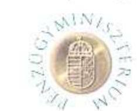
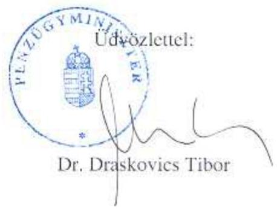
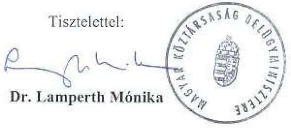

# JELENTÉS 

## a helyi önkormányzatok társulásainak ellenőrzéséről

---

# 3. Önkormányzati és Területi Ellenőrzési Igazgatóság 

3.3. Átfogó Ellenőrzések Főcsoport

Iktatószám: V-1006-36/2003-2004.
Témaszám: 653
Vizsgálat-azonosító szám: V-0103

## Az ellenőrzést felügyelte:

Dr. Lóránt Zoltán
föigazgató
Az ellenőrzés végrehajtásáért felelős:
Németh Péterné
főcsoportfőnök

## Az ellenőrzést vezette:

Németh Gábor
osztályvezető
A számvevői jelentések feldolgozásában és a jelentés összeállításában közremüködtek:
dr. Hegedüs György
számvevő tanácsos
Pappné dr. Szamosi Éva
számvevő
Az ellenőrzést végezték:
Dér Lívia
számvevő tanácsos
dr. Hegedüs György
számvevő tanácsos
Hütter Erzsébet
számvevő
Jakubcsák Jenő
számvevő
Keszthelyi Zoltán
számvevő
dr. Kiss Károly
számvevő tanácsos
Koronczai Sándorné
számvevő tanácsos

Pappné dr. Szamosi Éva
számvevő
Ritecz Tibor
számvevő
Szikszainé Király Mária
számvevő tanácsos
dr. Takács András
számvevő tanácsos
Tormáné Ivánfi Irén
számvevő tanácsos
Újvári Józsefné
számvevő tanácsos
Varga József
számvevő tanácsos

---

# A témához kapcsolódó eddig készített számvevőszéki jelentések: 

## címe

Jelentés az önkormányzati feladatellátás szervezeti formáiról és múködésük célszerűségének ellenőrzéséről 0012
Jelentés a helyi és a helyi kisebbségi önkormányzatok gazdálkodásának átfogó ellenőrzéséről 0319
Jelentés a helyi önkormányzatok egyes pénzügyi befektetésekkel történő gazdálkodásának ellenőrzéséről 0318

---

# TARTALOMJEGYZÉK 

BEVEZETÉS ..... 5
I. ÖSSZEGZŐ MEGÁLLAPÍTÁSOK, KÖVETKEZTETÉSEK, JAVASLATOK ..... 7
II. RÉSZLETES MEGÁLLAPÍTÁSOK ..... 13
1.Az önkormányzati feladatok meghatározása, tervezése és ellátási módja ..... 13
1.1. Gazdasági program ..... 13
1.2. Az SzMSz, a kötelező és az önként vállalt önkormányzati feladatok ..... 13
1.3. A központi költségvetési támogatások ösztönző hatása az önkormányzatok közös feladatellátására ..... 15
2. A körjegyzőségek és a társult képviselő-testületek hivatalainak létrehozása, működésének szabályozottsága, gyakorlata ..... 17
2.1. A körjegyzőségek létrehozásának szabályszerűsége ..... 17
2.2. A hivatal működésének szabályozottsága ..... 20
2.3. A körjegyzőségek működésének szabályszerűsége és hatékonysága ..... 21
3. A társulásban történő feladatellátás ..... 24
3.1. A társulásban történő feladatellátás jellemzői és formái, a megállapodások szabályszerűsége, típusai ..... 24
3.1.1. Az Ötv., Ttr. hatálya alá tartozó társulásokban történő feladatellátás ..... 24
3.1.2. Az Ötv., Ttr. hatálya alá tartozó társulások megállapodásainak szabályszerűsége. ..... 25
3.1.3. A Tft. hatálya alá tartozó társulások ..... 27
3.2. A társulások működésének szabályszerűsége, hatékonysága ..... 27
3.3. A társulás, a hivatal, a képviselő-testület együttműködésének értékelése ..... 31

---

# MELLÉKLETEK 

1. sz. melléklet Körjegyzőségi feladatellátásban résztvevő önkormányzatok számának alakulása 1999. és 2003. közötti években (1 oldal)
2. sz. melléklet Az önkormányzatok társulásainak alakulása (1 oldal)
3. sz. melléklet Az ellenőrzött önkormányzatok feladatait ellátó társulásos kapcsolatok száma és típusa (1 oldal)
4. sz. melléklet A költségvetési törvények által a társulások múködéséhez biztosított normatív hozzájárulások összege az ellenőrzött önkormányzatoknál (1 oldal)
5. sz. melléklet Az ellenőrzött önkormányzatok költségvetési szerveit jellemző mutatók a 2000-2002. években (1 oldal)

## FÜGGELÉKEK

1. sz. függelék A vizsgálatba bevont helyi önkormányzatok (2 oldal)

---

# RÖVIDÍTÉSEK JEGYZÉKE 

Ötv.
Tft.
Ttr.
Áht.
Ktv.
Étv.
Kt.
Ht.

Vhr.

Ámr.
PIR
TEÁOR
SzMSz
1990. évi LXV. törvény a helyi önkormányzatokról
1996. évi XXI. törvény a területfejlesztésről és területrendezésről
1997. évi CXXXV. törvény a helyi önkormányzatok társulásairól és együttműködéséről
1992. évi XXXVIII. törvény az államháztartásról
1992. évi XXIII. törvény a köztisztviselők jogállásáról
1997. évi LXXVIII. törvény az épített környezet alakításáról és védelméről
1993. évi LXXIX. törvény a közoktatásról
1991. évi XX. törvény a helyi önkormányzatok és szerveik, a köztársasági megbízottak, valamint egyes centrális alárendeltségű szervek feladat- és hatásköreiről
249/2000. (XII. 24.) sz. Korm. rendelet az államháztartás szervezetei beszámolási és könyvvezetési kötelezettségének sajátosságairól
217/1998. (XII. 30.) sz. Korm. rendelet az államháztartás múködési rendjéről
Pénzügyi Információs Rendszer
Tevékenységek Egységes Ágazati Osztályozási Rendszere
Szervezeti és Múködési Szabályzat

---

.

---

# JELENTÉS 

## A helyi önkormányzatok társulásainak ellenőrzéséről

## BEVEZETÉS

Az elmúlt években végzett ellenőrzéseink rendre megállapították, hogy az 1990. évben, a rendszerváltás keretében kialakult önkormányzati rendszer elaprózott, nem teremtett kedvező feltételeket az önkormányzati feladatok ellátásához, a közpénzek hatékony felhasználásához. Miközben az önkormányzati jogok és feladatok nagyrészt függetlenek a település lakosságszámától, az önkormányzatok széles körénél a lakosság száma, a települések anyagi ereje nem elegendő a közszolgáltatások szakszerű és hatékony megoldásához. Néhány államigazgatási feladat - építéshatóság, gyámügy, okmányirodák feladata - kivételével hiányzik az önkormányzati rendszerből a feladatok differenciált telepítése, a gazdasági társulási hajlandóság pedig kicsi.

A Magyar Köztársaság Alkotmányáról szóló - többször módosított - 1949. évi XX. törvény 44/A. § (1) bekezdés h.) pontjában foglaltak szerint a helyi képviselő-testület szabadon társulhat más helyi képviselő-testülettel, önkormányzati érdekszövetséget hozhat létre, feladatkörében együttmúködhet más országok helyi önkormányzataival.

A helyi önkormányzatokról szóló 1990. évi LXV. törvény (Ötv.) 41.§-a az alkotmányi előírással összhangban rögzíti, hogy a települési önkormányzatok képviselő-testületei feladataik hatékonyabb, célszerűbb megoldására szabadon társulhatnak. A társulási szabadság korlátozó tényezője, hogy nem sértheti az abban résztvevő önkormányzat jogait.

Az Ötv. az önkormányzati feladatok színvonalasabb és hatékonyabb ellátása érdekében szabályozza a társulások létrehozását, az ezer főnél kisebb lakosságszám esetében pedig - kivétel megengedésével - előírja a polgármesteri hivatali feladatok közös ellátását. Az önkormányzatok együttmúködési formáiként nevesíti a körjegyző́éget, a társult képviselő-testületek hivatalát, a hatósági-, az igazgatási- és az intézményfenntartó társulást, továbbá lehetővé tette más társulások létrehozását is.

A központi költségvetés kezdettől fogva támogatta a körjegyző́ségek létrehozását és fenntartását. A társulásos feladatellátást ösztönző támogatások, illetve többlettámogatások fokozatosan épültek be a költségvetési és az ágazati törvényekbe. A települések önállósodási törekvése azonban ellenkező irányba hatott. Ezt jelzi az önkormányzatok számának a szétválások és kiválások miatti növekedése, a körjegyzőségek számának 529-ről 492-re való csökkenése 1991. és 1997. között. A helyi önkormányzatok társulásairól és együttmúködéséről

---

szóló 1997. évi CXXXV. törvény (Ttr.) megalkotásának célja a helyi önkormányzatok társulási jogának gyakorlati érvényesítése, az önkormányzatok együttműködésének bővítése, közös érdekű feladataik célszerű, gazdaságosabb és hatékonyabb megvalósítása, a polgároknak nyújtott közszolgáltatások színvonalának javítása, a térségi kapcsolatok elmélyítése, a társulások általánosabbá és tartósabbá tétele volt. E cél elérését szolgálta az ösztönző rendszer továbbfejlesztése is.

A vizsgálatra jogszabályi felhatalmazást az Állami Számvevőszékről szóló 1989. évi XXXVIII. törvény 2. § (5) bekezdése és az Ötv. 92. § (1) bekezdése ad.

Az ellenőrzés célja annak megállapítása volt, hogy

- a helyi önkormányzatok társulásai a helyi önkormányzatokról szóló 1990. évi LXV. törvény és a helyi önkormányzatok társulásairól és együttműködéséről szóló 1997. évi CXXXV. törvény előírásainak megfelelően jöttek-e létre, és működésük jogszerű-e,
- a költségvetési törvényekben a társulásos feladatellátásra biztosított anyagi ösztönzés hogyan alakult és érvényesült,
- a helyi önkormányzatok milyen feladatokat látnak el társulásos formában,
- a feladatellátás hatékonyabbá és színvonalasabbá vált-e,
- vannak-e a társulásos feladatellátást akadályozó tényezők.

Vizsgált időszak: 2000. január 1-től 2003. május 31-ig

Az ellenőrzés 84 önkormányzatra ( 2 városi, 2 nagyközségi és 80 községi) terjedt ki. A körjegyzőségi székhely, illetve társulási székhely helyi önkormányzatok közül 42-öt véletlenszerűen választottunk ki, a további 42 ellenőrzött önkormányzat az ezekhez tartozó körjegyzőségi vagy társulási tag volt.

---

# I. ÖSSZEGZŐ MEGÁLLAPÍTÁSOK, KÖVETKEZTETÉSEK, JAVASLATOK 

Az Ötv. értelmében a helyi önkormányzatok dönthetik el, hogy a rendkívül széles körű közszolgáltatási feladataikat milyen formában kívánják a településen élők számára biztosítani. Ez feltételezi, hogy a szervezeti intézkedéseket, döntéseket kellő mélységű, megalapozott helyzetelemzés előzi meg.

A helyi önkormányzatoknak a feladataik és anyagi erőforrásaik felmérése alapján gazdasági programot kell készíteniük múködésük tervszerű, folyamatos fenntartása érdekében, dönteniük kell a feladatellátás szervezeti formáiról is.

A gazdasági program készítéséhez - a költségvetéssel ellentétben - a jogszabályok nem adnak útmutatást, nem írják elő sem a tartalmi követelményt, sem az elkészítési határidőt. Javaslataink ellenére nem történt előrelépés a jogszabályok erre vonatkozó kiegészítése terén. ${ }^{1}$

Az ellenőrzött önkormányzatok nem rendelkeznek olyan gazdasági programmal, amely együttesen tartalmazza az ellátandó önkormányzati feladatokat, a feladatok ellátásának szervezeti megoldását és a szükséges források biztosításának megoldását. Az önkormányzatok 64,3\%-a semmilyen gazdasági programmal nem rendelkezik. A gazdasági program készítésének elmulasztásával, hiányos elkészítésével kapcsolatosan az Ötv. és a Ht. előírásának megsértését már több jelentésünk megállapította. ${ }^{2}$

Az önkormányzatok múködését szabályozó SzMSz-ek - amelyeket a gazdasági programban foglaltak figyelembevételével lenne célszerű megalkotni, illetve módosítani - 85,7\%-a az ellátandó feladatokat nem részletezi, csak utal az Ötv-ben előírt kötelező feladatokra, annak ellenére, hogy több törvény összhangban az Ötv-vel - kötelező feladatokat határoz meg az önkormányzatok számára. Az önként vállalt feladatokról csak a költségvetési rendeletekben határoztak a vizsgált önkormányzatok.

Az önkormányzat által ellátandó feladatok SzMSz-beli pontos meghatározásának hiánya maga után vonta, hogy a feladatellátás szervezeti megoldását sem

[^0]
[^0]:    ${ }^{1}$ Jelentés a helyi önkormányzatok egyes pénzügyi befektetésekkel történő gazdálkodásának ellenőrzéséről. 2003.
    Jelentés a helyi és a helyi kisebbségi önkormányzatok gazdálkodásának átfogó ellenőrzéséről. 2003.
    ${ }^{2}$ Jelentés az önkormányzati feladatellátás szervezeti formáiról és múködésük célszerűségének ellenőrzéséről. 2000.
    Jelentés a helyi és a helyi kisebbségi önkormányzatok gazdálkodásnak átfogó ellenőrzéséről. 2003.
    Jelentés a helyi önkormányzatok egyes pénzügyi befektetésekkel történő gazdálkodásának ellenőrzéséről. 2003.

---

határozták meg, nem döntöttek arról, hogy a polgármesteri hivatali feladatot önállóan vagy körjegyzőség útján kívánják-e ellátni, illetve a közszolgáltatási feladataik közül mit látnak el saját intézményükkel, más önkormányzattal társulva, megbízási szerződéssel vagy gazdasági társasággal.

A helyi önkormányzatok társulásainak, különösen az ezer fő alatti lakosságszámú 1482 település esetében van fontos szerepe, mert ezen kis önkormányzatok és hivatalaik sem a helyi közszolgáltatási, sem az igazgatási feladataikat nem tudják önállóan aránytalanul nagy ráfordítás nélkül - amire többségüknek nincs forrása - szabályosan teljesíteni.

Az Ötv. az ezer főnél kisebb lakosságszámú, a megyén belül egymással határos községek számára előírta, hogy igazgatási feladataik ellátására körjegyzőséget alakítsanak és tartsanak fenn, megfelelő képesítésű jegyző alkalmazása esetén megengedte az önálló hivatal létrehozását. Ezzel a lehetőséggel még 385, az e körbe tartozó önkormányzatok 22,4\%-a élt a 2004. január 1-i adatok szerint. Azok az önkormányzatok, amelyek lakosságszáma nem éri el az 500 főt és nem vesz részt körjegyzőségben, 2000. évtől nem jogosult az önhibájukon kívül hátrányos helyzetben lévő önkormányzatok támogatására a költségvetési törvények 6. sz. melléklete szerint. E szabályozás következményeként nőtt a körjegyzőségek száma, azonban nem szabályszerű körjegyzőségek jöttek létre, az együttmúködés csak a jegyző közös foglalkoztatására szorítkozik a külön-külön fenntartott hivatali munkaszervezet mellett. Még az ilyen körjegyzőségek alakulása ellenére is 95, az 500 fő alatti lakosságszámú települések 9,5\%-a nem vett részt 2004. január hóban körjegyzöségben. Ugyanezen időpontban az ezernél több, de kétezernél kevesebb lakosú községek 29\%-a volt részese a körjegyzőségi együttműködésnek és a kétezernél több lakosságszámú települések 11,9\%-a vett részt körjegyzőségi feladatok ellátásában - az Ötv. előírásainak megfelelően - székhelyként.

A polgármesteri hivatali feladatok körjegyzőségi formában való ellátásáról az Ötv-beli kötelezés és a költségvetési törvényekbe beépített anyagi támogatás illetve ösztönzés hatására döntöttek az önkormányzatok. A központi költségvetés a körjegyzőségek múködését 2000. évig központosított előirányzatból, azt követően pedig normatív hozzájárulással támogatta, illetve támogatja. A normatív hozzájárulás a társult képviselő-testület hivatalát is megilleti, de a hivatal múködését nehezíti, hogy az önkormányzatok költségvetésének egyesítése ellenére a PIR rendszer önkormányzatonként külön költségvetés és költségvetési beszámoló készítésére kötelezi a társult önkormányzatokat. Ez a szabályozás célszerűtlenül az alacsonyabb szintű együttműködést jelentő körjegyzőség alakítására ösztönzi a társult képviselő-testületeket és nincs összhangban a közigazgatás korszerűsítési programjával sem.

Az Ötv. 1997. évi módosításakor a közös képviselő-testület elnevezést a társult képviselő-testület váltotta fel, az Áht-ban ez a módosítás azonban elmaradt.

A körjegyzöségek részére biztosított ösztönző támogatási rendszer a körjegyzőségek differenciált támogatását jelentette a körjegyzőséget alkotó önkormányzatok számának és együttes lakosságszámának függvényében, de nem hatott ösztönzőleg a körjegyzőségekhez tartozó települések számának növekedésére, különösen nem a nagyközségek és városok ön-

---

kormányzatainak a részvételére a polgármesteri hivatali feladatok közös ellátásában (1. sz. melléklet). A váro-sokat nagyközségeket a költségvetési törvényben meghatározott anyagi ösztönzés alacsony összege nem készteti a körjegyzőségi feladatellátásban való részvételre, a községek pedig nem szívesen csatlakoznak a városi, nagyközségi székhelyű körjegyzőséghez, mert ott nem jön létre körjegyzőségi munkaszervezet. Igy a hivatali munka színvonalának emelésében, egységessé tételében nem jelentkezett a nagyobb lakosságszámú települések önkormányzati hivatalai szakmailag jobban felkészült, egy-egy szakterületet jobban ismerő munkatársainak a hatása.

# A vizsgált körjegyzőségek az Ötv. előírásainak megfelelően jöttek 

létre, de két körjegyzőség esetében megsértették az Ötv-nek azt az előírását, hogy egymással határos önkormányzatok alkothatnak körjegyzőséget. Az Ötv. a körjegyzőséghez való csatlakozást és az abból való kiválást indokolatlanul köti az alapításra és megszüntetésre vonatkozónál szigorúbb feltételekhez.

A körjegyzőségek alapításával kapcsolatosan megállapítottuk, hogy a helyi önkormányzatok költségvetési szerveinek törzskönyvi nyilvántartása nagyon sok hibát tartalmaz. A törzskönyvi nyilvántartás vezetése az önkormányzatok megalakulásának időpontjában és azóta is a Pénzügyminisztérium feladata az állami pénzügyekről szóló törvény, illetve az Áht. szerint. A törvények végrehajtására vonatkozó jogszabályok a helyi önkormányzatok költségvetési szervei törzskönyvi nyilvántartását a TÁKISZ-okra, majd azok jogutódaira bízták. A törzskönyvi bejegyzéshez szükséges dokumentumokat jogszabály nem írta elő 2003. június 9-ig, így a törzskönyvi nyilvántartás nem rendezett. Az ellenőrzött önkormányzatok 5,9\%-ának van csak törzskönyvi nyilvántartásba vett hivatala, a többiek esetében a költségvetési szerv polgármesteri hivatala helyett a jogi személyiséggel nem rendelkező képviselő-testület van bejegyezve. A rendezetlenség tartós fennállásához hozzájárult, hogy a pénzügyminiszter az Ámrben előírt kötelezettségét nem teljesítette, rendeletben nem állapította meg a törzskönyvi nyilvántartás adatait és az adatszolgáltatás rendjét.

A körjegyzöségek múködésének, gazdálkodásának szabályszerűségében számos hiányosság volt tapasztalható. A körjegyzőségek 21,6\%-ának nem volt alapító okirata, elfogadott SzMSz-szel pedig csak egy körjegyzőség rendelkezett. Az ellenőrzött körjegyzőségek ügyrendjei tartalmilag hiányosak, nem tartalmazták a vezetők és dolgozók feladat-, hatás- és jogkörét.

A kötelezettségvállalási, utalványozási és érvényesítési feladatok munkatársak közötti megosztása a körjegyzőségek 38\%-ánál nem biztosítja az összeférhetetlenség kizárásával kapcsolatos követelményeket. Az ösztönzés ellenére sem alakultak ki olyan méretű körjegyzőségek, amelyek az ehhez szükséges személyi feltételeket biztosítani tudták volna.

A körjegyzőségek fenntartásához az érdekelt képviselő-testületek - egy önkormányzat kivételével - a megállapodásaiknak megfelelően hozzájárultak. A jegyzők beszámoltatása évente megtörtént, bár a beszámolók harmada a zárszámadás, költségvetés elfogadásához kapcsolódott. Az ügyfélfogadás a társközségeknél heti rendszerességű.

---

A költségvetési törvények az önkormányzatok közszolgáltatási feladatai közül a közoktatási feladatok társulás keretében való ellátásához nyújtanak ösztönző támogatást. A közoktatási feladatok intézményfenntartó társulás keretében való ellátásának ösztönzésére a központi költségvetés 1996. évtől biztosít normatív hozzájárulást. Az 1100 főnél kisebb lakosságszámú települések esetében az 5-8. évfolyamra járó tanulók intézményfenntartó társulás keretében való oktatását azzal is ösztönzi a központi költségvetés 2000. évtől, hogy az ezt teljesítő önkormányzatok az 1-4. osztályos tanulók nevelésé-hez-oktatásához a kistelepülési kiegészítő közoktatási hozzájárulást, 2001. évtől a hozzájárulás négyszeres összegét vehetik igénybe. A gazdasági kényszer és az ösztönzés együttes hatására az ellenőrzött önkormányzatok $45 \%$-a vett részt közoktatási intézményfenntartó társulásban. A 2002. év végén az országban 601 közoktatási társulás múködött 1827 önkormányzat részvételével.

A belső ellenőrzési társulások múködéséhez 2003. évtől központosított előirányzatból biztosít támogatást a központi költségvetés, de az igénybevétel feltételei indokolatlanul szigorúak voltak. A társulásban résztvevő önkormányzatok számának legalább 11-nek, a felügyeletük alá tartozó költségvetési szerveknek pedig legalább 30 -nak kellett lenni a támogatás jogszerú igénybevételéhez. A 2004. évre vonatkozó költségvetési törvény a belső ellenőrzési társulások létrehozását akadályozó szigorú feltételeket enyhítette. A belső ellenőrzési társulások alakulását akadályozta a köztisztviselők jogállásáról szóló törvény azon előírásának, hogy a közigazgatási szerv ellenőrzési hatáskörének gyakorlásával közvetlenül összefüggő feladat ellátására kizárólag közszolgálati jogviszony létesíthető, különböző értelmezése, az ezt tükröző eltérő tartalmú minisztériumi szakmai vélemények. Az akadályt jelentő értelmezés és szakmai vélemény szerint polgármesteri hivatalban, körjegyzőségben belső ellenőrzést csak köztisztviselő végezhet, a belső ellenőrzési társulásban pedig közalkalmazottak dolgoznak.

A további önkormányzati feladatok esetében a normatív hozzájárulás fajlagos összege független az ellátás szervezeti megoldásától. Ennek következtében az e körbe tartozó szociális és gyermekjóléti szolgálati feladatok ellátásában a társulásokkal azonos arányban vesznek részt gazdasági társaságok.

A társulások az Ötv., Ttr. és a Tft. vonatkozó előírásai szerint jöttek létre. A megállapodások jóváhagyásáról, módosításáról, a megszüntetésről, a társuláshoz való csatlakozásról, a társulási megállapodás évközbeni felmondásáról a képviselő-testületek minősített többséggel döntöttek. A társulási megállapodások hiányossága, hogy nem tartalmaznak előírást a társulás múködésének célszerűségi és gazdasági szempontból való ellenőrzésére, a társulás megszűnése esetében az elszámolás rendjére.

Az intézményi társulásokhoz tartozó intézmények, a jogi személyiséggel rendelkező társulások alapító okiratai, SzMSz-ei, szabályzatai hiányosak, nem tartalmazzák a vezetők kinevezésének és felmentésének szabályait, a költségvetési szerv gazdálkodási jogkörét, a vezetők hatás- és jogkörét.

A megállapodásokban rögzített múködési kiadások viselése a közoktatási intézményi társulások 6,5\%-ánál nem a megállapodások szerint történt.

---

A társulásos feladatellátás hatékonyságának értékelését a képviselőtestületek nem tartották szükségesnek, mert más feladatellátási módra való áttérésre nem láttak lehetőséget. Az önkormányzatok - azok is, ahol sok társulást múködtetnek, illetve sok társulásban vesznek részt -a társulás megalakításával és a költségekhez való hozzájárulással teljesítettnek tekintik a feladatokat.

A polgármesteri hivatalok feladatainak körjegyzöség útján történő ellátása hatékonyabb munkavégzést eredményezett, de a múködésükkel kapcsolatosan megállapított szabálytalanságok azt jelzik, hogy a feladatellátás színvonala nem emelkedett. Azoknak a körjegyzőségeknek az esetében, amelyeknél a körjegyzőség székhelyén kívül is tartanak fenn munkaszervezetet a hatékonyság sem növekedett, nem használták ki a körjegyzőségi forma alkalmazásában rejlő lehetőségeket.

A közoktatási intézményfenntartó társulások mind a feladatellátás hatékonyságát, mind a feladatellátás színvonalát javították. Csökkent az általános iskolákban az osztatlan képzési forma és növekedett a szakos ellátottság.

Ellenőrzési tapasztalataink szerint a jelenlegi jogszabályi környezet és ösztönző rendszer keretei között az önkormányzatok már további társulások létrehozására nem vállalkoznak. A városok a múködési kiadásaik növekedését intézményrendszerük racionalizálásával korlátozzák, és nem hoztak döntést intézményfenntartó társulások alapítására. Így a feladatellátás hatékonyságának és színvonalának további javulása csak a jogszabályi környezet módosítása és az ösztönzés (pozitív és negatív) fokozása révén érhető el. Ebbe az irányba hat a Kormány közigazgatás korszerűsítési programja, amely jogilag lehatárolt és szabályozott kistérségi szint létrehozását tervezi, melyben a települési együttműködési formák - a szabad társulás elvének figyelembe vételével - intézményi keretek között fejlődhetnek tovább ${ }^{3}$.

Az ellenőrzött önkormányzatoknak a törvényes rend helyreállítása céljából javasoltuk, hogy:

- készítsék el az Ötv. 91. § (1) bekezdésében előírt gazdasági programjukat, valamint a körjegyzőségek SzMSz-ét az Ámr. 10. § (4), (7) és (8) bekezdése szerint;
- aktualizálják az Ámr. előírásainak megfelelően az ügyrendeket, alapító okiratokat;
- a Vhr. előírásainak és a helyi adottságoknak megfelelően készítsék el, illetve aktualizálják a gazdálkodás szabályszerűségét biztosító számviteli politikát és a kapcsolódó szabályzatokat;
- gondoskodjanak a gazdálkodás, számviteli tevékenység területén a belső kontrollok érvényesüléséről;

[^0]
[^0]:    ${ }^{3}$ A társulások keretében kialakuló jobb feltételek (szakember ellátottság, optimálisabb méret) kedvezően hatnak a magánszektor bevonására, illetve az önkormányzatok ebből adódó erősebb érdekérvényesítésére is.

---

- a társulás tagjai a Ttr. 6. § (3) bekezdésének megfelelően ellenőrizzék a társulás működését és a polgármesternek a (4) bekezdés előírásait betartva számoljanak be a képviselő-testületnek a társulás tevékenységéről, pénzügyi helyzetéről és a társulási cél megvalósításáról;
- a körjegyzőségek működésének ellenőrzését az Ötv. 40. § (6) bekezdés szerint végezzék el;
- a pénzgazdálkodási jogkörök gyakorlása során maradéktalanul tartsák be az Ámr. 134-138. §-aiban meghatározott szabályokat.

A helyszíni ellenőrzés megállapításainak hasznosítása mellett javasoljuk:

# a belügyminiszternek 

1. Kezdeményezze a közigazgatási korszerűsítési program keretében
a) a hatékonyabb szervezeti formák gyorsabb elterjedése érdekében az ösztönző rendszer, az érdekeltség továbbfejlesztését;
b) az Ötv. nagyközségi/városi székhelyű körjegyzőségekre vonatkozó rendelkezéseinek a kiegészítését annak érdekében, hogy az a benne résztvevő önkormányzatok tényleges együttműködési formájává váljon, a csatlakozó települések részt vehessenek a döntéshozatalban és az ellenőrzésben;
c) a körjegyzőségek működésére vonatkozó ösztönző támogatási rendszer módosítását, hogy a nagyközségek és városok önkormányzatai érdekeltté váljanak a körjegyzőségi együttműködésben való részvételben és ezáltal a feladatellátás színvonala javuljon.
2. Kezdeményezze az Ötv. 39. § (3) bekezdésének módosításával a körjegyzőséghez csatlakozás és az abból való kiválás feltételeinek az alapítással, illetve megszűnéssel kapcsolatos követelményekkel összhangban levő meghatározását.
3. Kezdeményezze a köztisztviselők jogállásáról szóló 1992. évi XXIII. törvény 1. § (8) bekezdésének módosítását, hogy egyértelművé váljon annak hatálya és ne akadályozza a helyi önkormányzatok belső ellenőrzési társulásainak létrehozását, müködését.
4. Kezdeményezze az Áht. 66. §-ának módosítását, az Ötv. 44. § (2) bekezdésének előírásaival való összhang megteremtését, a közös képviselő-testület helyett a társult képviselő-testület megnevezés használatát.

## a pénzügyminiszternek

Készítse el a törzskönyvi nyilvántartás adatait és az adatszolgáltatás rendjét megállapító - az Ámr. 158. § (2) bekezdésében feladatául meghatározott - miniszteri rendeletet. A rendeletben írja elő a törzskönyvi nyilvántartás adatállományának az államháztartás önkormányzati rendszerére vonatkozó felülvizsgálatát.

---

# II. RÉSZLETES MEGÁLLAPÍTÁSOK 

## 1. Az önkORMÁNYZATI feladatok meGhatároZása, tervezése ÉS ELLÁTÁSI MÓDJA

### 1.1. Gazdasági program

A helyszíni ellenőrzésbe bevont 84 helyi önkormányzat közül 54 esetében a jegyző nem teljesítette a Ht. 140. § (1) bekezdés a.) pontjában, a polgármester a Ht. 139. § (1) bekezdés a.) pontjában; a képviselő-testület pedig a Ht. 138. § (1) bekezdés a.) pontjában előírt gazdálkodási feladatát. A jegyző nem készítette el, a polgármester nem terjesztette elő, a képviselő-testület pedig nem határozta meg gazdasági programját, ezzel megsértették az Ötv. 91. § (1) bekezdésének előírását, nem alkották meg az önkormányzat gazdasági programját.

A gazdasági program készítéséhez - a költségvetéssel ellentétben - a jogszabályok nem adnak útmutatást, nem írják elő sem a tartalmi követelményt, sem az elkészítési határidőt.

Véleményünk szerint a helyi önkormányzat tervszerű működésének az alapja a gazdasági program, abban kellene meghatározni az ellátandó feladatok körét, az ehhez szükséges források biztosításának módját és a feladatok ellátásának szervezeti formáit.

Az elfogadott gazdasági programok az önkormányzat által megvalósítandó fejlesztési feladatokat rögzítik, de azok forrását csak a Balatonederics gazdasági programja tartalmazza. A gazdasági programokból hiányzik az ellátandó feladatok és a feladatellátás szervezeti formáinak meghatározása.

### 1.2. Az SzMSz, a kötelező és az önként vállalt önkormányzati feladatok

A helyi önkormányzat múködésének, feladatai ellátásának legfontosabb alapdokumentuma a gazdasági program alapján megalkotott SzMSz. Erről az Ötv. 18. § (1) bekezdésében úgy rendelkezik, hogy a képviselő-testület a múködésének részletes szabályait a szervezeti és múködési szabályzatról szóló rendeletében határozza meg.

A jogi normához fúzött kommentár kiemeli, hogy az önkormányzatok eltérő adottságai, a kötelező és a szabadon vállalt feladatok különbözősége sajátos szabályozást igényelnek, teret engedve az önkormányzatok önállóságának, lehetőséget biztosítva a szervezetalakítás szabadságához, a múködés helyi szabályozásához.

Ennek megfelelően az általános önkormányzati gyakorlat az előírt SzMSz alkotás kötelezettségét a települési önkormányzat egészére értette. Az Ötv. 8. § (2) bekezdésére figyelemmel az önkormányzatok maguk határozzák meg - a lakos-

---

ság igényei alapján, anyagi lehetőségüktől függően - mely feladatokat milyen mértékben és módon látnak el, melyek a kötelező, és melyek az önként vállalt feladatok.

Az Ötv 8. § (4) bekezdése felsorolja azokat a helyi közszolgáltatási feladatokat, amelyekről minden települési önkormányzat köteles gondoskodni, azonban ezen túlmenően - az Ötv. 1. § (5) bekezdése szerint - törvény a helyi önkormányzatnak kötelező feladatkört állapíthat meg. Ennek megfelelően több ágazati törvény kötelező feladatot ír elő az önkormányzatok részére.

A 84 ellenőrzött önkormányzat közül hat önkormányzat (Bázakerettye, Lispeszentadorján, Simaság, Ragály, Trizs, Üllő) SzMSz-ében nem foglalkozik sem a kötelező, sem az önként vállalt feladatokkal. Ezen önkormányzatok azt az álláspontot képviselik, amely az Ötv. normaszövegének szó szerinti értelmezésével az SzMSz hatályát csupán a képviselő-testületre terjeszti ki, de az nem felel meg az Ámr. 10. § (4) bekezdés előírásainak.

A vizsgált önkormányzatok 85,7\%-a az SzMSz -ben átveszi az Ötv. 8. § (1) és (4) bekezdéseinek szövegét, egyúttal utalva arra, hogy a 8. § (4) bekezdésben felsorolt 8 feladatcsoportot tekintik kötelező feladatnak. Mindössze kilenc önkormányzat (Balafonföldvár, Lengyeltóti, Bálványos, Kerkafalva, Komjáti, Alsószenterzsébet, Zalatárnok, Szentkozmadombja, Zalaháshágy) egészíti ki a törvényi felsorolást.

Balatonföldvár, Lengyeltóti, Bálványos, Komjáti településeken kötelező feladatnak számít a gyermekjóléti és gyermekvédelmi alapellátás, Zalatárnokon ezen kívül a települési könyvtári ellátás. Zalaháshágyon, Szentkozmadombján, valamint Kerkafalván és Alsószenterzsébeten a köztisztaság és a településtisztaság is kötelező feladat, az utóbbi községben még a sportfeladatok tartoznak a kötelező feladatok közé.

Azok az önkormányzatok, amelyek az Ötv. 8. § (4) bekezdésében felsorolt feladatokat tekintik kötelezőnek, általánosságban a 8. § (1) bekezdésében felsorolt közszolgáltatási feladatokat tartják önként választható feladatoknak és SzMSzükben úgy rendelkeznek, hogy az önként vállalt feladatok kérdésében az éves költségvetésben kell állást foglalni a pénzügyi fedezet biztosításával egyidejűleg, azonban a költségvetési rendeletek csak kivételesen foglalkoznak nevesítetten az önként vállalt feladatokkal.

Somogysárd az SzMSz 3. számú mellékletében sorolja fel az önként vállalt feladatait. Ez jelenleg az enyhe fokban értelmi fogyatékos, sérült gyermekek alapfokú oktatása feladatot jelenti. Az Ötv. 69. § (5) bekezdése, valamint Ktr. 87.§ (1) bekezdése e) pontja szerint, a megyei önkormányzat kötelező feladatát a települési önkormányzat önként vállalt feladatként átvállalhatja, az önkormányzati szabályozás megfelel a hivatkozott törvényi előírásoknak.

Nagyrozvágy SzMSz-e valódi önként vállalt önkormányzati feladatokat sorol fel: tejcsarnok (tejbegyűjtők) üzemeltetése, tejbeszedéssel kapcsolatos feladatok ellátása; legeltetéssel kapcsolatos feladatok elvégzése, a lakosság részére mezőgazdasági szolgáltatások végzése.

Az önkormányzat által ellátandó feladatok SzMSz-beli pontos meghatározásának hiánya maga után vonta, hogy a feladatellátás szervezeti megoldását sem

---

határozták meg, nem döntöttek arról, hogy a polgármesteri hivatali feladatot önállóan vagy körjegyzőség útján kívánják-e ellátni, illetve a közszolgáltatási feladataik közül mit látnak el saját intézményükkel, más önkormányzattal társulva, megbízási szerződéssel vagy gazdasági társasággal.

A polgármesteri hivatal által ellátandó feladatokat annak alapító okiratában kell meghatározni az Ámr. 10. § (4) bekezdés b. pont előírásának megfelelően. Alapító okirattal pedig minden költségvetési szervnek rendelkeznie kell az Áht. 87. § (1) bekezdése szerint, így a polgármesteri hivataloknak és a körjegyzősideknek is. Az önkormányzatok arra való tekintettel, hogy az Alkotmány 44/B. § (1) bekezdését és az Ötv. 38. § (1) bekezdését úgy értelmezték, hogy a polgármesteri hivatal a törvény alapján jött létre, annak alapító okirattal történő megalapításáról nem kell gondoskodniuk. A mulasztás létrejöttében és tartós fennmaradásában közrehatott a költségvetési szervek törzskönyvi nyilvántartásának rendezetlensége. Jogszabály nem írja elő, hogy a törzskönyvi nyilvántartásba vételt az alapító okirat alapján kell végezni. Ezért fordulhat elő, hogy az ellenőrzött önkormányzatok mindössze 5,9\%-ának, öt önkormányzatnak (Balatonföldvár, Kadarkút, Lengyeltóti, Nagyrozvágy, Somogysárd) van törzskönyvi nyilvántartásba vett polgármesteri hivatala. A többi önkormányzat esetében a nem költségvetési szerv képviselő-testület szerepel a törzskönyvi nyilvántartásban, Kisrozvágy esetében maga az önkormányzat.

A törzskönyvi nyilvántartás vezetése az önkormányzatok megalakulásának időpontjában - és azóta is - a Pénzügyminisztérium feladata az állami pénzügyekről szóló 1979. évi II. törvény, illetve az Áht. szerint. A törvények végrehajtására vonatkozó jogszabályok [az állami költségvetési szervek gazdálkodásáról szóló 19/1980. (IX. 27.) PM rendelet, a költségvetési szervek költségvetésének végrehajtásáról szóló 4/1991. (II. 13.) PM rendelet, a költségvetési szervek tervezésének, gazdálkodásának, beszámolásának rendszeréről szóló 137/1993. (X.12.) Korm. rendelet, a költségvetési szervek tervezésének, gazdálkodásának beszámolásának rendjéről szóló 156/1995. (XII. 26.) Korm. rendelet és az Ámr.] a helyi önkormányzatok költségvetési szervei törzskönyvi nyilvántartását a TÁKISZ-okra, majd azok jogutódaira bízták. A rendezetlenség tartós fennállásához hozzájárul, hogy a pénzügyminiszter az Ámr. 158. § (2) bekezdésében előírt kötelezettségét nem teljesítette, rendeletben nem állapította meg a törzskönyvi nyilvántartás adatait és az adatszolgáltatás rendjét. A közpénzek felhasználásának, a köztulajdon használatának nyilvánosságával, átláthatóbbá tételével és az ellenőrzések bővítésével összefüggő egyes törvények módosításáról szóló 2003. évi XXIV. törvénnyel módosított Áht. 2003. június 9 -től hatályos 88. § (5) bekezdése és a 88/A. § (1) bekezdése meghatározta a törzskönyvi nyilvántartásba vételhez benyújtandó dokumentumokat és a törzskönyvi nyilvántartás adattartalmát. A törvény a vizsgált időszak lezárását követően lépett hatályba.

# 1.3. A központi költségvetési támogatások ösztönző hatása az önkormányzatok közös feladatellátására 

A polgármesteri hivatali feladatok közös ellátását végző körjegyzőségek alakítását és múködését az önkormányzatok létrejötte óta támogatja különböző formában a központi költségvetés. Először a körjegyzök béréhez járult hozzá a költségvetés, majd 2000. évig a központosított előirányzat terhére pályázati

---

úton kaptak támogatást, 2000. évtől pedig normatív hozzájárulásban részesülnek.

A normatív hozzájárulás alap-hozzájárulásból és ösztönző hozzájárulásból áll. Ez utóbbinak a fajlagos összege függ a körjegyzőséget létrehozó községek számától és körjegyzőséghez tartozó községek együttes lakosságszámától, illetve attól, hogy a körjegyzőség székhelye község vagy nagyobb település (nagyközség, város, megyei jogú város).

Tapasztalatunk szerint az ösztönző támogatási rendszer a körjegyzőségek differenciált támogatását jelentette, de nem hatott ösztönzőleg a körjegyzőségeket létrehozó települések számának növekedésére. Ezt igazolják az országos összesített adatok is, az egy körjegyzőségi székhelyhez tartozó tag községek áltagos száma a 2000. évi 1,72-ról 1,68-ra csökkent három év alatt (1. sz. melléklet).

A körjegyzőségek, egyben a körjegyzőségekhez tartozó tagközségek számának növekedését az önhibájukon kívül hátrányos helyzetben lévő önkormányzatok támogatási feltételeinek normatív szabályozása váltotta ki, 2000. évtől ugyanis azok az önkormányzatok, amelyek lakosságszáma nem éri el az 500 főt és nem vesznek részt a körjegyzőségben nem jogosultak ilyen jogcímú támogatásra.

A 133 főnél kisebb lakosságszámú községek körjegyzőséghez való csatlakozását azzal is ösztönzi a költségvetési törvény 3. sz. mellékletének az 1. pontja, hogy a községek általános feladatai jogcímú támogatás összege a lakosságszámtól függetlenül legalább 2000 ezer forint, ami több mint a lakosok száma alapján járó összeg.

A belső ellenőrzési társulások múködéséhez a 2003. évtől központosított előirányzatból biztosít támogatást a központi költségvetés, de az igénybevétel feltételei indokolatlanul szigorúak. A társulásban résztvevő önkormányzatok számának legalább 11-nek, a felügyeletük alá tartozó költségvetési szerveknek pedig legalább 30 -nak kellett lenni a támogatás jogszerú igénybevételéhez. A 2004. évre vonatkozó költségvetési törvény a belső ellenőrzési társulások létrehozását akadályozó szigorú feltételeket enyhítette. A belső ellenőrzési társulások alakulását akadályozta a köztisztviselők jogállásáról szóló 1992. évi XXIII. törvény 1. § (8) bekezdés előírásának a különböző értelmezése, az ezt tükröző eltérő tartalmú minisztériumi szakmai vélemények. Az akadályt jelentő értelmezés és szakmai vélemény szerint polgármesteri hivatalban, körjegyzőségben belső ellenőrzést csak köztisztviselő végezhet, a belső ellenőrzési társulásban pedig közalkalmazottak dolgoznak.

A költségvetési törvények további önkormányzati feladatok társulási formában történő ellátásához is biztosítanak normatív hozzájárulást (családsegítő és/vagy gyermekjóléti szolgálat múködtetése, falugondnoki szolgáltatás, gondozási központ fenntartása), de azoknál a fajlagos hozzájáruláshoz ösztönző többlettámogatás nem kapcsolódik.

A családsegítő és/vagy a gyermekjóléti szolgálat múködtetése kiegészítő hozzájárulását a feladat ellátása után 2000-2002-ben az ellenőrzött önkormányzatok $21,3 \%$-a vette igénybe, melyek társulásban látták el a feladatot. E jogcímen a jogosultság feltétele a 188/1999. (XII. 16.) sz. Korm. rendelet,

---

valamint a 281/1997. (XII. 23.) sz. Korm. rendelet (2003. január 1-től a 259/2002. (XII. 18.) Korm. rendelet) szerinti múködési engedélyek megléte volt, valamint az, hogy a társulások a Ttr. 8., 9., és 16. §-ai szerint intézményi társulás keretében működjenek. A társulásoknak továbbá igazolniuk kellett a Közigazgatási Hivatal vezetőjének nyilatkozatával, hogy a társulási megállapodás törvényes.

A társulásos feladatellátás színvonalának és hatékonyságának értékelését a képviselő-testületek nem tartották szükségesnek. Ez az önkormányzati hozzáállás, magatartás következménye annak, hogy az önkormányzatok - azok is, ahol sok társulást múködtetnek, illetve sok társulásban vesznek részt -a társulás megalakításával teljesítettnek tekintik a feladatokat.

# 2. A KÖRJEGYZŐSÉGEK ÉS A TÁRSULT KÉPVISELŐ-TESTÜLETEK HIVATALAINAK LÉTREHOZÁSA, MŰKÖDÉSÉNEK SZABÁLYOZOTTSÁGA, GYAKORLATA 

### 2.1. A körjegyzőségek létrehozásának szabályszerűsége

Az Alkotmány 44/B. § (1) bekezdése minden helyi önkormányzat képviselőtestületét kötelezi, hogy hivatalt hozzon létre. Az Ötv. 38. § (1) bekezdése általános szabályként úgy rendelkezik, hogy a képviselő-testület egységes hivatalt hoz létre polgármesteri hivatal elnevezéssel, az önkormányzat működésével, valamint az államigazgatási ügyek döntésre való előkészítésével és végrehajtásával kapcsolatos feladatok ellátására.

Az Ötv. 39. § (1) bekezdése lehetőséget biztosít arra, hogy a polgármesteri hivatal feladatkörét ne az önkormányzat által létesített saját polgármesteri hivatal, hanem több helyi önkormányzat által alapított körjegyzöség végezze.

A körjegyzőséget a társulások közé soroljuk, azonban jogállását tekintve az önkormányzati hivatal egyik fajtája, a résztvevő helyi önkormányzatok gazdálkodásának végrehajtó szerve, jogi személyiséggel rendelkező költségvetési szerv.

## A körjegyzőség hivatali jellegét a következők támasztják alá:

- Az Áht. 66. §-a a körjegyzőséget az önkormányzati hivatal típusaként említi a taxatív felsorolásban.
- A körjegyző szakmailag ugyanúgy „vezeti" hivatalát, a körjegyzőséget, mint a jegyző a polgármesteri hivatalt.
- A körjegyzőségben minden olyan feladatot ellátnak, amit a polgármesteri hivatalban is ellátnak, csak nem egy, hanem több önkormányzat számára.
- Polgármesteri hivatal megszűnése esetén az önkormányzat körjegyzőségbe mehet, körjegyzőségből kiválás esetén viszont polgármesteri hivatalt kell alakítani, vagy másik körjegyzőségbe kell belépni. Ez csak azonos jogállású jogintézmények esetén lehetséges.
- Ebből az is következik, hogy amíg a hatósági társulás intézménytípusú szerveződés egyes feladatok ellátására, addig a körjegyzőség az összes hivataltípusú feladatot úgy látja el, mintha polgármesteri hivatal volna.

---

Az Ötv. 39. § (1) bekezdése szerint az ezernél kevesebb lakosú, a megyén belül egymással határos községeknek körjegyzőséget kell létrehozniuk, azonban az Ötv. 39. § (2) bekezdése megengedi, hogy az ezernél kevesebb lakosú község önálló hivatalt hozzon létre. Az ezernél több, de kétezernél kevesebb lakosú község is részt vehet körjegyzőségben. Az ellenőrzött önkormányzatok a körjegyzőség létrehozására vonatkozó törvényi rendelkezéseket a következők kivételével betartották:

- Barlahida, Kustánszeg, és Mikekarácsonyfa Barlahida székhellyel körjegyzőséget múködtet, tart fenn az Ötv. 39. § (1) bekezdés előirását megsértve, a három település egyike sem határos másikkal. Barlahidától Kustánszeg északra 15 km , Mikekarácsonyfa délre 10 km távolságra található, közöttük a körjegyzőséghez nem tartozó települési önkormányzatok vannak.
- Lovászpatona és Nagydém 1991-ben Lovászpatona székhellyel körjegyzőséget hozott létre, amelyhez 1997-ben Bakonyság csatlakozott, azonban a körjegyzőségi megállapodást nem módosították. A jelenlegi körjegyzőt a 2002. évben már mindhárom önkormányzat képviselő-testülete együttes ülésen nevezte ki de a körjegyzőség alapító okirata csak 2002. december 10-vel készült el, azt együttes testületi ülésen jóváhagyták.
- Farád és Acsalag közigazgatásilag egymással nem határos települések is az Ötv. 39. § (1) bekezdés előirását megsértve alakítottak egymással körjegyzőséget.

Az Ötv. hatálybalépésekor fennálló közös tanács székhelyének képviselőtestülete nem tagadhatta meg az Ötv. 104. § (3) bekezdése szerint, hogy a település körjegyzőség székhelye legyen. E rendelkezés alapján a településnek nem kellett részt vennie a körjegyzőségben, csak hozzá kellett járulnia, hogy a körjegyzőség munkaszervezete ott lássa el feladatát.

Ilyen körjegyzőség múködik a Zala megyei Csesztregen. Kerkafalva községi székhellyel Kerkafalva, Alsószenterzsébet, Felsőszenterzsébet, Kerkakutas, Magyarföld és Ramocsa települések önkormányzatai Csesztregen alakították meg körjegyezőségüket 1991. január 1-vel. Valamennyi település Csesztregtől távol, attól északi irányban található. Csesztregen még egy körjegyzőség található, amelyet Csesztreg és Nemesnép önkormányzatai tartanak fenn.

Az Ötv. 39. § (1) bekezdése szerint a kétezernél nagyobb lakosságszámú települések nem csatlakozhatnak körjegyzőséghez, hanem csak körjegyzőségi székhelyek lehetnek. Az Ötv. 38. § (3) bekezdésének megfelelően ha a körjegyzőség székhelye nagyközség vagy város a körjegyzői feladatokat a nagyközségi, városi jegyző a polgármesteri hivatal bevonásával látja el. Ezekben az esetekben nem jön létre törzskönyvi nyilvántartásba bejegyzendő, költségvetési szervként múködő körjegyzőségi munkaszervezet.

Ilyen körjegyzőség van az ellenőrzött önkormányzatok közül Balatonföldvár, Lengyeltóti városokban és Kadarkút nagyközségben.

Mindhárom településen a székhely önkormányzatok aktív részvételével körjegyzőséget alapítottak a helyi önkormányzatok létrejöttekor. Balatonföldvár és Lengyeltóti várossá válása miatt, Kadarkút pedig az Ötv. 1994. évi módosítása miatt - ez léptette hatályba az Ötv. 38. § (3) bekezdését - kilépett a körjegyzőségből és a körjegyzőségeket a költségvetési szervek törzskönyvi nyilvántartásából is törölték, a körjegyzőségek jogilag megszűntek, gyakorlatban most már csak megálla-

---

# podás alapján, szolgáltatást végezve látják el a volt körjegyzöségek feladatait. 

Az Ötv. a körjegyzőség alapítása és megszüntetése esetében a csatlakozással és a kiválással ellentétben nem írja elő, hogy az csak a naptári év első napjával lehet és arról hat hónappal korábban kell meghozni a határozatot.

Simaság és Nemesládony községek körjegyzőségéhez 2001. január 1-vel kívánt csatlakozni Tompaládony. Az Ötv. 39.§ (3) bekezdése értelmében csatlakozásról, kiválásról hozott döntést hat hónappal korábban kell meghozni. Tompaládony belépési szándékát 2000. őszén jelezte, így a tervezett 2001. januári belépési időponthoz már nem állt rendelkezésre hat hónap. A polgármester megkereséssel fordult a Belügyminisztérium Önkormányzati Főosztályához a témával kapcsolatban, amely szakmai véleményében jelezte, hogy a törvény csak a csatlakozás és kiválás eseteit szabályozza időkorláttal, ám a megszüntetés és új körjegyzőség alakítását már nem. Ennek eredményeként az 5/2000. (XII. 21.) számú, minősített többséggel hozott határozattal december 31-i időponttal megszüntették Simaság - Nemesládony körjegyzőséget. A megszüntetésről megszüntető okiratot bocsátottak ki.
Ugyanezen a napon a három község képviselő-testületei minősített többséggel határozatot hoztak az új körjegyzőség megalakítására, illetve jóváhagyták az erre vonatkozó megállapodást, a körjegyzőség alapító okiratát, melynek aláírására felhatalmazták a polgármestereket. A körjegyzőség ügyrendjének kidolgozására a körjegyzőt hatalmazták fel.
A körjegyzőséghez való csatlakozás Ötv. 39. § (3) bekezdésbeli szabályai érvényesültek Nagyrozvágy, Kisar, Lovászpatona, Óhíd esetében.

Az Áht. 66. §-a szerint az önkormányzat gazdálkodásának végrehajtó szerve a közös képviselő-testület hivatala. Az Ötv. 1997. évi CXXXIV. törvénnyel történt módosítása óta a közös képviselő-testület jogintézményét a társult kép-viselő-testület váltotta fel, az Áht-ban azonban ez a módosítás elmaradt, az önkormányzati hivatal típusainak tételes felsorolásában a polgármesteri hivatal és a körjegyzöség mellett a közös képviselő-testület hivatala van nevesítve.

A társult képviselő testületek részben vagy egészben egyesítik költségvetésüket, közös hivatalt tartanak fenn, és intézményeiket is közösen múködtetik, de a PIR előírása megköveteli, hogy a költségvetés egyesítése ellenére önkormányzatonként külön költségvetést és költségvetési beszámolót készítsenek.

Nyolc önkormányzat (Bükkösd és Cserdi; Borzavár és Porva; Nagyrozvágy és Kisrozvágy; Bázakerettye és Lispeszentadorján) 1990-ben közös (társult) képvi-selő-testületet alapítottak az Ötv. 44. §-a alapján, és négy közös képviselőtestületi hivatalt hozott létre .

A közös (társult) képviselő-testület jogintézmény bonyolultságát jellemzi, hogy a Bükkösd, Bázakerettye, Nagyrozvágy székhelyű közös (társult) képviselő testület a közös hivatal mellett körjegyzőséget is létrehozott. Borzavár viszont Porvával csak a közös képviselő-testület hivatalát hozta létre, amelyet - a társult képviselő testület megszűnése miatt - 2003. január 1-vel megszüntettek, majd ugyanezen a napon a két önkormányzat körjegyzőséget alapított.

Bázakerettyén 2003. január 1-én, Bükkösdön pedig 2003. június 30-án a közös (társult) képviselő-testületet megszüntették.

---

Nagyrozvágy és Kisrozvágy közös (társult) képviselő-testületét továbbra is fenntartja, a két önkormányzat folyamatosan egyesítette költségvetését, azonban költségvetésüket és beszámolójukat külön-külön kellett elkészíteniük, mert a PIR rendszer az egyesített költségvetést, beszámolót nem tudja kezelni. A közös képi-selő-testület mellett fenntartott körjegyzőséghez 2002. január 1-jén csatlakozott Semlyén község Önkormányzata.

Az ellenőrzött körjegyzőségek közül a Bedegkér, Dunaszeg, Farác, Győrzámoly, Márianosztra és Zsalacséb székhelyű körjegyzőségek nem hoztak létre egységes hivatalt, a körjegyzőségi tag településen is tartanak fenn munkaszervezetet, együttműködésük a jegyző közös alkalmazását jelenti. A körjegyzőségbe bevitt köztisztviselők személyi kiadásait az önkormányzatok maguk viselik és létszámukról is önállóan döntenek. Ezek az önkormányzatok nem használták ki a körjegyzőségi feladatellátási mód hatékonyságnövelési lehetőségét.

# 2.2. A hivatal múködésének szabályozottsága 

Minden költségvetési szervnek alapító okirattal kell rendelkeznie az Áht. 88. § (3)-(4) bekezdések alapján. A vizsgált 37 körjegyzốség közül 8-nak $(21,6 \%)$ nem volt alapító okirata. A meglévő alapító okiratok mindenütt hiányosak voltak, az állami feladatként ellátandó alaptevékenységüket nem fogalmazták meg.

Az ellenőrzött 37 körjegyzőségből csupán 1 körjegyzőség rendelkezett SzMSzszel, 1 körjegyzőségnek pedig elkészült SzMSz-ét még nem fogadták el.

Kerkafalva székhellyel létrehozott körjegyzőség 2003. május 1-én hatályba lépett SzMSz-el rendelkezik. A szabályzat azonban nem felel meg az Ámr. 10. § (4) bekezdése követelményének, mert a körjegyzőségnek nincs alapító okirata, ezért az SzMSz-t sem lehet értékelni, hogy az valamennyi, az alapító okiratban felsorolt állami feladatot tartalmazza-e.

Galgamácsán a körjegyzőséget létrehozó önkormányzatok képviselőtestületeinek 2001. november 29-i ülésén napirendi pontként szerepelt a körjegyzőség SzMSz-ének jóváhagyása. Az ülésen megfogalmazódott kifogások - ügyfélfogadási idő, iratkezelés, stb. - miatt nem történt meg a jóváhagyás, és olyan döntés született, hogy a módosított SzMSz tervezetet a következő ülésen tárgyalják meg. Az ÁSZ vizsgálat időpontjáig azonban erre még nem került sor.

A többi körjegyzőségnek - Bükkösd, Farád, Szentlászló kivételével - ügyrendje van.

Tartalmilag valamennyi ügyrend hiányos, mert csak az általános igazgatási ügymenettel, az ügyfélfogadással és a kiadmányozással foglalkoznak, a körjegyzőség költségvetési szervként való múködését nem veszik figyelembe. Az Ámr. 17. § (4) bekezdésének megfelelő, vagyis: a gazdasági szervezet és szervezeti egységei és pénzügyi-gazdasági feladatok ellátásáért felelős személy(ek) által, továbbá a hozzá rendelt részben önállóan gazdálkodó költségvetési szervek tekintetében ellátandó feladatait, a vezetők és más dolgozók fe-ladat-, hatás- és jogkörét részletesen tartalmazó ügyrendet egyetlen ellenőrzött önkormányzat sem készített.

---

Belső ellenőrzési szabályzattal a körjegyzőségek 48\%-a rendelkezik. Ebből $20 \%$ nincs a helyi viszonyokra adaptálva.

A hivatalok 95\%-ának van ugyan számviteli politikája a kötelező szabályzatokkal együtt, de ezek minta-dokumentumok, adaptációjuk a helyi sajátosságokra elmaradt és a jogszabályi változásokat sem követték.

A körjegyzők 83\%-a intézkedett a munkafolyamatba épített ellenőrzési rendszer kialakítására. A pénzgazdálkodási jogkörök rendjét a hivatalok 76\%-ában szabályozták, de ezen belül az ellenjegyzést, a hatáskör átruházását, a helyettesítések szabályozását a kis létszámú apparátusok miatt csak 53\%-ban tudták megoldani. A hivatalok 38\%-ában a feladatok munkatársak közötti megosztását nem tudták az alkalmazott köztisztviselők kis száma miatt úgy elvégezni, hogy az összeférhetetlenség létrejöttét kizárják.

#### Abstract

A Barlahida székhelyű körjegyzőségben a helyszíni vizsgálat idején a körjegyzőn kívül 3 fő érdemi ügyintéző és 1 fő részmunkaidős hivatalsegéd dolgozott. A hivatali létszám a szakszerű feladatellátást, az operatív pénzgazdálkodással szemben támasztott követelmények (összeférhetetlenség, hatáskörök gyakorlása) teljesítését nem teszi lehetővé.

# 2.3. A körjegyzőségek múködésének szabályszerűsége és hatékonysága 

A körjegyzőségek fenntartásához az önkormányzatok - kivéve Bakonyság megállapodásuk szerint - amelyek megfelelnek az Ötv. 39. § (1) bekezdésének járulnak hozzá. A hozzájárulást az önkormányzatok 83\%-a lakosságszám arányosan viseli. Ettől eltérően csak azok az önkormányzatok állapodtak meg, ahol a körjegyzőség székhelyén kívül is tartanak fenn munkaszervezetet.

A Lovászpatona székhelyű körjegyzőségnél Bakonyság önkormányzata nem utalja a hozzájárulást és azt a saját költségvetésében kiadásként sem tervezi.

A községi székhelyű körjegyzőségek körében a körjegyzöt a képviselőtestületek külön-külön minősített többséggel hozott egybehangzó döntései alapján nevezték ki.

A körjegyző vagy megbízottja az Ötv. 40. § (3) bekezdésében foglaltaknak megfelelően minden testületi ülésen részt vett. Az ügyfélfogadás rendjét az Ötv. 40. § (5) bekezdésében foglaltak figyelembevételével határozták meg, Lengyeltóti város jegyzőjének kivételével. Ügyfélfogadás a gyakorlatban nincs a Lengyeltóti és a Szentlászló székhelyű körjegyzőségek tagjainál, csak eseti jellegú Lippó, Mindszentgodisa, Bükkösd székhelyű körjegyzőségek társközségeinél. Az eseti jelleg indoka, hogy nem kihasznált az ügyfélfogadási idő, és a társközségekből inkább bemennek az ügyfelek a székhelyközségbe, mert ott teljes körű az ügyintézés.

Az Ötv. 40. § (4) bekezdése írja elő a körjegyző évenkénti beszámolási kötelezettségét a körjegyzőség munkájáról minden képviselő-testület előtt. A vizsgált időszakban a beszámolási kötelezettségnek a körjegyzök 86\%-a tett

---

eleget. A beszámolók 28\%-a az éves költségvetési, vagy zárszámadási rendeletek elfogadásához kapcsolódott. A beszámolási kötelezettségnek nem tett eleget Somogyapáti (2001-2002.), Felsőnyárád (2000-2002.), Komjáti (2000.), Rakaca, Lovászpatona (2000.) körjegyzője. Lengyeltóti város jegyzője azért nem számolt be a körjegyzőségben résztvevő képviselő-testületeknek, mert a városi székhelyű körjegyzőségnek nincs munkaszervezete, amelynek munkájáról be kellene számolnia. A jegyzők, körjegyzők beszámolóját az együttes testületi üléseken a képviselő-testületek minden esetben elfogadták.

Az Ötv. 40. § (6) bekezdése a körjegyzöség múködésének ellenőrzését, a feladatok egyeztetését, az érintett községek polgármestereinek együttes feladatkörébe utalja. A feladategyeztetési tevékenység lehetséges fórumai egyrészt az együttes testületi ülések, másrészt a dokumentált polgármesteri megbeszélések. Az ellenőrzött önkormányzatok körében évente egyszer volt csak együttes testületi ülés a Lippó, Somogyapáti, Szentlászló székhelyű körjegyzőségeknél. A körjegyzőségek $88 \%$-ánál évente két, vagy ennél több együttes testületi ülésre is sor kerül. Polgármesteri, jegyzői értekezleteket rendszeresen tartanak, de a megbeszélésekről hivatalos dokumentáció nem készül.

A nagyközségi és városi székhelyű körjegyzőségeknek nincs elkülönült munkaszervezetük, így azoknál sem a körjegyző Ötv. 40. § (4) bekezdése szerinti beszámolása, sem a körjegyzőség múködésének az Ötv. 40. § (6) bekezdése szerinti ellenőrzése, a feladatok egyeztetése nem értelmezhető. Az ilyen körjegyzőséghez tagként csatlakozó községek nem vehetnek részt a jegyző kinevezésére vonatkozó döntéshozatalban, nem ellenőrizhetik a hivatali munkavégzést.

A körjegyzőségek függetlenített belső ellenőrt nem foglalkoztatnak, mivel az önkormányzatok egy főállású dolgozó foglalkoztatásához nem rendelkeznek elegendő anyagi fedezettel, valamint az összeférhetetlenségi követelmények betartásával munkaidejének kihasználása nem lenne biztosított. A vizsgált időszakban a hivatalok 31\%-ánál volt belső ellenőrzés. Ebből folyamatos, évenkénti belső ellenőrzésre a hivatalok 46\%-ánál került sor. A belső ellenőrzési feladatokat vállalkozók, belső ellenőrzési társulások és könyvvizsgálók teljesítették, megbízásukkor a Ktv. 1. § (8) bekezdésében foglaltakat azok a pénzügyminisztériumi szakmai vélemények szerint értelmezték, amelyek szerint az csak a közigazgatási szerv által végzett hatósági ellenőrzésre vonatkozik. Ettől eltérő tartalmú szakmai véleményt is adott ki a Belügyminisztérium, amely szerint a polgármesteri hivatalban és a körjegyzőségben belső ellenőrzést csak köztisztviselő végezhet. Ez az értelmezés akadályozta a belső ellenőrzési társulások létrehozását, amelyek múködését pedig a központi költségvetés központosított előirányzatból támogat.

Csak két körjegyzőségnél (Balatonedericsnél és Káptalanfánál) volt szabályos a pénzgazdálkodási jogkörök gyakorlása. A körjegyzőségek 66\%-ában van csak munkaköri leírása a munkatársaknak, a körjegyzőket is beleértve. A munkaköri leírások 32\%-a tartalmazta a pénzgazdálkodási jogosítványokat és 21\%-a fogalmazott meg ellenőrzési feladatokat. A pénztárellenőrzést négy önkormányzatnál csak részlegesen teljesítik (Kerkafalva, Zalatárnok, Komjáti, Nagyszekeres). A vezetői ellenőrzések az adatszolgáltatások, költségvetések és a költségvetési beszámolók aláírásával voltak dokumentáltak. Más dokumentált vezetői ellenőrzés nem volt. A gazdálkodási terü-

---

leten mérlegképes könyvelői végzettséggel csak az önkormányzatok 10\%-nál dolgoztak munkatársak. Esetenként a munkakörök betöltetlensége, a szakképzett munkaerő hiánya okozott nehézséget.

Lesenceistvánd székhelyú körjegyzőségben a hivatal múködését főállású körjegyzó́ hiánya nehezítette ugyan, de a feladatellátást a szakmailag megfelelően kialakult hivatal a megbízott körjegyző irányításával, a rendelkezésre álló technikai felszereltséggel (megfelelő elhelyezés, számítástechnikai eszközök) biztosította.

Apátistvánfalván a körjegyzőség múködéséhez a személyi és tárgyi feltételek nem állnak optimálisan rendelkezésre. A személyi állomány 2002. évben nőtt, ám a pénzügyi előadó pótlása nehézséget okozott. A tárgyi feltételekből a számítógép ellátottság az utolsó évben javult, de a körjegyzőség épülete nagyobb arányú felújításra szorulna.

Nyárádon a hivatal kis létszáma miatt a helyettesítések megoldása nem mindig biztosított, hosszabb szabadságok kiadása idején elmaradások keletkeznek a munkában, amit az ügyintézők csak hosszú idő alatt, vagy túlmunkával tudnak pótolni.

A körjegyzőségi formában való hivatali feladatellátás hatékonyságát az alkalmazott köztisztviselők száma és az egy ügyintézőre jutó ügyiratok száma alapján értékeltük.

Az 1996. évi BM felmérés alapján egy hivatalon belül legalább hat fő szükséges a szakszerű és törvényes ügyintézéshez a minimálisan szükséges szakmai tagozódáshoz és a pénzgazdálkodásnál az összeférhetetlenség létrejöttének kizárásához. A szakmai anyag 1000-1500 fő közötti lakosság számhoz, mint legalacsonyabb kategóriához javasol hivatali létszámot, közvetetten jelezve azt, hogy ez alatt már nem lehet szakszerűen a hivatali feladatokat ellátni. A vizsgált körjegyzőségek esetében 2002. évben az 500-1000 fó közötti lakosságszám kategóriában az átlagos köztisztviselői létszám 5,3 fő volt. Az ellenőrzött körjegyzőségek hivatali átlaglétszáma a lakosságszám alapján kialakított kategóriánként a BM ajánláshoz viszonyítva - kisegítők nélkül - a következők szerint alakult:

| Kategória | A vizsgált körben   2002-ben | BM ajánlás   1996. |
| :-- | :--: | :--: |
| $1000-1500$ | 6,5 | $6-8$ |
| $1500-2000$ | 7,5 | $8-10$ |
| $2000-3000$ | 10,5 | $10-14$ |
| $3000-5000$ | 15 | $15-22$ |

A körjegyzőségekben alkalmazott köztisztviselők száma 2002. évben annak ellenére, hogy a hivatali feladatuk hat év alatt növekedtek, csak megközelíti, illetve eléri a Belügyminisztérium által ajánlottat. Létszámgazdálkodás vonatkozásában átlagosan teljesült a körjegyzőségek létrehozása révén várható hatékonyságjavulás.

Az egy ügyintézőre jutó ügyiratok átlagos száma a 2000. évi 270-ról két év alatt 12,6\%-kal növekedve 304-re változott.

---

# 3. A TÁrsulÁsban TÖRTÉnŐ FELADATELLÁTÁs 

### 3.1. A társulásban történő feladatellátás jellemzői és formái, a megállapodások szabályszerűsége, típusai

### 3.1.1. Az Ötv., Ttr. hatálya alá tartozó társulásokban történő feladatellátás

Az Ötv. 41-43. § és a Ttr. alá tartozó társulások 87\%-a a kötelező feladatok ellátására jött létre. 2002. évben a vizsgált önkormányzatok 108 társulásnak voltak a székhelyei, és a társulásokban a tagsági kapcsolatuk száma elérte a 282-t (3. sz. melléklet). A feladatellátás várható előnyeit társulás, vagy más alternatív szervezeti megoldás esetére hat önkormányzat (Somlóvásárhely, Dunaszeg, Zsarolyán, Sümegcsehi, Balatonederics, Lippó) vizsgálta meg és döntött annak alapján a társulási forma mellett. A további önkormányzatok gazdaságossági számításokat nem végeztek, a társulások megalakítására a rendelkezésre álló helyi források szűkössége, az intézmények kapacitásának alacsony kihasználtsága miatti magas fajlatos múködési költségek késztették az önkormányzatokat. A döntéseknél figyelembe vették az adott évi költségvetési törvény ösztönző hatásait is. Az Ötv. és Ttr. alá tartozó társulási formákon belül 2002. évben 6\%-ot a hatósági igazgatási társulások, $49 \%$-ot az intézményi társulások és $45 \%$-ot az egyéb társulási formák képviseltek. Az intézményi társulási formán belül a közoktatási ellátásra létrejött társulások aránya a legnagyobb, 57\%, gyermekjóléti és szociális feladatot $15 \%$-uk, szociális feladatot $6 \%$-uk lát el és az egyéb intézmény társulások aránya $22 \%$. Az egyéb intézményi társulásoknál kötelező feladatok ellátására alakultak a közoktatási tanácsadói (32\%), a hulladékgazdálkodási (20\%), egészségügyi (16\%), ellenőrzési (12\%), temető-fenntartási (4\%), munka- és tűzvédelmi (4\%) sportigazgatási (4\%) társulások. Önként vállalt feladatként a társulások zenei, művészeti oktatást (8\%), teljesítenek.

Az egyéb társulási formákon belül kötelező feladatot látnak el az egészségügyi, gyermekjóléti, családsegítő szolgálatok, út-, vízügyi, környezetvédelmi feladatokra létrejött társulások. Az önként vállalt társulási feladatokat az erdészeti, vadgazdálkodási, területrendezési, autóbusz közös üzemeltetési, mezei őrszolgálati feladatok jelentik. A vizsgált időszakban a társulások száma csak kismértékben nőtt, és a 2003-ra vonatkozó önkormányzati döntések sem növelik a társulások számát. Ez közvetetten arra utal, hogy a jelenlegi jogszabályi feltételek, forrásszabályozás környezetében a kistelepülések társulásban történő feladatellátása már alig növekszik. A társulások száma 2002. évben már csak 1,26\%-kal, a társulásban résztvevős önkormányzatok száma pedig csak $0,66 \%$-kal emelkedett.

---

A nagyközségek és városok esetében a költségvetési törvények ösztönző hatása nem érvényesült, múködési kiadásaikat az intézményhálózatuk racionalizálásával csökkentik. ${ }^{4}$

# 3.1.2. Az Ötv., Ttr. hatálya alá tartozó társulások megállapodásainak szabályszerűsége. 

A Ttr. 4. § (1) bekezdésében szabályozottaknak megfelelve a társulásban résztvevő képviselő-testületek mindegyike minősített többséggel döntött a megállapodások jóváhagyásáról, módosításáról, megszüntetéséről, a társuláshoz való csatlakozásról, a társulási megállapodás év közbeni felmondásáról.

Minősített többséggel hozott határozattal jöttek létre új társulások 2003-ban Bükkösd önkormányzata (közoktatási intézményi társulás), Fehértó önkormányzata (közoktatási intézményi társulás) Farád önkormányzata (gyermekjóléti szolgálat társulása), Nemesdéd önkormányzata (belső ellenőrzési társulás) tagi részvételével.

2000-2002. közötti időszakban Zalaháshágy önkormányzata (intézményfenntartó társulás, családsegítő és gyermekjóléti társulás), Borzavár önkormányzata (társult képviselő-testület), mint társulásnak tagjai, minősített többséggel hozott határozattal szüntettek meg társulást.

Minősített többséggel hozott határozatával lépett ki 2001. december 31-én Zsarolyán önkormányzata a mezei őrszolgálat feladatait ellátó társulásból.

Kizárásra mindössze egy esetben került sor 2003. évben, amikor az Észak-Kelet Pest Megyei Regionális Hulladékgazdálkodási és Környezetvédelmi Önkormányzati Társulás Társulási Tanácsa, a 21/2003. (I. 3.) sz. határozatával kizárta a tagjai sorából Galgamácsa Község Önkormányzatát, mert az önkormányzatot a társulási tanácsban képviselő polgármester akadályozta a társulás múködését. A kizárás nem felelt meg a Ttr. 4. § (3) bekezdésének, mert nem a naptári év utolsó napjával történt a kizárás.

A 2002. december 31-én érvényben lévő társulási megállapodások 30\%-a, a Ttr. 7. §-a alapján megbízásos típusú volt, $42 \%$-a, a Ttr. 8. § alapján intézmény, vagy más szervezet közös fenntartására, munkavállaló közös foglalkoztatásra irányult, 15\%-a a Ttr. 9. § értelmében közös döntéshozó szerv létrehozásával intézmény, vagy más szervezet közös fenntartására, munkavállaló közös foglalkoztatásra köttetett, és 13\%-a, a Ttr. 16. § szabályai értelmében jogi személyiséggel rendelkező társulások létrehozását kezdeményezte.

A társulási megállapodások hiányossága, hogy nem tartalmazzák a Ttr. 6. § (3) bekezdésének megfelelően a célszerűségi, gazdaságossági ellenőrzések módját, a polgármesternek a (4) bekezdésben elöírt beszámolási kötelezettségét.

[^0]
[^0]:    ${ }^{4}$ Jelentés a helyi és a helyi kisebbségi önkormányzatok gazdálkodásának átfogó ellenőrzéséről. 2003.

---

Egy-egy társulási megállapodás több területen eltért a követelményektől.
Nem tartalmazzák a megállapodások a társulás

- típusát: Balatonföldvár főépítészi társulási megállapodása;
- nevét, székhelyét: Nagyrozvágy, Rakaca társulási megállapodása;
- tagjainak nevét, székhelyét: Nagyrozvágy, Farád társulási megállapodása;
- finanszírozását: Balatonedericsen az orvosi ügyeleti társulás megállapodása a finanszírozást külön megállapodás hatáskörébe utalja, de ez a megállapodás nem készült el;
- a csatlakozás szabályait: Simaság, Rakaca, Felsőnyárád társulási megállapodásai;
- megszűnése esetén az elszámolás rendjét: Simaság, Rakaca, Felsőnyárád társulási megállapodásai;
- szerződésének aláírását: a Baranya Megyei Önkormányzatok Társulásánál amelyben taglétszám meghaladta a 200-at - a polgármesterek aláírását, tekintettel arra, hogy a társulási megállapodást jóváhagyó önkormányzati határozatok kivonatai kerültek a társulási megállapodáshoz csatolásra. E kivonatok helyettesítik az aláírást. A megállapodás módosításai esetén is ugyanezt a gyakorlatot követik.
A társulási megállapodások rögzítették, a költségviselés arányát, a teljesítés feltételeit. A közoktatási intézményi társulásoknál a tagok a normatív hozzájáruláson felüli múködési kiadásokat az óvodánál gyermeklétszám, az iskolánál tanulólétszám arányában viselik. A gyermekjóléti, családsegítő szolgálatoknál a finanszírozás lakosságszám, vagy az ellátottak számának arányában került meghatározásra. A gondozási központoknál az ellátottak arányában történik a normatív hozzájáruláson felüli kiadások ellentételezése. Egyes társulási megállapodásokban azonban ettől eltérő megoldásokat is alkalmaztak az önkormányzatok élve az általános szabálytól való eltérés lehetőségével.

Bükkösd község intézményfenntartó társulásánál az iskola múködésének finanszírozása a tulajdonhányad arányában került meghatározásra.

Nyárád és Balatonederics székhelyű oktatási intézményi társulásnál a felújítási, fejlesztési kiadásokat csak a két székhely község önkormányzata viseli, mivel az ingatlanok tulajdonosai.

Nemesdéden az oktatási intézményi társulásnál a tagok a fejlesztéseket is a tanulólétszám arányában finanszírozzák.

Az egészségügyi társulásoknál (háziorvos, ügyelet, védőnő) az OEP támogatásból nem fedezett költségek viselése lakosságszám arányosak.

Az önkormányzatok 23\%-a szabályozta a megállapodásokban a társulásba bevitt vagyont az Ötv. 80. § (4) bekezdése alapján.

---

# 3.1.3. A Tft. hatálya alá tartozó társulások 

A területfejlesztési feladat biztosítására az önkormányzatok 41 területfejlesztési önkormányzati társulással létesítettek tagsági kapcsolatot. A társulások a Tft. 10. § (1) bekezdése alapján szerveződtek, és céljaik is összhangban vannak a törvényben rögzítettekkel, de nem biztosították a térségfejlesztési feladatok ellátását pénzügyi feltételek hiányában. A területfejlesztés feladata mellett a MuraMenti Nemzetiségi és Területfejlesztési Társulás szervezete családsegítő és gyermekjóléti feladatot is ellát, Bázakerettye, valamint Lipseszentadorján megbízásából. Az ellenőrzött önkormányzatok közül mindössze Somlójenő, Farád, Felsőnyárád, Felsőkelecsény önkormányzatai nem tagjai területfejlesztési önkormányzati társulásnak. A 2003. évben Kadarkút, Galgamácsa, Szentkozmadombja, Somogysárd önkormányzatai léptek ki, illetve terveznek kilépést a területfejlesztési társulásokból, mert elégedetlenek a társulások tevékenységével.

A Tft. alá tartozó társulások megállapodásai megfelelnek a Tft. 10. § (2) bekezdésében szabályozottaknak.

### 3.2. A társulások múködésének szabályszerűsége, hatékonysága

A társulási megállapodásokat a társulások múködését törvényességi ellenőrzési jogkörben ellenőrzik. Az Ötv. 42. § (3) bekezdése szerint a hatósági igazgatási társulási megállapodást, a Ttr. 20. § (1) bekezdése szerint minden társulási megállapodást meg kell küldeni a közigazgatási hivatal vezetőjének, aki arra törvényességi észrevételt tehet. A 2000. évben hatályos költségvetési törvény 3. sz. melléklete 11. b) és 24. c) pontjainál, valamint a 2001-2002. és 2003-ban hatályos költségvetési törvények 3. sz. mellékletei 11. ba), bb), bc) pontjainál a kiegészítő hozzájárulás egyik feltétele volt a társulás törvényességének igazolása. A törvényességet a Közigazgatási Hivatal vezetőjének nyilatkozata igazolta. A 24. f) pontban az intézményfenntartó társulás óvodájába, általános iskolájába járó gyermekek, tanulók támogatása jogcímnél már nem kérték a 2001-2002., 2003. évi költségvetési törvények a társulás törvényességének igazolását, szemben a 2000. évi rendelkezéssel, ahol ez még kötelező feltétel volt.

A gyakorlatban az önkormányzatok a társulások törvényességét igazoló nyilatkozatot a költségvetési törvényekben előírt követelmény teljesítés igazolásához kérik csak meg.

A Közigazgatási Hivatal munkatársai a helyszínen ellenőrzik a társulások törvényességét. Azoknál a társulásoknál, ahol a Közigazgatási Hivatal részéről volt már ellenőrzés, minden esetben hiányosságokat tártak fel.

Farádon a családsegítő és gyermekjóléti szolgálatot ellátó társulás múködésének szakmai ellenőrzését 2002. novemberében végezte a Győr-Moson-Sopron Megyei Közigazgatási Hivatal. Szakmai hiányosságként megállapították, hogy a családsegítő szolgálaton belül nem hozták létre az önálló szakmai egységként múködő gyermekjóléti szolgálatot. Az ellátási körzet változásakor nem kérték ki a megyei

---

gyámhivatal véleményét. Nincsenek szakmai részlegvezetők, az alkalmazottak fele rendelkezik csak az előírt szakmai végzettséggel.

Dunaszegen 2000. februárjában folytatott szakmai ellenőrzést a Közigazgatási Hivatal a társulásban múködtetett gyermekjóléti szolgálatnál. A jegyzőkönyv megállapítása szerint, a szolgálat által ellátott feladatok nem voltak egyértelmúen meghatározva, a foglalkoztatott eseti megbízással és nem közalkalmazottként végezte a feladatát. A szolgálatnak nem volt irodahelyisége, a végzett munka dokumentálása nem felelt meg az előírásoknak.

A Szabolcs-Szatmár-Bereg Megyei Közigazgatási Hivatal visszavonta a Szamosújlaki Gondozási Központ múködési engedélyét - amely megbízás alapján gyermekjóléti feladatot látott el Cégénydányádon - mert ellenőrzéskor megállapította, hogy Fehérgyarmat Város jegyzője szabálytalanul adta azt ki, a Gondozási Központ múködéséhez a személyi feltételek nem voltak biztosítva.

Mindszentgodisán a családsegítő és gyermekjóléti társulásnál végzett szakmai ellenőrzés kapcsán felvett jegyzőkönyv kifogásolta, hogy az alkalmazott munkatársaknak nem készült el a munkaköri leírása, valamint a helyettesítést csak szóbeli megállapodás alapján végzik.

A társulások tagjai nem ellenőrzik célszerűségi, gazdasági szempontból társulásaik tevékenységét. Az ellenőrzés elmulasztásával a Ttr. 6. § (3) bekezdésében előírt célszerúségi, gazdasági szempontból folytatott ellenőrzési követelménynek az önkormányzatok 74\%-a nem tett eleget.

Nyolc önkormányzat (Lippó, Nemesdéd, Zalaháshágy, Egyházasrádóc, Lovászpatona, Cégénydányád, Nemesdéd és Balatonföldvár) társulásban múködő intézményeiknél folytatott ellenőrzést.

Belső ellenőrzésre Nagypeterden az intézményfenntartó társulásnál a vizsgált időszakban egy alkalommal került sor.

Három esetben a képviselő-testületek a társulások múködésének ellenőrzése helyett közvetlenül irányítják a társulást, elvonva ezzel a társulási tanács megállapodás szerinti hatáskörét, megsértve a Ttr. 11. § előírását.

- A Mindszentgodisa székhelyű körjegyzőséghez tartozó önkormányzatok közoktatási intézményi társulásának döntést hozó szerve a társulási tanács, melynek a társulási megállapodás alapján döntési jogosítványa van, hatáskörét azonban nem gyakorolhatja. A társulás hatáskörébe tartozó döntéseket az együttes testületi üléseken a képviselő-testületek hozzák.
- A Nagyszekeres székhelyű óvodai nevelést, általános iskolai oktatást és szociális ellátást végző társulások társulási tanácsai a társulási megállapodásokban átruházott hatásköröket nem gyakorolhatják. Helyettük a képviselőtestületek élnek a döntési hatáskörrel és az intézmény fenntartó önkormányzatok polgármestereivel irányítják az intézményeket.
- Hetes székhelyű közoktatási intézményi társulás a Ttr. 16. §-a alapján szerveződött, önálló jogi személyként. A gyakorlatban a társulás a Ttr. 8. §-a alapján múködik, nem a társulási tanács az irányító szerv.
Az ellenőrzött intézményi társulásokhoz tartozó intézmények, a jogi személyiséggel rendelkező társulások alapító okiratai, szervezeti és múködési szabályzatai elavultak és pontatlanok, nem felelnek meg az Ámr.

---

10. § (4) bekezdésében, valamint az Áht. 88. § (3) bekezdésében előírt feltételeknek.

- Ragály önkormányzatának közoktatási intézményi társulásánál az iskola alapító okirata nem tartalmazza az alapítók nevét, felügyeleti szervét, nem rendelkeztek az igazgató kinevezésének, felmentésének módjáról, és a dokumentumot az iskola igazgatója írta alá.
- Egyházasrádóc önkormányzatának iskola-, óvodafenntartó társulásánál az óvoda alapító okirata nem tartalmazza a költségvetési szerv gazdálkodási jogkörét. Az intézmények SzMSz-ei a valóságtól eltérően, önállóan gazdálkodó költségvetési szervként határozzák meg a két intézményt.
- Lesenceistvánd önkormányzatánál a közoktatási intézményfenntartó társulás intézményei alapító okiratai tartalmazzák, hogy az iskola és óvoda szakmailag önálló, de a szakmai önállóságot biztosító feltételeket nem rögzítették, nem határozták meg az intézmények vezetői a költségvetésben biztosított előirányzat felhasználási jogosultságát.
A társulások szakmai beszámoltatásán felül a polgármesterek - Hetes és Farád kivételével - a Ttr. 6. § (4) bekezdésében előírt kötelezettségüket nem teljesítik, nem számoltak be évente legalább egyszer a képviselőtestületüknek a társulás tevékenységéről, pénzügyi helyzetéről, a társulási cél megvalósulásáról.

A társulások múködésének érzékeny pontja a kiadások viselése. A megállapodásokban rögzítettekhez képest hét önkormányzat nem a társulási megállapodás szerint viseli a kiadásokat közoktatási intézményi társulásnál (Somogyapáti, Dunaszentpál, Zalacséb, Nyárád, Apátistvánfalva, Nemesdéd, Nagypeterd), és egy önkormányzat pedig hozzájárulást egyáltalán nem fizet.

Nagydém az intézményi társulás múködéséhez nem járul hozzá a társulási megállapodás 2000. évi módosításának megfelelően.

Együttes testületi és társult képviselő-testületi ülésen az önkormányzatok 85\%a, mint a társulás tagjai évente rendszeresen megtárgyalták az oktatási, szociális gyermekvédelmi feladatokat ellátó társulások szakmai tevékenységét, külön napirendi pontként, illetve a zárszámadás keretében számoltak be az intézmény-, szolgálatvezetők a szakmai munkáról.

Bükkösdön a körjegyzőség, a közösen finanszírozott intézmények tevékenységét, a feladatok ellátását a társult képviselő-testületi ülésen, a körjegyzőség és a közösen fenntartott intézmények költségvetésének meghatározásánál, módosításánál az időszakos költségvetési tájékoztatók alkalmával, valamint a zárszámadáskor tárgyalta a társult testület.

Nyárádon a társulásban ellátott 9 feladat közül csak 2 feladat ellátását, a családsegítési, valamint a gyermekjóléti feladatokat végző társulás tevékenységét mutatták be minden évben a társulást létrehozó testületeknek. A beszámolókat nem együttes üléseken, hanem testületenként külön tárgyalták, a testületi ülésekre részletes írásos előterjesztés készült. A képviselő-testületek a beszámolót általában hozzászólás nélkül, egyhangúlag elfogadták. A szakmai beszámolóhoz nem

---

kapcsolódott pénzügyi elemzés, azt a költségvetés jóváhagyásakor, valamint a költségvetési beszámolók jóváhagyásakor tárgyalták a testületek.

Nagyszekeresen a társulások múködésének, az általuk végzett szolgáltatások hatékonyságának vizsgálatát a képviselő-testület részben végezte el. A Körjegyzőség tagjai által létrehozott intézményi társulások gazdálkodását, a feladatellátását rendszeresen - az éves költségvetési beszámoló elfogadását megelőzően - értékelte. A múködés gazdaságosságának vizsgálatára az óvodai és általános iskolai feladatot ellátó társulás esetében került sor. A védőnői és gyermekjóléti szakszolgálatot végző társulást a képviselő-testület évenként beszámoltatta az általa végzett tevékenységről, elfogadásáról határozatban döntött.

Zsarolyánban a társulások múködésének, feladatellátásának, azok hatékonyságának vizsgálatát a képviselő-testület részben végezte el. A körjegyzőség tagjai által létrehozott intézményi társulások gazdálkodását, feladatellátását rendszeresen - az éves költségvetési beszámoló elfogadását megelőzően - értékelte.

Dunaszegen a társulásokban végzett tevékenységek közül az általános iskolai oktatás volt az, ahol a végzett munkáról, illetve a felmerült költségek, kiadások viseléséről élénk vita alakult ki a testületi ülésen. A többi tevékenység ellátásáról készült beszámolókat a képviselő-testület vita nélkül, vagy egy-egy hozzászólás után fogadta el.

Győrzámolyban a társulásokban végzett tevékenységek közül az általános iskolai oktatás és a körjegyzőség volt az, ahol az elvégzett munkáról, illetve a felmerült költségek viseléséről rendszeresen tájékoztatást adtak a képviselő-testületi üléseken.

Nevesített, a társulásos feladatellátásról szóló önálló beszámoló, értékelés rendszeresen néhány önkormányzatnál (Balatonföldvár, Balatonederics) készült, illetve szerepelt testületi ülésen ilyen önálló napirend (Kadarkút, Márianosztra).

A társulásos feladatellátásról a polgármester két ülés közötti időszakban történt eseményekről készült beszámolójában adott tájékoztatást Hetesen és Farádon.

Az intézményi társulás keretében fenntartott közoktatási intézmények az óvodai nevelést, iskolai oktatást az intézményvezetők beszámolói alapján - amelyeket a társulásban résztvevő önkormányzatok képviselő-testületei elfogadtak - hatékonyabban és magasabb színvonalon látják el a korábban önállóan fenntartott intézményekhez viszonyítva. A tanulócsoportok létszámának növekedése lehetővé tette az osztatlan képzési forma visszaszorítását, a koncentráltabb feladatellátás lehetővé tette a szakos ellátottság javítását. A feladatellátás hatékonyságát azonban rontja a gyermeklétszám csökkenése.

Az ellenőrzött községi önkormányzatok társulásban történő feladatellátásának fajlagos mutatói romlottak a vizsgált időszakban (5. sz. melléklet). Mind a gyermekjóléti, szociális, óvodafenntartó, mind pedig az iskolafenntartó intézményi társulásoknál a vizsgált időszakban csökkent az 1 szakemberre jutó ellátottak száma az 1 fő ellátottra jutó múködési kiadás növekedése mellett.

---

# 3.3. A társulás, a hivatal, a képviselő-testület együttmúködésének értékelése 

A társulások és képviselő-testületek, mint társulási tagok jó együttmúködésének fokmérője, hogy 2003. évben csak öt társulás megszüntetését tervezték, ebből is három már legalább egy éve nem látott el feladatot.

A társulásos feladatellátások 2003. évi bővítését tekintve gyermekjóléti ( 3 db ), oktatási ( 2 db ), ellenőrzési társulások ( 5 db ) létrehozását, társulásokhoz csatlakozást terveztek az önkormányzatok. A megszüntetéseket és a bővítéseket figyelembe véve érdemben nem változik a társulások, társulásos kapcsolatok száma.

Bírósági kereset benyújtásához, társulások tervezett szétválásához vezető viták ott alakultak ki, ahol a társulás ún. többfunkciós szervezet, több feladat ellátására jött létre és tagjai különböző körjegyzőségekhez tartoznak. Más esetekben a kiadások viselése vezetett vitákhoz és indukálta a szétválást.

- Bükkösdön a társult képviselő-testület közösen múködtette az iskolát, az óvodát és az egészségügyi alapellátást. 2003. június 30 -ával a társult képvi-selő-testület megszünt, de a feladatok további közös finanszírozására a Ttr. 9. §-a alapján intézményfenntartó társulást hoztak létre.
- a Balatonederics székhelyű hatósági igazgatási társulást 2000-ben szüntették meg azzal az indokkal, hogy a tagok a múködtetés finanszírozásában nem tudtak megállapodni.
- Borzavár-Porva társult képviselő-testület szétválásánál az egyesített költségvetés megbontásánál voltak viták.
- Barlahidán a közös fenntartású intézményben végrehajtott fűtésrekonstrukció kapcsán 2002-ben elszámolási vita keletkezett a tagok között.
- Sajtoskál önkormányzata felmondta az oktatási intézményfenntartó társulásban való részvételét, így 2003. év őszétől a sajtoskáli tanulók nem Simaságra, hanem Bük nagyközségbe járnak iskolába. Ez utóbbi iskola nem társulásban múködik, Sajtoskálnak nem kell társulási tagként hozzájárulást fizetnie.
A térségfejlesztési társulások a Tft. hatályba lépése előtt is múködtek. A törvény hatására azonban fokozódott a társulási kedv a kistelepülések körében. A területfejlesztési társulások létrehozása nem kötelező, de a partnerségen alapuló területfejlesztési intézményrendszerben az önkormányzatok a társulásaik révén képviseltethetik csak települési érdekeiket. Az önkormányzatok 90\%-ánál szoros az együttmúködés a képviselő-testületek és területfejlesztési társulások között.

A térségfejlesztési társulások a fejlesztési források pályázat útján történő biztosítása mellett elősegítették az államigazgatási szintek és területi egységek közötti információ áramlását, a település-marketing erősítését, a kistérségen belüli fejlesztések összehangolására irányuló törekvéseket.

---

A körjegyzöségek társtelepülései között az együttmúködési készség jó (96\%). A körjegyzőségek székhelyei közül Farád önkormányzata fejezte ki egyedül azon szándékát, hogy körjegyzőségben tovább nem szándékozik együttmúködni.

Budapest, 2004. április " „

Dr. Kovács Árpád

| Melléklet: | 5 db | 5 lap |
| :-- | :-- | :-- |
| Függelék: | 1 db | 2 lap |

---

# Körjegyzöségi feladatellátásban résztvevő önkormányzatok számának alakulása 2000. és 2003. közötti években

|   | Körjegyzőség székhely település (db) |  |  |  |  | Körjegyzőségi tag községek (db) |  |  |  |   |
| --- | --- | --- | --- | --- | --- | --- | --- | --- | --- | --- |
|   | 2000.I.1. | 2001.I.1. | 2002.I.1. | 2003.I.1. | 2003/2000.
$\%$ | 2000.I.1. | 2001.I.1. | 2002.I.1. | 2003.I.1. | 2003/2000.
$\%$  |
|  Város | 28 | 31 | 32 | 33 | 117,9 | 65 | 68 | 68 | 69 | 106,1  |
|  Nagyközség | 34 | 32 | 32 | 34 | 100,0 | 57 | 55 | 55 | 57 | 100,0  |
|  Község | 474 | 517 | 529 | 538 | 113,5 | 799 | 849 | 871 | 891 | 111,5  |
|  Összesen | 536 | 580 | 593 | 605 | 112,9 | 921 | 972 | 994 | 1017 | 110,4  |
|  Az egy körjegyzőséghez tartozó tagközségek átlagos száma |  |  |  |  |  | 1,72 | 1,68 | 1,68 | 1,68 | 97,7  |

Az adatok a Központi Statisztikai Hivatal által kiadott "A Magyar Köztársaság Helyiségnévkönyv"-ekből származnak.

---

# Az önkormányzatok társulásainak alakulása

|  Társulás típusa | Társulások száma |  |  |  |  | Társulásban résztvevő önkormányzatok száma |  |  |  |   |
| --- | --- | --- | --- | --- | --- | --- | --- | --- | --- | --- |
|   | 1999. | 2000. | 2001. | 2002. | $\begin{gathered} 2002 / 1999 . \ \% \end{gathered}$ | 1999 | 2000. | 2001. | 2002. | $\begin{gathered} 2002 / 1999 . \ \% \end{gathered}$  |
|  Igazgatási társulás | 249 | 242 | 248 | 250 | 100,4 | 1545 | 1520 | 1619 | 1527 | 98,8  |
|  Intézményi társulás | 978 | 1033 | 1061 | 1073 | 109,7 | 4259 | 4406 | 4581 | 4669 | 109,6  |
|  Térségfejlesztési társulás | 41 | 59 | 121 | 124 | 302,4 | 598 | 877 | 1810 | 1867 | 312,2  |

Az adatok a Belügyminisztérium "Az önkormányzatok főbb pénzügyi-, ellátottsági mutatói és ingatlanvagyon-kataszter adatai" című kiadványból származnak.

---

Az ellenőrzött önkormányzatok feladatait ellátó körjegyzőségek és társulások száma és típusa

|  Megnevezés | Társulások száma (db) |  |  | A társulások összetétele a Ttr. alapján (db) |  |  |  |  |  |  |  |  |  |  |   |
| --- | --- | --- | --- | --- | --- | --- | --- | --- | --- | --- | --- | --- | --- | --- | --- |
|   |  |  |  | jogi személyiséggel rendelkező társulás |  |  | jogi személyiséggel nem rendelkező |  |  |  |  |  |  |  |   |
|   |  |  |  |  |  | megbízáson alapuló társulás |  |  |  | közös fenntartásra, foglalkoztatásra vonatkozó megállapodáson alapuló |  |  |  |  |   |
|   |  |  |  |  |  |  |  |  |  | társulás, társulási tanács |  |  |  |  |   |
|   |  |  |  |  |  |  |  |  | létrehozása nélkül |  |  |  | létrehozásával |  |   |
|   |  |  |  | Ttr.16.§ |  |  | Ttr.7.§ |  |  | Ttr.8.§ |  |  | Ttr.9.§ |  |   |
|   | 2000. | 2001. | 2002. | 2000. | 2001. | 2002. | 2000. | 2001. | 2002. | 2000. | 2001. | 2002. | 2000. | 2001. | 2002.  |
|  Társulás székhelye ((A+B+C)-ből) | 99 | 103 | 108 | 4 | 4 | 5 | 25 | 27 | 27 | 47 | 49 | 54 | 23 | 23 | 22  |
|  Társulás tagja ((A+B+C)-ből) | 269 | 281 | 282 | 46 | 48 | 47 | 88 | 89 | 89 | 101 | 107 | 108 | 34 | 37 | 38  |
|  Körjegyzőség | 75 | 77 | 78 |  |  |  |  |  |  |  |  |  |  |  |   |
|  Társult képviselő-testület | 4 | 4 | 4 |  |  |  |  |  |  |  |  |  |  |  |   |
|  A.Hatósági igazg.-i társulás |  |  |  |  |  |  |  |  |  |  |  |  |  |  |   |
|  építésügyi | 20 | 19 | 19 | 0 | 0 | 0 | 12 | 12 | 12 | 8 | 7 | 7 | 0 | 0 | 0  |
|  egyéb | 4 | 4 | 4 | 0 | 0 | 0 | 4 | 4 | 4 | 0 | 0 | 0 | 0 | 0 | 0  |
|  B.Intézményi társulás |  |  |  |  |  |  |  |  |  |  |  |  |  |  |   |
|  gyermekjóléti | 30 | 29 | 28 | 4 | 4 | 2 | 0 | 0 | 0 | 22 | 21 | 22 | 4 | 4 | 4  |
|  szociális | 8 | 10 | 11 | 2 | 2 | 2 | 0 | 0 | 0 | 2 | 4 | 5 | 4 | 4 | 4  |
|  közoktatási | 98 | 102 | 108 | 3 | 3 | 5 | 0 | 0 | 0 | 59 | 60 | 64 | 36 | 39 | 39  |
|  egyéb ágazati | 41 | 43 | 43 | 24 | 26 | 26 | 0 | 0 | 0 | 10 | 10 | 10 | 7 | 7 | 7  |
|  C.Egyéb feladatot ellátó társulás |  |  |  |  |  |  |  |  |  |  |  |  |  |  |   |
|  egészségügyi | 74 | 79 | 81 | 0 | 0 | 0 | 45 | 49 | 51 | 23 | 24 | 24 | 6 | 6 | 6  |
|  gyermekjóléti | 29 | 30 | 29 | 0 | 0 | 0 | 18 | 17 | 16 | 11 | 13 | 13 | 0 | 0 | 0  |
|  szociális | 6 | 6 | 6 | 0 | 0 | 0 | 1 | 1 | 1 | 5 | 5 | 5 | 0 | 0 | 0  |
|  egyéb ágazati | 58 | 62 | 61 | 17 | 17 | 17 | 33 | 33 | 32 | 8 | 12 | 12 | 0 | 0 | 0  |
|  Területfejlesztési társulás* | 94 | 97 | 97 |  |  |  |  |  |  |  |  |  |  |  |   |

1997. évi CXXXV. törvény a helyi önkormányzatok társulásairól és együttműködéséről: Ttr. *1996. évi XXI. Törvény a területfejlesztésről és területrendezésről

---

# A költségvetési törvények által a társulások müködéséhez biztosított normatív állami hozzájárulások összege az ellenőrzött önkormányzatoknál

|  Sor-
szám | A támogatás jogcíme | 2000.
(E Ft) | 2001.
(E Ft) | 2002.
(E Ft)  |
| --- | --- | --- | --- | --- |
|  1. | Körjegyzőség, Ktvr. 3. sz. mell. 3.a) | 83618 | 91616 | 97566  |
|  2. | Körjegyzőség, Ktvr. 3. sz mell. 3.b) | 88211 | 138935 | 174030  |
|  3. | Építésügyi ht.társ., Ktvr. 3. sz. mell. 5. d) * | 846 | 796 | 851  |
|  4. | Gyermek.sz. int.társ., Ktvr. 3. sz. mell.11. ba)** | 4923 | 5809 | 6570  |
|  5. | Szoc. sz. int.társ., Ktvr. 3. sz. mell.11. ba)** | 2763 | 2874 | 3182  |
|  6. | Falugond. szolg.társ., Ktvr. 3. sz. mell. 11. bb) |  | 5600 | 6000  |
|  7. | Gondozási közp.társ., Ktvr. 3. sz mell. 11. bc) |  | 3012 | 6554  |
|  8. | Intéz.fennt.társ.óvoda., Ktvr. 3. sz mell. 24. f)*** | 27470 | 29030 | 25016  |
|  9. | Intéz.fennt.társ.ált. isk.., Ktvr. 3. sz mell. 24. f)*** | 88650 | 106150 | 104284  |
|  10. | Kistelep. tám. közokt.társ., Ktvr. 3. sz mell. 24. g)**** | 158507 | 208330 | 212940  |
|  11. | Összesen | 454988 | 592152 | 636993  |

2000. évi CXXXIII. törvény a Magyar Köztársaság 2001. és 2002. évi költségvetéséről: Ktvr 1999. évi CXXV. törvény a Magyar Köztársaság 2000. évi költségvetéséről: Ktvr * Az 1999. évi CXXV. törvényben a hivatkozási hely: 3. sz. mell 5.c) ** Az 1999. évi CXXV. törvényben a hivatkozási hely: 3. sz. mell 11. b) *** Az 1999. évi CXXV. törvényben a hivatkozási hely: 3. sz. mell 24. c) **** Az 1999. évi CXXV. törvényben a hivatkozási hely: 3. sz. mell 24. d)

---

# Az ellenőrzött önkormányzatok költségvetési szerveit jellemző mutatók 

| Sor-   szám | Megnevezés | 2000. | 2001. | 2002. |
| :--: | :--: | :--: | :--: | :--: |
| 1. | A körjegyzőség és a társult képviselő testület hivatalánál : |  |  |  |
| 1.a | 1 lakosra jutó igazgatási kiadás (E Ft/fő) | 10,8 | 12,7 | 15,3 |
| 1.b | 1 fő ügyintézőre* jutó ügyiratok száma (db/fő) | 270 | 317 | 304 |
| 2. | Építésügyi hatósági igazgatási társulásnál : |  |  |  |
| 2.a | 1 fő ügyintézőre** jutó ügyiratok száma (db/fő) | 332 | 408 | 349 |
|  | Egyéb hatósági igazgatási társulásnál |  |  |  |
| 2.b | 1 fő ügyintézőre jutó ügyiratok száma (db/fő) | 0 | 0 | 0 |
| 3. | Gyermekjóléti intézményi társulásnál : |  |  |  |
| 3.a | 1 szakemberre jutó ellátottak száma (ellátott/fő) | 486 | 429 | 414 |
| 3.b | 1 fő ellátottra jutó müködési kiadás (Ft/fő) | 15443 | 13583 | 15477 |
|  | Szociális intézményi társulásnál : |  |  |  |
| 3.c | 1 szakemberre jutó ellátottak száma (ellátott/fő) | 195 | 138 | 145 |
| 3.d | 1 fő ellátottra jutó müködési kiadás (Ft/fő) | 111266 | 121066 | 158725 |
|  | Övoda fenntartó intézményi társulásnál : |  |  |  |
| 3.e | 1 szakemberre jutó ellátottak száma (ellátott/fő) | 11,3 | 10,8 | 11,1 |
| 3.f | 1 fő ellátottra jutó müködési kiadás (Ft/fő) | 185945 | 219718 | 269978 |
|  | Ált. iskola fenntartó intézményi társulásnál : |  |  |  |
| 3.g | 1 szakemberre jutó ellátottak száma (ellátott/fő) | 10,4 | 10,4 | 10,3 |
| 3.h | 1 fő ellátottra jutó müködési kiadás (Ft/fő) | 216646 | 252284 | 309385 |
| 4. | Lakosságszám (fő): | 83776 | 83702 | 85950 |

* Ügyintéző: 2000. évben 21. ürlap 58. sor, 2001-2002. évben 21. ürlap 70. sor Lakosságszám: a körjegyzőséghez, társult képviselő-testülethez tartozó önkormányzatok lakosságszám összesen, önkormányzatonként a 31. ürlap lakosságszám adatai összesen
Szakember: 2000. évben 21. ürlap 58. sor: szakmai tevékenységet ellátók létszáma
2001.és 2002. években 21. ürlap 70. sor: szakmai tevékenységet ellátók létszáma

Müködési kiadás (összes müködési kiadás), igazgatási kiadás :
2000. évben 21. ürlap 1-7 sor összesen + 17. sor + 24. sor + 45. sor + 46. sor összege
2001. és 2002. években 21. ürlap 1-7 sor összesen+22. sor+29. sor+55. sor+56. sor összege
Ellátottak száma: 2000., 2001. és 2002. években a tényleges létszám 31. ürlap
Vegyes profilú intézménynél az ellátott létszám összetételének arányában kell megbontani a müködési ki
** Ügyintéző:a létszámnyilvántartásból stat. áll. létszám
A nettósított önkormányzati összesített beszámoló ürlap és sor hivatkozásai:

---

5. sz. melléklet
a V-1006-36/2003-2004. sz. jelentéshez

1a

adást.

---

# Ellenőrzött önkormányzatok 

| Baranya megye | Bakóca   Bezedek   Boldogasszonyfa   Botykapeterd   Bükkösd   Cserdi   Lippó   Mindszentgodisa   Nagypeterd   Somogyapáti   Somogyviszló   Szentlászló |
| :--: | :--: |
| Borsod-Abaúj-Zemplén megye | Debréte   Felsőkelecsény   Felsőnyárád   Fony   Kisrozvágy   Komjáti   Nagyrozvágy   Ragály   Rakaca   Regéc   Tornanádaska   Trizs |
| Győr-Moson-Sopron megye | Dunaszeg   Dunaszentpál   Farád   Fehértó   Győrújfalu   Győrzámoly |
| Pest megye | Galgamácsa   Gomba   Kóspallag   Márianosztra   Üllő   Vácegres |

---

| Somogy megye | Balatonföldvár   Bálványos   Bedegkér   Hács   Hetes   Kadarkút   Lengyeltóti   Nemesdéd   Somogyegres   Somogysárd   Varászló   Visnye |
| :--: | :--: |
| Szabolcs-Szatmár-Bereg megye | Cégénydányád   Kisar   Nagyszekeres   Szamosúllak   Tivadar   Zsarolyán |
| Vas megye | Apátistvánfalva   Egyházasrádóc   Kétvölgy   Nemesrempehollós   Sajtoskál   Simaság |
| Veszprém megye | Balatonederics   Borzavár   Gyepükaján   Káptalanfa   Lesenceistvánd   Lovászpatona   Nagydém   Nyárád   Pápaderecske   Porva   Somlójenő   Somlóvásárhely |
| Zala megye | Alsószenterzsébet   Barlahida   Bázakerettye   Kerkafalva   Kustánszeg   Lispeszentadorján   Öhíd   Sümegcsehi   Szentkozmadombja   Zalacséb   Zalaháshágy   Zalatárnok |

---

# 11 1051 BUDAPEST V. JÓZSEF NÁDOR TÉR 2-4. POSTACIM. 1369 BUDAPEST POSTAFIÓK 481

TELEFON: 327 2111 FAX: 318 0738

E-MAIL: tibor.drazkovics@pm.gov.hu

PÉNZUGYMINISZTÉR

---

**Dr. Kovács Árpád úr részére**

**elnök**

**Állami Számvevőszék**

Budapest

**Tárgy:** A helyi önkormányzatok társulásainak ellenőrzéséről készült ÁSZ jelentés-tervezet

Tisztelt Elnök Úr!

---

**V - 1006 - 33 / 2003 - 01**

Iktatószám: 5322/1/2004, Ügyintéző: Bencze Péterné

**Kélem csatolna:**

**Koronom:**

**L**

**03.07.2004**

**Németh**

**03.08.2004**

Köszönettel vettem a helyi önkormányzatok társulásainak ellenőrzéséről készült jelentés-tervezetét. Az anyag átfogóan, a teljesség igényével tartalmazza az önkormányzatok társulásainak működési megoldásait, illetve az ezzel összefüggő problémakört.

A PM szabályozási hatáskörét érintő javaslathoz kapcsolódóan jelzem, hogy a törzskönyvi nyilvántartásról szóló PM rendelet kidolgozása folyamatban van.

Az előzetes – munkatársaink közötti – egyeztetések alapján a jelentés-tervezethez észrevételt nem teszek.

Végül ismételten szeretném megköszönni a Jelentést és egyben az Állami Számvevőszék munkatársainak magas színvonalú munkáját, továbbá tájékoztatásom szíves elfogadását.

Budapest, 2004. február 27.

---

BELÉGYMISISZTER

ATM-1694/2004

V-1006-31/2003-04

Lóval m

03.29.

Száma: 1-a-2/4/2004. 301-454/2004.

Hív.szám: V-1006-32/2003-2004.

Dr. Kovács Árpád úrnak

elnök
Állami Számvevőszék

Budapest

Tisztelt Elnök Úr!

A helyi önkormányzatok társulásainak ellenőrzéséről készült Jelentéssel kapcsolatban az alábbiakról tájékoztatom:

1.a) A közigazgatási reform részeként kialakítandó komplex kistérségi társulások olyan nevesített társulási formát jelenthetnek a jövőben, amely a kistérséget érintő önkormányzati feladatok hatékony ellátását szolgálják. E társulások pénzügyi támogatásáról rendeletet alkotott a Kormány, mely szerint a támogatás akkor illeti meg a többcélú kistérségi feladatot ellátó társulást, ha együttesen vállalja a rendeletben meghatározott feladatcsoportok közül legalább három közszolgáltatás biztosítását, valamint egyes területfejlesztési feladatok ellátását.

A hatékonyabb társulási szervezeti formák gyorsabb elterjedése érdekében a közigazgatási rendszer korszerűsítési programjával összhangban anyagi ösztönző támogatást kívánunk biztosítani olyan kistérségi önkormányzati társulások számára, amelyek közösen oldják meg – más tevékenységekkel együtt – a pénzügyi, ellenőrzési feladataikat.

b) A városi, illetve a nagyközségi székhelyű körjegyzőség jogi helyzete álláspontom szerint rendezett. Az Ötv. abból az elvből indul ki, hogy nem célszerű sem gazdasági, sem igazgatási szempontból önálló munkaszervezet, körjegyzőség létrehozása abban az esetben, ha nagyobb teljesítőképességű, azaz városi, nagyközségi önkormányzat vesz részt a körjegyzőségben. A költségvetési törvényben biztosított támogatási forma megilleti a körjegyzőségi feladatot ellátó nagyközségi városi önkormányzatot is.

A Jelentéshez csatolt 1. számú melléklete szerint a körjegyzőségi feladatot ellátó nagyközségek száma lényegesen nem emelkedett. A városok tekintetében azonban a székhelyeket illetően 117,9 %, a részt vevő önkormányzatok esetében pedig 106 % a növekedés mértéke, amely álláspontom szerint azt is jelzi, hogy e sajátos körjegyzőségi feladatellátási forma bevált.

Budapest, V. József Attila u. 2-4. Postacím: 1903 Budapest, Pf. 314.

---

Az Ötv. rendelkezései szerint a nagyközségi, városi önkormányzat jegyzőjének általában ugyanazokat a feladatokat kell ellátnia, mint a körjegyzőnek. Így gondoskodik a körjegyzőséget alkotó képviselő-testületek döntéseinek előkészítéséről, valamint beszámol a körjegyzőséget érintően a polgármesteri hivatal tevékenységéről az érintett képviselőtestületeknek. A nagyközségi és városi jegyző hasonlóan a körjegyzőhöz minden településen köteles hetente egy alkalommal ügyfélfogadást tartani, amely erősíti a körjegyzőség székhelyének és a társtelepülések kapcsolatát is. Ebben az esetben is lehetősége van a körjegyzőséget alkotó települések képviselő-testületeinek arra, hogy a hivatal által ellátott feladatokat - saját településük tekintetében - ellenőrizhessék, és e tekintetben feladatokat állapítsanak meg a jegyzőnek. A jegyző kinevezésében valóban nem törvényi kötelezettség minden érintett képviselő-testület egyetértése.

E sajátos körjegyzőségi formára jellemző az, hogy a nagyközség, város lakosságszáma lényegesen meghaladja a körjegyzőségben részt vevő önkormányzatok lakosságszámát. Példaként említhető Nagykanizsa megyei jogú város, amelynek lakosságszáma 52361 fő, míg a vele körjegyzőséget alkotó Liszó lakosságszáma 447, Eger megyei jogú város lakosságszáma 57354, míg a vele körjegyzőséget alkotó Szarvaskő 341. Példaként említhető a körjegyzőségi feladatot ellátó városok közül Pécsvárad, melynek lakosságszáma 4104, míg a vele körjegyzőséget alkotó Apátvarasd lélekszáma 137 fő, Erdősmecske lakosságszáma 427, Lovászhetény 335.
c) A körjegyzőségek működésére vonatkozó ösztönző támogatás rendszerének áttekintése a 2005. évi költségvetés tervezése során indokolt, az anyagi lehetőségek figyelembevételével javasolni fogom a nagyközségek és a városok által ellátott körjegyzőségi feladatok hatékonyabb finanszírozását.
2. Segítheti a nagyközségek és a városok részvételével működő körjegyzőségek alakítását a körjegyzőségek létrehozására vonatkozó szabályok módosítása is. A létesítés enyhébb feltételeként az egymással határosság helyett csupán a megyén belüli elhelyezkedés lenne a körjegyzőség alakításának feltétele.
3. A köztisztviselők jogállásáról szóló 1992. évi XXIII. törvény 1. § (6) bekezdésének módosítását megfontolandónak tartom. Az e pontban foglalt probléma megoldása álláspontom szerint az egységes közszolgálati törvény kodifikációja során rendezhető. Tapasztalataim szerint az elmúlt időszak alatt több belső ellenőrzési társulás jött létre, az egyes jogértelmezési problémák alapvetően nem akadályozták e társulások müködését.
4. Az Áht. 66. §-ának módosításával magam is egyetértek, véleményem szerint azonban a kezdeményezés a jogszabály előkészítéséért felelős pénzügyminiszter úr feladatkörébe tartozik.

Kérem Elnök Urat észrevételeim elfogadására.
B u d a p e s t, 2004. március „23 „,

---

# Állami Számvevőszék

**Elnök**

V-1006-35/2003-2004.

Dr. Lamperth Mónika úrhölgy
belügyminiszter

Belügyminisztérium

Budapest

## Tisztelt Miniszter Úrhölgy!

A helyi önkormányzatok társulásainak ellenőrzéséről készült jelentésünkkel kapcsolatos észrevételét köszönettel megkaptam. Az elfogadott javaslatainkhoz fűzött egyetértő megjegyzéseit köszönöm.

A nagyközségi/városi székhelyű körjegyzőkégekre vonatkozó észrevételét az ellenőrzési tapasztalatunk nem igazolja, ezért a javaslatunkat változatlan formában fenntartjuk. Az Ötv. 40. § (6) bekezdésének előírása ugyanis az ilyen körjegyzőkégeknél nem érvényesíthető, nincs körjegyzőségi munkaszervezet, amely működésének ellenőrzésében, a feladatai egyeztetésében az érdekelt községek polgármesterei együttesen eljárhatnának, nincs körjegyző, az Ötv. 40. § (4) bekezdésében előírt beszámoló tartalma nem értelmezhető.

A Jelentés 1. sz. melléklete nem igazolja az ilyen körjegyzőségi forma sikerességét, a városi székhelyű körjegyzőkégek számának növekedését ugyanis a nagyközségek várossá nyilvánítása eredményezte és a nagyközségi/városi székhelyű körjegyzőséghez csatlakozó községek száma három év alatt csak négygel gyarapodott.

Az Áht. módosításának előkészítése valóban a pénzügyminiszter úr feladatkörébe tartozik, de azt az Ötv. 1997. évi módosításakor az Ötv. módosítását előkészítő Belügyminisztériumnak kellett volna kezdeményeznie. Az akkor elmaradt kezdeményezés pótlására tett javaslatot ezért indokoltnak tartjuk.

Budapest, 2004. március "24."

Tisztelettel:

Dr. Kovács Árpád

Pöskirban

2004.03.24. 2021