# JELENTÉS 

a Hungária Televízió Közalapítvány és a Duna Televízió Rt. múködésének ellenőrzéséről

---

2. Államháztartás Központi Szintjét Ellenőrző Igazgatóság
2.3. Átfogó Ellenőrzési Főcsoport

Iktatószám: V-19-38/2003-2004.
Témaszám: 664
Vizsgálat-azonosító szám: V0109

# Az ellenőrzést felügyelte: 

Bihary Zsigmond
föigazgató
Az ellenőrzés végrehajtásáért felelős:
Hegedűsné dr. Müllern Veronika
főcsoportfőnök
Az ellenőrzést vezette:
Dr. Podonyi László
igazgatóhelyettes
Az ellenőrzést végezték:
Bátory Béláné
számvevő tanácsos, tanácsadó
Dr. Beregi Anna
számvevő
Biró Endre
számvevő tanácsos
Dr. Majoros Sándor
számvevő tanácsos, tanácsadó
Rideg Margit
számvevő tanácsos, főtanácsadó

A témához kapcsolódó eddig készített számvevőszéki jelentések:
címe
sorszáma
Jelentés a Duna Televízió működésének és gazdálkodásának 357
ellenőrzéséről
Vélemény a Duna Televízió Részvénytársaság 2003. évi
0245
költségvetési támogatási igényének megalapozottságáról, indokoltságáról

---

# TARTALOMJEGYZÉK 

BEVEZETÉS ..... 5
I. ÖSSZEGZŐ MEGÁLLAPÍTÁSOK, KÖVETKEZTETÉSEK, JAVASLATOK ..... 7
II. RÉSZLETES MEGÁLLAPÍTÁSOK ..... 16
A/ A HUNGÁRIA TELEVÍZIÓ KÖZALAPÍTVÁNY MŰKÖDÉSE, GAZDÁLKODÁSA, TULAJDONOSI TEVÉKENYSÉGE ..... 16

1. A közalapítvány működésének szabályozottsága ..... 16
1.1. A közalapítvány célja, feladatai ..... 16
1.2. A közalapítvány Kuratóriumának és elnökségének múködése ..... 17
1.3. Az Ellenőrző Testület és a közalapítvány hivatali szervének múködése ..... 19
1.4. A közalapítvány gazdálkodási ügyvitelének, könyvvezetésének szabályozottsága ..... 20
2. A közalapítvány gazdálkodása ..... 21
2.1. Az Alapító Okiratban meghatározott gazdálkodási szabályok, a pénzügyi és a bizonylati fegyelem érvényesülése ..... 21
2.2. Az éves gazdálkodási tervek megalapozottsága és végrehajtása ..... 22
2.3. A közalapítvány múködési költségei, vagyoni helyzete ..... 23
3. A közalapítvány tulajdonosi jogainak gyakorlása ..... 25
3.1. A Kuratórium és elnökségének múködése, a testületi döntések törvényessége, megalapozottsága ..... 25
3.2. A Duna TV Rt. elnökeinek pályázatban vállalt célkitűzései teljesítésének értékelése ..... 27
B/ A DUNA TV RT. MŰKÖDÉSE, GAZDÁLKODÁSA ..... 29
4. A Duna TV Rt. múködésének szabályozottsága ..... 29
1.1. A Hungária Televízió Közalapítvány, a Duna TV Rt. és a Duna TV Rt. Felügyelő Bizottsága kapcsolatrendszerének szabályozottsága ..... 29
1.2. A jogszabályi előírások és a Duna TV Rt. belső szabályzatainak összhangja ..... 30
5. A Duna TV Rt. gazdálkodása ..... 33
2.1. A gazdálkodás tervezése ..... 33
2.1.1. A pénzügyi források megalapozottsága, a költségtervek készítése ..... 34
2.1.2. A részvénytársaság rentábilis múködésére vonatkozó üzleti tervek, tanácsadói, szakértői szerződések ..... 35
2.2. A központi költségvetésből származó támogatások felhasználásának szabályszerűsége ..... 36

---

2.3. A bevételek és költségek (ráfordítások) alakulása ..... 38
2.3.1. A bevételek és költségek (ráfordítások) változásának
tervszerűsége ..... 38
2.3.2. A gazdálkodás eredményessége, a részvénytársaság
likviditása ..... 39
3. A gazdálkodás főbb elemei ..... 41
3.1. Eszköz- és vagyongazdálkodás ..... 41
3.1.1. A tárgyi eszközök összetétele, kihasználtsága, az
ingatlanvagyon alakulása, a közbeszerzési értékhatárt
meghaladó beszerzések ..... 41
3.1.2. Beruházások, felújítások ..... 42
3.1.3. Az archiválás gyakorlata ..... 44
3.1.4. A músorkészítés elszámolásának rendje ..... 46
3.1.5. A saját és külső gyártású, valamint a vásárolt
műsorok aránya a músoridőn belül, a fajlagos
gyártási költségek alakulása ..... 46
3.1.6. A jogdíjak kifizetésének rendje ..... 48
3.2. Létszám- és bérgazdálkodás ..... 49
3.3. Egyéb múködési célú költségek ..... 52
4. A Duna TV Rt. ellenőrzése ..... 53
5. A Duna TV Rt.-nél korábban végzett számvevőszéki ellenőrzések
megállapításainak, javaslatainak hasznosulása ..... 55
MELLÉKLETEK

1. Észrevételek
2. A Duna Televízió Rt. belső szabályzatairól
3. A szerződések nyilvántartásának rendje a Duna Televízió Rt.-nél
4. A Duna Televízió Rt. forgótőkehiánya
5. A Duna Televízió Rt. néhány konkrét bartermegállapodása
6. A Duna TV Rt. beruházásai
7. A közbeszerzési értékhatárt meghaladó beszerzések
8. A Duna TV Rt. szerkesztőségeiben tárolt saját músoranyagok
9. A músorstruktúra (műsorrács) változásai
10. A Duna TV Rt. összes élőmunka-ráfordítása
11. Táblázatok
12. Tanúsítványok

# FÜGGELÉKEK 

1. A Duna TV Rt. szinkronstúdió beruházásának teljesítmény-ellenőrzése

---

# RÖVIDÍTÉSEK JEGYZÉKE 

| ÁFA | általános forgalmi adó |
| :--: | :--: |
| APEH | Adó- és Pénzügyi Ellenőrzési Hivatal |
| ÁPV Rt. | Állami Privatizációs és Vagyonkezelő Részvénytársaság |
| ÁSZ | Állami Számvevőszék |
| BH | Bírósági Határozat |
| Duna TV Rt. | Duna Televízió Részvénytársaság |
| Duna TV | Duna Televízió Részvénytársaság |
| ET | Ellenőrző Testület |
| FB | Duna Televízió Részvénytársaság Felügyelő Bizottsága |
| Gt. | 1997. évi CXLIV. törvény a gazdasági társaságokról |
| HTV KA | Hungária Televízió Közalapítvány |
| Kbt. | 1995. évi XL. törvény a közbeszerzésekről |
| KMSZ | Közszolgálati Músorszolgáltatási Szabályzat |
| KSZ | Kollektív Szerződés |
| médiatörvény | 1996. évi I. törvény a rádiózásról és a televíziózásról |
| Mt. | Munka Törvénykönyve |
| MTV Rt. | Magyar Televízió Részvénytársaság |
| MTV2 | Magyar Televízió 2-es csatorna |
| OGY | Országgyúlés |
| OGY-határozat | 19/1996 (III. 8.) OGY határozat |
| ORTT | Országos Rádió és Televízió Testület |
| Ptk. | 1959. évi. IV. törvény a Polgári Törvénykönyvről |
| Ptké. | 1960. évi 11. törvényerejú rendelet a Polgári Törvény-   könyv hatálybalépéséről és végrehajtásáról |
| Szjt. | 1999. évi LXXVI. törvény a szerzői jogról |
| SZMSZ | Szervezeti és Müködési Szabályzat |
| Szt. | 2000. évi. C. törvény a számvitelről |
| Ügyrend | HTV KA Kuratóriuma Ellenőrző Testületének Ügyrendje |

---

.

---

# JELENTÉS 

## a Hungária Televízió Közalapítvány és a Duna Televízió Rt. múködésének ellenőrzéséről

## BEVEZETÉS

A Hungária Televízió Közalapítványt (HTV KA) a rádiózásról és televíziózásról szóló 1996. évi I. törvény (médiatörvény) alapján az Országgyúlés hozta létre a 19/1996. (III. 8.) OGY határozatával a Hungária Televízió Alapítvány átalakításával. A módosított Alapító Okirat szerint a HTV KA alapvető feladata, hogy - a Duna Televízió Részvénytársaság (Duna TV Rt.) tulajdonosaként - gondoskodjék a közszolgálati műsorszolgáltatás médiatörvényben meghatározott követelményeinek érvényesüléséről.

A HTV KA saját vagyona 1997 elején 1,2 milliárd Ft volt. A médiatörvényben jóváhagyott mértékű működési célú támogatást az Országos Rádió és Televízió Testület (ORTT) a Músorszolgáltatási Alapból folyósítja a közalapítvány részére.

A Duna TV Rt. saját vagyona 1997 elején 1,835 milliárd Ft volt. A társaság 1997-2002-ben rendszeres (sugárzási díj, üzemben tartási díj, az üzemben tartási díj fizetése alól mentesítettek állam által átvállalt átalánya, ill. kiegészítése, koncessziós díj), és eseti (beruházási célú) támogatásban részesült a központi költségvetésből, illetve a Músorszolgáltatási Alapból. A jelzett hat év alatt a fenti címeken összesen 33,7 milliárd Ft támogatást kapott, amely a bevételeit növelte. Ugyanezen időszak alatt a társaság összes bevétele 37,2 milliárd Ft, összes költsége és ráfordítása 37,8 milliárd Ft volt. A támogatás célját és mértékét a médiatörvény, illetve az éves költségvetési törvények határozták meg. A társaság saját vagyona a hat év alatt keletkezett összesen 662 millió Ft veszteség következtében 2002 végére 1,173 milliárd Ft-ra csökkent.

A HTV KA gazdálkodásának törvényességét és célszerűségét a Ptk. 74/G. § (8) bekezdése, illetve a médiatörvény 60. § (5) bekezdése szerint az Állami Számvevőszék ellenőrzi. A HTV KA gazdálkodásának ellenőrzése részben a közalapítványnál, részben kapcsolódó ellenőrzésként a közalapítvány törzsvagyonát működtető Duna TV Rt.-nél helyszíni ellenőrzés keretében történt. A Duna TV Rt. múködését, gazdálkodását legutóbb 1996-1997-ben átfogóan ellenőrizte az Állami Számvevőszék, 2002-ben pedig az Országgyúlés 94/2002. (XI. 13.) OGY határozata alapján célvizsgálat keretében értékelte a Duna TV Rt. 2003. évi költségvetési támogatási igényének megalapozottságát, indokoltságát.

---

A jelenlegi ellenőrzés célja annak értékelése volt, hogy
a Hungária Televízió Közalapítványnál

- a szervezeti és működési rend biztosította-e a feladatok hatékony ellátását, gazdálkodása törvényes és célszerű volt-e;
- a Kuratórium és a Kuratórium elnöksége törvényesen és célszerűen gyakorol-ta-e részvényesi jogait a Duna TV Rt. múködése, gazdálkodása körében;
- az Ellenőrző Testület vizsgálatai és az ezek alapján tett intézkedések milyen hatást gyakoroltak a közalapítvány gazdasági-pénzügyi tevékenységére;
a Duna Televízió Részvénytársaságnál
- az Alapító Okiratban foglaltaknak, illetve a közalapítvány Kuratóriuma és a Kuratórium elnöksége döntéseinek megfelelően, törvényesen és célszerűen gazdálkodtak-e a rendelkezésére bocsátott vagyonnal, a központi költségvetési támogatással, mi okozta saját vagyona csökkenését;
- a közszolgálati feladatai és múködésének személyi, tárgyi és pénzügyi feltételei összhangban vannak-e;
- a társaság Felügyelő Bizottságának ellenőrzései és ezek alapján tett intézkedések milyen hatást gyakoroltak a részvénytársaság gazdasági-pénzügyi tevékenységére;
- az 1996-1997. évi számvevőszéki ellenőrzés megállapításait és javaslatait hogyan hasznosította a társaság.

A teljesítmény-ellenőrzés módszerével vizsgáltuk a Duna TV Rt. 1998. évi szink-ronstúdió-beruházását. Az ellenőrzés

- a beruházási projekt előkészítésének megalapozottságát, végrehajtásának eredményességét;
- a szinkronizálás korszerűsítése érdekében kitűzött célok megvalósulását értékelte.

A teljesítmény-ellenőrzés megállapításait a függelék részletezi.
Az ellenőrzés az 1997-2002. évekre terjedt ki, de az ellenőrzés lezárásáig figyelemmel kísérte a gazdasági-pénzügyi folyamatokat. A jelentés részletes megállapításaihoz kiegészítő információkat tartalmaznak a kapcsolódó mellékletek és a függelék.

A jelentéstervezetet megküldtük a Miniszterelnöki Hivatal közigazgatási államtitkárának, a Miniszterelnök médiapolitikai főtanácsadójának, az ORTT elnökének, a Hungária Televízió Közalapítvány elnökének, Duna TV Rt. elnökének. Észrevételeiket az 1. sz. melléklet tartalmazza.

---

# I. ÖSSZEGZŐ MEGÁLLAPÍTÁSOK, KÖVETKEZTETÉSEK, JAVASLATOK 

A Hungária Televízió Alapítvány és a Duna TV Rt. megalakulása 1992-ben, a rendszerváltást követően történt, így a médiatörvény hatályba lépésével csak az alapítványnak közalapítvánnyá történő átalakítására volt szükség. A közalapítványt az alapító Kormány kezdeményezésére az Országgyúlés alakította át. Az átalakításkor az Országgyúlés fenntartotta a létrehozáskor megjelölt célt: „...A Magyar Köztársaság Alkotmánya 6. §-ának (3) bekezdése megvalósitása érdekében televizióműsor sugárzása Közép- és Kelet-Európában, különösen az országon kívül élő magyarok számára. A müsorszolgáltatás szolgálja a magyar és az egyetemes szellemi és kulturális értékek közvetítését; a tárgyilagos Magyarország- és magyarság-kép kialakítását; a népek közötti és a nemzetközi kapcsolatok ápolását és erősitését; a magyar kisebbségek identitásának, anyanyelvének, kultúrájának megőrzését."

A közalapítvány és a társaság vagyona a vizsgált időszak alatt mintegy harmadával csökkent. A bevételek ilyen arányban nem nyújtottak fedezetet a múködés költségeire. A társaság alapítás után beszerzett eszközei az adott kor színvonalának megfeleltek, de fejlesztési források hiányában folyamatosan elavultak. ${ }^{1}$ Az időszak végére a visszafogott költségfelhasználás és a fejlesztések elmaradása gátjává vált a modernebb műsorstruktúra és színvonal kialakításának.

A közalapítvány Alapító Okirata megfelel a Ptk. előírásainak, tartalmi változtatására a vizsgált időszakban nem került sor, rendelkezései a közalapítvány múködésében érvényesültek.

A közalapítvány működésének szabályait összefoglaló SZMSZ a jogszabályi előírásoknak megfelelt. A közalapítvány Kuratóriumának és a Kuratórium elnökségének múködésében tapasztalható hibák nem a szabályozás hiányosságaira, pontatlanságaira vezethetők vissza.

A közalapítvány Ellenőrző Testületének 1997-től 2002 júniusáig nem volt munkaterve, és testületi üléseket nem tartott. Ez idő alatt a Kuratórium Duna TV Rt.-vel kapcsolatos tulajdonosi jogai gyakorlásával kapcsolatban az Ellenőrző Testület nem hozott határozatot, nem foglalt állást, nem kifogásolta a Kuratórium múködése során tapasztalt hiányosságokat. 2002 júniusától rendszeresen tartott testületi üléseken, jegyzőkönyvben rögzítve, 2003 februárjától ügyrend alapján végzi munkáját.

A közalapítvány a gazdálkodására vonatkozó előírásokat betartotta. A gazdálkodás kötelező szabályzataival rendelkezett, bár az új szabályzatok hatályba léptetésével egyidejűleg a korábbi szabályzatok hatályon kívül helyezése nem történt meg.

[^0]
[^0]:    ${ }^{1}$ Vélemény a Duna Televízió Részvénytársaság 2003. évi költségvetési támogatási igényének megalapozottságáról, indokoltságáról - Állami Számvevőszék, 2002. december

---

A közalapítvány minden ténylegesen felmerült és igazolt költséget megtérített az elnökség, a Kuratórium delegált tagjai és az Ellenőrző Testület tagjai számára. Jelenleg azonban nincs szabályozva, hogy a közalapítvány tisztségviselőinek a médiatörvény szerinti költségtérítés keretében milyen eszközöket és juttatásokat szükséges biztosítani.

A Kuratórium 23, az elnökség a médiatörvényben minimumként előírt 8 taggal végezte feladatait. Ez alól kivétel a 2000. III.-2002. V. közötti időszak, amikor is az elnökség csak négytagú volt, mivel az Országgyúlés az elnökségi tagokat a törvényben előírt határidőn belül nem választotta meg. A kuratóriumi és az elnökségi ülésekről jegyzőkönyv készült, amely a Kuratórium titkárságán megtalálható. A Kuratórium múködésében minden évben visszatérő probléma volt a kuratóriumi tagok választásának, beiktatásának időpontja, mert az éves beszámolók elfogadásáról olyan összetételű kuratóriumnak kellett rövid határidőn belül döntenie, amely kuratórium nem rendelkezett a döntéshez szükséges elégséges információval, idővel.

A 2000. március és 2002. május közötti időszakban a határozatok az ún. csonka Kuratórium többségi részvételével születtek. A csonka Kuratórium múködési időszakában hozott - minősített szótöbbséghez kötött - határozatok az Alkotmánybíróság határozata értelmezésének kiterjesztésével nem törvénybe ütközőek. Ez vonatkozik a csonka Kuratórium múködésének időszakában végrehajtott elnökválasztásra is.

A Duna TV Rt. finanszírozásában a költségvetési támogatás mértéke független volt a társaság tevékenységének színvonalától, eredményességétől, "piacképességétől". Az adásidő, a músor- és költségtervek évenkénti jóváhagyásakor követelmény a Kuratórium részéről a finanszírozási háttér előzetes biztosítása. Az éves üzleti tervekben megfogalmazott célkitűzések megvalósításához szükséges források biztosításához azonban a közalapítvány nem rendelkezett befolyással. A tervektől való eltérés év közbeni ellensúlyozására a Kuratóriumnak csak a kiadások és a beruházások visszafogása vagy elhalasztása állt rendelkezésre. A Kuratórium és elnöksége az üzleti tervek elfogadását követően év közben folyamatosan ellenőrizte a Duna TV Rt. gazdálkodását.

1997-2003 között a Kuratórium és elnöksége minden évben értékelte a hivatalban lévő elnök pályázatba foglalt vállalásainak teljesítését. Az 1995. évi elnöki pályáztatás rendszerétől eltérően sem a 2000. évi pályázati kiírás, sem a nyertes pályázat nem tartalmazott részletes, számon kérhető gazdálkodási tervet, mutatókat. Ezek hiányában az értékelést csak szubjektív szempontok szerint lehetett végrehajtani. A 2000. szeptember óta hivatalban lévő elnök pályázatában 32 „sürgős teendőt" sorolt fel. A 2001-2002. évek lezárását követően az értékelés nem tért ki olyan - a működés szempontjából fontos - vállalásra, mint „a reklámszerződések felülvizsgálata", „rendezni kell a viszonyunkat a Magyar Televizióval", „a nézettségi küszöbérték meghatározása és bevezetése", valamint „a filmkészlet felmérése".

A Duna TV Rt. múködését alapvetően meghatározó belső szabályzatok a vonatkozó jogszabályok, országgyúlési határozatok figyelembevételével készültek el, az Archiválási Szabályzat jóváhagyására viszont nem került sor. A társaság vizsgált időszakban hatályon kívül helyezett és hatályos Szervezeti és

---

Múködési Szabályzatai, ideértve a vázlatos tervezetet is, számos ponton nem felelnek meg egy szervezeti és múködési szabályzat tartalmi követelményeinek. A rendkívül tagolt szervezetben a felügyeleti, irányítási jogok megfogalmazása pontatlan, a feladat- és hatáskörök tényleges meghatározása hiányzik, bizonytalan, egymásnak ellentmondó, vagy nem értelmezhető rendelkezéseket tartalmaz, szerkezetileg pedig nehezen követhető. A társaság Közszolgálati Mú́sorszolgáltatási Szabályzata mind tartalmában, mind gyakorlatában megfelelően szolgálja a médiatörvényben megfogalmazott követelményeket. A társaságnak nincs a médiatörvény által előírt, az ORTT által elfogadott archiválási szabályzata, amely számon kérhető alapját képezné archiválási tevékenységének. Az ORTT ugyanis elmulasztotta az önmaga számára előírt azon feladat végrehajtását, miszerint kidolgozza azokat a szempontokat, amelyek alapján „a közszolgálati müsorszolgáltatók által készített szabályzatok harmonizálhatóak egymással". 1998 decembere óta eltelt négy év alatt dokumentáltan a Kuratórium, annak elnöksége, a Duna TV Rt. elnöke sem kezdeményezte az ORTT-nél az archiválási szabályzat újratárgyalását, elfogadtatását. Az ORTT elnöke a jelentéstervezetre adott észrevételében jelezte, hogy a közszolgálati műsorszolgáltatók archívumaira vonatkozó közös, új szempontrendszer ORTT általi kidolgozása jelenleg nem aktuális. Ezért felhívja a Duna Tv-t az aktuális archiválási szabályzatának megküldésére, hogy annak értékelése után egyetértési jogát gyakorolhassa. A számviteli törvényben előírt szabályzatokkal a vizsgált időszakban a társaság rendelkezett.

A Duna TV Rt. az éves üzleti tervét minden évben elkészítette, és azt a közgyúlés jóváhagyta. Az 1997. évi számvevőszéki vizsgálatot követően több pozitív változás is volt a társaság tervezési tevékenységében. A társaság a tervezési tevékenység összehangolt, operatív irányítására létrehozta a Kontrolling Főosztályt. Az éves üzleti tervek korábbiaknál részletezettebb, számon kérhetőbb adatokat tartalmaztak. 2002-re megvalósult az egységes számítógépes rendszerre épülő integrált vállalatirányítási rendszer, amely lehetőséget ad a tervezéshez, a döntés-előkészítéshez szükséges hatékony információáramlásra, a gazdálkodás tervszerűségének naprakész kontrolljára.

A Duna TV Rt. teljes bevételének 88-93\%-át a médiatörvényben meghatározott támogatások tették ki, alakulásukra a társaságnak nem volt közvetlen hatása. Az e körbe tartozó bevételek közül problémát jelentett az üzemben tartási díj megtervezése. Ez a bevétel 1999-2002-ben minden évben kevesebb volt a tervezettnél 135-257 millió Ft-tal, pedig a társaság az ORTT tervszámaiból várhatónál kevesebb összeggel számolt. Az üzemben tartási díj beszedésére a társaság nem gyakorolhatott hatást. Az a változás, hogy a Kormány 2002 közepétől átvállalta a díjfizetést, és a közszolgálati médiatársaságok között felosztandó díj összege szerepel a központi költségvetésben, továbbá, hogy rendszere van az üzemben tartási díj érkezésének, a bevétel tervezhetősége és a likviditási egyensúly szempontjából minőségi előrelépést jelentett a társaság gazdálkodásában.

A társaságnál a műsorgyártásra fordítható költségkeret felhasználásának megtervezése során részletesen foglalkoznak az elfogadott műsorok megvalósításának várható költségeivel. A műsorok költségvetésének összeállításánál kötelező figyelembe venni a társaság piaci ár alapú, aktuális belső árait. A piaci ár alapú belső árak biztosítják a külső és belső gyártású produkciók pénzügyi összemérhetőségét.

---

A társaság gazdálkodási eredményességére vonatkozó elképzeléseket 1999-2002-ben az éves üzleti tervekben előirányzott 2-85 millió Ft közötti veszteségek fejezik ki. Ez a terv is a költségek alakulásának állandó figyelését igényelte, mert a belső szabályzatok előírásai önmagukban kevésnek bizonyultak ahhoz, hogy a gazdasági folyamatok a tervek szerint haladjanak. Folyamatosan születtek szigorító intézkedések a költségek visszafogása, a pénzügyi stabilitás megőrzése érdekében. A gazdálkodást az éppen adott helyzethez való alkalmazkodás jellemezte, de 2002-ben ennél több is történt: elkezdődött az üzemszervezésben, a honoráriumokban rejlő tartalékok felhasználásának folyamata. Ez jelentős gazdasági sikerrel járt, amely a négy veszteséges év után a társaság terven felüli nyereségében mutatkozott meg. Az eredmény mögött azonban még további tartalékok, illetve feszültségek egyaránt megtalálhatók. A társaságnál hosszabb ideje alulfoglalkoztatottság van, a létszám kérdésében még sincs említésre méltó elmozdulás. A gazdasági egyensúlyt pedig sikerült ugyan 2002-ben megvalósítani a Duna TV Rt.-nek, de ennek részben a műsorok pénzügyi megszorítása, elszegényedése volt az ára.

A társaság szerződéseinek nyilvántartása nem alkalmas arra, hogy teljes körű képet adjon az 1997-2003-ban megkötött szerződésekről, hogy követhető legyen a vállalt kötelezettségek nagysága, ellenőrizhető legyen a szerződések teljesítése, illetve a szerződéses teljesítmények hasznosítása. Az ötszázezer forintos szerződési értéket meghaladó szerződéseiről a médiatörvényben előírt külön nyilvántartása nincs a társaságnak.

A társaság a teljes bevételének 88-93\%-ához jutott rendszeres támogatásként a médiatörvényben meghatározott formákban és mértékben. A 2002-ben a támogatásból származó 6,1 milliárd Ft bevétel 33,7\%-kal haladta meg az 1997ben kapott összeget. Ugyanezen időszak alatt az infláció mértéke 58,8\% volt. 2002 júliusától már nemcsak a mentesítettek miatti támogatás és a sugárzási dí támogatásának forrása a központi költségvetés, hanem a Kormány vállalása következtében az üzemben tartási díjé is. Az átvállalt összeg megállapításának alapja 2002-ben és 2003-ban is a 2001. évben ténylegesen beszedett, a fogyasztói árindexváltozás mértékével növelt üzemben tartási díjbevétel volt. A 2001. évi ténylegesen beszedett dí alapul vétele a társaságot hátrányosan érintette, mivel az üzemben tartási díj beszedésének hatékonysága 2001-ben - a társaság megítélése szerint - rendkívül alacsony volt. A médiatörvényben meghatározott formákban és mértékben nyújtott támogatások felhasználása szabályszerű volt a társaságnál. A rendszeres támogatáson felül három alkalommal eseti központi költségvetési támogatásban is részesült a társaság. Az 1997. évi támogatás felhasználása célszerűen, elszámolása szabályszerűen megtörtént, a másik kettő felhasználásának elszámolása a helyszíni vizsgálat idején még nem volt esedékes.

Az 1998. év kivételével a társaság összes elszámolt bevétele, illetve összes elszámolt költsége és ráfordítása is kevesebb volt a tervezettnél. A bevételek és a költségek, ráfordítások változásának tervszerűsége tekintetében legrosszabb év a 2001-es év volt. A bevételi tervek nem teljesültek, a költségeket viszont nem sikerült a kellő mértékben csökkenteni. A legjobb év viszont a 2002es év volt: a társaság bevétele kevesebbel nőtt ugyan a tervezettnél, de költségeinek csökkenése közel kétszerese volt a tervezett csökkenésnek. A költségalakulásban a belső intézkedéseknek volt szerepe.

---

A társaság éves mérleg szerinti eredménye az előzőekből következően ugyancsak minden évben tervszerűtlenül alakult. A társaság 1997-2002-ben hat év alatt - keletkezett nyeresége és vesztesége együtt a tervezett 70 millió Ft nyereséggel szemben 662 millió Ft veszteség volt, amely a hat év alatt felmerült összes költségnek és ráfordításnak 1,7\%-át teszi ki.

A társaság a megalakulása óta forgótőkehiánnyal küzdött. A hiány nagyságáról a tulajdonos közalapítvány és a társaság véleménye eltért. 2002 közepén a közalapítvány a forgótőkehiány megszüntetésére 3 milliárd Ft forgótőkejuttatást tartott szükségesnek, a társaság elnöke viszont a forgótőke hiányát egyszeri, 2 milliárd Ft tőkejuttatással látta pótolhatónak, amelyből egymilliárd forint a hiány pótlásán túli tartalék. Amennyiben a társaság tényleges bevétele nem kevesebb, mint amennyinek elköltését tervezte, és a bevétel kiszámíthatóan érkezik, akkor nem alakul ki nála olyan mértékű likviditási hiány, amely ekkora forgótőke-tartalékot igényelne. A Duna TV Rt.-nél a tartós használatra rendelt tárgyi eszközök fejlesztésének finanszírozása nincs megoldva, a szabad tőke a társaság műszaki fejlesztéseihez hiányzik.

A 2001-2002. éveket kivéve éves szinten a társaság pénzügyi műveletei nyereségesek voltak, és ezen belül az összes kamatbevétele nagyobb volt, mint összes kamatkiadása. Ez a likviditási hiány ellen szól. A társaság 2001-ben és 2002ben folyamatosan - közel 100\%-ig - igénybe vette a rendelkezésére álló 200 millió Ft-os folyószámlahitel-keretet. 2003 közepétől - köszönhetően az üzemben tartási díj rendszeres érkezésének, valamint a 698,1 millió Ft költségvetési tőkejuttatásnak - erre már nem volt szüksége. 2003. félévkor sem a szállítói, sem az egyéb rövid lejáratú kötelezettségei között lejárt határidejű kötelezettsége nem volt a társaságnak.

A Duna TV Rt. 1992-ben új műsorszolgáltatóként, korszerű technikával kezdte meg működését. Az eszközparkjának bruttó és nettó értékei alapján azonban ma már a technika általános elöregedése állapítható meg. 1997-ben a teljes eszközpark nettó és bruttó értékének aránya 73,1\%, 2002. végére már csak $28,6 \%$ volt.

A társaságnál - a többi médiatársasághoz hasonlóan - az eszközbeszerzés barterkereskedelem keretében történt. A reklámértékesítés területén barterkereskedelemmel szemben a „fizetős" értékesítés folyamatosan csökkent. 2001. január óta külön elnöki utasítás foglalkozik a bartermegállapodások rendjével, ennek ellenére ez a terület nem mentes a problémáktól. A közbeszerzési törvény alkalmazása, illetve a barterszerződésekből származó tárgyi eszközök átvétele, bevételezése, házon belüli mozgása terén előfordultak hiányosságok és szabálytalanságok.

Amortizációt meghaladó beruházásra a Duna TV 1998 óta nem volt képes, azzal együtt sem, hogy 2000-ben 140 millió hitelt is felvett, 2001-ben pedig 300 millió Ft beruházási céltámogatást is kapott az Illyés Közalapítványtól. Beruházási tervei kizárólag a társaság saját szempontjai alapján készültek, nincs nyoma annak, hogy a másik közszolgálati televízióval, az MTV Rt.-vel szempontokat egyeztettek volna, esetleg költségtakarékosságból közös beruházásba kezdtek volna. Erre törvényi előírás ugyan nincs, de a párhuzamosságok elkerülése a média költségvetési támogatásában indokolná valamilyen formában,

---

illetve szinten az egyeztetést. Az egyeztetést korlátozza a két közszolgálati televízió eltérő műsorgyártási struktúrája és műszaki-technikai színvonala. A beruházási igények között a 2002. évi beruházási tervek már fontossági rangsort is megállapítottak.

A Duna TV Rt. a beruházási programja keretében a szinkronizálási tevékenységének minőségjavítása és az éves szinkronizálási kapacitás növelése céljából saját szinkronstúdiót hozott létre. A beruházás a kitűzött célját teljes körűen nem érte el: növekedett a szinkronizálási kapacitás, csökkent a külső kapacitás igénybevétele, korszerűsödtek a technológiai folyamatok és a hangtechnikai utómunkák, emelkedett a technikai minőség és a dramaturgia színvonala, valamint megfelelő munkahelyi környezet alakult ki, de a külső gyártású szinkronizáláshoz képest nem csökkentek a szinkronszolgáltatás költségei.

A médiatörvény alapján nem határozható meg, hogy archívum tekintetében milyen nyilvántartás, feldolgozás, adattartalom felel meg a törvény előírásának, az ORTT sem közölte irányelveit. Az archiválási szabályzat - melyet az ORTT nem hagyott jóvá - nem tér ki az archivált műsorok értéken történő nyilvántartására, illetve az archívum és a társaság számviteli nyilvántartásainak kapcsolatára. A Duna TV Rt.-nél az elkészült műsoroknak nincs könyv szerinti értékük, a társaság vagyonában nem jelentek meg. A társaságnál a befejezetlen műsorok sem szerepeltek értékkel a mérlegben. A gyakorlat szerint a társaság a kapott támogatásokkal szemben azt tekintette feladatának, hogy műsorai a képernyőn megjelenjenek. Ez bevételeit felemésztette, a számviteli nyilvántartásban tükröződő maradandó értéket nem hozott létre. A Duna TV Rt. üzleti tervei, mérlegei, számlarendje ezt a számviteli megközelítést bemutatták, ezeket a közgyűlés elfogadta.

A músorgyártás tervezése a hatályos belső rendelkezések és utasítások alapján illeszkedett a Duna TV Rt. éves tervezéséhez. A fajlagos gyártási költségek meghatározása a számítógépes nyilvántartás részét képező költséganalitikán alapul, amely produkciómélységben gyűjti a felmerült költségeket és ráfordításokat.

A Duna TV Rt.-nél a szerzői jogdíjak kifizetésének rendjét külön utasítás nem szabályozta. A jogdíjak számvitelben történő nyilvántartása és az egyes jogvédő szervezeteknek nyújtott adatszolgáltatás rendszere megfelelő alapot biztosított a jogdíjfizetés megállapítására, viszont a különféle szerzői jogokra vonatkozó központi nyilvántartással nem rendelkezett a társaság.

A Duna Televízió Rt.-nek az archívum használatára vonatkozóan nincs érvényes szerződése MTV Rt.-vel. A MTV Rt. 1996-2003 között három alkalommal küldött szerződéstervezetet a Duna TV Rt. számára. A szerződés megkötését hátráltatja az MTV Rt. költségtérítési igénye, továbbá az átadott-átvett alkotások mennyiségének vitája, amelynek eldöntését gátolja, hogy a Duna TV Rt. nem vezet nyilvántartást a birtokában lévő alkotásokról - ezen belül kiemelten az 1996 után az MTV Rt.-től átvett és a sugárzást követően nem törölt alkotásokról. Az archívumhasználat után fizetendő jogdíj és a kedvezmény mértéke önköltségi számításokkal nincs alátámasztva. A rendszer nem alkalmas a kedvezményesen elvitt anyagok felhasználásának ellenőrzésére, és nincs érvényes rendelkezés a másolt példány felhasználásának ellenőrzésére, a felhasználást

---

követő megsemmisítésre. A törlési nyilatkozat betartása, illetve be nem tartása ellenőrizhetetlen, hiánya nem von maga után semmilyen jogkövetkezményt. Az archívumban fellelhető művek jogdíj tarifájának és technikai árjegyzékének, valamint azok hasznosításának és a technikai szolgáltatások feltételeinek a hiánya miatt az archívum használata nem ellenőrizhető. A társaság a munkaviszonyban vagy más hasonló jogviszonyban létrehozott művek után fizetendő jogdíjakat külön nem szabályozta. Szabályozás és nyilvántartás hiányában nem állapítható meg egyértelműen a főállású munkaviszonyban létrehozott alkotásokban közreműködő, szerzői jogdíjra jogosultak köre.

A Duna TV Rt. üzleti tervei különféle üzleti elképzeléseket tükröztek a humán erőforrások felhasználását érintően. A létszám emelkedését tervezték az időszak elején, majd 2001-ben már leépítést vettek tervbe. Az időszak eleji létszámemelkedés a néhány éves múlttal rendelkező társaság személyi állományának kiépítését célozta, a létszámcsökkentést elsősorban tb-járulék megtakarításának céljával terveztek. A 2001-ben a létszámleépítést nem hajtották végre, a humán erőforrással kapcsolatos kiadások összege emelkedett.

Az élőmunkával kapcsolatos ráfordításokat többféle formában fizették ki a társaságnál. Az időszak elejétől kezdve jelen volt a díjazási formák között az állományi bér, az állományon kívüli bér és a vállalkozóként vagy gazdasági társaságként számlázott honorárium is, utóbbi kettő nem csak az állományon kívüli, hanem az állományba tartozó munkatársak esetében is. A feladatok egy részét egyéni vállalkozói vagy gazdasági társaságon keresztül számlát benyújtó saját dolgozókkal és kültagokkal, folyamatos és eseti, külső és belső foglalkoztatottakat érintő megbízási szerződések alapján végeztetik. Ezek a szerződések csak színlelt polgári jogi szerződések, valójában munkaviszonyt takarnak. A bért helyettesítő megoldás bár „költségtakarékos", de nem tekinthető jogszerúnek.

Fentiekből is következően a Duna TV átlagos állományi létszáma önmagában nem mutatja meg, hogy a tevékenységgel ténylegesen hány fő foglalkozik. E miatt a Duna TV-nél a főállású munkaviszonyban foglalkoztatottak létszáma és a feladatok közötti összhang sem ítélhető meg. A munkaerő-felhasználás és a feladatok összhangjának mértéke azért sem ítélhető meg, mert a feladatokhoz szükséges létszám megállapításához normák, normatívák nem állnak rendelkezésre.

Az üzleti tervek a bérfejlesztések \%-os mértékét nem tartalmazták. A műsorgyártásban részt vevő belső és külső munkatársak teljesítményeinek elszámolása rendkívül bonyolult rendszerbe szervezett. A mindenkori elszámolási módokat elnöki utasítások szabályozták.

A Kuratórium elnökségének ellenőrzési koncepciója és a Duna TV Rt. Felügyelő Bizottságának ellenőrzési tevékenysége nem volt összehangolva, az FB-nek a médiatörvényben előírt belső ellenőrzési szervezetet irányító tevékenysége nem érvényesült. A belső ellenőrzési tevékenység Duna TV Rt.-ben nem kielégítő, a társaság egy főből álló Belső Ellenőrzési csoportja a hatályos SZMSZ szerint elsősorban produkciós ellenőri feladatokat lát el.

---

A helyszíni ellenőrzés megállapításainak hasznosítása mellett javasoljuk:

# az Országgyülésnek, mint a Hungária Televízió Közalapítvány alapítójának 

A Hungária Televízió Közalapítvány Alapító Okiratának módosításával
1. tegye egyértelművé, hogy
a) az érintettek a közalapítvány tevékenységével összefüggésben felmerült, igazolt költségeik megtérítését igényelhetik vagy/és
b) a költségek igazolása nélkül, adóköteles költségtérítésben részesíthetők;
2. a költségtérítéssel kapcsolatban választott megoldás függvényében
a) egészítse ki az Alapító Okiratot azzal, hogy az elszámolható költségek körét, mértékét, a költségek igazolásának módját a közalapítvány Szervezeti és Múködési Szabályzatában kell megállapítani, vagy
b) határozza meg a költségtérítés összegét, illetve e jogkörrel hatalmazza fel a Kuratóriumot az Alapító Okiratban.

## a Kormánynak

Kezdeményezze az Országgyűlésnél
a) a kiszámítható bevételekre épülő, független, veszteségmentes gazdálkodás lehetőségének megteremtését;
b) a költségvetésből a médiának juttatott támogatások szabályozását, a párhuzamos fejlesztések kiszűrése, illetve a médiumok tevékenységének összehangolása céljából.

## a Hungária Televízió Közalapítvány Kuratóriumának

1. Határozza meg az alapító döntése szerint a közalapítvány Szervezeti és Müködési Szabályzatában az elszámolható költségtérítések és juttatások körét, mértékét és a költségek igazolásának, elszámolásának rendjét.
2. Kezdeményezze ismételten a Duna TV Rt. törvényes működése érdekében az ORTT egyetértését a társaság archiválás rendjéről szóló szabályzatának jóváhagyásához. Ezt megelőzően fontolja meg a már meglévő szabályzattervezet átdolgozását a számvevőszéki jelentés archívummal kapcsolatos részletes megállapításainak hasznosítása céljából.

---

3. Kérje fel a Duna TV Rt. elnökét, hogy
a) Intézkedjen a társaság szerződéseinek a médiatörvény előírásának megfelelő nyilvántartási rendszere kialakításáról;
b) intézkedjen a Duna TV. Rt. birtokában lévő filmek leltározásáról;
c) szabályozza és biztosítsa a felelős gazdálkodás feltételeit az archivált músorok körében, állapítsa meg értéküket, és szerepeltesse a társaság éves beszámolójában;
d) intézkedjen a jogdíjak központi nyilvántartásáról.

---

# II. RÉSZLETES MEGÁLLAPÍTÁSOK 

## A/ A HUNGÁRIA TELEVÍZIÓ KÖZALAPÍTVÁNY MŰKÖDÉSE, GAZDÁLKODÁSA, TULAJDONOSI TEVÉKENYSÉGE

## 1. A KÖZALAPÍTVÁNY MŰKÖDÉSÉNEK SZABÁLYOZOTTSÁGA

### 1.1. A közalapítvány célja, feladatai

A rádiózásról és a televíziózásról szóló 1996. évi I. törvény (médiatörvény) a közszolgálati műsorszolgáltatók felügyeletét úgy szabályozta, hogy érvényt szerezzen az Alkotmánybíróság 37/1992. (VI. 10.) AB határozatának, mely szerint a sajtószabadság érvényesüléséhez meg kell teremteni a rádió és a televízió államtól független múködését. Létrejött az Országos Rádió és Televízió Testület (ORTT), illetve a tulajdonosi jogokat gyakorló közalapítványok, és a műsorszolgáltatók egyszemélyes részvénytársasággá alakultak.

A Hungária Televízió Közalapítvány és a Duna TV Rt. speciális helyzetben volt, hiszen megalakulása a rendszerváltást követően történt, így csupán átalakítására volt szükség a médiatörvény hatályba lépését követően.

A Hungária Televízió Közalapítványt (HTV KA, közalapítvány) az Országgyúlés - az alapító Kormány kezdeményezésére - 19/1996. (III. 8.) OGY határozatával átalakította.

Az Alapító Okirat a közalapítvány célját abban határozza meg, hogy az Alkotmány 6. §-ának (3) bekezdése megvalósítása érdekében televízió músorokat sugározzon Közép- és Kelet-Európában, különösen az országon kívül élő magyarság számára, oly módon, hogy a műsorszolgáltatás szolgálja: a magyar és az egyetemes szellemi és kulturális értékek közvetítését, a tárgyilagos Magya-rország- és magyarságkép kialakítását, a népek közötti és a nemzetközi kapcsolatok ápolását, erősítését, valamint a magyar kisebbségek identitásának, anyanyelvének, kultúrájának megőrzését.

A közalapítvány a célokat elsősorban az Alapító Okiratban meghatározott mú́sortípusok (pl.: Magyarország és a világpolitikai, gazdasági és kulturális életével, eseményeivel, a magyarságot érintő kérdésekkel foglalkozó, a tárgyilagos véleményalkotást segítő; a magyar nyelvi lét erősítését szolgáló; oktatási, képzési célú ismereteket közlő, illetőleg a múveltség gyarapítását elősegítő műsorok) színvonalas elkészítésével (elkészíttetésével) és nyilvános közlésével érte el. Ezeket a célokat a közalapítvány a Duna TV Rt. múködtetésével valósította meg, és tulajdonosként gondoskodott a közszolgálati műsorszolgáltatásnak a médiatörvényben meghatározott követelményei érvényesüléséről.

---

A közalapítvány hatályos Szervezeti és Múködési Szabályzata (SZMSZ) bevezető rendelkezései között a közalapítvány céljának meghatározásában pontosítja és kiegészíti az Alapító Okiratban foglaltakat. Egyrészt pontosítja, hogy célközönség alatt kiket ért (Magyarország helyett a Magyar Köztársaság, a Kárpát-medence és a világ magyarsága), másrészt nemcsak Magyarország és a világ, hanem a magyarság és a világ társadalmi, politikai, kulturális stb. eseményeivel foglalkozó műsorokkal kívánja az Alapító Okirattal egyezően meghatározott célokat elérni.

A közalapítványnak a célja érdekében végzett alapvető feladata kettős rendeltetésű: egyrészt a Duna TV Rt. tulajdonosaként gondoskodnia kell a médiatörvényben meghatározott közszolgálati műsorszolgáltatás előírt követelményeinek érvényesüléséről a Duna Televízióban; másrészt a Duna TV Rt. alapítói, részvényesi jogokat gyakorló legfőbb szerveként kell eljárnia.

A Kuratórium feladata a Duna TV Rt. közgyűlési jogainak gyakorlása, a Duna Televízió éves gazdálkodási tervének elfogadása és mérlegének megállapítása, javaslattétel az üzemben tartási díj növelésére, valamint állami költségvetési támogatás, céltámogatás kezdeményezésére, továbbá mindazon feladatok, amelyeket az Alapító Okirat a feladatkörébe utal. Az elnökség fela-dat- és jogköre - a közalapítvány általános múködésének keretében - az, hogy kezelőként gazdálkodjon a közalapítvány vagyonával.

Az Alapító Okirat a médiatörvényben meghatározott feladatok elvégzéséhez, jogkörök gyakorlásához megosztva határozza meg a Kuratórium és az elnökség feladat- és jogkörét a közalapítvány általános múködése és a Duna TV Rt. múködése tekintetében. A közalapítvány múködéséről az Alapító Okirat igen szűkszavúan szól. Nem rendelkezik a közalapítvány múködésének, munkaszervezetének irányításáról, így a SZMSZ-en kívüli egyéb szabályzatok elfogadásának rendjéről, vagy a költségtérítések meghatározásának feltételeiről. Ettől eltekintve az Alapító Okirat megfelelt a többször módosított 1959. évi IV. törvény 74/G. §-ában foglaltaknak, rendelkezései a közalapítvány múködésében érvényesültek.

# 1.2. A közalapítvány Kuratóriumának és elnökségének múködése 

A Kuratórium és az elnökség múködését a közalapítvány SZMSZ-e határozza meg, a 12. pontja rögzíti a közalapítvány szerveit, a Kuratóriumot, az Ellenőrző Testületet és a Titkárságot. Tekintve, hogy a Titkárság nem választott képviselőkből áll, ezért célszerűbb - a médiatörvény, vagy az Alapító Okirat szóhasználatát követve - a Kuratórium titkárságaként vagy hivatali szervként szerepeltetni.

A Ptk. szerint közalapítvány létesítése esetén az alapító okiratban a kezelő szervet is meg kell jelölni, vagy ilyen célra külön szervezet - ideértve a kezelő szerv ellenőrzésére jogosult szervezetet is - létrehozásáról kell gondoskodni. Az Alapító Okirat a médiatörvénnyel összhangban a Kuratóriumot, illetve annak elnökségét tekinti kezelő szervnek, melyek feladatukat - az Alapító Okiratban rögzített módon - megosztva látják el. Ezért az SZMSZ-ben nem megfelelő az elnökség kihagyása a közalapítvány szervei közül.

---

A Kuratórium feladat- és jogkörére, a Kuratórium tagjaira és tisztségviselőre vonatkozó részek megismétlik a médiatörvény és az Alapító Okirat rendelkezéseit. Így az SZMSZ hiányosságaként is megállapítható az Alapító Okiratnál már jelzett témakörök szabályozatlansága.

A Kuratórium szükség szerint, de legalább negyedévente ülésezik. A rendkívüli és az ún. kihelyezett üléseket is ideértve 1997-ben 4, 1998-ben 5, 1999-ben 6, 2000-ben 5, 2001-ben 4, 2002-ben 7 ülést tartott. Az SZMSZ nem tesz említést az ún. kihelyezett kuratóriumi (elnökségi) ülésekről. Az SZMSZ úgy rendelkezik, hogy az alakuló kuratóriumi ülésen a Kuratórium egy évre előre tervezi az ülések időpontját, ennek a szabálynak azonban nem tett eleget. Az SZMSZ rendelkezései alapján az elnökség szükség szerint vagy havonta ülésezik, a vizsgált időszakban az elnökség általában hetente, kéthetente rendszeresen ülésezett.

Az SZMSZ szabályai szerint a Kuratórium és az elnökség üléseire a meghívóval együtt a tárgyalandó napirendi pontok írásos anyagát is mellékelni kell. A vizsgált időszakban számos esetben előfordult, hogy az SZMSZ ezen előírása nem teljesült.

Így például: a Felügyelő Bizottság (FB) jelentését szóban ismertetik, illetve helyben másolják, és 10 perces olvasási szünetet rendelnek el; az FB beszámolóját az FB képviselőjének jelenléte nélkül az ülésen helyben osztották ki (1997. május 7., 1999. 05. 14., 2003. 06. 19. közgyűlés); a tárgyalt archiválási szabályzatot szintén az ülésen osztották ki (1998. 09. 25-i kuratóriumi ülés); az 1999. január 29-i kuratóriumi ülés valamennyi tárgyalt napirendjének anyagát a kurátorok közvetlenül az ülés előtt kapták meg; a közalapítvány 2000. évi költségvetésének módosításának írásos anyagát az ülésen osztották ki (2000. 09. 22-i kuratóriumi ülés) stb.

Az SZMSZ egyáltalán nem rendelkezik a meghívottak tárgyalási jogosítványairól. Ez különösen azért fontos, mert az Elnökség szakértői, a gazdasági szakértő rendszeresen, előadóként szerepelnek az elnökség által előterjesztett napirendek tárgyalásakor, valamint a jegyzőkönyvvezető is - aki feladatából adódóan az ülések érdemi ügyintézője, nem pedig a tárgyalás résztvevője - szót kap a Kuratórium ülésein. Mind a közalapítvány gazdálkodása, mind a Duna TV Rt. üzleti terve, beszámolója tekintetében az előterjesztő szinte kivétel nélkül az elnökség gazdasági szakértője, aki egyben az FB tagja is.

A gazdasági szakértő kettős szerepe az elnökség ülésein nem mutatkozott meg. A vizsgálat nem talált olyan elnökségi jegyzőkönyvet, amelyben a gazdasági szakértő a Duna TV Rt. ügyeit illetően tájékoztatta volna az elnökséget az FB álláspontjáról, a kérdésben kialakított véleményéről, illetve a vitában elhangzott érvekről és ellenérvekről. Ugyanakkor az FB nem kapott meghívást a közgyűlési hatáskörbe tartozó kérdések tárgyalásához. Az ún. csonka elnökség múködése alatt a gazdasági szakértő mintegy elnökségi tagként funkcionált, több esetben a Duna TV Rt. vezetőivel folytatandó tárgyalásra is felhatalmazást kapott az elnökségtől. Mindezek alapján kérdéses a gazdasági szakértő kettős szerepvállalásának célszerűsége.

Az elnökség nem tesz eleget azon kötelezettségének, hogy a közgyűlési ügyek tárgyalásához, illetve a döntéshozatalhoz a Duna TV Rt. elnökét meghívja. Ennek következtében - információ vagy megfelelő tájékozottság hiányában - az

---

ügyek lezárása és a Kuratórium elé terjesztése jelentősen, esetenként több hétig elhúzódik.

Az SZMSZ rendelkezik a minősített többségü szavazást igénylő kérdésekről. A jelenlévő kuratóriumi tagok kétharmadának szavazata szükséges a Duna TV Rt. elnöke megválasztáshoz, megbízatásának egyszeri meghosszabbításához, valamint az egyszer már szabályosan megszavazott kuratóriumi határozat megváltoztatásához. Ez utóbbi szerepeltetése tartalmilag nem megalapozott, hiszen a minősített többséget igénylő szavazási tárgyaknak mind az alaphatározata, mind a módosítása csak minősített többséggel történhet, míg az egyszerű többséggel hozott határozat módosítása egyszerű többséggel.

A kuratóriumi tagok kétharmadának szavazata szükséges a Duna TV Rt. elnökének visszahívásához, illetve alelnökei megbízatásának vagy megbízatása visszavonásának megtiltásáról és a közalapítvány SZMSZ-ének megváltoztatásához. A rendelkezést ki kell kiterjeszteni az SZMSZ elfogadására is.

Visszatérő probléma, hogy a Kuratórium határozata, amelyben meghatalmazza képviselőjét - általában a Kuratórium elnökét - a közgyűlésen való szavazásra, pontatlan. Számtalan esetben a Kuratórium részvételre és képviseletre, máskor szereplésre hatalmazza meg képviselőjét, vagy deklarálja, hogy képviselőjének tekinti, de a szavazásra való feljogosítás elmarad. Az ilyen határozatok alapján történő közgyűlési szavazás a gazdasági társaságokról szóló 1997. évi CXLIV. törvény (Gt.) 221. § (4) bekezdése alapján jogilag kifogásolható.

Megjegyzendő, hogy a közgyűlés jegyzőkönyvei mellett tárolt feljogosító határozatok szakszerűek, de a fent említett esetekben nem egyeznek meg a közgyűlés ténylegesen meghozott határozataival. Pontatlan felhatalmazó határozat született például a Kuratórium 1997. május 29-ei, 1999. március 12-ei, október 1-jei és december 10-ei, 2001. május 15-ei és november 23-ai, 2002. május 9-10-ei, 2003. március 27 -ei és június 19 -ei ülésén stb.

Az elnökség és a Kuratórium ülésein hozott határozatok tartalma döntő többségben csak a jegyzőkönyv átolvasása alapján értelmezhető. A határozatok megfogalmazása sokszor pontatlan, felelős és határidő megjelölését elvétve tartalmaz. Néhány esetben a szavazatok aránya sem szerepel a határozatban. A határozatok számozásának rendje változó. Az elnökség üléseinek jegyzőkönyveit általában a Titkárság vezetője hitelesíti. Ez ellentétes az SZMSZ vonatkozó rendelkezésével, de egyben összeférhetetlen is, mert a „hozzászólások lényegi tömörítése" a Titkárság vezetőjének feladata.

# 1.3. Az Ellenőrző Testület és a közalapítvány hivatali szervének múködése 

A médiatörvény az Ellenőrző Testületet (ET) jogosítja fel a Kuratórium tevékenységének ellenőrzésére. Az ellenőrzéshez a Kuratóriumtól történő tájékoztatás kérését és az iratokba való betekintést nevesíti. Az SZMSZ rendelkezéseket tartalmaz az ET-nek a Kuratórium Duna TV Rt.-vel kapcsolatos tulajdonosi jogai gyakorlását illető tevékenységének ellenőrzéséről is. E jogkörében az ET folyamatos tájékoztatást kap az elnökségtől a tulajdonosi jogok gyakorlásáról, a

---

hozott döntésekről vagy azok elmaradásáról - igénye szerint azok indokolásáról -, és folyamatos betekintést nyer a Duna TV Rt. irataiba.

Az ET 1997-től 2002. júniusáig munkaterv és testületi ülések híján ellenőrző tevékenységét a Kuratórium és az elnökség ülésein való aktív részvétellel, egyes kérdésekben kialakított írásos véleményével, állásfoglalásával, illetve a Kuratórium éves beszámolójának véleményezésével gyakorolta. A tulajdonosi jogok gyakorlásának ellenőrzésével kapcsolatos ET-határozat, állásfoglalás nem született. Az ET ezen időszakban nem kifogásolta a múködés során tapasztalt, korábban tárgyalt hiányosságokat.

Az ún. csonka Kuratórium ideje alatt, amikor az ET egy tagból állt, sajátos helyzet állt elő. A közalapítvány de jure és de facto ET nélkül múködött. Ezen időszak alatt az ET tagja az elnökség üléseinek döntő többségén nem vett részt, tanácsaival, véleményével a Kuratórium elnökét segítette.

A 2002 júniusától múködő kiegészült Ellenőrző Testület rendszeresen tartott testületi üléseken, jegyzőkönyvbe rögzítetten, a feladatokat megosztva, munkaterv alapján, 2003 februárjától ügyrend alapján végzi munkáját. Ezen idő alatt rendszeresen megtárgyalta a Kuratórium és az elnökség elé kerülő anyagokat.

Értékelte az elnökség szakértőinek megbízását, megtárgyalta a közalapítvány személygépkocsi-használatára vonatkozó ellenőrzés megállapításait. Vizsgálta a 2002. évben sikertelenül befogadni kívánt 1\%-os SZJA-felajánlások körében a közalapítvány arra jogosult szerveinek, illetőleg munkatársainak eljárását. A Magyar Rádió Közalapítvány és a Magyar Televízió Közalapítvány ellenőrző testületével együtt összeférhetetlenség megállapítását kérte a Kuratórium tagjának politikai pártok által jelölt önkormányzati képviselői múködése tekintetében, melyet az Országgyúlés Kulturális és sajtó bizottsága támogatott.

A közalapítvány hivatali szerve a Titkárság, amely az SZMSZ szerint ellátja a Kuratórium és elnöksége valamennyi ügyintéző, ügyviteli és ügykezelő tevékenységét, továbbá segítséget nyújt az ET munkájához is. A Titkárság munkájának folyamatos fejlődése a vizsgált anyagok dokumentálását áttekintve nyomon követhető. A vizsgált időszakban folyamatosan javultak a munkahelyi körülmények és az eszközellátás. A Titkárság munkájának tárgyi feltételei biztosítottak. Az irattározás hiányosságainak felszámolását a készülő irattározási szabályzattal is elő kívánják segíteni.

A Titkárság vezetője felett a munkáltatói jogokat a Kuratórium elnöke látja el. Az SZMSZ-ben az elnök általános helyettesítése, illetve az elnök és az elnökhelyettes esetleges feladatmegosztása nem szabályozott.

# 1.4. A közalapítvány gazdálkodási ügyvitelének, könyvvezetésének szabályozottsága 

A közalapítvány múködésére vonatkozó sajátos és meghatározó szabályzatként csak az SZMSZ elkészítését teszi kötelezővé a médiatörvény és a 19/1996. (III. 8.) OGY határozat. Ennek a kötelezettségének a közalapítvány eleget tett, a Kuratórium XIII/2001. (V. 15.) sz. határozatával módosította az 1996 júniusában megalkotott SZMSZ-ét.

---

A kötelezettségvállalási, kiadmányozási, utalványozási rendet a közalapítvány SZMSZ-e aláírási jog és utalványozási jog címén szabályozza. Az utalványozási jog szabályozása az aláírási jognál megfogalmazottak alkalmazását rendeli el. A szabályozás nem rendelkezik azon kötelezettségvállalásokról, amelyeknek nincs pénzügyi, gazdasági vonzata.

A kiadmányozási jogról az 1998 júniusa óta hatályos Iratkezelési Szabályzat rendelkezik oly módon, hogy a Kuratóriumot érintő ügyekben az elnöknek, ellenőrző testületi iratok esetén az ET elnökének van kiadmányozási joga. A hivatal működésével kapcsolatos ügyekben a kiadmányozási jogot a Titkárság vezetője gyakorolja.

A pénztári bizonylatok, valamint a közalapítvány átmenetileg szabad pénzeszközeinek lekötésére vonatkozó dokumentáció szúrópróbaszerű ellenőrzése során azt tapasztaltuk, hogy az utalványozás jogszerűségéhez szükséges két aláírás helyett csak egy aláírás szerepelt.

A vizsgált időszakban a könyvvezetés és gazdálkodás gyakorlásához kötelezően előírt gazdálkodási szabályzatok körét a számvitelről szóló 1991. évi XVIII. és a 2000. évi C. törvények határozták meg. A hatályos számviteli törvény alapján elkészült a számlarend, a számlatükör és a számviteli politika, valamint ez utóbbi mellékleteként a leltárkészítési és leltározási, továbbá a pénzkezelési szabályzat. Belső szabályzat rendelkezik a személygépkocsik üzemeltetéséről, a belföldi és külföldi kiküldetések lehetőségeiről és elszámolásáról. Problémát okoz, hogy az új szabályzatok hatályba léptetésével egyidejűleg a korábbi szabályzatok hatályon kívül helyezése nem történt meg. A gyakorlatban előfordul, hogy a munkatársak a korábbi szabályzat alapján végzik tevékenységüket.

A 2001. január 1-jétől hatályba léptetett Leltározási szabályzatban nincs meghatározva a személyi használatra kiadott eszközök nyilvántartási, elszámolási és leltározási rendszere.

A közalapítványnál függetlenített belső ellenőrzés nincs.

# 2. A köZALAPíTVÁNY GAZDÁLKODÁSA 

### 2.1. Az Alapító Okiratban meghatározott gazdálkodási szabályok, a pénzügyi és a bizonylati fegyelem érvényesülése

A HTV KA gazdálkodására vonatkozó előírásokat a 19/1996. (III. 8.) OGY határozat mellékletében szereplő Alapító Okirat 1. számú melléklete tartalmazza.

A médiatörvény szerint a HTV KA üzletszerű gazdasági tevékenységet nem végezhet, a Duna TV Rt.-n kívül más gazdasági társaságot vagy közhasznú társaságot nem alapíthat, más múködő gazdasági társaságban részesedést nem szerezhet, alapítvány létrahozására nem jogosult. A HTV KA vizsgált időszaki tevékenysége a fenti előírásoknak megfelelt.

A HTV KA múködési költségeinek fedezete az üzemben tartási díjnak a médiatörvényben meghatározott százaléka. Ez a fedezeti összeg 1997-2003-ban 70 és 123 millió Ft között változott. (Ld. 1. számú táblázatban.)

---

A közalapítvány a múködési költség előirányzatának átmenetileg szabad pénzeszközeit kizárólag az állam által garantált megtakarítási formákban kamatoztatta. Az üzemben tartási dijból származó éves megtakarítását a médiatörvény előírásainak megfelelően a Duna TV Rt. támogatására fordította. (Ld. 2. számú táblázatban.)

A Duna TV Rt. részére 2000. év végén előlegként átutalt 20 millió Ft támogatást a HTV KA Kuratórium 2001. május 15-i ülésén, a XV/2001. sz. határozattal utólag hagyták jóvá. A 2001. évi gazdálkodás eredményeként kimutatott 29,307 millió Ft múködési költségmegtakarítás átutalásáról a Kuratórium 2002. május 9-i ülésén - a közalapítvány 2001. évi gazdálkodásának jóváhagyása során - nem született határozat. A fent említett támogatások pénzügyi teljesítése - a jóváhagyó határozatok hiányában - megtörtént. 1998-ban, 1999-ben és 2001-ben a HTV KA elnöksége által jóváhagyott céltámogatások pénzügyi forrását nem határozták meg.

A közalapítvány bevételei között megjelenő üzemben tartási díj és a mentesítettek után járó üzemben tartási díj Duna TV Rt.-re eső összege, valamint 1997. évben a műsorterjesztési és műsorszolgáltatási díjbevételek átutalása az Alapító Okirat 1. sz. mellékletében leírtak szerint valósult meg. A pénzátutalás a Duna TV Rt. részére az Alapító Okirat előírásai szerint történt.

A közalapítvány éves gazdálkodásáról egyszerűsített éves beszámolót készített, melyet könyvvizsgáló auditált. Az egyszerűsített éves beszámolókhoz fűzött könyvvizsgálói záradék szerint a közalapítvány az éves beszámolóját a számviteli törvényben és az általános számviteli elvekben foglaltak szerint állította össze. A beszámolók a közalapítvány vagyoni, pénzügyi és jövedelmi helyzetéről megbízható és valós képet adtak. Az HTV KA egyszerűsített éves beszámolóit az Ellenőrző Testület is véleményezte. A közalapítvány Kuratóriuma az 19972002. évekre vonatkozó éves mérlegeket, szöveges beszámolókat elfogadta.

A közalapítvány a tevékenységéről évente írásban számolt be az Országgyúlés Kulturális és sajtóbizottságának. Az Országgyűlés 36. ciklusa a tárgyidőszaki beszámolókat nem tűzte napirendre. A Kulturális és sajtóbizottság 2002. október 24-én és 29-én tárgyalta újra a közalapítvány éves beszámolóit. Határozataiban a bizottság - a 2001. évi kivételével - javasolta az Országgyűlésnek a beszámolók elfogadását. Az Országgyűlés 2002. november 12-én tárgyalta az HTV KA tevékenységéről szóló éves beszámolókat, és azokat az 1997. áprilistól 2001. márciusig terjedő időszakra vonatkozóan - kivéve a 2001. áprilisától 2002. márciusáig terjedő időszakról szóló beszámolót - elfogadta.

# 2.2. Az éves gazdálkodási tervek megalapozottsága és végrehajtása 

A HTV KA évenként költségtervet készít. A költségtervek melléklete számszaki bontásban is meghatározza az anyag-, a bér- és bérjellegú költségek, a tiszteletdíjak, a költségtérítések és a szakértői díjak várható mértékét. A terv- és tényszámok közötti összhangot befolyásolta az a tény, hogy az HTV KA Kuratóriuma Elnökségének megbízatása a mandátuma lejártával, 2000. február 29-én, megszűnt. Az új elnökség 2000. március 24 -ét követően csak négy - a kormánypártok által jelölt - taggal folytatta munkáját. A közalapítvány Ellenőrző Testületének négy éves mandátuma 2000. február 29-én szintén lejárt. A Kura-

---

tórium elnökségének és az Ellenőrző Testület hiányzó tagjait az Országgyűlés 2002. május 21 -én választotta meg. A testületi tagokkal kapcsolatosan felmerült és a közalapítvány költségeit terhelő tiszteletdíjak és költségtérítések mértékét a fenti okok miatt nem lehetett jól tervezni, illetve a jóváhagyott terveket év közben módosítani kellett. A HTV KA 2003. évi költségtervét a Kuratórium 2003. június 19-i ülésén fogadta el.

A fenti körülmények miatt az 1998-2000. évekre vonatkozó költségtervek és a tényadatok között 10-15\%-os eltérések mutatkoztak. A 2001-2003. üzleti években a Kuratórium gazdálkodása a módosított adatok alapján tervszerűnek tekinthető.

A Kuratórium, illetve a Kuratórium elnöksége a közalapítvány éves költségvetéseit - az 1997. évit kivéve - rendre elfogadta.

# 2.3. A közalapítvány múködési költségei, vagyoni helyzete 

A médiatörvény 63. §-a, illetve az Alapító Okirat 12.3. pontja meghatározza az elnökség, az Ellenőrző Testület díjazásának mértékét és a költségtérítések igénybevételi lehetőségét. A HTV KA kuratóriumi elnöksége határozataiban elfogadta - az országgyűlési képviselők alapdíjáról és költségtérítéséről szóló rendelkezésekkel összhangban - a havi tiszteletdíjak és költségtérítések mértékét, a jogosultak körét.

A vizsgált időszakban szabályzattal nem volt körülhatárolva az, hogy az általános költségtérítési általányon kívül mely tisztségviselő milyen kiadása után kap tételes költségtérítést (utazási költség, parkolási díj, tanulmányi költségek stb.). Nem állapítható meg, hogy a tisztségviselők részére milyen elvek alapján biztosították a munkájukhoz szükséges további eszközöket (hordozható személyi számítógép, mobiltelefon), illetve az eszközhasználattal járó költségek (szervízdíjak, mobiltelefon-költség) közalapítványt terhelő elszámolását.

A Kuratórium elnöksége és a Duna TV Rt. képviselői 1996 júniusában meghatározták a közalapítvány és az elnökség elhelyezését, valamint azoknak a szolgáltatásoknak a körét és mértékét, amelyeket a Duna TV Rt. térítésmentesen biztosít a közalapítvány részére. A fenti megállapodás alapján a felek nem rögzítették írásban a szolgáltatások körét.

A HTV KA elhelyezéséről a Duna TV Rt. gondoskodik a Budapest I. kerület Mészáros u. 48-54. sz. alatti épület összesen $246 \mathrm{~m}^{2}$ alapterületű irodahelyiségeiben, melyeket a közalapítvány felújított és berendezett. A Duna TV Rt. térítésmentesen biztosítja a fenti munkahelyekhez a folyamatos munkavégzéshez szükséges üzemgazdasági szolgáltatásokat (közüzemi szolgáltatások, takarítás, biztonsági őrzés, portaszolgálat).

A közalapítvány titkársága jelenleg 4 fő főállású munkavállalóból és 1 fő munkavégzésre irányuló megbízási jogviszonyban foglalkoztatott dolgozóból áll, mely megfelel az HTV KA Alapító Okiratában foglaltaknak. A titkárság munkáját továbbá két szakértő segíti. A munkavállalókkal megkötött munkaszerződések megfelelnek a vonatkozó munkaügyi előírásoknak. A közalapítvánnyal munkaviszonyban, illetve munkavégzésre irányuló megbízási jogviszonyban álló dolgozók részéről igénybe vehető juttatások köre (utazásiköltség-

---

térítés, bérlet-hozzájárulás, tanulmányiköltség-térítés, ebéd-hozzájárulás, ruhapénz stb.) nincs szabályozva.

Megbízási szerződés formájában foglalkoztatott munkavállalók és szakértők kiválasztásának elveiről, a szerződéses feltételrendszerükről, az általuk igénybe vehető juttatások formáiról, a tevékenységük teljesítésének igazolására egységes szabályozás nem készült. A Duna TV Rt. korábbi elnökének megjutalmazása és megajándékozása a médiatörvény 67. § (1) bekezdése szerint megkötött megbízási szerződésben foglaltak figyelembevételével nem megalapozott.

A Kuratórium elnöksége 1999. október 21-én úgy határozott, hogy a Duna TV Rt. által elnyert UNESCO díj átadása kapcsán Sára Sándor elnököt 1,5 millió Ft jutalomban részesíti. 2000. október 25 -én pedig úgy határozott, hogy Sára Sándort, a Duna TV Rt. volt elnökét, a Duna Televíziónál végzett eredményes művészeti és irányító munkájáért, a határon túl élők történelmi és nyelvi kultúrájának ápolásáért, a magyarságtudat megőrzéséért folytatott sok éves tevékenysége elismeréseként 1,5 millió Ft-tal jutalmazza, és ezzel egyidejűleg egy OMEGA márkájú 532 ezer Ft értékű órát ajándékoz neki. A közalapítvány a kifizetéssel és az ajándékozással együtt járó adózási kötelezettségeket átvállalta, és maga teljesítette. Sára Sándorral a HTV KA által 1996. július 1-jén megkötött, határozott idejű elnöki megbízási szerződésben foglalt feltételek nem adnak lehetőséget a havi megbízási díjon felül egyéb díjazásra.

A közalapítvány által kifizetett megbízási és szakértői díjak a vizsgált időszakban 1,5-6,2 millió Ft közötti összegek voltak. (Ld. a 3. számú táblázatban.)

A kuratóriumi tagok és a Titkárság dolgozói részére a közalapítvány biztosította a személyi használatú eszközöket és berendezéseket (irodabútor, rádiótelefon, számítógép, laptop és a múködetésükhöz szükséges szoftverek, személygépjármú). Jelentős, 15 millió Ft-t meghaladó, tárgyieszköz-beszerzés történt 2001. évben, mely alapvetően a Kuratórium számítástechnikai fejlesztését jelentette. További 8,4 millió Ft fejlesztés történt 2003. évben, mely irodai és irodatechnikai berendezéseket, valamint új személygépjárművet tartalmazott, a számítástechnikai berendezések bővítése mellett.

A közalapítvány működéséhez biztosított tárgyi eszközök nettó értéke az 1997. évi nyilvántartási adatok szerint 5,4 millió Ft volt, átlagos használhatósági foka $69,5 \%$. Az eszközök nettó értéke az évenkénti beszerzések alapján 18,8 millió Ft-ra növekedett, átlagos használhatósági foka - a 2002. évi nyilvántartás adatai alapján $62,6 \%$ - jelentősen nem változott. (A tárgyieszköz-változásról szóló adatokat a 4. számú táblázat mutatja be.)

A HTV KA vagyona az átalakításakor meglévő vagyon, melyből törzsvagyonnak minősülnek a Duna TV Rt. alaptőkéjét megtestesítő részvények. A vizsgált időszakban a közalapítvány vagyonát alapítványi befizetések nem növelték.

Az HTV KA 1997-2001. évi mérlegadatai alapján a közalapítvány saját tőkéje 1210 millió Ft-ról 1264 millió Ft-ra növekedett. (A saját tőke növekedésének részletes adatait az 5 . számú táblázat mutatja be.)

A tőke növekedése tanúsítja, hogy a vizsgált években - kivéve a 2001. gazdasági évet, amikor a Duna TV Rt. befektetésére elszámolt 128 millió Ft értékvesz-

---

tés miatt a közalapítvány éves gazdálkodása jelentős veszteséggel zárult - a közalapítvány eredményesen zárta éves tevékenységét, költségtakarékos gazdálkodásának eredményeként folyamatosan emelte saját tőkéjét, saját megtakarításából is folyamatosan támogatta a Duna TV Rt.-t.

# 3. A KÖZALAPÍTVÁNY TULAJDONOSI JOGAINAK GYAKORLÁSA 

A közalapítvány Kuratóriumának elnöksége és Ellenőrző Testülete az átalakulástól, illetve különösen 2000. márciustól 2002. május végéig a folyamatos változás és hatásköri bizonytalanság időszakát élte át. Ennek ellenére a közalapítvány Kuratóriuma és elnöksége a Duna TV Rt. feletti alapítói és közgyűlési jogokat folyamatosan gyakorolta, múködését folyamatosan ellenőrizte.

### 3.1. A Kuratórium és elnökségének múködése, a testületi döntések törvényessége, megalapozottsága

A HTV KA tevékenységét szabályozó SZMSZ-t a jogszabályi változásoknak megfelelően aktualizálták. Az Alapító Okiratának megfelelően a Kuratórium feladatai ellátása érdekében szükséges gyakorisággal, de legalább negyedévente, míg az elnökség legalább havi gyakorisággal ülésezett. Az üléseken megvitatandó témáknak a negyedéves bontásban készített Munkaterv adott keretet. Az elnökség a médiatörvényben minimumként előírt 8 taggal látta el feladatait, kivéve a 2000. március és 2002. május közötti időszakot, amikor is az elnökség csak négytagú volt.

A kuratóriumi és az elnökségi ülésekről jegyzőkönyv készült, amelyek az archiválást követően a Titkárságon megtalálhatók. A Kuratórium tagjainak száma 23 fő, akiket jogszabályban meghatározott társadalmi szervezetek delegálnak, illetve sorsolnak ki egy év időtartamra. A Kuratórium megalakulása óta minden évben visszatérő probléma volt az első - és az azt követő - kuratóriumi választás időpontjának kijelölése (március), illetve sorsolás esetén a beiktatás utolsó dátumának (április 30.) meghatározása és a választás gyakorisága. Mindez összefüggött azzal, hogy a mérleg elfogadásáról egy olyan összetételű Kuratóriumnak kellett rövid határidőn belül döntést hozni, amely nem rendelkezett megfelelő rálátással, adott esetben a döntéshez szükséges elégséges információval, illetve idővel.

Az Alapító Okirat szerint „a Kuratórium elnökségi ülése határozatképes, ha azon a tagok több mint fele és az elnök vagy elnökhelyettes jelen van". 2000. március és 2002. május közötti időszakban a határozatok az ún. csonka Kuratórium többségi részvételével születtek. A 2002 májusában új tagokkal kiegészített Kuratórium az alapító Országgyűlés részére készített J/425 számú Országgyűlési beszámoló mellékletét képező nyilatkozatban elhatárolódott minden, a csonka Kuratórium időszakában hozott határozat mögötti felelősségtől.

A csonka Kuratórium működési időszakában hozott - minősített szótöbbséghez kötött - határozatok jogszerűsége az Alkotmánybíróság 22/1999. (VI. 10.) AB határozat értelmezésének kiterjesztésével nem törvénybe ütköző. Ez vonatkozik a csonka Kuratórium múködésének időszakában végrehajtott elnökválasztásra is. Az Alapító Okirat szerint a pályáztatás mellett a Duna TV Rt. elnökének

---

megválasztásához is - a jelenlévő tagok kétharmados többségével ellentétben az összes tag kétharmados szavazata szükséges, csakúgy, mint az elnök visszahívásához és az alelnök(ök) megbízásához, illetve visszahívásához. Ugyancsak az összes elnökségi tag kétharmados szavazati többségére van szükség a Duna TV Rt. elnöki tisztségére tett javaslathoz, vagy új pályázat kiírásához. A pályázat tartalmának megfogalmazása és a kiírásról szóló határozat meghozatalának időpontjában a Kuratórium elnöksége 4 fővel működött.

Az elnöki pályázat kiírásának idején az Ellenőrző Testület is határozatképtelen volt, mivel a háromtagú testületből két tag megbízatása lejárt, és az új tagok beiktatása a Kuratórium tagjainak 2002. május 20-i beiktatásával egyidőben történt.

A csonka Kuratórium a jogszabályi előírás és az Alapító Okiratban foglaltak ellenére a 22/1999. (VI. 10.) AB határozat indoklásának IV./7.2. pontjában foglaltak alapján írta ki a lejárt elnöki tisztség betöltésére a pályázatot. Az Alkotmány ugyanis a műsorszolgáltatókat múködtető szervezetek tekintetében nemcsak tartózkodást, hanem pozitív cselekvést is megköveteli az Államtól. Ennek keretében pedig az Államnak olyan, a törvényben szabályozott megoldásokat kell biztosítania, amelyek megfelelően garantálják a közszolgálati rádió és televízió folyamatos múködését.

A 22/1999. (VI. 10.) AB határozat indoklásának IV./7.3. pontja szerint „...az Mtv. 55. § (8) bekezdésének összefüggésében kényszerü és elkerülhetetlen alapjogi korlátozás áll fenn, mert az elnökség egyoldalú megalakulása alkotmányos szempontból „kisebb veszélyt" jelent a véleménynyilvánítás szabadságjogára, mint az, ha az elnökség megalakulásának hiányában a közszolgálati médiakuratóriumok egyáltalán nem müködnének."

Az Alkotmánybíróság határozata egy konkrét esetben nem szünteti meg a szabályozásban fennálló hiányosságokat és ellentmondásokat. Ezért annak érdekében, hogy a jövőben ne fordulhasson elő hasonló eset, a médiatörvény módosítása indokolt.

A Duna TV Rt. közszolgálati műsorszolgáltató szervezet alapvető jogait és kötelességeit törvény állapítja meg, felügyeletét a HTV KA Kuratóriuma látja el, ugyanakkor tevékenysége ellátása érdekében közpénzek igénybe vételére jogosult.

A Duna TV Rt. múködését a gazdasági társaságokról szóló 1997. évi CXLIV. törvény szabályozza, amely a médiatörvény eltérő szabályozási köréből adódóan részben jogértelmezési, részben finanszírozási és gazdálkodási problémákat okoz. Finanszírozása a HTV KA számláján keresztül történik. A bevételek 48$54 \%$-át alkotó üzemben tartási díjak kötelező jellegének megszüntetését követően a részvénytársaság finanszírozásában a költségvetési támogatásnak jutott meghatározó szerep. A folyósítás ütemezése és az üzleti terv nem harmonizálnak egymással, annak ellenére sem, hogy a Duna TV Rt. folyamatosan üzleti, likviditási terveket készített az éppen remélt (ígért) támogatások befolyása vagy elmaradása esetére. A támogatás mértéke, az abból való részesedés aránya független a részvénytársaság tevékenységének színvonalától, eredményességétől, "piacképességétől".

---

A HTV KA átalakításáról szóló OGY-határozat szerint a Kuratórium feladata a „javaslattétel az ORTT-nek az üzemben tartási dijbevétel növelése érdekében". Mivel az üzemben tartási díj fizetését az állam átvállalta, a növelésére tett javaslat az állami támogatás mértékének növelését jelentené, ezt viszont a 6/1.d pont már tartalmazza („javaslat az állami költségvetési támogatás, céltámogatás kezdeményezésére").

A médiatörvény és az OGY-határozat a részvénytársaság tervezésével kapcsolatban előírja, hogy a Kuratórium hatáskörébe tartozik az éves gazdálkodási és pénzügyi terv elveinek és fő összegeinek jóváhagyása.

A Duna TV Rt. éves üzleti tervét minden évben beterjesztette jóváhagyásra a Kuratórium részére. Az éves gazdálkodási tervek tárgyalása több szakaszban történik. Először a HTV KA elnöksége, a tagok javaslatai és külső szakértők bevonásával vitatja meg a gazdálkodási terveket. Ezt követően terjesztik elő az elnökség és a részvénytársaság vezetőinek egységes álláspontját tartalmazó gazdálkodási és pénzügyi terveket a Kuratórium részére, amely dönt annak jóváhagyásáról.

Az üzleti tervek elfogadását követően év közben folyamatosan ellenőrzi az Elnökség és a Kuratórium a Duna TV Rt. gazdálkodását. Az időarányos számonkérés érdekében az Rt. vezetésével negyedéves mérlegkészítési periódusokról állapodtak meg. Az Alapító Okiratban kötelezően előírt feladatokon túlmenően, de a gazdálkodás ellenőrzésével összhangban, a Kuratórium elnöksége folyamatos tájékoztatást kért a szervezeti rendszer tervezett átalakításával, az arculatváltással, a tervezett beruházásokkal, a nézettség és a kapacitás kihasználtsággal, a műsorstruktúra kialakításával, valamint a létszám- és bérgazdálkodással kapcsolatban, amelyek az elnöki pályázatban foglaltak kivételével megtörténtek.

Az adásidő, a műsor- és költségtervek évenkénti jóváhagyásakor alapvető követelmény a Kuratórium részéről a finanszírozási háttér előzetes biztosítása. Az éves üzleti tervekben megfogalmazott célkitűzések megvalósításához szükséges források biztosítására nem rendelkezik a HTV KA elég ráhatással, mivel a bevételek 90\%-a költségvetési forrás. Év közben forrásoldalon a tervektől való eltérés ellensúlyozására a Kuratóriumnak csak a kiadások és a beruházások visszafogása vagy elhalasztása áll rendelkezésre.

# 3.2. A Duna TV Rt. elnökeinek pályázatban vállalt célkitűzései teljesítésének értékelése 

A médiatörvény 66. § h) és a HTV KA Alapító Okirat 6.2. i) pontjában foglaltak szerint a Kuratórium feladata a Duna TV Rt. elnöke pályázatban foglalt célkitűzései megvalósításának évenkénti értékelése. 1997 és 2003 között a médiatörvény előírásainak megfelelően a Kuratórium és annak elnöksége minden évben értékelte a hivatalban lévő elnök pályázatában foglalt vállalásait.

Az 1995. évi elnöki pályáztatás rendszerétől eltérően sem a 2000. évi pályázati kiírás, sem a nyertes pályázat nem tartalmaz részletes gazdálkodási, üzleti tervet, vagy a pályázathoz rendelkezésre bocsátott gazdasági alapadatokhoz kapcsolódó gazdálkodási mutatókat annak ellenére, hogy az ÁSZ korábbi jelenté-

---

sében is megállapított forgóeszközhiány a Duna TV Rt. múködését gátolta. Pénzügyi gazdasági mutatók hiányában az értékelést csak szubjektív szempontok szerint lehet végrehajtani.

A 2000. szeptember óta hivatalban lévő elnök pályázatában 32 „sürgős teendőt" sorolt fel. A 2001-2002. évek lezárását követően az értékelés hangsúlyozottan foglakozott a nézettségi adatokkal, a músorstruktúrával, a határon túli tudósitók helyzetének megerősítésével, az amerikai sugárzás beindításával, de nem tértek ki olyan, a múködés szempontjából is fontos vállalásra, mint:
„a reklámszerződések felülvizsgálata",
„rendezni kell a viszonyunkat a Magyar Televizióval",
„a nézettségi küszöbérték meghatározása és bevezetése",
„a filmkészlet felmérése".
A filmkészlet felmérése, valamint a nézettségi küszöbérték meghatározása és bevezetése a helyszíni vizsgálat lezárásáig nem történt meg. A pályázat szerint is a Duna TV Rt.-nél az archiválás megoldatlan, és az együttmúködést az MTV Rt.-vel a legsürgősebben helyre kell állítani. Ennek ellenére az archiválás területén nem történt változás, a kapcsolatok normalizálásának szándékával a Duna TV Rt. és az MTV Rt. között pedig csak 2003. második félévében kezdődtek tárgyalások.

A pályázatban vállalt feladatokon túl a Kuratórium elnökségének feladata az elnök tevékenységének értékelése minden naptári negyedévet követő első hónapon belül.

---

# B/ A DUNA TV RT. MŰKÖDÉSE, GAZDÁLKODÁSA 

## 1. A DunA TV Rt. MÜKÖDÉSÉNEK SZABÁLYOZOTTSÁGA

### 1.1. A Hungária Televízió Közalapítvány, a Duna TV Rt. és a Duna TV Rt. Felügyelő Bizottsága kapcsolatrendszerének szabályozottsága

A médiatörvény a közszolgálati műsorszolgáltatók alkotmányos múködését, az állami szervektől való függetlenségét, gazdasági és múködési önállóságának biztosítását kívánta megteremteni azzal, hogy létrehozta a közalapítványokat, és egyszemélyes részvénytársasággá alakította át a közszolgálati műsorszolgáltatókat. A közalapítványok Kuratóriuma és elnöksége tulajdonosi jogokat gyakorolnak. A közalapítványok szolgáltatást nem végeznek, tevékenységük célja a közszolgálati műsorszolgáltatás biztosítása, függetlenségének védelme, de a műsorszerkesztést, a műsorok tartalmát nem határozhatják meg, a részvénytársaság elnökének a munkáltatói jogköre gyakorlását illetően utasítást nem adhatnak, illetve a hatáskörébe tartozó ügyekben döntési jogkörét nem vonhatják el.

A műsorszolgáltató részvénytársaságot - a Gt. szabályaitól eltérően - nem igazgatóság, hanem elnök vezeti. Az elnök legfontosabb hatáskörei: a műsorrendnek, a gazdálkodás rendjének, a szervezeti és múködési rendnek a meghatározása; a közszolgálat műsorszolgáltatási és az archiválási szabályzat előterjesztése és végrehajtásának biztosítása; az éves gazdálkodási terv, illetve a mérleg és az eredménykimutatás elkészítése.

A Kuratórium hatáskörébe tartozik a Duna TV Rt. elnökének megválasztása és a megbízatás egyszeri meghosszabbítása, visszaívásának kezdeményese, az alelnökök megbízatásának, a megbízás visszavonásának megtiltása. Az Elnökség kizárólagos jogköre a Duna TV Rt. elnöki tisztségére a pályázati felhívás kiírása, elbírálása és díjazásának megállapítása, továbbá az elnökkel kapcsolatos kuratóriumi hatáskörökben javaslattétel.

A közszolgálati műsorszolgáltatók létrehozásának és múködtetésének sajátosságai folytán a Duna TV Rt. Felügyelő Bizottsága (FB) feladataira és múködésére a Gt., a médiatörvény, a HTV KA Alapító Okiratának és a Duna TV Rt. Alapító Okiratának rendelkezései egyaránt vonatkoznak.

A Gt. 32. §-ának előírása szerint az FB köteles megvizsgálni a Duna TV Rt. közgyűlésének napirendjén szereplő valamennyi lényeges üzletpolitikai jelentést, valamint minden olyan előterjesztést, amely a közgyűlés kizárólagos hatáskörébe tartozik. A közgyűlés a számviteli törvény szerinti beszámolóról és az adózott eredmény felhasználásáról csak az FB írásbeli jelentésének birtokában határozathat. A Gt. 32. §-ának rendelkezése azt is egyértelművé teszi, hogy az FB

---

ellenőrzését a gazdasági társaság legfőbb szerve - jelen esetben a közgyűlési hatáskörben eljáró Kuratórium - részére végzi.

A médiatörvény 73. §-a előírja az FB számára a Duna TV Rt. ügyvezetésének ellenőrzését, továbbá kötelességévé teszi minden olyan jelentés vizsgálatát is, amely a Kuratórium (elnökség) elé terjesztendő, és amely a Kuratóriumnak, illetve az elnökségnek a Duna TV Rt. közgyűlési hatáskörébe tartozó vagyoni jellegű ügyeire vonatkozik. Előírja továbbá, hogy a Duna TV Rt. belső ellenőrzési szervezete az FB irányítása alatt áll.

A közalapítvány Alapító Okirata a Kuratórium feladatává teszi az FB tagjainak megválasztását és visszahívását, és az elnökség hatáskörébe utalja az erre vonatkozó javaslattételt, továbbá a tagok díjazásának megállapítását. A közalapítvány Szervezeti és Működési Szabályzata megismétli az Alapító Okirat idézett rendelkezéseit, további tartalmi kérdéseket - mint pl. a Kuratórium, az elnökség ellenőrzési igényeinek és az FB munkatervének összehangolása, az FB megállapításainak érvényesítése, vizsgálat kezdeményezése, az FB részvétele az elnökség ülésén stb. - nem szabályoz.

A Duna TV Rt. Alapító Okirata a Kuratórium elnöksége kizárólagos fela-dat- és jogköreként nevesíti az FB ügyrendjének meghatározását. Egyebekben átveszi a Gt. és a médiatörvény vonatkozó rendelkezéseit. A Duna TV Rt. Szervezetei és Múködési Szabályzata szintén az Alapító Okirat rendelkezéseit tartalmazza. Így többek között azt is, hogy a Duna TV Rt. belső ellenőrzési szervezete az FB irányítása alá tartozik. A rendelkezés gyakorlati megvalósítására azonban az SZMSZ sem a múködési rend, sem a feladat- és hatáskörök szabályozásában, sem a szervezeti rend kialakításában semmilyen megoldást nem tartalmaz.

#### Abstract

„A médiatörvény elöírásai alapján az FB programjába vette - az 1997. évre tervezett átfogó gazdálkodási témák vizsgálatán és a Rt. könyvvizsgálójával való együttmüködésen túl - az Rt. ellenőrzési rendszerének teljes körü áttekintését, s ezen belül a HTVKA Kuratóriuma Elnöksége, a Kuratórium Ellenőrző Testülete, az Rt. Felügyelő Bizottsága és az Rt. belső ellenőrzése közötti ésszerü feladat- és munkamegosztás, valamint együttmüködés kialakítását, mely eddig nem funkcionált" - állapítja meg az ÁSZ jelentése. ${ }^{2} \mathrm{Az}$ együttműködés, illetve feladatmegosztás ma sem funkcionál.

# 1.2. A jogszabályi előírások és a Duna TV Rt. belső szabályzatainak összhangja 

A Duna TV Rt. múködését alapvetően meghatározó szabályzatok - a szervezeti és múködési szabályzat, a közszolgálati műsorszolgáltatási szabályzat, az archiválási szabályzat, a számviteli szabályzatok - a vonatkozó jogszabályok, országgyűlési határozatok figyelembevételével készültek el, az archiválási szabályzat jóváhagyására azonban nem került sor.

A vizsgált időszak jellemző vonása, hogy a Duna TV Rt. Szervezeti és Múködési Szabályzata (SZMSZ) nem követte az állandóan változó struktúrát és hatásköri rendszert. (Lásd 2. számú melléklet, 1. pont.) A Kuratórium elnöksége

[^0]
[^0]:    ${ }^{2}$ Jelenés a Duna Televízió müködésének és gazdálkodásának ellenőrzéséről, 1997. május - 5.1. pont, 49. oldal

---

és az FB jegyzőkönyveinek tanúsága szerint mindkét testület rendszeresen igényelte a szervezeti változások koncepciójának, illetve magának a szabályzattervezetnek a bemutatását. Az elnökség fontosnak tartotta volna a közszolgáltai műsorszolgáltatási szabályzat elfogadása előtt a működésnek megfelelő szervezeti és múködési szabályzat elfogadását, erre azonban nem került sor.

A vizsgált időszakban a Duna TV Rt. három SZMSZ-t alkotott, a negyediknek 2003. augusztus 31-ig kellett volna elkészülnie. A gyakori újraszabályozás szükségességét a műsorok változásával indokolják. Az SZMSZ-ek és a jelenlegi igen vázlatos tervezet összehasonlítása azonban azt mutatja, hogy a felügyeleti, irányítási koncepció (vezetői szintek) gyakori változtatásának következménye a szabályozási kényszer. (Ld. 2. számú melléklet, 2. pont.)

A rendszeres szervezeti, feladat- és hatásköri változtatás természetesen nem igényelné az SZMSZ egészének újrafogalmazását, azonban a folyamatos karbantartást biztosító eseti módosítások lehetőségével a Duna TV Rt. elnökei nem éltek.

A Duna TV Rt. vizsgált időszakban hatályon kívül helyezett és hatályos SZMSZei, illetve a vázlatos tervezet számos ponton nem felelnek meg a szervezeti és működési szabályzat tartalmi követelményeinek. Azon túl, hogy nem követik a szervezeti és hatásköri változásokat, a rendkívül tagolt szervezetben a felügyeleti, irányítási jogok megfogalmazása pontatlan, a feladat- és hatáskörök tényleges meghatározása hiányzik, bizonytalan, egymásnak ellentmondó, vagy nem értelmezhető rendelkezéseket tartalmaz, szerkezetileg pedig nehezen követhető. (Ld. 2. számú melléklet, 3. pont.)

A médiatörvény rendelkezései szerint a Duna TV Rt. a törvény hatályba lépését követő kilenc hónapon belül az előírt tartalommal közszolgálati múisorszolgáltatási szabályzat elkészítésére kötelezett. A szabályzat jóváhagyásáról a Kuratórium az ORTT-vel egyetértésben dönt, továbbá közzéteszi azt a Művelődési Közlönyben, és évenként értékeli a szabályzatban megfogalmazott követelmények érvényesülését. A Kuratórium és az elnökség a tervezetet több éven át, több változatban, több alkalommal tárgyalta, majd a közgyűlés 1998. március 4-én, az ORTT pedig március 9-én elfogadta. A szabályzat 1998. április 2-án lépett hatályba.

A Duna TV Rt. Közszolgálati Műsorszolgáltatási Szabályzata (KMSZ) megfelel a médiatörvény előírásainak, tartalmazza valamennyi, a törvényben felsorolt kérdés érdemi kifejtését. Mind tartalmában, mind gyakorlatában megfelelően szolgálja a médiatörvényben megfogalmazott követelményeket. Ezt bizonyítják a Kuratórium éves értékelései, valamint a Duna TV ellen az ORTT Panaszbizottsághoz benyújtott panaszok csekély (évi 1-3) száma is.

A Duna TV Rt. műsorairól rendelkező különös szabályokat tartalmazó II. fejezet megfogalmazását áthatja az általános elvek gyakorlati megvalósításának igénye és követelménye. A néhány helyen használt bizonytalan jogfogalom azonban a szabályok érvényesítésének akadályát jelenthetik. Például: „Lehetőség szerint kerülni kell a jelöltek múltjának archív felvételekkel történő tendenciózus bemutatását".

---

A III. fejezet tartalmazza a Duna TV Rt. munkatársaira vonatkozó szabályokat. Itt mutatkozik meg a szabályzat és az SZMSZ összhangjának hiánya. Az „illetékes közvetlen szakmai vezető", a „músor adásba kerülését engedélyező szakmai vezető", „az illetékes szakmai vezető" „a közvetlen szakmai vezető", „a konkrét döntést hozó, felelős szakmai vezető közvetlen vezetője" kifejezések az SZMSZ nem megfelelő, hiányos és ellentmondó rendelkezései miatt nem értelmezhetők.

A médiatörvény 27. §-a szerint a közszolgálati műsorszolgáltató a tevékenysége során birtokába került kulturális értékek és történelmi jelentőségű dokumentumok tartós megőrzéséről archívumában gondoskodik, azokat szakszerűen összegyűjti, tárolja, gondozza. Az archiválás szabályait és feltételeit, a hasznosítás módját a Kuratórium az ORTT-vel egyetértésben külön szabályzatban állapítja meg.

A Duna TV Rt. a mai napig nem rendelkezik hatályos archiválási szabályzattal. Ennek ellenére mind az SZMSZ, mind a megtekintett munkaköri leírások tartalmazzák az archiválási szabályzat rendelkezései betartásának követelményét. (Ld. 2. számú melléklet, 4. pont.)

A közgyűlés 1998 novemberében elfogadta a Duna TV Rt. Archiválási Szabályzatát. Az ORTT 1998 decemberében megtárgyalta, de nem fogadta el. Indoklása szerint „A Testület...úgy döntött, hogy 1999. január 20-ig kidolgozza azokat a szempontokat, amelyek alapján a közszolgálati mûsorszolgáltatók által készített szabályzatok harmonizálhatóak egymással. Az ORTT az átdolgozás szempontjait eljuttatja az érintett műsorszolgáltatókhoz, és az Iroda velük közösen fogja átdolgozni az Archiválási Szabályzatokat." Az ORTT az „1214/2002. (VII. 23.) sz. határozatával felhívta a közszolgálati müsorszolgáltatókat, hogy vegyék fel a kapcsolatot a Nemzeti Audiovizuális Archívum projekt kidolgozásával megbízott Neumann János Digitális Könyvtár és Multimédia Központ Kht.-val archiválási gyakorlati és szabályzatuk harmonizálása céljából." „Időközben azonban a NAVA-projekt - melynek törvényi koncepciója már létezik - fejlesztése anyagi erőforrások hiányában átmenetileg leállt és az ORTT még nem vette fel a kapcsolatot a közszolgáltal müsorszolgáltatókkal az archiválási szabályzat szempontjainak esetleges közös kidolgozása tekintetében."3

1998 decembere óta eltelt négy év alatt dokumentáltan sem a Kuratórium, sem annak elnöksége, sem a Duna TV Rt. elnöke nem tett semmit az archiválási szabályzat újratárgyalásáért, elfogadtatásáért, vagy az archiválás rendjének a médiatörvény előírásait figyelembe vevő átmeneti szabályainak megalkotásáért. Az ORTT ugyancsak elmulasztotta az önmaga számára előírt azon feladat végrehajtását, miszerint kidolgozza azokat a szempontokat, amelyek alapján „a közszolgálati müsorszolgáltatók által készített szabályzatok harmonizálhatóak egymással".

A számviteli törvényben előírt szabályzatokkal a vizsgált időszakban a társaság rendelkezett, és azokat - a 2001. évet kivéve - szükség szerint módosította. A számvitelről szóló, 2001. január 1-jével hatályba lépő 2000. évi C. törvény 90 napot adott a számviteli politika és a számlarend új törvényi rendelkezések szerinti elkészítésére, kiegészítésére, módosítására. A Duna TV Rt.-nél csak

[^0]
[^0]:    ${ }^{3}$ Részletek az ORTT elnökének a jelen ÁSZ vizsgálat megkeresésére írt válaszleveléből.

---

2002. január 1-jével készült el az új számviteli törvénynek megfelelő számviteli politika és számlarend.

A Duna TV működésének és gazdálkodásának ellenőrzéséről szóló 1997. évi számvevőszéki jelentés hiányosságként állapította meg, hogy a társaság számviteli rendje tulajdonképpen csak számlatükörnek felelt meg. Ez a helyzet megváltozott: a 2002. január 1-jétől hatályos számlarend megfelel a számviteli törvény előírásainak. De még mindig találhatók olyan főkönyvi számlák, amelyek mellett nincs tartalmi ismertetés, az elnevezésükből pedig nem minden esetben állapítható meg azok tartalma. (Ld. 2. számú melléklet, 5. pont.)

Az utalványozás rendje a vizsgált időszakban a társaságnál szabályozott volt.

# 2. A DunA TV Rt. GAZDÁlKODÁSA 

### 2.1. A gazdálkodás tervezése

A médiatörvény szerint a részvénytársaság elnöke határozza meg a társaság éves gazdálkodási tervét, jóváhagyásra bemutatja a Kuratóriumnak, és gondoskodik a jóváhagyott terv végrehajtásáról. A Kuratórium hatáskörébe a társaság éves gazdálkodási és pénzügyi terve elveinek és fő összegeinek jóváhagyása tartozik. A társasági tervezésre vonatkozóan más előírás nincs.

A Duna TV Rt. az éves üzleti tervét minden évben elkészítette, és azt a közgyűlés jóváhagyta. 1997-2003-ban közép vagy hosszú távú, átfogó gazdaságipénzügyi tervek nem készültek, erre vonatkozóan konkrét igény nem is merült fel. Az elnöki pályázatokban foglalt célkitűzések alapját képezhették volna középtávú gazdasági terv kidolgozásának, de a gyakorlatban erre nem került sor.

Az 1997. évi számvevőszéki vizsgálatot követően több pozitív változás is volt a társaság tervezésében.

Bár a Duna TV Rt. 1997-2003-ban hatályos SZMSZ-eiben változatlanul szerepel azaz elv, hogy a különböző felügyeleti területekhez tartozó szervezeti egységek, munkatársak együttműködését igénylő, rendszeresen ismétlődő és előrelátható tevékenységek folyamatát és rendjét elnöki, alelnöki, igazgatói stb. utasítások, körlevelek szabályozzák, az éves tervezés szabályai ebben az időszakban sem voltak külön dokumentumban összefoglalva. A 2001. augusztus 1-jétől hatályos SZMSZ-ben a korábbiakhoz képest több utalás van a tervezési feladatokra, a különböző szervezeti egységeknél készülő tervek összehangolásának kötelezettségére, de ezek alapján a tervezés teljes folyamata, a tervezés különböző fázisainak kapcsolódása továbbra sem követhető nyomon.

Pozitív változást jelent a Kontrolling Főosztályt létrehozása, melynek feladatai között első helyen áll a tervezési tevékenység összehangolt, operatív irányítása. Az operatív irányítási feladat végrehajtásának azonban nincsenek dokumentumai.

A tervezés menete alapjaiban nem változott. Nem is merült fel igény változtatására, mert a kialakult gyakorlatot megfelelőnek tartják. Ennek lényege, hogy a gazdasági vezetés először a bevételeket tervezi meg, melyből levonja az elke-

---

rülhetetlenül felmerülő állandó költségeket, a jogdíakat, szinkronizálási költségeket, és a fennmaradó részből lehet műsorokat előállítani, gyártani. A műsorgyártásra fordítható összeg kétirányú folyamatban kívánságok, viták, érvelések eredményeként, egyre részletesebb, számon kérhető egyedi költségtervekre épülve osztódik fel műsorgyártási keretekre, amelyek betartásáért a szerkesztők és gyártásvezetők felelősek. 1997 óta az éves üzleti tervek egyre részletezettebb, számon kérhetőbb adatokat tartalmaznak.

A társaságnál 2002-re megvalósult az egységes számítógépes rendszerre épülő integrált vállalatirányítási rendszer, amely lehetőséget ad a tervezéshez, a dön-tés-előkészítéshez szükséges hatékony információáramlásra, a gazdálkodás tervszerűségének naprakész kontrolljára.

# 2.1.1. A pénzügyi források megalapozottsága, a költségtervek készítése 

A pénzügyi források figyelembevételének megalapozottságát a bevételek alakulásának tervszerűsége fejezi ki a gazdálkodásban. A társaság az 1998-as év kivételével minden évben kevesebb összes bevételt ért el, mint amennyit tervezett. A tervtől való elmaradás 1,7 és $11 \%$ között változott.

A Duna TV Rt. teljes bevételének 88-93\%-át a médiatörvényben meghatározott támogatások teszik ki, alakulásukra társaságnak nincs közvetlen hatása. Az e körbe tartozó bevételek közül az üzemben tartási díj alakulásának tervszerűsége jelez tervezési problémákat. Ez a bevétel 1999-2002-ben minden évben kevesebb volt a tervezettnél 135-257 millió Ft-tal, pedig a társaság az ORTT tervszámaiból várhatónál kevesebb összeggel számolt. Ennél körültekintőbben nem lehetett ezt a bevételt megtervezni, mert az üzemben tartási díj beszedésére a társaság nem gyakorolhatott hatást. Az a változás, hogy a Kormány 2002 közepétől átvállalta a díjfizetést, és a felosztandó díj összege szerepel a központi költségvetésben, továbbá, hogy rendszere van az üzemben tartási díj érkezésének (minden hónap első felében és azonos összegben érkezik), a bevétel tervezhetősége és a likviditási egyensúly szempontjából minőségi előrelépést jelentett a társaság gazdálkodásában. 2003. I. félévben a ténylegesen befolyt üzemben tartási díj pontosan a fele a tervezett éves összegnek.

A társaság teljes bevételéből a saját bevételek (reklám, szponzoráció, barter, kazettaértékesítés stb., bérleti díjak, egyéb saját bevételek) alakulása sem mondható tervszerűnek. Az ellenőrzött hat év közül 3 évben 24-33\%-kal túlteljesítette tervét a társaság, 2 évben 11-26\%-kal elmaradt a tervtől. A saját bevétel részaránya az ellenőrzött időszakban csökkenő tendenciát mutat. 1997-ben az 5162 millió Ft összes bevétel 10,9\%-a - 565 millió Ft -, 2002-ben a 6865 millió Ft összes bevétel 4,3\%-a - 296 millió Ft - volt saját bevétel. Ezen belül a reklámból elért bevétel összege 1997-ben volt a legmagasabb, 217 millió Ft, 2002ben a legalacsonyabb, 151 millió Ft.

Az Állami Számvevőszék 1997. évi jelentésében javasolta a társaság elnökének, hogy a lehetőségeket jobban kihasználva növeljék a vállalkozási bevételeket, és azokat reális mértékben szerepeltessék az éves üzleti tervekben. A kereskedelmi tevékenységért felelős vezető véleménye szerint a jelenlegi piaci környezetben a kereskedelmi bevételek nagyságrendekkel nem növelhetők, viszont a műsorké-

---

szítési kapacitásaik, technikai eszközeik bérbe adásával lényeges bevételek érhetők el. 2002-től ezt a lehetőséget igyekeznek kihasználni.

A társaságnál a músorgyártásra fordítható költségkeret részletes felhasználásának megtervezése során az elfogadott músorok költségtervéhez a korábbi gyakorlattól eltérően már nem alkalmaznak normaként kötelező ún. percárakat, hanem részletesen foglalkoznak a megvalósítás várható költségeivel. A költségvetés a várható közvetlen költségeket (honorárium, technika), illetve belső terheléssel a músorra osztható közvetett költségeket tételesen tartalmazza. A Duna Televízió Rt. 2003. évi költségvetési támogatási igényének megalapozottságáról, indokoltságáról szóló „Vélemény"-ben az ÁSZ hiányosságként állapította meg, hogy a társaság Önköltség-számítási Szabályzata nem ismerteti az egyes költséghelyeken felmerült költségek kalkulációs egységekre történő átterhelésének módszerét. Az Önköltség-számítási Szabályzat 2003. január 1-jétől hatályos módosítása pótolta ezt a hiányt.

A módosítás szerint a belső terhelés szabályai a következők:
A músorgyártásra és adásra terhelt munkabérek belső terhelése esetén a produkciókhoz és adáshoz közvetlenül hozzárendelhető állományi dolgozók alapbére és annak járulékai a tényleges teljesítés-elszámolás szerint történik. A technikai eszközök belső terhelése esetén a músorkészítés során igénybevett technikai eszközök (kamera, montírozó, stúdió, átíró, közvetítő kocsi, személygépkocsik) a ténylegesen igénybevett mértékben belső áron kerülnek elszámolásra a produkciók költségei között. Az aktuális belső árakat az átlagos piaci ár figyelembevételével külön utasításban állapítja meg az Rt.

A músorok költségvetésének összeállításánál kötelező figyelembe venni a társaság piaci ár alapú, aktuális belső árait. A piaci ár alapú belső árak biztosítják a külső és belső gyártású produkciók pénzügyi összemérhetőségét. A költségek piaci ár alapú belső árakkal történő átterhelésével kalkulált önköltség nem a tényleges költséget fejezi ki. Valójában a módszer alkalmazása a társasági szintű költségek nagyságát nem változtatja meg, a társasági eredményt nem befolyásolja. A számvitelről szóló 2000. évi C. tv. előírásai megengedik az ilyen módszer alkalmazását.

A számvitelről szóló 2000 . évi C. tv. 160. § (4) bekezdése szerint
„A 6-7. számlaosztály - a gazdálkodó döntésének megfelelően - használható a vezetői információk biztosítására. E számlaosztályok szabad használata lehetővé teszi a vállalkozáson belüli egységek elszámoltatását, a költséggazdálkodás, az önköltségszámítás sajátos rendszerének kialakítását."

A DTV Rt. összköltségeljárással készíti eredménykimutatását, a 6-7-es számlaosztályt vezetői információk biztosítására használja.

# 2.1.2. A részvénytársaság rentábilis múködésére vonatkozó üzleti tervek, tanácsadói, szakértői szerződések 

A társaság gazdasági eredményességére vonatkozó elképzeléseket az éves üzleti tervekben előirányzott 0-körüli eredmények - azaz 2-85 millió Ft közötti veszteségek - fejezik ki (kivétel az 1998. év, mert a tervezett veszteség 225 millió Ft az összes tervezett költség és ráfordítás $4 \%$-a - volt). A rendelkezésre álló doku-

---

mentumok szerint a gazdasági eredményességnek ez a terve is igényelte a költségek alakulásának folyamatos figyelését. A belső szabályzatok előírásai önmagukban kevésnek bizonyultak ahhoz, hogy a gazdasági folyamatok a tervek szerint haladjanak. 1997-ben az év közepén, 1999-ben ugyancsak az év közepén, 2000-2001-ben az év elején, 2002-ben pedig az év elejétől folyamatosan születtek szigorító intézkedések (körlevelek, utasítások) a költségek visszafogása, a pénzügyi stabilitás megőrzése érdekében. A gazdálkodást az éppen adott helyzethez való alkalmazkodás jellemezte. 2002-ben azonban ennél több is történt: elkezdődött az üzemszervezésben, a honoráriumokban rejlő alapvető tartalékok felhasználásának folyamata. Ez jelentős gazdasági sikerrel járt, amely a négy veszteséges év után a társaság terven felüli nyereségében mutatkozott meg. A 2002. év teljesítményeinek az FB és a Kuratórium általi értékelései jelzik, hogy az eredmény mögött még további tartalékok és feszültségek egyaránt megtalálhatók. Az FB szerint pl. a társaságnál hosszabb ideje alulfoglalkoztatottság van, a létszám kérdésében még sincs említésre méltó elmozdulás. Az elnöki pályázatban foglalt célkitűzések megvalósulásának éves értékelése pedig hangsúlyozza: a gazdasági stabilitást sikerült 2002-ben megvalósítani a Duna TV Rt.-nek, de ennek a műsorok elszegényedése és a műszaki fejlesztés elmaradása az ára.

Szóbeli információk szerint 1997-2003-ban a társaság a gazdálkodási, pénzügyi tevékenységének jobbítása céljából két tanácsadói szerződést kötött. Egyet 2001-ben, amelynek alapján június elejétől október végéig gazdasági tanácsadó segítette az elnök munkáját, és egyet 2003-ban, amely egész évre szól, és a tanácsadó a gazdasági alelnök munkáját segíti a gyártási költségek felülvizsgálatával. A 2001. június 1-jén tartott gazdasági értekezletről készített emlékeztetőből derült ki, hogy a társaság belső ügyviteléről, adózásáról, a költséghatékonyságról „átvilágítási anyag"-ok készültek.

A társaság szerződéseinek nyilvántartása nem alkalmas arra, hogy teljes körű képet adjon a megkötött szerződésekről, hogy követhető legyen a vállalt kötelezettségek nagysága, ellenőrizhető legyen a szerződések teljesítése, illetve a szerződéses teljesítmények hasznosítása. Az ötszázezer forintos szerződési értéket meghaladó szerződéseiről a médiatörvény 76. § (2) bekezdésében előírt külön nyilvántartása nincs a társaságnak.
(A szerződések nyilvántartásának társasági szabályozását 3. számú melléklet ismerteti.)

# 2.2. A központi költségvetésből származó támogatások felhasználásának szabályszerűsége 

A társaság az ellenőrzött években teljes bevételének 88-93\%-ához jutott rendszeres támogatásként a médiatörvényben meghatározott formákban és mértékben (3. és 4. sz. tanúsítvány adatai). A 2002-ben támogatásból származó 6,1 milliárd Ft bevétel 33,7\%-kal haladta meg az 1997-ben kapott összeget. Ugyanezen időszak alatt a fogyasztói árindex (infláció) $158,8 \%$ volt.

A médiatörvényben szabályozott juttatások közül legnagyobb összegű bevétele a televíziókészülékek után fizetett üzemben tartási dijból származott a társaságnak. Az üzemben tartási díj az ellenőrzött években a társaság teljes bevé-

---

telének 48-54\%-át tette ki, összegét tekintve az 1997. évi 2,5 milliárd Ft-ról 2002-re 3,4 milliárd Ft-ra növekedett. Az ORTT által kezelt Músorszolgáltatási Alaphoz befolyó üzemben tartási díjbevételből 1997. január 1-jétől a Duna TV Rt. megnövelt arányban - 14\% helyett $24 \%$ - részesedett.

Az üzemben tartási díj fizetése alól a médiatörvényben meghatározott mentesítettek után a központi költségvetésben biztosított átalányból ugyanilyen arányban mentesítettek miatti támogatásban részesedett a társaság. Öszszegét tekintve ez a támogatás az 1997. évi 912 millióról 2002-re 1,2 milliárd Ft-ra növekedett.

A műsorterjesztési költségeinek megfelelő összegű támogatás a sugárzásidíjtámogatás, melynek forrása szintén a központi költségvetés volt, 1997-ben 875 millió, 2002-ben 1,1 milliárd Ft.

Az MTV2 névvel jelölt földfelszíni terjesztésű televíziós műsorszolgáltatási jog értékesítéséből származó, az ORTT által kezelt Músorszolgáltatási Alaphoz befolyó bevétel $30 \%$-ára jogosult a társaság, 1997-től kezdődően tíz éven át. Koncessziós díj címén 1997-ben 288 millió Ft-ot, 2002-ben 402 millió Ft-ot kapott a társaság.

A HTV KA gazdálkodásának pénzmaradványa a médiatörvény szerint ugyancsak megilleti a társaságot. A HTV KA előző évi pénzmaradványának öszszege hat év alatt összesen sem érte el az 50 millió Ft-ot.

2002 júliusától már nemcsak a mentesítettek miatti támogatás és a sugárzásidíj-támogatás forrása a központi költségvetés, hanem a Kormány vállalása következtében az üzemben tartási díjé is. Az átvállalt összeg megállapításának alapja 2002-ben és 2003-ban is a 2001. évben ténylegesen beszedett üzemben tartási díjbevétel volt, amelyet a fogyasztói árindexváltozás mértékével növeltek. A 2001. évi ténylegesen beszedett dí alapul vétele - a társaság megítélése szerint -hátrányosan érintette a társaságot, mivel az üzemben tartási díj beszedésének hatékonysága 2001-ben rendkívül alacsony volt.

A Magyar Köztársaság 2001. és 2002. évi költségvetéséről szóló 2000. évi CXXXIII. törvény 58. §-a szerint az üzemben tartási díj havi összege a 2000. évi 640 Ft-ról 2001-ben 690 Ft-ra - 107,8\%-ra - nőtt. Ennek ellenére a társaság üzemben tartási díjból származó tényleges összes bevétele a 2000. évi 3224 millió Ft-ról 3330 millió Ft-ra - 103,3\%-ra - nőtt.

A 2001. évi üzleti tervében a társaság üzemben tartási díjból az ORTT 2001. évi költségvetéséről szóló 2000. évi CXXXIV. törvény alapján várhatónál 270 millió Ft-tal kevesebb - 3570 millió Ft - bevétellel számolt, ténylegesen azonban még annál is kevesebbet kapott 240 millió Ft-tal.

A fenti támogatások közül csak a sugárzásidíj-támogatás a céltámogatás. Juttatásának 1998-tól bevezetett eljárási rendje biztosította a támogatás felhasználásának szabályszerűségét. A többi támogatás felhasználására vonatkozóan nem voltak korlátozó előírások, azokat a múködési költségek általános fedezetére kapta a társaság.

---

A rendszeres támogatáson felül a társaság eseti központi költségvetési támogatásban is részesült három alkalommal. 1997-ben a Pénzügyminisztériumtól 250 millió Ft beruházási támogatást kapott, amely összeg felhasználása célszerűen, elszámolása szabályszerűen megtörtént. 2003-ban a Duna TV kiemelt feladatának tekintette az európai uniós csatlakozással kapcsolatos ismeretterjesztő önálló műsorok és blokkok rendszerének kidolgozását és megvalósítását. A társaság e cél megvalósítására 180 millió Ft céltámogatást kapott a 10/2003. (II. 19.) OGY határozat alapján. 2003. évi üzleti tervét ezzel az összeggel módosította.

A 77/2003. (VI. 24.) OGY határozat alapján 691,8 millió Ft-ot kapott a közszolgálati média-részvénytársaságok alaptőke-emelésére szolgáló költségvetési célelőirányzatból. Az OGY határozat szövege szerint ez az összeg a Duna TV Rt. esetében „a forgótőke-juttatás finanszírozását" kívánja a Hungária Televízió Közalapítvány Kuratóriuma döntésén keresztül lehetővé tenni. Az összeg 2003 júliusában befolyt a társasághoz, de szeptember végéig a Kuratórium még nem döntött az összeg felhasználásáról. A Kuratórium elnöksége viszont több határozatot is hozott ezzel kapcsolatban. A határozatok tartalma arról tanúskodik, hogy a Kuratórium elnöksége ebben a kérdésben nincs tisztában saját hatáskörével.

A 34/2003. sz. elnökségi határozat például kuratóriumi döntés nélkül felkéri - és egyben a határozat végrehajtásának egyik felelőseként is megjelöli - a Duna TV Rt. elnökét, hogy a 691,8 millió Ft. támogatás beérkezése miatt a Duna TV Rt. 2003. évi üzleti tervét módosítsa úgy, hogy az negatív eredményt is tartalmazhat. Arról nincs szó a határozatban, hogy a negatív eredmény mekkora lehet.

A számvitelről szóló 2000. évi C. tv. szerint a részvénytársaságnál az alaptőke felemelése, illetve leszállítása miatti jegyzettőke-változást a cégjegyzékbe való bejegyzés alapján, a bejegyzés időpontjával kell a könyvviteli nyilvántartásokban rögzíteni. A helyszíni vizsgálat végéig a bejegyzési folyamat nem kezdődött el.

# 2.3. A bevételek és költségek (ráfordítások) alakulása 

### 2.3.1. A bevételek és költségek (ráfordítások) változásának tervszerűsége

Az 1998. év kivételével az ellenőrzött időszakban mind a tényleges bevételek, mind a tényleges költségek és ráfordítások alatta maradtak a tervezett összegeknek. (A részletező adatokat a 6. számú táblázat tartalmazza.)

Az ellenőrzött évek közül a bevételek és a költségek, ráfordítások változásának tervszerűsége tekintetében a legrosszabb év a 2001-es év volt. Az előző évhez képest 872 millió Ft-tal ( $15,8 \%$-kal) több bevételt terveztek elérni, és ehhez mérten 954 millió Ft-tal ( $14,2 \%$-kal) többet is költöttek volna. Úgy, hogy a tervezett éves műsoridő változását nem, vagy inkább csökkenését tervezték (2000-ben átlag mintegy 20 óra volt a Duna TV napi műsorideje, 2001-ben napi átlag 19 órával számoltak). Ehelyett az előző évhez képest a társaság bevétele csak 157 millió Ft-tal ( $2,4 \%$-kal), a költségei, ráfordításai viszont 629 millió Ft-tal ( $9,4 \%$ kal) nőttek. Az éves műsoridő $2,1 \%$-kal nőtt.

---

A bevételeknél a reklámból és az egyéb saját bevételből, az üzemben tartási díjból, valamint a nem központi költségvetésből származó támogatásból terveztek ugrásszerű ( $83,8 \%$-os, $176,1 \%$-os, $10,7 \%$-os, $156,6 \%$-os) növekedést elérni az előző évhez képest. A várakozások az üzemben tartási dí kivételével megalapozatlanok voltak, a bevételi tervek nem teljesültek. A költségeket viszont már nem sikerült a kellő mértékben csökkenteni, sőt az adással és a kereskedelmi tevékenységgel kapcsolatos költségek még a tervezettnél is magasabbak voltak.

A társaság 2002-re 252 millió Ft (3,7\%-os) bevételnövekedést, és 340 millió Ft ( $4,6 \%$-os) költségcsökkentést tervezett az előző évhez viszonyítva. A bevétel ugyan csak 132 millió Ft-tal nőtt, viszont a költségek 659 millió Ft-tal csökkentek. A költségalakulás indoklásában az éves beszámoló a következő tényezők szerepét emeli ki:

- a költségfelmerülést alapvetően befolyásoló diszponálási rend szabályozottabb lett,
- új kötelezettségvállalási és utalványozási rend lépett életbe,
- az új típusú üzleti terv sokkal jobb áttekintést biztosít az ellenőrzéshez,
- a megváltozott honorárium-rendszer arányosabban igazodik a teljesítéshez.

# 2.3.2. A gazdálkodás eredményessége, a részvénytársaság likviditása 

A társaság gazdálkodásának vállalati szintű (mérleg szerinti) eredményét 1997-2002-ben alapvetően az üzleti tevékenységének eredménye határozta meg. 1997-ben és 2002-ben mind az üzleti eredmény, mind a mérleg szerinti eredmény nyereség volt, a köztes években mindkettő veszteség. A pénzügyi műveletek eredménye és a rendkívüli eredmény együtt 10-120 millió Ft közötti összeggel javított minden évben a helyzeten. (Részletes adatokat a 7. tanúsítvány tartalmazza.)

A társaság éves mérleg szerinti eredménye minden évben tervszerűtlenül alakult. A tervezett és a tényleges eredményadatok eltérésének legfőbb oka, hogy a tényleges bevételek tervszerűtlen alakulását a költségek és ráfordítások kevésbé rugalmasan követték.

Hat év alatt keletkezett nyeresége és vesztesége együtt a tervezett 70 millió Ft nyereséggel szemben 662 millió Ft veszteség, amely a hat év alatt felmerült öszszes költségnek és ráfordításnak 1,7\%-át teszi ki. Pontosan ekkora összeggel 1835 millió Ft-ról 1173 millió Ft-ra - csökkent 1997 elejétől 2002 végére a Duna TV Rt. saját tőkéje. 2002 végén a társaság saját tőkéjében mindössze 69 millió Ft tartalék volt a jegyzett tőkén felül. Ezzel egyidejűleg a halasztott bevételekkel módosított nettó forgótőkéje 312 millió Ft hiány volt.

A társaság és a Hungária Televízió Közalapítvány szerint a társaság megalakulása óta forgótőkehiánnyal küzd, és ez folyamatos likviditási gondokat okoz neki. A forgótőke-ellátás rendezése érdekében 2000 májusától kezdődően a közalapítvány több alkalommal fordult kéréssel különböző fórumokhoz. A hiány nagyságáról a közalapítvány és a társaság véleménye eltért. A közalapít-

---

vány 2002 májusában az alapítás óta fennálló forgótőkehiány megszüntetésére 3 milliárd Ft forgótőke-juttatást tartott szükségesnek. A társaság elnöke viszont a Duna TV Rt. évek óta görgetett forgótőke hiányát egyszeri 2 milliárd Ft tőkejuttatással látta pótolhatónak 2002 júniusában. A nettó forgótőke hiányának és szükséges nagyságának reális megállapításához a társaság elemzése és érvelése nem elegendő. (Az ezzel kapcsolatos számvevőszéki észrevételeket a 4. számú melléklet tartalmazza.)

- A 2001-2002. éveket kivéve éves szinten a társaság pénzügyi műveletei nyereségesek voltak, és ezen belül összes kamatbevétele nagyobb volt, mint öszszes kamatkiadása. Ez nem likviditási hiányról tanúskodik. Az éves szinten fizetett kamatok összege és a társaság nettó forgótőkéje év végi hiányának nagysága között láthatóan nincs összefüggés. Ha a Duna TV Rt. tényleges bevétele nem kevesebb, mint amennyinek elköltését tervezte, és a bevétel kiszámíthatóan érkezik, akkor nem alakul ki nála olyan mértékű likviditási hiány, amely jelentősebb forgótőke-tartalékot igényelne.
- A Duna TV Rt.-nél a befektetett eszközök fejlesztésének finanszírozása nincs megoldva. A szabad tőke a beruházásaihoz hiányzik. A 2000-2003. I. félévi mérlegadatok alapján a társaság befektetett eszközeit rövid lejáratú források finanszírozták.

A likviditás alakulásának jelzésére szolgáló havi bontású éves likviditási mérlegterveket a várható bevételekről és kiadásokról - az üzemben tartási díj kiszámíthatatlan érkezése miatt - a társaságnál az ellenőrzött időszakban nem készítettek. Folyamatosan készítettek viszont heti likviditási terveket és a tényleges helyzetet bemutató heti jelentéseket. A heti jelentések szerint a társaság 2001-ben és 2002-ben folyamatosan - közel 100\%-ig - igénybe vette a 2000. decemberben kötött folyószámlahitel-szerződés alapján rendelkezésére álló 200 millió Ft-os hitelkeretet. 2003 első felében az igénybevétel mértéke csökkent, az év közepétől - köszönhetően az üzemben tartási díj rendszeres érkezésének, valamint a 698,1 millió Ft költségvetési tőkejuttatásnak - pedig már nem vett igénybe folyószámlahitelt.

A társaságnál év közben negyedévenként készültek beszámolók a gazdasági helyzetről. 2003. I. félév végére sem a szállítói, sem az egyéb rövid lejáratú kötelezettségek között lejárt határidejű kötelezettsége nem volt a társaságnak.
(A társaság év végi pénzügyi helyzetét jellemző főbb adatokat a 7. számú táblázat tartalmazza.)

---

# 3. A GAZDÁLKODÁs FŐBB ELEMEI 

### 3.1. Eszköz- és vagyongazdálkodás

### 3.1.1. A tárgyi eszközök összetétele, kihasználtsága, az ingatlanvagyon alakulása, a közbeszerzési értékhatárt meghaladó beszerzések

A Duna TV Rt. 1992-ben új műsorszolgáltatóként, korszerű technikával kezdte meg múködését. 1997-ben a teljes eszközpark nettó és bruttó értékének aránya még $73,1 \%$ volt, 2002 végére viszont már csak $28,6 \%$-ot ért el.

A szakmai és az ügyviteli, vállalatirányítási tevékenyég eszközparkjának bruttó és nettó értékeit összehasonlítva megállapítható az általános elöregedés. 1997 elején a szakmai múködést szolgáló géppark könyv szerinti nettó értéke még a bruttó érték 69,9\%-a, 2003. június 30 -án csak $23,2 \%$-a volt. Az egyéb (ügyvitelt szolgáló) gépek, eszközök esetében ugyanezen mutató ugyanezen időpontokban $60,0 \%$-ról $22,8 \%$-ra csökkent. (A részletes adatokat a 8 . számú táblázat tartalmazza.)

A társaság kontrolling-vizsgálatai alapján nagyfokú az eszközök kihasználtsága. Egy 2002-ben végzett vizsgálat szerint pl. a montírozó szobák az év 365 napját figyelembe véve naponta átlagosan 9,3 óra hosszat voltak igénybe véve, ami nagyon magas kihasználtságot jelent. A gépjármúpark - fajtától függően - a munkanapok 78-103\%-áig volt kihasználva (utóbbi szám a Híradó gépkocsijaira vonatkozik).

A Duna TV Rt.-nél az eszközbeszerzés sajátos formája a barterkereskedelem keretében történő beszerzés, amely sem a vevő, sem a szállító részéről pénzügyi ellentételezést nem igényel. Ez a beszerzési forma vizsgált időszak kezdetétől jelen van a Duna TV Rt. életében. 2001. január óta külön elnöki utasítás foglalkozik a bartermegállapodások rendjével.

A barterkereskedelem legfontosabb területei a televízió múködéséhez kapcsolódó készletek, eszközök, szolgáltatások (irodaszer, taxi, repülőjegy, bútor stb.) beszerzése, a PR-tevékenység, sajtóhirdetés, a gépjármú és tartozékainak beszerzése, a músorvásárlás. Ezekért cserébe a Duna TV Rt. reklámok sugárzását, esetleg reklámfilmek, riportok készítését vállalja.

A barterben értékesített reklámmal szemben a „fizetős" reklámértékesítés folyamatosan csökkent a társaságnál. A kereskedelmi igazgató szerint a barter értékének 2000-ben bekövetkezett kisebb megtorpanása a nézettségi mutatók visszaesésének következménye, amelynek következtében még a készpénzkímélő ajánlatok értékesítése is rendkívüli nehézségekbe ütközött. A 2002. évi nagy visszaesés viszont tudatos visszafogást takar annak reményében, hogy ezáltal a készpénzes reklámértékesítés megemelkedik. A gyakorlat ezt a feltételezést nem igazolta. (A részletes adatokat a 9. számú táblázat tartalmazza.)

A szúrópróbaszerűen kiválasztott hét bartermegállapodás közül egy esetében a társaság megkerülte a közbeszerzési törvény alkalmazását. A megállapodás 10,4 millió Ft plusz ÁFA értékú hirdetési felület biztosításáról szólt egy napilap-

---

ban a Duna TV Rt. részére - reklámfilmek sugárzása és gyártása fejében. A hatályos költségvetési törvény szerint szolgáltatás megrendelése esetén a közbeszerzési értékhatár 9 millió Ft volt. A hirdetést pályázaton kiválasztott országos napilapban kellett volna közzé tennie a Duna TV Rt.-nek. Egy másik megállapodás esetében az ellenszolgáltatás fejében kapott műszaki cikkek számlázása és bevételezése a társaságnál nem történt meg. Az üggyel kapcsolatban lefolytatott belső vizsgálattal megállapították, hogy a barterszerződésekből származó tárgyi eszközök átvétele, házon belüli mozgása, bevételezése nincs megnyugtatóan rendezve. A Kereskedelmi Iroda az eszközök átvételéről nem minden esetben kap átvételi elismervényt, és a felhasználás az igénybe vevőre van bízva (pl. kvízműsorban nyereményként kiosztották-e). Ilyen módon a tényleges igénybevétel nehezen követhető. A 2002. évi belső vizsgálat javasolta, hogy a tárgyi eszközökkel kapcsolatos eljárási szabályokat terjesszék ki a barterből származókra is, hogy ezeknek az eszközöknek a mozgása is megfelelő bizonylatokkal legyen igazolva.
(A bartermegállapodásokat részletesen a 5. számú melléklet ismerteti.)
A Duna TV Rt. a vizsgált időszakban összesen két ingatlannal rendelkezett. Ebből az egyik a Mészáros u. 48-54. szám alatti székház a hozzá tartozó telekkel, a másik a Szigetszentmiklóson díszletraktárként használt gyártelep, amely 1999. év folyamán került vásárlással az Rt.-hez.

A bruttó és nettó értékek változása alapján az utóbbi ingatlannal a vétel óta semmi nem történt. A székház esetében a bruttó érték emelkedése jelzi a ráaktivált beruházások értékét: az 1997. január 1-jén 1034168946 Ft értékű épület 2002. december 31-én 1175634404 Ft bruttó értéket mutatott. A vizsgált időszakban - az 1997. évet nem számítva - minden évben történt értéknövelő beruházás, bár komolyabb felújítási tevékenységre még nem került sor az immáron 30 éves épületen.

A mindenkori költségvetési törvényben meghatározott értékhatárt elérő szállítók listájából szúrópróbaszerűen kiválasztott három szerződésből az egyikben 90 perc hosszúságú televíziós film elkészítésével közvetlenül bízott meg egy kft.t a Duna TV. Pályáztatás gyártók között nem volt. Emellett a Duna TV Rt. az 5 millió Ft értékű saját szolgáltatásait nem számlázta le a kft.-nek, ami sérti az Szt. szerinti bruttó elszámolás elvét. A másik szerződés alapján a megbízott kft. a szerződés szerint nem a saját tevékenységét számlázta, hanem különféle biztosítási díjakat. A biztosítókat a Duna TV Rt. szükségleteinek megfelelően előzőleg megpályáztatva választotta ki. A kft. saját tevékenysége - a biztosítási szerződések karbantartása és a díjak továbbítása - nem érte el az összeghatárt, nem tartozik a közbeszerzési törvény hatálya alá. A harmadik szerződésben a 14,7 millió Ft értékű gyártási szolgáltatás mögött 30 db megbízási szerződés állt.
(Az egyes szerződéseket részletesebben a 7. számú melléklet ismerteti.)

# 3.1.2. Beruházások, felújítások 

A Duna TV Rt. 1997-2002 között tervezett beruházásainak értékét, megvalósulását, a beruházások forrásait mutatja a következő táblázat.

---

millió Ft

|  | 1997 | 1998 | 1999 | 2000 | 2001 | 2002 |
| :-- | --: | --: | --: | --: | --: | --: |
| Terv | 482 | 750 | 110 | 360 | 405 | 300 |
| Tény | 527 | 367 | 191 | 305 | 214 | 96 |
| Beruházási támogatás | 250 |  |  |  | 300 |  |
| Beruházási hitel |  |  |  | 140 |  |  |
| Amortizáció | 181 | 293 | 314 | 314 | 333 | 300 |

A Duna TV Rt. amortizációt meghaladó beruházásra 1998 óta nem volt képes. A fejlesztési tervek kizárólag a társaság saját szempontjai szerint készültek, nincs nyoma annak, hogy a másik közszolgálati televízióval - az MTV-vel szempontokat egyeztettek volna, esetleg költségtakarékossági alapon közös beruházást valósítanának meg. Bár erre törvényi előírás nincs, a párhuzamosságok elkerülése a média költségvetési támogatásában indokolná valamilyen formában, illetve szinten az egyeztetést.

A beruházási döntésekből nem derült ki, hogy mikor miért éppen a megvalósított beruházás mellett döntöttek, miért nem egy másik került kivitelezésre. A tervezés határozott fejlődése ellenére az üzleti tervek 2002-ig nem rangsorolták a beruházásokat, hogy műszaki szempontok alapján melyek azok, amelyek forráshoz jutás esetén elsődlegességet élveznek. Gazdaságossági szempontokat a beruházási döntéseknél érzékelhetően 2002-2003 folyamán vettek figyelembe. Pl. az elöregedett gépkocsipark cseréjéhez a kontrolling alapos vizsgálatot végzett, amellyel kimutatta, hogy beszerzés helyett költségtakarékosabb megoldás a hosszú távú bérlet.

A társaság 2-szer részesült beruházási célú támogatásban. 1997-ben stúdióvezérlő és adáslebonyolító rendszerének közel 500 millió Ft-os beruházásához 250 millió Ft vissza nem térítendő céltámogatást kapott a Pénzügyminisztériumtól, amit az amortizációval arányosan számolt, illetve számol el saját bevételként. 2001-ben a tervezett beruházások forrása részben az Illyés Közalapítványtól 2001 márciusában kapott 300 millió Ft beruházási támogatás volt. A támogatás felhasználásának elszámolás határideje 2001. december 31. volt. A támogatásból 2001-ben csak 110 millió Ft-ot fordítottak beruházásra, ezt az összeget az alapítvánnyal el is számolták. A fennmaradó 190 millió Ft elszámolását a közalapítvány 2002. május 30 -ig meghosszabbította. A Duna TV a helyszíni vizsgálat végéig nem számolt el, és az összeget sem fordította beruházásra. A társaság több ízben további halasztást is kért, legutóbb 2003 július 18-án 2003. december 31-ig, amikor - annak ellenére, hogy a Kuratórium még nem döntött a költségvetési juttatás felhasználási céljáról - arról tájékoztatta az Illyés Közalapítványt, hogy az Országgyűlés által megítélt 2003. évi 691,8 millió Ft tőkejuttatásból a TV „biztonsággal rendezni tudja" a 190 millió Ft elszámolását. A társaság az elszámolásra 2003. december 31-ig a halasztást megkapta.

Az elszámolási határidő elteltével a Duna TV Rt.-nek visszafizetési kötelezettsége keletkezett, ennek ellenére az összeget a 2002. évi mérlegben a passzív idő-

---

beli elhatárolások között halasztott bevételként tartották nyilván, és nem kötelezettségként szerepeltették. Ez a társaság adott évi eredményét nem befolyásolta ugyan, de módosította a mérleg forrásoldalának összetételét.

A Duna TV Rt. 2003. évi üzleti tervében a korszerű technika biztosítása érdekében 1,04 milliárd Ft összegű műszaki beruházást tervezett. A tervezett beruházások célja az adásbiztonság fenntartása, a képi megjelenítés korszerűsítése, de az ügyvitelt szolgáló archiválási rendszert és az épület állagmegőrzési szempontjait is figyelembe veszi.
(A beruházások évenkénti ismertetését a 6. számú melléklet tartalmazza.)

# 3.1.3. Az archiválás gyakorlata 

A médiatörvény 27. § (1) bekezdése szerint „A közszolgálati műsorszolgáltató a tevékenysége során birtokába került kulturális értékek és történelmi jelentőségű dokumentumok tartós megőrzéséről archívumában gondoskodik, azokat szakszerüen öszszegyűjti, tárolja, gondozza." A (2) bekezdés pedig előírja, hogy „Az archiválás szabályait és feltételeit, a hasznosítás módját a kuratórium a Testülettel egyetértésben külön szabályzatban állapítja meg."

A Duna TV Rt.-nél az archiválási tevékenységet csak a Kuratórium által jóváhagyott szabályzat alapján - eltérő területeken és eltérő feldolgozási szisztémával - több szervezeti egység elkülönülten végzi (adáslebonyolítás - kurrens szalagtár, archívum - törzsszalagtár, híradó). Az egységek központi nyilvántartás és ellenőrzés nélkül kezelik a Duna TV Rt. birtokában lévő alkotásokat, ezért nincs biztosítva a felelős őrzés és a meglévő alkotásokkal való gondos gazdálkodás.

A részterületek felett a szakmai felügyeletet a szabályzat szerint a Központi Archívum gyakorolja. Mivel 1998. decemberben az archiválás rendjéről elkészített elnöki utasítást a Duna TV Rt. részéről senki nem írta alá, az archívumvezetői funkció betöltése, a vezető megbízatása munkajogi szempontból kifogásolható, a felelősség nincs szabályozva.

A Központi Archívum nyilvántartása nem teljes körű, nem zárt rendszerủ, és hiányzik a folyamatos ellenőrzés lehetősége. A feldolgozás adatai között nem szerepel a raktáron belüli elhelyezkedés, arra a Központi Archívum dolgozója „emlékszik", hogy melyik polcon milyen anyagot tárolnak. A Központi Archívum két műszakban dolgozik. Amennyiben éjszaka van szükség archivált anyagra, akkor elkérik a kulcsot a portán. Anyagi felelősséget a Központi Archívum vezetőjének munkaköri leírása nem tartalmaz.

A feldolgozás elsődlegesen a tárolt információ összetevőinek megjelenítésére irányul, újrahasznosítási célokat szolgál.

Pl. tavaszi mező a Hargitán vagy képek a müncheni sörfesztiválról - annak érdekében, hogy ha ilyen képre van szükség, ne kelljen kiutazni újra felvenni.

Az összes adásban volt műsort - köztük azokat is, amelyek nem a Duna TV Rt. tulajdonai - dokumentálták, ezt azonban nem tekintik archívumnak, mert tar-

---

talmi feldolgozottsága nincs. Ez a dokumentumtár arra szolgál, hogy adáshiba vagy -kimaradás idejére igazolja a társaság elvégzett munkáját.

A Központi Archívumon kívül minden szerkesztőségben tárolnak saját anyagokat. Folyamatosan probléma a műsorokhoz fel nem használt leforgatott kazetták nyilvántartása. Maga a kazetta-felhasználás is „örökzöld" téma, rendszeresen sokallja a vezetés. 2000-ben műszaki igazgatói javaslatok születtek takarékossági intézkedésekre. E szerint „a músorok költségvetéseiben a kazettafelhasználás indokolatlanul túlméretezett. A kamratárból történő kivitel után a kazetta útja nyomon követhetetlen, a felelősségre vonás kizárt." Érdemi változás a témában azóta sem történt.

Az archiválási szabályzat nem tér ki az archivált músorok értéken történő nyilvántartására, illetve az archívum és a társaság számviteli nyilvántartásainak kapcsolatára. A Duna TV Rt.-nél az elkészült músoroknak nincs könyv szerinti értéke, a társaság vagyonában nem jelennek meg. A társaságon belül ezt azzal indokolják, hogy a Duna TV Rt. nem készít filmeket, tv-játékokat, músorainak eladhatósága kérdéses. A Duna TV Rt. azt tekinti feladatának, hogy a képernyőn megjelenjen. A támogatásokból származó bevételeit folyó éves költségeivel felemészti, számviteli nyilvántartásaiban tükröződő maradandó értéket saját felfogása szerint nem teremt.

Az archiválási szabályzat besorolása szerint ugyanakkor létezik az „A" kategória, amely az örökre megőrzendő anyagokat, kulturális értékeket és történelmi jelentőségű anyagokat tartalmazza. A szabályzat szerint besorolásra az archívum vezetője illetékes. Hogy mit kell a kategóriába tartozónak tekinteni, arra nézve nincsenek megfogalmazott szempontok.

A társaságnak befejezetlen termelése sincs, a félig kész músorok sem szerepelnek értékkel a mérlegben. A műsorkészítésre fordított költség a tárgyévet terheli, pénzforgalmi szemléletben. Egyedül a külön céltámogatásból megvalósuló, de az év végén még befejezetlen músorokat tartják nyilván az aktív, ill. a paszszív elhatárolások között annak megfelelően, hogy a céltámogatás elő- vagy utófinanszírozású. A músorokat a 0 -s számlaosztályban tartják nyilván.

2001-ben az 1. sz. Gazdasági alelnöki utasítás foglalkozott a leltározással. E szerint minden szerkesztőség vezetője köteles jegyzőkönyvszerűen rögzíteni a 2001. december 31-én használatában, illetve birtokában lévő músoros videó- és hangkazettákat, CD-lemezeket, a jegyzőkönyv egy példányát pedig a Számviteli Osztálynak át kell adni. A Számviteli Osztály azonban ilyen jegyzőkönyvi leltárakat nem tudott bemutatni.

A médiatörvény az archívum fogalmát nem határozta meg, nem dönthető el, hogy milyen nyilvántartás, feldolgozás, milyen adattartalom felel meg a törvény előírásának, az ORTT sem közölte ezzel kapcsolatos irányelveit. A Duna TV Rt. üzleti tervei, mérlegei, számlarendje a számviteli megközelítést bemutatják, azokat a közgyűlés elfogadta.

Ez a felfogás nem felel meg a számviteli törvény 15. § (2) bekezdésében foglalt teljesség elvének. A társaság tételes egyedi nyilvántartást az archivált músorokról nem vezet, folyamatosan nem rögzíti a mennyiségi és értékváltozásokat.

---

(A szerkesztőségben tárolt saját anyagok számbavételével, hasznosításával kapcsolatos kísérleteket a 8. számú melléklet ismerteti.)

# 3.1.4. A műsorkészítés elszámolásának rendje 

A műsorgyártás tervezése a hatályos belső rendelkezések és utasítások alapján illeszkedik a Duna TV Rt. éves tervezéséhez.

A műsorszerkesztőségek és a Programigazgatóság a következő évi műsortervet (műsorrácsot) az előző évi költségadatokra, illetve saját tapasztalati adataikra alapozva készíti el, mert a tervezés időpontjában nem állnak rendelkezésre a következő év gazdálkodását meghatározó pénzügyi keretszámok. A műsorszerkesztőségeknek - az október 1-jével jóváhagyott szezonális műsorstruktúrának megfelelően - november végéig kell kidolgozniuk a következő évi tervjavaslataikat, amelyeket a gazdasági vezetés által megadott globális műsorgyártási keretszámokkal ütköztetnek tervalku során.

A műsorgyártás engedélyezéséről két - többször módosított - elnöki utasítás rendelkezik. A utasítások a sorozatműsorok és az egyedi, illetve pályázható sorozatműsorok műsorterveinek beadását és elbírálását szabályozzák. A benyújtott műsorjavaslatról - a szakirányú vélemények és egyeztetések alapján - a Gyártásba vételt Engedélyező Lap aláírásával a Duna TV Rt. elnöke dönt. A lapnak minden esetben tartalmaznia kell, hogy az engedélyezett műsor melyik műsorgyártási keretből valósul meg. A műsorok gyártása engedélyezett műsorbeindító lap és érvényes produkciós kódszám birtokában kezdődhet csak meg. Az utasítások - a műsorgyártás produkciós, gazdálkodási, illetve pénzügyi tervezésének és elszámolásának összehangolása, továbbá a kontrolling funkciók megvalósítása érdekében - a műsorgyártáshoz kötelező nyomtatványok alkalmazását írják elő. A nyomtatványok pontos kitöltése esetén egy produkció költséggazdálkodása végig követhető az utókalkuláció számítógépes nyilvántartása alapján.

A sorozat és egyedi műsorokra vonatkozó műsorgyártási nyomtatványok kitöltése 1999-től kötelező a társaságnál. A műsorgyártás engedélyezésének dokumentációja a 2000. évi - teljes körűen ellenőrzött - produkciók esetében rendben volt.

### 3.1.5. A saját és külső gyártású, valamint a vásárolt múisorok aránya a múisoridőn belül, a fajlagos gyártási költségek alakulása

A vizsgált időszakban a Duna TV Rt. csatorna-identitásának tudatosan vállalt alapvető ismérve maradt a „család televizioja" szlogen. Műsorait a család életritmusához igazítottan szolgáltatta. Ennek a feladatnak a legjobb hatásfokkal megtérülő műsortípusai az ún. saját gyártású műsorok voltak.

A Duna TV Rt. műsorideje 1997-2003 között - a 2002. év kivételével - folyamatosan emelkedett. A 2003. évi várható műsoridő 525600 perc, amely 24 órás folyamatos adást jelent.

A műsorszerkezeti követelményekről a médiatörvény rendelkezik. A Duna TV Rt. a törvényben előírt követelmények teljesítését 1997-től folyamatosan el-

---

lenőrzi, és az éves beszámolókban értékeli. A médiatörvény egyes követelményei nem minden évben voltak teljesíthetők, de 2002-ben az előírt műsorszerkezeti követelményeket Duna TV Rt. már teljesítette.

A médiatörvény 28. § (1) c.) pontja szerint a főműsoridőben és a normál műsoridőben a gyermek- és ifjúsági műsorszámokból megszerkesztett évi műsoridő $20 \%$-a legyen magyar, $3 \%$-a legyen új magyar. A 28. § (1) d) pontja szerint a reklám és sportközvetítés nélkül számított évi műsoridő legalább 15\%-át nem saját, de hazai gyártású műsorokkal kell kitölteni. A 28. § (1) c). pontja szerint kötelezettség 1997-ben a főműsoridőben 0\%-ra, 1998-ban 1,12\%-ra, 1999-ben 9,34\%ra, 2000-ben 7,51\%-ra teljesült, mert a hazai filmgyártás teljes mennyisége sem tette lehetővé ennek a kvótának a teljesítését. Gyártás hiányában ugyancsak lehetetlen volt előírás szerinti műsoridejű, magyarországi gyártású gyerekműsort vásárolni. A 28. § (1) d) pontja szerinti kötelezettség 1999-ben, 2000-ben és 2001ben nem teljesült.

Az elkészített műsoridőn belül az 1997. évi 58,4\%-ról 2003-ra 69,4\%-ra emelkedett a saját gyártású műsorok aránya. A vásárolt műsorok részaránya azonos szinten alakult, eltérés ezen belül csak a belföldi, illetve külföldi származási hely szerinti beszerzés arányaiban volt a külföldi beszerzésű vásárolt műsorok javára.

A fajlagos gyártási költségek meghatározása a számítógépes nyilvántartás részét képező költséganalítikán alapul, amely produkciómélységben gyűjti a felmerült költségeket és ráfordításokat. A műsorkészítést megelőző döntési folyamatban a beindító törzslapon a műsor előkalkulált várható költsége szerepel, a műsor típusára vonatkozó limitérték vagy fajlagos költség nincs feltüntetve. A tervezési folyamatban gyártási normatívát, illetve műsortípushoz kapcsolódó limitköltséget csak egyes sorozatműsoroknál alkalmaztak.

Az utókalkuláció alapján készített fajlagos gyártási költségek között jelentős az eltérés aszerint, hogy belső vagy külső gyártásban készített, illetve vásárolt műsorról van-e szó. A 11. tanúsítvány adatai szerint a belső gyártású műsorok műsorórára jutó közvetlen költsége az 1998. évi 940860 Ft maximumról 2002re 532450 Ft-ra - 43\%-kal - csökkent. A külső gyártású műsorok közvetlen költségének emelkedése a vizsgált időszakban mindössze 16,7\%-os volt, viszont 1999-től így is 1,7-2,2-szerese a belső gyártású műsorok költségének (pl. 2002ben a külső gyártású műsorok közvetlen költsége 1146000 Ft/óra volt).

A külső gyártású produkciók gyártási szerződésében foglalt és nem számszerűsített támogatások, kedvezményes szolgáltatások és kapcsolódó reklámidőátengedések, bartermegállapodások e kimutatásokban nem jelennek meg. A 11. számú tanúsítványban az önköltség fajlagos mutatói nem tartalmazzák az általános múködési költségeket, nem mutatják be a produkciók reális bekerülési költségét, ezért csak az évek közötti összehasonlításra alkalmasak az adatok.

A 2003. évi üzleti tervben racionális költséggazdálkodásra való törekvés figyelhető meg. A műsorgyártás előállítási költségeire 2,7 milliárd Ft-ot terveztek, amelyből az év első felében 1,3 milliárd Ft-ot használtak fel (48\%). A műsorgyártó szervezetek többségében költségmegtakarítás volt a jellemző. A műsorgyártás előállítási költségeinél 2003-tól a műsorgyártásra közvetlenül leosztha-

---

tó költségeket (élőmunka költségek és járulékok, technikai felhasználás, jogdíjak) is figyelembe veszik.
(A Duna TV Rt. műsoridejének műsorfajták szerinti megoszlását a 10. számú táblázat mutatja be, a műsorstruktúra (műsorrács) változásait pedig részletesen a 9. számú melléklet ismerteti.)

# 3.1.6. A jogdíjak kifizetésének rendje 

A szerzői jogdíjak nyilvántartásáról és kifizetéséről az 1999. évi LXXVI. tv. (Szjt.) rendelkezik. Hatálybalépését a megelőző rendelkezések egységesítése és az európai jogharmonizáció egyaránt indokolta. A Duna TV Rt.-nél a szerzői jogdíjak kifizetésének rendjét külön elnöki utasítás nem szabályozza.

A Duna TV Rt. rendelkezik érvényes szerződéssel a tevékenységéhez kapcsolódó és jogszabályban meghatározott jogkezelő szervezetekkel (Artisjus, FilmJus, HUNGART, Mahasz, Eji).

Az Szjt. 90. §-ának előírása szerint a jogdíjak és egyéb feltételek megállapításához a Kormány által kijelölt miniszter jóváhagyása szükséges. A díjszabást a felhasználókkal szemben indokolatlan megkülönböztetés nélkül kell alkalmazni. A FilmJus Egyesülettel 1999. februárban kötött, határozatlan időre szóló szerződést 1999. áprilisban a felek kiegészítették az adatszolgáltatás ellentételezésére vonatkozó megállapodással. A médiatörvény hatálybalépése és 1998. december 31. közötti időszakra visszamenőleg egyösszegű díjfizetésben állapodtak meg, az ezt követő időszakra pedig ún. alapdíjat állapítottak meg. A FilmJus és a Duna TV Rt. között létrejött díjmegállapodás egyedi, azt utókalkulációval, más erre vonatkozó számítással megerősíteni a vizsgálat alatt nem tudták, és nincs összhangban a FilmJus részére jóváhagyott díjszabással sem. A kialakult állapot módosítását csak a FilmJus kezdeményezheti.

A jogdíjak számvitelben történő nyilvántartása és a Duna TV Rt. által az egyes jogvédő szervezeteknek nyújtott adatszolgáltatás rendszere megfelelő alapot biztosít a jogdíjfizetés megállapítására, viszont a különféle szerzői jogokra vonatkozó központi nyilvántartása nincs a társaságnak. Bizonytalanná teszi a Duna TV Rt. birtokában lévő alkotásokról az adatszolgáltatás megbízhatóságát a Duna TV Rt. és az MTV Rt. közötti - törvényben előírt - kölcsönös archívumhasználatra vonatkozó megállapodás hiánya. A médiatörvény 75. § (7) bekezdése értelmében a törvény hatálybalépése előtt keletkező szerzői jogosultság alapjául szolgáló műveket a közszolgálati műsorszolgáltatók térítés nélkül saját műsoraikban felhasználhatják. A Duna TV Rt.-nek nincs archívumhasználatra vonatkozó aláírt szerződése az MTV Rt.-vel. Az MTV Rt. 1996 és 2003 között három alkalommal küldött szerződéstervezetet a Duna TV Rt. számára. A szerződés megkötését azonban hátráltatja az átadott-átvett alkotások mennyiségének vitája. A vita eldöntését gátolja, hogy a Duna TV Rt. nem vezet nyilvántartást a birtokában lévő alkotásokról - ezen belül kiemelten az 1996 után az MTV Rt.-től átvett és a sugárzást követően nem törölt alkotásokról. A szerződés elmaradása a médiatörvény 75. §-ának (7) bekezdésében foglaltakat sérti. A törvénytelen állapot csak a két fél közötti egyezséggel szüntethető meg.

---

A Duna TV Rt. - az ORTT egyetértésének hiányában - nem rendelkezik érvényes archiválási szabályzattal, és a jóváhagyásra beterjesztett szabályzat előírásait nem tartják magukra nézve követendőnek. Az archívumhasználat után fizetendő jogdíj és a kedvezmény önköltségi számításokkal nincs alátámasztva. A rendszer nem alkalmas a kedvezményesen elvitt anyagok felhasználásának ellenőrzésére, és nincs érvényes rendelkezés a másolt példány felhasználásának ellenőrzésére, felhasználást követő megsemmisítésre. A törlési nyilatkozat betartása ellenőrizhetetlen, a be nem tartása nem von maga után semmilyen jogkövetkezményt, ezért a szabályozás módosításával a hiányosság megszüntethető.

A Duna TV Rt. tulajdonában, illetve birtokában lévő valamennyi músor felhasználását az 1996 júliusában kiadott 3. sz. Elnöki utasítás szabályozza, amely az időközben bekövetkezett jogszabályváltozások és az archiválás hiányosságainak következtében nem alkalmas a fizetendő szerzői jogdíj kimutatására. A kazettafelhasználás rendjét szabályozó 1994 márciusában kiadott 8. sz. Főigazgatói utasítás a jogszabály- és szervezeti változások, valamint a kapcsolódó belső szabályozás (pl. archiválási szabályzat) hiánya miatt nem alkalmas a feladata betöltésére, az abban foglaltak betartására. Nem rendelkezik egyik utasítás sem az archívumhasználatot engedélyezők személyéről, jogosultságáról, a jogosultak köréről és az archívumhasználatért fizetendő díj mértékéről. Visszaélésre adhat lehetőséget, hogy a kontrollmechanizmus nélküli archívumhasználatból nem ellenőrizhető az igénybevétel konkrét időtartama, a többszörözés száma. Az archívumban fellelhető művek jogdijtarifájának és technikai árjegyzékének, valamint azok hasznosításának és a technikai szolgáltatások feltételeinek hiánya miatt az archívum használata nem ellenőrizhető.

A Duna TV Rt. a munkaviszonyban vagy más hasonló jogviszonyban létrehozott művek után fizetendő jogdíjakra vonatkozó külön belső szabályozással nem rendelkezik. Szabályozás és nyilvántartás hiányában nem állapítható meg egyértelműen a főállású munkaviszonyban létrehozott alkotásokban - a szerzői jogdíjra jogosult - közreműködők köre.

Az archívumra és használatára vonatkozó belső szabályozás kialakítása folyamatban van, a szabályzatok elfogadása az említett hiányosságokat kiküszöbölheti.

# 3.2. Létszám- és bérgazdálkodás 

A Duna TV Rt.-nél az élőmunkával kapcsolatos ráfordítások többféle díjazási formában merültek fel. Az időszak elejétől kezdve jelen van a díjazási formák között az állományi bér, az állományon kívüli bér és a vállalkozóként vagy gazdasági társaságként számlázott honorárium is. Az utóbbi kettő nemcsak az állományon kívüli, hanem az állományba tartozó munkatársak esetében is. A feladatok egy részét egyéni vállalkozói vagy gazdasági társaságon keresztül számlát benyújtó saját dolgozókkal és kültagokkal, folyamatos (határozatlan idejű) és eseti megbízási szerződések alapján végeztetik.

Már az 1997. évi beszámolóban szerepel, hogy a belsős dolgozók állományon kívüli bére a folyó évben az előző évhez képes csökkent, annak eredményekép-

---

pen, hogy „1997. április 1-től a belsős dolgozók számára is lehetővé tettük, hogy plusz teljesítéseiket vállalkozóként számlára vegyék fel. E módszer bevezetése azt eredményezte, hogy a számlás kifizetések esetében 1997 folyamán több mint 55 millió Ft tb-járulék megtakarítást értünk el." A tb-járulék megtakarított összegét a beszámolók ezt követően nem tartalmazták.

A munkaviszonyt, illetve bért kiváltó külsős foglalkoztatás elterjedését jellemzi, hogy a 2001. július 23-i kabinetülés feladatul szabta, hogy minden munkatársnak 2001. október 1-ig el kell döntenie, hogy külsős vagy belsős akar-e lenni. Mindez annak ellenére, hogy 2001. február 26-án megállapították, hogy „a jogszabályellenes állapot megszüntetése szükséges", „a papiron kettéválasztott munkakörök újabb szabálytalanságot eredményeznének", valamint 2001. febr. 15-én: „a törvényesség helyreállítása érdekében a személyi alapbéren felüli rész számlán való felvételét meg kell szüntetni." Igaz, rögtön azt is megjegyezték, hogy „az elsietettség helyett az ütemezett változtatás indokolt". Az ÁSZ-vizsgálat keretében kimutathatatlan a munkaszerződéseket kiváltó szerződések éves mennyisége.

Az 1998 évi beszámolóról készült FB-jelentés szerint a beszámoló nem nyújt átfogó képet a jövedelmi viszonyokról, például a bérként és a számlázás útján megszerzett jövedelmek alakulásáról. Ezt követően a beszámolók már tartalmazzák az állományi dolgozók számlázott jövedelmére vonatkozó adatokat is.

A Duna TV Rt. üzleti tervei a vizsgált időszakban különféle üzleti, gazdaságpolitikai elképzeléseket tükröztek a humán erőforrások felhasználását érintően. A létszám emelkedését tervezték az időszak elején, majd 2001-ben már leépítést vettek tervbe.

A vizsgált időszak elején a létszámnövelés a néhány éves múlttal rendelkező társaság személyi állományának kiépítését célozta. A 2001. évi üzleti terv a létszám leépítését tűzte ki célul. A 2001. évi létszám az előző évi átlagot meghaladó 482 fővel indult, ennek ellenére 416 fő statisztikai átlaglétszámot terveztek be az év első felében történő leépítéssel, egyes területek létszámnövekedése mellett. A terv azt is előírja, hogy a külsős munkatársak számát is számottevően csökkenteni kell. A létszámcsökkentési tervek elsősorban tb-járulék megtakarítását célozták. A 2001. évi a létszámleépítést nem hajtották végre. A humán erőforrással kapcsolatos kiadások összege emelkedett. A személyi jellegű költségek emelkedésének megakadályozására a gazdálkodás folyamatába nem építettek sem ellenőrzési, sem felelősségi elemeket.

A 2002. évi üzleti tervben nem számoltak létszámleépítéssel, a tervezett létszám megegyezik a 2001. december 31-i 472 fő záró létszámmal. A 2002. I. félévi beszámoló azonban a szervezeti rendszer egyszerűsítésével összekapcsolt csoportos létszám-leépítési tervet fogalmazott meg. Ennek végrehajtását az év végi beszámolóban bemutatott munkaerő-forgalom nem támasztja alá, bár a tényleges létszám a terv alatti szinten valósult meg. A bérkiáramlás azonban az első félévi elmaradást követően - az év végére a terv körüli szinten alakult.

A 2003 évi üzleti terv a teljes éves élőmunkaköltséget bemutatja, tehát nemcsak a bért és az egyéb személyi jellegű kiadásokat, hanem a számlás munkajövedelmeket is. Ezeket a korábbi tervek gyártási költség stb. címszó alatt tartalmazták.

---

A műszaki területről 2003 első negyedében 92 fő állományi dolgozó nyújtott be folyamatosan, hónapról hónapra számlát a bére mellett, a havi összegek - ÁFA nélkül - 100-300 ezer Ft között jelentkeznek, néhány alacsonyabb, illetve magasabb kivételével. Előfordult, hogy valakinek állományi bért, állományon kívüli bért is fizettek, és számlás kifizetést is teljesítettek.

A 2003. évi üzleti terv létszámnöveléssel számol, a 2002. évi 466 fő helyett 488 fóben határozta meg az állományi létszámot, ennek okaira azonban nem tér ki. Feltételezhető azonban, hogy az ok a Munka Törvénykönyve előírásainak szigorítása. A terv számarányai azt mutatják, hogy az igénybe venni szándékozott munkaerő most is több mint másfélszerese az állományi dolgozók létszámának. A terv szerint a nagy tömegű külsős foglalkoztatás lehetővé teszi az igényekhez való rugalmas alkalmazkodást.

A gazdasági társaságokon keresztül végzett munka részben ténylegesen önálló munkavégzést jelent, részben azonban bért helyettesít, nem felel meg az önálló munkavégzés kritériumainak, hiszen a Duna TV Rt. eszközeivel és irányítása mellett történő munkavégzést honorálnak vele. Ezek a szerződések így csak színlelt polgári jogi szerződések, valójában munkaviszonyt takarnak. A megoldás - bár „költségtakarékos" - nem tekinthető jogszerűnek, mert így a Duna TV Rt. megkerüli a tb- és egészségbiztosítási járulék megfizetését. A számlás kifizetéseket ÁFA terheli, amit a televízió nem tud visszaigényelni. A megtakarítás tehát a bér közterhei és az ÁFA összege közötti különbség.

Az ilyen módon díjazottak között nemcsak alkotói tevékenységet végzők, hanem pl. titkárnők, adminisztrátorok, karbantartók, ruhakivitelező, számítástechnikus, rendész, műsortitkár stb. is találhatók.

A munkaerő-szükségletet az előző években „nagyszámú egyedi szerződéssel adminisztrálták". A 2002-ben kiadott Gazdasági alelnöki körlevél ezek helyett egyszeri keretszerződés megkötését írja elő. 2003 októberében a keretszerződéssel (folyamatosan) foglalkoztatott külsős (és belsős) munkatársakról listát vezettek, a neveket összekapcsolva a gazdasági társaság megnevezésével, amelyen keresztül a számlázás történik. Ebből megállapítható, hogy ekkor a Duna TV Rt. folyamatosan 343 külsőst alkalmazott. Köztük szerkesztő, rendező, operatőr, videotechnikus, kellékes, kameramann, vágó, hangmérnök, sminkes, asszisztens, archívátor, minőségellenőr, sokszorosító, postázó, kábeles, titkárnő stb. található.

A Duna TV Rt. átlagos állományi létszáma önmagában nem mutatja meg, hogy a tevékenységgel hány fő foglalkozik, a tényleges létszám megállapítása sem lehetséges, ezért a Duna TV Rt.-nél a főállású munkaviszonyban foglalkoztatottak létszáma és a feladatok közötti összhang sem ítélhető meg. A munka-erő-felhasználás és a feladatok összhangja azért sem ítélhető meg, mert az egyes konkrét gyártási feladatok humán erőforrásigényeit ún. „indító értekezleteken" - tapasztalati alapokon és alkuk következményeként - rögzítik, a feladatok elvégzéséhez szükséges létszám megállapításához azonban normák, normatívák nem állnak rendelkezésre.
(A Duna TV Rt. összes élőmunka-ráfordítását és munkaerőmérlegét a 10. számú melléklet részletezi.)

---

Az üzleti tervek a bérfejlesztések \%-os mértékét nem tartalmazták. A havi átlagbér társasági szinten 1997-től 2002-re 94246 Ft-ról 169881 Ft-ra -180,3\%-ra - emelkedett. A havi átlagjövedelem (amelyben ÁFA nélkül számítva a számlás kifizetések is szerepelnek) ennél kisebb mértékben, 167732 Ft-ról 271473 Ft-ra - 161,9\%-ra - emelkedtek.

A társaságnál a műsorgyártásban résztvevő belső és külső munkatársak teljesítményeinek elszámolása rendkívül bonyolult rendszerbe szervezett. A mindenkori elszámolási módokat elnöki utasítások tartalmazzák.

A vizsgált időszakban a tárgyban hatályban volt a 6. sz. Főigazgatói Utasítás II. módosítása, a 22. Elnöki Utasítás és annak I. sz. módosítása, kiegészítve a „kötelező szolgálat"-ra vonatkozó 27. sz. Elnöki Utasítással. Ezt követte a 33. sz. Elnöki Utasítás és annak két módosítása, kiegészítve produkciós vezetői körlevélben közzétett további módosításokkal.

Az állományi dolgozóknak alapbérük van, amelynek fejében ún. „kötelező szol-gálat"-ot teljesítenek. A munkaóraegység alapján honorált munkakörökben a kötelező szolgálat mértéke havi 174 óra, a munkamennyiség alapján honorált munkakörök esetében a kötelező szolgálatot a munkaszerződés tartalmazza. A munkaóraegység valójában nem egy órát jelent, hanem a naptól, a napszaktól függő szorzóval felszorzott órát. A szorzók elnöki utasításonként változó mértékűek. A ténylegesen teljesített órák száma így rendkívül nehezen követhető nyomon.

Pl. XY szerkesztő kötelező szolgálata az alapbéréért 8 nap külpolitikai szerkesztés, amely $15 \%$-ának ledolgozása alól 2003.-ban mentesítést kapott. XY kameratechnikus havi kötelezettsége 174 munkaóra egység, majd ezt módosították, és a „honorszabályzat szerinti" megjelölést kapta. XY vezető operatőr kötelező szolgálata havi 5 nap délelőtti, 7 nap délutáni műszak. A 2001 évi módosítás már az Elnöki utasítás 6/1 pontjával határozza meg a kötelező teljesítést. YX hangmérnök kötelező szolgálata 200 perc/hó, amelyhez 12\% „müszakpótlék átalány"-t meghatároztak meg.

A „kötelező szolgálat" teljesítésével a társaságnál adódtak gondok. Ezt különböző dokumentumok tanúsítják: „létszámleépítés esetén első számú tényezőként kell figyelembe venni a tartós - több negyedéven keresztüli - kötelező szolgálat nem teljesitését." Vagy: „A nem létező feladatot ellátó munkatársak szerződését vissza kell vonni."

Az 1999-ben hatályba lépett elnöki utasítás napidíjjal honorált (nem állományi) munkaköröket állapított meg, amelynek alapján az elvégzett feladatot egy teljes napként számfejtették, függetlenül attól, hogy azok elvégzése valójában mennyi időbe került. A 2000-ben hatályba lépett elnöki utasítás a napidíjat minimum 4 óra munkavégzéshez kötötte. A jelenleg hatályos elnöki utasítás szerint 5 óráig terjedő beosztás esetén a napidíj fele számolható el.

A belső munkatársak két munkakört is betölthetnek egy műsor elkészítésénél. Ilyenkor a második feladatkör díjazása 50\%-os.

# 3.3. Egyéb múködési célú költségek 

Az egyéb költségek között belföldi kiküldetést nem tartottak nyilván. A vidéken történő munkavégzéshez a kiszállást rendszerint a Duna TV Rt. a saját

---

gépkocsi parkjával intézték, a munkatársak a budapesti munkavégzésnek megfelelő juttatásokat kapták, kiszállási díjat nem számoltak el. A kiszállások költségeit a produkciók viselték, amelyek teljes költségkeretét, benne a vidéki utak költségével indító értekezleteken maximálták. A költségeket a gyártásvezetők igazolták, illetve fogadták el.

A külföldi kiküldetésekkel kapcsolatos ráfordítások - költségtakarékossági okokból - a vizsgált időszakban folyamatosan csökkentek. 1997-ben az összes külföldi kiküldetési költség 83,8 millió Ft, 2002-ben 45,1 millió Ft volt.

A Duna TV Rt.-nek saját gépjármúparkja - két darab közvetítő kocsin és a kísérő speciális szerkocsikon kívül - jelenleg már nincs. Az elöregedett gépjármúparkot gazdaságossági számítások alapján lecserélték hosszú távú bérletre. Az értékesítések előtt a gépjármúveket felértékelték.

A taxiköltség folyamatosan növekvő, számottevő tételt jelent az egyéb költségek között. 1997-ben 13,6 millió Ft-ot, 2002-ben 27,1 millió Ft-ot költött taxira a társaság. A taxihasználatot gazdasági igazgatói utasítás szabályozza. Az egyes szervezeti egységek keretet kaptak, a produkciókhoz tartozó taxiköltséget az indító értekezleteken maximálták. A tényleges felhasználást a társaság több ízben ellenőrizte, és a felhasználást újra és újra szigorított keretek közé szorította. A taxifelhasználás barterszerződésen alapuló beszerzés volt a társaságnál.

A saját gépkocsi használatáért kifizetett összeg 1997-ben 1,7 millió Ft-ot, 2002ben 6,8 millió Ft-ot tett ki.

# 4. A DunA TV Rt. EllenŐrzése 

A médiatörvény 66. § (1) n) pontja szerint a Kuratórium hatásköre az FB tagjainak megválasztása és visszahívása. Az FB ügyrendjének jóváhagyása a Kuratórium elnökségének kizárólagos feladat- és jogkörébe tartozik, és ugyancsak a Kuratórium elnöksége jogosult a Duna TV Rt. gazdálkodásának ellenőrzésére.

Az FB feladatait és hatáskörét a Duna TV Rt. Alapító Okirat a Gt. és a médiatörvény rendelkezései alapján szabályozza, melyet a Duna TV Rt. SZMSZ-e megismétel.

A társaság Belső Ellenőrzési Csoportja 1997-től a gazdasági alelnök, a jogi és igazgatási igazgató, a jelenleg hatályos SZMSZ szerint - az időközben már megszűnt funkció - a kabinetfőnök irányítása alatt áll. A tényleges helyzetet tükröző szervezeti ábrán azonban a Belső Ellenőrzési Csoport, mint önálló szervezeti egység, nem szerepel. Az új SZMSZ-tervezetben a gazdasági alelnök közvetlen irányítása alatt álló, feladatait még nem tartalmazó „belső ellenőrzés" cím szerepel.

A Kuratórium elnöksége 1996 szeptemberében elfogadta az FB ügyrendjét. Saját ellenőrző tevékenységével kapcsolatban nem alakított ki követendő gyakorlatot. Az ellenőrző tevékenység összhangját azzal kívánta megteremteni, hogy az elnökség gazdasági szakértője egyben az FB választott tagja is. A módszer a két testület „első kézből" való informáltságát biztosíthatta, de a testületek

---

közötti rendszeres munkakapcsolatot, a feladatok összehangolását nem segítette elő.

Erre hívja fel a figyelmet az FB 2002. szeptember 16-i jegyzőkönyvében az elnök és a „kettős minőségü" tag felvetése a Duna TV I. negyedévi gazdálkodásáról szóló anyag vitája kapcsán. Véleményük szerint a Kuratórium elnökségének konkrétan meg kellene fogalmaznia a Duna TV-vel szembeni elvárásokat, hiszen a tulajdonos célkitűzéseinek pontos ismerete nélkül az FB sem tudja feladatát teljesíteni, „azaz a tulajdonosi elvárások teljesitésének ellenőrzését elvégezni".

Az elnökség egyetlen alkalommal sem tárgyalta az FB munkatervét, ad hoc jelleggel adott feladatokat az FB-nek.

A Felügyelő Bizottság önmaga kevés vizsgálatot végzett. Jellemzően a Duna TV elnökét kérte fel vizsgálat elvégzésére, szakértőt ritkán alkalmazott, elsősorban költségkímélés miatt. Rendszeresen tájékoztatást kért a belső ellenőrzés vizsgálatairól, azokat értékelte. Az FB-nek nem volt ráhatása a vizsgálatok elvégzésére. A kért tájékoztatást számos esetben késve vagy az FB szerint nem megfelelő színvonalon kapta meg, vagy kérését elutasították.

Például:

- Az ún. számlás kifizetések bevezetésének vizsgálatáról az írásbeli elemzést nem kapta meg (1997. március).
- A belső ellenőr által végzett vizsgálati anyagot az FB tárgyalásra alkalmatlannak ítélte (Duna TV munkaerő gazdálkodásának belső szabályozása 1998; a belső ellenőrzés vizsgálati anyagai érdemi tárgyalásra kiegészítés nélkül nem voltak alkalmasak, az új határidőre valamennyi célvizsgálati jelentést színvonalon alulinak ítélt meg - 2002).
- Az FB három témakör - filmbeszerzés szabályozottsága, archiválás folyamata, szabályozottsága, a Duna TV üzleti célú külföldi kiküldetéseinek gyakorlata - megtárgyalásához kérte „átfogó és részletes megismerésre alkalmas anyag" elkészítését a Duna TV elnökétől. A kérést a Duna TV elnöke nem teljesítette (2003. június).

Az FB rendszeresen foglalkozott a belső ellenőrzés helyzetével, ellenőrzési gyakorlatával. 1997-98-ban a Duna TV gazdasági igazgatójával áttekintették a helyzetet, további belső ellenőröket alkalmaztak, az FB megtárgyalta a belső ellenőrzési munkatervet. Az FB elfogadta a társaság belső ellenőrzési rendszeréről szóló elnöki utasítás tervezetét, az utasítást azonban nem adták ki. Az átmenetileg három fővel dolgozó Belső Ellenőrzési Csoport ismét 1 fő produkciós ellenőrt jelentett. Az FB rendszeresen igényelte a belső ellenőrzés új koncepciójának kialakítását, amelyre azonban nem került sor.

A médiatörvény a Duna TV belső ellenőrzési szervezetét az FB irányítása alá rendeli. A társaság hatályos SZMSZ-e azonban az FB - irányító szerepéből adódó - hatáskörét nem rendezte, nem határozta meg a belső ellenőrzés helyét és feladatait sem. Az SZMSZ szerint a Belső Ellenőrzési Csoport „az általa vizsgált produkcióval kapcsolatban felvilágosítást, illetve adatokat kizárólag az Elnöknek, az Alelnöknek, az Igazgatóknak, a Kabinetfönöknek, a Produkciós Vezetőnek és az FBnek szolgáltathat ki."

---

A Kontrolling Főosztály nem része a belső ellenőrzési szervezetnek, de ellenőrzési feladatát átfogóbban határozták meg, mint a Belső Ellenőrzési Csoportét. A Kontrolling Főosztály a vizsgálatairól csak az Elnök, az Alelnök, illetve a Kabinetfőnök írásbeli engedélye alapján szolgáltathat információt az FB-nek is. E megfogalmazással ellentétben a SZMSZ helyesen tartalmazza, hogy az FB a Duna TV ügyvezetésének ellenőrzése során jogosult az elnöktől, a vezető tisztségviselőktől, illetve dolgozóktól jelentést vagy felvilágosítást kérni, a Duna TV könyveit, bankszámláját, iratait és pénztárát bármikor megvizsgálni vagy szakértővel a Duna TV költségére megvizsgáltatni.

# 5. A DunA TV Rt.-NÉl KorÁBBAN VÉGZETT SZÁMVEVŐSZÉKi ELLENŐRZÉSEK MEGÁLLAPÍTÁSAINAK, JAVASLATAINAK HASZNOSULÁSA 

Az 1996-1997. évi számvevőszéki ellenőrzés során feltárt szabálytalanságok, hiányosságok felszámolására, a javaslatok hasznosítására sem közalapítványnál, sem a Duna TV-nél nem készült intézkedési terv, viszont a közalapítvány a javaslatokban foglalt elvárásoknak eleget tett, a feladatokat teljesítette.

A Duna TV Rt.-nél a szabálytalanságok, hiányosságok felszámolása, a javaslatokban foglalt elvárások, feladatok teljesítése teljes egészében nem valósult meg. Nem valósult meg a megfelelőnek tartott szervezeti struktúrához igazodó létszámgazdálkodás. Részben teljesült a gazdálkodási döntéseknél a gazdaságipénzügyi feltételek figyelembe vétele. Lépések történtek a vállalkozási bevételek növelésére, de az eredményt a Kuratórium és az FB sem tartja elegendőnek. Elkészült a társaság Munkaügyi Szabályzata, üzemi megállapodással is rendelkezik a társaság, viszont a leltározással kapcsolatban a jelen ÁSZ-vizsgálat is megállapított hiányosságot.

Az ÁSZ a Duna TV Rt. 2003. évi költségvetési támogatási igénye megalapozottságáról, indokoltságáról szóló véleményében a közalapítvány részére fogalmazott meg javaslatokat. Ezek realizálására intézkedési terv nem készült, de a javaslatokban foglaltaknak a Kuratórium, illetve elnöksége eleget tett.

Budapest, 2004. április

Dr. Kovács Árpád
elnök

| Melléklet: | 12 db | 20 lap |
| :-- | --: | --: |
| Függelék: | 1 db | 6 lap |

---

# MELLÉKLETEK JEGYZÉKE 

1. Észrevételek
2. A Duna Televízió Rt. belső szabályzatairól
3. A szerződések nyilvántartásának rendje a Duna Televízió Rt.-nél
4. A Duna Televízió Rt. forgótőkehiánya
5. A Duna Televízió Rt. néhány konkrét bartermegállapodása
6. A Duna TV Rt. beruházásai
7. A közbeszerzési értékhatárt meghaladó beszerzések
8. A Duna TV Rt. szerkesztőségeiben tárolt saját műsoranyagok
9. A műsorstruktúra (műsorrács) változásainak értékelése a társaság éves beszámolóiban
10. A Duna TV Rt. összes élőmunka-ráfordítása
11. Táblázatok
12. Tanúsítványok

---

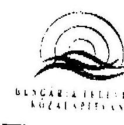

# Dr. Kovács Árpád elnök úrnak 

Állami Számvevőszék Budapest

Tisztelt Elnők Úr !

A Hungária Televízió Közalapítvány és a Duna Televizió Rt. müködéséről készített jelentésükhöz megjegyzésünk nincs, azt köszönettel tudomásul vesszük.

Budapest, 2004. április 1.
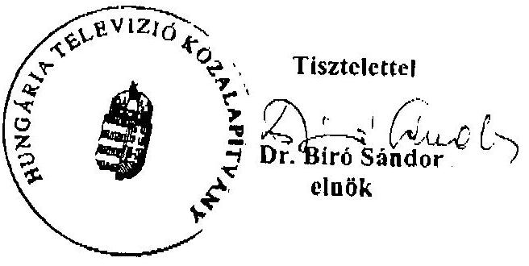

---

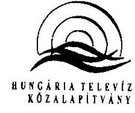

1. számú melléklet

H-1016 Budapest, Mészáros utca 48-54.
Telefon: 355-9327; 355-8249
Fax: 355-9691

1L15/2004

ÁLLAMI SZÁMVEVÉSZÉK
ÜGYVITELI IRODA
AM-0628/2004
Firkezel: 2004 FEBR 08.
Iktatószám: V-16-29/02-04
Melléklet:

Állami Számvevőszék
Budapest

Tisztelt Bihary Zsigmond Úr !

Állami Számvevőszék
Budapest

Tisztelt Bihary Zsigmond Úr !

Mezedlé's V

Az Önök által küldött „, Jelentés a Hungária Televízió Közalapítvány és a Duna Televízió Rt. működésének ellenőrzéséről" szóló anyagot a HTVKA Elnöksége megtárgyalta. Észrevételt nem kívánunk tenni.

Budapest, 2004. február 5.

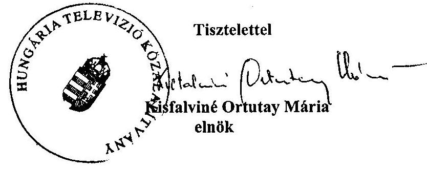

---

# A Duna Televízió Rt. belső szabályzatairól 

1. A hatályos SZMSZ és a gyakorlat ellenmondására példa a társaság Központi Archívumának státusa. Az SZMSZ szerint a Központi Archívum a kulturális igazgató alá tartozik, de felettese még a művészeti igazgatóhelyettes és az adáslebonyolítási osztályvezető. A főarchivátor - dátum nélküli - munkaköri leírása szerint közvetlen felettese a koordinációs igazgató. A programigazgató - ugyancsak nem dátumozott - munkaköri leírása szerint az archívum (nem központi, csak archívum) az ő irányítása alá tartozik, az igazgató közvetlen felettese pedig az elnök. A Központi Archívum vezetőjének közvetlen alárendeltjei a Központi Archívum munkatársai, helyettese az archivátor, akinek közvetlen felettese - munkaköri leírása szerint - a koordinációs igazgató. A helyszíni vizsgálat alatt átadott, a jelenlegi működést leképező szervezeti ábra szerint a Központi Archívum a programigazgató irányítása alatt áll.
2. A 11. sz. elnöki utasítással 1997. június 12-én kiadott Szervezeti és Működési Szabályzat szerint az elnök közvetlen irányítása alá az Elnöki Iroda, az elnöki tanácsadók, a Jogi Iroda, a Duna Műhely, a Hír és Sajtóiroda és a Kommunikációs Központ tartozott. Az elnök felügyelet alatt álló három alelnök (művészeti, tájékoztatási, gazdasági) közvetlenül irányította az alárendelt $(6,5,10)$ szervezeti egységeket. ${ }^{1}$

A 30. sz. elnöki utasítással 2000. május 31. napján kiadott Szervezeti és Múködési Szabályzat szerint az elnök közvetlenül irányítása alá tartozott az Elnöki Iroda, az alelnökök (művészeti, tájékoztatási, szolgáltató műsorok, programot felügyelő, gazdasági) és az igazgatók (jogi és igazgatási, dramaturgiai, koordinációs). Az alelnökök és igazgatók közvetlenül irányították az alárendelt $(5,5,3,4,9,3,2,11)$ szervezeti egységeket.

A 43. sz. elnöki utasítással 2001. július 27-én kiadott, jelenleg is hatályos, Szervezeti és Múködési Szabályzat szerint az elnök közvetlen irányítása alá tartozik az alelnök, az igazgatók (kulturális, hír, határon túli és kisebbségi, gazdasági, marketing), valamint a produkciós vezető és a kabinetfőnök. Az alelnök felügyelete alá tartozik a kulturális igazgató és két helyettese, a hínigazgató, a határon túli és kisebbségi ügyekért felelő igazgató, továbbá a felügyeletük alá tartozó szervezeti egységek és műsortípusok. A gazdasági igazgató 5, a marketing igazgató 4, a produkciós vezető 4, a kabinetfőnök 6 szervezeti egységet felügyel, irányít.
3. A Duna TV Rt. vizsgált időszakban hatályon kívül helyezett és hatályos SZMSZ-ei, illetve a vázlatos tervezet számos ponton nem felelnek meg a

[^0]
[^0]:    ${ }^{1}$ A felső vezetők (elnők, alelnök, igazgató, igazgató helyettes, produkciós vezető, kabinetfőnök) száma az SZMSZ szerint 1997-ben 4 fő, 2000-ben 8 fő, 2001-ben 11 fő, 2003-ban (az SZMSZ tervezete szerint): 12 fő.

---

szervezeti és működési szabályzat tartalmi követelményeinek. Tekintve, hogy a szabályzatok és a tervezet „törzsanyaga" nagymértékben azonos, a hatályos SZMSZ rendelkezéseire hivatkozással mutatunk rá néhány hiányosságra.
A) A szabályzat következetlenül, nem a tartalmának megfelelően alkalmazza az irányítás és a felügyelet fogalmát. Ez a hatáskörök gyakorlásában, a feladatok végrehajtásának értékelésében, illetve az esetleges felelősség megállapításában gondot okozhat.

Az elnök közvetlen irányítása alá tartoznak: az alelnök, a kulturális igazgató, a hírigazgató, stb. (2.1. pont-15. oldal). Az alelnök felügyeletileg közvetlenül az elnökhöz tartozik. (2.2. pont-15. oldal) Az alelnök felügyelete alá tartozik a kulturális igazgató, a hírigazgató, stb. (2.2. pont-16. oldal) Az igazgatók felügyeletileg közvetlenül az elnökhöz tartoznak. (2.3. pont-16. oldal) És így tovább ...

A felügyeleti jog magában foglalja az irányítás és az ellenőrzés jogkörét, de nem tartalmazza a közvetlen utasítás jogát. Az irányítási jog ezzel szemben a közvetlen utasítási jog gyakorlását is jelenti. Ennek fényében a felső vezetők, vezetők hierarchikus hatásköre nem értelmezhető a Szabályzatban foglaltak szerint.
B) A szervezeti és működési szabályzat egyik célja, hogy a hatáskörök megosztását pontosan szabályozza. Ez azt jelenti, hogy az első számú vezető, jogszabályi rendelkezés hiányában, a saját „teljes" hatáskörét megosztja, és ezt tételesen rögzíti az általa kiadmányozott szabályzatban. A Duna TV e követelménynek nem tesz eleget.

A szabályzat két helyen is foglalkozik a munkáltatói jogkör gyakorlásával, illetve annak átadásával a 2.1. pont ly) alpontja rendezi egyrészt a munkáltató jogok elnöki gyakorlását, illetve annak megosztását. A rendelkezés nem tartalmazza, hogy mely munkáltatói jogokat delegál az elnök.

Az 1.3. pont a munkáltatói jogkör gyakorlása címet viseli, de nem sorolja fel a munkáltatói jogok teljességét és itt sem határozza meg pontosan, hogy az elnök mely hatásköröket ad át, illetve a leadott hatáskörök közül melyek delegálhatók tovább. Egyedül a főszerkesztők hatáskörében nevesíti pontosan a szabályzat a leadott munkáltatói jogot: javaslatot tesznek jutalomra, prémiumra, munkatársak átsorolására, előléptetésre, szankcionálásra (2.7. pont).
C) A szabályzat nem rendelkezik a munkaköri leírások tartalmáról, az elkészítés határidejéről, rendszeres karbantartásáról sem. A szúrópróbaszerűen áttekintett 26 munkaköri leírás tartalmában igen eltérő volt, 9 nem tartalmazott dátumot. 2003. július 10-én 107 munkatárs nem rendelkezett munkaköri leírással.
D) A szabályzat sem az elnök, sem a vezetők esetében nem tartalmaz általános helyettesítési rendelkezést. Ennek hiánya - például vis maior esetén megbéníthatja a Duna TV Rt. múködését.
E) Az ellenjegyzés fogalmát nem megfelelően használja a szabályzat. Legtöbbször az előzetes véleményezéssel keveri össze. Például: „kiadás előtt vé-

---

leményez és ellenjegyez valamennyi belső utasítást, figyelemmel azok összhangjára"
F) Az irányítás írásos eszközeinek részben pontatlan, részben hiányos megfogalmazása a gyakorlatban gondot okozhat. Az alelnöki és az igazgatói utasításokat kiadásuk előtt, tervezet formájában az Elnöki Kabinet elé kell terjeszteni, az utasítás kiadásáról az elnök dönt (3.1. pont). Ugyanitt „egyéb írásos vezetői rendelkezésekől" szól a szabályzat, de azokat pontosan nem sorolja fel. Ez a szabályozási mód lehetséges volna akkor, ha az utasítások rendjéről külön szabályzat rendelkezne, ahol nevesítve szerepel minden egyes ún. egyéb írásos vezetői rendelkezés. A gyakorlatban ez azt eredményezi, hogy születhet olyan vezetői körlevél, amely elnöki utasítást módosít.

A gazdasági alelnök 2002. január 9-én kelt feljegyzése ideiglenesen módosította a 33. sz. Elnöki utasítást, melyről a szervezeti egység vezetőit a produkciós vezető körlevélben értesítette.
G) A szabályzat nem tartalmazza az együtt alkalmazandó elnöki utasítások felsorolását.
4. Az archiválási szabályzat hiányát nem pótolja a ma is hatályos 1995. október 11-én kiadott főigazgató-helyettesi utasítás a napi adás VHS kazettán történő dokumentálásáról, továbbá a határon túli és vidéki anyagok archiválási rendjéről 2001-ben készült elnöki utasítás tervezete sem. Ugyanakkor a kuratórium által elfogadott Archiválási Szabályzat egy lényeges kérdésben nem felel meg a médiatörvény előírásainak, nevezetesen a törvény egy archívum létrehozásáról rendelkezik. A kialakult helyzetet jól jellemzi az Elnöki Kabinet 2001. február 12-i ülésére benyújtott javaslat bevezetője: „A Duna Televízió munkatársai, számos forgatással a hátuk mögött, számos olyan anyagot őriznek a szekrények mélyén, ami valamilyen okból nem került adásba, de kedves számukra, s eltették azokat 'valamire egyszer jó lesz' észérvvel. A vágási idők hiánya, a feledés homálya, s az archiválás megoldatlan volta közösen játszottak szerepet a párhuzamos archívumok kialakulásában. Nem egy munkatársunk szekrénye valóságos kincsesbánya lehetne a Duna TV számára, de érdek híján látens marad."
5. A vizsgált időszakban hatályos számlarendekből például nem állapítható meg, hogy a szakértőknek, tanácsadóknak kifizetett díjakat mely számlákra könyvelték a társaságnál. A főkönyvelő tájékoztatása szerint a nem számlaképes szakértőknek, tanácsadóknak kifizetett megbízási díjat a bérköltség közé „Állományon kívüli bér"-ként könyvelte el a társaság, a számlát kiállító egyéni vállalkozóknak, gazdasági társaságoknak kifizetett szakértői díjat pedig az „Egyéb szolgáltatások" főkönyvi számlára könyvelték. A számlarendben csak az „Egyéb szolgáltatások" főkönyvi számla tartalmát definiálták, de azt is csak az 1997-2000. években. Ez utóbbi szerint: „Ezen a számlán kell elszámolni az Rt. múködése során igénybe vett szolgáltatásokért fizetett díjakat. Pl. könyvvizsgáló díja, softwer felügyelet, ügyvédi díj stb."

---

# A szerződések nyilvántartásának rendje a Duna Televízió Rt.-nél 

Az 1998. május 1-jétől 2001. július 1-jéig hatályos kötelezettségvállalási rend semmilyen előírást nem tartalmazott a szerződések nyilvántartására vonatkozóan. A 2001. július 1-jétől hatályos utasítás egy hiányos, hibás mondatban ugyan, de megkísérelte a nyilvántartási kötelezettséget megfogalmazni. A kötelezettségvállalás rendjét (az utalványozás szabályozásával együttesen) 2002. március 1-jétől megújították. Az új szabályzatról a Jogi Főosztály kötelező ellenjegyzése hiányzik, fogalmazása nem egyértelmű, tartalma nehezen értelmezhető. A kapcsolódó utasításokkal, körlevelekkel együtt nehezen áttekinthető halmazt alkot.

Az új szabályzatban említett alelnökök a hatályban lévő SZMSZ-ben még nem szerepelnek. A benne hivatkozott 1./2001. sz. Gazdasági Igazgatói Utasítás egy korábbi - a 9. sz. módosított Gazdasági Alelnöki Utasítás - módosítása, de rosszul hivatkozik vissza annak elnevezésére, tartalmára. A korábbi, módosított alelnöki utasítás bevezető mondatának indoklása ugyancsak nehezen értelmezhető, mondanivalója pedig részben a kötelezettségvállalások rendjének kiegészítése. Az 1./2001. sz. utasítást később körlevél (a 7. sz. Alelnöki Körlevél) módosította. Mindemellett hatályban van az 1997-ben kiadott 12. sz. Elnöki Utasítás is, amelynek mondanivalóját a jelenleg hatályos utasítás tartalmazza. Ugyancsak a kötelezettségvállalások rendjét érintik azok a szabályok is, amelyeket a 2002. június 1-jétől hatályos 22. számú Alelnöki Körlevél tartalmaz a rendszeres személyes munkavégzésre vonatkozó szerződések és a teljesítményigazolások új rendjéről.

A 22. számú Alelnöki Körlevél mintegy megfogalmazza a rendszer kritikáját is a következő mondataival: „Általános tapasztalat, hogy a vezetők és a munkatársak egy része nem ismeri, vagy szokásjog alapján nem tartja be a március 1-től hatályos, a Duna Tv Rt. kötelezettségvállalási és utalványozási rendjéről szóló 52. sz. elnöki utasítást. Felhívom a tisztelt munkatársak figyelmét, hogy a fent hivatkozott elnöki utasításban foglaltakat figyelmen kívül hagyó dolgozókkal szemben érvényesiteni fogjuk az elnöki utasítás 8. pontjában megfogalmazott munkajogi szankciókat. Ezen túlmenően a jogosultság nélkül vállalt kötelezettség alapján keletkezett anyagi konzekvenciák csak a jogalap nélkül kötelezettséget vállalóval szemben érvényesithetők."

Az új szabályzat szerint a szerződéskötést kezdeményező szervezeti egység köteles a szerződés aláírt, eredeti példányát lefűzni és nyilvántartani, és a blanketta és típusszerződések kivételével a Jogi Főosztálynak eljuttatni. A nyilvántartás tartalmára nincs előírás. A Jogi Főosztályon a kapott szerződésmásolatokat kronologikus sorrendben lefűzik, de a gyűjtemény teljes körűsége nem garantált. A jogi ellenjegyzésre kötelezett szerződésekről biztosan rendelkeznek példánnyal, de abból nem feltétlenül lesz aláírt szerződés. Az összegyűjtött szerződésmásolatokról vezetett nyilvántartás nem alkalmas a szerződések tartalmi szempontok szerinti áttekintésére.

A 2001. július 1-jétől elrendelt nyilvántartási kötelezettség ellenére még az Elnöki Irodán sem teljes körű az elnök által kezdeményezett szerződések nyilvántartása. Az Elnöki Irodán, a Humánpolitikai Főosztályon és a Pénzügyi Főosztályon az 1997-2003-ban kötött szakértői, tanácsadói szerződésekről összeállított

---

listákon összesen 27 db különböző szerződés szerepelt. Ezek közül 17-et a jelenlegi elnök írt alá, ezen belül 11 esetben a teljesítés igazolására is ő jogosult. Az utóbbiak közül pedig mindössze négy szerződés volt megtalálható az Elnöki Irodán.

Az „Egyéb szolgáltatások" főkönyvi kartonjai - amelyeken többek között a szakértői, tanácsadói szerződésekből adódó költségeket is könyveli a társaság - 3070 oldalasak az egyes ellenőrzött években. A könyvelt tételekhez írt megjegyzésekből kevés esetben állapítható meg, hogy az a költségtétel milyen címen merült fel. Ennélfogva a könyvelt adatok, információk alapján utólag nem lehet kimutatni, hogy az egyes ellenőrzött években a társaság mennyit költött szakértés, tanácsadás címén. A kimutatás elkészítéséhez teljes körűen ismerni kellene a szakértői, tanácsadói szerződésekből a szolgáltató partner nevét, amit viszont a fentebb írottak szerint a szerződések nyilvántartásának hiányosságai nem tesznek lehetővé.

---

# A Duna Televízió Rt. forgótőkehiánya 

A társaság és a Hungária Televízió Közalapítvány folyamatosan azt a nézetet képviselte, hogy a társaság megalakulása óta forgótőkehiánnyal küzd, és ez folyamatos likviditási gondokat okoz neki. Forgótőkével való ellátását sem az alapításkor, sem a médiatörvény életbeléptetésekor nem oldották meg. A forgó-tőke-ellátás rendezése érdekében 2000 májusától kezdődően a közalapítvány több alkalommal fordult kéréssel különböző fórumokhoz.

A hiány nagyságáról a közalapítvány és a társaság véleménye eltért. A közalapítvány 2002 májusában az alapítás óta fennálló forgótőkehiány megszüntetésére 3 milliárd Ft forgótőke-juttatást tartott szükségesnek. A társaság elnöke viszont a Duna TV Rt. évek óta görgetett forgótőke hiányát egyszeri 2 milliárd Ft tőkejuttatással látta pótolhatónak 2002 júniusában.

Ez utóbbit támasztja alá az a 2002 májusában a társaság 1993-2001. évi gazdálkodásáról készített beszámoló, amely a forgóeszköz-ellátottság címszó alatt elemzi a forgótőkehiányt. E tekintetben a társaság vizsgálódása - többi témától eltérően - csak az 1998. évi adatokkal kezdődik. A mérlegadatokból kiegészítve az elemzést az előző és következő évek hasonló adataival, illetve a beruházásokhoz kapott vissza nem térítendő támogatásokból a passzív időbeli elhatárolások között (2001-től halasztott bevételként) nyilvántartott adatokkal, a társaság nettó forgótőkéje az egyes évek végén az alábbiak szerint alakult:
(millió Ft)

|  | 1997 | 1998 | 1999 | 2000 | 2001 | 2002 | 2003.   I.   félév |
| :-- | :--: | :--: | :--: | :--: | :--: | :--: | :--: |
| Nettó forgótőke (időbeli elhatá-   rolással) | -38 | -410 | -451 | -501 | -1006 | -652 | -453 |
| Halasztott bevétellel módosított   nettó forgótőke (időbeli elhatá-   rolással) | 158 | -215 | -290 | -375 | -624 | -312 | -139 |
| Halasztott bevétel a passzív   időbeli elhatárolások között* | 196 | 195 | 161 | 126 | 382 | 340 | 314 |
| Fizetett kamatok a pénzügyi   műveletek ráfordításai között | 37 | 19 | 0 | 2 | 37 | 16 | 4 |

*A halasztott bevétel fogalmát a számvitelről szóló 2000. évi C. törvény vezette be. A tv. 45. § (1) bekezdése szerint:
„A passzív időbeli elhatárolások között halasztott bevételként kell kimutatni a rendkívüli bevételként elszámolt
a) fejlesztési célra - visszafizetési kötelezettség nélkül - kapott, pénzügyileg rendezett támogatás és a véglegesen átvett pénzeszköz összegét,....
(2) A támogatásonként, a véglegesen átvett pénzeszközönként,... kimutatott halasztott bevételt a fejlesztés során megvalósított eszköz,...bekerülési értéke arányos részének

---

költségkénti, illetve ráfordításkénti elszámolásakor kell a rendkívüli bevételekkel szemben megszüntetni."

A hatályos számviteli előírások szerint azonban már 1997. január 1-jétől a fenti szabályt kellett alkalmazni.

A cégvezetés érvelése szerint nem csak a 2001. évi 1 milliárd Ft-os hiány pótlására szorul rá a társaság, ugyanis normális esetben egy cégnek pozitív nettó forgótőkével kell rendelkeznie. A társaság esetében ez további 1 milliárd Ft forgótőkeigényt jelent.

A nettó forgótőke hiányának és szükséges nagyságának reális megállapításához a társaság elemzése és érvelése nem elegendő. Legalább az alábbi észrevételek tehetők a számítással kapcsolatban:

- A halasztott bevétel lényegében a befektetett eszközök hosszú lejáratú forrásaként funkcionál, ezért azt a passzív időbeli elhatárolások közül célszerű kiemelni a hiányzó nettó forgótőke pontosabb meghatározása érdekében.
- A 2001-2002. éveket kivéve éves szinten a társaság pénzügyi műveletei nyereségesek voltak, és ezen belül összes kamatbevétele nagyobb volt, mint öszszes kamatkiadása. Ez nem likviditási hiányról tanúskodik. Az éves szinten fizetett kamatok összege és a társaság nettó forgótőkéje év végi hiányának nagysága között láthatóan nincs összefüggés. Éves átlagos adatokkal számolva nagy valószínűséggel módosulnának a likviditási hiányra vonatkozó információk.
- A Duna TV Rt. múködéséből nem a klasszikus értelemben vett forgótőke hiányzik, mert tevékenysége nem igazi vállalkozás. Inkább hasonlít a költségvetési szerv tevékenységéhez, mint vállalkozáséhoz. Bevételeit csaknem teljes egészében kapja, és nem a forgótőke éven belüli többszöri megforgatása révén szerzi. Ha a tényleges bevétele nem kevesebb, mint amennyinek elköltését tervezte, és a bevétel kiszámíthatóan érkezik, akkor nem alakul ki nála olyan mértékű likviditási hiány, amely jelentősebb forgótőke-tartalékot igényelne. A Duna TV Rt.-nél a befektetett eszközök fejlesztésének finanszírozása nincs megoldva. A szabad tőke a beruházásaihoz hiányzik. Ilyen értelemben nem mondható, hogy 1 milliárd Ft-os nettó forgótőke tartósan megoldaná a problémákat.

A 2000-2003. I. félévi mérlegadatok alapján a társaság befektetett eszközeit rövid lejáratú források finanszírozták. Például 2001. dec. 31-én a befektetett eszközök értéke 2029 millió Ft volt. A tartós források közül a saját tőke értéke 976 millió, a hosszú lejáratú kötelezettségeké 47 millió, a halasztott bevételeké 382 millió Ft volt. A tartós források összesen 1405 millió Ft-ot tettek ki. A hiányzó tartós forrás tehát 624 millió Ft, a társaság rövid lejáratú kötelezettségeinek állománya (szállítók, hitel, egyéb) pedig 931 millió Ft volt.

---

# A Duna Televízió Rt. néhány konkrét bartermegállapodása 

2002-ben a Nemzeti Autópálya Rt. vállalta, hogy 1 millió Ft értékben autópálya matricát ad a Duna televízió gépkocsijai számára, és 1 millió Ft-ot kifizet. Ennek fejében a Duna TV 2002. január-február hónapokban a Nemzeti Autópálya Rt. reklámfilmjét 67 alkalommal sugározza előre megállapodott időpontokban.

A Márványmenyasszony Vendéglő Kft. 2000 decemberében kelt megállapodás szerint bruttó 1 millió Ft értékben étkezési jegyet biztosított a Duna TV részére. A televízió vállalta, hogy a vendéglő szolgáltatásait reklámmal viszonozza.

Barterben szerezték be a Duna TV uszodája számára 2 millió Ft + ÁFA értékben az automata vegyszeradagolót és egyéb uszodatechnikai berendezést a BWT Hungária Kft-től, és 1 db kerti traktort hólánccal és hótolólappal az AL-KO Budapest Kft.-től.

A SAFARI Park hirdetését 2000. március 14-től október 15-ig a Dunatext egy főoldalán és egy aloldalán jelentette meg a Duna TV, bruttó 170 ezer Ft és 10 db családi belépő, valamint 4 nagyméretű plüss állatfigura fejében.

A BÁV Rt.-vel 2001. november 23-án megkötött szerződés szerint a BÁV Rt. 10 375 ezer Ft + ÁFA értékben hirdetési felületet biztosít a Magyar Nemzetben a Duna TV számára, reklámfilmek sugárzása és gyártása fejében. A Magyar Köztársaság 2001. és 2002. évi költségvetéséről szóló 2000. évi CXXXIII. törvény 59. § (1) c) pont előírása szerint szolgáltatás megrendelése esetén a közbeszerzési értékhatár 9 millió Ft. A Duna TV ezzel az egy ügyletével (nincs összesítés arról, hogy tárgyévben a barterszerződéseket is beszámolva mennyi sajtóhirdetést rendelt meg a televízió) átlépte a közbeszerzési értékhatárt, így a hirdetést pályázaton kiválasztott országos napilapban kellett volna közzé tennie. A bartermegállapodással a Duna TV megkerülte a közbeszerzési törvény alkalmazását.

A Magyar Állami Operaházzal többször is kötött a vizsgált időszakban bartermegállapodást a Duna TV, így 1999. szeptember 9-én, október 19-én, 2001. január 20-án. A felek mindegyik esetben megállapították, hogy megállapodásuk a Brimex Bt. közvetítésével jött létre. A megállapodások szerint az Operaház jegyeket, illetve bérleteket biztosít a Duna TV-nek, amely pedig músorajánlókban megjeleníti a Magyar Állami Operaház nevét, illetve reklámfilmet sugároz. A 2001. évben megkötött barterszerződés szerint az Operaház az évadra 2750 ezer Ft + ÁFA összegben belépőjegyeket biztosít reklámsugárzás fejében. A belépőjegyek helyett azonban különféle műszaki cikkeket küldött a Duna TV-nek a Brimex Bt.-n keresztül. A műszaki cikkek számlázása és bevételezése nem történt meg. Az ügyben belső vizsgálat volt a Duna TV-nél, melynek eredményeképpen a műszaki cikkeket - 2 db Zsolnay váza és 40 db VHSkazetta - kivételével megtalálták.

---

# A Duna TV Rt. beruházásai 

Az 1997. évi jelentős beruházással elkészült a Duna TV stúdióvezérlő és adáslebonyolító rendszere. A közel 500 millió Ft-os beruházás lebonyolításához a társaság hitelt vett igénybe, amit a beérkezett koncessziós díjból fizetett vissza. A beruházáshoz 250 millió Ft vissza nem térítendő céltámogatást is kapott a Pénzügyminisztériumtól, amit az amortizációval arányosan számol el saját bevételként.

1998-ban kiegészítő berendezések vásárlásával kompletté tették a beruházást. Ekkor épült meg a szinkronstúdió, az egyéb apróbb (pl. képmagnók, kamerák stb.) beruházás mellett. A tervektől való elmaradás oka a reméltnél alacsonyabb költségvetési támogatás volt.

1999-ben vásárolták meg a szigetszentmiklósi díszletraktárt 6313 ezer Ft aktivált értékben. 63600 ezer Ft-ért kamerákat, monitorokat, 31815 ezer Ft-ért gépjárműveket vettek. A megvalósult beruházások értéke ugyan a tervezettnek $174,2 \%-a$, de az éves amortizációnak csak $60,8 \%-\mathrm{a}$.

2000-ben a parkoló statikai problémáit küszöbölték ki, és lefektették egy integrált vállalatirányítási rendszer alkalmazásának alapjait, az összes számítógépet hálózathoz csatlakoztatták. Az összesen 200 millió Ft értékű beruházáshoz 140 millió Ft hitelt vett fel a társaság, 2003. december 15-i lejárattal.

2001-ben a tervezett beruházások alig fele valósult meg, az amortizáció $64,3 \%$-os szintjén. A megvalósult beruházások stúdiótechnikai és informatikai beszerzések, valamint az épülettel és a gépkocsiparkkal kapcsolatos legszükségesebb ráfordítások voltak. Forrásuk részben a már említett beruházási hitel és az Illyés Közalapítványtól kapott 300 millió Ft beruházási támogatás volt.

Az Illyés Közalapítványtól kapott támogatás 2001 márciusában érkezett be a Duna TV Rt.-hez, és az alapítvány határozata szerint 2001. december 31. volt az elszámolás határideje. A támogatásból 2001-ben csak 110 millió Ft-ot fordítottak beruházásra, ezt az összeget az alapítvánnyal el is számolták. A fennmaradó 190 millió Ft elszámolásának határidejét az alapítvány 2002. május 30-ig meghosszabbította. A Duna TV a helyszíni vizsgálat végéig nem számolt el, a 190 millió Ft-ot nem beruházásra, hanem egyéb szükségleteikre fordították. A Duna TV több ízben további halasztást is kért, legutóbb 2003 júliusában 2003. december 31-ig. Akkor - annak ellenére, hogy a Hungária Televízió Közalapítvány Kuratóriuma még nem döntött a költségvetési juttatás felhasználási céljáról - arról tájékoztatták az alapítványt, hogy a 2003-ban az Országgyűlés által megszavazott 691,8 millió Ft tőkejuttatásból a TV „biztonsággal rendezni tudja" a 190 millió Ft elszámolását. A Duna TV Rt. a halasztást megkapta az elszámolásra, 2003. december 31-ig. Annak ellenére, hogy az első elszámolási határidő elteltével az Rt.-nek visszafizetési kötelezettsége keletkezett, az összeget a 2002. évi mérlegben a passzív időbeli elhatárolások között halasztott bevételként tartották nyilván, és nem kötelezettségként szerepeltették.

---

2002-ben a tervezett 300 millió Ft beruházás helyett ténylegesen megvalósult 96,4 millió Ft. A tervvel ellentétben egyáltalán nem költöttek az informatikai rendszerre, és az ingatlanokra fordított összeg is a tervezett 24 millió Ft helyett 4,8 millió Ft lett.

A Duna TV Rt. 2003. évi üzleti tervében a korszerű technika biztosítása érdekében 1,04 milliárd Ft összegű műszaki beruházást tervezett. A tervezett beruházások célja az adásbiztonság fenntartása, a képi megjelenítés korszerűsítése, de az ügyvitelt szolgáló archiválási rendszert és az épület állagmegőrzési szempontjait is figyelembe veszi. A tervek a műszaki garnitúra hozzáértését, a világszínvonalú technika ismeretét tanúsítják.

---

# A közbeszerzési értékhatárt meghaladó beszerzések 

- Neuropa Kft. 2000 évben gyártási szolgáltatást végzett a Duna TV-nek. A szerződés szerint „A feledés zöldje" című 90 perc hosszúságú televíziós film elkészítésével közvetlenül bízta meg a kft-t a Duna TV. Pályáztatás gyártók között nem volt. A film előzetes költségvetése az 1. pont szerint 54988900 Ft. A 4. pontban az szerepel, hogy a kft.-t bruttó 39988900 Ft illeti meg, tehát 15 millió Ft-tal kevesebb, mint amennyi a költségvetésben szerepel. Felek ugyanebben a pontban rögzítik, hogy az összegből a Duna televízió 20 millió Ft-ot a film elkészítéséhez nyújtott ORTT gyártási támogatásából fizet meg. Ellenértékként szerepel az is, hogy a Duna TV bruttó 5 millió Ft értékben felvételi és utómunka kapacitást biztosít gyártónak. Az 5. pontban felek rögzítik, hogy a film elkészítéséhez hiányzó összeget a gyártó egy másik támogatásból pótolja, de ha azt nem kapja meg, akkor annyival kevesebből állítja elő a filmet. A folyószámlája szerint 2000-ben összesen 35, 2001ben 5 millió Ft-ot számlázott a produkcióért a Neuropa Kft. Ebből következően a Duna TV a szerződött, 5 millió Ft értékű közbenső szolgáltatásait nem számlázta, ami sérti az Szt. szerinti bruttó elszámolás elvét.
- A közbeszerzési értékhatárt meghaladó beszerzés volt az ERIX Biztosításközvetítő és Tanácsadó Kft. 2000. és 2002. évi tevékenysége. A kft. nem a saját tevékenységét számlázta, hanem azokat az autó, épület, utazási, kamera stb. biztosítási díjakat, amelyekhez a különféle biztosítókat megpályáztatva a Duna TV szükségleteinek megfelelően előzőleg kiválasztott. Tevékenységének tárgya szerződések karbantartása és a díjak továbbítása. Így saját tevékenysége nem éri el az összeghatárt, nem tartozik a közbeszerzési törvény hatálya alá.
- ÁSZ Kult. és Szolg. Bt. feladata gyártási szolgáltatás és bérbeadás volt 25,2 millió Ft értékben. Ebből a gyártási szolgáltatás 14,7 millió Ft értékű volt, amely mögött 30 db megbízási szerződés áll. A szerződések közül többnek nincs meghatározva a tárgya, és egy esetben az is előfordul, hogy összeg sem szerepel benne, bár mindkét fél aláírta. A Bt. neve többször is előfordul a munkatársak számlás kifizetéseihez kapcsolódóan.

---

# A Duna TV Rt. szerkesztőségeiben tárolt saját műsoranyagok 

Valamilyen műsor elkészítésével megbízott munkatársak a kész műsorok többszörösét forgatják le időben. Esetenként, különösen külföldi helyszínen egyéb eseményt is rögzítenek, mint amiért kiutaztak. A vágás után fennmaradó többleteket saját archívumokban tárolják, amely anyagok számbavételére és hasznosítására több ízben is kísérletet tett a társaság.

Már az 1997. február 13-i elnöki értekezlet határozatai között szerepelt, hogy „szabályozni kell a mühelyek vezetőivel egyeztetve - az archívum számára térítésért átadható, későbbi felhasználásra készülő vágóképek, tartalék-anyagok megrendelésének és költségelszámolásának, illetve térítésének módját."
1998. február 24-i emlékeztető szerint „Az adáskazetták és a felvételi anyagok megőrzésének, tárolásának és használatának módját alelnöki utasításokban kell szabályozni. hi: márc. 31., felelősök: alelnökök." Se a határozat teljesítésével foglalkozó elnöki értekezletről nincs szó a dokumentumokban, se maguk a határozatok nem voltak fellelhetők.

2000-ben múszaki igazgatói javaslat fogalmazza meg, hogy „a Duna Televízió dekoncentrált archiválási rendszerrel rendelkezik, amely archívumot, szalagtárat, Híradó, szerkesztőségi és személyes archívumokat is tartalmaz. Az ezekben tárolt képi anyag, az érték, mások számára ismeretlen és ezáltal hozzáférhetetlen."

2001-ben újabb javaslat született az elfekvő, adásba nem került anyagok feldolgozására. A javaslat szerint „A vágási idők hiánya, a feledés homálya, s az archiválás megoldatlan volta közösen játszottak szerepet a párhuzamos archívumok kialakulásában."

A 2001. január 19-i kabinetülés emlékeztetője szerint:„A zenei archívumban kb. 500 óra anyag van BI szekrényében elrejtve."

A kezdeményezések ezidáig semmilyen kimutatható eredményre nem vezettek. A megoldáshoz nyilvánvalóan pénz is kell, amely az egyik javaslattévő megállapításai szerint meg is térülne. A 2003. évi terv negyedik helyen 110 milliárd Ft beruházási igénnyel tartalmazza a rendezéshez szükséges hardver- és szoftverberuházást.

---

# A műsorstruktúra (műsorrács) változásainak értékelése a társaság éves beszámolóiban 

1997 A műsorstruktúrát megmerevítette a túlzásba vitt magazinszerkezet, hiányoztak a tényfeltáró dokumentummúsorok, változatlanul elégtelen volt a távoktatásban rejlő lehetőségek kiaknázása. Ugyanakkor magas színvonalon múködött az eredeti alkotások létrehozására kialakított Duna Műhely.

1998 Az előző évi problémák változatlansága mellett, szerkesztői túlbiztosításra vallott az élő műsorok alacsony száma.

1999 A korábbi évek negatív tapasztalataiból okulva a műsorszerkezet módosult, leegyszerűsödött a tagolt magazinszerkezet, több lett a do-kumentum- és az élőmúsor.

2000 Az új elnök 2000. szeptember 22-i megválasztásával a megújulási folyamat is kezdetét vette. Ennek első állomása az arculat megváltoztatása volt. Évvégére elkészültek az új látványi elemek. Januárra új műsorszerkezet készült. A hangsúly a reggeli, a délutáni, koraesti műsorokra irányult, késő este pedig értelmiségi műsor indult. Változatlanul a filmkínálat volt az erőssége a műsorszerkezetnek.

2001 Sikeres volt az arculatváltás. A hírműsorokat megújították, a híradó, a reggeli műsor - szakmai szempontok szerint is - felzárkózott a kereskedelmi televíziók hasonló műsorai mellé. A hazai nézettség több mint 10\%-kal emelkedett. Az őszi nézőbarát filmcsomag indítása sikeres volt, erősödött az értékorientált, szelíd hangvételű filmek nézői köre.

2002 Ebben az évben számos műsor foglalkozott a Duna TV tízéves történetével. A Filmszemlén és egyéb televíziós fesztiválokon elismerés övezte a televíziót. Megvalósult az európai digitális sugárzás, és az év végén megkezdődött a tengeren túli kísérleti adás. A saját gyártású műsorok az alacsony gyártási költségkeretek miatt csökkentek.

2003 A tervek szerint a Duna TV növelni kívánta a hazai külső gyártású dokumentum- és ismeretterjesztő filmek vásárlását. A médiatörvény előírásainak betartása érdekében a saját gyártású gyermek- és ifjúsági filmek terén jelentkező műsorkínálatot kellett növelni. Kiemelt feladatnak tekintették az európai uniós csatlakozással kapcsolatos ismeretterjesztő önálló műsorok és blokkok rendszerének kidolgozását és megvalósítását. Erre a célra 180 millió Ft költségvetési többlettámogatást kapott a társaság a 10/2003 (II. 19.) OGY számú határozat alapján.

Az egyes műsorcsoportok arányait a Duna TV saját gyártású műsoraiban az alábbi kör-diagrammok reprezentálják. A diagrammok nemcsak a gyártott

---

műsorok szerkezetét, éves műsorban való megjelenésüket, hanem azok egymáshoz viszonyított arányát is kifejezik.
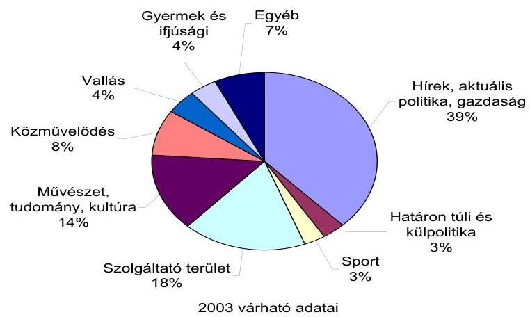

2003 várható adatai
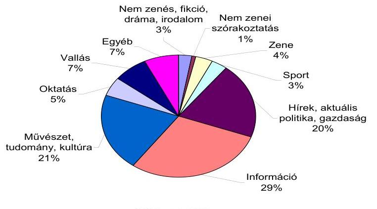

2002-es adatok
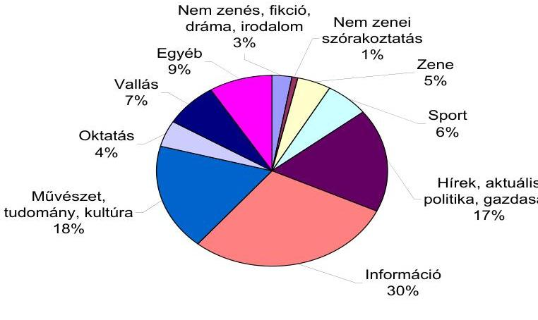

2001-es adatok

---

# A Duna TV Rt. összes élőmunka-ráfordítása 

Az alábbi táblázatban az állományi, illetve külső munkatársaknak kifizetett állományon kívüli béreket a „Megbizási dij" és a „Szerzői" sorok, az egyéni vállalkozóként és gazdasági társaságon keresztül költségként kifizetett élőmunkaköltségeket a „Humán jellegü" és a „Gyártási szolg." sorok tartalmazzák.

Az állományon belüliek és kívüliek gazdasági társaságon keresztül vagy egyéni vállalkozóként számlázott „Humán jellegü" és a „Gyártási szolg." elnevezésű tevékenységének ellenértékét csak 2002-től tartják elkülönítve nyilván. A nem állományba tartozó munkatársak benyújtott számlái, illetve a „Humán jellegü" élőmunkaköltséget fedő számlák a Duna TV egyéb szállítói között szerepeltek, így korábban itt nincs adat.
(ezer Ft)

|  | 1997 | 1998 | 1999 | 2000 | 2001 | 2002 | 2003. I. |
| :-- | :--: | :--: | :--: | :--: | :--: | :--: | :--: |
| Megbizási dij* |  |  |  |  |  |  |  |
| - állományi | 106155 | 84249 | 87112 | 93121 | 124580 | 91673 | 42994 |
| - áll. kívüli | 54691 | 73165 | 69583 | 71729 | 88200 | 76295 | 44134 |
| Szerzői* |  |  |  |  |  |  |  |
| - állományi | 94250 | 47648 | 40738 | 37631 | 43097 | 36296 | 20167 |
| - áll. kívüli | 80921 | 79377 | 76931 | 81601 | 69211 | 70852 | 37000 |
| Humán jellegü** |  |  |  |  |  |  |  |
| - állományi | n.a. | n.a. | n.a. | n.a. | n.a. | 35159 | 16837 |
| - áll. kívüli | n.a. | n.a. | n.a. | n.a. | n.a. | 86308 | 36134 |
| Gyártási szolg.** |  |  |  |  |  |  |  |
| - állományi | 120074 | 280604 | 359973 | 400640 | 564921 | 431336 | 213951 |
| - áll. kívüli | n.a. | n.a. | n.a. | n.a. | n.a. | 660467 | 384971 |

* bér
** számlázott élőmunka (gazdasági társaság vagy egyéni vállalkozó)

---

A Duna TV Rt. munkaerőmérlege
(fő)

|  | nyitó | kilépett | belépett | záró | átlag |
| :-- | :--: | :--: | :--: | :--: | :--: |
| 1997. | 387 | 29 | 59 | 417 | 394 |
| 1998. | 418 | 18 | 49 | 449 | 425 |
| 1999. | 449 | 46 | 32 | 463 | 445 |
| 2000. | 463 | 26 | 45 | 482 | 457 |
| 2001. | 482 | 48 | 38 | 472 | 456 |
| 2002. | 472 | 18 | 12 | 466 | 440 |
| 2003. I. | 466 |  |  |  | $488^{*}$ |

* tervezett

---

# Táblázatok jegyzéke 

1. A Hungária Televízió Közalapítvány bevételei az üzemben tartási díjból
2. A Hungária Televízió Közalapítvány gazdálkodásának főbb adatai
3. A közalapítvány által kifizetett megbízási és szakértői díjak
4. A közalapítvány tárgyi eszközeinek változása a vizsgált időszakban
5. A HTV KA saját tőkéje az 1997-2003. évi mérlegadatok alapján
6. A Duna TV Rt. bevételeinek és költségeinek tervszerűsége
7. A Duna TV Rt. év végi pénzügyi helyzetét jellemző főbb adatok
8. A Duna TV Rt. tárgyi eszközei értékének változása
9. A Duna TV Rt. barterbeszerzéseinek értéke
10. A Duna TV Rt. műsoridejének műsorfajták szerinti megoszlása

---

1. számú táblázat

A Hungária Televízió Közalapítvány bevételei az üzemben tartási díjból

| Évek | Alaptámogatás   (az üzemben   tartási díj \%-a) | Kiegészítő támo-   gatás (az üzem-   ben tartási díj \%-   a) | Összes támoga-   tás (az üzemben   tartási díj \%-a) | Összes támoga-   tás   ezer Ft |
| :-- | :--: | :--: | :--: | :--: |
| 1997 | 0,333 | 0,5 | 0,833 | 70862 |
| 1998 | 0,333 | 0,5 | 0,833 | 79626 |
| 1999 | 0,333 | 0,6 | 0,933 | 109993 |
| 2000 | 0,333 | 0,6 | 0,933 | 106671 |
| 2001 | 0,333 | 0,6 | 0,933 | 111611 |
| 2002 | 0,333 | 0,6 | 0,933 | 114852 |
| 2003 | 0,333 | 0,6 | 0,933 | 122382 |

2. számú táblázat

A Hungária Televízió Közalapítvány gazdálkodásának főbb adatai
(ezer Ft)

| Megnevezés | 1997 | 1998 | 1999 | 2000 | 2001 | 2002 | 2003.   jún. 30. |
| :-- | --: | --: | --: | --: | --: | --: | --: |
| Alaptevékenység eredménye | 7914 | 6636 | 1690 | 30046 | -92759 | 138811 | 1786 |
| Kamatbevétel | 11464 | 15356 | 12662 | 10891 | 11423 | 10721 | 5524 |
| Rendkívüli eredmény | 23 | -23560 | -3881 | -19532 | -40847 | -10089 | -627 |
| Közalapítvány mérleg   szerinti eredménye | $\mathbf{1 9 4 0 1}$ | $\mathbf{- 1 5 6 8}$ | $\mathbf{1 0 4 7 1}$ | $\mathbf{2 1 4 0 5}$ | $\mathbf{- 1 2 2 1 8 3}$ | $\mathbf{1 3 9 4 4 3}$ | $\mathbf{6 6 8 3}$ |
| HTV KA éves múködési   költségéből elért megtaka-   rítás | 7728 | 6301 | -811 | 29431 | 29307 | 10089 | - |
| Duna TV Rt. támogatása |  |  |  |  |  |  |  |
| Megtakarított múködési   költségből |  | 7800 |  | 20000 | 9431 | 29307 | 10089 |
| Állami céltámogatás |  |  |  |  |  |  | 180000 |
| Közalapítványi céltámoga-   tás útján |  | 15760 | 5130 |  | 1819 |  |  |
| Magánszemélyektől | 26 | 6 | 10 | 6 | 38 | 5 |  |

---

3. számú táblázat

A közalapítvány által kifizetett megbízási és szakértői díjak
(ezer Ft)

| Megnevezés | 1997 | 1998 | 1999 | 2000 | 2001 | 2002 | 2003* |
| :-- | --: | --: | --: | --: | --: | --: | --: |
| Megbízási díj | 1529 | 1510 | 1200 | 4407 | 6201 | 2694 | 1455 |
| Megbízási díj** | - | - | 1500 | 2344 | - | - | - |
| Szakértői díj | - | - | - | - | - | 1875 | - |

*2003. június 30-ig elszámolt költségek
**1999: UNESCO Kamera Díj; 2000: Duna TV Rt. leköszönő elnökének elismerése.
4. számú táblázat

A közalapítvány tárgyi eszközeinek változása a vizsgált időszakban

| Évek | Tárgyi eszközök   bruttó értéke   (ezer Ft) | Tárgyi eszközök   nettó értéke   (ezer Ft) | Használhatósági   fok   (\%) |
| :--: | :--: | :--: | :--: |
| $\mathbf{1 9 9 7}$ | 7789 | 5412 | 69,5 |
| $\mathbf{1 9 9 8}$ | 8851 | 4445 | 50,2 |
| $\mathbf{1 9 9 9}$ | 7919 | 5681 | 71,7 |
| $\mathbf{2 0 0 0}$ | 23069 | 18640 | 80,8 |
| $\mathbf{2 0 0 1}$ | 28688 | 22203 | 77,4 |
| $\mathbf{2 0 0 2}$ | 30051 | 18826 | 62,6 |

---

5. számú táblázat

A HTV KA saját tőkéje az 1997-2003. évi mérlegadatok alapján
(millió Ft)

| Megnevezés | 1997 | 1998 | 1999 | 2000 | 2001 | 2002 | 2003* |
| :--: | :--: | :--: | :--: | :--: | :--: | :--: | :--: |
| Jegyzett tőke | 1 104,02 | 1 104,02 | 1 104,02 | 1 104,02 | 1 104,02 | 1 104,02 | 1 104,02 |
| Tóketartalék | - | - | - | - | - | - | - |
| Eredménytartalék | 86,15 | 105,55 | 103,98 | 114,45 | 135,86 | 13,68 | 153,12 |
| Mérleg szerinti eredmény | 19,40 | $-1,57$ | 10,47 | 21,41 | $-122,18$ | 139,44 | 6,68 |
| Ebből:   - Alaptev. származó eredmény   - Pü. múveletek eredménye   - Rendkívüli eredmény | $\begin{array}{r} 7,91 \\ 11,47 \\ 0,02 \end{array}$ | $\begin{array}{r} 6,63 \\ 15,36 \\ -23,56 \end{array}$ | $\begin{array}{r} 1,69 \\ 12,66 \\ -3,88 \end{array}$ | $\begin{array}{r} 30,05 \\ 10,89 \\ -19,53 \end{array}$ | $\begin{array}{r} 92,76 \\ 11,42 \\ -40,85 \end{array}$ | $\begin{array}{r} 138,81 \\ 10,72 \\ -10,09 \end{array}$ | $\begin{array}{r} 1,79 \\ 5,52 \\ -0,63 \end{array}$ |
| Saját tőke | 1209,57 | 1208,00 | 1218,47 | 1239,88 | 1117,70 | 1257,14 | 1263,82 |

---

6. számú táblázat

A Duna TV Rt. bevételeinek és költségeinek tervszerűsége
(millió Ft)

| Megnevezés | 1997 | 1998 | 1999 | 2000 | 2001 | 2002 |
| :-- | :--: | :--: | :--: | :--: | :--: | :--: |
| Bevételek |  |  |  |  |  |  |
| Terv | 5480 | 5482 | 6553 | 6706 | 7605 | 6984 |
| Tény | 5162 | 5676 | 6168 | 6575 | 6732 | 6865 |
| Eltérés (Tény-Terv) | -318 | 194 | -385 | -131 | -873 | -119 |
| Költségek és ráfordítások |  |  |  |  |  |  |
| Terv | 4998 | 5707 | 6608 | 6791 | 7651 | 6986 |
| Tény | 4740 | 6022 | 6388 | 6697 | 7326 | 6667 |
| Eltérés (Tény-Terv) | -258 | 315 | -220 | -94 | -325 | -318 |
| Éves műsoridő (óra) | 7142 | 7110 | 7126 | 7369 | 7525 | 7013 |
| 1 órára eső költség (ezer Ft) | 663 | 847 | 896 | 909 | 974 | 951 |

7. számú táblázat

A Duna TV Rt. év végi pénzügyi helyzetét jellemző főbb adatok
(millió Ft)

| Megnevezés | 1997 | 1998 | 1999 | 2000 | 2001 | 2002 | 2003.   I. félév |
| :--: | :--: | :--: | :--: | :--: | :--: | :--: | :--: |
| Követelések + rövid lejáratú értékpapírok + pénzeszközök | 818 | 412 | 186 | 301 | 323 | 205 | 714 |
| Ebből: vevők | 101 | 84 | 76 | 98 | 125 | 87 | 107 |
| Rövid lejáratú kötelezettségek | 409 | 443 | 569 | 693 | 931 | 427 | 786 |
| Ebből: szállítók | 302 | 351 | 462 | 424 | 641 | 258 | 599 |
| rövid lejáratú hitelek | - | - | - | 110 | 154 | 76 | 87 |
| egyéb rövid lejáratú kötelezettségek | 107 | 92 | 101 | 153 | 133 | 93 | 100 |
| Likviditási gyorsráta (arányszám) | 2,00 | 0,93 | 0,33 | 0,43 | 0,35 | 0,48 | 0,91 |
| Hosszú lejáratú kötelezettségek | - | - | 20,0 | 97,3 | 46,7 | 0,0 | - |

Likviditási gyorsráta: követelések + rövid lejáratú értékpapírok + pénzeszközök / rövid lejáratú kötelezettségek

---

8. számú táblázat

A Duna TV Rt. tárgyi eszközei értékének változása
(Ft)

| Megnevezés | 1997. január 1. |  |  | 2003. június 30. |  |  |
| :--: | :--: | :--: | :--: | :--: | :--: | :--: |
|  | Bruttó | Nettó | Nettó/Bruttó   $\%$ | Bruttó | Nettó | Nettó/Bruttó   $\%$ |
| Múszaki gépek,   berend., jármú | 645580 | 451335 | 69,9 | 1857793 | 430535 | 23,2 |
| Egyéb berend.,   felszer., jármú | 166288 | 99705 | 60,0 | 411394 | 93819 | 22,8 |

9. számú táblázat

A Duna TV Rt. barterbeszerzéseinek értéke
(millió Ft)

| Megnevezés | 1997 | 1998 | 1999 | 2000 | 2001 | 2002 | 2003.   I. félév |
| :-- | --: | --: | --: | --: | --: | --: | --: |
| Reklámtevékenység | 300 | 196 | 172 | 160 | 194 | 139 | 83 |
| -Barter | $\mathbf{8 3}$ | $\mathbf{9 0}$ | $\mathbf{1 1 8}$ | $\mathbf{1 1 5}$ | $\mathbf{1 2 3}$ | $\mathbf{7 0}$ | $\mathbf{5 0}$ |
| - "Fizetős" | 217 | 106 | 54 | 45 | 71 | 69 | 34 |
| PR-riport | 57 | 95 | 43 | 51 | 39 | 22 | 5 |
| -Barter | $\mathbf{1 0}$ | $\mathbf{1 9}$ | $\mathbf{1 8}$ | $\mathbf{1 0}$ | $\mathbf{2 3}$ | $\mathbf{1 0}$ | $\mathbf{2}$ |
| - "Fizetős" | 47 | 76 | 25 | 41 | 16 | 13 | 4 |
| Teletext | 9 | 10 | 7 | 9 | 9 | 7 | 2 |
| -Barter | $\mathbf{5}$ | $\mathbf{5}$ | $\mathbf{5}$ | $\mathbf{7}$ | $\mathbf{7}$ | $\mathbf{4}$ | $\mathbf{1}$ |
| - "Fizetős" | 5 | 6 | 2 | 2 | 2 | 3 | 1 |
| Barter összesen: | $\mathbf{9 8}$ | $\mathbf{1 1 4}$ | $\mathbf{1 4 1}$ | $\mathbf{1 3 2}$ | $\mathbf{1 5 3}$ | $\mathbf{8 3}$ | $\mathbf{5 2}$ |
| "Fizetős" összesen: | 269 | 188 | 81 | 88 | 90 | 84 | 38 |
| Mindösszesen: | 366 | 302 | 222 | 220 | 243 | 167 | 90 |

---

10. számú táblázat

A Duna TV Rt. műsoridejének műsorfajták szerinti megoszlása
(perc)

| Megnevezés | 1997 | 1998 | 1999 | 2000 | 2001 | 2002 | 2003.   terv |
| :--: | :--: | :--: | :--: | :--: | :--: | :--: | :--: |
| Saját gyártású rendszeres músor | 225121 | 204959 | 228645 | 247425 | 240650 | 226557 | 257583 |
| Egyedi gyártású műsor | 24546 | 36530 | - | - | - | - | 12000 |
| Vásárolt műsor | 167096 | 175077 | 190203 | 188469 | 182754 | 194212 | 154000 |
| Egyéb műsor   - Szalagtárból, saját gyártás ismétlése   - Reklám | - | - | - | - | - | - | 95017   7000 |
|  | 11261 | 10062 | 8749 | 6257 | *28 120 | - |  |
| Összes músoridő | 428024 | 426628 | 427597 | 442151 | 451524 | 420769 | 525600 |

* Bemondók és lógók által felhasznált időkeret

---

# Tanúsítványok jegyzéke 

1. A társaság vagyoni helyzetének alakulása (eszközök)
2. A társaság vagyoni helyzetének alakulása (források)
3. Bevételek alakulása
4. A társaságnak juttatott költségvetési támogatások
5. Költségek és ráfordítások alakulása
6. A társaság költségeinek összetétele
7. Eredmény alakulása
8. Költségvetési befizetési kötelezettségek (adók, járulékok)
9. Költségvetési támogatások alakulása 1997-2002
10. Az állományi létszám alakulása
11. Az alaptevékenységet jellemző naturális és fajlagos közvetlen önköltségszintü mutatók alakulása
12. Az egy főre jutó átlagjövedelem alakulása

---

# A társaság vagyoni helyzetének alakulása

## (ESZKÖZÖK)

## millió Ft

|  Megnevezés | 1997 | 1998 | 1999 | 2000 | 2001 | 2002 | 2003 várható  |
| --- | --- | --- | --- | --- | --- | --- | --- |
|  Befektetett eszközök | 2.298,77 | 2.325,26 | 2.167,12 | 2.175,26 | 2.028,64 | 1.828,41 | 2.058,91  |
|  Ebből: Immateriális javak | 30,82 | 24,70 | 17,51 | 19,48 | 18,44 | 12,44 | 15,00  |
|  Tárgyi eszközök | 2.250,96 | 2.278,86 | 2.125,61 | 2.124,97 | 1.977,62 | 1.784,01 | 2.011,91  |
|  Befektetett | 16,99 | 21,70 | 24,00 | 30,81 | 32,58 | 31,96 | 32,00  |
|  Forgóeszközök | 825,28 | 421,10 | 192,61 | 309,31 | 331,70 | 213,94 | 564,87  |
|  Ebből: Készletek | 7,79 | 8,69 | 7,11 | 8,08 | 8,87 | 9,33 | 9,00  |
|  Követelések | 129,65 | 103,84 | 135,56 | 168,40 | 177,84 | 129,16 | 127,21  |
|  Értékpapírok | 440,09 | 277,60 | 0,39 | 0,22 | 0,39 | 0 | 0  |
|  Pénzeszközök | 247,75 | 30,97 | 49,55 | 132,61 | 144,60 | 75,45 | 428,66  |
|  Aktív időbeli elhatárolások | 518,02 | 412,76 | 430,44 | 745,89 | 491,38 | 282,64 | 222,64  |
|  ESZKÖZÖK ÖSSZESEN | 3.642,07 | 3.159,12 | 2.790,17 | 3.230,46 | 2.851,72 | 2.234,99 | 2.846,42  |

Adatforrás: az éves beszámolók

Tanúsítom, hogy az adatok a nyilvántartásban szereplőkkel megegyeznek.

Budapest, 2003. 09. 08.

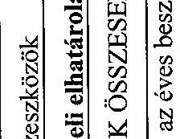

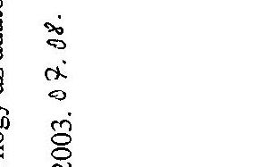

---

# A társaság vagyoni helyzetének alakulása

## (FORRÁSOK)

|  Megnevezés | 1997 | 1998 | 1999 | 2000 | 2001 | 2002 | 2003 várható  |
| --- | --- | --- | --- | --- | --- | --- | --- |
|  Saját tőke | 2.256,90 | 1.911,26 | 1.691,14 | 1.569,52 | 975,93 | 1.172,90 | 1.829,50  |
|  Ebből: Jegyzett tőke | 1.104,02 | 1.104,02 | 1.104,02 | 1.104,02 | 1.104,02 | 1.104,02 | 1.104,02  |
|  Töketartalék | 650,00 | 650,00 | 650,00 | 587,12 | 465,50 | 0 | 700,00  |
|  Eredménytartalék | 81,29 | 502,88 | 157,23 | 0 | 0 | -128,99 | 68,88  |
|  Mérleg sz. eredmény | 421,59 | -345,64 | -220,11 | -121,62 | -593,59 | 197,87 | -43,40  |
|  Céltartalék | 4,01 | 4,24 | 4,82 | 7,60 | 0 | 4,13 | 4,13  |
|  Kötelezettségek | 409,31 | 442,70 | 589,09 | 790,04 | 977,31 | 427,08 | 243,01  |
|  Passzív időbeli elhatárolások | 971,85 | 800,92 | 505,12 | 863,30 | 898,48 | 720,88 | 769,78  |
|  FORRÁSOK ÖSSZESEN | 3.642,07 | 3.159,12 | 2.790,17 | 3.230,46 | 2.851,72 | 2.324,99 | 2.846,42  |

Adatforrás: az éves beszámolók

Tanúsítom, hogy az adatok a nyilvántartásban szereplőkkel megegyeznek.

Budapest, 2003. 37.04.

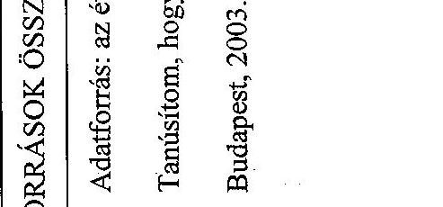

---

# Bevételek alakulása

|  Megnevezés | 1997 | 1998 | 1999 | 2000 | 2001 | 2002 | 2003 várható  |
| --- | --- | --- | --- | --- | --- | --- | --- |
|  Belföldi értékesítés nettó árbevétele | 434,02 | 329,96 | 274,12 | 306,96 | 340,19 | 293,97 | 288,80  |
|  Ebből: Reklámbevétel | 366,44 | 282,30 | 221,72 | 219,88 | 243,00 | 165,77 | 162,85  |
|  Export értékesítés nettó árbevétele | 8,89 | 0,56 | 0,97 | 3,14 | 1,95 | 1,23 | 1,20  |
|  Egyéb bevételek | 4.620,03 | 5.198,20 | 5.834,33 | 6.219,94 | 6.304,31 | 6.484,69 | 6.805,62  |
|  Aktivált saját teljesítmények értéke | 0,47 | 0,06 | 1,56 | 0 | 0 | 0 | 0  |
|  Pénzügyi műveletek bevételei | 77,27 | 109,94 | 16,85 | 9,93 | 36,20 | 35,11 | 6,38  |
|  Rendkívüli bevételek | 21,62 | 37,66 | 41,67 | 35,45 | 49,75 | 50,34 | 48,90  |
|  BEVÉTELEK ÖSSZESEN | 5.162,30 | 5.676,38 | 6.169,50 | 6.575,42 | 6.732,40 | 6.865,34 | 7.150,90  |

Adatforrás: az éves beszámolók

Tanúsítom, hogy az adatok a nyilvántartásban szereplőkkel megegyeznek.

Budapest, 2003. 6. 7. 88.

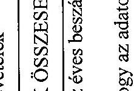

---

### A társaságnak juttatott támogatások

|   | 1997 | 1998 | 1999 | 2000 | 2001 | 2002 | 2003
várható  |
| --- | --- | --- | --- | --- | --- | --- | --- |
|  Egyéb bevételek összesen | 4.620,03 | 5.198,20 | 5.834,32 | 6.219,94 | 6.304,30 | 6.484,68 | 6.805,62  |
|  Ebből: Üzemben tartási díj | 2.492,30 | 2.943,90 | 3.301,40 | 3.224,10 | 3.330,68 | 3.444,74 | 4.895,00  |
|  Mentesítettek miatti támogatás | 912,00 | 912,00 | 1.053,10 | 1.042,70 | 1.133,81 | 1.149,31 |   |
|  Sugárzásidíj-támogatás | 875,40 | 1.023,30 | 1.125,00 | 1.287,30 | 1.116,42 | 1.082,30 | 1.200,00  |
|  Koncessziós díj | 288,10 | 265,20 | 265,20 | 342,30 | 375,83 | 402,48 | 422,83  |
|  HTV KA előző évi pénzmaradványa | 0 | 7,80 | 0 | 0 | 9,43 | 29,31 | 15,00  |
|  Támogatás összesen | 4.567,80 | 5.152,20 | 5.744,70 | 5.896,40 | 5.966,17 | 6.108,14 | 6.532,83  |

Adatforrás: az éves beszámolók

Tanúsítom, hogy az adatok a nyilvántartásban szereplőkkel megegyeznek.

Budapest, 2003. 8. 7. 88.

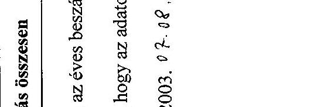

---

|  DTV Rt. |  |  |  |  |  |  | 5. tanúsítvány  |
| --- | --- | --- | --- | --- | --- | --- | --- |
|  Budapest |  |  |  |  |  |  |   |
|   |  |  |  |  |  |  | Költségek és ráfordítások alakulása  |
|   |  |  |  |  |  |  | millió Ft  |
|  Megnevezés | 1997 | 1998 | 1999 | 2000 | 2001 | 2002 | 2003 várható  |
|  Anyagjellegű ráfordítások | 474,68 | 596,72 | 546,47 | 600,87 | 5.168,25 | 4.497,71 | 4.857,50  |
|  Személyi jellegű ráfordítások | 1.094,25 | 1.204,27 | 1.323,27 | 1.539,85 | 1.729,76 | 1.793,83 | 1.936,00  |
|  Értékcsökkenési leírás | 181,21 | 292,82 | 314,11 | 314,02 | 333,33 | 300,03 | 319,50  |
|  Egyéb költségek és ráfordítások | 2.947,63 | 3.901,12 | 4.157,46 | 4.230,59 | 25,50 | 40,48 | 44,00  |
|  Pénzügyi műv. ráfordításai | 36,85 | 20,06 | 0 | 4,94 | 68,54 | 35,20 | 37,00  |
|  Rendkívüli ráfordítások | 6,08 | 7,04 | 48,30 | 6,78 | 0,60 | 0,23 | 0,30  |
|  KÖLTS. ÉS RÁFORDÍT. ÖSSZESEN | 4.740,70 | 6.022,03 | 6.389,61 | 6.697,05 | 7.325,98 | 6.667,48 | 7.194,30  |

Adatforrás: az éves beszámolók, analitikus nyilvántartások

Tanúsítom, hogy az adatok a nyilvántartásban szereplőkkel megegyeznek.

Budapest, 2003. 02-08.

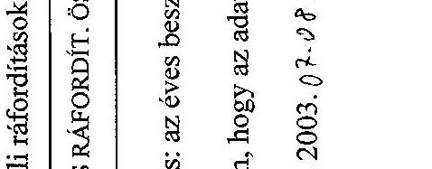

---

|   | 1997 | 1998 | 1999 | 2000 | 2001 | 2002 | 2003 várható  |
| --- | --- | --- | --- | --- | --- | --- | --- |
|  Músorgyártás előállítási költségei | 1.616,50 | 2.035,50 | 2.138,19 | 2.292,20 | 2.500,00 | 2.360,30 | 2.542,60  |
|  Ebből: hír- és tájékoztatási műsorok | 1.321,00 | 1.341,90 | 1.457,04 | 1.314,21 | 1.510,20 | 1.134,30 | 1.119,00  |
|  határontúli és kisebbségi műsorok |  |  |  |  |  | 439,25 | 409,20  |
|  kulturális műsorok |  | 459,40 | 415,02 | 421,86 | 506,60 | 403,72 | 536,40  |
|  további műsorok | 295,50 | 234,20 | 266,13 | 556,13 | 483,20 | 383,03 | 478,00  |
|  Músorgyártás és -adás költségei | 129,40 | 261,60 | 319,20 | 336,62 | 630,00 | 610,19 | 734,90  |
|  Ebből: összes költség | 129,40 | 261,60 | 319,20 | 336,62 | 630,00 | 1.401,89 | 3.277,50  |
|  belső átterhelés | 0,00 | 0,00 | 0,00 | 0,00 | 0,00 | $-791,70$ | $-2.542,60$  |
|  Filmjogdíjak | 467,90 | 557,10 | 527,11 | 410,40 | 550,10 | 628,49 | 650,00  |
|  Szinkron | 173,70 | 206,90 | 215,11 | 168,82 | 133,40 | 141,42 | 163,00  |
|  Ebből: szinkronizálási költség | 173,70 | 206,90 | 215,11 | 168,82 | 133,40 | 144,53 | 169,00  |
|  belső átterhelés | 0,00 | 0,00 | 0,00 | 0,00 | 0,00 | $-3,11$ | $-6,00$  |
|  Egyéb jogdíjak | 186,00 | 251,80 | 280,96 | 291,93 | 308,50 | 116,65 | 110,00  |
|  Műholdas sugárzás | 875,40 | 1.143,30 | 1.122,10 | 1.285,70 | 1.121,40 | 1.054,72 | 1.200,00  |
|  Marketingköltségek | 71,80 | 138,00 | 86,92 | 134,50 | 237,20 | 328,22 | 270,20  |
|  Bérköltségek | 690,40 | 793,80 | 937,96 | 1.137,01 | 1.047,20 | 554,70 | 700,80  |
|  Ebből: összes költség | 690,40 | 793,80 | 937,96 | 1.137,01 | 1.194,50 | 1.302,42 | 3.039,40  |
|  belső átterhelés | 0,00 | 0,00 | 0,00 | 0,00 | $-147,30$ | $-747,72$ | 2.338,60  |

---

|  Müködési költségek | 215,70 | 270,80 | 326,23 | 240,96 | 364,40 | 653,43 | 603,90  |
| --- | --- | --- | --- | --- | --- | --- | --- |
|  Ebből: összes költség | 523,40 | 668,70 | 744,69 | 797,49 | 891,70 | 653,43 | 603,90  |
|  belső terhelés | -307,70 | -397,90 | -418,46 | -556,53 | -527,30 | 0,00 | 0,00  |
|  Értékcsökkenés | 170,80 | 283,30 | 309,40 | 314,02 | 326,90 | 130,57 | 150,00  |
|  Ebből: összes értékcsökkenés | 170,80 | 283,30 | 309,40 | 314,02 | 326,90 | 295,73 | 319,50  |
|  belső átterhelés | 0,00 | 0,00 | 0,00 | 0,00 | 0,00 | -165,16 | 169,50  |
|  Egyéb költségek | 142,60 | 79,80 | 124,87 | 84,89 | 106,90 | 88,79 | 68,90  |
|  |   |   |   |   |   |   |   |
|  Múszógyárt és üzemelt költs. | 4740,20 | 6021,90 | 6.388,05 | 6.697,05 | 7.326,00 | 6.667,48 | 7.194,30  |
|  Összesen |  |  |  |  |  |  |   |

Adatforrás: az éves beszámolók, analitikus nyilvántartások

Tanúsítom, hogy az adatok a nyilvántartásban szereplőkkel megegyeznek.

Budapest, 2003. 07-04.

---

# 7. tanúsítvány

## Eredmény alakulása

|  Megnevezés | Megnevezés | Üzemi (üzleti) tev. eredménye | Pénzügyi műveletek eredm. | Szokásos vállalk. eredmén (1+2) | Rendkívüli eredmény | Adózás előtti eredmény (3+4)  |
| --- | --- | --- | --- | --- | --- | --- |
|  1. Üzemi (üzleti) tev. eredménye | 365,64 | 406,16 | 15,54 | 421,59 | 406,05 | 15,54  |
|  2. Adózás előtti eredmény (3+4) | 421,59 | 406,16 | 89,89 | 406,05 | 406,05 | 15,54  |
|  **Tanúsítom, hogy az adatok a nyilvántartásban szereplőkkel megegyeznek.** |  |  |  |  |  |   |

Budapest, 2003. 0 7 -a t'

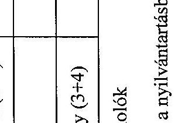

---

# Költségvetési befizetési kötelezettségek

(adók, járulékok)

|  Megnevezés | 1997 | 1998 | 1999 | 2000 | 2001 | 2002 | 2003
várható  |
| --- | --- | --- | --- | --- | --- | --- | --- |
|  Személyi jövedelemadó | 253,34 | 242,06 | 280,62 | 360,38 | 384,82 | 384,16 | 407,00  |
|  Általános forgalmi adó | 100,66 | 97,42 | 89,33 | 90,85 | 111,00 | 90,69 | 89,00  |
|  Munkáltatói járulék | 21,35 | 22,22 | 19,81 | 23,96 | 25,74 | 29,04 | 31,00  |
|  Munkavállalói járulék | 6,56 | 7,53 | 9,15 | 11,04 | 12,23 | 13,31 | 14,00  |
|  Társadalombiztosítási járulék | 289,17 | 352,75 | 350,38 | 471,90 | 421,52 | 417,75 | 443,00  |
|  Szakképzési hozzájárulás | 9,20 | 10,26 | 12,02 | 14,26 | 15,90 | 16,59 | 18,00  |
|  Rehabilitációs hozzájárulás | - | 4,66 | 9,15 | 11,15 | -23,07 | 0,69 | 0,75  |
|  Egészségügyi hozzájárulás | 9,20 | 11,91 | 24,58 | 28,73 | 31,63 | 31,67 | 28,00  |
|  Nemzeti kulturális járulék | 4,27 | 3,22 | 2,70 | 3,37 | 2,82 | 1,88 | 1,80  |
|  Önellenőrzési pótlék | 0,20 | 0,65 | 0,23 | 3,41 | 0,01 | 7,03 | 0,30  |
|  Késedelmi pótlék | 0,05 | 0,00 | 0,17 | 0,00 | 0,00 | 1,54 | 0,00  |
|  ÖSSZESEN | 694,00 | 752,68 | 798,14 | 1019,05 | 982,60 | 994,35 | 1.032.85  |

Adatforrás: az adóbevallások, az éves beszámolók, analitikus nyilvántartások

Tanúsítom, hogy az adatok a nyilvántartásban szereplőkkel megegyeznek.

Budapest, 2003. 04.08.

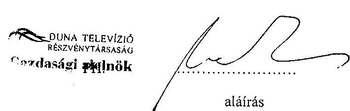

---

# Költségvetési támogatások alakulása 

1997-2003
millió Ft

| Megnevezés | 1997 | 1998 | 1999 | 2000 | 2001 | 2002 | 2003   várható |
| :--: | :--: | :--: | :--: | :--: | :--: | :--: | :--: |
| Eredményt növelö támogatások |  |  |  |  |  |  |  |
| Üzembentartási dij | 0 | 0 | 0 | 0 | 0 | $1.729,06$ | $4.895,00$ |
| Mentesítettek miatt kapott $t$. | 912,00 | 912,00 | $1.053,10$ | $1.042,70$ | $1.133,81$ | $1.149,31$ |  |
| Sugárzásidij-támogatás | 875,40 | $1.023,30$ | $1.125,00$ | $1.287,30$ | $1.116,42$ | $1.082,30$ | $1.200,00$ |
| Koncessziós dij | 288,10 | 265,20 | 265,20 | 342,30 | 375,83 | 402,48 | 422,83 |
| HTV KA pénzmaradványa | 0 | 7,80 | 0 | 0 | 9,43 | 29,31 | 15,00 |
|  |  |  |  |  |  |  |  |
| ÖSSZESEN | 2.075,50 | 2.208,30 | 2.443,30 | 2.672,30 | 2.635,49 | 4.392,46 | 6.532,83 |
| Saját tőkét növelö támogatások |  |  |  |  |  |  |  |
| Töketartalék | 0 | 0 | 0 | 0 | 0 | 0 | 700,00 |
| ÖSSZESEN | 0 | 0 | 0 | 0 | 0 | 0 | 700,00 |
| Egyéb támogatások |  |  |  |  |  |  |  |
| Beruházási támogatások (PM) | 250,00 | 0 | 0 | 0 | 0 | 0 | 0 |
|  |  |  |  |  |  |  |  |
| ÖSSZESEN | 250,00 | 0 | 0 | 0 | 0 | 0 | 0 |
| MINDÖSSZESEN | 2.325,50 | 2.208,30 | 2.443,30 | 2.672,30 | 2.635,49 | 4.392,46 | 7.232,83 |

Tanúsítom, hogy az adatok a nyilvántartásban szereplőkkel megegyeznek.
Budapest, 2003. 07-08.
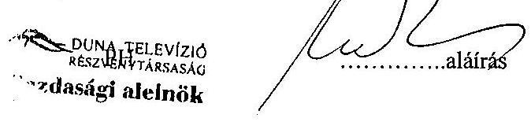

---

# Az állományi létszám alakulása

Adatok fő

|  Megnevezés | 2001 | 2002 | 2003 várható  |
| --- | --- | --- | --- |
|  Vezetők (alelnők,ig,ig.h.) | 9 | 8 | 8  |
|  Középvezetők | 21 | 19 | 19  |
|  Főszerkesztők és h. | 15 | 25 | 26  |
|  Szerkesztők | 68 | 57 | 62  |
|  Bemondók | 15 | 14 | 14  |
|  Adáslebonyolítás | 11 | 11 | 11  |
|  Operatőrök | 8 | 8 | 8  |
|  Kameramanok | 4 | 4 | 4  |
|  Adásrendezök | 21 | 20 | 20  |
|  Szcenika, egyéb | 7 | 8 | 8  |
|  Műszaki m.társak | 15 | 14 | 14  |
|  Stúdió műsz.mtársak | 68 | 67 | 67  |
|  Gyártási m.társak | 50 | 48 | 48  |
|  Gazdasági ügyint. | 80 | 77 | 78  |
|  Gazd.ügy.mtársak | 28 | 27 | 33  |
|  Kisegítő mtársak | 28 | 27 | 39  |
|  Összesen | 448 | 442 | 459  |
|  Ebből: |  |  |   |
|  - teljes m.időben fogl | 432 | 424 | 436  |
|  - részmunkaidős | 2 | 2 | 5  |
|  - nyugdíjas | 14 | 16 | 18  |

Budapest, 2003. május 15.

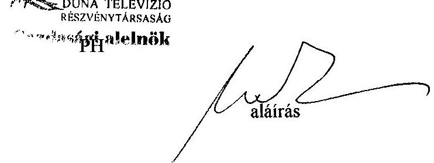

---

# DTV Rt.

Budapest

Az alaptevékenységet jellemző naturális és közvetlenköltség-szintű fajlagos mutatók alakulása

|  Megnevezés | 1997 | 1998 | 1999 | 2000 | 2001 | 2002 | 2003 várható  |
| --- | --- | --- | --- | --- | --- | --- | --- |
|  1/1. Sugárzási idő (óra) | 8760 | 8760 | 8760 | 8760 | 8760 | 8760 | 8760  |
|  - ebből párhuzamos sugárzás (óra) |  |  |  |  |  |  |   |
|  1/2. Adásidő (óra) | 8760 | 8760 | 8760 | 8760 | 8760 | 8760 | 8760  |
|  2. Músoridő (óra) | 7142 | 7110 | 7126 | 7369 | 7525 | 7013 | 8760  |
|  3., Elkészített müsoridő (óra) | 4344 | 4193 | 3718 | 3997 | 7056 | 5068 |   |
|  a., Belső gyártású müsorok (óra) | 2385 | 2232 | 3718 | 3949 | 4010 | 3775 | 4293  |
|  - ebből hirműsorok (óra) | 806 | 560 | 480 | 363 | 695 | 753 | 680  |
|  b., Megrendelésre, külső gyárt-ban készült müs.ok (óra) | 377 | 165 | 261 | 314 | 350 | 290 | 310  |
|  3/2. Vásárolt müsorok (óra) | 2785 | 2918 | 3170 | 3141 | 3045 | 3236 | 3140  |
|  c. Belföldi forgalmazótól (óra) | 637 | 577 | 657 | 382 | 535 | 685 | 850  |
|  d. Külföldi forgalmazótól (óra) | 762 | 1138 | 1056 | 809 | 858 | 1129 | 380  |
|  3/3. Reklám | 187 | 167 | 145 | 104 | 116 | 69 | 75  |
|  Közvetlenköltség-szintű fajlagos mutatók |  |  |  |  |  |  |   |
|  Belső gyártású müsorórára jutó közvetlen költség (Ft / óra) | 877148 | 940860 | 591950 | 557950 | 573566 | 532450 | 540117  |
|  Külső gyártású müsorórára jutó közvetlen költség (Ft / óra) | 960000 | 990000 | 1020000 | 1092000 | 1209000 | 1146000 | 1121000  |
|  Vásárolt müsorórára jutó közvetlen költség (Ft / óra) | 178264 | 222669 | 215773 | 189710 | 406094 | 341290 |   |

Tanúsítom, hogy az adatok a nyilvántartásban szereplőkkel megegyeznek.

Budapest, 2003.07.08

Duna telévizi 0202 0202 0202 0202 0202 0202

Cazdásági alelnök

aláírás

---

# Az egy főre jutó átlagjövedelem alakulása

|  Megnevezés | 2001. | 2002. | 2003. várható  |
| --- | --- | --- | --- |
|  Vezetők (alalntik,ig,igh.) | 793 635,- | 920 813,- | 976 062,-  |
|  Középvezetők | 463 630,- | 461 138,- | 488 806,-  |
|  Főszerkesztők és h. | 473 187,- | 465 762,- | 493 708,-  |
|  Szerkesztők | 273 667,- | 269 919,- | 269 919,-  |
|  Bemondók | 415 018,- | 371 237,- | 393 511,-  |
|  Adásle bonyolítás | 253 706,- | 251 776,- | 266 883,-  |
|  Operatőrök | 440 898,- | 370 285,- | 370 285,-  |
|  Kameramanok | 261 324,- | 209 508,- | 209 508,-  |
|  Adásrendezők | 277 583,- | 266 501,- | 266 501,-  |
|  Szcenika, egyéb | 246 186,- | 241 908,- | 241 908,-  |
|  Műszaki m.társak | 267 225,- | 223 309,- | 236 708,-  |
|  Stúdió műsz.mtársak | 330 908,- | 260 496,- | 260 496  |
|  Gyártási m.társak | 282 227,- | 255 096,- | 270 402,-  |
|  Gazd.ügyintézők | 180 406,- | 190 400,- | 201 824,-  |
|  Gazd.ügy.m.társak | 132 531,- | 150 081,- | 159 086,-  |
|  Kisegítő m.társak | 135 414,- | 135 582,- | 143 717,-  |

Budapest, 2003. május 15.

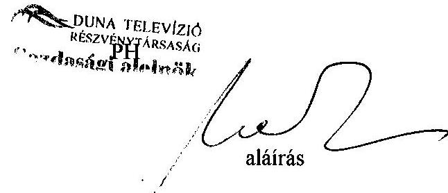

---

# A Duna TV Rt. szinkronstúdió beruházásának teljesítmény-ellenőrzése

---

# A DTV Rt. SZINKRONSTÚDIÓ-BERUHÁZÁSÁNAK 

## TELJESÍTMÉNY-ELLENŐRZÉSE

A Duna TV Rt. a szinkronizálási tevékenységének minőségjavítása és az éves szinkronizálási kapacitás növelése érdekében saját szinkronstúdió létrehozásáról döntött. Célul tűzte ki a hangutómunka, a filmszinkronizálás és a hangalámondás korszerűsítését.

A beruházás koncepciójának kidolgozása 1997-ben kezdődött, és többszöri szakmai véleményezés eredményeképpen 1998-ban készült el a Duna Televízió Szinkron Stúdió című tanulmány. A társaság az 1998. évi üzleti tervében hagyta jóvá a beruházás megvalósítását.

A társaság a beruházást - Fairlight-típusú nemzetközi csúcstechnológiát képviselő digitális rendszerú technológia alkalmazásával - teljes egészében saját forrásból tervezte finanszírozni. A szinkronstúdió kivitelezési költségeit előzetesen 40 millió forintra becsülték.

A vizsgálat kizárólag a szinkronstúdió-beruházás céljára és megvalósítására irányult:

- vizsgálta a projekt szükségességének jóváhagyását, előkészítésének megalapozottságát, végrehajtásának eredményességét;
- vizsgálta a szinkronizálási folyamat korszerűsítése érdekében megfogalmazott célkitűzések megvalósulását.

A vizsgálat nem terjedt ki a stúdió jövőbeni működtetésének gazdaságosabbá tételére.

A vizsgált időszak az 1997-2003, a szinkronstúdió-projekt előkészítésének, megvalósításának, használatbavételének és üzemeltetésének időszaka volt.

A projekt elvárt eredményessége teljesülésének megítéléséhez dokumentumok tanulmányozása, előzetes interjúk, továbbá az ellenőrzött szervezet felelős személyeinek bevonásával kialakított kérdések megválaszolása szolgált alapul. (3. számú melléklet) Az ellenőrzési program összeállítása és az ellenőrzés az Állami Számvevőszék által adaptált és alkalmazott teljesítmény-ellenőrzés módszertanát követte.

---

# 1. A PROJEKT CÉLKITŰZÉSEI 

Az új szinkronstúdió megvalósításának fő céljai a következők voltak:

- az éves szinkronizálási kapacitás növelése,
- saját szinkronstúdió kialakítása és a létrejövő új kapacitás mind hatékonyabb kihasználása,
- a hangtechnikai utómunkák korszerűsítése,
- a dramaturgiai minőség javítása,
- az éves szinkronizálási költségek csökkentése,
- a külső, kereskedelmi szinkronizálás igénybevételének csökkentése.

## 2. A PÁLYÁZTATÁs LEFOLYTATÁSA

A Duna TV Rt. a szinkronstúdió tervezési munkáira 1998 áprilisában meghívásos pályázatokat írt ki. A tervezési munkát az ARCHICON Stúdió Kft. nyerte. A Duna TV Rt. a szinkronstúdió építőmesteri és szerelőipari munkáira 1998 májusában meghívásos pályázatokat írt ki, az építőmesteri munkákat a Qualitép Kft., az épületgépészeti munkát a Thermik Plus Kft., a villanyszerelési munkát pedig a FLUXUS Kft. nyerte. A szinkronstúdió technológiai rendszerének megtervezésére, a rendszerhez szükséges berendezések leszállítására, installálására és a kezelőszemélyzet betanítására a társaság meghívásos, gyorsított közbeszerzési eljárást kezdeményezett (Közbeszerzési Értesítő IV. évf. 22. sz. 1998. június 3 -án megjelent felhívása alapján). A leadott érvényes pályázatok értékelése szerint 1998. július 22 -én kötöttek vállalkozói szerződést a Rexfilm Kft.-vel. A megállapodás az alábbi fő feltételeket tartalmazta:

- A szerződés a szinkronstúdió-beruházás megvalósítása során tervezési, be-rendezés-beszerzési, megvalósítási és betanítási feladatokat fogalmazott meg. A stúdió teljes üzembe helyezésének és átadásának határideje 1998. szeptember 25.
- A szerződés megkötésekor a vállalkozói szerződés díja 31748140 Ft + ÁFA volt. Megbízó a vállalkozói díj 50\%-át a vállalkozó által leszállított valamennyi berendezés leszállításának írásbeli igazolását követően fizette ki. A beruházás technológiai munkálatainak végleges ára (az 1998. október 8-i szerződésmódosítás alapján) a közösen elvégzett felmérés és véglegesítés alapján 30848140 Ft-ra csökkent.
- A szerződés értelmében a pályázati kiírásban megfogalmazott követelmények és igények alapján a szinkronstúdió műszaki tartalmát, megvalósításának módját és ütemezését a vállalkozóval közösen határozták meg a tervezési fázis során. A szerződés mellékleteiben meghatározott műszaki feltételek szerint múködő teljes rendszer megvalósítása a vállalkozó felelőssége. A szerződésben meghatározott jóteljesítési garancia felszabadításának, vala-

---

mint a részszállítások értékének átutalásakor visszatartott összegek kifizetésének feltétele a megfelelő teljesítés volt.

- A megvalósított rendszer jótállására a vállalkozó 12 hónapos garanciát vállalt, ennek fedezetére 12 hónapos jótállási bankgaranciát nyújtott. A jótállási kötelezettségét meghaladóan a vállalkozó karbantartási szerződés keretében vállalta a berendezések garanciális időn túli szervizét és karbantartását.
(A beruházás szerződéseinek összefoglaló adatait az 1. számú melléklet tartalmazza.)

# 3. A CÉLKITŰZÉSEK MEGVALÓSULÁSA 

A Duna TV Rt. beruházási programjának egyik fő célkitűzése a saját szinkronstúdió kialakítása és a létrejövő új kapacitás mind hatékonyabb kihasználása volt. Ennek jegyében fogalmazódott meg a technológiai és szervezetfejlesztési igény is. A társaság vezetése az 1998. évi üzleti terv elfogadása során egybehangzóan kinyilvánította, hogy a költségracionalizálási program sikeres végrehajtásának kulcsa az új szinkronstúdió megvalósítása és üzemeltetése. A szinkronstúdió tervezett beruházásánál csak a Duna TV Rt. igényeit vették figyelembe, a Magyar Televízióval a kapacitásbővítést nem egyeztették. (A beruházás megvalósításával kapcsolatos főbb időpontokat a 2. számú melléklet tartalmazza.)

A korszerű stúdiórendszer létrehozásának, hatékony alkalmazásának szigorú technikai és módszertani feltételei vannak, és nagymértékben függ a szállító felkészültségétől, jól megalapozott elméleti, projektirányítási, minőségbiztosítási, műszaki és technikai ismereteitől. A stúdiótechnológiai berendezések beszerzése és installálása esetében is, a pályázati kiírásban megfogalmazott követelményeken túlmenően, a célkitűzések megvalósítására vonatkozó elképzelések végleges kialakítása és részletes kidolgozása részben a szállító feladat volt.

A társaság 1998. évi beruházási tervében összesen 40 millió forint költséggel szerepelt a szinkronstúdió létrehozása a zenei átíró-stúdió kialakításával együtt. A terv nem tért ki tervezési, építési, technológicaszerelési és berendezés beszerzési költségek összetételére. A beruházás összesen a technológiai berendezések beszerzésével és beüzemelésével együtt 56,2 millió Ft-ba került. A társaság állítása szerint a projekt tervezettnél magasabb költségei nem okoztak finanszírozási gondokat.

Az eredetileg 40 millió Ft. költséggel tervezett fejlesztési projekthez csak műszaki hatástanulmány készült a technikai célok realizálhatóságára, a társaság előzetesen a gazdaságossági számításokból várható eredményeket nem vizsgálta. A beruházás műszaki paramétereit megalapozó terv és ahhoz kapcsolódó pénzügyi-gazdaságossági vizsgálat nem készült.

A szinkronstúdió-beruházás lebonyolítása, jó projektirányítási és minőségbiztosítási rendszert kívánt. A sikeres megvalósítás nagymértékben függött a vállalkozók és a vevő szabályozott együttműködésétől, ami ugyancsak figyelemre méltó kockázati tényező volt.

---

Az elhatározott célkitűzések megvalósulása a projekt éves kapacitáskihasználás adatainak vizsgálata, a költségracionalizálás és a műszaki minőségjavulás szerint követhetők. A vizsgálatok elvégzése során a szinkronszolgáltatás költségeinek csökkentését, a technológiai folyamatok korszerűsítését, a hangtechnika minőségi színvonalát és a dramaturgiai követelmények emelkedését, valamint a megfelelő munkahelyi környezet kialakulását várta eredményként a Duna Televízió.

Összességében megállapítható, hogy a beruházás teljes körűen nem érte el célját, a külső gyártású szinkronizáláshoz képest nem csökkentek a szinkronszolgáltatás költségei. Növekedett a szinkronizálási kapacitás, csökkent a külső gyártású kapacitás igénybevétele. Korszerűsödtek a technológiai folyamatok és a hangtechnikai utómunkák, emelkedett a technikai minőség és a dramaturgia színvonala, valamint megfelelő munkahelyi környezet alakult ki.

# 4. A SZINKRONSTÚDIÓ GAZDASÁGOSSÁGA 

A beruházás üzembe helyezését követően 1998-ban 2221 perc volt a szinkronizálás előállítási ideje. A stúdiókapacitás lekötése 2000-ben 11209 perc, 2001ben már 32766 perc volt. A 2000-2001 évek közötti növekedés* egyrészt annak az eredménye, hogy - belső utasítás alapján - nem a műsorgyártás, hanem a szinkronstúdió határozta meg, hogy melyek azok a feladatok, amelyeket saját szinkronnal készítenek.

* A 2000-2001 évek adatai közötti növekedés a számviteli elszámolás módja és a gyártásba nem vett szinkronizálási tevékenység nyilvántartási adatai különbözőségéből is ered.

A szinkronstúdió gazdálkodási adatait 1997-2003. I-III. negyedév között az alábbi táblázat mutatja be.

| Megnevezés | 1997 | 1998 | 1999 | 2000 | 2001 | 2002 | 2003 I.-   III. név |
| :-- | :--: | :--: | :--: | :--: | :--: | :--: | :--: |
| Saját gyártású   szinkronizálás |  |  |  |  |  |  |  |
| Összes költség (ezer Ft) | 0 | 8934 | 63272 | 45489 | 74512 | 102658 | 87585 |
| Perc | 0 | 2221 | 20377 | 11209 | 32766 | 30996 | 17021 |
| Fajlagos költség   (Ft/perc) | 0 | 4022 | 3105 | 4058 | 2274 | 3312 | 5146 |
| Külső gyártású   szinkronizálás |  |  |  |  |  |  |  |
| Összes költség (ezer Ft) | 173669 | 202589 | 145797 | 112542 | 55402 | 37158 | 66348 |
| Perc | 51857 | 55175 | 43959 | 33946 | 16664 | 12480 | 17607 |
| Fajlagos költség   (Ft/perc) | 3349 | 3672 | 3317 | 3315 | 3325 | 2977 | 3768 |

A táblázat adatai egyértelműen bebizonyítják azt is, hogy a külső gyártás költségei távolodnak a saját gyártásétól, 1998-ban 91,3\% volt a külső szinkron ára a belsőhöz viszonyítva, ez 2002-ben 89,9\%-ra csökkent. A 2003. I-III. negyedévi adatok szerint a külső szinkronizálás költsége már csak 73,2\% a sajáttal szemben.

---

Ha 2002-ben a teljes szinkront külső gyártásban készítik, akkor a tevékenység költsége mintegy 10 millió Ft-tal kevesebb lett volna.

A szinkronstúdióban és a külső gyártásban megrendelésre készített hangfelvételek a músorba állítást követően a Duna TV Rt. tulajdonát képezik. A szinkron felvételek archiválására nem készült elnöki utasítás vagy más belső szabályzat. A szinkronfelvételek másodlagos felhasználása és értékesítése a központi nyilvántartás hiánya és a szabályozatlanság miatt nem ellenőrizhető.

A beruházást megelőző gazdaságossági számítások hiánya miatt a szinkronstúdió eredményessége csak a külső gyártásban megvalósított szinkronizálás költségeinek összehasonlításával volt lehetséges. Ennek figyelembevételével a szinkronstúdió működési költségei rendre meghaladták a külső gyártásban megvalósuló hangfelvételek költségeit. A saját gyártású szinkron minőségi színvonalának különbsége a 2003. évi kihasználást is figyelembe véve nem tudja ellensúlyozni a magasabb előállítási költségek közötti különbözetet.

A beruházás megtérülése, illetve átlagos jövedelmezősége a fent bemutatott gazdálkodási adatok figyelembevételével nem értelmezhető. A beruházás várható nettó jelenértéke (NPV) - a jelenlegi gazdálkodás mellett - negatív. A beruházás ráfordításai várhatóan nem térülnek meg a beruházás teljes élettartama alatt.

---

A függelék 1. számú melléklete

# A beruházás szerződéseinek összefoglaló adatai 

| Cég neve | Szerződés típusa | Dátum | Szerződés tartalma |
| :--: | :--: | :--: | :--: |
| ARCHICON   Stúdió Kft. | Vállalkozási szerződés | 1998. május 5. | Szinkronstúdió és technikai helyiségeinek építészeti, gépészeti, elektromos és akusztika kialakítási tender és kiviteli terveinek elkészítése, valamint azoknak a szakhatóságokkal történő előzetes egyeztetése |
| Quqlitép Kft. | Vállalkozási szerződés | 1998. június 24. | Szinkronstúdió építészeti és szakipari munkái, költségvetési melléklet, kivitelterv melléklet |
| Quqlitép Kft. | Vállalkozási szerződés | 1998. július 10. | Keverőhelyiség akusztikus burkolatainak és úsztatott aljzatának munkái |
| Quqlitép Kft. | Vállalkozási szerződés | 1998. július 2. | Hangalámondó építészeti és szakipari munkái |
| Thermik Plus Kft. | Vállalkozási szerződés | 1998. július 3. | Szinkronstúdió épületgépészeti munkái |
| FLUXUS Kft. | Vállalkozási szerződés | 1998. június 11. | Szinkronstúdió elektromos munkái |
| Rexfilm Kft. | Vállalkozási szerződés | 1998. július 22. | Filmszinkronizáló stúdiójának, mint rendszernek a megtervezése, a rendszerhez szükséges valamennyi berendezés leszállítása, installálása, valamint a kezelőszemélyzet betanítása |
| Rexfilm Kft. | Vállalkozási szerződés módosítása | 1998. október 6. | Filmszinkronizáló stúdiójának, mint rendszernek a megtervezése, a rendszerhez szükséges valamennyi berendezés leszállítása, installálása, valamint a kezelőszemélyzet betanítása |
| Rexfilm Kft. | Végátvételi jegyzőkönyv | 1998. október 16. | Duna Televízió Szinkronstúdió |
|  | Beruházás aktiválásához szükséges pénzügyi táblázat |  |  |
|  | Üzembehelyezési jegyzőkönyv | 1998. október 10. |  |

---

# Főbb megvalósítási dátumok a projektben 

1997. november -
1998. áprilisig
1998. május 05.
1998. június 03.
1998. június 11.
1998. június 24.
1998. július 03.
1998. július 09.
1998. július 22.
1998. augusztus 24.
1998. október 08.
1998. október 10.
1999. október 08.

A projekt előkészítése, dokumentáció kidolgozása
Szerződéskötés a szinkronstúdió és technikai helyiségeinek építészeti, gépészeti, elektromos és akusztika kialakítási tenderének és kiviteli terveinek elkészítésére

Az ajánlati felhívás meghirdetése a Közbeszerzési Értesítőben
Szerződéskötés a szinkronstúdió elektromos munkáira
Szerződéskötés a szinkronstúdió építészeti és szakipari munkáira

Szerződéskötés a szinkronstúdió épületgépészeti munkáira
A közbeszerzési pályázat eredményének kihirdetése
A szinkronstúdió technológiai rendszereinek tervezésére, leszállítására, installálására és a szerelés betanítására vonatkozó szerződés aláírása

Építészeti munkálatok befejezése, stúdiótechnikai installáció megkezdése

Végátvétel
Üzembe helyezés
Jótállási időszak lejárta

---

# Ellenőrzési témák és célok 

## 1. Megfelelő volt-e a Szinkron Stúdió céljainak megfogalmazása és a megvalósításának (továbbiakban: a beruházás, stúdió, fejlesztés, projekt) előkészítése? Igen

A társaság célul tűzte ki:

- az éves szinkronizálási kapacitás növelését,
- saját szinkronstúdió kialakítása és a létrejövő új kapacitás mind hatékonyabb kihasználása,
- a hangtechnikai utómunkák korszerűsítését,
- a dramaturgiai minőség javítását,
- az éves szinkronizálási költségek csökkentését,
- a külső kereskedelmi szinkronizálási kapacitás csökkentését.

### 1.1. A beruházás megkezdése előtt egyértelmúen meghatározták-e a beruházás múszaki céljait? Igen.

- A társaság több lépésben, belső szakértők bevonásával is kidolgozta a stúdió beruházási koncepcióját és ennek alapján a közbeszerzési eljárás lefolytatásához szükséges pályázati dokumentációt.
- A technológiai igények főbb vonatkozásait meghatározták, a végleges műszaki megoldást és a múködtetéshez szükséges szoftver alkalmazását a technológiai feladatok elvégzésére kiválasztott céggel közösen tervezték.
1.1.1. A beruházási projekthez készültek-e stratégiai dokumentumok? Nem

### 1.1.2. Készült-e helyzetértékelés? Igen.

- A Társaság felmérte a hangtechnikai utómunkálatok igényét, és kidolgozta a beruházás szakmai feltételrendszerét.
1.1.3. Meghatározták-e a célkitűzéseket? Igen.
- A Duna TV Rt. a beruházási programja keretében a szinkronizálási tevékenység minőségjavítása és az éves szinkronizálási kapacitás növelése érdekében elhatározta saját szinkronstúdió létrehozását. Célul tűzte ki az igényes hang utómunka, a filmszinkronizálás és a hangalámondás korszerűsítését.
1.1.4. Megfogalmazták-e a pályázatok tartalmi elemeit, a legfontosabb elvárásokat és értékelési szempontokat? Igen.
- A társaság meghívásos, egyfordulós pályázat formájában választotta ki a beruházás tervezőjét, az építési és szakipari vállalkozóit.
- A szinkronstúdió technológiai rendszerének megtervezésére, a rendszerhez szükséges berendezések leszállítására, installálására és a kezelőszemélyzet

---

betanítására a társaság meghívásos, gyorsított közbeszerzési eljárást kezdeményezett (Közbeszerzési Értesítő IV. évf. 22. sz. 1998. június 3-án megjelent felhívása alapján). A felhívásban meghatározta a beruházás célját, a megvalósítandó rendszer technológiai paramétereit és a kívánt szolgáltatásokat. A célkitűzések megvalósítására vonatkozó elképzelések kialakítása, részletes kidolgozása a pályázó részére megfogalmazott feladat volt.

- A társaság a pályázatok elbírálására Szakmai Értékelő Bizottságot állított fel, amely kidolgozta az értékelés módszertanát.

# 1.2. A beruházás megkezdése előtt egyértelmúen meghatározták-e az elérni kívánt gazdasági célokat? Igen, de csak nagyvonalú elképzelésben. 

- A társaság kinyilvánította, hogy a költségracionalizálási programon belül szükségesé, és időszerűvé vált a szinkronizálási tevékenység fejlesztése, melyet a műszaki tervezések, igényfelmérések előkészítettek.
- A fejlesztés optimális ráfordítási költségét a versenytárgyalásos eljárás és az erre alapozott szerződéskötés biztosította.
1.2.1. Készült-e előzetes értékelés a várható gazdasági eredményekről? Nem.
- Az elérendő gazdasági célkitűzéseket a költségracionalizálási program tartalmazta. Ebben várható eredményként a szinkronizálás költségeinek csökkentése, a minőségi követelmények javítását, az elszámolási és gazdálkodási rendszer átláthatóságának növelését jelölték meg. A célmeghatározásokat a tervezésnél nem számszerűsítették, a gazdaságosság feltételrendszerét előzetesen nem határozták meg.
- Hatástanulmány, előzetes értékelés a beruházástól elvárható gazdasági célok realizálhatóságára nem készült.
1.2.2. Végeztek-e beruházás-gazdaságossági számításokat? Nem.
- Előzetes gazdaságossági vizsgálat átfogó, gazdaságossági számítások a beruházás teljes körű értékelhetőségéhez nem készültek.

### 1.3. Felmérték-e, hogy a célok megvalósításához milyen és mekkora erőforrások szükségesek? Igen, de nem megfelelő részletességgel.

- A társaság a projekt megvalósításához szükséges pénzügyi eszközöket csak nagyvonalúan tervezte meg az 1998. évi üzleti terv keretében, melyhez nem készült előzetes finanszírozási kockázatfelmérés.
1.3.1. Finanszírozási kockázatokkal számoltak-e? Nem.
- Finanszírozási kockázatokkal nem számoltak, mert az éves beruházási program pénzügyi lehetősége megfelelő forrást biztosított a megvalósításhoz.
1.3.2. Biztosították-e a megvalósításhoz szükséges erőforrásokat? Igen.
- A beruházást teljes egészében saját forrásból tervezte finanszírozni a társaság.

---

2. Megfelelő volt-e a beruházási projekt lebonyolítása? Igen, annak a megjegyzésével, hogy a szerződés terjedelme, valamint a szerződéses és a járulékos költségek meghaladták az eredeti - csak nagyvonalúan tervezett - előirányzatot. A kitüzött célok teljesültek.

# 2.1. Szabályos volt-e a tenderek lefolytatása, értékelése? Igen. 

- Az ajánlatok értékelésére és a pályázat nyertesének kiválasztására a társaság külön szakmai értékelő bizottságot és döntő bizottságot állított fel, melyben belső szakértők közremúködtek.
- A Közbeszerzési Tanács Döntőbizottsága a pályázat lezárását észrevétel nélkül elfogadta.
2.1.1. Megfelelt-e a szerződés a tenderben foglaltaknak? Igen.
- A megkötött szerződés előkészítését és a szerződéstervezet minősítését külön szerződés előkészítő bizottság végezte, melynek jogi támogatását saját jogi apparátus biztosította.

### 2.2. Megfelelő volt-e a projektvezetés módszere, a projektterv színvonala és részletezettsége, a projektvezetés, a projektszervezet felépítése és múködése? Igen.

- A projektvezetés módszere, technikája, színvonala jónak minősíthető, magán viselte az ilyen méretű projektek lebonyolításában nagy tapasztalatokkal rendelkező szállító szakértelmének és projektirányítási gyakorlatának pozitív jegyeit.
- A projekt lebonyolításának irányításáról már a pályázat nyertesének elfogadásakor döntöttek, a projekt ellenőrzését a gazdasági alelnök felügyelte.

### 2.3. A beruházás teljesült-e szerződés szerinti határidőre és minőségben? Igen.

- A vállalkozók és a szállítók a projektütemezés fő mérföldköveinek megfelelően szerződésszerűen teljesítették feladataikat.
- A projekt lebonyolításának szerződéses határideje teljesült.
2.3.1. A projektnek volt-e önálló műszaki ellenőre? Igen.
- A projekt műszaki ellenőrzését független műszaki ellenőr végezte.
2.3.2. Voltak-e ellenőrző mérések annak érdekében, hogy a felhasználó az igényeinek és céljának megfelelő rendszert kapja? Igen.
- Az akusztikus ellenőrző méréseket független műszaki szakértő végezte. Technológiai és próbaüzemi tesztek készültek a beruházás üzembe helyezése előtt.
2.3.3. A Duna TV Rt.-nek voltak-e eljárási lehetőségei arra az esetre, ha az új rendszer nem teljesíti a kívánt szolgáltatásokat? Igen.

---

- A projekt mennyiségi és minőségi teljesítését a részszállítások nem teljes értékű kifizetése és a jóteljesítési garancia biztosította.
2.3.4. Voltak-e eszközök annak biztosítására, hogy a beruházás a garancia idejére teljesítse a szükséges szolgáltatást? Igen.
- A megvalósított rendszer jótállására a vállalkozó 12 hónapos garanciát vállalt, ennek fedezetére 12 hónapos jótállási bankgaranciát nyújtott.

# 2.4. Az új stúdió teljes körú hatékony használatához szükséges feltételek rendelkezésre állnak-e? Igen, folyamatosan. 

- A jótállási kötelezettségét meghaladóan a vállalkozó karbantartási szerződés keretében vállalta a berendezések garanciális időn túli szervizét és karbantartását.
- A stúdió kezelő személyzetének betanítása megtörtént. Kockázati tényező az esetleges munkaerő-fluktuáció.
2.5. A beruházás költségei és finanszírozása megfelelt-e a tervnek? Nem
- A projekt költsége túllépte a tervet.
2.5.1. A stúdió beruházás tényleges költségei megegyeznek-e a tervezettel? Nem
- A projekt költségei túllépték a tervezett keretet a technológiai rendszer többletköltségei miatt, mert a berendezések költségeit is tartalmazó részletes terv nem készült.
2.5.2. A tervezettől eltérő költségfelhasználás okozott-e finanszírozási problémákat a társaságnak? Nem

## 3. A terveknek megfelelő szinkronstúdiót hozott-e létre a társaság a beruházással? Igen.

- A műszaki és szolgáltatási célok a társaság igényei szerint teljesültek, a gazdasági célok megvalósulását a társaság nem dokumentálta.

### 3.1. A Társaság teljes egészében használja-e az új stúdiót? Igen.

- A dokumentumok szerint a Társaság teljes körűen használja az új rendszert (kapacitáskihasználási adatok).

### 3.2 Készült-e utólagos értékelés a beruházás céljainak teljesüléséről? Nem, de gazdaságossági vizsgálatok folytak.

- Az elszámolási, gazdálkodási, műszaki és üzleti folyamatok szabályozottak, átláthatóságuk az új beruházás során javult.