# JELENTÉS 

a környezetvédelmi alap célfeladatokra előirányzott pénzeszközök
hasznosulásának ellenőrzéséről

---

2. Államháztartás Központi Szintjét Ellenőrző Bizottság
2.3. Átfogó Ellenőrzési Főcsoport
V-22-066/2003-2004.
Témaszám: 668
Vizsgálat-azonosító szám: V 0093
Az ellenőrzést felügyelte:
Bihary Zsigmond
főigazgató
Az ellenőrzés végrehajtásáért felelős:
Hegedűsné dr. Müllern Veronika
főcsoportfőnök

Az ellenőrzést vezette:
Papp Sándor
számvevő főtanácsos

Az ellenőrzést végezték:
Dr. Márkus Gábor
tanácsos, főtanácsadó
Szélpál Ferenc
számvevő tanácsos
Varga József
számvevő tanácsos

Megyesiné Jalkóczi
Erzsébet
számvevő
Keszthelyi Zoltán
számvevő
Fórián Erika
számvevő tanácsos

Sinka Zoltán
számvevő gyakornok
Laki Dóra
számvevő tanácsos
Kiss Rita
számvevő tanácsos

# A témához kapcsolódó eddig készített számvevőszéki jelentések: 

Jelentés címe:
Témaszáma:
Jelentés a Környezetvédelmi Minisztérium fejezet működésének ellenőrzéséről (2002.)
A Központi Környezetvédelmi Alap pénzügyi-gazdasági ellenőrzése (1995.)
Jelentés a központi költségvetés területén működő belső kontroll mechanizmusok ellenőrzéséről (2001.)
Jelentés a települési önkormányzatok szennyvízközmű fejlesztési és működtetési feladatai ellátásának vizsgálatáról (2004.)

---

# TARTALOMJEGYZÉK 

BEVEZETÉS ..... 7
I. ÖSSZEGZŐ MEGÁLLAPÍTÁSOK, KÖVETKEZTETÉSEK, JAVASLATOK ..... 9
II. RÉSZLETES MEGÁLLAPÍTÁSOK ..... 16

1. A KAC kezelésének jogi és szervezeti háttere ..... 16
2. A Kac-ból támogatott célkitűzések összhangja a nemzetközi és a hazai környezetvédelmi követelményekkel ..... 20
2.1. Az EU csatlakozással összefüggő nemzetközi környezetvédelmi követelmények megvalósulása ..... 20
2.2. A Nemzeti Környezetvédelmi Program célkitűzéseinek megvalósítása ..... 22
3. A források tervezése és az előirányzatok alakulása ..... 23
3.1. A környezetvédelmi célok tükröződése a KAC tervezési rendszerében ..... 23
3.2. A KAC bevételi és kiadási előirányzatainak alakulása ..... 24
3.3. A KAC forrásainak felhasználása ..... 27
4. A támogatási mechanizmus ..... 33
4.1. A pályázati rendszer működése ..... 33
4.2. A támogatási rendszer nyilvántartása és informatikai támogatottsága. ..... 38
4.3. A támogatási mechanizmus ellenőrzési rendszere ..... 41
5. A Környezetvédelmi támogatások végrehajtása ..... 45
5.1. A pályázatok támogatásának alakulása felhasználási célok szerint. ..... 45
5.2. A támogatások értékelésének és a szakmai célok teljesülésének beszámolási rendszere ..... 50
5.3. A nem rendeltetésszerű felhasználások ..... 52
5.4. Az egyes támogatások hasznosulása ..... 53
MELLÉKLETEK
6. számú A környezetvédelmi és vízügyi miniszter észrevétele
7. számú Tanúsítványok
8. számú Támogatható célok, és arányaik évenkénti változása
9. számú A korábbi számvevőszéki ellenőrzések utóvizsgálata
10. számú Kérdésfa
FÜGGELÉKEK
11. számú Szennyvíztisztítás célú beruházások értékelési szempontjai
12. számú Az 1997-2001 évek szennyvíztisztítás és csatornázási beruházások mutatói.
13. számú A helyszíni ellenőrzésbe vont pályázatok

---

# 2

---

# RÖVIDÍTÉSEK JEGYZÉKE 

| ANP | A közösségi vívmányok átvételének nemzeti progra |
| :--: | :--: |
| Ámr. | Az államháztartás múködési rendjéről szóló kormányrendelet |
| ÁSZ | Állami Számvevőszék |
| BM | Belügyminisztérium |
| BMR | Belső megtérülési ráta |
| BOI | Biológiai oxigén igény |
| CBC | EU Határon Átnyúló Együttmúködési Alap |
| DECKAC | Decentralizált KAC |
| EU | Európai Unió |
| IPPC | Integrált szennyvíz elhelyezési és szabályozási EU irányelv |
| IPR | Integrált Pályázati Rendszer |
| ISPA | Az EU strukturális előcsatlakozási alapja |
| IT | Információ technológia |
| KAC | Környezetvédelmi Alap Célfeladat |
| KAKF | KAC Koordinációs Főosztály |
| KGI | Környezetgazdálkodási Intézet |
| KKA | Központi Környezetvédelmi Alap |
| KM | Külügyminisztérium |
| KOI | Kémiai oxigén igény |
| KÖFI | Környezetvédelmi Fejlesztési Intézet |
| KöM | Környezetvédelmi Minisztérium |
| KVM | Közlekedési és Vízügyi Minisztérium |
| KvVM | Környezetvédelmi és Vízügyi Minisztérium |
| NKP | Nemzeti Környezetvédelmi Program |
| OECD | Gazdasági Együttmúködési és Fejlesztési Szervezet |
| OGY | Országgyúlés |
| OKKP | Országos Környezeti Kármentesítési Program |
| PHARE | Az EU kelet-közép-európai segélyprogramja |
| PM | Pénzügyminisztérium |
| SZMSZ | Szervezeti és Múködési Szabályzat |
| TEKI | Területi kiegyenlítő támogatás |
| VICE | Vízügyi Célelóirányzat |
| VIR | Vezetői információs rendszer |

---

.

---

# ÉRTELMEZŐ SZÓTÁR 

„Long Term Strategy for the Hungarian Environmental Protection Fund"

A magyar környezetvédelmi alap hosszú távú stratégiája

---

.

---

# JELENTÉS 

## a Környezetvédelmi alap célfeladatokra előirányzott pénzeszközök hasznosulásának ellenőrzéséről

## BEVEZETÉS

A környezetvédelmi feladatokat 1998 végéig a Központi Környezetvédelmi Alapon keresztül, 1999. január 1-től pedig a Környezetvédelmi alap célfeladatok (KAC) célelóirányzaton keresztül finanszírozzák. A KAC ezáltal forrásul szolgál az EU csatlakozással összefüggő magas szintű, a környezetvédelemmel kapcsolatos követelmények teljesítéséhez. Az előirányzat a Környezetvédelmi és Vízügyi Minisztérium fejezet előirányzatai között jelenik meg, kezelését a minisztérium szervezete látja el.

A KAC a környezetkímélő gazdasági szerkezet kialakításának ösztönzését, a környezeti ártalmak megelőzését, csökkentését, felszámolását, továbbá a természeti, illetőleg védett értékek, területek értékeinek megőrzését, fenntartását, a hatékony környezetvédelmi megoldások ösztönzését, valamint a társadalom környezet- és természetvédelmi szemlélete fejlődésének pénzügyi fedezetét hivatott biztosítani.

A KAC eredeti kiadási előirányzata a vizsgált időszak egészében évi 30 milliárd Ft körül alakult, 1999-ben 29,2 milliárd Ft volt, ez némileg növekedve 2002ben 31 milliárd Ft -ra nőtt, de 2003-ra 28 milliárd Ft-ra csökkent. Az előző években zárolt maradvánnyal növelt előirányzat két évben meghaladta az 50 milliárd Ft-ot.

Az ÁSZ 1997-ben és 2001-ben az alapkezelési feladatokat ellátó fejezetnél, 1995-ben pedig a Központi Környezetvédelmi Alapnál végzett átfogó pénzügyi és gazdasági ellenőrzést. Emellett a fejezetnél éves gyakorisággal költségvetési és zárszámadási ellenőrzésekre, illetve témavizsgálatokra is sor került.

Az ellenőrzés célja annak értékelése volt, hogy:

- a tárca irányítási és felügyeleti tevékenysége biztosította-e a céleloóirányzat hatékony felhasználását, és az EU követelményeknek megfelelő szervezeti hátteret, a pályázati mechanizmus szabályos és célszerű múködtetését, valamint a támogatások értékeléséhez meghatározott módszerek és mutatószámok célszerúségét;
- megvalósult-e a KAC-ból támogatott célok és a környezetvédelmi fejlesztési politika alapját képező ágazati stratégiák (és ezen belül elsősorban a Nemze-

---

ti Környezetvédelmi Program) éves intézkedési terveinek, valamint EU követelmények összhangja;

- az alapkezelési feladatokat ellátó környezetvédelmi tárca irányító és gazdálkodó tevékenységében hasznosította-e a KAC felhasználását érintő korábbi ÁSZ ellenőrzések megállapításait és javaslatait.

Az ellenőrzés az 1999 és 2003 közötti időszakot ölelte fel. Ennek keretében a szervezeti háttér felépítését és működését átfogó jelleggel vizsgáltuk szabályossági, célszerűségi, hatékonysági szempontok figyelembevételével. A támogatási rendszer múködését a teljesítmény-ellenőrzés módszerével ellenőriztük. A vizsgálandó kockázati szempontból legfontosabbnak ítélt főbb problémakörök megválaszolásához kérdésfát állítottunk fel. Hatékonysági szempontból értékeltük a pályázati rendszer múködését, valamint azt, hogy a támogatott célok al-kalmasak-e a rendelkezésre álló költségvetési források felhasználásával a legfontosabb környezetvédelmi feladatok megoldására. Eredményességi szempontok figyelembevételével értékeltük a közpénzekből támogatott célok teljesülését, a fejlesztés előtt meghatározott mutatók és az utólagos mérések összevetésével.

A környezetvédelmi fejlesztések eredményességi szempontú értékelését a konkrét célokra folyósított támogatási összegek hasznosulásán, a kitűzött célok teljesülésén keresztül végeztük. Főbb mutatószámként a szennyvízelvezetésitisztítási támogatásoknál a tisztított víz mennyiségét és a rákötések arányát, a levegő tisztaságát célzó támogatások hasznosulásánál a levegőbe jutó káros anyagok csökkentését értékeltük. A gazdaságossági szempontok érvényesülését a versenyeztetés, ill. közbeszerzés alkalmazásával elért alacsonyabb kivitelezési költségeken, valamint a levegő tisztaságát közvetve befolyásoló, energiamegtakarítást is célzó fejlesztések megtérülésén keresztül értékeltük. Hatékonysági szempontból a pályázatnak a benyújtástól a támogatási döntés meghozásáig, illetve a megvalósításig eltelt időtartamát vizsgáltuk.

Az ellenőrzést a hatályos jogszabályok ismeretében, a fejezetnél 2001-2002-ben végzett átfogó ellenőrzés tapasztalataira, a helyszíni vizsgálatok során bekért és a minisztérium által a vizsgálathoz kitöltött tanúsítványok adataira, valamint a helyszínen áttekintett dokumentumokra alapozva folytattuk le. A támogatások felhasználását és hasznosulását a helyszínen vizsgált beruházások ellenőrzésén keresztül értékeltük. A jelentés készítésénél felhasználtunk - az ellenőrzés lefolytatásával párhuzamosan - egy külső szakértő által készített, az EU, ill. az EU tagállamainak környezetvédelmi finanszírozási rendszeréről készült tanulmányt.

Az ellenőrzésünkkel párhuzamosan folytatta le az Önkormányzati és Területi Ellenőrzési Igazgatóság a települési önkormányzatok szennyvízközmű fejlesztési és működtetési feladatai ellátásának vizsgálatát. A főbb megállapítások és javaslatok jelentésünk vonatkozó részeinek lábjegyzetében találhatóak.

A jelentést az Állami Számvevőszékről szóló 1989. évi XXXVIII. törvény 25. § (1) bekezdésének megfelelően észrevételezésre megküldtük Dr. Persányi Miklós környezetvédelmi és vízügyi miniszternek, aki a jelentésben foglaltakat elfogadta, észrevételt nem tett. Levelének másolatát a jelentés 1. számú melléklete tartalmazza.

---

# I. ÖSSZEGZŐ MEGÁLLAPÍTÁSOK, KÖVETKEZTETÉSEK, JAVASLATOK 

A Környezetvédelmi alap célfeladat forrásainak kezelése, felhasználása a vizsgált időszakban történt kedvező - pl. a szabályozásban és a pályázati mechanizmusban végrehajtott - változások ellenére kifogásolható. A pozitívumok mellett hangsúlyozottan mutatjuk be a feltárt hiányosságokat, különös tekintettel arra, hogy ezek egy részét már előző vizsgálatainkban is megállapítottuk, így több, korábbi javaslatunkat meg kellett ismételnünk.

A KAC feladata környezetvédelmi célok megvalósításának finanszírozása, a vizsgált időszakban az eredeti előirányzat összességében 120,3 milliárd Ft-ot tett ki. A vizsgálat általános megállapítása, hogy a KAC pénzeszközeit döntően - egyedi eseteket leszámítva ${ }^{1}$ - a környezet- és természetvédelem céljaira használták fel, a fejlesztések eredményeként folyamatosan készültek azok a technikai eszközök, amelyek révén csökkenthetőek a környezetet károsító hatások, kiemelten kezelték a tudat formáló és környezetvédelmi programokat. Előfordult ugyanakkor, hogy a támogatások nem minden esetben közvetlen környezetvédelmi célokat és kiadásokat finanszíroztak. A vizsgált időszakban, a felsőszintű vezetésben történt gyakori fluktuáció a feladat hatékony végrehajtását akadályozta, a kezelés szervezeti háttere többször változott, a szabályozás a pozitív változások ellenére hiányos maradt, nem készült a KAC folyamatos és célszerű hasznosítását hosszú távon megalapozó koncepció sem.

A minisztérium és ezzel a KAC felhasználásáért felelős intézményrendszer szervezeti struktúrája, a feladat-, hatás- és felelősségi körök megosztása is átalakult. Nem átgondolt koncepcióra utalt, hogy az 1999-ben létrejött, a kezelést végző Környezetvédelmi Fejlesztési Intézet 2001-ben megszűnt, így a feladatok megosztása és szervezeti háttér ezt követően többször változott és csak 2002-től állandósult. A kezelési feladatokat 2001-ben részlegesen, 2002-től teljes körűen a minisztérium szervezetébe integrálták, az ellenőrzési feladatokat megállapodás alapján 2002-től a Magyar Államkincstár látta el. Ez - a 2003 végén érvényes - tervezési, irányítási, végrehajtási és ellenőrzési rendszer ellentétes volt a közigazgatás továbbfejlesztésének éves feladatairól szóló kormányhatározatokkal, amelyek kimondták, hogy a szolgáltató és információs feladatokat külső szervekhez kell kitelepíteni. ${ }^{2}$ Ezen kívül a rendszer kiépítésénél nem

[^0]
[^0]:    ${ }^{1}$ Az évente kiadott Intézkedési Terv a környezetvédelemhez szorosan nem tartozó témákra (pl. vasúti személykocsik felújítása) milliárdot meghaladó összeget biztosított. A KAC-ból a tájrendezési pályázatokra adott támogatás, esetenként a bányaterület rehabilitációjához nem tartozó kiadások, pl. padok, kerítés, költségeit is magában foglalta.
    ${ }^{2}$ A kormányhatározatok a kiszervezést megalapozó hatástanulmányok készítését nem írták elő, emellett végrehajtás időpontjaként folyamatos határidőt jelöltek meg.

---

vették figyelembe a 2001-ben EU támogatással megvalósított twinning programban kialakított KAC stratégia ajánlásait sem. ${ }^{3}$

A felhasználás és múködés területén 2004-től alapvető változásokat hajtottak végre. Az egyes fejezeti kezelésű előirányzatok - az előző évi döntésekkel és az EU társfinanszírozással le nem kötött kerete - feletti döntési jog öszszevontan a Regionális Fejlesztési Tanácsokhoz került, de a felsorolásból kimaradt az önkormányzatok céltámogatása. ${ }^{4}$ A hatékony múködés egyik feltétele a kezelési feladat önálló jogi szervezethez telepítése - teljesült ${ }^{5}$, de ennek teljes körűvé tételéhez a korábbi hiányosságok felszámolása, így a felelősségi és hatáskörök meghatározása, a források kezelése, a pályázati mechanizmus, az ellenőrzés szabályainak kialakítása elengedhetetlen. A változások a helyszíni vizsgálatot követően történtek, ezért ezek értékelésére jelentésünk nem tér ki.

A KAC felhasználásának, jogszabályi háttere a vizsgált időszakban gyakran változott, felhasználását miniszteri rendeletek és miniszteri utasítások szabályozták. A kezelés szabályozottsága javult, belső szabályzatok folyamatosan elkészültek, a részletes szabályok teljes körűbbé váltak, 2003-ban megjelent a kezelő főosztályok ügyrendje, és a KAC felhasználásának eljárásrendje. Továbbra is hiányos maradt az ellenőrzés, az informatikai háttér és a pályázatok nyilvántartására vonatkozó szabályozás.

A következetes irányítás hiánya miatt a környezetvédelmi célok kitűzésének folyamatossága nem volt biztosított. Az 1997-2002 időszakra vonatkozó és a KAC szakmai hátterét jelentő Nemzeti Környezetvédelmi Program (NKP) 2002-ben lezárult, a kormány kétévente beszámolt az Országgyúlésnek az abban foglalt feladatok végrehajtásáról. Az NKP folytatása az NKP II. - csak 2003-ban került az Országgyúlés elé, elfogadása csak 2003 decemberében tör-

[^0]
[^0]:    ${ }^{3}$ A „Long Term Strategy for the Hungarian Environmental Protection Fund" (A magyar környezetvédelmi alap hosszú távú stratégiája) címú dokumentum ajánlásai között szerepelt, hogy a KAC ellátásáért felelős intézmény önálló jogi személyiségű szervezet legyen, a támogatási rendszer főbb elemeit magas szintű jogszabályban kell rögzíteni.
    ${ }^{4}$ A Magyar Köztársaság 2004. évi költségvetéséről és az államháztartás hároméves kereteiről szóló 2003. évi CXVI. törvény 64. § (4) bek. szerint meghatározott előirányzatok tekintetében a régió területfejlesztési koncepciója, illetve programja figyelembevételével a Regionális Fejlesztési Tanácsok döntenek. Az előirányzatok régiók közötti elosztásának elvét, nagyságrendjét, a támogatások odaítélésének és felhasználásának szabályait az ÁSZ helyszíni ellenőrzését követően megjelent, a regionális fejlesztési tanácsok döntési hatáskörébe utalt fejezeti kezelésű előirányzatok régiók közötti felosztásának elvéről, a régiók forrásairól, a támogatások odaítélésének és felhasználásának szabályairól és a közmunkaprogramok támogatási rendjéről szóló 49/1999. (III. 26.) Korm. rendelet módosításáról szóló 66/2004. (IV. 15.) Korm. rendelet rögzítette.
    ${ }^{5}$ Az Országos Környezet- és Vízügyi Főfelügyelőség, az Országos Környezetvédelmi, Természetvédelmi és Vízügyi Főigazgatóság és a környezetvédelmi és vízügyi miniszter irányítása alá tartozó területi szervek feladat- és hatásköréről szóló 183/2003. (XI. 5.) Korm. rendelet 2004. jan. 1-től létrehozta az Országos Környezetvédelmi, Természetvédelmi és Vízügyi Főigazgatóságot, ennek feladata lesz - többek között - a céle1̋oírányzat kezelése. A főigazgatóság Szervezeti és Működési Szabályzata még nem készült el.

---

tént meg. Ugyanakkor kormányhatározat már elrendelte a 2003-2008 közötti időszakra szóló NKP II-höz kapcsolódó tematikus kormány-előterjesztés kidolgozását, sőt a KAC 2003. évi felhasználását szabályozó miniszteri rendelet kimondta, hogy a KAC az NKP céljait szolgálja. Vagyis a 2003-ban az előirányzat felhasználása és a miniszteri rendelet mögött országgyűlési határozattal elfogadott, környezetvédelmi program, és célkitűzések nem voltak.

Az NKP végrehajtására a Kormány évente - kormányhatározatként megjelent Intézkedési Terveket készített, és ezekben megjelölte a KAC-ból finanszírozható feladatokat és a hozzárendelt összeget. Ugyanakkor fontos körülmény, hogy az NKP és a KAC közötti pénzügyi kapcsolat jogi hátterét csak egy 2003ban kiadott miniszteri rendelet teremtette meg. ${ }^{6}$ A KAC és az éves Intézkedési Tervek összhangja a tervezési folyamatban a források eltérő ütemezése miatt nem valósult meg, mivel az NKP intézkedési irányelveit rögzítő kormányhatározatot a KAC tervezése megelőzte, két esetben az Intézkedési Terv a tervidőszakot követően több hónappal később jelent meg, ezekben a KAC feladatok forrásigénye két esetben meghaladta a KAC eredeti költségvetési előirányzatát.

A főbb támogatási területeket, ezek arányait, a KAC pályázati körben felhasználható arányát a felhasználásáról rendelkező miniszteri rendeletek évente határozták meg, ezek a pályázati úton benyújtott támogatásokra biztosították a nagyobb hányadot. ${ }^{7}$ A KAC rendelet és a felhívás szakmai tartalma megfelelt az NKP elemeinek, a négy fő cél nem változott, ${ }^{8}$ az egyes jogcímekre, feladatokra szánt kereteket az évente kiadott Intézkedési Tervek rögzítették. A támogatott célok aránya ugyanakkor ettől természetszerűleg eltért, mert a tényleges arány a pályázatok szakmai és pénzügyi igényei szerint alakultak, ugyanis a minisztérium a pályázatokban megjelent fejlesztési célok és pénzügyi igény szerint döntött. ${ }^{9}$ A felhasználásról szóló rendelet a miniszternek a közcélú támogatásokon belül egyedi - pl. 2002-ben összességében kb. 1,5 milliárd Ft-ot jelentő - döntési jogosultságot biztosított, de az igénylés részletes szabályait nem rögzítette. Kifogásolható volt, hogy az Intézkedési Terv egyes feladatokat nem a súlyuk szerint támogatott, a pollen allergének csökkentésére juttatott pénz csak lokális védekezésekre volt elegendő. ${ }^{10}$ A közpénzek

[^0]
[^0]:    ${ }^{6}$ A Környezetvédelmi alap célfeladatok fejezeti kezelésű előirányzat felhasználásának és ellenőrzésének szabályairól szóló 3/2003. (III. 7.) KvVM rendelet szerint „A Környezetvédelmi alap célfeladatok fejezeti kezelésü előirányzat (a továbbiakban: Kac.) a Nemzeti Környezetvédelmi Program céljainak megvalósitását szolgálja"
    ${ }^{7}$ A termékdíj visszatérítéssel csökkentett előirányzatból környezet- és természetvédelmi fejlesztésekre, programokra, továbbá tevékenységekre, intézkedésekre és ezek megalapozására, pl. 2001-ben a KAC 65,5 \%-át fordították, ez 2003-ban 90\% lehetett.
    ${ }^{8}$ A négy fő cél a fejlesztési, a közcélú, a bányászati tájrendezési feladatok és az Országos Környezeti és Kármentesítési Program támogatása volt.
    ${ }^{9}$ A vizsgált időszakban a szennyvízzel kapcsolatos pályázatok voltak túlsúlyban, az elosztható pénzösszeg több mint felét ezek támogatására fordították.
    ${ }^{10}$ Az utóbbi években egy egészségügyi probléma megoldását célzó feladatnak, a biológiai allergének csökkentésének támogatására csak minimális összeg ( 125 millió Ft) jutott, ugyanakkor az allergiás megbetegedések évente 5-700 ezer embert érintenek, pl. 2001-ben ezek gyógyszeres kezelése 13 milliárd Ft-ba került. 126/2003. (XI. 21) OGY ha-

---

védelme bankgarancia, ill. jelzálogjog bejegyzésének megkövetelésével volt biztosított.

A KAC hatékony felhasználását a pályázati mechanismus lassúsága, és a bírálati rendszer múködésének hiányosságai korlátozták. A pályázatok feldolgozása elhúzódott, - a pályázatok beadásától a döntésig terjedő - átlagos időtartama a nyilvántartási rendszer szerint 160 nap volt, esetenként a fél évet is elérte. Ennek oka pályázók késedelmességéből ill. a döntési mechanizmus lassúságából fakadt, ugyanis a bizottságok részére csak 2003-tól volt előírva a kéthavonkénti kötelező ülés megtartása. Az értékelési és bírálati rendszer szabályozásánál az összeférhetetlenség a bizottsági tagok esetében rendeletben és a bizottságok ügyrendjében szabályozott, a szakértők ill. alvállalkozóik esetében a szerződésben rendezett volt. Ennek ellenére a vizsgált pályázatok egyikénél a szakértőkre vonatkozó összeférhetlenség szabályait megsértették.

A KAC pályázatok bírálati mechanizmusának szerkezete megfelelően kiépített, a formailag és tartalmilag megfelelő pályázatokat előzetes értékelés és rangsorolás alapján egy előre meghatározott, szakmai és gazdasági mutatószámos rendszer alapján értékelték és terjesztették elő döntésre. Kifogásolható, hogy azonos célú pályázatok elbírálása nem egyidőben történt, a döntéshozatal nem egy meghatározott szinthez igazodott, hanem relatív módon, az adott időpontban jelen levő pályázatok összevetése alapján, a források függvényében történt. A gyakorlat következtében olyan - a támogatási kritériumoknak megfelelő - pályázatokat utasítottak el forráshiányra hivatkozva, amelyek egy másik körben elnyerték volna a támogatást, ezek csak ismételt benyújtás esetén kaphattak esélyt a támogatási elnyeréséhez. A bírálat szervezeti háttere 2003tól kedvezően változott, mivel a korábbiaktól eltérően nem egy tárcaközi bizottság, hanem - az érdekelt tárcák és civil szervezetek részvételével kialakított négy munkabizottság állította össze a döntési javaslatot. Ezzel a végső értékelési munka szakmai megosztása célszerűbbé vált. A társadalmi szervezetek, programok támogatását bíráló bizottságban a szabályozás következtében a civil szervezetek túlsúlyba kerülhettek (és kerültek), a minisztérium állami felelősségvállalásnak megfelelő irányító szerepe nem érvényesülhetett, emellett a bizottság előértékelésének folyamatában a civil szervezetek szerződés, és összeférhetetlenségi nyilatkozat nélkül láttak el szakértői feladatokat.

A támogatási mechanizmuson belül a belső ellenőrzés szabályozottsága hiányos. A KAC felhasználásának eljárási rendje a konkrét ellenőrzési fázisokat nem rögzítette, a vezetői és a munkafolyamatba épített ellenőrzés részletes szabályai nem készültek el, a kezelésért felelős főosztály ellenőrzési szabályzattal nem rendelkezett. Nem volt megoldott a támogatási rendszer függetlenített ellenőrzése, a felügyeleti és a belső ellenőrzés nem volt hatékony, mivel az indított vizsgálatok mindössze $8 \%$-a irányult a KAC felhasználására, a belső ellenőri kapacitás pedig nem volt elégséges a feladat ellátásra. A vizsgált támogatási célok esetében rendezett a pénzügyi ellenőrzés, valamint Magyar Államkincstár megbízásával az utóellenőrzés feladata.
tározat a parlagfú elleni feladatok kijelölése mellett a 2004 évi költségvetésben négy fejezet előirányzatainak terhére összesen 1,5 milliárd Ft-ot különített el.

---

A KAC éves előirányzata a vizsgált időszak végére lényegében csökkent, annak ellenére, hogy a korábban zárolt 17 milliárd Ft felhasználását 2000-ben a pénzügyminiszter engedélyezte, de ez csak átmenetileg növelte a felhasználható forrásokat. Bevételi előirányzatain belül a termékdíjakból származó bevételek nőttek, de a költségvetési támogatás csökkent. Az éves kiadási előirányzat teljesítése 60-80 \% között volt, az elmaradás oka a közbeszerzési pályázatok elhúzódása és a fejlesztést célzó támogatások időigénye volt.

A KAC-ból a fejlesztések összköltségének csak kisebb arányát (mintegy 20 \%-át) támogatták, kb. ugyanennyi volt a saját forrás, ezért a pályázóknak a fejlesztés döntő hányadát más forrásból kellett előteremteniük. Ezt követelményként a támogatási döntés előírta. Nem jelentett előrelépést az sem, hogy a pályázható források köre, összetétele 2003-től változott. ${ }^{11}$ Ez az - esetenként 4-5 - csatornás finanszírozási rendszer nem biztosította a környezetvédelmi feladatok pénzügyi hátterének átláthatóságát, az egyes források pályázati módszerei, időpontjai eltértek, ez nehezítette a pályázatok összeállítását, és csökkentette a pályázók esélyeit. A rendszer nem volt összhangban több EU ajánlással sem, amelyek - az EU alapok vonatkozásában - kifejezetten tiltják ezt a finanszírozási módot. Nem elhanyagolható szempont, hogy a KAC források kis hányada miatt a környezetvédelmi eredményeket KAC-on kívüli támogatási források jelentősebben befolyásolták, mint maga a KAC. A finanszírozási rendszerrel kapcsolatban már más ÁSZ jelentésekben is jogos kifogások, javaslatok fogalmazódtak meg, ${ }^{12}$ azzal az indoklással, hogy a környezetvédelmet szolgáló előirányzatok központosítása a rendszert átláthatóvá teszi, a pályázók számára a források előteremtését jobban biztosítja és igazodik az EU elvárásokhoz. ${ }^{13}$

A KAC nagyobbik hányadát 105,2 milliárd Ft-ot pályázati úton fordították környezetvédelmi célokra. A vízminőség védelem (szennyvíztisztítás fejlesztése) kapta a legtöbb (52 \%) támogatást, az igénylők szerinti rangsort a települési önkormányzatok vezették (51,4 \%). A KAC jelentősen, a tárca szakmai tevékenységét is támogatta azzal, hogy a vizsgált időszak egészében 12,5 millárd Ft-ot (12 \%-ot) juttatott vissza a fejezet intézményeihez különböző szakmai célokra. A támogatott pályázatok darabszáma és összege a 2000-2001. években volt a legmagasabb, ezt követően összességében és az egyes támogatá-

[^0]
[^0]:    ${ }^{11}$ A szennyvízelvezető és tisztító művek létesítésének, fejlesztésének támogatása 2003tól nem a KAC, hanem a Vízügyi céle1őirányzat körébe tartozott. 2004-től a Magyar Köztársaság 2004. évi költségvetéséről és az államháztartás hároméves kereteiről szóló 2003. évi CXVI. törvény alapján a környezetvédelmi alap célfeladatok fejezeti kezelésű előirányzat terhére vállalt kötelezettségeket 2004-től a Környezetvédelmi és vízügyi céle1őirányzat terhére kell teljesíteni.
    ${ }^{12}$ Ezzel kapcsolatos kifogásokat a Magyar Köztársaság 2002. évi költségvetésének végrehajtásáról szóló ÁSZ jelentés önkormányzatok címzett és céltámogatásának felhasználásáról szóló része, a 2004. évre szóló állami költségvetés tervezetéről szóló ÁSZ vélemény, valamint a települési önkormányzatok szennyvízközmű fejlesztési és müködtetési feladatai ellátásának vizsgálatáról szóló 2004. évi jelentés is megállapította.
    ${ }^{13}$ A már említett twinning program is ajánlotta, hogy a KAC párhuzamos finanszírozását más céle1őirányzatokon keresztül minimálisra kell csökkenteni.

---

si célokat tekintve is összege csökkent, a végig prioritást élvező fejlesztési célú támogatások mértéke 2002-re a 2000. évinek a harmadára csökkent. ${ }^{14}$

A támogatások átfogó értékelése nem volt lehetséges, ugyanis a teljesítési adatok rendelkezésre álltak, de a támogatások évenkénti értékelése sem a fejezet, sem a kezelő szintjén nem valósult meg, és mélyebb, a támogatások környezetvédelmi hasznosulását elemző értékelések sem készültek, ilyen adatokat a nyilvántartások sem rögzítettek. Ezek hiánya azért kifogásolható, mert a pályázatonkénti, ill. jogcímenkénti teljesítményszemléletű értékelés készítésének kötelezettségét miniszteri rendelet ill. utasítás is előírta, az értékelés hiányát korábbi ÁSZ ellenőrzés kifogásolta és ezt követően miniszteri intézkedés elrendelte. Elkészült egy - külső szervezet által készített -, az 1996-2001. évek támogatásait összegző és értékelő tanulmány, de ez sem vállalkozott a támogatások hatásainak elemzésére. Hiányosság, hogy a tanulmány, - mint kiindulási bázis - alapján, annak folytatásaként a 2002-re összefoglaló értékelés nem készült. Ennek oka, hogy 2002-ig nem alakították ki azokat a nyilvántartásokat, valamint beszámolási és elemzési technikákat, melyek megalapozták volna a támogatások eredményességének és hasznosságának vizsgálatát és az eredmények bemutatását. A mutatókat egy tanulmány keretében 2002-ben kidolgozták, de bevezetésükre csak a 2002-ben megkezdett beruházások megvalósítását követően kerül majd sor. A 2002. évi fejezeti beszámoló a korábbiaknál több számszaki és szöveges tájékoztatást nyújtott, ennek ellenére a támogatott célok szakmai teljesítésének bemutatása hiányos. Az egymást követő években ugyanazon pályázó által, ugyanazon célra (pl. parlagfű irtás) benyújtott pályázatban a pályázó a korábban kapott támogatás hatásáról, eredményességéről nem számolt be, és azt nem is követelték meg. Az Intézkedési Terv egyes feladatainak teljesülésének értékeléséhez a tárgyévi kötelezettségvállalásokat rögzítő, a Tervnek megfelelő szerkezetű analitika nem állt rendelkezésre.

A KAC forrásai döntően környezetvédelmi célok finanszírozását szolgálták, a felhasználások eredményességét azonban a megfelelő nyilvántartások hiányában ellenőrzésünk nem tudta átfogóan értékelni, erre csak - egyedileg - a helyszínen vizsgált pályázatok esetében volt mód. Eredményesség szempontú értékeléshez a szennyvíz beruházások és a légszennyezés csökkentését célzó pályázatok esetében voltak adatok, a pályázatok rögzítették a környezet állapotát, és kijelölték az elérendő célt. A szennyvízberuházások adatai alapján, a támogatott települések csatornára való rákötési aránya esetenként a megkövetelt - $90 \%$-ot meghaladta, ugyanakkor előfordult, hogy a rákötések aránya, ill. a tisztítómű kihasználtsága csak $50 \%$ körül alakult. ${ }^{15}$ Nem mondható el ugyanez teljes körűen a más célú, pl. bioallergén koncentráció csökken-

[^0]
[^0]:    ${ }^{14}$ A csökkenés hatása markánsan jelentkezett, mivel összességében a nyilvántartásba vett pályázatok száma a 2000-2002 közötti években hétezer körül alakult, a támogatott pályázók aránya $40 \%$ körül volt. Az egy pályázóra jutott támogatás átlaga a 2000. évi 13,3 millió Ft-ról, 2002-ben 5 millió Ft-ra csökkent.
    ${ }^{15}$ A már említett 2004. évi önkormányzati szennyvízközmű fejlesztésekről szóló ÁSZ jelentés javasolta az önkormányzatok felé a szennyvízcsatornára való rákötési kötelezettség érvényesítését, valamint a még csatornázatlan települések csatornázottságának kiépítését, a szennyvíztisztítók kapacitásának jobb kihasználását

---

tése, vagy a tájrendezési célú támogatások esetében, itt a célok pontos kijelölése esetenként elmaradt vagy hiányos volt, ezeknél a támogatások eredményessége nem volt értékelhető. A bányászati tájrendezés keretében támogatott pályázatoknál támogatott célok a tájsebek megszüntetése mellett hozzájárultak az egészséges környezet kialakításához, de esetenként, a támogatás összegén belül az eredeti célokhoz nem tartozó kiadásokat is finanszíroztak. A vizsgált támogatások esetében a közbeszerzési értékhatár alatti pályázatoknál nem érvényesült a gazdaságossági szempont, mivel versenyeztetést nem folytattak le.

A pályázatokban vállalt céloktól eltérő, nem rendeltetésszerú felhasználások korlátozására a szabályzatok megfelelő biztosítékokat és szankciókat rögzítettek, szükség esetén jogi lépésként felszámolási, ill. peres eljárást kezdeményeztek. Ezek utólagos nyomon követése és összegzése nem volt megoldott, mivel az esetekről teljes körű nyilvántartás nem készült.

A korábbi számvevőszéki ajánlások csak részben teljesültek, elkészült a KAC felhasználásának ügyrendje és eljárásrendje, de a felhasználás szabályozása továbbra is hiányos, a támogatások hasznosulásának értékelését segítő elemek kidolgozása megkezdődött, az ellenőrzési rendszer szabályozottsága, hatékonysága továbbra is kifogásolható. (Az utóvizsgálat részletes megállapításait a 3. számú melléklet tartalmazza)

A helyszíni ellenőrzés megállapításainak hasznosítása mellett javasoljuk:

# a környezetvédelmi és vízügyi miniszternek, hogy 

1. gondoskodjon a pénzeszközök pályázatonkénti, ill. jogcímenkénti hasznosulása teljesítményszemléletű értékelés módszerének, évenkénti beszámolási rendszerének teljes körű kialakításáról, és nyilvántartási hátterének kiépítéséről;
2. gyorsítsa fel a szervezeti háttér megkezdett átalakítását, és ezzel egyidejűleg intézkedjen az előirányzat-felhasználás és a pályázati mechanizmus szabályozásának teljes körű kialakításáról;
3. gondoskodjon a KAC éves költségvetési előirányzat és az Intézkedési Terv tervezésének összhangjáról, és a célokhoz nem igazodó támogatások megszüntetéséről;
4. intézkedjen a pályázati mechanizmus bírálati rendszerében a bizottságokban - kiemelten a társadalmi szervezetek, programok munkabizottságban - résztvevők feladat és hatáskörének teljes körű rögzítéséről, a szakértők és bizottsági tagok tevékenységének és a tapasztalt összeférhetetlenségek egyértelmű szabályozásáról és végrehajtásának ellenőrzéséről, szerezzen érvényt az állami felelősséghez igazodó irányítás érvényre jutásának.

---

# II. RÉSZLETES MEGÁLLAPÍTÁSOK 

## 1. A KAC KEZELÉSÉNEK JOGI ÉS SZERVEZETI HÁTtERE

A Központi Környezetvédelmi Alapot megszüntető és a Környezetvédelmi Alap Célfeladatok (KAC) fejezeti kezelésű előirányzatot létrehozó, Magyar Köztársaság 1999. évi költségvetéséről szóló 1998. évi XC. törvény felhatalmazta a környezetvédelemért felelős minisztert, hogy rendeletben szabályozza a megszűnt alaptól átvett feladatokkal kapcsolatban:

- a pályázati rendszer múködtetését,
- a kiadások feletti döntési hatáskört,
- a teljesíthető kiadások körét,
- a kiadásokkal, nyilvántartásokkal és ellenőrzéssel kapcsolatos egyéb szabályokat.

A KAC feladatait a környezet védelmének általános szabályairól szóló 1995. évi LIII. törvény igen röviden és csak általános formában rögzítette. A KAC felhasználásának és ellenőrzésének szabályait évente kiadott miniszteri rendeletek rögzítették. Ezek a szabályok 1999. január 1-jét követően - 4 miniszteri rendelet kiadásával, s ezek 5 módosításával - összesen 9 alkalommal változtak. A szabályok változásai gyakorlatilag a KAC felhasználási mechanizmus valamennyi elemét (célját, szervezeti hátterét, döntési mechanizmusát) érintették. (A kapcsolódó megállapítások a jelentés vonatkozó részeiben találhatóak.)

Ezek a rendelkezések 1999-től kezdődően: 2/1999. (III.26.) KöM rendelet, (2000ben a rendelet módosított változata volt hatályban) 7/2001. (III.9.) KöM rendelet, 28/2001. (XII. 23.) KöM rendelet és 3/2003. (III.7.) KvVM rendelet.

A miniszteri rendeletek kimondták, hogy a KAC kiemelten szolgálja a fenntartható fejlődés követelményeinek teljesítését a környezetvédelem, illetve a természetvédelem területén valamennyi környezeti elemre és hatótényezőre kiterjedően. A miniszteri rendeletek egyes tevékenységeknek elsőbbséget biztosítottak.

A KAC felhasználását a miniszteri rendeletek mellett a kezelés szabályzatai egészítették ki, ezek - számviteli, pénzügyi szabályzatok - teljes körűvé tétele csak 2001-től kezdődött meg. ${ }^{16}$ Jóváhagyott KAC eljárásrendet első alkalommal 2003. közepén adtak ki. Ezt megelőzően a Közgazdasági és Költségvetési Főosz-

[^0]
[^0]:    ${ }^{16}$ A Környezetvédelmi Minisztérium fejezet múködésének ellenőrzéséről 2002-ben készült jelentés javaslatai között szerepelt a célelőirányzatokat kezelő szervezetekre, feladatokra kiterjedő, valamint az EU-források felhasználására vonatkozó hiányzó szabályzatok elkészítésére vonatkozó javaslat. A jelentést követően kiadott intézkedési terv 2003. március 31-i határidővel a elrendelte a KAC pénzügyi szabályozását tartalmazó ügyrend elkészítését.

---

tály készített feladat-megosztási rendet, mely a Környezetgazdálkodási Intézettől (KGI-től) átvett feladatok megosztását sorolta fel tételesen.

A kezelő szervezetek - Környezetvédelmi Fejlesztési Intézet (KÖFI) és a Környezetgazdálkodási Intézet (KGI) - átfogó felügyeleti ellenőrzése megállapította, hogy a KAC 1999-2000 évi szabályozási rendszere nem felelt meg a jogszabályi követelményeknek.

A KAC számviteli politikát 1999-2000. években a miniszter nem hagyta jóvá, 2001-ben a tervezet elkészült, de a PM késői állásfoglalása miatt csak novemberben hagyták jóvá. A kötelezettségvállalás, utalványozás, ellenjegyzés és érvényesítés gyakorlásához a 4/2001 (K. Ért. 4.) KöM utasításban megfogalmazott szabályok a kötelezettségvállalók körére általánosan vonatkoztak, az ellenjegyző személyének kijelölését az SzMSz keretébe rendelte. Munkaköri leírásokat a kezelő szervezetnél 2000 végén készítették el.

A KAC irányítása nem kiszámítható, következetes módon valósult meg, mivel az ellenőrzött időszakban öt miniszterváltás történt, ezek egymástól eltérő szakmai és irányítási felfogása a támogatási rendszer átláthatóságát, kiszámíthatóságát és hatékonyságát kedvezőtlenül befolyásolta. A minisztercserék - a minisztériumot érintő változások mellett - a KAC kezelésének szervezeti hátterét is érintették. A stratégiai elképzelések a KAC kezelését ellátó szervezeti kialakítással kapcsolatosan nem voltak konzekvensek. A feladatok először egy szervezetbe tartoztak, majd két és félév elteltével - a szervezetet megszüntetve - egy átszervezést követően a feladatok háromfelé kerültek. Egy 2001-ben lefolytatott ÁSZ vizsgálat is megállapította, hogy: a vezetésben bekövetkezett gyakori személyi változások kedvezőtlen hatása a KAC munkafolyamatainak végrehajtásában, és a szervezeti változások átadás átvételek szabálytalan teljesítésében is megmutatkoztak. ${ }^{17}$

Az 1999. január 1-én létrejött KAC fejezeti kezelésű előirányzat kezelője az akkor alakult Környezetvédelmi Fejlesztési Intézet volt, ezt a feladatát megszűnéséig 2001. június 30-ig látta el. Megalakulásakor közvetlenül a miniszter irányítása alá került, az irányítási jogokat a Miniszteri Kabinet Iroda, majd 2000. július 1től a Miniszteri Titkárság gyakorolta.

A döntés-előkészítési feladatok (még a KÖFI megszüntetése előtt) a Minisztérium KAC Koordinációs Főosztályához, az adminisztrációs nyilvántartási és elszámolási feladatok pedig - a megszűnést követően - a Környezetgazdálkodási Intézethez, azon belül az újonnan alakított a KGI KAC Kezelési Igazgatósághoz kerültek. A KGI és a Kezelési Igazgatóság is a miniszter közvetlen irányítása alatt maradt. Ez utóbbi szervezet 2001. december 31-ig végezte a tevékenységet.

[^0]
[^0]:    ${ }^{17}$ „Nem átgondolt szervezeti döntésre utal a KKA illetve KAC kezelő szervezetének, a Környezetvédelmi Fejlesztési Intézetnek (KÖFI-nek) az 1999. évi megalapítása, majd 2001. évi megszüntetése. Müködését, különösen a szabályozási környezet hiányossága miatt a kezeléssel kapcsolatos döntések lassúsága, a szerződéskötések elhúzódása jellemezte."
    „az intézményi és feladat átszervezések alkalmával a megszűnt vezetői munkakör át-adás-átvételi eljárások szabálytalanul történtek, átadás-átvételi jegyzőkönyvek nem készültek"

---

A KAC kezelésével kapcsolatos feladatok ellátását átszervezték, a pályázati és a nyilvántartási rendszer kezelése 2001-től részben, 2002-től teljes egészében a minisztériumon belülre került, a támogatott pályázatok pénzügyi lebonyolítását és az ellenőrzés feladatait a Magyar Államkincstár Rt. (MÁK) végezte. Ez a szervezeti felállás volt érvényben a vizsgálat idején is. Az átalakítás nem felelt meg a közigazgatás továbbfejlesztésének 1999-2000. évekre szóló kormányzati feladattervéről szóló 1052/1999. (V. 21.) Korm. határozat és a közigazgatás továbbfejlesztésének 2001-2002. évekre szóló kormányzati feladattervéről szóló 1057/2001. (VI. 21.) Korm. határozatban foglaltaknak mivel az a szolgáltatási feladatok államháztartások kívülre szervezését jelölte meg feladatként, de hatástanulmány készítését nem írta elő, emellett végrehajtás időpontjaként folyamatos határidőt jelölt meg.

A KAC kezelésével kapcsolatos feladatokat a KAC Koordinációs Főosztály (KAKF)látta el, a teljes számviteli és pénzügyi nyilvántartást a Fejezeti Költségvetési Főosztály KAC Pénzügyi és Számviteli Osztálya vezette. A Közgazdasági és Költségvetési Főosztály kezdetben, a tervezésben és a beszámolásban múködött közre, de a KÖFI megszűnésével, majd a KGI által ellátott feladatok Minisztériumba kerülésével az ellenjegyzés, érvényesítés, nyilvántartás feladatait is ellátta.

A kormányhatározatok szerint törekedni kell arra, hogy a minisztériumok szervezetén belül az ágazati stratégiai, szabályozási és ellenőrzési feladatok maradjanak, a közigazgatási szolgáltató és információs jellegű operatív feladatok ellátását indokolt háttérintézményhez, vagy egyéb elkülönített intézményhez - esetleg a civil szférába - telepíteni.

A szervezeti háttér 2004. január 1-től alapvetően megváltozott, ezzel teljesültek az EU elvárások. Az Országos Környezet- és Vízügyi Főfelügyelőség, az Országos Környezetvédelmi, Természetvédelmi és Vízügyi Főigazgatóság és a környezetvédelmi és vízügyi miniszter irányítása alá tartozó területi szervek feladat- és hatásköréről szóló 183/2003. (XI. 5.) Korm. rendelet alapján 2004. jan. 1-től létrehozott Országos Környezetvédelmi, Természetvédelmi és Vízügyi Főigazgatóság még nem hatályos Szervezeti és Múködési Szabályzata alapján a főigazgatóság feladata lesz - többek között - a célelőirányzat kezelése.

A szervezeti változások közben egyetlen feladatot, - a pályázatok befogadását ellátó szervezeti háttér volt az, amely nem változott alapvetően, ezt a környezetvédelmi felügyelőségek és nemzeti parkok végezték. Változás annyiban volt, hogy a nem fejlesztési célú pályázatok befogadása 2002. évtől a KAKF feladata lett. A befogadó szervezetek KAC-hoz kapcsolódó tevékenységét az Alapító Okiratuk és az SzMSz-ük általánosan megfogalmazva rögzítette, ugyanakkor a feladatok további részletezését a belső szabályok nem rögzítették, tevékenységüket 2002-ig a mindenkori kezelő szervezettel kötött együttmúködési megállapodás alapján látták el. Ezt követően megállapodást nem kötöttek.

A területi szervek ezzel kapcsolatos feladatát a KAC felhasználásáról szóló miniszteri rendeletek rögzítették.

A vezetés fontos feladata - különösen az évenként több tízmilliárdos nagyságrendű KAC átlátható és célorientált felhasználásának irányítása esetében - egy megbízható, hatékony és folyamatos irányítás kiépítése, ez - a gyakori vezetőváltás miatt - a szakmai vezetés szintjén nem valósult meg.

---

A KAC lebonyolításért és koordinációért felelős főosztályvezető személye az ellenőrzött időszakban (öt év alatt) nyolcszor változott, ami azt eredményezte, hogy az új vezetőnek nem volt ideje a korábbi időszakokról áthúzódó ügyek megismerésére támaszkodva egy új koncepció kidolgozására és következetes megvalósítására.

A szervezeti változásokkal járó létszám átadásokat előzetes felmérés és hatékonyságvizsgálat nem előzte meg. Készültek intézkedési tervek az átszervezés biztosítása és ütemezése érdekében, de a feladatátadásokhoz tartozó létszámszükséglet konkrét felmérésére nem került sor. Az átadott, pl. Minisztériumhoz került 45 fő létszám felhasználásáról adatok nem álltak rendelkezésre, így nem lehetett megállapítani, hogy a KAC felhasználásával kapcsolatos feladatok ellátásával foglalkoztak-e és milyen mértékben az átadások után.

A KAC kezelésével kapcsolatos feladatokat rögzítő - jóváhagyott Ügyrend ill. Eljárási Rend, csak 2003-ban készült el, oka az volt hogy a minisztérium gyakran változó Szervezeti és Múködési Szabályzata (SzMSz) az elkészítés kötelezettségét időnként eltörölte. Ez ellentétes volt az Államháztartás múködési rendjéről szóló 217/1998. (XII.30.) Kormányrendelet 17. §-ában foglaltaknak, amely kimondja, hogy a költségvetési szerv gazdálkodó szervezetének ügyrendet kell készíteni.

Az 1999. évre hatályos SZMSZ hivatkozik a főosztályok ügyrendjeire, ugyanakkor a 2000. október 1-től hatályos SZMSZ nem említi. A 2001. január 25 -én hatályba lépő ismét előírta készítését, de újabb módosítással 2001. május 31 -től törölték az elkészítésének kötelezettségét. A 2003. március 14-én hatályba lépő SZMSZ előírta a főosztályok részére az ügyrendek 90 napon belül történő elkészítését. A KAKF és a Közgazdasági és Költségvetési Főosztály 2001-ben is készített ügyrendet, de annak végleges változata nem készült el. A 2002. március 5-én kiadott a KAC múködtetésének szabályairól szóló 4/2001. KöM utasítás alapján határozták meg a Fejezeti Közgazdasági Főcsoporton belüli munkamegosztás rendjét, amely tételesen szabályozta az utasításban foglalt feladatokat és a végrehajtásért felelősöket.

Nem volt az ellenőrzött időszakban átgondolt humánpolitika. A KAC operatív kezelői feladatait 1999-2001-ben ellátó KÖFI-nél engedélyezett létszámot nem töltötték fel, ugyanakkor gyakoriak voltak a megbízási szerződések, ezeknél saját foglalkoztatottak is kaptak - esetenként munkaköri leírásokban szereplő munkára - megbízást.

A KÖFI engedélyezett létszáma 1999-ben 62 fő volt, 2000-ben és 2001. június 30án 60 fő. A statisztikai állományi létszám 1999-ben 54, 2000-ben 56 fő volt.

A főállású dolgozókkal a foglalkoztatási ill. a megbízási szerződést nem a KÖFI, hanem a minisztérium kötötte. A külsős megbízások száma 1999-ben 16, 2000ben 18 volt, a belső munkatársakkal kötött szerződésekre 2000-ben 17,7 millió Ftot fizettek ki.

A pályázatok környezetvédelmi, természetvédelmi, műszaki és gazdasági értékelésének ellátását segítő külső szakértőket 2000-ben közbeszerzési pályázatot keretében választották ki, a keret-megállapodásokat a KÖFI kötötte meg, ebben rendelkeztek az összeférhetetlenségről is, de ennek ellenőrzési rendszerét nem építették ki. Ennek következtében a részletesen vizsgált pá-

---

lyázatoknál egy esetben az összeférhetetlenség szabályait súlyosan megsértették.

A megállapodásokat a beérkező pályázatok minősítésére, a támogatási szerződések előkészítésére, a támogatási szerződések megvalósulásának szakértői (környezetvédelmi, műszaki) és pénzügyi ellenőrzésére, további egyéb szakértői feladatokra kötötték. Az összeférhetetlenségi szabályok betartását nem ellenőrizték, az alvállalkozóknak nem volt külön megállapodásuk a kezelővel (pl. KÖFI).

Egy, a tájrendezést célzó 2002. évi támogatás pályázatának, költségvetésének készítője, a hatósági engedély beterjesztője, a bányászati tájrendezési pályázatok elbírálását közbeszerzési pályázatban elnyerő szakértő, és a végszámla szerint a minisztérium műszaki ellenőre is ugyanaz a cég volt. (a közbeszerzési pályázatról a jelentés 38 . oldalán)

# 2. A KAC-BÓL TÁMOGATOTT CÉLKITŰZÉSEK ÖSSZHANGJA A NEMZETKÖZI ÉS A HAZAI KÖRNYEZETVÉDELMI KÖVETELMÉNYEKKEL 

### 2.1. Az EU csatlakozással összefüggő nemzetközi környezetvédelmi követelmények megvalósulása

A KAC forrásainak az EU csatlakozással összefüggő környezetvédelmi feladatok támogatását először a Környezetvédelmi alap célfeladatok fejezeti kezelésű előirányzat felhasználásának, nyilvántartásának és ellenőrzésének részletes szabályairól szóló 28/2001. (XII. 23.) KöM rendelet rögzítette.
„Támogatás olyan környezetvédelmi és természetvédelmi projektek részére nyújtható, amelyek a Nemzeti Környezetvédelmi Programmal (a továbbiakban: NKP), az EU csatlakozást elősegitő programokkal - beleértve az Európai Bizottságnak átadott környezetvédelmi ISPA stratégiát - összhangban állnak, illetve amelyeket az EU LIFE Közösségi Program keretében benyújtottak és támogatásban részesültek."

A KAC fejlesztési támogatásai a rendelkezésnek megfelelt, mivel valamilyen EU-s kötelezettség (szennyvíz, hulladék, természetvédelem stb.) teljesítésében vállaltak szerepet (bár az ún. közcélú támogatások más célokat is szolgáltak). (a támogatási célok részletesen a jelentés 3. pontjában)

Az Európai Unió közösségi vívmányai több mint 200 előírást foglalnak magukba. ${ }^{18}$ A közösségi joganyagnak, az acquis communautaire-nek (röviden: acquis) való megfelelés jelentős - környezetvédelmi célú - beruházásokat tesz szükségessé. A csatlakozási tárgyalásokon elért megállapodásoknak megfelelően a közösségi joganyag alkalmazását fokozatosan be kell vezetni Magyarországon, abban az ütemben, ahogy az átmeneti mentességre adott (derrogációs) határidők lejárnak.

[^0]
[^0]:    ${ }^{18}$ A jogi szabályozás magában foglalja, pl. a horizontális szabályozás, a vízminőségvédelem, a levegőminőség-védelem, a hulladékgazdálkodás, a vegyi anyagok, a biotechnológia, a természetvédelem, az ipari szennyezés ellenőrzés és kockázatkezelés, zajvédelem és sugárzás elleni védelem területeit.

---

A környezetvédelmi joganyag alkalmazása és betartatása érdekében elengedhetetlen egy erős és jól felszerelt igazgatási apparátus megléte mind országos, mind regionális, és helyi szinten.

Az Európai Bizottság átfogó monitoring jelentése szerint Magyarország alapvetően teljesíti a csatlakozási tárgyalásokból fakadó kötelezettségeket és vállalásokat, és a csatlakozás időpontjától várhatóan képes lesz az acquis alkalmazására, de több területen még elmaradások mutatkoznak.

Véglegesíteni kell a levegőminőségi terveket és programokat, és folytatni kell a levegőminőségi és vízminőségi monitoring fejlesztését. Kiemelt figyelmet kell fordítania a vízminőség-védelmi területre, különös tekintettel az ivóvíz-minőségre, illetve a felszíni vizekbe bocsátott veszélyes anyagok elleni védekezést szolgáló programok csatlakozásig történő befejezésére. Szükséges a helyi hulladékgazdálkodási tervek elfogadása is. Folytatni kell a hulladékgyűjtő rendszerek, illetve a hasznosító és lerakó létesítmények kialakítását, és létre kell hozni a hulladékszállítás felügyeleti rendszerét.

A KAC tervezési, irányítási, végrehajtási, ellenőrzési rendszere, és a támogatási rendszere az ellenőrzött időszak egészében (a jelentés 1. pontjában részletezettek szerint) alapvetően eltért, az EU támogatással lebonyolított twinning program eredményeként kifejlesztett KAC stratégia („Long Term Strategy for the Hungarian Environmental Protection Fund" - A magyar KAC program hosszú távú stratégiája) ajánlásaitól. A dokumentum ajánlásai között ugyanis az alábbi javaslatok szerepelnek:

- Részben költségvetési okok, részben az Európai Monetáris Unió konvergencia kritériumai miatt a KAC szervezetnek önálló jogi személyiségú szervezetté kell válnia. Ezzel ellentétben a KAC koordinációt egy minisztériumi főosztály végezte.
- Hasonlóan az EU tagállamok gyakorlatához a támogatási rendszer főbb elemeit - elsősorban amelyek a költségvetéssel, az eljárási szabályokkal és a folyamatban résztvevő szervezetekkel kapcsolatosak - egy magas szintű jogszabályban, tehát törvényben kell meghatározni a szükséges stabilitás érdekében. (Ezáltal a KAC törvényi garanciával múködne, több évre előre kiszámítható és stabil forrástervezéssel.) Ezzel szemben a gyakorlatban ezzel ellentétes folyamat zajlott le, amikor a korábbi elkülönített állami pénzalapot (KKA) egy, a központi költségvetésbe integrált fejezeti kezelésű előirányzattá változtatták (KAC).
- A KAC társfinanszírozását más állami célelőirányzatokon keresztül minimálisra kell csökkenteni, és a megengedett társfinanszírozhatóság, illetve párhuzamos finanszírozhatóság feltételeit törvényben, vagy rendeletben kell meghatározni. Ebben az esetben viszont legalább egy közös irányítási szervezetet kell létrehozni, amely jóváhagyja a folyamatokat. A gyakorlatban azonban a KAC a környezetvédelmi beruházások költségének mintegy harmadát finanszírozta (több esetben kevesebb, mint 15\%-át), és az összköltség túlnyomó részét más állami források - céltámogatások - fedezték.

Az említett szempontokon túl, a KAC szabályozásánál, illetve felhasználásánál mindinkább szem előtt kell tartani azt körülményt is, hogy a KAC-nak katalizátor szerepe is kell, hogy legyen, vagyis elő kell segítenie a környezetvédelmi

---

célú EU alapokhoz való hozzáférés javítását. Az EU alapokból finanszírozott projektek számának növelését megnehezíti, hogy az EU pályázatok (ISPA, Kohéziós Alap, stb.) elkészítésére a Bizottság csak kivételes esetekben -pld. a fővárosi szennyvíz projekt esetében- ad támogatást.

A források hatékony összehangolására jó példa a körmendi faaprítékon alapuló fűtőmủ beruházás. A 431,2 millió Ft összköltségen belül a KAC támogatás 78,2 millió Ft, a Phare CBC támogatás 245 millió Ft volt, az önkormányzatnak 107,8 millió Ft saját forrást kellett biztosítania.

Annak érdekében, hogy Magyarország le tudja kötni a számára elméletileg rendelkezésre álló támogatási összegeket, jó minőségű pályázatokat kell készíteni, ami költségigényes feladat. A központi költségvetésben nem állt rendelkezésre elegendő forrás ahhoz, hogy környezetvédelmi tárgyú pályázatok nagy számban készüljenek.

Ugyanakkor az Európai Bizottság saját apparátusa felé is megfogalmazta azt a célkitűzést, hogy megfelelő projektválaszték álljon rendelkezésre a döntéshozók számára az egyes alapokból történő allokációk stratégiailag megfelelő célú megvalósítására. Indokolt tehát e célokra a jelenleginél nagyobb összegek elkülönítése a KAC-ban, például a közcélú kereten belül. Ennek az összegnek a felhasználhatóságát célszerű az EU alapok felhasználási kritériumaihoz illeszkedően szabályozni (pl. fizikai indikátorok, stb).

# 2.2. A Nemzeti Környezetvédelmi Program célkitűzéseinek megvalósítása 

A gazdasági fejlődés, valamint a környezet- és természetvédelem egyidejű fontosságának szem előtt tartásával az Országgyűlés 1997. szeptember 16-án megtárgyalta és elfogadta (a 83/1997. (IX. 26.) OGY határozatával) a Kormány által benyújtott, 1997 - 2002 közötti időszakra vonatkozó Nemzeti Környezetvédelmi Programot. Az 1999 - 2002 közötti idöszakban kiadott a KAC felhasználásáról rendelkező miniszteri rendeletekben felsorolt támogatható célok, összhangban voltak az NKP-ben foglalt célkitüzésekkel.

Az NKP a környezetvédelem területén megoldandó hosszú távú célkitűzéseket rögzítette, meghatározta a fejlesztések alapvető célkitűzéseit, a különleges kezelést igénylő területeken szükséges beavatkozásokat, valamint a megvalósítás eszközeit és intézményrendszerét.

Az NKP a felsorolt feladatokhoz szükséges forrásokat nem telepített (ezek az évente kiadott intézkedési tervekben szerepeltek), ezért az NKP pénzügyi megvalósulása számszerűen nem értékelhető.

Az NKP végrehajtására az ellenőrzött időszak minden évében a Kormány Intézkedési Terveket készített. Ezekben jelölte meg - többek között - a KAC-ból finanszírozandó programokat és a hozzárendelt kereteket. A nevezett OGY határozat 4. pontjának megfelelően az Intézkedési Tervek már az Európai Közösségekkel 1991. december 16-án aláírt és az 1994. évi I. törvényben kihirdetett Társulási Szerződésre figyelemmel készültek és kiemelt figyelmet szenteltek az OECD tagsággal járó kötelezettségekre.

---

1999. évre a 2126/1999. (V. 31.) Korm. határozat, 2000-re a 2314/1999. (XII. 6.) Korm. határozat, 2001. és 2002. évekre a 2066/2001.(IV. 5.) Korm. határozat tartalmazta az Intézkedési Terveket.

Elérni kívánt környezetvédelmi célokként sorolta fel az NKP a környezeti elemek védelmét, önállóan kezelt hatótényezőkként nevesítette a program a hulladékkezelést, a zaj és rezgés elleni védelmet és a környezetbiztonságot, de a természet védelme mellett a tájvédelem is a célfeladatok között szerepelt.

Az első hat évre szóló NKP 2002. évben lezárult, de a NKP II.-t csak 2003. végén fogadta el az Országgyűlés, vagyis végrehajtása gyakorlatilag csak 2004-ben kezdődhetett meg.

Az NKP II. a 2003-2008. közötti időszakra szóló Nemzeti Környezetvédelmi Programról szóló 132/2003. (XII. 11.) OGY határozattal lépett életbe.

Az NKP II 2003. évi hiánya következtében, az Intézkedési Terv sem jelent meg, ennek következtében az egyes környezetvédelmi feladatok és azok forrásai 2003-ban nem lettek meghatározva. Helyette a 2003-2008. közötti időszakra szóló Nemzeti Környezetvédelmi Programhoz kapcsolódó feladatokról rendelkező 2130/2003. (VI. 19.) Korm. határozat jelent meg de ez csak a még meg sem jelent NKP II végrehajtásához kapcsolódó feladatokat jelölte ki.

A Kormányhatározat a 2003 - 2008 közötti időszakra szóló NKP II-höz kapcsolódó tematikus akcióprogramokról és a finanszírozásukról szóló kormányelőterjesztés kidolgozását rendelte el.

A KAC felhasználásának szabályait rögzítő 3/2003. (III. 7.) KvVM rendelet szerint a KAC a Nemzeti Környezetvédelmi Program céljainak megvalósítását szolgálja. Vagyis az NKP II. és 2003-ra szóló Intézkedési Terv hiányában 2003. évi előirányzat terhére meghirdetett pályázatok és a meghozott támogatási döntések mögött szakmai program ill. az egyes környezetvédelmi feladatok közötti - kormányhatározattal előírt - forrás megosztás nem volt. A korábbi környezetvédelmi célok folyamatossága az irányító és kezelő szervezetek révén biztosított volt, de az intézkedési terv nem csupán a KAC-hoz kapcsolódó feladatokat és forrásokat rögzítette, hanem valamennyi, más tárcák kezelésében levő előirányzatokat is, vagyis hiánya miatt a különböző környezetvédelmi célú források összhangja nem volt biztosított.

# 3. A FORRÁSOK TERVEZÉSE ÉS AZ ELŐIRÁNYZATOK ALAKULÁSA 

### 3.1. A környezetvédelmi célok tükröződése a KAC tervezési rendszerében

A KAC céljaira fordítható források összegének eldöntése nem a cél megvalósításához szükséges pénzmennyiség megtervezése alapján történt, hanem - szükségszerűen - a költségvetési döntésektől függött. A KAC tervezése és az NKP éves Intézkedési Terveinek összeállítása a tervezési folyamat során időben eltért, így összhangjuk nem volt teljes mértékben biztosított. Pl. 1999-ben és 2001-es tárgyévekre vonatkozó Intézkedési Terv több hónappal

---

megkésve, a költségvetési tervidőszakot követően jelent meg, emellett KAC-ból a környezetvédelmi célok.

Az intézkedési tervet tartalmazó kormányhatározat 1999-ben május 31-én, 2001-ben április 5-én jelent meg, de ez 2002. évre vonatkozóan is rögzítette a feladat és forrásadatokat.

A Nemzeti Környezetvédelmi Program (NKP) és a KAC közötti pénzügyi kapcsolat jogszabályi hátterét csak a Környezetvédelmi alap célfeladatok fejezeti kezelésű előirányzat felhasználásának és ellenőrzésének szabályairól szóló 3/2003. (III.7.) KvVM rendelet teremtette meg azzal, hogy kimondta, hogy a KAC az NKP a céljainak megvalósítását szolgálja.

A rendszer hatékonyabbá tétele érdekében szükség van az előirányzat kötelezettség szintű tervezésének jobb összehangolására az NKP-val, illetve a tervezett és a megvalósult ráfordítások monitorozására az NKP végrehajtása, a megvalósítás eredményessége, hatékonysága szempontjából. Ezt segítené a KAC irányításstabilitásának erősítése is.

A KAC évenkénti eredeti kiadási előirányzatainak, valamint az Intézkedési Tervekben a KAC-ból NKP célokra előirányzott források elemzésekor szembetűnő, hogy a KAC eredeti előirányzatai csak 6,6 \%-al bővültek 1999-től 2002-ig, ugyanakkor az Intézkedési Tervben felsorolt forrásigények 5,9 szeresére nőttek ugyanezen időszak alatt.
(millió Ft)

|  | KAC eredeti kiadási   előirányzat | KAC módosított   kiadási előirányzat | Intézkedési Tervben   rögzített támogatás |
| :--: | :--: | :--: | :--: |
| 1999. | 29161,0 | 29092,7 | 6663,5 |
| 2000. | 29553,0 | 50874,6 | 26528,0 |
| 2001. | $\mathbf{3 0 4 9 0 , 4}$ | 47916,8 | $\mathbf{3 6 0 5 7 , 0}$ |
| 2002. | $\mathbf{3 1 0 8 1 , 1}$ | 50891,9 | $\mathbf{3 9 5 8 7 , 0}$ |
| 2003. | 27141,8 | 28058,0 | - |
| Össz. | 120285,5 | 206834,0 | 108835,5* |

* 2003-ra adat NKP hiányában nem volt

A táblázatból látható, hogy a költségvetési tervezés során 2001-ben és 2002ben nem álltak rendelkezésre az Intézkedési Tervben meghatározott feladatok elvégzéséhez megjelölt keretek. A hiányzó összeg 2001-ben 5 566,6 millió, 2002-ben 8505,9 millió Ft volt.

# 3.2. A KAC bevételi és kiadási előirányzatainak alakulása 

A KAC bevételeinek legnagyobb része a központosított bevételekből és a központi költségvetési támogatásokból származott. A központosított bevételeken belül az 1999 - 2002 közötti időszakban a legnagyobb arányt a környezetvédelmi termékdíjakból származó bevételek adták, ez 12,4 - 20 milliárd Ft között volt, a központi költségvetési támogatás 8,8 - 9,6 milliárd között változott.

---

A termékdíjat a környezetvédelmi termékdíóról, továbbá egyes termékek környezetvédelmi termékdíjáról szóló 1995. évi LVI. törvény alapján közvetlenül szenynyező termék (üzemanyag és egyéb kőolajtermék, gumiabroncs, vagy hulladékképző termék (csomagolás) gyártója ill. forgalmazója fizette meg.

Az évente befizetett bányajáradék $10 \%$-át a bányavállakozókra át nem hárítható (elmaradt) tájrendezési feladatokra kell fordítani, ezt a KAC kiadások között kell előirányozni. Ez évente mintegy 1,5 milliárd Ft keretet jelentett. A bányászati tájrendezésekre fordítható összegekről, a bányászatról szóló1993. évi XLVIII. törvény rendelkezik.
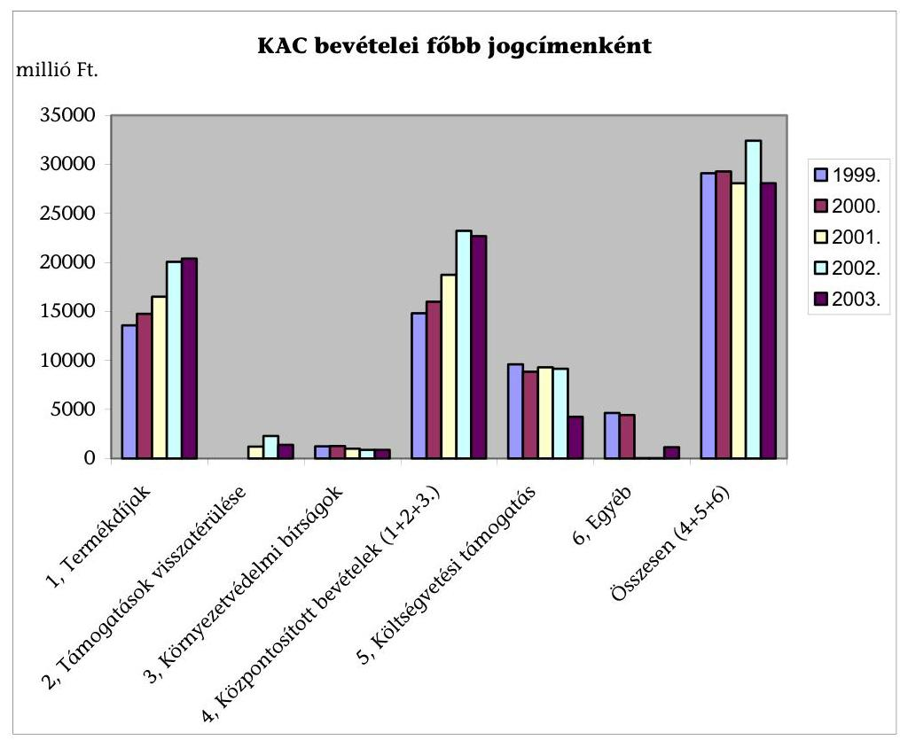

A termékdíjakból származó bevételek növekvő tendenciát mutattak, ugyanakkor a költségvetési támogatások az ellenőrzött időszakban semmikor nem érték el az 1999-es szintet. A támogatások visszafizetéséből és a kamatokból származó bevételek részaránya 2000-ben volt a legmagasabb hányad, 7,1 \%. Az egyéb bevételek nagysága még az $1 \%$-ot sem érte el. (pl. bíróság által megítélt kártérítési öszszegek)

A felhasználható forrásokat csökkentette, hogy a központosított bevételek teljesítése 1999-2000. években - összesen 1,7 milliárd Ft-tal (-5,8 \%) elmaradt a tervezettől, 2003-ban 623 millió Ft-tal (-2,7 \%) az előző évi szint alatt maradt, sőt a költségvetési támogatás 2003. évi csökkenése miatt a KAC előirányzat bevételei, így a felhasználható támogatási forrás 2003-ban lecsökkent. (A KAC forrásainak részletes adatait a 2. sz. tanúsítvány tartalmazza.)

---

A kiadások eredeti előirányzatai 29 és 31 milliárd Ft között mozogtak, de a jelentős - kötelezettségvállalásokkal lekötött - előirányzat-maradványok miatt, 2000. és 2002. években a módosított előirányzatok már meghaladták az 50 milliárd Ft-ot is. (Az évenkénti előirányzatok és azok teljesítési adatait az 1-2. sz. tanúsítvány tartalmazza.)

Az 1998. december 31-vel megszűnt a korábban elkülönített állami pénzalapként működő KKA, ekkor a Pénzügyminisztérium (PM) 17 milliárd forintot zárolt, aminek a felhasználását 2000-től engedte meg. A helyszíni ellenőrzés időpontjában még csak a 2003. év első félévének adatai álltak rendelkezésre, ebben az időszakban a kiadási előirányzat 28,1 milliárd Ft volt. A kiadási előirányzatok jóváhagyását követően minden évben egy miniszteri rendelet határozta meg, hogy az újonnan megnyílt (tehát a determinációt nem tartalmazó) keret hány százalékát lehetett pályázatos fejlesztésekre fordítani.

Az előirányzat-módosítások és átcsoportosítások végrehajtása ugyan megfelelt a jogszabályi előírásoknak, de előfordult, hogy a KAC forrásait más célokra elvonták.

A 2028/1999.(II. 12.) Korm. határozatra hivatkozva a PM - többek között - a KAC előirányzatait is csökkentette 189,3 millió Ft-tal. Ez az elvonás az eredeti előirányzat $0,65 \%$-át jelentette.

A 2019/2003.(II.12.) Korm. határozat szerint a fejezet 2003. évi költségvetésének 0,25\%-át el kellett különíteni az EU csatlakozással kapcsolatos kommunikációs kötelezettségek fedezetére. Ez az összeg 298 millió Ft, mely eredetileg a KvVM Igazgatását 118,5, a KAC-ot 122,5 és más szervezeteket együttesen 57 millió Ft-tal terhelte volna. Ezzel szemben 15,5 millió Ft kivételével az egész elvonást a KAC működési költségeire terhelték (személyi juttatásokra 30, munkaadói járulékokra 9,6 és a dologi kiadásokra 242,9 millió Ft-tot).

Az előirányzat-módosítások és átcsoportosítások nyilvántartásai alkalmasak a beszámolók alátámasztására. Hiányosság ugyanakkor, hogy a KAC előirányzatainak felhasználásáról nem készült a tárgyévi ráfordításokat, kötelezettségvállalásokat és a forrásokat - csoportosításokat bemutató analitika, amit az Intézkedési Terv szerinti bontásban (az ottani kódszámokkal, elnevezésekkel) és részletezettséggel kellett volna összeállítani. A forrásfelhasználást áttekinthetőbbé és az egyeztetési munkát egyszerűbbé tenné, ha szakfőosztályi szinten, a részfeladatokra elkészített kimutatásokban rögzítenék az Intézkedési Terv végrehajtásának számszaki adatait.

A kiadási előirányzatok teljesülése évenként jelentősen ingadozott. A legalacsonyabb 2000-ben volt, amikor az előirányzatnak mindössze $61 \%$-át kötötték le, a legmagasabb pedig 1999-ben volt $76 \%$-os teljesítési mutatóval. Az egyes évek teljesítési arányszámaiból azonban messzemenő következtetéseket nem lehet levonni. Ennek oka az, hogy az egyes évekre jóváhagyott előirányzatok felhasználása több évre is áthúzódik, és bár a támogatást elnyerő pályázók a pozitív döntés után rögtön elkezdik a tendereztetéssel és a szerződések megkötésével a projektek megvalósítását, a kifizetésekre csak a teljesítések után (eseten-

---

ként akár egy évvel később) kerül sor. (adatok az 1. és 3. számú tanúsítványban)

Az előirányzat-maradványok keletkezésének okai: az időigényes pályáztatási rendszer, a közbeszerzési eljárások elhúzódása és a teljesítések évek közötti áthúzódása. Mindezek ellenére a maradványok nagyságát tekintve megállapítható a folyamatos csökkenés. (Amíg 1999-ben 21 591,6 millió Ft, 2002-ben csak 12828 millió Ft volt az előirányzat-maradvány. (Az elszámolt előirányzat maradványokat és a maradvány felhasználások összegét évenkénti bontásban - a 2. sz. tanúsítvány tartalmazza.)

Az előirányzat-maradványok csökkenő tendenciája megfigyelhető mind a tárgyévben keletkezett-, mind az előző évekből származó előirányzat-maradványokon. A tárgyévi maradvány 2000-ben még 9030,8 millió Ft összegű volt, addig 2002ben csak 7680,9 millió Ft-ot ért el. Az előző évekről származó maradványok állománya 2000-ben 10520 millió, 2002-ben csak 5 147,1 millió Ft volt.

A kifizetések után fennmaradó előirányzatokat megkötött szerződésekkel, de legalább a pályázatok miniszteri jóváhagyásával lekötötték. Az előirányzatmaradványokat kimutatták és azokat a következő évben - a PM jóváhagyást követően - rendezték. Az éves zárszámadások ellenőrzése során az ÁSZ rendre kifogásolta, hogy a PM késlekedett az előirányzat-maradványok jóváhagyásával, de 2003-ban, ismét jelentősen túllépve a 217/1998.(XII. 30.) Korm. rendelet 66. §-ában meghatározott május 15-i határidőt, még a helyszíni ellenőrzés befejezéséig (2003. november) sem történt meg az elmúlt évi maradvány jóváhagyása.

Az ellenőrzést nehezítette, hogy a korábbi többszöri átszervezés következtében és a szűk személyi kapacitás miatt a szükséges dokumentumokat lassan és nehezen tudták csak a rendelkezésünkre bocsátani, sőt a számszaki adatok előállítása sem volt gördülékeny és azok többszöri pontosításra szorultak.

# 3.3. A KAC forrásainak felhasználása 

A KAC pénzeszközeinek felhasználása eltérő mértékben, de döntően pályázatos támogatás keretében történt, emellett a KAC múködési kiadásaira a mindenkori miniszteri rendelet évente 6,5-7 \%-ot biztosított. A forrásokra önkormányzatok, gazdálkodó és civil szervezetek mellett magánszemélyek, sőt a fejezet intézményei is pályázhattak. A pályázatokat négy fő célra:

- fejlesztési célú;
- közcélú;
- bányászati tájrendezésre;
- és az országos környezeti és kármentesítés céljára
ill. ezeken belül meghatározott jogcímekre lehetett beadni.
A pályázatos formán belül a támogatás, döntően vissza nem térítendő (támogatás, kamattámogatás) formában történt. A visszatérítendő támogatás körébe a kedvezményes kamatozású támogatás, ill. kamattámogatás és

---

(2003-ig) a kamatmentes támogatás tartozott. A termékdijvisszaigénylés lehetőségét a környezetvédelmi termékdíjról, továbbá egyes termékek környezetvédelmi termékdíjáról szóló 1995. évi LVI. törvény biztosította azon igénylők részére, akik termékdíjköteles termék visszagyújtését és hasznosítását végzik, ill. a termékdíjköteles termék gyártásához közvetlen anyagként termékdíjköteles terméket v. alapanyagot használtak fel.

A költségvetési törvényekben meghatározott (átlagosan évi 30-31 milliárd forint összegű) KAC előirányzatnak évente eltérő százalékát fordították a programok és fejlesztések pályázatos rendszerú támogatására. Ezek konkrét arányát az évente kiadott miniszteri rendeletekben határozták meg. (2. számú melléklet) A bányavállalkozókra át nem hárítható tájrendezési feladatok feltűnően magas - $100 \%$-os - vissza nem térítendő támogatást kaphattak. A közcélú feladatok támogatásán belül a felhasználást szabályozó miniszteri rendelet a pályázati rendszer mellett miniszternek egyedi döntési lehetőséget biztosított, de a hozzájutás szabályait nem dolgozták ki. A KAC-ból a minisztérium is részesült részben a KAC múködtetésére részben az egyes szakterületeik az általuk készített szakmai programok támogatása révén, vagyis a KAC a minisztérium múködési forrásait ki egészítette. (részletesen a jelentés 5.1 pontjában)

A 28/2001. (XII. 23.) KöM rendelet szerint 7. § (1) A KAC éves költségvetési előirányzatait a KAC - a termékdíj visszaigénylés és a kárelhárítási feladatok éves várható kiadásaival csökkentett - bevételének és támogatásának legalább 65,5\%jutott a környezetvédelmi és természetvédelmi fejlesztésekre. a közcélú környezetvédelmi és természetvédelmi feladatok támogatása legfeljebb $14 \%$ lehetett, nyolc jogcímen keresztül. A keret felhasználása pályázati vagy miniszteri egyedi döntés lehetett. A KAC múködtetésére $4,5 \%$ engedett (beleértve a minisztérium háttérintézményének, a KGI-nek a múködtetését, a nemzeti parkok természetvédelmi vagyonkezelési feladatait, az azonnali beavatkozást igénylő környezeti károkozás elhárítását, az ellenőrzési rendszer és az IT fejlesztési és múködtetési költségeit, és az előre nem látható környezetvédelmi és természetvédelmi feladatokat.)

A rendelet szerint a közcélú feladat támogatásáról a miniszter vagy pályázati úton, vagy pályázati kiírás nélkül - az érintett helyettes államtitkár, valamint a közigazgatási államtitkár véleményének figyelembevételével - egyedileg dönt. Ennél bővebbet a hozzájutás módjáról a rendelet nem rögzített

2003-ban a KAC keret $90 \%$-át lehetett a rendelet szerint pályázati úton a környezetvédelmi és természetvédelmi feladatok támogatására fordítani, és a korábbi nyolc jogcím lecsökkent hatra.

Az Országos Környezeti és Kármentesítési Program keretében kármentesítés ill. megelőzés akár $100 \%$ vissza nem térítendő támogatást kaphatott.

A vizsgált időszakban a legnagyobb összegú kiadást a környezet védelmet segitő fejlesztésre és a közcélú környezetvédelmi feladatokra fordították. Ez a két kiadáscsoport megfelelt az Intézkedési Tervekben is megjelölt programoknak. Az azokkal történő egyértelmú, tételes azonosítás, az elmaradt programok forrásainak nyomon követése a már említett analitika hiányában nehézkes, a helyszíni ellenőrzés során így csak tételes kigyűjtögetésre volt mód.

---

A környezetvédelmi fejlesztések köré tartozott, pl. szennyvíz beruházások, a hulladékkezelés, és a levegő tisztaságát befolyásoló beruházások. A közcélú feladatok célja: a környezetvédelmi ill. természetvédelmi intézkedések meghatározását és bevezetését elősegítő szakmai és intézményi háttér megerősítése, programok megvalósíthatósági tanulmányai, természetvédelmi cél pl. biológiai sokféleség megőrzése, szakmapolitikai programok, a környezet védelmét szolgáló oktatási, nevelési, ismeretterjesztési feladatok ellátása és támogatása, az EU integráció elősegítése, kutatási-fejlesztési feladatok stb.

A környezetvédelmet segítő fejlesztésre 67,1 - 71,3 \%-a, a közcélú környezetvédelmi feladatokra 9,7 - 11,8 \%-a jutott az összes kiadásból. Az előbbi esetén közel 15 - 26,7 milliárd Ft-ot, az utóbbinál 2,6 - 4,0 milliárd Ft-ot költöttek.

A vizsgált időszakban a KAC támogatási szerkezete az alábbiak szerint alakult:
A fő célok szerinti támogatási szerkezet alapjaiban nem változott, a KAC rendelet és a felhívás szakmai elemei és a pályázatokban foglalt fejlesztési célok egyaránt megfeleltek az NKP-ben foglalt célok szakmai elemeinek.
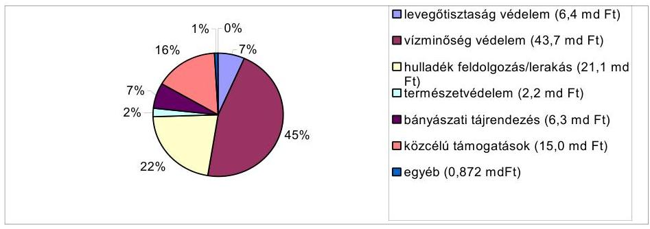

Az Intézkedési Tervek rögzítették az egyes célokra szánt kereteket. Ugyanakkor a támogatott fő feladatok, pl. a levegő tisztaság, a szennyvízelvezetés és tisztítás, a hulladék összegyűjtés és feldolgozás, stb. területének tényleges támogatási összegeit a beérkezett pályázatokban megjelölt ténylegesen támogatott célok iránya és igényelt összege határozták meg. Vagyis a ténylegesen támogatott fejlesztések szakmailag megfeleltek az NKPnak és az intézkedési terveiben foglalt támogatandó céloknak, de támogatásuk aránya eltért azoktól. Ennek oka, hogy a minisztérium nem írt elő kötelezően előre meghatározott keretösszegeket a döntést hozó bizottság számára. Tehát a döntés alapja a pályázatban foglalt környezetvédelmi célok megfelelősége és nem az előzetesen meghatározott arányok voltak. Ez önmagában elfogadható álláspont, ugyanakkor megkérdőjelezi az előre kijelölt támogatási célok arányainak megalapozottságát.

A környezetvédelmi mozgalmak is aránytalannak tartják a KAC források szétosztását. A minisztérium szerint, ha jól kidolgozott és megvalósítható, pl. levegő tisztaságvédelmi projekt javaslatot nyújtanak be egy évben, akkor a bizottságnak lehetőséget adnak arra, hogy azokat előnyben részesítse egyéb (például csatornázási) kevésbé jó projektjavaslatokkal szemben. Például a szennyvízcsatornák építésére benyújtott pályázatok száma kb. háromszor akkora volt, mint az összes többi együttvéve, ezért voltak olyan évek, amikor az elosztható pénzek több mint $60 \%$-át szennyvízcsatornák építésére fordították.

---

A szennyvizek tisztítása területén a feladatokat először Magyarország települési szennyvízelvezetési és szennyvíztisztítási programjának irányelveiről szóló 2207/1996. (VII. 24.) Korm. határozat rögzítette, amely megjelölte az egyes szennyvíz-ártalmatlanítási feladatokat, végrehajtásukat 6-14 év között határozta meg. Elsőbbséget a sérülékeny ivóvízbázisok védelme élvezett.

Fontos előrelépés volt, hogy a Nemzeti Települési Szennyvíz-elvezetési és tisztítási Megvalósítási Programról szóló 25/2002. (II. 27.) Korm. rendelet felsorolta a 2000 lakosegyenérték feletti és alatti terheléssel jellemezhető szennyvízkibocsátású területeken lévő települések jegyzékét. A rendelet kimondta, hogy a kijelölt szennyvíz-elvezetési agglomerációk területén a települési szennyvizek közműves szennyvíz-elvezetését és a szennyvizek biológiai szennyvíztisztítását, illetőleg a települési szennyvizek ártalommentes elhelyezését meg kell valósítani. A rendelet a határidőket 2008-2015 között a felszíni vizek érzékenysége és a települések nagyságrendje szerinti fokozatossággal határozta meg. A Programot a Kormány legalább kétévente felülvizsgálja, és szükség esetén módosítja.

Ugyancsak a szennyvízkezelés támogatásánál alapvető változást jelentett, hogy 2003-tól a Vízügyi célelőirányzat felhasználásának és ellenőrzésének szabályairól szóló 4/2003. (III. 7.) KvVM rendelet szerint a közcélú vízi létesítmények, ezen belül a szennyvízelvezető, illetve -tisztító művek, létesítésének fejlesztésének forrása a Vízügyi célelőirányzat lett.

A meg nem valósított programok sikertelenségének, ill. pályázatok elutasításának főbb okai a következők voltak:

- a pályázatok elutasításának legjelentősebb oka a forráshiány volt, többször előfordult, hogy a benyújtott igények a rendelkezésre álló keretek többszörösét tették ki;
- a nem megfelelő színvonalú pályázatok benyújtása, aminek következménye szintén a támogatási kérelmek elutasítása volt;
- előfordult olyan program, ami az érdeklődés hiánya miatt nem valósult meg, pl. az erőművi légszennyezés csökkentésére nem érkezett be pályázat éveken át, mindaddig, amíg a Vértesi Erőműnél ez akut problémává nem vált. Hasonló okok miatt hiúsult meg egy természetvédelmi program is 2003-ban, amikor a vállalkozóknak kamatmentes hiteltámogatást hirdettek meg erdőtelepítésre, de mivel az erdőgazdaságok nem akartak hitelt felvenni, erre a támogatási lehetőségre nem nyújtottak be pályázatokat;
- a már elfogadott projektek, pl. saját forrás hiánya miatt hiúsultak meg.

A KAC finanszírozási rendszer sajátossága, hogy a fejlesztések támogatásának többnyire csak az összköltségének kisebb arányát (15, maximum 30\%) fedezi. Emiatt a pályázóknak feltételként írták elő, hogy a hiányzó összegeket részben saját, részben egyéb forrásból kell előteremteni, ez viszont rendkívüli feladatokat rótt a pályázókra. Az igénybevevő - legtöbbször önkormányzat - saját forrása általában a teljes bekerülési költség kis hányadát (kb. 15-20 \%-át) tette ki. Ezért - elsősorban a magasabb fejlesztési összeget igénylő szennyvíz beruházások - megvalósítása csak jelentős, más forrásból származó pénzeszközök igénybevételével volt lehetséges. Erre vonatkozó kifogásokat a települési ön-

---

kormányzatok szennyvízközmú fejlesztési és múködtetési feladatai ellátásának vizsgálatáról készített 2004. évi ÁSZ jelentés is megfogalmazott. ${ }^{19}$ A források megszerzéséig a minisztérium 2001-től bevezette az ígérvény rendszerét. A források megosztottsága ellentétes több EU ajánlással, emellett a pályázatok megvalósítása révén elért környezetvédelmi célok teljesülésének és a ráfordításoknak az átláthatóságát rontja. Az EU gyakorlat (pl. az EU alapok vonatkozásában) kifejezetten tiltja a több EU forrást igénybe vevő többcsatornás finanszírozást.

Ha a pályázó a támogatási döntést követően nem tudta előteremteni a 70-80\% saját ill. valamilyen más forrást, akkor a projektet nem tudta megvalósítani. (A KAC finanszírozása technikailag úgy történik, hogy a számlákat az egyes forrásokból arányosítva egyenlítik ki)

A Környezetvédelmi alap célfeladatok fejezeti kezelésű előirányzat felhasználásának és ellenőrzésének szabályairól szóló 3/2003. (III. 7.) KvVM rendelet szerint a miniszter a helyi önkormányzatok részére ígérvény kibocsátásáról is dönthet. Az ígérvény olyan feltételes döntés, amelynek során a miniszter meghatározott összegű támogatás nyújtását ígéri a helyi önkormányzat részére arra az esetre, ha az a támogatásról szóló döntés évében, vagy az azt követő évben ugyanazon műszaki tartalmú pályázatához céltámogatásban részesül. pl. a vízminőségvédelem esetében 2002-ben közel 5 milliárd Ft-t tett ki.

Pl. Kóny szennyvíz-fejlesztési beruházásánál 2001-ben zavart okozott a források összehangolása. A társulati hitelt biztosító bank a szerződés megkötéséhez a KAC támogatási szerződés meglétéhez kötötte. A támogatási szerződés megkötésének feltételeként viszont elő írták a saját forrásnak számító társulási hitelszerződés meglétét. A KÖFI végül kiadott egy, a szerződés folyamatban levő megkötéséről igazolást.

Pl. Parasznya és a társult 6 település 1.492 millió Ft-os beruházását célzó közös pályázatuk alapján 65,6\%-os támogatást kaptak különböző az állami (VICE, KAC, TEKI, DECKAC) céltámogatási keretből. A projekt költségeinek csupán kevesebb, mint 14 százaléka volt saját forrás. A projekt összköltségének több, mint 86 $\%$-a állami támogatás volt, amin belül a vissza nem térítendő KAC támogatás 209 millió Ft-ot (14\%) tett ki.

A KAC a környezetvédelem finanszírozásában - a többi fejezet, az önkormányzatok, valamint az üzleti szféra hozzájárulásához képest - megközelítően és átlagosan csak 1/6-nyi súllyal rendelkezett. Vagyis a környezetvédelmi eredményeket a KAC-on kívüli támogatások jelentősebb mértékben befolyásolták, mint az évi 30-50 milliárd Ft körüli költségvetési előirányzatot képviselő KAC. Ilyen körülmények között a környezetvédelemi célok teljesüléséhez és finanszírozásához hatékony koordináció megteremtése szükséges, de

[^0]
[^0]:    ${ }^{19}$ „A szennyvízközmű célú támogatások pályázására, igénylésére és felhasználására a különböző döntési körbe tartozó támogatásoknál más és más feltételek és rendszerek érvényesülnek. A támogatások elbírálásának időpontjai is eltérőek. Az egyes önkormányzatoknak így pályázataikat különböző módszerek szerint kell elkészíteni, és különböző időpontokban kell benyújtaniuk az érintett szervekhez. A sokcsatornás rendszer koordinálása nehézkes, az összhang megteremtése az egyes támogatások között rendkívül időigényes."

---

ehhez egyértelműen meg kell határozni az egyes ágazatok szerepét. Ezért a környezetvédelem támogatásának a hatékonyságát növelni kell, amire két megoldás kínálkozik. Vagy erősíteni kell az ágazatok közötti integrációt, tehát javítani kell más tárcák ugyanazon célt szolgáló előirányzatainak összehangolását. Ezzel kapcsolatos kifogásokat a 2002. évi zárszámadás ÁSZ jelentésének önkormányzatok címzett és céltámogatásának felhasználásáról szóló része ${ }^{20}$

Egy másik alternatív megoldásként kínálkozik a környezetvédelmet szolgáló fejezeti kezelésű előirányzatok központosítása. Az EU ajánlások és gyakorlat szerint csökkenteni kell a többcsatornás rendszert. Az EU támogatással lebonyolított twinning program ajánlásai között is szerepelt, hogy a KAC társfinanszírozását más állami alapokon keresztül minimálisra kell csökkenteni. (ezek részletesen a jelentés 2.1. pontjában) Ez a rendszer a források előteremtése szempontjából kedvező a pályázóknak is. Ennek szükségességét a Magyar Köztársaság 2004. évre szóló költségvetés tervezetéről készített vélemény is megállapította. ${ }^{21}$

A környezetvédelmet szolgáló előirányzatok együttes kezelését 2004-től törvényi rendelkezés részben megoldotta. Ennek értelmében az egyes fejezeti kezelésű előirányzatok - az előző évi döntéseivel és az EU társfinanszírozással le nem kötött kerete - feletti döntési jog összevontan a Regionális Fejlesztési Tanácsokhoz került, de a felsorolásból kimaradt a Belügyminisztérium fejezetben szereplő önkormányzatok céltámogatása.

A Magyar Köztársaság 2004. évi költségvetéséről és az államháztartás hároméves kereteiről szóló 2003. évi CXVI. törvény 64. § szerint a Regionális Fejlesztési Tanácsok meghatározott előirányzatok tekintetében a régió területfejlesztési koncepciója, ill. programja figyelembevételével döntenek a hatáskörükbe utalt pénzeszközök felhasználásáról. Az előirányzatok régiók közötti elosztásának elvét, nagyságrendjét, a támogatások odaítélésének és felhasználásának szabályait az ÁSZ helyszíni ellenőrzését követően megjelent, a regionális fejlesztési tanácsok döntési hatáskörébe utalt fejezeti kezelésű előirányzatok régiók közötti felosztásának elvéről, a régiók forrásairól, a támogatások odaítélésének és felhasználásának szabályairól és a közmunkaprogramok támogatási rendjéről szóló 49/1999. (III. 26.) Korm. rendelet módosításáról szóló 66/2004. (IV. 15.) Korm. rendelet rögzítette.

A KAC felhasználása során a környezetvédelmet nem, vagy nem közvetlenül támogató döntések, intézkedések is történtek, ill. a támogatás nem a KAC feladatai közé tartoztak. Ide tartozott az Intézkedési Tervben foglalt összességében 1820 millió Ft-ot kitevő fejlesztési támogatás, és pl. a tájrendezési feladatok pályázatainak támogatásán belül, egyes beszerzések megvalósítása.

[^0]
[^0]:    ${ }^{20}$ „Az Ámr-nek, a források összehangolására vonatkozó előirásai ellenére a vizsgált 2002. évben sem érvényesült a címzett és céltámogatások, illetve a fejezeti kezelésú előirányzatok együttes kezelése."
    ${ }^{21}$ „A fejlesztési támogatások ily módon igen elaprózottak, nem megfelelő a sokcsatornás hazai támogatási rendszer forráskoordinációja, nem jött létre a területfejlesztés céljait hatékonyan támogató olyan területi szervezeti háttér, amely szükséges a hazai és európai uniós támogatások eredményes fogadásához, felhasználásához."

---

Az intézkedési Terv támogatta, pl.:
1999-ben, KÖZ.1. A MÁV Rt. fejlesztése, A) személykocsi felújítás 283 millió Ft, 2000-ben, VERS.III.8. A KöM területén az információ áramlás segítése, közönségszolgálat 50 millió Ft ,
EN.III.2. A Környezetterhelési díjak bevezetését támogató intézményfejlesztési feladatokra 116 millió Ft,
HUL.III.1. Termékdíjakról szóló tv. módosítása, 10 millió Ft,
2001-ben, VERS.III.2/B. Közigazgatási struktúra kialakítása, 31 millió Ft, KÖZ.II.3. Vasúti gördülő állomány és infrastruktúra fejlesztése, felújítás, 1000 millió Ft,
2000 - 2002 közötti időszakban a közlekedési tarifaközösség kialakítására, mindegyik évben 100 millió Ft (fel nem használás miatt újra megjelenő tétel).

Egyes tájrendezési pályázatokban a tervezett költségek között szerepelt, pl. fahíd, kerti pad, táblák stb. beszerzése. ill. elhelyezése.
Kifogásolható, hogy a fontos és egyre nagyobb figyelmet kívánó biológiai allergének csökkentésére (pl. parlagfű) csak 125 millió Ft-ot szántak 2000 2002 közötti időszakban, miközben a fentebb már felsorolt, - nem kimondottan környezetvédelmi célú - feladatok finanszírozására egymilliárdot meghaladó összeget irányoztak elő. A probléma fontosságát az Országgyúlés is felismerte, mert a 126/2003. (XI. 21) OGY határozat a parlagfű elleni feladatok kijelölése mellett a 2004 évi költségvetésben négy fejezet előirányzatainak terhére összesen 1,5 milliárd Ft-ot különített el.

Az NKP is megemlíti az emberi egészség alakulásának környezeti összefüggései között az asztmás ill. szénanátha betegségek növekedését. Az 1,5 milliárd Ft-os kerethez a fejezet 2004. évi költségvetésében 400 millió Ft-ot kellett elkülöníteni.

# 4. A TÁMOGATÁSI MECHANIZMUS 

### 4.1. A pályázati rendszer múködése

A pályázati felhívást a költségvetési törvény jóváhagyását követően, lehetőleg február végéig meg kell jelentetni. A költségvetést általában december végén fogadja el az Országgyúlés, ezért a tárcának az a törekvése, hogy a pályázatok kiírása február végéig megtörténjen, nem teljesült, pl. 2003-ban a pályázati felhívások márciusban jelentek meg.

Finanszírozási nehézséget nem okozott, de a maradványkeretek, illetve előirányzat maradványok esetében formai és adminisztrációs gondot okoz a PM elhúzódó jóváhagyása. Például 2003-ban a PM többször is felülvizsgálta azokat, és az előző évek gyakorlatának megfelelően nem történhetett meg az előirányzatok teljes körű megemelése és rendezése.

Egy támogatási rendszer hatékonyságát a pályázatoknak (a benyújtástól a döntéshozásig) a rendszerben eltöltött átlagos idején keresztül lehet minősíteni. A KAC felhasználásának szabályait rögzítő miniszteri rendeletek a pályázatok kezelését végzők számára a határidőket előírta. Ennek betartását a helyszíni vizsgálat csak a 2002. évi és az azt követően benyújtott pályázatok esetében tehette meg, mivel ezt megelőzően ugyanis egy ún. felülírásos nyilvántartást vezettek. Ennek során adatmódosításkor a korábbi adatokat felülírva, azok tartalmát megsemmisítették, tehát a pályázatok eredeti adatai utó-

---

lag nem vagy csak az egyes pályázatok dokumentumai alapján jelentős idő ráfordítással voltak rekonstruálhatók. Emiatt a pályázati mechanizmus múködésének hatékonysága erre az időszakra vonatkozóan nem volt értékelhető.

PI. 2003-tól a pályázatok befogadására 5 munkanapot, a területi értékelésre és minisztériumba küldésre 30 napot, a minisztérium általi értékelésre 20 napot írt elő a rendelet.

A 489 darab fejlesztési célú pályázat (a pályázatok 62,3 \%-a) nyilvántartó rendszerben szereplő adatai alapján a pályázatok feldolgozásának átlagos időtartama (tehát a benyújtásától a döntések meghozataláig eltelt átlagos idő) 162 nap volt, bár a pályázatok kb. negyedénél ez a folyamat több mint fél évet vett igénybe. Ugyanakkor, a döntéshozatal időtartamát miniszteri rendeletek 3 hónapban határozták meg. Erre vonatkozóan a Magyar Köztársaság 2002. évi költségvetésének végrehajtásáról szóló ÁSZ jelentés, az önkormányzatok címzett és céltámogatásának felhasználásáról szóló része is elmarasztaló megállapításokat tett. ${ }^{22}$

A 28/2001. (XII. 23.) KöM rendelet 12. § (1) bekezdése alapján „A formai és tartalmi feltételeknek megfelelő pályázatokat a 11. § (7) bekezdése szerinti értesités kiküldésétől, illetve a hiánypótlás befogadásának napjától számított három hónapon belül kell elbírálni."

Cserkút község pollenmentesítésre beadott pályázatának teljes átfutási ideje 41 hét volt. Békés megyében egy magánszemély tájrendezési tervkészítésre beadott pályázatának idôszükséglete a megvalósulásig 21,5 hónap, a végrehajtás pályázatáé 16 hónap volt.

Az IPR adatbázisa szerint szembetűnően magas (több mint ezer nap) volt a feldolgozás idôszükséglete két projekt esetében, míg nyolc projekt esetében a feldolgozásának idôszükséglete nulla nap volt. Ennek oka az, hogy az adatbázisokban sok adat hibásan szerepelt, ezeknek kijavítása a helyszíni ellenőrzés időpontjában kezdődött meg.

Két bányászati tájrendezési pályázat esetében valószínúleg a nyilvántartási rendszer hibája, vagy hibás adatrögzítés miatt a pályázat pillanatnyi állásának napja egybeesett a pályázat benyújtásának napjával.

Lassú volt a pályázatok feldolgozása a bányakárok helyreállítását célzó projekteknél is. Itt határidők teljesítése szempontjából megvizsgált 263 darab pályázat átlagos feldolgozási idôszükséglete 207 napot tett ki, és a pályázatok $92 \%$-ban a pályázat benyújtásától a döntéshozatalig eltelt idő több volt félévnél. Ennek oka részben a nyilvántartási rendszerek pontatlanságában, részben a bányászati-tájrendezési feladatok finanszírozásának sajátosságában rejlik. A támogatás forrását a bányajáradék 10\%-a biztosítja, aminek mértékét az adott évi költségvetési törvény határozza meg. Emiatt az a rendszer alakult ki, hogy

[^0]
[^0]:    ${ }^{22}$ „A pályázatokra vonatkozó visszajelzések - különösen a KAC esetében - továbbra is elhúzódtak, ami rendkívüli mértékben megnehezítette az önkormányzatok fejlesztési tevékenységének megalapozását."

---

az előző évben beadott pályázatokra azt követően születik döntés, ha ehhez a törvény biztosítja a szükséges forrást.

Előfordult, hogy olyan területekre adtak 100\%-os vissza nem térítendő támogatást, amelyek a hiteles ingatlan nyilvántartásban nem elhagyott bányaként szerepeltek. Ezek igazolására az illetékes bányakapitányság hatósági bizonyítványa szolgált. Az eseteket munkafolyamatba épített ellenőrzés keretében a KAKF akkori főosztályvezetője feltárta és a miniszternek, illetve a terület irányításáért felelős államtitkárnak jelezte. Az ÁSZ vizsgálat tényként rögzítette, hogy jelentést tevő vezetőt és a jelentést követően háromnegyed évvel később a felelős szakmai vezetőt felmentették. A bejelentésben foglaltak ellenőrzésre belső vizsgálat indult, de a 2003 végén megkezdett szervezeti átalakítások miatt ennek lezárása az ÁSZ vizsgálat idején még nem történt meg.

A pályázati értékelési, döntési mechanizmus többlépcsős rendszerú volt, a miniszteri rendeletek kijelölték a feladatot ellátó szervezetet, és rögzítették az értékelés menetét.

Az első értékelést, a pályázatot befogadó szervezetek (felügyelőségek, nemzeti parkok) végezték el. A minisztérium - általában külső - szakértői véleményezéssel egészítette ki, és továbbította a miniszter felé támogatási javaslatot tevőbizottságnak.

Az értékelés menete változott, a végső rangsorolást 2002-ig egy tárcaközi bizottság, 2003-tól - környezetvédelmi témák szerint tagozódott - 4 munkabizottság végezte. A munkabizottsági rendszer kialakítása a korábbinál célszerúbb volt, mivel az egyes támogatási célok szakmai tartalmához igazodott. A munkabizottságok a 8/2003. KvVM utasítás alapján alakultak meg. A bizottságok összetétele a 2003-tól alapvetően megváltozott, a különböző külső szervezetek már lényegesen nagyobb számban képviseltették magukat.

A 28/2001. (XII. 23.) KöM rendelet 13. § (1) a pályázatok bírálatára és a döntésre vonatkozó javaslat megtételére a miniszter 15 fős Tárcaközi Bizottságot hozott létre. Tagjai a TKB elnökeként a közigazgatási államtitkár, a környezetvédelemért, a természetvédelemért és a vízügyért felelős helyettes államtitkár, a miniszter által kijelölt, minisztériumi tisztviselő, valamint a miniszter felkérése alapján a BM, az EüM, az SzCsM, az FVM, a GKM, a PM és az OM egy-egy képviselője. Tagjai ezen kívül a környezetvédelmi és természetvédelmi társadalmi szervezetek által delegált három személy, valamint az Országos Környezetvédelmi Tanács egy képviselője.

A 3/2003. (III. 7.) KvVM rendelet 16. § szerint a bizottságokban a miniszter által kijelölt köztisztviselők, a kormányzati munkamegosztásnak megfelelően az érintett minisztériumok által kijelölt egy-egy személy, a társadalmi, valamint a szakmai érdekképviseleti szervek (civil szervezetek) által kijelölt - a miniszter által meghatározott számú - személy(ek). A bizottság tagjainak száma legfeljebb 15 fő lehetett.

A miniszteri utasítás alapján létrejött a

- Zöld Falu, Zöld Város Munkabizottság;
- Hulladékgazdálkodási és Környezet-egészségügyi Munkabizottság;
- Természetvédelmi és Bánya Tájrendezési Munkabizottság;
- Társadalmi célú programok, tevékenységek Munkabizottság

---

Az értékelési és bírálati rendszer szabályozásánál az összeférhetetlenség a bizottsági tagok esetében KAC felhasználását szabályozó miniszteri rendelet 16. § (6) bekezdésében és a bizottságok ügyrendjében szabályozott, a szakértők ill. alvállalkozóik esetében a szerződésben rendezett.

Ez történt a bizottság 2003. június 19-i ülésén is, ahol a civil szervezetek túlsúlyba kerültek, és - a jegyzőkönyv szerint - a pályázatokat formai szempontból is ellenőrizték, ebben a bizottság „két oldala" 2003. május 28 -án megtartott alakuló ülésén egyezett meg. Ugyanakkor a miniszteri rendelet szerint a formai ellenőrzés a pályázatokat befogadó szervezetek feladata, a rendelet a külső szakértő igénybevételét csak az értékelési folyamatban engedi meg. A munkabizottság ügyrendjében a civil szervezetek által végezhető elöbírálati tevékenység nem szerepelt. A pályázatok formai ellenőrzését a befogadó szervezet - jelen esetben a minisztérium - elvégezte, de a civil szervezetek képviselői az értékelési folyamat részeként ismételten átellenőrizték. Emellett a bizottsági tagokra vonatkozó összeférhetetlenséget a rendelet, szakértői tevékenységre vonatkozó összeférhetetlenséget más megközelítésben a szerződés rögzíti, ugyanakkor a civil szervezetek képviselőivel szakértői feladatokra szerződést nem kötöttek. A pályázatokról történt szavazáskor véleményeltérés esetén a civil szervezetek véleménye döntött.

A közcélú pályázatokat 2002-ig egy- egy, legalább öttagú Szakértői Bizottság értékelte, két személy a környezet- és természetvédelmi társadalmi szervezetek delegáltak, a társadalmi szervezetek támogatása esetén a Bizottság legalább héttagú, ebből öt személyt a társadalmi szervezetek delegáltak, vagyis ezek többségben voltak.

A bizottságban valamennyi civil szervezet megjelenése és 2 hivatalnok távolléte esetén már a civil szervezetek szavazata dönthetett. A jelzett bizottsági ülésen a PM képviselője nem jelent meg, és helyettesítésről sem gondoskodott. A minisztérium igazoltan távollevő munkatársa helyettest állított, de ez - szintén az ügyrendben előírtak miatt - csak tanácskozási joggal lehetett jelen. A távollétek következtében pályázatokról döntő ülésen a szavazati joggal rendelkezők közül a civil szervezetek képviselői többen voltak. Az ülésről készített jegyzőkönyv szerint a civil szervezetek „előbírálták" a pályázatok formai megfelelőségét, ugyanakkor pályázatok befogadása és a pályázati kiírásnak való megfelelés ellenőrzése a minisztérium kijelölt szerveinek feladata, és a bizottság ügyrendje nem biztosított ilyen jogkört a civil szervezeteknek.

A szakértői keretszerződés szerint a szakértő csak azon pályázatok értékelésére, ill. azon projektek ellenőrzésére fogad el megbízást, amelyek előkészítésében, ill. elkészítésében sem az általa képviselt cég, sem annak tagja vagy alkalmazottja nem vett részt.

A Társadalmi célú programok, tevékenységek Munkabizottság által tárgyalt pályázatoknál az értékelési szempontok előzetes kijelölése 5 főcsoportban előre megtörtént, a bírálat során az állami és a civil oldal külön-külön bírált, véleményeltérés esetén a civil szervezetek véleménye döntött.

A miniszter felé javaslatot a mindenkori bizottság terjesztette be. A bizottsági munka esetenként elhúzódott, mivel kötelezően előírt ülésezési rendje 2003-ig nem volt szabályozott.

---

A tartalmilag és formailag megfelelő pályázatokat (külső) szakértők véleményezték. A szakértők egy egységes szempontrendszer alapján értékelték a projekt javaslatokat és azokról egy elsődleges támogatási rangsort állítottak össze.

A szakértők véleménye alapján a szakmai főosztályok egy rangsort állítottak fel, véglegesítéséről a bíráló bizottság döntött, és terjesztett fel a miniszterhez.

Miniszteri rendelet 2003-ban már előírta, hogy a munkabizottságoknak kéthavonta kell ülést tartania, korábban ez ritkábban, csak megfelelő számú pályázat megléte esetén történt.

A bizottság ülésén a benyújtott pályázatokról az alábbi döntések születhettek:

- elfogadva,
- forráshiány miatt elutasítva,
- átdolgozásra visszaadva, és
- elutasítva.

Az értékelés menetében előzetesen felállított pontszámos rendszert alkalmaztak, ennek keretében szakmai (környezetvédelmi), és gazdasági szempontok szerint értékelték a pályázatokat. A pályázatok javaslati sorrendjét a kapott pontszám határozta meg. Lényeges eleme a rendszernek, hogy a következő értékelő szerv, vagy testület a véleményt és ezzel a rangsort megváltoztathatta. Kifogásoljuk, hogy (az azonos célú pályázatok esetében megfogalmazott) javaslat mindig relatív, az adott helyzethez igazodó volt, mivel a pályázatokat évente nem egyidőben, hanem a beérkezés szerint idöszakonként értékelték. Vagyis a támogatás elnyerése az éppen az adott időszakban beadott hasonló témájú pályázatok száma és a forrás határozta meg. A döntési rendszer a környezetvédelmi célok hatékony végrehajtását annyiban is korlátozta, hogy a megfelelően kidolgozott és támogatható, de forráshiány miatt elutasított pályázatok, az adott folyamatban gyakorlatilag elestek a támogatási lehetőségből, azokat csak akkor lehetett esetleg támogatáshoz juttatni, ha a pályázatot ismételten benyújtották. Megfelelő értékelési alapot jelentene, ha a támogatást meghatározott pontszám esetén nyújtanának, és bizonyos feltételhez (egy-egy értékelési szempont minimum pontszámához) kötnék a támogatás megítélését.

Így előfordulhat, hogy jól kidolgozott, és célja szerint támogatható pályázat pontszáma alapján kiesik a versenyből, ha egy másik időpontban adja be pályázatát, akkor ugyanannyi a pontszámmal elnyeri a támogatást. A kevésbé támogatható pályázat, ha hiánypótlásra, vagy átdolgozásra adták vissza, akkor az átdolgozást követően a támogatást megkaphatta.

A rendszert emiatt - szóbeli tájékoztatás útján - egyes környezetvédelmi mozgalmak is megkérdőjelezték.

A szakértői megbízások során a vizsgálat egy szabálytalan eljárást tárt fel, emellett a minisztérium a gazdaságossági szempontokat figyelmen kívül hagyva a legdrágább ajánlatot tevővel szerződött.

Az IPC Kft-vel 2001-ben hulladék begyűjtésre, feldolgozásra és értékesítésre kötött támogatási szerződés, kezdő időpontként 1999. január 1-et jelölte meg. Később a

---

Kft jogosulatlanul próbált az állami támogatásokhoz hozzájutni, azt állítva, hogy a hulladékot külföldre szállította, azonban az ennek igazolásául megküldött vámokmányokról az illetékes vámhatóságok megállapították, hogy azok nem valósak. Emiatt az ügyben büntetőeljárás is indult.

A bányakárok helyreállításánál a KAC pályázatok értékelésére és a támogatások ellenőrzésére 2000-ben kiírt pályázat kiírása rögzítette, hogy a pályázatok rangsorolása döntően az árajánlatok, ill. a rendelkezésre állási idő alapján történik. Az 58 ajánlatból 57-et eredményesnek minősítettek, amelyben 12 ajánlat vonatkozott a bányászati tájrendezésre. Egy év múlva, az akkor folyamatban levő 22 beruházás műszaki ellenőrzésére és 237 pályázat szakmai értékelésére, az 57 (illetve 12) eredményes pályázó közül a legdrágább ajánlattevőtől kértek konkrét ajánlatot. A megkeresett postafordultával kedvező választ adott, és ezután egy dátum nélküli kizárólagos szerződést kötöttek a kiválasztott vállalkozóval. Ebben a szerződésben azonban a megbízás kezdeti időpontjaként egy, a megkeresésnél korábbi dátumot írtak be. A kiválasztott vállalkozó a műszaki ellenőri feladatoknak csak a 39\%-át tudta elvégezni, a többit kiadta alvállalkozóknak, amelyek nem tudták igazolni, hogy a műszaki ellenőrök a vonatkozó jogszabályok által előírt szakképzettséggel és a műszaki ellenőri tevékenységre feljogosító engedélylyel rendelkeztek-e. A terület szakmai irányításáért felelős főosztályvezető ezt a szabálytalanságot is jelentette feletteseinek. A jelentést tevő vezetőt, és közel háromnegyed évvel később a szakterületért felelős vezetőt felmentették.

A pályázati pénzek rendeltetésszerú felhasználásának biztonságát növelte, hogy a miniszteri rendeletek biztosítékokat (bankgarancia, ingatlan fedezet, azonnali beszedési megbízás) követeltek meg. Ezeket a pályázati felhívásokban és a Magyar Államkincstár Rt. ellenőrzési szabályzatában is előírták, hogy a biztosítékok megléte esetén köthető csak meg a támogatási szerződés.

# 4.2. A támogatási rendszer nyilvántartása és informatikai támogatottsága. 

A KAC tervezési, nyilvántartási, végrehajtási, beszámolási, tájékoztatási, ellenőrzési feladatainak ellátása érdekében a 4/2001 KöM utasítás egy egységes információs rendszer az Integrált Pályázati Rendszer létrehozását és múködtetését írta elő, amelynek egyik egysége a KAC kezelési modul. Kiépítését a Környezetvédelmi Minisztérium fejezet múködésének ellenőrzéséről szóló 2002. évi ÁSZ jelentés pozitív változásként értékelte, miközben részletesen feltárta a korábbi rendszer főbb hiányosságait. ${ }^{23}$

[^0]
[^0]:    ${ }^{23}$ A 2001. év végén múködő rendszerek korszerűtlenek, az adatszolgáltatás gyakran papír alapú, az adatbázis egyedi lekérdezésre csak új program írásával volt alkalmas. A KAC pályázati szerződéseinek nyilvántartását végző Pályázati Nyilvántartó Rendszer (PNYR) hasznosulásokat kimutató adatokat nem tartalmazott.
    „Az informatikai stratégia készítésére és folyamatos aktualizálására vonatkozó 1039/1993. (V.21.) Korm. határozatban rögzített feladatokkal ellentétben tárca szintű informatikai stratégia 2000. év végéig nem készült."

---

Hiányosság ugyanakkor, hogy a minisztérium nem rendelkezik elfogadott informatikai stratégiával. Pozitív változás, hogy a 10/2003. (K. Ért. 5.) KvVM utasítás (SzMSZ) az ágazati informatikai stratégia elkészítését már előírja és azt a Környezeti Informatikai Főosztály feladataként jelölte meg.

A 1039/1993. (V.21.) Korm. határozat 2. pontja rendelkezik az informatikai stratégia elkészítéséről első alkalommal 1994. és 1995. évekre.

A minisztériumban a stratégia kialakítása az 1999-2003 közötti időszak utasításaiban feladatként nem jelent meg.
Előrelépés volt, hogy a Környezeti Informatikai Főosztály a 2002. december 2.-tól hatályos 26/2002. KvVM utasítás a Környezetvédelmi Minisztérium Szervezeti és Múködési Szabályzata illetve az azt hatályon kívül helyező 10/2003. KvVM utasításnak megfelelően a közigazgatási államtitkár közvetlen alárendeltségébe került.

A 1066/1999 (VI.11) Korm. határozat 2.pontja szerint a minisztériumokban az informatikai feladatokkal az államtitkár közvetlen alárendeltségébe tartozó informatikai vezetőt kell megbízni.

A hatékony informatikai munkavégzést biztosító szabályozási környezetet a minisztérium csak 2003-ra alakította ki, annak ellenére, hogy a minisztérium már 2000-ben rendelkezett Informatikai és egy Informatikai Biztonsági Szabályzat tervezettel.

A tervezetek elfogadásának elhúzódását, a folyamatos vezető váltások eredményezték. A környezetvédelmi és vízügyi miniszter a 13./2003 KvVM (K. Ért. 6) utasításban rendelkezik az Informatikai Biztonsági Szabályzatról, a 12/2003 KvVM utasításban az Informatikai Szabályzatról.
A Környezetvédelmi Fejlesztési Intézet 2000-év negyedik negyedévében az EU előírások és a belső jogszabályok követelményeinek kielégítését célzó rendszer kialakítását határozta el. Első lépésként elkészíttette a rendszer követelményjegyzékét 2000 decemberében. Ezt követően (2001 első negyedév) indította el a ma is múködő integrált rendszer kialakítását.
Az IPR szoftvercsomag 2001 végére készült el, bevezetése és oktatása is megkezdődött. A rendszer teljes átadására a belső és külső kezelő szervezetek változásai, és a KAC céljainak 2003. évi módosulásai miatt szükségessé vált aktualizálások miatt csak 2003 júniusában került sor.

Az IPR rendszer átadását 2001. év végén kellett volna lezárni, de a KÖFI megszűnt, létrejött majd megszűnt KGI KAC Kezelési Igazgatóság. A rendszer indítása közben 2001. december 20-án a KöM megbízási szerződést kötött a Magyar Államkincstár Rt.-vel (MÁK), a területi szervek fokozottabb bevonása miatt további módosításokra volt szükség. A rendszert ki kellett építeni a 19 megyei MÁK Fiókban, 22 területi szervnél (felügyelőség, nemzeti park). A 2001. decemberi átadást követően mintegy fél évig próbaüzemszerűen múködött a rendszer, ekkor még
„A hatékony informatikai munkavégzést biztosító szabályozási környezetet a minisztérium nem alakította ki. Egy Informatikai és egy Informatikai Biztonsági Szabályzat tervezet 2000-ben ugyan elkészült, de elfogadása és bevezetése nem történt meg."

---

nagy számú javaslat, javítási igény érkezett, amelyek teljes körűen csak 2003. év közepére készültek el. Az elhúzódás oka volt az ún. partner-összevezetés is, amely során az ismétlődések megszüntetése és a partnerek adószámhoz rendelése volt a feladat. Ezzel a nyilvántartó rendszerben található mintegy 29.000 partner 18.500 -ra csökkent.

A komplex ügyviteli és információs rendszer összességében 441 millió Ft, a KAC pénzeszközök megjelenítése a kormányzati portálon 24,4 millió Ft-ba került, de működtetéséhez további 71,4 millió Ft összességű beszerzések is szükségessé váltak.

A KÖM Igazgatása 2002. áprilisban 6 db szerver beszerzésére 66,4 millió Ft-ot fordított. További költségeként merült fel 2002. évben 5 millió Ft megbízási díj.

Az IPR üzemszerűen elindult, létrejött a MÁK kapcsolat és a MÁK-on keresztül a rendszer az Országos Monitoring Rendszerrel is kapcsolatban van. A rendszer technológia szintjét tekintve megfelelően teljesíti az EU normákat, az alkalmazott Oracle adatbázis-kezelő az államigazgatásban általános megoldás, a rendszer védelme megoldott. Az informatikai rendszert a Környezeti Informatikai Főosztály üzemelteteti, a működtetéshez szükséges feltételek rendelkezésre állnak.

A rendszer biztonsága a kialakított műszaki megoldásnak köszönhetően (cluster, nincs kiesés, két szerver ún. melegtartalékra van kötve) megfelelő. A rendszer a kormányzati rendszer része, ezen kívül CISCO gyártmányú PIX tűzfallal védett hálózaton üzemel, így a külső behatolás valószínűsége csekély.

A szerverek fizikai védelme zárt helységekben megoldott. Hiányosság, hogy a belépési jogosultságokat a szerverszobákba az Informatikai és az Informatikai és Biztonsági szabályzat részletesen nem szabályozza, a szerverszoba felügyeletét a vezető illetve a hálózati rendszergazda feladataként határozta meg.
Elkészült a rendszer kapcsolódása a kormányzati portálhoz, a tesztelés 2003 végén még folyamatban volt.

Ez lehetőséget ad a KAC felhasználás publikus elérésére az Interneten keresztül. A pályázónak azonosító kód alapján rendelkezésre fog állni a pályázatával kapcsolatos összes információ (pl. a pályázat állapota).
A hatékony adatszolgáltatás nem volt biztosított, mert a feladatot ellátó KAC Koordinációs Főosztály állományában informatikus nem dolgozik. Ezért ezeket a feladatokat - saját tevékenysége mellett - a Környezeti Informatikai Főosztály informatikusának kell ellátnia.

# A KAC Főosztályra vonatkozó felhasználói hozzáférést, a jogosultságok meghatározását szabályzat nem rögzíti. 

Az IPR-en belül létrehozott Vezetői Információs Rendszert (VIR) nem használják, a 10 cliens-licenseből (ügyfél-hozzáférési engedély) egy sincs kiadva. A lekérdezési, tájékoztatási feladatok a KAC Főosztályra hárulnak. Mindezek következtében ezért az integrált pályázati rendszer nem hatékony.

A rendszer naplózza a tranzakciókat, így a beavatkozások később követhetők. A rendszer online működtetésű, ennek megfelelően - a kezelői kapacitásoktól függő pontossággal - naprakész állapotokat tükröz mind a pályázatokat, mind a pénzmozgásokat tekintve. A pénzmozgások a költségvetési folyamatnak megfelelő munkafolyamat szerint ellenőrzötten történnek (teljesítésigazolás, ellenjegyzés, utalványozás, kifizetés). A pályázati modulból jól követhetők az egyes pályáza-

---

tok állapotai, a státusok szerint tetszőleges időszakban lekérdezhetők (pl. a nyertes, de még nem utalt támogatások). A pályázatok ellenőrzését a program az egyes követelmények egyenkénti nyilvántartásával és ellenőrzésével támogatja (pl. kötelező adatok vizsgálata). A lekérdezések beállíthatók (pl. szerződésre várók vagy egy adott dátumhoz fizetésre rendelt pályázatok).

# 4.3. A támogatási mechanizmus ellenőrzési rendszere 

Az ellenőrzésre vonatkozó rendelkezések általában keretjellegűek, amelyet tartalommal a közreműködő szervezetek eljárási rendjei ill. szervezeti és működési szabályai, részletesebben a KAC eljárási rendje és MÁK ellenőrzési szabályzata töltenek ki. A vizsgált időszakban a KAC rendeletek, utasítások - 2001 kivételével - nem teljes körűen szabályozták a KAC ellenőrzéssel kapcsolatos és ezen belül a pályázati rendszer és a munkafolyamatba épített ellenőrzés szabályait.

A helyszíni ellenőrzés idején a KAC Koordinációs Főosztály nem rendelkezett ellenőrzési szabályzattal. A szabályozás hiányát a Magyar Köztársaság 2001. évi költségvetése végrehajtásának ellenőrzéséről szóló ÁSZ jelentése is megállapította: ${ }^{24}$

A 4/2001.(K.ért.4.) KöM utasítás, a KAC ellenőrzését átfogóan szabályozta. Ennek során külön rendelkezett a vezetői és munkafolyamatba épített ellenőrzésről, a közcélú és az általános pályázati rendszer vezetői ellenőrzésének felelőseiről, a szakmai teljesítés igazolásáról és igazolójáról, a műszaki ellenőr feladatairól, az utólagos ellenőrzésről, valamint a KAC ellenőrzési tevékenységének koordinálásáról. Ugyancsak ellenőrzésre vonatkozó rendelkezéseket tartalmaznak a támogatási szerződések és megállapodások, amelyek az ellenőrzés feladatait és kötelezettségeit, kedvezményezetti oldalról rögzítették.

A KAC felhasználásának Eljárási rendjét 2003 júniusában fogadták el. Ez az eljárási rend már tartalmazza a pályázatokkal kapcsolatos munkafolyamatok, feladatok végrehajtásának sorrendjét, de a konkrét ellenőrzési fázisokat, teendőket részletesen nem szabályozta.

A vezetői és munkafolyamatba épített ellenőrzés részletes szabályait nem határozták meg, annak ellenére, hogy a vizsgált időszakban több miniszteri utasítás és az ÁSZ jelentést követően kiadott Intézkedési terv is előírta ennek kötelezettségét. A miniszteri utasítások szerint ezt ügyrendben ill. munkaköri leírásokban kellett rögzíteni.

A 4/2001 KöM (K.ért. 4.) utasítás 11. § (3) bek. szerint a vezetői és munkafolyamatba épített ellenőrzés részletes szabályait a KAC működtetésében érintett szervezeti egység ügyrendje, munkaköri leírásai határozzák meg.

A 8/2003.(K.Ért. 4.) KvVM utasítás rendelkezik a munkafolyamatba épített ellenőrzésről a KAC működtetésében érintett köztisztviselők feladataként, de a konkrét feladatokat nem határozott meg az utasítás.

[^0]
[^0]:    ${ }^{24}$ „A KAC kezelési szervezetének szabályozottsága nem felelt meg az előírásoknak. Nem volt múködési szabályzata, ügyrendje, ellenőrzési szabályzata."

---

A 8/2003. (K.Ért. 4.) KvVM utasítás 10. § (3) által előírt, a munkafolyamatba épített ellenőrzés feladatait egyéb szabályzatban sem részletezték.

A KAC ellenőrzése 2002. előtt a kezelő intézmények (KÖFI, KGI) függetlenített belső ellenőrzésének feladata volt, de ez utóbbi a KAC-cal kapcsolatos ellenőrzéseket nem végzett. A szervezeti háttér változását követően 2002. óta a kezelést végző főosztályoknak belső ellenőrzése nincs, a feladatot a felügyeleti ill. a fejezeti belső ellenőrzés keretében látják el. A fejezeti belső ellenőrzés (1 fő) kapacitása nem elégséges a feladat ellátására.

A KÖFI SzMSz-e 1999-ben előírta az intézményi ellenőrzésen kívül, hogy munkaterv alapján végezze a KAC jogszabályi, pénzügyi és gazdálkodási ügyei kezelésének ellenőrzését.

A KAC működtetésében részt vevő egyéb fejezeti szerveknél a KEHI 2000-ben vizsgálta a fejezetek belső ellenőrzésének helyzetét. A nemzeti parkok, és a környezetvédelmi felügyelőségek saját ellenőrrel nem rendelkeztek, a feladatot külső megbízottak látták el, 4 helyen egyáltalán nem volt függetlenített belső ellenőrzés. Elmarasztaló, súlyos hiányosságot nem állapítottak meg, bár konkrét szakmai feladatok vizsgálatára nem került sor.

A fejezeti belső ellenőrzés látta el a fejezet igazgatásának belső ellenőrzése mellett, a fejezeti kezelésű előirányzatok ellenőrzésével kapcsolatos feladatokat, de az 1 fő kapacitás nem elégséges ennek ellátására. A felügyeleti és a belső ellenőrzésre külön terv készült a revizori napok kalkulálásával. 1999-ben 7 belső ellenőrzési téma közül 1 volt KAC-cal kapcsolatos.

A belső ellenőrzések keretében a fejezeti intézmények KAC forrásból történt környezetvédelmi beruházásai tekintetében sok hiányosságot tapasztaltak (pl. közbeszerzési eljárások szabálytalan alkalmazása, határidők be nem tartása, késedelmes elszámolások és nem megfelelő utóellenőrzések)

Felügyeleti ellenőrzés keretében 1999-2003 között 128 vizsgálatból 10 (8 \%) irányult a KAC-ra. Egy 2000-ben végzett vizsgálat a pályáztatási folyamat rendszerbeli problémáit, részben a függetlenített belső ellenőrzésének személyi feltételrendszerének hiányosságát tárta fel.

A hatékonysági vizsgálat szerint a hiányosságok a pályáztatási folyamat egyes állomásainál jelentkeztek. (Felügyelőségek tevékenysége a pályáztatásban, információáramlás, közbenső ellenőrzések hiánya, adatszolgáltatási rendszer gondjai, vezetői információ hiánya, időtényező)

A fejezeti ellenőrzés 2001. évi beszámolója megfogalmazta, hogy meg kell teremteni a KAC függetlenített belső ellenőrzésének személyi feltételrendszerét és éves munkatervét.

A KAC ellenőrzési feladataira az Ellenőrzési Főosztály 2002 évben 1 fő státuszt kapott, de azt nem töltötték be. A második félévben a főosztály összesen 3 létszámot kapott, de a pályáztatások eredménytelenek maradtak, a létszámot a minisztérium zárolta.

A vezetői tájékoztatás és a vezetői ellenőrzés szempontjából előrelépést jelentett a 8/2003. (K. Ért. 4.) KvVM utasítás, amely rendelkezett a szakmai tájékoztatás

---

készítésének kötelezettségéről és készítőjéről. Az utasítás tájékoztatója alapján a jogi és közgazdasági helyettes államtitkár negyedévente tájékoztatja a Miniszteri Értekezletet, valamint igény szerint a közigazgatási államtitkárt, illetve a minisztert. A rendelkezését nem hajtották végre, mivel ilyen tájékoztató nem készült.

A pályázati folyamatban meglévő ellenőrzési pontok:

- a befogadó szerv ellenőrzi a pályázatot formai és tartalmi szempontból;
- a tartalmi ill. formai szempontból nem megfelelő pályázatok hiánypótlásra való felszólítása és annak ellenőrzése;
- csak hiánytalan, formai és tartalmi szempontból megfelelő pályázat rögzíthető;
- a következő ellenőrzési feladatot a pályázatot értékelő szakértők végzik, akik szakmai, közgazdasági és pénzügyi szempontból értékelik a pályázatot. A területi szervek véleményezése is megtörténik, illetve egyéb illetékes hatóság (önkormányzat, bányakapitányság) is véleményezi az anyagot;
- a pályázatok fajtájától függően szakértői bizottságok, munkabizottságok és területfejlesztési tanácsi ülések is megvitatják a pályázatokat és kialakítják a döntési javaslatot;
- a miniszteri döntést követően a szerződés-előkészítés keretében ellenőrizni kell a szerződéskötési előfeltételek teljesítését a döntés végrehajtását megelőzően;
- a támogatott által aláírt szerződéseket a minisztériumban a szerződés aláírásra való felterjesztése előtt vizsgálták, összevetve a miniszteri döntés feltételeivel és a nyilvántartó rendszer adataival, pénzügyi szempontból ellenőrizték a pénzügyi ellenjegyzés előtt, és szúrópróbaszerűen a támogatói aláírás előtt is;
- a szerződéskötést követően a támogatás igénybevétele során minden kifizetéshez pénzügyi ellenőrzés társul;
- amennyiben a támogatási igénybevétel eléri az 50\%-ot, a kifizetést teljesítő szervezet a helyszínen ellenőrzi a megvalósítás készültségi fokát és a támogatási szerződésben foglaltak megfelelő mértékű teljesítését;
- a támogatási szerződés lezárását az utóellenőrzés és a záró-jegyzökönyv elkészítése előzi meg.

A pénzügyi ellenőrzés a szabályokkal összhangban múködött. A KACból történő kifizetések rendjét, az ellenjegyzést, az utalványozást, az érvényesítést, a teljesítésigazolást a miniszteri utasításokban megfelelően, a felelősök meghatározásával szabályozták. Jelenleg ezt a feladatot a 8/2003. KvVM utasítás 6. §-a határozza meg.

Az ellenőrzést segítette a kedvezményezett támogatási szerződésében rögzített beszámolási kötelezettség. Ugyancsak a támogatási szerződésekben van rögzítve a közpénzek felhasználásáról szóló, 2003. évi XXIV. tv. rendelkezései-

---

nek megfelelő ellenőrzés, valamint az, hogy a támogatási szerződés lezárását követő 5 éven belül a támogató, vagy az általa megbízott szervezet bármikor ellenőrizheti a támogatás rendeltetésszerű felhasználását.

A 1999-2002. közötti időszakra, a támogatásokra vonatkozóan elvégzettelvégeztetett közbenső és utóellenőrzésekről a KAC Koordinációs Főosztály pontos, megbízható kimutatást nem készített, csupán a MÁK által a 2002. évre vonatkozóan elkészített ellenőrzési beszámolót tudták a vizsgálat rendelkezésére bocsátani.

Az utóellenőrzésről a 8/2003. KvVM utasítás 10. § megfelelően rendelkezik, lebonyolítását a KAC Koordinációs Főosztály feladataként határozta meg.

Az utóellenőrzés lebonyolításáról a minisztérium megfelelően gondoskodott a Magyar Államkincstár Rt.-vel kötött megállapodásban.

A Magyar Államkincstár Részvénytársasággal 2001. december 19-én kötött megállapodás kedvező változásként értékelhető, ugyanis a pályázat kezelési rendszerbe való bekapcsolódása újabb ellenőrzési pontok beépülését jelentette. A MÁK - elhúzódó egyeztetések következtében - csak - fél évvel később 2002. júliusától rendelkezett a minisztérium által is jóváhagyott ellenőrzési szabályzattal.

A Magyar Államkincstár Rt.-vel kötött megbízási szerződés szerint a 2002. és 2003. évben végzett tevékenységért a MÁK Rt.-t 400 - 400 millió Ft-ot kap.

A MÁK a pályázati rendszerbe épített ellenőrzési folyamat részeként utóellenőrzéseket és közbenső ellenőrzéseket is végez, melyekről félévente beszámolót készít és tájékoztatja a minisztériumot, emellett csődfigyelést is végez. A beszámolási kötelezettségének minden félévben (ebben az időszakban 3 alkalommal) eleget tett. A beszámolók szöveges és táblázatos formában jól áttekinthetően, részletesen tartalmazzák az adott időszakra vonatkozó ellenőrzések eredményeit.

2002-ben a tervezett utóellenőrzések száma 1333 db , a tényleges 295 db volt. Ez 22,1\%-os teljesítés. 2003. I. félévében 1920 db tervezett és 1657 db tényleges ( $86,3 \%$ teljesítés) utóellenőrzés történt. Terven felüli ellenőrzés 2002-ben 232 db és 2003.I. félévében 292 db volt. Az ellenőrzések mind a közcélú, mind a fejlesztési célú pályázatokra vonatkozóan történtek. Az ellenőrzés $1 \%$-ban nem szerződésszerű tejesítést állapított meg, amelyet jelzett a minisztérium felé.

A Magyar Államkincstár mellett a minisztérium is végzett felügyeleti hatáskörben esetenkénti ellenőrzést, a feltárt szabálytalanságok esetében intézkedett.

Beled önkormányzata 2001-ben nyújtott be tájrehabilitációra pályázatot. A pályázat a kiírási feltételeknek megfelelt, de a kért 25 millió Ft támogatást azonban nem nyerte el az önkormányzat, mert a minisztérium helyszíni ellenőrzése megállapította, hogy a terület állapota jelentősen eltért a tervben szereplő állapottól.

A körmendi fűtőmú beruházásánál a minisztérium által felkért külső szakértő közbenső ellenőrzést végzett és a beruházás addigi elszámolásából 25 millió Ft összegű tételeket nem fogadott el.

---

# 5. A KÖRNVEZETVÉDELMI TÁMOGATÁSOK VÉGREHAJTÁSA ${ }^{25}$ 

### 5.1. A pályázatok támogatásának alakulása felhasználási célok szerint.

A pénzügyi adatok tekintetében - fajlagos támogatási összegük miatt - legnagyobb pályázati támogatást a fejlesztési célú beruházásokra fordították.
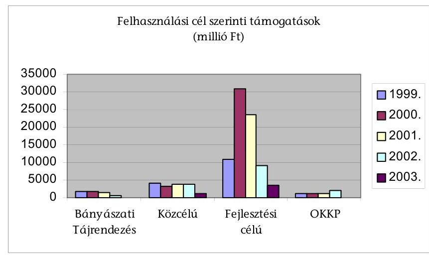

A forrásokon belül a fejlesztési célú támogatások összege 2001-től folyamatosan csökkent, összegük 2002-ben még az 1999. évi szintet sem érte el. (5. sz. tanúsítvány)

A támogatások mennyiségét tekintve a közcélú támogatások (a vizsgált időszakban összesen 10834 db ) részesedési aránya volt a legjelentősebb, de ezek egyenként kis összegű támogatások voltak. 1999-2003 között 15688 millió Ft támogatást kaptak, átlaguk 1,5 millió Ft/pályázat volt.
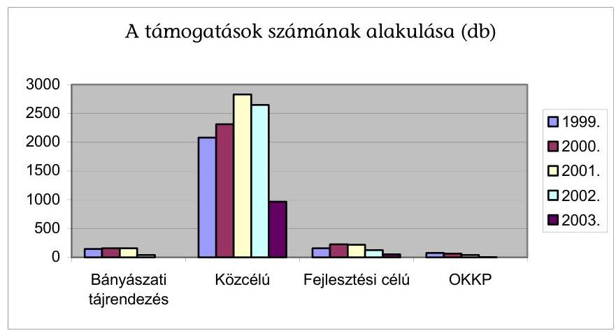

[^0]
[^0]:    ${ }^{25}$ A 2003. évi adatok a 2003. november 25. állapot szerintiek.

---

A diagrammból megfigyelhető, ahogy 2001-től a források beszűkülése miatt a támogatott pályázatok száma is csökkent. A közcélú támogatások esetében a 2003. évi támogatások száma az 1999. évinek a felét sem érte el. (5. sz. tanúsítvány)

A támogatási cél szerinti megoszlást tekintve a legnagyobb támogatást a vízminőség védelem ( $45 \%$ ) kapta, míg a hulladék feldolgozás és lerakás $22 \%$ ot, a közcélú feladatok $16 \%$-ot, a levegő tisztaság védelem és a bányászati tájrendezés pedig egyaránt $7-7 \%$-ot kapott.

A diagrammból kitűnik a támogatási összegek csökkenése és az arányok változása is. Gyakorlatilag változatlan maradt a közcélú feladatok támogatottsága,
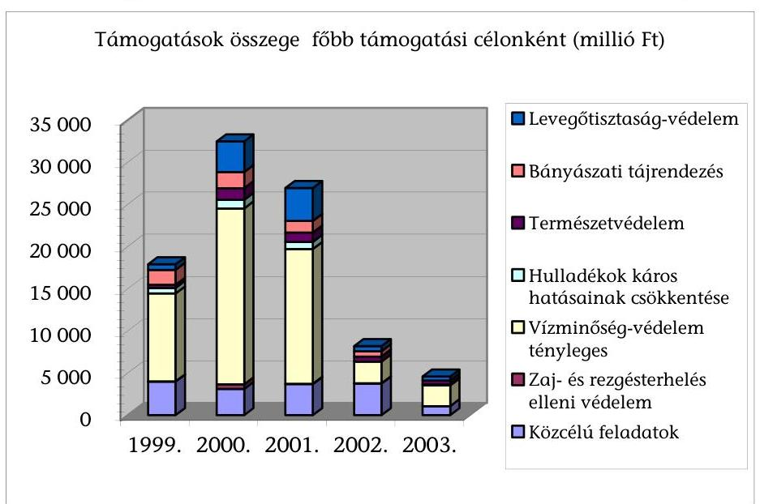
míg határozott csökkenés a vízminőségvédelem támogatásánál volt tapasztalható. Igaz, hogy ez utóbbi esetében 2002-ben a minisztérium 4.957 millió Ft ígérvényt is tett, de ez a tényleges 2.597 millió Ft-os támogatással együtt is csak 7.533 millió Ft-ot tett ki, ami fele a 2001. évi támogatásnak. A vizsgálat idején a 2003 november végi adatok szerint erre a célra 2003-ban 2.447 millió Ft támogatást ítéltek oda, ez a 2001. évi összeg $15 \%$-a. (3. sz. tanúsítványok) Az egyes támogatásoknál kialakult csökkenéseket valójában nem a tárca támogatási szándékának a csökkenése okozta, mivel az ígérvények csak a céltámogatások elnyerése után váltak tényleges támogatássá és arra vonatkozóan a környezetvédelmi tárcának nem volt ráhatása, hogy a Belügyminisztérium előterjesztése alapján a Kormány hogy döntött a céltámogatások odaítéléséről. A tendenciák befolyásolta, hogy a Vízügyi céle1́óirányzat felhasználásának és ellenőrzésének szabályairól szóló 4/2003. (III. 7.) KvVM rendelet értelmében 2003-tól a VICE támogatta a hagyományos szennyvízcsatornázási-tisztítási fejlesztéseket, a KAC csak a természet-közeli technológiákhoz nyújtott támogatást, tehát emiatt önmagában is csökkent a KAC-ból finanszírozott vízvédelmi célú támogatások összege.

---

A 28/2001. (XII. 23.) KöM rendelet 13. § (10) bekezdése alapján „A miniszter a (9) bekezdésben foglalt döntés helyett a helyi önkormányzatok számára ígérvény kibocsátásáról is dönthet. Az ígérvény olyan feltételes döntést jelent, amelynek során a miniszter meghatározott összegű támogatás nyújtását ígéri arra az esetre, ha a helyi önkormányzat a külön jogszabályban meghatározott céltámogatásban részesül."

A támogatási összegek igénylők szerinti megoszlását tekintve a vizsgált időszak egészében az önkormányzatok kapták a legtöbb támogatást, összesen
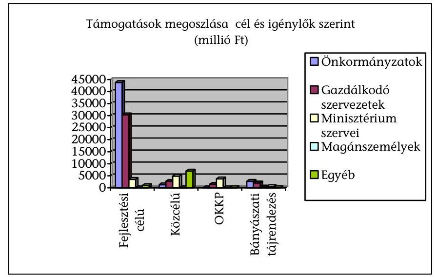
47.630 millió Ft-ot ( $45 \%$ ), a gazdálkodó szervezetek 36,6 milliárd Ft-ot (35 \%), a minisztérium területi szervei 12,5 miliiárd Ft-ot (12 \%) kaptak. Ez utóbbi gyakorlatilag a minisztérium múködési forrásait bővítette, ebből a közcélú feladatra 4,9 milliárd Ft-ot, az OKKP keretében 3,7 milliárd Ft-ot, ill. fejlesztési feladatra 3,5 milliárd Ft-ot kapott.

A fejlesztési célokra benyújtott pályázatok igénylők szerinti megoszlását tekintve az 1999 - 2003 közötti időszakban az önkormányzatok 43.760 m Ft-ot (55,7 \%), a gazdálkodó szervezetek 30.341 m Ft-ot (38,4 \%) kaptak. A területi szerveknek 3533,2 m Ft (4,5 \%) egyéb igénylőknek 982,3 m Ft (1,25 \%) jutott.
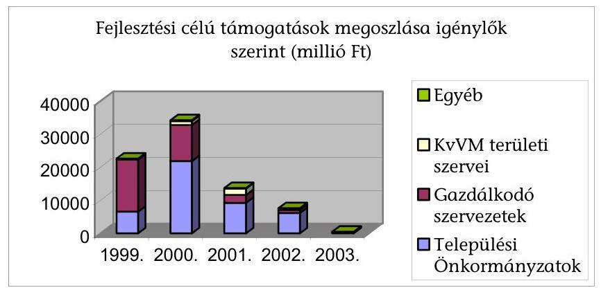

A diagrammból kitűnik, hogy 2000-től a támogatási összegek csökkentek, ugyanakkor az önkormányzatok kapták a legnagyobb arányú támogatást. Az összes támogatott pályázat száma 871 db volt a jelzett időszakban,

---

a legnagyobb számú támogatott pályázók (49,5 \%) a települési önkormányzatok voltak, őket a gazdálkodó szervek (34 \%) követték. Az egyéb pályázók száma $7,8 \%$-ot ért el, fejezethez tartozó területi szervek száma $8,7 \%$-ot tett ki, ezen belül 2000. és 2001. volt kiemelkedő, 34 ill. 27 intézményi támogatással. (6. sz. tanúsítvány)

A közcélú pályázatok esetén a lényegesen nagyobb pályázati darabszám (öszszesen 9868 db ) és az alacsonyabb összérték volt a jellemző a vizsgált időszakban. Ebben a kategóriában a legnagyobb darabszám és a legtöbb támogatási összeg egyéb kategóriához ( 5407 db , összesen 6.265,7 millió Ft) tartozott. A területi szervek összesen 4867,9 millió, a gazdálkodó szervezetek 2645 millió, az önkormányzatok 790,1 millió és a magán személyek 30,7 millió Ft támogatást kaptak.

A miniszter 2002-ben pályázat nélkül, egyedi döntés alapján 1.468 millió Ft támogatást nyújtott különböző szakmai programokra, ebből 877 millió Ft támogatás a minisztérium szervezeteihez került, a többi elsősorban civil
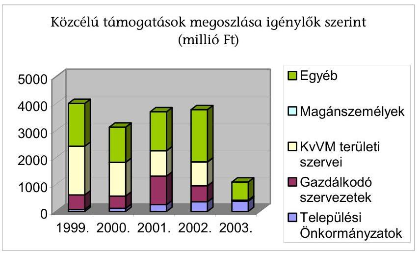
szerveteknek jutott. (6. sz. tanúsítvány)
A bányászati tájrendezésre 493 pályázatot fogadtak el 1999 -2003 között, 5. 690,6 millió Ft támogatási összeggel. Ebből a legjelentősebb részesedők az önkormányzatok voltak 2. 697,5 millió, a gazdasági szervezetek 2017,1 millió és a magánszemélyek 536 millió Ft-tal. A korábbi években (1999-2001) a bá-
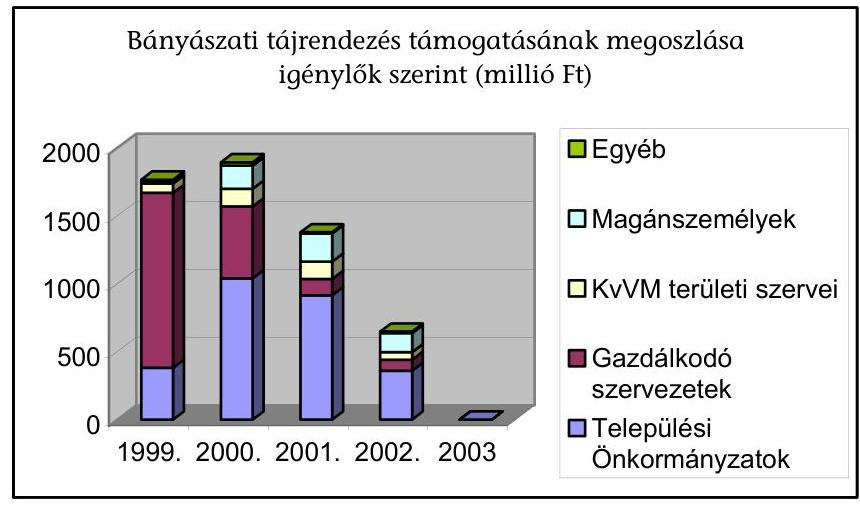

---

nyavállalkozókra át nem hárítható bányászati tájrendezési feladatokra szánt összeg kb. 1, 8 milliárd Ft, ami évi 146 db pályázat támogatását tette lehetővé. A 2002. évben alacsonyabb ( 1,4 milliárd Ft) keretösszeget határoztak meg, ami 157 darab pályázat támogatását tette lehetővé. 2003-ban csak 648 m Ft támogatást fizettek ki a 2002-ben benyújtott 42 pályázatra. Csökkent az egy-egy évben támogatásban részesült gazdálkodó szervezetek száma (41-ről 4-re), és öszszege 1. 288 millió Ft-ról 81 millió Ft-ra úgy, hogy a benyújtott pályázatok száma gyakorlatilag nem változott. Nagyságrendileg lényegesen nem változott a magánszemélyeknek nyújtott támogatás. Ez 140 és 170 millió Ft között mozgott évente, az egy pályázatra jutó fajlagos támogatás viszont 10,6 millió Ftról, 15 millió Ft-ra nőtt. (6. sz. tanúsítvány)

Az Országos Környezeti és Kármentesítő Programban (OKKP) csak a gazdálkodó szervezetek, a területi szervek és 2001-ig az egyéb kategóriá-ba sorolt szervezetek voltak érdekeltek. A vizsgált időszakban a támogatási célra öszszesen 4635,2 millió Ft jutott, ennek ebből 3704 millió Ft ( $80 \%$ ) a minisztérium területi szerveinek jutott, kiemelkedő a 2002. év volt ekkor a minisztérium ill. szervei 1.850 millió Ft-ot kaptak.
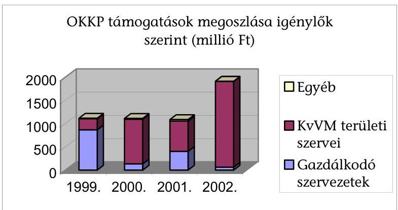

A program 2003-ra nem kapott támogatást. A folyamatban lévő feladatok és a nagy projektek belépése ellenére a források alig növekedtek, a vizsgált időszakban évenkénti ráfordítása valamivel 1 milliárd Ft felett alakult. A pályázatok számát tekintve nincs visszaesés, ugyanis a folyamatban lévő projektek szakaszainak futamideje 8-10 év, és a nagy projektek közbeszerzési eljárásának lefolytatása is sok időt vesz igénybe. (6. sz. tanúsítvány)

Az OKKP, a felszín alatti vizek és a földtani közeg védelmén belül - felelősségi köröktől függetlenül - a múltból visszamaradt környezeti károk és veszélyek mérséklését, megszüntetését célzó állami feladatokat is magába foglaló környezetvédelmi program.

A kármentesítések típusai: KvVM alprogramba tartozó projektek, prioritási listás projektek, valamint a finanszírozási hiánnyal küzdő kötelezettek kármentesítési feladatainak megelőlegezése.

Nagy volumenű szennyezések voltak pl. 2002-ben (pl. Budafoki barlanglakások és az Üröm-Csókavári gáztisztító massza kármentesítése). 2002-ben öt egyedi és egy megelőlegezési projekt indítására került sor és folytatódtak a korábbi évek megkezdődött 14 egyedi és 2 megelőlegezési projekt kármentesítési munkálatai.

---

# 5.2. A támogatások értékelésének és a szakmai célok teljesülésének beszámolási rendszere 

A támogatások értékelésének alapját a támogatási rendszerünk EU konform átalakításáról szóló 2307/1998. (XII.30.) Kormányhatározat jelentette, ennek 5. pontja szerint 1999. március 31-ig ki kellett dolgozni a támogatási rendszer értékelésének elveit.

A kidolgozásért felelős a gazdasági miniszter és a pénzügyminiszter, az érdekelt miniszterekkel. A fejlesztési programok értékelését az éves zárszámadás keretében végre kell hajtani

A egyes támogatások értékelésének kötelezettségét először a Környezetvédelmi alap célfeladatok fejezeti kezelésű előirányzat felhasználásának, nyilvántartásának és ellenőrzésének részletes szabályairól szóló 28/2001. (XII. 23.) KöM rendelet írta elő. A miniszteri rendelet előírásának ellenére a pályázatok eredményességének, hatékonyságának mérését nem alakították ki, emellett pályázatok során megvalósult fejlesztések eredményeinek nyilvántartására az Integrált Pályázati Rendszer (IPR) rendszer nem alkalmas. A pályázatok adatait Excel alapú adatbázisba rögzítik, de ez nem teszi lehetővé az adatok biztonságos kezelését és a változásokat nyomon követő adatfeldolgozást.

A 28/2001 Köm rendelet 23. § (4) majd az azt módosító 3/2003. KvVm rendelet 21. § (5) bekezdése szerint a pályázati célú támogatások felhasználását teljes körű eredményességi, hatékonysági és célszerűségi elemzéssel kell lezárni.

Az Excel alapú nyilvántartásban, vezetik ugyan a pályázatban szereplő tervezett, elérni kívánt értékeket, de a hatékonyság és az eredményesség méréséhez szükséges a megvalósítás utáni értékek, adatok folyamatos nyomon követése is.

A felhasználás értékelését elősegítő rendszer kiépítésének hiányát egy 2002. évi ÁSZ vizsgálat felvetette, és ez alapján a miniszter által hozott intézkedési terv előírta, a rendelkezés 2002-től miniszteri rendeletekbe is beépült. ${ }^{26}$ A vizsgálat idején kezdték el a megvalósult támogatások értékelése rendjének a kidolgozását a támogatások hatékonysági vizsgálatához szükséges alapelemek meghatározásával. A mutatókat a KgF és a szakmai főosztályok bevonásával a KAKF állította össze. A tervadatokat a területi szervek, a tényszámokat a fejlesztések lezárásakor a KAKF viszi be az IPR nyilvántartási rendszerébe. A 2002. évi adatok feldolgozásra az ellenőrzés idején is folyamatban volt, értékelésükre csak a 2002-ben megkezdett beruházások teljes megvalósítását követően kerül sor. Ezért a kidolgozott mutatókról és azok gyakorlati hasznosulásáról véleményt a vizsgálat nem tudott alkotni."

Az 1998-2001. között befejezett beruházások értékelését egy külső szervezet megbízás alapján elvégezte, ebben a támogatások fơbb adatait és a kör-

[^0]
[^0]:    ${ }^{26}$ A KAC felhasználásnak értékelési rendszerének kialakítására az ÁSZ már 2002-ben javaslatot tett. Az erre hozott intézkedési terv szerint 2003. január 31-ig a KAC terhére nyújtott támogatások hasznosulását a támogatás lezárásakor értékelni kell, és ehhez ki kellett dolgozni a támogatások teljesítmény-értékelését szolgáló (naturális) mutatókat.

---

nyezetre gyakorolt hatásait jogcímenként értékelték. A szakértői anyag kimutatta, hogy, pl. a szennyvízcsatornázások eredményeként 6,2 millió méter csatorna készült el, egy lakosra 38 eFt KAC támogatás jutott. (A 2. számú függelék tartalmazza a szennyvízzel kapcsolatos beruházásokra adott támogatással kapcsolatos adatokat és mutatókat) Ugyanakkor megállapította azt is, hogy a pályázat lezárásakor kitöltendő szakértői lapok nem minden esetben tartalmazták az elérni kívánt környezeti eredményt. Előfordult, hogy adatok hiányosak voltak (pl.: felszíni és felszín alatti vizek védelmét szolgáló fejlesztések esetében) és néhány mutatószámhoz szakértői becslést alkalmazott az anyagot készítő.

A szakértői anyag 8 témában részletezte a támogatások hasznosulását, mind műszaki adatok tekintetében (pl. megépült csatornázás hossza), mind a társadalomra vetítetten (egy lakosra jutó KAC támogatás) mutatja ki a fejlesztések főbb összesített ill. fajlagos mutatóit.

A szennyvízkezeléssel kapcsolatos támogatások eredményeként - a szakértői anyag szerint -262 db 123,3 milliárd Ft fejlesztési költségú csatornázási támogatásra 24,8 milliárd Ft (20,1 \%) KAC támogatás jutott, a fejlesztések 652 ezer lakost érintettek. Minden 1 Ft KAC támogatásra 4,03 Ft egyéb forrás jutott.

Hiányosság, hogy a szakértői anyag, - mint kiindulási bázis - alapján, annak folytatásaként a következő 2002 évi támogatásokról összefoglaló értékelés nem készült. A kezdeményezés pozitív abban a tekintetben, hogy összegezte a beruházásokat eredményét, de az átfogott időszakot nem évente, hanem összefoglalóan értékelte. A szakértői anyag annyiban hiányos, hogy nem tér ki az ország környezeti ill. társadalmi mutatóinak (pl. a csatornahálózatra kötött lakások) javulására. Kifogásolható, hogy a KAC kezeléséért felelős szervezetek a szakértői anyagot mint kiindulási alapot, nem használták fel bázisként, erre építve a következő évek értékelését.

A KAC előirányzatainak felhasználásáról nem készült olyan analitika, amely az Intézkedési Terv szerinti bontásban - az abban használt kódszámoknak és elnevezéseknek megfelelően - tartalmazza a tárgyévi ráfordításokat, kötelezettség - vállalásokat és az esetleges forrásátcsoportosításokat. Az ilyen mélységű, a részfeladatokra elkészített kimutatás bemutatná az Intézkedési Terv végrehajtásának számszaki adatait, áttekinthetőbbé tenné a forrásfelhasználást.

A felhasználási keretek jogcímek szerint teljesülését az éves fejezeti beszámolók szöveges indoklásai nem mutatták be. A KAC éves beszámolóit a KAKF állította össze, amelyek elsősorban szakmai elemeket tartalmaztak.

Az egyes pályázatokról történt döntés nyilvánosságát a Környezetvédelmi alap célfeladatok fejezeti kezelésű előirányzat felhasználásának és ellenőrzésének szabályairól szóló 3/2003. (III. 7.) KvVM rendelet írja elő, eszerint a döntésekről tájékoztatót kell készíteni, és azt közzé kell tenni. A 8/2003. (K. Ért. 4.) KvVM utasítás a feladatot - a KAC Koordinációs Főosztály feladataként- határozta meg. A tájékoztató a minisztérium honlapján megtalálható.

A rendelet (R.) 4. § (1) szerint „A Kac. felhasználásával kapcsolatos döntésekről a Minisztérium rendszeresen tájékoztatót készít, ezt a döntést követő 10 munkana-

---

pon belül internetes honlapján, két országos terjesztésű napilapban, illetve hivatalos lapjának a döntést követően megjelenő lapszámában közzétesz.
(2) A tájékoztató tartalmazza a támogatás kedvezményezettjének, tárgyának megnevezését, a támogatás összegét, valamint megvalósításának helyét."

Az éves előirányzat felhasználásának hatékonysága döntően függ a kezelő szervezetek tevékenységétől. Ennek ellenére a közreműködő szervezetek munkájáról nem készült olyan szakmai beszámoló, amely a számszerú adatok mélyebb elemzése, értelmezése és a felhasználások jogszerűségének értékelése mellett ezek múködését értékelte volna.

# 5.3. A nem rendeltetésszerú felhasználások 

A nem rendeltetésszerú felhasználásokra az általános szankciókat és eljárásokat az Államháztartás múködési rendjéről szóló 217/1998 (XII. 30) Korm. rendelet 88. § rögzíti, emellett, a KAC felhasználását szabályozó miniszteri rendeletek megfelelő biztosítékok kikötését írták elő.

A kormányrendelet rendelkezett a visszavonás eseteiről, szankcióiról (pl. meghatározott időre kizárás az érintett előirányzat támogatási rendszeréből), a kamat mértékéről, a beszedési megbízás alkalmazásáról és kimondja, hogy az előirányzat kezelője jogosult a pályázati rendszerében szankciókat meghatározni. A KöM és a KvVM rendeletei és a pályázati felhívások ezen időszak alatt rendelkeztek a szerződéskötéshez szükséges biztosítékokról (bankgarancia, ingatlan fedezet, beszedési megbízás), kivéve a 3/2003. KvVM rendeletet. Ebben az évben a felsorolt biztosítékok a pályázati felhívásban jelentek meg, ami a 217/1998. (XII. 30.) Korm. rendelet 83. §-nak megfelelő volt.
A jogérvényesítés érdekében gyakorlatként alakult ki a biztosítékkal rendelkező szerződések közjegyzői okiratba foglalása, ami gyorsította a végrehajtást. A szankciók végrehajtását az azonnali beszedési megbízást tartalmazó felhatalmazó levél szolgálta.
Szankcióként alkalmazzák a támogatási összeg visszatartását, de erre általában csak a 217/1998 (XII.30) Korm. rendelet 87. § (2) foglalt előírások megsértése- különösen a hatvan napon túli lejárt köztartozás - esetén kerül sor. ( pl. BS-Axis Kft.)

A nem rendeltetésszerú felhasználásokról kapott kimutatások nem megbízhatóak, nyilvántartást nem készítettek, és nem készítettek külön kimutatást azokról a pályázatokról sem, amelyek esetében nem rendeltetésszerú teljesítés miatt kellett támogatási összeget vagy annak egy részét visszakövetelni. Nyilvántartás hiányában a jogos követelés állomány alakulása és a pályázatok nyomon követése nem megoldott, ez csak az egyes dokumentumok áttekintésével oldható meg.

A KAC Koordinációs Főosztály tájékoztatása alapján a következő ügyekben került sor különböző jogi lépésekre. Felszámolási eljárást 13 esetben kezdeményeztek, ebből 3 fejeződött be, visszatérülés nem volt. Peres eljárásra 14 esetben került sor.

Terem község önkormányzata 2002-ben az általános iskola hővédelmének javítására 7,8 millió Ft támogatás kapott. Az utóellenőrzése megállapította, hogy az Önkormányzat a szerződésben vállalt múszaki tartalmat legfeljebb 55\%-ban tel-

---

jesítette, ezen belül pedig a támogatási cél lényegét jelentő munkálatok (a vállalt hőszigetelő vakolat alkalmazása és ablakok cseréje) az önkormányzatnak felróható okokból elmaradt.

Az államháztartás működési rendjéről szóló, 217/1998. (XII.30.) Korm. rendelet 88. §-a alapján, a környezetvédelmi miniszter 2002. október 15-i döntésével a teljes támogatás visszavonását rendelte el. A önkormányzat felülvizsgálati kérelemmel élt és a visszavonás felfüggesztését, vagy a részteljesítés elfogadását és a támogatás arányos, az elmaradt teljesítés mértékéhez igazodó részének visszavonását kérte. A minisztérium ez utóbbit fogadta el, így az önkormányzat tartozása 5,6 millió forint tőke és 1,7 millió forint kamat.

A támogatott pályázatok esetén visszafizetési kötelezettség keletkezhet visszavonásból, visszatérítendő támogatás határidőre vissza nem fizetéséből, kamatokból, bíróság által megítélt összegekből. Ezek nyilvántartása a követeléskezelés feladata, amelyet 2001. év végéig egy erre a célra létrehozott Környezetgazdálkodási Intézet KAC Kezelési Igazgatóságának Szerződéskötési és Ellenőrzési osztálya, ill. Pénzügyi osztálya, 2002-től a MÁK Követeléskezelő osztálya lát el. A MÁK minden hónapban részletes pénzügyi jelentésben számol be a követelésállomány helyzetéről.

A követeléskezelés tekintetében visszalépést jelentett, hogy az eredeti, MÁK Rt.-vel kötött megbízási szerződés a támogatási szerződések (fejlesztési, közcélú is) követeléskezelését - peres és nem peres eljárás nélkül - írja elő, a MÁK Rt.-vel kötött megbízási szerződés 2. számú módosítása csak a fejlesztési célú támogatási szerződések követeléskezelését írja elő a MÁK Rt. feladataként - beleértve a peres és nem peres eljárásokat is.

# 5.4. Az egyes támogatások hasznosulása 

A jelentés 5.2. pontjában részletezett okok miatt az egyes támogatások eredményességének értékelését, vagyis a ráfordítás környezetre gyakorolt hatását a mindenkori kezelő szervezetek nem végezték el. Ezért a KAC-ból nyújtott támogatások eredményességét és a mechanizmus múködésének hatékonyságát a helyszíni vizsgálat során hat megyében 29 pályázó, 42 pályázatának ellenőrzése keretében egyedileg értékeltük. A KAC támogatandó céljai közül a legjellemzőbb csoportokból választottunk, eredményességi szempontból elsősorban a már üzemelő beruházásokat elemeztük kiemelten. Megállapítottuk, hogy támogatások hasznosulása, eredménye a megfelelően előkészített tervdokumentációk eredményeként elsősorban szennyvíz beruházások esetében volt mérhető ill. értékelhető (A támogatások adatai a 3. számú függelékben)

Az ellenőrzés során 13 szennyvíz és csatornázás fejlesztési, 7 tájrehabilitációs, 7 bioallergén hatások korlátozását, és egyéb pl. a levegőszennyezés (energia hordozó váltás) ill. és környezeti ártalmak csökkentését célzó támogatások végrehajtását és hasznosulását vizsgáltuk.

A megvizsgált beruházások közül a légszennyezés csökkentését célzó, valamint a vízvédelmi célok körébe tartozó szennyvízkezelést célzó fejlesztések esetében a pályázók, a pályázati dokumentumok előkészítése keretében felmérték a kör-

---

nyezet állapotát, dokumentálták a kiindulási helyzetet és ezekhez igazítottan jelölték ki a támogatás felhasználásával elérendő célt.

Kóny község szennyvíztisztító és csatorna beruházása pályázatban rögzítették, hogy a beruházással érintett 6 településen élő 6898 fő életkörülményeit változtatja meg. Közülük 3 kistelepülés 1069 lakosa „A", egy település 1763 lakosa „B", két település 4066 lakosa pedig „C" szennyezés érzékenységi területen él. A pályázat a beruházás megvalósítása eredményeként a tisztítóból kilépő és a Rába folyóba kerülő vízben a szennyezőanyag csökkenését számszerűsítetten rögzítette.

A körmendi faaprítékon alapuló biomassza fűtőmú beruházás a terv szerint 2.227 E m3 földgázmennyiség kiváltását biztosíthatja, emellett hozzájárul a széndioxid légkörbeli koncentrációjának mérsékléséhez. (A kibocsátás a korábban üzemelő földgáztüzelésű fűtőműnek kb.20\%-át teszi ki.) A várható energia megtakarítás az üzleti terv szerint üzemi szinten évente mintegy 16-20 millió Ft lehet, ez a teljes beruházási költség $5 \%$-a.

Egy részletesen vizsgált - szennyvízkezelést célzó - pályázat feldolgozása és értékelése átlátható módon, konkrét műszaki és közgazdasági kritériumok (teljesítmény indikátorok) alapján háromszintű döntési mechanizmus közbeiktatásával történt. Ezáltal a fejlesztés környezetvédelmi célja és várható eredménye jól prognosztizálható, és a többi pályázattal összehasonlítható. (részletesen a függelékben)

Parasznya és társult települések szennyvízcsatornázása és szennyvíztisztítása támogatásánál a műszaki és a gazdasági szakértő 9-9 szempontot vizsgált.

Az előirányzatból olyan célokat is támogattak, amelyek jellegüket tekintve nem a környezetvédelmet, hanem elsősorban az energia megtakarítást célozták, vagyis a környezetet károsító hatásokat közvetlenül nem, vagy nehezen kimutatható módon csökkentik. Ezért ezekben a pályázatokban az elérhető energia megtakarítás és a megtérülési idő tervezésére helyezték a fő hangsúlyt.

Püspöladány közvilágításának korszerűsítése keretében lámpacserét hajtottak végre, a tervező energiamérleget készített, a megtakarítást $56 \%$-ra prognosztizálta.

A Békés Megyei Önkormányzat által elnyert támogatásból 10 megyei intézménynél 222 db napkollektort szereltek fel, a fűtőművek részbeni kiváltását támogatva. A 2000. évi árszínvonalon számolva a teljes beruházási költség (35,5 millió Ft), $20 \%$-a térül meg évente, a beruházás műszaki becslés szerint 6,5 millió Ft/év (2000. éves árszinten) megtakarítást eredményezhet.

A szennyvíztisztítás hatásfokának biztosítása érdekében a pályázati kiírás a 90 \%-os rákötési arány meglétét ill. 3 hónapon belüli elérését írta elő. A vizsgált körben két támogatás esetében ez teljesült, a rákötési arány kiemelkedően jó, 90 \% feletti lett, a szennyvíztisztítók hatásfoka és a csatornázottság mértéke biztosította a hatékony tisztítás elérését. Ezen támogatások eredményesek voltak a vállalt cél (rákötési arány, feldolgozott víz mennyisége révén) teljesült, a források hatékonyan támogatták a káros környezeti hatás csökkentését. (Szakértői vélemények szerint ez csak 70 \% feletti rákötésnél ill. bevitt szennyvíz mennyiségnél érhető el.) Ugyanakkor megállapítottuk, hogy egyes támogatá-

---

sok nem hasznosultak megfelelően, mert a rákötések alacsony aránya miatt a feldolgozandó szennyvíz mennyisége is alacsony ill. változó, ezért a tisztítók nem üzemelhetnek megfelelő́ hatásfokkal. ${ }^{27}$ A kitűzött cél elmaradásának oka ezekben az esetekben az önkormányzat ill. a lakosság teherviselő képességétől függött. Az alacsonyabb rákötési arány miatt ugyanakkor az eredeti környezetvédelmi cél nem teljesülhetett. A rákötések megfelelő arányának kialakításához, így a teljes körű hatás eléréséhez további fejlesztések szükségesek. ${ }^{28}$

Kóny és a környező öt település szennyvíztisztítóján végrehajtott fejlesztés eredményeként a kibocsátott szennyvízvíz minősége lényegesen javult, de a tervezettet nem érte el. A korábban mért napi $200 \mathrm{~m}^{2}$ szennyvíz a vizsgálat idején a kétszeresére emelkedett, de a rákötési arány csak $53 \%$-os volt.

Dévaványa két esetben kért és kapott támogatást, a rákötési arány előtte $49 \%$-os volt, a megvalósulást követően a lakások $70 \%$-a csatlakozhat a csatornahálózatra. Szigetvár város pályázatának támogatása eredményeként a rákötési arány 90 \%-os lett. Békés város szennyvíz csatorna hálózatára adott 290 millió Ft KAC támogatással megvalósult összességében 1.062 millió Ft beruházás eredményeként a hálózatra rákötés aránya $99,6 \%$-os lett.

Elsősorban a nem fejlesztési célú, pl. tájrehabilitáció, biológiai allergének csökkentése támogatásoknál fordult elő, hogy a támogatás hasznosságának bemutatására az igényt alátámasztó előzetes felmérés nem minden esetben volt teljes körú. A bányászati tájrendezési pályázatoknál, és a biológiai allergének csökkentését célzó támogatásoknál lehetett a legnehezebben meghatározni a teljesítésmutatókat és elvégezni az eredményességi értékeléseket, ugyanis az elérendő célt és a jellemző mutatókat a pályázatok esetenként nem vagy nem teljes körűen tüntették fel. A gazdaságossági értékelés akadályát jelentette, hogy a helyszíni ellenőrzések során a nyertes pályázóknál az erre vonatkozó dokumentumok (pld. a nyertes pályázók kiválasztásának szempontjai, a teljesítésigazolások és számlák, stb.) nem voltak fellelhetők.

Az Orfúi tó rehabilitációja pályázat meghatározta azokat a teljesítmény indikátorok, melyek biztosítják a projekt megvalósulását követően az eredmények valós minősítését, és szöveges értékeléssel mutatta be a projekt hatékonyságát. Meghatározta az eltávolítandó iszap mennyiségét és az elvégzendő építési feladatokat, és a munkákat tételes költségvetéssel támasztotta alá. Célként az Orfúi tó vízminőségének javítása, illetve védelme, a tájképi és természeti értékek megőrzése, üdülési és sportcélú hasznosítását jelölte meg.

Győrasszonyfa községben tájrehabilitációra benyújtott pályázatban a környezet állapotát rögzítették, az akkori állapotokról fényképeket is készítettek, az eléren-

[^0]
[^0]:    ${ }^{27}$ A települési önkormányzatok szennyvízközmú fejlesztési és múködtetési feladatai ellátásának vizsgálatáról szóló 2004. évi ÁSZ jelentés is megállapította, hogy a tisztítóművek kihasználtsága $38,6 \%$-ra csökkent, ez befolyásolja a tisztító képességet.
    ${ }^{28}$ Ugyancsak a fenti jelentés fogalmazott meg javaslatot az önkormányzatok felé, a csatornázottság arányának és a tisztítás hatásfokának növelésére.

---

dő általános célokat megfogalmazták. Ugyanakkor a talajvíz, illetve a bányagödörben található víz összetételére vonatkozó kémiai, biológiai vizsgálatokat nem végeztek.

A biológiai eredetű allergének koncentrációjának csökkentésére benyújtott Beled és Vág községek pályázatai nem tartalmaztak számadatokat a település bel-, illetve külterületén mérhető koncentrációra vonatkozóan. A biológiai allergéneket termelő növények egyedszámára, vagy a terület borítására, annak változására vonatkozó adatok sem képezik részét a pályázatnak annak ellenére, hogy ezek az önkormányzatnál már rendelkezésre álltak. A beledi pályázatot támogatta a háziorvos is, de a támogatás indokolásában nem szerepelnek konkrét adatok. Általánosságban fogalmazta meg, hogy az utóbbi években szaporodtak a felső-légúti, szénanáthás, asztmás megbetegedések április és szeptember hónapok között.

A fejlesztésekkel ellentétben, pl. a biológiai allergének támogatása esetében, a beruházás befejezését követően nem mérték fel a beruházás hatását, utólagos mérést, felmérést nem folytattak le, sőt az igénylő a következő évi hasonló célú pályázat benyújtásakor az előző években kapott támogatás hatásáról sem számolt be. Oka, hogy a támogató, sem a pályázat kiírásakor, sem a beszámolók elkészítésekor ezt nem követelte meg. A pályázóknak juttatott pénzeket az eredeti céloknak megfelelően, gépvásárlásra, ill. gyommentesítésre használták fel, de monitoring hiányában a támogatások hatását értékelni nem lehetett.

Beled önkormányzata a biológiai eredetű allergének koncentrációjának csökkentésére kapott támogatás eredményét mérésekkel nem ellenőrizte. Az előző években elnyert támogatás felhasználásával megvalósuló védekezés hatásának eredményére a háziorvosi támogatást tartalmazó irat nem tért ki.

A környezetvédelem fontosságának társadalmi jövőbeni elfogadottságát biztosíthatja az óvodai környezeti nevelésre Szederkény városnak adott támogatás.

A beadott pályázat kapcsolódott az óvoda által 1999. évben elnyert három éves COMENIUS „A természetet megélni minden érzékszervünkkel „ Európai Oktatási Projekthez. A KAC pályázat benyújtása a hazai programok megvalósítása érdekében történt, mert a COMENIUS pályázat alapvetően a külföldi partner óvodákkal való kapcsolattartását finanszírozta. Az óvoda 2001. évben 150 ezer forint támogatásban részesült.

A vizsgált pályázatok közül 6 kérelmet (20 \%) a pályázat kezelője elutasított, de két kivétellel annak indokát nem közölte a pályázóval.

Beled község 2002. március 27-én benyújtott pályázatának célja a települési környezetvédelmi programok bevezetésének, kidolgozásának, felülvizsgálatának elősegítése volt. Miniszteri döntésre hivatkozva arról tájékoztatták az önkormányzatot, hogy „támogatási igénye nem részesült támogatásban", azonban a döntés okáról nem adtak tájékoztatást.

Ugyancsak Beled község tájrehabilitációra kért támogatását indoklás mellett elutasították, okként a terv és a tényleges helyszíni állapot eltérését jelölték meg.

Magyarbánhegyes községet szennyvízberuházás támogatására benyújtott kérelmének tartalmi hiányosságai és a források kétséges volta miatt hiánypótlásra szólították fel, ezeket késedelmesen és hiányosan teljesítette, ezért a pályázatot elutasították.

---

A támogatások elnyerésének lehetőségét esetenként a kiegészítő forrásként céltámogatás rendelkezésre állásának megléte ill. hiánya is befolyásolta.

A Hajdúböszörmény Város Önkormányzat 2000-ben pályázott a „Hajdúböször-mény-Bocskaikert közös szennyvízcsatornázása" megvalósítása érdekében. A közös beruházás költsége 2311300 ezer Ft, melyből a KAC támogatás összege 462260 ezer Ft. A forrásösszetételben ezen túlmenően 1269870 ezer Ft céltámogatás szerepel, melyet a két önkormányzat közösen nyert el.

Medgyesbodzás község 2000-ben három másik településsel fogott össze, pályázatukat a kezelő nem támogatta, mivel céltámogatással nem rendelkeztek. A közigazgatási államtitkár egy ígérvényt adott ki, miszerint a KAC támogatást a KVM csak céltámogatás esetén tud biztosítani. A céltámogatást nem kapták meg.

A bányászati tájrendezés támogatásánál a közbeszerzési értékhatárt meghaladó pályázatoknál a minisztérium folytatta le a közbeszerzési eljárást, és kötötte meg a szerződést a kivitelezővel. A helyszínen ellenőrzött projekteknél több esetben előfordult, hogy - teljesítésigazolások és számlák hiányában - az elkészült létesítmények számviteli elszámolása helytelen volt, a beruházás aktiválására nem, vagy nem valamennyi költség figyelembe vételével került sor. ${ }^{29}$ Ezekben az esetekben a támogatást a pályázók a minisztériumtól naturáliákban kapták, a kivitelezővel a minisztérium számolt el.

A Beled község által elnyert, a biológiai allergének csökkentésére benyújtott pályázatnál a támogatási szerződésről hiányzott az önkormányzati ellenjegyzés. A projektek költségeinek alakulását az önkormányzat nem mutatta be. A támogatás felhasználásáról szóló beszámolók nem rögzítik ráfordítások értékét.

A bőnyi szennyvíztisztító és csatorna projekt tervezett teljes bekerülési értéke 919,2 millió Ft (nettó 735,4 millió Ft) volt. Erre kötötték meg korábban a közbeszerzési eljáráson nyertes vállalkozóval a szerződést. A szerződésen ellenjegyzés nincs, nem szerepel a pontos dátum, csak az évszám. Az üzembe helyezési okmányt a beruházásról nem állítottak ki. Annak bekerülési értékét a beruházó önkormányzatok közötti elszámolásból határozták meg, de az nem tartalmazta az I. ütemben megvalósított (tisztító) beruházás értékét. A bekerülési érték megállapítása során figyelembe vett tételek pontos felsorolására nem került sor, így nem ellenőrizhető, hogy abban a számviteli törvény szerinti tételek szerepelnek-e.

Győrasszonyfa községben végrehajtott beruházás vizsgálata megállapította, hogy üzembe helyezési okmányt a támogatott beruházásról nem állítottak ki. Annak bekerülési értékét a kibocsátott számlák összesítésével határozták meg. A bekerülési érték megállapításakor - helyesen - figyelembe vették a beruházással összefüggő tervezési költségeket, de a számviteli törvény előírásával ellentétesen nem aktiválták a műszaki ellenőrzés, lebonyolítás költségeit.

[^0]
[^0]:    ${ }^{29}$ A Környezetvédelmi Minisztérium fejezet múködésének ellenőrzéséről szóló 2002.-ben megjelent jelentés javaslatai között szerepelt, a vagyonkezelésbe vett védett területek, valamint egyéb vagyontárgyak nyilvántartása, leltározása terén tapasztalt, a számviteli előírásokkal ellentétes gyakorlat megszüntetése

---

Egy hulladékhasznosítási támogatás esetében egy jogosulatlan csalási kísérlet is történt, emiatt az ügyben büntetőeljárás is indult okirat-hamisítás miatt, az ellenőrzés időpontjában az ügy nyomozati szakaszban volt.

Az IPC Kft-vel 2001-ben hulladék begyűjtésre, feldolgozásra és értékesítésre kötött támogatási szerződés, kezdő időpontként 1999. január 1-et jelölte meg. Később a Kft jogosulatlanul próbált 263 millió Ft-os támogatáshoz hozzájutni, azt állítva, hogy a hulladékot külföldre szállította, de az ennek igazolásául megküldött vámokmányokról a vámhatóságok megállapították, hogy azok nem valósak.

A közbeszerzési értékhatárt meghaladó beruházások esetében a pályázók eleget tettek a 129/1996 (VII. 24.) Korm. rendelet szerinti kötelezettségeiknek. Előfordult, hogy ha a közbeszerzési eljárásban az árajánlat magasabb volt, mint a támogatás összege, akkor pályázó a közigazgatási államtitkár által - a miniszter által átadott jogkörében eljárva - jóváhagyott, az igényeltnél magasabb támogatást kapott. A közpénzek hatékony és gazdaságos felhasználása elvének érvényesülését nem biztosította, hogy az értékhatár alatti esetekben a kivitelező kiválasztásakor versenyeztetést nem folytattak le (pl. a Győrasszonyfa önkormányzat beruházása). Pozitív példaként a körmendi faapríték üzemú hőközpont beruházásánál lefolytatott közbeszerzési eljárás eredményeként 431,2 millió Ft-os tervezett összege 411,2 millió Ft-ra csökkent.

Budapest, 2004. április „ 2 "

---

# 1. SZÁMÚ MELLÉKLET A V-22-066/2003-2004. SZÁMÚ JELENTÉSHEZ

Környezetvédelmi és Vizügyi Minisztérium

## MAGYAR KÖZTÁRSASÁG KÖRNYEZETVÉDELMI ÉS VÍZÜGYI MINISZTERE

Ell-64/7/2004.
Hiv. sz.: V-22-064/2003-2004.
Ül.: Dr. Balázs Péter

Bihony

Dr. Kovács Árpád
elnök úr
részére

Állami Számvevőszék

Tisztelt Elnök Úr!

Köszönettel megkaptam az Állami Számvevőszék környezetvédelmi alap célfeladatokra előirányzott pénzeszközök hasznosulásának ellenőrzéséről készített - Öri István közigazgatási államtitkár úrral előzetesen egyeztetett - jelentésüket.

A ellenőri jelentéssel kapcsolatosan észrevételt nem kívánok tenni.

Az ellenőrzés alapján elrendelt intézkedésekről 30 napon belül tájékoztatni fogom.

Budapest, 2004. április 19.

Üdvözlettel:

Dr. Persányi Miklós

1011 Rincsenyő, 41-30
Teléfon: 457 3300
1334 B. 20. 20. 201.
telefon: 201 3131

---

# Tanúsítványjegyzék 

| 1. számú | KAC kiadásainak alakulása |
| :-- | :-- |
| 2. számú | KAC bevételeinek alakulása |
| 3. számú | Támogatási célok |
| 4. számú | Fejlesztési célok |
| 5. számú | Pályázatok adatainak alakulása |
| 6. számú | Támogatás megoszlása igénylők szerint |

---

# KAC KIADÁSAINAK ALAKULÁSA 

| Kiadási jogcímek | 1999. |  |  | 2000. |  |  | 2001. |  |  | 2002. |  |  | 2003. |  |  |
| :--: | :--: | :--: | :--: | :--: | :--: | :--: | :--: | :--: | :--: | :--: | :--: | :--: | :--: | :--: | :--: |
|  | Mód.ei. | Telj. | \% | Mód.ei | Telj. | \% | Mód.ei. | Telj. | \% | Mód.ei. | Telj. | \% | Mód.ei | I.f.é.Telj. | \% |
| Támogatás a környezetvédelmet közvetlenül elösegitő fejlesztésekhez | 15850 | 13464 | 85 | 33018 | 17838 | 54 | 31013 | 17885 | 58 | 29500 | 23953 | 81 | 21984 | 6879 | 31 |
| Tájrendezési feladatok támogatása | 1500 | 1025 | 68 | 2128 | 1448 | 68 | 2100 | 1401 | 67 | 2275 | 2092 | 92 | 392 | 378 | 96 |
| Kármentesítési feladatok támogatása | 1500 | 448 | 30 | 2996 | 1729 | 58 | 1724 | 512 | 30 | 3102 | 356 | 11 | 599 | 242 | 40 |
| Közzééú környezetvédelmi feladatok finanszírozása | 3900 | 2620 | 67 | 5081 | 3659 | 72 | 5112 | 2865 | 56 | 6013 | 4012 | 67 | 623 | 1461 | 235 |
| Környezeti károkozás megelőzését és felderítését szolgáló munkák feltételeinek javítása | - | - | - | - | - | - | - | - | - | - | - | - | - | - | - |
| Környezeti károkozás, illetve veszélyeztetés elhárítását szolgáló beavatkozás költségei | 1254 | 60 | 5 | 1200 | 1193 | 99 | 700 | 530 | 76 | 566 | 471 | 83 | 1523 | 203 | 13 |
| Nemzeti Park Igazgatóságok természetvédelmi vagyonkezelésével kapcs. fel. | 281 | 281 | 100 | 296 | 295 | 100 | 624 | 624 | 100 | 1210 | 1210 | 100 | - | - | - |
| Termékdíj visszaigénylés | 1500 | 1359 | 91 | 1790 | 1531 | 86 | 1750 | 1758 | 100 | 1878 | 999 | 53 | 1200 | 1604 | 134 |
| Mérő, megfigyelő rendszerek kialakítását segítő rendszerek | 1500 | $1031^{2}$ | 69 | 1359 | 1268 | 93 | 2605 | 2416 | 93 | 2694 | 2364 | 88 | - | 240 | - |

---

|  Információs rendszerek fejlesztése | - | - | - | - | - | - | - | - | - | 807 | 332 | 41 | - | 393 | -  |
| --- | --- | --- | --- | --- | --- | --- | --- | --- | --- | --- | --- | --- | --- | --- | --- |
|  Előre nem tervezhető feladatok | - | - | - | - | - | - | - | - | - | 972 | 606 | 62 | - | - | -  |
|  A kezelés, működtetés a bevételek beszedése és az ellenőrzés költségei | 1808 | 1728 | 96 | 1942 | 1879 | 97 | 1224 | 976 | 80 | 1498 | 1294 | 86 | 1697 | 610 | 36  |
|  PHARE támogatás közös finanszírozása | - | - | - | 1065 | - | - | 1065 | 688 | 65 | 377 | 337 | 89 | 40 | - | -  |
|  Összesen: | 29093 | 22016 | 76 | 50875 | 30840 | 61 | 47917 | 29655 | 62 | 50892 | 38026 | 75 | 28058 | 12010 | 43  |

A 2003. évi adatszolgáltatás az I. félévről készült beszámoló alapján történt, melyben nem szerepelt az I. félévben maradvány terhére történt kifizetések előirányzatosítása, mivel az AHH felé csak július hó elején került beadásra, tartalmazza viszont a rendelkezésre álló svájci segélyt is.

Tanúsítom, hogy az adatok a fejezet/cím számviteli nyilvántartásában szereplő adatokkal megegyeznek.

Budapest, 2003. november 4.

---

KAC BEVÉTELEINEK ALAKULÁSA
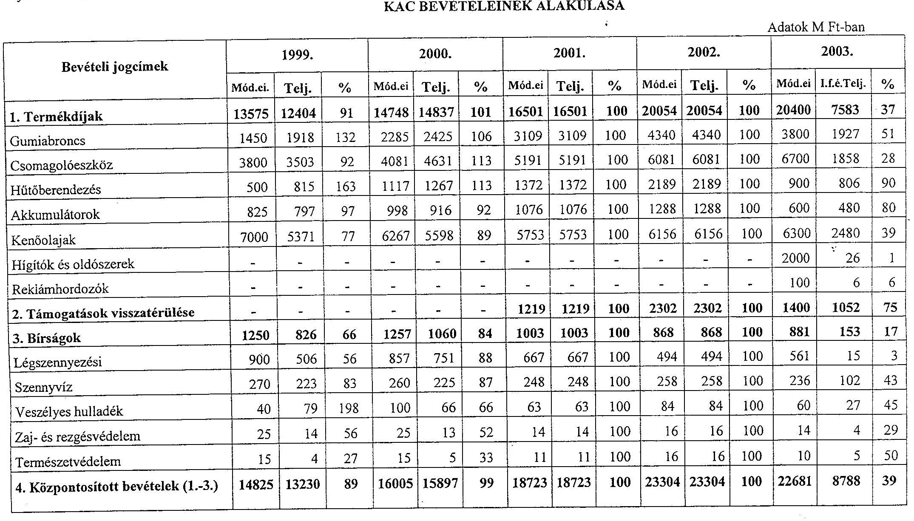

---

|  5. Támogatások visszafizetése | 2000 | 1533 | 77 | 2862 | 2832 | 99 | - | - | - | - | - | - | - | - | -  |
| --- | --- | --- | --- | --- | --- | --- | --- | --- | --- | --- | --- | --- | --- | --- | --- |
|  6. Privatizációs bevétel | 1500 | 1500 | 100 | 1500 | 1500 | 100 | - | - | - | - | - | - | - | - | -  |
|  7./a PHARE | 1099 | 276 | 25 | - | - | - | - | - | - | - | - | - | - | - | -  |
|  7./b Svájci segély | - | - | - | - | - | - | - | - | - | - | - | - | 1035 | - | -  |
|  8. Költségvetési támogatás | 9619 | 9619 | 100 | 8863 | 8863 | 100 | 9303 | 9303 | 100 | 9143 | 9143 | 100 | 4242 | 2121 | 50  |
|  9./a KKA-ból pénzeszköz átvétel | - | 17698 | - | - | - | - | - | - | - | - | - | - | - | - | -  |
|  9.b Egyéb pénzeszköz átvétel | - | 3 | - | - | - | - | - | 136 | - | - | - | - | - | - | -  |
|  9./c Saját bevétel | 50 | 24 | 48 | 53 | 8 | 15 | 40 | 45 | 113 | 42 | 4 | 10 | 100 | 18 | 18  |
|  Összesen: | 29093 | 43883 | 151 | 29283 | 29100 | 99 | 28066 | 28207 | 101 | 32489 | 32451 | 100 | 28058 | 10927- | 39  |
|  Előző évi előirányzat maradvány | - | - | - | 21592 | 10771 | 50 | 19851 | 10520 | 53 | 18403 | 13256 | 72 | - | - | -  |
|  MINDÖSSZESEN : | - | - | - | 50875 | 39871 | 78 | 47917 | 38727 | 81 | 50892 | 45707 | 90 | - | - | -  |

Megjegyzés: a központosított bevételek előirányzata 2001. évtől év végén a teljesítés összegére módosul. Tanúsítom, hogy az adatok a fejezet/cím számviteli nyilvántartásában szereplő adatokkal megegyeznek.

Budapest, 2003. november 4.

---

Környezetvédelmi Alap Célelóirányzat fejezet cím

TÁMOGATÁSI CÉL 3./a számú tanúsítvány

1999. év

|  Támogatási cél | Nyilvántart
ásba vett
pályázatok | Támogatási
igénye
(M Ft) | Előterjesztett
pályázatok** | Támogatá
si igénye
(M Ft) | Támogatott
pályázatok | Megítélt
támogatás
összege
(M Ft) | Ténylegesen
kifizetett
(M Ft)  |
| --- | --- | --- | --- | --- | --- | --- | --- |
|  Levegötisztaság-védelem | 242 | 18100 | 281 | 20305 | 54 | 654 | 1234  |
|  Zaj- és rezgéssterhelés elleni védelem | 9 | 112 | 10 | 131 | 1 | 18 | 65  |
|  Vízminőség-védelem igérvény | - | - | - | - | - | - | -  |
|  Vízminőség-védelem tényleges | 193 | 25444 | 312 | 45413 | 74 | 10341 | 6268  |
|  Hulladékok káros
Hatásának csökkentése igérvény | - | - | - | - | - | - | -  |
|  Hulladékok káros hatásainak csökkentése | 56 | 5789 | 57 | 5517 | 11 | 658 | 4336  |
|  Gumiabroncsok körny. terhelésének csökk. (rendszeres
támogatás) | 7 | 793 | 7 | 793 | 1 | 44 |   |
|  Gumiabroncsok környezetterhelésének csökkentése | - | - | - | - | - | - |   |
|  Csomagolóeszközök körny. terhelésének csökk. (rendszeres
tám.) | 17 | 17262 | 17 | 17262 | 6 | 2629 |   |
|  Csomagolóeszközök körny. terh. csökk. | 4 | 204 | 4 | 204 | 0 | 0 |   |
|  Akkumlátorok okozta körny. terhelés csökk.
(rendszeres támogatás) | 7 | 322 | 7 | 322 | 3 | 65 |   |
|  Akkumlátorok okozta körny. terh. csökk. | - | - | - | - | - | - |   |
|  Kenőolaj hulladékok újrahasznosítása | - | - | - | - | - | - |   |
|  Hütőberendezések, hütőközegek körny. terh. csökkentése
(rendszeres támogatás) | 2 | 900 | 2 | 900 | 1 | 294 |   |

---

| Természetvédelem | 65 | 1848 | 83 | 2165 | 26 | 379 | 320 |
| :-- | :-- | :-- | :-- | :-- | :-- | :-- | :-- |
| Környezetvédelmi ipar támogatása | 26 | 933 | 28 | 919 | 4 | 6 | 36 |
| Tudatformálás | - | - | 5 | 18 | 0 | 0 | 21 |
| Építészeti értékek védelme | - | - | - | - | - | - | 1 |
| Müemlékvédelem | - | - | - | - | - | - | 189 |
| Bányászati tájrendezés | 190 | 3104 | 190 | 3104 | 146 | 1768 | 1025 |
| Közcélú feladatok | 4653 | 6633 | 4563 | 6633 | 2080 | 4003 | 2620 |
|  |  |  |  |  |  |  |  |
| ÖSSZESEN | 5471 | 81444 | 5566 | 103666 | 2407 | 20859 | 16115 |

Megjegyzés *-hoz: a tárgyévben ténylegesen kifizetett összeg.
** Az előterjesztett pályázatok oszlop a fejlesztési célú pályázatok esetében a tárgyévben előterjesztett pályázatok darabszámát tartalmazza, melyben a forráshiány miatt, vagy halasztott döntés ill. egyéb ok (pl. felülvizsgálat) miatt újra előterjesztésre került pályázatok darabszáma is szerepel, nem tartalmazza azonban a decentralizált KAC pályázatokat, mivel azok nem kerülnek Tárcaközi Bizottság elé előterjesztésre (így a támogatási igény, a támogatott pályázatok és a megítélt támogatás összege oszlopok adatai is csak a centralizált pályázatokra vonatkoznak).

Megjegyzés: A vízminőség-védelem és a hulladékok káros hatásainak csökkentése céloknál a ténylegesen kifizetett összeg tartalmazza az alcélokban (ígérvények, rendszeres támogatások, stb.) kifizetett összegeket is.

Tanúsítom, hogy az adatok a fejezet/cím számviteli nyilvántartásában szereplő adatokkal megegyeznek.
Budapest, 2003. november 25.
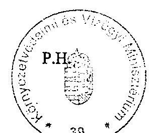

---

Környezetvédelmi Alap Célelóirányzat fejezet cím

TÁMOGATÁSI CÉL 2000. év

|  Támogatási cél | Nyilvántart
ásba vett
pályázatok | Támogatási
igénye
(M Ft) | Elöterjesztett
pályázatok** | Támogatá
si igénye
(M Ft) | Támogatott
pályázatok | Megitélt
támogatás
összege
(M Ft) | Ténylegesen
kifizetett
(M Ft)
*  |
| --- | --- | --- | --- | --- | --- | --- | --- |
|  Levegötisztaság-védelem | 82 | 4190 | 130 | 14432 | 67 | 3641 | 1667  |
|  Zaj- és rezgésterhelés elleni védelem | 2 | 16 | 7 | 583 | 5 | 542 | 24  |
|  Vízminőség-védelem igérvény | - | - | - | - | - | - |   |
|  Vízminőség-védelem tényleges | 154 | 22898 | 253 | 41446 | 123 | 20876 | 10716  |
|  Hulladékok káros
Hatásának csökkentése igérvény | - | - | - | - | - | - | 3632  |
|  Hulladékok káros hatásainak csökkentése | 59 | 9443 | 34 | 4452 | 15 | 1018 |   |
|  Gumiabroncsok körny. terhelésének csökk. (rendszeres
támogatás) | 7 | 1849 | 7 | 1849 | 1 | 60 |   |
|  Gumiabroncsok környezetterhelésének csökkentése | 6 | 341 | 6 | 341 | 2 | 53 |   |
|  Csomagolóeszközök körny. terhelésének csökk. (rendszeres
tám.) | 10 | 1650 | 10 | 1650 | 1 | 53 |   |
|  Csomagolóeszközök körny. terh. csökk. | 12 | 1192 | 12 | 1192 | 8 | 511 |   |
|  Akkumlátorok okozta körny. terhelés csökk.
(rendszeres támogatás) | 3 | 900 | 3 | 900 | 0 | 0 |   |
|  Akkumlátorok okozta körny. Terh. csökk. | 1 | 55 | 1 | 55 | 0 | 0 |   |
|  Kenőolaj hulladékok újrahasznosítása | 1 | 9 | 1 | 9 | 1 | 9 |   |
|  Hütőberendezések, hütőközegek körny. terh. csökkentése
(rendszeres támogatás) | 1 | 41 | 1 | 41 | 0 | 0 |   |

---

|  Természetvédelem | 76 | 705 | 132 | 3302 | 66 | 1392 | 281  |
| --- | --- | --- | --- | --- | --- | --- | --- |
|  Környezetvédelmi ipar támogatása | 6 | 459 | 12 | 477 | 7 | 20 | 0  |
|  Tudatformálás | - | - | - | - | - | - | 2  |
|  Építészeti értékek védelme | - | - | - | - | - | - | 2  |
|  Müemlékvédelem | - | - | - | - | - | - | 73  |
|  Bányászati tájrendezés | 218 | 3352 | 218 | 3352 | 158 | 1894 | 1448  |
|  Veszélyes anyagok kockázatai elleni védekezés | 4 | 182 | 1 | 87 | 1 | 74 | 6  |
|  Közcélú feladatok | 6837 | 12505 | 6837 | 12505 | 2311 | 3127 | 3660  |
|  ÖSSZESEN | 7479 | 59787 | 7665 | 86673 | 2766 | 33270 | 21511  |

Megjegyzés *-hoz: a tárgyévben ténylegesen kifizetett összeg. ** Az előterjesztett pályázatok oszlop a fejlesztési célú pályázatok esetében a tárgyévben előterjesztett pályázatok darabszámát tartalmazza, melyben a forráshiány miatt, vagy halasztott döntés ill. egyéb ok (pl. felülvizsgálat) miatt újra előterjesztésre került pályázatok darabszáma is szerepel, nem tartalmazza azonban a decentralizált KAC pályázatokat, mivel azok nem kerülnek Tárcaközi Bizottság elé előterjesztésre (így a támogatási igény, a támogatott pályázatok és a megítélt támogatás összege oszlopok adatai is csak a centralizált pályázatokra vonatkoznak).

Megjegyzés: A vízminőség-védelem és a hulladékok káros hatásainak csökkentése céloknál a ténylegesen kifizetett összeg tartalmazza az alcélokban (ígérvények, rendszeres támogatások, stb.) kifizetett összegeket is.

Tanúsítom, hogy az adatok a fejezet/cím számviteli nyilvántartásában szereplő adatokkal megegyeznek. Budapest, 2003. november 25.

---

Környezetvédelmi Alap Célelóirányzat fejezet cím

TÁMOGATÁSI CÉL 2001. év

|  Támogatási cél | Nyilvántart ásba vett pályázatok | Támogatási igénye (M Ft) | Elöterjesztett pályázatok** | Támogatás si igénye (M Ft) | Támogatott pályázatok | Megitélt támogatás összege (M Ft) | Ténylegesen kifizetett (M Ft) *  |
| --- | --- | --- | --- | --- | --- | --- | --- |
|  Levegötisztaság-védelem | 66 | 4348 | 82 | 8991 | 32 | 3923 | 870  |
|  Zaj- és rezgėsterhelés elleni védelem | 6 | 97 | 9 | 175 | 5 | 45 | 52  |
|  Vizminőség-védelem igérvény | - | - | - | - | - | - | 10118  |
|  Vizminőség-védelem tényleges | 228 | 38394 | 516 | 90343 | 118 | 15967 |   |
|  Hulladékok káros
Hatásának csökkentése igérvény | - | - | - | - | - | - |   |
|  Hulladékok káros hatásainak csökkentése | 28 | 1659 | 31 | 3152 | 12 | 857 | 4803  |
|  Gumiabroncsok körny. terhelésének csökk. (rendszeres támogatás) | 6 | 1506 | 6 | 1506 | 5 | 692 |   |
|  Gumiabroncsok környezetterhelésének csökkentése | 3 | 198 | 3 | 198 | 2 | 150 |   |
|  Csomagolóeszközök körny. terhelésének csökk. (rendszeres tám.) | 6 | 1480 | 6 | 1480 | 6 | 641 |   |
|  Csomagolóeszközök körny. Terh. csökk. | 2 | 304 | 2 | 304 | 1 | 48 |   |
|  Akkumlátorok okozta körny. terhelés csökk. (rendszeres támogatás) | 2 | 46 | 2 | 46 | 0 | 0 |   |
|  Akkumlátorok okozta körny. terh. csökk. | - | - | - | - | - | - |   |
|  Kenőolaj hulladékok ujrahasznosítása | - | - | - | - | - | - |   |
|  Hütőberendezések, hütőközegek körny. terh. csökkentése (rendszeres támogatás) | 1 | 40 | 1 | 40 | 1 | 27 |   |

---

|  Természetvédelem | 91 | 3519 | 97 | 3650 | 37 | 1109 | 484  |
| --- | --- | --- | --- | --- | --- | --- | --- |
|  Környezetvédelmi ipar támogatása | 6 | 81 | 5 | 51 | 1 | 0,2 | 2  |
|  Tudatformálás | - | - | - | - | - | - | 1  |
|  Építészeti értékek védelme | - | - | - | - | - | - | 31  |
|  Müemlékvédelem | - | - | - | - | - | - | 2  |
|  Bányászati tájrendezés | 237 | 3520 | 213 | 3181 | 157 | 1380 | 1401  |
|  Veszélyes anyagok kockázatai elleni védekezés | - | - | - | - | - | - | 91  |
|  Közcélú feladatok | 5824 | 14832 | 5824 | 14832 | 2831 | 3697 | 2865  |
|  ÖSSZESEN | 6506 | 70024 | 6797 | 127949 | 3208 | 28536 | 20720  |

Megjegyzés *-hoz: a tárgyévben ténylegesen kifizetett összeg. ** Az előterjesztett pályázatok oszlop a fejlesztési célú pályázatok esetében a tárgyévben előterjesztett pályázatok darabszámát tartalmazza, melyben a forráshiány miatt, vagy halasztott döntés ill. egyéb ok (pl. felülvizsgálat) miatt újra előterjesztésre került pályázatok darabszáma is szerepel, nem tartalmazza azonban a decentralizált KAC pályázatokat, mivel azok nem kerülnek Tárcaközi Bizottság elé előterjesztésre (így a támogatási igény, a támogatott pályázatok és a megítélt támogatás összege oszlopok adatai is csak a centralizált pályázatokra vonatkoznak).

Megjegyzés: A vízminőség-védelem és a hulladékok káros hatásainak csökkentése céloknál a ténylegesen kifizetett összeg tartalmazza az alcélokban (igérvények, rendszeres támogatások, stb.) kifizetett összegeket is.

Tanúsítom, hogy az adatok a fejezet/cím számviteli nyilvántartásában szereplő adatokkal megegyeznek. Budapest, 2003. november 25.

---

Környezetvédelmi Alap Célelóirányzat fejezet cím

TÁMOGATÁSI CÉL 3./d számú tanúsítvány

# 2002. év

|  Támogatási cél | Nyilvántart
ásba vett
pályázatok | Támogatási
igénye
(M Ft) | Előterjesztett
pályázatok** | Támogatá
si igénye
(M Ft) | Támogatott
pályázatok | Megítélt
támogatás
összege
(M Ft) | Ténylegesen
kifizetett
(M Ft)  |
| --- | --- | --- | --- | --- | --- | --- | --- |
|  Levegőtisztaság-védelem | 89 | 9058 | 62 | 14697 | 16 | 584 | 1721  |
|  Zaj- és rezgésterhelés elleni védelem | 10 | 168 | 2 | 20 | 1 | 18 | 19  |
|  Vízminőség-védelem ígérvény | - | - | 64 | 9402 | 38 | 4957 |   |
|  Vízminőség-védelem tényleges | 291 | 40147 | 188 | 23451 | 40 | 2576 | 13417  |
|  Hulladékok káros
Hatásának csökkentése ígérvény | - | - | 2 | 380 | 2 | 380 |   |
|  Hulladékok káros hatásainak csökkentése | 59 | 2642 | 10 | 694 | 1 | 11 | 6292  |
|  Gumiabroncsok körny. terhelésének csökk. (rendszeres
támogatás) | 3 | 425 | 3 | 425 | 0 | 0 |   |
|  Gumiabroncsok környezetterhelésének csökkentése | - | - | - | - | - | - | -  |
|  Csomagolóeszközök körny. terhelésének csökk. (rendszeres
tám.) | 4 | 197 | 1 | 135 | 0 | 0 |   |
|  Csomagolóeszközök körny. terh. csökk. | - | - | - | - | - | - | -  |
|  Akkumlátorok okozta körny. terhelés csökk.
(rendszeres támogatás) | - | - | - | - | - | - | -  |
|  Akkumlátorok okozta körny. terh. csökk. | - | - | - | - | - | - | -  |
|  Kenőolaj hulladékok újrahasznosítása | 1 | 333 | 1 | 333 | 0 | 0 |   |
|  Hütőberendezések, hütőközegek körny. terh. csökkentése
(rendszeres támogatás) | - | - | - | - | - | - | -  |

---

| Természetvédelem | 107 | 2909 | 106 | 3057 | 27 | 577 | 756 |
| :-- | :-- | :-- | :-- | :-- | :-- | :-- | :-- |
| Környezetvédelmi ipar támogatása | 16 | 674 | 3 | 274 | 1 | 4 | 12 |
| Tudatformalás | - | - | - | - | - | - | - |
| Építészeti értékek védelme | - | - | - | - | - | - | - |
| Müemlékvédelem | - | - | - | - | - | - | - |
| Bányászati tájrendezés | 333 | 5113 | 277 | 4495 | 42 | 648 | 2092 |
| Veszélyes anyagok kockázatai elleni védekezés | - | - | - | - | - | - | 8 |
| Közcélú feladatok | 6138 | 16108 | 6138 | 16108 | 2646 | 3772 | 4012 |
| ÖSSZESEN | 7052 | 78107 | 6854 | 73046 | 2814 | 13227 | 28329 |

Megjegyzés *-hoz: a tárgyévben ténylegesen kifizetett összeg.
Tanúsítom, hogy az adatok a fejezet/cím számviteli nyilvántartásában szereplő adatokkal megegyeznek.
** Az előterjesztett pályázatok oszlop a fejlesztési célú pályázatok esetében a tárgyévben előterjesztett pályázatok darabszámát tartalmazza, melyben a forráshiány miatt, vagy halasztott döntés ill. egyéb ok (pl. felülvizsgálat) miatt újra előterjesztésre került pályázatok darabszáma is szerepel, nem tartalmazza azonban a decentralizált KAC pályázatokat, mivel azok nem kerülnek Tárcaközi Bizottság elé előterjesztésre (így a támogatási igény, a támogatott pályázatok és a megítélt támogatás összege oszlopok adatai is csak a centralizált pályázatokra vonatkoznak).

Megjegyzés: A vízminőség-védelem és a hulladékok káros hatásainak csökkentése céloknál a ténylegesen kifizetett összeg tartalmazza az alcélokban (ígérvények, rendszeres támogatások, stb.) kifizetett összegeket is.

Budapest, 2003. november 25.
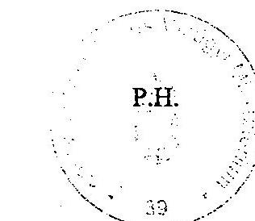
P.H.

Cale

---

Környezetvédelmi Alap Célelóirányzat fejezet cím

TÁMOGATÁSI CÉL 2003. év

|  Támogatási cél | Nyilvántart
ásba vett
pályázatok | Támogatási
igénye
(M Ft) | Elöterjesztett
pályázatok** | Támogatás
si igénye
(M Ft) | Támogatott
pályázatok | Megitélt
támogatás
összege
(M Ft) | Ténylegesen
kifizetett
(M Ft)  |
| --- | --- | --- | --- | --- | --- | --- | --- |
|  Levegőtisztaság-védelem | 6 | 1317 | 60 | 5548 | 9 | 473 | 881  |
|  Zaj- és rezgésterhelés elleni védelem | 2 | 62 | 5 | 136 | 0 | 0 | 147  |
|  Vizminőség-védelem igérvény | - | - | - | - | - | - | -  |
|  Vizminőség-védelem tényleges | 20 | 886 | 126 | 14495 | 26 | 2447 | 3184  |
|  Hulladékok káros
Hatásának csökkentése igérvény | - | - | - | - | - | - | -  |
|  Hulladékok káros hatásainak csökkentése | 27 | 312 | 30 | 928 | 4 | 145 | 2005  |
|  Gumiabroncsok körny. terhelésének csökk. (rendszeres
támogatás) | - | - | - | - | - | - |   |
|  Gumiabroncsok környezetterhelésének csökkentése | - | - | - | - | - | - |   |
|  Csomagolóeszközök körny. terhelésének csökk. (rendszeres
tám.) | - | - | - | - | - | - |   |
|  Csomagolóeszközök körny. Terh. csökk. | - | - | - | - | - | - |   |
|  Akkumlátorok okozta körny. terhelés csökk.
(rendszeres támogatás) | - | - | - | - | - | - |   |
|  Akkumlátorok okozta körny. terh. csökk. | - | - | - | - | - | - |   |
|  Kenőolaj hulladékok újrahasznosítása | - | - | - | - | - | - |   |
|  Hütőberendezések, hütőközegek körny. terh. csökkentése
(rendszeres támogatás) | - | - | - | - | - | - |   |

---

|  Természetvédelem | 82 | 1574 | 66 | 970 | 13 | 453 | 367  |
| --- | --- | --- | --- | --- | --- | --- | --- |
|  Környezetvédelmi ipar támogatása | - | - | 11 | 1297 | 0 | 0 | 29  |
|  Tudatformálás | - | - | - | - | - | - | -  |
|  Építészeti értékek védelme | - | - | - | - | - | - | -  |
|  Müemlékvédelem | - | - | - | - | - | - | -  |
|  Bányászati tájrendezés | 246 | 3379 | - | - | - | - | 378  |
|  Veszélyes anyagok kockázatai elleni védekezés | - | - | - | - | - | - | 59  |
|  Közcélú feladatok | 3745 | 7657 | 3745 | 7657 | 966 | 1090 | 1814  |
|  ÖSSZESEN | 4128 | 15187 | 4043 | 31031 | 1018 | 4608 | 8864  |

Megjegyzés *-hoz: a tárgyévben ténylegesen kifizetett összeg. ** Az előterjesztett pályázatok oszlop a fejlesztési célú pályázatok esetében a tárgyévben előterjesztett pályázatok darabszámát tartalmazza, melyben a forráshiány miatt, vagy halasztott döntés ill. egyéb ok (pl. felülvizsgálat) miatt újra előterjesztésre került pályázatok darabszáma is szerepel, nem tartalmazza azonban a decentralizált KAC pályázatokat, mivel azok nem kerülnek Tárcaközi Bizottság elé előterjesztésre (így a támogatási igény, a támogatott pályázatok és a megítélt támogatás összege oszlopok adatai is csak a centralizált pályázatokra vonatkoznak).

Megjegyzés: A vízminőség-védelem és a hulladékok káros hatásainak csökkentése céloknál a ténylegesen kifizetett összeg tartalmazza az alcélokban (ígérvények, rendszeres támogatások, stb.) kifizetett összegeket is.

Tanúsítom, hogy az adatok a fejezet/cím számviteli nyilvántartásában szereplő adatokkal megegyeznek. Budapest, 2003. november 25.

---

Környezetvédelmi Alap Célelöirányzat fejezet cim

FEJLESZTÉSI CÉL

|  |   |   |   |   |   |   |   |   |   |   |
| --- | --- | --- | --- | --- | --- | --- | --- | --- | --- | --- |
|  Fejlesztési cél/Év | 1999. |  | 2000. |  | 2001. |  | 2002. |  | 2003. |   |
|   | Támogatá si igény | Tényl. kifizetés | Támogatá si igény | Tényl. kifizetés | Támogatá si igény | Tényl. kifizetés | Támogatá si igény | Tényl. kifizetés | Támogatá si igény | Tényl. kifizetés  |
|  Levegötisztaság-védelem | 18100 | 1234 | 4190 | 1667 | 4347 | 870 | 9058 | 1721 | 1317 | 881  |
|  Zaj- és rezgésvédelem | 112 | 65 | 16 | 24 | 97 | 52 | 168 | 19 | 61 | 147  |
|  Vizminőség-védelem | 25444 | 6268 | 22899 | 10716 | 38394 | 10118 | 40145 | 13417 | 886 | 3184  |
|  Hulladékok káros hatásának csökk. | 5790 | 4336 | 9443 | 3632 | 1659 | 4803 | 3597 | 6292 | 594 | 2005  |
|  Természetvédelem | 1848 | 320 | 705 | 281 | 3518 | 484 | 2909 | 756 | 1574 | 367  |
|  Környezet védelmét szolgáló termékek, eljárások, technológiák | 933 | 36 | 459 | - | 81 | 2 | 674 | 12 | - | 29  |
|  Epitészeti értékek védelme | - | 1 | - | 2 | - | 31 | - | - | - | -  |
|  Müemlékvédelem | - | 189 | - | 73 | - | 2 | - | - | - | -  |
|  Kormányhatározatból adódó feladatok | - | 994 | - | 1435 | 4441 | 1431 | - | 1728 | - | 207  |
|  Veszélyes anyagok kockázata elleni védekezés | - | - | 182 | 6 | - | 91 | - | 8 | - | 59  |
|  Tudatformálás | - | 21 | - | 2 | - | 1 | - | - | - | -  |
|  Bányászati tájrendezés | 769 | 1025 | 3248 | 1448 | - | 1401 | - | 2092 | - | 378  |
|  Kármentesítés (OKKP) | 1500 | 448 | 2996 | 1729 | 1724 | 512 | 3102 | 356 |  | 242  |
|  PHARE támogatás |  | - | 1065 | - | 1065 | 688 | 377 | 337 | 40 | -  |
|  |   |   |   |   |   |   |   |   |   |   |
|  |   |   |   |   |   |   |   |   |   |   |

---

|  |   |   |   |   |   |   |   |   |   |   |
| --- | --- | --- | --- | --- | --- | --- | --- | --- | --- | --- |
|  |   |   |   |   |   |   |   |   |   |   |
|  |   |   |   |   |   |   |   |   |   |   |
|  |   |   |   |   |   |   |   |   |   |   |
|  Összesen: | 54496 | 14937 | 45203 | 21015 | 55326 | 20486 | 60030 | 26738 | 4472 | 7499  |

Megjegyzés:

- Az OKKP és a PHARE támogatás a KAC előirányzati összegeket tartalmazza és nem a támogatási igényt.
- A 2003. évi támogatási igényt a pályázati felhívás szándékos szűkítésével értük el a KAC jelentős előző évi kötelezettségvállalásai miatt.

Tanúsítom, hogy az adatok a fejezet/cím számviteli nyilvántartásában szereplő adatokkal megegyeznek.

Budapest, 2003. november

P.H.

A. Le

---

# PÁLYÁZATOK ADATAINAK ALAKULÁSA

Bányászati Tájrendezés

|  Év | Nyilvántartásba vett pályázatok (db) | Teljes költség (M Ft) | Támogatási igény (M Ft) | Előterjesztett pályázatok (db) | Teljes költség (M Ft) | Támogatási igény (M Ft) | Támogatásban részesített pályázatok (db) | Elfogadott teljes költség (M Ft) | Támogatás összege (M Ft) | Tényleges kifizetések (M Ft)  |
| --- | --- | --- | --- | --- | --- | --- | --- | --- | --- | --- |
|  1999. | 190 | 3104 | 3104 | 190 | 3104 | 3104 | 146 | 1768 | 1768 | 1025  |
|  2000. | 218 | 3352 | 3352 | 218 | 3352 | 3352 | 158 | 1894 | 1894 | 1448  |
|  2001. | 237 | 3520 | 3520 | 213 | 3181 | 3181 | 157 | 1380 | 1380 | 1401  |
|  2002. | 333 | 5113 | 5113 | 277 | 4495 | 4495 | 42 | 648 | 648 | 2092  |
|  2003. | 246 | 3379 | 3379 | - | - | - | - | - | - | 378  |

Tanúsítom, hogy az adatok a fejezet/cím számviteli nyilvántartásában szereplő adatokkal megegyeznek. Budapest, 2003. november 21.

---

# PÁLYÁZATOK ADATAINAK ALAKULÁSA

(Fejlesztési célú)

|  Év | Nyilvántartásb
a vett
pályázatok
(db) | Teljes költség
(M Ft) | Támogatási
igény (M Ft) | Támogatásban
részesített
pályázatok
(db) | Elfogadott
teljes költség
(M Ft) | Támogatás
összege (M Ft) | Tényleges
kifizetések (M
Ft)  |
| --- | --- | --- | --- | --- | --- | --- | --- |
|  1999. | 638 | 177940 | 55084 | 160 | 50128 | 10996 | 13464  |
|  2000. | 385 | 144691 | 40345 | 226 | 100622 | 30760 | 17838  |
|  2001. | 497 | 217687 | 52537 | 220 | 106148 | 23459 | 17885  |
|  2002. | 591 | 246807 | 56551 | 126 | 45426 | 9105 | 23953  |
|  2003. | 137 | 12883 | 4149 | 52 | 13741 | 3519 | 6879  |

5/a: Fejlesztési célú támogatások 5/b: Közcélú támogatások 5/c: OKKP 5/d:Bányászati tájrendezés Tanúsítom, hogy az adatok a fejezet/cím számviteli nyilvántartásában szereplő adatokkal megegyeznek. Budapest, 2003. november

---

# PÁLYÁZATOK ADATAINAK ALAKULÁSA

(Közcélú)

|  Év | Nyilvántartásb
a vett
pályázatok
(db) | Teljes költség
(M Ft) | Támogatási
igény (M Ft) | Támogatásban
részesített
pályázatok
(db) | Elfogadott
teljes költség
(M Ft) | * Támogatás
összege (M Ft) | ** Tényleges
kifizetések (M
Ft)  |
| --- | --- | --- | --- | --- | --- | --- | --- |
|  1999. | 4653 | 6633 | 6633 | 2080 | 4002 | 4002 | 2620  |
|  2000. | 6837 | 12505 | 12505 | 2311 | 3127 | 3127 | 3660  |
|  2001. | 5824 | 14832 | 14832 | 2831 | 3697 | 3697 | 2868  |
|  2002. | 6138 | 16108 | 11622 | 2646 | 3772 | 3772 | 4012  |
|  2003. | 3745 | 7657 | 5251 | 966 | 1090 | 1090 | 1814  |

- Csak tárgyévi támogatási összeg ** Tárgyévi kifizetés és az áthúzódó maradványok kifizetésének összege 5/a: Fejlesztési célú támogatások 5/b: Közcélú támogatások 5/c: OKKP 5/d:Bányászati tájrendezés Tanúsítom, hogy az adatok a fejezet/cím számviteli nyilvántartásában szereplő adatokkal megegyeznek. Budapest, 2003. november

---

# PÁLYÁZATOK ADATAINAK ALAKULÁSA

( OKKP célú)

|  Év | Nyilvántartás-
ba vett pályá-
zatok (db) | Teljes költség
(M Ft) | Támogatási
igény (M Ft) | Támogatásban
részesített pá-
lyázatok (db) | Elfogadott tel-
jes költség(M
Ft) | Támogatás
összege (M Ft) | Tényleges kifi-
zetések (M Ft)  |
| --- | --- | --- | --- | --- | --- | --- | --- |
|  1999. | 85 | 1.270 | 1.270 | 77 | 1.117 | 1.117 | 448  |
|  2000. | 64 | 1.127 | 1.127 | 64 | 1.113 | 1.113 | 1.729  |
|  2001. | 71 | 1.355 | 1.355 | 39 | 1.097 | 1.097 | 512  |
|  2002. | 6 | 1.912 | 1.912 | 6 | 1.919 | 1.919 | 356  |
|  2003. | - | - | - | - | - | - | 242  |

5/a: Fejlesztési célú támogatások 5/b: Közcélú támogatások 5/c: OKKP 5/d:Bányászati tájrendezés Tanúsítom, hogy az adatok a fejezet/cím számviteli nyilvántartásában szereplő adatokkal megegyeznek. Budapest, 2003. november 21. Megjegyzés: A 2003. év a közbeszerzési eljárás miatt nem tartalmaz pályázati adatokat

---

Környezetvédelmi Alap Célelóirányzat fejezet cim

# TÁMOGATÁS MEGOSZLÁSA IGÉNYLÓK SZERINT

## Fejlesztési cél

|  Igényló jellege | 1999.
Támogatott pályázatok |  | 2000.
Támogatott pályázatok |  | 2001.
Támogatott pályázatok |  | 2002.
Támogatott pályázatok |  | 2003.
Támogatott pályázatok |   |
| --- | --- | --- | --- | --- | --- | --- | --- | --- | --- | --- |
|   | db | e Ft | db | e Ft | db | e Ft | db | e Ft | db | e Ft  |
|  Települési Önkormányzatok | 70 | 6545776 | 133 | 21835920 | 142 | 9218237 | 85 | 6157607 | 1 | 1999  |
|  Gazdálkodó szervezetek | 81 | 15799922 | 101 | 10890283 | 81 | 2400081 | 27 | 969729 | 6 | 281602  |
|  KvVM területi szervei | 2 | 1003 | 34 | 1197864 | 27 | 1909663 | 12 | 224674 | 1 | 200000  |
|  Magánszemélyek | - | - | - | - | - | - | - | - | - | -  |
|  Egyéb | 14 | 238793 | 35 | 283383 | 13 | 196838 | 4 | 257258 | 2 | 6053  |

Tanúsítom, hogy az adatok a fejezet/cim számviteli nyilvántartásában szereplő adatokkal megegyeznek.

Budapest, 2003. november 21.

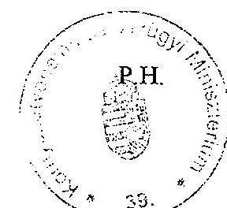

---

Környezetvédelmi Alap Célelóirányzat fejezet cim

# TÁMOGATÁS MEGOSZLÁSA IGÉNYLŐK SZERINT

Közcél

|  Igénylő jellege | 1999. |  | 2000. |  | 2001. |  | 2002. |  | 2003. |   |
| --- | --- | --- | --- | --- | --- | --- | --- | --- | --- | --- |
|   | Támogatott pályázatok |  | Támogatott pályázatok |  | Támogatott pályázatok |  | Támogatott pályázatok |  | Támogatott pályázatok |   |
|   | db | e Ft | db | e Ft | db | e Ft | db | e Ft | db | e Ft  |
|  Települési Önkormányzatok | 474 | 71960 | 483 | 114790 | 684 | 246399 | 573 | 356993 | 532 | 382899  |
|  Gazdálkodó szervezetek | 158 | 539548 | 121 | 450528 | 280 | 1062255 | 243 | 592667 | 22 | 24100  |
|  KvVM területi szervei | 261 | 1802606 | 330 | 1253271 | 403 | 934768 | 343 | 877269 | 1 | 8880  |
|  Magánszemélyek | 4 | 1010 | 5 | 2243 | 41 | 11385 | 58 | 16100 | 42 | 3280  |
|  Egyéb | 1183 | 1587610 | 1372 | 1306275 | 1423 | 1442395 | 1429 | 1929395 | 369 | 669161  |

Tanúsítom, hogy az adatok a fejezet/cím számviteli nyilvántartásában szereplő adatokkal megegyeznek.

Budapest, 2003. november 21

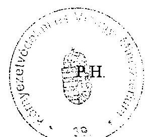

11

---

Környezetvédelmi Alap Célelőirányzat fejezet cim

# TÁMOGATÁS MEGOSZLÁSA IGÉNYLŐK SZERINT

OKKP

|  Igénylő jellege | 1999. |  | 2000. |  | 2001. |  | 2002. |  | 2003. |   |
| --- | --- | --- | --- | --- | --- | --- | --- | --- | --- | --- |
|   | Támogatott pályázatok |  | Támogatott pályázatok |  | Támogatott pályázatok |  | Támogatott pályázatok |  | Támogatott pályázatok |   |
|   | db | e Ft | db | e Ft | db | e Ft | db | e Ft | db | e Ft  |
|  Települési Önkormányzatok | - | - | - | - | - | - | - | - | - | -  |
|  Gazdálkodó szervezetek | 19 | 864473 | 4 | 135195 | 15 | 404560 | 4 | 62363 | - | -  |
|  KvVM területi szervei | 56 | 242530 | 56 | 960938 | 23 | 651470 | 2 | 1850000 | - | -  |
|  Magánszemélyek | - | - | - | - | - | - | - | - | - | -  |
|  Egyéb | 2 | 9616 | 4 | 17000 | 2 | 32971 | - | - | - | -  |

Tanúsítom, hogy az adatok a fejezet/cím számviteli nyilvántartásában szereplő adatokkal megegyeznek.

Budapest, 2003. november 21.

---

Környezetvédelmi Alap Célfeladat, Bányászati tájrendezés
fejezet
cím

# TÁMOGATÁS MEGOSZLÁSA IGÉNYLÓK SZERINT Bányászati Tájrendezés 

| Igényló jellege | 1999. |  |  | 2000. |  |  | 2001. |  |  | 2002. |  |  | 2003. |  |  |
| :--: | :--: | :--: | :--: | :--: | :--: | :--: | :--: | :--: | :--: | :--: | :--: | :--: | :--: | :--: | :--: |
|  | Benyújtott   pály.(db) | Döntött pály. (db) | Döntött összeg e Ft | Benyújtott pály.(db) | Döntött pály. (db) | Döntött összeg e Ft | Benyújtott pály.(db) | Döntött pály. (db) | Döntött pály. (db) | Döntött összeg e Ft | Benyújtott pály.(db) | Döntött pály. (db) | Döntött összeg e Ft | Döntött pály. (db) | Döntött összeg e Ft |
| Települési Önkormányzatok | 107 | 73 | 381586 | 118 | 71 | $\begin{gathered} 1040 \\ 866 \end{gathered}$ | 143 | 97 | 916148 | 194 | 22 | 358888 | 138 | - | - |
| Gazdálkodó szervezetek | 50 | 41 | $\begin{gathered} 1287 \\ 995 \end{gathered}$ | 44 | 38 | 527889 | 36 | 21 | 119356 | 69 | 4 | 81831 | 59 | - | - |
| KvVM területi szervei | 22 | 22 | 69443 | 25 | 22 | 130848 | 17 | 16 | 129248 | 9 | 6 | 55511 | 7 | - | - |
| Magánszemélyek | 9 | 6 | 18625 | 23 | 16 | 170383 | 36 | 22 | 206609 | 56 | 9 | 140622 | 37 | - | - |
| Egyéb | 2 | 2 | 10577 | 8 | 3 | 24241 | 5 | 1 | 8726 | 5 | 1 | 11240 | 5 | - | - |

Tanúsítom, hogy az adatok a fejezet/cím számviteli nyilvántartásában szereplő adatokkal megegyeznek.
Budapest, 2003. november 21.
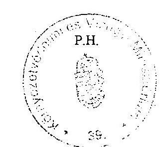

---

# A KORÁBBI SZÁMVEVŐSZÉKI ELLENŐRZÉSEK UTÓVIZSGÁLATA 

## Jelentés a Környezetvédelmi Minisztérium fejezet múködésének ellenőrzéséről (2002.)

## Javaslat a környezetvédelmi miniszternek:

1. intézkedjen a céleľirányzatokat kezelő szervezetekre, feladatokra kiterjedő, valamint az EU-források felhasználására vonatkozó hiányzó szabályzatok elkészítéséről, biztosítsa, hogy a belső szabályzatok módosítására csak indokolt esetben kerüljön sor, teremtse meg az EU segélyprogramok felhasználásához kapcsolódó, a feladatok ellátásához szükséges személyi feltételeket

A jelentést követően kiadott intézkedési terv 2003. március 31-i határidővel a elrendelte a KAC pénzügyi szabályozását tartalmazó ügyrend elkészítését. A feladatok részben, és nem határidőre teljesültek. (Részletesen a jelentés 1. és 4.3. pontjaiban.)
2. gondoskodjon az ágazati informatikai stratégia elkészítéséről, az egységes információs rendszer és közös adatbázis kialakításáról, valamint az egységes és szabványos informatikai biztonsági szabályzat kiadásáról;

A fejezet kiadta az Informatikai Szabályzatot és az Informatikai Biztonsági Szabályzatot. Elkészült az egységes informatikai és információs rendszer koncepciója, melynek gyakorlati megvalósítása még nem kezdődött el. (Részletesen a jelentés 4.2. pontjában.)
3. alakítsa ki a nemzetközi támogatású projektek információs bázisát, a projektek nyomon követését biztosító monitoringot, valamint a különböző támogatási rendszerek teljes körű nyilvántartásának rendjét, intézkedjen a támogatások értékelésének és a felhasználások teljesítmény- vizsgálatát elősegitő szakmai célok mutatóinak kidolgozásáról

A KAC vonatkozásában az intézkedési terv feladatként rögzítette a teljesít-mény-értékelés naturális mutatóinak kidolgozását, a KAC támogatások teljes lefedését biztosító ellenőrzési rendszer kialakítását és annak miniszteri utasítás formájában történő szabályozását. A meghatározott feladatok csak részben teljesültek. (részletes megállapítások az értékelési rendszerről a jelentés 5.2. pontjában, az ellenőrzési feladatokról a 4.3. pontjában)

Az ellenőrzés véleménye szerint a fejezeti kezelésű előirányzatok átfogó vizsgálatát lenne célszerű meghatározott időszakonként - pl. három évenként - elvégezni, közben pedig folyamatos cél-, téma-, és utóvizsgálatok keretében ellenőrizni a felhasználásokat, vagy egyes előírások teljesülését. Az ellenőrzési rendszer fontosabb alaptételeinek megfogalmazására lenne szükség az Ellenőrzési szabályzatban.

---

4. követelje meg, különösen a vagyonkezelésbe vett védett területek, valamint egyéb vagyontárgyak nyilvántartása, leltározása terén tapasztalt, a számviteli előírásokkal ellentétes gyakorlat megszüntetését

Az intézkedési terv szerint 2003. március 31-ig ki kellett adni egy iránymutatást a tárgyi eszközök analitikus nyilvántartásának rendjére, különösen a védett természeti területeken belül. Ennek során meghatározásra kerültek azok a fejezeti szempontok, amelyek alapján az ingatlanok és a védett természeti területek nyilvántartása felülvizsgálható. Az intézmények minta nyilvántartó lapot kaptak a legfontosabb adatok bemutatásához.

Az intézkedési terv másik pontja alapján évente rendszeresen kell a leltár rendjét vizsgálni ott, ahol hiányosságokat tártak fel a külső vizsgálatok. A KAC pénzeszközeiből végrehajtott fejlesztéseknél a kedvezményezetteknek az aktíváláshoz szükséges dokumentumok átadása nem történt meg, így azok nem tudták végrehajtani. (részletesen a jelentés 5.4. pontjában)

# Jelentés a Magyar Köztársaság 2001. évi költségvetése végrehajtásának ellenőrzéséről 

## Javaslatok

## a fejezetek felügyeletét ellátó szervek vezetőinek:

28. Szabályozzák egyértelmúen és számon kérhető módon a fejezeti kezelésú előirányzatokkal kapcsolatos feladatokat, az előirányzatok felhasználási, elszámolási rendjét, térjenek ki a szabályzatban az ágazati specialitásokra és a kifizetéseket megelőzően végrehajtandó szakmai és pénzügyi ellenőrzések körére is.

A vizsgálat megállapította, hogy a szabályzatok köre, - a kedvező változások ellenére - továbbra is hiányos, ezen a téren gondoskodni kell a teljes körűvé tételről. (Részletes megállapítások a jelentés 1. pontjában.)
30. Fordítsanak kiemelt figyelmet a központi költségvetési szervek és a fejezeti kezelésú előirányzatok beszámolójelentéseinek megbizhatóságát elősegitő vezetői és a munkafolyamatba épített ellenőrzések megvalósítására, hatékonyabbá tételére, a függetlenített belső és a felügyeleti ellenőrzés megállapításainak hasznosítására. Utóvizsgálatok keretében ellenőrizzék a vezetői intézkedési tervekben foglaltak teljesitését.

A KAC felhasználásának ellenőrzési rendszer kiépült, hiányzik ugyanakkor a vezetői és a munkafolyamatba épített ellenőrzési tevékenység részletes szabályozása. (Részletes megállapítások a jelentés 4.3. pontjában.)

---

# Jelentés a központi költségvetés területén múködő belső kontroll mechanizmusok ellenőrzéséről (2001.) 

Az ellenőrzés részletes megállapításainak hasznosítása mellett javasoljuk

## a fejezetek felügyeletét ellátó szervek vezetőinek:

2. Tegyenek eleget - az érintett fejezeteknél - a fejezeti kezelésú előirányzatokkal kapcsolatban az Áht-ban elóirt szabályozási, nyilvántartási kötelezettségeknek, pótolják a feltárt hiányosságokat. Fordítsanak gondot a fejezeti kezelésú előirányzatok felhasználásának rendszeres ellenőrzésére.

A jelentés megállapításai alapján a szabályzatok tekintetében kedvező változások történtek, ennek ellenére a felhasználásra ill. kezelésre vonatkozóan szabályossági hiányosságok mutatkoznak. (Részletes megállapítások a jelentés 1. pontjában.)
4. Gondoskodjanak arról, hogy a fejezethez tartozó intézmények megismerjék a számvevőszéki ellenőrzés általánosítható tapasztalatait.

A javaslat teljesítése részben megtörtént. Az intézményeket érintő - az intézmények vezetőinek intézkedését feltételező - egy kérdéssel kapcsolatosan kért körlevélben információt a fejezet a szervezeti egységeitől 2001. július 13-ig. Az ellenőrzés véleménye szerint az általánosítható tapasztalatok köre ennél szélesebb lehetett, célszerű lett volna azokat összefoglalni és a körlevéllel együtt megküldeni minden intézmény részére.

Budapest, 2004. április.

---

# KÉRDÉSFA 

## a környezetvédelmi alap célfeladatokra előirányzott pénzeszközök hasznosulásának ellenőrzéséhez

Alapkérdés: Hatékonyan múködik-e a Környezetvédelmi Alap Célelóirányzat finanszírozási rendszere és eredményesen és gazdaságosan valósítják-e meg a KAC-on keresztül finanszírozott környezetvédelmi fejlesztési programokat?

## Jogi háttér és szabályozó rendszer

A bilaterális és multilaterális nemzetközi (ezen belül is elsősorban az EU csatlakozással kapcsolatos) szerződésekben és egyezményekben vállalt környezetvésdelmi fejlesztési kötelezettségek beépültek-e a hazai törvényekbe és rendelkezésekbe?

A környezetvédelem szempontjai és érdekei megfelelően érvényesülnek-e a törvények, rendelkezések előírásaiban és ezekben konkrét feladatokat, célokat ha-tároztak-e meg?

Biztosították-e a KAC megvalósításának a hazai környezetvédelmi és környezeti szempontú fejlesztési politika alapját képező stratégiai tervekhez illesztését és a Nemzeti Környezetvédelmi Program éves intézkedési terveinek és a KAC szabályozásának összhangját?

## Szervezeti háttér

Teljes körűen lefedte-e a kiépített szervezeti háttér az NKP és az EU csatlakozás kapcsán megoldandó környezetvédelmi fejlesztési feladatokat?

A rendelkezésre álló humán erőforrások a létszám és szakképzettség szempontjából elégségesek-e a környezetvédelmi feladatok hatékony elvégzéséhez?

Az Európai Unióhoz való csatlakozás és az ország környezeti helyzete által igényelt környezetvédelmi fejlesztési feladatok megoldásához szükséges szervezeti és személyi feltételek összhangban voltak-e?

A fejlesztési programokra elkülönített költségvetés tervezési rendszere lehetővé tette-e a feladatok eredményes elvégzését;

A programok hatékony megvalósítását elősegítette-e és az eredménytelenség kockázatát csökkentette-e egy hatékony belső ellenőrzési rendszer?

---

# A környezetvédelmi programok nyilvántartási rendszere 

A nyilvántartási rendszer működtetésének és fejlesztésének személyi és tárgyi feltételei biztosítva voltak-e, és az EU csatlakozás szempontjából elvárt informatikai hátteret megteremtették-e?

Kialakították-e a KAC nyilvántartására használt informatikai rendszer kompatibilitását az egyéb kormányzati rendszerekkel és - igény esetén - az EU adatbázisaival?

Biztosították-e az informatikai rendszerek védelmét, különös tekintettel a múködési biztonságra és az adatvédelemre?

Kialakították-e a programok tervezésével és végrehajtásával kapcsolatos vezetői döntések támogatásához szükséges információs igények és az informatikai rendszer által szolgáltatott információk összhangját?

Biztosították-e az átláthatóság követelményének megfelelően a támogatások felhasználásának követhetőségét, és a programok eredményességének visszacsatolását?

## A rendszer globális eredményességének értékelése

Mekkora volt globálisan a KAC programok végrehajtására fordított összegek nagysága, és ennek az összegnek a részaránya a többi fejezet, az önkormányzatok és az üzleti szféra környezetvédelmi célú ráfordításai között?

Milyen volt az alap forrásainak megoszlása, és azok elégségesek voltak-e a szükséges feladatok elvégzéséhez?

Mik voltak a támogatási prioritások, és a támogatott programok hogyan oszlottak meg a levegő-, víztisztasági, szilárd hulladékkezelési és egyéb területek között?

Mik voltak a programok eredményeként megvalósuló fejlesztések hatásai, öszszehasonlítva az EU csatlakozás által elvárt fejlesztési igényekkel?

Mekkora volt az allokált, de fel nem használt összegek nagysága, mik voltak a felhasználások elmaradásának okai, és milyen összegűek voltak a korábbi évekből áthúzódó maradványok és determinációk?

Hatékony volt-e a pályázati és döntési mechanizmus működése, mekkora volt a pályázatoknak a benyújtástól a döntésig a pályázati rendszerben eltöltött átlagos ideje és mik voltak a szélsőséges időtartamok okai?

## A kockázatelemzéssel kiválasztott egyedi programok értékelése

A programok hogyan illeszkedtek a Nemzeti Környezetvédelmi Programhoz és más ágazati gazdaságfejlesztési stratégiai célokhoz, illetve az EU közösségi vívmányok átvételének nemzeti programjához?

---

Mekkora volt a program megvalósítására kifizetett összegek nagysága és a programot határidőben teljesítették-e?

Megfelelőek voltak-e a programdokumentumokban meghatározott teljesítmény indikátorok az eredmények valós minősítéséhez?

A program költségei hogyan viszonyulnak a várható haszonhoz?
A támogatási összegek felhasználásakor a legjobb ajánlatot tevő beszállítót vá-lasztották-e ki, átlátható (indokolt esetben közbeszerzési) eljárásokat alkalmaz-tak-e, és a program költségei magasabbak vagy alacsonyabbak voltak más hasonló projektek költségeinél?

Az adott régió globális környezeti feltételei szempontjából a régióra jellemző prioritási szükségletekkel összhangban választották-e ki a finanszírozandó programokat?

Mekkora volt a programnak a benyújtástól a támogatási döntés meghozásáig, illetve a megvalósításig eltelt időszükséglete és a programdokumentumok kidolgozásával, értékelésével és lebonyolításával kapcsolatos adminisztrációs költségek aránya milyen volt a program összköltségéhez viszonyítva?

Hogyan hasznosultak a konkrét célokra folyósított támogatási összegek, telje-sültek-e a kitűzött célok és milyenek lesznek az eredmények távlati hatásai?

---

# Szennyvízelvezetés, szennyvíztisztítás és szennyvíz-elhelyezés célú beruházások kezelők által kidolgozott értékelési szempontjai 

A pályázat feldolgozása és értékelése a minisztériumban átlátható módon, konkrét múszaki és közgazdasági kritériumok (teljesítmény indikátorok) alapján egy háromszintú döntési mechanizmus közbeiktatásával történt. Először egy környezetvédelmi múszaki és egy közgazdasági szakértő véleményezte a pályázatot, majd a szakértői vélemények alapján a KÓFI (2001 közepétől pedig a KAKF) összeállította az előterjesztést, amelyet megtárgyalt a munkabizottság. A munkabizottság javaslatát tartalmazó előterjesztést a KÓFI/KAKF készítette el és a KAKF terjesztette elő a tárcaközi bizottság részére. A tárcaközi egyeztető fórum állásfoglalása alapján végül a miniszter hozta meg a támogatás odaítélésről szóló döntést.

A környezetvédelmi múszaki szakértő a javaslat összeállításánál az alábbi mutatókat vette figyelembe:

- hány főt érint a fejlesztés,
- napi hány köbméter tisztítatlan szennyvíz megtisztítása valósul meg,
- a vízvédelmi érdekek érvényesítése szempontjából a pályázó települések a prioritási rangsorban hol helyezkednek el,
- a települések szennyeződés érzékenységi besorolása.
- a környezet terhelése milyen mértékben csökken a különböző paraméterek (nitrogén, foszfortartalom, stb.) esetén.

A szakértői vélemény ezeken kívül tartalmazta a beruházás keretében megvalósításra kerülő létesítmények főbb adatait:

- a gerincvezetékek minősítését, átmérőjét;
- a vezetékek hosszát;
- a házi bekötő vezetékek, nyomóvezetékek és átemelők adatait;
- a szennyvíztisztító tervezett kapacitás adatait és a tervezett technológiai sor elemeit.

A közgazdasági szakértő megvizsgálta a projekt forrásösszetételét, értékelte a pályázó jogi helyzetét, a fejlesztéssel érintett jogok, jogosultságok rendezettségét, a költségek alátámasztását és a források rendelkezésre állását. Emellett öszszehasonlítható módon, szakmailag korrekt értékelést végzett a projekt pénzügyi helyzetéről az alábbi mutatók alapján:

- egy lakosra jutó beruházási költség
- egy lakosegyenértékre jutó projekt költség

---

- belső megtérülési ráta (BMR) központi támogatás nélkül
- nettó jelenérték központi támogatás nélkül
- BMR központi támogatás igénybevételével
- az üzemeltetés egy évére jutó fajlagos költség
- a központi költségvetés támogatás aránya
- támogatás intenzitás
- egy ingatlanra jutó beruházási költség

---

# Az 1997-2001 évek szennyvíztisztítás és csatornázási beruházások mutatói. 

| Beruházási projektek száma 1997-2001. év között. (db) |  |  |  |  |  |  |  |
| :-- | :--: | :--: | :--: | :--: | :--: | :--: | :--: |
|  | 1997. | 1998 | 1999 | 2000 | 2001. I. | Összesen | $\%$ |
|  |  |  |  |  | félév |  |  |
| Szennyvízcsatornázás | 84 | 34 | 44 | 59 | 41 | 262 | $64 \%$ |
| Szennyvíztisztító telep | 6 | 6 | 2 | 6 | 6 | 26 | $6 \%$ |
| Csatornázás + telep | 18 | 6 | 20 | 22 | 13 | 79 | $19 \%$ |
| Összes kommunális | 108 | 46 | 66 | 87 | 60 | 367 | $89 \%$ |
| Egyéb beruházás | 17 | 10 | 5 | 10 | 2 | 44 | $11 \%$ |
| ÖSSZESEN | 125 | 56 | 71 | 97 | 62 | 411 | $100 \%$ |

| A támogatások felhasználásával megvalósult vízvédelmi beruházások évenkénti bontásban (eFt) |  |  |  |  |  |  |  |
| :--: | :--: | :--: | :--: | :--: | :--: | :--: | :--: |
|  | 1997. | 1998. | 1999 | 2000 | 2001. I. | Összesen | \% |
|  |  |  |  |  | félév |  |  |
| Szennyvíz-csatornázás | 23190639 | 8471923 | 26201701 | 32438815 | 33048256 | 123351334 | 51 |
| Szennyvíztisztító telep | 1402947 | 787252 | 572824 | 2310952 | 3658488 | 8732463 | 4 |
| Csatornázás + telep | 10157047 | 3869834 | 24559359 | 42728891 | 24765327 | 106080458 | 44 |
| Összes kommunális | 34750633 | 13129009 | 51333884 | 77478658 | 61472071 | 238164255 | 99 |
| Egyéb beruházás | 1143302 | 312342 | 139106 | 667533 | 937012 | 3199295 | 1 |
| ÖSSZESEN | 35893935 | 13441351 | 51472990 | 78146191 | 62409083 | 241363550 | 100 |

| 1 Ft fejlesztési költség finanszírozásához hozzá járuló KKA/KAC támogatási rendszer \%-os aránya évenkénti bontásban |  |  |  |  |  |  |
| :--: | :--: | :--: | :--: | :--: | :--: | :--: |
|  | 1997. | 1998. | 1999. | 2000. | 2001. | Összesen |
| Csatornázás | 24,40\% | 21,90\% | 20,00\% | 19,80\% | 17,10\% | 20,10\% |
| Szennyvíztisztító telep | 20,30\% | 22,30\% | 20,60\% | 19,30\% | 33,50\% | 25,80\% |
| Csatornázás + telep | 22,70\% | 23,70\% | 18,80\% | 18,70\% | 18,00\% | 19,10\% |
| Összes kommunális | 23,80\% | 22,50\% | 19,40\% | 19,20\% | 18,40\% | 19,90\% |
| Egyéb beruházás | 26,20\% | 22,60\% | 55,90\% | 52,60\% | 37,80\% | 36,10\% |
| ÖSSZESEN | 23,80\% | 22,50\% | 19,50\% | 19,50\% | 18,70\% | 20,10\% |

| Az 1 Ft KKA/KAC támogatásra jutó egyéb forrás mutatója évenkénti bontásban |  |  |  |  |  |  |
| :--: | :--: | :--: | :--: | :--: | :--: | :--: |
|  | 1997. | 1998. | 1999. | 2000. | 2001. I. | Összesen |
|  |  |  |  |  | félév |  |
| Kommunális | 3,21 | 3,45 | 4,15 | 4,21 | 4,43 | 4,03 |
| Egyéb | 2,82 | 3,43 | 0,79 | 0,9 | 1,64 | 1,77 |
| ÖSSZESEN | 3,19 | 3,45 | 4,12 | 4,14 | 4,34 | 3,97 |

---

| A KKA/KAC támogatások összege és mutatószámok 1997-2001. közötti időszakban |  |  |  |  |  |  |
| :--: | :--: | :--: | :--: | :--: | :--: | :--: |
|  | 1997. | 1998. | 1999. | 2000. | 2001. I.   félév | Összesen |
| A beruházások főbb adatai |  |  |  |  |  |  |
| Támogatott beruházás (db) | 84 | 34 | 44 | 59 | 41 | 262 |
| Összes fejlesztési költség (eFt) | 23190639 | 8471923 | 26201701 | 32438815 | 33048256 | 123351 |
|  |  |  |  |  |  | 334 |
| Egy projektre jutó átlagos fejl. költség (eFt) | 276079 | 249174 | 595493 | 549810 | 806055 | 470807 |
| Elvezetett szennyvíz mennyisége(ezer m3/év) | 7671 | 2425 | 4926 | 7975 | 9982 | 32979 |
| Megépült csatornahossz (fm) | 1081928 | 421658 | 1183380 | 1980570 | 1548391 | 6215926 |
| Fejlesztéssel érintett lakosságám (fő) | 163002 | 46966 | 107918 | 157973 | 176878 | 652737 |

| 2. Beruházások hatékonysága |  |  |  |  |  |  |
| :--: | :--: | :--: | :--: | :--: | :--: | :--: |
| 1 m3 elvezetett szennyvízre jutó beruházási költség (Ft) | 3023 | 3494 | 5319 | 4068 | 3311 | 3740 |
| Egy fm csatornára jutó beruh. költség (Ft) | 21435 | 20092 | 22141 | 16379 | 21344 | 19844 |
| Egy fejlesztéssel érintett lakosra jutó beruházási költség (Ft) | 142272 | 180384 | 242793 | 205344 | 186842 | 188976 |

| 3. KKA/KAC támogatások felhasználási mutatói |  |  |  |  |  |  |
| :--: | :--: | :--: | :--: | :--: | :--: | :--: |
| Összes KKA/KAC támogatás (eFt) | 5669400 | 1856542 | 5228824 | 6438078 | 5644928 | 24837772 |
| Összes egyéb forrás (eFt) | 17521239 | 6615381 | 20972877 | 26000737 | 27403328 | 98513562 |
| Egy projektre jutó átlagos KKA/KAC támogatás (eFt) | 67493 | 54604 | 118837 | 109120 | 137681 | 94801 |
| KKA/KAC támogatás aránya (\%) | $24,40 \%$ | $21,90 \%$ | $20,00 \%$ | $19,80 \%$ | $17,10 \%$ | $20,10 \%$ |
| 1 m3 elvezetett szennyvízre jutó KKA/KAC támogatás (Ft) | 739 | 766 | 1061 | 807 | 566 | 753 |
| Egy fm csatornára jutó KKA/KAC támogatás (Ft) | 5240 | 4403 | 4419 | 3251 | 3646 | 3996 |
| Egy fejlesztéssel érintett lakosra jutó KKA/KAC támogatás (Ft) | 34781 | 39529 | 48452 | 40754 | 31914 | 38052 |

---

# A helyszíni vizsgálatba vont pályázatok

|  Támogatott | Támogatott cél | Összktg
millió Ft | KAC tám.
millió Ft | Pályázat
beadás | Döntés | Napok | Verseny | Közbesz | Eredmény  |
| --- | --- | --- | --- | --- | --- | --- | --- | --- | --- |
|  É.Dunántáli MÉH
31485 | hulladékbegyüjtés | 74,0 | 44,4 | 2000.09.12. | 2001.02.02. | 170 | igen | igen | 2,4\%-ról 14,1\%-ra növ.  |
|  Dévaványa önk.
F-24-02-00003 | Szennyvízcsat.ép. | 186,9 | 37,9 | 2002.02.15. | 2003.01.23. | 201 | igen | igen | 49\%-ról min. 70\%-ra növ.
Forráshiány miatt elu.  |
|  Békés önk.
31574 | szennyv. Csat. bőv. | 1452,1 | 290,4 | 2000.09.20. | 2001.02.27. | 165 | igen | igen | 400 e m3/év, 70\% rákötés  |
|  Körmend önk.
31662 | biomassza fütőmü | 385,6 | 78,4 | 2000.09.19. | 2001.02.02. | 146 | igen | igen | 5 MW telj. (szüks. 75\%-a)  |
|  Veszprémi Nyomda
32010 | utóégető építése | 83498,5 | 58,2 | 2001.05.04. | 2002.01.08. | 249 | nem | igen | CH kibocsátás $2,6 \mathrm{~kg} / \mathrm{h}$ lesz  |
|  Bőny önk.
31075 | csatornázás II ütem | 463,9 | 89,9 | 1999.09.15. | 2000.09.08. | 217 | igen | igen | 57,8\% ráköt. 90\% KOI 90\% N  |
|  Beled önk.
K040066/2001 | bioallergén csökk. | 1,0 | 0,5 | 2001.05.25. | 2001.07.02. | 34 | n. a. | n. a. | nincs adat (n.a.)  |
|  Kóny önk.
31077 | csat. szennyvíztiszt. | 1759,9 | 246,4 | 1999.09.15. | 1999.12.20. | 132 | igen | igen | 53\% ráköt. KOI 136,8 kg/év  |
|  Ebes önk.
31806 ? | szennyvíz beruházás | 613,4 | 122,7 | 2001.03.28. | 2001.10.11. | 197 |  |  | sikertelen pályázat  |
|  Körny.gazdálk...Bt | bányász tájrendezés | 25 | 25 | 2001.. | 2002.02.27. |  | n. a. | igen | több tám.-t kaptak, mint kértek
A közbeszerzésen nyertes ajánlat ( 25 M Ft ) magasasabb volt, mint az igényelt összeg ( $18,7 \mathrm{M} \mathrm{Ft}$ )  |
|  Csanádapáca önk.
A táblázatban
szerplő adatok alap-
ján a pályázat be-
azonosíthatatlan.
Az adott évben két | bányász tájrendezés | 3,0 | n.a. | 2000.09.15. | 2001.03.13. | 179 | n. a. | n. a. | agyaggödör tájrehab.  |

---

|  pályázata nyert
Csan. Önk-nak, egyenként 1,5 M Ft támogatást tervezésre (igénylés: egyenként $3,2 \mathrm{M} \mathrm{Ft}$ ). |  |  |  |  |  |  |  |  |   |
| --- | --- | --- | --- | --- | --- | --- | --- | --- | --- |
|  Öko Lux Rt
Püspökladány
31035 | energia takarékosság | 55.000,0 | 1.7841,0 | 1999.07.23. | 2000.12.27. | n. a. | nem | nem | $56 \%$ megtakarítás  |
|  BS Axis kft 31683 | Felszíni vizek védelme | 115,7 | 69,4 | 2000.09.20. | 2000.12.27. | 103 | n. a. | n. a. | Mederkotrás, tórehabilitáció  |
|  Balmazújváros 31803 | szennyvízberuházás | 2786,2 | 657,2 | 2001.01.09. | 2001.03.20. | 116 |  |  | elutasítva  |
|  Balmazújváros 32194 | szennyvízberuházás | 2472,4 | 522,5 | 2001.10.05. | 2003.01.28. | 515 |  |  | elutasítva  |
|  Hajdüböszörmény F031805/2000 | szennyvízberuházás | 3406,3 | $\begin{gathered} 427,3 \ \text { szerző- } \ \text { dött } \end{gathered}$ | 2001.01.09. | 2001.12.17. | 422 | igen | igen | 980 m3/nap  |
|  Hajdüböszörmény F031279/2000 | hulladék kezelés | 1824,0 | 4569,0 | 2000.06.07. | 2001.05.17. | 0 |  |  | pályázó visszalépett  |
|  Hajdüböszörmény K-36-03-00342E K-36-03-00327E | cigánytelepi körny.jav | $\begin{gathered} 4,7 \ 3,0 \end{gathered}$ | $\begin{gathered} 0,9 \ 0,9 \end{gathered}$ | $\begin{aligned} & 2003.07 .31 . \ & 2003.07 .31 . \end{aligned}$ | $\begin{aligned} & 2003.11 .03 . \ & 2003.11 .03 . \end{aligned}$ | 0 |  |  | hibás pályázat  |
|  Hajdüböszörmény K-36-02-00130A | fásítási program | 3,0 | 2,0 | 2002.03.01. | 2002.08.27. | n. a. | igen | nem | zaj- légszenny. csökkenés  |
|  Hajdüböszörmény K0401612001 | bioallergén csökk. | 0,8 | 0,5 | 2001.05.31. | 2001.07.02. | 32 | n. a. | n. a. | parlagfü irtás  |
|  Hajdüböszörmény | bányász tájrendezés | 167,6 | 169,3 | 2000.08.25. | 2001.02.21 | n. a. | n. a. | igen | több tám.-t kaptak, mint kértek
A közbeszerzésen nyertes ajánlat ( 25 M Ft ) magasasabb volt, mint az igényelt összeg ( $18,7 \mathrm{M} \mathrm{Ft}$ )  |

---

|  Szentgál önk. F0313762000 | szennyvízcsat. építés | 533,4 | 130,6 | 2000.06.13. | 2001.03.20. | n. a. | igen | igen | 360 m3/nap  |
| --- | --- | --- | --- | --- | --- | --- | --- | --- | --- |
|  Herend önk. K-36-03-00137E | bioallergének csökk. | 0,8 | 0,6 | 2003.04.15. | 2003.07.17. | 124 | nem | nem | parlagfú lekaszálása  |
|  Herend önk. K-36-02-00400C | körny.véd.prog.kidolg | 0,9 | 0 | 2002.09.25. | 2002.12.11. | 129 |  |  | indoklás nélkül elutasítva  |
|  Márkó önk. F-15-02-00005 | szennyvízcsat. építés | 96,6 | 24,2 | 2002.02.15. | 2002.05.09. | 83 | igen | igen | 86,7\% ráköt. 140 m3/nap  |
|  Békés m. önk. F031426/2000 | energia korszerűsítés | 35,5 | 21,3 | 2000.08.30. | 2000.12.27. | 221 | igen | nem | 6,5 M Ft/év megtakarítás  |
|  Magyarbánhegyes F0310071999 | szennyvíztisztító | 1479,6 | 0 | 1999.05.20. | 1999.12.20. | 233 |  |  | elutasítva  |
|  Magyarbodzás | szennyvíztisztító |  |  | 2000.09.15. | n. a. | n. a. |  |  | értesítés nélkül!!! elutasítva  |
|  Derecske önk. K-36-02-00199C | körny.véd.prog.kidolg | 3,1 | 2 | 2002.04.02. | 2002.06.14. | 90 | nem | nem | k.v. prog. elkészült  |
|  Kisunyom önk. 31375/2000 | szennyvízcsat. építés | 117,3 | 23,5 | 2001.12.10. | 2000.10.30. | n. a. | igen | igen | 954 kg/nap szennyező ag. ment  |
|  Szigetvár önk. 31295/2000 | DNy szennyvízcsat. | 179,4 | 34,5 | 2001.08.21. | 2000.09.08. | 112 | igen | igen | 90,1\% ráköt. 450 m3/nap  |
|  Szigetvár önk. 31685/2000 | közterület szennyvízcsat | 561,1 | 120,6 | 2000.10.19. | 2001.03.20. | 434 | igen | igen | 1098,8 m3/nap  |
|  Győrasszonyfa | bányászati tájrendezés | 8,6 | 8,6 | 1999.07.07. | 2002.04.10. | n. a. | n. a. | nem | agyaggödör tájrehab.  |
|  Vág önk. 32054/2001 | energia korszerűsítés | 3,2 | 1,9 | 2001.07.03. | 2001.10.11. | n. a. | nem | nem | kazáncsere, levegőtiszt. jav.  |
|  Vág önk. K-36-02-00061C | bioallergének csökk. | 1,5 | 0,8 | 2002.04.04. | 2002.06.14. | 78 | nem | nem | gyomirtás  |
|  Vág önk. K-36-03-00012E | bioallergének csökk. | 0,9 | 0 | 2003.04.15. | 2003.07.17. | n. a. | nem | nem | Gyomirtás Forráshiány miatt elut.  |
|  Balatonalmádi | tájrendezés tervezés | 1,3 | 1,3 | 1997.10.27. | 1998.04.20. | n. a. | n. a. | nem | pihenőhely kialakítás  |
|  Balatonalmádi | tájrendezés kivitelezés | 16,2 | 16,2 | 2000.08.25. | 2001.02.21. |  | n. a. | igen | pihenőhely kialakítás  |
|  Balatonalmádi | bányász tájrendezés | 5,9 | 5,9 | 2001.08.27 | 2002.02.27. | n. a. | n. a. | nem | tájrendezés  |

---

| Balatonalmádi   K-36-03-00086E | parlagfú, stb. | 1385,0 | 0 | 2003.04 .15 | 2003.07 .17 . | 0 |  |  | mindhárom forráshiány miatt elutasítva. |
| :--: | :--: | :--: | :--: | :--: | :--: | :--: | :--: | :--: | :--: |
| Szederkény önk.   Nytartásban nincs | környezeti nevelés | 0,3 | 0,2 | 2000.09.18. | 2001.02.16. | 151 | igen | nem | körny.véd. nevelés megvalósítása. |
| Cserkút önk   K-36-02-00140C. | bioallergének csökk. | 0,4 | 0,2 | 2002.04.04 | 2002.06.14. | 69 | nem | nem | kaszálás, szemét eltakarítás |