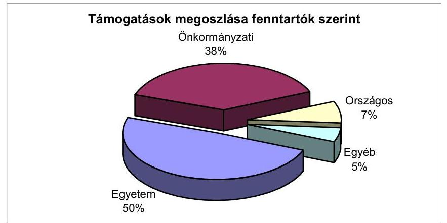
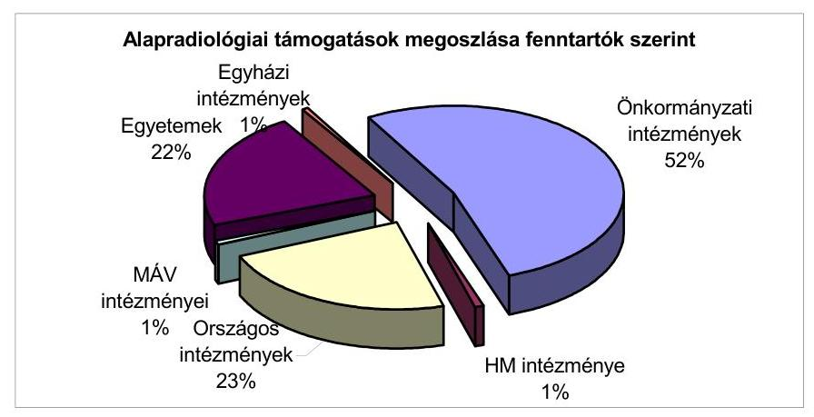
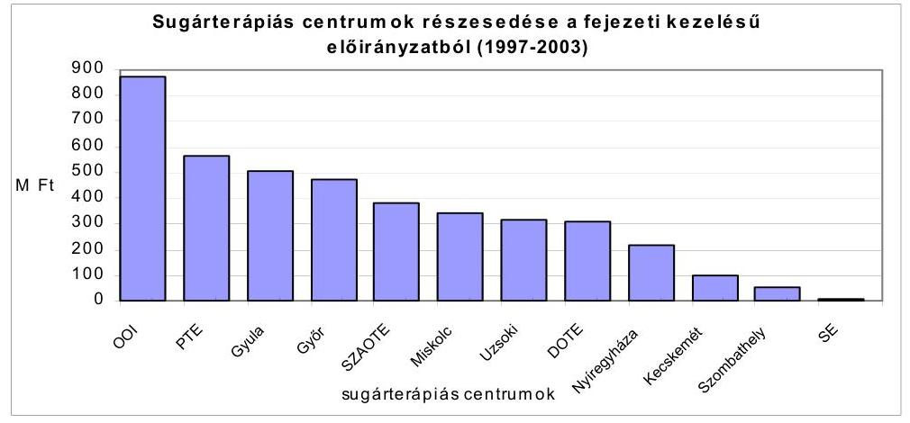
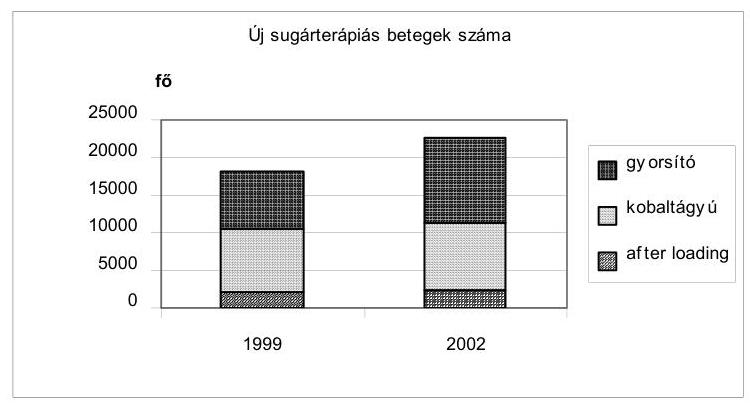
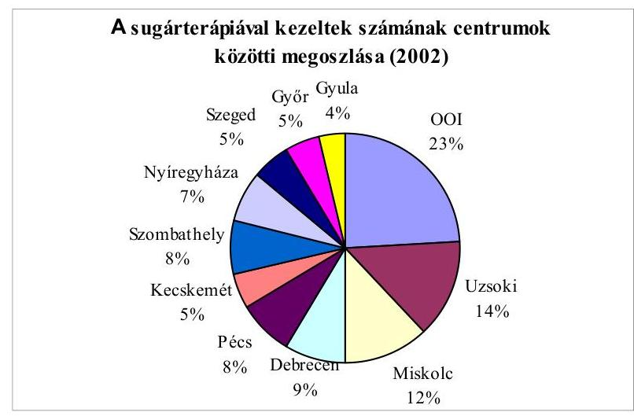
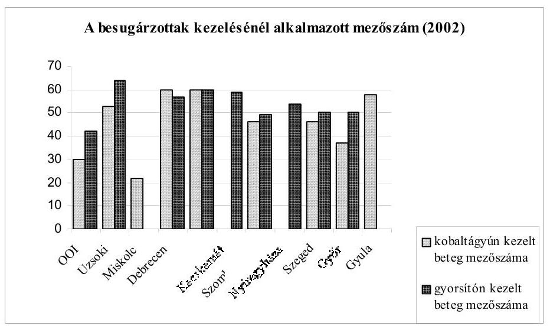
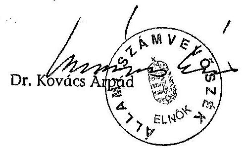
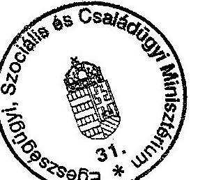
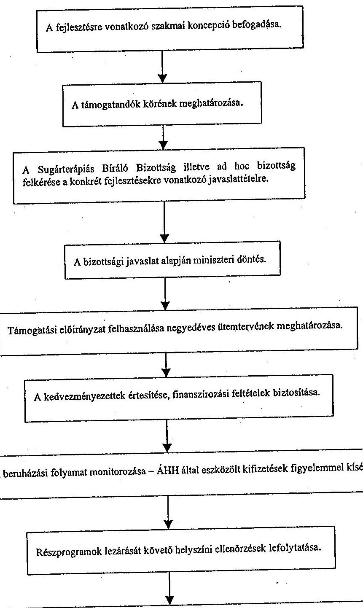

# JELENTÉS 

az állami egészségügyi beruházásokra fordított pénzeszközök hasznosulásának ellenőrzéséről

---

# 2. Államháztartás Központi Szintjét Ellenőrző Igazgatóság 

2.3. Átfogó Ellenőrzési Főcsoport

Iktatószám: V-17-047/2003.
Témaszám: 662
Vizsgálat-azonosító szám: V0091

## Az ellenőrzést felügyelte:

## Bihary Zsigmond

föigazgató

## Az ellenőrzés végrehajtásáért felelős:

## Hegedúsné dr. Müllern Veronika

főcsoportfőnök

## Az ellenőrzést vezette:

## Dr. Kurucz István

osztályvezető főtanácsos

## Az ellenőrzést végezték:

Alexovics Ágota
számvevő tanácsos
Fekete Anikó Gyöngyi
számvevő gyakornok

Nyikon Zsigmondné
számvevő

## Benkéné Lavner Klára

számvevő tanácsos
dr. Kuti Anna
számvevő

Szendrődi Józsefné
számvevő tanácsos, tanácsadó

## Federics Adrienn

számvevő
Laskai Ede
számvevő

## Zachár Péterné

számvevő tanácsos

## A témához kapcsolódó eddig készített számvevőszéki jelentések:

## címe

Jelentés a helyi önkormányzatok által fenntartott járóbeteg szakellátás helyzetének és a ráfordított pénzeszközök felhasználásának vizsgálatáról (1997-1998)
Jelentés az önkormányzati egészségügyi intézmények gép-műszer 9905 ellátottságának, valamint egyes diagnosztikai részleges teljesítményének vizsgálatáról (1998-1999)
Jelentés az önkormányzati tulajdonban lévő kórházak pénzügyi 0023 helyzetének, gazdálkodásának vizsgálatáról (1999-2000)
Jelentés az Egészségügyi Minisztérium fejezet múködésének ellen-őrzéséről 0222 (2001-2002)
Jelentés az állami és egyházi tulajdonban lévő kórházak, egyetemi 0301 klinikák gazdálkodásának ellenőrzéséről (2002-2003)
Jelentések a társadalombiztosítás pénzügyi alapjai költségvetése végrehajtásának ellenőrzéséről

---

# TARTALOMJEGYZÉK 

BEVEZETÉS ..... 9
I. ÖSSZEGZŐ MEGÁLLAPÍTÁSOK, KÖVETKEZTETÉSEK, JAVASLATOK ..... 13
II. RÉSZLETES MEGÁLLAPÍTÁSOK ..... 19

1. A minisztérium szabályozási és irányítási tevékenysége a beruházások megvalósításában ..... 19
1.1. Egészségügyi beruházásra fordítható források elosztásának szabályozottsága ..... 19
1.1.1. A fejlesztési döntések előkészítése, a szakmai bizottságok tevékenysége ..... 20
1.1.2. Pályázati igények kielégítése, az elbírálás szabályszerűsége ..... 21
1.1.3. Szakmai és pénzügyi szempontok érvényesülése ..... 22
1.2. A humán erőforrás feltételeinek megteremtésére elkülönített előirányzat felhasználása ..... 24
1.3. A központi közbeszerzéssel lebonyolított program megvalósítása ..... 25
2. A beruházási programok megvalósításának folyamata ..... 26
2.1. A beruházások folyamatának időbeli megvalósulása ..... 27
2.1.1. A minisztérium tevékenységének hatása a beruházások időigényére ..... 27
2.1.2. Az intézmények tevékenységének hatása a beruházási határidőkre ..... 29
2.2. Az előirányzat maradványok alakulása ..... 30
2.3. A beruházást lezáró beszámoltatási, ellenőrzési feladatok teljesülése ..... 31
2.4. Az egészségügyi beruházáshoz kapcsolódó gépek és berendezések számának és használhatósági értékének változása ..... 32
2.4.1. Az aneszteziológiai és intenzív terápiás ellátás eszközállományában bekövetkező változás ..... 32
2.4.2. A radiológiai eszközök összetételének, korának, használhatósági fokának változása ..... 34
2.4.3. A működő sugárterápiás eszközpark összetételének, korának változása, a bruttó és nettó érték arányának alakulása ..... 35
3. A beruházások eredményessége és hatékonysága ..... 37
3.1. A betegellátás feltételeinek alakulása ..... 37
3.1.1. A technikai feltételek változása ..... 37
3.1.2. A személyi feltételek alakulása ..... 41

---

3.2. A betegellátással kapcsolatos tapasztalatok ..... 42
3.2.1. A radiológiai, az aneszteziológiai és intenzív ellátás ..... 42
3.2.2. A sugárterápiás ellátás ..... 44
3.2.3. A sugárterápiás kezelések biztonsága, megbízhatósága ..... 51
3.2.4. Várakozási idő, betegelégedettségi vizsgálatok, a kezelések elmaradása ..... 53
3.2.5. Területi különbségek a betegellátásban ..... 55
3.2.6. Az eszközök múködtetésének biztonsága ..... 56
3.2.7. A sugárterápiás kezelések bevétele és kiadása ..... 58
MELLÉKLETEK
1 sz., melléklet A fejezet kezelésű eszközberuházások előirányzata és teljesítése 1997-2002.
2/a., b. sz. melléklet
Egészségügyi beruházás fejezeti kezelésű ráfordításai
3. sz. melléklet Alapradiológiai géppark korszerűsítésével kapcsolatos fejezeti kezelésű előirányzatok teljesítése 1997-2003. évek között
4. sz. melléklet Sugárterápiás eszközök darabszámának változása
5. sz. melléklet A szakszemélyzet és a betegszám viszonyának alakulása 2002. évben
6. sz. melléklet A sugárterápiás eszközök teljesítmény adatainak összevetése (1999. év és 2002. év viszonylatában)
7. sz. melléklet A régiók betegellátását végző centrumok
8. sz. mellélet Teljesítménykritériumok a sugárterápiás beruházások értékeléséhez
9. sz. mellélet Az onkológiai sugárterápiás eszközpark fejlesztése: a minisztériumi döntési és ellenőrzési folyamat

---

# RÖVIDÍTÉSEK JEGYZÉKE 

| ÁNTSZ | Állami Népegészségügyi és Tisztiorvosi Szolgálat |
| :-- | :-- |
| DOTE | Debreceni Orvostudományi Egyetem |
| EK | Egészségügyi Közlöny |
| ESZCSM | Egészségügyi, Szociális és Családügyi Minisztérium |
| EüM | Egészségügyi Minisztérium |
| KÉ | Közbeszerzési Értesítő |
| HBCS | Homogén betegségcsoport |
| MKGI (KSZF) | Miniszterelnökség Közbeszerzési és Gazdasági Igazgatósá- |
|  | ga 2004 január 1-től Központi Szolgáltatási Főigazgatóság |
| NM | Népjóléti Minisztérium |
| OEP | Országos Egészségbiztosítási Pénztár |
| OOI | Országos Onkológiai Intézet |
| ORKI | Orvos- és Kórháztechnikai Intézet |
| ORSI | Országos Röntgen és Sugárfizikai Intézetet |
| OSSKI | Országos „Frédérie Joilot-Curie" Sugáregészségügyi és Su- |
|  | gárbiológiai Kutató Intézet |
| OTH | Országos Tisztiorvosi Hivatal |
| PET | Pozitron Emisszios Tomográf |
| POTE | Pécsi Orvostudományi Egyetem |
| PTE | Pécsi Tudományegyetem |
| SE | Semmelweis Orvostudományi Egyetem, Budapest |
| SZAOTE | Szent-Györgyi Albert Orvostudományi Egyetem (Szeged) |
| WHO | World Health Organisation |

---

.

---

# ÉRTELMEZŐ SZÓTÁR 

Afterloading beavatkozás

Afterloading készülék

Alapradiológiai géppark

Aneszteziológia
Árnyékoló eszközök (blokk, multileaf kollimátor)

- Blokkok
- Multileaf kollimátor

Besugárzási mező, mezőszám

Besugárzás tervezés (2D vagy 3D)

Szövetközi, testüregi sugárterápia.

Távtöltő (afterloading) technikával múködő brachyterápiás készülék, amely az automatikusan az előre meghatározott területre tolt sugárforrást megadott időtartamig múködteti.

Röntgen átvilágító, röntgen felvételező és a kettő kombinációját biztosító berendezések összessége.

Érzéstelenítés, érzéstelenítő szerek alkalmazása, altatás.
A céltérfogat körüli egészséges szövetek, szervek kezelés alatti sugárvédelmének eszközei. Lehetnek blokkok vagy multileaf kollimátor (MLC).

A nem egyedi, előre gyártott blokkok több betegnél is felhasználhatók. Az egy beteg kezelésénél használt, egyedi blokkok alacsony olvadáspontú ólom ötvözetből készülnek: A besugárzástervező számítógépes program vagy röntgenkép alapján meghatározott formájú blokkot számítógép által, vagy kézzel vezérelt blokkvágóval vágják ki. A besugárzó készüléknél a blokkokat a sugárnyaláb útjába helyezve alakítható ki a szükséges sugármező alak.

A lineáris gyorsítóra felszerelt, vékony, egymástól függetlenül mozgó lemezekből álló kollimátorral a besugárzástervező program vagy röntgenkép alapján megadott formájú sugármező alakítható ki a besugárzáshoz. Mozgó besugárzásnál (3D-ben) is múködik.

A számítógép vezérelt blokkvágót és a multileaf kollimátort célszerű a terápiás hálózatba bekötni.

A megfelelő (vonatkoztatási) távolságban a sugárnyaláb tengelyére merőleges síkban, a sugárnyaláb tengelyén mért, levegőben elnyelt dózisérték 50\%-a által bezárt terület. A kezelések mezőszáma a kezelések, a besugárzó készülékek által teljesített mezőszám a készülék teljesítményének jellemzője.

A beteg meghatározott testtájékáról készített felvételek (CT, MRI stb.) és egyéb adatok alapján két vagy háromdimenziós képrekonstrukciós software valamint két vagy háromdimenziós dóziseloszlás és dózis számító software felhasználásával egyénre szabott besugárzási terv készítése, amelynek alapján a kezelések kivitelezhetők.

---

Betegellenőrző monitorok egységei

- EKG készülék
- Pulsoxymeter
- Vérnyomásmérő
- Kapnográf

Betegrögzítő berendezések

Brachyterápia

Bunker

CT, MRI

Defibrillátor
Doziméter
Használhatósági fok

Homogén betegségcsoportok (HBCS)

Szívműködés monitorozására
Vér oxygén telítettségének ellenőrzésére
manuális vagy automatikus
a kilélegzett széndioxid koncentrációt méri (endoscopos műtéteknél az altatáshoz kötelező)

A beteg reprodukálható beállítását, valamint a céltérfogatnak a sugárkezelés alatti mozdulatlanságát biztosító eszközök. Lehetnek maszkok vagy különféle állandó készülékek.

- Maszkok: Hőre lágyuló műanyagból készülő, egyéni rögzítő eszközök. A maszkot a betegnek a sugárkezelés alatt viselnie kell.
- Adott lokalizációjú daganat (pl. emlőrák) kezelésekor az adott testtájék besugárzásakor használt nem egyéni rögzítő készülékek.

Zárt sugárforrások olyan orvosi alkalmazása, amelynek során a sugárforrásokat meghatározott időre vagy véglegesen testüregbe, valamely szövetbe vagy testfelületre helyezik.

A sugárzó berendezések elkülönítésére szolgáló építmény.

Diagnosztikai eszközök, amelyek felvételeinek felhasználásával a számítógépes besugárzástervező számítógép segítségével a besugárzási terv elkészíthető. A besugárzástervezés céljából speciális, a diagnosztikus felvételektől eltérő felvételek is készíthetők. Célszerű a terápiás hálózatba bekötni őket.

Újraélesztő készülék
Sugárdózis mérések eszköze.
A tárgyi eszközök nettó értékének aránya a bruttó érték $\%$-ában.

A fekvőbeteg ellátás finanszírozásában használt osztályozási rendszer. Közel azonos gyógyítási költségigényű betegségek orvosi szempontból is elfogadható csoportja.

---

| Infúzor | Infúziós pumpa |
| :--: | :--: |
| Képkontroll | A besugárzási mező képi ellenőrzése. |
| Kúraszerű elszámolás | A járóbetegek részére - aktív fekvőbeteg ellátási háttér mellett - nyújtott, meghatározott számú kezelés finanszírozásánál alkalmazott sajátos, HBCS alapú elszámolási rendszer. |
| Külső besugárzás (teleterápia) | A daganatos terület testen kívüli sugárforrással történő kezelése, ami kis- ( 300 keV alatti) és nagyenergiájú- (1 MeV - 50 MeV közötti) besugárzó készülékekkel történhet.   Kis energiájú berendezések a röntgenterápiás készülékek.   Nagyenergiájú a lineáris gyorsító és a telekobalt készülék. |
| Lineáris gyorsító ekvivalens érték | Megmutatja, hogy adott besugárzó berendezés betegellátási teljesítménye hogyan aránylik a lineáris gyorsító (mint nagy teljesítményű besugárzó gép) teljesítményéhez. |
| Mezőszám | Ld. Besugárzási mező |
| Minimumfeltételek | Az egészségügyi szolgáltatások teljesítése során a betegek, az ellátást nyújtó személyzet és a környezet biztonsága szempontjából elengedhetetlen követelmények összessége. (Az előírásokat a 21/1998. (VI. 8.) NM rendelet, 2003. november 4.-től a 60/2003. (X. 20.) ESZCSM rendelet tartalmazza.) |
| Onkológia | Az orvostudománynak a daganatokkal foglalkozó ága. |
| Perfúzor | Motoros fecskendő. |
| Protokoll | Meghatározott kezelés vagy beavatkozás elvégzéséhez szükséges események és tevékenységek rendszerezett listája, amely az egészségügyi ellátás megkívánt vagy minimális standardjának való megfelelést szolgálja. |
| Portal imaging | A besugárzási mező képi ellenőrzésére alkalmas elektronikus (számítógépes) módszer. |
| Radiológia | A sugárzás gyógyítási és diagnosztikai célokra történő felhasználásának tudománya. (Egészségügyi intézményeknél e szakterületet ellátó osztály megnevezése.) |
| Record \& Verify | A sugárkezelés adatainak rögzítése és ellenőrzése számítógép segítségével. Célszerű hálózatba kötni. A terápiás hálózat része. |

---

| Respirátor | Lélegeztető készülék (magas és közepes tudásszintű). |
| :-- | :-- |
| Röntgen-terápia | 10 kV - 300 kV közötti energiájú röntgensugárral történő   terápiás besugárzás. |
| Sugárterápia | Radioaktív besugárzás alkalmazása a gyógyításban |
| Szakmai protokoll | Szakmai irányelv |
| Szimulátor | Olyan speciális röntgen készülék, amellyel a besugárzá-   si terv sugármezőinek az anatómiai elhelyezkedése és   geometriai adatai a betegre rájelölhetők és ellenőrizhe- |
| Sztereotaxiás besugárzás | Általában kis tömegű daganatok magas dózisú, nagy   precizitású kezelése. |
| Teleterápia | ld. Külső besugárzás. |
| Terápiás hálózat | A sugárterápia eszközeinek számítógépes hálózattal tör-   ténő összekapcsolása, amely lehetővé teszi az egyes esz-   közök közötti online adatforgalmat. |
| Vízfantom | Dóziseloszlás vízben történő mérésére szolgáló eszköz. |

---

# JELENTÉS 

## az állami egészségügyi beruházásokra fordított pénzeszközök hasznosulásának ellenőrzéséről

## BEVEZETÉS

Az Állami Számvevőszék kiemelt figyelmet fordít az államháztartás nagy ellátó rendszerei múködésének ellenőrzésére. Ennek megfelelően rendszeresen foglalkozik az egészségügy helyzetével, amely egyrészt az éves költségvetési törvényjavaslat véleményezéséhez, a zárszámadási törvényjavaslat értékeléséhez, másrészt az egészségügy egy-egy területét, így például a járóbeteg szakellátást, a kórházak gazdálkodását, a gép-műszer ellátottságot átvilágító tematikus ellenőrzésekhez kapcsolódik.

Az egészségügy ellenőrzésének folyamatába illeszkedik a központi költségvetésből támogatott, a sugárterápiát, a radiológiát, az aneszteziológiai és intenzív ellátást érintő eszközberuházásokra fordított pénzeszközök hasznosulásának vizsgálata.

Az orvos szakmai ajánlások a sugárterápiát, valamint az aneszteziológiai és intenzív ellátást érintően 5-5 Mrd Ft-ban, a radiológóiai eszközök tekintetében 12 Mrd Ft-ban, összesen 22 Mrd Ft-ban jelölték meg a szükséges központi források nagyságát. Ezzel szemben az 1997-2003 közötti időszakban a beruházásokra biztosított és pénzügyileg elszámolt összeg a sugárterápiás beruházásoknál 3,75 Mrd Ft, az aneszteziológiai és intenzív ellátásnál 0,81 Mrd Ft, a radiológiánál 2,97 Mrd Ft, összesen csak 7,53 Mrd Ft volt. A három eszközcsoportra jóváhagyott 2003. évi fejezeti kezelésú módosított előirányzat a felsoroltak sorrendjében 0,4 Mrd Ft, 0,52 Mrd Ft, és 0,45 Mrd Ft, együttesen 1,35 Mrd Ft volt, amelyből az előkészítés és a döntés elhúzódása miatt a helyszíni ellenőrzés befejezéséig csak a sugárterápia korszerűsítésére adott 0,4 Mrd Ft-ot használták fel. Ezekből az összegekből pályázatok keretében az önkormányzati egészségügyi intézmények is részesültek.

---

Az Állami Számvevőszék az 1994-1998 közötti időszakot érintően ellenőrizte az önkormányzati egészségügyi intézmények gép-műszer ellátottságát, és ennek keretében javasolta a Kormánynak - többek között - az eszközök pótlása fedezetének normatív alapokra helyezését, a központosított közbeszerzésbe tartozó országosan kiemelt termékek körének bővítését, a tárca vezetőjének a minimum feltételek áttekintését, a finanszírozás szakmai tartalmának felülvizsgálatát.

Az Egészségügyi Minisztérium (EüM) fejezet központi beruházásaira 1997-2002 között évi 3-7 Mrd Ft-ot, előzetes adatok szerint 2003-ban 7,7 Mrd Ft-ot együttesen 40 Mrd Ft-ot fordítottak, ezen belül a fejezeti kezelésű eszköz beruházási érték 7,5 Mrd Ft-os összegéből évente 0,3-3 Mrd Ft-ot használtak fel.

A fejezet múködése 2001-2002. évi ellenőrzési tapasztalatainak alapján indokolttá vált a központi költségvetésből támogatott eszközberuházásoknak a korábbinál részletesebb vizsgálata.

Az ellenőrzést előkészítő tanulmányban a szakértői bizottságok megállapításait is hasznosítva javasoltuk a három (jelenleg egy) fejezeti kezelésű előirányzatból finanszírozott, az állami és önkormányzati tulajdonban lévő egészségügyi intézmények eszközberuházásaira fordított pénzeszközök hasznosulásnak vizsgálatát. Az értékeléshez a teljesítményellenőrzés módszerét alkalmaztuk.

Az ellenőrzés során hasznosítottuk a hagyományos röntgen géppark és sugárterápiás eszközpark szakmai és pénzügyi programjáról szóló 1075/1997. (VIII. 11.) Korm. határozatban, valamint az aneszteziológiai és intenzív ellátásra vonatkozóan az eszközök elérendő színvonaláról, az egészségügyi szolgáltatásokra és az egészségügyi szolgáltatókra érvényes szakmai minimumfeltételekről szóló 21/1998. (VI. 3.) NM rendeletben ${ }^{1}$ (korábban a 19/1996. VII. 26.) NM rendeletben) foglaltakat.

A beruházások eredményességének, a működtetés hatékonyságának ellenőrzésénél, a hangsúlyt a sugárterápiát érintő beruházások értékelésére helyeztük, mert a keringési betegségek után a daganatos megbetegedések okozzák a legtöbb halálesetet Magyarországon. A statisztikai adatok szerint az elmúlt 25 évben a rosszindulatú daganatok miatt rokkantosított betegek aránya - a feltételek szigorítása ellenére - 100\%-kal emelkedett. A rákellenes küzdelem feladatát az egészség megőrzésére irányuló, hosszú távú cselekvési kormányprogramok is kiemelten kezelik. Az eredményesség és a hatékonyság kritériumainak, mutatóinak kiválasztásánál figyelembe vettük a hazai és a nemzetközi orvosi gyakorlatban elfogadott szempontokat.

[^0]
[^0]:    ${ }^{1}$ Az egészségügyi szolgáltatások nyújtásához szükséges szakmai minimumfeltételekről szóló 60/2003. (X. 20.) ESZCSM rendelet 2003. XI. 4.-ével hatályon kívül helyezte de a 12. § (3) bekezdése alapján a hatályba lépés időpontjában múködési engedéllyel vagy ideiglenes múködési engedéllyel rendelkező egészségügyi szolgáltatók tekintetében külön jogszabály eltérő előírása hiányában még alkalmazni kell.

---

Az államháztartásról szóló 1992. évi XXXVIII. törvény 120/A § (1) bekezdése alapján az államháztartás külső ellenőrzésével kapcsolatos feladatokat az Állami Számvevőszék látja el. A jelen ellenőrzés végrehajtására az Állami Számvevőszékről szóló 1989. évi XXXVIII. törvény 1. § (2) bekezdése, a 2. § (1), (3), (5)-(7) bekezdései, valamint a 17. § (3) bekezdésében foglaltak adtak jogszabályi alapot.

Az ellenőrzés célja annak értékelése volt, hogy az Egészségügyi, Szociális és Családügyi Minisztérium (ESZCSM) és jogelődje a Népjóléti Minisztérium (NM) felügyelete alá tartozó fejezeti kezelésű előirányzatból finanszírozott egészségügyi eszközberuházások

- összhangban voltak-e a vonatkozó egészségpolitikai célokkal, a kapcsolódó kormányhatározattal, miniszteri rendelettel és az előírásoknak megfelelően valósultak-e meg;
- javították-e az egészségügyi ellátás feltételeit, a vizsgálatokhoz, a sugárterápiás kezelésekhez való hozzájutás esélyeit;
- múködtetése, kihasználtsága, a rendelkezésre álló emberi erőforrások felhasználása hatékony volt-e.

A helyszíni ellenőrzés az 1997-2003 júniusa közötti időszakra terjedt ki, de a hangsúlyt az utolsó két év ellenőrzésére helyeztük és hasznosítottuk a 2003. II. félévi tapasztalatokat. Az ellenőrzés végrehajtását a forráselosztás, a területi elhelyezkedés, a feladatellátás figyelembevételével szerveztük meg.

A vizsgálat az ESZCSM-t, a Miniszterelnökség Közbeszerzési és Gazdasági Igazgatóságát (MKGI ${ }^{2}$ ) és a fejezeti kezelésű előirányzatból finanszírozott intézményeket érintette. Helyszíni ellenőrzést tartottunk a minisztériumban, az MKGInél, és öt (a két fővárosi, a pécsi, a debreceni, a szegedi) sugárterápiás centrumban. Az előirányzatból támogatott többi intézményt adatbekérés, valamint kérdőíves felmérés alapján ellenőriztük. Ennek keretében tájékoztatást kértünk a programok alapján végrehajtott beruházások körülményeiről, az ellátás feltételeinek változásáról.

Az ellátások finanszírozását tekintve információt kértünk az Országos Egészségbiztosítási Pénztártól (OEP), az eszközpark állapotáról az Orvos és Kórháztechnikai Intézettől (ORKI), a radiológiai és sugárterápiás ellátásokról az Országos Röntgen és Sugárfizikai Intézettől (ORSI).

A végleges jelentést az Állami Számvevőszékről szóló 1989. évi XXXVIII. törvény 25. § (1) bekezdésének megfelelően megküldtük dr. Kökény Mihály miniszter úrnak, aki észrevételezési lehetőségével a törvényes határidőn belül nem élt.

[^0]
[^0]:    ${ }^{2}$ Az MKGI neve 2004. január 1-jével megváltozott KSZF-re, azaz Központi Szolgáltatási Főigazgatóságra.

---

BEVEZETÉS

---

# I. ÖSSZEGZŐ MEGÁLLAPÍTÁSOK, KÖVETKEZTETÉSEK, JAVASLATOK 

Az egészségpolitika céljait a 90-es években a különböző kormányprogramok közel azonos tartalommal határozták meg. Az 1994. évben kormányhatározat rögzítette a hosszú távú egészségfejlesztési politika alapelveit és kidolgozták az 1994-1998 közötti időszakra az Egészségvédelem Nemzeti Programját. 2001-ben elkészült a 10 évre szóló Egészséges Nemzetért Népegészségügyi Program, majd erre alapozva 2002-ben az Egészség Évtizedének Johan Béla Nemzeti Programja. A Kormány 2003-ban az Európa Terv keretében hirdette meg az egészségügyi ellátó rendszer műszer állományának korszerűsítését.

Az évtized közepétől megfogalmazott központi célok ösztönzést adtak az egészségügyi szakmának a konkrét elképzelések megfogalmazására. Az orvosi szakmai kollégiumok irányításával 1996-ban készített értékelések felhívták a figyelmet a nem megfelelő eszközellátottságra, és ajánlásokat fogalmaztak meg a feltételek javítására. A gépellátottság javítását szakmai és gazdasági körülmények egyaránt indokolták. Az elavult eszközök nem alkalmasak a magas szintű gyógyító tevékenység ellátására, korrekt diagnózisra és kezelésre. Az aneszteziológiai és intenzív ellátást szolgáló elöregedett berendezések a betegek, az elhasználódott sugárterápiás és röntgen gépek a kezeltek és a kezelőszemélyzet biztonságát veszélyeztetik, az utóbbiak esetenként a megengedettnél magasabb sugárterhelést okozva és az üzemeltetésük is költségesebb.

A szakminisztérium egyetértett a szakmai bizottságok helyzetértékelésével és fejlesztési programok beindítását tartotta szükségesnek. A fejlesztési programot előkészítő miniszteri előterjesztés többek között megállapította, hogy a rászorulók fele részesült a betegség ideje alatt sugárkezelésben, a 11 sugárterápiás centrum (centrum) több mint fele nem rendelkezett lineáris gyorsítóval, ami közvetlenül hozzájárulhatott hazai kiugróan magas, daganatos megbetegedések miatti elhalálozáshoz. Mindezek alapján jogszabályok határozták meg a több évre tervezett fejlesztési programok célját, de azokat nem alapozta meg hosszabb távra szóló pénzügyi és eszközfejlesztési terv.

A Magyar Köztársaság 1998-2003. évi költségvetéseiben fejezeti kezelésű, ezen belül ágazati-, 2004-ben egészségügyi, szociális ágazati célelőirányzatként fogadták el a fejlesztési programokat. Az 1998-2002 között a három eszközcsoport előirányzatát még külön, de a 2003. és a 2004. évi költségvetésben már együtt, egészségügyi gép-műszer beruházási program megnevezéssel szerepeltették.

Az elfogadott programok teljesítéséhez nem volt elegendő pénzügyi forrás. A sugárterápiás eszközöknél a finanszírozási igények háromnegyede, a hagyományos röntgengéppark esetében a javasolt beruházás negyede, az aneszteziológiai és intenzív ellátáshoz kapcsolódó eszközöknél a beruházási célok egy-hatoda realizálódott. A kormányhatározat a humánerőforrás feltételek megteremtésére 100 M Ft-ot különített el, amelynek csak 20\%-át használták fel.

---

A fejezeti kezelésű előirányzatokból megvalósított eszközberuházások közül hangsúlyozottan a sugárterápiás eszközberuházások eredményességét, múködtetésük hatékonyságát ellenőriztük. A kérdőíves felmérésekből rendelkezésre álló információk alapján értékeltük az alapradiológiai géppark korszerűsítésére, valamint az aneszteziológiai és intenzív ellátás minimumkövetelményeinek biztosítására fordított pénzeszközök hasznosulásának tapasztalatait.

A betegellátásban való alkalmazása mértékének vizsgálata során akkor minősíthetjük eredményesnek a beruházást, ha az ellenőrzött időszakban 1996hoz képest javultak a gyógykezeléshez való hozzáférés feltételei. Emelkedett a gondozásban, ezen belül a korszerübb, biztonságosabb ellátásban részesülők száma, és csökkent a várakozási idő.

A helyszíni ellenőrzés, valamint az adatbekérés tapasztalatai alapján az 19972003 között megvalósult sugárterápiás eszközberuházásokat összességében eredményesnek tartjuk, mert a múködő sugárterápiás centrumok országos szinten már elegendő kapacitással rendelkeznek a rászoruló betegek ellátásához. Az intézmények földrajzi elhelyezkedése azonban nem egyenletes és gépparkjuk sem teljes körú.

Az eszközfejlesztések elsősorban a korszerú, nagy teljesítményú külső besugárzó készülékek, az ún. lineáris gyorsítók beszerzésére irányultak. A fejezeti kezelésű előirányzattal támogatott 11 centrum felszereltsége jelentősen javult, mert 1996-hoz képest a vizsgált időszakban a lineáris gyorsítók száma 6-ról 17-re nőtt. Mérséklődött az egyes centrumok felszereltsége közötti különbség, 1996ban csak 4 centrumban, 2002-ben már 9 centrumban múködött lineáris gyorsító. Az illetékes orvosi szakmai kollégium 2002. évi értékelése szerint a szakmai igényeknél szerényebb fejlesztés ellenére a megvalósult beruházásokkal 3 centrum európai, 6 centrum azt megközelítő színvonalat ért el, de a szinten tartás csak további fejlesztésekkel biztosítható.

A centrumok több mint felénél még hiányoznak azok a kiegészítő berendezések, amelyek az egészséges területek fokozott sugárvédelméhez szükségesek. A tervezés és a kezelés biztonságát növelő, a besugárzási paraméterek beállítását ellenőrző rendszert 5 centrumban építettek ki, a sugárzási célterület beállítását elektronikusan ellenőrző készülék 2 centrum két gyorsítójánál múködik.

A röntgengépekkel való ellátottság minőségi jellemzői országos szinten nem javultak. A múködő gépek számához viszonyítva a géppark fejlesztése mintegy $6 \%$-os volt. A központi támogatásokat 99 intézmény között osztották fel, ami jellemzően egy-két gép beszerzését tette lehetővé. Az intézmények $80 \%$-ának véleménye szerint a beruházások eredményeként csökkent a betegek és a kezelőszemélyzet káros sugárterhelése és javult a felvételek minősége.

Az aneszteziológiai és intenzív ellátás gépparkjánál végrehajtott fejlesztés ellenére nem lett több azon intézmények száma, ahol a beruházással már elérték a szakmai minimumfeltételekben előírt színvonalat. Országosan ma sem jobb a helyzet, mint 1998-ban, a beruházási program elindulásakor. Az intézmények véleménye szerint további pénzügyi támogatásra volna szükség.

---

A sugárterápia fejlesztési programjának végrehajtásával lehetővé vált, hogy a centrumok növekvő számban lássanak el daganatos betegeket. A megvalósult beruházások eredményeként mintegy $80 \%$-kal, 12,5 ezerről 22,5 ezerre nőtt az ellátásban részesülők száma 1996-2002 között és az utolsó évben a betegek felét már gyorsítóval kezelték.

Orvos szakmai vélemény szerint az ellenőrzött időszakban a rászoruló, de sugárkezelésre nem kerülő betegek aránya - csökkenő mértékben - 30-10\% között alakult. Az intézmények véleménye szerint a szakrendelésre eljutó betegek kezelése alapvetően a beteg ilyen irányú döntése miatt maradt el. Megkezdett kezeléseket csak kivételes esetben, általában műszaki okok miatt szakítanak meg, a betegeket másik besugárzó gépre irányítják át.

A centrumok - a két fővárosi intézménynél országos hatáskörrel - jellemzően a vonzás körzetben, a saját és a szomszédos megyékben lakó betegeket látták el. Kedvezőtlen, hogy a sürgősségi és a speciális gyógymódot alkalmazó ellátások kivételével nincs szervezett, intézményesített együttmüködés a sugárterápiás centrumok között.

Az országos átlagban kedvező tapasztalatok ellenére az egyes centrumokban eltérő arányban alkalmazták a korszerűbbnek tartott kezeléseket. A kobaltágyú, illetve a hatékonyabbnak tekintett gyorsító használatának mértékében különbségek találhatók. A minőségi mutatóként is elfogadott, egy betegre jutó mezőszám 1999 és 2002 között a gyorsítókkal kezelt betegeknél átlagosan 46ról 52-re emelkedett, a kobaltágyún 46 -ról 40 -re csökkent. Az átlagértékek mögött az egyes centrumokat érintően 2002-ben jelentős volt a szóródás, mert a gyorsítók esetében 42 és 62 között, a kobaltkezeléseknél 22 és 64 között változott a mutató értéke. ${ }^{3}$ Az eszközök használatának megítélése, a különbségek értékelése, illetve az eltérések lehetséges mérséklése orvos szakmai feladat, amely a további eszközfejlesztési programok tervezésénél fontos szempont lehet.

A centrumok tájékoztatása szerint az ellenőrzött időszakban csökkent a - kezeléseknek az orvosi szempontból lehetséges és a tényleges megkezdése közötti várakozási idö, de a tapasztalati adatokról nincs hosszabb időszakot is bemutató nyilvántartás, értékelés. A helyszínen ellenőrzött öt sugárterápiás centrum közül két intézménynél nem szerveztek betegelégedettségi vizsgálatot és a többi helyen is csak részlegesek a tapasztalatok, mert a megkérdezés nem terjedt ki minden betegre, a megkérdezett betegek egy része pedig nem élt a véleménynyilvánítás lehetőségével. A tapasztalatok szerint a betegek kifogásolták a többórás és nem megfelelő körülmények közötti várakozást, ez az idő mérsékelhető lenne a betegek időpontra történő berendelésével.

Az eszközök múködtetését akkor tekinthetjük hatékonynak, ha rendelkezésre állt a feladatok elvégzéséhez szükséges és előírt képesítésű létszám, biztosított volt a működtetés műszaki, környezetvédelmi feltétele, valamint az eszközök kihasználtsága. Összhangban volt a finanszírozás a működtetés kiadásaival.

[^0]
[^0]:    ${ }^{3}$ A sugárkezelés minőségének általános mutatója megadja, hogy a besugárzások sorozatában összesen mennyi sugárnyalábbal, azaz a testfelszínen összesen hány mezőn áthaladva juttatják el a szükséges dózist a beteg testrészre.

---

A sugárterápiás ellátás területén nem volt elegendő a szakszemélyzet, amely csökkentette az eszközök múködtetésének hatékonyságát. A betöltött létszám csak az asszisztensek esetében érte el a minimumfeltételekben előírt mértéket. A szakorvosoknál hiányzott a tervezett létszám 20\%-a. Kevés a speciálisan képzett szakorvos, amihez hozzájárult, hogy a jelenlegi képzési rendszerben 10 éves továbbképzéssel és szakmai gyakorlattal lehet megszerezni az előírt szakképzettséget.

A felsőoktatásban nincs orvos-fizikus és főiskolai végzettséget adó sugárterápiás technikus és szakasszisztens képzés, ezért lehetőségként elsősorban az intézményen belüli továbbképzés maradt. Az ellenőrzött intézetek véleménye szerint a szakvizsgázott orvosok, asszisztensek egy része a fizikai és lelki leterheltség miatt, illetve a külföldi munkavállalási lehetőséget kihasználva hagyta el munkahelyét.

A betegellátásban dolgozó szakorvosok között csökkent a radiológiai szakképzettséggel rendelkező orvosok száma, és 10-20\% között változott a betöltetlen orvosi, asszisztensi munkakörök aránya.

Nem volt azonos az egyes nagy értékű sugárterápiás eszközöknek a lehetséges üzemidő szerinti kihasználtsága, az ellátandó betegek változó száma, a létszámhiány, valamint az eszközök kímélése miatt. A betegellátásra fordított tényleges üzemidőn belül az egy betegre jutó kezelési idő, centrumonként változóan az irányadó ${ }^{4} 4$ órás szakmai értéknek fele-kétharmada volt. A kezelési időtartamok centrumonkénti és a minimumfeltételek szerinti mértéktől való eltérésének értékelése, a kezelések minőségének ellenőrzése orvos szakmai, illetve finanszírozói feladat.

Az ellenőrzött időszakban nőtt a teljesítmény az alapradiológiai ellátásban. A kitöltött kérdőívek alapján a felvételek száma $22 \%$-kal, a betegszám $10 \%$-kal, az egy betegre jutó felvétel $4 \%$-kal nőtt. A fajlagos mutató változását befolyásolta egyrészt, hogy az új gépeknél kevesebb felvételt kellett készíteni, másrészt a modern diagnosztika több felvételt igényelt.

Az egészségügyi intézmények biztosították a működtetés múszaki és környezetvédelmi feltételeit. A berendezések leállásai arányban voltak a készülékek életkorával. Az intézményi nyilvántartások szerint a sugárterápiás eszközök az üzemidőn belül mintegy $95 \%$-os arányban megbízhatóan múködtek, amely a karbantartási napok alapján megfelelőnek tekinthető. A röntgengépeket üzemeltető intézmények többségénél ( $75 \%$-ánál) csökkent a meghibásodások, illetve a karbantartások miatti leállások ideje. A környezetre ártalmas anyagok beszállítását, tárolását, elszállítását megfelelően szabályozták. A végrehajtás az előírásoknak megfelelően történt.

A centrumoknál nincs részletes, a közvetlen és a közvetett kiadásokat azonos elvek szerint nyilvántartó költségfigyelés és az intézmények úgy ítélték meg, hogy a sugárterápiás eszközök múködési bevételei fedezték a kiadásokat. A helyszíni ellenőrzés tapasztalatai szerint a sugárterápiás ellátásra elszámolt ki-

[^0]
[^0]:    ${ }^{4}$ A 21/1998.(VI. 3.) NM rendelet 9. sz. melléklete szerint.

---

adásokhoz mérten többletbevétel realizálódott. Az alkalmazott finanszírozás nem vette figyelembe, hogy a kezelések eltérő szakmai tartalma, munkaigényessége következményeként változott az egyes ráfordítások összege is. Az alapradiológiánál, valamint az aneszteziológiai és intenzív ellátásnál nem volt érzékelhető változás a bevételek és kiadások arányában.

Az egészségügyi tárca évente hirdetett pályázatot az aneszteziológiai és intenzív ellátás minimumkövetelményeinek biztosításához, valamint az alapradiológiai géppark korszerűsítéséhez indított programokban való részvételre. A pályázatok rendjét nem szabályozták, amit az ÁSZ a korábbi ellenőrzése során már kifogásolt ${ }^{5}$ és elmaradt a pályázatok egyes szakaszainak ütemezése. A sugárterápiát érintő előirányzatok odaítélése pályáztatás nélkül, a szakmai bizottságok javaslata alapján történt.

A pályázatok elbírálására, a támogatási összeg elosztására minden esetben szakmai bizottságot hoztak létre az orvosi szakmai kollégium és a felügyelet képviselőiből. Javaslatukat a döntésnél figyelembe vette a miniszter. A tartalékforrást a miniszter egyedi döntése alapján osztották fel.

A központi közbeszerzés lebonyolítása, a tender nyertesek kiválasztása az előírásoknak megfelelően történt, de az eljárás a Miniszterelnökség Közbeszerzési és Gazdasági Igazgatóságán (MKGI) nem volt megfelelően dokumentálva. A beérkező szállítói jelentéseket nem értékelték, a rendelkezésre álló dokumentumok egy részét a röntgen berendezések esetében nem irattározták. A szaktárca az intézményeknek nem biztosított azonos feltételeket a 2001. évi támogatások elszámolásánál, mert a 36 támogatott intézményből 14 intézmény megfizette a közbeszerzési díjat is, a többi intézmény nem. (A helyszíni ellenőrzés lezárását követően a tárca rendezte az elszámolást). A 2003-tól módosított közbeszerzési díjszabás nem felel meg a vonatkozó kormányrendelet előírásainak.

A beruházások előkészítése és megvalósulása között eltelt időtartam nőtt a pályázati felhívások kiírásának, a miniszteri döntések, a támogatási szerződések aláírásának, a közbeszerzési eljárások elhúzódása miatt. A sugárterápiás beruházásoknál, beszerzéseknél az átfutási idő néhány hónaptól 1-2 évig terjedt, de előfordult az alapradiológiai beruházásoknál is, hogy az összeg felhasználhatóságának kezdeti időpontjától a támogatási szerződés megkötéséig több mint két év telt el. Az aneszteziológiai berendezéseknél nincs központi közbeszerzési kötelezettség. Ezért nem volt indokolt, hogy a jóváhagyott költségvetési támogatáshoz kapcsolódó szerződések megkötését több mint egy évvel később kezdte meg a tárca. Mindezek következtében évről-évre magas volt az előirányzat maradvány értéke. Ebből a szempontból a kötelezettséggel lekötött, az igényektől egyébként jelentősen elmaradó források felhasználása nem volt kellően hatékony. A minisztériumban vezetett nyilvántartások a pénzmaradványok alátámasztására csak korlátozottan alkalmasak.

A szakmailag indokoltnál kisebb mértékű beruházások miatt - a sugárterápiás eszközpark kivételével -nem lett kedvezőbb a gépek korösszetétele, mert to-

[^0]
[^0]:    ${ }^{5}$ A V-18-41/2001-2002. sz. Jelentés az EüM fejezet múködésének ellenőrzéséről

---

vább használták az elöregedett eszközöket. A sugárterápiás gépek átlagos életkora 7 év, de ezen belül vannak 15 évesnél idősebb gépek is a rendszerben. A radiológiai eszközökön belül az egyes intézményeknél 8-18 év között változott az átlagos életkor. Nincs jobb állapotban az aneszteziológiai és intenzív ellátást segítő eszközpark sem. Az ORKI nyilvántartása szerint az altatógépek átlagos életkora közel 15 év, amely 3 évvel meghaladja a minimum feltételekben rögzített használati időt. A lélegeztető gépeknél az átlagos életkor megközelíti a 12 évet. A három eszközcsoportban a 0 -ra leírt eszközök aránya 30-80\% között szóródik.

A szaktárca évenkénti pénzügyi zárszámadása az intézményi beszámolókra épült. A beruházások helyszíni felügyeleti ellenőrzésére 2003-ban került sor. A pénzeszközök felhasználásának ellenőrzését külső munkatársakra, illetve intézményre bízták. A jelentések többek között szorgalmazták a jövőbeni rendszeres felügyeleti vizsgálatokat.

A helyszíni ellenőrzés megállapításainak hasznosítása mellett javasoljuk:

# az egészségügyi, szociális és családügyi miniszternek 

1. Dolgoztassa ki a szakmai kollégiumokkal együttmúködve a támogatások - a betegségi adatokon alapuló, a területi megoszlást és az ellátás minőségét is figyelembevevő - hosszú távú pénzügyi és eszközfejlesztési és tervét.
2. Vizsgáltassa meg az egyes HBCS súlyszámok egymás közötti arányait, valamint a sugárterápiás kúraellátások - a teljesítményfinanszírozási rendszerben az ellátáshoz rendelt HBCS besorolások szerinti - súlyszáma és az ellátás szakmai tartalma közötti összefüggést és intézkedjen a meglévő súlyszám arányok módosításáról.
3. Tegyen intézkedéseket a pályáztatási idő lerövidítésére. Készíttesse el a pályázatok elbírálásának belső szabályzatát, amelyben szabályozzák a megvalósítás eljárási rendjét, az egyes pályázatok előkészítő, kiértékelő szakaszainak időtartamát, határidejét.
4. Vizsgálja felül az MKGI-vel (KSZF-el) kötött megállapodási szerződés módosításában foglalt közbeszerzési díj háttérszámítását és a 125/1996. (VII. 24.) Korm. rendeletnek megfelelően, egységesen határozzák meg.

## a Miniszterelnöki Hivatalt vezető miniszternek

Végeztesse el a Központi Szolgáltatási Főigazgatósággal az alapradiológiai géppark központosított közbeszerzéséhez kapcsolódó dokumentumok irattározását.

---

# RÉSZLETES MEGÁLLAPÍTÁSOK 

## 1. A MINISZTÉRIUM SZABÁLYOZÁSI ÉS IRÁNYÍTÁSI TEVÉKENYSÉGE A BERUHÁZÁSOK MEGVALÓSÍTÁSÁBAN

A szakma által feltárt hiányosságok kiküszöbölése és a 21/1998. (VI. 3.) NM rendeletben előírt minimumfeltételeknek való megfelelés érdekében a minisztérium több évre szóló szakmai fejlesztési program elindítását tartotta szükségesnek, melyről a hagyományos röntgengéppark és sugárterápiás eszközpark szakmai és pénzügyi programjáról szóló 1075/1997. (VII. 11.) Korm. határozat rendelkezett. Az aneszteziológia területén viszont egy szakmai fejlesztési program vázolta fel a hazai aneszteziológia és intenzív betegellátás feltételei korszerűsítésének igényét.

Az egészségügyi beruházások eredeti előirányzata 1997-2002 között 10,3 Mrd Ft volt, amely kormányrendelettel, zárolással 7,6 Mrd Ft-ra módosult (1., 2/a., 2/b. sz. mellékletek). A három program közül az eredeti előirányzathoz viszonyítva százalékosan az aneszteziológiai és intenzív ellátás minimumkövetelményeinek biztosítására fordítható előirányzat csökkent a legjobban (56\%-kal), de jelentős, azaz 40,3\%-kal kapott kevesebbet az alapradiológiai géppark korszerűsítése is.

A módosított előirányzatból legnagyobb volument a sugárterápiás fejlesztések támogatásai képviselték, 49,6\% (3,75 Mrd Ft). Ez a program minden évben rendelkezett előirányzattal. Nem volt előirányzat a 2001-2002. években az aneszteziológia és intenzív terápiás ellátások fejlesztésére, valamint 2002-ben az alapradiológiai géppark korszerűsítésére. Az előirányzat mindhárom témánál évről-évre csökkent. A módosított előirányzat 2003. december 31-i állapot szerint $99,7 \%$-os teljesítést mutat a 2003. évi előirányzat nélkül.

### 1.1. Egészségügyi beruházásra fordítható források elosztásának szabályozottsága

A három fejezeti kezelésű előirányzatból az aneszteziológiai és intenzív ellátás minimumkövetelményeinek biztosítását, valamint az alapradiológiai géppark korszerűsítését célzó fejezeti kezelésű előirányzatok felhasználására a minisztérium évente pályázatot hirdetett meg, míg az onkológiai sugárterápia feltételeinek javítását segítő előirányzat esetében a támogatás odaítélése pályáztatás nélkül, csak a szakmai bizottság javaslata alapján, miniszteri döntéssel történt.

A szaktárca - 2000. év kivételével - évente elkészítette a fejezeti kezelésű előirányzatok felhasználásáról szóló szabályzatát. A 2001. évi szabályzatban határozták meg először, hogy a pályázati úton megítélt támogatás odaítéléséről a miniszter dönt.

---

A pályáztatások rendjét nem szabályozták, ezt az Állami Számvevőszék már előző jelentésében is megállapította. ${ }^{6}$ A kedvező változások ellenére a pályázatok egyes szakaszainak ütemezését hiányoljuk.

Az ellenőrzött három fejezeti kezelésű előirányzatból különböző mértékű támogatási összeghez juthattak hozzá az intézmények. A sugárterápiás fejlesztések teljes egészében állami támogatásból valósulhattak meg. Ez nem jelentette azt, hogy az intézmények és azok fenntartói nem járultak hozzá a fejlesztéshez, de a támogatás megítélésének ez nem volt feltétele. Az aneszteziológiai és intenzív ellátást szolgáló berendezésekre az elnyerhető támogatás a készülék bruttó árának $60 \%$-a volt, az intézményeket terhelte a fennmaradó $40 \%$. A röntgengépek esetében a támogatás mértéke $65 \%$ volt, $30 \%$-ot az intézményfenntartóknak, $5 \%$-ot pedig az intézményeknek kellett saját bevételeikből viselni. Nem kellett önrészt biztosítani az egyetemek orvostudományi karainak, illetve a fekvőbeteg ellátó országos intézeteknek.

Egyes intézmények nem tudták fedezni a rájuk eső részt, így elestek a megítélt támogatástól, vagy már eleve nem is pályáztak (pl. Diósgyőri Kórház).

Nem szabályozták a támogatási kereten belül milyen összegű tartalékképzés történjen az időközben felmerülő egyéb költségek fedezetére. Az előirányzatot terhelte például a helyszíni ellenőrzésre fordítandó összeg, a bizottsági tagok tiszteletdíja, az évközben felmerülő esetleges árfolyam-változások költség kihatása, stb.

# 1.1.1. A fejlesztési döntések előkészítése, a szakmai bizottságok tevékenysége 

A támogatási összeg elosztására, valamint a pályázatok elbírálására minden esetben szakmai bizottságot hoztak létre. Tagjait jellemzően a Magyar Orvosi Kamara által múködtetett orvosi szakmai kollégiumok (Aneszteziológiai és Intenzív Terápiás Szakmai Kollégium, Radiológiai Szakmai Kollégium, Sugárterápiás és Onkológiai Szakmai Kollégium), valamint a minisztérium képviselői alkották. Így a bizottsági javaslatokban a szakma véleménye kifejezésre jutott, a végső döntést azonban a miniszter hozta meg.

A 217/1998. (XII. 30.) Korm. rendelet 85. §-a előírja, hogy a döntések előkészítését - amely a döntéshozó részére tett javaslatokat is tartalmazza - írásban dokumentálni kell, valamint a döntéshozónak emlékeztetőt kell készítenie a pályázatok értékeléséről és elbírálásáról, amelyet a pályázók megtekinthetnek. Az emlékeztető elkészítése időnként elmaradt, vagy pontatlan volt.

Pl. 1998. és 1999. évekre vonatkozóan az aneszteziológiai bíráló bizottság üléséről készített emlékeztetőt a miniszter jóváhagyta, de a 2000. évi emlékeztető a végső döntést nem tartalmazta. Az 1999. évi 900 M Ft sugárterápiás támogatási

[^0]
[^0]:    ${ }^{6}$ V-18-41/2001-2002. számú Jelentés az Egészségügyi Minisztérium fejezet múködésének ellenőrzéséről (8. oldal)

---

összeg felosztásáról nem készült sem a szakmai bizottság javaslatait, sem a végső döntést tartalmazó emlékeztető.

A sugárterápiás eszközök beszerzéséhez nyújtott támogatások elbírálásánál különösen fontos szerepet kaptak a szakmai bizottságok, mert a támogatások összegének felhasználásával alapvetően létrejöttek az ellátás feltételei. A miniszteri döntés alapja a szakmai bizottság javaslata volt. A bizottság döntését a szakma által összeállított fejlesztési javaslatra támaszkodva hozta meg, amely figyelembe vette a sugárterápiás kezelésre kijelölt intézmények betegforgalmát és annak ellátásához szükséges eszközparkot, de nem állított fel sorrendet a beszerzésre kerülő eszközök és intézmények között a rendelkezésre álló beruházási forrás ismeretében.

A döntéshozatalhoz meghatározónak olyan fejlesztési tervet tartana megfelelőnek az ÁSZ, amely szakmai fejlesztési elképzelések mellett pontosan rögzíti, hogy hol, milyen ütemezésben, mit és mennyiért kell fejleszteni annak érdekében, hogy a betegeket a leghatékonyabban, megfelelő időben lehessen ellátni. A minisztérium ilyen fejlesztési tervvel nem rendelkezik. A szakmai bizottságnak a döntési prioritásokat is meg kell határoznia. Ennek megfelelően úgy kell a támogatások mértékét megállapítani, hogy egy centrumban kezelésre alkalmas egységeket hozzanak létre, amely figyelembe veszi a betegösszetételt is.

A 2003. évi szakmai bizottsági döntés a fenti elveknek nem felelt meg. A szakmai bizottság üléséről készült jegyzőkönyv, a bizottsági ülésről hiányzó szakértők jegyzőkönyvhöz kapcsolódó észrevételei, bizottság vezetőjének a miniszteri döntést előkészítő levele egyaránt alátámasztják, hogy a döntés nem volt kellően megalapozott, nem érvényesültek az előzőekben felsorolt szempontok. A szakmai bizottság vezetője egyetértett a bizottság javaslatával, majd az attól lényegesen eltérő és végül megítélt támogatás elosztással is.

A korábbi években is előfordult olyan eset, hogy a sugárterápiás bíráló bizottság elnöke utólag, a bizottsági tagok többsége által elfogadott javaslatot felülbírálta. Pl. 2001. évben a bizottság javaslatától eltérően a bizottság elnöke a miniszteri előterjesztésben más javaslattal is élt, melyet személyes véleményével támasztott alá. A miniszter ezt a változatot fogadta el.

Megállapítható, hogy nem érvényesültek a fejlesztési szempontok maradéktalanul, mert a kórházaknál folytatott helyszíni vizsgálatunk és az intézményektől bekért tanúsítványok azt mutatják, hogy esetenként nem volt teljes körű a fejlesztés (pl. megépült a bunker, de nem volt hozzá gyorsító, üzembe helyezték a sztereotaxiás sugárterápiához szükséges eszközöket, de a gyógyító eljárást csak részben tudják használni, mert a betegrögzítő beszerzésére már nem volt forrás).

# 1.1.2. A pályázati igények kielégítése, az elbírálás szabályszerűsége 

Minden évben megállapítható volt mindkét pályáztatás útján megvalósuló, program, majd feladatfinanszírozású előirányzat esetében a pályázatra fordítható összeggel szembeni többszörös igény és az igényelt, valamint odaítélt gépek számában mutatkozó jelentős különbség.

---

Pl. aneszteziológiánál 2000-ben több mint tízszeres, azaz 0,15 Mrd Ft-tal szemben 1,6 Mrd Ft, a röntgenkészülékekre 1999-ben közel ötszörös, azaz 28 db helyett 138 db volt az igény a pályázatok értékelése alapján.

A pályázható támogatást évente különböző típusú gépekre, illetve célra lehetett igényelni.

Az 1998. évi aneszteziológiai pályázati kiírás a 15 évesnél idősebb altatógépek cseréjét, az 1999. évi a használt gép-műszerek beszerzését jelölte meg célként. Radiológiai beszerzések esetében 1998-ban, a 30/1998. (II. 20.) Korm. rendeletben meghatározott hatféle normatívának megfelelő röntgengépre, 1999-ben és 2000ben pedig már csak négyféle berendezésre írtak ki pályázatot.

A megítélt támogatást általában a szakmai bizottság javaslatai alapján hagyta jóvá a miniszter. Mindhárom fejezeti kezelésű előirányzat felosztásánál előfordult azonban, hogy a miniszter a bizottság javaslatától eltérő döntést hozott. A tartalék keret felosztása jellemzően a miniszter egyedi döntése alapján történt.

# 1.1.3. Szakmai és pénzügyi szempontok érvényesülése 

A pályázatok elbírálása, az azt követő döntések, vagy a csak szakmai döntéssel felosztott előirányzat legnehezebb feladata a szakmai szempontok és a pénzügyi lehetőségek összeegyeztetése. Ez a sugárterápiás fejlesztések támogatásának felosztásánál leggyakrabban a szakmai szempontok háttérbe kerülésével végződött, mivel a pénzügyi lehetőségek a költségvetési törvényben kerültek rögzítésre, amely egyben pénzügyi korlátot is jelentett. A szakmai elképzeléseket részben kormányhatározat, vagy a témához kapcsolódó szakmai szervezetek javaslatai adták.

Az 1075/1997. (VII. 11.) Korm. határozat azon célkitűzése, hogy az egészségügy hagyományos röntgenkészülékei 4 év alatt (1998-2001) 4 ütemben megújításra kerüljenek, és a sugárterápiás eszközpark fejlesztése három ütemben, 3 év alatt (1997-1999) történjen meg, nem valósult meg.

A kormányhatározat röntgenrekonstrukciós programra 1998-ban 1,5 Mrd Ft-ot, 1999-2001-ben évente kiemelt összegű támogatást határozott meg. A kormányhatározatot előkészítő előterjesztés ${ }^{7}$ évenkénti bontásban meghatározta a röntgengéppark megújításához szükséges költségvetési támogatási összegeket. Ennek az ütemezésnek mindössze az 1998. évi I. ütemre biztosított 1,5 Mrd Ft felelt meg, a következő években egyre csökkenő előirányzat állt rendelkezésre.

A Kormány 1998-2002-ig összesen 4017 M Ft-ot irányzott elő (a minisztériumi nyilvántartással ellentétesen, a kormányhatározatnak megfelelően az 1998. évi

[^0]
[^0]:    ${ }^{7}$ NM: Előterjesztés a Kormány részére a hagyományos röntgengéppark és a sugárterápiás eszközpark rekonstrukciójának szakmai és pénzügyi programjáról

---

400 M Ft-ot nem tartalmazza), amelyet 1999-ben kormányhatározat ${ }^{8}$ alapján 1021 M Ft-tal csökkentett (4/b. sz. melléklet). A felhasználható összeg összesen 2995,8 M Ft lett (3. sz. melléklet), amely a szakmai anyagban fejlesztésre meghatározott 12 Mrd Ft-nak mindössze 25\%-a.

Az 1075/1997. Korm. határozat szerint a sugárterápiás fejlesztési program már 1997-ben elindult. Az alapradiológiai géppark korszerűsítésére előirányzott 400 M Ft-ot a kormányhatározat rendelkezése szerint a sugárterápiás fejlesztésre kellett átcsoportosítani és a központi költségvetés általános tartaléka terhére további 500 M Ft-ot biztosítottak. A 400 M Ft-ot sugárterápiás beruházásokra felhasználták, de az előirányzat átcsoportosítása nem történt meg. Az átcsoportosítást sem a pénzügyminiszter, sem a népjóléti miniszter nem kezdeményezte.

1998-ban még a kormányhatározatnak megfelelő volt a támogatási összeg ( 900 M Ft ), 1999-től viszont a tervezettől jelentősen elmaradó, évente csökkenő mértékű eredeti előirányzat szerepelt a költségvetésben. 2002-ig összesen 3750 M Ft támogatást kapott a program, amely elmaradt az 1997-ben, a Kormány részére készített előterjesztésben megfogalmazottaktól (4,9 Mrd Ft).

A sugárterápiás fejlesztések támogatásai megítélésénél a szakmai döntéseket nagymértékben befolyásolta az évente rendelkezésre álló pénz volumene, amelynek korlátozott volta azt eredményezte, hogy több intézménynek juttattak valamennyi összeget azért, hogy lehetőleg több helyen elindulhasson a betervezett bővítés. Ez azonban nem eredményezhetett hatékony fejlesztést.

Az aneszteziológiai és intenzív ellátás minimumfeltételeinek biztosítását szolgáló program indítását megelőzően, 1996-ban készített szakmai korszerűsítési terv 3 éves távlatban számszerűsítette a hiányzó és lecserélni szükséges berendezéseket, felszereléseket. Az anyag nem tartalmazott költségkalkulációt, és a beszerezni kívánt eszközök listája sem volt teljes körű, pl. nem tartalmazott lélegeztető gép igényt. A tervben meghatározott szakmai igény nem teljesült.

Pl. 15 évesnél idősebb altatógépek lecseréléséhez megjelölt 575 db helyett 67 db új beszerzés történt a program keretében.

2001-2002-ben aneszteziológiai és intenzív ellátás minimumfeltételeinek biztosítására nem terveztek előirányzatot. 1998-2000. években összesen 1031 M Ft lett volna az aneszteziológiai és intenzív fejlesztésekre felhasználható pénzösszeg, azonban a Kormány 1999-ben 20 M Ft-tal, 2000-ben 100 M Ft-tal csökkentette az előirányzatot ${ }^{9}$ 1999-ben pedig zárolt ${ }^{10} 100 \mathrm{M}$ Ft-ot. Így a módo-

[^0]
[^0]:    ${ }^{8}$ 2028/1999. (II. 12.) Korm. határozat a központi költségvetés általános tartalékának megemeléséről, a gyógyító-megelőző ellátás zárolt céltartalékáról
    ${ }^{9}$ 2208/1999. (VIII. 11.) Korm. határozat az 1999. júniusi, júliusi rendkívüli esőzés és vihar miatti védekezési, kárenyhítési költségek finanszírozásának végrehajtásáról, 2076/2000. (IV. 11. Korm. határozat a 2000. év elején kialakult árvíz katasztrófahelyzet pénzügyi fedezetének biztosításáról

---

sított előirányzat 811 M Ft-ra változott, amely a szakmai fejlesztési tervnek (5 Mrd Ft) mindössze 16\%-a. A fejlesztési program tehát nem érhette el a kitűzött célt (a minimumfeltételek biztosítását) pénzügyi fedezet hiányában. A szakma és a minisztérium egyaránt érzékelte, hogy javulás nem következett be az eszköz ellátottság területén.

Az államháztartásról szóló 1992. évi XXXVIII. törvény előírása szerint a minisztérium évente elkészítette a fejezeti kezelésű előirányzatainak részletes felhasználási tervét. Tervtől eltérő felhasználás nem volt, az viszont megállapítható, hogy a felhasználási terv negyedéves ütemezése nem teljesült egyik évben sem, melyben szerepet játszott, pl. a pályázatok késői kiírása, a kifizetések elhúzódása. A részletes felhasználási terv egyik évben sem tartalmazott az előző évi előirányzatok felhasználásával kapcsolatos előírást.

# 1.2. A humán erőforrás feltételeinek megteremtésére elkülönített előirányzat felhasználása 

A Kormány az 1075/1997. (VII. 11.) sz. határozatában előírta, hogy a sugárterápiás eszközpark humán erőforrás feltételeinek megteremtésére készüljön szakmai program és ennek megvalósítására 1998-1999. években összesen 100 M Ft-ot kell elkülöníteni. A kormányhatározat ezen célkitűzése nem valósult meg, mert nem készült oktatási program és a pénzügyi elkülönítés sem valósult meg.

A 100 M Ft helyett összesen 20 M Ft felosztása valósult meg, melyre a Sugárterápiás Szakmai Kollégiumot és az Országos Röntgen és Sugárfizikai Intézetet (ORSI) kérte fel a minisztérium 1998-ban. Az így megalakult Oktatási és Továbbképzési Bizottság úgy döntött, hogy 14 M Ft-ot az Országos Onkológiai Intézet (OOI), 6 M Ft-ot pedig az ORSI rendelkezésére bocsát.

Az ORSI a sugárterápiás osztályokon dolgozó fizikusok intézményes képzését és továbbképzést célozta meg. A teljesítésről készült beszámoló és a támogatási szerződés összehasonlításából megállapítható, hogy a támogatást nem a szerződésben előírtakra használták fel, mert az intézményes képzés beindítása helyett oktatáshoz kapcsolódó kiadásokat finanszíroztak, amelyhez utólagosan megkérték a megbízó (EüM) hozzájárulását.

A beszámoló tételesen felsorolja az egyes kifizetések tárgyát és időpontját, amely tartalmazta, pl. a Siemens Rt. részére 109 E Ft regisztrációs díj kifizetését, szakkönyvek vásárlását 1563 E Ft, kongresszusi részvételi díjat 299 E Ft értékben.

Az OOI támogatásával orvos és asszisztensképzésre, továbbképzésre biztosítottak 14 M Ft-ot. A szerződés szakmai és pénzügyi beszámolási kötelezettséget tartalmaz, ennek ellenére az OOI beszámolót nem készített, és a felügyelet sem kérte. Az intézet vezetőjének tájékoztatása szerint 1999-ben 12,2 M Ftot, 2000-ben 1,8 M Ft-ot használtak fel a jóváhagyott előirányzatból orvosok és

[^0]
[^0]:    ${ }^{10}$ 2077/1999. (IV. 21.) Korm. Határozat a gyógyszer-támogatási előirányzat túllépésével kapcsolatos intézkedésekről

---

asszisztensek továbbképzésére, szakkönyvek vásárlására, valamint oktatási kabinet létrehozására.

# 1.3. A központi közbeszerzéssel lebonyolított program megvalósítása 

A központosított közbeszerzési eljárás körébe tartozó, népjóléti fejezeti szinten kiemelt termékekről szóló 1133/1997. (XII. 21.) Korm. határozat az alapradiológiai berendezések beszerzését a központosított közbeszerzési eljárások körébe sorolta, és beszerző szervezetként a Miniszterelnökség Közbeszerzési és Gazdasági Igazgatóságát (MKGI) jelölte meg.

A Népjóléti Minisztérium (NM) 1998. februárjában négyéves időszakra (19982001) keretszerződést kötött az MKGI-vel. Ennek keretében három alkalommal írtak ki tendert, 1998, 1999. és 2001. években. A közbeszerzés lebonyolítása, a tender nyertesek kiválasztása a törvényi előírásoknak megfelelően történt.

A 2001. évi közbeszerzés nagyon elhúzódott, annak ellenére, hogy az MKGI még 2000. év elején megkezdte az adatok beszerzésére irányuló levelezését. Az első tenderkiírás a Közbeszerzési Értesítőben (KÉ) 2001. 08. 22-én jelent meg, amelyet kétszer kellett az igazgatóságnak módosítani, mert változott a kiírt röntgenberendezések típusa és száma (09. 22-én és 10. 24-én). A módosítás automatikusan meghosszabbította az eredményhirdetés idejét, mert az utolsó módosítást követő 40 nap után tartható meg a tenderbontás. Így a 2001. 08. 22-én kiírt közbeszerzési eljárás eredményhirdetése 2002. 01. 03-án történt meg.

Az együttmúködés a minisztérium és az MKGI között nem volt problémamentes. Kölcsönös sürgetések (ami érthető is) jellemezték, és azt követő magyarázkodások. Az MKGI minden költségvetési év elején levélben kérte a közbeszerzési eljárás megindításához szükséges alapadatok szolgáltatását (db szám, irányár az egyes típusokra, stb.). A szaktárca ezen adatokat a pályázatok elbírálása, a nyertesek jóváhagyása után tudta csak szolgáltatni. A pontos adatszolgáltatást akadályozta a pályázatok elbírálását követő támogatástól való visszalépés is. Pl. az OITI arra való hivatkozással, hogy a megítélt berendezés nem fér el a rendelkezésre álló helyen visszamondta 2 esetben a támogatás igénybevételét.

Az eljárás dokumentáltsága kifogásolható, mert pl. nincsen analitika a tendernyertesek szállításairól. Bár az MKGI-nek a „megrendelés/teljesítés nyilvántartási adatlapon" a nyertes cégek havonta jelentették eladásaikat a közbeszerzés körébe tartozó gépekről, de ezek további hasznosításra nem kerültek.

Megjegyezzük, hogy az MKGI a kapcsolódó dokumentumokat (2001-ig) rendezetlenül, hiányosan, bocsátotta az ellenőrzés rendelkezésére. 1998. évtől a röntgen beszerzésekhez kapcsolódó iratokat nem irattározták.

A tender nyerteseinek kiválasztását a felügyelet által javasolt szakértői bizottság végezte el. Az 1998. évi és az 1999. évi kiválasztáshoz 5 és 6 fős bizottságot bíztak meg. A megbízási szerződés megkötése és az ellenérték kifizetése rendben megtörtént ( 0,5 és $0,6 \mathrm{M} \mathrm{Ft}$ ). A 2001. évben lefolytatott eljáráshoz a minisztérium 7 tagú szakértői bizottságot javasolt. (Évről-évre a felosztandó összegtől függetlenül folyamatosan nőtt a javasolt szakértők száma.) Az MKGI 2001-ben

---

is megküldte a megbízási szerződéseket a szakértőknek aláírásra. A szakértő bizottság tagjai elvégezték a munkát, a tendernyertesek kiválasztását, de a szerződést a helyszíni ellenőrzés végéig az MKGI nem írta alá, és a szakértőket nem fizette ki. (Az MKGI tájékoztatása szerint a szakértők díjazását 2003. decemberében utólagosan rendezték.)

Az 1998. évi beszerzések után 31,7 M Ft, az 1999. év után 9,5 M Ft közbeszerzési díjat fizetett a tárca. A közbeszerzési díj számítását csak az 1999. évhez kapcsolódóan tudta az MKGI az ellenőrzésnek bemutatni.

A 9,5 M Ft-os közbeszerzési díjat a közbeszerzésekről szóló 1995. évi XL. törvény felhatalmazása alapján megalkotott 240/1996. (XII. 27.) Korm. rendelet 2. §-a szerint állapította meg az MKGI. A díj számításának alapja a közbeszerzés során elért igazolható kedvezmény általános forgalmi adó nélkül számított értékének 10\%-a volt. (2000. január 1-jétől módosult ez a kormányrendelet, amely szerint a beszerzések forgalmi adó nélkül számított értékének 2\%-a a közbeszerzési díj.)

Az ESZCSM a közbeszerzésre vonatkozó megbízási keretszerződést 2003. júniusában módosította, oly módon hogy rögzítette a 2001. évi központosított közbeszerzés után járó díj összegét (11,9 M Ft). Ezt a szerződésmódosítást mind a két fél aláírta. A módosított szerződés többféle közbeszerzési díjszámítás (bruttóérték, nettóérték, bruttóérték 65\%-a) ötvözeteként létrejött öszszeget tartalmaz. Ezt az összeget a minisztérium számította ki, amely nem felel meg a 2000. január 1-jétől hatályos, a központi költségvetési szervek központosított közbeszerzéseinek részletes szabályairól szóló 125/1996. (VII. 24.) Korm. rendelet előírásainak.

Az INNOMED, a tender nyertes cég egyike 14 intézménynek leszámlázta a közbeszerzési díjat is, mégpedig a 125/1996. (VII. 24.) Korm. rendelet 5/A. §-ának megfelelően a „beszerzések általános forgalmi adó nélkül számított érték"-ének 2\%ában.

A szállítók által nem számlázott közbeszerzési díjat a minisztérium csak a támogatás mértéke után határozta meg. Ha a támogatás $100 \%$ volt, akkor a bruttóérték 2\%-át - az említett kormányrendelettel ellentétesen, de az eredeti megbízási szerződés V/3. pontjával összhangban - a többi beszerzésnél az öszszérték (bruttóérték) 65\%-ának alapján.

A szerződésmódosítás alapjául szolgáló számítás szerint a 2000. és a 2001. évi előirányzatból részesülő 36 intézmény nem azonos feltételekkel kapta meg a támogatást, mert 14 intézmény megfizette a támogatáshoz kapcsolódó központosított közbeszerzés díját, a többi helyett az NM térítette meg. (Az ÁSZ javaslata alapján a helyszíni ellenőrzést követően a tévesen leszámlázott közbeszerzési díjat visszautalták az intézményeknek.)

# 2. A BERUHÁZÁSI PROGRAMOK MEGVALÓSÍTÁSÁNAK FOLYAMATA 

A vizsgált programok időbeli lefolytatása több szervezet összehangolt munkájának következménye. Az időbeli folyamatokat az alapradiológiai programok esetében alapvetően a felügyelet tevékenysége befolyásolja. A pályázat kiírás, elbírálás, központosított közbeszerzés átfutási idejét döntően a szaktárca munkája határozza meg. A szállítási szerződések megkötése, a berendezések üzem-

---

be helyezése - amely az intézményeknél történik - lényegesen rövidebb időt igényel, mint a pályáztatásokkal kapcsolatos tevékenység.

Az aneszteziológiai és intenzív, valamint a sugárterápiás beruházások esetében a közbeszereztetést az intézmények végzik, így az átfutási időt is alapvetően az ő tevékenységük határozza meg.

# 2.1. A beruházások folyamatának időbeli megvalósulása 

Az eltérő időigények miatt külön kell választani a pályáztatással megvalósuló beruházásokat azoktól, ahol a támogatás odaítélése szakmai bizottság javaslata alapján miniszteri döntéssel valósult meg. Az alapradiológiai, valamint aneszteziológiai és intenzív terápiás eszközpark fejlesztésére fordítható összegekből pályáztatás útján részesülhettek az igénylők.

### 2.1.1. A minisztérium tevékenységének hatása a beruházások időigényére

Ha az egyes évek támogatás odaítélésének folyamatát vizsgáljuk, tapasztalható, hogy egyre hosszabb idő telt el a költségvetési törvény hatálybalépése és a pályázati felhívások megjelenése között, mert például az alapradiológiai pályázati felhívás 1998-ban még februárban, de 1999-ben és 2000-ben már júliusban, illetve szeptemberben jelent meg. Ez a határidő eltolódás természetesen maga után vonta az összes azt követő intézkedés határidejének változását is.

A 2000. évi előirányzat terhére az intézményekkel a támogatási szerződés megkötésére csak 2002-ben került sor. (Pl. az Állami Hévízi Szent Anna Kórházzal 2002. április 1-jén írták alá a megállapodást.) Ha számla kiegyenlítését vesszük a befejezés időpontjának, akkor a költségvetésben rendelkezésre álló öszszeg felhasználhatóságának időpontjától a támogatási szerződések aláírásáig 28 hónap telt el.

Ennek okai:

- a pályázat megjelenésének időpontja 2000. 09. 15. (9 hónap)
- a 2000. évi pályázat elbírálását követően vált ismertté, hogy az alapradiológiai géppark korszerűsítésére fordítható 2001. évi előirányzat mindösszesen 200 M Ft lesz. Ezért a szaktárca felső vezetése úgy döntött - 2001-ben a költségvetés által a program megvalósítására biztosított összeg mérsékelt voltára tekintettel -, hogy azt a 2000. évi előirányzattal összevontan kell a közbeszerzési ajánlatban közzétenni (5 hónap)
- a közbeszerzési pályázat kiírása 2001. 08. 22. (6 hónap)
- a közbeszerzési eljárás is elhúzódott a többszöri kiírás módosítása miatt. A tender nyerteseinek eredményhirdetésére csak 2002. 01. 03-án kerülhetett sor (4 hónap)
- az intézményi feladatok elvégzése (szállítói szerződés megkötése, üzembe helyezés, stb. 4 hónap).

Az aneszteziológia és intenzív ellátás minimumfeltételeinek biztosítását szolgáló beszerzések pályáztatásánál - a 2000. év kivételével - az alapradiológiához hasonló volt a helyzet. Az aneszteziológiai berendezéseknél a felügyeletnek nincs központi közbeszerzési kötelezettsége. Ezért indokolatlan,

---

hogy pl. a 2000. évi támogatáshoz kapcsolódó szerződések megkötését csak 2001. márciusában kezdte meg a tárca. (A pályázat meghirdetése 2000. július 6-án, a támogatáshoz kapcsolódó miniszteri döntés október 11-én volt.)

A sugárterápiás eszközpark fejlesztések átfutási idejét nem növelte a pályáztatás kiírásának és elbírálásának időigénye. Ennek ellenére az összes 2000. évi keretből kapott támogatás esetében a miniszteri döntést követően a támogatási szerződéseket - indokolatlanul hosszú idő - 15 hónap múlva írták alá.

Okai: a 2000. 11. 14-én aláírt szerződést visszavonta a felügyelet, mert megváltozott a finanszírozás formája (programfinanszírozásból feladatfinanszírozás lett), a módosított szerződéseket előkészítették aláírásra 2001. márciusi dátummal, amelyet a miniszter 2001. 11. 20-án írt alá (a szerződésben változatlanul maradt a közbeszereztetés utáni szállítási szerződések megkötésének végső határideje, így ismételt módosításra volt szükség). Az aláírás elhúzódásának egyes intézmények esetében konkrét akadálya is volt, pl. köztartozás igazolásának hiánya, de ez nem indokolja az összes szerződés aláírásának visszatartását.

A 2003. évi támogatások közül (bár mind a három program rendelkezik előirányzattal) csak a sugárterápiás fejlesztésekhez kapcsolódó előirányzatot osztotta szét a minisztérium. A másik két eszközcsoportnál - a helyszíni vizsgálat lezárásáig - csak az igényfelmérő pályázatok kiértékelését kezdték meg. Ahhoz, hogy ne igényfelmérést, hanem konkrét összeggel, feltételekkel meghatározott pályázatot írjon ki a szaktárca, szükség volt a 21/1998. (VI. 3.) NM rendelet és az állami normatívákról szóló 30/1998. (II. 20.) Korm. rendelettel módosított 264/1997. (XII. 31.) Korm. rendelet átdolgozására. Ezeknek a rendeleteknek átdolgozása az igényfelméréssel párhuzamosan folyt.

Az „Európa terv" keretében meghirdetett egészségügyi ellátó rendszerek műszerállományának korszerűsítése programból részesedtek a vizsgált témák, amely feltételezi a berendezések műszaki előírásainak összhangját az uniós normákkal.

A támogatást új konstrukcióban (lízingeléssel) kívánta megvalósítani a tárca, a két témánál eltérő feltételek mellett. (Az intézményeknek a 40\% befizetését követően az aneszteziológiai és intenzív ellátási berendezéseknél az évenként jelentkező lízing díjjal megemelt fennmaradó költségeket az intézményektől átvállalja ${ }^{11}$, a korszerú képalkotó diagnosztikai berendezések beszerzéseinél a fennmaradó $60 \%$-ot az intézmény 5 év alatt törleszti, és az évenként esedékes lízing díjat az ESZCSM fedezi.)

Annak érdekében, hogy a 217/1998. (XII. 30.) Korm. rendelet 134. §-a szerint, ne váljon fedezet nélküli maradvánnyá ez a két előirányzat, az igényfelmérésre jelentkező intézmények körében, 2003. decemberében meghívásos pályáztatást végeztek. Az aneszteziológiai és intenzív ellátásnál a Perinatális Intenzív Centrumok berendezéseinek (az előző program folytatása, azaz kibővítése) támogatására kiírt pályázat elbírálása során a minisztérium lízing konstrukció helyett az egyszeri támogatás mellett döntött. Az előző években megadott feltételeknek kellett megfeleljen az intézmény. A visszaküldött adatlapok alapján a szakmai

[^0]
[^0]:    ${ }^{11}$ 2003. évi Egészségügyi Közlöny 16. szám

---

bíráló bizottság javaslata után, miniszteri jóváhagyással a támogatás odaítélése 2003. év végén megtörtént.

# 2.1.2. Az intézmények tevékenységének hatása a beruházási határidőkre 

A fejlesztések átfutási ideje mindegyik intézménynél a központosított közbeszerzési eljárás körébe tartozó alapradiológiai berendezések beszerzése és üzembe helyezése esetén volt a legrövidebb. Az MKGI a tender nyertesekkel még meg sem kötötte a röntgengépek beszerzéséről a keretszerződést, de egyes intézmények (a tender nyerteseinek megkeresésére) már a szállítási szerződést is aláírták.

Az aneszteziológiai és intenzív ellátás minimumkövetelményeinek biztosításához nyújtott támogatásoknál a közbeszerzési törvény előírásainak betartásával az altató és lélegeztető gépeket nyílt közbeszerzési eljárással vásárolták meg az intézmények. A közbeszerzési pályázat kiírásától, illetve a támogatási szerződés aláírásától számítva az üzembe helyezésig általában 5-7 hónap telt el. Ennél a programnál is előfordult, hogy a támogatási szerződés aláírása előtt a szaktárca értesítő levele alapján kiírták a közbeszerzési pályázatot.

Pl. DOTE kisgyorsítóra kapott támogatásról a szerződést 2001. november 20-án írták alá, de a közbeszerzési kiírás már október 25-én megtörtént.

A sugárterápiás beruházásokat, beszerzéseket általában szabályosan hajtották végre az intézetek.

Kivétel a Szegedi Orvostudományi Egyetem, ahol a sugárterápiás beruházással kapcsolatos előkészítési, bonyolítási tevékenységek szabályszerűségét, az intézményi érdekek érvényesülését a jóváhagyott fejlesztési célokkal összevetni nem lehetett. A beruházás koordinálására nem volt kijelölt felelős személy, nem voltkellően dokumentált az előkészítés.

A sugárterápiás fejlesztésekhez adott támogatásokat épület beruházásra, valamint gépek, illetve kiegészítő berendezések beszerzésére fordították. A támogatás közel 17\%-át épület átalakításra, illetve bunkerek létrehozására kapták az intézmények. 1997-2002 között 5 db bunker épült, egyhez kiegészítő forrást, kettőhöz pedig tervezési pénzt biztosított a minisztérium, összesen 571 M Ft-ot.

## A sugárterápiás beruházások, valamint a beszerzések átfutási ideje változó volt, néhány hónaptól egy-két évig tartott.

A Debreceni Orvostudományi Egyetem (DOTE) a bunker építésére 1999. augusztus hóban írta alá a támogatási szerződést, a beruházás befejezésének határideje 2000. november 20. volt. A gyorsító beszerzése 2001. november 20.-ától 2003. március végéig tartott úgy, hogy a közbeszerzési pályázat kiírása már 2001. október 25-én megtörtént, a szállítási szerződést 2002 májusában írták alá, mert időközben módosították a beszerezni kívánt típust kisgyorsítóról duál gyorsítóra. A cég csak novemberben szállította le a berendezést. Az üzembe helyezéstől 2003. novemberéig nem teljes üzemmóddal múködött a duál gyorsító, mert a tervező rendszer illesztése, installálása nem készült el.

---

Az Uzsoki utcai Kórház a 2001. márciusában kapott támogatásból a CT besugárzás tervezéséhez szükséges hardver és szoftver, 100 M Ft értékben sztereotaxiás kiegészítő berendezés szoftverrel együtt történő beszerzésére kiírt közbeszerzési eljárása közül csak a harmadik, a 2002. augusztus 27-i tárgyalásos eljárás volt eredményes. Ezt követően 2002. szeptember 20-án írták alá a szállítási szerződést és az üzembe helyezésig csaknem két év telt el.

A Békés Megyei KT Pándy Kálmán Kórháza, Gyula 2001. novemberében gyorsítóra kapott támogatást, amely még 2003. novemberében sem került felhasználásra. Ez a támogatás nem volt elég a megvásárolni kívánt gyorsítóhoz, így a közbeszerzési eljárást csak 2003-ban tudták elindítani, amikor már rendelkezésre állt a gyorsító fedezete. A 2001. évben kapott támogatás felhasználása várhatóan 2004-ben fejeződik be.

# 2.2. Az előirányzat maradványok alakulása 

A vizsgált időszakban állandóan magas volt a maradványok értéke (4/b. sz. melléklet), gyakran meghaladta a folyó év módosított előirányzatát. Ez jórészt a már ismertetett pályázat kiírási, aláírási stb. gondokkal magyarázható. Emellett természetesen a támogatott intézményeknél is voltak beszerzési, üzembe-helyezési és elszámolási problémák, amelyek hozzájárultak az év végi pénzmaradványok képződéséhez. Legmagasabb összegű pénzmaradvány a sugárterápiás fejlesztéseknél volt.

A maradvány a Békés Megyei KT Pándy Kálmán Kórháznak adott 2001. és 2002. évi támogatás. Mindkét év támogatása és a saját forrás együttes rendelkezésre állása kellett ahhoz, hogy megvásárolják (közbeszerzés útján), a gyorsítót és terápiás szimulátort, amelyre a támogatást kapták.

Az ESZCSM-ben vezetett nyilvántartások a pénzmaradványok alátámasztására csak korlátozottan alkalmasak. A bemutatott nyilvántartás alapján nem követhető, hogy mely intézmény, melyik évben, mennyit kapott, és mennyit vett igénybe. Így fordulhatott elő, hogy a szakmai fóosztály által intézményenként vezetett támogatási felhasználás nem egyezett a Pénzügyi Főosztály tanúsítványával. Az aneszteziológiai és intenzív ellátások esetében 13,7 E Ft, az alapradiológiánál 200 E Ft volt az eltérés (3. sz. melléklet).

A Pénzügyi Főosztály tanúsítványából az egyes témákra történő felhasználás, csak különböző számításokkal vezethető le a felhasználás

- Az 1075/ 1997. (VII. 11.) Korm. határozat előírásának megfelelően, nem vezették át az alapradiológia és a sugárterápia közötti előirányzat átcsoportosítást. Az 1997. évi sugárterápiás felhasználás az alapradiológia között került elszámolásra, így jelent meg a zárszámadási törvényben is. (1998. évi XLVIII. tv. XXI. fejezet 9. cím 2 alcím 47-es előirányzat.)
- Az aneszteziológia 1998. évben a diagnosztikai berendezések fertőtlenítése programmal egy előirányzatban szerepelt, csak 1999. évben választották külön.
- Az intézeteknek, illetve más tárcáknak leadott előirányzatok nem jelennek meg a felhasználásban, hanem előirányzat átadásként tartják nyilván.

---

Kiküszöbölhető lett volna, pl. az előirányzat módosítás elvégzésével, a többi tényezőre a tárcának csak közvetetten van hatása, azaz a lehetőséghez képest a különböző célokat szolgáló előirányzatok elkülönítésére való törekvéssel.

# 2.3. A beruházást lezáró beszámoltatási, ellenőrzési feladatok teljesülése 

A 217/1998. (XII. 30.) Korm. rendelet 77. §-a a támogatásban részesülő intézményt a feladat befejezését követő 30 napon belül beszámolásra kötelezi. Mindhárom témában a vizsgálat során ellenőriztük - szúrópróba-szerűen - a beszámolók meglétét és tartalmát. A helyszíni ellenőrzés során a kiválasztott, témánként 3-3 támogatási szerződéshez a beszámolók megvoltak, amelyek a támogatás volumenétől, a megvalósított beszerzésektől függően különböző részletességben és terjedelemben készültek. Előfordult, hogy csak a felügyeleti felszólításra küldték meg a beszámolót.

Pl. az Országos Baleseti és Sürgősségi Intézet 2001. 03. 26-án üzembe helyezte a támogatáson vett eszközöket, de csak 2002. augusztusában küldte meg beszámolóját és a támogatás összegéről a számlát 2002. év végén nyújtotta be a Kincstárnak.

Az intézményi beszámolókat a tárca az éves zárszámadás keretében készített jelentéseinél és a témazáróknál használta fel, valamint azok a megbízás alapján végzett helyszíni ellenőrzés alapjául is szolgáltak.

A fejezeti kezelésű előirányzatokkal kapcsolatos feladatok és azok felhasználási rendjéről szóló felügyeleti szabályzat a szakmai főosztályok hatáskörébe utalja a programok megvalósulásának szakmai ellenőrzését, ellenőriztetését. A Szervezeti és Múködési Szabályzat az Ellenőrzési Főosztály tevékenységénél előírja, hogy „ellenőrzi a fejezeti kezelésú előirányzatokat, gondoskodik a programok pénzügyi ellenőrzéséről..." Így egyaránt szabályozásra került a programok szakmai és pénzügyi ellenőrzése.

A minisztérium szak- és ellenőrzési főosztályának munkatársai egyik témánál sem végeztek helyszíni ellenőrzést. Először 2003-ban kötöttek a programok teljesítésének ellenőrzésére szerződést külső munkatársakkal, illetve intézettel. Az aneszteziológia és intenzív ellátás minimumkövetelményeinek biztosítását célzó 2000. évi 150 M Ft támogatás hasznosulását ellenőrizték (az összes kihelyezett támogatás $812,7 \mathrm{M}$ Ft volt). Az ellenőrzésről készített jelentés szerint mindent rendben találtak.

A másik két eszközcsoportnál az ORSI-t bízták meg az ellenőrzés elvégzésével. Mindkettőről elkészült egy rövid összegző jelentés, amely számos hiányosságra mutat rá.

Az ellenőrzés megállapításai azonban a részletes jegyzőkönyvek ismerete nélkül nem alkalmasak messzemenő következtetések levonására. Az ellenőrzést végzők azon javaslatát, hogy sokat javíthat a támogatás rendszerén a gyakoribb alapos helyszíni ellenőrzés, megfontolandónak tartjuk.

A sugárterápiás géppark fejlesztési program telepítésének ellenőrzéséhez megadták azoknak a centrumoknak a felsorolását, ahol a helyszíni ellenőrzést el

---

kell végezni. (Gyakorlatilag minden intézmény, amelyik 200 M Ft feletti támogatásban részesült.) Az alapradiológiai géppark korszerűsítésére szolgáló fejlesztésnél a 2000-2001. évi előirányzat ( 800 M Ft ) ellenőrzésére (az összes kifizetés $27 \%$-ára) terjedt ki a szerződés.

# 2.4. Az egészségügyi beruházáshoz kapcsolódó gépek és berendezések számának és használhatósági értékének változása 

A 21/1998. (VI. 3.) NM rendelet (amely a korábbi 19/1996. (VII. 26.) NM rendelet helyébe lépett) a módosítás során a nagy értékű gép-műszerek alkalmazhatósági idejére is ad meghatározást az aneszteziológiai és intenzív terápia, valamint a radiológiai területén, de a sugárterápiás berendezésekre, mint pl. gyorsító nincs használhatósági időre vonatkozó megkötés. A 3 programra együttesen 1998-tól 2003. december 31-ig 7,5 Mrd Ft-ot fordított az ESZCSM.

### 2.4.1. Az aneszteziológiai és intenzív terápiás ellátás eszközállományában bekövetkező változás

Az 1996. évi fejlesztési terv ${ }^{12}$ szerinti igényt, és a költségvetési támogatásból beszerzett darabszámot a következő táblázat mutatja be.

| Gépek-müszerek   (aneszteziológia + intenzív)* | 1996. évi fejlesztési   terv szerinti igény | Költségvetési támoga-   tással beszerzett (1998-   2003) |
| :-- | :--: | :--: |
| Altatógép (15 évesnél idősebb) | 575 | 67 |
| Oxigén monitor | 1046 | - |
| Fecskendős perfúzor | 241 | 93 |
| Infúziós pumpa | 543 | 34 |
| Monitor | 788 (EKG) | 21 (mútéti)   9 (őrző) |
| Pulsoximeter | 833 | 1 |
| Kapnográf | 1179 | 1 |
| Lélegeztetőgép | - | 26 |
| Defibrillátor | - | 11 |
| Egyéb | - | 4 |

* A minisztériumi nyilvántartásokban az aneszteziológiai és az intenzív terület gépműszer beszerzéseit nem különítik el, így a táblázatban is együtt szerepeltetjük.

Megállapítható, hogy az 1996-ban megfogalmazott céltól jelentősen elmaradt a teljesítés. A költségvetési támogatás nagyságát a minisztérium 5 Mrd Ft-ban határozta meg, ezzel szemben mindössze 812 M Ft volt 2003-ig a program rendelkezésére bocsátott összeg, amely a tervezettnek csupán 16,2\%-a.

[^0]
[^0]:    ${ }^{12}$ Szakmai fejlesztési program a hazai anesthesiológia és intenzív betegellátás feltételeinek korszerűsítésére (1996. november)

---

A támogatott intézmények száma 61 volt. A visszaküldött tanúsítványok közül elemzésre csak 49 intézmény adatszolgáltatása volt alkalmas (néhány nem küldte vissza, vagy többszöri felhívás után sem javította).
Az intézményeknél a program megvalósítás összes ráfordításának 75,6\%-a költségvetési támogatás, 19,9\%-a saját bevétel, 6\%-a fenntartói hozzájárulás és $0,1 \%$-a hitel volt. 1997. és 2002. között a terület fejlesztésére további 3 Mrd Ft-ot fordítottak egyéb forrásból (céltámogatások, alapítványi hozzájárulások, stb.). Az egyetemek a támogatás összegének közel felét, az önkormányzati kórházak a $38 \%$-át, a többit az országos intézetek és egyéb intézmények, pl. a MÁV Kórház, Honvéd Kórház, kapták.

A program hatása a gép-, műszerállományban bekövetkezett változáson keresztül mérhető le (betegelégedettség változását nem ismerjük). A felmérés alátámasztja azt a megállapításunkat, hogy a program nem eredményezett javulást - sőt rosszabbodás tapasztalható - a gép-, műszerellátottság területén. A nullára leírt gépek számának aránya 1997-ről 2002-re 37,9\%-ról 58,9\%-ra nőtt. Ezen belül néhány gépcsoportot az Orvos- és Kórháztechnikai Intézet (ORKI) 2002. évi (országos) adataival is összehasonlítottuk.

| Megnevezés | A gépek száma 2002-ben |  |
| :-- | :--: | :--: |
|  | Országosan | Támogatott intézme-   nyeknél |
| 1. Altatógép (db)   Ebből nullára leírtak \%-a | 2215 | 847 |
| 2. Lélegeztető gép (db)   Ebből: nullára leírtak \%-a | 78 | 78,5 |
| 3. Kapnográf | 2441 | 949 |
| Ebből: nullára leírtak \%-a | 61 | 63,1 |
| Bruttó érték (M Ft): | 148 | 100 |
| Altatógép | 61 | 53 |
| Lélegeztető gép | 5230,5 | 2577,4 |
| Kapnográf | 3192,5 | 1663,7 |

Az ORKI nyilvántartása szerint az altatógépek átlagos életkora csaknem 15 év, amely a minimumfeltételekben meghatározott 12 év felett van. A lélegeztető gépek esetében sem jó a helyzet, ott majdnem 12 év.

---

A használhatósági mutató (nettóérték/bruttóérték) romlott, mert 45\%-ról 33\%-ra csökkent. Az átlagérték mögött jelentős szóródás található. A 49 intézményből 15-nél javult (pl. Országos Onkológiai Intézet, Pécsi Tudományi Egyetem (PTE), BAZ megyei Kórház, Miskolc), 3-nál nem változott, a többinél csökkent. Ezen belül a különböző műszer és gép csoportoknál is jelentős különbségek vannak. A nagyobb értéket képviselő berendezések használhatósági foka csökkent, inkább a kis értékű műszereknél tapasztalható növekedés.

Pl. a PTE-n 1997-2002 között az aneszteziológiai és intenzív terápiás eszközök használhatósági mutatója jelentősen nőtt, így a lélegeztető gépek esetén 37\%-ról $67 \%$-ra, a betegőrző monitoroknál $45 \%$-ról $65 \%$-ra változott. (Az egyik legtöbb támogatásban részesülő intézmény.)

A kérdőívek feldolgozása alapján megállapítható, hogy az esetek nagy részében arra kaptak támogatást, amire kértek. Az egyes pályázatok során elnyert támogatások több mint fele 3-20 M Ft között volt. Nem érték el a fejlesztéssel a szakmai minimumfeltételek teljesülését, valamint az intézmények szerint még további jelentős támogatásra volna ahhoz szükség, hogy az eszközpark elfogadható színvonalúvá váljon.

# 2.4.2. A radiológiai eszközök összetételének, korának, használhatósági fokának változása 

A fejlesztést megalapozó tanulmány szerint 1997 előtt a magyar egészségügyi intézmények 235 radiológiai egységénél múködő több mint 2700 berendezés mintegy $50 \%$-ának műszaki állaga $25 \%$-osnál alacsonyabb volt. A berendezések erkölcsileg teljesen elavultak, életkoruk jóval 10 év feletti, üzemeltetésük gazdaságtalan volt. A tanulmányt készítők 1280 gép beszerzését tartották szükségesnek, de a program keretében 152 beszerzését támogatta a minisztérium (amely az 1997-es géppark 6\%-át sem érte el). A tervezett 12 Mrd Ft-os forrással szemben csak a negyedét, mintegy 3 Mrd Ft-ot fordított a költségvetés a fejlesztési programra.

A program keretében 1998-ban 84 db, 1996-ban 28 db, 2000-2003 között 40 db különböző teljesítményű berendezéshez jutottak az intézmények.

A program keretében adott támogatás fenntartók szerinti megoszlását a következő diagram mutatja.

---

Az egyetemi és országos intézmények 1998-2002 között 1327,6 M Ft központi támogatást kaptak (45\%), miközben a működő röntgengépek 2002. év végi darabszámának megoszlása alapján a részarányuk 17\%, a bruttó érték szerint $29 \%$ volt. Az egyetemek és országos intézetek kiemelt fejlesztése a pályázatok odaítélésének egyik szempontja volt, azzal együtt, hogy esetükben a támogatás mértéke a gép teljes beszerzési árával egyenértékú.

A támogatásban részesült és a kérdőívre választ adó intézmények adatai szerint 2879,8 M Ft költségvetési forrás mellett 838,1 M Ft fenntartói hozzájárulással és 497,9 M Ft saját hozzájárulással valósult meg a rekonstrukció 1998-2002 között.

A gépparkra vonatkozó adatok minősítésénél felhasználtuk az ORKI által kezelt, egészségügyi intézmények gép-műszereire vonatkozó nyilvántartást. Az intézet adatközlése alapján, pl. 2002-ben a mobil röntgengépek átlagos életkora 18 év és a 0 -ra leírt gépek aránya $83 \%$ volt, a röntgen generátoroké 15 év és $\mathbf{7 6 \%}$ a 0 -ra leírt gépek aránya, a többcélú alapröntgen átlagos életkora 8,5 év, $\mathbf{4 2 \%}$-os 0 -ra leírt géparánnyal.

A röntgengépek használhatósági idejét a 21/1998. (VI. 3.) NM rendelet 17. számú melléklete 15 évben szabja meg, ami felújítás esetén még 7,5 évvel meghosszabbítható. A telepített és a mobil röntgenek korcsoportos bontása szerint a telepített röntgen készülékek egyötödének, a mobil röntgengépek több mint harmadának életkora meghaladja a felújított gépekre alkalmazható legfeljebb 22,5 évben megszabott használhatósági időt. A rendelet szerint már nem lehetne használni ezeket a berendezéseket.

A Debreceni Orvostudományi Egyetemen például a 2002. évben üzembe állított berendezés egy 1950-es években gyártott röntgen készüléket váltott ki.

A választ adó intézmények úgy ítélték meg, hogy az elfogadható színvonalú röntgengéppark kialakításához még kb. 40 Mrd Ft-ra lenne szükség.

# 2.4.3. A múködő sugárterápiás eszközpark összetételének, korának változása, a bruttó és nettó érték arányának alakulása 

A sugárterápiás fejlesztésekre a minisztérium 1997-2003-ig 4150 M Ft támogatást adott, ennek megoszlása az intézmények között a következő ábrán látható.

---

Az onkológiai centrumok közül a legnagyobb támogatást az Országos Onkológiai Intézet kapta, 873 M Ft-ot. A legkisebb támogatásban a Semmelweis Egyetem részesült.

A minisztériumi támogatás és az egyéb hozzájárulás (intézményi saját, önkormányzati, stb.) felhasználásával a lineáris gyorsítók száma 1996. évihez képest 11-el, az afterloading berendezések száma 10-ről 12-re nőtt, a kobaltágyúk esetében viszont a darabszám a készülékek teljes kiöregedése miatt 13-ról - 5 készülék leselejtezésével és 2 új beszerzésével - 10-re esett vissza (4. sz. melléklet). A központi fejlesztési program 8 gyorsító, 1 kobaltágyú és 2 afterloading beszerzéséhez nyújtott forrást. Lehetővé vált továbbá a program keretében 3 db szimulátor, 5 db tervező rendszer, illetve ahhoz rendelt szoftver, valamint 2 vízfantom beszerzése. A CT, MRI alapú tervezés beruházása egy intézmény esetében valósult meg. A tervezett 9 db kollimátor helyett csak 2 db beszerzése valósult meg.

Bár az eszközállomány növekedett, de a régebbi eszközök rendszerben maradása miatt, a korösszetételük nem javult. A beszerzések az eszközpark koröszszetételét nem javították, hiszen a készülékek zöme 0-ra leírt jelenleg is, azaz gyorsítóból $35 \%$ ( 6 db ), kobaltágyúból $80 \%$ ( 8 db ) és afterloadingból $60 \%$ ( 7 db ). A centrumokban üzemelő sugárterápiás eszközök átlagéletkora 7 év.

A legöregebb, 17 éves készüléket az OOI múködteti, 11 éves készülék több helyen is található (OOI, Uzsoki, Nyíregyháza). Afterloading esetében 1996-ban 16 éves volt a legöregebb használatban lévő berendezés, 2002-ben 11 éves.

Az átlagok kiszámításánál azért nem vettük figyelembe a Kaposvári Egyetem Diagnosztikai és Onkoradiológiai Intézetének 2 db gyorsítóját és 1 db afterloadingját, amelyek 2002-től üzemelnek, mert az intézet nem részesült az egészségügyi fejezet előirányzatából.

Az eszközök nagy része számviteli értelemben 0-ára leírtnak minősül, de ez nem jelzi egyértelmúen a gépek elavultságát, mivel adott esetben szoftvercserével, frissítéssel a gépek korszerűsége növelhető. A gyakorlatban ezek a berendezések a betegellátás szerves részét képezik.

Említésre méltó a sugárterápiás infrastruktúra fejlettségét jellemző lineáris ekvivalens érték változása. A Sugárterápiás Szakmai Kollégium 2002. évi értékelése szerint 1990-2000. közötti években 11,9-ről 23,4-re növekedett.

Ez a viszonyszám azt fejezi ki, hogy az adott készülék - a lineáris gyorsítóhoz képest - menyit teljesít a betegellátásban, ezek az értékek a következők: lineáris gyorsító 1 , telekobalt készülék 0,75 , betatron 0,5 , cézium 0,2 .

A DOTE-n múködik az ország egyetlen Pozitron Emissziós Tomográf (PET) készüléke, ebből a készülékből nemzetközi adatok szerint 1-et számítanak 2,5 millió lakosra, azaz a hazai igényeket 4 készülék fedhetné le.

---

# 3. A BERUHÁZÁSOK EREDMÉNYESSÉGE ÉS HATÉKONYSÁGA 

### 3.1. A betegellátás feltételeinek alakulása

### 3.1.1. A technikai feltételek változása

Az alapröntgen készülékekkel való ellátottság minőségi jellemzői országos szinten nem javultak, a beruházások a radiológiai tevékenység technikai feltételeit országos szinten nem, legfeljebb egy-egy intézmény szintjén javították, illetve további romlásukat lassították.

Az alapradiológiai géppark rekonstrukciója a múködő gépek kis részét 6\%-át érintette (a darabszám és a gépek életkorának változását a 2.4.2. pontban részleteztük). A központi támogatásokat az országszerte jelentkező igények alapján 99 intézmény között osztották el, a központi források az intézmények többségénél egy-két, legfeljebb néhány új készülék beszerzését tették lehetővé.

Az intézményeknél éppen a gépekre általánosan jellemző elhasználtság akadályozta új gép beszerzésével párhuzamosan régi készülék leselejtezését. Valamenynyi elavult készülék selejtezésére nem volt lehetőség, így tartalékként a napi használatból kivont berendezést is megtartották.

Az aneszteziológiai és intenzív ellátás gépparkjának fejlesztésével, a program célkitűzéseivel szemben nem emelkedett a szükséges eszközök számára és használhatósági idejére a szakmai minimumfeltételekben előírtakat teljesítő intézmények száma. Az egy-egy új készülék használatba vételével megvalósuló korszerúbb betegellátásra országosan ma sincs több lehetőség, mint a korszerűsítési program indítását, 1998-at megelőzően.

Az ideiglenes és meghatározott időre szóló múködési engedéllyel rendelkező intenzív osztályok száma az előírt technikai feltételek hiánya miatt is 2002-re jelentősen megnőtt. A központi program és a saját (valamint fenntartói) finanszírozású gépcserék egyes területeken (pl. perfúzor) javították a technikai feltételeket.

A sugárterápiás eszközök beszerzésével - a fejlesztési programnak az ellátó kapacitás növelésére és területi különbségek csökkentésére vonatkozó céljának megfelelően - a rászorultak lényegesen magasabb száma juthat az ország több - a korábbinál mintegy kétszer annyi - pontján korszerübb ellátáshoz. Néhány - az eszköz típusától függően 2-5 - centrumban korszerű kiegészítő berendezésekkel növelhető a besugárzások biztonsága és ellenőrzöttsége.

A sugárterápiás - a kormányhatározattal induló fejlesztési program és egyéb központi, valamint fenntartói és saját forrásokkal finanszírozott - eszközberuházások alapvetően megváltoztatták az ellátás technikai feltételeit. A fejlesztés nem vonatkozott a röntgenterápiás eszközökre, elsősorban a legkorszerűbb nagyfeszültségű külső besugárzó (teleterápiás) készülékek a lineáris gyorsítók beszerzését célozta. A program indítását megelőző, 1996. évi állapothoz képest 2002-re a 11 sugárterápiás centrum korszerű besugárzó készülékkel való felszereltsége jelentősen javult:

---

- A lineáris gyorsítók száma 6-ról 17-re nőtt, a kobaltágyúk száma 13-ról 10-re csökkent.
- Az üregi (belső) besugárzásra (brachyterápiára) alkalmas afterloading berendezések száma 10-ről 12-re emelkedett.
A beruházásokat követően csökkent az egyes centrumok felszereltsége közötti különbség. Míg 1996-ban mindössze 4 centrumban múködött lineáris gyorsító, 2002-ben már 9 centrumban. Kobaltágyúval 1996-ban és 2002-ben is 9 centrumban kezelték a betegeket. Afterloading készülék ma minden centrumban található 1996-ban, 9 centrumban volt.

Lineáris gyorsítóval végeztek besugárzásokat már 1996-ban az Országos Onkológiai Intézetben (3 készülékkel), az Uzsoki Utcai Kórházban, Nyíregyházán és Szegeden. 2002-ben 2 berendezés múködött az Uzsokiban, Kecskeméten és Nyíregyházán, 4 gép üzemelt az OOI-ban. A miskolci és a 2. debreceni gyorsító üzembe helyezése 2002. végén még - az üzemszerű működés 2003. őszi beindulásáig - folyamatban volt, és az egyetlen, gyorsítóval még egyáltalán nem rendelkező centrumban, Gyulán 2003. végére tervezték a gyorsító próbaüzemét. Az országban lévő teleterápiás gépek száma 2002. végén - Kaposváron a központi sugárterápiás fejlesztési programon kívül, zöldmezős beruházással üzembe állított 2 gyorsítóval együtt - 29.

Kobaltágyút nem üzemeltettek 2002. végén, Kecskeméten (nem is volt) és Nyíregyházán (a leszerelt készülék helyett gyorsítót telepítettek). Szegeden 1998 óta múködik kobaltágyú. Afterloading berendezés került Nyíregyházára, Debrecenbe, Győrbe és Gyulára, és 2 berendezés múködik az OOI-ban.

A lineáris gyorsítók között is a daganatos betegek szélesebb köre számára nyújt megfelelőbb ellátást az ún. duál (nagy) gyorsító, amely több energiatartományban képes foton- és elektronsugarakkal történő besugárzásra. 2002-re minden gyorsítóval fölszerelt centrumban megtalálható duál gyorsító (is).

A centrumokban 2002-ben nyilvántartott 27 teleterápiás besugárzó gépből üzemelő 25 készülékkel - a szakmai minimumfeltételeket rögzítő rendelet irányszámai szerint - 18750 beteg kezelhető, ami $36 \%$-kal, 4500 -zal több rászoruló ellátását teszi lehetővé, mint az 1996-ban meglévő kapacitás (14250). Valamennyi telepített berendezés használatba vételét követően a gépparkkal (29 teleterápiás készülék) 21750 daganatos beteg besugárzása végezhető.

A WHO 644. Reportjának a fejlett országok számára tett ajánlása szerinti ellátottsági szint (4 gyorsító 1 millió lakosonként) 2002-ben közel 50\%-os volt. Az ellátottsági mutató értelmezésénél figyelembe kell venni, hogy a gépek számának egyszerú összegzésén alapul, és nem veszi tekintetbe a gépek elhasználtságát, minőségi jellemzőit. A fejlesztések mellett is 2002. végén 4 db gyorsító és 2 kobaltágyú életkora magasabb volt a használhatóságnak a szakma szerint - felújítás és szoftverfrissítés nélkül - 10 évben meghatározott határánál.

A beruházások következtében a teleterápiás berendezésekkel való, a népesség számára vetített gépszámmal mért ellátottság a nemzetközileg megfelelőnek tartott (vagy ahhoz nagyon közeli) szintű 4 régióban, Nyugat- és DélDunántúlon, valamint Észak- és Dél-Alföldön. Közép-Magyarországon 70\%-os, Észak-Magyarországon 40\%-os az ellátottság e normához képest. Nincs sugárterápiás centrum és így teleterápiás besugárzó gép Közép-Dunántúlon. Az alacsony ellátottságú területek (Közép-Dunántúl és Észak-Magyarország) helyzete

---

kedvezőbb a mutatónál jelzettnél: az ellátáshoz való hozzáférést megkönnyíti a centrumok földrajzi közelsége.

Az ellátottság számításánál a 2002. végén folyamatban lévő telepítéseket is figyelembe vettük. A gyulai, 2003-ban megvalósuló beszerzéssel Dél-Alföldön a nemzetközi irányszámot mintegy 10\%-kal meghaladó ellátottsági szint alakul ki.

A lineáris gyorsítók számának háromszorosra növekedésével - a két telepített, de a vizsgált időszakban még nem üzemelő gépet is számítva - ugrásszerűen megnőtt a korszerűbb besugárzási eljárásokkal történő kezelések lehetősége. A lineáris gyorsító a kobaltágyúhoz képest szélesebb indikációs körben gyógyítja eredményesebben a betegeket (a magasabb terápiás dózist rövidebb idő alatt lehet mélyebben fekvő daganatokra is besugározni).

A gyorsítók alkalmazása korszerűbb az elhasználódó sugárforrású kobaltágyú használatánál, a nagy testtérfogatú betegek és a testfelszín alatt mélyebben elhelyezkedő tumorok besugárzásához pedig kifejezetten szükséges. Ugyanakkor bizonyos daganattípusoknál a kobaltágyúval is hatásos terápia adható. Az Európai Unióban - elsősorban környezetvédelmi okokból - jelentősen csökkentették a kobaltágyúk számát. Mindamellett a kobaltágyúk használata mellett szól alacsony beszerzési áruk és kis karbantartási igényük, megbízható múködésük.

A fejlesztési program elsősorban az ellátható betegek számának növelését tette lehetővé. A rendelkezésre álló forrásokból a kor színvonalának megfelelő ellátáshoz - a kezelések előkészítéséhez, kivitelezéséhez és ellenőrzéséhez - elengedhetetlen, egyéb nagy értékű berendezésekből csak néhány készülék beszerzése valósult meg. Az egészséges területeknek fokozott sugárvédelmet nyújtó, modern kiegészítő berendezésekkel (multileaf kollimátor, automata blokkvágó) 4 centrum rendelkezik. A diagnosztikai képet a terápiás egységeknek átadó, a betegre optimalizált, egyéni terápiás tervek készítésére alkalmas 3D besugárzás-tervező rendszer (szoftverek és munkaállomások) és a tervezéshez (is) szükséges szimulátor 10 centrumban található (a 11. centrumban 2003-ban került beszerzésre). A tervezés és a kezelés biztonságát növelő, a besugárzási paraméterek beállításait ellenőrző, a betegek és a kezelések adatait nyilvántartó, ún. record and verify rendszert 5 centrumban építettek ki. Az EPID készülékkel a kezelés megkezdése előtt 2 gyorsítónál (2 centrumban) ellenőrizhető elektronikusan a sugárzási célterület beállítása. A centrumok többségében a rendelkezésre álló diagnosztikai és terápiás eszközpark elemeit összekötő, integrált - ha nem is mindegyik eszközt tartalmazó - terápiás hálózatot alakítottak ki.

A besugárzás-tervező rendszerek (munkaállomások és szoftverek) - a tumorról készített szimulációs és CT, MR felvételeket felhasználva - a tumor képét 2 vagy 3 dimenzióban jelenítik meg, amelyen a besugárzástól védendő szervek is kijelölhetők. A 3D szoftverek alkalmazása és az egészséges területek korszerű eszközökkel történő takarása feltétele a daganatok több sugárnyalábbal (több mezőből), nagy energiával történő besugárzásának. A terápiás eljárás az egészséges területeknek a rajtuk áthaladó sugár okozta terhelését csökkenti a célterületre juttatott dózis csökkentése nélkül.

A terápiás hálózat a daganatról felvételt készítő szimulátort, a besugárzástervező rendszereket, a besugárzó készülékeket, az egészséges területek sugárvé-

---

delmét célzó - a területet a besugárzási terv alapján automatikusan kijelölő eszközöket, a besugárzási paramétereket és célterületet ellenőrző kiegészítőt, valamint a készülékeket összekapcsoló, elektronikus kép- és adatátadásra alkalmas számítógépes rendszert tartalmazza. További kiegészítők a speciális daganatok magas dózisú, precíz kezeléséhez szükségesek (pl. a kis kiterjedésű daganatok sztereotaxiás besugárzásához).

A digitális képek minden eszközre való továbbítását biztosító rendszer megvalósítása a szakma szerint aránytalanul magas ráfordítást igényelne. A terápia minden lépésére kiépített integrált terápiás hálózat az OOI-ban és az Uzsokiban található. Az OOI-ban a teljes vertikumú hálózat a besugárzó gépek közül csak a legújabb gyorsítót tartalmazza. Az Uzsokiban nem része az integrált rendszernek a kobaltágyú.

A Sugárterápiás és Onkológiai Szakmai Kollégium értékelése ${ }^{13}$ szerint, a vizsgált időszakban megvalósult beruházásokkal európai színvonalú 3 központ (OOI, Uzsoki és Debrecen), és európai szintet közelítő 6 központ (Nyíregyháza, Kecskemét, Győr, Szeged, Pécs, Szombathely).

A 2002-ben beszerzett, kiegészítőkkel felszerelt gyorsító 2003-ban történt üzembe helyezésével 2003 őszére Miskolcon is javultak az ellátás feltételei. A Gyulán 2003-ban felszerelt gyorsítóhoz szimulátor, 3D tervező rendszer és MLC is illeszkedik majd.

Az eszközök üzembe helyezéséhez szükséges épület átalakítások mindenhol - jellemzően időben, esetenként a további fejlesztés forrásainak hiánya miatt idő előtt - megtörténtek. A helyszíni vizsgálat szerint az üzembe helyezéshez szükséges hatósági engedélyekkel az intézmények rendelkeznek, a gyógyító eljárások alkalmazásának egyes lépéseit megszervezték, kialakították a betegellátáshoz szükséges működési rendet, kiegészítették vagy elkészítették a Sugárvédelmi Szolgálatra vonatkozó szabályzatot. A munkafolyamatok szervezettségét néhány intézmény (pl. OOI, Uzsoki) minőségbiztosítási tanúsítványa jelzi.

Az OOI-ban a sugárterápiás diagnosztikai eszközök elhelyezéséhez 80 M Ft saját forrást kellett épület átalakításra felhasználni. Az Uzsokiban a bunker megerősítésére 6,7 M Ft-ot, a klíma és légtechnikai rendszerek kiépítésére 13,7 M Ft-ot költöttek. Új helyiségeket alakítottak ki besugárzások tervezéséhez 22 M Ft fenntartói és $1,7 \mathrm{M}$ Ft saját forrás felhasználásával.

Osztályos múködési rend tartalmazza a feladatokat, hatásköröket az OOI-ban, Uzsokiban. Folyamatleírások, munkautasítások az utóbbi intézményben a minőségbiztosítási tanúsítvány megszerzése keretében, 2001-ben készültek. A múködési rend szerint a terápiás tervet a kezelő orvos állítja össze, és főorvos hagyja jóvá. A terv a terápiához kiválasztott besugárzó készüléket is megnevezi. A besugárzástervezés egyes lépéseit orvos és orvos-fizikus végzi, az alkalmazandó tervet a kezelő orvos hagyja jóvá. A külön betegrögzítő használatát, az egyedi maszk és/vagy takarások (blokkok) használatát az orvos írja elő. Az első kezelés előtt a szimulációs felvétel alapján az orvos és a röntgen asszisztens beállítja a kezelési mezőket, bejelölik a bőrön a belépési pontokat. A nagy gyorsítón történő első kezelés előtt

[^0]
[^0]:    ${ }^{13}$ A Sugárterápiás Ellátás Fejlesztése - Budapest, 2002. március

---

az orvos ellenőrzi a célterület beállításának pontosságát, a további kezeléseket a röntgenasszisztens végzi. A kezelő orvosnak hetente minden betegét meg kell vizsgálnia.

# 3.1.2. A személyi feltételek alakulása 

A vizsgált három területen egyaránt alapvető feltétele a hatékony betegellátásnak a megfelelő számú szakszemélyzettel való ellátottság. A szakszemélyzet szükséges létszámát a betegszám és az alkalmazott gépek mellett eltölthető munkaidő korlátok határozzák meg.

A szakma - a témazáró fókuszcsoporton is megerősített - véleménye szerint a sugárterápiás ellátás szűk keresztmetszetét a szakszemélyzettel való ellátottság jelenti. Ezt nem lehet elmondani az összes sugárterápiás centrumra. A centrumok szakszemélyzettel való 2002. évi ellátottságát mutatja be az 5. sz. melléklet. Országos átlagban megállapítható, hogy a rendelkezésre álló státusz az orvos-fizikus kivételével megfelel a 21/1998. (VI. 3.) NM rendelet 9. számú mellékletében a sugárterápiás ellátásra előírt, de az egyéb feladatokhoz (a fekvőbeteg osztály ellátásához, az oktatáshoz és az adminisztráció ellátásához) szükséges létszámot figyelmen kívül hagyó minimum szintnek, amely a betegszámhoz viszonyítva adja meg a szükséges szakszemélyzeti előírásokat. A betöltött létszám csak az asszisztensek esetében éri el a minimumfeltétel elvárásait, különösen sok a betöltetlen státusz a szakorvosok körében.

A 11 sugárterápiás központban, 2002-ben a 104 orvosi álláshely közel 20\%-a betöltetlen volt és csak 4 centrumban nem volt üres álláshely.

Az országos átlagértékek mögött jelentős szóródás húzódik meg az eltérő személyi feltételek miatt. A tervezett orvos létszám nem éri el a minimum feltételnek megfelelő mértéket Miskolcon, Debrecenben, és Nyíregyházán. Orvosfizikus tekintetében Szeged, Győr, Gyula kivételével mindenhol kisebb a tervezett létszám, mint a minimumfeltétel szerint szükségesnek tartott. Az asszisztenseknél csak a budapesti centrumok tervezett és betöltött létszáma alacsonyabb, mint az előírás. Kevés a speciálisan képzett szakorvos. A legnagyobb az orvoshiány Miskolcon és Nyíregyházán, ahol a rendelet szerinti betegszám 3-4szerese jut egy orvosra. A jelenlegi sugárterápiás képzési rendszer nem biztosít kellő számú szakembert a feladatok optimális ellátásához. A sugárterápiás központokban, a 2002-ben foglalkoztatott orvosok közül 51 főnek volt onkológusi, 54 főnek volt sugárterapeuta szakvizsgája. A 182 fő szakasszisztensből 22nek volt felsőfokú végzettsége. Az orvos-fizikusi képesítéssel rendelkezők száma Szeged kivételével nem éri el az előírt mértéket. Ez alapvetően a képzési időre vezethető vissza. Szakmai értékelés szerint nemzetközi viszonylatban a szakképesítéshez 4-5 év szükséges és 10 éves szakmai, jórészt terápiás gyakorlattal kell rendelkeznie a fizikusoknak az orvos-fizikus végzettség megszerzéséhez ${ }^{14}$.

A besugárzások számítógépes megtervezését, a szükséges méréseket és ellenőrzéseket fizikusok látják el, ami a külföldi tapasztalatok szerint - a Magyarországon nagyobbrészt hiányzó - felsőfokú végzettségű technikusok feladata lenne.

[^0]
[^0]:    ${ }^{14}$ Dr. Mayer Árpád-Dr. Zaránd Pál: Progresszív ellátás a sugárterápiában

---

A szakvizsgázott orvosok, asszisztensek egy része - a szakma véleménye szerint a fizikai és lelki - leterheltség miatt, illetve a külföldi munkavállalási lehetőséget kihasználva hagyta el az egészségügyi intézeteket.

A felsőoktatásban nincs orvos-fizikus és főiskolai végzettséget adó sugárterápiás technikus és szakasszisztens oktatás. Az egészségügyi intézmények főleg belső oktatás keretében oldják meg a betanítást. Az OOI-ban az oktatásban résztvevőkkel tanulmányi szerződést kötnek. Az intézet vállalta a tandíj, a tankönyv kifizetését és munkaidő kedvezményt ad (az OOI a szakvizsgára készülő rezidensek képzésre kijelölt intézmény). Debrecenben szakmai továbbképzést havi egy alkalommal szerveztek, amely térítésmentes. Szegeden a képzést részben a klinikai bevételekből, részben az alapítványi forrásból finanszírozták.

Az új besugárzási terápiák alkalmazása - a helyszínen kapott és a kérdőíves felmérésre adott válaszok szerint - szakmai protokollok alapján történik. Az egyedi eszközök használatára a szakszemélyzet felkészítését az intézmények szervezték meg.

Az OOI vezetésével 1994-ben, majd 2001-ben jelentek meg az onkológiai és azon belül a sugárterápiás gyógyítási eljárásokat összefoglaló szakmai protokollok. Az intézményi vizsgálatok szerint a szállító tartott helyszíni oktatást a berendezések beüzemelésekor. Az Uzsokiban orvosok és orvos-fizikusok - személyes kapcsolatok révén - alkalmanként néhány hetes-hónapos továbbképzésen külföldi kórházakban szereztek gyakorlati ismereteket az új gyógymódok, eszközök alkalmazásáról.

A minimumrendeletben az aneszteziológia és intenzív ellátás személyi feltételei is meghatározásra kerültek. A vizsgálat során megkérdezett intézmények válaszai az egyeztetések ellenére sem adtak pontos információt a létszámra. Az intézmények által megadott létszámok összesítése szerint az aneszteziológiai asszisztenseknél a betöltött létszám magasabb volt, mint amit a minimumfeltételekben előírtak. Ellenkező irányú, jelentős eltérést tapasztaltunk az előírt orvos szükséglet és a tervezett létszám között (581fő és 539 fő).

A betegellátásban dolgozó szakorvosok között 1998-tól 2002-re kissé csökkent a radiológiai szakképzettséggel rendelkező szakorvosok száma, 1080-ról 1008ra. A röntgen és egyéb képalkotó diagnosztikai szakterületen a főfoglalkozású betöltetlen orvosi álláshely 134 volt. Jelentős volt az üres asszisztensi helyek száma is, 2001-ben 175. A személyi feltételekben az elkövetkező időszakban sem várható javulás. A szakképesítést szerző orvosok közül egyre kevesebb választja a radiológiai szakképesítést. ${ }^{15}$

# 3.2. A betegellátással kapcsolatos tapasztalatok 

### 3.2.1. A radiológiai, az aneszteziológiai és intenzív ellátás

A radiológiai, valamint az aneszteziológiai és intenzív ellátásban a rekonstrukciós programhoz köthető javulás az eszközpark múszaki állapotának

[^0]
[^0]:    ${ }^{15}$ KSH: Egészségstatisztikai évkönyvek

---

javítását eredményező fejlesztés - forráshiányra visszavezethető - elmaradása miatt országosan nem mutatható ki. A költségvetési források felhasználása szórványosan, egy-egy támogatásban részesülő intézménynél emelte a betegellátás minőségét.

Az alapradiológiai géppark rekonstrukciót a támogatásban részesült intézmények mintegy $80 \%$-a eredményesnek minősítette, az ellátás színvonala a beruházásokat követően emelkedett. A rekonstrukció keretében beszerzett, új készülékekkel kezelt betegek, valamint a kezelőszemélyzet sugárterhelése csökkent és javult a felvételek minősége. Miután a program a hagyományos alap-gépek beszerzését támogatta, a fejlesztés új vizsgálati módszerek bevezetését nem segítette.

Debrecenben négy gép beszerzését támogatta a program, az új készülékekkel a paraméterek pontosabban beállíthatók és javult a képminőség. Például a Siemens C7 (analóg és digitális üzemmódú) készüléknél automatika állítja be az átvilágítási és expozíciós jellemzőket, ami csökkenti a betegek és a személyzet sugárterhelését és optimális képminőséget ad. Az idegklinika röntgenlaboratóriumába szerelt géppel gyorsabban pontosabb felvételek készíthetők a beállítási és dózisozási paraméterek előre programozásával. A dózisérzékelő automatikával csökkenthető a rontott és az ismételt felvételek száma, és lehetőség van az apróbb részletek pontos megjelenítésére. Győrben az új röntgengépek lényegesen megbízhatóbban múködnek, a felvételek minősége javult, kevesebb rontott felvétel készül.

Az alapradiológiai ellátásban nőtt a teljesítmény. A statisztikai felmérések szerint a járóbeteg ellátásban a 100 lakosra jutó röntgen orvosi munkaóra az 1998. évi átlagosan 14,8-ről, 2001-ben 17,6-re (19\%-kal), illetve a 100 lakosra jutó kezelt esetek száma 88,1-ről 90,1-re ( $2 \%$-kal) nőtt. Az országos átlaghoz képest nagy, de a szélsőértékek különbségét tekintve csökkenő a megyénkénti szóródás. A röntgen orvosi munkaórát tekintve 4,4 és 29,4 óra, illetve 7,6 és 35,4 óra között, a kezelt eseteknél 31,7 és 130,4 , illetve 44 és 141,6 eset között változott a teljesítmény.

A radiológiai támogatásban részesült 99 intézményből 93 intézményt kértünk fel a tanúsítványok és a kérdőív kitöltésére. A kérdőívre kiértékelhető válaszokat adó 85 intézmény teljesítménye a vizsgált időszakban emelkedett. A felvételek száma 7,7 millióról 9,4 millióra, a betegszám 4,1 millióról 4,5 millióra, az egy betegre jutó felvételek száma 1,898 -ról 2,063 -ra nőtt. (Az országos statisztika szerint egy betegről átlagosan 1998-ban 1,977 és 2002-ben 2,099 felvétel készült. Az egy betegre jutó felvételek számának alakulása mögött több, esetenként egymásnak ellentmondó hatás áll. Új géppel pontosabb, és így kevesebb felvétel készül egy-egy esetről, a modern diagnosztika viszont alkalmanként több felvétellel dolgozik.)

Az aneszteziológiai és intenzív ellátás eszközeit központi forrásból fejlesztő intézmények véleménye szerint a minimumfeltételek teljesítését a fejlesztéssel nem sikerült elérni, és további jelentős támogatásra volna szükség az eszközpark elfogadható színvonalra fejlesztéséhez.

Az aneszteziológia területén, pl. Győrben a fejlesztések nem eredményeztek változást az altatás, lélegeztetés gépi feltételeiben, mert ahhoz a ráfordítás nem volt elégséges.

---

# 3.2.2. A sugárterápiás ellátás 

## A kezelt betegek számának és a kezelések általános, minőséget befolyásoló jellemzőinek változása

A sugárterápiás eszközök fejlesztési programja az ellátottak számának emelkedése szempontjából eredményesnek tekinthető, mert a teleterápiás és brachyterápiás készülékekkel besugárzott betegek száma a fejlesztéseket megelőző mintegy 12-13 ezerről 2002-ben 22 ezer fölé nőtt. A betegszám növelését 1999-ig elsősorban az új berendezések üzembe állítása, azt követően a használat intenzívebbé válása tette lehetővé. A betegek mintegy $90 \%$-át jelentő teleterápiás ellátásban részesülők körében emelkedett a korszerűbb besugárzási technikával - lineáris gyorsítóval - kezeltek aránya.

A korszerű eszközökkel a közelmúltban alkalmazásba vett besugárzási terápiák és a daganatos megbetegedések lefolyása közötti kapcsolat hosszabb idő után, a szakma által elemezhető. A beruházási pénzeszközök hasznosulása a korszerú terápiák alkalmazásba vételének mértéke (betegszám és mezőszám mutatók), illetve a létrehozott eszközparknak - a minőségi ellátást lehetővé tevő - teljessége alapján vizsgálható.

Az ellenőrzött beruházások döntően 1997-1999. között valósultak meg, a 2002. végén múködő besugárzó gépek beszerzése (1 gép kivételével) 2000 előtt történt. A beruházások eredményessége, valamint a centrumok teljesítménye a használatba vételt követő időszakok, elsősorban a 2002. év adatai alapján, esetenként az 1999. évi adatokkal összevetésben ítélhető meg. A 11 érintett intézményben, 1999-ben 34, 2002-ben 36 sugárterápiás berendezés (az utóbbiból 15 gyorsító, 10 kobaltágyú, 11 afterloading készülék) múködött.

A sugárterápián belül a röntgenterápiával kezelt daganatos mélyterápiás betegek száma évente 1500-2000 között alakult (forrás: ágazati röntgenterápiás statisztika, ORSI). A szükséges készülékek beszerzését, pótlását a fejlesztési program nem finanszírozta, a számvevőszéki vizsgálat nem terjedt ki e betegcsoport helyzetének alakulására.

A sugárterápiás ellátás általában nem igényli a beteg kórházi ellátását. A szakma szerint a kórházi ágyak száma nem korlátozza a betegellátást ${ }^{16}$. A beteg járó- vagy fekvő státusza inkább a kórházi tevékenység pénzügyi hatékonyságát befolyásolta.

A szigorú menetrend szerinti - általában napi gyakoriságú - kezelésekre a betegek háromnegyede bejár. Bennfekvésre terápiás okokon (pl. sebészeti beavatkozáshoz kapcsolódó sugárterápia) kívül leginkább a napi bejárás megoldhatatlansága miatt van szükség. Kaposvárott a központ gondoskodik hotelszolgáltatásról a távoli lakhelyú betegek részére. Miskolcon a napi bejárást vállalni nem tudó, a kórházban helyhiány miatt nem elhelyezhető betegeket a város körüli települések intézményeiből hozza a mentő a besugárzásokra.

Szűk keresztmetszetet jelentett az ágykapacitás a pécsi központban, ezért 2002-től az ágyszámot 18 -ról 40 -re növelték.

[^0]
[^0]:    ${ }^{16}$ A 2003. május 13-án tartott fókuszcsoport megbeszéléseken elhangzottak szerint

---

A kezelt betegek száma 1999 és 2002 között 24,5\%-kal, 22526-ra nőtt (6. sz. melléklet), ami elsősorban a teleterápiás (növekedés 26\%), azon belül is a gyorsítóval besugárzott betegek száma $46 \%$-os emelkedésének az eredménye.

Brachyterápiával a betegek egytizedét (1999-ben 2139 főt, 2002-ben 2451 főt) kezelték. A helyszíni vizsgálatok tapasztalatai szerint valamennyi rászoruló hozzájutott az ellátáshoz. Az ellátás minőségét emeli, hogy a 12 készülék közül 5-öt a vizsgált időszakban helyeztek üzembe. A legrégebbi készülékek leselejtezésével csökkent a készülékek meghibásodásának, és az abból eredő káros sugárterhelés valószínűsége.

Győrben az 1998-ban beszerzett készülékkel és a 3 dimenziós tervezés lehetőségének megvalósításával megteremtették a kor színvonalának megfelelő kezelés feltételeit. A brachyterápiával és teleterápiával kezelt betegek között van személyi átfedés, vannak mind két típusú besugárzással kezelt betegek.

Teleterápiával a fejlesztési programot megelőzően 1995-ben mintegy 12500 új beteget ${ }^{17}$ láttak el (az 1996-ban is működő 17 berendezéssel). Az 1999 végéig használatba vett 8 új gyorsítóval 1999-ben 27\%-kal több, 15959 fő rászoruló kezelését végezték. 1999 és 2002 között döntően az új gépek bővülő alkalmazásával további $26 \%$-kal, 20075-re emelkedett a betegszám. Az ellátott betegek számának emelkedése a rászorulók nagyobb arányú ellátását jelentette. A teleterápiával kezelt betegek számának 60\%-os növekedése alapján a beruházások eredményesnek minősíthetők.

A vizsgált időszakban nem történtek olyan rendkívüli események (pl. nukleáris baleset), amelyek hatására a megbetegedések száma megugrott volna.

A lineáris gyorsítóval nyújtott korszerűbb terápiában a kezeltek növekvő száma és aránya (1999-ben 7653 fő, $48 \%$, 2002-ben 11161 fő, $56 \%$ ) részesült, arányuk 2002-ben lényegében megfelelt a gépek megoszlása szerinti aránynak (60\%). Az egy készülékkel besugárzott betegek átlagos száma a kobaltágyún 831-ről 891-re (7\%-kal), míg a gyorsítón 547-ről 744-re (36\%-kal) emelkedett. A kobaltágyún ellátott betegek száma összességében meghaladta, a gyorsítón ellátottak száma megközelítette a szakmai minimumfeltételek szerinti betegszámot

[^0]
[^0]:    ${ }^{17}$ 1995-re vonatkozó szakértői adata, forrás: Radiológiai Közlemények 37. évf. (Suppl. 1.) p. 25.

---

(a továbbiakban: irányszám). A beruházások az ellátás minőségének emelésében eredményesnek tekinthetők, mert a gyorsítókkal való kezelés jobb minőségú ellátást biztosított. A lineáris gyorsítók összességükben lehetséges mértékű használatával a daganatos betegek egyre nagyobb hányada részesült korszerűbb ellátásban.

2002-ben a 10 kobaltágyún 8914 beteg (az irányszám $10 \times 750=7500$ fő), a 15 gyorsítón 11161 beteg (az irányszám $15 \times 750=11250$ fő) kapott besugárzást. (A minimumfeltételek az irányszámban - irányadó betegszámban - nem tesznek különbséget a gyorsító és a kobaltágyú között.)

A besugárzó készülékek használatának mértékét és a kezelések minőségére is utaló - a beruházásokkal közvetlen összefüggésben nem lévő - mezőszám mutatók szintén az ellátás mennyiségében, valamint a gyorsítók használatában bekövetkezett kedvező változásokat jelzik. A besugárzó gépek éves teljesített mezőszáma 2002-ben 30\%-kal volt magasabb az 1999. évi értéknél.

A sugárkezelés minőségének általános mutatója megadja, hogy a besugárzások sorozatában összesen hány sugárnyalábbal, azaz a testfelszínen összesen hány mezőn áthaladva juttatják el a szükséges dózist a beteg testrészre. A korszerű terápiás eljárásokra a magas mezőszám jellemző. A célterület több irányból, azaz több sugárnyalábbal (több mezővel) történő besugárzásával (mivel a több irányból érkező sugárdózis a célterületen összeadódik) csökkenthető az egy sugárnyalábra eső dózis, és így az egészséges testrészeknek - a rajtuk áthaladó sugár miatti - terhelése. A kezelések minőségét elsősorban az egy kezelésre eső mezőszámmal méri a szakma. A mutató által jelzett tendenciákat az egy betegre - a kezelése során összesen - eső mezőszám is kifejezi szakértői vélemény szerint, az átlagos kezelésszám intézmények közötti kisebb szórása miatt, a vizsgálatban a bekért adatok közül megbízhatóságuk miatt ez utóbbit használtuk.

Az egy év alatt, illetve a besugárzó gép működése alatt teljesített mezőszám egyben a gép teljesítményének egyik mérőszáma. Kívánatos mértékére a szakmai minimumrendelet nem ad irányszámot, így a centrumok e mutató szerinti teljesítménye csak egymás közötti összehasonlítással értékelhető.

A készülékek mezőszám teljesítményének növekedését a gyorsítók használatba vétele eredményezte. A gyorsítókkal besugárzott mezők száma 64\%-kal emelkedett, a kobaltágyúkkal teljesített mezőszám 5\%-kal csökkent. A gyorsító mezőszám alakulását alapvetően meghatározta a betegek számának növekedése (46\%), és kisebb mértékben a kezelések minőségének emelése (13\%). A korszerú, több mezőből történő besugárzási technikát 2002-ben elsősorban a gyorsítókkal alkalmazták, ahol az egy betegre jutó átlagos mezőszám 46-ról 52-re (13\%-kal) nőtt. A kobaltágyún lényegében változatlan számban kezelt betegeknél e mutató 46 -ról 40 -re ( $13 \%$-kal) csökkent.

Az egyes centrumoknál az egy berendezés éves átlagos teljesítményében nagy volt az eltérés. 2002-ben a gyorsítók mezőszám teljesítménye 30,6 ezer (Kecskemét) és 70,8 ezer (Debrecen) között, a kobaltágyúké (a meghibásodás miatt csak az év egy részében múködő győri készüléktől eltekintve) 14 ezer (Szeged), és 69 ezer (Uzsoki utcai kórház) között szóródott. Egy gyorsítón kezelt betegre jutó mezőszám 42 (OOI) és 64 (Uzsoki u. Kórház), a kobalton kezelteknél 22 (Miskolc) és 60 (Debrecen, illetve Pécs) között változott.

---

# A betegellátás az egyes centrumokban 

A betegek számára nyújtott ellátások jellemzői, így a besugárzó készülékek használatának mértéke és ebből következően a kétféle besugárzó készüléknek a betegellátásban betöltött szerepe, a kezelések biztonsága és ellenőrzöttsége az egyes centrumokban - a technikai adottságokból adódó eltéréseken túl is különbözőek voltak.

2002-ben a betegek közel felét 3 centrumban (az OOI-ban, az Uzsokiban és Miskolcon) látták el. A többi centrum a rászorulók 4-9 \%-át kezelte.

A centrumonkénti betegszámok (lásd a 6. mellékletet) alakulása alapján eredményesnek tekinthetők az OOI-ban, Szombathelyen és Nyíregyházán végrehajtott beruházások, ahol összességében és a gyorsítókon is az - a gépek száma alapján számított - irányszám felett vagy annak megfelelő számban kezelték a betegeket a rendelkezésre álló gépeken. Az Uzsokiban a meglévő potenciált öszszességében - 11\%-kal - az elvárt szint fölött, Pécsett a várt szinten múködtették, de a gyorsítón kezeltek száma kissé elmaradt az irányszámtól. A gyorsítók éves mezőszám teljesítménye az átlag fölötti Szombathelyen és Nyíregyházán, átlagos az Uzsokiban és az átlag alatti az OOI-ban és Pécsett.

A gyorsítók magas vagy az irányszámnak megfelelő mértékű használata mellett is, a kobaltágyún kezeltek igen kis száma miatt összességében az irányszámtól - tartósan - 400-500 fővel marad el a betegszám Győrött, Debrecenben és Szegeden. A győri és debreceni gyorsító telepítésének szükségességét alátámasztja, hogy az üzembevételt követően a betegek ellátása korszerűbb eszközre került át, és a gyorsítók mezőszám szerinti teljesítménye pedig messze az átlag feletti (Debrecen), illetve az átlagnak megfelelő (Győr). Sem az ellátott betegek száma, sem az éves mezőszám alapján, nem bizonyult eredményesnek a betegellátás korszerűségét sem növelő szegedi kobaltágyú beszerzése. A kecskeméti 2 gyorsító kihasználtsága 1999-ben és 2002-ben is elmaradt az irányszámtól, illetve az átlagostól (a betegszám tekintetében mintegy 500 fővel). Az irányszá-

---

mot éppen meghaladja (mintegy 40 fővel) a kobaltágyú használata Gyulán, ez viszont kétségessé teszi az új gép üzembeállításának szükségességét.

Az irányszám háromszorosánál is több beteg ellátása Miskolcon a kapacitás szükségletektől való jelentős elmaradásának következménye, ugyanakkor a 2003-ban beinduló gyorsító beruházásának eredményességét valószínűsíti. A kecskeméti, a gyulai és a miskolci adatok a fejlesztési döntéseknek a részletes betegségi statisztikai elemzésekkel való megalapozásának hiányát jelzik, és fölvetik a területi morbiditási adatok elemzésének szükségességét mind Gyulának, mind Kecskemétnek az ellátásban való szerepével kapcsolatban.

A 2002-ben „aránytalanul" sok beteget kezelő centrumoknál már 1999-ben is kimutatható - az OOI-nál és Miskolcon jelentősen - túlterheltségük, ami 2002-re tovább emelkedett (e két centrumban megduplázódott). Az 1999-ben kevésbé leterhelt 6 centrum közül a betegszám növekedése következtében 2002-ben Pécsett és Nyíregyházán már a lehetséges szinten üzemeltek a berendezések.

A besugárzó készülékek használata mértékének további - az egy készülékkel kezelt betegek száma, a gyorsítóval és kobaltágyúval kezelt betegek aránya, valamint az egy beteg kezelésénél alkalmazott mezőszám - vizsgálata alapján a centrumok között az átlagbeteg ellátásában is eltérések mutatkoztak.

Az egy kobaltágyún ellátott betegek számában az intézmények között nagyságrendi különbség volt 2002-ben. A miskolci - egyetlen besugárzó - készülékkel mintegy 8 -szor annyi ( 2581 fő) beteget kezeltek, mint a legalacsonyabb mutatójú gyorsítóval is rendelkező - Debrecenben ( 285 fő) és Szegeden ( 303 fő). A 891 fős átlagot jóval meghaladó átlagos betegszám az OOI-ban és az Uzsokiban. Az átlaghoz közeli betegszám csak két intézményre (Gyula és Pécs) jellemző.

A győri kobalton a készülék hónapokig tartó üzemképtelensége miatt esett vissza a felére a kezelt betegek száma. Debrecenben a betegszám csökkenése feltehetően a betegek gyorsítóra való átirányításával függött össze. Szegeden a fejlesztési program keretében beszerzett kobaltágyún ellátottak száma az 1999. évi 133-ról alig nőtt.

A lineáris gyorsítók mindennapos használatba vételét követően, az egy gyorsítón kezeltek átlagos számában - a mutató $36 \%$-os emelkedése mellett is - kisebb mértékűek az intézmények közötti különbségek, mint a kobaltágyú használatánál. A legmagasabb fajlagos betegszám (Debrecenben 1248 fő) mintegy két és félszerese a legalacsonyabbnak (Kecskeméten 516 fő). Az átlag feletti a betegszám Szombathelyen, valamint az átlag körüli az OOI-ban, Nyíregyházán, Szegeden és Győrött.

A debreceni gyorsító kiugró mértékű használatával a szakszemélyzet a már telepített, de még nem üzemelő 2. gyorsítót pótolta. Az új gyorsítók beüzemelésével felfutott a betegszám Szombathelyen, Győrött, Nyíregyházán és Pécsett. Az új gyorsító a régi gyorsítót tehermentesítette az Uzsokiban, így összességében nem változott a betegszám. Mintegy 10\%-kal emelkedett a gyorsítón kezeltek száma Kecskeméten.

---

Az átlagos betegszámok nemzetközi összehasonlításban magasnak tekinthetők. Németország 6 északi tartományában - egy műszakos ellátás keretében - 1995ben 73 gyorsító alkalmazása során egy gyorsítón átlagosan 439 új beteget kezeltek. 2002-ben 83 készülék adatai szerint az egy készülékre eső betegszám 459 -re emelkedett. ${ }^{18}$

Különösen magasak a betegszámok a betegellátásra fordított üzemidőt figyelembe véve. A minimumrendeletben az egy készülékkel kezelhető betegek számát két műszakos munkarendet feltételezve adták meg, egy beteg ellátásához átlagosan (és összesen) 4 óra kezelési időre számítva. Az egy betegre fordított idő a nagy centrumokban (például az OOI-ban, az Uzsoki utcai Kórházban) mintegy fele-kétharmada volt az irányadó szakmai értéknek, és a betegszám alapján nem juthatott több idő egy beteg ellátására Miskolcon és a debreceni gyorsítón sem. A kezelések időtartamának a minimumrendelet szerint feltételezett értéktől való eltérésének okai szakmai elemzéssel határozhatók meg.

2 műszakban üzemelt a kobaltágyú Miskolcon, az OOI-ban és az Uzsokiban, valamint a debreceni gyorsító. A centrumok többségében a gyorsítók „nyújtott" műszakban üzemeltek, ami a 12 helyett csak 8-10 órás napi gyógyítási időt jelent.

A betegek kezelésének minőségét a besugárzó gép típusának (kobaltágyú vagy gyorsító) kiválasztása (eltekintve a konkrét diagnózis alapján egyértelműen meghatározott esetektől) is befolyásolhatja. A centrumok gyakorlata - a technikai adottságokon túlmenően - e tekintetben nem egységes. A kétféle besugárzó gépet működtető hét centrum közül négy - egy gyorsítót működtető - centrumban (Debrecen, Szombathely, Szeged és Győr) a betegek legalább 60\%-át kezelték gyorsítóval. Az összes kezelt beteg több mint egyharmadát ellátó, és egynél több gyorsítóval rendelkező két központban (OOI és Uzsoki) a gyorsítón kezeltek aránya ( $66 \%$, illetve $48 \%$ ) alacsonyabb a géppark megoszlásának megfelelő aránynál ( $80 \%$, illetve $67 \%$ ).

A gyorsítón való kezelés valószínűsége Debrecenben 69\%, Szombathelyen 59\%, Szegeden 70\%, Győrben 80\% és 37\% a szintén 1-1 készülékkel rendelkező Pécsett. Az ÁSZ a helyszíni vizsgálat alapján ma is túlterheltnek tartja az Uzsoki két gyorsítóját. Terhelésük fokozását az üzembiztonság - a gépek életkora miatti - kockázatának emelkedése és a gépek cseréjének bizonytalansága miatt sem tartja célszerűnek.

# Az ellátás minőségére is utaló, egy betegre jutó mezőszám alapján a centrumok között különbségek találhatók. 

[^0]
[^0]:    ${ }^{18}$ Strahlenterapie in Norddeutschland 02/03 - Daten zur Radioonkologie (9. Auflage 09. Mai 2003.)

---

A gyorsítókon 2002-ben magas mezőszámban kapta a kezeléseket a betegek $36 \%$-a (az őket ellátó 4 centrumban), és (szintén 4 centrumban) átlagos ellátásban részesült $37 \%$. A legkevesebb mezőből (42) a betegek $29 \%$-át ellátó OOIban kezeltek.

Magas mezőszámmal végezték a besugárzást az Uzsokiban (64), Pécsett (60), Kecskeméten (59), Debrecenben (57). Átlag körüli a mezőszám Nyíregyházán (54), Győrött (50), Szegeden (50) és Szombathelyen (49).

Még nagyobb az eltérés - a szélső értékeket tekintve közel háromszoros - a centrumok között a kobaltágyún történő kezeléseknél alkalmazott mezőszámban. A kezeltek fele az átlagosnál alacsonyabb, 40\%-a az átlagosnál jóval magasabb mezőszámú ellátásban részesült.

Pécsett (60), Debrecenben (60), Gyulán (58) és az Uzsokiban (53) magas, a betegeket nagy számban (29\%-ukat) kezelő Miskolcon (22), az OOI-ban (30) és Győrött (37) alacsony a mezőszám. Az átlagos szintet kissé meghaladó Szombathelyen és Szegeden (46/46).

A már hivatkozott északnémet adatok szerint 1995-ben az egy beteg sugárkezelésében alkalmazott átlagos mezőszám 50 volt, ami 2002-re 71-re emelkedett.

A terápiás gyakorlat eltéréseit a „beteganyag" különbözősége is magyarázhatja. A különleges kezeléseket igénylő megbetegedések gyakoriságát pedig figyelembe kell venni az ellátó rendszer fejlesztésénél. (Csak az OOI-ban és Pécsett végeznek sztereotaxiás besugárzást, az OOI-ban csontvelő transzplantáció előtti egésztest, és egésztest-felszín besugárzást. Az OOI-ban speciális ellátásban részesített betegek száma 2002-ben 247 volt.)

A szakma tájékoztatása szerint a gyártók nem adják meg a javasolt éves teljesítményt, de a magyar gyakorlatra jellemző éves mezőszámok (gyorsítón: 38542, kobalton: 36054) messze meghaladják a fejlett országokban szokásos mértéket. Az északnémet gyorsítók által teljesített éves átlagos mezőszám 1995-ben 21845, 2002-ben 32805.

A beruházásokat követően a sok beteget ellátó OOI-ben és Miskolcon az átlagosnál kedvezőtlenebbek a kezelésekre vonatkozó mutatók. A betegeket a gyor-

---

sítón is lehetséges számban ellátó Szombathelyen és Nyíregyházán átlagos szintű az ellátás. Az Uzsokban és Pécsett az összességében az irányadó számnak megfelelő számú beteg ellátásánál a kezelések jellemzői is kedvezőek. Az összességében a gépek kapacitását tekintve kevés, de a gyorsítón viszonylag sok beteget ellátó Debrecenben és Győrben éppen a gyorsító előtérbe kerülése támasztotta alá a beruházás indokoltságát, amit Debrecen esetén megerősít az átlagbeteg kezelésének átlagon felüli, és Győrött nem kérdőjelez meg annak átlagos színvonala. Az átlag feletti mutatók mellett sem minősíthető eredményesnek a szegedi kobaltágyú beruházás a készülékkel kezelt betegek nagyon alacsony száma miatt, és szintén a betegszám alakulása miatt kétséges továbbra is a gyulai fejlesztés szükségessége.

A centrumok között az egy-egy készüléken kezelt betegek átlagos számában, az egy készülékre, illetve egy betegre jutó, teljesített mezők átlagos számában, valamint a besugárzottak géptípusok szerinti megoszlásában megmutatkozó különbségek visszavezethetők a szakmán kívüli okokra, az ellátást igénylő betegek számában, és a betegek konkrét diagnózisában, továbbá a személyi és technikai adottságokban meglévő különbségekre. Befolyásolják a szakmai szempontok, azaz a kétféle készülék alkalmazásának szükségességére és lehetőségére vonatkozó szakmai véleményekben meglévő eltérések. Együttesen az egyes centrumokban nyújtott ellátás minőségének különbözőségét eredményezhetik.

A különbségek értékelése, és a különböző centrumokban nyújtott ellátások általános színvonalának közelítése szakmai feladat. A kobaltágyú ellátásbeli szerepének szakmai tisztázása (a meglévő kobaltágyúk gyorsítókkal történő lecserélésének szükségessége vagy esetleg egy-egy elhasználódott kobaltágyú újra cserélése) a további eszközfejlesztés egyik irányadó szempontja lehet. A szakma és a betegek érdekében is szükséges az elhasználódott sugárterápiás készülékek pótlása bizonytalanságának és kiszámíthatatlanságának megszüntetése, a beruházások finanszírozásának a szakma számára is átlátható, egyértelmú rendszerének kialakítása.

# 3.2.3. A sugárterápiás kezelések biztonsága, megbízhatósága 

Korszerű tervező rendszerek 2002-ben a 11 centrumból 10-ben múködtek, de a kezelések pontosságát, megbízhatóságát és biztonságát növelő egyéb szükséges kiegészítő eszközökkel a centrumok többsége nem rendelkezett. A kezelés minőségét növelő eszközöket az intézmények nem mindig tudták a beszerzést követően azonnal alkalmazni, mivel esetenként hiányoztak a korszerűbb technika alkalmazásának egyes feltételei. A kiegészítő eszközök alkalmazásával a besugárzó gépen kezelt betegek egy részét kezelik. A betegellátás minőségének emelését - a szakszemélyzet biztosítása esetén nem korlátozza a kezelések várható időtartamának az eszközök bővülő használata miatti meghosszabbodása, a napi múködés jelenlegi időtartama növelhető.

A rekonstrukciós programhoz készült miniszteri előterjesztés elengedhetetlennek tartotta a kiegészítő berendezések beszerzését. Az előterjesztés megállapította, hogy a sugárkezelések előkészítéséhez, kivitelezéséhez és ellenőrzéséhez egyéb nagy értékű berendezések nélkülözhetetlenek, amelyek hiánya nem vállalható

---

kompromisszumokat jelent a betegellátás során. A sugárterápiás gép-műszer minimumfeltételek kötelezően előírják minden 1500-2000-nál több beteget ellátó centrumban MLC, valamint az Epidet is tartalmazó R\&V rendszer múködtetését.

A korszerű képdiagnosztikán (CT vagy MR felvételeken) alapuló, az egyén számára optimális besugárzási terv meghatározására alkalmas 3D szoftverrel és munkaállomásokkal valamennyi, gyorsítóval fölszerelt centrum rendelkezett. 2002-ben a tervezési esetek közel 60\%-ánál alkalmazták az eljárást, és minden esetet 3D-vel terveztek 3 központban (az OOI-ban, Kecskeméten és Szombathelyen). A kezelések előkészítéséhez - a sugárnyaláb testtömegbe lépési pontjainak megjelöléséhez - szükséges szimulátor alkalmazása 2002-ben (az eszköz hiányában Gyula kivételével) minden centrumra jellemző. A 3D tervezőrendszer illetve a speciális kezeléseket (sztereotaxiás besugárzást) biztosító eszközöket az intézmények nem mindig tudták azonnal használatba venni.

1996-ban csak a 2 budapesti, a nyíregyházi és szegedi centrumban volt szimulátor. A 3D módszer rendszeres alkalmazásának gyakorlati feltétele a CT-hez való közvetlen hozzáférés, ami a helyszíni tapasztalatok szerint 2002. végén biztosított. A CT-t rendszerint más szervezeti egység (esetleg más szervezet, mint pl. Debrecenben) működteti, a készülék sugárterápiás célra a két részleg közötti megállapodás szerinti időtartamokban múködik. A diagnosztika és a sugárterápia csak részben integrált Győrben, a CT/MR digitális képek tervező rendszerbe juttatásához 2003-ban új fejlesztésre volt szükség.

Megakadályozta a 2002-ben telepített második lineáris gyorsító rendeltetésszerú használatba vételét Debrecenben a gép és a tervező rendszer összekapcsolásának megoldatlansága, csak 2003 őszére oldódott meg a probléma. 2002-ig hátráltatta az Uzsokiban a 2000-ben beszerzett tervezési szoftver alkalmazását a saját CT hiánya. A Pécsett készített besugárzási tervek nem közvetlenül elért CT képeken alapulnak, mivel a tervező rendszerhez szükséges, mintegy 10 M Ft-os szoftver beszerzéséhez nem kaptak támogatást.

Sztereotaxiás terápiával kezelik a kis tömegú, magas dózisú és különösen precíz besugárzást igénylő daganatokat (pl. bizonyos agyi daganatokat). Az Uzsokiban a támogatási keret nem nyújtott fedezetet a berendezéshez szükséges, néhány millió Ft-os rögzítőre, és a hiányzó összeget az intézmény még nem tudta pótolni.

Az egészséges területek védelmére a gyorsítóhoz illesztett - a kezelésre kerülő beteg egyéni besugárzási terve alapján elektronikusan vezérelt - multileaf kollimátort (MLC-t) az eszközzel rendelkező 4 intézményben nem minden, a gyorsítón kezelt betegnél használták, pl. a betegek mintegy kétharmadánál Pécsett, és a felénél az Uzsokiban. A kobaltágyún is használható takaró eszközöket, a blokkokat mindegyik centrum alkalmazta, például az OOI, az Uzsoki és Szombathely a sugárkezelésben részesültek hatodánál, míg Pécs a betegek harmadánál.

A betegre szabott védelemre alkalmasak a szintén a besugárzási tervek alapján, automata blokkvágóval készített egyedi blokkok. A berendezéssel 2 centrum (OOI, Uzsoki), valamint Kaposvár rendelkezik.

A centrumokban eltérő volt a kezelések biztonságát és megbízhatóságát növelő, a célterület beállítását ellenőrző felvételek készítésének gyakorisága. A besugárzási célterület kijelölését hagyományos módon

---

(pl. röntgenfelvétellel) mindenhol, a számítógépes tervben meghatározott képpel elektronikus összehasonlítására alkalmas eszközzel - (Epiddel) rendelkező két centrumban ellenőrizték. Egyes szakmai vélemények szerint a kezelt betegek mindegyik mezőjének beállítását - a terápia során legalább egyszer - ellenőrizni kellene.

2002-ben Epiddel csak a két budapesti centrum egy-egy gyorsítója fölszerelt, 2003-ban Gyulára is telepítenek. Budapesten az adott gyorsítóval kezelt betegek mintegy felénél használták a kiegészítőt. Debrecenben a gyorsítókon kezeltek számának megugrásával, 2002-ben csökkent az ellenőrző felvételek készítésének gyakorisága. Az eszköz használatának szükséges mértékére a minimumrendelet nem tartalmaz előírást. Pécsett 2003. áprilisában helyezték üzembe - a 2001. novemberi támogatási szerződés alapján beszerzett - ellenőrző berendezést.

A besugárzási paraméterek beállításának ellenőrzésére és a kezelési adatok tárolására alkalmas Record and Verify rendszer a betegek mintegy felét ellátó, 5 centrumban (köztük valamennyi több gyorsítóval besugárzó centrumban) múködik, a rendszer nem teljes körű kiépítettsége miatt nem minden betegnél.

A tervező rendszereket, egyes terápiás készülékeket és a szimulátort összekötő, a képek elektronikus továbbítására is képes R\&V rendszer üzemel az OOI-ban, az Uzsokban, Debrecenben, Nyíregyházán és Szombathelyen, a jelenlegi betegszám szerint Miskolc kivételével mindenhol, ahol a minimumfeltételek alapján lennie kell, valamint Kaposvárott. Kompatibilitási nehézségek miatt nem része a terápiás hálózatnak a kobaltágyú az OOI-ban, az Uzsokban és Debrecenben. Pécsett a terápiás hálózati egységek között nem múködik a digitális képtovábbítás.

A kiegészítő berendezések szükségességével a meglévő - legalábbis a kezelések biztonságát ellenőrző felvételeket készítő - berendezések nagyobb mértékű működtetése lenne összhangban. A készülékek alkalmazása nyilván függ a megjelenő betegek jellemzőitől (számuk, a betegség jellege), de gyakoribb használatuk megnöveli a kezelések időszükségletét. A felhasználásukban megmutatkozó különbségek értékelése, az alkalmazásuk gyakoriságát jellemző irányszámok kialakítása a szakma feladata. A nyújtott műszakról hosszabb - két műszakos - üzemelési rendre való áttéréssel a minőségi betegellátás időigénye biztosítható. A berendezések használatával összegyűlő tapasztalati adatok elemzése megalapozhatja a későbbiekben beszerzendő készülékek mennyiségéről és telepítési helyéről szóló döntéseket.

# 3.2.4. Várakozási idő, betegelégedettségi vizsgálatok, a kezelések elmaradása 

A technikai feltételek javítása és az eszközök intenzívebb használata következtében 2002-re - esetenként a betegszám jelentős bővülése mellett is - rövidült a kezelések megkezdésére való várakozás időtartama. A szükséges - a kezelés orvosi szempontból lehetséges, illetve tényleges kezdési idejéig tartó - várakozási idő centrumonként változó volt, 1-2 héttől 4-6 hétig terjedt. A helyszíni tapasztalatok szerint szükség esetén - a hosszabb várakozási idővel múködő centrumokban is - haladéktalanul megkezdik a daganatok sugárkezelését.

---

A várakozási idő rövidüléséről nyilatkoztak a kérdőívben a centrumok. Ugyanakkor ma is 4-6 hét az átlagos beteg várakozási idő az Uzsokiban, mintegy két hét - a CT-hez szükséges hozzáférés rendelkezésre állásáig - Debrecenben, és a korábbi 3 hét helyett mintegy 10 nap Pécsett.

Eltérő a napi kezelésekre történő beosztás megszervezése az intézményekben. Az intézetek 60\%-ánál működő elektronikus betegnyilvántartó, illetve kórházi információs rendszerek beteg előjegyzési lehetőségei a külön hálózatot alkotó sugárterápiás rendszerről nem érhetők el. Az érkezési sorrendet követő kezelési sorrend megfelelőbbnek ítélésével és alkalmazásával előfordul, hogy a sugárterápiás hálózat előjegyzési modulját sem használják. Az ellátás minősége javítható lenne a napi kezelésre való várakozási idő csökkentésével, az időpontra történő berendeléssel, de a módszer alkalmazása ma még nem általános. A napi előjegyzési rendszer, pótlólagos beruházások nélkül, elsősorban szervezéssel bevezethető.

Az érkezésnek megfelelő kezelési sorrend miatt az OOI-ban és az Uzsokiban is gyakori a napi több órás várakozás. Az időpontra történő berendelési rendszerrel lerövidült a várakozás Debrecenben.

Az intézmények kis része végez rendszeresen - a minőségbiztosítási rendszer előírásai szerint - betegelégedettségi vizsgálatokat, de a megkérdezések, illetve a válaszok csak a betegek szűk körét reprezentálták. A betegek elsősorban az ellátás körülményeiről nyilvánítottak véleményt. A kórházi hotelszolgálattal (a fekvés körülményeivel) elégedettek voltak, leginkább a hosszú, napi várakozási időt kifogásolták.

Az OOI-ban a betegelégedettségi vizsgálat eredménytelen volt, a kiosztott kérdőívek nagy részét a betegek nem adták le. Az Uzsokiban a fekvőbetegeket kérdezték meg, a betegek túlnyomó részét kitevő járóbetegek körében felmérés nem történt.

A rászoruló, de sugárkezelésre nem kerülő betegek aránya szakmai vélemény szerint 10, legfeljebb $30 \%$ között alakult. A fejlesztési program beindítása előtt 50\%-ra becsülték az ellátatlan esetek arányát, amit elsősorban a kapacitások szűkösségével magyaráztak. A kezelésre rászoruló, de az onkológiai rendelésre el nem jutó betegek számáról a szakmának nincsen információja. A szakrendelésen megjelenő beteg kezeléseinek elmaradása ma már az intézmények tájékoztatása szerint elsősorban a beteg ez irányú akaratának következménye.

A helyszíni vizsgálatok szerint a betegnek a kezelések megkezdése előtt beleegyező vagy elutasító nyilatkozatot kell aláínia, így a beteg döntése dokumentált. A kezeléshez hozzájárulók között is előfordul, hogy mégsem mennek el a sugárkezelésekre.

A megkezdett kezelések múszaki okokból történő megszakítása kivételes eset. A szakmai minimumfeltételek is előírják, hogy a legkisebb centrumban is legalább két teleterápiás berendezésnek kell múködnie, e feltétel 2003 végére várhatóan mindenhol teljesül.

---

Kizárólag Miskolc jelezte, hogy a készülék meghibásodása esetén kénytelenek megszakítani a kezeléseket. A többi központban szükség esetén átteszik, esetenként át is tervezik a besugárzásokat a másik készülékre.

A különböző besugárzó készülékek egymás közötti helyettesíthetősége nem egyforma. A kobaltágyú betegeinek kezelése minden esetben az ellátás minőségének romlása nélkül folytatható másik készüléken, a gyorsítón megkezdett kezelések kobaltágyún történő folytatása a kezelések minőségi jellemzőiben kedvezőtlen változást okozhat.

# 3.2.5. Területi különbségek a betegellátásban 

A besugárzó készülékeknek, elsősorban a lineáris gyorsítóknak az ország különböző pontjain lévő sugárterápiás centrumokba telepítésével (Budapesten kívül 1996-ban 2, 2002-ben 8 városban található már gyorsító), és a centrummal nem rendelkező régiónak működő centrumokhoz való közelségével az ellátáshoz való hozzáférés esélye bármely régió lakosa számára megnövekedett. A 2002-ben kezelt betegek lakóhelyi adatai szerint minden megyéből előfordultak betegek a centrumokban. Az egyes régiók népessége által igénybe vett ellátások minősége - az egyes centrumok fölszereltségétől, a jelentkező betegellátási szükséglettől és bizonyos követett szakmai elvektől függően - különböző.

A két budapesti centrumba minden megyéből érkeztek betegek, és 6-7 megye betegeit kezelték a pécsi, debreceni és szegedi intézményben. A többi centrum 2-3 megye (Szombathelynél 4 megye) rászoruló lakosságát gyógyítja. A lakosságra általában, és így minden megyére jellemző, hogy a megye beteg lakosai a környéken található egy-két (legfeljebb három-négy) centrumba kerülnek (9. sz. melléklet). A betegek ellátását végző centrumot elsősorban földrajzi szempontok alapján határozzák meg, természetesen a speciális ellátást igénylő betegeket az arra felkészült két-három centrum látja el. Az egyes centrumok vonzáskörébe tartozó népesség becsült száma (nagyságrendileg) 300 ezer fő (Gyula) és 2,7 millió fő (OOI) között szóródik. Az egy teleterápiás készülékre eső népességszám 270 ezer (Kecskemét, Nyíregyháza és Debrecen) és 900 ezer (Miskolc) között változik.

A 2002-ben ellátott betegek lakóhelyének megoszlása és az egyes megyék népességszáma alapján határoztuk meg az egy-egy centrum tényleges „vonzáskörében" (ami nem jelent földrajzi értelemben összefüggő körzetet) lakók számát. 1,4 millió fős az Uzsoki vonzásköre, 800 ezer-1 millió fő a pécsi, miskolci és debreceni, 500 ezer és 700 ezer közötti a szombathelyi, szegedi, győri és kecskeméti.

A beteg gyógyítását végző centrumnak földrajzi szempontok, a beteg lakóhelye alapján történő meghatározottságából, valamint az egyes centrumokban az átlagbetegnek nyújtott ellátások különbözőségéböl következően az egyes régiók lakossága eltérő színvonalú kezelésben részesült. Az egyes régiók betegeinek az ellátáshoz való hozzáféréséről - az ellátásban közreműködő centrumok adatai alapján - megállapítható, hogy nagyon zsúfolt körülmények között kezelik Észak-Magyarország, zsúfoltan Közép-Magyarország, átlagos körülmények között Közép- és Dél-Dunántúl, valamint a legkevésbé zsúfolt körülmények között Nyugat-Dunántúl, Észak- és Dél-alföld daganatos betegeit.

---

A lakóhely és a centrumok közötti szoros összefüggés a betegek centrumok közötti átirányításának hiányát jelzi. Bizonyos szomszédos centrumok adatai is a centrumok közötti együttmúködés zavaraira utalnak. Például elviselhetetlenül túlterhelt a kobaltágyú Miskolcon, miközben nagyon kevés beteget látnak el a debreceni kobaltágyún, és hasonló a helyzet Szegeden és Gyulán. Különösen fontos lenne az együttmúködés a csak kobaltágyúval fölszerelt centrumok és a többi centrum között. Az egyes centrumok adottságainak és ellátási jellemzőinek eltérései miatt a betegek egy része csak a centrumok közötti együttmúködéssel juthatna a legjobb ellátáshoz. A beteg mind a szükséges, mind a lehetséges ellátással kapcsolatba információ hiányban szenved, a szükséges ellátás helyéről és tartalmáról a szakmára hagyatkozik.

Borsod-Abaúj-Zemplén megye daganatos betegeinek több mint 80\%-át Miskolcon kezelik. A mindkét fajta besugárzó géppel rendelkező centrumokban a betegek kétféle gép közötti megoszlásának adatai alapján kérdéses, hogy mindegyik Miskolcon ellátott beteg a legmegfelelőbb ellátást kapta-e? Miközben az ország más centrumában az átlagos szint alatti volt a gyorsítók terhelése.

A rosszindulatú daganatos betegségek képezik Magyarországon a második leggyakoribb halálokot. A százezer lakosra jutó 1998-ban 1386, 2002-ben 1291 halálozás egy negyedét mindkét évben a rosszindulatú daganatok okozták. A statisztikai kiadványok a daganatos megbetegedésekről halálozási adatokat közölnek, de morbiditási (betegségi) adatok nem állnak rendelkezésre. A daganatos betegekről és ellátásukról adatszolgáltatási kötelezettsége van minden intézménynek a Rákregiszter és az ORSI részére. A negyedévente kötelező adatszolgáltatást az egyes daganatos megbetegedések bejelentésének rendjéről szóló 24/1999. (VII. 6.) EüM rendelet szabályozta. Évente kell tájékoztatást adni az Országos Statisztikai Adatgyűjtési Program (OSAP) keretében az egészségügyi szolgáltatók 2002. évi kötelező adatszolgáltatásait tartalmazó 8007/2002. (EüK. 26.) ESZCSM tájékoztató alapján. Az OOI által vezetett Rákregiszter részletes információkat gyűjt az egyes megbetegedésekről, a diagnózisról, a beavatkozásokról és a rendeletben előírt kötelessége, hogy az adatgyűjtés alapján évente jelentést adjon ki. Az ORSI az egyes besugárzó gépekkel kezeltek számáról és a kiegészítő eszközök alkalmazásának mértékéről tart nyilván intézményi adatokat. A megbízható betegstatisztikák hiánya adatgyűjtési, -nyilvántartási, -feldolgozási, -közlési problémákra utal. A betegségi adatok területi szempontok szerinti elemzése újabb információkat adna az ellátó kapacitások fejlesztéséhez.

# 3.2.6. Az eszközök múködtetésének biztonsága 

A sugárterápiás részlegek a kezeléseket jellemzően egy teljes, vagy hosszabbított (kobalt ágyúval történő kezeléseket két) műszakban végezték.

A röntgengépeket két, az aneszteziológiai eszközöket egy műszakban működtették. Az utóbbi esetben értelemszerűen alkalmazkodtak a műtéti programokhoz.

Az OOI-ban a röntgen diagnosztika 2. műszakját saját dolgozókkal, de megbízási szerződéssel látták el. Ezzel csökkent az előjegyzési, illetve a várakozási idő, de a

---

gyakorlat ellentétes a közalkalmazottak jogállásáról szóló 1992. évi XXXIII. törvényben foglaltakkal, amely szerint a közalkalmazottakkal további jogviszony nem létesíthető.

A napi üzemidő alatt a besugárzó készülékek folyamatosan múködtek. Az üzemeltetési időt a kötelező karbantartások határolták be. A gyártó, illetve a szállítócégeknek nincs ajánlása az üzemidőre.

Az intézményi nyilvántartások szerint az eszközök az üzemidő mintegy 95\%-ában megbízhatóan múködtek, amely a karbantartási napok figyelembe vételével megfelelőnek tekinthető. A leállások miatti kiesés arányban volt a készülékek életkorával. A leállások miatt kieső gyógyítási időt az üzemeltetés időszakos meghosszabbításával pótolták. A gyorsítók meghibásodása esetén - szükség szerint - áttervezték a kezelést kobaltágyúra, illetve 3 intézménynél (OOI-nál, Uzsoki utcai Kórháznál, a Bács-Kiskun megyei Kórháznál) másik gyorsítóra. A miskolci sugárterápiás centrumnál - mivel 2002-ben csak egy besugárzó készülék múködött - nem volt lehetőség az átirányításra.

A karbantartást, a javítást részben a szállító céggel, részben a helyi szakemberekkel végeztették el. A sugárterápiás centrumok fele nem volt elégedett a szolgáltatók munkájával. Az intézetek 60\%-a rendelkezett tartalék alkatrészekkel, és az intézetek felénél technikust is alkalmaztak.

A röntgengépeket múködtető intézmények külső cégekkel végeztették a készülékek javítását, de csak kétharmaduk kötött karbantartási szerződést. A meghibásodások és a karbantartások miatti időkiesés az intézetek háromnegyedénél csökkent.

A felhasznált szakmai anyagok (pl. a kontraszt anyag, a film, az izotóp) értéke a növekvő árak miatt a 2-3 szorosára emelkedett az ellenőrzött időszakban, de a sugárterápiás teljesítmények HBCS ellenértékének változása elmaradt ettől. Az eszközök elöregedésével esetenként megszűnt a nagy értékű alkatrészek (pl. elektroncső) gyártótól való pótlásának lehetősége.

# A környezetre ártalmas anyagok beszállítását, tárolását, elszállítását megfelelően szabályozták az intézmények. A végrehajtás az előírásoknak megfelelően történt. 

A sugárkezeléshez használt berendezéseknek számos olyan követelménynek kell megfelelniük, ami a betegek, a kiszolgáló személyzet és a környezet sugárterheléstől való megóvását szolgálja. A sugárterápiás gyógyító eljárás során alkalmazott berendezéseket és azok üzemeltetésére alkalmazott létesítményeket a 16/2000. (VI. 8.), az atomenergiáról szóló 1996. évi CXVI. tv. egyes rendelkezéseinek végrehajtásáról szóló EüM rendelet szerint minősíteni kell. Ezt a minősítést az Országos Közegészségügyi Központ Országos „Frédérie Joilot-Curie" Sugáregészségügyi és Sugárbiológiai Kutató Intézet (OSSKI) szakvéleménye alapján az ÁNTSZ Országos Tisztiorvosi Hivatala (OTH) adja ki.

A helyszíni vizsgálat megállapításai szerint az intézmények rendelkeznek ÁNTSZ múködési engedéllyel.

---

A POTE a Sugárterápiás Központ bővítése során szerződést kötött az OSSKI-val az egyetem Radiológiai Klinikájának sugárterápiás részlegébe telepítésre kerülő lineáris gyorsító üzembe helyezéséhez szükséges sugárvédelmi mérések elvégzésére. Az OSSKI a bejárati ajtó ólomlemezzel való borítását írta elő, így az ÁNTSZ a szakvélemény alapján a végleges múködési engedélyt nem adta meg, csak az ideiglenes engedélyt hosszabbította meg. A hiba elhárítása után megkapták a végleges múködési engedélyt.

Az intézményekben Sugárvédelmi Szolgálatot hoztak létre, amely nemcsak a sugárterápiás berendezések ellenőrzését, hanem a jogszabályi előírások alapján a radiológiai eszközök felügyeletét is ellátja.

A sugárterhelés méréséhez az irányadó diagnosztikai szinteket az egészségügyi szolgáltatások nyújtása során ionizáló sugárzásnak kitett személyek egészségének védelméről szóló 31/2001. (X. 3.) EüM rendelet tartalmazza.

# 3.2.7. A sugárterápiás kezelések bevétele és kiadása 

A radiológiai, valamint az aneszteziológiai és intenzív ellátásban végrehajtott beruházások az egészségügyi intézmények bevételeinek és kiadásainak alakulásában nem okoztak érzékelhető változást. A sugárterápiás kezeléseknél vizsgáltuk a bevételek és a kiadások alakulását annak ellenére, hogy az intézmények a bevételek belső felosztásánál esetenként nem vették figyelembe a tényleges teljesítményeket.

Pl. DOTE belső szabályzata szerint a sugárkezelést tartalmazó HBCS-k bevétele annál az egységnél jelenik meg, ahol a beteg fekszik. A bevétel elosztása a járóbeteg pontszámban mért teljesítmény alapulvételével történik.

A sugárterápiás betegellátás teljes bevétele gyakorlatilag a társadalombiztosítástól származik, amelynek jelentős része az aktív fekvőbeteg ellátás teljesítménydíja (pl. az Uzsoki utcai Kórháznál 90\%-a, amiben a kúraszerűen elszámolt ellátás is benne van). A beruházások használatba vételével, a betegszám emelkedésével az elszámolt teljesítmény is növekedett, így az OEP-től származó bevételek 1998-2002 között 2152 M Ft-ról 5196,3 M Ft-ra (141,5\%-kal) nőttek. A jelentős emelkedés elsősorban a teljesítmény elszámolásában bekövetkező változásnak, a célja szerint adott esetben a fekvőbeteg ellátás kiváltására bevezetett kúraszerű kezelések szerinti elszámolás alkalmazásának köszönhető.
2000. évben a járóbeteg ellátás finanszírozását meghatározó, ambuláns pontokban mért teljesítmény visszaesett, a fekvő- és kúraszerű ellátások teljesítményét kifejező súlyszám pedig megugrott. A kúraszerű kezeléseknél, a bejáró betegek ellátásában a fekvőbetegekkel azonos módon, HBCS szerinti elszámolással emelkedett a súlyszámban mért teljesítmény. Pl. 2002 végén egy 10 besugárzásos kezelés a kúra elszámolással 190 E Ft bevételt jelentett, ami a járóbeteg ellátásban, pontszámokkal történő elszámolási móddal 34 E Ft volt. (A kúra kezelések szakmai szabályozását az egy napos sebészeti és a kúraszerűen végezhető ellátások szakmai feltételeiről szóló 16/2002 (XII. 12.) ESZCSM rendelet, elszámolásának sajátos szabályait az egészségügyi szolgáltatások Egészségbiztosítási Alapból történő finanszírozásának részletes szabályairól szóló 43/1999. (III. 3.) Korm. rendelet és az egészségügyi szakellátás társadalombiztosítási finanszírozásának egyes kérdéseiről szóló 9/1993. (IV. 2.) NM rendelet tartalmazza.)

---

Az elszámolt kiadások 1981,6 M Ft-ról, 3353,7 M Ft-ra növekedtek. A vizsgálat tapasztalatai alapján megállapítható, hogy a sugárterápia finanszírozása többletbevételt realizált az intézményeknél, a tevékenységre elszámolt kiadásokhoz mérten. (Pl. a Borsod-Abaúj-Zemplén Megyei Kórház az „OEP bevétel fedezetére alapozva" 36 hónapos halasztott fizetésre vásárolt gyorsítót, amelyből a hitel összege 554 M Ft.) Ez összefügg a kúra elszámolás felé történő eltolódással, valamint azzal, hogy a sugárterápiás tevékenységekhez a kiadások hozzárendelése nem megbízható és nem egységes.

A kúra kezelésében részesülők száma és aránya az 1999. évben kezelt 18 ezer beteg közül 7,9 ezer ( $44 \%$ ), de 2002-ben 22,5 ezerből már 17,7 ezer (79\%) volt.

Az intézmények nem tudják érvényesíteni költség elszámolásaikban a nagy értékú berendezések használati értékének csökkenését (a számvitel nem teszi lehetővé az értékcsökkenés költségként való megjelenését). Nincs részletes, a közvetlen és közvetett kiadásokat azonos elvek szerint nyilvántartó költségfigyelés, így nem tudták kimutatni teljes körűen a kapcsolódó költségeket.

2002-ben az egy kezelt betegre jutó többletbevétel az intézményi adatok összesítése alapján 82 E Ft volt. A többletbevételek mérsékelték a többi betegellátási terület finanszírozásának hiányát.

A kiadás és a bevétel egymáshoz viszonyított aránya 1998-ban 92,1\%, 2002ben $64,5 \%$ volt. A növekvő pozitív egyenleg a nem kellően differenciált kúra finanszírozásából adódott, amely nem tett különbséget az ellátások munkaigényessége, korszerúsége között. A kúra elszámolás ugyanakkora teljesítményt ír elő, pl. a röntgengéppel, a kobaltágyúval nyújtott egyszerű besugárzás-sorozathoz, mint a gyorsítóval több mezőből, a legmodernebb kiegészítő eszközök alkalmazásával elvégzett kezelésekhez. 2002-ben a centrumok együttesen mintegy 550 ággyal rendelkeztek, ahol összesen 4,8 ezer beteget (egy ágyon átlagosan 9 beteget) kezeltek.

Az 1999. évben kezelt betegek száma és 2070 M Ft intézményi kiadás alapján az egy betegre jutó összeg 115 E Ft, a 2002. évi 3354 M Ft kiadás mellett a fajlagos mutató 149 E Ft volt. Az egyes intézetek által kimutatott éves kiadás alapján számított átlagos költségek között többszörös volt az eltérés, amely 2002ben 63 E Ft és 244 E Ft között alakult.
A négy év alatt a kezelt betegek száma $24,5 \%$-kal, a kiadás $62 \%$-kal, az egy betegre jutó kiadás $30 \%$-kal emelkedett. A mezőszám 730 ezerről 939 ezerre, az egy mezőszámra jutó kiadás 2,8 E Ft-ról 3,6 E Ft-ra (egyaránt 28,6\%-kal), az egy eszközre jutó költség 60,9 M Ft-ról 93,2 M Ft-ra (53\%-kal) nőtt.

Budapest, 2004. április 28

Melléklet: $\quad 9 \mathrm{db} \quad 7$ lap

---

# A fejezeti kezelésű egészségügyi eszköz-beruházások előirányzata és teljesítése 1997-2002

|  Megnevezés | Eredeti előirányzat | Módosított előirányzat | Változás $\%$ a | Teljesítés | Maradvány  |
| --- | --- | --- | --- | --- | --- |
|  Aneszteziológiai és intenzív terápiás ellátás min. köv. biztosít. | 1846000 | 812744 | 44,03 | 809369 | 3355  |
|  Alapradiológiai géppark korszerűsítése | 5017700 | 2995800 | 59,70 | 2973666 | 22134  |
|  Onkológiai sugárterápia feltételeinek javítása | 3450000 | 3750000 | 108,70 | 3750000 |   |
|  Összesen | 10313700 | 7558544 | 73,29 | 7533035 | 25489  |

Az aneszteziológiai program megvalósításához a szakmai orvos kollégium 5 Mrd Ft ráfordítását tartotta indokoltnak 1996-ban

Az alapradiológiai géppark fejlesztésére 1997-ben a NM által készített Kormány előterjesztés 12 Mrd Ft-ot, a sugárterápiás eszközpark fejlesztésére 5 Mrd Ft-ot tart indokoltnak fordítani a következőző 4 évben

---

129/2004

Kitöltő: ESZCSM

2/a. sz. melléklet a V-17-047/2003/04. sz. jelentéshez

Egészségügyi beruházás fejezeti kezelésű ráfordításai

|  Év | Alapradiológiai géppark korszerűsítése |  |  | Onkológiai sugárterápia feltételeinerk jav. |  |  | Aneszteziológiai és intenzív ellát.minimumköv. |  |  | Összesen |  |   |
| --- | --- | --- | --- | --- | --- | --- | --- | --- | --- | --- | --- | --- |
|   | Eredeti előirányzat | Módosított előirányzat | teljesítés | Eredeti előirányzat | Módosított előirányzat | teljesítés | Eredeti előirányzat | Módosított előirányzat | teljesítés | Eredeti előirányzat | Módosított előirányzat | teljesítés  |
|  1997 | 400 000 | 400 000 | 50 000 | 0 | 90 000 | 0 | 0 | 0 | 0 | 400 000 | 490 000 | 50 000  |
|  1998 | 1 500 000 | 1 336 999 | 1 045 699 | 900 000 | 590 437 | 548 087 | 530 000 | 302 467 | 207 358 | 2 930 000 | 2 229 903 | 1 801 144  |
|  1999 | 1 717 700 | 987 100 | 232 196 | 1 100 000 | 917 719 | 36 937 | 350 000 | 420 853 | 112 061 | 3 167 700 | 2 325 672 | 381 194  |
|  2000 | 600 000 | 1 354 904 | 730 860 | 600 000 | 1 280 782 | 602 547 | 250 000 | 358 792 | 203 463 | 1 450 000 | 2 994 478 | 1 536 870  |
|  2001 | 200 000 | 823 020 | 18 020 | 250 000 | 928 234 | 97 868 | 0 | 155 329 | 138 203 | 450 000 | 1 906 583 | 254 091  |
|  2002 | 0 | 805 000 | 759 319 | 200 000 | 1 030 367 | 389 301 | 0 | 17 127 | 10 984 | 200 000 | 1 852 494 | 1 159 604  |
|  2003 | 600 000 | 495 681 | 23 447 | 400 000 | 741 066 | 741 066 | 716 000 | 521 788 | 2 787 | 1 716 000 | 1 758 535 | 767 300  |
|  Összesen: | 5 017 700 |  | 2 859 541 | 3 450 000 |  | 2 415 806 | 1 846 000 |  | 674 856 | 10 313 700 |  | 5 950 203  |

A 2003. évi teljesítés a december 31-i adatokat tartalmazza.

Igazolom, hogy a tanusítványban szereplő adatok a minisztérium nyilvántartásaival mindenben megegyeznek.

Dátum: Budapest, 2004. január 15.

PH

Dünke Szatm alárás

---

### a V-17-042/2003. számú jelentés-tervezethez

|  Év | Eredeti előirányzat |  |  |  | Előirányzat módosítások |  |  |  |  |  |  |   |
| --- | --- | --- | --- | --- | --- | --- | --- | --- | --- | --- | --- | --- |
|   |  |  |  |  | Előirányzat |  |  |  |  |  |  |   |
|   |  |  |  |  | Előző évi maradvány |  |  |  |  |  |  |   |
|   |  |  |  |  | Előző évi maradvány |  |  |  |  |  |  |   |
|   | 1 | 2 | 3 |  | 3 | 4 | 5 | 6 |  |  |  |   |
|  1997 | 400 000 |  |  |  |  |  |  |  |  |  |  | 400 000  |
|  1998 | 1 500 000 |  |  |  | 350 000 |  | -280 481 | -232 520 |  |  |  | 1 336 999  |
|  1999 | 1 717 700 | -1 021 900 |  |  | 291 300 |  |  |  |  |  |  | -730 600  |
|  2000 | 600 000 |  |  |  | 754 904 |  |  |  |  |  |  | 754 904  |
|  2001 | 200 000 |  |  |  | 624 044 |  | -1 024 |  |  |  |  | 623 020  |
|  2002 | 0 |  |  |  | 805 000 |  |  |  |  |  |  | 805 000  |
|  2003 | 600 000 |  |  |  | -150 000 | 45 681 |  |  |  |  |  | -104 319  |
|  2003 | 600 000 |  |  |  | -150 000 | 2 870 929 |  | -281 505 | -232 520 |  |  |   |
|  * -gal jelölt sorban az eredeti előirányzatból 50.000 eFt zárolás történt |  |  |  |  |  |  |  |  |  |  |  |  |   |

|  Év | Eredeti előirányzat | Előirányzat módosítások |  |  |  |  |  |  |  |  |  |   |
| --- | --- | --- | --- | --- | --- | --- | --- | --- | --- | --- | --- | --- |
|   |  |  |  |  | Előirányzat | Előző évi maradvány |  |  |  |  |  |   |
|   |  |  |  |  | Előző évi maradvány |  |  |  |  |  |  |   |
|   | 1 | 2 | 3 |  | 3 | 4 | 5 | 6 |  |  |  |   |
|  1997 | 0 | 500 000 |  |  |  |  | -410 000 |  |  |  |  | 90 000  |
|  1998 | 900 000 |  |  |  | 90 000 |  | -1 563 | -398 000 |  |  |  | -309 563  |
|  1999 | 1 100 000 |  |  |  | 42 350 |  | -161 981 | -62 650 |  |  |  | -182 281  |
|  2000 | 600 000 |  |  |  | 680 782 |  |  |  |  |  |  | 680 782  |
|  2001 | 250 000 |  |  |  | 678 234 |  |  |  |  |  |  | 678 234  |
|  2002 | 200 000 |  |  |  | 830 367 |  |  |  |  |  |  | 830 367  |
|  2003 | 400 000 |  |  |  | 641 066 |  | -300 000 |  |  |  |  | 341 066  |
|  2003 | 3 450 000 | 500 000 |  |  | 2 962 799 |  | -873 544 | -460 650 |  |  |  |   |
|  * -gal jelölt sorban az eredeti előirányzatból 200.000 eFt zárolás történt |  |  |  |  |  |  |  |  |  |  |  |   |

|  Év | Eredeti előirányzat | Előirányzat módosítások |  |  |  |  |  |  |  |  |  |   |
| --- | --- | --- | --- | --- | --- | --- | --- | --- | --- | --- | --- | --- |
|   |  |  |  |  | Előirányzat | Előző évi maradvány |  |  |  |  |  |   |
|   |  |  |  |  | Előző évi maradvány |  |  |  |  |  |  |   |
|   | 1 | 2 | 3 |  | 3 | 4 | 5 | 6 |  |  |  |   |
|  1997 | 0 | 500 000 |  |  |  |  | -410 000 |  |  |  |  | 90 000  |
|  1998 | 900 000 |  |  |  | 90 000 |  | -1 563 | -398 000 |  |  |  | -309 563  |
|  1999 | 1 100 000 |  |  |  | 42 350 |  | -161 981 | -62 650 |  |  |  | -182 281  |
|  2000 | 600 000 |  |  |  | 680 782 |  |  |  |  |  |  | 680 782  |
|  2001 | 250 000 |  |  |  | 678 234 |  |  |  |  |  |  | 678 234  |
|  2002 | 200 000 |  |  |  | 830 367 |  |  |  |  |  |  | 830 367  |
|  2003 | 400 000 |  |  |  | 641 066 |  | -300 000 |  |  |  |  | 341 066  |
|  2003 | 3 450 000 | 500 000 |  |  | 2 962 799 |  | -873 544 | -460 650 |  |  |  |   |
|  * -gal jelölt sorban az eredeti előirányzatból 200.000 eFt zárolás történt |  |  |  |  |  |  |  |  |  |  |  |   |

|  Év | Eredeti előirányzat | Előirányzat módosítások |  |  |  |  |  |  |  |  |  |   |
| --- | --- | --- | --- | --- | --- | --- | --- | --- | --- | --- | --- | --- |
|   |  |  |  |  | Előirányzat | Előző évi maradvány |  |  |  |  |  |   |
|   |  |  |  |  | Előző évi maradvány |  |  |  |  |  |  |   |
|   | 1 | 2 | 3 |  | 3 | 4 | 5 | 6 |  |  |  |   |
|  1997 | 0 |  |  |  |  |  |  |  |  |  |  |   |
|  1998 | 530 000 |  |  |  |  |  | -41 798 | -185 735 |  |  |  | -227 533  |
|  1999 | 350 000 | -20 000 |  |  | 95 109 | 1 744 | -6 000 |  |  |  |  | 70 853  |
|  2000 | 250 000 | -100 000 |  |  | 208 792 |  |  |  |  |  |  | 108 792  |
|  2001 | 0 |  |  |  | 155 329 |  |  |  |  |  |  | 155 329  |
|  2002 | 0 |  |  |  | 17 127 |  |  |  |  |  |  | 17 127  |
|  2003 | 716 000 |  |  |  | -200 000 | 5 788 |  |  |  |  |  | -194 212  |
|  2003 |  |  |  |  | -200 000 | 482 145 | 1 744 | -47 798 | -185 735 |  |  |   |
|  2003 |  |  |  |  |  |  |  |  |  |  |  |   |
|  * -gal jelölt sorban az eredeti előirányzatból 100.000 eFt zárolás történt |  |  |  |  |  |  |  |  |  |  |  |   |
|  ** -gal jelölt sorban az előző évi maradványból a PM által elvonásra került 355 eFt, jelzett különbözet technikai sorra került. |  |  |  |  |  |  |  |  |  |  |  |   |
|  PM egyetértéssel az LXII. törvény 44 §. (12) bekezdése alapján történt az előirányzat átcsoprosítás más törvényi sorra. |  |  |  |  |  |  |  |  |  |  |  |   |

---

Kitöltő: ESZCSM

# Alapradiológiai géppark korszerűsítésével kapcsolatos fejezeti kezelésű előirányzatok teljesítése 1997-2003. évek között

|  Év | Előirányzat (mód) | Pályázatra kifizetés | Opció | Közbeszerzési díj | Bizottság díjazása | Ellenőrzés | Összes kifizetés | Maradvány  |
| --- | --- | --- | --- | --- | --- | --- | --- | --- |
|  1997. | (-400000)* |  |  |  |  |  |  |   |
|  1998. |  | 1 208 699,85 | 44 967,80 |  |  |  | 1 253 667,65 |   |
|  1999. | (1717000) 695800 | 155 075,00 |  | 31 700,00 |  |  | 186 775,00 |   |
|  2000. | 600000 | 719 924,90 |  | 9 492,00 | 1 443,00 |  | 730 859,90 |   |
|  2001. | 200000 | 18 020,00 |  |  | 1 024,00 |  | 19 044,00 |   |
|  2002. |  | 759 319,30 |  |  |  |  | 759 319,30 |   |
|  2003. | (600000)* |  |  |  |  | 8 000,00 | 8 000,00 |   |
|  Összes: (3. sz. tábla) | 2995800 | 2 861 039,05 | 44 967,80 | 41 192,00 | 2 467,00 | 8 000,00 | 2 957 665,85 | 38 134,15  |
|  1. sz. tanúsítvány | 2995800 |  |  |  |  |  | 2 957 432,15 | 38 367,85  |

Igazolom, hogy a tanúsítványban szereplő adatok a minisztérium nyilvántartásaival mindenben megegyeznek.

2003 SZEP 23

Dátum: ...............................................................

................................................................................................................................................................................................................................................................................................................................................................................................................................................................................................................................................................................................................................................................................................................................................................................................................................................................................................................................................................................................................................................................................................................................................................................................................................................................................................................................................................................................................................................................................................................................................................................................................................................................................................................................................................................................................................................................................................................................................................................................................................................................................................................................................................................................................................................................................................................................................................................................................................................................................................................................................................................................................................................................................................................................................................................................................................................................................................................................................................................................................................................................................................................................................................................................................................................................................................................................................................

---

# 4. sz. melléklet

a V-17-047/2003/04. sz. jelentéshez

## Sugárterápiás eszközök darabszámának változása

|  S.
sz | Megnevezés | Eszköz típus | Darab |   |
| --- | --- | --- | --- | --- |
|   |  |  | 1996. év | 2002. év  |
|  1 | Országos Onkológiai Intézet | gyorsító | 3 | 4  |
|   |  | after loading | 2 | 2  |
|   |  | kobalt ágyú | 2 | 1  |
|  2 | Fővárosi Önkormányzat Uzsoki utcai Kórháza | gyorsító | 1 | 2  |
|   |  | after loading | 1 | 1  |
|   |  | kobalt ágyú | 2 | 1  |
|  3 | Borsod-Abaúj-Zemplén Megyei Kórház és Egyetemi Oktató Kórház | gyorsító | 0 | 1  |
|   |  | after loading | 1 | 1  |
|   |  | kobalt ágyú | 1 | 1  |
|  4 | Debreceni Egyetem Orvos- és Egészségtudományi Centrum | gyorsító | 0 | 2  |
|   |  | after loading | 1 | 1  |
|   |  | kobalt ágyú | 2 | 2  |
|  5 | Pécsi Tudományegyetem ÁOK | gyorsító | 0 | 1  |
|   |  | after loading | 1 | 1  |
|   |  | kobalt ágyú | 1 | 1  |
|  6 | Bács-Kiskun Megyei Önkormányzat Kórháza | gyorsító | 0 | 2  |
|   |  | after loading | 1 | 1  |
|   |  | kobalt ágyú | 0 | 0  |
|  7 | Vas Megye és Szombathely Megyei Jogú Város Markusovszky Kórháza | gyorsító | 0 | 1  |
|   |  | after loading | 1 | 1  |
|   |  | kobalt ágyú | 1 | 1  |
|  8 | Szabolcs-Szatmár-Bereg Megyei Önkormányzat Jósa András Kórháza | gyorsító | 1 | 2  |
|   |  | after loading | 0 | 1  |
|   |  | kobalt ágyú | 1 | 0  |
|  9 | Szegedi Tudományegyetem Általános Orvostudományi Kara | gyorsító | 1 | 1  |
|   |  | after loading | 1 | 1  |
|   |  | kobalt ágyú | 0 | 1  |
|  10 | Petz Aladár Megyei Oktató Kórház Győr | gyorsító | 0 | 1  |
|   |  | after loading | 1 | 1  |
|   |  | kobalt ágyú | 2 | 1  |
|  11 | Békés Megyei Képviselőtestület Pándy Kálmán Kórháza | gyorsító | 0 | 0  |
|   |  | after loading | 0 | 1  |
|   |  | kobalt ágyú | 1 | 1  |
|  Összesen |  | gyorsítók (db) | 6 | 17  |
|   |  | after loading (db) | 10 | 12  |
|   |  | kobalt ágyú (db) | 13 | 10  |

---

# A szakszemélyzet és a betegszám viszonyának alakulása 2002. évben

|  centrumok megnevezése |  | onkologus orvos létszám |  |  | orvos-fizikus |  |  | asszisztens |  |   |
| --- | --- | --- | --- | --- | --- | --- | --- | --- | --- | --- |
|   | összes
beteg
szám | (státusz) | betöltött | min.
feltét.
szerinti* | státusz | betöltött | min. feltét.
szerinti | státusz | betöltött | min.
feltét.
szerinti  |
|  1 | 2 | 3 | 4 | $5=2 / 250$ | 6 | 7 | $8=2 / 400$ | 9 | 10 | $11=2 / 150$  |
|  OOI | 5461 | 19 | 19 | 21,8 | 7 | 7 | 13,7 | 27 | 27 | 36,4  |
|  Uzsoki | 3084 | 20 | 18 | 12,3 | 7 | 7 | 7,7 | 17 | 17 | 20,6  |
|  Miskolc | 2743 | 4 | 4 | 11,0 | 3 | 3 | 6,9 | 18 | 18 | 18,3  |
|  Debrecen | 1932 | 7 | 4 | 7,7 | 4 | 4 | 4,8 | 20 | 20 | 12,9  |
|  Pécs | 1745 | 14 | 8,5 | 7,0 | 4 | 4 | 4,4 | 18 | 17 | 11,6  |
|  Kecskemét | 1109 | 6 | 6 | 4,4 | 3 | 3 | 2,8 | 13 | 13 | 7,4  |
|  Szombathely | 1693 | 8 | 5 | 6,8 | 2 | 2 | 4,2 | 17 | 16 | 11,3  |
|  Nyiregyháza | 1630 | 4 | 2 | 6,5 | 4 | 2,5 | 4,1 | 20 | 20 | 10,9  |
|  Szeged | 1211 | 6 | 6 | 4,8 | 5,5 | 5,5 | 3,0 | 13 | 12 | 8,1  |
|  Győr | 1119 | 11 | 8 | 4,5 | 4 | 4 | 2,8 | 13 | 13 | 7,5  |
|  Gyula | 799 | 5 | 3 | 3,2 | 4 | 4 | 2,0 | 6 | 6 | 5,3  |
|  Összesen | 22526 | 104 | 83,5 | 90,1 | 47,5 | 46 | 56,3 | 182 | 179 | 150,2  |

*21/1998. (VI. 3.) NM rendelet 9. számú melléklete alapján

---

A sugárterápiás eszközök tejesítmény adatainak összevetése (1999. év és 2002. év viszonylatában)

1. sz. melléklet a V-17-047/2003/04. sz. jelentéshez

|  S.s
z | Megneve- zés | Eszköz típusa | db | 1999. év | 1999 |  |  |  |  | 2002. év | 2002 |  |  |  |  |  |  |  |  |   |
| --- | --- | --- | --- | --- | --- | --- | --- | --- | --- | --- | --- | --- | --- | --- | --- | --- | --- | --- | --- | --- |
|   |  |  |  | kezel
beteg | mezőszám
(beavat-
kozás
szám) | Egy
eszközre
eső beteg
szám | Egy
eszközre
eső mező
szám | Egy
betegre
jutó
mező
szám | db
beteg | kezelt
beteg | mezőszám
(beavat-
kozás
szám) | Egy
eszközre
eső beteg
szám | Egy
eszközre
eső mező
szám | Egy
betegre
jutó
mező
szám | db
beteg | kezelt
beteg | mezőszám
(beavat-
kozás
szám) | Egy
eszközre
eső beteg
szám | Egy
eszközre
eső mező
szám | Egy
betegre
jutó
mező
szám  |
|  1 | COI | Gyorsító | 4 | 2 820 | 110 259 | 705 | 27 565 | 39 | 4 | 3 202 | 134 439 | 801 | 33 610 | 42 | 0 | 382 | 24 180 | 96 | 6 045 | 3  |
|   |  | Kobalt
ágyú | 1 | 1 347 | 51 014 | 1 347 | 51 014 | 38 | 1 | 1 641 | 49 963 | 1 641 | 49 963 | 30 | 0 | 294 | -1 051 | 294 | -1 051 | -8  |
|   |  | After
loadina | 1 | 465 | 1 184 | 465 | 1 184 | 3 | 1 | 618 | 1 523 | 618 | 1 523 | 2 | 0 | 153 | 339 | 153 | 339 | -1  |
|  2 | Uzsoki | Gyorsító | 2 | 1 252 | 74 500 | 626 | 37 250 | 60 | 2 | 1 211 | 77 401 | 606 | 38 701 | 64 | 0 | -41 | 2 901 | -20 | 1 451 | 4  |
|   |  | Kobalt
ágyú | 1 | 1 097 | 50 856 | 1 097 | 50 856 | 46 | 1 | 1 292 | 68 967 | 1 292 | 68 967 | 53 | 0 | 195 | 18 111 | 195 | 18 111 | 7  |
|   |  | After
loadina | 1 | 714 | 1 739 | 714 | 1 739 | 2 | 1 | 581 | 1 340 | 581 | 1 340 | 2 | 0 | -133 | -399 | -133 | -399 | 0  |
|  3 | Miskolc | Gyorsító |  |  |  |  |  |  |  |  |  |  |  |  |  |  |  |  |  |   |
|  3 | Miskolc | Kobalt
ágyú | 1 | 1 543 | 50 981 | 1 543 | 50 981 | 33 | 1 | 2 581 | 56 745 | 2 581 | 56 745 | 22 | 0 | 1 038 | 5 764 | 1 038 | 5 764 | -11  |
|   |  | After
loadina | 1 | 193 | 525 | 193 | 525 | 3 | 1 | 162 | 238 | 162 | 238 | 1 | 0 | -31 | -287 | -31 | -287 | -2  |
|  4 | Debrecen | Gyorsító | 1 | 402 | 7 879 | 402 | 7 879 | 20 | 1 | 1 248 | 70 814 | 1 248 | 70 814 | 57 | 0 | 846 | 62 935 | 846 | 62 935 | 37  |
|   |  | Kobalt
ágyú | 2 | 1 326 | 67 048 | 663 | 33 524 | 51 | 2 | 570 | 34 317 | 285 | 17 159 | 60 | 0 | -756 | -32 731 | -378 | -16 365 | 9  |
|   |  | After
loadina |  |  |  |  |  |  | 1 | 114 | 441 | 114 | 441 | 4 | 1 | 114 | 441 | 114 | 441 | 4  |
|  5 | Pécs | Gyorsító | 1 | 90 | 3 854 | 90 | 3 854 | 43 | 1 | 522 | 31 133 | 522 | 31 133 | 60 | 0 | 432 | 27 279 | 432 | 27 279 | 17  |
|   |  | Kobalt
ágyú | 1 | 884 | 39 640 | 884 | 39 640 | 45 | 1 | 893 | 53 402 | 893 | 53 402 | 60 | 0 | 9 | 13 762 | 9 | 13 762 | 15  |
|   |  | After
loadina | 1 | 50 | 206 | 50 | 206 | 4 | 1 | 330 | 1 346 | 330 | 1 346 | 4 | 0 | 280 | 1 140 | 280 | 1 140 | 0  |
|  6 | Kecskemét | Gyorsító | 2 | 934 | 47 322 | 467 | 23 661 | 51 | 2 | 1 032 | 61 143 | 516 | 30 572 | 59 | 0 | 98 | 13 821 | 49 | 6 911 | 8  |
|   |  | Kobalt
ágyú |  |  |  |  |  |  |  |  |  |  |  |  |  |  |  |  |  |   |
|   |  | After loadina | 1 | 75 | 235 | 75 | 235 | 3 | 1 | 77 | 223 | 77 | 223 | 3 | 0 | 2 | -12 | 2 | -12 | 0  |

---

A sugárterápiás eszközök tejesítmény adatainak összevetése (1999. év és 2002. év viszonylatában)

|  S.s. | Megnevezés | Eszköz tipus | db | kezelt beteg | 1999. év mezőszám (beavat-kozás szám) | Egy eszközre eső beteg szám | Egy eszközre eső mező- szám | 2002. év| | db | kezelt beteg | 2002. év| | db | kezelt beteg | 2002. év| | db | kezelt beteg | 2002. év| | | | | | | | | | | | | | | | | | | | | | | | | | | | | | | | | | | | | | | | | | | | | | | | | | | | | | | | | | | | | | | | | | | | | | | | | | | | | | | | | | | | | | | | | | | | | | | | | | | | | | | | | | | | | | | | | | | | | | | | | | | | | | | | | | | | | | | | | | | | | | | | | | | | | | | | | | | | | | | | | | | | | | | | | | | | | | | | | | | | | | | | | | | | | | | | | | | | | | | | |

---

# 7. sz. melléklet   a V-17-047/2003/04. sz. jelentéshez 

A régiók betegellátását végző centrumok

| Területi egység (föváros/megye) | A területen müködő centrum | A terület betegeinek legnagyobb részét kezelő centrum |  | A terület ellátásában résztvevő egyéb centrumok (és súlyuk, ha eltérő) |
| :--: | :--: | :--: | :--: | :--: |
|  |  | megnevezése | súlya a terület betegeinek kezelésében (\%) |  |
| Közép-Magyarország |  |  |  |  |
| Budapest | OOI, Uzsoki | OOI | 61 | Uzsoki (38) |
| Pest |  | OOI | 60 | Uzsoki(30), Kecskemét(10) |
| Közép-Dunántúl |  |  |  |  |
| Fejér |  | OOI | 81 | Uzsoki(11), Szeged(7) |
| Komárom-   Esztergom |  | Győr | 44 | OOI(40), Uzsoki (16) |
| Veszprém |  | Szombathely | 57 | Győr(21), OOI(14),   Uzsoki(5) |
| Nyugat-Dunántúl |  |  |  |  |
| Győr-Moson-   Sopron | Győr | Győr | 91 | Szombathely, OOI |
| Vas | Szombathely | Szombathely | 95 | OOI(4) |
| Zala |  | Szombathely | 75 | Pécs(18), OOI(5) |
| Dél-Dunántúl |  |  |  |  |
| Baranya | Pécs | Pécs | 98 |  |
| Somogy |  | Pécs | 78 | OOI(17) |
| Tolna |  | Pécs | 90 | OOI(7) |
| Észak-Magyarország |  |  |  |  |
| Borsod-AbaújZemplén | Miskolc | Miskolc | 87 | OOI, Debrecen, Nyíregyháza |
| Heves |  | Miskolc | 69 | OOI(17), Uzsoki(11) |
| Nógrád |  | Uzsoki | 51 | OOI(41), Miskolc(6) |
| Észak-Alföld |  |  |  |  |
| Hajdú-Bihar | Debrecen | Debrecen | 92 | Szeged(6) |
| Jász-NagykunSzolnok |  | Debrecen | 43 | OOI(20),Uzsoki(14), Kecskemét(14), Szeged(7) |
| Szabolcs-SzatmárBereg | Nyíregyháza | Nyíregyháza | 84 | Debrecen(13) |
| Dél-Alföld |  |  |  |  |
| Bács-Kiskun | Kecskemét | Kecskemét | 73 | Szeged(15), Pécs(7), OOI(4) |
| Békés | Gyula | Gyula | 74 | Szeged(18), Debrecen, OOI |
| Csongrád | Szeged | Szeged | 92 | OOI, Gyula |

---

# 8. sz. melléklet   a V-17-047/2003/04. sz. jelentéshez 

## Teljesítmény kritériumok a sugárterápiás beruházások értékeléséhez

A sugárterápiás beruházások akkor minősíthetők eredményesnek, ha

- Javultak a kezelésekhez való hozzáférés feltételei.
- Emelkedett az ellátásban részesíthetők, illetve a kezelt betegek száma.
- Csökkent a várakozási idő, illetve a kezelés orvosi szempontból lehetséges kezdési idejétől számítva a kezelés megkezdéséig eltelt idő.
- Alkalmazhatók a korszerübb gyógyitási eljárások
- Javult a kezelések biztonsága, csökkent az egészséges területek sugárterhelése.

A sugárterápiás eszközök müködtetése akkor tekinthető hatékonynak, ha

- Rendelkezésre áll a feladatok elvégzéséhez az előírt képesítésű létszám.
- Biztosított az eszközök kihasználtsága.
- Megteremtették a biztonságos müködtetés (karbantartás, hibaelhárítás, környezetvédelem) feltételeit.
- Összhangban van a finanszírozás a müködtetés kiadásaival.

## Teljesítmény mutatók

- a lefedettség alakulása
- a kezelt betegek száma
- a várakozási idő (a lehetséges és a tényleges kezelés közötti idő)
- a gyárilag ajánlott és a tényleges üzemidő aránya
- az eszközpark müködtetési költsége, és az egy kezelésre jutó költség
- a kezelőszemélyzet átlagos statisztikai létszáma, az egy létszámra jutó kezelt betegek száma

---

# 9. sz. melléklet   a V-17-047/2003/04. sz. jelentéshez 

## Az onkológiai sugárterápiás eszközpark fejlesztése: a minisztériumi döntési és ellenőrzési folyamat

