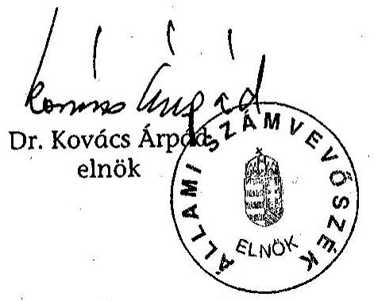
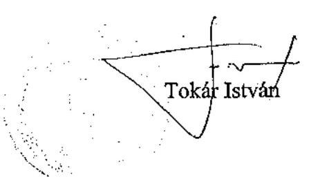

# JELENTÉS 

a Jász-Nagykun-Szolnok Megyei Önkormányzat gazdálkodásának átfogó ellenőrzéséről

---

3. Önkormányzati és Területi Ellenőrzési Igazgatóság
3.3 Átfogó Ellenőrzések FőcsoportIktatószám: V-1002-7/32/11/2003.Témaszám: 635
Vizsgálat-azonosító szám: V0102
Az ellenőrzést felügyelte:
Dr. Lóránt Zoltán
főigazgató
Az ellenőrzés végrehajtásáért felelős:
Dr. Sepsey Tamás
főigazgató-helyettes
Az ellenőrzést vezette:
Csecserits Imréné
főcsoportfőnök-helyettes
Az ellenőrzést végezték:
Dr. Csapó Anna.
tanácsadó
Papp Józsefszámvevő
A témához kapcsolódó - az elmúlt három évben készített -számvevőszéki jelentések:
címe ..... sorszáma
Jelentés az önkormányzati tulajdonban lévő kórházak pénzügyi ..... 0023
helyzetének, gazdálkodásának vizsgálatáról
Jelentés a megyei, fővárosi illetékhivatali tevékenység ..... 0243
ellenőrzéséről
Jelentés a helyi önkormányzatok tartós szociális ellátási ..... 0317
feladatainak ellenőrzéséről az idősek otthonainál
Jelentés a szakképzési struktúra szerepéről a munkaerőpiaci ..... 0321
igények kielégítésében

---

# TARTALOMJEGYZÉK 

BEVEZETÉS ..... 5
I. ÖSSZEGZŐ MEGÁLLAPÍTÁSOK, KÖVETKEZTETÉSEK, JAVASLATOK ..... 7
II. RÉSZLETES MEGÁLLAPÍTÁSOK ..... 16

1. A költségvetés tervezésének, végrehajtásának és a zárszámadás elkészítésének szabályszerűsége ..... 16
1.1. A költségvetés tervezésének, a költségvetési rendelet megalkotásának, elfogadásának szabályszerűsége ..... 16
1.2. A költségvetési előirányzatok módosításának szabályszerűsége ..... 19
1.3. A gazdálkodás szabályozottsága, szabályszerűsége ..... 20
1.4. A munkafolyamatba épített ellenőrzések szabályozottsága és gyakorlati múködése a pénzügyi, gazdálkodási és számviteli feladatellátás területén ..... 24
1.5. A bizonylati rend szabályszerűsége ..... 25
1.6. A vagyon nyilvántartásának és leltározásának szabályszerűsége ..... 26
1.7. A vagyongazdálkodással kapcsolatos feladat és döntési hatáskörök szabályozottsága, a vagyonváltozást előidéző intézkedések szabályszerűsége, célszerűsége ..... 28
1.8. Az Önkormányzat által céljelleggel - nem szociális ellátásként - juttatott támogatásokkal történő elszámoltatás szabályszerűsége ..... 31
1.9. A követelések, részesedések, értékpapírok év végi értékelésének szabályszerűsége ..... 34
1.10. A múködési és felhalmozási bevételek, kiadások alakulása ..... 35
1.11. A költségvetés egyensúlyának helyzete ..... 37
1.12. A közbeszerzési eljárások szabályszerűsége ..... 37
1.13. A zárszámadási kötelezettség teljesítésének szabályszerűsége ..... 41
2. Egyes kiemelt önkormányzati feladatok és a rendelkezésre álló források összhangja ..... 43
2.1. A feladatok meghatározása és szervezeti keretei ..... 43
2.2. Egyes naturális mutatókkal mérhető feladatok bevételei és kiadásai ..... 46
2.3. A jelentős ráfordítást igénylő önként vállalt feladatok ellátása ..... 47
3. A belső irányítási, ellenőrzési rendszer múködésének értékelése ..... 50
3.1. Az Önkormányzat informatikai rendszerének szabályozottsága, múködése ..... 50
3.2. A helyi ellenőrzési rendszer kialakítása, múködése ..... 51
3.3. A könyvvizsgálati kötelezettség teljesítése ..... 53
3.4. A korábbi számvevőszéki ellenőrzések javaslatainak hasznosulása ..... 54

---

# MELLÉKLETEK 

1. számú Az Önkormányzat gazdálkodását meghatározó adatok, mutatószámok (1 oldal)
2. számú Az önkormányzati vagyon nagyságának alakulása (1 oldal)
3. számú Az Önkormányzat 2002. évi bevételeinek és kiadásainak alakulása (1 oldal)
4. számú Egyes önkormányzati feladatok finanszírozása (1 oldal)
5. számú Tokár István úr, a Jász-Nagykun-Szolnok Megyei Közgyűlés elnökének észrevétele (1 oldal)

---

# RÖVIDÍTÉSEK JEGYZÉKE 

| Ötv. | A helyi önkormányzatokról szóló 1990. évi LXV. törvény |
| :--: | :--: |
| Áht. | Az államháztartásról szóló 1992. évi XXXVIII. törvény |
| Ámr. | Az államháztartás múködési rendjéről szóló 217/1998. (XII. 30.) Korm. rendelet |
| Kbt. | A közbeszerzésekről szóló 1995. évi XL. törvény |
| Számv. tv. | A számvitelről szóló 2000. évi C. törvény |
| Htv. | A helyi önkormányzatok és szerveik, a köztársasági megbízottak, valamint egyes centrális alárendeltségú szervek feladités hatásköreiről szóló 1991. évi XX. törvény |
| Vhr. | Az államháztartás szervezetei beszámolási és könyvvezetési kötelezettségének sajátosságairól szóló 249/2000. (XII. 24.) Korm. rendelet |
| Kjt. | A közalkalmazottak jogállásáról szóló 1992. évi XXXIII. törvény |
| szja | személyi jövedelemadó |
| áfa | általános forgalmi adó |
| ÁSZ | Állami Számvevőszék |
| OEP | Országos Egészségügyi Pénztár |
| Önkormányzat | Jász-Nagykun-Szolnok Megyei Önkormányzat |
| Közgyűlés | Jász-Nagykun-Szolnok Megyei Önkormányzat Közgyűlése |
| Önkormányzati hivatal | Jász-Nagykun-Szolnok Megyei Önkormányzati Hivatal |
| SzMSz | A Jász-Nagykun-Szolnok Megyei Közgyűlés 8/1995. (VII. 1.) számú rendelete a Jász-Nagykun-Szolnok Megyei Közgyűlés és szervei Szervezeti és Müködési Szabályzatáról |
| ügyrend | A Jász-Nagykun-Szolnok Megyei Önkormányzati Hivatal gazdasági szervezetének 869-2/2000. számú ügyrendje |
| vagyongazdálkodásról | A Jász-Nagykun-Szolnok Megyei Közgyűlés 15/1995. (XII. 30.) |
| szóló rendelet | számú rendelete a Jász-Nagykun-Szolnok Megyei Önkormányzat vagyonáról és a vagyongazdálkodás szabályairól |
| közbeszerzési rendelet | A Jász-Nagykun-Szolnok Megyei Közgyűlés 19/1999. (XI. 12.) számú rendelete a Jász-Nagykun-Szolnok Megyei Önkormányzat közbeszerzéseiről |
| ellenőrzési szabályzat | A Jász-Nagykun-Szolnok Megyei Közgyűlés 14/2000. (VI. 30.) számú rendelete a Jász-Nagykun-Szolnok Megyei Önkormányzat Ellenőrzési Szabályzatáról |
| a Közgyűlés elnöke és a főjegyző által kiadott 1013/2000. számú együttes rendelkezés | A Jász-Nagykun-Szolnok Megyei Közgyűlés elnöke és a főjegyző 1013/2000. (VII. 17.) számú együttes rendelkezése a kötelezettségvállalás és ellenjegyzés rendjéről |
| informatikai szabályzat | A Jász-Nagykun-Szolnok Megyei Önkormányzati Hivatal 1035-2/2003. számú Informatikai Szabályzata |
| Pénzügyi bizottság | A Jász-Nagykun-Szolnok Megyei Önkormányzat Közgyűlés Pénzügyi bizottsága |

---

| Illetékhivatal | A Jász-Nagykun-Szolnok Megyei Önkormányzati Hivatal szervezeti egységeként múködő Illetékhivatal |
| :--: | :--: |
| Kórház | Jász-Nagykun-Szolnok Megyei Hetényi Géza KórházRendelőintézet |

---

# Jelentés 

## a Jász-Nagykun-Szolnok Megyei Önkormányzat gazdálkodásának átfogó ellenőrzéséről

## BEVEZETÉS

Az Ötv. 92. § (1) bekezdése, valamint az Áht. 120/A. § (1) bekezdése alapján a Jász-Nagykun-Szolnok Megyei Önkormányzat gazdálkodását az Állami Számvevőszék Önkormányzati és Területi Ellenőrzési Igazgatósága a V-1002-7/2003. számú ellenőrzési program figyelembevételével vizsgálta.

## Az ellenőrzés célja annak értékelése volt, hogy:

- az önkormányzati gazdálkodás törvényességét, szabályszerűségét biztosított-ták-e a tervezés, a költségvetés végrehajtása és a zárszámadás során; a gazdálkodás szabályszerűségét biztosító kontrollok ${ }^{1}$ megfelelően segítették-e a végrehajtást;
- az Önkormányzat által ellátandó feladatok és az azokhoz rendelkezésre álló pénzforrások összhangja biztosított volt-e.

Az ellenőrzött időszak: a 2002. év, valamint a 2003. I. félév, az 1.7., 2.1 2.3. és 3.2 - 3.4. ellenőrzési programpontok esetében a 2000-2002. évek.

A 40 tagú Közgyűlés munkáját 10 állandó bizottság segíti. A 2002. évi önkormányzati választást követően változott az elnök és az alelnökök személye, jelenleg négy alelnök segíti az elnök munkáját.

A megyében 2003. január 1-jén 78 települési önkormányzat múködött és 423391 lakos élt. Az Önkormányzat 2003. évi költségvetésének főösszege 15,5 milliárd Ft, számviteli mérlegének főösszege 2002. év végén 18,1 milliárd Ft volt. Az Önkormányzat az Önkormányzati hivatalon kívül egy önállóan és 23 részben önállóan gazdálkodó költségvetési intézménnyel rendelkezett. Négy jogi személyiséggel rendelkező költségvetési szerv - társulásnak tagja. Az Önkormányzati hivatalban és intézményekben foglalkoztatottak száma - a 2003ra jóváhagyott költségvetés szerint - 3964 fő, ebből 109 fő a köztisztviselő. Az intézményhálózatban 5064 oktatottról és ellátottról gondoskodtak. Az Önkormányzat gazdálkodását meghatározó 2002. évi adatokat, mutatószámokat az 1. számú melléklet tartalmazza.

[^0]
[^0]:    ${ }^{1}$ A gazdálkodás szabályszerűségét biztosító kontroll alatt értjük a kiépített és működő belső irányítási és szabályozási rendszert, valamint a belső ellenőrzési funkciók ellátását.

---

Az önkormányzati - egészségügyi, szociális, oktatási, közművelődési, sport, valamint katasztrófa megelőzési és elhárítási - feladatellátást 11 közalapítvány segíti.

Az Önkormányzat 12 társulásnak tagja, amelyeknek tevékenységi köre: területfejlesztés és területrendezés, pénzügyi-gazdasági tanácsadás és ellenőrzés, idegenforgalmi feladatok, térségi együttmúködés, helyi önkormányzatok érdekérvényesítési, érdekképviseleti feladatainak segítése.

---

# I. ÖSSZEGZŐ MEGÁLLAPÍTÁSOK, KÖVETKEZTETÉSEK, JAVASLATOK 

Az önkormányzati gazdálkodás törvényességét, szabályszerűségét alapvetően biztosították a tervezés, a költségvetés végrehajtása és a zárszámadás során.

Az Önkormányzat a választási ciklusok időszakára rendelkezett a feladatokat hosszabb távon kijelölő gazdasági programnak megfelelő munkaprogrammal. A költségvetési koncepciók kialakításánál a központi forrásszabályozás Önkormányzatot érintő hatásait és a helyben képződő tárgyévi bevételeket és kötelezettségeket figyelembe vették. A költségvetési rendelettervezetek összeállítására a költségvetési koncepciókban meghatározottakat érvényesítették. A 2001-2002. évi költségvetési koncepciót az előírt határidő után, a 2003. évi költségvetési koncepciót és a költségvetési rendelettervezeteket határidőn belül benyújtották a Közgyűlésnek. Az Önkormányzat a költségvetését forráshiánnyal állapította meg, amelynek a finanszírozására folyószámla-hitelkeret igénybevételét tervezte a Közgyűlés. A költségvetési rendeletben nem állapították meg - az Áht. előírását megsértve - a címrendet, a szabad pénzeszközök betétként való elhelyezésével és visszavonásával kapcsolatos eljárás rendjét, továbbá azt az értékhatárt, amely felett a lemondásban megnevezett költségvetési szerv, mint használó csak a tulajdonosi jogok gyakorlójának jóváhagyása esetén fogadhatja el a vagyont. A Közgyűlés - az Áht-ban előírtak ellenére önkormányzati rendeletben nem határozta meg a költségvetés (és a zárszámadás) mellékleteként a Közgyűlés részére tájékoztatásul bemutatandó mérlegek, kimutatások tartalmi követelményeit. A költségvetési rendeletben meghatározták a költségvetés végrehajtásával kapcsolatos szabályokat.

A Közgyűlés a 2002. évi költségvetési rendeletében jóváhagyott előirányzatokat hat alkalommal módosította. A 2002. évi költségvetés előirányzatait december 31.-i hatállyal az előírásnak megfelelő időn belül módosította a Közgyűlés, a minisztériumoktól, elkülönített állami pénzalapoktól biztosított pótelőirányzatok és az Önkormányzati hivatal saját hatáskörében végrehajtott előirányzat-változtatások miatt. Az előirányzatok módosításáról nyilvántartást vezettek az Önkormányzati hivatalban. A kialakított előirányzat-nyilvántartás az Áht. előírását megsértve nem tartalmazza a kiadási előirányzatot terhelő kötelezettségvállalásokat és a bevételi előirányzatok teljesítését előrejelző - a teljesítés várható időpontja szerint rögzített - bevételi előírásokat. Az önkormányzati szintű módosított kiadási-bevételi előirányzatokat a teljesítési adatok nem haladták meg. Az önállóan gazdálkodó intézménynél és egy részben önállóan gazdálkodó intézménynél egyes kiemelt előirányzatokat túllépték. A túllépések okait nem vizsgálták, felelősségre vonás nem történt.

Az Önkormányzati hivatalnál a gazdálkodás szabályszerűség érdekében az irányítási és vezetési szintekhez kapcsolódó feladat-, jog- és hatáskörök kialakítása, az összeférhetetlenségi szabályok rögzítése és a hatáskörök átruházása a feladatmegosztásnak megfelelően megtörtént.

---

A 2003. évi jogszabályi változások következtében előírt SzMSz módosítást nem hajtották végre. Az SzMSz nem tartalmazta az Önkormányzati hivatalhoz rendelt részben önállóan gazdálkodó költségvetési szervek felsorolását, és e szerveknél, illetve saját szervezeti egységeinél a pénzügyi-gazdasági tevékenységet ellátó személyek feladat- és munkakörének meghatározását. Az SzMSz-ben nem szabályozták a feladatellátásnak a költségvetési szerv kiadásait, bevételeit befolyásoló, a gazdálkodás előirányzatok keretei közt tartását biztosító feltételés követelményrendszerét, folyamatát, kapcsolatrendszerét, továbbá a kötelezettségvállalások célszerűségét megalapozó eljárás és dokumentumai tartalmát. A pénzügyi-számviteli területen dolgozók munkaköri leírásai tartalmilag hiányosak voltak, a munkakörökhöz tartozó hatás- és felelősségi körök rögzítése nem történt meg. Az Önkormányzati hivatal gazdasági szervezetének ügyrendje megfelel a jogszabályban előírt követelményeknek. Az Önkormányzati hivatalban az 50000 Ft-ot el nem érő kifizetések esetén, az előzetes írásbeli kötelezettségvállalásokhoz nem kötött kötelezettségvállalások rendjét és nyilvántartási formáját az Ámr-ben foglaltakat megsértve szabályzatban nem rögzítették.

Kialakították a számviteli politikát, a kapcsolódó leltározási, értékelési, pénzkezelési, selejtezési szabályzatokat, valamint a számlarendet, amelyek folyamatosan aktualizálva és a helyi sajátosságoknak megfelelően kerültek kidolgozásra. A leltározási és leltárkészítési szabályzatban meghatározták a Vhr. előírása alapján, hogy a könyvviteli mérlegben kimutatott eszközöket és forrásokat minden évben leltározni kell, és a leltározás elvégzését kétévenkénti gyakorisággal helyettesítheti a részletező nyilvántartások alapján készített összesítő kimutatás. Nem gondoskodtak a Vhr-ben foglalt előírás ellenére a leltározás elvégzését igazoló, leltárt helyettesítő összesítő kimutatás tartalmának, formájának és kellékeinek meghatározásáról, valamint a felügyeleti szerv egyetértésének kikéréséről arra vonatkozóan, hogy a leltározás elvégzését igazoló leltárt helyettesítheti a részletező nyilvántartások alapján készített összesítő kimutatás.

A munkafolyamatba épített belső ellenőrzés szabályozási keretét és tartalmi követelményeit az ellenőrzési szabályzatban, valamint a gazdasági szervezet ügyrendjében és az operatív gazdálkodással és ellenőrzéssel összefüggő rendelkezésében határozták meg. Az operatív gazdálkodás során az ellenjegyzést, érvényesítést és teljesítések igazolását az arra jogosult személyek gyakorolták. A pénzügyi-számviteli területen a dolgozók számára az ellenőrzési feladatok részletes meghatározása (viszonyítási alapja, az eltérések dokumentálásának módja, a határidők, valamint az érintett dolgozóknál a pénzgazdálkodási jogkörök gyakorlásának feladatai) a munkaköri leírásokban nem történt meg. Az ellenőrzések tapasztalatairól feljegyzéseket készítettek és a felmerült hiányosságokat azonnali intézkedésekkel megszüntették. A munkafolyamatba épített ellenőrzés a munkaszervezés és a munkaterületeken dolgozók speciális szakosodása és nagy gyakorlati tapasztalata miatt jól múködött.

Az Önkormányzati hivatalban a számviteli bizonylati rend betartása mind a pénztári, mind a banki bizonylatok esetében biztosított volt. A gazdasági események számviteli bizonylatai megfeleltek az előírt alaki és tartalmi követelményeknek. A szigorú számadás alá vont nyomtatványokat meghatározták és azokat előírásszerűen kezelték. A gazdálkodási jogköröket a szabályozásnak

---

megfelelően gyakorolták. A bizonylati elv és fegyelem betartása megfelelt a Számv. tv-ben foglaltaknak.

A vagyon nyilvántartása a számviteli nyilvántartás valamint az ingatlanvagyon kataszter vezetésével biztosított. A Vhr-ben foglaltak ellenére a Közgyúlés egyetértése nélkül a leltározás elvégzését igazoló leltárt kétévente helyettesítették a részletező nyilvántartások alapján készített összesítő kimutatással. A többi eszköz és forrás tekintetében az év végi leltározást a jogszabályi előírásoknak megfelelően elvégezték. Az ingatlanvagyonról az ingatlanvagyon kataszteri nyilvántartás értékadatai a 2002. év végén megegyeztek a zárszámadási rendelettel egyidejűleg bemutatott vagyonkimutatásban és a számviteli nyilvántartásban szereplő ingatlan értékadatokkal.

Az Önkormányzat eszközeinek könyvviteli nyilvántartás szerinti értéke 2000ről 2002-re 113\%-kal növekedett. A növekedés mintegy négyötödét a korábban érték nélkül nyilvántartott ingatlanvagyon értékelése eredményezte. A Közgyúlés a vagyongazdálkodásról szóló rendeletben megállapította a vagyontárgyak forgalomképesség szerinti besorolásának megváltoztatási módját és az ehhez kapcsolódó döntési jogköröket. A Közgyúlés átruházott hatáskörben vagyongazdálkodási döntési jogot biztosított a Közgyúlés elnökének, a Gazdasági és költségvetési bizottságnak. A vagyonértékesítések és vásárlások a vagyongazdálkodásról szóló rendeletben foglalt előírásoknak megfeleltek, célszerűek voltak. A követelésről lemondás módját és eseteit a költségvetési rendeletben határozták meg. Az eredménytelen behajtási intézkedéseket követően elengedett követelések aránya az illetékhátralék és a lakásalapból adott kölcsön nélküli összes követeléshez viszonyítva a 2000. évben 0,2\%, a 2001. évben $8,5 \%$, a 2002. évben $2,4 \%$ volt.

A céljelleggel juttatott támogatásokkal kapcsolatosan az Önkormányzati hivatalban vezetett analitikus nyilvántartásokból nem állapítható meg a céljellegú támogatás tételszáma, a döntéshozó személye, a megállapodás megkötése, a támogatott elszámolási kötelezettsége és annak határideje, az Áht-ban előírtakat megsértve, a támogatott szervezetek számára a számadási kötelezettség előirása, a juttatott támogatás rendeltetésszerú felhasználásának és a számadásnak az ellenőrzése. Az Ötv. előírását és a Közgyúlés kizárólagos hatáskörét megsértve elnöki keretből adtak támogatást alapítvány részére, és az Áht. előírását megsértve számadási kötelezettséget nem írtak elő. A közalapítványok, az egyházak elszámoltak a részükre biztosított támogatással. A non-profit és egyéb szervezeteknek adott 8,2 millió Ft támogatásról a számadási kötelezettséget előírták és a szervezetek készítettek elszámolást a felhasználásról. A non-profit és egyéb szervezeteknek nyújtott 32,6 millió Ft támogatást, az egyesületeknek juttatott támogatás teljes összegét a számadási kötelezettség előírása nélkül átutalták. Az Önkormányzat az Áht-ban foglalt előírást megsértve nem ellenőrizte a céljelleggel juttatott támogatások rendeltetésszerú felhasználását.

A követelések, a részesedések év végi értékelését, az értékvesztés elszámolását és visszaírását a számviteli politikában szabályozták. A 2002. év végén a Számv. tv. előírását megsértve nem vizsgálták a részesedéseknél az értékvesztés elszámolásának szükségességét, ehhez adatokat nem kértek.

---

Az egy éven túli, de fizetési meghagyás benyújtása miatt nem tartós minősítésű követelésnél értékvesztést indokoltan nem számoltak el.

Az Önkormányzat által ellátott feladatok és az azokhoz rendelkezésre álló pénzforrások összhangja a költségvetési év egészét tekintve biztosított volt, a tervezett hiány ellenére folyószámla - hitelt nem kellett igénybe venni. A múködési bevételek az évközbeni többletbevételek eredményeként fedezték a múködési kiadásokat, a felhalmozási bevételeket a felhalmozási kiadások meghaladták, amelyhez a múködési bevételből átcsoportosítottak. A költségvetés kiadásainak $85,8 \%$-át múködtetésre fordították. A költségvetés jóváhagyott előirányzatainak felhasználására likviditási tervet készítettek, az Ámr. előírása ellenére elmaradt ennek szükség szerinti aktualizálása. Az Önkormányzati hivatal belső szervezeti egységei olyan nyilvántartást vezetnek a kötelezettségvállalásokhoz kapcsolódóan, amelyből megállapítható az évenkénti kötelezettségvállalás összege.

Az Önkormányzat közbeszerzési rendeletben szabályozta a közbeszerzési eljárás rendjét, a kiírásával és elbírálásával kapcsolatos tevékenységre és az abban eljáró személyekre, feladat- és hatáskörökre vonatkozóan. Az Önkormányzati hivatalnál és intézményeinél az áruk, szolgáltatások közbeszerzési értékhatárát egyedi beszerzésenként értelmezték, közbeszerzési eljárást nem folytattak. A Kbt. előírását megsértve, több áruféleség (élelmezési kiadások, gépkocsi beszerzés) becsült értékét nem számították egybe. A vizsgált építési beruházások közbeszerzési kategóriába besorolása, a közbeszerzési eljárás lefolytatása a Kbt. előírásainak megfelelő volt.

A Közgyűlés az Önkormányzat 2002. évi költségvetése teljesítésének kiadási főösszegét 14023,7 millió Ft-ban, bevételi főösszegét 14888,7 millió Ft-ban állapította meg. Az Önkormányzat zárszámadási rendelete a költségvetéssel összehasonlítható módon készült. A PHARE támogatásból megvalósuló projekt bevételeinek és kiadásainak módosított előirányzatát, teljesítését, valamint a többéves kihatással járó feladatok előirányzatának teljesítését éves bontásban az Ámr-ben foglalt előírás ellenére nem tartalmazta. A zárszámadáshoz csatolták az Áht-ban előírt önkormányzati összevont mérleget, vagyonkimutatást, azonban az Áht-ban foglalt kötelezettség ellenére a többéves kihatással járó döntések számszerűsítése évenkénti bontásban, valamint összesítve, szöveges indoklással történő bemutatása elmaradt. Az Önkormányzatnál az intézményi beszámolókat felülvizsgálták. A pénzmaradványt költségvetési szervenként a jogszabályi előírásnak megfelelően állapították meg. Az egyszerűsített tartalmú költségvetési beszámolót elkészítették, és azt a könyvvizsgáló hitelesítette.

Az Önkormányzat kötelező feladatai ellátásáról - amelyeket keret jelleggel az SzMSz-ben határozott meg - saját intézményhálózat múködtetésével, közalapítványok, közhasznú társaság valamint vállalkozási szerződés útján gondoskodott. A feladatellátás struktúrájának kialakítását, fejlesztésének irányait a jogszabályok rendelkezései alapján az ellátási igényekre figyelemmel különféle koncepciók elkészítésével segítették. A stratégiai fejlesztési célok és a feladatstruktúrát érintő döntések megalapozását a számvitelből nyerhető adatok rendszeres áttekintésével, elemzésével végezték. A feladatok ellátását tizenegy közalapítvány segítette. Az Önkormányzatnak a

---

2000. évben tizenegy, a 2001. évtől nyolc gazdasági társaságban volt 50\% alatti részesedése, valamint a 2000. évben kettő, a 2001. évtől egy közhasznú társaságban rendelkezett 24\%-os tulajdoni részaránnyal. Az Önkormányzat élt a különféle társulásokban rejlő lehetőségekkel.

Az Önkormányzat a 2000. évben két részben önállóan gazdálkodó középfokú oktatási intézménye, valamint a 2001. évben három részben önállóan gazdálkodó (művelődési, oktatási, továbbképzési és sport feladatokat ellátó) intézménye integrációját hajtotta végre.

Az Önkormányzat a naturális mutatókkal mérhető kettő szakfeladata kiadásainak finanszírozásában az állami hozzájárulás volt a meghatározó. A középiskolai oktatásban tanulók és a bentlakásos szociális intézményben ellátottak száma folyamatosan növekedett. A Közgyűlés a középiskolai oktatás fajlagos kiadásainak csökkentése érdekében a 2000. évben kettő középfokú oktatási intézmény összevonásáról döntött. A naturális mutatókkal mérhető feladatok összes múködési kiadása növekedett a közalkalmazotti bérek emelkedése, a működés minimum feltételeinek biztosítása és az elkészült beruházások többletkiadása következtében.

Az Önkormányzat a kötelező és az önként vállalt feladatait az SzMSz-ben keret jelleggel határozta meg, de az éves költségvetési és zárszámadási rendeletben a feladatokat megbontották. Az önként vállalt feladatokra teljesített éves összes (nettó) költségvetési kiadások aránya nem érte el az egy százalékot, azok nem veszélyeztették az Önkormányzat kötelező feladatainak ellátását.

A Közgyűlés folyamatosan biztosított saját forrásokat a pályázati lehetőségek kihasználása érdekében. Az államháztartáson belülről, pályázatokból származó bevételei a 2000-2002. években 57,5\%-kal nőttek.

A Közgyűlés 2000-2004. évre szóló fogyatékosügyi integrációs, valamint felmérésre alapozva középtávú akadálymentesítési programot fogadott el 2000. évben. Megállapította, hogy az akadálymentesség törvényi határidőre való biztosításához nem rendelkeznek a megvalósításhoz szükséges 490,2 millió Ft-ra becsült forrással, ezért a megvalósításra az Önkormányzat mindenkori pénzügyi és nyertes pályázati lehetőségeinek a figyelembevételével kerülhet sor. A 2000-2003. I. félév közötti időszakban intézményrekonstrukciók és felújítások keretében 136,3 millió Ft-ot fordítottak akadálymentesítésre. Az akadálymentesség megteremtéséhez szükséges forrásigény és az erre a célra fordított kiadások 2005. január 1-jei törvényi határidőhöz mért időarányos összhangja nem állt fenn.

Az Önkormányzati hivatal középtávon meghatározta az informatikai fejlesztés főbb feladatait. Az adatbiztonság, technikai védelem, hálózatvédelem, hozzáférési jogosultság, az Internet igénybevétele, valamint a vírusvédelem szabályait informatikai szabályzatban rögzítették. Az informatikai rendszer folyamatát és használatát bemutató üzemeltetési leírást elkészítették, azonban a váratlan események esetére katasztrófa elhárítási terv nem készült. A pénzügyiszámviteli dolgozók munkaköri leírásaiban az informatikai eszközök használatát és az azzal összefüggő felelősséget nem rögzítették.

---

A Közgyűlés ellenőrzési szabályzatban határozta meg költségvetési szervei felügyeleti és belső ellenőrzésének céljait, tervezésük menetét, a végrehajtás formáját, tartalmát, ciklusait, valamint az ellenőrzések nyilvántartását. A felügyeleti jellegű ellenőrzési rendszert a részben önállóan gazdálkodó költségvetési szervekre is kiterjesztve alkalmazták, és a pénzügyi-gazdasági területen a Pénzügyi iroda állományába tartozó ellenőrökkel végeztették. A Közgyűlés által jóváhagyott éves ellenőrzési tervek alapján a négyévenkénti felügyeleti jellegű átfogó-, téma-, cél- és utóellenőrzéseket az ellenőrzési szabályzatban előírtaknak megfelelően végrehajtották. Az ellenőrzési szabályzatban foglaltakat megsértve az intézményeknél kétévente előírt költségvetési ellenőrzéseket nem tervezték, és nem hajtották végre.

Az Önkormányzati hivatal belső ellenőrzését a Pénzügyi iroda állományába tartozó osztott munkakörű belső ellenőrrel végeztették, a függetlenített belső ellenőrzési szervezetet az Áht-ban előírtakat megsértve nem alakították ki. A belső ellenőr munkájához ellenőrzési programok ( $96 \%$-ban), valamint megbízólevelek nem készültek, és a jelentések ( $58 \%$-ban) az ellenőrzött szervezeti egység vezetőjének a jelentésben foglaltak megismerésére vonatkozó nyilatkozatát az ellenőrzési szabályzatban előírtak ellenére nem tartalmazták. Az éves belső ellenőrzési munkaterveket a főjegyző hagyta jóvá, amelyre az ellenőrzési szabályzat alapján a Közgyűlésnek volt hatásköre. Az elvégzett belső ellenőri vizsgálatok szakmai színvonala megfelelő volt, az Önkormányzati hivatal gazdálkodását, pénzügyi-számviteli rendjét érintő lényeges feladatellátások (szabályozások, leltározások, beruházások, cél- és címzett támogatások, valamint egyéb külső támogatások) ellenőrzését az éves ellenőrzési tervek nem tartalmazták.

A Közgyűlés évente áttekintette az általa alapított költségvetési szervek felügyeleti ellenőrzésének tapasztalatait, és az erről szóló beszámolókat elfogadta. A végrehajtott belső ellenőrzésekről nem készültek beszámolók, így azok tapasztalatainak közgyűlési értékelése nem történt meg.

Az Önkormányzat eleget tett könyvvizsgáló alkalmazási kötelezettségének. Az egyszerűsített könyvelési beszámolóit a könyvvizsgáló hitelesítő záradékkal látta el.

Az ÁSZ ellenőrzéséről készült jelentéseket a Közgyűlés elé terjesztették, a jelentésekben megfogalmazott javaslatok alapján intézkedtek a hiányosságok megszüntetésére és a célszerű feladatellátás megvalósítására. Az ÁSZ által az elmúlt három évben tett javaslatok, ajánlások hasznosítása a megtett intézkedések alapján $80 \%$-ban megtörtént, $20 \%$-ban megkezdődött.

---

A helyszíni ellenőrzés megállapításai mellett a gazdálkodás szabályszerűségének és a munka színvonalának javítása érdekében javasoljuk:

# a Közgyűlés elnökének 

## a törvényes állapot helyreállítása és a jogszabályi előírások betartása érdekében:

1. kezdeményezze, hogy a Közgyűlés határozza meg a költségvetési gazdálkodás jogszabályszerű helyi kereteinek kialakítása céljából:
a) az Áht. 67. §-ában előírtak alapján a címrendet;
b) az Áht. 8/A. § (3) bekezdés c) pontja alapján a szabad pénzeszközök betétként való elhelyezésével és visszavonásával kapcsolatos eljárás rendjét;
c) az Áht. 109. §-a alapján azt az értékhatárt, amely felett a lemondásban megnevezett költségvetési szerv, mint használó, csak a tulajdonosi jogok gyakorlójának jóváhagyása esetén fogadhatja el a vagyont;
d) az Áht. 118. §-a alapján rendeletben az Áht. 116. § 6., 8., 9. pontja szerinti mérlegek, kimutatások tartalmát;
e) az Ámr. 10. § (4) bekezdés h) pontjának, valamint (5) bekezdésének 2003. január 1-jétől hatályos változásai alapján az SzMSz módosítását, annak érdekében, hogy az tartalmazza az Önkormányzati hivatalhoz rendelt részben önállóan gazdálkodó költségvetési szervek felsorolását és e szerveknél, illetve saját szervezeti egységeinél a pénzügyi-gazdasági tevékenységet ellátó személyek feladat- és munkakörének meghatározását, valamint rögzítse a feladatellátásnak az Önkormányzati hivatal kiadásait, bevételeit befolyásoló, a gazdálkodás előirányzatok keretei között tartását biztosító feltétel- és követelményrendszerének, folyamatának, kapcsolatrendszerének, továbbá a kötelezettségvállalások célszerűségét megalapozó eljárásnak és dokumentumai tartalmának szabályozását;
2. írjon elő számadási kötelezettséget az Áht. 13/A. § (2) bekezdése alapján a céljelleggel - nem szociális ellátásként - juttatott összegek rendeltetésszerű felhasználásáról, valamint gondoskodjon a rendeltetésszerű felhasználás és a számadás ellenőrzéséről;
3. biztosítsa, hogy az Ötv. 10. § (1) bekezdés d) pontjában előírtaknak megfelelően a Közgyűlés döntsön az alapítványok, közalapítványok támogatásáról;
4. gondoskodjon a Kbt. 5. § (1), (2) bekezdésének előírása alapján az árubeszerzések, szolgáltatások becsült értékének egybeszámításáról, valamint ennek megfelelően a közbeszerzési eljárások lefolytatásáról;
5. kezdeményezze, hogy az Önkormányzati hivatal éves belső ellenőrzési munkatervét a Közgyűlés határozza meg, valamint értékelje a belső ellenőrzési tapasztalatokat az ellenőrzési szabályzatban foglaltak alapján;

---

# a munka színvonalának javítása érdekében: 

6. kezdeményezze a számvevőszéki ellenőrzés tapasztalatainak közgyűlési megtárgyalását, a feltárt hiányosságok megszüntetésére készíttessen intézkedési tervet;
7. kezdeményezze, hogy a Közgyűlés az Önkormányzat által ellátandó feladatokat kötelező és önként vállalt feladatok szerinti bontásban a sajátosságainak megfelelő részletességgel határozza meg az SzMSz-ében;
8. vegye figyelembe a középületek akadálymentesítésének tervezése és annak végrehajtása során a fogyatékos személyek jogairól és esélyegyenlőségük biztosításáról szóló 1998. évi XXVI. törvény 29. § (6) bekezdésében foglalt határidőt;

## a föjegyzönek

## a törvényes állapot helyreállítása és a jogszabályi előirások betartása érdekében:

1. biztosítsa az Áht. 12/A. § (1) bekezdésében és az Áht. 93. § (1) bekezdésében foglalt előírás betartása céljából a jóváhagyott előirányzaton belüli gazdálkodást, előirányzat túllépés esetén kezdeményezze a személyes felelősség megállapítását;
2. alakítsa ki az Áht. 103. § (2) bekezdésében foglaltak alapján a költségvetési előirányzatok olyan nyilvántartását, ami tartalmazza a kiadási előirányzatokat terhelő kötelezettségvállalásokat és a bevételi előirányzatok teljesítését előrejelző - a teljesülés várható időpontja szerint rögzített - bevételi előírásokat;
3. szabályozza az Ámr. 134. § (4) bekezdésében előírtak alapján az 50000 Ft-ot el nem érő kifizetések esetén az előzetes írásbeli kötelezettségvállaláshoz nem kötött kötelezettségvállalások rendjét és nyilvántartási formáját;
4. tegyen eleget az Áht. 13/A. § (2) bekezdésében foglalt ellenőrzési kötelezettségnek, a céljelleggel - nem szociális ellátásként - juttatott összegekkel kapcsolatosan ellenőrizze a számadást és a rendeltetésszerű felhasználást;
5. gondoskodjon az Önkormányzati hivatal számviteli politikája alapján és a Számv. tv. 54. § (1)-(3) bekezdése előírásainak megfelelően, a gazdasági társaságban lévő tulajdoni részesedést jelentő befektetéseknél az év végi értékelés elvégzéséről;
6. gondoskodjon az Ámr. 139. §-a alapján az önkormányzat pénzállományának alakulásáról készített likviditási terv év közbeni, szükség szerinti aktualizálásáról;
7. mutassa be az Ámr. 29. § (1) bekezdés g) pontjában előírtaknak megfelelően a zárszámadásról szóló rendeletben a többéves kihatással járó feladatok előirányzatát és teljesítését;
8. mutassa be az Ámr. 29. § (1) bekezdés k) pontjában előírtaknak megfelelően a zárszámadásról szóló rendeletben a PHARE támogatással megvalósuló projekt bevételeinek, kiadásainak módosított előirányzatát és teljesítését;

---

9. gondoskodjon arról, hogy az Áht. 116. § 9. pontja szerinti többéves kihatással járó döntések számszerűsítése évenkénti bontásban, valamint összesítve, szöveges indokolással együtt bemutatásra kerüljön a zárszámadáskor;
10. gondoskodjon arról, hogy az ellenőrzési szabályzatban meghatározottak alapján az Önkormányzati hivatal belső ellenőre vizsgálataihoz minden esetben rendelkezzen megbízólevéllel és ellenőrzési programmal, valamint intézkedjen, hogy a belső ellenőrzési jelentések tartalmazzák az ellenőrzött szerv vezetőjének a jelentésben foglaltak megismerésére vonatkozó nyilatkozatát;
11. gondoskodjon az ellenőrzési szabályzatban kétévente előírt költségvetési felügyeleti ellenőrzések éves munkatervi tervezéséről és végrehajtásáról;
12. készítse elő az éves belső ellenőrzési munkatervet közgyűlési jóváhagyásra az ellenőrzési szabályzatban foglaltak alapján;
13. gondoskodjon az Áht. 120/A. § (2) bekezdés b) pontja és a 121/A. § (3) bekezdése alapján függetlenített belső ellenőrzési szervezet útján az Önkormányzati hivatal belső pénzügyi ellenőrzésről;
14. kezdeményezze a Htv. 138. § (1) bekezdés g) pontja alapján, hogy a Közgyűlés időszakonként áttekintse és értékelje az Önkormányzati hivatal belső ellenőrzési tapasztalatait;

# a munka színvonalának javítása érdekében: 

15. gondoskodjon a pénzügyi-számviteli területen dolgozók tartalmilag hiányos munkaköri leírásainak kiegészítéséről, ezen belül a munkakörökhöz tartozó hatás- és felelősségi körök, a munkafolyamatba épített ellenőrzési, valamint az informatikai rendszerrel ellátandó feladatok részletezéséről;
16. intézkedjen annak érdekében, hogy a céljelleggel juttatott támogatások analitikus nyilvántartásából a számadási kötelezettség előírása, a kötelezettség határideje, a számadás határidőn belüli teljesítése, a juttatott támogatás rendeltetésszerű felhasználásának és a számadásnak az ellenőrzése megállapítható legyen;
17. gondoskodjon az Önkormányzati hivatal informatikai rendszerével történő biztonságos munkavégzés érdekében, váratlan események esetére a katasztrófa elhárítási terv elkészítéséről.

---

# II. RÉSZLETES MEGÁLLAPÍTÁSOK 

## 1. A KÖLTSÉGVEtÉS TERVEZÉSÉNEK, VÉGREHAJTÁsÁNAK ÉS A ZÁRSZÁMADÁS ELKÉSZÍTÉSÉNEK SZABÁLYSZERŰSÉGE

### 1.1. A költségvetés tervezésének, a költségvetési rendelet megalkotásának, elfogadásának szabályszerúsége

A Közgyűlés az 1999-2002. évekre vonatkozó célkitűzéseit a 61/1999. (VI. 25.) számú határozatával jóváhagyott munkaprogramban határozta meg, amely megfelel az Ötv. 91. § (1) bekezdésében előírt gazdasági programnak. A munkaprogram tartalmazta a térségi és gazdaságfejlesztési célkitűzéseket, a humán közszolgáltatás ellátásával kapcsolatos teendőket, illetve a költségvetés összeállításánál figyelembe veendő alapelveket. A Közgyűlés megtárgyalta és 72/2002. (IX. 27.) számú határozatával jóváhagyta a tájékoztatást a munkaprogramban foglaltak végrehajtásáról, az intézmények működtetéséről, a vagyon hasznosításáról, a humán közszolgáltatás ellátásáról, az éves költségvetések teljesítéséről.

A Közgyűlés a 2003-2006. évekre vonatkozó gazdasági programnak megfelelő munkaprogramját a 25/2003. (IV. 17.) számú határozatával fogadta el. Célul tűzték ki a befektetési és vállalkozási szándék élénkítését, a munkanélküliség csökkentését, a térségi együttműködésnek a megújítását az európai uniós előcsatlakozási alapok felhasználása érdekében, a közlekedés fejlesztés területén az úthálózat bővítését, karbantartását. A humán közszolgáltatási (közoktatási, közművelődési, közgyűjteményi, egészségügyi és sport, gyermek és ifjúságvédelmi, szociális) intézmények rekonstrukciójának folytatását címzett támogatás segítségével tervezték. Az éves költségvetésekkel kapcsolatosan célként határozták meg a pénzügyi egyensúly megteremtését és az intézmények működőképességének biztosítását.

A 2001-2002. évi és a 2003. évi költségvetési koncepciót a Közgyűlés bizottságai a tárgyévet megelőző év november hónapjában megtárgyalták. Ez alapján a Közgyűlés elnöke a 2001-2002. évi költségvetési koncepciót az Áht. 70. §-ában előírt ${ }^{2}$ határidő után 2000. december 4-én, illetve a 2003. évi költségvetési koncepciót határidőben 2002. december 2-án nyújtotta be a Közgyűlésnek.

A 2001-2002. évi és a 2003. évi költségvetési koncepció előterjesztése tartalmazta a bizottságok véleményét és mellékelték a Pénzügyi bizottság írásos véleményét, valamint a könyvvizsgáló jelentését.

[^0]
[^0]:    ${ }^{2}$ Az Áht. 70. §-a szerint a költségvetési koncepciót november 30-ig, a közgyűlés tagjai általános választásának évében december 15 -ig kell benyújtani a megyei közgyűlésnek.

---

Az Önkormányzat 2001-2002. évi költségvetési koncepcióját a Közgyűlés a 112/2000. (XII. 15.) számú határozatával, a 2003. évi költségvetési koncepcióját a 111/2002. (XII. 13.) számú határozatával elfogadta. A költségvetési koncepció részletesen bemutatta a központi forrásszabályozás főbb jellemzőit. Ez alapján tartalmazta:

- az Önkormányzat bevételeit, a normatív állami támogatásokat és az átengedett szja-t, a saját bevételeket és az átvett pénzeszközöket;
- a kiadásokat meghatározó személyi juttatásokkal kapcsolatos különböző időpontokban hatályba lépett jogszabályok miatti szintrehozást, címzett támogatással megvalósuló beruházásokhoz és az intézményekben a múködéshez szükséges minimumfeltételek megteremtéséhez a saját forrás keretszámait.

A Közgyűlés meghatározta a költségvetési koncepció számszerú adataiból kiindulva a költségvetés elkészítése során elvégzendő további feladatokat. A likviditási helyzet javítása érdekében a Közgyűlés elrendelte a számított bevételek és kiadások felülvizsgálatát, további bevételi források feltárását, a beruházási és felújítási igények lehetőségekhez igazított rangsorolását, az intézményeket érintően a múködési kiadások csökkentési lehetőségeinek feltárását.

A költségvetési rendelettervezetet a Közgyűlés elé terjesztés előtt az intézményvezetőkkel megvitatták, az egyeztetés eredményét intézményenként emlékeztetőben rögzítették. A Közgyűlés elnöke a bizottságok által megtárgyalt, a Pénzügyi bizottság írásos véleményét és a könyvvizsgáló írásos jelentését is tartalmazó költségvetési javaslatot terjesztett a Közgyűlés elé.

A költségvetési rendelettervezetekben érvényesítették a koncepciókban meghatározott elveket, és a rendelkezésre álló források elosztásánál a múködés elsődlegességét biztosították. A költségvetési rendelettervezeteket a Közgyűlés elnöke az Áht. 71. § (1) bekezdésében előírt február 15-ig nyújtotta be a Közgyűlésnek. Az Önkormányzat a 2001-2002. évi és 2003. évi költségvetésének elfogadásáról a 2/2001. (II. 26.) számú, illetve a 2/2003. (II. 24.) számú rendeletével döntött.

A 2001-2002. évi és a 2003. évi költségvetés az intézmények múködtetésére, a közalkalmazotti és köztisztviselői bérfejlesztésre, a beruházásokra, pályázatokhoz saját forrásra tervezett kiadások, valamint a bevételek egybevetése alapján készült. Az Önkormányzat költségvetését a 2001. évben ${ }^{3} 134,9$ millió Ft, a 2002. évben ${ }^{4} 199,5$ millió Ft, a 2003. évben ${ }^{5} 159,6$ millió Ft múködési forráshiánnyal állapította meg a Közgyűlés. A költségvetésben a működési forráshiány

[^0]
[^0]:    ${ }^{3}$ A 2001. évi költségvetés kiadási főösszege 10201,2 millió Ft és a bevételi főösszege 10066,3 millió Ft, tervezett hiány 134,9 millió Ft.
    ${ }^{4}$ A 2002. évi költségvetés kiadási főösszege 11379,2 millió Ft és a bevételi főösszege 11179,7 millió Ft, a tervezett hiány 199,5 millió Ft.
    ${ }^{5}$ A 2003. évi költségvetés kiadási főösszege 15 546,9 millió Ft és a bevételi főösszege 15387,3 millió Ft, a tervezett hiány 159,6 millió Ft.

---

finanszírozására a 2001. évben 100 millió Ft, a 2002. évben 150 millió Ft, a 2003. évben 150 millió Ft folyószámla-hitelkeret igénybevételét tervezte a Közgyűlés. A működési forráshiány csökkentésére, a hitelből finanszírozás mérséklésére az évközben képződő működési többletbevételeket és a szabad pénzmaradványt tervezték fordítani.

A javasolt 2001-2002. évi és 2003. évi költségvetési előirányzatok megalapozása céljából:

- az Áht. 71. § (2) bekezdésében foglaltaknak megfelelően a Közgyűlés a tárgyévet megelőző év december hónapban megállapította az intézményekben fizetendő térítési díjakat, a Közgyűlés elnöke a költségvetési rendelettel egyidejűleg előterjesztette a rendelettervezetet az alkalmazható nyersanyagnormákról, valamint bemutatta a többéves elkötelezettséggel járó kiadási tételek következő évekre vonatkozó kihatásait;
- az Áht. 71. § (3) bekezdésében előírtaknak megfelelően mutatták be a költségvetési évet követő két év várható előirányzatait, amelyet a költségvetési év folyamatai és áthúzódó hatásai, valamint a gazdasági előrejelzések alapján állapítottak meg.
- A költségvetés tartalmazta a bevételeket forrásonként, a működési előirányzatokat kiemelt előirányzatonként, a létszámkeretet önkormányzatra összesen és költségvetési szervenként, a felújítási előirányzatokat célonként, a felhalmozási kiadásokat feladatonként, az Önkormányzati hivatal költségvetését feladatonként, az általános és céltartalékot, az előirányzat felhasználási ütemtervet, az Ámr. 29. § (1) bekezdés a)-h), j) pontjában rögzített előírásoknak megfelelően.

# A költségvetési rendelettervezetben: 

- az Áht. 67. §-ában foglaltakat megsértve az előírt címrendet, a címeket alkotó költségvetési szerveket nem határozták meg;
- az Áht. 8/A. § (3) bekezdés c) pontjában előírtak ellenére nem határozták meg a szabad pénzeszközök betétként való elhelyezésével és visszavonásával kapcsolatos eljárás rendjét;
- az Áht. 109. §-ában foglaltakat megsértve nem állapították meg azt az értékhatárt, amely felett a lemondásban megnevezett költségvetési szerv, mint használó a tulajdonosi jogok gyakorlójának jóváhagyása esetén fogadhatja el a vagyont.

A Közgyűlés önkormányzati rendeletben nem határozta meg a Közgyűlés részére a költségvetés (és a zárszámadás) mellékleteként tájékoztatásul bemutatandó mérlegek, kimutatások tartalmi követelményeit. A tartalmi követelmények meghatározásának elmulasztása ellenére a költségvetési rendelettervezet tartalmazta - tájékoztatási céllal - az Áht. 118. §-ában előírt önkormányzati összevont mérleget, a többéves kihatással járó döntések számszerűsítését évenkénti bontásban és összesítve.

A költségvetési rendeletben meghatározták a költségvetés végrehajtásával kapcsolatos szabályokat, rendelkeztek a bevételi többlet felhasználásáról, a hiány

---

finanszírozásának módjáról és a hitelmúveletekkel kapcsolatos hatáskörökről, a tartalékkal való rendelkezés jogosultságáról. Az Ámr. 53. § (4) bekezdésének előírása alapján meghatározták, hogy a költségvetési szervek a Közgyűlés jóváhagyásával módosíthatják kiemelt, ezen belül részelőirányzataikat.

Az önkormányzati biztos kirendelésének feltételeit az Önkormányzat 3/1997. (II. 28.) számú rendelete tartalmazta.

# 1.2. A költségvetési előirányzatok módosításának szabályszerűsége 

A 2002. évi eredeti költségvetési előirányzathoz képest a módosított előirányzat 26\%-kal, 1961,7 millió Ft-tal emelkedett.

Az előirányzatok évközi módosítását főként a címzett támogatások, a közalkalmazotti és köztisztviselői illetményekre biztosított költségvetési támogatások, a területfejlesztési alapból származó támogatások, az OEP-től átvett pénzeszközök, az illetékbevételi többletek, a saját bevételi többletek, valamint az előző évi pénzmaradvány igénybevétele tette szükségessé.

A 2002. évi és a 2003. évi költségvetési rendelet előirányzatmódosításait ${ }^{6}$ a Közgyűlés elé terjesztették. A 2002. évi és a 2003. évi költségvetési rendeletek eredeti előirányzatát évközben módosító - a 2002. évben hat, a 2003. évben kettő - rendelet a költségvetés szerkezetével azonos részletezettséggel tartalmazta a módosítási javaslatot. A 2002. évi költségvetés előirányzatait a Közgyűlés utolsó alkalommal az 1/2003. (II. 24.) ${ }^{7}$ számú rendeletével módosította.

A Közgyűlés december 31-ei hatállyal módosította 2002. évi költségvetési rendeletét:

- az Ámr. 53. § (2) bekezdésében előírtak alapján az Önkormányzat részére biztosított pótelőirányzatok miatt, összesen 70,6 millió Ft-tal, ebből 47,8 millió Ft a minisztériumoktól, a Munkaerőpiaci Alaptól átvett pénzösszeg, 12,8 millió Ft a köztisztviselők bérfejlesztésére biztosított támogatás, 10 millió Ft a területi kiegyenlítést szolgáló fejlesztési célú támogatás;
- az Ámr. 53. § (6) bekezdésében foglaltak alapján az Önkormányzati hivatal saját hatáskörében végrehajtott előirányzat-változtatás miatt összesen 125,6 millió Ft-tal, ebből 39,8 millió Ft az Önkormányzati hivatal saját többlet bevétele (illetékbevétel, kamatbevétel, bérleti dí), 85,8 millió Ft az Önkor-

[^0]
[^0]:    ${ }^{6}$ Az Önkormányzat 2/2002. (II. 18.), 6/2002. (V. 10.), 7/2002. (VI. 28.), 9/2002. (IX. 30.), 11/2002. (XII. 16), 1/2003. (II. 24.) számú rendelete, valamint a 2003. évre vonatkozóan az Önkormányzat 5/2003. (IV. 17.), 8/2003. (VI. 30.) számú rendelete.
    ${ }^{7}$ A Vhr. 10. § (1) bekezdése szerint az éves költségvetési beszámolót legkésőbb a következő költségvetési év február 28-ig kell a felügyeleti szervnek megküldeni. E határidőig dönt a közgyűlés az Ámr. 53. § (2) és (6) bekezdésében előírtak alapján, december 31-i hatállyal költségvetési rendeletének módosításáról.

---

mányzati hivatalhoz rendelt részben önállóan gazdálkodó intézmények működési többlet bevétele.

A költségvetési beszámoló, illetve zárszámadási rendelet szerint a költségvetés módosított kiadási-bevételi előirányzatait, ezen belül a kiemelt előirányzatokat a teljesítési adatok - önkormányzati szinten - nem haladták meg. Az önállóan gazdálkodó intézménynél és egy részben önállóan gazdálkodó intézménynél a módosított előirányzatokat az Áht. 12/A. § (1) bekezdésében, valamint az Áht. 93. § (1) bekezdésében foglaltakat megsértve túllépték.

A 2002. évi zárszámadási rendelet szerint az önállóan gazdálkodó költségvetési intézménynél (Kórháznál) a pénzeszközátadás előirányzatát 1,2 millió Ft-tal, egy részben önállóan gazdálkodó költségvetési intézménynél a személyi juttatások és a munkaadókat terhelő járulékok előirányzatát 0,9 millió Ft-tal, illetve a dologi kiadások előirányzatát 0,5 millió Ft-tal túllépték.

A túllépések okait nem vizsgálták, felelősségre vonást nem kezdeményeztek.
Az Önkormányzat 2002. évi zárszámadási rendeletében szereplő és a módosított előirányzatok fő- és részösszegei megegyeztek a költségvetési rendelet módosításainak vonatkozó adataival.

A bevételi előirányzat változással azonos összegű kiadási előirányzat változásról az Önkormányzati hivatalban közgyűlési rendelet-számonként, költségvetési szervenként, ezen belül bevételi-kiadási jogcímenként nyilvántartást vezettek. Az Áht. 103. § (2) bekezdésében foglaltakat megsértve ez a nyilvántartás nem tartalmazza a kiadási előirányzatokat terhelő kötelezettségvállalásokat és a bevételi előirányzatok teljesítését előrejelző - a teljesülés várható időpontja szerint rögzített - bevételi előírásokat.

# 1.3. A gazdálkodás szabályozottsága, szabályszerúsége 

Az Önkormányzati hivatal - mint önálló gazdálkodási jogkörrel rendelkező költségvetési szerv - önálló szervezeti és múködési szabályzattal nem rendelkezett, azt az SzMSz tartalmazta. Az SzMSz módosítását az Ámr. 10. § (4) bekezdése h) pontjának, valamint (5) bekezdésének 2003. január 1-jétől hatályos előírásai ellenére nem hajtották végre, így az nem tartalmazta:

- az Önkormányzati hivatalhoz rendelt részben önállóan gazdálkodó költségvetési szervek felsorolását, valamint e szerveknél, illetve saját szervezeti egységeinél a pénzügyi-gazdasági tevékenységet ellátó személyek feladat- és munkakörének meghatározását;
- a feladatellátásnak az Önkormányzati hivatal kiadásait, bevételeit befolyásoló, a gazdálkodás előirányzatok keretei között tartását biztosító feltétel- és követelményrendszerének, folyamatának, kapcsolatrendszerének, továbbá a kötelezettségvállalások célszerűségét megalapozó eljárásának és dokumentumai tartalmának szabályozását.

Az Önkormányzati hivatal gazdasági szervezetének ügyrendje megfelel az Ámr. 17. § (4) bekezdésében előírt követelményeknek, mert részletesen tartalmazza a szervezet és szervezeti egységei, és a pénzügyi-gazdasági feladatok el-

---

látásáért felelős személyek által, továbbá a hozzá rendelt részben önállóan gazdálkodó költségvetési szervek tekintetében ellátandó feladatait, a vezetők és más dolgozók feladat-, hatás- és jogkörét.

Az Önkormányzatnál az irányítási és vezetési szintekhez kapcsolódó fe-ladat-, jog- és hatáskörök szabályozását az SzMSz-ben, a Közgyűlés elnökének a Közgyűlés alelnökeinek feladatairól és munkamegosztásáról szóló 1576/2002. (XI. 5.) számú rendelkezésében, valamint az operatív gazdálkodással és ellenőrzéssel összefüggő jogköröket részletesen a Közgyűlés elnöke és a főjegyző által kiadott 1013/2000. számú együttes rendelkezésben határozták meg:

- a kötelezettségvállalási jogkörének gyakorlására a Közgyűlés elnöke - távolléte esetére - a Közgyűlés alelnökeit az SzMSz-ben meghatározott ágazati feladatmegosztásnak megfelelően, az előirányzatok meghatározásával felhatalmazta;
- az Önkormányzati hivatal köztisztviselőivel kapcsolatos munkáltatói jogkör gyakorlásával összefüggő, valamint az Önkormányzati hivatal meghatározott működési kiadásaival kapcsolatos kötelezettségvállalási jogkör gyakorlására a Közgyűlés elnöke felhatalmazta a főjegyzőt, ezekben az esetekben a kötelezettségvállalás ellenjegyzési jogkört a főjegyző a Pénzügyi iroda vezetőjére ruházta át;
- utalványozási jogkörének gyakorlásával a Közgyűlés elnöke az SzMSz-ben meghatározott ágazati feladatmegosztásnak megfelelően felhatalmazta a Közgyűlés alelnökeit, az Önkormányzati hivatal irodavezetőit, valamint az illetékbevételek vonatkozásában az Illetékhivatal vezetőjét;
- az okmányok érvényesítésére a Pénzügyi iroda vezetője és helyettese, valamint további két - az Ámr. 135. § (2) bekezdésében foglaltaknak megfelelő iskolai végzettséggel és képesítéssel rendelkező - dolgozó kapott megbízást, valamint kijelölték a szakmai teljesítés igazolás elvégzésére jogosultakat és meghatározták az igazolás elvégzésének módját;
- a gazdálkodási, ellenőrzési jogkörök gyakorlására történt felhatalmazások során, illetve a kijelöléseknél figyelemmel voltak a kötelezettségvállalás, utalványozás és ezek ellenjegyzője, valamint az érvényesítőre és a szakmai teljesítés igazolójára vonatkozó - az Ámr. 135. § (5) bekezdésében, illetve az Ámr. 138. § (1)-(3) bekezdésében előírt - összeférhetetlenségi szabályokra.

Az Ámr. 134. § (4) bekezdésében meghatározott előírás ellenére az Önkormányzati hivatalban az 50000 Ft-ot el nem érő kifizetések esetén, az előzetes, írásbeli kötelezettségvállaláshoz nem kötött kötelezettségvállalások rendjét és nyilvántartási formáját szabályzatban nem rögzítették.

Az átruházott kötelezettségvállalási és ellenjegyzési hatásköröket gyakorlókat elnöki és vezetői értekezleteken számoltatták be, amelyekről emlékeztetők készültek.

A pénzügyi-számviteli területen dolgozók rendelkeztek a munkaköri feladataikat meghatározó munkaköri leírással. A munkaköri leírások tartalmazták a feladatokat és a helyettesítések rendjét. Indokoltsága ellenére nem

---

tartalmazták a költségvetési szerv, a szervezeti egység és a munkakör megnevezését, a munkáltatói jogkört gyakorló és a közvetlen felettes meghatározását, a munkakör célját, a kapcsolattartás terjedelmét, módját, valamint a munkakörhöz tartozó konkrét hatásköröket és felelősségi köröket.

A főjegyző a Htv. 140. § (1) bekezdés c) pontjában előírtaknak megfelelően határozta meg a költségvetési szervekre vonatkozó előírások alapján az Önkormányzati hivatal és az intézmények számviteli rendjét.

A munkamegosztás és felelősségvállalás rendjét az önállóan és a részben önállóan gazdálkodó költségvetési szervek között az Ámr. 14. § (5) bekezdésében foglaltaknak megfelelően (megállapodást helyettesítő okiratban) a Közgyűlés a munkamegosztás és felelősségvállalás rendjéről szóló 69/2003. (VI. 27.) számú határozatban egységesen határozta meg.

Az Önkormányzati hivatal rendelkezett a Vhr. 8. § (3) bekezdésében előírt számviteli politikával és annak részeként leltározási és leltárkészítési szabályzattal, eszközök és források értékelési szabályzatával, valamint pénzkezelési szabályzattal. Rendelkezett továbbá a Vhr. 37. § (5) bekezdésében előírt selejtezési és hasznosítási szabályzattal, valamint a Vhr. 49. § (1) és (3) bekezdésében meghatározott számlarenddel.

Az Önkormányzati hivatalnak 2001. január 1-jétől hatályos a számviteli politikája, amelyben a jogszabályi változások folyamatosan átvezetésre kerültek.

Kijelölték a Vhr. 8. § (8) bekezdése szerint a mérlegkészítés időpontját (február 25.), ameddig az értékelési feladatokat el kell végezni, illetve ameddig a költségvetési évre vonatkozóan a könyvekben helyesbítések végezhetőek.

Teljes körűen meghatározták a Vhr. 8. § (5) bekezdésében előírtak alapján és rögzítették a figyelembe veendő szempontokat, hogy mit tekintenek a számviteli elszámolás szempontjából lényegesnek, illetve nem lényegesnek, valamint jelentős összegnek, illetve nem jelentős összegnek.

Az Önkormányzati hivatal a 2000. január 1-jétől hatályos, a Vhr. 8. § (4) bekezdés a) pontjában előírt eszközök és források leltározási és leltárkészítési szabályzatával rendelkezett. A szabályzat tartalmazta a leltározás előkészítésével, lefolytatásával, értékelésével, a leltárkülönbözetek megállapításával és rendezésével, ellenőrzésével kapcsolatos követelményeket, a leltározás módját, tartalmát, bizonylatainak körét, valamint a leltározásban résztvevők feladatait. A szabályozás tartalmazta a Vhr. 37. § (6) bekezdésében előírtak alapján a könyvviteli mérlegben értékkel nem szereplő, használt és használatban lévő készletek, kis értékű immateriális javak, tárgyi eszközök leltározási módját.

A leltározási és leltárkészítési szabályzatban meghatározták, hogy a Vhr. 37. § (1) bekezdésében előírtak alapján, a könyvviteli mérlegben kimutatott eszközöket és forrásokat minden évben leltározni kell, valamint azt, hogy a leltározás elvégzését kétévenkénti gyakorisággal helyettesítheti a részletező nyilvántartások alapján készített összesítő kimutatás. Nem gondoskodtak a Vhr. 37. § (4) bekezdésében foglalt előírás ellenére a leltározás elvégzését igazoló, leltárt helyettesítő összesítő kimutatás tartalmának, formájának és kellékeinek meghatározásáról, valamint a felügyeleti szerv egyetértésének kikéréséről arra vonat-

---

kozóan, hogy a leltározás elvégzését igazoló leltárt helyettesítheti a részletező nyilvántartások alapján készített összesítő kimutatás.

Az Önkormányzati hivatal a Vhr. 8. § (4) bekezdés b) pontjában előírt, 2002. január 1-jétől hatályba léptetett eszközök és források értékelési szabályzatával rendelkezett, amelynek kiegészítése a jogszabályi változásoknak megfelelően megtörtént. A szabályzat tartalmazta az eszközök bekerülési (beszerzési) és előállítási értékébe beszámítandó kifizetések, ráfordítások tartalmát, megnevezését eszközcsoportonkénti részletezésben, a terven felüli értékcsökkenés valamint értékvesztés elszámolásának rendjét.

Az Önkormányzati hivatal vállalkozási tevékenységet nem végzett, ezért ön-költség-számítási szabályzatkészítési kötelezettsége nem volt.

Az Önkormányzati hivatal a Vhr. 8. § (4) bekezdés d) pontjában előírt, 2001. január 1-jétől hatályos, aktualizált pénzkezelési szabályzattal rendelkezett, amely tartalmazta a bankszámla és a készpénz forgalmára vonatkozó szabályokat, a bankszámlák és a pénztár kapcsolatrendszerét, készpénz felvételének rendjét, a házipénztár keret összegét, az utólagos elszámolásra átadott összegek nyilvántartásának, elszámolásának, a készpénz szállításának, örzésének, kezelésének, ellenőrzésének rendjét.

Az Önkormányzati hivatal a Vhr. 37. § (5) bekezdésében előírtak alapján, megfelelő tartalmú tárgyi eszközök és készletek hasznosítási és selejtezési szabályzattal rendelkezett. A szabályzat tartalmazta a felesleges vagyontárgyak folyamatos feltárásának rendjét, a feleslegessé válás ismérveit, a selejtezés végrehajtásának és a hasznosításnak a módját, az ármegállapítás szabályait, a végrehajtásban és ellenőrzésben résztvevők jogait és kötelezettségeit, valamint a döntéshozatalra jogosultak körét.

Az Önkormányzati hivatal számlarenddel 2003. január 1-jei hatállyal rendelkezett, a 2000-2002. években a számviteli politikában határoztak meg szabályokat a számviteli rendszer kialakítására és múködtetésére, amelynek tartalma megfelelt a Számv. tv. 161. § (2) bekezdésében és a Vhr. 49. § (1) és (3) bekezdésében meghatározott jogszabályi feltételeknek. A számlarend tartalmazta a főkönyvi számlák számát, megnevezését, tartalmát, értékváltozásának jogcímeit, alapbizonylatait, valamint az analitikus nyilvántartások formáját, tartalmát, vezetését és az analitikus nyilvántartások adataiból készült összesítő bizonylatok elkészítésének rendjét. Meghatározta a főkönyvi számlák közötti kapcsolatot és rögzítette az analitikus nyilvántartások és a főkönyvi számlák egyeztetésének módját, gyakoriságát, dokumentálási formáját, valamint a zárlati feladatok elvégzésének rendszerességét és módját.

Az Önkormányzati hivatalban a pénzügyi gazdálkodás különböző területeinek rendjét meghatározó szabályzatok megalkotása során, a leltározási és leltárkészítési szabályzat kivételével, a központi előírásokat és a helyi sajátosságokat figyelembe vették. A szabályzatok előírásai összhangban álltak az SzMSz-szel, az ügyrenddel és egymással, megfelelően tartalmazták a munkafolyamatba épített ellenőrzési, belső kontroll feladatokat, azonban azok nem kerültek részletesen rögzítésre a munkaköri leírásokban. A szabályzatokban a feladatkörök,

---

a hatáskörök és a jogkörök egyértelmű meghatározása és elhatárolása megtörtént.

# 1.4. A munkafolyamatba épített ellenőrzések szabályozottsága és gyakorlati múködése a pénzügyi, gazdálkodási és számviteli feladatellátás területén 

Az Önkormányzati hivatal szervezeti felépítését az SzMSz tartalmazza. A pénzügyi, gazdálkodási és számviteli feladatellátást végző gazdasági szervezet Pénzügyi iroda szervezeti egységben múködik. A főjegyző kiadta az Ámr. 17. § (4) bekezdése alapján a gazdasági szervezet ügyrendjét, amely tartalmazza a pénzügyi, gazdasági feladatok ellátásáért felelős személyek feladatait, hatás- és jogköreit.

A munkaköri leírások nem tartalmazták az ellenőrzések viszonyítási alapját, az eltérések dokumentálásának módját, az egyes feladatok végrehajtásával kapcsolatos határidőket, valamint az érintett dolgozóknál az ellenjegyzési, az érvényesítési és a szakmai teljesítés-igazolási feladatokat.

Az Önkormányzati hivatal belső ellenőrzési feladatait - a vezetői ellenőrzés eszközeit és a munkafolyamatba épített ellenőrzés szabályozási keretét - az ellenőrzési szabályzatban határozták meg. A munkafolyamatba épített ellenőrzés legfontosabb területei tartalmi követelményeit az ellenőrzési szabályzat függeléke, valamint az Önkormányzati hivatal operatív gazdálkodással, ellenőrzéssel összefüggő rendelkezései tartalmazzák.

Az operatív gazdálkodás végrehajtása során a gazdálkodási jogkörökhöz kapcsolódó munkafolyamatba épített ellenőrzési feladatokat az előírtaknak megfelelően elvégezték, és a jogköröket (ellenjegyzés, érvényesítés, teljesítések igazolása) az arra jogosult személyek gyakorolták. Utasításra történő ellenjegyzés, vagy érvényesítés nem fordult elő. Az érvényesítés a szakmai teljesítés igazolásán alapult.

A költségvetés végrehajtási szakaszaiban a munkafolyamatba épített ellenőrzési feladatokat a pénztárellenőrzés, a befektetett eszközökkel és a készletekkel való gazdálkodás, a leltározás és selejtezés területén végrehajtották.

A pénztárellenőrzések során eltérést nem állapítottak meg. A pénztárellenőr a pénztárjelentést naponta ellenőrizte. Napi pénztárzárlatkor a pénzkezelési szabályzatban engedélyezett 100 ezer Ft pénzkészlet-keretet betartották. A pénztárellenőrzés végrehajtása a pénzkezelési szabályzatban előírtak szerint történt.

A befektetett eszközökkel és készletekkel való gazdálkodás, a leltározás és selejtezés területén a belső kontrollok kiépítése és múködése biztosított volt. A szükséges egyeztetéseket dokumentáltan végrehajtották (főkönyvvel havonta, értékcsökkenés elszámolása esetén negyedévente).

A munkafolyamatba épített ellenőrzések olyan szabálytalanságokat, jogsértéseket nem tártak fel, amelyek megszüntetésére intézkedési terv készítésére lett volna szükség. Az előforduló pontatlanságokról feljegyzéseket készítettek,

---

azonnali intézkedéssel korrekciót hajtottak végre a hiányosságok felszámolására.

A munkafolyamatba épített ellenőrzés a munkaszervezés és a munkaterületeken dolgozók speciális szakosodása és nagy gyakorlati tapasztalata miatt jól múködött.

# 1.5. A bizonylati rend szabályszerűsége 

A gazdasági eseményeket magukba foglaló számviteli bizonylatok megfeleltek a Számv. tv. 166. § (2) bekezdésében foglaltaknak, mivel azok alakilag és tartalmilag hitelesek, megbízhatók és helytállók voltak, valamint a bizonylatok szerkesztésekor a világosság elvét érvényesítették. A befogadott és a kibocsátott számlákon, egyszerűsített számlákon, a számlát helyettesítő okmányokon biztosított volt az alaki és tartalmi hitelesség a Számv. tv. 167. § (3)-(4) bekezdéseiben meghatározottaknak megfelelően. A banki bizonylatok utalványozására az Ámr. 136. § (4) bekezdésében előírt adattartalomnak megfelelő külön írásbeli rendelkezést (utalványt) alkalmaztak.

A gazdasági események számviteli bizonylatait a könyvviteli nyilvántartásban a Számv. tv. 165. § (1) bekezdésében foglaltaknak megfelelően rögzítették. A bizonylatok feldolgozási rendjét kialakították. A pénzforgalmat érintő bizonylatok adatait késedelem nélkül, készpénzforgalom esetén a pénzmozgással egyidejúleg, valamint bankszámla kivonat megérkezésekor a Vhr. 51. §-ának megfelelő időben rögzítették.

Az Önkormányzati hivatallal közszolgálati jogviszonyban álló köztisztviselők és köztisztviselőnek nem minősülő munkavállalók ideiglenes külföldi kiküldetésének engedélyezését, a külföldi kiküldtetéssel kapcsolatos költségek elszámolásának rendjét a Közgyűlés elnöke az ideiglenes kiküldetéssel összefüggő eljárások rendjéről és a költségtérítésekről szóló 1008/2000. (VII. 17.) számú rendelkezésben ${ }^{8}$ szabályozta, amelyet a végrehajtás során betartottak.

A főkönyvi könyvelés, az analitikus nyilvántartások és a bizonylatok adatai közötti egyeztetés és ellenőrzés biztosított volt a Számv. tv. 165. § (4) bekezdésében foglaltaknak megfelelően logikailag zárt rendszerben. A gazdasági események számviteli elszámolása a szakfeladatokra megtörtént, az előírt analitikus nyilvántartásokat vezették és a szükséges nyilvántartásba vételek megtörténtek.

A szigorú számadás alá vont nyomtatványokat a házipénztár- és pénzkezelési szabályzatban meghatározottak alapján a többi nyomtatványtól elkülönítve kezelték, biztonságosan tárolták, valamint nyilvántartását naprakészen vezették. Az új nyomtatványtömböket bevételezték.

[^0]
[^0]:    ${ }^{8}$ A szabályozás módosításra került a Közgyűlés elnökének 521/2001. (II. 28.) számú és az 1244/2003. (VII. 3.) számú rendelkezésével.

---

Az Önkormányzati hivatal számviteli bizonylatai esetében a gazdálkodási jogköröket a központi és a helyi szabályozásnak megfelelően az arra jogosultak gyakorolták.

Az Önkormányzati hivatalnál az elszámolásra kiadott összegek folyósításának engedélyezésére, jogcímének meghatározására, az elszámolás határidejének feltüntetésére és határidőben történő elszámolására, valamint az analitikus nyilvántartás vezetésére vonatkozóan a házipénztár- és pénzkezelési szabályzatban meghatározott szabályozást betartották. Előleg kifizetését az engedélyezésére és az azzal való elszámolás határidejének meghatározására jogosult főjegyző és az általa felhatalmazott Pénzügyi iroda vezetője (kiküldetési költségre, beszerzésre, reprezentációra, postaköltségre, üzemanyag-vásárlásra) utalványozta.

Az Önkormányzati hivatal bankszámláján és házipénztárán keresztül teljesített forgalmának dokumentáltsága, a bizonylati elv és fegyelem betartása megfelelt a Számv. tv. 165. §-ában, valamint a Vhr. 51. §-ában foglaltaknak.

# 1.6. A vagyon nyilvántartásának és leltározásának szabályszerűsége 

A fókönyvi számlákon, illetve ezek további alábontásával biztosított volt a vagyon számviteli nyilvántartása. A főkönyvi számlák további bontásával a Vhr. 9. számú melléklet 1/k. pontja alapján gondoskodtak a törzsvagyon, ezen belül a forgalomképtelen illetve korlátozottan forgalomképes és a törzsvagyonon kívüli eszközök elkülönített nyilvántartásáról.

Üzemeltetésre, kezelésre átadott eszközök ${ }^{9}$ az Önkormányzati hivatal számviteli nyilvántartásában és mérlegében 250,7 millió Ft nettó értéken szerepelnek. Az üzemeltetésre átadott eszközökről külön kimutatást készítettek telek, épület, építmény, számítástechnikai eszközök, egyéb berendezések csoportosításban ${ }^{10}$ és főkönyvi számlaszám, bruttó érték, értékcsökkenés, nettó érték részletezéssel. Az üzemeltetők az eszközök állagmegóvását, pótlását saját forrásból biztosították. A számítástechnikai eszközökről, bútorokról az üzemeltető által elvégzett leltározás után a használó szervezettől az Önkormányzat tárolási nyilatkozatot kapott.

[^0]
[^0]:    ${ }^{9}$ Az Önkormányzati hivatalnál az üzemeltetésre átadott eszközökről készített összesítő kimutatás szerint: a Jász-Nagykun-Szolnok Megyei Katasztrófavédelmi Igazgatóságnak üzemeltetésre átadott ingatlan, számítástechnikai eszközök, bútorok összes nettó értéke 197,3 millió Ft, az Állami Népegészségügyi és Tisztiorvosi Szolgálat Jász-NagykunSzolnok Megyei Intézetének üzemeltetésre átadott ingatlan nettó értéke 18,7 millió Ft, a Mozgássérültek Jász-Nagykun-Szolnok Megyei Egyesületének üzemeltetésre átadott ingatlan nettó értéke 29,9 millió Ft, valamint az Országos Vérellátó Szolgálat részére üzemeltetésre átadott ingatlan nettó értéke 4,8 millió Ft.
    ${ }^{10}$ Az Önkormányzati hivatalnál az üzemeltetésre átadott eszközökről készített összesítő kimutatás szerinti nettó érték: telek 87,7 millió Ft, épület 156,9 millió Ft, építmények 1,9 millió Ft, számítástechnikai eszközök 2,5 millió Ft, egyéb berendezések 1,7 millió Ft.

---

Az önkormányzatok tulajdonában lévő ingatlanvagyon nyilvántartási és adatszolgáltatási rendjéről szóló 147/1992. (XI. 6.) Korm. rendelet alapján az Önkormányzat a 2002. év folyamán elkészítette ingatlanvagyon-kataszterét. Az ingatlanvagyon-kataszter 2002. december 31-i állapotnak megfelelő adatai megegyeztek a 2002. évi költségvetési beszámoló vonatkozó bruttó érték adataival valamint a zárszámadási rendelettel egyidejúleg bemutatott vagyonkimutatásban szereplő ingatlan értékadatokkal. Az Önkormányzat ingatlanvagyonának számviteli nyilvántartás szerinti értékét a 2002. évben 6084,8 millió Fttal növelték olyan földterületek, telkek, arborétumi ültetvények, építmények, amelyek eddig nem voltak értékben nyilvántartva.

Az Önkormányzati hivatalnál a forgalomképes ingatlanokat (négy szálloda, két üdülő, egy kemping) és berendezési tárgyaikat leltár alátámasztásával kétévente leltározták. A Vhr. 37. § (4) bekezdésében foglaltak ellenére a Közgyűlés egyetértése nélkül a leltározás elvégzését igazoló leltárt kétévente helyettesítették, a részletező nyilvántartások alapján készített összesítő kimutatással. Az ingatlanok, - ennek keretében a 2002. évben a forgalomképes ingatlanok is - valamint az üzemeltetésre, kezelésre átadott ingatlanok leltározását 2002. II. félévben, december 31-i fordulónappal, mennyiségi felvétellel végezték. Leltárkülönbözetet nem állapítottak meg.

A terv szerinti értékcsökkenést a Vhr. 30. § (1) és (2) bekezdésének előírása szerint elszámolták.

Hitelviszonyt megtestesítő értékpapírral az Önkormányzati hivatal 2002. évben nem rendelkezett.

A gazdasági társaságban lévő tulajdoni részesedést jelentő befektetésekről a Közgyűlés egyetértése nélkül, a Vhr. 37. § (4) bekezdésében előírtak megsértésével készítették 2002. év végén az egyedi nyilvántartó lapok alapján a leltárt helyettesítő összesítő kimutatást.

Hosszú lejáratú kötelezettsége az Önkormányzatnak nem volt. Hosszú lejáratú követelés a munkáltatói lakás alapból tartósan adott kölcsön, amelynek leltározását a kölcsönt nyújtó pénzintézetek december 31-i számlakivonata záró egyenlegének a vonatkozó számviteli analitikus nyilvántartással történt egyeztetésével végezték el.

Rövid lejáratú kötelezettségként olyan szállítói tartozás volt, amelynek teljesítése a tárgyév december 31-ig megtörtént, a fizetési határidő a következő év január hónap, a leltározását a szállítók számlái alapján a vonatkozó számviteli analitikus nyilvántartással történt egyeztetéssel elvégezték. A rövid lejáratú követelést egyeztetéssel leltározták, a behajtható illetékkövetelést az Illetékhivatal zárási összesítője; a lakás alapból tartósan adott kölcsönből a mérleg fordulónapot követő egy éven belül esedékes törlesztő részletet a pénzintézetek december 31-i számlakivonata; a vevő követelést, amely a bérleti díj ki nem fizetéséből származott, a fizetési felszólítás igazolta.

Függő bevételt, az előfinanszírozást és az inkasszó megtérüléseket, függő kiadást, az intézményi előfinanszírozást, a decemberi nettó munkabérek kiutalásának év végi állományi adatát a főkönyvi számlával és a bankszámlaki-

---

vonatokkal történt egyeztetéssel leltározták. Átfutó bevétel és kiadás nem volt. A kiegyenlítő bevételt az illetékbeszedési számla záró egyenlegének az Illetékhivatal zárási összesítőjével és a letéti számla záró egyenlegének a bankszámlakivonattal történt egyeztetésével leltározták.

# 1.7. A vagyongazdálkodással kapcsolatos feladat és döntési hatáskörök szabályozottsága, a vagyonváltozást előidéző intézkedések szabályszerúsége, célszerúsége 

A 2000-2002. évek közötti időszakban az önkormányzati vagyon nagyságának alakulását a 2. számú melléklet mutatja. Az Önkormányzat eszközeinek és forrásainak értéke a vizsgált időszakban 8517,5 millió Ft-ról 18 141,6 millió Ft-ra, 113\%-kal növekedett. Jelentősebb vagyonváltozások az alábbiak:

- az immateriális javak állománya az előző évhez képest a 2001. évben 38,2\%-kal, 2002. évben 271,9\%-kal emelkedett megyei területrendezési terv, térségfejlesztéssel összefüggő tervek, kemping-korszerúsítési terv, valamint számítógépes szoftverek vétele következtében;
- az ingatlanok nettó értéke 4788,7 millió Ft-ról 12369,7 millió Ft-ra, 7581 millió Ft-tal nőtt. A növekedés 80,3\%-ban az Önkormányzat korábban érték nélkül nyilvántartott ingatlanvagyona értékelésének, valamint az üzembe helyezett beruházások - Szolnoki Szakképző Iskola és Kollégium rekonstrukciója 646,2 millió Ft, a pusztataskonyi „Tópart Otthon" rekonstrukciója 544,2 millió Ft, a Megyei Levéltár raktárépítése 224,1 millió Ft -, továbbá a felújítások, gépek, jármúvek beszerzése-aktiválásának és az elszámolt értékcsökkenések együttes következménye;
- a jármúvek nettó értéke a 2000. évről a 2002. évre az új járművek beszerzésének és az elszámolt értékcsökkenések eredményeként 9,6\%-kal nőtt;
- a beruházások és felújítások év végi állományának értéke a 2000. évi 215,1 millió Ft-ról a 2002. évre 1116,8 millió Ft-ra, 419,2\%-kal növekedett. Ezt a 2002. év végén folyamatban lévő Kórház rekonstrukció II. üteme okozta;
- a befektetett pénzügyi eszközök könyvviteli nyilvántartási értéke 12,1\%-kal csökkent a 2002. évre a 2000. évhez képest;

Hosszú lejáratú bankbetétként 350 millió Ft-ot az önállóan gazdálkodó költségvetési intézmény, a Kórház nem a valóságnak megfelelően mutatott ki a 2001. évi könyvviteli mérlegében. A Kórház a 2001. év végén nem bankbetéttel, hanem 350 millió Ft nyilvántartási értékű MNB kötvénnyel rendelkezett. Megsértette az Áht. 100. § (1) bekezdés c) pontjának előírását, amely szerint költségvetési intézmény hitelviszonyt megtestesítő értékpapírt nem vásárolhat. A Pénzügyi bizottság 2002. április 19-i ülésén úgy határozott, hogy nem szükséges a jogszabálysértés miatt a Kórháznál felelősségre vonás kezdeményezése. A törvénysértést a Kórház a Pénzügyi bizottság döntését követően haladéktalanul megszüntette.

- az üzemeltetésre, kezelésre átadott eszközök nettó értéke a 2000. évi 48,4 millió Ft-ról 250,7 millió Ft-ra, 418\%-kal emelkedett. A növekedés 48\%ban beruházás aktiválás és $52 \%$-ban a korábban érték nélkül nyilvántartott

---

ingatlanvagyon értékelésének, valamint az elszámolt értékcsökkenések együttes következménye;

- a forgóeszközök értéke 19,9\%-kal nőtt a 2000-2002. évek közötti időszakban, amelyet a készletek értékének 2,4\%-os csökkenése, a követelések állományának $19,8 \%$-os növekedése, a pénzeszközök állományváltozásának $19,1 \%$-os növekedése és az egyéb aktív pénzügyi elszámolások 52\%-os növekedése eredményezett. A követelések állománya 2002. december 31-én 419 millió Ft volt, ebből 347,3 millió Ft a behajtható illetékkövetelés. A pénzeszközök állományát növelte, hogy az Önkormányzat a 2002. év végén megkapta a 2003. évi januári illetmények fedezetét;
- a kötelezettségek 67,4\%-kal növekedésének oka az év végi rövid lejáratú kötelezettségek összegének (szállítói kötelezettségek) 417,2 millió Ft-tal, $115,2 \%$-kal történő növekedése.

A Közgyűlés a vagyongazdálkodásról szóló rendeletét az 1995. évben megalkotta. A rendelet hatálya az Önkormányzat tulajdonában lévő, illetve tulajdonába kerülő ingatlan és ingó vagyonra, vagyoni értékú jogokra, közhasznú társaságban és gazdasági társaságban az Önkormányzatot megillető részesedésekre terjed ki. A Közgyűlés külön rendeletet alkotott a tulajdonában lévő lakások, valamint a nem lakás céljára szolgáló helyiségek bérletéről ${ }^{11}$, elidegenítéséről ${ }^{12}$. A vagyongazdálkodásról szóló rendeletben meghatározták, hogy az Önkormányzat törzsvagyona forgalomképtelen, illetve korlátozottan forgalomképes, a nem közszolgáltatás ellátására szolgáló vagyon forgalomképes. Rögzítették, hogy a Közgyűlés rendszeresen tájékozódik a vagyoni helyzet alakulásáról, az éves költségvetési beszámolóhoz mellékelt vagyonleltárból a törzsvagyon és forgalomképes vagyon állományi adatáról. Rendelkeztek, hogy a forgalomképesség szerinti besorolás megváltoztatásához a Közgyűlés minősített többségű döntése szükséges. Megállapították a vagyon nyilvántartásának, használatának, üzemeltetésre átadásának szabályait.

Az önkormányzati tulajdonú vagyontárgyakkal rendelkezés szabályozása a vagyonhoz fűződő jogok (tulajdonos, használó) szerint történt. A vagyongazdálkodásról szóló rendeletben felsorolt esetekben és értékhatárok között a Közgyúlés átruházott vagyongazdálkodási döntési jogot biztosított a Közgyúlés elnökének, a Gazdasági és költségvetési bizottságnak.

- A Közgyúlés hatáskörébe tartozik minősített többségű döntéssel gazdasági társaságba való belépés, kilépés, a törzsvagyon korlátozottan forgalomképes ingatlanvagyonával kapcsolatos tulajdonváltozásról döntés (adásvétel, csere, ajándékozás, apportálás, térítésmentes átadás, biztosítékul adás, egyéb megterhelés).
${ }^{11}$ A Jász-Nagykun-Szolnok Megyei Közgyűlés 4/1994. (II. 1.) számú rendelete a Jász-Nagykun-Szolnok Megyei Önkormányzat tulajdonában lévő lakások és helyiségek bérletéről.
${ }^{12}$ A Jász-Nagykun-Szolnok Megyei Közgyűlés 10/1994. (X. 14.) sz. rendelete a Jász-Nagykun-Szolnok Megyei Önkormányzat tulajdonában lévő lakások és nem lakás céljára szolgáló helyiségek elidegenítéséről.

---

- A forgalomképes ingatlanvagyon tulajdonváltozását érintő jog gyakorlása 5 millió Ft értékhatár felett a Közgyűlés hatásköre, 5 millió Ft értékhatár alatt a Gazdasági és költségvetési bizottság átruházott hatásköre.
- Az ingatlanvagyon öt évet meghaladó vagy határozatlan időtartamú bérbeadásáról szóló döntésre a Gazdasági és költségvetési bizottság, az öt évet meg nem haladó határozott időtartamú bérbeadáshoz a hozzájárulásra a Közgyűlés elnöke átruházott hatáskörben jogosult.
- Az 1 millió Ft nettó nyilvántartási értékhatár feletti egyedi ingó vagyontárgy értékesítésének, selejtezésének engedélyezésére a Gazdasági és költségvetési bizottság, az 1 millió Ft nettó nyilvántartási értékhatár alatt a Közgyűlés elnöke átruházott hatáskörben jogosult.
- Az intézmények számára a használati jog gyakorlását az Önkormányzat által meghatározott feladatok ellátásához biztosították.
- Az Áht. 108. § (1) bekezdésében foglaltak alapján vagyongazdálkodásról szóló rendeletben meghatározták, hogy nyilvános versenytárgyalás útján, a legjobb ajánlattevő részére lehet a 3 millió Ft értékhatárt meghaladó vagyont elidegeníteni, a használat és a hasznosítás jogát átengedni.

# A vagyonértékesítések és vásárlások a hatáskörrel rendelkezők döntésén alapultak, célszerűek voltak és megfeleltek a vagyongazdálkodásról szóló rendeletben rögzített előírásoknak. 

- A Mátraszentimre-Fallóskúti $436 \mathrm{~m}^{2}$ területű, 43 ezer Ft nyilvántartási értékű, az ingatlanforgalmi szakértői vélemény alapján 348,8 ezer Ft értékű telekingatlanra a 2000. évben vételi ajánlat nem érkezett. A Gazdasági és költségvetési bizottság az ingatlan építés szempontjából rendkívül kedvezőtlen adottságaira hivatkozva javasolta a Közgyűlésnek a telekingatlan elajándékozását Mátraszentimre Község Önkormányzata számára. A vagyongazdálkodásról szóló rendelet előírásának megfelelően a Közgyűlés minősített többséggel elfogadott 83/2000. (IX. 29.) számú határozatával hozzájárult a telekingatlan elajándékozásához. A Közgyűlés elnöke tájékoztatta Mátraszentimre község polgármesterét, hogy a Közgyűlés határozatot hozott a telekingatlan elajándékozásáról. Mátraszentimre Község Önkormányzatának Képviselő-testülete határozatával az ajándékozási nyilatkozatot elfogadta. Az ajándékozási szerződés alapján megtörtént a tulajdonos változás bejegyzése.
- Általános Iskola, Speciális Szakiskola, Kollégium és Gyermekotthon (Tiszaföldvár) intézmény részére négy lakásotthon vásárlására 2001. és 2002. évben a Közgyűlés minősített többséggel hozott határozata alapján pályázatot nyújtottak be a Szociális és Családügyi Minisztériumhoz. A pályázat alapján 30 millió Ft támogatást kapott az Önkormányzat. A támogatási szerződés megkötése után az Önkormányzat ingatlan tulajdonjogának megszerzésére irányuló tárgyalásos közbeszerzési eljárást alkalmazott a Kbt. 70. § (3) bekezdés c) pontjában foglaltaknak megfelelően. A felajánlott ingatlanokról a műszaki szakértők a részletes felmérést, a várható felújítási költségbecslést elvégeztették, az ingatlanforgalmi szakértők elkészítették az ingatlanforgalmi szakértői véleményeket, amelyek figyelembevételével lefolytatták a tárgyalást. Az Önkormányzat a 39,4 millió forgalmi értékű ingatlanokat 36,4 millió Ft-ért vásárolta meg. Az ingatlan tulajdonjogának megszerzésére irányuló tárgyalásos közbeszerzési eljárás befejezésekor megkötött adás-vételi szerződést az ajánlattevőkkel a Közgyűlés elnöke írta alá.
- A Közgyűlés minősített többségű döntése alapján értékesítették a 2002. évben a bennlakó bérlőknek a Kisújszállás Általános Iskola, Diákotthon és Gyermekotthon öt szolgálati lakását. Kisújszállás Városi Önkormányzat Képviselő-

---

testülete határozatával nyilatkozott az elővásárlási jogról való lemondásról. Az Önkormányzat elkészíttette a forgalmi értékbecslést a lakásokra. A lakásokban bennlakó bérlők az ingatlanforgalmi szakértő által megállapított öszszesen 16,3 millió Ft értéken és az Önkormányzat tulajdonában lévő lakások és nem lakás céljára szolgáló helyiségek elidegenítéséről szóló 10/1994. (X. 14.) számú rendeletben megállapított kedvezmények igénybevételével 6,9 millió Ft-ért vásárolták meg a lakásokat. Az adásvételi szerződéseket a Közgyűlés elnöke írta alá. A Törökszentmiklósi Körzeti Földhivatal átvezette a tulajdonos változást a tulajdoni lapokon.

A követelések leírása engedélyezésének hatásköreit a Közgyűlés a nyilvántartott és eredménytelen behajtási intézkedés után is fennálló követelésekre vonatkozóan a 2000. évi illetve a 2001-2002. évi költségvetési rendeletében szabályozta. Meghatározták, hogy az értékhatár értelmezésénél a követelések adósonként számítandók.

Követelés leírásról a hatáskörrel rendelkezők a 2000-2002. évek között az alábbiak szerint döntöttek:

- a Közgyűlés 500 ezer Ft feletti, 3587 ezer Ft összértékű leírásról (a Kórház számlázott az 1996-1998. években 2315 ezer Ft csatorna használati díjat a Szolnoki Bútoripari Kft-nek, az 1998-1999. években a Kórház-Ker. Szolnok Kórház Élelmiszerkereskedelmi és Vendéglátó Kft-nek 1272 ezer Ft bérleti és közüzemi díjat, amelyek a két cég felszámolási eljárásában nem térültek meg);
- a Gazdasági és költségvetési bizottság 200-500 ezer Ft közötti, 957ezer Ft öszszértékű leírásról;
- a Közgyűlés elnöke 20-200 ezer Ft közötti, a 2000. évben 81 ezer Ft, a 2001. évben 1839 ezer Ft (szolgáltatási díj, térítési díj, tanszer hozzájárulás hátralék esetében a fizetési felszólítás, bíróságnak küldött fizetési meghagyás nem járt eredménnyel), a 2002. évben 192 ezer Ft összértékű leírásról;
- intézményi hatáskörben 20 ezer Ft alatt, amelyet az előírásnak megfelelően előzetesen bejelentettek a Közgyűlés elnökének, a 2000. évben 35 ezer Ft, a 2001. évben 697 ezer Ft, a 2002. évben 1003 ezer Ft összértékű leírásról (térítési díj, tanszer hozzájárulás tartozás a többszöri felszólítás, a gyámhivatal megkeresése ellenére nem térült meg).

Az elengedett követelés a 2000. évben 0,1 millió Ft, a 2001. évben 6,7 millió Ft, a 2002. évben 1,6 millió Ft, az illetékhátralék és a lakásalapból adott kölcsön nélküli összes követeléshez viszonyított aránya 2000-2002. év között 0,2\%, $8,5 \%, 2,4 \%$ volt.

# 1.8. Az Önkormányzat által céljelleggel - nem szociális ellátásként - juttatott támogatásokkal történő elszámoltatás szabályszerűsége 

Az Önkormányzat a 2002. évben és a 2003. évben céljelleggel juttatott támogatásokat közalapítványoknak, alapítványoknak, egyesületeknek, egyházaknak, non-profit és egyéb szervezeteknek.

A 2002. évi költségvetési rendelet tartalmazta a múködési célú támogatásokat az alábbi részletezettséggel:

---

Az Önkormányzat 2001-2002. évi költségvetését megállapító 2/2001. (II. 26.) számú rendelet mellékletében szereplő támogatások 4,2\%-ánál a támogatás címzettje és a támogatott feladat, $93,5 \%$-ánál csak a támogatott feladat van nevesítve, míg 2,3\%-ánál - a támogatási keretösszeg megjelölése miatt - a támogatott feladatról és a támogatás címzettjéről nem a Közgyűlés, hanem átruházott hatáskörben a Közgyűlés elnöke döntött.

Az Önkormányzati hivatal 2002. évi költségvetéséből az alábbi jogcímeken fizettek ki támogatásokat és számoltak el kiadásokat:

| Megnevezés | millió Ft |
| :-- | --: |
| Müködési célú pénzeszközátadás |  |
| - alapítványoknak | 0,2 |
| - közalapítványoknak | 175,2 |
| - egyesületeknek | 1,7 |
| - egyházaknak | 5,0 |
| - non-profit és egyéb szervezeteknek | 40,8 |
| Összesen: | 222,9 |

Az Önkormányzati hivatalban az analitikus nyilvántartásokból nem állapítható meg a céljellegú támogatás tételszáma, a döntéshozó személye, a megállapodás megkötése, a támogatott elszámolási kötelezettsége és annak határideje, a támogatásokra vonatkozóan az Áht. 13/A. § (2) bekezdésében ${ }^{13}$ foglalt számadási kötelezettség előirása, valamint a felhasználás és számadás ellenőrzésének teljesítése.

A 2002. évi támogatások:

- 75,7\%-át a Magyar Köztársaság 2001-2002. évi költségvetéséről szóló 2000. évi CXXXIII. törvény 8. számú melléklete normatív, kötött felhasználású támogatások 4/a. pontja (támogatás megyei közoktatási közalapítvány szakmai tevékenységére);
- 4,8\%-át az Önkormányzat költségvetést megállapító, illetve az azt módosító rendeletei;
- 17,2\%-át az éves költségvetési rendeletben a Közgyűlés bizottságai részére szakmai feladatok végrehajtásának támogatására jóváhagyott - elsősorban pályáztatás útján - történő elosztásáról átruházott hatáskörben hozott határozatok;

[^0]
[^0]:    ${ }^{13}$ Az Áht. 13/A. § (2) bekezdése szerint az államháztartás alrendszereiből finanszírozott, vagy támogatott szervezetek, illetve magánszemélyek számára számadási kötelezettséget kell előírni a részükre céljelleggel - nem szociális ellátásként - juttatott összegek rendeltetésszerú felhasználásáról, a finanszírozó ellenőrizni köteles a felhasználást és a számadást.

---

- 2,3\%-át a költségvetési rendelet mellékletében jóváhagyott elnöki keret felhasználásával a Közgyúlés elnökének döntései
határozták meg.
A Közgyűlés elnöke az Ötv. 10. § (1) bekezdés d) pontjában ${ }^{14}$ foglaltakat megsértve a 2002. évben 0,2 millió Ft támogatást nyújtott az elnöki keretből alapítványok részére. A támogatásban részesülteknek az Áht. 13/A. § (2) bekezdésében előírtakat megsértve nem írt elő számadási kötelezettséget.

A Jász-Nagykun-Szolnok Megyei Közoktatási Közalapítvány, Győrffy István Népfőiskolai Közalapítvány és a Bursa Hungarica Közalapítvány támogatásában részesültek, a jóváhagyott célra használták fel a kapott pénzösszeget az elszámolás alapján, az Önkormányzat az Áht. 13/A. § (2) bekezdésében foglaltakat megsértve nem ellenőrizte a számadást és a felhasználást.

- A Közgyűlés a Magyar Köztársaság 2001-2002. évi költségvetéséről szóló 2000. évi CXXXIII. törvény 8. számú melléklet 4/a. pontjában előírtak szerint átadott 169,3 millió Ft normatív kötött felhasználású támogatást a 2002. évi költségvetésben a megyei közoktatási közalapítványnak. Megállapodást a támogatás felhasználásának feltételeiről nem kötöttek. Az Önkormányzati hivatal Pénzügyi irodája és a könyvvizsgáló ellenőrizte a közoktatási közalapítvány elszámolását, és a Közgyűlés döntött a közalapítványi beszámoló elfogadásáról a 124/2003. (IX. 26.) számú határozatával.
- A Közgyűlés által alapított Népfőiskolai közalapítványnak a népfőiskolai mozgalom támogatására a 2002. évben a költségvetésből 1,1 millió Ft támogatást biztosítottak. Megállapodás megkötése nélkül nyújtották a támogatást. A 2002. évi tevékenységéről szóló közalapítványi beszámolót, amelyhez mellékelték az Önkormányzati hivatal által számszakilag ellenőrzött elszámolást, valamint az éves zárómérleget a Közgyűlés 126/2003. (IX. 26.) számú határozatával elfogadta.
- Az Önkormányzat hozzájárult a 2002. évben 4,8 millió Ft-tal a Bursa Hungarica Közalapítvány Felsőoktatási Önkormányzat Ösztöndíj pályázati rendszeréhez. A megállapodást az Oktatási Minisztériummal kötötték meg. Az Önkormányzatot a tanulmányi időszakhoz kötődően írásban értesítette a Felsőoktatási Pályázatok Irodája az ösztöndíjrészek kifizetéséről.

Az Önkormányzat 5 millió Ft-ot az egyházaknak és 0,4 millió-Ft-ot a Cigány Érdekvédelmi Szervezetnek önkormányzati bizottsági döntés alapján, nonprofit és egyéb szervezeteknek 1,8 millió Ft-ot a Közgyűlés által éves költségvetési rendeletben jóváhagyott előirányzat terhére biztosított. A támogatásban részesülőkkel megállapodást kötöttek, amelyek tartalmazták a támogatás célját és az elszámolási kötelezettség teljesítésének határidejét, nem állapították meg a folyósítás feltételeit és az elszámolás módját. Az elszámolási kötelezettség tel-

[^0]
[^0]:    ${ }^{14}$ Az Ötv. 10. § (1) bekezdés d) pontja alapján a Közgyűlés hatásköréből nem ruházható át a közösségi célú alapítvány és alapítványi forrás átvétele és átadása.

---

jesítését és a rendeltetésszerű felhasználását az Önkormányzati hivatal illetékes irodái nem ellenőrizték.

Az Önkormányzat Egészségügyi és sportbizottsága az 5/2002. (II. 15.) számú határozatával a 2002. évi sportalapból a diáksportra 2 millió Ft, a szabadidősportra 2 millió Ft, az utánpótlás nevelésre 1 millió Ft és a nemzetközi versenyeken részvételre 1 millió Ft támogatást biztosított. A határozatban a bizottság felkérte a Megyei Művelődési Továbbképzési és Sport Intézetet, hogy a támogatás felhasználásával összefüggő operatív feladatokat ellássa. Ez az intézet megkötötte a szerződéseket, amelyek tartalmazták, hogy a pályázott esemény megvalósulásának napját követő 30 napon belül a szervezet vezetője által hitelesített számlamásolatokkal tételesen elszámol a bizottságnak. A lebonyolítással megbízott Megyei Testnevelési és Sport Intézetnek a támogatásban részesültek az elszámolási kötelezettségüknek eleget tettek.

Az egyesületek 1,7 millió Ft, a non-profit és egyéb szervezetek 32,6 millió Ft támogatásban részesültek, 15\%-ban a Közgyűlés, 67\%-ban az Önkormányzat bizottsága, 18\%-ban a Közgyűlés elnökének döntése alapján. A támogatott szervezeteknek számadási kötelezettséget nem írtak elő a részükre céljelleggel nem szociális ellátásként - juttatott összegek rendeltetésszerú felhasználásról, valamint a felhasználást nem ellenőrizték, ezzel megsértették az Áht. 13/A. § (2) bekezdésében foglaltakat.

Az Önkormányzat 2003. évi költségvetésében 145 millió Ft a céljelleggel juttatott támogatások előirányzata, amely 81 millió Ft-tal csökkent a 2002. évi előirányzathoz képest. Ennek oka, hogy a megyei közoktatási közalapítványnak a Magyar Köztársaság 2003. évi költségvetéséről szóló 2002. évi LXII. törvény 8. számú melléklet 6. pontja szerint átadott normatív kötött felhasználású támogatás 2003. évben 87,4 millió Ft, amely 81,9 millió Ft-tal kevesebb, mint az előző évben. Az Önkormányzat a 2003. évi céljellegú támogatások nyújtásánál a 2002. évi gyakorlatot követte, nem minden támogatottnak írtak elő számadási kötelezettséget.

# 1.9. A követelések, részesedések, értékpapírok év végi értékelésének szabályszerűsége 

Az Önkormányzati hivatal a számviteli politikában szabályozta a Számv. tv. 54. § (1)-(6), 55. § (1)-(3) bekezdéseinek és a Vhr. 31. §-ának előírásaival összhangban - a helyi sajátosságokra figyelemmel - az értékvesztés, a visszaírás elszámolását.

A követelésekkel kapcsolatban a Számv. tv. 55. § (1) bekezdése alapján az Önkormányzatnál a 2002. év végén értékvesztést nem kellett elszámolni.

A 2002. évi könyvviteli mérlegben a lejárt határidejú, 365 napon túli követelés 0,9 millió Ft volt, amelyre a 2002. év végén fizetési meghagyást nyújtottak be. Az eljárás 2002. évi könyvviteli mérleg zárásáig nem fejeződött be, az értékvesztést nem minősítették tartósnak, ezért értékvesztés elszámolása nem volt indokolt.

A 11 gazdasági társaságban lévő tulajdoni részesedésének értéke az Önkormányzat 2002. évi könyvviteli mérlegében 19,4 millió Ft volt. Az Önkormány-

---

zat gazdasági táraságban lévő érdekeltsége 0,5 millió Ft-tól 4 millió Ft-ig, az Önkormányzat tulajdoni részaránya $0,1 \%$-tól $40,5 \%$-ig terjedt. A Számv. tv. 54. § (1) és (2) bekezdésében foglaltak és az értékelésre vonatkozó számviteli politikában megállapított szabályozás ellenére a 2002. évi könyvviteli mérleg készítésekor nem, azt megelőzően csak a 2000. évben vizsgálták az 1999. évi részesedések könyv szerinti értéke és piaci értéke közötti különbözetet. A Számv. tv. 54. § (2) bekezdésének c.) pontjában foglalt értékelésre vonatkozó szabályokat megsértve a 2002. év végén nyilvántartott részesedések esetében nem állapították meg a saját tőke, jegyzett tőke arányát, valamint ehhez szükséges beszámolókat nem kértek. A Számv. tv. 54. § (1) és (2) bekezdésének előírása alapján vizsgálni kellett volna az értékvesztés elszámolását.

Az önállóan gazdálkodó költségvetési intézménynél (Kórháznál) számoltak el értékvesztést a 2002. évben 0,1 millió Ft-ot, az AIR-SEC Közhasznú Társaságban lévő, az 1997. évben vásárolt 0,2 millió Ft részesedés után. Az értékvesztés elszámolásával a Számv. tv. 54. § (1) és (2) bekezdésében foglalt előírásokat megsértették, ugyanis a részesedés piaci értékét nem ismerték, az üzletrész névértéke és a megvásárlására érkezett árajánlat közötti különbözetet számolták el.

A 2002. évi költségvetési beszámoló szerint az Önkormányzat hitelviszonyt megtestesítő értékpapírral nem rendelkezett.

# 1.10. A múködési és felhalmozási bevételek, kiadások alakulása 

Az Önkormányzat múködési célú bevételei a 2000-2002. években fedezték a múködési célú kiadásokat.

A felhalmozási kiadások a 2000. évben 69,9 millió Ft-tal, a 2001. évben 88,9 millió Ft-tal, a 2002. évben 286,5 millió Ft-tal meghaladták a felhalmozási bevételeket. A felhalmozási bevételeket meghaladó felhalmozási célú kiadások forrása az előző évi feladattal nem terhelt pénzmaradvány, valamint az intézményi működési bevételek és az illetékbevétel többlete volt.

Az éves költségvetés teljesített bevételén belül a 2000-2002. években:

- az intézményi múködési bevételek (ellátási és térítési díj, az alaptevékenység körében végzett szolgáltatás ellenértéke, az áru- és készletértékesítésből származó bevétel, bérleti díj) részaránya 8,9\%-ról 7,9\%-ra csökkent;
- a sajátos múködési bevételeken belül az illetékbevétel aránya 5,4\%-ról 7,7\%ra, az szja. normatív módon elosztott része 13,6\%-ról 14\%-ra nőtt;
- a múködési célú pénzeszközátvétel aránya 43\%-ról 40,2\%-ra csökkent (ezen belül 92-94\% az OEP-től átvett pénzeszköz);
- a költségvetési támogatás (normatív állami hozzájárulás és központosított támogatás, a normatív kötött felhasználású támogatás) aránya 10,6\%-ról $10,3 \%$-ra mérséklődött;
- központi, címzett-, cél-, területi kiegyenlítést szolgáló fejlesztési célú és céljellegű decentralizált támogatás aránya 7,6-ról 9,1\%-ra emelkedett;
- a felhalmozási célú pénzeszközátvétel aránya 1,8\%-ról 1,2\%-ra csökkent;

---

- a felhalmozási és tőkejellegű bevételek ingatlanok, földterület, gép, berendezés, jármú értékesítéséből, hozambevételből aránya $0,2 \%-1,5 \%$ közötti;
- az előző évi szabad pénzmaradvány igénybevétele, évente 5\%-6,2\%-ot képviselt.

Az Önkormányzat 2000-2002. évekre szóló költségvetésein belül a múködési és felhalmozási célú bevételek és kiadások alakulását mutatja be a következő táblázat:

| Megnevezés | 2000. év   tény | 2001. év   tény | 2002. év   tény | $2002 / 2000$.   $\%$ |
| :-- | --: | --: | --: | --: |
| Múködési bevételek (millió Ft-ban) | 9482,2 | 10837,7 | 13019,9 | 137,3 |
| Felhalmozási bevételek (millió Ft-ban) | 1358,3 | 1603,2 | 1868,8 | 137,6 |
| Összes költségvetési bevétel   (millió Ft-ban) | 10840,5 | 12440,9 | 14888,7 | 137,3 |
| Múködési bevétel az összes bevétel   \%-ában | 87,5 | 87,1 | 87,4 | - |
| Felhalmozási bevétel az összes bevétel   \%-ában | 12,5 | 12,9 | 12,6 | - |
| Múködési kiadások (millió Ft-ban) | 8641,3 | 9998,7 | 11868,5 | 137,3 |
| Felhalmozási kiadások (millió Ft-ban) | 1428,2 | 1692,1 | 2155,3 | 150,9 |
| Összes költségvetési kiadás   (millió Ft-ban) | 10069,5 | 11690,8 | 14023,8 | 139,3 |
| Múködési kiadás az összes kiadás   \%-ában | 85,8 | 85,5 | 84,6 | - |
| Felhalmozási kiadás az összes kiadás   \%-ában | 14,2 | 14,5 | 15,4 | - |

A főjegyző az Ámr. 139. §-ában előírtak ellenére a 2002. évre készített likviditási terv előirányzat-módosítások utáni aktualizálásáról nem gondoskodott. A likviditási tervben figyelembe vette, hogy az illetékbevételből az év első két hónapjában és az év közepén az átlagosnál kevesebb a bevétel. A felhalmozási kiadások teljesítése nem okozott likviditási nehézséget, mert címzett támogatásból finanszírozták. Az éven belül tervezett hitel igénybevételére nem volt szükség. Az Önkormányzat 2002. évi bevételeinek és kiadásainak alakulását a 3. számú melléklet tartalmazza.

Az Önkormányzat adósságot keletkeztető kötelezettségvállalásánál betartották az Ötv. 88. § (2), (3) bekezdésében a korrigált saját folyó bevétel éves előirányzatának 70\%-ában meghatározott felső határt. Az Önkormányzat 2003. évi korrigált saját folyó bevétele 1189 millió Ft, amelynek 9,6\%-a (114 millió Ft) volt az adósságot keletkeztető kötelezettségvállalás tárgyévre jutó törlesztési összege.

Kezességvállalás az Önkormányzat intézményeinek fűtéskorszerűsítésével összefüggő üzemeltetői szolgáltatási díj megfizetésére 18 millió Ft/év; valamint az OTP

---

Bank Rt-nek a Kórház alvállalkozói szerződésben foglalt szolgáltatási díj fizetési kötelezettsége teljesítésének biztosítékára 96 millió Ft/év volt.

Az Önkormányzat hivatalában szabályozták a kötelezettségvállalások nyilvántartását a Közgyűlés elnöke és a főjegyző által kiadott 1013/2000. számú együttes rendelkezésben. Az Önkormányzati hivatal belső szervezeti egységei olyan naprakész nyilvántartást vezetnek, amelyből megállapítható a költségvetési évet terhelő kötelezettségvállalások összege.

Az Önkormányzat pénzügyi helyzetének alakulását jelzi, hogy a pénzeszközök és a rövid lejáratú kötelezettségek arányát kifejező likviditási mutató értéke a 2000. évi 3,9-ről a 2001. évben 3,1-re, a 2002. évben 2,2-re mérséklődött, vagyis a pénzeszközök csökkenő mértékben nyújtottak fedezetet a rövid lejáratú kötelezettségek teljesítésére. Ugyanezt a tendenciát jelzi a követelések, pénzeszközök együttes figyelembevételével képzett mutatószám is, amelynek értéke a 2000. évben 4,9; a 2001. évben 4,1; a 2002. évben 2,7 volt.

# 1.11. A költségvetés egyensúlyának helyzete 

Az Önkormányzat 2001-2002. évi költségvetése a működési előirányzatok tekintetében a 2001. évben 134,9 millió Ft, a 2002. évben 199,5 millió Ft forráshiánnyal számolt. A költségvetés felhalmozási bevételei nem nyújtottak fedezetet a felhalmozási kiadásokra (címzett támogatások, minisztériumoknak és területfejlesztési tanácsnak benyújtott pályázatok saját forrására), ezért a múködési bevételből az átengedett szja. 20\%-át a 2001. évben 114 millió Ft-ot, a 2002. évben 130,9 millió Ft-ot felhalmozási célra átcsoportosítottak. A Közgyűlés jóváhagyta a költségvetési rendeletben az átmeneti hiány finanszírozására folyószámla hitelkeret ${ }^{15}$ igénybevételét, amelyre évközben nem volt szükség, mert az illetékbevétel ${ }^{16}$ 2001. évi teljesítése 373,9 millió Ft-tal (57,5\%-kal), a 2002. évben 463,6 millió Ft-tal (68,2\%-kal) meghaladta az eredeti előirányzatot.

### 1.12. A közbeszerzési eljárások szabályszerűsége

A Közgyűlés a közbeszerzésekről 1999. évben rendeletet alkotott az Önkormányzat és intézményei vonatkozásában a közbeszerzési eljárás kiírásával és elbírálásával kapcsolatos tevékenység részletes szabályaira, az abban eljáró személyekre vonatkozóan.

Az értékhatár alatti beszerzés részletes szabályait a Közgyűlés a beruházások rendjéről szóló 11/1997. (V. 5.) számú rendeletben írta elő. A közbeszerzés hatá-

[^0]
[^0]:    ${ }^{15}$ Jász-Nagykun-Szolnok Megyei Önkormányzat 2001. és 2002. évi költségvetésének megállapításáról az Önkormányzat 2/2001. (II. 26.) számú rendeletének 1. § (12) bekezdése: 2001. évben 100 millió Ft, 2002. évben 150 millió Ft.
    ${ }^{16}$ Jász-Nagykun-Szolnok Megyei Önkormányzat összesített 2001. évi és 2002. évi beszámoló: a 2001. évi eredeti előirányzat 650 millió Ft, a teljesítés 1023,9 millió Ft, a 2002. évi eredeti előirányzat 680 millió Ft, teljesítés 1143,6 millió Ft.

---

lya alá nem tartozó beszerzések esetén legalább három írásos ajánlatot kell beszerezni, amelyből a költségvetési szerv vezetője a szakemberek közremúködésével választja ki a legkedvezőbbet.

A közbeszerzési eljárás előkészítésével a közbeszerzési rendeletben előírtak alapján az Önkormányzati hivatal munkatársaiból álló előkészítő munkacsoport foglalkozik. A Közgyűlés Közbeszerzési bizottsága végzi az ajánlatok döntésre történő előkészítését, és az egyes eljárásokat lezáró döntési javaslatát határozat formájában, zárt ülésen, névszerinti szavazással, minősített többséggel hozza meg. A közbeszerzési eljárás lezárására jogosult a Közgyűlés elnöke, mint kötelezettségvállaló a Közbeszerzési bizottság határozatában foglalt javaslatra figyelemmel hozza meg az eljárást lezáró döntést. Az eljárásban résztvevők öszszeférhetetlenségéről a közbeszerzési rendeletben előírták, hogy a közbeszerzési eljárás minden szakaszában vizsgálni szükséges a Kbt. 31. § (2) bekezdése szerinti összeférhetetlenségi okok fennállását. Az eljárásban részt vevő haladéktalanul köteles bejelenteni, ha vele szemben összeférhetetlenségi ok áll fenn, vagy keletkezett az eljárás során. Az érintett az összeférhetetlenségről való tudomásszerzést követően az eljárásban nem vehet részt.

Az Önkormányzati hivatal és az intézmények a közbeszerzési értékhatárokat az egyedi áru- és szolgáltatás beszerzésekre értelmezték, és ezzel megsértették a Kbt. 5. § (1) bekezdésének, a közbeszerzések részekre bontással történő megkerülésének tilalmára vonatkozó előírását. A Kbt. 5. § (2) bekezdését megsértve több áruféleség (élelmezési kiadások, gépkocsi beszerzés) becsült értékét nem számították egybe. Egy-egy nagy értékű építési beruházáshoz több beszerzés kapcsolódott, de függetlenül attól, hogy azok egyedi értéke elérte-e az éves költségvetési törvényben meghatározott értékhatárt, minden esetben lefolytatták a közbeszerzési eljárást.

A közbeszerzési eljárás centrális megvalósíthatóságát vizsgálták, a gyakorlatban azonban nem alkalmazták.

A 2002. évben a Kbt. hatálya alá tartozó 23 közbeszerzési eljárás volt. A nyílt eljárás 16 volt, amelyből egy előminősítéses nyílt eljárás. A hirdetmény közzététele nélküli tárgyalásos eljárás hét volt:

- a Kbt. 70. § (1) bekezdés b) pontja szerinti három - rekonstrukció tervdokumentációinak elkészítésére irányuló - közbeszerzési eljárás a kizárólagos jogok védelme miatt, szerzői jogvédelemre tekintettel történt;
- a Kbt. 70. § (1) bekezdés c) pontja szerinti - a Kórház bővítéses rekonstrukciója I. szakaszához kapcsolódó bútorok és más első beszerzésű berendezési tárgyak beszerzésére vonatkozó - közbeszerzési eljárás esetében a rendkívüli sürgősséget a korábbi közbeszerzési eljárási kiírásnak megfelelő ajánlat hiánya miatti eredménytelenség okozta négyhónapos időveszteség, és az nem az ajánlatkérő mulasztásából állt elő;
- a Kbt. 70. § (2) bekezdése alapján a Kórház bővítéses rekonstrukciójánál az eredeti szerződés teljesítéséhez szükséges, előre nem látható körülmények folytán, az eredeti szerződésben nem szereplő kiegészítő építési munkák (pótmunkák) elvégzése vált szükségessé, amelyek összértéke a korábbi közbeszerzés értékének 50\%-át nem haladta meg;

---

- a Kbt. 70. § (3) bekezdés c) pontja szerinti kettő - lakásotthon vásárlás - közbeszerzési eljárás ingatlan tulajdonjog megszerzésére irányult.

Eredménytelenül három eljárás zárult, ebből két esetben nem érkezett megfelelő ajánlat, és egy esetben a Kbt. 55. § (4) bekezdésében foglalt előre nem látható és elháríthatatlan ok következtében, a beérkezett ajánlatok árai miatt az Önkormányzat, mint ajánlattevő, a szerződés megkötésére alkalmatlanná vált.

A beérkezett ajánlatok árai 90,7-169,1 millió Ft között szóródtak, meghaladták az ajánlati felhívást megalapozó 34,8 millió Ft értékű tervezői költségvetés szerinti összeget. Eredménnyel zárult 16 esetben az eljárás, a megkötött szerződések értéke 5,6-733,7 millió Ft-ig terjedt, az összes értéke 1440,4 millió Ft volt.

A 2002. évben lefolytatott közbeszerzési eljárások lezárásaként megkötött szerződések alapján befejeződött három beruházással kapcsolatban késedelmes teljesítés nem volt.

Jogorvoslati eljárás öt esetben indult, amelyből négyet a Közbeszerzési Döntőbizottság megszüntetett, vagy elutasított. A Közbeszerzési Döntőbizottság a 2002. évben a Kórház - rekonstrukció II. ütemével kapcsolatban indított jogorvoslati kérelemnek részben helyt adott, mert az Önkormányzat megsértette:

- a Kbt. 33. § (1) bekezdését, mert az ajánlati felhívás és az ajánlattételhez szükséges dokumentáció között a mennyiségekre illetve a jellemzőkre vonatkozóan fennálló jelentős számú eltérések, ellentmondások miatt az ajánlattevők nem tudtak olyan ajánlatot tenni, amelyik megfelel az ajánlati felhívásnak, valamint a dokumentációnak, tehát a kiírásra csak érvénytelen ajánlatot lehetett tenni;
- a Kbt. 37. § (3) bekezdését, mert az Önkormányzat a dokumentáció ellenér-té-két nem az előállítás díjának és az ajánlattevők rendelkezésre bocsátásával kapcsolatban felmerült költségeknek megfelelően állapította meg, a számításuk szerint egy dokumentáció értéke alacsonyabb, mint a dokumentáció áraként meghatározott 500 ezer Ft.

A jogsértések miatt a Közbeszerzési Döntőbizottság 2002. november 11-i keltezésű határozatával megsemmisítette az ajánlati felhívásnak, illetve az ajánlati dokumentációnak a beszerzés tárgya meghatározására, valamint az ajánlati dokumentáció ellenértékének megállapítására vonatkozó részeit, és egy millió Ft bírságot szabott ki. Az Önkormányzat visszavonta ezt a közbeszerzési eljárását és a 2003. évben nyílt eljárást folytatott le.

Az Önkormányzat a Kbt. 48. § (2) bekezdésében foglaltak alkalmazásánál három esetben élt azzal a lehetőségével, hogy ajánlatát az ajánlattételi határidő lejárta előtt visszavonja, melyet hirdetményben közzétett.

- A Jász-Nagykun-Szolnok Megyei Általános Iskola, Diákotthon és Gyermekotthon (Kisújszállás) meglévő területén új, 12 férőhelyes speciális gyermekotthon építése kivitelező kiválasztására nyílt közbeszerzési eljárást indítottak. Az ajánlattételi határidő lejárta előtti harmadik napon vált ismertté a szakmai minimum követelmények tervezett változása. Az építeni tervezett gyermekotthon múködési engedélyének kiadásához szükséges feltételeknél a változás el-

---

térést jelentett az alapterületben, a helyiségek számában és funkciójában. Az Önkormányzat visszavonta a közbeszerzési eljárást.

- Két egészségügyi gép-műszer közbeszerzési eljárás ajánlati felhívása ellen jogorvoslati eljárást kezdeményezett ugyanaz a kérelmező. A kérelmező álláspontja szerint az Önkormányzat: a Kbt. 33. § (1) bekezdésében előírtak ellenére, az ajánlati felhívásban megadott beszerzés tárgyát a dokumentációban bővítette; a Kbt. 37. § (3) bekezdésében előírtakat megsértette, mert a kibocsátott dokumentáció értéke nincs összhangban az előállításával és az ajánlattevők részére történő rendelkezésre bocsátásával kapcsolatban felmerült költségekkel; a Kbt. 40. § (1) bekezdésében foglaltakat megsértve előírta, hogy a szállítandó gépeknek és műszereknek illeszkedni kell a meglévő gép- és műszerparkhoz, de az ehhez szükséges adatokat nem adta meg, így megfelelő ajánlat benyújtására csak azok képesek, akik ismerik a meglévő gépparkot.

Az Önkormányzat tájékoztatta a Közbeszerzési Döntőbizottságot az ajánlati felhívása visszavonásáról, a visszavonásokról a hirdetményt a Közbeszerzési Értesítőben közzétette.

A 2002. évben közbeszerzési eljárás tárgya volt a Jász-Nagykun-Szolnok Megyei Múzeumok Igazgatósága Műtárgyraktár és a Szolnoki Galéria kiállító-terem épületei teljes körű rekonstrukciója.

Az Önkormányzat a 2002. évben címzett állami támogatást nyert a beruházásra. A kivitelező kiválasztására a KÉ-4676/2002. számon tették közzé az ajánlatkérő részvételi felhívást 2002. június 12-én. A Kbt. 42. § (3) bekezdése alapján előminősítéses nyílt közbeszerzési eljárás lefolytatása kötelező volt, mert a beszerzési értéke a 240000 ezer Ft + áfa értéket meghaladta, a szerződésben rögzített vállalkozói díj bruttó 733735 ezer Ft lett. A teljesítési határidő 2004. szeptember 30.

A részvételi szakaszban nyolc részvételre jelentkezőt alkalmasnak ítéltek meg az eljárás második, ajánlati szakaszában való részvételre. Az ajánlattételi határidő lejártáig hét ajánlattevő nyújtotta be ajánlatát. Közülük egy ajánlattevő élt az alternatív ajánlattétel lehetőségével. Az ajánlattételi határidő lejártával egy időben került sor az ajánlatok bontására, melyről közjegyzői okiratba foglalt jegyzőkönyv készült és ezt valamennyi ajánlattevő határidőn belül megkapta. Az ajánlatkérő az ajánlattevőket a szükséges hiánypótlásról értesítette.

A beérkezett ajánlatok érvényességének megállapítása, valamint az érvényes ajánlatok értékelése közben egy ajánlatot adó kft. eljuttatta a jogorvoslatot kezdeményező levelét az Önkormányzati hivatalhoz. Leírta a másik kft. alternatív ajánlatával kapcsolatosan felmerült azon vélelmezését, miszerint „a szóban forgó pályázó alternatív javaslatait esetlegesen meg nem engedett módon kiterjesztette olyan tételekre, vagy egyéb vállalási kondíciókra, melyek az alternatív ajánlat engedélyezett körébe nem illeszthető bele". A kft. levele alapján az ajánlatkérő elvi állásfoglalást kért a Közbeszerzések Tanácsa főtitkárától. Az állásfoglalás szerint „ha az ajánlatkérő a többváltozatú ajánlattételt meghatározott elemekre (pl. múszaki tartalom) korlátozza, az nem jelentheti azt, hogy a több változatban benyújtott ajánlatoknak ezen ajánlati elemen túl minden vonatkozásban azonosnak kell lennie". Ennek figyelembevételével az Önkormányzat a közbeszerzési eljárás lezárásáról döntött. A Közbeszerzési Döntőbizottság a kft. közbeszerzési eljárási döntés ellen benyújtott jogorvoslati kérelmét elutasította.

A részvételi jelentkezések bontása, az ajánlatok elbírálása, az eljárás eredményének kihirdetése és közzététele a Kbt. 51-61. §-ban foglalt előírásainak megfelelt. Az elbírálás szempontjai közül az ajánlati ár kapott a legnagyobb súlyszámot 5

---

pont, a vállalt jótállás és jóteljesítési garancia egyaránt 2-2 pont, a teljesítési határidő és a késedelmi kötbér napi mértéke egyformán 1-1 pont. Az értékelés módszere: valamennyi bírálati szempont tekintetében legkedvezőbb ajánlat a maximálisan adható 90 pontot, a legkedvezőtlenebb 70 pontot kapott. A többi ajánlat pontszámát a matematikai arányosítás módszerével állapították meg. Döntés előkészítésre összesítő értékelést készítettek, amelyet, az eredményhirdetést követően teljes terjedelemben megküldtek valamennyi ajánlattevőnek. A szerződést a Kbt. 62. § (1)-(2) bekezdése szerinti határidőben megkötötték, a felhívás, a dokumentáció és az ajánlat tartalmának megfelelően. Szerződésmódosítás nem volt. A kivitelezés során szükségessé vált pótmunkákra a Kbt. 70. § (2) bekezdésében előírtaknak megfelelően lefolytatott tárgyalásos közbeszerzési eljárás alapján megkötött szerződéssel a véghatáridőt 2003. június 30 -án módosították 2005. január 20-ra.

# 1.13. A zárszámadási kötelezettség teljesítésének szabályszerűsége 

Az Önkormányzat a Vhr. 7. §-a és 10. § (1) és (5) bekezdései alapján teljesítette a 2002. évről - december 31-i fordulónappal - a beszámolás készítési és adatszolgáltatási kötelezettségét.

A főjegyző a 2002. évi zárszámadási rendelettervezethez az Áht. 82. §-ának előírása szerint mellékelte a könyvvizsgálói záradékkal ellátott egyszerűsített tartalmú - az Önkormányzat és intézményei adatait összevontan tartalmazó éves pénzforgalmi jelentést, könyvviteli mérleget, pénzmaradvány-kimutatást és eredmény-kimutatást. A Közgyűlés elnöke a zárszámadási rendelettervezetet az Áht. 82. §-a előírásának megfelelően a költségvetési évet követő négy hónapon belül (2003. április 17-én) terjesztette a Közgyűlés elé.

A zárszámadási rendeletben szerepeltetett eredeti elöirányzatok föösszegei megegyeztek a költségvetési rendelet vonatkozó adataival.

A költségvetési beszámoló adatai szerint a módosított előirányzatokhoz viszonyítva az Önkormányzat bevételeit 103,8\%-ra, kiadásait 97,8\%-ra teljesítette. Az éves költségvetési gazdálkodás során, önkormányzati szinten a jóváhagyott kiemelt előirányzatokon belül gazdálkodtak.

Az Önkormányzat pénzmaradványát együttesen is, és intézményenként is jóváhagyta a Közgyűlés. A költségvetési szervek a kiutalt többlettámogatást viszszautalták az Önkormányzat számlájára, a kiutalatlan intézményi támogatást pedig megkapták. A tárgyévi helyesbített pénzmaradvány összegét terhelő visszafizetési kötelezettséget a jogszabályi előírásnak megfelelően állapították meg (a kötött felhasználású és a normatív állami hozzájárulásra vonatkozóan), és egy összegben 2003. március 26 -án visszautalták a Magyar Államkincstár megfelelő számlájára.

Vállalkozási tevékenységet egy az Önkormányzati hivatalhoz kapcsolódó részben önállóan gazdálkodó intézmény a 2001. évben végzett, a megyei idegenforgalomhoz kapcsolódó ajándéktárgyakat értékesített. Ez a vállalkozási tevékenység az Ámr. 9. § (5) bekezdése alapján az alaptevékenység kiegészítő jellegű tevékenységei közé a 2002. évben átsorolásra került és a Közgyűlés 59/2002. (VI. 21.) számú határozatával módosították az intézmény

---

alapító okiratát. A 2001. évi tevékenység eredményének megállapítása és a 2002. évi felhasználása szabályszerűen történt.

A zárszámadást - betartva az Áht. 18. §-ában foglaltakat - az elfogadott költségvetéssel összehasonlítható módon készítették el.

Az Önkormányzat zárszámadási elő́terjesztése, elfogadott rendelete:

- az Ámr. 29. § (1) bekezdés g) pontjában előírtak ellenére nem tartalmazta a többéves kihatással járó feladatok előirányzatának teljesítését éves bontásban;
- az Ámr. 29. § (1) bekezdés k) pontjában foglalt előírást megsértve nem mutatta be elkülönítetten a PHARE támogatásával megvalósuló projekt (hátrányos helyzetű fiatalok szociális integrációja) bevételének, kiadásának módosított előirányzatát és teljesítését.

Az előírt mérlegek tartalmi követelményei meghatározásának hiánya ellenére tájékoztatásul bemutatták Áht. 116. § 6. és 8. pontjában előírt önkormányzati összevont mérleget és vagyonkimutatást, amely tartalmazta az ingatlanok év végi állományát is. Elmaradt az Áht. 116. § 9. pontjában előírt, többéves kihatással járó döntések számszerűsített évenkénti bontásban és összesítve történő bemutatása, valamint szöveges indokolása.

A zárszámadási rendelethez mellékelték az Áht. 69. § (1) bekezdése szerinti részletezésben a működési és felhalmozási célú bevételek és kiadások teljesítéséről szóló kimutatást költségvetési szervenként és Önkormányzatra összesen. Az Ámr. 29. §-a szerint bemutatták a felújítási előirányzatok teljesítését célonként, a felhalmozási kiadások teljesítését feladatonként, az Önkormányzati hivatal kiadásainak teljesítését feladatonként, a működési és felhalmozási célú bevételi és kiadási előirányzatok teljesítését mérlegszerűen.

A Közgyűlés az Önkormányzat 2002. évi költségvetése teljesítésének kiadási főösszegét 14023,7 millió Ft-ban, bevételi főösszegét 14888,7 millió Ft-ban állapította meg. A zárszámadási rendeletben jóváhagyott főösszegek megegyeztek az Önkormányzat költségvetési szervei által készített költségvetési beszámolók önkormányzati szintre összesített, nettósított főösszegeivel.

Az intézményi beszámolók felülvizsgálatát elvégezte az Önkormányzati hivatal az Ámr. 149. § (3) bekezdésének megfelelően, a beszámoló és a pénzmaradvány jóváhagyásáról írásban értesítette az intézményvezetőket, ezzel teljesítette az Ámr. 149. § (5) bekezdésében előírtakat.

Az illetékbeszedési számláról az Ámr. 124. § (1) bekezdése szerint a tárgyhót követő 10 -ig átutalták a központi költségvetésnek, a megyei jogú városnak és a megyei Önkormányzatnak a megillető részt, a központi számítógépes zártrendszerű program zárási összesítője alapján.

---

# 2. EGYES KIEMELT ÖNKORMÁNYZATI FELADATOK ÉS A RENDELKEZÉSRE ÁLLÓ FORRÁSOK ÖSSZHANGJA 

### 2.1. A feladatok meghatározása és szervezeti keretei

A Közgyűlés az Ötv. 70. § (1) bekezdésében foglaltak figyelembevételével keret jelleggel határozta meg az SzMSz-ben az Önkormányzat által kötelezöen ellátandó feladatokat. A törvényi kötelezettségek teljesítésén túl az Ötv. 70. § (4) bekezdésében foglalt felhatalmazás alapján vállaltak és elláttak más közfeladatokat is.

A hosszú és középtávú stratégiai fejlesztési célok meghatározását, a feladatstruktúrát érintő döntések megalapozását a számvitelből nyerhető adatok felhasználásával, annak elemzésével végezték. A Közgyűlés évente, a költségvetési rendelet elfogadásakor foglalkozott a feladatellátás szervezeti megoldásának áttekintésével.

A szociális szolgáltatások területére a Közgyűlés elfogadta Jász-NagykunSzolnok megye szociális szolgáltatástervezési koncepciójáról szóló 123/2002. (XII. 13.) számú határozatát. A koncepció tartalmazza a szociális szolgáltatások fejlesztési prioritásait a 2002-2008. évre és a módszertani feladatok ellátására vonatkozó irányelveket is. A szakosított szociális ellátási és módszertani feladatok ${ }^{17}$ végrehajtását hét, részben önállóan gazdálkodó költségvetési szerv által, saját intézményi hálózat múködtetésével valósították meg. A szociális, egészségügyi és mentálhigiénés feladatok ellátását három közalapítvány segítette.

Az egészségügyi feladatellátás területére ${ }^{18}$ a Közgyűlés a Kórház 20032007. évi középtávú szakmai fejlesztési programját - 9/2003. (II. 21.) számú határozatában - jóváhagyta. Az egészségügyi szakellátás feladatainak végrehajtását egy önállóan gazdálkodó költségvetési szerv múködtetésével, valamint egy részterületre vonatkozóan ${ }^{19}$ vállalkozási szerződés útján valósították meg.

Az egészségügyi feladat elvégzésére az Önkormányzatnak a 2000. évben két közhasznú társaságban volt részesedése összesen egymillió Ft értékben, ebből az egyik közhasznú társaságban lévő 0,8 millió Ft értékű részesedés a 2001. évben felszámolás miatt megszűnt.

Az oktatási feladatellátás területén a Közgyűlés 2001. évben a közoktatásfeladatellátási, intézményhálózat-múködtetési és fejlesztési tervének végrehaj-

[^0]
[^0]:    ${ }^{17}$ E témával foglalkozott az önkormányzatok tartós szociális feladatainak ellenőrzéséről készült 2002. évi ÁSZ jelentés (témaszám: 615).
    ${ }^{18}$ E témával foglalkozott az önkormányzati tulajdonban lévő kórházak pénzügyi helyzetének, gazdálkodásának vizsgálatáról szóló 2000. évi ÁSZ jelentés (témaszám: 504).
    ${ }^{19}$ A vállalkozásba adás a Kórház érvizsgáló munkahelyét érintette a Digitális Subtranciós Angiográfiás vizsgálatok járó- és fekvőbetegeken történő elvégzésére vonatkozóan.

---

tását áttekintette, és elfogadta a 2002-2007-ig szóló fejlesztési tervét. Az oktatási feladatok (alapfokú, középiskolai és szakiskolai oktatás ${ }^{20}$, fogyatékos gyermekek oktatása és kollégiumi ellátás) végrehajtását 2000. júliusig hét, majd a Jászapátiban 2000. július 1-jével történt két középiskolai oktatási intézmény összevonás után hat részben önállóan gazdálkodó költségvetési szerv által valósították meg.

A Jász-Nagykun-Szolnok Megyei Művelődési, Továbbképzési és Sport Intézetet a Közgyűlés 113/2000. (XII. 15.) számú határozatával három részben önállóan gazdálkodó intézmény (a Megyei Múvelődési és Ifjúsági Szolgálat, a Testnevelési és Sport Intézet, valamint az Oktatási és Továbbképzési Intézet) összevonásával 2001. január 1-jétől hozta létre.

A teljes körű integrációt a 2000. évben a költségvetési hiány csökkentése érdekében az intézmények feladatellátásának felülvizsgálata előzte meg. Ennek eredményeként megállapították, hogy a három intézmény a pénzügyi gazdálkodás racionálisabbá tételével átszervezhető, illetőleg a szakmai feladatellátás egyes részterületeinek hasonlósága miatt 14 fővel egységes intézményként működtethető.

A megyei testnevelési-, sportszervezési feladatok ellátása az Ötv. 70. § (1) bekezdés a) pontja alapján az Önkormányzat kötelező feladata. A Jász-Nagykun-Szolnok Megyei Sportszövetségek Szövetségével az együttműködés a középtávú megyei sportkoncepció végrehajtásában nyilvánult meg. A megyei sportági szövetségek alapvető működési feltételeit, továbbá a versenynaptárban szereplő programok, sportesemények pénzügyi támogatását biztosították. Az oktatási, sport és kulturális feladatok ellátását 2001 novemberéig nyolc, majd a Közgyűlés egyes közalapítványok egyesítéséről szóló 111/2001. (XI. 9.) számú határozata alapján - három egyesítése után - hat közalapítvány segítette.

A gyermek- és ifjúságvédelmi szolgáltatások területére a Közgyűlés a 2003. évben elfogadta az Önkormányzat 2003-2007. évre szóló középtávú gyermek- és ifjúságvédelmi szakellátási tervét. A megyei gyermek- és ifjúságvédelmi szakellátás végrehajtását két részben önállóan gazdálkodó költségvetési szerv, valamint két oktatási feladatokat és egy szakosított szociális feladatokat is ellátó vegyes funkciójú intézmény által valósították meg.

A pedagógiai szakmai szolgáltatást egy részben önállóan gazdálkodó költségvetési szerv múködtetésével valósították meg. Az intézet feladatköre a 2000-2002. években folyamatosan bővült a képzési kötelezettség feltételeinek biztosításával, gyógypedagógiai tanácsadással, korai fejlesztés és gondozás megszervezésével, rehabilitációs tevékenység biztosításával, konduktív pedagógia és gyógytestnevelés megszervezésével.

A megyei idegenforgalmi értékek feltárására és az idegenforgalmi célkitűzések meghatározására a Közgyűlés a 2000. évben jóváhagyta tu-

[^0]
[^0]:    ${ }^{20}$ E témával foglalkozott a szakképzési struktúra szerepe a munkaerőpiaci igények kielégítésében vizsgálatról szóló 2002. évi ÁSZ jelentés (témaszám: 617).

---

rizmusfejlesztési koncepcióját és a 2000-2006. évekre szóló középtávú stratégiai programját. A Közgyűlés meghatározta, hogy a program végrehajtása keretében kiemelten kell vizsgálni a megyében levő termálvíz-kutak turisztikai hasznosítási lehetőségét. A feladatellátást egy részben önállóan gazdálkodó költségvetési szerv múködtetésével valósították meg.

Az Önkormányzat az egyéb - a természet és a társadalom megyében lévő kulturális javainak, valamint a történeti iratoknak a gyűjtéséről, őrzéséről, tudományos feldolgozásáról, a megyei könyvtári szolgáltatásokról, a közművelődési szakmai tanácsadásról és szolgáltatásokról, valamint a megyei testnevelési és sportszervezési - feladatok ellátásáról öt intézménye útján, kötelező feladatként gondoskodik. Az etnikai kisebbséggel, valamint a katasztrófa megelőzésével és elhárításával kapcsolatos tevékenységet egy-egy közalapítvány segítette.

Az Önkormányzat egy gazdaságszervezési, gazdaságélénkítési feladatokat ellátó közhasznú társaságban a 2001. évtől $24 \%$-os ( 3000 millió Ft-os) tulajdoni részaránnyal rendelkezett. Az Önkormányzatnak - a kistérségek támogatását, regionális együttműködést, megyei rádió működtetést, ingatlanértékelést, vállalkozás- és vidékfejlesztés élénkítését, valamint megyei informatikai rendszer segítését végző - 2000. évben tíz, 2001-től nyolc gazdasági társaságban volt $50 \%$ alatti mértékű, összesen 19,4 millió Ft értékű részesedése.

Az Önkormányzat és a települési önkormányzatok között az Ötv. 69., 70. §-a alapján a körzeti feladatok esetében feladat átadás-átvétel nem történt.

# Az Önkormányzat élt a különféle társulásokban rejlő lehetőségekkel. 

Az Önkormányzati hivatal négy, (a területfejlesztési, a területrendezési, a pénzügyi-gazdasági tanácsadó és az idegenforgalmi) társulásnak tagja. Megállapodást kötöttek a társulásokban résztvevő önkormányzatok, hogy a társulások múködésének ellenőrzését, a feladatok egyeztetését az Önkormányzati hivatal útján végzik.

Az Önkormányzat tagként hat kistérségi társulásban vesz részt a területés településfejlesztés, a térségi együttmúködés valamint a helyi önkormányzati tevékenységek segítése érdekében.

Az Önkormányzat részt vesz a Tisza Vízgyűjtő Programrégió Önkormányzati Társulásban és az Alsó-Zagyvamenti Együttmúködési Társulásban. A társulások létrehozását, a Tiszát ért ciánszennyezés után a folyóval és vízgyűjtő területével kapcsolatos környezeti, árvízvédelmi és idegenforgalmi feladatok összehangolása, valamint a Zagyva folyó környezeti és ökológiai állapotának védelme és rehabilitációjának elősegítése indokolta.

---

# 2.2. Egyes naturális mutatókkal mérhető feladatok bevételei és kiadásai 

Az Önkormányzat által az Ötv. 70. § (1) bekezdés a), b) pontja alapján ellátott kötelező feladatok közül a középfokú oktatás, valamint a bentlakásos szociális intézményi ellátás naturális mutatókkal mérhető fajlagos kiadásainak és azok forrásainak a 2000-2002. évi változását vizsgáltuk. A középfokú oktatás 2000 júniusáig négy, utána intézményi összevonás miatt három részben önállóan gazdálkodó intézményben történt, amelyekben a 2000-2002. évben a tanulók létszáma 9,3\%-kal (89 fővel) nőtt.

A középfokú oktatás 2000-2002. évi egy oktatottra jutó kiadását és a kiadások forrásának megoszlását a 4. számú melléklet tartalmazza. Az önkormányzati támogatás a 2000-2002. években összességében 24,6\%-kal csökkent, melyet a Jászapátiban múködő kettő középfokú oktatási intézmény összevonása tett lehetővé.

A mezőgazdasági képzés iránt csökkenő érdeklődés miatt az egyik intézmény tanulói létszáma a hat évvel korábbi adatokhoz képest $23 \%$-kal, és kollégiumi létszáma a kihasználatlanság miatt $50 \%$-kal csökkent. Az intézmény tangazdasága az átszervezés előtt, éveken át jelentős ( 10 millió Ft feletti) veszteségeket okozott a fenntartónak.

Az összevonás után a népszerúbb ipari és kereskedelmi profilra történt átszervezés következtében a tanulói létszámviszonyok rendeződése, jobb kollégiumi helykihasználás megszervezése, a tangazdaság profilváltása, a gazdálkodás egyensúlyának megteremtése meghozta a kiadások, és így az önkormányzati támogatás csökkenésével járó eredményeket.

A bentlakásos szociális intézményi ellátás hét részben önállóan gazdálkodó intézményben folyt. Az ellátott alapfeladatok szerint az időskorúak számára ápoló, gondozó otthoni ellátást, a pszichiátriai betegek és szenvedélybetegek számára ápoló gondozó otthoni és rehabilitációs intézményi ellátást, a pszichiátriai betegek számára lakóotthoni ellátást, a súlyos és középsúlyos, felnőtt korú és gyermek értelmi fogyatékosok számára ápoló gondozó otthoni ellátást, valamint a megyei szociális módszertani feladatok ellátását biztosították. Az ellátottak száma a 2000-2002. években 4,3\%-kal nőtt.

A bentlakásos szociális intézményi ellátás 2000-2002. évi egy ellátottra jutó kiadását és a kiadások forrásainak megoszlását a 4. számú melléklet tartalmazza. Az önkormányzati támogatás a 2000-2002. években 42,8\%-kal növekedett.

A kiadások jelentős növekedését a Kjt. 1. számú melléklete alapján a fizetési osztályok első fizetési fokozata szerinti garantált illetmények havi összegének 2001. január 1-jétől 7,6-7,8\%-os ${ }^{21}$, 2002. január 1-jétől 7,6-7,8\%-os ${ }^{22}$, valamint

[^0]
[^0]:    ${ }^{21}$ Megállapította a Magyar Köztársaság 2001. és 2002. évi költségvetéséről szóló 2000. évi CXXXIII. törvény 81. § (6) bekezdése és 16. melléklete.

---

2002. szeptember 1-jétől a szakmai szorzószámok korrekciója melletti további 94,2-134,2\%-os ${ }^{23}$ emelkedése okozta. Valamennyi intézménytípusban a múködés minimumfeltételeinek biztosítása is folyamatos többletkiadást jelentett. A múködési kiadásokat növelték az elkészült beruházások múködési többletkiadásai (újszászi, bánhalmai és pusztataskonyi szociális intézményeknél), valamint a belvízkár miatti többletkiadások is. A régi épületeknél és berendezéseknél viszont az elhasználódottság, a gyakori javítások okoztak többlet kiadásokat.

# 2.3. A jelentős ráfordítást igénylő önként vállalt feladatok ellátása 

Az Önkormányzat a kötelező és az önként vállalt feladatait az SzMSz 2. és 3. számú mellékletében keret jelleggel határozta meg és ezek nevesítése az éves költségvetési és zárszámadási rendeletekben történt meg.

Az Önkormányzat az önként vállalt feladatok ellátására nem hozott létre intézményt, hanem kisebb összegű keretek elkülönítésével az Önkormányzati hivatalon és a közművelődési, közgyűjteményi intézményeken keresztül segítette azok ellátását. A költségvetésekben és a beszámolókban az önként vállalt feladatokat és a tervezett illetve teljesített ráfordításokat részletesen bemutatták.

Az Önkormányzat által ellátott önként vállalt feladatok közül az Önkormányzati hivatal szervezeti egységeként Európai Integrációs iroda múködtetése (2000-ben 17,3 millió Ft, 2001-ben 39 millió Ft, valamint 2002-ben 47,2 millió Ft ráfordítással) volt a legjelentősebb.

Az Önkormányzat ráfordításokat tekintve önként vállalt feladatellátásai az alábbi területeken voltak:

- kulturális hagyományok ápolása, rendezvények, művészeti kezdeményezések támogatása;
- megyei gazdasági, kistérségi együttműködési formákban részvétel, térségi feladatok koordinálása;
- egyházi és karitatív szervezetek, kisebbségek támogatása;
- nem kötelező önkormányzati feladatellátást jelentő nemzeti és nemzetközi sportrendezvények támogatása;
- nemzetközi diák és egyéb találkozók támogatása.

[^0]
[^0]:    ${ }^{22}$ Megállapította a Magyar Köztársaság 2001. és 2002. évi költségvetéséről szóló 2000. évi CXXXIII. törvény 81. § (6) bekezdése és 16. melléklete.
    ${ }^{23}$ Megállapította a Magyar Köztársaság 2001. és 2002. évi költségvetéséről szóló 2000. évi CXXXIII. törvény módosításáról szóló 2002. évi XXIII. törvény 17. § (4) bekezdés.

---

Az Önkormányzat rendeleteiben meghatározott, önként vállalt feladatok kiadásai 2000-ben 64,6 millió Ft-ot, 2001-ben 74,9 millió Ft-ot, valamint 2002-ben 82,3 millió Ft-ot tettek ki. Az éves költségvetések teljesítéséről szóló rendeletek tényadatai alapján az önként vállalt feladatokra teljesített kifizetések nem érték el a teljesített éves összes (nettó) költségvetési kiadás $1 \%$-át, és nem veszélyeztették a kötelező feladatok teljesítését.

A pályázati források megoszlása szerint a legjelentősebbek a címzett támogatások voltak. Az évenkénti összes felhalmozási kiadáshoz viszonyítva a címzett támogatások aránya 2000-ben 75\%, 2001-ben 72,2\%, valamint 2002ben $78,3 \%$ volt.

2000-ben a Kórház „régi sebészeti épülete" teljes rekonstrukciójára 373 millió Ftot, egy szolnoki szakképző iskola és kollégium rekonstrukciójára 101,5 millió Ftot, a pusztataskonyi szociális intézmény rekonstrukciójára 5,4 millió Ft-ot, a bánhalmai szociális intézmény rekonstrukciójára 86,5 millió Ft-ot, valamint a Levéltár rekonstrukciójára 2,7 millió Ft-ot nyertek el.

2001-ben a Kórház II. ütemére 119,5 millió Ft-ot, a szolnoki szakképző iskola és kollégium rekonstrukciójára 499,7 millió Ft-ot, a pusztataskonyi szociális intézmény rekonstrukciójára 141,1 millió Ft-ot, valamint a Levéltár rekonstrukciójára 28,1 millió Ft-ot nyertek el.

2002-ben a Kórház II. ütemére 809,5 millió Ft-ot, a pusztataskonyi szociális intézmény rekonstrukciójára 357,3 millió Ft-ot, múzeumi rekonstrukcióra 28,1 millió Ft-ot, valamint a Levéltár rekonstrukciójára 149 millió Ft-ot nyertek el.

Az Önkormányzat a területi kiegyenlítő, a cél és a céljellegű decentralizált támogatás, a különféle minisztériumi támogatások, valamint a PHARE forrás ${ }^{24}$ igénybevételével is élt. Az egyéb külső forrásokból múködési és fejlesztési célokra átvett pénzeszközök összege 2000-ben 91,8 millió Ft, 2001-ben 99,6 millió Ft, valamint 2002-ben 92,5 millió Ft volt. Ezek a pénzeszközök vállalkozásoktól, non-profit szervezetektől, valamint nemzetközi szervezetektől származtak. A pályázati rendszerben elnyert és az államháztartáson kívülről kapott források és fenntartási hozzájárulások együttes összege 2000-ben az Önkormányzat öszszes bevételének 10,7\%-át, 2001-ben 10,6\%-át, 2002-ben 11,9\%-át tette ki.

A fogyatékos személyek jogairól és esélyegyenlőségük biztosításáról szóló 1998. évi XXVI. törvény 29. § (6) bekezdése alapján előírt, a törvény kihirdetésekor már meglévő középületek akadálymentessé tételét 2005. január 1-jéig kell elvégezni. A Közgyűlés a 12/2000. (II. 25.) számú határozatával elfogadta a Jász-Nagykun-Szolnok megye 2000-2004. évre szóló fogyatékosügyi integrációs programját ${ }^{25}$, amelyben kitért meglévő középületeinek akadálymentessé tételével kapcsolatos feladatokra is. A fogyatékosügyi integrációs programban meghatározták az akadálymentesítési program elkészítését, amely le-

[^0]
[^0]:    ${ }^{24}$ Az önkormányzat PHARE forrásból a szakképzés fejlesztésére - hátrányos helyzetű fiatalok szociális integrációja projekt keretében - 2002-ben 16,3 millió Ft-ot nyert el.
    ${ }^{25}$ E témával foglalkozott az Országos Fogyatékosügyi Programról szóló 100/1999. (XII. 10.) OGY határozat.

---

hetővé teszi az egészségügyi, nevelési-oktatási és szociális intézmények teljes akadálymentesítését 2003-ig ütemezve, valamint a már meglévő további középületek fokozatos akadálymentessé tételét legkésőbb 2005. január 1-jéig.

Az állampolgári jogok országgyúlési biztosa vizsgálatot folytatott a mozgáskorlátozottak akadálymentes közlekedésének biztosításáról, amely az Önkormányzat fenntartásában lévő középületekre is kiterjedt. Megállapította, hogy azok 72\%-a nem akadálymentes és sajátos problémát jelent a múemlék és múemlék jellegű épületek akadálymentesítése is.

Az Önkormányzat felmérést végeztetett a 2000. év I. félévben az általa fenntartott intézményekben az akadálymentesség érdekében elvégzendő feladatokról, és ennek eredményeképpen megállapították, hogy az akadálymentesség törvényi határidőben való biztosításához nem rendelkeznek a megvalósításhoz szükséges 490,2 millió Ft-ra becsült forrással.

A Közgyűlés középtávú akadálymentesítési programról szóló 61/2000. (VI. 23.) számú határozatában intézményenként meghatározták az akadálymentesség biztosításával kapcsolatos teendőket és a szükséges források mértékét. A kisebb volumenú akadálymentesítési munkálatokat (rámpaépítés stb.) az intézmények éves felújítási programjába építették be. Megállapították, hogy a középtávú akadálymentesítési program megvalósítására az Önkormányzat mindenkori pénzügyi lehetőségének és a pályázati lehetőségek figyelembe vételével kerülhet sor.

A programot komplexen kezelték az intézményekre vonatkozó szakmai minimumfeltételek megteremtésével együtt. A program teljesítése érdekében a címzett állami támogatási, Megyei Területfejlesztési Tanácsi, szakminisztériumi szakellátási, a Fogyatékosok Esélye Közalapítványi és egyéb pályázatokon való részvételt szükségesnek tartották. Az elnyert pályázatok közül a 2000-2003. III. negyedév közötti időszakban, hét címzett állami támogatásból, öt a Megyei Területfejlesztési Tanácstól, kettő szakminisztériumtól, valamint egy a Fogyatékosok Esélye Közalapítványtól származott.

Az akadálymentesség megvalósítását célzó munkálatok az Önkormányzat épületeit érintő felújítási, rekonstrukciós program keretében, az elnyert pályázati források bevonásával, valamint karbantartási keret felhasználásával (a 2000. évben 16,4 millió Ft, 2001-ben 11,2 millió Ft, 2002-ben 58,7 millió Ft, valamint a 2003. I. félévben 50 millió Ft értékben) összesen 136,3 millió Ft ráfordítással történtek.

Az Önkormányzat által a 2000. I. félévben felmért becsült forrásigényből 27,8\%-ot fordítottak 2000-2003. I. félévben intézményrekonstrukciók és felújítások keretében (nyolc intézményt érintően, amelyből négy fejeződött be) az akadálymentesség biztosítására. Az Önkormányzat rendelkezik négy elnyert pályázattal, amelyek alapján további 74 millió Ft forrás hasznosulhat e célra. Az akadálymentesség megteremtéséhez szükséges forrásigény és az erre a célra fordított kiadások 2005. január 1-jei törvényi határidőhöz mért időarányos összhangja nem állt fenn.

---

# 3. A BELSŐ IRÁNYÍTÁSI, ELLENŐRZÉSI RENDSZER MŰKÖDÉSÉNEK ÉRTÉKELÉSE 

### 3.1. Az Önkormányzat informatikai rendszerének szabályozottsága, múködése

A Közgyűlés az Önkormányzati hivatal informatikai fejlesztésének programjáról szóló 129/2000. (XII. 15.) számú határozatban a 2001-2003. évekre középtávon meghatározta az informatikai fejlesztés főbb feladatait. A program kitért a megyei területi információs rendszer üzemeltetésére, az Önkormányzat honlapjának elkészítésére és múködtetésének feltételeire, valamennyi számítógépet használó dolgozó részére az alapszintű számítógépes felhasználói ismeretek megszerzésére és továbbképzések biztosítására, a 2001-2003. évekre vonatkozó informatikai fejlesztésekre és azok fedezetének biztosítására, valamint a helyi hálózat hivatali munkát támogató kiépítésére és korszerűsítésére, beleértve a szükséges védelmi rendszereket is.

A kitűzött célok részben valósultak meg, mert a helyi hálózat hivatali munkát támogató, belső levelezést is ellátó komplex szoftver tervezett beszerzése anyagi okokból (az eredetileg tervezett 1,5 millió Ft helyett, az időközben megnőtt felhasználói igények miatt 4,5 millió Ft-ba került volna) nem teljesült. A számítógépet használó dolgozók belső továbbképzése az Önkormányzati hivatal informatikusai által történt, azonban a dolgozóknak igény esetén lehetőségük volt támogatással alapfokú informatikai képzettség megszerzésére is. Az új számítógépek beszerzésére, felújítására, tartozékok és szoftverek beszerzésére, a három évre tervezett 24,5 millió Ft helyett, a 2003. év I. félév végéig 6,8\%-kal többet, 26,1 millió Ft-ot tudtak fordítani.

Az Önkormányzati hivatal egyetlen informatikai rendszerrel összefüggő szabályzattal, a 2003. július 1-jétől hatályos informatikai szabályzattal rendelkezett, ezt megelőzően nem volt szabályozva az informatikai rendszer használata.

Az Önkormányzati hivatal folyamatos biztonságos munkavégzése érdekében, váratlan események esetére katasztrófa elhárítási terv nem készült.

A számítógépes hozzáférési jogosultsági rendszer kialakítása során az informatikai szabályzatban a hozzáférés differenciálásának (jelszavas beléptetés) szabályozására tértek ki. A pénzügyi-számviteli területen dolgozók saját használatú számítógépekkel és azokon csak az általuk kezelhető programokkal rendelkeztek, amelyeket a programrészletezésű hozzáférési jogosultsági rendszert dokumentáló informatikus tartott nyilván.

Az adatvédelem szabályozása során az informatikai szabályzatban előírták a jogtiszta programok kötelező használatát, az adathordozók védelmét, valamint az archiválások rendjét. A pénzügyi-számviteli területen használt ügyviteli programokhoz a rendszer kidolgozója elkészítette az informatikai rendszer folyamatát és használatát bemutató üzemeltetési leírást.

---

Az Önkormányzati hivatalban 2001. év júliusa óta két fő informatikust foglalkoztattak az informatikai rendszer felügyeletével, üzemeltetésével, karbantartásával kapcsolatos feladatok ellátására.

Az Önkormányzati hivatalban a vizsgálat idején 73 db számítógépet használtak, amelyekből 66 db helyi hálózatra szervezve működött. A pénzügyiszámviteli feladatok ellátásához kapcsolódó számítógépek közül hat darabot adatvédelmi szempontból a helyi hálózaton kívül üzemeltettek.

A pénzügyi-számviteli feladatokhoz használt szoftverek egy-egy részterülethez kapcsolódtak, azokat megfelelően támogatták.

Felhasználói programok alkalmazásával az alábbi pénzügyi-számviteli feladatok ellátását támogató programrendszereket alkalmazták:

- banki átutalások végzését biztosító rendszer;
- költségvetési szervek költségvetés és beszámoló feldolgozó rendszere;
- immateriális javak, tárgyi eszközök analitikus nyilvántartó rendszere;
- ingatlanvagyon kataszter nyilvántartó rendszer;
- intézményi munkaügyi információs rendszer.

A pénzügyi-számviteli területen informatikai rendszert használó dolgozók 63\%a rendelkezik alapfokú informatikai képesítéssel. A dolgozók munkaköri leírásaiban az informatikai eszközök használatát és az azzal összefüggő felelősséget nem rögzítették.

Az Önkormányzati hivatalban a pénzügyi-számviteli ügyviteli folyamatokban számítógépes programokat használók a szoftverekhez megkapták a program felhasználói és üzemeltetési dokumentációkat.

# 3.2. A helyi ellenőrzési rendszer kialakítása, múködése 

A Közgyűlés az Ötv. 92. § (2) bekezdésében foglaltak teljesítése érdekében 2000. évben ellenőrzési szabályzatban ${ }^{26}$ rendelkezett az önállóan és részben önállóan gazdálkodó költségvetési szervei felügyeleti és belső ellenőrzési céljairól, a tervezés menetéről, a végrehajtás formájáról, tartalmáról, ciklusairól, az ellenőrzések nyilvántartásáról, valamint az ellenőrzéssel kapcsolatos feladat- és hatáskörökről. A Közgyűlés az ellenőrzési szabályzatban meghatározta a felügyeleti jellegű átfogó ellenőrzések négyévenkénti és a költségvetési ellenőrzések kétévenkénti gyakoriságát, valamint évente közgyűlési határozatokban a költségvetési szervek éves ellenőrzési tervét. Az önkormányzati intézmények ellenőrzésével foglalkozó felügyeleti ellenőrök a Pénzügyi iroda állományába tartoztak és létszámuk 2000-ben 2,5 fő, 2001-ben 3,5 fő, 2002-ben 3 fő, valamint 2003. I. félévben 4,5 fő volt.

[^0]
[^0]:    ${ }^{26}$ A Jász-Nagykun-Szolnok Megyei Közgyűlés 14/2000. (VI. 30.) számú rendelete a Jász-Nagykun-Szolnok Megyei Önkormányzat Ellenőrzési szabályzatáról.

---

Felügyeleti ellenőrzések keretében az önállóan és részben önállóan gazdálkodó intézményeknél a 2000-2003. években az éves ellenőrzési terveknek megfelelően 18 db átfogó-, 16 db téma-, 2 db cél- és 3 db utóellenőrzést folytattak.

A felügyeleti jellegú átfogó ellenőrzések végrehajtása, dokumentálása (ellenőrzés gyakorisága, ellenőrzési terv, ellenőrzési programok, megbízólevelek, ellenőrzések írásba foglalása, az ellenőrzések nyilvántartása) az ellenőrzési szabályzatban előírtaknak megfelelt, azonban az ellenőrzési szabályzatban az intézményeknél kétévenkénti gyakorisággal előírt költségvetési ellenőrzéseket az éves ellenőrzési tervbe nem rögzítették, és nem hajtották végre.

A felügyeleti jellegú átfogó ellenőrzések a szakmai területeken kívül felölelték az intézmények pénzügyi-gazdálkodási területeit a jogszabályokban és a belső szabályzatokban megfogalmazott követelmények érvényesülésétől, az operatív gazdálkodáson, a számviteli bizonylati renden, a beszámolási kötelezettség részfeladatainak teljesítésén át a gazdálkodás és a feladatellátás érdekében kialakított irányítási kontrollrendszerekig.

A normatív állami hozzájárulások és központosított előirányzatok igénylésének és elszámolásának alapjául szolgáló intézményi adatszolgáltatások ellenőrzése évente minden érintett intézménynél témaellenőrzés keretében végrehajtásra került.

A végrehajtott felügyeleti jellegú átfogó-, téma-, cél- és utóellenőrzések tartalmilag és szakmailag megalapozottak voltak, a megvizsgált tevékenység segítése, akadályozó körülmények, tényezők bemutatása a meghatározott céloktól eltérés okainak feltárása, a megállapított hiányosságok felszámolásához szükséges javaslatok kialakítása, valamint a szükséges vezetői döntések előkészítése szempontjából.

Az Önkormányzati hivatal belső ellenőrzését a Pénzügyi iroda állományába tartozó osztott munkakörü belső ellenőr végezte úgy, hogy ellenőri kapacitásának felét a felügyeleti és felét a belső ellenőri tevékenység elvégzésére fordította. A függetlenített belső ellenőrzési szervezet kialakítása az Áht. 120/A. § (2) bekezdés b) pontja 2003. január 1-jétől hatályos előírása ${ }^{27}$ ellenére nem történt meg.

A 2000-2003. éves belső ellenőrzési munkaterveket az ellenőrzési szabályzatban előírt Közgyűlés helyett a főjegyző hagyta jóvá. A belső ellenőr a 2000-2003. években az éves ellenőrzési terveknek megfelelően összesen 29 téma- és cél ellenőrzést folytatott le, amelyből 17 az Illetékhivatalt érintette. A belső ellenőri feladatok végrehajtása során:

- az ellenőrzések 96\%-ában nem készült ellenőrzési program,

[^0]
[^0]:    ${ }^{27}$ Az államháztartás belső pénzügyi ellenőrzését az Áht. 120/A. § (2) bekezdés b) pontjának 2003. január 1-jétől hatályos előírása szerint a függetlenített (utólagos) belső ellenőrzési szervezet útján kell ellátni.

---

- a belső ellenőr vizsgálataihoz nem rendelkezett megbízólevéllel,
- az ellenőrzésekről készült jelentések 58\%-a nem tartalmazta az ellenőrzési szabályzat 6. pontjában előírt, az ellenőrzött szervezeti egység vezetőjének a jelentésben foglaltak megismerésére vonatkozó nyilatkozatát.

Az elvégzett belső ellenőri vizsgálatok szakmai alapossága az éves belső ellenőrzési munkaterv végrehajtása során készült egyedi jelentések áttekintése alapján - a fenti dokumentációs hiányosságok kivételével - megfelelő volt. A 2000-2003. év I. félévében a leltározásra, beruházásokra, cél- és címzett, valamint egyéb külső támogatások elszámolására, a munkaerő foglalkoztatás és a rendelkezésre álló erőforrások hatékony felhasználása területére belső ellenőrzési feladat nem volt tervezve.

Az elkészült felügyeleti jellegú ellenőrzésekről és a belső ellenőrzésekről készült jelentések jól hasznosíthatóak, a hiányosságok megszüntetésére és a gazdálkodás szabályszerűségének javítására alkalmasak voltak. Az ellenőrzések során feltárt hibák, szabálytalanságok megszüntetésére intézkedési terv készítését írták elő. Felelősségre vonásra 2000-2003. I. félévében nem került sor.

A Közgyűlés a Htv. 138. § (1) bekezdés g) pontjában foglaltaknak megfelelően évente áttekintette az általa alapított költségvetési szervek felügyeleti ellenőrzésének tapasztalatait.

A Közgyűlés részére összeállított beszámolók bemutatták a vizsgált szervek szakmai és gazdasági tevékenységét, valamint tartalmazták mindazon javaslatokat, amelyekben az esetlegesen felmerült hiányosságok, feszültségek megszüntetéséhez vezetői vagy közgyűlési döntés volt szükséges.

A végrehajtott belső ellenőrzésekről a belső ellenőrzési szabályzatban foglalt előírás ellenére, nem készítettek beszámolót, így azok tapasztalatainak közgyűlési értékelése nem történt meg.

# 3.3. A könyvvizsgálati kötelezettség teljesítése 

A Közgyűlés az Ötv. 92/A. § (1) bekezdésében előírt kötelezettsége alapján köteles volt könyvvizsgálót megbízni, amelynek eleget tett.

A Közgyűlés 115/2000. (XII. 15.) számú határozatában három évre megbízott könyvvizsgálatra jogosult szervezet könyvvizsgálója az Ötv. 92/B. § (1)-(3) bekezdésében előírtak szerint rendelkezett költségvetési minősítéssel és a Magyar Könyvvizsgálói Kamara által vezetett könyvvizsgálói névjegyzékben szerepelt, valamint vele szemben a megbízással kapcsolatos összeférhetetlenség - mint kizáró ok - nem állt fenn.

A könyvvizsgáló az Önkormányzat egyszerúsített költségvetési beszámolóit felülvizsgálta, és azokat a 2000. és a 2002. évben hitelesítő záradékkal látta el.

---

A könyvvizsgáló az Önkormányzat 2001. évi költségvetési beszámolójára a hitelesítő záradékot az Áht. által előírtak betartására, betartatására vonatkozó figyelemfelhívás mellett adta meg. Ennek oka az önállóan gazdálkodó Kórház által történt 350 millió Ft értékű, az Áht. 100. § (1) bekezdés c) pontja alapján szabálytalan MNB kötvényvásárlás, valamint e tranzakciónak a pénzmaradvány értékét növelő téves könyvelése volt. Az intézményi beszámolókban talált hibák egyenlegei $1 \%$-kal növelték a mérleg-főösszeget, valamint $38 \%$-kal csökkentették az előterjesztés szerinti pénzmaradványt.

A könyvvizsgáló a 2000-2002. évi jelentéseiben a fentieken kívül felhívta a figyelmet egyes intézményeknél előforduló számviteli, nyilvántartási és elszámolási hiányosságokra is. Az Önkormányzati hivatal a könyvvizsgáló észrevételeit elfogadta, és a javaslatait az intézményi felügyeleti és belső ellenőrzései során is kiemelten figyelembe vette, valamint azok realizálása megtörtént.

# 3.4. A korábbi számvevőszéki ellenőrzések javaslatainak hasznosulása 

Az ÁSZ az elmúlt három évben az Önkormányzatnál az önkormányzati tulajdonban lévő Kórházat ${ }^{28}$, a szakképzés helyzetét ${ }^{29}$, az időskorú bentlakásos szociális ellátást ${ }^{30}$, valamint az Illetékhivatal tevékenységét ${ }^{31}$ ellenőrizte.

Az Önkormányzat tulajdonában lévő Kórházzal kapcsolatosan az Önkormányzati hivatal számára megtett két javaslat egy komplex ellenőrzési programterv kidolgozására a pénzügyi-gazdálkodási és orvos-szakmai szempontok együttes érvényesítésére, valamint a Kórház stratégiai célkitűzéseinek kialakítására vonatkozott. A vizsgálat alapján összefoglalt javaslatok hasznosultak.

Az iskolarendszerű szakképzés és a munkaerőpiac igénye közötti összhang javítása érdekében történő együttműködésre, a szakképző intézmények személyi- és tárgyi feltételeinek ütemezett biztosítására, valamint a szociálisan hátrányos helyzetű, illetve megváltozott munkaképességű vagy gyengébb tanulmányi eredményeket elérő fiatalok piacképes ismeretek megszerzése feltételeinek megteremtésére vonatkozó három ÁSZ javaslatot hasznosították.

A Közgyűlés áttekintette a megyei szakképzés helyzetét és az iskolarendszerű szakképzés megyei helyzetéről és a fejlesztés feladatairól szóló 64/2003. (VI. 27.)
${ }^{28}$ Az önkormányzati tulajdonban lévő kórházak pénzügyi helyzetének, gazdálkodásának vizsgálatáról szóló 2000. évi ÁSZ jelentés (témaszám: 504).
${ }^{29}$ A szakképzési struktúra szerepe a munkaerő-piaci igények kielégítésében vizsgálatról szóló 2002. évi ÁSZ jelentés (témaszám: 617).
${ }^{30}$ Az önkormányzatok tartós szociális feladatainak ellenőrzéséről szóló 2002. évi ÁSZ jelentés (témaszám: 615).
${ }^{31}$ A megyei illetékhivatalok tevékenységének ellenőrzéséről szóló 2002. évi ÁSZ jelentés (témaszám: 606).

---

számú határozatában elfogadta az erről készült beszámolót, valamint kezdeményezte a középfokú szakképző intézményeket fenntartó települési önkormányzatoknál az együttmúködési megállapodás megkötését a középiskolai és szakiskolai felvételi ügyekkel kapcsolatos kérdések rendezésére, a megyei szakképzésben meglévő párhuzamosságok kiküszöbölésére, valamint a szakképzési profilmódosításokkal kapcsolatos egyeztetésekre.

A Közgyűlés 113/2003. (IX. 26.) számú határozatában döntött arról, hogy az együttműködésbe az érintett önkormányzatokon kívül célszerű bevonni alapítványi és egyházi intézményfenntartókat, a gazdasági kamarákat és a Megyei Munkaügyi Központot is.

A megváltozott munkaképességű vagy gyengébb tanulmányi eredményeket felmutató fiatalok piacképes ismeretek megszerzése feltételeinek megteremtésére három gyógypedagógiai iskolában készségfejlesztő speciális szakiskolai tagozatok beindítására került sor.

A Közgyűlés a szakképző intézmények személyi feltételeinek javítása érdekében a 2003. évi költségvetésének megállapításáról szóló 2/2003. (II. 24.) számú rendelete 2. § (5) bekezdése, valamint a megyei fenntartású közoktatási intézmények működéséhez előírt minimum feltételek teljesítéséhez szükséges előirányzat felosztásáról szóló 70/2003. (VI. 27.) számú határozata alapján két intézményében összesen 11 fő létszámfejlesztésre biztosított lehetőséget.

A szakképző intézmények tárgyi feltételeinek fejlesztése érdekében az Önkormányzat a pályázati önrészek biztosításával támogatta intézményeit.

Az idősek otthonainál végzett ÁSZ ellenőrzés javaslatai alapján megvalósult:

- a megyei szociális szolgáltatásokról szóló kiadvány évenkénti rendszeres aktualizálására;
- a bentlakásos szociális intézményekbe várakozókról a többszöröződést kiszűrő megyei nyilvántartás létrehozására;
- az előirányzatok pontosabb tervezésére;
- az idősotthonok kínálatát és kapacitását növelő és minőségi ellátást kínáló vállalkozói alapon történő szolgáltatás térnyerésének előmozdítására;
- a Közgyűlés tájékoztatására vonatkozó javaslat.

A minimum feltételek megteremtése függvényében, az intézményi gazdálkodási önállóság megadására vonatkozó ÁSZ javaslat végrehajtásának előkészítését megkezdték.

Az Illetékhivatalt érintő ÁSZ javaslatok közül, amelyek az Önkormányzat és a megyei jogú városi önkormányzat közötti, az illetékek beszedésével, felmerült költségekkel kapcsolatos megállapodás megkötésére, pontosabb költségarány meghatározására és együttes ellenőrzésére, valamint, a személyi feltételek, a megfelelőbb hivatali struktúra kialakítására, az érdekeltségi rendszer újragondolására, a belső ellenőrzésre vonatkoztak, teljesültek. Az Illetékhivatal ellenőrzési kötelezettségének, ezzel kapcsolatos nyilvántartási rendszerének, iratkezelésének, tárgyi feltételeinek megteremtése, az ügyfél-elégedettség mérés megvalósítása folyamatban van.

---

Az ÁSZ által az elmúlt három évben tett javaslatok, ajánlások hasznosítása a megtett intézkedések alapján $80 \%$-ban megtörtént, $20 \%$-ban folyamatban van.

Budapest, 2004. április " 16 "

Melléklet: $\quad 5 \mathrm{db} \quad 5$ lap

---

# Az Önkormányzat gazdálkodását meghatározó adatok, mutatószámok 

| Megnevezés | 2002. év |
| :--: | :--: |
| A megye állandó lakosainak száma 2002.január 1-jén (fő) | 425535 |
| A közgyülés tagjainak a száma (fő) | 40 |
| A közgyülés munkáját segítő állandó bizottságok száma (db) | 10 |
| Az önkormányzati hivatalban foglalkoztatott köztisztviselők száma 2002.XII. 31-én (fő) | 96 |
| Az összes vagyon értéke, a 2002. december 31-i számviteli mérleg szerint (millió Ft) | 16254 |
| Az adósságállomány értéke 2002. december 31-én (millió Ft) | 834 |
| Az egy lakosra jutó adósságállomány (Ft/fő) | 1960 |
| Az összes költségvetési bevétel 2002.évi költségvetési beszámoló szerint (millió Ft) | 14889 |
| Ebből: saját bevétel (millió Ft) | 10648 |
| Az egy lakosra jutó összes költségvetési bevétel (Ft/fő) | 34988 |
| Az egy lakosra jutó saját bevétel (Ft/fő) | 25021 |
| Saját bevétel/Összes költségvetési bevétel (\%) | 71,5 |
| Az összes költségvetési kiadás 2002.évi költségvetési beszámoló szerint (millió Ft) | 14024 |
| Ebből: felhalmozási célú kiadás (millió Ft) | 2155 |
| Az összes költségvetési kiadásból a felhalmozási kiadás részaránya (\%) | 15,4 |
| Az egy lakosra jutó költségvetési kiadás (Ft/fő)) | 32956 |
| Az egy lakosra jutó felhalmozási kiadás (Ft/fő) | 5065 |
| Az önkormányzat által fenntartott költségvetési intézmények száma (db) | 24 |
| Ebből: részben önállóan gazdálkodó (db) | 23 |
| Az önkormányzat által fenntartott költségvetési intézményekben foglalkoztatott közalkalmazottak száma 2002.december 31-én (fő) | 3549 |

---

Jász-Nagykun-Szolnok Megyei Önkormányzat

# Az önkormányzati vagyon nagyságának alakulása

|  Mérlegsor megnevezése | 2000.év
(millió Ft) | 2001. év
(millió Ft) | 2002. év
(millió Ft) | Változás \%-a |  |   |
| --- | --- | --- | --- | --- | --- | --- |
|   |  |  |  | 2001/2000. | 2002/2001. | 2002/2000.  |
|  Immateriális javak | 32,2 | 44,5 | 165,5 | 138,2 | 371,9 | 514,0  |
|  Tárgyi eszközök | 6219,8 | 7172,3 | 15091,5 | 115,3 | 210,4 | 242,6  |
|  ebből: ingatlanok | 4788,7 | 5557,0 | 12369,7 | 116,0 | 222,6 | 258,3  |
|  beruházások | 215,1 | 376,3 | 1116,8 | 174,9 | 296,8 | 519,2  |
|  Befektetett pénzügyi eszközök | 73,8 | 419,2 | 64,9 | 568,0 | 15,5 | 87,9  |
|  Üzemeltetésre átadott eszközök | 48,4 | 128,1 | 250,7 | 264,7 | 195,7 | 518,0  |
|  Befektetett eszközök összesen | 6374,2 | 7764,1 | 15572,6 | 121,8 | 200,6 | 244,3  |
|  Forgóeszközök összesen | 2143,3 | 1863,7 | 2569,0 | 87,0 | 137,8 | 119,9  |
|  ebből: követelések | 349,7 | 360,4 | 419,0 | 103,1 | 116,2 | 119,8  |
|  pénzeszközök | 1424,5 | 1109,7 | 1697,0 | 77,9 | 152,9 | 119,1  |
|  Eszközök összesen | 8517,5 | 9627,8 | 18141,6 | 113,0 | 188,4 | 213,0  |
|  Saját tőke összesen | 6603,1 | 7626,2 | 15370,9 | 115,5 | 201,6 | 232,8  |
|  Tartalék összesen | 786,5 | 768,0 | 883,0 | 97,7 | 115,0 | 112,3  |
|  Kötelezettségek összesen | 1127,9 | 1233,6 | 1887,7 | 109,4 | 153,0 | 167,4  |
|  ebből: rövid lejáratú kötelezettségek | 362,1 | 354,0 | 779,3 | 97,8 | 220,1 | 215,2  |
|  hosszú lejáratú kötelezettségek | - | 12,5 | 54,8 | - | 438,2 | -  |
|  Források összesen: | 8517,5 | 9627,8 | 18141,6 | 113,0 | 188,4 | 213,0  |

Forrás: Államháztartási Hivatal Költségvetési Nyilvántartási és Adatfeldolgozási Főosztály éves költségvetési beszámoló "01" számú űrlap adatai

---

# Az Önkormányzat 2002. évi bevételeinek és kiadásainak alakulása 

Adatok: millió Ft-ban

| Mérlegsor megnevezése | Eredeti | Módosított | Teljesítés |
| :--: | :--: | :--: | :--: |
|  | elöirányzat |  |  |
| Bevételek |  |  |  |
| Intézményi müködési bevételek | 815,3 | 1126,6 | 1139,7 |
| Kamatbevételek | 19,7 | 50,1 | 59,9 |
| Gépjármüadó | - | - | - |
| Helyi adók és kapcsolódó pótlékok, bírságok | - | - | - |
| Illetékek | 680,0 | 1107,7 | 1143,5 |
| Személyi jövedelemadó | 2091,6 | 2094,7 | 2094,7 |
| Egyéb átengedett adók, adójellegü bevételek | - | - | - |
| Önkorm. megillető bírságok és egyéb sajátos bevételek | - | - | - |
| Müködési célra átvett pénzeszközök | 5160,6 | 5985,3 | 5991,7 |
| Költségvetési kiegészitések, visszatérülések | - | 1,7 | 15,8 |
| Felhalmozási és tőkejellegü bevételek | 1,0 | 23,5 | 27,8 |
| ebböl: |  |  |  |
| Tárgyi eszköz, immateriális javak értékesítése | - | 20,0 | 24,2 |
| Önkorm. lakások, egyéb helyiségek ért., cseréje | - | - | - |
| Részesedések értékesítése | - | - | - |
| Felhalmozási célra átvett pénzeszközök | - | 181,6 | 174,6 |
| Kölcsönök visszatérülése, igénybevétele | - | - | - |
| Saját bevételek összesen | 8768,2 | 10571,2 | 10647,7 |
| Önkormányzat költségvetési támogatása | 2411,5 | 2985,6 | 2887,7 |
| Előző évi pénzmaradvány igénybevétele | - | 434,1 | 749,9 |
| Hitelek bevételei | 199,5 | - | - |
| Értékpapírok bevételei | - | 350,0 | 603,4 |
| Egyéb finanszírozás bevételei | - | - | - |
| BEVÉTELEK MINDÖSSZESEN | 11379,2 | 14340,9 | 14888,7 |
| Kiadások |  |  |  |
| Személyi juttatások | 4488,8 | 5483,8 | 5270,8 |
| Munkaadókat terhelő járulékok | 1532,7 | 1842,7 | 1778,0 |
| Dologi kiadások | 3334,5 | 4039,6 | 3716,3 |
| Egyéb folyó kiadások | 45,1 | 79,8 | 74,2 |
| Ellátottak pénzbeli juttatása | 147,6 | 142,0 | 134,6 |
| Müködési célú pénzeszköz átadás | 326,4 | 337,9 | 291,2 |
| Társadalom- és szociálpolitikai juttatások | - | - | - |
| Tervezett maradvány, eredmény, tartalék | 41,2 | 11,8 | - |
| Felújítás | 10,9 | 136,6 | 100,5 |
| Intézményi beruházási kiadások | 1317,0 | 2261,5 | 2048,8 |
| Egyéb felhalmozási kiadások | - | - | - |
| Részesedések vásárlása | - | - | - |
| Felhalmozási célú pénzeszköz átadások | - | 0,4 | 0,8 |
| Kölcsönök törlesztése, nyújtása | - | 4,0 | 4,3 |
| Hitelek törlesztése | 135,0 | 0,8 | 0,8 |
| Értékpapírok kiadásai | - | - | 603,4 |
| KIADÁSOK MINDÖSSZESEN | 11379,2 | 14340,9 | 14023,7 |

Forrás: Államháztartási Hivatal Költségvetési Nyilvántartási és Adatfeldolgozási Főosztály éves költségvetési beszámoló "80" számú űrlap adatai

---

# Egyes önkormányzati feladatok finanszírozása 

| Megnevezés | 2000. év | 2001. év | 2002. év | A finanszírozási források megoszlásának változása (+/- százalékpont) |  |
| :--: | :--: | :--: | :--: | :--: | :--: |
|  |  |  |  | 2001-2000. év | 2002-2001. év |
| Középiskolai oktatás: egy ellátottra jutó kiadás (Ft/fö) | 196269 | 179620 | 225346 | - | - |
| Egy ellátottra jutó kiadás változása (előző év = 100\%) | 100,0 | 91,5 | 125,5 | - | - |
| A kiadások forrásának megoszlása (\%) |  |  |  |  |  |
| - állami hozzájárulás, támogatás | 76,8 | 85,2 | 84,1 | 8,4 | $-1,1$ |
| - önkormányzati támogatás | 18,0 | 10,3 | 11,9 | $-7,7$ | 1,6 |
| - intézményi saját bevétel | 5,2 | 4,5 | 4,0 | $-0,7$ | $-0,5$ |
| Bentlakásos szociális intézményi ellátás: egy ellátottra jutó kiadás (Ft/fö) | 900511 | 994527 | 1235559 | - | - |
| Egy ellátottra jutó kiadás változása (előző év = 100\%) | 100,0 | 110,4 | 124,2 | - | - |
| A kiadások forrásának megoszlása (\%) |  |  |  |  |  |
| - állami hozzájárulás, támogatás | 51,8 | 52,6 | 53,2 | 0,8 | 0,6 |
| - önkormányzati támogatás | 21,5 | 20,2 | 22,3 | $-1,3$ | 2,1 |
| - intézményi saját bevétel | 26,7 | 27,2 | 24,5 | 0,5 | $-2,7$ |

---

# JÁSZ-NAGYKUN-SZOLNOK MEGYEI KÖZGYÜLÉS 

ELNÖKE

835-2/2004.

Állami Számvevőszék
Hiv. szám: V-1002-7/32/9/2003.
Dr. Kovács Árpád elnök úr
részére

## Budapest

Pf. 54
1364

Tisztelt Elnök Úr!
A Jász-Nagykun-Szolnok Megyei Önkormányzat gazdálkodásának átfogó ellenőrzéséről szóló jelentést köszönettel vettem.

A számvevői jelentéshez megküldött előzetes véleményükkel összhangban szeretném megköszönni a közremüködők korrekt munkáját, mellyel elősegítették, hogy a feladatainkat a továbbiakban még hatékonyabban, pontosabban tudjuk végezni.

A gazdálkodásunkban a törvényességet, a szabályszerűséget törekszünk érvényesíteni, amelyet a jelentés megállapításai is tükröznek.

Az ellenőrzés által megfogalmazott javaslatokat elfogadjuk a szabályszerűség és a munka színvonalának javítása érdekében.

Az ellenőrzésről szóló jelentést és a kapcsolódó intézkedéseket a közgyűlés soron következő ülésére beterjesztem és a döntést követően arról tájékoztatást nyújtok.

Szolnok, 2003. március 17.
Tisztelettel
