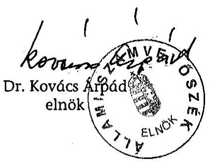
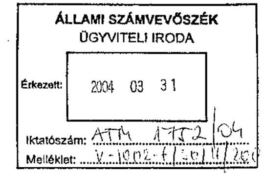
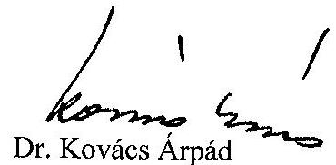

# JELENTÉS 

a Székesfehérvár Megyei Jogú Város Önkormányzata gazdálkodásának átfogó ellenőrzéséről

---

3. Önkormányzati és Területi Ellenőrzési Igazgatóság
3.3 Átfogó Ellenőrzések Főcsoport

Iktatószám: V-1002-7/30/16/2003.
Témaszám: 635
Vizsgálat-azonosító szám: V0102

# Az ellenőrzést felügyelte: 

Dr. Lóránt Zoltán
főigazgató
Az ellenőrzés végrehajtásáért felelős:
Dr. Sepsey Tamás
főigazgató-helyettes
Az ellenőrzést vezette:
Csecserits Imréné
főcsoportfőnök-helyettes

Az ellenőrzést végezték:
Benn Imréné
számvevő tanácsos
Huberné Kuncsik Zsuzsanna
számvevő tanácsos
Ébner Vilmosné
számvevő tanácsos
Mohl Anna
számvevő

A témához kapcsolódó - az elmúlt három évben készített számvevőszéki jelentések:
címe
sorszáma
Jelentés a települési önkormányzatok szociális és gyermekjóléti 0015
szolgáltatásai helyzetéről
Jelentés a települési önkormányzatok adóztatási tevékenységének 0121
vizsgálatáról
Jelentés a települési önkormányzatok szilárdhulladék- 0221
gazdálkodásának feladatai ellátásának ellenőrzéséről
Jelentés a helyi önkormányzatok egyes pénzügyi befektetésekkel 0318
történő gazdálkodásának ellenőrzéséről

Jelentéseink az Országgyűlés számítógépes hálózatán és az Interneten a www.asz.hu címen is olvashatók.

---

# TARTALOMJEGYZÉK 

BEVEZETÉS ..... 5
I. ÖSSZEGZŐ MEGÁLLAPÍTÁSOK, KÖVETKEZTETÉSEK, JAVASLATOK ..... 7
II. RÉSZLETES MEGÁLLAPÍTÁSOK ..... 19

1. A költségvetés tervezésének, végrehajtásának és a zárszámadás elkészítésének szabályszerűsége ..... 19
1.1. A költségvetés tervezésének, a költségvetési rendelet megalkotásának, elfogadásának szabályszerűsége ..... 19
1.2. A költségvetési előirányzatok módosításának szabályszerűsége ..... 22
1.3. A gazdálkodás szabályozottsága, szabályszerűsége ..... 24
1.4. A munkafolyamatba épített ellenőrzések szabályozottsága és gyakorlati működése a pénzügyi, gazdálkodási és számviteli feladatellátás területén ..... 27
1.5. A bizonylati rend szabályszerűsége ..... 28
1.6. A vagyon nyilvántartásának és leltározásának szabályszerűsége ..... 29
1.7. A vagyongazdálkodással kapcsolatos feladat- és döntési hatáskörök szabályozottsága, a vagyonváltozást előidéző intézkedések szabályszerűsége, célszerűsége ..... 32
1.8. Az Önkormányzat által céljelleggel - nem szociális ellátásként - juttatott támogatásokkal történő elszámoltatás szabályszerűsége ..... 36
1.9. A követelések, részesedések, értékpapírok év végi értékelésének szabályszerűsége ..... 41
1.10. A működési és felhalmozási bevételek, kiadások alakulása ..... 42
1.11. A költségvetés egyensúlyának helyzete ..... 44
1.12. A közbeszerzési eljárások szabályszerűsége ..... 45
1.13. A Polgármesteri hivatal helyi kisebbségi önkormányzatok gazdálkodásával kapcsolatos tevékenysége ..... 49
1.14. A zárszámadási kötelezettség teljesítésének szabályszerűsége ..... 52
2. Egyes kiemelt önkormányzati feladatok és a rendelkezésre álló források összhangja ..... 55
2.1. A feladatok meghatározása és szervezeti keretei ..... 55
2.2. Egyes naturális mutatókkal mérhető feladatok bevételei és kiadásai ..... 59
2.3. A jelentős ráfordítást igénylő önként vállalt feladatok ellátása ..... 60
3. A belső irányítási, ellenőrzési rendszer működésének értékelése ..... 63
3.1. Az Önkormányzat informatikai rendszerének szabályozottsága ..... 63
3.2. A helyi ellenőrzési rendszer kialakítása, működése ..... 64
3.3. A könyvvizsgálati kötelezettség teljesítése ..... 67
3.4. A korábbi számvevőszéki ellenőrzések javaslatainak hasznosulása ..... 68

---

# MELLÉKLETEK 

1. számú Az önkormányzati vagyon nagyságának alakulása (1 oldal)
2. számú Az Önkormányzat 2002. évi bevételeinek és kiadásainak alakulása (1 oldal)
3. számú Az Önkormányzat gazdálkodását meghatározó adatok, mutatószámok (1 oldal)
4. számú Egyes önkormányzati feladatok finanszírozása (1 oldal)
5. számú Warvasovszky Tihamér polgármester úr észrevétele (2 oldal)
6. számú Warvasovszky Tihamér polgármester úrnak írt válaszlevél (2 oldal)

---

# RÖVIDÍTÉSEK JEGYZÉKE 

| Ötv. | a helyi önkormányzatokról szóló 1990. évi LXV. törvény |
| :--: | :--: |
| Áht. | az államháztartásról szóló 1992. évi XXXVIII. törvény |
| Ámr. | az államháztartás működési rendjéről szóló 217/1998. (XII. 30.) Korm. rendelet |
| Kbt. | a közbeszerzésekről szóló 1995. évi XL. törvény |
| Számv. tv. | a számvitelről szóló 2000. évi C. törvény |
| Htv. | a helyi önkormányzatok és szerveik, a köztársasági megbízottak, valamint egyes centrális alárendeltségű szervek feladat- és hatásköreiről szóló 1991. évi XX. törvény |
| Vhr. | az államháztartás szervezetei beszámolási és könyvvezetési kötelezettségének sajátosságairól szóló 249/2000. (XII. 24.) Korm. rendelet |
| ÁSZ | Állami Számvevőszék |
| TÁH | Területi Államháztartási Hivatal |
| Kjt. | a közalkalmazottak jogállásáról szóló 1992. évi XXXIII. törvény |
| Önkormányzat | Székesfehérvár Megyei Jogú Város Önkormányzata |
| Közgyűlés | Székesfehérvár Megyei Jogú Város Önkormányzatának Közgyűlése |
| Hivatal | Székesfehérvár Megyei Jogú Város Önkormányzatának Polgármesteri Hivatala |
| SzMSz | Székesfehérvár Megyei Jogú Város Önkormányzatának a Közgyűlés Szervezeti és Működési Szabályzatáról szóló 5/1999. (III. 24.) számú rendelete |
| Ügyrend | Székesfehérvár Megyei Jogú Város Önkormányzat Polgármesteri Hivatalának 1997. március 20-án jóváhagyott ügyrendje |
| Adóügyi iroda | Székesfehérvár Megyei Jogú Város Önkormányzata Polgármesteri Hivatal Adóügyi Irodája |
| Beruházási iroda | Székesfehérvár Megyei Jogú Város Önkormányzata Polgármesteri Hivatal Beruházási Irodája |
| Informatikai iroda | Székesfehérvár Megyei Jogú Város Önkormányzata Polgármesteri Hivatal Informatikai Irodája |
| Intézményellenőrzési iroda | Székesfehérvár Megyei Jogú Város Önkormányzata Polgármesteri Hivatal Intézményellenőrzési Irodája |
| Költségvetési iroda | Székesfehérvár Megyei Jogú Város Önkormányzata Polgármesteri Hivatal Költségvetési Irodája |
| Kommunikációs és civil | Székesfehérvár Megyei Jogú Város Önkormányzata Pol- |

---

| kapcsolatok irodája | gármesteri Hivatal Kommunikációs és civil kapcsolatok Irodája |
| :--: | :--: |
| Okmányiroda | Székesfehérvár Megyei Jogú Város Önkormányzata Polgármesteri Hivatal Okmányirodája |
| Oktatási iroda | Székesfehérvár Megyei Jogú Város Önkormányzata Polgármesteri Hivatal Oktatási Irodája |
| Pénzügyi iroda | Székesfehérvár Megyei Jogú Város Önkormányzata Polgármesteri Hivatal Pénzügyi Adminisztrációs Irodája |
| Személyügyi iroda | Székesfehérvár Megyei Jogú Város Önkormányzata Polgármesteri Hivatal Személyügyi Irodája |
| Városgondnokság | Székesfehérvár Megyei Jogú Város Városgondnoksága |
| Ifjúsági, informatikai és civil kapcsolatok bizottsága | Székesfehérvár Megyei Jogú Város Közgyűlésének Ifjúsági, Informatikai és Civil Kapcsolatok Bizottsága |
| Pénzügyi bizottság | Székesfehérvár Megyei Jogú Város Közgyűlésének Pénzügyi és Költségvetési Bizottsága |
| Vagyongazdálkodási bizottság | Székesfehérvár Megyei Jogú Város Közgyűlésének Lakásés Vagyongazdálkodási Bizottsága |
| közbeszerzési rendelet | Székesfehérvár Megyei Jogú Város Önkormányzatának a közbeszerzési eljárás egyes kérdéseiről szóló 8/1998. (III. 18.) számú rendelete |
| vagyongazdálkodási rendelet | Székesfehérvár Megyei Jogú Város Önkormányzatának vagyongazdálkodásáról szóló 22/2001. (V. 28.) számú rendelete |
| 10016/5/2002. számú együttes utasítás | A polgármester és a jegyző 10016/5/2002. számú együttes utasítása a kötelezettségvállalás, utalványozás, ellenjegyzés és érvényesítés rendjéről |
| SZÉPHŐ Rt. | Székesfehérvári Épületfenntartó és Hőszolgáltató Rt. |
| SZÉKOM Rt. | Székesfehérvári Kommunális Részvénytársaság |

---

# JELENTÉS 

## a Székesfehérvár Megyei Jogú Város Önkormányzata gazdálkodásának átfogó ellenőrzéséről

## BEVEZETÉS

Az Ötv. 92. § (1) bekezdése valamint az Áht. 120/A. § (1) bekezdése alapján az Önkormányzat gazdálkodását az Állami Számvevőszék Önkormányzati és Területi Ellenőrzési Igazgatósága, a V-1002-7/2003. számú ellenőrzési programjában foglaltaknak megfelelően vizsgálta.

## Az ellenőrzés célja annak értékelése volt, hogy:

- az önkormányzati gazdálkodás törvényességét, szabályszerűségét biztosították-e a tervezés, a költségvetés végrehajtása és a zárszámadás során a gazdálkodás szabályszerűségét biztosító kontrollok ${ }^{1}$ megfelelően segítették-e a végrehajtást;
- az Önkormányzat által ellátott feladatok és az azokhoz rendelkezésre álló pénzforrások összhangja biztosított volt-e, különös tekintettel egyes kiemelt feladatokra;
- a helyi kisebbségi önkormányzat gazdálkodása során érvényesültek-e az Áht. és a vonatkozó kormányrendeletek előírásai.

Az ellenőrzött időszak: a 2002. év, valamint a 2003. I. félév, az 1.7., 2.12.3., 3.2-3.4. ellenőrzési programok esetében a 2000-2002. évek.

Székesfehérvár megyei jogú város Fejér megye székhelye, területe 17089 ha, belterülete 3725 ha. A város lakosságszáma 104 ezer fő, munkanapokon mintegy 150 ezer ember tartózkodik a településen. Kereskedelmi, oktatási és művelődési, valamint egészségügyi ellátás terén közel 30 km-es vonzáskörzetben nyújt szolgáltatásokat.

A Közgyűlés tagjainak száma 33 fő, munkáját 13 önálló bizottság, 3 tanácsnok és a 2002. évi önkormányzati választások során újraválasztott polgármester két alpolgármesterrel együtt segíti. Az Önkormányzat a 2002. évben 27377 millió Ft költségvetési előirányzattal gazdálkodott, a kiadások 72%-át működési, a 28%-át felhalmozási és fejlesztési célra fordították. Az Önkormányzat 45 önálló és 34 részben önálló költségvetési intézményt működtetett, 4006 fő közalkalmazottal, a Hivatalban 315 fő dolgozott. Az Önkormányzat 32754 millió Ft vagyonnal rendelkezett.

Az Önkormányzatnál a 2002. évi önkormányzati választásokat követően lengyel, német, örmény, cigány, szerb, szlovák, szlovén és horvát kisebbségi önkormányzat működik.

---

# I. ÖSSZEGZŐ MEGÁLLAPÍTÁSOK, KÖVETKEZTETÉSEK, JAVASLATOK 

Az Önkormányzat az 1998-2002. évekre rendelkezett gazdasági- és területfejlesztési programmal, koncepciókban rögzítette a hosszabb távú ágazati célkitűzéseit. A 2002. és a 2003. évi költségvetési koncepcióban az intézmények biztonságos működtetését, a közalkalmazottakat és a köztisztviselőket érintő bérrendezést, a korábban megkezdett fejlesztések folytatását, a bérlakás építési program indítását, továbbá a színház-rekonstrukció megoldását tekintette elsődlegesnek.

A 2002. és a 2003. évre szóló költségvetési koncepciókat a polgármester határidőn belül a Közgyűlés elé terjesztette. Az előterjesztéshez az Ámr-ben foglaltak ellenére a bizottságok írásos véleményét nem csatolták. A helyi kisebbségi önkormányzatok elnökeit a koncepció kisebbségekre vonatkozó részéről az Ámrben foglalt előírás ellenére írásban nem tájékoztatták, azok koncepcióról alkotott véleményét az előterjesztéshez nem csatolták.
A Hivatal gazdálkodási körébe tartozó szakfeladatok előirányzatainak kialakításához nem készült módszertani segédlet, útmutató a tervezésben résztvevők számára.

A költségvetési javaslatokat a polgármester - a könyvvizsgáló véleményével - határidőben terjesztette a Közgyűlés elé elfogadásra, a Pénzügyi bizottság véleményét a jogszabályi előírás ellenére nem csatolták.
A költségvetési javaslatot az előző év eredeti előirányzatából kiindulva, szerkezeti változásokkal és szintrehozásokkal módosítva, a szerkezeti változásokat bemutatva készítették el.
Az Áht. előírását megsértve elmaradt mindkét évben a költségvetés előterjesztésekor és a zárszámadáskor tájékoztatásul bemutatandó mérlegek, kimutatások tartalmának, valamint annak meghatározása, hogy a költségvetési szervek milyen mértékű és időtartamú tartozásállománya esetén kell a Közgyűlésnek önkormányzati biztost kijelölnie.

A költségvetési rendeletekben az Áht. előírását megsértve nem mutatták be a több éves elkötelezettséggel járó kiadási tételek későbbi évekre vonatkozó kihatását, a közvetett támogatásokat, valamint a helyi kisebbségi önkormányzatok költségvetését, a működési és felhalmozási célú bevételi és kiadási előirányzatok mérlegszerű kimutatását az Ámr. előírásai ellenére nem építették be. A költségvetésről szóló adatszolgáltatás során a céltámogatás összegének eltérő figyelembevétele miatt nem biztosították az egyezőséget a Közgyűlés által elfogadott és a központi pénzügyi információs rendszerhez továbbított adatok között.

A költségvetési rendeletekben jóváhagyott előirányzatokat, azok változásait nyilvántartották, de az adatok pontatlanok voltak. A számszaki egyezőséget nem biztosították a Közgyűlés által elfogadott zárszámadás és a TÁH-hoz benyújtott beszámoló módosított előirányzati adatai között.

---

Nem szabályozott az előirányzatok módosítási rendje. Az Ámr. előírásai ellenére az első negyedévben nem kezdeményezték a pótelőirányzatok miatti előirányzat-módosítást, valamint a beszámoló felügyeleti szervhez történő megküldésének határideje után a zárszámadással egyidejűleg is előterjesztettek közgyűlési döntésre előirányzat-módosítást (55,6 millió Ft-ra).

Az önkormányzati képviselő-választások után kifizetett tisztségviselői járandóságok és egyéb pótlékok, díjak kifizetésekor az Áht-ban foglaltakat megsértve a személyi juttatási előirányzatot 5,1%-kal, a járulék-előirányzatát 3,9%-kal, együttesen 80,5 millió Ft-tal túllépték, valamint az intézmények 15,1%-a a saját hatáskörben végrehajtott előirányzat-módosítások mintegy negyede esetében az Ámr. előírása ellenére elmulasztotta a módosítás költségvetési rendeletben történő átvezetésének kezdeményezését. A kiemelt előirányzatok túllépésének okait nem vizsgálták, nem alkalmaztak felelősségre vonást. A 2002. évben a költségvetés bevételi és kiadási előirányzata az eredeti előirányzat 23,2%-ával módosult.

A Hivatalban a gazdálkodási és ellenőrzési jogkörök szabályozottak voltak. A gazdálkodási és ellenőrzési jogköröknél a felhatalmazásokat írásban rögzítették, azonban nem szabályozták a felhatalmazottak beszámoltatásának módját, formáját.
A gazdálkodási, ellenőrzési jogkörök gyakorlásánál az összeférhetetlenségre
 vonatkozó előírások közül, az Ámr. előírásai ellenére nem határozták meg a közeli hozzátartozó és a saját részre történő kifizetés esetére vonatkozó szabályokat. A pénzügyi területen dolgozók munkaköri leírásaiban szerepeltették a gazdálkodási és ellenőrzési jogköröket.

A Hivatal gazdálkodásának rendjét, valamint a pénzügyi feladatok ellátását polgármesteri és jegyzői közös utasításokban szabályozták. A számviteli politikához kapcsolódó szabályzatokat elkészítették, ezek jogszabályi változásoknak és helyi döntéseknek megfelelő aktualizálása elmaradt.

A Számv. tv. előírását megsértve nem alakították ki az eszközök és források értékelési szabályzatában a terven felüli értékcsökkenés elszámolási rendjét, illetve az éven túli követelések és készletek értékvesztés elszámolásának szabályait. A leltározási szabályzatban a Vhr-ben előírtak ellenére nem rögzítették a leltározás elvégzését helyettesítő összesítő kimutatás tartalmát, formáját és kellékeit.

A Hivatal számlarendjét a Számv. tv. előírását megsértve a számviteli politika keretében alakították ki, elmaradt az alkalmazott főkönyvi és alszámlák megnevezése, tartalmának és azok értékében bekövetkező változások jogcímeinek, valamint a Vhr. előírása ellenére a törzsvagyon nyilvántartási rendjének meghatározása. Nem alakították ki az üzemeltetésre átadott eszközök selejtezési rendjét.

A Hivatal ügyrendje rendelkezik a szervezeti egységek ellenőrzési jogköréről és a beszámoltatás rendjéről, részletesebb előírásokat az ellenőrzési szabályzatban, illetve a gazdálkodást érintő egyéb szabályzatokban határozták meg.
A számviteli területen dolgozók munkaköri leírásai tartalmazták az ellenőrzési

---

feladatokat. A gazdálkodási folyamatok ellenőrzését az ellenőrzési szabályzatban részletesen nem szabályozták, elmaradt az ellenőrzések viszonyítási alapjának, a megállapítások dokumentálásának, a hibák kijavítási módjának a meghatározása.

A Hivatalban a számviteli bizonylatok 98%-ban megfeleltek az előírt alaki és tartalmi követelményeknek. A számviteli rendet betartották, kivéve az Okmányiroda szolgáltatási díjainak elszámolását, ahol a Számv. tv-ben előírt bruttó elszámolás elvét megsértették, valamint nem tartották be az Ámr-ben és a jegyzői utasításban előírtakat, mivel a személyi juttatások és járulékaik kifizetésének 6%-ánál az elvégzett ellenjegyzés során nem győződtek meg arról, hogy a költségvetési előirányzat biztosított volt-e. Szabályszerű volt a gazdasági események elszámolása, a nyilvántartásokban való rögzítése. Az Ámr. előírásai nem érvényesültek a banki bizonylatok 2,2%-ánál, hiányosak voltak az utalványrendeletek, idegen pénzeszközöket (Városkörnyéki Alap pénzeszközeit) a költségvetési számlán kezeltek. A Hivatalnál a személyi jellegű kifizetések magas készpénzforgalmat eredményeztek. Az Okmányiroda tevékenységéhez kapcsolódó befizetések a banki forgalom egyharmadát képviselték, amelyeknél a díjbevételt a postai átutalás díja mérsékelte.

Az önkormányzati vagyon nyilvántartásának módját a vagyongazdálkodási rendeletben, a számviteli politikában és a kapcsolódó gazdálkodási szabályzatokban határozták meg. Gondoskodtak a törzsvagyon elkülönített nyilvántartásáról. Az ingatlanvagyon kataszteri nyilvántartást a jogszabályi előírás ellenére nem készítették el az üzemeltetésre átadott eszközök közül a kommunális hulladéklerakó és a szennyvíztisztító-telep, valamint a víz-, szennyvízcsatorna hálózatra vonatkozóan, amelyek számviteli nyilvántartás szerinti értéke a 2002. év végén 3555 millió Ft volt. Nem szabályozták az ingatlanvagyon kataszter folyamatos vezetését végzők közötti egyeztetés folyamatát. A 2003. évi vagyonváltozásokat az ingatlanvagyon kataszterben nem rögzítették, a Városgondnokság kezelésében lévő ingatlanok értékének nyilvántartásba vétele elmaradt. A korábban érték nélkül nyilvántartott eszközök értékelésének megállapítása alapján 2016 millió Ft-tal növekedett a 2002. évben a vagyon nyilvántartási értéke. Az Önkormányzat a 2002. évtől élt a forgalomképes ingatlanvagyontárgyak esetében a piaci értékelés lehetőségével, annak érdekében, hogy a vagyontárgyak hasznosításának tervezésekor reális információk álljanak rendelkezésre. A piaci értékelés Számv. tv-ben előírt követelményeit - a Városgondnokság kivételével - betartották, ennek eredményeként a forgalomképes ingatlanoknál a számviteli nyilvántartási értéket 5564 millió Ft-tal helyesbítették.
A 2002. évi mérleg adatait leltárral alátámasztották a több önkormányzat közös tulajdonában lévő vagyontárgyakat a Vhr-ben előírt kötelezettség ellenére nem leltározták.

Az önkormányzati vagyonnal való gazdálkodás irányelveit fejlesztési stratégiákban és koncepciókban fogadták el. Az Önkormányzat vagyona a 2000. évről a 2003. évre 67%-kal növekedett a beruházások (bérlakás-építési program, szennyvízcsatorna-hálózat, úthálózat és kommunális ellátás fejlesztése, városüzemeltetési és intézményi beruházások) aktiválásából és a korábban érték nélkül nyilvántartott, valamint a forgalomképes ingatlanok piaci értékének meghatározásából. A vagyongazdálkodási rendelet a sajátosságokat figyelem-

---

be véve szabályozta a feladat- és döntési hatásköröket, az eszközök besorolását és a forgalomképesség szerinti meghatározást. Az értékesítések során a döntési hatásköröket betartották, a vagyongazdálkodási rendeletben előírtak ellenére nyilvános pályázati kiírás nélküli eladásról a Vagyongazdálkodási bizottság ajánlása alapján egy értékesítés esetében döntött a Közgyűlés. A nem lakás céljára szolgáló helyiségek bérbeadásakor a Közgyűlés az átlagos bérleti díj mintegy negyedéért biztosított helyiségeket két pártnak, térítésmentesen helyiséghasználatot nem engedélyeztek.

Az Önkormányzat a követelések, részesedések, értékpapírok év végi értékelését a jogszabályi előírásoknak megfelelően elvégezte.

Az Önkormányzat a céljellegű - nem szociális ellátásként juttatott - támogatásokat a Közgyűlés közvetlen döntésével, bizottsági keretek, polgármesteri, alpolgármesteri, egyéni képviselői keretek meghatározásával biztosította. Az Önkormányzat a céljelleggel juttatott támogatásokra a költségvetés különféle forrásaiból 2002. évben 1518,6 millió Ft-ot fordított. A támogatásokról szóló döntés meghozatalakor az Önkormányzatnál megsértették az Áht. és az Ötv. előírásait, alapítványok támogatásáról a polgármester, az alpolgármesterek, a bizottságok és egyéni képviselők is döntöttek a törvényi korlátozás ellenére. A polgármester a támogatásokra biztosított döntési hatáskörét - az SzMSz-ben és az Ötv-ben foglaltakat megsértve - tovább ruházta az alpolgármesterekre.

Az Önkormányzat az 1996. évtől bevezette az „iparűzési adó címkézését", melyet 2004. január 1-től hatályon kívül helyezett. A „címkézés" szerint az a vállalkozás, amelynek éves adófizetési kötelezettsége a 100 ezer Ft-ot meghaladta, a tárgyévi adója 10%-ának felhasználására önkormányzati közérdekű célokat jelölhetett meg. Az adó 10%-ából számított összeg 40%-ára székesfehérvári székhelyű alapítványokat, egyesületeket, szervezeteket jelöltek meg az adózók, a további 60% felhasználásáról az önkormányzati bizottságok döntöttek. A Közgyűlés a „címkézésre" vonatkozó döntéseivel az önkormányzati saját bevételi forrás feletti rendelkezési jogról mondott le, egyidejűleg az Áht. előírását megsértve nem írt elő a támogatottaknak számadási kötelezettséget, valamint a felhasználást nem ellenőrizte.

Az Önkormányzat nem szabályozta a céljelleggel juttatott támogatások feltételrendszerét, az elszámolás rendjét, valamint a felhasználás ellenőrzésének módját.

A Közgyűlés a költségvetési rendeletekben az egyéni képviselők részére terven felüli fejlesztésekre, kisösszegű városüzemeltetési munkákra, intézmények támogatásának kezdeményezésére a 2002. évben 466 millió Ft-ot, valamint a felhasználási és elszámolási szabályok kialakítása nélkül 60 millió Ft keretet határozott meg. Az egyéni képviselői pénzügyi keret meghatározásával megsértették az Ötv-ben foglalt hatáskör átruházására vonatkozó előírást.

A Közgyűlés által, valamint a bizottságok és a polgármester keretéből biztosított támogatások esetében előírták a számadási kötelezettséget. Az ügyrendben a Pénzügyi iroda feladataként határozták meg az elszámolások ellenőrzését. A Pénzügyi iroda a kapott elszámolások számszerű ellenőrzését elvégezte, a felhasználás szakmai kontrollját és a céljellegű megvalósítás helyszíni ellenőrzését nem biztosították.

Az Önkormányzat nem volt működési forráshiányos, a működési célú bevételek fedezték a működési kiadásokat. A fejlesztési célkitűzések megvalósítását a felhalmozási bevételeken kívül közép- és hosszú lejáratú hitelekkel finanszírozták. Az önkormányzati bevételek és kiadások havonkénti alakulásáról a Hivatalban éves likviditási tervet készítettek, amelynek évközi aktualizálása az Ámr-ben előírtak ellenére elmaradt. Átmeneti pénzügyi gondok enyhítésére likviditási hitelt vettek igénybe, melynek mértéke 2002-ről 2003-ra növekedett. A hitelfelvételeknél betartották az adósságot keletkeztető éves kötelezettségvállalás Ötv-ben meghatározott felső határát.
Az intézmények finanszírozása „kiskincstári" rendszerben történt.
Az Önkormányzat élt a helyi adóztatás lehetőségével, a 2002. évben az iparűzési és az idegenforgalmi adó mértéke elérte a törvényi maximumot. Az iparűzési és az idegenforgalmi adónál a törvényi előíráson felül mentességeket biztosítottak a beruházások és az idegenforgalom élénkítése érdekében. 2003. január 1-től a korábban alkalmazott építményadót megszüntették, amely a törvényi maximum 9%-a volt.

A Közgyűlés a közbeszerzési eljárás szabályait közbeszerzési rendeletében meghatározta. Az irodaszerek, nyomtatványok beszerzésénél és az építési beruházások, felújítások tervezési feladatainál a Kbt. előírását megsértve a beszerzések becsült értékét nem számították egybe. A közbeszerzési eljárást lezáró döntést a Kbt. előírását megsértve személy helyett a Közgyűlés hozta meg. Az értékhatár alatti pályáztatás nyertes kivitelezőinek kiválasztása - az SzMSz alapján - polgármesteri hatáskörben történt. Az intézmények a közbeszerzési rendeletben előírtak ellenére az általuk lebonyolított közbeszerzésről nem tájékoztatták a Hivatalt. A Hivatalnál a 2002. évben lebonyolított 15 közbeszerzésnél egy ajánlati felhívás kivételével - nyílt eljárást választottak. A Hivatal által lefolytatott és az ÁSZ által részletesen ellenőrzött közbeszerzési eljárások közül egy esetben megsértették a Kbt. előírását, mivel a közbeszerzési eljárás kiírásakor nem rendelkeztek a szerződés teljesítését biztosító anyagi fedezettel. A Hivatal által indított közbeszerzési eljárásoknál két esetben kezdeményeztek jogorvoslatot az ajánlattevők, melyet a Közbeszerzések Tanácsa Döntőbizottsága elutasított.

A településen a korábbi választási ciklusban öt helyi kisebbségi önkormányzat működött, 2002. novemberében a meglévők mellett további három kisebbség is alakított önkormányzatot. Az Önkormányzat és az új helyi kisebbségi önkormányzatok az Áht-ban foglaltakat megsértve nem kötöttek együttműködési megállapodást. A helyi kisebbségi önkormányzatok költségvetéseit az Önkormányzat költségvetési rendeletei az Áht. előírását megsértve nem tartalmazták, azok mindkét évben az első alkalommal végrehajtott módosítással egyidejűleg épültek be a költségvetési rendeletekbe. Az évközi rendeletmódosítások és a zárszámadás elkészítése során az Áht. előírásait megsértették, mert a forrásokat nem szerepeltették, előirányzat-módosításokat a kisebbségi önkormányzat határozatának hiányában is végrehajtottak. A vagyoni, számviteli nyilvántartások elkülönített vezetéséről gondoskodtak. A kialakított rendszerben a készpénzforgalom esetén a pénzmozgással egyidejűleg, bankszámla for-

---

galomnál a hitelintézeti értesítés megérkezésekor a Számv. tv-ben előírtakat megsértve nem történt meg a gazdasági események rögzítése. A kifizetések utalványozását a kialakított rendszerben az Ámr-ben foglaltak ellenére nem előzte meg a bizonylatok tartalmi ellenőrzése.

A Közgyűlés határidőben elfogadta a 2002. évről szóló zárszámadási rendeletét. A rendelet információtartalmában elsősorban a Közgyűlés igényeit elégítette ki, az Áht. előírását megsértve nem mutatták be a vagyonkimutatást, a több éves kihatással járó döntések számszerűsítését évenkénti bontásban, valamint összesítve, szöveges indokolással a közvetett támogatásokat, továbbá az Ámr-ben foglaltak ellenére nem adtak tájékoztatást az önkormányzati alapítású költségvetési szervek létszámadatairól, valamint a működési és felhalmozási célú bevételi és kiadási előirányzatok teljesítéséről mérlegszerűen. Önkormányzati szinten 1,6 milliárd Ft pénzmaradvány képződött, amelynek 47,2%-a a költségvetési szerveknél, 52,8%-a a Hivatalnál keletkezett. A Hivatalnál a pénzmaradványt teljes összegében az Ámr-ben foglaltak ellenére kötelezettségvállalással terheltként mutatták ki, a dokumentációk alapján 50,6% szabad felhasználású maradvány volt.

Az Önkormányzat törvényekben meghatározott kötelező és önként vállalt feladatait 85%-ban költségvetési szervek útján látja el, ezen túlmenően a feladatellátásban közreműködnek gazdasági társaságok, közalapítványok, alapítványok, közhasznú társaságok, egyházi és civil szervezetek. Az Önkormányzat ellátja a szociális, egészségügyi, nevelési-oktatási, közművelődési feladatokon kívül a településüzemeltetési feladatként az ivóvízellátást, szennyvízelvezetést, távhőszolgáltatást, közparkok, játszóterek, piacok és temetők fenntartását, valamint a köztisztasági feladatokhoz kapcsolódóan regionális települési hulladéklerakót üzemeltet. A feladatellátást végző költségvetési intézmények száma a 2002. évben kettővel csökkent, a regionális települési hulladéklerakót üzemeltető gazdasági társasággal pedig bővült a városüzemeltetést végző szervezetek köre.

A Közgyűlés a feladat-ellátási tevékenység lehetőségeit nem tekintette át, a korábbi időszak szervezeti átalakításának gazdasági eredményeit nem elemezték.

A nevelési, oktatási és szociális fajlagos kiadások jelentősen emelkedtek a központi és helyi bérintézkedések hatására. Ezen belül legnagyobb mértékben
 - mintegy kétszeresére – az óvodai nevelés fajlagos kiadásai növekedtek.

Az SzMSz és az intézmények alapító okiratai a kötelező és önként vállalt feladatokat nem részletezik. Az önként vállalt feladatokra fordított kiadások nem veszélyeztették az Önkormányzat pénzügyi egyensúlyát.

Az Önkormányzat a 2002. évben a fogyatékos személyek érdekében a középületek akadálymentesítésére vonatkozóan felmérést készített, amelyet a Közgyűlés megtárgyalt. A felmérés szerint az akadálymentesítés 2009-ig történő megvalósítása 1009 millió Ft kiadást igényel. Az Önkormányzat a 2001. és a 2002. évben 34,7 millió Ft-ot fordított a Hivatal és az intézmények közlekedési akadálymentesítésére. A 2003. évi költségvetésben az akadálymentes közlekedés megvalósításához szükséges tervezési kiadásokra 10 millió Ft-ot biztosított.

---

az Önkormányzat, az intézményi kapcsolódó kiadásokat 60,4 millió Ft-ban határozta meg.

A Hivatal 90%-ban modern, strukturált informatikai hálózattal rendelkezik. Nem készült informatikai stratégia és katasztrófa-elhárítási terv, az adatvédelmi eljárásokat nem szabályozták. A pénzügyi és számviteli feladatok ellátását segítő ügyviteli rendszerhez rendszerleírás, üzemeltetési dokumentáció és felhasználási leírás biztosított, az adatok mentése, valamint a visszakeresés lehetősége megoldott.

Az Önkormányzat ellenőrzési szabályzata tartalmazza a Hivatalon belüli belső ellenőrzés, valamint az intézményi felügyeleti ellenőrzés szervezeti kereteit.

A felügyeleti ellenőrzéseknél a gyakoriságot nem határozták meg, az intézményeket – kettő kivételével – kétévente ellenőrizték. Az Oktatási iroda dolgozói részt vettek a felügyeletük alá tartozó intézmények vizsgálataiban, ez nem érvényesült az egyéb feladatot ellátók (szociális, kulturális) esetében. A felügyeleti ellenőrzésekről vezetett nyilvántartás az ellenőrzési szabályzatban rögzítettek ellenére az ellenőrzésre fordított időt nem tartalmazza. A központi költségvetésből igénybevett normatív állami hozzájárulások és központosított támogatások igénybevételét, felhasználását ellenőrizték.

A függetlenített belső ellenőrzésre vonatkozó szabályozás nem tartalmazott előírásokat a feladatellátás dokumentálási követelményeiről, a realizálási folyamatot nem szabályozták. A belső ellenőrzések a gazdasági-pénzügyi tevékenységen túlmenően egyéb feladatok elvégzésére, gazdasági elemzések készítésére is irányultak. A pénzkezelési szabályzatban foglaltak ellenére a függetlenített belső ellenőr a pénzkezelési helyeket nem ellenőrizte. A belső ellenőr ellenőrzési programot – megsértve az Áht. rendelkezését – nem készített. A jelentések a problémák felvetésén túl felhívták a figyelmet a szükséges intézkedések megtételére, a javaslatok általánosak voltak.

A Közgyűlés – előterjesztés hiányában – a költségvetési intézmények ellenőrzési tapasztalatait a Htv. előírását megsértve nem tekintette át, erre a belső ellenőrzések vonatkozásában sem került sor.

Az Önkormányzat az Ötv-ben meghatározott kötelező könyvvizsgálatra vonatkozó kötelezettségének eleget tett. A könyvvizsgáló a Hivatal és az intézmények összevont adatait tartalmazó éves beszámolókat hitelesítő záradékkal látta el.

Az Önkormányzatnál az elmúlt három évben készített számvevőszéki ellenőrzési jelentések javaslatait követően a szükséges intézkedések 56%-át megvalósították, amelyek eredményeként a feladatellátás törvényessége, szabályossága javult. A számvevőszéki javaslatok ellenére elmaradt a helyi adóztatási tevékenységről a jegyző beszámoltatása, a befektetett pénzügyi eszközökkel való gazdálkodás irányelveinek kidolgozása, a gazdasági társaságokban tulajdonosi jogokat gyakorló személyek beszámolási kötelezettségének meghatározása.

---

A helyszíni ellenőrzés megállapításai mellett a gazdálkodás szabályszerűségének és a munka színvonalának javítása érdekében javasoljuk:

# a polgármesternek 

## a törvényes állapot helyreállítása és a jogszabályi előírások betartása érdekében:

1. csatolja az Ámr. 28. § (3) bekezdése szerint az éves költségvetési koncepcióhoz a Pénzügyi bizottság és a helyi kisebbségi önkormányzatok véleményét, valamint az Ámr. 29. § (9) bekezdése szerint a költségvetési rendelet előterjesztéséhez a Pénzügyi bizottság véleményét;
2. tájékoztassa az Ámr. 28. § (6) bekezdésében foglaltaknak megfelelően a helyi kisebbségi önkormányzatok elnökeit az Önkormányzat költségvetési koncepciójának helyi kisebbségi önkormányzatra vonatkozó részéről;
3. kezdeményezze a Közgyűlésnél, hogy az – Áht. 118. §-a alapján – rendeletben határozza meg az Áht. 116. § 6., 8., 9., 10. pontja szerinti mérlegek, kimutatások tartalmát;
4. kezdeményezze, hogy a Közgyűlés határozza meg az Áht. 98. § (6) bekezdésében előírtak alapján azt, hogy a költségvetési szervek milyen mértékű és időtartamú tartozásállománya esetén kell a Közgyűlésnek önkormányzati biztost kijelölnie;
5. biztosítsa, hogy a vagyongazdálkodási rendeletben előírt esetekben az értékesítés nyilvános pályázat útján történjen;
6. biztosítsa, hogy az Áht. 12/A § (1) bekezdésében előírt követelményeknek megfelelően az intézmények és a Hivatal az Önkormányzat költségvetési rendeletében meghatározott kiemelt előirányzatokon belül gazdálkodjanak;
7. szüntesse meg az Ötv. 10. § (1) bekezdés d) pontjában előírtakkal ellentétes gyakorlatot és a jogszabályi előírás betartása érdekében gondoskodjon arról, hogy az Önkormányzat által céljelleggel juttatott támogatások közül az alapítványok, közalapítványok támogatása esetében a döntést a Közgyűlés hozza meg;
8. kezdeményezze a horvát, szlovák, szlovén helyi kisebbségi önkormányzatokkal az Áht. 66. §-ában és a 68. § (3) bekezdésében előírtak alapján az együttműködési megállapodások megkötését;
9. kezdeményezze a Közgyűlésnél, hogy meghatározott időközönként tekintse át a Htv. 138. § g) pontja előírásának betartása érdekében a költségvetési szervek ellenőrzéseinek tapasztalatait;

## a munka színvonalának javítása érdekében:

10. gondoskodjon az Áht. 10. § (2) bekezdésében foglaltak alapján az üzemeltetésre átadott eszközök üzemeltetőivel már megkötött, illetve megkötendő szerződésekben az önkormányzati tulajdon védelmét szolgáló vagyonmegállapító leltározásnak az üzemeltetési szerződésben való szerepeltetéséről;

---

11. kezdeményezze az SzMSz kiegészítését az Önkormányzat által önként vállalt feladatok részletezésével;
12. vegye figyelembe a középületek akadálymentesítésének tervezése és végrehajtása során a fogyatékos személyek jogairól és esélyegyenlőségük biztosításáról szóló 1998. évi XXVI. törvény 29. § (6) bekezdésében előírt határidőt;
13. kezdeményezze a számvevőszéki ellenőrzés tapasztalatainak közgyűlési megtárgyalását, a feltárt hiányosságok megszüntetésére készíttessen intézkedési tervet;

# a jegyzőnek 

## a törvényes állapot helyreállítása és a jogszabályi előírások betartása érdekében:

1. a költségvetési rendelettervezet előkészítésekor
a) biztosítsa, hogy a költségvetési rendeletben szerepeljen a több éves elkötelezettséggel járó költségvetési kiadások későbbi évekre vonatkozó kihatása az Áht. 71. § (2) bekezdése és a 116. § 9. pontja szerint;
b) gondoskodjon arról, hogy az Ámr. 29. § (1) bekezdés i) pontjában előírtak alapján a helyi kisebbségi önkormányzatok költségvetése épüljön be elkülönítetten az eredeti költségvetési előirányzatok közé;
c) mutassa be a költségvetési rendelet-tervezetben a működési és felhalmozási célú bevételi és kiadási előirányzatokat mérlegszerűen, az Ámr. 29.§ (1) bekezdés h) pontja alapján;
d) a költségvetés előterjesztésekor tájékoztatásul mutassa be az Áht. 118. §-a és az Áht. 116. § 10. pontjában előírtak alapján a közvetett támogatásokat;
2. gondoskodjon az Ámr. 53. § (2) és (6) bekezdésében foglaltak betartása érdekében arról, hogy költségvetési rendelet utolsó módosítása határidőben megtörténjen;
3. határozza meg az Ámr. 138. § (3) bekezdése alapján a közeli hozzátartozó és a saját részre történő gazdálkodási, ellenőrzési jogkörök gyakorlóinál az összeférhetetlenség szabályait;
4. a kialakított számviteli rend felülvizsgálata során
a) egészítse ki az eszközök és források értékelési szabályzatát a terven felüli értékcsökkenés elszámolási rendjével, az éven túli követelések és készletek értékvesztésének elszámolási szabályaival a Számv. tv. 53 § (1) bekezdés, a Számv. tv 55. § (1) bekezdés, és a Számv. tv. 56. § (1) bekezdése alapján;
b) gondoskodjon a több önkormányzat tulajdonát képező ingatlanok esetében arról, hogy a Vhr. 37. § (1) bekezdésben foglaltak betartása érdekében a leltározásra is kiterjedjenek a megállapodások;

---

c) gondoskodjon arról, hogy a Hivatal számlarendje a Számv. tv. 161. § (1)-(5) bekezdéseiben előírtak alapján, a számviteli politikától függetlenül önálló szabályzatként kerüljön meghatározásra és az tartalmazza a Vhr. 49. §-ában meghatározottak szerint az alkalmazni kívánt főkönyvi számlák megnevezését, tartalmát és az értékben bekövetkező változások jogcímét, valamint a Vhr. 9. sz. melléklet 1/k pontjának megfelelően a törzsvagyon elkülönített nyilvántartási módját;
5. a költségvetés végrehajtása során
a) gondoskodjon arról, hogy az Ámr 136. § (4) bekezdésében előírt tartalmú utalványrendelet készüljön valamennyi gazdasági eseményről;
b) biztosítsa, hogy a Városkörnyéki Alap pénzeszközeit az Ámr. 103. § (6) bekezdés i) pontjában rögzítetteknek megfelelően elkülönített számlán kezeljék;
c) gondoskodjon az Önkormányzat számviteli és ingatlanvagyon-kataszteri nyilvántartásában az ingatlanok bruttó érték adatai egyezőségének biztosításáról az önkormányzatok tulajdonában lévő ingatlanvagyon nyilvántartási és adatszolgáltatási rendjéről szóló 147/1992. (XI. 6.) Korm. rendelet 2. számú mellékletében előírtaknak megfelelően;
d) szabályozza az Áht. 13/A § (2) bekezdésében előírt céljelleggel juttatott támogatások feltételrendszerét, az elszámolások rendjét, a felhasználások ellenőrzésének módját, minden esetben írjon elő számadási kötelezettséget, biztosítsa, hogy a támogatások felhasználásáról benyújtott számadások, felhasználások ellenőrzése megtörténjen;
e) biztosítsa, hogy a likviditási terv évközben – az Ámr. 139. §-a szerint – folyamatosan aktualizálásra kerüljön;
f) kezdeményezze a közbeszerzési rendelet 7. §-ában előírtak alapján, hogy az intézmények az általuk lebonyolított közbeszerzésekről írásban tájékoztassák a Hivatalt;
g) intézkedjen annak érdekében, hogy a közbeszerzési eljárások során a vonatkozó központi és helyi előírásokat – köztük a Kbt. 5. § (2) bekezdésében foglaltak alapján a becsült érték kiszámítása során az egybeszámításra vonatkozó előírásokat maradéktalanul tartsák be a Hivatalban és az intézményeknél;
h) biztosítsa, hogy az irodaszerek beszerzése és az építési beruházásokhoz, felújításokhoz kapcsolódó tervek elkészítésének megrendelése a Kbt. 2. § (3) bekezdésében foglaltaknak megfelelően közbeszerzési eljárás keretében történjenek;
i) kezdeményezze, hogy a polgármester terjessze a Közgyűlés elé a közbeszerzési rendelet módosítását, annak érdekében, hogy legyen kijelölt személy a közbeszerzési eljárást lezáró döntést hozó, a Kbt. 31. § (3) bekezdésében foglaltaknak megfelelően;
j) intézkedjen annak érdekében, hogy az Áht. 74. § (3) bekezdésében előírtaknak megfelelően a helyi kisebbségi önkormányzatok előirányzatait kizárólag a helyi kisebbségi önkormányzatok határozatai alapján módosítsák az Önkormányzat költségvetési rendeletében;

---

k) biztosítsa a számviteli bizonylatok feldolgozási rendjének kialakításakor a Számv. tv. 165. § (3) bekezdés a) pontjában foglaltaknak megfelelően, hogy a pénzeszközöket érintő gazdasági múveletek, események, bizonylatok adatai késedelem nélkül rögzítésre kerüljenek, készpénzforgalom esetében a pénzmozgással egyidejűleg, a bankszámlaforgalomnál a hitelintézeti értesítés megérkezésekor;
6. biztosítsa, hogy a zárszámadási előterjesztésben az Áht. 18. §-ban foglaltaknak megfelelően a költségvetéssel összhangban a helyi kisebbségi önkormányzatok bevételeit szerepeltessék, valamint kisebbségi önkormányzatonként mutassa be a pénzmaradvány összegét;
7. a zárszámadási rendelettervezet elkészítésekor
a) gondoskodjon arról, hogy a zárszámadási rendelet előterjesztésében a tényleges létszámadatok – költségvetési szervenkénti részletezésben – ismertetésre kerüljenek az Ámr. 29. § (1) bekezdés f) pontja szerint, az Áht. 18. §-ban előírt összehasonlíthatóság biztosítása érdekében;
b) gondoskodjon arról, hogy a Hivatalnál a zárszámadási előterjesztésben az Ámr. 66. § (10) bekezdésében előírtaknak megfelelően mutassák be a pénzmaradvány kötelezettségvállalással terhelt részét;
c) biztosítsa, hogy a belső ellenőrzési feladatokra az Áht. 2003. november 27-től hatályos 121/A. § (4) bekezdésében foglaltak alapján készüljön ellenőrzési program, valamint a belső ellenőrzés az Áht. 121. § (1) bekezdésében rögzített feladatokra terjedjen ki;
8. kezdeményezze, hogy a függetlenített belső ellenőr a pénzkezelési szabályzatban foglaltak alapján a pénzkezelő helyek ellenőrzését rendszeresen végezze el;

# a munka színvonalának javítása érdekében: 

9. készítsen módszertani segédletet a költségvetés tervezésében részt vevők számára a Hivatal gazdálkodási körébe tartozó szakfeladatok előirányzatainak kialakításához;
10. biztosítsa az egyezőséget a Közgyűlés által elfogadott költségvetési, zárszámadási adatok és a központi pénzügyi információs rendszer részére adott tájékoztatás között;
11. biztosítsa az előirányzat-nyilvántartások adatainak megbízhatóságát;
12. szabályozza a gazdálkodási és ellenőrzési jogkörökkel felhatalmazott személyek beszámoltatásának módját, formáját;
13. gondoskodjon arról, hogy az üzemeltetésre átadott eszközök selejtezési eljárását az üzemeltetőkkel kötött megállapodások tartalmazzák;
14. egészítse
 ki az ellenőrzési szabályzatot a pénzügyi-gazdasági folyamatokkal kapcsolatos tevékenységi jegyzékkel, annak érdekében, hogy a munkavégzési folyamatok megszakítás nélküli ellenőrzése érvényesüljön (ellenőrzési pontok megjelölése, a viszonyítási alap, az eltérés megállapításának meghatározása, eltérés esetén a dokumentálás és jelzési kötelezettség előírása);

---

15. vizsgálja felül a Hivatal készpénz és banki forgalmát, és intézkedjen a személyi jellegű kifizetések esetében a készpénzforgalom mérséklésére, és az okmányirodai befizetések költségtakarékos módozatainak kialakítása érdekében;
16. szabályozza az ingatlanvagyon kataszter folyamatos vezetését végzők közötti egyeztetés folyamatát;
17. biztosítsa, hogy a belső ellenőrzési szabályzatban határozzák meg az ellenőrzési megállapítások realizálási módját, valamint a felügyeleti ellenőrzések gyakoriságát, továbbá az ellenőrzések időráfordításának nyilvántartási rendjét;
18. készítse el a Hivatal informatikai stratégiáját, valamint a Hivatal informatikai rendszerének folyamatos és zavartalan működése érdekében szükséges katasztrófa-elhárítási tervet és szabályozza az adatvédelmi eljárásokat;

---

# II. RÉSZLETES MEGÁLLAPÍTÁSOK 

## 1. A KÖLTSÉGVETÉS TERVEZÉSÉNEK, VÉGREHAJTÁSÁNAK ÉS A ZÁRSZÁMADÁS ELKÉSZÍTÉSÉNEK SZABÁLYSZERŰSÉGE

### 1.1. A költségvetés tervezésének, a költségvetési rendelet megalkotásának, elfogadásának szabályszerűsége

Az önkormányzati feladatellátásra és a költségvetési források felhasználására vonatkozó, az 1998-2002. évekre szóló gazdasági- és területfejlesztési programmal - az Ötv. 91. § (1) bekezdésében foglaltaknak megfelelően - az Önkormányzat rendelkezett.

Az Önkormányzat a 2003. év tavaszán megállapodást kötött egy helyi alapítvánnyal az 1998. évben elfogadott középtávú gazdasági- és területfejlesztési program 2003. év végéig elkészítendő aktualizálására.

Az önkormányzati tevékenység egy-egy kiemelt területére a Közgyűlés az 1999-2001. években négy-hat évre kiterjedő munka- és cselekvési programokat írt elő, koncepciókban rögzítették a főbb ágazati feladatokat, amelyek átfogják a kötelező és önként vállalt feladatok teljes körét.

A Közgyűlés az Ámr. 28. § (1)-(7) bekezdései alapján évente a működésre vonatkozó célkitűzéseket források és kiadási szükségletek szerint, a bizottságok által rangsorolt célok megjelölésével koncepcióba foglalta. ${ }^{2}$

A Közgyűlés a 2002. évben az intézmények biztonságos működtetését, a közalkalmazottakat és a köztisztviselőket érintő bérrendezést, a fejlesztések terén a korábban vállalt kötelezettségek megvalósítását, az önkormányzati bérlakás-építési program indítását, továbbá a színház-rekonstrukciót tekintette elsődlegesnek.
A 2003. évben az intézmények működtetésénél optimális szint elérése, és a kiemelt jelentőségű beruházások (színház-rekonstrukció, csatornázottság folytatása, bérlakásépítés, otthonteremtés, repülőtér-kialakítás) szerepeltek a prioritások között.
A bevételek növekedése nem tartott lépést a kiadási igényekkel, ezért a 2002. és 2003. évi koncepciók összeállítása során számoltak a hitel igénybevételének szükségességével.

A Közgyűlés valamennyi bizottsága megtárgyalta az évenkénti költségvetési koncepciót, az Ámr. 28. § (3) bekezdésében foglaltak ellenére az előterjesztéshez a Pénzügyi bizottság véleményének írásos anyagát nem csatolták.
A helyi kisebbségi önkormányzatok elnökeit a koncepció helyi kisebbségi önkormányzatokra vonatkozó részéről az Ámr. 28. § (6) bekezdésében előírtak ellenére írásban nem tájékoztatták, a polgármester a helyi kisebbségi önkor-

[^0]
[^0]:    ${ }^{2}$ A Közgyűlés 570/2001. (XI. 23.) számú és a 490/2002. (XII. 19.) számú határozatával döntött a koncepciókról.

---

mányzatok véleményét nem csatolta az Ámr. 28. § (3) bekezdésében foglaltak ellenére a koncepcióhoz.
Az önkormányzati szintű költségvetési javaslat előirányzatainak számszerű kimunkálását az Ámr. 26. § (2)-(3) bekezdéseiben előírtak alapján - az előző év eredeti előirányzatából kiindulva, a szerkezeti változásokkal és szintrehozásokkal módosítva, a szerkezeti változásokat bemutatva - készítették el.

A 2002-2003. évekre vonatkozó költségvetési rendelettervezet előkészítése során az önállóan gazdálkodó költségvetési szervek részére tervezési útmutatót készítettek. A Hivatal gazdálkodási körébe tartozó szakfeladatok előirányzatainak kialakításához nem készült módszertani segédlet, útmutató a tervezésben résztvevő igazgatóságok, irodák számára.

A 2002. és a 2003. évi költségvetési javaslatot egyeztették az intézményvezetőkkel, az érdekképviseleti szervekkel, az Önkormányzat bizottságaival. A polgármester a könyvvizsgáló véleményével együtt határidőn belül előterjesztett költségvetési javaslatát a Közgyűlés az 1/2002. (II. 5.) számú, a 2003. évi költségvetési javaslatát a Közgyűlés az 1/2003. (II. 20.) számú rendeletével elfogadta. A Közgyűlés döntött azokban a kérdésekben, amelyek az előirányzatok meghatározását megalapozzák.

A költségvetési rendelettervezethez nem csatolták a Pénzügyi bizottság véleményét az Ámr. 31. § (9) bekezdésében foglaltak ellenére.

A költségvetés előterjesztésekor és a zárszámadáskor bemutatandó mérlegek, kimutatások tartalmi követelményeinek meghatározását az Áht. 118. §-ában előírtakat megsértve mindkét évben elmaradt.

# A 2002. és a 2003. évi költségvetési rendeletek hiányossága, hogy: 

- az Ámr. 29. § (1) bekezdés i) pontjában foglaltak ellenére nem tartalmazza elkülönítetten a helyi kisebbségi önkormányzatok költségvetését;
- nem tartalmazza az Áht. 71. § (2) bekezdésben foglaltakat megsértve a több éves elkötelezettséggel járó kiadási tételek későbbi évekre vonatkozó kihatását;
- nem mutatták be az Ámr. 29. § (1) bekezdés h) pontjában foglalt előírás ellenére a működési és felhalmozási célú bevételi és kiadási előirányzatokat mérlegszerűen;
- az Áht. 118. §-ban előírtakat megsértve hivatkozott mérlegek, kimutatások közül nem mutatták be az Áht. 116. § 10. pontjában foglaltak alapján a közvetett támogatásokat (adóelengedéseket, adókedvezményeket) szöveges indokolással.

## A 2002. és 2003. évi költségvetési rendeletekben a jogszabályi előírásnak megfelelően:

- az Ámr. 53. § (4) bekezdés alapján döntöttek az önállóan gazdálkodó intézmények előirányzat-módosítási jogköréről, intézményenként kiemelt előirányzatnak minősítve rögzítették a dologi előirányzatokon belül az élelmezésre, és az állandó kiadásokra (távhő, villany, víz, gáz bontásban) a tervezett összegeket;

---

- az Ámr. 66. § és 67. § alapján rendelkeztek a pénzmaradvány elszámolásáról, a többletbevételek felhasználhatóságának jogcímeiről;
- az Ámr. 53. § (4) bekezdés alapján meghatározták a polgármester évközi előirányzat-átcsoportosítási jogkörét, amelynek keretében a költségvetés főösszegén belül - 150 millió Ft értékhatárig - előirányzatokat csoportosíthat át a kiadások között, illetve a cél- és az általános tartalék terhére;
- a Közgyűlés meghatározott bizottságai (7) összesen 165,5 millió Ft összegű előirányzat felhasználására kaptak lehetőséget az általános tartalékból történő átcsoportosítással ágazati feladatok megoldására. A bizottsági keretek felhasználási szabályait nem rögzítették.

Az éves költségvetési rendeletekben döntött a Közgyűlés a köztisztviselői illetményalapról, a közalkalmazottak kereset-kiegészítéseinek mértékéről, valamint a korábbi évekről áthúzódó tárgyévi költségvetést terhelő kötelezettségekhez szükséges fedezet biztosításáról.

Az Áht. 98. § (6) bekezdésében foglaltakat megsértve mindkét évben elmaradt annak meghatározása, hogy a költségvetési szervek milyen mértékű és időtartamú tartozásállománya esetén kell a Közgyűlésnek önkormányzati biztost kijelölnie, valamint nem készült el az Ámr. 69. § (2) bekezdése által előírt vállalkozási tartalék felhasználására vonatkozó előírások meghatározása. (A költségvetési szerv által végzett vállalkozási tevékenység a 2003. évben megszűnt.)

A költségvetési rendeletekben ${ }^{3}$ az egyéni képviselők részére történt keret-meghatározással megsértették az Ötv. 9. § (3) bekezdésben a hatáskör átruházásra vonatkozó előírást ${ }^{4}$. A Városgondnokság költségvetésében az intézményvezető kötelezettségvállalási jogkörét fenntartva előirányzatot biztosítottak az egyéni választókörzeti képviselők részére városfejlesztési, városüzemeltetési feladatokra, önkormányzati intézmények támogatására, a 2002. évben összesen 466 millió Ft összegben, az egyéni választókörzeti képviselők javaslata alapján történő felhasználásra, valamint további összesen 60 millió Ft egyéni képviselői keretösszeget határoztak meg, amelynek felhasználási és elszámolási szabályait nem dolgozták ki. Ez utóbbi esetben is a felhasználásra vonatkozóan az intézményvezető rendelkezett kötelezettségvállalási jogkörrel.

A Közgyűlés a 2002. évi költségvetést 22 841,6 millió Ft bevételi és kiadási főösszeggel, a 2003. évi költségvetést 26 299,9 millió Ft bevételi és kiadási főösszeggel fogadta el. A költségvetésről szóló, a TÁH részére benyújtott adatszolgáltatás tartalma eltért a 2002. évben 621,9 millió Ft-tal, a 2003. évben 305,7 millió Ft-tal a Közgyűlés által elfogadott összegtől.

[^0]
[^0]:    ${ }^{3}$ Az Önkormányzat 1/2002. (V. 5.) számú, és az 1/2003. (II. 20.) számú rendeletei
    ${ }^{4}$ Az Ötv. 9. § (3) bekezdése szerint a Közgyűlés egyes hatásköreit a polgármesterre, a bizottságaira ruházhatja át. Az átruházott hatáskör tovább nem ruházható.

---

Az eltérést az okozta, hogy a közgyűlési előterjesztés összeállításakor a központi (PM által kiadott) tervezési előírások ellenére az Országgyűlés által jóváhagyott előirányzatnál magasabb összegben mutatták ki a kapott céltámogatásokat ${ }^{5}$.

A könyvvizsgáló elfogadásra javasolta a 2002. és 2003. évi költségvetési rendeletet, nem tett észrevételt annak alaki és tartalmi hiányosságai ellenére.

# 1.2. A költségvetési előirányzatok módosításának szabályszerűsége 

Az Önkormányzat költségvetési előirányzatainak átcsoportosítására vonatkozó szabályokat az Áht. 93. § (2) és az Ámr. 53. § (4) bekezdéseiben meghatározottak alapján az éves költségvetési rendeletekben határozták meg.

A 2002. évi költségvetési rendeletet a Közgyűlés évközben négy alkalommal $^{6}$ a beszámoló fordulónapját (december 31-et) követően pedig a zárszámadás keretében módosította. ${ }^{7}$

Az Ámr. 53. § (2) bekezdésében rögzített előírás ellenére az első negyedévben nem készült előterjesztés az előirányzat-módosításokról, annak ellenére, hogy a Hivatal havonkénti gyakorisággal kapott a központi költségvetésből pótelőirányzatokat (normatív módon elosztott kötött felhasználású támogatásokat, központosított előirányzatokat, az első negyedévben együttesen 141,8 millió Ft-ot).

A Közgyűlés 4/2003. (IV. 18.) számú zárszámadási rendeletéhez készített előterjesztés nem felelt meg az Ámr. 53. § (2) és (6) bekezdéseiben rögzített előírásoknak, mivel abban a költségvetési beszámoló felügyeleti szervhez történő megküldésének határideje után kezdeményeztek közgyűlési döntést 55,6 millió Ft összegű előirányzat-módosításról. A 2002. évet érintően központi forrásból biztosított 27,1 millió Ft összegű (központosított előirányzatokról, a köztisztviselők előmeneteli és illetményrendszerének módosításával összefüggő) kiadásokról, valamint 28,5 millió Ft összegű saját bevételi többlet felhasználásáról zárszámadás keretében döntött a Közgyűlés.

A Hivatalnál vezetett előirányzat-nyilvántartás szabályozatlansága ellenére tartalmát tekintve megfelelt az Áht. 103. §-ban előírt követelményeknek. A jóváhagyott előirányzatokról önálló intézményenként a Költségvetési iroda, a Hivatal költségvetési előirányzatairól a Pénzügyi iroda - mindkét helyen számítástechnikai feldolgozással - vezetett nyilvántartást, amely rendszer alkalmas az önkormányzati szintű előirányzatok összesített kimutatására is. A Hiva-

[^0]
[^0]:    ${ }^{5}$ A tervezési előírások alapján a tárgyévi költségvetésben csak az adott évben ütemezett céltámogatási előirányzat összege szerepelhet a központi pénzügyi információs rendszer részére biztosított adatszolgáltatásban.
    ${ }^{6}$ Az Önkormányzat 11/2002. (VI. 13.) számú, 12/2002. (VI. 28.) számú, 19/2002. (IX. 20.) számú, 27/2002. (XII. 23.) számú rendeleteivel
    ${ }^{7}$ Az Önkormányzat 4/2003. (IV. 18.) számú rendelete

---

talnál a költségvetési előirányzatok változását a főkönyvi könyvelésben folyamatosan rögzítették. Az előirányzat-nyilvántartások adatai pontatlanok és nem ellenőrzöttek, önkormányzati szinten mind a kiadásoknál, mind pedig a bevételeknél eltérés volt a Közgyűlés által elfogadott zárszámadás és a TÁH-hoz benyújtott beszámoló módosított előirányzatainál.

A pontatlan adatok miatt a bevételeknél 10 előirányzatnál (alaptevékenység bevételei, egyéb sajátos bevételek, építésügyi bírság, felhalmozásra átvett pénzeszközök, személyi jövedelemadó, normatív állami hozzájárulás, kötött felhasználású támogatás, tűzoltóságok támogatása, céltámogatás, egyéb központi támogatások), a kiadásoknál három előirányzatnál (dologi kiadások, pénzeszközátadás, felhalmozási kiadás) tért el a 2002. évi költségvetési beszámoló adata a zárszámadásban szereplőtől.

A 2002. évi beszámolót a Közgyűlés a TÁH által felülvizsgált és elfogadott információhoz képest 42,6 millió Ft-tal nagyobb összegű módosított előirányzattal fogadta el.

A 2002. évi zárszámadási rendeletben szereplő önkormányzati szintű kiemelt előirányzatok módosított előirányzatát a zárszámadás keretében jogszabálysértően történt utólagos előirányzat-módosítás eredményeként betartották, míg az önállóan gazdálkodó intézmények - a kiemelt előirányzatok módosításának elmaradása miatt - az előirányzat túllépésével megsértették az Áht. 12/A. § (1) bekezdésében és az Áht. 93. §
 (1) bekezdésében előírtakat.

Az intézmények 15,1%-a a személyi juttatást és a munkaadói járulékot, 22,8%-a a dologi kiadást, 7,6%-a az ellátottak pénzbeni juttatásait, 32,9%-a a felújítási és beruházási előirányzatokat lépte túl, mivel az Ámr. 53. § (6) bekezdésében előírtak ellenére elmulasztották a saját hatáskörben végrehajtott előirányzat-módosításokról a jegyző tájékoztatását, erre a Hivatal sem hívta fel az intézmények figyelmét.

A felhalmozási kiadások előirányzatát 180-257% közötti mértékben három oktatási intézmény (az I. István Szakközépiskola, a József Attila Kollégium és a Szabadművelődés Háza) lépte túl amiatt, hogy az eszközfejlesztésre kapott, pályázatokon elnyert pénzeszközöket felhasználták, nem kezdeményezték a támogatás előirányzatának módosítását.

A Hivatalban a kiemelt előirányzatok közül a személyi juttatást 5,1%-kal, a munkaadót terhelő járulékok előirányzatát pedig 3,9%-kal lépték túl, együttesen 80,5 millió Ft összeggel. Nem biztosítottak előirányzatot különféle pótlékokra, megbízási díjakra, az önkormányzati képviselő-választások után fizetendő tisztségviselői járandóságokra. A költségvetés végrehajtása során megsértették az Áht. 12/A. § (1) bekezdésében, valamint az Áht. 93. § (1) bekezdésében foglaltakat, mivel a jóváhagyott kiadási előirányzatokon felül vállaltak kötelezettséget és rendeltek el kiadásokat.

A kiemelt előirányzatok túllépésének okait nem vizsgálták, és nem alkalmaztak felelősségre vonást.

---

A 2002. évben az önkormányzati költségvetés bevételi és kiadási előirányzata összesen 5157,8 millió Ft-tal, az eredeti előirányzat 23,2%-ával módosult.
A módosított bevételi előirányzaton belül az önkormányzati saját bevételek 13,9%-kal, a költségvetési támogatás 24,5%-kal, a hitel igénybevételéből származó forrás 8%-kal emelkedett az eredeti előirányzathoz képest. A tervezéskor az előző évi pénzmaradvány várható összegét nem mérték fel reálisan, emiatt módosított előirányzatként a pénzmaradvány összege 186,9%-ra, közel kétszeresére emelkedett.
A bevételi előirányzatok évközi módosítását a normatív hozzájárulások és normatív kötött támogatások, a saját bevételi többletek, az általános forgalmi adó visszatérítések, valamint a kamatok, az illeték és a vállalkozási bevételek kedvező alakulása indokolta.
A módosított kiadási előirányzatokon belül a személyi juttatások és a kapcsolódó járulékok 12,1%-kal, a dologi kiadások 44,3%-kal, a felújítási és felhalmozási kiadások 41,3%-kal emelkedtek.
Az Önkormányzat a kiadások fedezetére igénybe vette az általános és céltartalékba helyezett előirányzatok 97%-át.

A Közgyűlés 2003. I. félévben a 2003. évi költségvetési rendeletet két alkalommal módosította a központi költségvetési kapcsolatokból eredő változások és a 2002. évi pénzmaradvány felosztása miatt.

# 1.3. A gazdálkodás szabályozottsága, szabályszerűsége 

A Hivatal, mint önállóan gazdálkodó költségvetési szerv szervezeti felépítését az SzMSz, főbb feladatait az 1997. évben kiadott ügyrend rögzíti. Az ügyrend meghatározta a Hivatal működési rendjét, a szervezeti egységek jogállását, hatás- és jogkörét. Rögzítették a kiadmányozás rendjét, a munkaköri leírások egységes tartalmát és a helyettesítés általános szabályait.

A Hivatal gazdálkodását, valamint a pénzügyi feladatok ellátását polgármesteri és jegyzői közös utasításokban, illetve jegyzői utasításban szabályozták. A számviteli politikához kapcsolódó, a Vhr. 8. § (4) bekezdésben előírt szabályozásokat elkészítették, ezek jogszabályi változásoknak, és helyi döntéseknek megfelelő aktualizálása azonban elmaradt. A 10016/5/2002. számú együttes utasítása szabályozta a kötelezettségvállalás, utalványozás, ellenjegyzés és érvényesítés rendjét.

- A polgármester kötelezettségvállalási jogkörrel felhatalmazta a kis értékű tárgyi eszközök, készletek beszerzésénél nettó 100000 Ft-ot, egyéb esetben nettó 500000 Ft-ot meg nem haladó kötelezettségvállalás esetén a Hivatal szakmai feladatellátását irányító szakigazgatókat. A jegyző részére felhatalmazást adott a Hivatal munkáltatói, működési, és felújítási kiadásainak kötelezettségvállalásra, valamint felhatalmazást adott alpolgármestereknek a saját kereteik felhasználására. Az adók, díjak és egyéb befizetéseknél az illetékes szakigazgatók, a társadalom- és szociálpolitikai juttatások, egyéb támogatások tekintetében az irodavezetőket hatalmazta fel kötelezettségvállalási jogkörrel a polgármester.
- A polgármester felhatalmazta utalványozásra a Pénzügyi iroda vezetőjét, illetve az intézmények finanszírozásakor a közgazdasági igazgatót, a jegyző a Pénzügyi iroda három dolgozóját hatalmazta fel ellenjegyzéssel.

---

- A jegyző a hatáskörébe tartozó kötelezettségvállalások esetében a polgármesteri, alpolgármesteri és a bizottsági keretek esetében a Pénzügyi iroda vezetőjét, munkáltatói jogkörnél a Személyügyi iroda vezetőjét, a Hivatal további működéséhez kapcsolódó előirányzatoknál az illetékes szakigazgatókat és irodavezetőket hatalmazta fel ellenjegyzési jogkörrel.
- A szakmai teljesítés igazolására a Hivatal szervezeti felépítéséhez és feladatköréhez igazodva az illetékes szakigazgatókat, és irodavezetőket jelölték ki.
- Az érvényesítéssel a jegyző a Pénzügyi iroda három dolgozóját bízta meg, akik rendelkeznek a jogszabályi előírásnak megfelelő végzettséggel. ${ }^{8}$
- Az összeférhetetlenség eljárási rendjét szabályozták az Ámr. 138. § (1)-(2) bekezdéseinek megfelelően, továbbá a jogköröket gyakorlók távollétére.

Az Ámr. 138. § (3) bekezdésében foglaltak ellenére nem rögzítették az összeférhetetlenségre vonatkozó szabályokat, közeli hozzátartozó és saját részre ${ }^{9}$ történő kifizetés esetére.
Nem szabályozták a felhatalmazottak beszámoltatásának módját, formáját.
A 10016/5/2002. számú együttes utasítás részletesen tartalmazta a kötelezettségvállaló, utalványozó, ezek ellenjegyzőjének, valamint a szakmai teljesítést igazoló és érvényesítő jogkörökhöz kapcsolódó felelősségi és kötelezettségi előírásokat. A pénzügyi területen dolgozók munkaköri leírásaiban szerepelt az ezen utasításban biztosított jogkör. Az utasítás részletesen tartalmazta a pénzgazdálkodási jogköröket, és azok gyakorlásához kapcsolódó munkaköröket. Nem készült aláírási címpéldány a munkakört betöltő személyekre vonatkozóan. (Ennek pótlása a vizsgálat ideje alatt megtörtént.)

A hatályos jogszabályi előírás alapján ${ }^{10}$, a jegyző a 2003. évben alakította ki az önkormányzati szinten egységes számviteli politika irányelveit, melyet a Közgyűlés a 191/2003. (VI. 26.) számú határozatával fogadott el. Korábban önkormányzati szintű egységes számviteli politikával nem rendelkeztek.

A Hivatal számviteli politikáját a jegyző 10016/11/2001. számú utasításában szabályozta, amely 2001. január 1-től hatályos. A jegyző a 10016/11/2001. számú utasítását az önkormányzati szintű számviteli politika kialakításával összhangban módosította, amely 2003. szeptember 1-jén lépett hatályba.

- A 2003. szeptember 1-ig hatályos számviteli politikában rögzítettek szerint lényegesnek minősül a „mérleg összegét 100 millió Ft-tal módosító adat", a 2003. szeptember 1-től hatályos szabályozás szerint a mérleg tételeit érintő, legalább a mérleg főösszegének 0,5%-át meghaladó mértékű változ-
${ }^{8}$ Az Ámr. 135. § (2) bekezdése alapján „érvényesítést csak az ezzel írásban megbízott, legalább középfokú iskolai végzettségű és emellett mérlegképes könyvelői, vagy ezzel egyenértékű pénzügyi-számviteli szakképesítésű dolgozó végezhet".
${ }^{9}$ Az Ámr. 138. § (3) bekezdése szerint a polgármester, az alpolgármester és Hivatal köztisztviselője saját maga, vagy közeli hozzátartozója javára kötelezettségvállalási, érvényesítési, utalványozási, ellenjegyzési tevékenységet nem végezhet.
${ }^{10}$ A Htv. 140. § (1) bekezdés c) pontja szerint a jegyző „kialakítja a saját, valamint intézményei számviteli rendjét a költségvetési szervekre vonatkozó előírások alapján".

---

tatás. Kis értékű vagyoni értékű jognak, szellemi terméknek és tárgyi eszköznek minősülnek az 50 ezer Ft egyedi beszerzési ár alatti, egy éven túl használható eszközök. A Hivatal vállalkozási tevékenységet nem folytat, továbbá raktári készlettel nem rendelkezik.

- A Hivatal 2003. szeptember 1-től hatályos számviteli politikájában rögzítették a terven felüli értékcsökkenés elszámolási rendjét. Jelentős különbözetnek minősítették a könyv szerinti és a piaci érték közötti 15%-ot elérő változást. A szabályozás szerint a forgalomképes ingatlanok esetében évente ingatlanszakértő által készített értékbecsléssel kell a piaci értéket megállapítani és a számviteli nyilvántartásba vételnél a Számv. tv. 58. § (5) bekezdése szerint eljárni.
- A leltározási szabályzatban az ingatlanok, gépek berendezések és járművek esetében négyévenkénti gyakorisággal írták elő mennyiségi felvétellel történő leltározást, évente a leltározás elvégzését nyilvántartások egyeztetése alapján készített összesítő kimutatás alkalmazásával határozták meg. A többi vagyoni elem esetében évenkénti leltározást írtak elő. A Közgyűlés az egységes számviteli politika irányelveinek meghatározásáról szóló 191/2003. (VI. 26.) számú határozatában egyetértett a leltározás helyett összesítő kimutatás alkalmazásával. Az összesítő kimutatás tartalmát, formáját és kellékeit a hatályos Vhr.37. § (4) bekezdésében foglaltak ellenére a leltározási szabályzatban nem rögzítették.
- Az eszközök és források értékelési szabályzatában részletesen rögzítették az eszközök, források esetében a beszerzéssel, beruházással és követelés fejében átvett, csere útján szerzett eszközök, valamint gazdasági társaságban tulajdonosi részesedést érintő változások értékelését. Nem alakították ki a terven felüli értékcsökkenés elszámolási rendjét, valamint az éven túli követelések és készletek értékvesztésének elszámolási szabályait a Számv. tv. 53. § (1) bekezdés, az 55. § (1) bekezdés és az 56. § (1) bekezdésben foglalt előírásokat megsértve.
- A Hivatal saját kivitelezésben nem végez beruházást, nem állít elő rendszeresen terméket, nem értékesít és nyújt szolgáltatást, ezért önköltség-számítási szabályzatot nem köteles készíteni.
- A pénzkezelés szabályait a jegyző utasításban rögzítette a 2001. évben. Ebben rendelkezett a házipénztári és banki pénzforgalom elszámolásának és ellenőrzésének rendjéről, a pénztáron kívüli pénzkezelő-helyek kapcsolódási és elszámolási módjáról, valamint a letétek és értékpapírok kezeléséről, nyilvántartásáról. Meghatározta a pénztáros helyettesítésének rendjét, a kiadott összegek elszámolási és nyilvántartási szabályait és az alkalmazandó szigorú számadású nyomtatványokat.

A Számv. tv. 161. § (1)-(5) bekezdéseiben előírtakat megsértve a Hivatal számlarendjét a számviteli politika kereteiben alakították ki. A számviteli politikában határozták meg az analitikus nyilvántartások tartalmát, bizonylatait és a főkönyvvel való egyeztetések, feladások határidejét, valamint módját, a zárlati teendőket, azok módszereit. A Vhr. 49. §-ában foglaltak ellenére nem határozták meg az alkalmazni kívánt főkönyvi számlák és alszámlák megnevezését, tartalmát, a számlák értékében bekövetkező változások jogcímeit. A Vhr. 9. számú melléklet 1/k pontja ellenére nem határozták meg a vagyon nyilvántartási rendjét olyan formában, hogy megállapítható legyen a törzsvagyon forgalomképtelen, és korlátozottan forgalomképes megbontása, valamint a nem törzsvagyon részét képező eszközök értéke.

---

A felesleges vagyontárgyak hasznosításáról és selejtezéséről a Vhr. 37. § (5) bekezdésben előírtak szerint, saját hatáskörben a jegyző a 10015/9/1997. számú utasításában rendelkezett. Az üzemeltetésre átadott eszközök selejtezési rendjét nem alakították ki, az üzemeltetőkkel kötött megállapodásokban nem rendelkeztek az eljárásról (üzemeltetésre átadott eszközök értéke a 2002. év végén 6121 millió Ft volt).

# 1.4. A munkafolyamatba épített ellenőrzések szabályozottsága és gyakorlati működése a pénzügyi, gazdálkodási és számviteli feladatellátás területén 

Az ügyrend rendelkezik a Hivatal szervezeti egységei vezetőinek ellenőrzési jogköréről és a beszámoltatás rendjéről. A Hivatal részben önállóan gazdálkodó szervvel nem rendelkezik. A munkafolyamatba épített ellenőrzést önálló szabályzatban, valamint a különféle gazdálkodást érintő belső utasításokban határozták meg. Az ellenőrzési szabályzat részletezte a vezetői és munkafolyamatba épített ellenőrzési feladatokat, a beszámoltatás gyakoriságát, annak tartalmát.

Rendelkeztek a számviteli információs rendszer működtetéséről, melynek alapján a közgazdasági igazgató havi rendszerességgel, a vezetői döntések alátámasztására és a teljesítmények mérésére számításokat készített a tisztségviselők részére (likviditás áttekintése, költségszámítások, döntésekre vonatkozó fedezeti összegek megállapítása). A kötelezettségvállalásokról, ellenjegyzésről, a különböző előirányzatok alakulásáról, az ehhez kapcsolódó felhasználásról havi rendszerességgel készítettek kimutatást.

A vezetői ellenőrzésekről hetente vezetői megbeszélés keretében adtak tájékoztatást az igazgatók a tisztségviselők részére, havonta írásos összefoglalók készülnek az igazgatóságok feladatkörébe tartozó tevékenységekről.

A pénzügyi-számviteli feladatok elvégzésének folyamatát az ügyrendben nem szabályozták. A gazdálkodást segítő integrált ügyviteli rendszer 1997. évi kialakításakor határozták meg az egyes munkafázisok kapcsolatát, és azok egymásra épülő folyamatát. A számviteli területen dolgozók munkaköri leírásai tartalmaztak konkrét ellenőrzéssel kapcsolatos feladatokat, azonban az ellenőrzések viszonyítási alapját, a megállapítás dokumentálásának módját, a szükséges teendőket, a jelzési kötelezettséget nem határozták meg. Az ellenőrzések elvégzésének
 tényét aláírásukkal igazolták az ellenőrzést végzők.

A pénzkezelési szabályzatban meghatározottak szerint működött a pénztári kifizetések, a pénztárzárlat és a napi pénzkészlet ellenőrzése. Az ellenőr minden esetben aláírásával igazolta az ellenőrzés elvégzésének tényét. A szabályzatban rögzített záró pénzkészletek mértékét betartották, az ellenőrzés során az ellenőr nem tapasztalt eltérést. A szabályzat szerint a függetlenített belső ellenőr feladatkörébe tartozik a pénzkezelő helyek ellenőrzése, amelyre a 2002/2003. I. félévben nem került sor.

A 10016/5/2002. számú együttes utasítás részletesen rögzíti a kötelezettségvállalás, utalványozás ellenjegyzésére és érvényesítésére hatáskörrel rendelkezők ellenőrzési feladatait.

---

A kötelezettségvállalás és utalványozás ellenjegyzője az ellenjegyzést megelőzően a személyi juttatások és járulékaik esetében 6%-ban nem tartotta be a 10016/5/2002. számú együttes utasításban, valamint az Ámr. 137. § (3) bekezdésében hivatkozott Ámr. 134. § (7) bekezdésében rögzítetteket, nem győződött meg arról, hogy a kötelezettségvállalás önkormányzati feladat ellátása érdekében történik, a kötelezettségre a költségvetési előirányzat biztosított volt-e.

A 10016/5/2002. számú együttes utasításban biztosított ellenőrzési jogköröket a dolgozóknak átadott munkaköri leírások tartalmazták. Az ellenőrzés tényét a jogkörrel rendelkezők aláírásukkal rögzítették, a vizsgálat idejére vonatkozóan utasításra történő ellenjegyzés vagy érvényesítés nem történt.

A Hivatal pénzügyi tevékenységét, a munkafolyamatba épített ellenőrzéseket jelentősen segítette a Hivatal ügyviteli rendszere. A vásárolt ügyviteli program integrált rendszer keretében biztosítja a szabályozásoknak és a jogszabályi előírásoknak megfelelően az egyes munkafázisokhoz kapcsolódó automatikus egyeztetéseket, ellenőrzéseket. A rendszer zárt és a teljes pénzügyi tevékenységet lefedi.

# 1.5. A bizonylati rend szabályszerűsége 

A Hivatalban az operatív gazdálkodást érintő gazdasági eseményről az előírásoknak 98%-ban megfelelő bizonylatot állítottak ki. Nem készült utalványrendelet az Ámr. 136. § (4) bekezdésben előírt formában a banki bizonylatok 2,2%-ánál. A 10016/5/2002. számú együttes utasításban nem rögzített bizonylati formát alkalmaztak az utalvány helyett.

A kiadásoknál a banki jutalékok és költségek elszámolásánál, a postai átutalási megbízások után felszámított költségeknél, helyi támogatások túlfizetésének visszautalásakor, fel nem vett járandóságok és banki betétek lekötésekor alkalmaztak jogszabályi előírástól eltérő bizonylati formát. A bevételeknél a banki betétek felszabadításakor, ingatlan értékesítésből származó bevételeknél, intézményi visszautalásoknál és a Városkörnyéki Alapból adott ${ }^{11}$ kölcsönök visszafizetésénél volt szabálytalan a bizonylatolás.

Az utalványrendelet helyett alkalmazott bizonylat az Ámr. 136. § (4) bekezdés f) pontjába foglaltak ellenére nem tartalmazta a megterhelendő, jóváírandó bankszámla számát és megnevezését, valamint az Ámr. 136. § (4) bekezdés g) pontjában foglaltak ellenére nem szerepelt a nyomtatványon az utalványozó és az ellenjegyző aláírása.

A pénzgazdálkodási és ellenőrzési jogköröket a pénztári kifizetéseknél az utalványozásra, ellenjegyzésre, és érvényesítésre jogosult személyek gyakorolták a 10016/5/2002. számú együttes utasításnak megfelelően.

[^0]
[^0]:    ${ }^{11}$ A környező településekkel közösen létrehozott fejlesztési célokat megvalósító „kölcsön" keretként működik.

---

A gazdasági eseményeket a könyvviteli nyilvántartásokban rögzítették a megfelelő szakfeladati besorolásban, a főkönyvi és analitikus nyilvántartások egyezőségét biztosították a logikailag zárt számviteli rendszerükben.

A Hivatal magas pénztár-forgalmat bonyolít (2002. évben 8331 tételt), amely abból adódik, hogy a személyi jellegű juttatások közül a tiszteletdíjak, költségtérítések, valamint az egyéb alkalmazotti kifizetések (jutalom, bérlettérítés) a pénztárban történnek. A banki forgalmat is a magas tételszám jellemzi (a 2002. évben 65703 tétel volt), ebből az Okmányiroda tevékenységéhez kapcsolódó postai átutalások aránya 33%, az ennek során realizált bevétel 20%-a, mint átutalási díj a Magyar Posta Rt.-t illette meg.

Az Okmányiroda pénzkezelő helyként működik, ahol a korábban befizetett szolgáltatási díj (házasságkötésekhez igénybevett szolgáltatásokra) visszafizetésére kerül sor az igénybevétel módosítása, vagy elmaradása miatt. A visszafizetéskor a Számv. tv. 15. § (9) bekezdésében foglaltakat megsértve a bevételeket és kiadásokat egymással szemben számolták el. (A helyszíni vizsgálat ideje alatt az eljárás rendjét megfelelően szabályozták.)

A Hivatal költségvetési elszámolási számláján kezelik a Városkörnyéki Alap pénzeszközeit, amelyből az igénybevett kölcsönök törlesztései nem képezik az Önkormányzat bevételeit. Az Ámr. 103. § (6)-(7) bekezdéseiben foglaltak ellenére a törlesztéseket nem kezelték elkülönített számlán.
A bizonylatok alaki, formai és tartalmi követelmények szempontjából 98%-ban megfeleltek a Számv. tv. 165. és 167. §-ban foglalt előírásoknak.

Az előlegek elszámolásakor a pénzkezelési szabályzat előírásait betartották, a nyilvántartások vezetése gépi adatfeldolgozás keretében történik.
A szabályozásoknak megfelelő az egyéb juttatások, a mobiltelefon költségeinek, a saját gépkocsi használatnak, valamint a köztisztviselők külföldi kiküldetésének elszámolása.

# 1.6. A vagyon nyilvántartásának és leltározásának szabályszerűsége 

Az Önkormányzat vagyonáról és a vagyontárgyak feletti tulajdonosi jogok gyakorlásáról a Közgyűlés a vagyongazdálkodási rendeletében döntött. A vagyon nyilvántartását a számviteli politikában, valamint a számviteli és gazdálkodási tevékenységet érintő szabályzatokban határozták meg.

A Vhr. 9. számú melléklet 1/k. pontjában előírtaknak megfelelően a számviteli nyilvántartásokban és az ingatlanvagyon kataszteri nyilvántartásokban gondoskodtak a törzsvagyon elkülönített nyilvántartásáról. A vagyon értékét befolyásoló gazdasági eseményeket az analitikus nyilvántartásokban rögzítették.

Az üzemeltetésre, kezelésre átadott eszközök a Hivatal főkönyvi és analitikus nyilvántartásában szerepelnek, kivételt képez a lakás és nem lakás célját szolgáló helyiségek analitikus nyilvántartása, amelynek vezetése a kezeléssel megbízott (93%-ban önkormányzati tulajdonban lévő SZÉPHŐ Rt.) társaságnál

---

történik. Az Önkormányzat üzemeltetésre átadott eszközeinek értékét növelte a felhalmozási célú pénzeszközökből megvalósult beruházások értéke.

Több önkormányzat közös tulajdonát képező ingatlanként repülőtérrel, és a hozzá tartozó kiszolgáló helyiségekkel, valamint a Fejér Megyei Önkormányzattal közös Városi Képtárral rendelkezik az Önkormányzat. Az ingatlanok nyilvántartása megfelelt a számviteli politika és vagyongazdálkodási rendelet előírásainak. Az érintett önkormányzatok megállapodásai azonban leltározásra vonatkozó előírásokat nem tartalmaznak, ezen eszközök leltározását a Vhr. 37. § (1) bekezdésében foglaltak ellenére nem végezték el.

Az ingatlanvagyon kataszteri nyilvántartást 1994-ben kialakították. Az önkormányzatok tulajdonában lévő ingatlanvagyon nyilvántartási és adatszolgáltatási rendjéről szóló 147/1992. (XI. 6.) Korm. rendelet (a továbbiakban: R.) alapján határidőre nyújtottak adatszolgáltatást a TÁH részére a 2003. január 1-i állapotot bemutató ingatlanvagyonról.
Az R.-t módosító 48/2001. (III. 27.) Korm. rendelet 1. §-a előírta az ingatlanvagyon kataszter teljes körűvé tételét, ennek ellenére az üzemeltetésre átadott eszközökből a kommunális hulladéklerakó és a hozzá kapcsolódó eszközök, valamint a szennyvíztisztító telep, illetve a víz- és szennyvízcsatorna-hálózat ingatlanvagyon kataszteri nyilvántartásba vételét elmulasztották, ezek számviteli nyilvántartás szerinti értéke 3555 millió Ft.

Az ingatlanvagyon kataszteri nyilvántartást 2002. december 31-ig a TÁH által biztosított szoftver segítségével a Közgyűlés által megbízott SZÉPHŐ Rt. a lakás és nem lakás célú helyiségekre, a Városgondnokság az utakra, külterületi ingatlanokra, közterületekre, egyéb kezelésébe adott ingatlanokra, valamint a Hivatal az intézmények ingatlanaira, földterületekre, egyéb vagyontárgyakra vonatkozóan vezette. A Hivatal, valamint a SZÉPHŐ Rt. kezelésében lévő lakás és nem lakás célú ingatlanok esetében a 2002. év folyamán megtörtént a korábban érték nélkül nyilvántartottak értékelése, valamint a számviteli nyilvántartásokkal való egyeztetése. A számviteli nyilvántartás és az ingatlanvagyon kataszter egyeztetése során 16 ezer Ft különbözet jelentkezett (kerekítésből adódóan), ennek módosítása a számviteli nyilvántartásokban a 2002. december 30-i állapotnak megfelelően megtörtént. A Hivatalban nyilvántartott ingatlanok bruttó értéke 1866 millió Ft-tal, a SZÉPHŐ Rt. kezelésében lévő ingatlanok nyilvántartási értéke 150,3 millió Ft-tal az értékmegállapítás következtében a 2002. évben növekedett, melyet a 2002. évi mérlegben kimutattak.

A Városgondnokság kezelésében lévő eszközök érték-megállapítása megtörtént a korábban érték nélkül nyilvántartottak esetében, annak számviteli és ingatlanvagyon kataszteri nyilvántartásba vétele nem történt meg 2003. július 31-ig. (A feldolgozott értékelés alapján 30305 millió Ft növekmény jelentkezik a vagyon nyilvántartási értékében, amely tovább növekszik a feldolgozatlan 59 km út, 45 km járda, $150000 \mathrm{~m}^{2}$ park-felület, 160 db játszótér, $6,9 \mathrm{~km}$ csapadék- és vízelvezető árok, 111 db köztéri szobor és 40000 db fa értékével.)

Az ingatlanvagyon kataszteri nyilvántartás, valamint a Számv. tv. 57.§ (3) bekezdése szerinti piaci értékelés miatti értékhelyesbítés felülvizsgálatával az

---

Önkormányzat könyvvizsgálóját megbízták ${ }^{12}$. A könyvvizsgáló által 2003. március 21-én kiadott vélemény szerint „az Önkormányzat és intézményei által készített ingatlanok értékelése a törvényi előírásoknak megfelelően történt meg". Ez a megállapítás a Városgondnokság kezelésében lévő ingatlanok ingatlanvagyon kataszteri nyilvántartás szerinti értékének esetében nem helytálló, mert a Városgondnokságnál az ingatlanvagyon-értékelés nem történt meg. Az értékbecslésre kötött vállalkozási szerződésben a feladat elvégzésének határidejeként 2003. december 15. szerepel.

Az Önkormányzat a 2003. évtől új térinformatikai rendszert állított fel, melynek részét képezi az ingatlanvagyon kataszter. A rendszer kialakítása, és a nyilvántartást vezetők hálózatba kapcsolása a vizsgálat alatt még nem fejeződött be, emiatt a 2003. I. félévi vagyonváltozások nem szerepeltek az ingatlanvagyon kataszterben.

Az ingatlanvagyon kataszter nyilvántartásának helyi sajátosságait - három helyen történik a vezetése - figyelembe vevő rendelkezések, vagy utasítások nem készültek. Nem szabályozott, hogy a SZÉPHŐ Rt. és a Városgondnokság az R. előírásai mellett milyen beszámolási kötelezettséggel tartozik a Hivatalnak, nem rögzített az egyeztetések folyamata és az információáramlás rendje.

Az Önkormányzat a 2002. évtől élt a forgalomképes ingatlanvagyontárgyak esetében a piaci értékelés lehetőségével a Számv. tv. 57. § (3) bekezdése alapján. A Közgyűlés és a Vagyongazdálkodási bizottság részéről az elmúlt években folyamatosan igényként merült fel, hogy a forgalomképes ingatlanok piaci értékét megállapítsák. A vagyontárgyak hasznosításának tervezésekor reális, a piaci értéknek megfelelő gazdálkodást kívántak kialakítani.
A piaci érték megállapításához szükséges értékbecslések költsége a 2002. évben 6 millió Ft volt. A piaci értékelésről a Vagyongazdálkodási bizottság a 49/2002. (VII. 9.) számú határozatával, a Közgyűlés az egységes számviteli politika irányelveinek meghatározása keretében a 191/2003. (VI. 26.) számú határozatával döntött. A 2002. évi mérleg összeállításakor az értékelés szabályait a könyvvizsgáló és az irodavezetők jegyzőkönyvben rögzítették a Számv. tv. 58. §-ának megfelelően.

A piaci értékelés az ingatlanvagyon kataszter vezetésének helyi sajátosságait figyelembe véve a Hivatalban, a SZÉPHŐ Rt.-nél és a Városgondnokságnál nyilvántartott forgalomképes ingatlanokat érinti. Az értékelések a Városgondnokság kivételével elkészültek, a nyilvántartások egyeztetését elvégezték. Az értékelések alapján a Hivatalban nyilvántartott forgalomképes ingatlanoknál 1293 millió Ft, az üzemeltetésre átadott forgalomképes ingatlanoknál (SZÉPHŐ Rt. kezelésében lévő ingatlanok) 4271 millió Ft értékhelyesbítés jelentkezett a 2002. évi könyvviteli mérlegben. A Számv. tv. 57. § (3) bekezdésben foglalt előírásnak megfelelően az értékhelyesbítések és az értékelési tartalék rögzítése megtörtént. Ezen ingatlanok esetében a leltározáskor kimutatásra került a

[^0]
[^0]:    ${ }^{12}$ A Számv. tv. 59. § (2) bekezdése szerint az értékhelyesbítések megállapításának, elszámolásának szabályszerűségét a könyvvizsgálónak a kötelező könyvvizsgálat keretében ellenőriznie kell.

---

piaci érték és a könyv szerinti érték, valamint a kettő különbözete. Kötelező visszaírást nem kellett alkalmazni.

A Hivatal a 2002. évi mérlegadatait december 31-i fordulónappal - a több önkormányzat közös tulajdonában lévő ingatlanok kivételével - leltárral alátámasztotta.

A jegyző 10016/6/2002. számú utasítása alapján a leltározás 2002. december 5. és 2003. január 14. között történt. Mennyiségi felvétellel leltározták a raktári készleteket, a széfben elhelyezett értékpapírokat, a házipénztári pénzkészletet, a használatra kiadott, mennyiségben nyilvántartott eszközöket, ingatlanokat, gépeket, berendezéseket és felszereléseket.

A nyilvántartásokkal való összevetéssel, a könyvelés helyességét igazoló okmányok egyeztetésével leltározták az immateriális javakat, a beruházásokat, értékpapírokat, az adott kölcsönöket, az adósokat, vevőket,
 rövid lejáratú kölcsönöket, egyéb követeléseket, a rövid- és hosszú lejáratú kötelezettségeket, szállítókat. Az üzemeltetésre átadott eszközök esetében az üzemeltetők által elkészített leltárt egyeztették a Hivatal nyilvántartásaival. A leltár kiértékelése megtörtént, eltéréseket a képzőművészeti alkotásoknál állapítottak meg. Ismételt leltározásukat rendelték el szakértő bevonásával, amely a 2003. szeptember 30-ig nem készült el.

A feleslegessé és használhatatlanná vált eszközök selejtezésére 2002-ben került sor. A számítástechnikai eszközök, bútorok, mobiltelefonok és sportszerek selejtezése a szabályozásnak megfelelően történt.

A Hivatalban az immateriális javak, tárgyi eszközök és üzemeltetésre átadott eszközök értékcsökkenését időarányosan, negyedévente elszámolták a Vhr. 30. § (2) bekezdésének megfelelően. Terven felüli értékcsökkenést számoltak el 191 ezer Ft értéken nyilvántartott, de használhatatlanná vált és selejtezett eszköznél.

# 1.7. A vagyongazdálkodással kapcsolatos feladat- és döntési hatáskörök szabályozottsága, a vagyonváltozást előidéző intézkedések szabályszerűsége, célszerűsége 

Az Önkormányzat vagyonváltozásait befolyásoló elképzeléseket az egy-egy területre vonatkozó fejlesztési stratégiában és koncepcióban rögzítette a Közgyűlés. Kiemelt szerepet kapott a lakásgazdálkodás, a kommunális beruházás és az úthálózat fejlesztése. Az ingatlanok hasznosításából, értékesítéséből származó bevételeket a 2000-2003. években ( 1895 millió Ft) fejlesztésre fordították, melyekkel az Önkormányzat számviteli nyilvántartás szerinti eszközeinek értéke emelkedett.

Az Önkormányzat vagyonának 2000. január 1. és 2002. december 31. közötti alakulását az 1. számú melléklet adatai szemléltetik.

Az Önkormányzat saját vagyona a 2000. évről a 2002. évre 19654 millió Ft-ról 32754 millió Ft-ra emelkedett, amely 67%-os növekedésnek felel meg. A vagyon összetételén belül továbbra is meghatározó a befektetett eszközök ará-

---

nya, ennek értéke 16501 millió Ft-tal növekedett, amely 6,4%-os arányeltolódást eredményezett a forgóeszközökkel szemben.

A befektetett eszközök értéke három év alatt 82,8%-kal, összességében 16501 millió Ft-tal növekedett. Az ingatlanvagyon kataszterben korábban értéken nem szereplő vagyontárgyak értékmegállapítás miatti, valamint a forgalomképes ingatlanok piaci értékelése 7580 millió Ft növekedést eredményezett a számviteli nyilvántartás szerinti vagyonértékben. A tárgyi eszközök és üzemeltetésre átadott eszközök értéke a szennyvíztisztító-telep bővítése és korszerűsítése ( 1382 millió Ft), a hálózat fejlesztése ( 3100 millió Ft) és a kommunális hulladéklerakó bővítése ( 1193 millió Ft) miatt 38,3%-os növekedést mutat. A lakáskoncepcióban ${ }^{13}$ megfogalmazott célok eléréséhez kapcsolódóan 1228 millió Ft lakáscélú kiadás szerepelt a 2000-2002. évi zárszámadásokban. Az úthálózat fejlesztésére három év alatt 875 millió Ft-ot fordított az Önkormányzat.

A befektetett pénzügyi eszközök értékében jelentős, 24,7%-os változást eredményezett az önkormányzati gázközmű vagyon rendezése miatt a 2001. évben kapott 1230 millió Ft névértékű államkötvény.

A forgóeszközök értéke a 2000. évről a 2002. év végére 249 millió Ft-tal, összességében 6,1%-kal nőtt, ezen belül a követelések év végi állománya 13,4%-kal emelkedett. A pénzeszközöknél a 2000. évről a 2001. évre a fejlesztési célú hitelből 1400 millió Ft a lekötött betét állománya, amely a 2002. év során felhasználásra került.

A tartalék értéke 19,2%-kal csökkent, a költségvetési tartalék 364,4 millió Ft-os csökkenése, és a vállalkozási tartalék 0,2 millió Ft-os növekedése miatt.

A kötelezettségek 3650 millió Ft-tal, 83,9%-kal növekedtek, melynek oka a rövid lejáratú kötelezettségek 164,5%-os növekedése (szállítói és rövid lejáratú hiteltartozások, valamint adótúlfizetés és kiutalatlan támogatások), a fejlesztések megvalósításához igénybevett hitelek 51,5%-os növekedése, valamint a passzív pénzügyi elszámolások 56,8%-os állományi növekedése.

Az Önkormányzat vagyongazdálkodási rendelete szabályozta a vagyont érintő döntések hatásköreit. A rendelet 15. §-a kizárólagos közgyűlési jogkört állapít meg, értékhatártól függetlenül:

- az Önkormányzat tulajdonát képező vagyontárgyaknak a forgalomképesség szerinti besorolására;
- hitel felvételére, illetve annak felvételéhez vagyoni fedezet biztosítékul nyújtására;
- kötvény, váltó kibocsátására és elfogadására;
- gazdasági és közhasznú társaság alapítására;
- társadalmi szervezet, alapítvány létrehozásának engedélyezésére, társadalmi szervezethez, alapítványhoz való csatlakozásra, hozzájárulásra;

[^0]
[^0]:    ${ }^{13}$ A Közgyűlés 91/2000. (III. 16.) számú határozata Székesfehérvár Megyei Jogú Város Lakáskoncepciójáról

---

- az Önkormányzat tulajdonát képező vagyontárgyak koncesszió útján történő hasznosítására.

Az Önkormányzat tulajdonát képező vagyon ingyenes használatba adásáról szóló döntési jogot a vagyongazdálkodási rendelet közgyűlési hatáskörbe utalta. A vagyongazdálkodási rendelet előírta, hogy 5 millió Ft feletti értékesítésnél nyilvános pályázatot kell kiírni.

A vagyongazdálkodási rendelet 16. §-a szerint a 15. §-ban foglaltakon kívüli, egyéb döntések 20 millió Ft alatt a Vagyongazdálkodási bizottság hatáskörébe tartoznak. A Vagyongazdálkodási bizottság dönt a vagyontárgyak értékesítését, hasznosítását célzó eljárás pályázati kiírásáról, tartalmáról és módjáról.
A polgármester hatáskörébe tartozik 5 millió Ft értékhatárig elővásárlási jogra vonatkozó nyilatkozattétel, önkormányzati ingatlanok esetében szolgalmi jog bejegyzéséhez hozzájárulás, ellenérték nélkül önkormányzati tulajdonba kerülő tulajdonjogra vonatkozó szerződéskötés, valamint a Közgyűlés és a Vagyongazdálkodási bizottság döntései alapján a szerződések megkötése és a végrehajtáshoz kapcsolódó jognyilatkozatok megtétele. A költségvetési rendeletben polgármesteri engedélyhez kötötték az 500 ezer Ft feletti tárgyi eszközök és forgóeszközök értékesítését az intézmények esetében.

Az Önkormányzat vagyongazdálkodási rendelete meghatározta a törzsvagyon körét, a forgalomképtelen és a korlátozottan forgalomképes törzsvagyon, valamint a törzsvagyonon kívüli forgalomképes vagyontárgyakat, azok nyilvántartási és leltározási módját, a tulajdonosi jogok gyakorlási szabályait, az értékesítését és hasznosítását célzó eljárások rendjét. A tulajdonosi jogok gyakorlásáról, a vagyoni helyzet alakulásáról a vagyongazdálkodási rendelet 20. § (2) bekezdése szerint a polgármester az éves beszámoló keretében tájékoztatja a Közgyűlést, továbbá a közgyűlések közötti időszakban történt vagyongazdálkodást érintő eseményekről, a közgyűlési döntések végrehajtásáról rendszeresen tájékoztatja a Közgyűlést.

Az Önkormányzat vagyonát érintő intézkedések szabályszerűségét, a döntések célszerűségét, két ingatlanértékesítés és egy vétel dokumentumainak vizsgálatával ellenőriztük. A vagyongazdálkodási döntések célszerűek voltak, a végrehajtásuk egy kivétellel szabályszerűen történt.

- A Közgyűlés 402/2001. (IX. 20.). számú határozatával döntött a Székesfehérvár Jancsár háromszög ( 6083 hrsz., 18165 m2 ) ingatlan eladásáról. A terület eladására az Önkormányzat először 1997. júliusában írt ki nyilvános pályázatot. Ezt követő további két nyilvános pályázat kiírására és 2000. októberében ajánlati felhívás kiadására került sor. A terület vételére pályázókkal az Önkormányzat nem tudott megállapodni, mert a pályázók az ajánlati felhívásban rögzített feltételeknek nem feleltek meg, valamint a rendezési tervben nem szereplő benzinkút építésre kívánták a területet hasznosítani. Időközben a rendezési tervet módosították, amely lehetővé tette, hogy a 2000. évi ajánlati felhívás benzinkút kialakítását is tartalmazza. A Shell Hungary Rt. 2001. július 9-i vételi nyilatkozatát a Vagyongazdálkodási bizottság 2001. július 12-én tárgyalta és javasolta a polgármesternek, hogy folytassanak tárgyalást a terület eladására vonatkozó feltételekről az előző bizottsági és közgyűlési döntések figyelembe vételével. A tárgyalások alapján a Vagyongazdálkodási bizottság eladásra javasolta a területet a Közgyűlésnek 156,3 millió Ft érték-

---

ben, melyet a Közgyűlés egy Mérnöki Iroda szakértői értékbecslésében foglaltakkal azonos összegben, az adásvételi szerződéssel együtt hagyott jóvá. A vevő vállalta a Jancsár út burkolati felújítását, négy buszöböl kialakítását és járda kiépítését, valamint a területet érintő körforgalmi csomópont kiépítéséhez 75 millió Ft hozzájárulását és a szabályozási terv módosításának tervezési költségeit. A szerződésben kikötötték a vételár letétbe helyezését a jogerős építési engedély kiadásáig, a terület birtokbavételéig, illetve a szabályozási terv Közgyűlés általi elfogadásáig. Az Önkormányzat a terület vételárához a letéti kamatokkal együtt 2002. január 21-én jutott hozzá.

- Az Önkormányzat lakáskoncepciója és a Székesfehérvár maroshegyi szabályozási terv alapján a Vagyongazdálkodási bizottság nyilvános, meghívásos pályázatot írt ki 2002. májusában a Balatoni út-Rádió út által határolt terület elidegenítésére. A terület szakértő által becsült értéke 46 millió Ft. A pályázatra két ajánlat érkezett, melyet a Közgyűlés 2002. szeptemberben tárgyalt és nem döntött egyik pályázó mellett sem. A korábban is pályázó Vertikál Győri Építőipari Szövetkezet Kft. 2002. novemberében, illetve decemberében ismételt vételi ajánlatot nyújtott be. A Vagyongazdálkodási bizottság 2003. márciusában ismét értékbecslést végeztetett és úgy döntött, hogy pályázati kiírás nélkül javasolja a Közgyűlésnek az eladást. A Közgyűlés 119/2003. (IV. 17.) számú határozatával döntött az értékesítésről és meghatározta a 46 millió Ft összegű értékbecslés szerint vételár kifizetését szerződéskötéskor, és ezen túlmenően a lakóház és garázsok közötti útszakasz kiépítését, a teljes közművesítést, és a közpark kiépítését. Az Önkormányzat két évre eladási áron történő visszavásárlást határozott meg saját részére, amennyiben a vevő két éven belül nem kezdi meg az építkezést vagy a területet harmadik személy részére tovább kívánja értékesíteni. A szerződésben érvényesítették a Közgyűlés elvárásait, azonban a Vagyongazdálkodási bizottság nem a vagyongazdálkodási rendelet szerint járt el javaslata megtételekor, mivel az Önkormányzat vagyongazdálkodási rendelete 5 millió Ft felett nyilvános pályázat kiírását írja elő.
- A Közgyűlés 2001. évben döntött a Vörösmarty Színház bővítéséről, a színház területét érintő szabályozási terv elfogadásakor. A bővítéshez szükséges területen társasház garázzsal, lakóház és egy udvar található (összességében 1106 m2 ). A Közgyűlés a bővítéshez és rekonstrukcióhoz szükséges 3729 millió Ft finanszírozásához címzett támogatásra pályázott, melynek feltétele jogerős építési engedély és a tulajdonjog igazolása volt. Ennek érdekében városrendezés jogcímén történő közérdekű cél megvalósítására tárgyalásokat kezdeményeztek az ingatlanok tulajdonosaival, szakértői vélemény alapján. A társasház tulajdonosokkal a Fejér Megyei Közigazgatási Hivatal által kirendelt ingatlanforgalmi szakértő által megállapított forgalmi érték, illetve egyeztető tárgyalás alapján megállapodtak a vételárban. (Az ingatlanforgalmi szakértő által megállapított érték és a megállapodás közötti különbözet 14,4 millió Ft.) Az Önkormányzat a tulajdonosok részére 270,8 millió Ft-ot fizetett 2002. és 2003. I. félévben, a tulajdonjogot a Földhivatal 2003. januárjában bejegyezte, a birtokbavétel megtörtént. A döntéseket a Vagyongazdálkodási és a Pénzügyi bizottság előkészítésével a Közgyűlés hozta meg.

Az Önkormányzat költségvetési rendeleteiben határozták meg az intézmények vagyontárgyainak hasznosítási, selejtezési eljárási rendjét, mely szerint az ingatlanok kivételével 500 ezer Ft számviteli nyilvántartás szerinti érték felett selejtezést, illetve térítésmentes eszközátadást a polgármester engedélyezhet. Egy alkalommal kérte az intézmény a hasznosítás engedélyezését a 2000-2002. években, amelynél a számviteli nyilvántartás szerinti

---

érték nem érte el a meghatározott értékhatárt, a kérés teljesítését a polgármester engedélyezte.

A Hivatal nyilvántartásában szereplő iroda, üzlet és raktárhelyiségek ingyenes, vagy az átlagos bérleti díjnál alacsonyabb bérleti díjas használatba adásáról a Közgyűlés egyedileg a kérelembe foglaltak mérlegelése alapján döntött, amit alapítványok, egyesületek, klubok, egyéb karitatív- és sportszervezetek, kisebbségi önkormányzatok vettek igénybe.

A Közgyűlés döntése alapján két pártnak a 8 ezer Ft/m² átlagos bérleti díj helyett 1,5 ezer Ft/m² ár alkalmazásával adtak bérbe helységet, térítésmentes helyiséghasználatot nem engedélyeztek.

Követelés leírását az Önkormányzat éves költségvetési rendeletében szabályozták, az Áht. 108. § (2) bekezdése ${ }^{14}$ alapján, „az egy évnél régebben fennálló, adók módjára behajtható követeléseket - a hátralékos címe szerint területileg illetékes adóhatósághoz behajtásra történt eredménytelen kimutatást követően - nyilvántartásaikból kivezethetik”. A szabályozás alapján a 2000-2002. években az adóhatóságok által behajthatatlannak minősített követeléseket - összességében 3,8 millió Ft értékben - leírták, amely az éves követelésállomány 0,003-0,2%-át tette ki.

# 1.8. Az Önkormányzat által céljelleggel - nem szociális ellátásként - juttatott támogatásokkal történő elszámoltatás szabályszerűsége 

A Közgyűlés 191/2000. (V. 25.) számú határozatával fogadta el az Önkormányzat „civil
 koncepciójának" irányelveit, amelyben szerepel a non-profit szervezetekkel való együttműködés módja, és mint annak egyik lehetséges formája a különféle támogatások biztosítása. Az SzMSz 103. § (2) bekezdésében a Közgyűlés kinyilvánította azon szándékát, hogy minden rendelkezésére álló (szakmai és anyagi) eszközzel támogatni kívánja a választópolgárok - önkormányzati feladatkörrel összefüggő - önszerveződő közösségeinek tevékenységét. Az Önkormányzat nem szabályozta a céljelleggel juttatott támogatások feltételrendszerét, az elszámolás rendjét, valamint a felhasználás ellenőrzésének módját. Az Önkormányzat 8/2003. (VI. 5.) számú rendeletével a civil szervezetek pénzügyi támogatásának elveiről döntött. A Közgyűlés 2003. novemberi ülésére terjesztették elő azt a jegyzői utasítás-tervezetet, amely a kérelmek feldolgozásának, döntésre való előkészítésének, pénzügyi rendszerének és elszámolásának folyamatát szabályozza. Az utasítás-tervezetben nem határozták meg a cél szerinti felhasználás ellenőrzésének módját.

[^0]
[^0]:    ${ }^{14}$ Az Áht. 108. § (2) bekezdése szerint "Az államháztartás alrendszereihez kapcsolódó vagyon tulajdonjogát és a vagyon vagyonkezelői jogát ingyenesen átruházni, továbbá az államháztartás alrendszereinek követeléseiről lemondani csak törvényben, a helyi önkormányzatnál, a helyi önkormányzat rendeletében meghatározott módon és esetekben lehet".

---

Az Önkormányzat a céljellegű - nem szociális ellátásként juttatott - támogatásokat az alábbi forrásokból finanszírozta:

- a jóváhagyott 2002. évi költségvetés támogatottanként nevesített előirányzatából, amelynek összege a tervezett 158 millió Ft-ról az évközi módosítások nyomán 163 millió Ft-ra emelkedett, 93,5\%-ot felhasználtak. A 2003. évi költségvetés a támogatandó szervezetek nevesítése nélkül, egyösszegben 298 millió Ft-ban tartalmaz támogatási előirányzatot;
- a 2002. évi költségvetési rendelet 10. § (1) bekezdése a polgármesternek és hét bizottságnak biztosított támogatási lehetőséget 186 millió Ft nagyságrendben. Az eredeti előirányzatot évközben növelte az iparűzési adó „címkézéséből" származó bizottságok által felosztható keret, továbbá a Közgyűlés átcsoportosította a céltartalékban levő „sportkoncepcióra" tervezett 529 millió Ft összeget. A tisztségviselők és a bizottságok együttesen 910 millió Ft támogatás odaítéléséről döntöttek (ezen belül a polgármesteri és alpolgármesteri keret összege 20 millió Ft volt, évközben nem változott). Az SzMsz 13. § (3) és (4), valamint az Ötv. 9. § (3) bekezdése alapján az alpolgármestereknek (2002. évben négy főnek) pénzeszközök feletti rendelkezési jogosultsága nem volt. A kifizetések alapján 1-1 millió Ft-os támogatásról döntöttek jogosulatlanul, a polgármester által részükre átadott keret felhasználásával;
- Az Önkormányzat a helyi adókról szóló 5/1995. (III. 1.) számú rendeletével 1996. évtől bevezette az „iparűzési adó címkézését". (Az adórendelet címkézésére vonatkozó előírást 2004. január 1-től hatályon kívül helyezték.) A 2002. évben az a vállalkozás, amelynek éves adófizetési kötelezettsége 100 ezer Ft-ot meghaladta, a tárgyévi adója 10\%-ának felhasználására önkormányzati közérdekű célokat jelölhetett meg (városfejlesztésre, környezetvédelmi, oktatási, szakképzési feladatokra, kulturális, egészségügyi és szociális valamint közbiztonsági célokra, lakásépítési támogatásra).
A 2002. évben az adó 10\%-ából számított összeg 40\%-ára nevesítve, olyan székesfehérvári székhelyű alapítványokat, egyesületeket, szervezeteket jelöltek meg az adózók, amelyek a felsorolt önkormányzati közérdekű feladatok megoldásában részt vállalnak.
A további 60\% felhasználásáról az ágazatilag illetékes önkormányzati bizottság döntött.
A 2002. évi befolyt adóból a címkézett iparűzési adó összege 363 millió Ft volt, melyből 150 millió Ft támogatást közvetlenül utaltak ki az Önkormányzat költségvetéséből különböző szervezeteknek.

Az „adócímkézés"-nek az eljárási rendjét nem szabályozták, a közérdekű felhasználás pontos céljait - ágazatonként - nem határozták meg és nem szabtak feltételeket (kizáró okokat) az adózó, és a megjelölt kedvezményezett összeférhetetlenségére (a Videoton Vállalat csoport üzemei a Videoton Dolgozókért Alapítványt, a Logopédiai Kft. a Logopédiai Alapítványt támogatta).
Az adminisztrációs és pénzügyi feladatokat megosztva az Adóügyi iroda és a Pénzügyi iroda végezte, a befolyt adók alapján évente háromszor utalták a támogatás összegét az adózók által megjelölt kedvezményezetteknek.
A tényleges iparűzési adóbevétel 7244 millió Ft volt a 2002. évben, ami a tervezett adóbevétel 98,4\%-a.
A Közgyűlés „címkézésre" vonatkozó döntésével az Önkormányzat saját bevételi forrás feletti rendelkezési jogról mondott le, egyidejűleg az Áht. 13/A. § (2) bekezdésében foglaltakat megsértve nem írt elő számadási kötelezettséget, valamint a felhasználást az Áht. 13/A. § (2) bekezdésében foglaltakat megsértve nem ellenőrizte. A Közhasznú szervezetekről szóló 1997. évi CLVI. tv. 14. §. (2) bekezdésében foglaltakat megsértve a közhasznú szervezetekkel szerződésben nem határozták meg a támogatással való elszámolás feltételeit és

---

módját. Az Önkormányzatnak a helyi adókról szóló 1990. évi C. törvény kifejezett felhatalmazása nélkül nem volt törvényes lehetősége a helyi iparűzési adó meghatározott %-áról való rendelkezés átengedésére, így az önkormányzati rendelet nem csak az Ötv., hanem a helyi adókról szóló 1990. évi C. törvény rendelkezéseivel is - mint magasabb szintű jogszabályokkal - ellentétes. Ez pedig a jogalkotásról szóló 1987. évi XI. törvény előírásait is sérti, mely szerint alacsonyabb szintű jogszabály nem lehet ellentétes magasabb szintű jogszabállyal. ${ }^{15}$

- A Városgondnokság költségvetésében 1994. év óta az intézményvezető kötelezettségvállalási jogkörét fenntartva - a 2002. évben összesen 60 millió Ft egyéni képviselői keretösszeget határoztak meg. A keretösszegből alapítványi támogatás lehetőségének biztosításával megsértették az Ötv. 10. § (1) bekezdés d) pontjában előírt hatáskör átruházási tilalmat. A költségvetési rendeletek alapján az egyéni képviselői kereteket a választó körzet „oktatási, kulturális, egészségügyi és szociális intézmények támogatására...", finanszírozására használhatja fel. A kifizetések címzettje, tartalma alapján a képviselők rendszeresen támogattak alapítványokat, egyesületeket, egyéb non-profit szervezeteket az önkormányzati költségvetési szerveken kívül. A kifizetések alapján 14 alapítványt, 39 egyesületet, 6 gazdasági társaságot és 10 egyéb szervezetet, a 2002. évben együttesen 31 millió Ft összegben.

A Polgármesteri hivatal és a Városgondnokság által a 2002. évben kifizetett támogatások összesített adatai a következők:

|  Támogatott szervezetek | Szervezetek |  | Kiutalt támogatás |   |
| --- | --- | --- | --- | --- |
|   | száma | megoszlása | összege | megoszlása  |
|   | (db) | (%) | (millió Ft) | (%)  |
|  Gazdasági társaságok | 71 | 15,2 | 637,2 | 41,9  |
|  Egyéb szervezetek | 43 | 9,2 | 79,3 | 5,2  |
|  Egyesületek | 220 | 46,9 | 540,3 | 35,6  |
|  Alapítványok | 98 | 20,9 | 256,4 | 16,9  |
|  Magánszemélyeknek | 37 | 7,8 | 5,4 | 0,4  |
|  Összesen: | 469 | 100,0 | 1518,6 | 100,0  |

A kiutalt támogatások 42\%-át gazdasági társaságok kapták, a „sportkoncepcióban" vállalt önkormányzati kötelezettségek végrehajtásaként 529 millió Ft összegben (a támogatottak székesfehérvári kiemelt sportszakosztályokat működtető vállalkozások voltak). Támogatták a 100\%-os önkormányzati tulajdonban levő Fehérvár TV Kft-t és az önkormányzati érdekeltségű Multicenter 2000 közoktatással foglalkozó közhasznú társaságot.

A támogatott szervezetek 47\%-át az egyesületek alkották, különböző szervezetnek nyújtottak anyagi segítséget, a támogatási szerződések a működés biztosításához folyósították a pénzeszközöket. Az egy szervezetre jutó átlagos támogatás 2,5 millió Ft volt.

Az Önkormányzat az általa létrehozott kilenc közalapítvány részére az összes alapítványi támogatás 10\%-át fordította, 90\%-át magán- és más szervezetek által létrehozott alapítványoknak adta. A támogatási célok között volt a mozgáskorlátozottak rehabilitációját végző intézmény támogatása ${ }^{17}$, egyéb egészségügyi célú juttatások ${ }^{18}$, a közbiztonság növelése ${ }^{19}$, és különféle szeretetszolgálatok segítése ${ }^{20}$, valamint juttattak pénzeszközöket kulturális, művészeti, oktatási és környezetvédelmi feladatokra ${ }^{21}$.

Az egyéb szervezetek részére juttatott támogatás 48\%-át egyházaknak folyósították, ahol nem tettek különbséget a támogatást igénylő felekezetek között. Biztosítottak forrást a helyi polgárőrség, tűzoltóság és a rendőrség számára is.

# A Közgyűlés által közvetlenül, a bizottságok és polgármester keretéből biztosított támogatások elszámolásának tapasztalatai 

## a Hivatalnál:

- a támogatási rendszer működésének alapvető szabályozatlansága okozta, hogy a kérelmezők az Önkormányzat bizottságaihoz, a tisztségviselőkhöz és képviselőkhöz egyidejűleg is benyújtottak igényeket, amit az Önkormányzatnál előzetesen nem egyeztettek, nem rangsoroltak. A megkötött megállapodásban nem volt kizáró ok, hogy a szervezet ellátási szerződés alapján már részesült támogatásban. (Vörösmarty Társaság kilenc, Aranyeső Alapítvány kilenc, Alba Regia Táncegyesület 10, Alba Regia Nyugdíjas Egyesület 19 alkalommal kapott pénzeszközt a 2002. év folyamán);
- a támogatásokat megállapodás (esetenként ellátási szerződés) alapján folyósították, amelyet a polgármester (alpolgármester), és a támogatott szervezet képviselője írt alá, kivétel a képviselői keretből és az adózók rendelkezése alapján „az adó címkézéséből" nyújtottakat. Ez utóbbiaknál a képviselő és az adózó rendelkezése alapján történt meg a Városgondnokság részéről a pénzeszköz kiutalása;

[^0]
[^0]:    ${ }^{17}$ Viktória Rehabilitációs Alapítvány
    ${ }^{18}$ Székesfehérvári Szent György Kórház Alapítványai
    ${ }^{19}$ Székesfehérvár Közbiztonságáért Alapítvány
    ${ }^{20}$ Reménység Háza Alapítvány, Szegényeket Támogató Alapítvány
    ${ }^{21}$ Kodolányi Főiskolai Alapítvány, Logopédiai Alapítvány

---

- a megállapodásokban az elérni kívánt célt konkrétan nem határozták meg, a felhasználási jogcímet „működés"-re megnevezéssel és minden esetben „vissza nem térítendő" jelleggel adták;
- előírták a számadási kötelezettséget, az elszámolások részeként a felhasználást igazoló bizonylatok hiteles másolatainak a benyújtását, ennek hiányában a támogatás visszafizettetését helyezték kilátásba. (A vizsgált támogatások közül egy esetben intézkedtek 150 ezer Ft visszafizetéséről, amelynek eredménytelensége miatt a támogatott részére további támogatást nem nyújtottak.);
- az elszámolások benyújtásakor rendszeresen elfogadták a fénymásolt bizonylatokat, nem kértek nyilatkozatot arról, hogy azokat már más elszámolásnál érvényesítették-e;
- a tárgyi eszközök vásárlására nyújtott támogatások elszámolásánál nem írták elő a vagyontárgy állománybavételét igazoló dokumentumok becsatolását;
- a jóváhagyott támogatások kiutalását és az elszámolás bizonylatainak felülvizsgálatát az ügyrendben a Pénzügyi iroda feladatai közé sorolták, mivel a Kommunikációs és civil kapcsolatok irodájánál pénzügyi képesítésű munkatársat nem alkalmaztak. A Pénzügyi iroda a kapott elszámolások számszerű ellenőrzését elvégezte, a felhasználás szakmai kontrollját és a céljellegű megvalósítás helyszíni ellenőrzését nem biztosította. Három esetben adtak felmentést a támogatottnak a nagy számú bizonylatok beküldési kötelezettsége alól, ezt nem követte helyszíni vizsgálat, cél vagy témaellenőrzés (Alba Regia Nyugdíjas Egyesület, Máltai Szeretetszolgálat, Alba Caritas Alapítvány);

# a Városgondnokságnál: 

- a támogatások elszámolására belső utasítás nem készült;
- az egyéni képviselő által meghatározott támogatást a Városgondnokság 30 napos elszámolási határidő megjelölésével folyósította, amelynek az elmulasztása vagy a késedelmes teljesítése a támogatások 20\%-nál fordult elő;
- a kedvezményezettek által az elszámoláskor benyújtott okmányok 50\%-ban a céljellegű felhasználást nem támasztották alá;
- a 2002. év elején a képviselők fele ajánlotta fel, hogy az egyéni képviselői keretből a 2002. évben összesen 1,7 millió Ft-tal ingatlan alapítványi célra történő megvásárlását segíti. A támogatás átadásakor az alapítvány részére számadási
 kötelezettséget nem írtak elő az Áht. 13/A. § (2) bekezdésében foglaltakat megsértve. ${ }^{22}$ A polgármesteri és alpolgármesteri keretekből az alapítvány további 1,2 millió Ft támogatáshoz jutott. A támogatásokról készült megállapodások elszámolási határidőként december 31-ét tartalmazták, ennek ellenére az elszámolás a 2003. február hónapban kelt adás-vételi szerződés benyújtásával, felszólításra történt meg. A nyújtott támogatás az ingatlanérték 38%-a volt. A céljellegű felhasználást bizonyító földhivatali dokumentummal a Városgondnokság nem rendelkezik.

A Hivatal belső ellenőre évente számszaki összegzést készített az Önkormányzat által különböző forrásokból kifizetett támogatásokról. A támogatást igénybevevő szervezeteknél és a Városgondnokságon helyszíni ellenőrzés elvégzésére sem a belső, sem a felügyeleti ellenőrzés megbízást nem kapott. A 2001. évben

[^0]
[^0]:    ${ }^{22}$ „Markó S. Mária Emlékalapítvány" Az Esélyegyenlőségért Alapítvány Székesfehérvár

---

kifizetett támogatásoknál megbízás alapján készített vizsgálati jelentésben azt rögzítette a belső ellenőr, hogy „minden általunk nyújtott támogatásra oda kell figyelni, hiszen erre a törvényi előírás is kötelez bennünket."

A Városgondnokságnál a 2001. évben rendeltek el felügyeleti ellenőrzést, a támogatások elszámolásával kapcsolatban nem tett megállapításokat a vizsgálat.

# 1.9. A követelések, részesedések, értékpapírok év végi értékelésének szabályszerűsége 

Az Önkormányzat eszközeinek és forrásainak értékelését a jegyző 10016/13/2001. számú utasításában és a számviteli politikában foglaltak szerint végezte a Hivatal.

Az Önkormányzatnak a 2002. évben 24 gazdasági társaságban, összesen 3106 millió Ft értékben volt tulajdonosi részesedést jelentő befektetése.

A tőzsdén nem jegyzett 22 társaság esetében a 2000-2001. év végi érték meghatározása a saját tőke és a jegyzett tőke, illetve a befektetés könyv szerinti értéke, valamint névértéke arányában történt, az éves beszámolók adatai alapján. Az értékelést a jegyző 10016/13/2001. számú szabályozásának és a Számv. tv. 54. § (1)-(3) bekezdéseknek megfelelően végezték el, melynek eredményeként a Videoton FC Kft-nél 34,6 millió Ft értékvesztés elszámolására került sor indokoltan.

A korábbi években elszámolt értékvesztés visszaírására a Számv. tv. 54. § (6) bekezdése alapján a 2002. évben a könyv szerinti érték mértékéig került sor a Fehérvár Televízió Kft-nél (3 millió Ft értékben), mivel a mérlegbeszámoló alapján a saját tőke aránya tartósan magasabb volt a könyv szerinti értéknél.

Az Önkormányzatnak egy tőzsdén jegyzett társaságban volt részesedése, összesen 300 ezer Ft könyv szerinti értéken, árfolyama a 2002. év során kiegyenlített növekedést és csökkenést mutatott, amely alapján nem kellett értékvesztést elszámolni.

Az Önkormányzat 1230 millió Ft névértékű államkötvénnyel rendelkezett a 2002. év végén a gázközmű vagyonnal összefüggő önkormányzati igények rendezéséről szóló 2001. évi LVI. törvény alapján biztosított vagyonjuttatásból. A zárt körben kibocsátott, változó kamatozású, átruházható államkötvények piaci értéke nem változott jelentősen, így értékvesztés elszámolására nem volt szükség.
A kárpótlási jegyek árfolyama a 2002. év során folyamatosan növekedett, így az önkormányzati szabályozás és a Számv. tv. 54. § (6) bekezdés szerint a 2001. évben elszámolt értékvesztés visszaírásának (256 ezer Ft) lehetőségével éltek.

A tartós követelésekből 1,2 millió Ft értékvesztést számoltak el a mérleg készítésekor a Vhr. 5. § (3) bekezdése alapján a behajthatatlannak minősülő követeléseknél. Négy társaságot érintett az értékvesztés, mindegyik esetében fel-

---

számolási eljárás történt. A felszámoló tájékoztatása szerint a földterület vételéhez kapcsolódó késedelmi kamat, közterület használati díj, és végrehajtási bírság az adósságrendezési eljárás befejezésekor behajthatatlannak minősült.

# 1.10. A működési és felhalmozási bevételek, kiadások alakulása 

Az Önkormányzat a jelentés 2. számú mellékletének adatai szerint a 2002. évben 26365 millió Ft bevételből gazdálkodott, a teljesített kiadások összege 24237 millió Ft volt.

A bevételek 75%-a működési célú, 25%-a pedig felhalmozási célú bevétel. A kiadásokból a működtetésre fordított rész 72%-ot tett ki, a felhalmozási, fejlesztési kiadások aránya 28%.

A 2002. évi működési bevételek fedezték a működési kiadásokat, a vagyonértékesítésből származó bevételeiket nem használták fel a Hivatal és az Önkormányzat intézményei működtetésére.

A 2002. évi költségvetésben tervezett bevételek eredeti előirányzatát (22 842 millió Ft) az Önkormányzat 118,6%-ban teljesítette, míg a módosított előirányzathoz képest a teljesítés 96,3%.

A módosított előirányzathoz képest kevesebb bevétel realizálódott a kamatokból (96%), a felhalmozási és tőke jellegű bevételek teljesítése 48,9%-os. Az ingatlanok értékesítéséből származó bevételek összege 327 millió Ft a tervezett 626 millió Ft helyett. A privatizációból származó bevételként tervezett, a gázközművagyon ellentételezéseként kapott értékesítési bevételt 1100 millió Ft összegben tervezték, melyet 2002. évben nem realizálták.

A bevételeken belül a saját bevételek aránya 55,6%, ami az előző évhez viszonyítva emelkedett. Az egy lakosra jutó saját bevétel 140944 Ft/fő. A helyi adóbevételek az összbevétel 28%-át képezik. Az egy lakosra jutó helyi adóbevétel 70260 Ft/fő.
A központi költségvetésből származó támogatások, hozzájárulások az éves bevétel 21,9%-át adták, arányuk a korábbi évekhez viszonyítva 1,2%-kal csökkent. Az Önkormányzat központi költségvetésből való részesedését befolyásolta, hogy a települési önkormányzatok jövedelem-differenciálódásának mérséklése címén 2002-ben 629 millió Ft került elvonásra.

A 2002. évi költségvetési rendelet 10. számú mellékletét képezi az Ámr. 139. §-ban előírt likviditási terv, melyben számbavették az önkormányzati bevételek és kiadások havonkénti alakulását, és a helyi adóbevételek március és szeptember havi nagyobb mértékű befizetését.
A pénzügyi folyamatokban bekövetkezett évközi változásokat a likviditási terv nem követte, azt a tényleges helyzethez a jegyző nem igazította, az Ámr. 139. §-ban rögzített aktualizálási kötelezettséget nem teljesítette. A terv már a 2002. év első felére is prognosztizált átmeneti likviditási nehézségeket, ennek ellenére folyószámla-hitel felvételére első ízben 2002. augusztusában került sor. A folyószámla-hitel felvételének lehetőségét és keretösszegét az éves költségvetési rendelet tartalmazta.

---

A 2001. évben az Önkormányzat nem vett fel likvid hitelt. A likviditási helyzet romlását jelzi, hogy 2002. augusztusában 800 millió Ft összegű folyószámla hitelkeret igénybevételére kötöttek keretszerződést a számlavezető bankjukkal, amelyből az igénybevett összeg 62-595 millió Ft között változott. A 2003. év elején a likviditási helyzet a 2002-höz viszonyítva kedvezőtlenebb, mert már január végétől június 30-ig 40 alkalommal kellett a folyószámla-hitel keretből igénybe venni 61-749 millió Ft közötti összegeket.

A 2002. évi gazdálkodás során az átmenetileg szabad (50 millió-2,2 milliárd Ft közötti nagyságrendű) pénzeszközöket három hitelintézettől kért kamatkondíciókra vonatkozó információ után, - a legkedvezőbb ajánlat figyelembe vételével - lekötötték, értékpapírokkal kapcsolatos pénzügyi műveleteket nem folytattak. A betétek lekötési ideje egy hét és 1-2 hónap között változott. Az éves beszámoló adatai szerint 2002. december 31-én az Önkormányzat rövid lejáratra (egy hétre) lekötött betétállománya 1100 millió Ft volt. A 2002-ben lekötött betétek és folyószámlán lévő összegek utáni realizált kamat 289 millió Ft volt önkormányzati szinten, ami a 2001. évhez képest csökkenő tendenciájú (2001-ben a kamatbevétel 305 millió Ft volt).
A hitelek és a kötvénykibocsátás után fizetett kamatok összege 2002-ben 369 millió Ft volt, melyből a folyószámla hitel kamata 4,4 millió Ft.
A Közgyűlés a 2002. évi költségvetésben 1526 millió Ft fejlesztési hitel igénybevételt hagyott jóvá, melyet évközben 1650 millió Ft-ra módosítottak. A fejlesztési hiteleket a folyamatban lévő szennyvízberuházásokra, útépítésekre tervezték négy éves lejáratra.

Az adósságot keletkeztető kötelezettségvállalásokra tervezett összeg az Ötv. 88. §-a szerint számított felső határt nem haladta meg, annak 37,3%-a. A zárszámadási adatok szerint a tényleges hitelfelvétel a 2002. évben 1650 millió Ft volt. A 2003. évre tervezett fejlesztési hitelfelvétel 2079 millió Ft, a folyószámla hitelkeretet 1000 millió Ft-ban korlátozták a költségvetési rendeletben.

Az Önkormányzat fejlesztési célú, hat évre vonatkozó adósság állománya 2002. december 31-én 5216 millió Ft, ebből a 2003. évet terhelő törlesztő részlet 929 millió Ft. A hitel állomány 2003. június 30-án 4880 millió Ft volt. Az egy lakosra jutó adósságállomány 50148 Ft/fő. Az adósságszolgálatban szerepel 600 millió Ft összegű 1999. évi kötvénykibocsátás, melyet 2004-ben kell egy összegben törleszteni. A megkötött hitelszerződések döntően középlejáratúak, törlesztésük a 2004-2005. években várhatóan 2105 millió Ft-tal, illetve 1133 millió Ft-tal terheli az éves költségvetéseket.

Az Önkormányzatnak a lakossági szennyvíz közműfejlesztések miatt összesen 364 millió Ft összegű készfizető kezességvállalása volt 1997. januártól 2002. december 31-ig. A 2003. évre esedékes fejlesztési hitelek törlesztései 162 millió Ft-ot tesznek ki, csökkenő tendenciájúak. A 2002. év során vállalt kezesség összege három társulati hitel esetében 53,7 millió Ft, 2003. I. félévben további 4,3 millió Ft.

A Hivatalban a kötelezettség-vállalások analitikus nyilvántartási rendszerét kialakították. A 2002. évi kötelezettségvállalásokat irodánként tartották nyilván, azokból a Pénzügyi iroda összegzést készített, melyből az éves nagyságrend megállapítható volt.

---

# 1.11. A költségvetés egyensúlyának helyzete 

Az Önkormányzat költségvetése a működési előirányzatok tekintetében a 2002. évben nem volt forráshiányos.
A működési bevételek fedezték a működési kiadásokat. A bevételek egyenetlen beérkezése miatti átmeneti likviditási gondokat folyószámla hitellel hidalták át.

A 2002. évi gazdálkodás során nem csökkentették az önként vállalt feladatokra fordított költségvetési kiadásokat és nem került sor átfogó takarékossági intézkedésekre sem.
Az intézmények zavartalan működését biztosítani tudták, forráshiány miatt feladatelmaradásra nem került sor. Az intézmények finanszírozása „kiskincstári" rendszerben történt, melyet a 2002. évi költségvetési rendelet végrehajtására vonatkozó szabályokban szerepeltettek.
A felhalmozási kiadások évek óta az önkormányzati kiadások 26-28%-át alkotják, nagyságrendjük a 2001. évi 5528 millió Ft-ról 2002-ben 6775 millió Ft-ra, 22%-kal emelkedett.

Az Önkormányzat a 35/1991. (XII. 23.) számú rendeletével a helyi adókról szóló 1990. évi C. törvény elfogadása után 1992. januártól építményadót vezetett be. Az építményadót a nem lakás céljára szolgáló építményekre vetették ki, az adómértéket (80 Ft/m²) a bevezetéstől 2002. év végéig nem változtatták. Ez az adófajta gépjárműtároló helyiségekre vonatkozott, mivel a vállalkozás céljára szolgáló helyiségek mentesültek az építményadó alól. Az építményadót 2003. január 1-től ${ }^{23}$ megszüntették, mert a közgyűlési előterjesztés szerint az abból származó bevétel alacsony összegű (a 2002. évben 15,5 millió Ft volt), az adómérték a törvényi maximumnak 8,9%-a volt. A megszüntetést indokolták továbbá a gépjárműadó törvényi maximumra történő felemelésével is.

A vállalkozók kommunális adóját 1992-1994. között alkalmazták, de 1995-től kezdődően iparűzési adó ${ }^{24}$ váltotta fel a vállalkozók korábbi adóztatását. Az Önkormányzat az iparűzési adó mértéket, mely a törvényi felső határt (2%) már 2000-ben elérte, ezt követően nem változtatta, a kedvezmények és mentességek körét a 2002. évben módosították.

Mentesültek az adófizetés alól azon vállalkozások, amelyek éves nettó árbevétele nem érte el a 10 millió Ft-ot.
Kedvezményben részesültek a 100 millió Ft értékű termék előállítást, vagy 100 millió Ft értékű idegenforgalmi szolgáltatást eredményező vállalkozásbővítő adóalanyok, a beruházást követő év január 1-től 3 évig (50%-os mértékig) az új beruházásra jutó adóból.
A vállalkozások 5% kedvezményt kaptak 100 millió Ft-ot meghaladó számított adó után.
Kedvezmény illette meg a szakmunkástanulót foglalkoztató vállalkozót tanulónként 800 Ft/fő/hó összegben.

[^0]
[^0]:    ${ }^{23}$ Az Önkormányzat 29/2002. (XII. 27.) számú rendelete az építményadóról
    ${ }^{24}$ Az Önkormányzat
 5/1995. (III. 1.) számú rendelete a helyi iparűzési adóról

---

Az alap- és alkalmazott kutatás Székesfehérváron felmerült közvetlen költségeit a számított adó maximum 10%-áig adókedvezményként figyelembe vették, ha a kutatás során a helyi szellemi és tudományos élet képviselőit bevonták.
A belvárosi üzletek homlokzatára, kirakatainak cseréjére és felújítására elszámolt kiadásokat üzletenként 500 ezer Ft összegig adókedvezményben részesítették.

A kedvezmények 2001-ben 2723 millió Ft-ot, 2002-ben 2550 millió Ft-ot tettek ki. Az iparűzési adó bevételek dinamikusan növekedtek, 2002-ben az adóbevétel tényleges összege 7244 millió Ft volt, a módosított előirányzat 7354 millió Ft, a teljesítés 98,4% volt.

A Közgyűlés döntése alapján 2000-től vetettek ki idegenforgalmi adót ${ }^{25}$, melynek mértéke a törvényi előírás maximuma ( $300 \mathrm{Ft} /$ fő/vendégéjszaka). Kedvezményt ezen adófajtánál a munkavállalás céljából Székesfehérváron tartósan tartózkodók esetében adtak. A tervezett adóbevételt (3,6 millió Ft) a tényleges befizetés 56%-kal haladta meg, melynek összege 5,6 millió Ft volt a 2002. évben.

# 1.12. A közbeszerzési eljárások szabályszerűsége 

A Közgyűlés élt a Kbt. 96. § (2) bekezdésében kapott felhatalmazással és a közbeszerzés egyes kérdéseiről rendeletet fogadott el ${ }^{26}$, amelynek módosítására - és egységes szerkezetben történő megjelenítésére - a Közgyűlés 22/2000. (VI. 28.) számú rendeletében került sor. A közbeszerzési rendelet hatálya a Hivatalra, valamint a költségvetési intézményeknél a Kbt. alapján megvalósuló közbeszerzésekre terjedt ki.

Az értékhatár alatti beszerzések eljárási szabályait a Kbt. 96. § (2) bekezdésében foglalt rendeleti szabályozási lehetőség ellenére (2002. március 1-től) a polgármester és a jegyző 10016/1/2002. számú együttes utasítása határozza meg, korábban a polgármester és jegyző 10016/1/2001. számú együttes utasítása volt érvényben.

A Közgyűlés az SzMSz-ben a polgármester hatáskörébe utalta a Kbt. hatálya alá nem tartozó 8 millió Ft alatti beruházások, 3 millió Ft alatti intézményi felújítások és a 3 millió Ft alatti tervezési feladatok pályáztatási eljárását követően - a Beruházási iroda javaslata alapján - a kivitelező és a tervező kiválasztásáról a döntés meghozatali jogát.

A Kbt. hatálya alá tartozó közbeszerzéseknél a közbeszerzési rendelet 2. §-a lehetőséget teremt - a Hivatal és az intézmények megállapodása alapján - összevont közbeszerzésre, erre a 2002. évben nem került sor.

[^0]
[^0]:    ${ }^{25}$ Az Önkormányzat 41/1999. (XII. 15.) számú rendelete az idegenforgalmi adóról
    ${ }^{26}$ Az Önkormányzat 8/1998. (III. 16.) számú rendelete a közbeszerzési eljárás egyes kérdéseiről

---

Az önállóan gazdálkodó intézmények közül a Városgondnokság és egy közoktatási költségvetési intézmény készített szabályozást a közbeszerzésről, amely összhangban van a Kbt. és a közbeszerzési rendelet előírásaival.

A közbeszerzési rendelet 7. §-ában előírták, hogy az intézmények az általuk, önállóan lebonyolított közbeszerzésekről kötelesek a Hivatalt írásban tájékoztatni, amelynek az intézmények nem tettek eleget, ezáltal a közbeszerzési eljárásokról egy költségvetési évben történő beszerzéssel, a Hivatal összesített információval nem rendelkezett.
Közbeszerzési eljárást a 2001-2003. években három intézmény indított: a Városgondnokság (Székesfehérvár területén az éves útburkolat-javításokra, kátyúzásokra, a város területén légi úton történő szúnyoglárva-irtására), a Tolnai Általános Iskola és az Árpád Szakmunkásképző Intézet, ez utóbbiak az élelmezésre, valamint a takarítási feladatok ellátására.

A Hivatal 1999. évben kapcsolódott a központi költségvetési szervek körében indított „központosított" közbeszerzési eljáráshoz ${ }^{27}$ (a Hivatal működéséhez szükséges készletek beszerzésére), amelyet rövid tapasztalati idő után a Közgyűlés 81/2000. (III. 16.) számú határozata alapján felmondtak.

A Hivatalnál a Költségvetési iroda szervezetén belül egy közbeszerzési előadói munkakört létesítettek, a munkakört betöltő személy kizárólagos feladata a hivatali közbeszerzési eljárással összefüggő hivatali feladatok ellátása. (A pályázat indításától az eljárás eredményéről szóló összegzés elkészítéséig valamennyi dokumentáció összeállítása, nyilvántartása, kezelése, a közbeszerzési munkacsoport tevékenységének megszervezése, irányítása.)
A Hivatalnál a 2000. évben 5 db, a 2001. évben 17 db, a 2002. évben 15 db közbeszerzési eljárás volt, a 2003. évben a tervezett eljárások száma 16 db. A 2002. évi adatok alapján a megvalósult beszerzések a Hivatal dologi kiadásainak 0,6%-át, az összes beruházási kiadásoknak az 55,1%-át, a felújítási kiadások 76,2%-át tették ki.

A Közgyűlés által kiírt pályázatok lebonyolításához és a döntések előkészítéséhez - legalább három fővel működő - munkacsoport létrehozását rögzíti a közbeszerzési rendelet, amelynek állandó tagja a közbeszerzési előadó, osztott munkakörben a Hivatal főfoglalkozású pénzügyi ellenőre és a Képviselői irodán alkalmazott jogász. A munkacsoportban a beszerzés jellegétől függően vett részt árubeszerzés és szolgáltatás esetén a Hivatal illetékes irodavezetője, építési beruházásnál a városfejlesztési igazgató. A Közgyűlés az SzMSz-ben a szakbizottságokat és a Pénzügyi bizottságot véleményezési és javaslattételi jogokkal hatalmazta fel.

A Hivatalnál az ajánlatkérő nevében eljáró személyekkel kapcsolatos összeférhetetlenségi helyzet elkerülésére - a közbeszerzési rendeletben foglaltakra figyelemmel - voltak, az eljárásoknál személyenként készült erre vonatkozó írásbeli nyilatkozat.

[^0]
[^0]:    ${ }^{27}$ A központosított közbeszerzésre irányadó részletes szabályokat a 240/1996. (XII. 27.) Korm. számú és a 264/1997. (XII. 21) Korm. számú rendeletek tartalmazzák.

---

A Közgyűlés magának tartotta fenn az ajánlati felhívás, valamint az eljárást lezáró döntés meghozatalát. A közbeszerzési eljárás közgyűlési hatáskörben történő lezárása sérti a Kbt. 31. § (3) bekezdésében foglalt személyes döntésre vonatkozó előírást. A Közgyűlés döntése alapján kiválasztott nyertes pályázóval - az egyedi határozatok rendelkezése alapján - a polgármester volt jogosult a szerződés aláírására.

A Hivatalnál a 2002. évben lefolytatott közbeszerzési eljárásokból négy szolgáltatás igénybevételére (térinformatikai szoftver, közigazgatási munkát segítő szoftver-rendszer tervezése és kivitelezése, a Teleki Blanka Gimnázium homlokzat felújítási, 10 intézményben vizesblokk felújítási munkákra), 11 építési beruházásokra vonatkozott (szennyvízcsatorna-építés és úthelyreállítás, építési telekkialakítás, bérlakásépítés, körforgalom, kerékpárút kiépítése, busz végállomás építése, lakóépületek hőszigetelése és nyílászáró-cseréje, csapadék-főgyűjtő és vízelnyelők építése). A Kbt. 5. § (2) bekezdését megsértve a vizsgált időszakban nem készült felmérés arra vonatkozóan, hogy a közbeszerzési eljárás indításához szükséges becsült érték kiszámítása során mely árubeszerzéseket, szolgáltatásokat, építési beruházásokat kell egybeszámítani.

A Közgyűlés a Kbt. 2. § (3) bekezdését megsértve nem írt ki közbeszerzést:

- az irodaszerek, nyomtatványok, a másológépek üzemeltetéséhez szükséges készletek beszerzésére, amelynek a 2002. évi kiadása 24,5 millió Ft volt;
- a közlekedési célú beruházások, felújítások engedélyezési-, kiviteli- és tanulmányterveire, amelyre a 2002. évben 26,6 millió Ft-ot fordítottak, a szennyvízberuházások, úthelyreállítások és egyéb közművek (villamosvezeték, csapadék-vízelvezetés) építéséhez szükséges különböző műszaki szintű tervekre 120 millió Ft-ot fordítottak.

A Vörösmarty Színház rekonstrukciójához az engedélyezési terv elkészítése - a Kbt. 6. § i) pontjában adott lehetőség alapján - az építészeti tervpályázatról szóló rendelet szerint ${ }^{28}$ külső építészekből álló bíráló bizottság által választott tervezővel történt. Az engedélyezési tervre 52,1 millió Ft összegben kötöttek szerződést.

A Hivatalnál lebonyolított közbeszerzéseknél - egy ajánlati felhívás kivételével $^{29}$ - a nyílt eljárást választották.

A 2002-2003. évben lebonyolított eljárásokból három beruházás dokumentációjának az ellenőrzése alapján a következők a megállapítások:

- Székesfehérvár-Kisfalud kerékpárút építésére a Közgyűlés 70/2002. (III. 21.) számú határozatával döntött. A Közgyűlés ajánlatára hét pályázat érkezett, amelyek közül egy ajánlattevőt a Kbt. 52. § (1) és (2) bekezdés d) pontja alapján jogszerűen kizártak az eljárás további szakaszából, az ajánlat

[^0]
[^0]:    ${ }^{28}$ A településrendezési és építészeti tervpályázatok részletes szabályairól szóló 16/1998. (VI. 13.) KTM rendelet
    ${ }^{29}$ Előminősítéses eljárást kezdeményeztek a 66 bérlakás építéséhez és a kapcsolódó közmű kialakításához indított beruházásnál (a szerződött érték 473 millió Ft volt).

---

érvénytelensége miatt. Az ajánlatok elbírálása „az összességében legelőnyösebb ajánlat" szempontja szerint történt. A Közgyűlés a 251/2002. (VI. 20.) számú határozatával döntött a munkacsoport és a szakbizottságok ajánlatával egyező nyertes pályázóról. A Közgyűlés döntése alapján a polgármester a szerződést a felhívás és az ajánlat tartalmának megfelelően kötötte meg a kivitelezővel 66,8 millió Ft bruttó összegben;

- az Önkormányzat a Széchenyi Terv keretében pályázott 17 épület energiatakarékos homlokzat felújítás és nyílászárók cseréje tárgyában, amelynek megvalósítására nyílt közbeszerzési eljárást indítottak. Az épületenkénti felújítás egyedi értéke nem érte el a Kbt. szerinti értékhatárt, a beruházás összértéke alapján indítottak közbeszerzési eljárást. A Közgyűlés 377/2002. (XI. 28.) számú határozatában feltételként rögzítették, hogy a szerződést a közbeszerzési pályázat nyertesével az állami támogatás elnyerése esetén kötik meg. Az eljárás során kilenc ajánlat érkezett, érvénytelenség miatt (a Kbt. 52. § (2) bekezdés d) pontja alapján) egy pályázót zártak ki, mivel nem nyújtotta be az épületenként előírt szerződés-tervezeteket. A munkacsoport „az összességében legelőnyösebb ajánlat" szempontja alapján bírált, melynek figyelembevételével nyolc pályázóval kötöttek szerződést a Közgyűlés 35/2003. (II. 3.) számú határozata alapján. A szerződött érték összesen 72,8 millió Ft volt, 16 épületre vonatkozott. Egy ingatlan esetében az Önkormányzat nem kapta meg az állami támogatást, emiatt a tervezett beruházás elmaradt. A közbeszerzési eljárás megindításával az Önkormányzat megsértette a Kbt. 32. § (2) bekezdésében foglaltakat, mivel a szerződés teljesítését biztosító anyagi fedezettel, vagy arra vonatkozó biztosítékkal, hogy a teljesítés időpontjában az anyagi fedezet rendelkezésre áll, nem rendelkezett.
- a Közgyűlés 2003. február hónapban tette közzé felhívását a Közbeszerzési Értesítőben Alsóváros-Maroshegy nyugati területén a szennyvízcsatorna kiépítésére és az érintett utcákban a teljes úthelyreállítás munkáira nyílt, előminősítéses közbeszerzési eljárás megindítására.
A részvételi felhívásra 12 jelentkező volt, amelyből 11 vállalkozás ajánlatát minősítette a munkacsoport a szerződés teljesítésére alkalmasnak, részükre az ajánlati felhívást és a dokumentációt 2003. március hónapban küldték meg. A felhívásra kilenc ajánlat érkezett be, egy ajánlattevőt - a beruházás költségvetésének és a pénzügyi ütemezésnek a hiánya miatt - jogszerűen kizártak az eljárás további szakaszából.
A Közgyűlés 248/2003. (VI. 26.) számú határozatával döntött a nyertes kivitelező kiválasztásáról. A Közgyűlés döntésével szemben a második legkedvezőbb ajánlattevő jogorvoslati kérelmet nyújtott be a Közbeszerzések Tanácsához.
A Közbeszerzések Tanácsa Döntőbizottsága D.342/4/2003. számú határozattal a Közgyűlés eljárást lezáró határozatát megsemmisítette és a szerződés megkötését a Kbt. 55.§ (6) bekezdésében előírt értékelés megsértése miatt megtiltotta. A Közbeszerzések Tanácsa Döntőbizottsága az Önkormányzatot elmarasztalta, továbbá egy millió Ft bírsággal és 153 ezer Ft igazgatási szolgáltatási díj megfizetésével sújtotta.
Az Önkormányzat a Döntőbizottság határozata alapján újra értékelte az ajánlattevők pályázatait, amelynek alapján az ajánlatok sorrendje nem változott. Kiválasztotta - az előző döntésével azonos - nyertes pályázót, az összességében legelőnyösebb ajánlat szempontja alapján. Az ismételt jogorvoslati kérelmet a Döntőbizottság jogsértés hiányában elutasította.
A szerződés aláírására 2003. szeptember 4-én került sor, 271,3 millió Ft bruttó összegben, a beruházás teljes befejezésére 2004. április 30-i határidőt rögzítettek.

A 2002. évi közbeszerzési eljárás nyerteseivel - 19 hazai ajánlattevővel - kötött az Önkormányzat szerződést: beruházásra 1096 millió Ft, szolgáltatásra

---

10 millió Ft, felújításra 229 millió Ft, összesen 1335 millió Ft bruttó összegben. (A 2000. évi szerződött érték 910 millió Ft, a 2001. évben 2138 millió Ft volt, kimagasló, mivel ez évben valósultak meg az Önkormányzat szennyvízcsatorna-építéssel kapcsolatos beruházásai.)

A
 részletes ellenőrzésre kiválasztott beruházásokból egy szerződést módosítottak, az eljárás szabályos volt. (A kerékpárút építésénél, az építés során a Fejér megyei Állami Közútkezelő Kht. megállapította, hogy a korábbi padka földművének teherbírása nem megfelelő. Az emiatt bekövetkezett műszaki tartalom változása miatt 1,9 millió Ft pótmunkát kellett elvégezni, amelynek az állami támogatási részét a központi pénzalapból elismerték, a támogatási szerződés egyidejű módosításával.)
Eredménytelen eljárás a 2002. év folyamán egy esetben volt, a közigazgatási munkát elősegítő szoftverrendszer kialakítására kiírt pályázatot érvényes ajánlatok hiánya miatt jogszerűen ${ }^{30}$ minősítették eredménytelennek.

Az éves közbeszerzési eljárás eredményéről a Kbt. 61. § (9) bekezdésben előírt éves összegzést elkészítették és megjelentették a Közbeszerzési Értesítőben, egyidejűleg megküldték a Közbeszerzési Tanács számára. Az éves összegzés keretében számot adtak az eltérő rendeltetés miatt értékhatár alatti beszerzésekről: 115 árubeszerzés (41,1 millió Ft), 170 felújítás (309,2 millió Ft), 16 építési beruházás (185,5 millió Ft bruttó értékben) kivitelezőjét, szolgáltatóját választották ki pályáztatás útján a polgármester és a jegyző 10016/1/2002. számú együttes utasításában szabályozott eljárás keretében. Az Önkormányzat a Kbt. 28. § (1) bekezdésben előírt előzetes összesítő tájékoztatót első alkalommal 2003. évben tette közzé az adott évre tervezett közbeszerzéseiről, amelyben nyolc építési beruházás és kettő szolgáltatás ajánlati felhívásának megjelentetését helyezte kilátásba (hat nyílt, három előminősítéses és egy meghívásos eljárást terveztek).

# 1.13. A Hivatal helyi kisebbségi önkormányzatok gazdálkodásával kapcsolatos tevékenysége 

A településen 2002. októberéig öt (cigány, lengyel, német, szerb, örmény) kisebbségi önkormányzat működött. A 2002. október 20-i választások eredményeként a már korábban működő kisebbségi önkormányzatokon felül további három (horvát, szlovák, szlovén) kisebbségi önkormányzat alakult meg. Az előző választási ciklusban működő öt helyi kisebbségi önkormányzat és a települési önkormányzat az Ámr. 29. § (11) bekezdésében előírt január 15-i határidőn túl, 1999. júliusában kötött írásos megállapodást az együttműködés konkrét formáiról. Az együttműködési megállapodásokban részletesen szabályozottak a felek jogai és kötelezettségei, a költségvetési koncepció kialakítása, a költségvetés elkészítése, jóváhagyása és módosítása, a gazdálkodás bonyolítása, a kölcsönös információáramlás megszervezése és működtetése, a vagyontárgyak nyilvántartása, leltározása, a beszámoltatás rendje terén. Az együttműködési megállapodások felülvizsgálatára és módosí-

[^0]
[^0]:    ${ }^{30}$ A Kbt. 60. § (1) bekezdés b) pontja alapján

---

tására nem került sor, az Ámr. 29. § (11) bekezdésében előírt lehetőség alapján a tárgyévet követő év január 15-ig.

Az Áht. 66. §-át megsértve a 2002. évben újonnan megalakult kisebbségi önkormányzatokkal (horvát, szlovák, szlovén) együttműködési megállapodást nem kötöttek. Nem határozták meg megállapodásban, hogy a Hivatal a helyi kisebbségi önkormányzatok számára a gazdálkodás végrehajtási feladatait biztosítja. Az Áht. 68. § (3) bekezdésében foglaltakat megsértve az Önkormányzat és a helyi kisebbségi önkormányzatok megállapodásban nem rögzítették a költségvetési rendelet megalkotása során szükséges együttműködésre vonatkozó részletes szabályokat és eljárási rendet.

Az Önkormányzat megsértette az Áht. 65. § (3), valamint az Ámr. 29. § (1) bekezdés i) pontjának előírásait, mert az eredeti előirányzatokat tartalmazó költségvetési rendeletei a kisebbségi önkormányzatok költségvetéseit nem tartalmazták, azok mindkét évben az első alkalommal végrehajtott módosítással egyidejűleg épültek be a költségvetési rendeletekbe.

A 2002. évi költségvetési rendeletet február 5-én alkotta meg a Közgyűlés, a kisebbségi önkormányzatok a költségvetési határozataikat késve, március hónapban hozták meg, és ezt követően juttatták el a polgármesternek. A költségvetési határozatok a tervezett kiadásokat nem kiemelt előirányzatok szerint részletezték. Az Önkormányzat a helyi kisebbségi önkormányzatok működését egységesen 1,2 millió Ft-tal támogatta, (a 2003. évben ez 1 millió Ft-ra csökkent) ezen felül 3 millió Ft-os "Kisebbségi alap"-ot hoztak létre.

Az éves költségvetést módosító rendeletek a kisebbségi önkormányzatok kiadásait kiemelt előirányzatok szerinti megbontásban egyedileg is bemutatták, ugyanakkor az előterjesztésekben a bevételi forrásokat nem részletezték. A költségvetési előirányzatok módosításáról - két kivétellel ${ }^{31}$ - a kisebbségi önkormányzatok határozattal döntöttek, arra a források évközi bővülése adott lehetőséget. Az Önkormányzat megsértette az Áht. 74. § (3) bekezdésében előírtakat, mivel a lengyel kisebbségi önkormányzat előirányzatait közgyűlési határozat hiányában változtatta meg. A 2002. évi és a 2003. I. félévi beszámolókat mind a nyolc kisebbségi önkormányzat testülete elfogadta, azok megfelelő tartalommal beépültek az Önkormányzat zárszámadásába, illetve beszámolójába. A zárszámadási rendelet az Áht. 18. § előírását megsértve, a költségvetésben foglaltaktól eltérően a forrásokat nem részletezi kisebbségi önkormányzatonként, továbbá a kisebbségi önkormányzatok pénzmaradványát, a Hivatal 2002. évi pénzmaradványának részeként egy összegben tartalmazta. A 2002. évben a nyolc kisebbségi önkormányzat együttes pénzmaradványa 8,4 millió Ft volt.

[^0]
[^0]:    ${ }^{31}$ A roma önkormányzat a 2002. évi költségvetési előirányzatai év közben nem változtak, az év folyamán részükre juttatott többletforrásokat a Hivatal közgyűlési döntés hiányában céltartalékba helyezte és a zárszámadásban pénzmaradványként mutatta ki. A lengyel önkormányzatnak 2002. évben átvett támogatás miatt többletbevétele volt, erről határozatot nem hozott, ennek ellenére a Hivatal mint előirányzat-változást rögzítette a számviteli nyilvántartásokban.

---

A kisebbségi önkormányzatok pénzforgalmuk lebonyolítására a települési önkormányzat költségvetési elszámolási számlájához kapcsolódóan az Ámr. 103. § (6) bekezdés c) pontja alapján alszámlát nyitottak. A Hivatal a központi költségvetésből juttatott támogatás teljes összegét, az Önkormányzat által több jogcímen (általános működési támogatás, polgármesteri, bizottsági keretek felhasználása, iparűzési adó címkézése, elkülönített alap felosztása) nyújtott támogatást, valamint az egyéb forrásokból származó átvett pénzeszközöket a kisebbségi önkormányzatok rendelkezésére bocsátotta, azok felhasználásáról a jóváhagyott költségvetés és a közgyűlési döntések alapján a kisebbségi önkormányzatok elnökei rendelkeztek. A bankszámlán a kisebbségi önkormányzatok teljes pénzforgalma megjelent.

A készpénzforgalom bonyolításához a kisebbségi önkormányzatok pénztárbizonylatokat (pénztári be- és kivételezések, pénztárjelentés) használtak, azokat, valamint a kapcsolódó alapbizonylatokat havonta a tárgyhót követő 5-ig kellett eljuttatniuk a Hivatalba, ahol azok könyvelése elkülönítetten, utólagosan megtörténik. A házipénztárt a kisebbségi önkormányzat által megbízott személy kezelte. A kisebbségi önkormányzatok számláik 75%-át készpénzben egyenlítették ki.

A kisebbségi önkormányzatoknak a pénzkezeléssel, nyilvántartással, elszámolással kapcsolatos feladatokat tartalmazó saját készpénzkezelési szabályzatuk nincs. A kisebbségi önkormányzatok saját bankszámlájuk terhére felvett készpénzkerete előlegként funkcionált, ahhoz előleg-nyilvántartás nem kapcsolódott. A kialakított rendszer sérti a Számv. tv. 165. § (3) bekezdés a) pontjában előírtakat, mivel a készpénzforgalom esetében a pénzmozgással egyidejűleg, a bankszámla forgalomnál a hitelintézeti értesítés megérkezésekor nem történik meg a gazdasági események könyvviteli rögzítése.

A pénzgazdálkodási jogköröket - az érvényesítés kivételével - a jogszabályi előírásoknak megfelelően a kisebbségi önkormányzatok elnökei, elnökhelyettesei és a kisebbségi önkormányzati képviselő testület ezzel írásban megbízott tagjai gyakorolták. Az érvényesítést a Hivatal által megbízott, előírt képesítéssel rendelkező dolgozó végezte.
Az Önkormányzattal együttműködési megállapodással nem rendelkező három kisebbségi önkormányzat részére megnyitották a bankszámlákat, a pénzgazdálkodási jogköröket az - érvényesítés kivételével - gyakorolták, készpénzforgalmukat a többi kisebbségi önkormányzatéhoz hasonló módon önmaguk bonyolították.

Az érvényesítés a szakmai teljesítés igazolásán alapult. Az érvényesítés a kialakított pénzellátási rendszerből adódóan utólagos, az utalványozást nem előzte meg. Az utalványozás során nem tartották be az Ámr. 135. § (1) bekezdésének előírásait. A Hivatal a helyi kisebbségi önkormányzatok vagyoni, számviteli nyilvántartásait önkormányzatonként elkülönítve vezette.

Az Önkormányzat a kisebbségi önkormányzatok működéséhez ingyenes irodahasználati jogot - a roma önkormányzat kivételével - nem biztosított, a város különböző helyein működő irodák használatáért a kisebbségi önkormányzatok bérleti díjat fizettek, továbbá a fenntartási költségeket is viselték. Az Önkormányzat a kisebbségi önkormányzatok gazdálkodási önállóságát biztosította.

---

# 1.14. A zárszámadási kötelezettség teljesítésének szabályszerűsége 

A polgármester az Áht. 82. §-ában előírt határidőn belül nyújtotta be a Közgyűlés elé a jegyző által előkészített és a Pénzügyi bizottság által megtárgyalt 2002. évi zárszámadási rendelet-tervezetet, amelyről az Önkormányzat a 4/2003. (IV. 18.) számú rendeletben döntött.

A zárszámadási rendelet-tervezet a jóváhagyott költségvetési rendelettel összehasonlítható volt, betartották az Áht. 18. §-ában előírtakat.
A tervezetben szereplő eredeti előirányzatok fő- és részösszegei megegyeztek a költségvetési rendelet vonatkozó adataival, pénzforgalommal kapcsolatos „mellékletei" a beszámolás évének eredeti és módosított előirányzatait és a teljesítési adatokat tartalmazták.

A zárszámadási rendelet a kötelezően előírt mérlegek, kimutatások közül tartalmazta:

- az Önkormányzat konszolidált beszámolójának kiadási előirányzati és teljesítési adatait, amely megfelelt az Áht. 69. § (1) bekezdés szerinti bontásnak;
- költségvetési szervenként a működési, fenntartási előirányzatoknak és teljesítési adatoknak az Áht. 69. § (1) bekezdés szerinti kiemelt előirányzatonkénti bontását;
- a fejlesztési és felhalmozási előirányzatokat és kiadásokat - az Ámr. 29. § (1) bekezdés c) és d) pontjai alapján - célonként és feladatonként mutatták be, önkormányzati intézményenként számot adva a felújítási pénzeszközök felhasználásáról;
- a Hivatal előirányzatairól és kiadásairól az Ámr. 29. § (1) bekezdés e) pontja szerint feladatonként közölt adatokat;
- a zárszámadás keretében kisebbségenként elkülönítve bemutatva - az Áht. 68/A. § és a 69. § (1) bekezdés alapján - az éves kiadási előirányzatok felhasználását, melyet (a lengyel kisebbségi önkormányzat kivételével) előzetesen határozattal hagytak jóvá;
- az Önkormányzat egyszerűsített éves beszámolóját és a könyvvizsgáló hitelesítő záradékát (részletes könyvvizsgálói jelentés nem készült).

Az Önkormányzat összevont beszámolóját a 2002. évben 22842 millió Ft eredeti előirányzattal, 27420 millió Ft módosított előirányzattal, 26677 millió Ft bevételi és 24112 millió Ft kiadási teljesítéssel fogadta el a közgyűlés.
A zárszámadási rendeletben és a TÁH-hoz benyújtott beszámolóban az adatok egyezőségét a módosított előirányzatok esetében nem biztosították, a 2002. évben 42,6 millió Ft-tal magasabb összegű módosított előirányzatot fogadott el a Közgyűlés a TÁH által felülvizsgált és elfogadott adatokhoz képest.

A zárszámadási rendelet-tervezetben a kötelezően előírt mérlegek közül nem mutatták be a működési célú bevételek és kiadások, valamint a felhalmozási célú és tőkebevételek-kiadások mérlegét, az Ámr. 29. § (1) bekezdés h) pontjában foglaltak ellenére. Nem tájékoztatták a Közgyűlést - az Áht. 69. § (1)

---

bekezdése és az Ámr. 29. § (1) bekezdés f) pontjában rögzítetteket megsértve - az önkormányzati alapítású költségvetési szervek tényleges létszámadatairól.

# Az Áht. 118. §-a által meghatározott mérlegek, kimutatások közül a jogszabályi előírást megsértve a zárszámadáskor tájékoztatásul nem mutatták be: 

- az Áht. 116. § 9. pontban meghatározottak alapján a többéves kihatással járó döntések számszerűsítését évenkénti bontásban szöveges indokolással, valamint összesítve;
- az Áht. 116. § 10. pontjában hivatkozott közvetett támogatásokat (adókedvezmények, adóelengedések) tartalmazó kimutatást.

Az Ötv. 78. § (2) bekezdésében, illetve az Áht. 116. § 8. pontjában előírtakat megsértve nem mutatták be a vagyonkimutatást. Tájékoztatásul csatolták az Önkormányzat összevont mérlegét és a Hivatal által kezelt ingatlanokra vonatkozóan az ingatlanvagyon kataszter adatait.

A zárszámadási rendeletben közgyűlési információs igényként szerepeltek a következők:

- költségvetési szervenként a bevételek jogcímenkénti alakulása;
- a Hivatal költségvetéséből államháztartáson kívüli szervezeteknek juttatott pénzeszközátadás és egyéb támogatás támogatottankénti adatai;
- a lakásgazdálkodási alap bevételeinek és kiadásainak jogcímenkénti alakulása;
- az Önkormányzat által alapított, önálló költségvetési szervként működő Városgondnokság - az önkormányzati szintű költségvetés közel 11%-át kitevő nagyságrendű - költségvetési gazdálkodásáról szolgáltatott részletes információk (szakfeladatonkénti bontású kiadások, képviselői keretfelhasználások,
 képviselői körzeti egyedi feladatokra fordított kiadások);
- tájékoztatást készítettek a helyi adóbevételekről, adóhátralékokról, a céltámogatással megvalósított beruházásokról, az Önkormányzat gazdasági társaságokban lévő részesedéseiről, pénzügyi befektetéseiről;
- a költségvetési rendeletnek megfelelő szerkezeti felépítésben adtak számot a polgármester, alpolgármesterek és a Közgyűlés bizottságai hatáskörébe utalt előirányzatok felhasználásáról.

A zárszámadáshoz készített szöveges előterjesztésben az önkormányzati szintű - összevont - beszámoló előirányzati és teljesítési adatait bevételi jogcímenként mutatták be, kiemelve a központi költségvetési támogatások körét. A kiadások teljesítésének értékelése ágazati csoportosításban történt.

Az Önkormányzatnál a pénzmaradvány (eredmény) elszámolása - mind az intézmények, mind pedig a Hivatal gazdálkodásában érintett szakterületek (bizottságok, igazgatóságok, irodák) által a kötelezettségvállalásokról szolgáltatott adatok és dokumentációk felülvizsgálatával megtörtént. Az Ámr. 149. § (3) bekezdésében az előírtaknak megfelelően a költségvetési szervek elemi beszámolójának felülvizsgálatát elvégezték. A Közgyűlés a döntését a pénzmaradvány elszámolás során érvényesített korrekciós tételek, a beszámolóval

---

egyező módosított pénzmaradvány és a javasolt elvonások intézményenkénti összegeinek az ismeretében hozta meg.

Önkormányzati szinten 1680 millió Ft pénzmaradvány képződött, amelynek 47,2%-a az önállóan gazdálkodó költségvetési szerveknél, 52,8%-a pedig a Hivatal gazdálkodási körébe tartozó feladatellátás során keletkezett. Vállalkozási tevékenységet egy közművelődési intézménynél engedélyezett az Önkormányzat, ahol a vállalkozás eredményét az intézmény az alaptevékenységre fordította, így növelő tételként került elszámolásra a pénzmaradvány összegében.
Az önkormányzati szintű módosított pénzmaradványt - az egyszerűsített pénzmaradvány elszámolással egyező összegben - 1674 millió Ft-ban fogadta el a Közgyűlés.

A polgármester a zárszámadási rendelettervezetben terjesztette elő az intézményeket érintő - 128,9 millió Ft összegű - pénzmaradvány elvonására tett javaslatát. A javaslatot megalapozó felülvizsgálat során kötelezettségként a szerződéssel, számlával, közgyűlési határozattal vállalt feladatok pénzügyi kihatását ismerték el a felhasználható pénzmaradvány összegében, amely a módosított pénzmaradvány 45,8%-a volt. A Közgyűlés a zárszámadási előterjesztésben elvonásra javasolt összeget képviselői indítványok alapján mérsékelte és szakmai egyeztetést követően 88,9 millió Ft összegű elvonásról szóló döntést hozott.

Az Ámr. 66. § (10) és (11) bekezdésében foglalt előírás ellenére a 2002. évi költségvetési beszámolóban és a zárszámadási előterjesztésben a Hivatal 884,2 millió Ft pénzmaradványát teljes összegben kötelezettségvállalással terheltként szerepeltették. A Hivatalnál rendelkezésre álló nyilvántartások alapján a kimutatott pénzmaradványból az Ámr. 66. § (10) és (11) bekezdésében meghatározottak szerint 436,6 millió Ft volt kötelezettségvállalással terhelt. A pénzmaradványból 447,6 millió Ft olyan előirányzat-maradvány, amelyhez a Hivatal gazdálkodási körébe tartozó feladatellátás során nem kapcsolódott következő évre áthúzódó pénzügyi teljesítési kötelezettség.

A Közgyűlés által elfogadott pénzmaradványok összegéről és felhasználási céljáról - az intézményektől bekért előirányzat-módosítási igény alapján betartva az Ámr. 149. § (3) és (5) bekezdéseiben előírtakat - a költségvetési intézmények részére írásban közölték a 2002. évi jóváhagyott pénzmaradvány végleges összegét.

A Hivatalnál a helyi adók beszedési számláin, a pótlék és bírság beszedési számlákon - az Ámr. 125. § (1) bekezdése alapján - a rendelkezésre álló összegeket a tárgyhót követő hónap 10-ig átutalták a költségvetési elszámolási számla javára. A 2002. évközi és év végi beszámoló készítésének időpontjában az érintett bankszámláknak nem volt egyenlege, a pénzintézettel kötött szerződés alapján a pénzforgalom átvezetésre került.

A könyvvizsgáló a zárszámadási rendelettervezetet a Közgyűlésnek elfogadásra javasolta, észrevételt nem tett.

---

# 2. EGYES KIEMELT ÖNKORMÁNYZATI FELADATOK ÉS A RENDELKEZÉSRE ÁLLÓ FORRÁSOK ÖSSZHANGJA 

### 2.1. A feladatok meghatározása és szervezeti keretei

Az Önkormányzat kötelező és önként vállalt feladatait 85%-ban költségvetési szervek útján látta el, de fontos szerepet töltenek be a feladatellátásban az Önkormányzat által alapított vagy részvételével működő gazdasági társaságok (részvénytársaságok, korlátolt felelősségű társaságok), közhasznú társaságok, közalapítványok, alapítványok, egyházi és civil szervezetek. Az Önkormányzatnál a 2002. év végén 79 költségvetési szerv látta el a közoktatási, közművelődési, szociális, egészségügyi, városüzemeltetési és egyéb feladatokat. A költségvetési szervek száma a 2000. évben két intézménnyel csökkent (egy óvoda, egy középiskola). A 79 intézményből önálló gazdálkodási jogkörrel rendelkezik 45 költségvetési intézmény, a részben önálló gazdálkodási jogkörű intézmények száma 34.

## Az egyes feladatok ellátásának formái a következők:

A szociális alapellátás körében az intézményi forma jellemző. A gyermekek napközbeni ellátását hat önkormányzati bölcsőde biztosítja. A Fogyatékosok Napközi Otthona és a Családsegítő Szolgálat fenntartása szintén része az Önkormányzat szociális tevékenységének.

A szociális intézményi ellátás nappali és bentlakásos, tartós és átmeneti formáit egyaránt biztosítja az Önkormányzat. Az Egyesített Szociális Intézmény nyolc különböző egységben működik, melyekben ápoló-gondozói ellátást, átmeneti elhelyezést biztosítottak. Az Idősek Klubjaiban a napközbeni tartózkodásra, étkeztetésre teremtették meg a feltételeket, ezen túlmenően a házi segítségnyújtás és egyszeri meleg étel biztosítás évente 650 fő részére megoldott.
Szociális feladatot lát el a Kríziskezelő Központ, amely a hajléktalanná vált emberek ellátását végzi, meleg étkezés és éjjeli menhelyen, átmeneti szálláson való tartózkodási lehetőség biztosításával.

Az egészségügyi ellátásban a 2000-2003. I. féléve között a háziorvosi körzetek száma eggyel gyarapodott. A háziorvosi körzetek 92%-át, a gyermekkörzetek 73%-át, valamint a felnőtteket ellátó fogorvosi, három gyermek-fogorvosi körzetet vállalkozó működteti. A kötelező feladatellátásra szerződést kötött az Önkormányzat a vállalkozó orvosokkal.

Az Önkormányzat a kötelező alapfelszereléseken túl a rendelők műszereinek korszerűsítésével és a felújítások elvégzésével segítette az ellátás színvonalának javítását. A városkörnyéki ügyelet biztosítására 18 községgel kötöttek megállapodást és létrehozták a hétvégi központi ügyeletet.

Az óvodai nevelés területén 23 önkormányzati óvoda látta el a feladatot, 2000-ben az intézmények száma eggyel csökkent, mert egy óvodát alapítványi működésre adtak át. A feladatátadásra a Közgyűlés 184/2000. (V. 25.) számú határozata alapján került sor, pályáztatás után.

---

Az Önkormányzat a fenntartó Aranyeső Alapítvánnyal közoktatási megállapodást kötött, melyben a 90 férőhelyes óvoda támogatását is rögzítették. A támogatás mértéke az Önkormányzat által fenntartott óvodák saját bevétellel csökkentett működési költség átlagának egy gyermekre jutó összege, és a normatíva különbözetének 50%-a.

A 2002/2003-as tanévben az óvodák férőhely száma 3152, a kihasználtság 92%-os volt.
Az általános iskolák száma nem változott, a 2002. évi tanulólétszám 273 fővel (2,8%-kal) csökkent 2000-hez viszonyítva. A város vonzáskörzetéből bejáró tanulók száma az összlétszám 12%-a.
A tanulói létszám csökkenése következtében 2002-ben kilenc intézményben 19,5 pedagógus és egy kisegítői álláshelyet szüntettek meg.
Az oktatási intézményhálózathoz tartozik még a Beszédjavító Intézet és a Nevelési Tanácsadó.

Az Önkormányzat 2000. évi döntése alapján egy középfokú oktatási intézmény jogutód nélküli megszüntetésére került sor. 2002-ben három gimnázium és 10 szakközépiskola működött önkormányzati fenntartásban.

Az Ybl Miklós Középiskola 2000. évben végrehajtott megszüntetése a stabilizációs program alapján történt. A tanulók közül a szakközépiskolai tanulókat a város többi szakközépiskolája fogadta, míg a gimnáziumi osztályok az Önálló Főiskolai Alapítvánnyal $^{32}$ kötött közoktatási megállapodás keretében az intézményben maradtak. Az épületet térítésmentes használatra átadták az új fenntartónak.

Az Önkormányzat a működtetéshez a normatíván felüli kiadások csökkenő mértékű finanszírozásával járult hozzá: az első évben azok 50%-át, majd 30%-át biztosította, a harmadik évben többlettámogatást nem nyújtott.

A középiskolák közül több intézmény megyei, esetenként országos beiskolázású, emiatt az Önkormányzat 1476 férőhely kapacitású kollégiumi hálózatot tart fenn. Az elhelyezett tanulók 28%-a nem önkormányzati fenntartású iskola tanulója.

A közművelődési tevékenységet, közösségi szintér biztosítását, Székesfehérvár kulturális örökségének megőrzését elősegítő intézményhálózatba tartoznak a Szabadművelődés Háza, az Öreghegyi és Felsővárosi Művelődési Ház, a Városi Könyvtár, a Városi Levéltár, a Városi Képtár és a Vörösmarty Színház. A költségvetési szervek száma 2000-2003. I. félév között nem változott.

A feladatellátást bővítik a civil szervezetekkel, egyesületekkel, a katolikus egyházzal kötött közművelődési megállapodások, kórusok, népzenei és táncegyüttesek, könyvtárak, művelődési intézmények működését támogatja a város.

A településüzemeltetési és fenntartási feladatok ellátásában költségvetési szervek és önkormányzati tulajdonú gazdasági társaságok vesznek részt. Az Önkormányzat 2002. évi költségvetési kiadásaiból a Városgondnok-

[^0]
[^0]:    $^{32}$ Az Önálló Főiskolai Alapítványt 1991-ben az Önkormányzat hozta létre.

---

ság, mint önálló költségvetési szerv 11,2%-ban részesedik, feladatai szerteágazóak.

A Városgondnokság a városi közterületek kezelője, üzemelteti az ifjúsági sportközpontot, a városi köztemetőket, az élelmiszer és iparcikk piacokat, ellátja a városi fizetőparkoló rendszer működtetését, végzi a szociális foglalkoztatás szervezését.

A Városgondnokság feladataiban a Közgyűlés döntése alapján változás a sportlétesítmények működtetésénél következett be. A KÖFÉM, ARÉV Sportcsarnokot, Jégcsarnokot és a VIDEOTON sportpályát 2000. júniusáig a Városgondnokság üzemeltette, de közgyűlési határozat alapján a sportkluboknak adták át az üzemeltetést. A döntés költségmegtakarítást nem eredményezett, mivel a működtetési kiadások a Városgondnokság költségvetésében továbbra is szerepelnek (a 2002. évben 185,4 millió Ft), és azt az Önkormányzat, mint tulajdonos támogatásként biztosítja a költségek utólagos elszámolási kötelezettsége mellett.
Az Önkormányzat strandfürdőt és uszodát üzemeltet (Fürdőigazgatóság), valamint a Tüzoltóságot költségvetési szervként. A Fürdőigazgatóság költségvetési szervként való működésének megszüntetési lehetőségét az 1999-ben tárgyalt stabilizációs program tartalmazta, a tervezett gazdasági társasággá alakítása elmaradt.

Az egészséges ivóvíz-biztosítás, a szennyvízelvezetés, a csapadékvízelvezetés valamint a szennyvíztisztítás feladatát a Fejérvíz Rt. végezte, melyben az Önkormányzat tulajdonosi részesedése 69,8%. Az önkormányzati lakás- és egyéb helyiségállomány kezelését, a bérleti díjak beszedését és a távhőszolgáltatást a SZÉPHŐ Rt. biztosítja, melyben az Önkormányzat tulajdoni aránya 93%.

A köztisztasági feladatok megoldásában 2002. évtől változás $^{33}$ következett be. Korábban a SZÉKOM Rt. végezte kizárólagosan a közterületek tisztántartását és a hulladékkezelést. A SZÉKOM Rt-ben az Önkormányzatnak 51%-os tulajdoni részesedése volt 2000. december 31-ig, azonban az új regionális szilárd hulladéklerakó építéséhez szükséges forrás biztosítása miatt a részvények 25%-át 127,5 millió Ft összegért értékesítették.
Az Önkormányzat létrehozta 51-49%-os tulajdoni megoszlással, 50 millió Ft törzstőkével, a TERSZOL szövetkezettel közösen a DEPONIA Kft-t, amely 2002. január 1-től üzemelteti a regionális települési hulladéklerakót 20 évre szóló szerződés alapján. (A hulladéklerakó bővítése 1193 millió Ft-ba került.) A Depónia Kft. az első öt évre szóló bérleti díjat, 100 millió Ft-ot a 16 környező településtől beszedett hulladéklerakási díjból már befizette az Önkormányzatnak. A hulladékkezelésen kívül a szemétszállítást is 2003. januárjától a DEPONIA Kft. végzi.
A közparkok, temetők, játszóterek karbantartására a SZÉKOM Rt-vel kötött szerződést az Önkormányzat.

[^0]
[^0]:    $^{33}$ A változás részletes leírása a Székesfehérvár Megyei Jogú Város Önkormányzata települési szilárd hulladékgazdálkodási feladatai ellátása címú 559. témaszámú 2001. októberi ÁSZ jelentésben található.

---

A távhőszolgáltatást az ÉDÁSZ Rt. tulajdonában álló Fűtőerőmű Kft. szolgáltatta a SZÉPHŐ Rt. részére, míg a SZÉPHŐ Rt. a lakások hőszolgáltatását és melegvízellátását biztosította.
Az ÉDÁSZ Rt-től hosszas pereskedés után 2000-ben tulajdonba vették a Fűtőerőmű Kft-t a Közgyűlés 332/2000. (IX. 21.) számú határozata alapján, így az Önkormányzat 100%-ban tulajdonos, befolyással bír nemcsak az árak kialakítására, hanem a szolgáltatási színvonal ellenőrzésére is.
A feladatellátásban további gazdasági társaságok vesznek részt, a Temetkezési Kft. 40%-os tulajdoni részesedésű, valamint a Fehérvár TV Kft., melyet az Önkormányzat 1999-ben alapított 3 millió Ft törzstőkével.

A sporttevékenység területén a Sóstói Stadion rekonstrukciós munkáinak közös beruházásban való megvalósítására hozta létre a Közgyűlés 343/2001. (VI. 21.) számú határozatával 3 millió Ft törzstőkével és 100%-os tulajdonú aránnyal a Sóstói Stadion Kft-t.

A
 rekonstrukcióra négyoldalú megállapodást kötöttek - az Önkormányzat, mint a stadion tulajdonosa, a Sportfolió Sportlétesítményeket Kezelő Hasznosító és Fejlesztésszervező Kht., mint finanszírozó, a Stadion Invest Rt., mint lebonyolító, a Sóstói Stadion Kft., mint beruházó - melyet a Közgyűlés 484/2001. (XI. 22.) számú határozatával jóváhagyott. A beruházó kft. a beruházás kezdetétől az áfa-t visszaigényelheti, mert az Önkormányzattal üzemeltetési szerződést kötött.

A településüzemeltetési feladatokra 2000-2003. I. féléve közötti időszakban az Önkormányzat új közhasznú szervezetet nem hozott létre.
Az Önkormányzat részvételével korábban létrejött közhasznú szervezetek (a Multicenter 2000 Kht. és a Civil Kht.) közoktatási feladatokhoz, a számítástechnikai ismeretek bővítéséhez adtak segítséget, illetve a civil szervezetek munkáját segítették.

Az Önkormányzat által létrehozott közalapítványok oktatási, közművelődési, egészségügyi, vállalkozást segítő, kisebbségi, városszépítési célokat szolgálnak. Számuk bővült a VIDEOTON Labdarugó Közalapítvány létrehozásával ${ }^{34}$, amely a labdarugó utánpótlást, tehetséggondozást segíti. Az alapító tőkét a Közgyűlés 1 millió Ft-ban határozta meg, ezt követően rendszeres támogatásban részesítette.

A Közgyűlés a 2000-2003. I. félév közötti időszakban a kötelező és önként vállalt feladatok intézményi formáit és alternatív szervezeti lehetőségeit nem tekintette át. Az 1999-ben elfogadott stabilizációs program a teljes struktúrát érintette. A stabilizációs program részletes költségelemzést tartalmazott, és bemutatta a várható költségmegtakarításokat, de a szervezeti átalakítások utáni tényleges megtakarítások értékelését, a feladat-ellátás helyzetét a Közgyűlés nem tárgyalta.

A Közgyűlés 2000-2003. I. féléve között az önkormányzati képviselő-választást megelőzően a ciklus lezárásakor értékelte átfogóan az 1998-2002. közötti időszak intézkedéseit.

[^0]
[^0]:    ${ }^{34}$ A Közgyűlés 128/2001. (III. 29.) számú határozata

---

Az egyes területek áttekintését szolgálták az elfogadott szakmai programok, koncepciók (Egészségügyi Cselekvési, Környezetvédelmi Programok, Oktatásintézményhálózat Fejlesztési Terv, Kereskedelemfejlesztési, Sport, Civil, Településfejlesztési, Ifjúsági, valamint Idegenforgalmi koncepciók).

Az Önkormányzat a körzeti feladatok megoldásában jelentős szerepet vállalt, 10 településsel kötöttek szerződést a nem kiemelt építésügyi feladatok ellátására, és a szabálysértési feladatok elvégzésére.
Az Önkormányzat Okmányirodája 26 környező település részére biztosít szolgáltatásokat.

# 2.2. Egyes naturális mutatókkal mérhető feladatok bevételei és kiadásai 

Az önkormányzati intézmények által ellátott naturális mutatókkal mérhető feladatok: bölcsődei nevelés, óvodai nevelés, általános iskolai oktatás, nappali és bentlakásos szociális intézményi ellátás, középfokú oktatás kiadásainak számszaki adatait a 2000-2002. évekre vonatkozóan tekintettük át.

Ezen feladatokra fordított kiadások az elmúlt három év alatt 4559 millió Ftról 6859 millió Ft-ra emelkedtek, növekedés mértéke 50,4% volt.
A kiadások emelkedésében közrejátszottak a végrehajtott közalkalmazotti béremelések, az alapilletmények 2001. évi 8,7%-os és 2002. év eleji 7,6%-os növelése, valamint az ehhez kapcsolódó illetménypótlék változás. Ezek áthúzódó hatásainak finanszírozásához a 2003. évi bérkiadásokra 2130 millió Ft központi kiegészítő támogatást kapott az Önkormányzat. A minimálbér 25 ezer Ft-ról 50 ezer Ft-ra emelése az intézmények kisegítő dolgozóinak mintegy 60%-át érintette. A központi bérintézkedéseken kívül az Önkormányzat költségvetési intézményeinél a 2001. és 2002. évi költségvetésben 5-10%-os keresetkiegészítést biztosított a gazdaságvezetői, élelmezésvezetői, iskola- és óvodatitkári, valamint oktatástechnikusi munkakörben foglalkoztatottak részére a szakmai szorzó nélküli bérek alapján számítva a béremelésekhez a járulékok emelkedése is társult.
Az egyes ágazatoknál a fajlagos mutatók alakulását a jelentés 4. számú melléklete ismerteti.

A bölcsődei ellátás működési kiadása 2000-ről a 2002. évre 34,4%-kal emelkedett. A kiadások emelkedésében a bérek és járulékok növekedése 90%-os részarányt képvisel, a dologi kiadások emelkedése 10%. Az egy ellátottra jutó kiadás 2002-ben 881846 Ft, melyből az önkormányzati támogatás 596256 Ft, és az állami hozzájárulás pedig 223550 Ft.
Az állami normatív hozzájárulás abszolút értékben 48,9%-kal emelkedett, három év alatt az Önkormányzat pedig 29,6%-kal emelte a fenntartáshoz szükséges összeget. A saját bevételek emelkedése nem jellemző.

Az óvodai nevelésre fordított kiadások növekedése a 2000-2002. évek között 86,4%. Az ellátottak száma folyamatosan csökkent, 2002-ben 87,5%-a a 2000. évinek. A létszámcsökkenés miatt az egy főre jutó fajlagos kiadás megduplázódott. Az óvodai működési kiadásoknál a bérek és járulékok az összes kiadás 86%-át alkották 2002-ben. A kiadások növekedésében a létszámcsökkenés mellett meghatározó szerepet játszottak a központi bérintézkedések, ame-

---

lyek következtében az átlagosnál nagyobb mértékben nőttek a szakfeladat összes kiadásai. Az egy óvodásra jutó 2002. évi kiadásból (327163 Ft/fő) az állami hozzájárulás és a központi támogatás $136410 \mathrm{Ft} /$ fő, 42,5%, míg az önkormányzati támogatás $180873 \mathrm{Ft} /$ fő, 55,3%. Az intézményi bevételek a kisebb ellátotti létszám miatt a 2001-ről a 2002. évre csökkenő tendenciát mutatnak.

Az általános iskolai oktatásban a kiadások növekedése folyamatos, 2000. évről 2002. évre 45,9%-kal növekedett. A tanulók száma folyamatosan csökkenő, 2002-ben 273 fővel kevesebb, mint a 2000. évben. Az egy oktatottra jutó kiadás 225778 Ft/fő, melyből a normatív állami hozzájárulás és központi támogatás 62,8%, az Önkormányzat kiegészítése a működtetéshez 31,8%. Az általános iskolai oktatás fajlagos kiadásainak emelkedésében közrejátszott a tanulólétszám csökkenése, a bérek és járulékok, valamint a dologi kiadások emelkedése. Az általános iskolák bevételei folyamatosan növekednek a térítési díjakon kívül, az egyéb hasznosítási bevételekből, melyek aránya a finanszírozásban a 2000. évben 5,4% volt.

A középfokú oktatásban az oktatottak létszáma 0,7%-kal csökkent. A működési kiadások emelkedése 2000-2002. között 44,6% volt. A fajlagos kiadás a középfokú oktatásban 2002-ben 295565 Ft/fő, ami 45,6%-kal magasabb a 2000. évinél. A finanszírozás 2002. évi megoszlásában 58% az állami támogatás, 25,6% az önkormányzati támogatás részaránya, a saját bevételeké 16,4%. A középfokú intézmények saját bevételei 2001-ről 2002-re csökkentek 8,1%-kal, de 2000-hez viszonyítva a 2002. évi bevételek 18,1%-kal voltak magasabbak.

A nappali szociális ellátást az idősek klubjában végzik, az ellátottak száma 2002-ben 285 fő volt. A fajlagos kiadás 259372 Ft/fő volt, melyből az állami támogatás aránya 55,2%, az intézményi saját bevétel 13%, az Önkormányzat kiegészítése a működési kiadásokhoz 31,8% volt.

A bentlakásos szociális intézményi ellátás működési kiadásainak növekedése három év alatt 62,9%, ami 190,7 millió Ft többletkiadást jelentett. A növekedést az intézménybővítéssel járó dologi kiadások okozták. Az ellátottak száma stagnál, az egy ellátottra jutó kiadás 2002-ben 1167296 Ft/fő volt. A kiadások 38,2%-át állami hozzájárulás, 36%-át önkormányzati hozzájárulás és 25,8%-át intézményi bevétel biztosította.

# 2.3. A jelentős ráfordítást igénylő önként vállalt feladatok ellátása 

Az Önkormányzat által kötelezően ellátandó és önként vállalt feladatokat az SzMSz nem részletezi. A feladatok felsorolásánál kizárólag az Ötv. 8. § (1) bekezdésben rögzített általános meghatározás szerepel, nem utalnak az Ötv. 61. § (1) bekezdésben a megyei jogú városokra vonatkozó feladatés hatásköri eltérésekre, valamint az ágazati jogszabályokban kötelező feladatként meghatározott egyéb feladatokra.
Az SzMSz nem tartalmazza az Önkormányzat költségvetési szerveit, nem nevesíti, hogy az intézmények a kötelező vagy önként vállalt feladatellát-

---

ásban vesznek-e részt. Az intézmények alapító okirataiban nincs erre vonatkozóan megállapítás.

A zárszámadási adatok alapján az önként vállalt feladatellátásra fordított kiadások nagyságrendje 2000-2002. között a költségvetési kiadások 6,3%-a és 9,7%-a között változott, összegük évi 1126 millió Ft-ról 2350 millió Ft-ra emelkedett.
Az önként vállalt feladatok között az intézmények (Fürdőigazgatóság, Vörösmarty Színház, Levéltár, Nevelési Tanácsadó, Beszédjavító Intézet) költségvetési kiadásai 3,4%-nyi részt képviselnek. A további önként vállalt kiadásokat a különféle szervezeteknek átadott pénzeszközök jelentik, mértékük folyamatosan emelkedő, arányuk a 2002. évi költségvetési kiadások 6,3%-a.

Az átadott működési célú pénzeszközök közül a közalapítványoknak, az alapítványoknak, társadalmi szervezeteknek és egyéb szervezeteknek átadott összeg a 2000. évi 603,8 millió Ft-ról a 2002. évre 1224 millió Ft-ra emelkedett.
A felhalmozási célra átadott pénzeszköz 2001-ben 28,7 millió Ft, 2002-ben 294,8 millió Ft volt.
A felhalmozási célú pénzeszközátadásnál a legnagyobb tételek a helyi Volán Vállalatnak átadott, autóbusz-vásárlást, illetve lízingelést szolgáló összegek (évi 50 millió Ft), illetve a helyi TV-nek - amely az Önkormányzat 100%-os tulajdoni részesedésű Kft-je -, adott fejlesztést szolgáló támogatás.

Az Önkormányzat sporttevékenységre költségvetési kiadásainak évente közel 3-5%-át fordította. A kötelező és önként vállalt sportfeladatokra 2000-ben összesen 1202 millió Ft-ot fordítottak, ebből az önként vállalt feladatok aránya 44%. Az önként vállalt feladatok a sportkoncepcióban kerültek meghatározásra, ezek az élsport és a kiemelt szakosztályok támogatása, amit 2002-ben 529 millió Ft-tal támogatott az Önkormányzat.
Az önként vállalt feladatokra fordított összegek nem veszélyeztették a költségvetés egyensúlyi helyzetét és a kötelező feladatok ellátását.

Az Önkormányzat működésre és felhalmozásra átvett pénzeszközeinek összege 2000-ben 898,5 millió Ft volt, amely 2002. évre 1072 millió Ft-ra emelkedett (119,3%). Az Önkormányzat költségvetési bevételein belül az átvett pénzeszközök aránya 2000-ben 4,7%, 2002-ben 4,1% volt. A működésre átvett pénzeszközök között az önkormányzati feladatok széles körét érintő finanszírozások, támogatások szerepelnek (diáksport, pedagógiai szakszolgálatok, gyermekélelmezés, közhasznú foglalkoztatás, drogprevenció, közművelődés támogatása).

A 2002. évi felhalmozási célú pénzeszközátvételekből a legnagyobb részt az alábbi elnyert összegek jelentették:

Az energiatakarékos lakóház-felújításokhoz és bérlakásépítéshez a Széchenyi terv keretében a Gazdasági Minisztérium a 2002. évben 253,1 millió Ft, a 2003. évben további 536 millió Ft összegű támogatást biztosított, melynek igénybevétele a tényleges teljesítéshez kapcsolódóan történhet. A 2002. évben elkészült kisfaludi kerékpárút építéséhez 65,2 millió Ft támogatást nyújtott a KHVM, a Jégcsarnok felújításához az ISM 21,2 millió Ft-tal járult hozzá. További támogatások kapcsoló-

---

dtak még a vízelvezetéshez, szennyvízberuházásokhoz. (KAC${ }^{35}$ támogatás 16,6 millió, VICE${ }^{36}$ támogatás 5,1 millió Ft).

Az Önkormányzat költségvetési intézményeiben a 2002. évben a sikeres pályázati tevékenység eredményeként 172 millió Ft pénzeszköz állt rendelkezésre működési és felhalmozási célokra.

A fogyatékos személyek jogairól és esélyegyenlőségük biztosításáról szóló 1998. évi XXVI. törvény alapján a Hivatalban 2002. évben felmérték az akadálymentes közlekedés biztosításához szükséges önkormányzati kiadásokat, amelyek 2009-ig 1009 millió Ft többletkiadást jelentenek. A Közgyűlés az előterjesztést 2002. júniusában ${ }^{37}$ tárgyalta. A terv elsősorban a gyalogjárdák, autóbuszmegállók kialakítására vonatkozó feladatok költségeit tartalmazta, az önkormányzati oktatási, kulturális, egészségügyi intézményekbe való akadálymentes bejutás kialakításának kiadásait nem részletezte.

# Az önkormányzat 2001-ben és 2002-ben az alábbi akadálymentesítő beruházásokat valósította meg: 

- A Németh László Általános Iskolában 5 millió Ft költséggel egy db lépcsőliftet helyeztek üzembe, mivel ez az intézmény fogadja az általános iskoláskorú mozgássérült tanulókat. A beruházás 2001-ben történt.
Részben a Nemzeti Kulturális Örökség Minisztérium pályázati pénzéből (1 millió Ft), részben önkormányzati forrásból (1,8 millió Ft), 2001-ben megvalósították a Székesfehérvár Széna téri Városi Könyvtár rámpás, korláttal védett, széles ajtós bejáratát, és egy mozgássérülteknek alkalmas mosdó kialakítását.
- A Hivatalban a 2002. évben a Fogyatékosok Esélye Közalapítvány 10 millió Ft pályázati pénzének segítségével megvalósult a bejáratok fix és mobil rámpás kialakítása, a szintek közti közlekedést biztosító lift beszerelése, és két db mozgássérülteknek alkalmas mosdó építése. Az épület minden irodája kerekesszékkel megközelíthetővé vált. A beruházás összköltsége 26,9 millió Ft volt.
A 2003. évi költségvetésben az akadálymentes közlekedés programjának tervezési költségeire 10 millió Ft szerepelt, az intézményi kiadásokat 60,4 millió Ft-ban határozták
 meg, az Okmányiroda, Adóügyi iroda és két orvosi rendelő rokkantkocsival történő megközelítéséhez szükséges beruházás elvégzésére.

[^0]
[^0]:    ${ }^{35}$ Környezetvédelmi Alap Célelőirányzat
    ${ }^{36}$ Vízügyi Alap Célelőirányzat
    ${ }^{37}$ A Közgyűlés 202/2002. (VI. 27.) számú határozata

---

# 3. A BELSŐ IRÁNYÍTÁSI, ELLENŐRZÉSI RENDSZER MŰKÖDÉSÉNEK ÉRTÉKELÉSE 

### 3.1. Az Önkormányzat informatikai rendszerének szabályozottsága

A Hivatal 90%-ban modern, 2001-2003-ban kiépített strukturált számítógép-hálózattal rendelkezik, melynek kialakítása saját forrásból történt. A hálózatban a Hivatal feladatainak ellátásához kapcsolódó nyilvántartási rendszerek érhetők el (iktatás, közgyűlési, bizottsági döntések és jegyzőkönyvek, szociális, egészségügyi, valamint gyámügyi nyilvántartások, ügyfélszolgálathoz szükséges információk, népességi és anyakönyvi nyilvántartások), valamint a pénzügyi és vagyongazdálkodáshoz kapcsolódó adminisztrációs programok, helyi adókat nyilvántartó program és az ingatlanvagyon-kataszter.

A hálózat fejlesztése és üzemeltetése, valamint az eszközök beszerzése, karbantartása és javítása, a telepítés, illetve installálás, a hálózat műszaki felügyelete a Polgármesteri Kabineten belül működő öt fős Informatikai iroda feladatkörébe tartozik.
A Hivatal informatikai stratégiával nem rendelkezik. Az Önkormányzat Ifjúsági, informatikai és civilkapcsolatok bizottsága a 2002. év végén nyilvános pályázatot hirdetett a stratégia kidolgozására, melyet első körben eredménytelennek minősített. Ismételt, meghívásos pályázat alapján 2003. július 3-án került sor szerződéskötésre 2003. október végi vállalási határidővel.

A pályázat ajánlati kiírásában foglaltak szerint, a stratégia 2004-2007. évekre szólóan meghatározza a szervezeti stratégiából és az alkalmazásfejlesztési feladatokból következő szükségleteket, a változások áttekintését, az Önkormányzat informatikai célkitűzéseinek kidolgozását, a szervezeti tevékenységhez szükséges informatikai és műszaki megoldásokat, valamint a fejlesztési koncepciót a szakmai részterületekre. A stratégia részét képezi a biztonságpolitika, az adatbiztonsági kérdések vizsgálata, az informatikai kockázatok feltárása, és a védekezési megoldások meghatározása.

A folyamatos és biztonságos munkavégzés érdekében katasztrófa-elhárítási tervet nem készítettek, az adatvédelmi eljárásokat nem szabályozták. Az adatbiztonság érdekében a mentett és archivált adathordozókat, a központi szerverektől elkülönítve, biztonságos riasztó és tűzvédelmi jelzőrendszerrel ellátott helyen tárolták. A rendszer-, valamint alkalmazásgazda munkaköri leírásában rögzítették a rendszeres mentési, illetve archiválási feladatokat.

A számítógépek használata felhasználói névvel ellátott és hozzáférésük jelszóval védett.
A Hivatalban működtetett informatikai rendszerhez a felhasználói programok leírásával, kézikönyvvel 90%-ban rendelkeztek. Az informatikai eszközök és szoftverek főkönyvi, valamint analitikus nyilvántartása a pénzügyi területen biztosított. Az eszközök leltározása a 2002. év végén mennyiségi felvétellel, a programok leltározása a gépeken lévő szoftverek lekérdezésével és nyilvántartás-összevetésével megtörtént a helyi szabályozásnak megfelelően.

---

A Hivatal pénzügyi és számviteli feladatai ellátásához külső fejlesztésű integrált ügyviteli rendszert vásárolt 1997-ben, amely az alábbi modulokból áll:

- főkönyvi könyvelés és költségfelosztás,
- pénzügyi modul (vevő, szállító, házipénztár, banki analitika, folyószámla, AFA),
- raktári készletek és befektetett eszközök nyilvántartása, kezelése és könyvelése,
- készletgazdálkodás,
- beruházás, értékpapír-kezelés.

Az alkalmazott rendszerhez a program készítője biztosított rendszerleírást, üzemeltetési dokumentációt, a dolgozók részére felhasználói leírást. Az ügyviteli folyamatokról leírást nem készítettek, a rendszer indításakor alapbeállításként határozták meg az egymásra épülő, és egymáshoz kapcsolódó munkafolyamatokat. Az alrendszerekhez való jogosultságot munkakörökhöz kapcsolódóan az irodavezető határozta meg, melyről nyilvántartást vezettek. A dolgozók munkaköri leírásában rögzítették a speciális számítástechnikai ismeretekre vonatkozó előírásokat.
A pénzügyi területen dolgozók 76%-a rendelkezett felhasználói szintű, alapfokú informatikai képzettséggel.
Az ügyviteli rendszerben előállított adatokat és bizonylatokat nyomtatott formában, valamint az egyes munkahelyeken üzemeltetett számítógépekben tárolják, ezen túl évente CD-re mentik a teljes állományt. A kialakított rendszer biztosítja a Számv. tv. 167. § (5) bekezdésében és 169. § (5) bekezdésében előírt számviteli adatmegőrzési követelményeket.

# 3.2. A helyi ellenőrzési rendszer kialakítása, működése 

Az Önkormányzat ellenőrzési szabályzata a polgármester és a jegyző együttes intézkedésével 1996. június 1.-től lépett hatályba, ezt követően nem módosították. A szabályozás tartalmazta a Hivatalon belüli belső ellenőrzés feladatait és szervezeti kereteit, továbbá részletezte az önkormányzati intézmények ellenőrzésének rendszerét.

Az ellenőrzési szabályzat előírásai és a tevékenység gyakorlati működése egyes területeken eltérő, a szabályzat néhány vonatkozásban időközben aktualitását vesztette, továbbá lényeges szabályozandó területekre nem tér ki.

Az Önkormányzat az Ötv. 92. § (2) bekezdésében előírt ellenőrzési kötelezettség teljesítésére 1996. évben kialakította a szervezeti kereteket. A költségvetési intézmények felügyeleti ellenőrzését a Költségvetési igazgatóságon belül működő Intézményellenőrzési iroda hat főállású munkatársa látja el, akik rendelkeznek az előírt iskolai, szakmai végzettséggel. ${ }^{38}$

[^0]
[^0]:    ${ }^{38}$ Az ellenőrzést végzők közül négyen felsőfokú iskolai végzettséggel rendelkeznek, két főnek középiskolai végzettsége és felsőfokú szakmai képesítése van.

---

A Hivatalban egy fő belső ellenőrt alkalmaznak, aki 1999. óta tölti be munkakörét, szervezetileg a Polgármesteri Kabinethez tartozik, a polgármester és a jegyző közös irányítása alatt áll. A függetlenített belső ellenőrzési szervezet kialakítása megfelel az Áht. 2003. évben hatályos 120/A. § (2) bekezdés b) pontjában foglaltaknak.

A felügyeleti jellegű intézményi ellenőrzések gyakoriságát nem határozták meg. Éves munkaterv szerint ütemezték az ellenőrzéseket, annak jóváhagyása a Pénzügyi bizottság hatásköre az SzMSz-ben rögzítettek alapján. A munkatervek elkészültek, azokban terven felüli ellenőrzések lefolytatására is tartalékoltak kapacitást.

A munkatervek évente 20-25 intézmény pénzügyi-gazdasági ellenőrzését irányozták elő, konkrét cél- és utóellenőrzést hármat terveztek. A munkatervek komplex (más szervezeti egységek bevonásával közösen lefolytatandó, hosszabb időszakot átfogóan értékelő vizsgálat) és egy-egy területre irányuló, több intézményt is érintő témavizsgálatot nem tartalmaztak, azokban az egyes évek között áthúzódó ellenőrzéseket és azok kapacitásigényét is szerepeltették.

A Pénzügyi bizottság a 2000. a 2001. és a 2003. évi felügyeleti ellenőrzések tervét megtárgyalta és határozattal jóváhagyta. (A 2002. évi munkatervet nem terjesztették a bizottság elé.)

Az intézményeknél felügyeleti ellenőrzésre - két intézmény kivételével - kétévente került sor. A 2002. évben ellenőrzött Vörösmarty Színházat és a Humán Szolgáltató Intézetet a hozzá kapcsolódó 30 részben önállóan gazdálkodó intézménnyel együtt 1997. óta nem vizsgálták. A 2000. január 1.-2003. június 30. között eltelt időszakban tervezett pénzügyi-gazdasági felügyeleti ellenőrzések 83%-át folytatták le tervszerűen a revizorok, évről évre jellemző a vizsgálatok áthúzódása az egyes évek között. Az ellenőrzésekről vezetett nyilvántartások a tényleges revizori napráfordításokat az ellenőrzési szabályzatban rögzítettek ellenére nem tartalmazzák.

Az ellenőrzési tapasztalatokról évente készített beszámolókban a lemaradásokat a terven felüli többletfeladatokkal, a kieső idő megnövekedésével, nem az iroda feladat-ellátási körébe tartozó tevékenységek végzésével indokolták. (Rendszeres a költségvetés és a beszámoló készítésében való közreműködés, egy munkatárs három hónapra áthelyezésre került a beruházási irodára, folyamatos a közbeszerzési munkacsoport véleményező, előkészítő munkájában való részvétele.)

Az Intézményellenőrzési iroda évente átlagosan hat célvizsgálatot végzett, ezek egy része az intézmények vezetőinek változásával kapcsolatos átadás-átvételi eljárásban való helyszíni részvétel volt. Önálló utóvizsgálat lefolytatására egy intézménynél került sor, a korábbi vizsgálatok megállapításainak hasznosítását a pénzügyi-gazdasági ellenőrzések során önálló programpontként értékelték.

# A felügyeleti ellenőrzéseket a jegyző által kiadott ellenőrzési programok alapján folytatták le, azok egységes elvek szerint valamennyi intézményben azonos jellegű feladatok végrehajtását írták elő. 

Az ellenőrzések során értékelték a gazdálkodás általános szervezettségét, szabályozottságát, ennek részeként a feladatellátáshoz kapcsolódó mutatószámok

---

megalapozottságát, a szakmai statisztikai adatok valóságtartalmát, a központosított támogatások jogszerű igénybevételét is. Vizsgálták az intézmények eszköz- és létszámgazdálkodását, valamint a belső ellenőrzés szabályozottságát és működését.

A lefolytatott felügyeleti ellenőrzések a feltárt hibák, hiányosságok megszüntetésére javaslatokat tartalmaznak. Az oktatási intézmények ellenőrzésébe bekapcsolódott az Oktatási iroda munkatársa, a szakmai tevékenység egyes részterületeit is értékelték. A szociális, egészségügyi és kulturális tevékenységet ellátó intézmények ellenőrzésében a szakmai igazgatóságok nem vettek részt.

Az intézmények gazdálkodásának felügyeleti ellenőrzése során megállapították, hogy a szabályozások aktualizálása elmaradt, hiányoztak az előírt analitikus nyilvántartások, vagy azokat a szabályozásokban foglaltaktól eltérően, hiányosan vezették, a selejtezéseket nem dokumentálták, az intézmények a kiemelt kiadási előirányzataikat több alkalommal túllépték, a belső ellenőrzési tevékenység szervezése és működése hiányos.
Az ellenőrzések realizálásaként a jegyző minden esetben írásban szólította fel az intézmény vezetőjét a szükséges intézkedések megtételére, a vezetők az intézkedési terveket elkészítették, és tájékoztatásul megküldték. Az intézmények vezetői az ellenőrzési megállapításokat nem vitatták, azokkal kapcsolatban írásbeli észrevételt nem tettek.

A Hivatalnál alkalmazott egy fő belső ellenőr feladatait 2002. május hónaptól munkatervben rögzítették. A 2002. és a 2003. évi munkatervet a jegyző és a polgármester közösen hagyta jóvá, abban az elvégzendő feladatok jellegük szerint azonosak.

A megbízások alapján a belső ellenőr vizsgálta a különböző jogcímeken és forrásokból kifizetett támogatások nagyságrendjének alakulását, a kapcsolódó nyilvántartások vezetését és tartalmát, azok céljellegű felhasználását a helyszínen nem ellenőrizte. Vizsgálta a pályáztatással megvalósított felújítási munkák bonyolítását, a Gondnokság feladatellátását, a Digitál Regia pályázatokon való részvételt és annak pénzügyi hatásait. A belső ellenőr három éven keresztül visszatérő jelleggel vizsgálta a Nemzeti Emlékhely finanszírozásának helyzetét, az 1990. évre visszamenőleg elemezte a bevételek és kiadások alakulását, egyes közüzemi szolgáltatások díjainak változását.

Az Áht. 121/B. § (6) bekezdés a) pontját és a belső ellenőrzési szabályzatban előírtakat megsértve ellenőrzési program nem készült, az elvégzett ellenőrzésekről nyilvántartást nem vezettek. A lefolytatott belső ellenőrzések 70%-a jellege szerint adatgyűjtésen és azok rendszerezett feldolgozásán alapuló közgazdasági elemzés. A belső ellenőri jelentések utaltak a feltárt problémákra, felhívták a figyelmet a hiányosságok megszüntetésére. A két-három oldalas jelentések megállapításai általánosak, átvételi záradékot nem tartalmaztak, az érintett hivatali szervezetek vezetőinek azokat átvételi záradékkal nem adták át. A megállapítások hasznosítását biztosító realizálási folyamat nem szabályozott.

A belső ellenőr 2003. évi feladatai között nem szerepelt az Áht. 121/B. § (1) bekezdésben foglalt ellenőrzési feladatok közül a költségvetés tervezésének, végrehajtásának, kapcsolódóan a pénzügyi irányítási szabályozási rendszerek működésének a vizsgálata, értékelése, szabályossági illetve hatékonysági szempontból ${ }^{39}$.

Az Áht. 121/B. § (6) bekezdés b) c) d) pontjaiban foglalt függetlenséget biztosították a belső ellenőrzés szervezeti alárendeltsége, a végrehajtási tevékenységtől való egyértelmű elkülönítése, valamint jelentéseinek önálló, befolyástól mentes kialakítása tekintetében.

A normatív állami hozzájárulások igénylésének és elszámolásának alapjául szolgáló intézményi adatszolgáltatásokat a felügyeleti ellenőrzések során vizsgálták, ugyanezt a gyakorlatot követték az oktatási tevékenységhez kapcsolódó kötött felhasználású támogatások esetében. (Tankönyvtámogatás, pedagógusok továbbképzési és szakkönyvvásárlási támogatása.) A 2002. évben igénybevett létszámleépítéshez kapcsolódó központosított támogatás igénylését megelőzően az intézmények adatszolgáltatását a Hivatal Személyzeti irodájának bevonásával ellenőrizték. A célcímzett támogatások igénybevételét és elszámolását, valamint az egyéb központosított előirányzatok jogszerű felhasználását a feladatellátásban részt vevő szervezeti egységeknél nem vizsgálták.

A Közgyűlés előterjesztés hiányában megsértette a Htv. 138. § (1) bekezdés g) pontjában előírt kötelezettségét, mely szerint „meghatározott időszakonként áttekinti az általa alapított és fenntartott költségvetési szervek ellenőrzésének tapasztalatait.” A felügyeleti ellenőrzésekről, a munkatervben foglalt feladatok teljesítéséről évente készítendő beszámoló megtárgyalása és elfogadása a Pénzügyi bizottság hatásköre az SzMSz előírása szerint, a belső ellenőrzések tapasztalatainak évenkénti összegzésére, az erről készítendő tájékoztató megtárgyalására szabályozás nem készült. A felügyeleti ellenőrzésekről az éves beszámolók a 2000-2002. években elkészültek, azt a 2000. évre vonatkozóan tárgyalta a Pénzügyi bizottság önálló napirend keretében, erre a 2001-2002. évek vonatkozásában nem került sor. A belső ellenőrzések megállapításairól, a hasznosításuk érdekében tett intézkedésekről és azok
 eredményeiről összegző értékelés nem készült.

# 3.3. A könyvvizsgálati kötelezettség teljesítése 

Az Önkormányzat az Ötv. 92/A. § (1) bekezdése alapján kötelezett volt folyamatosan könyvvizsgálót foglalkoztatni.

Az Önkormányzat a könyvvizsgáló kiválasztásánál, megbízásánál betartotta a szakmai követelményekre és az összeférhetetlenség biztosítására vonatkozó törvényi - Ötv. 92/B pontjában rögzített - előírásokat. A választott könyvvizsgáló 1996. évtől ugyanaz a személy, a Magyar Könyvvizsgáló Kamara bejegyzett, regisztrált és költségvetési minősítéssel rendelkező tagja. Személyével szemben az Ötv. 92/B §-a előírása szerinti összeférhetetlenség biztosított.

A könyvvizsgálói tevékenység végzéséhez a Közgyűlés 319/2001. (VI. 21.) számú határozata alapján kötött megbízási szerződés szolgált alapul, amely 2001.

[^0]
[^0]:    ${ }^{39}$ A hivatkozott jogszabályhely 2003. november 26-ig volt hatályban.

---

július 1-től 2003. június 30-ig terjedő időtartamra szólt. A könyvvizsgáló megbízását a Közgyűlés döntése ${ }^{40}$ alapján 2005. június 30-ig meghosszabbították.

A Vhr. 46. § (1) bekezdése kötelezettségként írta elő a könyvvizsgálók számára a számviteli és ingatlanvagyon kataszteri nyilvántartások egyezőségének vizsgálatát, minősítését, e feladattal az Önkormányzat az eredeti szerződést nem egészítette ki. Egyedi megbízás készült az ingatlanvagyon 2002. december 31-i időpontra elkészített értékhelyesbítésére vonatkozó könyvvizsgálói hitelesítés elvégzésére. ${ }^{41}$

A könyvvizsgáló a 2002. évi költségvetés végrehajtásáról szóló előterjesztést és a zárszámadási rendelettervezetet a pénzügyi bizottsági ülésen a 2003. március 21-én kelt „független könyvvizsgálói jelentés" alapján, amely a megbízás leírását és a záradékot tartalmazta, elfogadásra javasolta.
A könyvvizsgáló a Hivatal és az intézmények összesített adatait tartalmazó 2002. évi egyszerűsített beszámoló felülvizsgálata során auditálási eltérést nem állapított meg, a konszolidált beszámolót hitelesítő záradékkal látta el.

# 3.4. A korábbi számvevőszéki ellenőrzések javaslatainak hasznosulása 

Az ÁSZ az elmúlt három évben öt témavizsgálatot végzett az Önkormányzatnál, közülük egy vizsgálati jelentés ${ }^{42}$ nem tartalmazott javaslatot. A normatív kötött felhasználású támogatások igénylése és felhasználása, az adóztatási tevékenység, a települési szilárd hulladékgazdálkodási feladatok ellátása, valamint a pénzügyi befektetésekkel történő gazdálkodás ellenőrzéséről készült jelentések több hiányosságot tartalmaztak, amelyek megszüntetése érdekében összesen 25 javaslatot tett az ÁSZ.

A vizsgálatokról készült jelentéseket a szakbizottságok, és a Közgyűlés nem tárgyalta meg, azokat az operatív munkavégzés során a Hivatalban hasznosították. Az Önkormányzat egy vizsgálathoz ${ }^{43}$ kapcsolódóan készített intézkedési tervet a hibák kijavítására, melyet 2002. decemberében megküldött az ÁSZ-nak, és ez elfogadásra került. A lefolytatott számvevőszéki vizsgálatokat követően a szükséges intézkedések 56%-át megtették, ezek eredményeként a feladatellátás törvényessége és szabályszerűsége javult.

A normatív kötött felhasználású támogatások ellenőrzése során feltárt számszaki eltéréseket rendezték, megszervezték az oktatási tevékenységekhez kapcsolt támogatások igénylésének és elszámolásának alapját képező egységes analitikus nyilvántartások vezetését. Az egyes jövedelempótló támogatások megállapítását

[^0]
[^0]:    ${ }^{40}$ A Közgyűlés 235/2003. (VI. 26.) számú határozata
    ${ }^{41}$ A 2003. január 15-én kelt szerződést a polgármester írta alá.
    ${ }^{42}$ A Vörösmarty Színház állami támogatásának átadása és elszámolása, mely a zárszámadási vizsgálathoz kapcsolódott (2001. május).
    ${ }^{43}$ A pénzügyi befektetésekkel történő gazdálkodás (2002. október).

---

tartalmazó határozatok hiányosságait pótolták, a kifizetett támogatások visszaigénylésénél alkalmazott jogszabályellenes gyakorlatot megszüntették. A felügyeleti ellenőrzések során a javaslatnak megfelelően vizsgálták a pedagógusok szak-könyvvásárlási-, továbbképzési-, és a tankönyvtámogatások igénylésének és elszámolásának jogszerűségét. A Hivatal aktualizált számviteli politikáját felügyeleti döntéssel kiterjesztették az Önkormányzat fenntartásában működő intézményekre, a pénzügyi befektetések analitikus nyilvántartásainak információs tartalmát bővítették, a részesedések alakulását a zárszámadásban bemutatták.

A hulladékgazdálkodási feladatellátáshoz kapcsolódóan a szolgáltató szervezetben tulajdonosi jogokat gyakorlók beszámoltatása a Közgyűlés 2003. II. félévi napirendjén szerepel, a helyi adóztatás ellenőrzésében részt vevő szakértők megbízási szerződéseit kiegészítették, az ügyintézők szakmai ismereteit tanfolyamok elvégzésével bővítették.

A részben megvalósult, vagy nem realizálódott javaslatok száma tizenegy, ezek az alábbi fő területeket érintik:

- a középtávú továbbképzési programok megvalósulását nem tekintették át;
- a hagyatéki igény érvényesítéséhez kapcsolódóan az egyes szervezeti egységek közötti információáramlás rendjét nem szabályozták;
- a helyi adóztatáshoz kapcsolódóan a végzett tevékenységről a jegyzőt a Közgyűlés nem számoltatta be, nem szervezték meg a haszonbérbe adott földek nyilvántartását és a földhasználatra vonatkozóan a földhivatali egyeztetések lefolytatását;
- a hulladékgazdálkodási tevékenységgel kapcsolatban a szakmai statisztikai adatok valóságát biztosító nyilvántartások vezetését, valamint az Önkormányzat és a szolgáltató szervezet közötti adatátadás rendjét nem szabályozták;
- a befektetett pénzügyi eszközökkel való gazdálkodás irányelveit nem dolgozták ki, a gazdasági társaságokban tulajdonosi jogokat gyakorló személyek beszámolási kötelezettségét az Önkormányzat SzMSz-ben továbbra sem határozták meg konkrétan (módja, formája, gyakorisága, felelőse), a vagyonelemek változását ok-okozati összefüggésben bemutató elemzések nem készültek.

Budapest, 2004. április 16.

Melléklet: $\quad 6 \mathrm{db} \quad 8$ lap

---

# Az önkormányzati vagyon nagyságának alakulása

|  Mérlegsor megnevezése | 2000.év
(ezer Ft) | 2001. év
(ezer Ft) | 2002. év
(ezer Ft) | Változás %-a |  |   |
| --- | --- | --- | --- | --- | --- | --- |
|   |  |  |  | 2001/2000. | 2002/2001. | 2002/2000.  |
|  Immateriális javak | 20058 | 33998 | 115490 | 169,5 | 339,7 | 575,8  |
|  Tárgyi eszközök | 11787396 | 13153630 | 20642660 | 111,6 | 156,9 | 175,1  |
|  ebből: ingatlanok | 8863963 | 9986242 | 16609345 | 112,7 | 166,3 | 187,4  |
|  beruházások | 1828670 | 1793299 | 987029 | 98,1 | 55,0 | 54,0  |
|  Befektetett pénzügyi eszközök | 4989377 | 6148426 | 5266453 | 123,2 | 85,7 | 105,6  |
|  Üzemeltetésre átadott eszközök | 3128870 | 4486792 | 6131316 | 143,4 | 136,7 | 196,0  |
|  Befektetett eszközök összesen | 19925701 | 23822846 | 36426531 | 119,6 | 152,9 | 182,8  |
|  Forgóeszközök összesen | 4078998 | 6702973 | 4327973 | 164,3 | 64,6 | 106,1  |
|  ebből: követelések | 1482192 | 2223135 | 1680846 | 150,0 | 75,6 | 113,4  |
|  pénzeszközök | 1928697 | 3654992 | 1956937 | 189,5 | 53,5 | 101,5  |
|  Eszközök összesen | 24004699 | 30525819 | 40754504 | 127,2 | 133,5 | 169,8  |
|  Saját tőke összesen | 17650256 | 21083775 | 31114468 | 119,5 | 147,6 | 176,3  |
|  Tartalék összesen | 2003955 | 3769741 | 1639682 | 188,1 | 43,5 | 81,8  |
|  Kötelezettségek összesen | 4350488 | 5672303 | 8000354 | 130,4 | 141,0 | 183,9  |
|  ebből: rövid lejáratú kötelezettségek | 1133281 | 17435830 | 2997083 | 1538,5 | 17,2 | 264,5  |
|  hosszú lejáratú kötelezettségek | 2697360 | 3629705 | 4087441 | 134,6 | 112,6 | 151,5  |
|  Források összesen: | 24004699 | 30525819 | 40754504 | 127,2 | 133,5 | 169,8  |

Forrás: Államháztartási Hivatal Költségvetési Nyilvántartási és Adatfeldolgozási Főosztály éves költségvetési beszámoló "01" számú űrlap adatai

---

Székesfehérvár Megyei Jogú Város Önkormányzata

# Az Önkormányzat 2002. évi bevételeinek és kiadásainak alakulása 

Adatok: ezer Ft-ban

| Mérlegsor megnevezése | Eredeti | Módosított | Teljesítés |
| :--: | :--: | :--: | :--: |
|  | előirányzat |  |  |
| Bevételek |  |  |  |
| Intézményi működési bevételek | 1499318 | 1711094 | 1837181 |
| Kamatbevételek | 46736 | 300863 | 288844 |
| Gépjárműadó | 270000 | 270000 | 279317 |
| Helyi adók és kapcsolódó pótlékok, bírságok | 7218600 | 7398720 | 7308490 |
| Illetékek | 250000 | 470000 | 470035 |
| Személyi jövedelemadó | 1749490 | 1742670 | 1742670 |
| Egyéb átengedett adók, adójellegű bevételek | 15000 | 15000 | 15122 |
| Önkorm. megillető bírságok és egyéb sajátos bevételek | 229150 | 269150 | 252390 |
| Működési célra átvett pénzeszközök | 348037 | 609659 | 635831 |
| Költségvetési kiegészítések, visszatérülések | - | - | 488893 |
| Felhalmozási és tőkejellegű bevételek | 1872393 | 1892866 | 522445 |
| ebből: |  |  |  |
| Tárgyi eszköz, immateriális javak értékesítése | 627440 | 629925 | 329587 |
| Önkorm. lakások, egyéb helyiségek ért., cseréje | 120000 | 120000 | 142865 |
| Részesedések értékesítése | 24953 | 42941 | 42941 |
| Felhalmozási célra átvett pénzeszközök | 168342 | 862117 | 726876 |
| Kölcsönök visszatérülése, igénybevétele | 48664 | 87390 | 91447 |
| Saját bevételek összesen | 13715730 | 15629529 | 14659541 |
| Önkormányzat költségvetési támogatása | 4721507 | 5881670 | 5796212 |
| Előző évi pénzmaradvány igénybevétele | 2255745 | 4216414 | 4259673 |
| Hitelek bevételei | 1526694 | 1649823 | 1649823 |
| Értékpapírok bevételei | - | - | - |
| Egyéb finanszírozás bevételei | - | - | - |
| BEVÉTELEK MINDÖSSZESEN | 22219676 | 27377436 | 26365249 |
| Kiadások |  |  |  |
| Személyi juttatások | 6140922 | 7587505 | 7402165 |
| Munkaadókat terhelő járulékok | 2175064 | 2550780 | 2489021 |
| Dologi kiadások | 4235626 | 5377127 | 4892424 |
| Egyéb folyó kiadások | 71869 | 841908 | 974939 |
| Ellátottak pénzbeli juttatása | - | 79717 | 72432 |
| Működési célú pénzeszköz átadás | 412643 | 1514122 | 1602330 |
| Társadalom- és szociálpolitikai juttatások | 383870 | 518770 | 391052 |
| Tervezett maradvány, eredmény, tartalék | 3532448 | 110752 | 1038 |
| Felújítás | 512050 | 786016 | 930182 |
| Intézményi beruházási kiadások | 4388088 | 6137641 | 3638087 |
| Egyéb felhalmozási kiadások | - | - | - |
| Részesedések vásárlása | - | 1600 | 1600 |
| Felhalmozási célú pénzeszköz átadások | 178500 | 813212 | 799058 |
| Kölcsönök törlesztése, nyújtása | 188596 | 232396 | 222260 |
| Hitelek törlesztése | - | 825890 | 820085 |
| Értékpapírok kiadásai | - | - | - |
| KIADÁSOK MINDÖSSZESEN | 22219676 | 27377436 | 24236673 |

Forrás: Államháztartási Hivatal Költségvetési Nyilvántartási és Adatfeldolgozási Főosztály éves költségvetési beszámoló "80" számú űrlap adatai

---

Székesfehérvár Megyei Jogú Város Önkormányzata

# Az Önkormányzat gazdálkodását meghatározó adatok, mutatószámok 

| Megnevezés | 2002. év |
| :--: | :--: |
| A település állandó lakosainak száma (fő) | 104013 |
| A közgyűlés tagjainak a száma (fő) | 33 |
| A közgyűlés munkáját segítő állandó bizottságok száma (db) | 13 |
| Az önkormányzati hivatalban foglalkoztatott köztisztviselők száma (fő) | 315 |
| Az összes vagyon értéke, a 2002. december 31-i számviteli mérleg szerint (millió Ft) |

 40755 |
| Az adósságállomány értéke 2002. december 31-én (millió Ft) | 5216 |
| Az egy lakosra jutó adósságállomány (Ft) | 50148 |
| Az összes költségvetési bevétel (millió Ft) | 26365 |
| Ebből: saját bevétel (millió Ft), melyből | 14660 |
| helyi adóbevétel (millió Ft) | 7308 |
| Az egy lakosra jutó összes költségvetési bevétel (Ft) | 253478 |
| Az egy lakosra jutó saját bevétel (Ft) | 140944 |
| Az egy lakosra jutó helyi adóbevétel (Ft) | 70260 |
| Saját bevétel/Összes költségvetési bevétel (\%) | 55,6 |
| Helyi adó bevétel/Összes költségvetési bevétel (\%) | 28 |
| Az összes költségvetési kiadás (millió Ft) | 24237 |
| Ebből: felhalmozási célú kiadás (millió Ft) | 6775 |
| Az összes költségvetési kiadásból a felhalmozási kiadás részaránya (\%) | 28,0 |
| Az egy lakosra jutó költségvetési kiadás (Ft) | 233019 |
| Az egy lakosra jutó felhalmozási kiadás (Ft) | 65136 |
| Az önkormányzat által fenntartott költségvetési intézmények száma (db) | 79 |
| Ebből: részben önállóan gazdálkodó (db) | 34 |
| Az önkormányzat által fenntartott költségvetési intézményekben foglalkoztatott közalkalmazottak száma (fő) | 4006 |

---

# Egyes önkormányzati feladatok finanszírozása 

| Megnevezés | 2000. év | 2001. év | 2002. év | A finanszírozási források megoszlásának változása ( $+/-$ százalékpont) |  |
| :--: | :--: | :--: | :--: | :--: | :--: |
|  |  |  |  | 2001-2000. év | 2002-2001. év |
| Bölcsődei ellátás: egy ellátottra jutó kiadás (Ft/fő) | 673179 | 753736 | 881846 |  |  |
| Egy ellátottra jutó kiadás változása (előző év = 100\%) | 100,0 | 112,0 | 117,0 |  |  |
| A kiadások forrásának megoszlása (\%) |  |  |  |  |  |
| - állami hozzájárulás, támogatás | 22,3 | 24,7 | 25,4 | 2,4 | 0,7 |
| - önkormányzati támogatás | 68,4 | 67,9 | 67,6 | - 0,5 | - 0,3 |
| - intézményi saját bevétel | 9,3 | 7,4 | 7,0 | - 1,9 | - 0,4 |
| Óvodai nevelés: egy ellátottra jutó kiadás (Ft/fő) | 153561 | 235519 | 327163 |  |  |
| Egy ellátottra jutó kiadás változása (előző év = 100\%) | 100,0 | 153,4 | 138,9 |  |  |
| A kiadások forrásának megoszlása (\%) |  |  |  |  |  |
| - állami hozzájárulás, támogatás | 67,0 | 50,7 | 42,5 | - 16,3 | - 8,2 |
| - önkormányzati támogatás | 30,9 | 45,6 | 55,3 | 14,7 | 9,7 |
| - intézményi saját bevétel | 2,1 | 3,7 | 2,2 | 1,6 | - 1,5 |
| Általános Iskolai oktatás: egy ellátottra jutó kiadás (Ft/fő) | 150467 | 177387 | 225778 |  |  |
| Egy ellátottra jutó kiadás változása (előző év = 100\%) | 100,0 | 117,9 | 127,3 |  |  |
| A kiadások forrásának megoszlása (\%) |  |  |  |  |  |
| - állami hozzájárulás, támogatás | 73,1 | 71,4 | 62,8 | - 1,7 | - 8,6 |
| - önkormányzati támogatás | 22,7 | 24,2 | 31,8 | 1,5 | 7,6 |
| - intézményi saját bevétel | 4,2 | 4,4 | 5,4 | 0,2 | 1,0 |
| Nappali szociális intézményi ellátás: egy ellátottra jutó kiadás (Ft/fő) | 207804 | 202669 | 259372 |  |  |
| Egy ellátottra jutó kiadás változása (előző év = 100\%) | 100,0 | 97,5 | 128,0 |  |  |
| A kiadások forrásának megoszlása (\%) |  |  |  |  |  |
| - állami hozzájárulás, támogatás | 46,4 | 58,4 | 55,2 | 12,0 | - 3,2 |
| - önkormányzati támogatás | 36,5 | 25,5 | 31,8 | - 11,0 | 6,3 |
| - intézményi saját bevétel | 17,1 | 16,1 | 13,0 | - 1,0 | - 3,1 |
| Bentlakásos szociális intézményi ellátás: egy ellátottra jutó kiadás (Ft/fő) | 719798 | 809917 | 1167296 |  |  |
| Egy ellátottra jutó kiadás változása (előző év = 100\%) | 100,0 | 112,5 | 144,1 |  |  |
| A kiadások forrásának megoszlása (\%) |  |  |  |  |  |
| - állami hozzájárulás, támogatás | 45,1 | 47,2 | 38,2 | 2,1 | - 9,0 |
| - önkormányzati támogatás | 23,3 | 18,2 | 36,0 | - 5,1 | 17,8 |
| - intézményi saját bevétel | 31,6 | 34,6 | 25,8 | 3,0 | - 8,8 |

---

5. számú melléklet a V-1002-7/30/2003. számú jelentéshez

Székesfehérvár Megyei Jogú Város
Polgármestere
8000 Székesfehérvár, Városház tér 1-2.
Telefon: (22) 537-100, fax: (22) 316-569
E-mail: polgarmester@fehervar.hu

Tisztelt Elnök Úr!

A Székesfehérvár Megyei Jogú Város Önkormányzata gazdálkodásának átfogó ellenőrzéséről szóló 2004. március 10-én ismételten kézhez kapott számvevőszéki jelentést áttanulmányoztuk, arra az alábbi észrevételeket kívánom tenni:

Az általam 2004. február 11-én elfogadott vizsgálati megállapításokat a Számvevőszék szerkezetében módosította, minek következtében az anyag mondanivalójának súlypontja eltolódott. Az anyag II. fejezetét képező „Részletes megállapítások" alapvetően tényszerű és pozitív mondanivalója az „Összegző megállapítások"-ban negatív következtetésekként került kiemelésre és elmaradt az előző, elfogadott változatban leírt, a gazdálkodást összességében minősítő pozitív tartalom. Ennek azért tulajdonítok különös jelentőséget, mivel a felületes szemlélő torzított képet kaphat az Önkormányzat gazdálkodásáról, figyelembe véve az Interneten történő, a nagy nyilvánosság számára is biztosított elérhetőséget.

A következőkben az anyag konkrét megállapításaival kapcsolatosan a közbeszerzési eljárások szabályszerűsége tárgyában (II. 1.12. fejezet, 45. oldal) szeretnék észrevételt tenni:

A Jelentés kifogásolja, hogy a közbeszerzési eljárások során az eljárást lezáró személyes döntést a Közgyűlés hozza meg a Kbt. 31.§ (3) bekezdésével ellentétesen. Álláspontunk szerint - összhangban az Ötv. 9.§ (1) bekezdésével, tekintettel arra, hogy az önkormányzat jogi személy és a feladat- és hatáskörök is a képviselő-testületet illetik meg - ez a gyakorlat tehát nem ellentétes a törvénnyel.

A jelentés rávilágít az adatszolgáltatás rendszerbeli hibáira is, amely a Magyar Államkincstár felé tett adatszolgáltatás és a képviselőtestület által elfogadott

---

rendeletek közötti eltérésben jelenik meg. Az esetek többségében a hiba a Kincstár késedelmes adatszolgáltatása, illetőleg a központi információs rendszer és a költségvetési rendelet tartalmi összefüggései, elvárásai közti különbségből adódik. Mivel ezek számunkra kiküszöbölhetetlenek, ezért támogatásukat kérjük az ellentmondás feloldásában.

Tekintettel arra, hogy eddig hasonló mélységű önkormányzati átfogó ellenőrzésre nem került sor, az Önök által készített anyag segítséget nyújt működésünk és szabályozottságunk továbbfejlesztésére.

Az ellenőrzés alapvetően segítőkész volt, így már a vizsgálat alatt lehetőségünk volt több jelzett probléma kiküszöbölésére, illetve a legtöbb esetben megkezdtük a feltárt hibák korrekcióját. Így a választókerületi képviselői keretek felhasználásának 2003. évében alkalmazott szabályai módosításra kerültek a 2004. évi költségvetési rendelet megalkotásával. Az adócímkézés „intézményrendszerét" - mely addig találkozott a város gazdasági szereplőinek elvárásaival -, a Számvevőszék jelzése, valamint az un. „Üvegzseb" törvény bevezetésével összhangban az Önkormányzat 2004. január 1-től megszüntette.

Számítunk az együttműködésükre!

Székesfehérvár, 2004. március 24.

Tisztelettel:

Warvasovszky Tihamér
polgármester

---

# Állami Számvevőszék 

## 6. számú melléklet   a V-1002-7/30/2003. számú jelentéshez

V-1002-7/30/14/2003.

## Warvasovszky Tihamér úr, polgármester

Székesfehérvár Megyei Jogú Város Önkormányzata

## Székesfehérvár

## Tisztelt Polgármester Úr!

Köszönettel vettem a Székesfehérvár Megyei Jogú Város Önkormányzata gazdálkodásának átfogó ellenőrzéséről készült számvevőszéki jelentéshez tett észrevételét.

A számvevőszéki jelentés, mint azt az átadott anyagon is jeleztük, tervezet volt, amelyet számvevőszéki jelentésként történő nyilvánosságra hozatala előtt véleményeztettünk Önnel, valamint vizsgálatvezetői és belső ellenőrzés keretében is felülvizsgáltunk. A véglegezett számvevőszéki jelentést minden esetben azonos szerkezetben készítjük el, mely szerint az összefoglaló megállapítások és javaslatok a jelentés első fejezetét képezik a megismerés megkönnyítése érdekében. A véglegezett jelentésben a leírt megállapításokra és javaslatokra tekintettel hagytuk el a gazdálkodást összességében pozitívnak minősítő mondatot.

A közbeszerzési eljárások ellenőrzése során következetesen az eljárást lezáró határozatot meghozó személynek azt a természetes személyt tekintjük, aki a Kbt. 31. § (3) bekezdése alapján mint ajánlatkérő az ajánlatok elbírálására legalább háromtagú bizottságot hoz létre, amelynek szakvéleménye segíti a közbeszerzési eljárást lezáró határozatban rögzítendő döntését. Véleményünkkel azonos állásfoglalást tartalmaz az Alkotmánybíróság önkormányzati rendelet alkotmányellenességének utólagos vizsgálatára irányuló indítvány alapján meghozott 20/2003. (IV. 18.) számú határozatának indoklása is.

Köszönöm jelzését a Magyar Államkincstár részére adott adatszolgáltatás és a Képviselő-testület által elfogadott zárszámadási rendeletben szereplő adatok közötti eltérésre vonatkozóan. Tekintettel arra, hogy más önkormányzatoknál is tapasztaltuk ezt a hiányosságot, az országos szintű megállapításainkat összefoglaló jelentésben javaslatot tervezünk tenni a megoldás érdekében.

---

Örömömre szolgált, hogy megállapításaink és javaslataink döntő többségével egyetértenek és egy részükre már a vizsgálat ideje alatt intézkedéseket tettek.

Kérem, hogy a gazdálkodás szabályszerűségének, valamint a munka színvonalának javítására tervezett további intézkedésekről szíveskedjen tájékoztatni.

Budapest, 2004. április 5.

Tisztelettel:

