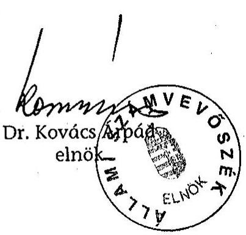
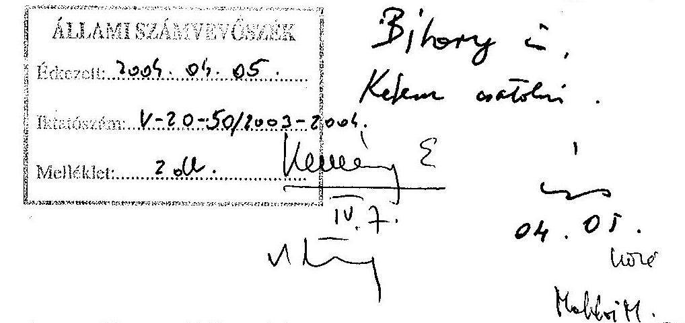
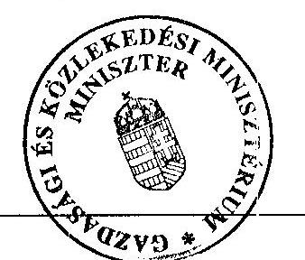

# JELENTÉS 

a Magyar Fejlesztési Bank
Részvénytársaság múködésének és a
központi költségvetés végrehajtásához kapcsolódó tevékenységének ellenôrzésérôl

---

2. Államháztartás Központi Szintjét Ellenőrző Igazgatóság
2.1.5. Pénzintézeti Ellenőrzési Osztály

Iktatószám: V-20-51/2003-2004.
Témaszám: 665
Vizsgálat-azonosító szám: V0110

# Az ellenőrzést felügyelte: 

Bihary Zsigmond
főigazgató
Az ellenőrzés végrehajtásáért felelős:
Kemény Emil
főcsoportfőnök
Az ellenőrzést vezette:
Makkai Mária
főcsoportfőnökhelyettes

Az ellenőrzést végezték:

| Hajagos Józsefné | Lucza Anikó | Németh Béláné |
| :-- | :-- | :-- |
| számvevő főtanácsadó | számvevő gyakornok | számvevő tanácsadó |
| Kun Eszter | Massányi Tibor | Tornai József |
| számvevő | számvevő | számvevő tanácsadó |
| Barát Stefánia | Matuk Károly |  |
| külső munkatárs | számvevő |  |

A témához kapcsolódó eddig készített számvevőszéki jelentések:
címe
sorszáma
Jelentés a Postabank és Takarékpénztár Rt. gazdálkodása, 9934
működése és a Magyar Fejlesztési Bank Rt. 1998. évi veszteségének
ellenőrzéséről
Jelentés az M3 autópálya beruházás pénzügyi folyamatának 0218
ellenőrzéséről
Jelentés az M7 autópálya felújítás pénzügyi folyamatának 0342
ellenőrzéséről

---

# TARTALOMJEGYZÉK 

BEVEZETÉS ..... 5
I. ÖSSZEGZŐ MEGÁLLAPÍTÁSOK, KÖVETKEZTETÉSEK, JAVASLATOK ..... 7
II. RÉSZLETES MEGÁLLAPÍTÁSOK ..... 14

1. A Bank feladata, szervezete, működésének szabályozottsága és belső kontrollrendszere ..... 14
1.1. A Bank feladata ..... 14
1.2. A Bank szervezete és működésének tárgyi feltételei ..... 16
1.3. A Bank működésének szabályozottsága ..... 18
1.4. A belső kontrollrendszer működése ..... 18
2. A tulajdonosi irányítás ..... 21
3. A Bank üzleti tevékenysége ..... 23
3.1. A Bank forrásállományának alakulása ..... 23
3.2. A Bank támogatás közvetítési tevékenysége ..... 25
3.3. A Bank hitelezési tevékenysége ..... 25
3.3.1. A hitelezési tevékenység szabályozottsága ..... 25
3.3.2. A hitelállomány alakulása, összetétele ..... 27
3.3.3. A kockázatkezelés, a minősítés és az értékvesztés alakulása ..... 28
3.4. A Bank befektetési tevékenysége ..... 30
3.4.1. A befektetési és az értékpapír üzletág szabályozottsága, a befektetési korlátok betartása ..... 31
3.4.2. A vállalkozásokban fennálló részesedések ..... 33
3.4.3. Az értékpapír állomány alakulása ..... 37
3.4.4. A befektetések kezelése, az értékvesztések alakulása ..... 37
3.5. Az eszköz-forrás gazdálkodás, a likviditás kezelése ..... 40
4. A Bank vagyoni helyzete, eredménye és gazdálkodása ..... 42
4.1. A vagyoni helyzet ..... 42
4.2. Az eredményt befolyásoló tényezők ..... 43
4.2.1. A befektetési üzletág eredménye ..... 44
4.2.2. A hitelezési üzletág eredménye ..... 45
4.3. A banküzemi tevékenység egyéb eredménye ..... 45
4.4. A mérlegen kívüli tételek alakulása ..... 47
4.5. A Bank 2003. I. félévi gazdálkodása ..... 48
4.6. A Bank működési költségének alakulása ..... 49

---

# MELLÉKLETEK 

1. sz. A Gazdasági és Közlekedési Minisztérium által tett észrevétel
2. sz. Az MFB Rt. közvetlen befektetéseinek alakulása 2001. december 31. és 2003. június 30. között
3. sz. Az MFB Rt. értékpapír állományának alakulása 2001. december 31. és 2003. június 30 között
4. sz. Az MFB Rt. befektetéseinek minősítése 2001. december 31. - 2003. június 30. közötti időszakban
5. sz. A 2002. évi veszteség elemei
6. sz. A Bank mérlegfőösszegének és eredményének alakulása 1991-2002. években

---

# RÖVIDÍTÉSEK JEGYZÉKE 

| ÁAK Rt. | Állami Autópálya Kezelő Rt. |
| :--: | :--: |
| Áht. | Az államháztartásról szóló 1992. évi XXXVIII. törvény |
| ÁPV Rt. | Állami Privatizációs és Vagyonkezelő Rt. |
| BAF | Bankfelügyelet |
| Bank | Magyar Fejlesztési Bank Részvénytársaság |
| BAR | Bankközi Adósnyilvántartó Rendszer |
| BEI | Belső Ellenőrzési Igazgatóság |
| DHK Rt. | Diákhitel Központ Rt. |
| EDR | Egységes Digitális Rádiótávközlési Rendszer |
| EFGB | Eszköz-Forrás Gazdálkodási Bizottság |
| Eximbank Rt. | Magyar Export-Import Bank Rt. |
| FB | Felügyelő Bizottság |
| Felügyelet | Pénzügyi Szervezetek Állami Felügyelete |
| GKM | Gazdasági és Közlekedési Minisztérium |
| Gt. | A gazdasági társaságokról szóló 1997. évi CXLIV. törvény |
| Hpt. | A hitelintézetekről és pénzügyi vállalkozásokról szóló 1996. évi CXII. törvény |
| IMP | Informatikai migrációs projekt |
| KCB | Központi Cenzúra Bizottság |
| KKV | Kis- és közepes vállalkozások |
| KVI | Kincstári Vagyon Igazgatóság |
| MBV Rt. | Magyar Befektetési és Vagyonkezelő Részvénytársaság |
| MEHIB Rt. | Magyar Exporthitel Biztosító Rt. |
| MFB tv. | A Magyar Fejlesztési Bank Részvénytársaságról szóló 2001. évi XX. törvény |
| MNB | Magyar Nemzeti Bank |
| MP TETRA | Magyar Posta TETRA Rt. |
| NA Rt. | Nemzeti Autópálya Rt. |
| OM | Oktatási Minisztérium |
| OMT | Országos Munkaügyi Tanács |
| PM | Pénzügyminisztérium |
| SZMSZ | Szervezeti és Múködési Szabályzat |
| Szt. | A számvitelről szóló 2000. évi C. törvény |

---

# TARTALOMJEGYZÉK 

BEVEZETÉS ..... 5
I. ÖSSZEGZŐ MEGÁLLAPÍTÁSOK, KÖVETKEZTETÉSEK, JAVASLATOK ..... 7
II. RÉSZLETES MEGÁLLAPÍTÁSOK ..... 14

1. A Bank feladata, szervezete, működésének szabályozottsága és belső kontrollrendszere ..... 14
1.1. A Bank feladata ..... 14
1.2. A Bank szervezete és múködésének tárgyi feltételei ..... 16
1.3. A Bank múködésének szabályozottsága ..... 18
1.4. A belső kontrollrendszer múködése ..... 18
2. A tulajdonosi irányítás ..... 21
3. A Bank üzleti tevékenysége ..... 23
3.1. A Bank forrásállományának alakulása ..... 23
3.2. A Bank támogatás közvetítési tevékenysége ..... 24
3.3. A Bank hitelezési tevékenysége ..... 25
3.3.1. A hitelezési tevékenység szabályozottsága ..... 25
3.3.2. A hitelállomány alakulása, összetétele ..... 26
3.3.3. A kockázatkezelés, a minősítés és az értékvesztés alakulása ..... 28
3.4. A Bank befektetési tevékenysége ..... 30
3.4.1. A befektetési és az értékpapír üzletág szabályozottsága, a befektetési korlátok betartása ..... 31
3.4.2. A vállalkozásokban fennálló részesedések ..... 33
3.4.3. Az értékpapír állomány alakulása ..... 37
3.4.4. A befektetések kezelése, az értékvesztések alakulása ..... 37
3.5. Az eszköz-forrás gazdálkodás, a likviditás kezelése ..... 40
4. A Bank vagyoni helyzete, eredménye és gazdálkodása ..... 42
4.1. A vagyoni helyzet ..... 42
4.2. Az eredményt befolyásoló tényezők ..... 43
4.2.1. A befektetési üzletág eredménye ..... 44
4.2.2. A hitelezési üzletág eredménye ..... 45
4.3. A banküzemi tevékenység egyéb eredménye ..... 45
4.4. A mérlegen kívüli tételek alakulása ..... 47
4.5. A Bank 2003. I. félévi gazdálkodása ..... 48
4.6. A Bank múködési költségének alakulása ..... 49

---

# MELLÉKLETEK 

1. sz. A Gazdasági és Közlekedési Minisztérium által tett észrevétel
2. sz. Az MFB Rt. közvetlen befektetéseinek alakulása 2001. december 31. és 2003. június 30. között
3. sz. Az MFB Rt. értékpapír állományának alakulása 2001. december 31. és 2003. június 30 között
4. sz. Az MFB Rt. befektetéseinek minősítése 2001. december 31. - 2003. június 30. közötti időszakban
5. sz. A 2002. évi veszteség elemei
6. sz. A Bank mérlegfőösszegének és eredményének alakulása 1991-2002. években

---

# RÖVIDÍTÉSEK JEGYZÉKE 

| ÁAK Rt. | Állami Autópálya Kezelő Rt. |
| :--: | :--: |
| Áht. | Az államháztartásról szóló 1992. évi XXXVIII. törvény |
| ÁPV Rt. | Állami Privatizációs és Vagyonkezelő Rt. |
| BAF | Bankfelügyelet |
| Bank | Magyar Fejlesztési Bank Részvénytársaság |
| BAR | Bankközi Adósnyilvántartó Rendszer |
| BEI | Belső Ellenőrzési Igazgatóság |
| DHK Rt. | Diákhitel Központ Rt. |
| EDR | Egységes Digitális Rádiótávközlési Rendszer |
| EFGB | Eszköz-Forrás Gazdálkodási Bizottság |
| Eximbank Rt. | Magyar Export-Import Bank Rt. |
| FB | Felügyelő Bizottság |
| Felügyelet | Pénzügyi Szervezetek Állami Felügyelete |
| GKM | Gazdasági és Közlekedési Minisztérium |
| Gt. | A gazdasági társaságokról szóló 1997. évi CXLIV. törvény |
| Hpt. | A hitelintézetekről és pénzügyi vállalkozásokról szóló 1996. évi CXII. törvény |
| IMP | Informatikai migrációs projekt |
| KCB | Központi Cenzúra Bizottság |
| KKV | Kis- és közepes vállalkozások |
| KVI | Kincstári Vagyon Igazgatóság |
| MBV Rt. | Magyar Befektetési és Vagyonkezelő Részvénytársaság |
| MEHIB Rt. | Magyar Exporthitel Biztosító Rt. |
| MFB tv. | A Magyar Fejlesztési Bank Részvénytársaságról szóló 2001. évi XX. törvény |
| MNB | Magyar Nemzeti Bank |
| MP TETRA | Magyar Posta TETRA Rt. |
| NA Rt. | Nemzeti Autópálya Rt. |
| OM | Oktatási Minisztérium |
| OMT | Országos Munkaügyi Tanács |
| PM | Pénzügyminisztérium |
| SZMSZ | Szervezeti és Múködési Szabályzat |
| Szt. | A számvitelről szóló 2000. évi C. törvény |

---

# 4

---

# JELENTÉS 

## a Magyar Fejlesztési Bank Részvénytársaság múködésének és a központi költségvetés végrehajtásához kapcsolódó tevékenységének ellenőrzéséről

## BEVEZETÉS

A Magyar Fejlesztési Bank Részvénytársaság (továbbiakban: Bank) a Magyar Állam 100\%-os tulajdonában álló szakosított hitelintézet. A Bank 1997. január 1-jétől múködik Magyar Fejlesztési Bank Részvénytársaság néven és jogutódja az 1991-ben létrehozott Magyar Befektetési és Fejlesztési Részvénytársaságnak. 2001. évben az Országgyúlés a Bankról önálló törvényt alkotott (2001. évi XX. tv., továbbiakban: MFB tv.), amely meghatározza jogállását, feladatait és tevékenységi körét. Ezen túlmenően a Bank múködését, mint szakosított hitelintézetét a hitelintézetekről és pénzügyi vállalkozásokról szóló 1996. évi CXII. tv., (továbbiakban: Hpt.) szabályozza.

Az MFB tv. hatálybalépését követően kétszer módosult. A módosítások - különösen a 2003. június 15 -étől hatályos második - alapvetően megváltoztatták a Bank feladatait. Az eredeti szabályozás szerint a Bank fő feladata az volt, hogy banki eszközökkel részt vegyen az állami fejlesztések és beruházások megvalósításában, továbbá közremúködjön az állami források közvetítésében. A Bank tevékenységében a hangsúly az állami feladatok végrehajtására tevődött és másodlagos szerepe volt a bankszerú múködésnek. Ezt lehetővé tette az a szabályozás is, hogy a Hpt.-ben előírt prudenciális követelményeknél enyhébbeket írt elő az MFB tv.

A törvénymódosítások arra irányultak - igazodva az Európai Unió követelményéhez -, hogy a tisztán állami feladatok és a fejlesztési banki tevékenységek elkülönüljenek (kikerültek az állami feladatok), valamint a Bank üzleti alapon, hitel- és tőkefinanszírozással, szigorúbb kockázatvállalási feltételek mellett segítse a magyar gazdaság fejlődését.

A törvény módosításai a Bank forrásszerzési tevékenységét nem érintették. Így változatlanul fennáll az, hogy a Bank által forrásszerzés céljából külföldről és belföldről felvett hitelekből és a kötvénykibocsátásaiból származó visszafizetési kötelezettségek mögött a Kormány áll, és a központi költségvetés terhére, az abban meghatározott mértékig készfizető kezesként felel.

A Bank gazdálkodásának célszerúségét és jövedelmezőségét a tulajdonosi jogok gyakorlója vizsgálja. A tulajdonosi jogokat jelenleg a gazdasági és közlekedési miniszter gyakorolja. A törvény értelmében a Bank az eredményéből osztalékot

---

nem fizet. A gazdálkodás nyeresége (felosztható eredmény) a Banknál marad, amely az eredménytartalékot növeli.

Az Állami Számvevőszék a Banknál átfogó ellenőrzést még nem végzett, de célvizsgálatok keretében - mint az 1992. évi hitelkonszolidáció, a Bank 1998. évi vesztesége okainak feltárása, az M3 és M7 gyorsforgalmi út beruházása, illetve felújítása - már tapasztalatokat szerzett a Bankról.

Az ellenőrzés jogalapját az Állami Számvevőszékről szóló 1989. évi XXXVIII. tv. 2. § (6) bekezdése képezte.

Az ellenőrzés célja annak értékelése volt, hogy

- a Bank működése, tevékenysége megfelelt-e a törvényi előírásoknak, az állam tulajdonosi elvárásainak, a belső szabályzatoknak;
- a forrásszerzés céljából külföldről és belföldről felvett hitelek, illetve a kötvénykibocsátások összhangban voltak-e a költségvetési törvényben előírtak$\mathrm{kal} ;$
- a források biztosították-e a Bank törvényben előírt feladatai végrehajtását.

Az ellenőrzés a Bank 2002. évi és a helyszíni ellenőrzés befejezéséig terjedő időszak (2003. október) tevékenységére irányult, de szükség szerint a 2002. évet megelőző időszakra is kiterjedt. A Bank működését 2003. december végéig figyelemmel kísértük, de a 2003. évi eredmény alakulása és a helyszíni vizsgálatot követő gazdasági események ellenőrzése nem volt feladatunk.

A jelentés-tervezet egyeztetése során a Bank jelezte, hogy az ellenőrzés hatására intézkedéseket hozott. Ezek tájékoztatásként a megfelelő helyen a lábjegyzetben szerepelnek.

A jelentés-tervezetet megismertettük a Bank felett a tulajdonosi jogokat 2002. június 14-ig gyakorló miniszterrel és a Bank korábbi vezérigazgatójával. A volt vezérigazgató tárgyszerű észrevételeit a jelentésbe beépítettük.

A jelentést az Állami Számvevőszékről szóló 1989. évi XXXVIII. tv. III. fejezet 25. § (1) bekezdésének megfelelően észrevételezésre megküldtük Dr. Csillag István gazdasági és közlekedési miniszter úrnak, aki nem tett észrevételt (levelének másolatát az 1. sz. melléklet tartalmazza).

---

# I. ÖSSZEGZŐ MEGÁLLAPÍTÁSOK, KÖVETKEZTETÉSEK, JAVASLATOK 

A Bank feladatait megalapítása óta (1991) a gazdaságfejlesztés változó koncepciói, körülményei, az alapítói jogok gyakorlójának mindenkori követelményei határozták meg. A tulajdonosi - állami - döntések a Bank tevékenységét rövid és középtávon determinálták.
2001. év közepétől önálló törvény határozza meg a Bank feladatait, tevékenységi körét. Eszerint a Bank tevékenysége kiterjedt mindazon feladatok ellátására, amelyek a Kormány közép- és hosszú távú gazdaságfejlesztési céljainak megvalósításához szükségesek. Ehhez a törvény mozgásteret is biztosított, mivel a Hpt. előírásától eltérően enyhítette a nagykockázatra vonatkozó korlátozásokat (hitelek, befektetések) és felhatalmazta a Kormányt arra, hogy rendeletben szabályozza a Bank általánostól eltérő minősítési és értékelési rendjét.

A Bank 2002. évi portfoliója tükrözte a vele szemben megfogalmazott elvárásokat, amelyek kormány- és alapítói határozatokban jelentek meg. Az állami elvárásokat tartalmazó határozatok nem ütköztek a vonatkozó (MFB tv., Hpt.) törvényi előírásokba, azonban a Bank kockázatát növelték. Az ún. stratégiai (állami, kormányzati, alapítói, "indirekt" állami elvárású) hitelezési tevékenység a 2000. évi 33\%-os részarányról 2002. év végére 90\%-ra emelkedett.

Az MFB tv. 2002. és 2003. évben is változott. A változtatás fő célja az volt, hogy a Bankot mentesítse minden állami feladat végrehajtása alól és fejlesztési bankként való múködését kizárólagossá tegye. Ezzel összhangban volt a Bank újonnan kidolgozott stratégiája és 2003. évi üzletpolitikája, valamint üzleti terve.

A 2002. év a Bank múködésében az átmenet éve volt, mivel az év második felében lépett hatályba a feladatait alapvetően megváltoztató törvénymódosítás. A Bank a 2002. évre szóló üzleti tervét nem korrigálta annak ellenére, hogy az a régi törvényi előírásokon és stratégián alapult, ugyanakkor megkezdte a szervezetének és múködésének átalakítását az új szabályozásnak megfelelően. Az átalakítás a prudens (biztonságos) múködés fokozottabb előtérbe helyezését szolgálta.

A Bank alapítása óta 1998-ban, 2000 és 2002 között volt veszteséges. A veszteség mérlegfőösszeghez viszonyított aránya 1998-ban 18\% ${ }^{1}$, 2000-ben 1,9\%, 2001-ben 1,0\% és 2002-ben $27 \%$ volt. A 2002. évi 137 milliárd Ft-os veszteség elsődleges oka, hogy a Bank alapvetően állami feladatot látott el banki keretek között, de nem banki feltételekkel. Ez azt jelentette, hogy a Bank az állami tulajdonú társaságoknak, kormányhatározatok és alapítói határozatok alapján,

[^0]
[^0]:    1 Az 1998. évi veszteség okait a Postabank Rt. gazdálkodása, müködése és a Magyar Fejlesztési Bank Rt. 1998. évi veszteségének ellenőrzéséről készített ÁSZ jelentés tartalmazza.

---

a hiteleket nem kellő fedezet mellett, kedvezőbb kondíciókkal, saját erő nélkül nyújtotta, és olyan befektetéseket eszközölt, amelyek megtérülésével nem számolt.

A veszteség közvetlen oka az értékvesztés elszámolás és a céltartalékképzés gyakorlata, amelynek több összetevője volt. A Kormánynak 2001. évtől felhatalmazása volt arra, hogy rendeletben szabályozza a Bank eszközei minősítésének speciális szabályait. A rendelet - amely az eszközök értékeléséhez kedvezőbb feltételeket hivatott előírni - 2002. I. félévig nem született meg, ezt követően pedig az MFB tv. a rendelet megalkotására vonatkozó kötelezettséget hatálytalanította. A Bank a 2001-ben és 2002. I. negyedévében alkalmazott gyakorlatában mégis a korábbi törvény szellemében járt el, azaz a kormányzati feladatokhoz kapcsolódó eszközök után kevesebb értékvesztést számolt el, mint amennyit a bankszerű működés indokolt volna. A Bank az MFB tv. módosítását követően a 2002. II. negyedévi értékvesztés elszámolásnál és céltartalékképzésnél - mivel a külön értékelési szabályokat tartalmazó kormányrendelet nem született meg - a hatályos prudenciális előírásoknak megfelelően értékelte a befektetéseket és hiteleket. Így a 2002. I. félévi veszteség 58 milliárd Ft lett.

A törvény 2002. évi módosítását követően a Bank feladata volt a befektetések átláthatóvá tétele (portfoliótisztítás), valamint a bankszerű működés érvényesítése. A portfoliótisztítás feltételeit, kereteit (ár, árképzés elvei, vevőkör) a törvény módosításakor nem határozták meg, csupán annak határidejét írták elő. ${ }^{2}$ A feltételek hiánya és a bankszerű működés követelménye együttes hatásaként, valamint az óvatosság elve alapján a Bank megszigorította az eszközök minősítését és ehhez kapcsolódóan az értékvesztések elszámolásánál a vonatkozó szabályzat alapján egyedileg eltérítette azokat. Mindkét minősítési, értékelési gyakorlat (2002. I. és II. félévi) a múködésére közvetlenül ható kormányzati döntéseknek, tulajdonosi elvárásoknak a következménye, amely a veszteség 62,8\%-át okozta. Az ellenőrzés a kiválasztott hitelügyleteknél - amelyek után az elszámolt értékvesztés a teljes hitelállomány értékvesztésének 2002. december 31-én $87,5 \%$-át jelentette - jogszabályba ütköző minősítést nem tapasztalt.

A Bank saját üzleti tevékenysége nem volt eredményes. Ennek oka egyrészt az ügyfelek piacvesztése, veszteséges gazdálkodása és fizetési nehézségei voltak,

[^0]
[^0]:    ${ }^{2}$ A Bank 2004. január 13-ai levele szerint: „A Banknak a portfoliókezelés - az új stratégia szerint nem tartozik a tevékenységi körébe, ezért a Bank 2002. II. felében minél hamarabb értékesíteni kívánta a befektetési portfolió jelentős részét. Az értékesítési folyamat azonban az ÁPV Rt. miatt elhúzódott és végül csak 2003. I. félévében született meg a Kormányhatározat és az Alapítói határozat, hogy a Bank a befektetési portfoliójának jelentős részét értékesítse az ÁPV Rt. részére. A Bank számára a 2002. december 31-i befektetés minősítéskor jelentős bizonytalansági tényező volt a majdani eladási ár. A Bank eredeti álláspontja szerint az eladási ár a befektetések piaci értéke lett volna, melyet az ÁPV Rt. által kijelölt szakértő is felülvizsgált volna. Ennek megfelelően a Bank az értékesítendő befektetéseit a hatályos ügyletminősítési szabályzata alapján egyedileg minősítette a piaci ár meghatározásának és az óvatosság elvének szempontjait szem előtt tartva. 2003. első félévében a Kormány és a tulajdonosi jogokat gyakorló miniszter úgy határozott, hogy a Bank befektetéseinek eladási ára a nettó könyv szerinti érték lesz, mert a piaci érték megállapítása - a jogszabályokban előírt hosszadalmas eljárás alapján - lehetetlenné tette volna az előírt határidőben történő portfolió tisztítást."

---

másrészt a Bank vagyonkezelésének eredménytelensége. A befektetésekből osztalék nem származott, a végrehajtott tőkeemelések veszteséget finanszíroztak.

A veszteséget - nagyságára való tekintettel - a Bank kamatkülönbözete nem tudta mérsékelni. A hitelezési tevékenysége a korábban megkezdett ügyletek folytatására korlátozódott, új hitelkihelyezési programok csak 2003. III. negyedévtől indultak. ${ }^{3}$ Az állami feladatok ellátásához (pl. autópálya építés, diákhitel, agrárhitel) felvett piaci szintű kamatviselő forrásokat nem piaci kamatozás mellett helyezte ki.

A Bank mérlegfőösszege 2002. év végén megközelítette az 508 milliárd Ft-ot, saját tőkéje ebből 18,1\%-os részarányú volt. 201 fő teljes munkaidős létszámmal bonyolította le fejlesztési banki feladatait.

Az MFB tv. 2002. évi változása után, az annak megfelelő banki működés következtében elszámolt és megképzett értékvesztés/céltartalékképzés miatt a Bank a saját tőkéjét élte fel. Múködőképességét csak 96 milliárd Ft-os állami tőkejuttatással tudta fenntartani. Ebből 60 milliárd Ft volt a veszteségtérítés, annak érdekében, hogy a Hpt. előírásának megfelelően a Bank saját tőkéje ne csökkenjen a jegyzett tőkéje alá. A 2001-2002. évi költségvetési törvény 36 milliárd Ft tőkejuttatást hagyott jóvá a Bank részére, amelyből 15,3 milliárd Ft-ot a gyorsforgalmi úthálózat üzemeltetési és fenntartási kiadásaira kellett felhasználni. A törvény a céljelleggel juttatott 15,3 milliárd Ft felhasználására határidőt nem írt elő. Ez azzal függ össze, hogy a központi költségvetésben olyan kiadások teljesítésénél, ahol az előirányzat nem a kincstári körbe tartozó szervezetet illet meg, nincs a teljesítés módja és ideje szabályozva. A Bank 8,5 milliárd Ft-ot 2002 decemberében felhasznált úgy, hogy tőkét emelt az ÁAK Rt.nél, 6,8 milliárd Ft-ot azonban visszatartott, amelyre jogalappal nem rendelkezett. A tulajdonosi jogokat gyakorló GKM miniszter a céltól eltérő felhasználás miatt az Áht. és a központi, a társadalombiztosítási és a köztestületi költségvetési szervek kormányzati, felügyeleti, valamint belső költségvetési ellenőrzéséről szóló kormányrendelet előírásai alapján nem intézkedett az összeg visszafizetéséről. ${ }^{4}$ A Bank ezt az összeget a veszteség mérséklésére használta fel.

A Bank eredménye 2003. I. félévében 1,2 milliárd Ft nyereség volt. A portfoliótisztítás 2003-ban gyakorlatilag befejeződött, így 2004. lesz az az év, amikor a Bank a Kormány által meghatározott irányelvek alapján fejlesztési bankként tud működni. Ezt követően értékelhető a Bank új profiljának megfelelő működése.

A Bank múködése megfelelt a törvényi előírásoknak és az azokkal összhangban álló belső szabályzatoknak. A tevékenységeket és a múködést keretbe foglaló szabályok, utasítások rendelkezésre álltak. A szervezeti felépítés, a belső irányítási rendszer és a szabályozottság a törvényi módosításokkal összefüggés-

[^0]
[^0]:    ${ }^{3}$ A Bank 2004. január 27-én kelt levele szerint a hitelezési tevékenység alakulásában szerepet játszott a portfoliótisztítás, a Bank szervezetének átalakítása és az MFB tv. módosítása.
    ${ }^{4}$ A GKM 2004. január 7-én kelt levelében az ÁSZ-t arról tájékoztatta, hogy a szükséges intézkedések megtétele folyamatban van.

---

ben változott. A szervezeti felépítés és az irányítás új sajátossága a munkaszervezet két vezérigazgató irányítása alá rendelése. Ez azért aggályos, mert az SZMSZ nem szabályozza a vezérigazgatók egymás közötti feladat- és hatáskör szétválasztását, illetve a felelősség megosztását. A szervezeti felépítésben a változást követően a vezetési pontok száma folyamatosan emelkedett, a szervezeti tagoltság mind horizontálisan, mind mélységét tekintve nőtt. Az irányítási rendszer hiányossága, hogy a szervezeti egységek nem rendelkeztek aktualizált ügyrenddel és ez nem tette lehetővé az ellenőrzési pontok egzakt meghatározását. Ezzel a folyamatba épített ellenőrzés megnehezült.
2002. június 14-től a tulajdonosi jogokat a gazdasági és közlekedési miniszter gyakorolja, azt megelőzően ezt a tisztséget a miniszterelnöki hivatalt vezető miniszter látta el. A tulajdonosi jogok gyakorlója aktívan részt vett a kockázatvállalási, forrásbevonási döntésekben, amelyek elsősorban az állami feladatok ellátását szolgáló, stratégiai kockázatú ügyleteket érintették. A 2002. június 14-ig, a tulajdonosi joggyakorló személyében bekövetkezett váltásig az alapítói határozatok felmentést adtak - amelyre a szabályzatok lehetőséget biztosítottak - a hitelfedezetek és az önrész esetében a Bank szabályzataiban előírt prudenciális feltételek teljesítése alól.
2002. II. félévétől sem szorult vissza a tulajdonosi beavatkozás, de a hitelezési és garanciavállalási ügyletekkel kapcsolatos döntések a hitelfedezeti előírásoknak megfeleltek, azonban továbbra is tapasztalható egyedi kamat- és díjmegállapítás.

A tulajdonosi jogokat gyakorló miniszter évente a Bank előző évi tevékenységéről beszámolt a Kormánynak. A beszámolók tartalmukban megfeleltek az MFB tv.-ben előírtaknak.

A tulajdonosi ellenőrzés szervezete a Felügyelő Bizottság, amely a külső és belső előírásoknak megfelelően látta el feladatát. A függetlenített belső ellenőrzés az FB szakmai irányítása alatt múködik. Vizsgálati megállapításai helytállóak és dokumentumokkal alátámasztottak voltak. Hiányossága az ellenőrzési tevékenységnek, hogy a vizsgálatait követően intézkedési tervben meghatározott feladatok teljesítését nem kéri számon, azokat csak több év elteltével esedékes újabb vizsgálata során ellenőrzi.

A Bank forrásszerzési tevékenysége (hitelfelvétel, kötvénykibocsátás ${ }^{5}$ ) megfelelően szabályozott és összhangban volt a stratégiával. Ugyanakkor a PM és a Bank között a külföldi forrásbevonásokra vonatkozó eljárási rend és az ár-

[^0]
[^0]:    ${ }^{5}$ A Kormányzati Ellenőrzési Hivatal 2002-ben, többek között vizsgálta a Bank 2001. évi 450 millió EURO-s kötvénykibocsátását. A megállapításai alapján a közpénzügyi államtitkár büntető feljelentést tett a korábbi elnök-vezérigazgató ellen. Az Országos Rendőr Főkapitányság bűncselekmény hiányában az eljárást megszüntette.

---

folyam garancia elszámolásáról szóló megállapodás nem készült el. ${ }^{6,7}$ Az éves üzleti tervnek megfelelően a Bank forrásait döntően autópálya-építés finanszírozására, az agrárium hitelezésére (agrárhitelek és családi gazdaságoknak nyújtott hitelek), mezőgazdasági szövetkezeti külső és nyugdíjas üzletrészek felvásárlására, valamint a diákhitel folyósítására használta fel.

A forrásoldali állami garanciák, kezességek tekintetében a Bank a törvényi limiteket betartotta, beváltásra nem került sor.

19 forrásbevonási ügyletből 8 esetben a Kormány döntött, 11 eset pedig jogszabályon alapuló kezességvállalás volt. A PM által előírt adatszolgáltatási kötelezettségek a jogszabályokon alapulókra nem, csak kormányhatározatban vállalt kezességekre vonatkoznak, amelyet a Bank teljesített. A Magyar Állam így nem ismeri teljes körűen az általa vállalt kezességek állományát és a zárszámadási törvényben sem a valós összeg szerepel.

A Bank hitelezési tevékenysége szabályozott, rendelkezik mindazokkal a belső utasításokkal, amit jogszabályi kötelezettség ír elő.

Az ügyfélhitelek - kedvezményes agrárhitelek nélküli - állományát a dinamikus növekedés jellemezte 2002. évben. A hitelezési aktivitás növekedése azonban csak a stratégiai hitelkihelyezéseknél volt tapasztalható, a saját kockázatvállalású hitelek változása nem volt számottevő. A problémamentes/problémás hitelek aránya a 2002. évi átlagos 30:70 \%-ról az év végén 55:45 \%-ra változott. Ezt az eredményezte, hogy a problémamentes hitelek 2002. év végi 125 milliárd Ft-os állományából közel 95 milliárd Ft-ot - az NA Rt. és a DHK Rt. tartozása - a költségvetés átvállalt, illetve készfizető kezességet nyújtott. A problémás hitelek állománya ugyanakkor megnőtt, ami az MFB tv. 2002. évi változásával, a prudenciális követelmények teljesítése miatt következett be.

A Bank befektetési tevékenysége a jogszabályi előírásoknak megfelelően szabályzott. A Bank befektetései között az állam gazdaságpolitikai terveit szolgáló társaságok széles köre volt megtalálható, de a megkezdett portfoliótisztítás révén azok összetétele tematikusabbá vált.

A Bank 2002-ben 16 társaságnál emelt tőkét, amely 5 befektetésnél fejlesztési, 2-nél pedig reorganizációs célokat szolgált. A többi társaságnál a Gt. előírásának megfelelően a tőkerendezési kötelezettség teljesítésére fordították a tőkeemelést.

Az MFB tv.-ben előírt portfoliótisztítást a Bank gyakorlatilag végrehajtotta, ennek következményeként vesztesége keletkezett, amelyek elsősorban az állami körben való értékesítéseknél mutathatók ki. Az állami feladatokat ellátó társaságokat (autópálya építés és fenntartás, diákhitelezés) a Magyar Állam nevé-

[^0]
[^0]:    ${ }^{6}$ A Bank 2004. január 13-án kelt levele szerint a külföldi forrásbevonások eljárási rendjét 2003 decemberében aláírták.
    ${ }^{7}$ A Bank 2004. február 11-i tájékoztatása szerint az árfolyam garancia elszámolására vonatkozó megállapodást 2004. január 27-én aláírták a PM-mel.

---

ben a KVI vásárolta meg. A Bank 2002. évben 2 és 2003. évben 17 befektetést értékesített az ÁPV Rt.-nek, így a befektetések továbbra is állami körben maradtak. Az ügyletekből származó több tízmilliárd Ft banki veszteség az államháztartás szintjén ma még nem ítélhető meg. Erre csak a társaságok privatizációja után lesz lehetőség.

A befektetési portfolió minősége 2003. március 31-éig fokozatosan romlott. Nőtt a befektetések után elszámolt értékvesztés, csökkent a problémamentes minősítésű befektetések száma és értéke. A befektetésekre egyedi elbírálással megállapított rosszabb minősítések és az elszámolt magasabb értékvesztések nem mutatták a társaságok tényleges gazdasági helyzetét.

A Bank eszköz-forrás gazdálkodásában a klasszikus hitelintézeti tevékenységek nem érvényesülhetnek, mivel a Hpt.-ben meghatározott forrásgyűjtési tevékenységet csak korlátozottan végezheti. Ez azt jelenti, hogy a Bank forrásait elsősorban a pénz- és tőkepiacról szerzi/szerezheti. A Banknak az eltérő lejárati szerkezetből likviditási, a különböző átárazódási periódusokból és kamatbázisokból kamatkockázatai voltak. A Bank a kockázatokat kezelte, az eszközforrás lejárati struktúráját, az átárazódási szerkezetet az igények alapján korrigálta.

A Bank alapítása óta a vele szemben megfogalmazott állami elvárások gyakran változtak. 2002 májusa előtt az állami feladatellátás volt a meghatározó, a Bank egyes esetekben „második költségvetésként" működött. A 2002. évi törvénymódosítással fogalmazódott meg a bankszerű, biztonságos működés követelménye és 2003. évtől állami finanszírozási feladatot a Bank már nem lát el. A Bank törvényi feladatainak változása előtt és azt követően is a tulajdonos Magyar Állam nem vizsgálta minden részletre kiterjedően a feladatok ellátásának lehetséges kereteit és költségvonzatát. A 2003. évet megelőző időszakban az állami feladatok teljesítése jelentős állami vagyonvesztéssel járt. A tiszta banki profil tényleges eredményei legkorábban azonban a 2004. üzleti év lezárását követően értékelhetőek.

A Bank a működési költségek előirányzatához hatékonysági követelményeket (2002. I. és II. félévében egyaránt) nem határozott meg. A Bank működési költsége 2002. évben 187 millió Ft-tal haladta meg a tervezettet. A Bank működési költségeinek 2002. II. félévi alakulásában érvényesült a költségtakarékosság és a költségnövekedés is. A működési költségeken belül meghatározó volt a bérköltség, a marketing kiadás és a szakértői díj. A bérköltség az előző évhez viszonyítva, több mint $30 \%$-kal nőtt. Ennek egyharmadát a vezetőváltással és a létszám fluktuációval összefüggő kifizetések tették ki. További egyharmad a létszámbővülés, új szervezetek létrehozása és a minőségi cserék bérnövelő hatása volt. A fennmaradó részt a bérfejlesztésre és a 2001. évre járó prémium kifizetésére fordították. A marketing szerződések a korábbi stratégia végrehajtásához kötődtek, amelyeket a feladatváltozás következtében az új vezetés 2002. III. negyedévében megszüntetett. A szakértői díjak összköltségen belüli 10\%-os aránya egyrészt a MOL gázüzletág megvásárlásával függött össze, másrészt a vezetőváltást követően a Bank átvilágításához kötődött.

---

A helyszíni ellenőrzés megállapításainak hasznosítása mellett javasoljuk:

# a Kormánynak 

1. Tekintse át a tulajdonosi jogok gyakorlója által készített éves beszámoló alapján a Bank feladatainak és a múködés kereteinek összhangját.
2. Kezdeményezze az Áht. módosítását annak érdekében, hogy egyértelműen szabályozva legyen a központi költségvetésből és a pénzalapokból államháztartáson kívüli szervezeteknek és magánszemélyeknek céljelleggel juttatott támogatások felhasználásának rendje (teljesítés ütemezése, elszámolása).
3. Tekintse át az állam által vállalt kezességek előkészítésének és a kezesség beváltásának eljárási rendjét és intézkedjen, hogy a Magyar Államkincstár részére teljesített adatszolgáltatás az egyedi mellett a jogszabályi kezességvállalásokat is tartalmazza.

## a gazdasági és közlekedési miniszternek

1. Rendelje el alapítói határozattal, hogy a Bank SZMSZ-e tartalmazza a két vezérigazgató irányítási és döntési felelősségének megosztását, elhatárolását.
2. Dolgoztassa ki az üzleti aktivitás és a múködési költség közötti összhang megteremtésének feltételeit, és alapítói határozatban rendelje el azoknak a Bank üzleti tervében való érvényre juttatását.
3. Kérje fel az FB-t, hogy írja elő a belső ellenőrzés vizsgálataihoz kapcsolódó intézkedési tervek végrehajtásának ellenőrzését az azokban foglalt határidők szerint.

---

# II. RÉSZLETES MEGÁLLAPÍTÁSOK 

## 1. A BANK FELADATA, SZERVEZETE, MŰKÖDÉSÉNEK SZABÁLYOZOTTSÁGA ÉS BELSŐ KONTROLLRENDSZERE

### 1.1. A Bank feladata

Az MFB tv. II. fejezete tartalmazza a Bank feladatait, tevékenységi körét. A törvényben előírtak a Kormány által kijelölt és a Bank által készített stratégiában meghatározott feladatok keretszerű megfogalmazása voltak.

Az 1999-ben készített stratégia alapján a Kormány 2036/2000. (II. 29.) számú határozatában kijelölte a Bank legfontosabb feladatait. Támogatta a Bank kiemelt részvételét az állami infrastrukturális beruházásokban, ezen belül elsősorban a gyorsforgalmi úthálózat fejlesztésében, a kis- és közepes vállalkozások finanszírozási lehetőségeinek bővítésében. A humán infrastruktúra területén az önálló orvosi tevékenységről szóló törvény végrehajtását meghatározó rendelet alapján a privatizációt segítő hitelek nyújtását illetve közvetítését a Bank feladataként jelölte meg. Előírta a stratégiához illeszkedő, továbbra is a bankcsoporthoz tartozó társaságok helyzetének rendezését, a vállalati portfolió csökkentését. A Bank múködésével kapcsolatban a határozat rögzítette, hogy nem profitorientáltan múködik, de az önfinanszírozásnak érvényesülnie kell a saját üzleti kockázatra vállalt tevékenységek körében.

A vizsgált időszakban 2002. július 27-i és 2003. június 15-i hatállyal módosult az MFB tv.

Az MFB tv. 2002. évi módosítását követően a Bank elkészítette új stratégiáját, amely illeszkedve a hatályos törvényhez, célul tűzte a portfoliótisztítást, a befektetéseknél a pozitív megtérülést, a fejlesztési bankszerű működést. A stratégiát valamint a Nemzeti Fejlesztési Tervhez kapcsolódó összeállítást a Bank 2002. IV. negyedévében a tulajdonosi jogokat gyakorló miniszter elé terjesztette jóváhagyás céljából. Ugyanakkor a Kormány 2018/2003. (II. 12.) határozatában döntött a Bank középtávú stratégiájának irányelveiről és előírta a részletes stratégia és középtávú üzleti terv elkészítését. Szükségesnek tartotta az MFB tv. módosítását az átlátható, prudens fejlesztési banki múködés követelményeinek megfelelően. Változás az előző stratégiákkal szemben, hogy a Bank - az államot helyettesítő gazdaságfejlesztési szerep helyett - a nemzetközi gyakorlattal összhangban a Kormány államháztartási, gazdasági lehetőségeit fejlesztési banki eszközökkel egészítse ki. Ahhoz, hogy a Bank sajátos banki eszközökkel járuljon hozzá a fejlesztéspolitikai célkitűzések megvalósításához a Kormány a korábbinál szűkebben és egyértelműen határozta meg a feladatait és a tevékenységét.

A 2003. június 15-től hatályos törvénymódosítás a Bank feladatait és tevékenységét a stratégiai irányelvekkel összhangban jelölte meg. A Bank csak éven túli - közép és hosszú lejáratú - fejlesztési célú hiteleket nyújthat olyan vállalkozásoknak és önkormányzatoknak, amelyek képesek azt megbízhatóan visszafi-

---

zetni. A Bank továbbra sem a profit maximalizásában érdekelt szervezet, de szigorítás a korábbi szabályozással szemben a kihelyezések megtérülési követelménye és a kockázatvállalás korlátozása. Ezek együtt hivatottak megakadályozni a Bankot olyan meg nem térülő beruházások finanszírozásában, amelyek megvalósítása állami költségvetési feladat.

Az MFB tv. hatályba lépése (2001. VI. 15.) után a múködés kormányhatározatok útján történő irányítása volt jellemző. 2001-ben és a 2002. évi vezetőváltásig több, mint 20, a vezetőváltás után - elsősorban 2002-ben - több mint 15, a Bankot közvetve, vagy közvetlenül szabályozó kormányhatározat született.

A Bank 2002. évi üzleti tervében meghatározott üzletpolitikai célkitúzés volt egyrészről a tevékenységét meghatározó állami feladatok teljesítése, másrészről az állami feladatok teljesítéséből származó veszteségek minimalizálása, rendezése állami szerepvállalással. Az állami feladatokat magában foglaló stratégiai tevékenység részaránya 2001. évben meghaladta a mérlegfőösszeg 60\%-át. A 2002. évi üzleti terv a kormányzati/költségvetési feladatok (autópálya építés és üzemeltetés, szövetkezeti üzletrészek felvásárlása, infrastrukturális fejlesztések finanszírozása tőkeágon) növekedésével számolt, részarányát az év végére mintegy 75\%-ban rögzítette. A Bank nem tervezte üzleti tevékenységének fokozását, a bankszerú múködés megteremtését. Ugyanakkor célul tűzte ki, hogy a veszteséget termelő eszközállományát átalakítja, ezen belül tisztítja a befektetési portfoliót, a részesedési portfolió csak stratégiai célból, illetve a társaságok értékesítését megelőző piaci stabilizációja miatt növekedhet.

A Bank üzletpolitikai célkitűzései alapján két változatban készítette el 2002. évi üzleti tervét. Az egyik variációban a Bank figyelembe vette a birtokában lévő eszközállományt és azokat a hatályos jogszabályok, valamint belső szabályzatai alapján minősítette, amely alapján a várható veszteség 85 milliárd Ft volt. A veszteségnek mintegy $41 \%$-át a részesedések után elszámolt értékvesztés növekedése okozza. A másik változat, az optimista arra épült, hogy a Bank eszközeinek értékelésére és minősítésére vonatkozó szabályokat - az MFB tv.-ben kapott felhatalmazás alapján - a Kormány megalkotja, valamint a veszteséget termelő szövetkezeti üzletrészek felvásárlását végző társaságok a portfolióból kikerülnek. Az optimista változat 3,1 milliárd Ft veszteséggel számolt, amelynek alakulásában a befektetési portfolió után elszámolt értékvesztésnek nincs negatív hatása (2001-ben elszámolt összes értékvesztés 22,1 milliárd Ft, a 2002ben tervezett értékvesztés 14,4 milliárd Ft). Kockázatos volt az igazgatóság azon döntése, hogy a 2002. évi üzleti terv optimista változatát terjesztette az alapítói jogokat gyakorló elé jóváhagyásra, mert még nem volt elfogadott megoldás a veszteséges tevékenységek exitjére, nem készült el az eszközök értékelésére vonatkozó kormányrendelet. A döntés azért is kockázatos volt, mert a Bank maga is átmeneti megoldásnak ítélte a speciális minősítés adta veszteségminimalizálást.

A Bank legfontosabb irányítási, múködési szabályait az alapító okirat és az SZMSZ foglalja magában. Az alapító okiraton a törvénymódosítás valamennyi új előírását átvezették.

---

A 2002. január 1. és 2003. szeptember 30. közötti időszakban a Szervezeti és Működési Szabályzat öt alkalommal változott, a legutolsó módosítás időpontja 2003. szeptember 15. volt. Ebből kettőt az MFB tv. módosítása és hármat a Bank szervezetének változása indokolt.

A régi és az új SZMSZ-nek is hiányossága, hogy az alkalmazottak foglalkoztatási feltételeit - az MFB tv. 17. § (1) bekezdésében foglaltaktól eltérően - nem tartalmazza.

A gyakorlatban az iskolai végzettség, a szakképzettség és a gyakorlatra vonatkozó kritériumokat a dolgozók alkalmazásánál érvényesítik, amit alátámaszt a létszámösszetétel 2003. június 30-i időpontra vonatkozó adatszolgáltatása.

A foglalkoztatott munkavállalók száma 221 fő volt, 160 dolgozónak volt felsőfokú végzettsége ( $72,4 \%$ ), $81,9 \%$-nak pedig szakképzettség szempontjából figyelembe vehető felsőfokú szakképzettsége, a középiskolai végzettségűek - 26,7\% egy részének tehát szakirányú felsőfokú képesítésre van. 13 fő ugyanakkor nem rendelkezik szakképesítéssel. A szakmai gyakorlatot, tapasztalatokat jellemzi, hogy 10 év feletti gyakorlati idővel a létszám $74,2 \%$-a, azon belül 20 év feletti banki gyakorlattal a dolgozók $51,6 \%$-a bírt. A személyi feltételek az előbbi információk tükrében megfelelőnek tekinthetők.

Az új SZMSZ-ből a törvényben leírt banki feladatok ismertetése hiányzik és nem szerepeltetik a tulajdonosi jogok gyakorlójának, az igazgatóságnak, a felügyelő bizottságnak, és a könyvvizsgálónak a feladat- és hatáskörét ismertető részt. A szabályzat kizárólag az ügyvezetés, a különböző döntéshozó-, és döntéselőkészítő testületek, vagyis az operatív irányítás és a belső működést reprezentáló szervezeti egységek feladatkörét ismertető szabályzattá alakult át, emiatt annak kezelése, az előírások gyakorlati alkalmazása megnehezült.

A 2002. szeptember 27-én elfogadott módosított SZMSZ tükrözi a törvényi változásokat. A 2003. júniusi törvénymódosítás az SZMSZ-re 2003. szeptember 15-i végrehajtási határidőt írt elő, amelyet a Bank betartott.

# 1.2. A Bank szervezete és múködésének tárgyi feltételei 

A szervezeti struktúra 2002 júniusáig nem változott, azt követően azonban - 2002. szeptember 27-től - teljesen átrendezett munkaszervezettel, felépítéssel működött a Bank. Az átfogó struktúraváltás csak egy évig volt érvényes, mivel 2003. szeptember 15-től ismét módosították a szervezetet.

A munkaszervezet felépítésének lényeges megváltoztatását az igazgatóság a Bank jövőbeni feladataival, a feladatrendszer módosulásához jobban illeszkedő belső szervezeti és munkaszervezeti struktúra kialakításának szükségességével indokolta. Cél volt, hogy „rugalmas müködési keretek, viszonylag kisszámú vezetési pont és a vezető egyértelmú felelősségi viszonyai mellett rugalmas szervezeti formák alakuljanak ki".

A Banknak - a törvényi előírással összhangban - jelenleg két vezérigazgatója van, ennek célját a törvény indoklása nem tartalmazza. A szervezeti sémából nem tűnik ki a két vezérigazgató közötti munkamegosztás, a vezérigazgatók közötti feladat- és felelősségi kör elhatárolására az SZMSZ-ben sincs utalás.

---

A Bank észrevételében rögzítette, hogy a két vezérigazgató kinevezésével érvényesül a „4 szem elve", a vezérigazgatók irányítási és döntési felelőssége egyetemleges, ezért nem került a feladat- és felelősségi kör megosztásra, és ezen ok miatt nem épült be az SZMSZ-be sem. Az ÁSZ álláspontja szerint azonban az ellenőrizhetőség és az átláthatóság érdekében a tiszta és egyértelmú felelősségi viszonyokat rögzíteni kell az SZMSZ-ben.

A vezetési pontok száma megnőtt a Bank ezt megelőző szervezetéhez képest, így az a cél, hogy viszonylag kevés vezetési pont legyen, nem teljesült. A 2002. évi szervezeti struktúrában az igazgatóságok száma öttel nőtt és 15 -re emelkedett. Az összes szervezeti egység száma a korábbi 29 -ről 34 -re, azon belül az alárendelt osztályok száma 29 -re nőtt.

A szervezeti tagoltság is megnőtt. 2002. december 31-én a vezetési pontok, a vezetők száma (vezérigazgatóktól osztályvezetőkig bezárva) összesen 44 volt, ami a teljes dolgozói létszámra vetítve $21,7 \%$-ot tett ki.
2003. szeptember 15-től a szervezeti egységek és a funkciók száma tovább nőtt. A szervezeti egységek száma meghaladja a 40 -et, a tagoltság nem egyszerűsödött. Az üzleti területen ugyanakkor lényeges és indokolt változás többek között a tőkefinanszírozási és támogatás közvetítési tevékenység igazgatósági szintre emelése.

A szervezeti tagoltság növekedésében a feladat átcsoportosítások is közrejátszottak, azok gyakorlati megvalósítását, hatékonyságát csak a későbbiekben lehet minősíteni. Jelenleg a szervezeti változások a jövőbeni feladatokra való felkészülés kereteinek kialakításaként értékelhetők. A szervezeti tagoltság növekedése kihatással van a létszám nagyságára.

Az igazgatóság feladatát az ügyrendjének előírásai szerint végezte, amely összhangban van a Gt., Hpt., az MFB tv. és az alapító okirat szabályaival. Ez alól kivételt képez az, hogy az igazgatóság tagjainak egymás közötti feladat- és hatáskör megosztásáról a Gt. 241. §-a értelmében az ügyrendben kell rendelkezni, ilyen megosztás azonban nincs az ügyrendben.

Az igazgatóság létszáma az ügyrend szerint legalább 3 és legfeljebb 9 tagból áll, amint azt az MFB tv. is meghatározza. A jelenlegi létszám 9 fő. A jelenlegi tagokat a kormányváltást követően 2002. május 30. és november 25. közötti időszakban nevezte ki a tulajdonosi jogok gyakorlója, a kinevezés egységesen 5 évre szól. 2002. május 30-án az előző igazgatóság tagjait felmentették. Az IG tagok kinevezéséhez a Felügyelet hozzájárulását megadta, az MFB tv.-ben előírt vagyonnyilatkozatokat az igazgatóság tagjai megtették.

A Bank múködésének tárgyi, technikai feltételei 2002-2003-ban javultak, az informatikai fejlesztés, a Bank székházának felújítása, valamint a különböző eszközbeszerzések következtében. E három területre mindkét évben 1-1,1 milliárd Ft-ot fordítottak. 2002-ben az informatikai fejlesztés (szoftverek és számítógép beszerzések) dominált, arányuk 73,7\% volt. Ezen kívül a gépkocsi beszerzés 137,1 millió Ft-os kiadása emelhető ki. 2003. I-III. negyedévében az arányok megváltoztak. A székház felújítás és a Konzumbanktól átvett bankfiók átalakítás, valamint a csopaki üdülő felújítási munkálatai következtében az ingatlan beruházások súlya megemelkedett, együttesen 400 millió Ft körüli összegű volt

---

(a székház felújítás befejezetlen beruházás állománya önmagában 305 millió Ft, a bankfiók felújítás 57,2 millió Ft). Az informatikai szoftver és eszközberuházás, vagyis az informatikai fejlesztés továbbra is meghatározó volt a tárgyi eszköz állomány növekedésben ( 525 millió Ft). A személygépkocsi vásárlás ebben az évben is folytatódott, az értéke 47,2 millió Ft volt.

A Bank a biztonsági rendszerek fejlesztésére, felújítására 20,9 millió Ft-ot fordított.

Az informatikai fejlesztés az 1999 szeptemberében elfogadott stratégiai terv és a megvalósítására létrehozott informatikai migrációs projekt alapján folyik, egy teljesen elavult rendszer és géppark átfogó lecserélése keretében. A hardver állomány cseréje után kezdődött meg az alkalmazások (pl. SAP) fejlesztése. A Bank új vezetése az IMP-re 2002. I. félévig befektetett addigi összes költségét ( 2,2 milliárd Ft) figyelembe véve úgy döntött, hogy a megkezdett SAP rendszer bevezetését be kell fejezni és éles üzemben használatba kell venni, mivel egy másik rendszer fejlesztésének beindítása a felmerülő veszteség mellett, hasonló nagyságrendű további beruházási költséget jelentene.

# 1.3. A Bank múködésének szabályozottsága 

A Bank naprakész számítógépes nyilvántartással rendelkezik a működést érintő szabályzatokról, ügyrendekről. A nyilvántartás szerint 120 hatályos rendelkezés van a Bankban, ami azonban több körlevelet és ügyviteli utasítást is tartalmaz.

A Bankban hatályban vannak mindazon szabályzatok, amelyeket a Hpt., a kintlévőségek, befektetések, mérlegen kívüli tételek és a fedezetek minősítésének és értékelésének szempontjairól szóló 14/2001. (III. 9.) PM rendelet előír és azok összhangban vannak - a felügyeleti vizsgálat realizálásaként 2002. év folyamán végrehajtott aktualizálások következtében - a jogszabályok előírásával. Ennek ellenére a szabályozási rendszer felülvizsgálatát a Bank igazgatósága 2003-ban elrendelte, mivel hiányzott a szabályozási tevékenységből a folyamatszabályozási szemlélet és a különböző időszakokban készült szabályzatok között színvonalbeli, szerkesztési és szemléletbeli különbségek voltak.

A Bank ügyvezetése - az igazgatóság egyetértésével - az igazgatóság hatáskörébe tartozó szabályzat készítés határidejét 2003. október 15-re ütemezte, az egyéb szabályzatokra december 31-i határidőt adott meg. A szabályzatok módosítását végrehajtották. Ugyanakkor a belső munkafolyamatok ügyrendi szabályozása nem teljes körű, mivel az ÁSZ helyszíni vizsgálatának lezárásakor nem volt ügyrendje a Humánpolitikai-, a Banküzemeltetési-, Kormányzati Ko-ordinációs-, a Kockázatkezelési-, a Tőkefinanszírozási igazgatóságoknak, a Főkönyvelőségnek.

### 1.4. A belső kontrollrendszer múködése

A belső kontrollrendszer kiépített és működése megfelelő.
A döntések megalapozását, valamint a stratégiai és üzleti tervek megvalósításának ellenőrzését, az információs rendszer mellett, a kontrolling rendszer szolgálja. A stratégiai kontrolling piaci stratégiát határoz meg a Bank számára és

---

kockázati szempontból értékeli a vagyont, míg az operatív kontrolling a vezetés részére egy irányítási eszköz ahhoz, hogy az általános célkitűzések a Bank részterületeire felbontva konkrét feladatokká váljanak.

A kontrolling rendszer működését a tervezési-ellenőrzési-elemzési rendszer összhangja, valamint a szervezett információáramlás biztosítja.

A Bank működésére vonatkozó adatok a számviteltől részben eltérő - kontrolling szemléletű - feldolgozása számszerűsíti a kockázati tényezőket, tervellenőrzési tevékenységet folytat és biztosítja a vezetői döntések információs adatbázisát.

A kontrolling szabályozottsága és működése kielégítő, a vezetői ellenőrzés a kontrolling rendszeren keresztül biztosított, a különböző vezetői szintek megfelelő, döntés előkészítő és döntés megalapozó tájékoztatást kaptak.

A Bank számviteli politikája összességében megfelel az Szt. előírásainak. A Bank rendelkezik számlarenddel és számlatükörrel, azok aktualizálása szükség szerint megtörtént. A számviteli adatok feldolgozásában 2002. évben jelentős volt a változás, az új számítástechnikai rendszerek bevezetése felváltotta a korábbi részben manuális ügyintézést. Az áttérés megteremtette az alapot az informatikával megerősített munkafolyamatba épített és vezetői ellenőrzési rendszerek fejlesztéséhez.

A FB tevékenységét a Gt., a Hpt., az MFB tv., az alapító okirat, az SZMSZ és az ügyrendje szabályozza, feladatait a jogszabályok és belső szabályzatok előírásának megfelelően látja el.

Az FB, ügyrendjének módosítását 2002. szeptember 24-én kezdeményezte, de nem terjesztette a tulajdonosi jogokat gyakorló miniszter elé jóváhagyásra. ${ }^{8}$

Az ügyrend módosításakor a gyorsított eljárás szabályozása elmaradt, emiatt az FB nem tud eleget tenni az alapító okirat azon előírásának, hogy megvizsgál minden lényeges üzletpolitikai jelentést, valamint az alapító kizárólagos hatáskörébe tartozó ügyet és ezekben gyorsított eljárással dönt. ${ }^{9}$

A Belső Ellenőrzési Igazgatóság az FB szakmai irányítása alatt működik és tevékenysége megfelel a vonatkozó törvényi előírásoknak.

A Belső Ellenőrzés hatályos szabályzata utóvizsgálatot ír elő minden olyan esetben, amikor a jelentés a vizsgált területen módosításokat javasol. A belső ellenőrzés nem kéri számon az ellenőri jelentésekhez tartozó intézkedési tervek teljesítését, kivéve, ha az FB azonnal előírja az utóellenőrzés időpontját.

[^0]
[^0]:    ${ }^{8}$ Az FB ügyrendjét 2003 novemberében módosította, az alapítói jóváhagyás folyamatban van a Bank írásbeli tájékoztatása szerint.
    ${ }^{9}$ A Bank 2004. január 13-án kelt levele szerint a hiányosság az FB ügyrendjének 2003 novemberi módosításával megszűnt.

---

# A javaslatok végrehajtását csak akkor kérik számon, amikor az adott terület vizsgálatára ismét sor kerül. Ez a gyakorlat kifogásolható, mivel az több éves távlatot is jelenthet. ${ }^{10}$ 

2002-ben 24 tervezett vizsgálatból 17 valósult meg, azonban több terven kívüli jelentés is készült a Felügyelet által végzett vizsgálat megállapításai miatt.

A Felügyelet átfogó vizsgálata az 1999 novembertől 2002 márciusig tartó időszakra terjedt ki.

A vizsgálat eredményeként kiadott határozat 9 pontban tartalmazta a Bank számára meghatározott feladatokat, amelyek között előírta, hogy a BEI tételesen ellenőrizze a határozatok végrehajtását, s ennek eredményéről 2003. január 31-ig tájékoztassa a Felügyeletet.

A Felügyelet, többek között előírta az egy hitelszerződéshez kapcsolódó mérlegen belüli és mérlegen kívüli tételeinek azonos minősítését; a jogszabályok, és a belső szabályok kockázatvállalásra vonatkozó előírásainak betartását; a számviteli jogszabályok mindenkori, teljes körű betartását és a határozatban megjelölt feladatok végrehajtása miatti önrevíziót. A BEI a határozatok teljesítésének tételes átvizsgálásáról szóló jelentését határidőre teljesítette és 2003. január 30-án továbbította a Felügyelet részére.
2002. augusztus 16-án a Felügyelet egy újabb határozatában rendkívüli adatszolgáltatást írt elő, miszerint a Bank tételesen számoljon be a meg nem képzett céltartalékról, illetve értékvesztésről. A Felügyelet kötelezte a Bankot arra, hogy folytasson le belső vizsgálatot független könyvvizsgáló bevonásával az esetlegesen felmerült hiányzó céltartalék és értékvesztés okainak feltárása érdekében. A Felügyelet a határozata indoklásában utalt arra, hogy az előző határozat kézhezvétele után a sajtóban megjelent olyan Banktól származó információ, mely szerint a vizsgált időszakban a Felügyelet által meghatározott mintegy 5 milliárd Ft meg nem képzett céltartalékon felül 150 milliárd Ft pótlólagos céltartalék megképzése szükséges. A Bank a Felügyelet által előírt feladatokat teljesítette. A belső vizsgálat nem tárt fel lényeges mulasztást az értékvesztés megképzése terén, emiatt felelősségre vonást a Bank nem kezdeményezett. A könyvvizsgáló az általa kiválasztott minta alapján 1332 millió Ft pótlólagos céltartalék megképzését tartotta indokoltnak.

A független könyvvizsgáló megállapította, hogy a Bank értékelési szabályzata alapvetően a „normális" üzletmenetű gazdasági társaságokhoz való kihelyezések értékelésére alkalmas. A Banknak ettől eltérő kockázatvállalásai is vannak, amelyek értékeléséhez más módszereket tartana szükségesnek.

2003-ra a terv 30 vizsgálatot tartalmaz, mely az előző tervnél áttekinthetőbb formában jelzi, melyek az átfogó ellenőrzések, célvizsgálatok, témavizsgálatok. 2003. szeptemberig 18 vizsgálat készült el, amelyből az FB 6 jelentést fogadott el.

[^0]
[^0]:    ${ }^{10}$ A Bank 2004. január 13-án kelt levele szerint a 2001-2003. években elvégzett belső ellenőri vizsgálatokra készített intézkedési tervek végrehajtásának utóellenőrzését a helyszíni vizsgálat lezárását követően a BEI megkezdte.

---

A vezetői és a folyamatba épített ellenőrzés megvalósulását a hitelek egyedi ellenőrzése alátámasztotta. Továbbra is hiányosság, hogy a belső utasításokból hiányzik a tevékenységi körök részletes szabályozása, azaz a folyamatba épített ellenőrzés nincs beépítve azokba.

A Bank a Felügyelet felé az előírt adatszolgáltatásokat határidőben teljesítette és azokat a PSZÁF tartalmában is megfelelőnek minősítette. A jelentések készítésénél magas a kézi előállítású adattáblák aránya, amely fokozza a hibalehetőséget. A jelentések teljes számítógépes előállítását célzó projekt - a treasury modul átállásának elmaradása miatt - még nem valósult meg.

# 2. A TULAJDONOSI IRÁNYÍTÁs 

A Bank felett 2002. június 14-től a gazdasági és közlekedési miniszter gyakorolja a tulajdonosi jogokat.

A tulajdonosi jogokat ellátó miniszter személye az utóbbi években gyakran változott, ami a Bank tulajdonos általi ellenőrizhetőségét és annak folyamatosságát nehezítette, valamint hozzájárult a gyakori stratégiaváltáshoz is.

A tulajdonosi jog gyakorlója:

- 2000. február 29-től a pénzügyminiszter;
- 2001. március 14-től a gazdasági miniszter;
- 2001. május 19-től a miniszterelnöki hivatalt vezető miniszter;
- 2002. június 14-től újra a gazdasági és közlekedési miniszter.

A Gt.-ben, illetve az alapító okiratban megjelölt feladatokat a tulajdonosi jogok gyakorlója alapítói határozatok révén látja el. A tulajdonos 2001-ben 62, 2002-ben 118, 2003. június 16-ig 21 alapítói határozatot hozott.
A 2002. évi kiemelkedő mennyiséget elsősorban a személyi változásokkal kapcsolatos döntések okozták: az alapítói határozatok 39\%-a az igazgatósági és felügyelő bizottsági tagok, az ügyvezetők felmentésével, kinevezésével, az ügyvezetők feletti munkáltatói jog gyakorlásával kapcsolatos.

2002-ben az alapítói határozatok közül 60 foglalkozott kockázatvállalási ügylettel (hitelnyújtás, befektetési állománnyal kapcsolatos feladatok), amelyek 50-50\%-ban oszlottak meg a tulajdonosi jogot gyakorló személyében bekövetkezett változás előtti és utáni időszakra. Elsősorban a nagy állami feladatokhoz (autópálya program, üzletrész felvásárlás, diákhitelezés), vagy többségében állami tulajdonú vállalatokhoz kapcsolódóan került sor alapítói beavatkozásra 2002. II. félévében is. 2003. első félévében 12 darab aktív ügylettel kapcsolatos döntés született.

Az alapító a kockázatvállalási tevékenységre megjelölt 15 milliárd Ft-os alapítói hatáskört el nem érő ügyletek, illetve a leányvállalatok részére nyújtott hitelek esetében is hozott intézkedéseket. A tulajdonosi döntési szintet el nem érő értékű alapítói döntések a felelősség magasabb szinten való megjelenését jelentik. 2002. I. félévében a jóváhagyott ügyletek a Bank szabályzataiban előírt prudenciális feltételeknek nem feleltek meg, a feltételektől eltérő ügyletek en-

---

gedélyezéséhez a tulajdonos és az igazgatóság megfelelő hatáskörrel rendelkezett.

Az alapítói határozatokban a szabályzat alóli felmentések az egyes hitelek kondícióinak széles körét érintették. A Bank biztosíték nélkül vagy a szabályzatokban szereplő fedezeti elvárásokat nem teljesítve, a kondíciós listánál kedvezőbb díjazással (pl. a kapcsolódó díjakat, jutalékokat fel nem számítva), saját erő nélkül, a szabályzatokban nem szereplő hitelcélra (pl. saját hitel kamatának megfizetéséhez), is nyújtott hitelt, vagy vállalt kezességet/bankgaranciát.
2002. II. félévétől a tulajdonos aktív ügyletekbe való beavatkozása nem szorult vissza. Új ügylet vállalására a meglévő ügyfeleknél került sor, ezek a banki fedezeti előírásoknak megfeleltek, elsősorban az állam készfizető kezességvállalása miatt. A kondíciók tekintetében a Bank továbbra is egyedi díjmegállapítást alkalmazott.

A tulajdonosi jogok gyakorlójának kötelezettsége a Bank előző évi tevékenységéről szóló beszámoló elkészítése a Kormány részére. 2001. és 2002. évben a tulajdonosi jogokat gyakorló miniszter eleget tett törvényi kötelezettségének. A beszámolók tartalma megfelelt a törvényi előírásnak.

A 2001. évről szóló, 2002 májusában készített beszámoló alapvetően a Bank stratégiai tevékenységének elemzésével foglalkozik. Rögzítette, hogy az állami feladatokból adódó, stratégiai feladatok egy része jövedelmezően nem végezhető, ennek ellenére a tulajdonos a stratégiai állomány továbbra is magas arányával számolt. Az állami feladatokkal kapcsolatos hitelezési tevékenység minimális kamatrést realizál, ami egyes esetekben negatív is lehet. A bemutatott potenciális veszteségforrások kiküszöbölésére vonatkozóan a beszámoló javaslatot nem tett. A beszámoló a 2002 márciusában befejezett felügyeleti vizsgálat eredményeit nem tartalmazza. A 2001. évben a költségvetésből kapott 35,2 milliárd Ft tőkejuttatás felhasználását, a garanciakeretek kihasználtságát a beszámoló ismertette.

A 2002. évről szóló beszámoló arról tájékoztatott, hogy megkezdődött a Bank átalakítása az MFB tv. módosítása alapján, illetve az új üzletpolitikai elveknek megfelelően.

Az Európai Unió fejlesztési banki gyakorlatához történő igazodás és a korábbi vezetés alatti banki tevékenység lezárása érdekében és keretében a beszámoló szerint a Bank megtette a prudens banki múködés helyreállítását szolgáló lépéseket (pl. az államot helyettesítő szerep megszüntetése, a belső szabályozás módosítása, a döntéshozó testületek reformja, a felmentések és a sürgősségi eljárások korlátozása, a közbeszerzési eljárások alkalmazása, az új stratégiai elvek kidolgozása, stb.).

A Bank hitel- és befektetési portfolióval kapcsolatos 2002. évi értékvesztés és céltartalék elszámolás mértéke a beszámoló szerint a portfolió kockázatát tükrözte. A beszámoló az elszámolt értékvesztés és céltartalék nagyságát nem jelzi, összetételét nem elemzi. A veszteség elemeit az egyes banki projektek kapcsán számszerúsíti.

2002-ben a költségvetésből nyújtott 36 milliárd Ft tőkejuttatás felhasználását csak részben mutatták be. A gyorsforgalmi úthálózat múködtetésére nyújtott 15,3 milliárd Ft-ból az adott célra fel nem használt 6,8 milliárd Ft kapcsán a tulajdonosi jogokat gyakorló miniszter megállapítást, javaslatot nem tett.

---

A 6,8 milliárd Ft felhasználásánál a Bank nem a 2119/2001. Korm. határozatnak megfelelően járt el, mivel a céljellegú juttatások ilyen jellegű visszatartására, illetve azok egyéb banki tevékenységre való felhasználására a Bank jogalappal nem rendelkezett.

A 2002. évi tőkeemelésről szóló alapítói határozat - az Áht. 13/A § (2) bekezdése alapján - a tőkeemelés céljelleggel juttatott összegéről számadási kötelezettséget írt elő. Ennek a Bank határidőben nem tett eleget, azt az ÁSZ vizsgálat eredményeként 2003 októberében jelentette.

A tulajdonosi jogokat gyakorló miniszternek a határidőben nem teljesített számadási kötelezettségek miatt, illetve a céltól eltérő felhasználásnál az Áht., illetve a visszafizetés feltételeinél a 15/1999. (II. 5.) Korm. rendelet 32. §-ban foglalt hatályos előírásai alapján kell eljárnia, azaz a rendeltetési céltól eltérő felhasználás időpontjában érvényes jegybanki alapkamattal növelt összeg visszafizetésére kell intézkednie, illetve eljárást kezdeményeznie.

# 3. A BANK ÜZLETI TEVÉKENYSÉGE 

### 3.1. A Bank forrásállományának alakulása

A Bank az MFB tv.-ben meghatározott tevékenységet végezhet, amely korlátozottabb, mint amit a Hpt. a hitelintézetek számára lehetővé tesz. A korlátozások alapvetően a forrásgyűjtésre vonatkoznak. A Bank forrásait - a vállalati betétgyűjtésen kívül - elsősorban a pénzpiacról biztosítja, kölcsön felvételével, vagy kötvény külön kibocsátásával.

A Bank 1999. év májusában elfogadott stratégiája rögzítette, hogy az állami tulajdonlás és a magas saját tőke következtében jelentős idegen forrás bevonási lehetőségekkel rendelkezik. Tevékenysége jellegéből adódóan elsősorban hosszú lejáratú forrásigénye van, rövid lejáratú bankközi hitelek felvétele csak átmeneti finanszírozási problémák megoldása céljából indokolt. A hosszú távú állami infrastrukturális beruházások finanszírozása hosszú lejáratú kötvénykibocsátással és a nemzetközi pénzügyi intézményektől, illetve nemzeti fejlesztési intézményektől történő forrásbevonási ügyletekkel oldható meg.

A Bank forrászerzési tevékenységét az alapító okirat, az igazgatóság, valamint az Eszköz-Forrás Gazdálkodási Bizottság (továbbiakban: EFGB) ügyrendjei, döntési limitekhez kötötten szabályozták.

A Bank éves forrásbevonási tervet készített, amely az eszközoldali célkitűzésekkel összhangban volt.

A Magyar Köztársaság 2001. és 2002. évi költségvetéséről szóló 2000. évi CXXXIII. tv. 37. § (2) bekezdése szerint a Bank forrászerzés céljából külföldről és belföldről felvett hiteleinek, valamint kötvénykibocsátásainak együttes állománya 2002. december 31-én legfeljebb 500000 millió Ft lehetett. Ezt a keretet 2002. december 31-én 19 kezesség terheli, amelyek közül 8 db esetében van kormányhatározat, amelyeket a Kormány 1995. és 2002. évek között hozott meg. A további 11 eset jogszabályon alapuló kezességvállalás volt. A 19 db ügylet 291453 millió Ft kötelezettségvállalást jelentett. A Bank a törvényben rögzített limitet betartotta, beváltásra nem került sor. A 2003. évi költségvetés-

---

ről szóló 2002. évi LXII. tv. a Bank számára rövid lejáratú forrásbevonási korlátként előírta, hogy éven belüli hiteleinek együttes állománya az év egyetlen napján sem lépheti túl a 60 milliárd Ft-ot. A Bank ezt a limitet folyamatosan figyelte és betartotta. (Az MFB tv. módosítása 2003. június 15 -től megszüntette ezt az előírást.)

Az állam által vállalt kezességek előkészítésének és a kezesség beváltásának eljárási rendjéről szóló 151/1996. (X. 1.) Korm. rendelet azonban nem szabályozza, hogy valamennyi kezességvállalásról tájékoztatást kapjon a Kincstár. A Bank a PM 2001-ben kiadott közleménye alapján, csak a kormányhatározattal vállalt kezességekről ad rendszeres tájékoztatást a Kincstár felé. Emiatt a Magyar Állam előtt nem ismertek teljes körűen azok a kezességvállalási ügyletek, amelyek esetleges beváltásakor helyt kell állnia. Így a zárszámadási törvényjavaslatban a limitet terhelő állomány tévesen (291,5 milliárd Ft helyett 214 milliárd Ft) szerepel.

A Bank a törvényi előírásnak megfelelően a külföldi forrásbevonás eljárási rendjét 2003 szeptemberében kidolgozta, amelynek egyeztetése a PM-mel folyamatban van. ${ }^{11}$

A Banknak 2002-ben összesen 5 nagyobb, hosszúlejáratú forrásbevonási ügylete volt, amelyből összesen 430,7 millió Európa 27 milliárd Ft forráshoz jutott. Az összes forrásból 12 milliárd Ft kötvénykibocsátásból, a többi szindikált, illetve bilateriális hitelfelvételből származott.

A forrásbevonásokról az illetékes - belső szabályzatokban, alapítói okiratban meghatározott - döntési szint határozott. A kötelezettség vállalásokhoz az MFB tv. szabályozása alapján állami készízető kezesség kapcsolódik.

Az éves költségvetési törvény a Bank által finanszírozott ügyletek forrásául szolgáló hosszú lejáratú külföldi hitelfelvételekhez kapcsolódóan az állam által vállalható árfolyamgaranciák együttes állományának felső határát 2002. december 31-re 200000 millió Ft-ban határozta meg. 2002. december 31ig két ügyletből összesen 821,67 millió Eurót (199 902 millió Ft), váltott át a Bank, így a törvényben meghatározott limitet maximálisan kihasználta és betartotta. 2002. év végén a két ügyletből származó deviza átértékelési különbözet 6070 millió Ft nyereséget eredményezett, amelyet a mérlegen kívüli kötelezettségre képzett céltartalékként is kimutattak, mivel nem rendezett az elszámolás módja. ${ }^{12}$

# 3.2. A Bank támogatás közvetítési tevékenysége 

A Bank az érintett minisztériumokkal kötött megbízási szerződések alapján lebonyolítói feladatokat lát el állami pénzalapokból, céle1őirányzatokból szár-

[^0]
[^0]:    ${ }^{11}$ A Bank 2004. január 13-án kelt levele szerint a külföldi forrásbevonások eljárási rendjét 2003 decemberében aláírták.
    ${ }^{12}$ A Bank 2004. február 11-i tájékoztatása szerint az árfolyam garancia elszámolására vonatkozó megállapodást 2004. január 27-én a PM-mel aláírták.

---

mazó források hatékony kihelyezése céljából. A támogatások közvetítése pályázati rendszer alapján történik, a projektekre önálló eljárási rendeket dolgoztak ki. 2002 folyamán a Bank 514 db szerződést kötött 8 milliárd Ft támogatásra, melyből 264,8 millió Ft bevétele származott.

Az alap- és célelőirányzat kezelés (támogatásközvetítés) bevétele tekintetében a Bank 2002. évi üzleti terve visszaeséssel számolt, tekintettel arra, hogy a Gazdasági Minisztérium a korábbi megbízási szerződéseket felmondta. 2003. elejétől a program a GKM Beruházásösztönzési Célelóirányzatához kapcsolódóan, SMART Hungary néven újraindult, a megbízási szerződést a Bank és a minisztérium között 2003. május 30 -án írták alá. Ennek keretében három projekt fut (SMART Hungary 1, 2 és 4), melyek célja versenyképes beruházások, regionális központok, ipari parkok és logisztikai fejlesztések támogatása.

A Turisztikai Célelóirányzaton belül szintén három projekt van folyamatban (TU 1, 2 és 8), mint kamattámogatásos konstrukciók, melyek célja egészségturisztikai fejlesztések, kereskedelmi szálláshelyek beruházásainak támogatása, illetve a 2003. év folyamán várhatóan kiírandó HACCP-rendszer bevezetéséhez és a vendéglátóhelyek átalakításához kapcsolódó fejlesztések elősegítése. A pénzügyi lebonyolításra vonatkozó megbízási szerződés aláírásának időpontja 2003. március 31. volt.

A Külügyminisztériummal a '90-es évek elején kötött szerződés alapján a Bank részt vesz a Kereskedelemfejlesztési Célelóirányzatból folyósított források közvetítésében. Az évente jóváhagyott támogatási kérelmek száma 350-400 között van.

A Bank 2003. június 30-ig a kereskedelemfejlesztési támogatási szerződésekhez kapcsolódóan 282 millió Ft támogatási igénybejelentést igazolt vissza. A támogatásközvetítési tevékenység bevétele az első félévben 38,4 millió Ft volt, a III. negyedév végére elérte a 146,8 millió Ft-ot.

# 3.3. A Bank hitelezési tevékenysége 

### 3.3.1. A hitelezési tevékenység szabályozottsága

A Bank hitelezési tevékenységére vonatkozó belső szabályzatok 2001. év óta folyamatos átdolgozás, aktualizálás, átfogó felülvizsgálat tárgyát képezték. A hitelezési tevékenység szabályozott, rendelkeznek mindazokkal a belső utasításokkal, amit jogszabály ír elő. A prudens múködést biztosító szabályrendszer 2001. év óta egyidejúleg nem felelt meg minden szempontból az éppen aktuális jogszabályi előírások és az SZMSZ együttes feltételeinek.

A 2003. évben a Kockázatvállalási szabályzatban "Az MFB Rt müködésére vonatkozó jogszabályban elöirt limitek és korlátozások fejezetet" átdolgozták a törvényi előírások változására tekintettel. Ugyanakkor hatályban maradt az MFB Rt. belső limitrendszeréröl, valamint limitkezelési és nyilvántartási rendjéről szóló utasítás, amely nem a hatályos törvényi előírásokra épül. ${ }^{13}$

[^0]
[^0]:    ${ }^{13}$ A Bank 2004. január 13-án kelt levele szerint a limitkezelési szabályzat módosítását az igazgatóság 2003 novemberében jóváhagyta.

---

A szabályozási rendszernek nehézkes a kezelése, mivel az alapszabályzatokat további külön szabályzatok egészítik ki. A szabályzatok az utasítás száma nélkül hivatkoznak egymásra, így elkerülheti a figyelmet a hatályba lépés időpontja, és hogy egy részük már nincs szinkronban a hatályos jogszabályi előírásokkal.

A Hitelezési szabályzat a Kockázatvállalási szabályzathoz kapcsolódva tartalmazza a hitel és pénzkölcsön nyújtás eljárási rendjének leírását, ide nem értve a bankgaranciát; a projektfinanszírozást; a családi gazdálkodók, valamint a mezőgazdasági kis- és középüzemek kedvezményes feltételekkel igénybe vehető hiteleit; a pénzügyi lízinget; a faktoringot; a kötvényvásárlást; a refinanszírozási hitelek kezelését, amelyekről külön szabályzatok rendelkeznek. Ezek közül a projektfinanszírozásra szabályzat még egyáltalán nem készült.

A Banknál az üzleti döntésekre vonatkozó hatáskör limitek szerint szabályozott.

Az egyes döntési szintek közül az alapítói döntések jellemzően az SZMSZ-ben megjelölt nagy összegű hitelekről és kockázatvállalásokról, azok módosításairól születtek. (NA Rt., MFB Üzletrészhasznosító Kft., Diákhitel Rt., DUNAFERR Rt., MALÉV Rt., MÁV Rt., CASA Kft., Bábolna Rt.).

A belső szabályzatok alkalmazása alól csak az igazgatóság adhat felmentést, ezért az igazgatóság szintjére koncentrálódtak az ún. stratégiai hitelek és azok módosításai. Ezek egyedi, az általános hitelezési feltételektől elmaradó kondíciókat tartalmaztak. Nem feleltek meg a minimális saját erő, és/vagy az elvárt fedezettség biztosítása követelményének és előfordult, hogy a hitelfolyósításhoz kapcsolódó díjak, jutalékok nem, vagy a kondíciós listánál kedvezőbb mértékben kerültek meghatározásra.

A Bank a jogszabályokban előírt, a prudenciális működésre vonatkozó korlátokat 2002. január 1. és 2003. március 31. között egy esetben túllépte, amelyet a Felügyelet a 2002. évi vizsgálatában már feltárt.

A Hpt. 82.§.(2) bekezdése szerint a hitelintézet tagsági jogot megtestesítő értékpapír, illetve üzletrész vásárlása céljára azok vételárának 50\%-áig nyújthat kölcsönt. Az MFB Üzletrészhasznosító Kft. 2002. április 11-éig 35,7 milliárd Ft értékben vásárolt külső, illetve nyugdíjas üzletrészeket. Ennek 50\%-át 3,65 milliárd Fttal haladta meg a Kft. 2002. március 31-én fennálló hitelállománya.

Az ügyféllimitek szabályozása a Bank tevékenységének figyelembe vételével történt, és a jogszabályi előírásoknak megfelel.

# 3.3.2. A hitelállomány alakulása, összetétele 

A 2002. évre - az előző évhez hasonlóan - a Bank hitelezési aktivitásának növelését tervezték, miszerint a hitelállomány kétszeresére, 348 milliárd Ftra nő.

A hitelezés területén a 2003. üzleti év feladatának tekintették a mezőgazdasági vállalkozások hitelezésének folytatását. Az új, fejlesztési célú hitelkonstrukciók között az Európa Technológiai Felzárkóztatási Beruházási Hitelprogram; az EU

---

források fogadásához szükséges társfinanszírozás; a Regionális Infrastruktúra és Vállalkozásfejlesztési Hitelprogram; valamint a Bérlakás építési program kidolgozását és elindítását tűzték ki célul.

A mérlegfőösszeg 2003. évi terv szerinti ( 638 milliárd Ft) 25\%-os növekedésén belül a hitelállomány $56 \%$-os ( 165 milliárd Ft-os) növekedésével számoltak.

A 2002. üzleti évben a hitelállomány év végére $226 \%$-a volt az előző évinek, mindössze $5 \%$-kal maradt el a tervezettől. Az elszámolt értékvesztés viszont több mint ötszöröse a tervezettnek, közel hétszerese volt az egy évvel korábbinak. A hitelállomány a stratégiai hitelek körében bővült az év első 5 hónapjában az állam gazdaságpolitikai döntéseinek végrehajtása során. A családi gazdaságok valamint kis- és középvállalkozói mezőgazdasági üzemek kedvezményes feltételekkel igénybe vehető agrárhitel konstrukciót 2002. márc. 4-én vezették be és az év végéig folyósított állomány 67,1 milliárd Ft volt, a hitelállomány egyötöde. A saját kockázatvállalású hitelek változása nem volt számottevő. Növelte a hitelállományt az egyedi nagy ügyletek 2002. évi hitel igénybevétele.

A Bank Rt. 2003. I. félévben a már meglévő, korábbi hitelügyletek finanszírozását folytatta. Az üzleti tervében rögzített új hitelkonstrukciók a II. félévtől indultak, ezt követően várható az aktivitás bővülése is.

A közvetlen kihelyezésú hitelek aránya a 2001. év végi 77\%-ról 2002. év végére $90 \%$-ra, 2003. első félévében $91,5 \%$-ra emelkedett összefüggésben a stratégiai, nagy egyedi hitel kihelyezésekkel és az agrárhitelekkel.

A közvetett kihelyezésú hitelállomány döntő része - átlagban 90\%-a - az MNB-től átvett refinanszírozási hitelcsomag. Ezek egy részénél új folyósítás nincs, a meglévő állományt kell gondozni (Egzisztencia, MRP, Felszámolási, Japán I-II hitelek) így az állomány fokozatos csökkenése természetes. Az egyéb kis és középvállalkozói kört beruházási hitelekkel segítő hitelközvetítés is csökkenő tendenciát mutat. A 2001. év végi 3,8 milliárd Ft-os állomány 2003. június 30-ig 2,9 milliárd Ft-ra - 25\%-kal - csökkent.

2001-ben az ügyfelek 80\%-a volt kis- és középvállalkozó, tevékenységüket a hitelállomány $13 \%$-a segítette. A hitelállományból ez az arány 2003. június 30-án már $25,3 \%$ volt.

A Bank hiteleinek lejárat szerinti összetételében az egy éven belül lejáró hitelek aránya a 2001. december 31-i 43\%-ról folyamatos aránycsökkenéssel 2002. év végére $28 \%, 2003$. I. félév végén $25 \%$ volt.

Az 1-5 év között lejáró hitelek tették ki az átlagos állomány mintegy felét, 2002. év végétől mintegy $60 \%$-át, míg az 5 év feletti lejárat átlagban $16 \%$-ot képviselt.

Az átlagos hitelállomány növekedését 2001. év vége - 2003 I. félév között a forint hitelek bővülése jellemezte. Arányuk 75\%-ról 90\%-ra emelkedett 2,75-szörös volumen növekedés mellett. A devizában nyújtott hitelek volumene a 2001. év végi 28 milliárd Ft-os átlagállományról 2002. IV. negyedév

---

végére 41 milliárd Ft-ra nőtt, 2003-ban 32 milliárd Ft-ra csökkent, amiben az árfolyamváltozások is szerepet játszottak.

Az ellenőrzés a Bank 10 ügyfelének 24 ügyletét és az agrárhitel konstrukciót vizsgálta. 6 ügyfélnek kormányzati döntés, illetve állami elvárás alapján folyósították a hitelt. A Bank döntéseit minden kiválasztott ügyletre 2002. május 31ét megelőzően hozta meg. Az ügyletekre elszámolt értékvesztés állománya 2002. június 30 -án a Bank teljes ügyfélhitel állománya után elszámolt értékvesztés $68,39 \%-a, 2002$. december 31 -én $87,47 \%$-a volt.

A hitelkérelmek befogadásakor és a döntések előkészítése során jellemző hibák a következők voltak: nem volt egységes hiteldosszié (3 eset), nem írták alá a hitelkérelmet (1 eset), hiányoztak bizonyos, ügyfélre vonatkozó alapdokumentumok (üzleti terv, illetve beszámoló) (2 eset), nem volt megtalálható az előterjesztés a döntéshozó testület részére (2 eset), a Bank elmulasztotta megtenni a Hitelezési Szabályzatban előírtakat (helyszíni szemle tartása, BAR nyilvántartás lekérdezése, biztosítási szakértő véleményének megkérése) (7 eset). Ilyen jellegú hiányosságokat tárt fel a Felügyelet 2002. évi vizsgálata is.

Fedezethiány három olyan ügyletnél volt ahol a kondíciókat az igazgatóság - az alapító egyetértésével - hagyta jóvá. Egy olyan bankgaranciát adtak ki az alapító jóváhagyásával - 10,9 milliárd Ft értékben, ahol nem volt fedezet. ${ }^{14}$

A Bank igazgatósága a hatályos szabályzatok előírásai alól a 24 ügyletből 15-re adott felmentést. A Bank nem számolt el értékvesztést egy fedezethiányos ügyletre. Két alkalommal a szerződésben foglaltak nem voltak teljesen összhangban a hiteldöntéssel.

A kiválasztott tételeknél tapasztaltak arra mutattak rá, hogy a felmentések szabályosak voltak, ugyanakkor a Bank kockázata nőtt és így a prudenciális feltételek nem teljesültek.

# 3.3.3. A kockázatkezelés, a minősítés és az értékvesztés alakulása 

A Bank minden negyedévben elvégezte az ügyletek minősítését és a fedezetek értékelését. Ezek alapján tettek javaslatot a kockázatvállalások minősítésére és a szükséges értékvesztés elszámolására. Az értékvesztés elszámolása, illetve céltartalék képzése a jogszabályi előírásoknak megfelelően az egy hitelszerződéshez kapcsolódó mérlegen belüli és mérlegen kívüli tételekre is kiterjedt. (A Bank 2001. évben nem ezt a gyakorlatot folytatta, amit a Felügyelet határozatára szüntetett meg.)

Külön kezeli a Bank a családi gazdaságok, valamint kis- és középvállalkozói üzemek kedvezményes agrárhitel konstrukciót. Ebben a konstrukcióban a minősítésre és az értékvesztésre az általánostól eltérő, külön szabályozási rendszert múködtetnek a könyvvizsgáló által javasolt metodika szerint. A Bank a kedvezményes agrárhiteleket külön figyelendő, átlag alatti és kétes kategóriába sorolta.

[^0]
[^0]:    ${ }^{14}$ A Bank 2004. január 13-án kelt levele szerint a 10,9 milliárd Ft értékű bankgaranciát hitellé konvertálta és a Bank fedezetévé vált a kereskedelmi bankok hitelei mögötti fedezet.

---

Az ügyfélhitelek - kedvezményes agrárhitelek nélküli - állományát a dinamikus növekedés mellett - az MFB tv. 2002. évi módosítását követően a prudenciális követelmények teljesítése miatt - a minőségi romlás jellemezte.

Érték: millió Ft

|  | Hitelállomány | Értékvesztés | Értékvesztés a hi-   telállomány   \%-ában |
| :-- | :--: | :--: | :--: |
| 2001. 12. 31. | 112439 | 6597 | 5,87 |
| 2002. 03. 31. | 111892 | 10488 | 9,37 |
| 2002. 06. 30. | 151052 | 20206 | 13,38 |
| 2002. 09. 30. | 162006 | 11900 | 7,35 |
| 2002. 12. 31. | 230468 | 30663 | 13,30 |
| 2003. 06. 30. | 228666 | 32741 | 14,32 |

A legnagyobb összegű értékvesztés elszámolására 2002. első félévében kormányzati döntések alapján folytatott ügyletek esetében került sor. Hasonlóképpen a 2002. III. negyedévi értékvesztés visszaírásnál is.

A Bank 2002. év végén a 30,7 milliárd Ft-os értékvesztés több mint 52\%-át 3 állami tulajdonban lévő társaságnak nyújtott hitel után indokoltan számolta el.

A hitelek után elszámolt értékvesztés állomány számottevően nem változott 2003. évben.

# Az ügyfélhitelek minőségének alakulása 

Érték: millió Ft

| Minősítési kategória | $\begin{gathered} 2001 . \\ \text { 12. } 31 . \end{gathered}$ |  | $\begin{gathered} 2002 . \\ \text { 12. } 31 . \end{gathered}$ |  | $\begin{gathered} 2003 . \\ 06.30 . \end{gathered}$ |  |
| :--: | :--: | :--: | :--: | :--: | :--: | :--: |
|  | Hitelállomány | Értékvesz-   tés | Hitelállomány | Értékvesztés | Hitelállomány | Értékvesztés |
| Problémamentes | 34783 | 0 | 125403 | 0 | 125779 | 0 |
| Külön figyelendő | 57588 | 90 | 34844 | 798 | 27513 | 1325 |
| Átlag alatti | 17790 | 4914 | 41934 | 12105 | 41831 | 11907 |
| Kétes | 968 | 515 | 21512 | 11671 | 28115 | 14663 |
| Rossz | 1310 | 1078 | 6775 | 6089 | 5428 | 4846 |
| Összesen | 112439 | 6597 | 230468 | 30663 | 228666 | 32741 |

A problémamentes - problémás hitelek aránya az átlagos 30:70\%-ról 2002. év végén 55:45\%-ra változott a prudenciális követelmények teljesítése miatt.

A Bank 2001. évi tevékenységét a Felügyelet a helyszínen vizsgálta 2002. első negyedévében. A vizsgálati jelentés több hiányosságot feltárt és sok hasznosítható megállapítást tett. A kockázatvállalási folyamattal kapcsolatban elismerve a kockázatkezelési szervezet függetlenségét, a szakszerű kockázatkezelés feltételeinek biztosítottságát megállapították, hogy "feladatuk az elöterjesztések és

---

negyedéves minősítések véleményezésére korlátozódik, az ügylet, a kialakított konstrukció már kevésbé befolyásolható a kockázatkezelés esetlegesen feltárt kockázati tényezői alapján." A kockázatkezelés véleményének fokozottabb figyelembevételére, hatáskörének megerősítésére tett felügyeleti javaslatot megfogadta a Bank vezetése, 2002. év második felétől a kockázatkezelés képviselője lett a cenzúra bizottságok szavazati joggal rendelkező tagja. Minden hitelügyletnél, módosításnál kötelező a döntést előkészítő előterjesztéshez a belső szabályzatok alapján elvégzett kockázatelemzés csatolása, így a kivételezett eljárások során a döntéshozók megismerik a reális kockázatot.

# 3.4. A Bank befektetési tevékenysége 

Az MFB tv. 2002. július 27-ig nem tartalmazott korlátozó szabályokat a Bank befektetéseire. A korlátozás alóli felmentést a törvényalkotó azzal indokolta, hogy a Bank jelentős beruházásokat finanszíroz tőkefinanszírozás formájában, valamint közérdekű illetve stratégiai feladatokat lát el, amelyekkel összefüggésben elengedhetetlen a részesedések megszerzése.

A 2003. június 15 -től hatályos törvényi előírások alapján a Bank - a járulékos vállalkozás kivételével - kizárólag olyan magyarországi székhelyű, jogi személyiségű gazdasági társaságban szerezhet tulajdont, amelyek feladataihoz közvetlenül kapcsolódnak. A tulajdonszerzés módja: fejlesztési tőkefinanszírozás, feltétele: az ügyletre vonatkozó üzleti, pénzügyi tervek alapján a befektetés megtérülése kellően biztosított legyen. A törvény 49\%-ban maximálja az egy gazdasági társaságban közvetlenül, illetve közvetetten szerezhető tulajdoni hányadot, valamint a Bank szavatoló tőkéjének 25\%-ánál nagyobb összegű fejlesztési tőkét egyik gazdasági társaságba sem fektethet be. Öt nevesített társaság esetében a Bank által elérhető tulajdoni hányad 100\%. A Banknak a befektetésekkel kapcsolatos törvényi szabályozásnak 2004. június 30 -ig kell eleget tennie.

A Bank hatályos stratégiáját 1999 májusában készítette, amely rögzítette, hogy a stratégiai és vállalkozási portfolióját mérsékelni kívánja, továbbá a klasszikus fejlesztési banki tevékenységet helyezi előtérbe.

A Bank 2001-2002. évi befektetési tevékenysége, a portfolió összetételének alakulása nem felelt meg a stratégiai célkitüzéseknek. Azokat felülírták a gazdaság széles körét érintő kormányhatározatok, amelyek feladatokat delegáltak a Bankhoz, illetve vontak el tőle. A Bank bankszerü múködése nem teljesült, tevékenysége, - amelynek mintegy $80 \%$-a stratégiai és infrastrukturális feladatok ellátása volt -, az egyedi kormányhatározatokban foglaltak teljesítésére koncentrálódott.

Ilyenek voltak például a társaságalapítás szövetkezeti üzletrészek felvásárlására majd a társaság értékesítése, az agrár társaságok átvétele az ÁPV Rt.-től és privatizálása, a Balatoni Hajózási Rt. valamint a Bábolna Rt. átvétele az ÁPV Rt.-től és visszaadása, az MP TETRA Rt. megalapítása és végelszámolása, stb.

A 2003-2007. évi középtávú terv a befektetésekkel kapcsolatban rögzítette, hogy a Bank a jövőben kizárólag fejlesztési tőkekihelyezési tevékenységet folytat.

---

A fejlesztési tőkekihelyezés célja a hazai tőkehiányos, de fejlődési perspektívájú társaságok finanszírozása, alapvetően a KKV körből. A tőkefinanszírozásra fordítható maximális összes tőke a Bank mindenkori szavatoló tőkéje, az egyedi ügyletek értékhatára 50-5000 millió Ft. Ágazati megkötés nincs. A tőkefinanszírozási tevékenység legnagyobb kockázata a megtérülés, amely - tekintettel a céltársaságok körére - alapvetően a kiszálláskor (általában 5 év) lehetséges, így a Bank éveken keresztül kamatviselő forrásból finanszírozza a befektetéseket. Lényeges elem a befektetés megtérülése, illetve a kiszállás megtervezése a beszálláskor, valamint a folyamatos beavatkozási lehetőség. A terv a program indítását 2003. július 15-re ütemezte, ami a meghirdetés időpontját jelentette. A terv a 2003. évi állományt 35 milliárd Ft-ban ${ }^{15}$, a 2007. évit pedig 140 milliárd Ft öszszegben határozta meg. A Bank egyéb befektetéseket csak a törvényben meghatározott körben tervezett, melynek állománya 2007-ig fokozatosan csökken.

# 3.4.1. A befektetési és az értékpapír üzletág szabályozottsága, a befektetési korlátok betartása 

A befektetési tevékenységre vonatkozó előírásokat a Befektetési Szabályzat tartalmazza, amelynek több előírása pontatlan és hibás, illetve okafogyottá vált, például:

A szabályzat nem vette figyelembe a 2001. év óta eltelt időszak alatti törvényi változásokat, például az MFB tv. és befektetési korlát tekintetében már nem ad felmentést a Hpt. 85. § (1) bekezdése alól és a befektetési preferenciák, a tulajdonosi szerepvállalás mértékére vonatkozó előírások már nem helytállóak.

A befektetési területek cím alatt olyan szervezeti egységek találhatók, amelyek sem a 2003 júliusában aktuális SZMSZ-nek, sem a 2003 szeptemberében jóváhagyott módosításnak nem felelnek meg.

Az MFB tv. értelmében megszűnnek az állami feladatok, a portfoliótisztítást legkésőbb 2004. június 30 -ig el kell végezni.

A szabályzat rendelkezései nem teljesültek, teljesülhettek maradéktalanul részben a befektetési stratégiában foglaltak be nem tartása, részben a meghozott kormány és alapítói határozatok miatt.

A befektetési stratégia értelmében a Bank nem fektet pénzeszközöket olyan eszközökbe, amelyek a banküzem múködéséhez nem közvetlenül szükségesek. Ezzel szemben az Újpest FC Kft.-ben tulajdont szerzett és tőkét emelt benne, értékesíthető befektetéseket (MOL, Borsodchem) elcserélt banküzemhez nem tartozó társaságokra (Dél Gabona Rt, Hungexpo Rt.), infrastrukturális társaságok múködését finanszírozta tőkebefektetésekkel (ELMIB Rt., Magyar Gázszolgáltató Kft.), agrár társaságok miatt tőkeemelés az MFB Proxy Kft.-ben.

[^0]
[^0]:    ${ }^{15}$ A Bank 2004. január 13-i levele szerint a 2003. évi üzleti tervet módosították. A módosított érték 300 millió Ft, amely 490 millió Ft-ra teljesült.

---

A szabályzat szerint befektetőként akkor indokolt a megjelenés, „ha a befektetéstől várható hozam meghaladja a kockázatmentes befektetés hozamát". ${ }^{16}$ Az előbbi befektetéseknél a Bank hozamot nem, csak veszteséget realizált. Ugyanakkor - a szabályzat értelmében - nem volt elvárás a nyereségesség és a hozam az állam által elrendelt befektetéseknél.

A tulajdonosi szerepvállalás mértékére vonatkozó szabályozást sem tartotta be a Bank. A 2002. évi társaság alapítások során, részesedésük a kívánt mérték alatt maradt. (Hungexpo Reklám Kft., Kisvállalkozás Fejlesztési Rt.)

# A befektetésekre vonatkozó döntések szintjét a Bank alapító okirata és belső szabályzatai egybehangzóan meghatározták, a Bank rendelkezik a 14/2001. (III. 9.) PM rendelet előírásának megfelelő kockázatvállalási szabályzattal. 

A befektetések értékelésére külön belső szabályzat vonatkozott, amely megfelelt a jogszabályi előírásoknak.

A befektetések minősítése alapján az elszámolandó értékvesztéseket a PM rendelet előírásának megfelelően értékvesztési és céltartalékképzési elnök-vezérigazgatói utasítás szabályozta.

A Bank a fejlesztési tőkefinanszírozási stratégia illetve a KKV fejlesztési tőkebefektetési program alapján elkészítette a fejlesztési tőkebefektetési szabályzatot, valamint a KKV program eljárási rendjét. Az utasításban meghatározott döntési szintek és a 2003 szeptemberében javasolt alapítói okirat között nincs összhang.

Az alapítói okirat szerint a tulajdonosi jogokat gyakorló miniszter a saját tőke 10\%-át meghaladó tőkefinanszírozási műveletekről, a szabályzat szerint az 5000 millió Ft feletti ügyletekről dönt. Az igazgatóság döntési limitje is pontatlan. Az alapítói okirat szerint az 1,5 - saját tőke $10 \%$-a közötti egyedi, illetve a $3-15$ milliárd Ft közötti összevont ügyletekről, a szabályzat szerint a 301 - 15000 millió Ft összevont ügyletekről dönt az igazgatóság.

A Bank 2002. évben és 2003-ban május hóig valamennyi befektetési törvényi limitet betartott. 2003 júniusában lépett hatályba az MFB tv. módosítása, mely szerint a Bankra is a Hpt.-ben meghatározott egy ügyféllel szembeni nagykockázati limit (szavatoló tőke $25 \%$-a) vonatkozik. Ugyanezen hónapban a Bank portfolió tisztítás folyamataként halasztott fizetés mellett értékesített befektetéseket az ÁPV Rt.-nek. A Bank halasztott fizetésből származó összes követelése 28,8 milliárd Ft volt, amely 6 milliárd Ft-tal haladta meg a limit értékét. A Bank a limit túllépést június óta kezelte, a törvényi szabályzásnak megfelelően az aktuális értéket ${ }^{17}$ levonta a szavatoló tőkéből és a korrigált értéket vette figyelembe a fizetőképességi mutató meghatározásánál.

[^0]
[^0]:    ${ }^{16}$ kockázatmentes befektetés: a tervezett tulajdonlási idővel megegyező futamidejű államkötvény hozama.
    ${ }^{17}$ A szavatoló tőke hónapról hónapra változott, ebből következően a limit túllépés mértéke is.

---

# 3.4.2. A vállalkozásokban fennálló részesedések 

A Bank közvetlen befektetései állományát a 2001. december 31. és 2003. június 30. közötti időszakra az 2. sz. melléklet részletezi.

A Bank 2002. évi üzleti tervében a 2001. évi tényleges befektetési állományának (134,1 milliárd Ft) mintegy 44\%-os növekedésével, 193 milliárd Ft-tal számolt. 2002. december 31-én a befektetések állománya nyilvántartási értéken 71,4 milliárd Ft volt, amely az üzleti tervben előirányzott érték 37\%-a. A tervhez viszonyított állománycsökkenésben meghatározó volt a Magyar Állam részére - törvényi felhatalmazás alapján - értékesített részvények (tervszinten 111,6 milliárd Ft), valamint mintegy 3 milliárd Ft befizetett, de be nem jegyzett tőkeemelés és néhány közvetett befektetés számbavétele illetve tőkeemelése a közvetlen befektetések között.

A Banknak 2001. év végén 55 befektetése volt. A 2002. évi tranzakciók hatására a befektetések száma mindössze 8 társasággal csökkent, amelyből 3 belső átrendezés volt, egy esetében pedig befejeződött a végelszámolás. A Bank 2002. év végén 7 társaságban jelentős, 5 társaságban többségi és 16 társaságban közvetlen irányítást biztosító befolyással rendelkezett. A 2002. évi portfolió-racionalizálás miatt a Bank vesztesége 36825 millió Ft volt.

A portfolió állományi értéke 2001. december 31. és 2002. december 31. között 62745 millió Ft-tal csökkent. A csökkenése számos értéknövelő és -csökkentő tranzakció eredménye. Az állomány értékét befolyásoló főbb tranzakciók a következők voltak:

- térítésmentes átvétel az ÁPV Rt.-től mintegy 3,8 milliárd Ft értékben. Mindkét társaság (Bábolna Rt, Balatoni Hajózási Rt.) átvételéről kormányhatározat döntött;
- tőkeemelés 16 társaságnál volt, összesen 97286 millió Ft összegben, amelyből 83876 millió Ft kormányzati döntésekhez (gyorsforgalmi utak építése és kezelése, szövetkezeti üzletrészek felvásárlása, Balatoni Hajózási Rt.) kapcsolódott. Az ügyletekre minden esetben volt kormányhatározat és/vagy a tulajdonosi jogokat gyakorló minisztertől alapítói határozat;
- vétel összesen 4052 millió Ft összegben, amelyből 2500 millió Ft volt a Bábolna Rt. visszavásárlására fordított összeg.

A Bank miután térítésmentesen átvette a Bábolna Rt.-t az ÁPV Rt.-től tovább értékesítette a társaságot az MFB Proxy Kft.-nek 2500 millió Ft-ért. A Kormány azonban 2229/2002. (VIII. 2.) határozatában - a Bank portfoliójának racionalizálása tárgyában - döntött a Bábolna Rt. térítésmentes visszaadásáról az ÁPV Rt.-nek. Így a Bank visszavásárolta a Bábolna Rt.-t az MFB Proxy Kft.-től és tőkeleszállítás keretében kivonta a vételárat a társaságtól.

- társaságalapítás összesen 60 millió Ft értékben. A Bank két társaság alapításában vett részt, mindkét esetben kisebbségi tulajdont szerzett;
- portfolió csere az ÁPV Rt.-vel, melynek állománycsökkentő hatása volt, mivel az átadott befektetések értéke 4820 millió Ft, míg az átvett befektetések értéke csak 3886 millió Ft volt. A csere a Bank számára kedvezőtlen volt, mi-

---

vel egyrészről forgalomképes befektetéseket (MOL, Borsodchem, FHB) cserélt nem vagy korlátozottan forgalomképes részesedésekért (Dél Gabona Rt., Hungexpo Rt.), másrészt az utánuk elszámolt értékvesztés mintegy duplája az elcserélt befektetések után elszámolt értékvesztésnek. Az ügylet vesztesége 934 millió Ft volt;

- befektetések értékesítése 161133 millió Ft értékben. 2002. év során a Bank 26 értékesítési tranzakciót hajtott végre, amelyből 15 eset bankcsoporton belüli ügylet volt, 6 társaságot külső befektetők vásároltak meg és 5 társaság állami tulajdonba került. A Banknak az értékesítésekből 32516 millió Ft vesztesége származott, mind a bankcsoporton belüli, mind az állam felé történő értékesítésnél, mivel az eladási ár alatta volt a befektetések bekerülési értékének. A külső befektetőktől a Bank az árbevételből összesen 257 millió Ft nyereséget realizált.

A Magyar Köztársaság 2003. évi költségvetéséről szóló 2002. évi LXII. tv. 101. § (9) bekezdése rendelkezett arról, hogy a állam megvásárolja a Banktól az ÁAK Rt.-ben, az NA Rt.-ben és DHK Rt.-ben lévő részesedését saját tőke értéken, de legfeljebb 16,8 milliárd Ft, 81 milliárd Ft illetve 2,5 milliárd Ft vételáron. A 2002. december 30-án a Magyar Állam nevében a Kincstári Vagyoni Igazgatóság és a Bank között létrejött adásvételi szerződésekben vételárként a törvényben rögzített maximális értéket határozták meg, mivel a 2002. üzleti évre vonatkozó saját tőke pontos értéke csak az éves beszámoló közgyűlés általi elfogadása után áll rendelkezésre. A Bank így a 104670 millió Ft nyilvántartási értékű részvénycsomagért 100300 millió Ft bevételhez jutott. A DHK Rt. és az NA Rt. 2002. évi üzleti beszámolója szerint a saját tőke értéke nem érte el a vételárat és ezért 604 millió Ft különbözetet a Bank 2003-ban visszautalt a Kincstárnak. A Bank a portfolió értékesítésével 4974 millió Ft veszteséget szenvedett el.

A Kormány 2400/2002. (XII. 30.) határozata értelmében az ÁPV Rt. vásárolja meg az üzletrészrendezés lebonyolítása céljából létrehozott gazdasági társaságokat (a Casa Kft.-t és az MFB Üzletrészhasznosító Kft.-t) összesen 20 milliárd Ft ellenében. A kormányhatározat és az alapítói határozat nem rendelkezett a vételár megfizetésének módjáról, de az üzletrész átruházási szerződés sem rendezte e kérdést, csupán a szerződés 2003. január 23-án aláírt módosítása. A módosítás szerint az ÁPV Rt. a vételárat halasztott fizetéssel egyenlíti ki 2004. január 31. és 2005. december 31. közötti időszakban, valamint a vételár tartozást kamatfizetési kötelezettség nem terheli. A módosításnál nem tartották be a döntési szintekre vonatkozó szabályozást, mert nem született a témában alapítói határozat. A Bank a befektetések értékesítésével 27893 millió Ft veszteséget szenvedett el, amelyet a kamatfizetés nélküli halasztott fizetés még tovább növel;

- térítésmentes átadás az ÁPV Rt.-nek 2500 millió Ft értékben. A tranzakció a Bábolna Rt. visszaadását jelenti;
- társaságok átalakulása összeolvadással. Az összesen 6889 millió Ft nyilvántartási értékű 3 társaságból (Bodrogköz Kft., Pakforg Kft., Trezorg Kft.) jött létre az MFB Ingatlanforgalmazási Kft. 3612 millió Ft saját tőkével. Az átalakulás állománycsökkentő hatása 3277 millió Ft. Az összeolvadás során a Bank vesztesége 3275 millió Ft volt;
- végelszámolás egy társaságnál befejeződött, az állomány a nyilvántartási értékkel (100 millió Ft) csökkent.

---

A Bank 2003. évi üzleti tervét - összhangban a 2003. évi üzletpolitikai célkitúzéssel - a befektetések vonatkozásában annak szellemében állította össze, hogy biztosítsa a portfolió átláthatóságát, illetve racionalizálását. Eszerint az év végére megszűnnek a forgatási célú befektetések, a meglévő tartós befektetések állománya pedig mintegy 60\%-kal 28330 millió Ft-ra csökken.

A 2003. évi üzleti terv a befektetések további leépítését irányozta elő, összességében 25 társaság kerül ki a portfolióból. A terv szerint a leépítés során 17 társaságot az ÁPV Rt. részére, 1 társaságot a bankcsoporton belül értékesít a Bank, 4 társaságot privatizálnak és 3 társaságnak pedig befejeződik a végelszámolása.

A Bank 2003. I-III. negyedévében összesen 45288 millió Ft nyilvántartási értékű portfoliót értékesített, amelyből 36440 millió Ft vesztesége származott. Az értékesített portfolió összesen 20 befektetésből állt, amelyből 17 társasági részesedést az ÁPV Rt. vásárolt meg. Az értékesítés a 2123/2003. (VI. 6.) Korm. határozat, illetve a 19/2003. (VI. 10.) sz. alapítói határozat szerint valósult meg, amely szerint a vételár az MFB Rt. könyveiben bekerülési értékként nyilvántartott összegnek az elszámolt értékvesztéssel csökkentett értéke (könyvszerinti nettó érték) volt.

A Balatoni Hajózási Rt.-t a Bank kormányhatározat alapján 2002-ben térítésmentesen vette át az ÁPV Rt.-től és emelte meg a társaság tőkéjét. A befektetés minősítése során az értékvesztést a jogszabálynak megfelelően a teljes bruttó nyilvántartási érték után számolta el a Bank. Az adásvételi szerződésben a vételár meghatározásnál azonban ezt nem vették figyelembe. Így az eladási ár a Bank által végrehajtott tőkeemelés és a teljes befektetési érték után elszámolt értékvesztés különbsége lett. Ezen az ügyleten a Bank vesztesége több mint 500 millió Ft volt.

Az adásvételi szerződésekben rögzített vételár megegyezett a befektetések 2003. I. negyedévi minősítések alapján elszámolt értékvesztés összegével csökkentett nyilvántartási értékkel. Az egyes befektetések után elszámolt értékvesztések meghaladták a 2002. év végén elszámolt összegeket, mivel a Bank portfoliója tovább romlott. A szerződések abból a szempontból is aggályosak voltak, hogy nincs biztosítéka a halasztott fizetésből származó követelésnek és az elővásárlási jog gyakorlása esetén a Bank kockázata az államháztartáson kívüli vevővel szemben megnő.

A vevőknek a vételárat 2005. december 31-ig halasztott fizetéssel kell megfizetni, kamatok felszámítása nélkül.

A törvényi előírásnak megfelelően a Bank tőkeemeléssel tulajdont szerzett a Corvinus Nemzetközi Befektetési Rt.-ben. A tőkeemelés mértéke 7500 millió Ft, amelyből a Bank 2003. I. félévében 3750 millió Ft-ot teljesített. A teljes összeg

---

befizetésével pedig 73,85\% lesz a Bank tulajdoni hányada, amely a közvetlen irányítást azonban nem biztosítja. ${ }^{18}$

Az állam közvetetten (MFB Rt., EXIMBANK Rt., GKM, OM, MEHIB Rt.) 100\%-os tulajdonosa a társaságnak. Az alapító okiratban az igazgatóság hatáskörét úgy szabályozták, hogy „likvid eszközök kockázatmentes - bankbetét, állami vagy bankgaranciás értékpapír - idöleges lekötése, értékhatártól függetlenül a vezérigazgató saját hatáskörébe tartozik". Nem vitatva a vezérigazgató értékhatártól független rendelkezési jogát a likvid eszközök felett, az kifogásolható, hogy nem írtak elő beszámolási, tájékoztatási kötelezettséget a tulajdonos részére és ez nincs összhangban a GKM által az állami vállalatok számára kiadott befektetési tevékenység szabályozására vonatkozó irányelvekkel.

A portfolio racionalizálásból - értékesítésből és végelszámolásból - a Banknak 2003 szeptemberéig 36838 millió vesztesége keletkezett. 2003 szeptemberében a Bank tulajdonában van még 27 befektetés, amelyből 2 társaságnál jelentős, 4-nél többségi és 5-nél közvetlen befolyással rendelkezik. A 27 társaságból 12 hitelbiztosítéki befektetés (a privatizált 12 agrár társaság szavazat elsőbbségi részvénye), 5 tartós stratégiai befektetés (MFB tv. által nevesített), 2 a banküzemet támogató, 2 privatizáció alatt, 2 végelszámolás alatt, az MFB Üzemeltetési Kft.-t integrálják a Bankba és 3 társaság további sorsa még nincs rendezve. A végelszámolás alatt álló társaságok után a Bank indokoltan 100\%-ban számolt el értékvesztést.

A tervezett végelszámolások közül a Magyar Posta TETRA Rt. végelszámolása fejeződött be, a Cégbíróság 2003. augusztus 25 -i végzésével elrendelte a társaság törlését a cégjegyzékből.

A Kormány 1074/2001. (VII. 13.) határozatával engedélyezte az egységes digitális rádiótávközlő rendszer (EDR) kiépítését és annak megvalósítására, üzemeltetésére valamint a pénzügyi fedezetek biztosítására 1 milliárd Ft alaptőkéjü társaság létrehozását a Magyar Posta Rt. és a Bank által. A Bank jelentős befolyást biztosító tulajdoni hányaddal rendelkezett a társaságban. A rendszer szállítójának kiválasztására kiírt pályázatot a társaság igazgatósága eredménytelennek nyilvánította nemzetbiztonsági okokból adódó hiányosságok miatt. A társaságnak árbevétele nem volt, a rendelkezésre álló pénzt a projekt kiírására, műszaki előkészítő munkálatokra, ingatlanra, gépjármúvekre és bérekre fordította. Így 2002-ben a saját tőke a jegyzett tőke $2 / 3$-a alá süllyedt. A törvényi előírás betartása érdekében a tulajdonosoknak rendezniük kellett a társaság tőkéjét. A tulajdonosok a tőkeleszállításról döntöttek, ennek következtében a társaság jegyzett tőkéje 550 millió Ft-ra csökkent. A társaság közgyűlése 2002 júliusában döntött a végelszámolás előkészítéséről, a Bank igazgatósága pedig 218/2002. (IX. 27.) határozatában a végelszámolásról. Az EDR kialakítására vonatkozó határozatot a 1158/2002. (IX. 26.) Korm. határozat hatályon kívül helyezte. A cégjegyzésből való törlést követően a maradék vagyon felosztásával a Banknak a befektetésből 1,8 millió Ft térült meg.

[^0]
[^0]:    ${ }^{18}$ A Bank - 2004. február 11-i tájékoztatása szerint - 2003. november 17-én a Kincstári Vagyonigazgatósággal kötött adásvételi szerződés alapján megvásárolta a GKM és az OM részvénypakettjeit és a tőkeemelés teljes összegének befizetésével $77,77 \%$-ban lesz tulajdonos a társaságban, ami már elégséges a közvetlen irányításhoz.

---

A Bank 50\% tulajdoni részesedést meghaladó közvetett befektetéseinek száma 2001. december 31-én 118 , nyilvántartási értékük 15474 millió Ft volt. Befektetések egyötödével - számban és értékben is - az MBV Rt. rendelkezett. 2002-ben több igazgatósági határozat született a befektetések átrendezésére, azonban a közvetett befektetések nagy száma 2002. december 31-re kis mértékben (26 darabbal), értékük pedig 12\%-kal csökkent. Ugyanakkor az MBV Rt. befektetéseinek száma 44-re nőtt, értékük 422 millió Ft-tal csökkent. A 2003-ban végrehajtott portfolió tisztítással a Bank közvetett befektetéseinek száma 54-re, értéke 6232 millió Ft-ra csökkent.

# 3.4.3. Az értékpapír állomány alakulása 

Az értékpapír állomány alakulását 2001. december 31. és 2003. június 30. között a 3. sz. melléklet részletezi. A Bank 2002. évi üzleti terve az értékpapír állomány alakulását a 2001. évi 33363 millió Ft szintjén - a stratégiai célkitűzéseknek - megfelelően 34515 millió Ft-ra tervezte, ami a tervezett mérlegfőösszeg 6,5\%-a. Az értékpapír állomány közel 500\%-kal nőtt, amely alapvetően a Bank 2002. évi veszteségeinek rendezéséből és befektetéseinek értékesítéséből származott.

Az államkötvények 2002. évben megváltoztatták a mérlegszerkezetet, az értékpapír állomány a mérlegfőösszeg 31\%-a lett. A Bank a 2003. évben lejáró értékpapírokat a forgatási célú, a későbbiekben lejárókat pedig a befektetett eszközök között mutatta ki. Az összesen 158881 millió Ft állományból 17025 millió Ft volt a forgatási célú és 141856 millió Ft a befektetett eszköz. Mind a forgatási célú, mind a befektetési célú állományban az állampapírok domináltak, az összes értékpapír 97,4\%-a volt állampapír.

A Bank a 2002. évi állomány után összesen 1089 millió Ft értékvesztést számolt el a deviza kötvényekre, az árfolyamveszteség alapján és a 2001. év előtt vásárolt államkötvényre.

A 2003. évi üzleti terv az állampapír állomány részbeni értékesítésével számolt, forrás szükségletének biztosításához. A 2003-ban lejáró portfolió és az értékesítés következtében az állomány mintegy $45 \%$-kal, az eszközök közötti súlya 13,4\%-ra csökken az év végére. A Bank 2003. I. félévében - az aktív tevékenység beindulásának késedelme miatt - csak a forgatási célú államkötvényt értékesítette, így az értékpapír állomány a 2002. évi portfolió 96,5\%-a. ${ }^{19}$ Ugyanakkor a devizakötvények és az államkötvény után elszámolt értékvesztés 1321 millió Ft-ra nőtt.

### 3.4.4. A befektetések kezelése, az értékvesztések alakulása

A befektetések kezelésének célja - a Befektetési szabályzat szerint olyan összetételú portfolió kialakítása, amely az üzleti tervben meghatározott hozamkövetelményeknek megfelel. Ez az alapvető

[^0]
[^0]:    ${ }^{19}$ A Bank 2004. január 27-én kelt levele szerint az állampapír állomány szintentartásában szerepet játszott, hogy azok értékesítése esetén a Bank jelentős árfolyamveszteséget realizált volna.

---

cél nem teljesült, mert a portfolió összetétele nem volt alkalmas a megfelelő hozamok biztosítására. A portfolió egy része állami döntésen alapult, amelyeknél deklaráltan nem is volt hozamelvárás, másik részénél a Bank reorganizációs feladatokat látott el, amely tőkeigényes és nem jövedelemtermelő.

A Bank tulajdonosi jogait többek között azzal is gyakorolta, hogy egy vagy több banki munkatársat delegált a társaságok testületeibe (igazgatóság, FB), kinevezte az ügyvezetőket.

A szabályzat szerint az igazgatóság engedélyével el lehet térni az abban foglaltaktól. Erre egy esetben, egy társaság üzletrészének megvásárlásakor került sor.

Az igazgatóság 200/2001. (XII. 20.) határozatában adott egyszeri felmentést a Befektetési szabályzatban foglaltak alkalmazása alól. A társaság megvételére és az azt követő tőkeemelésre vonatkozó előterjesztés rögzítette, hogy az elvégzett adósminősités alapján nem hitelezhető a Kft., továbbá a 2000-2009. közötti évekre készített üzleti terv kockázatos, kérdéses a befektetés megtérülése. A társaság minősítése már 2002-ben rossz volt és a befektetés 100\%-a után számoltak el értékvesztést, pedig az eladónak visszavásárlási kötelezettsége van 2009. december 31-i határidővel, továbbá a vételkor a kisebbségi üzletrészhez a Bank elsőbbségi jogokat szerzett.

A 2003 szeptemberében elfogadott SZMSZ a befektetések kezelését is új alapokra helyezte. Az új szervezet a Bank - az MFB tv.-ben meghatározott - jövőbeli befektetési tevékenységéhez igazodik.

A Bank a befektetéseit a szabályzatokban foglaltak szerint negyedévenként egyedileg minősítette, a PM rendeletnek megfelelően kategóriába sorolta. (A minősítéseket a 4. sz. melléklet részletezi.) A befektetések minősítését azonban egyedi elbírálás alapján módosították, alacsonyabb kategóriába sorolták, függetlenül az aktuális gazdálkodási adatoktól, a saját tőke nagyságától illetve alakulásától. A szabályzat arra nem ad útmutatást, hogy a pontozásos értékeléstől mikor lehet eltérni és az eltérésnél milyen irányelveket kell követni. ${ }^{20}$

A Bank az eltérítéseket értékesítési kényszerrel indokolta, amely az MFB tv.-ben előírt portfolió kialakítással függött össze. Ezen túl az eltérítéseknél figyelembe vette a jövőbeni fejlesztési igényeket, a halasztott fizetésből és egyéb ügyletekből származó követelésállomány ágazati kockázatát.

# A Bank befektetési portfoliójának minősége 2001. évtől fokozatosan 

romlott. A 2001. évi fedezettségi mutató 16,5\%-ról 2002. december 31-re 64,94\%-ra, 2003. március 31-re pedig 71,1\%-ra nőtt. A 2003. június 30. állomány fedezettsége $50,7 \%$-ra csökkent. A legnagyobb mértékủ értékvesztés változást a 2001. és 2002. évi auditált beszámoló adatai között mutattak ki. Amíg a befektetési portfolió bruttó (beszerzési értéken kimutatott) könyvszerinti értéke közel felére ( 134146 millió Ft-ról 71401 millió Ft-ra) csökkent, az utánuk el-

[^0]
[^0]:    ${ }^{20}$ A Bank 2004. január 13-án kelt levele szerint a vonatkozó szabályzatból az egyedi elbírálás alapján történő minősítést 2003. október 27-i hatállyal törölték.

---

számolt értékvesztés több mint kétszeresére (22 134 millió Ft-ról 46369 millió Ft-ra nőtt).

A Bank a 2002. évi üzleti tervében 7,7 milliárd Ft értékvesztés csökkenéssel számolt, arra figyelemmel, hogy az MFB tv. felhatalmazása alapján a Kormány megalkotja az eszközök értékelésére és minősítésére vonatkozó jogszabályt. Az MFB tv. 2002. évi módosítása hatálytalanította a felhatalmazást az eszközök értékelésére vonatkozó külön jogszabály megalkotására. Ez a befektetések után elszámolandó értékvesztés mértékét és értékét megnövelte. A Bank megbízást adott könyvvizsgálójának az egyes leányvállalatainak átvilágítására, vagyoni és pénzügyi helyzetének értékelésére, amely keretében vizsgálni kellett a 2002. május 31-i állapot szerinti minősítéseket. A minősítések visszaigazolták a 2002. június 30-i állapotra elszámolt 41097 millió Ft értékvesztést.

A Felügyelet 2002. augusztus 16-i határozatában előírta, hogy a Bank az értékvesztési elszámolási kötelezettség okainak feltárására folytasson le belső vizsgálatot egy külső könyvvizsgáló bevonásával, amely megtörtént. A vizsgálat tapasztalataként a könyvvizsgáló rögzítette, hogy a Banknál és az általa alkalmazott módszer alapján megállapított egyedi értékvesztés jelentősen eltér egymástól.

A könyvvizsgáló a mintában 13 befektetést vett figyelembe, amelynek összes nyilvántartási értéke 122.371 millió Ft, az utánuk elszámolt értékvesztés 35834 millió Ft volt. A könyvvizsgáló által alkalmazott módszer alapján az értékvesztés összege 35506 millió Ft volt. Bár az összegben nem volt számottevő az eltérés, az egyes befektetésekre ez nem állt fenn. Egy esetében a mintegy 16 milliárd Ft hoszszú futamidejú - halasztott fizetés miatt fennálló - követelést figyelembe véve, diszkontált cash-flow számítással 7,1 milliárd Ft-tal több értékvesztést állapított meg a könyvvizsgáló, egy további Kft. után 100\%-os értékvesztés elszámolását tartotta szükségesnek, ugyanakkor egy Rt.-nél pedig a korábban elszámolt 16,2 milliárd értékvesztés visszaírásával számolt.

A 2002. III. negyedévi állományi adatok alapján a portfolió összességében nem romlott, a IV. negyedévi minősítés azonban további portfolió romlást eredményezett.

A Bank forgatási célú befektetései mindegyikének minősítése egy kategóriával romlott, a 2002. évben cserével megszerzett Hungexpo Rt. minősítése pedig probléma mentesről változott kétesre, az utánuk elszámolt értékvesztés 2192 millió Fttal nőtt. A tartós befektetések minősítése, hasonlóképpen az előbbiekhez - az agrártársaságok, az egyéb kisebbségi tulajdonú és az MFB Üzemeltetési Kft. kivételével - romlott. Két társaság minősítése két kategóriával, az egyik problémamentesből átlag alattivá, a másik az átlag alattiból rosszá változott és az utóbbi után elszámolt értékvesztés 821 millió Ft-ról 3695 millió Ft-ra emelkedett. E társaság besorolása abból a szempontból is aggályos, mert az előző negyedévi minősítésekor értékvesztés visszaírás történt. Egy további Kft. minősítése külön figyelendőből rosszra, az utána elszámolt értékvesztés 0 Ft-ról 2984 millió Ft-ra változott. A Bank azon befektetéseknél (5db), amelyeknél a minősítési kategóriát nem változtatta, az értékvesztési arányt emelte meg. Az MFB Proxy Kft. után elszámolt értékvesztés volt a legnagyobb, ahol az összeg több mint két és félszeresére nőtt . Ez részben - a 70\%-os értékvesztésből 34\% - az ügyletminősítési és értékelési szabályok 2002. december havi módosításából származott, mely szerint a cégekre el kell végezni a diszkontált cash-flow alapú értékelést is, ha a nem piaci kamato-

---

zású követelései aránya az eszközállományán belül meghaladja az 50\%-ot, vagy meghaladja az 500 millió Ft-ot. Ugyanakkor problémás a mezőgazdasági ágazat kockázati tényezői miatti további 20\%-os értékvesztés elszámolása, mivel az agrártársaságokat a Bank külön figyelendő és átlag alatti kategóriába sorolta.

A Bank az év folyamán összesen 16 társaság jegyzett tőkéjét emelte fel, amelyből 12 maradt a portfolioban 2002. december 31-én. A 12 társaságban végrehajtott tőkeemelés 13985 millió Ft, amelyhez ezen befektetések után elszámolt értékvesztés növekmény 22279 millió Ft volt. Ezen értékeket módosítani kell egy Kft. adataival az újonnan bevezetett diszkontált cash-flow értékelés miatt. Így a korrigált - tőkeemelés 9717 millió Ft, az értékvesztés 12278 millió Ft - adatok is ugyanazt az eredményt adják, mi szerint a tőkeemelésre fordított összegeket veszteségfinanszírozásra fordították.

A Bank a befektetési portfolio 2003. március 31-i minősítésekor az analitika szerint további 4800 millió értékvesztést számolt el, ugyanakkor a 101/2003. (IV. 17) sz. KCB határozat szerint 4640 millió Ft volt az elszámolt értékvesztés növekmény. A növekmény mögött az a kifogásolható banki koncepció állt, hogy minden - a portfolio tisztítás keretében az ÁPV Rt.-nek - értékesítendő befektetés után további 13,5\% értékvesztést számoltak el, amennyiben annak 2002. december 31-i minősítése során elszámolt értékvesztés nem érte el a 85\%ot. Az értékelési módszerrel a befektetések leértékelése tovább folytatódott, hiszen már 2002. december 31-i egyedi értékvesztés elszámolás alapja is az ÁPV Rt.-nek való értékesítés volt.

A 21 db forgatási célú befektetésből 13 minősítése lett rossz és 7 társaságé pedig kétes. A tartós befektetések minősítése és az értékvesztési arányuk az előző negyedévhez képest nem változtak.

A Bank a befektetések 2003. I. félévi minősítési kategóriáját és mértékét nem változtatta. Az értékvesztési állomány 36330 millió Ft-tal csökkent, amely a befektetések értékesítése miatti felhasználásból származott.

# 3.5. Az eszköz-forrás gazdálkodás, a likviditás kezelése 

Az eszköz-forrás gazdálkodás szervezete az EFGB, amely stratégiai és ellenőrző feladatokat lát el. Feladatait, hatáskörét az SZMSZ és részben az ügyrendje szabályozta, illetve szabályozza.

Az EFGB múködése, határozatainak végrehajtása nem követhető, mivel az ülésekről jegyzőkönyv nem készült, a határozatok pedig sematikusak és igen leegyszerűsítettek voltak, arra nem térnek ki, hogy az előterjesztésben milyen javaslat volt, ki a felelős a végrehajtásáért és milyen határidőre.

Az eszköz-forrás gazdálkodás döntési szintjeit az ügyleti limitek szabályozták, azonban nem volt összhang a szabályzatok és az ügyleti limiteket szabályzó EFGB 46/2002. (X. 4.) határozat között.

A 2002 szeptemberétől hatályos SZMSZ szerint a tulajdonosi jogok gyakorlója dönt a 35 milliárd Ft-ot vagy annak megfelelő deviza értéket meghaladó forrászerzésről és kapcsolódó műveletekről, a rövidlejáratú ügyletek kivételével. A határozat illetve az előterjesztés szerint a bankközi hitelfelvételekhez, a rövid lejáratúaknál is 35 milliárd Ft felett alapítói határozat szükséges.

---

A Banknak az eszköz-forrás gazdálkodás területén az eltérő lejárati struktúrából likviditási-, a különböző átárazódási periódusokból és kamatbázisokból illetve a kamatlábak változásából kamatkockázata, valamint a devizák árfolyamának ingadozásából árfolyamkockázata van. A Bank rendelkezik a kockázatainak kezeléséhez belső szabályzatokkal. Hiányosság azonban, hogy az utasításokat teljes körűen nem aktualizálták. Az EFGB 72/2002. (XII. 23.) sz. határozatával fogadta el a Bank cash-flow-jának meghatározására alkalmazott elveket és az eljárási rendet. A cash-flow meghatározásának célja volt, hogy a Bank rendelkezésére álljon egy teljes körű, hosszú távú időszakot felölelő likviditási előrejelzés, amely elősegíti a likviditás kezelését.

Az operatív likviditás kezelésének szervezete elsősorban a Treasury igazgatóság. Múködését, az ügyletek típusát vezérigazgatói utasítás szabályozza. Az igazgatóság figyelemmel kíséri a deviza nyitott pozíció alakulását, valamint a számára jóváhagyott ügyleti limiten belül kezeli az állampapír és devizakötvény portfoliót.

A Bank likviditási kockázata az eszközök és források eltérő lejárati struktúrájából származott, hosszú lejáratú eszközöket rövid lejáratú források finanszíroztak. A likviditási kockázatok számszerúsítéséhez, azaz a fedezettségi mutató nagyságára a Bank még 1998-ban limiteket határozott meg. A Bank pozíciójáról készített havi jelentések 2002-ben nem vizsgálták a limitek betartását. Mindez azért is kifogásolható, mert a limitek betartása korlátozza a likviditási kockázat mértékét, illetve a negatív rések és a limit túllépések elemzése a fizetésképtelenség kialakulásának megakadályozását szolgálhatják. A Bank a limitek betartását 2003. évtől vizsgálja.

A negyedéves lejárati elemzésekből megállapítható volt, hogy likviditási feszültség állt fenn 2002. július 31. és november 30. közötti időszakban, azaz a lejárattal rendelkező források állománya egyre nagyobb mértékben (novemberben már a szavatoló tőke mintegy 50\%-a) meghaladta a lejárattal rendelkező eszközök állományát. Ez azt jelentette, hogy a források visszafizetését csak újabb forrásbevonás mellett lehetett biztosítani. A likviditási feszültség 2002 decemberére megszűnt. Ebben az időszakban a 2 év feletti lejárati kategóriában többször is volt limit túllépés, azonban intézkedést nem igényelt, mert az előző időszak többletfedezettsége meghaladta a limit túllépés összegét. A többletfedezettség beszámítására a 4/1992. (PK. 10.) BAF rendelkezés ad lehetőséget.

A Bank a rendkívüli likviditási kockázatok menedzseléséhez, a válsághelyzetek leküzdésére eljárási rendet dolgozott ki.

A Bank a kamatkockázatot kezeli, alakulását rendszeresen ellenőrzi és mérséklésére intézkedik.

A negyedéves jelentésekből megállapítható, hogy a kamatozó eszközök állománya lefedi a kamatozó források állományát. Ugyanakkor a 2002. évben a Bank fix kamatozású forrásokból finanszírozta a változó kamatozású eszközöket. 2002. decemberétől megszűnt a fix kamatozású forrástöbblet. Továbbra is fennáll azonban - a deviza források dominanciája miatt -,

---

hogy a forint kihelyezések mintegy 70-80\%-át devizaforrásból finanszírozta a Bank, az árolyam-garanciával nem fedezett esetekben a kockázat mérséklésére swap ügyleteket kötött.

# 4. A BANK VAGYONI HELYZETE, EREDMÉNYE ÉS GAZDÁLKODÁSA 

### 4.1. A vagyoni helyzet

A Bank saját tőkéje 2001. év végén a mérlegfőösszeg 40\%-a, 138,5 milliárd Ft volt. 2002. I. félév végén a saját tőke 116,6 milliárd Ft-ra csökkent úgy, hogy a Bank 2002. február hóban 36 milliárd Ft-os állami tőkeemelésben részesült.

A 2002. I. félévi mérleg szerinti eredmény 57869 millió Ft-os veszteség lett, 2002. év végére - tőkeemelés nélkül - a Bank vagyoni helyzete tovább romlott, mivel a mérleg szerinti veszteség 137,3 milliárd Ft lett. A Bank saját tőkéje 32301 millió Ft-ra csökkent. Ez nem felelt meg a Hpt. 71. § (1) bekezdésében előírtaknak, amely szerint a hitelintézet saját tőkéje nem lehet kevesebb az MFB tv.-ben meghatározott 60 milliárd Ft-os jegyzett tőke összegénél. Továbbá a Hpt. 72. §-a szerint a saját tőke sem lehet tartósan a jegyzett tőke ( 87570 millió Ft) alatt.

A 2003. évi költségvetésről szóló törvény keretében a Bank veszteségrendezés címén 60 milliárd Ft tőkejuttatásban részesült és ezzel tőkehelyzete már megfelelt a törvényi előírásnak.

A tőkejuttatást 2002. december 30-án 15 milliárd Ft pénzeszközben és 45 milliárd Ft értékű állampapírban a Bank megkapta.

A Bank a juttatás összegét az alapítói határozat alapján tőketartalékba helyezte. A Bank a könyvvizsgáló megállapításai alapján - a korábbi alapítói határozat hatályon kívül helyeztetésével - a tőkejuttatás teljes összegét 2003 márciusában az eredménytartalékok közé sorolta.

A könyvvizsgáló a tőketartalék közé soroláshoz GKM rendelet meghozatalát tartotta szükségesnek, vagy a teljes összeg eredménytartalékok közé sorolását látta megfelelőnek - a juttatás célját figyelembe véve.

Az eredménytartalék közé sorolásra az Szt. felhatalmazást nem ad, növekedésként csak a jogszabály alapján eredménytartalékba helyezett pénzeszközöket, átvett eszközök értékét lehet kimutatni.

A veszteségrendezés kapcsán a 2001-2002. évi költségvetési törvény módosítása nem tartalmazott arra vonatkozóan felhatalmazást, hogy a PM jogosult a juttatás egy részét állampapírban teljesíteni, arról a tulajdonosi jogokat gyakorló gazdasági és közlekedési miniszter rendelkezett.
2002. év végén a jegyzett tőke 87570 millió Ft, a tőketartalék 85357 millió Ft, az általános tartalék 159 millió Ft, az eredmény tartalék 56530 millió Ft volt, az éves veszteség 137315 millió Ft-os összegével a Bank saját tőkéje 92301 millió Ft-ban realizálódott.

---

A 250/2000. Korm. rendelet 13.§ (8) bekezdése szerint, amennyiben az adózott eredmény negatív, akkor az általános tartalékot fel kell használni legfeljebb a veszteség összegéig, illetve az általános tartalék összegéig. Ennek az előírásnak a Bank nem tett eleget.

A Bank 2002. évben úgy tudta fenntartani működőképességét, hogy az állami szerepvállalás 96 milliárd Ft-ja kellett ahhoz, hogy saját tőkéje ne csökkenjen a jegyzett tőke alá.

A hitelintézeteknek legalább nyolcszázalékos tőkemegfelelési (2003. január 1től fizetőképességi) mutatót kell folyamatosan fenntartaniuk. A Bank tőkemegfelelése a vizsgált időszakban többszörösen ( $265 \%$-480\%-kal) meghaladta a mutatóra előírt értéket, amelyet a gyenge aktivitás okozott.

# 4.2. Az eredményt befolyásoló tényezők 

A Bank eredménye 2002. évben 137315 millió Ft veszteség volt. A 2002. éves elfogadott üzleti terv 3096 millió Ft-os veszteséggel számolt, a Bank évközben előirányzatait nem módosította.

A Bank veszteségét a befektetések és követelések után elszámolt értékvesztések okozták 63115 millió Ft, illetve 46431 millió Ft-os értékben, valamint a függő, illetve biztos (jövőbeni) kötelezettségekre képzett kockázati céltartalék 34458 millió Ft értékben. E három tétel a 144 milliárd Ft-os értékével meghaladta a kimutatott veszteséget. Az eredménykimutatás egyéb tételei 6,7 milliárd Ft-tal mérsékelték e negatív hatást.

A Bank 2002. évi veszteségének okait, az eredménykimutatás összevont adatait - a kontrolling által kimutatott szerkezetben - a 5. sz. melléklet tartalmazza.

A Bank 1991. évi alapítása óta elért eredményét az 6. sz. melléklet tartalmazza.
A kontrolling által készített kimutatást az ÁSZ felülbírálta, és a családi gazdaságok hitelezése során elszenvedett veszteségeket is kormányzati hatáskörűnek értékelte, mivel ezen hiteleket a 317/2001. (XII. 29.) és az azt módosító 33/2002. (III. 4.) Korm. rendeletben előírt feltételekkel és részleges állami garanciával nyújtja a Bank. Az elszámolt értékvesztés 2002. évben 17,1 milliárd Ft volt, ennyivel nőtt a kormányzati döntés alapján teljesített veszteség összege a kimutatáshoz képest.

A 2002. évi veszteségből közvetlenül a Kormány, illetve az alapítói határozatokban megjelenő programok, kötelezettségvállalások után elszámolt értékvesztések miatt a veszteség 42,6\%-a keletkezett, 59,1 milliárd Ft értékben. A kormányzati szándék közvetítése felmentette a Bankot a bankszerű múködés alól, mivel a befektetések értékesítésénél az eladási árat törvény, illetve kormányhatározatok írták elő, így a bruttó nyilvántartási érték és eladási ár különbsége, azaz a veszteség a Bankot terhelte. A hitelek és a hozzájuk kapcsolódó mérlegen kívüli tételek kormányzati hatáskörben eldöntött folyósítása esetén a Banknak nem volt lehetősége mérlegelni a hitelek fedezettségét, várható megtérülését.

---

A veszteség további 20,2\%-a 27,9 milliárd Ft keletkezett az indirekt állami elvárás teljesítésével, amelyben a kormányzati hatás csak közvetetten, ajánlás szinten mutatható ki és az állami tulajdonban lévő társaságokat érintette.

A Bank veszteségének 62,8\%-a tehát a közvetlen és közvetett kormányzati szándékok végrehajtásának következménye volt.

A Bank saját üzleti tevékenysége sem volt eredményes. A befektetések, a kihelyezett hitelek után elszámolt értékvesztések, valamint a mérlegen kívüli tételekre képzett céltartalék együttesen a veszteség $\mathbf{3 2 \%}$-át tette ki, ez 44,3 milliárd Ft volt. A deviza árfolyamgaraciára képzett 6,1 milliárd Ft-os céltartalék, továbbá 1,1 milliárd Ft a várható APEH tartozásra és a peres ügyekre képzett céltartalék összege. (Részarányuk összesen 5,2\% az összes veszteségből).

# 4.2.1. A befektetési üzletág eredménye 

A befektetések értékvesztése, az értékesítések negatív eredménye 63,8 milliárd Ft-ot, $46 \%$-ot képviselt, ebből a kormányzati programok végrehajtása 28,9 milliárd Ft-os veszteséget okozott. Ez utóbbiból 4,8 milliárd Ft-ot tett ki az, hogy az ESA 95 (az EU nemzeti számlarendszere, amely a kormányzati hiány és adósságadatok elszámolását szabályozza) szerinti állami feladatokkal kapcsolatos programok a Banknál 2002. évben leépítésre kerültek. A szövetkezeti üzletrészek felvásárlás miatti veszteség a befektetések oldaláról 24,1 milliárd Ft volt a Banknál.

A Bank 2002. május végéig a portfoliótisztítás keretében 7 cég részvényeit értékesítette, illetve cserélte át más részvényekre az ÁPV Rt.-vel. Az értékesítés negatív eredményét a 2001. évben elszámolt értékvesztés kiegyenlítette (1827 millió Ft értékvesztés mellett az árfolyamveszteség - a könyvszerinti érték és az eladási ár különbözete - 1278 millió Ft volt), így ezen ügyletek után 2002. évben 549 millió Ft eredményt könyvelhettek el.

A kiegészítő mellékletben Az előzőeken felüli befektetések értékvesztése, 34,8 milliárd Ft-tal csökkentette az eredményt 2002. évben. Ebből a portfolió tisztítás keretében az ÁPV Rt.-nek 2003-ban értékesített cégek értékvesztése 24,9 milliárd Ft-ot tett ki. Ez azzal függött össze, hogy Bank a 2002. évi befektetési portfoliójának minősítésekor, figyelembe vette az akkor hatályos - befektetési portfoliójának korlátozására vonatkozó - törvényi rendelkezést, amely értelmében 2003. december 30-ig kényszer - értékesítéseket kell megvalósítaniaa Bank rámutatott arra, hogy:
„A 2002. évi minősítések esetében...nem volt elegendő a vállalkozás folytatásának elvét alkalmazni a befektetések minősitése során, hanem a várható értékesitésre felkészülve a piaci vételárat kell megközelíteni a társaságok nettó értékének meghatározásakor. Az ÁPV Rt.-nek értékesítendő befektetések Bank könyveiben szereplő bruttó értéke 2002. december 31-én 47773 millió Ft, nettó értéke 15516 millió Ft, illetve az ezekkel a befektetésekkel kapcsolatos egyéb követelések bruttó értéke 901 millió Ft, nettó értéke 114 millió Ft."

---

A független könyvvizsgálói jelentés felhívta a tulajdonosok figyelmét a kiegészítő melléklet ezen fejezetére, amely utalt a portfolio minősítésével kapcsolatos jelentős bizonytalanságokra.

# 4.2.2. A hitelezési üzletág eredménye 

A hitelek után elszámolt értékvesztés összesen 41,2 milliárd Ft volt, amelyből 32,7 milliárd Ft a kormánydöntés, illetve indirekt állami elvárás miatt kihelyezett hitelek - beleértve az agrárhiteleket - utáni értékvesztés összege, de az üzleti döntésekből is 8,5 milliárd Ft vesztesége keletkezett a Banknak.

Az állami tulajdonban lévő társaságoknak nyújtott hitelek után 10,45 milliárd Ft, a részleges állami garanciavállalás miatt 5,5 milliárd Ft volt az elszámolt értékvesztés.

Az összevont agrárhitelekre (családi gazdaságoknak) 17,1 milliárd Ft-os értékvesztést számolt el a Bank. Az összevont agrárhiteleknél az állami garanciával nem fedezett állományra a könyvvizsgáló által javasolt metodika alapján számította ki a Bank az értékvesztést a régi és új eljárási rend szerint jóváhagyott ügyletekre.

Az üzleti döntésekből származó hitelekre elszámolt értékvesztésből 1,9 milliárd Ft értékvesztés elszámolását az indokolta, hogy a Bank az ún. Hyferp program teljesítésére 8 társaság részére uniós forrásból és 20\%-os banki saját forrásból a hitelek felvételét biztosította. A cégek jelentős likviditási problémáira és gazdálkodási helyzetük romlására, a beruházások elhúzódására tekintettel vált szükségessé az értékvesztés elszámolása.

A többi üzleti döntésú hitelnél az értékvesztés elszámolását indokolták többek között az ágazati kockázatok változásai, a piacvesztés, a veszteséges gazdálkodás, a végelszámolás, a fizetési nehézségek.

### 4.3. A banküzemi tevékenység egyéb eredménye

A Bank 2002. évi 1,2 milliárd Ft-os banküzemi tevékenységének egyéb eredménye a következők szerint alakult:

| a kamatkülönbözet, az osztalék a kifizetett jutalék | $+3,7$ milliárd Ft-tal |
| :-- | :-- |
| a devizaárfolyam-különbözetek | $+5,5$ milliárd Ft-tal |
| az egyéb műveletek | $-0,5$ milliárd Ft-tal |
| és a múködési költségek | $-7,5$ milliárd Ft-tal |

A banküzemi bevételekből a kamatkülönbözet 4,0 milliárd Ft-ot tett ki, mintegy 1 milliárd Ft-tal kevesebb volt mint 2001. évben, úgy hogy a hitelállomány $35 \%$-kal növekedett az előző évhez viszonyítva. Az osztalékbevétel 0,5 milliárd Ft, a kapott és kifizetett jutalék különbözete - 0,8 milliárd Ft volt.

---

A kamatkülönbözet alakulását befolyásolta, hogy a hitelállomány minősége romlott és így az adósok által fizetendő kamatokat (1,56 milliárd Ft) függővé kellett tenni, amelyeket a bevételek közt nem lehet elszámolni. A Bank kamatbevételeinél figyelembe kell venni, hogy nem vezet pénzforgalmi számlát, nem nyújt ügyfeleinek egyéb, addicionális kereskedelmi banki szolgáltatásokat, valamint betétgyűjtést sem folytat, így nem rendelkezik egy állandó, kiszámítható viszonylag alacsonyabb költségű forráslehetőséggel.

A Bank kamatozó eszközeinek átlagállománya 2002. évben 271,2 milliárd Ft volt, amellyel 19,6 milliárd Ft hozamot ért el, ez 7,13\%-nak felel meg, a devizaeszközök 5,89\%-os, a forint eszközök 7,67\%-os hozama mellett. A forinteszközök aránya az összes kamatozó eszközállományon belül 70\%-os volt.
2002. év során a kamatviselő források az átlagállományra vetítve 6,49\%-ba kerültek és ez 0,15\% ponttal volt magasabb, mint 2001. évben és összesen 15,6 milliárd Ft-ban realizálódott.

A kamatrés alakulásában szerepet játszott az is, hogy a kamatviselő források egy részét a befektetések tőkeemelésére fordították, amelyek nem kamatoznak. 2002. évben a 42. héttől az 52. hétig ez az összeg 5,9 és 19,6 milliárd Ft között szóródott, - amelynek kamatvonzata mintegy 230 millió Ft-ra tehető.

A Bank bevételeinek további része az értékpapírok, a részesedések utáni osztalékból származott 541 millió Ft értékben, amely a részesedések névértékének mintegy $0,5 \%$-a és az előző évivel azonos összegű volt.

A kapott jutalékok 656 millió Ft-ot tettek ki, ebből a támogatásközvetítői jutalék 250 millió Ft volt, az egyéb jutalékok 406 millió Ft hozadékot (ebből a hitelek lebonyolítási díja 352 millió Ft volt) realizáltak.

A fizetett jutalék és díjráfordítások összege 2001. évhez képest 186,6\%-kal emelkedett és 1436 millió Ft-ra teljesült, amely a Ft kötvény kibocsátásához köthető jutalék és az ügynöki jutalékra kifizetett összegből tevődött össze.

A családi és agrár gazdaságok részére nyújtandó hiteleknél - a Bank megbízásából és kockázatára - a hitelkérelmek tartalmi vizsgálatát, adósminősítést, fedezetvizsgálatot, döntéselőkészítés stb. végzését vállalta a Konzumbank Rt. a Felügyelet engedélyével.

A 2002. február 15-ei megállapodásban a jutalék összegét úgy rendezték, hogy az a Konzumbank Rt.-nek a feladatai teljesítésével kapcsolatosan keletkezett igazolt költségeire terjed ki. A szerződést többször módosították, melynek eredményeként a kifizetett jutalék összege nem a tényleges hitelállományon alapult, hivatkozva a Konzumbank Rt. rendkívüli költségeire.

A rendkívüli költségeket a Bank felé a Konzumbank Rt. nem igazolta vissza, de azt az MFB Rt. sem igényelte, 2003. évben a jutalék előleg számítási alapja a bruttó hitelállomány $1 / 12$-része volt.
2003. I. félévében a kamatkülönbözet 5,9 milliárd Ft lett, 1,9 milliárd Ft-tal meghaladta a 2002. teljes évben realizált összeget. Ebben szerepet játszott a családi gazdaságok hiteleinek kedvezőbb besorolása, így a függővé tett kamatok mérséklődése és az elszámolható kamatbevételek növekedése. 2003. I. fé-

---

lévében az elszámolható kamat 1,5 milliárd Ft volt, míg 2002. évben 1,0 milliárd Ft.

# 4.4. A mérlegen kívüli tételek alakulása 

A mérlegen kívüli tételek, olyan adott vagy kapott kötelezettségvállalások, amelyek pénzmozgás nélkül (betétfelvét, hitelnyújtás) valamilyen szerződésben vállalt kötelezettséggel keletkeznek. A Bank pénzügyi helyzetének, kockázatainak felmérésében jelentősek ezek a tételek. Az MFB Rt. 2002. év végén mérlegen kívüli tételekként 163,5 milliárd Ft jövőbeni és függő kötelezettséget, valamint mérlegen kívüli követelést mutatott ki, amely az előző évinek a 39\%-a volt és a mérlegfőösszeghez viszonyítva a 2001. évi $122 \%$-ról $32,2 \%$-ra csökkent.

A mérlegen kívüli tételek közül a minősítésre kötelezett állomány 2002. év végén 107 milliárd Ft volt, amely a 2001. évi december 31-i állománynál 162 milliárd Ft-tal volt alacsonyabb. A 2002. december 31-ei állományhoz kapcsolódóan a céltartalék állománya 39389 millió Ft volt, melyből a 2001. évi üzletmenetre 4904 millió Ft-ot számolt el a Bank a Felügyelet vizsgálata és határozata alapján. A Bank 2002. év eredményét ezért a céltartalék képzés 34458 millió Ft-tal rontotta. 2001. évben a céltartalékképzése csupán 33 millió Ft volt, amely 2002-ben a Felügyelet határozata alapján végzett önellenőrzés révén 4904 millió Ft-tal nőtt.

A 2002. december 31-én minősítésre kötelezett mérlegen kívüli tételeknél az adott garanciák és kezességek 39,4 milliárd Ft-os állományához 23,5 milliárd Ft céltartalékképzés kapcsolódott, amely $60 \%$-os fedezettséget jelentett. A céltartalékképzés $99 \%$-a két olyan társasághoz kapcsolódott, amelyeknél a feszített likvidítási helyzet megoldásában - a Bank jelentése szerint - a kormányzat az MFB Rt. közremúködését várta el, noha határozatban kötelezettséget nem írt elő.

Az egyik társaságnak az MFB Rt. 2002. május hónapban a fizetésképtelenség elkerülése érdekében a kereskedelmi bankoktól felvett hitelei után azok biztosítékaként bankgaranciát adott 10938 millió Ft értékben, amely mögött a Bank részére nem volt biztosíték. A kereskedelmi bankok 2003. május 28-án fizetési felszólítást intéztek az MFB Rt. felé a kiadott bankgarancia nyilatkozatok alapján, vagyis a Bank megalapozottan élt a garanciák lehívásának feltételezésével. Az MFB Rt. a társaság részére jóváhagyott hitellel kiváltotta a lehívott garanciákat.

A Bank 2002. december 31-én az üzleti döntéseiből az adott garanciákra 107 millió Ft céltartalékállománnyal rendelkezett.

A rendelkezésre tartott hitelek 66,4 milliárd Ft-os összege mellett a megképzett céltartalék 2002. december 31-ei állománya 7780 millió Ft, amely $11,7 \%$-os mértékú kockázatviselést jelent. (A 2002. évi eredményre gyakorolt hatása a Felügyelet határozata miatt megképzett 4,9 milliárd Ft nélkül 2876 millió Ft.) A 2876 millió Ft veszteségből 1,4 milliárd Ft a Kormánydöntésből és 1,5 milliárd Ft az üzleti döntésekből származott. A Kormánydöntés alapján a rendelkezésre tartott hitelkeretre képzett céltartalékot a kihelyezett hitelekre megképzett értékvesztés \%-ban határozták meg.

---

# Az egyéb, gazdasági folyamatokra, kockázati tényezőkre 8100 millió Ft volt a céltartalék állománya. 

2002 szeptemberében megkezdődött az APEH 1999-2001. évekre vonatkozó átfogó vizsgálata, amely a mérlegkészítés időpontjáig nem zárult le, ezért a Bank az óvatosság elvét figyelembevéve az adóhatósággal szembeni várható kötelezettségre 730 millió Ft céltartalékot képzett. Az APEH 2003. szeptember 3. elsőfokú határozata 434 millió Ft adóhiányt, késedelmi pótlékot, adóbírságot állapított meg, amelyet a céltartalék fedezett.

A Magyar Állammal szembeni kötelezettségekre a Bank 908 millió Ft céltartalék állománnyal rendelkezett. A Magyar Állam és az MFB Rt. között 2002 decemberében létrejött adásvételi szerződések szerint, további elszámolás tárgyát képezi a vételár és a 2002. december 31-e saját tőke értéke közötti különbözet. A tényleges adatok birtokában 2003. I. félévére 603,7 millió Ft fizetési kötelezettséget jelentett, ez 304 millió Ft céltartalékfelszabadítást jelentett.

Az 1210/2002. (XII. 21.) Korm. határozat rendelkezett a Bank forrásaihoz kapcsolódó árfolyamgaranciáról. E szerint az euró kötvény és az euró hitel forintra történő átváltásával kapcsolatban árfolyam garanciát vállalt a Magyar Állam, az ezzel kapcsolatos nyereség és veszteség a költségvetést illeti az ügyletek lezárásakor. A 2002. évi árfolyamváltozásból adódó nyereségre, mint várható kötelezettségre a Bank 6,1 milliárd Ft céltartalékot képzett. A peresített követelésekre, munkaügyi peres eljárásokra, egyéb fizetési kötelezettségekre 2002. december 31-én a Bank 389 millió Ft céltartalék állománnyal rendelkezett.
2003. I. félévében a mérlegen kívüli tételekre képzett céltartalék állomány a 2002. év végi állományhoz képest ( 39,4 milliárd Ft) 12,5 milliárd Ft-tal csökkent, ebből a rendelkezésre tartott hitelkeretekre képzett céltartalék felszabadítása 5,1 milliárd Ft volt, ez 1,4 milliárd Ft-tal az eredményt javította, 3,7 milliárd Ft az eredményt nem befolyásolta, mivel a hitelek folyósítása után az értékvesztést növelte. Az egyéb céltartalék felszabadítás 7 milliárd Ft volt, melyből a 2002. évi árfolyamnyereség összegére képzett céltartalék felhasználás ( 6 milliárd Ft), amely az I. félévi árfolyamveszteséget fedezte.

### 4.5. A Bank 2003. I. félévi gazdálkodása

A Bank 2003. I. félévben eredményesen működött, mérleg szerinti nyeresége 1151 millió Ft volt.

Az eredmény összetevői közül a pénzügyi tevékenység vesztesége ( 33,9 milliárd Ft) az egyéb tevékenység eredménye ( 21 milliárd Ft) és a rendkívüli eredmény ( 1,5 milliárd Ft) és az értékvesztés ( 9,7 milliárd Ft) hatásai kiegyenlítik egymást és egyenlegük 1,7 milliárd Ft-os veszteséget idézett elő. Ez a Ft/EUR árfolyamgyengülés, az árfolyamgaranciával nem fedezett árfolyamveszteség miatt alakult ki.

A kamatkülönbözet ( 5,9 milliárd Ft) fedezte az igazgatási és értékcsökkenési költségeket ( 2,8 milliárd Ft) és az egyéb ráfordításokat ( 0,3 milliárd Ft).

A továbbiakban rendelkezésre álló bevétel ( 2,8 milliárd Ft) és a devizaárfo-lyam-különbözet negatív hatása ( 1,7 milliárd Ft) eredményeként alakult ki az

---

1,1 milliárd Ft-os eredmény, amely a Bank 2003. évre tervezett 5,2 milliárd Ftos nyereségtervének $22,2 \%-a$.

# 4.6. A Bank múködési költségének alakulása 

A Bank igazgatósága által elfogadott 2002. évi üzleti terve a működési költségekre 7,3 milliárd Ft-ot írt elő, amely a mérlegfőösszeghez viszonyítva 1,25\%-ot tett ki. A múködési költségek 7,5 milliárd Ft-ra teljesültek, ami a mérlegfőösszeg $1,47 \%$-ának felelt meg.

A Bank irányító testülete a működési költség felhasználását nem kötötte az üzleti aktivitás változásához, vagy egyéb hatékonysági követelményhez.

A múködési költségek több mint 2/3-át a bérköltségek (40\%), a marketing költségek (19\%) és a szakértői díjak (10\%) tették ki.

A marketing célja volt a Bank közérdekű tevékenységének és termékeinek megismertetése, úgymint autópálya építés, diákhitel program, családi és magángazdálkodók finanszírozása stb. A marketing kampány hatásainak vizsgálatára nem került sor. A marketing költségek szerződésekkel alátámasztottak voltak. A szerződésekkel kapcsolatban a belső ellenőrzési iroda megállapította, hogy sem a megbízott, sem a megbízó feladatait nem ellenőrizhető módon határozták meg. A Jogi Iroda véleménye szerint nincsen lehetőség, a Bank utólagos jogi érdekérvényesítésére. Az új vezetés leállította a reklámkampányt, illetve az ezzel kapcsolatos kifizetéseket.

A szakértői díjak közül a MOL gázüzletág megvásárlásával kapcsolatban a tervezett szakértői díj helyett, az első félévben annak kétszeresét, a vezérigazgatóság tervezett szakértői költsége helyett, év végéig több mint tizenkétszeresét fizette ki a Bank. A terven felüli kifizetés a vezető váltáshoz is kapcsolódott, mivel a Bank a vezetés átadás-átvétele során átvilágításokat végeztetett, amelynek költségeit nem tervezte.

A Bank belső ellenőrzési irodája a 2001-2002-es évek banküzemi tevékenysége vizsgálata során megállapította, hogy egyes szakértői szerződésekből hiányzik a megbízó és a megbízott kapcsolattartójának megnevezése. Előfordult, hogy a szerződés lejárta előtt a Bank kifizette a szerződés teljesítéséért járó teljes díjat. Megtörtént, hogy a teljesítés nem volt megfelelő minőségű, vagy nem volt meghatározva a díjfizetés feltétele. Néhány szerződést nem szignált a Jogi és Igazgatósági Titkárság. A könyvvizsgálóval kötött szerződések között több olyan akadt, amely összeegyeztethetetlen a Bank költségtakarékos gazdálkodásával. Az iroda javasolta a terület újraszabályozását, ami 2003-tól megtörtént. Az új szabályozás alapján a szerződéskötést meg kell előznie a Jogi Iroda és Főkönyvelőség jóváhagyásának. Azóta a belső ellenőrzés utóvizsgálata kimutatta, hogy az új szabályozás elemei rendben érvényesülnek.

A Bank 2002. évben 201 fő teljes munkaidős átlagos statisztikai állományi létszámmal bonyolította le feladatait, 13 fővel többen (index 106,9\%) mint 2001. évben. A személyi jellegű ráfordításokból ( 3 milliárd Ft) 1,9 milliárd Ft volt a bérköltség, az egyéb személyi ráfordítások 0,4 milliárd Ft-ot és a bérjárulékok összege 0,7 milliárd Ft-ot képviseltek.

A bérköltség előző évhez viszonyítva 31,7\%-kal nőtt, amely tömegében 457 millió Ft-nak felel meg. Ebből 32\%-ot a vezetőváltás, létszámfluktuáció (fel-

---

mentés, közös megegyezés, szabadság megváltás), 16\%-ot az új szervezetek létrehozása és a létszámbővülés, $11 \%$-ot a minőségi cserék, $26 \%$-ot a bérfejlesztés és $15 \%$-ot a 2001 . évben ki nem fizetett prémiumok miatti kifizetés tett ki. Az átlagkereset a Banknál 2002. évben 646,8 E Ft/fő/hó összegre növekedett (szabadság megváltás, felmentésre kifizetett összeg nélkül).

A Bank 2002. július 27-től a közbeszerzési törvény hatálya alá tartozik, ezért vezérigazgatói utasítás rendelkezik a versenyeztetés szabályairól, amelyben részletesen rögzítik a közbeszerzési eljárás fajtáit, előkészítését, lefolytatását.

A beszerzéseken belül a legnagyobb tételeket az informatikai fejlesztések és az a gépkocsi vásárlások jelentették. Az informatikai fejlesztésekre 600 millió Ft + ÁFA keretet hagyott jóvá az igazgatóság, és ez további 134,7 millió Ft-os ráfordítással egészült ki.

A gépkocsi beszerzésre az éves tervben 64,5 millió Ft szerepelt, míg a Bank 137,1 millió Ft értékben 12 darab új gépkocsit vásárolt 2002-ben. Ebből 6 db gépkocsi beszerzését indokolta, hogy az előző vezetés menedzser szerződéseiben szerepelt az általuk használt gépkocsik megvásárlási lehetősége; 4 db a vezetési pontok számának növekedése miatt vált szükségessé; 2 db gépkocsi pedig a Bank közös használatú gépkocsiparkját növelte. A beszerzések szabályosan zajlottak.

Budapest, 2004. április " 16 "

Melléklet: $\quad 6 \mathrm{db} \quad 4 \mathrm{lap}$

---

# 4

---

# Miniszter 

1. sz. melléklet
a V-20-51/2003-2004, sz. jelentéshez

IIl-9/2/16/2004

Dr. Kovács Árpád úr Elnök

Állami Számvevőszék Budapest

Tisztelt Elnök Úr!

Köszönettel megkaptam a Magyar Fejlesztési Bank Részvénytársaság működésének és a központi költségvetés végrehajtásához kapcsolódó tevékenységének ellenőrzéséről készített Jelentést. A Jelentésben részemre, mint az MFB Rt. feletti tulajdonosi joggyakorló részére tett javaslataikkal egyetértve szeretném tájékoztatni arról, hogy a mellékelten másolatban csatolt Alapitói határozatban jelzett intézkedéseket tettem a Magyar Fejlesztési Bank Részvénytársaság felé. Ezzel egy időben felkértem az MFB Rt. Felügyelő Bizottságát, hogy tegye meg a szükséges lépéseket a belső ellenőrzéssel összefüggő kérdéskörben.

Az Önök által összeállított és általam is szakmailag magas színvonalúnak ítélt Jelentés néhány Áht-t érintő megállapítása és az ezzel kapcsolatosan ajánlott megoldás, ugyanakkor további kidolgozó munkát és megalapozást igényel, amelyhez a Gazdasági és Közlekedési Minisztérium rendelkezésére álló lehetőségeket biztosítani kívánom.

Még egyszer szeretném Önnek és a Jelentés összeállításában résztvevő kollégáinak köszönetemet és nagyrabecsülésemet kifejezni.

Budapest, 2004. április 5.
Szívélyes üdvözlettel

dr. Csillag István

---

Az MFB Rt. közvetlen befektetéseinek alakulása 2001. december 31. és 2003. június 30. között

| Megnevezés | 2001. december 31. |  |  | 2002. december 31. |  |  | 2003. március 31. |  |  | 2003. június 30. |  |  |
| :--: | :--: | :--: | :--: | :--: | :--: | :--: | :--: | :--: | :--: | :--: | :--: | :--: |
|  | nyilvántartási érték (eFt) | értékvesztés (eFt) | darabszám | nyilvántartási érték (eFt) | értékvesztés (eFt) | darabszám | nyilvántartási érték (eFt) | értékvesztés (eFt) | darabszám | nyilvántartási érték (eFt) | értékvesztés (eFt) | darabszám |
| Forgatási célú befektetések* | 11874580 | 3551458 | 19 | 8950927 | 4894418 | 6 | 48859535 | 37965038 | 21 | 5310001 | 3200701 | 6 |
| Tartós befektetések | 122270955 | 18582754 | 44 | 62449946 | 41474486 | 41 | 23118049 | 13203988 | 26 | 23984240 | 11638155 | 24 |
| Összesen | 134145535 | 22134212 | 63 | 71400873 | 46368904 | 47 | 71977584 | 51169026 | 47 | 29294241 | 14838856 | 30 |

Megjegyzés:*A 19 befektetésből 8 az agrártársaságok száma, amelyek a tartós befektetések között is - aranyrészvénnyel - szerepelnek.

---

Az MFB Rt. értékpapír állományának alakulása 2001. december 31. és 2003. június 30 között

|  Megnevezés | 2001. december 31. |  | 2002. december 31. |  | 2003. június 30. |   |
| --- | --- | --- | --- | --- | --- | --- |
|   | bekerülési érték (eFt) | értékvesztés (eFt) | bekerülési érték (eFt) | értékvesztés (eFt) | bekerülési érték (eFt) | értékvesztés (eFt)  |
|  Forgatási célú értékpapírok | 4137128 | 148640 | 17024636 | 367897 | 5530791 | 431778  |
|  M. államkötvény | 3110897 |  | 11795176 |  | 0 |   |
|  MNB deviza kötvény | 1026231 | 148640 | 4480585 | 367897 | 4781916 | 431778  |
|  EIB kötvény |  |  | 748875 |  | 748875 |   |
|  Befektetett eszközök | 29225710 | 937256 | 141855911 | 720833 | 147747523 | 888983  |
|  M. államkötvény | 8794190 |  | 128311322 | 2620 | 133111991 | 2961  |
|  Dev. államkötvény | 2780534 |  | 2243719 |  | 2321646 |   |
|  MNB deviza kötvény | 13162111 | 937256 | 7860870 | 718213 | 8873886 | 886022  |
|  HLFK kötvény | 3100000 |  | 3100000 |  | 3100000 |   |
|  FHB kötvény | 340000 |  | 340000 |  | 340000 |   |
|  Vegyépszer kötvény | 300000 |  |  |  |  |   |
|  EIB kötvény | 748875 |  |  |  |  |   |
|  összesen | 33362838 | 1085896 | 158880547 | 1088730 | 153278314 | 1320761  |

---

Az MFB Rt. befektetéseinek minősítése 2001. december 31. - 2003. június 30. közötti időszakban

|  Megnevezés | 2001. december 31. |  |  | 2002. december 31. |  |  | 2003. március 31. |  |  | 2003. június 30. |  |   |
| --- | --- | --- | --- | --- | --- | --- | --- | --- | --- | --- | --- | --- |
|   | nyilvántartási érték (eFt) | értékvesztés (eFt) | darab-
szám | nyilvántartási érték (eFt) | értékvesztés (eFt) | darab-
szám | nyilvántartási érték (eFt) | értékvesztés (eFt) | darab-
szám | nyilvántartási érték (eFt) | értékvesztés (eFt) | darab-
szám  |
|  Probléma mentes | 4719543 | 0 | 6 | 519486 | 0 | 3 | 519486 | 0 | 3 | 515486 | 0 | 2  |
|  Külön figyelendő | 79987396 | 6059660 | 31 | 70064 | 5007 | 8 | 70064 | 5007 | 8 | 3820064 | 5007 | 9  |
|  Átlag alatti | 44353782 | 11515095 | 9 | 7209631 | 2162880 | 11 | 5075387 | 1522608 | 8 | 3198278 | 959475 | 7  |
|  Kétes | 785015 | 365198 | 2 | 50750868 | 32092296 | 14 | 25747377 | 14336398 | 12 | 18270407 | 10384369 | 6  |
|  Rossz | 4299799 | 4194259 | 7 | 12850824 | 12108721 | 11 | 40565270 | 35305013 | 16 | 3490006 | 3490005 | 6  |
|  Összesen | 134145535 | 22134212 | 55 | 71400873 | 46368904 | 47 | 71977584 | 51169026 | 47 | 29294241 | 14838856 | 30  |

---

5. sz. melléklet a V-20-51/2003-2004. sz. jelentéshez

# A 2002. évi veszteség elemei

|  Érték: M Ft-ban |  |  |   |
| --- | --- | --- | --- |
|  Kategória/társaság | 2001. évi értékvesztés | Összes veszteség | 2002. évre ható veszteség  |
|  **BEFEKTETÉSEK** | (1) | (2) | (2-1)  |
|  **I. Elszenvedett veszteségek** |  |  |   |
|  1. NA Rt., ÁAK Rt., DHK Rt. átadásakor realizált veszteség * | -500 | -5 278 | -4 778  |
|  2. Üzletrészfelvásárlás miatti veszteség | -3 807 | -27 893 | -24 086  |
|  3. Portfoliótisztítás (eladás, ÁPV portfoliócsere) | -1 827 | -1 278 | 549  |
|  4. Cégösszevonások során realizált veszteség | -2 620 | -3 277 | -657  |
|  **Összesen:** | -8 754 | -37 726 | -28 972  |
|  **II. Befektetések értékvesztése** |  |  |   |
|  **Értékvesztés képzés** ** |  |  | -34 845  |
|  **A) Befektetések összes vesztesége (I + II)** |  |  | -63 817  |
|  **HITELEKRE KÉPZETT ÉRTÉKVESZTÉS** | 2001 | 2002 | 2002. évi veszteség  |
|  **1. Állami finanszírozási döntés** | (1) | (2) | (2-1)  |
|  1/a. Kormánydöntés alapján | -2 740 | -14 305 | -11 565  |
|  1/b Indirekt állami "elvárás" miatt | 0 | -4 013 | -4 013  |
|  2. Üzleti döntés alapján |  |  |   |
|  2/a Hitelprogramok | -131 | -19 184 | -19 053  |
|  2/b Egyedi hiteldöntések | -3 778 | -10 307 | -6 529  |
|  **III. Hitelek értékvesztése összesen:** | -6 649 | -47 809 | -41 160  |
|  **HITELEZESHEZ KAPCSOLODO MERLEGEN KIVULI TÉTELEKRE KÉPZETT CÉLTARTALÉKOK** | 2001 | 2002 | 2002. évi veszteség  |
|  **Adott garancia, kezesség** | (1) | (2) | (2-1)  |
|  1/a. Kormánydöntés alapján | -11 | -23 489 | -23 478  |
|  1/b Indirekt állami "elvárás" miatt |  | -26 | -26  |
|  2/a Hitelprogramok |  | -23 401 | -23 401  |
|  2/b Egyedi hiteldöntések |  | 0 | 0  |
|  **Rendelkezésre tartott hitel** | -11 | -61 | -50  |
|  1/a. Kormánydöntés alapján | -4 904 | -7 780 | -2 876  |
|  1/b Indirekt állami "elvárás" miatt | -2 452 | -3 854 | -1 402  |
|  2/a Hitelprogramok |  | -527 | -527  |
|  2/b Egyedi hiteldöntések |  | -1 679 | -1 679  |
|  **Egyéb forrás céltartalékok** | -2 452 | -1 720 | 732  |
|  **Deviza árfolyamgarancia miatt képzett** |  | -6 070 | -6 070  |
|  Apeh várható tartozásra |  | -730 | -730  |
|  **Peres ügyekre** | -22 | -356 | -334  |
|  **Egyéb** |  | -56 | -56  |
|  **IV. Forrás oldali céltartalékok összesen:*** | -4 937 | -38 481 | -33 544  |
|  **B) Hitelek értékvesztése, és forrás oldali céltartalékok (III.+IV.)** |  |  | -74 704  |
|  **Banküzemi tevékenység egyéb eredménye** |  |  | 1 206  |

---

# A 2002. évi veszteség elemei

|  Összes veszteség | -137 315  |
| --- | --- |
|   | 2002. év  |
|  Jegyzett tőke és tartalékok | 169 616  |
|  2002. évi eredmény | -137 315  |
|  Veszteségrendezés | 60 000  |
|  2002. évi saját tőke | 92 301  |

|  BANKÜZEMI TEVEKENYSÉG EGYÉB EREDMÉNYE |  |  | 2002. év  |
| --- | --- | --- | --- |
|  Kamatkülönbözet |  |  | 3 999  |
|  Működési költség (Kontrolling szempontú) |  |  | -7 487  |
|  Deviza átértékelés (kötelezettsége a forr. céltartalékok között) |  |  | 5 432  |
|  Egyéb műveletek |  |  | -738  |
|  Összesen: |  |  | 1 206  |

|   | 2001 | 2002 | 2002. évi veszteség  |
| --- | --- | --- | --- |
|  * A forrás oldali céltartalékok záró állománya a beszámolóban | 4937 | 39 389 | 34 452  |
|  - ebből az IV. pontban részletezve | 4937 | 38 481 | 33 544  |
|  - ebből az I.1. pontban figyelembe véve NA és DHK miatt | 0 | 908 | 908  |

** A be nem jegyzett tőkeemelések miatt képzett értékvesztést is tartalmazza, amely a beszámolóban a saját követelések értékvesztése soron szerepel, összege 1.857 millió Ft eredményhatás a 2002. évre.

---

A Bank mérlegfőösszegének és eredményének alakulása 1991-2002. években

|  Megnevezés | 1991. | 1992. | 1993. | 1994. | 1995. | 1996. | 1997. | 1998. | 1999. | 2000. | 2001. | 2002.  |
| --- | --- | --- | --- | --- | --- | --- | --- | --- | --- | --- | --- | --- |
|  Mérlegfőösszeg | 6833 | 13296 | 20468 | 27602 | 57805 | 91922 | 160267 | 209539 | 179138 | 212439 | 342388 | 507788  |
|  Adózott eredmény | 1,8 | 311 | 460 | 567 | 2075 | 2352 | 3174 | $-37996$ | 2265 | $-3932$ | $-3311$ | $-137315$  |
|  Eszközarányos adózott
eredmény
(ROA) \% | - | 2,3 | 2,2 | 2,0 | 3,6 | 2,6 | 2,0 | $-18,1$ | 1,3 | $-1,9$ | $-1,0$ | $-27,0$  |