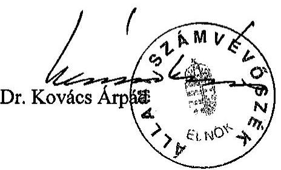
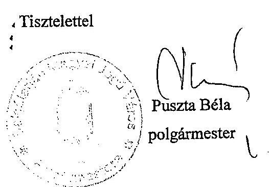
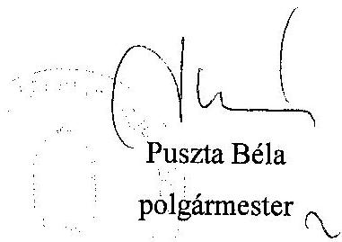

# JELENTÉS 

a Salgótarján Megyei Jogú Város Önkormányzata gazdálkodásának átfogó ellenőrzéséről

---

3. Önkormányzati és Területi Ellenőrzési Igazgatóság
3.3 Átfogó Ellenőrzések FőcsoportIktatószám: V-1002-7/33/14/2003.Témaszám: 635
Vizsgálat-azonosító szám: V0102
Az ellenőrzést felügyelte:
Dr. Lóránt Zoltán
főigazgató
Az ellenőrzés végrehajtásáért felelős:
Dr. Sepsey Tamás
főigazgató-helyettes
Az ellenőrzést vezette:
Csecserits Imréné
főcsoportfőnök-helyettes
Az ellenőrzést végezték:
Zeke Józsefszámvevő tanácsos
Huszár Sándorné
számvevő tanácsos
Holman Magdolna
számvevő
A témához kapcsolódó - az elmúlt három évben készített -számvevőszéki jelentések:
címe ..... sorszáma
Jelentés a közbeszerzésekről szóló törvény végrehajtásának ..... 0109
ellenőrzéséről
Jelentés a települési önkormányzatok adóztatási tevékenységének ..... 0121
vizsgálatáról
Jelentés a települési önkormányzatok szilárdhulladék-gazdálkodási ..... 0221
feladatai ellátásának ellenőrzéséről

---

# TARTALOMJEGYZÉK 

BEVEZETÉS ..... 5
II. ÖSSZEGZŐ MEGÁLLAPÍTÁSOK, KÖVETKEZTETÉSEK, JAVASLATOK ..... 7
I. RÉSZLETES MEGÁLLAPÍTÁSOK ..... 20

1. A költségvetés tervezésének, végrehajtásának és a zárszámadás elkészítésének szabályszerűsége ..... 20
1.1. A költségvetés tervezésének, a költségvetési rendelet megalkotásának, elfogadásának szabályszerűsége ..... 20
1.2. A költségvetési előirányzatok módosításának szabályszerűsége ..... 26
1.3. A gazdálkodás szabályozottsága, szabályszerűsége ..... 27
1.4. A munkafolyamatba épített ellenőrzések szabályozottsága és gyakorlati múködése a pénzügyi, gazdasági és számviteli feladatellátás területén ..... 32
1.5. A bizonylati rend szabályszerűsége ..... 33
1.6. A vagyon nyilvántartásának és leltározásának szabályszerűsége ..... 35
1.7. A vagyongazdálkodással kapcsolatos feladat és döntési hatáskörök szabályozottsága, a vagyonváltozást előidéző intézkedések szabályszerűsége, célszerűsége ..... 39
1.8. Az Önkormányzat által céljelleggel - nem szociális ellátásként - juttatott támogatásokkal történő elszámoltatás szabályszerűsége ..... 43
1.9. A követelések, részesedések, értékpapírok év végi értékelésének szabályszerűsége ..... 46
1.10.A múködési és felhalmozási bevételek, kiadások alakulása ..... 46
1.11.A költségvetés egyensúlyi helyzete ..... 48
1.12.A közbeszerzési eljárások szabályszerűsége ..... 50
1.13.A Polgármesteri hivatal helyi kisebbségi önkormányzatok gazdálkodásával kapcsolatos tevékenysége ..... 53
1.14.A zárszámadási kötelezettség teljesítésének szabályszerűsége ..... 55
2. Az egyes kiemelt önkormányzati feladatok és a rendelkezésre álló források összhangja ..... 57
2.1. A feladatok meghatározása és szervezeti keretei ..... 57
2.2. Egyes naturális mutatókkal mérhető feladatok bevételei és kiadásai ..... 60
2.3. A jelentős ráfordítást igénylő önként vállalt feladatok ellátása ..... 60
3. A belső irányítási, ellenőrzési rendszer múködésének értékelése ..... 62
3.1. Az Önkormányzat informatikai rendszerének szabályozottsága, múködése ..... 62
3.2. A helyi ellenőrzési rendszer kialakítása, múködése ..... 63
3.3. A könyvvizsgálati kötelezettség teljesítése ..... 66
3.4. A korábbi számvevőszéki ellenőrzések javaslatainak hasznosulása ..... 67

---

# MELLÉKLETEK 

1. számú Az önkormányzati vagyon nagyságának alakulása (1 oldal)
2. számú Az Önkormányzat 2002. évi bevételeinek és kiadásainak alakulása (1 oldal)
3. számú Az Önkormányzat gazdálkodását meghatározó adatok, mutatószámok (1 oldal)
4. számú Egyes önkormányzati feladatok finanszírozása (1 oldal)
5. számú Puszta Dénes polgármester úr észrevétele ( $1+7$ oldal)

---

# RÖVIDÍTÉSEK JEGYZÉKE 

Ötv.
Áht.
Ámr.
Kbt.
Számv. tv.
Htv.

Vhr.
vagyongazdálkodási rendelet

Önkormányzat
Közgyűlés
Pénzügyi bizottság
Közbeszerzési bizottság
Gazdasági bizottság
Egészségügyi-szociális bizottság
Polgármesteri hivatal
Közgazdasági iroda
Jegyzői iroda
ÁSZ
TÁH
SzMSz
ügyrend

CKÖ
SZKÖ
a helyi önkormányzatokról szóló 1990. évi LXV. törvény az államháztartásról szóló 1992. évi XXXVIII. törvény az államháztartás múködési rendjéről szóló 217/1998. (XII. 30.) Korm. rendelet
a közbeszerzésekről szóló 1995. évi XL. törvény
a számvitelről szóló 2000. évi C. törvény
a helyi önkormányzatok és szerveik, a köztársasági megbízottak, valamint egyes centrális alárendeltségű szervek feladat- és hatásköreiről szóló 1991. évi XX. törvény
az államháztartás szervezetei beszámolási és könyvvezetési kötelezettségének sajátosságairól szóló 249/2000. (XII. 24.) Korm. rendelet

Salgótarján Megyei Jogú Város Önkormányzatának az önkormányzat vagyonáról és vagyongazdálkodási rendjéről szóló 17/1996. (IV. 29.) számú rendelete
Salgótarján Megyei Jogú Város Önkormányzata
Salgótarján Megyei Jogú Város Önkormányzatának Közgyűlése
Salgótarján Megyei Jogú Város Önkormányzata Közgyűlésének Pénzügyi Bizottsága
Salgótarján Megyei Jogú Város Önkormányzata Közgyűlésének Közbeszerzési Bizottsága
Salgótarján Megyei Jogú Város Önkormányzata Közgyűlésének Gazdasági és Városfejlesztési Bizottsága
Salgótarján Megyei Jogú Város Önkormányzata Közgyűlésének Egészségügyi-Szociális Bizottsága
Salgótarján Megyei Jogú Város Önkormányzatának Polgármesteri Hivatala
Salgótarján Megyei Jogú Város Önkormányzata Polgármesteri Hivatalának Közgazdasági Irodája
Salgótarján Megyei Jogú Város Önkormányzata Polgármesteri Hivatalának Jegyzői Irodája
Állami Számvevőszék
Területi Államháztartási Hivatal
Salgótarján Megyei Jogú Város Önkormányzatának az önkormányzat és szervei Szervezeti és Müködési Szabályzatáról szóló 13/1995. (VI. 1.) számú rendelete
A polgármester és a jegyző 1/2002. (I. 2.) számú együttes utasítása Salgótarján Megyei Jogú Város Önkormányzatának Polgármesteri Hivatala ügyrendjéről
Salgótarján Megyei Jogú Város Cigány Kisebbségi Önkormányzata
Salgótarján Megyei Jogú Város Szlovák Kisebbségi Önkormányzata

---

| OIGSZ | Salgótarján Megyei Jogú Város Önkormányzata Oktatási   Intézmények Gazdasági Szolgálata |
| :-- | :-- |
| jegyzö | Salgótarján Megyei Jogú Város Önkormányzatának cím-   zetes főjegyzője (2002. július 1. után) |
| Salgó Vagyon Kft. | Salgótarjáni Önkormányzati Vagyonhasznosító és Ipari   Park Üzemeltető Kft. |

---

# JELENTÉS 

## Salgótarján Megyei Jogú Város Önkormányzata gazdálkodásának átfogó ellenőrzéséről

## BEVEZETÉS

Az Ötv. 92. § (1) bekezdése, valamint az Áht. 120/A. § (1) bekezdése alapján az Önkormányzat gazdálkodását az ÁSZ Önkormányzati és Területi Ellenőrzési Igazgatósága a V-1002-7/2003. számú ellenőrzési programban foglaltaknak megfelelően vizsgálta.

## Az ellenőrzés célja annak értékelése volt, hogy:

- az önkormányzati gazdálkodás törvényességét, szabályszerűségét biztosították-e a tervezés, a költségvetés végrehajtása és a zárszámadás során; a gazdálkodás szabályszerűségét biztosító kontrollok ${ }^{1}$ megfelelően segítették-e a végrehajtást;
- az Önkormányzat által ellátandó feladatok és az azokhoz rendelkezésre álló pénzforrások összhangja biztosított volt-e;
- a helyi kisebbségi önkormányzatok gazdálkodása során érvényesültek-e az Áht. és a vonatkozó kormányrendeletek előírásai.

Az ellenőrzött időszak: A 2002. év, valamint a 2003. I-III. negyedév, az 1.7., 2.1.-2.3., 3.2.-3.4. ellenőrzési programpontok esetében a 2000-2002. évek és a 2003. I-III. negyedév.

Salgótarján közigazgatási területén 2003. január 1-jén 45479 fő lakos élt, a lakosságszám évek óta folyamatosan csökken.

A Közgyűlés a 2002. évi önkormányzati választásokat követően 24 képviselőből és az újraválasztott polgármesterből áll, hat állandó bizottságot alakított. A jegyzőt 1998-ban bízták meg a feladatok ellátásával.

Az Önkormányzatnak a 2002. év végén a Polgármesteri hivatalon kívül hat önállóan gazdálkodó és 17 részben önállóan gazdálkodó költségvetési szerve volt. A feladatellátás érdekében az Önkormányzat négy közhasznú társaságot, két közalapítványt alapított, illetve három kft. 100\%-os tulajdonosa. A Polgármesteri hivatal és az intézmények összesen 13628 millió Ft bevételt értek el,

[^0]
[^0]:    ${ }^{1}$ A gazdálkodás szabályszerűségét biztosító kontroll alatt értjük a kiépített és működő belső irányítási és szabályozási rendszert, valamint a belső ellenőrzési funkciók ellátását.

---

és 13232 millió Ft költségvetési kiadást teljesítettek a 2002. évben. A könyvviteli mérlegben kimutatott önkormányzati vagyon értéke 17668 millió Ft volt a 2002. év végén.

Az Önkormányzat feladatai ellátásához 1447 fő közalkalmazottat foglalkoztatott, a Polgármesteri hivatalban 125 fő köztisztviselő dolgozott.

---

# 1. II. ÖSSZEGZŐ MEGÁLLAPÍTÁSOK, KÖVETKEZTETÉSEK, JAVASLATOK 

A Közgyűlés az önkormányzati célkitűzéseihez kapcsoltan 13 részprogramot, koncepciót fogadott el. Az Önkormányzat az Ötv. előírását megsértve nem határozta meg a feladatokat kijelölő gazdasági programját.

A 2002. évi költségvetési koncepciót az előírt tartalommal, határidőre elkészítették, de az előterjesztéshez az Ámr-ben foglaltak ellenére nem csatolták Pénzügyi bizottság és a helyi kisebbségi önkormányzatok véleményét.

A polgármester az Áht-ban előírt határidőre előterjesztette a költségvetési rendelettervezetet. A Közgyűlés döntött azokban a kérdésekben, amelyek az előirányzatok meghatározását megalapozták, meghatározták a költségvetés előterjesztésekor bemutatandó mérlegek, kimutatások tartalmi követelményeit. A rendelettervezethez az Ámr-ben foglaltak ellenére nem csatolták a Pénzügyi bizottság írásos véleményét. A kisebbségi önkormányzatokra vonatkozó előirányzatokat nem azok határozatai alapján építették be az Önkormányzat költségvetésébe. A költségvetési rendelettervezet szerkezetének kialakításakor, illetve a rendeletben hiányosan tettek eleget az Ámr. vonatkozó előírásainak, mert nem mutatták be két önállóan gazdálkodó költségvetési szerv esetében a bevételeket költségvetési szervenként külön-külön, azon belül forrásonként, a kiadásokat kiemelt előirányzatonként, illetve az éves létszámkeretet. A Közgyűlés felhasználási kötöttséget állapított meg a karbantartási és a gyermekélelmezés támogatási előirányzatra, de azokat intézményekre, feladatokra vonatkozóan nem határozta meg. A címrend kialakításával két önállóan gazdálkodó intézmény esetében megsértették az Áht. vonatkozó előírását. A 2002. évi költségvetés operatív végrehajtásának elősegítésére a költségvetési rendeletben elfogadták a végrehajtási szabályokat. A rövid lejáratú hitel felvételével kapcsolatos hatáskört az SzMSz-ben és a költségvetési rendeletben eltérően szabályozták. A 2003. évi költségvetés előkészítése és elfogadása során a 2002. évben előforduló hibák megismétlődtek.

A 2002. évi költségvetési rendeletét a Közgyűlés többször módosította. Az előirányzat módosítások során az Önkormányzatnál a 2002. évi költségvetési rendelet utolsó módosítása határideje, illetve a kisebbségi önkormányzatok határozatai nélküli előirányzat módosítások esetében megsértették az Áht. és az Ámr. vonatkozó előírásait. Az Áht. előírásait megsértve az előirányzatok nyilvántartásban nem szerepeltettek minden kiadási előirányzatot terhelő kötelezettségvállalást és bevételi előirányzatok teljesítését előrejelző bevételi előírást. Az előirányzat módosításokhoz a megfelelő dokumentumok rendelkezésre álltak. A Polgármesteri hivatalnál és az Önkormányzat intézményeinél a 2002. évben nem volt kiemelt kiadási előirányzat túllépés.

A Polgármesteri hivatal az Áht. előírását megsértve nem rendelkezett alapító okirattal, valamint az Ámr-ben előírtak ellenére nem rendelkezett szervezeti és működési szabályzattal. Az ügyrendet az Ámr-ben előírtak ellenére nem a gazdasági szervezetre, hanem a Polgármesteri hivatal egészére készítették. Az ügy-

---

rendben a gazdasági szervezet és szervezeti egységei és a pénzügyi-gazdasági feladatok ellátásáért felelős vezetők és más dolgozók gazdálkodási feladat-, hatás- és jogkörét az Ámr-ben előírtak ellenére nem részletezték megfelelően. Egyes eszközök analitikus nyilvántartására vonatkozó kötelezettséget a Közgazdasági Iroda és a Salgó Vagyon Kft. részére is párhuzamos feladatként előírtak. A kötelezettségvállalás, utalványozás, ellenjegyzés rendjének szabályozása keretében a városfenntartási és védelmi feladatok esetében az Ámr-ben előírtakat nem tartották be, mivel ugyanazon gazdasági eseményre vonatkozóan azonos személy - a jegyző - rendelkezett kötelezettségvállalási és ellenjegyzési jogkörrel. A felhatalmazottakat az elvégzett kötelezettségvállalásokról nem számoltatták be. A kötelezettségvállalás, utalványozás, ellenjegyzés, teljesítés szakmai igazolás és az érvényesítés jogosultsággal rendelkezők aláírási mintáját nem csatolták az ügyrendhez.

A jegyző nem rendelkezett az önkormányzati intézmények számviteli rendjének kialakításáról. A Polgármesteri hivatal a 2002. évben rendelkezett számviteli politikával, a 2002. január 1-től hatályos jogszabályi változásokat azonban csak a 2003. évi számviteli politika összeállításánál vették figyelembe. A Vhr. módosított előírásai közül elmaradt a 2003. évre érvényes számviteli politikában a megbízható és valós összkép kialakítását befolyásoló lényeges információk minősítése szempontjainak rögzítése. A leltározási és értékelési szabályzatban részletesen meghatározták a leltározás célját, tartalmát, a leltározásban közremúködők feladatát és felelősségét. Azonban a Vhr-ben előírtak ellenére nem kérték a Közgyűlés egyetértését a leltározás elvégzését igazoló leltárt helyettesítő, a részletező nyilvántartások alapján készített összesítő kimutatás alkalmazásához, nem határozták meg ezen összesítő kimutatás tartalmát, formáját és kellékeit. A 2002. évi leltározási utasításban az üzemeltetésre átadott eszközökre mennyiségi felvételű leltározást a jegyző nem rendelt el, az utasítás nyilvántartás egyeztetési feladatot írt elő. A szabályzat szerint a tárgyi eszközök és berendezési tárgyak egyértelmú azonosíthatóságát biztosítani kell, azonban az 50 ezer Ft alatti értékú tárgyi eszközöknél az egyedi azonosításra alkalmas rendszert nem alakítottak ki. Az eszközök és források értékelése szabályait a Vhr-ben előírtak ellenére nem alakították ki, a Számv. tv. előírásait megsértve terven felüli értékcsökkenés, az értékvesztés és az értékvesztés visszaírása elszámolási rendjét nem szabályozták. A pénz- és értékkezelési szabályzatban szabályozták a készpénz és a bankszámlapénz kezelésével kapcsolatos feladatokat, azonban a számítógépi program alkalmazásából adódó bizonylatolási sajátosságokat, valamint a pénztárellenőrzés módját és gyakoriságát nem határozták meg. A számlarendben az alkalmazott számítógépes rendszereik miatti könyvelési, nyilvántartási, kapcsolati, bizonylatolási sajátosságokat nem fogalmazták meg. Az alkalmazott főkönyvi számláknál összevontabb számlákat jelöltek ki. A könyvelési előírások a Számv. tv. előírását megsértve a számlarendben nem írták elő az előirányzatok és a „0"-ra leírt immateriális javak, tárgyi eszközök könyvelési feladatait. Az analitikus nyilvántartásokból készítendő összesítő kimutatások elkészítésének gyakoriságát, határidejét a Vhr. előírása ellenére nem szabályozták. A számlarendben nem határozták meg, hogy a Vhr-ben biztosított lehetőségek közül melyik megoldással történjen a törzsvagyon elkülönített számviteli nyilvántartása. A felesleges vagyontárgyak hasznosításának, selejtezésének szabályzatában részletesen meghatározták a feladatokat.

---

A szabályozási hiányosságok ellenére a pénzügyi, gazdálkodási és számviteli területen a munkafolyamatba épített ellenőrzéseket ellátták, a bizonylatok $1,3 \%$-ánál fordult elő kötelezettségvállalás ellenjegyzési, $1,0 \%$-ánál érvényesítési hiányosság. A Közgazdasági iroda köztisztviselőinek munkaköri leírásai az egyes munkafolyamatba épített ellenőrzési feladatok végrehajtási határidejét és a feladatok elvégzéséhez szükséges dokumentumokat nem tartalmazták, az ellenjegyzési feladatokat nem rögzítették a munkaköri leírásokba. Ellenjegyzés nélkül történt a kötelezettségvállalás a lakásépítési támogatások esetében. A folyószámlahitel forgalmat a Számv. tv. előírását megsértve nem a bruttó elszámolás számviteli alapelvnek megfelelően könyvelték.

A gazdasági események bizonylatolását, könyvelését alapvetően az előírásoknak megfelelően végezték. A Salgótarján és Környéke Vízmű Kft-nek és a Csatornamú Szolgáltató Kft-nek átadott pénzeszközökből létrejött víziközművagyon nem került az Önkormányzat tulajdonába. Az Önkormányzatnál a Számv. tv. a tartalom a formával szemben előírását megsértve a szerződésben foglaltak szerint pénzeszközátadásként számoltak el áruvásárlást. A Polgármesteri hivatalban nem a Vhr. előírásainak megfelelő mérlegsoron mutatták ki a részletfizetéssel értékesített lakásokkal kapcsolatos több évre vonatkozó követelésállományt, valamint a Vhr-ben előírtaktól eltérően közalapítványi alapítói hozzájárulást részesedésként szerepeltettek. A készpénzelőlegek nyilvántartása és elszámoltatása a pénz- és értékkezelési szabályzat szerint történt.

Az önkormányzati vagyon, ezen belül a törzsvagyon és a törzsvagyonon kívüli egyéb vagyon elkülönített számviteli nyilvántartása megvalósult, annak ellenére, hogy a számlarendben ezt a feladatot nem szabályozták. A számviteli analitikus nyilvántartások és a főkönyvi könyvelés között az adatok 2002. év végi egyezőségét, megsértve a Számv. tv. előírását az ingatlanoknál és a követeléseknél nem biztosították. 2002-ben két ingatlan értékesítésekor a Számv. tv. előírását megsértve az ingatlanok nyilvántartási értékével nem csökkentették a számviteli nyilvántartás szerinti ingatlanok állományát. A részesedésekről egyedi, analitikus nyilvántartást a Vhr-ben előírtak ellenére nem fektettek fel. A számviteli nyilvántartásokban és a mérlegben az üzemeltetésre átadott eszközök nem tartalmaztak minden olyan eszközt, amelynek múködését gazdasági társaságra bízták. A főkönyvi nyilvántartásban kimutatott ingatlanok bruttó értéke a jogszabályi előírás ellenére 6016 millió Ft-tal alacsonyabb volt az ingatlanvagyon kataszteri nyilvántartásban kimutatott bruttó értéknél, mert az ingatlanvagyon kataszteri nyilvántartásban halmozódások voltak. Az üzemeltetési szerződések nem tartalmazták az üzemeltetésre átadott eszközökkel kapcsolatos nyilvántartási, leltározási feladatokat, az Önkormányzat az üzemeltetőktől a vagyongazdálkodási rendelet szerinti leltárt nem kérte. A beruházások és az üzemeltetésre átadott eszközök, továbbá a függő, átfutó, kiegyenlítő bevételek és kiadások állományi értékét a 2002. év végén a Vhr-ben előírtaktól eltérő módon, a részletező nyilvántartások alapján készített összesítő kimutatás, valamint egyeztetés alapján állapították meg. Az értékcsökkenési leírást az ingatlanokhoz kapcsolódó vagyoni értékú jogok kivételével az előírt kulcsokkal számolták el. A teljesen „0"-ra leírt lakásoknál a beruházás, felújítás értékével a Számv. tv. előírását megsértve nem az egyedi eszköz bruttó értékét növelték, arról külön nyilvántartást fektettek fel, így az értékcsökkenési leírás alapja helytelen összegű volt. Az önkormányzati lakások és a nem lakás célú helyiségek nyilvántartásánál az elvégzett felújítások és beruházások értékével a több

---

lakásos épületek esetében a Számv. tv. megsértésével nem a lakások és nem lakás céljára szolgáló helyiségek egyedi értékét növelték meg, azoknak külön nyilvántartó lapot fektettek fel.

Az Önkormányzat eszközeinek értéke 2000-ről 2002-re 32,9\%-kal növekedett, ezen belül a beruházások és az immateriális javak értéke emelkedett ezt meghaladóan. A vagyongazdálkodási rendeletben szabályozták a vagyongazdálkodással kapcsolatos feladatokat és döntési hatásköröket, nevesítették az Önkormányzat összes vagyonát törzsvagyonba és egyéb vagyonba történő besorolás szerint, szabályozták a pénzügyi követelésről való lemondás jogkörét. Az Áht. előírását megsértve nem határozták meg a vagyon tulajdonjoga ingyenes átruházása és a követelésekről lemondás eseteit. A köztulajdon felhasználásának nyilvánosságát és az Önkormányzat értékesítéseit is figyelembe véve a forgalomképes vagyon nyilvános versenytárgyalás útján történő értékesítésre vonatkozó értékhatár magas. Az értékesítésre vonatkozó döntéseket - a Pécskő úti telkekre vonatkozó döntés kivételével - a vagyongazdálkodási rendeletben előírt hatáskörrel rendelkező hozta meg. A polgármester a vagyongazdálkodási ügyekre vonatkozóan átruházott hatáskörben hozott döntéseiről a vagyongazdálkodási rendelet előírása ellenére a Közgyűlést nem tájékoztatta.

Az alapítványnak, közalapítványnak adott céljellegű támogatásról két alkalommal a kiutalást követően hozta meg döntését a Közgyűlés. Egy további alapítványi támogatással a város és a környező három község szennyvízcsatorna hálózatba kiépítéséhez, és a szennyvíztisztító telep bővítéséhez nyújtott forrást az Önkormányzat. Az önkormányzati alapítású közhasznú társaságoknak, közalapítványoknak a költségvetési rendeletben meghatározott összegű támogatások és a felhalmozási célú pénzeszköz átadásokra vonatkozó megállapodásokban (egy kivétellel) az Áht-t megsértve számadási kötelezettséget nem írtak elő. A közhasznú szervezetek esetében az elszámolási kötelezettség feltételeinek és módjának előírása elmulasztásával megsértették a közhasznú szervezetekről szóló törvény vonatkozó előírását. Az Áht-t megsértve nem teljesítette a számadási kötelezettségét a támogatott szervezet a kiutalási tételszám 7,1\%ában, illetve késedelmesen teljesítette a tételszám 22,7\%-ában. Az elszámolást nem teljesítőket nem szólították fel kötelezettségük teljesítésére, a támogatások felhasználásának jogszerűségéről és rendeltetésszerűségéről nem győződtek meg. A támogatás felhasználását az Áht. előírását megsértve nem ellenőrizték. Az Önkormányzat által alapított közalapítvány, illetve az Önkormányzat közhasznú társaságai a gazdálkodásukról szóló éves beszámoló keretében a feladatok teljesítéséről beszámoltak, de a támogatások felhasználásáról nem számoltak el.

Az Önkormányzat a Számv. tv. előírását megsértve a követelések minősítését nem végezte el, a nem kizárólagos tulajdonában lévő társaságok részesedései esetében az értékvesztés elszámolásának szükségességét nem vizsgálta. Az Önkormányzat 100\%-os tulajdonában lévő társaságok és az államkötvények esetében az értékelést elvégezték, értékvesztés elszámolása nem volt indokolt.

Az Önkormányzat 2000-2002. évi költségvetési beszámolói teljesítési adatai szerint rövid lejáratú hitellel volt szükséges kiegészíteni a működési célú bevételeket, hogy fedezzék a múködési célú kiadásokat, illetve célhitellel bővíteni a felhalmozási és tőke jellegű bevételeket, hogy biztosítsák a felhalmozási kiadá-

---

sok forrásait. Az eredeti költségvetéshez készített likviditási tervet év közben az Ámr. előírásai ellenére nem módosították a költségvetési előirányzatok 8,7\%-os növelése ellenére. Az Önkormányzat a 2002. évben az Ötv-ben nevesített adósságot keletkeztető kötelezettségeket a felhalmozási hitel felvétele kivételével nem vállalt, a felhalmozási hitel felvétellel a törvényi korlátot nem lépte túl. A kötelezettségvállalások nyilvántartása nem teljes körű, nem volt olyan nyilvántartás, amelyből évenként a kötelezettségvállalások éves összege megállapítható lett volna.

A Közgyűlés a 2002-2003. évi költségvetést hitellel fedezett forráshiánnyal fogadta el. Az Önkormányzat által ellátott feladatok és az azokhoz rendelkezésre álló pénzforrások összhangját likvidhitelek, illetve felhalmozási célú hitel igénybevételével biztosították. A költségvetési hiány mérséklésére a költségvetések összeállítása időszakában intézkedéseket tettek. A működésképtelen önkormányzatok egyéb támogatása keretből kapott összegekkel a működési hiány fedezetére tervezett hitelfelvételt csökkentették. Az Önkormányzat élt a helyi adóztatás lehetőségével. A 2002. évben az iparűzési adó mértéke elérte a törvényi maximumot. Az iparűzési, az építményadó és a vállalkozások kommunális adójánál a törvényi előíráson felül mentességeket biztosítottak a munkahelyteremtő beruházások, valamint a termelő üzemek szociális, egészségügyi, sport- és kulturális célra használt helyiségei esetében. A vállalkozások kommunális adóját 2003. január 1-i hatállyal megszüntették a foglalkoztatás ösztönzése, a vállalkozók adóterheinek csökkentése érdekében.

A helyi közbeszerzési rendelet hatályon kívül helyezését követően nem szabályozták az Önkormányzat döntéseit segítő szakmai munkacsoport feladatait, hatásköreit. Az Önkormányzat a 2002. évi közbeszerzéseinél, a Kbt. előírásait megsértve a döntéshozást nem kötötte személyhez, a közbeszerzési eljárás belső rendjét, az eljárásba bevont személyek felelősségi körét nem alakította ki. A 2003. évi költségvetés összeállítása során vizsgálták a centralizált beszerzés lehetőségeit, és döntöttek intézményi közös közbeszerzésekről. A Közbeszerzési bizottság az előírt éves összegzőt elkészítette, a Közgyűlés felé fennálló éves beszámolási kötelezettségét nem teljesítette.

A településen működő két kisebbségi önkormányzattal nem a megállapodások alapján valósult meg az együttmúködés. A gyakorlati munka során nem kísérték figyelemmel a megállapodásban foglaltak betartását, az Ámr. előírásai ellenére a koncepciók véleményezését nem igényelték, nem tettek észrevételt a kisebbségi önkormányzatok megállapodásban rögzített határidő utáni, nem a megállapodás szerinti szerkezetben történő teljesítése esetén, a kisebbségi önkormányzatok szabályozásában az összeférhetetlenségi szabályoknak meg nem felelősséget az érvényesítés során nem kifogásolták. Az Önkormányzat a kisebbségi önkormányzatok zárszámadási határozatai nélkül építette be a zárszámadási rendeletébe a kisebbségi önkormányzati adatokat.

A zárszámadási rendelet összehasonlítható volt a költségvetési rendelettel, de ez okból meg is ismételte a költségvetési rendelet hibáit. A rendelet nem tartalmazta az Áht. és az Ámr. rendelkezéseit megsértve, két önállóan gazdálkodó intézményre vonatkozóan az összesen és az előírás szerint részletezett adatokat. A zárszámadási mérlegek közül a vagyonkimutatás nem a teljes vagyoni körre terjedt ki, értékadatai a számviteli mérleggel az ingatlanokra vonatkozóan

---

nem volt egyező. A Közgyűlés zárszámadási rendeletében jóváhagyta az Önkormányzat és - az OIGSZ mint önálló intézmény kivételével - költségvetési szervei 2002. évi pénzmaradványát.

Az Önkormányzat a feladatellátás szervezeti struktúráját célszerűen alakította ki. Az oktatási intézményekben 2000. évben a gazdasági szervezeteket megszüntették, önálló intézményt hoztak létre a gazdálkodás lebonyolítására. Az önként vállalt feladatokat az Önkormányzat nem határozta meg szabályozásaiban, költségvetési rendeleteiben. Az Önkormányzat az éves költségvetésének 0,6-1,7\%-át fordította önként vállalt kiadásainak teljesítésére a 20002002. években. A fogyatékos személyek jogairól és esélyegyenlőségük biztosításáról szóló törvény teljesítésére felmérést készítettek. A végrehajtást megkezdték, de a törvényben előírt feladatokat időarányosan nem teljesítették.

Az Önkormányzat számítástechnikai ellátottsága megfelelő volt. A pénzügyi és számviteli területen alkalmazott felhasználói programokról részletes üzemeltetési dokumentációval és felhasználói leírással rendelkeztek. Az Önkormányzat informatikai stratégiával nem rendelkezett, nem szabályozták az alkalmazott programok hozzáférési jogosultsági rendszerét, az adatokért felelősök körét, az adatmentés gyakoriságát, nem dokumentálták az engedélyezési jogköröket, a Közgazdasági irodán dolgozók munkaköri leírása nem tartalmazta az informatikai rendszerek használatát. Az informatikusok által vezetett számítástechnikai nyilvántartások és a Közgazdasági iroda analitikus nyilvántartása adatai nem egyeztek. A számítógépi adatok megőrzése céljából a készített táblázatokat, kimutatásokat, adathalmazokat a papír adathordozóra kinyomtatás mellett elektronikus módon is megőrzik.

Az Önkormányzat a felügyeleti és belső ellenőrzés szervezeti kereteit kialakította. Az ellenőrzési szabályzatot nem aktualizálták, az ellenőrzést a jegyző irányítása alá tartozó ellenőrzési referensek látták el, az ellenőrzési szabályzatban még ellenőrzési csoport szerepelt. A jegyző által kiadott ellenőrzési ütemtervekben szereplő belső ellenőrzési feladatokat az ellenőrzési szabályzatuk előírása ellenére a polgármesterrel nem egyeztették. Az ellenőrzési referensek a 2001-2003. években pénzügyi-gazdasági, cél- és témavizsgálatokat végeztek, valamint belső ellenőrzési feladatokat láttak el. Az ellenőrzésekről készült jelentések megfelelő információt szolgáltattak az ellenőrzötteknek, segítséget jelentettek a feltárt hibák, hiányosságok kiküszöböléséhez. A realizáló tárgyalások megtartását nem dokumentálták. A belső ellenőri kapacitás nem biztosította a jogszabály által előírt belső ellenőri feladatok ellátását. A Pénzügyi bizottság az ellenőrzési szabályzatnak megfelelően tárgyalta az intézményi felügyeleti és a Polgármesteri hivatalnál végzett belső ellenőrzések tapasztalatait. A 20002003. években a Közgyűlés a Htv. előírását megsértve az ellenőrzések tapasztalatait nem tekintette át.

Az Önkormányzat teljesítette a törvényben előírt könyvvizsgálati kötelezettségét. A könyvvizsgáló auditálási eltéréssel, de korlátozás nélkül fogadta el és hitelesítette az egyszerűsített tartalmú költségvetési beszámolókat.

Az ÁSZ által folytatott korábbi ellenőrzések javaslatait elfogadták és kétharmadát megvalósították. Javaslatunk ellenére az SzMSz-be a hulladékgazdálkodás kötelező feladatát nem építették be, az adóztatási tevékenység önálló

---

napirendként nem szerepelt a Közgyűlés előtt, a közbeszerzések szabályozásának módosítására vonatkozó javaslatokat nem hajtották végre.

A közbenső egyeztetés során a polgármester észrevételben fejtette ki véleménykülönbségeit, amelyekkel kapcsolatos állásfoglalást a részletes megállapítás érintett pontjai tartalmaznak. Ezen túlmenően tájékoztatást adott a vizsgálat megállapításai hatására már megtett intézkedésekről, amelyeket a részletes megállapítások érintett pontjainál ismertetünk.

A helyszíni ellenőrzés megállapításai mellett a gazdálkodás szabályszerűségének és a munka színvonalának javítása érdekében javasoljuk:

# a Közbeszerzési bizottságnak 

adjon tájékoztatást a Közgyűlésnek az éves tevékenységéről az SzMSz-ben előírtaknak megfelelve;

## a polgármesternek

## a törvényesség biztosítása érdekében

1. kezdeményezze a Közgyűlésnél, hogy alkossa meg az Ötv. 91. § (1) bekezdésében előírtak betartása érdekében az Önkormányzat gazdasági programját;
2. a szabályszerű költségvetési gazdálkodás biztosítása céljából
a) kezdeményezze a Közgyűlésnél a vagyongazdálkodási rendelet kiegészítését annak érdekében, hogy abban az Áht. 108. § (2) bekezdése alapján meghatározásra kerüljön a vagyon tulajdonjoga ingyenes átruházásának és a követelésekről való lemondásnak módja és esetei;
b) biztosítsa, hogy az alapítványok, közalapítványok támogatásáról minden esetben az Ötv. 10. § (1) bekezdés d) pontjában előírtak betartása érdekében Közgyűlés döntsön;
3. tájékoztassa a Közgyűlést a vagyongazdálkodási rendelet 33. § (2) bekezdése előírásának megfelelően az átruházott hatáskörben hozott vagyongazdálkodási döntéseiről;
4. kezdeményezze, hogy a Közgyűlés meghatározott időszakonként tekintse át a Közgyűlés által alapított és fenntartott költségvetési szervei ellenőrzésének tapasztalatait a Htv. 138. § (1) bekezdés g) pontjának megfelelően;

## a munka színvonalának javítása érdekében:

5. kezdeményezze, hogy a hitelműveletekkel kapcsolatos hatáskört a Közgyűlés az SzMSz-ben és az éves költségvetési rendeletben egymással összhangban határozza meg;
6. számoltassa be a felhatalmazottakat az elvégzett kötelezettségvállalásokról;

---

7. kezdeményezze a Polgármesteri hivatalra vonatkozó ügyrend és az Önkormányzat Salgó Vagyon Kft-vel kötött szerződésének módosítását annak érdekében, hogy a Közgazdasági iroda és a Salgó Vagyon Kft. analitikus nyilvántartási kötelezettségének párhuzamos előírása megszűnjön, a nyilvántartási kötelezettség előírásánál legyen figyelemmel a jegyző által az eszközgazdálkodásra kiadott szabályzatra is;
8. biztosítsa, hogy az önkormányzati pénzeszközből megvalósuló víziközmű beruházások a továbbiakban az Önkormányzat tulajdonába kerüljenek;
9. kezdeményezze az üzemeltetőknél és a Polgármesteri hivatalban, hogy az üzemeltetési szerződések kiegészítésre kerüljenek az üzemeltetésre átadott eszközök nyilvántartásával, leltározásával kapcsolatos feladatokkal, azok elvégzési határidejének meghatározásával;
10. kezdeményezze a Közgyűlésnél, hogy a köztulajdon felhasználásának nyilvánossága érdekében csökkentse a forgalomképes vagyon nyilvános versenytárgyalás útján történő értékesítésre vonatkozó, a vagyongazdálkodási rendeletben szereplő értékhatárt;
11. kezdeményezze az Önkormányzat által önként vállalt feladatok meghatározását;
12. javasolja a Közgyűlésnek a fogyatékos személyek jogairól és esélyegyenlőségük biztosításáról szóló 1998. évi XXVI. törvényben foglalt akadály-mentesítési feladatok elvégzésének felgyorsítását, figyelemmel a 2005. január 1-i határidőre;
13. kezdeményezze, hogy a számvevőszéki jelentést a Közgyűlés tárgyalja meg, és a feltárt hiányosságok megszüntetése érdekében készítsenek intézkedési tervet;

# a jegyzőnek: 

## a törvényesség biztosítása érdekében:

1. csatolja az Ámr. 28. § (3) bekezdése előírásai betartása érdekében a költségvetési koncepció előterjesztéséhez a kisebbségi önkormányzatok és a Pénzügyi bizottság véleményét;
2. a költségvetési rendelettervezet elkészítésekor
a) csatolja a költségvetési rendelettervezethez az Ámr. 29. § (9) bekezdése előírásai betartása érdekében a Pénzügyi bizottság írásos véleményét;
b) gondoskodjon, hogy az Áht. 65. § (3) bekezdése előírásainak megfelelően a kisebbségi önkormányzatok határozatai szerint kerüljenek az előirányzatok az Önkormányzat költségvetési rendeletébe;
c) gondoskodjon, hogy az OIGSZ és az Egészségügyi-Szociális Központ vonatkozásában is mutassák be az Áht. 69. § (1) bekezdése és az Ámr. 29. § (1) bekezdése a), b), f) pontjainak megfelelően összegzett és részletezett intézményi bevételi, múködési, fenntartási kiadási adatokat és az éves létszámkeretet;

---

d) gondoskodjon a címrend módosításáról annak érdekében, hogy az OIGSZ és az Egészségügyi-Szociális Központ, mint önállóan gazdálkodó intézmény címet alkosson az Áht. 67. § (1) bekezdése előírásának megfelelően, illetve arra tekintettel, hogy a Közgyűlés által kötött előirányzatnak minősített összegek intézményenként, feladatonként jelenjenek meg a költségvetési rendeletben;
3. gondoskodjon arról, hogy a pénzügyi nyilvántartási rendszer az Áht. 103. § (1)-(2) bekezdésében foglaltaknak megfelelően tartalmazzon minden kiadási előirányzatot terhelő kötelezettségvállalást és bevételi előirányzat teljesítését előrejelző bevételi előírást, a kötelezettségvállalások nyilvántartása feleljen meg az Ámr. 134. § (6) bekezdése azon előírásának, hogy a kötelezettségvállalások éves összege megállapítható legyen;
4. készítse el közgyűlési jóváhagyás érdekében az Áht. 88. § (3) és az Ámr. 10. § (4) bekezdésében foglaltak alapján a Polgármesteri hivatal alapító okirata tervezetét és szervezeti és müködési szabályzatát;
5. készítse el a Polgármesteri hivatal gazdasági szervezetére az Ámr. 17. § (5) bekezdésében előírt ügyrendet, amely megfelelő részletezésben tartalmazza a gazdasági szervezet pénzügyi-gazdasági feladatok ellátásért felelős vezetők és más dolgozók gazdálkodási feladat-, hatás- és jogköreit;
6. végezze el a kötelezettségvállalási, utalványozási és ellenjegyzési jogkör gyakorlását szabályozó ügyrend felülvizsgálatát, biztosítsa, hogy az Ámr. 138. § (1) bekezdésében foglaltaknak megfelelően a kötelezettségvállalásra és ellenjegyzésre ugyanazon gazdasági eseményre vonatkozóan azonos személy ne legyen kijelölve, felhatalmazva;
7. alakítsa ki a Htv. 140. § (1) bekezdése c) pontjában előírtak alapján a Polgármesteri hivatal, valamint az intézmények számviteli rendjét;
8. a gazdálkodási szabályzatok megfelelősége biztosításához:
a) rögzítse a számviteli politikában a megbízható, valós összkép kialakítását befolyásoló lényeges információ minősítési szempontjait a Vhr. 8. § (5) bekezdése a) pontjának megfelelően;
b) egészítse ki a leltározási és értékelési szabályzatot az üzemeltetésre átadott eszközök Vhr. 37. § (3) bekezdésben foglaltak szerinti leltározási feladatainak meghatározásával;
c) készítse el az eszközök és források értékelési szabályzatát a Számv. tv. 14. § (5) bekezdése b) pontja és a Vhr. 8. § (4) bekezdése b) pontja alapján abban határozza meg a Számv. tv. 54-55. §-aiban előírtak szerint az értékvesztés és az értékvesztés visszaírása elszámolásának, valamint a Számv. tv. 53. § (1) bekezdés a) és b) pontjainak megfelelve a terven felüli értékcsökkenés elszámolásának feltételeit;
d) biztosítsa, hogy a pénz- és értékkezelési szabályzatban és a számlarendben a számítógépi program alkalmazásából eredő bizonylatolási, könyvelési, nyilvántartási, kapcsolati sajátosságok jelenjenek meg, és ezekre tekintettel a bizonylati rendet alakítsa át a Számv. tv. 161. § (2) bekezdése d) pontja alapján;

---

e) biztosítsa, hogy a Számv. tv.161. § (2) bekezdés a)-b) pontja alapján az alkalmazott főkönyvi számlák kerüljenek kijelölésre a számlarendben, továbbá határozzák meg az előirányzatok és a „0"-ra leírt immateriális javak, tárgyi eszközök számláinak számjelét és megnevezését, illetve a számlák értéke növekedésének, csökkenésének jogcímeit, a számlát érintő gazdasági eseményeket, azok más számlákkal való kapcsolatát;
f) határozza meg a számlarendben a Vhr. 49. § (4) bekezdésének megfelelően az analitikus nyilvántartásokból készítendő összesítő kimutatások (feladások) elkészítésének határidejét;
g) határozza meg a számlarendben, hogy a Vhr. 9. számú mellékletének 1. k) pontjában biztosított lehetőségek közül melyik módon történjen a törzsvagyon elkülönített számviteli nyilvántartása;
9. a szabályszerű költségvetési és operatív gazdálkodás biztosításához
a) biztosítsa a kötelezettségvállalás ellenjegyzését az Ámr. 134. § (7) bekezdése előírásának betartása érdekében a lakásépítési támogatások esetében is;
b) gondoskodjon, hogy a folyószámlahitel forgalom könyvelése a Számv. tv. 15. § (9) és a Vhr. 9. § (6) bekezdései előírásainak megfelelően bruttó módon történjen;
c) biztosítsa, hogy az igénybevett szolgáltatásokat, áruvásárlásokat a Számv. tv. 16. § (3) bekezdése előírását betartva a tényleges gazdasági tartalmuknak megfelelően számolják el;
d) gondoskodjon, hogy a részletfizetéssel értékesített lakásokkal kapcsolatos követeléseket a következő évben esedékes rész kivételével a befektetett eszközök között mutassák ki a Vhr. 19. § (5) bekezdésének megfelelően;
e) biztosítsa, hogy a Vhr. 19. § (2) bekezdésének megfelelően a könyvviteli mérlegben tartós részesedéseként csak azok a tulajdonosi részesedést jelentő befektetések szerepeljenek, amelyek tartós jövedelmet, vagy befolyásolási, irányítási, ellenőrzési lehetőséget biztosítanak az Önkormányzat számára;
f) biztosítsa a Számv. tv. 161. § (3) és a Vhr. 9. számú mellékletének 1. k) és 2. c) pontjai előírásainak megfelelően az ingatlanok és a követelések számviteli analitikus nyilvántartása és a főkönyvi könyvelés közötti adatok egyezőségét;
g) készíttesse el a gazdasági társasági részesedésekről a Vhr. 9. számú melléklete 1. k) pontjában előírtak alapján a bruttó értékkel számszerűen egyező analitikus nyilvántartást;
h) biztosítsa, hogy a Polgármesteri hivatal számviteli nyilvántartásaiban az üzemeltetésre átadott eszközök a Vhr. 20. § (1) bekezdésének előírásaival és a vagyongazdálkodási rendelettel összhangban tartalmazzanak minden olyan eszközt, amelynek múködtetését gazdasági társaságra bízták, a mérlegben kimutatott beruházások és az üzemeltetésre átadott eszközök, továbbá a függő, átfutó, kiegyenlítő bevételek és kiadások állományi értéke a Vhr. 37. § (3) bekezdésében előírt módon készített leltárakkal alátámasztásra kerüljenek;

---

i) intézkedjen az ingatlanvagyon kataszteri nyilvántartás kiegészítéséről annak érdekében, hogy az önkormányzatok tulajdonában lévő ingatlanvagyon nyilvántartási és adatszolgáltatási rendjéről szóló 147/1992. (XI. 6.) Korm. rendelet 2. számú melléklete előírásának megfelelően a kataszterben feltüntetett ingatlanrészek bruttó értéke külön-külön, minden időpontban egyezzen meg a számvitelben nyilvántartott bruttó értékekkel;
j) biztosítsa, hogy az eszközök értékcsökkenésének elszámolása az ingatlanokhoz kapcsolódó vagyoni értékű jogok esetében feleljen meg a Vhr. 30. § (2) bekezdésében előírt leírási kulcsoknak;
k) gondoskodjon, hogy a teljesen „0"-ra leírt lakások esetében a beruházást, felújítást a Számv. tv. 48. § (2) bekezdésében foglaltaknak megfelelően az egyedi eszközök bruttó értéke növelésére számolják el;
I) gondoskodjon, hogy a Számv. tv. 48. § (1) bekezdésének megfelelően az értéknövelő felújítások összegei a lakásokra és a nem lakás célú helyiségekre egyedileg kerüljenek a számviteli nyilvántartásban rögzítésre;
m) gondoskodjon, hogy a Számv. tv. 55. §-ának megfelelően végezzék el az eszközök értékelése során a követelések minősítését;
n) biztosítsa, hogy a Számv. tv. 54. § (1)-(2) bekezdésének megfelelően a nem 100\%-os önkormányzati tulajdonban lévő társaságok esetében az értékvesztés elszámolásának szükségességét vizsgálják;
10. készítse elő a vagyongazdálkodási rendelet módosítását, hogy az feleljen meg az Áht. 108. § (2) bekezdése előírásainak, tartalmazza a vagyon tulajdonjoga ingyenes átruházása és a követelésről lemondás eseteit;
11. biztosítsa, hogy az Önkormányzat által céljelleggel - nem szociális ellátásként - juttatott támogatások esetében
a) az Áht. 13/A. § (2) bekezdésének megfelelően a számadási kötelezettség előírásra kerüljön;
b) a közhasznú társaságok esetében a közhasznú szervezetekről szóló 1997. évi CLVI. törvény 14. § (2) bekezdése szerint a szerződésekbe a támogatással elszámolás feltételei és módja kerüljön meghatározásra;
c) az Áht. 13/A. § (2) bekezdése előírása alapján a számadást nem teljesítőket felszólítsák a számadás teljesítésére;
d) az Áht. 13/A. § (2) bekezdésének megfelelően a támogatások felhasználásának jogszerűségét és rendeltetésszerűségét ellenőrizzék;
12. gondoskodjon az Ámr. 139. §-ának előírása szerint elkészített önkormányzati szintű likviditási terv folyamatos aktualizálásáról;
13. gondoskodjon, hogy a Kbt. 31. § (6) bekezdésében foglaltaknak megfelelően alakítsák ki a közbeszerzési eljárás belső felelősségi rendjét, illetve az eljárásba bevont

---

személyek felelősségi körét, továbbá a Kbt. 31. § (3) bekezdés előírásainak megfelelően nevezzék meg a döntést hozó személyt;
14. a kisebbségi önkormányzatok gazdálkodásával kapcsolatos tevékenysége során
a) segítse elő, hogy a kisebbségi önkormányzatok a megállapodásokban foglalt határidők betartásával, az Áht. § 69. § (1)-(2) bekezdésében előírt szerkezetben készítsék el a költségvetési és a zárszámadási határozataikat;
b) kezdeményezze, hogy a kisebbségi önkormányzatok a kötelezettségvállalás, utalványozás, ellenjegyzés szabályozása az Ámr. 138. § (3) bekezdése szerinti összeférhetetlenségi szabályoknak feleljen meg, a saját részre történő rendelkezés, ellenőrzés lehetőségét zárják ki;
c) biztosítsa, hogy az Ámr. 36. § (5) bekezdése előírásainak megfelelően az Önkormányzat zárszámadási rendeletébe a kisebbségi önkormányzatokra vonatkozó adatok azok zárszámadási határozatai alapján kerüljenek beépítésre;
15. a zárszámadási rendelettervezet előkészítésekor gondoskodjon arról, hogy
a) mutassák be az OIGSZ és az Egészségügyi-Szociális Központ vonatkozásában is az Áht. 69. § (1) bekezdése és az Ámr. 29. § (1) bekezdése a), b), f) pontjainak megfelelően összegzett és részletezett intézményi bevételi, múködési, fenntartási kiadási adatokat és az éves létszámkeret teljesítését;
b) készíttesse el az Önkormányzat teljes vagyonát tükröző vagyonkimutatást és azt csatolja az Ötv. 78. § (2) bekezdésének megfelelve a zárszámadáshoz;
c) terjessze elő az Ámr. 66. § (4) bekezdésében előírtak szerint az OIGSZ, mint önálló intézmény pénzmaradványát jóváhagyásra;
16. biztosítsa az Áht. 2003. november 27-től hatályos 121/A. § (5) bekezdése szerinti belső ellenőrzési tevékenység ellátását;

# a munka színvonalának javítása érdekében: 

17. csatolja a kötelezettségvállalás, utalványozás, ellenjegyzés, teljesítés szakmai igazolása és az érvényesítés jogosultságával rendelkezők aláírás-mintáját az ügyrendhez;
18. alakítsa ki az 50 ezer Ft alatti értékű csak mennyiségi nyilvántartásban szereplő tárgyi eszközöknél az egyedi azonosításra alkalmas rendszert;
19. határozza meg a pénz- és értékkezelési szabályzatban a pénztárellenőrzés módját és gyakoriságát;
20. egészítse ki a Közgazdasági irodán dolgozók munkaköri leírását az egyes munkafolyamatba épített ellenőrzési feladatok végrehajtási határidejének és a feladatok elvégzéséhez szükséges dokumentumok meghatározásával, az ellenjegyzési feladatokkal, illetve az informatikai rendszereket használó köztisztviselőknél az ahhoz kapcsolódó feladatokkal;

---

21. gondoskodjon az informatikai stratégia elkészítéséről, szabályozza az adatokért felelősök körét, az adatmentés gyakoriságát, a hozzáférési jogosultsági rendszert, a rendszergazdák feladatait és dokumentálja az engedélyezési jogköröket, készíttessen a pénzügyi-számviteli számítógépes programokat használókról nyilvántartást;
22. biztosítsa, hogy az informatikusok által vezetett számítástechnikai nyilvántartások és a Közgazdasági iroda analitikus nyilvántartása adatai megegyezzenek;
23. a felügyeleti és belső ellenőrzési munka javítása és biztosítása érdekében:
a) vizsgálja felül az ellenőrzési szabályzatot, gondoskodjon annak aktualizálásáról és kiegészítéséről, tekintettel az Áht. 2003. november 27-től hatályos 121-121/A. §ai és a költségvetési szervek belső ellenőrzéséről szóló 193/2003. (XI. 26) Korm. rendelet előírásaira;
b) egyeztesse a polgármesterrel az ellenőrzési szabályzatnak megfelelően az ellenőrzési ütemtervbe kerülő belső ellenőrzési feladatokat;
c) intézkedjen, hogy a belső ellenőrzési kapacitás bővítésre kerüljön;
24. gondoskodjon a korábbi ÁSZ ellenőrzések megállapításai alapján tett javaslatok megvalósításáról.

---

# I. RÉSZLETES MEGÁLLAPÍTÁSOK 

## 1. A KÖLTSÉGVETÉS TERVEZÉSÉNEK, VÉGREHAJTÁSÁNAK ÉS A ZÁRSZÁMADÁS ELKÉSZÍTÉSÉNEK SZABÁLYSZERŰSÉGE

### 1.1. A költségvetés tervezésének, a költségvetési rendelet megalkotásának, elfogadásának szabályszerúsége

Az Önkormányzat múködésének, célkitűzéseinek meghatározására a Közgyűlés 13 részprogramot, koncepciót fogadott el. Ezek közül az utóbbi években készítették, vagy rendszeres felülvizsgálatával megújították:

- a Salgótarján Kistérség Komplex Területfejlesztési Programját 2001. évben 2010-ig szólóan;
- a Közoktatási-feladatellátási, intézményhálózat múködtetési és fejlesztési tervet 2000. évben 2006-ig kiterjedően;
- a Környezetvédelmi program kétévenkénti felülvizsgálatát 2001. évben teljesítették;
- 2000-ben elkészítették a lakáskoncepciót és
- 2002-ben a drogstratégiát.

Az Önkormányzat gazdasági programmal nem rendelkezett, ezzel megsértették az Ötv. 91. § (1) bekezdésében előírt gazdasági program készítési kötelezettséget.

A közbenső egyeztetés során a polgármester által adott észrevétel szerint: „Az Ötv. 91. § (1) bekezdése gazdasági programról és költségvetésről rendelkezik, arról nem, hogy ezeknek milyen időtávra kell szólniuk. Mivel a törvény egy azon rendelkezés keretén belül fogalmaz meg gazdasági programot és költségvetést, semmi nem mond ellent annak, hogy ez a két feladat a beterjesztett költségvetésben öltsön testet. Ha a jelentés hiányolja a gazdasági programot, meg kellene határoznia jogszabályi helyre való hivatkozással, hogy milyen tartalmú és időtávú programot kér számon."

Az észrevétel nem megalapozott, mivel az Ötv. 91. § (1) bekezdése gazdasági program és költségvetés készítését írja elő. Az Ámr. 24. § (1) bekezdés d) pontja alapján a költségvetési tervezés fő kereteinek meghatározásához szükséges költségvetési irányelvek összeállításához, az Ámr. 24. §-ában konkrétan megnevezett információ-forrásokon túlmenően, az önkormányzatok esetében az önkormányzati gazdasági program alapadatokat szolgáltat.

A polgármester a 2002. évi költségvetési koncepciót az Áht. 70. §-ában előírt november 30-ai határidőt betartva terjesztette a Közgyűlés elé. Az előterjesztést az Önkormányzatnál működő bizottságok előzetesen megtárgyalták, az Ámr. 28. § (3) bekezdésében előírtak ellenére nem csatolták az elő-

---

terjesztéshez a Pénzügyi bizottság², és a helyi kisebbségek koncepciótervezetről alkotott írásos véleményét.

A Közgyűlés a 220/2001. (XI. 26.) számú határozatával elfogadta a 2002. évi költségvetési koncepciót, amelyben figyelembe vették a helyben képződő bevételeket. Az ellátandó feladatok kiadási szükségletét az intézményektől bekért adatokra, alátámasztott igényeikre alapozva, az Önkormányzat ismert kötelezettségei figyelembevételével számították.

A koncepció jóváhagyását követően a Közgazdasági iroda, a szakmai felügyeletet ellátó irodák (szakirodák) ${ }^{3}$ és az önállóan gazdálkodó intézmények között úgynevezett költségvetési tárgyalást folytattak le.

Az intézmények által, a szerkezeti változásokat, szintrehozásokat figyelembevevő, de alapvetően a tervévi feladatellátás bevételi lehetőségeire és kiadási szükségletére alapozó számítások szerint kialakított előirányzatok képezték a tárgyalások alapját. Az előirányzatokat a szakirodák, illetve a Közgazdasági iroda előzetesen felülvizsgálta. A tárgyalások során megállapodásban rögzítették az intézmények kiemelt előirányzatait, illetve azon belül néhány részelőirányzatot (gyermekélelmezés támogatási előirányzata, karbantartási előirányzat minimális összege). A megállapodásokban meghatározott előirányzatok képezték a költségvetési rendelettervezet előirányzatainak alapját.

A tárgyalások során olyan kérdés nem merült fel, amely testületi döntést igényelt volna.

A polgármester a 2002. évi költségvetési rendelettervezetet, az Áht. 71. § (1) bekezdésében előírt határidőt betartva terjesztette a Közgyűlés elé. A Közgyűlés a rendelettervezet összeállítását megelőzően, illetve annak elfogadása során döntött azokban a kérdésekben, amelyek az előirányzatok meghatározását megalapozták.

A Közgyűlés 2001. november 26-i ülésén döntöttek az intézményi étkeztetés nyersanyagköltségeiről és térítési díjairól, a december 17-i ülésen pedig az adórendeletek módosításáról, az önkormányzati tulajdonú bérlakások díjáról, az ivóvíz és a csatornadíj mértékéről, a tömegközlekedési díjakról. A költségvetési rendeletben fogadták el a képviselők az illetményalapot, a köztisztviselői illetménykiegészítés mértékét, az intézményvezetők költségvetés végrehajtással összefüggő jutalmazásának elveit, változtatták a vagyonrendelet néhány hatásköri előírását.

A vagyongazdálkodási rendelet 2001. február 12-i módosításával ${ }^{4}$ önkormányzati rendeletben határozták meg a költségvetés (és a zárszámadás) előter-

[^0]
[^0]:    ${ }^{2}$ A Pénzügyi bizottság témát tárgyaló üléséről készült jegyzőkönyv a véleményt tartalmazta.
    ${ }^{3}$ Az SzMSz szerint a Polgármesteri hivatal kilenc belső szervezeti egységre, irodára tagolódik. Közülük intézmények, előirányzat csoportok felett szakmai felügyeletet gyakorol a Jegyzői iroda, az Építési és vállalkozásigazgatási iroda, az Oktatási, kulturális és sport iroda, a Szociális és egészségügyi iroda és a Városfejlesztési és üzemeltetési iroda.

---

jesztésekor bemutatandó mérlegek, kimutatások tartalmi követelményeit, a költségvetési rendelettervezet e rendelkezésnek megfelelően tartalmazta az Áht. 118. §-ában elôirt mérlegeket, kimutatásokat.

A költségvetési rendelettervezetet valamennyi bizottság megtárgyalta. A rendelettervezet előterjesztéséhez mellékelték a könyvvizsgáló írásos jelentését, az Ámr. 29. § (9) bekezdése előírásai ellenére a Pénzügyi bizottság írásos véleményét ${ }^{4}$ nem csatolták.

A közbenső egyeztetés során a polgármester által adott észrevétel szerint: „Az Ámr. 29. § (9) bekezdése nem rendelkezik arról, hogy a Pénzügyi Bizottságnak írásos formában kell véleményt alkotnia a rendelettervezetről, és arról sem, hogy a bizottsági véleményt a rendelettervezethez csatolni kell. Ez a jogszabályi hely arról rendelkezik, hogy a könyvvizsgáló írásos jelentését kell csatolni. Ahol jogszabály írásos formájú állásfoglalást, véleményt és annak az előterjesztéshez való csatolását kéri, ott konkrétan félreérthetetlenül úgy is fogalmaz."

Az észrevétel nem megalapozott, mivel az Ámr. 29. § (9) bekezdésében foglalt „is csatoltan" szövegrész a könyvvizsgáló írásos jelentésén túlmenően a Pénzügyi bizottság véleményének csatolására is vonatkozik.

Az Önkormányzat költségvetésébe a helyi kisebbségi önkormányzatok elöirányzatait az Áht. 65. § (3) bekezdésében előírtakat megsértve nem a kisebbségi önkormányzati határozatok alapján, ${ }^{6}$ nem változatlan formában és részösszegekkel építették be.

Az Önkormányzat nem változatlan formában, hanem a kialakított címrend alapján összevonta a kisebbségi önkormányzatok határozataiban szereplő előirányzatokat. Az SZKÖ 1/2002. (I. 23.) számú az éves költségvetésről szóló határozatában múködési célú átadott pénzeszközök (támogatások) előirányzata is szerepelt, az önkormányzati rendelet csak dologi kiadás kiemelt előirányzatot tartalmazott.

A közbenső egyeztetés során a polgármester által adott észrevétel szerint: "Ez a megállapítás azért nem elfogadható, mert ha a határozat szerint került volna a költségvetés kialakítva, ezzel megsértettük volna az Ámr. 29. § (1)-(2) bekezdésének elöírásait. A nem megfelelő szerkezetben elkészített határozatokat csak más jogszabály megsértése árán lehetséges az Önkormányzat költségvetésébe beépíteni. Az Önkormányzat egységes és szabályos szerkezetü költségvetésének biztosításához nagyobb érdek füzödik, mint ami a nem jogszabályszerü határozat költségvetési szerepeltetéséből adódik. Egyébiránt az Áht. 65. § (3) bekezdése sem írja azt elö, hogy a kisebbségi önkormányzat határozatát (előirányzatait) változatlan formában és részösszegekkel kell beépiteni."
${ }^{4}$ Az Önkormányzat 2001. évi költségvetését elfogadó 6/2001. (II. 12.) számú rendelet 40. §.
${ }^{5}$ A Pénzügyi bizottsági vélemény a bizottsági ülésről készült jegyzőkönyvben rögzítve volt.
${ }^{6}$ A kisebbségi önkormányzatok költségvetési határozatai nem az Áht. 69. § (1) bekezdésének megfelelő szerkezetben készültek.

---

Az észrevétel nem megalapozott, mivel az Áht. 65. § (3) bekezdése szerint: „A helyi önkormányzat költségvetésébe a helyi kisebbségi önkormányzat költségvetése a helyi kisebbségi önkormányzat költségvetési határozata alapján elkülönítetten épül be." A költségvetés szerkezetére vonatkozóan az Ámr. 29. § (1)-(2) bekezdésében előírtaktól eltérő szerkezetű kisebbségi önkormányzati költségvetési határozat esetén az Áht. 68. § (3) bekezdésében foglaltak alapján rögzített megállapodás szerinti eljárási rendben kell kezdeményezni a határozat módosítását.

Mindkét kisebbségi önkormányzat a költségvetési rendelettervezet előterjesztésének elkészítése után döntött a 2002. évi költségvetéséről ${ }^{7}$.

A költségvetési rendelettervezet, illetőleg a jóváhagyott költségvetési rendelet szerkezete, tartalma az alábbiak miatt nem felelt meg az Ámr. 29. § (1) bekezdése a), b), f) pontjaiban, illetve az Áht. 69. § (1) bekezdésében, a költségvetési rendelet költségvetési szervenkénti tartalmára vonatkozó előírásainak.

Az OIGSZ és az Egészségügyi-Szociális Központ vonatkozásában nem került bemutatásra ezen intézmények:

- az Ámr. 29. § (1) bekezdése a) pontja előírása ellenére bevétele összesen, forrásonként;
- az Ámr. 29. § (1) bekezdése b) pontja előírása ellenére a működési, fenntartási kiadási előirányzat kiemelt előirányzatonként összesítve;
- az Ámr. 29. § (1) bekezdése f) pontja előírása ellenére az intézményi éves öszszes létszámkerete.

A költségvetési rendelet 23. § (8) bekezdésében döntöttek, hogy a tervezett karbantartási részelőirányzat felhasználása kötelező, illetve a 23. § (9) bekezdésében a gyermekélelmezés támogatási előirányzatát felhasználási kötöttségűnek minősítették. A Közgyűlés a rendeletben azonban nem határozta meg az egyes intézmények, feladatok ezen előirányzatait.

A költségvetési rendelettervezetben kialakították a címrendet, amellyel az OIGSZ, mint önállóan gazdálkodó szerv és az Egészségügyi-Szociális Központ vonatkozásában megsértették az Áht. 67. § (1) bekezdése azon előírását, miszerint az önkormányzati költségvetési szervek címeket alkotnak.

Az OIGSZ a hozzátartozó 17 részben önállóan gazdálkodó intézményével együtt a címrendben nem képzett egy címet, az Egészségügyi-Szociális Központ pedig egy teljes fejezet előirányzatával gazdálkodott, ezen belül az előirányzatok egy címen nem jelentek meg. ${ }^{8}$

[^0]
[^0]:    ${ }^{7}$ A kisebbségi önkormányzatok a határozataikat január 23-án hozták meg, az Önkormányzat képviselőinek a rendelettervezetet január 28-ára tervezett Közgyűlés előtt két héttel küldték ki az SzMSz értelmében.
    ${ }^{8}$ A számvevői jelentésre tett észrevételben a polgármester arról adott tájékoztatást, hogy a két intézmény a 2004. évi költségvetésben már önálló címet alkot.

---

Az Ámr. 29. § (1) bekezdése c)-e), g), h), j) pontjainak előírásainak megfelelően mutatták be a felújítási előirányzatokat célonként, a felhalmozási kiadásokat feladatonként, a Polgármesteri hivatal költségvetését feladatonként, az általános és a céltartalékot. A több éves kihatással járó feladatok előirányzatait éves bontásban szerepeltették, a múködési és a felhalmozási célú bevételi és kiadási előirányzatokról mérlegszerű tájékoztatást adtak, és az előirányzat felhasználási ütemtervet elkészítették.

Az Önkormányzat a 2002. évi költségvetését a 2/2002. (I. 28.) számú rendeletével fogadta el, amely 10442 millió Ft kiadási, 9792 millió Ft bevételi és 650 millió Ft hitellel fedezett hiány előirányzatot tartalmazott.

A 2002. évi költségvetési rendeletben a költségvetés operatív végrehajtása céljából végrehajtási szabályokat állapítottak meg. A Közgyűlés az Áht. 73. § (3) bekezdése előírásai alapján a polgármesterre ruházta a tartalékkal és a céltartalékkal való rendelkezés jogát.

A Közgyűlés a költségvetési rendeletében - az Áht. 74. § (2) bekezdésében biztosított felhatalmazás alapján - előirányzat átcsoportosítási hatáskört engedett át, illetőleg egyes előirányzatokra rendelkezési jogosultságot biztosított a polgármester részére.

A költségvetési rendeletben a képviselők részére 200 ezer Ft/fő keretet határozott meg a Közgyűlés a céltartalék előirányzaton belül, amelynek felhasználásáról a képviselők kezdeményezése alapján a polgármester volt jogosult rendelkezni.

A Közgyűlés az Áht. 98. § (6) bekezdése előírásai betartásával rendeletben szabályozta ${ }^{9}$, hogy a költségvetési szervek milyen mértékű és időtartamú tartozásállománya esetén kell a Közgyűlésnek az önkormányzati biztost kijelölnie. Az év során átmenetileg szabad pénzeszközök hasznosításának szabályait a Közgyűlés a vagyongazdálkodási rendelet 68. § (1) bekezdésében állapította meg. A költségvetési rendeletben az Ámr. 66. § (6) bekezdés g) pontjának előírásának megfelelve rögzítették, hogy a gyermekétkeztetés támogatási előirányzat a pénzmaradvány elszámolás egyik eleme, annak maradványa elvonásra kerül.

A Közgyűlés az év közben keletkező hiány finanszírozásával összefüggő hitelműveleti hatáskört az Áht. 75. §-ának előírása alapján szabályozta, a költségvetésben tervezett hiány fedezetét biztosító hitel felvétele hatáskörét a polgármesternek adta át. Az SzMSz és a 2002. évi költségvetési rendelet rövid lejáratú hitel felvételre vonatkozó hatásköri szabályozása nem volt összhangban, a költségvetési rendelet 5. § (2) bekezdésében a polgármester 130 millió Ft rövid lejáratú hitel felvételére kapott hatáskört, az SzMSz szerint 5 millió Ft felett ez közgyűlési hatáskör volt.

[^0]
[^0]:    ${ }^{9}$ Az Önkormányzatnak a költségvetési szervek elismert tartozásállományával és az önkormányzati biztos megbízásával kapcsolatos eljárás szabályairól szóló 28/1997. (IX. 30.) számú rendeletében szabályozva.

---

A közbenső egyeztetés során a polgármester által adott észrevétel szerint: „A két rendelet közötti szabályozásban nincs ellentmondás. Az Ötv. 9. §-ának (3) bekezdése rendelkezik a közgyülés hatáskörének átruházásáról. Ez a rendelkezés nem határozza meg (mint ahogy pl. az Áht. 73. § (3) bekezdése, vagy a 74. § (2) bekezdése sem) azt, hogy a hatáskör átruházásról az önkormányzatnak milyen formában lehet rendelkeznie (határozat vagy rendelet, rendelet esetében az SzMSz vagy más rendelet az elfogadott). Az önkormányzatnál kialakított törvényes gyakorlat szerint a hosszú távra szóló hatáskör átruházás az SzMSz-ben kerül meghatározásra, az eseti (adott évre vonatkozó) hatáskör átruházásra pedig jellemzően határozati formában, illetőleg a költségvetést érintően a költségvetési rendeletben kerül sor."

Az indokolás nem megalapozott, mivel a minősített többséggel elfogadott SzMSzben előírtak felhatalmazás nélkül egyszerú többséggel elfogadott rendelettel, vagy határozattal nem módosíthatók. Az SzMSz-ben rögzített hatáskör átruházása esetén az SzMSz vonatkozó előírását is módosítani kell, annak érdekében, hogy a két önkormányzati rendelet egyidejűleg - adott évre vonatozóan - ugyanabban a témában ne rendelkezzen eltérően.

Az Önkormányzatnál a 2003. évi költségvetési koncepció, a költségvetési rendelettervezet és a költségvetési rendelet előterjesztése és megalkotása során a 2002. évi hibák megismétlődtek. A Pénzügyi bizottság írásos véleményét a koncepcióhoz és a költségvetési rendelettervezethez nem csatolták ${ }^{10}$. A címrendet nem változtatták meg, ezáltal az OIGSZ és az Egészségügyi-Szociális Központ önálló intézmények Ámr. 29. § (1) bekezdése a), b) és f) pontja szerinti öszszesen adatokat nem mutatták be. A kisebbségi önkormányzatok véleményét a koncepcióhoz nem kérték ki, a költségvetési rendeletbe nem a kisebbségi önkormányzatok határozata szerinti formában és tartalommal építették be az előirányzatokat. Az intézményekkel kötött megállapodásokban rögzített gyermekélelmezés támogatási, illetve a minimum karbantartási előirányzatokat a költségvetési rendelet nem tartalmazta, annak ellenére, hogy ezekre a Közgyűlés felhasználási kötöttséget írt elő.

A Közgyűlés a 2003. évi költségvetést a 4/2003. (II. 13.) számú rendeletével fogadta el 10531 millió Ft kiadási, 10131 millió Ft bevételi, és 400 millió Ft hitellel fedezett hiány előirányzati főösszeggel.

Az elfogadott éves költségvetési rendeletek alapján a költségvetési szervek költségvetési adatszolgáltatásait a Közgazdasági iroda részéről tartalmi és formai szempontból ellenőrizték, és a költségvetéseket az Ámr. 43. § (3) bekezdésében előírtaknak megfelelően továbbították a TÁH részére. Az adatszolgáltatás a 2002-2003. években megegyezett a Közgyűlés által elfogadott előirányzatokkal.

[^0]
[^0]:    ${ }^{10}$ A Pénzügyi bizottság a 2003. évi koncepciót és költségvetési rendelettervezetet is megtárgyalta, véleményét jegyzőkönyvbe foglalta.

---

# 1.2. A költségvetési előirányzatok módosításának szabályszerűsége 

A Közgyűlés a 2002. évi költségvetési rendeletében jóváhagyott előirányzatokat 11 alkalommal, összesen 907 millió Ft-tal módosította. A főösszeget érintő módosítások az eredeti előirányzat 8,7\%-át tették ki. A költségvetési rendelet módosítására vonatkozó rendelettervezetekben az előirányzati főösszegek meghatározásán kívül előterjesztették a címrend szerint meghatározott előirányzatok változtatását is.

Az Önkormányzatnál nem tartották be a 2002. évi költségvetési rendelet utolsó módosítására vonatkozó, az Ámr. 53. § (2) bekezdésében előírt határidőt, a költségvetési rendeletet a költségvetési beszámoló leadását követően módosították. Az Áht. 74. § (3) bekezdése előírásait megsértve, a kisebbségi önkormányzatok határozata nélkül módosították a költségvetési rendelet vonatkozó előirányzatait.

Az Önkormányzat a 2002. évi költségvetésének előirányzatait 2003-ban kétszer módosította, a 3/2003. (II. 13.) számú rendelettel egyes intézmények 2002. decemberi bevételi többletei és a taneszköz pályázat döntésének hatásait vezették át, illetve a kisebbségi önkormányzatok előirányzatait változtatták meg a rendeletben. E rendelet jóváhagyása után, a 2002. évi költségvetési beszámoló leadásakor, a TÁH-val történt bevételi előirányzat egyeztetés során az SZJA és a normatív kötött felhasználású állami támogatás előirányzata között kerekítési eltérést, a céltámogatás, a területi kiegyenlítő, decentralizált céljellegű támogatás és a felhalmozási célra átvett pénzeszközök előirányzatai között egymás terhére átvezetendő belső eltéréseket tártak fel, melyeket az Önkormányzat a költségvetési rendeletben az 5/2003. (III. 27.) számú rendelettel módosított. A rendelet módosítás időpontja későbbi volt, mint a beszámoló TÁH-hoz történő leadásának határideje.

Az Önkormányzatnál az Áht. 74. § (1) bekezdésében, az előirányzatok átcsoportosítására előírtaknak megfelelően jártak el, az előirányzatokat a Közgyűlés módosította. Az előirányzat módosítások során gondoskodtak a központi költségvetésből juttatott pótelőirányzatoknak, az átvett pénzeszközöknek, az intézményi és a Polgármesteri hivatal saját bevételi többleteknek, az előző évi pénzmaradványok igénybevételének, a képviselői alapok felhasználásának, a polgármester rendelkezése szerinti döntéseknek a költségvetési rendeleten történő átvezetéséről, a költségvetési előirányzatok módosításáról. A polgármester az Ámr. 53. § (2) bekezdésében foglalt, az Önkormányzat számára biztosított pótelőirányzatokról a tájékoztatási kötelezettségének év közben eleget tett.

A zárszámadásban a költségvetési rendeletben meghatározott eredeti és módosított előirányzatokat szerepeltették.

Az Önkormányzat előirányzatai módosításaihoz a megfelelő dokumentumok rendelkezésre álltak.

A központi költségvetéssel összefüggő változásokhoz a TÁH értesítéseit és a szükséges esetekben az azokat megalapozó igénylések ügyirat másolatait gyűjtötték össze. Az intézmények a saját hatáskörű változásokat a jegyző 1998. évi körirata

---

szerint jelentették, illetve kérték a rendeleten való átvezetését (a részben önálló intézmények az OIGSZ-en keresztül). A többi változást intézményi kérelemre, testületi döntésre, vagy egyéb kezdeményezésre (pl. képviselői alap felhasználás) terjesztették a Közgyűlés elé.

A költségvetési rendeletben jóváhagyott előirányzatokról, azok változásairól és teljesülésének alakulásáról a főkönyvi könyvelésben való rögzítésen túl két különböző analitikus nyilvántartást vezettek.

Az egyik analitikus nyilvántartást a rendeletmódosítások előkészítéséhez alakították ki, ebben biztosították a naprakészséget. A másik nyilvántartásnak a kiemelt előirányzatok egyeztetési lehetősége megteremtésén túl alapvető célja az intézmények finanszírozásához adatok biztosítása volt, illetve mindkét analitikus nyilvántartás biztosított részadatokat a következő évi költségvetés tervezéséhez.

Az Áht. 103. § (1) és (2) bekezdés előírásait megsértve az előirányzat nyilvántartásban az előirányzatok teljesülésének alakulását, a kiadási előirányzatokat terhelő kötelezettségvállalásokat és a bevételi előirányzatok teljesítését előrejelző bevételi előírásokat nem vezették. Az előirányzatok nyilvántartására a kialakított pénzügyi nyilvántartási rendszer alkalmas, a nyilvántartási rendszerben azonban nem dolgoztak fel minden kiadási előirányzatot terhelő kötelezettségvállalást. A rendszer alkalmas a bevételi előírások és a bevételek várható alakulásának figyelésére is, de a vizsgált időszakban ezt a lehetőséget nem használták ki.

A 2002. évi költségvetési beszámoló, illetve zárszámadási rendelet szerint a költségvetési rendelet módosított, kiemelt előirányzatait a teljesítési adatok nem haladták meg. A zárszámadási adatok szerint önkormányzati szinten és költségvetési szervek szintjén is betartották a kiemelt kiadási előirányzatokat, figyelemmel voltak az Áht. 93. § (1) bekezdésében foglaltakra, a jóváhagyott előirányzatokon belül gazdálkodtak.

A 2003. évi költségvetési rendeletet III-VI., VIII. és IX. hónapokban módosították a III. negyedév végéig. A módosítások keretében a polgármester az Önkormányzat számára biztosított pótelőirányzatokról a tájékoztatási kötelezettségének az Ámr. 53. § (2) bekezdésében előírt negyedévenkénti gyakoriságtól sűrűbben tett eleget. Az előirányzatok változtatásához a megfelelő dokumentumok rendelkezésre álltak.

# 1.3. A gazdálkodás szabályozottsága, szabályszerűsége 

Az SzMSz szerint az önkormányzati feladat- és hatáskörök a Közgyűlést illetik meg. A Közgyűlés a feladat- és hatáskörök gyakorlása feltételeinek megteremtésére, múködés biztosítására a szabályzattal létrehozta a Polgármesteri hivatalt.

Az Áht. 88. § (3) bekezdésében foglaltakat megsértve a Polgármesteri hivatal alapításáról alapító okiratban nem intézkedtek, az Ámr. 10. § (4) bekezdés előírása ellenére a Polgármesteri hivatal, mint költségvetési szerv szervezeti és múködési szabályzattal nem rendelkezett.

---

Az SzMSz VIII. fejezetében rögzítették, hogy a Közgyűlés az Önkormányzat működésével, az államigazgatási ügyek döntésre való előkészítésével és végrehajtásával kapcsolatos feladatok ellátására egységes Polgármesteri hivatalt múködtet. Ettől részletesebb feladat meghatározást a Polgármesteri hivatalra vonatkozóan az SzMSz nem tartalmazott.

A Polgármesteri hivatali alapító okirat hiányában az Ámr. 10. § (4) bekezdése f) pontja szerinti gazdasági szervezetet nem nevezték meg. A polgármester és a jegyző együttes utasításban ${ }^{11}$ rendelkezett a Polgármesteri hivatal ügyrendjéről, melyben a szervezeti felépítésnek megfelelően írtak elő feladatokat.

Az ügyrendet az Ámr. 17. § (4) ${ }^{12}$ bekezdésében előírtak ellenére nem a gazdasági szervezetre, hanem a Polgármesteri hivatal egészére készítették.

Az ügyrend nem tartalmazza kellő részletezettséggel az Ámr. 17. § (4) bekezdésében foglaltakat, a gazdasági szervezet és a pénzügyigazdasági feladatok ellátásáért felelős személyek által ellátandó feladatokat, a vezetők és más dolgozók feladat-, hatás- és jogkörét. Konkrét operatív gazdálkodási feladatot a Közgazdasági irodának előírt feladatokon túl a Jegyzői irodának határoztak meg, a többi irodánál csak az ügyrend mellékletében, a címrend szerinti szakelőadók és előirányzat kezelők aláírási jogosultsága lett megjelölve. Az ügyrend szerint a Jegyzői iroda feladata volt a városháza üzemeltetése, illetve a Polgármesteri hivatal dologi kiadásaival kapcsolatos gazdálkodás feladata. A Közgazdasági iroda feladatai közé tartozott a főkönyvi könyvelés és az ahhoz kapcsolódó analitikus nyilvántartások (eszköznyilvántartás, bevételek nyilvántartása, számlázás) vezetése. Az ügyrendi szabályozástól eltérően a Közgyűlés által elfogadott megállapodás értelmében a Salgó Vagyon Kft. végezte a Polgármesteri hivatal főkönyvében szereplő lakások, nem lakás célú helyiségek, csapadékcsatornák és kárpótlási jegyek analitikus nyilvántartását.

Az ügyrendben meghatározták a kötelezettségvállalás, az utalványozás, az ellenjegyzés és az érvényesítés rendjét.

Az ügyrendben a költségvetési rendeletben elfogadott kiadási előirányzatokat „önkormányzati", illetve „polgármesteri hivatali" típusú kiadások csoportokba sorolták, illetve a kisebbségi önkormányzati előirányzatokat elkülönítették.

- Az „önkormányzati" típusú kiadások közül a városfenntartási és a védelmi feladatok kiadási előirányzatai terhére kötelezettség vállalására a jegyző kapott felhatalmazást, a többi e csoportba sorolt kiadásnál a polgármester (helyettesítő alpolgármester, illetve a külön felhatalmazott) volt jogosult. A kötelezettségvállalás (illetve az utalványozás) ellenjegyzésére a jegyző rendel-

[^0]
[^0]:    ${ }^{11}$ A 2002-2003. évre vonatkozóan az 1/2002. (I. 2.) együttes utasítás volt hatályban, az új ügyrendet 2003. október 1-jei hatállyal léptették életbe.
    ${ }^{12}$ A hivatkozott jogszabályhely számozása 2004. január 1-től megváltozott, az új Ámr. 17. § (5) bekezdése.

---

kezett jogosultsággal. Az ellenjegyzési jogkörrel a jegyző nem hatalmazott fel más személyt, ezért a jegyzői kötelezettségvállalói hatáskörbe kapott „önkormányzati" típusú kiadások közül a városfenntartási és a védelmi feladatok esetében a felhatalmazásoknál megsértették az Ámr. 138. § (1) bekezdésében foglaltakat, miszerint a kötelezettségvállaló és ellenjegyző egy gazdasági eseményre ugyanazon személy nem lehet. A jogszabálysértés a 2003. október 1-jétől hatályos ügyrendben is fennállt, mivel a városfenntartási és a védelmi feladatoknál az 1 millió Ft alatti összegek kötelezettségvállalása és annak ellenjegyzése jegyzői feladat.

A közbenső egyeztetés során a polgármester által adott észrevétel szerint: „Egyetlen esetben sem fordult elő, hogy ugyanazon gazdasági eseményre vonatkozóan a jegyző lett volna a kötelezettségvállaló és az ellenjegyzó is. Ez megfelel az Ámr. 138. § (1) bekezdésében rögzitetteknek."

Az észrevétel nem megalapozott, mivel a Polgármesteri hivatal ügyrendjéről szóló 1/2002. (I. 2.) polgármesteri és jegyzői együttes utasítás 9.5.1. pontja a következőket tartalmazza: „Önkormányzati típusú kiadások: A kötelezettségvállalások ellenjegyzésére a jegyző (távollétében az aljegyző), ... jogosult." Ez alapján a jegyzői kötelezettségvállalási esetekben a szabályozási hiányosság már 2002. január 1-től fennállt.

- A „polgármesteri hivatali" típusú kiadásoknál a jegyző (helyettesítéskor az aljegyző) kapott felhatalmazást kötelezettségvállalásra. A kötelezettségvállalás (illetve az utalványozás) ellenjegyzésére a Közgazdasági iroda vezetőhelyettese kapott felhatalmazást.
- A kisebbségi önkormányzatok előirányzatai feletti kötelezettségvállalási jog az ügyrend szerint a kisebbségi önkormányzatok elnökeit illette meg.

A kötelezettségvállalásokról a polgármester a felhatalmazottakat nem számoltatta be.

Az utalványozási feladatok ellátására a jegyző, illetve helyetteseként az aljegyző kapott felhatalmazást. Az utalvány ellenjegyzésére a Közgazdasági iroda vezetője, helyettese és az arra írásban kijelölt köztisztviselő kapott felhatalmazást.

Az utalványozásra egyedi formanyomtatványon nem alakítottak ki az Ámr. 136. § (4) bekezdése h) pontja előírása ellenére a kötelezettségvállalás nyilvántartásba vétel sorszámának rovatát. A pénzügyi számítógépes nyilvántartási rendszer is előállított utalványt, mely a kötelezettségvállalás nyilvántartásba vétele igazolására már tartalmaz rovatot. A helyszíni vizsgálat időszakában a pénzügyi számítógépes nyilvántartási rendszer által előállított utalvány teljes körű alkalmazására intézkedtek.

Az Ámr. 2003. január 1-jétől hatályos 135. § (3) bekezdése előírásának, miszerint a teljesítés szakmai igazolás módjáról és az azt végző személyek kijelölését belső szabályzatban kell rendezni, 2003. október 1-jével ügyrend módosításával tettek eleget.

---

Az érvényesítési feladatokkal a jegyző az Ámr. 135. § (2) bekezdésében előírt képzettségű köztisztviselőket bízott meg, mely feladatok az érintett két fő munkaköri leírásában is szerepeltek.

Az ügyrend a költségvetési rendeletben meghatározott címrend szerinti részletezésben tartalmazta a kötelezettségvállalásra, utalványozásra, utalvány ellenjegyzésére, szakelőadói, illetve előirányzat kezelői aláírásra (utóbbiak 2003. október 1-jétől a teljesítés szakmai igazolására) jogosultak felsorolását. A jogosultak körétől a feladatok ellátására vonatkozó ellenőrzés elvégzését elősegítő aláírási mintát az ügyrendhez nem csatoltak.

A jegyző a Htv. 140. § (1) bekezdése c) pontjában előírtakat megsértve nem intézkedett annak érdekében, hogy az Önkormányzat és az intézmények azonos elvek alapján határozzák meg a gazdálkodással összefüggő központi előírások szerint választható szabályokat, nem rendelkezett az önkormányzati intézmények számviteli rendjének kialakításáról.

A Polgármesteri hivatal a 2002. évre - eleget téve a Vhr. 8. § (3) bekezdés előírásainak - 2001. január 1-jétől hatályos, számviteli politikával rendelkezett. Azt a 2002. évre az időközben bekövetkezett jogszabályi változásokkal nem aktualizálták, nem rögzítették a Vhr. 8. § (5) bekezdése g)-h) pontjai szerinti, 2002. január 1-jétől érvényes új szabályait: a terven felüli értékcsökkenés elszámolásánál, illetve a befektetett eszközök piaci értéken történő értékelése esetén az eszközök piaci értéke és könyv szerinti értéke közötti különbözet jelentős összegének meghatározásánál figyelembe veendő szempontokat. Nem tartalmazta a számviteli politika a Vhr. 8.§ (5) bekezdése b) pontjában megfogalmazottakat, a kisértékű vagyoni jogok minősítésénél figyelembe veendő elveket. A 2003. január 1-jétől életbe lépett számviteli politika ezeket a hiányosságokat kiküszöbölte, viszont a megbízható és valós összkép kialakítását befolyásoló lényeges információnak minősítésének Vhr. 8. § (5) bekezdése a) pontja szerinti szempontjai nem kerültek rögzítésre. Ebben a számviteli politikában rögzítették azt, hogy 2002. január 1-től biztosított piaci értékelés lehetőségével nem akarnak élni.

A leltározási és értékelési szabályzat részletesen meghatározta a leltározás és leltárkészítés alapfogalmait, a leltározás célját, tartalmát. Részletesen tartalmazta a leltározásban közreműködők feladatát és felelősségét. A gyakorlati alkalmazás ellenére a Vhr. 37. § (4) bekezdésben előírt kötelezettséget nem teljesítették, a leltározási szabályzatban nem határozták meg a leltározás elvégzését igazoló leltárt helyettesítő, a részletező nyilvántartások alapján készített összesítő kimutatás tartalmát, formáját és kellékeit. A Vhr. 37. § (4) bekezdésben foglaltak ellenére a felügyeleti szerv egyetértését a leltározás elvégzését igazoló leltárt helyettesítő összesítő kimutatás alkalmazásához nem kérték.

A 2002. évi leltározásra a jegyző adott ki leltározási utasítást és ütemtervet, melyeket a polgármester jóváhagyott. Az utasításban határozták meg a leltározandó eszközök és források körét, a leltározás módját, módszerét, kijelölték a leltározás előkészítése során elvégzendő feladatokat. A 2002. évi leltározási utasításban az üzemeltetésre átadott eszközökre mennyiségi felvételű leltározást a jegyző nem rendelt el, az utasítás szerint a nyilvántartások egyeztetését

---

kellett elvégezni. Az utasításban alakították ki a leltározási körzeteket. Az ütemtervben a leltár előkészítés, leltárfelvétel és leltárellenőrzés időpontjainak meghatározásán túl, megnevezték a leltározási csoportok tagjait, a leltárellenőrök személyét, a leltározás ellenőrzési feladatait. A szabályzat értelmében a tárgyi eszközök és berendezési tárgyak egyértelmű azonosíthatóságát biztosítani kell, azonban az 50 ezer Ft alatti értékű, csak a mennyiségi nyilvántartásban szereplő tárgyi eszközöknél a tulajdon védelmét szolgáló, az egyedi azonosításra alkalmas rendszert nem alakították ki.

A Számv. tv. 14. § (5) bekezdés b) pontjában, valamint a Vhr. 8. § (4) bekezdése b) pontjában foglaltakat megsértve, nem készítették el az eszközök és források értékelési szabályzatát. A Számv. tv. 53. § (1) bekezdés a) és b) pontjának előírását megsértve nem írták elő a terven felüli értékcsökkenés elszámolásának rendjét, valamint a Számv. tv. 54-55. §-ban előírtak megsértésével az értékvesztés és az értékvesztés visszaírásának eszközcsoportonként részletezett rendjét.

A közbenső egyeztetés során a polgármester által adott észrevétel szerint: „Az eszközök és források értékelésére a leltározási és értékelési szabályzat, valamint a számviteli politika tartalmaz elöírásokat."

Az észrevétel nem megalapozott, mivel a Vhr. 8. § (4) bekezdése szerint „A számviteli politika részeként el kell készíteni:... b) az eszközök és források értékelési szabályzatát,...". A Polgármesteri hivatal leltározási és értékelési szabályzata nem foglalkozik a terven felüli értékcsökkenés elszámolásának rendjével, az értékvesztés és az értékvesztés visszaírásának eszközcsoportonként részletezett rendjével.

A jegyző a Vhr. 8. § (4) bekezdése c) pontja alapján önköltség-számítási szabályzatot is adott ki. A szabályzatban rögzítettek szerint a Polgármesteri hivatalnál nincs olyan rendszeres tevékenység, amely a szabályzat készítésére kötelezné a hivatalt. A szabályzatban részletesen meghatározták az önköltség számítás módszereit.

A Vhr. 8. § (4) bekezdése d) pontja előírására tekintettel készített pénz- és értékkezelési szabályzatban megfelelően részletezték a készpénz és a bankszámlapénz kezelésével összefüggő feladatokat. A szabályzathoz kapcsolódik a számlavezető pénzintézet által rendelkezésre bocsátott ügyfélterminál üzemeltetési leírása. A szabályzatban a készpénzforgalom bizonylatolásához, nyilvántartásához alkalmazott számítógépes rendszerböl adódó bizonylatolási sajátosságok nincsenek rögzítve.

A pénztárellenőrzés módját és gyakoriságát nem szabályozták.
A Polgármesteri hivatalban a 2002. évre 2001. január 1-jétől, a 2003. évre 2003. január 1-jétől volt hatályban számlarend. A mindkét vásárolt számlarend az alábbi területekre nem tartalmazott megfelelő előírásokat:

- a számlarendben a Számv. tv. 161. § (2) bekezdés d) pontjában foglaltakat megsértve a szabályozott bizonylati rend nem tartalmazott valamennyi, a Polgármesteri hivatalban alkalmazott bizonylatra előírást, a számítógéppel előállított bizonylatokról nem rendelkezett az utasítás, a főkönyvi könyvelés

---

és az analitika kapcsolatának szabályozásánál a számítógépes programok alkalmazásából adódó specialitásokat nem fogalmazták meg;

- a számlarendben, számlatükörben a Számv. tv. 161. § (2) bekezdés a)-b) pontjában foglaltakat megsértették, mivel az alkalmazott főkönyvi számláknál összevontabb számla megjelölést, megnevezést, illetve magyarázatot tartalmazott a számlarend, az előirányzatok könyvelésére, illetve a 0 -ra leírt immateriális javak és tárgyi eszközök főkönyvi nyilvántartási feladataira a számlarendbe nem foglaltak előírásokat;
- a Vhr. 49. § (4) bekezdésében előírtak ellenére az analitikus nyilvántartások adataiból készítendő összesítő kimutatások (feladások) elkészítésének gyakoriságát, határidejét nem szabályozták;
- a Vhr. 9. számú melléklet 1. k) pontjában, a törzsvagyon elkülönített nyilvántartására leírt lehetőségek közül a választást a számlarendek nem tartalmazták.

A felesleges vagyontárgyak hasznosításának, selejtezésének szabályzata a Polgármesteri hivatal tárgyi eszközeire és készleteire vonatkozóan rögzíti a feleslegessé vált vagyontárgyak feltárásának, a selejtezés kezdeményezésének, a hasznosítási lehetőségek eldöntésének szabályait. Részletes előírásokat tartalmaz a selejtezési eljárás lefolytatására, végrehajtására, a selejtezéssel kapcsolatos számviteli elszámolásokra.

# 1.4. A munkafolyamatba épített ellenőrzések szabályozottsága és gyakorlati múködése a pénzügyi, gazdasági és számviteli feladatellátás területén 

A SzMSz felhatalmazása alapján készített ügyrend tartalmazta a Polgármesteri hivatal irányításával, vezetésével kapcsolatos feladatokat. A szervezeti felépítésnek megfelelően meghatározta a szervezeti egységek, a referensek általános feladatait.

A pénzügyi, gazdálkodási munkafolyamatokat az ügyrendben, illetve a gazdálkodási szabályzatokban nem részletezték, a pénzügyi, számviteli feladatok munkafázisai elvégzésének ellenőrzését, az ellenőrzési pontokat, az ellenőrzéskor elvégzendő műveleteket, az ellenőrzés módját, gyakoriságát, dokumentálásának módját nem konkretizálták, nem alapozták meg a számonkérhetőséget, az ellenőrizhetőséget, a felelősség egyértelmű meghatározhatóságát. A Közgazdasági iroda köztisztviselőinek munkaköri leírásában részletesen meghatározták a dolgozók feladatait, az érvényesítési feladat és a különböző egyeztetési feladatok előirása jelentette a munkafolyamatba épített ellenőrzéseket. Az egyes munkafolyamatba épített ellenőrzési feladatok végrehajtási határidejét és a feladatok elvégzéséhez szükséges dokumentumokat nem tartalmazták a munkaköri leírások, az ellenjegyzési feladatokat nem rögzítették a munkaköri leírásokban.

Az Ámr. 2003. január 1-jétől hatályos 10. § (5) bekezdése c) pontjában előírtakat, a kötelezettségvállalások célszerűségét megalapozó eljárást és a

---

kapcsolódó dokumentumok tartalmát a 2003. október 1-től hatályos ügyrendben határozták meg.

A szabályozási hiányosságok ellenére a pénzügyi, gazdálkodási és számviteli területen a munkafolyamatba épített ellenőrzéseket ellátták, a bizonylatok 1,3\%-ánál fordult elő kötelezettségvállalás ellenjegyzési, illetve $1,0 \%$-ánál érvényesítési hiányosság:

- az Ámr. 134. § (2) bekezdése előírása ellenére ellenjegyzés nélkül történt a kötelezettségvállalás a lakásépítési támogatások esetében;

A kötelezettségvállalási okmánynak minősülő, a magánszemélyekkel kötött lakásépítési támogatási megállapodásokat a kötelezettségvállalásra jogosult polgármester és a kötelezettségvállalás ellenjegyzési jogkörrel nem rendelkező bizottsági elnök írta alá.

- a folyószámlahitel felvételek és visszafizetés egy bankszámlakivonaton belüli egymással szemben történő elszámolását, egyenlegezését az érvényesítő elfogadta, nem állapította meg a forgalmi adatokból a felvett, illetve visszafizetett hitel összegét, a könyvviteli elszámolásra utaló főkönyvi számla számát a Számv. tv. 15. § (9) bekezdésbe foglalt bruttó elszámolási elvet megsértve az egyenlegre vonatkozóan határozta meg.

A 2002. évi és a 2003. I-III. negyedévi gazdálkodásban a bizonylatokon nem fordult elő utasításra történő ellenjegyzés, vagy érvényesítés.

A készpénzforgalom lebonyolítása gépi program segítségével valósult meg. A pénztár ellenőrzések a pénztári zárást követő 2-3 hét elteltével történtek, azoknál a bizonylatok meglétét vizsgálták. A készpénzállomány ellenőrzését a pénztár átadás-átvételekor biztosították, igazolták.

A házipénztárban belső ellenőri vizsgálat 2002-2003-ban nem volt.

# 1.5. A bizonylati rend szabályszerűsége 

A banki és a pénztári kiadások és bevételek bizonylatolása és nyilvántartása az alábbiakban részletezettek kivételével megfelelt a gazdálkodással kapcsolatos központi és helyi előírásoknak.

A gazdasági eseményekről a Számv. tv. 167. § (1) bekezdése a)-j) pontjai előírásai szerinti alaki, tartalmi követelményeknek megfelelő bizonylatokat készítettek, de a bizonylatok 2,7\%-ánál fordultak elő alaki, tartalmi hiányosságok:

- a bankszámla forgalomban a folyószámlahitel felvételeknél és visszafizetésnél a Számv. tv. 15. § (9) és a Vhr. 9. § (6) bekezdése előírásait megsértve, nem a bruttó elszámolási elvnek megfelelően tüntették fel az összegeket, egy-egy bankszámlakivonaton belül a hitelfelvételek és hitel-visszafizetés egyenlegét vették figyelembe;

---

- nem a megfelelő főkönyvi számlára könyvelték 0,8 millió Ft összegben a járda, gyalogos átkelőhely engedélyezési és kiviteli tervre fordított kiadást (dologi kiadásként számolták el beruházás helyett).

A közbenső egyeztetés során a polgármester által adott észrevétel szerint: „A számviteli törvény szerint azon kiadásokat kell tárgyi eszközként elszámolni, amelyek 1 éven túl szolgálják a tevékenységet. A kifogásolt tervek pályázathoz készültek, s mivel nem nyertek a pályázaton, a megvalósitásuk is elmaradt, ezért nem könyveltük beruházásként."

Az észrevétel nem megalapozott, mivel az adott terv a járda, a gyalogos átkelőhely kiépítéséhez készült, ezért a terv beruházásként történő nyilvántartása volt indokolt. A kiadás tervezett beruházáshoz kapcsolódott, felmerülésekor még nem volt ismert, hogy a beruházás nem valósul meg.

A Salgótarján és Környéke Vízmú Kft-vel és a Csatornamú Szolgáltató Kft-vel kötött megállapodásokban foglaltak szerint 13,7 millió Ft, illetve 8 millió Ft pénzeszkózátadás történt víziközmű beruházásokra, felújításokra. A támogatásokból létrejött közművagyon a társaságok tulajdonába került, ezáltal az Önkormányzat kötelező feladatának elvégzését biztosító víziközmú vagyon nem került önkormányzati tulajdonba.

A múködési célú támogatások között a Média-Mix Bt-t 3 millió Ft-tal támogatta az Önkormányzat. A társaság részére történt pénzeszkózátadás mögött a gazdasági esemény tartamát tekintve árumegrendelés volt, ezáltal az Önkormányzat megsértette a Számv. tv. 16. § (3) bekezdésében foglalt - a tartalom elsődlegessége a formával szemben - alapelvet. A támogatási szereződés szerint a betéti társaság fotóalbumot állított össze Salgótarjánról, 1000 példányban, melynek 2/3-ára az Önkormányzat igényt tartott.

A Polgármesteri hivatal a könyvviteli mérlegében a forgóeszközök között, az egyéb követelések mérleg soron mutatta ki az önkormányzati lakások értékesítésével összefüggő 130 millió Ft értékű teljes, több évre vonatkozó követelésállományt. Ez ellentétes a Vhr. 19. § (5) bekezdése előírásaival, amely szerint az éven túli részletre történő értékesítés miatti követeléseket egyéb hosszú lejáratú követelésként kell kimutatni. ${ }^{13}$

Befektetett pénzügyi eszközként, a részesedések között mutatták ki a Salgótarjáni Néptáncmúvészetért Közalapítvány alapítói hozzájárulását 1,5 millió Ft értékben, amely nem felel meg a Vhr. 19. § (1)-(2) bekezdése szerinti tulajdoni részesedést jelentő befektetésnek. ${ }^{14}$

[^0]
[^0]:    ${ }^{13}$ A számvevői jelentésre tett észrevételben a polgármester arról adott tájékoztatást, hogy a 2003. évi mérlegben a lakások értékesítésével kapcsolatos követelésállományt már megfelelően mutatták ki.
    ${ }^{14}$ A számvevői jelentésre tett észrevételben a polgármester arról adott tájékoztatást, hogy az alapítói hozzájárulás összegét a 2003. december 31-i költségvetési beszámolóban már nem szerepeltetik a részesedések között.

---

A teljesítés szakmai igazolása az eredeti bizonylaton, az utalvány rendeleten, vagy külön iratként megvalósult.

A készpénzelőlegek nyilvántartása és elszámoltatása a pénz- és értékkezelési szabályzatban rögzítetteknek megfelelt.

A könyvvezetést a számviteli előírásoknak megfelelő számítástechnikai program alkalmazásával végezték, a kialakított szakfeladat rend szerint számolták el a bevételeket és a kiadásokat.

A készpénzkezeléshez kapcsolódó szigorú számadású bizonylatokról, nyomtatványokról nyilvántartást vezettek, nyomtatvány sorszám, kiadási és felhasználási dátum rögzítésével.

# 1.6. A vagyon nyilvántartásának és leltározásának szabályszerűsége 

Az Önkormányzat vagyonának nyilvántartási rendszerét a főkönyvi könyvelés és az analitikus nyilvántartások együttese biztosítja. A Polgármesteri hivatalban a számviteli nyilvántartási rendszere - annak ellenére, hogy a számlarendben nem szabályozták - a könyvviteli számlák további tagolásával biztosította a Vhr. 9. számú melléklet 1. k) pontjában előírt törzsvagyon, ezen belül forgalomképes és korlátozottan forgalomképes, valamint nem törzsvagyon elkülönített nyilvántartását. A számviteli nyilvántartásokban elkülönültek a törzsvagyon és nem törzsvagyon részét képező vagyonelemek. A főkönyvi számlákhoz kapcsolódó - 2002. december 31-ei állapotnak megfelelő számviteli analitikus nyilvántartások és fókönyvi könyvelés közötti adatok egyezősége nem állt fenn, az ingatlanokról és a követelésekről vezetett számviteli analitikus nyilvántartások értéke 0,8 millió Ft-tal alacsonyabb a hozzá kapcsolódó főkönyvi számlák adatánál. Ezzel megsértették a Számv. tv. 161. § (3) bekezdésében és a Vhr. 49. § (1) bekezdésében hivatkozott 9. számú melléklete 1. k) és 2. c) pontjában előírtakat. ${ }^{15}$

Az ingatlanok - főkönyvi számlák könyvelt adatai alapján - mérlegben szereplő nettó értéke 0,8 millió Ft-tal volt magasabb a számviteli analitikus nyilvántartásokban kimutatott nettó értéknél, amely egy ingatlan értékcsökkenésének főkönyvi könyvelésből történő kétszeri kivezetésének a következménye.

A követelések analitikus nyilvántartása 2002-ben a szabálysértési bírság esetében 5000 Ft-tal volt magasabb a mérlegben kimutatott értéknél. A közterület foglalási díjaknál, a lakásépítési, -vásárlási célú kölcsönöknél a számviteli analitikus nyilvántartásban az előírás és a befizetés külön nyilvántartásban szerepelt, a lakásépítési és -vásárlási célú kölcsönökről vezetett analitikus nyilvántartásból nem volt megállapítható adósonként a követelések év végi állománya.

[^0]
[^0]:    ${ }^{15}$ A számvevői jelentésre tett észrevételben a polgármester arról adott tájékoztatást, hogy a vizsgálat időtartalma alatt az ingatlanok és a követelések analitikus és főkönyvi könyvelése közötti eltérést korrigálták.

---

A bizonylatokon szereplő és a könyvelésben a befektetett eszközök között elszámolt tárgyi eszköz-változásokat - egy eset kivételével - a számviteli analitikus nyilvántartásokban feltüntették. A Salgó Vagyon Kft. a 2002. IV. negyedév „Földterületek könyvszerinti értékének változásai"-ról készült jelentésében nem szerepeltette két értékesített ingatlan értékét, amelynek eladási árát az Önkormányzatnak átutalta, azt az Önkormányzat ingatlanértékesítési bevételnek elszámolta. Az ingatlanok könyv szerinti értékével a Számv. tv. 165. § (1) bekezdésében foglaltakat megsértve a Polgármesteri hivatalban a számviteli ingatlan nyilvántartás értékadatait nem csökkentették, így az Önkormányzat eszközeként mutattak ki olyan ingatlant, amely a múködését a továbbiakban nem szolgálta ${ }^{16}$. A Polgármesteri hivatalban és a Salgó Vagyon Kft-nél a 2002. év végén nem egyeztették a pénzforgalmi változásokról benyújtott elszámolást a vagyonváltozásról benyújtott elszámolással. Az egyeztetések elmaradása közrejátszott abban, hogy az előző két ingatlan esetében a pénzforgalmi változáshoz kapcsolódó vagyonmozgás a Vhr. 47. § (1) bekezdésében foglalt előírásoknak megfelelően ${ }^{17}$ a számviteli nyilvántartásokban átvezetésre kerüljön.

A befektetett pénzügyi eszközök között szereplő egyéb tartós részesedésekre az egyedi analitikus nyilvántartást nem fektették fel, ezzel nem tettek eleget a Vhr. 9. számú melléklet 1. k) pontjában foglaltaknak, mely szerint a számlaosztály számláihoz kapcsolódóan a bruttó értékkel számszerúen megegyező analitikus nyilvántartást kell vezetni. A 14 részesedésről a főkönyvi nyilvántartás tartalmazott adatokat.

Az eszközökkel való gazdálkodásra, a jegyző által 2001-ben kiadott szabályozás szerint a társasági üzletrészeket, értékpapírokat, kárpótlási jegyeket a Salgó Vagyon Kft. kezeli, analitikus nyilvántartásukat vezeti. Az önkormányzati vagyon nyilvántartására Salgó Vagyon Kft-vel 1996-ban kötött - a Közgyűlés által elfogadott - megbízási szerződésben a társasági üzletrészek, értékpapírok, kárpótlási jegyek kezelésével, analitikus nyilvántartásával a Salgó Vagyon Kft-t nem bízták meg, jegyző a szabályzat kiadását követően a megbízási szerződés módosítását nem kezdeményezte.

Az üzemeltetésre átadott eszközök nettó értéke az Önkormányzat 2002. évi könyvviteli mérlegében 2851,4 millió Ft volt. A gazdasági társaságoknak üzemeltetésre, kezelésre, múködtetésre átadott eszközök a Polgármesteri hivatal számviteli nyilvántartásában és vagyonmérlegében nem a Vhr. 20. § (1) bekezdés előírásai szerint szerepeltek, nem tartalmaztak minden olyan eszközt, amelynek múködtetését gazdasági társaságra bízták.

Az Önkormányzat az üzemeltetésre átadott eszközök helyett az ingatlanok között mutatta ki a Salgótarjáni Városgazdálkodási és Üzemeltetési Kft-vel megkötött

[^0]
[^0]:    ${ }^{16}$ A számvevői jelentésre tett észrevételben a polgármester arról adott tájékoztatást, hogy a két értékesített ingatlan értékét a 2003. év végével kivezették a nyilvántartásokból.
    ${ }^{17}$ A Vhr. 47. § (1) bekezdése alapján a könyvviteli nyilvántartásnak a pénzforgalmi gazdasági műveleteket és ezeknek az eszközökre és forrásokra gyakorolt hatását a valóságnak megfelelően zárt rendszerben kell mutatnia.

---

megbízási szerződésben üzemeltetésre átadott fizető parkolók, valamint a Salgótarjáni Térségi Kommunális Szilárd Hulladéklerakó értékét. ${ }^{18}$

Nem kötöttek üzemeltetési szerződést a Salgótarján és Környéke Vízmú Kft. részére átadott 27 millió Ft nettó értékú ivóvízhálózatról, ezáltal a vagyon használatára, védelmére vonatkozóan részletes szabályokat nem határoztak meg az üzemeltető részére.

Az Önkormányzat az üzemeltetési szerződésekben nem rögzítette az üzemeltetésre átadott eszközökkel kapcsolatos nyilvántartási feladatokat, nem állapították meg az átadott ingatlanvagyon leltározásával kapcsolatos feladatokat, azonban a vagyongazdálkodási rendelet 46. § (1) bekezdése szerint a vagyonkezelők (köztük az Önkormányzat vagyonát üzemeltetők) a kezelésükbe adott ingó és ingatlan vagyont évente legalább egyszer leltározni, a feleslegessé vált eszközöket szükség szerint selejtezni voltak kötelesek. Az Önkormányzat a 2002. évre vonatkozóan a vagyonkezelőktől nem kérte a vagyongazdálkodási rendelet szerinti leltárakat. A Polgármesteri hivatalban az üzemeltetésre átadott eszközök főkönyvi és analitikus nyilvántartását egyezették.

Az Önkormányzat 2002. évi könyvviteli mérlegében saját vagyonként mutatta ki négy önkormányzat közös beruházásban, finanszírozásában megvalósuló és közös tulajdonába kerülő szennyvíz-csatorna hálózat három társönkormányzatra jutó forrását (507 millió Ft), amely nem felel meg a Vhr. 24. § (1) bekezdésében előírtaknak, mely szerint saját tőkeként a helyi önkormányzat a tulajdonát képező vagyon eszközeinek forrását mutathatja ki, és mérlegében a kötelezettségek között a Vhr. 26. § (1) bekezdése ellenére nem szerepeltette a társönkormányzatokkal megkötött szerződésből eredő kötelezettségét. A források helyesbítését a vizsgálat ideje alatt elvégezték.

Az Önkormányzat ingatlanvagyonának kataszteri nyilvántartását megbízás alapján a Salgó Vagyon Kft. vezette. Az Önkormányzat eleget tett az önkormányzatok tulajdonában lévő ingatlanvagyon nyilvántartási és adatszolgáltatási rendjéről szóló 147/1992. (XI. 6.) Korm. rendelet 5. §-ban előírt statisztikai adatszolgáltatási kötelezettségének és a tulajdonában lévő ingatlan vagyonról és annak állapotáról készített statisztikát a 2003. január 1-jei állapotnak megfelelően eljuttatta a TÁH részére.

A fókönyvi könyvelésben kimutatott ingatlanok bruttó értéke az ingatlanvagyon kataszteri nyilvántartás halmozódási hibái miatt 6016 millió Fttal alacsonyabb volt az ingatlanvagyon kataszteri nyilvántartásban kimutatott bruttó értéknél. Ezzel nem tettek eleget az önkormányzatok tulajdonában lévő ingatlanvagyon nyilvántartási és adatszolgáltatási rendjéről szóló 147/1992. (XI. 6.) Korm. rendelet 2. számú mellékletében foglaltaknak, mely szerint a kataszterben feltüntetett épület ingatlanrészek bruttó értékének

[^0]
[^0]:    ${ }^{18}$ A számvevői jelentésre tett észrevételben a polgármester arról adott tájékoztatást, hogy a Térségi Kommunális Szilárd Hulladéklerakó értékét a 2003.évi költségvetési beszámoló készítése során átvezették az üzemeltetésre átadott eszközök közé.

---

külön-külön és minden időpontban meg kell egyeznie a számvitelben nyilvántartott bruttó értékkel.

A számviteli analitikus nyilvántartás, a fökönyvi könyvelés bruttó érték adatai, valamint a zárszámadáskor bemutatott vagyonkimutatásban szereplő ingatlan értékadatok egyezősége 2002. december 31-i időpontra vonatkozóan nem állt fenn. A vagyonkimutatás nem tartalmazta az épületeket, valamint az építmények egy részét, ezért 1814 millió Ft-tal volt alacsonyabb a számviteli analitikus nyilvántartásokban szereplő értéknél.

A Polgármesteri hivatalban és a Salgó Vagyon Kft-nél az önkormányzatok tulajdonában lévő ingatlanvagyon nyilvántartási és adatszolgáltatási rendjéről szóló 147/1992. (XI. 6.) Korm. rendeletnek nem megfelelően végezték el az ingatlanvagyon kataszter 2003. január 1-jei határidejú felülvizsgálatát.

A Polgármesteri hivatal leltározási szabályzata az ingatlanok, gépek, berendezések, felszerelések, járművek esetében tételes, évenként mennyiségi felvétellel történő leltározást, a beruházások, befektetett pénzügyi eszközök, üzemeltetésre átadott eszközök, értékpapírok ${ }^{19}$, tartozások, követelések leltározására az analitikus nyilvántartásokkal való egyeztetést írt elő. A leltározási szabályzat és az azzal összhangban elkészített leltározási utasítás szerint tett eleget a Polgármesteri hivatal a leltározási kötelezettségének. A leltárkülönbözet elszámolását a CKÖ leltárhiányának igazolása után, a 2003. évi főkönyvi könyvelésben hajtották végre.

A 2002. évi mérlegben szereplő beruházások, az üzemeltetésre átadott eszközök, továbbá a függő, átfutó, kiegyenlítő bevételek és kiadások állományi értékét, a Vhr. 37. § (3) bekezdésében foglaltaktól eltérően a részletező nyilvántartások alapján készített összesítő kimutatások, valamint egyeztetés alapján állapították meg.

A Polgármesteri hivatal az ingatlanokhoz kapcsolódó vagyoni értékű jogok kivételével a Vhr. 30. § (2) bekezdésében foglalt leírási kulcsok figyelembevételével, a tényleges használatnak megfelelően időarányosan számolta el az értékcsökkenési leírást. Az ingatlanokhoz kapcsolódó vagyoni értékű jogok értékcsökkenését a Vhr. 30. § (2) bekezdésében előírt 2\%-os leírási kulcs helyett 16\%-os leírási kulccsal számolták el ${ }^{20}$. A meglévő teljesen „0"-ra leírt tárgyi eszközök közül a lakásoknál a beruházás, felújítás értékével a Számv. tv. 48. § (1) bekezdésében foglaltakat megsértve nem növelték meg a tárgyi eszköz egyedi értékét, és nem az így kialakított bruttó érték után számolták el az értékcsökkenést, arról külön nyilvántartást fektettek fel, az értékcsökkenési leírás alapja helytelen összegű volt.

[^0]
[^0]:    ${ }^{19}$ A befektetett pénzügyi eszközök és értékpapírok fordulónappal, az analitikus nyilvántartásokkal való egyeztetését a leltározási szabályzat szerint a Salgó Vagyon Kft-nek kellett végezni.
    ${ }^{20}$ A számvevői jelentésre tett észrevételben a polgármester arról adott tájékoztatást, hogy a vagyoni értékú jogok esetében az értékcsökkenési leírási kulcs mértékét a vizsgálat ideje alatt korrigálták $16 \%$-ról $2 \%$-ra.

---

Az önkormányzati lakások és nem lakás célú helyiségek nyilvántartásánál a több ingatlant érintő felújítások, beruházások értékét egy összegben az épület bruttó értékének növeléseként számolták el, az épületen belüli lakásingatlanok és nem lakás céljára szolgáló helyiségek bruttó értékét nem növelték meg, megsértették a Számv. tv. 48. § (1) bekezdés előírását.

A leltározási és értékelési szabályzat nem tartalmazott előírásokat az immateriális javak és a tárgyi eszközök esetében elszámolandó terven felüli értékcsökkenésre, ennek következtében elszámolásának szükségszerűségét nem vizsgálták.

# 1.7. A vagyongazdálkodással kapcsolatos feladat és döntési hatáskörök szabályozottsága, a vagyonváltozást előidéző intézkedések szabályszerűsége, célszerűsége 

Az Önkormányzat könyvviteli mérlegében kimutatott vagyon 2000. december 31 -én 13291 millió Ft, 2002. december 31-én 17668 millió Ft volt, amely $32,9 \%$-os növekedést jelentett. A változást előidéző tényezők közül a beruházások és felújítások növekedése volt a meghatározó, amelynek év végi állománya a 2000. évi 94 millió Ft-ról a 2002. évre 1806 millió Ft-ra nőtt. A beruházások értékéből a három társönkormányzattal közös beruházásban, céltámogatással megvalósuló szennyvízcsatorna hálózat értéke 1635 millió Ft volt, amelyből a társönkormányzatokra jutó vagyoni rész 637 millió Ft. Az ingatlanok értéke a 2002. évre 8021 millió Ft-ról 9311 millió Ft-ra, 16,7\%-kal nőtt, döntően a térségi hulladéklerakó építésének, szennyvíztisztító telep bővítésének, a szobabérlők háza átalakításának és különféle beszerzéseknek és felújításoknak a megvalósítása következtében. A forgóeszközök állománya 39,3\%-kal emelkedett, amelyet a követelések állományának 13,7\%-os, a pénzeszközök értékének 70,5\%-os növekedése okozott. Az immateriális javak állománya - elsősorban a szoftverek beszerzésének következtében - a 2002. évben 83,1\%-kal növekedett a bázisidőszakhoz (a 2000. év) képest. Az Önkormányzat kötelezettségeinek a 2000. évi 1109 millió Ft-ról a 2002. évre 2249 millió Ft-ra történő emelkedésében az egyéb kötelezettségek csökkenése mellett a szennyvízberuházáshoz benyújtott kivitelezői számlák 604 millió Ft-ot jelentettek és az Önkormányzat hitelállományának növekedése 579 millió Ft volt.

A vagyongazdálkodással kapcsolatos feladat- és döntési hatásköröket a vagyongazdálkodási rendelet szabályozta, amely a teljes önkormányzati vagyoni körre tartalmazott előírásokat és az Ötv. 79. §-ában előírt csoportosításnak megfelelően az Önkormányzat összes vagyontípusát nevesítette. A vagyongazdálkodási rendelet rögzítette a vagyon nyilvántartásának főbb szabályait, rendelkezett a vagyontárgyak forgalomképesség szerinti besorolásának módjáról és az ehhez kapcsolódó jogkörökről. Az ingatlanok forgalomképesség szerinti besorolása a vagyongazdálkodási rendelet, a számviteli és az ingatlanvagyon kataszteri nyilvántartás szerint összhangban volt.

Rendelkeztek az Önkormányzat intézményeinek használatába adott vagyon hasznosításának módjáról, amelyet az éves költségvetési rendeletben további feltételekhez kötöttek.

---

A költségvetési szerv a használatában lévő és feladatai ellátásához átmenetileg nem hasznosított ingatlanokat 6 millió Ft éves bruttó bevétel felett a polgármester előzetes jóváhagyásával hasznosíthatja, amennyiben az éves bruttó bevétel a 10 millió Ft-ot meghaladja csak nyilvános versenytárgyalás útján adható bérbe. A feladatai ellátásához feleslegessé váló gépeket, felszereléseket, járműveket értékesíteni 3 millió Ft egyedi könyv szerint maradványérték felett a polgármester előzetes hozzájárulásával, nyilvános versenytárgyalás útján lehet.

A vagyongazdálkodási rendelet szerint forgalomképes vagyont értékesíteni nyilvános (indokolt esetben zártkörű) versenytárgyalás útján, a legjobb ajánlattévő részére 150 millió Ft értékhatár felett kell. Az Önkormányzat elmúlt három évben realizált értékesítései ezen értékhatár alatt voltak, ezt figyelembe véve a vagyongazdálkodási rendelet nyilvános versenytárgyalás megtartására vonatkozóan előírt értékhatára indokolatlanul magas.

Meghatározták az egyes vagyontípusokkal való gazdálkodási, rendelkezési jogosultságot, a vagyongazdálkodási rendeletben és az SzMSz-ben felsorolt esetekben és értékhatárok között a Közgyülésnek, a Gazdasági bizottságnak, illetve a polgármesternek van döntési jogköre.

Forgalomképes vagyontárgy elidegenítéséről, megterheléséről 5 millió Ft egyedi értékhatárig a polgármester, 5 millió egyedi értékhatár felett, amennyiben az a 10 millió Ft egyedi értékhatárt nem éri el a Gazdasági bizottság, 10 millió Ft egyedi értékhatár felett a Közgyűlés jogosult dönteni.

A vagyongazdálkodási rendelet a Közgyűlés kizárólagos hatáskörébe utalta az önkormányzati ingatlan tulajdonjogának ingyenes, vagy jelképes értéken történő átruházását, azonban az Áht. 108. § (2) bekezdését megsértve a döntés módját (formáját) és eseteit nem szabályozta.

A közbenső egyeztetés során a polgármester által adott észrevétel szerint: „Az Ötv. 80. § (1) bekezdése alapján a közgyülés a tulajdonost megillető jogosítványokkal rendelkezhet a vagyonáról. Az önkormányzat vagyonrendelete tartalmaz rendelkezést a döntés meghozatalára, meghatározza annak módját a kizárólagos közgyűlési hatáskörbe tartozó döntés előirásával. Az Áht. 108. § (2) bekezdés szerint a döntés formáját nem kell szabályozni. A döntés formáját az SzMSz és az Ötv. 16. § (1) bekezdése egyébként is meghatározza. A minősített többségre vonatkozóan semmilyen jogszabályi elöirás nincs. Mivel a döntések közgyűlési mérlegelés után egyedileg születtek, nem történhetett jogszabálysértés."

Az észrevétel nem megalapozott, mivel az Áht. 108. § (2) bekezdése „a helyi önkormányzat rendeletében meghatározott módon" szövege a döntés módjának (rendelet, vagy határozat, illetve minősített többségű, vagy egyszerű többségű döntés) szabályozását is előírja. Az SzMSz és az észrevételben említett Ötv. 16. § (1) bekezdése a döntéshozás általános módját szabályozza, nem az ingatlan tulajdonjogának ingyenes, vagy jelképes értéken történő átruházásáról szóló döntés módját.

A 2002. évi költségvetési gazdálkodás során a vagyon értékét, összetételét befolyásoló gazdasági események: beruházás, felújítás, beszerzés, értékesítés, apportálás, selejtezés, követelésről való lemondás, térítésmentes átadás, átvétel és értékcsökkenés voltak. A felhalmozási feladatokat a Közgyűlés jóváhagyásával valósították meg.

---

A Közgyűlés 140/2000. (VI. 26.) számú határozatában érték meghatározása nélkül, a megvásárolandó területek megjelölésével döntött az Ipari Park III. ütemének fejlesztéséhez szükséges termőföld területek megvásárlásáról, amelyet a Salgó Vagyon Kft. a közgyűlési döntésnek megfelelően saját pénzből finanszírozott. A Polgármesteri hivatal a számviteli nyilvántartásaiba a 2000ben és 2001-ben az Önkormányzat nevében megvásárolt földterületeket 2002ben vételezte be, ezzel nem tett eleget a Vhr. 51. § (1) bekezdése b) pontjában előírtaknak, mely szerint az egyéb gazdasági eseményeket azok megtörténte után legkésőbb a tárgynegyedév végéig kellett a könyvekben rögzíteni. Az Önkormányzat a művelésből való kivonás után a földterületeket a közgyűlési döntésnek megfelelően eladta a Salgó Vagyon Kft-nek, olyan eladási áron, hogy az a művelésből kivonás költségeit is tartalmazta.

# Az értékesítések közgyűlési, bizottsági és polgármesteri döntésen alapultak, amelyeknél - a Pécskő úti telkek kivételével - a döntéshozatal szabályait betartották. Az ellenőrzött négy ingatlanértékesítés közül három esetben az Önkormányzat pályázat útján értékesítette az ingatlanokat. 

Az intézményhálózat átalakítására és annak végrehajtására vonatkozó közgyűlési határozatok alapján értékesítették a Közgyűlés által forgalomképessé minősített volt általános iskola ingatlanát 27,5 millió Ft-ért. Az ingatlan értékesítése 1999 óta több alkalommal került meghirdetésre 24 millió Ft-os induló áron, amelyek eredménytelenül zárultak. A Közgyűlés 2001-ben két ajánlat alapján döntött az értékesítésről.

Pályázati kiírás útján a Közgyűlés által meghatározott induló ár felett realizáltak bevételt a volt vámtér telephelyének és a Camping úti beépítetlen területnek az értékesítéséből.

Az ingatlanok értékesítését megelőzően a Salgó Vagyon Kft. a társaság értékbecslői jogosítvánnyal rendelkező munkatársa által készített az ingatlanok eladási árát megalapozó értékelést, amelyek a döntésre jogosult személy, testület kiválasztásának alapját képezték.

A Salgó Vagyon Kft. által készített, a Pécskő úti terület telekként való értékesítéshez szükséges közművesítés becsült beruházási költsége jelentősen alacsonyabb volt, mint a tervező által becsült beruházási költség.

Az Önkormányzat a tulajdonában lévő erdő és a Magyar Állam tulajdonában lévő művelési ág alól kivett terület cseréjével 1,8 millió Ft értéken jutott hozzá a város területén lévő 3771/6 helyrajzi számú, Pécskő úti ingatlanhoz. A Gazdasági bizottság 2002-ben a Pécskő úti telkek eladási árának meghatározásáról szóló 24/2002 (VI. 18.) GVB. számú határozatában jóváhagyta a Pécskő utca folytatásában kialakult telekingatlanok $5500 \mathrm{Ft} / \mathrm{m}^{2}$ áron történő értékesítését az ingatlannak önálló telekingatlanokká történő megosztását követően. A Gazdasági bizottság döntése alapján, a telekkialakítást követően a Salgó Vagyon Kft. a telkek értékesítését megkezdte. A Gazdasági bizottság által kialakított $\mathrm{m}^{2}$-kénti árakat figyelembe véve a telkek egyedi értéke nem érte el az 5 millió Ft-ot, ezért az értékesítésről szóló döntés meghozatalára a vagyongazdálkodási rendelet szerint a polgármester volt jogosult, aki a Gazdasági bizottság döntését elfogadta.

---

A közbenső egyeztetés során a polgármester által adott észrevétel szerint: „Az építési telkek eladási árának meghatározására vonatkozó, Salgó Vagyon Kft. által készített előterjesztésben foglalt fajlagos árával kapcsolatban a Gazdasági és Városfejlesztési Bizottság ugyan hozott határozatot, azonban az értékesitésre vonatkozó végső döntést a polgármester hozta meg."

Az észrevétel nem megalapozott, mivel a Gazdasági bizottság a 24/2002. (VI. 18.) számú határozatában az átruházott hatáskörére való hivatkozással döntött, és az eladási árat $5500 \mathrm{Ft} / \mathrm{m}^{2}$ összegben jóváhagyta.

Az értékesítéshez szükséges közműberuházást a Salgó Vagyon Kft. 37,5 millió Ftra a tervező 135,3 millió Ft-ra becsülte. A Salgó Vagyon Kft. által kalkulált beruházási költség becslésekor a végleges beépítési tervdokumentáció nem állt rendelkezésre, a talajmechanikai szakvélemény később készült el, nem tartalmazta az építési telkek bekötő vezetékeinek költségét. Csökkentett műszaki tartalommal elkészített kiviteli tervekben a tervező 43 millió Ft beruházási költséget valószínüsített. A beérkezett árajánlatok alapján 62 millió Ft volt a tervezett beruházási költség. A beruházáshoz 39 millió Ft TEKI és CÉDE pályázati támogatást nyert az Önkormányzat.

Az ingatlan adásvételi szerződések és a hasznosításra irányuló bérleti szerződések az Önkormányzat érdekeit védő garanciális elemeket (a tulajdonjog változás földhivatali bejegyzésének feltételeit, a késedelmes fizetés szankcióit, a szerződéstől való elállás lehetőségét) tartalmazták.

A polgármester átruházott hatáskörben hozott vagyongazdálkodási döntéseiről a Közgyűlést a vagyongazdálkodási rendelet 33. § (2) bekezdésében előírtak ellenére nem tájékoztatta.

A Polgármesteri hivatal a selejtezéseket a 2002. évben a felesleges vagyontárgyak hasznosításának, selejtezésének szabályzatában foglaltaknak megfelelően hajtotta végre. A használhatatlanná válás és a javítás gazdaságtalanságára vonatkozó megállapításokat szakértő szakvéleményére alapozva hozták meg. A selejtezésről készült jegyzőkönyvek tartalmazták a selejtezett eszközök nyilvántartási számát, bruttó értékét, valamint megsemmisítésre vagy hasznosításra vonatkozó javaslatokat.

A vagyongazdálkodási rendelet rögzítette pénzügyi követelés fogalmát, de az Áht. 108. § (2) bekezdésében előírtakat megsértve nem nevesítette a követelésről való lemondás eseteit, csak annak módját, mely szerint „500 ezer Ft feletti pénzügyi követelésről lemondani csak a közgyülés jogosult". A Közgyűlés a döntés formáját nem határozta meg.

A közbenső egyeztetés során a polgármester által adott észrevétel szerint: "Miután az önkormányzati követelések típusait, eseteit nem lehet teljes körü taxációval meghatározni, ezért az ezekhez kapcsolódó lemondások eseteinek számbavétele sem lehetséges. Ezt a közgyülés esetenként a konkrét ügy ismeretében tudja mérlegelni."

Az észrevétel nem megalapozott, mivel a követelésről lemondás eseteinek önkormányzati rendeletben történő meghatározásának kötelezettségét az Áht. 108. § (2) bekezdése előírja.

A Közgyűlés a 2002. évben a 236/2002. (XII. 12.) számú határozatában döntött 12,4 millió Ft behajthatatlan díjkövetelés törléséről, 8 döntéssel 0,5 millió Ft jo-

---

gosulatlanul igénybe vett szociális támogatás visszafizetését engedte el. Ezek a 2002. január 1-jén meglévő követelésállomány 1,7\%-át jelentették.

# 1.8. Az Önkormányzat által céljelleggel - nem szociális ellátásként - juttatott támogatásokkal történő elszámoltatás szabályszerűsége 

Az Önkormányzat a 2002. évben a főkönyvi könyvelés adatai alapján saját költségvetése terhére 402,8 millió Ft támogatást nyújtott - nem szociális ellátásként - államháztartáson kívüli szervezeteknek, illetve magánszemélyeknek. Ebből múködési célú 290,5 millió Ft, fejlesztési célú 112,3 millió Ft volt.

A 2002. évben az alábbi kiadási jogcímeken és összegben adtak támogatásokat az államháztartáson kívülre:

| Megnevezés | millió Ft |
| :-- | --: |
| Müködési célú pénzeszközátadások | 290,5 |
| - Egyesületeknek, társadalmi szervezetnek | 20,4 |
| - Az Önkormányzat közhasznú társaságainak | 220,4 |
| - Az Önkormányzat közalapítványainak | 28,2 |
| - Egyéb alapítványnak | 0,6 |
| - Egyházaknak, egyházi intézménynek | 7,0 |
| - Vállalkozásoknak | 13,9 |
| Felhalmozási célú pénzeszközátadások | 112,3 |
| - alapítványnak | 68,9 |
| - háztartásoknak | 2,0 |
| - egyéb vállalkozásoknak | 41,4 |
| Összesen | $\mathbf{4 0 2 , 8}$ |

A támogatásokat pályázatok, illetve kérelmek alapján osztották fel, ítélték meg. A támogatásokról két eset kivételével az arra jogosult hozta meg a döntést. Egy alapítvány 30 ezer, illetve a Salgótarján Néptáncmúvészetért Közalapítvány 0,6 millió Ft támogatása kapcsán megsértették az Ötv. 10. § (1) bekezdés d) pontjában, az alapítványi forrás átadásáról való döntési jogosultság át nem ruházhatóságára vonatkozó előírást, a Közgyűlés csak utólagosan engedélyezte az alapítványi támogatást.

A támogatásokra nyomtatványszerű megállapodás-mintákat alkalmaztak, illetve egyedi támogatási szerződéseket kötöttek.

Az Önkormányzat a Közgyűlés döntése alapján a Salgótarján és Környéke Egészséges Alapítvány (továbbiakban: alapítvány) részére havonta változó öszszegben, 2002-ben az eredeti előirányzatként szereplő 80 millió Ft helyett ténylegesen összesen 68,9 millió Ft támogatást adott. A támogatás nyújtást a lakosok víziközmű társulati belépési nyilatkozata és annak kiegészítő melléklete melyeket aláírt az Önkormányzat, az alapítvány, a víziközmú társulat felhatalmazottja, valamint a lakos - tartalmazta.

---

Az alapítvány a kapott támogatást azok között a lakosok között osztotta fel, és fizette be nevükben érdekeltségi hozzájárulás címen a víziközmú társulathoz, akik saját befizetést is teljesítettek, és rendelkeztek Fundamenta lakás-takarékpénztári számlával. A víziközmű társulat a lakosok befizetéseit és az alapítványon keresztül kapott önkormányzati támogatásból fizetett lakossági érdekeltségi hozzájárulást a lakosok lakástakarék pénztári számláira utalta. A lakosok a 2001. júliusszeptemberi belépési nyilatkozataikban, visszavonhatatlanul a víziközmú társulatnak engedményezték a lakás-takarékpénztári számlák lejáratkori egyenlegét. A lakossági belépési nyilatkozatok és azok kiegészítő melléklete szerint ezen öszszeg felhasználásával kerül 2011-ben visszafizetésre a város és a környező három község szennyvízcsatorna hálózata kiépítéséhez és a szennyvíztisztító telep bővítéséhez felvett víziközmú társulati hitel.

A lakosság társulási belépési nyilatkozatához csatolt kiegészítő melléklet, valamint az Önkormányzat közműtársulásban megvalósítandó közterületi közművek létesítéséről szóló 21/1996. (IV. 29.) számú rendeletének 8. § (2) bekezdése szerint az Önkormányzat kötelezettséget vállalt arra, hogy a lakosok közműfejlesztéseit támogatja. Az Önkormányzat az alapítvány bevonásával a szennyvízcsatorna hálózat kiépítéshez és szennyvíztisztító telep bővítéséhez a lakosok 578 Ft/hó befizetése mellé nyolc éven keresztül 1294 Ft/hó támogatást biztosít a Közgyűlés által az évenkénti költségvetési rendeletben meghatározott támogatási keretösszegből.

Az Önkormányzat a víziközmű társulat által adott igazolások alapján a magánszemélyek közműfejlesztési támogatásról szóló 73/1999. (V. 21.) Korm. rendelet 4. § (1) bekezdésében meghatározottak szerint közműfejlesztési támogatást igényelt a TÁH-tól. 2002-ben 10,5 millió Ft, 2003-ban a III. negyedév végéig 7,9 millió Ft közműfejlesztési támogatást kapott az Önkormányzat. A lakosok a közműfejlesztési támogatást az Önkormányzatra engedményezték a 2001. július-szeptember hóban aláírt belépési nyilatkozatokban. (Ezen lehetőséget a magánszemélyek közműfejlesztési támogatásáról szóló 73/1999. (V. 21.) Korm. rendelet módosításáról szóló 110/2002. (V. 14.) Korm. rendelet 2002. május 22-től kezdődően, az ezen időpontot követően megállapított közműfejlesztési hozzájárulás esetén már nem biztosította.)

A múködési célú támogatásokra vonatkozó megállapodások - az Önkormányzat négy kht-ja és két közalapítványa ${ }^{21}$ részére a 2002. év költségvetésben jóváhagyott támogatás kivételével - tartalmazták a támogatott szervezet azonosítóit, a támogatás célját, a számadási kötelezettséget, annak határi dejét, módszerét, illetve annak igazolását, hogy az Önkormányzat felé nincs tartozása, továbbá a korábbi támogatások elszámolása teljesítésének bizonyítását. A négy kht. és a két közalapítvány részére a 2002. évi költségvetésében 240,1 millió Ft átadása volt elfogadva. Az átadásra vonatkozóan az Áht. 13/A. § (2) bekezdését megsértve nem írtak elő számadási kötelezettséget.

A felhalmozási célú pénzeszköz átadásoknál (a Nógrád Volán Rt. 30 millió Ft-os támogatása kivételével), az Áht. 13/A. § (2) bekezdésében foglaltakat megsértve nem írtak elő számadási kötelezettséget.

[^0]
[^0]:    ${ }^{21}$ Salgótarjáni Foglalkoztatási Kht., Létesítmény és Sport Kht., Salgótarjáni Városi TV Kht., Tarjáni Gyermektábor Kht., Salgótarján Néptáncművészetért Közalapítvány, LARES Otthon Megőrzéséért Közalapítvány.

---

A közhasznú szervezetek esetében megsértették a közhasznú szervezetekről szóló 1997. évi CLVI. törvény 14. § (2) bekezdése azon előírását, mely szerint a szerződésben meg kell határozni a támogatással való elszámolás feltételeit és módját.

Az államháztartáson kívülre történt működési és a felhalmozási célú pénzeszköz átadások a Polgármesteri hivatalban 507 banki kiutalási tételt jelentettek. Nem teljesítette számadási kötelezettségét 36 tételhez tartozó 1,4 millió Ft-tal támogatott egyesület, társadalmi szervezet, a támogatottak határidőn túl teljesítették az elszámolást 115 tétel esetében. A számadási kötelezettség teljesítésére a mulasztókat az Önkormányzat nem szólította fel, ezekben az esetekben a támogatások jogszabályszerű és rendeltetésszerű felhasználását az Áht. 13/A. § (2) bekezdésében foglaltakat megsértve nem győződött meg. A támogatások felhasználását, megsértve az Áht. 13/A. § (2) bekezdés előírását, nem ellenőrizték. Összegszerű elszámolást nem készítettek az Önkormányzat által alapított közhasznú társaságok, illetve közalapítványok, melyek az eredeti költségvetési rendeletben biztosított összegek és ütemterv alapján 57 tételben kiutalt támogatások felhasználásáról, a megállapodásokban rögzített feladatok teljesítéséről az éves beszámolók keretében adtak számot a Közgyűlés előtt.

Az egyházi kezelésben lévő óvoda támogatására szóló megállapodásban az Önkormányzat vállalta, hogy támogatásként biztosítja az óvodának a városi óvodák átlagos ellátási szintje és a normatív állami hozzájárulások összege közötti különbséget, amely 2002-ben 6,7 millió Ft-ot tett ki. A támogatás felhasználásáról az Áht. 13/A. § (2) bekezdésében foglaltakat megsértve számadási kötelezettséget a megállapodásban nem írtak elő, a számadás és a felhasználás ellenőrzése nem történt meg.

Az Apolló mozi üzemeltetési költségeihez a vállalkozóval kötött megállapodás szerint 2002-ben számadási kötelezettség előírása mellett 3,4 millió Ft-tal járult hozzá az Önkormányzat. A mozi üzemeltetésének támogatására 2003-ban további 1,3 millió Ft-ot kapott a vállalkozás. A 2002. és 2003. évben kapott támogatásokkal a vállalkozás nem számolt el. A mozit 2003. márciusban egyéni vállalkozó vette át, akit szintén támogatott az Önkormányzat. 2003. szeptemberében a mozi múködtetése egy másik vállalkozáshoz került, amellyel szintén kötött támogatási szerződést az Önkormányzat. Az egyéni vállalkozó a kapott összeggel nem számolt el. A támogatási szerződésekben célszerútlenül az adott év december 31. napját határozták meg az elszámolás határidejénél, az évközi megszúnés esetére nem voltak figyelemmel.

A 100\%-ban önkormányzati tulajdonban lévő Városgazdálkodási és Üzemeltetési Kft-nek 5,5 millió Ft támogatást adtak az eredeti költségvetési rendeletben szereplő előirányzatból a lakossági szemétdíj hátralékok kompenzálására. Ez célját tekintve lakossági támogatás, de a fenti kimutatásban a vállalkozásnak adott támogatások között került kimutatásra. A támogatás kiutalandó összege megállapításához a kft. a hátralékosokról részletes listát készített.

---

# 1.9. A követelések, részesedések, értékpapírok év végi értékelésének szabályszerűsége 

A 2002. év végi értékelési feladatok keretében a Számv. tv. 55. §-a és a Vhr. 31. §-a előírásait megsértve az Önkormányzat a vevők és az adósok minősítését nem végezte el, nem számolt el értékvesztést azon követelések után, amelyeknél a mérlegkészítéskor rendelkezésre álló információk alapján a követelés könyvszerinti értéke és a várhatóan megtérülő összeg közötti veszteségjellegú különbözet tartósnak és jelentősnek mutatkozott. Az Önkormányzat követelései között, az analitikus nyilvántartás adatai alapján egy évnél régebbi és jelentős összegű - helyiséggazdálkodáshoz kapcsolódó - követelések is találhatóak.

A bérlők hátraléka 2002. december 31-én 151,3 millió Ft volt, amelynek összetételét a 2002. évi költségvetési beszámoló indoklási részében elemezték. A lakossági tartozás $77,6 \%$-a egy éven túli tartozás, a bérlőkkel szemben bírósági eljárások is folyamatban voltak.

A Számv. tv. 54. § (1), (2) bekezdéseiben, a Vhr. 31-32. §-aiban foglaltakat és az értékelésre vonatkozó szabályokat megsértve a 2002. évi mérlegkészítéskor - a 100\%-os tulajdonú társaságok kivételével - nem vizsgálták az egyes részesedések könyv szerinti és a piaci értékének viszonyát. A Polgármesteri hivatal nem kérte meg a társaságok mérlegbeszámolóit, vagy egyéb olyan dokumentumokat, amelyekből megállapítható lett volna az értékvesztés elszámolásának szükségessége, vagy szükségtelensége. A 100\%-os önkormányzati tulajdonú társaságok esetében az értékelés alapján értékvesztés elszámolása nem volt indokolt.

Az Önkormányzat 119 ezer Ft címletértékű kárpótlási jeggyel rendelkezett 2002. december 31-én, melynek értéke a mérlegben 113 ezer Ft volt, ami az 1000 Ft-os címletértékű jegy esetében 951 Ft-os árfolyam értéket jelentett. Az 1997-től és 1998-től meglévő kárpótlási jegyek árfolyamértéke a korábbi években tartósan alatta maradt a könyv szerinti értéknek, amely után 2002. év végén a Vhr. 32. § (2) bekezdése ellenére az értékvesztés visszaírását nem számoltak el.

A gázközmű-vagyonnal összefüggő önkormányzati igények rendezéséről szóló 2001. évi LVI. törvény alapján 2001 szeptemberében - a törvényben meghatározott mértéket figyelembe véve - az Önkormányzat 23340 db 10000 Ft címletértékű zárt körben kibocsátott, szabadon átruházható államkötvényt kapott, amelyet az értékelés alapján 9900 Ft-os árfolyamértéken tartottak nyilván.

### 1.10. A múködési és felhalmozási bevételek, kiadások alakulása

A múködési és felhalmozási bevételek és kiadások alakulását mutatja be a következő táblázat (az adatok millió Ft-ban):

| Megnevezés | 2000.   év   tény | 2001.   év   tény | 2002.   év   tény |
| :-- | :--: | :--: | :--: |
| Múködési bevételek (hitel felvétel nélkül) | 4886 | 5447 | 6736 |

---

| Megnevezés | $\begin{gathered} 2000 . \\ \text { év } \\ \text { tény } \end{gathered}$ | $\begin{gathered} 2001 . \\ \text { év } \\ \text { tény } \end{gathered}$ | $\begin{gathered} 2002 . \\ \text { év } \\ \text { tény } \end{gathered}$ |
| :--: | :--: | :--: | :--: |
| Felhalmozási bevételek (hitel felvétel nélkül) | 616 | 1765 | 3989 |
| Összes költségvetési bevétel (hitel felvétel nélkül) | 5502 | 7212 | 10725 |
| Múködési bevétel az összes bevétel \%-ában | 88,8 | 75,5 | 62,8 |
| Felhalmozási bevétel az összes bevétel \%-ában | 11,2 | 24,5 | 37,2 |
| Múködési kiadások (éven belüli likvid hitel visszafizetés nélkül) | 4974 | 5686 | 6847 |
| Felhalmozási kiadások | 668 | 2096 | 4112 |
| Összes költségvetési kiadás (éven belüli likvid hitel visszafizetés nélkül) | 5642 | 7782 | 10959 |
| Múködési kiadás az összes kiadás \%-ában | 88,2 | 73,1 | 62,5 |
| Felhalmozási kiadás az összes kiadás \%-ában | 11,8 | 26,9 | 37,5 |

Az önkormányzati költségvetési beszámolók alapján készített összeállításból látható, hogy a 2000-2002. évben a múködési bevételek hitelfelvétellel fedezték a múködési kiadásokat, és felhalmozási és tőke jellegú bevételeket szintén hitelfelvétellel egészítették ki, hogy teljesíthessék a felhalmozási kiadásokat.

Mind a bevételekben, mind a kiadásokban erőteljes növekedés volt tapasztalható, ezen belül a felhalmozásnál a nagy volumenű térségi beruházások (térségi hulladéklerakó, szennyvízcsatornázás és szennyvíztisztító telep-bővítés) kihatásai jelentkeztek. Ez megmutatkozik a múködési és a felhalmozási bevételek, kiadások részarányának változásában is. A nagy összegű fejlesztések hatására a felhalmozás részaránya a 2000. évről 25,7 százalékponttal megnőtt a 2002. évre. A beruházás hatása még 2003-ban is érződött, a III. negyedéves beszámoló szerint a felhalmozási kiadások aránya az éven belüli likvidhitel törlesztés összege nélküli összes kiadáshoz viszonyítva 26,2\% volt.

A jegyző a költségvetési rendelet eredeti előirányzataihoz kapcsolódóan az Önkormányzat pénzállományáról likviditási tervet készített. A költségvetési rendelet módosításai ellenére a jegyző nem aktualizálta a likviditási tervet, ezáltal nem tartotta be az Ámr. 139. §-ában előírtakat, miszerint az Önkormányzat pénzállományáról készített likviditási tervet szükség szerint aktualizálni kell.

A közbenső egyeztetés során a polgármester által tett észrevétel szerint: „Az Ámr. 139.§-a arról szól, hogy a pénzállomány alakulásáról - szükség szerint aktualizálva likviditási tervet kell készíteni. Jogszabály a szükség szerinti aktualizálásra vonatkozóan nem rendelkezik előirással, azt a döntéshozóra bízza. A jogszabálynak megfelelően az önkormányzat elkészítette a likviditási tervét, azonban mivel a szabályozás arra vonatkozóan nem tartalmaz rendelkezést, hogy milyen ütemességgel kell módosítani, és a

---

költségvetés egyensúlyának biztosítása nem követelte meg, nem volt indokolt a likviditási terv módosítása.
Az önkormányzati költségvetés végrehajtásának biztonsága a közgyülésnek a költségvetési elöirányzatok módosításán keresztül, a költségvetési egyensúly fenntartása mellett, biztosított volt."

Az észrevétel nem megalapozott, mivel a 2002. évben az eredeti költségvetési előirányzat főösszege 907 millió Ft-tal, 8,7\%-kal növekedett, amely indokolta a likviditási terv módosítását.

Az átmeneti likviditási problémák megoldását az Önkormányzat a számlavezető pénzintézetével kötött folyószámla-hitel, illetve munkabér finanszírozási hitel keret-szerződés alapján biztosította. Az öszszes költségvetési bevétel a hitelmúveleti halmozódással együtt a 2000. évben 7068 millió Ft, a 2001. évben 9151 millió Ft, a 2002. évben 13628 millió Ft volt. Az egy lakosra jutó összes bevétel 2000-ről 2002-re közel megduplázódott. A saját bevételek aránya $51,8 \%, 52,1 \%$ és $50,5 \%$ volt, a helyi adó bevételek $24203 \mathrm{Ft} /$ fő, $23145 \mathrm{Ft} /$ fő, illetve $26122 \mathrm{Ft} /$ fő összeget tettek ki. Az egy lakosra jutó helyi adóbevételek közel $8 \%$-kal növekedtek a két év alatt.

Az Önkormányzat adósságállománya 2000-ről a 2002. év végére megduplázódott, növekedett a hosszúlejáratú kötelezettség és a rövid lejáratú kötelezettség, ezen belül főképp a beruházói szállítói tartozás. A kötelezettségek aránya a mérleg főösszegekhez viszonyítva 7,0\%-ról 11,7\%-ra nőtt.

Az Önkormányzat a 2002. évben az Ötv. 88. § (2)-(5) bekezdése szerinti, adósságot keletkeztető, a költségvetési rendeletben meghatározott összegű fejlesztési célú hitelt vett fel. A Közgyűlés a 2003. évre a módosított költségvetési rendelete szerint 145 millió Ft felhalmozási célú hitelt kíván felvenni a felhalmozási bevételek bővítése érdekében. A III. negyedév végéig felhalmozási hitelt nem vettek fel. Az Önkormányzat a 2002-2003. években kötvényt nem bocsátott ki, lízingszerződést nem kötött, és nem tett garancia- és kezességvállalási nyilatkozatot. A könyvvizsgáló mindkét évben megállapította a kötelezettségvállalások, a hitelfelvétel felső határát, mely számítás megfelelt az Ötv. 88. § (2)-(5) bekezdése előírásainak. (A 2002. évben 681 millió Ft, 2003-ban 846 millió Ft volt a kötelezettségvállalás felső határa.) A kötelezettségvállalási korlátot a hitelfelvételek - figyelembe véve az évek között áthúzódó rövid lejáratú hitel visszafizetésből és a tárgyévben esedékes kötelezettségvállalási teljesítéseiből számított kötelezettségeket - nem haladták meg.

A kötelezettségvállalások nyilvántartására a kialakított pénzügyi nyilvántartási rendszer alkalmas, a nyilvántartási rendszerben azonban nem dolgoztak fel minden kötelezettségvállalást, a rendszerbe felvett kötelezettségvállalások, szerződések körét nem szabályozták. Az Ámr. 134. § (6) bekezdésében foglaltak ellenére nem vezettek olyan nyilvántartást, amelyből az évenkénti kötelezettségvállalások éves összege megállapítható.

# 1.11. A költségvetés egyensúlyi helyzete 

A Közgyűlés az Önkormányzat a 2002. és a 2003. évi költségvetéseit hitelfelvétellel fedezett hiánnyal fogadta el. A költségvetés hiányát a

---

2002-ben 330 millió Ft működési és 320 millió Ft felhalmozási hitelfelvétellel tervezték megszüntetni. A 2003. évi költségvetési rendeletben 400 millió Ft hiányt állapítottak meg, melynek fedezetére 300 millió Ft működési és 100 millió Ft, ötéves futamidejű felhalmozási hitelt terveztek felvenni.

Az éves működési kiadások teljesítéséhez 2002-ben a múködési forrásokat 180 millió Ft rövid lejáratú hitelfelvétellel egészítették ki. A már visszafizetett likvidhitel kivételével a működési hiány fedezetére 2003. III. negyedév végéig nem volt szükséges rövid lejáratú hitelt igénybe venni.

A felhalmozási célú hitelfelvételre új feladatok megvalósítása miatt került sor, 2002-ben 70 millió Ft felhalmozási célú hitelt vettek fel, 2003-ban a III. negyedév végéig felhalmozási forrás kiegészítésre nem igényeltek hitelt.

Az Önkormányzatnál a költségvetési hiány mértékét az önként vállalt feladatok értékelhetően nem befolyásolták. Az Önkormányzat a hiány okait nem számszerűsítette. Az okok között az önkormányzati feladatok, a központi bérintézkedések növekvő költségei, a lakosságszám és a feladatmutatókhoz kapcsolódó létszám fogyása miatti állami hozzájárulás csökkenés kihatása szerepelt.

A költségvetési hiány mérséklése, a likviditási helyzet javítása érdekében már a költségvetés összeállítása időszakában hoztak intézkedéseket. Ilyen intézkedés volt 2002-ben, illetve 2003-ban az intézményi személyi kiadások és járulékaik 2\%-os, illetve 3,4\%-os csökkentése, továbbá az általános tartalék korábbi éveknél kisebb összegű tervezése, az oktatási intézmények takarítói és karbantartói létszámának OIGSZ felügyelete alá vonása, emiatt létszámcsökkentés végrehajtása. A likviditási helyzet javítását célozta az a költségvetési rendeletben rögzített intézkedés, miszerint a nyári időszakban a 0,5 millió Ft feletti kötelezettségvállalásoknál az intézmények olyan szerződéseket köthettek, melyekben a fizetési határidőt a helyi adók szeptember 15-i beérkezése utánra állapították meg.

A Belügyminisztérium által kezelt működésképtelen önkormányzatok egyéb támogatása keretből 2002-ben 20 millió Ft-ot, 2003-ban, a III. negyedév végéig 75 millió Ft-ot kaptak. A támogatás a 2002-ben tervezett 330 millió Ft múködési hiány 6,1\%-ára nyújtott fedezetet, 2003-ban már a tervezett múködési hiány $25 \%$-át nem hitelből fedezik a kapott támogatás miatt.

Az Önkormányzatnál kiskincstári típusú finanszírozási rendszert nem múködtetnek.

Az Önkormányzat élt a helyi adókról szóló 1990. évi C. törvényben biztosított felhatalmazással és helyi adókat vezetett be. Az Önkormányzat 1991-től vezette be a vállalkozások kommunális adóját, illetve a helyi iparűzési adót, az építményadót ${ }^{22}$ 1994-től vezették be. Más adónem bevezetését nem tartották indokoltnak. A helyi adók közül az iparúzési adó a legjelentősebb, az éves

[^0]
[^0]:    ${ }^{22}$ Az Önkormányzat a vállalkozások kommunális adójáról a 13/1991. (VI. 24.) számú, a helyi iparűzési adóról a 14/1991. (VI. 24.) számú, az építményadóról a 37/1993. (XII. 20.) számú rendeletben rendelkezett a Képviselő-testület.

---

helyi adóbevételek mintegy $80 \%$-át ebből az adónemből szedték be, a 2000. évben 765 nettó Ft-ot, a 2001. évben 735 millió Ft-ot és a 2002. évben 791 millió Ft-ot. A helyi iparúzési adó általános mértékét 2002-re a törvényi maximumban állapították meg. Az építményadóból származó bevétel 2000-ben 261 millió Ft, 2001-ben 208 millió Ft, 2002-ben 231 millió Ft volt. Mértéke övezeti besorolástól függött, a legalacsonyabb összeg $100 \mathrm{Ft} / \mathrm{m}^{2}$ volt, a legmagasabb megegyezett a törvényi maximum $900 \mathrm{Ft} / \mathrm{m}^{2}$ mértékkel. Az övezetek számát 2003. január 1-től szűkítették, a megállapított mértékek 100-700 Ft/m² közé esnek, míg a törvényi maximum nem változott. A vállalkozások kommunális adóját 2003. január 1-i hatállyal megszüntették, mely miatt évente 20 millió Ft bevételtől esnek el (a vállalkozások kommunális adójából származó bevétel a 2000. évben 22 millió Ft, a 2001. és 2002. években 20-20 millió Ft volt. A vonatkozó előterjesztésben a megszüntetés indokai a város foglalkoztatási helyzetének, a munkanélküliség mutatószámainak kedvezőtlen alakulása, a foglalkoztatás ösztönzése és a vállalkozók adóterheinek csökkentése voltak. A megszüntetés révén a felszabaduló két főt adóbehajtási tevékenységgel bízták meg.

A helyi adókról szóló 1990. évi C. törvényben biztosított adómentességeken, adókedvezményeken túl a gazdasági társaságok, vállalkozók munkahelyteremtő, munkahely megtartó beruházásai esetében adtak, illetve adnak kedvezményeket a három, illetve a két adónemből. Mentesek voltak az építményadó alól a lakások, a lakásoknak a nem vállalkozási célra használt részei, a termelő üzemek szociális, egészségügyi, sport, kulturális célra szolgáló helyiségei. A mentességek, illetve a kedvezmények várható kihatását a költségvetési rendeletekben, zárszámadásokban bemutatták. A helyi szabályozásból adódóan 2002ben az építményadónál 46 millió Ft, az iparúzési adónál 2002-ben 77 millió Ft volt a várható kedvezmény összege, illetve az iparúzési adókedvezmény 2003. évi becsült összege 25 millió Ft volt az Önkormányzat 2002. évi zárszámadása alapján.

# 1.12. A közbeszerzési eljárások szabályszerűsége 

Az Önkormányzat a Közgyűlés és szervei, valamint intézményei közbeszerzéseiről szóló 23/1995. (XI. 13.) számú rendeletét (továbbiakban: közbeszerzési rendelet) 2001. novemberében hatályon kívül helyezte. ${ }^{23}$

Az előterjesztés az Alkotmány 44/A. § (2) bekezdésében foglaltakra hivatkozott, mely szerint a helyi képviselő-testület feladatkörében megalkotható rendelet nem lehet ellentétes magasabb szintű jogszabállyal. Ez alapján a helyi önkormányzatok közbeszerzéseire a Kbt. szabályai vonatkoznak és nem a helyi önkormányzat rendelete. Mivel az Önkormányzat intézményei nem folytatnak le közbeszerzési eljárást, ezért nem tartották indokoltnak önkormányzati rendelet alkotását. Ennek alátámasztására az Alkotmánybíróság más önkormányzat hasonló tárgyú rendeletét megsemmisítő 35/2001. (VII. 1.) AB. határozatára hivatkoztak.

[^0]
[^0]:    ${ }^{23}$ Az Önkormányzatnak a Közgyűlés és szervei, valamint intézménye közbeszerzéseiről szóló 23/1995. (XI. 13.) számú rendelet hatályon kívül helyezéséről szóló 30/2001.(XI. 29.) számú rendelete.

---

A közbeszerzési rendelet hiányában az Önkormányzatnál nem szabályozták a Kbt. 96. § (2) bekezdésében foglaltakat megsértve az értékhatár alatti beszerzések eljárási rendjét, illetve a Kbt. 31. § (6) bekezdésében foglaltakat megsértve a közbeszerzési eljárás belső felelősségi rendjét, a kiíró nevében eljáró, illetőleg az eljárásba bevont személyek felelősségi körét nem alakították ki.

A közbeszerzési rendelet hatályon kívül helyezésével a Polgármesteri hivatal dolgozóiból álló előkészítő munkacsoport múködésének Közgyűlés által történő eljárási szabályozása megszűnt. A feladatokat a munkacsoport továbbra is ellátta, tagjainak 1996. évben kiadott és visszavonásig érvényes megbízása a helyszíni vizsgálat időpontjában is hatályos volt. Az előkészítő munkacsoport a Kbt. 31. § (1) bekezdésében meghatározott feladatokat látta el, tagjai az ajánlati felhívás készítésétől az ajánlatok értékeléséig részt vettek a közbeszerzési eljárás folyamatában. Az eljárás megkezdése előtt az előkészítő munkacsoport tagjai a Kbt. 31. § (2) bekezdésében felsorolt összeférhetetlenségről nyilatkozatot tettek.

Az Önkormányzat a 2002. évi közbeszerzéseit - a döntéshozás személyhez kötése kivételével - a Kbt. előírásai alapján, önkormányzati rendeleti szabályozás nélkül bonyolította le. A Közgyűlés a Kbt. 31. § (3) bekezdésében előírtak figyelembevételével kilenc tagú állandó bizottságként, Közbeszerzési bizottságot hozott létre. Az SzMSz-ben szabályozottaknak megfelelően a Közbeszerzési bizottság látta el az Önkormányzat közbeszerzési feladatait, az ajánlati felhívás közzétételétől az eredmény kihirdetéséig bezárólag. A döntéshozatallal megsértették a Kbt. 31. § (3) bekezdés azon előírását, miszerint a döntést hozónak személynek kellett lenni.

A 2002. évi tervezett feladatok, beszerzések közbeszerzési szempontú minősítése során nem vizsgálták a közbeszerzési eljárás centrális megvalósításának lehetőségét, célszerűségét. A beszerzéseket kizárólag a tárgyévre vonatkozó, közbeszerzési értékhatárt meghaladó összegek vizsgálatával végezték. Ennek során a Kbt. 5. §-ának előírásait az Önkormányzat tulajdonában lévő utak, lépcső és járda, az aszfalt burkolatú utak karbantartása és kátyúzása, valamint az intézmények felújítása feladatainál az egybeszámításra vonatkozóan figyelembe vették.

A Közgyűlés 2003. évi költségvetésének összeállítása során változtatott a korábban kialakított beszerzési gyakorlaton. Az OIGSZ intézményhez rendelt részben önálló intézmények részére a karbantartási, a kötelező biztonságtechnikai felülvizsgálat és a dologi kiadások meghatározott típusú beszerzéseire kötelező közös beszerzést határozott meg a Közgyűlés, az OIGSZ vezetőjét felhatalmazva a kötelezettségvállalásra. Ezen túlmenően a másolópapír beszerzést centralizálták, a Polgármesteri hivatalt feljogosították a közös beszerzés céljából a pályázat lefolytatásával. A költségvetési szervek részére előírták, hogy a korábban kötött ez irányú szerződéseiket kötelesek megszüntetni.

Az Önkormányzatnak a 2002. évben öt közbeszerzési eljárás lefolytatására volt kötelezettsége, melyet teljesített. Közülük az Önkormányzat tulajdonában lévő utak, lépcső és járda felújítása elnevezésű közbeszerzés vizsgálatára került sor.

---

A közbeszerzési eljárást a Kbt. 26. §-ában foglaltak betartásával nyílt eljárás keretében bonyolították le. A felhívásban hét feladat kivitelezésére kértek ajánlatot, melyekre külön is lehetett pályázni. A közbeszerzési eljárás során dokumentáltan vizsgálták az eljárásban résztvevők összeférhetetlenségét, az ajánlatok elbírálása során a határidőre, bontásra, bírálatra vonatkozó, a Kbt. 51. §, 55-56. §-ai előírásait betartották, melyet a Közbeszerzési bizottság témával kapcsolatosan felvett jegyzőkönyvei igazoltak.

A Közbeszerzési bizottság a nyertes pályázatokat az elvégzett számítás alapján jelölte meg, feladatonként. Az eredményt a 8/2002. (V. 14.) számú bizottsági határozatban rögzítették, kihirdetésére ezen a napon, határidőben került sor. Egy kivitelező három, egy kivitelező négy feladatra pályázott eredményesen. Az eljárásról a Kbt. 61. § (1) bekezdésében előírt hirdetményt öt munkanapon belül közzétették. Az eljárás során megsértették a Kbt. 31. § (3) bekezdése előírásait, mivel a döntést hozó nem személy volt, hanem a Közbeszerzési bizottság. A kivitelezési szerződést az ajánlati felhívásban megállapítottaknak megfelelően, a Kbt. 62. § (2) bekezdésében foglaltak alapján az eredményhirdetést követő naptól számított nyolcadik napon, 2002. május 22-én feladatonként megkötötték. A szerződés megfelelt az ajánlati felhívás és dokumentáció, valamint az ajánlatok tartalmának. A szerződések megkötésével a Kbt. 61. § (5) bekezdése alapján a közbeszerzési eljárás lezárult. A megkötött hét szerződés nettó értéke 50,2 millió Ft volt.

A kivitelezés során két szerződést módosítottak, egyik esetben a vállalási határidő 20 napos meghosszabbítására, a másik esetben a vállalási összeg 0,3 millió Ft mértékű növelésére került sor. A módosításoknál a Kbt. 73. §-a előírásait betartották.

Mindkét módosítás szerződésében rögzítették a vis major helyzetet. A határidő meghosszabbítását a rendkívüli időjárás indokolta. A lehullott csapadék olyan nagy mennyiségű volt, hogy az elvégzett munkák egy részét elmosta, így azokat újra kellett építeni. A vállalási összeg módosítását pótmunka megrendelése indokolta, melynek szükségessége szintén a rendkívüli időjárás miatt következett be. A pótmunka tételes felsorolása a szerződés-módosításban megtörtént. A két feladatról vezetett építési naplóban a vis major helyzetet a kivitelező jelezte, melyet a műszaki ellenőr elfogadott.

A kivitelezés során késedelmes, vagy hiányos teljesítés nem merült fel, a műszaki ellenőrzés folyamatosan biztosított volt, a kiviteli szerződésben rögzített szankció alkalmazása nem vált szükségessé.

A Közbeszerzési Bizottság, mint ajánlatkérő a 2002. évi közbeszerzéseiről az a Kbt. 61. § (9) bekezdésében előírt éves összegzőt elkészítette. A Közbeszerzési bizottság SzMSz-ben meghatározott feladatai közül nem teljesítette a Közgyűlés részére a közbeszerzések tapasztalatairól az évente, március 31-éig bemutatandó éves értékelést.

Az Önkormányzat a 2003. évben a III. negyedév végéig három közbeszerzési eljárást folytatott le, melyek összértéke 60,9 millió Ft volt. A két közbeszerzés az önkormányzati utak, járdák és intézmények felújítására irányult. Az OIGSZ 18 közoktatási intézménye biztonsági őrzése céljából folytattak le eredményes közbeszerzési eljárást.

---

Az Önkormányzat a kommunális feladatainak ellátására megalkotott rendeleteiben ${ }^{24}$ a Városgazdálkodási és Üzemeltetési Kft-t jelölte meg a köztisztaságra vonatkozóan szolgáltatóként, a parkfenntartásra vonatkozóan kezelőként, a temetőfenntartásra vonatkozóan üzemeltetőként. A Városgazdálkodási és Üzemeltetési Kft. a feladatokat megbízási szerződés alapján látta el. A megbízási szerződések tartalmát időszakonként felülvizsgálták, az ellátandó feladatokhoz igazodóan aktualizálták. A vizsgálat időpontjában hatályos szerződést 1996. évben kötötték ${ }^{25}$, mely 1996. március 1. és 2004. január 1. közötti időszakra az önkormányzati tulajdonú parkok, köztemetők fenntartására, gondozására, a köztisztasági feladatok ellátására. A megállapodásban a feladatokhoz rendelt naturális mutatókat, a feladatok rendszerességét, minőségi követelményeit rögzítették. A feladatok finanszírozására az éves keretösszeget az önkormányzati költségvetés tartalmazta.

2002-ben parkfenntartásra 35,2 millió Ft, temetőfenntartásra 31,7 millió Ft, köztisztaságra 50,4 millió Ft kiadást teljesítettek. 2003-ban parkfenntartásra 43,5 millió Ft, temetőfenntartásra 35,2 millió Ft, köztisztaságra 60,4 millió Ft kiadást terveztek.

Az értékhatár alatti beszerzéseket az ügyrend a kötelezettségvállalást megelőző eljárásként szabályozta. A 0,5 millió Ft-ot meghaladó felhalmozási és múködési kiadások teljesítése esetén a szakelőadók kötelessége legalább három ajánlat bekérése azonos műszaki tartalomra, amennyiben a kiadás természete megengedi. Az ajánlatok elbírálására kijelölt dolgozók írásbeli véleményét a döntést hozó elé kell terjeszteni a kötelezettségvállalást megelőzően.

Az ajánlatok elbírálásáról jegyzőkönyv készült, melyben a legkedvezőbb árajánlatot tevők ajánlatának elfogadására tettek javaslatot.

Az Önkormányzat közbeszerzéseit a 2002. és a 2003. évben a Közbeszerzési Döntőbizottság nem tárgyalta, jogorvoslati eljárás lefolytatására nem került sor. Az éves költségvetések adatait figyelembe véve a közbeszerzési eljárás lefolytatását a Kbt. 2. §-ában foglalt előírások betartásával végezték.

# 1.13. A Polgármesteri hivatal helyi kisebbségi önkormányzatok gazdálkodásával kapcsolatos tevékenysége 

A városban cigány és szlovák kisebbségi önkormányzat múködött.
Az Önkormányzat és a két kisebbségi önkormányzat közötti együttmúködés feltételeit megállapodás formájában 1999. és 2003. év elején rögzítették. Az együttműködési megállapodások az Áht. 66. §-ában foglalt előírásoknak megfeleltek, a kisebbség önkormányzatok gazdálkodásának végrehajtó szerve a Polgármesteri hivatal. A megállapodásban (az Áht. 68. § (3)

[^0]
[^0]:    ${ }^{24}$ Az Önkormányzat a köztisztaság fenntartásáról szóló 43/2001. (XII. 17.) számú, a köztemetőkről szóló 39/2000. (XII. 8.) számú, a zöldterületek létesítéséről, fenntartásáról és használatáról szóló 8/1996. (III. 25.) számú rendeletei.
    ${ }^{25}$ A Közgyűlés 49/1996. (II .29) számú határozatával elfogadta a szerződést.

---

bekezdés) és az Ámr. 29. § (10) bekezdés előírásai figyelembevételével szabályozták a kisebbségi önkormányzati költségvetés összeállítására vonatkozó és határidőket, azonban az Áht. 68. § (3) bekezdésében foglaltakat megsértve a költségvetés tervezetének összeállítása és a költségvetési rendelet megalkotása során az Önkormányzat és a helyi kisebbségi önkormányzatok együttmúködésére vonatkozó részletes szabályokat és eljárási rendet hiányosan rögzítették, nem határozták meg az Ámr. 29.§ (1)-(2) bekezdésében előírtaktól eltérő szerkezetű kisebbségi önkormányzati költségvetés összeállítása esetén követendő eljárási rendet.

A megállapodásban az operatív gazdálkodáshoz kapcsolódó kötelezettségvállalás, utalványozás, ellenjegyzés szabályainak megalkotását teljes egészében a kisebbségi önkormányzatokra bízták, amelyek nem biztosították az Ámr. 138. § (3) bekezdésében előírt összeférhetetlenségi szabályokat, ennek elmulasztását az Önkormányzat nem kifogásolta. A szabályozásban a saját maga részére történő kötelezettségvállalás, utalványozás, ellenjegyzés lehetőségét nem zárták ki.

Az együttműködési megállapodások megkötése mellett az Önkormányzat mindkét kisebbségi önkormányzattal külön megállapodásban rögzítette a múködés feltételeihez való hozzájárulás mértékét. A kisebbségi önkormányzatok részére a működés feltételeit helyiség és berendezési tárgyak használatba adásával és a Polgármesteri hivatal költségvetése terhére elszámolt négy órás adminisztratív létszám kisebbségi önkormányzatnál történő foglalkoztatásával biztosították. Az SZKÖ a 2003. évtől lemondott az Önkormányzat által biztosított múködési feltételekről, ennek ellensúlyozására a dologi kiadásainak kiegészítésére évi 250 ezer Ft önkormányzati támogatásban részesül.

A megkötött megállapodások ellenére az önkormányzatok együttmúködése a költségvetési tervezés, az operatív gazdálkodás és a beszámoló területén nem felett meg a jogszabályi előírásoknak. A megállapodásban foglaltaktól eltérő megvalósítás esetén a Polgármesteri hivatal nem hívta fel a kisebbségi önkormányzatok figyelmét arra, hogy

- a kisebbségi önkormányzatok a megállapodásokban foglalt határidők betartásával, az Áht. § 69. § (2) bekezdésében előírt szerkezetben - figyelemmel az Áht. 18. §-ban foglaltakra - készítsék el a költségvetési és a zárszámadási határozataikat;
- a kisebbségi önkormányzatok az Ámr. 138. § (3) bekezdésében foglalt összeférhetetlenségi szabálynak való megfelelést biztosítsák a saját részre történő kötelezettségvállalás, utalványozás és ellenjegyzés kizárásával.

A közbenső egyeztetés során a polgármester által adott észrevétel szerint: „A települési önkormányzat költségvetésének kialakítása során az operatív kapcsolatot (a kisebbségi önkormányzati költségvetés, beszámoló elfogadása) az önkormányzat (Közgazdasági irda) rendszeresen kezdeményezi, mivel azonban szuverén és önálló önkormányzatról van szó, a jegyzőnek a jogszabályi kötelezettségek kikényszerítésére nincs eszközrendszere. Jogszabály nem rendelkezik arról, hogy a kisebbségektől a kötelezettségük teljesitését írásban kell kérni.
Az Ámr. 36. § (5) bekezdése nem a települési önkormányzat, hanem a kisebbségi önkormányzat számára határoz meg kötelezettséget. A települési önkormányzatnak ezen kötelezettség teljesitésének kikényszerítésére nincs jogi lehetősége, bármely kikényszerít-

---

hető kötelezettség megállapodásban történő rögzítéséhez a megállapodó felek egyező akaratára van szükség."

Az észrevétel nem megalapozott, mert a kisebbségi önkormányzatokkal kötött megállapodások az Önkormányzatnak jogi lehetőséget is biztosítanak a megállapodásban foglaltak megvalósításához.

Az Önkormányzat a kisebbségi önkormányzatok vagyoni és számviteli nyilvántartásait elkülönítetten vezette.

A Polgármesteri hivatal a kisebbségi önkormányzatok pénzforgalmának bonyolítására alszámlát nyitott. A készpénz forgalomra önálló pénztárat nem múködtettek, azt a Polgármesteri hivatal pénztárán keresztül bonyolították le. A kisebbségi önkormányzatok kiadásaira a készpénzt a Polgármesteri hivatal pénztárából biztosították, mely összegeket a kisebbségi önkormányzatok alszámlájáról átutaltak az Önkormányzat költségvetési számlájára.

Az SZKÖ elszámolásában a külföldi utazások során idegen nyelven kiállított bizonylatokon nem tüntették fel magyarul is a bizonylat hitelességéhez, a könyveléshez feltétlenül szükséges adatokat, megjelöléseket, ezért ezek a bizonylatok nem feleltek meg Számv. tv. 166. § (4) bekezdésében foglaltaknak.

Az Önkormányzat éves zárszámadásába a Polgármesteri hivatalban vezetett könyvviteli nyilvántartás alapján beépítette a kisebbségi önkormányzatok könyvvitel szerinti adatait. Az adatokat az Önkormányzat által jóváhagyott zárszámadásban elkülönítetten is bemutatták, melyet kisebbségi önkormányzati határozattal, az Ámr. 36. § (5) bekezdésében foglaltak ellenére nem alapoztak meg.

# 1.14. A zárszámadási kötelezettség teljesítésének szabályszerűsége 

Az Önkormányzat a 2002. évre vonatkozó, a Vhr. 7. § (6)-(7), illetve 10. § (1) és (5) bekezdései előírásai szerinti beszámolás készítési és adatszolgáltatási kötelezettségét - december 31-i fordulónappal - teljesítette.

A költségvetési beszámolóból nyert adatok szerint a módosított előirányzatokhoz viszonyítva az Önkormányzat bevételeit 120,1\%-ra, kiadásait 116,6\%-ra teljesítette. Az összesen bevételek és kiadások teljesítési arányait torzítja az éven belüli hitelfelvételek és visszafizetések halmozódó hatása. A halmozódás kiszűrésével ${ }^{26}$ számított arányszámok: bevételi teljesítés $99,1 \%$, kiadási teljesítés $95,6 \%$.

Az Önkormányzat éves zárszámadásánál a jogszabályok kötelező előírásait a költségvetési rendelettel kapcsolatosan felvetett hiányosságokhoz hasonlóan, részben azokból a hiányosságokból eredően nem teljesítette. Az OIGSZ és az Egészségügyi-Szociális Központ, mint önállóan gazdálkodó intéz-

[^0]
[^0]:    ${ }^{26}$ A költségvetési éven belül felvett és visszafizetett likvid hitelek miatti halmozódás a bevételi és a kiadási teljesítés összegét 2383 millió Ft-tal csökkentette.

---

mény összesen és részletes bevételi, kiadási adatait és az éves létszámkeret teljesítését nem mutatták be az Ámr. 29. § (1) bekezdése a), b), f) pontjaiban előírtak ellenére.

Az Önkormányzat zárszámadása összesen és önállóan és részben önállóan gazdálkodó költségvetési szervenként (az OIGSZ és az Egészségügyi-Szociális Központ kivételével) elkülönítve tartalmazta a múködési-fenntartási elöirányzatok teljesítését az Áht. 69. § (1) bekezdése és az Ámr. 29. § (1) bekezdés a) és b) pontok előírásainak megfelelően.

A felújítási előirányzatok teljesítését célonként, a felhalmozási kiadásokat feladatonként bemutatták az Ámr. 29. § (1) c), d) pontjai előírásaira tekintettel.

Az Önkormányzat zárszámadásához csatolták az Áht. 118. § szerinti mérlegeket, kimutatásokat:

- bemutatták a hiteleket lejárat szerinti, hitelezők szerinti és eszközök szerinti bontásban az Áht. 116. § 4. pontjának megfelelően;
- a többéves kihatással járó döntéseket számszerűsítve, évenkénti bontásban, továbbá összesítve és szövegesen indokolva az Áht. 116. § 9. pontjának megfelelően;
- valamint a közvetett támogatásokat és azok szöveges indokolását az Áht. 116. § 10. pontjának megfelelően;
- az Áht. 116. § 8. pontjában és az Ötv. 78. § (2) bekezdésében előírt - vagyoni állapotot tükröző - vagyonkimutatást, amelyben csak az eszköz mérlegsorokhoz kapcsolódó adatok kerültek bemutatásra, azon belül az ingatlanok értékadata eltért a számviteli nyilvántartásban szereplőtől ${ }^{27}$;
- mellékelték a múködési és a felhalmozási bevételek és kiadások mérlegszerű bemutatását Áht. 116. § 6. pontjának megfelelően.

A polgármester az Áht. 82. §-ában előírt határidőn belül, a 2003. április 24-i ülésre terjesztette a Közgyűlés elé a jegyző által elkészített zárszámadási rendelettervezetet, amely az előírásoknak megfelelően tartalmazta az egyszerűsített beszámolót is.

A zárszámadás az Áht. 18. §-a előírásának megfelelően a tárgyévi költségvetési rendelettel összehasonlítható módon készült.

Az Önkormányzat a 10/2003. (IV. 24.) számú rendeletével 13781 millió Ft bevételi, 13235 millió Ft kiadási főösszeggel jóváhagyta az Önkormányzat

[^0]
[^0]:    ${ }^{27}$ Nem egyezett az ingatlanok, illetve a tárgyi eszközök kimutatott értéke, mivel a vagyonkimutatásban összeadási hiba volt. A részletező kimutatásokban a lakóépületek alatti földterületek értékét szerepeltették, de az önkormányzati tulajdonú lakóépületek értékét nem. Az „intézmények és földterületei" című táblázatokban is csak a földterületi érték volt feltüntetve.

---

zárszámadását ${ }^{28}$. Az Önkormányzat zárszámadási rendeletének előirányzatai és teljesítési adatai megegyeztek az önkormányzati szintre összevont nettósított költségvetési beszámoló megfelelő adataival.

A Közgyűlés - betartva a Vhr. 10. § (11) ${ }^{29}$ bekezdésének előírását - a zárszámadási rendelet jóváhagyásakor döntött az egyszerúsített mérleg, az egyszerúsített pénzforgalmi jelentés és az egyszerúsített pénzmaradvány-kimutatás elfogadásáról.

A Polgármesteri hivatal az Ámr. 149. § (3) bekezdésének megfelelően elvégezte az intézményi beszámolók felülvizsgálatát, a beszámoló és a pénzmaradvány jóváhagyásáról a zárszámadási rendelet megküldésével értesítette az intézményvezetőket, ezzel teljesítették az Ámr. 149. § (5) bekezdésében előírtakat.

Az Önkormányzat pénzmaradványát az OIGSZ, mint önálló intézmény kivételével az Ámr. 66. § (4) bekezdése előírásaira tekintettel együttesen is, és önálló, részben önálló intézményenként is jóváhagyta a Közgyűlés. Az Önkormányzat összesített helyesbített pénzmaradványa összegének megállapításánál figyelembe vették a kötött felhasználású és a normatív állami hozzájárulások többlet igénybevétele miatti visszafizetési kötelezettséget is. A visszafizetési kötelezettséget határidőre teljesítették.

Az Önkormányzatnak vállalkozási tevékenységet folytató intézménye nem volt, a Polgármesteri hivatalban sem végeztek ilyen tevékenységet.

A Polgármesteri hivatalnál betartották az Ámr. 125. § (1) bekezdésében előírtakat, a helyi adók, a gépjárműadó és egyéb bevételek (bírság és pótlék) átutalási kötelezettségének az év során és az év végén is eleget tettek. Az adókat soron kívül és a jogszabályi határidőben utalták át, figyelemmel az Önkormányzat költségvetési elszámolási számláján tapasztalható likviditási gondokra is.

# 2. AZ EGYES KIEMELT ÖNKORMÁNYZATI FELADATOK ÉS A RENDELKEZÉSRE ÁLLÓ FORRÁSOK ÖSSZHANGJA 

### 2.1. A feladatok meghatározása és szervezeti keretei

Az Önkormányzat a 2003. évre többszöri átvilágítás után átszervezett szervezeti struktúrával rendelkezett a feladatainak ellátásához.

[^0]
[^0]:    ${ }^{28}$ A főösszegek tartalmazták a függő, átfutó és kiegyenlítő bevételek és kiadások összegeit is, melyek miatt a 2. számú melléklet bevétel mindösszesen adatától 135 millió Ft, a kiadások mindösszesen adatától 3 millió Ft az eltérés.
    ${ }^{29}$ 2004. január 1-től Vhr. 10. § (6) bekezdése.

---

Az Önkormányzat településüzemeltetési, fenntartási feladataira vonatkozó koncepciót nem készített. A kötelező és önként vállalt feladatok ellátását, az ehhez kialakítandó szervezeti struktúrát nem határozta meg.

Az önkormányzati feladatellátás alternatív szervezeti lehetőségeit átfogóan nem tekintette át, a szervezeti struktúrát az aktuális feladatokat kiemelve, egyedi döntések meghozatalával módosította.

A közoktatás területén hajtották végre a 2000-2003. évek legjelentősebb szervezeti változását. A 2000. évben 18 oktatási intézmény gazdasági önállóságát megszüntették, ezzel egyidejúleg két intézményt összevontak. Az így kialakított 17 részben önálló gazdálkodási jogkörű intézmény gazdálkodási feladatainak ellátására újonnan létrehoztak egy önálló gazdálkodási jogkörű intézményt, az OIGSZ-t. Az oktatási intézmények szervezeti racionalizálása keretében áttekintették az egyéb, nem pedagógus közalkalmazotti munkaköröket, melynek során a közoktatási törvény módosítását figyelembe vették, és naturális mutatók alapján kialakított helyi normatívák alkalmazásával a meglévő aránytalanságok megszüntetését célozták meg.

Az átvilágítás eredményeként az oktatási intézményekben foglalkoztatott egyéb közalkalmazottak létszámát önkormányzati szinten 7,5 fővel csökkentették, mely 7 intézményben 6,5 fő létszám-növekedést, 9 intézményben 14 fő létszám csökkenést jelentett.

A szervezeti struktúra változásával megteremtették a feltételeit a gazdálkodási feladatok áttekinthetőbb, hatékonyabb ellátásának. Ez a 2003. évi költségvetési rendelet végrehajtási szabályaiban a közös beszerzés kötelező előírásaival már meghatározóan jelentkezett.

További szervezeti változásként jelentkezett a 2001. évben az önálló gazdálkodási jogkörű költségvetési szervként működő, a gyermekek iskolai oktatásán kívüli csoportos foglalkoztatását biztosító Tarjáni Gyermektábor megszüntetése, és kht. formában történő üzemeltetése ${ }^{30}$.

A közoktatás átszervezése után az Önkormányzat egészségügyi és szociális, nevelési és oktatási, közművelődési, tűzvédelmi és piac üzemeltetési feladatait hat önálló gazdálkodási jogkörrel rendelkező költségvetési szerv múködtetésével biztosította. A foglalkoztatás elősegítését, sport feladatok támogatását, a gyermekvédelmi feladatokon belül az iskolai oktatáson kívüli csoportos foglalkoztatást, a közművelődésen belül a városi televízió üzemeltetését négy egyszemélyes alapítású kht, a lakás és nem lakás céljára szolgáló helyiségekkel történő gazdálkodás, a távhőszolgáltatás, valamint a köztisztaság, parkfenntartás, temetőfenntartás és városüzemeltetés feladatait három egyszemélyes önkormányzati tulajdonú kft. biztosította. További egy kht-ban, egy rt-ben és öt kft-ben részesedéssel rendelkezett az Önkormányzat, melyekkel az önkormányzati utak kezelését, az egészséges ivóvízellátás és szennyvízelvezetés feladatellátását biztosította.

[^0]
[^0]:    ${ }^{30}$ A Közgyűlés 15/2001. (II. 12.) számú határozata alapján.

---

A kialakított szervezeti formák célszerúek voltak, az ellátandó feladatokhoz, a gazdaságosabb múködés feltételeihez jól igazodtak.

Az Önkormányzat kötelező megyei feladatként előírt, az Ötv. 70. § (1) bekezdésében felsorolt - oktatási, egészségügyi, szociális, idegenforgalmi - közszolgáltatási körben új intézményt, 2000-2003. év között új körzeti szolgáltatást nem hozott létre.

# Az egészségügyi, szociális, gyermekjóléti és családsegítő feladatokat az Egészségügyi-Szociális Központ biztosította. 

Az Önkormányzat a nevelési, oktatási feladatokat az Óvodai Igazgatóság 13 tagóvodával, illetve 17 részben önálló gazdálkodási jogkörú oktatási intézménnyel látta el. A részben önállók és az önálló költségvetési szerv (OIGSZ) munkamegosztásának és felelősségvállalásának rendjét együttmúködési megállapodásban rögzítették.

A közmúvelődési feladatok ellátását az önálló gazdálkodói jogkörű költségvetési szervként működő József Attila Művelődési Központ fenntartásával biztosították.

Az Önkormányzat a muzeális intézményekről, a nyilvános könyvtári ellátásról és a közművelődésről szóló 1997. évi CXL. törvény 64. § (1) bekezdésében előírt kötelező könyvtári ellátást a megyei önkormányzat által múködtetett könyvtári szolgáltatás igénybevételével biztosította. A fenntartásra vonatkozóan a két önkormányzat között megállapodás volt érvényben ${ }^{31}$.

A gyermekek átmeneti elhelyezésének biztosítását az Önkormányzat a Magyar Vöröskereszt Nógrád Megyei Szervezetével, ellátási szerződés megkötésével oldotta meg.

Az Önkormányzat a bölcsődei ellátás önkormányzati intézményként történő 1999. évi megszüntetését követően pályázatot írt ki a gyermekek napközbeni ellátási kötelezettségének családi napközi formájában, vállalkozás keretében történő ellátására. A kijelölt három telephelyből egy múködtetésére volt jelentkező, akivel az ellátási szerződést a 2000. évben megkötötték, a fennmaradó és időközben tovább bővített családi napköziket az Önkormányzat üzemelteti.

Az Önkormányzat társulási formában nem lát el feladatot.
A Közgyűlés az önkormányzati tulajdonú gazdasági társaságok, nonprofit szervek múködéséről, az általuk ellátott feladatok eredményességéről egyedileg évente tájékoztatásban részesült.

[^0]
[^0]:    ${ }^{31}$ A Közgyűlés 8/2000. (I. 31.) számú határozata

---

# 2.2. Egyes naturális mutatókkal mérhető feladatok bevételei és kiadásai 

Az óvodai nevelés egy ellátottra jutó kiadásai a 2002. évre 60,4\%-kal nőttek a 2000. évhez viszonyítva, melyet az állami hozzájárulás és az intézményi saját bevétel növekedési üteme nem követett. A fajlagos kiadások növekedésében szerepet játszott a neveltek számának 7,8\%-os csökkenése. Az emiatt kieső saját bevétel és állami hozzájárulás az önkormányzati támogatás emelésével járt együtt.

Az általános iskolai oktatás egy ellátottra jutó kiadásai 44,8\%-kal növekedtek a 2000. és a 2002. évek viszonyában, a létszám kis mértékű, 0,8\%-os csökkenése mellett. A kiadások finanszírozási forrásai között az önkormányzati támogatás részaránya a 2001. évben 2,5 százalékponttal, a 2002. évben 3,5 százalékponttal csökkent az előző évhez viszonyítva.

Az Önkormányzat hat középiskolájában együttesen az egy tanulóra jutó kiadás a 2000. évi 231142 Ft/főről 2002-re 320908 Ft/főre növekedett. Az állami támogatás abszolút összegének emelkedése a kiadás növekedését fedezte. Az önkormányzati támogatás az állami támogatásnál kisebb mértékben emelkedett, az állami támogatás aránya 56,7\%-ról 59,7\%-ra nőtt, az önkormányzati támogatás aránya pedig 41,6\%-ról 36,2\%-ra csökkent a 2000-2002. év között.

A nappali szociális intézményi ellátotti létszám 6,2\%-os csökkenése ellenére az állami hozzájárulás részaránya 7,5 százalékponttal növekedett a 2002 és 2001. évek viszonyában.

Az Önkormányzat bentlakásos szociális intézményként 60 férőhelyes hajléktalan szálló! üzemeltet. A szálló abszolút értékű és fajlagos kiadásai növekedtek a legnagyobb mértékben az intézmények között, az önkormányzati támogatás részaránya 2002. évben 10,5 százalékponttal növekedett az előző évhez képest. Ebben a központi bérintézkedések kihatása miatt, a folyamatos múködtetéssel jelentkező műszakpótlékok jelentős emelése játszott döntő szerepet.

Az egyes naturális mutatókkal mérhető feladatok kiadásainak adatait a 4. számú melléklet tartalmazza.

### 2.3. A jelentős ráfordítást igénylő önként vállalt feladatok ellátása

Az SzMSz-ben az ellátandó kötelező és önként vállalt feladatok szétválasztása nem történt meg. A kötelező feladatellátást az Ötv. 8. § (1) bekezdésben foglaltakra történő visszahivatkozással rögzítették, az önként vállalt feladatok meghatározására az éves költségvetési rendelet megalkotásának időszakát jelölték meg, de a költségvetési rendeletekben nem határozták meg az önként vállalt feladatokat.

A közbenső egyeztetés során a polgármester által adott észrevétel szerint: „Az SzMSz-ben a kötelező és önként vállalt feladatok szétválasztása megtörtént. Az SzMSz 5. § (2) bekezdése felsorolja a kötelező feladatokat, ehhez képest minden egyéb feladatot önként vállaltnak minösít. Arra vonatkozóan pedig nincs sem az SzMSz-ben sem más

---

jogszabályban előirás, hogy a költségvetési rendeletben az önként vállalt feladatokat el kellene különiteni."

Az észrevétel nem megalapozott, mivel az SzMSz 5. § (3) bekezdése szerint „Az önként vállalt feladatokról az éves költségvetés elfogadásakor a fedezet egyidejú biztosításával dönt a közgyűlés". Az éves költségvetésekben az önként vállalat feladatokat nem határozta meg a Közgyűlés.

Az Önkormányzatnál önként vállalt feladatra nem alakítottak ki költségvetési és gazdálkodó szerveket. A területi ellátási kötelezettségek közül az Önkormányzat nem tart fenn bentlakásos szociális otthont, kórház-rendelőintézetet nem üzemeltet, mivel ezen közszolgáltatásokat a megyei önkormányzat biztosítja.

Az Önkormányzat költségvetési kiadásaiban az önként vállalt feladatok pénzeszköz átadásként valósultak meg. Ezek a múködés területén elsősorban rendezvények támogatására - ugrógála, amatőr festő kiállítás, bányásznapi rendezvény - és kiadványok megjelentetésének támogatására - Palócföld című folyóirat, angol nyelvű magazin megjelentetésére - irányultak. A fejlesztési célú pénzeszköz átadásokat eszközfejlesztésre, - Városi Tv Kht. - gázbekötések támogatására, digitális alaptérkép készítésre teljesítették. Az önként vállalt feladatok kiadásai a 2002. és a 2000. évek viszonyában abszolút értéke 27,5\%-kal csökkent, a teljesített költségvetési kiadásokon belüli részaránya is csökkent. A felhalmozási célú pénzeszköz átadások kiadása a 2000. évben 0,7\%-a, a 2002. évben $0,1 \%$-a volt az összes teljesített kiadásoknak. A múködési célú pénzeszköz átadások aránya a teljesített költségvetési kiadásokon belül is csökkent, a 2000. évi $1,0 \%$-ról a 2002 . évre $0,5 \%$-ra.

Az Önkormányzat a fogyatékos személyek jogairól és esélyegyenlőségük biztosításáról szóló 1998. évi XXVI. törvény előírásait figyelembe véve a 2001. évben felmérést készített az önkormányzati intézmények akadálymentesítésére, illetve a 2002. évben stratégiai javaslatot dolgozott ki a feladat közterületeken, közlekedési eszközökön való végrehajtására. A számított várható költségeket 3563 millió Ft-ra valószínűsítették. A 2003. évben áttekintették a feladat megvalósításának helyzetét. A számításba vett 44 intézményből 2 intézményben,-- az Egészségügyi-Szociális Központ és a Családi Napközi megoldották a feladatot. Az Egészségügyi-Szociális Központ részére új telephelyet alakítottak ki. Az átalakítást az akadály-mentesítés kialakítására vonatkozó kötelezettség figyelembevételével végeztették, mely a kivitelezési költségeket 3 millió Ft-tal növelte. A 2003. évi járdafelújítások során a Hősök úti járda lesüllyesztését 0,8 millió Ft költséggel végeztették el.

Négy intézmény akadály-mentesítésére, köztük a Polgármesteri hivatal átalakítására pályázatot nyújtottak be, melyek elbírálására a helyszíni vizsgálat befejezéséig még nem került sor.

Az Önkormányzat a fogyatékos személyek jogairól és esélyegyenlőségük biztosításáról szóló 1998. évi XXVI. törvényben előírt feladatokat időarányosan nem teljesítette.

---

# 3. A BELSŐ IRÁNYÍTÁSI, ELLENŐRZÉSI RENDSZER MŰKÖDÉSÉNEK ÉRTÉKELÉSE 

### 3.1. Az Önkormányzat informatikai rendszerének szabályozottsága, múködése

Az Önkormányzat nem rendelkezett a Polgármesteri hivatalra vonatkozó, az informatikával kapcsolatos hosszú távú elképzeléseket, terveket tartalmazó informatikai stratégiával. A folyamatos, biztonságos munkavégzés érdekében, váratlan események esetére készített katasztrófa-elhárítási tervet az 1987-ben kiadott „Védelmi Szabályzat", valamint a „Tüzvédelmi utasítás" tartalmazta.

A pénzügyi-informatikai rendszerek használatára a jegyző nem adott ki a szabályzatot. Más szabályzatban sem határozták meg a számítógépes rendszerbe bevitt adatokért felelősök körét, az adatmentés gyakoriságát, nem dolgozták ki az alkalmazott programok hozzáférési jogosultsági rendszerét, a rendszergazdák feladatkörét. Az engedélyezési jogköröket szabályzatban nem rögzítették. A pénzügyi-számviteli számítógépes programokat használók köréről nyilvántartást nem vezettek. A Közgazdasági irodán alkalmazott felhasználói programok esetében a hozzáférési jogosultsággal rendelkező dolgozók munkaköri leírásában nem rendelkeztek az informatikai rendszer használatáról. A pénzügyi-számviteli informatikai rendszer felhasználói (12 fő) közül öten rendelkeztek a számítógépes feladat ellátásához igazolt alapfokú informatikai képzettséggel.

Az informatikai hálózatról és operációs rendszerről, továbbá a pénzügyi és számviteli területen alkalmazott felhasználói programokról részletes üzemeltetési dokumentációval és felhasználói leírással rendelkeztek.

A Polgármesteri hivatalnál hálózatba kapcsolt és önálló számítógépeket is múködtettek. A számítástechnikai eszközökkel való mennyiségi ellátottság megfelelő, 146 dolgozó 144 számítógépet használt. Az Önkormányzat a számítástechnikai rendszerek fejlesztésében jelentős előrelépést tett mind a technikai ellátottság, mind az alkalmazott programok tekintetében, a 2002. és a 2003. évben összesen 14,5 millió Ft-ot fordított ügyviteli, számítástechnikai eszközök fejlesztésére. Az Adóhatósági irodán, az iktatóban, a könyvelésen, valamint a Szociális és egészségügyi irodán helyi hálózat alkalmazásával lehetővé vált az adatok egyidejú felvitele, így biztosítva a naprakész adatszolgáltatást. A pénzügyi informatikai rendszert hálózatban múködtették.

A Polgármesteri hivatal a pénzügyi-számviteli feladataihoz felhasználói programot alkalmazott:

- a pénzügyi analitikus könyvelés elősegítésére;
- az utalások végzésére;
- a főkönyvi könyvelés segítésére;
- a befektetett eszközök analitikus nyilvántartására;
- a beszámoló ellenőrzésére;

---

- a pénztári események rögzítésére;
- az intézményi munkaügyi információs rendszerre;
- a számlázás végzésére;
- a banki utalások bonyolítására.

Az integrált pénzügyi információs rendszer bevezetését 2002-ben kezdték meg, amely a költségvetés tervezésétől a tényleges pénzfelhasználások, bevételek realizálásáig támogatja a pénzügyi tevékenységet, azonnali információt szolgáltat a költségvetés helyzetéről mind a vezetők, mind a feladatot végrehajtók számára.

Az informatikai eszközökről és a számítógépes programokról munkahelyekre lebontott részletezésű önálló nyilvántartást vezettek a Polgármesteri hivatal informatikusai. A munkaállomások számítógépes konfigurációjának, illetve az ezekbe pótlólag beépített részegységeknek és az elvégzett felújításoknak az önálló nyilvántartásban kimutatott mennyiségi adata nem egyezett meg a Közgazdasági irodán vezetett analitikus nyilvántartás 2002. december 31-i állapotnak megfelelő mennyiségi adataival.

A számviteli bizonylatok alapján előállított adatok megőrzése céljából a számítógépes rendszer által készített táblázatokat, kimutatásokat, adathalmazokat a papír adathordozóra kinyomtatás mellett elektronikus módon is megőrzik.

# 3.2. A helyi ellenőrzési rendszer kialakítása, múködése 

Az Önkormányzat kialakította, és a Polgármesteri hivatal ügyrendjében szabályozta a felügyeleti és a belső ellenőrzés szervezeti kereteit, meghatározta az ellenőrzést végző személyek fő feladatait. A felügyeleti és a belső ellenőrzési feladatokat a jegyző közvetlen irányítása alá tartozó, köztisztviselői jogviszonyban álló 2 fő ellenőrzési referens látta el, ezzel a belső ellenőrzési feladataik tekintetében biztosították számukra az Áht. 121/B. § (6) bekezdése ${ }^{32}$ szerinti függetlenséget. Az ügyrend szerint az ellenőrzési referensek vizsgálják az önkormányzati költségvetési szervek pénzügyi-gazdasági tevékenységét, a jegyző - polgármesterrel egyeztetett - utasítására belső ellenőrzést végeznek, javaslatot tesznek a vizsgálat megállapításai alapján szükséges intézkedések megtételére, gondoskodnak a pénzügyi és számviteli jogszabályok helyi alkalmazásáról és érvényesítéséről, közremúködnek a belső ellenőrzési szabályzat elkészítésében. A Polgármesteri hivatal belső ellenőrzését az ellenőrzési referensek munkaköri leírásai tartalmazták.

A Közgyűlés ${ }^{33}$ 19/1993. (III. 1.) számú határozatában az önálló intézmények pénzügyi-gazdasági ellenőrzését háromévenkénti gyakoriság-

[^0]
[^0]:    ${ }^{32}$ A jogszabályi előírás 2003. január 1-jétől november 26-áig volt hatályos, november 27-étől a hivatkozás Áht. 121/A. § (4) bekezdése.
    ${ }^{33}$ Salgótarján város megyei jogú várossá nyilvánítása az Ötv. 61. § (1) bekezdése 1994. X. 30-i hatályú módosításával történt meg, azóta az Önkormányzat Képviselő-testülete Közgyűlés.

---

ban határozta meg. A határozat felhatalmazta a polgármestert az ellenőrzési ütemterv jóváhagyására, illetve év közben a gazdasági szükségszerűségből adódó módosítások elvégzésére, valamint felkérte a Pénzügyi bizottságot hogy az intézmények ellenőrzésének tapasztalatait időszakonként tekintse át, és a hatékonyság javítására vonatkozó javaslatait a polgármester felé tegye meg. Ennek megfelelően a Pénzügyi bizottság egyéb feladatai között szerepel, hogy „a Polgármesteri hivatal arra illetékes szervezeti egységének előterjesztése alapján, évenként egy alkalommal megtárgyalja a Hivatal által végzett pénzügyi-gazdasági ellenőrzés tapasztalatait".

A jegyző által kiadott, Salgótarján város önkormányzati intézmények és a hivatali belső ellenőrzés szabályairól készült utasítás (a továbbiakban: ellenőrzési szabályzat) 1994. január 1-jétől hatályos. Az ellenőrzési szabályzat tartalmazza az ellenőrzési munkaterv célját, elkészítésének fázisait, az ellenőrzési programra vonatkozó előírásokat, az ellenőrzéssel kapcsolatos jogokat és kötelezettségeket, az önkormányzat intézményei ellenőrzésének célját, az egyes ellenőrzési típusok gyakoriságát, a belső ellenőrzés elemeit, a vezetői, a munkafolyamatba épített és a függetlenített belső ellenőrzést, a vizsgálati módszereket, az ellenőrzés folyamatát. A cél- és témavizsgálatok esetében szükség szerinti, illetve eseti gyakoriságot rögzítettek. Az utóellenőrzések szükségességét a hibák súlyosságától függően egyedileg határozták meg.

Az ellenőrzési szabályzatot nem aktualizálták, az nem a tényleges helyzetnek megfelelően tartalmazza az ellenőrzés szervezeti egységét, abban még ellenőrzési csoport szerepel.

A jegyző eleget tett az ellenőrzési szabályzatban foglaltaknak és az ellenőrzési ütemterveket, - amely tartalmazta a végrehajtandó pénzügyi-gazdasági, belső, cél és témavizsgálatokat - a Htv. 140. § (1) bekezdés e) pontjában kapott felhatalmazás alapján jóváhagyta. A függetlenített belső ellenőrzés témakörét a polgármesterrel nem egyeztették ${ }^{34}$.

Az ellenőrzési ütemtervben foglaltaknak megfelelően pénzügyi-gazdasági ellenőrzést 2001-ben három önálló és négy részben önálló intézménynél, 2002-ben két önálló és öt részben önálló intézménynél hajtottak végre, 2003ban az ellenőrzési ütemterv öt intézmény vizsgálatát tartalmazza. A 2002. évi pénzügyi-gazdasági ellenőrzések közül egy részben önálló intézmény és egy önálló intézmény vizsgálata áthúzódott a 2003. évre. A végrehajtott pénzügyigazdasági ellenőrzések az intézmények tervezési tevékenységére, gazdálkodására, a személyi juttatásokra, az eszköznyilvántartás rendjére, a bizonylati rend és okmányfegyelem betartására, valamint az intézményi belső ellenőrzés múködésére terjedtek ki.

Célvizsgálatot 2001-ben az intézmény megszűnéshez, a személyi juttatások teljesítéshez kapcsolódóan három intézménynél végeztek, 2003-ban egy intéz-

[^0]
[^0]:    ${ }^{34}$ Az ellenőrzési szabályzat szerint a függetlenített belső ellenőrzés esetében az ellenőrzési programot a polgármester hagyja jóvá, az ügyrend szerint az ellenőrzési referensek a jegyző - polgármesterrel egyeztetett - utasítására végeznek belső ellenőrzést.

---

mény túlóra nyilvántartásának és elszámolásának ellenőrzését tervezték. Témavizsgálat keretében minden évben ellenőrizték a normatív állami támogatások igénylését és elszámolását, valamint 2003-ban a személyi juttatások kifizetésének szabályszerűségét.

A felügyeleti ellenőrzéseket vizsgálati program alapján hajtották végre, az ellenőrzésekről készült jelentések tartalmaztak megállapításokat és javaslatokat is, amelyek az ellenőrzési programban foglaltakra választ adtak, ezáltal megfelelő információt szolgáltattak az ellenőrzött szervezeteknek, és segítséget jelentettek a feltárt hibák, illetve hiányosságok kiküszöbölésében.

A Polgármesteri hivatalnál, a felügyeleti ellenőrzések során nem tettek eleget az ellenőrzési szabályzatban foglaltaknak és jegyzőkönyvvel vagy emlékeztetővel nem támasztották alá - az ellenőrzési jelentés kézhezvételét követő két héten belül - a realizáló tárgyalás megtartását, amelynek keretében intézkedni kellett volna a hibák, hiányosságok kijavításáról, a felelősség vizsgálatáról. (A szabályzat a realizáló tárgyaláson minimálisan részt vevők körét is tételesen felsorolta.) Az ellenőrzött szervek a vizsgálat során feltárt hiányosságok, szabálytalanságok kijavítására intézkedési terveket készítettek, melyeket az ellenőrök felülvizsgáltak, s ennek elfogadását követően került sor az ellenőrzés lezárására. A javaslatok realizálását a 2003. évben utóellenőrzés keretében egy esetben vizsgálták.

Az ellenőrzési szabályzat szerint a Polgármesteri hivatal belső ellenőrzési rendszerének kialakításáért, szabályozottságáért és hatékony múködéséért a polgármester a felelős. Az ellenőrzési szabályzat szerint a belső ellenőrzési rendszer magában foglalja a vezetői és a munkafolyamatba épített ellenőrzést, valamint a függetlenített belső ellenőrzést.

A függetlenített belső ellenőrzést a jegyző által kiadott vizsgálati programok alapján végezték el, a tervezett belső ellenőrzési feladatokat a 2001. és a 2003. évben végrehajtották. A 2002. évben az ellenőrzési ütemtervben tervezett feladat helyett más ellenőrzési feladatot végzett a belső ellenőr. A belső ellenőrzés keretében:

- 2001-ben vizsgálták a hivatali gépjárművek használatának és üzemanyag elszámolásának rendjét;
- 2002-ben - az ellenőrzési ütemtervben előírt Közszolgálati Szabályzat végrehajtásának tervezett ellenőrzési feladata helyett - ellenőrizték a 2002. évi országgyúlési képviselői választás, illetve a helyi és kisebbségi önkormányzati választás kiadásainak elszámolását. Az Önkormányzat múködése eredményességének növelése érdekében 2002-ben - a tervezett ellenőrzéseken felül a jegyző megbízta az ellenőrzési referenseket a városrészek leválásával kapcsolatos költségvetési kihatások elemzésével;
- 2003-ban vizsgálták az ellenőrzési ütemtervnek megfelelően a költségvetés előkészítését. A Pénzügyi bizottság javaslatára, az ellenőrzési ütemtervben meghatározott feladatokon túl a Polgármesteri hivatalnál - több szakirodát érintően - 2003-ban vizsgálták a Pécskő úti terület közművesítését célzó közműépítés költségei alultervezettségének okát, a hozzá kapcsolódó telekér-

---

tékesítések előkészítettségét, az árkalkulációt, támogatás igénybevételére szóló pályázat megalapozottságát, ennek költségvetési kihatásait. A belső ellenőrzés hiányosságot tárt fel a Polgármesteri hivatal és a Salgó Vagyon Kft. közötti együttműködésben és a költségvetési előkészítő munkában.

A belső ellenőrzésekről az ellenőrzési szabályzatnak megfelelően készült jelentéseket, a jegyző részére továbbított feljegyzéseket az érintettek megkapták. A belső ellenőrzés során feltárt hiányosságok kijavítását a jegyző intézkedése alapján elvégezték, ennek következtében az üzemanyag elszámolásának vizsgálata során feltárt hibákat kijavították, a Salgó Vagyon Kft-vel egyeztetéseket végeztek a feladatok végrehajtásáról. A 2003. évi vizsgálat megállapításai a 2004. évi költségvetés összeállítása során hasznosíthatóak.

A Polgármesteri hivatalban a 2001-2002. években a belső ellenőrzési feladataikat az ellenőrzési szabályzatnak megfelelően végezték el, 2003. III. negyedév végéig az Áht. 121/B. § (1) bekezdésében előírt belső ellenőrzési feladatok közül nem végeztek ${ }^{35}$ a költségvetés végrehajtására és a végrehajtásról szóló beszámolásra, a pénzügyi irányítási, szabályozási rendszerek múködésének vizsgálatára, értékelésére irányuló ellenőrzéseket. A belső ellenőri kapacitás nem biztosítja a jogszabály által előírt belső ellenőri feladatok ellátását.

A Pénzügyi bizottság a 2003. II. negyedévben napirendként tárgyalta a 2002. évben végzett felügyeleti és belső ellenőrzés tapasztalatairól szóló tájékoztatót, melyet bizottsági határozattal, az ellenőrzési megállapítások tapasztalatainak konkrét minősítése nélkül, két ellenőrzésre vonatkozó javaslattal együtt elfogadott, és tárgyalásra javasolt a Közgyűlésnek. Az ellenőrzésekről készített a Pénzügyi bizottság által megtárgyalt tájékoztatók egyikét sem terjesztette a Polgármester a Közgyűlés elé. A Htv. 138. § (1) bekezdés g) pontjában előírtakat - mely szerint a Közgyűlésnek meghatározott időszakonként át kell tekintenie az általa alapított és fenntartott költségvetési szervek ellenőrzésének tapasztalatait - a Közgyűlés megsértette a 2001-2003. években.

# 3.3. A könyvvizsgálati kötelezettség teljesítése 

Az Önkormányzat az Ötv. 92/A. § (1) bekezdésében foglalt kötelezettségének eleget tett: könyvvizsgálót bízott meg, és közzétette a 20002002. évek egyszerűsített tartalmú beszámolóját.

A könyvvizsgálói feladatot közgyűlési döntések alapján az 1995. év óta ugyanaz a természetes személy könyvvizsgáló látja el. Az eredeti szerződést cégalapítás, illetve a fizetendő összeg változása miatt, közgyűlési határozatok alapján többször módosították, a hatályos szerződést a Közgyűlés a 78/2003. (IV. 24.) számú határozatával fogadta el. A szerződésben megnevezett természetes személy könyvvizsgáló a Magyar Könyvvizsgálói Kamara bejegyzett, regisztrált és költségvetési minősítéssel rendelkező tagja. A könyvvizsgáló írásban nyilatkozott, hogy személyével szemben összeférhetetlenség nem áll fenn. Az állandó

[^0]
[^0]:    ${ }^{35}$ A jogszabály 2003. január 1-jétől 2003. november 26-ig volt hatályban.

---

könyvvizsgálói feladattal megbízott könyvvizsgáló kiválasztásakor a Közgyűlés betartotta az Ötv. 92/B. §-ában előírtakat.

A könyvvizsgáló írásban véleményezte az éves költségvetések készítésével kapcsolatos előterjesztéseket, a hitelfelvételeket, illetve a féléves és III. negyedéves beszámolókat, tájékoztatókat, elvégezte az Önkormányzat a 2000-2002. évi egyszerűsített beszámolóinak felülvizsgálatát. A 2001-2002. évekre auditálási eltérést állapított meg, az eltérések nem minősültek jelentősnek. Az állandó jellegű könyvvizsgálati feladatai közé soroltan a meghatározott ütemtervnek megfelelően célvizsgálatokat tartott. (2002-ben hét részben önállóan gazdálkodó intézménynél, az OIGSZ-nál, a Polgármesteri hivatalnál és a Salgó Vagyon Kft-nél.) A 2002. évre vonatkozóan vizsgálta továbbá egyes intézményeknél a normatív kötött felhasználású állami támogatások igénylése és elszámolása alapadatait.

Az egyszerúsített beszámolókat a könyvvizsgáló korlátozás nélküli hitelesítő záradékkal látta el, a megbízási szerződés alapján a részletes könyvvizsgálati megállapításokat jelentésbe foglalta. A 2002. évi jelentésében beszámolt az évközi vizsgálatai megállapításairól, a tett javaslatokról, kitért a 2001. évi jelentésében foglalt javaslatok megvalósítására, bemutatta az auditálási eltérések okait, a vagyonkataszteri és a számviteli nyilvántartások általa feltárt eltéréseit. A könyvvizsgálói javaslatokat az Önkormányzat és intézményei elfogadták és a vagyonkataszter, és a számviteli adatok egyezőségének biztosítása kivételével megvalósították.

# 3.4. A korábbi számvevőszéki ellenőrzések javaslatainak hasznosulása 

Az ÁSZ az Önkormányzatnál az elmúlt három évben a Kbt. végrehajtását, az adóztatási tevékenységét és a települési szilárdhulladék-gazdálkodási feladatok ellátását ellenőrizte. ${ }^{36}$

A Kbt. végrehajtásának ellenőrzéséről szóló számvevői jelentés hat javaslatot tartalmazott az Önkormányzat részére, melyből hármat megvalósítottak. A vizsgálat javaslatai hatására a lefolytatott eljárásokat elemezték, éves összegzéseket készítettek, a kifogásolt számviteli nyilvántartást pontosították. A közbeszerzésre vonatkozó rendelet módosítására tett javaslat végrehajtása helyett a rendeletet 2001 novemberben hatályon kívül helyezték, új rendeletet nem alkottak. Az elbírálási szempontok egyértelműbb, a súlyszámok hatékonyabb kialakításra tett javaslatot nem valósították meg.

A települési önkormányzatok adóztatási tevékenységével kapcsolatos ÁSZ vizsgálat a Közgyűlésnek és az adóhatóságnak három-három javaslatot tett. A ja-

[^0]
[^0]:    ${ }^{36}$ Számvevői jelentés a közbeszerzésekről szóló törvény végrehajtásának ellenőrzéséről (készült: 2000. december);
    Számvevői jelentés a települési önkormányzatok adóztatási tevékenységéről (készült: 2001. január);

    Számvevői jelentés a települési önkormányzatok szilárdhulladék-gazdálkodási feladatai ellátásának ellenőrzéséről (készült: 2001. december).

---

vaslatokat figyelembe véve javították a személyi feltételeket, az elhelyezési gondokat megoldották, a számítógép ellátottság nőtt. A személyi feltételek javításánál az adóhátralék csökkentésére voltak tekintettel. Egy javaslat nem valósult meg, a Közgyűlés önálló napirendként a vizsgálat óta eltelt időszakban az adóztatási tevékenységet nem tekintette át. Egy célszerűségi javaslatban megfogalmazott információs kapcsolat kiépítés lehetőségét vizsgálták, és úgy ítélték meg, hogy az abból származó információk használhatósága nincs arányban a ráfordításokkal, így azt elvetették.

A települési önkormányzatok szilárdhulladék-gazdálkodási feladatai ellátásával összefüggő nyolc vizsgálati javaslat háromnegyedét megvalósították, egy javaslatot részben hajtottak végre. Az önkormányzati feladatok kijelölése közé az SzMSz-be a hulladékgazdálkodásról szóló 2000. évi XLIII. törvény 21-24. §aiban előírtak ellenére a hulladékgazdálkodás kötelező feladatát nem vették fel, az SzMSz ilyen irányú módosítása folyamatban volt a jelen ellenőrzés helyszíni vizsgálatának lezárása időszakában. ${ }^{37}$ Az ingatlankataszter és a számviteli nyilvántartások egyezőségét csak részben biztosították. A köztisztasági és hulladékgazdálkodási feladatok végzésével megbízott, önkormányzati tulajdonú cégüket átvilágíttatták, az átvilágításnál feltárt hiányosságok megszüntetésére intézkedési tervet készíttettek, a települési szilárd hulladékgyűjtéssel, ártalmatlanítással összefüggő statisztikai jelentést az Önkormányzathoz is bekérik, a szolgáltató, a szolgáltatás helyzetét a Közgyűlés a 2003. szeptemberi ülésén tárgyalta. A komplex hulladékgazdálkodási rendszer kiépítése előkészítéséhez az Európa Pályázat Előkészítő Alaphoz pályázatot nyújtottak be. A kommunális titkár munkaköri leírását a javaslatnak megfelelően módosították.

Budapest, 2004. április "29."

Tisztelettel:

Melléklet: $\quad 5 \mathrm{db} \quad 12$ lap

[^0]
[^0]:    ${ }^{37}$ A közbenső egyeztetés során a polgármester arról adott számot, hogy a hulladékgazdálkodás kötelező feladatát az SzMSz 2003. december 18-i módosításával, az „azon feladat ellátásáról, amelyet jogszabály az önkormányzat kötelező feladataként határoz meg." szövegrész elfogadásával teljesítették.

---

# 1. számú melléklet

a V-1002-7/33/2003. számú jelentéshez

## Salógarján Megyei Jogú Város Önkormányzata

## Az önkormányzati vagyon nagyságának alakulása

|  Mérlegsor megnevezése | 2000.év (ezer Ft) | 2001. év (ezer Ft) | 2002. év (ezer Ft) | Változás \%-a |  |   |
| --- | --- | --- | --- | --- | --- | --- |
|   |  |  |  | 2001/2000. | 2002/2001. | 2002/2000.  |
|  Immateriális javak | 13341 | 14783 | 24429 | 110,81 | 165,25 | 183,11  |
|  Tárgyi eszközök | 8400055 | 9672602 | 12020288 | 115,15 | 124,27 | 143,10  |
|  ebböl: ingatlanok | 8021396 | 8195304 | 9310661 | 102,17 | 113,61 | 116,07  |
|  beruházások | 93547 | 1099664 | 1805681 | 1175,52 | 164,20 | 1930,24  |
|  Befektetett pénzügyi eszközök | 925685 | 1102966 | 991038 | 119,15 | 89,85 | 107,06  |
|  Üzemeltetésre átadott eszközök | 2673410 | 2643458 | 2851367 | 98,88 | 107,87 | 106,66  |
|  Befektetett eszközök összesen | 12012491 | 13433809 | 15887122 | 111,83 | 118,26 | 132,26  |
|  Forgóeszközök összesen | 1278149 | 1356255 | 1780577 | 106,11 | 131,29 | 139,31  |
|  ebböl: követelések | 658793 | 704902 | 748844 | 107,00 | 106,23 | 113,67  |
|  pénzeszközök | 571291 | 590551 | 974355 | 103,37 | 164,99 | 170,55  |
|  Eszközök összesen | 13290640 | 14790064 | 17667699 | 111,28 | 119,46 | 132,93  |
|  Saját tőke összesen | 11769930 | 12122823 | 14580317 | 103,00 | 120,27 | 123,88  |
|  Tartalék összesen | 411366 | 417758 | 646669 | 101,55 | 154,80 | 157,20  |
|  Kötelezettségek összesen | 1109344 | 2249483 | 2440713 | 202,78 | 108,50 | 220,01  |
|  ebböl: rövid lejáratú kötelezettségek | 381688 | 1178324 | 1078371 | 308,71 | 91,52 | 282,53  |
|  hosszú lejáratú kötelezettségek | 542435 | 858442 | 996660 | 158,26 | 116,10 | 183,74  |
|  Források összesen: | 13290640 | 14790064 | 17667699 | 111,28 | 119,46 | 132,93  |

---

# Számú melléklet

a V-1002-7/33/2003. számú jelentéshez

Salgótarján Megyei Jogú Város Önkormányzata

## Az önkormányzat 2002. évi bevételeinek és kiadásainak alakulása

Adatok: ezer Ft-ban

|  Mérlegsor megnevezése | Eredeti előirányzat | Módosított | Teljesítés  |
| --- | --- | --- | --- |
|  **Bevételek** |  |  |   |
|  Intézményi működési bevételek | 1 142 884 | 1 390 821 | 1 474 546  |
|  Kamatbevételek | 16 962 | 17 784 | 12 701  |
|  Gépjárműadó | 66 000 | 66 000 | 66 709  |
|  Helyi adók és kapcsolódó pótlékok, bírságok | 1 110 000 | 1 078 000 | 1 080 357  |
|  Illetékek | 63 000 | 63 000 | 107 872  |
|  Személyi jövedelemadó | 1 501 906 | 1 502 044 | 1 502 044  |
|  Egyéb átengedett adók, adójellegű bevételek | - | - | 15  |
|  Önkorm. megillető bírságok és egyéb sajátos bevételek | 346 740 | 266 740 | 301 583  |
|  Működési célra átvett pénzeszközök | 120 917 | 199 895 | 232 219  |
|  Költségvetési kiegészítések, visszatérülések | - | 18 480 | 22 012  |
|  Felhalmozási és tőkejellegű bevételek | 451 527 | 499 995 | 405 071  |
|  **ebből:** |  |  |   |
|  Tárgyi eszköz, immateriális javak értékesítése | 10 000 | 14 301 | 40 462  |
|  Önkorm. lakások, egyéb helyiségek ért., cseréje | 210 803 | 254 970 | 240 955  |
|  Részesedések értékesítése | 181 750 | 181 750 | 76 750  |
|  Felhalmozási célra átvett pénzeszközök | 1 872 975 | 910 871 | 1 635 020  |
|  Kölcsönök visszatérülése, igénybevétele | 46 515 | 46 515 | 40 000  |
|  **Saját bevételek összesen** | 6 739 426 | 6 060 145 | 6 880 149  |
|  Önkormányzat költségvetési támogatása | 2 977 575 | 4 492 092 | 3 678 347  |
|  Előző évi pénzmaradvány igénybevétele | 74 878 | 166 347 | 166 347  |
|  Hitelek bevételei | 650 000 | 630 000 | 2 902 788  |
|  Értékpapírok bevételei | - | - | -  |
|  Egyéb finanszírozás bevételei | - | - | -  |
|  **BEVÉTELEK MINDÖSSZESEN** | 10 441 879 | 11 348 584 | 13 627 631  |
|  **Kiadások** |  |  |   |
|  Személyi juttatások | 2 446 607 | 2 777 226 | 2 696 264  |
|  Munkaadókat terhelő járulékok | 865 362 | 969 937 | 931 616  |
|  Dologi kiadások | 1 618 484 | 1 923 194 | 1 854 365  |
|  Egyéb folyó kiadások | 305 583 | 361 050 | 311 355  |
|  Ellátottak pénzbeli juttatása | 35 918 | 37 323 | 36 270  |
|  Működési célú pénzeszköz átadás | 287 667 | 328 846 | 323 518  |
|  Társadalom- és szociálpolitikai juttatások | 606 200 | 636 324 | 569 931  |
|  Tervezett maradvány, eredmény, tartalék | 67 411 | 518 | -  |
|  Felújítás | 215 726 | 235 990 | 229 374  |
|  Intézményi beruházási kiadások | 3 412 118 | 3 484 826 | 3 462 742  |
|  Egyéb felhalmozási kiadások | - | - | -  |
|  Részesedések vásárlása | - | 3 000 | 3 000  |
|  Felhalmozási célú pénzeszköz átadások | 181 200 | 190 747 | 140 027  |
|  Kölcsönök törlesztése, nyújtása | - | - | 1 525  |
|  Hitelek törlesztése | 399 603 | 399 603 | 2 672 386  |
|  Értékpapírok kiadásai | - | - | -  |
|  **KIADÁSOK MINDÖSSZESEN** | 10 441 879 | 11 348 584 | 13 232 373  |

---

# Az Önkormányzat gazdálkodását meghatározó adatok, mutatószámok 

| Megnevezés | 2002. év |
| :--: | :--: |
| A település állandó lakosainak száma (fő) | 45479 |
| A Közgyűlés tagjainak a száma (fő) | 25 |
| A Közgyűlés munkáját segítő állandó bizottságok száma (db) | 6 |
| A polgármesteri hivatalban foglalkoztatott köztisztviselők száma (fő) | 125 |
| Az összes vagyon értéke, a 2002. december 31-i számviteli mérleg szerint (millió Ft) | 17668 |
| Az adósságállomány értéke 2002. december 31-én (millió Ft) | 2075 |
| Az egy lakosra jutó adósságállomány (Ft) | 45625 |
| Az összes költségvetési bevétel (millió Ft) | 13628 |
| Ebből: saját bevétel (millió Ft), melyből | 6880 |
| helyi adóbevétel (millió Ft) | 1188 |
| Az egy lakosra jutó összes költségvetési bevétel (Ft) | 299633 |
| Az egy lakosra jutó saját bevétel (Ft) | 151279 |
| Az egy lakosra jutó helyi adóbevétel (Ft) | 26122 |
| Saját bevétel/Összes költségvetési bevétel (\%) | 50,5 |
| Helyi adó bevétel/Összes költségvetési bevétel (\%) | 8,7 |
| Az összes költségvetési kiadás (millió Ft) | 13233 |
| Ebből: felhalmozási célú kiadás (millió Ft) | 4112 |
| Az összes költségvetési kiadásból a felhalmozási kiadás részaránya (\%) | 31,1 |
| Az egy lakosra jutó költségvetési kiadás (Ft) | 290969 |
| Az egy lakosra jutó felhalmozási kiadás (Ft) | 90415 |
| Az Önkormányzat által fenntartott költségvetési intézmények száma (db) | 23 |
| Ebből: részben önállóan gazdálkodó (db) | 17 |
| Az Önkormányzat által fenntartott költségvetési intézményekben foglalkoztatott közalkalmazottak száma (fő) | 1447 |

---

# Egyes önkormányzati feladatok finanszírozása

|  Megnevezés | 2000. év | 2001. év | 2002. év | A finanszírozási források megoszlásának változása (+/- százalékpont) |   |
| --- | --- | --- | --- | --- | --- |
|   |  |  |  | 2001-2000. év | 2002-2001. év  |
|  Óvodai nevelés: egy ellátottra jutó kiadás (Ft/fö) | 226379 | 283123 | 363119 |  |   |
|  Egy ellátottra jutó kiadás változása (előző év = 100\%) | 100,0 | 125,1 | 128,3 |  |   |
|  A kiadások forrásának megoszlása (\%) |  |  |  |  |   |
|  - állami hozzájárulás, támogatás | 47,6 | 44,3 | 47,2 | 3,3 | 2,9  |
|  - önkormányzati támogatás | 51,8 | 55,2 | 52,5 | 3,4 | 2,7  |
|  - intézményi saját bevétel | 0,6 | 0,5 | 0,3 | 0,1 | 0,2  |
|  Általános iskolai oktatás: egy ellátottra jutó kiadás (Ft/fö) | 163587 | 186570 | 236934 |  |   |
|  Egy ellátottra jutó kiadás változása (előző év = 100\%) | 100,0 | 114,0 | 127,0 |  |   |
|  A kiadások forrásának megoszlása (\%) |  |  |  |  |   |
|  - állami hozzájárulás, támogatás | 68,6 | 70,0 | 71,2 | 1,4 | 1,2  |
|  - önkormányzati támogatás | 27,3 | 24,8 | 21,3 | 2,5 | 3,5  |
|  - intézményi saját bevétel | 4,1 | 5,2 | 7,5 | 1,1 | 2,3  |
|  Középiskolai oktatás: egy ellátottra jutó kiadás (Ft/fö) | 231142 | 248875 | 320908 |  |   |
|  Egy ellátottra jutó kiadás változása (előző év = 100\%) | 100,0 | 107,7 | 128,9 |  |   |
|  A kiadások forrásának megoszlása (\%) |  |  |  |  |   |
|  - állami hozzájárulás, támogatás | 56,7 | 59,8 | 59,7 | 3,1 | 0,1  |
|  - önkormányzati támogatás | 41,6 | 38,6 | 36,2 | 3,0 | 2,4  |
|  - intézményi saját bevétel | 1,7 | 1,6 | 4,1 | 0,1 | 2,5  |
|  Happali szociális intézményi ellátás: egy ellátottra jutó kiadás (Ft/fö) | 284124 | 342000 | 393562 |  |   |
|  Egy ellátottra jutó kiadás változása (előző év = 100\%) | 100,0 | 120,4 | 115,1 |  |   |
|  A kiadások forrásának megoszlása (\%) |  |  |  |  |   |
|  - állami hozzájárulás, támogatás | 34,0 | 34,6 | 42,1 | 0,6 | 7,5  |
|  - önkormányzati támogatás | 49,7 | 48,8 | 42,7 | 0,9 | 6,1  |
|  - intézményi saját bevétel | 16,3 | 16,6 | 15,2 | 0,3 | 1,4  |
|  Bentlakásos szociális intézményi ellátás: egy ellátottra jutó kiadás (Ft/fö) | 284917 | 311483 | 460317 |  |   |
|  Egy ellátottra jutó kiadás változása (előző év = 100\%) | 100,0 | 109,3 | 147,8 |  |   |
|  A kiadások forrásának megoszlása (\%) |  |  |  |  |   |
|  - állami hozzájárulás, támogatás | 59,9 | 65,1 | 55,8 | 5,2 | 9,3  |
|  - önkormányzati támogatás | 35,1 | 28,4 | 38,9 | 6,7 | 10,5  |
|  - intézményi saját bevétel | 5,0 | 6,5 | 5,3 | 1,5 | 1,2  |

---

# SALGÓTARJÁN MEGYEI JOGÚ VÁROS POLGÁRMESTERE 

Szám: 15.649-3/2004.

Állami Számvevôszék
Dr. Kovács Árpád elnök úr részére

Budapest

Tisztelt Elnők Úr!

Köszönettel vettük Salgótarján Megyei Jogú Város Önkormányzata gazdálkodásának átfogó ellenőrzéséről készült jelentést tájékoztatás és észrevételezés céljára.

Megküldjük a pontositott megjegyzéseinket és kérjük, hogy az Állami Számvevőszék által el nem fogadott észrevételeinket továbbra is tüntessék fel az ellenőrzési jelentésben.

Salgótarján, 2004. április 1.

---

# ÉSZREVÉTELEK 

## Állami Számvevőszéknek Salgótarján Megyei Jogú Város Önkormányzata gazdálkodásának átfogó ellenőrzési jelentéséhez

### 1.1.A költségvetés tervezésének, a költségvetési rendelet megalkotásának, elfogadásának szabályszerűsége

A megállapitás szerint az önkormányzat gazdasági programmal nem rendelkezett.
Az Ötv. 91. § (1) bekezdése gazdasági programról és költségvetésről rendelkezik, arról nem, hogy ezeknek milyen időtávra kell szólniuk. Mivel a törvény egy azon rendelkezés keretén belül fogalmaz meg gazdasági programot és költségvetést, semmi nem mond ellent annak, hogy ez a két feladat a beterjesztett költségvetésben öltsön testet.
Ha a jelentés hiányolja a gazdasági programot, meg kellene határoznia jogszabályi helyre való hivatkozással, hogy milyen tartalmú és időtávú programot kér számon.

Kifogásolja az ellenőrzés, hogy a költségvetési rendelettervezetekhez a Pénzügyi Bizottság írásos véleményét nem csatolták.

Az Ámr. 29. § (9) bekezdése nem rendelkezik arról, hogy a Pénzügyi Bizottságnak írásos formában kell véleményt alkotnia a rendelettervezetről, és arról sem, hogy a bizottsági véleményt a rendelet-tervezethez csatolni kell. Ez a jogszabályi hely arról rendelkezik, hogy a könyvvizsgáló írásos jelentését kell csatolni. Ahol jogszabály írásos formájú állásfoglalást, véleményt és annak az előterjesztéshez való csatolását kéri, ott konkrétan félreérthetetlenül úgy is fogalmaz.

A jelentés hibaként fogalmazza meg, hogy az Önkormányzat költségvetésébe a helyi kisebbségi önkormányzatok elöirányzatai nem a kisebbségi önkormányzati határozatok alapján kerültek beépitésre.

Ez a megállapítás azért nem elfogadható, mert ha a határozat szerint került volna a költségvetés kialakítva, ezzel megsértettük volna a Ámr. 29. § (1)-(2) bekezdésének előírásait. A nem megfelelő szerkezetben elkészített határozatokat csak más jogszabály megsértése árán lehetséges az Önkormányzat költségvetésébe beépíteni. Az Önkormányzat egységes és szabályos szerkezetű költségvetésének biztosításához nagyobb érdek fűződik, mint ami a nem jogszabályszerű határozat költségvetési szerepeltetéséből adódik. Egyébiránt az Áht. 65. § (3) bekezdése sem írja azt elő, hogy a kisebbségi

---

önkormányzat határozatát (előirányzatait) változatlan formában és részösszegekkel kell beépíteni.

Az ellenőrzés megállapítása szerint nincs összhang az SZMSZ és a 2002. évi költségvetési rendelet rövid lejáratú hitelfelvételére vonatkozó hatásköri szabálya között.
A két rendelet közötti szabályozásban nincs ellentmondás. Az Ötv. 9. §-ának (3) bekezdése rendelkezik a közgyűlés hatáskörének átruházásáról. Ez a rendelkezés nem határozza meg (mint ahogy pl. az Áht. 73. § (3) bekdezdése vagy a 74. § (2) bekezdése sem) azt, hogy a hatáskör átruházásról az önkormányzatnak milyen formában lehet rendelkeznie (határozat vagy rendelet, rendelet esetében az SZMSZ vagy más rendelet az elfogadott).
Az önkormányzatnál kialakított törvényes gyakorlat szerint a hosszú távra szóló hatáskör átruházás az SZMSZ-ben kerül meghatározásra, az eseti (adott évre vonatkozó) hatáskör átruházásra pedig jellemzően határozati formában, illetőleg a költségvetést érintően a költségvetési rendeletben kerül sor, amely nem jelenti az SZMSZ módosítását.

# 1.3.A gazdálkodás szabályozottsága, szabályszerűsége 

A jelentés kifogásolta, hogy a jegyzői kötelezettségvállalói hatáskörbe kapott „önkormányzati" típusú kiadások közül a városfenntartási és a védelmi feladatok esetében a felhatalmazásoknál megsértették az Ámr. 138. § (1) bekezdésében foglaltakat, miszerint a kötelezettségvállaló és ellenjegyzö egy gazdasági eseményre ugyanazon személy nem lehet.
Egyetlen esetben sem fordult elő, hogy ugyanazon gazdasági eseményre vonatkozóan a jegyző lett volna a kötelezettségvállaló és az ellenjegyzö is. Ez megfelel az Ámr. 138. § (1) bekezdésében rögzítetteknek.
„A kötelezettségvállalásról a polgármester a felhatalmazottakat nem számoltatta be."
Erre vonatkozóan nincs jogszabályi kötelezettség.

A jelentés kifogásolja, hogy a kötelezettségvállalásokra, utalványozásra, utalvány ellenjegyzésére, szakelőadói, illetve elöirányzat kezelői aláírásra jogosultak köréről aláírási mintát az ügyrendhez nem csatoltak.

---

A hiányosság megállapítását nem tudjuk elfogadni, mivel semmilyen jogszabály nem teszi kötelezővé az aláírási minták rögzítését a kötelezettségvállaló, az utalványozó, a szakelőadó, az előirányzat-kezelő esetében.
,...csak mennyiségi nyilvántartásban szereplő tárgyi eszközöknél az egyedi azonosításra alkalmas rendszert nem alakítottak ki."

Erre vonatkozóan nincs számviteli előírás, illetve az országosan terjesztett és nálunk alkalmazott ANAL program nem is alkalmas egyedi azonosító használatára, csupán cikkszámot kezel.
,...nem készítették el az eszközök és források értékelési szabályzatát."
Az eszközök és források értékelésére a „leltározási és értékelési szabályzat", valamint a számviteli politika tartalmaz előírásokat.
1.4.A munkafolyamatba épített ellenőrzések szabályozottsága és gyakorlati müködése a pénzügyi, gazdasági és számviteli feladatellátás területén
„A pénzügyi, gazdálkodási munkafolyamatokat az ügyrendben, illetve a gazdálkodási szabályzatokban nem részletezték, a pénzügyi, számviteli feladatok munkafázisai elvégzésének ellenőrzését, az ellenőrzési pontokat, az ellenőrzéskor elvégzendő müveleteket, az ellenőrzés módját, gyakoriságát, dokumentálásának módját nem konkretizálták."

A pénzügyi gazdálkodási munkafolyamatoknak és a munkafolyamatba épített ellenőrzésnek a hiányolt szabályozását nem írja elő jogszabály.

# 1.5.A bizonylati rend szabályszerűsége 

„Nem a megfelelő fókönyvi számlára könyvelték 0,8 millió Ft összegben a járda, gyalogos átkelőhely engedélyezési és kiviteli tervre forditott kiadást..."

A számviteli törvény szerint azon kiadásokat kell tárgyi eszközként elszámolni, amelyek 1 éven túl szolgálják a tevékenységet. A kifogásolt tervek pályázathoz készültek, s mivel nem nyertek a pályázaton, a megvalósításuk is elmaradt, ezért nem könyveltük beruházásként.

---

1.7.A vagyongazdálkodással kapcsolatos feladat és döntési hatáskörök szabályozottsága, a vagyonváltozást előidéző intézkedések szabályszerűsége, célszerűsége
„A vagyongazdálkodási rendelet a közgyülés kizárólagos hatáskörébe utalta az önkormányzati ingatlan tulajdonjogának ingyenes, vagy jelképes értéken történő átruházását, azonban az Áht. 108.§ (2) bekezdése elöírása ellenére a döntés módját (formáját) és eseteit nem szabályozta. A vagyongazdálkodási rendelet a döntés meghozatalát nem kötötte minösitett többséghez."
Az Ötv. 80. § (1) bekezdése alapján a közgyűlés a tulajdonost megillető jogosítványokkal rendelkezhet a vagyonáról. Az önkormányzat vagyonrendelete tartalmaz rendelkezést a döntés meghozatalára meghatározza annak módját a kizárólagos közgyűlési hatáskörbe tartozó döntés előírásával. Az Áht. 108.§ (2) bekezdése szerint a döntés formáját nem kell szabályozni. A döntés formáját az SzMSz és az Ötv. 16.§ (1) bekezdése egyébként is meghatározza. A minősített többségre vonatkozóan semmilyen jogszabályi előírás nincs. Mivel a döntések közgyűlési mérlegelés után egyedileg születtek, nem történhetett jogszabálysértés.

Az ellenőrzés kifogásolja, hogy a Pécskő úti épitési telkek értékesitési árát a Gazdasági Bizottság alakította ki, holott mivel a egyedi értékesitési ár nem érte el az 5 millió Ft-ot a vagyongazdálkodási rendelet szerint a polgármester lett volna erre jogosult.
Az építési telkek eladási árának meghatározására vonatkozó, Salgó Vagyon Kft. által készített előterjesztésben foglalt fajlagos árával kapcsolatosan a Gazdasági és Városfejlesztési Bizottság ugyan hozott határozatot, azonban az értékesítésre vonatkozó végső döntést a polgármester hozta meg.

Az ellenőrzés kifogásolja, hogy a vagyongazdálkodási rendelet rögzítette ugyan a pénzügyi követelés fogalmát, de az Áht. 108,§ (2) bekezdésében foglaltak ellenére nem nevesítette a követelésről való lemondás eseteit.
Miután az önkormányzati követelések típusait, eseteit nem lehet teljes körű taxációval meghatározni, ezért az ezekhez kapcsolódó lemondások eseteinek számbavétele sem lehetséges. Ezt a közgyűlés esetenként a konkrét úgy ismeretében tudja mérlegelni.

---

1.10.A müködési és felhalmozási bevételek, kiadások alakulása

Az ellenőrzés kifogásolta, hogy a likviditási tervet a költségvetési rendelet módosításai ellenére nem módosították.
Az Ámr. 139.§-a arról szól, hogy a pénzállomány alakulásáról - szükség szerint aktualizálva - likviditási tervet kell készíteni. Jogszabály a szükség szerinti aktualizálásra vonatkozóan nem rendelkezik előírással, azt a döntéshozóra bízza. A jogszabálynak megfelelően az önkormányzat elkészítette a likviditási tervét, azonban mivel a szabályozás arra vonatkozóan nem tartalmaz rendelkezést, hogy milyen ütemességgel kell módosítani, és a költségvetés egyensúlyának biztosítása nem követelte meg, nem volt indokolt a likviditási terv módosítása.
Az önkormányzati költségvetés végrehajtásának biztonsága a közgyűlésnek a költségvetési előirányzatok módosításán keresztül, a költségvetési egyensúly fenntartása mellett, biztosított volt.
1.13.A polgármesteri hivatal helyi kisebbségi önkormányzatok gazdálkodását segitő tevékenysége

A vizsgálat megállapítja, hogy a települési és a kisebbségi önkormányzatok között létrejött megállapodásban az operativ gazdálkodáshoz kapcsolódó kötelezettségvállalás, utalványozás, ellenjegyzés szabályainak megalkotását teljes egészében a kisebbségi önkormányzatokra bizták, amelyek nem biztositották az Ámr. 138. § (3) bekezdésében elöirt összeférhetetlenségi szabályokat, ennek elmulasztását az önkormányzat nem kifogásolta.
A vizsgálat hiányosságként állapítja meg, hogy a kisebbségi önkormányzatok együttmüködése a költségvetési tervezés, az operativ gazdálkodás és a beszámoló területén nem a jogszabályi elöírásoknak megfelelö. Az Önkormányzat nem kérte írásban a kisebbségi önkormányzattól

- költségvetési koncepció véleményezését
- költségvetési rendelettervezet elökészitésének egyeztetését
- kisebbségi önkormányzati költségvetések jóváhagyását
- költségvetések Áht-ban elöirt szerkezete szerinti betartását
- zárszámadásról a kisebbségi önkormányzatok határozathozatalát

A települési önkormányzat költségvetésének kialakítása során az operatív kapcsolatot (a kisebbségi önkormányzati költségvetés, beszámoló elfogadása) az önkormányzat

---

(Közgazdasági iroda) rendszeresen kezdeményezi, mivel azonban szuverén és önálló önkormányzatról van szó, a jegyzőnek a jogszabályi kötelezettségek kikényszerítésére nincs eszközrendszere. Jogszabály nem rendelkezik arról, hogy a kisebbségektől a kötelezettségük teljesítését írásban kell kérni.
Az Ámr. 36. § (5) bekezdése nem a települési önkormányzat, hanem a kisebbségi önkormányzat számára határoz meg kötelezettséget. A települési önkormányzatnak ezen kötelezettség teljesítésének kikényszerítésére nincs jogi lehetősége, bármely kikényszeríthető kötelezettség megállapodásban történő rögzítéséhez a megállapodó felek egyező akaratára van szükség.

# 2.3. A jelentős ráfordítást igénylő önként vállalt feladatok ellátása 

A vizsgálat hiányosságként állapította meg a kötelezö és önként vállalt feladatok szétválasztásának hiányosságát.
Az SZMSZ-ben a kötelező és önként vállalt feladatok szétválasztása megtörtént. Az SZMSZ 5.§ (2) bekezdése felsorolja a kötelező feladatokat, ehhez képest minden egyéb feladatot önként vállaltnak minősít. Arra vonatkozóan pedig nincs sem az SZMSZ-ben sem más jogszabályban előírás, hogy a költségvetési rendeletben az önként vállalt feladatokat el kellene különíteni.

## Összegzö megállapítások, következtetések, javaslatok

I. Az összegző megállapítások fejezet megismétli a feltárt hiányosságokat, így ezekhez újra véleménykülönbséget nem füzünk. Amennyiben az indokolásunk alapján az ellenőri jelentés változik, természetszerűleg az összegező fejezet is módosításra kerül.
II. Az ÁSZ jelentés javaslataihoz kapcsolódó további észrevételek

A polgármester részére tett javaslatokhoz:
ad. 8. pont
A számvevőszéki jelentés tervezetére tett észrevételben kifejtettek alapján a javaslatban foglaltak teljes körűen nem biztosíthatóak.
ad.12. pont
A munkálatok felméréséről szóló anyag olyan nagyságrendủ pénzeszköz igényt mutatott, hogy a törvény által meghatározott időszakra a feladatot nem lehet megvalósítani. Olyan feladatot indokolt csak meghatározni amelyet meg is lehet valósítani.

---

# A vizsgálat idején, illetve a beszámoló készités során 

már kijavított hiányosságok

## 24. oldal

A Szociális és Egészségügyi Központ, mint önálló intézmény a 2004. évi költségvetésben már önálló címet alkot, ugyanígy az Oktatási Intézmények Gazdasági Szolgálata is.

## 34-35. oldal

- A lakások értékesítésével összefüggő követelésállományt a 2003. december 31-i mérlegben már hosszú lejáratú követelésként mutatjuk ki.
- A Salgótarjáni Néptáncművészetért Közalapítvány alapítói hozzájárulását már nem szerepeltetjük a 2003. december 31-i mérlegben.

## 36. oldal

- Az ingatlanok nettó értékének 0,8 millió Ft-os eltérését az analitika és a fökönyv között korrigáltuk a vizsgálat időtartama alatt.
- A követelések analitikus nyilvántartása teljes körűvé vált a pénzügyi rendszerben, a kimutatott eltérést korrigáltuk.
- A két értékesített ingatlan értékét 2003. év végével kivezettük a nyilvántartásokból.

## 37. oldal

A Térségi Kommunális Szilárd Hulladéklerakó értékét átvezettük az üzemeltetésre átadott eszközök közé.

## 39. oldal

A vagyoni értékủ jogok értékcsökkenését korrigáltuk $16 \%$-ról $2 \%$-ra.

Salgótarján, 2004. április 01.

Óvári Péter
pólgármester
címzetes föjegyzó