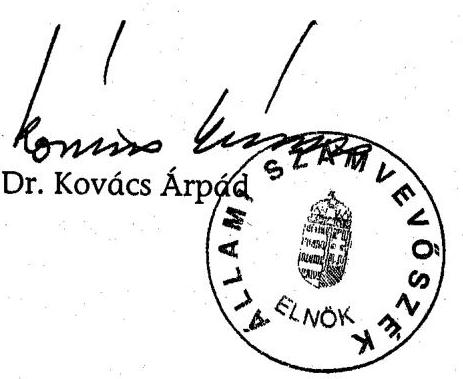
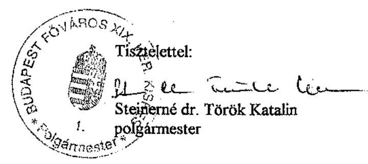

# JELENTÉS 

a Budapest Főváros XIX. kerület Kispest Önkormányzata gazdálkodásának átfogó ellenőrzéséről

---

# 3. Önkormányzati és Területi Ellenőrzési Igazgatóság 

3.3 Átfogó Ellenőrzések Főcsoport

Iktatószám: V-1002-7/25/15/2003.
Témaszám: 635
Vizsgálat-azonosító szám: V0102

## Az ellenőrzést felügyelte:

Dr. Lóránt Zoltán
főigazgató
Az ellenőrzés végrehajtásáért felelős:
Dr. Sepsey Tamás
főigazgató-helyettes
Az ellenőrzést vezette:
Csecserits Imréné
főcsoportfőnök-helyettes

## Az ellenőrzést végezték:

## Dr. Kiss Károly

számvevő tanácsos
Nagy Istvánné dr.
számvevő tanácsos
Dér Géza
számvevő
Nagy László Csaba
számvevő

A témához kapcsolódó - az elmúlt három évben készített számvevőszéki jelentések:
címe
sorszáma
Jelentés a települési önkormányzatok tulajdonában lévő közutak, 0007
hidak, alagutak fejlesztésének, fenntartásának és üzemeltetésének vizsgálatáról
Jelentés a települési önkormányzatok adóztatási tevékenységének 0121 vizsgálatáról

---

# TARTALOMJEGYZÉK 

BEVEZETÉS ..... 5
I. ÖSSZEGZŐ MEGÁLLAPÍTÁSOK, KÖVETKEZTETÉSEK, JAVASLATOK ..... 7
II. RÉSZLETES MEGÁLLAPÍTÁSOK ..... 19

1. A költségvetés tervezésének, végrehajtásának és a zárszámadás elkészítésének szabályszerűsége ..... 19
1.1. A költségvetés tervezésének, a költségvetési rendelet megalkotásának, elfogadásának szabályszerűsége ..... 19
1.2. A költségvetési előirányzatok módosításának szabályszerűsége ..... 23
1.3. A gazdálkodás szabályozottsága, szabályszerűsége ..... 26
1.4. A munkafolyamatba épített ellenőrzések szabályozottsága és gyakorlati működése a pénzügyi, gazdálkodási és számviteli feladatellátás területén ..... 30
1.5. A bizonylati rend szabályszerűsége ..... 32
1.6. A vagyon nyilvántartásának és leltározásának szabályszerűsége ..... 33
1.7. A vagyongazdálkodással kapcsolatos feladat- és döntési hatáskörök szabályozottsága, a vagyonváltozást előidéző intézkedések szabályszerűsége, célszerűsége ..... 35
1.8. Az Önkormányzat által céljelleggel - nem szociális ellátásként - juttatott támogatásokkal történő elszámoltatás szabályszerűsége ..... 38
1.9. A követelések, részesedések, értékpapírok év végi értékelésének szabályszerűsége ..... 44
1.10.A működési és felhalmozási bevételek, kiadások alakulása ..... 45
1.11.A költségvetés egyensúlyi helyzete ..... 48
1.12.A közbeszerzési eljárások szabályszerűsége ..... 50
1.13.A Polgármesteri hivatal helyi kisebbségi önkormányzatok gazdálkodásával kapcsolatos tevékenysége ..... 54
1.14.A zárszámadási kötelezettség teljesítésének szabályszerűsége ..... 56
2. Az egyes kiemelt önkormányzati feladatok és a rendelkezésre álló források összhangja ..... 58
2.1. A feladatok meghatározása és szervezeti keretei ..... 58
2.2. Az egyes naturális mutatókkal mérhető feladatok bevételei és kiadásai ..... 60
2.3. A jelentős ráfordítást igénylő önként vállalt feladatok ellátása ..... 62
3. A belső irányítási, ellenőrzési rendszer működésének értékelése ..... 64
3.1. Az Önkormányzat informatikai rendszerének szabályozottsága, működése ..... 64
3.2. A helyi ellenőrzési rendszer kialakítása, működése ..... 65
3.3. A könyvvizsgálói kötelezettség teljesítése ..... 67
3.4. A korábbi számvevőszéki ellenőrzések javaslatainak hasznosulása ..... 68

---

# MELLÉKLETEK 

1. számú Az önkormányzati vagyon nagyságának alakulása (1 oldal)
2. számú Az Önkormányzat 2002. évi bevételeinek és kiadásainak alakulása (1 oldal)
3. számú Az Önkormányzat gazdálkodását meghatározó adatok, mutatószámok (1 oldal)
4. számú Egyes feladatok kiadásainak finanszírozása (1 oldal)
5. számú Kimutatás a jelentősebb önként vállalt feladatok költségvetési súlyáról (1 oldal)
6. számú Steinerné dr. Török Katalin polgármester úrhölgy észrevétele (1 oldal)

---

# RÖVIDÍTÉSEK JEGYZÉKE 

Ötv.
Áht.
Ámr.
Kbt.
Számv. tv.
Htv.

Ksztv.
Nek. tv.
Vt.
Vhr.

ÁSZ
Önkormányzat
Képviselő-testület
IÜFB
Pénzügyi bizottság
Költségvetési bizottság

Költségvetési és pénzügyi bizottság

GTB
Közművelődési és oktatási bizottság

Szociális bizottság
Egészségügyi és sport bizottság
Polgármesteri hivatal
Pénzügyi iroda
a helyi önkormányzatokról szóló 1990. évi LXV. törvény az államháztartásról szóló 1992. évi XXXVIII. törvény az államháztartás működési rendjéről szóló 217/1998. (XII. 30.) Korm. rendelet
a közbeszerzésekről szóló 1995. évi XL. törvény
a számvitelről szóló 2000. évi C. törvény
a helyi önkormányzatok és szerveik, a köztársasági megbízottak, valamint egyes centrális alárendeltségű szervek feladat- és hatásköreiről szóló 1991. évi XX. törvény
a közhasznú szervezetekről szóló 1997. évi CLVI. törvény
a nemzeti és etnikai kisebbségek jogairól szóló 1993. évi LXXVII. törvény
a vízgazdálkodásról szóló 1995. évi LVII. törvény
az államháztartás szervezetei beszámolási és könyvvezetési kötelezettségének sajátosságairól szóló 249/2000. (XII. 24.) Korm. rendelet

Állami Számvevőszék
Budapest Főváros XIX. kerület Kispest Önkormányzata
Budapest Főváros XIX. kerület Kispest Önkormányzatának Képviselő-testülete
Budapest Főváros XIX. kerület Kispest Önkormányzat Képviselő-testületének Igazgatási és Ügyrendi Főbizottsága
Budapest Főváros XIX. kerület Kispest Önkormányzata Képviselő-testületének Pénzügyi bizottsága
Budapest Főváros XIX. kerület Kispest Önkormányzata Képviselő-testületének Költségvetési bizottsága (a 2002. évi önkormányzati választásokig)
Budapest Főváros XIX. kerület Kispest Önkormányzata Képviselő-testületének Költségvetési és pénzügyi bizottsága (a 2002. évi önkormányzati választások után)
Budapest Főváros XIX. kerület Kispest Önkormányzata Képviselő-testületének Gazdasági és tulajdonosi bizottsága
Budapest Főváros XIX. kerület Kispest Önkormányzata Képviselő-testületének Közművelődési és oktatási bizottsága
Budapest Főváros XIX. kerület Kispest Önkormányzata Képviselő-testületének Szociális bizottsága
Budapest Főváros XIX. kerület Kispest Önkormányzata Képviselő-testületének Egészségügyi és sport bizottsága
Budapest Főváros XIX. kerület Kispest Önkormányzata Polgármesteri hivatala
Budapest Főváros XIX. kerület Kispest Önkormányzata Polgármesteri hivatalának Pénzügyi irodája

---

| Vagyonhasznosítási   iroda | Budapest Főváros XIX. kerület Kispest Önkormányzata   Polgármesteri hivatalának Vagyonhasznosítási és ingatlan-   nyilvántartási irodája |
| :--: | :--: |
| Számítástechnikai   csoport | Budapest Főváros XIX. kerület Kispest Önkormányzata   Polgármesteri hivatal Pénzügyi irodájának Számítástech-   nikai csoportja |
| MES iroda | Budapest Főváros XIX. kerület Kispest Önkormányzata   Polgármesteri hivatal Művelődési, egészségügyi és sport   irodája |
| Polgármesteri iroda | Budapest Főváros XIX. kerület Kispest Önkormányzata   Polgármesteri hivatal Polgármesteri irodája |
| Jegyzői iroda | Budapest Főváros XIX. kerület Kispest Önkormányzata   Polgármesteri hivatal Jegyzői irodája |
| VAMÚSZ | Budapest Főváros XIX. kerület Kispest Önkormányzata   Vagyonkezelő Műszaki Szervezete |
| GESZ | Gazdasági Ellátó Szervezet |
| uszoda | Budapest Főváros XIX. kerület Kispest Önkormányzata   Polgármesteri hivatal Kispesti Uszodája |
| KMO | Budapest Főváros XIX. kerület Kispest Önkormányzata   Polgármesteri hivatal Munkásotthon Művelődési Háza |
| OMEGA Kht. | OMEGA Kispest Foglalkoztatási Szolgálat Közhasznú Tár-   saság |
| SzMSz | Budapest Főváros XIX. kerület Kispest Önkormányzata   Képviselő-testületének az Önkormányzat Szervezeti és   Működési Szabályzatáról szóló 5/2003. (III. 17.) számú   rendelete |
| Polgármesteri hivatal   SzMSz-e | Budapest Főváros XIX. kerület Kispest Önkormányzata   Képviselő-testületének a Polgármesteri hivatal Szervezeti   és Működési Szabályzatáról szóló 38/2000. (X. 20.) számú   rendelete |
| ügyrend | az SzMSz 9. számú melléklete: a Polgármesteri hivatal   belső szervezeti tagozódásáról, hivatali munkarendjéről és   ügyfélfogadási rendjéről |
| vagyongazdálkodási   rendelet | Budapest Főváros XIX. kerület Kispest Önkormányzata   Képviselő-testületének az Önkormányzat vagyonával való   rendelkezésről szóló 7/1994. (VI. 13.) számú rendelete |

---

# JELENTÉS 

## a Budapest Főváros XIX. kerület Önkormányzata gazdálkodásának átfogó ellenőrzéséről

## BEVEZETÉS

Az Ötv. 92. § (1) bekezdése, valamint az Áht. 120/A. § (1) bekezdése szerint az önkormányzatok gazdálkodását az Állami Számvevőszék ellenőrzi. A vizsgálatot a V-1002-7/2003. számú ellenőrzési program alapján végeztük.

## Az ellenőrzés célja annak értékelése volt, hogy

- az önkormányzati gazdálkodás törvényességét, szabályszerűségét biztosították-e a tervezés, a költségvetés végrehajtása és a zárszámadás során; a gazdálkodás szabályszerűségét biztosító kontrollok ${ }^{1}$ megfelelően segítették-e a végrehajtást;
- az önkormányzat által ellátott feladatok és az azokhoz rendelkezésre álló pénzforrások összhangja biztosított volt-e, különös tekintettel egyes kiemelt feladatokra;
- a helyi kisebbségi önkormányzat gazdálkodása során érvényesültek-e az Áht. és a vonatkozó kormányrendeletek előírásai.

Az ellenőrzött időszak: a 2002. év, valamint a 2003. I-III. negyedév, az 1.7., 2.1-2.3., 3.2-3.4. ellenőrzési programpontok esetében a 2000-2002. évek és a 2003. I-III. negyedév.

Budapest XIX. kerületét öt településrész - Wekerle-telep, Kispest Lakótelep, Kispest Kertváros, Felső Kispest, Hagyományos Kispest - alkotja. A kerület lakosainak száma 2002. január 1-jén 66150 fő volt.

Az Önkormányzat 28 tagú Képviselő-testületének munkáját kilenc állandó bizottság segítette. A polgármester személye a 2002. évi helyhatósági választások során változott.

Az Önkormányzat feladatainak végrehajtása érdekében kilenc önállóan gazdálkodó és 41 részben önállóan gazdálkodó költségvetési intézményt működtet, valamint két gazdasági társasága és egy közhasznú társasága is részt vesz a feladatok végrehajtásában. A feladatok ellátására foglalkoztatott közalkalmazottak száma a 2002. évben 1778 fő volt, a Polgármesteri hivatalban 250 fő köztisztviselő dolgozott.

Az Önkormányzat a 2002. évben 8031 millió Ft költségvetési bevételt, 7862 millió Ft költségvetési kiadást teljesített, és a 2002. év végén 9068 millió Ft értékű könyvviteli mérleg szerinti vagyonnal rendelkezett.

A kerületben a 2002. évi választásokig négy helyi kisebbségi önkormányzat, a 2002. évi választásokat követően pedig hét helyi kisebbségi önkormányzat ${ }^{2}$ működött.
${ }^{2}$ Görög, bolgár, lengyel, horvát, szerb, cigány és német.

---

# I. ÖSSZEGZŐ MEGÁLLAPÍTÁSOK, KÖVETKEZTETÉSEK, JAVASLATOK 

A Képviselő-testület az Önkormányzat gazdasági programját nem határozta meg, ezzel az Ötv. előírását megsértették. A 2002. és a 2003. évre vonatkozó költségvetési koncepciókat és költségvetési rendelettervezeteket a polgármester határidőre a Képviselő-testület elé terjesztette, a helyi kisebbségi önkormányzatok koncepcióról alkotott írásos véleményének a koncepció előterjesztéséhez történő csatolása elmaradt. A 2002. és a 2003. évi költségvetési rendeletek az Áht. előírását megsértve az Önkormányzatra összesítve nem tartalmazták a személyi jellegű kiadásokat, a munkaadókat terhelő járulékokat, a dologi jellegű kiadásokat, az ellátottak pénzbeli juttatásait és a speciális célú támogatásokat. Az Ámr. előírásait nem tartották be, mivel a működési és felhalmozási célú bevételi és kiadási előirányzatok bemutatása tájékoztató jelleggel, mérlegszerűen nem valósult meg. A 2002. évi költségvetési rendelet előirányzat felhasználási ütemtervet nem tartalmazott az Ámr-ben előírtak ellenére. A 2003. évi költségvetési rendelethez csatolták az előirányzat felhasználási ütemtervet. A kötelezően előírt mérlegek, kimutatások közül tájékoztatásul nem mutatták be a közvetett támogatásokról szóló kimutatást, valamint az Önkormányzat összevont mérlegét. A költségvetés mellékleteként bemutatandó mérlegek és kimutatások tartalmi követelményeit nem határozták meg. A költségvetési rendeletben a bevételek és a kiadások különbségeként tervezett hiány összegét a 2002. és a 2003. évben nem mutatták be, ezzel megsértették az Áht. előírásait.

Elmaradt a 2002. és a 2003. évi költségvetési rendelettervezetek költségvetési intézményvezetőkkel történő - jegyző általi - egyeztetése. A helyi kisebbségi önkormányzatok költségvetéseit kisebbségi önkormányzati határozatok alapján építették be az Önkormányzat 2002. és 2003. évi költségvetéseibe.

A 2002. és a 2003. évi költségvetési rendeletekben a költségvetés végrehajtásával kapcsolatos szabályok között az Ámr. előírásaival ellentétesen szabályozták az önkormányzati költségvetési szervek saját hatáskörben végrehajtott előirányzat változtatásának költségvetési rendeleten történő átvezetésének határidejét. Az Ötv. előírását megsértve alapítványi támogatási hatáskört önkormányzati bizottságra ruházott a Képviselő-testület. Az Áht-ban foglaltakat megsértve elmaradt annak meghatározása, hogy a költségvetési szervek milyen mértékű és időtartamú elismert tartozásállománya esetén kell a Képviselő-testületnek önkormányzati biztost kijelölnie.

A Képviselő-testület a költségvetési rendeletet a 2002. évben egy alkalommal módosította, nem tett eleget az Ámr-ben előírt gyakoriságú költségvetési rendeletmódosításnak. A 2002. évi költségvetési rendeletet utolsó alkalommal a 2003. évben - határidőn túl - a zárszámadási rendeletben módosították, megsértve ezzel az Ámr. előírásait. Az önállóan gazdálkodó költségvetési szervek a zárszámadással egyidejűleg megállapított kiadási, valamint bevételi módosított előirányzataik főösszegén belül gazdálkodtak a felhalmozási kiadások kivételével. A jóváhagyott felhalmozási előirányzatokon rendelkezésre álló összeg túllépésével hat költségvetési szerv megsértette az Áht. előírásait. A jóváhagyott előirányzatok túllépése miatt nem indult vizsgálat annak okainak megállapítására. Az előirányzaton belüli gazdálkodásra vonatkozó kötelezettség megszegése miatt felelősségre vonást nem kezdeményeztek. A helyi kisebbségi önkormányzatok költségvetési előirányzatainak módosítását - az előző évi pénzmaradvány felosztás kivételével - azok határozatai hiányában vezették át az Önkormányzat költségvetési rendeletében. Az előirányzat változásokról a kiadási előirányzatokat terhelő kötelezettségvállalások és a bevételi

 előirányzatok teljesítésének alakulásáról nyilvántartást nem vezettek, ezért az Áht-ban előírtakat megsértették.

A Polgármesteri hivatalban a gazdálkodási és az ellenőrzési jogkörök szabályozottak voltak. Nem a jogszabályi előírásokkal összhangban határozták meg az előzetes írásbeli kötelezettségvállalás nélküli kifizetések körét, az egyéni ügyvéd, ügyvédi iroda által készített szerződéseknél a kötelezettségvállalás ellenjegyzését, valamint az összeférhetetlenségi követelményeket. Nem megfelelő módon szabályozták a megrendeléseknél a kötelezettségvállalás ellenjegyzését. A szakmai teljesítésigazolást a szakmai irodavezetőkhöz, csoportvezetőkhöz rendelték. Az érvényesítési feladatok elvégzésének feladatait a jogszabályi előírásoknak megfelelően alakították ki. Nem szabályozták a kötelezettségvállalási, az utalványozási és az ellenjegyzési jogkörök felhatalmazottainak beszámoltatási módját és formáját. Hiányzott az előzetes írásbeli kötelezettségvállalás nélküli kifizetések nyilvántartásának szabályozása.

A Polgármesteri hivatal számviteli politikájában a jelentős összeget - a közpénzekkel történő gazdálkodással szembeni szigorú elszámolási igény mellett túlzottan magas összegben a könyvviteli mérleg főösszegének 2%-ában határozták meg. Az immateriális javak és tárgyi eszközök értékcsökkenésének elszámolási szabályai között nem írták elő az időarányos elszámolást. A számviteli politikában nem szabályozták a terven felüli értékcsökkenés elszámolásánál figyelembe veendő szempontokat. A mérlegkészítés időpontját, a könyvviteli helyesbítések elvégzésének határidejét rögzítették, és rendelkeztek arról, hogy az egységes számviteli rendszer kialakítása érdekében ezen előírások vonatkoznak az Önkormányzat felügyelete alá tartozó költségvetési szervekre. A számviteli politikához tartozó szabályzatokat elkészítették. Az értékelési szabályzatban rögzítették az eszközök bekerülési értékébe beszámítandó kifizetések, ráfordítások tartalmát, valamint a tulajdoni részesedést jelentő befektetéseknél az értékvesztés elszámolásának, illetve az értékvesztés visszaírásának rendjét. Nem szabályozták a követeléseknél az értékvesztés elszámolásának és az értékvesztés visszaírásának rendjét. A pénzkezelési szabályzatot nem egészítették ki - a 2003. évtől alkalmazott - üzemanyagkártya nyilvántartásának és kezelésének szabályaival. A számlarend tartalmi aktualizálásáról nem gondoskodtak és elmaradt a tárgyi eszközöknél és a belföldi szállítóknál, valamint az üzemeltetésre átadott eszközöknél a részletező nyilvántartás tartalmának kijelölése. A számlarendben nem határozták meg az analitikus nyilvántartások adataiból készített összesítő kimutatások elkészítésének határidejét, a főkönyvi könyveléssel való egyeztetés gyakoriságát és módját.

A Pénzügyi iroda dolgozóinak munkaköri leírása tartalmazta az analitikus nyilvántartások és a főkönyvi könyvelés közötti egyeztetés határidejét, nem rendelkeztek az elvégzett egyeztetés igazolásának módjáról. A Pénzügyi iroda

---

pénzügyi és számviteli tevékenységének folyamatszabályozását a minőségügyi rendszerdokumentáció tartalmazta. A rendszerdokumentáció magában foglalta - a költségvetési tervezés, végrehajtás és beszámolás feladatain túl - a bejövő és kimenő számlák feldolgozásának munkafolyamatát.

A Polgármesteri hivatalban a munkafolyamatba épített ellenőrzések keretében a szerződések, a megrendelések 5,5%-ánál hiányzott a kötelezettségvállalás ellenjegyzése. Elmaradt a kötelezettségvállalás ellenjegyzése a szakmai irodavezetők megrendelésein, valamint eseti jelleggel a megbízási és a szakértői szerződéseken. A kötelezettségvállalás ellenjegyzésének hiánya miatt nem teljesült a kiadási előirányzat által biztosított fedezet meglétének ellenőrzése, a Gondnokság, a Piacfelügyelőség és a Városgazdálkodási iroda megrendeléseinél és eseti jelleggel a megbízási szerződéseknél. Nem látták el a pénzügyi érvényesítési feladatokat a költségvetési bevételeknél. A pénztárellenőr ellenőrizte a bevételi és a kiadási pénztárbizonylatokat, a pénztárjelentést, valamint a rendelkezésre álló pénzkészletet, nem vizsgálta viszont a házipénztári keret betartását. A pénztári napok 40%-ánál túllépték a házipénztári keret szabályzatban rögzített mértékét. A számvitel területén a részletező és a főkönyvi nyilvántartások adatai közti egyeztetéseket, ellenőrzéseket írásban rögzítették.

A Polgármesteri hivatalban az előzetes írásbeli kötelezettségvállalás hiánya a belső szabályozás azon rendelkezésével függött össze, amely az 50 ezer Ft értékhatár kijelölése nélkül tette lehetővé az előzetes írásbeli kötelezettségvállalás nélküli kifizetéseket. A kötelezettségvállalási jogkörrel rendelkező szakmai irodavezetők megrendelései - a jogszabályi előírások megsértésével - 23 esetben, a kiadási bizonylatok 3,4%-ánál nem tartalmazták a megrendelt árú, szolgáltatás érték adatait. Az érvényesítési feladatok keretében a könyvviteli elszámolás során a gazdasági események szakfeladati besorolása megfelelő volt. Elmaradt az utalványozás a nem termékértékesítésből és szolgáltatásnyújtásból származó banki és pénztári bevételeknél.

A Polgármesteri hivatal a számviteli nyilvántartásában a törzsvagyon, valamint a nem törzsvagyon részét képező eszközök elkülönítéséről nem gondoskodtak a főkönyvi számlák alábontásával, a 2003. évben a törzsvagyon elkülönített nyilvántartásának elkészítésére intézkedtek. A jogszabályi előírás ellenére az ingatlanvagyon kataszteri nyilvántartás módosítását határidőben nem készítették el. A könyvviteli mérlegben a Számv. tv. előírásait megsértve, az 1999-2000. évben megépült csatornaközmű hálózat értékét nem mutatták ki a számviteli és ingatlanvagyon kataszteri nyilvántartásban, üzemeltetésre átadott eszköz a mérlegben nem szerepelt. A Polgármesteri hivatalnál az ingatlanok megállapított (becsült) teljes értékét a főkönyvi könyvelésben és a mérlegben nem mutatták ki. A tárgyi eszközök mennyiségi leltározását nem végezték el annak ellenére, hogy a jogszabály minden évben leltározást ír elő, azt összesítő kimutatások készítésével helyettesítették. A részesedések, követelések, pénzeszközök és kötelezettségek leltározása egyeztetéssel megtörtént.

Az Önkormányzat vagyonértéke a 2000-2002. évek között 3%-ot megközelítő évenkénti változó mértékben növekedett. Az eszközök összetétele a befektetett eszközök javára változott meg. A vagyonnal történő gazdálkodást a Képviselőtestület két rendeletben szabályozta, a két rendelet hatálya tekintetében átfedés volt. A vagyonértékesítésre vonatkozó döntési jogköröket értékhatárhoz kötöt-

---

ten rögzítették, megjelölték a döntéshozókat. Nem rögzítettek a rendeletek értékhatárt arra, hogy vagyont milyen értéktől lehet csak versenytárgyalás útján értékesíteni. Az Áht. előírását - az önkormányzatoknál vagyont értékesíteni csak nyilvános versenytárgyalás útján lehet - megsértve két elidegenítés során pályázat kiírása nélkül történt 30, illetve 80 millió Ft értékű ingatlanok értékesítése. Az Önkormányzat a Centrum Áruházak Rt. törzsrészvényeinek eladásáról döntött a 2003. évben, mivel a részvények tőkekivonás miatt leértékelésre kerültek volna. Ez a döntés gazdaságilag indokolt volt. Az Önkormányzat a kerületben működő pártok részére helyiséget biztosított az Alkotmánybírósági határozatot figyelmen kívül hagyva a jelképes bérleti díj kikötésével (ingatlanonként 10 Ft/év, 1 Ft/m²/hó áron). A Önkormányzatnál - az Áht-t megsértve nem rendeletben szabályozták - a követelésekről történő lemondás eseteit és módját polgármesteri és jegyzői utasításban határozták meg, ezekről történő lemondás mértéke az összes követeléshez viszonyítva 0,5% volt.

A Polgármesteri hivatalnál - az adókövetelések kivételével - a követelések és a részesedések év végi értékelésének feladatait nem végezték el, értékvesztést nem számoltak el, ezért megsértették a Számv. tv. előírását. A tulajdoni részesedést jelentő befektetéseik esetében indokolt lett volna értékvesztés elszámolása egy kft esetében, mert a saját tőke értéke alacsonyabb volt a jegyzett tőkénél, a tőzsdén jegyzett részvényeiknek a névértéke - ezen tartották nyilván - magasabb volt, mint a kialakult árfolyam.

Az Önkormányzat által céljelleggel a sport, az egészségmegőrző, a közművelődési, a táboroztatási célú, civil szervezeteknek, a helyi kisebbségi önkormányzatoknak és az OMEGA Kht-nak nyújtott támogatásokról a támogatott szervezetekkel megállapodást nem kötöttek. A támogatottak között közhasznú szervezetek is voltak - a 2002. évben 24, amelyek összesen 2,2 millió Ft támogatásban részesültek - amelyekkel a Ksztv. előírásait megsértve nem kötöttek szerződést a támogatást biztosításáról. Az önkormányzati bizottságok, valamint a polgármester a 2002. évben 13 alapítványt, összesen 5,9 millió Ft támogatásban részesített az Ötv. előírásait megsértve. A közoktatási megállapodás alapján, valamint a helyi kisebbségi önkormányzatok részére és a polgármester által az egyéb támogatások keret terhére biztosított támogatások felhasználására számadási kötelezettséget nem írtak elő, ezért az Áht. előírásait megsértették. Az Önkormányzat a támogatott szervezetek által benyújtott számadásokat - a sporttámogatások és az egyházi épületek, valamint a társasházak felújítására biztosított támogatások kivételével - nem vizsgálta meg, illetve a támogatás felhasználását nem ellenőrizte, ezért az Áht. előírásait megsértették.

Az Önkormányzat a 2002. évi gazdálkodása során a működési bevételeknél többlet realizálásával biztosította a működési kiadások fedezetét. Az Önkormányzat bevételei növelésének érdekében élt a helyi adó megállapításával, továbbá külső pénzügyi forrásokat - fejezeti kezelésű előirányzatokból kapott támogatások, fővárosi átvett pénzeszközök - is igénybe vett a feladatai finanszírozásához.

Az önállóan gazdálkodó önkormányzati intézmények az év közi pénzállományuk alakulását havi aktualizálással figyelemmel kísérték, a jegyző az Önkormányzat pénzállományának alakulásáról likviditási tervet készített. Az Ön-

---

kormányzat a 2003. évben adósságot keletkeztető kötelezettségvállalást 39 millió Ft összegű célhitel felvételével tett, amelynek során az éves kötelezettségvállalási felső korlátot betartották.

Az Önkormányzat a közbeszerzési törvény hatálya alá tartozó beszerzéseinek eljárási rendjét rendeletben szabályozta. A 2003. évben hatályos közbeszerzési rendelet a Kbt. előírásait megsértve szabálytalanul jelölte ki a rendelet alanyi hatályát, elmaradt - a közbeszerzési törvénnyel összhangban lévő - döntéshozatal szabályozása, valamint hiányzott az éves összegzés készítésének előírása és a teljesítésért felelős személy kijelölése. A közbeszerzési rendelet nem tartalmazta a belső felelősségi rend kialakításának módját. Az értékhatárt el nem érő beszerzések pályáztatási eljárási rendjét - a törvényi előírásokat megsértve - polgármesteri intézkedés szabályozta. A polgármester a Kbt. előírását megsértve, nem indított közbeszerzési eljárást a 2002. évben két szolgáltatásra, egy felújításra, valamint a részekre bontás tilalmát sértette meg a 2002. évben négy, a 2003. évben egy esetben. A polgármester, mint az ajánlatkérő nevében eljáró személy a 2002. évi közbeszerzési eljárásokról éves összegzést nem készített, ezzel a Kbt. előírását megsértette.

A polgármester a zárszámadási rendelettervezetet - az elfogadott költségvetéssel összehasonlítható módon - határidőre terjesztette a Képviselő-testület elé. A zárszámadási rendelet Önkormányzatra összesítve nem tartalmazta a személyi jellegű kiadásokat, a munkaadókat terhelő járulékokat, a dologi jellegű kiadásokat, az ellátottak pénzbeli juttatásait és a speciális célú támogatásokat, ezért megsértették az Áht-ban előírtakat. A részben önállóan gazdálkodó önkormányzati költségvetési szervek működési és fenntartási előirányzatainak teljesítését költségvetési szervenként nem mutatták be, ezzel nem tartották be az Ámr. előírásait. Nem tartalmazta a zárszámadási rendelet az Önkormányzat működési és felhalmozási célú bevételi és kiadási előirányzatainak mérlegszerű bemutatását, ezért nem tettek eleget az Ámr. előírásainak. A zárszámadási rendeletben tájékoztatásul bemutatták az Áht-ban előírt mérlegeket. A zárszámadási rendeletben az önállóan gazdálkodó, valamint a részben önállóan gazdálkodó intézmények esetében a pénzmaradványt nem mutatták be és arról nem döntött a Képviselő-testület, a Polgármesteri hivatal ténylegesen felhasználható, módosított pénzmaradványa helyett „halmozott pénzmaradványt" hagyott jóvá a Képviselő-testület, ezért nem tettek eleget az Ámr. előírásainak.

A 2000-2002. években négy helyi kisebbségi önkormányzat - horvát, szerb, cigány és német - folyamatosan működött. A görög, a bolgár és a lengyel kisebbségi önkormányzat a 2002. évi helyi kisebbségi önkormányzati választások után alakult meg. A gazdálkodási feladatok végrehajtása érdekében az 1999. évben kötöttek együttműködési megállapodást a működő helyi kisebbségi önkormányzattal, a 2002. évben alakult helyi kisebbségi önkormányzatokkal a 2003. év végén kötöttek megállapodást, így nem tettek eleget az Ámr-ben foglaltaknak. A megállapodás nem rögzítette, hogy kötelezettségvállalás csak írásban történhet, az összeférhetetlenségre vonatkozó szabályokat, valamint az előirányzat módosításáról szóló kisebbségi önkormányzati határozatok átadásának határidejét, ezzel nem tettek eleget az Ámr. előírásainak. A helyi kisebbségi önkormányzatok véleményét sem a 2002., sem a 2003. évi költségvetési koncepció tervezetéről nem kérték ki. A helyi kisebbségi önkormányzatok a fe-

---

ladataik ellátásához ingatlanvagyonnal nem rendelkeztek, a Nek. tv-ben foglalt előírások alapján a
 működés alapfeltételét jelentő helyiség- és irodahasználati jogot kaptak az Önkormányzattól. A helyi kisebbségi önkormányzatok vagyoni és számviteli nyilvántartásait a jogszabályi előírásoknak megfelelően az Önkormányzat nyilvántartásain belül elkülönítetten vezették. A pénzforgalmának lebonyolítására alszámlát nyitottak, a pénzforgalom lebonyolítására a részükre megnyitott alszámlákat alkalmazták. A helyi kisebbségi önkormányzatok készpénzforgalmára önálló pénztárat működtettek, a pénztárat a Polgármesteri hivatalban kezelték.

Az Önkormányzat kialakította közszolgálati feladatai ellátásának szervezeti struktúráját. A Képviselő-testület feladatainak ellátásában meghatározó szerepe az önkormányzati intézményeknek volt. Az önállóan gazdálkodó intézmények közül kettő a részben önállóan gazdálkodó intézmények gazdasági és pénzügyi feladatait megállapodás alapján végezte. A szociális, egészségügyi ellátás feltételei biztosítottak voltak, nevelési-oktatási feladatait 16 napközi otthonos óvoda, 12 általános iskola és egy gimnázium üzemeltetésével oldották meg. A közművelődési feladatokat 4 önállóan gazdálkodó intézménnyel látták el. A kommunális feladatai színvonalasabb ellátására közhasznú társaságot alapított. A lakossági közszolgáltatásokkal szembeni elvárások kielégítését szolgálták a létrehozott alapítványok és közalapítványok. A Képviselő-testület az elmúlt három évben átfogóan nem értékelte az intézmény-rendszer célszerűségét, egyedi döntés alapján egy óvodát megszüntetett, egy közalapítványt és egy közhasznú társaságot alapított.

A Képviselő-testület az Önkormányzat SzMSz-ében nem rögzítette az önként vállalt feladatok körét és tartalmát. A 2000-2002. terjedő időszak alatt az önként vállalt feladatok ellátására fordított kiadások növekedése, valamint a költségvetési kiadásokon belüli részarányuk emelkedése nem veszélyeztette a kötelező feladatok megvalósítását.

A Polgármesteri hivatal a hosszú távú fejlesztéseket megalapozó Informatikai Stratégiával rendelkezik, azt időszakonként aktualizálta. Az informatikai rendszerrel összefüggő szabályzatokat elkészítették, az illetéktelen hozzáférés elleni védelem céljából kialakították a megfelelő jogosultsági rendszert. Az adatbiztonság érdekében működtetett eljárások jól kialakítottak. A Polgármesteri hivatal hardver és szoftver ellátottsága a pénzügyi gazdálkodási folyamatok rendszerszerű működését támogatta, a megfelelő üzemeltetői és felhasználói leírásokkal rendelkeztek.

A Polgármesteri hivatal SzMSz-ében meghatározták az Önkormányzat intézményeinek pénzügyi-gazdasági és belső ellenőrzésének feladatait, ezt a feladatot két köztisztviselő látta el. Az Áht. előírását megsértve 2003. január 1-jét követően a függetlenített belső ellenőrzésre elkülönített szervezet nem volt. Az Önkormányzat ellenőrzési szabályzatát a 2003. év júniusában készítették el és adták ki. Az ellenőrzéseket a 2002-2003. évekre a polgármester és a jegyző által jóváhagyott munkaterv alapján és egyedi megbízásoknak megfelelően végezték az ellenőrök. A szabályzatban nem rögzítették, a munkatervben nem írták elő az állami hozzájárulások és támogatások igénybevételét megalapozó adatok tételes ellenőrzését. Az elvégzett ellenőrzésekről készített jelentések a megállapításokhoz tartozó javaslatokat tartalmazták, de a felelősség jogi megalapo-

---

zottsága hiányzott. Az ellenőrzött szervezetek a feltárt hiányosságok kijavítása érdekében teendő intézkedésekre a realizáló értekezleten utasítást kaptak, amelynek végrehajtását utóellenőrzés keretében ellenőrizték. A 2002. évben végzett ellenőrzésekről beszámolót készítettek. A Képviselő-testület a beszámolót nem tárgyalta, ezért az abban leírtakat nem értékelték, ezzel megsértették a Htv. előírását.

Az Önkormányzat könyvvizsgálati kötelezettségének megfelelő képesítésű könyvvizsgálóval tett eleget. A könyvvizsgáló a költségvetési beszámolót hitelesítő záradékkal látta el.

Az ÁSZ két vizsgálatot folytatott, melynek a forgalomképtelen vagyontárgyak értéken történő nyilvántartására tett javaslatát az Önkormányzat megvalósította.

A helyszíni ellenőrzés megállapításai mellett a gazdálkodás szabályszerűségének és a munka színvonalának javítása érdekében javasoljuk:

# a polgármesternek 

## a törvényes állapot helyreállítása és a jogszabályi előírások betartása érdekében

1. a költségvetési gazdálkodás jogszabályszerű kereteinek kialakítása céljából
a) kezdeményezze a Képviselő-testületnél a jegyző által előkészített gazdasági programtervezet alapján az Önkormányzat több évre szóló gazdasági programjának meghatározását az Ötv. 91. § (1) bekezdésében előírtak betartása érdekében;
b) csatolja a költségvetési koncepció tervezethez az Ámr. 28. § (3) bekezdése szerint a helyi kisebbségi önkormányzatok koncepció tervezetről alkotott véleményét;
c) terjessze - a jegyző által készített előterjesztés alapján - a Képviselő-testület elé az Áht. 118. §-ában előírt mérlegek, kimutatások tartalmának meghatározásáról szóló rendelettervezetet, kezdeményezze továbbá az Áht. 98. § (6) bekezdésében foglaltak figyelembevételével annak rendeletben történő meghatározását, hogy a költségvetési szervek milyen mértékű és időtartamú elismert tartozásállománya esetén kell a Képviselő-testületnek önkormányzati biztost kijelölnie;
2. gondoskodjon arról, hogy az Önkormányzat által céljelleggel juttatott támogatások közül az alapítványok támogatása esetében a döntést a Képviselő-testület hozza meg az Ötv. 10. § (1) bekezdés d) pontjában előírtak betartása érdekében;
3. biztosítsa, hogy a Ksztv. 14. § (2) bekezdésében foglaltak betartása érdekében az Önkormányzat által közhasznú szervezetek részére céljelleggel megállapított támogatások folyósítása kizárólag írásbeli szerződés alapján történjen;
4. biztosítsa az Áht. 12/A. § (1) bekezdésében foglaltak betartása érdekében, hogy a tárgyévi fizetési kötelezettséget a jóváhagyott kiadási előirányzatok mértékéig vállal-

---

janak a költségvetési szervek, továbbá, hogy a költségvetési szervek az Áht. 93. § (1) bekezdésében foglaltaknak megfelelően a jóváhagyott előirányzatokon belül gazdálkodjanak;
5. kezdeményezze a vagyongazdálkodásról és a lakás és nem lakás céljára szolgáló helyiségek bérletéről és elidegenítéséről szóló önkormányzati rendeletek hatálya összhangjának biztosítása érdekében azok módosítását;
6. kezdeményezze az Áht. 108. § (1) bekezdése szerint a Képviselő-testületnél, hogy a vagyon-értékesítés és bérbeadás meghatározott értékhatár felett csak nyilvános versenytárgyalás útján történhessen;
7. gondoskodjon a beruházási és a felújítási döntéseknél a részekre bontás tilalmára vonatkozó előírások következetes betartásáról
a) 2004. május 1-jéig a Kbt. 5. § (1) és (2) bekezdéseiben, illetve
b) 2004. május 1-jétől a közbeszerzésekről szóló 2003. évi CXXIX. törvény 40. § (1) és (2) bekezdéseiben foglaltak alapján;
8. gondoskodjon a közbeszerzési értékhatárt elérő árubeszerzéseknél, építési beruházásoknál és szolgáltatások megrendelésénél a közbeszerzési eljárás lefolytatásáról
a) 2004. május 1-jéig a Kbt. 2. § (1) bekezdésében, illetve
b) 2004. május 1-jétől a a közbeszerzésekről szóló 2003. évi CXXIX. törvény 2. § (2) bekezdésében előírtak alapján;
9. intézkedjen a Kbt. 61. § (9) bekezdése alapján a 2003. évre vonatkozó éves összegzés elkészítéséről és megküldéséről a Közbeszerzési Tanács részére;
10. intézkedjen a közbeszerzési értékhatár alatti beszerzésekre vonatkozó 5-24/2001. számú polgármesteri intézkedéssel kapcsolatban, a Kbt. 96. § (2) bekezdés b) pontjában előírtak figyelembevételével;
11. kezdeményezze a helyi kisebbségi önkormányzatokkal kötött megállapodás kiegészítését annak érdekében, hogy
a) a kötelezettségvállalás az Ámr. 134. § (2) és (4) bekezdéseinek megfelelően történhessen;
b) a gazdálkodási jogosítványok gyakorlása során az összeférhetetlenség esetén követendő eljárást szabályozzák, hogy a kötelezettségvállaló illetve az utalványozó az ellenjegyzést végzővel azonos személy ne legyen az Ámr. 138. § (1) bekezdésének megfelelően, és hogy kötelezettségvállalási, utalványozási, ellenjegyzési feladatot ne végezzen az a személy, aki ezt a tevékenységét közeli hozzátartozója, vagy a maga javára látná el az Ámr. 138. § (3) bekezdésének megfelelően;
c) rögzítsék az Ámr. 29. § (10) bekezdésének megfelelően az évközi előirányzatmódosításokról szóló helyi kisebbségi önkormányzati határozatok átadásának határidejét annak érdekében, hogy az Önkormányzat számára a jogszabályokban előírt kötelezettségek határidőben teljesíthetőek legyenek;

---

12. kezdeményezze a Képviselő-testületnél a lakás és nem lakás céljára szolgáló helyiségek bérletéről és elidegenítéséről szóló 11/1998. (III. 20.) számú rendelet módosítását annak érdekében, hogy a pártok részére megállapított díjtételeket az Alkotmánybíróság 47/2002. (X. 11.) AB. határozat döntésével összhangban állapítsák meg;
13. kezdeményezze a Képviselő-testületnél, hogy rendeletben szabályozzák - az Áht. 108. § (2) bekezdés alapján - a követelésről történő lemondás eseteit és módját;
14. gondoskodjon arról, hogy a Polgármesteri hivatal függetlenített belső ellenőrzése elkülönített szervezetként működjön az Áht. 121/A. § (4) bekezdése alapján;
15. kezdeményezze, hogy a Képviselő-testület meghatározott időszakonként tekintse át az általa alapított és fenntartott költségvetési szervek ellenőrzésének tapasztalatait a Htv. 138. § (1) bekezdés g) pontjában előírtaknak megfelelően;
16. kezdeményezze, hogy a Képviselő-testület az Ötv. 8.§ (2) bekezdésében foglaltak alapján az SzMSz-ben rögzítse az önkormányzati kötelező és önként vállalt feladatokat és azok ellátásának módját;

# a munka színvonalának javítása érdekében 

17. gondoskodjon a kötelezettségvállalást és az utalványozást átruházott jogkörben gyakorlók beszámoltatási módjának és formájának szabályozásáról;
18. intézkedjen annak érdekében, hogy a jóváhagyott költségvetési előirányzatok túllépése esetén annak okát vizsgálják és a jóváhagyott előirányzatokon belüli gazdálkodási kötelezettség megszegése miatt felelősségre vonást kezdeményezzenek;
19. gondoskodjon az intézmény rendszer célszerűségének átfogó vizsgálatáról, annak érdekében, hogy a feladatellátásban a gazdaságosság érvényesüljön;

## a jegyzőnek

## a törvényes állapot helyreállítása és a jogszabályi előírások betartása érdekében

1. a költségvetési rendelettervezet előkészítésekor
a) gondoskodjon az Ámr. 29. § (4) bekezdésében előírtak betartása érdekében arról, hogy a költségvetési rendelettervezet önkormányzati intézményekkel történő egyeztetésének eredményét írásban rögzítsék;
b) biztosítsa, hogy a költségvetési rendelet a személyi jellegű kiadásokat, a munkaadókat terhelő járulékokat, a dologi jellegű kiadásokat, az ellátottak pénzbeli juttatásait és a speciális célú támogatásokat Önkormányzatra összesítve tartalmazza, az Áht. 69. § (1) bekezdésében foglaltaknak megfelelően;
c) gondoskodjon az Ámr. 29. § (1) bekezdés b) pontjában foglaltak betartása érdekében, hogy a működési és felhalmozási célú bevételi és kiadási előirányzatok tájékoztató jelleggel, mérlegszerűen a költségvetési rendeletben bemutatásra kerüljenek;

---

d) gondoskodjon arról, hogy az Áht. 8. § (1) bekezdésében foglaltaknak megfelelően a költségvetés bevételeinek és kiadásainak különbségeként tervezett hiány a költségvetési rendelet normaszövegében nevesítésre kerüljön;
2. a költségvetési rendelet módosításakor
a) gondoskodjon a költségvetési rendelet negyedévenkénti módosításáról az Ámr. 53. § (2) bekezdésében foglaltaknak megfelelően;
b) gondoskodjon az Ámr. 53. § (2) és (6) bekezdésében foglaltak betartása érdekében arról, hogy a költségvetési rendelet utolsó módosítása határidőben megtörténjen;
c) intézkedjen az Áht. 74. § (3) bekezdésének figyelembevételével, hogy a helyi kisebbségi önkormányzatok költségvetéseik év közbeni módosításáról határozzanak és az Önkormányzat költségvetését kizárólag azok határozatai alapján módosítsák;
3. gondoskodjon az Áht. 103. § (1)-(2) bekezdéseiben előírtak betartásáról, ennek érdekében intézkedjen, hogy folyamatosan tartsák nyilván a jóváhagyott előirányzatokat és azok teljesülését, a nyilvántartási kötelezettséget terjesszék ki a kiadási előirányzatot terhelő kötelezettségvállalások és a bevételi előirányzatok teljesítését előrejelző bevételi előírások nyilvántartására;
4. biztosítsa, hogy a költségvetési rendelet előterjesztésekor az Áht. 118. §-a alapján a Képviselő-testület részére tájékoztatásul bemutatásra kerüljenek a 116. § 6. pontja szerinti önkormányzati összevont mérlegek, továbbá a 116. § 10. pontja szerint a közvetett támogatásokról szóló kimutatás;
5. gondoskodjon arról, hogy a zárszámadási rendelet
a) az Önkormányzatra összesítve tartalmazza - az Áht. 69. § (1) bekezdésében foglaltaknak megfelelően - a személyi jellegű kiadásokat, a munkaadókat terhelő járulékokat, a dologi jellegű kiadásokat, az ellátottak pénzbeli juttatásait és a speciális célú támogatásokat;
b) az Ámr. 29. § (1) bekezdés b) pontjában foglaltaknak megfelelően részben önállóan gazdálkodó költségvetési szervenként tartalmazza a működési és fenntartási előirányzataik teljesítését;
c) az Önkormányzatra vonatkozóan tartalmazza a működési és felhalmozási bevételeket, valamint kiadásokat mérlegszerűen az Ámr. 29. § (1) bekezdés h) pontja szerint;
6. gondoskodjon arról, hogy az önállóan, valamint a részben önállóan gazdálkodó költségvetési szervek pénzmaradványa az Ámr. 66. § (4) bekezdésében előírtaknak megfelelően bemutatásra és jóváhagyásra kerüljön;
7. kezdeményezze a nem önkormányzati oktatási intézményekkel kötött közoktatási megállapodások felülvizsgálatát annak érdekében, hogy azokban a számadási kötelezettséget írják elő és rögzítsék az Önkormányzat által adott támogatások elszámolásának szabályait, valamint intézkedjen az Áht. 13/A. § (2) bekezdése betartása ér-

---

dekében arról, hogy az Önkormányzat által juttatott támogatások esetében számadási kötelezettséget írjanak elő, a támogatások
 felhasználásáról benyújtott elszámolások és a támogatás felhasználásának ellenőrzése megtörténjen;
8. gondoskodjon a Gondnokság, a Piacfelügyelőség és a Városgazdálkodási iroda megrendeléseinél és megbízási szerződéseinél, hogy a kötelezettségvállalás ellenjegyzésének felhatalmazásánál az Ámr. 134. § (7) bekezdésében foglalt költségvetési ellenőrzési feladatok elvégzése teljesíthető legyen;
9. intézkedjen az előzetes írásbeli kötelezettségvállalás nélküli kifizetések
a) szabályozásáról az 50 ezer Ft értékhatár kijelölésével az Ámr. 134. § (4) bekezdésével összhangban;
b) nyilvántartási rendjének szabályozásáról az Ámr. 134. § (4) bekezdésében előírtak alapján;
10. intézkedjen a gazdálkodási és az ellenőrzési jogkörökre vonatkozó összeférhetetlenségi követelmények Ámr. 138. § (1)-(3) bekezdésében előírtakkal összhangban történő szabályozásáról, valamint az Ámr. 135. § (5) bekezdésében foglaltak előírásáról;
11. rendelkezzen a számviteli politikában
a) az immateriális javak és tárgyi eszközök értékcsökkenésének elszámolási szabályai között - a Vhr. 30. § (2) bekezdése alapján - a tényleges használatnak megfelelő, időarányos elszámolásáról;
b) a terven felüli értékcsökkenés elszámolásánál figyelembe veendő szempontokról a Vhr. 8. § (5) bekezdésében előírtak alapján;
12. gondoskodjon a számlarend
a) tartalmi aktualizálásáról a folyamatos karbantartás követelményét előíró Vhr. 49. § (5) bekezdése alapján;
b) kiegészítéséről a főkönyvi számla és az analitikus nyilvántartás kapcsolatára vonatkozóan az egyeztetések gyakoriságának és módjának előírásával a Számv. tv. 161. § (2) bekezdés c) pontja alapján;
13. biztosítsa az Ámr. 134. § (7) bekezdése alapján a kötelezettségvállalás ellenjegyzésére vonatkozó előírások betartását a szakmai irodavezetők megrendeléseinél, a megbízási és a szakértői szerződéseknél;
14. tartassa be a pénzkezelési szabályzat II. fejezetének 1.4. pontjában rögzített házipénztári keret mértékét;
15. intézkedjen, hogy a Számv. tv. 167. § (1) bekezdés e) pontjában foglaltak alapján az írásbeli kötelezettségvállalás bizonylatai tartalmazzák a megrendelt áru, szolgáltatás értékadatait;
16. gondoskodjon a költségvetési bevételeknek az Ámr. 135. (1)-(4) bekezdései szerinti érvényesítéséről, valamint az Ámr. 136. § (1) és (6) bekezdésében foglaltak alapján a nem termékértékesítésből és szolgáltatásnyújtásból származó bevételek utalványozásáról;
17. intézkedjen a törzs- valamint egyéb vagyon elkülönített számviteli nyilvántartására a Vhr. 9. számú melléklet 1. k) pont előírása szerint;
18. biztosítsa, hogy az ingatlanok bruttó értéke az ingatlanvagyon kataszteri nyilvántartásba felvételre kerüljön az önkormányzatok tulajdonába lévő ingatlanvagyon nyilvántartási és adatszolgáltatási rendjéről szóló 147/1992. (XI.6.) Korm. rendelet 1. § (3) bekezdése alapján;
19. intézkedjen a Számv. tv. 23. § (1) bekezdése, valamint a Vhr. 15. § (1) bekezdése alapján, hogy az Önkormányzat számviteli nyilvántartásában a korábban érték nélkül nyilvántartott eszközök értékét, valamint az 1999-2000. évben elkészült csatornaközmű értékét - az értékcsökkenés figyelembevételével - mutassák ki;
20. gondoskodjon a tárgyi eszközök leltározásának elrendeléséről és annak végrehajtásáról a Vhr. 37. § (3) bekezdésében előírtaknak megfelelően;
21. intézkedjen, hogy a követeléseknél és a tulajdoni részesedést jelentő befektetéseknél vizsgálják meg és számolják el az indokolt értékvesztést a Számv. tv. 54. § (1)-(3) bekezdésében és az 55. § (1) bekezdésében, valamint az eszközök és források értékelési szabályzatában foglaltak szerint;
22. intézkedjen a Htv. 140. § (1) bekezdés h) pontjában előírt kötelezettsége teljesíthetősége érdekében, hogy az ellenőrzési szabályzat tartalmazza az állami hozzájárulások és támogatások igénybevételével és elszámolásával kapcsolatos ellenőrzési feladatokat;

# a munka színvonalának javítása érdekében 

23. intézkedjen az értékelési szabályzat kiegészítéséről a követeléseknél az értékvesztés elszámolásának és az értékvesztés visszaírásának rendjére vonatkozóan;
24. intézkedjen a pénzkezelési szabályzat kiegészítéséről az üzemanyagkártya nyilvántartásával és kezelésével kapcsolatban;
25. egészítse ki a számlarendet a tárgyi eszközök, üzemeltetésre átadott eszközök, valamint a belföldi szállítók részletező nyilvántartásának tartalmára vonatkozó előírásokkal;
26. gondoskodjon az ellenjegyzést átruházott jogkörben gyakorlók beszámoltatási módjának, formájának szabályozásáról;
27. biztosítsa a számviteli politikában a jelentős összeg nagyságrendjének olyan meghatározását, hogy az segítse a közpénzekkel történő gazdálkodás és szigorú elszámolás követelményének érvényesülését.

---

# II. RÉSZLETES MEGÁLLAPÍTÁSOK 

## 1. A KÖLTSÉGVETÉS TERVEZÉSÉNEK, VÉGREHAJTÁSÁNAK ÉS A ZÁRSZÁMADÁS ELKÉSZÍTÉSÉNEK SZABÁLYSZERÜSÉGE

### 1.1. A költségvetés tervezésének, a költségvetési rendelet megalkotásának, elfogadásának szabályszerűsége

Az Ötv. 91. § (1) bekezdésében foglaltakat megsértve, a Képviselő-testület az Önkormányzat gazdasági programját nem határozta meg.

A polgármester a 2002. évi költségvetési koncepciót az Áht. 70. §-ában előírt határidő ${ }^{3}$ betartásával a 2001. november 20-i képviselő-testületi ülésre terjesztette elő. Az SzMSz 7. számú mellékletében a Képviselő-testület a költségvetési koncepció véleményezésére a Költségvetési bizottságot hatalmazta fel, amely a 2000. november 14-i ülésen kialakította állásfoglalását. A Költségvetési bizottság - határozatokba foglalt - véleményét a koncepció tervezet előterjesztéséhez mellékelték, ezzel eleget tettek az Ámr. 28. § (3) bekezdésében előírtaknak. A költségvetési koncepciót a helyi kisebbségi önkormányzatok részére nem küldték meg, arról azok nem alakítottak ki véleményt. Az Ámr. 28. § (3) bekezdésében foglaltakat nem vették figyelembe, mivel nem csatolták a Képviselőtestület részére benyújtott költségvetési koncepció tervezethez a helyi kisebbségi önkormányzatok koncepcióról alkotott véleményét. ${ }^{4}$

A Képviselő-testület a 805/2001. (XI. 20.) számú határozattal fogadta el a költségvetési koncepciót. Az előterjesztés tartalmazta a központi költségvetésből, illetve fővárosi forrásmegosztásból várható bevételi irányszámokat, a saját bevételek emelkedésének várható mértékét, a jogszabályi módosítások miatti közalkalmazotti, köztisztviselői illetményváltozások hatásait. Az egyes feladatokra tervezett kiadások előző évihez viszonyított növekedését bemutatták. Kiemelt célként rögzítették, hogy a költségvetés tervezése során a működési hiány a 2001. évi szinten maradjon.

A költségvetési rendelettervezetben az Ámr. 26. §-ában foglaltak figyelembevételével, az abban előírt módon határozták meg a kiadási és bevételi előirányzatokat.

[^0]
[^0]:    ${ }^{3}$ A következő évre vonatkozó költségvetési koncepciót a polgármester november 30-ig benyújtja a Képviselő-testületnek.
    ${ }^{4}$ A számvevői jelentésre tett észrevételben a polgármester arról adott tájékoztatást, hogy a kisebbségi önkormányzatoktól a 2004. évi költségvetési koncepcióról és rendeletről véleményt kértek.

---

A költségvetési rendelettervezetet a költségvetési szervek vezetőivel a jegyző nem egyeztette, ezért az Ámr. 29. § (4) bekezdésében foglaltaknak nem tett eleget.

A közbenső egyeztetés során adott polgármesteri észrevétel szerint: „a költségvetési szervekkel Költségvetési és Pénzügyi Bizottsági egyeztetés történt meg".
Az észrevétel nem megalapozott, mert a Költségvetési és pénzügyi bizottság egyeztetése nem felel meg a költségvetési rendelettervezet költségvetési szervek vezetőivel történő, az Ámr. 29. § (4) bekezdésében előírt jegyzői egyeztetésnek, ezért a megállapítást fenntartjuk.

A költségvetési rendelettervezet elkészítésekor figyelembe vették - a működési hiány mértéke tervezésének kivételével - a költségvetési koncepcióban megfogalmazottakat.

A Képviselő-testület a költségvetési koncepció elfogadásakor tervezési célként fogalmazta meg; „törekedni kell arra, hogy a működési hiány ne haladja meg a 800 millió Ft-ot". A költségvetési rendelettervezetben a működési hiányt 993 millió Ft-ban rögzítették.

A Költségvetési bizottság - az SzMSz-ben kapott felhatalmazás alapján - a 2001. december 13-i ülésén képviselő-testületi általános vitára a költségvetési rendelettervezet alkalmasságát véleményezte. A Költségvetési bizottság véleményét, valamint a könyvvizsgáló - a költségvetési rendelettervezet alkalmasságát és szabályszerűségét megállapító - jelentését a költségvetési rendelettervezet előterjesztéséhez csatolták, így eleget tettek az Ámr. 29. § (9) bekezdésében foglalt azon előírásnak, hogy a Képviselő-testület elé a Költségvetési bizottság által véleményezett és a könyvvizsgáló írásos véleményét tartalmazó költségvetési rendelettervezet kerüljön.

A polgármester a 2002. évi költségvetési rendelettervezetet az Áht. 71. § (1) bekezdésében előírt határidő ${ }^{5}$ betartásával a 2001. december 18-i képviselőtestületi ülésre terjesztette elő és a Képviselő-testület a 2002. évi költségvetéséről a 38/2001. (XII. 21.) számú rendeletével döntött. A költségvetési rendelet az Önkormányzat bevételeit a következő csoportosításban tartalmazta: szabályozott bevételek, Polgármesteri hivatal saját bevételei, önállóan gazdálkodó intézmények saját bevételei, hozam típusú bevételek, vagyoni típusú bevételek. Az egyes bevételi címeken belül a bevételi forrásokat az Ámr. 29. § (1) bekezdés a) pontjában előírt részletezettségben mutatták be:

- a szabályozott bevételek között a központi költségvetési normatív hozzájárulásokat, a személyi jövedelemadót, (az átvett pénzeszközöket, támogatásokat, a fővárosi forrásmegosztás keretében kapott pénzeszközöket);
- a Polgármesteri hivatal saját bevételein belül a helyi adót, egyéb saját bevételeket, valamint a gépjárműadót bevételeket;
- a bérleti díj, az osztalék és a kamat bevételeket a hozam típusú bevételek között;

[^0]
[^0]:    ${ }^{5}$ Az Áht. 71. § (1) bekezdése szerint a határidő a tárgyév február 15-ig.

---

- a vagyoni típusú bevétel az önkormányzati ingatlanok (telkek, lakások és nem lakás céljára szolgáló helyiségek) eladásából tervezett bevételeket tartalmazta.

A költségvetési rendeletben - az Áht. 67. §-ában előírtakat betartva - meghatározták a címrendet. A helyi kisebbségi önkormányzatok költségvetéseit azok határozatai alapján változatlan formában, elkülönítetten építették be a költségvetési rendeletbe, eleget téve az Ámr. 32. §-ában foglaltaknak.

A költségvetési rendelet az Önkormányzatra összesítve nem tartalmazta a személyi jellegű kiadásokat, a munkaadókat terhelő járulékokat, a dologi jellegű kiadásokat, az ellátottak pénzbeli juttatásait és a speciális célú támogatásokat, ezért az Áht. 69. § (1) bekezdésében foglaltakat megsértették. A működési és felhalmozási célú bevételi és kiadási előirányzatokat tájékoztató jelleggel mérlegszerűen nem mutatták be, ezzel nem tettek eleget az Ámr. 29. § (1) bekezdés h) pontjában előírtaknak. Az Ámr. 29. § (1) bekezdés j) pontjában foglaltakat nem tartották be, mivel a várható bevételi és kiadási előirányzatok teljesüléséről előirányzat felhasználási ütemtervet nem készítettek.

A költségvetési rendelettervezet - az Áht. 71. § (2) bekezdésében foglaltaknak megfelelően - mellékletében bemutatták a többéves elkötelezettséggel járó kiadási tételek későbbi évekre vonatkozó kihatásait. Az Áht. 71. § (3) bekezdése figyelembevételével bemutatták a költségvetési évet követő két év várható előirányzatait.

A költségvetési rendelet 9314 millió Ft bevételt és kiadást irányzott elő. A Képviselő-testület a bevételi források között 993 millió Ft működési célú, valamint 400 millió Ft felhalmozási célú hitelfelvételt hagyott jóvá. A költségvetési rendelet elfogadásakor megsértették az Áht. 8. § (1) bekezdésében foglaltakat, mivel a hiányt a költségvetési rendelet normaszövegében nem mutatták be.

A költségvetés mellékleteként bemutatandó mérlegek és kimutatások tartalmi követelményeit az Áht. 118. §-ában előírtakat megsértve nem határozták meg rendeletben.

Az Áht. 118. §-ában előírtakat megsértve a költségvetés előterjesztésekor bemutatandó mérlegek közül nem készítették el ${ }^{6}$, az Áht. 116. § 6. és 10. pontjában foglaltak alapján az Önkormányzat összevont mérlegét, valamint a közvetett támogatásokat tartalmazó kimutatást.

A költségvetési rendeletben meghatározták a végrehajtásával kapcsolatos legfontosabb szabályokat: az előirányzat módosításra vonatkozó átruházott jogköröket, a tartalékkal történő rendelkezést, az évközi szabad pénzeszközök hasznosításának szabályait.

A Képviselő-testület az általa jóváhagyott előirányzatok közötti átcsoportosítás jogát - 40 millió Ft erejéig - a polgármesterre ruházta át. A fejlesztési tartalék

[^0]
[^0]:    ${ }^{6}$ A számvevői jelentésre tett észrevételben a polgármester arról adott tájékoztatást, hogy a 2004. évi költségvetési rendelethez csatolták az Áht. által előírt mérlegeket és összesítő kimutatásokat.

---

terhére a polgármester kapott felhatalmazást - 50 millió Ft erejéig - előirányzat módosításra. Mindkét átruházott hatáskörét a polgármester a Költségvetési bizottság egyetértésével gyakorolhatta.

Az önállóan gazdálkodó önkormányzati intézmények többletbevételük 30%-át használhatták fel szabadon, a fennmaradó 70% felhasználásáról - a Költségvetési bizottság egyetértésével - a polgármester dönthetett.

A Képviselő-testület a Szociális bizottság hatáskörébe utalta az egyes segélyezési előirányzatok közötti átcsoportosítás jogát.

A költségvetési szerveknek a saját
 hatáskörben végrehajtott előirányzat-változtatásaikról 30 napon belül tájékoztatniuk kellett a felügyeleti szervet. A költségvetési rendeleti szabályozás szerint a polgármester az intézményi saját hatáskörben végrehajtott előirányzat-változtatásáról legkésőbb a zárszámadási rendeletben tájékoztatja a Képviselő-testületet. A költségvetési rendelet ezen szabályozása az Ámr. - a 2002. évben hatályos - 53. § (6) bekezdésében foglaltakkal ellentétes volt, mivel az abban előírtak szerint a Képviselő-testület legkésőbb a zárszámadási rendelettervezet Képviselő-testület elé terjesztését közvetlenül megelőző ülésén dönthet a költségvetési rendeletének - előirányzat-változtatás miatti - módosításáról.

Az önkormányzati alapítású alapítványok támogatásának felosztását az IÜFBre ruházta át a Képviselő-testület. Ezzel megsértették az Ötv. 10. § (1) bekezdés d) pontjában foglalt azon előírást, mely szerint alapítvány részére támogatást csak a Képviselő-testület állapíthat meg át nem ruházható hatáskörben.

Az önkormányzati intézmények finanszírozását az önkormányzati kincstári és likviditás-menedzselési eljárás keretében biztosították.

Az év során átmenetileg szabad pénzeszközök hasznosítására a polgármester kapott felhatalmazást.

A hitelműveleti hatásköröket a Képviselő-testület önmaga számára tartotta fenn.
Az Áht. 98. § (6) bekezdésében foglaltakat megsértve elmaradt annak meghatározása, hogy a költségvetési szervek milyen mértékű és időtartamú elismert tartozásállománya esetén kell a Képviselő-testületnek önkormányzati biztost kijelölnie.

A polgármester a 2003. évi költségvetési koncepciót az Áht. 70. §-ában meghatározott határidőn ${ }^{7}$ belül, a Képviselő-testület 2002. november 21-i ülésére nyújtotta be és a Képviselő-testület a 894/2002. (XI. 21.) számú határozatával fogadta el. A költségvetési koncepció tervezet véleményezését - az SzMSzben erre felhatalmazott - Költségvetési és pénzügyi bizottság nem végezte el, tekintettel arra, hogy az önkormányzati bizottságokat a költségvetési koncepciót tárgyaló testületi ülésig nem hozták létre. A helyi kisebbségi önkormányzatokat a költségvetési koncepció tervezetről nem tájékoztatták, ezért nem tettek eleget az Ámr. 28. § (6) bekezdésében foglaltaknak. A helyi kisebbségi önkor-

[^0]
[^0]:    ${ }^{7}$ A helyi önkormányzati Képviselő-testület tagjai általános választásának évében legkésőbb december 15-ig.

---

mányzatok véleményét a költségvetési koncepció előterjesztésekor az Ámr. 28. § (3) bekezdésében előírtak ellenére nem csatolták.

A polgármester a 2003. évi költségvetési rendelettervezetet az Áht. 71. § (1) bekezdésében meghatározott határidőn ${ }^{8}$ belül a 2003. február 13-i testületi ülésre terjesztette be a Képviselő-testület elé. A Képviselő-testület a 2003. március 13-i ülésén a 2003. évi költségvetési rendelettervezetet a beérkezett módosító indítványokkal megtárgyalta és a 4/2003. (III. 20.) számú rendeletével fogadta el.

A 2003. évi költségvetési rendelettervezethez a Költségvetési bizottság, továbbá a könyvvizsgáló - költségvetési rendelettervezettel szembeni kifogást nem emelő - véleményét csatolták, ezzel eleget tettek az Ámr. 29. § (9) bekezdésében előírtaknak. A költségvetési rendelet 2003. évi címrendje változott, a 2002. évi költségvetésben alkalmazott hozami típusú és vagyoni típusú bevételeket és kiadásokat a saját, valamint a felhalmozási bevételekhez, illetve a fejlesztési kiadásokhoz építették be. Az Áht. 69. § (1) bekezdésében és az Ámr. 29. § (1) bekezdésében a költségvetési rendelet szerkezetére vonatkozó előírásokat - egy kivételével - az előző évi költségvetési rendeletben előforduló hibákhoz, hiányosságokhoz hasonlóan megsértették. Az Ámr. 29. § (1) bekezdés j) pontjában előírt előirányzat-felhasználási ütemtervet elkészítették. A költségvetési rendelettervezet - az Áht. 71. § (2) bekezdésében foglaltaknak megfelelően - mellékletében bemutatták a többéves elkötelezettséggel járó kiadási tételek későbbi évekre vonatkozó kihatásait. Az Áht. 71. § (3) bekezdése figyelembevételével bemutatták a költségvetési évet követő két év várható előirányzatait. Az Áht. 118. §-ában foglaltakat megsértve a költségvetés előterjesztésekor bemutatandó mérlegek közül nem készítették el az Áht. 116. § 6. és 10. pontjában foglaltak alapján az Önkormányzat összevont mérlegét, valamint a közvetett támogatásokat tartalmazó kimutatást.

A Képviselő-testület az Önkormányzat 2003. évi költségvetésének bevételi és kiadási főösszegét 9828,6 millió Ft-ban határozta meg. A költségvetésben a hiányt nem mutatták be annak ellenére, hogy 241 millió Ft működési célú hitel felvételét tervezték, ezzel megsértették az Áht. 8. § (1) bekezdésében foglaltakat. Nem tettek eleget továbbá az Áht. 8/A. § (7) bekezdésében foglaltaknak, mivel a pénzügyi műveleteket - hitelfelvételt - költségvetési bevételként tervezték.

A költségvetés végrehajtásával kapcsolatos szabályok a 2002. évi költségvetési rendeletben foglaltakkal megegyezők voltak azzal az eltéréssel, hogy a költségvetési szervek többletbevételeinek felhasználását nem korlátozták (a többletbevétel 70%-ának felhasználásáról nem a polgármester döntött).

# 1.2. A költségvetési előirányzatok módosításának szabályszerűsége 

A Képviselő-testület a 2002. évi költségvetési rendeletet a 2002. évben egy alkalommal, a 33/2002. (X. 3.) számú rendeletével módosította, ezért az Ámr. 53. § (2) bekezdését - a központi költségvetésből biztosított pótelőirányzatok miatti

[^0]
[^0]:    ${ }^{8}$ Az Áht. 71. § (1) bekezdése szerint a határidő a tárgyév február 15-ig.

---

negyedévenkénti költségvetési rendeletmódosításra vonatkozó előírást - nem tartották be. Az Önkormányzat gazdálkodásának háromnegyed éves helyzetéről szóló tájékoztatóban egyes bevételi (helyi iparűzési adó, működési célú pénzeszköz-átvételek, a lakásértékesítésből származó bevételek, az intézményi bevételek), valamint a kiemelt kiadási előirányzatok módosultak. A Képviselőtestület a 2002. évi költségvetési rendeletét a háromnegyed éves tájékoztatóban megjelenő előirányzat-változások összegével nem módosította, ezért nem tartották be az Ámr. 53. § (1) bekezdésében foglaltakat, amely szerint az Önkormányzat, valamint a felügyelete alá tartozó költségvetési szervek költségvetése a költségvetési rendelet módosításával változtatható meg.

A 2003. évi költségvetési rendeletet - 2003. szeptember 30-ig - egy alkalommal módosította a Képviselő-testület, ezért az Ámr. 53. § (2) bekezdését - a negyedévenkénti költségvetési rendeletmódosításra vonatkozó előírást - nem tartották be.

A közbenső egyeztetés során adott polgármesteri észrevétel szerint: „az 53. §. (2) bek, előírja, hogy a képviselő-testület negyedévenként, de legkésőbb február 28-ig módosítja a költségvetésről szóló rendeletet. (Tehát nem kötelező negyedévenként a rendeletet módosítani.)".
Az észrevétel nem megalapozott, mert az Önkormányzat a központi költségvetésből rendszeresen részesült pótelőirányzatban, ezért az Ámr. 53.§ (2) bekezdése értelmében negyedévente a költségvetési rendeleten ezen előirányzat-változásokat át kell vezetni. Az Ámr. szabályozásában meghatározott legkésőbbi időpont a tárgyév utolsó negyedévében kapott pótelőirányzatok átvezetésére vonatkozik, ezért a megállapításunkat fenntartjuk.

Az Önkormányzat 2002. évi gazdálkodásáról elfogadott zárszámadási rendeletben ${ }^{9}$ a Képviselő-testület előirányzat-módosításokat hagyott jóvá: a normatív állami hozzájárulások, a központosított támogatások, az intézményi bevételek esetében, a Polgármesteri hivatal és a költségvetési szervek kiadási előirányzatai közül a személyi juttatások, a járulékok, a dologi kiadások módosultak. A Képviselő-testület - a 2003. április 10-i ülésén - az utolsó előirányzat-módosítás alkalmával megsértette az Ámr. 53. § (2) bekezdésében előírtakat, mivel nem az abban meghatározott határidőig ${ }^{10}$ módosította költségvetési rendeletét. Nem vették figyelembe az Ámr. 53. § (6) bekezdésében előírtakat, mivel a költségvetési szervek saját hatáskörében végrehajtott előirányzat-változásainak költségvetési rendeletben történő átvezetéséről utolsó alkalommal nem az előírt határidőn belül döntöttek.

A helyi kisebbségi önkormányzatok a 2002. évi költségvetési előirányzataikat év közben az előző évi pénzmaradvány felosztásával módosították és az erről hozott helyi kisebbségi önkormányzati határozatok alapján vezették át az Ön-

[^0]
[^0]:    ${ }^{9}$ Az Önkormányzat 8/2003. (IV. 14.) számú rendelete a 2002. évi zárszámadásról.
    ${ }^{10}$ Az Ámr. 53. § (2) és (6) bekezdése értelmében a Képviselő-testület legkésőbb a költségvetési szerv számára a költségvetési beszámoló felügyeleti szervhez történő megküldésének külön jogszabályban meghatározott határidejéig dönt a költségvetési rendelet módosításáról. A Vhr. 10. § (1) bekezdése értelmében az éves költségvetési beszámolót legkésőbb a következő költségvetési év február 28-ig kell a felügyeleti szervnek megküldeni.

---

kormányzat költségvetési rendeletében a helyi kisebbségi önkormányzatok előirányzatainak változását. A helyi kisebbségi önkormányzatok év közben nem hoztak határozatot a külső forrásból elnyert támogatások, valamint egyes kiemelt előirányzatok közötti átcsoportosítások miatti előirányzat-változásról, ennek ellenére a változás összegét az Önkormányzat költségvetésében előirányzat-módosításként átvezették, ezzel megsértették az Áht. 74. § (3) bekezdésében foglaltakat, mivel a helyi kisebbségi önkormányzati előirányzatok kizárólag a helyi kisebbségi önkormányzat határozata alapján módosíthatók és vezethetők át az Önkormányzat költségvetési rendeletén.

A közbenső egyeztetés során adott polgármesteri észrevétel szerint „a kisebbségi önkormányzatok esetében a képviselő-testület a pályázati többlettámogatásról hozott határozatot, ezzel módosítottuk a költségvetést".
Az észrevétel nem megalapozott, mert a számvevői jelentésben a helyi kisebbségi önkormányzatok évközi előirányzat-módosításánál azt kifogásoltuk, hogy ez - az előző évi pénzmaradvány felosztás kivételével - nem a kisebbségi önkormányzatok döntésén alapult. A Képviselő-testület az általa a kisebbségi önkormányzatok támogatására jóváhagyott keret felosztásáról döntött, de ezen döntése alapján a helyi kisebbségi önkormányzat éves költségvetése kizárólag a helyi kisebbségi önkormányzat határozata alapján módosítható és e módosítás vezethető át a kerületi önkormányzat költségvetési rendeletének kiadási és bevételi előirányzatain (Áht. 74. § (3) bekezdés).

A költségvetési rendelet módosítására előterjesztett rendelettervezet a költségvetés szerkezetével azonos részletezettséggel tartalmazta a módosított előirányzatokat.

A 2002. évi zárszámadási rendelet módosított kiadási főösszegéhez - 10607,6 millió Ft - viszonyítva a teljesített kiadás - 7862,3 millió Ft - 74,1%-os volt. A bevételi módosított előirányzat 75,7%-ban teljesült. A kiemelt módosított előirányzatok főösszegeinek teljesítése a személyi jellegű kiadásoknál 93,8%-os, a munkaadókat terhelő járulékoknál 92,4%-os, a dologi jellegű kiadásoknál 94,3%-os, a felújítási előirányzatnál 56,4%-os, és a felhalmozási kiadásoknál 32,4%-os volt.

A Polgármesteri hivatal, valamint az önállóan gazdálkodó költségvetési szervek kiadási, valamint bevételi módosított előirányzataik főösszegén belül gazdálkodtak a felhalmozási kiadások kivételével. A jóváhagyott előirányzatot a Polgármesteri hivatal, a GESZ, az Egészségügyi Intézet, a KMO, a TV Kispest, valamint az uszoda a felhalmozási kiadások tekintetében nem tartotta be. A módosított előirányzatot a költségvetési szervek eltérő mértékben, 1-29%-kal lépték túl.

A Polgármesteri hivatalnál a városháza felújítására rendelkezésre álló előirányzatot 1,9 millió Ft-tal, a Nevelési Tanácsadó felújítási munkáinál 2,2 millió Ft-tal lépték túl. A GESZ a felhalmozási kiadásokra jóváhagyott előirányzataitól 8,7 millió Ft-tal, az Egészségügyi Intézet 2,2 millió Ft-tal, a KMO 1,1 millió Ft-tal, a TV Kispest 1,7 millió Ft-tal, az uszoda 0,115 millió Ft-tal többet használt fel. A lakóépületek felújítására meghatározott 37 millió Ft módosított előirányzatot 4,3 millió Ft-tal túllépték a teljesítés során.

A Polgármesteri hivatal, valamint az önállóan gazdálkodó költségvetési intézmények a jóváhagyott előirányzatokon rendelkezésre álló összeg túllépésével

---

megsértették az Áht. 93. § (1) bekezdésében foglalt, a jóváhagyott előirányzaton belüli gazdálkodásra vonatkozó kötelezettséget. Megsértették továbbá az Áht. 12/A. § (1) bekezdésében foglalt azon előírást, mely szerint tárgyévi fizetési kötelezettség a jóváhagyott kiadási előirányzatok mértékéig vállalható.

A jóváhagyott előirányzatok túllépési okainak megállapítására nem indult vizsgálat. Az előirányzaton belüli gazdálkodásra vonatkozó kötelezettség megszegése miatt felelősségre vonást nem kezdeményeztek.

A Polgármesteri hivatal hatályos számlarendje - a főkönyvi előirányzat-számlák kijelölésén túl - nem tartalmazott előírást a költségvetési előirányzatok részletező, analitikus nyilvántartására.

Az eredeti előirányzatok változásait, módosításait önkormányzati szinten, valamint a Polgármesteri hivatal vonatkozásában feladatonként, a kiemelt előirányzatok szerinti bontásban nem tartották nyilván. Az előirányzat-nyilvántartás vezetésének hiányával az Áht. 103. §
 (1)-(2) bekezdésében foglaltakat megsértették, mivel a költségvetési rendeletben jóváhagyott kiadási előirányzatokat terhelő kötelezettségvállalásokra és a bevételi előirányzatok teljesítésére vonatkozóan nem állt rendelkezésre folyamatos információ.

Az előirányzat-módosítást eredményező dokumentumokat (testületi határozatok, pótelőirányzatot engedélyező központi költségvetési intézkedések iratai, az önkormányzati költségvetési szervek saját hatáskörű előirányzat-változásairól szóló értesítések) a Pénzügyi irodán gyűjtötték és ezek alapján a Pénzügyi iroda vezetője belső intézkedés formájában rendelkezett az előirányzat-módosítások átvezetéséről.

Az előirányzat-módosításoknak a Polgármesteri hivatal, valamint a költségvetési intézmények főkönyvi számláin való átvezetése érdekében a 2002. évben 85, a 2003. szeptember 30-ig 23 intézkedést adott ki a Pénzügyi iroda vezetője. Az intézkedések alapján a vonatkozó főkönyvi számlákon és szakfeladatokon elvégezték az előirányzatok módosítását.

# 1.3. A gazdálkodás szabályozottsága, szabályszerűsége 

A Polgármesteri hivatalban a gazdálkodási és az ellenőrzési jogkörök szabályozását a Polgármesteri hivatal SzMSz-e, polgármesteri intézkedések, valamint polgármesteri és jegyzői közös intézkedések ${ }^{11}$ tartalmazták. Az SzMSz 4. § (1)-(15) bekezdéseiben az Ámr. 134-137. §-aiban foglaltakkal összhangban rögzítették a kötelezettségvállalás, az érvényesítés és az utalványozás általános rendjét, valamint az ellenjegyzési jogkörök tartalmát. A polgármesteri és a jegyzői közös intézkedésekben a gazdálkodási és az ellenőrzési jogköröket a helyi sajátosságok figyelembevételével határozták meg.

[^0]
[^0]:    ${ }^{11}$ A gazdálkodási és az ellenőrzési jogkörök szabályozására a 2002. évben a 823/1999., az 5-31/2002., valamint az 5-49/2002., a 2003. évben az 5-6/2003. számú polgármesteri és jegyzői közös intézkedések vonatkoztak. Az 5-24/2001. számú polgármesteri intézkedés - a vállalkozásba adás szabályozásának keretében - a kötelezettségvállalási jogkört érintette.

---

A Polgármesteri hivatalban szerződéses jogviszonyon alapuló kötelezettséget - a szabályozás szerint - a polgármester és az általa felhatalmazott alpolgármester vállalhatott. A polgármester további felhatalmazást adott kötelezettségvállalásra

- meghatározott szakmai területek (közművelődés, lakásgazdálkodás, városüzemeltetés) irodavezetőinek megrendelés formájában, a 2002. évben 50000 Ft-ig, a 2003. évben 62500 Ft-ig, valamint
- az érintett szakmai irodavezetőknek a beruházásokkal, felújításokkal és tervezésekkel összefüggő megbízásoknál 625000 Ft-ig, amely területek a 2003. évtől bővültek a tárgyi eszköz karbantartás és a városháza üzemeltetésével összefüggő kiadásokkal, a készletbeszerzéssel és az út- és parkfenntartási feladatokkal.

A polgármester az utalványozási jog gyakorlására az alpolgármesternek, a pénzügyi irodavezetőnek, valamint a segélyezés és a szociális juttatások kiadásaira a szociális iroda, a gyámhivatal és a felnőttvédelmi csoport vezetőjének adott felhatalmazást.

Nem tartották be - az előzetes írásbeli kötelezettségvállalás nélküli, 50 ezer Ft-ot el nem érő kifizetésekre vonatkozó - az Ámr. 134. § (4) bekezdésében foglaltakat, mivel értékhatár megjelölése nélkül rendelkeztek az előzetes írásbeli kötelezettségvállalás nélküli kifizetésekről egyes gazdálkodási területeken (szállítás, irodaszer-beszerzés, egyéb eszközök karbantartása). Az Ámr. 134. § (4) bekezdésében előírtak ellenére nem szabályozták az előzetes írásbeli kötelezettségvállalás nélküli kifizetések nyilvántartását.

A kötelezettségvállalás ellenjegyzésére jogosultként - az Ámr. 134. § (3) bekezdésével összhangban - a jegyzőt, illetve az általa felhatalmazott személyt jelölték meg. A 10 millió Ft értékhatár felett, valamint az államigazgatási hatósági területre vonatkozó kötelezettségvállalás ellenjegyzésére a jegyző nem hatalmazott meg más személyt. Felhatalmazta az aljegyzőt a közbeszerzési értékhatár felett, de legfeljebb 10 millió Ft-ig a kötelezettségvállalás ellenjegyzésének gyakorlására. A jegyző felhatalmazást adott a Jogi osztály vezetőjének a szerződések kötelezettségvállalásának ellenjegyzésére a közbeszerzési értékhatárig, a szakmai szempontból érintett irodavezető egyetértő aláírását követően. A kötelezettségvállalás ellenjegyzésének előírásai között rögzítették, hogy „egyéni ügyvéd, ügyvédi iroda által készített szerződéseket a hivatal részéről ellenjegyezni nem kell". Rendelkezésükkel megsértették az Ámr. 134. § (7) bekezdésében foglaltakat. A kijelölt ellenjegyzési feladatok teljesítéséhez az ügyvédnek, az ügyvédi irodának nem állt rendelkezésére a költségvetés a kötelezettségvállalás tárgyával összefüggő kiadási előirányzat fedezetének megítéléséhez a gazdálkodási jogkörök szabályzata, annak minősítéséhez, hogy a kötelezettségvállalás nem sértette-e annak előírását. Az egyéni ügyvéd, ügyvédi iroda ellenjegyzése okirati ellenjegyzésnek és nem a kötelezettségvállalás ellenjegyzésének minősül. Nem megfelelő módon szabályozták a kötelezettségvállalás ellenjegyzését a megrendeléseknél, mivel a pénzügyi irodavezetővel történő előzetes egyeztetést írták elő. Az előzetes egyeztetés nem helyettesíti az Ámr. 134. § (7) bekezdésében előírt ellenjegyzési feladatokat. A jegyző távolléte ese-

---

tén a kötelezettségvállalás ellenjegyzésének feladatait - a szabályozás szerint - az aljegyző látta el.

A jegyző az utalványozás ellenjegyzési feladatainak elvégzésére a Pénzügyi iroda pénzügyi főelőadóját hatalmazta fel.

A szakmai teljesítés igazolását - célszerűen - a szakmai irodavezetőkhöz, csoportvezetőkhöz rendelték, megjelölve az igazolható tevékenységet (városüzemeltetési kiadásoknál a Beruházási irodavezető, illetve a VAMÚSZ, közüzemi díjaknál a gondnokságvezető).

Az érvényesítők rendelkeztek írásos megbízással, és kijelölésük során betartották az Ámr. 135. § (2) bekezdésének szakmai végzettségre vonatkozó előírásait.

Az Ámr. 138. § (1) bekezdésében foglalt összeférhetetlenségi követelményeket nem a jogszabályi előírásoknak megfelelően szabályozták, mivel a kötelezettségvállaló és az ellenjegyző, illetőleg az utalványozó és az ellenjegyző azonosságának kizárása helyett a kötelezettségvállaló, az utalványozó, illetőleg az ellenjegyző és az érvényesítő azonosságát zárták ki. A polgármester és a jegyző nem rendelkezett az egyes gazdálkodási és ellenőrzési jogkörök szabályozásánál az Ámr. 135. § (5) bekezdésében előírt összeférhetetlenségről, miszerint a szakmai teljesítést igazoló és az érvényesítést végző nem lehet azonos személy. Nem szabályozták a jogkörök gyakorlásáról a felhatalmazottak beszámoltatásának módját és formáját.

A Polgármesteri hivatal számviteli politikáját polgármesteri és jegyzői közös intézkedések ${ }^{12}$ léptették hatályba. A számviteli politikában - a Vhr. 8. § (5) bekezdésében előírtak alapján - rögzítették a számviteli elszámolás és az értékelés szempontjából lényeges információkat, meghatározták a jelentős összeget. A jelentős összeget, ezáltal a jelentős összegű hiba nagyságát a mérlegfőösszeg 2%-ában jelölték meg, amely a Polgármesteri hivatal 2002. évi könyvviteli mérlegének főösszege alapján 132,6 millió Ft volt. A jelentős összegű hiba nagyságrendje túlzott mértékű, figyelembe véve a közpénzekkel történő gazdálkodással szembeni fokozott és szigorú elszámolási igényt. Szabályozták a kis értékű tárgyi eszközök és szellemi termékek értékelésénél figyelembe veendő szempontokat. Az immateriális javak és a tárgyi eszközök értékcsökkenésének elszámolási szabályai között a negyedéves elszámolási kötelezettség mellett nem írták elő - a Vhr. 30. § (2) bekezdésében foglaltak ellenére - a tényleges használatnak megfelelő, időarányos elszámolást. Az értékcsökkenés alap- és vállalkozási tevékenység közötti megosztásának szabályozása indokolatlan volt, mivel a Polgármesteri hivatal vállalkozási tevékenységet nem végzett. A Vhr. 8. § (5) bekezdésének g) pontjában előírtak ellenére nem szabályozták a terven felüli értékcsökkenés elszámolásánál figyelembe veendő szempontokat, ez elmaradt a 2003. szeptember 1-jétől hatályba léptetett számviteli politikában is. A mérlegkészítés időpontját, a könyvviteli helyesbíté-

[^0]
[^0]:    ${ }^{12}$ A 2002. január 2-től a 2003. szeptember 1-ig terjedő időszakra az 5-29/2002. számú polgármesteri és jegyzői közös intézkedéssel hatályba léptetett számviteli politika vonatkozott, míg a 2003. szeptember 1-jétől érvényes számviteli politikát az 5-38/2003. számú polgármesteri-jegyzői intézkedés léptette hatályba.

---

sek elvégzésének határidejét rögzítették, és a Htv. 140. § (1) bekezdés c) pontja alapján rendelkeztek arról, hogy az egységes számviteli rendszer kialakítása érdekében ezen előírások vonatkoznak az Önkormányzat felügyelete alá tartozó költségvetési szervekre.

A számviteli politikához tartozó - a Vhr. 8. § (4) bekezdésében előírt - szabályzatokat elkészítették. A leltározási és a leltárkészítési szabályzat ${ }^{13}$ tartalmazta a leltározás során elvégzendő feladatokat (személyi, tárgyi és adminisztratív feltételek) a leltározási körzetek kijelölését, a leltározás módját, a mennyiségi felvétellel történő leltározás gyakoriságát, valamint a leltározási bizonylatok feldolgozásának rendjét. Meghatározták a leltározás és a könyvvitel adatainak egyeztetési feladatait, előírták a leltározás és az értékelés ellenőrzését, valamint a leltárkülönbözetek rendezésének módját. A jegyző - a Vhr. 37. § (4) bekezdésében előírtak ellenére - nem rendelkezett a leltárt helyettesítő összesítő kimutatás tartalmáról, formájáról és alkalmazásának feltételeiről, annak ellenére, hogy a mennyiségi felvétellel végrehajtott leltározásra a tárgyi eszközöknél nem évenkénti, hanem kettő, illetve öt évet felölelő gyakoriságot írtak elő. Az értékelési szabályzatban ${ }^{14}$ rögzítették az eszközök bekerülési értékébe beszámítandó kifizetések, ráfordítások tartalmát, a tulajdoni részesedést jelentő befektetéseknél, valamint a tartós hitelviszonyt megtestesítő értékpapíroknál az értékvesztés elszámolásának, valamint az értékvesztés visszaírásának elszámolási rendjét. Nem határozták meg a követeléseknél az értékvesztés elszámolásának és az értékvesztés visszaírásának módját, részletes szabályait. A pénzkezelési szabályzat ${ }^{15}$ tartalmazta az Ámr. 103. § (6) bekezdése alapján megnyitható bankszámlák körét, rendeltetésüket, megjelölve azon bankszámlákat, amelyekről készpénz vehető fel. A szabályzatban meghatározták a készpénzfelvétel, szállítás és őrzés rendjét, a házipénztári keret összegét, a pénztár átadás-átvétel szabályait. Rögzítették a pénztáros, a pénztárellenőr feladatait, a pénztár-helyettesítés rendjét, a házipénztáron kívüli pénzkezelés szabályait (a kihelyezett pénztárnál), az előlegek, az ellátmányok nyilvántartásának, elszámolásának szabályait. A szabályzat tartalmazta a pénztárellenőrzés teendőit és gyakoriságát, valamint a szigorú számadású nyomtatványok nyilvántartásának előírásait. Nem határozták meg a 2003. évtől alkalmazott üzemanyagkártya nyilvántartásának és kezelésének szabályait. A Polgármesteri hivatal rendszeres termékértékesítést és szolgáltatásnyújtást nem végzett, így a 2002. és a 2003. évekre az önköltségszámítás rendjére vonatkozó belső szabályzattal nem kellett rendelkeznie.

A Polgármesteri hivatal számlarendjében megnevezték az alkalmazni kívánt főkönyvi számlákat, a főkönyvi számlát érintő gazdasági eseményeket, és kijelölték a más számlákkal való számlakapcsolatokat. A Vhr. 49.§ (5) bekezdésében előírtak ellenére nem aktualizálták a számlarendet a Vhr. módosításáról szóló 295/2001. (XII. 27.) Korm. rendeletben foglaltakkal, így egyes fő-

[^0]
[^0]:    ${ }^{13}$ A Polgármesteri hivatal ügyrendjének a) melléklete.
    ${ }^{14}$ A 15-01-25/2002. számú jegyzői intézkedés léptette hatályba 2002. január 1-jétől.
    ${ }^{15}$ A szabályzatot az 5-38/2001. számú polgármesteri és jegyzői közös intézkedés léptette hatályba 2002. január 1-jén.

---

könyvi számlák megnevezése és számlaösszefüggéseik nem feleltek meg a megváltozott jogszabályi tartalomnak. 

A karbantartási, kisjavítási szolgáltatások, az egyéb üzemeltetési és fenntartási kiadások főkönyvi számlái megfelelően részletezettek és a helyi sajátosságokhoz igazodóak voltak. Felesleges volt azon főkönyvi számlákat feltüntetni a számlarendben, amelyeket a Polgármesteri hivatal nem alkalmazott (165. Vagyonkezelésbe vett eszközök állománya, 443. Külföldi szállítók, 982. Előző évi vállalkozási eredmény igénybevétele).

A számlarend tartalmazta a főkönyvi és az analitikus nyilvántartások kapcsolatát, kijelölte a részletező nyilvántartások vezetésének szervezeti helyét. Az analitikus nyilvántartások formáját a bizonylati szabályzatban határozták meg, tartalmát a számlarend részletezte. Rögzítették az értékpapírok, a vevők és a rövid lejáratú hitelek részletező nyilvántartásának tartalmi követelményeit, elmaradt az analitikus nyilvántartás tartalmának kimunkálása a tárgyi eszközöknél és a belföldi szállítóknál, továbbá az üzemeltetésre átadott eszközöknél. A főkönyvi számla és az analitikus nyilvántartás kapcsolatára vonatkozóan - a Számv. tv. 161. § (2) bekezdés c) pontjában előírtakat megsértve - a számlarendben nem írták elő az analitikus nyilvántartások adataiból készített összesítő kimutatások elkészítésének határidejét, a főkönyvi könyveléssel való egyeztetés gyakoriságát és módját. A Pénzügyi iroda dolgozóinak munkaköri leírása tartalmazta az analitikus nyilvántartások és a főkönyvi könyvelés közötti egyeztetés határidejét, nem rendelkeztek az elvégzett egyeztetés igazolásának módjáról.

A Polgármesteri hivatal eszközeinek hasznosítási és selejtezési szabályzata ${ }^{16}$ tartalmazta
 a feleslegessé vált vagyontárgyak feltárásának rendjét, a feleslegessé válás ismérveit, a hasznosítás során követendő eljárást, amelynek részeként meghatározták az ármegállapítás szabályait. A selejtezési tevékenység szabályozása keretében rögzítették az eljárás bizonylati rendjét, dokumentálását és a kapcsolódó számviteli elszámolásokat. Kijelölték a hasznosításban és a selejtezésben közreműködők feladatait, jogait és kötelezettségeit.

### 1.4. A munkafolyamatba épített ellenőrzések szabályozottsága és gyakorlati működése a pénzügyi, gazdálkodási és számviteli feladatellátás területén

A Polgármesteri hivatal SzMSz-e kijelölte a Pénzügyi iroda szervezeti rendszerben elfoglalt helyét, meghatározta a fő feladatait, valamint az irodavezető és a csoportvezető általános teendőit. A Pénzügyi iroda pénzügyi és számviteli tevékenységének folyamatszabályozását a minőségügyi rendszerdokumentáció tartalmazta. A rendszerdokumentáció magában foglalta - a költségvetési tervezés, végrehajtás és beszámolás feladatain túl - a bejövő és kimenő számlák feldolgozásának munkafolyamatát, valamint a főkönyv és az analitika kapcsolatát. A Pénzügyi iroda vezetőjének és munkatársainak munkaköri leírásában rögzí-

[^0]
[^0]:    ${ }^{16}$ A Polgármesteri hivatal ügyrendjének b) melléklete a felesleges vagyontárgyak hasznosításának és selejtezésének szabályzata, amelyet 2002. január 1-jén léptettek hatályba.

---

tették a gazdálkodási és az ellenőrzési jogköröket. A munkaköri feladatok között meghatározták az ellátandó feladatok tartalmát, előírták az egyeztetési és ellenőrzési kötelezettséget. Kijelölték az egyeztetések és az ellenőrzések gyakoriságát (havi, negyedéves, féléves, zárlati), a határidőket és a szervezeti kapcsolatokat. Nem rendelkeztek az elvégzett egyeztetés, ellenőrzés igazolásának módjáról.

A Polgármesteri hivatalban a költségvetés végrehajtásának munkafolyamatba épített ellenőrzési feladatai közül a kötelezettségvállalás ellenjegyzése a szerződések, megrendelések 5,5%-ánál hiányzott, amellyel megsértették az Ámr. 134. § (7) bekezdésében foglaltakat. Rendszerszerűen maradt el a kötelezettségvállalás ellenjegyzése - a belső szabályozás hiánya miatt - a Gondnokság, a Piacfelügyelőség és a Városgazdálkodási iroda megrendeléseinél, eseti jelleggel a megbízási szerződéseknél. A kötelezettségvállalás ellenjegyzésének hiánya miatt nem teljesült ezekben az esetekben a kiadási előirányzat által biztosított fedezet meglétének, és a kötelezettségvállalás jogszerűségének munkafolyamatba épített ellenőrzése.

A jegyző, mint a kötelezettségvállalás ellenjegyzője az Ámr. 134. § (7) bekezdés a) pontjában előírtakat nem tartotta be a Polgármesteri hivatal, a Városháza, a Nevelési Tanácsadó, valamint az önkormányzati lakóépületek 2002. évi felújításával összefüggő szerződések ellenjegyzésénél, mivel nem ellenőrizte, hogy a kapcsolódó kiadási előirányzat biztosítja-e a fedezetet.

A Városháza felújításánál 1,9 millió Ft-tal, a Nevelési Tanácsadó felújításánál 2,2 millió Ft-tal, az önkormányzati tulajdonú lakóépületek felújításánál 4,3 millió Ft-tal haladta meg a szerződések alapján teljesített kiadás a módosított kiadási előirányzatot.

A költségvetési kiadások érvényesítésénél a pénzügyi ellenőrzési feladatokat ellátták. Nem végezték el a pénzügyi érvényesítési feladatokat a banki és a pénztári bevételeknél, az Ámr. 135. § (1) bekezdésében foglaltak ellenére. A költségvetési bevételek érvényesítésénél a számviteli feladatoknak (számlakapcsolatok kijelölésének) eleget tettek, de nem ellenőrizték a költségvetési bevételek jogosságát és összegszerűségét, az előírt alaki követelmények betartását. ${ }^{17}$

Az utalványozás ellenjegyzése az utalványozott bizonylatokon minden esetben megtörtént. Az utalványozás ellenjegyzője - az Ámr. 136. § (4) bekezdés h) pontjában előírtak ellenére - az előzetes írásbeli kötelezettségvállalás nélküli kifizetéseknél nem ellenőrizte, hogy az utalványozott összeg a kötelezettségvállalás analitikus nyilvántartásában szerepelt-e.

A pénztárellenőr elvégezte a pénzkezelési szabályzatban rögzített ellenőrzési feladatokat, naponta ellenőrizte a bevételi és a kiadási pénztárbizonylatokat, valamint a pénztárjelentést és a meglévő pénzkészletet, nem vizsgálta a házipénztári keret betartását. A pénztári napok 40%-ánál túllépték a házipénztári keretet, mivel a pénzkezelési szabályzat II. 1.4 pontjában előírtak ellen-

[^0]
[^0]:    ${ }^{17}$ A számvevői jelentésre tett észrevételben a polgármester arról adott tájékoztatást, hogy a banki és pénztári bevételek érvényesítése 2003. november 1-től realizálódott.

---

ére nem fizették be a munkanap végén a házipénztári keretet meghaladó összeget. A pénzkezelési szabályzatban meghatározott házipénztári keret 300 ezer Ft összege helyett az átlagos napi záró pénzkészlet 314 ezer Ft volt. Az előlegek kezelésének gyakorlata megfelelt a pénzkezelési szabályzatban előírtaknak.

A szakmai teljesítés igazolását különböző módon, de valamennyi ellenőrzött bizonylatnál elvégezték.

A számviteli folyamatok keretében a részletező és a főkönyvi könyvelés adatai közötti egyeztetések, ellenőrzések rendje - a szabályozás hiánya ellenére - kialakult. A főkönyvi számlákon könyvelt pénzforgalmi teljesítéseknek, valamint az analitikus nyilvántartás tételeinek egyeztetését havonta elvégezték. Eltérés esetén az analitikus könyvelést végző készített egy kísérő okmányt, és azt aláírásával és a nyilvántartott analitikus tételek csatolásával megküldte a főkönyvi könyvelést végzőnek. A főkönyvi könyvelést végző a könyvelési helyesbítések elvégzését és idejét (átvezetéseket és rendezéseket) aláírásával és dátummal igazolta.

# 1.5. A bizonylati rend szabályszerűsége 

A Polgármesteri hivatalban a kiadásokkal összefüggő banki és pénztári bizonylatok 5,3%-ban, a banki és a pénztári bevételi bizonylatok 29,2%-ban nem feleltek meg - az alábbiakban részletezettek alapján - az alaki és tartalmi követelményeknek.

A Polgármesteri hivatalban a banki és a pénztári kifizetések 1,9%-ánál hiányzott az írásbeli kötelezettségvállalás, ezért nem tettek eleget az Ámr. 134. § (2) bekezdésében foglaltakat. Az írásbeli kötelezettségvállalás hiánya a belső szabályozás azon rendelkezésével ${ }^{18}$ függött össze, amely az Ámr. 134. § (4) bekezdésében előírtak ellenére az 50 ezer Ft értékhatár kijelölése nélkül tette lehetővé az előzetes írásbeli kötelezettségvállalás nélküli kifizetéseket.

A Polgármesteri hivatalban a kötelezettségvállalási jogkörrel rendelkező szakmai irodavezetők (városgazdálkodási és vagyonhasznosítási irodavezető, gondnokságvezető, piacvezető-felügyelő) megrendelései 23 esetben - a kiadási bizonylatok 3,4%-ánál - kizárólag a megrendelt árú, szolgáltatás mennyiségét tartalmazták a rendelési érték (összeg) meghatározása nélkül ${ }^{19}$. A megrendelt árú, szolgáltatás értékének feltüntetése nélküli kötelezettségvállalással megsértették

- a Számv. tv. 167. § (1) bekezdés e) pontjában foglaltakat, amelyben előírtak szerint a gazdasági eseményeket magukba foglaló bizonylatoknak tartalmazniuk kell a gazdasági művelet okozta változások értékbeni adatait is;

[^0]
[^0]:    ${ }^{18}$ Az 5-31/2002. számú polgármesteri és jegyzői közös intézkedés 3.3 pontjában rögzítették.
    ${ }^{19}$ A számvevői jelentésre tett észrevételben a polgármester arról adott tájékoztatást, hogy megrendeléseket érték nélkül nem teljesítenek 2003. december 1. óta.

---

- az Áht. 93. § (1) bekezdésében rögzítetteket, mivel a megrendeléssel összefüggő kiadási jogcímeknél nem volt ellenőrizhető, hogy a Polgármesteri hivatal a jóváhagyott előirányzaton belül gazdálkodott-e;
- az Ámr. 134. § (7) bekezdésében foglaltakat, mivel a kötelezettségvállalás ellenjegyzése során nem volt vizsgálható, hogy a kötelezettségvállalás tárgyával összefüggő kiadási előirányzat biztosította-e a fedezetet;
- a polgármester és a jegyző 5-31/2002. és az 5-6/2003. számú közös intézkedéseinek 3.1.6.1. és a 3.1.6.2. pontjaiban foglaltakat, mivel a megrendelés értékének ismerete nélkül nem volt meghatározható a jogkör gyakorlójának illetékessége.

A gazdasági eseményeket magukba foglaló bizonylatok a számlarendben előírtaknak megfelelően tartalmazták a Számv. tv. 167. § (1) bekezdés h) pontjában előírt hivatkozást a könyvviteli számlákra. Az érvényesítési feladatok keretében a számlarendben foglaltak szerint végezték el a gazdasági események szakfeladati besorolását.

A banki és a pénztári kiadási bizonylatokon az utalványozás megtörtént. A banki és a pénztári bevételi bizonylatok 29,2%-ánál az Ámr. 136. § (1) bekezdésében előírtakat nem tartották be, mivel nem rendelték el - az Ámr. 136. § (6) bekezdésének figyelembevételével - a nem termékértékesítésből és szolgáltatás-nyújtásból származó bevételek beszedését. ${ }^{20}$

# 1.6. A vagyon nyilvántartásának és leltározásának szabályszerűsége 

A Polgármesteri hivatalban a vagyon nyilvántartási feladatait a számviteli rendszerében, az analitikus nyilvántartások és a főkönyvi számlák vezetésével az ingatlanokra vonatkozóan - az ingatlanvagyon kataszteri nyilvántartás segítségével oldották meg.

A számviteli nyilvántartás megszervezésénél a Vhr. 9. számú melléklet 1/k. pontjában foglaltak ellenére nem biztosították a törzsvagyon (ezen belül a forgalomképtelen, illetve korlátozottan forgalomképes), valamint a nem törzsvagyon részét képező eszközök elkülönítését ${ }^{21}$. A 2003. év IV. negyedévében az eszközök elkülönített számviteli nyilvántartásáról gondoskodtak.

A 2002. évre leltározási utasítást a jegyző nem adott ki. A mennyiségi leltározást ingatlanok, gépek, berendezések, felszerelések, kisértékű tárgyi eszközök, számítástechnikai eszközök és járművek esetében elmulasztották, annak ellenére, hogy a Vhr. 37. § (3) bekezdésében foglaltak azt előírták. Ezeknél az eszközöknél a részletező nyilvántartásokból készített év végi összesítő kimutatások alapján hajtották végre az egyeztetéseket. A leltárt helyettesítő összesítő ki-

[^0]
[^0]:    ${ }^{20}$ A számvevői jelentésre tett észrevételben a polgármester arról adott tájékoztatást, hogy a banki és pénztári bevételek utalványozása 2003. november 1-től realizálódott.
    ${ }^{21}$ A számvevői jelentésre tett észrevételben a polgármester arról adott tájékoztatást, hogy a törzs- és az egyéb vagyon elkülönítését 2003. december 31-ével teljesítették.

---

mutatás készítésének a Vhr. 37.§ (4) bekezdése szerinti feltételek nem álltak fenn, mivel a Polgármesteri hivatal nem rendelkezett a Képviselő-testület erre vonatkozó egyetértésével. Egyeztetéssel hajtották végre a leltározást a követeléseknél, a bankszámláknál, az aktív és passzív pénzügyi elszámolásoknál és a kötelezettségeknél.

A 2003. évre vonatkozó mérleg készítésének alátámasztására a szabályzatban előírt leltározási utasítást, leltározási ütemtervet kiadta a jegyző, amelyben kijelölte a leltározási körzeteket, a leltározókat és a leltár ellenőröket. A részesedések, követelések, pénzeszközök és kötelezettségek leltározását egyeztetéssel hajtották végre, a hosszúlejáratú követeléseket az OTP Banktól kapott kimutatással egyeztették, a kötelezettségek állományát a szállító állományról készített leltár támasztotta alá.

Az Önkormányzat tulajdonát képező ingatlanokról az ingatlanvagyon kataszteri nyilvántartást számítógépes program felhasználásával vezették. Az önkormányzatok tulajdonában lévő ingatlanvagyon nyilvántartási és adatszolgáltatási rendjéről szóló 147/1992. (XI.6.) Korm. rendelet módosításáról szóló 48/2001. (III. 27.) Korm. rendelet 3. § (2)-(3) bekezdésében foglaltak ellenére az értékelést és az ezzel összefüggő egyeztetéseket az előírt határidőre (2003. január 1.) nem végezték el.

A Polgármesteri hivatal a korábban érték nélkül nyilvántartott ingatlanok értékelése során megállapított bruttó értékkel a számviteli és az ingatlanvagyon kataszteri nyilvántartást nem módosította ${ }^{22}$. A számviteli nyilvántartásban és az ingatlanvagyon kataszteri statisztikában 2003. január 1-jére vonatkozóan az ingatlanok azonos bruttó értékkel (6796,3 millió Ft) szerepeltek ${ }^{23}$. Az ingatlanvagyon kataszteri nyilvántartás szerint 2003. január 1-jén 81879 millió Ft becsült értékű ingatlannal rendelkezett az Önkormányzat.

Az Önkormányzat az 1999-2000. évben elkészített 15 millió Ft értékű, 730 fm szennyvízcsatorna hálózat számviteli ingatlanvagyon kataszteri nyilvántartásba vételéről nem gondoskodott. A Fővárosi Csatornamű Rt. 2000. november 10-én üzembe helyezett beruházás - tulajdonba való átvétel nélkül - üzemeltetését vállalta, mivel a szolgáltatás folyamatosságát csak az üzemeltetéssel tudta biztosítani. Az elkészült létesítmény a Polgármesteri hivatal számviteli nyilvántartásában nem szerepelt, a mérlegben üzemeltetésre átadott eszközként nem mutatták ki, ezzel megsértették a Számv. tv. 23. § (1) bekezdésében, valamint a Vhr. 15. § (1) bekezdésében foglaltakat. A szennyvízcsatorna hálózat bekerülési értéke, a számviteli politikában meghatározott jelentős összegű hiba nagyságának - amely 132,6 millió Ft 2002. évben - 11,3%-a, ezért a mérlegre nincs jelentős hatása.

[^0]
[^0]:    ${ }^{22}$ A számvevői jelentésre tett észrevételben a polgármester arról adott tájékoztatást, hogy a számviteli nyilvántartás módosítása a 2003. év végén az ingatlanértékkel megtörtént.
    ${ }^{23}$ A számvevői jelentésre tett észrevételben a polgármester megerősítette, hogy az ingatlanok értéke

 a mérlegben egyezik a vagyonkataszteri adatokkal.

---

Az egyeztetés során adott polgármesteri észrevétel szerint „nem értünk egyet a 730 fm szennyvízcsatorna mérlegben való szerepeltetésével".
Az észrevétel nem megalapozott, mert az elkészült, üzemelő szennyvízcsatorna aktiválását az önkormányzatnak el kell végeznie, a számviteli nyilvántartásban szerepeltetnie kell és értékét a könyvviteli mérlegben eszközként ki kell mutatnia, a Számv. tv. 23. § (1) bekezdése és a Vhr. 15. § (1) bekezdésében foglaltak alapján, ezért a megállapításunkat fenntartjuk.

A Polgármesteri hivatalban az immateriális javak, a tárgyi eszközök és az üzemeltetésre átadott eszközök értékcsökkenését időarányosan, negyedévente elszámolták a Vhr. 30. § (2) bekezdésének megfelelően.

# 1.7. A vagyongazdálkodással kapcsolatos feladat- és döntési hatáskörök szabályozottsága, a vagyonváltozást előidéző intézkedések szabályszerűsége, célszerűsége 

Az Önkormányzat vagyona a 2000-2002. évek között a könyvviteli mérlegeinek adatai alapján 4,7%-kal növekedett. A vagyonnövekedés az előző évhez képest 2001. december 31-én 262,6 millió Ft, míg 2002. évben 148,3 millió Ft volt. A változás mértéke a 2000. évről a 2001. évre volt magasabb (3%), majd 2001. évről 2002. évre ez mérséklődött (1,7%). A változást előidéző tényezők közül meghatározó volt az immateriális javak beszerzésének a 2001. évre 31,7%-kal, a 2002. évre 175,7%-kal történt növekedése (17,4 millió Ft) és az ingatlanokra fordított fejlesztési és felújítási kiadások aktiválása. Ezek miatt az ingatlanok értéke a 2001. évre 3,8%-kal (193,9 millió Ft-tal), a 2002. évre 4,5%-kal (243,3 millió Ft-tal) emelkedett, az előző évhez viszonyítva. A két év alatt 2288,2 m² szilárd burkolatú járda készült el, évente 100 millió Ft-ot meghaladó összeget fordítottak oktatási intézmények felújítására, valamint a Polgármesteri hivatal épületének fejlesztésére (bővítésére) a 2002. évben 129 millió Ft-ot fordítottak.

A befektetett pénzügyi eszközökön belül a tartósan adott kölcsönök összege a 2000. évről a 2002. évre 19,5%-kal (297,8 millió Ft) növekedtek, amelyet önkormányzati bérlakások részletfizetéssel (25 év) történő értékesítése okozott.

Az Önkormányzat lakásvagyonával történő vagyongazdálkodási rendelete 1994. évtől lakásértékesítési tilalmat rögzített. Az elidegenítési korlátozást a Képviselőtestület a 2001. évben módosította, melynek alapján a 2002. évben az értékesítés volumene növekedett, ez a tartósan adott kölcsönök összegét a 2001. évről a 2002. évre 30,5%-kal növelte.

A kötelezettségek belső szerkezete átalakult a három évben, a 2002. év végére a rövidlejáratú kötelezettség értéke 64,1%-kal (43,5 millió Ft) növekedett és a hosszúlejáratú kötelezettség megszűnt.

Az Önkormányzat a vagyongazdálkodási feladatokat a vagyongazdálkodási rendeletben, valamint az Önkormányzat tulajdonában lévő lakások és nem lakás céljára szolgáló helyiségek bérletéről és elidegenítéséről szóló 11/1998. (III. 20.) számú rendeletben szabályozta.

A két rendelet hatályának összhangja nem volt biztosított, mivel a lakások és a nem lakás céljára szolgáló helyiségek bérletéről és elidegenítéséről szóló rende-

---

let hatálya alá tartozott a lakás és nem lakás céljára szolgáló vagyonrészekkel való rendelkezés, ugyanezekre az ingatlanokra kiterjedt a vagyongazdálkodási rendelet hatálya is. A Polgármesteri hivatal új vagyongazdálkodási rendelet alkotását kezdeményezte a Képviselő-testületnél - előterjesztés elkészítésével - a 2003. évben. A vagyongazdálkodási rendelet hatálya nem terjedt ki az ingó, portfolió vagyonra és a követelésekre. A vagyon forgalomképesség szerinti csoportosítását meghatározták, de annak megváltoztatási módjáról nem rendelkeztek. A számviteli nyilvántartásban üzemeltetésre, kezelésre átadott eszközök nem szerepeltek, a közigazgatási területükön megvalósult és meglévő közműveket nem tartották nyilván, azok a Fővárosi Önkormányzat és a fővárosi közműtársaságok tulajdonában vannak. Az Önkormányzat tulajdonában üzemeltetésre átadott közművagyon nem volt. Az 1984. évtől 1999. évig összesen 34,2 km közcsatorna épült meg az Önkormányzat beruházásában 158 millió Ft értékben, ez a vagyon is a Fővárosi Csatornázási Művek Rt. tulajdonába került térítésmentesen. Ez az eljárás sértette az Ötv. 79. § (1)-(2) bekezdését és a Vt. 6. § (3) és 10. § (1) bekezdései előírását, mivel mindkét jogszabály szerint az önkormányzati törzsvagyon része a víziközmű. A törzsvagyon körében a közművek korlátozottan forgalomképes vagyonrészek, az Önkormányzatnak nincs törvényes lehetősége arra, hogy azt gazdasági társaság tulajdonába adja, mert az csak használatba adható.

A vagyongazdálkodás szabályait (bérbeadás, elidegenítés) vagyon csoportonként (forgalomképtelen, korlátozottan forgalomképes törzsvagyon) rögzítették és ebben a részletezettségben kijelölték a döntési hatásköröket is. A döntési jogköröket értékhatárhoz rendelten szabályozták: ingatlanokra vonatkozóan 10 millió Ft-ig a Vagyonkezelési és Városfejlesztési Bizottsághoz, 10 millió Ft-ot meghaladóan a Képviselő-testülethez rendelték, az Önkormányzat tulajdonába lévő lakások elidegenítésénél 15 millió Ft-ig a polgármester, 15-20 millió Ft között a Vagyonkezelési Bizottság és 20 millió Ft-ot meghaladóan a Képviselőtestület döntési hatáskörét írták elő.

Az Áht. 108. § (1) bekezdésében foglalt előírást megsértve helyi önkormányzati rendeletben nem határozták meg azt az értékhatárt, amely felett a vagyont értékesíteni és bérbe adni csak nyilvános versenytárgyalás útján lehet.

Apportálás és térítésmentes vagyonátadása a 2002-2003. évek között nem volt, a felesleges vagyontárgyak mennyiségének felmérését és selejtezését nem végezték el, annak ellenére, hogy az Úgyrend b) mellékleteként 2002. január 1-én hatályba lépett feleslegessé vált eszközök hasznosításának és selejtezésének szabályzatában előírták.

A Képviselő-testület a vagyongazdálkodási rendelet 11. § (4) bekezdésében előírt pályázati kötelezettség ellenére és az Önkormányzat tulajdonában lévő lakások és nem lakás céljára szolgáló helyiségek elidegenítéséről szóló 11/1998. (III. 20.) számú rendeletének 44. § (2) bekezdésében rögzített - forgalmi értéket ingatlanforgalmi értékbecslés alapján kell megállapítani - előírás ellenére azok alkalmazása nélkül értékesített két ingatlant.

A Budapest, XIX. kerület Vas Gereben utca 164579/21 hrsz. telket (1,561 m²) 31,2 millió Ft-ért értékesítették magánszemély részére nyilvános pályázat és értékbecslés nélkül a Képviselő-testület a 14/2002. (I. 22.) számú határozata alapján. A Budapest, XIX. kerület Tálas utca 161365/4 hrsz. telket (2000 m²) 82 millió Ft

---

eladási áron értékesítették egy Kft. részére, nyilvános pályázat és értékbecslés nélkül a Képviselő-testület a 176/2002. (III. 19.) határozata alapján.

A közbenső egyeztetés során adott polgármesteri észrevétel szerint „az ingatlanok értékesítéséhez értékbecsléssel rendelkeztünk (csatoljuk)".
Az észrevétel nem megalapozott, mert az önkormányzat a Vas Gereben utcában a 164579/21 hrsz. 1561 m² területű telket értékesítette a Képviselő-testület 14/2002. (I. 22.) számú határozata alapján. Az észrevételhez csatolt forgalmi értékbecslés nem erre az ingatlanra, hanem a 164579/6 hrsz. 3121 m² nagyságú telekingatlanra vonatkozik, ezért a számvevői jelentésben foglalt megállapítást - mely szerint ingatlanforgalmi értékbecslés nélkül történt az adott ingatlan értékesítése - fenntartjuk. A másik kifogásolt, a 2002. évben történt ingatlanértékesítésnél - Tálas utca 161365/4. hrsz. építési telek - az 1999. október 28-i keltezésű forgalmi értékbecslést csatolták az észrevételhez. A 2002. évi ingatlaneladáshoz egy közel három évvel korábbi értékbecslés nem biztosít megfelelő információt a Képviselő-testület megalapozott döntéséhez, ezért megállapításunkat fenntartjuk.

Az önkormányzati tulajdonú lakások értékesítésével kapcsolatosan az Önkormányzat eleget tett a lakások és helyiségek bérletére, valamint elidegenítésére vonatkozó egyes szabályokról szóló 1993. évi LXXVIII. törvény 63. § (1) bekezdés előírásának, a lakásértékesítésből származó bevételek költségekkel csökkentett összegének 50%-át a 2001. évben és a 2002. évben átutalta a Fővárosi Önkormányzat részére.

Az Önkormányzat 2360 db 10000 Ft/db névértékű Centrum Áruházak Rt. törzsrésszel rendelkezett (privatizáció során tulajdonossá vált részvényesként 1993. évben). A Centrum Áruházak Rt. 2003. június 16-i közgyűlésén alaptőkéjének leszállításáról döntött tőkekivonás céljából, a 10000 Ft/db névértékű részvények 2000 Ft/db névértékű részvényekké történő felülbélyegzését határozták meg, a részvényesek a részvények benyújtása ellenében 8000 Ft/db árat kaptak volna. A tőkekivonással az Önkormányzat 18,8 millió Ft összegre volt jogosult és a 4,6 millió Ft osztalékot kapott volna. A megmaradó 2360 db 2000 Ft/db értékű részvény 4,7 millió Ft összértéket képviselt. A SKÁLA COOP Rt. a tőkeleszállítás előtti részvények megvásárlására 15000 Ft/részvény árral ajánlatot tett. A Képviselő-testület a 818/2003 (VII. 10.) számú határozatában úgy döntött, hogy a teljes részvénymennyiséget 15000 Ft/db részvényösszegért (35,4 millió Ft) a SKÁLA COOP Rt. részére értékesíti. A döntés gazdaságilag indokolt volt.

Az ingatlanértékesítési és bérbeadási szerződésekben szerepeltek az Önkormányzat érdekeit védő garanciális elemek (több havi bérleti díj előre, egyösszegű befizetés) a fizetési kötelezettséget nem teljesítők szankciói, a használati cél rögzítése.

Az Önkormányzatnak a tulajdonában lévő lakások és nem lakás céljára szolgáló helyiségek elidegenítéséről szóló rendeletének 35/A. § (1) bekezdése részletezi a választásokon elért eredményük alapján a pártok részére juttatható önkormányzati tulajdonban lévő helyiség bérbeadásának módját. A Képviselőtestület 10 pártszervezet részére biztosított különböző méretű ingatlanokat és helyiségeket 1992. évtől. Az utolsó szerződésmódosítás 2002. májusában volt, mind a tíz szerződés érvényes bérletet biztosított a párt törvényes működésének

---

időtartamára. A bérleti díjra vonatkozó megállapodás ingatlanonként évi 10 Ft jelképes összeget rögzített nyolc²⁴ szervezetnél. Két²⁵ további szervezetnél - Budapest, XIX. kerület Pannónia u. 32. helyiségekre - 1 Ft/m²/hó+áfa térítési díjat tartalmazott, amelynek számszerűsített összegét fizették be a Polgármesteri hivatalhoz. A közüzemi díjakat a közüzemi számláknak megfelelően fizették meg a szervezetek. A nem lakás célú helyiségek bérleti díja a Képviselő-testület rendeletének övezeti besorolás szerinti tételei alapján a 2003. évben a legkisebb éves díj 145,8 ezer Ft, a legmagasabb 4269,1 ezer Ft lett volna, a 10 szervezet összes bérleti díja 14531,2 ezer Ft-ot tett ki a 2003. évre vonatkozóan, a szerződésekben rögzített árakkal ellentétben. Az Önkormányzatnak a vagyonával való gazdálkodása - beleértve a vagyon hasznosítása során nyújtott kedvezményeket, támogatásokat is - a helyi önkormányzattal az önkormányzati feladatellátással kapcsolatos célokhoz kell hogy kapcsolódjon. Az Ötv. 1. § (1) bekezdése alapján az Önkormányzat feladat- és hatáskörébe tartozó helyi érdekű közügyekben önállóan jár el. A pártok, szervezetek támogatása nem tartozik a helyi közügyek körébe. A díjkedvezményen keresztül számukra nyújtott burkolt támogatás nem tekinthető olyannak, amely az önkormányzati feladatellátással kapcsolatos célokat szolgált. Ezért e szervezetek és más - e kedvezményben nem részesülő - helyiségbérlők közötti megkülönböztetésnek elfogadható indoka nincs. Az Alkotmány 70/A. §-ába, illetve az Ötv. 1. § (2) bekezdésébe és a 78. §-ának (1) bekezdésébe ütközik az Önkormányzat részéről adott támogatás. (Az Alkotmánybíróság 47/2002. (X. 11.) AB határozat indoklásának III. fejezete is ezt támasztja alá.)

Az Önkormányzat az Áht. 108. § (2) bekezdésében foglaltakat megsértve nem rendeletben határozta meg a követeléseiről történő lemondás módját és eseteit, azt az 5-23/2003. számú polgármesteri és jegyzői intézkedésben rögzítették. A 2002. évtől a követelésekről történő lemondások meghatározásakor azokat tételesen a Képviselő-testület elé terjesztették a döntés meghozatala érdekében. A 2003. évben a követelés lemondásnál figyelembe veendő kisösszegű követelés értékhatára 5000 Ft volt. A Polgármesteri hivatalnál a 2002. évben behajthatatlanság miatt az összes követelés 0,5%-át engedték el, 2302 ezer Ft összegben (ez bérleti díjak, visszafizetendő önkormányzati támogatások, bírságok és közterület foglalási díjak tételeiből állt). A követelésekről szóló lemondás a helyi
 adók esetében adóhatósági határozat alapján történt.

# 1.8. Az Önkormányzat által céljelleggel - nem szociális ellátásként - juttatott támogatásokkal történő elszámoltatás szabályszerűsége 

Az önkormányzati támogatásokat a 2002. évben az alábbi kiadási jogcímeken és összegben biztosítottak:

[^0]
[^0]:    ${ }^{24}$ Magyarországi Szociáldemokrata Párt, Magyar Demokrata Fórum, Fiatal Demokraták Szövetsége, Független Kisgazda, Földmunkás és Polgári Párt, Szabad Demokraták Szövetsége, Magyar Igazság és Élet Pártja, Kereszténydemokrata Néppárt, Magyar Szocialista Munkáspárt kispesti szervezetei.
    ${ }^{25}$ Magyar Szocialista Párt és Kereszténydemokrata Néppárt kispesti szervezetei.

---

| Megnevezés | millió Ft |
| :-- | --: |
| Működési célú pénzeszközátadások | $\mathbf{1 6 6 , 6}$ |
| - alapítványoknak, közalapítványoknak | 8,5 |
| - egyházaknak, egyházi szervezeteknek | 0,5 |
| - egyesületeknek | 7,7 |
| - nem önkormányzati oktatási intézményeknek | 48,8 |
| (közoktatási megállapodás alapján) |  |
| - helyi kisebbségi önkormányzatoknak | 11,7 |
| - közhasznú társaságnak | 64,5 |
| (ebből: közcélú, közhasznú foglalkoztatás 37,0) |  |
| - egyéb szervezeteknek | 6,1 |
| (Polgárőrség, Nyugdíjas klubok) |  |
| - szociális jellegű támogatások (ösztöndíjak) | 18,8 |
| Felhalmozási célú pénzeszközátadások | $\mathbf{8 4 , 0}$ |
| - háztartásoknak (társasházaknak) | 23,7 |
| - egyházi épületek felújítására | 9,0 |
| - nem önkormányzati oktatási intézményeknek | 4,0 |
| - egyéb szociális jellegű helyi támogatások | 47,3 |
| (fiatal házasok, lakáscélú támogatások, stb.) |  |

A Polgármesteri hivatalban a Pénzügyi, valamint a MES irodán nyilvántartást ${ }^{26}$ vezettek a megállapított támogatásokról.

A Képviselő-testület a 2002. évi, valamint a 2003. évi költségvetésének meghatározásakor azon nem önkormányzati - alapítványi és egyházi - nevelési-oktatási intézményeknek, amelyekkel az Önkormányzat együttműködési (közoktatási) megállapodást kötött, intézményenként meghatározott támogatási előirányzatot hagyott jóvá.

A Képviselő-testület a Reménység Ökomenikus Keresztény Iskolával kötött közoktatási megállapodásban vállalta kiegészítő támogatás nyújtását, amely az iskola által megkapott állami normatív támogatás és a tényleges kerületi átlagos oktatási intézményi működtetési költség közötti különbözet biztosítását jelentette. Ennek alapján a 2002. évben a Reménység Ökomenikus Keresztény Iskola 40 millió Ft támogatásban részesült. A 2003. évben 53,4 millió Ft előirányzatot hagyott jóvá a Képviselő-testület a költségvetési rendeletében.

Az Önkormányzat a Karácsony Sándor Rózsatéri Református Általános Iskolát és Óvodát együttműködési megállapodás alapján a 2002. évben 6,8 millió Ft-tal támogatta. A támogatási összegként az Önkormányzat a saját fenntartású közoktatási intézményi éves költségvetési kiadási átlagának $15 \%$-át biztosította. A 2003. évben 7,2 millió Ft előirányzatot hagyott jóvá a Képviselő-testület a költségvetési rendeletében.

[^0]
[^0]:    ${ }^{26}$ A támogatásokról vezetett nyilvántartás tartalmazta a támogatott szervezet megnevezését, a megítélt támogatás céljának nevesítését, összegét és a támogatást engedélyező testületi döntés számát.

---

Az Önkormányzat a kerületben élő magatartási zavarral, illetve részképesség-problémákkal küzdő tanköteles gyerekek általános iskolai oktatása érdekében a Kincsesház Általános Iskolával kötött megállapodást. Az Önkormányzat tanulónként havi 15000 Ft/hó támogatást biztosított, a 2002. évben a Kincsesház Általános Iskola 2 millió Ft támogatást kapott. A 2003. évben 3,2 millió Ft előirányzatot hagyott jóvá a Képviselő-testület a költségvetési rendeletében.

A Képviselő-testület rendeletében ${ }^{27}$ az Egészségügyi és sport bizottságra ruházta át a sporttámogatásokra és az egészségmegőrző prevenciós programok támogatására rendelkezésre álló - a Képviselő-testület által az éves költségvetési rendeletben meghatározott - támogatási keretekre érkező projektek elbírálását. A támogatásokra a 2002. évben 9,5 millió Ft, a 2003. évben 8,5 millió Ft támogatási keretet hagyott jóvá a Képviselő-testület. A sporttámogatások keretében az Egészségügyi és Sport bizottság döntése alapján a 2002. évben 27 sportegyesület 3,8 millió Ft, a 2003. évben 30 sportegyesület 4,3 millió Ft támogatást kapott. A támogatások összege sportszervezetenként 40 ezer Ft és 350 ezer Ft között változott. A MES iroda értesítő levélben tájékoztatta az érintett sportszervezeteket a támogatás megítéléséről, a támogatás összegéről, valamint az elszámolás módjáról és határidejéről. A 2002. évi támogatásokról a 2003. január 31-i határidőre egy kivételével valamennyi támogatott benyújtotta számadását. A számadás a támogatás felhasználásáról szóló szöveges értékelést, valamint a támogatási összeg felhasználását igazoló számlamásolatokat tartalmazott. A benyújtott számadásokat a MES iroda sportreferense a támogatási cél megvalósulására és a támogatási összeg felhasználását alátámasztó bizonylatokra kiterjedően vizsgálta felül. A támogatás felhasználásáról számadást nem adó egy sportegyesületet a számadás pótlására felszólították, ennek elmaradása miatt a pályázati kiírásban foglalt szankciót alkalmazva a következő évi pályáztatásból kizárták. A többi számadást az ellenőrzést végző megfelelőnek nyilvánította.

A sporttámogatásokra rendelkezésre álló keretből az Egészségügyi és sport bizottság kispesti egyéni sportolókat is támogatott, a 2002. évben 42 sportolót, összesen 1 millió Ft összegben, a 2003. évben 59 sportolót 1,4 millió Ft összegben. A támogatásról ez esetben is a MES iroda - a sportegyesületek támogatásáról alkalmazott eljárással megegyezően írásban, azonos tartalmú levélben - értesítette a támogatottakat. Az előírt határidőre hat sportoló nem nyújtott be számadást a 2002. évi támogatás felhasználásáról, a MES iroda felszólítását követően sem pótolták, ezért a következő évi pályázatból kizárták őket. A számadásokat a sportegyesületek elszámolásánál leírtakkal egyezően a MES iroda sportreferense vizsgálta felül és hagyta jóvá.

Az Egészségügyi és sport bizottság az egészségmegőrző és betegségmegelőző tevékenységek támogatásában a 2002. évben 47 pályázót - összesen 2,5 millió Ft összegben - , a 2003. évben 15 pályázót - összesen 0,5 millió Ft összegben - részesített. Az Egészségügyi és sport bizottság ezen összegből az önkormányzati intézmények mellett egyesületeket, valamint alapítványokat támogatott. Az Egészségügyi és sport bizottság az alapítványok támogatásával

[^0]
[^0]:    ${ }^{27}$ Az Önkormányzat 29/1998. (XII. 17.) számú rendelete az egyes feladat- és hatáskörök átruházásáról.

---

megsértette az Ötv. 10.§ (1) bekezdés d) pontjában foglaltakat, mivel az alapítványok támogatásáról - át nem ruházható hatáskör miatt - a képviselőtestületnek kell döntenie ${ }^{28}$.. A MES iroda tájékoztatta a támogatottakat és meghatározta a támogatás számadásával kapcsolatos előírásokat. A támogatottak az előírt határidőre benyújtották a 2002. évben kapott támogatások felhasználásáról a számadásaikat.

A Képviselő-testület a 2002. évi és a 2003. évi költségvetésében 5,5-5,5 millió Ftot hagyott jóvá „civil szervezetek támogatása" címen. A támogatási keretre beérkező pályázatok elbírálására önkormányzati rendeletben ${ }^{29}$ az IÜFB kapott felhatalmazást. Az IÜFB döntése alapján a 2002. évben 27 szervezet, - egyesületek, alapítványok - a 2003. évben 29 szervezet részesült támogatásban. Az IÜFB az alapítványok támogatásával megsértette az Ötv. 10. § (1) bekezdés d)pontjában foglaltakat, mivel az alapítványok támogatásáról - át nem ruházható hatáskör miatt - a képviselő-testületnek kell döntenie. A MES iroda értesítette a sikeres pályázókat a támogatás elnyeréséről, valamint a 2002. évi támogatások tekintetében 2003. január 31-i elszámolási határidőt írt elő, továbbá az elszámolás módját is meghatározták. A támogatott szervezetek számadásaikat az előírt formában, határidőre benyújtották.

A Képviselő-testület a 2002. évi költségvetési rendelet elfogadásakor a Gyöngyvirág Kórus Alapítványnak 0,4 millió Ft, a Peter Cerny Alapítványnak 0,35 millió Ft, valamint a Kispest Köztisztaságáért Alapítványnak 1,5 millió Ft támogatást határozott meg. Az Áht. 13/A. § (2)bekezdésben foglaltakat megsértve a támogatott szervezetekkel kötött megállapodásban számadási kötelezettséget nem írtak elő.

A Képviselő-testület a 2002. évi költségvetésében az „önkormányzati alapítású alapítványok támogatására" 5,5 millió Ft összegű előirányzatot (támogatási keretet) hagyott jóvá. A költségvetési rendeletben az egyes alapítványok ${ }^{30}$ (közalapítványok) részére adható támogatás összegének megállapítására a Képviselő-testület az IÜFB-t hatalmazta fel, ezzel megsértették az Ötv. 10. § (1) bekezdés d) pontjában foglaltakat, mivel alapítványok támogatásáról kizárólag a képviselő-testület dönthet. Az alapítványok a kapott támogatásról elszámolást nem nyújtottak be.

A Képviselő-testület költségvetési rendeletében a kerületi közművelődési tevékenység támogatására a 2002. évben 2,5 millió Ft összegű, a 2003. évben 3 millió Ft összegű támogatási keretet hagyott jóvá. A nyári táboroztatás támogatására a 2002. évben 6 millió Ft összegű, a 2003. évben 8 millió Ft

[^0]
[^0]:    ${ }^{28}$ A számvevői jelentésre tett észrevételben a polgármester arról adott tájékoztatást, hogy az ÁSZ vizsgálatot követően az alapítványi támogatásról kizárólag a képviselőtestület dönt.
    ${ }^{29}$ Az Önkormányzat 29/1998. (XII. 17.) számú rendelete az egyes feladat- és hatáskörök átruházásáról.
    ${ }^{30}$ Madách Színházért Alapítvány, Kolónia Kispest Helytörténeti Közalapítvány, Kapcsolat Alapítvány, Kárpátaljai Magyar Főiskoláért Alapítvány, Károsultak Megsegítése Alapítvány.

---

összegű előirányzat állt rendelkezésre. A Képviselő-testület az egyes feladat- és hatáskörök átruházásáról szóló rendeletében ${ }^{31}$ a Közművelődési és oktatási bizottságra ruházta ezen támogatási kérelmek elbírálásának jogát. A Közművelődési és oktatási bizottság a közművelődési tevékenység támogatására rendelkezésre álló keretekből a 2002. évben - önkormányzati intézmények mellett 16 szervezetet (egyházi iskolák, alapítványok, egyesületek) részesített, összesen 0,9 millió Ft összegben, illetve a nyári táboroztatás címén 19 pályázót összesen 1,1 millió Ft összegben támogatásban. A Közművelődési és oktatási bizottság az alapítványok támogatásával megsértette az Ötv. 10. § (1) bekezdés d) pontjában foglaltakat, mivel az alapítványok támogatásáról - át nem ruházható hatáskör miatt - a képviselő-testületnek kell döntenie. A 2003. évben a közművelődési tevékenységre 12 szervezet, a nyári táboroztatásra pedig 21 szervezet részesült támogatásban, összesen 0,6 millió Ft, illetve 1,8 millió Ft összegben. A támogatás megítéléséről az MES iroda írásban tájékoztatta az érintett szervezeteket és meghatározta a támogatás számadásával kapcsolatos előírásokat. A támogatott szervezetek az előírt formában, határidőre benyújtották számadásukat.

Az Önkormányzat a 2002. és a 2003. évi költségvetési rendeleteiben közhasznú társaságának - OMEGA Kht. - működési célú támogatást hagyott jóvá 27,5 millió Ft, illetve 38 millió Ft összegben.

Az önkormányzati költségvetés tervezése során az OMEGA Kht. következő évi üzleti terv tervezete alapján vették figyelembe a támogatási igényt. A Kht-nak biztosított támogatás a főfoglalkozásúak személyi juttatásai és járulékai, egyéb személyi jellegű kifizetések, valamint anyagköltségek fedezetéül szolgált.

A Polgármesteri hivatal a támogatást havi bontásban utalta át. A 2002. évi támogatás felhasználásáról az OMEGA Kht. a Képviselő-testület által - a 2003. február 13-i ülésen - megtárgyalt éves tevékenységéről szóló beszámolóban adott számot, amelyet a Képviselő-testület a 92/2003. (II. 13.) számú határozatával elfogadott.

A Képviselő-testület a 2002. évi, valamint a 2003. évi költségvetésében a kerületben működő helyi kisebbségi önkormányzatok számára egységesen 1,445 millió Ft, illetve 2 millió Ft önkormányzati támogatást biztosított. Emellett mindkét évben kisebbségi támogatási keretet különített el 2 millió Ft, illetve 3 millió Ft összegben. A Képviselő-testület a 2002. évi keretből a helyi kisebbségi önkormányzatok pályázatainak elbírálását követően valamennyi pályázónak 0,5-0,5 millió Ft támogatást biztosított. Az Önkormányzat - 2003. szeptember 30-ig - még nem döntött a 2003. évi támogatási keret felosztásáról.

A Képviselő-testület a 2002. évi, illetve a 2003. évi költségvetési rendelet elfogadásakor felhalmozási célú pénzeszközátadás keretében egyházi épületek
 felújítására - összesen 9-9 millió Ft-ot - biztosított. A Képviselőtestület az egyházak által benyújtott pályázatokat elbírálta és a 87/2002. (II. 19.), illetve az 553/2003. (V. 8.) számú határozatával határozta meg az egyes felújításokhoz az önkormányzati támogatás összegét. A Képviselő-testület

[^0]
[^0]:    ${ }^{31}$ Az Önkormányzat többször módosított 29/1998. (XII. 17.) számú rendelete az egyes feladat- és hatáskörök átruházásáról.

---

által meghatározott összegekre megállapodást kötöttek, amelyben meghatározták a támogatási célt, az elszámolás módját, határidejét. A támogatott egyházak a 2002. évben - egy kivétellel - a megállapodásban foglaltaknak megfelelően elszámolást nyújtottak be a Pénzügyi irodához. A támogatott szervezetek számadásait a pénzügyi irodavezető helyettes ellenőrizte és azt követően elfogadta. A támogatásról elszámolást nem adó szervezetet - Rózsatéri Református Egyházközösség - levélben szólították fel a számadásra, annak azonban a támogatott szervezet az ÁSZ ellenőrzés időpontjáig nem tett eleget.

A felhalmozási célú pénzeszköz átadások között a 2002. évben a társasházak, szövetkezeti lakások felújítására juttatott összeg volt a legmagasabb, 23,7 millió Ft. A Képviselő-testület a többször módosított 26/2001. (VII. 25.) számú rendeletében szabályozta a társasházak támogatását. A támogatások odaítéléséről - pályázati eljárás keretében - átruházott hatáskörben a Lakásügyi bizottság döntött. A támogatás folyósításának, elszámolásának szabályait megállapodásba foglalták. A támogatás folyósítása utólagosan történt, az elvégzett munkákról készített és a támogatott által benyújtott számlák alapján.

A támogatási szerződésben foglaltak alapján a Vagyonhasznosítási iroda vizsgálta felül a benyújtott számlákat. A Vagyonhasznosítási iroda az építési, valamint a felmérési naplók alapján ellenőrizte a felújítási munka megvalósulását és a Pénzügyi iroda felé igazolta a támogatási szerződésben meghatározott felújítási munkák megtörténtét.

A Képviselő-testület a 127/2000. (II. 29.) számú határozatával a Karácsony Sándor Rózsatéri Református Iskola és Óvoda fejlesztésére (épületbővítési munkákra) 16 millió Ft támogatást biztosított. A támogatást 2003. december 31-ig évente 4 millió Ft ütemezésben utalták át. A támogatás biztosításáról megállapodást kötött az Önkormányzat a támogatott szervezettel, amelyben előírták, hogy a támogatás felhasználásáról legkésőbb 2003. december 31-ig kell az elszámolást benyújtani.

A Polgármesteri hivatal a 2002. évi és a 2003. évi költségvetésében jóváhagyott „egyéb támogatások" kerete terhére a polgármester 2002. évben öt szervezetnek (összesen 0,2 millió Ft), a 2003. évben pedig kettő szervezetnek (összesen 0,1 millió Ft) támogatást biztosított, közöttük alapítványoknak is. A polgármester az alapítványok támogatásával megsértette az Ötv. 10. § (1) bekezdés d) pontjában foglaltakat, mivel az alapítványok támogatásáról - át nem ruházható hatáskör miatt - a Képviselő-testületnek kell döntenie. A támogatott szervezetek - egy kivételével - számadást nem nyújtottak be a támogatás felhasználásáról.

Az Önkormányzat által nyújtott támogatások odaítélése, a felhasználásukról benyújtott számadások, valamint a támogatások felhasználásának ellenőrzése tekintetében az ÁSZ vizsgálat az alábbi hiányosságokat állapította meg:

- a nem önkormányzati nevelési-oktatási intézményekkel kötött megállapodásokban, valamint a helyi kisebbségi önkormányzatok részére és a polgármester által az egyéb támogatások keret terhére biztosított támogatások esetében a juttatott támogatás felhasználásáról elszámolási kötelezett-

---

séget nem írtak elő, ezzel megsértették az Áht. 13/A. § (2) bekezdésében foglalt - a számadási kötelezettség előírására vonatkozó - előírást.

- Az egészségmegőrző és betegségmegelőző tevékenységek, a sportszervezetek, a civil szervezetek, a kerületi közművelődési tevékenység, a nyári táboroztatás, a helyi kisebbségi önkormányzatok, valamint az OMEGA Kht. működési célú támogatására rendelkezésre álló támogatási keretből juttatott támogatások esetén a támogatott szervezetekkel nem kötöttek megállapodást. A Képviselő-testület, illetve az átruházott hatáskörben eljáró bizottságok közhasznú szervezeteket is támogatásban részesítettek, azonban a támogatás juttatására vonatkozóan megállapodást nem kötöttek ${ }^{32}$, ezzel megsértették a Ksztv. 14. § (2) bekezdésében foglalt - a szerződéskötési kötelezettségre vonatkozó - előírást.

Az Egészségügyi és sport bizottság a sporttámogatási keretösszegből a 2002. évben kettő, a 2003. évben hét közhasznú szervezetnek - összesen 0,5 millió Ft, illetve 0,9 millió Ft összegben - nyújtott támogatást. Az egészségmegőrző és betegségmegelőző tevékenységek támogatásában a 2002. évben hat, a 2003. évben kettő közhasznú szervezet részesült. Az IÜFB a 2002. és a 2003. évben 8-8 közhasznú szervezetet részesített támogatásban, amelyek összege 1,3 millió Ft, illetve 0,7 millió Ft volt. A Közművelődési és oktatási bizottság közhasznú szervezeteket - a 2002. évben ötöt, a 2003. évben négyet - részesített táboroztatási támogatásban összesen 0,2 millió Ft, illetve 0,3 millió Ft összegben. A közművelődési tevékenységéhez támogatást a 2002. évben három, a 2003. évben kettő közhasznú szervezet - összesen 0,1-0,1 millió Ft összegben - kapott.

- A támogatott szervezetek által benyújtott számadásokat - a sporttámogatások és az egyházi épületek felújítására biztosított támogatások kivételével - valamint a támogatási célnak megfelelő felhasználást az Önkormányzat nem ellenőrizte, ezzel megsértették az Áht. 13/A. § (2) bekezdésében előírt, a támogatás felhasználása és a számadás ellenőrzésére vonatkozó kötelezettséget.

Az Önkormányzat az általa támogatott szervezeteknél helyszíni ellenőrzés keretében nem vizsgálta a támogatás juttatási céljának megfelelő felhasználását.

# 1.9. A követelések, részesedések, értékpapírok év végi értékelésének szabályszerűsége 

A mérlegtételek évenkénti értékeléséhez szükséges analitikus egyedi nyilvántartások rendelkezésre álltak, amely alapján a 2002. évi december 31-i vagyon értéket megállapították.

A követelések 2002. év végi értékelését az adókövetelések esetében adónemenként elvégezték. A Polgármesteri hivatal a lakbér, és az önkormányzati lakások értékesítésekor adott részletfizetés elmulasztásából származó hátralékok érvényesítésére önálló ügyvédi irodát bízott meg. A behajtási eljárásra tekintet-

[^0]
[^0]:    ${ }^{32}$ A számvevői jelentésre tett észrevételben a polgármester arról adott tájékoztatást, hogy a jövőben támogatást a közhasznú szervezetek számára írásbeli szerződés alapján folyósítanak.

---

tel az értékvesztés elszámolását nem vizsgálták és értékvesztést nem számoltak el, ezzel megsértették Számv. tv. 55. § (1) bekezdésében előírtakat, mivel a költségvetési év mérleg-fordulónapján fennálló és nem rendezett követeléseknél a veszteségjellegű különbözet összegére értékvesztést kell elszámolni.

Az Önkormányzat 2002. évi könyvviteli mérlegében a részesedések értéke 135,2 millió Ft, ez a mérleg főösszeg 1,5%-át képviseli. Az értékelési feladatok keretében nem vizsgálták a részesedések értékvesztés elszámolásának szükségességét, megsértették a Számv. tv. 54. § (1) bekezdésében előírtakat. Az Önkormányzat 100%-os tulajdonú Kispesti Sütőipari Kft-je esetében a saját tőke értéke alacsonyabb volt a jegyzett tőkénél (a különbözet 389 ezer Ft volt). Az értékvesztés összegének elszámolását auditálási különbözetként a 2003. évben rendezték. A tőzsdén jegyzett részvények teljes körben névértéken szerepeltek az analitikus nyilvántartásban és könyvviteli mérleg nyitó- és záró állományi értékben, annak ellenére, hogy azok árfolyama tartósan a névérték alatt volt.

A Polgármesteri hivatal számviteli nyilvántartásában az ÉMÁSZ Rt. részvények 10000 Ft-os névértéken szerepeltek, a 2002. január 1-i árfolyam 5210 Ft, a 2002. december 31-i árfolyam 5860 Ft volt.

A Polgármesteri hivatal az értékvesztés elszámolásának figyelmen kívül hagyásával megsértette a Számv. tv. 54. § (1) bekezdésének előírását, valamint a polgármester és a jegyző 5-29/2002. számú közös intézkedésének 5. pontját, amelyek szerint tulajdoni részesedést jelentő befektetéseknél értékvesztést kell elszámolni, ha a befektetés könyv szerinti értéke és a piaci értéke között veszteségjellegű a különbözet és ez a különbözet tartósnak mutatkozik és jelentős összegű.

A Polgármesteri hivatal forgatási célú értékpapírral a 2000-2002. években nem rendelkezett.

# 1.10. A működési és felhalmozási bevételek, kiadások alakulása 

Az Önkormányzat 2000-2002. évekre szóló költségvetéseinek teljesítési adatai alapján a működési és felhalmozási célú bevételek, valamint kiadások alakulását a következő táblázat szemlélteti:

---

| Megnevezés | 2000. év   tény | 2001. év   tény | 2002. év   tény | 2002/2001.   év |
| :-- | :--: | :--: | :--: | --: |
| Működési bevételek | 4492,5 | 5711,6 | 6717,7 | 117,6 |
| Felhalmozási bevételek | 1195,2 | 1347,4 | 1313,0 | 97,4 |
| Összes költségvetési bevétel | $\mathbf{5 6 8 7 , 7}$ | $\mathbf{7 0 5 9 , 0}$ | $\mathbf{8 0 3 0 , 7}$ | $\mathbf{1 1 3 , 8}$ |
| Működési bevétel az összes   költségvetési bevétel %-ában | 79,0 | 80,9 | 83,6 | - |
| Felhalmozási bevétel az összes   költségvetési bevétel %-ában | 21,0 | 19,1 | 10,4 | - |
| Működési kiadások | 4142,1 | 5574,3 | 6643,8 | 119,2 |
| Felhalmozási kiadások | 1027,5 | 901,5 | 1218,5 | 135,2 |
| Összes költségvetési kiadás | $\mathbf{5 1 6 9 , 6}$ | $\mathbf{6 4 7 5 , 8}$ | $\mathbf{7 8 6 2 , 3}$ | $\mathbf{1 2 1 , 4}$ |
| Működési kiadás az összes költs-   ségvetési kiadás %-ában | 80,1 | 86,1 | 84,5 | - |
| Felhalmozási kiadás az összes   költségvetési kiadás %-ban | 19,9 | 13,9 | 15,5 | - |

Az Önkormányzat 2002. évi költségvetési beszámolójának adatai alapján megállapítható, hogy a 2002. évben a működési bevételek fedezetet nyújtottak a működési kiadásokra, valamint a felhalmozási bevételek is biztosították a felhalmozási jellegű feladatokra a finanszírozási szükségletet.

A működési bevételek összegei évenként növekedtek, az összes költségvetési bevételen belüli részaránya a 2002. évben volt a legmagasabb, meghaladta a 83%-ot.

Az összes költségvetési kiadáson belül a működési kiadások voltak a jelentősek, a 2000-2002. években 80%-ot meghaladó részarányt képviseltek.

A felhalmozási jellegű bevételek a 2002. évben az előző évhez viszonyítva alacsonyabb összegben teljesültek, amelynek elsődleges oka a szanált területek eladásának meghiúsulása.

A felhalmozási kiadások a 2002. évben voltak a legmagasabbak és az összes kiadáson belüli részarányuk 15,5%-ot ért el.

A saját bevételek összege a 2000-2002. évek viszonylatában folyamatosan növekedett és a 2002. évben az előző évekhez képest a legmagasabb összegű volt (5876,4 millió Ft). A saját bevétel volt a legjelentősebb bevételi összetevő a 2001. és a 2002. évben, amelynek részaránya 76,4%, illetve 73,2% volt. Az egy lakosra jutó saját bevételek összege a 2000. évben 46491 Ft/fő, a 2001. évben 81554 Ft/fő és a 2002. évben 88828 Ft/fő volt. A helyi adóbevételek címén realizált összegek a vizsgált három évben emelkedtek és az összes bevételen belüli részarányuk a 2001. és a 2002. években közel megegyező volt (30%, illetve 29,7%). Az egy lakosra jutó helyi adóbevételek 2000. évhez viszonyítva a 2001-2002. években 40,1%-kal, illetve 57,7%-kal növekedtek.

---

Az Önkormányzat adósságállománya a 2000-2002. években folyamatosan emelkedett (a 2000. évi 35,4 millió Ft-ról a 2002. év végére 111,4 millió Ft-ra). Az adósságállomány növekedésében a rövidlejáratú kötelezettségek, azon belül a 2002. évi fizetési határidővel rendelkező szállítói kötelezettségek emelkedése volt a meghatározó. A szállítói kötelezettségek év végi állománya a 2002. év végére a 2000. évihez viszonyítva közel 4,5-szeresére (28,0 millió Ft-ról 93,2 millió Ft-ra) emelkedett. Az Önkormányzat adósságállománya a mérleg főösszeghez viszonyítva a 2002. év végén volt a legmagasabb, 1,2%.

Az év közbeni pénzállomány alakulásáról havonta aktualizált likviditási
 tervet az önállóan gazdálkodó költségvetési szervek készítették. Önkormányzati szintre vonatkozó likviditási tervet a jegyző az Ámr. 139. §-ában foglaltaknak megfelelően, havonkénti aktualizálással - készített.

A Képviselő-testület a 2002. évben adósságot keletkeztető kötelezettségvállalásról (kötvénykibocsátás, garancia-kezességvállalás, lízing, likvid hitel kivételével hitelfelvétel) nem döntött. A Képviselő-testület a 2002. évi költségvetésében a költségvetési hiány finanszírozására működési célú hitel felvételét tervezte. A költségvetési rendelet elfogadásakor az Ötv. 88. § (2), (3) és (5) bekezdésében foglaltak figyelembevételével az előterjesztésben bemutatták az adósságot keletkeztető éves kötelezettségvállalások felső határát, amely a számítások szerint 1972 millió Ft volt. A Képviselő-testület a 2003. évben 39,0 millió Ft összegű célhitelt vett fel - 2008. november 1-jei lejárattal - 20 db bérlakás kialakítására. A hitel felvételekor a Képviselő-testület a 2003. évi költségvetés elfogadásakor meghatározott hitelfelvételi felső korlátot - 1745 millió Ft - figyelembe vette. A hitelfelvétellel a kötelezettségvállalási felső határt nem lépték túl.

Az Önkormányzat a 2002., valamint a 2003. évben a számlavezető pénzintézetével (Országos Takarékpénztár és Kereskedelmi Bank Rt.) folyószámla hitelkeret szerződést kötött. A számlavezető pénzintézet a hitelkeret szerződés alapján a 2002. évben az augusztus 16. és december 31. közötti időszakban összesen nettó 794,5 millió Ft hitelt biztosított. Az Önkormányzatnak 2002. december 31-én folyószámla hiteltartozása nem volt. Az Önkormányzat a 2002. évben munkabér hitelt egy alkalommal 2002. július 26-án - 100,1 millió Ft összegben - vett fel, amelyet 2002. augusztus 23-án visszafizetett. Munkabér hitelt 2003. szeptember 30-ig szintén egy alkalommal vett igénybe az Önkormányzat augusztus 28-án - 144,3 millió Ft-ot - és ezt 2003. szeptember 10-én, 19-én és 26-án törlesztette.

Az Önkormányzat a 2002. év végén 2,8 millió Ft - hosszú lejáratú - hitelállománnyal rendelkezett, amely - az előző években felvett - lakástámogatási, valamint energiatakarékossági hitelből tevődött össze.

A költségvetési szerveknek az Áht. 103. § (1)-(2) bekezdése értelmében - helyi szabályozással alátámasztva - olyan nyilvántartást kell folyamatosan vezetniük, amelyből megállapítható a kiadási előirányzatokat terhelő kötelezettségvállalások összege, továbbá a bevételi előirányzatok teljesítését előrejelző - a teljesülés várható időpontja szerint rögzített - bevételi előirányzatok alakulása. Előbbieken túl a nyilvántartásnak az Ámr. 134. § (6) bekezdése szerint alkalmasnak kell lennie az évenkénti kötelezettségvállalások összegének a megálla-

---

pítására is. A Polgármesteri hivatalban nem szabályozták a kötelezettségvállalások nyilvántartását és nem is vezettek olyan nyilvántartást, amelyből megállapítható a költségvetési évet terhelő kötelezettségvállalások összege, ezzel megsértették az Áht. 103. § (2) bekezdésében, illetve az Ámr. 134. § (6) bekezdésében foglaltakat.

# 1.11. A költségvetés egyensúlyi helyzete 

## Az Önkormányzat 2002. évi költségvetése az elfogadásakor működési forráshiányt mutatott.

A tervezett működési kiadásokra a tervezett működési bevételek nem biztosítottak fedezetet, ezért 993 millió Ft működési célú hitel felvételét tervezték. Az év közbeni gazdálkodás során a Polgármesteri hivatal a működési bevételeinél összesen 1026 millió Ft többletbevételt - ebből a fővárosi forrásmegosztás keretében átvett iparűzési adónál 633,5 millió Ft-ot, a helyi adónál 31,3 millió Ft-ot - realizált. A költségvetési intézmények intézményi bevételeit - az eredeti előirányzathoz képest - 44 millió Ft-tal túlteljesítették. A bérleti díjból származó bevétel 58,8 millió Ft-tal haladta meg az eredeti előirányzatot. A bevételi többletek realizálásával a 2002. évben a működési kiadásokra a működési bevételek fedezetet nyújtottak.

Adatok: millió Ft-ban

| Megnevezés | 2002. év |  |
| :-- | :--: | :--: |
|  | Terv | Tény |
| Működési bevétel | 5226,2 | 6717,7 |
| Működési kiadás | 6219,2 | 6643,8 |
| Működési forráshiány/többlet | -993,0 | 73,9 |
| Felhalmozási jellegű bevétel | 2676,1 | 1312,4 |
| Felhalmozási jellegű kiadások | 3076,1 | 1218,5 |
| Felhalmozási hiány/többlet | -400,0 | 93,9 |

Az Önkormányzat a 2000-2002. években a felhalmozási jellegű bevételei között a vagyonértékesítésből (telek, önkormányzati lakások, valamint nem lakás céljára szolgáló helyiségek eladása) származó bevétel a 2000. évben 203,9 millió Ft, a 2001. évben 358,1 millió Ft, a 2002. évben pedig 359,1 millió Ft volt. A vagyonhasznosításból származó bevételek között mindhárom évben a szanált területek eladásából tervezték legjelentősebb - 400, 400, valamint 1750 millió Ft - bevételt. A tervezett eladások meghiúsulása miatt a 2000. évben és a 2002. évben nem realizált az Önkormányzat ilyen jellegű bevételt. Az Önkormányzat a 2003. III. negyedévig a vagyonértékesítés keretében a lakások és a nem lakás céljára szolgáló épületek eladása mellett (211,4 millió Ft) részvényt is értékesített 35,4 millió Ft értékben.

Az Önkormányzat a 2002. évben működési, illetve felhalmozási célú pénzeszközöket 985,0 millió Ft összegben vett át. A működési célú, államháztartáson belüli pénzeszköz átvételek között a Társadalombiztosítási Alapokból 796,1 millió Ft származott. Az Önkormányzat külső forrásból származó - a TB

---

finanszírozás nélküli - pénzeszköz átvétele (189 millió Ft) az éves bevételi főösszeg 2,4%-át tette ki. Az Önkormányzat és a költségvetési szervek fejezeti kezelésű előirányzatokból 17,9 millió Ft pályázati jellegű támogatást kaptak.

Az Önkormányzat a gyermekvédelmi intézmények felújítására 7,5 millió Ft-ot nyert el a Szociális és Családügyi Minisztériumtól, játszótér kialakítására, felújításra 4 millió Ft-ot az Ifjúsági és Sport Minisztériumtól. Az Egészségügyi Intézet 2,7 millió Ft-ot az Egészségügyi Minisztériumtól akadálymentesítésre kapott. A kerület iskoláit az Ifjúsági és Sport Minisztérium táboroztatásra 0,4 millió Ft-tal támogatta.

A Fővárosi Önkormányzat Stratégiai Alapjából csapadékvíz elvezetési tervek elkészítéséhez és a beruházáshoz 22,5 millió Ft-ot kapott az Önkormányzat.

Az Önkormányzat a 2002. és a 2003. év III. negyedévig működési kiadásai csökkentése érdekében az önkormányzati intézményhálózatban intézmény megszüntetést, összevonást nem hajtott végre.

A helyi adókról szóló 1990. évi C. törvény 1. §-ában biztosított felhatalmazás alapján a Képviselő-testület a 8/1991. (VII. 18.) és a 9/1991. (VII. 18.) számú rendeleteivel az építményadót és a telekadót vezette be.

Az építményadó mértékét az építmény alapterületétől, valamint attól függően, hogy magánszemély vagy vállalkozó tulajdona, sávosan határozták meg: így a magánszemélyek 0-50 m² alapterületű építménynél 300 Ft/m², 50-100 m² alapterületű építménynél 15000 Ft/év és az építmény 50 m²-en felüli részére 400 Ft/m², a 100 m² feletti alapterületű építménynél 35000 Ft/év és a 100 m²-en felüli részére 500 Ft/m². A vállalkozók esetében egységesen 500 Ft/m²-ben állapították meg az éves adómértéket. A Fővárosi Közigazgatási Hivatal vezetője törvényességi észrevételt tett a differenciált adómérték megállapítása miatt. A Képvise-lő-testület a törvényességi észrevételt elfogadva - 2004. január 1-jei hatállyal módosította az adórendeletét, egységesen 500 Ft/m²-ben állapították meg az éves adómértéket. A Képviselő-testület a törvényben rögzített adómérték felső határához - 900 Ft/m² - képest 44,4%-kal alacsonyabb adómértéket fogadott el.

A telekadó mértékét a törvényi szintű maximális mértékben, 200 Ft/m²-ben állapította meg a Képviselő-testület 1996. január 1-jével.

A Képviselő-testület a törvényben biztosított adómentességek és kedvezményeken túl is meghatározott helyi kedvezményeket.

Az építményadó rendeletben a lakásra és a garázsra - kivéve, ha üzleti célra használják - adómentességet állapítottak meg. A használatbavételi engedély kiadását követő évben adómentességben - maximum 50%-os mértékű - részesül az a magánszemély, aki új épületet épít, illetve meglévő építmény alapterületét bővíti.

A telekadó alól a 600 m²-t el nem érő telek - kivéve az üzleti célra szolgáló telkeket - mentes. Az adókötelezettség alá eső telken új építmény építése esetén a használatbavételi engedély kiadásának évében a telekadóra maximum 40% kedvezmény adható.

---

Az Önkormányzat helyi adó bevételei - a fővárosi forrásmegosztás keretében átengedett iparűzési adót is figyelembe véve - a 2000-2002. évek viszonylatában emelkedtek: a 2000. évben 1519,7 millió Ft, a 2001. évben 2118,0 millió Ft, a 2002. évben pedig 2382,7 millió Ft volt. Az összes helyi adóbevételen belül a 2002. évben a fővárosi forrásmegosztás keretében kapott iparűzési adó részaránya volt a legmagasabb, 91,7%. A telekadóból származó bevétel 1,6%-ot, az építményadó bevétel 6,4%-ot képviselt az összes adóbevételen belül.

A helyi adókból származó bevételi összegek a 2000-2002. években az Önkormányzat összes bevételének 26,7-30,0%-át tették ki. A helyi adóbevételek szükséges és nélkülözhetetlen forrást biztosítottak az önkormányzati feladatok finanszírozásához.

# 1.12. A közbeszerzési eljárások szabályszerűsége 

Az Önkormányzat a Kbt. 96. § (2) bekezdésének felhatalmazása alapján megalkotta a közbeszerzési eljárás egyes kérdéseiről szóló 45/1995. (XII. 22.) számú rendeletét. A közbeszerzési rendeletet egy alkalommal módosították. $^{33}$ A Kbt módosításaival összefüggő szabályozásokat, kiegészítéseket $^{34}$ nem hajtották végre. A közbeszerzési rendelet alanyi hatályát kiterjesztették az Önkormányzatra és a 75%-ot meghaladó önkormányzati tulajdonú gazdasági társaságokra is, amellyel megsértették a Kbt. 96. § (2) bekezdésében foglaltakat. A Kbt. 96. § (2) bekezdése alapján az Önkormányzat az általa alapított költségvetési szervek közbeszerzési eljárásának rendeleti szabályozására kapott felhatalmazást, és az Önkormányzat, valamint a gazdasági társasága a Kbt. 10. § b) pontja szerint nem tartoznak az önkormányzati költségvetési szervek körébe. A Képviselő-testület a közbeszerzési rendelet tárgyi hatályát a külön jogszabályban meghatározott értékhatárt elérő árubeszerzésekre, építési beruházásokra és szolgáltatásokra vonatkoztatta, összhangban a Kbt. 2. § (3) bekezdésében foglaltakkal.

Az értékhatárt el nem érő beszerzések pályáztatási eljárási rendjét - megsértve a Kbt. 96.§ (2) bekezdésében előírtakat - nem önkormányzati rendeletben, hanem polgármesteri intézkedésben $^{35}$ szabályozták. A Kbt. 96. § (2) bekezdés b) pontjában - összhangban a Kbt. 24. § (4) bekezdésében foglaltakkal - a helyi önkormányzatok kaptak felhatalmazást a közbeszerzési értékhatár alatti beszerzésekre vonatkozó szabályozásra, rendeleti formában.

[^0]
[^0]:    $^{33}$ Az Önkormányzat 26/1996. (VII. 21.) számú rendelettel módosította a 45/1995. (XII. 22.) számú rendeletét.
    $^{34}$ A Kbt. 1999. évi LX. törvénnyel hatályba léptetett módosítása rendelkezett az összeférhetetlenség kizárásáról, az írásbeli összegzés készítésének kötelezettségéről, a 2001. évi LXXIV. törvény rögzítette a közbeszerzési eljárás belső felelősségi rendjének meghatározási kötelezettségét, valamint az éves összegzés készítésének feladatát.
    $^{35}$ Az 5-24/2001. számú polgármesteri intézkedésben szabályozták a közbeszerzési rendelet hatálya alá nem tartozó beszerzések eljárási rendjét.

---

A közbeszerzési rendeletben az ajánlatok elbírálására vonatkozó szabályozás megsértette a Kbt. 31. § (3) bekezdésében előírtakat, mivel az ajánlatok elbírálását a Költségvetési bizottság, illetve az ingatlan tulajdonjogának vagy használatára, hasznosítására vonatkozó jognak a megszerzésénél a Vagyonkezelési és városfejlesztési bizottság hatáskörébe utalta. A polgármester, mint az ajánlatkérő nevében eljáró a Kbt. 31. § (3) bekezdésében foglaltakat megsértette, mivel nem rendelkezett a szakvéleményt készítő legalább háromtagú bizottság létrehozásának szabályairól, valamint a közbeszerzési eljárást határozattal lezáró személy kijelöléséről. A közbeszerzési rendelet nem tartalmazta a Kbt. 31. § (6) bekezdésében előírt belső felelősségi rend kialakításának módját, valamint a Kbt. 61. § (9) bekezdésében előírt éves összegzés elkészítéséhez szükséges adatszolgáltatás belső rendjét, a
 teljesítésért felelős személy meghatározását.

A Polgármesteri hivatal a 2002. évben négy közbeszerzési eljárást (két építési beruházást, egy árubeszerzést és egy szolgáltatást) folytatott le, 2003. szeptember végéig pedig egy építési beruházással és két szolgáltatással összefüggő eljárást indított. A polgármester megsértette a Kbt. 2. § (1) bekezdésében foglaltakat, mivel nem indított közbeszerzési eljárást a 2002. évben a közbeszerzési értékhatárt meghaladó két szolgáltatásra és egy felújításra. Megsértette a polgármester továbbá a részekre bontás tilalmára vonatkozóan a Kbt. 5. § (1) és (2) bekezdésének előírásait, mivel - nem az intézmények költségvetésében tervezett fejlesztésekre - nem folytatta le a közbeszerzési eljárást a 2002. évben négy, a 2003. évben egy esetben. ${ }^{36}$

A 2002. évben nem folytatták le a közbeszerzési eljárást ${ }^{37}$:

- a költségvetési intézmények vizesblokk felújítására (kifizetett nettó érték 11,6 millió Ft);
- az óvodák, iskolák tetőfelújítására (teljesített nettó kifizetés 24,4 millió Ft);
- a költségvetési intézmények ablakcseréjére (kifizetett nettó összeg 30,4 millió Ft);
- a MES iroda-VAMÜSZ irodák felújítására (a felújítási ráfordítás nettó összege 14,9 millió Ft);
- a Budapest XIX. kerület Klapka u. és a Szigligeti u. közötti parkfelújításra (teljesített nettó kifizetés 11,1 millió Ft);

[^0]
[^0]:    ${ }^{36}$ A kifogásolt esetekben a Kbt. 79. § (7) bekezdésében meghatározott kezdeményezési határidő - a Kbt. szabályait sértő esemény bekövetkezésétől számított 90 nap - letelte miatt az ÁSZ-nak nem volt módja a Kbt. 79. § (4) bekezdésében biztosított jogorvoslat kezdeményezésére.
    ${ }^{37}$ A 2002. évre vonatkozó közbeszerzési értékhatárok a Magyar Köztársaság 2001. és 2002. évi költségvetéséről szóló 2000. évi CXXXIII. törvény 59. § (1) bekezdése szerint az árubeszerzésnél 18,0 millió Ft, építési beruházásnál 36,0 millió Ft, a szolgáltatás megrendelése esetén 9,0 millió Ft volt.

---

- a Budapest XIX. kerület Kossuth téri és Gutenberg téri piac területén végzett takarításra (kifizetett nettó összeg 10,1 millió Ft);
- a lakás és az egyéb bérlemények adás-vételi szerződéseinek nyilvántartására, pénzügyi lebonyolítására, valamint az egyéb bérlemények bérleti szerződéseinek nyilvántartására, és a bérleti díjak, a közüzemi díjak beszedésére, számlázására, elszámolására, mint szolgáltatásra (teljesített nettó kifizetés 25,2 millió Ft).

A 2003. évben a költségvetési intézmények nyílászáróinak homlokzati felújítására nem indítottak közbeszerzési eljárást. A felújítási feladat elvégzésére 30,7 millió Ft-ot fordítottak az év során ${ }^{38}$.

A közbeszerzési eljárás lefolytatása helyett a Képviselő-testület által jóváhagyott beruházási célprogram alapján a vállalkozásba adási szabályzat ${ }^{39}$ előírásai szerint jártak el a Polgármesteri hivatalban. A nyilvános pályáztatás keretében közzétett felhívásra érkezett pályázatok szakmai értékelését a pályázati felhívást előkészítő szakember végezte el. A pályázati kiírás eredményességének feltétele legalább három értékelhető pályázat beérkezése volt. A szakmai értékelés alapján a Vállalkozásba adási bizottság bírálta el a pályázatokat és hozta meg döntését határozatként.

A közbeszerzési eljárások szabályszerűségének ellenőrzését

- a Budapest XIX. kerület Árpád u. 8. szám alatti önkormányzati tulajdonú irodaépület átalakítására, valamint
- az Önkormányzat felügyelete alá tartozó óvodák, általános iskolák és gimnázium közétkeztetési feladatainak ellátására kiírt közbeszerzés lebonyolításának vizsgálatával végeztük el.

Az Önkormányzat 2002. június 26-án ajánlati felhívást jelentetett meg a Budapest XIX. kerület Árpád u. 8. szám alatti önkormányzati tulajdonú irodaépület átalakítására. Az ajánlati felhívás nyílt eljárásra vonatkozott, és az összességében legkedvezőbb ajánlatot jelölték meg az elbírálás szempontjaként. A polgármester - a vonatkozó belső szabályozás hiánya ellenére - kijelölte az öttagú szakmai előkészítő bizottságot, amelynek tagjai összeférhetetlenségi nyilatkozatot tettek. A polgármester, mint ajánlatkérő meghatározta a közbeszerzési eljárás belső felelősségi rendjét. A Szakmai előkészítő bizottság elkészítette a beérkezett három ajánlat értékelő táblázatát, és azt a Költségvetési bizottság elé terjesztette. A Költségvetési bizottság az 59/2002. (VII. 29.) számú határozatában döntött az eljárás nyertes ajánlattevőjéről, megsértve a Kbt. 31. § (3) bekezdésében foglaltakat, miszerint a döntést személynek kell meghoznia. A kihirdetett eredmény ellen jogorvoslati kérelmet nyújtott be az egyik ajánlattevő. A Közbeszerzési Döntőbizottság a D.470/9/2002. számú határozatában megsemmisítette az ajánlatkérő

[^0]
[^0]:    ${ }^{38}$ A 2003. évre vonatkozó közbeszerzési értékhatárok a Magyar Köztársaság a 2003. évi költségvetéséről szóló 2002. évi LXII. törvény 55. § (1) bekezdése szerint az árubeszerzésnél 20,0 millió Ft, építési beruházásnál 40,0 millió Ft, a szolgáltatás megrendelése esetén 10,0 millió Ft volt.
    ${ }^{39}$ A vállalkozásba adás rendelkezéseit az 5-24/2001. számú polgármesteri intézkedés tartalmazta.

---

eljárást lezáró döntését, és 1,0 millió Ft bírság megfizetésére kötelezte az Önkormányzatot, hivatkozva a Kbt. 55. § (2) bekezdésében foglaltak megsértésére. A Kbt. 55. § (2) bekezdésének előírásait azáltal sértette meg az Önkormányzat, hogy az értékelést nem az ajánlati felhívásban megjelentetett szempontok szerint végezte. A Közbeszerzési Döntőbizottság határozatát követően szakértő segítségével bírálták el az ajánlatokat, amelynek eredményeként a Szakmai előkészítő bizottság érvénytelenné nyilvánítást javasolt. A Költségvetési bizottság a 69/2002. (IX. 24.) számú határozatával a Kbt. 60. § (1) bekezdés b) pontja alapján eredménytelennek nyilvánította az eljárást. A Költségvetési bizottság döntéshozatalával megsértette a Kbt. 31. § (3) bekezdésében előírtakat, mivel a döntést nem személy, hanem a bizottság hozta meg. Az Önkormányzat - a Kbt. 61. § (5) bekezdésének megfelelően - az eljárás eredményéről szóló tájékoztatóját hirdetményben közzétette. A Képviselő-testület a 223/2003. (III. 13.) számú határozatával visszavonta a korábbi lakóingatlanokkal kapcsolatos döntéseit, közöttük a Budapest XIX. kerület Árpád u. 8. szám alatti épület átalakítására vonatkozót is - a Széchenyi tervre benyújtott pályázat eredménytelensége miatt -. A pályázat elutasítása miatt megváltoztatták az Árpád u. 8. szám alatti irodaépület átalakítás műszaki tartalmát. A csökkentett műszaki tartalom mellett már nem érte el a közbeszerzési értékhatárt az átalakítás, ezért pályázati rendszerben folytatták le az új eljárást.

Az Önkormányzat 2003. április 30-án a felügyelete alatt működő óvodák, általános iskolák és gimnázium közétkeztetési feladatainak ellátására ajánlati felhívást jelentetett meg. Az ajánlati felhívásban nyílt eljárást neveztek meg, részajánlattételi lehetőség mellett, az összességében legelőnyösebb ajánlat elbírálási szempont meghatározásával. Az ajánlati felhívást - az ellátandó intézmények körének kiegészítésével - a Közbeszerzési értesítőben a 4194/2003. szám alatt módosították. A polgármester az 5-22/2003. számú intézkedésével létrehozta a héttagú szakmai előkészítő bizottságot, valamint kialakította - a Kbt. 31. § (6) bekezdésében előírtak alapján - az eljárás belső felelősségi rendjét. A szakmai előkészítő bizottság tagjai összeférhetetlenségi nyilatkozatot tettek. A beérkezett négy ajánlat értékelésének eredményeként szakvéleményt készítettek a Költségvetési és pénzügyi bizottság részére. A Költségvetési és pénzügyi bizottság 81/2003. (VIII. 12.) számú határozatában három ajánlat érvénytelenségéről, a 82/2003. (VIII. 12.) számú határozatában egy ajánlat érvényességéről és egy részterületre vonatkozóan az összességében legelőnyösebb minősítéséről döntött. A Költségvetési és pénzügyi bizottság mindkét döntése megsértette a Kbt. 31. § (3) bekezdésében foglaltakat, mivel a nyertes ajánlattevőre vonatkozó döntést nem személy, hanem a bizottság hozta meg. Az eredményhirdetést követően az egyik ajánlattevő jogorvoslati eljárást indított. A Közbeszerzési Döntőbizottság D.415/11/2003.számú határozatában részben adott helyt a jogorvoslati kérelemnek, és 1,0 millió Ft bírságot szabott ki. A Közbeszerzési Döntőbizottság a jogsértést a Kbt. 61. § (1) bekezdésére tekintettel állapította meg, mivel az ajánlatkérő eredményhirdetéskor nem tett eleget annak a kötelezettségének, hogy az érvénytelenségi indokokat ismertetni kell. A nyertes ajánlattevővel a részterület ellátására megkötötték a szerződést, míg a többi területre hirdetmény közzétételével induló tárgyalásos eljárást indítottak, amelynek részvételi felhívása a helyszíni ellenőrzés ideje alatt még nem jelent meg.

A 2002. évi közbeszerzési eljárásokról éves összegzést a polgármester mint ajánlatkérő nevében eljáró személy nem készített, ezáltal megsértette a Kbt. 61. § (9) bekezdésében előírtakat.

---

# 1.13. A Polgármesteri hivatal helyi kisebbségi önkormányzatok gazdálkodásával kapcsolatos tevékenysége

A 2000-2002. években négy kisebbségi önkormányzat - horvát, szerb, cigány és német - folyamatosan működött. A görög, a bolgár és a lengyel kisebbségi önkormányzat 2002. évben alakult.

A gazdálkodási feladatok végrehajtása érdekében az Áht. 68. § (3) bekezdése alapján 1999. évben kötöttek együttműködési megállapodást a működő kisebbségi önkormányzatokkal, mely megállapodásokat a 107-111/1999. (II. 6.) számú határozatokkal hagyta jóvá a Képviselő-testület. A 2000-2002. években a megállapodásokat a felek változatlan tartalommal tartották érvényben. A 2003. évre szóló együttműködési megállapodás tervezetét - melyet előzetesen egyeztettek a kisebbségi önkormányzatokkal - az ellenőrzés ideje alatt hagyta jóvá a Képviselő-testület 1045/2003. (XI. 13.) számú határozatával. A 2002. évben alakult kisebbségi önkormányzatokkal az együttműködési megállapodásokat a 2003. év végén kötötték meg, ezért nem tartották be az Ámr. 29. § (11) bekezdésében foglaltakat, mert az együttműködési megállapodások megkötésének határideje 2003. január 15. volt.

A megállapodás rendelkezett arról, hogy

- a kisebbségi önkormányzatok képviselő-testülete a "költségvetési törvény kihirdetésétől számított 20 napon belül - a XIX. kerületi önkormányzati megbízott útján - juttatja el az Önkormányzat Képviselő-testületének és a Költségvetési és pénzügyi bizottság elnökének" határozatát, melyben kezdeményezi a feladatainak ellátásához szükséges költségvetési előirányzatainak elfogadását;
- a zárszámadási határozat elfogadását úgy kell teljesíteni, hogy "az Önkormányzat beszámolási kötelezettségének határidőben eleget tudjon tenni február 28-i határidővel";
- kötelezettségvállalásra és utalványozásra az elnök vagy az általa felhatalmazott kisebbségi önkormányzati képviselő jogosult a rendelkezésre álló, fel nem használt előirányzat keretén belül. Az előirányzat felhasználását a kötelezettségvállaló a Pénzügyi Irodán vezetett nyilvántartások alapján egyeztetni köteles;
- az érvényesítésre minden esetben, a Polgármesteri hivatal Pénzügyi irodájának dolgozója a felhatalmazott a megállapodás szerint.

Az együttműködési megállapodással kapcsolatos megállapítások az alábbiak:

- a megállapodás tartalmazta, hogy kötelezettségvállalás csak írásbeli ellenjegyzés után történhet. Nem rögzítette azonban, hogy kötelezettségvállalás csak írásban történhet. Az együttműködési megállapodás ezen hiányossága miatt nem felelt meg az Ámr. 134. § (2) bekezdésének előírásainak;
- az ellenjegyzést a kisebbségi önkormányzat megbízása alapján a testület tagja végezhette, nem rendelkeztek azonban az Ámr. 138. § (1)-(2) és (3) bekezdése alapján az összeférhetetlenség esetén követendő eljárásról;

---

- megállapította az előirányzat-módosítások rendjét, de nem tartalmazta az erről szóló határozatok átadásának határidejét az Ámr. 29. § (10) bekezdésének ellenére.

Az Önkormányzat 2002. és 2003. évi költségvetési koncepciójának a helyi kisebbségi önkormányzatokra vonatkozó részéről a kisebbségi önkormányzatok elnökei - a „Kisebbségi Kerekasztal" néven működő tanácskozáson - kaptak tájékoztatást az Ámr. 28. § (6) bekezdésében foglaltaknak megfelelően. A helyi kisebbségi önkormányzatok a 2002. és 2003. évi költségvetési koncepció tervezetéről véleményt nem alkottak, véleményalkotási kötelezettségükről az Együttműködési Megállapodás megkötésekor, annak 2. a) pontja utolsó bekezdésében, a koncepció megalkotását követően értesültek. Véleményt nem alkottak, így azt az Önkormányzat az Ámr. 28. § (3) bekezdésében foglaltak ellenére nem csatolta a koncepcióhoz.

A kisebbségi önkormányzatok költségvetésüket - a 2002. évben alakultak kivételével - az Együttműködési Megállapodás szerinti határidőre eljuttatták az Önkormányzatnak. Az Önkormányzat a 2002. és a 2003. évi költségvetési rendeleteinek mellékletében a kisebbségi önkormányzatok határozatai alapján, változatlan formában, elkülönítetten beépítette
 és megjelenítette a kisebbségi önkormányzatok költségvetését.

A 2002. év végén megalakult önkormányzatok - a bolgár, a lengyel és a görög - a megalakulás évére szóló költségvetéssel nem rendelkeztek, az Önkormányzat által rendelkezésükre bocsátott - 300-300 ezer Ft - támogatásból gazdálkodtak.

A működés alapfeltételét jelentő helyiség- és irodahasználati jogot - a Nek. tv. 59. § (1) bekezdésében foglalt előírások alapján - az Önkormányzat valamennyi helyi kisebbségi önkormányzat részére biztosította.

A költségvetési előirányzatok módosításáról a kisebbségi önkormányzatok év közben egy alkalommal - abban csak az előző évi pénzmaradvány felhasználásáról - döntöttek az Ámr. 53. § (1) bekezdésében előírtak alapján határozattal. A jóváhagyott határozatot az elnökök időben továbbították a polgármesterhez, hogy az a költségvetési rendeletbe módosításként az Ámr. 29. § (3) bekezdésének megfelelően beépíthető legyen. A kisebbségi önkormányzatok év közben nem hoztak határozatot a külső forrásból elnyert támogatások miatti előirányzat-változásokról, ennek ellenére az összegeket a költségvetési rendeletben előirányzat-változásként átvezették, ezáltal a Polgármesteri Hivatalban megsértették az Áht. 74. § (3) bekezdésében foglaltakat.

A kisebbségi önkormányzatok vagyoni és számviteli nyilvántartásait a helyi kisebbségi önkormányzatok költségvetésének, gazdálkodásának, vagyonának egyes kérdéseiről szóló 20/1995. (III. 3.) Korm. rendelet 15. §-ában előírtaknak megfelelően az Önkormányzat nyilvántartásain belül elkülönítetten vezették. A kisebbségi önkormányzatok pénzforgalmának bonyolítására alszámlát nyitottak az Ámr. 103. § (8) bekezdésében foglaltaknak megfelelően és a pénzforgalom bonyolítására azt alkalmazták. A kisebbségi önkormányzatok készpénz-forgalmára önálló pénztárat működtettek, a pénztárat a Polgármesteri hivatalban kezelték.

---

# 1.14. A zárszámadási kötelezettség teljesítésének szabályszerűsége 

A polgármester a 2002. évi zárszámadási rendelettervezetet az Áht. 82. §-ában előírt határidőn belül nyújtotta be. A Képviselő-testület 2003. április 10-i ülésén a 8/2003. (IV. 14.) számú önkormányzati rendeletével fogadta el az Önkormányzat 2002. évi költségvetésének végrehajtásáról szóló beszámolót. A zárszámadást az elfogadott költségvetéssel összehasonlítható módon készítették el, így eleget tettek az Áht. 18. §-ában foglaltaknak.

A zárszámadási rendelet a 2002. évi költségvetési rendelethez hasonlóan Önkormányzatra összesítve nem tartalmazta a személyi jellegű kiadásokat, a munkaadókat terhelő járulékokat, a dologi jellegű kiadásokat, az ellátottak pénzbeli juttatásait és a speciális célú támogatásokat, ezzel megsértették az Áht. 69. § (1) bekezdésében előírtakat.

A zárszámadási rendeletben eredeti előirányzatként a 2002. évi költségvetési rendeletben meghatározott előirányzatokat szerepeltették. Egyes bevételi, illetve kiadási előirányzatokat a Képviselő-testület a zárszámadási rendeletének elfogadásakor módosított, megsértve ezzel az Ámr. 53. § (2) és (6) bekezdésében előírtakat.

A zárszámadási rendeletben a részben önállóan gazdálkodó költségvetési szervek működési, fenntartási előirányzatainak teljesítését költségvetési szervenként, az Ámr. 29. § (1) bekezdés b) pontja szerinti bontásban nem mutatták be, ezért nem tettek eleget az Ámr. idézett rendelkezésének. A működési és a felhalmozási célú bevételi és kiadási előirányzatokat tájékoztató jelleggel, mérlegszerűen csak a Polgármesteri hivatal tekintetében mutatták be, az Ámr. 29. § (1) bekezdés h) pontjában foglaltak ellenére az Önkormányzatra vonatkozóan nem.

A felújítási előirányzatok teljesítését célonként, valamint a felhalmozási kiadásokat feladatonként az Ámr. 29. § (1) bekezdés c) és d) pontjában foglaltaknak megfelelően mutatták be.

Az Áht. 118. §-ában előírtakat betartották, mivel a zárszámadáskor a Képviselő-testületnek az Áht. 116. § 4., 6., 8., 9. és 10. pontjában előírt mérlegeket - hitelek állományát, az Önkormányzat összevont mérlegeit, a vagyonkimutatást, a többéves kihatással járó döntések számszerűsítését évenkénti bontásban, valamint a közvetett támogatásokat tartalmazó kimutatást - tájékoztatásul bemutatták.

A zárszámadási rendelet a helyi kisebbségi önkormányzatok előirányzatainak teljesítését tartalmazta, amelyet - a helyi kisebbségi önkormányzatok zárszámadási határozatainak hiányában - a Polgármesteri hivatalnál vezetett számviteli nyilvántartások adatai alapján állapítottak meg.

A zárszámadási rendelettervezetben - a Vhr. 10. § (11) bekezdésében foglaltaknak eleget téve - a polgármester előterjesztette - a könyvvizsgálói jelentéssel együtt - a 2002. évi egyszerűsített mérleget, egyszerűsített pénzforgalmi jelentést, valamint az egyszerűsített pénzmaradvány-kimutatást. Ezek elfogadásáról a zárszámadási rendelet jóváhagyásával döntött a Képviselő-testület.

A Polgármesteri hivatal pénzmaradványát a költségvetési beszámolóban az Ámr. 65-67. §-aiban foglaltaknak megfelelően mutatták ki. A pénzmaradványt a záró pénzkészlet összegéből (356,9 millió Ft) kiindulva vezették le, korrigálva a rendezetlen tételekkel (45,6 millió Ft) és az előző években képződött tartalék-maradvánnyal (270,4 millió Ft). A költségvetési intézmények többlet-támogatása (6,7 millió Ft), illetve a kiutalatlan intézményi támogatások (149,7 millió Ft) és egyéb elvonások (19,2 millió Ft) után a Polgármesteri hivatal módosított pénzmaradványa -121,3 millió Ft volt.

A Képviselő-testület a zárszámadási rendeletben - a költségvetési beszámoló 29. számú űrlapján szabályszerűen kimutatott módosított pénzmaradvány-összegével szemben - a Polgármesteri hivatal „halmozott pénzmaradványát" 311,3 millió Ft-ban állapította meg.

A „halmozott pénzmaradványt" a Polgármesteri hivatal előző években képzett tartalék-maradványa - 270,4 millió Ft - és a tárgyévi helyesbített pénzmaradvány - 40,9 millió Ft - képezte.

A zárszámadási rendeletben nem a következő évben ténylegesen felhasználható, módosított pénzmaradvány-összegét hagyta jóvá a Képviselő-testület, ezért nem tettek eleget az Ámr. 66. § (4) bekezdésében foglaltaknak. A Képviselőtestület a Polgármesteri hivatal „halmozott pénzmaradványának" felhasználásáról a zárszámadási rendeletben döntött. A halmozott pénzmaradványt a működési és a felhalmozási jellegű kötelezettségvállalásokra, valamint 40 millió Ft-ot a lakásfejlesztési előirányzathoz hagyta jóvá a Képviselő-testület.

# Az önállóan, illetve részben önállóan gazdálkodó költségvetési szervek pénzmaradványát nem mutatták be, a pénzmaradvány jóváhagyása a Képviselő-testület részéről elmaradt, ezért nem tettek eleget az Ámr. 66. § (4) bekezdésében foglaltaknak. A költségvetési szervek pénzmaradványainak felhasználását a Képviselő-testület a zárszámadási rendeletben oly módon szabályozta, hogy a pénzmaradvány feladattal és kötelezettséggel nem terhelt részét elvonták.

A közbenső egyeztetés során adott polgármesteri észrevétel szerint „a pénzmaradványt a képviselő-testület a zárszámadásról szóló rendeletével jóváhagyta".
Az észrevétel nem megalapozott, mivel a zárszámadáskor a Képviselő-testület a 8/2003. (VII. 14.) számú rendeletében az önállóan gazdálkodó költségvetési intézmények pénzmaradványát nem hagyta jóvá, az Ámr. 66. § (4) bekezdésében foglaltak ellenére.

Az Önkormányzat költségvetési szervei vállalkozási tevékenységet nem folytattak, így eredmény-kimutatást nem kellett készíteniük.

Az intézményi beszámolókat a felügyeleti szerv hatáskörében eljárva a Pénzügyi iroda pénzügyi főelőadója - munkaköri leírásban foglaltak alapján - az Ámr. 149. § (3) bekezdésében foglaltak figyelembevételével számszaki szempontból felülvizsgálta.

Az Ámr. 149. § (5) bekezdésében előírtakat teljesítették, mivel a költségvetési szervek vezetőit írásban értesítették az éves költségvetési beszámolójuk elfogadásáról, valamint a 2002. évi jóváhagyott pénzmaradványról.

A Polgármesteri hivatal helyi adó (építményadó és a telekadó), valamint pótlék és bírság beszedési számlái félévi és év végi egyenlegét átvezették a költségvetési elszámolási számlára, így teljesítették az Ámr. 125. § (1) bekezdésének előírását, mely szerint ezen időpontban a számlák nulla egyenleget tartalmazhatnak. Az adóbeszedési számlákról a havonkénti rendszeres átutalások megtörténtek.

# 2. AZ EGYES KIEMELT ÖNKORMÁNYZATI FELADATOK ÉS A RENDELKEZÉSRE ÁLLÓ FORRÁSOK ÖSSZHANGJA 

### 2.1. A feladatok meghatározása és szervezeti keretei

A Képviselő-testület az Ötv. 8. § (2) bekezdés alapján kialakította feladatai ellátásának szervezeti struktúráját, az önkormányzati feladatokat és azok ellátásának módját az SzMSz-ben nem rögzítette, így azokat a költségvetési szervek alapítására vonatkozó egyedi okmányokból lehetett megismerni. A feladat és hatáskörök fővárosi és a kerületi önkormányzat közötti megosztásakor az Ötv. 63. §-ában foglaltakat figyelembe vették.

Az Önkormányzat a kötelezően ellátandó és önként vállalt feladatait az általa alapított költségvetési szervei, gazdasági társaságai, közhasznú szervezete és vásárolt szolgáltatások útján biztosította.

Az Önkormányzat feladatainak ellátásában meghatározó szerepe volt az általa alapított nyolc önállóan gazdálkodó és 41 részben önálló gazdálkodási jogkörű költségvetési intézménynek. A részben önálló gazdálkodási jogkörű intézmények pénzügyi-gazdasági feladatait a Családsegítő és Gyermekjóléti Szolgálat részére az Egészségügyi Intézet önállóan gazdálkodó intézmény, a többi részben önállóan gazdálkodó intézmény részére a GESZ látta el. A felújítási,

---

karbantartási tevékenységet az intézményeknél a VAMÜSZ végezte. Az önállóan és részben önállóan gazdálkodó költségvetési szervek gazdálkodással kapcsolatos munkamegosztását és felelősségvállalási rendjét megállapodásokban rögzítették, melyet a Képviselő-testület 904/2000 (XI. 21.). számú határozatával fogadott el, ezzel eleget tettek az Ámr. 14. § (5)-(6) bekezdéseiben előírtaknak. A költségvetési szervek alapító okirattal rendelkeztek.

Az Önkormányzat a szociális alap- és szakosított ellátás és az egészségügyi ellátás feladatairól egy önállóan gazdálkodó (Egészségügyi Intézet) és egy részben önállóan gazdálkodó (Családsegítő és Gyermekjóléti Szolgálat) intézmény működtetésével gondoskodott. A szociális ellátás megvalósítása családsegítő és gyermekjóléti szolgáltatás és helyettes szülői hálózat formájában, valamint hat bölcsődében működött. Biztosították a felnőtt és gyermek háziorvosi és szakrendelési feltételeket, betegségmegelőzési tanácsadást szerveztek.

Az Önkormányzat a nevelési-oktatási feladatai ellátása érdekében fenntartott 16 napközi otthonos óvodát, 12 általános iskolát (melyből egy intézményben az enyhe fokban értelmi fogyatékos gyermek óvodai nevelési, iskolai életmódra felkészítését és általános műveltséget megalapozó iskolai oktatást végzi). Egy óvodát 2000. év augusztus 31-én a kihasználtság csökkenése miatt megszüntettek, a 14 gyermek elhelyezése más óvodába megoldható volt, a szülők nyilatkozattal elfogadták a változtatást. A megszüntetés költségkihatását nem számszerűsítették. A kerületben dolgozók általános iskolája és dolgozók gimnáziuma működött, továbbá művészeti iskola több telephelyen teljesítette feladatát, egy középfokú oktatási intézményt (gimnáziumot) tartottak fenn. Az Önkormányzat a közoktatási feladatainak ellátása érdekében közoktatási, együttműködési megállapodást kötött két egyházi és egy magán nevelési intézménnyel.

A közművelődési feladatok ellátásáról négy önállóan gazdálkodó költségvetési szervei: KMO Művelődési Ház, Kispesti Vigadó Művelődési Ház, Kispesti Uszoda és a TV Kispest Stúdió és hozzájuk tartozó intézmények (Wekerlei Gyermekház, Káptalanfüred, Bélapátfalva táborok és Amatőr Művészeti Klub) útján gondoskodtak.

A kommunális feladatok közül az ivóvíz-szolgáltatást és szennyvíztisztítást, valamint a szemétszállítást a Fővárosi Önkormányzat gazdasági társaságai útján biztosították. A saját kezelésben lévő helyi közutak karbantartásáról az Önkormányzat vállalkozók megbízásával gondoskodott. Az utak, közterületek tisztántartását a Fővárosi Önkormányzat részvénytársasága mellett az Önkormányzat által alapított közhasznú társaság (OMEGA Kht.) biztosította.

Az Önkormányzat a vagyongazdálkodási feladatairól költségvetési szerve, a Vagyonkezelő Műszaki Szervezet révén gondoskodott, amely biztosította a tulajdonában lévő ingatlanok (lakás- és nem lakás céljára szolgáló helyiségek, bérlemények) vagyonkezelői feladatának ellátását. A lakossági elvárások és az

  ${ }^{43}$ A Képviselő-testület 273/2000. (IV.18.) számú határozata.

---

igények jobb kielégítését szolgálta öt alapítvány és három közalapítvány ${ }^{44}$ melyeket az Önkormányzat rendszeres támogatásban részesített. Az iskolák oktatási munkájának számítógépes programok által való támogatására Kispesti Tudásház Közalapítványt alapított a Képviselő-testület 369/2000. (V. 2.) számú határozatával. Az Önkormányzat ezek támogatásával segítette az általuk végzett feladatokat.

A Képviselő-testület a 2000-2003. években átfogóan nem értékelte a helyi közfeladatok ellátását szolgáló szervezeti rendszer feladatellátásban betöltött szerepét, célszerűségét.

# 2.2. Az egyes naturális mutatókkal mérhető feladatok bevételei és kiadásai 

Az Önkormányzatnál a fajlagos kiadások vizsgálata a bölcsődei ellátás, az óvodai nevelés, az általános iskolai oktatás, a nappali szociális intézményi ellátás és a bentlakásos szociális intézményi ellátás tevékenységek a 2000-2002. évek közötti költségvetési gazdálkodás működésre vonatkozó adatainak felhasználásával történt. Az egyes naturális mutatókkal mérhető feladatok kiadásainak adatait a 4. számú melléklet tartalmazza.

A bölcsődei ellátásnál az egy ellátottra jutó működési kiadás 1167186 Ft/fő volt, amely 22,3%-kal magasabb a 2001. évi és 56,0%-kal a 2000. évi mutatószám értékénél. A 2002. évi fajlagos mutató előző évekhez mért emelkedését egyrészt a működési kiadások növekedése, másrészt az ellátottak számának csökkenése okozta. A működési kiadásokon belül a 2000. évről a 2001. évre a dologi kiadások emelkedése (29,7%) meghaladta a személyi juttatások növekedését, míg a 2001. évről a 2002. évre a személyi juttatások növekedése volt a jelentősebb. Az ellátottak száma folyamatosan csökkent, a 2002. évben a 2000. évhez képest 19 fővel kevesebben vették igénybe a bölcsődei szolgáltatást. A 2000. évtől a 2002. évig terjedő időszakban a bölcsődei ellátás kiadásait átlagosan 19,2%-ban állami hozzájárulás, 71,4%-ban önkormányzati támogatás és 9,4%-ban intézményi saját bevétel finanszírozta.

Az óvodai nevelés területén az egy ellátottra jutó működési kiadás 345604 Ft/fő volt, amely 26,5%-kal haladta meg a 2001. évi és 70,1%-kal a 2000. évi mutatószám értékét. A 2002. évi fajlagos mutató értékének megelőző évekhez viszonyított növekedését a működési kiadások emelkedése, valamint az ellátottak számának csökkenése okozta. A működési kiadások évi átlagos növekedési üteme - a 2000. évtől a 2002. évig - 29,6% volt, amelyen belül a 2001. évre a dologi kiadások (104,2%), míg a 2002. évre a személyi juttatások (35,8%) növekedése volt a meghatározó. A dologi kiadások 2001. évi növekedéséhez a közoktatásról szóló 1993. évi LXXIX. törvény 47. §-a által meghatározott kötelező felszereltségi előírások miatti eszközpótlás veze-

[^0]
[^0]:    ${ }^{44}$ Kispesti Egészségügyi Gép-műszer Alapítvány, Kispest Közbiztosításáért Alapítvány, REMÉNYSÉG Ökomenikus Keresztény Iskola Alapítvány, Kispest Emlékmű Alap Alapítvány. Az Idős Emberek Gondozásáért - Lázár Margit zongoratanárnő emlékére - Alapítvány, Kispesti Rászorultak Megsegítésére Közalapítvány, Kolónia Kispest Helytörténeti és Helyismereti Közalapítvány, Kispesti Tudásház Közalapítvány.

---

tett. A személyi juttatások a 2002. évben - az előző évhez viszonyítva - 35,8%-kal emelkedtek, amelyet a pedagógusoknak járó illetményemelés, a kötelező pótlékok növelése és a minimálbér-emelés eredményezett. Az óvodai ellátottak száma a 2000. évtől a 2002. évig terjedő időszakban csökkent, a 2000. évhez képest a 2001. évben 84 fővel, a 2002. évben 87 fővel kevesebben vették igénybe az óvodai szolgáltatást. Az óvodák fenntartási kiadásaira a 2002. évben 44,2%-ban állami hozzájárulás, 45,7%-ban önkormányzati támogatás és 10,1%-ban intézményi saját bevétel nyújtott fedezetet. A 2000-2002. években a működési kiadások finanszírozásában az állami hozzájárulás aránya csökkent, míg az önkormányzati támogatás részesedése növekedett.

Az általános iskolai oktatásban az egy tanulóra jutó működési kiadás 2002. évi összege 285600 Ft/fő volt, amely 21,6%-kal haladta meg a 2001. évi és 45,6%-kal a 2000. évi mutatószám értékét. A 2002. évi fajlagos mutató értékének előző évhez mért növekedését a működési kiadások - oktatottak számának emelkedését meghaladó mérvű - növekedése okozta. Az általános iskolák működési kiadásainak évi átlagos növekedési üteme 33,7% volt, a 2000-2002. évig terjedő időszakban. A működési kiadásokon belül a személyi juttatások előző évhez mért emelkedése a 2002. évre volt jelentős (26,3%), míg a dologi kiadások a 2001. évre növekedtek a legnagyobb mértékben (106,5%-kal). A személyi juttatások emelkedéséhez az illetményekkel kapcsolatos központi intézkedések, a dologi kiadások növekedéséhez pedig a kötelező felszereltségi előírások miatti eszközpótlások vezettek. Az általános iskolák fenntartási kiadásaihoz az önkormányzati támogatás átlagosan 30,3%-ban, az állami hozzájárulás 60,5%-ban nyújtott fedezetet. Az intézményi saját bevételek csökkenő mértékben járultak hozzá a kiadások finanszírozásához a 2000-2002. évig terjedő időszakban.

A nappali szociális intézményi ellátásnál az egy ellátottra jutó kiadás a 2002. évben 242634 Ft/fő volt, amely 16,0%-kal haladta meg az előző évi, és 38,2%-kal a 2000. évi mutatószám értékét. A 2002. évi fajlagos mutató értékének alakulásához az összes működési kiadás 28,6%-os átlagos emelkedése vezetett. Az ellátottak száma a 2002. évre kismértékben - 3,1%-kal - növekedett. A nappali szociális intézményi ellátás működési kiadásain belül a 2002. évben a személyi juttatások és járulékaik aránya 76,0%, míg a dologi kiadások részesedése 24,0% volt. Az e területen foglalkoztatottakat érintő illetményváltozások (2001. szeptember 1-jétől a szakmai szorzószám növelése, 2002. szeptember 1-jétől 50%-os illetményemelés) a személyi juttatások összegét 62,7%-kal növelték 2002. évre a 2000. évhez képest. Ugyanezen időszak alatt a dologi kiadások 9,1%-kal emelkedtek. A működési kiadások fedezetét a 2002. évben 40,3%-ban önkormányzati támogatás és 59,1%-ban állami hozzájárulás biztosította.

A bentlakásos szociális intézményi ellátásnál a 2002. évben az egy ellátottra jutó kiadás összege 1162500 Ft/fő volt, amely 36,5%-kal magasabb az előző évi és 28,1%-kal a 2000. évi mutatószám értékénél. A fajlagos mutató értékének növekedését kizárólag az összes működési kiadás emelkedése váltotta ki, mivel az ellátottak száma változatlan maradt az elemzett időszakban. A 2002. évben az összes működési kiadásból a személyi juttatások és a munkaadót terhelő járulékok 67,4%-ot képviseltek, a dologi kiadások részesedése 32,6% volt. A bentlakásos szociális intézményi ellátás kiadásait - a

---

2002. évben - 17,2%-ban finanszírozta önkormányzati támogatás és 46,4%-ban állami hozzájárulás. A 2002. évben az önkormányzati támogatás részesedése 10,6 százalékponttal növekedett az előző évhez képest. Az intézményi saját bevételek jelentős arányt képviseltek a feladatellátás finanszírozásában. Az intézményi saját bevételek átlagosan 44,5%-ban nyújtottak fedezetet a működési kiadásokra a 2000-2002. években.

# 2.3. A jelentős ráfordítást igénylő önként vállalt feladatok ellátása 

A Képviselő-testület az SzMSz-ében az Ötv. 8. § (2) bekezdésében foglaltak ellenére nem határozta meg az önként vállalt feladatokat. A költségvetési intézmények alapító okirata, valamint az Önkormányzat által átadott pénzeszközök jogcímei nevesítették az ellátott önként vállalt feladatokat.

A jelentősebb önként vállalt feladatok költségvetési gazdálkodáson belüli arányait az 5. számú melléklet mutatja be.

Az Önkormányzatnál intézményi szervezeti keretek között látták el - a 2000-2002. években - az önként vállalt feladatok közül az alapfokú művészeti oktatást, a fogyatékos tanulók nappali rendszerű általános iskolai oktatását, a középiskolai oktatást, az egészségügyi szakellátást, valamint az uszoda működtetését. A Polgármesteri hivatal szakfeladataként jelent meg a piacok fenntartása. A legjelentősebb államháztartáson kívülre irányuló működési célú pénzeszközátadás az önkormányzati alapítású Omega Kht-nak nyújtott támogatás volt, amely a 2002. évi költségvetési kiadásokból 0,8%-ot képviselt. A felhalmozási célú pénzeszközátadás jogcímei között az egyházaknak nyújtott támogatás összege (9,2 millió Ft) volt a legmagasabb a 2002. évben.

A jelentősebb önként vállalt feladatok ellátására fordított kiadások a 2000. és a 2002. évek között átlagosan 24,9%-kal növekedtek. Az átlagos növekedést meghaladó mérvű volt az önként vállalt feladatok működési kiadásainak emelkedése (26,4%). A jelentősebb önként vállalt feladatok kiadásai az összes kiadásból a 2000. évben 16,8%-ban, míg a 2001. és a 2002. években egyaránt 17,3%-ban részesedtek. Az önként vállalt feladatok kiadásainak emelkedése, valamint a költségvetési kiadásokon belüli részarányuk növekedése nem veszélyeztette a kötelező feladatok ellátását.

Az Önkormányzat költségvetési gazdálkodása során külső forrásokat, mint átvett pénzeszközöket is igénybevett. Az átvett pénzeszközök 2002. évi összege (a társadalombiztosítási alapoktól átvett pénzeszköz nélkül) 189,2 millió Ft volt, amely az összes bevételből 2,4%-os arányt képviselt. A 2002. évben átvett pénzeszközök 74,0%-a működési célokhoz kapcsolódott és a működési kiadások 2,0%-ára nyújtott fedezetet. A felhalmozási célra átvett pénzeszközök 26,0%-kal részesedtek az átvett pénzeszközök összegéből és a felhalmozási kiadások 4,8%-át finanszírozták. Az egyes feladatok megvalósításában eltérő részarányt képviseltek az átvett pénzeszközök.

A fűtéskorszerűsítésre átvett pénzeszköz 39,4%-át, a minőségügyi ellátási rendszer fejlesztésére elnyert pénzeszköz 50,0%-át, az ifjúsági fogászati ellátás helyiségbővítéséhez elnyert támogatás 70,0%-át fedezte a vonatkozó kiadásoknak.

---

Az átvett pénzeszközök jelentős része az államháztartáson belülről származott, a működési célra átvett pénzeszközök 84,6%-a, a felhalmozási célra átvett pénzeszközök 99,4%-a.

Az Önkormányzat felügyelete alá tartozó költségvetési intézmények a 2002. évben pályázatokon elnyert pénzeszközökkel egészítették ki a saját forrásaikat. A közoktatási intézmények a 2002. évben 21 db pályázatot nyújtottak be, amellyel 27,7 millió Ft-ot nyertek el. Az Egészségügyi Intézet 2002. évi öt db pályázata 8,5 millió Ft pályázati támogatást eredményezett, míg a 2003. évben nyolc pályázattal 24,6 millió Ft pályázati támogatást kapott. Az intézmények pályázatokon elnyert pénzeszközei az intézményi működési bevételekből 5,2%-ot képviseltek.

Az Önkormányzatnál a fogyatékos személyeket segítő és támogató program 1997. évben - a fogyatékos személyek jogairól és esélyegyenlőségük biztosításáról szóló 1998. évi XXVI. törvény hatályba lépését megelőzően - indult. A mozgáskorlátozottak közterületen való közlekedését elősegítő programot 1997. decemberére dolgozták ki.

A program területei az alábbiak voltak:

- az önkormányzati intézményeknél az akadálymentes bejutás kialakítása;
- járda, úttest csatlakozások építése, illetve átépítése, ezen belül a döntött szegélyes, illetve süllyesztett járdaburkolat megoldásokkal, valamint a „rámpa program" keretében;
- parkolóhely felfestések a mozgáskorlátozottak kizárólagos parkolóhelyének kialakítására;
- önkormányzati felhívás üzletek, szolgáltatók felé a „rámpa program"-hoz való csatlakozás érdekében;
- kerületi neves vállalkozók anyagi támogatásának megnyerése.

A Képviselő-testület programterületenként határozattal ${ }^{45}$ fogadta el és jelölte ki a feladatokat. A program keretében a 2002. évben a Csengő utcai háziorvosi rendelő rámpáját felújították, a Berzsenyi D. utcai általános iskola bejáratánál rámpát építettek, az Egészségügyi Intézetben akadálymentes vizesblokkot ${ }^{46}$ alakítottak ki, átépítettek több útcsatlakozást, valamint nyolc gyalogátkelőhelyen kihangosítást végeztek. A 2002. évben 8,1 millió Ft-ot fordítottak ezen feladatokra. A 2003. évben négy jelentős forgalmú útszakaszon elkészült az útcsatlakozás akadály-mentesítése, rámpát alakítottak ki a Zrínyi M. utcai óvodánál, a Táncsics M. utcai gyermekorvosi rendelőnél és a Városháza „C" épületénél. A 2003. évi ráfordítások összege 3,0 millió Ft volt. A 2004. évi költségvetési koncepcióban 20,0 millió Ft-ot terveztek a program 2005. évi várható befejezéséhez.

[^0]
[^0]:    ${ }^{45}$ A vonatkozó határozatok 1061/1997. (XII. 16.) számú határozattól az 1065/1997. (XII.
 16.) számúig terjedők.
    ${ }^{46}$ Az akadálymentes vizesblokk kialakításához 2,7 millió Ft-ot minisztériumi pályázati támogatásból nyertek el.

---

# 3. A BELSŐ IRÁNYÍTÁSI, ELLENŐRZÉSI RENDSZER MŰKÖDÉSÉNEK ÉRTÉKELÉSE 

### 3.1. Az Önkormányzat informatikai rendszerének szabályozottsága, működése

Az önkormányzati feladatok ellátását évek óta jelentős és folyamatosan növekvő mértékben támogatják informatikai eszközökkel, úgy az alapfeladatok, mint a pénzügyi gazdálkodás területén. Informatikai fejlesztésre évente mintegy 20 millió Ft-ot fordít az Önkormányzat.

A Polgármesteri hivatal a 2000. évben 129 db számítógéppel rendelkezett, melyek több hálózatban működtek. A 2003. év végére ez az állomány a folyamatos bővítésnek és korszerűsítésnek köszönhetően további 50 db géppel növekedett. Az Önkormányzat közérdekű információinak közzétételére internetes honlappal rendelkezik, melynek üzemeltetését és információtartalmát a 2001. évben kelt polgármesteri-jegyzői közös intézkedés szabályozta.

Az Adóügyi csoport és a Pénzügyi iroda tíz-tíz db számítógépet használt hálózatban. Az OTP terminál számítógépes átutalási rendszert 1999. óta alkalmazták, melyet jegyzői intézkedés ${ }^{47}$ szabályozott.

A Polgármesteri hivatalra vonatkozó, a fejlesztéseket hosszú távon - kettő - öt évre - megalapozó informatikai stratégiát először 1997. évben készítettek. A 2001-2004. közötti időszakra vonatkozó - a Polgármesteri hivatal feladataira szóló - informatikai stratégiáról a jegyző 2001. októberében tájékoztatta a Képviselő-testületet.

A Polgármesteri hivatal rendelkezik zavar-elhárítási tervvel, melyet a helyi önkormányzatok jegyzőinek a 2000. évi dátumváltással kapcsolatos egyes államigazgatási feladatai szakmai szabályairól kiadott 12/1999. (VI. 9.) BM rendeletben előírtak felhasználásával alakítottak ki. A zavar-elhárítási terv kapcsolódik a kerületi általános veszély-elhárítási tervhez.

Az illetéktelen hozzáférés elleni védelemre kialakították a megfelelő jogosultsági rendszert. Az adatbiztonság szabályozása kialakított, alpolgármesteri-jegyzői közös intézkedés határozta meg az adatmentések, valamint az adatok archiválásának rendjét és gyakoriságát. A vírusvédelem céljára számítógépes kontroll programrendszert alkalmaztak. Az informatikai rendszer üzemeltetését az Informatikai Üzemeltetési Utasítás - a Polgármesteri hivatal SzMSz-ének függelékét képező ügyrend melléklete - szabályozza. Kapcsolódik az utasításhoz az 1999. évben kelt jegyzői intézkedés, melyet 2003. évben kiadott Informatikai Szabályzatban újítottak meg, valamint a számítástechnikai eszközök javításáról, karbantartásáról kiadott alpolgármesteri-jegyzői intézkedés ${ }^{48}$.

[^0]
[^0]:    ${ }^{47}$ 5/1999. számú jegyzői intézkedés OTP terminál számítógépes átutalási rendszerről.
    ${ }^{48}$ 5-23/2003. alpolgármesteri-jegyzői intézkedés a számítástechnikai eszközök javításáról, karbantartásáról.

---

Az üzemeltetést a hat fős Informatikai csoport - az irodákon megbízott helyi rendszergazdák bevonásával - esetenként vállalkozók igénybevételével - végezte. Az önkormányzat intézményei által használt informatikai eszközök és szoftverek analitikus nyilvántartását a Pénzügyi iroda munkatársai vezették.

Az informatikai eszközök egyedi leltári számmal ellátottak, nyilvántartásukat a Jegyzői iroda gondnoksági csoportja végezte. Az egyes munkaállomások műszaki nyilvántartása és üzemelési naplóinak vezetése a rendszergazdák feladata. A felhasználói programokról szoftver licencnyilvántartást vezettek, mely az 1996. évben kiadott polgármesteri és jegyzői együttes intézkedés alapján történt.

Az informatikai eszközöket évente a műszaki informatikai és az analitikus pénzügyi nyilvántartások egyeztetésével leltározták. Tételes mennyiségi felvétellel történő leltározást 2003. október hónapban végeztek a leltározási szabályzatban foglaltaknak megfelelően.

A pénzügyi-számviteli informatikai rendszert használók rendelkeznek a számítógépes feladat ellátásához szükséges, igazolt képzettséggel, melynek megszerzéséről, oktatási-képzési terv keretében a Polgármesteri hivatal gondoskodott. A felhasználók munkaköri leírása a programok alkalmazását tartalmazta.

A Polgármesteri hivatalban az adók nyilvántartásához az Adó irodán, a bérszámfejtéshez és a főkönyvi könyveléshez a Pénzügyi irodán használtak számítógépes programokat.

A Polgármesteri hivatalban rendelkeztek az alkalmazott programok felhasználói leírásaival és üzemeltetési dokumentációival, az adatok tárolása, biztonsági mentése a számviteli bizonylatok adatainak megőrzése a Számv. tv. 167. és 169. §-aiban előírt követelményeknek megfelelő volt.

# 3.2. A helyi ellenőrzési rendszer kialakítása, működése 

A Polgármesteri hivatalban a 2000. november 1-jén hatályba lépett SzMSzben meghatározták az Önkormányzat költségvetési szerveinek pénzügyi-gazdasági és belső ellenőrzésének feladatait, amelyet a szervezeti felépítés szerint a polgármesteri iroda szervezetéhez tartozó ellenőrök látták el. Az ellenőrzési feladatot ellátó ellenőrök a polgármester és a jegyző felügyelete alá tartoztak, az Áht. - 2003. január 1.-2003. november 27-ig hatályos - 120/A. § (2) bekezdés b) pontjában foglaltakat megsértették, mivel függetlenített belső ellenőrzési szervezet nem volt. Az Önkormányzat ellenőrzési szabályzatát az ügyrend mellékleteként 2003. június 12-i hatállyal adták ki, ebben nem jelent meg önálló szervezeti egységként a belső ellenőrzés és a felügyeleti ellenőrzés.

Az ellenőrzést a 2002-2003. évekre a polgármester és a jegyző által jóváhagyott munkaterv alapján végezték, a munkatervek felügyeleti és belső ellenőrzési témaköröket tartalmaztak. Az ellenőrzéseket 1991. óta két fő teljes munkaidőben foglalkoztatott köztisztviselő végzi a Polgármesteri hivatal belső ellenőrzésére, az Önkormányzat nyolc önálló gazdálkodó és 41 részben önállóan gazdálkodó intézményére kiterjedően kétévenkénti gyakorisággal.

---

Az ellenőrzési szabályzat szerint az állami hozzájárulások és támogatások ellenőrzése nem feladata a belső ellenőrzést és felügyeleti ellenőrzést végző ellenőröknek. A szakmai irodák feladata a mutatószámokhoz kapcsolódó állami támogatások alapadatai nyilvántartásának kialakítása és az adatok helyességének ellenőrzése. A MES iroda tanúsítvánnyal igazolta az alapadatok helyességének ellenőrzését. A felügyeleti ellenőrzést végzők a pénzügyi-gazdasági ellenőrzések keretében vizsgálták az intézmények által szolgáltatott adatok valódiságát. Az intézményeket nem érintő egyéb támogatások elszámolását nem ellenőrizték a Polgármesteri hivatalban.

A 2000-2003. évekre készített ellenőrzési munkaterv a 2002. évben a GESZ-hez tartozó részben önállóan gazdálkodó intézmények közül az iskoláknál, óvodáknál és bölcsődéknél végzendő pénzügyi-gazdasági ellenőrzést írt elő, két célvizsgálatot és a Polgármesteri hivatal Adóügyi, Pénzügyi, valamint Okmányirodáknál belső ellenőrzést határozott meg. A 2003. évben pénzügyi-gazdasági ellenőrzést a GESZ, mint önállóan gazdálkodó intézménynél és a VAMÜSZ-nél terveztek, két célvizsgálatot és belső ellenőrzést a Vagyonhasznosítási iroda tevékenységének két évére vonatkozó vizsgálatát határozták meg.

A munkaterveket a polgármester és a jegyző hagyta jóvá. A munkatervben a 2002. évre meghatározott ellenőrzések közül a GESZ és a hozzá tartozó intézmények vizsgálata elmaradt, helyette a Segítő Kéz Kispesti Gondozó Szolgálat ellenőrzését végezték el, a munkatervben foglalt feladatokon túl két pénzügyi-gazdasági célellenőrzést és egy belső ellenőrzési feladatot teljesítettek. A GESZ pénzügyi-gazdasági ellenőrzése 2003. júniusában készült el, ezen kívül 2003. szeptember 30-ig befejeztek egy pénzügyi-gazdasági utóellenőrzést és négy célvizsgálatot készítettek el.

A jegyző 2003. június 4-én a Deák Ferenc Gimnázium részben önállóan gazdálkodó költségvetési szervnél célvizsgálatot rendelt el a beszedett étkezési térítési díjak bevételi számlára történő befizetéseknél bekövetkezett visszaélés körülményeinek ellenőrzésére. Az ellenőrök vizsgálatuk alapján megállapították, hogy visszaélés a Deák Ferenc Gimnáziumban, a GESZ és a MES iroda szabálytalan (szakképesítés hiánya, összeférhetetlenség) munkavégzés elrendelése, a munkafolyamatba épített ellenőrzés elmulasztása, a belső ellenőrzés hiánya és a felügyeleti ellenőrzés megállapításai végrehajtásának elmaradása miatt következett be. A jogsértés konkrét megjelölését és a visszaélés összegét az ellenőrök nem rögzítették, a MES iroda és a GESZ büntetőeljárást kezdeményezett, amely alapján büntetőeljárás indult.

A célvizsgálat és az év során a GESZ önállóan gazdálkodó intézménynél végzett pénzügyi-gazdasági ellenőrzés realizáló értekezletét 2003. december 10-ig nem tartotta meg a polgármester és a jegyző.

Az ellenőrzésekről jelentést készítettek, a nyolc napos észrevételi határidőt követően realizálási értekezletet tartott a polgármester és a jegyző, meghatározták a szükséges intézkedéseket és a hiányosságok felszámolásának határidejét a vizsgált szervezetek számára.

Az ellenőrök által elkészített jelentésekben a megállapítások rögzítését követően leírták a javaslatokat, de a mulasztások felelősségi (jogszabályi) megjelölése elmaradt, ezért az ellenőrzési programban foglaltakra általános választ adtak. Az ellenőrzött szervek vezetői írásban észrevételt tettek, amelyek-

---

re a revizoroktól írásban választ kaptak, a hiányosságok megszüntetésére az intézmények által tett intézkedéseket az ellenőrök rendelkezésére bocsátották, ez volt az alapja az utóellenőrzés végrehajtásának. Az elvégzett ellenőrzésekről folyamatos nyilvántartást vezetnek az 1991. évtől. A 2002. évben végzett ellenőrzésekről ellenőri beszámolót készítettek, amelyben bemutatták a rendelkezésre álló munkaidő felhasználását, a végrehajtott ellenőrzések jelentéseit és eljárási dokumentumait, rögzítették a munkaterven kívüli feladatokat és jellemzik a tervteljesítését. A Képviselő-testület nem tárgyalta az általa alapított és fenntartott költségvetési szervek ellenőrzési tapasztalatait, ezzel megsértették a Htv. 138. § (1) bekezdés g) pontjának előírását.

# 3.3. A könyvvizsgálói kötelezettség teljesítése 

Az önkormányzat az Ötv. 92/A. § (1) bekezdése alapján fennálló könyvvizsgálati kötelezettségének eleget tett.

A megbízott szervezet és a kijelölt könyvvizsgáló a Magyar Könyvvizsgálói Kamara tagja volt, költségvetési minősítéssel rendelkezett.

A könyvvizsgálóval kapcsolatos összeférhetetlenségi szabályokat figyelembe vették és betartották.

A könyvvizsgáló a 2000-2003. évek költségvetési koncepcióit, valamint a költségvetési és zárszámadási rendelet tervezeteket az Ötv. 92/C. § (4) bekezdésének megfelelően írásban véleményezte.

A könyvvizsgáló a 2002. évben az éves mérleget, a pénzforgalmi jelentést, a pénzmaradvány elszámolást tartalmazó beszámolót hitelesítő záradékkal látta el. Az auditálás során tapasztalt, a mérleg főösszegéhez képest nem jelentősnek minősített, 0,1%-ot képviselő hibát állapított meg, melyet jelentésében auditálási eltérésként jelenített meg.

A könyvvizsgáló által tett írásos javaslatok és ajánlások a Polgármesteri hivatal és az intézmények munkájában hasznosultak. A 2001. évi beszámoló vizsgálatakor javasolta, hogy alakítsák ki a Polgármesteri hivatal és az intézmények egységes számviteli politikáját és számlarendjét. A Polgármesteri hivatal elkészítette és az intézmények felé módszertani útmutatóként kiadta egységes szabályzatrendszerét, majd 2003. szeptember 1-jétől a számlarend kötelező alkalmazását írta elő. A 2000. és a 2001. évi beszámoló könyvvizsgálata során - a belső ellenőrzési jelentések és az azokra tett intézkedések áttekintése alapján, a számviteli fegyelem javítása érdekében - javasolta a belső ellenőrzési szabályzat elkészítését. A javaslatot a következő évben a könyvvizsgáló megismételte, a szabályzatot 2003. júniusában készítették el.

---

# 3.4. A korábbi számvevőszéki ellenőrzések javaslatainak hasznosulása 

Az ÁSZ kettő alkalommal végzett vizsgálatot az Önkormányzatnál.
Az ÁSZ ellenőrizte 1999. novemberében a települési önkormányzatok tulajdonában lévő közutak, hidak, alagutak fejlesztését, fenntartását és üzemeltetését. A vizsgálat javasolta az Önkormányzatnak, hogy a forgalomképtelen vagyontárgyakat értékkel szerepeltessék számviteli nyilvántartásaikban. A Polgármesteri hivatal a javaslatban foglaltaknak eleget tett.

Az ÁSZ a 2001. évben ellenőrizte az Önkormányzat 1998-2000. évi adóztatási tevékenységét. Az ellenőrzés az adóztatási tevékenységgel kapcsolatban javaslatot nem tett.

Budapest, 2004. április 28.

Melléklet: $\quad 6 \mathrm{db} \quad 6$ lap

---

# Az önkormányzati vagyon nagyságának alakulása

|  Mérlegsor megnevezése | 2000.év
(ezer Ft) | 2001. év
(ezer Ft) | 2002. év
(ezer Ft) | Változás %-a |  |   |
| --- | --- | --- | --- | --- | --- | --- |
|   |  |  |  | 2001/2000. | 2002/2001. | 2002/2000.  |
|  Immateriális javak | 7516 | 9901 | 27299 | 131,7 | 275,7 | 363,2  |
|  Tárgyi eszközök | 5465296 | 5660534 | 5957618 | 103,6 | 105,2 | 109,0  |
|  ebből: ingatlanok | 5161295 | 5355191 | 5598527 | 103,8 | 104,5 | 108,5  |
|  beruházások | 111 | 1272 | 5270 | 1145,9 | 414,3 | 4747,7  |
|  Befektetett pénzügyi eszközök | 1224282 | 1165096 | 1462909 | 95,2 | 125,6 | 119,5  |
|  Üzemeltetésre

 átadott eszközök | - | - | - | - | - | -  |
|  Befektetett eszközök összesen | 6697094 | 6835531 | 7447826 | 102,1 | 109,0 | 111,2  |
|  Forgóeszközök összesen | 1960411 | 2084643 | 1620632 | 106,3 | 77,7 | 82,7  |
|  ebből: követelések | 457466 | 487086 | 458926 | 106,5 | 94,2 | 100,3  |
|  pénzeszközök | 696690 | 767241 | 514819 | 110,1 | 67,1 | 73,9  |
|  Eszközök összesen | 8657505 | 8920174 | 9068458 | 103,0 | 101,7 | 104,7  |
|  Saját tőke összesen | 7091338 | 7257666 | 7814512 | 102,3 | 107,7 | 110,2  |
|  Tartalék összesen | 678879 | 764494 | 407940 | 112,6 | 53,4 | 60,1  |
|  Kötelezettségek összesen | 887288 | 898014 | 846006 | 101,2 | 94,2 | 95,3  |
|  ebből: rövid lejáratú kötelezettségek | 67884 | 84962 | 111443 | 125,2 | 131,2 | 164,2  |
|  hosszú lejáratú kötelezettségek | 7376 | 210 | - | 2,8 | - | -  |
|  Források összesen: | 8657505 | 8920174 | 9068458 | 103,0 | 101,7 | 104,7  |

Forrás: Államháztartási Hivatal Költségvetési Nyilvántartási és Adatfeldolgozási Főosztály éves költségvetési beszámoló "01" számú űrlap adatai

---

Budapest Főváros XIX. Kerület Kispest Önkormányzata

# Az Önkormányzat 2002. évi bevételeinek és kiadásainak alakulása 

Adatok: ezer Ft-ban

| Mérlegsor megnevezése | Eredeti | Módosított | Teljesítés |
| :--: | :--: | :--: | :--: |
|  | előirányzat |  |  |
| Bevételek |  |  |  |
| Intézményi működési bevételek | 703280 | 720168 | 740608 |
| Kamatbevételek | 97440 | 100586 | 28701 |
| Gépjárműadó | 70000 | 70000 | 72009 |
| Helyi adók és kapcsolódó pótlékok, bírságok | 1717592 | 2066546 | 2382740 |
| Illetékek | - | - | - |
| Személyi jövedelemadó | 704360 | 701278 | 701278 |
| Egyéb átengedett adók, adójellegű bevételek | - | - | - |
| Önkorm. megillető bírságok és egyéb sajátos bevételek | 231300 | 239300 | 291071 |
| Működési célra átvett pénzeszközök | 798993 | 932017 | 935742 |
| Költségvetési kiegészítések, visszatérülések | - | 6429 | 53510 |
| Felhalmozási és tőkejellegű bevételek | 2286600 | 2286600 | 565779 |
| ebből: |  |  |  |
| Tárgyi eszköz, immateriális javak értékesítése | 2000600 | 2000600 | 199567 |
| Önkorm. lakások, egyéb helyiségek ért., cseréje | 286000 | 286000 | 359092 |
| Részesedések értékesítése | - | - | - |
| Felhalmozási célra átvett pénzeszközök | 84000 | 53360 | 49293 |
| Kölcsönök visszatérülése, igénybevétele | 43900 | 57900 | 55740 |
| Saját bevételek összesen | 6737465 | 7234184 | 5876471 |
| Önkormányzat költségvetési támogatása | 1186874 | 1528716 | 1528716 |
| Előző évi pénzmaradvány igénybevétele | - | 791830 | 525406 |
| Hitelek bevételei | 1392992 | 1052894 | 100093 |
| Értékpapírok bevételei | - | - | - |
| Egyéb finanszírozás bevételei | - | - | - |
| BEVÉTELEK MINDÖSSZESEN | 9314331 | 10607624 | 8030686 |
| Kiadások |  |  |  |
| Személyi juttatások | 2905840 | 3311347 | 3105000 |
| Munkaadókat terhelő járulékok | 1011769 | 1130105 | 1044433 |
| Dologi kiadások | 1844207 | 2028814 | 1912810 |
| Egyéb folyó kiadások | 64903 | 144462 | 172794 |
| Ellátottak pénzbeli juttatása | 13636 | 14414 | 11382 |
| Működési célú pénzeszköz átadás | 175200 | 190842 | 166594 |
| Társadalom- és szociálpolitikai juttatások | 274500 | 280688 | 272995 |
| Tervezett maradvány, eredmény, tartalék | 399999 | 405100 | - |
| Felújítás | 538890 | 714285 | 403073 |
| Intézményi beruházási kiadások | 1403759 | 1637100 | 535097 |
| Egyéb felhalmozási kiadások | - | - | - |
| Részesedések vásárlása | - | - | - |
| Felhalmozási célú pénzeszköz átadások | 209128 | 274117 | 84024 |
| Kölcsönök törlesztése, nyújtása | 71000 | 71850 | 51209 |
| Hitelek törlesztése | 401500 | 404500 | 102820 |
| Értékpapírok kiadásai |  |  | 43 |
| KIADÁSOK MINDÖSSZESEN | 9314331 | 10607624 | 7862274 |

Forrás: Államháztartási Hivatal Költségvetési Nyilvántartási és Adatfeldolgozási Főosztály éves költségvetési beszámoló "80" számú űrlap adatai

---

# Az Önkormányzat gazdálkodását meghatározó adatok, mutatószámok 

| Megnevezés | 2002. év |
| :--: | :--: |
| A kerület állandó lakosainak száma (fő) | 66150 |
| A Képviselő-testület tagjainak a száma (fő) | 28 |
| A Képviselő-testület munkáját segítő állandó bizottságok száma (db) | 9 |
| Az önkormányzati hivatalban foglalkoztatott köztisztviselők száma (fő) | 250 |
| Az összes vagyon értéke, a 2002. december 31-i számviteli mérleg szerint (millió Ft) | 9068 |
| Az adósságállomány értéke 2002. december 31-én (millió Ft) | 111 |
| Az egy lakosra jutó adósságállomány ( Ft ) | 1678 |
| Az összes költségvetési bevétel (millió Ft) | 8031 |
| Ebből: saját bevétel (millió Ft), melyből | 5876 |
| helyi adóbevétel (millió Ft) | 2383 |
| Az egy lakosra jutó összes költségvetési bevétel (Ft) | 121406 |
| Az egy lakosra jutó saját bevétel (Ft) | 88828 |
| Az egy lakosra jutó helyi adóbevétel (Ft) | 36024 |
| Saját bevétel/Összes költségvetési bevétel (\%) | 73,2 |
| Helyi adó bevétel/Összes költségvetési bevétel (\%) | 30 |
| Az összes költségvetési kiadás (millió Ft) | 7862 |
| Ebből: felhalmozási célú kiadás (millió Ft) | 1218 |
| Az összes költségvetési kiadásból a felhalmozási kiadás részaránya (\%) | 15,5 |
| Az egy lakosra jutó költségvetési kiadás (Ft) | 118851 |
| Az egy lakosra jutó felhalmozási kiadás (Ft) | 18413 |
| Az önkormányzat által fenntartott költségvetési intézmények száma (db) | 50 |
| Ebből: részben önállóan gazdálkodó (db) | 41 |
| Az önkormányzat által fenntartott költségvetési intézményekben foglalkoztatott közalkalmazottak száma (fő) | 1778 |

---

# Egyes feladatok kiadásainak finanszírozása

|  Megnevezés | 2000. év | 2001. év | 2002. év | A finanszírozási források megoszlásának változása (+/- százalékpont) |   |
| --- | --- | --- | --- | --- | --- |
|   |  |  |  | 2001-2000. év | 2002-2001. év  |
|  Bölcsődei ellátás: egy ellátottra jutó kiadás (Ft/fő) | 748000 | 954466 | 1167186 | - | -  |
|  Egy ellátottra jutó kiadás változása (előző év = 100\%) | - | 127,6 | 122,3 | - | -  |
|  A kiadások forrásának megoszlása (\%) |  |  |  |  |   |
|  - állami hozzájárulás, támogatás | 19,8 | 19,3 | 18,4 | $-0,5$ | $-0,9$  |
|  - önkormányzati támogatás | 70,3 | 71,2 | 72,8 | 0,9 | 1,6  |
|  - intézményi saját bevétel | 9,9 | 9,5 | 8,8 | $-0,4$ | $-0,7$  |
|  Óvodai nevelés: egy ellátottra jutó kiadás (Ft/fő) | 203146 | 273105 | 345604 | - | -  |
|  Egy ellátottra jutó kiadás változása (előző év = 100\%) | - | 134,4 | 126,5 | - | -  |
|  A kiadások forrásának megoszlása (\%) |  |  |  |  |   |
|  - állami hozzájárulás, támogatás | 58,0 | 49,6 | 44,2 | $-8,4$ | $-5,4$  |
|  - önkormányzati támogatás | 28,2 | 39,2 | 45,7 | 11 | 6,5  |
|  - intézményi saját bevétel | 13,8 | 11,2 | 10,1 | $-2,6$ | $-1,1$  |
|  Általános Iskolai oktatás: egy ellátottra jutó kiadás (Ft/fő) | 196202 | 234945 | 285600 | - | -  |
|  Egy ellátottra jutó kiadás változása (előző év = 100\%) | - | 119,7 | 121,6 | - | -  |
|  A kiadások forrásának megoszlása (\%) |  |  |  |  |   |
|  - állami hozzájárulás, támogatás | 64,3 | 61,4 | 55,8 | $-2,9$ | $-5,6$  |
|  - önkormányzati támogatás | 25,6 | 29,3 | 35,9 | 3,7 | 6,6  |
|  - intézményi saját bevétel | 10,1 | 9,3 | 8,3 | $-0,8$ | $-1$  |
|  Nappali szociális intézményi ellátás: egy ellátottra jutó kiadás (Ft/fő) | 175522 | 209145 | 242634 | - | -  |
|  Egy ellátottra jutó kiadás változása (előző év = 100\%) | - | 119,2 | 116,0 | - | -  |
|  A kiadások forrásának megoszlása (\%) |  |  |  |  |   |
|  - állami hozzájárulás, támogatás | 55,0 | 56,6 | 59,1 | 1,6 | 2,5  |
|  - önkormányzati támogatás | 43,1 | 42,6 | 40,3 | $-0,5$ | $-2,3$  |
|  - intézményi saját bevétel | 1,9 | 0,8 | 0,6 | $-1,1$ | $-0,2$  |
|  Bentlakásos szociális intézményi ellátás: egy ellátottra jutó kiadás (Ft/fő) | 907375 | 851500 | 1162500 | - | -  |
|  Egy ellátottra jutó kiadás változása (előző év = 100\%) | - | 93,8 | 136,5 | - | -  |
|  A kiadások forrásának megoszlása (\%) |  |  |  |  |   |
|  - állami hozzájárulás, támogatás | 42,8 | 53,5 | 46,4 | 10,7 | $-7,1$  |
|  - önkormányzati támogatás | - | 6,6 | 17,2 | 6,6 | 10,6  |
|  - intézményi saját bevétel | 57,2 | 39,9 | 36,4 | $-17,3$ | $-3,5$  |

---

# 5. számú melléklet

Budapest Főváros XIX. Kerület Kispest Önkormányzata a V-1002-7/25/2003. számú jelentéshez

Kimutatás a jelentősebb önként vállalt feladatok költségvetési súlyáról

|  Megnevezés | 2000. évi teljesítés | 2001. évi teljesítés | 2002. évi teljesítés  |
| --- | --- |

 --- | --- |
|   | összege (ezer Ft) | arány (%) | összege (ezer Ft)  |
|  1. Költségvetési kiadások összesen: | 5 169 626 | 6 475 765 | 7 862 274  |
|  2. Ebből: |  |  |   |
|  a) Önként vállalt intézményi feladatok költségvetési kiadásai: |  |  |   |
|  Működési kiadások |  |  |   |
|  - Alapfokú művészet oktatás | 20 748 | 0,4 | 80 328  |
|  - Fogyatékos tanulók oktatása | 73 823 | 1,4 | 85 602  |
|  - Egészségügyi szakellátás | 455 900 | 8,8 | 543 900  |
|  - Deák F. Gimnázium | 94 369 | 1,8 | 127 911  |
|  - Uszoda | 29 800 | 0,6 | 36 700  |
|  - Piacok működtetése | 47 600 | 0,9 | 82 600  |
|  - Méltányossági szociális ellátások | 40 100 | 0,8 | 46 500  |
|  Összesen: | 762 340 | 14,7 | 1 003 541  |
|  b) Nem kötelező feladathoz kapcsolódó működési célú pénzeszköz átadás államháztartáson kívülre | 81 595 | 1,6 | 105 033  |
|  c) Nem kötelező feladathoz kapcsolódó felhalmozási célú pénzeszköz átadás államháztartáson kívülre: |  |  |   |
|  -Non profit szervezetek támogatása | 18 800 | 0,4 | 0  |
|  -Egyházak támogatása | 0 | 0,0 | 7 775  |
|  -Önerős csatorna | 6 949 | 0,1 | 0  |
|  -Nem önkormányzati iskolák támogatása | 0 | 0,0 | 4 000  |
|  Összesen: | 25 749 | 0,5 | 11 775  |
|  A jelentősebb önként vállalt feladatok: |  |  |   |
|  3. - működési kiadásai összesen | 843 935 | 16,3 | 1 108 574  |
|  4. - felhalmozási kiadásai összesen | 25 749 | 0,5 | 11 775  |

---

# KISPEST   POLGÁRMESTERI HIVATALA 

Ikt.sz. 4.4.192004

## Állami Számvevőszék

## dr. Kovács Árpád

elnök

## Tisztelt Elnök Úr!

A kerületünk átfogó gazdálkodásának ellenőrzéséről szóló jelentéshez további észrevételünk nincs, a végleges jelentésben viszont kérem feltüntetni eddigi észrevételeinket és az ÁSZ álláspontját.

Budapest, 2004. április 05.

