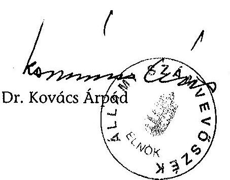
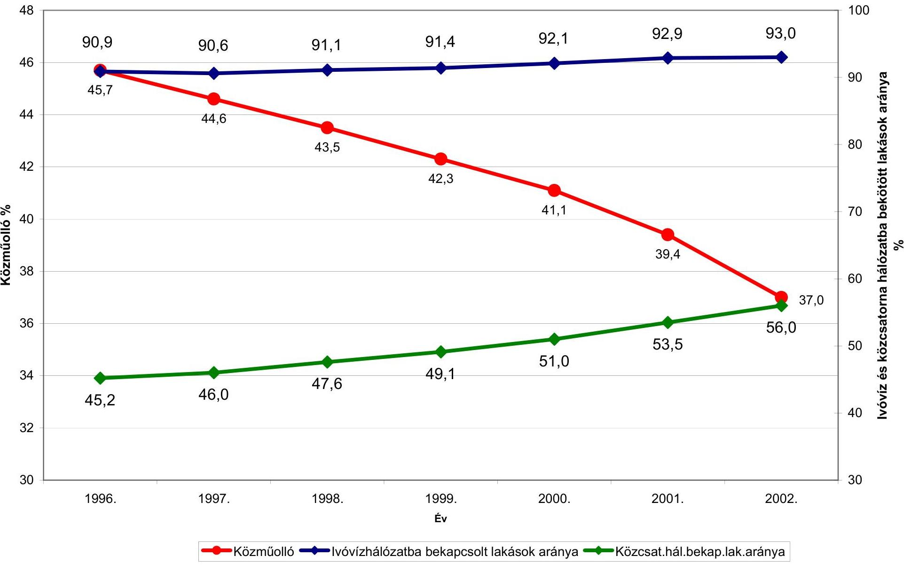
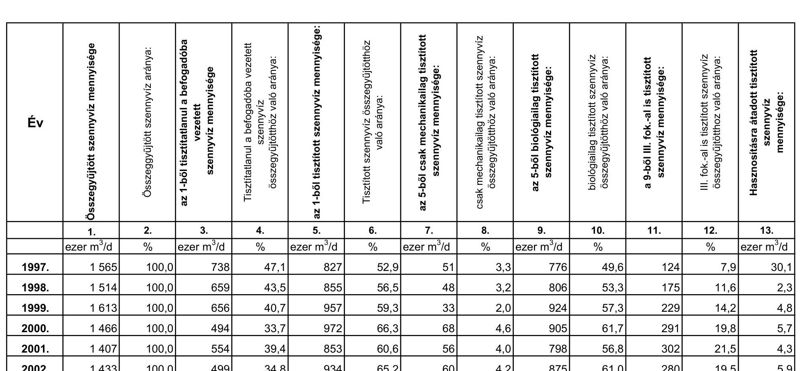
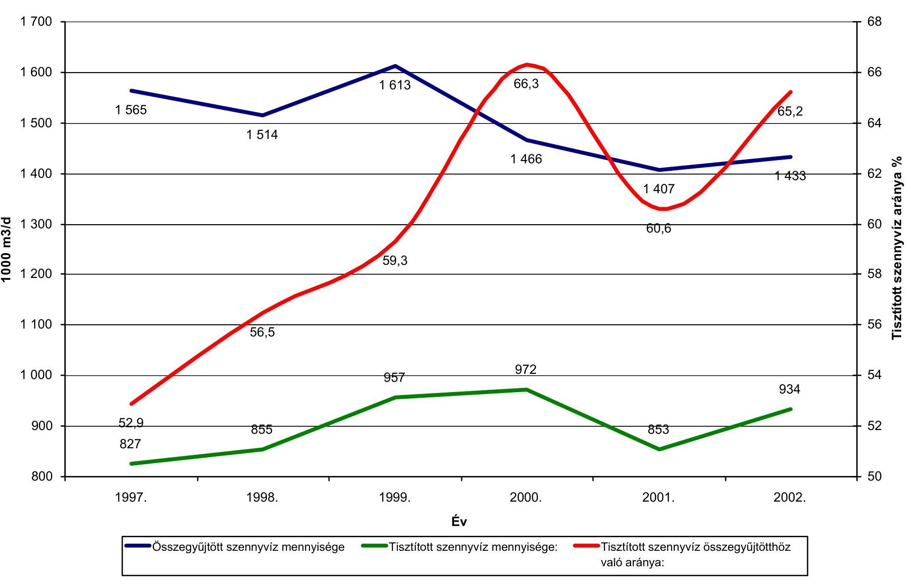
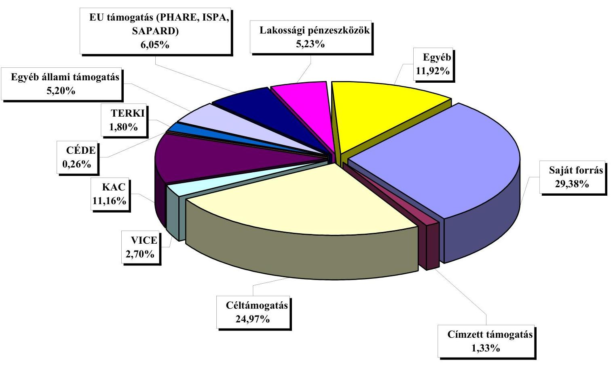
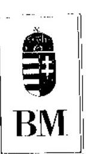
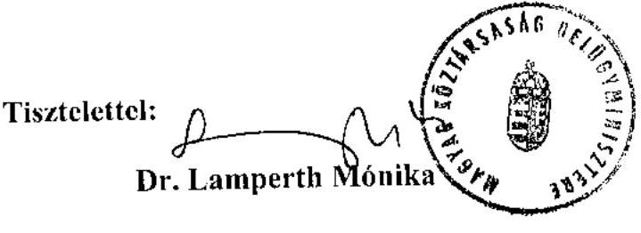
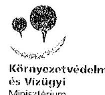
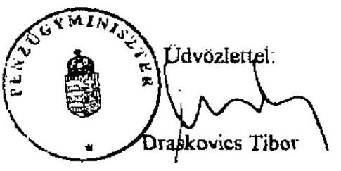

# JELENTÉS 

a települési önkormányzatok szennyvízközmú fejlesztési és múködtetési feladatai ellátásának vizsgálatáról

---

3. Önkormányzati és Területi Ellenőrzési Igazgatóság
3.2. Pénzügyi-szabályszerüségi és Teljesítményellenőrzési Főcsoport V-1013-174/2003-2004.
Témaszám: 658
Vizsgálat-azonosító szám: V0049

Az ellenőrzést felügyelte:
Dr. Lóránt Zoltán
főigazgató
Az ellenőrzés végrehajtásáért felelős:
Németh Péterné
főcsoportfőnök
Az ellenőrzést vezette:
Farkas László
osztályvezető főtanácsos
A számvevői jelentések feldolgozásában és a jelentés összeállításában közremüködtek:

Cziffra Erzsébet
tanácsadó
Dr. Erst László
főtanácsadó
Dr. Szirota István
szakértő
Az ellenőrzést végezték:

| Dr. Ernst László | Dr. Szikszai Bertalan | Cziffra Erzsébet |
| :-- | :-- | :-- |
| főtanácsadó | számvevő tanácsos | tanácsosadó |
| Mohl Anna | Kalmár István | Pálfi András |
| számvevő | számvevő tanácsos | számvevő tanácsos |
| Maróti Sándor | Fodor Tivadarné | György Árpád |
| számvevő tanácsos | számvevő tanácsos | számvevő tanácsos |
| Zeke József | Tímár József | Reichert Margit |
| számvevő tanácsos | számvevő tanácsos | számvevő |
| Hadházy Sándor | Kispálné Wiedemann | Humli Tamásné |
| számvevő tanácsos | Györgyi | számvevő |
|  | tanácsadó |  |
| Komlósiné Bogár Éva | Tóthné Salamon Ildikó | Dr. Körös István |
| számvevő tanácsos | számvevő tanácsos |  |
| Dr. Szirota István |  |  |
| szakértő |  |  |

Jelentéseink az Országgyűlés számítógépes hálózatán és az Interneten a www.asz.hu címen is olvashatók.

---

# A témához kapcsolódó eddig készített számvevőszéki jelentések: 

címe
Sorszáma
Jelentés a helyi önkormányzatok közüzemi víz- és csatornaszol- 314 gáltatási feladatainak és az ehhez kapcsolódó lakóssági díjtámogatási rendszer múködésének vizsgálatáról
Jelentés a Főváros és a megyei jogú városok szennyvíztisztítási programjára rendelkezésre álló források felhasználásának vizsgálatáról
Jelentés a helyi önkormányzatok beruházásaihoz és rekonstrukcióihoz nyújtott 2000. évi címzett és céltámogatások igénybevételének és felhasználásának vizsgálatáról
Jelentés a helyi önkormányzatok beruházásaihoz és rekonstrukcióihoz nyújtott 2001. évi címzett és céltámogatások igénybevételének és felhasználásának vizsgálatáról
Jelentés a helyi önkormányzatok beruházásaihoz és rekonstrukcióihoz nyújtott 2002. évi címzett és céltámogatások igénybevételének és felhasználásálnak vizsgálatáról

---

# TARTALOMJEGYZÉK 

BEVEZETÉS ..... 5
I. ÖSSZEGZŐ MEGÁLLAPÍTÁSOK, KÖVETKEZTETÉSEK, JAVASLATOK ..... 9
II. RÉSZLETES MEGÁLLAPÍTÁSOK ..... 18

1. A szennyvízközmú ellátás helyzete, figyelemmel az Európai közösségi irányelvekben megfogalmazott követelményekre ..... 18
1.1. A feladatellátás központi szabályozása ..... 18
1.2. Magyarország szennyvízelvezetési és -tisztítási Programja a 91/271/EGK Irányelv tükrében ..... 19
1.3. A szennyvízközművek fejlesztésére fordítható állami támogatások rendszere ..... 21
1.4. A hatósági, a szakmai irányítási és az ellenőrzési tevékenység ..... 24
1.5. A szennyvízközmú ellátottság alakulása a vizsgált időszakban ..... 26
2. A szennyvízközmú fejlesztések döntési és végrehajtási folyamatának tapasztalatai a helyi önkormányzatoknál ..... 29
2.1. A szennyvízközmű fejlesztések szakmai megalapozása és szakmaiműszaki előkészítése ..... 29
2.2. Az önkormányzati fejlesztések pénzügyi előkészítése, a központi és az egyéb állami támogatások rendszerének múködése ..... 31
2.3. A fejlesztések forrásösszetételének alakulása, az állami támogatások szerepe ..... 32
2.4. A fejlesztések, beruházások végrehajtásának tervszerűsége ..... 34
2.5. A központi és az egyéb állami támogatások felhasználásának szabályszerűsége ..... 35
2.6. A megvalósított szennyvízközmű létesítmények üzembe helyezése, számviteli rendezése (aktiválása), számviteli nyilvántartása ..... 37
2.7. A szennyvízközmú létesítmények vagyoni rendezése, és az önkormányzati tulajdonlás helyzete ..... 39
3. A szennyvízközművek üzemeltetése, működtetése ..... 40
3.1. A feladatellátás szervezeti formái, rendszere, biztonsága ..... 40
3.2. A keletkezett szennyvizek elvezetése, összegyűjtése, az ingatlanok, lakások bekötésének helyzete ..... 43
3.3. A szennyvizek tisztítása, a szennyvíztisztítás hatásfoka, a keletkezett szennyvíziszapok hasznosítása ..... 44

---

3.4. A szennyvízelvezetés és -tisztítás költségeinek alakulása, a szennyvízdíjak megállapítása, a központi lakossági díjtámogatás rendszere ..... 47
3.5. A feladatellátás önkormányzati ellenőrzése ..... 51
3.6. A szennyvízelvezetés és -tisztítás számviteli-pénzügyi -és statisztikai információs rendszere ..... 53

# MELLÉKLETEK 

1. számú A vizsgált önkormányzatok jegyzéke
1/a számú A vizsgált Vízügyi Igazgatóságok és Környezetvédelmi Felügyelőségek
1/b számú A vizsgált ÁNTSz-ek
2. számú A települési szennyvízelvezetésről és -tisztításról szóló 91/271/EGK Irányelvek
3. számú A viziközmú ellátottság fontosabb naturális mutatói (országos adatok)
1sz.ábra A közműolló alakulása
4. számú A szennyvízelvezetés és -tisztítás fontosabb mutatói (országos adatok)
2sz.ábra A tisztított szennyvíz aránya
5. számú A települési önkormányzatok szennyvízközmű felhalmozási kiadásai és arányuk (országos adatok)
6. számú A települési önkormányzatok szennyvízközmű fejlesztési támogatásainak alakulása (országos adatok)
7. számú A települési önkormányzatok szennyvízközmű fejlesztési teljesített kifizetések (országos adatok)
8. számú A vizsgált önkormányzatok tényleges bevételei a szennyvízelvezetés és -kezelés szakfeladaton (ezer forintban)
9. számú A vizsgált önkormányzatok tényleges kiadásai a szennyvízelvezetés és -kezelés szakfeladaton (ezer forintban)
10. számú A települési szennyvízelvezetésre és -tisztításra 1996. és 2003. VI.30. között fordított beruházási pénzeszközök forrásonként a vizsgált önkormányzatoknál
11. számú A települési szennyvízelvezetésre és -tisztításra 1996. és 2003.VI.30. között fordított beruházási pénzeszközök forrásonkénti megoszlása a vizsgált önkormányzatoknál
12. számú A települési szennyvízelvezetésre és -tisztításra 1996. és 2003.VI.30. között fordított beruházási pénzeszközök forrásonkénti megoszlása a vizsgált önkormányzatoknál (diagramm)
13. számú A vizsgált önkormányzatok által jóváhagyott csatornaszolgáltatási díjak
14. számú A csatornaszolgáltatás tényleges költségeinek alakulása a vizsgált önkormányzatoknál

---

# RÖVIDÍTÉSEK JEGYZÉKE 

| Ötv. | A helyi önkormányzatokról szóló 1990 évi LXV. törvény |
| :--: | :--: |
| Vt. | A vízgazdálkodásról szóló 1995. évi LVII. törvény |
| Kvt. | A környezet védelmének általános szabályairól szóló 1995. évi LIII. törvény |
| Övt. | Az egyes állami tulajdonban lévő vagyontárgyak önkormányzati tulajdonba adásáról szóló 1991. évi XXXIII. törvény |
| Szt. | A számvitelről szóló 2000. évi C. törvény |
| Áht. | Az államháztartásról szóló 1992. évi XXXVIII. törvény |
| Cct. | A helyi önkormányzatok címzett és céltámogatási rendszeréről szóló 1992. évi LXXXIX. törvény |
| Kbt. | A közbeszerzésekről szóló 1995. évi XL. törvény |
| Ámr. | Az államháztartás múködési rendjéről szóló 217/1998. (XII. 30.) Korm. rendelet |
| BM | Belügyminisztérium |
| PM | Pénzügyminisztérium |
| KvVM | Környezetvédelmi és Vízügyi Minisztérium |
| KSH | Központi Statisztikai Hivatal |
| ÁNTSZ | Állami Népegészségügyi és Tisztiorvosi Szolgálat |
| EU | Európai Unió |
| EGK | Európai Gazdasági Közösség |
| ÁFA | Általános forgalmi adó |
| KKA | Központi Környezetvédelmi Alap |
| KAC | Környezetvédelmi alap célfeladatok |
| VA | Vízügyi Alap |
| VICE | Vízügyi célelőirányzat |
| TERKI | Területi kiegyenlítést szolgáló fejlesztési célú támogatás |
| CÉDE | Céljellegú decentralizált támogatás |
| TFC | Területfejlesztési célelőirányzat |
| NKP | Nemzeti Környezetvédelmi Program |
| LE | lakos egyenérték |
| m. j. | megyei jogú |
| AB | Alkotmánybíróság |
| NMP | Nemzeti Megvalósítási Program |
| Tft. | A területfejlesztésről és a területrendezésről szóló 1996.   évi XXI. törvény |

---

.

---

# JELENTÉS 

## a települési önkormányzatok szennyvízközmú fejlesztési és múködtetési feladatai ellátásának vizsgálatáról

## BEVEZETÉS

Az Állami Számvevőszék 2003. évi ellenőrzési terve alapján vizsgálta a települési önkormányzatok szennyvízközmű fejlesztési és múködtetési feladatainak ellátását.

A vizsgálatra az Állami Számvevőszékről szóló 1989. évi XXXVIII. törvény 2. §ának (5) bekezdése alapján szabályszerűségi, célszerűségi és eredményességi szempontok szerint került sor.

A környezet védelme, a természeti erőforrások - különösen a vízkészletek megóvása a társadalmi-gazdasági élet meghatározó tényezőjévé vált. A települések - ezek közül is elsősorban a városok - és a gazdasági tevékenységek növekvő mennyiségű, káros anyag tartalmú szennyvízkibocsátása az emberi környezet számára fokozódó terhelést jelent. A megfelelő környezeti feltételek biztosítása nélkülözhetetlen a jelen és a jövő egészséges életének, a települések rendezett állapotának, az épített és természeti környezet védelmének érdekében.

A szennyvízelvezetés és -tisztítás területén a gyorsabb ütemű előrelépés nem csak Magyarország környezeti állapotának fokozatos javítása és a hazai ivóvízkészletek elengedhetetlen megóvása érdekében szükséges, hanem az Európai Unióhoz történő csatlakozás egyik fontos előfeltételét is képezi. Az EU 2000. évi országjelentése is sürgetőleg veti fel e tevékenység problémáinak megoldását.

Magyarország összlakásállományának 2002. év végén 93,0\%-a (3815 ezer lakás) volt bekötve vezetékes ivóvízellátásba, míg a közcsatornahálózatba - a szennyvízközművek gyorsított ütemű fejlesztése ellenére - még mindig csupán 56,0\%-a (2299 ezer lakás), így a közműolló 37,0\%-ra csökkent az 1996. évi 45,7\%-os mértékhez viszonyítva. A közcsatorna-hálózaton elvezetett szennyvizeknek 2002. évben 65,2\%-át tisztították az 1996. évi 46,6\%-os arányhoz képest. A mechanikai tisztításon túlmenően a szennyvizek 61,0\%-a biológiai tisztításra is kerül. Az elmúlt évek eredményes fejlesztései ellenére azonban még mindig jelentős elmaradás mutatkozik a hazai követelményekhez és az EU átlagos színvonalához viszonyítva.

Az EU-hoz történő csatlakozásra tekintettel a települési szennyvizekre vonatkozóan figyelemmel kell lenni az Európai Közösség szabályozására, a tanács 91/271/EGK Irányelvére. Az Irányelv kötelező feladatként írja elő a tagállamok

---

számára a települések szennyvizeinek gyűjtését és tisztítását. Magyarország ezek alól - az egyeztető tárgyalások során - átmeneti mentességet kért és kapott. Így tehát az egyes kategóriákban 5-12 éves időtartam biztosított az ország szennyvízközmű fejlesztésének megvalósítására, korszerű, az EU színvonalának is megfelelő közművek kiépítésére és működtetésére.

Az ellenőrzés célja annak megállapítása volt, hogy:

- a települési önkormányzatok a fejlesztésekhez biztosított központi és egyéb állami támogatásokat célszerűen, eredményesen használták-e fel, a megvalósított, üzembe helyezett szennyvízelvezetési és szennyvíztisztítási létesítmények segítségével az önkormányzatok tudják-e biztosítani a településen, a térségben keletkezett szennyvizek összegyűjtését, az ingatlanok és a lakások szennyvízcsatorna hálózatba való tervezett mértékű bekötését, a szennyvizek előírt fokozatú tisztítását;
- a korábbiaknál jobban érvényesültek-e a vízminőségvédelmi követelmények, a központi szabályozás, az állami támogatás rendszere hogyan segítette a fejlesztések megvalósítását, a szennyvíztisztító telepek terhelése, tisztítási hatásfoka megfelel-e a vízjogi hatósági engedélyekben előírtaknak;
- a fejlesztések segítségével megvalósult csatornázottság, illetve szennyvíztisztítás helyzete milyen mértékben elégíti ki az Európai Közösség irányelveiben megfogalmazott követelményeket;
- az üzemeltetés milyen szervezeti keretekben valósul meg, az önkormányzati tulajdonra vonatkozó előírások érvényesülnek-e, milyen a csatorna használati díjak kialakításának rendszere, az üzemelés, működtetés költségei meg-térülnek-e a csatornadíjakban.

A vizsgált időszak az 1996. és 2003. I. félév közti időszak volt.
Az ellenőrzésünkkel párhuzamosan folytatta le az Államháztartás Központi szintjét Ellenőrző Igazgatóság a Környezetvédelmi Alap célfeladatokra előirányzott pénzeszközök hasznosulásának vizsgálatát. A főbb megállapítások jelentésünk vonatkozó részeinek lábjegyzetében találhatók.

Az ellenőrzés 79 települési önkormányzatra irányult (1. számú melléklet).
A Vízügyi Igazgatóságoknál (9) (1/a számú melléklet) és a Környezetvédelmi Felügyelőségeknél (9) (1/a számú melléklet) készült jelentések, továbbá az ÁNTSZ fővárosi, megyei és városi intézeteitől (25) (1/b számú melléklet) beszerzett, szakhatósági ellenőrzésekről készült jelentések is segítséget nyújtottak a megállapítások megalapozásához.

A befejezett beruházások üzemeltetésében, működtetésében meghatározó a vízés csatornamű szervezeteknél (Kft.,Rt., egyéb) végzett tájékozódás a szennyvízközművek hatékony üzemeltetésének és a költségek alakulásának értékelését alapozta meg.

A települési önkormányzatok mellett a Környezetvédelmi és a Vízügyi Minisztériumban végzett ellenőrzésről is jelentés készült.

---

A központi és helyi vizsgálatokhoz megalapozó adatokat nyújtottak a - KSH statisztikai beszámolási rendszere keretében gyűjtött - a KSH-tól, illetve annak a fővárosi és megyei igazgatóságaitól beszerzett statisztikai adatok, táblázatok.

---

BEVEZETÉS

---

# I. ÖSSZEGZŐ MEGÁLLAPÍTÁSOK, KÖVETKEZTETÉSEK, JAVASLATOK 

Az EU csatlakozási folyamat különleges kötelezettséget ró Magyarországra, amely egyrészt kötelező jellegű jogharmonizációt, másrészt szennyvízelvezető csatornahálózatok és szennyvíztisztító telepek ütemezett megvalósítását teszi szükségessé.

Az Európai Közösség vonatkozó szabályozása - a Tanács 91/271/EGK Irányelve - a követelményeket az agglomerációk szennyező anyag kibocsátásának függvényében adta meg, amelyet lakos egyenértékben (LE) ${ }^{1}$ fejeznek ki. Az Irányelv kötelező feladatként írta elő a tagállamok részére - bizonyos nagyságrend (2000 LE) felett - a települések szennyvizeinek gyűjtését és tisztítását. Az Irányelv 17. cikke rendelkezik továbbá arról, hogy - külön határozatban (93/481/EGK) előírt formában és tartalommal - a tagállamok készítsenek Nemzeti Programot az Irányelvekben foglaltak megvalósítására, beleértve az ütemezést és a hozzárendelt pénzügyi forrásokat.

A szennyvízelvezetés és -tisztítás EU Konform fejlesztésének és múködtetésének jogszabályi alapjait a szakminisztérium 1995-től folyamatosan dolgozta ki, melynek következtében a központi szabályozás megfelelő volt.

Az 1995-ben elfogadott Vt. fogalmazta meg a hazai követelményeket, amely a felszíni és felszín alatti vízkészletek minőségének megtartására és a szennyvizek összegyűjtésére, elvezetésére, kezelésére, tisztítására és ártalommentes elhelyezésére irányult. Ezen túlmenően az 1995. évi Kvt. meghatározta, hogy a használt vizeknek a befogadókba történő visszavezetését úgy kell végezni, hogy a vízadó és befogadó közeg készleteit, minőségét és élővilágát kedvezőtlenül ne változtassa meg, öntisztulását ne veszélyeztesse.

A Kormány 1996. évben hagyta jóvá „Magyarország települési szennyvízelvezetési és szennyvíztisztítási program"-ját, amely meghatározta az országos és területi feladatokat 1996-2010. közötti időszakra. E program szerves része, kiemelten kezelendő feladata a főváros és a huszonkét megyei jogú város szennyvíztisztításának megvalósítását elősegítő kormányprogram. Az elvezetett települési szennyvizeknek 75-80\%-a ezekben a városokban keletkezik, így az ország szennyvíztisztításában érdemi előrelépést a 23 település fejlesztéseinek mielőbbi megvalósítása hozhat. A megvalósításhoz a program külön támogatási rendszert biztosított.

A Magyar Köztársaság Országgyűlése 1997. szeptember 16-i ülés napján elfogadta a Nemzeti Környezetvédelmi Programot. Az NKP tartalmazza a

[^0]
[^0]:    ${ }^{1}$ A lakosegyenérték a szennyvízterhelés nemzetközileg elfogadott mértékegysége. Egy LE azt a szerves, biológiailag lebontható terhelést jelenti, amelynek ötnapos biokémiai oxigén igénye $\left(\mathrm{BOI}_{3}\right) 60 \mathrm{~g}$ oxigén naponta. Alkalmazása lehetőséget ad a különböző eredetű települési szennyvizek szennyezettségének összehasonlítására.

---

szakma szennyvízelvezetési és szennyvíztisztítási programját. Kötelezően előírta a biológiai tisztítási fokozat alkalmazását, a szennyező tartalom csökkentését és a csatornázottság arányának legalább 60\%-ra való növelését.

Az Európai Uniós jogharmonizáció végrehajtása érdekében készült el az AQUIS átvételének Nemzeti Programja, s ennek 2000. évi intézkedési terve. Figyelemmel az EGK irányelveire a Vt. - 2001. évi módosítása során - a települési önkormányzatok kötelező feladataként írta elő a keletkezett szennyvizek összegyüjtését, tisztítását, elvezetését

A Közlekedési és Vízügyi Minisztérium 2002. évben dolgozta ki és a Kormány rendeletekben szabályozta a Nemzeti Települési Szennyvízelvezetési és tisztítási Megvalósítási Programot, a Programmal összefüggő szennyvízelvezetési agglomerációkat, továbbá a Program végrehajtásával összefüggő nyilvántartási és jelentési kötelezettség módszerét. A viziközművek üzemeltetéséről szóló rendeletével újból szabályozta az üzemeltetés követelményeit.

Magyarország Nemzeti Települési szennyvízelvezetési és -tisztítási Megvalósítási Programja a fejlesztések megvalósítása során a költséghaszon elvek figyelembevételével elsősorban a csatlakozásból eredő kötelezettségeket helyezte előtérbe, s mellette hangsúlyt adott a hazai sajátosságoknak is. A Program megfelel az EU vízminőség védelmi követelményeinek, a 91/271/EGK Irányelvnek, figyelembe véve a kapott 2008., 2010. és 2015. évre szóló átmeneti mentességeket is.

A települési önkormányzatok szennyvízközmú fejlesztéseikhez többféle forrásból kaptak támogatásokat. Címzett és céltámogatásokat, a fővárosi és a megyei jogú városok szennyvíztisztítási programjának támogatásait, fejezeti kezelésű célelőirányzatokat (VICE, KAC), egyéb decentralizált állami támogatásokat (TERKI, TFC, CÉDE), valamint kamattámogatást (viziközmű társulatok tagjai által felvett hitelek kamatának támogatása) vettek igénybe.
Az önkormányzati szennyvízközművek fejlesztésére fordítható állami támogatások rendszere - széttagoltsága ellenére - nagymértékben elősegítette a települési önkormányzatok szennyvízközmú fejlesztéseinek megvalósítását.
Az Állami Számvevőszék évenkénti ellenőrzései is hozzájárultak ahhoz, hogy az önkormányzatok fejlesztésének támogatásában meghatározó címzett és céltámogatási rendszer hatékonyabbá vált. A támogatandó fejlesztési célok szűkítésével már az 1999. évi szabályozástól kezdődően a célkitűzésekben a céltámogatások között kiemelt szerepet kaptak az EU környezetvédelmi követelményeihez közelítő, az elmaradást csökkentő szennyvízcsatornázás és szennyvíztisztító telep fejlesztési tevékenységek. Az ösztönzés erősítésével a támogatások koncentráltabbá váltak, és több támogatási feltétel előírásával segítették elő a beruházások gazdaságosságát, a kapacitások jobb kihasználását. Egyrészt pénzügyi prioritást kaptak a korábbi kihasználatlan kapacitásra való rákötések, másrészt a működtetés szempontjából legnagyobb jelentőségű az volt, hogy csak olyan fejlesztések kerülhettek a támogatott körbe, ahol a csatornahálózat és a -tisztítótelep együttes megvalósítását tűzték ki, illetve a lakossági bekötéseknél előírták a $60 \%$-os rákötési arányt, amelyet az üzembe helyezésnél számon kérnek. A megelőző évekhez képest 10-20\% ponttal növekedett a szennyvízcsatorna hálózat és 10\% ponttal a szennyvíztisztító

---

telep építésére adott állami támogatási arány. További 10-10\%-os támogatás illeti meg a már meglévő vagy folyamatban lévő beruházás építéséhez csatlakozó önkormányzatot, illetve a térségi fejlesztésű közös beruházásban megvalósuló fejlesztéseket. Az állami támogatás aránya így már elérte az 50-80\%-ot is.

Ugyanakkor a központi és az egyéb állami támogatások pályázati rendszere számos gondot okozott a pályázó önkormányzatoknak, nem tette lehetővé a fejlesztések megfelelő időben történő pénzügyi megalapozását. A forráskoordináció még a vizsgált időszak utolsó éveiben sem érvényesült megfelelően. A nagy tőkeigényű szennyvízközmű beruházások pénzügyi előkészítésének és megvalósításának a legnagyobb problémája, hogy a különböző pénzügyi forrásokból elnyerhető támogatások pályáztatási, döntési és szerződéskötési szabályai, előírásai eltérőek. A pályázatokra vonatkozó visszajelzések, döntések, különösen a $\mathrm{KAC}^{2}$ esetében elhúzódtak, ami rendkívül megnehezítette az önkormányzati beruházások megvalósítását és rontotta az állami támogatási rendszer hatékonyságát.
A települési önkormányzatok országos szinten 1996. és 2002. között 465911 millió Ft-ot fordítottak szennyvízcsatorna-hálózat és szennyvíztisztító telep építésre. A fejlesztésekhez 241919 millió Ft központi és egyéb állami támogatást használtak fel, így a szennyvízközmű felhalmozási célú kiadáson belül az összes állami támogatás 51,9\%-os részarányt képvisel. Ebből következik, hogy az állami támogatások 223992 millió $\mathrm{Ft}^{* *}$ (48,1\%) egyéb pénzforrást (önkormányzati, lakossági, nemzetközi, stb.) mozgósítottak.
Az EU követelményeknek és a megállapodásnak megfelelően Magyarország 2015. évi szennyvízközmű célállapota a gyűjtőrendszerek (szennyvízcsatorna hálózat) tekintetében 12830915 LE, a 2002. december 31-i állapot pedig 8250382 LE, azaz 64,3\%. A szennyvíztisztító telepek esetében a célállapot 13906120 LE, a 2002. december 31-i állapot 6385060 LE, azaz 45,9\%.

A 2015. évi célállapot eléréséhez - 2003-2015. években - a szakminisztérium szerint a részletes műszaki-gazdasági elemzések és számítások alapján jelenleg mintegy 900-1000 Mrd Ft nagyságrendű szennyvízközmű fejlesztés megvalósítása szükséges.

Az ellenőrzött időszak önkormányzati szennyvízközmű beruházásai elősegítették a Nemzeti Települési Szennyvízelvezetési és -tisztítási Program céljainak megvalósítását.

Az önkormányzatok fejlesztési tevékenységében lényeges előrelépést jelentett, hogy az ellenőrzött időszakot megelőzően, vagy az ellenőrzött időszakban szinte kivétel nélkül felmérték a szennyvízközmú ellátottság helyzetét, mely alapján a gazdasági programban, településfejlesztési koncepcióban, kör-

[^0]
[^0]:    ${ }^{2}$ Az ÁSZ 2004. évi jelentése a Környezetvédelmi Alap célfeladatokra előirányzott pénzeszközök hasznosulásának ellenőrzéséről is megállapítja a KAC támogatások döntési hiányosságait.
    * 5. számú melléklet: 465911 millió Ft - 7. számú melléklet: 241919 millió Ft.

---

nyezetvédelmi programban, környezetvédelmi koncepcióban, illetve egyéb fejlesztésre vonatkozó dokumentumban határozták meg a szennyvízközmű fejlesztéssel kapcsolatos teendőket. A fejlesztéseknél a vizsgált időszak első felében még kevésbé, a második felében erőteljesebben érvényesült, hogy a térségi, régiós megoldásban, a tervezett fejlesztéseknél pedig minden esetben térségi, régiós szemléletben gondolkodnak az önkormányzatok. A térségi fejlesztések megindítását nagymértékben segítette a Tft, illetve az ehhez kapcsolódó, hozzárendelt források.

A szennyvízközmű beruházások előkészítéséhez, a költségek tervezéséhez az önkormányzatok 1995. évtől a szakminisztérium által kialakított fajlagos költségeket alkalmazták. Ezek a normatívák egységes költségszámítási feltételeket biztosítottak. Az ÁSZ a vizsgálatai során több alkalommal is jelezte, hogy indokolt ezen fajlagos költségek felülvizsgálata, különösen a talajviszonyok közti eltérések, az új technológiák, a különböző műszaki megvalósítási lehetőségek tekintetében. Olyan indokolatlan költségelemek is felmerültek, amelyekkel kapcsolatos többletköltségeket a vállalkozói díjban érvényesíteni lehetett. Szinte általános volt a kivitelezői kölcsön, hitel nyújtása az önkormányzatoknak, amellyel azok kiszolgáltatott helyzetbe kerültek. A magas fajlagos költségek is hozzájárultak ahhoz, hogy 2001. évig - elsősorban a saját források szűkössége miatt - szabálytalan megoldásokat is alkalmaztak az önkormányzatok a beruházás kivitelezőjével kötött szerződésekben. Az ÁSZ javaslatainak figyelembe vételével az évenként kiadott fajlagosokat folyamatosan korrigálták.

A vizsgált időszakban az ellenőrzött önkormányzatok összesen 90 045,1 millió Ft-ot fordítottak szennyvízközmű fejlesztésre. Ebből az összegből a saját forrás aránya $29,4 \%$, a címzett és céltámogatásoké $26,3 \%$, az egyéb állami támogatásoké $21,1 \%$, az EU támogatásé $6,1 \%$, a lakossági pénzeszközöké $5,2 \%$, az egyéb forrás aránya pedig $11,9 \%$ volt. A központi és az egyéb állami támogatások együttes összege 42693,3 millió $\mathrm{Ft}^{* * *}$ volt, amely a szennyvízközmű beruházási források $47,4 \%$-át képezte.

Jelen vizsgálatunk az állami támogatások felhasználásának szabályszerűségét illetően két önkormányzatnál (Veszprém, Ajka) állapított meg szabálytalanságot. A szennyvízközmű beruházásoknál Veszprémben el nem végzett munkákra is történt kifizetés és jogtalan központi támogatás igénybevétel, Ajkán pedig nem támogatott műszaki tartalomra vettek igénybe céltámogatást.

A befejezett szennyvízközmű létesítmények műszaki átadás-átvétele, üzembe helyezése, számviteli rendezése megtörtént. Nyilvántartási, leltározási hiányosságok azonban előfordultak.

A KSH adatgyűjtését alapul véve a vizsgált települési önkormányzatok szennyvízcsatorna hálózatának (gerincvezeték) hossza az 1996. évi 9588,6 km-ről*** 2002-re 11 834,5 km-re****, 23\%-kal nőtt. Az ivóvízhálózatba

[^0]
[^0]:    ** 10. számú melléklet teljes költségoszlop 2, 3, 4, 5, 6, 7, 8. sorának összege.
    *** A vizsgált önkormányzatok adatszolgáltatása alapján.

---

és a szennyvízhálózatba bekötött lakások arányának különbözete, a közmúolló az 1996. évi 38,2\%-ról 2002. évre 28\%-ra csökkent. A vizsgálatban résztvevő települések szennyvízközmű fejlesztéseinek priorizálása, (nagy LE-kel rendelkező agglomerációk) miatt a közműolló $9 \%$-kal kedvezőbb az országos átlagnál.

A keletkezett szennyvizek összegyújtése a csatornázás előrehaladtával egyre magasabb szinten válik biztosíthatóvá. A vizsgált önkormányzati körben a szennyvízcsatorna hálózatba bekötött lakások 2002. évi átlagos aránya 67,6\% volt, amely az Európai Unió elvárásainak megfelelő (ez is magasabb az országos átlagnál).

Az ellenőrzött önkormányzatok egyharmada a vizsgált időszakban hozta létre, vagy korszerűsítette szennyvíztisztítóját, így a vizsgált időszak végén mindegyik rendelkezett szennyvíztisztítóval.

A tisztítótelepek névleges (hidraulikai) kapacitásának átlagos kihasználtsága 1996-ban 41,9\%-os volt, mely 2002-re 38,6\%-ra csökkent, ami öszszefüggésben van az ipari és a lakossági vízfogyasztás csökkenésével. A vízfogyasztás csökkenése következtében a szennyvizek szennyezettségének koncentrációja nőtt, ami hozzájárult ahhoz, hogy az ellenőrzött körben a tisztítótelepek $29 \%$-ánál egyáltalán nem volt kielégítő a tisztítási hatásfok. A vizsgált időszakban a szennyvíztisztító telepek $87 \%$-a fizetett szennyvízbírságot az időszak nagyobbik felében vagy egészében.

A nagyobb települések szennyvíztisztító telepeinek - a vízfogyasztás csökkenése miatt bekövetkezett - szabad kapacitása lehetőséget ad a környékbeli településeknek, hogy szennyvízcsatorna hálózat fejlesztéseiket a már működő városi, nagyközségi (esetleg túlméretezett községi) szennyvíztisztító rendszerre alapozva tervezzék, érvényesítve a régiós szemléletet. A beruházások szakmaiműszaki előkészítése - a vizsgált 82 beruházásnál - 77 esetben megfelelő volt.

A vízminőség védelmi követelmények a korábbiaknál jobban érvényesültek. Az ellenőrzött körben a közcsatornán összegyűjtött és elvezetett szennyvízmennyiség 57,7\%-át tisztítják, 42,3\%-a tisztítatlanul kerül a befogadókba. A vizsgált tisztítótelepek $81 \%$-a biológiai tisztítást végez, a telepek 19\%-a III. fokozatú tisztításra is alkalmas. A vizsgálati időszak végére nem maradt olyan szennyvíztisztító, amely csak mechanikai tisztítást végezne. A 2002. évben megtisztított napi 579,9 ezer $\mathrm{m}^{3}$ szennyvíznek $75,3 \%$-át biológiailag is tisztítják, $24,7 \%$-a pedig a III. fokozatú tisztításon ${ }^{3}$ is keresztül megy.

Az ellenőrzésbe vont önkormányzatoknál 2002-ben keletkezett szennyvíziszap 28,5\%-át hasznosították a mezőgazdaságban, a többit hulladéklerakókban takarásra használták fel.

A föváros és a megyei jogú városok kiemelt - 80 Mrd Ft-os - szennyvíztisztítási programja - az eredetileg elöirányzott 2004. évi határ-

[^0]
[^0]:    ${ }^{3}$ A biológiai tisztítással együtt járó vagy azt követő tisztítási fokozat a növényi tápanyagok ( P és N ), mint vízszennyezők eltávolítása.

---

idöre - nem valósult meg. Az alacsony központi támogatási arány (25$30 \%$ ), a megfelelő műszaki-gazdasági előkészítés és hatósági egyeztetés hiánya is közrejátszott ebben. Az EU tárgyalásokon kértek és 2010. év végi határidőre mentességet is kaptak a program teljes körű megvalósítására. A Fővárosban a Központi (Észak-Csepeli) szennyvíztisztító telep múszaki-gazdasági előkészítése nem volt kielégítő. A Dél-Budai szennyvíztisztító telepnél még a pályázati anyag sem készült el. A két beruházás jelenlegi megvalósítási állapotát tekintve, a mentesítésként kapott 2010. évi határidőre történő kiépítése bizonytalannak látszik. Hat önkormányzat PHARE és egy önkormányzat egyéb EU támogatásban részesült. Hat önkormányzat szennyvíztisztító telep és csatornahálózat, egy önkormányzat pedig csatornahálózat megvalósítására ISPA támogatásban részesült. Három önkormányzat négy projektje pályázik a Kohéziós Alapból 50$60 \%$ támogatásra, s további hat önkormányzat tervezi a támogatás elnyerését.

Az önkormányzati szennyvízközművek üzemeltetésére létrehozott, a vizsgált időszak elejére kialakult szervezeti struktúrákban az üzemeltető szervezetek $34 \%$-ánál következett be valamilyen változás. A nagyszámú önkormányzat részvételével működő gazdasági társaságok az önkormányzatok egy részének kiválásával osztódtak. Az ellenőrzött önkormányzatok - egy kivételével - önkormányzati vagy állami tulajdonú gazdasági társaságok segítségével látják el a törvényben előírt szennyvízelvezetési és -tisztítási feladataikat.

Nyolc önkormányzat nem kötött, vagy csak késve kötött üzemeltetői szerződést a szolgáltató gazdasági társasággal, illetve a megkötött üzemeltetői szerződések hiányosak, nem tartalmaznak minden megépített és ténylegesen üzemelő csatornaszakaszt. Az önkormányzatok eszközhasználati (bérleti) dí ellenében adják át múködtetésre a tulajdonukban lévő és a számviteli nyilvántartásukban szereplő szennyvízközmű vagyont. A bérleti díj összege általában megegyezik az amortizációra elszámolható összeggel.

A vizsgált önkormányzatok fele külön állapított meg csatornaszolgáltatási díjat a lakosság és a közületek számára. A díj kialakításánál a képviselőtestületek több mint fele nem vette figyelembe a felújítás és fejlesztés hosszú távú biztosításának fedezet igényét és az amortizációs hányadot figyelmen kívül hagyta. A rövid távú érdekeket előtérbe helyezve, a szennyvízcsatorna díjak megállapításánál az önkormányzatokat a lakosság rákötési hajlandóságának növelése motiválta, ugyanakkor tekintettel voltak a környező települések önkormányzatai által alkalmazott díjtételekre is. A lakossági csatornaszolgáltatási díjak vizsgált önkormányzatokra vonatkozó átlaga 1996-ban 54,45 FT +ÁFA, 2002-ben 131,65 Ft +ÁFA volt, mely szerint a lakossági díjak 2,4-szeresükre növekedtek. Ugyanezen időszak alatt a közületi díjak növekedése 2,3 szoros volt, bár utóbbiak eleve $30 \%$-kal magasabbak voltak.

Vegyes a kép abból a szempontból, hogy a csatorna szolgáltatás üzemelési költségei megtérülnek-e a csatornadíjakban. A vizsgált önkormányzatok szennyvízközmű üzemeltetőinek 46\%-ánál nyújtottak fedezetet a csatornaszolgáltatási díjak a szennyvízcsatorna- és a szennyvíztisztító üzemelési költségeire. Az önkormányzatok sok esetben az árakat a lakosság teherviselő képességét figyelembe véve a kalkulált költségeknél alacsonyabban állapították

---

meg. Az üzemeltetők 54\%-a más forrásból, leggyakrabban az ivóvíz ágazat nyereségéből fedezte a szennyvízelvezetés és -tisztítás költségeit.

Az állami tulajdonú regionális rendszerekhez tartozó önkormányzatok esetében - a vizsgált önkormányzati körben - a szakminisztérium által meghatározott csatornaszolgáltatási díjak egységesen 40-50\%-kal magasabbak voltak az önkormányzati képviselő-testületek által - az önkormányzati tulajdonú üzemeltetőkre vonatkozó - rendelettel meghatározott díjaknál, így számukra biztosított volt a központi díjtámogatás. Az önkormányzatok a fentiek miatt a központi költségvetésből biztosított díjtámogatással csak elvétve éltek. A lakosság felé a díjtámogatás valamely közvetlen formáját - lakásfenntartási támogatás, meghatározott idejű díjkedvezmény, locsolási kedvezmény - az önkormányzatok 30\%-a alkalmazta, a közvetett díjtámogatás módszerével az önkormányzatok 3\%-a élt.

A szennyvízelvezetési és -tisztítási feladatok ellátásának önkormányzatok által végzett ellenőrzése azt jelentette, hogy a képviselő testületi üléseken a szolgáltatást végző önkormányzati tulajdonú gazdasági társaság üzleti terveinek, éves beszámolóinak jóváhagyása során tájékozódott az önkormányzat a feladatellátás helyzetéről.

A vizsgált szennyvízközművek egy része nem közvetlenül az önkormányzat tulajdonában, hanem víziközmúveket üzemeltető gazdasági társaságok, illetve az önkormányzatok vagyonkezelő társaságainak tulajdonában van. Az önkormányzatok vagyon apportálási gyakorlatát jogszabályi ellentmondás mellett az általánosan felerősödő piacgazdasági tendenciák is motiválták. Különösen a nagyvárosok esetében szakmai (esetleg külföldi) befektetők részesedéseket szereztek a társaságokban. A „privatizáció" azért erősödött fel, mert egyre inkább nyilvánvalóvá vált, hogy a kis tőkeerővel és eszközparkkal rendelkező üzemeltetők az időszerűvé váló felújításokat és rekonstrukciókat nem tudják saját erőből elvégezni. A tőkeerős, nagyobb szakmai rutinnal rendelkező befektetők ezért a kisebb jegyzett tőkével rendelkező önkormányzati gazdasági társaságok üzletrészeire vételi ajánlatot tesznek. A társaságokban tulajdonrészeket vásárolnak. Természetesen ez érinti az önkormányzatoktól a gazdasági társaságokba apportként bevitt szennyvízközmű (viziközmű) tulajdonrészeket is. A viziközművek így kialakult tulajdoni viszonyai ugyanakkor ellentétesek az Ötv-vel és a Vt-vel (Két önkormányzat esetében erre 2002. évben az $A B$ is felhívta a figyelmet). A két törvény ugyanis a privatizációt nem teszi lehetővé, egyértelműen szabályozza, hogy az önkormányzatok viziközmű vagyona az önkormányzati törzsvagyon körébe tartozik és korlátozottan forgalomképes vagyontárgy. A Vt. szerint a közművagyon múködtetése szerződéses, illetve koncessziós formában történhet. Ezért szükséges - a lakossági ellátás biztonsága szempontjából is - a jogszabályi összhang megteremtése.

A területi környezetvédelmi és vízügyi szervek, valamint az ÁNTSZ által ellátott hatósági, szakmai irányítási és ellenőrzési tevékenység elősegítette a települési önkormányzatok szennyvízközmű fejlesztési feladatainak szakmai megalapozását és az üzemeltetésre vonatkozó előírások érvényesítését.

---

A szennyvízelvezetés és -tisztítás pénzügyi és számviteli, valamint statisztikai információs rendszere pontatlanságokat tartalmaz. A számviteli információs rendszer nem teszi lehetővé a tevékenység számszaki elkülönítését és értékelését. Előrelépést a számvitel területén a szakfeladatok differenciálása, a statisztika területén pedig az üzemeltető szervezetek pontosabb adatszolgáltatása eredményezhet, melyre a tulajdonos önkormányzatoknak nagyobb figyelmet kell fordítaniuk.

A helyszíni ellenőrzési jelentésekben a szennyvízközművek szabályszerű és célszerű múködése érdekében számos javaslatot tettünk a települési önkormányzatoknak, így javasoltuk:

- a szennyvízközművek fejlesztését magában foglaló programjaik, koncepcióik, terveik elkészítését, illetve felülvizsgálatát;
- a vagyonrendelet elkészítését, felülvizsgálatát, kiegészítését, módosítását, a szennyvízközmű vagyon Ötv. és helyi szabályozásnak megfelelő besorolását;
- a jogtalanul igénybevett céltámogatás visszafizetését;
- a számviteli és az ingatlankataszteri nyilvántartások felülvizsgálatát, pontosítását, egyezőségének biztosítását (a szennyvízközművek egyes elemeit a számviteli nyilvántartásokban a megfelelő eszközcsoportokban szerepeltessék, a számviteli adatok a valóságnak megfelelően mutassák be az üzemeltetésre, kezelésre átadott eszközöket, a szennyvízközművek mennyiségi adatainak felülvizsgálatát, leltározását);
- az önkormányzati viziközmű (szennyvízközmű) törzsvagyon használatba adását megalapozó üzemeltetői szerződések elkészítését, felülvizsgálatát, kiegészítését (a hiányzó vagyontárgyak szerepeltetését), a bérleti díj számításának, a bérleti díjnak a meghatározását;
- az üzemeltetői, koncessziós szerződésekben foglaltak végrehajtásának értékelését, a szennyvízközművek üzemeltetőjének beszámoltatását;
- a szennyvízcsatorna díjakkal kapcsolatos előterjesztéseket jobban alapozzák meg, bemutatva a költségtényezők, valamint a díjak és a fajlagos ráfordítások alakulását, lehetővé téve a csatornaszolgáltatás díjainak költségkalkuláción alapuló megállapítását;
- a szennyvízcsatorna-hálózatra való rákötési kötelezettségek érvényesítését. A szociálisan rászoruló családok számára a rákötési és csatornadíj támogatási rendszerének kialakítását;
- a még csatornázatlan települések, településrészek csatornázását, a szennyvíztisztítók jobb kapacitáskihasználását, tisztítási hatásfokának javítását, a fejlesztéseknél érvényesítve a térségi szemléletet.

A vizsgálati jelentéseinkben szereplő megállapításainkat, javaslatainkat az önkormányzatok többsége ( 76 önkormányzat) elfogadta. Mindössze három önkormányzat tett észrevételt. Ezek az önkormányzatok a jogszerútlenül gazdasági társasági tulajdonba adott szennyvízközmű vagyonnal kapcsolatos megállapításainkat vitatták.

---

A helyszíni vizsgálat megállapításai alapján hútlen kezelés búncselekmény elkövetésének alapos gyanúja miatt feljelentést teszünk ismeretlen tettes ellen Veszprém Megyei Jogú Város szennyvízberuházásával kapcsolatban.

A helyszíni ellenőrzés megállapításainak hasznosítása mellett javasoljuk:

# a környezetvédelmi és vízügyi miniszternek 

1. tekintse át a viziközművek tulajdoni viszonyait, figyelemmel az Ötv. és a Vt. hatályos szabályozására, kezdeményezve a belügyminiszternél az Ötv, a Vt. és a Cct. összhangjának megteremetését; és ezzel összefüggésben segítse elő a törvényes keretek között legcélszerűbb működtetési forma elterjesztését;
2. tekintse át a szennyvíztisztító telepek kapacitáskihasználását, terhelését és ennek figyelembe vételével vizsgálják felül a szennyvízközművek fejlesztésének ütemét, nagyságrendjét és a közcsatorna hálózatokkal való összhangját;
3. vizsgálja felül a viziközművek statisztikai és pénzügyi adatszolgáltatásának jelenlegi rendszerét, tartalmát, az adatszolgáltatók körét és az önkormányzatok feladatait az adatszolgáltatás megalapozásában annak érdekében, hogy a statisztikai adatok a valós képet mutassák be és megfeleljenek az EU adatszolgáltatási követelményeinek. Ebbe a munkába vonják be a Központi Statisztikai Hivatalt is.

---

# II. RÉSZLETES MEGÁLLAPÍTÁSOK 

## 1. A SZENNYVÍZKÖZMŰ ELLÁTÁs HELYZETE, FIGYELEMMEL AZ EURÓPAI KÖZÖSSÉGI IRÁNYELVEKBEN MEGFOGALMAZOTT KÖVETELMÉNYEKRE

### 1.1. A feladatellátás központi szabályozása

A helyi önkormányzatokról szóló 1990. évi LXV. törvény (Ötv.) határozta meg, hogy a helyi közszolgáltatások körében az önkormányzatoknak milyen feladatokat kell ellátni. Az Ötv. csak a település múködéséhez szükséges legalapvetőbb feladatokat sorolta fel, nem törekedett teljes körűségre, kötelezően ellátandó, illetve önként vállalt feladatokra bontotta azokat. A vízgazdálkodásról szóló 1995. évi LVII törvényt módosító 2001. évi LXXI. törvény hatályba lépéséig ez utóbbi körbe tartozott a szennyvízelvezetés és -tisztítás, amelyet az Ötv. 8. § (1) bekezdésében „különös" kitétellel csatornázásként nevez meg.

Az Ötv. 8. § (3) bekezdése, továbbá a Magyar Köztársaság Alkotmányáról szóló 1949. évi XX. törvény 43. § (2) bekezdése előírja, hogy az Ötv-n kívül más törvény is állapíthat meg önkormányzati kötelező feladatokat a közszolgáltatások biztosítása területén. Így különösen az 1991. évi XX. törvény az ún. „Hatásköri törvény", majd a későbbiekben megjelent ágazati és más törvények fogalmaztak meg a települési önkormányzatoknak kötelezően ellátandó közszolgáltatási feladatokat.

A hazai követelményeket a vízgazdálkodásról szóló 1995. évi LVII. törvény (Vt.) fogalmazta meg, amely szerint, aki a vízkészlet hasznosítására jogot szerzett, köteles a hasznosításba vont vízkészletet - hasznosítás mértékének arányában - biztonságban tartani, továbbá gondoskodni a szennyvizek összegyűjtéséről, elvezetéséről, kezeléséről és a környezetvédelmi előírásoknak megfelelő elhelyezéséről.

A Vt. - a 2001. évi módosítása során - meghatározta a települési önkormányzatok feladatait. A Vt. 4. § (1) bekezdés a/ pontja a települési önkormányzatok feladatává tette a helyi vízi közüzemi tevékenység fejlesztésére vonatkozó tervek kialakítását és végrehajtását, a 4. § (2) bekezdés b/ és c/ pontja pedig kötelezően írta elő a keletkezett szennyvizek összegyűjtését, tisztítását, elvezetését és ártalommentes elhelyezését.

A Vt. felhatalmazta a kormányt és az ágazati minisztert a szükséges rendeletek hatályba léptetésére.

A környezet védelmének általános szabályairól szóló 1995. évi LIII. törvény (Kvt.) kimondta, hogy a víz védelme kiterjed a felszíni és felszín alatti vizekre, azok készleteire, minőségére és mennyiségére, továbbá hogy a használt vizeknek a befogadókba történő visszavezetését úgy kell végezni, hogy a vízadó és befogadó közeg készleteit, minőségét és élővilágát kedvezőtlenül ne változtassa meg, öntisztulását ne veszélyeztesse.

---

A Kvt. előírásai szerint a települési önkormányzatnak is környezetvédelmi programot kell készíteni és ennek tartalmaznia kell a kommunális szennyvíz-kezelés-, gyűjtés-, elvezetés- tisztítás településre vonatkozó feladatait, s gondoskodnia kell a jóváhagyott programban meghatározott feladatok végrehajtásáról.

A közműves ivóvízellátásról és a közműves szennyvízelvezetésről szóló 38/1995. (IV. 5.) Korm. rendelet meghatározta a szolgáltatást végzők és a fogyasztók feladatait, kötelességeit és jogait. Egyértelművé tette a települési önkormányzatok (jegyző) hatáskörét, intézkedési jogosultságát a szennyvízközmű tevékenységek területén.

# 1.2. Magyarország szennyvízelvezetési és -tisztítási Programja a 91/271/EGK Irányelv tükrében 

A Magyar Köztársaság Országgyűlése 1997. szeptember 16-i ülés napján a 83/1997. (IX. 26.) Ogy határozatával elfogadta a Nemzeti Környezetvédelmi Programot.

#### Abstract

Az NKP alapján minden közcsatornán élővízbe vezetett szennyvizet legalább biológiailag meg kell tisztítani. A kiemelten védendő, tápanyagokra érzékeny vizek (tavak, tározók, holtágak, időszaki vízfolyások, kisvíțhozamú befogadók) nitrátés foszforterhelését csökkenteni kell, ezeken a területeken a harmadik fokozatú szennyvíztisztítás is szükséges. Ezeket a feladatokat Magyarországon 2010-ig kell teljesíteni. A NKP első hat évében a kiemelten védendő területeken lévő települések szennyvízelvezetésének és -tisztításának fejlesztésével a csatornázottság 60\%ra növelését célozta meg, ezen szennyvizek tisztításával és a megyei jogú városokban szennyvíztisztítási fejlesztések megkezdésével és időarányos elvégzésével.

Az NKP tartalmazza a szennyvízelvezetési és szennyvíztisztítási programot, beleértve a fővárosi és megyei jogú városok szennyvíztisztítási programját is. A programhoz kapcsolódó (1008/1995. (I. 31.) Korm. határozat rendelkezik a fővárosi és 22 megyei jogú város szennyvíztisztítási fejlesztéséhez nyújtandó támogatási arányokról. Az elvezetett települési szennyvizeknek 75-80\%-a ezekben a városokban keletkezik, így az ország szennyvíztisztításában érdemi előrelépést a 23 település fejlesztésének mielőbbi megvalósítása hozhat.
1996. évben elkészült Magyarország szennyvízelvezetési kerettervének aktualizálása - mint belső ágazati irányelv - majd ennek alapján 1998. évben a megyei szennyvízelvezetési és -tisztítási koncepciók, amelyek a helyi sajátosságok figyelembevételével pontosították a célmeghatározást.

Az Európai Uniós jogharmonizáció végrehajtása érdekében készült el az AQUIS átvételének Nemzeti Programja, s ennek 2000. évi intézkedési terve. Az 1994. évi I. törvénnyel kihirdetett ún. Európai Megállapodáson alapuló, valamint az Európai Unióhoz való csatlakozásra figyelemmel szükségszerű jogközelítés keretében a települési szennyvízre vonatkozó szabályozás során figyelemmel kell lenni az Európai Közösség vonatkozó szabályozására, a Tanács 91/271/EGK irányelvére (a továbbiakban: Irányelv). Az Irányelv (melynek ismertetését a 2..számú melléklet tartalmazza) célja a környezet megóvása a települési és egyes ipari szennyvízkibocsátások káros hatásaitól.

---

A helyi önkormányzatokról szóló 1990. évi LXV. törvény a települési szennyvízelvezetést és -tisztítást az önkormányzatok feladatává tette ugyan, de nem kötelező módon. A korábbi gyakorlat szerint az Irányelvben szereplő feladatok végrehajtásában érintett önkormányzatoktól nem volt számon kérhető a határidőre történő teljesítés, ezért szükségessé vált az Irányelv szerinti feladatok kötelező önkormányzati feladatként való előirása.

A Kormány a 2168/2000. (VII. 11.) Korm. határozatában előírta az Irányelv hazai jogrendbe illesztésének gyorsításával összefüggő feladatokat és feltételeket. A Korm. határozat 1. pontja kimondta, hogy a települési szennyvíz ártalommentes elhelyezésére, elvezetésére és az összegyűjtött szennyvizek tisztítására vonatkozó törvényi előírást módosítani szükséges az Irányelv végrehajtásának érdekében úgy, hogy az a jövőben kötelező feladat legyen.

A Vt 2001. évi módosítása az állampolgárok és az önkormányzatok teherbíró képességére figyelemmel, valamint a szükséges és elégséges feladatvállalás érdekében a 2000 lakosegyenérték feletti települési szennyvízkibocsátások, illetve az érzékeny területek, valamint ez utóbbiakhoz tartozó vízgyűjtő területek befogadói és a sérülékeny vízbázisok védelme esetén írja elő kötelező feladatként a szennyvizek összegyűjtését, tisztítását, a tisztított szennyvíz elvezetését, a szennyvíziszap ártalommentes elhelyezésének megszervezését.

Az Irányelvnek és az Európai Bizottság formai előírásokat tartalmazó 93/481/EGK határozatának megfelelően a szennyvizek kezelésére Nemzeti Megvalósítási Programot kell kidolgozni.

Megállapítható, hogy a szennyvízelvezetés és -tisztítás - EU konform - fejlesztésének jogszabályi alapjai folyamatosan kidolgozásra kerültek. Az EU csatlakozási folyamat különleges kötelezettséget ró Magyarországra, amely egyrészt kötelező jellegű jogharmonizációt, másrészt szennyvízelvezető csatornahálózatok és szennyvíztisztító telepek ütemezett megvalósítását teszi szükségessé. A Nemzeti Települési Szennyvízelvezetési és -tisztítási Megvalósítási Program (továbbiakban: Program) a 2000. december 31-i tényleges állapotot tekinti kiinduló alapnak, ún. induló állapotnak (közbenső időszakok 2005., 2010. dec. 31., érzékeny befogadóknál, 10 ezer lakosegyenérték feletti terhelésnél a 2008. dec. 31) és célállapot elérésére a 2015. évet irányozza elő. A végrehajtással összefüggésben a következő rendeleteket léptette hatályba:

25/2002. (II. 27.) Korm. rendelet a Nemzeti Települési Szennyvízelvezetés és -tisztítási Megvalósítási Programról
26/2002. (II. 27. Korm. rendelet a Nemzeti Települési Szennyvízelvezetési és -tisztítási Megvalósítási Programmal összefüggő szennyvízelvezetési agglomerációk lehatárolásáról
27/2002. (II. 27.) Korm. rendelet a Nemzeti Települési Szennyvízelvezetési és -tisztítási Megvalósítási Program végrehajtásával összefüggő nyilvántartási és jelentési kötelezettségről

A fejlesztések megvalósítása során a költség-haszon elv figyelembevételével elsősorban a csatlakozásból eredő kötelezettségeket helyezte előtérbe, s mellette

---

hangsúlyt adott a hazai sajátosságoknak is. A Program a 93/481/EGK bizottsági határozatnak megfelelő formában bemutatja a hazai szennyvízelvezetési programot. Ennek értelmében meghatározásra kerültek az Irányelv hatálya alá tartozó szennyvízelvezetési agglomerációk. A központi tervezés során - a technikai megfelelés ütemezésével - figyelembe vették a Kormány által a csatlakozási tárgyalások alkalmával az Irányelv végrehajtása kapcsán előterjesztett átmeneti mentességi igényt, amit a Magyar Köztársaság a „környezetvédelem" fejezet ideiglenes lezárásával az Európai Bizottságtól meg is kapott. A Program egyrészt megfelel a közösségi jog által elôirt kritériumrendszernek (a 2000 LE-nél nagyobb szennyezőanyag-kibocsátású települések szennyvízelvezetésének megoldásával), másrészt figyelembe veszi a hazai vízföldtani sajátosságokat is.

# 1.3. A szennyvízközmúvek fejlesztésére fordítható állami támogatások rendszere 

A szennyvízközmű fejlesztések - a regionális feladatokat ellátó állami tulajdonú szennyvízközmű rendszereket érintő fejlesztések kivételével - a települési önkormányzatoknál valósultak és valósulnak meg. A települési önkormányzatok pénzügyi lehetőségei - saját forrásai - nem voltak és jelenleg sem elegendőek a teljes körű szennyvízközmű fejlesztésekhez. Így a központi költségvetésből kellett és a jövőben is indokolt beruházási támogatások biztosítása vissza nem térítendő támogatások formájában.

Az állami fejlesztési támogatások legnagyobb része (kb. 60\%) a helyi önkormányzatok címzett és céltámogatási rendszeréről szóló 1992. évi (többször módosított) LXXXIX. törvény alapján biztosított. Ennek megfelelően az önkormányzatok szennyvízközmű beruházásaihoz 40-60\% céltámogatást kaphatnak. ${ }^{4}$, míg a címzett támogatás az egy milliárd forint feletti összköltségű szennyvízelvezetési és -tisztítási beruházások megvalósítására adható.

A központi fejlesztési támogatások igénylésének szakmai megalapozása érdekében az ágazati minisztérium évente rendszeresen elkészítette a víziközmű - ezen belül a szennyvízközmű - beruházások fajlagos költségeinek ágazati irányelveit, amelyeket hivatalosan is kiadott. Ezekkel lényeges segítséget nyújtott az önkormányzatok szennyvízközmű beruházásai költségeinek tervezéséhez.

A címzett és céltámogatásokon kívül az önkormányzatok különböző fejezeti kezelésű támogatási előirányzatokat - VICE, KAC - is elnyerhetnek az ágazati minisztérium által kiírt pályázat alapján. Ezek a pénzügyi források együttesen 25-30\%-os mértéket tehetnek ki a szennyvízközmű beruházások összköltségében.

[^0]
[^0]:    ${ }^{4}$ A V-1001-215/2002. számú ÁSZ jelentés „a helyi önkormányzatok beruházásaihoz és rekonstrukcióihoz nyújtott 2001. évi címzett és céltámogatások igénybevételének és felhasználásának vizsgálatáról" tartalmazza, hogy a megelőző évekhez képest (lakosságszámtól függően) 10-20\% ponttal növekedett a szennyvízcsatorna hálózat és 10\% ponttal a szennyvíztisztító telep építésére adott állami támogatási arány.

---

A megyei területfejlesztési tanácsok - pályázat útján - TERKI, TFC, és CÉDE támogatást tudnak az önkormányzatok számára biztosítani.

Az önkormányzatok a közvetlen saját erő kiváltására lakossági forrásokat is igénybe vehetnek (elsősorban kisebb településeken, községekben, esetleg a főváros külső kerületeiben). Ennek leghatékonyabb formája a víztársulatok szervezése. A társulatok tagjai 10-15 éves hitelt vehetnek fel, amihez jelentős mértékű (az első öt évben 70\%, utána 35\%) kamattámogatást kapnak, ez is állami támogatást jelent.

A fơváros és a megyei jogú városok szennyvíztisztításának fejlesztéséhez szükséges beruházási támogatások - nagyságrendjük miatt, továbbá figyelemmel arra, hogy e nagy beruházások esetében az önkormányzatok általában jó eséllyel pályázhatnak nemzetközi támogatásokra - kiemelésre kerültek a céltámogatások köréből. A Fővárosi önkormányzat és a megyei jogú városok önkormányzatai $25 \%$-os, illetve $35 \%$-os vissza nem térítendő állami támogatást igényelhetnek a kormány által jóváhagyott eljárási rend szerint.

A központi és egyéb fejlesztési támogatások összességükben eredményesen szolgálták az önkormányzatok szennyvízközmű fejlesztéseit, amelyek ezek nélkül nem valósulhattak volna meg. Az egyes támogatási rendszerek folyamatosan korszerűsödtek, módosultak, azonban felszínre hoztak számos problémát is:

- Az önkormányzatokat megfelelő igénybejelentés esetén a céltámogatás alanyi jogon illeti meg, az igénybejelentések kielégítése a mindenkori költségvetés által biztosított előirányzat mértékéig érvényesülhet, ezért szükségessé vált a beérkezett pályázatok környezetvédelmi sorolása, műszaki-gazdasági értékelése.
- A szennyvízközmű célú támogatások pályázására, igénylésére és felhasználására a különböző döntési körbe tartozó támogatásoknál más és más feltételek és rendszerek érvényesülnek. A támogatások elbírálásának időpontjai is eltérőek. Az egyes önkormányzatoknak így pályázataikat különböző módszerek szerint kell elkészíteni, és különböző időpontokban kell benyújtaniuk az érintett szervekhez. A sokcsatornás rendszer koordinálása nehézkes, az összhang megteremtése az egyes támogatások között rendkívül időigényes. ${ }^{5}$

Kisebb változást a támogatások rendszerében csak a helyi önkormányzatok szennyvízelvezetés és -tisztítás céltámogatásának igény kielégítési sorrendjéről szóló 224/1999. (XII. 30.) Korm. rendelet hozott, amely a céltámogatásra felhasználható keretet meghatározott (egyenlő) mértékben megosztotta az európai uniós igények (2000 lakos feletti önkormányzatok), a vízbázis védelmi célkitűzések (ivóvízbázis védelmi célprogram) és a térségi, a tervezési-statisztikai régiók fejlettségi különbségei csökkentésének igénye között.

[^0]
[^0]:    ${ }^{5}$ A környezetvédelmi alap célfeladatokra előirányzott pénzeszközök hasznosulásának ellenőrzése témájú 2004. évi ÁSZ jelentés is hangsúlyozza, hogy a KAC forrásainak hatékony felhasználását a pályázati mechanizmus lassúsága és a bírálati rendszer múködésének hiányosságai korlátozták.

---

Lényegesen elősegítheti a szennyvízközmú beruházások - az EU által elfogadott határidőkre történő - megvalósítását a nemzetközi (EU) támogatások elnyerhetősége. (A PHARE, ISPA, Strukturális Alapok, Kohéziós Alap.) Több nagyváros és a főváros esetében már nemcsak a pályázatok készültek el, hanem a projektek el is nyerték a támogatásokat (Győr, Szeged, Pécs, Sopron, Debrecen, Kecskemét és Szombathely). Budapest főváros technikai segítségnyújtást kapott.

A vizsgált - 1996-2002. évek közötti - időszakban az önkormányzatok számára a szennyvízközművek fejlesztésére a következő nagyságrendű állami támogatási előirányzatok álltak rendelkezésre:

| Támogatás megnevezése | Támogatási elő-   irányzat összege   (millió Ft) |
| :-- | --: |
| Céltámogatás | 297305 |
| Címzett támogatás | 2028 |
| Központi Környezetvédelmi Alap, illetve KAC | 55906 |
| Vízügyi Alap, illetve VICE | 13522 |
| Területi kiegyenlítést szolgáló fejl-i célú tám. (TERKI) | 10662 |
| Területfejlesztési célelőirányzat (TFC) | 3562 |
| Céljellegú decentralizált támogatás (CÉDE) | 1615 |
| Kiemelt városok támogatása | 14255 |
| Összes állami támogatás | 398855 |

Az összes állami támogatásból a vizsgált időszakban ténylegesen 241919 millió Ft került felhasználásra. A további 156936 millió Ft az ütemezés szerint a további évek fejlesztéseit segíti.

Az 1996-2002. években az önkormányzatok szennyvízközmű felhalmozási célú kiadása 465911 millió Ft volt, amely az összes önkormányzati kiadás 18,4\%ának felel meg (részletesen az 5., 6. és 7. számú mellékletek tartalmazzák).

Az önkormányzatok szennyvízközmű felhalmozási célú kiadásain belül az öszszes felhasznált állami támogatás $51,9 \%$-os arányt képviselt, ami egyértelmúen mutatja, hogy ezeknek a nagy tőkeigényű szennyvízközmű beruházásoknak a megvalósításában meghatározó szerepe volt az állami támogatásoknak.

- A központi és az egyéb állami támogatásokon belül legmagasabb részarányt, $32 \%$-ot, a céltámogatásból biztosították 148888 millió Ft összegben, míg a további 93031 millió Ft támogatás felhalmozási célú kiadáson belüli aránya $19,9 \%$.

---

# 1.4. A hatósági, a szakmai irányítási és az ellenőrzési tevékenység 

A Vízügyi Igazgatóságok és a Környezetvédelmi Felügyelőségek részt vettek a települési önkormányzatok szennyvízközmú fejlesztési és múködtetési tevékenységének szakmai elősegítésében.

A Nemzeti Megvalósítási Program előkészítésében a területükre vonatkozó vízminőség védelmi, szennyvízcsatorna hálózattal- és tisztítással kapcsolatos adatokat biztosították.

A 26/2002. (II. 27.) Korm. rendeletben meghatározott agglomerációk lehatárolása is feladatukat képezte, amelyet megalapozott szakmai követelmények alapján végeztek el.

Fontos feladatuk volt a Magyarország Települési Szennyvízelvezetési és Szennyvíztisztítási Programhoz szükséges állapotfelmérés elvégzése, a szakszerű közmúpótlók megoldására javaslattétel. A Vízügyi Igazgatóságok a Környezetvédelmi Felügyelőségek bevonásával megyei koncepciókat készítettek.

A megyei koncepciók felépítése megfelelt a Magyarország Szennyvízelvezetési és Szennyvíztisztítási Programjának Irányelveiről szóló 2207/1996. (VII.24.) Korm. határozatnak. A csatornázottsági fokot, a csatornahálózat fejlesztést, a szennyvíztelepek kapacitásfejlesztését három időtávra osztva vizsgálták. A kiindulást az 1996. évi állapot jelentette, és ehhez képest határozták meg a fejlesztési irányokat 2010-ig, illetve 2010. utánra. A fejlesztési adatokat közigazgatási, prioritási és EU besorolási szempontok szerint csoportosították.

A közigazgatási besorolás a települések KSH szerinti nyilvántartását jelenti 1-5-ig (főváros, megyei jogú város, város, nagyközség, község), a prioritási kategória a lakosságámot, a befogadó érzékenységének és a vízbázisok sérülékenységének figyelembevételével megállapított, és a fejlesztés ütemezésére vonatkozó kategória (I-VIII-ig). Az EU besorolás a települések lakosegyenértékben történő besorolása (A-tól D-ig), amely az Európai Unióhoz való csatlakozás követelményének felel meg.

A Vízügyi Igazgatóságok és a Környezetvédelmi Felügyelőségek részt vettek a Területi Vízgazdálkodási Tanácsok munkájában. A címzett és céltámogatások igénybejelentéseihez előírt megvalósíthatósági tanulmányok szakmai véleményezése és értékelése egyik alapvető feladatuk volt, biztosítva ezáltal a múködési területükön indokolt és figyelembe veendő környezetvédelmi, vízminőség védelmi követelményeket.

Igen szoros a kapcsolatuk a települési önkormányzatokkal területi hatóságként, szakhatóságként a vízjogi engedélyezés különböző szakaszában, így az elvi vízjogi engedélyek, a vízjogi létesítési engedélyek és a vízjogi üzemeltetési engedélyek kiadása kapcsán.

A szennyvízközmú beruházások tervezésétől kezdve a tényleges üzembe helyezésig figyelemmel kísérik, hogy a hatósági engedélyekben előírt feltételek teljesítése megtörtént-e. Betartották-e a vízminőség védelmi előírásokat, kategóriákat.

---

Mosonmagyaróvár város szennyvíztisztító telep bővítése 1997. szeptember 15én fejeződött be. A vízjogi létesítési engedélyt a próbaüzem elhúzódása miatt többször hosszabbították, melyben a kiadott (nem jogerős) üzemeltetési engedélylyel azonosan a kibocsátott szennyvízminőség VI. kategóriába került besorolásra. Az önkormányzat az enyhébb, II. kategória előírását kérte, ezért az üzemeltetési engedélyt megfellebbezte. A másodfokú hatóság végül a VI. kategóriát fogadta el.

Pásztó Város Önkormányzatának részesedésével alapított Kft. a város területén 2 szennyvíztisztító telepet üzemeltet. A mátrakeresztesi beruházásokra a vízjogi üzemeltetési engedélyt 2001-ben adta ki a Vízügyi Igazgatóság. Az egyik telepre vonatkozó engedély 2002. december 31-ig volt érvényben, tekintettel arra, hogy a próbaüzem során az előírt tisztítási hatásfokot nem sikerült elérni. Ennek oka az volt, hogy a kivitelező nem a tervek, illetve a vízjogi létesítési engedély szerint járt el, az üzemeltető pedig nem a technológiai előírások szerint múködtette a telepet. A végleges üzemeltetési engedélyt a hibák kiküszöbölése után adja csak meg a Vízügyi Igazgatóság.

Különösen fontos feladatuk az elkészült szennyvízközmú létesítmények üzemeltetési követelményeinek meghatározása és folyamatos helyszíni ellenőrzése, az előírt vízminőség védelmi határérték betartásának ellenőrzése során a szennyvízbírság meghatározása és kiszabása.

Bonyhád város közcélú szennyvízelvezető hálózatának és -tisztító telepének üzemeltetésére a Közép-Dunántúli Vízügyi Igazgatóság a korábban kiadott egységes vízjogi engedély érvényességi idejét 2010. december 31-ére módosította. A Környezetvédelmi Felügyelőség a szennyvíztisztító telepre érkező csapadékvizek mennyiségének csökkentése érdekében felülvizsgálat elvégzésére, majd ennek megállapításait figyelembe véve hosszú távú program kidolgozására kötelezte az önkormányzatot 2003. június 30-i teljesítési határidővel. A határidő be nem tartása miatt a hatóság előbb felszólítást küldött, majd az előírtak ismételt végrehajtását rendelte el és egyben az önkormányzat polgármesterével szemben 50 ezer Ft végrehajtási bírságot szabott ki 2003. augusztus 8 -án kelt határozatában.

Balatonfüred térség VI. régiója a szennyvízcsatornázásra és tisztításra 1997-ben kapott egységes vízjogi üzemeltetési engedélyt, amelyet időközben a műszaki adatokban bekövetkezett változások miatt többször módosítottak. A telep múködtetési problémái miatt az üzemeltetési engedélyt a KDT VIZIG határozott (két év) időtartamra adta ki. A telepről kibocsátott tisztított szennyvíz minősége az elmúlt években folyamatosan elmaradt az előírt határértékektől, ezért minden évben szabott ki a KDT KÖFE szennyvízbírságot.

A nagykanizsai csatornamú és szennyvíztisztító telep vízi létesítményeinek üzemeltetésére 2001. november 15-én új, egységes szerkezetű vízjogi üzemeltetési engedélyt adtak ki. Ezen állapot eléréséig a Nyugat-Dunántúli Vízügyi Igazgatóság - az 1996. és 2002. évek kivételével - éves gyakorisággal tartott felülvizsgálatot a vízjogi üzemeltetési engedélyezés tárgyában, melynek során számos dokumentációs hiányosságot, többek között az üzemeltetési szabályzat hiányát rögzítették. Végül kötelezték az üzemeltetőt a tényleges állapotot rögzítő engedély kiadására alkalmas tervdokumentáció benyújtására, és csak a hiányosságok megszüntetése után került sor az egységes szerkezetű üzemeltetési engedély kiadására.

Zalaegerszeg és térsége regionális szennyvízrendszer és szennyvíztisztító telep vízi létesítményei üzemeltetésére 2002-ben új, egységes szerkezetű vízjogi üzemeltetési engedélyt adtak ki, amely 2003. december 31-éig érvényes. Erre a határidőre írták elő a telepről kibocsátott tisztított szennyvíz összes foszfor komponensének napi szinten és stabilan $0,5 \mathrm{mg} / \mathrm{l}$ határérték alatt tartásához szükséges felté-

---

telek biztosítási kötelezettségét, mely ellen az üzemeltető az Országos Vízügyi Főigazgatósághoz (OVF) nyújtott be fellebbezést, amit az elutasított. A NyugatDunántúli Környezetvédelmi Felügyelőség a vízjogi üzemeltetési engedélyhez adott szakhatósági állásfoglaláson túl a Zala folyóba vezetett tisztított szennyvíz összes foszfor komponensére havi átlagban biztosítandó $0,5 \mathrm{mg} / \mathrm{l}$ egyedi határértéket 2002. évi határozatban is előírta. Az üzemeltető a határozat ellen a Környe-zet- és Természetvédelmi Főfelügyelőséghez fellebbezett, az összes foszfor komponensre előírt egyedi határérték havi helyett éves átlagban történő biztosítása érdekében. Utóbbit a II. fokú hatóság nem változtatta meg, ezért az üzemeltető bírósághoz fordult. A bíróság a környezetvédelmi szakhatóság határozatát hatályon kívül helyezte és új eljárásra kötelezte.
Oroszlány város szennyvíztisztító telepén az Észak-Dunántúli Környezetvédelmi Felügyelőség évről-évre az előírt szennyezettségi paraméterek sorozatos túllépését állapította meg, és az üzemeltetőt 1996-2003. években 36060 ezer Ft szennyvízbírság fizetésére kötelezte. A határozatok ellen benyújtott fellebbezések minden esetben elutasításra kerültek.

A Vízügyi Igazgatóságok és a Környezetvédelmi Felügyelőségek közreműködtek a központi és az egyéb állami támogatások elnyerésére irányuló önkormányzati pályázatok szakmai előkészítésében. A VICE és a KAC támogatások elnyerésére benyújtott pályázatokat véleményezték, szakmai követelmények betartását ellenőrizték. Múködési területükön folyamatosan értékelik a szennyvízközmű fejlesztések eredményét, s ennek alapján területi javaslatokat is kidolgoztak. A területi vízügyi és környezetvédelmi szervek hatósági és szakmai irányító tevékenysége hasznosan szolgálta a települési önkormányzatok szennyvízközmű fejlesztési és múködtetési feladatai követelményeknek megfelelő megoldását.

Az ÁNTSZ közegészségügyi hatáskörében eljárva városi szervezetei útján a vizsgált időszakban a vonatkozó jogszabályoknak megfelelően folyamatosan végzett ellenőrzéseket a működő szennyvíztisztító telepeken. A városi intézetek rendszeresen értékelték a vízminőségvédelemi és a közegészségügyi követelmények és hatósági előírások betartását, figyelemmel az EU irányelvekre és ajánlásokra is. A feltárt hiányosságok megszüntetése érdekében az ÁNTSZ városi szervezetei - egyebek mellett - hatósági intézkedéseket hoztak.

# 1.5. A szennyvízközmú ellátottság alakulása a vizsgált időszakban 

Az 1996-2002. évek közötti időszakban - országos szinten - a szennyvízközművek eddiginél gyorsabb ütemű fejlesztésének eredményeként lényeges előre lépés történt az ellátottság területén.

A közüzemú ivóvízellátásban részesülő lakások aránya 2002. év végén 93\% (3 815 ezer db), a szennyvízcsatorna hálózatba bekötött lakások aránya 56\% (2 299 ezer db). (Ez az arány mintegy 10\%-kal növelhető lenne, ha a lakosság teljes mértékben igénybe venné a kiépített szennyvízcsatorna hálózatot). A csatornaellátottság a fővárosban $93,3 \%$-os, a megyék felében az $50 \%$-ot sem éri el.

A közüzemi ivóvízhálózat hossza 2002. év végén 63149 km , a zárt szennyvízcsatorna hálózat hossza pedig $30536 \mathrm{~km}, 1 \mathrm{~km}$ ivóvízhálózatra 484 m szennyvízcsatorna hálózat jut.

---

A közcsatornán összegyűjtött és elvezetett települési szennyvízmennyiség 65,2\%-át tisztítják, míg 34,8 \%-a jelenleg még tisztítatlanul kerül a befogadókba. A tisztított szennyvízmennyiség 61\%-át biológiailag is tisztítják. Az ország teljes lakásállományából 32,3\% a szennyvíztisztításban részesülő lakások aránya.

A közmű olló ${ }^{6}$ 2002. év végén 37\%, a vízminőségi olló ${ }^{7} 34,8 \%$ volt. Ezek az arányok jellemzik az elmúlt 6-7 év fejlesztésének eredményeit és komoly fejlődést hoztak a települések szennyvízközmű ellátottságának területén.

A megvalósított szennyvízközmű fejlesztésekkel javult a felszín alatti vizek védelme, a talaj minősége, csökkent a környezeti terhelés. Az ellátottsági számok azt igazolják, hogy a beruházások hozzájárultak a csatornázottság arányának javításához a közműolló zárásához.

Az ellenőrzött önkormányzati körben a közmúolló 1996-ban 38,2\%-os, 2002-ben $28 \%$-os volt, utóbbi $9 \%$-kal kedvezőbb képet mutat az országos átlagnál, mert a vizsgálat a megyei jogú városokra, illetve városokra terjedt ki, melyek az átlagosnál jobb közműellátottsággal rendelkeznek.

Az évi átlagosan 28\%-os közműolló úgy alakult ki, hogy a vizsgált önkormányzatok 56\%-a ennél is kedvezőbb helyzetben volt, ezen belül 19 településnél a közműolló a 10\%-ot sem érte el. A legkedvezöbb közmúollóval rendelkező települések:

Budapest, Pécs, Komló, Kazincbarcika, Székesfehérvár, Dunaújváros, Győr, Sopron, Kapuvár, Oroszlány, Százhalombatta, Siófok, Szekszárd, Bonyhád, Paks, Szombathely, Répcelak, Veszprém, Nagykanizsa.

A vizsgált önkormányzatok 44\%-ánál a közmúolló 31,2\% (Tapolca) és 83\% (Ráckeve) szélső értékek között szóródott.

A közműolló átlagosan 10\%-ot meghaladó mértékű csökkenését a vizsgált önkormányzatoknál az eredményezte, hogy a szennyvízhálózatba bekötött lakások arányának növekedése 13,5\%-kal meghaladta az ivóvízhálózatba bekötött lakások arányának növekedését.

A főváros és a megyei jogú városok kiemelt - 80 Mrd Ft-os - szennyvíztisztítási programja - az eredetileg előirányzott 2004. évi határidőre - nem valósult meg. A céltámogatásoknál (50-60\%) alacsonyabb (25-30\%) központi támogatási arány és a megfelelő műszaki-gazdasági előkészítés és hatósági egyeztetés hiánya is közrejátszott ebben. Az EU tárgyalásokon kértek és 2010. év végi határidőre mentességet is kaptak a program teljes körű megvalósítására. A Fővárosban a Központi (Észak-Csepeli) szennyvíztisztító telep műszaki-gazdasági előkészítése nem volt kielégítő. A Dél-Budai szennyvíztisztító telepnél még a pályá-

[^0]
[^0]:    ${ }^{6}$ Közműolló: a közüzemi ivóvízzel és közüzemi csatornával ellátott lakások arányának különbsége.
    ${ }^{7}$ Vízminőségi olló: az összes közcsatornán elvezetett szennyvíz arányából levonva a tisztított szennyvíz arányát.

---

zati anyag sem készült el. A két beruházás jelenlegi megvalósítási állapotát tekintve, a mentesítésként kapott 2010. évi határidőre történő kiépítése bizonytalannak látszik. Hat önkormányzat (Debrecen, Szolnok, Eger, Székesfehérvár, Dunaújváros, Szekszárd) PHARE és egy önkormányzat (Budapest Észak-pesti szennyvíztisztító telep) egyéb EU támogatásban (LSIF) részesült. Hat önkormányzat (Győr, Szeged, Sopron, Kecskemét, Debrecen, Szombathely) szennyvíztisztító telep és csatornahálózat létesítésére és egy önkormányzat (Pécs) pedig csatornahálózat megvalósítására ISPA támogatásban részesült. Három önkormányzat négy projektje (Budapest Központi és Dél-budai szennyvíztisztító telepek, Veszprém, Zalaegerszeg) pályázik a Kohéziós Alapból 50-60\% támogatásra, s további hat önkormányzat (Békéscsaba, Győr, Nagykanizsa, Nyíregyháza, Székesfehérvár, Kaposvár) tervezi a támogatás elnyerését.

Az EU csatlakozási tárgyaláson kért és kapott mentességeknek megfelelően 2008-ig az érzékeny befogadókat terhelő 10000 LE feletti agglomerációk (települések, vagy településcsoportok), 2010-ig a 15000 LE feletti agglomerációk, míg 2015-ig a 2000-15 000 LE terhelés közötti agglomerációk kötelesek a közmúves szennyvízelvezető és megfelelő tisztító rendszerek kiépítésére. Önként vállalt kötelezettség LE terheléstől függetlenül minden olyan település szennyvizeinek ártalommentes elhelyezése, amelyek sérülékeny vízbázis környezetében helyezkednek el.

A fejlesztéseket magában foglaló Nemzeti Megvalósítási Program végrehajtása során az egyenletes (időarányos) fejlesztés fogalmazható meg. Ennek megfelelően 2006-ra, mint célkitűzést, a csatornázottság arányát - bekötött lakásra vetítve - 60-62\%-ban, az elvezetett szennyvizekből legalább biológiai tisztításban részesülő szennyvizek arányát 75-78\%-ban lehet meghatározni.

A legvégső határidőre, 2015. végére a közcsatorna hálózatba bekötött lakások aránya 83-85\%, az elvezetett közüzemi szennyvizek legalább biológiai tisztításban részesüljenek.

Az EU követelményeknek megfelelő beszámolási rendszer szerint Magyarország 2015. évi szennyvízközmű célállapota a gyűjtőrendszerek (szennyvízcsatorna hálózat) tekintetében 12830915 LE, a 2002. december 31-i állapot pedig 8250382 LE, azaz 64,3\%. A szennyvíztisztító telepek esetében a célállapot 13906120 LE, a 2002. december 31-i állapot 6385060 LE, azaz 45,9\%.

A célok eléréséhez - igen megalapozott műszaki-gazdasági elemzések alapján -2003.-2015. közötti időszakban mintegy 900-1000 milliárd forint nagyságrendű beruházási pénzeszközre lesz szükség. Ez évente mintegy 60-70 milliárd forint fejlesztés megvalósítását kívánja meg.

---

# 2. A SZENNYVÍZKÖZMŰ FEJLESZTÉSEK DÖNTÉSI ÉS VÉGREHAJTÁSI FOLYAMATÁNAK TAPASZTALATAI A HELYI ÖNKORMÁNYZATOKNÁL 

### 2.1. A szennyvízközmú fejlesztések szakmai megalapozása és szakmai-múszaki előkészítése

Az önkormányzatok még a vizsgált időszakot megelőzően, vagy a vizsgált időszakban felmérték a szennyvízcsatornázottság és a szennyvíztisztítás helyzetét, az ilyen szempontból ellátatlan területeket, és e felmérés alapján a települések általános rendezési terveiben, gazdasági programjaikban rögzítették a teendőket (Kazincbarcika, Tiszakeszi, Mezőkövesd, Székesfehérvár, Ercsi, Polgár, Hajdúböszörmény, Berettyóújfalu, Törökszentmiklós, Tab, Demecser, Bátaszék, Bonyhád, Tolna, Szombathely, Körmend, Répcelak, Vasvár).

A Vízügyi Igazgatóságok 1997. év végén megkeresték a települési önkormányzatokat. Levélben jelezték, hogy az Igazgatóságok koordinálásával folyamatban van a megyei szennyvízelvezetési koncepciók készítése, melynek kidolgozása során szükségesnek tartják figyelembe venni a területi adottságokat és szándékokat is. E fejlesztési munka megalapozásához az önkormányzatok a kért adatokat megküldték az Igazgatóságoknak.

Az önkormányzatok 25\%-a környezetvédelmi koncepciót, környezetvédelmi programot, kistérségi környezetvédelmi programot határozott meg.

A vizsgált önkormányzatok közül önálló települési szennyvízelvezetési- és tisztítási programot készített Siófok, Berettyóújfalu, Tata, Pásztó, Pápa, Budapest Főváros önkormányzata.

Az önkormányzatok szinte kivétel nélkül rendelkeznek - önálló vagy más program, koncepció részeként - a települési szennyvízelvezetésre és -tisztításra vonatkozó programmal, koncepcióval, melyeket a képviselő testületek megtárgyaltak és elfogadtak. Ezek tartalmazzák a szennyvízelvezetéssel és -tisztítással kapcsolatos helyzetértékelést és a következő időszak feladatait.

Az ellenőrzött önkormányzatok közül 11 önkormányzatnál csak a különböző pályázatok előkészítése során - fejlesztési célonként - határozták meg a szennyvízközmű fejlesztési elképzeléseiket, terveiket (Tardona, Tiszafüred, Jászberény Százhalombatta, Harkány, Ráckeve, Balatonlelle, Kéthely, Nyíregyháza, Vásárosnamény, Mátészalka).

A fejlesztések indítása előtt a települési önkormányzatok kikérték az érintett lakosság véleményét.

A vizsgált időszak első éveiben még a nagyobb önkormányzatok is (városok, nagyközségek) települési szinten gondolkodtak, az ekkor megvalósított fejlesztéseknél még nem minden esetben érvényesült a térségi (régiós) szemlélet (Siófok, Oroszlány, Törökszentmiklós, Jászberény, Dorog, Pásztó). A régiós fejlesztés nem járt sikerrel Komáromban, mert a szennyvíztisztító telep kö-

---

zös beruházásban való megvalósítására irányuló városi kezdeményezést a környező települések önkormányzatai elutasították.

Az önkormányzatok a települési belterületi szennyvízcsatorna hálózatok kiépítése után kezdtek el térségben gondolkodni. Ennek köszönhetően az érintett önkormányzatok a vizsgált időszak második felében szennyvízközmű fejlesztéseiket közös beruházásként valósítottak meg.

Közös szennyvízközmű fejlesztést valósított meg Ajka város önkormányzata öt községgel, Füzesabony város öt községgel, Ráckeve hat önkormányzattal, Tab négy önkormányzattal, Kéthely három községgel, Nyíregyháza Nyírpazony községgel, Demecseren, Vásárosnaményban, Aszódon és Bonyhádon a szomszédos településekkel, Körmenden hét környező településsel.

A tervezett fejlesztéseknél is - a társulásos megvalósítást támogató pénzügyi intézkedések miatt - egyértelműen érvényesül a közös fejlesztésekben való gondolkodás, a régiós, kistérségi szemlélet (Siófok, Komló, Debrecen, Répcelak, Nagykanizsa, Bátonyterenye).

A vizsgált önkormányzatoknál az ellenőrzött időszakban összesen 408 db szennyvízközmű fejlesztéssel összefüggésben merült fel pénzügyi ráfordítás.

Az önkormányzatok már a pályázatok benyújtását megelőzően 1-2 évvel megkezdték a beruházások előkészítését, így arra kellő idő állt rendelkezésükre. A szükséges szakhatósági állásfoglalások, hatósági engedélyek, kiviteli tervek időben rendelkezésre álltak. A beruházások időbeli elhúzódása miatt azonban a dokumentációk, szakhatósági hozzájárulások és engedélyek több alkalommal felülvizsgálatra szorultak (Nagykanizsa, Zalaszentgrót, Balassagyarmat, Siófok, Nyíregyháza, Szekszárd, Bátaszék, Pápa).

Az önkormányzatok a központi és egyéb állami támogatások igénylése, a támogatások elnyerésére irányuló pályázatok benyújtása során eleget tettek az előírt tartalmi és formai követelményeknek.

A szennyvízközmű beruházások kivitelezőit az érintett önkormányzatok versenyeztetéssel, a közbeszerzési értékhatárt meghaladó beruházásoknál közbeszerzés útján választották ki. A közbeszerzési eljárások lebonyolításakor az ellenőrzött önkormányzatok közül (Zalaegerszeg, Zalaszentgrót) a Kbt. 32. § (2) bekezdésében foglaltakat megsértették. A közbeszerzési eljárást akkor is megindították, ha nem rendelkeztek a szerződés teljesítését biztosító anyagi fedezettel, vagy arra vonatkozó biztosítékkal, hogy a teljesítés időpontjában az anyagi fedezet rendelkezésre áll. ${ }^{8}$

[^0]
[^0]:    ${ }^{8}$ Ugyanezt állapította meg az ÁSZ V-1018-34/2001. számú jelentése a helyi és a helyi kisebbségi önkormányzatok gazdálkodásának átfogó ellenőrzéséről, valamint a V-1001-188/2003. számú jelentés a helyi önkormányzatok beruházásaihoz és rekonstrukcióihoz nyújtott 2002. évi címzett és céltámogatások igénybevételének és felhasználásának vizsgálatáról.

---

Egyéb vonatkozásokban az önkormányzatok megfeleltek a Kbt-ben foglalt előírásoknak, és a közbeszerzési eljárásra kialakított helyi szabályoknak is. Indokolt esetekben kétfordulós, nyílt előminősítéses eljárást alkalmaztak. A nemzetközi támogatásokban részesült fejlesztéseknél a kivitelezők kiválasztása a nemzetközi szabályok párhuzamos alkalmazásával történt (Zalaegerszeg, Dunaújváros, Budapest Főváros önkormányzata).

A kivitelezésre vonatkozó szerződéseket megkötötték, a lebonyolítót és a műszaki ellenőrt biztosították. A lebonyolítói (műszaki ellenőri) feladatokat négy esetben az érintett önkormányzatok polgármesteri hivatalainak munkatársai látták el (Székesfehérvár, Miskolc, Mohács, Eger).

Az ellenőrzött beruházások szakmai múszaki előkészítésében a vizsgálat öt önkormányzatnál tapasztalt hiányosságokat.

Hajdúböszörményben a csatornahálózat-bővítésekhez nem tervezték meg időben a szükséges szennyvítelepi kapacitásbővítést.

Tiszafüreden tervezési hiányosságok miatt a kivitelezés során újabb, a tervekben nem szereplő munkák elvégzésének szükségessége merült fel.

Tatabányán tervezési hiányosságok miatt a szennyvízcsatorna beruházások műszaki tartalmát módosították a kivitelezés folyamán, ami a beruházások költségének 50-60\%-os emelkedését eredményezte.

Dorogon a folyamatban lévő szennyvízcsatorna-hálózat építés az állami tulajdonú gerincvezeték további kiépítésének elmaradása miatt csak részben hasznosult.

Demecseren a szennyvíztisztító telep terveit át kellett dolgozni, a vízjogi létesítési engedélyeket módosítani kellett a szennyvíztisztító telep helyszínének változása, illetve az érvényességi határidejének lejárta miatt.

# 2.2. Az önkormányzati fejlesztések pénzügyi előkészítése, a központi és az egyéb állami támogatások rendszerének múködése 

A vizsgált 82 beruházás pénzügyi-gazdasági előkészítése - nyolc kivételtől eltekintve - a tervszerű megvalósításhoz megfelelő volt.

Nem volt megfelelő a szennyvízközmú beruházások pénzügyi megalapozása, mert a szükséges saját források időben nem álltak rendelkezésre (Dunaújváros, Tiszakeszi, Tardona).

A beruházásokat - a 2000. évi CXXXI. törvény szerint kiegészítő céltámogatás segítségével tudta megvalósítani Demecser ( 57 millió Ft), Bonyhád ( 15 millió Ft), és Kerecsend ( 107 millió Ft).

Oroszlány város önkormányzata a szennyvíztisztító fejlesztéséhez a Cct-vel ellentétesen nem támogatható műszaki tartalomra is igényelt és „nyert el" céltámogatást, erről azonban időközben lemondott.

---

Pápa város önkormányzata a szennyvíztisztító építés 1,5 milliárd Ft saját forrásának biztosítására, illetve a Nyugati főgyűjtő és a csatornahálózat építés forrásának biztosítása érdekében a céltámogatással megvalósított szennyvízcsatornahálózatból 1998-tól több ütemben, 490 millió Ft értékben értékesített az üzemeltetést végző gazdasági társaságnak, amely ellentétes a Vt-vel és a Cct-vel.

A különböző pénzügyi forrásokból elnyerhető támogatásoknak eltérőek a pályáztatási, döntési és szerződéskötési szabályai. ${ }^{9}$

A címzett és céltámogatások igénybevételénél és felhasználásánál, valamint a jelenlegi vizsgálat tapasztalatai szerint ezeknél a nagy tőkeigényű szennyvízközmű beruházásoknál a legnagyobb gondot a szükséges pénzügyi források előteremtése és összehangolása okozta. Az önkormányzatok a saját hatáskörükbe tartozó összehangolási feladatokat végrehajtották. A szükséges források biztosítása az esetek jelentős részében mégsem az eredeti pénzügyi terveknek megfelelően történt. Ennek döntő oka, hogy az egyéb állami támogatások pályázati rendszere és döntési mechanizmusa a jogszabályokban is kifejezett szándékok ellenére nem igazodott a központi támogatásokéhoz. A pályázatokra vonatkozó visszajelzések, döntések - különösen a KAC esetében a Környezetvédelmi Minisztériumnál -elhúzódtak, ami rendkívüli mértékben megnehezítette az önkormányzatok fejlesztési tevékenységének megalapozását.

A különböző támogatások (céltlámogatás, KAC) ütemezése nem volt egymással összhangban és nem igazodott a beruházás tényleges forrás szükségletéhez (Mezőkövesd, Tardona, Dunaújváros, Füzesabony, Tiszafüred, Balassagyarmat, Balatonlelle, Vásárosnamény, Bátaszék, Bonyhád, Budapest Főváros, Ózd).

# 2.3. A fejlesztések forrásösszetételének alakulása, az állami támogatások szerepe 

A beruházások pénzügyi lebonyolításakor az önkormányzatoknak a kivitelezői számlák kiegyenlítéséhez az egyéb állami támogatásokat és a levonható ÁFA-t meg kellett előlegezniük. Ez utóbbi azért vált szükségessé, mert a szennyvízközművek üzemeltetésére vonatkozó előszerződések megkötésével a beruházások vonatkozásában ÁFA levonásra lettek jogosultak az önkormányzatok, amely miatt az ÁFA-ra jutó támogatásokról haladéktalanul le kellett mondaniuk, ugyanakkor a számlák ÁFA tartalmát is azonnal rendezniük kellett, az ÁFA levonást (visszaigénylést) viszont csak az adóbevallás során, jóval később (30-90 nap múlva) tudták érvényesíteni. Az egyéb állami támogatások és az ÁFA megelőlegezése érdekében hitelfelvételre (Kaposvár Megyei Jogú Város) kényszerült, illetve kölcsönt vettek fel a kivitelezőktől az önkormányzatok (Kerecsend, Demecser).

[^0]
[^0]:    ${ }^{9}$ A központi és az egyéb állami támogatások pályázati rendszere és döntési mechanizmusa közti anomáliákat az Állami Számvevőszék már 1996-ban jelezte „A helyi önkormányzatok beruházásaihoz és rekonstrukcióihoz nyújtott 1995. évi címzett és céltámogatások vizsgálata" c. jelentésében

---

Megkezdett beruházásokat pénzügyi fedezet hiánya miatt nem kellett leállítani, a fejlesztések pénzügyi és műszaki szakaszolására azonban két önkormányzatnál szükség volt (Zalaegerszeg, Debrecen). A folyamatos finanszírozási gondok a kivitelezések ütemét lassították.

Salgótarján, Pécs, Veszprém, Tapolca, Pápa, Miskolc, Kazincbarcika, Hajdúböszörmény, Zalaegerszeg, Keszthely önkormányzatok a kisebb volumenű és költségigényű szennyvízcsatorna beruházásokat saját forrásokból valósították meg.

A források között szerepet kaptak a nemzetközi források. Szennyvízközmű fejlesztéseihez az EU forrásokból PHARE támogatásban részesült az ellenőrzött önkormányzatok közül Székesfehérvár, Dunaújváros, Győr, Debrecen, Szolnok, Szekszárd, Zalaszentgrót, és a Fővárosi Önkormányzat. (Észak-pesti szennyvíztisztító telep) PHARE hitelt vett igénybe Eger, Komárom, Oroszlány, Zalaegerszeg. Svájci államsegélyt kapott Nyíregyháza. (Ez utóbbi eszközök, technológiák átadását jelentette a biológiai szennyvíztisztítás fejlesztéséhez).

Az önkormányzatok a szükséges saját forrást viziközmű társulatok alakításával, lakossági hozzájárulással biztosították (Ráckeve, Heves, Tatabánya, Tata, Pécs, Mohács, Miskolc, Tiszakeszi, Mezőkövesd, Tardona, Székesfehérvár, Gárdony, Mosonmagyaróvár, Csorna, Kapuvár, Debrecen, Polgár, Berettyóújfalu, Kerecsend, Gyöngyös, Füzesabony, Komárom, Balassagyarmat, Pásztó, Aszód, Kaposvár, Balatonlelle, Siófok, Tab, Demecser, Tolna, Szombathely, Veszprém, Ajka Pápa, Balatonfüred, Zalaegerszeg, Nagykanizsa, Zalaszentgrót, Keszthely). A viziközmű társulatok hitelfelvételéhez az önkormányzatok készfizető kezességet vállaltak.

A szennyvízközmű beruházások egyéb forrásai között szerepet kapott a fejlesztési hitel is. Több önkormányzatnál a fejlesztésekhez szükséges forrásokat csak hitel segítségével tudták biztosítani (Veszprém 66 millió Ft, Szekszárd 56 millió Ft, Szolnok 560 millió Ft, Oroszlány 605 millió Ft). Világbanki hitelt vett igénybe a Fővárosi Önkormányzat 3 859,9 millió Ft és Dunaújváros 510,5 millió Ft értékben.

A vizsgált önkormányzatok az ellenőrzött időszakban (1996. és 2003. 06. 30. között) összesen 90045,1 millió Ft-ot fordítottak szennyvízközmű fejlesztésre. E pénzeszközök forrásonkénti részletezését a 10. számú melléklet mutatja, a pénzeszközök forrásonkénti megoszlásának arányát a 11. számú melléklet tartalmazza. Ezen belül az önkormányzati saját források részaránya 29,4\%, a központi támogatásoké $26,3 \%$, az egyéb állami támogatásoké $21,1 \%$, az EU támogatásoké $6,1 \%$, a lakossági pénzeszközöké $5,2 \%$,az egyéb pénzeszközöké pedig $11,9 \%$ volt.

A központi és az egyéb állami támogatások nélkül - főleg a kisebb településeken - nem lehetett volna a szennyvízközmű fejlesztéseket megvalósítani. Az egyéb állami támogatások megfelelő időben való rendelkezésre állásának hiánya, késedelmes folyósítása miatt az indokoltnál hosszabb idő alatt valósultak meg a beruházások.

---

# 2.4. A fejlesztések, beruházások végrehajtásának tervszerűsége 

A beruházásoknál elsősorban a szükséges egyéb állami támogatások megszerzésének nehézségei, a forráskoordináció hiánya, másodsorban pedig a kétfordulós, nyílt előminősítéses közbeszerzési eljárások lefolytatásának időigénye, a közbeszerzési eljárások elhúzódása járult hozzá az építőipari kivitelezés tervezettnél későbbi kezdéséhez. A szennyvízközmű beruházásokhoz az érintett önkormányzatok az illetékes vízügyi hatóságoktól beszerezték a vízjogi létesítési engedélyeket. Az érvényességi idő meghosszabbítása érdekében négy esetben (Füzesabony, Nyíregyháza, Demecser, Szekszárd) azok módosítását kellett kérni.

Az önkormányzatok a beruházások elkezdésénél, illetve a kivitelezés befejezésére vonatkozó határidők megállapításánál és módosításánál arra ügyeltek, hogy a központi és egyéb támogatások igénybevételéhez lehetőségük legyen. Ennek érdekében az egyéb állami támogatások tekintetében az önkormányzatok kérték a támogatási szerződések módosítását a támogatások időbeli átütemezése érdekében az ezeket a támogatásokat kezelő szervtől (Magyar Államkincstár).

A központi támogatások tekintetében a támogatások időbeli igénybevételi lehetőségeit meghatározó főszabályt a Cct. 12. §-ának (2) bekezdése képviseli, mely szerint „a jóváhagyott és az adott évben fel nem használt központi támogatást az önkormányzat a következő évben, illetőleg - bizonyos kivételekkel - a beruházás tervezett befejezését követő év végéig használhatja fel."

Nagykanizsa, Tatabánya, Hajdúböszörmény, Tiszafüred, Demecser, Ercsi, Budapest Főváros Önkormányzata esetében az időben megkezdett előkészítési folyamatok ellenére a beruházások kivitelezése során rendszeres egyeztetések, módosítások váltak szükségessé, amelyeket részben az előkészítéstől a megvalósításig eltelt hosszú időszak változásai követeltek meg, részben azonban a körültekintőbb szakmai-műszaki előkészítés szükségességére irányítják rá a figyelmet

A központi támogatások segítségével megvalósuló beruházások - az előzőekben részletezett előkészítésbeli hiányosságok miatt - közel egyéves határidőcsúszással valósultak meg.

A vizsgált beruházások esetében a tervezett múszaki tartalmat valósították meg. Két esetben előfordult, hogy a műszaki tartalom változtatása indokolta a vízjogi létesítési engedély módosítását.

Bátaszéken az eredeti engedélyezési terv műszaki tartalom változása miatt módosítani kellett a vízjogi létesítési engedélyeket.

Csornán az eredetileg tervezett gravitációs rendszer helyett vákuumos rendszerú szennyvízcsatorna hálózatot építettek.

A műszaki tartalom szempontjából tekintve a beruházások tervszerűségét, a vizsgálat alapján azt állapíthatjuk meg, hogy azok közel háromnegyed részét az önkormányzatok a tervek szerint valósítják meg. Műszaki szükségességből

---

fordultak elő műszaki tartalom változtatások, melyek miatt - a korábban említett két eset kivételével - nem kellett módosítani a központi támogatás alapját képező jogerős építési engedélyeket.

Nyolc önkormányzatnál kisebb pótmunkák, többletmunkák elvégezésére került sor (Aszód, Tiszafüred, Tiszakeszi, Mosonmagyaróvár, Csorna, Nagykanizsa, Pápa, Répcelak).

Az eredetileg tervezett naturáliákhoz viszonyítva többletteljesítések valósultak meg (Zalaegerszeg, Balatonfüred, Kerecsend, Gyöngyös, Füzesabony, Szolnok, Tatabánya, Körmend, Csepreg).

Balatonlellén a tervezettnél 2481 fm-rel kevesebb szennyvízcsatorna hálózat épült meg.

Ercsiben a szennyvízcsatorna beruházás tervezési hibáját ki kellett javítani.
Pápán a szennyvíztisztító-telep beruházásnál a műszaki tartalomban módosítás történt.

Csepregen a megvalósítás folyamatában a szennyvíztisztító típusát változtatták meg, azonban a tisztítási kapacitás az eredetileg tervezettel egyező ( $600 \mathrm{~m}^{3} / \mathrm{d}$ ).

A beruházások tényleges költségei a tervezett költségek körül szóródtak. A tervezett összköltség, és ezen keresztül a központi támogatások számításának alapjául szolgáló tervezési normatívák, a fajlagos költségek magasak voltak, amit - többek között - az is jelez, hogy a tervezett, vagy ahhoz közelálló határidőre megvalósuló beruházások tényleges költségei elmaradtak a tervezettől (Dunakeszi, Aszód, Kazincbarcika, Mezőkövesd, Gárdony, Szekszárd, Jászberény, Kerecsend, Gyöngyös, Veszprém, Ajka). Nem hagyható figyelmen kívül ugyanakkor, hogy a fajlagos költségek alapján meghatározott tervezett költségekhez viszonyított pénzügyi megtakarítások nagymértékben függnek a kivitelezés feltételeitől, mint pl. a talajosztály, víztelenítési szükséglet, stb. A fajlagos költségek alapján meghatározott tervezett költségelőirányzatok a határidőre elkészült beruházásoknál elégségesek voltak, az elhúzódó, illetve bizonyos többletmunkákat tartalmazó beruházásoknál viszont a tényleges költségek magasabbak voltak a tervezettnél (Eger, Dunaújváros, Tatabánya, Tata, Tardona).

# 2.5. A központi és az egyéb állami támogatások felhasználásának szabályszerűsége 

A benyújtott számlák tartalmilag és formailag megfeleltek a jogszabályok által előírt általános és speciális tartalmi és formai követelményeknek. A számlák kibocsátását a kivitelező által készített teljesítés igazolások, vagy a műszaki ellenőr által felvett állapotrögzítési jegyzőkönyvek alapozzák meg, amelyekben tételesen felsorolták a számlázás alapjául szolgáló ténylegesen elvégzett munkákat. A számlák igazolása a műszaki ellenőr részéről - egy kivétellel - minden esetben megtörtént. Egy beruházás, illetve központi támogatás tekintetében a műszaki ellenőr nem minden a számlát igazolt (Harkány).

---

Az önkormányzatok a központi és egyéb támogatások igénylésénél és felhasználásánál a beruházások Szt. szerint figyelembe vehető költségeit vették figyelembe. Egy olyan esetet tárt fel a vizsgálat, amikor a számlák nem aktiválható költségeket tartalmaztak (Tardona 5704 ezer Ft).

Jelen vizsgálat során az ÁSZ a központi támogatások felhasználásánál két önkormányzatnál állapított meg szabálytalanságot.

Veszprém m. j. város önkormányzatánál a szennyvíztisztító telep beruházással összefüggésben 2002. évben el nem végzett munkákat is leszámlázott a kivitelező 178 millió Ft-os összegben, amit a műszaki ellenőr igazolt, így azok jogtalanul kifizetésre kerültek, ezen keresztül jogtalan központi támogatás igénybevétel és felhasználás is történt.

Ajka város önkormányzata nem támogatott műszaki tartalomra is igénybevett céltámogatást, amely miatt az 1,6 millió Ft jogtalanul igénybevett céltámogatás visszafizetését javasoltuk az önkormányzatnak.

Az ÁSZ az ellenőrzött időszakra vonatkozóan a vizsgált önkormányzati körben a címzett és céltámogatások felhasználásának és igénybevételének 1996-2002. közötti éves ellenőrzései során összesen 230 millió Ft jogosulatlan központi támogatás előirányzat lekötést és 149 millió Ft jogtalan előirányzat felhasználást tárt fel és tett javaslatot az előirányzat lemondására, illetve a támogatás viszszafizetésére. A jogosulatlan előirányzat lekötés Pécs, Siklós, Székesfehérvár, Polgár, Komárom, Nyíregyháza és Veszprém önkormányzatánál, a jogtalan támogatás felhasználás pedig Siklós, Miskolc, Székesfehérvár, Sopron, Komárom, Nyíregyháza, Vásárosnamény, Paks, Csepreg, Veszprém, Zalaegerszeg, és Nagykanizsa önkormányzatánál fordult elő, melyek rendezése megtörtént.

Az 1996. és 2003. június 30. közötti időszakban a Vízügyi Igazgatóságok a Vízügyi Alap támogatás, illetve a VICE támogatás felhasználásokat ellenőrizték, a KKA támogatások, illetve a KAC támogatások felhasználását pedig a KKA Kezelő Szervezetének megbízottjai ellenőrizték. Támogatás visszafizetési kötelezettséggel járó szabálytalanságot a mostani ellenőrzéssel érintett önkormányzati körben nem állapítottak meg. Az ellenőrzéseket követően a Környezetvédelmi Fejlesztési Intézet értesítette az önkormányzatokat, hogy a támogatást szabályosan használták fel, a környezetvédelmi fejlesztés a támogatási szerződésnek megfelelően valósult meg. A beruházást pénzügyi és környezetvédelmi szempontból „lezártnak" tekintik.

A megyei Területfejlesztési Tanácsok a TERKI támogatások felhasználásával kapcsolatban végeztek ellenőrzéseket.

A Jász-Nagykun-Szolnok megyei Területfejlesztési Tanács Törökszentmiklóson az északi városrész szennyvízcsatorna beruházásával összefüggésben megállapította, hogy el nem ismerhető munkákra is történt pénzfelhasználás, ezért 1687 ezer Ft TERKI támogatás visszafizetésére kötelezte az önkormányzatot.

A Széchenyi terv kertében elnyert támogatások felhasználását a Magyar La-kás-innovációs kht. ellenőrizte.

---

Komlón a Krisztina utca, valamint a Cecília és Dorottya utca szennyvízcsatornázására az önkormányzat által a Széchenyi terv keretében közművesített építési telek kialakítására elnyert támogatás segítségével került sor. A támogatás felhasználását 2003. április 23-án ellenőrizte a Magyar Lakás-innovációs kht. Az ellenőrzés során megállapították, hogy a pályázatnak és az építési engedélyben foglaltaknak megfelelően a szennyvízcsatorna elkészült, a műszaki átadásátvétel megtörtént.

Az önkormányzatok a céltámogatásokkal való elszámolási kötelezettségüknek eleget tettek. Pápa város önkormányzata a céltámogatással összefüggő elszámolási kötelezettségét késve teljesítette. A szükséges esetekben a céltámogatási előirányzatokról való lemondási kötelezettségüknek az önkormányzatok eleget tettek.

- Az ÁFA levonhatóvá válása esetén az ÁFÁ-ra jutó céltámogatásról lemondtak.
- Az önkormányzatok a szennyvízközmű létesítmények tervezett költségnél alacsonyabb költségen történő megvalósítása esetén a támogatási maradványokról lemondtak.

# 2.6. A megvalósított szennyvízközmú létesítmények üzembe helyezése, számviteli rendezése (aktiválása), számviteli nyilvántartása 

A befejezett szennyvízközmű létesítmények múszaki átadás-átvétele, üzembe helyezése a vizsgált önkormányzatoknál az előírásoknak megfelelően megtörtént, kivéve Kazincbarcika önkormányzatát, ahol a szennyvízközmű beruházásnál nem készítették el a könyvelés alapdokumentumát képező belső bizonylatot.

A közös beruházással, tulajdonközösségekben megvalósított szennyvízközmű létesítmények pénzügyi-számviteli rendezése nehézkes, több esetben még nem történt meg. Ezeket a beruházásokat befejezetlen beruházáskánt tartja nyilván a gesztor önkormányzat (Balassagyarmat). Ráckevén a megvalósított beruházás pénzügyi-számviteli rendezése folyamatban van. A megépített szennyvízközmű a hat település osztatlan közös tulajdonába kerül.

A beruházások számviteli rendezése, aktiválása az üzembe helyezési okmányok alapján megtörtént. A szennyvízközmű beruházások számviteli nyilvántartásba vétele nem követte maradéktalanul a műszaki folyamatokat. A számviteli rendezés időbeli késedelme miatt az értékcsökkenés elszámolása is elmaradt. Hibás elszámolások is előfordultak.

Csorna, Nyíregyháza önkormányzatai nem választották szét a megvalósított létesítményeket eszközcsoportokra (épület, gép, stb.).

Vasváron a megépített szennyvízcsatorna aktivált értéke nem tartalmazott minden beruházási költséget.

A létesítményeket az önkormányzatok a szolgáltató gazdasági társaságoknak üzemeltetésre átadták, ezért ezeket üzemeltetésre átadott eszközök között kelle-

---

ne nyilvántartani. E vonatkozásban hiba, hogy a létesítmények üzemeltetésre történt átadását nem vezették át a számviteli nyilvántartásokon. ${ }^{10} \mathrm{Az}$ üzemeltetésre átadott eszközöket az önkormányzatok egy része saját tárgyi eszközként mutatta ki (Komló, Veszprém, Keszthely, Mohács, Pásztó Nagykanizsa, Tiszakeszi, Kerecsend, Heves, Ajka, Szombathely), illetve csak késve sorolta át az üzemeltetésre, kezelésre átadott eszközök közé (Pápa, Tata, Demecser). Az előzőekből következik, hogy az érintett önkormányzatok 2002. évi költségvetési beszámolójának mérlegében nem szerepelnek az üzemeltetésre kezelésre átadott szennyvízközmű eszközök között (161-166). Helytelenül ezeket is az 1. Ingatlanok, 2. Gépek, berendezések, felszerelések értéke tartalmazza.

Az üzemeltetésre, kezelésre átadott szennyvízközművek értékét a számviteli nyilvántartásban - az államháztartás szervezetei beszámolási és könyvvezetési kötelezettségeinek sajátosságait szabályozó 249/2000. (XII. 24.) kormányrendelet 20. §-ában foglalt szabályozásnak megfelelően - az üzemeltetésre, kezelésre átadott eszközök között kellett volna szerepeltetni.

Az üzemeltetésre átadott közművagyonról külön vagyonleltárt kell készíteni. Még a szabályozás szintjén sem megoldott az üzemeltetésre átadott szennyvízközmű vagyon leltározása (Veszprém, Pápa, Ajka önkormányzatoknál). A vagyonleltár folyamatos karbantartása az üzemeltető feladata. Egy önkormányzat (Tapolca) nem kérte meg az üzemeltetőtől a vizsgált időszak éveiben az üzemeltetésre átadott eszközök leltárát. Három esetben az üzemeltető tárolási nyilatkozatot bocsátott a szennyvízközmű tulajdonos önkormányzatok rendelkezésére, melyhez mellékletként csatolta a létesítmények tételes listáját ( $\mathbf{T a}$ tabánya, Dorog, Komárom)
A mérlegadatok valódiságát az analitikus nyilvántartások és a leltár igazolják. Két önkormányzatnál a közművagyon analitikus nyilvántartásának adatai hiányosak, a tárgyi eszközök azonosításához szükséges adatokat, a műszaki paramétereket nem tartalmazzák (Tolna, Paks).

Bátonyterenye önkormányzata a számviteli nyilvántartásaiban- a vagyonrendeletben szereplő megfelelő besorolás ellenére - szennyvízközmű vagyon nem szerepel. Az ingatlanvagyon kataszterben három önkormányzatnál nem szerepeltették a szennyvízközmű vagyont (Székesfehérvár, Dunaújváros, Szekszárd).

Négy önkormányzatnál nem volt egyezőség a számviteli nyilvántartások (analitikus nyilvántartások) és az ingatlankataszteri nyilvántartások értékadatai között (Gárdony, Mosonmagyaróvár, Csorna, Paks). Ennek oka, hogy az ingatlankataszteri nyilvántartásokban újonnan felértékelt szennyvízközművek értékét, illetve értékváltozását még nem könyvelték le. Volt olyan önkormányzat (Kapuvár), ahol a két nyilvántartás értékadatának egyezősége formális, mert az ingatlankatasztert összeállítók a főkönyvi értékekből indultak ki.

[^0]
[^0]:    ${ }^{10}$ A helyi és a helyi kisebbségi önkormányzatoknál 2003. évben befejezett számvevőszéki ellenőrzések tapasztaltairól készített összefoglalóban is szerepel, hogy a helyi és a helyi kisebbségi önkormányzatok átfogó ellenőrzése során a könyvviteli mérlegekkel kapcsolatos legtöbb problémát az üzemeltetésre, kezelésre átadott eszközök nyilvántartásával és leltározásával összefüggésben tártuk fel.

---

# 2.7. A szennyvízközmú létesítmények vagyoni rendezése, és az önkormányzati tulajdonlás helyzete 

Az érintett önkormányzatok képviselő-testületei - egy kivételtől eltekintve (Tardona) megalkották rendeleteiket az önkormányzat vagyonáról és a vagyontárgyak feletti rendelkezési jog gyakorlásának szabályairól.

A vagyonrendeletekben a közművek, ezek részeként a szennyvízközmű vagyon az önkormányzati törvényben, illetve a saját rendeletben előírtaknak megfelelő besorolással, a törzsvagyon korlátozottan forgalomképes elemei között szerepel, melyekkel a törvények és a rendelet keretei között lehet rendelkezni. A vagyonrendeletek szerint a szennyvízközmű vagyon nyilvántartása az önkormányzati hivataloknál történik.

Hat önkormányzat vagyonrendelete nem felelt meg az előírásoknak. Hiányosságként állapítottuk meg, hogy a vagyonrendelet, illetve annak melléklete mely a korlátozottan forgalomképes önkormányzati törzsvagyon elemeit részletezi - a viziközmű (szennyvízközmű) vagyont nem tartalmazza (Harkány, Karcag, Fehérgyarmat, Szekszárd, Tolna), illetve a vagyontárgyak tételes besorolását nem végezték el (Keszthely).

A vagyonrendeletét a vizsgált önkormányzatok $44 \%$-a nem megfelelően alkalmazta. Több magasabb szintű jogszabály (Övt., Ötv., Vt., valamint a koncesszióról szóló 1991. évi XVI. tv.), együttes értelmezése alapján az a főszabály, hogy a korlátozottan forgalomképes önkormányzati törzsvagyon részét képező viziközmű (szennyvízközmű) vagyon nem kerülhet ki az önkormányzati tulajdonból. Az előzőekben említett jogszabályokban foglalt tiltó rendelkezések ellenére a szennyvízközmű vagyont az önkormányzatok átadták, viziközműveket üzemeltető állami, illetve önkormányzati tulajdonú gazdasági társaságoknak, vagyonkezelő gazdasági társaságaiknak.

Az önkormányzatok vagyonjuttatásával összefüggő szennyvízközmű vagyont az üzemeltető és a vagyonkezelő gazdasági társaságokba apportálta az ellenőrzöttek közül 35 önkormányzat (Pécs, Mohács, Miskolc, Kazincbarcika, Tiszakeszi, Ózd, Mosonmagyaróvár, Csorna, Kapuvár, Debrecen, Hajdúböszörmény, Berettyóújfalu, Eger, Füzesabony, Heves, Jászberény, Karcag, Törökszentmiklós, Komárom, Salgótarján, Balassagyarmat, Bátonyterenye, Pásztó, Nyíregyháza, Szekszárd, Bátaszék, Bonyhád, Szombathely, Körmend, Répcelak, Vasvár, Csepreg, Veszprém, Ajka, Budapest Főváros önkormányzata).

Ezen önkormányzatoknál nem volt jogszerű a viziközművek (szennyvízközművek) egy részét üzemeltető és/vagy vagyonkezelő gazdasági társaságok tulajdonába adni és ott hagyni, ez a gyakorlat nincs összhangban a hatályos jogszabályokkal.

Az Ötv. és az Övt. rendelkezéseivel összhangban Vt. 4. § (1) és (2) bekezdése megállapítja a települési önkormányzatoknak a helyi víziközművekkel kapcsolatos és a vízgazdálkodási tevékenységével, mint közfeladatok körében kötelezően ellátandó feladatait, a 6. § (3) bekezdése pedig kinyilvánítja a víziközművek korlátozottan forgalomképes törzsvagyoni jellegét. A Vt. 9. § (1) bekezdése azt is megha-

---

tározza, hogy az önkormányzati víziközművagyon milyen formákban működtethető és a 10. § (1) bekezdése pedig azok használatba adásáról rendelkezik.

Az Alkotmánybíróság 10/2002. (III. 20.) és 11/2002. (III. 20.) számú határozatai részletesen tartalmazzák az ilyen típusú gazdasági esemény szabálytalanná minősítésének indokait.

Ugyanakkor rá kell világítanunk, hogy a víziközmú tulajdonviszonyokra vonatkozó szabályozással nincsenek összhangban a helyi önkormányzatok címzett és céltámogatásáról szóló 1992. évi LXXXIX. törvényben és a főváros és a megyei jogú városok szennyvíztisztítási programja központi költségvetési támogatásának igénybevételi rendjéről szóló 54/1995.(V. 10.) Korm. rendeletben foglalt előírások. (E két utóbbi jogszabályban foglalt előírások tartalmilag megegyeznek). A Cct. 19. §-ának (3) bekezdése szerint:
„A központi támogatással megvalósult létesítmény - amelyet az önkormányzat tárgyi eszközként aktivált - csak olyan gazdasági társaság vagy közhasznú társaság tulajdonába kerülhet, amelyet kizárólag az érintett önkormányzat, illetőleg önkormányzatok, vagy kizárólag önkormányzatok és/vagy az állam, vagy az önkormányzat és a kizárólagosan a tulajdonában lévő gazdasági társaság alapítottak, és a beruházás befejezésének évét követő tíz évig a gazdasági vagy közhasznú társaságnak többségi tulajdonosa(i) az alapító(k)."

A kiemelt nagyvárosok illetve az Európai Uniótól PHARE támogatásban részesült városok szennyvíztisztító telepei tulajdonviszonyainál meglévő problémák (a telep egy része állami tulajdonban van) - kizárólag ebben a körben - megszűntek. A KvVM 2003. április 22-én küldte meg az érintett önkormányzatok számára azt a kormány előterjesztés tervezetet, amely Győr, Pécs, és Miskolc városok kormányzati célprogram, Debrecen, Szolnok, Székesfehérvár és Dunaújváros városok PHARE támogatás keretében megvalósult szennyvíztisztítólétesítményeinek (gépi berendezéseinek) önkormányzati tulajdonba adásáról szól. Ennek jegyében a szennyvíztisztító telepek állami tulajdonban lévő részei 2003. évben kormányhatározattal kerültek önkormányzati tulajdonba.

# 3. A SZENNYVÍZKÖZMŰVEK ÜZEMELTETÉSE, MŰKÖDTETÉSE 

### 3.1. A feladatellátás szervezeti formái, rendszere, biztonsága

A volt tanácsi alapítású vállalatok 1996-ban változatlan múködési területen, önkormányzati vállalatként, majd ezek átalakításával létrehozott gazdasági társaságként múködtek, nagyszámú, - 30-127 közötti - önkormányzat szennyvízkezelési és -tisztítási feladatait ellátva. Egy korábbi vizsgálat ${ }^{11}$ felmérése szerint 1996-ra - az évekkel korábban vagyonátadással kialakult tulajdonviszonyok - az önkormányzatok óriási önállósodási folyamatát indították el, mely a víziközművek működtetésében is - mint a korábbiakban már említettük - érzékelhető volt. Az önkormányzatok egy része, - főként a nagyobbak - kivá-

[^0]
[^0]:    ${ }^{11}$ A V-1007-196/1995-1996. számú, „A helyi önkormányzatok közüzemi víz- és csatornaszolgáltatási feladatainak és az ehhez kapcsolódó lakossági díttámogatási rendszer működtetésének vizsgálatáról" című ÁSZ vizsgálat.

---

lást követően egyszemélyes gazdasági társaságot hoztak létre, néhány esetben magántőke bevonásával, és állami tulajdonban maradtak a regionális rendszerekről műszakilag le nem választható közművek.

A jelenlegi vizsgálat 79 önkormányzat szennyvízközmű rendszerére terjedt ki, melyek 56 üzemeltető szervezettel állnak kapcsolatban.

A szervezeti struktúra a vizsgált időszak elejére kialakult, azonban további mozgások jellemezték. Az üzemeltető szervezetek 34\%-ánál következett be valamilyen szervezeti változás. Pl. a nagyszámú önkormányzat részvételével működő gazdasági társaságok az önkormányzatok egy részének kiválásával osztódtak, illetve a már meglevő társasági forma átalakulása közben a résztvevő önkormányzatok száma növekedett, vagy csökkent.

A Veszprém Megyei Víz- és Csatornamú Rt. szétválásával jött létre 1996-ban a Bakonykarszt Víz- és Csatornamú Rt., valamint a Pápai Víz- és Csatornamú Rt. A Komló-Víz Viziközmű Üzemeltető Szolgáltató Kft. beltagjainak sorába még a közelmúltig 38 önkormányzat tartozott, napjainkra 14 önkormányzat hagyta el a társaságot.

A 20 önkormányzat tulajdonában álló ZALAVÍZ Rt-ből 1999-ben kivált Zalaszentgrót Város Önkormányzata, és koncessziós pályázat kiírásával döntöttek a szennyvízközművek üzemeltetéséről. Ezután csatlakozott hozzájuk az ivóvízellátás tekintetében a többi település, melyre vonatkozó koncessziós szerződést közösen kötötték meg 2000. évben.
Bátaszék Város Önkormányzata a viziközművek üzemeltetését saját Kht-je után 1998. április 1-jétől a Dél-Tolna Közmű Üzemeltető és Szolgáltató Kft-re bízta. A Kft-t 1997-ben négy gazdasági társaság alapította, majd 1998. április 1-jétől kilenc önkormányzattal bővült a társaság tagjainak száma.

Egy önkormányzat költségvetési szervére bízta a szennyvízkezelési feladatot.

Polgár saját költségvetési szerve (Városgondnokság) útján biztosítja a viziközművek üzemeltetését.

Az ellenőrzött önkormányzatok - mint már említettük - egy kivételtől eltekintve - önkormányzati vagy állami tulajdonú gazdasági társaság (kft. vagy Rt.) segítségével látják el a törvényben előírt szennyvízelvezetési és -tisztítási feladataikat.

Az önkormányzati tulajdonú gazdasági társaságok rendszerint több önkormányzat tulajdonában lévő víziközműveket működtető társaságok, melyekkel mindegyik érintett önkormányzat üzemeltetői szerződést köt.

Az önkormányzatok eszközhasználati dí ellenében adják át működtetésre az üzemeltetőknek a tulajdonukban lévő és - az előírásoknak megfelelően - a számviteli nyilvántartásaikban szereplő viziközmű (szennyvízközmű) vagyont. A bérleti díj összege általában megegyezik az amortizáció elszámolható összegével.

Öt önkormányzatnál még vagyonkezelő gazdasági társaság is beékelődik az önkormányzat és a viziközműveket üzemeltető gazdasági társaságok közé, ezzel áttételessé téve az önkormányzatok addig közvetlen érdekérvényesítő szerepét, illetve ellentmondásba kerülve a vízgazdálkodásról szóló 1995. évi LVII. tv.

---

10. § (1) bekezdésének azon kitételével, mely szerint „...a közcélú vizilétesítmények müködtetését végző gazdálkodó szervezetnek a létesítmény közmüvagyonát az állam nevében a miniszter, az önkormányzat nevében a képviselő-testület adja szerződéssel használatba."

Pécs Megyei Jogú Város Önkormányzata 100\%-ban tulajdonosa a Pécsi Közüzemi Rt-nek, illetve jogutód szervezetének a Pécsi Városüzemeltetési és Vagyonkezelő Rt-nek, és többségi tulajdonosa a Pécsi Vízmú Rt-nek. A Pécsi Közüzemi Rt. 1994-től szerződéssel bérbe adta a tulajdonába került szennyvíz közműveket a Pécsi Vízmú Rt-nek üzemeltetésre, a szerződés 2002. december 31-ig volt hatályos.
Mohács Város Önkormányzatának szennyvíz közműveit 1997. évtől a Mohácsi Városgazdálkodási és Vagyonkezelő Kft, mint tulajdonos, saját egyszemélyes Kft-jével, a Mohács-Víz Kft-vel üzemeltette.
Debrecen Megyei Jogú Város Önkormányzata vízgazdálkodási feladatait kimondottan az e célra szervezett, egyszemélyes, Vízmú Rt-vel láttatta el, azonban 2000. július 6. óta az önkormányzat és a Vízmú Rt. közé ún. holding rendszerben egy másik társaság, a Debreceni Vagyonkezelő Rt. ékelődött, amely az önkormányzati alapítású 100\%-os tulajdonú részvénytársaságok és korlátolt felelősségű társaságok gazdálkodásának és vagyonkezelésének irányítását látja el.
Jászberény Város Önkormányzata a Városgazdálkodási Vállalat általános jogutódjára, az 1994. áprilisában létrehozott Vagyonkezelő és Városüzemeltető Rt-re bízta a szennyvízkezelés feladatait, melyet az általa alapított korlátolt felelősségű társaság, a Vízgazdálkodási Kft. útján lát el.
Dunaújváros Megyei Jogú Város Önkormányzatánál fordított időrendi sorrendben történt az átszervezés. A vizsgált időszak elején a Dunaqua-Therm Rt. egyszemélyes Dunaújvárosi Víz-Csatorna- és Hőszolgáltató Kft-je látta el a szennyvízelvezetés feladatait, mely 2000. évben a Dunaqua-Therm Rt-nek a DVG Dunaújvárosi Vagyonkezelő Rt-be történt beolvadásával szűnt meg.

A vizsgált önkormányzatok szennyvízközmű hálózatában tulajdonviszonyok tekintetében az osztatlan közös tulajdon a legjellemzőbb ma is, azaz az önkormányzatok társulásától függően nem egy tulajdonos áll kapcsolatban egy üzemeltetővel, melynek következtében egy-egy önkormányzat érdekérvényesítő képessége nehezen biztosítható.

Koncessziós szerződés keretében adta üzemeltetésbe közműveit Szolnok megyei jogú város (1996. január 1-től), Mezőkövesd város (2001. év végéig), Tardona község (2002. augusztustól), Kaposvár megyei jogú város, Zalaszentgrót város (miután kivált a ZALAVÍZ Rt-ből, 2001. január 1-től), Kéthely község és Tab város.

Az állami tulajdonú közművekkel ellátott településeken a vizsgált időszakban létrehozott önkormányzati tulajdonú közművek működtetése is üzemeltetési szerződések keretében folyt.

Az önkormányzatok e feladatra létrehozott egyszemélyes gazdasági társaságainál néhány kivételtől eltekintve, - Hajdúböszörmény, Berettyóújfalu, Hajdúnánás, Gyöngyös, Százhalombatta, Mátészalka - az alapításkor mindenütt apportként adták a meglevő önkormányzati közművagyont a társaság tulajdonába és használatába. Üzemeltetési szerződést csak a későbbiekben létesített közművekre kötöttek. Előfordult azonban, hogy az üzemeltetési szer-

---

ződések megkötése ilyen esetekben is elmaradt (Kazincbarcika) vagy megkötötték ugyan az üzemeltetési szerződést, de a képviselő-testület jóváhagyása nélkül (Mátészalka).

Az állami tulajdonú regionális üzemeltető cégek a múködtetés megszokott gyakorlata alapján üzemeltetési szerződés megkötése, vagy aktualizálása nélkül is üzemeltették Gárdony, Tata, Balatonfüred, Keszthely szennyvízhálózatát. Hosszabb ideig nem kötött üzemeltetői szerződést a szennyvízközmúvek üzemeltetőjével, így természetesen az üzemeltető bérleti díjat sem fizetett négy önkormányzat (Nagykanizsa, Heves, Ajka, Törökszentmiklós).

A megkötött üzemeltetői szerződés hiányos, több megépített és ténylegesen üzemelő szennyvízcsatorna szakaszt nem tartalmaz, illetve nem tartalmazza a szennyvíztisztító rekonstrukció következtében bekövetkezett értéknövekményt hat önkormányzatnál (Keszthely, Balatonfüred, Kazincbarcika, Vásárosnamény, Mátészalka, Szombathely). Nyilvánvaló, hogy ezekre a létesítményekre az önkormányzatok eszközhasználati (bérleti) díjat sem írtak elő az üzemeltető számára. Az üzemeltetői szerződés nem mindenütt tartalmazza az üzemeltetésre átadott eszközök tételes, mennyiségi felsorolását (Mezökövesd). Az üzemeltetői szerződések között van olyan, amelyik nem részletezi megfelelően (a Vt. 10. §-ában foglaltak szerint) a bérbeadó és a bérbevevő jogait és kötelezettségeit (Miskolc), illetve nem konkretizálja a bérleti díjat (Oroszlány).

# 3.2. A keletkezett szennyvizek elvezetése, összegyújtése, az ingatlanok, lakások bekötésének helyzete 

A vizsgált települési önkormányzatok 1996-ban összességében 9588,6 km**** hosszúságú szennyvízcsatornával rendelkeztek, mely 2002-re 11834,5 kmre****, $23 \%$-kal nőtt. A növekedés 2246 km volt, amely kizárólag a bekötővezeték nélküli gerincvezeték szakaszokat tartalmazta.

A keletkezett szennyvizek elvezetése, összegyújtése az országban a csatornázás előrehaladtával egyre magasabb szinten válik biztosíthatóvá.

1 km ivóvízhálózatra 1996-ban 632 fm, 2002-ben 749 fm szennyvízcsatorna hálózat jutott.

Az ivóvízhálózatba bekötött lakások aránya 1996-ban 92,3\% volt, 2002-re ez 95,6\%-ra nőtt, a szennyvízcsatorna-hálózatba bekötött lakások aránya ugyanezen két időpontban $54,1 \%$, illetve $67,6 \%$ volt.

A bekötővezetékkel ellátott lakások esetében a tényleges rákötések 60\%-os arányának elérését a céltámogatott beruházásokra a Cct-t módosító 2000. évi CXXXIII. tv. 83. §-a tette kötelezővé.

[^0]
[^0]:    **** A vizsgált önkormányzatok adatszolgáltatása alapján.

---

A Cct. 14. §-ának (2) bekezdése szerint a „szennyvízelvezetési és -tisztítási beruházás esetében az üzemeltetési engedélyezési eljárás során, de legkésőbb az üzembe helyezést követő egy év múlva a kérelmezőnek a Belügyminisztérium részére - az engedélyező hatóság igazolása alapján - bizonylatolni kell a 60\%-os bekötési arány meglétét. E feltétel teljesítésének hiányában a céltámogatás alapját képező vízjogi létesítési engedélyben szereplő bekötő vezetékek hosszára igénybe vett központi támogatásnak a hiányzó bekötésekre eső részét haladéktalanul vissza kell fizetni a központi költségvetésbe."

Az önkormányzatok igyekeztek a jogszabályi előírásnak megfelelni a céltámogatással 2001. 01. 01-et (2001. évi új céltámogatási igénybejelentéseket) követően létesített csatornahálózatokra vonatkozóan. A helyi rendeletek, építési szabályzatok az új lakásokra mindenütt kötelezően írták elő, a lakhatási engedély kiadásának feltételévé tették a szennyvízhálózatra történő csatlakozást. Az önkormányzatok 28\%-ánál a jegyző rákötési kötelezéssel élt az érintettek felé, mégis voltak települések, ahol a jogszabályi előírás teljesítése nem sikerült maradéktalanul a lakosság anyagi helyzete miatt (Szekszárd, Paks, Pápa, Zalaszentgrót, Bátonyterenye).

A törvény megjelenése előtt megvalósított beruházások esetében azonban az önkormányzatok erre nem fordítottak, - még utólag sem - kellő figyelmet, annak ellenére, hogy a rákötések kötelezésével a közműolló országosan 6-10\%-kal csökkenthető lenne.

A szennyvízcsatornával ellátatlan településrészek és a rá nem kötött ingatlanok szennyvizei esetében nem biztosított a szennyvizek összegyüjtése az ellenőrzött önkormányzatok 20\%-ánál (Ózd, Tiszakeszi, Gárdony, Beretytyóújfalu, Eger, Kerecsend, Dorog, Balassagyarmat, Bátonyte- renye, Pásztó, Demecser, Bátaszék, Vasvár, Balatonfüred, Tapolca, Nagykanizsa).

A kötelező közszolgáltatás megszervezésével a vizsgált önkormányzatoknak 18\%-a foglalkozott. Mindössze 14 önkormányzat alkotott ezzel kapcsolatban helyi rendeletet, és kötött szerződést valamely vállalkozóval a folyékony hulladék elszállításáról, közülük egy, - Aszód önkormányzata - még helyszíni ellenőrzést is alkalmazott a rendelet betartása elősegítése érdekében. A többi önkormányzatnál általános gond, hogy a kényszerből használt és nem vízzáróan kialakított szikkasztók szennyezik a talajt, és ellenőrizhetetlen a szippantott szennyvizek egyedi elhelyezése.

# 3.3. A szennyvizek tisztítása, a szennyvíztisztítás hatásfoka, a keletkezett szennyvíziszapok hasznosítása 

A vizsgált önkormányzatoknál a közcsatornán összegyűjtött, és elvezetett szennyvízmennyiség 57,7\%-át tisztítják, 42,3\%-a tisztítatlanul kerül a befogadókba, melyben nagy súllyal szerepel Budapest főváros, ahol a keletkezett szennyvizek összegyűjtése 93\%-ban megtörténik, de tisztítása az Észak-Budapest-, és a Dél-Pesti szennyvíztisztító telepen együttesen is csak 40-45\%ban biztosított. A főváros 2010-ig szóló csatornázási és szennyvíztisztítási programjában szereplő Központi (csepeli) és Dél-Budai szennyvíztisztító telep, a rá-

---

vezető főgyűjtő csatornák és szivattyútelepek megépítéséig a szennyvizek mintegy $50 \%$-a átemelő telepeken keresztül kerül a Dunába.

Az ellenőrzött önkormányzatok szennyvítelepei által tisztított szennyvizek mennyisége 1996-ban $543992 \mathrm{~m}^{3}$, és 2002-ben $579920 \mathrm{~m}^{3}$ volt, szerény mértékben, átlagosan 6,6\%-kal növekedett. A szennyvíztelepek felénél növekedés, másik felénél csökkenés volt tapasztalható, mely egyenlegében növekedést mutat annak köszönhetően, hogy egyre nő a szennyvízelvezetésbe és tisztításba bekapcsolódó települések, illetve lakások száma. Azoknál a szennyvíztelepeknél csökkent a tisztított szennyvíz mennyisége, ahol a vizsgált időszakban nem adtak át önkormányzati csatorna beruházást, illetve érdemben nem változott a szennyvízhálózatra történt rákötések száma. (Ezekben az adatokban a szennyvíztelepek regionális funkciójából eredően a vizsgált körön kívüli önkormányzatok tisztított szennyvizei is szerepelnek).

A vizsgált tisztítótelepek 81\%-ánál biológiai tisztításon megy keresztül a szennyvíz, 19\%-ánál III. fokozatú tisztítás is történik, így az időszak végére nem maradt olyan szennyvíztisztító, amely csak mechanikai tisztítást végezne.

A 2002-ben megtisztított napi 579,9 ezer $\mathrm{m}^{3}$ szennyvíznek $75,3 \%$-a II. fokozatú, $24,7 \%$-a III. fokozatú tisztításon megy keresztül. Utóbbi jelenleg 15 önkormányzati szennyvíztisztítónál múködik és az érzékeny vízbázisú területeken a 10 ezer LE feletti agglomerációkban 2008. december 31-ig ki kell terjeszteni.

A vizsgált önkormányzatoknál az elvezetett és tisztított szennyvíz mennyiségek évente: 1996-ban $338871 \mathrm{~m}^{3}$, 1997-ben $340230 \mathrm{~m}^{3}$, 1998-ban $332325 \mathrm{~m}^{3}$, 1999-ben $321214 \mathrm{~m}^{3}$, 2000-ben $317489 \mathrm{~m}^{3}$, 2001-ben $307437 \mathrm{~m}^{3}$, 2002-ben $317112 \mathrm{~m}^{3 * * * * *}$. A vizsgált önkormányzati körre vonatkozóan 1996ról 2002-re az elvezetett és tisztított szennyvízmennyiség 6,4\%-kal csökkent.

A vizsgált időszak végén, - 2002-ben - az ellenőrzött önkormányzatok kivétel nélkül rendelkeztek szennyvíztisztítóval, melyek $11 \%$-a a vizsgált időszakban került megépítésre, további $23 \%$ pedig korszerűsítésre, vagy bővítésre.

Az ellenőrzött időszakban a szolgáltatott ivóvíz és a tisztított szennyvíz mennyiségének csökkent az 1996. évihez viszonyítva, melyet részben az ipari technológiák fejlődése, másrészt a lakossági takarékosságra ható szolgáltatási díjak alakulása idézett elő.

A folyamatosan csökkenő és egyúttal egyre töményebbé váló szennyvíz a tisztítókapacitások átalakítását, rekonstrukcióját ösztönözte. A korszerűsítés néhány esetben ugyan a hidraulikai kapacitás csökkentésével járt együtt, összességében megállapítható, hogy a 79 önkormányzat szennyvíztisztító kapacitása 1996-ról 2002-re napi 1,15 millió $\mathrm{m}^{3}$-ről 1,36 millió $\mathrm{m}^{3}$-re, 18,3\%-kal növekedett. Ez a regionális, illetve több önkormányzatot ellátó szennyvíztelepeknél a vizsgált körön kívül további 244 önkormányzat szennyvízkezelési gondjainak megoldását jelenti, ugyanakkor távlatokban hozzájárulhat a telepek kihasználtságának kívánatos további növeléséhez is. A napi tisztított szennyvíz

[^0]
[^0]:    ***** Az ismertetett naturáliák a vizsgált önkormányzatok adatai alapján.

---

mennyisége ugyanis a tisztítókapacitásoknál kisebb mértékben, mintegy 6,6\%kal növekedett, és a kapacitások kiépítése a hosszabb távú feladatellátás megalapozását jelenti az önkormányzatok részéről.

A tisztító telepek névleges (hidraulikai) kapacitásának átlagos kihasználtsága 1996-ban 41,9\%-os volt, mely 2002-re 38,6\%-ra csökkent ${ }^{12}$, ugyanakkor a szennyvizek töménysége megnőtt.

A szennyvíztisztító telepek tisztítási hatásfokát mind az alulterheltség, mind a túlterheltség kedvezőtlenül befolyásolta. Befolyásoló tényezőként szerepelt még a kibocsátók, ipari szennyezők száma adott településen, illetve a rendszerbe bekerült csapadékvíz mennyisége is. A vizsgált önkormányzatok szennyvíztelepei 29\%-ánál a nem kielégítő tisztítási hatásfok miatt tett a szakhatóság megállapításokat a vizsgált években folyamatosan.

Demecser, Karcag, Törökszentmiklós, Polgár, Gyöngyös, Oroszlány, Bátaszék, Bonyhád, Balatonfüred, Ózd és Körmend esetében (Utóbbi két szennyvíztelepnél a korszerűsítést követően sem.).
Főként ipari szennyezőanyag terhelés miatti határérték túllépések voltak Csorna, Kapuvár, (tejipar), Debrecen (csemegekukorica), Vásárosnamény (almafeldolgozás), Szekszárd (húsipar, mosoda, borászat), Bonyhád (zománcárú előállítás, bortermelés), Tolna (csak 2002-ben textilipari szennyezés), Pápa (2000-ig húsipar) városok szennyvíztelepeinél. Csapadékvíz túlterhelés okozott gondot a vizsgált időszakban Hajdúböszörmény, Hajdúnánás, Bátonyterenye, Siófok és Bonyhád tisztítótelepeinél. Zalaszentgrót város szennyvíztisztító telepe normál üzemmódban megfelelően múködött, azonban nitrogén túlterhelésre érzékenyen reagált.

A Pécs-pellérdi szennyvíztisztító-telep 2003. évben szennyvízbírságot fog fizetni, mert 2003. évben a levegőztető medencék rekonstrukciós munkáival összefüggő elégtelen szennyvíztisztítás miatt a felszíni befogadó az eddigiekhez képest is rendkívüli mértékben elszennyeződött, a szennyvíztelep környezetében és a Pécsi-víz folyása mentén a levegőt bűzzel árasztotta el. A rendkívüli állapot hónapokig állt fenn. Ilyen jellegű és nagyságrendű rekonstrukciós munkáknál - melyek biológiai kapacitás kieséssel járnak - a tisztított szennyvíz jelentős mértékű romlása elkerülhetetlen, amit még fokozott a nyári kánikula. A Pécsi Vízmú Rt. a rekonstrukciós munkákat nem jelentette be, pedig ezt a vízgazdálkodásról szóló 1995. évi LVII. törvény 28. §-ának (1) bekezdése értelmében meg kellett volna tennie. A Pécsi Vízmú Rt. az ÁNTSZ Pécs Városi Intézete előírásának (2002-2/97. sz. átirat) sem tett eleget, mely szerint tárgy év február 15-ig a karbantartási, tisztítási tervet egyeztetni kell az Intézettel.

A tisztítótelepek 87\%-át bírságolták a vizsgált időszak nagyobbik felében, vagy egészében, mindössze $13 \%$-uk nem volt szennyvízbírság fizetésére kötelezett.

A vizsgálatba bevont önkormányzatoknál 2002-ben keletkezett szennyvíziszap mennyisége - az iszap víztartalmát is figyelembe véve - 420 ezer tonna

[^0]
[^0]:    ${ }^{12}$ A tisztítótelepek kedvezőtlen kapacitáskihasználását az ÁSZ 2004. évi jelentése is a Környezetvédelmi Alap célfeladatokra előirányzott pénzeszközök hasznosulásának ellenőrzéséről is megállapítja.

---

volt, melynek 28,4\%-át, 119 ezer tonnát hasznosítottak a mezőgazdaságban, a többit hulladéklerakókon takarásra használták fel. A szennyvíziszapok hasznosításában 12 megyében értek el eredményeket. Nem került hasznosításra a szennyvíziszap Borsod-Abaúj-Zemplén-, Heves-, Baranya-, Nógrád, Pest, Sza-bolcs-Szatmár-Bereg és Fejér megyékben.

Egyéb más tisztítási megoldásokat az önkormányzati szennyvíztelepeken mára sehol sem alkalmaznak. A vizsgált időszak egy részében a szennyvíztelepek létrehozása előtt alkalmazták Fehérgyarmaton és Vásárosnaményban.

# 3.4. A szennyvízelvezetés és -tisztítás költségeinek alakulása, a szennyvízdíjak megállapítása, a központi lakossági díjtámogatás rendszere 

A csatorna-szolgáltatás tényleges költségei az ellenőrzött körben a szolgáltatóknál a vizsgált időszakban az 1996. évi 13281 millió Ft-ról 2002-re 32969 millió Ft-ra, csaknem 2,5-szeresükre növekedtek. A vizsgált önkormányzati körre vonatkozóan 1996-ról 2002-re az elvezetett és tisztított szennyvízmennyiség 6,4\%-kal csökkent.

Az előzőekben említett két tényező együttes hatására a csatornaszolgáltatás $1 \mathrm{~m}^{3}$-re jutó költsége (fajlagos költsége) 1996-ban átlagosan 39,20 Ft-ot, 2002-ben 104,- Ft-ot tett ki, 2,65-szeres emelkedést mutatva.

Az 1996. évi fajlagos költségek 30,60 Ft és 202,60 Ft-os szélsőértékek között helyezkedtek el, 2002-ben pedig 34,40 Ft és 926,90 Ft között szóródtak.

A csatornaszolgáltatás fajlagos költsége 1996-ban Gyöngyös városnál, 2002-ben Mosonmagyaróváron volt a legkisebb, illetve 1996-ban Bátaszéken, 2002ben pedig Tardonán volt a legnagyobb (utóbbi szennyvíztisztító telep üzemelésének első teljes éve a 2001. volt).

A fajlagos költségek egyedi értékei közül 1996-ban 8 db, 2002-ben 11 db helyezkedett el az átlagérték alatt, az összes többi felette, és különösen 2002-ben nagyok voltak az átlagtól való eltérések. A viszonylag alacsony átlagértékek magyarázatát az adja, hogy a fővárosban a fajlagos költségek 1996-ban 30,60 Ft-ot, 2002-ben 65, 60 Ft-ot tettek ki, és a legnagyobb súllyal szerepeltek.

A múködtetés költségeit az üzemeltetők a csatornaszolgáltatási díjak beszedésével igyekeztek biztosítani.

Az árak megállapításáról szóló, többször módosított 1990. évi LXXXVII. törvény alapján - 1994-től - a szennyvízelvezetés, -tisztítás és -kezelés díjára vonatkozó hatósági ármegállapítás a közművek tulajdonlásától függően a szakminisztérium, vagy a települési önkormányzat feladata lett.

A szolgáltatás díjáról (áráról) az önkormányzati képviselő-testületek minden évben rendeletet alkottak. Kisebbségben voltak (34\%) azok a testületek, amelyek részletes számításokat áttanulmányozva, több változatban készített javaslat alapján döntöttek.

---

Az üzemeltető kalkulációja alapján döntött többek között a megyeszékhely városok önkormányzatai - Dunaújváros, Nyíregyháza és Zalaegerszeg kivételével - és a főváros önkormányzata.

Az állami tulajdonú regionális rendszerek részeként üzemelő tisztítók esetében pedig központi ármegállapítás volt, a képviselő-testületek ezt hagyták jóvá.

Sajátos helyzet alakult ki Veszprém megyében. Veszprém megyei jogú város és a környező települések által alapított részvénytársaság szindikátusi szerződésében az árképzésre elfogadott irányelvek között szerepelt, hogy a társaság működési területén a szolgáltatások eltérő tényleges önköltsége alapján kalkulált árakat kell érvényesíteni, a működési területen egységes ártényezők alapján. Ezzel szemben a vizsgált években kialakult gyakorlat szerint azonban az árképzési elvek részben területi kiegyenlítést szolgáltak azáltal, hogy az üzemeltetés, karbantartás tekintetében nem a településen ténylegesen felmerült költségek képezték az árképzés alapját.

A díjkialakítás meghatározó tényezője a fajlagos önköltség volt, de az önkormányzatok 1/3-a figyelembe vette a kalkulációk során a bérleti díjakba beépített fejlesztési díjhányadot is, mely általában az amortizációval azonos mértékű volt.

A működtetés kritikus pontját jelentette és a szolgáltatás színvonalát is befolyásoló tényező volt az amortizáció. Az üzemeltetésre átadásnál a bérleti díj az amortizációval megegyező fejlesztési hányad beépítésére adott lehetőséget, melyet az üzemeltető a díjkalkulációban az amortizáció helyett érvényesíthetett. A felelősen gondolkodó önkormányzatok a díjban megképzett, számukra a bérleti díjban realizálódó fejlesztési hányadot évente visszajuttatták az üzemeltetőkhöz, vagy szerződéses kötelezettségként maguk fordították a szennyvízközművek felújítására és rekonstrukciójára. Ez kialakult gyakorlat volt Budapest, Pécs, Siklós, Harkány, Székesfehérvár, Berettyóújfalu, Hajdúnánás, Kapuvár, Eger, Kerecsend, Füzesabony, Dorog, Oroszlány, Salgótarján, Kaposvár, Nyíregyháza, Paks, Veszprém, Ajka, Pápa, Zalaegerszeg, Zalaszentgrót önkormányzatai esetében.
A gyakorlatban előfordultak olyan konfliktushelyzetek is, amelyek az erre vonatkozó szerződéses kötelezettség megszegése miatt alakultak ki. Pl. az önkormányzat az üzemeltetési szerződésben kikötött bérleti díjat nem juttatta vissza az üzemeltetőnek (Mosonmagyaróvár, Csorna), az önkormányzat az eszközhasználati díjat nem a szerződésben foglaltak alapján határozta meg, nem vette figyelembe az eszközök bruttó értékében bekövetkezett változásokat, sem a hatósági díjba beépített amortizáció mértékének folyamatos növelését (Tatabánya, Mátészalka).

Előfordultak adminisztratív hibából, pontatlanságból adódó problémák is, a szindikátusi szerződésben hivatkozott, nyilvántartási és adminisztrációs feladatokra létrehozandó Kft-t a helyszíni ellenőrzés időpontjáig nem alakították meg (Nagykanizsa). A Dunántúli Regionális Vízművek Rt. 1993. január 1-vel átadta a szennyvízközműveket Tapolca önkormányzatának. Azok nyilvántartásba vétele megtörtént az önkormányzatnál, ugyanakkor az üzemeltető az átadott eszközöket nem vezette ki a saját nyilvántartásából. Továbbra is a tárgyi eszközei között tartja nyilván őket, és elszámolja utánuk az értékcsökkenést.

---

Az önkormányzatok másik csoportja (53\%) nem követelte meg az üzemeltetők részletes előkalkuláció előterjesztését, maximum az infláció várható mértékével korrigálta az előző évi díjakat, de sok esetben előtérbe helyezte a rákötési hajlandóságot ösztönző alacsonyabb díjak megállapítását, illetve befolyást gyakoroltak rá a környező települések önkormányzatai által alkalmazott díjtételek is. Nyíregyháza a környező települések önkormányzataival azonosan állapította meg a csatornadíjakat.

A lakossági díjtámogatás egy formájának tekintették az amortizációt és bérleti díjat nem tartalmazó alacsonyabb díj megállapítását, vagy a lakossági alapdíj és alacsony csatornahasználati díj kombinációját, melyet végül a közületi fogyasztók díjának nagymértékű emelésével lehetett kompenzálni.

Az ellenőrzött önkormányzatok 30\%-a alkalmazta a lakossági díjtámogatás valamely közvetlen formáját a vizsgált időszak egy részében.

Tiszakeszi községben és Debrecen megyei jogú városban az üzemeltetői megállapodás szerint a vállalkozó az új csatorna bekötéseknél folyamatosan a bekötések átvételétől számított 6 hónapi időtartamra a csatornadíjból $50 \%$-os díjkedvezményt biztosított a fogyasztó részére. Debrecenben azt a lakossági fogyasztót, akinek az ingatlanán legalább 100 m 2 biológiailag aktív zöldfelület található, s a kedvezményt kéri, a csatornadíjból $6,25 \%$ kedvezmény illeti meg.
Mezökövesd városban 1996. és 1997. években a lakosság $2 \mathrm{~m}^{3} /$ hó mennyiségig nem fizetett alapdíjat.
Balassagyarmat városban a Képviselő-testület ármegállapító rendeletei értelmében 2000. évtől az egyedi vízmérővel ellátott és szennyvízcsatornába bekötött ingatlanok esetében a június-augusztusi időszak vízfogyasztásából 10\% nem vehető figyelembe a csatornaszolgáltatási dí alapjául.
A Főváros Közgyűlése 1956/2001. (XI.29.) határozatában 283 millió Ft forrást biztosított 2002. évben a csatornaszolgáltatást igénybevevő fogyasztók részére.
Lakásfenntartási támogatás részeként biztosítottak a vizsgált időszak legalább egyik évében támogatást az alábbi önkormányzatok: Pécs, Székesfehérvár, Csorna, Füzesabony, Heves, Tatabánya, Dorog, Tata, Komárom, Oroszlány, Salgótarján, Bátonyterenye, Kaposvár, Nyíregyháza, Mátészalka, Zalaegerszeg, Nagykanizsa, Zalaszentgrót, Keszthely.

A vizsgált önkormányzatok közül két önkormányzat közvetett díjtámogatást alkalmazott:

Répcelak városban a szolgáltatóval kötött megállapodás alapján - az önkormányzat a KT 5/1996. (I. 16.) sz. határozata alapján -, a lakossági csatornadíjból 11,- Ft-ot vállalt át, a csatornadíj 20\%-át. Ennek megfelelően 1996-ban 695 ezer Ft-ot, 1997-ben 1736 ezer Ft-ot, és 1998-ban 212 ezer Ft-ot utalt át a szolgáltatónak.

Csepreg Város Önkormányzata az 5/1997. (I.23.) sz. rendeletével jóváhagyott víz- és csatornadíjnál eltért az üzemeltető közgyűlése által megállapított díjtól. A díjkülönbözet mértéke $5,-\mathrm{Ft} / \mathrm{m}^{3}$ volt, ennek megfelelően az önkormányzat 1997ben 254 ezer Ft-ot, 1998-ban 553 ezer Ft-ot utalt át az Rt-nek.

A csatornaszolgáltatás díjai (13. sz. melléklet) az önkormányzatok felénél elkülönültek lakossági és közületi díjakra, és a vizsgált önkormányzatok átlagában 1996-ról 2002-re a lakossági díjak 2,4-szeresre, a közüle-

---

ti díjak 2,3-szorosra emelkedtek. A közületi díjak 1996-ban 1,36-szorosát, 2002ben 1,31-szeresét tették ki a lakossági díjaknak.

Az 1996. évi lakossági díjak vizsgált önkormányzatokra vonatkozó átlaga 54,45 Ft + ÁFA volt, az átlag alatt az önkormányzatok 53\%-a helyezkedett el, 21,70 Ft+ ÁFA (Dunaújváros), és 105,- Ft + ÁFA (Tapolca) között. A 2002. évi lakossági díjak 60,- Ft + ÁFA (Hajdúnánás) és 234,- Ft + ÁFA (Bátonyterenye) szélsőértékei között helyezkedtek el, melyek átlaga 131,65 Ft + ÁFA volt. Átlag alatt helyezkedett el az önkormányzatok 57\%-a.
A közületi díjak ÁFA nélküli szélső értékei 1996-ban 21,70 Ft (Dunaújváros) és 198,- Ft (Bátaszék), 2002. évben 60,- Ft (Hajdúnás) és 605,- Ft (Tiszakeszi) voltak, és közöttük helyezkedtek el a 74,50 Ft-os, illetve 172,58 Ft-os átlagok.
A fövárosban a lakossági és közületi díjak azonosak voltak, 1996-ban 47,- Ft + ÁFA, 2002-ben 114,- Ft + ÁFA nagyságot értek el.

Az önkormányzatok részére a központi költségvetésből biztosított ártámogatás (díjtámogatás) igénybevételének feltételeit a vizsgált időszakban az adott évi költségvetési törvények írták elő. Az igénybejelentés részletes rendjéről a Környezetvédelmi és Vízügyi Minisztérium - a Belügyminisztériummal, a Pénzügyminisztériummal és az Egészségügyi, Szociális és Családügyi Minisztériummal egyeztetett - tájékoztatót jelentetett meg tárgyév január 15-éig. Az igényekről a Környezetvédelmi és Vízügyi Minisztérium által vezetett tárcaközi bizottság döntött. A lakossági víz- és csatornaszolgáltatási támogatás elöirányzatának nagyságrendje 1996-ra 2476 millió Ft, 1997. évre 3000 millió Ft, 1998-ra 3400 millió Ft, 1999. évre 3800 millió Ft, 2000. évre 4100 millió Ft, 2001-re 4500 millió Ft, 2002-re 4900 millió Ft és 2003-ra 5600 millió Ft volt.

A vizsgált önkormányzatok közül mindössze nyolc önkormányzat igényelt és utalta is át az üzemeltetőknek központosított előirányzat támogatást.

Mohács város 1999-ben 770,6 ezer Ft-ot, Tardona község a szennyvíztelep üzembe helyezését követően 2000-ben 4806 ezer Ft-ot, 2001-ben 12537 ezer Ft-ot, 2002-ben 13494 ezer Ft-ot, 2003-ban 14582 ezer Ft-ot. Balassagyarmat város 1996-ban közel 45 millió Ft, 1999-ben kevesebb, mint 15 millió Ft és 2003-ban 31 millió Ft feletti támogatást kapott, melynek összegeit nem bontották meg a vízés csatornaszolgáltatás között. Bátonyterenye városban az önkormányzat által megállapított víz- és csatornadíjak minden évben meghaladták a központilag meghatározott mértékeket, így a Kft. az önkormányzat közremúködésével minden évben igényelt és kapott központi támogatást. A Kft. az előírásoknak megfelelően elszámolt a támogatásokkal, a csatornaszolgáltatáshoz kapott támogatásból 1996-ban volt visszafizetési kötelezettségük. 2000-től a csatornaszolgáltatás támogatása nem különült el az ivóvíz ártámogatásától. Aszód város a költségvetés központosított előirányzatából 2000. évben 600 ezer Ft, 2001. évben 500 ezer Ft, 2002. évben 400 ezer Ft támogatást kapott. Bátaszék Város Önkormányzata a víz- és csatornaszolgáltatás díjának támogatásához 1997. évben 4654,5 ezer Ft, 1998. évben 1101,2 ezer Ft támogatást kapott a költségvetés központosított előirányzatából.
További két önkormányzat, - Eger és Nagykanizsa - nem saját jogon, hanem a környező települések számára igényelte meg, és továbbította számukra a támogatást.

---

A települési folyékony hulladék összegyűjtéséhez és ártalmatlanításához mindössze hét önkormányzat vett igénybe központosított támogatást.

Az állami tulajdonú regionális rendszerekhez tartozó önkormányzatok esetében - a vizsgált önkormányzati körben - a KHVM által meghatározott csatornaszolgáltatási díjak egységesen 40-50\%-kal magasabbak az önkormányzati képviselő-testületek által rendelettel meghatározott díjaknál, ebből következően biztosított számukra a központi ártámogatás.

Az üzemeltetés költségeire 1996. és 2002. között a megállapított csatornaszolgáltatási díjak a vizsgált önkormányzatokhoz tartozó szennyvíztisztítók 46\%-ánál - volt, ahol központosított támogatás segítségével - nyújtottak fedezetet. További 11\%-nál az üzemeltetők más ágazat, leggyakrabban az ivóvíz ágazat nyereségéből fedezték a csatornaszolgáltatási tevékenység működtetését. Az önkormányzatok 19\%-ánál nem minden vizsgált évben volt elegendő a csatornaszolgáltatásból befolyó bevétel. Ez főként azoknál az önkormányzatoknál fordult elő, amelyeknél a beruházások átadását követően nem vették azt figyelembe, és nem történt meg a bérleti díj fejlesztési díjhányadának beépítése a csatornaszolgáltatási díjakba. Nem nyújtottak fedezetet az üzemeltetés költségeire a csatornaszolgáltatási díjak a vizsgált időszak egészére vonatkozóan az önkormányzatok 24\%-a által működtetett szennyvíztisztítóknál.

# 3.5. A feladatellátás önkormányzati ellenőrzése 

A feladatellátás önkormányzatok által végzett ellenőrzése - hat kivételtől eltekintve - megfelelő.

Tatabánya, Dorog, Tata, Balatonlelle városok, valamint Tiszakeszi és Tardona községek önkormányzata nem vesz részt az üzemeltetési feladatokat ellátó kft., illetve Rt. ügyvezetésében, felügyelő bizottságában és más módon sem végzett ellenőrzést. Meg kell azonban jegyezni, hogy a városok esetében az üzemeltetést ellátó ÉDV Rt., illetve DRV Rt. állami tulajdonú gazdasági társaságok, melyek éves tevékenységükről tájékoztatják a képviselő-testületeket. Az esetenkénti lakossági panaszokat ezek a városi önkormányzatok az üzemeltetővel közösen rendezik.

Az ellenőrzött önkormányzatok a viziközműveket működtető gazdasági társaságok egyszemélyi, vagy többségi tulajdonosai, ily módon meghatározó befolyásuk van ezek múködésére.

A viziközműveket üzemeltető gazdasági társaságok, illetve az önkormányzatok vagyonkezelését végző gazdasági társaságok Igazgatóságának és Felügyelő Bizottságának tagjait részben vagy teljes egészében az önkormányzatok jelölik. Az Igazgatóságokon, illetve a Felügyelő Bizottságokon keresztül az önkormányzatok érvényesítni tudják az irányítást és az ellenőrzést.

A gazdasági társaság megküldi az önkormányzatoknak a számviteli törvény előírásai szerint összeállított éves beszámolójukat.

A szennyvízközműveket üzemeltető gazdasági társaságok beszámoltak az érintett önkormányzat képviselő-testületének (Balatonfüred, Répcelak) előző évi

---

tevékenységükről, illetőleg a képviselő-testület megtárgyalta és elfogadta a szolgáltató társaságok következő évi üzleti tervét (Pápa, Pásztó).

Az előzőeken túlmenően az üzemeltetők más adatszolgáltatásokat is teljesítenek az önkormányzatok számára. (Székesfehérvár, Keszthely, Pécs)

Pécsett az önkormányzat évente 2 alkalommal adatokat kér ezektől a társaságoktól: az I. félévről és az I-III. negyedévi adatok alapján a várható éves eredményről. Az éves beszámoló címzettje a polgármester. A gazdasági társaságok éves beszámolóit az önkormányzat Gazdasági, Tulajdonosi és Vállalkozási Bizottsága megtárgyalja és állást foglal a beszámoló elfogadásáról, az osztalék jóváhagyásáról, előkészítve a polgármester döntését. A polgármester - a közgyűléstől kapott hatáskörében eljárva - a 100\%-os önkormányzati tulajdonú gazdasági társaságok beszámolóját jóváhagyja. A nem 100\%-osan önkormányzat tulajdonú gazdasági társaságok - ilyen a Pécsi Vízmú Rt. - esetén a Gazdasági, Tulajdonosi és Vállalkozási Bizottság véleményének figyelembe vételével adja le szavazatát a polgármester a tulajdonosi közgyűlésen a beszámoló elfogadásáról. Az önkormányzatnál a számviteli beszámolók és a Felügyelő Bizottságok jelentései alapján készül egy kivonatos jelentés a közgyűlés számára a gazdasági társaságok előző évi tevékenységéről.

Az önkormányzatok képviselő-testületei minden évben a víz- és csatornaszolgáltatási díjak megállapítása kapcsán is információkhoz jutnak a szennyvízközműveket üzemeltető gazdasági társaságok működéséről.

A vagyonkezelő, illetve az üzemeltető gazdasági társaságok éves közgyűlésein, taggyűlésein az érintett önkormányzatok vezetői (polgármester), vagy képviselő részt vesznek.

Az önkormányzatok napi kapcsolatot tartanak a szolgáltató gazdasági társasággal, elsősorban a szennyvízközmű beruházásokkal összefüggésben.

Az önkormányzatok a viziközműveket működtető gazdasági társaságok szakmai irányítását a hivatal és az önkormányzati bizottságok útján is gyakorolták (Ózd). A viziközművek működtetési hiányosságok esetenként az állampolgárok jelzik az önkormányzati hivataloknak.

Ercsi városban az önkormányzat ellenőrző tevékenysége a veszteségesen múködő kft. tekintetében érvényesült, azonban a képviselő-testület nem tette meg a szükséges intézkedéseket, így jelenleg a kft. felszámolás alatt áll. Az önkormányzat kezdeményezésére 2002-ben egy kht. alakult, amely ellátja a viziközművek működtetését.

Az önkormányzatok a viziközműveket üzemeltető-, illetve vagyonkezelő gazdasági társaságaiknál az ellenőrzést közvetlen ellenőrzés keretében is gyakorolták (Pécs m. j. város önkormányzata, Fővárosi Önkormányzat)

Budapest Főváros Önkormányzatánál 2002-ben és 2003-ban az önkormányzat belső Ellenőrzési Csoportja végzett szennyvízközműveket érintő vizsgálatokat.

---

# 3.6. A szennyvízelvezetés és -tisztítás számviteli-pénzügyi -és statisztikai információs rendszere 

A települési önkormányzatok költségvetésében a szennyvíz-elvezetés és kezeléssel összefüggő bevételek (8. sz. melléklet) és kiadások (9. sz. melléklet) nem öltöttek számottevő mértéket. A vizsgált önkormányzatok által használt, e tevékenységgel kapcsolatos szakfeladatokon megjelenített bevételek a vizsgált időszak éveiben az összes bevételnek $0,44 \%-2,32 \%$-át, a szakfeladaton kimutatott kiadások pedig az összes kiadás 1,49-4,03\%-át tették ki.

A szennyvízelvezetés és -kezelés felhalmozási célú feladatainak ellátásához 1996-ban az önkormányzatok 5,3 milliárd Ft kiadást eszközöltek, mely éves beszámolóikban szereplő kiadásaik 1,5\%-át tette ki, 2002-ben 22,3 milliárd Ft-os kiadásuk az összkiadáshoz képest 2,9\%-ot ért el.

Az éves kiadások teljesítés adatai 1996-ról 2002-re 358,6 milliárd Ft-ról 765,5 milliárd Ft-ra, több mint kétszeresükre nőttek, a szennyvízkezelés költségei ennél nagyobb ütemben 5,3 milliárd Ft-ról 22,3 milliárd Ft-ra, több mint négyszeresükre növekedtek.

Az önkormányzatok e kiadásai a szennyvízközmű beruházások, - csatornahálózatok és tisztítótelepek - megvalósítását szolgálták. A kiadások teljes finanszírozásához a különböző pályázati pénzeszközökön kívül, - melyek bevételi oldalon megjelentek - az önkormányzati saját forrásokra (esetleg lakossági pénzeszközökre, hitelekre) is szükség volt. A 2001. év kiemelkedő volt, ekkor a vizsgált önkormányzatok 27,1 milliárd Ft-ot költöttek szennyvízközművek megvalósítására.

A szennyvízelvezetés és -kezelés kiadási szakfeladatain kizárólag felhalmozási célú kiadások szerepeltek a vizsgált években, a működtetést az üzemeltető társaságok finanszírozták. A bevételi oldalon megjelenő konceszsziós és bérleti díjak visszautalásra kerültek az üzemeltetőkhöz.

Az önkormányzatok és a szolgáltató szervezetek által a helyszíni vizsgálat során rendelkezésre bocsátott naturális adatok, valamint a KSH 1062. sz. űrlapján szereplő adatok az önkormányzatok harmadánál eltérést mutattak.

Nem egyezett meg az önkormányzati beruházás során a vizsgált időszakban létrehozott csatornahálózat hossza a KSH adatlap, illetve az önkormányzat, vagy a szolgáltató nyilvántartásaival. Eltérés volt Dunaújváros, Gárdony, Ercsi, Hajdúnánás, Gyöngyös, Füzesabony,Tab, Balatonlelle, Kéthely, Vásárosnamény, Szekszárd,Tolna, Bonyhád, Szombathely, Tapolca, Ajka, Pápa, Balatonfüred, Nagykanizsa, Zalaszentgrót önkormányzatai esetében.

A KSH kérdőívén a csatornahálózat hosszát a bekötővezetékek hossza nélkül kell feltüntetni. Ez az adattartalom 1995-től van érvényben. Azoknál a településeknél, ahol a vizsgált időszak fejlesztései ellenére csökkent a csatornahálózat hossza, feltételezhető a szolgáltató részéről történt téves adatközlés 1996-ban, esetleg még azt követő években is. Az adat helyreigazításakor következett be a csökkenés, a bekötővezetékek kivételekor. Nem minden esetben követhető azonban pontosan az adatmódosítás, és főként nem ismeretes az oka.

---

Hét önkormányzat esetében (Kéthely, Mátészalka, Dorog, Komárom, Tab, Keszthely, Zalaszengrót) a vizsgálat során közölt, a szennyvízcsatornahálózatba bekötött lakásszám adatok nem egyeztek meg a KSH adatszolgáltatásával.

Az adatszolgáltatás hibájára utal az is, hogy pl. Balatonfüreden az ivóvízellátásba bekötött lakások száma 1999-ben 95 -tel, 2000-ben 458 -cal, 2001-ben 107-tel haladta meg az össz lakásszámot a KSH adatok szerint. Az önkormányzatnál nem tudtak információt adni a város lakásszámáról, továbbá a megépített szennyvízhálózatra vonatkozó mennyiségi adatokról sincs a hivatalban pontos adat.

A szennyvíztisztító telep kapacitására vonatkozó adatok nem egyértelműek Gyöngyös város és Zalaegerszeg megyei jogú város esetében.

Zalaegerszeg statisztikai jelentéseiben a szennyvíztelep kapacitási adatai között $25000 \mathrm{~m}^{3} / \mathrm{d}$ szerepelt, amelyben még a korábbi telepen névlegesen meglevô, de a technológiai korszerűsítést követően már nem használt, üzemen kívül helyezett $5000 \mathrm{~m}^{3} / \mathrm{d}$ tisztítókapacitást is figyelembe vették. A statisztikai jelentésekben emellett mindössze a mechanikai és biológiai tisztítási fokozatokról számoltak be, holott a kémiai foszforeltávolítás (III. fokozat), már a vizsgált időszakot megelőzően, a biológiai tápanyag-eltávolítás pedig az 1999. évi korszerűsítés eredményeként müködött.

Az üdülőterületekkel rendelkező települések (Gárdony, Balatonfüred, Balatonlelle) esetében a számbavétel módszertani problémájaként említhető, hogy a közmúolló számításának viszonyítási alapjaként az állandó lakosú területek lakásszáma szerepeltethető a statisztikában, mert az üdülőterületek lakosságának víz- és csatornamű igénybevétele idényjellegű, ezért torzítaná a különböző számított mutatókat.

Budapest, 2004. május " $\boldsymbol{\theta}$ "

Melléklet: $\quad 16 \mathrm{db} \quad 21$ Lap

---

A vizsgált önkormányzatok jegyzéke ( 79 db )

Budapest Fővárosi Önkormányzat Baranya megye Pécs megyei jogú város Komló város Mohács város Siklós város Harkány város Borsod-Abaúj-Zemplén megye Miskolc megyei jogú város Kazincbarcika város Mezökövesd város Özd város Tardona község Tiszakeszi község Fejér megye Székesfehérvár megyei jogú város Dunaújváros megyei jogú város Gárdony város Eresi város Győr-Moson-Sopron megye Győr megyei jogú város Sopron megyei jogú város Mosonmagyaróvár város Csorna város Kapuvár város Hajdú-Bihar megye Debrecen megyei jogú város Polgár város Hajdúböszörmény város Berettyóújfalu város Hajdúnánás város

---

Heves megye
Eger megyei jogú város
Gyöngyös város
Füzesabony város
Heves város
Kerecsend község
Jász-Nagykun-Szolnok megye
Szolnok megyei jogú város
Tiszafüred város
Jászberény város
Törökszentmiklós város
Karcag város
Komárom-Esztergom megye
Tatabánya megyei jogú város
Dorog város
Tata város
Komárom város
Oroszlány város
Nógrád megye
Salgótarján megyei jogú város
Balassagyarmat város
Bátonyterenye város
Pásztó város
Pest megye
Dunakeszi város
Ráckeve város
Aszód város
Vác város
Százhalombatta város
Somogy megye
Kaposvár megyei jogú város
Balatonlelle város
Siófok város
Tab város
Kéthely község
Szabolcs-Szatmár-Bereg megye
Nyíregyháza megyei jogú város
Demecser város
Vásárosnamény város
Fehérgyarmat város
Mátészalka város

---

# Tolna megye 

Szekszárd megyei jogú város
Bátaszék város
Bonyhád város
Paks város
Tolna város

## Vas megye

Szombathely megyei jogú város
Körmend város
Répcelak város
Vasvár város
Csepreg város
Veszprém megye
Veszprém megyei jogú város
Ajka város
Pápa város
Tapolca város
Balatonfüred város
Zala megye
Zalaegerszeg megyei jogú város
Nagykanizsa megyei jogú város
Zalaszentgrót város
Keszthely város

---

# A TELEPÜLÉSI SZENNYVÍZELVEZETÉSRŐL ÉS TISZTÍTÁSRÓL SZÓLÓ 91/271/EGK IRÁNYELVEK 

Az Irányelv célja a környezet megóvása a települési és egyes ipari szennyvízkibocsátások káros hatásaitól.

Az Irányelv kötelező feladatként írja elő a tagállamok részére - bizonyos nagyságrend felett - a települések szennyvizeinek gyűjtését és tisztítását és meghatározza az alkalmazandó fogalmakat az egységes végrehajtás érdekében. A követelményeket az agglomerációk (ahol a koncentrált népesség és a gazdasági tevékenység indokolja a közös elvezető és tisztító rendszert) szennyező anyag kibocsátásának függvényében adja meg, amelyet lakosegyenértékben (LE) fejeznek ki. A szennyvízterhelés nemzetközileg elfogadott mértékegysége. LE azt a szerves, biológiailag lebontható terhelést jelenti, amelynek ötnapos biokémiai oxigénigénye $\left(\mathrm{BO1}_{3}\right) 60$ gramm oxigén naponta. Alkalmazása lehetőséget ad a különböző eredetű települési szennyvizek szennyezettségének összehasonlítására). Ennek függvényében írja elő a minimális követelményeket. Az EU csatlakozási tárgyalásokon Magyarország kért és kapott átmenti mentességet a határidők tekintetében, ezek zárójelben szerepelnek. Az Irányelv előírásai a következők:

## 1. GYÜJTŐHÁLÓZATRA VONATKOZÓAN (3. CIKK)

- legkésőbb 2000. december 31-ig (2010. december 31.) minden 15 ezer LE-nél nagyobb agglomerációt el kell látni szennyvízelvezető hálózattal;
- legkésőbb 2005. december 31-ig (2015. december 31.) minden 2 ezer és 10 ezer, illetve 10 ezer és 15 ezer LE közötti agglomerációban meg kell oldani a szennyvízelvezetést;
- legkésőbb 1998. december 31-ig (2008. december 31.) az érzékeny területeken fekvő 10 ezer LE feletti agglomerációkban biztosítani kell a szennyvízelvezető hálózat kiépítését.

## 2. A SZENNYVÍZTISZTÍTÁSRA VONATKOZÓAN (4. CIKK)

Biztosítani kell, hogy az elvezetett települési szennyvíz a befogadóba bocsátás előtt legalább biológiai (II. fokozatú) tisztítást kapjon,

- legkésőbb 2000. december 31-ig (2010. december 31.) minden 15 ezer LE feletti kibocsátású agglomerációban;
- legkésőbb 2005.december 31-ig (2015. december 31.) minden 2 ezer és 10 ezer, illetve 10 ezer és 15 ezer LE közötti agglomerációban;
- amennyiben 2 ezer LE alatti település is rendelkezik közműves szennyvízelvezetéssel és a befogadó felszíni víz, akkor a befogadónak megfelelő szennyvíztisztításra megállapított határidő 2005. december 31. (7. cikk).

---

Az érzékeny területen fekvő 10 ezer LE feletti kibocsátású agglomerációkban legkésőbb 1998. december 31-ig (2008. december 31.) meg kell oldani a biológiai tisztítás mellett a tápanyag-eltávolítást is (III. fokozatú tisztítás). Az érzékeny területeket a 240/2000. (XII.23.) Korm. rendelet jelölte ki.

Az Irányelv nem követeli meg a közműves szennyvízelvezetést, ha a gyűjtőrendszer létesítése nem jelent igazolható környezetvédelmi hasznot, vagy kiépítése és üzemeltetése aránytalanul nagy költséggel járna. Ez esetben - azonos szintű védelmet biztosító egyedi rendszerek, vagy egyéb megfelelő megoldások alkalmazhatók. Ez az engedmény létjogosulttá teszi a gazdaságosan nem csatornázható területeken a szakszerű, egyedi (régebbi kifejezéssel csatornapótló) megoldások elterjedését.

Az Irányelv 17. cikke rendelkezik továbbá arról, hogy - külön határozatban (93/481/EGK) előírt formában és tartalommal - a tagállamok készítsenek Nemzeti Programot az Irányelvekben foglaltak megvalósítására, beleértve az ütemezést és a hozzárendelt pénzügyi forrásokat. Az elfogadott Programot be kell mutatni az Európai Bizottságnak, azt kétévente át kell tekinteni és az előrehaladásról tájékoztatást kell adni. Ezzel párhuzamosan az eredményeket legalább kétévente az illetékes hatóságoknak nyilvánosságra kell hozni.

---

# A viziközmű ellátottság fontosabb naturális mutatói (országos adatok)

|  Megnevezés | Mértékegység | 1996. | 1997. | 1998. | 1999. | 2000. | 2001. | 2002.  |
| --- | --- | --- | --- | --- | --- | --- | --- | --- |
|  Ivóvízvezeték hossza | km | 59709 | 60581 | 61252 | 61999 | 62285 | 62604 | 63149  |
|  Ivóvízhálózatba bekapcsolt lakások száma | E db | 3628 | 3654 | 3687 | 3710 | 3752 | 3787 | 3815  |
|  Ivóvízhálózatba bekapcsolt lakások aránya | $\%$ | 90,9 | 90,6 | 91,1 | 91,4 | 92,1 | 92,9 | 93,0  |
|  Szolgáltatott vízmennyiség | E m ${ }^{3} / \mathrm{év}$ | 581497 | 560343 | 549776 | 536015 | 560103 | 535058 | 546327  |
|  Termelt ivóvíz mennyiség | E m ${ }^{3} / \mathrm{év}$ | 775909 | 743649 | 719915 | 703527 | 721362 | 687195 | 726338  |
|  Közcsat.hálózatba .bekapcsolt lakások száma | E db | 1802 | 1855 | 1926 | 1993 | 2079 | 2181 | 2299  |
|  Közcsat.hál.bekap.lak.aránya | $\%$ | 45,2 | 46,0 | 47,6 | 49,1 | 51,0 | 53,5 | 56,0  |
|  Szennyvízcsatorna hálózat hossza | km | 16974 | 18472 | 20922 | 22732 | 24683 | 27233 | 30536  |
|  Összes tisztított szennyvíz mennyiség | Em ${ }^{3} / \mathrm{év}$ | 520984 | 488782 | 487769 | 523268 | 479192 | 480214 | 491667  |
|  ebből: M | Em ${ }^{3} / \mathrm{év}$ | 265888 | 231634 | 222593 | 224673 | 168910 | 197633 | 185064  |
|  B | Em ${ }^{3} / \mathrm{év}$ | 239665 | 245386 | 232777 | 261597 | 252978 | 222229 | 214865  |
|  III. fokozat | Em ${ }^{3} / \mathrm{év}$ | 15431 | 11762 | 32400 | 36998 | 57304 | 60355 | 91738  |
|  Szennyvíztisztító kapacitás | Em ${ }^{3} / \mathrm{d}$ | 1794 | 1814 | 2047 | 2003 | 1985 | 2003 | 2100  |
|  Közműolló | $\%$ | 45,7 | 44,6 | 43,5 | 42,3 | 41,1 | 39,4 | 37,0  |

Adatforrás: Központi Statisztikai Hivatal Megjegyzés: $M=$ mechanikai tisztítás $B=$ mechanikai és biológiai tisztítás III.fokozat = a biológiai tisztítást követő tisztítás

---

# A közműolló alakulása

## 1. sz. ábra.

### V/1013-174/2003-2004

|  Közműolló | 1996. | 1997. | 1998. | 1999. | 2000. | 2001. | 2002.  |
| --- | --- | --- | --- | --- | --- | --- | --- |
|  Közmű | 45,7 | 44,6 | 43,5 | 42,3 | 41,1 | 39,4 | 37,0  |
|  Hivővíz | 45,2 | 46,0 | 47,6 | 49,1 | 51,0 | 53,5 | 56,0  |

- **Közműoldó**: 1996. 1997. 1998. 1999. 2000. 2001. 2002.
- **Hivővíz**: 45,2 46,0 47,6 49,1 51,0 53,5 56,0 57,0
- **Közműszabály**: 45,2 46,0 47,6 49,1 51,0 53,5 56,0 57,0

**Ivóvíz és közcsatorna hálózatba bekötött lakások aránya**

---

# A szennyvízelvezetés- és tisztítás fontosabb mutatói (országos adatok)

|   | 1. | 2. | 3. | 4. | 5. | 6. | 7. | 8. | 9. | 10. | 11. | 12. | 13.  |
| --- | --- | --- | --- | --- | --- | --- | --- | --- | --- | --- | --- | --- | --- |
|   | ezer m²/d | % | ezer m²/d | % | ezer m²/d | % | ezer m²/d | % | ezer m²/d | % |  | % | ezer m²/d  |
|  1997. | 1 565 | 100,0 | 738 | 47,1 | 827 | 52,9 | 51 | 3,3 | 776 | 49,6 | 124 | 7,9 | 30,1  |
|  1998. | 1 514 | 100,0 | 659 | 43,5 | 855 | 56,5 | 48 | 3,2 | 806 | 53,3 | 175 | 11,6 | 2,3  |
|  1999. | 1 613 | 100,0 | 656 | 40,7 | 957 | 59,3 | 33 | 2,0 | 924 | 57,3 | 229 | 14,2 | 4,8  |
|  2000. | 1 466 | 100,0 | 494 | 33,7 | 972 | 66,3 | 68 | 4,6 | 905 | 61,7 | 291 | 19,8 | 5,7  |
|  2001. | 1 407 | 100,0 | 554 | 39,4 | 853 | 60,6 | 56 | 4,0 | 798 | 56,8 | 302 | 21,5 | 4,3  |
|  2002. | 1 433 | 100,0 | 499 | 34,8 | 934 | 65,2 | 60 | 4,2 | 875 | 61,0 | 280 | 19,5 | 5,9  |

**Adatforrás:** Környezetvédelmi és Vízügyi Minisztérium

---

# A tisztított szennyvíz aránya

## 2. sz. ábra

### V/1013-174/2003-2004

|  Tisztított szennyvíz aránya | Év  |
| --- | --- |
|  1 565 | 1 613  |
|  1 514 | 1 613  |
|  1 466 | 1 466  |
|  1 407 | 1 433  |
|  66,3 | 65,2  |
|  65,2 | 64,8  |
|  1 407 | 1 433  |
|  60,6 | 62,8  |

### Tisztított szennyvíz aránya

|  Tisztított szennyvíz mennyisége | Év  |
| --- | --- |
|  1 565 | 1 613  |
|  1 514 | 1 613  |
|  1 466 | 1 433  |
|  1 407 | 1 433  |
|  66,3 | 65,2  |
|  65,2 | 64,8  |

### Tisztított szennyvíz aránya

|  Tisztított szennyvíz mennyisége | Év  |
| --- | --- |
|  1 565 | 1 613  |
|  1 514 | 1 613  |
|  1 466 | 1 433  |
|  1 407 | 1 433  |
|  66,3 | 65,2  |

### Tisztított szennyvíz aránya

|  Tisztított szennyvíz mennyisége | Év  |
| --- | --- |
|  1 565 | 1 613  |
|  1 514 | 1 613  |
|  1 466 | 1 433  |
|  1 407 | 1 433  |
|  66,3 | 65,2  |

### Tisztított szennyvíz aránya

|  Tisztított szennyvíz mennyisége | Év  |
| --- | --- |
|  1 565 | 1 613  |
|  1 514 | 1 613  |
|  1 466 | 1 433  |
|  1 407 | 1 433  |
|  66,3 | 65,2  |

### Tisztított szennyvíz aránya

|  Tisztított szennyvíz mennyisége | Év  |
| --- | --- |
|  1 565 | 1 613  |
|  1 514 | 1 613  |
|  1 466 | 1 433  |
|  1 407 | 1 433  |
|  66,3 | 65,2  |

### Tisztított szennyvíz aránya

|  Tisztított szennyvíz mennyisége | Év  |
| --- | --- |
|  1 565 | 1 613  |
|  1 514 | 1 613  |
|  1 466 | 1 433  |
|  1 407 | 1 433  |
|  66,3 | 65,2  |

### Tisztított szennyvíz aránya

|  Tisztított szennyvíz mennyisége | Év  |
| --- | --- |
|  1 565 | 1 613  |
|  1 514 | 1 613  |
|  1 466 | 1 433  |
|  1 407 | 1 433  |
|  66,3 | 65,2  |

### Tisztított szennyvíz aránya

|  Tisztított szennyvíz mennyisége | Év  |
| --- | --- |
|  1 565 | 1 613  |
|  1 514 | 1 613  |
|  1 466 | 1 433  |
|  1 407 | 1 433  |
|  66,3 | 65,2  |

### Tisztított szennyvíz aránya

|  Tisztított szennyvíz mennyisége | Év  |
| --- | --- |
|  1 565 | 1 613  |
|  1 514 | 1 613  |
|  1 466 | 1 433  |
|  1 407 | 1 433  |
|  66,3 | 65,2  |

### Tisztított szennyvíz aránya

|  Tisztított szennyvíz mennyisége | Év  |
| --- | --- |
|  1 565 | 1 613  |
|  1 514 | 1 613  |
|  1 466 | 1 433  |
|  1 407 | 1 433  |
|  66,3 | 65,2  |

### Tisztított szennyvíz aránya

|  Tisztított szennyvíz mennyisége | Év  |
| --- | --- |
|  1 565 | 1 613  |
|  1 514 | 1 613  |
|  1 466 | 1 433  |
|  1 407 | 1 433  |
|  66,3 | 65,2  |

### Tisztított szennyvíz aránya

|  Tisztított szennyvíz mennyisége | Év  |
| --- | --- |
|  1 565 | 1 613  |
|  1 514 | 1 613  |
|  1 466 | 1 433  |
|  1 407 | 1 433  |
|  66,3 | 65,2  |

### Tisztított szennyvíz aránya

|  Tisztított szennyvíz mennyisége | Év  |
| --- | --- |
|  1 565 | 1 613  |
|  1 514 | 1 613  |
|  1 466 | 1 433  |
|  1 407 | 1 433  |
|  66,3 | 65,2  |

### Tisztított szennyvíz aránya

|  Tisztított szennyvíz mennyisége | Év  |
| --- | --- |
|  1 565 | 1 613  |
|  1 514 | 1 613  |
|  1 466 | 1 433  |
|  1 407 | 1 433  |
|  66,3 | 65,2  |

### Tisztított szennyvíz aránya

|  Tisztított szennyvíz mennyisége | Év  |
| --- | --- |
|  1 565 | 1 613  |
|  1 514 | 1 613  |
|  1 466 | 1 433  |
|  1 407 | 1 433  |
|  66,3 | 65,2  |

### Tisztított szennyvíz aránya

|  Tisztított szennyvíz mennyisége | Év  |
| --- | --- |
|  1 565 | 1 613  |
|  1 514 | 1 613  |
|  1 466 | 1 433  |
|  1 407 | 1 433  |
|  66,3 | 65,2  |

### Tisztított szennyvíz aránya

|  Tisztított szennyvíz mennyisége | Év  |
| --- | --- |
|  1 565 | 1 613  |
|  1 514 | 1 613  |
|  1 466 | 1 433  |
|  1 407 | 1 433  |
|  66,3 | 65,2  |

### Tisztított szennyvíz aránya

|  Tisztított szennyvíz mennyisége | Év  |
| --- | --- |
|  1 565 | 1 613  |
|  1 514 | 1 613  |
|  1 466 | 1 433  |
|  1 407 | 1 433  |
|  66,3 | 65,2  |

### Tisztított szennyvíz aránya

|  Tisztított szennyvíz mennyisége | Év  |
| --- | --- |
|  1 565 | 1 613  |
|  1 514 | 1 613  |
|  1 466 | 1 433  |
|  1 407 | 1 433  |
|  66,3 | 65,2  |

### Tisztított szennyvíz aránya

|  Tisztított szennyvíz mennyisége | Év  |
| --- | --- |
|  1 565 | 1 613  |
|  1 514 | 1 613  |
|  1 466 | 1 433  |
|  1 407 | 1 433  |
|  66,3 | 65,2  |

### Tisztított szennyvíz aránya

|  Tisztított szennyvíz mennyisége | Év  |
| --- | --- |
|  1 565 | 1 613  |
|  1 514 | 1 613  |
|  1 466 | 1 433  |
|  1 407 | 1 433  |
|  66,3 | 65,2  |

### Tisztított szennyvíz aránya

|  Tisztított szennyvíz mennyisége | Év  |
| --- | --- |
|  1 565 | 1 613  |
|  1 514 | 1 613  |
|  1 466 | 1 433  |
|  1 407 | 1 433  |
|  66,3 | 65,2  |

### Tisztított szennyvíz aránya

|  Tisztított szennyvíz mennyisége | Év  |
| --- | --- |
|  1 565 | 1 613  |
|  1 514 | 1 613  |
|  1 466 | 1 433  |
|  1 407 | 1 433  |
|  66,3 | 65,2  |

### Tisztított szennyvíz aránya

|  Tisztított szennyvíz mennyisége | Év  |
| --- | --- |
|  1 565 | 1 613  |
|  1 514 | 1 613  |
|  1 466 | 1 433  |
|  1 407 | 1 433  |
|  66,3 | 65,2  |

### Tisztított szennyvíz aránya

|  Tisztított szennyvíz mennyisége | Év  |
| --- | --- |
|  1 565 | 1 613  |
|  1 514 | 1 613  |
|  1 466 | 1 433  |
|  1 407 | 1 433  |
|  66,3 | 65,2  |

### Tisztított szennyvíz aránya

|  Tisztított szennyvíz mennyisége | Év  |
| --- | --- |
|  1 565 | 1 613  |
|  1 514 | 1 613  |
|  1 466 | 1 433  |
|  1 407 | 1 433  |
|  66,3 | 65,2  |

### Tisztított szennyvíz aránya

|  Tisztított szennyvíz mennyisége | Év  |
| --- | --- |
|  1 565 | 1 613  |
|  1 514 | 1 613  |
|  1 466 | 1 433  |
|  1 407 | 1 433  |
|  66,3 | 65,2  |

### Tisztított szennyvíz aránya

|  Tisztított szennyvíz mennyisége | Év  |
| --- | --- |
|  1 565 | 1 613  |
|  1 514 | 1 613  |
|  1 466 | 1 433  |
|  1 407 | 1 433  |
|  66,3 | 65,2  |

### Tisztított szennyvíz aránya

|  Tisztított szennyvíz mennyisége | Év  |
| --- | --- |
|  1 565 | 1 613  |
|  1 514 | 1 613  |
|  1 466 | 1 433  |
|  1 407 | 1 433  |
|  66,3 | 65,2  |

### Tisztított szennyvíz aránya

|  Tisztított szennyvíz mennyisége | Év  |
| --- | --- |
|  1 565 | 1 613  |
|  1 514 | 1 613  |
|  1 466 | 1 433  |
|  1 407 | 1 433  |
|  66,3 | 65,2  |

### Tisztított szennyvíz aránya

|  Tisztított szennyvíz mennyisége | Év  |
| --- | --- |
|  1 565 | 1 613  |
|  1 514 | 1 613  |
|  1 466 | 1 433  |
|  1 407 | 1 433  |
|  66,3 | 65,2  |

### Tisztított szennyvíz aránya

|  Tisztított szennyvíz mennyisége | Év  |
| --- | --- |
|  1 565 | 1 613  |
|  1 514 | 1 613  |
|  1 466 | 1 433  |
|  1 407 | 1 433  |
|  66,3 | 65,2  |

### Tisztított szennyvíz aránya

|  Tisztított szennyvíz mennyisége | Év  |
| --- | --- |
|  1 565 | 1 613  |
|  1 514 | 1 613  |
|  1 466 | 1 433  |
|  1 407 | 1 433  |
|  66,3 | 65,2  |

### Tisztított szennyvíz aránya

|  Tisztított szennyvíz mennyisége | Év  |
| --- | --- |
|  1 565 | 1 613  |
|  1 514 | 1 613  |
|  1 466 | 1 433  |
|  1 407 | 1 433  |
|  66,3 | 65,2  |

### Tisztított szennyvíz aránya

|  Tisztított szennyvíz mennyisége | Év  |
| --- | --- |
|  1 565 | 1 613  |
|  1 514 | 1 613  |
|  1 466 | 1 433  |
|  1 407 | 1 433  |
|  66,3 | 65,2  |

### Tisztított szennyvíz aránya

|  Tisztított szennyvíz mennyisége | Év  |
| --- | --- |
|  1 565 | 1 613  |
|  1 514 | 1 613  |
|  1 466 | 1 433  |
|  1 407 | 1 433  |
|  66,3 | 65,2  |

### Tisztított szennyvíz aránya

|  Tisztított szennyvíz mennyisége | Év  |
| --- | --- |
|  1 565 | 1 613  |
|  1 514 | 1 613  |
|  1 466 | 1 433  |
|  1 407 | 1 433  |
|  66,3 | 65,2  |

### Tisztított szennyvíz aránya

|  Tisztított szennyvíz mennyisége | Év  |
| --- | --- |
|  1 565 | 1 613  |
|  1 514 | 1 613  |
|  1 466 | 1 433  |
|  1 407 | 1 433  |
|  66,3 | 65,2  |

### Tisztított szennyvíz aránya

|  Tisztított szennyvíz mennyisége | Év  |
| --- | --- |
|  1 565 | 1 613  |
|  1 514 | 1 613  |
|  1 466 | 1 433  |
|  1 407 | 1 433  |
|  66,3 | 65,2  |

### Tisztított szennyvíz aránya

|  Tisztított szennyvíz mennyisége | Év  |
| --- | --- |
|  1 565 | 1 613  |
|  1 514 | 1 613  |
|  1 466 | 1 433  |
|  1 407 | 1 433  |
|  66,3 | 65,2  |

### Tisztított szennyvíz aránya

|  Tisztított szennyvíz mennyisége | Év  |
| --- | --- |
|  1 565 | 1 613  |
|  1 514 | 1 613  |
|  1 466 | 1 433  |
|  1 407 | 1 433  |
|  66,3 | 65,2  |

### Tisztított szennyvíz aránya

|  Tisztított szennyvíz mennyisége | Év  |
| --- | --- |
|  1 565 | 1 613  |
|  1 514 | 1 613  |
|  1 466 | 1 433  |
|  1 407 | 1 433  |
|  66,3 | 65,2  |

### Tisztított szennyvíz aránya

|  Tisztított szennyvíz mennyisége | Év  |
| --- | --- |
|  1 565 | 1 613  |
|  1 514 | 1 613  |
|  1 466 | 1 433  |
|  1 407 | 1 433  |
|  66,3 | 65,2  |

### Tisztított szennyvíz aránya

|  Tisztított szennyvíz mennyisége | Év  |
| --- | --- |
|  1 565 | 1 613  |
|  1 514 | 1 613  |
|  1 466 | 1 433  |
|  1 407 | 1 433  |
|  66,3 | 65,2  |

### Tisztított szennyvíz aránya

|  Tisztított szennyvíz mennyisége | Év  |
| --- | --- |
|  1 565 | 1 613  |
|  1 514 | 1 613  |
|  1 466 | 1 433  |
|  1 407 | 1 433  |
|  66,3 | 65,2  |

### Tisztított szennyvíz aránya

|  Tisztított szennyvíz mennyisége | Év  |
| --- | --- |
|  1 565 | 1 613  |
|  1 514 | 1 613  |
|  1 466 | 1 433  |
|  1 407 | 1 433  |
|  66,3 | 65,2  |

### Tisztított szennyvíz aránya

|  Tisztított szennyvíz mennyisége | Év  |
| --- | --- |
|  1 565 | 1 613  |
|  1 514 | 1 613  |
|  1 466 | 1 433  |
|  1 407 | 1 433  |
|  66,3 | 65,2  |

### Tisztított szennyvíz aránya

|  Tisztított szennyvíz mennyisége | Év  |
| --- | --- |
|  1 565 | 1 613  |
|  1 514 | 1 613  |
|  1 466 | 1 433  |
|  1 407 | 1 433  |
|  66,3 | 65,2  |

### Tisztított szennyvíz aránya

|  Tisztított szennyvíz mennyisége | Év  |
| --- | --- |
|  1 565 | 1 613  |
|  1 514 | 1 613  |
|  1 466 | 1 433  |
|  1 407 | 1 433  |
|  66,3 | 65,2  |

### Tisztított szennyvíz aránya

|  Tisztított szennyvíz mennyisége | Év  |
| --- | --- |
|  1 565 | 1 613  |
|  1 514 | 1 613  |
|  1 466 | 1 433  |
|  1 407 | 1 433  |
|  66,3 | 65,2  |

### Tisztított szennyvíz aránya

|  Tisztított szennyvíz mennyisége | Év  |
| --- | --- |
|  1 565 | 1 613  |
|  1 514 | 1 613  |
|  1 466 | 1 433  |
|  1 407 | 1 433  |
|  66,3 | 65,2  |

### Tisztított szennyvíz aránya

|  Tisztított szennyvíz mennyisége | Év  |
| --- | --- |
|  1 565 | 1 613  |
|  1 514 | 1 613  |
|  1 466 | 1 433  |
|  1 407 | 1 433  |
|  66,3 | 65,2  |

### Tisztított szennyvíz aránya

|  Tisztított szennyvíz mennyisége | Év  |
| --- | --- |
|  1 565 | 1 613  |
|  1 514 | 1 613  |
|  1 466 | 1 433  |
|  1 407 | 1 433  |
|  66,3 | 65,2  |

### Tisztított szennyvíz aránya

|  Tisztított szennyvíz mennyisége | Év  |
| --- | --- |
|  1 565 | 1 613  |
|  1 514 | 1 613  |
|  1 466 | 1 433  |
|  1 407 | 1 433  |
|  66,3 | 65,2  |

### Tisztított szennyvíz aránya

|  Tisztított szennyvíz mennyisége | Év  |
| --- | --- |
|  1 565 | 1 613  |
|  1 514 | 1 613  |
|  1 466 | 1 433  |
|  1 407 | 1 433  |
|  66,3 | 65,2  |

### Tisztított szennyvíz aránya

|  Tisztított szennyvíz mennyisége | Év  |
| --- | --- |
|  1 565 | 1 613  |
|  1 514 | 1 613  |
|  1 466 | 1 433  |
|  1 407 | 1 433  |
|  66,3 | 65,2  |

### Tisztított szennyvíz aránya

|  Tisztított szennyvíz mennyisége | Év  |
| --- | --- |
|  1 565 | 1 613  |
|  1 514 | 1 613  |
|  1 466 | 1 433  |
|  1 407 | 1 433  |
|  66,3 | 65,2  |

### Tisztított szennyvíz aránya

|  Tisztított szennyvíz mennyisége | Év  |
| --- | --- |
|  1 565 | 1 613  |
|  1 514 | 1 613  |
|  1 466 | 1 433  |
|  1 407 | 1 433  |
|  66,3 | 65,2  |

### Tisztított szennyvíz aránya

|  Tisztított szennyvíz mennyisége | Év  |
| --- | --- |
|  1 565 | 1 613  |
|  1 514 | 1 613  |
|  1 466 | 1 433  |
|  1 407 | 1 433  |
|  66,3 | 65,2  |

### Tisztított szennyvíz aránya

|  Tisztított szennyvíz mennyisége | Év  |
| --- | --- |
|  1 565 | 1 613  |
|  1 514 | 1 613  |
|  1 466 | 1 433  |
|  1 407 | 1 433  |
|  66,3 | 65,2  |

### Tisztított szennyvíz aránya

|  Tisztított szennyvíz mennyisége | Év  |
| --- | --- |
|  1 565 | 1 613  |
|  1 514 | 1 613  |
|  1 466 | 1 433  |
|  1 407 | 1 433  |
|  66,3 | 65,2  |

### Tisztított szennyvíz aránya

|  Tisztított szennyvíz mennyisége | Év  |
| --- | --- |
|  1 565 | 1 613  |
|  1 514 | 1 613  |
|  1 466 | 1 433  |
|  1 407 | 1 433  |
|  66,3 | 65,2  |

### Tisztított szennyvíz aránya

|  Tisztított szennyvíz mennyisége | Év  |
| --- | --- |
|  1 565 | 1 613  |
|  1 514 | 1 613  |
|  1 466 | 1 433  |
|  1 407 | 1 433  |
|  66,3 | 65,2  |

### Tisztított szennyvíz aránya

|  Tisztított szennyvíz mennyisége | Év  |
| --- | --- |
|  1 565 | 1 613  |
|  1 514 | 1 613  |
|  1 514 | 1 613  |
|  1 466 | 1 433  |
|  1 407 | 1 433  |
|  66,3 | 65,2  |

### Tisztított szennyvíz aránya

|  Tisztított szennyvíz mennyisége | Év  |
| --- | --- |
|  1 565 | 1 613  |
|  1 514 | 1 613  |
|  1 514 | 1 613  |
|  1 514 | 1 613  |
|  1 514 | 1 613  |
|  1 514 | 1 613  |
|  1 514 | 1 613  |
|  1 514 | 1 613  |
|  1 514 | 1 613  |
|  1 514 | 1 613  |
|  1 514 | 1 613  |
|  1 514 | 1 613  |
|  1 514 | 1 613  |
|  1 514 | 1 613  |
|  1 514 | 1 613  |
|  1 514 | 1 613  |
|  1 514 | 1 613  |
|  1 514 | 1 613  |
|  1 514 | 1 613  |
|  1 514 | 1 613  |
|  1 514 | 1 613  |
|  1 514 | 1 613  |
|  1 514 | 1 613  |
|  1 514 | 1 613  |
|  1 514 | 1 613  |
|  1 514 | 1 613  |
|  1 514 | 1 613  |
|  1 514 | 1 613  |
|  1 514 | 1 613  |
|  1 514 | 1 613  |
|  1 514 | 1 613  |
|  1 514 | 1 613  |
| 

---

# A települési önkormányzatok szennyvízközmú felhalmozási kiadásai és arányuk (országos adatok)

|  Megnevezés | 1996. | 1997. | 1998. | 1999. | 2000. | 2001. | 2002. | Összesen  |
| --- | --- | --- | --- | --- | --- | --- | --- | --- |
|  Szennyvízelvezetés és -kezelés | 24755 | 41365 | 59415 | 51128 | 73300 | 115948 | 100000 | 465911  |
|  Ebből: szennyvíztisztítómű | 5290 | 6833 | 7896 | 8049 | 6269 | 12559 | 8001 | 54897  |
|  szennyvízcsatorna | 15068 | 27933 | 39754 | 35916 | 53741 | 86549 | 71057 | 330018  |
|  Önk.össz. felhalmozási célú kiadások | 174305 | 265999 | 316266 | 319332 | 395393 | 470208 | 589199 | 2530702  |
|  Szennyvízelvezetés és -kezelés
részaránya a felhalmozási célú
kiadáson belül \%-ban | 14,2 | 15,6 | 18,8 | 16,0 | 18,5 | 24,7 | 17,0 | 18,4  |
|  |   |   |   |   |   |   |   |   |

Adatforrás: BM "Győri" kötet

---

# A települési önkormányzatok szennyvízközmü fejlesztési támogatásainak alakulása (országos adatok)

|  Év | Céltámogatás | Címzett
támogatás | KAC | VICE | TEKI | TFC | CÉDE | Kiemelt
városok
támogatása | Összes
támogatás*  |
| --- | --- | --- | --- | --- | --- | --- | --- | --- | --- |
|  1996. | 20852 | 557 | 3919 | 1399 | 1758 | 713 | - | 1332 | 30530  |
|  1997. | 30065 | 420 | 9414 | 1722 | 1643 | 465 | - | 1600 | 45329  |
|  1998. | 35483 | - | 7047 | 3244 | 1590 | 375 | 220 | 2370 | 50329  |
|  1999. | 43554 | - | 7297 | 607 | 2466 | 1131 | 871 | 2000 | 57926  |
|  2000. | 44242 | - | 16068 | 1232 | 1276 | 548 | 85 | 1453 | 64904  |
|  2001. | 66860 | 97 | 7433 | 3306 | 1285 | 17 | 286 | 2000 | 81284  |
|  2002. | 56249 | 954 | 4728 | 2012 | 644 | 313 | 153 | 3500 | 68553  |
|  Mindöszesen | 297305 | 2028 | 55906 | 13522 | 10662 | 3562 | 1615 | 14255 | 398855  |

*Megjegyzés: Az összes támogatásból ténylegesen 241919 millió Ft került felhalmozásra, a fennmaradó 156936 millió Ft a további évekre ütemezett fejlesztések megvalósítását szolgálja.

Adatforrás: Magyar Államkincstár Rt.

---

# A települési önkormányzatok szennyvízközmú fejlesztési teljesített kifizetések (országos adatok)

|  Év | Céltámogatás | Címzett támogatás | KAC | VICE | TEKI | TFC | CÉDE | Kiemelt városok támogatása | Összes
támogatás*  |
| --- | --- | --- | --- | --- | --- | --- | --- | --- | --- |
|  1996. | 8396 | 507 | 3919 | 398 | 1758 | 713 | - | 1270 | 16961  |
|  1997. | 12295 | 383 | 8259 | 1441 | 1643 | 465 | - | 931 | 25417  |
|  1998. | 14097 | - | 2948 | 1520 | 1590 | 375 | 220 | 2114 | 22864  |
|  1999. | 15359 | - | 9973 | 1470 | 2466 | 1131 | 871 | 1550 | 32820  |
|  2000. | 20354 | - | 14862 | 1247 | 1276 | 548 | 85 | 1149 | 39521  |
|  2001. | 42822 | 96 | 11322 | 2060 | 1285 | 17 | 286 | 562 | 58450  |
|  2002. | 35565 | 315 | 4728 | 1945 | 644 | 313 | 153 | 2223 | 45886  |
|  Mindöszesen | 148888 | 1301 | 56011 | 10081 | 10662 | 3562 | 1615 | 9799 | 241919  |

Adatforrás: Magyar Államkincstár Rt.

---

# 8. számú melléklet a V-1013-174/2003-2004.számú jelentéshez

## A vizsgált önkormányzatok tényleges bevételei a szennyvízelvezetés és -kezelés szakfeladaton (ezer forintban)

|  Év | Éves beszámoló teljesítés adata mindösszesen | 90111-6
szennyvízelvezetés és kezelés | 45201-4
mélyépítő-
ipar | 75196-6
ök-k feladatra nem tervezhető elszám. | 75184-5
város és közs. gazdálkodás | 75115-3
ök. igazg.
tev. | Egyéb | Kimutatott | szakfeladatok
a mindösszesen
\%-ában  |
| --- | --- | --- | --- | --- | --- | --- | --- | --- | --- |
|   |  |  |  |  |  |  | más szakf.elsz. kiadások | Összesen
eFt |   |
|  1996. | 362374996 | 742545 | 10499 | 336450 | 291994 | 152168 | 73683 | 1607339 | 0,44  |
|  1997. | 469294712 | 2194946 | 1114 | 771946 | 66037 | 183746 | 100923 | 3318712 | 0,7  |
|  1998. | 511436382 | 3564193 | - | 759695 | 34687 | 494746 | 106517 | 4959838 | 0,97  |
|  1999. | 585778965 | 3586326 | - | 1012884 | 263122 | 582940 | 172866 | 5618138 | 0,96  |
|  2000. | 636359543 | 2852875 | 329767 | 1020551 | 1210064 | 866254 | 295351 | 6574862 | 1,03  |
|  2001. | 715867256 | 5027889 | 4680468 | 4178901 | 989065 | 716815 | 1026514 | 16619652 | 2,32  |
|  2002. | 806120038 | 7175016 | 1781151 | 2737450 | 3733156 | 492410 | 282499 | 16201682 | 2,01  |
|  2003. I.f.év | 426897863 | 2233758 | 573308 | 380213 | 678570 | 518399 | 127816 | 4512064 | 1,06  |

Adatforrás: A vizsgált önkormányzatok adatszolgáltatása.

---

# 9.számú melléklet a V-1013-174/2003-2004.számú jelentéshez

## A vizsgált önkormányzatok tényleges kiadásai a szennyvízelvezetés és -kezelés szakfeladaton (ezer forintban)

|  Év | Éves beszámoló teljesítés adata mindösszesen | 90111-6
szennyvízelve-
zetés és kezelés | 45201-4
mélyépítő-
ipar | 90121-5
településtiszt.
szolgáltatás | 75184-5
város és közs.
gazdálkodás | Egyéb
más szakf.elsz.
kiadások | Kimutatott | szakfeladatok
a mindösszesen
\%-ában  |
| --- | --- | --- | --- | --- | --- | --- | --- | --- |
|  1996. | 358602486 | 4418094 | 424119 | 119392 | 144257 | 229004 | 5334866 | 1,49  |
|  1997. | 451951643 | 8527269 | 335428 | 211346 | 514534 | 119479 | 9708056 | 2,15  |
|  1998. | 508847440 | 12523853 | 147277 | 581223 | 358876 | 229462 | 13840691 | 2,72  |
|  1999. | 562064504 | 11138864 | 359498 | 19149 | 289224 | 268746 | 12075481 | 2,15  |
|  2000. | 609552320 | 10036493 | 446089 | 59533 | 347492 | 462419 | 11352026 | 1,86  |
|  2001. | 673119327 | 17698634 | 8325061 | 47384 | 260354 | 814931 | 27146364 | 4,03  |
|  2002. | 765541509 | 15507319 | 3402460 | 74427 | 2856622 | 445178 | 22286006 | 2,91  |
|  2003. I.f.év | 423190972 | 3801000 | 1159095 | 30240 | 137925 | 232570 | 5360830 | 1,27  |

Adatforrás: A vizsgált önkormányzatok adatszolgáltatása.

---

# A települési szennyvízelvezetésre és -tisztításra 1996. és 2003. VI. 30. között fordított beruházási pénzeszközök forrásonként a vizsgált önkormányzatoknál

|  |   |   |   |   |   |   |   |   |   |
| --- | --- | --- | --- | --- | --- | --- | --- | --- | --- |
|  |   |   |   |   |   |   |   |   |   |
|  |   |   |   |   |   |   |   |   |   |
|  Beruházások forrásai | Teljes költség | 1996. | 1997. | 1998. | 1999. | 2000. | 2001. | 2002. | 2003.
I. félév  |
|  Saját forrás | 26458446 | 1816284 | 2797779 | 2769713 | 5072880 | 2623607 | 5229234 | 4719842 | 1429107  |
|  Címzett támogatás | 1196139 | 386729 | 419369 | 186068 | 158431 | 40573 | 4969 |  |   |
|  Céltámogatás | 22487502 | 726149 | 1621396 | 1525347 | 2376462 | 1944444 | 6888306 | 5928796 | 1476602  |
|  VICE | 2428143 | 49534 | 178956 | 201408 | 253638 | 209519 | 755796 | 715318 | 63974  |
|  KAC | 10046945 | 224536 | 481269 | 909242 | 1267310 | 1205324 | 2041417 | 3400858 | 516989  |
|  CÉDE | 232830 | 6750 | 1671 | 38693 | 71042 | 45447 | 56761 | 9586 | 2880  |
|  TERKI | 1618922 | 19053 | 247865 | 199456 | 225430 | 215491 | 356697 | 263147 | 91783  |
|  Egyéb állami támogatás | 4682875 | 252101 | 309621 | 1661051 | 405923 | 827240 | 458033 | 708519 | 60387  |
|  EU támogatás (PHARE, ISPA, SAPARD) | 5447408 |  | 35805 | 471070 | 524932 |  | 2944196 | 1116932 | 354473  |
|  Lakossági pénzeszközök | 4712712 | 262537 | 556456 | 597007 | 527721 | 742030 | 970437 | 842905 | 213619  |
|  Egyéb | 10733195 | 400177 | 559291 | 2720006 | 1968193 | 1985462 | 939749 | 1427670 | 732647  |
|  Összesen: | 90045117 | 4143850 | 7209478 | 11279061 | 12851962 | 9839137 | 20645595 | 19133573 | 4942461  |

Megjegyzés: A beruházási költségek a le nem vonható ÁFÁ-t tartalmazzák Adatforrás: A vizsgált önkormányzatok adatszolgáltatása.

---

A települési szennyvizelvezetésre és -tisztításra 1996. és 2003. VI. 30. között fordított beruházási pénzeszközök forrásonkénti megoszlása a vizsgált önkormányzatoknál

|  Beruházások forrásai | Teljes költség | 1996. | 1997. | 1998. | 1999. | 2000. | 2001. | 2002. | 2003.
I. félév  |
| --- | --- | --- | --- | --- | --- | --- | --- | --- | --- |
|  Saját forrás | 29,38\% | 43,83\% | 38,81\% | 24,56\% | 39,47\% | 26,67\% | 25,33\% | 24,67\% | 28,91\%  |
|  Címzett támogatás | 1,33\% | 9,33\% | 5,82\% | 1,65\% | 1,23\% | 0,41\% | 0,02\% |  |   |
|  Céltámogatás | 24,97\% | 17,52\% | 22,49\% | 13,52\% | 18,49\% | 19,76\% | 33,36\% | 30,99\% | 29,88\%  |
|  VICE | 2,70\% | 1,20\% | 2,48\% | 1,79\% | 1,97\% | 2,13\% | 3,66\% | 3,74\% | 1,29\%  |
|  KAC | 11,16\% | 5,42\% | 6,68\% | 8,06\% | 9,86\% | 12,25\% | 9,89\% | 17,77\% | 10,46\%  |
|  CÉDE | 0,26\% | 0,16\% | 0,02\% | 0,34\% | 0,55\% | 0,46\% | 0,27\% | 0,05\% | 0,06\%  |
|  TERKI | 1,80\% | 0,46\% | 3,44\% | 1,77\% | 1,75\% | 2,19\% | 1,73\% | 1,38\% | 1,86\%  |
|  Egyéb állami támogatás | 5,20\% | 6,08\% | 4,29\% | 14,73\% | 3,16\% | 8,41\% | 2,22\% | 3,70\% | 1,22\%  |
|  EU támogatás (PHARE, ISPA, SAPARD) | 6,05\% |  | 0,50\% | 4,18\% | 4,08\% |  | 14,26\% | 5,84\% | 7,17\%  |
|  Lakossági pénzeszközök | 5,23\% | 6,34\% | 7,72\% | 5,29\% | 4,11\% | 7,54\% | 4,70\% | 4,41\% | 4,32\%  |
|  Egyéb | 11,92\% | 9,66\% | 7,76\% | 24,12\% | 15,31\% | 20,18\% | 4,55\% | 7,46\% | 14,82\%  |
|  Összesen: | 100,00\% | 100,00\% | 100,00\% | 100,00\% | 100,00\% | 100,00\% | 100,00\% | 100,00\% | 100,00\%  |

---

A települési szennyvízelvezetésre és -tisztításra 1996. és 2003. VI. 30. között fordított beruházási pénzeszközök forrásonkénti megoszlása a vizsgált önkormányzatoknál

---

# 13.számú melléklet a V-1013-174/2003-2004.számú jelentéshez 

## A vizsgált önkormányzatok által jóváhagyott csatornaszolgáltatási díjak ( $\mathrm{Ft} / \mathrm{m}^{3}$ )

| É v | D i j |  | Á F A |  | Díj + ÁFA |  |
| :--: | :--: | :--: | :--: | :--: | :--: | :--: |
|  | lakossági | közületi | lakossági | közületi | lakossági | közületi |
| 1996. | 54,45 | 74,5 | 6,53 | 9 | 60,98 | 83,5 |
| 1997. | 70,77 | 94,75 | 8,49 | 11,37 | 79,26 | 106,12 |
| 1998. | 83,76 | 111,03 | 10,05 | 13,32 | 93,81 | 124,35 |
| 1999. | 97,97 | 128,98 | 11,76 | 15,47 | 109,73 | 144,45 |
| 2000. | 110,08 | 143,18 | 13,2 | 17,18 | 123,28 | 160,36 |
| 2001. | 121,82 | 155,67 | 14,62 | 18,68 | 136,44 | 174,35 |
| 2002. | 131,65 | 172,58 | 15,8 | 20,7 | 147,45 | 193,28 |
| 2003. | 144,35 | 189,41 | 17,32 | 22,73 | 161,67 | 212,14 |

Adatforrás: A vizsgált önkormányzatok adatszolgáltatása.

---

# A csatornaszolgáltatás tényleges költségeinek alakulása a vizsgált önkormányzatoknál 

| É v | Összes költség   (ezer Ft) | Fajlagos költség   (Ft/m ${ }^{3}$ ) |
| :--: | :--: | :--: |
| 1996. | 13280852 | 39,2 |
| 1997. | 16786980 | 49,3 |
| 1998. | 18918999 | 56,9 |
| 1999. | 22212592 | 69,2 |
| 2000. | 24505680 | 77,2 |
| 2001. | 26901241 | 87,5 |
| 2002. | 32969186 | 104 |
| 2003. I. félév | 11923678 | 137,7 |

Adatszolgáltatás: A vizsgált önkormányzatok adatszolgáltatása.

---

#  

Ikt.sz.: 1-a-2/11/2004
Hiv.sz.: V-1013-170/20032004.

## Dr. Kovács Árpád úrnak

elnök

## Állami Számvevőszék

Budapest

## Tisztelt Elnök Úr!

A: Állami Számvevőszék által készített - a települési önkormányzatok szennyvízközmủ fejlesztési és müködtetési feladatai ellátásának vizsgálatáról szóló "Jelentés" -t köszönettel vettem.

Az Állami Számvevöszék jelentése átfogó képet ad a helyi önkormányzatok víggazdálkodással összefüggő feladatellátásáról, annak problémáiról, az anomáliákról és a pozitívumokról, amelyek szintén megmutatkoznak a szabályszerűségre vonatkozó megállapításokban.

Egyebekben a jelentés, hasonlóan az előző évekhez, ismételten olyan előremutató jellegű megállapításokat tartalmaz - különös tekintettel a címzett és céltámogatási rendszerre -, amelyek alapvetően hozzájárulnak a központi támogatások rendszerének további szabályozási munkálataihoz (fajlagos költségek felülvizsgálata, a víziközművek tulajdonviszonyaira vonatkozó szabályozás és a fejlesztési célú támogatásokról rendelkező jogszabályok áttekintése, az egyéb állami támogatások összchangolása stb.).

Budapest, 2004. április "A."

Budapest. V. József Attila u. 2-1. Postucim: 1903 Budapest, Pf. 314.

---

# MAGYAR KÖZTÁRSASÁG KÖRNYEZETVÉDELMI ÉS VIZÜGYI MINISZTERE

Vkof-134/2/2004.

Hiv.szám:V-1013-168/2003-2004/2004.

ATK-2532/2004

Dr. Kovács Árpád úrnak,
Állami Számvevőszék Elnöke

Budapest

V-1013-172/03-04. 05.04.

Göred

## Tisztelt Elnök Úr!

Köszönettel megkaptam a települési önkormányzatok szennyvízközmű fejlesztési és működtetési feladatai ellátásának vizsgálatáról szóló jelentést.

A Jelentés összeállítása során a Számvevőszék ellenőrzést végző munkatársai és a tárcánk szakemberei között jó együttműködés alakult ki, a benne foglalt megállapításokkal és javaslatokkal egyetértek. Az ellenőrzés során az Ön munkatársai által mutatott együttműködési készséget, szakmaiságot külön köszönöm.

A javaslatok hasznosítására a szükséges intézkedéseket tárcánk haladéktalanul megteszi és arról Elnök urat tájékoztatni fogom.

Budapest, 2004. április 20.

Üdvözlettel

Dr. Persányi Móklós

1011 Budapest, Fő útca 44-50.
1394 Budapest, Pf. 351.

telefon: 457 3300
telefax: 701 3134

---

H-1051 BUDAPEST V. JOZSEF NÁDOR TÉR 2-4. POSTACIM. 1369 BUDAPEST. POSTAFIÓK 481
TELEFON: 227-2111 FAX: 218-0738
E-MAIL: tibor.dreskovics@pm.gov.hu
PÉNZUGYMINISZTER

Állami Számvevőszék
Dr. Kovács Árpád elnök úr részére

Budapest
Pf. 54.
1364

Ikt.sz.: 9745/3/2004

Némell hoi hóbert ni
mily f
(var)
U-1013-173/03-01

Tisztelt Elnök Úr!

A települési önkormányzatok szennyvízközmű fejlesztési és működtetési feladatai ellátásának
vizsgálatáról készült Állami Számvevőszeki jelentés megállapításaival és a megfogalmazott
javaslatokkal egyetértek.

Az 1. számú javaslat szövegezésének pontosítását javasolom az alábbiak szerint.

„1. a belügyminiszterrel és a pénzügyminiszterrel együtt tekintse át a víziközművek tulajdoni
viszonyait, ennek jogi szabályozását és a szabályozás belső összhangját, figyelemmel
különösen az Ötv., a Vt., a Cct. és az Áht. összhangjának megteremtésére; és ezzel
összefüggésben segítse elő a törvényes keretek között legcélszorúbb működtetési forma
elterjesztését;"

A tisztítótelepek névleges kapacitásának átlagos kihasználtsága csökkenésében indokoltnak
tartanám az 1996-2002. között - mintegy 240 milliárd forint összegű állami támogatással -
megvalósult szennyvízközmű fejlesztések hatásának bemutatását. Ez egyben tájékoztatást
adna az állami fejlesztési források felhasználásának hatékonyságáról is. (összegzés 13. oldal,
rézületes kifejtés 46. oldal)

Kérem Elnök Urat, hogy észrevételeimet a jelentés véglegezése során figyelembe venni
szíveskedjék.

Budapest, 2004. április 201

