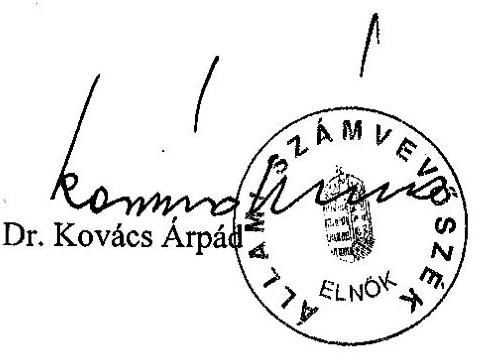
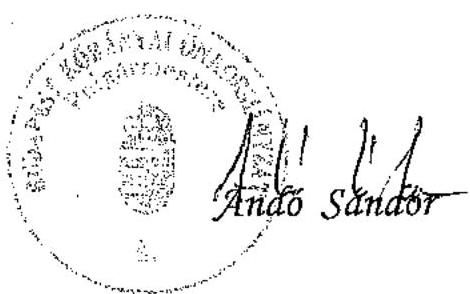

# JELENTÉS 

Budapest Főváros X. kerület Kőbánya Önkormányzata gazdálkodásának átfogó ellenőrzéséről

---

# 3. Önkormányzati és Területi Ellenőrzési Igazgatóság 

3.3 Átfogó Ellenőrzések Főcsoport

Iktatószám: V-1002-7/24/22/2003.
Témaszám: 635
Vizsgálat-azonosító szám: V0102

## Az ellenőrzést felügyelte:

Dr. Lóránt Zoltán
főigazgató
Az ellenőrzés végrehajtásáért felelős:
Dr. Sepsey Tamás
főigazgató-helyettes
Az ellenőrzést vezette:
Csecserits Imréné
főcsoportfőnök-helyettes

## Az ellenőrzést végezték:

| Benczik Lászlóné | Cséffai János | Dér Géza |
| :-- | :-- | :-- |
| számvevő tanácsos | tanácsadó | számvevő |
| Marosi Gyöngyi | Nagy Ervin Barnabás |  |
| számvevő tanácsos | számvevő |  |

A témához kapcsolódó - az elmúlt három évben készített számvevőszéki jelentések:
címe
sorszáma
Jelentés a települési önkormányzatok adóztatási tevékenységének vizsgálatáról 0121
Jelentés a helyi önkormányzatok 2000. évi normatív állami hozzájárulás igénylésének és elszámolásának vizsgálatáról 0128

---

# TARTALOMJEGYZÉK 

BEVEZETÉS ..... 5
I. ÖSSZEGZŐ MEGÁLLAPÍTÁSOK, KÖVETKEZTETÉSEK, JAVASLATOK ..... 7
II. RÉSZLETES MEGÁLLAPÍTÁSOK ..... 19

1. A költségvetés tervezésének, végrehajtásának és a zárszámadás elkészítésének szabályszerűsége ..... 19
1.1. A költségvetés tervezésének, a költségvetési rendelet megalkotásának, elfogadásának szabályszerűsége ..... 19
1.2. A költségvetési előirányzatok módosításának szabályszerűsége ..... 21
1.3. A gazdálkodás szabályozottsága, szabályszerűsége ..... 23
1.4. A munkafolyamatba épített ellenőrzések szabályozottsága és gyakorlati működése a pénzügyi, gazdasági és számviteli feladatellátás területén ..... 25
1.5. A bizonylati rend szabályszerűsége ..... 26
1.6. A vagyon nyilvántartásának és leltározásának szabályszerűsége ..... 26
1.7. A vagyongazdálkodással kapcsolatos feladat és döntési hatáskörök szabályozottsága, a vagyonváltozást előidéző intézkedések szabályszerűsége, célszerűsége ..... 27
1.8. Az Önkormányzat által céljelleggel - nem szociális ellátásként - juttatott támogatásokkal történő elszámoltatás szabályszerűsége ..... 36
1.9. A követelések, részesedések, értékpapírok év végi értékelésének szabályszerűsége ..... 38
1.10. A működési és felhalmozási bevételek, kiadások alakulása ..... 39
1.11. A költségvetés egyensúlyi helyzete ..... 41
1.12. A közbeszerzési eljárások szabályszerűsége ..... 43
1.13. A Polgármesteri hivatal helyi kisebbségi önkormányzatok gazdálkodásával kapcsolatos tevékenysége ..... 45
1.14. A zárszámadási kötelezettség teljesítésének szabályszerűsége ..... 47
2. Az egyes kiemelt önkormányzati feladatok és a rendelkezésre álló források összhangja ..... 48
2.1. A feladatok meghatározása és szervezeti keretei ..... 48
2.2. Az egyes naturális mutatókkal mérhető feladatok bevételei és kiadásai ..... 50
2.3. A jelentős ráfordítást igénylő önként vállalt feladatok ellátása ..... 52
3. A belső irányítási, ellenőrzési rendszer működésének értékelése ..... 53
3.1. Az Önkormányzat informatikai rendszerének szabályozottsága, működése ..... 53
3.2. A helyi ellenőrzési rendszer kialakítása, működése ..... 54
3.3. A könyvvizsgálati kötelezettség teljesítése ..... 56
3.4. A korábbi számvevőszéki ellenőrzések javaslatainak hasznosulása ..... 57

---

# MELLÉKLETEK 

1. számú Az önkormányzati vagyon nagyságának alakulása (1 oldal)
2. számú Az Önkormányzat 2002. évi bevételeinek és kiadásainak alakulása (1 oldal)
3. számú Az Önkormányzat gazdálkodását meghatározó adatok, mutatószámok (1 oldal)
4. számú Egyes feladatok kiadásainak finanszírozása (1 oldal)
5. számú Andó Sándor polgármester úr észrevétele (1 oldal)

## FÜGGELÉK

1. számú Az Önkormányzat pénzügyi befektetései a 2000-2003. III. negyedév közötti időszakban (22 oldal)
1/a számú KŐBETA Rt. által kezelt vagyon hozamának alakulása (1 oldal)
1/b számú KŐBETA Rt. értékpapír tranzakciói a 2001-2003. III. negyedévéig terjedő időszakban (5 oldal)

---

# RÖVIDÍTÉSEK JEGYZÉKE 

Ötv.
Áht.
Ámr.
Kbt.
Számv. tv.
Htv.

Nek. tv.
Vhr.

Ltv.

Tpt.
Önkormányzat
Képviselő-testület
Pénzügyi bizottság
Gazdasági és költségvetési bizottság
Beruházási és városüzemeltetési bizottság

Településfejlesztési és környezetvédelmi bizottság
Tulajdonosi bizottság
Polgármesteri hivatal
Pénzügyi iroda
Jegyzői iroda
ÁSZ
SzMSz
a helyi önkormányzatokról szóló 1990. évi LXV. törvény az államháztartásról szóló 1992. évi XXXVIII. törvény az államháztartás működési rendjéről szóló 217/1998. (XII. 30.) Korm. rendelet
a közbeszerzésekről szóló 1995. évi XL. törvény
a számvitelről szóló 2000. évi C. törvény
a helyi önkormányzatok és szerveik, a köztársasági megbízottak, valamint egyes centrális alárendeltségű szervek feladat- és hatásköreiről szóló 1991. évi XX. törvény
a nemzeti és etnikai kisebbségek jogairól szóló 1993. évi LXXVII. törvény
az államháztartás szervezetei beszámolási és könyvvezetési kötelezettségének sajátosságairól szóló 249/2000. (XII. 24.) Korm. rendelet
a lakások és helyiségek bérletére, valamint az elidegenítésükre vonatkozó egyes szabályokról szóló 1993. évi LXXVIII. törvény
a tőkepiacról szóló 2001. évi CXX. törvény
Budapest Főváros X. kerület Kőbánya Önkormányzata
Budapest Főváros X. kerület Kőbánya Önkormányzat Képviselő-testülete
Budapest Főváros X. kerület Kőbánya Önkormányzat Képviselő-testületének Pénzügyi Bizottsága
Budapest Főváros X. kerület Kőbánya Önkormányzat Képviselő-testületének Gazdasági Bizottsága
Budapest Főváros X. kerület Kőbánya Önkormányzat Képviselő-testületének Beruházási és Városüzemeltetési Bizottsága
Budapest Főváros X. kerület Kőbánya Önkormányzat Képviselő-testületének Településfejlesztési és Környezetvédelmi Bizottsága
Budapest Főváros X. kerület Kőbánya Önkormányzat Képviselő-testületének Tulajdonosi Bizottsága
Budapest Főváros X. kerület Kőbánya Önkormányzat Polgármesteri Hivatala
Budapest Főváros X. kerület Kőbánya Önkormányzat Polgármesteri Hivatalának Pénzügyi Irodája
Budapest Főváros X. kerület Kőbánya Önkormányzat Polgármesteri Hivatalának Jegyzői Irodája
Állami Számvevőszék
Budapest Főváros X. kerület Kőbánya Önkormányzat, 17/1999. (V. 4.) számú rendelete Szervezeti és Működési Szabályzatáról

---

| GAMESZ | Budapest Főváros X. kerület Kőbánya Önkormányzat Gazdasági Műszaki Ellátó és Szolgáltató Szervezete |
| :--: | :--: |
| Vagyonkezelő Rt. | Kőbányai Vagyonkezelő Részvénytársaság |
| KŐBETA Rt. | Kőbányai Befektetési és Tanácsadó Részvénytársaság |
| vagyongazdálkodási   rendelet | Budapest Főváros X. kerület Kőbánya Önkormányzat 13/1999. (III. 23.) számú rendelete az Önkormányzat vagyonáról, a vagyontárgyak feletti tulajdonosi jogok gyakorlásáról |
| közbeszerzési rendelet | Budapest Főváros X. kerület Kőbánya Önkormányzat 12/1999. (III. 23.) számú rendelete a közbeszerzési eljárás helyi szabályairól |
| ügyrendi szabályzat | a polgármester és a jegyző által 2000. május 15-én kiadott Ügyrendi Szabályzat |

---

# JELENTÉS 

## Budapest Főváros X. kerület Kőbánya Önkormányzata gazdálkodásának átfogó ellenőrzéséről

## BEVEZETÉS

Az Ötv. 92. § (1) bekezdése, valamint Áht. 120/A. § (1) bekezdése szerint az önkormányzatok gazdálkodását az Állami Számvevőszék ellenőrzi. A vizsgálatot a V-1002-7/2003. számú ellenőrzési programban alapján végeztük.

## Az ellenőrzés célja annak értékelése volt, hogy:

- az önkormányzati gazdálkodás törvényességét, szabályszerűségét biztosították-e a tervezés, a költségvetés végrehajtása és a zárszámadás során; a gazdálkodás szabályszerűségét biztosító kontrollok${ }^{1}$ megfelelően segítették-e a végrehajtást;
- az önkormányzat által ellátott feladatok és az azokhoz rendelkezésre álló pénzforrások összhangja biztosított volt-e, különös tekintettel egyes kiemelt feladatokra;
- a helyi kisebbségi önkormányzat gazdálkodása során érvényesültek-e az Áht. és a vonatkozó kormányrendeletek előírásai.

Az ellenőrzött időszak: a 2002. év, valamint a 2003. I-III. negyedév, az 1.7., 2.1.- 2.3., 3.2.-3.4. ellenőrzési programpontok esetében a 2000-2002. évek.

A kerület lakosainak száma a 2002. évben 77 948 fő volt, ez a lakosságszám a 2000. évhez viszonyítva 2262 fővel csökkent.

Az Önkormányzat 31 tagú Képviselő-testületének munkáját 12 állandó bizottság segítette. A 2002. évi választások során változott a polgármester személye, két új alpolgármestert neveztek ki, valamint változott a kisebbségi önkormányzatok összetétele.

Az Önkormányzat feladatainak végrehajtása érdekében a Polgármesteri hivatalon kívül hét önállóan gazdálkodó és 55 részben önállóan gazdálkodó költségvetési szervet működtet. A Polgármesteri hivatal és az intézmények összesen

[^0]
[^0]:    ${ }^{1}$ A gazdálkodás szabályszerűségét biztosító kontroll alatt értjük a kiépített és működő belső irányítási és szabályozási rendszert, valamint a belső ellenőrzési funkciók ellátását.

---

15,8 milliárd Ft költségvetési kiadást és 15,3 milliárd Ft bevételt teljesítettek a 2002. évben. Az önkormányzati feladatok ellátásához foglalkoztatott közalkalmazottak létszáma a 2002. évben 2736 fő volt, a Polgármesteri hivatalban 333 fő köztisztviselő dolgozott. Az Önkormányzat 104,4 milliárd Ft értékű könyvviteli mérleg szerinti vagyonnal rendelkezett 2002. december 31-én.

---

# I. ÖSSZEGZŐ MEGÁLLAPÍTÁSOK, KÖVETKEZTETÉSEK, JAVASLATOK 

Az Önkormányzat - megsértve az Ötv. előírását - az 1999-2002. évekre vonatkozóan nem határozott meg gazdasági programot, a 2003-2006. évekre vonatkozó gazdasági programot a Képviselő-testület 2002. december hónapban fogadta el. A 2002. és a 2003. évekre szóló költségvetési koncepciókat a polgármester a jogszabályban előírt határidőben nyújtotta be a Képviselőtestületnek, de az Ámr-ben előírtak ellenére a Pénzügyi bizottság és a helyi kisebbségi önkormányzatok koncepcióról kialakított véleményét nem mellékelték az előterjesztéshez.

A polgármester a 2002. és a 2003. évi költségvetési rendelettervezetet az Áht-ban előírt határidőre terjesztette elő a Képviselő-testületnek, az előterjesztéshez nem csatolták a Pénzügyi bizottság véleményét, azt a bizottsági elnök a Képviselő-testület ülésén szóban ismertette. Az Önkormányzat költségvetésébe a helyi kisebbségi önkormányzatok költségvetéséről hozott határozatokat az Áht-t megsértve nem építették be a 2002. évben, a 2003. évi költségvetésnél a kisebbségi önkormányzatok vonatkozó határozataiban foglaltakat figyelembe vették. A Képviselő-testület az Áht-t megsértve rendeletben nem határozta meg a költségvetés és a zárszámadás előterjesztésekor tájékoztatásul bemutatandó mérlegek és kimutatások tartalmi követelményeit és azok közül egyik évben sem mutatták be a helyi kisebbségi önkormányzatok mérlegeit, a közvetett támogatásokat tartalmazó kimutatást, valamint a zárszámadás előterjesztésekor a többéves kihatással járó döntések keretében a hosszú lejáratú hitelállományt évenkénti bontásban és összesítve.

A 2002 és a 2003. évi költségvetési rendeletek szerkezetének kialakításakor megsértették az Áht-ban foglaltakat, mert nem határozták meg a költségvetési gazdálkodásban alkalmazott címrendet. A költségvetési rendeletben meghatározták a végrehajtásával kapcsolatos legfontosabb szabályokat. Az Áht. előírásait megsértve elmaradt az évközben kialakuló hiány finanszírozásának szabályozása. A 2003. évi költségvetési rendeletben a bevételi és kiadási előirányzat különbségeként tervezett „hiány" összegét nem mutatták be szöveges indoklás formájában, ezért megsértették az Áht. előírását.

A Képviselő-testület a 2002. évi költségvetési rendeletében jóváhagyott előirányzatokat két alkalommal módosította, melynek során a negyedévenkénti költségvetési rendeletmódosításra vonatkozó Ámr. előírást megsértették. A költségvetési rendeletnek az utolsó negyedév előirányzat-változtatásaival történő módosítása az Ámr-ben előírt határidőt követően történt. A költségvetési rendeletben jóváhagyott előirányzatokról, azok változásairól az Áht-ban előírt követelményeknek megfelelő analitikus nyilvántartást vezettek. A 2002. évben önkormányzati szinten a kiemelt előirányzatokon belül gazdálkodtak, a Polgármesteri hivatalnál és három önállóan gazdálkodó költségvetési szervnél a kiadások módosított előirányzatát az Áht. előírásait megsértve 7 992,9 millió

---

Ft-tal túllépték. A kiadási előirányzatok túllépésének okait a felügyeleti ellenőrzés részeként vizsgálták.

A Polgármesteri hivatalban a gazdálkodással kapcsolatos döntési, ellenőrzési feladatkörök szabályozása, elhatárolása megtörtént. A jogszabályi előírás ellenére nem alakították ki az 50 ezer Ft-ot el nem érő előzetes írásbeli kötelezettségvállaláshoz kötött kötelezettségvállalás nyilvántartás rendjét. A teljesítés szakmai igazolás módját az Ámr-ben előírtak ellenére nem határozták meg. A kötelezettségvállalásra, utalványozásra és az ellenjegyzésre jogosult polgármester és jegyző a felhatalmazottakat nem számoltatták be.

A jegyző a Htv. előírásait megsértve, nem alakította ki az Önkormányzat költségvetési szerveire vonatkozóan az egységes számviteli rendet.

A Polgármesteri hivatal számviteli politikával rendelkezett, amelyet 2002. január 1-től a jogszabályi változással összhangban aktualizáltak. A számviteli politika keretében kiadták az eszközök és források értékelési, a leltározási, a pénzkezelési és a selejtezési szabályzatát. A számviteli politikában a mérlegtételek értékelésénél a jelentős összegű eltérés (eszközönként 25%) túlzó mértékű és célszerűtlen a közpénzekkel történő gazdálkodással szembeni fokozott és szigorú elszámolás igénye mellett. A leltározási szabályzatban a Vhr-ben foglaltak ellenére nem rögzítették a leltározás elvégzését helyettesítő összesítő kimutatás tartalmát és formáját, valamint nem szerezték be a felügyeleti szerv egyetértését. Nem határozták meg az üzemeltetésre átadott eszközök leltározási rendjét a Vhr. előírásai ellenére.

A számlarendben - a Számv. tv. és a Vhr-t megsértve - nem rögzítették a számlák főkönyvi érték növekedésének, csökkenésének jogcímeit a főkönyvi számlákat érintő gazdasági eseményeket, azok más főkönyvi számlákkal való összefüggéseit, valamint a főkönyvi számlák és a számviteli analitikus nyilvántartás kapcsolatát.

# A gazdálkodási szabályzatok a munkafolyamatba épített ellenőrzési 

feladatként tartalmazták az
 ellenőrzési pontokat, rögzítették az eltérések dokumentálásának módját és a jelzési kötelezettséget.

Az utalványozás ellenjegyzését elvégezték, a kiadási és bevételi bizonylatokat érvényesítették. A munkafolyamatba épített ellenőrzés során a kötelezettségvállalás és utalványozás ellenjegyzésekor az egyéb pénzbeli támogatások 50\%-ánál, a pénzeszközátadások 40\%-ánál és a rövid lejáratú hitelfelvételek 83\%-ánál nem tartották be az ügyrendi szabályzatban, valamint az Ámr-ben előírtakat, nem győződtek meg arról, hogy a költségvetési előirányzat biztosított volt-e. A szakmai teljesítés-igazolások a gazdasági eseményekre vonatkozóan megtörténtek. A költségvetés végrehajtása során a pénztárellenőrzési feladatokat elvégezték. A házipénztárban a készpénzforgalom napi 0,5-12 millió Ft között fordult elő, 4-6 millió Ft egyösszegű kifizetések is voltak.

A gazdálkodási eseményeket rögzítő bizonylatok megfeleltek a Számv. tv. 167. §-ában előírt alaki és tartalmi követelményeknek, annak kivételével, hogy a Polgármesteri hivatalban a nem lakáscélú bérleti díjak beérkezése után

---

történt a számla elkészítése és több tételt összevontak egy számlában, ezzel megsértették a Számv. tv-t.

A pénztári és banki bizonylatok 0,9\%-ánál a kötelezettségvállalás nem történt meg az Ámr-ben előírtak ellenére. A Polgármesteri hivatalban az érvényesítést és a teljesítés szakmai igazolását elvégezték.

A számviteli rendszer keretében gondoskodtak az önkormányzati vagyon analitikus nyilvántartásáról és ezen belül a törzsvagyon elkülönítéséről. A Polgármesteri hivatal az Önkormányzat ingatlanvagyonára vonatkozó értékeléssel, egyeztetéssel az előírt határidőre elkészült. Az értékmegállapítás következtében az Önkormányzat ingatlanvagyona 86,5 milliárd Ft-tal emelkedett. Az ingatlanvagyon kataszter, valamint a számviteli analitikus nyilvántartás és a főkönyvi könyvelés értékadatai a 2002. évre vonatkozóan megegyeztek. A 2002. évben az immateriális javaknál, a tárgyi eszközöknél és az üzemeltetésre átadott eszközöknél a Vhr-ben foglalt előírások ellenére mennyiségi felvétellel leltározást nem végeztek. Egyeztetéssel hajtották végre a leltározást a részesedéseknél, értékpapíroknál, követeléseknél és a kötelezettségeknél. A Vhr-ben előírt, a leltárt helyettesítő összesítő kimutatás készítésének feltételei nem álltak fenn, mivel a Polgármesteri hivatal nem rendelkezett a Képviselő-testület erre vonatkozó egyetértésével.

Az Önkormányzat a vagyongazdálkodással kapcsolatos feladat és döntési hatásköreit a vagyongazdálkodási rendeletben szabályozta. A rendeletben a vagyonelemek meghatározása és forgalomképesség szerinti elkülönítése megtörtént. A rendelet lehetővé tette, hogy a portfólió vagyon felett a vagyon kezelésével megbízott szervezet gyakorolja a tulajdonosi jogok teljes körét. A vagyont érintő döntések meghozatalakor betartották a vagyongazdálkodási rendeletben rögzített szabályokat, hatásköri előírásokat. A Képviselő-testület nem tett eleget az önkormányzat vagyongazdálkodási rendeletében foglaltaknak, mert évente nem döntött a vagyongazdálkodás irányelveiről.

Az Önkormányzat a részvényekből álló 2000. november 2-án 6,1 milliárd Ft árfolyamértéket képviselő portfólió vagyonának kezelését megosztotta. A 263653 db 1000 Ft névértékű - az akkori tőzsdei árfolyam alapján 4 milliárd Ft forgalmi értékű - Richter Gedeon Rt. részvényeket az Önkormányzat saját hatáskörben, a Polgármesteri hivatal és egy a K&H Bank Rt-hez tartozó befektetési szolgáltató bevonásával végezte.

A 2,1 milliárd Ft árfolyamértékű - 100000 db Richter Gedeon Rt. részvényből és egyéb részvényekből álló - portfólió-kezelésére a 100\%-os önkormányzati tulajdonban lévő Vagyonkezelő Rt. által alapított gazdasági társaságnak a KÖBETA Rt-nek adott megbízást.

A szerződés szerint a KÖBETA Rt. jogosult volt az átadott vagyonelemek felett teljes jogkörrel rendelkezni. A portfólió kezelő által meghozott befektetési döntések kockázatát teljes egészében az Önkormányzat viselte. A portfóliókeze-

---

lésbe adással az Önkormányzat olyan megoldást választott, amely a vagyon védelme szempontjából nem volt megfelelő. ${ }^{2}$

A szerződésben rögzített vagyonkezelési díj összege az átlagosan lekötött tőke piaci értékének 3\%-a + áfa volt az állampapír és 5\% + áfa volt a részvénybefektetések esetében. Ez a díj többszörösen meghaladta a portfolió-kezeléssel foglalkozó befektetési szolgáltatók a PSZÁF internetes honlapján közzétett 0,4\%-tól 1,7\% közötti portfolió-kezelési díjait. Növelte a vagyonkezelés költségeit az is, hogy a KÖBETA Rt-nek a befektetési eszközök vételekor és eladásakor igénybe kellett vennie az engedéllyel rendelkező befektetési szolgáltatót is ${ }^{3}$. Az Önkormányzat közvetlenül is köthetett volna szerződést engedéllyel rendelkező befektetési szolgáltatóval, a KÖBETA Rt. közbeiktatása növelte a vagyonkezelés költségeit.

A KÖBETA Rt. által lebonyolított 116 értékesítésre irányuló állampapír ügylet 74\%-a esetében a szerződés alapján járó tranzakciós díj összege meghaladta a realizált hozamot. A befektetések napokban kifejezett időtartama nagyon alacsony volt, 81 esetben nem érte el a 20 napot. A rövid idejű állampapír befektetések a KÖBETA Rt. állampapír értékesítéséhez kapcsolódóan realizált tranzakciós díj bevételhez és a közreműködő befektetési szolgáltató marzs bevételéhez kapcsolódó érdekeit szolgálták.

A portfolió vagyonkezelés az Önkormányzat szempontjából nem hozott eredményt. A beszámolók adatai alapján a KÖBETA Rt. az ellenőrzött időszakban összesen 248 millió Ft hozamnövekedést ért el. Figyelembe véve a KÖBETA Rt-nek kifizetett portfolió-kezeléssel összefüggő vagyonkezelési díjat és tranzakciós jutalékot a hozam alig haladta meg a három millió Ft-ot. Az önkormányzati portfolió vagyont tovább csökkentette a tranzakciókat végrehajtó befektetési szolgáltató által a nála vezetett számlára terhelt a 2002. évi 36 millió Ft tranzakciós díj, a halasztott pénzügyi teljesítéssel történő értékpapír vásárlásra irányuló keretszerződés (hitelkeret szerződés) alapján keletkezett 49 millió Ft kamatköltség, összesen 85 millió Ft-os összege, valamint a 2003. évi kamat 11 millió Ft-os összege. Az Önkormányzat számára tényleges veszteséget jelentett az állampapír piacon elérhető hozam elmaradása is. Ennek összege az adott időszakban - az OTC részvények nélküli - átlagosan lekötött tőke és az Államadósság Kezelő Központ által közzétett három, illetve hat hónapos állampapír referenciahozamok figyelembevételével 400 millió Ft-ot tett ki. Az Önkormányzatot legkevesebb 493 millió Ft veszteség érte a portfoliókezelés miatt.

[^0]
[^0]:    ${ }^{2}$ A közbenső egyeztetés során a polgármester által tett észrevételeket és az azokkal kapcsolatos ÁSZ álláspontot a jelentés "II. részletes megállapítások" című fejezete tartalmazza.
    ${ }^{3}$ A KÖBETA Rt. az egyes befektetési intézkedések után az állampapírok esetében az adott ügylet árfolyamértékének 0,2\% + áfa, a részvények esetében 0,5\% + áfa tranzakciós díjat számolt fel. A díj a részvények esetében tartalmazta az engedéllyel rendelkező befektetési szolgáltató 0,4\%-os jutalékát is.

---

A Polgármester a Képviselő-testület 665/2000. (VII. 11.) számú határozatának végrehajtása érdekében az Önkormányzat nevében befektetési tanácsadásra irányuló megbízási szerződést és ügyfélszámla szerződést kötött a K&H Befektetési Rt-vel. A szerződések alapján a letétbe helyezett vagyon feletti rendelkezésre kizárólag a megbízónak (az Önkormányzatnak) volt joga.

A befektetési tanácsadásra irányuló megbízási szerződés és az ügyfélszámla szerződés megkötése során a polgármester a vagyonnal való felelős gazdálkodás követelményének érvényesülését fokozottabban elősegítő lehetőséggel nem élt. Nem nyittatott a befektetési szolgáltatóval az Önkormányzat nevére a KELER Rt-nél ${ }^{4}$ értékpapír alszámlát. Nem kérte az alszámla zárolását, annak érdekében, hogy kizárólag az önkormányzat és a letétkezelő együttes rendelkezése alapján kerülhessen terhelésre a számla. Erre egyébként - a megbízó egyedi megbízása esetén - az ügyfélszámla szerződés 1.1. pontja is lehetőséget adott volna.

A 2003. április 28-ig lebonyolított ügyletek az állampapír piacon elvárható hozamot biztosították. Az ezt követően adott befektetési megbízásokat a K&H Equities Rt. már nem teljesítette. A K&H Equities Rt. és a K&H Bank Rt. képviselőivel 2003. augusztusában lezajlott egyeztetés alapján az Önkormányzat különböző jogcímeken 2,8-3 milliárd Ft-os követelést mutatott ki, amelynek érvényesítése érdekében 2003. október 6-án keresetet nyújtottak be a Pénz és Tőkepiaci Választott Bírósághoz.

A 2001. év július 3-án megkötött ügyfélszámla szerződés 1.3. pontja alapján a befektetési szolgáltató vállalta az értékpapírokon alapuló követelések beszedését, ennek megtörténtéről azonban nem értesítette az Önkormányzatot. A Polgármesteri hivatal nem kísérte figyelemmel a Richter Gedeon Rt. osztalékfizetésre vonatkozó hirdetményeit, nem kérte a 2002. és a 2003. évben az Önkormányzatnak járó 66 millió Ft osztalék befektetését, vagy kifizetését, ezt az igényét csak 2003. év augusztusában jelezte a K&H Equities Rt-nek.

Az Önkormányzat - a saját alapítású alapítványok és közalapítványok kivételével - számadási kötelezettséget tartalmazó megállapodás alapján nyújtott támogatást alapítványoknak, egyesületeknek és más társadalmi szervezeteknek. A támogatásokhoz kapcsolódó elszámolás rendjét az éves költségvetési rendeletben szabályozták. A támogatott szervezetek számadásait a szakmai irodák ellenőrizték. A támogatott szervezetek elszámolási kötelezettségeiknek eleget tettek. Az Önkormányzat a támogatások felhasználását helyszíni ellenőrzés útján nem vizsgálta.

Két gazdasági társaság esetében értékvesztést számoltak el, ezt szabályosan rögzítették a főkönyvben és az egyedi nyilvántartásban. A 2002. évi könyvviteli mérleg összeállításának értékelési feladatai során az értékvesztés elszámo-

[^0]
[^0]:    ${ }^{4}$ Központi Elszámolóház és Értéktár (Budapest) Rt., amely többek között a függelékben érintett tőzsdére bevezetett részvények értékesítésének és vásárlásának a központi elszámolását is végzi.

---

lásának szükségességét - a Számv. tv-t és a Vhr-t megsértve - nem vizsgálták és nem számolták el a követeléseknél és a kárpótlási jegyeknél.

Az Önkormányzat által ellátott feladatok és az azokhoz rendelkezésre álló pénzforrások összhangja folyószámlahitellel biztosított volt. A 2002. év végi hitelállomány 639 millió Ft volt. Az Önkormányzat költségvetése működési forráshiányos volt. Az önkormányzati költségvetési beszámolók 2000-2002. évi teljesítési adatai szerint a működési célú bevételek nem fedezték a működési célú kiadásokat, a felhalmozási célú bevételekből egészítették ki a feladat-ellátási kötelezettségek pénzügyi teljesítése érdekében.

A költségvetési-, valamint a likviditási egyensúly biztosításához a folyószámla-hitel igénybevételére egész évben - de nem folyamatosan - szükség volt. Hitelállomány az Önkormányzat 2002. év végi mérlegében szerepelt. A folyószámlahitel a 2002. évben és a 2003. év I. félévében az időszakok közel 90\%-ában fennállt, ezért az nem átmeneti, hanem tartós finanszírozási problémák megoldását biztosította. Az Önkormányzat által tervezett feladatok folyamatos ellátásának finanszírozása érdekében a jegyző likviditási tervet készített, azt folyamatosan aktualizálta.

Az Önkormányzat bevételeinek növelése érdekében - a helyi adókról szóló törvényben biztosított felhatalmazás alapján - a vagyoni típusú adók közül építményadót és telekadót vezetett be. Az Önkormányzat megvalósította a kiskincstári rendszer-finanszírozási lehetőségeket. Az Önkormányzat a 2002. évben adósságot keletkeztető kötelezettségvállalásról a likvid hitel kivételével nem döntött, fejlesztési, beruházási hiteleket nem vett fel.

A közbeszerzési törvény hatálya alá tartozó beszerzésekkel kapcsolatos eljárás rendjét az 1999. évben meghozott közbeszerzési rendeletben szabályozták, amelyet 2003. szeptember 30-ig nem aktualizálták. A szabályozásban nem rendelkeztek az eljárás indításával és lezárásával összefüggő feladatokról, hatáskörökről, a kiíró nevében eljáró személyekről, akik az ajánlatkérő jogait és kötelezettségeit gyakorolják. Nem a törvényi előírásoknak megfelelően szabályozták a döntéshozatalt, mivel nem személyhez rendelték, hanem a Képviselőtestület hatáskörébe utalták, nem rendelkeztek az éves összegzés elkészítéséhez szükséges adatszolgáltatás belső rendjéről. A Polgármesteri hivatal a 2002. évben lefolytatott nyolc közbeszerzési eljárás során - megsértve a közbeszerzési törvény és a közbeszerzési rendelet előírását - az eljárásban résztvevők esetében az összeférhetetlenség fennállását nem vizsgálta, valamint az eljárást lezáró döntést nem személy hozta meg. Az előírt közbeszerzési értékhatárt elérő beszerzéseknél két szolgáltatási feladatnál nem folytatták le a közbeszerzési eljárást - a lakás rehabilitáció felújítási munkái és a térfigyelő rendszer üzemeltetési feladatainak ellátása -
 ezzel megsértették a Kbt-t.

A kerületben a 2002. évi kisebbségi önkormányzati képviselő-választásokig hét – görög, horvát, cigány, német, örmény, román, lengyel – helyi kisebbségi önkormányzat működött. A lengyel kisebbségi önkormányzat nem alakult újjá, viszont megalakult a ruszin kisebbségi önkormányzat.

A polgármester valamennyi helyi kisebbségi önkormányzat elnökével együttműködési megállapodást kötött a pénzügyi-gazdasági feladatok ellátására. A

---

Polgármesteri hivatal a megállapodásban foglaltak alapján elvégezte a kisebbségi önkormányzatok költségvetésével, gazdálkodásával összefüggő könyvelési, pénzkezelési feladatokat, valamint egyéb operatív teendők ellátásának feltételeit biztosította. A helyi kisebbségi önkormányzatok a 2002. évi költségvetés önálló határozatban történő megállapítási kötelezettségének határidőt követően tettek eleget, a 2003. évben költségvetési határozataikat határidőben hozták meg.

A 2002. évi zárszámadás tartalmazta a Polgármesteri hivatal és az Önkormányzat költségvetési szerveinek teljesítési adatait külön-külön és összevontan. A zárszámadáskor az Áht. előírásait megsértették, mivel a kimutatások és mérlegek közül kettőt nem csatoltak a beszámolóhoz (a hosszú lejáratú hitelállományt évenkénti bontásban és a közvetett támogatásokat tartalmazó kimutatást). Az önállóan gazdálkodó költségvetési intézmények pénzmaradványának számszaki ellenőrzését elvégezték, annak jóváhagyott összegéről írásban értesítést kaptak az intézmények vezetői. A tárgyévi helyesbített pénzmaradványt terhelő elvonást megállapították, a befizetési kötelezettséget az előírt határidő után teljesítették a Magyar Államkincstárnak, a késedelmi pótlékkal együtt. A Képviselő-testület az önkormányzati szintű, valamint az önállóan gazdálkodó költségvetési intézményi pénzmaradványokat rendelettel jóváhagyta. A helyi adók és egyéb bevételek hó végén rendelkezésre álló összegét év közben a tárgyhót követő hó 10. napjáig nem utalták át a költségvetési elszámolási számlára, az Ámr-ben előírtak ellenére.

Az Önkormányzat a kötelezően ellátandó feladatait az általa alapított költségvetési szervei, gazdasági társaságai, közhasznú szervezete, alapítványok, közalapítványok és a Budapest Fővárosi Önkormányzat gazdasági társaságai útján biztosította.

A Képviselő-testület a nevelési és oktatási tevékenységet ellátó intézményeken kívül nem tekintette át és nem értékelte az intézmények és társas vállalkozások feladatellátásban betöltött szerepét, eredményességét, a szervezeti rendszer célszerűségét.

Az Önkormányzat a kötelező feladatain túlmenően önként vállalt feladatokat is ellátott. Az önként vállalt feladatok körét a Képviselő-testület az SzMSz-ben nem rögzítette. A nem kötelező feladatok kiadásainak finanszírozására az Önkormányzat külső forrásokat is igénybe vett. A kötelező feladatok végrehajtását az Önkormányzat vállalt feladatainak ellátása nem veszélyeztette.

Az Önkormányzat számítástechnikai ellátottsága megfelelő volt. Az informatikai rendszerrel összefüggő szabályozás nem volt teljes körű, mert nem készítettek informatikai stratégiát és katasztrófa-elhárítási tervet. Az informatikai szabályozáson belül a mentések, az adatvédelem szabályozása általános, a feladatok ellátásának kötelezettségét írja elő, de nem határozták meg a mentések gyakoriságát, az alkalmazandó mentési eljárásokat, módokat és eszközöket, valamint a mentett adatok megőrzésének idejét. Az informatikai eszközök (szoftverek és hardverek) nyilvántartásáról a számviteli nyilvántartások keretében gondoskodtak.

---

A Polgármesteri hivatalban kialakították a belső- és a felügyeleti ellenőrzés rendszerét, azonban az Áht. előírásait megsértve nem biztosították a független belső ellenőrzés és a felügyeleti ellenőrzés önálló szervezeti egységként történő kialakítását és működését.

Az Önkormányzat rendszeresen és megfelelő színvonalon teljesítette a felügyeleti ellenőrzési kötelezettségét, a hiányosságok felszámolása – amelyek a többéves rendszeres ellenőrzés eredményeként nem számottevőek – érdekében megtették a szükséges intézkedéseket.

A Polgármesteri hivatal függetlenített belső ellenőre – éves munkaterv szerint – szabályszerűségi ellenőrzéseket végzett. Az ellenőrzések megállapításai alapján tett javaslatok – az azok hasznosulását vizsgáló utóellenőrzések szerint – maradéktalanul nem teljesültek, az irodavezetők határidőn belül nem tájékoztatták a belső ellenőrt a megtett intézkedésekről. A belső ellenőr esetenként részt vett a Polgármesteri hivatal operatív munkavégzésében, amely sérti az Áht. előírásait. A központi támogatások, a központosított előirányzatok, valamint a szociális ágazatot érintő normatív állami hozzájárulások ellenőrzését nem végezték el. A Képviselő-testület rendszeresen áttekintette a felügyeleti ellenőrzések tapasztalatait, a Polgármesteri hivatal belső ellenőrzéséről tájékoztatást nem kapott.

A korábbi ÁSZ vizsgálatokban megállapított hiányosságokat két kivétellel megszüntették, a javaslatok hasznosultak. A helyi adózási tevékenység során a Képviselő-testület tájékoztatását célzó megállapítások nem hasznosultak, mivel elmaradt a közvetett támogatások bemutatása a zárszámadáskor, valamint a jegyző beszámoltatása az adóztatásról.

Az Önkormányzat teljesítette a törvényben előírt könyvvizsgálati kötelezettségét.

A helyszíni ellenőrzés megállapításai mellett a gazdálkodás szabályszerűségének és a munka színvonalának javítása érdekében javasoljuk:

# a Képviselő-testületnek: 

## a törvényes állapot helyreállítása és a jogszabályi előírások betartása érdekében

1. határozza meg évente a vagyongazdálkodás irányelveit a vagyongazdálkodási rendelet 26. §-ában előírtaknak megfelelően;
2. tegyen eleget – az előző ÁSZ vizsgálat által javasoltak érdekében – a jegyző beszámoltatása útján Htv. 138. § (3) bekezdése g) pontjában előírt adóztatást érintő ellenőrzési kötelezettségének;

---

# a munka színvonalának javítása érdekében 

3. vizsgálja felül az önkormányzati portfolióvagyon kezelésének, hasznosításának jelenlegi gyakorlatát. Olyan megoldást válasszon, amely biztosítja az önkormányzati érdekek érvényesülését, az elvárható hozambevétel realizálását;
4. kezdeményezze a KŐBETA Rt-vel szemben az önkormányzatot ért veszteség megtérítését;

## a polgármesternek

## a törvényes állapot helyreállítása és a jogszabályi előírások betartása érdekében

1. csatolja az Ámr. 28. § (3) bekezdése szerint az éves költségvetési koncepcióhoz a Pénzügyi bizottság és a helyi kisebbségi önkormányzatok véleményét, valamint az Ámr. 29. § (9) bekezdése szerint a költségvetési rendelet előterjesztéséhez a Pénzügyi bizottság véleményét;
2. terjessze be a Képviselő-testületnek az Áht. 118. §-ában előírt mérlegek, kimutatások tartalmának meghatározásáról szóló rendelet tervezetét;
3. biztosítsa, hogy a költségvetés végrehajtása során a kötelezettségvállalás – az Áht. 12/A. § (1) bekezdésében rögzítettek szerint – a költségvetési szerveknél a jóváhagyott kiadási előirányzatok mértékéig terjedjen;
4. kezdeményezze a Képviselő-testületnél a közbeszerzési rendelet aktualizálását, alakítsa ki a közbeszerzési adatszolgáltatás belső rendjét a Kbt. 61. § (9) bekezdésének megfelelően, gondoskodjon arról, hogy a Kbt. 31. § (3) bekezdésében előírtak szerint az eljárást lezáró határozatot személy hozza meg;
5. nyújtson be előterjesztést a Képviselő-testület számára az Áht. 121/A. § (4) bekezdésben foglaltaknak megfelelően a Polgármesteri hivatal szervezetén belül a belső ellenőrzés önálló szervezeti egységként történő kialakítására;

## a munka színvonalának javítása érdekében

6. kezdeményezze a jelen számvevőszéki ellenőrzés tapasztalatainak képviselői-testületi megtárgyalását, a feltárt hiányosságok megszüntetésére készíttessen intézkedési tervet;
7. számoltassa be a felhatalmazottakat a végrehajtott kötelezettségvállalásokról, utalványozásokról;
8. gondoskodjon arról, hogy a jövőben az értékpapír-kereskedő cégekkel kötött értékpapír-alszámla szerződéseknél az Önkormányzat kérje a KELER Rt-nél az Önkormányzat nevére külön alszámla megnyitását és az alszámla feletti biztonságos önkormányzati rendelkezés – együttes zárolás-feloldás – biztosítását;

---

9. kezdeményezze a Képviselő-testületnél a szervezeti rendszer célszerűségének, az intézmények és társas vállalkozások önkormányzati feladatellátásban betöltött szerepének értékelését és az elfogadott döntések végrehajtását;
10. kezdeményezze a Képviselő-testületnél az önként vállalt feladatok meghatározásával az SzMSz kiegészítését;

# a jegyzőnek: 

## a törvényes állapot helyreállítása és a jogszabályi előírások betartása érdekében

1. gondoskodjon a költségvetési rendelettervezet előkészítésekor:
a) az Áht. 67. §-ában előírt címrend összeállításáról;
b) az Áht. 75. §-a alapján az évközben kialakuló hiány finanszírozási módjának meghatározásáról;
c) az Áht. 8. § (1) bekezdése és az Áht. 8/A. § (7) bekezdésének megfelelően a költségvetési bevételek és a költségvetési kiadások, valamint azok különbségeként a tervezett hiány – szöveges indoklással történő – bemutatásáról;
2. biztosítsa, hogy a költségvetési előirányzatok módosítása, átcsoportosítása az Ámr. 53. § (2) és (6) bekezdéseiben meghatározott határidő betartásával történjen;
3. gondoskodjon az Áht. 93. § (1) bekezdésében foglaltak betartása érdekében a jóváhagyott előirányzatokon belüli gazdálkodásról és biztosítsa, hogy a kötelezettségvállalás, utalványozás ellenjegyzésekor az Ámr. 134. § (7) bekezdés a) pontjában foglaltaknak megfelelően győződjenek meg arról, hogy a kötelezettségvállalás megtörtént-e és a kapcsolódó kiadási előirányzat biztosítja-e a fedezetet;
4. alakítsa ki az 50 ezer Ft-ot el nem érő előzetes írásbeli kötelezettségvállaláshoz nem kötött kötelezettségvállalások nyilvántartási rendjét az Ámr. 134. § (4) bekezdésében foglaltaknak megfelelően;
5. határozza meg az Ámr. 135. § (3) bekezdésének megfelelően a teljesítés-igazolás módját;
6. alakítsa ki a Htv. 140. § (1) bekezdés c) pontjának betartása érdekében a költségvetési szervekre vonatkozóan az egységes számviteli rendet;
7. határozza meg a Vhr. 37. § (1) bekezdésében foglaltaknak megfelelően az eszközök és források, ezen belül az üzemeltetésre átadott eszközök leltározási feladatait;
8. gondoskodjon a számlarend kiegészítéséről oly módon, hogy az tartalmazza a Számv. tv. 161. § (2) bekezdésében előírtaknak megfelelően a főkönyvi számlák értéknövekedésének, csökkenésének jogcímeit, a számlát érintő gazdasági eseményeket, azok más számlákkal való összhangját, valamint a Vhr. 49. § (2) bekezdésében foglaltaknak megfelelően a főkönyvi számlák és az analitikus nyilvántartás kapcsolatát;

---

9. mutassa be a költségvetési rendelettervezet előterjesztéséhez az Áht. 118. §-ában előírtaknak megfelelően, az Áht. 116. § 6. pontja alapján a helyi kisebbségi önkormányzatok elkülönített mérlegeit, az Áht. 116. § 10. pontja alapján a közvetett támogatásokat tartalmazó kimutatást, valamint a zárszámadáskor az Áht. 116. §. 9. pontja alapján a több éves kihatással járó döntések számszerűsítését évenkénti bontásban, valamint összesítve;
10. gondoskodjon a Vhr. 37. § (3) bekezdésében foglaltak szerint az immateriális javak és a tárgyi eszközök, valamint az üzemeltetésre átadott eszközök mennyiségi felvétellel történő leltározásáról;
11. biztosítsa, hogy az önkormányzati alapítású alapítványok és közalapítványok részére a céljelleggel nyújtott támogatások esetében az Áht. 13/A. § (2) bekezdésében foglaltaknak megfelelően számadási kötelezettség előírásra, továbbá valamennyi esetben a számadások, valamint a felhasználások ellenőrzésre kerüljenek.
12. intézkedjen a követelések értékelésénél a Számv. tv. 55. § (1) bekezdése alapján, hogy elszámolásra kerüljön az értékvesztés;
13. gondoskodjon a Vhr. 32. § (1) bekezdés előírásainak megfelelően a kárpótlási jegyek év végi értékelésének elvégzéséről;
14. gondoskodjon arról, hogy a bérleti díjak beszedésekor a számla elkészítése azonos időben történjen a bevételek befizetésével a Számv. tv. 165. § (1) bekezdése szerint;
15. gondoskodjon a Kbt. 2. § (1) bekezdésében előírt közbeszerzési értékhatárt meghaladó beszerzéseknél a közbeszerzési eljárás lefolytatásáról;
16. gondoskodjon a Kbt. 31. § (2) bekezdésében foglaltak alapján a közbeszerzési eljárásban közreműködők összeférhetetlenségének vizsgálatáról, betartásáról;
17. intézkedjen az Ámr. 125. § (1) bekezdés rendelkezései szerint, hogy a helyi adók és egyéb adó és bevételek hó végén rendelkezésre álló teljes összegét a tárgyhót követő hó 10. napjáig a költségvetési elszámolási számlára utalják át;
18. gondoskodjon az Áht. 121/A. § (3) és (4) bekezdés e) pontja alapján a belső ellenőr funkcionális függetlenségéről;
19. készítsen előterjesztési javaslatot a Képviselő-testület részére a Polgármesteri hivatal belső ellenőrzésének tapasztalatairól a Htv. 138. § (1) bekezdés g) pontjában foglaltak végrehajtása érdekében;

# a munka színvonalának javítása érdekében 

20. gondoskodjon a költségvetési szerveknél az előirányzat túllépés esetén a felelősség megállapításáról;
21. számoltassa be az ellenjegyzéssel felhatalmazottakat végrehajtott ellenjegyzésekről;

---

22. módosítsa a számviteli politikát annak érdekében, hogy a mérlegtételek értékelésénél a jelentős összegű eltérés mértéke célszerűen feleljen meg a közpénzekkel történő gazdálkodással szembeni fokozott és szigorú elszámolás igényének;
23. kezdeményezze a készpénzforgalom helyett korszerű fizetési módok alkalmazását, a lakásbérleti jog megváltása és a dolgozók személyi jellegű kifizetéseinél;
24. gondoskodjon az Önkormányzat tulajdonában levő részvények utáni osztalékfizetésre vonatkozó hirdetmények figyelemmel kíséréséről, az ebből eredő követelések érvényesítéséről;
25. biztosítsa, hogy a pénzmaradványt terhelő elvonást határidőn belül utalják át a
 Magyar Államkincstárnak;
26. határozza meg az adatvédelem biztonsága érdekében az informatikai szabályzatban belül a mentések gyakoriságát, az alkalmazandó mentési eljárásokat, módokat és eszközöket, valamint a mentett adatok megőrzésének idejét;
27. gondoskodjon az Önkormányzat informatikai katasztrófa-elhárítási tervének elkészítéséről;
28. biztosítsa, hogy a központi támogatások, a központosított előirányzatok, valamint a szociális ágazatot érintő normatív állami hozzájárulások ellenőrzését elvégezzék;
29. intézkedjen, hogy az érintett irodavezetők tartsák be az 1/1999. számú polgármesteri és jegyzői együttes utasításban foglalt azon kötelezettségüket, hogy a megadott határidőn belül írásban tájékoztassák a belső ellenőrt a hiányosságok felszámolására tett intézkedésekről.

---

# II. RÉSZLETES MEGÁLLAPÍTÁSOK 

## 1. A KÖLTSÉGVETÉS TERVEZÉSÉNEK, VÉGREHAJTÁSÁNAK ÉS A ZÁRSZÁMADÁS ELKÉSZÍTÉSÉNEK SZABÁLYSZERŰSÉGE

### 1.1. A költségvetés tervezésének, a költségvetési rendelet megalkotásának, elfogadásának szabályszerűsége

Az Ötv. 91. § (1) bekezdésében előírtakat megsértve az Önkormányzat az 1999-2002. évekre szóló gazdasági programját nem határozta meg. A 2002. évi választásokat követően kidolgozták az Önkormányzat 2003-2006. évekre vonatkozó gazdasági programját, melyet a Képviselő-testület a 2100/2002. (XII. 19.) számú határozatával fogadott el.

A polgármester a 2002. évi költségvetési koncepciót az előírt - november 30-i - határidőn belül terjesztette a Képviselő-testület elé, a 2003. évi költségvetési koncepciót az Áht. 70. §-ában rögzített határidőben ${ }^{5}$ 2002. december 12-én nyújtotta be a Képviselő-testületnek megtárgyalásra. Az előterjesztést megelőzően az Önkormányzatnál működő bizottságok tájékoztatást kaptak a költségvetési koncepcióról, a Pénzügyi bizottság véleményét az Ámr. 28. § (3) bekezdésének előírásával ellentétben az előterjesztéshez mellékletként nem csatolták, azt a Képviselő-testületi ülésen szóban ismertették.

A helyi kisebbségi önkormányzatok elnökeit - az Ámr. 28. § (6) bekezdésében foglaltaknak megfelelően - tájékoztatták a költségvetési koncepció-tervezetnek a helyi kisebbségi önkormányzatokra vonatkozó részeiről, az előterjesztéshez az Ámr. 28. § (3) bekezdésében előírtak ellenére nem mellékelték a helyi kisebbségek koncepcióról alkotott véleményét.

A Képviselő-testület 1023/2001. (XI. 16.) számú határozattal elfogadta a 2002. évi költségvetési koncepciót, amelyben figyelembe vette a helyben képződő bevételeket és az ellátandó feladatok kiadási szükségletét, a működési célú bevételek és kiadások különbözeteként jelentkező 1400 millió Ft működési forráshiányt, melyet felhalmozási célú bevételből tervezett biztosítani.

A polgármester a 2002. és a 2003. évi költségvetési rendelettervezetét az Áht. 71. § (1) bekezdésében előírt határidőt ${ }^{6}$ betartva nyújtotta be a Képviselőtestületnek. A rendelettervezet beterjesztését megelőzően a Képviselő-testület döntött azokban a kérdésekben, amelyek a tervezett előirányzatokat megala-

[^0]
[^0]:    ${ }^{5}$ A helyi önkormányzati képviselő-testület tagjai általános választásának évében legkésőbb december 15-ig.
    ${ }^{6}$ A költségvetési rendelettervezet benyújtási határideje február 15.

---

pozzák. Az Áht. 71. § (3) bekezdése figyelembe vételével bemutatták a költségvetési évet követő két év előirányzatait.

A 2002. és a 2003. évi költségvetési rendelettervezetet a Képviselő-testület elé terjesztés előtt a jegyző az intézményvezetőkkel megvitatta, az egyeztetés eredményét írásban rögzítette.

A 2002. és a 2003. évi költségvetési rendelettervezet előterjesztéséhez az Ámr. 29. § (9) bekezdés előírása ellenére nem csatolták a Pénzügyi bizottság véleményét, azt a Képviselő-testület ülésén a bizottsági elnök szóban ismertette, a könyvvizsgáló írásos jelentését csatolták. Az Önkormányzat költségvetésébe a helyi kisebbségi önkormányzatok költségvetéséről hozott határozatokat nem építették be, ezért megsértették az Áht. 65. § (3) bekezdésében foglaltakat. Az Önkormányzat által a helyi kisebbségi önkormányzatok részére biztosított támogatás összegét céltartalékban szerepeltették a 2002. évi költségvetésben. A 2003. évi költségvetési rendelettervezetben a helyi kisebbségi önkormányzatok költségvetését, azok határozatai alapján, változatlan összegben, elkülönítetten beépítették az Ámr. 29. § (1) bekezdés i) pontjában foglaltaknak megfelelően.

A Képviselő-testület rendeletben nem határozta meg a 2002. és a 2003. évi költségvetési és zárszámadási rendeletek előterjesztésekor tájékoztatásul bemutatandó mérlegek és kimutatások tartalmi követelményeit, ezzel megsértették az Áht. 118. §-ában előírtakat. A költségvetési rendelettervezet előterjesztésékor tájékoztatásul elkülönítetten nem mutatták be a helyi kisebbségi önkormányzatok elkülönített mérlegeit és a közvetett támogatásokat tartalmazó kimutatást, ezzel megsértették az Áht. 116. § 6. és 10. pontokban előírtakat. Bemutatták az Áht. 116. § 9. pontjában előírtak alapján a több éves kihatással járó döntések számszerűsítését évenkénti bontásban, valamint összesítve.

Az Önkormányzatnál a címrendet a 2002. és a 2003. évben az Áht. 67. § (3) bekezdésében foglaltakat megsértve nem határozták meg. Az Önkormányzat a 2002. és a 2003. évi költségvetési rendelettervezetei az Áht. 69. § (1) bekezdése és az Ámr. 29. § (1) bekezdése szerinti szerkezetben készültek, tartalmazták a működési előirányzatokat kiemelt előirányzatonként és a létszámkeretet önkormányzatra összesen és költségvetési szervenként, a felújítási előirányzatokat célonként, a felhalmozási kiadásokat feladatonként, a Polgármesteri hivatal költségvetését feladatonként, az általános és céltartalékot.

A Képviselő-testület a 2002. évi költségvetést az 57/2001. (XII. 18.) számú rendeletével fogadta el, amely a költségvetési koncepcióban előirányzott működési hiány nélkül 14092 millió Ft bevételi és kiadási előirányzatot tartalmazott.

A költségvetési rendeletben meghatározták a végrehajtásával kapcsolatos legfontosabb szabályokat: a Képviselő-testület kizárólagos hatáskörébe tartozó előirányzat-módosítási hatásköröket, illetve az átruházott jogköröket, a költségvetési szervek vezetőinek előirányzat-módosítási hatásköreit, a tartalékkal történő rendelkezés és az intézményfinanszírozás rendjét.

A Képviselő-testület fenntartotta magának a költségvetés bevételi és kiadási főösszegek, a költségvetési rendeletben meghatározott átruházott hatáskörök kivételével a kiemelt előirányzatok, valamint a létszámkeretek tekintetében a kizárólagos előirányzat-módosítási jogot.

---

A polgármesternek előirányzat-módosítási jogot biztosítottak a Polgármesteri hivatal igazgatási tevékenysége és az egyéb önkormányzati feladatokra vonatkozó működési kiadásokon belüli kiemelt előirányzatok átcsoportosítására.

A költségvetési intézmények vezetői a jóváhagyott intézményi bevételi előirányzatot meghaladó többletbevételből kiadási előirányzataikat emelhették meg. A működési kiemelt kiadási előirányzatokon belül a részelőirányzatok között átcsoportosítási jogot kaptak.

A polgármester kapott felhatalmazást az év során átmenetileg szabad pénzeszközök hasznosítására.

A Képviselő-testület a hitelműveletekkel kapcsolatos jogköröket saját hatáskörében tartotta annak kivételével, hogy a polgármester részére biztosította a likvidhitel felvételéről való döntést.

Az Áht. 98. § (6) bekezdésében foglaltak figyelembe vételével rendeletben ${ }^{7}$ szabályozták, hogy a költségvetési szervek milyen mértékű és időtartamú tartozásállománya esetén kell a Képviselő-testületnek önkormányzati biztost kijelölnie.

A 2002. és a 2003. évi költségvetés végrehajtásához kapcsolódóan az évközben kialakuló hiány finanszírozásának módját nem határozták meg, ezért megsértették az Áht. 75. §-ában előírtakat.

A Képviselő-testület a 2003. évi költségvetést a 7/2003. (II. 20.) számú rendelettel fogadta el 20513 millió Ft előirányzati főösszeggel, bevételként 2000 millió Ft hitel igénybevételt vettek figyelembe. A Képviselő-testület a költségvetési rendeletben a bevételi és kiadási előirányzat különbségét, a „hiányt" nem mutatta be, megsértették az Áht. 8. § (1) bekezdés és az Áht. 8/A. § (7) bekezdésében előírtakat.

# 1.2. A költségvetési előirányzatok módosításának szabályszerűsége 

A Képviselő-testület a 2002. évi költségvetési rendeletében jóváhagyott előirányzatokat összesen 4806 millió Ft-tal (34,1%-kal) módosította, az előirányzat-módosításról és átcsoportosításról két rendeletet alkotott ${ }^{8}$. Az Ámr. 53. § (2) bekezdését, a negyedévenkénti költségvetési rendeletmódosításra vonatkozó előírást megsértették. Az utolsó alkalommal a Képviselő-testület a 10/2003. (III. 20.) számú rendelettel módosította a kapott központi költségvetési pótelőirányzatokkal és az intézményi saját hatáskörű előirányzat-változtatással a 2002. évi költségvetési rendeletét. Az utolsó előirányzat-módosítás során nem

[^0]
[^0]:    ${ }^{7}$ Az Önkormányzat 34/2000. (VII. 11.) számú rendelete az Önkormányzat önállóan gazdálkodó intézményei tartozás-állományának rendszeréről, valamint az önkormányzati biztos kirendeléséről.
    ${ }^{8}$ Az Önkormányzat 22/2002. (IX. 17.) és 10/2003. (III. 20.) költségvetési előirányzat-módosításairól szóló rendeletei.

---

tartották be az Ámr. 53. § (2) és (6) bekezdésében előírt határidőt ${ }^{9}$. Az előirányzat-módosítások összege a központosított normatív támogatások, állami hozzájárulások (625 millió Ft) pótelőirányzatai, valamint a költségvetési szervek saját hatáskörű előirányzatainak változásából (4181 millió Ft) tevődött össze. A költségvetési szervek saját hatáskörben végrehajtott előirányzat-módosításait a pénzmaradvány igénybevétele, üzletrész-vásárlásra biztosított összeg, jutalom kifizetés fedezetének biztosítása okozta.

A költségvetési rendelet-módosításra előterjesztett rendelettervezetek részletezettsége és szerkezete azonos volt az eredeti költségvetési rendeletével. Az előirányzat-nyilvántartást folyamatosan vezették, ez alapján biztosított volt a költségvetési rendeletmódosítások előkészítése. A nyilvántartásból biztosított információk szolgáltak alapul az előirányzat-módosítás főkönyvi könyveléséhez.

A helyi kisebbségi önkormányzatok a 2002. évi költségvetési előirányzat-módosításait az azokról hozott határozatban foglaltak alapján az Önkormányzat a költségvetési rendeletében átvezette.

Az előirányzat-módosításokról a hatáskörrel rendelkezők döntöttek a költségvetési rendeletben foglaltak alapján.

Az Önkormányzati szinten a kiemelt előirányzatokat nem lépték túl a 2002. évi gazdálkodás során. A Polgármesteri hivatalnál megsértették az Áht. 93. § (2) bekezdésében előírtakat, mivel a módosított előirányzatot túllépték az egyéb pénzbeli támogatás teljesítésénél 100%-kal (3,1 millió Ft-tal), pénzeszközátadásnál 33%-kal (6,5 millió Ft-tal) és a rövid lejáratú hitelfelvétellel 500%-kal (7962 millió Ft-tal). A költségvetési intézmények közül a Pataky Múvelődési Központnál 5,9%-kal (3,3 millió Ft-tal) a Kőbányai Egészségügyi Szolgálatnál 5,8%-kal (11,9 millió Ft-tal) és a Szent László Gimnáziumnál 6,8%-kal (6,1 millió Ft-tal) lépték túl a dologi kiadások módosított előirányzatát.

A költségvetési rendelet az Ámr. 29. § (1) bekezdés c) pontja alapján tartalmazta a felújítási előirányzatokat célonként. A célonként meghatározott előirányzatokkal történő gazdálkodás során megsértették az Áht. 12/A. §. (1) bekezdése előírását, mely szerint kötelezettség-vállalása és kifizetés-teljesítése csak a jóváhagyott előirányzatok mértékéig vállalható.

A Lavotta utca felújításának módosított kiadási előirányzata 0,3 millió Ft volt, a teljesített kifizetés 32,2 millió Ft; a Diósgyőri utca felújításának módosított kiadási előirányzata 0,5 millió Ft volt, ezzel szemben a teljesített kifizetés 37,5 millió Ft.

[^0]
[^0]:    ${ }^{9}$ Az Ámr. 53. § (2) és (6) bekezdése értelmében a Képviselő-testület legkésőbb a költségvetési szerv számára a költségvetési beszámoló felügyeleti szervhez történő megküldésének külön jogszabályban meghatározott határidejéig dönt a költségvetési rendelet módosításáról. A Vhr. 10. § (1) bekezdése értelmében az éves költségvetési beszámolót legkésőbb a következő költségvetési év február 28-ig kell a felügyeleti szervnek megküldeni.

---

A 2002. évi költségvetési előirányzatokkal történő gazdálkodás során bekövetkezett előirányzat-túllépések okait nem vizsgálták, emiatt a költségvetési szervek vezetőit nem vonták felelősségre. A jóváhagyott előirányzatok betartását utólag, az intézmény felügyeleti ellenőrzés részeként vizsgálták, de intézkedés a túllépések miatt nem történt.

# 1.3. A gazdálkodás szabályozottsága, szabályszerűsége 

Az önkormányzati gazdálkodással kapcsolatos döntési jogköröket az SzMSz-ben, a Polgármesteri hivatal „ügyrendi szabályzat"-ában és a költségvetési rendeletek végrehajtási szabályai között, valamint egyedi szabályzatokban határozták meg.

A Polgármesteri hivatal szervezeti egységeire vonatkozóan az „ügyrendi szabályzat" részletesen tartalmazta a gazdálkodással kapcsolatos kötelezettségvállalási, ellenjegyzési, érvényesítési és utalványozási jogkörök szabályozását. Az érvényesítést végzők rendelkeztek az Ámr. 135. § (2) bekezdése szerinti szakmai végzettséggel, azonban írásban történő megbízás az érvényesítők egyharmadánál elmaradt. A szakmai teljesítés igazolását végző személyeket az ügyrendi szabályzatban kijelölték, de annak módjáról az Ámr. 135. § (3) bekezdése ellenére nem rendelkeztek.

A polgármester a kötelezettségvállalási és az utalványozási jogosultságát értékhatár nélkül gyakorolta, az akadályoztatása esetére felhatalmazást adott az alpolgármestereknek, jegyzőnek, aljegyzőnek, illetve a szakterületek vezetőinek.

Értékhatár nélkül kapott kötelezettségvállalásra és utalványozásra felhatalmazást a feladatmegosztáshoz kapcsolódóan a
 jegyző, a munkáltatói jogköréhez és a választások lebonyolításához kapcsolódóan, valamint az aljegyző munkáltatói jogköréhez kapcsolódóan, kötelezettségvállalásra a pénzügyi irodavezető 2 millió Ft értékhatárig, a pénzügyi irodavezető-helyettes, valamint a többi irodavezető 1 millió Ft értékhatárig, utalványozásra az irodavezetők feladatkörükbe tartozóan értékhatár nélkül kaptak felhatalmazást.

A gazdálkodási rendelkezési jogosultságokat a 13/2002. számú polgármesteri utasítás 2002. november 25-én kiegészítette, az aláírásminták rögzítésével.

Az Ámr. 138. § (1) bekezdése szerinti összeférhetetlenség biztosítása érdekében a jegyző a kötelezettségvállalás és az utalványozás ellenjegyzési jogosultsággal értékhatár nélkül az aljegyzőt, a pénzügyi iroda vezetőjét 20 millió Ft értékhatárig vagyoni ügyek vonatkozásában (idetartozónak tekintették a Vagyonkezelő Rt-vel kötendő szerződéseket és a beruházásokat), a beruházási iroda vezetőjét és csoportvezetőjét 20 millió Ft értékhatárig, az irodavezetőket az iroda feladatkörébe tartozó ügyekben 10 millió Ft értékhatárig felhatalmazta. A polgármester és a jegyző nem számoltatta be a felhatalmazottakat.

Nem rendelkeztek az 50 ezer Ft-ot el nem érő, előzetes írásbeli kötelezettségvállaláshoz nem kötött kötelezettségvállalások nyilvántartási rendjéről az Ámr. 134. § (4) bekezdésében előírtak ellenére. Az Ámr. 138. § (1)-(3) bekezdésében foglaltaknak megfelelően előírták a kötelezettségvállaló és az ellenjegyző, valamint az érvényesítő és a kötelezettségvállaló, utalványozó, továbbá a közeli hozzátartozó, vagy a maga javára történő összeférhetetlenségi szabályokat.

A jegyző a Htv. 140. § (1) bekezdés c) pontjában előírtakat megsértette, mivel nem alakította ki az Önkormányzat költségvetési szerveire vonatkozóan az egységes számviteli rendet.

A Polgármesteri hivatal – eleget téve a Vhr. 8. § (3) bekezdés előírásainak – 2002. január 1-től hatályos számviteli politikával rendelkezett, amelyet 2002. január 1-től megfelelően aktualizált. A számviteli politikában meghatározták, hogy a számviteli elszámolás és az értékelés szempontjából mit tekintenek lényegesnek, jelentősnek. A szabályozás szerint a mérlegtételek értékelésénél, amennyiben az eltérés eszközönként a 25%-ot nem éri el, akkor az nem jelentős összeg. A jelentős összegű eltérés nagyságrendje túlzó mértékű, figyelembe véve a közpénzekkel történő gazdálkodással szembeni fokozott és szigorú elszámolási igényt.

A számviteli politika keretében elkészítették és kiadták az eszközök és források értékelési, a leltározási és leltárkészítési, a pénzkezelési és a selejtezési szabályzatot.

Az eszközök és források értékelési szabályzata a Számv. tv-ben és a Vhr-ben előírt általános szabályokon túl konkrét meghatározást adott az eszközök bekerülési értékének tartalmára, valamint a követelések minősítésére és a befektetett pénzügyi eszközök és az értékpapírok értékelésére. Az értékvesztések elszámolásának, az elszámolt értékvesztés visszaírásának előírásait részletezte.

A leltározási és leltárkészítési szabályzat meghatározta a leltározás célját, tartalmát. Részletesen rögzítette a leltározásban közreműködők és a leltárellenőr feladatát és felelősségét. A szabályzat megfelelően foglalkozott a leltározás előkészítési, végrehajtási feladataival, az eszközök és források leltározásának módjával, tartalmazta a leltárkülönbözetek megállapításának, rendezésének szabályait. A leltározási szabályzatban nem rögzítették az összesítő kimutatás tartalmát és formáját annak ellenére, hogy mennyiségi felvétellel végrehajtott leltározásra a felügyeleti szerv egyetértése nélkül, nem évenkénti gyakoriságot írtak elő, ezzel megsértették a Vhr. 37. § (4) bekezdésében előírtakat. A Vhr. 37. § (1) bekezdésében foglaltak ellenére nem határozták meg az üzemeltetésre átadott eszközökre vonatkozó leltározás rendjét, továbbá nem rendelkeztek az üzemeltetők és a Polgármesteri hivatal ezzel kapcsolatos feladatainak meghatározásáról.

A házipénztári pénzkezelés, illetve a bankszámlákon lebonyolított pénzforgalom kezelés rendjét a pénzkezelési szabályzat rögzítette. Tartalmazta a napi zárópénzkészlet összegét, a letétek, értékcikkek és a szigorú számadás alá vont nyomtatványok nyilvántartásának, az előzetes és utólagos pénztárellenőrzésnek a szabályait. Szabályozták a pénzszállítást, a pénzmegőrzést, előírták a házipénztár működtetésében közreműködők (pénztáros, pénztáros helyettese, pénztárellenőr) feladatait. A pénz, érték kezelés és az előlegelszámoltatás szabályozása megfelelő részletezettségű volt a vagyonvédelem biztosításához.

Önköltség számítási szabályzatot nem kellett készíteni, mivel vállalkozási tevékenységet nem folytatott a Polgármesteri hivatal.

A számlarendben nem rögzítették, a Számv. tv. 161. § (2) bekezdés b) pontjában foglaltakat megsértve, a főkönyvi számlák érték növekedésének, csökkenésének jogcímeit, a számlát érintő gazdasági eseményeket, azok más számlákkal való kapcsolatát, a Vhr. 49. § (2) bekezdésében előírtak ellenére a főkönyvi számlák és a számviteli analitikus nyilvántartás kapcsolatát.

A selejtezési szabályzat a Polgármesteri hivatal kezelésébe tartozó, a feladat ellátásához már feleslegessé vált vagyontárgyak hasznosításának és selejtezésének eljárási rendjét rögzítette. Részletes előírásokat tartalmazott a selejtezés előkészítésére, lefolytatására, végrehajtására és a vagyoncsökkenés számviteli elszámolására vonatkozóan.

A helyi sajátosságok figyelembevételével összeállított szabályzatok összhangban voltak az SzMSz-szel és az ügyrenddel.

# 1.4. A munkafolyamatba épített ellenőrzések szabályozottsága és gyakorlati működése a pénzügyi, gazdasági és számviteli feladatellátás területén 

Az ügyrendi szabályzat tartalmazta a szervezeti egységek feladatait, a Pénzügyi iroda dolgozóinak hatás- és jogkörét nem rögzítették, ezeket a polgármesteri és jegyzői utasítások tartalmazták. A Pénzügyi iroda dolgozói részletes feladatait, hatás- és jogkörét a munkaköri leírások részletezték. Az ellenjegyzési és érvényesítési feladatokat ellátók egyharmadánál a munkaköri leírásból hiányzott ezen feladatok elvégzésének előírása.

A gazdálkodási szabályzatok a munkafolyamatba épített ellenőrzési feladatként tartalmazták az ellenőrzési pontokat, rögzítették az eltérések dokumentálásának módját és a jelzési kötelezettséget.

Az utalványozás ellenjegyzését elvégezték, a kiadási és bevételi bizonylatokat érvényesítették. A szakmai teljesítés-igazolások a gazdasági eseményekre vonatkozóan megtörténtek. A költségvetés végrehajtása során a pénztárellenőrzési feladatokat elvégezték. A pénztárellenőrzés végrehajtása a pénzkezelési szabályzatban előírtak szerint történt, a pénztárellenőr elvégezte a napi pénztárkeret betartásának ellenőrzését, a pénztárkeret 1,5 millió Ft volt, melyet nem léptek túl. A Polgármesteri hivatalnál utasításra tett ellenjegyzés nem volt. A munkafolyamatba épített ellenőrzési feladatot 99,4%-ban teljesítették a kötelezettségvállalás ellenjegyzése esetében. A kötelezettségvállalás és az utalványozás ellenjegyzője az ellenjegyzést megelőzően az egyéb pénzbeli támogatások 50%-ánál, a pénzeszközátadások 40%-ánál, a rövid lejáratú hitelfelvételek 83%-ánál nem tartotta be az ügyrendi szabályzatban, valamint az Ámr. 137. § (3) bekezdésében hivatkozott Ámr. 134. § (7) bekezdésében rögzítetteket, nem győződött meg arról, hogy a kötelezettségvállalásra a költségvetési előirányzat biztosított volt-e.

A Polgármesteri hivatal pénztárában napi 0,5-12 millió Ft-os készpénzforgalmat bonyolítottak a 2002. évben. A magas pénzforgalom a lakásbérleti jog megváltási ára, a dolgozók jutalma és megbízási díja készpénzben fizetett összegei miatt alakult ki. A belső ellenőr a házipénztárban a 2002. évben a készpénz és az értékcikk kezelés rendjét és teljesítését ellenőrizte, a megállapítások alapján a szükséges intézkedéseket megtették.

# 1.5. A bizonylati rend szabályszerűsége 

A gazdálkodási eseményeket rögzítő bizonylatok megfeleltek a Számv. tv. 167. §-ában előírt alaki és tartalmi követelményeknek, annak kivételével, hogy a Polgármesteri hivatalban a nem lakáscélú bérleti díjak bérlőtől történő beérkezése után, időszakonként gyűjtve történt a számla elkészítése és több tételt összevontak egy számlában, ezzel megsértették a Számv. tv. 165. § (1) bekezdésének előírását, mely szerint minden gazdasági eseményről bizonylatot kell kiállítani.

A kiadások teljesítése, a bevételek elszámolása 98,9%-ban megfelelt a gazdálkodással kapcsolatos előírásoknak.

A gazdasági eseményeket magukba foglaló utalványrendeletek tartalmazták a Számv. tv. 167. § (1) bekezdés h) pontjában előírt hivatkozást a könyvviteli számlákra. Az érvényesítési feladatok keretében megfelelően végezték el a gazdasági események szakfeladati besorolását.

A készpénzkezeléshez kapcsolódó szigorú számadású nyomtatványokról nyilvántartást vezettek.

A pénztári és banki bizonylatok 0,9%-ánál a kötelezettségvállalás nem történt meg az Ámr. 134. § (1) bekezdésének előírása ellenére. A Polgármesteri hivatalban az Ámr. 135. § (1) bekezdésében foglaltaknak megfelelően az érvényesítést elvégezték. A teljesítés szakmai igazolása megtörtént.

A Polgármesteri hivatalban a kiadási és (termékértékesítésből és szolgáltatásból származó bevételek kivételével) a bevételi bizonylatokon az utalványozás és annak ellenjegyzése megtörtént.

A készpénzelőlegek nyilvántartása a pénzkezelési szabályzatban rögzítetteknek megfelelt. Az előleggel történő elszámolás – egy kivételtől eltekintve – szabályszerű volt.

Az Önkormányzat jogi képviseletét ellátó személy a részére kifizetett 610 ezer Ft előleggel négy hónap késedelemmel számolt el.

### 1.6. A vagyon nyilvántartásának és leltározásának szabályszerűsége

Az Önkormányzat a vagyonnyilvántartás feladatait a számvitelben a részletező nyilvántartások és a főkönyvi számlák, valamint az ingatlanok esetében az ingatlanvagyon-kataszter vezetésével oldotta meg. A kialakított számviteli vagyonnyilvántartás keretében gondoskodtak a törzsvagyon elkülönítéséről, teljesítve a Vhr. 9. számú melléklet 1/k. pontjában előírtakat.

A tárgyi eszközök részletező nyilvántartását – a Vhr. 47. § (1) bekezdésének megfelelően – folyamatosan vezették, az évközi változásokat bizonylatok és feladások (üzemeltetésére átadott eszközöknél) alapján feljegyezték.

Az ingatlanvagyon-kataszter az Önkormányzat tulajdonában álló minden önálló ingatlanról egyedi nyilvántartást tartalmazott.

A Polgármesteri hivatal a számviteli és ingatlanvagyon-kataszteri nyilvántartásában, korábban érték nélkül szerepeltetett ingatlanvagyon értékének megállapítását az önkormányzatok tulajdonában lévő ingatlanvagyon nyilvántartási és adatszolgáltatási rendjéről a 147/1992. (XI. 16.) Korm. rendelet módosításáról szóló 48/2001. (III. 27.) Korm. rendelet 3. §-ában előírt határidőn belül teljesítette. Az érték megállapítás következtében az Önkormányzat ingatlanvagyonának nyilvántartási értéke a 2002. évben 86,5 milliárd Ft-tal emelkedett.

Az ingatlanvagyon-kataszterben, valamint a számviteli analitikus nyilvántartásban és a főkönyvi könyvelésben szereplő ingatlanok bruttó értékadatai a 2002. évre vonatkozóan megegyeztek.

A 2002. évre leltározási utasítást a jegyző nem adott ki. Nem végezték el mennyiségi felvétellel a leltározást a Vhr. 37. § (3) bekezdésében foglaltak ellenére az immateriális javaknál és a tárgyi eszközöknél. Az üzemeltetésre átadott eszközök között az Önkormányzat beruházásában megvalósított, majd az üzemeltető társaságoknak működtetésre átadott közműveket (víz-, csatorna-, gázvezeték és közvilágítás) nyilvántartották. A Polgármesteri hivatal az üzemeltetést végző közműtársaságokkal az év végi leltározást nem végezte el, ezért nem valósult meg a Vhr. 37. § (1)-(2) bekezdésében foglaltaknak megfelelően ezen eszközök leltárral történő alátámasztása. A letétbe helyezett részvények év végi állományát letéti igazolás támasztotta alá. Egyeztetéssel hajtották végre a leltározást a követeléseknél, a bankszámláknál, az aktív és passzív pénzügyi elszámolásoknál és a kötelezettségeknél.

Ezeknél az eszközöknél és forrásoknál a részletező nyilvántartásokból készített év végi összesítő kimutatások alapján hajtották végre az egyeztetéseket, ellenőrzéseket. A leltárt helyettesítő összesítő kimutatás készítésének a Vhr. 37. § (4) bekezdés szerinti feltételei nem álltak fenn, mivel a Polgármesteri hivatal nem rendelkezett a Képviselő-testület erre vonatkozó egyetértésével.

Az immateriális javak és tárgyi eszközök értékcsökkenését időarányosan elszámolták, a Vhr. 30. §-a szerinti előírásokat betartották.

# 1.7. A vagyongazdálkodással kapcsolatos feladat és döntési hatáskörök szabályozottsága, a vagyonváltozást előidéző intézkedések szabályszerűsége, célszerűsége 

Az Önkormányzat vagyona a 2000. évtől 2002. évig terjedő időszakban folyamatosan növekedett. A vagyonnövekedés a befektetett eszközöknél 88 milliárd Ft (698,2%) volt, korábban érték nélkül szereplő ingatlanvagyon elemek előírt érték megállapítása következtében. Az összes eszközökön belüli részaránya 13,2 százalékponttal emelkedett, a forgóeszközök volumene pedig 1,3 milliárd Ft-tal 52,9%-kal nőtt.

A 2000-2002. évek közötti időszak jelentősebb vagyonváltozásai a következők voltak:

- az ingatlanok állományának számviteli nyilvántartás szerinti értéke (904,7%) növekedett, ami 98,7%-ban a 2002. évi érték megállapítás következménye;
- a befejezetlen beruházások állománya a 2002. évi nagy értékű folyamatban lévő beruházások miatt 697,5%-kal növekedett (Füzér utca 38-42. épület felújítás 187,8 millió Ft, Hölgy utca 21. épület felújítás 112,7 millió Ft, Gergely lakópark beruházás 45,2 millió Ft, Horog utca útépítés 25,8 millió Ft és Szent László templom ólomüvegezése 18,4
 millió Ft);
- a befektetett pénzügyi eszközök számviteli nyilvántartás szerinti értéke 34,3%-kal emelkedett, ezt az önkormányzati lakásértékesítésekhez kapcsolódó kölcsönök növekedése okozta;
- az üzemeltetésre átadott eszközök értéke a 2000. évi értékhez képest 55,3%-kal emelkedett (a 2002. évi növekedés 70%-át a 96,1 millió Ft értékű vízhálózat, a 15,0 millió Ft értékű csatorna és a 7,5 millió Ft értékű közvilágítás elkészült, üzemeltetésre átadott állománya jelentette);
- a forgóeszközök összességében 52,9%-kal növekedtek, ezen belül az értékpapírok számviteli nyilvántartás szerinti értékének húszszoros emelkedése annak következménye, hogy a tartós pénzügyi befektetések értékesítési bevételét forgatási célú értékpapírokba fektették;
- a kötelezettségek év végi állományának értéke - a 2001. évi átmeneti csökkenés után - a 2002. évben 73,9%-os emelkedést mutatott a 2000. évhez képest.

A vagyongazdálkodással kapcsolatos feladatokat és hatásköröket az Önkormányzat rendeletben szabályozta, amelyet időközben többször módosított. A szabályozás kiterjedt az Önkormányzat vagyontárgyaira (ingatlan-, ingó- és portfólió-vagyon), valamint a vagyoni értékű jogokra. Tartalmazta a tulajdonosi jogok gyakorlásának szabályait, illetve az ezekkel kapcsolatos hatásköröket a törzsvagyonra és a vállalkozói vagyonra vonatkozóan, a vagyontárgyak használatával, használatba- vagy bérbeadásával, vállalkozásba való bevitelével, megterhelésével, elidegenítésével kapcsolatos hatásköröket. A vagyongazdálkodási rendelet a portfolió vagyon vonatkozásában lehetővé tette, hogy a vagyonkezelő szervezet - a stratégiai célokat szolgáló részvények kivételével - a vagyongazdálkodási irányelvek figyelembevételével gyakorolja a tulajdonosi jogokat, önállóan döntsön a vagyonelemek értékesítéséről és vásárlásáról.

A korlátozottan forgalomképes vagyontárgyak tulajdonjogának átruházásáról 50 millió Ft értékhatár felett a Képviselő-testület, 50 millió Ft forgalmi érték alatt a Tulajdonosi bizottság jogosult dönteni, a Gazdasági és költségvetési bizottság egyetértésével. A forgalomképes önkormányzati ingatlan és ingó va-

---

gyon tekintetében 50 millió Ft értékig a Tulajdonosi bizottság, a Gazdálkodási és költségvetési bizottság egyetértésével, 50 millió Ft érték felett a Képviselőtestület gyakorolja a tulajdonosi jogokat. A forgalomképes ingatlanvagyon tekintetében a Településfejlesztési és környezetvédelmi bizottság véleményét ki kell kérni. Az önkormányzati vagyon elidegenítése, bérbeadása, illetve más módon történő hasznosítása 1 millió Ft értékhatár felett versenyeztetési eljárással történhet. A versenyeztetési eljárás szabályait külön rendelet $^{10}$ tartalmazta.

A vagyongazdálkodási szabályozás magában foglalta a vagyon ellenérték nélküli vagy kedvezményes átruházásának eseteit, módját. A 2003. évi költségvetési rendelet végrehajtási szabályai között az Áht. 108. § (2) bekezdésének megfelelően tartalmazták a követelésekről történő lemondás eseteinek (okainak, feltételeinek) szabályozását.

Az Önkormányzatnál a vagyongazdálkodás irányelveiről - a vagyongazdálkodási rendelet 26. § (1) bekezdésében előírtak ellenére - nem döntöttek évente képviselő-testületi határozatban.

Az önkormányzati ingatlanok értékesítése során a betartották a vagyongazdálkodási rendelet által meghatározott versenyeztetési, értékelési előírásokat, a döntési hatásköröket.

- A Tulajdonosi bizottság a 841/2002. (VIII. 8.) számú határozatában - a Gazdálkodási és költségvetési bizottság egyetértésével - döntött a Budapest, X. ker. Maglódi úton található 42414/230., 232. és 234. helyrajzi számú, valamint a 418/2003. (VI. 26.) számú határozatában a Budapest X. ker. Harmat utca 131. szám alatt található 42365/1. helyrajzi számú ingatlanok pályáztatással történő értékesítéséről. Az ingatlanokról forgalmi értékbecslés készült. A közjegyző részvételével megtartott árverésen történt meg az értékesítés.
- A Tulajdonosi bizottsága 418/2003. (VI. 26.) számú határozatában - a Gazdálkodási és költségvetési bizottság egyetértésével - meghirdetésre került a Budapest, X. ker. Maglódi úton lévő 42414/227. helyrajzi számú ingatlan. A forgalmi értékbecslésben szereplő 10000 Ft/m² eladási áron meghirdetett ingatlanra érvényes pályázat nem érkezett. A Tulajdonosi bizottság a licitálás elmaradása miatt az ingatlannak az értékbecslésben szereplő eladási áron történő értékesítéséről határozott.

Az Önkormányzat a tulajdonában álló lakás és nem lakás célú helyiségek, valamint egyéb ingatlanok kezelésére, felhalmozási feladatok lebonyolítására vonatkozó vagyonkezelési megbízást adott a 100%-os tulajdonában álló Vagyonkezelő Rt-nek, egyéb vállalkozásoknak nem adott megbízást.

Az Önkormányzat a részvényekből álló 2000. november 2-án 6,1 milliárd Ft árfolyamértéket képviselő portfolió vagyonának kezelését megosztotta. A 263653 db 1000 Ft névértékű - az akkori tőzsdei árfolyam alapján 4 milliárd Ft forgalmi értékű - Richter Gedeon Rt. részvényeket az Önkormányzat saját hatáskörben, a Polgármesteri hivatal és egy a K&H Rt-hez tartozó befektetési szolgáltató bevonásával végezte. A 2,1 milliárd Ft árfolyamértékű - 100000 db Richter Gedeon Rt. részvényből és egyéb részvényekből álló - portfolió-kezelésére a

[^0]
[^0]:    $^{10}$ Az Önkormányzat 11/1999. (III. 23.) számú rendelete.

---

100%-os önkormányzati tulajdonban lévő Vagyonkezelő Rt. által alapított gazdasági társaságnak a KŐBETA Rt-nek adott megbízást az Ötv. 54. § (7) bekezdése, valamint a vagyongazdálkodási rendelet 9.§ (1) bekezdése alapján.

A portfolió-kezeléssel kapcsolatos részletes megállapításokat az 1. számú függelék tartalmazza.

A KÖBETA Rt. az Önkormányzattal kötött vagyonkezelési szerződés alapján 2,1 milliárd Ft-ra értékelt részvényekből és üzletrészekből álló portfolió-kezelését végezte. A vagyonkezelési szerződés tárgyában készült előterjesztések nem biztosították a megalapozott döntéshozatalhoz szükséges információkat. Nem elemezték a Vagyonkezelő Rt. és a KÖBETA Kft. által folytatott korábbi vagyonkezelési gyakorlatot, nem mutatták be a javasolt megoldás várható előnyeit és hátrányait, az ezeket alátámasztó gazdasági számításokat, kalkulációkat.

A közbenső egyeztetés során a polgármester által adott észrevétel szerint: „A KÖBETA Rt. és az Önkormányzat között létrejött vagyonkezelési szerződést több lépcsőben tárgyalták az illetékes bizottságok és az Önkormányzat Képviselő-testülete. A szerződést jogi, hatósági szakvélemények ismeretében megalapozottan, a portfolió diverzifikálás és a kockázatmegosztás elveit megalapozott módon figyelembe véve fogadta el a megbízóként fellépő Önkormányzat. A javasolt vagyonkezelési eljárás előnyeit/hátrányait mind az írásos előterjesztés mind a szóban elhangzott észrevételek alaposan megvitatták és a vitában elhangzott évek amellett szóltak, hogy szakmai szervezetre kell bízni a vagyonkezelést, alapos, önkormányzati képviselőket is magába foglaló, ellenőrzési mechanizmus mellett."

Az észrevétel nem megalapozott, mivel a Képviselő-testület 2000. augusztus 29-i és 2000. szeptember 19-i ülésére készített írásos előterjesztések az általunk hiányolt, megalapozott szakmai döntéshozatalhoz szükséges információkat nem tartalmazták. A napirend előadója a Vagyonkezelő Rt. vezérigazgatója a Képviselőtestület 2000. szeptember 19-i ülésén - a szószerinti jegyzőkönyv alapján - nem tett szóbeli előterjesztést. A napirend tárgyalásakor egy alkalommal kért szót, amikor bemutatta a KÖBETA Rt. elnökét és engedélyt kért arra, hogy a vitában felmerült kérdésekre a KŐBETA Rt. vezető tisztségviselői válaszoljanak.

A Képviselő-testület 811/2000. (IX. 19.) számú határozata alapján megkötött vagyonkezelési szerződés a tartalma alapján portfolió-kezelésre irányult. A szerződés szerint a KŐBETA Rt. jogosult volt az átadott vagyonelemek felett teljes jogkörrel rendelkezni. A portfolió kezelő által meghozott befektetési döntések kockázatát teljes egészében az Önkormányzat viselte. A portfoliókezelésbe adással az Önkormányzat olyan megoldást választott, amely a vagyon védelme szempontjából nem volt megfelelő.

A közbenső egyeztetés során a polgármester által tett észrevétel szerint: „Véleményünk szerint a számvevői érvelés nem megalapozott, ugyanis az Önkormányzat döntései kockázatát, a vagyon hasznosítása során is saját maga viseli, míg a kockázat megosztása csökkenti a vagyonkezelésből eredő kockázat szintjét. A KÖBETA Rt. működését az Önkormányzat Képviselő-testületének tagjaiból választott igazgatósági tagok, felügyelő bizottsági tagok, saját és önkormányzati könyvvizsgáló útján a negyedéves jelentések alapján szigorúbban és rendszeresebben ellenőrizhette az Önkormányzat, mint bármely más szolgáltatót vagy befektetési alapot, illetőleg akár saját szervezeteinek működését."

---

Az észrevétel nem megalapozott, mivel a megkötött szerződés semmilyen „kockázat megosztásra" irányuló előírást nem tartalmazott. Önmagában az a tény, hogy a KŐBETA Rt. Igazgatóságában (2002. év december 27-éig), majd a Felügyelő Bizottságában több önkormányzati képviselő vett részt, nem biztosítja a megfelelő szakmai ellenőrzést. A gazdasági társaságokról szóló 1997. évi CXLIV. törvény (továbbiakban: Gt.) 21. § (3) bekezdése szerint az igazgatóság a részvénytársaság ügyvezetését látja el, nem ellenőrzési feladata van, tagjai vezető tisztségviselőnek minősülnek. A felügyelő bizottság a gazdasági társaság legfőbb szerve, az egyszemélyes tulajdonos Vagyonkezelő Rt. igazgatósága részére ellenőrzi a társaság ügyvezetését a Gt. 32. § (2) bekezdése alapján. Az Állami Számvevőszék a gazdálkodás ellenőrzésének értékelésekor csak az önkormányzati érdekek tényleges érvényesülését, a tevékenység hatékonyságát és szabályszerűségét, a jogszabályokban előírt, illetve a szerződésben vállalt kötelezettségek teljesítését érintő, írásos formában rögzített tényeket veheti figyelembe. A portfoliókezelés eredménytelensége és a jelentésben feltárt hiányosságok az ellenőrzés hatékonyságának hiányát támasztják alá.

A szerződésben rögzített vagyonkezelési díj összege az átlagosan lekötött tőke piaci értékének 3%+áfa volt az állampapír és 5%+áfa volt a részvénybefektetések esetében. Ez a díj többszörösen meghaladta a portfolió-kezeléssel foglalkozó befektetési szolgáltatók a PSZÁF internetes honlapján közzétett 0,4%-tól 1,7% közötti portfolió-kezelési díjait. Növelte a vagyonkezelés költségeit az is, hogy a KÖBETA Rt-nek a befektetési eszközök vételekor és eladásakor igénybe kellett vennie a tőkepiacról szóló 2001. évi CXX. tv. 91. § (1) bekezdésében előírt engedéllyel rendelkező befektetési szolgáltatót is $^{11}$. Az Önkormányzat közvetlenül is köthetett volna szerződést engedéllyel rendelkező befektetési szolgáltatóval, a KÖBETA Rt. közbeiktatása növelte a vagyonkezelés költségeit.

A közbenső egyeztetés során a polgármester által tett észrevétel szerint: „A vagyonkezelési díj fix díj mértéke ténylegesen meghaladhatta a piacon kialakított díjakat, azonban figyelembe kell venni, egyrészről a nagyobb ellenőrzési lehetőség adta biztonságot és az azzal járó kötelezettségeket, a KÖBETA Rt. által a szerződés keretei között folytatott szofisztikáltabb feladat elvégzést, hiszen többek között nem csak hozamtermelő likvid eszközök, hanem illikvid kisebbségi részesedések is bekerültek a portfolióba. Ezen részesedések kezelését a tőkepiacon működő befektetési szolgáltatók egyike sem vállalja fel soha.
Másrészről a szerződés egyik leglényegesebb pontja: az ÁPV Rt-vel folytatott viták lefolytatása az Önkormányzat képviseletében, követelések felderítése, behajtása, egyes peres ügyek vitele is a Társaság feladatai közé tartozott, amely tevékenységet a piacot semmiképpen nem meghaladó módon díjazta az Önkormányzat.
A vagyonkezelés során felmerülő egyéb tevékenységek után, mint pl: tulajdonosi képviselet ellátása, felszámolás alatt (fa.) vagy végelszámolás alatt (va.) álló társaságok esetében az Önkormányzat tulajdonosi igényeinek lehetőség szerinti érvényesítése után a társaság nem volt jogosult külön díjazásra, ellentétben a piacon működő vagyon-, portfolió-kezelőkkel. Ebből következően a KÖBETA Rt. nem kizárólag klasszikus portfoliókezelési feladatokat, hanem ennél szélesebb vagyonkezelési és tanácsadói feladatokat is ellátott, amely tevékenységekkel arányban állt a megbízási díj mértéke."
$^{11}$ A KÖBETA Rt. az egyes befektetési intézkedések után az állampapírok esetében az adott ügylet árfolyamértékének 0,2%+áfa, a részvények esetében 0,5%+áfa tranzakciós díjat számolt fel. A díj a részvények esetében tartalmazta az engedéllyel rendelkező befektetési szolgáltató 0,4%-os jutalékát is.

---

Az észrevétel nem megalapozott, ellentmondásos, mivel az első bekezdésében az szerepel, hogy az: „... illikvid kisebbségi részesedések is bekerültek a portfolióba. Ezen részesedések kezelését a tőkepiacon működő befektetési szolgáltatók egyike sem vállalja fel soha." Az észrevétel harmadik bekezdésében leírtak ennek ellentmondanak, „... tulajdonosi képviselet ellátása, felszámolás alatt (fa.), vagy végelszámolás alatt (va.) álló társaságok esetében az Önkormányzat tulajdonosi igényeinek lehetőség szerinti érvényesítése után a társaság nem volt jogosult külön díjazásra, ellentétben a piacon működő vagyon-, portfolió-kezelőkkel." A jelentés nem minősítette a
 privatizált állami vállalatok tulajdonába került belterületi földterületek után az Önkormányzatot megillető ellenérték felderítése és behajtása miatt a KÖBETA Rt. részére fizetett díjazás mértékét, mert a díjazás és a ténylegesen kifejtett tevékenység összhangjának, arányosságának a vizsgálatára nem terjedt ki a jelenlegi ÁSZ ellenőrzés.

A KÖBETA Rt. a vagyonkezelési szerződésben előírt gyakorisággal és formában negyedévenként számolt be a portfolió alakulásáról és a végzett tevékenységéről. A beszámolókban a Képviselő-testület, a Gazdálkodási és költségvetési bizottság, valamint a Tulajdonosi bizottság a 2001. és a 2003. I.-III. negyedév közötti időszakban öt alkalommal a valóságostól eltérő tájékoztatást kapott az egyes időszakokban elért eredményről. A Polgármesteri hivatal a KÖBETA Rt. beszámolóiban közölt adatok valódiságát, a hozamok tényleges alakulását nem ellenőrizte.

A közbenső egyeztetés során a polgármester által tett észrevétel szerint: „Nem felel meg a valóságnak az az állítás, mely szerint a KÖBETA Rt. a valóságostól eltérő tájékoztatást adott volna valaha is az Önkormányzat részére. A negyedéves jelentések, amelyek rendszeresebbek, mint a piacon szokásosak - és a Tpt-ben a befektetési alapkezelőkre előírt beszámolók -, igazgatósági, felügyelő bizottsági ellenőrzésen mentek át (ahol, mint említettük képviselőtestület tagjai ellenőrizhették a teljesítéseket), majd ezt követően az Önkormányzat szakbizottságai - Gazdasági és költségvetési, Tulajdonosi, Pénzügyi Bizottság - véleménye/i alapján a Képviselő-testület elé kerültek elfogadásra.
Az elfogadható, hogy kisebb hibák, amelyek a beszámoló tényszerűségét nem befolyásolták előfordultak, de ezek a hibák jellemzően annak köszönhetőek, hogy a szerződés szerint mindössze 10 nap állt a fordulónapot követően a jelentés megírására és elfogadására. Ennek kiküszöbölésére a társaság többször tett javaslatot a megbízónak oly módon, hogy a beszámoló leadási határideje 30 napra módosuljon. Ezek a hibák a képviselő-testületi üléseken korrigálásra kerültek."

Az észrevétel nem megalapozott, mivel a beszámoláskor elkövetett hibák jelentős mértékben torzították a KÖBETA Rt. portfolió-kezelési tevékenysége minősítését megalapozó, az adott időszakban kimutatott hozam, illetve veszteség nagyságát. Az érintett időszakokra vonatkozó, a KÖBETA Rt. által készített beszámoló szerinti és a vagyonkezelési szerződés alapján számított - a zárójelben feltüntetett - hozam adatok jelentősen eltérnek. A portfolió hozamának változása a 2001. év I. negyedévében 2,66 % (-5,2%), a 2001. évben 8,31 % (-0,24%), a 2002. év IV. negyedévében 12,73 %(20,68 %), a 2002. évben 1,07 %(6,27), a 2003. év I. negyedévében 3,24 %(-4,52 %) volt.
A jelentésben leírt tények azt bizonyítják, hogy a Képviselő-testület - az igazgatósági, felügyelő bizottsági és önkormányzati bizottságok által végrehajtott ellenőrzés ellenére - több esetben nem a valóságnak megfelelő információt kapott a KÖBETA Rt. portfolió-kezelési tevékenységének eredményeiről.

# A portfolió vagyonkezelés az Önkormányzat szempontjából nem ho-

zott eredményt. A beszámolók adatai alapján a KÖBETA Rt. az ellenőrzött időszakban összesen 248 millió Ft hozamnövekedést ért el. Figyelembe véve a

---

KÖBETA Rt-nek kifizetett portfolió-kezeléssel összefüggő vagyonkezelési díjat és tranzakciós jutalékot a hozam alig haladta meg a három millió Ft-ot. Az önkormányzati portfolió vagyont tovább csökkentette a tranzakciókat végrehajtó befektetési szolgáltató által a nála vezetett számlára terhelt a 2002. évi 36 millió Ft tranzakciós díj, a halasztott pénzügyi teljesítéssel történő értékpapír vásárlásra irányuló keretszerződés (hitelkeret szerződés) alapján keletkezett 49 millió Ft kamatköltség, összesen 85 millió Ft-os összege, valamint a 2003. évi kamat 11 millió Ft-os összege. Az Önkormányzat számára tényleges veszteséget jelentett az állampapír piacon elérhető hozam elmaradása is. Ennek összege az adott időszakban - az OTC részvények nélküli - átlagosan lekötött tőke és az Államadósság Kezelő Központ által közzétett három, illetve hat hónapos állampapír referenciahozamok figyelembevételével 400 millió Ft-ot tett ki. Az Önkormányzatot legkevesebb 493 millió Ft veszteség érte a portfoliókezelés miatt.

#### Abstract

A közbenső egyeztetés során a polgármester által tett észrevétel szerint: „A vagyonkezelés eredményes volt az Önkormányzat részére. Nagyobb biztonságot jelentett számára a portfolió-diverzifikáció, és az átadott vagyon felett a vagyonkezelés hozamot realizált (figyelembe véve a hozamot nem termelő vagyonelemeket is.) A KÖBETA Rt. a tevékenységével folyamatos és az önkormányzati költségvetésben kalkulálható/számítható forrásokat biztosított az Önkormányzat részére, mindaddig, amíg az Önkormányzat a likvid eszközöket más célokra nem kívánta fordítani. A portfoliókezelés - a Jelentés feltételezésével ellentétben - sikeres volt. Ezt támasztja alá az, hogy a vagyonkezelési tevékenység során a vagyonkezelő a BUX-ot és a piacon működő, hasonló portfolióval rendelkező, és ezáltal összehasonlítható befektetési alapokat meghaladó hozamot tudott elérni olyan portfolióval, amelynek jelentős része (a vagyonkezelési tevékenység megkezdésekor is több mint a teljes portfolió mintegy 20%-a, amely a vagyonkivonással csak nőtt) nem termelt hozamot. Ezek értékesítése is sikeresnek tekinthető (jellemzően az értékesítésekre a bekerülési érték feletti eladások útján került sor), továbbá az egyéb vagyonkezelési körbe tartozó tevékenységek úgyszintén annak minősül (mintegy 1,2 Mrd Ft behajtása az ÁPV Rt-től, Hungexpo Rt. részesedés kiegészítése, egyéb, eddig nem érvényesített követelések feltárása stb.). Az ellenőrzés (korábban kitértünk rá) véleményünk szerint teljes és a gazdasági társaságoknál jóval szélesebb körű volt."

Az észrevétel nem megalapozott, mivel a portfoliókezelés miatt elszenvedett veszteség tényét nem befolyásolják a vagyonkezelés egyéb területein elért eredmények. A belterületi föld ellenértékeként az Önkormányzatnak járó követelések feltárását és érvényesítését a KÖBETA Rt a vagyonkezelési szerződés alapján külön díjazás ellenében végezte. Az elért bevételek a Polgármesteri hivatal költségvetési számlájára folytak be, ezért az a tevékenység nem része a portfoliókezelésnek.

A KÖBETA Rt. által lebonyolított 116 értékesítésre irányuló állampapír ügylet 74%-a esetében a szerződés alapján járó tranzakciós díj összege meghaladta a realizált hozamot. A befektetések napokban kifejezett időtartama nagyon alacsony volt, 81 esetben nem érte el a 20 napot. A rövid idejű állampapír befektetések a KÖBETA Rt. állampapír értékesítéséhez kapcsolódóan realizált tranzakciós díj bevételhez és a közreműködő befektetési szolgáltató marzs bevételéhez kapcsolódó érdekeit szolgálták.

A közbenső egyeztetés során a polgármester által tett észrevétel szerint: „A vélemény hibás alapfeltételezésből és a tények nem ismeretéből ered, ugyanis a KÖBETA Rt., amely alapvetően non-profit szervezetként az Önkormányzat érdekében működik a tranzakciós díjakat nem tételesen, hanem egy összegben és általában a szerződésben rögzítettnél alacsonyabb mértékben számolta el az Önkormányzattal. Ezt a tényt a Számvevői jelentés is részletesen tartalmazza, így véleményünk szerint ellentmondás fedezhető fel ezen összevetésben."

Az észrevétel nem megalapozott, mivel súlyos jogértelmezési hiányosságra utal. A közhasznú szervezetekről szóló 1997. évi CLVI. törvény 2. § (1) bekezdése szerint közhasznú szervezetté társadalmi szervezet, alapítvány, közalapítvány, közhasznú társaság és köztestület minősíthető, gazdasági társaság nem. Ezen törvény 14. § (1) bekezdése szerint a közhasznú (nonprofit) szervezet a gazdálkodása során elért eredményét nem oszthatja fel, azt a létesítő okiratában meghatározott tevékenységre kell fordítania. A KÖBETA Rt. nem felel meg ezeknek a feltételeknek, mert a társaság 2002. évi mérlegbeszámolójához készült kiegészítő melléklet 5.6 pontja alapján 15 millió Ft osztalék-kifizetés történt. A számvevői jelentés nem tartalmazza, hogy a tranzakciós díjakat tételesen számolta el a KÖBETA Rt.

A Képviselő-testület 870/2002. (VI. 20.) számú határozatával a KÖBETA Rt-nek átadott vagyonból 1 milliárd Ft kivonásáról döntött. Az előterjesztést a Gazdálkodási és költségvetési bizottság 161/2002. (V. 27.) számú határozata figyelembe vételével a Pénzügyi iroda vezetője készítette, a jegyző törvényességi szempontból ellenőrizte. Az előterjesztés nem mutatta be a likviditási probléma megoldásának egyéb lehetőségeit. A Képviselő-testület a MÁK 2013/D. államkötvény értékesítésekor a várható árfolyam és hozam veszteség ismerete nélkül hozta meg 2002. június 20-án döntését. Tényleges döntési alternatívát jelentett, hogy ebben az időszakban az Önkormányzatnak a K&H Equities Rt-nél 1995 millió Ft névértékű diszkont kincstárjegye volt.

A 2000-2003. I-III. negyedévben a KÖBETA Rt. összesen 1,4 millió Ft hozamot produkált állampapír tranzakciókkal. Az állampapírokkal kapcsolatban az Önkormányzat által kifizetett vagyonkezelési díj és tranzakciós díj összege 101,3 millió Ft volt. Az elszámolt költségek figyelembevételével az állampapír tranzakciók együttesen 99,9 millió Ft vagyonvesztést okoztak az Önkormányzat szempontjából.

A KÖBETA Rt. 2002. április 11-én halasztott pénzügyi teljesítéssel történő értékpapír vásárlásra irányuló keretszerződést (hitelkeret szerződést) kötött a tranzakciókat lebonyolító befektetési szolgáltató céggel. Övadékként 810 millió Ft értékű állampapír állományt zárolt a befektetési szolgáltató. A hitelkeret felhasználásával kárpótlási jegyet, MOL Rt., OTP Rt. részvényeket vásároltak és értékesítettek a 2002. évben. A 2002. évben 42,3 millió Ft névértékű Richter Gedeon Rt. és 29,5 millió Ft névértékű Antenna Hungária Rt részvényt vásároltak, amelyeket 2003. I. negyedévében adtak el. Az árfolyamváltozások miatt a kárpótlási jegyek kivételével a vételár minden részvényfajtánál meghaladta az eladási árat, a 11 millió Ft tranzakciós díj és a hitelt terhelő 60 millió Ft kamat figyelembevételével összesen 169 millió Ft veszteséget realizált a KÖBETA Rt.

A közbenső egyeztetés során a Polgármester által tett észrevétel szerint: „Az ügylet a mindenkori makrogazdasági adatok ismeretében köttetett, abból a KÖBETA Rt. által meghatározott befektetési stratégiai döntésből kiindulva, hogy az Önkormányzat tartósan vagyonkezelésben hagyja a KÖBETA Rt-re bízott vagyont. Ennek megfelelően lett a portfolió strukturálva, amely nagyfokú biztonságot és mozgásteret nyújtott a társaságnak és az Önkormányzatnak egyaránt.
Azonban az Önkormányzat likviditási helyzete miatt 2002. év közepétől elkezdte kivonni

---

a kezelésre átadott vagyont, így a megbízó figyelmét felhívva a várható vagyonvesztésre a megbízói utasítás alapján folyamatosan veszteségesen kellett likvidálni a részvény és állampapír portfoliót, annak érdekében, hogy a szerződéses előírásoknak (50-50%) és a megbízói utasításoknak a portfolió összetétele megfeleljen. A 2003. év során bekövetkezett pozitív tőzsdei tendenciák figyelembevételével az ügylet a stratégiának megfelelően eredményes lett volna (BUX index).
Véleményünk szerint hibás koncepció összevetni a referencia hozamok alapján számolt várható hozamot a ténylegessel. Ennek oka, hogy a társaság egy tisztán részvényekből álló portfoliót vett át kezelésre, így szerintünk a társasági működést a tőzsdei árfolyamok alakulásának figyelembevételével kell megítélni. Ez annál is inkább igaz, hogy az Önkormányzat a kezelésében maradt Richter Rt. részvényeket sem értékesítette azért, hogy kizárólag állampapírokba fektesse a befolyó vételárat. Nem szabad figyelmen kívül hagyni azt a tényt sem, hogy a BUX teljesítménye -10% -11% volt például 2001. év során, tehát, ha nem történik vagyonkezelés csak a Richter részvényeken mintegy 150-160 millió forintos vesztesége jelentkezett volna az Önkormányzatnak. A teljes vagyonkezelésbe adott portfolión pedig megközelítőleg 200-210 millió forint."

Az észrevétel nem megalapozott, mivel nem cáfolja a jelentésben rögzített tényeket.

Az Önkormányzati döntési hatáskörben tartott, a Polgármesteri hivatal és a K&H Befektetési Szolgáltató Ft. bevonásával hasznosított portfolió vagyon kezelésének tapasztalatai.

A Képviselő-testület a 665/2000. (VII. 11.) számú határozatában döntött arról, hogy az Önkormányzat tulajdonában levő 363653 darab ezer Ft névértékű Richter Gedeon Rt. részvényt a korábbi befektetési szolgáltatótól áthelyezi a K&H Befektetési Rt-hez. A részvények közül 100 ezer darabot a KÖBETA Rt-nek adtak át portfolió-kezelésre, így a
 K&H Befektetési Rt.-nél 2000. december 30-án 263653 darab, az akkori tőzsdei árfolyam alapján 4,4 milliárd Ft árfolyamértékű részvény volt.

A Polgármester a Képviselő-testület 665/2000. (VII. 11.) számú határozatának végrehajtása érdekében az Önkormányzat nevében a polgármester befektetési tanácsadásra irányuló megbízási szerződést és ügyfélszámla szerződést kötött a K&H Befektetési Rt.-vel. A szerződések alapján a letétbe helyezett vagyon feletti rendelkezésre kizárólag a megbízónak (az Önkormányzatnak) volt joga. Az egyes tranzakciókra vonatkozó döntéseket a vagyongazdálkodási rendelet 16. § b) pontja előírásának megfelelően minden esetben a Képviselőtestület hozta meg. A befektetési szolgáltató 2002. áprilisáig maradéktalanul eleget tett kötelezettségének. Ezt követően azonban sorozatosan előfordult, hogy az Önkormányzat által kért tranzakciókról az aláírt szerződést, illetve a megbízás teljesítését igazoló bizonylatokat ${ }^{12}$ csak többszöri felszólítás után juttatta el a Polgármesteri hivatalhoz. Ezzel összefüggésben nem tettek hatékony intézkedéseket, nem éltek a szerződés felmondás lehetőségével, levélben jelezték a brókercégnek a problémát.

[^0]
[^0]:    ${ }^{12}$ A Tpt. 142. § előírja, hogy az értékpapírszámlán végrehajtott műveletről a számlavezető a művelet napján visszaigazolást állít ki és azt az üzletszabályzatban meghatározott módon megküldi a számlatulajdonosnak.

---

A befektetési tanácsadásra irányuló megbízási szerződés és ügyfélszámla szerződés megkötése során a polgármester a vagyonnal való felelős gazdálkodás követelményének érvényesülését fokozottabban elősegítő lehetőséggel nem élt. Nem nyittatott a befektetési szolgáltatóval az Önkormányzat nevére a KELER Rt.-nél ${ }^{13}$ értékpapír alszámlát. Nem kérte az alszámla zárolását, annak érdekében, hogy kizárólag az önkormányzat és a letétkezelő együttes rendelkezése alapján kerülhessen terhelésre a számla. Erre egyébként - a megbízó egyedi megbízása esetén - az ügyfélszámla szerződés 1.1. pontja is lehetőséget adott volna.

A 2001. év július 3-án megkötött ügyfélszámla szerződés 1.3. pontja alapján a befektetési szolgáltató vállalta az értékpapírokon alapuló követelések beszedését, ennek megtörténtéről azonban nem értesítette az Önkormányzatot. A Polgármesteri hivatal nem kísérte figyelemmel a Richter Gedeon Rt. osztalékfizetésre vonatkozó hirdetményeit, nem kérte a 2002. és a 2003. évben az Önkormányzatnak járó 66 millió Ft osztalék befektetését, vagy kifizetését, ezt az igényét csak 2003. év augusztusában jelezte a K&H Equities Rt.-nek.

A 2003. április 28-ig lebonyolított ügyletek az állampapír piacon elvárható hozamot biztosították. Az ezt követően adott befektetési megbízásokat a K&H Equities Rt. már nem teljesítette. A K&H Equities Rt. és a K&H Bank Rt. képviselőivel 2003. augusztusában lezajlott egyeztetés alapján az Önkormányzat különböző jogcímeken 2,8-3 milliárd Ft-os követelést mutatott ki, amelynek érvényesítése érdekében 2003. október 6-án keresetet nyújtottak be a Pénz és Tőkepiaci Választott Bírósághoz.

# 1.8. Az Önkormányzat által céljelleggel - nem szociális ellátásként - juttatott támogatásokkal történő elszámoltatás szabályszerűsége 

Az önkormányzati támogatásokat a 2002. évben az alábbi kiadási jogcímeken és összegben biztosították:

| Megnevezés | millió Ft |
| :-- | --: |
| Működési célú pénzeszközátadások | $\mathbf{150,2}$ |
| - alapítványoknak, közalapítványoknak | 22,2 |
| - egyházaknak, | 1,1 |
| - egyesületek, társadalmi szervezetek | 96,7 |
| - nem önkormányzati oktatási intézményeknek | 18,9 |
| - közhasznú társaságnak, egyéb vállalkozások | 11,3 |
| Felhalmozási célú pénzeszközátadások | $\mathbf{235,6}$ |
| - háztartásoknak (társasházaknak) | 220,0 |

[^0]
[^0]:    ${ }^{13}$ Központi Elszámolóház és Értéktár (Budapest) Rt., amely többek között a függelékben érintett tőzsdére bevezetett részvények értékesítésének és vásárlásának a központi elszámolását is végzi.

---

- egyházi épületek felújítására 13,0
- egyéb szervezeteknek 2,6

A működési célú pénzeszköz átadások 2002. évi módosított előirányzata ${ }^{14} 155$ millió Ft, a tényleges teljesítés összege 150,2 millió Ft volt. Az eredeti költségvetésben név szerint 24 szervezet támogatása szerepelt, a módosított előirányzat 99 szervezet támogatását tartalmazta, ezek a szervezetek a döntést követően megkapták a támogatást és a felhasználásról elszámoltak. A Polgármesteri hivatal a 2002. évi költségvetési előirányzata terhére a felhalmozási célú pénzeszköz átadásként 235,6 millió Ft támogatást nyújtott civil szervezeteknek, társasházak és egyházi épületek felújítására.

A Képviselő-testület a céljellegű támogatások felhasználásának és elszámolásának szabályait az éves költségvetési rendeletekben, a végrehajtásra vonatkozó előírások keretében határozta meg. A támogatott szervezetek konkrét célra kértek és kaptak támogatást az Önkormányzattól. A támogatásra vonatkozó döntésben a támogatás célja a feladat egyértelmű megjelölésével került meghatározásra. Az önkormányzati alapítványok, közalapítványok esetében az Áht. 13/A. § (2) bekezdésében foglaltakat megsértve nem írtak elő számadási kötelezettséget.

A megállapodásokban meghatározták a felhasználás jogcímét, a finanszírozás ütemét az elszámolás módját, határidejét. A támogatási összeg felhasználásáról szóló elszámolást a Polgármesteri hivatalban a Jegyzői iroda, illetve a támogatási cél szerint illetékes szakiroda vizsgálta és döntött a számadás elfogadásáról, a felhasználás ellenőrzését nem végezték el, ezzel megsértették az Áht. 13/A. § (2) bekezdésében foglaltakat. A 2002. évi támogatáshoz kapcsolódó előírt számadási kötelezettségnek a támogatott szervezetek eleget tettek.

Az Önkormányzat által alapított alapítványok és közalapítványok minden évben a költségvetési rendeletben meghatározott összeget kapták. Ezekkel az alapító okiratokban meghatározottak szerint számoltak el. Az alapítványok, közalapítványok a Képviselő-testületnek minden évben beszámoltak tevékenységükről, ennek keretében a pénzügyi elszámolások megtörténtek, de a támogatások felhasználását helyszíni ellenőrzéssel nem vizsgálták.

A támogatások odaítélése két módon történt:

- a beérkezett eseti kérelmek alapján a Képviselő-testület illetékes szakbizottsága, illetve a Gazdálkodási és költségvetési bizottság megtárgyalta az igényeket, javaslata alapján a támogatások odaítéléséről a Képviselő-testület döntött. A számadási kötelezettséget és a támogatások rendeltetésszerű felhasználását előírták;

[^0]
[^0]:    ${ }^{14}$ A 2. számú mellékletben szereplő működési célú pénzeszközátadás összegében az Önkormányzat költségvetési intézményei részére támogatásként átadott pénzeszközök is szerepeltek.

---

- az Önkormányzat éves költségvetésében elfogadott tartalék keret terhére, meghatározott célra, a Képviselő-testület bizottságai pályázatokat írtak ki, melyet a Képviselő-testület jóváhagyott. A beérkezett pályázatokról a bizottságok javaslata alapján a Képviselő-testület döntött.

A támogatásoknál a Polgármesteri hivatal irodái készítették elő a megállapodások megkötését és ellenőrizték a számadást. A támogatásoknál a döntést követően a kifizetés és a megállapodás megkötése megtörtént. Az Önkormányzat az általa támogatott szervezetek határidőn belül elkészített számadását a benyújtott elszámolások és bizonylatok alapján ellenőrizte.

A költségvetési rendeletben nem nevesített alapítványok, társadalmi és civil szervezetek, sportegyesületek, sportszövetségek, egyházak és más szervezetek támogatása a költségvetési tartalékokból, a költségvetési rendelet módosítása alapján, Képviselő-testületi döntéssel történt.

# 1.9. A követelések, részesedések, értékpapírok év végi értékelésének szabályszerűsége 

A követelések értékelését a Polgármesteri hivatalban nem végezték el, az értékvesztés elszámolásának ${ }^{15}$ szükségességét nem vizsgálták, ezért megsértették a Számv. tv. 55. § (1) bekezdésében előírtak. A 2002. évi mérleg összeállításakor a követelések és az adósok állományát a behajthatatlannak minősülő tételekkel csökkentették.

Az Önkormányzat és a KŐBETA Rt. között 2002. november 2-án aláírt vagyonkezelési szerződés a vagyonkezelő egyéb feladatai között rögzítette a portfolió részét képező vagyonelemek évenkénti értékelésével összefüggő feladatokat.

A KŐBETA Rt. a 2002. évben eleget tett a szerződésben vállalt értékelési kötelezettségének. A Számv. tv. 54. § (2) bekezdése előírásainak megfelelően megvizsgálta az Önkormányzat tulajdonában álló gazdasági társaságok saját és jegyzett tőkéje, valamint a befektetés könyvszerinti értéke és névértéke arányát. Az értékelésnél figyelembe vette a gazdasági társaságok piaci megítélését és annak várható alakulását, a megszűnő, felszámolás alatt álló részvénytársaságoknál és Kft.-nél a várható tőkemegtérülés összegét. Az értékelés eredményét tartalmazó kimutatás mellett a szöveges indoklást is átadták a Polgármesteri hivatalnak. A KŐBETA Rt. javaslata alapján a 2002. évben a két gazdasági társaságnál (Grácia Rt. és a Konsumex Rt.) összesen 4,6 millió Ft értékvesztést számoltak el. Az értékvesztés elszámolását a javaslatot elfogadva a Polgármesteri hivatal a számviteli analitikus és főkönyvi nyilvántartásokban a Vhr. 31. § előírásait betartva rögzítették.

A KŐBETA Rt. megvizsgálta az Önkormányzat tulajdonában lévő hosszú lejáratú állampapírok, valamint a részesedések és az üzletrészek a korábbi években

[^0]
[^0]:    ${ }^{15}$ A Számv. tv. 55. § (1) bekezdése előírja, hogy a követelés könyvszerinti értéke és a követelés várhatóan megtérülő összege közötti - veszteségjellegű - különbözet összegében értékvesztést kell elszámolni.

---

elszámolt értékvesztés visszaírásának a szükségességét is, de az értékvesztés elszámolása két társaság kivételével nem volt indokolt. Az elvégzett értékelést a Polgármesteri hivatal nem ellenőrizte, elfogadta, melynek alapján nem számoltak el értékvesztést.

A Polgármesteri hivatalban a kárpótlási jegyeket névértéken tartották nyilván, nem végezték el azok év végi értékelését, nem számoltak el értékvesztést, ezzel megsértették a Vhr. 32. § (1) bekezdésének a mérlegben szereplő eszközök és források értékelésére vonatkozó előírásait.

# 1.10. A működési és felhalmozási bevételek, kiadások alakulása 

Az Önkormányzat a 2002. és 2003. évi költségvetések végrehajtása során, annak teljes folyamatában részletesen elemezve mérte fel az ellátásra kerülő feladatokat. A feladatok pénzigénye és a reálisan várható bevételek közötti egyensúlyt az éves költségvetések szintjén folyószámlahitel igénybevételével biztosították.

A működési és felhalmozási bevételek és kiadások alakulását az Önkormányzat zárszámadási rendeleteinek adatai alapján mutatja be a következő táblázat:

Adatok: millió Ft-ban

| Megnevezés | 2000. év   tény | 2001. év   tény | 2002. év   tény | 2001./   2000.   % | 2002./   2001.   % |
| :-- | :--: | :--: | :--: | :--: | :--: |
| Működési bevételek | 7772,1 | 9292,9 | 10025,5 | 119,6 | 107,9 |
| Felhalmozási bevételek | 1634,0 | 3432,9 | 3695,7 | 210,1 | 107,7 |
| Hitelek, értékpapírok, pénz- |  |  |  |  |  |
| forgalom nélküli függő, átfu- | 6642,2 | 3897,6 | 1616,3 | 58,7 | 41,5 |
| tó és kiegyenlítő bevételek (a |  |  |  |  |  |
| halmozódások kiszűrésével) |  |  |  |  |  |
| Összes bevétel | 16048,3 | 16623,4 | 15337,5 | 103,6 | 92,3 |
| Működési bevételek az összes | 48,4 | 55,9 | 65,4 | - | - |
| bevétel %-ában |  |  |  |  |  |
| Felhalmozási bevételek az | 10,2 | 20,7 | 24,1 | - | - |
| összes bevétel %-ában | 8640,7 | 9479,6 | 11325,8 | 109,7 | 119,5 |
| Működési kiadások | 3344,3 | 2799,5 | 2912,2 | 83,7 | 104,0 |
| Felhalmozási kiadások |  |  |  |  |  |
| Hitelek, értékpapírok, pénz- | 3656,3 | 3410,9 | 1531,7 | 93,3 | 44,9 |
| forgalom nélküli függő, átfu- |  |  |  |  |  |
| tó és kiegyenlítő kiadások (a | 3656,3 | 3410,9 | 1531,7 | 93,3 | 44,9 |
| halmozódások kiszűrésével) |  |  |  |  |  |

 |  |  |  |
| Összes kiadás | 15641,3 | 15690,0 | 15769,7 | 100,3 | 100,5 |
| Működési kiadások az összes | 55,2 | 60,4 | 71,8 | - | - |
| kiadás %-ában | 21,4 | 17,8 | 18,5 | - | - |

---

A 2000-2002. években a működési célú bevételek nem fedezték a működési célú kiadásokat. A felhalmozási célú kiadásokat a 2001. és 2002. években meghaladták a felhalmozási és tőke jellegű bevételek, így a felhalmozási célú bevételekből a működési célú forrásokat kiegészítették az önkormányzati feladatellátást szolgáló működési kiadások pénzügyi teljesítése érdekében.

A 2002. évben a működési célú bevételek 7,9%-kal, a működési kiadások 19,5%-kal emelkedtek a 2001. évhez viszonyítva, a működési kiadások dinamikusabban, 11,6 százalékponttal nagyobb mértékben nőttek, mint a működési célú bevételek.

A működési kiadásoknak az összes költségvetési kiadáson belüli részaránya a 2002. évben 71,8% volt, a 2001. évhez képest 11,4 százalékponttal emelkedett, ugyanakkor a működési célú bevételek összes költségvetési bevételekhez viszonyított arányszámának emelkedése 9,5 százalékpont volt. A felhalmozási kiadások nagysága és az összes költségvetési kiadáson belüli részaránya jelentős mindhárom évben közel 20%-os - a 2002. évben kismértékű, 0,7 százalékpontos növekedést mutat az előző évhez képest.

Két év alatt (2000-ről 2002-re) az egy lakosra jutó saját bevétel 50,3%-kal nőtt. A saját bevételeken belül az egy lakosra jutó helyi adóbevétel növekedése mérsékeltebb, mértéke a 2002. évben 44,9%-kal nagyobb, mint a 2000. évben. Az Önkormányzat összes költségvetési bevételéhez viszonyítva a helyi adóból származó bevétel részaránya 3,2 százalékponttal, a saját bevételek részaránya 6,5 százalékponttal csökkent. Az Önkormányzat adósságállománya, valamint annak az egy lakosra jutó fajlagos értéke közel megkétszereződött, 91,4%-kal, illetve 96,9%-kal növekedett.

Az Önkormányzat által tervezett feladatok folyamatos, zavartalan ellátása, a biztonságos gazdálkodás érdekében a kiadások és a pénzállomány várható alakulásáról a jegyző az Ámr. 139. §-ában előírtaknak megfelelően - a költségvetési rendelet részeként - likviditási tervet készített.

A likviditási terv önálló gazdálkodási jogkörű intézményekre bontását, illetve annak havi - szükség szerint még gyakoribb - aktualizálását folyamatosan elvégezték. A likviditási tervben figyelembe vették a bevételek és kiadások éven belüli ütemezését. A bevételek beérkezésére és a kiadások felmerülése közötti tényleges időbeli eltolódások a 2002-ben átmeneti finanszírozási feszültséget okoztak.

Az Önkormányzat operatív gazdálkodásának bonyolításához 2002-ben folyószámla-hitelt vett igénybe - a számlavezető pénzintézettel kötött folyószámla hitelkeret szerződés alapján - az átmeneti finanszírozási problémák megoldására. A folyószámla-hitel után fizetett kamat alacsonyabb volt, mint a meglévő állampapír befektetések hozama. (Az igénybevétel 225 napon keresztül történt, a folyószámla-hitel minimális összege 6,9 millió Ft, a maximális összeg 1432,8 millió Ft volt, az átlagos napi összeg 35,4 millió Ft, a havi átlagos összeg 663,5 millió Ft volt.)

A folyószámla hitelkeret terhére igénybe vett éves hitelforgalom halmozott összege 9462 millió Ft-ot tett ki, melyből az év során a kiadások között kimutatott

---

8822 millió Ft visszafizetésre került, így az évet 639 millió Ft hitelállománnyal zárták.

A tervezett bevételek elmaradása a 2002. évben végleges forráskiesést eredményezett, a kiadások áthúzódása kötelezettségvállalásként terhelte a 2003. évi költségvetést. Az Önkormányzat a kiadások fedezetének biztosítását, a napi likviditás megteremtését a 2003. évben is a folyószámla-hitel igénybevételével teljesítette. (A igénybevétel 2003. I. félév során 108 napon át történt, 21,8 millió Ft-os minimum és 1948,8 millió Ft-os maximum összegben, a napi átlagos összeg 51,1 millió Ft, a havi átlagos állomány pedig 920,6 millió Ft volt.)

Az Önkormányzat a „kiskincstári" intézmény-finanszírozási rendszer keretében a költségvetési elszámolási számláján lévő átmenetileg szabad pénzeszközei után kamatbevételre tett szert, 2002-ben ez 7,8 millió Ft volt, az előző évi kamat bevételekhez (40,3 millió Ft) képest - az átmenetileg szabad pénzeszközök csökkenése miatt - jelentősen elmaradt.

A Képviselő-testület a 2002. évben az Ötv. 88. § (2)-(4) bekezdése szerinti, adósságot keletkeztető kötelezettségvállalásról nem döntött.

Az Önkormányzat pályázatokon, illetve egyéb, nem normatív módon elnyert működési és beruházási célú pénzeszközökkel (pinceprogram, csatornafejlesztés, tömb-rehabilitáció, Európa Park építés, Otthonteremtési Támogatás, útfelújítások) növelte bevételi forrásait. A Képviselő-testület a bevételek alakulásának ismeretében döntött az új beruházások, felújítások indításáról, vagy több-let-feladatok vállalásáról, elsősorban az Önkormányzat saját bevételeire alapozta a tervezett kiadásokat.

# 1.11. A költségvetés egyensúlyi helyzete 

Az Önkormányzat költségvetése a 2000-2002. években működési forráshiányos volt.

Az Önkormányzat bevételeinek növelése érdekében élt a helyi adókról szóló 1990. évi C. törvényben biztosított felhatalmazással és a Képviselő-testület az 1993. évben helyi adókat vezetett be. A vagyoni típusú helyi adók közül a nem lakás célú építményadó és a telekadó bevezetésével évről-évre forrást -2002-ben 2016,7 millió Ft-ot (ami az összes bevétel 13,1%-a), - biztosítottak az önkormányzati feladatok ellátásához. A helyi adókról és az adóalanyokat megillető mentességekről szóló rendeletei ${ }^{16}$ az adómértékek tekintetében a 2003. évben a vonatkozó törvényben meghatározott maximális nagyságot az építményadó esetében is elérték.

A Képviselő-testület a törvényi mentességeken és kedvezményeken kívül, további mentességeket, kedvezményeket biztosított a helyi adók megfizetésére

[^0]
[^0]:    ${ }^{16}$ Az Önkormányzatnak a telekadóról szóló 30/2002. (XII. 19.) számú rendelete; az építményadóról szóló 31/2002. (XII. 19.) számú rendelete és a mentességekről szóló 32/2002. (XII. 19.) számú rendelete

---

vonatkozóan. Kedvezményt kaphattak szociális alapon a magánszemély adózók közül a vakok, a munkanélküliek, a szociális segélyben részesülők, illetve azok akiknek családjában az egy főre jutó nettó jövedelem összege a nyugdíjminimum másfélszeresét nem haladta meg.

A jelentősebb önkormányzati sajátos bevételeket tartalmazza az alábbi táblázat:

| Megnevezés | 2000. évi   tény   millió Ft | 2001. évi   tény   millió Ft | 2002. évi   tény   millió Ft | 2002/   2000.   % |
| :-- | :--: | :--: | :--: | :--: |
| 1.) Vagyonhasznosításból szár-   mazó bevétel összesen: | 1400,1 | 3097,7 | 3722,8 | 265,9 |
| Ebből : |  |  |  |  |
| Ingatlan   értékesítési bevételek | 458,7 | 432,8 | 591,5 | 129,0 |
| Bérleti díj bevételek | 68,6 | 79,1 | 81,9 | 119,4 |
| Felhalmozási és tőkebe-   vételek | 259,5 | 1108,3 | 159,1 | 61,3 |
| Pénzügyi befektetések   bevételei | 613,3 | 1477,5 | 2890,3 | 471,3 |
| 2.) Helyi adóbevétel összesen: | 3235,0 | 4284,3 | 4518,7 | 139,7 |
| MINDÖSSZESEN (1.+2.) | 4635,1 | 7382,0 | 8241,5 | 177,8 |

A 2000-2002. év között vagyonhasznosítási bevételek növekedése négyszerese volt a helyi adóbevételek növekedési mértékének (165,9%, illetve 39,7%), amit az értékesítési és a bérleti bevételek emelkedése mellett az értékpapír értékesítés bevételeinek növekedése eredményezett.

Az Önkormányzat helyi adókból származó bevétele évről-évre emelkedett (két év alatt 39,7%-kal, közel 1300 millió Ft-tal), a saját bevételeken, illetve az összes bevételen belüli részaránya mérséklődött. A helyi adó bevételek a 2002. évi kedvező alakulását a fővárosi forrásmegosztás keretében kapott iparűzési adó növekvő bevétele eredményezte.

Az önkormányzati tulajdonú lakások értékesítésével kapcsolatosan az Önkormányzat eleget tett a lakások és helyiségek bérletére, valamint elidegenítésére vonatkozó egyes szabályokról szóló 1993. évi LXXVIII. törvény 63. § (1) bekezdés előírásainak. A lakásértékesítésből származó bevételek költségekkel csökkentett összegének 50%-át - a 2001. évi értékesítések után 56,7 millió Ft-ot, a 2002. évi értékesítések alapján 49,8 millió Ft-ot - átutalták a Fővárosi Önkormányzat részére.

Az Önkormányzat pénzügyi helyzete a vizsgált időszakban nehéz és feszített volt. A 2002. évre a költségvetés jellemzője volt, hogy az Önkormányzat likviditási hitel igénybevételével biztosította a költségvetés egyensúlyát. A 2003. évben 2000 millió Ft-ra emelték a folyószámla hitelkeretet. A folyó-

---

számla-hitel tartozás a 2002. évben és a 2003. év I. félévében egyaránt a munkanapok 86%-ában állt fenn.

# 1.12. A közbeszerzési eljárások szabályszerűsége 

Az Önkormányzat - a Kbt. 96. § (2) bekezdésének felhatalmazása alapján rendeletet alkotott a közbeszerzési eljárás helyi szabályairól.

A közbeszerzési rendeletet 2003. szeptember 30-ig nem módosították. A Kbt. módosításaival ${ }^{17}$ a közbeszerzési rendeletet nem aktualizálták. A közbeszerzési rendelet alanyi hatálya kiterjedt a Polgármesteri hivatalra és az Önkormányzat költségvetési intézményeire. A Kbt. 31. §-ában foglaltakat megsértve a Kép-viselő-testület nem határozta meg a közbeszerzési eljárást kiíró nevében eljáró személyeket, akik az ajánlatkérő jogait és kötelezettségeit gyakorolják. A Képviselő-testület a közbeszerzési rendeletben nem szabályozta a pályázati eljárással összefüggő feladatokat és hatásköröket, ezért megsértették a Kbt. 31. § (6) bekezdésének előírását. A közbeszerzési rendeletben az ajánlatok elbírálására vonatkozó szabályozással megsértették a Kbt. 31. § (3) bekezdésében előírtakat, mivel a Képviselő-testület nem rendelkezett a közbeszerzési eljárást határozattal lezáró személy kijelöléséről. Nem tartalmazta a közbeszerzési rendelet megsértve a Kbt. 61. § (9) bekezdésében előírtakat - az éves összegzés elkészítéséhez szükséges adatszolgáltatás belső rendjét, a teljesítésért felelős személy meghatározását.

Az Önkormányzat a 2002. évben nyolc db, a Magyar Köztársaság 2001. és 2002. évi költségvetésről szóló 2000. évi CXXXIII. tv. 59. §-ában 2002. évre vonatkozó törvényben meghatározott értékhatárt meghaladó beruházás, illetve felújítás esetében folytatott le közbeszerzési eljárást, melyek összértéke 1298,8 millió Ft volt. A lefolytatott eljárások közül hét nyílt és egy előminősítéses eljárás volt. A Közbeszerzések Tanácsa részére a 2002. évi közbeszerzésekről elkészítették az éves összegzést a Kbt. 61. § (9) bekezdésében előírtaknak megfelelően, a helyi szabályozás hiánya ellenére.

A Polgármesteri hivatal a 2002. évben lefolytatott közbeszerzési eljárások során megsértette a Kbt. 31. § (2) és (3) bekezdésében foglaltakat, mivel nem vizsgálták az összeférhetetlenség fennállását, illetve a nyertes ajánlattevőre vonatkozó döntést nem személy, hanem a Képviselő-testület hozta meg.

A közbenső egyeztetés során a polgármester által tett észrevétel szerint: „A jelentés kifogásolja, hogy az Önkormányzat a közbeszerzést szabályozó rendeletén nem vezette át az 1999. évi LX. törvény módosító rendelkezéseit, ez a hiányosság azonban csupán formai mulasztást jelent, érdemi kihatása az eljárás törvényszerűségére nincs, ugyanis a Kbt. 31. § (2) bekezdésében írt összeférhetetlenség nem áll fenn."

[^0]
[^0]:    ${ }^{17}$ A Kbt. 1999. évi LX. törvénnyel hatályba léptetett módosítása rendelkezett az összeférhetetlenségről, az írásbeli összegzés készítésének kötelezettségéről, a 2001. évi LXXIV. törvény rögzítette a közbeszerzési eljárás belső felelősségi rendjének meghatározási kötelezettségét, valamint az éves összegzés készítésének feladatát.

---

Az észrevétel nem megalapozott, mivel a Kbt. 31. § (2) bekezdésében, illetve az Önkormányzat közbeszerzési rendeletének 5. § (2) bekezdésében előírt összeférhetetlenség fennállásának vizsgálata nem formai kérdés, hanem jogszabályi előírás. A vizsgálat során megállapítottuk, hogy a 2002. évben lefolytatott közbeszerzési eljárások során nem vizsgálták, illetve nem dokumentálták az összeférhetetlenség fennállását, illetve kizárását.

Az Önkormányzat a 2002. évben a közbeszerzési eljárás megvalósításának centrális lehetőségét költségvetési szerveire nem vizsgálta. Az országos központosított közbeszerzési eljárás keretében a 2002.
 évben nem történt árubeszerzés.

A közbeszerzési eljárás szabályszerűségét a Sibrik Miklós Általános Iskola felújítási munkáira kiírt közbeszerzés lebonyolításának vizsgálatával végeztük el.

Az Önkormányzat a Közbeszerzési Értesítő 2002. május 22-i számában ajánlati felhívást jelentetett meg a Budapest X. kerület Sibrik Miklós Általános Iskola felújítási munkáira. Az ajánlati felhívás - a Kbt. 26. § (2) bekezdésében előírtakkal összhangban - nyílt eljárásra vonatkozott és az összességében legkedvezőbb ajánlatot jelölték meg az elbírálás szempontjaként. Az eljárás lebonyolításában az Önkormányzat nevében és megbízásából egy gazdasági társaság járt el. Az ajánlati dokumentációt öt cég vásárolta meg. Az ajánlati dokumentációt megvásárló cégek részére 2002. június 7-én az ajánlatkéréssel kapcsolatos konzultációs lehetőséget biztosították. Az ajánlati dokumentáció kiváltása teljes körű és egy változatú ajánlattételre vonatkozott. Az ajánlattétel feltétele volt a konzultáción való részvétel. A 2002. június 17-i megadott határidőig három ajánlattevő nyújtott be pályázatot. A közjegyző által hitelesített ajánlatok bontási eljárása során megállapították, hogy az egyik pályázó ajánlata - a konzultáció hiánya miatt - érvénytelen, míg a másik két ajánlat bírálatra alkalmas volt. A közbeszerzési eljárás lefolytatásával megbízott külső szakértő cég és a háromtagú értékelő csoport elkészítette az ajánlatok értékeléséről szóló javaslatot és azt a Beruházási és városüzemeltetési bizottság elé terjesztette. Az értékelést az ajánlati felhívásban rögzített szempontok szerint végezték. A közbeszerzési eljárásban résztvevők esetében a Kbt. 31. § (2) bekezdésében, illetve a közbeszerzési rendelet 5. § (2) bekezdésében előírt összeférhetetlenség kizárását nem vizsgálták, az értékelő bizottság tagjai arra vonatkozó nyilatkozatot nem tettek. A bizottság határozatában javaslatot tett a Képviselő-testületnek az eljárás nyertes ajánlattevőjére. A Képviselő-testület 1137/2002. (VII. 11.) számú határozatában döntött az eljárás nyertes ajánlattevőjéről, megsértve a Kbt. 31. § (3) bekezdésében foglaltakat, miszerint a döntést személynek kell meghoznia. Az eredményhirdetést követően a polgármester megkötötte a nyertes ajánlattevővel - az ajánlattartalmának megfelelően - a vállalkozási szerződést. Szerződésmódosítás nem történt, a vállalkozó - határidőre - 16,7 millió Ft bruttó áron elvégezte a munkát. A Közbeszerzési Döntőbizottság részéről az eljárással kapcsolatban elmarasztalás nem volt.

A közbenső egyeztetés során a polgármester által tett észrevétel szerint: „Az elbírálás előkészítése a Kbt. 31. §-ának (3) bekezdése szerint megtörtént, a Képviselő-testület ennek alapján döntött."

Az észrevétel nem megalapozott, mivel a Kbt. 31. § (3) bekezdésében foglaltakkal kapcsolatban a számvevői jelentés megállapítása nem az elbírálás előkészítését kifogásolta, hanem azt, hogy a nyertes ajánlattevőre vonatkozó döntést a Kbt. 31. § (3) bekezdésében foglaltak ellenére nem személy, hanem a Képviselőtestület hozta meg.

---

A Polgármesteri hivatal a 2002. évben közbeszerzési eljárás mellőzésével kötött szerződést két szolgáltatás teljesítésére az alábbi esetekben, ezzel megsértette a Kbt. 2. § (1) bekezdésében előírtakat. ${ }^{18}$

- A Polgármesteri hivatal a 2000. évtől folyamatosan egy gazdasági társaságot bízott meg a Körösi Csoma sétány és környéke térfigyelő rendszer üzemeltetési feladatainak ellátására. A 2002. évben igénybevett szolgáltatásért kifizetett nettó érték összege 24 millió Ft volt, ami a 2002. évben meghaladta - a Kbt. 2. § (3) bekezdésében előírt - a 2002. évi költségvetésben a szolgáltatás nyújtására vonatkozó 9 millió Ft-os értékhatárt.
- Az Önkormányzat 100%-os tulajdonában lévő Vagyonkezelő Rt. a 2002. évben „Ligettelek" lakásrehabilitációs munkákat végzett az Önkormányzat és a Vagyonkezelő Rt. közötti vállalkozási szerződés alapján. A felújítási tevékenységet a Vagyonkezelő Rt. alvállalkozókkal végeztette el, az Önkormányzat a 2002. évi zárszámadási rendelete szerint e címen 396 millió Ft-ot fizetett ki.

A közbenső egyeztetés során a polgármester által tett észrevétel szerint: „Az Önkormányzat a térfigyelő rendszer üzemeltetéséről szóló szerződés megkötésekor úgy találta, hogy a szolgáltatás rendeltetése folytán alkalmazni lehet a Kbt. 6. §-ának i) pontját.
A Ligettelek lakás-rehabilitációs munkálatainak megrendelésekor pedig a Kbt. 1. §-ának c) pontjára figyelemmel vélte úgy, hogy mellőzni lehet a közbeszerzési eljárást, hiszen 100%-os tulajdonában álló gazdálkodó szervezet szolgáltatásait vette igénybe."

Az észrevétel nem megalapozott, mivel a térfigyelő-rendszer üzemeltetésével kapcsolatban a Kbt. 6. § i) pontja jogszabályhely nem alkalmazható, mert nem áll fenn a jogszabályban szereplő feltétel és ennek meglétére az észrevétel sem hivatkozik. Nem mellőzhető a közbeszerzési eljárás lefolytatása a Ligettelek lakásrehabilitációs munkálatainál sem, tekintettel arra, hogy az a Kbt. 1. § d) bekezdésében foglaltaknak megfelelően támogatás igénybevételével valósult meg.

# 1.13. A Polgármesteri hivatal helyi kisebbségi önkormányzatok gazdálkodásával kapcsolatos tevékenysége 

A kerületben a 2002. évi kisebbségi önkormányzati képviselő-választásokig hét - cigány, görög, horvát, német, örmény, román, lengyel - helyi kisebbségi önkormányzat működött. Ezt követően a lengyel kisebbségi önkormányzat nem alakult újjá, viszont megalakult a ruszin kisebbségi önkormányzat.

A polgármester valamennyi kisebbségi önkormányzat elnökével megkötötte az Áht. 68. § (3) bekezdésében előírt együttműködési megállapodásokat. A megállapodások tartalmazták a költségvetés tervezésével, jóváhagyásával, a gazdálkodással kapcsolatos operatív feladatok végrehajtásával, a pénzkezeléssel, továbbá a zárszámadás összeállításával kapcsolatos - két

[^0]
[^0]:    ${ }^{18}$ A kifogásolt esetekben a Kbt. 79. § (7) bekezdésében meghatározott kezdeményezési határidő - a Kbt. szabályait sértő esemény bekövetkezésétől számított 90 nap - letelte miatt az ÁSZ-nak nem volt módja a Kbt. 79. § (4) bekezdésében biztosított jogorvoslat kezdeményezésére.

---

önkormányzat együttműködésére vonatkozó - részletes szabályokat és eljárási rendet. A megállapodásokban az Ámr. 29. § (10) bekezdés előírásainak megfelelően meghatározták a költségvetésről, a zárszámadásról és az előirányzat-módosításokról szóló kisebbségi önkormányzati határozatok önkormányzat részére történő átadásának határidejét.

A helyi kisebbségi önkormányzatok a 2002. évi költségvetésük eredeti előirányzatáról szóló határozataikat az Önkormányzat költségvetésének elfogadását követően 2001. december 18-án hozták meg, - a megállapodásokban rögzített határidőn túl. A helyi kisebbségi önkormányzatok mulasztása miatt az Önkormányzat költségvetési rendeletében - az Áht. 65. § (3) bekezdésében foglaltakat megsértve - nem épültek be a kisebbségi önkormányzatok költségvetései. Az Önkormányzat a 2002. évi költségvetésében a helyi kisebbségi önkormányzatok támogatására meghatározott önkormányzati és központi összegeket céltartalékai között szerepeltette. A 2003. évi költségvetési határozatot valamennyi kisebbségi önkormányzat elnöke határidőben továbbította a polgármester részére az Önkormányzat költségvetési rendelettervezetének elkészítéséhez.

Az Önkormányzat nem kérte ki a 2002. évi költségvetési koncepció-tervezetéről a kisebbségi önkormányzatok véleményét, a polgármester nem tett eleget az Ámr. 28. § (3) bekezdésében előírt azon kötelezettségének, hogy a kisebbségi önkormányzat véleményét a koncepcióhoz csatolja.

A Polgármesteri hivatal a megállapodásoknak megfelelően a helyi kisebbségi önkormányzatoknak adatot szolgáltatott az évközi és az év végi gazdálkodásról szóló beszámoló elkészítéséhez. A beszámolók jóváhagyása határozattal történt és azokat a Polgármesteri hivatal változatlan formában, elkülönítetten beépítette az Önkormányzat zárszámadásába.

A Polgármesteri hivatal számviteli nyilvántartásain belül a helyi kisebbségi önkormányzatok bevételeinek, kiadásainak elkülönítésére külön szakfeladatot nyitott, pénzügyi nyilvántartásaikat elkülönítetten vezették. Ez megfelelt a helyi kisebbségi önkormányzat költségvetésének, gazdálkodásának, vagyonjuttatásainak egyes kérdéseiről szóló 20/1995. (III. 3.) Korm. rendelet 15. § előírásainak.

A kisebbségi önkormányzatok gazdálkodásával kapcsolatos pénzforgalom lebonyolítására az Ámr. 103. § (2) bekezdése alapján az Önkormányzat költségvetési elszámolási számlájához kapcsolódóan kisebbségenként alszámlát nyitottak. Az alszámlák feletti rendelkezési jogosultságot szabályozták. A Polgármesteri hivatal a helyi kisebbségi önkormányzatoknak a központi költségvetésből jutatott támogatás összegét azonnal, az Önkormányzat által nyújtott támogatást pedig havonta utalta a helyi kisebbségi önkormányzatok költségvetési alszámlájára.

A készpénzforgalom kezelése a Polgármesteri hivatal házipénztárán keresztül történt, kapcsolódva az alszámlákhoz kisebbségenként, külön-külön pénztárkönyv-vezetésével. A kisebbségi önkormányzatok gazdálkodási jogkörei a megállapodásokban szabályozottak voltak. A kötelezettségvállalást, az utalványozást a kisebbségi önkormányzatok elnökei, az ellenjegyzést - a román kisebbségi önkormányzat kivételével, ahol az Önkormányzat jegyzője látta el ezt a feladatot - a kisebbségi önkormányzatok elnök-helyettesei végezték. A bizonylatok érvényesítését a Polgármesteri hivatal Pénzügyi irodájának az előírt szakképesítéssel rendelkező munkatársai látták el.

Az Önkormányzat a pénzügyi támogatáson kívül a helyi kisebbségi önkormányzatok részére a Képviselő-testületi ülések megtartására külön helyiséget biztosított a szükséges technikai és adminisztratív feltételekkel együtt. A működés tárgyi feltételeinek megteremtése - ami a telefonhasználat kivételével térítésmentesen történt - megfelelt az Ámr. 57. § (6) bekezdésében foglaltaknak.

# 1.14. A zárszámadási kötelezettség teljesítésének szabályszerűsége 

Az Önkormányzat a Vhr. 7. § (1), valamint 10. § (1) és (5) bekezdései alapján teljesítette a 2002. évről - december 31-i fordulónappal - a beszámolási és adatszolgáltatási kötelezettségét.

A költségvetési beszámoló adatai szerint a módosított előirányzatokhoz (18 898 millió Ft) viszonyítva az Önkormányzat bevételeit 89,1%-ra, kiadásait 90,6%-ra teljesítette. Az Önkormányzat módosított bevételi előirányzatainak teljesítési mértéke eltérő, (felhalmozási bevételeken belül vagyoni értékű jognál több mint hatszorosát, egyéb helyiség értékesítési bevételénél a fél százalékot sem érték el). A gépjárműadó bevételénél 14,8% (25 millió Ft) volt a teljesítés elmaradása a módosított előirányzattól. Az egyéb bevételek között a reklám bevételek módosított bevételi előirányzatát a teljesítés több mint háromszorosával (16 millió Ft), a kamatbevételeknél négyszeresével (64 millió Ft) haladta meg. A saját bevételek eredeti előirányzatát 94,1%-ra teljesítették. A bevételek nem fedezték a teljesített kiadásokat, a forráshiányt folyószámla hitellel pótolták, ennek a 2002. év végi állománya 639 millió Ft volt.

A polgármester az Áht. 82. §-ában előírt határidőn belül terjesztette a Képviselő-testület elé a jegyző által elkészített, a Pénzügyi bizottság által véleményezett zárszámadási rendelettervezetet. A zárszámadási rendelettervezethez mellékelték az Áht. 69. § szerinti részletezésben a működési és felhalmozási célú bevételeket és kiadásokat, ezen belül költségvetési szervenként a személyi jellegű kiadásokat, a munkaadókat terhelő járulékokat, a dologi jellegű kiadásokat, az ellátottak pénzbeni juttatásait, a speciális célú támogatásokat, a költségvetési létszámkeretet az Önkormányzatra és költségvetési szerveire elkülönítetten és összesítve kiadási előirányzatok teljesítéséről szóló kimutatást.

A zárszámadásban szerepeltetett eredeti és módosított előirányzatok összegei megegyeztek a költségvetési rendelet vonatkozó adataival. Az Önkormányzat a zárszámadás készítésekor megsértette az Áht. 18. §-ban leírtakat, mert azt a költségvetéssel nem összehasonlítható módon készítették el, mivel

- a többéves kihatással járó döntéseket, ennek keretében a hosszú lejáratú hitelállományt évenkénti bontásban és összesítve az Áht. 116. § 9. pont előírása alapján nem mutatták be;

---

- a Képviselő-testület rendelete ${ }^{19}$ a vagyoni típusú adók végrehajtása során adható kedvezményekről rendelkezik. A közvetett támogatásokat tartalmazó számszerű kimutatást az Áht. 116. § 10. pontban előírtak alapján nem mutatták be.

A Képviselő-testület az Önkormányzat egyszerűsített tartalmú beszámolóját elfogadta, azt az éves zárszámadási rendelet ${ }^{20}$ tartalmazta.

Az intézményi beszámolók felülvizsgálatát elvégezte a Polgármesteri hivatal, a pénzmaradvány jóváhagyásáról a jegyző az Ámr. 149. § (5) bekezdésében előírtaknak megfelelően - 2003. április 30-án - írásban értesítette az intézményvezetőket.

A Polgármesteri hivatalnál a pénzmaradvány elszámolását a Vhr. 39. §-a szerint készítették el.

Az Önkormányzat pénzmaradványát együttesen és intézményenként is jóváhagyta a Képviselő-testület. A költségvetési szervek a kiutalt többlettámogatást visszautalták az Önkormányzat számlájára, a kiutalatlan intézményi támogatást pedig megkapták. A tárgyévi helyesbített pénzmaradvány összegét terhelő elvonást megállapították (a kötött felhasználású támogatást érintette).
 és egy összegben 2003. május 29-én - határidő után - visszautalták a Magyar Államkincstár megfelelő számlájára.

A Polgármesteri hivatal a helyi adókat és egyéb bevételeket évközben, a hó végén rendelkezésre álló összegben a tárgyhót követő hó 10. napjáig az Ámr. 125. § (1) bekezdésének rendelkezéseit megsértve nem utalta át a költségvetési elszámolási számlára teljes összegben.

A Polgármesteri hivatalnál azt a gyakorlatot folytatták, hogy a bevételek beérkezésétől függően a költségvetési gazdálkodás kiadásaihoz több tételben utaltak a költségvetési elszámolási számlára. A tárgy hónapot követő 10-ig nem ürítették „0"-ra az adóbevételi számlákat, az adó-visszatérítési igény folyamatos teljesítése érdekében 0,5-2 millió Ft-ot rendelkezésre tartottak. A beszámolási időszakban (félévkor és év végén) a helyi adó beszedési számlák 0 egyenlegűek voltak.

# 2. AZ EGYES KIEMELT ÖNKORMÁNYZATI FELADATOK ÉS A RENDELKEZÉSRE ÁLLÓ FORRÁSOK ÖSSZHANGJA 

### 2.1. A feladatok meghatározása és szervezeti keretei

Az Önkormányzat ágazati feladatai ellátásának szervezeti rendszerét és kereteit az Ötv. és az ágazati törvények előírásainak figyelembevételével alakította ki. A kötelező és önként vállalt feladatok ellátását az Ötv. 8. § (1) bekezdés és a

[^0]
[^0]:    ${ }^{19}$ Az Önkormányzat 32/2002. (XII. 19) számú rendelete a vagyoni típusú adók végrehajtása során adható kedvezményekről rendelkezik.
    ${ }^{20}$ Az Önkormányzat 15/2003. (IV. 17.) számú rendelete.

---

63. § (1)-(2) bekezdés - a helyi feladat és hatáskörök megosztása a fővárosi és kerületi önkormányzatok között - szerint szervezték meg.

Az Önkormányzat a kötelezően ellátandó és az önként vállalt feladatait az általa alapított költségvetési szervei, gazdasági társaságai, közhasznú szervezete, alapítványok, közalapítványok és a Budapest Fővárosi Önkormányzat gazdasági társaságai útján biztosította.

Az Önkormányzat feladatainak ellátásában meghatározó szerepe volt az általa alapított önkormányzati intézményeknek. Az önkormányzati feladatellátás nyolc önállóan gazdálkodó és 55 részben önálló gazdálkodási jogkörű költségvetési szervezet keretében valósult meg. A részben önálló gazdálkodási jogkörű intézmények pénzügyi-gazdasági feladatait, felújítási, karbantartási tevékenységét - együttműködési megállapodás alapján - az önállóan gazdálkodó költségvetési szervként működő GAMESZ látta el.

Az Önkormányzat nevelési-oktatási feladatai ellátása érdekében fenntartott 18 napközi otthonos óvodát, 21 általános iskolát (melyből egy szakiskolai feladatot is ellátott a 2003. évig, egy intézményben a felnőttek általános iskolai oktatása folyik, egy intézményben pedig enyhe fokban értelmi fogyatékos tanulók általános iskolai ellátása történik) és egy művészeti oktatást és képzést ellátó zeneiskolát, egy középfokú oktatási intézményt. A Nevelési Tanácsadó és Pedagógiai Szolgáltató Intézet, valamint az Oktatástechnikai Központi Műhely az oktatási intézmények szakmai munkáját segítette.

A közművelődési feladatok ellátásáról egy önállóan gazdálkodó költségvetési szerv, a Pataky István Művelődési Ház és két részben önálló gazdálkodási jogkörű intézmény, a Gyermek és Ifjúsági Szabadidő Központ és annak telephelyein működő napközis tábor, nyári tábor, uszoda, üdülő és egy kerületi uszoda intézményei útján gondoskodott.

Az egészségügyi alapfeladat ellátást - egy önállóan gazdálkodó költségvetési intézménnyel - az Egészségügyi Szolgálattal oldották meg. Ezen belül gondoskodtak a felnőtt és gyermek háziorvosi, az orvosi ügyeleti feladatok ellátásáról, valamint a védőnői szolgálatról és a fogorvosi ellátásról vállalkozó háziorvosok bevonásával.

A szociális alap- és szakosított feladatellátást az Önkormányzat három gondozási központ, a családsegítő központ és a gyermekjóléti szolgálat, a szociális foglalkoztató működtetésével és kilenc bölcsőde fenntartásával - mint részben önálló gazdálkodási jogkörű intézményekkel - biztosította.

A kommunális feladatok ellátását, ivóvíz és csatorna szolgáltatást, valamint a települési szilárd hulladékgyűjtést és ártalmatlanítást a Fővárosi önkormányzat gazdasági társaságai biztosították. A saját kezelésben lévő kerületi közutak fenntartásáról az Önkormányzat vállalkozók megbízásával gondoskodott.

Az Önkormányzat 100%-os tulajdoni hányaddal alapított gazdasági társasága biztosította az önkormányzati tulajdonú ingatlanok (lakás- és nem lakás céljára szolgáló helyiségek, bérlemények) vagyonkezelői feladatának elvégzé-

---

sét. Városgazdálkodási feladatra alapítottak a 2002. évben egy ingatlanfejlesztő kft-t, a kerületben folyó média- és kulturális tevékenység szervezésére és lebonyolítására egy közhasznú társaságot.

A lakossági elvárások és igények jobb kielégítését szolgálta három alapítvány és három közalapítvány ${ }^{21}$ alapítása, melyeket az Önkormányzat rendszeres támogatásban részesített.

A Képviselő-testület az elmúlt három évben átfogóan nem értékelte a közszolgáltatások ellátását szolgáló szervezeti rendszer feladatellátásban betöltött szerepét, célszerűségét. A feladatellátást végző intézményi, szervezeti rendszer működésének felülvizsgálata csak a nevelési és oktatási tevékenységet ellátó intézmények vonatkozásában történt meg. A Polgármesteri hivatal a 2000. évben - az oktatási koncepcióra építve - elkészítette a 2000-2006. évek közötti időszakra az intézményhálózat feladat-ellátási, működtetési és fejlesztési tervét. A Képviselő-testület által elfogadott intézkedési tervben foglalkoztak a feladatellátás alternatív szervezeti lehetőségeivel és a demográfiai változásokat figyelembevevő intézmény racionalizálást határozták meg. A 2000-2002. évek közötti időszakban egy óvoda tagóvodáját megszüntették ${ }^{22}$ az intézmény alacsony kihasználtsága miatt. Két óvodában szükségcsoportot számoltak fel. Intézmény összevonás ${ }^{23}$ egy esetben történt, közös igazgatás alá vontak egy iskolát és egy óvodát, így a feladatellátását egy költségvetési szerv útján látták el. A 2003. évben két részben önállóan gazdálkodó intézményt az általános iskolát és a Pedagógiai Szolgáltató Intézetet jogutód nélkül megszüntették.

# 2.2. Az egyes naturális mutatókkal mérhető feladatok bevételei és kiadásai 

Az Önkormányzatnál a fajlagos kiadások vizsgálata a 2000-2002. évek viszonylatában a bölcsődei ellátás, az óvodai nevelés, az általános iskolai oktatás és a nappali, illetve bentlakásos szociális intézményi ellátási feladatoknál történt.

Az egyes naturális mutatókkal mérhető feladatok kiadásainak adatait a 4. számú melléklet tartalmazza.

A bölcsődei ellátásnál az egy bölcsődei férőhely fenntartására a 2000. évben 958399 Ft/fő-t fordított az Önkormányzat, mely a 2002. évre 29,4%-kal, 1240516 Ft/főre emelkedett. A 2002. évi fajlagos mutató növekedését az ellátottak számának emelkedését meghaladó arányú működési kiadásnövekedés

[^0]
[^0]:    ${ }^{21}$ Kőbánya Környezetfejlesztéséért Alapítvány, Kőbánya Tűzvédelméért Közalapítvány, Kőbánya Közbiztonságáért Alapítvány, Reménysugár Alapítvány, Kőbányai KulturálisOktatási Közalapítvány, Kőbánya Sportjáért Közalapítvány
    ${ }^{22}$ A Képviselő-testület 144/2002. (III. 12.) határozata
    ${ }^{23}$ A Képviselő-testület 943/2002. (V. 28.) határozata

---

okozta. A feladat finanszírozásába bevont források megoszlása nem változott, a működési kiadások több mint háromnegyed részét (átlagosan 78%-ot), mindhárom évben Önkormányzati forrásból fedezték. A bölcsődei ellátás kiadásain belül az állami normatív hozzájárulás részesedése 14,9%-ról 16,8%-ra nőtt.

Az óvodai nevelésnél az egy ellátottra jutó kiadás összege a 2002. évben 473529 Ft/fő volt, ez 57,5%-kal volt magasabb a 2000. évi 300719 Ft fajlagos mutató értékénél. A fajlagos kiadások növekedését - 2002. évben a 2000. évihez viszonyítva - az összes működési kiadás 33,2%-os emelkedése és az ellátottak számának 15,4%-os (372 fő) csökkenése eredményezte. Az összes működési kiadáson belül, a központi bérintézkedések alapján a személyi juttatások és ehhez kapcsolódó járulékok változása volt a legjelentősebb. Az óvodai nevelés a 2002. évi működési kiadásaiból a személyi juttatások és a munkaadót terhelő járulékok 53,7%-ot képviseltek. Ezen önkormányzati feladat finanszírozására mindhárom évben átlagosan 60%-os részarányban nyújtott fedezetet az Önkormányzat támogatása, míg az állami normatív hozzájárulás a 2000. évben 40,2%-ban a 2002. évben 39,0%-ban.

Az általános iskolai oktatásban az egy tanulóra jutó kiadás a 2002. évi összege 311724 Ft/fő volt, 44,7%-kal, azaz 96233 Ft-tal magasabb a 2000. évi fajlagos mutatónál. A 2002. évi fajlagos mutatószám növekedését a működési kiadások 31,7%-os emelkedése, valamint az oktatottak számának 9%-os csökkenése okozta. A 2002. évi összes működési kiadáson belül a személyi juttatások és a munkaadót terhelő járulékok 71,7%-os részarányt képviseltek. A működési kiadások finanszírozásában az állami normatív hozzájárulás a 2002. évben 64,4%-ban nyújtott fedezetet, míg az önkormányzati támogatás 30,1%-ban.

A nappali szociális intézményi ellátásnál az egy ellátottra jutó kiadás a 2002. évben 267529 Ft/fő volt, amely a 2000. évit 34%-kal haladta meg. A fajlagos kiadások növekedését az összes működési kiadás emelkedése (40,5%), valamint az ellátottak számának a 2002. évben a 2000. évhez viszonyított növekedése alakította ki. A nappali szociális intézmény ellátása működési kiadásain belül a személyi juttatás és a munkaadót terhelő járulék aránya 78,7% volt. A feladat finanszírozásában az állami normatív hozzájárulás a 2000. évben 48,3%-át, a 2002. évben 53,6%-át fedezte a működési kiadásoknak. Az önkormányzati támogatás finanszírozási aránya ugyanezen időszak alatt 46,9%-ról 40,8%-ra csökkent.

A bentlakásos szociális intézményi ellátás keretében az egy ellátottra jutó kiadás összege a 2000. évi 777638 Ft/főről a 2002. évre 979554 Ft/főre, 26%-kal emelkedett. A fajlagos mutató értékének növekedését az összes működési kiadás 50%-os, illetve az ellátotti létszám 19%-os emelkedése okozta. A feladat finanszírozásában a 2000-2002. időszakban az önkormányzati támogatás csökkenő mértékben biztosított fedezetet (két év alatt az önkormányzati támogatás részaránya 17%-kal csökkent), míg a normatív állami hozzájárulás részaránya 17,6%-os emelkedést mutatott.

---

# 2.3. A jelentős ráfordítást igénylő önként vállalt feladatok ellátása 

Az Önkormányzat az Ötv. 8. § (2) bekezdésében foglaltak figyelembevételével a kötelező feladatai mellett olyan feladatokat is ellátott, amelyek a hatályos jogszabályi előírások szerint nem volt kötelezőek. Ezen önként vállalt feladatok körét sem a Képviselő-testület működését meghatározó SzMSz-ben, sem más egyéb szabályozásban nem rögzítették.

Az Önkormányzat a 2000-2002. években önként vállalt intézményi feladatai keretében középiskolai oktatás, általános műveltséget megalapozó felnőtt oktatás, alapfokú művészeti oktatás, közművelődési feladatok, üdültetés, uszoda fenntartással kapcsolatos feladatokat finanszírozott. Ezek közül a legnagyobb a gimnáziumi oktatás működési kiadása volt. A gimnázium fenntartására fordított kiadások a 2000. évről a 2002. évre 44,3%-kal - 208,3 millió Ftról 404,6 millió Ft-ra - nőttek az Önkormányzat költségvetéséből való részesedése a 2002. évben 2,57%-ot tett ki.

A működési célú pénzeszköz átadásokkal az Önkormányzat alapítványokat, közalapítványokat, társadalmi szervezeteket, egyházakat, vállalkozásokat és magánintézményt támogatott, a közfeladatok segítése érdekében, az egyéni oktatási feladatok ellátására és az épített környezet védelmére. A működési célú pénzeszközök átadásának nagyságrendje a 2000. évi 83,5 millió Ft-ról 56,3%-kal a 2002. évben 130,5 millió Ft-ra nőtt, költségvetésen belüli részesedése 0,6%-ról 0,8%-ra, mértéke egyik évben sem érte el az költségvetés 1%-át.

Az önként vállalt feladatok közül a 2002. évben az Önkormányzat költségvetésében 3%-ot képviseltek a lakásgazdálkodási feladatok (lakásvásárlás, szanálás, lakóház kezelés, felújítás) kiadásai, annak ellenére, hogy az ilyen címen elszámolt összegek a 2002. évben a 2000. évi kiadási összeg közel felére esett vissza.

A felhalmozási célú pénzeszköz átadások közül a legjelentősebb a 2000-2002. években a társasházak felújításához biztosított és a kerületi lakosok lakáshoz jutását elősegítő támogatási összegek voltak, a 2000. évben 293,3 millió Ft és a 2002. évben 365 millió Ft nagyságrendben.

Az Önkormányzat költségvetésében a jelentősebb (1%-os részarányt meghaladó) önként vállalt feladatok kiadásai a 2000. évben 12,8%, a 2001. évben 13,3% és a 2002. évben 10,3% részarányt képviseltek.

Az önként vállalt feladatok megvalósítására fordított kiadások csökkentek (18,9%-kal), míg ezen belül a működtetésre fordított kiadások részaránya a 2000. évi 18,2%-ról a 2002. évre 32,9%-re emelkedett, a felhalmozási jellegű ráfordítások
 részaránya pedig a 2000. évi 81,8%-ról a 2002. évre 67,0%-ra csökkent.

Az Önkormányzat az önként vállalt feladatai ellátásához külső forrásokat pénzátvételek és pályázatok útján is igénybevett. A 2002. évi működési és felhalmozási célú pénzátvételek az önkormányzati összes bevétel 2,7%-át tették ki.

---

A önkormányzati beruházási feladatok megvalósítására a 2002. évben fordított éves kiadási összeg 19,2%-át fedezték a támogatási jellegű pénzeszköz átvételek.

Az önként vállalt feladatok kiadásai a 2000-2002. közötti időszakban nem veszélyeztették az önkormányzati kötelező feladatok teljesítését.

A fogyatékos személyek jogairól és az esélyegyenlőségük biztosításáról szóló 1998. évi XXVI. törvényben foglaltak végrehajtása érdekében 1999. évtől kezdődően évenként a Polgármesteri hivatal felhalmozási feladatai között 4-6 millió Ft-ot tartalmazott a mozgáskorlátozottak kerületben történő akadálymentes közlekedésének biztosítására. A felmérések alapján elsősorban az önkormányzati intézmények földszintjeinek megközelítéséhez szükséges rámpák kialakítása történt meg, továbbá az utcai kereszteződéseknél lévő járdaszegélyek lesüllyesztései készültek el.

A 2000. évben három gondozási központban, egy iskolában, a Gyermek- és Ifjúsági Szabadidő Központban, az Egészségháznál, továbbá két utca járdaszegélyeinél készültek rámpák, illetve 14 helyen szegélylesüllyesztések, melynek kivitelezésére 5,3 millió Ft-ot fordítottak. A 2001. évben négy orvosi rendelőhöz, egy lakóház bejáratához készültek felhajtó rámpák, amelyek kialakítására 5 millió Ft-ot fordítottak. A 2002. évben négy kerületi iskolában és négy óvodában épültek bejárati műtárgyak a kerekes kocsival közlekedők akadálymentesítése érdekében 3,2 millió Ft vállalkozási díjért.

A 2003. évben a felhalmozási kiadásaik között 6 millió Ft-ot irányoztak elő a fogyatékos személyek akadálymentes közlekedése beruházási feladatainak biztosítására.

# 3. A BELSŐ IRÁNYÍTÁSI, ELLENŐRZÉSI RENDSZER MŰKÖDÉSÉNEK ÉRTÉKELÉSE 

### 3.1. Az Önkormányzat informatikai rendszerének szabályozottsága, működése

A Polgármesteri hivatal informatikai koncepcióját és az abban foglalt fejlesztési elképzeléseket és feladatokat a Képviselő-testület 1317/1999. (XII. 21.) számú határozatával fogadta el. A feladatok megvalósítása közül elmaradt a 2000. évre tervezett teljes Polgármesteri hivatal átvilágítása, rendszerterv, megvalósítási tanulmány készítése, amelynek következtében a 2001. évtől tervezett feladatok (rendszermodulok elkészítése, telepítése és üzemeltetése) nem valósultak meg.

Az Önkormányzat nem rendelkezett informatikai stratégiával és katasztrófa elhárítási tervvel. A különböző pénzügyi-számviteli ügyviteli folyamatokról leírás nem készült.

A Polgármesteri hivatal informatikai szabályzatát a jegyző a 13/5/2003. számú utasításával 2003. áprilisában adta ki. A szabályzat kiadását megelőzően a jegyző a 2001. évben az Internet használatának jogosultságáról, a 2002.

---

évben a Polgármesteri hivatalban alkalmazott számítógépes programok használatáról adott ki egy-egy utasítást. Az informatikai szabályzatban szakágazati adatbázisok és rendszerek alatt négy rendszert (az iktató, a népjóléti, a pénzügyi, és a gyámügyi) különítettek el, és meghatározták azok felügyeletéért felelős irodákat. A szabályzatban az adatok mentésének a kötelezettségét is rögzítették („rendszeresen biztonsági mentéseket kell készíteni"), de annak gyakoriságát, az alkalmazandó mentési eljárásokat, módokat és eszközöket, valamint a mentett adatok őrzésének idejét nem határozták meg. A szabályzat szerint az egyedi gépeken a mentést a felhasználóknak kell megoldaniuk. A gyakorlatban a hálózati rendszerben a mentéseket naponta elvégzik, évente, illetve szükség szerint mentik a hálózati adatokat.

Az informatikai eszközökről, valamint a szoftverekről a Polgármesteri hivatal jegyzői irodájának gondnoksági csoportja a számviteli rendszeren belül a főkönyvi számlákhoz kapcsolódóan vezetett analitikus nyilvántartást, a 2002. évig manuálisan, a 2003. évtől számítógéppel. A nyilvántartásban az egyedi számítógépek alkotórészeit (winchester, RAM, floppy meghajtó, különböző kártyák, stb.), illetve azok típusát, kapacitását, valamint az adott gépen használt szoftvereket nem rögzítették. A részletes adatokat, műszaki paramétereket is tartalmazó nyilvántartási rendszert a Polgármesteri hivatalban nem alakították ki, azokkal az Informatikai iroda sem rendelkezett.

Az adatok felmérése időnként, egy-egy évben teljes körűen megtörtént, de a részletes adatokat is tartalmazó nyilvántartás kialakítását és annak vezetését nem tartották szükségesnek sem a gondnokságon, sem az Informatikai irodán. (Az 1996. évben vonalkóddal is megjelölték a főbb részeket, az ezredfordulót megelőzően a dátumváltás miatt az 1999. évben is felmérték a számítógépeket, és azok műszaki paramétereit is.)

A különböző programokhoz való jogosultságokat és hozzáféréseket az adott programban a központi szerveren rögzítették.

A számviteli és pénzügyi területen dolgozók munkaköri leírásaiban utaltak a számítógépes programok használatára, de a program nevét csak a szállítói és a kötelezettségvállalási nyilvántartási rendszert (Szerződés nyilvántartó és pénzügyi rendszer) használóknál tüntették fel minden esetben. A Pénzügyi iroda 43 dolgozójából nyolc főnek van informatikai, számítástechnikai képzettsége, a többiek a használt programra vonatkozóan több éves gyakorlati ismeretekkel rendelkeztek.

A Pénzügyi iroda több (könyvelési program, szerződés nyilvántartó és pénzügyi rendszer, költségvetési beszámoló rendszer programja, évközi pénzügyminisztériumi információs program, adókönyvelési program) számítógépes programot használ, amelyekhez a rendelkezésre bocsátott dokumentációk tartalmazták a rendszer, az üzemeltetési, a működési és a felhasználói leírást.

# 3.2. A helyi ellenőrzési rendszer kialakítása, működése 

A Polgármesteri hivatalban kialakították a belső- és a felügyeleti ellenőrzés rendszerét. Az ügyrendi szabályzat szerint az aljegyzői kabinet (az SzMSz szerint 2001. június 1-től aljegyzői iroda) feladata a gazdasági, költség-

---

vetési ellenőrzésnek, a belső ellenőrzésnek és a hatósági ellenőrzésnek az ellátása. Az Áht. 121/B. § (6) bekezdés b), c), d) pontjában $^{24}$ foglaltakat megsértették, mivel a belső ellenőrzés funkcionális függetlenségét, elkülönítését nem biztosították. Az Aljegyzői iroda az ellenőrzési feladatok mellett a személyzeti, munkaügyi és társadalombiztosítási feladatokat is ellátja.

A felügyeleti ellenőrzést az elmúlt években két főfoglalkozású és egy részmunkaidőben (nyugdíjas) foglalkoztatott dolgozó látta el, a 2003. évtől az ellenőrzési feladatokat két fő teljes munkaidőben foglalkoztatott dolgozó végzi. A felügyeleti ellenőrzés az Önkormányzat hét önállóan gazdálkodó és 55 részben önállóan gazdálkodó intézményére terjedt ki, kétévenkénti, illetve legalább három évenkénti gyakorisággal. A Polgármesteri hivatal függetlenített belső ellenőrzési feladatait egy fő belső ellenőr látja el évek óta.

A polgármester és a jegyző együttes utasításokban szabályozta 1999. július 1-jei hatállyal az ellenőrzési tevékenység szabályait és eljárási rendjét. Az 1/1999. számú együttes utasítás a függetlenített belső ellenőrzés szabályait részletezi. A 2/1999. számú együttes utasítás a költségvetési ellenőrzés rendjéről szól, amely az Önkormányzat által alapított és fenntartott költségvetési intézmények felügyeleti ellenőrzésének rendjét szabályozza. Ezen utasítások részletesen szabályozzák a függetlenített belső, illetve felügyeleti ellenőrzés működtetését, az ellenőrzések típusait, az ellenőrzés eljárási és végrehajtási rendjét (tervezés, ellenőrzési program, írásba foglalás, hasznosítás, ellenőrzésben résztvevők jogai és kötelezettségei, stb.).

A felügyeleti ellenőrzés - egy kivétellel pénzügyi-gazdasági típusú ellenőrzést tartalmazó - munkatervét a Képviselő-testület minden évben határozatban fogadta el, együtt a GAMESZ függetlenített belső ellenőrzési feladataival. A Polgármesteri hivatal belső ellenőrének éves munkatervét (szabályszerűségi ellenőrzéseket foglalt magában) a jegyző felhatalmazása alapján az aljegyző készítette el, és a polgármester a jegyzővel együttesen hagyta jóvá.

A felügyeleti ellenőrzés munkaterve minden évben egyetlen céljellegű feladatként az I. negyedévben tartalmazta a hét önállóan gazdálkodó intézmény „mérlegbeszámoló”-jának ellenőrzését, amely a gyakorlatban a főkönyvi számlák és a hozzájuk kapcsolódó analitikus nyilvántartások év végi adatának számszaki egyezőségének ellenőrzésére terjedt ki. Ez az ellenőrzési feladat a könyvvizsgálati tevékenység része is, ezért párhuzamos munkavégzést eredményez és indokolatlan munkaerő kapacitást köt le a Polgármesteri hivatalon belül.

A munkatervben meghatározott feladatokat a felügyeleti ellenőrzést végzők teljesítették. A hivatalon belüli belső ellenőrzési feladatok közül a 2002. évre tervezett nyolc feladatból három áthúzódott a 2003. évre, mert a belső ellenőr az aljegyzői iroda más, nem ellenőrzési feladatainak elvégzésében segített. A függetlenített belső ellenőr a Polgármesteri hivatal operatív feladataiban történő foglalkoztatása nem egyeztethető össze a funkcionálisan független belső ellenőrzéssel, sérti az Áht. 121/B. § (6) bekezdés c) pontjában foglaltakat. Mind a felügyeleti elle-

[^0]
[^0]: $^{24}$ A hivatkozott jogszabályhely 2003. november 26-ig volt hatályban.

---

nőrzést végző ellenőrök, mind a belső ellenőr az ellenőrzési jelentések elkészítésén túlmenően munkájukról havonta írásban beszámoltak a feladatok elvégzéséért felelős aljegyzőnek.

Az ellenőrzöttek a felügyeleti jellegű ellenőrzés során megállapított hiányosságok felszámolására - szükség szerint - intézkedéseket tettek, a tervezett, illetve a megtett intézkedésekről az ellenőrzést végzőket írásban tájékoztatták. A Polgármesteri hivatal belső ellenőrzése területén polgármester és jegyző a belső ellenőrzés rendjéről szóló 1/1999. számú együttes utasításában foglalt realizálási szabályokat nem tartották be, mert a feltárt hiányosságok felszámolására tett intézkedésekről a belső ellenőr nem kapott az ellenőrzött irodák vezetőitől írásban tájékoztatást. A belső ellenőrnek az elmúlt három évben végzett ellenőrzései utóvizsgálatának tapasztalatait rögzítő 2003. júniusában elkészült jelentése szerint a belső ellenőrzés által feltárt hiányosságokat nem szüntették meg. Az utóvizsgálatról készített jelentést az irodavezetői értekezleten megtárgyalták, a megállapítások realizálásaként a teendő, vagy megtett intézkedésekről írásos tájékoztatások még nem készültek.

Az állami hozzájárulások és támogatások ellenőrzése (téma-, vagy célvizsgálati feladat) sem a belső ellenőrnek, sem a felügyeleti ellenőrzést végző ellenőröknek nem képezte feladatát. A szakmai irodák (Közoktatási és közművelődési iroda, Népjóléti iroda) feladata a mutatószámokhoz kapcsolódó állami támogatások alapadatai nyilvántartásának kialakítása és az adatok helyességének ellenőrzése. A Közoktatási és Közművelődési iroda ellenőrizte az oktatási ágazatot érintő alapadatokat, a Népjóléti iroda a szociális ágazatot érintő alapadatok helyességét nem ellenőrizte. A felügyeleti ellenőrzést végző ellenőrök a pénzügyi-gazdasági ellenőrzések keretében vizsgálták az intézmények által szolgáltatott adatok helyességét. Az intézményeket nem érintő egyéb állami támogatások (céltámogatás, központosított előirányzatok egy része) elszámolását nem ellenőrizték a Polgármesteri hivatalban.

A Képviselő-testület teljesítette a Htv. 138. § (1) bekezdés g) pontja szerinti kötelezettségét, évente áttekintette és határozattal elfogadta az általa alapított és fenntartott költségvetési szervek ellenőrzésének tapasztalatait. Az ellenőrzésekről szóló tájékoztató, amely tartalmazta a GAMESZ függetlenített belső ellenőrzése által a részben önállóan gazdálkodó intézményeknél végzett ellenőrzések tapasztalatait is, reálisan mutatta be a vizsgált szervek gazdálkodási tevékenységét, és tartalmazta a felmerült hiányosságokra vonatkozó megállapításokat. A Polgármesteri hivatal belső ellenőrzéséről a Képviselő-testület tájékoztatást nem kapott a Htv. 138. § (1) bekezdés g) pontjában foglaltakat megsértve.

# 3.3. A könyvvizsgálati kötelezettség teljesítése 

A Képviselő-testület a 986/1995. (XII. 19.) számú határozatában egy könyvvizsgáló kft. könyvvizsgálati feladattal történő megbízásáról döntött. A polgármester határozott idejű megbízási szerződést kötött az könyvvizsgálati feladatokat ellátó gazdasági társasággal. A 2003. évben megkötött szerződés 2006-ig terjedő időszakra vonatkoztak. Az Önkormányzat eleget tett az Ötv. 92/A. § (1) bekezdésében foglalt kötelezettségének.

---

A megbízási szerződésben megnevezték a könyvvizsgálatot ellátó természetes személyt, ezzel teljesült az Ötv. 92/B. § (3) bekezdésében foglalt előírás. A könyvvizsgáló rendelkezett a Magyar Könyvvizsgálói Kamara „költségvetési” minősítésével és nyilatkozott arról, hogy az Ötv. 92/B. (2) bekezdése szerinti összeférhetetlenség nem állt fenn, az Önkormányzat könyvvizsgálati feladatának ellátásával kapcsolatban.

A megbízási szerződés értelmében a könyvvizsgáló elvégezte az Önkormányzat egyszerűsített beszámolójának felülvizsgálatát a költségvetési és zárszámadási rendeletek véleményezését, auditálási eltérést nem állapított meg. A 2002. évi egyszerűsített beszámolót a könyvvizsgáló korlátozás nélküli hitelesítő záradékkal látta el, a megbízási szerződés alapján a könyvvizsgálati megállapításokat jelentésbe foglalta.

A jelentésben a könyvvizsgáló megállapította, hogy az Önkormányzat ingatlanvagyon kataszterében kimutatott ingatlanok bruttó értéke egyezett a számviteli nyilvántartás szerinti bruttó
 értékkel, az általa kezdeményezett egyeztetések után. A könyvvizsgáló a jelentésében a vagyongazdálkodással kapcsolatban tett javaslatokat, amelyekből az egyik megvalósítása megtörtént, a másik végrehajtását a 2003. évben megkezdték a Polgármesteri hivatalnál.

# 3.4. A korábbi számvevőszéki ellenőrzések javaslatainak hasznosulása 

Az Állami Számvevőszék az elmúlt három évben az Önkormányzat adóztatási tevékenységét ${ }^{25}$ és a 2000. évi normatív állami hozzájárulás igénylését és elszámolását vizsgálta. ${ }^{26}$

Az Önkormányzat adóztatási tevékenységéről szóló számvevői jelentés a törvényesség betartása érdekében hat, a célszerűségi szempontokra figyelemmel kettő javaslatot tartalmazott. Az ellenőrzési megállapításokkal a polgármester egyetértett. A jelentést a Képviselő-testület nem tárgyalta. A hibák kijavítására intézkedési terv nem készült, de a nyolc javaslatból ötre (adóbírság alkalmazása, ügyintézők szakmai képesítése, egyszerűsített ellenőrzés, végrehajtási intézkedések, adóellenőri státusz létrehozásának lehetősége) vonatkozóan intézkedtek. Egy javasolt feladat, az adókötelezettség ellenőrzésének szükségességének, gyakoriságának a meghatározása a célszerűségi és költségkímélés figyelembevételével, jogszabályi változás következtében már nem jelenik meg kötelező feladatként.

[^0]
[^0]:    ${ }^{25}$ Jelentés a Budapest Főváros X. kerület Kőbánya Önkormányzat adóztatási tevékenységének vizsgálatához (készült: 2001. február)
    ${ }^{26}$ Jelentés a helyi önkormányzatok 2000. évi normatív állami hozzájárulás igénylésének és elszámolásának ellenőrzéséről a Budapest Kőbányai Önkormányzatnál (készült: 2001. május)

---

Az adózás rendjéről szóló 1990. évi XCI. törvény 51. § (2) bekezdésében 2003. január 1-től az előző években meghatározott kötelezettség általánosságban fogalmazódik meg: „Az adóhatóság a célszerűség és gazdaságosság szempontjait érvényre juttatva használja fel erőforrásait.", amelyhez az „ellenőrzési irányokat úgy kell meghatározni, hogy az ellenőrzöttség tudata az adózókat az önkéntes jogkövetésre ösztönözze". A törvényi új rendelkezéseknek megfelelő ellenőrzési irányokat még nem határozták meg. A munkaköri leírásokban az adóellenőrzéssel kapcsolatos feladatok nem szerepelnek, önálló adóellenőri státusz létrehozását nem tartották szükségesnek az ÁSZ ellenőrzését követően 2001. évben végrehajtott feladatátrendezések, munkakörök átszervezése során.

A jelentésben tett törvényességi javaslatok közül kettő nem hasznosult, nem csatolták a 2000. évi zárszámadási rendelethez a közvetett támogatásokat tartalmazó - az Áht. 116. §. 10. pontjában meghatározott - kimutatást és a Képviselő-testület a jegyzőt nem számoltatta be a helyi adóztatási tevékenység alakulásáról.

A normatív állami hozzájárulás ellenőrzéséről szóló számvevői jelentés két törvényességi és három színvonaljavításra tett javaslatot tartalmazott. A normatív állami hozzájárulás ellenőrzése során tett javaslatok hasznosultak, a hiányosságokat megszüntették. A Képviselő-testület megtárgyalta a jelentésben foglaltakat és 586/2001. (VI. 19.) számú határozatával részletes elemzés és intézkedési terv készítését írta elő a polgármester számára. A feladatokat, valamint azok végrehajtásának ütemtervét a Képviselő-testület 936/2001. (X. 30.) számú határozatával elfogadta. A hét pontban meghatározott feladatok közül elmaradt a Képviselő-testület tájékoztatása az állami normatívákkal kapcsolatos ellenőrzések tapasztalatairól. Az oktatási ágazatot érintő - az ÁSZ ellenőrzés során megállapított - hiányosságok felszámolására tett intézkedésekről a Képviselő-testület azonban az egyes tanévek indításával, illetve a tanévek tapasztalataival kapcsolatos írásos előterjesztésekben tájékoztatást kapott.

Budapest, 2004. május " $f$ "

Tisztelettel:

| Melléklet: | 5 db | 5 lap |
| :-- | :-- | :-- |
| Függelék: | 3 db | 28 lap |

---

# Az önkormányzati vagyon nagyságának alakulása

|  Mérlegsor megnevezése | 2000.év
(ezer Ft) | 2001. év
(ezer Ft) | 2002. év
(ezer Ft) | Változás \%-a |  |   |
| --- | --- | --- | --- | --- | --- | --- |
|   |  |  |  | 2001/2000. | 2002/2001. | 2002/2000.  |
|  Immateriális javak | 12796 | 11235 | 19311 | 87,8 | 171,9 | 150,9  |
|  Tárgyi eszközök | 10150909 | 11887512 | 97161281 | 117,1 | 817,3 | 957,2  |
|  ebből: ingatlanok | 9563178 | 11062893 | 96082312 | 115,7 | 868,5 | 1004,7  |
|  beruházások | 66021 | 238789 | 526488 | 361,7 | 220,5 | 797,5  |
|  Befektetett pénzügyi eszközök | 2122048 | 3642408 | 2849351 | 171,6 | 78,2 | 134,3  |
|  Üzemeltetésre átadott eszközök | 306402 | 307893 | 475976 | 100,5 | 154,6 | 155,3  |
|  Befektetett eszközök összesen | 12592155 | 15849048 | 100505919 | 125,9 | 634,1 | 798,2  |
|  Forgóeszközök összesen | 2557911 | 2556585 | 3911258 | 99,9 | 153,0 | 152,9  |
|  ebből: követelések | 1733105 | 1691597 | 1287833 | 97,6 | 76,1 | 74,3  |
|  pénzeszközök | 228195 | 522725 | 161521 | 229,1 | 30,9 | 70,8  |
|  Eszközök összesen | 15150066 | 18405633 | 104417177 | 121,5 | 567,3 | 689,2  |
|  Saját tőke összesen | 14003363 | 17211716 | 102764038 | 122,9 | 597,1 | 733,9  |
|  Tartalék összesen | 413545 | 624841 | 378144 | 151,1 | 60,5 | 91,4  |
|  Kötelezettségek összesen | 733158 | 569076 | 1274995 | 77,6 | 224,0 | 173,9  |
|  ebből: rövid lejáratú kötelezettségek | 431360 | 309629 | 928362 | 71,8 | 299,8 | 215,2  |
|  hosszú lejáratú kötelezettségek | 79256 | 74463 | 48908 | 94,0 | - | 61,7  |
|  Források összesen: | 15150066 | 18405633 | 104417177 | 121,5 | 567,3 | 689,2  |

Forrás: Államháztartási Hivatal Költségvetési Nyilvántartási és Adatfeldolgozási Főosztály éves költségvetési beszámoló "01" számú űrlap adatai

---

Budapest Főváros X. kerület Kőbánya Önkormányzata

# Az Önkormányzat 2002. évi bevételeinek és kiadásainak alakulása 

Adatok: ezer Ft-ban

| Mérlegsor megnevezése | Eredeti | Módosított | Teljesítés |
| :--: | :--: | :--: | :--: |
|  | előirányzat |  |  |
| Bevételek |  |  |  |
| Intézményi működési bevételek | 656578 | 761742 | 729660 |
| Kamatbevételek | 20080 | 193061 | 181219 |
| Gépjárműadó | 170000 | 170000 | 144783 |
| Helyi adók és kapcsolódó pótlékok, bírságok | 4227473 | 4542319 | 4581605 |
| Illetékek | - | - | - |
| Személyi jövedelemadó | 1097732 | 1081004 | 1081004 |
| Egyéb átengedett adók, adójellegű bevételek | - | - | - |
| Önkorm. megillető bírságok és egyéb sajátos bevételek | 664971 | 664971 | 592883 |
| Működési célra átvett pénzeszközök | 437957 | 719519 | 748761 |
| Költségvetési kiegészítések, visszatérülések | - | - | 467776 |
| Felhalmozási és tőkejellegű bevételek | 3880420 | 3742218 | 2790955 |
| ebből: |  |  |  |
| Tárgyi eszköz, immateriális javak értékesítése | 800000 | 803404 | 591476 |
| Önkorm. lakások, egyéb helyiségek ért., cseréje | 349420 | 349420 | 96289 |
| Részesedések értékesítése | 2400000 | 2226750 | 1889734 |
| Felhalmozási célra átvett pénzeszközök | 1010331 | 1388248 | 115312 |
| Kölcsönök visszatérülése, igénybevétele | 51857 | 53359 | 67026 |
| Saját bevételek összesen | 12217399 | 13316441 | 11500984 |
| Önkormányzat költségvetési támogatása | 1850852 | 2291200 | 2287280 |
| Előző évi pénzmaradvány igénybevétele | - | 1076322 | 1048660 |
| Hitelek bevételei | 24000 | 1524000 | 9455626 |
| Értékpapírok bevételei | - | 690000 | 1028791 |
| Egyéb finanszírozás bevételei | - | - | 111921 |
| BEVÉTELEK MINDÖSSZESEN | 14092251 | 18897963 | 25433262 |
| Kiadások |  |  |  |
| Személyi juttatások | 4140781 | 5030364 | 4572535 |
| Munkaadókat terhelő járulékok | 1442182 | 1727181 | 1556447 |
| Dologi kiadások | 3472398 | 3944954 | 3641117 |
| Egyéb folyó kiadások | 154834 | 755638 | 754849 |
| Ellátottak pénzbeli juttatása | 29831 | 65872 | 60273 |
| Működési célú pénzeszköz átadás | 142894 | 194136 | 200234 |
| Társadalom- és szociálpolitikai juttatások | 457116 | 618831 | 619016 |
| Tervezett maradvány, eredmény, tartalék | 1283143 | 665191 | - |
| Felújítás | 524800 | 558182 | 488107 |
| Intézményi beruházási kiadások | 1878092 | 2434482 | 1361204 |
| Egyéb felhalmozási kiadások | - | - | - |
| Részesedések vásárlása | - | 343000 | 293000 |
| Felhalmozási célú pénzeszköz átadások | 459898 | 942305 | 691264 |
| Kölcsönök törlesztése, nyújtása | 70000 | 87545 | 80301 |
| Hitelek törlesztése | 36282 | 1530282 | 8856366 |
| Értékpapírok kiadásai | - | - | 3057583 |
| KIADÁSOK MINDÖSSZESEN | 14092251 | 18897963 | 26232296 |

Forrás: Államháztartási Hivatal Költségvetési Nyilvántartási és Adatfeldolgozási Főosztály éves költségvetési beszámoló "80" számú űrlap adatai

---

Budapest Főváros X. kerület Kőbánya Önkormányzata

# Az Önkormányzat gazdálkodását meghatározó adatok, mutatószámok 

| Megnevezés | 2002. év |
| :--: | :--: |
| A kerület állandó lakosainak száma (fő) | 77948 |
| A képviselő-testület tagjainak a száma (fő) | 31 |
| A képviselő-testület munkáját segítő állandó bizottságok száma (db) | 12 |
| A Polgármesteri hivatalban foglalkoztatott köztisztviselők száma (fő) | 333 |
| Az összes vagyon értéke, a 2002. december 31-i számviteli mérleg szerint (millió Ft) | 104 417,2 |
| Az adósságállomány értéke 2002. december 31-én (millió Ft) | 977,3 |
| Az egy lakosra jutó adósságállomány ( Ft) | 12 537,5 |
| Az összes költségvetési bevétel (millió Ft) | 27034,3 |
| Ebből: saját bevétel (millió Ft), melyből | 11501,0 |
| helyi adóbevétel (millió Ft) | 4581,6 |
| Az egy lakosra jutó összes költségvetési bevétel (Ft) | 346 824,3 |
| Az egy lakosra jutó saját bevétel (Ft) | 147 546,9 |
| Az egy lakosra jutó helyi adóbevétel (Ft) | 58 777,7 |
| Saját bevétel/Összes költségvetési bevétel (%) | 42,5 |
| Helyi adó bevétel/Összes költségvetési bevétel (%) | 16,9 |
| Az összes költségvetési kiadás (millió Ft) | 26232,3 |
| Ebből: felhalmozási célú kiadás (millió Ft) | 2540,6 |
| Az összes költségvetési kiadásból a felhalmozási kiadás részaránya (%) | 9,7 |
| Az egy lakosra jutó költségvetési kiadás (Ft) | 336 535,8 |
| Az egy lakosra jutó felhalmozási kiadás (Ft) | 32 593,2 |
| Az önkormányzat által fenntartott költségvetési intézmények száma (db) | 62 |
| Ebből: részben önállóan gazdálkodó (db) | 55 |
| Az önkormányzat által fenntartott költségvetési intézményekben foglalkoztatott közalkalmazottak száma (fő) | 2736 |

Megjegyzés: a kimutatás a 2002. évi tényleges létszám figyelembevételével készült.

---

# Egyes feladatok kiadásainak finanszírozása 

| Megnevezés | 2000. év | 2001. év | 2002. év | A finanszírozási források megoszlásának változása (+/- százalékpont) |  |
|

 :--: | :--: | :--: | :--: | :--: | :--: |
|  |  |  |  | $\begin{gathered} 2001-2000 . \\ \text { év } \end{gathered}$ | $\begin{gathered} 2002-2001 \\ \text { év } \end{gathered}$ |
| Bölcsődei ellátás: egy ellátottra jutó kiadás (Ft/fő) | 958399 | 1167743 | 1240516 | - | - |
| Egy ellátottra jutó kiadás változása (előző év = 100\%) | - | 121,8 | 106,2 | - | - |
| A kiadások forrásának megoszlása (\%) |  |  |  |  |  |
| - állami hozzájárulás, támogatás | 14,9 | 16,1 | 16,8 | 1,2 | 0,7 |
| - önkormányzati támogatás | 79,6 | 77,9 | 78,1 | -1,7 | 0,2 |
| - intézményi saját bevétel | 5,5 | 6,1 | 5,1 | 0,6 | -1 |
| Óvodai nevelés: egy ellátottra jutó kiadás (Ft/fő) | 300719 | 372064 | 473529 | - | - |
| Egy ellátottra jutó kiadás változása (előző év = 100\%) | - | 123,7 | 127,3 | - | - |
| A kiadások forrásának megoszlása (\%) |  |  |  |  |  |
| - állami hozzájárulás, támogatás | 40,2 | 37,1 | 39,0 | -3,1 | 1,9 |
| - önkormányzati támogatás | 59,0 | 62,2 | 59,9 | 3,2 | -2,3 |
| - intézményi saját bevétel | 0,8 | 0,7 | 1,1 | -0,1 | 0,4 |
| Általános Iskolai oktatás: egy ellátottra jutó kiadás (Ft/fő) | 215491 | 260978 | 311724 | - | - |
| Egy ellátottra jutó kiadás változása (előző év = 100\%) | - | 121,1 | 119,4 | - | - |
| A kiadások forrásának megoszlása (\%) |  |  |  |  |  |
| - állami hozzájárulás, támogatás | 61,8 | 59,1 | 64,4 | -2,7 | 5,3 |
| - önkormányzati támogatás | 34,1 | 36,9 | 30,1 | 2,8 | -6,8 |
| - intézményi saját bevétel | 4,1 | 4,0 | 5,5 | -0,1 | 1,5 |
| Nappali szociális intézményi ellátás: egy ellátottra jutó kiadás (Ft/fő) | 199602 | 235196 | 267529 | - | - |
| Egy ellátottra jutó kiadás változása (előző év = 100\%) | - | 117,8 | 113,7 | - | - |
| A kiadások forrásának megoszlása (\%) |  |  |  |  |  |
| - állami hozzájárulás, támogatás | 48,3 | 51,6 | 53,6 | 3,3 | 2,0 |
| - önkormányzati támogatás | 46,9 | 42,9 | 40,8 | -4,0 | -2,1 |
| - intézményi saját bevétel | 4,8 | 5,4 | 5,6 | 0,6 | 0,2 |
| Bentlakásos szociális intézményi ellátás: egy ellátottra jutó kiadás (Ft/fő) | 777632 | 946463 | 979554 | - | - |
| Egy ellátottra jutó kiadás változása (előző év = 100\%) | - | 121,7 | 103,5 | - | - |
| A kiadások forrásának megoszlása (\%) |  |  |  |  |  |
| - állami hozzájárulás, támogatás | 49,9 | 48,5 | 66,7 | -1,4 | 18,2 |
| - önkormányzati támogatás | 45,6 | 46,9 | 27,8 | 1,3 | -19,1 |
| - intézményi saját bevétel | 4,5 | 4,6 | 5,5 | 0,1 | 0,9 |

---

# Az Önkormányzat pénzügyi befektetései a 2000-2003. III. negyedév közötti időszakban 

#### Abstract

Az Önkormányzat a gazdálkodó szervezetek és a gazdasági társaságok átalakulásáról szóló 1989. évi XIII. törvény és az időlegesen állami tulajdonban lévő vagyon értékesítéséről, hasznosításáról és védelméről szóló 1992. évi LIX. törvény alapján a belterületi földterületek ellenértékeként jelentős vagyonhoz jutott. Ezen a címen közel 3 milliárd Ft névértékű részvényt illetve üzletrészt, 2 milliárd Ft készpénzt, valamint 0,2 milliárd Ft névértékű kárpótlási jegyet kapott az Önkormányzat 2003. szeptember 30-ig bezárólag. A részvényállomány átvételkori forgalmi értéke elsősorban a 120 millió Ft névértékű Matáv Rt. és a 775 millió Ft névértékű Richter Gedeon Rt. részvények magas tőzsdei árfolyama miatt meghaladta a 10 milliárd Ft-ot. Az Önkormányzat a részvényállomány kezelését, hasznosítását megosztotta. A 263653 db 1000 Ft névértékű - az akkori tőzsdei árfolyam alapján 4 milliárd Ft forgalmi értékű - Richter Gedeon Rt. részvények kezelését az Önkormányzat saját hatáskörben, a Polgármesteri hivatal és egy a K&H Bankhoz tartozó befektetési szolgáltató bevonásával végezte. A 2,1 milliárd Ft árfolyamértékű - 100000 db Richter Gedeon Rt. részvényből és egyéb részvényekből álló - portfolió kezelésére a közvetve tulajdonában lévő gazdasági társaságnak a KÖBETA Rt-nek adott megbízást.

## I.

## Az önkormányzati gazdasági társaságok portfolió-kezelési tevékenysége

## 1. Előzmények

Az 1996. január 2-án aláírt megbízási szerződésben az Önkormányzat 1,5 milliárd Ft-ot meghaladó névértékű részvénycsomag és 60 millió Ft címletértékű kárpótlási jegy kezelésére adott megbízást a Vagyonkezelő Rt-nek. A portfolió 859 millió Ft értékű része esetében a Vagyonkezelő Rt. a kezelésen, őrzésen túlmenően felhatalmazást kapott a részvények elidegenítésére, megterhelésére, az értékesítésből származó pénzeszközök újra befektetésére. A teljes részvényállomány vonatkozásában a Vagyonkezelő Rt. végezte a Számv. tv-ben és a Vhr-ben előírt nyilvántartási, értékelési feladatokat, ellátta a gazdasági társaságokban a tulajdonosi képviseletet.

---

A Vagyonkezelő Rt. további feladatát képezte az Önkormányzat belterületi földterületekkel kapcsolatos további jogos követeléseinek a feltárása és érvényesítése is, amiért az adott követelés összegétől függően 4-10\% közötti sikerdíjban részesült.

A Vagyonkezelő Rt. a portfolió kezelésével összefüggésben a felmerült költségek megtérítésére és a szerződésben rögzített 30 millió Ft feletti hozam 50\%-ára volt jogosult. A szerződésben a megbízott vállalta felelősségbiztosítás megkötését is. A szerződés biztosította az önkormányzati érdekek érvényesülését.

Az Önkormányzattal kötött megbízási szerződésben vállalt feladatok teljesítése érdekében a Vagyonkezelő Rt. 51\%-os saját és a PROBITAS Gazdasági Szolgáltató Kft. 49\%-os tulajdonosi részesedésével - az 1996. június 1-én aláírt társasági szerződéssel - megalapította $^{1}$ a Kőbányai Befektetési Tanácsadó Kft-t (a továbbiakban: KÖBETA Kft.). A Képviselő-testület 154/1998. (II. 17.) számú határozata alapján a Vagyonkezelő Rt. kivásárlással megszerezte a KŐBETA Kft. 100\%-os tulajdonát.

A Vagyonkezelő Rt. az Önkormányzattól kapott portfolió kezelésével összefüggő feladatok végrehajtására 1996. június 3-i dátummal egyéves időtartamra szerződést kötött a KÖBETA Kft-vel. A szerződés tartalma az elvégzendő feladatok vonatkozásában megegyezett az Önkormányzat és a Vagyonkezelő Rt. között létrejött szerződésben rögzítettekkel. A KŐBETA Kft. a portfoliókezelési feladatok ellátásáért havi 900 ezer Ft + áfa díjazásban részesült. A hozamkövetelmény túlteljesítése esetén járó díjazás, valamint az ÁPV Rt-vel szembeni önkormányzati követelések érvényesítéséért járó sikerdíj mértéke nem változott.

A Képviselő-testület 1997. július 8-i ülésén beszámoltatta a Vagyonkezelő Rt-t az Önkormányzat tulajdonában lévő üzletrészekkel történő gazdálkodásról. A Vagyongazdálkodási bizottsághoz és a Gazdasági- és költségvetési bizottsághoz hasonlóan a Képviselő-testület sem fogadta el a beszámolót, csak tudomásul vette az abban leírtakat. A Képviselő-testület 461/1997. (XII. 8.) számú határozatában úgy döntött, hogy a KÖBETA Kft. átalakulásával létrehozni tervezett rt-vel kötendő megbízási szerződés megkötéséig a Vagyonkezelő Rt-vel 1996. január 2-án megkötött szerződésnek megfelelően folytatódjon a tulajdonosi képviselettel, az önkormányzati követelések feltárásával és érvényesítésével összefüggő munka. A Képviselő-testület határozatának megfelelően az ezt követő időszakban a Vagyonkezelő Rt. és a KŐBETA Kft. között létrejött négy$^{2}$ határozott idejű megbízási szerződésben a portfoliót alkotó részvények, üzletrészek és kárpótlási jegyek őrzése igen, de a vagyon elidegenítésének, megterhelésének joga már nem szerepelt. A portfolió elemek értékesítésében a KŐBETA Kft. a Képviselő-testületi határozatok alapján kapott eseti megbízások teljesítésével működött közre. A Vagyonkezelő Rt. és a KÖBETA Kft. által aláírt engedményezési nyilatkozatnak megfelelően a KŐBETA Kft. a Vagyonkezelő Rt.

[^0]
[^0]:    $^{1}$ A Vagyonkezelő Rt. az alapító okirat alapján erre jogosult volt.
    $^{2}$ A szerződéskötések időpontjai: 1997. VII. 1., 1999. január 1., 1999. július 1., 2000. július 1.

---

jóváhagyását, teljesítés igazolását követően közvetlenül az Önkormányzathoz nyújthatta be a számlákat.

A Vagyonkezelő Rt. Igazgatósága 2000. június 21-i ülésén hozott tulajdonosi határozata alapján a KÖBETA Kft. átalakult részvénytársasággá.

A KŐBETA Részvénytársaság (a továbbiakban: KŐBETA Rt.) 2000. augusztus 31-ével, 50 millió Ft alaptőkével, létrejött. A részvények 99\%-a a Vagyonkezelő Rt., 1\%-a magánszemély, a KÖBETA Rt. ügyvezető igazgatója tulajdonába került.

A 2003. szeptember 30-ig terjedő időszakban a KŐBETA Rt. Alapító Okiratát öt alkalommal módosították a tevékenységi kör bővülése, az Igazgatóság és a Felügyelő bizottság létszámának és személyi összetételének változása miatt. Az Igazgatóság létszáma a 2002. év végéig öt fő volt, négy fő önkormányzati képviselő és az igazgatóság elnöke alkotta a testületet. Az önkormányzati képviselők összeférhetetlenségét érintő jogszabályváltozás hatályba lépését követően az igazgatóság létszámát három főre csökkentették. A hét tagú Felügyelő bizottság munkájában hat önkormányzati képviselő vett részt.

# 2. AZ ÖNKORMÁNYZAT ÉS A KÖBETA RT. KÖZÖTTI VAGYONKEZELÉSI SZERZŐDÉS LÉTREJÖTTE 

A KŐBETA Rt. 2,1 milliárd Ft-ra értékelt, részvényekből álló portfolió kezelését vette át a közvetlenül az Önkormányzattal megkötött vagyonkezelési szerződés alapján.

Az Önkormányzat és a KŐBETA Rt. között a vagyonkezelésre irányuló szerződés első változatát a Vagyonkezelő Rt. készítette el. A tervezet főbb tartalmi elemeit tekintve megegyezett a Vagyonkezelő Rt. és a KÖBETA Kft. között korábban fennálló szerződéssel. Tartalmazta a meghatározott összegű vagyonkezelési díjat, és a hozamkövetelmény túlteljesítése esetén járó díjazást egyaránt. A tervezett sikerdíjat az éves diszkont kincstárjegyek vagyonkezelés időtartalma alatt kialakult átlaghozamainak számtani átlaga feletti hozam 30\%-ában javasolták rögzíteni.

A polgármester a szerződés tervezetet az általa megbízott jogásszal átdolgoztatta és a Vagyonkezelő Rt. előterjesztésével együtt a Képviselő-testület 2000. augusztus 29-i ülésére beterjesztette. A Képviselő-testület arra való tekintettel, hogy a KÖBETA Rt. cégbírósági bejegyzése még nem történt meg, a napirend megtárgyalását elhalasztotta.

A Képviselő-testület szeptember 19-i ülésén foglalkozott ismét a kérdéssel. A Vagyonkezelő Rt. által átdolgozott szerződéstervezet a sikerdijra vonatkozó javaslatot és az ezzel összefüggő hozam elvárást már nem tartalmazta, a korábbi változathoz képest növelte a vagyonkezelésért, valamint a tranzakciókért fizetendő díjakat, ezek az Önkormányzat számára kedvezőtlen irányú változások voltak. A Képviselő-testület 811/2000. (IX. 19.) számú határozatával elfogadta a szerződés-tervezetet és felkérte a polgármestert annak aláírására.

A polgármester a megbízási szerződést nem írta alá, hanem az Állami Számvevőszéktől, a Pénzügyi Szervezetek Állami Felügyeletétől, a Budapest Főváros Közigazgatási Hivatalától és a Közbeszerzések Tanácsától kért jogi állásfoglalást a szerződés tervezetről és az előkészítés szabályszerűségéről. Ezek ismeretében kezdeményezte a korábbi döntés felülvizsgálatát. A Képviselő-testület tudomásul ve-

---

ve az állami szervek által adott válaszokról szóló polgármesteri tájékoztatást a 946/2000. (X. 31.) számú
 határozatával nem vonta vissza a megbízási szerződés megkötésére vonatkozó korábbi határozatát.

Az Önkormányzat és a KŐBETA Rt. közötti vagyonkezelési megbízási szerződést tárgyaló Képviselő-testületi ülésekre benyújtott előterjesztések nem tartalmazták a megalapozott döntéshozatalhoz szükséges információkat. Szakmailag, átfogó módon nem értékelték a KŐBETA Kft. által korábban folytatott vagyonkezelést. Az előterjesztő (Vagyonkezelő Rt. igazgatója) nem mutatta be, hogy a tervezett vagyonkezelési megoldás az Önkormányzat szempontjából miért előnyösebb a korábbinál. A Képviselő-testület nem kapott tájékoztatást a megoldás gazdaságosságát és a KŐBETA Rt-nek fizetendő díjak és jutalékok nagyságát, annak módosítását megalapozó gazdasági számításokról, kalkulációkról.

Az Önkormányzat és a KŐBETA Rt. között 2000. november 2. dátummal létrejött vagyonkezelési szerződés rögzítette, hogy a társaság kizárólag az Önkormányzat vagyonának kezelését végzi. A KŐBETA Rt. miután befektetési szolgáltatás, illetve kiegészítő befektetési szolgáltatás nyújtásához nem rendelkezik a Pénzügyi Szervezetek Állami Felügyeletének (továbbiakban: PSZÁF) engedélyével, ezért a befektetési eszköznek minősülő vagyontárgyak vásárlása, illetve elidegenítése során igénybe kell vennie bizományosi tevékenységre feljogosított szervezet közreműködését.

A szerződés 3. pontja alapján a KŐBETA Rt. jogosult a megbízó által átadott, összesen 2,1 milliárd Ft értékű, - illetve a kezelés során helyükbe lépő vagyonelemek felett teljes döntési jogkörrel rendelkezni. A KŐBETA Rt. a kezelésébe adott önkormányzati vagyon tekintetében a tulajdonost megillető valamennyi jogot korlátozás nélkül gyakorolhatta. A részvénytársaság Igazgatósága esetenként több százmillió Ft-os befektetési döntéseket hozott. A portfolió kezelő által meghozott befektetési döntések kockázatát teljes egészében az Önkormányzat viselte. A portfoliókezelésbe adással az Önkormányzat olyan megoldást választott, amely a vagyon védelme szempontjából nem volt megfelelő.

A közbenső egyeztetés során a polgármester által tett észrevétel szerint: „A KŐBETA Rt. mintegy 3 éves vagyonkezelési tevékenysége bebizonyította, hogy a vagyonkezelési tevékenység gazdasági társaságba történő kihelyezése, az Önkormányzat szigorú kontrollja mellett biztosítja, hogy az Önkormányzat által nehézkesen végezhető vagyonkezelési tevékenység révén az Önkormányzatot ne érje vagyonvesztés".

Az észrevétel nem megalapozott, mert a vagyonkezelés jelentésben bemutatott eredményei ezt nem támasztják alá.

# 3. A VAGYONKEZELÉSI SZERZŐDÉS TARTALMA, GYAKORLATI ÉRVÉNYESÜLÉSE 

A szerződés 3. pontja rögzítette, hogy a KŐBETA Rt. köteles mindent megtenni annak érdekében, hogy a vagyonkezelés a megbízó által elvárható hozamot eredményezze. Az elvárható hozam összegét, meghatározásának módját, vagy a viszonyítási alapot a szerződés nem rögzítette.

---

Az Önkormányzat a 2001-2002. évi költségvetéseiben a KŐBETA Rt. vonatkozásában 300 millió Ft-ban határozta meg az elvárt hozam és osztalékbevételt. A kezelésre átadott portfolió összetétele és értéke, az előre láthatóan felmerülő magas kezelési költségek miatt az összeg nem volt megalapozott.

A szerződés általános jelleggel előírta, hogy a KŐBETA Rt. az ügyletek megkötését és lebonyolítását, kötelezettségeit a tőle, mint „szakcégtől" elvárható gondossággal köteles teljesíteni. Ugyancsak köteles törekedni arra, hogy a befektetési irányelvnek, illetve a KŐBETA Rt. Vagyonkezelő Üzletszabályzatának megfelelően a megbízó részére végrehajtott ügyletek az adott időpontban, a hasonló ügyleteknél elvárható legjobb feltételekkel kerüljenek lebonyolításra. A kötelezettségek meghatározásának a konkrétsága egyébként megfelelt a befektetési szolgáltatások esetében jellemző gyakorlatnak.

Az általánosan szokásos módon rögzítették a megbízó jogát a KŐBETA Rt-nek átadott vagyon terhére kifizetések elrendelésére, illetve egyes értékpapírok kivonására. A megbízó ezen túlmenően jogosult volt írásban javaslatot tenni a KŐBETA Rt-nek egyes tranzakciókra vonatkozó szerződések megkötésére.

A szerződés alapján a KŐBETA Rt-t a portfoliókezeléssel összefüggésben kétféle jogcímen illette meg díjazás. A szerződésben rögzített vagyonkezelési díj összege az átlagosan lekötött tőke piaci értékének 3\%-a + áfa volt az állampapír és 5\% + áfa volt a részvénybefektetések esetében. Ez a díj többszörösen meghaladta a portfolió-kezeléssel foglalkozó befektetési szolgáltatók a PSZÁF internetes honlapján közzétett 0,4\%-tól 1,7\% közötti portfolió-kezelési díjait. Növelte a vagyonkezelés költségeit az is, hogy a KŐBETA Rt-nek a befektetési eszközök vételekor és eladásakor igénybe kellett vennie a tőkepiacról szóló 2001. évi CXX. tv. 91. § (1) bekezdésében előírt engedéllyel rendelkező befektetési szolgáltatót is ${ }^{3}$. Az Önkormányzat közvetlenül is köthetett volna szerződést engedéllyel rendelkező befektetési szolgáltatóval, a KŐBETA Rt. közbeiktatása növelte a vagyonkezelés költségeit.

A magas kezelési díjak biztosították a KŐBETA Rt. működéséhez szükséges bevételeket. A részvénytársasággá alakulás jelentős mértékben növelte a 2000. évhez képest - amikor nyolc hónapig a Kft, négy hónapig az Rt. működött - a ráfordításokat, költségeket. Különösen dinamikusan növekedtek a személyi jellegű ráfordítások, amelyek a 2000. évi 9105 ezer Ft-ról a 2001. évre 42369 ezer Ft-ra, 4,6 szeresére nőttek. A személyi jellegű ráfordítások összege a 2002. évben az előző évhez viszonyítva 13,1\%-al, a vezetőknek fizetett bér 10,6\%-kal, ezen belül az igazgatóság és a felügyelő bizottság tagjainak kifizetett tiszteletdíj 16,5\%-kal növekedett. A személyi jellegű ráfordításokon belül 35,2 millió Ft volt a bérköltség ebből a 10 fő igazgatósági és felügyelő bizottsági tag átlagosan 1,5 millió Ft/fő/év jövedelemben részesült a 2002. évben.

[^0]
[^0]:    ${ }^{3}$ A KŐBETA Rt. az egyes befektetési intézkedések után az állampapírok esetében az adott ügylet árfolyamértékének 0,2\%+ áfa, a részvények esetében 0,5\%+ áfa tranzakciós díjat számolt fel. A díj a részvények esetében tartalmazta az engedéllyel rendelkező befektetési szolgáltató 0,4\%-os jutalékát is.

---

A közbenső egyeztetés során a polgármester által tett észrevétel szerint: "A KŐBETA Rt. tevékenységét különböző testületek ellenőrizték az Önkormányzat érdekében. Ezzel arányosan emelkedtek a személyi jellegű ráfordítások a társaságnál, azonban mint említettük a társaság non-profit szervezetként működve költségeit csak a szükséges mértékben érvényesítette az Önkormányzat felé. Ezt támasztja alá a Jelentés következő bekezdésében jelzett kedvezmény."

Az észrevétel nem megalapozott, mivel a részvénytársaság nem non-profit szervezetként működött.

A KŐBETA Rt. a lebonyolított tranzakciók után járó díjakból és a vagyonkezelési díjból 2001. évben 87,5 millió Ft, a 2002. évben 2,9 millió Ft kedvezményt adott az Önkormányzatnak, eltérve a szerződésben foglaltaktól.

A részvények értékesítése és vétele esetében a tranzakciós díj számlázása nem a szerződésben rögzített 0,5\%+ áfa összegben történt. A KŐBETA Rt. az Önkormányzatnak a társaságot megillető 0,1\%+ áfa díjat számlázta le. A tranzakciók lebonyolításában közreműködő befektetési szolgáltató 0,4\%-os jutalékról, közvetített szolgáltatásként állított ki számlát a KŐBETA Rt. A 2002. évben számlázott 36 millió Ft tranzakciós díj és a 49 millió hitelkamat ${ }^{4}$ (összesen 85 millió Ft) pénzügyi teljesítést nem igényelt, mert a befektetési szolgáltató ezekkel az összegekkel a KŐBETA Rt. által az Önkormányzat részére megnyitott ügyfélszámlát megterhelte. A 85 millió Ft tényleges költséget jelentett, ennyivel csökkentette az Önkormányzat portfolió vagyonát. A kamatköltségek Önkormányzatra terhelése a szerződésben leírtakkal ellentétben történt, ugyanis az 5. pont szerint a vagyonkezelési díjon, a tranzakciós díjon és az ÁPV Rt-től behajtott követelés utáni díjon kívül a KŐBETA Rt. egyéb költséget nem számolhat el a Megbízó irányába.

A közbenső egyeztetés során a polgármester által tett észrevétel szerint: „A KŐBETA Rt. a szerződés értelmében jogszerűen kötött fedezeti ügyletet és ennek költségét jogszerűen terhelte a portfolióra."

Az észrevétel nem megalapozott, mivel a jelentés a fedezeti ügylet megkötésének és a költségek portfolióra való terhelésének jogszerűségét nem vitatta, azt állapította meg, hogy a kamatköltségek Önkormányzatra terhelése a szerződésben leírtakkal ellentétben történt.

A szerződésben rögzítették a felek közötti kapcsolattartás formáját, miszerint a megbízó utasításait, felhívásait és közléseit írásban hozza a vagyonkezelő tudomására. A szerződő felek arra is kötelezettséget vállaltak, hogy rögzítik a kapcsolattartással megbízott személyek neveit, ez azonban nem történt meg. Nem rendelkeztek a kapcsolattartók konkrét feladatairól, esetleges jogosultságairól sem.

A közbenső egyeztetés során a polgármester által tett észrevétel szerint: „A kapcsolattartó a társaság részéről az ügyvezető, az Önkormányzat részéről pedig a mindenkori

[^0]
[^0]:    ${ }^{4}$ A KŐBETA Rt. és a tranzakciókat lebonyolító befektetési szolgáltató között 2002. április 11-én létrejött, halasztott pénzügyi teljesítéssel történő értékpapír-vásárlásra irányuló keretszerződésből eredő 2002. évi kamat összege.

---

polgármester által felhatalmazott polgármesteri irodavezető volt a kapcsolattartásra kijelölt személy."

Az észrevétel nem megalapozott, mivel a kapcsolattartó személyek nevét a vagyonkezelési szerződésben foglaltaktól eltérően a szerződésben nem rögzítették.

A szerződésben a portfolió részét képező befektetési eszközök értékelésének, a hozam kiszámításának a módszereit a portfolió-kezeléssel üzletszerűen foglalkozó cégekhez hasonlóan alakították ki.

A szerződés tartalmazta a KŐBETA Rt. tájékoztatási kötelezettségeit. Ennek megfelelően a KŐBETA Rt. negyedévenként számolt be a Képviselő-testületnek a befektetési eszközök állománya aktuális értékének alakulásáról, az adott periódusra eső és az éves szintre kivetített hozamnövekedés százalékban kifejezett mértékéről. A beszámolókhoz mellékelték a befektetési eszközöket érintő, az eladási és vételi tranzakciókat vegyesen tartalmazó tételes idősoros kimutatást. A negyedéves, illetve éves beszámolók szöveges részében a vagyonkezelő részletesen ismertette a tőzsdei árfolyamok alakulását, a változást előidéző okokat, az egyes tranzakcióknál elért árfolyamnyereségek, kamatok összegét. Az egy-egy ügyletnél elszenvedett kamat- és árfolyamveszteségek bemutatása azonban elmaradt.

A közbenső egyeztetés során a polgármester által tett észrevétel szerint: „A beszámolók megvitatása a képviselő-testületi üléseken történt, ahol a beszámolót a képviselők alaposan áttanulmányozva kérdéseket tettek fel a KŐBETA Rt. jelenlévő képviselőinek. Ezen kérdések mélységére jellemző volt, hogy egyes ügyletek vételi és eladási árfolyamára és a kötések okára is születtek kérdések. Megalapozatlan tehát az a megállapítás, amely szerint a Képviselő-testület az árfolyamnyereségek és -veszteségek okaira nem kapott volna beható tájékoztatást."

Az észrevétel nem megalapozott, mivel a KŐBETA Rt. beszámolóit tárgyaló Képviselő-testületi üléseken az önkormányzati képviselők valóban tettek fel konkrét befektetési ügyletekkel kapcsolatos kérdéseket, de nem ezt, hanem a beterjesztett beszámolók kiegyensúlyozatlanságát észrevételeztük.

A szerződés előírta, hogy: „A vagyonkezelő csatolja kimutatásához a megbízó által választott letétkezelőtől származó kimutatásokat, illetve az azok felhasználásával készült elszámolásokat." A negyedéves beszámolókhoz nem csatolták a befektetési eszköz forduló napi állományát alátámasztó bizonylatokat, számlakivonatokat.

A szerződéshez mellékelték a befektetési irányelvet is, amely az egyes befektetési eszközféleségek besorolására, az egyes csoportok portfolión belüli arányára és a kívánt arány elérésének időpontjára tartalmazott előírásokat. Az irányelv kialakításakor és elfogadásakor nem vették figyelembe az Önkormányzat vagyongazdálkodási rendelete 26. § (3) bekezdés d) pontjában megfogalmazott célkitűzést, mely szerint az Önkormányzat „a fokozott kockázati jelleggel bíró tőzsdei, nem stratégiai részvényeit folyamatosan értékesíti és az ebből származó bevételeit elsődlegesen biztonságosabb állampapír vásárlásra fordítja". Megsértették a 26. § (3) bekezdés e) pontjának előírását is, mely szerint az Önkormányzat „spekulációs céllal részvényeket, üzletrészeket nem vásárolhat", mert a jövőbeni

---

feltételezett árfolyamváltozás - vagyonnövekedés elérése céljából történő - kihasználására irányuló tranzakciók ilyen célúak.

A közbenső egyeztetés során a polgármester által tett észrevétel szerint: „A vagyonkezelési szerződés előírásai figyelembe vették a kérdéses előírást (26. § (3) bek. d) pont), ugyanis a vagyonkezelő az átadott tőzsdei részvények eladásából befolyó vételárat a szerződésben rögzített módon állampapír vásárlására is fordította."

Az észrevétel nem megalapozott, mivel az észrevételben foglaltakkal a jelentésben leírtak összhangban vannak, a vagyongazdálkodási rendelet hivatkozott pontja azt írta elő, hogy
 „elsődlegesen biztonságosabb állampapírokat" kell vásárolni.

A vagyonkezelési szerződés - a rendszeres, negyedévenkénti beszámolási kötelezettségen túl - nem tartalmazott az ellenőrzéssel kapcsolatos előírást, nem rögzítette az Önkormányzat gazdálkodási feladatait ellátó Polgármesteri hivatal szakmai ellenőrzési jogosultságát, az ehhez szükséges információk rendelkezésre bocsátásának kötelezettségét. A portfoliókezelés esetében szokásosnál szélesebb körű ellenőrzési lehetőség kikötése a szerződésben indokolt lett volna az alábbiak miatt:

- a KŐBETA Rt. többségi tulajdonosa az Önkormányzat Vagyonkezelő Rt-je, tehát az önkormányzati tulajdonlás áttételesen valósul meg. A gazdasági társaságokról szóló 1997. évi XCLIV. törvény (a továbbiakban: Gt.) alapján a KŐBETA Rt. Felügyelő bizottságának feladata, hogy a gazdasági társaság legfőbb szerve részére ellenőrizze a társaság ügyvezetését. A Gt. 34. § (2) bekezdése azt is előírja, hogy a felügyelő bizottság tagját e minőségében a gazdasági társaság tagjai (részvényesei), illetve munkáltatója nem utasíthatja. Az Önkormányzat a közvetlen irányítása alatt álló Vagyonkezelő Rt. Igazgatóságán, - mint a KŐBETA Rt. felett közvetlen irányítást biztosító befolyással rendelkező szerven - valamint a vagyonkezelési szerződésen keresztül befolyásolhatta a KŐBETA Rt. működését.
- A PSZÁF ellenőrzési tevékenysége nem terjed ki a KŐBETA Rt-re, miután az csak az Önkormányzatnak nyújt - a PSZÁF álláspontja szerint nem üzletszerűen - befektetési szolgáltatást.

Már a 2001. évben felmerült az Önkormányzat és a KŐBETA Rt. közötti szerződés módosításának szükségessége. A Tulajdonosi bizottság a 2001. november 29-i ülésén tárgyalta meg a KŐBETA Rt. által javasolt módosításokkal egységes szerkezetben foglalt megbízási szerződést, valamint az ehhez tett szakértői megjegyzésekkel kapcsolatos KŐBETA Rt. észrevételeket tartalmazó előterjesztést. A javasolt módosítások a tájékoztatási feladatok bővítésére, az önkormányzati ellenőrzési lehetőségek szélesítésére, a kapcsolattartás javítására, a teljesítés igazolás megoldására irányultak. A Tulajdonosi bizottság 999/2001. (XI. 29.) sz. határozatában javasolta a Képviselő-testületnek a megbízási szerződés módosítását, ez azonban nem került napirendre.

A Gazdálkodási és költségvetési bizottság 2002. március 11-i ülésén, a KŐBETA Rt. 2001. évi beszámolója napirend kapcsán merült fel a feltételrendszer és a működés áttekinthetőbbé tételének, a hozamszámítás pontosításának, racionálisabbá tételének a szükségessége. A Képviselő-testület 149/2002. (III. 12.) számú határozatában (határidő megjelölése nélkül) felkérte a polgármestert, hogy tegyen javaslatot a vagyonkezelési szerződés módosítására, úgy, hogy a hozam számításánál vegyék figyelembe az Önkormányzatot terhelő költségeket is. A téma ezt követően nem szerepelt a Képviselő-testület ülésének napirendjén, a vagyonkezelési szerződést nem módosították.

# 4. A VAGYONKEZELÉS EREDMÉNYESSÉGE 

Az önkormányzati érdekek érvényesülése szempontjából a vagyonkezelés akkor tekinthető eredményesnek, ha annak realizált hozama meghaladja az államilag garantált, hitelviszonyt megtestesítő értékpapírok hozamát. Az állampapírok közül a befektető számára a legkisebb kockázatot a diszkont kincstárjegyek és az MNB kötvények vásárlása jelenti, amelyek kifizetését a lejáratkor az állam garantálja. A másik előnye, hogy ha szükséges a másodlagos értékpapír piacon a lejárat időpontja előtt is értékesíthető, gyakorlatilag nagyobb veszteség nélkül. Lényegesen nagyobb az elérhető hozam a részvények és az államkötvények tőzsdei ügyletei esetében, de nagyobb a befektetői kockázat is.

A KŐBETA Rt. által kezelt portfolióban megtalálhatók voltak a különböző állampapírok, a tőzsdei forgalomban résztvevő részvények és egyéb részvények is. A tőzsdére be nem vezetett, az Önkormányzat részére az ÁPV Rt. által a belterületi földérték alapján adott részvényeket folyamatosan értékesítették és az ezekért kapott ellenértéket befektették. Az Önkormányzatnak, a negyedéves beszámolók részeként átadott részvény és állampapír ügyleteket idősorosan rögzítő tranzakciós listák adatai szerint a KŐBETA Rt. összesen 1405 db részvényt és 219 db állampapírt érintő eladási, illetve vételi ügyletet bonyolított le, a 2000-2003. szeptember 30-a közötti időszakban.

A KŐBETA Rt. által az Önkormányzatnak átadott adatok felhasználásával készült kimutatás - az 1/a. számú függelék - mutatja be a vagyonkezelési tevékenység eredményességét, hozamát. A táblázat első fele a KŐBETA Rt. által a Képviselő-testületnek bemutatott negyedéves, illetve éves időszakra vonatkozó adatokat tartalmazza. A 2001. év első negyedévében az időszak induló vagyon adata nem egyezett meg az előző időszak záró adatával.

A közbenső egyeztetés során a polgármester által tett észrevétel szerint: „A leadott beszámolóban eltérés nem volt a 2001. I. negyedév nyitóadata és az előző időszak záróadata között."

Az észrevétel nem megalapozott, mivel a KŐBETA Rt. a Képviselő-testület 2001. január 23-i ülésére 1/6/2/2001. számon beterjesztett, a 2000. év november-december hónapban végzett vagyonkezelési tevékenységről szóló beszámolója II. számú táblázatának utolsó sorában szereplő - 2000. december 29-i állapotnak megfelelő - teljes eszközérték 2303618825 Ft (2304 millió Ft) volt.

A 2001. április 24-i Képviselő-testületi ülésre beterjesztett 7/191/3/2001. számú, a 2001. I. negyedévben végzett vagyonkezelési tevékenységről szóló KŐBETA Rt. beszámoló 4. számú táblázata második sorában a periódusra vonatkozó induló vagyonként nem az előző időszak záró eszközértékét (2304 millió Ft), hanem a 2000. évi beszámolóban szereplő átvételkori értéket (2128 millió Ft) írták be. A 2001. I. negyedévre vonatkozó nyitó érték 176 millió Ft-tal kevesebb volt a 2000. évi záróértéknél.

A 2002. évi záróadat 80 millió Ft-tal volt kevesebb az ÁSZ ellenőrzés által megállapított tényleges értéknél. Az eltérés oka az volt, hogy a KŐBETA Rt. a portfolió nettó eszközértékét csökkentette a kimutatásai szerint neki járó 90,6 millió Ft éves vagyonkezelési és tranzakciós díjjal, ugyanakkor egy 9,9 millió Ft összegű, átvezetés alatt álló pénzeszközzel kétszer növelte az eszközértéket. A 90,6 millió Ft egy részét, 45 millió Ft-ot a KŐBETA Rt. 2002/00003. számú számlája alapján 2002. július 18-án, a fennmaradó díjakat 2003. február 17-én kiegyenlítette az Önkormányzat. Tehát a 2002. december 31-ével kimutatott eszközérték ilyen összegű csökkentésének kimutatása megalapozatlan volt. A letétkezelő, valamint a tranzakciók lebonyolítását végző befektetési szolgáltató részvénytársaságoktól kapott, fordulónapi állapotot tükröző egyenlegközlők és az aktuális eszközértékre vonatkozó kimutatások alátámasztották a KŐBETA Rt. által bemutatott - nem csökkentett - nettó eszközértéket. A KŐBETA Rt. 2002. évben végzett vagyonkezelési tevékenységről szóló megalapozatlan adatokat tartalmazó beszámolóját a Képviselő-testület 7/2003. (I. 23.) számú határozatával elfogadta.

A közbenső egyeztetés során a polgármester észrevétele szerint: „A táblázat ilyen módon is történő elkészítése (a költségek bemutatása) a bizottságok és a Képviselőtestület kérése alapján készült. Az eszközérték táblázatban pontosan fel volt tüntetve a levonás összege, külön kiemelve, hogy a levonás a portfoliót terhelő, a KŐBETA Rt. részére fizetendő díj és jutalék. Tehát a levonás ugyan a portfoliót nem érintette, de nem volt megalapozatlan és megtévesztő, mert a tényleges nettó eszközértéket mutatta ki a tulajdonos részére."

Az észrevétel nem megalapozott, mivel a KŐBETA Rt. által kezelt portfolió nettó eszközértéke a közreműködő befektetési szolgáltatók 2002. december 31-i adatokat tartalmazó kimutatásai és a záróleltár alapján 1072 millió Ft, az 1/8/3/2003. számon előterjesztett 2002. évi beszámolóban szereplő záró nettó eszközérték 991 millió Ft volt. A csökkentés hivatkozási alapjául szolgáló 2002. évi vagyonkezelési és tranzakciós díjat a KŐBETA Rt. számlái alapján a Polgármesteri hivatal átutalással kiegyenlítette. A 2002. december 31-i tényleges nettó eszközérték csökkentése csak abban az esetben lett volna megalapozott, ha a díjak kiegyenlítése a vagyonkezelési szerződés 5. pont (6) bekezdése alapján beszámítással történik meg.

Ezek az eltérések a 2000-2003. III. negyedéve között megtermelt hozam értékét nem, de az egyes beszámolási időszakban nyújtott teljesítmény értékelését befolyásolták.

Az 1/a. számú mellékletben bemutatott táblázat második fele a vagyonkezelési szerződésben előírtaknak megfelelő, helyesbített adatokat tartalmazza, a korrekciók kiemelésével. A megtermelt hozam éves értékei és százalékban kimutatott növekedései egyaránt jelentős eltérést mutatnak.

A KŐBETA Rt. elszámolása szerint a 2001. évben 8,31%-al, a 2002. évben 1,07%-kal, a 2003. év I-III. negyedévében 6,9%-al nőtt a kezelt vagyon értéke. A szerződés előírásainak megfelelően korrigált adatok azt mutatják, hogy 2001. évben 0,24%-al, a 2003. évben 1,94%-al csökkent, ugyanakkor 2002-ben 6,27%-al nőtt a vagyon értéke.

A Képviselő-testület, a Gazdálkodási és költségvetési, valamint a Tulajdonosi bizottság a 2001. és a 2003. I-III. negyedév közötti időszakban öt alkalommal a valóságostól eltérő tájékoztatást kapott az egyes időszakokban nyújtott teljesítményről. A KŐBETA Rt. beszámolóit tartalmazó előterjesztésekben közölt adatok valódiságát, a hozamok tényleges alakulását a Polgármesteri Hivatal nem ellenőrizte.

Az 1/a. számú mellékletben bemutatott hozam nagyságát az adott időszakra vonatkozó záró vagyon tőkekivonással növelt összege és az induló vagyon különbözeteként mutattuk ki. A hozam százalékos növekedésének meghatározásakor az adott időszakra vonatkozó átlagos lekötött tőkét vettük figyelembe.

A portfolió vagyonkezelés az Önkormányzat szempontjából nem hozott eredményt. A beszámolók adatai alapján a KŐBETA Rt. az ellenőrzött időszakban összesen 248 millió Ft hozamnövekedést ért el. Figyelembe véve a KŐBETA Rt-nek kifizetett portfolió-kezeléssel összefüggő vagyonkezelési díjat és tranzakciós jutalékot a hozam alig haladta meg a három millió Ft-ot. Az önkormányzati portfolió vagyont tovább csökkentette a tranzakciókat végrehajtó befektetési szolgáltató által a nála vezetett számlára terhelt a 2002. évi 36 millió Ft tranzakciós díj, a halasztott pénzügyi teljesítéssel történő értékpapír vásárlásra irányuló keretszerződés (hitelkeret szerződés) alapján keletkezett 49 millió Ft kamatköltség, összesen 85 millió Ft-os összege, valamint a 2003. évi kamat 11 millió Ft-os összege. Az Önkormányzat számára tényleges veszteséget jelentett az állampapír piacon elérhető hozam elmaradása is. Ennek összege az adott időszakban - az OTC részvények nélküli - átlagosan lekötött tőke és az Államadósság Kezelő Központ által közzétett három, illetve hat hónapos állampapír referenciahozamok figyelembevételével 400 millió Ft-ot tett ki. Az Önkormányzatot legkevesebb 493 millió Ft veszteség érte a portfoliókezelés miatt.

# 4.1. Az állampapír tranzakciók eredményessége 

A KŐBETA Rt. által lebonyolított állampapír tranzakciók bemutatását tartalmazza az 1/b. számú függelék. A táblázatban szereplő hozam az egyes tranzakciók realizált hozamait jelenti, miután összege az eladási ár és a beszerzési ár különbözeteként került meghatározásra. Szerepeltettük a táblázatban a vagyonkezelési szerződés szerint a KŐBETA Rt-t megillető tranzakciós díjat, kimutattuk a hozam és a tranzakciós díj különbözetét, az egyes befektetések időtartalmát. A 116 eladással befejezett befektetési ügylet 74%-a esetében a szerződés szerinti 0,2% + áfa tranzakciós díj meghaladta a hozam összegét. Ezt az okozta, hogy a befektetések napokban kifejezett időtartama nagyon alacsony volt, a 90 napot 16 esetben haladta meg, 20 és 90 nap között 19 esetben volt, 81 esetben nem érte el a 20 napot. A húsz napnál rövidebb időtartamra történt befektetések esetében - kettő kivétellel - a hozam és a tranzakciós díj különbözete negatív volt. Az összes befektetés közül 30 ügylet hozott pozitív eredményt, a vétel és az eladás közvetlen költségét meghaladó hozamot. A rövid idejű állampapír befektetések a KŐBETA Rt. állampapír értékesítéséhez kapcsolódóan realizált tranzakciós díj-bevételhez és a közreműködő befektetési szolgáltató részvénytársaság marzsbevételhez kapcsolódó érdekeit szolgálták.

A közbenső egyeztetés során a polgármester által tett észrevétel szerint: „Megtévesztőnek tartjuk, hogy a Számvevői jelentés kritikaként rója fel a 2003-ban végrehajtott állampapír ügyletek gyors forgási
 sebességét, és olyan látszatot kelt ezen ügyletek vonatkozásában, mintha a vagyonkezelő társaság jogosulatlan bevételekhez próbált volna jutni. Anélkül, hogy mélyebb elemzésekbe bocsátkoznánk, szeretnénk felhívni a figyelmet azokra a gazdasági folyamatokra, amelyeket a megállapítás figyelmen kívül hagy. A 2003-as évben az MNB monetáris politikája és a pénzügyi kormányzat fiskális elképzelései élesen szemben álltak egymással.
Ennek következményei a forint instabilitása és az árfolyamváltozások miatti hozamingadozások voltak. Ezek mellett negatívan befolyásolta a Jegybank kamatpolitikája, valamint az országra nehezedő spekulációs nyomás a hozamok alakulását. Ennek bizonyítéka, hogy az állampapírok hozamai 4,8-12,64 közötti sávban ingadoztak.
Belátható, hogy - az egyébként is igen instabil helyzetben - a Jegybank által végrehajtott 200-300 bázispontos kamatemelések és vágások még a rövid (3-6 hónapos) papírok esetében is jelentős árfolyamkockázatot hordoznak. Ezen negatív hatások kiküszöbölésének egyik lehetséges formája a befektetések forgási sebességének növelése, ami azt eredményezi, hogy a mindig aktuális piaci hozamokat tudja eszközölni a társaság, kiküszöbölve az árfolyamkockázatot.
Nem szabad figyelmen kívül hagyni azt a tényt sem, hogy az Önkormányzatnak a K&H Equities Rt-nél ragadt instrumentumokon kívül más likvid vagyona nem volt a kérdéses időpontban. Ezt a tényt is figyelembe véve a várható újabb tőkekivonás miatt egy hosszabb lejáratú állampapíron (6-9 hónap) elszenvedhető árfolyamveszteség elkerülése is motivációt jelentett. A jelentésben kritizált tranzakciókon a társaság egyébként 2003-ban mintegy 20,4 millió forint hozamot realizált.

Az észrevétel nem megalapozott, mivel a megállapítások nem csak a 2003. évre vonatkoztak. Az állampapír tranzakciók a 2000. november - 2003. szeptember hónapok közötti időszakban okoztak a ténylegesen elszámolt költségek figyelembevételével 99,9 millió Ft veszteséget. Az észrevétel a számvevői jelentésben leírtakhoz kapcsolódóan nyújt általános jellegű tájékoztatást, azonban olyan tényt, vagy adatot nem tartalmaz, ami a megállapítások módosítását indokolja.

A KŐBETA Rt. a 2002. év elején jelentős mennyiségű részvényt értékesített. A bevételből 2002. április 14-én 1700 millió Ft-ért MÁK 2013/D. megnevezésű államkötvényt vásároltak 103,95%-os árfolyamon. A Képviselő-testület 870/2002. (VI. 20.) számú határozatában a KÖBETA Rt-nek átadott vagyonból egy milliárd Ft kivonásáról döntött. A döntésről a polgármester és a jegyző június 20-i dátummal, levélben értesítette a KŐBETA Rt. igazgatóját. A június 24-én megkapott értesítés alapján június 26-án értékesítettek 787 millió Ft névértékű MÁK 2013/D. államkötvényt 93,82%-os árfolyamon. A 739 millió Ft bevételt június 28-án átutalták a Polgármesteri hivatal költségvetési elszámolási számlájára.

A közbenső egyeztetés során a polgármester által tett észrevétel szerint: „A részvények értékesítése és az államkötvények vásárlása a KÖBETA Rt. által kialakított stratégia szerint történt, mint arra már utaltunk a korábbiakban. Ezen ügylet kapcsán egyébként a társaság (a részvények eladásán) mintegy 140 millió forint árfolyamnyereséget realizált. Az államkötvényeken elszenvedett veszteség egyértelműen a tőkekivonás hozadéka, amint az is, hogy a KÖBETA Rt. vagyonkezelési tevékenységéről kialakított stratégiája átfordult egy a veszteség minimalizálására törekvő tevékenységre."

Az észrevétel nem megalapozott, mivel az államkötvények 2002. júniusi értékesítésének körülményeit a jelentés tényszerűen mutatja be.

---

A tranzakció kapcsán 79,8 millió Ft árfolyamveszteséget realizált a KÖBETA Rt. Az Önkormányzat vagyonkivonási döntését tartalmazó értesítő levél kézhezvétele után, a vagyonkezelési szerződésben előírt határidőn belül a KÖBETA Rt. a várható 29 millió Ft hozamveszteségről tájékoztatta a Polgármesteri hivatal Pénzügyi osztályát. A tájékoztatás nem terjedt ki az értékesítéskor bekövetkezett közel 80 millió Ft-os azonnali árfolyamveszteségre.

A közbenső egyeztetés során a polgármester által tett észrevétel szerint: „Megállapítás véleményünk szerint félrevezető, hiszen a társaság részére küldött levél egyértelműen a befizetésről rendelkezik. Ugyancsak félrevezető, olyan látszat keltése, hogy a vagyonkezelőnek érdemi behatása lehetett volna az Önkormányzat döntésére."

Az észrevétel nem megalapozott, mivel az államkötvények 2002. júniusi értékesítésének tényadatait nem cáfolja.

A szerződés szerint a megbízó a vagyonkezelőtől kapott tájékoztatás alapján dönt a vagyon kivonásáról. Az előterjesztést a Gazdálkodási és költségvetési bizottság 161/2002. (V. 27.) számú határozata figyelembe vételével a Polgármesteri hivatal Pénzügyi irodájának a vezetője készítette, a jegyző törvényességi szempontból ellenőrizte. Az előterjesztés nem mutatta be a likvidítási probléma megoldásának egyéb lehetőségeit. Tényleges döntési alternatívát jelentett, hogy ebben az időszakban az Önkormányzatnak a K&H Equities Rt-nél 1995 millió Ft névértékű D 021227 típusú diszkont kincstárjegye volt, amelyből a szükséges pénzösszeg kisebb veszteséggel is biztosítható lett volna.

A D 021227 diszkont kincstárjegyet 2002. év 26. hetében átlagosan 95,65%-os árfolyamon vásárolták, ennek figyelembevételével az igényelt összeget biztosító 773 millió Ft értékű kincstárjegy értékesítésekor 11,4 millió Ft bruttó hozamot (éves szintre számítva 8,15%-ot) realizált volna az Önkormányzat. Feltételezve a lejáratkori beváltást, az éves hozam 9,03% lett volna, tehát a különbség a hozamban 0,88% volt. Ezt figyelembe véve a lejárat előtti értékesítés miatt számított veszteség 6,4 millió Ft lett volna.

Ebben az esetben a Képviselő-testület a várható árfolyam és hozam veszteség ismerete nélkül hozta meg június 20-án döntését.

A KÖBETA Rt. 2002. december 27-én ugyancsak az Önkormányzat által előírt tőkekivonás teljesítése érdekében - 149 millió Ft névértékű MÁK 2013/D. államkötvényt értékesített, amellyel 5 millió Ft, éves szintre kivetítetve 3,86%-os bruttó hozamot realizált. A megmaradt 700 millió Ft névértékű államkötvényt 2003. február 6-án értékesítették, 31 millió Ft, éves szinten 4,41%-os bruttó hozamot realizálva. Ezek a számok azt bizonyítják, hogy a hosszú lejáratú államkötvények forgatási célú vásárlása - annak ellenére, hogy az előre meghatározott kamatok és a lejáratkor a tőke kifizetését az állam garantálja - jelentős kockázatú befektetésnek számít.

A 2001-2003. I-III. negyedévben a KÖBETA Rt. összesen 1,4 millió Ft hozamot produkált állampapír tranzakciókkal. Az állampapírokkal kapcsolatban az Önkormányzat által kifizetett vagyonkezelési díj és tranzakciós díj összege 101,3 millió Ft volt. Az elszámolt költségek figyelembevételével az állampapír tranzakciók együttesen 99,9 millió Ft vagyonvesztést okoztak az Önkormányzat szempontjából.

---

# 4.2. A részvényeket érintő tranzakciók eredményessége 

Az 1/a. számú mellékletben bemutatott költségekkel nem csökkentett 248 millió Ft-os hozamból 247 millió a részvények értékesítése során, az eladási és a beszerzési ár különbözeteként realizált, valamint az árfolyam növekedés által keletkezett hozamból és az osztalékbevételekből tevődött össze. Az egyes beszámolási időszakokban a záróvagyon a nyitóvagyonhoz képest - a befektetési eszközök összetételében és az árfolyamokban - bekövetkezett változásokat együttesen tükrözi.

A részvényekbe történő forgatási célú befektetés nagy kockázatot jelent, a jelentős árfolyam-ingadozások miatt. A befektetési eszközök, a vételi és eladási időpontok megfelelő megválasztása esetén kiemelkedően magas hozamot, ellenkező esetben jelentős veszteséget is eredményezhetnek. Az árfolyamváltozások 1/a. számú függelékben kimutatott hozamra gyakorolt hatását a Richter Gedeon Rt. részvényein keresztül mutatjuk be. A KÖBETA Rt-nek kezelésre átadott portfolió része volt 100 ezer darab ezer forint névértékű Richter Gedeon Rt. részvény is. Az árfolyam a szerződés megkötésekor, 2000. november 2-án 15100 Ft volt, az év utolsó napján 16800 Ft, ami 170 millió Ft-tal növelte meg a záró vagyon értékét. A következő negyedév végén 2001. március 30-án az árfolyam 15640 Ft-ra csökkent, ez 115 millió Ft-tal csökkentette a záróvagyont.

A 2002. év második negyedévében 222 millió Ft-tal csökkent a záróvagyon értéke, ebből 105 milliót az államkötvények árfolyamának, 100 milliót a részvények árfolyamának csökkenése okozott.

A KŐBETA Rt. 2002. április 11-én halasztott pénzügyi teljesítéssel történő értékpapír vásárlásra irányuló keretszerződést (hitelkeret szerződést) kötött a tranzakciókat lebonyolító befektetési szolgáltató céggel. Óvadékként 810 millió Ft értékű állampapír állományt zárolt a befektetési szolgáltató. A hitelkeret felhasználásával kárpótlási jegyet, MOL Rt., OTP Rt. részvényeket vásároltak és értékesítettek a 2002. évben. A 2002. évben 42,3 millió Ft névértékű Richter Gedeon Rt. és 29,5 millió Ft névértékű Antenna Hungária Rt részvényt vásároltak, amelyeket 2003. I. negyedévében adtak el. Az árfolyamváltozások miatt a kárpótlási jegyek kivételével a vételár minden részvényfajtánál meghaladta az eladási árat, a 11 millió Ft tranzakciós díj és a hitelt terhelő 60 millió Ft kamat figyelembevételével összesen 169 millió Ft veszteséget realizált a KÖBETA Rt.

### 4.3. Az egyéb tevékenységek eredményessége

A KŐBETA Rt. az Önkormányzattal kötött vagyonkezelési szerződés alapján folyamatosan végezte a privatizált állami vállalatok tulajdonába került belterületi földterületek ellenértékeként az Önkormányzatot illető követelések feltárását és érvényesítését. A KÖBETA Rt. - és jogelődje a KÖBETA Kft. - közreműködésével ezen a jogcímen 1996. óta 1175 millió Ft forráshoz jutott az Önkormányzat. A végzett munka ellenértékeként a részvénytársaság összesen 55 millió Ft bevételhez jutott, ami átlagosan 4,7%-os sikerdíjnak felelt meg.

---

# II. 

## A K&H Equities Befektetési Rt. közreműködésével végrehajtott értékpapír tranzakciók

## 1. Előzmények

Az Önkormányzat a belterületi földek ellenértékeként 775282 db, egyenként ezer Ft névértékű Richter részvényt kapott 1996-ban, a részvénycsomag kezelője a New York Bróker Rt. volt. Az időközben történt önkormányzati értékesítések eredményeként a Richter részvények állománya a New York Bróker Rt. 1999. április 27-i letéti igazolása alapján 363653 db volt. A részvények közül 100 ezer darabot a KÖBETA Rt-nek adtak át portfolió-kezelésre, így a K&H Befektetési Rt-nél 2000. december 30-án 263653 darab, az akkori tőzsdei árfolyam alapján 4,4 milliárd Ft árfolyam értékű részvény volt.

A Képviselő-testület a Gazdálkodási és költségvetési bizottság javaslata alapján a 2000. július 11-én döntött⁴ arról, hogy a 363653 db-os Richter részvénycsomagot más befektetési szolgáltatónál kell elhelyezni. A részvények közül 100 ezer darabot a KÖBETA Rt-nek adtak át portfolió-kezelésre, így a K&H Befektetési Rt-nél 2000. december 30-án 263653 darab, az akkori tőzsdei árfolyam alapján 4,4 milliárd Ft árfolyam értékű részvény volt. A letétkezelő kiválasztására vonatkozó döntés - dokumentum nem támasztotta alá, hogy több ajánlat közül, és milyen paraméterek alapján választották ezt a letétkezelőt - legfontosabb szempontja a biztonság volt. Azt vették figyelembe, hogy a K&H Befektetési Rt. a K&H Bank Rt. tulajdonában állt, amely az egyik legnagyobb magyarországi bank volt.

## 2. Az önkormányzat és a K&H Befektetési Rt. között létrejött szerződés

A Richter Gedeon Rt. részvények átadását megelőzően 2000. augusztus 23-án a Képviselő-testület 665/2000. (VII. 11.) számú határozatának végrehajtása érdekében az Önkormányzat nevében a polgármester befektetési tanácsadásra irányuló megbízási szerződést, 2000. augusztus 31-én számlaszerződést kötött az Önkormányzat és a K&H Befektetési Rt. A K&H Rt. és az ABN AMRO Bank Rt. egyesülése miatt 2001. év július 3-án az Önkormányzat ügyfélszámla szerződést kötött az ABN AMRO Equities (Hungary) Rt-vel (K&H Equities Rt.) A befektetési tanácsadásra irányuló megbízási keretszerződést az ABN AMRO Vagyonkezelő Rt-vel kötötték meg. A szerződések alapján a letétbe helyezett vagyon feletti rendelkezésre kizárólag a megbízónak (önkormányzatnak) volt joga. Az egyes tranzakciókra vonatkozó döntéseket a vagyongazdálkodási ren-

[^0]
[^0]: ⁵ A Képviselő-testület 665/2000. (VII. 11.) számú

 határozata.

---

delet 16. § b) pontja előírásának megfelelően minden esetben a Képviselőtestület hozta meg.

A Polgármester a Képviselő-testület 665/2000. (VII. 11.) számú határozatának végrehajtása érdekében szükséges szerződések megkötése során a vagyonnal való felelős gazdálkodás követelményének érvényesülését fokozottabban elősegítő lehetőséggel nem élt. Nem nyitott a befektetési szolgáltatóval az Önkormányzat nevére a KELER Rt-nél ${ }^{6}$ értékpapír alszámlát. Nem kérte az alszámla zárolását, annak érdekében, hogy kizárólag az önkormányzat és a letétkezelő együttes rendelkezése alapján kerülhessen terhelésre a számla. Erre egyébként - a megbízó egyedi megbízása esetén - az ügyfélszámla szerződés 1.1. pontja is lehetőséget adott volna.

A közbenső egyeztetés során a polgármester által tett észrevétel szerint: „A polgármester a Képviselő-testület döntésének végrehajtója. Köteles azt végrehajtani, de nem tehet többet vagy mást, mint amire kötelezi valamely képviselő-testületi határozat. A 665/2000. (VII. 11.) sz. határozat meghozatalát - ahogyan a Számvevő jelentés is írja - komoly előkészítő munka előzte meg az Önkormányzaton belül. Nemcsak a Gazdálkodási és költségvetési bizottságnál, de más önkormányzati szervezeti egységnél is.
Azok a megállapítások és számonkérések, amelyeket a Jelentés a képviselő-testületi határozat polgármester általi végrehajtásával kapcsolatban felró, az Önkormányzat szerint alaptalanok. A polgármesternek egy lehetősége volt tehát, pontosan végrehajtani a testületi döntést (nem nyithat pl. zárolt alszámlát és azon nem zároltathatja az Önkormányzat értékpapír-vagyonelemeit.)
Az Önkormányzat a KELER Rt-nél nem nyithat értékpapír alszámlát. Erre módja nincsen. Alszámlát a KELER Rt-nél a Tpt. rendelkezései szerint csak a befektetési szolgáltatást végző brókercég vagy bank nyithat. Méghozzá azért, hogy azon bonyolítsa le a saját, adott értékpapír típusra vonatkozó gyűjtő-forgalmát. (Pl. Richter Rt. részvény, EGIS Rt. részvény, OTP Rt. részvény ...) Egy-egy ilyen számlán folyik a befektetési szolgáltató valamennyi ügyfelének adott típusú értékpapírra folytatott teljes napi forgalma.
A befektetési szolgáltató társaságnak az ügyfél részére csak zárolt értékpapír alszámlát nyithat. Itt tehát nincs vagy csak bizonyos speciális jogi keretek között van arra lehetőség, hogy van egy ügyfélnek egy számlája és azt aztán „egyszer csak" a saját döntése alapján zároltatja, aztán meg feloldja a zárolást vagy újra zároltatja. Fő szabályként eleve csak zárolt értékpapír számlát lehetséges nyitni. (Általában e számla száma is más, mint az ügyfélszámláé.)
Ennek a zárolt értékpapír alszámlának nem az a rendeltetése, mint ahogyan a Jelentés írja, hogy a „közösségi vagyon fokozott védelme érdekében" „kizárólag az önkormányzat és a letétkezelő együttes rendelkezése alapján kerülhessen terhelésre a számla", hanem teljesen más. Ez egy olyan számla, amelyen semmilyen forgalom - sem tőzsdén, sem tőzsdén kívül - nem bonyolítható sem állampapírra, sem részvényre.
Ilyen zárolt értékpapír alszámlát az ügyfelek a számlájukat vezető brókercéggel vagy bankkal akkor nyittatnak, ha lombard-hitelt kivánnak felvenni, vagy egyéb hitelfedezeti biztosítékként lezároltatják az értékpapírjuk egy részét vagy egészét, illetőleg ha valamely értékpapír állomány vonatkozásában per áll fenn az ügyfél és harmadik személy között és a per tárgyának megmaradásának biztosítására zárlati számlára helyezik az értékpapírokat. A zárolt értékpapír számlák vezetési költségei is általában (sok brókercég-

[^0]
[^0]:    ${ }^{6}$ Központi Elszámolóház és Értéktár (Budapest) Rt., amely többek között a függelékben érintett tőzsdére bevezetett részvények értékesítésének és vásárlásának a központi elszámolását végzi.

---

nél) kedvezőtlenebb, mint a szokványos ügyfélszámla vezetésé.
Ezzel áll összhangban a jelentés által beidézett azon előírás is, hogy a letétkezelő és az ügyfél együttesen mozgathatja csak a zárolt értékpapírszámlán elhelyezett értékpapírokat. Mind a 2000-ben, mind pedig a 2001-ben kötött számlaszerződések alapján az Önkormányzat ügyfélszámlája felett rendelkezési jog kizárólag az Önkormányzat aláírási kartonon megjelölt vezetőit illette meg az ott megjelölt kettős együttes aláírási forma szerint (ld. 1999. november 17.). Ez a forma miért lenne a közösségi vagyon védelme tekintetében kedvezőtlenebb, mint ha a brókercég, mint letétkezelő is aláír még az önkormányzati vezető munkatársak mellett? A zárolt számlánál ez a szabály egyébként azért van, mert a zárolt számla, amelyen forgalom nem vagy csak a zárolás tényének és jogcímének értékpapíron (új értékpapír számlán) való feltüntetése mellett bonyolítható, a brókercég, mint letétkezelő nevében van és ezért a társaság képviselőinek aláírása is kell a rendelkezéshez.
Az Önkormányzatnak nem a 363635 db Richter Rt. részvény forgalmon kívül helyezése, zároltatása volt a célja, hanem hogy a felett a tényleges felhasználási, rendelkezési jogát és lehetőségét fenntartsa és ha a piaci körülmények vagy saját likviditási helyzete indokolttá teszi, azokat értékesíthesse, azok helyett állampapírokat vagy más részvényeket vásárolhasson. Ez egy zárolt értékpapír számlán nem történhetne meg.
A Számvevői jelentés úgy hivatkozik „az ügyfélszámla szerződés 1.1 pont"-jára, mintha a zárolt értékpapír számla nyitása és vezetése egy általános brókercégi szolgáltatás volna, amelyet csak a felelőtlen befektetők nem vesznek igénybe. A valóság az, hogy a 2000-ben és a 2001-ben létrejött számlaszerződések és az Üzletszabályzatok is egyaránt tartalmazzák a zárolt értékpapír alszámla rendelkezéseit, de teljesen más - a fent leírt - célokból.
A K & H Befektetési Rt-vel 2000-ben kötött számlaszerződés 4.4 pontja szerint ugyanis: „A jelen számlaszerződés aláírásával a számlavezető vállalja, hogy az Ügyfél nevére zárolt értékpapír alszámlát nyit, amennyiben az ügyfél dematerizált értékpapírjaira vonatkozóan harmadik személynek, illetve a Számlavezetőnek olyan joga keletkezik, amely alapján a jogszabályok vagy szerződés alapján a dematerizált értékpapírokat zárolt értékpapír alszámlára kell helyezni." (Lásd még 4. 1.4. 1. - 4. 4. 4 és 4.5. - 4.5 pontok!) Ugyanakkor a 2001-ben az AMB AMRO Equities (Hungary) Rt-vel kötött számlaszerződés 1.1 pontja az értékpapír számla megnyitása és vezetése mellett rögzíti, hogy „A számlavezetés a Megbízó egyedi megbízása esetén a zárolt értékpapír-alszámla vezetését is magában foglalja.".
E brókercég Üzletszabályzata azonban már egy egész fejezetet szentel az „Értékpapírok zárolása értékpapír letét vagy értékpapírszámla-vezetés esetén" témakörének (3.6.). E helyen pl. a 3. 6. 7. pontban kifejtésre kerül, hogy „A Társaság (értsd: AMB AMRO Equities (Hungary) Rt.) zárolt értékpapír-alszámlára vezet át minden olyan értékpapírt, amelyet jogszabály, bírósági, hatósági intézkedés vagy szerződés alapján harmadik személyt megillető jog terhel, illetőleg amelyről a számlatulajdonos így rendelkezik. Az alszámlán meg kell jelölni a zárolás jogcímét és azt a személyt, akinek a javára bejegyezték. Az alszámláról kiállított számlakivonatot a Társaság megküldi a számlatulajdonosnak és annak a személynek, akinek javára a jogosultságot bejegyezte, továbbá az érintett bíróságnak, végrehajtónak vagy más hatóságnak. Ugyanígy kell eljárni a jogosultság törlése esetén is. Az alszámláról értékpapír csak akkor szabadítható fel, illetve terhelhető meg újra, ha a zárolásra okot adó körülmény megszűnt, és erről az arra jogosult nyilatkozik. Ez esetben a Társaság az értékpapírt haladéktalanul visszavezeti az értékpapír számlára. Ha az a személy, akinek javára a zárolás történt, igazolja, hogy az értékpapír tulajdonjogát megszerezte, a számlavezető haladéktalanul gondoskodik az értékpapírnak az új tulajdonos által megjelölt értékpapírszámlára történő átutalásáról." Ismételten szükséges annak hangsúlyozása, hogy a Számvevői jelentés által vizsgált időszak alatt az Önkormányzat az ügyfélszámlavezető két brókercégtől az önkormányzati ténylegesen szándékolt, jogszerű értékpapír-adásvételek bizományosi szerződések, éves letéti igazolások gyakorlatilag mindegyikét - a K & H Equities Rt. körül kirobbant botrányt megelőző időszakig - az Üzletszabályzatok rendelkezéseinek megfelelően - igaz

---

gyakran felszólító levelek megküldését követően - megkapta. Ezen iratok száma eléri az említett szerződéseken kívül - a másfél tucatot. Ez alapján nem fogadható el, hogy a mindenkori polgármesternek bármilyen tájékoztatást kellett volna kérnie „- a Polgármesteri hivatali nyilvántartással történő egyeztetés érdekében - rendszeresen" a brókercégektől. Az Önkormányzat valamennyi képviselője a legnagyobb gondossággal járt el a befektetési szolgáltatói megbízottjukkal való kapcsolattartások során. Nem volt reális veszélye - a legnagyobb gondosság mellett sem - az Önkormányzatnak küldött hivatalos banki/brókercégi dokumentumok valótlanságának és eképpen szóba sem jöhetett a szerződések „felmondása ... (Lásd: 19 - 20. oldal)."

Az észrevétel nem megalapozott, mivel a Képviselő-testület 665/2000. (VII. 11.) számú határozata a megkötendő szerződés tartalmát egyáltalán nem érintette, nem korlátozta a polgármestert. A jogszabályi előírások alapján az Önkormányzat a KELER Rt-nél nem nyithat, de nyittathat (a számvevői jelentés is ezt a fogalmat használta) nevesített értékpapír-alszámlát és azt zároltathatja is, valamint minden, a számlán végrehajtott tranzakcióról közvetlenül kérhet és kaphat tájékoztatást. A tőkepiacról szóló 2001. évi CXX. törvény 144. § (1) bekezdése előírja, hogy a számlavezető zárolt értékpapír számlára vezet minden olyan értékpapírt, amelyről a számlatulajdonos így rendelkezik. A törvényi előírás a KELER Rt-re is vonatkozik, mint számlavezetőre. Az Önkormányzat a befektetési szolgáltatón keresztül nyittathat alszámlát a KELER Rt-nél.

A KELER Rt. 53-54/2000. számú határozatával 2000. július 28. napján elfogadott üzletszabályzata 4.13.2.1 „Zárolás Számlatulajdonos rendelkezése alapján" című pont b) alpontja rendelkezik az együttes zárolásról. E szerint együttes zárolás esetében a Számlatulajdonos (a befektetési szolgáltató) és annak valamelyik ügyfele (például önkormányzat) közösen zárolják az ügyfél értékpapírjait, vagy annak egy részét, azzal a céllal, hogy az értékpapírok csak abban az esetben szabadulhatnak fel, ha ahhoz mindkét fél hozzájárul. Együttes zárolás végrehajtása érdekében a számlatulajdonos nevesített értékpapír alszámlát köteles nyitni az adott ügyfél részére, a zárolás kizárólag nevesített alszámlán történhet.

A fentiek figyelembevételével adható válasz arra a kérdésre, hogy a közösségi vagyon védelme tekintetében miért kedvezőbb ez a megoldás. A KELER Rt-nél nyittatott zárolt alszámla annak a lehetőségét zárja ki, hogy a befektetési szolgáltató az ügyfél, a tulajdonos Önkormányzat tudta nélkül hajtson végre tranzakciókat az értékpapírral. A zárolás az Önkormányzat (mint ügyfél) és a befektetési szolgáltató együttes rendelkezésével bármikor megszüntethető, az Önkormányzat (mint ügyfél) rendelkezési jogának gyakorlását, az értékpapír értékesítését nem akadályozza.

Az ABN AMRO Vagyonkezelő Rt. (megbízott) vállalta, hogy befektetési tanácsadást nyújt, konkrét bizományosi szerződés megkötésére irányuló javaslatot tesz a megbízónak. Rögzítették azt is, hogy a megbízott a szerződéskötési ajánlatot az ABN AMRO Equities (Hungary) Rt., mint befektetési szolgáltató nevében, annak ügynökeként teszi, rendelkezik felhatalmazással a szerződéskötésre. A szerződések teljesüléséről a számlaszerződésében meghatározott formában, módon és gyakorisággal az ABN AMRO Equities Rt. megbízásából a megbízott ad tájékoztatást. A számlaszerződéshez azonban nem csatolták a hivatkozott 1/a. számú mellékletként megjelölt „Az értesítések formájára vonatkozó nyilatkozat"-ot. A szerződés 4.4. pontja alapján a megbízó kérésére a megbízott szóban ad tájékoztatást a megbízó javára végzett tevékenységről. Ezért a szerződésekben a megbízott tájékoztatási kötelezettsége nem tekinthető megfelelően szabályozottnak.

---

A közbenső egyeztetés során a polgármester által tett észrevétel szerint: „A K & H Befektetési Rt-vel 2000-ben megkötött számlaszerződéshez azért nem került csatolása „Az értesítések formájára vonatkozó nyilatkozat", mert a számlaszerződés 1. 2 - 1. 2. pontjai alapján a szerződéssel egy jogi egységet képező Üzletszabályzat (ma: „4. Adatok, értékesítések", „6. A szerződések megkötése, rögzítése, visszaigazolások formái) részletesen lerendezi a brókercég által az ügyfél
 részére adandó értesítési formák és kapcsolattartás kérdéseit. A K&H Befektetési Rt. a vele fennálló közel egy éves szerződési kapcsolat alatt az értesítéseket az Önkormányzat által ténylegesen szándékolt befektetési (bizományos eladás, letéti igazolás) intézkedések szerint a tranzakciót megelőzően/követően, illetőleg naptári év végén az üzletszabályzati rendelkezéseknek megfelelően írásban kiállította és az Önkormányzatnak megküldte.
A „szerződés 4. 4. pontjára való hivatkozás e helyen megalapozatlan, mert ez a 4. 4. pont nem a számlavezetési szerződés 4. 4. pontja, hanem a K&H Befektetési Rt-vel kötött befektetési tanácsadási szerződés 4. 4. pontja, amely így szól: „A Megbízó kérésére a Megbízott szóban, a megkeresés kézhezvételét követően haladéktalanul tájékoztatja a Megbízót az általa a Megbízó javára végzett tevékenységről.". Ez a rendelkezés pedig csak a befektetési tanácsadói tevékenységre vonatkozik és nem a számlamozgások nyomon követését biztosító írásos igazolásokra. A tanácsadási tevékenységgel - illetve az e szerződéssel - kapcsolatban nem is lehet más értesítési forma, mint alapvetően a szóbeli. Ha az Önkormányzat egy írásbeli piaci elemzési szeretett volna tanácsadási tevékenység keretében, az már külön díjazásért történhetett volna csak.
Téves tehát a Számvevői jelentés, mert azt a látszatot kelti, mintha az Önkormányzatnak nem is kellett volna a szerződés/ek alapján az ügyfélszámla forgalmáról írásbeli visszajelzést kapnia, pedig ez a kérdés a számlaszerződés és az Üzletszabályzat alapján teljesen tisztázott.
A 2001-ben kötött szerződésekben az ez irányú kérdések szabályozására nem kívánunk kitérni, mert azt a Számvevői jelentés sem teszi. Megjegyezzük azonban, hogy az értesítések mikéntjének és írásbeli formájának szerződéses kötelezettsége, valamint azoknak az Önkormányzat számviteli kötelezettségeinek teljesítéséhez is szükséges - az Önkormányzat valós intézkedéseinek megfelelő megtörténte ott sem hagy kívánni valót maga után."

Az észrevétel nem megalapozott, mivel a függelék II/2. pontjában tett megállapításaink az ABN AMRO Vagyonkezelő Rt-vel és az ABN AMRO Rt-vel nem a 2000. évben, hanem a 2001. évben megkötött szerződésekre vonatkoznak.

A 2001. évi szerződések tartalmukban eltértek a 2000. éviektől. A 2001. évi számlaszerződésben már nem szerepel az észrevétele 12. oldal (5) bekezdésében a 2000. évi számlaszerződés hivatkozott 1.2-1.2 pontja. A jelentés azt állapítja meg, hogy az Vagyonkezelő Rt-vel kötött szerződés 4.3 pontja szerint az ABN AMRO Vagyonkezelő Rt az ABN AMRO Equities Rt-vel kötött számlaszerződésben meghatározott formában, módon és gyakorisággal ad tájékoztatást. Erről a számlaszerződés - miután az erre vonatkozó 1.5 pont szerinti mellékletet nem csatolták - nem rendelkezett. A fentiekre tekintettel a tájékoztatási kötelezettség szerződésben történő szabályozását megalapozottan nem tekintettük megfelelőnek.

# 3. A LEBONYOLÍTOTT ÉRTÉKPAPÍR TRANZAKCIÓK 

Az Önkormányzat K&H Befektetési Rt-nél vezetett értékpapír letéti számlájáról 2000. december 27-én 100000 db Richter részvényt átadtak portfolio-kezelésre a KÖBETA Rt-nek K&H Bank Rt-nél vezetett értékpapír letéti számlájára. A K&H Befektetési Rt. által kiadott letéti igazolás szerint 2000. december 31-én az Önkormányzatnak 263653 db Richter részvény volt a tulajdonában.

---

A Képviselő-testület a 667/2001. (VII. 10.) számú határozata alapján, a 2001. év júliusában 60000 db Richter részvény eladására adott megbízást az Önkormányzat a K&H Befektetési Rt. részére. A Bizományosi szerződés 60000 db Richter részvény tőzsdei eladására vonatkozott, $16000 \mathrm{Ft} / \mathrm{db}$ eladási áron. A K&H Equities Rt. cégszerűen aláírt elszámolása a 60000 db Richter részvény $16000 \mathrm{Ft} / \mathrm{db}$ áron történő eladásáról az Önkormányzathoz időben megérkezett. Az Önkormányzat költségvetési elszámolási számláján 2001. augusztus 6-án jóváírásra kerül 958 millió Ft összeg, ami megfelelt a szerződésben rögzített eladási ár jutalékkal csökkentett összegének.

A K&H Equities Rt. 2001. december 31-re vonatkozóan igazolást adott ki az Önkormányzatnak 203653 db Richter részvény letéti őrzéséről.

Az Önkormányzat 2001. július 10-én kelt, osztalékfizetésre felszólító levele alapján költségvetési elszámolási számlájára 65,9 millió Ft átutalása történt meg a K&H Equities Rt-től 2001. augusztus 6-án, melyet az Önkormányzat osztalékaként könyvelt le.

A 2001. év július 3-án megkötött ügyfélszámla szerződés 1.3. pontja alapján a befektetési szolgáltató vállalta az értékpapírokon alapuló követelések beszedését, ennek megtörténtéről azonban nem értesítette az Önkormányzatot. A Polgármesteri hivatalban vezetett részletező analitikus nyilvántartásokban nem tartották nyilván az osztalékköveteléseket. A Polgármesteri hivatal nem kísérte figyelemmel a Richter Gedeon Rt. osztalékfizetésre vonatkozó hirdetményeit, a 2001. és a 2002. üzleti évre vonatkozóan az Önkormányzat tulajdonában levő részvények után járó osztalék kifizetését, illetve befektetését nem kérte a letétkezelő K&H Equities Rt-től. (Az 1996-2000. üzleti évek után az Önkormányzat összesen 425,2 millió Ft osztalékot kapott.) A 2001. évi 32 millió Ft, a 2002. évi 34 millió Ft osztalék követelése van az Önkormányzatnak a 103653 db Richter Gedeon Rt. részvény után.

A közbenső egyeztetés során a polgármester által tett észrevétel szerint: „A 2001. és 2002. évi osztalékkövetelések nyilvántartása és követelése tekintetében megállapítható, hogy a 2001-ben az ABN AMRO Equities (Hungary) Rt-vel megkötött számlaszerződés 1. 3. pontja kimondja, hogy „A Társaság vállalja, hogy a számlán nyilvántartja: ... - az értékpapírokon alapuló egyes követelések beszedését".
A társaság Üzletszabályzatának 3. 3. 11. pontja szerint: A Társaság vállalja: ... „az esedékes kamat, osztalék és törlesztés beszedését. Ez alapján minden beszedési felelősség a befektetési szolgáltatást ellátó brókercéget terhel és annak elvégzése az osztalékok tekintetében az Önkormányzat külön, ez irányú intézkedésétől nem függ.
Az önkormányzati analitikus nyilvántartás elvégzését nehezíti, hogy a Richter G. Rt. még a nagyrészvényeseit sem tájékoztatja egy esetben sem az éves rendes közgyülés időpontjáról és az azon meghozott osztalékfizetési, elszámolási időponti, összegbeli és kezelési költségbeli kérdésekről."

Egyetértünk azzal, hogy a Richter Gedeon Rt. részvényei után járó osztalék beszedési felelőssége a befektetési szolgáltatást ellátó brókercéget terheli és annak elvégzése az Önkormányzat ez irányú intézkedésétől nem függ. Álláspontunk szerint az Önkormányzatnak az osztalék átutalásának kezdeményezésére, vagy befektetésére kellett volna intézkednie. A Richter Gedeon Rt. az osztalékfizetéssel kapcsolatos hirdetményét 2002. május 15-én, illetve 2003. június 24-én a jogszabályi előírásoknak megfelelően közzé tette a Magyar Tőkepiac című napilapban,

---

a Budapesti Értéktőzsde és a saját internetes honlapján, ezek az információk nyilvánosak, elérhetőek voltak.

A K&H Equities Rt-t érintő kérdésekben kifejtett vélemény azt támasztja alá, hogy a befektetési szolgáltató Önkormányzat részére végzett tevékenységének ellenőrzését nem tartották szükségesnek, a K&H Equities Rt. képviselője egészen a brókerbotrány kitöréséig korlátlan bizalmat élvezett.

A Képviselő-testület 654/2002. (III. 26.) számú határozata alapján a polgármester megbízást adott - 2002. március 27-én - $\mathbf{100 000}$ $\mathbf{db}$ Richter részvény értékesítésére, $18500 \mathrm{Ft} / \mathrm{db}$ áron. A megbízás teljesítésének visszaigazolása a K&H Equities Rt. általi értékesítéséről megtörtént, $18835 \mathrm{Ft} / \mathrm{db}$ egységáron, összesen 1883,5 millió Ft eladási áron, jutalék levonása után 1878,9 millió Ft szerződés szerinti értéken. A vételárat a Képviselő-testület 655/2002. (III. 26.) számú határozata alapján diszkont kincstárjegybe fektette az Önkormányzat. A szerződés 2002. április 15-én megkötésre került a K&H Equities Rt. és az Önkormányzat között 199495 db D021227 jelű diszkont kincstárjegy vételéről 1878,8 millió Ft (nettó) árfolyamértéken, a névérték 1994,9 millió Ft volt. A részvények eladására vonatkozó április 8-i dátumú bizományosi szerződést és a diszkont kincstárjegybe történő befektetésre irányuló, április 18-i megbízási szerződést a Polgármesteri hivatal Pénzügyi irodája április 29-i és a jegyző május 8-i felszólítását követően május 15-én, illetve május 17-én küldte meg a K&H Equities Rt. Eddig az időpontig a K&H Equities Rt. a megkötött szerződések szerint időben teljesítette kötelezettségeit.

A Képviselő-testület 2002. év augusztusában a 1147/2002. (VIII. 15.) számú határozatával úgy döntött, hogy az Önkormányzat likviditási helyzetének javítása érdekében a diszkont kincstárjegyekből 700 millió Ft értékű állományt értékesít. A 2002. augusztus 16-i megbízás alapján megtörtént a D021227 Diszkont kincstárjegy eladása és 2002. augusztus 23-án, ennek alapján 700 millió Ft jóváírása az Önkormányzat költségvetési elszámolási számláján.

A diszkont kincstárjegy eladásának bizonylatát ${ }^{7}$, a K&H Equities Rt. nem biztosította, ezért azt ismét a jegyzőnek kellett szeptember 19-i levelében kérnie. A megmaradt D021227 diszkont kincstárjegynek 2002. december 27-én megtörtént a lejárat szerinti eladása, 1271,1 millió Ft tényleges eladási áron. Az Önkormányzat december 20-ai rendelkezésének megfelelően 2002. december 28-án 92,3 millió Ft-ot kapott a költségvetési elszámolási számlájára kamat jogcímen. A K&H Equities Rt-nél lévő maradványösszeg 1178,8 Ft volt. A Képviselő-testület a 2104/2002. (XII. 19.) számú határozata szerint eljárva adásvételi szerződést kötöttek a K&H Equities Rt-vel 852436675 db K&H Pénzpiaci Nyíltvégú befektetési Alap befektetési jegy Önkormányzat általi megvásárlására, 1178,8 millió Ft értékben.

A jegyző 2003. január 8-i levelében kérte a befektetési tranzakcióra vonatkozó szerződés, és a diszkont kincstárjegy értékesítésének megtörténtét igazoló bi-

[^0]
[^0]:    ${ }^{7}$ A Tpt. 142. § előírja, hogy az értékpapírszámlán végrehajtott műveletről a számlavezető a művelet napján visszaigazolásként bizonylatot állít ki és azt az üzletszabályzatban meghatározott módon megküldi a számlatulajdonosnak.

---

zonylat megküldését. A szerződés január 20-án, az értékesítésről szóló bizonylat - a Pénzügyi iroda vezetőjének január 31-i ismételt kérését követően - február 12-én érkezett meg a Polgármesteri hivatalba.

A 2002. december 31-i állapotra vonatkozó letéti igazolás szerint a K&H Equities Rt-nél az Önkormányzatnak 103653 db Richter részvénye volt letéti őrzésben.

A Képviselő-testület a 2003. év februárjában - a feszült likviditási helyzet miatt - a nyíltvégú befektetési alapból 300 millió Ft értékben a K&H Equities általi visszavásárlást határozott el. A visszavásárlás eredményeként 2003. február 27-én az összeg átutalása megtörtént, de az Önkormányzat - a 2003. április 9-én és 2003. április 24-én kelt levelekben megtett sürgetés ellenére - 2003. szeptember 30-ig (az ellenőrzött időszak végéig) nem kapott bizonylatot a K&H Equities Rt-től.

A Képviselő-testület - a 2002. évi mérleget alátámasztó letéti igazolás szerint még meglévő 103653 db Richter részvény értékesítéséről döntött 891/2003. (IV. 17.) számú határozatával, ennek alapján a polgármester 2003. április 28-án eladási megbízást adott a K&H Equities Rt-nek a még meglévő Richter részvények értékesítésére, 60000 db-ot $18000 \mathrm{Ft} / \mathrm{db}$, illetve 43653 db-ot $18500 \mathrm{Ft} / \mathrm{db}$ eladási minimum-áron. Rendelkezett arról is, hogy a bevételt a már korábban is választott nyíltvégú befektetési jegy vásárlására kell fordítani. Ezen megbízás teljesítéséről az Önkormányzat nem kapott tájékoztatást 2003. szeptember 30-ig.

Az Önkormányzat nevében a polgármester 2003. június 30-án levélben rendelkezett a K&H Equities Rt. felé, hogy a 878,8 millió Ft összegben meglévő 2002. december 27-én vásárolt K&H Pénzpiaci Nyíltvégú Befektetési jegyet vásárolja vissza, az összeget utalja
 át és a teljes ügylettel haladéktalanul számoljon el, ez azonban nem történt meg.

A 2003. április 28-ig lebonyolított ügyletek az állampapír piacon elvárható hozamot biztosították. Az ezt követően adott befektetési megbízásokat a K&H Equities Rt. már nem teljesítette. A K&H Equities Rt. és a K&H Bank Rt. képviselőivel 2003. augusztusában lezajlott egyeztetés alapján az Önkormányzat különböző jogcímeken 2,8-3 milliárd Ft-os követelést mutatott ki, amelynek érvényesítése érdekében 2003. október 6-án keresetet nyújtottak be a Pénz és Tőkepiaci Választott Bírósághoz.

---

# KÖBETA Rt. által kezelt vagyon hozamának alakulása

|  Tényleges KÖBETA elszámolás szerint |  |  |  |  |  |  | A szerződésben előírt elszámolás szerint |  |  |  |  |   |
| --- | --- | --- | --- | --- | --- | --- | --- | --- | --- | --- | --- | --- |
|  Időszak | Induló vagyon | Záró vagyon | Tőke-kivonás | Átlagos lekötött tőke | Hozam tömeg | Hozam % | Időszak | Induló vagyon | Záró vagyon | Tőke-kivonás | Átlagos lekötött tőke | Hozam tömeg  |
|  2000. nov.-dec. | 2128323 | 2303619 |  | 2128323 | 175296 | 8,24 | 2000. nov.-dec. | 2128323 | 2303619 |  | 2128323 | 175296  |
|  2000. nov.-2001. I. n.év | 2128323 | 2160799 | 23674 | 2108069 | 56150 | 2,66 | 2001. I. n.év | 2303619 | 2160799 | 23674 | 2283365 | -119146  |
|  2001. II. n.év | 2160799 | 2281698 |  | 2160799 | 120899 | 5,60 | 2001. II. n.év | 2160799 | 2281698 |  | 2160799 | 120899  |
|  2001. III. n.év | 2281698 | 2077252 | 150000 | 2151263 | -54446 | -2,53 | 2001. III. n.év | 2281698 | 2077252 | 150000 | 2151263 | -54446  |
|  2001. IV. n.év | 2077252 | 1974707 | 150000 | 2069100 | 47455 | 2,29 | 2001. IV. n.év | 2077252 | 1974707 | 150000 | 2069100 | 47455  |
|  2001. év összesen | 2128323 | 1974707 | 323674 | 2045928 | 170058 | 8,31 | 2001. év összesen | 2303619 | 1974707 | 323674 | 2221224 | -5238  |
|  2002. I. n.év | 1974707 | 2090916 |  | 1974707 | 116209 | 5,88 | 2002. I. n.év | 1974707 | 2090916 |  | 1974707 | 116209  |
|  2002. II. n.év | 2090916 | 1119196 | 750000 | 2057948 | -221720 | -10,77 | 2002. II. n.év | 2090916 | 1119196 | 750000 | 2057948 | -221720  |
|  2002. III. n.év | 1119196 | 1022326 | 90000 | 1067348 | -6870 | -0,64 | 2002. III. n.év | 1119196 | 1022326 | 90000 | 1067348 | -6870  |
|  2002. IV. n.év | 1022326 | 991313 | 160000 | 1013631 | 128987 | 12,73 | 2002. IV. n.év | 1022326 | 1071972 | 160000 | 1013631 | 209646  |
|  2002. év összesen | 1974707 | 991313 | 1000000 | 1552268 | 16606 | 1,07 | 2002. év összesen | 1974707 | 1071972 | 1000000 | 1552268 | 97265  |
|  2003. I. n.év | 991313 | 1023480 |  | 991313 | 32167 | 3,24 | 2003. I. n.év | 1071972 | 1023480 |  | 1071972 | -48492  |
|  2003. II. n.év | 1023480 | 1027507 |  | 1023480 | 4027 | 0,39 | 2003. II. n.év | 1023480 | 1027507 |  | 1023480 | 4027  |
|  2003. III. n.év | 1027507 | 673043 | 380000 | 742507 | 25536 | 3,44 | 2003. III. n.év | 1027507 | 673043 | 380000 | 742507 | 25536  |
|  2003. I.-III. n.év összesen | 991313 | 673043 | 380000 | 895268 | 61730 | 6,90 | 2003. I.-III. n.év összesen | 1071972 | 673043 | 380000 | 975927 | -18929  |
|  mindösszesen | 2128323 | 673043 | 1703674 |  | 248394 |  | mindösszesen | 2128323 | 673043 | 1703674 |  | 248394  |

A 2000 XI. hónaptól 2003. III. negyedév között elért hozam összesen A KÖBETA Rt.-nek fizetett díjak és jutalékok A portfolió kezelés kiadásokkal csökkentett hozama A közreműködő befektetési szolgáltató elszámolt költségei 2002-ben A közreműködő befektetési szolgáltató várható kamat-költségei 2003 I.-III.név A három, illetve hat hónapos állampapír referencia hozamok alapján elvárható hozam A vagyonkezelés módjából adódó veszteség

248394 ezer Ft. 245015 ezer Ft. 3379 ezer Ft. 85471 ezer Ft. 11000 ezer Ft. 400000 ezer Ft. 493000 ezer Ft.

---

# KÖBETA Rt. értékpapír tranzakciói a 2001-2003. III. negyedévéig terjedő időszakban

|  |   |   |   |   |   |   |   |   |   |   |
| --- | --- | --- | --- | --- | --- | --- | --- | --- | --- | --- |
|  értékpapír neve | vétel időpontja | névérték | beszerzéskori vételár | eladás időpontja | eladási ár | hozam | szerződés szerinti tranzakciós díj (forg.*0,0025) | tranzakció számított éves hozama * % | hozam és a tranzakciós díj különbsége | a befektetés időtartama (nap)  |
|  DKJ011003 | 00.12.20 | 101650000 | 93492283 | 01.10.03 | 101650000 | 8157717 | 487856 | 11,10 | 7669861 | 287  |
|  DKJ011003 | 01.01.03 | 101360000 | 93798544 | 01.01.10 | 93980181 | 181637 | 469447 | 10,10 | -287810 | 7  |
|  DKJ010418 | 01.02.19 | 81310000 | 80000620 | 01.04.18 | 81310000 | 1309380 | 200002 | 10,30 | 1109378 | 58  |
|  DKJ010418 | 01.02.27 | 113080000 | 111476570 | 01.03.06 | 111698841 | 222271 | 557939 | 10,40 | -335668 | 7  |
|  DKJ010418 | 01.03.06 | 113080000 | 111698841 | 01.03.12 | 111891642 | 192801 | 558976 | 10,50 | -366175 | 6  |
|  DKJ010418 | 01.03.26 | 54780000 | 54416528 |  |  |  | 136041 |  |  |   |
|  DKJ010418 |  | 560000 | 550984 | 01.04.03 | 557388 | 6404 | 1393 | 9,87 | 5011 | 43  |
|  DKJ010418 |  | 33970000 | 33423083 | 01.04.06 | 33842969 | 419886 | 84607 | 9,97 | 335279 | 46  |
|  DKJ010418 |  | 1170000 | 1151163 | 01.04.09 | 1166692 | 15529 | 2917 | 10,05 | 12612 | 49  |
|  DKJ010418 |  | 19080000 | 18953402 | 01.04.18 | 19080000 | 126598 | 47700 | 10,60 | 78898 | 58  |
|  MÁK2002/K | 01.03.19 | 88340000 | 89999280 | 01.03.26 | 90173585 | 174305 | 450432 | 10,10 | -276127 | 7  |
|  MÁK2013/C | 01.02.21 | 244150000 | 248877476 | 01.02.28 | 249342826 | 465350 | 1245551 | 9,75 | -780201 | 7  |
|  MÁK2013/C | 01.02.22 | 138680000 | 141423645 | 01.03.01 | 141671744 | 248099 | 707738 | 9,15 | -459639 | 7  |
|  MÁK2013/C | 01.02.23 | 164770000 | 168079735 | 01.03.02 | 168374673 | 294938 | 841136 | 9,15 | -546198 | 7  |
|  MÁK2013/C | 01.02.27 | 165400000 | 168923020 | 01.03.06 | 169219417 | 296397 | 845356 | 9,15 | -548959 | 7  |
|  MÁK2013/C | 01.02.28 | 244070000 | 249342644 | 01.03.07 | 249780262 | 437618 | 1247807 | 9,15 | -810189 | 7  |
|  MÁK2013/C | 01.03.01 | 138660000 | 141663653 | 01.03.08 | 141946242 | 282589 | 709025 | 10,40 | -426436 | 7  |
|  MÁK2013/C | 01.03.02 | 164750000 | 168370381 | 01.03.09 | 168704659 | 334278 | 842688 | 10,35 | -508410 | 7  |
|  MÁK2013/C | 01.03.06 | 165830000 | 169675266 | 01.03.13 | 170012067 | 336801 | 849218 | 10,35 | -512417 | 7  |
|  MÁK2013/C | 01.03.07 | 244050000 | 249778342 | 01.03.14 | 250278888 | 500546 | 1250143 | 10,45 | -749597 | 7  |
|  MÁK2013/C | 01.03.08 | 138640000 | 141942128 | 01.03.19 | 142389103 | 446975 | 710828 | 10,45 | -263853 | 11  |
|  MÁK2013/C | 01.03.09 | 164740000 | 168695737 | 01.03.19 | 169194899 | 499162 | 844727 | 10,80 | -345565 | 10  |
|  MÁK2013/C | 01.03.13 | 165850000 | 170036386 | 01.03.20 | 170385334 | 348948 | 851054 | 10,70 | -502106 | 7  |
|  MÁK2013/C | 01.03.14 | 244060000 | 250277917 | 01.03.21 | 250808259 | 530342 | 1252715 | 11,05 | -722373 | 7  |
|  MÁK2013/C | 01.03.19 | 303350000 | 311577155 | 01.03.26 | 312198416 | 621261 | 1559439 | 10,40 | -938178 | 7  |
|  MÁK2013/C | 01.03.20 | 165850000 | 170379695 | 01.03.21 | 170435753 | 56058 | 852039 | 12,01 | -795981 | 1  |
|  MÁK2013/C | 01.03.21 | 347140000 | 356740157 | 01.03.22 | 356843952 | 103795 | 1783960 | 10,62 | -1680165 | 1  |

---

|  értékpapír neve | vétel időpontja | névérték | beszerzéskori vételár | eladás időpontja | eladási ár | hozam | szerződés
 szerinti tranzakciós díj (forg.*0,0025) | tranzakció számított éves hozama * $\%$ | hozam és a tranzakciós díj különbsége | a befektetés időtartama (nap)  |
| --- | --- | --- | --- | --- | --- | --- | --- | --- | --- | --- |
|  MÁK2013/C | 01.03.22 | 180270000 | 185309268 | 01.03.23 | 185364070 | 54802 | 926683 | 10,79 | $-871881$ | 1  |
|  MÁK2013/C | 01.03.23 | 43860000 | 45098606 | 01.03.26 | 45139352 | 40746 | 225595 | 10,99 | $-184849$ | 3  |
|  MÁK2013/C | 01.03.26 | 260860000 | 268461460 | 01.03.27 | 268548327 | 86867 | 1342524 | 11,81 | $-1255657$ | 1  |
|  MÁK2013/C | 01.03.27 | 186420000 | 191908391 | 01.03.28 | 191971028 | 62637 | 959699 | 11,91 | $-897062$ | 1  |
|  MÁK2013/C | 01.03.28 | 25950000 | 26723725 | 01.03.29 | 26730602 | 6877 | 133636 | 9,39 | $-126759$ | 1  |
|  MNB2001/03 | 01.03.29 | 26890000 | 26732532 | 01.04.18 | 26890000 | 157468 | 66831 | 10,75 | 90637 | 20  |
|  MNB2001/34 | 01.09.21 | 15140000 | 14881350 | 01.10.01 | 14912870 | 31520 | 74486 | 7,73 | $-42965$ | 10  |
|  MNB2001/34 | 01.09.21 | 23040000 | 22646387 | 01.10.02 | 22702571 | 56184 | 113372 | 8,23 | $-57189$ | 11  |
|  MNB2001/34 | 01.09.21 | 10220000 | 10045403 | 01.10.26 | 10184174 | 138771 | 50574 | 14,41 | 88197 | 35  |
|  MNB2001/40 | 01.10.03 | 60000000 | 58483592 |  |  |  | 146209 |  |  |   |
|  MNB2001/40 | 01.10.04 | 15080000 | 14702960 |  |  |  | 36757 |  |  |   |
|  MNB2001/40 | 01.10.05 | 15390000 | 15009379 |  |  |  | 37523 |  |  |   |
|  MNB2001/40 |  | 8080000 | 7875790 | 01.10.09 | 7881768 | 5978 | 19704 | 4,62 | $-13727$ | 6  |
|  MNB2001/40 |  | 4350000 | 4240060 | 01.10.26 | 4264973 | 24913 | 10662 | 9,32 | 14250 | 23  |
|  MNB2001/40 |  | 54280000 | 52909974 | 01.10.27 | 53234418 | 324444 | 133086 | 9,33 | 191358 | 24  |
|  MNB2001/40 |  | 23760000 | 23170106 | 01.10.10 | 23183772 | 13666 | 57959 | 4,31 | $-44294$ | 7  |
|  MNB2001/45 | 01.12.04 | 4360000 | 4287824 |  |  |  | 10720 |  |  |   |
|  MNB2001/45 | 01.12.05 | 5160000 | 5075893 |  |  |  | 12690 |  |  |   |
|  MNB2001/45 | 01.12.06 | 5870000 | 5775815 |  |  |  | 14440 |  |  |   |
|  MNB2001/45 |  | 10420000 | 10249276 | 01.12.18 | 10276412 | 27136 | 25691 | 7,43 | 1445 | 13  |
|  MNB2001/45 |  | 20000 | 19679 | 01.12.20 | 19740 | 61 | 49 | 7,53 | 12 | 15  |
|  MNB2001/45 |  | 4950000 | 4870576 | 02.02.06 | 4950000 | 79424 | 12375 | 9,60 | 67049 | 62  |
|  DKJ010711 | 01.04.26 | 80460000 | 78706463 | 01.05.03 | 78858926 | 152463 | 393913 | 10,10 | $-241450$ | 7  |
|  DKJ010711 | 01.05.03 | 210310000 | 206140318 | 01.05.10 | 206539773 | 399455 | 1031700 | 10,10 | $-632245$ | 7  |
|  DKJ011031 | 01.05.11 | 52440000 | 49999085 | 01.12.01 | 52440000 | 2440915 | 124998 | 8,73 | 2315917 | 204  |
|  DKJ010711 | 01.05.11 | 101750000 | 99995288 | 01.07.11 | 101750000 | 1754712 | 249988 | 10,50 | 1504724 | 61  |
|  DKJ010704 | 01.05.21 | 32240000 | 31829444 |  |  |  | 79574 |  |  |   |
|  DKJ010704 |  | 4190000 | 4136787 | 01.06.19 | 4170803 | 34016 | 10427 | 10,35 | 23589 | 29  |
|  DKJ010704 |  | 28050000 | 27692657 | 01.07.04 | 28050000 | 357343 | 70125 | 10,70 | 287218 | 44  |
|  DKJ011003 | 01.07.04 | 28770000 | 28042883 | 01.07.11 | 28097760 | 54877 | 140352 | 10,20 | $-85475$ | 7  |
|  DKJ011227 | 01.07.11 | 22490000 | 21475756 |  |  |  | 53689 |  |  |   |
|  DKJ011227 |  | 620000 | 592038 | 01.10.27 | 609108 | 17070 | 1523 | 9,74 | 15547 | 108  |
|  DKJ011227 |  | 7450000 | 7114023 | 01.10.30 | 7325447 | 211424 | 18314 | 9,77 | 193110 | 59  |
|  DKJ011227 | 01.11.15 | 150000000 | 148302000 | 01.12.27 | 150000000 | 1698000 | 745755 | 9,95 | 952245 | 42  |
|  DKJ011227 |  | 6180000 | 5901282 | 01.11.23 | 6123527 | 222245 | 15309 | 10,18 | 206936 | 135  |

---

|  értékpapír neve | vétel időpontja | névérték | beszerzéskori vételár | eladás időpontja | eladási ár | hozam | szerződés szerinti tranzakciós díj (forg.*0,0025) | tranzakció számított éves hozama * $\%$ | hozam és a tranzakciós díj különbsége | a befektetés időtartama (nap)  |
| --- | --- | --- | --- | --- | --- | --- | --- | --- | --- | --- |
|  DKJ011227 |  | 8240000 | 7868413 | 01.12.27 | 8240000 | 371587 | 20600 | 10,20 | 350987 | 169  |
|  DKJ011121 | 01.08.24 | 412840000 | 402629726 | 01.08.24 | 403417340 | 787614 | 2015118 | 0,00 | $-1227504$ | 0  |
|  DKJ011121 | 01.08.31 | 412840000 | 403414450 | 01.09.21 | 405814702 | 2400252 | 2023073 | 10,34 | 377179 | 21  |
|  DKJ011121 | 01.09.07 | 79230000 | 77572291 | 01.09.21 | 77881743 | 309452 | 388635 | 10,40 | $-79183$ | 14  |
|  DKJ011128 | 01.09.17 | 199690000 | 195472611 | 01.09.21 | 195862342 | 389731 | 978337 | 18,19 | $-588606$ | 4  |
|  DKJ011031 | 01.09.21 | 178000000 | 175994148 | 01.10.31 | 178000000 | 2005852 | 439985 | 10,40 | 1565867 | 40  |
|  DKJ020515 | 01.11.08 | 137450000 | 130557291 | 01.11.15 | 130812677 | 255386 | 653425 | 10,20 | $-398039$ | 7  |
|  DKJ020220 | 01.11.15 | 49440000 | 48160128 |  |  |  | 120400 |  |  |   |
|  DKJ020220 |  | 16500000 | 16072858 | 01.11.20 | 16094876 | 22018 | 40237 | 10,00 | $-18219$ | 5  |
|  DKJ020220 |  | 15880000 | 15468908 | 01.11.21 | 15495609 | 26701 | 38739 | 10,50 | $-12038$ | 6  |
|  DKJ020220 |  | 7870000 | 7666266 | 01.11.22 | 7681537 | 15271 | 19204 | 10,39 | $-3933$ | 7  |
|  DKJ020220 |  | 9190000 | 8952095 | 01.11.23 | 8972316 | 20221 | 22431 | 10,31 | $-2210$ | 8  |
|  DKJ020417 | 01.12.06 | 8350000 | 5748000 |  |  |  | 14370 |  |  |   |
|  DKJ020417 |  | 5000000 | 4832235 | 01.12.13 | 4834437 | 2202 | 12086 | 2,38 | $-9884$ | 7  |
|  DKJ020417 |  | 3350000 |  |  |  |  |  |  |  |   |
|  DKJ020515 | 01.12.27 | 8530000 | 8234862 |  |  |  |  |  |  |   |
|  összesen 2001 |  |  |  |  |  | 31669984 | 33524308 |  |  |   |
|  DKJ020417 | 01.12.06 | 3350000 | 3255875 | 02.04.10 | 3344484 | 88609 | 8361 | 7,95 | 80248 | 125  |
|  DKJ020515 | 01.12.27 | 8530000 | 8233224 | 02.04.10 | 8460232 | 227008 | 21151 | 9,68 | 205857 | 104  |
|  DKJ020807 | 02.02.01 | 552930000 | 529992252 | 02.02.08 | 529992252 | 0 | 2649961 | 0,00 | $-2649961$ | 7  |
|  DKJ020807 | 02.02.08 | 208190000 | 199993976 | 02.02.14 | 199993976 | 0 | 999970 | 0,00 | $-999970$ | 6  |
|  DKJ020710 | 02.03.29 | 70930000 | 69316272 | 02.04.10 | 69441106 | 124835 | 346893 | 5,48 | $-222059$ | 12  |
|  DKJ020904 | 02.06.21 | 91630000 | 89993488 | 02.09.04 | 91630000 | 1636512 | 224984 | 8,85 | 1411528 | 75  |
|  DKJ021127 | 02.08.02 | 92940000 | 90221490 | 02.08.07 | 90307475 | 85985 | 451322 | 6,96 | $-365337$ | 5  |
|  MÁK2002/K | 02.02.05 | 200000000 | 203538200 | 02.02.08 | 203538200 | 0 | 1017691 | 0,00 | $-1017691$ | 3  |
|  MÁK2003/F | 02.02.08 | 475540000 |

 | 499989889 | 02.02.14 | 499989889 | 0 | 2499949 | 0,00 | $-2499949$ | 6  |
|  MÁK2002/K | 02.02.08 | 147010000 | 149740711 | 02.02.14 | 149740711 | 0 | 748704 | 0,00 | $-748704$ | 6  |
|  MÁK2013/D | 02.02.14 | 817420000 | 849670603 |  |  |  | 2124177 |  |  |   |
|  MÁK2013/D | 02.02.14 | 818700000 | 851001104 |  |  |  | 2127503 |  |  |   |
|  MÁK2013/D |  | 150200000 | 156126012 | 02.06.26 | 140910280 | $-15215732$ | 352276 | $-26,95$ | $-352276$ | 132  |
|  MÁK2013/D |  | 161400000 | 167767898 | 02.06.26 | 151417571 | $-16350327$ | 378544 | $-26,95$ | $-378544$ | 132  |
|  MÁK2013/D |  | 142540000 | 148163793 | 02.06.26 | 133724044 | $-14439750$ | 334310 | $-26,95$ | $-334310$ | 132  |
|  MÁK2013/D |  | 155000000 | 161115392 | 02.06.26 | 145413405 | $-15701987$ | 363534 | $-26,95$ | $-363534$ | 132  |
|  MÁK2013/D |  | 178130000 | 185157966 | 02.06.26 | 167112838 | $-18045128$ | 417782 | $-26,95$ | $-417782$ | 132  |
|  MÁK2013/D |  | 148960000 | 154837089 | 02.12.27 | 160006315 | 5169226 | 400016 | 3,86 | 4769211 | 316  |

---

|  értékpapír neve | vétel időpontja | névérték | beszerzéskori vételár | eladás időpontja | eladási ár | hozam | szerződés szerinti tranzakciós díj (forg.*0,0025) | tranzakció számított éves hozama * $\%$ | hozam és a tranzakciós díj különbsége | a befektetés időtartama (nap)  |
| --- | --- | --- | --- | --- | --- | --- | --- | --- | --- | --- |
|  MAK2013/D |  | 699890000 | 727503558 |  |  |  |  |  |  |   |
|  összesen 2002 |  |  |  |  |  | $-72420748$ | 15467127 |  |  |   |
|  MAK2013/D | 02.02.14 | 699890000 | 727503558 | 03.02.06 | 758871830 | 31368272 | 1897180 | 4,41 | 29471092 | 357  |
|  DKJ040121 | 03.02.10 | 460000000 | 434594200 | 03.07.22 | 438171620 | 3577420 | 2181915 | 1,85 | 1395505 | 162  |
|  DKJ030430 | 03.02.10 | 202850000 | 199997320 | 03.02.17 | 200106251 | 108930 | 1000259 | 2,84 | $-891328$ | 7  |
|  DKJ030430 | 03.02.17 | 202500000 | 200098755 | 03.02.24 | 200195955 | 97200 | 1000737 | 2,53 | $-903537$ | 7  |
|  DKJ030319 | 03.02.24 | 180630000 | 179997510 | 03.03.03 | 180095516 | 98006 | 900233 | 2,84 | $-802226$ | 7  |
|  DKJ030319 | 03.03.03 | 120260000 | 119993349 | 03.03.10 | 120110036 | 116687 | 600258 | 5,07 | $-483571$ | 7  |
|  DKJ030319 | 03.03.10 | 100130000 | 100004994 | 03.03.19 | 100130000 | 125006 | 500012 | 5,07 | $-125006$ | 9  |
|  DKJ030416 | 03.03.19 | 100520000 | 100130604 | 03.03.24 | 100200145 | 69542 | 500827 | 5,07 | $-431285$ | 5  |
|  DKJ040121 | 03.03.27 | 570000 | 541139 | 03.07.22 | 542952 | 1813 | 2710 | 1,04 | $-898$ | 117  |
|  DKJ031001 | 03.04.16 | 325080000 | 315938835 | 03.04.23 | 316307391 | 368556 | 1580616 | 6,08 | $-1212060$ | 7  |
|  DKJ030514 | 03.04.23 | 275180000 | 274188353 | 03.04.30 | 274508010 | 319657 | 1371741 | 6,08 | $-1052084$ | 7  |
|  DKJ030514 | 03.04.30 | 275140000 | 274499474 | 03.05.07 | 274816986 | 317512 | 1373291 | 6,03 | $-1055779$ | 7  |
|  DKJ030611 | 03.05.07 | 317090000 | 315251037 | 03.05.14 | 315618702 | 367665 | 1577174 | 6,08 | $-1209509$ | 7  |
|  DKJ030611 | 03.05.14 | 317150000 | 315627972 | 03.05.21 | 315996208 | 368236 | 1579060 | 6,08 | $-1210824$ | 7  |
|  DKJ030611 | 03.05.21 | 361570000 | 360287974 | 03.05.28 | 360708379 | 420405 | 1802491 | 6,08 | $-1382086$ | 7  |
|  DKJ030611 | 03.05.28 | 429460000 | 428443636 | 03.06.04 | 428943360 | 499724 | 2143467 | 6,08 | $-1643743$ | 7  |
|  DKJ030709 | 03.06.04 | 431630000 | 428940185 | 03.06.11 | 429440773 | 500588 | 2145952 | 6,09 | $-1645364$ | 7  |
|  DKJ030709 | 03.06.11 | 398600000 | 396441597 | 03.06.16 | 396772020 | 330423 | 1983034 | 6,08 | $-1652611$ | 5  |
|  DKJ030709 | 03.06.16 | 376520000 | 374772104 | 03.06.19 | 374962713 | 190609 | 1874337 | 6,19 | $-1683728$ | 3  |
|  DKJ030709 | 03.06.19 | 300440000 | 298953423 | 03.06.24 | 299306440 | 353017 | 1495650 | 8,62 | $-1142633$ | 5  |
|  DKJ030709 | 03.06.24 | 161090000 | 160494832 | 03.06.27 | 160605763 | 110931 | 802751 | 8,41 | $-691820$ | 3  |
|  DKJ040121 | 03.06.27 | 530000 | 503249 | 03.07.22 | 504850 | 1601 | 2520 | 4,64 | $-919$ | 25  |
|  DKJ030806 | 03.07.14 | 159870000 | 158956002 | 03.07.17 | 159079283 | 123281 | 795088 | 9,44 | $-671807$ | 3  |
|  DKJ030806 | 03.07.17 | 159870000 | 159065833 | 03.07.22 | 159271287 | 205454 | 795843 | 9,43 | $-590389$ | 5  |
|  DKJ030806 | 03.07.22 | 300360000 | 299175762 | 03.07.25 | 299407558 | 231796 | 1496458 | 9,43 | $-1264662$ | 3  |
|  DKJ040218 | 03.08.06 | 262180000 | 249998068 |  |  |  | 624995 |  |  |   |
|  DKJ030903 | 03.08.07 | 122410000 | 121562104 | 03.08.12 | 121719118 | 157014 | 608203 | 9,43 | $-451189$ | 5  |
|  DKJ030903 | 03.08.12 | 117370000 | 116713809 | 03.08.15 | 116804277 | 90468 | 583795 | 9,43 | $-493327$ | 3  |
|  DKJ030903 | 03.08.15 | 126170000 | 125553740 | 03.08.21 | 125748340 | 194600 | 628255 | 9,43 | $-433655$ | 6  |
|  DKJ030903 | 03.08.21 | 167200000 | 166640382 | 03.08.26 | 166855568 | 215186 | 833740 | 9,43 | $-618554$ | 5  |
|  DKJ031001 | 03.08.26 | 233760000 | 231583227 | 03.08.29 | 231762755 | 179528 | 1158365 | 9,43 | $-978837$ | 3  |
|  DKJ031001 | 03.08.27 | 21440000 | 21247884 | 03.08.29 | 21258853 | 10969 | 106267 | 9,42 | $-95298$ | 2  |
|  DKJ031001 | 03.09.08 | 242750000 | 241346837 | 03.09.11 | 241534065 | 187228 | 1207202 | 9,44 | $-1019974$ | 3  |

---

|  értékpapír neve | vétel időpontja | névérték | beszerzéskori vételár | eladás időpontja | eladási ár | hozam | szerződés szerinti tranzakciós díj (forg.*0,0025) | tranzakció számított éves hozama * | hozam és a tranzakciós díj különbsége | a befektetés időtartama (nap)  |
| --- | --- | --- | --- | --- | --- | --- | --- | --- | --- | --- |
|  DKJ031001 | 03.09.11 | 254 830 000 | 253 534 159 | 03.09.18 | 253 992 629 | 458 470 | 1 268 817 | 9,43 | -810 347 | 7  |
|  DKJ031001 | 03.09.18 | 254 820 000 | 253 994 518 | 03.09.23 | 254 322 591 | 328 073 | 1 270 793 | 9,43 | -942 720 | 5  |
|  DKJ031001 | 03.09.23 | 254 830 000 | 254 321 357 | 03.09.26 | 254 418 343 | 96 986 | 1 271 849 | 4,64 | -1 174 863 | 3  |
|  DKJ031029 | 03.09.26 | 256 610 000 | 254 510 291 |  |  |  | 636 276 |  |  |   |
|  összesen 2003 | 103 ügylet |  |  | 116 ügylet |  | 42 190 853 | 41 352 163 |  | (+) 30 esetben 26% |   |
|   |  |  | 8 187 904 514 |  | 8 453 090 567 |  |  |  | (-) 86 esetben 74% |   |
|  ÖSSZESEN 3 ÉV |  |  |  |  |  | 1 440 089 Ft | 90 343 598 Ft |  |  |   |
|  összes tranzakció érték |  |  |  |  |  |  | 36 137 439 106 Ft |  |  |   |
|  marzs alapját képező tranzakció érték |  |  |  |  |  |  | 18 068 719 553 Ft |  |  |   |
|  marzs pl. 0,2% esetében |  |  |  |  |  |  | 36 137 439 Ft |  |  |   |
|  Ténylegesen elszámolt tranzakciós díj |  |  |  |  |  | 55 777 370 Ft |  |  |  |   |
|  Elszámolt vagyonkezelési díj |  |  |  |  |  | 45 601 727 Ft |  |  |  |

   |
|  Összes költség |  |  |  |  |  | 101 379 097 Ft |  |  |  |   |
|  Állampápir tranzakciók költségekkel csökkentett hozama |  |  |  |  |  | -99 939 008 Ft |  |  |  |   |

Megjegyzés: * számított éves hozam= (eladási ár - vételár)/vételár/a befektetés időtartama napokban *365 *100

---

# BUDAPEST KŐBÁNYAI ÖNKORMÁNYZAT POLGÁRMESTERE 

DR. KOVÁCS ÁRPÁD Elnök Úrnak ÁLLAMI SZÁMVEVŐSZÉK

BUDAPEST
1364 Pf.: 54.

Tárgy: Az Állami Számvevőszék V-1002-7/24/19/2003. sz. Számvevői Jelentés

## Tisztelt Elnök Úr!

A 2004. április 7-én kelt leveléhez csatolt tárgybeli Számvevői Jelentés részletes tanulmányozását követően, az Állami Számvevőszékről szóló 1989. évi XXXVIII. törvény 25. §-ának (1) bekezdésére figyelemmel ezúton tájékoztatom, hogy a Budapest Kőbányai Önkormányzat továbbra is teljes egészében fenntartja a Jelentés elkészítése során lebonyolított közbenső egyeztetésen az Önkormányzat által írásban rögzített valamennyi észrevételét, megállapítását.

Kérem, hogy a végleges Számvevői Jelentésben az Állami Számvevőszék által el nem fogadott észrevételeinket - továbbra is - szíveskedjenek feltüntetni.

Budapest, 2004. április 21.

Tisztelettel:

