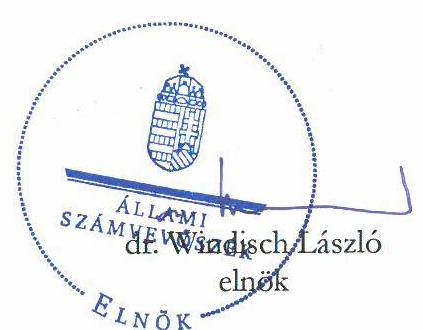

# ÁLLAMI   SZÁMVEVŐSZÉK 

## Vélemény

a Magyarország 2024. évi központi
költségvetéséről szóló törvényjavaslatról
2023.

---

# A Vélemény elkészítését irányította: 

ERDÉLYI ATTILA ellenőrzésvezető

## A Vélemény elkészítését felügyelte:

DR. PULAY GYULA vezető közgazdász

## Készítették:

ERDÉLYI ATTILA ELLENŐRZÉSVEZETŐ
CZEGLÉDI DÉNES SZÁMVEVŐ
DANKÓ CSILLA SZÁMVEVŐ
DUDÁS PÁL DÁNIEL SZÁMVEVŐ
HEIDINGER TIBOR SZÁMVEVŐ
HUSZÁRNÉ BORBÁS MELINDA SZÁMVEVŐ
JAKOVÁC KATALIN SZÁMVEVŐ
DR. KÁDÁR KRISZTA ELEMZÉSI TANÁCSADÓ
KISAPÁTI ANGÉLA SZÁMVEVŐ
KISTÓTH KRISZTINA SZÁMVEVŐ
KOVÁCS RICHÁRD SZÁMVEVŐ
DR. MÁRTON GABRIELLA SZÁMVEVŐ
MIHÁLSZKY KÁLMÁN SZÁMVEVŐ
DR. NAGY JUDIT SZÁMVEVŐ
NAGY ZSOLT SZÁMVEVŐ
STEINBACHER ANNAMÁRIA ANETT SZÁMVEVŐ
DR. REINELT SIMON ÁKOS SZÁMVEVŐ FOGALMAZÓ
TAKARÓ RITA SZÁMVEVŐ
TROJÁN TAMÁS EMIL SZÁMVEVŐ

## Kiadja az Állami Számvevőszék

EL-3852-177/2023

---

BEVEZETÉS ..... 3
ÖSSZEGZŐ ÉRTÉKELÉS ..... 5
RÉSZLETES ÉRTÉKELÉS ..... 8

1. A KÖLTSÉGVETÉS KÖZVETLEN BEVÉTELEI ÉS KIADÁSAI ..... 8
1.1. A költségvetés közvetlen bevételeinek számításokkal való megalapozottsága és teljesíthetősége ..... 8
1.2. A költségvetés közvetlen kiadásainak számításokkal való megalapozottsága és felülről nyitott kiadásainak elégségessége ..... 12
2. A REZSIVÉDELMI ALAP BEVÉTELEI ÉS KIADÁSAI ..... 14
2.1. A Rezsivédelmi Alap bevételeinek számításokkal való megalapozottsága és teljesíthetősége ..... 14
2.2. A Rezsivédelmi Alap kiadásainak számításokkal való megalapozottsága és felülről nyitott kiadásainak elégségessége ..... 15
3. A HONVÉDELMI ALAP BEVÉTELEI ÉS KIADÁSAI ..... 16
3.1. A Honvédelmi Alap bevételeinek számításokkal való megalapozottsága és teljesíthetősége ..... 16
3.2. A Honvédelmi Alap kiadásainak számításokkal való megalapozottsága ..... 17
4. MINISZTÉRIUMOK, ALKOTMÁNYOS ÉS EGYÉB FEJEZETEK BEVÉTELEI ÉS KIADÁSAI ..... 17
4.1. A bevételek számításokkal való megalapozottsága és teljesíthetősége ..... 17
4.2. A kiadások számításokkal való megalapozottsága és a felülről nyitott kiadások elégségessége ..... 18
5. A TÁRSADALOMBIZTOSÍTÁS PÉNZÜGYI ALAPJAINAK BEVÉTELEI ÉS KIADÁSAI ..... 20
5.1. A Társadalombiztosítás pénzügyi alapjai bevételeinek számításokkal való megalapozottsága és teljesíthetősége ..... 20
5.2. A Társadalombiztosítás pénzügyi alapjai kiadásainak számításokkal való megalapozottsága és felülről nyitott kiadásainak elégségessége ..... 23
6. UNIÓS FEJLESZTÉSEK BEVÉTELEI ÉS KIADÁSAI ..... 25
6.1. Az uniós fejlesztések bevételeinek számításokkal való megalapozottsága ..... 25
6.2. Az uniós fejlesztések kiadásainak számításokkal való megalapozottsága és felülről nyitott kiadásainak elégségessége ..... 25
7. AZ ADÓSSÁGSZOLGÁLATTAL KAPCSOLATOS BEVÉTELEK ÉS KIADÁSOK ..... 27
7.1. Az adósságszolgálattal kapcsolatos bevételek számításokkal való megalapozottsága és teljesíthetősége ..... 27
7.2. Az adósságszolgálattal kapcsolatos kiadások számításokkal való megalapozottsága és felülről nyitott kiadásainak elégségessége ..... 28
7.3. Az államadósság finanszírozásának várható alakulása ..... 28
8. AZ ÁLLAMI VAGYONNAL ÉS A NEMZETI FÖLDALAPPAL KAPCSOLATOS BEVÉTELEK ÉS KIADÁSOK ..... 31
8.1. A Nemzeti Földalappal kapcsolatos bevételek számításokkal való megalapozottsága és teljesíthetősége ..... 31

---

8.2. Az Állami vagyonnal kapcsolatos kiadások számításokkal való megalapozottsága ..... 31
9. AZ ELKÜLÖNÍTETT ÁLLAMI PÉNZALAPOK BEVÉTELEI ÉS KIADÁSAI ..... 31
9.1. Az elkülönített állami pénzalapok bevételeinek számításokkal való megalapozottsága és teljesíthetősége ..... 31
9.2. Az elkülönített állami pénzalapok kiadásainak számításokkal való megalapozottsága és felülről nyitott kiadásainak elégségessége ..... 32
10. HELYI ÖNKORMÁNYZATOK TÁMOGATÁSAINAK BEVÉTELEI ÉS KIADÁSAI ..... 33
10.1. Az önkormányzati szolidaritási hozzájárulás bevételi előirányzat számításokkal való megalapozottsága és teljesíthetősége ..... 33
10.2. A helyi önkormányzatok kiadásainak számításokkal való megalapozottsága ..... 33
11. ÁLLAMI BERUHÁZÁSOKRA ÉS FEJLESZTÉSEKRE TERVEZETT KIADÁSOK ..... 34
11.1. Az állami beruházások és fejlesztések kiadásainak számításokkal való megalapozottsága ..... 34
12. A KÖLTSÉGVETÉS TARTALÉKAI ..... 35
12.1. Rendkívüli kormányzati intézkedések (RKI) ..... 36
12.2. Járványügyi kiadások ..... 37
12.3. Beruházási Alap ..... 37
12.4. Céltartalékok ..... 37
13. A HIÁNYRA ÉS AZ ÁLLAMADÓSSÁG-SZABÁLYRA VONATKOZÓ TÖRVÉNYI ELŐÍRÁSOK TELJESÍTHETŐSÉGE ..... 38
13.1. A központi alrendszer hiánya és a Gst. szerinti hiánycél teljesülése ..... 38
13.2. Államadósság-szabály teljesülése ..... 39
14. A KÜLÖN ÉRTÉKELT TERÜLETEK KÖLTSÉGVETÉSRE GYAKOROLT HATÁSA ..... 40
14.1. A költségvetés három részköltségvetése ..... 40
14.2. Alkotmányos és nem a Kormány irányítása alatt álló fejezetek működési kiadásai ..... 41
14.3. A Magyar Nemzeti Bankkal szembeni térítési kötelezettség ..... 42
MELLÉKLETEK ..... 43

1. SZ. MELLÉKLET: KOCKÁZATOS ELŐIRÁNYZATOK ÉS TARTALÉKOK ..... 43
2. SZ. MELLÉKLET: BEVÉTELI ELŐIRÁNYZATOK, AMELYEK A TERVEZETT JOGSZABÁLYMÓDOSÍTÁSOK ELFOGADÁSÁVAL VÁLNAK TELJESÍTHETŐVÉ ..... 44
3. SZ. MELLÉKLET: ÁSZ VÉLEMÉNY ELKÉSZÍTÉSÉHEZ ADATOT SZOLGÁLTATÓ SZERVEZETEK (SZEMÉLYEK) ..... 45
3. SZ. MELLÉKLET: ÁSZ VÉLEMÉNY ELKÉSZÍTÉSÉHEZ FELHASZNÁLT NYILVÁNOSAN ELÉRHETŐ ADATOK ..... 46
FOGALOMTÁR ..... 49
RÖVIDÍTÉSJEGYZÉK ..... 51
JOGSZABÁLYOK JEGYZÉKE ..... 53

---

Az Állami Számvevőszék véleménye: a Magyarország 2024. évi központi költségvetéséről szóló törvényjavaslat megalapozott, a bevételi előirányzatok teljesíthetők.
dr. Windisch László
elnök

---

# BEVEZETÉS 

Az Állami Számvevőszék (ÁSZ) az Állami Számvevőszékről szóló 2011. évi LXVI. törvény (ÁSZ tv.) 5. § (1) bekezdése alapján véleményt ad az Országgyűlés számára a központi költségvetésről szóló törvényjavaslat megalapozottságáról, a bevételi előirányzatok teljesíthetőségéről. Az ÁSZ a véleményadással támogatja az Országgyűlést a megalapozott döntéshozatalban a költségvetési törvényjavaslatról. A véleményadás keretében az ÁSZ rámutat Magyarország 2024. évi központi költségvetésről szóló törvényjavaslat (2024. évi Kvtv. javaslat) kockázataira, amelyek kezelése így időben megtörténhet az Országgyűlés által.

Az ÁSZ véleményadásának célja annak rögzítése, hogy a feltárt kockázatok veszélyeztetik-e a költségvetési hiányra vonatkozó előírások és az államadósság-szabály teljesülését. E célkitűzés keretében az ÁSZ értékelte, hogy a költségvetési törvényjavaslat bevételi és kiadási előirányzatainak összegét a jogszabályokban (Áht, Ávr.) és a Pénzügyminisztérium által közzétett Tervezési Tájékoztatóban megfogalmazott követelményeknek megfelelően, illetve a törvényjavaslat indokolásának mellékletében ismertetett makrogazdasági prognózis figyelembevételével tervezték-e meg. A véleményadás kiterjed továbbá arra, hogy a Magyarország gazdasági stabilitásáról szóló 2011. évi CXCIV. törvényben (Gst.) foglaltak alapján érvényesül-e a hiánycélra vonatkozó, valamint a Magyarország Alaptörvényében (Alaptörvény) és a Gst-ben meghatározott államadósságmutató csökkenésére vonatkozó követelmény (államadósság-szabály).

A költségvetési törvényjavaslat számvevőszéki véleményezéséhez három lényeges kérdéskör kapcsolódik.

1. A központi költségvetésről szóló törvényjavaslat előirányzatai számításokkal megalapozottak-e?
2. A bevételi előirányzatok teljesíthetők-e?
3. Az azonosított kockázatok - a tartalékok figyelembevételével - veszélyeztetik-e az államadósság-szabály és a hiányra vonatkozó törvényi előírások teljesíthetőségét?
A számvevőszéki értékelés kiterjedt a költségvetési törvényjavaslatban tervezett és statisztikai mintavétellel kiválasztott bevételi és kiadási előirányzatok számításokkal való megalapozottságára, a lényeges összegű bevételi előirányzatok teljesíthetőségére, valamint a felülről nyitott lényeges összegű kiadási előirányzatok elégségességének vizsgálatára. A statisztikai mintavétel biztosította, hogy az ÁSZ a minta alapján 95 százalékos megbízhatósággal megállapítsa a törvényjavaslat előirányzatainak összessége számításokkal megalapozott-e. A véleményadás 22 szervezet adatszolgáltatása, valamint nyilvánosan elérhető adatbázisok felhasználásával készült, az ÁSZ honlapján ${ }^{1}$ elérhető módszertan alapján. Az adatszolgáltató szervezeteket (személyeket) a Vélemény 3. sz. melléklete „ÁSZ Vélemény elkészítéséhez adatot szolgáltató szervezetek (személyek)", a felhasznált nyilvánosan elérhető adatbázisok körét a 4. sz. melléklete „ÁSZ Vélemény elkészítéséhez felhasznált nyilvánosan elérhető adatok" mutatja be. Az ÁSZ Véleményben megjelenő témához kapcsolódó és a módszertanból eredő szakkifejezések, minősítések meghatározását a „Fogalomtár", a Véleményben alkalmazott rövidítéseket a „Rövidítésjegyzék", a véleményezés során figyelembe vett jogszabályokat a „Jogszabályok jegyzéke" tartalmazza. Az ÁSZ Vélemény az adatszolgáltatók által a 2023. június 6. 12:00 óráig rendelkezésre bocsájtott adatokat vette figyelembe.
[^0]
[^0]:    ${ }^{1}$ https://www.asz.hu/dokumentumok/Modszertani_utmutato_kozponti_kv_elemzes.pdf

---

# ÖSSZEGZŐ ÉRTÉKELÉS 

A 2024. évi Kvtv. javaslat a 2023-2027. évre vonatkozóan elkészített Konvergencia Programmal összhangban 2024. évre 4,0%-os gazdasági növekedéssel, 6,0%-os inflációval, és 2,9%-os GDP-arányos hiánycéllal tervez. Az ÁSZ annak feltételezésével végezte el a 2024. évi Kvtv. javaslat értékelését, hogy a kormányzat által meghatározott makrogazdasági prognózisok teljesülnek, tekintettel arra, hogy a Költségvetési Tanács megítélése szerint „a külső és belső feltételek kedvező alakulása esetén a kormányzati prognózis szerinti gazdasági növekedés megvalósulhat, de azt számos kockázat övezi". A makrogazdasági kockázatokat az ÁSZ Vélemény nem értékeli.

A 2024. évi Kvtv. javaslat szerinti pénzforgalmi hiány a hazai felhalmozási költségvetés 1388,8 Mrd Ft-os hiányából és az európai uniós fejlesztési költségvetés 1 126,0 Mrd Ft-os hiányából tevődik össze. A működési költségvetés egyenlege az elmúlt hat év gyakorlatának megfelelően nulla. A 2023. évi költségvetési törvényhez képest a 2024. évi Kvtv. javaslatban a hazai felhalmozási költségvetés hiánya 462,4 Mrd Ft-tal, míg az uniós fejlesztési költségvetés hiánya 423,0 Mrd Ft-tal csökkent. Mindez az állami beruházások 2022. év második felétől jellemző visszafogását, illetve az uniós programok finanszírozásának mérséklését mutatja, ami költségvetési egyenleg javító, valamint infláció csökkentő hatású.

A 2024. évi Kvtv. javaslat indokolása alapján a kormányzati szektor hiánya 2 506,5 Mrd Ft, amely a 2024. évre tervezett nominális GDP 2,9%-a, ami a 2023. év végére várt értéknél 1,0 százalékponttal alacsonyabb. A 2024. év végére tervezett kormányzati szektor hiány értéke 3,0%-nál alacsonyabb, ami megfelel a Gst. 3/A. § (2) bekezdés b) pontjában meghatározott előírásnak.

A 2024. évi Kvtv. javaslat szerint az államadósság-mutató 2024. december 31-ére tervezett mértéke a 2023. december 31-én várható 69,7%-ról 66,7%-ra csökken, ezáltal a 2024. év végére tervezett államadósság-mutató mértéke megfelel az Alaptörvény 36. cikk (5) bekezdésében és a Gst. 4. § (2a) bekezdésében meghatározott államadósság-mutatóérték csökkenés követelményének.

A 2024. évi Kvtv. javaslat előirányzatai közül a számításokkal való megalapozottság értékelése céljából kiválasztott 67 db bevételi előirányzat a bevételi főösszeg 97%-át tette ki, melyek összegének 100,0%-a számításokkal megalapozott. A számításokkal való megalapozottság értékeléséhez kiválasztott 161 db kiadási előirányzat a kiadási főösszeg 90%-át tette ki, melyek összegének 98,7%-a számításokkal megalapozott.

Az LXXII. Egészségbiztosítási Alap kiadásai közül a Háziorvosi, háziorvosi ügyeleti ellátás 2024. évre tervezett kiadási előirányzata 258,8 Mrd Ft, amely 0,4%-kal (1,1 Mrd Ft-tal) haladja meg a 2023. évi várható összeget. A tervezési dokumentáció a csekély összegű növekedésre vonatkozóan kellő részletezettségű indokolást nem tartalmaz, az előirányzat 2024. évi tervezett összegét szöveges indokolásokkal nem alapozták meg. Az XVI. Építési és Közlekedési Minisztérium fejezeten belül a Víziközmű-fejlesztések 55,8 Mrd Ft összegű, valamint a XXIII. Gazdaságfejlesztési Minisztérium Gazdaságfejlesztési programok 200,4 Mrd Ft összegű kiadási előirányzatainak tervezési dokumentációiban megjelölt forrásigények magasabbak a 2024. évi Kvtv. javaslatban szereplő előirányzatok összegénél. Ebből következően az előirányzatok megalapozottságát a tervezési dokumentációk szerinti számítások nem támasztják alá. Összességében a 2024. évi Kvtv. javaslat előirányzatai számításokkal megalapozottak.

---

A 2024. évi Kvtv. javaslat lényeges összegű bevételi előirányzatai (összértékük a bevételi főösszeg 86,1%-át tette ki) teljesíthetőségének értékelésére kiválasztott előirányzatok összegének 99,8%-a teljesíthető, 0,2%-a teljesíthetőségi kockázatot hordoz.

Az ÁSZ számításai szerint a Jövedéki adó 1677,7 Mrd Ft összegéből 53,0 Mrd Ft teljesíthetőségi kockázatot hordoz, így a törvényjavaslat bevételeinek becsült kockázata 53,0 Mrd Ft.
Mindezek alapján összességében a 2024. évi Kvtv. javaslat bevételei teljesíthetők, a kormányzat makrogazdasági prognózisának megvalósulása esetén.

A lényeges összegű bevételi előirányzatok közül a Jövedéki adó tervezett összegéből 215,2 Mrd Ft, a Bírságbevételek tervezett összegéből 26,1 Mrd Ft, a Megtett úttal arányos útdíj tervezett összegéből 118,5 Mrd Ft, az Időalapú útdíj tervezett összegéből 1,5 Mrd Ft a tervezett jogszabálymódosítás elfogadásával válik teljesíthetővé. Emellett a közműadó tervezett bevételéből a tervezett jogszabályváltozás elfogadásával 12,0 Mrd Ft-tal kevesebb teljesülhet. A tervezett jogszabályváltozások költségvetési hatása így összesen +349,3 Mrd Ft, az előirányzatokhoz tartozó változással érintett jogszabályokat, valamint azok előirányzatonkénti költségvetési hatásait a Vélemény 2. számú melléklete „Bevételi előirányzatok, amelyek a tervezett jogszabálymódosítások elfogadásával válnak teljesíthetővé" mutatja be.

A 2024. évi Kvtv. javaslat felülről nyitott lényeges összegű kiadási előirányzatai (összértékük a kiadási főösszeg 47,2%-át tette ki) elégségességének értékelésére
 kiválasztott előirányzatok összegének 99,9%-a elégséges, míg 0,1%-a nem elégségességi kockázatot hordoz a feladatok ellátására és/vagy a működés finanszírozására.

A tervezési dokumentációk alapján a Tizenharmadik havi nyugdíj visszaépítésének támogatása 449,0 Mrd Ft esetében 5,7 Mrd Ft, az M5, M6 autópálya rendelkezésre állási díjak 172,6 Mrd Ft esetében 4,2 Mrd Ft, az Eximbank Zrt. kamatkiegyenlítése 110,0 Mrd Ft tekintetében 7,1 Mrd összegű túllépés valószínűsíthető.
Ebből eredően az elégségességi kockázat becsült összege 17,0 Mrd Ft.
A XLV. Állami beruházások fejezeten belül az Egyedi magasépítési beruházások 111,1 Mrd Ft összege, illetve az Állami közútfejlesztési beruházások 109,6 Mrd Ft összegű kiadási előirányzata számításokkal megalapozott, azonban a tervezési dokumentációk alapján az előirányzatok akkor elégségesek, ha a szervezetek a már ismert kötelezettségeket időben átütemezik.

Az előirányzatok értékelése alapján azonosított kockázatok kezelésére a költségvetési törvényjavaslatban tervezett központi tartalékok közül a Rendkívüli kormányzati intézkedések 220,0 Mrd Ft összege fedezetet biztosít.

A hiánycél teljesítése szempontjából kiemelt kockázatot jelent, hogy a magyar gazdaság védelmét és az infláció visszaszorítását célzó monetáris politika következtében a Magyar Nemzeti Bank (MNB) 2022. év után 2023-ban is súlyos veszteséget kénytelen majd elkönyvelni, melynek mértéke 1855 Mrd Ft körül alakulhat. Ennek bekövetkezése esetén a Magyar Nemzeti Bankról szóló 2013. évi CXXXIX. törvény (MNB tv.) 166. §-a értelmében a saját tőke és a jegyzett tőke különbözetét a központi költségvetésnek öt éven belül, évente egyenlő részletben az MNB eredménytartaléka javára közvetlenül meg kell térítenie. A térítés hatályos jogszabályok szerinti – 2024. évi összege várhatóan eléri a GDP 0,5 százalékát, amely nagyságrendileg 430 Mrd Ft-ot tesz ki. A 2024-ben esedékessé váló térítési kötelezettség az államadósság-szabály betarthatóságát nem veszélyezteti.

---

Az előirányzatok számításokkal való megalapozottsága értékelésekor az ÁSZ azt is vizsgálta, hogy a fejezeti irányító szervek, a tervezést a meghatározó jogszabályokban, kormányhatározatokban, valamint a Pénzügyminisztérium által közzétett Tervezési tájékoztatóban foglaltaknak megfelelően végezték-e. Ugyanakkor a Tervezési tájékoztató a költségvetési hiány csökkentése érdekében általában nem tette lehetővé az ez évre, illetve a 2024. évre a kormányzat által prognosztizált infláció kompenzálását a működési kiadásokban, sőt egyes területeken abszolút összegben is mérsékelték a működési kiadási előirányzatokat. Ezt azt jelenti, hogy a kiadási előirányzatok csak rendkívüli takarékossági intézkedések esetén lesznek elégségesek az intézmények működtetésére.

Az előbbi szempontból kockázatos, hogy a véleményadás során véletlen statisztikai mintavétellel kiválasztott 10 intézmény közül 5 esetében nominálisan vagy reálértéken csökkent 2023. évhez képest a 2024. évre tervezett egyéb működési kiadás összege. Továbbá kockázatot jelent, hogy a helyi önkormányzatok támogatásai fejezeten belül a 2023. évi várható értékhez képest csökkent a 2024. évre tervezett összege az egyes szociális és gyermekjóléti feladatok működési célú támogatásának, illetve a 2024. évre prognosztizált infláció mértékénél kisebb mértékben növekszik a települési önkormányzatok működésének általános támogatása, valamint a gyermekétkeztetési feladatok támogatása. Az alkotmányos fejezeteken és egyéb, nem a Kormány irányítása alá tartozó fejezeteken értékelt 23 szervezet közül 2023. évről 2024. évre 12 intézménynél csökken nominálisan az egyéb működési kiadások előirányzatainak összege. Reálértékben az értékelésbe vont hivataloknál mintegy 7,4%-kal csökkennek a működési kiadások. Mindezen előirányzat-csökkentések és csekély (tervezett infláció üteme alatti) emelések kockázatot jelentenek a jelentős saját bevétellel nem rendelkező helyi önkormányzatok és a költségvetési intézmények működésére és közfeladatainak ellátására.

---

# RÉSZLETES ÉRTÉKELÉS

## 1. A KÖLTSÉGVETÉS KÖZVETLEN BEVÉTELEI ÉS KIADÁSAI

### 1.1. A költségvetés közvetlen bevételeinek számításokkal való megalapozottsága és teljesíthetősége

A XLII. A költségvetés közvetlen bevételei és kiadásai fejezet bevételi előirányzatai számításokkal megalapozottak és teljesíthetők. A Jövedéki adó 1677,7 Mrd Ft összegű bevételi előirányzatának teljesíthetősége azonban 139,4 Mrd Ft összegű kockázatot hordoz. A Bírságbevételek, a Megtett úttal arányos útdíj, valamint az Időalapú útdíj bevételi előirányzatok teljesíthetőségéhez a tervezést megalapozó jogszabályváltozások elfogadása szükséges.

A XLII. A költségvetés közvetlen bevételei és kiadásai fejezet 2024. évre tervezett bevételi előirányzatainak összege 21 127,0 Mrd Ft, a 2023. évi módosított törvényi előirányzatot (19 449,3 Mrd Ft) 8,6%-kal, a 2022. évi előzetes teljesítést (15 669,6 Mrd Ft) 34,8%-kal haladja meg.

A XLII. A költségvetés közvetlen bevételei és kiadásai fejezet lényeges adóbevételi előirányzatait mutatja be az 1. táblázat 2022-2024. évre vonatkozóan.

1. táblázat

A lényeges adóbevételi előirányzatok tervezési és teljesítési adatai 2022-2024. között Mrd Ft-ban és %-ban

|  Értékelt előirányzat | 2022. évi előzetes teljesítés (Mrd Ft) | 2023. évi előirányzat (Mrd Ft) | 2024. évi
terv
(Mrd Ft) | 2024. évi
terv/2022.
évi előzetes
teljesítés (%) | 2024. évi
terv/2023.
évi
előirányzat
(%)  |
|---|---|---|---|---|---|
|  Általános forgalmi adó | 6860,3 | 7986,0 | 8574,0 | 125,0% | 107,4%  |
|  Jövedéki adó | 1229,5 | 1464,9 | 1677,7 | 136,5% | 114,5%  |
|  Társasági adó | 746,6 | 1004,9 | 1153,3 | 154,5% | 114,8%  |
|  Személyi jövedelemadó | 2786,0 | 4060,5 | 4475,8 | 160,7% | 110,2%  |
|  Lakossági illetékek | 261,8 | 273,7 | 280,1 | 107,0% | 102,3%  |
|  Kisadózók tételes adója | 186,1 | 81,2 | 77,8 | 41,8% | 95,8%  |
|  Kisvállalati adó | 145,5 | 183,6 | 227,6 | 156,4% | 124,0%  |
|  Kiskereskedelmi adó | 176,7 | 205,2 | 249,7 | 141,3% | 121,7%  |
|  Gépjárműadó | 95,9 | 100,5 | 101,3 | 105,6% | 100,8%  |
|  Cégautóadó | 49,8 | 78,8 | 80,8 | 162,2% | 102,5%  |
|  Rehabilitációs hozzájárulás | 135,6 | 157,9 | 173,8 | 128,2% | 110,1%  |
|  Pénzügyi tranzakciós illeték | 293,6 | 332,4 | 348,3 | 118,6% | 104,8%  |

Forrás: MÁK ÁHT mérleg 2022. 12. hó, 2023. 04. hó, 2024. év Kvtv. javaslat alapján ÁSZ szerkesztés Az Általános forgalmi adó előirányzat tervezett összege 8 574,0 Mrd Ft, amely a 2023. évi előirányzathoz képest 7,4%-os növekedést jelent. A tervezés során a 2023. évi - az éves előirányzattól 184,6 Mrd Ft-tal elmaradó - várható teljesülésből indultak ki, amelynek oka a kiskereskedelmi forgalom jelentős visszaesése. A tervezésnél figyelembe vették a folyóáras

---

lakossági fogyasztás, az államháztartási szektor vásárlásainak alakulását és a beruházási index prognózisát. Évközi, bevételt befolyásoló intézkedéssel nem számoltak.

A Társasági adó előirányzat tervezett összege 1153,3 Mrd Ft, mely a 2023. évi előirányzathoz képest 14,8%-os növekedést jelent. A tervezés során a 2023. évi várható, az előirányzatnál 14,9 Mrd Ft-tal kisebb teljesülésből indultak ki, amelynek oka, hogy 2022. évi vártnál kisebb adóalap miatt a 2023. évben fizetendő adóelőleg kisebb, mint a tervezett. Az adónem tervezése összhangban van a figyelembe vett makrogazdasági paraméterek (versenyszféra bruttó hozzáadott értéke, bruttó működési eredménye és vegyes jövedelme, vállalatok bruttó állóeszköz-felhalmozása) prognózisával.

A Személyi jövedelemadó előirányzat tervezett összege 4475,8 Mrd Ft, mely a 2023. évi előirányzathoz képest 10,2%-os növekedést jelent. A tervezés során a 2023. évi várható teljesülésből indultak ki, amely meghaladja az előirányzatot. A tervezés figyelembe vette a bruttó bér- és keresettömeg 10,7%-os és a bruttó átlagkereset 10,3%-os növekedését, valamint a foglalkoztatottak számának 0,4%-os tervezett növekedését. 2024-ben az adókedvezmények fennmaradásával számoltak és figyelembe vették a 2024-ben ismert, az SZJA bevételt érintő 2024. évi várható bérfejlesztések (a rendvédelmi szerveknél 2024. januárjában illetményemelés, valamint az egészségügyi szakdolgozók és az egészségügyben dolgozók béremelése) hatását.

A Lakossági illetékek előirányzat tervezett összege 280,1 Mrd Ft, mely a 2023. évi előirányzathoz képest 2,3%-os növekedést jelent. A 2023. évi előirányzathoz viszonyított átlagosnál kisebb növekmény oka, hogy az illeték kiszabása és a pénzforgalom időben eltér egymástól, és ezért a gazdasági változások hatása lassabban érvényesül ezen előirányzatnál. A tervezés során figyelembe vették a csökkenő kamatkörnyezet eredményeként fellendülő lakáspiacot.

A Kisadózók tételes adója előirányzat tervezett összege 77,8 Mrd Ft, mely a 2023. évi előirányzathoz képest 4,2%-os csökkenést jelent. Ennek hátterében az áll, hogy a 2023. évi várható bevétel elmarad a tervezettől, az adóalanyok számának jelentős csökkenése miatt. Évközi, bevételeket befolyásoló intézkedést nem terveztek, valamint nem számoltak az adóalanyok számának növekedésével.

A Kisvállalati adó előirányzat tervezett összege 227,6 Mrd Ft, mely a 2023. évi előirányzathoz képest 24,0%-os növekedést jelent. A tervezés során figyelembe vették egyrészt a versenyszféra bruttó bér- és keresettömegének várható bővülését (2024. évre 11,2%), másrészt az adóalanyi kör várható bővülésének ütemét (kb. 2600 új vállalkozás), illetve azon intézkedéseket, melyek befolyásolhatják az adónemből származó bevételek alakulását.

A Kiskereskedelmi adó előirányzat tervezett összege 249,7 Mrd Ft, mely a 2023. évi előirányzathoz képest 21,7%-os növekedést jelent. A tervezés során figyelembe vették a bázisévi folyamatokat, a vásárolt fogyasztás várható növekedését, valamint az extraprofitadóra vonatkozó jogszabály-módosítás hatását. A 2023-hoz viszonyított 2024. évi növekmény egyrészt a vásárolt fogyasztás növekedéséből ered, másrészt az extraprofitadó 2024. évben is alkalmazásra kerül azzal, hogy a felső kulcsa emelkedik a jelenlegi 4,1%-ról 4,5%-ra (206/2023. (V. 31.) Korm. rendelet alapján).

A Gépjárműadó előirányzat tervezett összege 101,3 Mrd Ft, mely a 2023. évi előirányzathoz képest 0,8%-os növekedést jelent. A tervezés során figyelembe vették a bázisévi folyamatokat, illetve a személygépjárművek számának várható alakulását. A tervezési dokumentum nem tervez jogszabályi változásokkal.

---

A Cégautóadó előirányzat tervezett összege 80,8 Mrd Ft, mely a 2023. évi előirányzathoz képest 2,5%-os növekedést jelent. A tervezés során figyelembe vették a bázisévi folyamatokat, illetve a cégautóállomány várható alakulását.

A Rehabilitációs hozzájárulás előirányzat tervezett összege 173,8 Mrd Ft, mely a 2023. évi előirányzathoz képest 10,1%-os növekedést jelent. A tervezés során figyelembe vették a bázisévi folyamatokat, illetve a várható létszámnövekedést és minimálbéremelést.

A Jövedéki adó előirányzat tervezett összege 1 677,7 Mrd Ft, amely a 2023. évi előirányzathoz képest 14,5%-os növekedést jelent. A tervezés során a 2023. évben várható, az előirányzatnál kisebb (a tervezési dokumentáció által nem számszerűsített) teljesülésből indultak ki, mely csökkenés oka az év első hónapjaiban a csökkenő üzemanyag-forgalom. A 2024. évi adóbevétel tervezésénél figyelembe vették a reál GDP növekedését, a változatlan áras lakossági fogyasztási kiadás változását. Kalkuláltak az uniós jogharmonizációs kötelezettség miatti, 2024. január 1-től hatályos jövedéki adómérték-emeléssel az energiatermékekre. Mindezek mellett a tervezési dokumentáció figyelembe vette, de nem számszerűsítette a dohánypiaci trendeket, az energiafelhasználás mértékének változását, illetve az ezekből eredő, 2024. évre becsült költségvetési hatást. Az ÁSZ a 2023. I-IV. havi teljesülési adatok és az ismert paraméterek alapján kiszámolta a jövedéki adóból származó, várható 2023. és 2024. évi bevételeket. Figyelemmel a bázisév várhatóan alacsonyabb teljesülésére a jövedéki adóból származó bevételek abban az esetben teljesíthetők 2024-ben, amennyiben az üzemanyag-fogyasztás bővülése elérné a reál GDP tervezett, 4%-os növekedését. Ezzel szemben a
 2024. január 1-jétől megnövekedő adóteher következtében indokolt az üzemanyag fogyasztás szerény mértékű (1\%-os) mérséklődésével számolni. Az ÁSZ számítása szerint 95\%-os bázisévi teljesülés és 1\%-os üzemanyag-fogyasztás csökkenés mellett az adóbevétel-elmaradás becsült összege 53,0 Mrd Ft, amely az előirányzat összegének 3,2\%-át teszi ki.

A XLII. A költségvetés közvetlen bevételei és kiadásai fejezet lényeges további bevételi előirányzatai összegének tervezett és előzetes teljesítési adatait mutatja be a 2. táblázat 2022-2024. évre vonatkozóan.
2. táblázat

A lényeges bevételi előirányzatok tervezési és teljesítési adatai 2022-2024. között Mrd Ftban és %-ban

| Értékelt előirányzat | 2022. évi   előzetes   teljesítés   (Mrd Ft) | 2023. évi   előirányzat   (Mrd Ft) | 2024. évi   terv   (Mrd Ft) | 2024. évi   terv/2022.   évi előzetes   teljesítés (\%) | 2024. évi   terv/2023.   évi   előirányzat   (\%) |
| :-- | :--: | :--: | :--: | :--: | :--: |
| Vegyes bevételek | 76,7 | 219,5 | 324,7 | $423,3 \%$ | $147,9 \%$ |
| Bírságbevételek | 60,5 | 54,5 | 80,6 | $133,2 \%$ | $147,9 \%$ |
| Megtett úttal arányos   útdíj | 277,1 | 310,4 | 447,0 | $161,3 \%$ | $144,0 \%$ |
| Időalapú útdíj | 84,5 | 100,2 | 102,0 | $120,6 \%$ | $101,8 \%$ |

Forrás: MÁK 2022.12. hó, 2023. évi Kvtv., 2024. év Kvtv. javaslat alapján ÁSZ szerkesztés
A 2. táblázatban bemutatott lényeges bevételi előirányzatok számításokkal megalapozottak és teljesíthetők, azonban a Bírságbevételek, a Megtett úttal arányos útdíj,

---

valamint az Időalapú útdíj bevételi előirányzatok teljesíthetőségéhez a tervezést megalapozó jogszabályváltozások elfogadása szükséges.

A Vegyes bevételek előirányzat tervezett összege 324,7 Mrd Ft, mely a 2023. évi előirányzathoz képest 47,9\%-os növekedést jelent. Az előirányzaton belül a legnagyobb tétel a pedagógus bérekkel függ össze, melynek 297,8 Mrd Ft-os tervezett összege - az EFOP Plusz 2. prioritásához kapcsolódóan technikai tételként- az egyéb bevételek között jelenik meg. Továbbá 2024. évre is számolnak a 2019. július 1-től elindult családvédelmi akcióterv részét képező babaváró támogatásokhoz kapcsolódó kezesi díjbevételekkel, valamint a Gazdaságvédelmi Akcióterv keretében meghirdetett hitel- és garanciaprogramok, illetve a bank korábbi állami kezességgel biztosított ügyletei utáni befizetésekkel.

A Bírságbevételek előirányzat tervezett összege 80,6 Mrd Ft, ami a 2023. évi előirányzathoz képest 47,9\%-os növekedést jelent. A tervezés során bírságok mértékének 30\%-kal történő tervévi emelkedésével kalkuláltak a kapcsolódó jogszabály-módosítások alapján. A jogszabálymódosítások a véleményadás időszakában még nem készültek el, ugyanakkor hatásukra 26,1 Mrd Ft bevétel keletkezhet.

A Megtett úttal arányos útdíj előirányzat tervezett összege 447,0 Mrd Ft, ami a 2023. évi előirányzathoz képest 44,0\%-os növekedést jelent. A tervezés során tárgyévi bevételek időarányos alakulását, valamint a bevétel alakulását meghatározó tényezőkkel (naptárhatás, forgalmi hatás, fogyasztói árindex növekedéséből fakadó díjemelés) számoltak. A tervek szerint a megtett úttal arányos e-útdíj rendszerben 2024. évben több módosítás várható, ugyanakkor a végrehajtáshoz szükséges intézkedésekről szóló jogszabálymódosítás még nem került elfogadásra. A tervezett jogszabálymódosítás költségvetési hatásával ugyanakkor már számoltak, amelynek összege 118,5 Mrd Ft.

Az Időalapú útdíj előirányzat tervezett összeg 102,0 Mrd Ft, ami a 2023. évi előirányzathoz képest 1,8\%-os növekedést jelent. A tervezés során figyelemmel voltak a tényleges teljesülés báziselőirányzattól való kis mértékű elmaradására, továbbá a forgalmi hatás növekedésével és a fogyasztói árindex díjkalkulációban történő indexálásának lehetőségével számoltak. A tervek szerint az időalapú útdíj esetében 2024. évre vonatkozóan megtörténik az új útszakaszok díjasítása, ennek kihatását a bevételi összeg kialakítása során figyelembe vették. A tervezéskor továbbá kalkuláltak azzal, hogy a díjrendszereket működtető NÚSZ Zrt. az általa beszedett útdíj bevételekből az 576/2022. (XII. 23.) Korm. rendelet szerinti működtetési költséget levonja és az így fennmaradó bevételek illetik meg a költségvetést. A tervezett jogszabálymódosítás költségvetési hatásával ugyanakkor már számoltak, amelynek összege 1,5 Mrd Ft.

A XLII. A költségvetés közvetlen bevételei és kiadásai fejezet bevételei közül számításokkal való megalapozottság értékeléséhez kiválasztott Közműadó 41,4 Mrd Ft összege, a Turizmusfejlesztési hozzájárulás 54,5 Mrd Ft összege, a Nemzeti Kutatási, Fejlesztési és Innovációs Alap befizetése előirányzat 27,0 Mrd Ft összege, a KAP Stratégiai Terv Vidékfejlesztési Intézkedései előirányzat 90,0 Mrd Ft összege, a Vámbeszedési költség megtérítése előirányzat 38,6 Mrd Ft összege, a Kohéziós Operatív Programok előirányzat 178,7 Mrd Ft összege, a Vidékfejlesztési Program (VP) előirányzat 190,0 Mrd Ft összege, a Helyreállítási és Ellenállóképességi Eszköz (RRF) előirányzat 767,1 Mrd Ft összege, valamint a Kohéziós Operatív Programok 2021-2027 előirányzat 1 091,7 Mrd Ft összege számításokkal megalapozott. Az RRF, valamint a Kohéziós Operatív Programok 2021-2027 előirányzatok 2024. évi tervezett összegét az ÁSZ a véleményadás során nem minősítette teljesíthetőség

---

szempontjából, tekintettel az uniós források biztosításával kapcsolatban felmerült bizonytalanságokra, az elhúzódó döntési folyamatra.

# 1.2. A költségvetés közvetlen kiadásainak számításokkal való megalapozottsága és felülről nyitott kiadásainak elégségessége 

A XLII. A költségvetés közvetlen bevételei és kiadásai fejezet 2024. évre tervezett kiadási előirányzatainak összege 5 298,1 Mrd Ft, a 2023. évi módosított törvényi előirányzatnál (5 367,5 Mrd Ft) 1,3\%-kal alacsonyabb, a 2022. évi előzetes teljesítést (2 178,0 Mrd Ft) 143,3\%-kal haladja meg. A fejezet kiadásai összegének 37,2\%-a felülről nyitott lényeges kiadási (a 2024. évi Kvtv. javaslat kiadási főösszeg 0,15\%-ánál nagyobb összegű) előirányzatnak minősül.

A XLII. A költségvetés közvetlen bevételei és kiadásai fejezet lényeges felülről nyitott kiadási előirányzatai adatait mutatja be a 3. táblázat 2022-2024. évre vonatkozóan.
3. táblázat

A lényeges kiadási előirányzatok tervezési és teljesítési adatai 2022-2024. között Mrd Ftban és %-ban

| Értékelt előirányzat | 2022. évi előzetes teljesítés (Mrd Ft) | 2023. évi előirányzat (Mrd Ft) | 2024. évi   terv   (Mrd Ft) | 2024. évi terv/2022.   évi előzetes   teljesítés (\%) | 2024. évi terv/2023.   évi   előirányzat   (\%) |
| :--: | :--: | :--: | :--: | :--: | :--: |
| Babaváró támogatások | 126,2 | 178,2 | 227,0 | $179,8 \%$ | $127,4 \%$ |
| Lakástámogatások | 634,8 | 382,9 | 181,7 | $28,6 \%$ | $47,5 \%$ |
| Szociálpolitikai menetdíj támogatás | 118,4 | 105,0 | 106,0 | $89,5 \%$ | $101,0 \%$ |
| Tizenharmadik havi nyugdíj visszaépítésének támogatása | 351,0 | 418,0 | 449,0 | $127,9 \%$ | $107,4 \%$ |
| Hozzájárulás az EU költségvetéséhez | 586,3 | 662,2 | 692,4 | $118,1 \%$ | $104,6 \%$ |
| Filmszakmai közvetett támogatások mozgókép törvény szerinti kiegészítő finanszírozása | 50,7 | 38,0 | 63,0 | $124,3 \%$ | $165,8 \%$ |
| Központi Nukleáris Pénzügyi Alap támogatása | 34,1 | 80,8 | 94,6 | $277,4 \%$ | $117,1 \%$ |

Forrás: MÁK ÁHT mérleg, MÁK 2022. 12. hó, 2023. 04. hó, 2024. év Kvtv. javaslat alapján ÁSZ szerkesztés

A Babaváró támogatások előirányzat tervezett összege 227,0 Mrd Ft. A Kormány az egyes családpolitikai intézkedésekről szóló kormányrendeletek módosításáról szóló 595/2022. (XII. 28.) Korm. rendeletével két évvel, 2024. december 31-ig meghosszabbította a babaváró hitel igénylésének határidejét. A tervezés során a babaváró támogatásokhoz kapcsolódó kamattámogatás összegét a 2023. évi várható összeghez képest 18,4 Mrd Ft-tal, a tartozások törlesztésének támogatására fordított összeget a 2023. évi várható összeghez képest 32,4 Mrd Ft-tal megemelték, a banki költségtérítés összegét a 2023. évi várható összeghez képest 2,0 Mrd Ft-tal csökkentették.

A Lakástámogatások előirányzat tervezett összege 181,7 Mrd Ft, ami a 2023. évi várható értékénél 52,5\%-kal (201,2 Mrd Ft-tal) kevesebb, ennek hátterében a tervezés során

---

figyelembe vett Lakástámogatási rendszer átalakítása áll. Az Otthonfelújítási Támogatás és az ehhez 2021. februárjától kapcsolódó kölcsön 2022. december 31-ével megszüntetésre került, a napkollektor vagy napelemes rendszer telepítését tartalmazó kérelmek esetén a beadási határidő 2023. március 31-ig meghosszabbításra került. Az Otthonfelújítási Támogatás áthúzódó hatásának tervezett összege a 2023. évre 123,0 Mrd Ft. Továbbá a Családi otthonteremtési kedvezmény összege a 2023. évhez képest 44,5 Mrd Ft-tal, az Adóvisszatérítési támogatás összege 15,7 Mrd Ft-tal, a Lakástakarékpénztári megtakarítások támogatásának összege 16,9 Mrd Ft-tal csökkent.

A Szociálpolitikai menetdíj támogatás előirányzat tervezett összege 106,0 Mrd Ft, a tervezés során a 2022. évi 118,4 Mrd Ft előzetes teljesülési adatot és a 2023. évi I-IV. havi teljesítés összegét (41,4 Mrd Ft) tekintették alappályának. Továbbá a tervezés során az 1036/2023. (II.20.) Korm. határozat által 2023. május 1-től bevezetett helyközi ország- és vármegyebérlet hatásvizsgálata keretében előrejelzett, 12,0 Mrd Ft összegű szociálpolitikai menetdíj támogatás igénybevétel csökkenéssel kalkuláltak.

A Tizenharmadik havi nyugdíj visszaépítésének támogatása előirányzat tervezett összege 449,0 Mrd Ft. Tervezéskor a 2023. februárjában - 15\% infláció miatti emelést már tartalmazó - 13. havi nyugdíjra kifizetett összeget (423,9 Mrd Ft) növelték meg a 2024. évre tervezett 6,0\%-os fogyasztói árindex-szel. A tervezés során azonban nem számoltak azzal a cserélődési hatással, amelyet az átlagnyugdíjak - a 2023. évi új belépők miatti - emelkedése jelent. Az ebből származó nyugdíjnövekedés az ÁSZ becslése szerint 2023-ban 1,2\%. Erre tekintettel a Tizenharmadik havi nyugdíj visszaépítésének támogatása 2024. évi 449,0 Mrd Ft előirányzata számításokkal megalapozott, de nem elégséges, az alultervezés becsült kockázata 5,7 Mrd Ft. A becsült kockázat az előirányzat összegének 1,3\%-át teszi ki. További kockázatot hordoz az is, hogy az előirányzat meghatározása során nem terveztek a 2023. évi további nyugdíjemeléssel sem, amely esetén a Ny. Alap 2024. évi kiadásai is növekednek.

A Hozzájárulás az EU költségvetéséhez előirányzat tervezett összege 692,4 Mrd Ft, a tervezés kiindulópontjaként a 2021-2027-es időszakra elfogadott többéves pénzügyi keretet vették figyelembe. A tervezés során figyelembe vették a forrásnemek, egyedi elemek, valamint a nemzeti hozzájárulás összegét.

A Filmszakmai közvetett támogatások mozgókép törvény szerinti kiegészítő finanszírozása előirányzat tervezett összeg 63,0 Mrd Ft, a tervezés során figyelembe vették a filmalkotások közvetett támogatásának céljából fenntartott letéti számlán gyűjthető összeg mértékéről szóló 439/2016. (XII. 16.) Korm. rendelet módosítását. Ennek okán a Nemzeti Filmintézet Közhasznú Nonprofit Zrt. rendelkezése alatt álló, a Magyar Államkincstárnál vezetett letéti számla keretösszege 69,0 Mrd Ft-ra nőtt a 2023. évtől.

A Központi Nukleáris Pénzügyi Alap támogatása előirányzat tervezett összege 94,6 Mrd Ft, a tervezés során az atomenergiáról szóló 1996. évi CXVI. törvény módosításának megfelelő számítási módszertant vették figyelembe (már 2022-ben is alkalmazták). Az összeget indokolja a Központi Nukleáris Pénzügyi Alap az előző évi átlagos pénzállományra vetített, a Központi Statisztikai Hivatal által közölt, előző évi fogyasztói árindex 3,0 százalékponttal megnövelt mértékével számított összegű központi költségvetési értékállósági hozzájárulásban részesül.

A XLII. A költségvetés közvetlen bevételei és kiadásai fejezet kiadásai közül számításokkal való megalapozottság értékeléséhez kiválasztott Egyéb vegyes kiadások 13,2 Mrd Ft összege, a Járulék címen átadott pénzeszköz 652,9 Mrd Ft összege, a
 Kiadások támogatására pénzeszköz-átadás előirányzat 1232,7 Mrd Ft összege, Rezsivédelmi Alap központi

---

támogatása előirányzat 488,5 Mrd Ft összege, valamint a Honvédelmi Alap központi támogatása előirányzat 822,0 Mrd Ft összege számításokkal megalapozott.

# 2. A REZSIVÉDELMI ALAP BEVÉTELEI ÉS KIADÁSAI 

### 2.1. A Rezsivédelmi Alap bevételeinek számításokkal való megalapozottsága és teljesíthetősége

A L. Rezsivédelmi Alap fejezet 2024. évre tervezett bevételi előirányzatainak összege 1 289,7 Mrd Ft, a 2023. évi módosított törvényi előirányzatnál (2 580,0 Mrd Ft) 47,2\%-kal kevesebb. A L. Rezsivédelmi Alap fejezet lényeges bevételi előirányzatai adatait mutatja be a 4. táblázat 2022-2024. évre vonatkozóan.
4. táblázat

A bevételi előirányzatok tervezési és teljesítési adatai 2022-2024. között Mrd Ft-ban és %ban

| Értékelt előirányzat | 2022. évi   előzetes   teljesítés   (Mrd Ft) | 2023. évi   előirányzat   (Mrd Ft) | 2024. évi   terv   (Mrd Ft) | 2024. évi   terv/2022.   évi előzetes   teljesítés (%) | 2024. évi   terv/2023.   évi   előirányzat   (%) |
| :-- | :--: | :--: | :--: | :--: | :--: |
| Energia ágazat befizetései | 203,8 | 716,1 | 513,6 | 252,0% | 71,7% |
| Bányajáradék | 241,3 | 334,0 | 192,0 | 79,6% | 57,5% |
| Távközlési adó | 96,6 | 96,4 | 95,6 | 99,0% | 99,2% |
| Rezsivédelmi Alap központi   támogatása | - | 1168,3 | 488,5 | - | 41,8% |

Forrás: MÁK ÁHT mérleg 2022. 12. hó, 2023. 04. hó, 2024. év Kvtv. javaslat alapján ÁSZ szerkesztés
A 4. táblázatban bemutatott lényeges bevételi előirányzatok számításokkal megalapozottak és teljesíthetők. A 206/2023. (V. 31.) Korm. rendelet megteremtette a jogszabályi alapját az energiaágazat befizetései, a bányajáradék, a távközlési adó teljesíthetőségének.

Az Energia ágazat befizetései előirányzat tervezett összege 513,6 Mrd Ft, a tervezés során a 2023. évi várható, az előirányzatnál 70,6 Mrd Ft-tal kisebb teljesülésből indultak ki, ami az energiapiaci folyamatokból (a kőolaj világpiaci árának csökkenése) és a 197/2022. (VI. 4.) Korm. rendelet 2023. április 1.-i módosításából adódik. Az előirányzat több adónemet foglal magában, a tervezésnél figyelembe vették a kőolaj/földgáz világpiaci ára tekintetében a 2023. évi tendenciák fennmaradását. A 2024. évi terv teljesülésének jogszabályi alapját a 206/2023. (V. 31.) Korm. rendelet megteremtette.

A Bányajáradék előirányzat tervezett összeg 192,0 Mrd Ft, a tervezés során azzal számoltak, hogy az alacsonyabb földgázár 2024-ben is fennmarad és a földgázkitermelés után fizetendő járadék adja a bányajáradék jelentős részét. A 2024. évi terv jogszabályi alapját a 206/2023. (V. 31.) Korm. rendelet adja.

A Távközlési adó előirányzat tervezett összege 95,6 Mrd Ft. A tervezés során a bázisévi folyamatokból indultak ki. A 2024. évi terv teljesülésének jogszabályi alapját a 206/2023. (V. 31.) Korm. rendelet biztosítja.

---

A Rezsivédelmi Alap központi támogatása előirányzat tervezett összeg 488,5 Mrd Ft, tartalmazza a Rezsivédelmi Alap azon finanszírozási igényét, amelyet a XLII. Költségvetés közvetlen bevételei és kiadásai fejezet azonos összegben előirányoz.

# 2.2. A Rezsivédelmi Alap kiadásainak számításokkal való megalapozottsága és felülről nyitott kiadásainak elégségessége 

Az L. Rezsivédelmi Alap fejezet 2024. évre tervezett kiadási előirányzatainak összege 1 361,2 Mrd Ft, amely a 2023. évi módosított törvényi előirányzatnál (2 580,0 Mrd Ft) 47,2%-kal kevesebb. Az L. Rezsivédelmi Alap fejezet felülről nyitott lényeges kiadási előirányzatai adatait mutatja be az 5. táblázat 2023-2024. évre vonatkozóan.
5. táblázat

A kiadási előirányzatok tervezési és teljesítési adatai 2023-2024. között Mrd Ft-ban és %ban

| Értékelt előirányzat | 2023. évi   előirányzat   (Mrd Ft) | 2024. évi terv   (Mrd Ft) | 2024. évi terv/   2023. évi   előirányzat (%) |
| :-- | :--: | :--: | :--: |
| Lakossági rezsivédelem | 1458,2 | 917,0 | 62,9% |
| Központi költségvetési szervek   kompenzációja | 399,6 | 207,8 | 52,0% |
| Önkormányzatok kompenzációja | 144,7 | 83,0 | 57,4% |
| Egyházi és civil intézményfenntartók   támogatása | 150,3 | 65,9 | 43,8% |

Forrás: MÁK ÁHT mérleg 2023. 04. hó, 2024. év Kvtv. javaslat alapján ÁSZ szerkesztés
Az 5. táblázatban bemutatott felülről nyitott lényeges kiadási előirányzatok számításokkal megalapozottak és összegük túllépése nem valószínűsíthető.

A Lakossági rezsivédelem előirányzat tervezett összege 917,0 Mrd Ft. A tervezés során számba vették a makrogazdasági tényezők változását (a gáz 45,2%-kal és a villamos energia 28,5%-kal alacsonyabb árát, amelyet a forint erősödése is támogat), valamint a jogszabályi változást, a földgázellátás biztonságának fokozására érdekében nyújtott rezsivédelmi készletezési szolgáltatás kiadásait. Az árcsökkenés figyelembevétele mellett, az ÁSZ számítása szerint a mintegy 70,0 Mrd Ft mozgástér biztonságos keretet nyújt a tervezettől esetlegesen eltérő kedvezőtlenebb folyamatok, beszerzési feltételek esetén is. A tervezett előirányzat elégséges a lakossági rezsicsökkentés érdekében szükséges kiadások fedezetére.

A Központi költségvetési szervek kompenzációja előirányzat tervezett összeg 207,8 Mrd Ft. Az előző évhez képest tervezett 48,0%-os csökkentést alátámasztják az előirányzat számítása során figyelembe vett tényezők, a 2024. évi - a makrogazdasági prognózissal összhangban lévő - gáz és villamos energia ár, valamint a 2023. évi 23,3 forinttal csökkenő 385,5 Ft/EUR árfolyam tervezési peremfeltétel számszerű hatása, mintegy 10%-os energiafelhasználás megtakarítással számolva. Az előirányzat a tervezett kiadások fedezetére elégséges.

Az Önkormányzatok kompenzációja előirányzat tervezett összege 83,0 Mrd Ft. Az előirányzat a 10000 lakos feletti önkormányzatok esetén a közvilágítás, óvodai működtetés, bölcsődei ellátás, gyermekétkeztetés és a bentlakásos szociális intézmények működtetése területén az energiaáremelkedés kompenzációjára szolgál. A tervezés során elsődlegesen az energia forintban számított piaci árának változása támasztja alá az előirányzat 2023. évhez

---

képest 42,6%-os csökkenését. Az előirányzat elégséges a tervezett kiadások fedezetére. A központi költségvetésből biztosított forráson felüli esetleges többletrezsi kiadásokat az önkormányzatoknak saját bevételeikből, saját megtakarítási intézkedéseikből kell finanszírozniuk.

Az Egyházi és civil intézményfenntartók támogatása előirányzat tervezett összeg 65,9 Mrd Ft. Az előirányzat az oktatási, szociális és gyermekvédelmi és egészségügyi intézmények, egyházi fenntartói számára, valamint az oktatási intézményt fenntartó nemzetiségi önkormányzatok számára biztosít többlettámogatást. Az előirányzat tervezése a köznevelési, szakképzési és szociális területen a központi költségvetési szervek energiakompenzációjának egy ellátottra jutó összege alapján történt. Az egészségügy vonatkozásában a tervezéskor az állami ellátásnál alkalmazott módszerrel kalkuláltak. A bázis évhez számított csökkenést ezért a központi költségvetési szervekhez hasonlóan elsődlegesen az energia árcsökkenés magyarázza.

Az L. Rezsivédelmi Alap kiadásai közül az Állami tulajdonú társaságok támogatása 50,0 Mrd Ft összege számításokkal megalapozott. A tervezés során külön számítás készült a közlekedési közszolgáltatók energiaköltségének támogatására.

# 3. A HONVÉDELMI ALAP BEVÉTELEI ÉS KIADÁSAI 

### 3.1. A Honvédelmi Alap bevételeinek számításokkal való megalapozottsága és teljesíthetősége

Az LI. Honvédelmi Alap fejezet 2024. évre tervezett bevételi előirányzatainak összege 1 309,6 Mrd Ft, a 2023. évi módosított törvényi előirányzatot (842,0 Mrd Ft) 55,5%-kal haladja meg. Az LI. Honvédelmi Alap fejezet lényeges bevételi előirányzatai adatait mutatja be a 6. táblázat 2022-2024. évre vonatkozóan.
6. táblázat

A bevételi előirányzatok tervezési és teljesítési adatai 2022-2024. között Mrd Ft-ban és %ban

| Értékelt előirányzat | 2022. évi előzetes teljesítés (Mrd Ft) | 2023. évi előirányzat (Mrd Ft) | 2024. évi   terv   (Mrd Ft) | 2024. évi terv/2022.   évi előzetes   teljesítés (%) | 2024. évi terv/2023.   évi   előirányzat   (%) |
| :--: | :--: | :--: | :--: | :--: | :--: |
| Pénzügyi szervezetek befizetései | 327,0 | 358,0 | 253,4 | 77,5% | 70,8% |
| Biztosítási adó | 169,2 | 219,4 | 234,2 | 138,4% | 106,7% |
| Honvédelmi Alap központi támogatása | - | 264,6 | 822,0 | - | 310,7% |

Forrás: MÁK ÁHT mérleg 2022. 12. hó, 2023. 04. hó, 2024. év Kvtv. javaslat alapján ÁSZ szerkesztés
A 6. táblázatban bemutatott lényeges bevételi előirányzatok számításokkal megalapozottak és teljesíthetők. A 206/2023. (V. 31.) Korm. rendelet megteremtette a jogszabályi alapját a pénzügyi szervezetek befizetései és a biztosítási adó teljesíthetőségének.

A Pénzügyi szervezetek befizetései előirányzat tervezett összege 253,4 Mrd Ft, a tervezés során, a 2023. évi, az előirányzatnál 0,5 Mrd Ft-tal nagyobb teljesülésből indultak ki. Az előirányzat a különadó és a pótadó bevételéből tevődik össze. A különadó 2024. évi előirányzata (121,4 Mrd Ft) bázishoz viszonyított 29,1%-os növekedését a hitelintézetek

---

mérlegfőösszegeinek 2021-ről 2022-re történő jelentős, 17,0%-os bővülése eredményezi. A pótadóra vonatkozó terv teljesülését a 206/2023. (V. 31.) Korm. rendelet megalapozta, 50%-os pótadó-csökkentési lehetőséggel tervezve.

A Biztosítási adó előirányzat tervezett összeg 234,2 Mrd Ft, a tervezés során a 2023. évi várható, az előirányzatnál 2,8 Mrd Ft-tal kisebb teljesülésből indultak ki. A 2024. évi terv jogszabályi alapját a 206/2023. (V. 31.) Korm. rendelet megteremtette.

A Honvédelmi Alap központi támogatása előirányzat tervezett összeg 822,0 Mrd Ft, tartalmazza a Honvédelmi Alap azon finanszírozási igényét, amelyet a XLII. Költségvetés közvetlen bevételei és kiadásai fejezet előirányzata fedez.

# 3.2. A Honvédelmi Alap kiadásainak számításokkal való megalapozottsága 

Az LI. Honvédelmi Alap fejezet 2024. évre tervezett kiadási előirányzatainak összege 1 309,6 Mrd Ft - a bevételi főösszeggel megegyezően -, amely a 2023. évi módosított törvényi előirányzatot (842,0 Mrd Ft) 55,5%-kal haladja meg. A növekedést magyarázza, hogy Magyarország 2024-ben teljesíteni kívánja a NATO csatlakozás feltételeként szabott célt, miszerint a védelmi kiadásokat évente a GDP 2,0%-ára kell növelni. Az LI. Honvédelmi Alap fejezet kiadási előirányzatai adatait mutatja be a 7. táblázat 2023-2024. évre vonatkozóan.
7. táblázat

A kiadási előirányzatok tervezési és teljesítési adatai 2023-2024. között Mrd Ft-ban és %ban

| Értékelt előirányzat | 2023. évi   előirányzat   (Mrd Ft) | 2024. évi terv   (Mrd Ft) | 2024. évi terv/   2023. évi   előirányzat (%) |
| :-- | :--: | :--: | :--: |
| Légierő képességek fejlesztése | 216,1 | 280,0 | 129,6% |
| Szárazföldi képességek fejlesztése | 398,6 | 428,8 | 107,6% |
| Katonai infrastruktúra fejlesztése és   működése | 120,7 | 205,4 | 170,2% |
| Egyéb fejlesztési és működési kiadások | 106,6 | 395,5 | 371,0% |

Forrás: MÁK ÁHT mérleg 2023. 04. hó, 2024. év Kvtv. javaslat alapján ÁSZ szerkesztés
A 7. táblázatban bemutatott kiadási előirányzatok számításokkal megalapozottak, mivel a tervezés során figyelembe vették a tervévet megelőző évhez képest tervezett változásokat a determinált és nem determinált feladatok vonatkozásában is.

## 4. MINISZTÉRIUMOK, ALKOTMÁNYOS ÉS EGYÉB FEJEZETEK BEVÉTELEI ÉS KIADÁSAI

### 4.1. A bevételek számításokkal való megalapozottsága és teljesíthetősége

A 2024. évi Kvtv. javaslatban a minisztériumok, alkotmányos és a nem a Kormány irányítása alá tartozó fejezetek bevételei közül a XVII. Energiaügyi Minisztérium (EM) fejezet Ipari tevékenységekhez kapcsolódó kibocsátási egységek értékesítéséből származó bevételek 158,0 Mrd Ft összegű előirányzata számításokkal megalapozott és teljesíthető.
 Az előirányzat tervezése során figyelembe vették a kvótamennyiség nagyságát, a kvóta átlagárát és a várható HUF/EUR árfolyamot.

A XI. Miniszterelnökség (ME) fejezeten belül a Kormányhivatalok 42,0 Mrd Ft, a XIV. Belügyminisztérium (BM) fejezeten belül a Belügyminisztérium igazgatása 13,0 Mrd Ft, az Országos Mentőszolgálat 65,2 Mrd Ft, és a Gyógyító-megelőző ellátás intézetei 1 164,9 Mrd Ft összegű bevételi előirányzatai, a XV. Pénzügyminisztérium (PM) fejezeten belül a Magyar Államkincstár 20,9 Mrd Ft, a XX. Kulturális és Innovációs Minisztérium (KIM) fejezeten belül az Egyetemek, főiskolák 27,7 Mrd Ft, valamint a XXI. Miniszterelnöki Kabinetiroda (MIKA) fejezeten belül az Útdíj rendszerek működési bevételei 54,5 Mrd Ft összegű bevételi előirányzatai számításokkal megalapozottak.

# 4.2. A kiadások számításokkal való megalapozottsága és a felülről nyitott kiadások elégségessége 

A 2024. évi Kvtv. javaslatban a minisztériumok, alkotmányos és egyéb fejezetek kiadásai közül az 8. táblázatban bemutatott felülről nyitott előirányzatok értékelését végezte el az ÁSZ.
8. táblázat

A kiadási előirányzatok tervezési és teljesítési adatai 2022-2024. között Mrd Ft-ban és %ban

| Értékelt előirányzat | 2022. évi előzetes teljesítés (Mrd Ft) | 2023. évi előirányzat (Mrd Ft) | 2024. évi   terv   (Mrd Ft) | 2024. évi terv/2022.   évi előzetes   teljesítés (\%) | 2024. évi terv/2023.   évi   előirányzat   (\%) |
| :--: | :--: | :--: | :--: | :--: | :--: |
| Köznevelési célú humánszolgáltatás és működési támogatás | 352,7 | 363,8 | 399,6 | $113,3 \%$ | $109,8 \%$ |
| Szociális célú nem állami humánszolgáltatások támogatása | 248,7 | 229,2 | 243,0 | $97,7 \%$ | $106,0 \%$ |
| Családi pótlék | 310,2 | 309,5 | 307,3 | $99,1 \%$ | $99,3 \%$ |
| Korhatár alatti ellátások | 115,0 | 125,5 | 131,3 | $114,2 \%$ | $104,6 \%$ |
| Jövedelempótló és jövedelemkiegészítő ellátások | 67,1 | 75,9 | 77,9 | $116,1 \%$ | $102,6 \%$ |
| Járási szociális feladatok ellátása | 109,5 | 120,2 | 129,3 | $118,1 \%$ | $107,6 \%$ |
| Gyorsforgalmi úthálózat rendelkezésre állási díj | 13,5 | 182,0 | 200,0 | $1481,5 \%$ | $109,9 \%$ |
| M5, M6 autópálya rendelkezésre állási díjak | 150,0 | 165,7 | 172,6 | $115,1 \%$ | $104,2 \%$ |
| Eximbank Zrt.   kamatkiegyenlítése | 63,7 | 100,0 | 110,0 | $172,7 \%$ | $110,0 \%$ |

Forrás: MÁK ÁHT mérleg 2022. 12. hó, MÁK 2022.12. hó, 2023. 04. hó, 2024. év Kvtv. javaslat alapján ÁSZ szerkesztés

A 8. táblázatban bemutatott felülről nyitott lényeges kiadási előirányzatok - az M5, M6 autópálya rendelkezésre állási díjak 172,6 Mrd Ft összegű és az Eximbank Zrt. kamatkiegyenlítése 110,0 Mrd Ft összegű előirányzatok kivételével - számításokkal megalapozottak és összegük túllépése nem valószínűsíthető.

A BM fejezeten belül a Köznevelési célú humánszolgáltatás és működési támogatás előirányzat tervezett összege 399,6 Mrd Ft, a tervezés során figyelembe vették a 0,3 Mrd Ft évközi beépülő előirányzat módosítást, a 35,0 Mrd Ft többletforrást, valamint a 0,4 Mrd Ft fejezeten belüli átcsoportosítást, a tervezett kiadás megegyezik a PM által kialakított keretszámmal. Az előirányzat bázishoz viszonyított növekedése 9,8 %, mely a 2024. évi becsült fogyasztói árindex szerinti 6%-os növekedést és a fogyasztás 3,8 %-os bővülését tartalmazza.

A BM fejezeten belül a Szociális célú nem állami humánszolgáltatások támogatása előirányzat tervezett összeg 243,0 Mrd Ft, a tervezés során figyelembe vették az évközi beépülő 0,2 Mrd Ft előirányzat módosítást, a 13,7 Mrd Ft többletforrást, valamint a fejezeten belüli -0,1 Mrd Ft átcsoportosítást.

A PM fejezeten belül a Családi pótlék előirányzat tervezett összege 307,3 Mrd Ft, a tervezés során figyelembe vették a 2023. évre várható teljesítés összegét (2023. évi előirányzat 99,3%-a), valamint a 2022. évi azonos havi adatokhoz viszonyítva a 2023. I-II. hónapra vonatkozó létszámadatok alapján a családi pótlékot igénybe vevő családok számának enyhe csökkenését. Mindennek következtében az előirányzat összege 2023. évről 2024. évre 2,2 Mrd Ft-tal (0,7 %-kal) csökkent.

A PM fejezeten belül a Korhatár alatti ellátások előirányzat tervezett összege 131,3 Mrd Ft, a tervezés során figyelembe vették a nyugdíjemelést, a nyugdíjprémium (illetve egyszeri juttatás) és a 13. havi ellátás hatását, valamint 3%-os létszámcsökkenéssel is számoltak az 1959-es korosztály nyugdíjba vonulása miatt. Az előirányzat összege 2023. évről 2024. évre 5,8 Mrd Ft-tal (4,6%-kal) növekedett.

A PM fejezeten belül a Jövedelempótló és jövedelemkiegészítő ellátások előirányzat tervezett összege 77,9 Mrd Ft, a tervezés során figyelembe vették az utóbbi évek tendenciáinak megfelelő létszámcsökkenést, a nyugdíjemelést, a nyugdíjprémiumnak megfelelő egyszeri juttatás és a 13. havi ellátás hatását. Az előirányzat összege 2023. évről 2024. évre 2,0 Mrd Ft-tal (2,6%-kal) növekedett.

A PM fejezeten belül a Járási szociális feladatok ellátása előirányzat tervezett összege 129,3 Mrd Ft, a tervezés során figyelembe vették (tekintettel az előirányzatból biztosított támogatásokra, járadékokra és díjakra) a nyugdíjemelést, valamint a tervezett inflációt és a bruttó átlagkereset alakulását is. Az előirányzat összege 2023. évről 2024. évre 9,1 Mrd Ft-tal (7,6%-kal) növekedett.

A XVI. Építési és Közlekedési Minisztérium (ÉKM) fejezeten belül a Gyorsforgalmi úthálózat rendelkezésre állási díj előirányzat tervezett összege 200,0 Mrd Ft a vonatkozó kormányhatározatnak megfelelően került megtervezésre.

Az ÉKM fejezeten belül a M5, M6 autópálya rendelkezésre állási díjak előirányzat tervezett összege 172,6 Mrd Ft, az előirányzat számításokkal megalapozott, de a szakterületi számítások alapján összegének túllépése valószínűsíthető, ezért az előirányzat kockázatos. A számszerűsített kockázat értéke 4,2 Mrd Ft (az előirányzat összegének 2,4%-a), amely összeg az előirányzat tervezési dokumentációjában szereplő szakterületi háttérszámítás összege, valamint a 2024. évi Kvtv. javaslatban tervezett előirányzati összeg közötti különbség.

A XXIII. Gazdaságfejlesztési Minisztérium (GFM) fejezeten belül az Eximbank Zrt. kamatkiegyenlítése előirányzat tervezett összeg 110,0 Mrd Ft, az előirányzat számításokkal megalapozott, azonban összegének túllépése valószínűsíthető, mert az Eximbank Zrt. számításai alapján a 2024. évi kamatkiegyenlítési igény 117,1 Mrd Ft körül várható. Az előirányzat kockázatos, a számszerűsített kockázat értéke 7,1 Mrd Ft, ami az előirányzat összegének 6,5%-át teszi ki.

Az I. Országgyűlés (OGY), a VI. Bíróságok (Bíróságok), a VIII. Ügyészség (Ügyészség), az ME, a XII. Agrárminisztérium (AM), a XIII. Honvédelmi Minisztérium (HM), a BM, a PM, az ÉKM, az EM, a XVIII. Külgazdasági és Külügyminisztérium (KKM), a KIM, a MIKA, valamint a XXXVI. Eötvös Lóránd Kutatási Hálózat (ELKH) fejezet kiadásai közül számításokkal való megalapozottság értékelésére kiválasztott valamennyi kiadási előirányzat számításokkal megalapozott.

A tervezés során az alkotmányos és egyéb, nem a kormányzat irányítása alá tartozó intézményeknél a működési kiadásokat csekély (tervezett infláció mértékénél kisebb) mértékben növelték, sőt egyes területeken abszolút összegben is mérsékelték a működési kiadási előirányzatokat. Ezt azt jelenti, hogy a kiadási előirányzatok csak rendkívüli takarékossági intézkedések esetén lesznek elégségesek az intézmények működtetésére. E területről a Vélemény a „Külön értékelt területek költségvetésre gyakorolt hatása" fejezet 14.2. alfejezetében részletesebben is foglalkozik.

# 5. A TÁRSADALOMBIZTOSÍTÁS PÉNZÜGYI ALAPJAINAK BEVÉTELEI ÉS KIADÁSAI 

### 5.1. A Társadalombiztosítás pénzügyi alapjai bevételeinek számításokkal való megalapozottsága és teljesíthetősége

A Társadalombiztosítás pénzügyi alapjain (TB Alapok) belül a LXXI. Nyugdíjbiztosítási Alap fejezet (Ny. Alap) 2024. évre tervezett bevételi előirányzatainak összege 6 019,9 Mrd Ft, ami a 2023. évi módosított törvényi előirányzatot (5 554,6 Mrd Ft) 8,4%-kal, a 2022. évi előzetes teljesítést (4501,8 Mrd Ft) 33,7%-kal haladja meg. A TB Alapokon belül az LXXII. Egészségbiztosítási Alap fejezet (E. Alap) 2024. évre tervezett bevételi előirányzatainak összege 4 424,0 Mrd Ft, ami a 2023. évi módosított törvényi előirányzatot (4 033,3 Mrd Ft) 9,7%-kal a 2022. évi előzetes teljesítést (3 630,9 Mrd Ft) 21,8%-kal haladja meg.

Az Ny. Alap lényeges bevételi előirányzatai adatait mutatja be a 9. táblázat 2022-2024. évre vonatkozóan.
9. táblázat

A lényeges bevételi előirányzatok tervezési és teljesítési adatai 2022-2024. között Mrd Ftban és %-ban

| Értékelt előirányzat | 2022. évi   előzetes   teljesítés   (Mrd Ft) | 2023. évi   előirányzat   (Mrd Ft) | 2024.   évi terv   (Mrd Ft) | 2024. évi   terv/2022.   évi előzetes   teljesítés (\%) | 2024. évi   terv/2023.   évi   előirányzat   (\%) |
| :-- | :--: | :--: | :--: | :--: | :--: |
| Szociális hozzájárulási adó Ny.   Alapot megillető része | 1706,2 | 1968,4 | 2750,0 | $162,0 \%$ | $139,7 \%$ |
| Társadalombiztosítási járulék Ny.   Alapot megillető része és   nyugdíjjárulék | 2060,9 | 2456,9 | 2674,3 | $129,8 \%$ | $108,8 \%$ |
| Kiadások támogatására tervezett   pénzeszköz-átvétel | 325,6 | 652,6 | 61,9 | $19,0 \%$ | $9,5 \%$ |
| Tizenharmadik havi nyugdíj   visszaépítésének támogatása | 351,0 | 418,0 | 449,0 | $127,9 \%$ | $107,4 \%$ |

Forrás: MÁK ÁHT mérleg 2022. 12. hó, 2023. 04. hó, 2024. év Kvtv. javaslat alapján ÁSZ szerkesztés
A 9. táblázatban bemutatott lényeges bevételi előirányzatok számításokkal megalapozottak és teljesíthetők.

A Szociális hozzájárulási adó Ny. Alapot megillető része előirányzat tervezett összege 2 750,0 Mrd Ft, a tervezés során figyelembe vették az Ny. Alap és E. Alap közötti felosztási arányváltozást, a már hatályba lépett jogszabály-módosítást a kamatbevétel utáni szociális hozzájárulási adó kötelezettségre, valamint a minimálbér emelés, a közszféra bérintézkedései, illetve az ezeket is magába foglaló, 2024-re tervezett bér- és keresettömeg növekedés hatását.

A Társadalombiztosítási járulék Ny. Alapot megillető része és nyugdíjjárulék előirányzat tervezett összeg 2 674,3 Mrd Ft, a tervezés során figyelembe vették a bér- és keresettömeg 2024-re becsült 10,7%-os növekedését.

A Kiadások támogatására tervezett pénzeszköz-átvétel előirányzat tervezett összeg 61,9 Mrd Ft, a tervezés során az előirányzat Ny. Alapot kiegyensúlyozó szerepe érvényesült. Az előirányzat előző évhez tapasztalt jelentős, 590,7 Mrd Ft-os csökkenését döntően az okozta, hogy 2024-re a Ny. Alapot megillető szociális hozzájárulási adó felosztási arányát kedvezően, 71,63%-ról 89,14%-ra növelték, így a Ny. Alap egyensúlyához számottevően kevesebb pénzeszköz-átvételre volt szükség. Az előirányzat teljesíthető, mivel annak teljesítése külső tényezőktől független, a központi költségvetésből származik, és 2022-ben 100,0%-ban, 2023. április 30-ig pedig időarányosan (33,3%-ban) teljesült.

A Tizenharmadik havi nyugdíj visszaépítésének támogatása előirányzat tervezett összege 449,0 Mrd Ft, amely 7,4%-kal (31,0 Mrd Ft-tal) haladja meg a bázis előirányzatot. A tervezés során figyelembe vették 2024-re becsült 6,0%-os fogyasztói árindexet, azonban nem számoltak a 2023. évi új belépők hatására emelkedő átlagnyugdíjak miatti cserélődési hatással (amelynek becsült alultervezési kockázatát 5,7 Mrd Ft-ban számszerűsítettük az 1. fejezetben, a kapcsolódó támogatási kiadási előirányzat kapcsán). Szintén jeleztük már az 1. fejezetben, hogy nem számoltak a 2023. évre további nyugdíjemelés lehetőségével sem. A fentiek alapján az előirányzat
 számításokkal megalapozott, de összegének túllépése valószínűsíthető.

Az Ny. Alap bevételek közül a Megállapodás alapján fizetők járulékai 0,9 Mrd Ft összege számításokkal megalapozott.

Az E. Alap lényeges bevételi előirányzatai adatait mutatja be a 10. táblázat 2022-2024. évre vonatkozóan.
10. táblázat

A lényeges bevételi előirányzatok tervezési és teljesítési adatai 2022-2024. között Mrd Ftban és %-ban

| Értékelt előirányzat | 2022. évi előzetes teljesítés (Mrd Ft) | 2023. évi előirányzat (Mrd Ft) | 2024. évi   terv   (Mrd Ft) | 2024. évi terv/2022.   évi előzetes   teljesítés (\%) | 2024. évi terv/2023.   évi   előirányzat   (\%) |
| :--: | :--: | :--: | :--: | :--: | :--: |
| Szociális hozzájárulási adó E. Alapot megillető része | 672,3 | 779,7 | 335,0 | 49,8\% | 43,0\% |
| Társadalombiztosítási járulék E. Alapot megillető része és egészségbiztosítási járulék | 1406,3 | 1671,0 | 1825,0 | 129,8\% | 109,2\% |
| Egyéb járulékok és hozzájárulások | 86,7 | 93,0 | 102,0 | 117,6\% | 109,7\% |
| Járulék címen átvett pénzeszköz | 491,3 | 567,9 | 652,9 | 132,9\% | 115,0\% |
| Kiadások támogatására tervezett pénzeszköz-átvétel, egészségügyi feladatok ellátásával kapcsolatos költségvetési hozzájárulás | 286,2 | 694,3 | 1238,1 | 432,6\% | 178,3\% |

---

| Értékelt előirányzat | 2022. évi előzetes teljesítés (Mrd Ft) | 2023. évi előirányzat (Mrd Ft) | 2024. évi terv (Mrd Ft) | 2024. évi terv/2022. évi előzetes teljesítés (\%) | 2024. évi terv/2023. évi előirányzat (\%) |
| :--: | :--: | :--: | :--: | :--: | :--: |
| Folyamatos gyógyszerellátást biztosító gyógyszergyártói és forgalmazói befizetések és egyéb gyógyszerforgalmazással kapcsolatos bevételek | 73,8 | 77,0 | 116,5 | 157,9\% | 151,3\% |
| Népegészségügyi termékadó | 77,1 | 83,3 | 85,1 | 110,4\% | 102,2\% |

A 10. táblázatban bemutatott lényeges bevételi előirányzatok számításokkal megalapozottak és teljesíthetők.

A Szociális hozzájárulási adó E. Alapot megillető része előirányzat tervezett összege az előző évi bázisnál 57,0\%-kal alacsonyabb összegű, 335,0 Mrd Ft. Az előirányzat tervezése során figyelemmel voltak a bázisnál a várható teljesítésre, a szociális hozzájárulási adó megosztási arányának 2024-re tervezett, E. Alap számára 28,37\%-ról 10,86\%-ra történő csökkenést jelentő változása, valamint a kamatbevételre - 2023. július 1-jétől - előírt szociális hozzájárulási adó kötelezettségre, a bér- és keresettömeg makropálya szerinti emelkedésére.

A Társadalombiztosítási járulék E. Alapot megillető része és egészségbiztosítási járulék előirányzat tervezett összege 1825,0 Mrd Ft, a tervezés során az előirányzat bázishoz viszonyított növelésénél figyelembe vették a bér- és keresettömeg 2024-re becsült növekedését. Támogatja a 2024. évi előirányzat teljesíthetőségét a 2023. évi módosított előirányzat április 30-ig tapasztalt, csak kevéssel időarányos alatti teljesítése, amely éves szinten többletteljesítést valószínűsít.

Az Egyéb járulékok és hozzájárulások előirányzat tervezett összege 102,0 Mrd Ft, a tervezés során a korábbi évek tendenciái, bázisévi folyamatok mellett a makrogazdasági mutatók szerinti bruttó bér- és keresettömeg változást vették figyelembe, valamint az egészségügyi szolgáltatási járulék esetében a várható inflációt.

A Járulék címen átvett pénzeszköz előirányzat tervezett összege 652,9 Mrd Ft, a tervezés során a tervezett 6\%-os inflációval korrigált bázisértéket vették figyelembe. A 2024. évre tervezett 652,9 Mrd Ft 85,0 Mrd Ft-tal (15,0\%-kal) haladja meg az előző évi előirányzatot. Az összegét a korábbi évek tendenciái, a 2023. évi várható teljesítés alapján tervezték meg. A XLII. fejezet 35. cím, 2. alcím, 9. jogcímcsoport előirányzata ugyanekkora összeget tartalmaz "Járulék címen átadott pénzeszköz" megnevezéssel.

A Kiadások támogatására tervezett pénzeszköz-átvétel, egészségügyi feladatok ellátásával kapcsolatos költségvetési hozzájárulás előirányzat tervezett összege 1 238,1 Mrd Ft. Az előirányzat a bázishoz képest 543,8 Mrd Ft-tal nőtt alapvetően a szociális hozzájárulási adó Ny. Alap és E. Alap közötti felosztási arányának E. Alap számára kedvezőtlen, 28,37\%-ról 10,86\%-ra történő csökkenése, majd ennek hatására az alap egyensúlyához szükséges támogatásigény növekedése miatt. Az előirányzat teljesíthetőségét alátámasztja, hogy 2022ben 100\%-ban, 2023. április 30-ig 34,5\%-ban teljesült. A 2023. évi időarányost kis mértékben, 1,2\%-kal meghaladó teljesítés a 2023. februárjában kifizetett 13. havi ellátások finanszírozásához kapcsolódott.

A Folyamatos gyógyszerellátást biztosító gyógyszergyártói és forgalmazói befizetések és egyéb gyógyszerforgalmazással kapcsolatos bevételek előirányzat tervezett összege 116,5 Mrd Ft, a tervezés során számoltak a 20\% gyártói befizetéseken jelentkező, 2023. június 1-től hatályos különadó emelés okozta többletbefizetések hatásával.

A Népegészségügyi termékadó előirányzat tervezett összege 85,1 Mrd Ft. Az előirányzat bázisalapú tervezésekor figyelembevételre kerültek a 2023-as év során befolyt adóbevételek teljesülései, valamint a makrogazdasági mutatók, a háztartások fogyasztási kiadásának változása; továbbá a 2023. márciusi kapcsolódó jogszabályváltozás.

Az E. Alap bevételei közül a Szerződések szerinti gyógyszergyártói és forgalmazói befizetések 41,4 Mrd Ft összege számításokkal megalapozott.

# 5.2. A Társadalombiztosítás pénzügyi alapjai kiadásainak számításokkal való megalapozottsága és felülről nyitott kiadásainak elégségessége 

A TB Alapok belül az Ny. Alap 2024. évre tervezett kiadási előirányzatainak összege 6 019,9 Mrd Ft, ami a 2023. évi módosított törvényi előirányzatot (5 554,6 Mrd Ft) 8,4\%-kal, a 2022. évi előzetes teljesítést (4 799,1 Mrd Ft) 25,4\%-kal haladja meg. A TB Alapokon belül az E. Alap 2024. évre tervezett kiadási előirányzatainak összege 4 424,0 Mrd Ft, ami a 2023. évi módosított törvényi előirányzatot (4 033,3 Mrd Ft) 9,7\%-kal, a 2022. évi előzetes teljesítést (3739,5 Mrd Ft) 18,3\%-kal haladja meg.

Az Ny. Alap felülről nyitott lényeges kiadási előirányzatai adatait mutatja be a 11. táblázat 2022-2024. évre vonatkozóan.
11. táblázat

A lényeges kiadási előirányzatok tervezési és teljesítési adatai 2022-2024. között Mrd Ftban és %-ban

| Értékelt előirányzat | 2022. évi   előzetes   teljesítés   (Mrd Ft) | 2023. évi   előirányzat   (Mrd Ft) | 2024.   évi terv   (Mrd Ft) | 2024. évi   terv/2022.   évi előzetes   teljesítés (\%) | 2024. évi   terv/2023.   évi   előirányzat   (\%) |
| :-- | :--: | :--: | :--: | :--: | :--: |
| Korhatár felettiek öregségi   nyugdíja | 3562,2 | 4178,7 | 4521,9 | $126,9 \%$ | $108,2 \%$ |
| Nők korhatár alatti nyugellátása | 378,4 | 440,8 | 467,4 | $123,5 \%$ | $106,2 \%$ |
| Özvegyi nyugellátás | 423,1 | 457,8 | 502,6 | $118,8 \%$ | $109,8 \%$ |
| Tizenharmadik havi nyugdíj | 362,8 | 418,0 | 449,0 | $123,8 \%$ | $107,4 \%$ |

Forrás: MÁK ÁHT mérleg 2022. 12. hó, 2023. 04. hó, 2024. év Kvtv. javaslat alapján ÁSZ szerkesztés
A 11. táblázatban bemutatott felülről nyitott lényeges kiadási előirányzatok számításokkal megalapozottak és összegük túllépése nem valószínűsíthető.

A Korhatár felettiek öregségi nyugdíja előirányzat tervezett összege 4521,9 Mrd Ft, a tervezés során prognosztizálták, hogy a létszám a bázisévivel közel azonosan alakul, mindössze 1,5 ezer fővel növekszik. A Korhatár felettiek öregségi nyugellátásának kiadása 7,2\%-kal, 303,5 Mrd Ft-tal növekszik az előző évi várható kiadáshoz (4 218,4 Mrd Ft) képest, amely fedezetet nyújt a prognosztizált 6,0\%-os fogyasztói árindex növekedésére.

A Nők korhatár alatti nyugellátása előirányzat tervezett összeg 467,4 Mrd Ft, a tervezés során 1,4\%-os létszámcsökkenéssel kalkuláltak. A Nők korhatár alatti nyugdíjának kiadása 33,2 Mrd Ft-tal - a prognosztizált 6,0\%-os inflációt meghaladva - 7,6 \%-kal emelkedik a 2023. évben várható kiadáshoz viszonyítva.

Az Özvegyi nyugellátás előirányzat tervezett összeg 502,6 Mrd Ft, a tervezés során 26,8 Mrd Ft-os növekedéssel számoltak, figyelembe véve a 2024. évre prognosztizált infláció mértékével megegyező 6,0 \%-os nyugdíjemelést. A tervezés során figyelembe vették az özvegyi ellátásokon belül a főellátásoknál folytatódó várható létszám csökkenés (2,5 ezer fő) hatását.

A Tizenharmadik havi nyugdíj előirányzat tervezett összeg 449,0 Mrd Ft, a tervezés során figyelembe vették a 2024. évre prognosztizált 6,0\%-os inflációt, az előirányzat a LXXI. fejezet 1/6/8 Tizenharmadik havi nyugdíj visszaépítésének támogatása jogcímcsoportjával összhangban került meghatározásra. Az előirányzat számításokkal megalapozott, de nem elégséges az 1. fejezetben a Tizenharmadik havi nyugdíj visszaépítésének támogatása előirányzatnál leírtak alapján. Az alultervezés kockázata 5,7 Mrd Ft, ami az előirányzat összegének 1,3\%-át teszi ki.

Az Ny. Alap kiadásai közül az Árvaellátás 48,5 Mrd Ft összege számításokkal megalapozott.
Az E. Alap felülről nyitott lényeges kiadási előirányzatai adatait mutatja be a 12. táblázat 2022-2024. évre vonatkozóan.
12. táblázat

A lényeges kiadási előirányzatok tervezési és teljesítési adatai 2022-2024. között Mrd Ftban és %-ban

| Értékelt előirányzat | 2022. évi előzetes teljesítés (Mrd Ft) | 2023. évi előirányzat (Mrd Ft) | 2024. évi   terv   (Mrd Ft) | 2024. évi terv/2022.   évi előzetes   teljesítés (\%) | 2024. évi terv/2023.   évi   előirányzat   (\%) |
| :--: | :--: | :--: | :--: | :--: | :--: |
| Csecsemőgondozási díj | 132,6 | 154,3 | 172,4 | 130,0\% | 111,7\% |
| Táppénz | 192,1 | 225,2 | 247,8 | 129,0\% | 110,0\% |
| Gyermekgondozási díj és örökbefogadói díj | 287,4 | 343,1 | 392,4 | 136,5\% | 114,3\% |
| Rokkantsági, rehabilitációs ellátások | 338,1 | 374,6 | 390,9 | 115,6\% | 104,4\% |

Forrás: MÁK ÁHT mérleg 2022. 12. hó, 2023. 04. hó, 2024. év Kvtv. javaslat alapján ÁSZ szerkesztés
A 12. táblázatban bemutatott felülről nyitott lényeges kiadási előirányzatok számításokkal megalapozottak és összegük túllépése nem valószínűsíthető.

A Csecsemőgondozási díj előirányzat tervezett összege 172,4 Mrd Ft, a tervezés során a 2023. évi módosított előirányzat (154,3 Mrd Ft) helyett 150,8 Mrd Ft-ot vettek bázisként és bruttó bér és keresettömeg változást a megelőző és a tárgyévi paraméterek alapján 14,3\%-kal számolták. A jogosulti létszámváltozás hatását 0,15 Mrd Ft összegben rögzítették.

A Táppénz előirányzat tervezett összege 247,8 Mrd Ft, a tervezés során a 2023. évi módosított előirányzat (225,2 Mrd Ft) helyett 218,6 Mrd Ft-ot vettek bázisként és a bruttó bér és keresettömeg változást a megelőző évi paraméterek alapján 12,9\%-kal számolták. Az ellátotti létszámváltozás hatását 0,87 Mrd Ft összegben rögzítették.

Az Gyermekgondozási díj és örökbefogadói díj előirányzat tervezett összege 392,4 Mrd Ft, a tervezés során a tervezés során a 2023. évi módosított előirányzatot (343,1 Mrd Ft) vették bázisként, a bruttó bér és keresettömeg változásánál a megelőző és a tárgyévi paraméterek alapján 14,3 \%-kal számoltak. A jogosulti létszámváltozás hatását 0,34 Mrd Ft összegben határozták meg.

A Rokkantsági, rehabilitációs ellátások előirányzat tervezett összege 390,9 Mrd Ft, a tervezés során a 2023. évi módosított előirányzatot (374,6 Mrd Ft) korrigálták a 2023. évi egyszeri juttatással és a 13.havi juttatással, így bázisként 345,8 Mrd Ft-tal és a PM által meghatározott 6,0 \%-os inflációval számoltak. A jogosulti létszámváltozás hatását -6,9 Mrd Ft összegben, az egyszeri juttatást (a 4,0\%-os GDP növekedés alapján) 1,3 Mrd Ft-ban, a 13. havi nyugdíjat 29,9 Mrd Ft összegben tervezték.

Az E.Alap kiadásai közül
 a Háziorvosi, háziorvosi ügyeleti ellátás 2024. évre tervezett kiadási előirányzata 258,8 Mrd Ft, amely 0,4%-kal (1,1 Mrd Ft-tal) haladja meg a 2023. évi várható összeget. A tervezési dokumentáció szerint a többlet az orvosbéremelés plusz egy havi fedezetéhez szükséges, azonban a 2023. évi várható összeghez viszonyított 2024. évre tervezett alacsony növekményre vonatkozóan kellő részletezettségű szöveges indokolást a tervezési dokumentáció nem tartalmaz, az előirányzat összege így szöveges indokolásokkal nem megalapozott.

Az E. Alap kiadásai közül számításokkal való megalapozottság értékeléséhez kiválasztott Fogászati ellátás 88,0 Mrd Ft összege, az Otthoni szakápolás 9,0 Mrd Ft összege, a Mentés 45,6 Mrd Ft összege, az Egyéb gyógyászati segédeszköz támogatás és kölcsönzés támogatása 65,1 Mrd Ft összege, a Külföldön történt speciális egészségügyi ellátások, igénybe vett egészségügyi szolgáltatások 3,2 Mrd Ft összege, a Célelóirányzatok 976,9 Mrd Ft összege, az Összevont szakellátás 903,6 Mrd Ft összege, a Nagyértékű gyógyszerfinanszírozás 129,7 Mrd Ft összege, a Gyógyszertámogatás kiadásai 342,4 Mrd Ft összege, a Gyógyszertámogatási céltartalék 157,9 Mrd Ft összege számításokkal megalapozott.

# 6. UNIÓS FEJLESZTÉSEK BEVÉTELEI ÉS KIADÁSAI 

### 6.1. Az uniós fejlesztések bevételeinek számításokkal való megalapozottsága

A XIX. Uniós fejlesztések fejezet 2024. évre tervezett bevételi előirányzatainak összege 392,2 Mrd Ft, ami a 2023. évi módosított törvényi előirányzatot (299,9 Mrd Ft) 30,8%-kal, a 2022. évi előzetes teljesítést (236,4 Mrd Ft) 65,9%-kal haladja meg. Az uniós programokhoz kapcsolódó további bevételek a XLII. A költségvetés közvetlen bevételei és kiadásai fejezeten belül kerültek megtervezésre, melyek számításokkal való megalapozottságát a Vélemény az 1.2 alfejezetben értékelte.

A XIX. Uniós fejlesztések fejezeten belül az Alapok alapja DIMOP Plusz pénzügyi eszközök 21,7 Mrd Ft összege, a Gazdaságfejlesztési és Innovációs OP (GINOP) 25,0 Mrd Ft összege, az Alapok alapja KEHOP Plusz pénzügyi eszközök 63,0 Mrd Ft összege, az Alapok alapja GINOP pénzügyi eszközök 114,0 Mrd Ft összege, az Alapok alapja GINOP Plusz pénzügyi eszközök 105,6 Mrd Ft összege számításokkal megalapozott.

### 6.2. Az uniós fejlesztések kiadásainak számításokkal való megalapozottsága és felülről nyitott kiadásainak elégségessége

A XIX. Uniós fejlesztések fejezet 2024. évre tervezett kiadási előirányzatainak összege 3 880,5 Mrd Ft, ami a 2023. évi módosított törvényi előirányzatnál (3 971,0 Mrd Ft) 2,3%-kal kevesebb, a 2022. évi előzetes teljesítést (3 171,5 Mrd Ft) 22,4%-kal haladja meg.

A XIX. Uniós fejlesztések fejezet felülről nyitott lényeges kiadási előirányzatai adatait mutatja be a 13. táblázat 2022-2024. évre vonatkozóan.

---

A lényeges kiadási előirányzatok tervezési és teljesítési adatai 2022-2024. között Mrd Ftban és %-ban

| Értékelt előirányzat | 2022. évi előzetes teljesítés (Mrd Ft) | 2023. évi előirányzat (Mrd Ft) | 2024. évi   terv   (Mrd Ft) | 2024. évi terv/2022. évi előzetes teljesítés (\%) | 2024. évi terv/2023. évi előirányzat (\%) |
| :--: | :--: | :--: | :--: | :--: | :--: |
| Vidékfejlesztési Program | 407,0 | 620,0 | 460,0 | 113,0 % | 74,2 % |
| Emberi Erőforrás Fejlesztési OP   Plusz (EFOP Plusz) | 0,0 | 212,9 | 364,0 | - | 171,0 % |
| Helyreállítási és   Ellenállóképességi Eszköz (RRF) | 501,3 | 505,3 | 766,8 | 153,0 % | 151,8 % |
| KAP Stratégiai Terv   Vidékfejlesztési Intézkedései | n.r. | 70,1 | 158,9 | - | 226,7 % |
| Gazdaságfejlesztési és   Innovációs OP Plusz (GINOP   Plusz) | 192,7 | 147,4 | 367,5 | 190,7 % | 249,3 % |
| Integrált Közlekedésfejlesztés   OP Plusz (IKOP Plusz) | 0,0 | 0 | 190,0 | - | - |
| Terület- és Településfejlesztési   OP Plusz (TOP Plusz) | 404,1 | 448,3 | 275,8 | 68,3 % | 61,5 % |
| Környezeti és   Energiahatékonysági OP Plusz   (KEHOP Plusz) | 0,0 | 86,3 | 286,3 | - | 331,7 % |
| Digitális Megújulás OP Plusz   (DIMOP Plusz) | 0,0 | 10,8 | 204,1 | - | 1889,8 % |

Forrás: MÁK ÁHT mérleg 2022. 12. hó, 2023. 04. hó, 2024. év Kvtv. javaslat alapján ÁSZ szerkesztés
A 13. táblázatban bemutatott felülről nyitott lényeges kiadási előirányzatok számításokkal megalapozottak és összegük túllépése nem valószínűsíthető.

A 2023. év I-IV. havi költségvetési teljesítési adatok nem jelentenek kockázatot a kiadási előirányzatok tervezett összegeire vonatkozóan. A kohéziós politikai operatív programok tervezett összegeit (EFOP Plusz, GINOP Plusz, IKOP Plusz, TOP Plusz, KEHOP Plusz, DIMOP Plusz) a gazdaságpolitika oldaláról alátámasztja a 2024. évi Kvtv. javaslat általános indoklásban megfogalmazott törekvés a beruházási ráta magas szinten tartására, a termelőkapacitásokat bővítő beruházások, a hatékonyságot javító technológiai fejlesztések szerepe. A tervezett összegek számításokkal és szöveges indokolásokkal megalapozottak. Mindezek alapján az Uniós fejlesztések fejezetben kiválasztott valamennyi felülről nyitott lényeges kiadási előirányzat számításokkal megalapozott és összegük túllépése nem valószínűsíthető.

A XIX. Uniós fejlesztések fejezet kiadásai közül az Alapok alapja DIMOP Plusz pénzügyi eszközök 21,7 Mrd Ft összege, az Alapok alapja KEHOP Plusz pénzügyi eszközök 63,0 Mrd Ft összege, a Gazdaságfejlesztési és Innovációs OP (GINOP) 60,7 Mrd Ft összege, Emberi Erőforrás Fejlesztési OP (EFOP) 80,5 Mrd Ft összege, a Európai Területi Együttműködés (2021-2027) 30,1 Mrd Ft összege, a Végrehajtás OP Plusz (VOP Plusz) 30,9 Mrd Ft összege, az Alapok alapja GINOP pénzügyi eszközök 114,0 Mrd Ft összege, az Alapok alapja GINOP Plusz pénzügyi eszközök 105,6 Mrd Ft összege, valamint a Közvetlen uniós programok támogatása 3,0 Mrd Ft összege számításokkal megalapozott.

---

# 7. AZ ADÓSSÁGSZOLGÁLTAL KAPCSOLATOS BEVÉTELEK ÉS KIADÁSOK 

### 7.1. Az adósságszolgálattal kapcsolatos bevételek számításokkal való megalapozottsága és teljesíthetősége

A XLI. Adósságszolgálattal kapcsolatos bevételek és kiadások fejezet 2024. évre tervezett bevételi előirányzatainak összege 398,1 Mrd Ft, ami a 2023. évi módosított törvényi előirányzatnál (424,5 Mrd Ft) 6,2%-kal alacsonyabb, a 2022. évi előzetes teljesítésnél (258,3 Mrd Ft) 54,1%-kal magasabb. Az XLI. Adósságszolgálattal kapcsolatos bevételek és kiadások fejezet lényeges bevételi előirányzatai adatait mutatja be a 14. táblázat 2022-2024. évre vonatkozóan.
14. táblázat

A lényeges bevételi előirányzatok tervezési és teljesítési adatai 2022-2024. között Mrd Ftban és %-ban

| Értékelt előirányzat | 2022. évi   előzetes   teljesítés   (Mrd Ft) | 2023. évi   előirányzat   (Mrd Ft) | 2024. évi   terv   (Mrd Ft) | 2024. évi   terv/2022.   évi előzetes   teljesítés (\%) | 2024. évi   terv/2023.   évi   előirányzat   (\%) |
| :-- | :--: | :--: | :--: | :--: | :--: |
| Hiányt finanszírozó és   adósságmegújító állam-   kötvények kamatelszámolásai | 80,7 | 121,1 | 210,3 | 260,6 % | 173,7 % |
| Lakossági kötvények | 56,1 | 118,0 | 63,7 | 113,5 % | 54,0 % |
| Kincstári egységes számla   forintbetét kamatelszámolásai | 102,1 | 171,9 | 104,1 | 102,0 % | 60,6 % |

Forrás: MÁK 2022. 12. hó, 2023. évi Kvtv., 2024. év Kvtv. javaslat alapján ÁSZ szerkesztés
A 14. táblázatban bemutatott lényeges bevételi előirányzatok számításokkal megalapozottak és teljesíthetők.

A Hiányt finanszírozó és adósságmegújító államkötvények kamatelszámolásai bevételi előirányzat tervezett összege 210,3 Mrd Ft. A bevételek növekedése megalapozott, tekintettel a 2023. évi várható - előirányzat összegét meghaladó - bevételre, továbbá összhangban van a 2024. évi finanszírozási tervben foglaltakkal. Emellett az ÁKK Zrt. adatszolgáltatása alapján a hiányt finanszírozó kötvények állománya 2024. évben várhatóan több mint 5%-kal nő. Az előirányzattervezése során figyelembe vették a kamatvárakozásokat, a lejáratokat és az állományi összegeket, valamint a makrogazdasági feltételeket.

A Lakossági kötvények előirányzat tervezett összege 63,7 Mrd Ft. Az előirányzat 2023. évi várható pénzfogalmi bevétele az ÁKK Zrt. adatszolgáltatása szerint alacsonyabb lesz, mint a 2023. évi előirányzat. A makrogazdasági paraméterek között a kamatvárakozások csökkenésére számítanak, amelyet az előirányzat összegének csökkenése is lekövet. A tervezett összeg a finanszírozási tervvel összhangban van. A 2023. évi várható bevételek alátámasztják a 2024. évi előirányzat összegét.

A Kincstári egységes számla forintbetét kamatelszámolásai előirányzat tervezett összege 104,1 Mrd Ft. A kincstári egységes számla (a továbbiakban: KESZ) az állami likvid pénzkészlet kezelésére szolgáló, az MNB-nél vezetett kamatozó kincstári forintszámla. A költségvetés

---

pénzmozgásai a KESZ számlán keresztül valósulnak meg. A számítások során számba vették a PM által megadott makrogazdasági tényezőket, kormányzati, gazdaságpolitikai intézkedéseket, az alapkamat prognózisát, a hatályban lévő megállapodásokat, melyek alátámasztották az előirányzat összegét.

# 7.2. Az adósságszolgálattal kapcsolatos kiadások számításokkal való megalapozottsága és felülről nyitott kiadásainak elégségessége 

A XLI. Adósságszolgálattal kapcsolatos bevételek és kiadások fejezet 2024. évre tervezett kiadási előirányzatainak összege 3 144,8 Mrd Ft, ami a 2023. évi módosított törvényi előirányzatot (2 541,2 Mrd Ft) 23,8%-kal, a 2022. évi előzetes teljesítést (2 143,5 Mrd Ft) 46,7%-kal haladja meg. A XLI. Adósságszolgálattal kapcsolatos bevételek és kiadások fejezet felülről nyitott lényeges kiadási előirányzatai adatait mutatja be a 15. táblázat 2022-2024. évre vonatkozóan.
15. táblázat

A lényeges kiadási előirányzatok tervezési és teljesítési adatai 2022-2024. között Mrd Ftban és %-ban

| Értékelt előirányzat | 2022. évi   előzetes   teljesítés   (Mrd Ft) | 2023. évi   előirányzat   (Mrd Ft) | 2024. évi   terv   (Mrd Ft) | 2024. évi   terv/2022.   évi előzetes   teljesítés (\%) | 2024. évi   terv/2023.   évi   előirányzat   (\%) |
| :-- | :--: | :--: | :--: | :--: | :--: |
| Hiányt finanszírozó és adósság-   megújító államkötvények   kamatelszámolásai | 1315,6 | 1430,5 | 1198,1 | 91,1 % | 83,8 % |
| Lakossági kötvények | 440,1 | 450,6 | 1228,6 | 279,2 % | 272,7 % |
| Nemzetközi devizakötvények | 195,4 | 239,5 | 320,9 | 164,2 % | 134,0 % |
| Diszkont kincstárjegyek   kamatelszámolása | 33,1 | 175,4 | 119,4 | 360,7 % | 68,1 % |
| Lakossági kincstárjegyek   kamatelszámolása | 29,5 | 56,0 | 80,0 | 271,2 % | 142,9 % |

Forrás: MÁK 2022. 12. hó, 2023. évi Kvtv., 2024. év Kvtv. javaslat alapján ÁSZ szerkesztés
A 15. táblázatban bemutatott felülről nyitott lényeges kiadási előirányzatok számításokkal megalapozottak és összegük túllépése nem valószínűsíthető.

A Hiányt finanszírozó és adósságmegújító államkötvények kamatelszámolásai előirányzat tervezett összege 1 198,1 Mrd Ft. A hiányt finanszírozó államkötvények kamatkiadásai a 2024. évre 1 198,1 Mrd Ft-ra csökkennek a 2023. évi 1 430,5 Mrd Ft-ról. Az előző évinél alacsonyabb nagyságú hiány, emellett a 2024. évi kamatvárakozások is indokolják az előirányzat csökkenését 2024. évre. A makrogazdasági mutatók alátámasztják a kiadási összeget.

A Lakossági kötvények előirányzat tervezett összege 1 228,6 Mrd Ft. A Lakossági kötvények kamatkiadási előirányzata a 2024. évben a korábbi
 évekre jellemző 440-450 Mrd Ft-ról jelentős mértékben, 1 228,6 Mrd Ft-ra nő. Ehhez hozzájárul az adósságon belül a hosszabb futamidejű, magasabb kamatozású lakossági állampapírok arányának fokozatos emelkedése. A lakossági állampapír-állomány jelentős hányadát a Prémium Magyar Állampapír képezi, továbbá növekvő arányt képvisel a szintén változó kamatozású Bónusz Magyar Állampapír, amelyek 2024. évben várhatóan 20% körüli kamatozást biztosítanak. Emellett az ÁKK Zrt. lakossági kötvényekre vonatkozó állományi várakozásai is indokolják a kamatkiadások

---

emelkedését. Az állampapírpiaci folyamatok alátámasztják a kiadási összeget, a magas kamatozású, inflációkövető állampapírok súlya az elmúlt hónapokban jelentősen emelkedett, amelyek kamatköltsége az előző évi infláció után a tárgyévben jelentősen emeli a kapcsolódó előirányzat kiadásait. A lakossági állampapírállomány növekedését ösztönzik a Kormány 205/2023. (V. 31.) Korm. rendeletében foglaltak is, amely értelmében 13%-os szociális hozzájárulási adó fizetési kötelezettséget vezet be a megtakarítási formák egy részére, amely alól kivételt képeznek az állampapírok, ezáltal az állampapírok felé terelve a lakossági megtakarításokat.

A Nemzetközi devizakötvények kamatelszámolásainak 2024. évi tervezett összege 320,9 Mrd Ft, ami 21,9 Mrd Ft-os, 7,3%-os növekedést jelent a 2023. évhez képest az ÁKK Zrt. májusi adatai alapján. Az ÁKK Zrt adatszolgáltatása alapján a 2024. évben 698,0 Mrd Ft-tal emelkedik a devizakötvények állománya. A tervezett 2023. évi kamatkiadások az ÁKK Zrt. májusi adatai alapján 59,5 Mrd Ft-tal magasabban várhatók, mint a 2023. évi módosított költségvetésben tervezett kamatkiadások.

A Diszkont kincstárjegyek kamatelszámolása előirányzat tervezett összege 119,4 Mrd Ft, ami a 2023. évi tervezett kiadás 68,1%-a. A Diszkont kincstárjegyek állománya a 2024. évben 309,5 Mrd Ft-tal, 27,1%-kal csökken. A Diszkont kincstárjegyek kamatkiadása a 2024. évben jelentősen mérséklődik a csökkenő állomány és a rövid oldali hozamok várható csökkenésével összhangban.

A Lakossági kincstárjegyek kamatelszámolása előirányzat tervezett összege 80,0 Mrd Ft. Az előirányzat tervezése során figyelembe vették a lakossági kincstárjegyek 2024. évi várható állományának 202,0 Mrd Ft összegű csökkenését, az állampapír tulajdonságait (lépcsősen emelkedő kamat, visszaváltási opció), valamint a kibocsátás feltételeit (lakossági ügyfél, nincs referencia-index).

A XLI. Adósságszolgálattal kapcsolatos bevételek és kiadások fejezet kiadásai közül a Nemzetközi pénzügyi szervezetektől felvett devizahitelek kamata 58,0 Mrd Ft összege, valamint a Nemzetközi pénzügyi szervezetektől felvett forinthitelek kamata 50,8 Mrd Ft összege számításokkal megalapozott.

# 7.3. Az államadósság finanszírozásának várható alakulása 

A 2024. évi Kvtv. javaslatban foglaltak szerint az államadósság-kezelési stratégia célkitűzése a stabil finanszírozási helyzet megőrzése. A célok eléréséhez az államadósság GDP-hez viszonyított arányának fokozatos csökkentése, a devizaadósság részarányának 30% alatt tartása, a lakosság államadósság finanszírozásban való részvételének megtartása, valamint az államadósság futamidejének növelése került meghatározásra. A központi költségvetés adóssága szerkezetének alakulását 2022-2024. között a 16. táblázat mutatja be.

---

Az ÁKK Zrt. által kezelt adósság alakulása 2022-2024. között Mrd Ft-ban és %-ban

| Megnevezés | 2022.12.31.   (előzetes tény) |  | 2023.12.31.   (várható) |  | 2024.12.31.   (terv) |  |
| :-- | :--: | :--: | :--: | :--: | :--: | :--: |
|  | Állomány   (Mrd Ft) | Megoszlás   (\%) | Állomány   (Mrd Ft) | Megoszlás   (\%) | Állomány   (Mrd Ft) | Megoszlás   (\%) |
| Forintban fennálló   adósság | 33775,6 | $74,1 \%$ | 35557,2 | $73,3 \%$ | 37022,3 | $72,6 \%$ |
| Devizában fennálló   adósság | 11397,3 | $25,0 \%$ | 12628,6 | $26,0 \%$ | 13683,8 | $26,8 \%$ |
| Egyéb kötelezettség | 389,4 | $0,9 \%$ | 339,6 | $0,7 \%$ | 301,1 | $0,6 \%$ |
| A központi   költségvetés bruttó   adóssága   mindösszesen | 45562,4 | $100,0 \%$ | 48525,4 | $100,0 \%$ | 51007,2 | $100,0 \%$ |

Forrás: 2023. évi módosított Kvtv. javaslat, 2024. évi Kvtv. javaslathoz készített adósság levezetése
tábla alapján ÁSZ szerkesztés (Megjegyzés: a 2022. évi részösszegek kumulált adata és a mindösszesen sor adata közti eltérés kerekítésből adódik)

A központi költségvetés bruttó adósságán belül meghatározó arányt jelent a forintban fennálló adósság, amely részaránya a teljes adósságon belül a 2022. év végi 74,1%-ról 2024. év végére várhatóan 72,6%-ra csökken. Ezzel párhuzamosan ugyanezen időszak alatt a tervek szerint a devizában fennálló adósság teljes adósságon belüli részaránya 25,0%-ról 26,8%-ra növekszik. A devizában fennálló adósság arányának növekedése az ÁKK Zrt. által kijelölt 30%-os felső határ alatt marad. A 2024. év végére várható forintadósság részaránya a tervek szerint 0,7 százalékponttal csökkent és ezzel párhuzamosan a devizaadósság részaránya 0,8 százalékponttal növekszik az egyéb kötelezettségek 0,1 százalékpontos csökkenése mellett.

Az adósságon belül 2024. év végére a forintban fennálló adósság tekintetében a 2022. évi előzetes tényadatnál 3246,7 Mrd Ft-tal magasabb, míg a devizában fennálló adósság esetében 2 286,5 Mrd Ft-tal nagyobb adósságállomány várható. A forintban fennálló adósság állományának növekedése 2024. évben az 1216,0 Mrd Ft összegű nettó államkötvény kibocsátásban (Magyar Államkötvény) és az 551,0 Mrd Ft összegű nettó lakossági állampapír kibocsátásban testesül meg. A forintban fennálló adósság állományát ugyanakkor csökkenti a 2024. év folyamán várhatóan 310,0 Mrd Ft összeggel csökkenő diszkontkincstárjegyek állománya. A devizában fennálló adósság 2024. évi növekedését a várható nemzetközi devizakötvény kibocsátás (3,2 Mrd euró), illetve devizahitel lehívás (1,1 Mrd euró), továbbá a belföldi devizakötvény kibocsátás (68,0 M euró) magyarázza. A devizában fennálló adósság állományát 2024. évben az árfolyamváltozás az irányától függően növelheti vagy csökkentheti. A 2024. évi központi költségvetés bruttó adósságának tervezett összege a 2022. évi előzetes tényadatnál 5 444,8 Mrd Ft-tal, míg a 2023. évi várható állománynál 2 481,8 Mrd Ft-tal magasabb. A központi költségvetés bruttó adósságának értéke így kettő év alatt várhatóan 12,0%-kal emelkedik.

---

# 8. AZ ÁLLAMI VAGYONNAL ÉS A NEMZETI FÖLDALAPPAL KAPCSOLATOS BEVÉTELEK ÉS KIADÁSOK 

### 8.1. A Nemzeti Földalappal kapcsolatos bevételek számításokkal való megalapozottsága és teljesíthetősége

A XLIV. A Nemzeti Földalappal kapcsolatos bevételek és kiadások fejezeten belül az Ingatlan értékesítéséből származó bevételek 104,0 Mrd Ft összegű bevételi előirányzat számításokkal megalapozott és teljesíthető. Az előirányzat tervezése során figyelembe vették a földvagyon értékesítések intenzitását, ütemezését, a Nemzeti Földalapba tartozó földrészletek számának és területnagyságának változását, valamint a földvagyon tényleges piaci értékét.

### 8.2. Az Állami vagyonnal kapcsolatos kiadások számításokkal való megalapozottsága

A XLIII. Az Állami vagyonnal kapcsolatos bevételek és kiadások fejezeten belül a 6,9 Mrd Ft összegű az MNV Zrt. működésének kiadási előirányzata, valamint az Ingatlan beruházások, ingatlan és egyéb eszközök vásárlása 112,3 Mrd Ft összegű előirányzata számításokkal megalapozott.

## 9. AZ ELKÜLÖNÍTETT ÁLLAMI PÉNZALAPOK BEVÉTELEI ÉS KIADÁSAI

### 9.1. Az elkülönített állami pénzalapok bevételeinek számításokkal való megalapozottsága és teljesíthetősége

A LXII. Nemzeti Kutatási, Fejlesztési és Innovációs Alap fejezet (NKFIA), a LXIII. Nemzeti Foglalkoztatási Alap fejezet (NFA), a LXV. Bethlen Gábor Alap fejezet (BGA), valamint a LXVI. Központi Nukleáris Pénzügyi Alap fejezet (KNPA) lényeges bevételi előirányzatai összegének adatait mutatja be a 17. táblázat 2022-2024. évre vonatkozóan.
17. táblázat

A lényeges bevételi előirányzatok tervezési és teljesítési adatai 2022-2024. között Mrd Ftban és %-ban

| Értékelt előirányzat | 2022. évi előzetes teljesítés (Mrd Ft) | 2023. évi előirányzat (Mrd Ft) | 2024. évi   terv   (Mrd Ft) | 2024. évi terv/2022.   évi előzetes   teljesítés (\%) | 2024. évi terv/2023.   évi   előirányzat   (\%) |
| :--: | :--: | :--: | :--: | :--: | :--: |
| Innovációs járulék | 111,1 | 141,9 | 169,8 | 152,8\% | 119,7\% |
| Társadalombiztosítási járulék Nemzeti Foglalkoztatási Alapot megillető része | 302,2 | 361,1 | 392,1 | 129,8\% | 108,6\% |
| Eseti támogatás | 38,4 | 52,9 | 61,3 | 159,6\% | 115,9\% |
| Költségvetési támogatás | 34,1 | 80,8 | 94,6 | 277,4\% | 117,1\% |

Forrás: MÁK ÁHT mérleg 2022. 12. hó, 2023. 04. hó, 2024. év Kvtv. javaslat alapján ÁSZ szerkesztés
A 17. táblázatban bemutatott lényeges bevételi előirányzatok számításokkal megalapozottak és teljesíthetők.

---

Az Innovációs járulék előirányzat tervezett összege 169,8 Mrd Ft, a tervezés során figyelembe vették a gazdasági társaságok által befizetett innovációs járulék prognózisát, amely a KFItv. 13. § (1) bekezdése a) pontja alapján az előirányzat elsődleges forrását jelenti. Az előirányzat 2023. évi I-IV. havi teljesítési adata a 2023. évi módosított előirányzat összegének 34,0%-a volt, ami alátámasztja a 2024. évi tervezett bevétel összegét.

A Társadalombiztosítási járulék Nemzeti Foglalkoztatási Alapot megillető része előirányzat tervezett összege 392,1 Mrd Ft, a tervezés során figyelembe vették tervezésénél a 2023. évi várható bevételek teljesülését (353,7 Mrd Ft) és a makrogazdasági mutatók szerinti bruttó bér- és keresettömeg változás hatásait, valamint vonatkozó megosztási szabályt.

Az Eseti támogatás előirányzat tervezett összege 61,3 Mrd Ft, a tervezés során figyelembe vették a nemzetpolitikai célú támogatások változását, a működtetési célú kifizetéseknél a törvényi határt (10%), az inflációs hatásokat, a bankköltség növekedését, valamint a kormányzati takarékossági intézkedésekből adódó csökkenéseket. A normatív jellegű támogatások a bázis időszakhoz képest minimális összeggel csökkentek. A nemzeti jelentőségű intézményekre és programokra a támogatott szervezetek megemelkedett működési költségeihez igazodva több mint 4,0 Mrd Ft-tal magasabb összeget terveztek a bázis időszakénál. Az egyedi támogatásokba beépítették a határon túli labdarúgóakadémiák működtetési költségeinek 6,0 Mrd Ft összegű fedezetét, a kárpátaljai egyházi líceumok működésének támogatását 1,3 Mrd Ft összegben, a felvidéki Pro Media Alapítvány működésének támogatását 0,5 Mrd Ft összegben, Eurotrans Alapítvány támogatását 0,7 Mrd Ft összegben.

A Költségvetési támogatás előirányzat tervezett összege 94,6 Mrd Ft, melynek a tervezési dokumentumában feltüntetett számítások alapját képező fogyasztói árszínvonal 15%-os értéke megegyezik a PM makropályát részletező dokumentumában rögzített értékkel. Az előirányzat 2023. évi I-IV. havi teljesítési adata a 2023. évi módosított előirányzat összegének 33,3% volt, mely arány megegyezik a törvényi kötelemmel.

Az NFA fejezeten belül az Előfinanszírozott uniós programok kiadásainak visszatérülése 70,0 Mrd Ft összegű bevételi előirányzat számításokkal megalapozott.

# 9.2. Az elkülönített állami pénzalapok kiadásainak számításokkal való megalapozottsága és felülről nyitott kiadásainak elégségessége 

Az NFA fejezet felülről nyitott lényeges kiadási előirányzatai adatait mutatja be a 18. táblázat 2022-2024. évre vonatkozóan.
18. táblázat

A lényeges kiadási előirányzatok tervezési és teljesítési adatai 2022-2024. között Mrd Ftban és %-ban

| Értékelt előirányzat | 2022. évi   előzetes   teljesítés   (Mrd Ft) | 2023. évi   előirányzat   (Mrd Ft) | 2024.   évi terv   (Mrd Ft) | 2024. évi   terv/2022.   évi előzetes   teljesítés (\%) | 2024. évi   terv/2023.   évi   előirányzat   (\%) |
| :-- | :--: | :--: | :--: | :--: | :--: |
| Passzív kiadások, álláskeresési   támogatások | 114,3 | 115,7 |

 130,0 | $113,7 \%$ | $112,4 \%$ |
| Start-munkaprogram | 120,0 | 117,8 | 125,0 | $104,2 \%$ | $106,1 \%$ |
| EU-s elő- és társfinanszírozás | 39,9 | 85,0 | 85,0 | $213,0 \%$ | $100,0 \%$ |

Forrás: MÁK ÁHT mérleg 2022. 12. hó, 2023. 04. hó, 2024. év Kvtv. javaslat alapján ÁSZ szerkesztés

---

A 18. táblázatban bemutatott lényeges kiadási előirányzatok számításokkal megalapozottak és összegük túllépése nem valószínűsíthető.

Az passzív kiadások, álláskeresési támogatások előirányzat tervezett összege 130,0 Mrd Ft, a tervezés során figyelembe vették, hogy 2024-ben munkanélküli ellátásokban részesülők átlagos napi létszáma a tárgyévhez képest 96 ezer főről 95 ezer főre csökken, továbbá a támogatás átlagos bruttó összege 8-9\%-kal nő.

A Start-munkaprogram előirányzat tervezett összege 125,0 Mrd Ft, a tervezés során azzal számoltak, hogy a közfoglalkoztatottak száma az előző évekhez hasonlóan tovább csökken. A tervévre előirányzott kiadási összeg 70 ezer fő közfoglalkoztatását a közfoglalkoztatási béremelés nélkül biztosítja. Amennyiben a tervévben a minimálbérek - és ezáltal a közfoglalkoztatási bérek is - emelkednek, akkor a tervezett 70 ezer fő közfoglalkoztatására előirányzott összeg a közfoglalkoztatási programok időtartamának rövidülésével elegendővé válhat.

Az EU-s elő- és társfinanszírozás előirányzat tervezett összege 85,0 Mrd Ft, a tervezés során figyelembe vették a GINOP éves fejlesztési keretét. A megküldött tervezési dokumentáció szerint a kiadások esetében ütemezett forrásfelhasználás történik, a tervévre a forrásfelhasználás növekedésével kalkulálnak.

Az NKFIA fejezeten belül az Innovációs Alaprész 62,8 Mrd Ft összegű és a Nemzeti Laboratóriumok Alaprész 13,4 Mrd Ft összegű, valamint a BGA fejezeten belül a Nemzetpolitikai célú támogatások 57,0 Mrd Ft összegű kiadási előirányzatok számításokkal megalapozottak.

# 10. HELYI ÖNKORMÁNYZATOK TÁMOGATÁSAINAK BEVÉTELEI ÉS KIADÁSAI 

### 10.1. Az önkormányzati szolidaritási hozzájárulás bevételi előirányzat számításokkal való megalapozottsága és teljesíthetősége

A IX. Helyi önkormányzatok támogatásai fejezeten belül az Önkormányzati szolidaritási hozzájárulás előirányzat 307,6 Mrd Ft összegű lényeges bevételi előirányzat számításokkal megalapozott és teljesíthető. Az előirányzat tervezése során a kormányzati makropályában megadott feltételekkel számoltak. A fogyasztás bővülése a tervezett szolidaritási hozzájárulás bevétel növekedéséből 22,5 Mrd Ft-ot jelent. A hozzájárulás tervezése során figyelembe vették a 2023-ban megváltozott szabályozás miatt érvényesülő erősebb progresszivitást is.

### 10.2. A helyi önkormányzatok kiadásainak számításokkal való megalapozottsága

A IX. Helyi önkormányzatok támogatásai fejezeten belül a települési önkormányzatok egyes szociális és gyermekjóléti feladatainak működési célú támogatása 34,4 Mrd Ft összegű, a települési önkormányzatok működésének általános támogatása 289,5 Mrd Ft összegű, a települési önkormányzatok egyes köznevelési feladatainak támogatása 268,9 Mrd Ft összegű, a települési önkormányzatok egyes szociális és gyermekjóléti feladatainak támogatása 251,7 Mrd Ft összegű, valamint a települési önkormányzatok gyermekétkeztetési feladatainak támogatása 105,8 Mrd Ft összegű kiadási előirányzatok számításokkal megalapozottak.

A helyi önkormányzatok támogatásai fejezeten belül a 2023. évi várható értékhez képest csökkent az egyes szociális és gyermekjóléti feladatok működési célú támogatás 2024. évre tervezett összege, illetve a 2024. évre prognosztizált infláció mértékénél kisebb mértékben növekszik a települési önkormányzatok működésének általános támogatása, valamint a gyermekétkeztetési feladatok támogatása. Az előirányzat csökkentése és a csekély (tervezett infláció üteme alatti) emelések kockázatot jelentenek a jelentős saját bevétellel nem rendelkező helyi önkormányzatok működésére és közfeladatainak ellátására.

# 11. ÁLLAMI BERUHÁZÁSOKRA ÉS FEJLESZTÉSEKRE TERVEZETT KIADÁSOK

### 11.1. Az állami beruházások és fejlesztések kiadásainak számításokkal való megalapozottsága

A 2024. évi Kvtv. javaslatban a minisztériumok fejezeteiben és a XLV. Állami beruházások fejezetben tervezett kiadási előirányzatok közül a 19. táblázatban bemutatott előirányzatok állami beruházási, fejlesztési célt szolgálnak. A számításokkal való megalapozottság értékeléséhez kiválasztott kiadási előirányzatok adatait mutatja be a 19. táblázat 2022-2024. évre vonatkozóan. 19. táblázat

Kiadási előirányzatok tervezési és teljesítési adatai 2022-2024. között Mrd Ft-ban és %-ban

|  Értékelt előirányzat | 2022. évi előzetes teljesítés (Mrd Ft) | 2023. évi előirányzat (Mrd Ft) | 2024. évi terv (Mrd Ft) | 2024. évi terv/2022. évi előzetes teljesítés (\%) | 2024. évi terv/2023. évi előirányzat (\%)  |
| --- | --- | --- | --- | --- | --- |
|  XI. ME fejezet Magyar Falu Program | 0,02 | 42,0 | 34,8 | 174000,0\% | 82,8\%  |
|  XI. ME fejezet Modern Városok Program | 34,3 | 21,0 | 5,0 | 14,6\% | 23,8\%  |
|  XIV. BM fejezet Új büntetés-végrehajtási intézet építése | - | - | 87,6 | - | -  |
|  XLV. Állami Beruházások fejezet Egyedi magasépítési beruházások | - | 202,3 | 111,1 | n.é. | 54,9\%  |
|  XLV. Állami Beruházások fejezet Állami közútfejlesztési beruházások | - | 307,0 | 109,6 | n.é. | 35,7\%  |
|  XVI. ÉKM fejezet Víziközmű-fejlesztések | - | - | 55,8 | n.é. | n.é.  |
|  XVI. ÉKM fejezet Közlekedési ágazati programok | 185,1 | 131,9 | 109,3 | 59,0\% | 82,9\%  |
|  XVI. ÉKM fejezet Vasúti fejlesztések | 244,5 | 184,2 | 103,1 | 42,2\% | 56,0\%  |
|  XVII. EM fejezet Energia és klímapolitikai modernizációs rendszer | 59,5 | 81,0 | 120,0 | 201,7\% | 148,1\%  |
|  XVII. EM fejezet Térségi fejlesztési feladatok | 47,6 | 118,8 | 159,3 | 334,9\% | 134,1\%  |
|  XVIII. KKM fejezet Beruházás ösztönzési célelőirányzat | 170,6 | 132,0 | 132,3 | 77,6\% | 100,2\%  |
|  XVIII. KKM fejezet Paks II. Zrt. tőkeemelése | 28,1 | 150,0 | 99,0 | 352,3\% | 66,0\%  |

---

| Értékelt előirányzat | 2022. évi előzetes teljesítés (Mrd Ft) | 2023. évi előirányzat (Mrd Ft) | 2024.   évi terv   (Mrd Ft) | 2024. évi terv/2022.   évi előzetes teljesítés (\%) | 2024. évi terv/2023.   évi előirányzat   (\%) |
| :--: | :--: | :--: | :--: | :--: | :--: |
| XXI. MIKA fejezet   Turisztikai fejlesztési   célelőirányzat | 152,4 | 67,9 | 86,2 | $56,6 \%$ | $126,9 \%$ |
| XXIII. GFM fejezet   Gazdaságfejlesztési programok | 62,3 | 105,2 | 200,4 | $321,5 \%$ | $190,4 \%$ |

Forrás: MÁK ÁHT mérleg 2022. 12. hó, 2023. 04. hó, 2024. év Kvtv. javaslat alapján ÁSZ szerkesztés
Az Állami Beruházások fejezeten belül az Egyedi magasépítési beruházások 111,1 Mrd Ft összegű, valamint az Állami közútfejlesztési beruházások 109,6 Mrd Ft összegű kiadási előirányzatai számításokkal ugyan megalapozottak, azonban a tervezési dokumentációk alapján az előirányzatok akkor elégségesek, ha a szervezetek a már ismert kötelezettségeket időben átütemezik.

Az ÉKM fejezeten belül a Víziközmű-fejlesztések előirányzat 55,8 Mrd Ft-ban tervezett összege és a GFM fejezeten belül a Gazdaságfejlesztési programok 200,4 Mrd Ft-ban tervezett előirányzata abból a szempontból nem megalapozott, hogy az előirányzatok tervezési dokumentációja nem biztosítja a számszaki egyezőséget a 2024. évi Kvtv. javaslatban szereplő előirányzati összegekkel. Előbbi esetében az előirányzat bázisösszegét a Debrecen város víziközműinfrastruktúra-fejlesztéseinek előkészítéséről és megvalósításáról szóló 1177/2023. (IV. 28.) Korm. határozat 64,1 Mrd Ft összegben határozza meg, az ÉKM indoklása alapján a debreceni infrastrukturális fejlesztések miatt 2024-ben szükség van az előirányzat tervezett összegére. A GFM fejezeten belül a Gazdaságfejlesztési programok előirányzat esetében a tervezési dokumentáció részeként megküldött táblázatban a GFM tervszámaként 437,7 Mrd Ft szerepel.

# 12. A KÖLTSÉGVETÉS TARTALÉKAI 

A 2024. évi Kvtv. javaslat központi költségvetésének mérlege tartalékokra vonatkozó információi alapján a „rendes" tartalékok és tartalék típusú előirányzatok 2024. évi összege 2623,9 Mrd Ft, amely a 2022. évi előirányzatnál jelentősen magasabb, ugyanakkor a 2023. évi előirányzatnál 933,3 Mrd Ft-tal alacsonyabb összeg, annak 73,8\%-a. A tartalék-előirányzatok összegének mérséklődése mögött elsősorban a rezsivédelmi kiadások markáns csökkenése áll. Ugyanakkor a tartalékok összegére növelőleg hat a Céltartalékok és a Beruházási Alap kiadási előirányzatainak növekedése.

A központi alrendszer mérlegében szereplő tartalék előirányzatok köre szűkebb; 2024-ben négy előirányzatot tartalmaz. Ezek tervszámainak 2022-2024. évek közötti alakulását a 20. táblázat mutatja be.

---

A központi alrendszer mérlegében szereplő tartalék előirányzatok tervszámainak alakulása, 2023-2024., illetve a 2022. év felhasználási adatai (Mrd Ft, \%)

| Megnevezés | Cím/alcím/ jogcímcsoport szám (2024) | 2022. előzetes adat (felhasználás) Mrd Ft | 2023. évi terv (tv-i mód előirányzat) Mrd Ft | 2024. évi tervezett előirányzat Mrd Ft | 2024. évi terv a 2023. évi terv százalékában \% |
| :--: | :--: | :--: | :--: | :--: | :--: |
| Rendkívüli kormányzati intézkedések | XV.   Pénzügyminisztérium, 26. cím, 2. alcím, 7. jogcímcsoport | 143,4 | 255,0 | 220,0 | 86,3\% |
| Járvány Elleni   Védekezés   Központi   Tartaléka/Járványügyi kiadások (2024) | XV.   Pénzügyminisztérium, 26. cím, 2. alcím, 4. jogcímcsoport | 100,7 | 7,7 | 7,7 | 100,0\% |
| Céltartalékok | XV.   Pénzügyminisztérium, 26. cím, 2. alcím, 3. jogcímcsoport | 717,4 | 514,5 | 742,6 | 144,3\% |
| Beruházási Alap | XLV. Állami beruházások, 20. cím | 110,0 | 200,0 | 292,4 | 146,2\% |
| Tartalékok összesen |  | 1071,5 | 977,2 | 1262,7 | 129,2\% |

Forrás: MÁK ÁHT összesen tábla (2022. december), PM adatszolgáltatás (Beruházási Alap tervezett forrásigény), 2024. évi Kvtv. javaslat (A központi alrendszer mérlege) alapján ÁSZ számítás és szerkesztés

# 12.1. Rendkívüli kormányzati intézkedések (RKI) 

A 2024. évre a Rendkívüli kormányzati intézkedések (RKI) előirányzatát a XV. Pénzügyminisztérium fejezet, 26. cím, 2. alcím, 3. jogcímcsoporton, központi tartalékként tervezték meg 220,0 Mrd Ft összegben. Ez az összeg a 2023. évre tervezett előirányzatnál 35,0 Mrd Ft-tal alacsonyabb, annak 86,3\%-a. Az előirányzat összege a 2024. évi Kvtv. javaslatban szereplő kiadási főösszeg (41 430,1 Mrd Ft) 0,53\%-a, ezzel az Áht. előírásai teljesülnek. Az RKI felhasználása 2021-2022-ben az eredeti előirányzat közelében alakult, a 2023. I. negyedéves felhasználás jóval meghaladta az időarányos értéket, a tervezett éves összeg 39,8\%-a volt. A 2023. I. negyedév egyes felhasználásaihoz kapcsolódó kiadások ugyanakkor 2024-ben vélhetően nem az RKI előirányzatról kerülnek majd biztosításra, mivel 2024-ben az agrárkár-enyhítés forrásait egyéb címen tervezték meg, a honvédelmi beszerzések forrásait más fejezetek (XIII. Honvédelmi Minisztérium fejezet, LI. Honvédelmi Alap fejezet) tartalmazzák, illetve a jövőbeni állami beruházások tervezési kiadásait más előirányzaton (XLV. Állami beruházások fejezet Beruházások előkészítése cím) tervezték meg.

---

# 12.2. Járványügyi kiadások 

A 2024. évre a XV. Pénzügyminisztérium fejezetben, 7,7 Mrd Ft összegben tervezték meg az esetleges járványhelyzettel kapcsolatosan felmerülő kiadásokat. Az előirányzat összege megegyezik a 2023. évre tervezettel. A 2024. évi Kvtv. javaslat szerint az előirányzatról a Kormány vagy a Kormány járványügyi szervének döntése alapján az államháztartásért felelős miniszter átcsoportosíthat.

### 12.3. Beruházási Alap

Az Áht. hatályos előírásai szerint
 a beruházások megvalósítására, továbbá az ingatlanszerzés teljes vagy részbeni fedezetének biztosítására Beruházási Alap megjelöléssel - központi kezelésű előirányzatként - létrehozott tartalék szolgál. Ennek a terhére az államháztartásért felelős miniszter a Kormány irányítása alá tartozó bármely fejezet kiadási előirányzata javára előirányzat-átcsoportosítást hajthat végre az előkészítéshez szükséges kötelezettségvállalás, a beruházás vagy támogatás, továbbá az ingatlanszerzés érdekében vállalt pénzügyi kötelezettség teljesítése érdekében. (Áht. 21.§ (6))

A 2024. évre a XLV. Állami Beruházások fejezet, 20. címen tervezték meg a Beruházási Alap előirányzatát 292,4 Mrd Ft összegben, amely 92,4 Mrd Ft-tal, azaz 46,2%-kal haladja meg a 2023. évi előirányzatot. A Konvergencia Program az előző évekhez hasonlóan jelentős infrastrukturális fejlesztésekkel számol 2024-ben is: közúti és vasúti fejlesztésekkel, ipari parkok kialakításával, területfejlesztési feladatokkal, egyéb gazdasági fejlesztésekkel, illetve a beruházások előkészítésének és rugalmas megvalósításának finanszírozására szolgáló Beruházási Alappal. A Konvergencia Program szerint 2024-ben és azt követően az összes kormányzati beruházás 59-67 százaléka valósulhat meg hazai forrásból (ideértve az uniós fejlesztésekhez adott hazai társfinanszírozást is). Ezzel összhangban 2024-ben a beruházási aktivitás erősödésével számol a kormány, és ebben jelentős szerepet szán az uniós forrásoknak is. A tervezési és felhasználási adatok, valamint a beruházási tervek alapján a Beruházási Alap előirányzaton tervezett összeg elégséges.

### 12.4. Céltartalékok

A Kormány a 2024. évre 742,6 Mrd Ft összegben tervezte meg a céltartalékokat a XV. Pénzügyminisztérium fejezetben. Ez az összeg 228,1 Mrd Ft-tal, azaz 44,3 %-kal haladja meg a 2023. évre tervezett céltartalék összegét.

A 2024. évi céltartalékban került megtervezésre azon jogszabály vagy kormányhatározat alapján létrehozott új álláshelyek, bér, illetményemelési döntések számszerű hatása, amelyek forrásigénye nagyságrendileg ismert, azonban az intézmények közötti felosztására csak az adott évben - tételes felmérés alapján - kerülhet sor. A tervezett kiadások között szerepel továbbá a 2023. évi költségvetési törvényhez képest új elem, a közérdekű vagyonkezelő alapítványok által fenntartott felsőoktatási intézmények támogatásvalorizáció-korrigálásának tervezett értéke. A rendelkezésre álló forrás rugalmasságának biztosítása érdekében az ukrajnai háborúval kapcsolatos kiadás a céltartalék jogcímei között szerepel 2023. évtől. Ugyanakkor a 2023. évi teljesítések alapján ezen kiadások finanszírozása a költségvetés más tartalék előirányzatai terhére történik (pl. Megtakarítási Alap). A háborúval kapcsolatosan a céltartalékokon belül a 2024. évre sem terveztek kiadást, mert a korábbi nagyságrendben más tartalékon a fedezet várhatóan továbbra is rendelkezésre áll.

A céltartalékok felhasználása 2021-ben az eredeti előirányzat közelében alakult, 2022-ben az előirányzat mintegy hétszeresét tette ki. A 2023. évi várható átlagos infláció (15-19%),

---

valamint a feszes munkaerőpiaci környezet miatt hasonló mértékben növekvő bérek fedezetét az előirányzat tartalmazza. Tekintettel az előirányzaton tervezett összeg előző évhez viszonyított jelentős növelésére, valamint a korábbi évek teljesítési adataira, az előirányzat elégséges.

# 13. A HIÁNYRA ÉS AZ ÁLLAMADÓSSÁG-SZABÁLYRA VONATKOZÓ TÖRVÉNYI ELÖÍRÁSOK TELJESÍTHETŐSÉGE 

### 13.1. A központi alrendszer hiánya és a Gst. szerinti hiánycél teljesülése

Az államháztartás központi alrendszerének pénzforgalmi hiányát a 2024. évi Kvtv. javaslatban 2514,8 Mrd Ft-ban határozták meg, amely a törvényjavaslat indoklásában meghatározott 2024. évre tervezett 85 255,4 Mrd Ft értékű GDP 2,9%-át teszi ki.

A bevételek előirányzata a 2024. évi Kvtv. törvényjavaslat tervezet szerint a 2023. évi módosított Kvtv-ben szereplő 36 375,9 Mrd Ft-ról a 2024. évre 38 260,8 Mrd Ft-ra 5,2%-kal (1 884,9 Mrd Ft-tal) növekszik. A kiadások tervezett előirányzata a 2023. évi 39 776,1 Mrd Ft-ról a 2024. évre 40 775,6 Mrd Ft-ra 2,5%-kal (999,5 Mrd Ft-tal) emelkedik.

Ez alapján a központi alrendszer 2024. évre tervezett 2 514,8 Mrd Ft összegű hiánya a 2023. évre tervezett 3 400,2 Mrd Ft-nál 26,0%-kal (885,4 Mrd Ft-tal) alacsonyabb. (21. táblázat)
21. táblázat

A központi alrendszer 2022. évi, 2023. évi tervezett és a 2024. évi tervezett egyenleg adatai Mrd Ft-ban

| Megnevezés | 2022. évi   előzetes tényadat | 2023. évi   mód. Kvtv. | 2024. évi   terv |
| :-- | --: | --: | --: |
| Központi költségvetés   egyenlege | $-4611,5$ | $-3562,9$ | $-2699,9$ |
| Elkülönített állami pénzalapok   egyenlege | 263,9 | 162,7 | 185,1 |
| Társadalombiztosítási alapok   egyenlege | $-405,9$ | 0,0 | 0,0 |
| Központi alrendszer egyenlege | $-4753,4$ | $-3400,2$ | $-2514,8$ |
| Nominális GDP | 66615,9 | 77973,0 | 85255,4 |
| Központi alrendszer hiánya a   nominális GDP százalékában | $-7,1 \%$ | $-4,4 \%$ | $-2,9 \%$ |

Forrás: MÁK Áht. összesen tábla 2022., 2023. évi mód. Kvtv., 2024. évi Kvtv. törvényjavaslat alapján, ÁSZ szerkesztés

---

A PM 2023. májusi számításai szerint a központi alrendszer 2023. év végén 3 900,0 Mrd Ft-os pénzforgalmi hiánnyal zárhat. ${ }^{2}$ Ennél az összegnél a 2024. évi tervezett pénzforgalmi hiánycél 1 385,2 Mrd Ft-tal alacsonyabb.

A központi alrendszer 2024. év végi tervezett hiánya a TB alapok nullszaldós egyenlegével és az elkülönített állami pénzalapok többlete mellett teljes egészében a központi költségvetés hiányából adódik.

A központi alrendszerben a 2023. évi módosított Kvtv-ben szereplőnél a 2024. évre tervezett pénzforgalmi hiány jelentősen alacsonyabb (annak mindössze 74,0%-a).

A 2024. évre a kormányzati szektor hiányát 2 506,5 Mrd Ft-ban tervezték meg, ami a tervezett GDP 2,9%-át teszi ki, vagyis a GDP arányos hiány csökkenése - a 2023. évre várt értékhez hasonlóan - tovább folytatódik a törvényjavaslat szerint. Ez az érték a Gst. 3/A § (2) bekezdés b) pontjában meghatározott feltételt teljesíti.

A 2023. évi tervnél a 2024. évre vonatkozóan alacsonyabbra tervezett GDP arányos hiányt a központi alrendszer (26,0%-kal) csökkenő nominális hiánya és a folyó áron számított GDP értékének tervezett növekedése (9,3%-os) támasztja alá.

# 13.2. Államadósság-szabály teljesülése 

A Gst. 4. § (2a) bekezdésének előírása szerint a költségvetési törvényben az államadósságmutató értékét oly módon kell meghatározni, hogy annak a viszonyítási évhez (2023. év) figyelembe vett csökkenése legalább 0,1 százalékpontot érjen el. A Gst. 4. § (2a) bekezdésében foglalt követelményektől való eltérést a Gst. 7. §-a csak a nemzetgazdaság tartós és jelentős visszaesése esetén teszi lehetővé. A 2024. évi Kvtv. javaslat szerint a Gst. 4. § (1) bekezdése alapján, a Gst. 2. §-a szerint számított államadósság-mutató 2024. december 31-ére tervezett mértéke a 2023. december 31-én várható 69,7%-ról 66,7%-ra csökken. A törvényjavaslat 2024. évre éves átlagban 385,5 HUF/EUR, valamint 359,9 HUF/USD árfolyammal számol.

Az államadósság-mutató törvényjavaslat szerinti mértéke (66,7%) a 2023. év utolsó napján fennálló - tervezett - 69,7%-hoz képest az Alaptörvény 36. cikk (5) bekezdésében meghatározott államadósság-mutató csökkenése követelményének eleget tesz. A 2024. évi államadósságmutató a csökkenési követelmény teljesülésének tekintetében nem hordoz kockázatot.

A 2024. évben az államadósság-mutató előző évhez viszonyított 3,0 százalékpontos várható csökkenését az államadósság 5,1%-os emelkedése és a nominális GDP 9,8%-os növekedése okozza. A 2024. évi államadósság-mutató értékének csökkenését várhatóan a nominális GDP államadósságnál nagyobb ütemű növekedése okozza.

Az államadósság-szabály betartása határainak megállapítása céljából az ÁSZ érzékenységvizsgálatot végzett, amely azt jelzi, hogy a 2023. év végére tervezett államadósság-mutató (69,7%) 0,1%-os csökkenése esetén, a 4,3%-os implicit tartalék milyen mértékű makrogazdasági (a GDP növekedési ütemében kifejeződő), illetve költségvetési (az államadósság nagyságában kifejeződő) kockázat kezelésére képes.

[^0]
[^0]:    ${ }^{2}$ KESZ tájékoztató, május 9.

---

# Az államadósság-mutató implicit tartaléka 

| Megnevezés | 2023. év | 2024. év |  |  |  |  |
| :--: | :--: | :--: | :--: | :--: | :--: | :--: |
|  | Várható érték | Tervezett érték | Államadósság maximális értéke | Minimális nominális GDP érték | Minimális nominális GDP növekedés | Államadósság implicit tartalékának összege |
| Nominális GDP (Mrd Ft) | 77629,0 | 85255,4 | 59337,8 | 81746,8 | $5,3 \%$ | 2442,0 |
| Államadósság (Mrd Ft) | 54110,1 | 56895,8 |  |  |  |  |

Forrás: 2023. évi módosított Kvtv. javaslat, 2024. évi Kvtv. javaslathoz készített adósság levezetése tábla alapján ÁSZ szerkesztés

A számítási eredmények az implicit tartalék technikai becslését mutatják. Az egyes komponensek között szoros kapcsolat mutatható ki a valóságban, nem tekinthetők egymástól független elemeknek. A táblázat adatai alapján az államadósság-szabály akkor nem teljesülne, ha az államadósság - tervezett GDP növekedés mellett - további 2 442,0 Mrd Ft-ot meghaladó mértékben növekedne, vagy pedig a nominális GDP növekedési üteme - a tervezett államadósság mellett - nem érné el a 5,3%-ot. Ez azt jelenti, hogy az érték a GDP deflátorral átszámítva 0,3 százalékos reál GDP visszaesést jelentene a prognosztizált 4,0%-kal szemben.

A 2 442,0 Mrd Ft implicit tartalék a törvényjavaslat tervezetben az államháztartás központi alrendszere tervezett hiányának (2 514,8 Mrd Ft) 97,1%-át teszi ki. Ez az összeg kellő tartalékot biztosít ahhoz, hogy minimalizálja az államadósság szabály nem teljesülésének kockázatát.

## 14. A KÜLÖN ÉRTÉKELT TERÜLETEK KÖLTSÉGVETÉSRE GYAKOROLT HATÁSA

Az ÁSZ a véleménykészítés során külön értékelte, hogy a költségvetés három részköltségvetésében a 2023. évhez viszonyítva a 2024. évben bekövetkező nominális és arányváltozások milyen hatást gyakorolhatnak a költségvetési hiánycél elérése, illetve a makrogazdasági folyamatok szempontjából. Ezen kívül az értékelés külön alfejezetben vizsgálta az alkotmányos és egyéb fejezetek működési kiadásainak 2023-2024. év közti várható alakulását. Továbbá az ÁSZ a véleménykészítés során rövid összefoglalót készített arra vonatkozóan, hogy az MNB pénzügyi eredménye milyen hatást gyakorolhat 2024. évtől a költségvetés végrehajtására.

### 14.1. A költségvetés három részköltségvetése

Az államháztartás központi alrendszerének hiánya a hazai felhalmozási költségvetés 1388,8 Mrd Ft-os hiányából és az európai uniós fejlesztési költségvetés 1 126,0 Mrd Ft-os hiányából tevődik össze. A 2024. évi Kvtv. törvényjavaslat tervezetben a működési költségvetés egyenlege az előző évekhez hasonlóan nulla.

A törvényjavaslatban - a hiány csökkenésével összehangban - mind a felhalmozási költségvetés, mind az európai uniós költségvetés hiánya az előző évhez képest jelentősen csökkent (annak 75,0, illetve 72,7%-ára). A 2024. évi Kvtv. javaslatban a kiadási főösszegben a felhalmozási kiadások és az uniós kiadások aránya is csökkent a 2023. évi arányokhoz képest, míg a működési kiadásoké csekély mértékben nőtt (81,7%-ról 83,8%-ra). A működési

---

bevételek aránya nem változott, az uniós bevételek aránya 0,3%-kal nőtt, míg a felhalmozási bevételeké ugyanennyivel csökkent. A törvényjavaslat a 2023. évihez képest nominálisan mintegy 10%-kal magasabb európai uniós bevétellel számol.

A felhalmozási kiadások összege 2024-ben a terv szerint a 2023. évinek a 85,9%-ára csökken, míg a működési kiadások 5,2%-kal nőnek az előző évhez képest, ami a tervezett infláció értékéhez viszonyítva csekély mértékű. Az állami beruházások visszafogása 2024-ben (és ennek megfelelően egyebek közt az állami beruházások fejezet kiadásainak a mintegy 5%-kal való csökkentése 2023-hoz képest) az állami feladatokkal kapcsolatos kiadások hosszú távú racionalizálását vetíti előre, amit
 a törvényjavaslat indoklása is célul határozza meg. A törvényjavaslat alapján az uniós kiadások összege 4,9%-kal csökkenhet 2023-hoz képest. E részköltségvetés kiadásainak tervezett csökkenése akkor valósulhat meg, ha Magyarország már 2023-ban hozzáfér a blokkolt RRF és kohéziós politikai programok (2021-2027) forrásaihoz. Ha 2023-ban erre nem kerül sor, akkor a visszatartott bevételekre várhatóan csak 2024-től lehet számítani, ennek folytán jövőre a 2023. évinél nem a törvényjavaslatban szereplő alacsonyabb, hanem ellenkezőleg, ennél magasabb összegű európai uniós kiadásokkal kell számolni.

# 14.2. Alkotmányos és nem a Kormány irányítása alatt álló fejezetek működési kiadásai 

Az ÁSZ a véleményezése során értékelte az alkotmányos és nem a Kormány irányítása alatt álló egyes fejezetek működési kiadásainak tervezését (ezek: Országgyűlés, Köztársasági Elnökség, Alkotmánybíróság, Alapvető Jogok Biztosának Hivatala, Állami Számvevőszék, Bíróságok, Úgyészség, Gazdasági Versenyhivatal, Központi Statisztikai Hivatal, Európai Támogatásokat Auditáló Főigazgatóság, Magyar Tudományos Akadémia, Magyar Művészeti Akadémia, Nemzeti Kutatási, Fejlesztési és Innovációs Hivatal, Eötvös Loránd Kutatási Hálózat$\mathrm{ELKH}^{3}$ ). A fejezetek hivatali szervei (összesen 23) értékelése rámutatott, hogy míg egyes fejezetek hivatali szervei esetében a működési kiadások jelentősen csökkennek, többnél emelkedés következett be 2023-hoz képest.

Összességében (az értékelt fejezetek tekintetében) a személyi juttatások összege nominálisan 3,7%-kal csökken 2024-ben a 2023. évi Kvtv-ben tervezetthez képest. Az egyéb működési kiadások ezen kiválasztott költségvetési szerveknél 1,3%-kal növekednek 2024-ben a 2023. évi Kvtv-hez képest, ez utóbbi jelentősen alatta marad az infláció tervezett mértékének.

Az alkotmányos fejezetek esetében hét fejezetből ötnél csökkentették az egyes hivatali szerveknél a 2024. évi Kvtv. javaslatban a személyi juttatások, vagy egyéb működési kiadások előirányzatainak összegét a 2023. évi módosított költségvetésben szereplő értékhez képest, ezek közül négy szervezet esetében mindkettő kiemelt előirányzatnál csökkenés tapasztalható. Jelentősebb növekedést a személyi juttatások esetében 2024-ben 2 szervezet esetében látunk (17-18% közt). Az egyéb, nem a Kormány irányítása alatt álló fejezetek hivatali szervei (szám szerint 15) személyi juttatásai és egyéb működési kiadásai esetében 2024-ben - 2023-hoz képest - 7 esetében látható előirányzat-csökkentés, ebből két esetben mindkét kiemelt előirányzatnál.

[^0]
[^0]:    ${ }^{3}$ Az Integritás Hatóság hivatala 2022 novemberétől működik, 2024-ben működési költségvetését - 2023-hoz képest - 54%-kal növeli a költségvetési törvényjavaslat. A Bíróságok fejezeten belül az Országos Bírói Tanács hivatala 2023. június 1-tól jogi személyiséggel, önálló költségvetéssel rendelkezik, és bővülnek a feladatai. Működési költségvetését - a 2023. évihez képest - 100%-kal növelik 2024-ben. A két hivatal esetében az előirányzat-növelést a szervezeti változások magyarázzák, így a hivatalokat az elemzésben nem szerepeltetjük.

---

Az értékelt 8 hivatali szerv közül 2 esetében valamelyik előirányzat nő (személyi juttatások, illetve egyéb működési kiadások), 7 szervezet esetében legalább az egyik előirányzat csökken, míg 3 szervezet esetében legalább az egyik előirányzatnál 10% feletti csökkenés látható reálértékben. Az értékelt szervezetek működési kiadásai reálértéken összesen 8,5%-kal csökkennek.

Az egyéb, nem a Kormány irányítása alatt álló fejezetek hivatali szervei esetében a 15-ből 5 szervezetnél emelkedik legalább az egyik előirányzat, 10 szervezet esetében 10% értékben csökkent valamely tervezett előirányzat reálértéke, és 5 szervezetnél 10% felett. Ezen hivatali szerveknél a működési kiadások összegét tekintve 7,1%-os reálértékcsökkenés történt, azonban az értéket nagy mértékben javította a Nemzeti kutatási, fejlesztési és innovációs hivatal egyéb működési kiadásainak több mint kétszeresére emelése a 2023. évhez képest. Ezt a hivatalt leszámítva a reálérték csökkenés a működési kiadásoknál összességében 8,7%-os. Összefoglalva, reálértékben az értékelésbe vont összes hivatalnál mintegy 7,4%-kal csökkennek a működési kiadások.

A 2024. évi béremelés fedezetét létszámcsökkentéssel kell az intézményeknek biztosítaniuk. A Kormány az indoklás szerint kiemelten takarékos gazdálkodást folytat és ugyancsak takarékos gazdálkodást rendelt el a költségvetési szerveknél, ami „az alkotmányos szervek esetében is érvényes". Emellett - az indoklásban foglaltak szerint - a Kormány az ún. szakmai programokon 10%-os kiadáscsökkentést érvényesített, illetve felkérte az irányítása alá nem tartozó szervezetek vezetőit hasonló mértékű takarékossági intézkedések érvényesítésére.

# 14.3.A Magyar Nemzeti Bankkal szembeni térítési kötelezettség 

A hiánycél teljesítése szempontjából kiemelt kockázatot jelent, hogy a magyar gazdaság védelmét és az infláció visszaszorítását célzó monetáris politika következtében a Magyar Nemzeti Bank (MNB) 2022. év után 2023-ban is igen súlyos veszteséget kénytelen majd elkönyvelni, melynek mértéke 1855 Mrd Ft körül alakulhat. Hatására a saját tőkéjének összege a jegyzett tőkéje alá csökken. Ennek bekövetkezése esetén az MNB tv. 166. §-a értelmében a saját tőke és a jegyzett tőke különbözetét a központi költségvetésnek öt éven belül, évente egyenlő részletben az MNB eredménytartaléka javára közvetlenül meg kell térítenie. Az első részlet átutalása már 2024-ben esedékes lenne. A 2023. év végére várható veszteség pontos összege az ÁSZ Vélemény készítésének időpontjában még nem volt megállapítható. Az MNB eszközei utáni kamatbevétel és forrásainak kamatköltsége között azonban akkora az eltérés, hogy a súlyos veszteség elkerülhetetlen. A központi költségvetés ebből adódó 2024. évi térítési kötelezettségének teljesítése mellett a GDP 3,0 százaléka alatti hiánycél csak további jelentős, összességében a GDP 0,5 százalékát (nagyságrendileg 430 Mrd Ft-ot) megközelítő bevételeket növelő vagy/és kiadásokat mérséklő intézkedésekkel lesz elérhető. A térítési kötelezettség az államadósságszabály betarthatóságát nem veszélyezteti.

---

# MELLÉKLETEK

## 1. SZ. MELLÉKLET: KOCKÁZATOS ELŐIRÁNYZATOK ÉS TARTALÉKOK

|  Kockázatos előirányzatok |  | Központi tartalékok alakulása |   |
| --- | --- | --- | --- |
|  Előirányzatok megnevezése | Azonosított kockázat összege (Mrd Ft) | Központi tartalék megnevezése | 2024. évi előirányzat (Mrd Ft)  |
|  Bevételi előirányzat |  | „Rendes" tartalékok |   |
|  XLII/2/2. Jövedéki adó | 53,0 | XV/26/2/7. Rendkívüli kormányzati intézkedések | 220,0  |
|  Bevételi előirányzatok kockázata összesen: | 53,0 | XV/26/2/4. Járványügyi kiadások | 7,7  |
|  Kiadási előirányzat |  | Tartalék típusú előirányzatok |   |
|  XLII/35/1/6.   Tizenharmadik havi nyugdíj visszaépítésének támogatása | 5,7 | XV/26/2/3. Céltartalékok | 742,6  |
|  XVI/11/3/2 MS, M6 autópálya rendelkezésre állási díj | 4,2 | XLV/20. Beruházási Alap | 292,4  |
|  XXIII/11/2. Eximbank Zrt. kamatkiegyenlítése | 7,1 | L/1-6. Rezsivédelmi Alap központi kiadásai | 1361,2  |
|  Kiadási előirányzatok kockázata összesen | 17,0 |  |   |
|  Kockázatok összesen | 70,0 | Központi tartalékok összesen | 2623,9  |

---

# 2. SZ. MELLÉKLET: BEVÉTELI ELŐIRÁNYZATOK, AMELYEK A TERVEZETT JOGSZABÁLYMÓDOSÍTÁSOK ELFOGADÁSÁVAL VÁLNAK TELJESÍTHETŐVÉ 

| Bevételi előirányzat | Változással érintett jogszabály | Tervezett jogszabályváltozás költségvetési hatása (Mrd Ft) |
| :--: | :--: | :--: |
| XLII/1/16 Közműadó | 2012. évi CLXVIII. törvény a közművezetékek adójáról | $-12,0$ |
| XLII/2/2 Jövedéki adó | 2016. évi LXVIII. törvény a jövedéki adóról | 215,2 |
| $\begin{aligned} & \text { XLII/4/2/1 } \\ & \text { Bírságbevételek } \end{aligned}$ | 70 különböző bírságtípust elrendelő jogszabályok | 26,1 |
| XLII/4/2/2 Megtett úttal arányos útdíj | 2013. évi LXVII. törvény az autópályák, autóutak és főutak használatáért fizetendő, megtett úttal arányos díjról, valamint a 25/2013 (V.31.) NFM rendelet az útdíj mértékéről és az útdíjköteles utakról | 118,5 |
| XLII/04/2/2   Időalapú útdíj | 45/2020. (XI.28.) ITM rendelet a használati díj megfizetése ellenében használható autópályákról, autóutakról, főutakról és azok díjáról | 1,5 |
| Összes költségvetési hatás |  | $+349,3$ |

---

# 3. SZ. MELLÉKLET: ÁSZ VÉLEMÉNY ELKÉSZÍTÉSÉHEZ ADATOT SZOLGÁLTATÓ SZERVEZETEK (SZEMÉLYEK) 

| Sorszám | Adatszolgáltató szervezet (személy) |
| :--: | :--: |
| 1. | Agrárminisztérium |
| 2. | Államadósság Kezelő Központ Zártkörűen Működő Részvénytársaság |
| 3. | Belügyminisztérium |
| 4. | Bethlen Gábor Alapkezelő Zrt. |
| 5. | Energiaügyi Minisztérium |
| 6. | Eötvös Loránd Kutatási Hálózat Titkársága |
| 7. | Építési és Közlekedési Minisztérium |
| 8. | Gazdaságfejlesztési Minisztérium |
| 9. | Honvédelmi Minisztérium |
| 10. | Kulturális és Innovációs Minisztérium |
| 11. | Külgazdasági és Külügyminisztérium |
| 12. | Legfőbb Ügyészség |
| 13. | Magyar Államkincstár |
| 14. | Magyar Energetikai és Közmű-szabályozási Hivatal |
| 15. | Magyar Nemzeti Bank |
| 16. | Miniszterelnöki Kabinetiroda |
| 17. | Miniszterelnökség |
| 18. | Miniszterelnökség - Egyházi és nemzetiségi kapcsolatokért felelős államtitkár |
| 19. | Miniszterelnökség - Európai uniós fejlesztésekért felelős államtitkár |
| 20. | Nemzeti Egészségbiztosítási Alapkezelő |
| 21. | Országos Bírósági Hivatal |
| 22. | Pénzügyminisztérium |

---

# 4. SZ. MELLÉKLET: ÁSZ VÉLEMÉNY ELKÉSZÍTÉSÉHEZ FELHASZNÁLT NYILVÁNOSAN ELÉRHETŐ ADATOK

|  Felhasznált nyilvános adatok, dokumentumok megnevezése | Elérhetősége  |
| --- | --- |
|  Tájékoztató a 2024. évi költségvetési törvényjavaslat összeállításához szükséges feltételekről és érvényesítendő követelményekről, Pénzügyminisztérium, 2023. március | https://ngmszakmaiteruletek.kormany.hu/download/2 /05/13000/2024_tervezesi_tajekoztato.pdf  |
|  Magyarország Konvergencia Programja 2023-2027, 2023. április | https://kormany.hu/dokumentumtar/magyarorszag-konvergencia-programja-2023-2027  |
|  Magyarország 2023. évi Nemzeti Reform Programja | https://commission.europa.eu/document/download/4 7695a4f-d048-4ae8-bf95-303ec473dc91_hu?filename=NRP_2023_HU.pdf  |
|  Magyarország 2024. évi központi költségvetéséről szóló 7/4181. számú Törvényjavaslat és indokolás melléklete | https://www.parlament.hu/irom42/04181/04181.html https://www.parlament.hu/irom42/04181/adatok/202 4kv_altindmell.pdf  |
|  A Költségvetési Tanács Véleménye Magyarország 2024. évi központi költségvetéséről szóló törvényjavaslat tervezetéről, KVT/22-2/2023, Tanács 4/2023.05.23. sz. határozata | https://www.parlament.hu/web/koltsegvetesi-tanacs/2023-2  |
|  Részletes tájékoztató az államháztartás központi alrendszerének 2023. április végi helyzetéről, Pénzügyminisztérium | https://cdn.kormany.hu//uploads/sheets//f/fe/fed/fed 3f629f22d535ec10aad849a6d547.docx  |
|  DINAMO (Dinamikus Nemzeti számlák Alapú Modell), 2014. április | https://2010-2014.kormany.hu/download/5/34/41000/Dinamo\%20NGM\%20EI\%C5\%91rejelz\%C3\%A9si\%20M\%C3\%B3dszertan.pdf  |
|  Magyar Nemzeti Bank, Sajtóközlemény a hitelintézetek prudenciális adatairól 2022. IV. negyedév, 2023. március 7. | https://sta.mnb.hu/reports/powerbi/STA/HitelintPrude ncialis_HU?rs:embed=true  |
|  Magyar Nemzeti Bank, Fizetési mérleg jelentés, 2023 május | https://www.mnb.hu/kiadvanyok/jelentesek/fizetesimerleg-jelentes  |
|  European Bank, Regional Economic Prospects in the EBRD Regions, May 2023 | https://www.ebrd.com/documents/comms-and-bis/regional-economic-prospects-may-2023.pdf  |
|  International Monetary Fund, World Economic Outlook A Rocky Recovery 2023 Apr | https://www.imf.org/ /media/Files/Publications/WEO/2023/April/English/tex t.ashx  |
|  World Bank Group Flagship Report, January 2023 Global Economic Prospects | https://openknowledge.worldbank.org/server/api/core /bitstreams/254aba87-dfeb-5b5c-b00a-727d04ade275/content  |

---

| Felhasznált nyilvános adatok, dokumentumok megnevezése | Elérhetősége |
| :--: | :--: |
| KOPINT-TÁRKI, Konjunktúrajelentés A világgazdaság és a magyar gazdaság helyzete és kilátásai 2023 tavaszán | https://kopint-tarki.hu/a-kopint-tarki-2022-4konjunkturajelentese/ |
| Államadósság Kezelő Központ Zrt.: |  |
| ÁKK Zrt. céljai, tevékenysége, jogi alapja | https://www.akk.hu/akk/celjai-tevekenysege-jogialapja |
| Az ÁKK Zrt. Szervezeti és Működési Szabályzata | https://akk.hu/content/path=szervezeti-mukodesiszabalyzata |
| Devizakötvények adatai | https://www.akk.hu/content/path=devizakotvenyekadatai |
| A központi költségvetés bruttó kamatkiadásainak és kamatbevételeinek alakulása | https://akk.hu/statisztika/allamadossag-finanszirozas/kozponti-koltsegvetes-brutto-kamatkiadasainak-kamatbeveteleinek-alakulasa |
| A központi költségvetés fennálló hitelállománya ügyletenkénti bontásban | https://www.akk.hu/statisztika/allamadossag-finanszirozas/kozponti-koltsegvetes-fennallo-hitelallomanyugyletenkenti-bontasban |
| A központi költségvetés devizahiteladósságának állománya | https://akk.hu/statisztika/allamadossag-finanszirozas/kozponti-koltsegvetes-devizahitel-adossaganak-allomanya |
| Állampapír típusok | https://www.akk.hu/allampapir-forgalmazas/allampapir-tipusok |
| Központi Statisztikai Hivatal STADAT táblák: |  |
| 2.2.1.8. A kiskereskedelmi forgalom szezonális és naptárhatástól megtisztított volumenindexe üzlettípusok szerint, havonta (2019. január -

 2023. március) | https://www.ksh.hu/stadat files/bel/hu/bel0021.html |
| 21.1.1.77. A nemzetgazdaság integrált számlái, 2021 (millió Ft) | https://www.ksh.hu/stadat files/gdp/hu/gdp0117.htm |
| 24.1.1.23. A közúti gépjárművek száma járműnemenként, az év végén | https://www.ksh.hu/stadat files/sza/hu/sza0023.html |
| Magyar Államkincstár: |  |
| Az adók és járulékok módszertani megfelelése (ESA) | https://www.allamkincstar.gov.hu/Koltsegvetes/Council Directive 2011-85-EU/modszertani-atvezetotabla/Kapcsolodo tablazatok |
| A 2022. évi központi költségvetés végrehajtásának adatai 2022.12. hó (2023.02.17.)   A 2022. évi központi költségvetés végrehajtásának adatai 2022.04. hó (2023.06.22.) | https://www.allamkincstar.gov.hu/pfile/file?path=/Koltsegvetes/Kozponti alrendszer - Reszletezo adatok/kozponti-koltsegvetes-vegrehajttasanak-adatai/a-2022.-evi-kozponti-koltsegvetes-vegrehajttasanak-adatai |

---

| Felhasznált nyilvános adatok, dokumentumok megnevezése | Elérhetősége |
| :--: | :--: |
| A 2021. évi központi költségvetés végrehajtásának adatai 2021.12. hó (2022.02.25)   A 2021. évi központi költségvetés végrehajtásának adatai 2021.04. hó (2021.07.21.) | https://www.allamkincstar.gov.hu/pfile/file?path=/Koltsegvetes/Kozponti alrendszer -   Reszletezo adatok/kozponti-koltsegvetes-vegrehajtasanak-adatai/a-2021.-evi-kozponti-koltsegvetes-vegrehajtasanak-adatai |
| Önkormányzati idősoros tábla 2023. március | https://www.allamkincstar.gov.hu/Koltsegvetes/Onkormanyzati alrendszer/idosoros-tablazatok |

---

# FOGALOMTÁR 

| Fogalom | Meghatározás |
| :--: | :--: |
| A bevételi előirányzatok teljesíthetősége | Egy bevételi előirányzat teljesíthető, ha az alátámasztó számítások, az előző évek folyamatai és a törvényjavaslat alapját képező, a törvényjavaslat általános indokolásában rögzített kormányzati prognózis és gazdaságpolitikai célok alapján a bevétel összege várhatóan teljesíthető (Forrás: Módszertani útmutató a Magyarország központi költségvetéséről szóló törvényjavaslat véleményezését megalapozó elemzésekhez.) |
| A felülről nyitott kiadási előirányzatok elégségessége | Egy kiadási előirányzat elégséges, ha az alátámasztó számítások és az év közben tervezett kormányzati intézkedések, az előző évek folyamatai alapján a felülről nyitott (FNY) kiadási előirányzat összege várhatóan elegendő az előirányzaton tervezett költségvetési évben teljesítendő kiadásokra, azaz összege nincs alultervezve. Csak annyi kiadás került megtervezésre, amennyi a közfeladatok ellátásához indokoltan szükséges volt. (Forrás: Módszertani útmutató a Magyarország központi költségvetéséről szóló törvényjavaslat véleményezését megalapozó elemzésekhez.) |
| államadósság-mutató | Az államadósság-mutató olyan százalékban kifejezett, egy tizedesig kerekített hányados, amely számlálójában az államadósságnak, nevezőjében a nemzeti és regionális számlák európai rendszeréről szóló tanácsi rendeletben meghatározottak szerint számított bruttó hazai terméknek a Gst. szerinti értéke szerepel. (Forrás: Gst. 2. §-a) |
| államadósság-szabály | Az Országgyűlés nem fogadhat el olyan központi költségvetésről szóló törvényt, amelynek eredményeképpen az államadósság meghaladná a teljes hazai össztermék felét. Mindaddig, amíg az államadósság a teljes hazai össztermék felét meghaladja, az Országgyűlés csak olyan központi költségvetésről szóló törvényt fogadhat el, amely az államadósság a teljes hazai össztermékhez viszonyított arányának csökkentését tartalmazza. (Forrás: Alaptörvény, Az állam fejezet 36. cikk (4) és (5) bekezdése) |
| cserélődési hatás | A bruttó bérnövekedés eredményeként az újonnan ellátotti körbe kerülők nyugellátására fordított kiadások meghaladják az ellátotti körből kikerülő állampolgárok nyugellátására felhasznált kiadások értékét. |
| Előirányzatok számításokkal történő megalapozottsága | Egy előirányzat számításokkal megalapozott, ha az alábbi követelmények teljesülnek:   1. Az előirányzat tervezési dokumentációja tartalmazza a Tervezési Tájékoztatóban és az egyéb módszertanban előírt követelményeknek megfelelő részeket.   Az előirányzat összegének kialakításakor a normaszövegjavaslat, illetve egyéb szöveges indoklások alapján megállapítható, hogy figyelembe vették azokat a bevételeket vagy kiadásokat, amelyek   2. az ellátott közfeladatokkal kapcsolatosak, |

---

| Fogalom | Meghatározás |
| :--: | :--: |
|  | 3. és/ vagy a tapasztalatok alapján rendszeresen előfordulnak (ideértve azt az esetet, hogy a feladat ellátása rendszeresen évközben kiegészítő támogatást tett szükségessé),   4. és/vagy eseti jelleggel várhatóak,   5. és/vagy jogszabályon, magánjogi kötelmen alapulnak,   6. és/vagy az eszközök hasznosításával függenek össze.   (Forrás: Módszertani útmutató a Magyarország központi költségvetéséről szóló törvényjavaslat véleményezését megalapozó elemzésekhez) |
| felülről nyitott előirányzatok | A központi alrendszer azon - a költségvetési törvény mellékletében felsorolt - előirányzatai, amelyek teljesülése módosítás nélkül eltérhet (felfelé) az előirányzattól. |
| infláció | A fogyasztói árszínvonal tartós emelkedése, a pénz vásárlóerejének romlása mellett. |
| kockázatos előirányzat | Amennyiben egy előirányzat „számításokkal nem megalapozott" minősítést kap, akkor a teljesíthetősége/ elégségessége sem ítélhető meg, így kockázatosnak tekintendő. Amennyiben egy előirányzat megalapozott, de nem teljesíthető, abban az esetben az előirányzat kockázatos minősítést kap. (Forrás: Módszertani útmutató a Magyarország központi költségvetéséről szóló törvényjavaslat véleményezését megalapozó elemzésekhez.) |
| Konvergencia Program | Az 1997. június 16-án és június 17-én elfogadott Stabilitási és Növekedési Paktum egyik fő célja a Gazdasági és Monetáris Unió megteremtésének további lépéseihez szükséges költségvetési fegyelem biztosítása. Az euró-övezeti tagállamok által készített stabilitási, illetve az egyéb tagállamok által beterjesztett konvergencia program a tagállamok középtávú költségvetési stratégiáját ismerteti, azaz azt, hogy az egyes tagállamok a Paktummal összhangban miként kívánnak középtávon rendezett költségvetési egyenleget elérni, vagy megőrizni. |
| gazdasági előrejelzések | A Kormány évente legalább két alkalommal, a tárgyévre és az azt követő négy évre vonatkozóan makrogazdasági és költségvetési előrejelzést készít, és azt, valamint annak módszertanát nyilvánosságra hozza. (Forrás: Gst. 5/A. §) |
| Tervezési tájékoztató | Az államháztartásért felelős miniszter által kidolgozott, és az általa vezetett minisztérium honlapján közzétett, a központi költségvetési tervezés részletes ütemtervét, kereteit, tartalmi követelményeit, így különösen a tervezés során érvényesítendő számszerű és szabályozási követelményeket, a tervezéshez használt dokumentumokat, módszertani elveket, feltevéseket és paramétereket, továbbá az előírt adatszolgáltatások teljesítésének módját meghatározó dokumentum. (Forrás: Áht. 13. § (1) bekezdése) |

---

# RÖVIDÍTÉSJEGYZÉK

|  Rövidítés | Pontos megnevezés  |
| --- | --- |
|  2024. évi Kvtv. javaslat | Törvényjavaslat Magyarország 2024. évi központi költségvetéséről  |
|  206/2023. (V.31.) Korm. rendelet | 206/2023. (V. 31.) Korm. rendelet az extraprofit adókról szóló 197/2022. (VI. 4.) Korm. rendelet módosításáról  |
|  Áht. | 2011. évi CXCV. törvény az államháztartásról  |
|  ÁKK Zrt. | Államadósság Kezelő Központ Zártkörűen Működő Részvénytársaság  |
|  Alaptörvény | Magyarország Alaptörvénye (2011. április 25.)  |
|  AM | Agrárminisztérium  |
|  ÁSZ | Állami Számvevőszék  |
|  ÁSZ tv. | 2011. évi LXVI. törvény az Állami Számvevőszékről  |
|  Ávr. | 368/2011. (XII. 31.) Korm. rendelet az államháztartásról szóló törvény végrehajtásáról  |
|  BGA | Bethlen Gábor Alap fejezet  |
|  BM | Belügyminisztérium  |
|  E. Alap | Egészségbiztosítási Alap  |
|  ÉKM | Építési és Közlekedési Minisztérium  |
|  ELKH | Eötvös Lóránd Kutatási Hálózat  |
|  EM | Energiaügyi Minisztérium  |
|  GDP | Bruttó Hazai Termék (Gross Domestic Product)  |
|  GFM | Gazdaságfejlesztési Minisztérium  |
|  Gst. | 2011. évi CXCIV. törvény Magyarország gazdasági stabilitásáról  |
|  HM | Honvédelmi Minisztérium  |
|  KESZ | kincstári egységes számla  |
|  KIM | Kulturális és Innovációs Minisztérium  |
|  KKM | Külgazdasági és Külügyminisztérium  |
|  Konvergencia Program | Magyarország Konvergencia Programja 2023-2027  |
|  Kormány | Magyarország Kormánya  |
|  ME | Miniszterelnökség  |
|  MIKA | Miniszterelnöki Kabinetiroda  |
|  MNB | Magyar Nemzeti Bank  |
|  MNB törvény | Magyar Nemzeti Bankról szóló 2013. évi CXXXIX. törvény  |
|  MNV Zrt. | Magyar Nemzeti Vagyonkezelő Zártkörű részvénytársaság  |
|  NFA | Nemzeti Foglalkoztatási Alap  |
|  NKFIA | Nemzeti Kutatási, Fejlesztési és Innovációs Alap  |
|  Ny. Alap | Nyugdíjbiztosítási Alap  |
|  PM | Pénzügyminisztérium  |

---

| Rövidítés | Pontos megnevezés |
| :-- | :-- |
| RKI | Rendkívüli kormányzati intézkedések |
| TB Alapok | Társadalombiztosítás pénzügyi alapjai |
| Tervezési Tájékoztató | Tájékoztató a 2024. évi költségvetési törvényjavaslat összeállításához   szükséges feltételekről és az érvényesítendő követelményekről |

---

# JOGSZABÁLYOK JEGYZÉKE

|  Rövidítés | Pontos megnevezés  |
| --- | --- |
|  Törvények |   |
|  ÁSZ törvény | 2011. évi LXVI. törvény az Állami Számvevőszékről  |
|  Alaptörvény | Magyarország Alaptörvénye (2011. április 25.)  |
|  Gst. | 2011. évi CXCIV. törvény Magyarország gazdasági stabilitásáról  |
|  2022. évi Kvtv. | 2021. évi XC. törvény Magyarország 2022. évi központi költségvetéséről  |
|  2023. évi módosított Kvtv. | 2023. évi VI. törvény a Magyarország 2023. évi központi költségvetéséről szóló 2022. évi XXV. törvény módosításáról  |
|  2024. év Kvtv. javaslat | A Magyarország 2024. évi központi költségvetéséről az Országgyűlésnek 2023. május 30-án benyújtott T/4181. irományszámú törvényjavaslat  |
|  Áht. | 2011. évi CXCV. törvény az államháztartásról  |
|  MNB tv.. | Magyar Nemzeti Bankról szóló 2013. évi CXXXIX. törvény  |
|  Atomtörvény | 1996. évi CXVI. törvény az atomenergiáról  |
|  KFItv. | 2014. évi LXXVI. törvény a tudományos kutatásról, fejlesztésről és innovációról  |
|  Kormányrendeletek |   |
|  Ávr. | 368/2011. (XII. 31.) Korm. rendelet. az államháztartásról szóló törvény végrehajtásáról  |
|  197/2022. (VI. 4.) Korm. rendelet | 197/2022. (VI.4.) Korm. rendelet az extraprofit adókról  |
|  206/2023. (V.31.) Korm. rendelet | 206/2023. (V. 31.) Korm. rendelet. az extraprofit adókról szóló 197/2022. (VI. 4.) Korm. rendelet módosításáról  |
|  39/2023.(II.16.) Korm. rendelet | 39/2023.(II.16.) Korm. rendelet a gazdaság újraindítása érdekében fizetendő kiegészítő bányajáradékról szóló 404/2021. (VII.8.) Korm. rendelet módosításáról  |
|  595/2022. (XII. 28.) Korm. rendelet | 595/2022. (XII. 28.) Korm. rendelet egyes családpolitikai intézkedésekről szóló kormányrendeletek módosításáról  |
|  439/2016. (XII. 16.) Korm. rendelet | A filmalkotások közvetett támogatásának céljából fenntartott letéti számlán gyűjthető összeg mértékéről szóló 439/2016. (XII. 16.) Korm. rendelet  |
|  205/2023. (V. 31.) Korm. rendelet | 205/2023. (V. 31.) Korm. rendelet a szociális hozzájárulási adóról szóló 2018. évi LII. törvény veszélyhelyzet ideje alatt történő eltérő alkalmazásáról  |
|  Kormányhatározatok |   |
|  1036/2023. (II.20.) Korm. határozat | 1036/2023. (II. 20.) Korm. határozat. a helyközi ország- és vármegyebérletek bevezetéséről  |
|  1037/2023. (II. 20.) határozat | A helyközi ország- és vármegyebérletek bevezetésével kapcsolatos forrásbiztosításról szóló 1037/2023. (II. 20.) Korm. határozat  |

---

1052 Budapest, Apáczai Csere János u. 10. | 1364 Budapest 4., Pf. 54
www.asz.hu | szamvevoszek@asz.hu
telefon: +36 14849100

