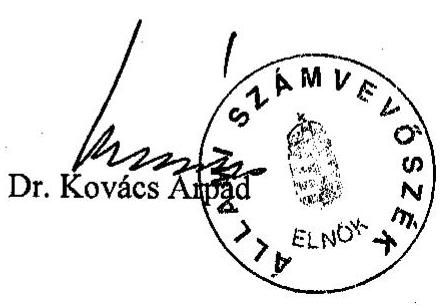
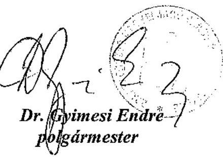

# JELENTÉS 

a Zalaegerszeg Megyei Jogú Város Önkormányzata gazdálkodásának átfogó ellenőrzéséről

---

3. Önkormányzati és Területi Ellenőrzési Igazgatóság
3.3 Átfogó Ellenőrzések FőcsoportIktatószám: V-1002-7/36/11/2003.Témaszám: 635
Vizsgálat-azonosító szám: V0102
Az ellenőrzést felügyelte:
Dr. Lóránt Zoltán
főigazgató
Az ellenőrzés végrehajtásáért felelős:
Dr. Sepsey Tamás
főigazgató-helyettes
Az ellenőrzést vezette:
Csecserits Imréné
főcsoportfőnök-helyettes
Az ellenőrzést végezték:
Csuti Lajos
számvevő tanácsos
Dér Lívia
számvevő tanácsos
Horváth Zoltán György
számvevő
Ritecz Tibor
számvevő
A témához kapcsolódó - az elmúlt három évben készített -számvevőszéki jelentések:
címe
sorszáma
Jelentés a települési önkormányzatok szilárdhulladék-gazdálkodási 0221
feladatai ellátásának ellenőrzéséről
Jelentés a foglalkoztatást elősegítő támogatások felhasználásának 0226 ellenőrzéséről
Jelentés a helyi önkormányzatok egyes pénzügyi befektetésekkel 0318 történő gazdálkodásának ellenőrzéséről

---

# TARTALOMJEGYZÉK 

BEVEZETÉS ..... 5
I. ÖSSZEGZŐ MEGÁLLAPÍTÁSOK, KÖVETKEZTETÉSEK, JAVASLATOK ..... 7
II. RÉSZLETES MEGÁLLAPÍTÁSOK ..... 20

1. A költségvetés tervezésének, végrehajtásának és a zárszámadás elkészítésének szabályszerűsége ..... 20
1.1. A költségvetés tervezésének, a költségvetési rendelet megalkotásának, elfogadásának szabályszerűsége ..... 20
1.2. A költségvetési előirányzatok módosításának szabályszerűsége ..... 25
1.3. A gazdálkodás szabályozottsága, szabályszerűsége ..... 27
1.4. A munkafolyamatba épített ellenőrzések szabályozottsága és gyakorlati működése a pénzügyi, gazdálkodási és számviteli feladatellátás területén ..... 30
1.5. A bizonylati rend szabályszerűsége ..... 31
1.6. A vagyon nyilvántartásának és leltározásának szabályszerűsége ..... 32
1.7. A vagyongazdálkodással kapcsolatos feladat- és döntési hatáskörök szabályozottsága, a vagyonváltozást előidéző intézkedések szabályszerűsége, célszerűsége ..... 36
1.8. Az Önkormányzat által céljelleggel - nem szociális ellátásként - juttatott támogatásokkal történő elszámoltatás szabályszerűsége ..... 40
1.9. A követelések, részesedések, értékpapírok év végi értékelésének szabályszerűsége ..... 43
1.10. A működési és felhalmozási bevételek, kiadások alakulása ..... 44
1.11. A költségvetés egyensúlyának helyzete ..... 46
1.12. A közbeszerzési eljárások szabályszerűsége ..... 47
1.13. A Polgármesteri hivatal helyi kisebbségi önkormányzatok gazdálkodásával kapcsolatos tevékenysége ..... 51
1.14. A zárszámadási kötelezettség teljesítésének szabályszerűsége ..... 53
2. Egyes kiemelt önkormányzati feladatok és a rendelkezésre álló források összhangja ..... 55
2.1. A feladatok meghatározása és szervezeti keretei ..... 55
2.2. Egyes naturális mutatókkal mérhető feladatok bevételei és kiadásai ..... 58
2.3. A jelentős ráfordítást igénylő önként vállalt feladatok ellátása ..... 59
3. A belső irányítási, ellenőrzési rendszer működésének értékelése ..... 61
3.1. Az Önkormányzat informatikai rendszerének szabályozottsága, működése ..... 61
3.2. A helyi ellenőrzési rendszer kialakítása, működése ..... 62
3.3. A könyvvizsgálati kötelezettség teljesítése ..... 65
3.4. A korábbi számvevőszéki ellenőrzések javaslatainak hasznosulása ..... 66

---

# MELLÉKLETEK 

1. számú Az önkormányzati vagyon nagyságának alakulása (1 oldal)
2. számú Az Önkormányzat 2002. évi bevételeinek és kiadásainak alakulása (1 oldal)
3. számú Az Önkormányzat gazdálkodását meghatározó adatok, mutatószámok (1 oldal)
4. számú Egyes önkormányzati feladatok finanszírozása (1 oldal)
5. számú Az értékpapír gazdálkodással kapcsolatos részletesebb információk (4 oldal)
6. számú Az Első Egerszeg Holding Befektető Kft. működésével kapcsolatos részletesebb információk (4 oldal)
7. számú Dr. Gyimesi Endre polgármester úr és Dr. Kovács Gábor jegyző úr észrevétele (1 oldal)

---

# RÖVIDÍTÉSEK JEGYZÉKE 

Ötv.
Áht.
Kbt.
Számv. tv.
Htv.

Hatv.
Ktv.
Ámr.
Vhr.

Ingatlan-nyilvántartási rendelet

ÁSZ
TÁH
Önkormányzat
Közgyűlés
Pénzügyi bizottság
Polgármesteri hivatal
Közgazdasági osztály
GESZ
ÁMK
SzMSz
ügyrend
CKÖ
ÖKÖ
a helyi önkormányzatokról szóló 1990. évi LXV. törvény az államháztartásról szóló 1992. évi XXXVIII. törvény a közbeszerzésekről szóló 1995. évi XL. törvény a számvitelről szóló 2000. évi C. törvény a helyi önkormányzatok és szerveik, a köztársasági megbízottak, valamint egyes centrális alárendeltségű szervek feladat- és hatásköreiről szóló 1991. évi XX. törvény a helyi adókról szóló 1990. évi C. törvény a köztisztviselők jogállásáról szóló 1992. évi XXIII. törvény az államháztartás működési rendjéről szóló 217/1998. (XII. 30.) Korm. rendelet
az államháztartás szervezetei beszámolási és könyvvezetési kötelezettségének sajátosságairól szóló 249/2000. (XII. 24.) Korm. rendelet
az önkormányzatok tulajdonában lévő ingatlanvagyon nyilvántartási és adatszolgáltatási rendjéről szóló 147/1992. (XI. 6.) Korm. rendelet
Állami Számvevőszék
Területi Államháztartási Hivatal
Zalaegerszeg Megyei Jogú Város Önkormányzata
Zalaegerszeg Megyei Jogú Város Önkormányzatának Közgyűlése
Zalaegerszeg Megyei Jogú Város Önkormányzata Közgyűlésének Pénzügyi Bizottsága
Zalaegerszeg Megyei Jogú Város Önkormányzatának Polgármesteri Hivatala
Zalaegerszeg Megyei Jogú Város Önkormányzata Polgármesteri Hivatalának Közgazdasági Osztálya
Zalaegerszeg Megyei Jogú Város Önkormányzatának Gazdasági Ellátó Szervezete
Zalaegerszeg Megyei Jogú Város Önkormányzatának Gönczi Ferenc Általános Művelődési Központja
Zalaegerszeg Megyei Jogú Város Közgyűlése 39/1999. (XII. 27.) számú rendelete Zalaegerszeg Megyei Jogú Város Közgyűlése Szervezeti és Működési Szabályzatáról
A polgármester és a jegyző által közösen kiadott Zalaegerszeg Megyei Jogú Város Önkormányzatának Polgármesteri Hivatala 3/2003. (III. 7.) számú Belső Szabályzata
Zalaegerszeg Megyei Jogú Város Cigány Kisebbségi Önkormányzata
Zalaegerszeg Megyei Jogú Város Örmény Kisebbségi Önkormányzata

---

| Befektető Kft. | Zalaegerszeg Megyei Jogú Város Önkormányzatának Közgyűlése által alapított Első Egerszeg Holding Befektető Kft |
| :--: | :--: |
| Vagyongazdálkodási rendelet | Zalaegerszeg Megyei Jogú Város Önkormányzata Közgyűlésének 1/1997. (II. 6.) számú rendelete az önkormányzat vagyonáról, a vagyongazdálkodás és a vagyonhasznosítás szabályairól |
| Közbeszerzési rendelet | Zalaegerszeg Megyei Jogú Város Önkormányzata Közgyűlésének 11/1996. (IV. 11.) számú rendelete az önkormányzati pénzeszközökből megvalósuló közbeszerzésekről |

---

# JELENTÉS 

## Zalaegerszeg Megyei Jogú Város Önkormányzata gazdálkodásának átfogó ellenőrzéséről

## BEVEZETÉS

Az Ötv. 92. § (1) bekezdése, valamint az Áht. 120/A. § (1) bekezdése alapján Zalaegerszeg Megyei Jogú Város Önkormányzata gazdálkodását az Állami Számvevőszék az Önkormányzati és Területi Ellenőrzési Igazgatóság V-1002-7/2003. ellenőrzési programja figyelembe vételével vizsgálta.

## Az ellenőrzés célja annak értékelése volt, hogy

- az önkormányzati gazdálkodás törvényességét, szabályszerűségét biztosították-e a tervezés, a költségvetés végrehajtása és a zárszámadás során; a gazdálkodás szabályszerűségét biztosító kontrollok ${ }^{1}$ megfelelően segítették-e a végrehajtást;
- az Önkormányzat által ellátott feladatok és az azokhoz rendelkezésre álló pénzforrások összhangja biztosított volt-e, különös tekintettel egyes kiemelt feladatokra;
- a helyi kisebbségi önkormányzat gazdálkodása során érvényesültek-e az Áht. és a vonatkozó kormányrendeletek előírásai.

Az ellenőrzött időszak: a 2002. év, valamint a 2003. I. félév, az 1.7., 2.1. 2.3.,3.2. - 3.4. ellenőrzési programpontok esetében a 2000 - 2002. évek és a 2003. I. félév.

Zalaegerszeg Megyei Jogú Város Zala megye székhelye, az ország Dél-nyugati részének 60,6 ezer lakosú városa.

Az Önkormányzat a 2002. évben 16 748,9 millió Ft költségvetési bevételből gazdálkodott, könyvviteli mérlegében kimutatott vagyonának értéke 18 600,5 millió Ft volt.

Az Önkormányzat 26 alap- és középfokú oktatási-nevelési intézményt működtet.

[^0]
[^0]:    ${ }^{1}$ A gazdálkodás szabályszerűségét biztosító kontroll alatt értjük a kiépített és működő belső irányítási és szabályozási rendszert, valamint a belső ellenőrzési funkciók ellátását.

---

Széles körű testvérvárosi kapcsolatokkal rendelkezik, 12 európai ország 13 városával alakítottak ki - elsősorban művészeti csoportjaik és sportegyesületeik révén - sokszínű kapcsolatot.

A Közgyűlést a polgármesterrel együtt 28 fő alkotja, a testület munkáját kilenc bizottság, tíz albizottság, továbbá három szakmai bizottság segíti. A polgármester - aki a harmadik ciklusban tölti be tisztségét - munkáját két főállású és egy tiszteletdíjas alpolgármester segíti. A címzetes főjegyző nyugdíjba vonulása miatt 2003. december 1-től újonnan kinevezett jegyző látja el a jegyzői feladatokat.

A városban két kisebbségi - cigány és örmény - önkormányzat, valamint 17 településrészi önkormányzat működik. A Polgármesteri hivatal a 2002. évben az engedélyezettel azonos, 235 fős átlaglétszámmal, ebből 179 fő köztisztviselővel, az intézmények 2489 fő közalkalmazottal látták el feladataikat.

---

# I. ÖSSZEGZŐ MEGÁLLAPÍTÁSOK, KÖVETKEZTETÉSEK, JAVASLATOK 

Az Önkormányzat az 1999-2002, továbbá a 2003-2006. évek közötti időszakra vonatkozó, a Közgyűlés által jóváhagyott gazdasági programmal rendelkezett, amelynek célkitűzéseit az éves koncepciók készítésénél figyelembe vették. A költségvetés tervezése során az Ámr. előírását megsértve a költségvetési koncepciókról a kisebbségi önkormányzatokat nem tájékoztatták és a koncepcióhoz a kisebbségi önkormányzatok véleményét nem csatolták. A jóváhagyott koncepció kisebbségi önkormányzatra vonatkozó részéről a kisebbségi önkormányzat elnökét a jogszabályi előírás ellenére nem tájékoztatták. A költségvetési koncepcióban a költségvetés készítés további munkálatait a 2002. évre nem határozták meg. Ez utóbbi jogszabálysértő gyakorlatot a 2003. évben nem ismételték meg.

A 2002. évi költségvetési rendelettervezet előkészítése során a jogszabályi előírástól eltérően, nem a tervévet megelőző év eredeti előirányzatából kiindulva, a szerkezeti változásokkal és szintre hozásokkal módosított előirányzatokat munkálták ki a Polgármesteri hivatalra vonatkozóan.

A költségvetési rendelettervezet előkészítésekor az oktatási intézmények finanszírozásához javasolt helyi normatívák összegeit konkrét számítási anyagokkal nem támasztották alá. Az intézmények vezetőivel történt egyeztetést a 2002. évi költségvetés készítés folyamatában az Ámr. előírása ellenére, írásban nem rögzítették. A Polgármesteri hivatal kiadásainak és bevételeinek előirányzatait a jogszabályi követelményekben előírtnál részletesebben munkálták ki, amelyet az Ámr. és az SzMSz-ben foglalt előírásokat megsértve (al- és jogcímenkénti részletezéssel) terjesztették elő és hagyta jóvá a Közgyűlés.

A költségvetési rendelet végrehajtásához szükséges rendelkezések közül az Ámr előírásait megsértve, az intézmények saját hatáskörű előirányzat-módosítás rendjére vonatkozó helyi előírások hiányoztak. A költségvetési rendelet évközi módosításának gyakoriságára vonatkozó rendelkezései nem feleltek meg az Ámr. előírásainak, mivel a központi költségvetésből juttatott pótelőirányzatokról a legalább negyedévenkénti módosítást nem biztosították. A Közgyűlés a bizottságok részére hatáskört biztosított a Polgármesteri hivatal költségvetésében elkülönített előirányzatok intézményekre és tevékenységekre történő átcsoportosítására, de nem határozta meg bizottságonként azokat a célfeladatokat, amelyek előirányzataira a bizottságok átcsoportosítási jogkörei kiterjedtek.

A Közgyűlés a vagyonkimutatás kivételével rendeletben nem határozta meg a költségvetés és zárszámadás mellékleteként tájékoztatásul bemutatandó mérlegek és kimutatások tartalmi követelményeit, ezzel megsértette az Áht. vonatkozó előírásait. A költségvetéshez a közvetett támogatásokat tartalmazó kimutatást szöveges indoklással, a többéves kihatással járó döntések keretében a hitelállomány összegét és lejárat szerinti részletezését nem mutatták be, ezzel megsértették az Áht. előírásait. Nem készítették el a költségvetési rendelet-

---

tervezet mellékleteként az Ámr. előírását megsértve, az előirányzatfelhasználási ütemtervet.

A céltartalékként elkülönített előirányzatok nem tartalmazták a településrészi önkormányzati és a polgármesteri kereteket, valamint a helyi pályázatokon elnyerhető összegeket, a városi kulturális és sportrendezvények támogatásait, amelyeket a Polgármesteri hivatal dologi kiadásai és átadott pénzeszközei között tervezték, ezáltal megsértették az Áht. előírásait.

A 2002. évi költségvetésben jóváhagyott előirányzatok évközi módosításáról - az intézményi előirányzat módosítások kivételével -, az Áht. előírásait megsértve az analitikus nyilvántartást nem fektették fel, ezáltal a változások döntési hatáskörök szerinti folyamatos, naprakész követését nem biztosították. Az előirányzatok módosítására irányuló előterjesztésekben a döntések megalapozása érdekében az előirányzatok változásának összefüggéseit nem mutatták be, ezáltal a Közgyűlés részére nem biztosítottak részletes, konkrét információkat a módosítás indokoltságáról. A kisebbségi önkormányzatok előirányzatainak módosítását a CKÖ határozata nélkül vezették át az Önkormányzat kiadási és bevételi előirányzatain, ezzel megsértették az Áht. vonatkozó előírásait. A jóváhagyott költségvetési előirányzatokat két intézmény és a Polgármesteri hivatal nem tartotta be, ezzel megsértették az Áht. erre vonatkozó előírását.

A Polgármesteri hivatal tevékenységének belső szabályozása keretében a szervezeti és működési szabályzatot, és a gazdasági szervezet ügyrendjét nem készítették el, ezzel megsértették az Ámr. rendelkezéseit. A meglévő szabályzatok rendelkezései az Ámr. és a Vhr. előírásainak részben feleltek meg. A gazdálkodási jogkörök gyakorlásának hatásköri rendjét a Polgármesteri hivatal ügyrendi szabályzatában határozták meg. Ennek keretében a polgármester kötelezettségvállalási és utalványozási, a jegyző az ellenjegyzési jogkörét átruházta. Utalványozásra jogosultságot az Ámr. előírásait megsértve a polgármester helyett a jegyző adott az érintetteknek, amelyet a munkaköri leírásokban rögzített. Az átruházott hatáskörben tett intézkedéseikről az érintettek beszámoltatása elmaradt.

A jegyző a Htv. előírásainak megfelelően a számviteli politika összehangolása, az egységes számviteli és pénzügyi információs rendszer kialakítása érdekében az intézmények részére 1997. évben irányelvet
 adott ki, azt a bekövetkezett jogszabályváltozásoknak megfelelően nem aktualizálta, rendelkezései már hatályon kívül helyezett jogszabályokra épültek.

A Polgármesteri hivatal számviteli politikáját a polgármester és a jegyző a jogszabályi követelményeknek megfelelően kialakította, és az előírt belső szabályzatokat elkészítették. A leltározási szabályzatban a Vhr-ben előírtakat megsértve, az eszközök évenkénti mennyiségi leltározásával szemben kettő, illetve ötévenkénti leltározási kötelezettséget szerepeltettek. Nem rögzítették a leltárt helyettesítő összesítő kimutatás alkalmazásának feltételeit, tartalmát, formáját és kellékeit. Az eszközök és források értékelési szabályzatában nem rendelkeztek az immateriális javak és a tárgyi eszközök terven felüli értékcsökkenésének elszámolásáról. A számlarendben az analitikus nyilvántartások formáját, tartalmát, az ezekből készült összesítő bizonylatok (feladások) elkészítésének határidejét nem határozták meg, ezzel megsértették a Vhr. előírásait.

---

A pénzgazdálkodásban a kötelezettségvállalásra és annak ellenjegyzésére vonatkozó helyi és központi előírásokat betartották, a kifizetésekhez szükséges szakmai teljesítések igazolását megfelelően dokumentálták. A bevételek esetében az érvényesítési, utalványozási és az utalvány ellenjegyzési jogkörök gyakorlása hiányos, az Ámr-rel ellentétes, illetve a belső szabályzatban foglaltaktól eltérő volt. Az érvényesítést a pénztári befizetéseknél nem végezték el, a banki jóváírások érvényesítését ellátó személyt az Ámr. előírását megsértve, írásban nem jelölték ki. A kisebbségi önkormányzatok esetében az érvényesítési feladatokat a Polgármesteri hivatal ezzel megbízott, előírt szakmai végzettséggel rendelkező dolgozója látta el. A költségvetési elszámolási számláról felvett pénzösszegek pénztári bevételezésekor, illetve az elszámolásra kiadott összegek pénztári visszavételezésekor az utalványozás, és az utalvány ellenjegyzése az Ámr. előírásait megsértve, elmaradt. Az utalvány ellenjegyzése a nem termékértékesítésből és szolgáltatásnyújtásból származó banki bevételeknél sem történt meg.

Az elszámolásra felvett összegek elszámolásának részletes szabályait a Polgármesteri hivatalban a pénzkezelési szabályzat keretén belül meghatározták, az előzetes és utólagos pénztárellenőrzéseket a szabályzatban foglaltaknak megfelelően hajtották végre, eseti pénztárellenőrzést nem végeztek.

A pénzmozgásokhoz kapcsolódó bizonylatok a Számv. tv-ben előírt általános alaki és tartalmi követelményeknek - egy kivétellel - megfeleltek. Egy bizonylaton a könyvviteli nyilvántartásokban történt rögzítés időpontját nem tüntették fel. A bizonylatok adatainak számviteli nyilvántartásba vétele és elszámolása a CKÖ részére nyújtott önkormányzati támogatás kivételével - a Vhr. és a számlarend előírásainak megfelelően történt. Az önkormányzati támogatás folyósított összegét a Polgármesteri hivatal számviteli nyilvántartásában átadott pénzeszközként, a CKÖ-nál átvett pénzeszközként nem jelenítették meg, ezzel megsértették a Számv. tv. és a kisebbségi önkormányzatok költségvetésének, gazdálkodásának, vagyonjuttatásnak egyes kérdéseiről szóló Korm. rendelet előírásait.

Az önkormányzati vagyon nyilvántartási rendszerét a Számv. tv. és az Ingatlan-nyilvántartási rendelet előírásainak megfelelően alakították ki. Az ingatlanvagyon kataszteri nyilvántartást felfektették, folyamatos vezetését biztosították. Az ingatlan értékelést a jogszabályi előírásának megfelelően elvégezték. A számviteli nyilvántartások és az ingatlanvagyon kataszter 2003. január 1-i bruttóérték adatainak egyezősége nem állt fenn, az ingatlanvagyon kataszterben kimutatott érték 9,3%-kal haladta meg a számviteli nyilvántartás szerinti értéket. Az eltérés kivizsgálását a helyszíni ellenőrzés ideje alatt megkezdték.

A vagyon 2002. évi leltározását - az ingatlanok kivételével - elvégezték. Az ingatlanok mennyiségi leltározását a Vhr. rendelkezését megsértve, a Közgyűlés előzetes egyetértésének kérése nélkül, összesítő kimutatások készítésével helyettesítették. A több önkormányzat közös tulajdonát képező, üzemeltetésre átadott víziközmű vagyon leltározását a Vhr. előírásai ellenére nem végezték el. Az üzemeltetésre átadott eszközök üzemeltetőivel közösen végrehajtott mennyiségi leltározását nem szabályozták, nem végezték el, ezzel megsértették a Vhr. előírásait. Az eszközök értékelését a Számv. tv. és a Vhr. előírásainak, valamint a

---

helyi szabályozásban foglaltakat betartva végezték el. Az Önkormányzat a forgatási célú értékpapír befektetéseinél nem élt a tőkepiacról szóló törvényben biztosított zárolt alszámla vezetés lehetőségével, eljárásuk nem felelt meg az Áht. szerinti, a vagyonnal való felelős gazdálkodás követelményének.

Az Önkormányzat 2000-2002. évek közötti városfejlesztő tevékenységének eredményeként a mérlegben kimutatott vagyon értéke 33,9%-kal emelkedett, amely a 2003. évben az ingatlanérték megállapítást követően a 2002. évi értékhez viszonyítottan közel négyszeresére (384,2%) növekedett. Az éves zárszámadáshoz csatolt vagyonkimutatás tartalmilag nem felelt meg az Ötv-ben és a vagyongazdálkodási rendeletben foglalt követelményeknek, az Ötv. előírásait megsértve elmulasztották a törzsvagyon forgalomképesség szerinti bemutatását. A vagyongazdálkodási rendeletben rendelkeztek arról, hogy a Közgyűlés indokolt esetben a forgalomképtelen vagyon körébe tartozó vagyontárgyakat korlátozottan forgalomképessé nyilváníthat. Az indokolt eseteket a rendeletben nem határozták meg.

Az Önkormányzat vagyongazdálkodási rendeletében szabályozta az egyes vagyonkezelő szervezetek feladatait, vagyonhasznosítással összefüggő hatásköreit. Az Áht. előírásait megsértve nem rendelkezett az ingyenes vagyonátadás módjáról. Nem határozták meg azt az értékhatárt, amely felett a vagyont értékesíteni, használatba adni csak nyilvános (indokolt esetben zártkörű) versenytárgyalás útján, a legjobb ajánlatot tevő részére lehet. A mezőgazdasági rendeltetésű földterületek kivételével, valamennyi vagyonhasznosítási mód esetében pályázat kiírási kötelezettséget írtak elő, amely alól felmentést a Közgyűlés adhatott. E szabályozással megsértették az Áht. előírásait, amely helyi rendeletben meghatározott értékhatárhoz köti a pályáztatást. A lemondás eseteit a költségvetési rendeletben szabályozták, annak módját nem határozták meg.

A vagyongazdálkodási rendeletben az értékesítésre és a vásárlásokra vonatkozóan nem írtak elő forgalmi értékbecslési kötelezettséget, ezzel szemben a döntések előkészítése során a Közgyűlés az értékbecsléseket megkövetelte. Az értékesítési árakat két ingatlan kivételével a forgalmi értékbecslésből kiindulva, a bizottságok árkorrekciós és árarányosítási javaslatait figyelembe véve alakította ki a Közgyűlés. Követelésekről csak indokolt esetben mondtak le, mértéke az összes követeléshez viszonyítottan 1% mérték alatt alakult.

A Polgármesteri hivatalban nem alakítottak ki olyan szervezeti egységet, amelynek feladatát képezné az önkormányzati vagyon változásának folyamatos figyelemmel kísérése, a kapcsolódó információk összegyűjtése, feldolgozása és a közgyűlési döntések előkészítése.

Az Önkormányzat saját költségvetése terhére államháztartáson kívüli és belüli szervezetek, - elsősorban alapítványok, közalapítványok, non-profit szervezetek, vállalkozások részére - nem szociális ellátásként a 2002. évben 620,5 millió Ft, a 2003. I-III. n. évben 427,2 millió Ft összegben nyújtott támogatásokat. A támogatásokról a jogszabályi előírásoknak megfelelően - egy esetet kivéve - döntöttek. Az Ötv. előírását megsértve egy oktatási közalapítvány részére történt támogatás átadásáról a polgármester döntött. A támogatottakkal minden esetben írásos megállapodásokat kötöttek, amelyekben a számadási kötelezettség módját nem, vagy nem egységesen határozták meg. A Polgármesteri hiva-

---

tal az elszámolások, illetve a beszámolók elfogadásán túl további ellenőrzéseket a támogatottaknál nem végzett.

A Polgármesteri hivatalban a 2002. év végén a tulajdoni részesedést jelentő befektetéseknél és a hitelviszonyt megtestesítő értékpapíroknál, valamint a követeléseknél az értékvesztés elszámolásának szükségességét vizsgálták. Az indokolt esetekben a jogszabályi előírásoknak és - egy MOL részvény kivételével - saját szabályzatuknak is megfelelően számoltak el értékvesztést, amelyet az egyedi nyilvántartásokban és a főkönyvben rögzítettek. Értékvesztés visszaírást nem számoltak el. A tartós hitelviszonyt megtestesítő értékpapírok között nyilvántartott kárpótlási jegyeknél a 2002. évben értékvesztés elszámolásának indoka nem állt fenn.

Az Önkormányzat a 2002. évi költségvetésének készítésénél az ellátandó feladatok forrásigénye és a várható bevételek közötti összhangra figyelemmel volt. A működési célú bevételek a működési kiadásokra a 2000-2002. években fedezetet biztosítottak. A 2002. évben a saját bevételek 22,3%-a helyi iparűzési adóból származott. A gazdálkodás során a költségvetési egyensúly folyamatosan biztosított volt, pénzügyi, likviditási zavarok nem keletkeztek, a feladatok finanszírozásához hitel felvételére nem volt szükség.

A Polgármesteri hivatalban a biztonságos gazdálkodás megalapozására, az intézmények zavartalan pénzellátására tervet készítettek, amelyet folyamatosan aktualizáltak. A tervben a kiadások éven belüli ütemezését reálisan vették számításba, a bevételeknél a Polgármesteri hivatal bevételeinek bemutatását az Ámr. előírását megsértve a jegyző elmulasztotta, így a likviditási terv a követelménynek nem felelt meg, az intézményfinanszírozási tervként funkcionált.

A közbeszerzési eljárás rendjére a törvény felhatalmazása alapján rendeletet alkottak. A közbeszerzési eljárást lezáró döntés meghozatalának jogát a közbeszerzési rendeletben a Kbt. vonatkozó előírását megsértve szabályozták, mivel a Közgyűlés a jóváhagyási és döntési jogot a Kbt. előírása szerint nem vonhatta magához. A Kbt. szabályait - egy szerződés módosítás kivételével - betartották. A közbeszerzési eljárást lezáró határozatot az ajánlatkérő Önkormányzat nevében eljáró személy hozta meg. A vizsgált közbeszerzési eljárásokkal érintett fejlesztések becsült értékét a Kbt. rendelkezését megsértve állapították meg. A 2002. évben összesen lefolytatott 12 közbeszerzési eljárás között egy alkalommal fordult elő, hogy annak eredményét a Közbeszerzési Döntőbizottság megsemmisítette az ajánlatok elbírálására, a nyertes kihirdetése során és az eredmény kihirdetéskor elkövetett törvénysértések miatt. A centrális közbeszerzési eljárást a gyermek- és diákélelmezésben alkalmazták. A városüzemeltetési, valamint az intézmények felújítási, karbantartási feladatainak elvégzésénél megsértették a Kbt.-nek a részekre bontás tilalmára vonatkozó rendelkezését. A közbeszerzési értékhatárt el nem érő beszerzéseiket az Önkormányzat rendeletében szabályozottak szerint bonyolították le.

Az Önkormányzat és a helyi kisebbségi önkormányzatok közötti együttműködési megállapodások az Ámr. és a vonatkozó Korm. rendelet által előírt követelményrendszert és az együttműködés feltételeit nem biztosították. A helyi kisebbségi önkormányzatok gazdálkodásának lebonyolításakor a költségvetési tervezés, az előirányzat módosítás, a költségvetési beszámolás és ehhez

---

kapcsolódóan az elkülönített nyilvántartási rendszer kiépítése során az Áht., Ámr. és a vonatkozó jogszabály előírásait nem érvényesítette megfelelően az Önkormányzat. A Polgármesteri hivatal ügyrend szabályzatában rögzítették a CKÖ és az ÖKÖ kötelezettségvállalási és utalványozási rendjét, amellyel megsértették az Áht. vonatkozó előírását. Elmaradt a kisebbségi önkormányzatra vonatkozó, az Ámr-ben előírt adatszolgáltatási határidők meghatározása annak érdekében, hogy az Önkormányzat jogszabályokban előírt kötelezettségei (költségvetés, előirányzat módosítás, zárszámadás) határidőre teljesíthetők legyenek. Az Ámr. előírását megsértve az Önkormányzat nem jelölte ki azt a személyt, aki egyeztetéseket folytathat a kisebbségi önkormányzatok elnökeivel a költségvetési rendelettervezet előkészítése során, és az elnökök rendelkezésére bocsátja az adott kisebbségi önkormányzatra vonatkozó adatokat.

A 2003. évi költségvetés készítése során a 2002. évitől eltérően, a kisebbségi önkormányzatok által elfogadott, azzal összegszerűen megegyező költségvetéseket építettek be. A jogszabályi előírástól eltérően nem éves, hanem az ÖKÖ féléves költségvetést, a CKÖ az állami támogatás féléves, az önkormányzati támogatásnak éves összegéből kialakított és ehhez igazodó főösszegű költségvetést fogadott el a 2003. évre. A számviteli nyilvántartásokban nem biztosították a kisebbségi önkormányzatok készpénzforgalmának, továbbá a CKÖ működéséhez nyújtott helyi önkormányzati támogatásnak elkülönítését.

A zárszámadási rendeletben a teljesítési adatok bemutatása mellett, a költségvetésben jóváhagyott működési kiadások kiemelt előirányzatait nem szerepeltették, ezáltal az Áht. előírását megsértve, a költségvetési rendelettel történő összehasonlíthatóságot nem biztosították. A zárszámadáshoz csatolt vagyonkimutatásban az Áht. előírásától eltérően a Polgármesteri hivatal és az Önkormányzati szintű összevont mérleg adatait mutatták be. Elmulasztották a törzsvagyon forgalomképesség szerinti bemutatását, ezzel megsértették az Ötv. és a vagyongazdálkodási rendelet előírásait. A rendelettervezet előterjesztésekor a polgármester a könyvvizsgálói jelentéssel együtt az egyszerűsített mérleget, az egyszerűsített pénzforgalmi jelentést és az egyszerűsített pénzmaradvány kimutatást is a Közgyűlés elé terjesztette, amelyek elfogadásáról az Áht. és az Ámr. előírásait megsértve a Közgyűlés nem döntött. A pénzmaradvány kialakulásának okát a zárszámadási rendelettervezetben bemutatták, az előző évi pénzkészletből történő levezetését nem részletezték. A felhasználható pénzmaradvány Vhr. előírásai szerinti számszerű levezetéséről a Közgyűlést nem tájékoztatták. A pénzmaradványt önállóan gazdálkodó intézményenkénti részletezésben a Közgyűlés jóváhagyta.

A zárszámadási rendeletben szereplő költségvetési szervenkénti
 módosított kiadási előirányzatokat a teljesítési adatok – kettő részben önállóan gazdálkodó intézmény kivételével – nem haladták meg. A Polgármesteri hivatal jogszabályi előírásnál részletesebb költségvetésének tizenegy jogcíménél fordult elő túllépés, az Áht. előírását megsértve figyelmen kívül hagyták, hogy a kiadások teljesítésére csak a jóváhagyott előirányzatok mértékéig kerülhet sor. A Polgármesteri hivatal előirányzat-túllépésének oka az volt, hogy az előirányzat-átcsoportosításokat a jóváhagyás szerkezetének megfelelő nyilvántartásban nem kísérték figyelemmel.

---

Az SzMSz-ben nem határozták meg, hogy az Önkormányzat mely feladatokat, milyen mértékben és módon lát el. A kötelező, és az SzMSz-ben nem nevesített önként vállalt feladatokat intézmények, gazdasági és közhasznú társaságok, valamint közalapítványok segítségével oldotta meg. A feladatok ellátásának szervezeti rendszerét és működését folyamatosan figyelemmel kísérték, és amennyiben annak indoka fennállt, a szükséges változtatásra döntéseiket időben meghozták. Az oktatási ágazatban intézmények összevonására és létszámleépítésre hozott határozatot a Közgyűlés. A saját gazdasági társaság átszervezésével a feladatok ellátása áttekinthetőbbé vált.

A fogyatékosok jogairól és esélyegyenlőségük biztosításáról szóló törvényben előírt, a középületek akadálymentesítésére vonatkozó kötelezettség teljesítését a megtett intézkedések ellenére – a törvényben előírt 2005. január 1-i határidőig – nem biztosítja az Önkormányzat.

A Polgármesteri hivatal rendelkezett adatvédelmi szabályzattal, az informatika területén alkalmazható katasztrófa-elhárítási tervet nem készítettek. A számítógépes programokat és az informatikai eszközöket a Polgármesteri hivatal Informatikai csoportja nyilvántartotta. A Polgármesteri hivatal információs stratégiájába illeszkedett az integrált közgazdasági információs rendszer 2003. évben megtörtént kiépítése. A hardver és a szoftver ellátottság a pénzügyigazdálkodási folyamatok működési feltételeinek kialakítását segítette, a rendszerszerű működés feltételei az új, integrált rendszer bevezetésével teremtődnek meg. A dolgozók munkaköri leírásában informatikai feladatköröket nem rögzítettek.

Az Önkormányzat az önállóan gazdálkodó intézményei felügyeleti és pénzügyi ellenőrzéséhez, valamint a Polgármesteri hivatal belső ellenőrzéséhez szükséges szervezeti kereteket kialakította. Az intézmények ellenőrzését kettő, 2002. szeptember 1-től három szakirányú felsőfokú végzettséggel rendelkező személy végezte. A Közgyűlés évente áttekintette a költségvetési intézmények ellenőrzésének tapasztalatait. A realizálás során három intézményvezető személyes felelősségre vonását kezdeményezték. A függetlenített belső ellenőr a munkatervében rögzített feladatait – terven felül elrendelt vizsgálatai miatt – nem teljesítette.

Az Önkormányzat állandó könyvvizsgálati feladatok ellátására költségvetési minősítésű könyvvizsgálóval megbízási szerződést kötött, aki a beszámolókat korlátozás nélküli hitelesítő záradékkal látta el. A Közgyűlés döntései során a könyvvizsgáló véleményét figyelembe vette.

Az ÁSZ vizsgálati jelentésekben megfogalmazott javaslatok részben hasznosultak, az ingatlanvagyon kataszter és számviteli adatok egyezőségét még nem biztosították, a foglalkoztatást elősegítő támogatások hatékonyabb felhasználására irányuló javaslat végrehajtására nem tettek intézkedést.

---

A helyszíni ellenőrzés megállapításai mellett a gazdálkodás szabályszerűségének és a munka színvonalának javítása érdekében javasoljuk:

# a polgármesternek: 

## a gazdálkodás szabályszerűségének biztosítása érdekében:

1. csatolja a költségvetési koncepció előterjesztéséhez az Ámr. 28. § (3) bekezdésének megfelelően a helyi kisebbségi önkormányzatok koncepció-tervezetről alkotott véleményét, javasolja a Közgyűlésnek az Ámr. 28. § (4) bekezdésében előírtaknak megfelelően, hogy a költségvetés készítés további munkálatairól hozzon határozatot;
2. kezdeményezze a Közgyűlésnél, hogy az Áht. 118. §-ában foglaltak alapján rendeletben határozza meg az Áht. 116. § 6, 9. és 10. pontja szerinti mérlegek és kimutatások tartalmi követelményeit;
3. követelje meg az Áht. 12/A. § (1) bekezdésében foglaltak betartását, amely szerint tárgyévi fizetési kötelezettség a jóváhagyott előirányzat mértékéig vállalható;
4. terjessze elfogadás végett a Közgyűlés elé a Polgármesteri hivatalnak az Ámr. 10. § (4) bekezdése alapján elkészített Szervezeti és Működési Szabályzatot;
5. gondoskodjon az Áht. 104. § (3) bekezdésében foglaltak alapján az üzemeltetésre átadott eszközök üzemeltetőivel már megkötött, illetve megkötendő szerződésekben az önkormányzati tulajdon védelmét szolgáló vagyonmegállapító leltárnak az üzemeltetési szerződésben való szerepeltetéséről;
6. kezdeményezze az Áht. 108. § (2) bekezdése alapján az Önkormányzat tulajdonában levő vagyon tulajdonjogának és vagyonkezelői jogának ingyenes átruházási módjának és eseteinek, valamint a követelésekről történő lemondás módjának rendeletben történő meghatározását;
7. javasolja a Közgyűlésnek a vagyongazdálkodási rendelet felülvizsgálatát és módosítását, ennek keretében az Áht. 108. § (1) bekezdésében foglaltaknak megfelelően határozza meg azt az értékhatárt, amely felett kötelező a vagyon értékesítésére, egyéb hasznosítására a versenytárgyalás kiírása, biztosítsa, hogy az ingatlan értékesítések, vásárlások, cserék minden esetben hivatalos forgalmi értékbecslésen alapuljanak;
8. biztosítsa, hogy az alapítványoknak, közalapítványoknak átadott támogatásokról az Ötv. 10. § (1) bekezdés d) pontjában előírtaknak megfelelően, minden esetben a Közgyűlés döntsön;
9. javasolja a Közgyűlésnek a közbeszerzési rendeletnek a Kbt. 31. § (3) bekezdésének megfelelő módosítását, követelje meg a szerződés módosításánál a Kbt. 73. § (1) bekezdésében, valamint a felújítási, karbantartási, városüzemeltetési feladatok végrehajtásánál az egybeszámításra vonatkozóan a Kbt. 5. § (2) bekezdésében foglaltak betartását;
10. kezdeményezze az Áht. 68. § (3) bekezdésének megfelelően a kisebbségi önkormányzatokkal kötött együttműködési megállapodások felülvizsgálatát és módosítá-

---

sát, ennek keretében rögzítsék és tartsák be az Ámr. 28. § (6), 29. § (3) és 29. § (10) bekezdés szerinti követelményeket és határidőket;
11. jelöljön ki Ámr. 28. § (7) bekezdésében előírtak szerint megbízottat a kisebbségi önkormányzatokkal történő egyeztetésekre;
12. terjessze a Közgyűlés elé az Ötv. 78. § (2) bekezdésében, illetve a vagyongazdálkodási rendeletben foglalt követelményeknek megfelelő tartalommal az Önkormányzat vagyonkimutatását;
13. gondoskodjon arról, hogy az Önkormányzat egyszerűsített mérlege, egyszerűsített pénzforgalmi jelentése és egyszerűsített pénzmaradvány-kimutatása a Vhr. 10. § (11) bekezdésének megfelelően a Közgyűlés által elfogadásra kerüljön;
14. kezdeményezze a Közgyűlésnél az Ötv. 1. § (4) bekezdése alapján a helyi közügyeket szolgáló, önként vállalt önkormányzati feladatok SzMSz-be történő beépítését, továbbá az Ötv. 8. § (2) bekezdésében előírtak szerint annak meghatározását, hogy a feladatokat az Önkormányzat milyen mértékben és módon látja el;

# a munka színvonalának javítása érdekében: 

1. számoltassa be a kötelezettségvállalásra és utalványozásra felhatalmazottakat az átruházott hatáskörben tett intézkedéseikről;
2. javasolja a Közgyűlésnek, hogy a vagyongazdálkodási rendeletben határozza meg a vagyontárgyak forgalomképessége megváltoztatásának indokolt eseteit;
3. javasolja a Közgyűlésnek a befektetett pénzügyi eszközeik tulajdonvédelme és fokozottabb biztonsága érdekében a tőkepiacról szóló 2001. évi CXX. tv. 144. § (1) bekezdése szerinti zárolt alszámla-vezetés jóváhagyását;
4. javasolja a Közgyűlésnek a fogyatékosok jogairól és esélyegyenlőségük biztosításáról szóló 1998. évi XXVI. törvény 29. § (6) bekezdésében előírt, a középületek akadálymentessé tételének felgyorsítását, figyelemmel a 2005. január 1-i határidőre;
5. terjessze a számvevőszéki jelentést a Közgyűlés elé, a feltárt hiányosságok megszüntetése érdekében készíttessen intézkedési (feladat)tervet határidőkkel és a felelősök megnevezésével;

## a jegyzőnek:

## a gazdálkodás szabályszerűségének biztosítása érdekében:

1. a költségvetési rendelettervezet előkészítésével és módosításával összefüggésben
a) tájékoztassa a helyi kisebbségi önkormányzatok elnökeit az Ámr. 28. § (6) bekezdésében előírtaknak megfelelően az Önkormányzat költségvetési koncepciójának a kisebbségi önkormányzatokra vonatkozó részéről;
b) csatolja az Ámr. 28. § (3) bekezdése szerint a költségvetési koncepcióhoz a kisebbségi önkormányzatok arról alkotott véleményét;

---

c) intézkedjen, hogy a Polgármesteri hivatal költségvetési rendelettervezete előirányzatainak kimunkálása az Ámr. 26. §-ában foglaltak figyelembevételével, az előző év eredeti előirányzatának a szerkezeti változásokkal és szintre hozásokkal módosítottan, valamint az előirányzati többletekkel növelten történjen;
d) végezze el az Ámr. 29. § (4) bekezdésében előírtak szerint, és minden esetben foglalja írásba a költségvetési szervek vezetőivel történt egyeztetéseket;
e) gondoskodjon arról, hogy a Polgármesteri hivatal előirányzatai az Ámr. 29. § (1) bekezdés e) pontjában és az SzMSz 75. § (4) bekezdés e) pontjában foglaltak szerint kerüljenek előterjesztésre;
f) intézkedjen az intézmények saját hatáskörű előirányzat-módosításának rendjére, az Ámr. 53. § (4) bekezdésében foglaltak szerint;
g) fordítson figyelmet a költségvetési rendelet végrehajtási szabályainak a jogszabályi előírásoknak és a helyi viszonyoknak megfelelő meghatározására. Ennek során tegyen intézkedéseket, hogy az intézmények saját hatáskörű előirányzat-módosításait az Ámr. 53. § (4) bekezdés, az előirányzat-módosítások gyakoriságát az Ámr. 53. § (2) bekezdés szerint, negyedévenként tartalmazza a rendelet;
h) biztosítsa a költségvetés és a zárszámadás előterjesztéséhez az Áht. 116. § 9. pontjában foglaltaknak megfelelően a több éves kihatással járó döntések számszerűsítését évenkénti és összesített bemutatását szöveges indoklással együtt, a 10. pontja szerint a közvetett támogatásokat tartalmazó kimutatás, valamint a zárszámadáshoz a 116. § 8. pontjában előírt, a vagyongazdálkodási rendeletben meghatározott tartalommal elkészített vagyonkimutatás bemutatását;
i) készítse el az Ámr. 29. § (1) bekezdés j) pontjában előírt előirányzat-felhasználási ütemtervet;
j) biztosítsa, hogy a kisebbségi önkormányzatok teljes évre szóló előirányzatait tartalmazó költségvetései az elfogadó határozataikkal egyező összegekkel, az Ámr. 29. § (1) bekezdés i) pontjában előírtak szerint, elkülönítetten kerüljenek az Önkormányzat költségvetési rendeletébe beépítésre;
k) biztosítsa a céltartalék-előirányzatok Áht. 73. § (1) bekezdése szerinti elkülönítését a költségvetési rendeletben;
l) biztosítsa, hogy a kisebbségi önkormányzatok költségvetési előirányzatainak módosításai az Áht. 74. § (3) bekezdésében foglaltak betartásával, a kisebbségi önkormányzatok határozata alapján kerüljenek az Önkormányzat költségvetésében átvezetésre;
m) szabályozza a rendelettel jóváhagyott előirányzatok, és azok módosítása Áht. 103. § (1) bekezdésében előírt nyilvántartásának formáját, tartalmát, a módosítások dokumentálásának módját, biztosítsa annak folyamatos vezetését;
n) kísérje figyelemmel az intézmények gazdálkodását, és előirányzat-túllépés esetén a Htv. 140. § (1) bekezdés e) pontjában biztosított jogkörében eljárva vizsgálja meg azok okát, és indokolt esetben tegyen javaslatot a felelősségre vonásra;

---

o) gondoskodjon arról, hogy a Polgármesteri hivatal kiadásainak teljesítésére az Áht. 12/A. § (1) bekezdésében foglaltaknak megfelelően, a módosított előirányzatok mértékéig kerüljön sor;
2. az operatív gazdálkodás szabályszerű végrehajtása érdekében
a) készítse el a Polgármesteri hivatal az Ámr. 10. § (4) bekezdésében előírt tartalmú Szervezeti és Működési Szabályzatát;
b) készítse el a Polgármesteri hivatal gazdasági szervezetének ügyrendjét az Ámr. 17. § (4) bekezdésében előírtak szerint;
c) intézkedjen, hogy az utalványozásra jogosultakat az Ámr. 136. § (2) bekezdésében foglaltaknak megfelelően a polgármester hatalmazza fel;
d) intézkedjen az Áht. 74/A. § (1) bekezdésében foglaltaknak megfelelően, a kisebbségi önkormányzat kötelezettségvállalásra és utalványozásra vonatkozó helyi szabályainak módosítására;
e) aktualizálja és egészítse ki a Htv. 140. § (1) bekezdés c) pontjának és a Vhr. 8. § (6)-(8) bekezdéseinek megfelelően az egységes számviteli és pénzügyi információs rendszer érdekében a költségvetési intézményeknek kiadott irányelvet;
f) vizsgálja felül a leltározási szabályzatot, az évenkénti leltár elkészítésének módját a Vhr. 37. § (1) és (3) bekezdésében foglaltakkal összhangban határozza meg az üzemeltetésre átadott eszközök tekintetében is;
g) tegyen intézkedéseket az immateriális javak és tárgyi eszközök Számv. tv. 53. §-ban és a Vhr. 30. § (10) bekezdésében előírt terven felüli értékcsökkenésére vonatkozó szabályozás elkészítésére, a számlarendet egészítse ki a Vhr. 49. § (2) bekezdésében foglalt, az analitikus nyilvántartásokra, illetve a (4) bekezdésében rögzített, az analitikus nyilvántartások adataiból készítendő összesítő bizonylatok (feladások) elkészítésének határidejére vonatkozó előírásokkal;
h) követelje meg, hogy a pénztári bevételek érvényesítése az Ámr 135. § (1) bekezdése szerint történjen, a bankszámláról történő készpénzfelvételek, az előleg-visszavételek és a nem termékértékesítésből és szolgáltatásnyújtásból származó bevételek esetében az utalvány ellenjegyzését az Ámr 137. § (1) bekezdése, illetve a helyi szabályozás szerint erre felhatalmazottak rendszeresen elvégezzék;
i)
 hatalmazza fel írásban az Ámr. 135. § (2) bekezdésében foglaltak szerint a banki pénzforgalom érvényesítésére jogosult személyeket;
j) biztosítsa, hogy az érvényesítési feladatokat az Ámr. 135. § (2)–(4), az utalványozási feladatok a 136. § (2)–(3), és az utalvány ellenjegyzést a 137. § (1)–(4) bekezdéseiben a Polgármesteri hivatal ügyrendi szabályzatában foglaltaknak megfelelően végezzék el és dokumentálják;
k) biztosítsa, hogy a számviteli bizonylatok a Számv. tv. 167. § (1) bekezdésében meghatározott alaki és tartalmi követelményeknek megfeleljenek, azokon a számviteli nyilvántartásokban történő rögzítés időpontja minden esetben feltüntetésre kerüljön;

---

l) intézkedjen, hogy a kisebbségi önkormányzatok részére folyósított önkormányzati támogatások elszámolása során a Számv. tv. 15. § (2) és (9) bekezdésében, valamint a 20/1995. (III. 3.) Korm. rendelet 1. § (1) bekezdésében foglaltak érvényre jussanak;
m) gondoskodjon az Önkormányzat által céljelleggel – nem szociális ellátásként juttatott támogatások felhasználására vonatkozó, az Áht. 13/A. § (2) bekezdésben előírt ellenőrzési kötelezettség teljesítéséről;
n) követelje meg az összes értékpapír és a követelésállomány esetében az értékvesztés elszámolás szükségességének vizsgálatát és annak a Vhr. 30. § (9) bekezdés szerinti elszámolását, a befektetett pénzügyi eszközök értékvesztésének meghatározásakor az eszközök és források értékelési szabályzatában foglaltak alkalmazását;
o) készítse el az Ámr. 139. §-ban előírtaknak megfelelően az Önkormányzat pénzállományának alakulására vonatkozó likviditási tervet;
p) követelje meg, hogy a közbeszerzési eljárások során az ajánlatok elbírálásakor a Kbt. 55. § (6) bekezdésében, a nyertes kihirdetésekor az 59. § (1) bekezdésében és a eredményhirdetéskor a 61. § (1) bekezdésében foglaltak betartásra kerüljenek;
3. vagyongazdálkodással összefüggően
a) biztosítsa az Ingatlan-nyilvántartási rendelet 1. § (3) bekezdésében előírt ingatlanvagyon-kataszter és a számviteli nyilvántartások ingatlan (bruttó) értékre vonatkozó adategyezőséget, és a szükséges egyeztetések rendszeres elvégzését;
b) intézkedjen, hogy a mérlegtételek alátámasztása a Vhr. 37. § (1) és (3) bekezdése szerint kerüljön évenként végrehajtásra; ${ }^{2}$
c) intézkedjen az Észak-keleti és az Északi szennyvízcsatorna főgyűjtő rendszer tulajdonának a címzett és céltámogatásokról szóló 1992. évi LXXXIX. tv. 18. §-ában előírtnak megfelelő megosztására és a tulajdonrésznek a Vhr. 20. § (1) bekezdés szerinti nyilvántartásba vételére;
4. a kisebbségi önkormányzatok gazdálkodását segítő tevékenység keretében
a) intézkedjen az Áht. 68. § (3) bekezdésében rögzítetteknek megfelelően a költségvetési rendelettervezet összeállítása és rendelet megalkotásával összefüggő eljárási rend, határidők és a dokumentálás követelményeinek az együttműködési megállapodásokban történő rögzítésére;
b) biztosítsa a kisebbségi önkormányzatok bevételeinek hiánytalan számbavételét és elkülönített számviteli nyilvántartását, valamint az elkülönített pénztári nyilvántartások vezetését a kisebbségi önkormányzatok költségvetésének, gazdálkodásának, vagyonjuttatásának egyes kérdéseiről szóló 20/1995. (III. 3.) számú Korm. rendelet 15. § (1) bekezdésében előírtaknak megfelelően;
5. a zárszámadási rendelet előkészítésekor
a) gondoskodjon az Áht. 116. § 8. pontja alapján, hogy az Ötv. 78. § (2) bekezdésében előírt, a zárszámadáshoz csatolandó vagyonkimutatásban a törzsvagyon forgalomképesség szerint kerüljön bemutatásra a Közgyűlés részére;
b) biztosítsa a zárszámadási és a költségvetési rendelet összehasonlíthatóságát az Áht. 18. §-ában előírtak szerint;
c) biztosítsa, hogy a pénzmaradvány elszámolására irányuló közgyűlési előterjesztés adattartalma a valóságnak és a Vhr. 25. § (2) bekezdésében előírtaknak megfelelően mutassa be az Önkormányzat pénzmaradványát, amelyet az Ámr. 66. § (4) bekezdésében foglaltak szerint hagyjon jóvá a Közgyűlés;

# a munka színvonalának javítás érdekében:

1. gondoskodjon arról, hogy a költségvetési előirányzatok módosítására vonatkozó rendelettervezetek előterjesztése az előirányzatok változásának összefüggéseit, a döntési hatáskörök szerinti részletezéseit is tartalmazza;
2. az előirányzat-átcsoportosításokat a jóváhagyás szerkezetének megfelelő nyilvántartásban rögzítse;
3. számoltassa be írásban az utalvány ellenjegyzésére felhatalmazottakat az átruházott hatáskörben tett intézkedéseikről;
4. biztosítsa, hogy a vagyongazdálkodással kapcsolatos Polgármesteri hivatali feladatok megoldása, információs rendszere elősegítse a vagyongazdálkodási döntések megalapozott előkészítését;
5. egységesen szabályozza a céljelleggel – nem szociális ellátásként – juttatott összegek rendeltetésszerű felhasználásáról történő számadás előírását és módját;
6. készíttessen az informatikai területre szóló katasztrófa-elhárítási tervet;
7. módosítsa a dolgozók munkaköri leírását a munkafolyamatba épített ellenőrzési és az informatikai feladatok teljes körű rögzítésével;
8. vizsgálja felül a függetlenített belső ellenőrzésre rendelkezésre álló létszámkapacitást annak érdekében, hogy a belső ellenőrzési feladatok a terven felüli vizsgálatok elvégzése mellett a munkaterv szerint végrehajthatók legyenek;
9. intézkedjen az ÁSZ javaslatok végrehajtására, vizsgálja meg az ÁSZ által a 2001. évben javasolt ingatlanvagyon-nyilvántartási feladatok és a foglalkoztatást elősegítő támogatások tekintetében a végrehajtás elmaradásának okát, és indokolt esetben gondoskodjon a személyes felelősség megállapításáról, érvényesítéséről.

---

# II. RÉSZLETES MEGÁLLAPÍTÁSOK

## 1. A KÖLTSÉGVETÉS TERVEZÉSÉNEK, VÉGREHAJTÁSÁNAK ÉS A ZÁRSZÁMADÁS ELKÉSZÍTÉSÉNEK SZABÁLYSZERŰSÉGE

### 1.1. A költségvetés tervezésének, a költségvetési rendelet megalkotásának, elfogadásának szabályszerűsége

A Közgyűlés 1999-ben hagyta jóvá a 2002-ig terjedő időszakra vonatkozó középtávú gazdasági programját, ezzel eleget tett az Ötv. 91. § (1) bekezdésében előírt gazdasági programkészítési kötelezettségnek.

A gazdasági program stratégiai jelleggel tartalmazta az Önkormányzat idegenforgalmi, közlekedési, infrastrukturális, lakásépítési, oktatási fejlesztésekkel kapcsolatos célkitűzéseit, és meghatározta a prioritásokat is. A gazdasági program a közösségi szolgáltatások, valamint az intézmény fenntartási, üzemeltetési feladatok irányvonalának meghatározásával nem foglalkozott.

A gazdasági program célkitűzéseit az éves koncepciók készítésénél figyelembe vették. A Közgyűlés a programban foglaltak végrehajtását a 2003. április 3-i ülésen értékelte, amely szerint a tervezett 13 feladat közül a legfontosabb kilenc megvalósult, továbbá kettő feladat előkészítése folyamatban volt.

Az Önkormányzat 2003–2006. közötti középtávú gazdasági stratégiájáról a Közgyűlés a 69/2003. (IV. 3.) számú határozattal döntött. A stratégia a városfejlesztés céljait három prioritás – a gazdasági versenyképesség javítása, a foglalkoztatás- és humán erőforrás-fejlesztés, a környezeti és jóléti feltételek javítása – köré szervezte. Ennek alapján készült a 2003–2006. közötti időszakra vonatkozó középtávú gazdasági program, amelyet az előző időszakra szóló gazdasági programtól eltérő formában, az Európai Uniós követelményekhez igazodva állítottak össze. A Közgyűlés 163/2003. (VI. 12.) számú határozatával jóváhagyott program a fejlesztési elképzeléseket részletesen felsorolta, a megvalósításukhoz szükséges saját forrásokat pályázati pénzeszközökkel tervezte kiegészíteni. Városüzemeltetési, intézmény fenntartási és működési feladatokat a 2003–2006. évi gazdasági program nem tartalmazott, az egyes részterületekre koncepciókat hagytak jóvá. ${ }^{3}$

A 2002. évi költségvetés jóváhagyása kétfordulós tárgyalási rendben történt. A tervezés első szakaszát jelentő költségvetési koncepciót a polgármester a törvényben előírt határidőben ${ }^{4}$ a Közgyűlés elé terjesztette. A koncepció-

[^0]
[^0]:    ${ }^{3}$ Közoktatási feladat-ellátási, intézményhálózat-működtetési és fejlesztési terv (2003–2009.), sportkoncepció (2002–2005.), víziközmű stratégia a 2003–2006. évekre.
    ${ }^{4}$ Az Áht. 70. §-a szerint a megelőző év november 30-ig, a helyi önkormányzati választás évében december 15-ig kell a polgármesternek a koncepciót a Közgyűlés elé terjeszteni.

---

tervezetet az Önkormányzatnál működő bizottságok megtárgyalták az SzMSz-ben szabályozottak szerint, és a koncepció egészéről kialakított véleményüket az előterjesztéshez csatolták. A kisebbségi önkormányzat elnökének a kisebbségi önkormányzat működéséről, pályázatokon való részvételéről szóló tájékoztatóját, továbbá a 2002. évi költségvetési támogatási igényét mellékelték a koncepció-tervezet előterjesztéséhez. A helyi kisebbségi önkormányzat ${ }^{5}$ koncepció-tervezetről alkotott véleményét az Ámr. 28. § (3) bekezdésében foglaltak ellenére nem csatolták az előterjesztéshez.

A költségvetési koncepciót a helyben képződő bevételek és az ismert kötelezettségek figyelembe vételével állították össze a 2002. évre. Elfogadásáról a Közgyűlés határozatot hozott, de abban az Ámr. 28. § (4) bekezdésével ellentétesen a költségvetés készítés további munkálatait nem határozták meg. A jóváhagyott koncepció helyi kisebbségi önkormányzatra vonatkozó részéről az Ámr. 28. § (6) bekezdésben foglalt előírás ellenére, a kisebbségi önkormányzat elnökét nem tájékoztatták.

A 2003. évi költségvetési koncepció összeállításánál a 2002. évi koncepció előzetes egyeztetésével, véleményeztetésével kapcsolatos eljárás megismétlődött. Kivételt képez a jóváhagyó határozat tartalma, amelyben a Közgyűlés az Ámr. 28. § (4) bekezdése szerint meghatározta a 2003. évi költségvetés készítés további munkálataival összefüggő feladatokat is.

A 2002. évi költségvetési rendelettervezet előkészítése során a Polgármesteri hivatal kiadásainak és bevételeinek javasolt előirányzatait az Ámr. 26. §-ában előírtaktól eltérően, nem a tervévet megelőző év eredeti előirányzatából kiindulva, a szerkezeti változásokkal és szintrehozásokkal módosított, valamint az előirányzati többlettel növelt összegben munkálták ki. A Polgármesteri hivatal költségvetési javaslata a szervezeti egységek ${ }^{6}$ igényeinek a polgármesterből, alpolgármesterből és a bizottságok elnökeiből álló munkacsoport általi megtárgyalása, véleményezése alapján alakult ki.

Az oktatási intézmények költségvetési javaslatát helyi normatívák alapján állították össze, amelyet az intézményi vagyon működtetésével és az élelmezéssel kapcsolatos kiadásokkal egészítettek ki. A normatívák kialakításakor az előző évi bérfejlesztések szintrehozásával, dologi automatizmusokkal az egyes intézményekre vonatkozó minimumszintet ${ }^{7}$ kiszámították, és ezekhez viszonyították a javasolt normatívák összegeit. A normatívák jogcímeit és összegeit jóváhagyásra a Közgyűlés elé terjesztették. Az előterjesztés szöveges indoklásában a normatívák nagyságára hatást gyakorló tényezőket részletezték, de azok kialakulásáról számítási anyagot nem készítettek.

[^0]
[^0]:    ${ }^{5}$ A 2002. évben egy kisebbségi önkormányzat (CKÖ) működött a településen.
    ${ }^{6}$ Az Önkormányzat SzMSz-e szerint: nyolc osztály, három iroda és a gyámhivatal képezte.
    ${ }^{7}$ A minimumszint, szóhasználatuk szerint a „küszöbszint” az a finanszírozási összeg, amely feltétlenül szükséges az éves zavartalan működéshez.

---

A költségvetési rendelettervezet költségvetési szervek vezetőivel történő jegyző általi egyeztetését nem foglalták írásba, ezzel megsértették az Ámr. 29. § (4) bekezdésének előírását a költségvetési rendelettervezet előkészítési folyamatában.

A polgármester a könyvvizsgáló véleményével együtt a Közgyűlés elé terjesztette a költségvetési rendelettervezetet, amelynek 2001. december 20-ai megtárgyalásakor, és jóváhagyásakor nem volt ismert valamennyi, az előirányzatokat befolyásoló tényező. A költségvetés elfogadását követően kapott információkkal azt módosították, így a 2002. évi költségvetésről az államháztartás pénzügyi információs rendszere részére teljesített adatszolgáltatás számszakilag eltért a Közgyűlés által elfogadott költségvetéstől.

A TÁH részére átadott költségvetésben az önkormányzati nettósított kiadási és bevételi főösszeg 1,3 millió Ft-tal volt több (ezen belül a költségvetési támogatás bevétel 59 millió Ft-tal, az SZJA bevételek 2,3 millió Ft-tal több, a felhalmozási célra átvett pénzeszköz 60 millió Ft-tal kevesebb, a kiadási oldalon a tartalék előirányzat 1,3 millió Ft-tal volt több) a költségvetési rendeletben jóváhagyott összegnél.

Az eltérés egyik oka az volt, hogy költségvetési rendelet megalkotásával egyidejűleg hozott döntést az Országgyűlés az Önkormányzat címzett támogatásáról, amelyet a költségvetési rendeletben az állami támogatás helyett a felhalmozási célra átvett pénzeszközök között vettek figyelembe.

Az eltérés másik oka az volt, hogy az adatszolgáltatásban eredeti előirányzatként a 2001. és a 2002. évi költségvetési törvényben szereplő adatokat kellett szerepeltetni, de a költségvetési rendeletben az intézményi létszám adatok a tervezéshez szolgáltatott adatoktól eltérő alakulása miatti korrigált összegeket hagyták jóvá.

A költségvetési rendelettervezetet a bizottságok megtárgyalták, és a kialakított véleményüket az előterjesztéshez csatolták. A rendelettervezet benyújtásakor a polgármester előterjesztette azokat a rendelettervezeteket ${ }^{8}$ is, amelyek a javasolt előirányzatokat megalapozták.

A Közgyűlés az Áht. 118. §-ában előírtakat megsértve az Áht. 116.
 § 6., 9. és 10. pontja szerinti mérlegek, kimutatások tartalmát rendeletben nem határozta meg, a jegyző ilyen tartalmú előterjesztést nem készített. A költségvetési rendelettervezet tartalmazta az Áht. 116. § 6. pontja szerint az Önkormányzat összevont mérlegeit, az Áht. 116. § 9. pontja szerint a több éves kihatással járó döntések számszerűsítését évenkénti bontásban és összesítve. Elmaradt az Áht. 116. § 10. pontjában előírt közvetett támogatások, és azok szöveges indoklásának tájékoztatásul történő bemutatása.

A költségvetési rendelettervezet az Áht. 69. § (1) bekezdés, és az Ámr. 29. § (1) bekezdés szerinti tartalmi követelményeknek – egy kivétellel – megfelelt. Tartalmazta a bevételi forrásokat, továbbá a működési, fenntartási előirányzatokat költségvetési szervenként, ezen belül kiemelt előirányzat-

[^0]
[^0]:    ${ }^{8}$ Az önkormányzat helyi iparűzési adóról szóló 17/1991. (XII. 12.) számú rendeletének, a vásárokról és piacokról szóló 55/1995. (XI. 9.) rendeletének módosításáról.

---

ként. Részletezte a felújítási előirányzatokat célonként, a felhalmozási előirányzatokat és a Polgármesteri hivatal költségvetését feladatonként, ezen belül jogcímenként részletezetten, továbbá az éves létszámkereteket önállóan és részben önállóan gazdálkodó költségvetési szervenként; bemutatta a működési és felhalmozási célú bevételi és kiadási előirányzatokat mérlegszerűen, de együttesen és egyensúlyban. Az Áht. 71. § (3) bekezdésében előírt, a költségvetési évet követő két év várható előirányzatait bemutatták a rendelettervezetben. Nem készítették el a rendelettervezet mellékleteként a tárgyév várható bevételi és kiadási előirányzatainak teljesüléséről – az Ámr. 29. § (1) bekezdés j) pontjában előírt kötelezettség ellenére – az előirányzat-felhasználási ütemtervet.

A Közgyűlés az Önkormányzat 2002. évi költségvetéséről a 43/2001. (XII. 28.) számon alkotott rendeletet, amelyben a Polgármesteri hivatal költségvetését a jogszabályi előírásnál részletesebben határozta meg. A költségvetési rendelet elfogadása során az Ámr. 32. §-ának előírásait megsértették, mert a kisebbségi önkormányzat költségvetési határozatát nem változatlan formában építették be a rendeletbe.

Az Önkormányzat költségvetésébe a CKÖ még el nem fogadott költségvetési határozatára hivatkozva építettek be 3 millió Ft kiadási előirányzatot, bevételi előirányzatot pedig nem szerepeltettek. Ezzel szemben a CKÖ a 2002. évi költségvetését – a települési önkormányzat rendeletének megalkotását követően – 3,6 millió Ft bevételi és kiadási főösszeggel fogadta el a 2/2002. (I. 17.) számú határozatával.

A költségvetési rendelet tartalmazta a címrendet az Áht. 67. § (1)–(2) bekezdéseinek megfelelően. Az önállóan gazdálkodó költségvetési szervek külön-külön címeket, a részben önállóak alcímeket alkottak. Önálló címen szerepelt a Polgármesteri hivatal is, de annak előirányzatait az Ámr. 29. § (1) bekezdés e) pontjában és az SzMSz 75. § (4) bekezdés e) pontjában foglaltaktól eltérően (alés jogcímenkénti részletezéssel) terjesztették elő és hagyták jóvá.

Az Áht. 73. § (1) bekezdésében foglaltakkal összhangban a költségvetési rendeletben általános és céltartalékot különítettek el, a céltartalék 576,4 millió Ft előirányzata nem tartalmazta a Polgármesteri hivatal kiadásai között elkülönített településrészi önkormányzati, polgármesteri, alpolgármesteri kereteket. Hiányoztak a céltartalék előirányzatából az Önkormányzat által kiírt pályázatokon elnyerhető összegek, a városi kulturális és sportrendezvényi támogatások, amelyek intézmények és feladatok közötti felosztásáról év közben az Önkormányzat bizottságai döntöttek. Ezeket a különféle jogcímeken tartalékolt előirányzatokat a Polgármesteri hivatal dologi kiadásai és átadott pénzeszközei között tervezték, ezáltal megsértették az Áht. 73. § (1) bekezdésében előírtakat.

A költségvetési rendeletben a végrehajtásával kapcsolatos helyi szabályokat rögzítették, azok a központi előírásokban foglaltak megismétlését tartalmazták. A költségvetési rendelet 4. § (6) bekezdésében és a 9. § (2) bekezdésében foglaltak egymásnak ellentmondó megfogalmazásúak voltak. Az előirányzatok módosításának gyakoriságára vonatkozó rendelkezés nem felelt meg az Ámr. 53. § (2) bekezdésében előírt negyedévenkénti módosítás követelményének.

---

A rendelet 9. § (1) bekezdésében a költségvetés előirányzatainak módosításáról az Ámr. 53. § (2) bekezdésében előírt negyedévenkénti gyakoriságtól eltérően rendelkeztek. A központi költségvetésből az első félévben folyósított pótelőirányzatokra egy alkalommal történő előirányzat-módosítást írták elő, ezzel megsértették a jogszabályi előírást.

A rendelet 4. § (6) bekezdése szerint az intézmény az előirányzatát meghaladó többletbevételéből a törvényi előírások betartásával megemelheti az éves személyi kiadások és a munkaadókat terhelő járulék előirányzatát a többletbevételekkel összefüggő feladat elvégzéséhez szükséges közvetlen és közvetett dologi kiadások teljesítése után fennmaradó összeg erejéig. Ezzel szemben a rendelet 9. § (2) bekezdése szerint az Önkormányzat felügyelete alá tartozó költségvetési szervek előirányzat-módosítást csak a Közgyűlés előzetes jóváhagyásával hajthatnak végre a személyi jellegű kiadásokra, munkaadókat terhelő járulékokra.

A Közgyűlés az SzMSz-ben az Áht. 74. § (2) bekezdésében biztosított lehetősége alapján előirányzat-átcsoportosítási hatásköröket engedett át bizottságainak és a polgármesternek. A polgármestert úgy a működési, mint a felhalmozási célú előirányzatok tekintetében tág értékhatárok közötti átcsoportosítási jogkörrel hatalmazta fel a Közgyűlés: a kiadások főösszegén belül az egyes szakfeladatok, illetve feladatok között korlátozás nélkül, a költségvetésben nem szereplő új feladatra az általános tartalék 50%-áig, a jóváhagyott fejlesztési feladatok és felújítási célok előirányzatai között esetenként 10 millió Ft-os összeghatárig előirányzat-átcsoportosítási jogkört gyakorolhatott.

A Polgármesteri hivatal költségvetését feladatonként kell részletezni a költségvetési rendeletben az Ámr. ${ }^{9}$ és az SzMSz ${ }^{10}$ előírásai szerint. Az Önkormányzat költségvetési rendeleteiben a Polgármesteri hivatal feladatonkénti előirányzatait jogcímekre bontották. A polgármester számára a költségvetési jogcímek közötti átcsoportosításra nyújtott lehetőséget a rendeletekben szereplő, működési kiadásokra vonatkozó előirányzat-átcsoportosítási jogkör.

A Közgyűlés a bizottságok részére hatáskört biztosított a Polgármesteri hivatal költségvetésében célfeladatokra elkülönített előirányzatok intézményekre és tevékenységekre történő belső átcsoportosítására. Az SzMSz és a költségvetési rendelet nem tartalmazta bizottságonként azokat a célfeladatokat, amelyek előirányzataira a bizottságok átcsoportosítási jogosítványai kiterjedtek.

A Közgyűlés részére az átruházott hatáskörben végrehajtott átcsoportosítások eljárási rendjét, feladatait, az ahhoz kapcsolódó határidőket meghatározó előterjesztés nem készült.

A polgármester számára a működési kiadásokon belül biztosított átcsoportosítási jogkör a költségvetés olyan alcímei és jogcímei közötti átcsoportosításra adott le-

[^0]
[^0]:    ${ }^{9}$ Ámr. 29. § (1) bekezdés e) pontja szerint a Polgármesteri hivatal költségvetését feladatonként kell részletezni.
    ${ }^{10}$ SzMSz 75. § (4) bekezdés e) pontjának előírásai szerint a Polgármesteri hivatal költségvetését feladatonként részletezve kell készíteni.

---

hetőséget, amelyet a költségvetési rendelet tartalmára és szerkezetére vonatkozó központi előírásokat és az SzMSz vonatkozó rendelkezéseit meghaladó a Polgármesteri hivatal előirányzatainak további indokolatlan részletezése tett szükségessé.

A költségvetés végrehajtásának szabályai között rögzítették az intézményfinanszírozás és az évközi szabad pénzeszközökkel gazdálkodás rendjét, valamint a tartalékkal való rendelkezés jogát. Külön rendelet ${ }^{11}$ tartalmazta az önkormányzati biztos kirendeléséhez szükséges feltételeket. A költségvetési, vagy más önkormányzati rendeletben nem határozták meg az évközi gazdálkodás feltételrendszerének biztosítása érdekében az intézmények saját hatáskörű előirányzat-módosításának rendjét az Ámr. 53. § (4) bekezdésében előírtak ellenére.

A 2003. évi költségvetési rendelettervezet ${ }^{12}$ szerkezete, tartalma és az abban rögzített végrehajtási szabályok azonosak voltak a 2002. évi költségvetési rendelettel. Kivételt jelentett, hogy a 2003. évi költségvetési rendeletbe a CKÖ 4/2003. (I. 6.) számú, az ÖKÖ 1/2003. (I. 23.) számú határozataival ${ }^{13}$ elfogadott, azokkal megegyező összegű költségvetési előirányzatokat építettek be. Az előkészítés folyamatában a rendelettervezet intézményvezetőkkel történő egyeztetését írásba foglalták. Az egyeztetésről készült jegyzőkönyvekben vitatott és testületi döntést igénylő eltérést nem rögzítettek.

# 1.2. A költségvetési előirányzatok módosításának szabályszerűsége 

Az Önkormányzat a 2002. évi költségvetési rendeletében jóváhagyott előirányzatokat négy alkalommal, összesen 5419 millió Ft-tal módosította. A költségvetés főösszegét érintő módosítások az eredeti előirányzat 48,6%-át tették ki.

A központi költségvetésből biztosított pótelőirányzatokkal kapcsolatos előirányzat-módosításokról a Közgyűlés döntése az első félévben az Ámr. 53. § (2) bekezdését megsértve történt. Az előírt negyedévenkénti helyett a Közgyűlés az első félévben egy alkalommal a 15/2002. (VI. 21.) számú rendeletével módosította költségvetését. Ezt követően a Közgyűlés tájékoztatása megfelelő időben megtörtént, és az előirányzat-módosításról a döntést ${ }^{14}$ az előírt határidőben meghozták.

[^0]
[^0]:    ${ }^{11}$ Az Önkormányzat 24/1998. (VII. 2.) számú rendelete az önkormányzati biztos kirendeléséről.
    ${ }^{12}$ Az Önkormányzat 1/2003. (II. 7.) számú rendelete a 2003. évi költségvetésről.
    ${ }^{13}$ A 2002. évi választásokat követően két kisebbségi önkormányzat működött (CKÖ, ÖKÖ).
    ${ }^{14}$ Az Önkormányzat a 2002. évi költségvetés módosításáról szóló 21/2002. (IX. 20.) számú, 38/2002. (XII. 28.) számú, 9/2003. (III. 7.) számú rendeletei.

---

A 9/2003. (III. 7.) számú rendelettel jóváhagyott előirányzat-módosítás időpontja megfelelt az Ámr. 53. § (2) és (6) bekezdésében előírtaknak, a döntés a Közgyűlés 2003. február 27-i ülésén történt, amely megfelelt a Vhr. 10. § (1) bekezdésében foglalt II. 28-i határidőnek. A rendeletet III. 7-én hirdették ki.

Az előirányzatok módosítására irányuló előterjesztésekben a javasolt változások összefüggéseit, a döntési hatáskörök szerinti részletezéseit nem mutatták be. Ezáltal a Közgyűlés számára nem biztosítottak részletes, konkrét információkat a módosítások indokoltságáról.

A Közgyűlés előirányzat-módosító döntéseinek alátámasztásához az intézményvezetők írásban adtak tájékoztatást a bevételi többletből végrehajtott előirányzat-módosításaikról. A központi költségvetési kapcsolatokból eredő változásokat leiratok, a bizottsági hatáskörben hozott átcsoportosításokat bizottsági határozatok tartalmazták. A polgármesteri hatáskörben hozott döntéseknek belső bizonylatok képezték az alapját. Az Önkormányzat költségvetési rendeletébe beépült kisebbségi önkormányzat előirányzatainak módosítását a CKÖ határozata nélkül vezették át az Önkormányzat kiadási és bevételi előirányzatain, ezzel megsértették az Áht. 74. § (3) bekezdésében foglalt előírást.

Az előirányzatok nyilvántartásának formáját, tartalmát és a módosítások dokumentálásának módját a gazdálkodásra vonatkozó szabályzatokban nem határozták meg. A jóváhagyott előirányzatok változásairól nyilvántartást – az intézményi előirányzatok kivételével – az Áht. 103. § (1) bekezdését megsértve nem vezettek. Önkormányzati szinten és a Polgármesteri hivatal vonatkozásában nem alakítottak ki a kiemelt előirányzatok változását folyamatosan nyomon követő, a döntési hatáskört is tartalmazó, zárt rendszerű nyilvántartást. Az intézmények előirányzatainak módosítását számítógépes analitikus nyilvántartással kísérték figyelemmel.

A költségvetés önkormányzati szintű módosított előirányzatait a teljesítési adatok a 2002. évben nem haladták meg. A módosított kiadási előirányzatokat – két kivétellel – az Önkormányzat felügyelete alá tartozó intézmények betartották. A jóváhagyott kiadási előirányzat főösszegét két, részben önállóan gazdálkodó intézmény túllépte (a Nevelési Tanácsadó 0,2 millió Ft-tal, a Fogyatékosok Klubja 0,4 millió Ft-tal) ezáltal megsértették az Áht. 12/A. § (1) bekezdésének a kötelezettségvállalás mértékére vonatkozó előírásait. A túllépések okait nem vizsgálták, felelősségre vonás nem történt.

A Polgármesteri hivatalban a 2002. évi kiadások teljesítése során 11 jogcímnél előirányzat-túllépés történt. Ezzel megsértették az Áht. 12/A. § (1) bekezdésének előírásait, amelyek szerint tárgyévi fizetési kötelezettség csak a jóváhagyott kiadási előirányzatok mértékéig vállalható. Az előirányzatok túllépésének oka az volt, hogy a Polgármesteri hivatal az előirányzat-átcsoportosításokat a jóváhagyás szerkezetének megfelelő nyilvántartásban nem rögzítette, nem kísérte figyelemmel.

Előirányzat-módosítást a 2003. I. félévben két alkalommal végeztek. Az első módosításkor a Közgyűlés egy céltámogatási pályázathoz szükséges önrész beépítéséről döntött a 17/2003. (IV. 11.) számú rendeletében. Az első negyed-

---
 vezették át. Ezáltal megsértették az Ámr. 53. § (2) bekezdését, amely szerint a kapott központi pótelőirányzatokkal negyedévenként a költségvetési rendeletet módosítani kell. A bizottságok, a polgármester és az intézményvezetők által hozott döntéseket, továbbá az első félévben biztosított központi pótelőirányzatok átvezetését a 20/2003. (VI. 20.) számú rendelettel hagyta jóvá a Közgyűlés, és döntött a saját hatáskörébe tartozó előirányzat-módosításokról.

# 1.3. A gazdálkodás szabályozottsága, szabályszerűsége 

A Polgármesteri hivatal az Ámr. 10. § (4) bekezdésében foglalt előírás ellenére Szervezeti és Működési Szabályzattal nem rendelkezett. A Polgármesteri hivatal szervezeti egységeinek feladatait ügyrendben meghatározták, a gazdasági szervezeti ügyrendet nem készítették el, nem teljesítették az Ámr. 17. § (4) bekezdésében előírt kötelezettséget.

A Polgármesteri hivatalnál a 2001. évtől ISO 9001 szabvány szerinti minőségirányítási rendszert működtettek. A rendszer alapdokumentuma a minőségügyi kézikönyv. A feladatok végrehajtásának részletes leírását a minőségügyi eljárások rögzítették. A Közgazdasági osztály tevékenységébe tartozó egyes feladatok folyamatszabályozása kiterjedt az osztály üzemgazdasági csoportjának költségvetés-tervezéssel, előirányzat-módosítással és a beszámoló-készítéssel, valamint az ellenőrzési csoportjának az intézmények pénzügyi-gazdasági ellenőrzésével kapcsolatos tevékenységére.

A minőségügyi eljárás a költségvetési javaslat intézményvezetőkkel történő egyeztetésének rendjét az Ámr. 29. § (4) bekezdésében előírtaktól eltérően szabályozta, mert:

- kezdeményezését a jegyző helyett az intézmények részére;
- egyeztetését valamennyi helyett a finanszírozási összeggel egyet nem értő költségvetési szervek tekintetében;
- írásbeli rögzítését minden eset helyett az intézményfinanszírozás összegének hibás megállapítása esetére
írta elő.
Az operatív gazdálkodási jogkörök gyakorlásának hatásköri rendjét a polgármester és a jegyző aláírásával kiadott Zalaegerszeg Megyei Jogú Város Polgármesteri Hivatala Ügyrendi Szabályzatában határozták meg. Ennek keretében a polgármester a kötelezettségvállalás és utalványozás jogát egy millió Ft összeghatár alatt az érintett osztályvezetőkre, egy millió és 20 millió Ft értékhatár között az alpolgármesterekre átruházta. Bér és személyi kiadásokkal kapcsolatos kötelezettségvállalásra és utalványozására a polgármester a jegyzőt hatalmazta fel, ezekben az esetekben az ellenjegyző feladatokat a jegyző átruházta a Közgazdasági osztályvezető részére. A közbeszerzési eljárások során létrejött, valamint a 20 millió Ft értékhatár feletti szerződések esetén kötelezettségvállalási és utalványozási jogkörét fenntartotta.

---

A Közgazdasági osztály vezetője, illetve annak akadályoztatása esetén helyettese, a pénzügyi csoportvezető utalványozási jogkört egy millió Ft értékhatárig gyakorolhatott. A fenti dolgozók emellett munkaköri leírásaik szerint jogosultságot kaptak a bankszámlák közötti pénzmozgások bizonylatainak összeghatárra való tekintet nélkül, továbbá a városi kincstár működésével összhangban az intézmények finanszírozásának utalványozására. Az Ámr. 136. § (2) bekezdését megsértve, a polgármester helyett a jegyző adott a munkaköri leírásokban utalványozásra jogosultságot.

A jegyző kötelezettségvállalás és utalvány-ellenjegyzési jogkörét a Közgazdasági osztályvezetőre, a pénzügyi csoportvezetőre, valamint további két ügyintézőre ruházta át. Érvényesítésre az egyébként ellenjegyzési jogkörrel felhatalmazottakat jelölték ki. Az érvényesítők az előírt képesítéssel rendelkeztek. Az átmeneti és tartós távollétek, valamint az összeférhetetlenség esetén követendő eljárást szabályozták. Az ügyrend mellékletében a kötelezettségvállalásra, utalványozásra, ellenjegyzésre vonatkozó felhatalmazások mértékét személyre szólóan meghatározták, és rendelkeztek a szakmai teljesítés igazolására jogosultságról is. A polgármester és a jegyző az átruházott kötelezettségvállalási, utalványozási és ellenjegyzési jogkörök gyakorlásáról írásban nem számoltatta be a felhatalmazottakat.

A Polgármesteri hivatal ügyrendjében szabályozták a CKÖ és az ÖKÖ kötelezettségvállalási és utalványozási rendjét is, és kijelölték a távollét esetén helyettesítő személyeket. Ezzel megsértették az Áht. 74/A. § (1) bekezdésének előírásait, amely szerint a helyi kisebbségi önkormányzat előirányzatai terhére kizárólag a helyi kisebbségi önkormányzat elnöke, vagy az általa meghatalmazott helyi kisebbségi önkormányzati képviselő vállalhat kötelezettséget, illetve jogosult utalványozásra. Az érvényesítést az Ámr. 135. § (2) bekezdésében foglaltaknak megfelelően a Polgármesteri hivatal ezzel megbízott, előírt szakmai végzettséggel rendelkező dolgozója látta el.

A jegyző az Önkormányzat számviteli politikájának összehangolása, az egységes számviteli és pénzügyi információs rendszer kialakítása érdekében az intézmények részére az 1997. évben adott ki irányelvet a Htv. 140. § (1) bekezdés c) pontjának megfelelően, de azt az időközi jogszabályi változásoknak megfelelően nem aktualizálta.

Az irányelvek a már hatályon kívül helyezett 54/1996. (IV. 12.) Korm. rendeletre épültek, a kisértékű tárgyi eszköz értékhatára 30 ezer Ft összeggel szerepelt. Rendelkezett a számviteli politika elkészítéséről, önkormányzati szinten egységes szabályokat nem határozott meg az intézmények gazdasági szervezetei részére. A közoktatási szakfeladatokat az 1997. január 1-én hatályban volt szakfeladatrend előírásai szerint tartalmazta.

A polgármester és a jegyző együttes szabályzatban a Vhr. 8. § (3)-(4) bekezdéseinek megfelelően kialakította és rögzítette a Polgármesteri hivatal számviteli politikáját. Ennek keretében elkészítették az előírt belső szabályzatokat: a leltározási és leltárkészítési szabályzatot, az eszközök és források értékelési szabályzatát, az önköltség-számítási szabályzatot, és a pénzkezelési szabályzatot.

---

A számviteli politikában meghatározták, hogy a számviteli elszámolás és értékelés szempontjából mit tekintenek lényegesnek, továbbá jelentős összegnek a megbízható és valós összkép kialakítását befolyásoló információk tekintetében, a kis értékű tárgyi eszközök, vagyoni értékű jogok és szellemi termékek minősítésénél. A forgalomképes ingatlanok tekintetében rögzítették, hogy a piaci értéken való értékelés lehetőségével nem élnek.

Az eszközök és források leltározási és leltárkészítési szabályzatában az ingatlanoknál - a közlekedési építmények, hidak, zöldterületek és építményei, víz-, szennyvíz- és elektromos hálózatok, csapadékvíz-elvezető rendszerek kivételével - ötévenkénti, a gépek, berendezések, felszerelések és járműveknél kétévenkénti mennyiségi felvétellel történő leltározást határoztak meg. A közlekedési építmények, hidak, zöldterületek és építményei, víz-, szennyvíz- és elektromos hálózatok, csapadékvíz-elvezető rendszerek esetében a mennyiségi felvétel helyett az analitikus nyilvántartásokból összeállított leltár-kimutatás készítését írták elő. A szabályozással megsértették a Vhr. 37. § (1) és (3) bekezdéseiben foglaltakat, amelyek a felsorolt eszközcsoportokra évenkénti mennyiségi felvétellel történő leltározási kötelezettséget határoztak meg. Nem rögzítették a leltárt helyettesítő összesítő kimutatás alkalmazásának feltételeit, tartalmát, formáját és kellékeit, továbbá alkalmazásához a felügyeleti szerv egyetértésével a 2002. évre nem, csak 2001-re rendelkeztek, ezzel megsértették a Vhr. 37. § (4) bekezdésében foglalt előírásait.

Az intézmények részére a leltárt helyettesítő összesítő kimutatás készítéséhez a Vhr. 37. § (4) bekezdése alapján szükséges felügyeleti szervi egyetértés helyett a Közgazdasági osztály vezetője engedélyt adott ki. Ezzel megsértette az Ámr. 13. § (5) bekezdését, amely szerint az önkormányzati költségvetési szervek felügyeletét a helyi önkormányzat képviselő-testülete (Közgyűlés) látja el.

Az eszközök és a források értékelési szabályzatában meghatározták az eszközök bekerülési értékébe beszámítható kifizetések, ráfordítások tartalmát, az értékvesztés és az értékvesztés visszaírásának eszközcsoportonként részletezett rendjét. A szabályozás hiányos volt, mert az immateriális javak és tárgyi eszközök Számv. tv. 53. §-ban és a Vhr. 30. § (9) bekezdésében előírtaknak megfelelő, terven felüli értékcsökkenésének elszámolására előírást nem tartalmazott.

Az önköltség-számítási szabályzatban az értékesítés céljára önkormányzati beruházásban végzett ingatlan-építéséről, szolgáltatásként a Polgármesteri hivatal üdülőjének igénybe vételéről rendelkeztek. A szabályzatban meghatározták az eszköz és a szolgáltatás bekerülési értékének megállapítására vonatkozó előírásokat.

A pénzkezelési szabályzat tartalmazta a bankszámlák és a készpénz forgalmára, valamint a házipénztáron kívüli pénzkezelésre vonatkozó szabályokat. Meghatározták a pénztárellenőrzés módját, gyakoriságát, az előlegek, az utólagos elszámolásra kiadott összegek nyilvántartásának és elszámolásának rendjét.

A számlarendben rögzítették a Számv. tv. 161. § (2) bekezdése alapján az alkalmazott főkönyvi számlák számát, tartalmát, a főkönyvi számla érték-

---

növekedésének és csökkenésének jogcímeit, a számlát érintő gazdasági eseményeket, azok más számlákkal való kapcsolatát, valamint a bizonylati rendet. A kötelezettségvállalások nyilvántartásának rendjét szabályozták. Az analitikus nyilvántartások formáját, tartalmát, azok vezetésének módját, az analitikus nyilvántartások adataiból készült összesítő bizonylatok (feladások) elkészítésének határidejét a Vhr. 49. § (2) és (4) bekezdését megsértve nem határozták meg.

A felesleges vagyontárgyak hasznosításának, selejtezésének szabályzata ${ }^{15}$ a selejtezéssel és hasznosítással kapcsolatos hatásköröket és eljárási szabályokat tartalmazta. A selejtezett és feleslegessé vált vagyontárgyak értékesítésével összefüggő hatáskört a vagyongazdálkodásról szóló rendelet 34. § (1) bekezdésével azonosan, a polgármester hatásköreként szabályozta. A feleslegessé vált vagyontárgyak eladási árának meghatározása a vagyongazdálkodásért felelős vezető javaslata alapján a jegyző hatáskörét képezte.

A Polgármesteri hivatalban a pénzügyi, gazdálkodási és számviteli feladatellátás területén elvégzendő kontrollfeladatokat nem határozták meg. A gazdálkodási jogkörök gyakorlásának szabályait az ügyrendben rögzítették, további munkafolyamatba épített belső ellenőrzési feladatokat, egyeztetési teendőket nem írtak elő.

# 1.4. A munkafolyamatba épített ellenőrzések szabályozottsága és gyakorlati működése a pénzügyi, gazdálkodási és számviteli feladatellátás területén 

A Közgazdasági osztály köztisztviselőinek munkaköri leírásaiban az ellátandó feladatokat, a gazdálkodási jogköröket részletesen meghatározták. A banki jóváírások érvényesítését végző személyt a jogkör gyakorlására az Ámr. 135. § (2) bekezdését megsértve, írásban nem jelölték ki. A személyre szóló feladat-meghatározások nem tartalmazták a munkafolyamatba épített ellenőrzés konkrét követelményeit, a hatáskört és felelősséget, ezáltal a számonkérésre nem voltak alkalmasak.

A pénzgazdálkodás folyamatában a kifizetéseknél a munkafolyamatba épített ellenőrzés érvényesült. A kötelezettségvállalás és utalvány-ellenjegyzésre vonatkozó központi és helyi előírásokat betartották.

A bevételek esetében a munkafolyamatba épített ellenőrzés során az alábbi hiányosságok fordultak elő: a bankszámláról a házipénztárba felvett készpénz összegek, valamint az elszámolásra kiadott előlegek visszavételezésekor az utalvány-ellenjegyzése elmaradt, nem tartották be az Ámr. 137. § (1) bekezdésében foglaltakat. A nem termékértékesítésből és szolgáltatásnyújtásból származó banki bevételek utalványainak ellenjegyzése nem történt meg. Az utalvány-ellenjegyzésre jogosultak az Ámr. 137. § (3) bekezdésében előírt kötelezettségüknek nem tettek eleget.

[^0]
[^0]:    ${ }^{15}$ A polgármester és a jegyző által kiadott 13/2001. számú belső szabályzat.

---

Az érvényesítést a banki és a pénztári kiadási okmányokon rögzítették. Az elvégzett érvényesítések a teljesítés szakmai igazolásán alapultak. A kisebbségi önkormányzat esetében az érvényesítési feladatokat a Polgármesteri hivatal erre felhatalmazott dolgozója látta el. Kivételt képeztek a pénztári bevételek, amelyek beszedésének elrendelése előtt az Ámr. 135. § (1) bekezdését megsértve az érvényesítési feladatok elvégzését a pénztári bevételek 27%-ánál nem igazolták.

Utasításra történt ellenjegyzés a 2002. évi és a 2003. I. félévi bizonylatoknál nem fordult elő.

A pénzkezelési szabályzatban foglaltaknak megfelelően az előzetes és utólagos pénztárellenőrzést elvégezték, amelyek megtörténtét a bevételi és kiadási pénztárbizonylatokon, valamint a pénztárjelentéseken rögzítették. Eseti pénztárellenőrzés nem történt.

A Polgármesteri hivatalnál a 2002. évben és a 2003. I. félévben lefolytatott belső ellenőrzések a pénzügyi, gazdálkodási és számviteli feladatellátás során olyan hiányosságokat nem tártak fel, javaslatokat nem fogalmaztak meg, amelyek megszüntetésére intézkedéseket kellett tenni.

# 1.5. A bizonylati rend szabályszerűsége 

A pénzmozgásokhoz kapcsolódó bizonylatok az előírt általános alaki és tartalmi követelményeknek nem feleltek meg, azokon a Számv. tv. 167. § (1) bekezdés i) pontját megsértve, a könyvviteli nyilvántartásokban történt rögzítések időpontját nem tüntették fel.

A kötelezettségvállalásokról az Áht. 103. § (2) bekezdésében előírt nyilvántartást 2002. július 1-től felfektették, és folyamatosan vezették. A korábbi időszakban nem rendelkeztek a fenti jogszabálynak megfelelő nyilvántartással. A banki és házipénztári pénzforgalomban a kötelezettségvállalásra és annak ellenjegyzésére vonatkozó helyi és központi előírásokat betartották, a kifizetésekhez szükséges szakmai teljesítések igazolását az arra kijelölt személyek elvégezték.

Az érvényesítést a banki pénzforgalomban utalványrendeletben rögzítették, a bevételek érvényesítését végző személy a jogkör
 gyakorlására az Ámr. 135. § (2) bekezdését megsértve, az előírt írásos megbízással nem rendelkezett. Az érvényesítést arra kijelöléssel és megbízással nem rendelkező személy végezte a banki bizonylatok 31%-ánál.

A banki pénzforgalomban az utalványozást - az alábbiak kivételével - a helyi szabályozásban arra feljogosítottak igazolták aláírásukkal. Az intézmények finanszírozásával kapcsolatos kiadások, illetve a Polgármesteri hivatal költségvetési elszámolási számlájának betétszámlára való naponkénti átvezetéseit egy millió Ft értékhatár felett (a banki átutalások 3%-ánál) a Közgazdasági osztály vezetője, illetve annak helyettese utalványozta. Erre az Ámr. 136. § (2) bekezdésére alapján szükséges írásos felhatalmazással nem rendelkeztek.

---

A betétszámla naponkénti feltöltéskor egy millió Ft értékhatár felett utalványozott a Közgazdasági osztály vezetője a 2002. évben a kifizetések 1,5%-ánál, a helyettese a 2003. évben a kifizetések 0,3%-ánál. Az intézmények finanszírozásával kapcsolatosan egy millió Ft értékhatár felett utalványozott a Közgazdasági osztály vezetője a 2002. évben a kifizetések 1,7%-ánál, a 2003. évben 0,3%-ánál, illetve a helyettese a 2003. évben 0,4%-nál.

Az utalvány ellenjegyzését a banki kiadási tételeknél a szabályzatban arra kijelölt személyek az utalványrenden elvégezték. Az utalvány ellenjegyzése nem történt meg a nem termékértékesítésből és szolgáltatásnyújtásból származó banki bevételeknél, amellyel megsértették az Ámr. 137. § (3) bekezdésének előírásait.

Az utalványozást és annak ellenjegyzését a pénztári kifizetések esetében az ügyrendben arra kijelölt személyek megfelelően elvégezték. A költségvetési elszámolási számláról felvett pénzösszegek pénztári bevételezésekor, illetve az elszámolásra kiadott összegek pénztári visszavételezésekor az utalványozási, és így az ellenjegyzési feladat elvégzése is elmaradt, amellyel megsértették az Ámr. 136. § (1) bekezdésében és a 137. §-ában előírtakat (a pénztárbizonylatok 15%-ánál).

A bizonylatok adatainak számviteli elszámolása, nyilvántartásba vétele, szakfeladat-rend szerinti besorolása - a CKÖ általános működéséhez nyújtott önkormányzati támogatás kivételével - a jogszabályi és a helyi előírásoknak megfelelően történt. A bizonylatok adatai és a főkönyvi könyvelés közötti egyeztetés és ellenőrzés lehetősége biztosított volt.

A számviteli nyilvántartásokban az önkormányzati támogatás összegét a CKÖ bevételei között nem jelenítették meg. A CKÖ bevételeit és teljesített kiadásait a Polgármesteri hivatal a főkönyvi könyvelésben külön egységkód alkalmazásával különítette el. Az önkormányzati támogatás időarányos összegét a már elszámolt kiadások Önkormányzat által finanszírozott összegének figyelembe vételével állapították meg. A jelentkező különbözetet az átadó és az átvevő költségvetési elszámolási számlái közötti pénzforgalomban rendezte és átfutó pénzmozgásként számolta el a Polgármesteri hivatal.

Ennek következtében a támogatás összege a helyi Önkormányzatnál átadott pénzeszközként, az átvevő kisebbségi önkormányzatnál átvett pénzeszközként nem jelent meg. Ezzel az eljárással megsértették a Számv. tv. 15. § (2) bekezdésében foglalt teljesség, és a (9) bekezdés szerinti bruttó elszámolás számviteli alapelveket. Megsértették a kisebbségi önkormányzatok költségvetésének, gazdálkodásának, vagyonjuttatásának egyes kérdéseiről szóló 20/1995. (III. 3.) Korm. rendelet 15. § (1) bekezdésének előírását is, amely szerint a helyi kisebbségi önkormányzat vagyoni és számviteli nyilvántartásait a helyi önkormányzat nyilvántartásain belül elkülönítetten kell vezetni.

# 1.6. A vagyon nyilvántartásának és leltározásának szabályszerűsége 

A vagyon nyilvántartási rendszerét a Számv. tv., valamint az Ingatlannyilvántartási rendelet előírásainak megfelelően alakították ki. A főkönyvi

---

könyvelés és a részletező nyilvántartások zárt rendszerét, az egyeztetések lehetőségét biztosították. Erre a Polgármesteri hivatal számviteli tevékenységében alkalmazott számítógépes program folyamatos lehetőséget biztosított. Az egyeztetést az Ámr. 145. § (1) bekezdésében előírt évközi mérlegjelentés készítése előtt elvégezték.

Az Ingatlan-nyilvántartási rendelettel előírt ingatlanvagyon kataszteri nyilvántartást felfektették, folyamatos vezetését biztosították. Az ingatlanvagyon kataszter - az Ingatlan-nyilvántartási rendeletet módosító 48/2001. (III. 27.) Korm. rendelet szerinti - felülvizsgálati kötelezettséget teljesítették. Az ingatlanok egyedi értékelését külső vállalkozás megbízásával, saját gazdasági társaságuk és a Polgármesteri hivatal szakembereinek bevonásával elvégezték, amelynek következtében az Önkormányzat ingatlan-vagyonának értéke közel hatszorosára (588,5%) növekedett. A vagyonérték növekményt 2003. január 1-i időponttal vették nyilvántartásba a számvitelben, erről a statisztikai adatszolgáltatási kötelezettséget határidőre teljesítették.

Az értékelést követően az ingatlanvagyon kataszterben szerepeltetett összes ingatlanvagyon bruttó értéke, illetve a számvitelben 2003. január 1-i állapot szerint kimutatott ingatlanok összesített bruttó értéke közötti egyezőség nem állt fenn. Az ingatlanvagyon kataszteri nyilvántartásban összesen kimutatott bruttó érték 9,35%-kal magasabb volt, mint a számviteli analitikus nyilvántartás szerinti összesített ingatlan bruttó érték. Az eltérés kivizsgálását a helyszíni ellenőrzés ideje alatt megkezdték.

A megelőző 2001. évi ingatlanvagyon statisztika összesített bruttó érték adata és a számvitelben nyilvántartott ingatlanok bruttó értéke között is eltérés jelentkezett. A forgalomképtelen törzsvagyon esetében 513,7 millió Ft-tal a számvitelben kimutatott érték volt magasabb, míg a korlátozottan forgalomképes törzsvagyonnál az ingatlanvagyon kataszter adata 354,9 millió Ft-tal haladta meg a számviteli analitikus nyilvántartásban kimutatott értéket. A forgalomképes ingatlanoknál is jelentkezett 243,2 millió Ft eltérés a 2002. évi ingatlan statisztika és a számviteli nyilvántartás között, az ingatlan statisztikában szolgáltatott bruttó érték adat ezzel az összeggel haladta meg a számvitelben nyilvántartott értéket, az eltérés okát nem vizsgálták.

Az ingatlanvagyon kataszter „I" lapján kimutatott bruttó érték a részletesen egyeztetett ingatlanok esetében megegyezett a számviteli analitikus nyilvántartás adataival.

A Polgármesteri hivatal eszközeinek és forrásainak leltározására szóló ütemtervet a jegyző 2002. november 4-én adta ki, amelyben meghatározta a leltárkörzetenként végrehajtandó feladatokat és azok határidőit. A leltározás vezetőjeként a Közgazdasági osztály vezetőjét jelölte ki. A leltározás kiterjedt a csak mennyiségben nyilvántartott kisértékű tárgyi eszközök felvételére, az ingatlanok mennyiségi leltározását nem rendelte el. Ezzel megsértette a Vhr. 37. § (3) bekezdésében rögzített mennyiségi leltárfelvételre vonatkozó előírásokat.

A leltározási ütemtervvel összhangban az eszközök és források 2002. év végi leltározását a gépek, berendezések és felszerelések, a járművek, valamint az épülettartozékok esetében mennyiségi felvétellel, a további eszközöknél a nyilvántartások egyeztetésével végezték el.

---

Az ingatlanok esetében a tervszerinti értékcsökkenés elszámolását szabályszerűen, a Vhr. 30. § (2) bekezdésében előírt leírási kulcsok alkalmazásával végezték el.

A forgatási célú értékpapírok - amelyek a diszkont kincstárjegyek 1647,9 millió Ft állományát, valamint az OPTIMA nyílt végű befektetési jegyek év végi 1089,9 millió Ft értékét foglalták magukban - mérlegben kimutatott bekerülési értékének alátámasztásához leltárként csatolták a pénzintézetektől kért letéti igazolásokat és az év végi egyeztetések dokumentumait. A lekötéskor, vásárláskor, illetve az értékesítéskor érvényes árfolyamokat is tartalmazó, értékpapír típusonként beazonosítható, részletes értékpapír nyilvántartást vezettek a Polgármesteri hivatalban. A forgatási célú értékpapírokat a legjobb ajánlatot adó pénzintézettől, a Tulajdonosi Tanácsadó Testület16 javaslata alapján vásárolták. Az Önkormányzat nem élt a tőkepiacról szóló 2001. évi CXX. tv. 144. § (1) bekezdés szerinti zárolt, nevesített alszámla vezetés lehetőségével, az eljárás nem felelt meg a vagyonnal való felelős gazdálkodás Áht. 104. § (3) bekezdésében megfogalmazott követelménynek. Az értékpapírok értékelését a Számv. tv. 64. § (2) bekezdésében, illetve az értékelési szabályzatban foglaltaknak megfelelően végezték el.

A forgatási célú értékpapírok 2002. év végi értéke 2737,8 millió Ft volt, amely 10,9%-kal maradt alatta a 2000. év végi, 24,7%-kal a 2001. évi záró értékének. A csökkenés oka a fejlesztési kiadások finanszírozására történt bevonás volt. (Az értékpapír gazdálkodásról részletesebb információkat tartalmaz az 5. sz. melléklet.)

Egyéb tartós részesedések között a mérlegben kimutatott részvények 641 millió Ft értékénél a Számv. tv. 54. § (2) bekezdésében foglaltakra figyelemmel, szabályszerűen 58,7 millió Ft értékvesztést számoltak el 2002. év végén, amely hét tőzsdei részvénycsomagot érintett. Egyéb gazdasági társaságokban lévő 3%-100% közötti tulajdoni részesedést kifejező részvényeiknél a két indokolt esetben elszámolt, összesen 50,5 millió Ft értékvesztéssel csökkentett összeget mutattak ki a 2002. évi mérlegükben. Az értékvesztés elszámolásának oka az egyik esetben a gazdasági társaságnál 2002. decemberében indult felszámolási eljárás, a másik esetben a gazdasági társaság saját tőke és jegyzett tőke arányának a Számv. tv. 54. § (2) bekezdés c) pontja szerinti kedvezőtlen alakulása, a negatív sajáttőke érték volt. A 483 millió Ft értékű egyéb üzletrészek esetében értékvesztést nem számoltak el.

Az üzemeltetésre átadott eszközök állományának 4987 millió Ft értéke az Önkormányzat összes eszközállományának 26,8%-a volt. A 12 üzemeltető részére átadott eszközök értékét üzemeltetőként egyedileg is részletezett nyilvántartással alátámasztották. Az átadott eszközök utáni értékcsökkenést a Polgármesteri hivatal számolta el. Az üzemeltetőkkel az átadott eszközökről készített tételes kimutatást év végén egyeztették, amely eljárással megsértették a Vhr.

[^0]
[^0]:    16 Az Önkormányzat öt főből álló Tulajdonosi Tanácsadó Testületet működtetett, amelynek tagjai a polgármester, a gazdasági ügyekért felelős alpolgármester, a műszaki ügyekért felelős alpolgármester, a pénzügyi bizottság elnöke, valamint a gazdasági bizottság elnöke. A testület a polgármester felkérésére a Közgyűlés, illetve a polgármester hatáskörébe tartozó tulajdonosi ügyekben véleményt nyilvánít.

---

37. § (3) bekezdésében előírt leltározási kötelezettséget. Az üzemeltetőkkel közös mennyiségi leltározást 2002. év végén nem kezdeményeztek. Az Önkormányzat az üzemeltetők részére állagmegóvás, vagy pótlási célra fejlesztési forrásokat nem adott át. A 2003. február 3-án további nyolc városkörnyéki önkormányzat a szolgáltató Vízmű Rt-vel a víziközmű vagyon használatba adására és üzemeltetésére szóló szerződést kötött, de ebben sem határozták meg az átadott vagyon tulajdonosok és az üzemeltető által történő évenkénti leltározásának módját.

A több községi önkormányzattal társulásban megvalósított Észak-keleti és Északi szennyvízcsatorna főgyűjtő rendszer üzembe helyezése a 2002. évben megtörtént. Az Önkormányzatot megillető tulajdoni hányadnak megfelelő 534,6 millió Ft értéke nem szerepelt a 2002. év végén a számviteli- és vagyonnyilvántartásokban. Ezzel megsértették a címzett és céltámogatásokról szóló 1992. évi LXXXIX. tv. 18. §-ában foglaltakat, amelynek értelmében el kell végezni a nyilvántartásba vételt a felek megállapodása, ennek hiányában pénzügyi hozzájárulásuk aránya szerint. Ennek következtében az Önkormányzat 2002. évi beszámolójából a mérleg főösszegének 2,9%-át kitevő vagyonérték hiányzott, amellyel megsértették a Számv. tv. 15. § (2) bekezdésében foglalt teljesség és a 15. § (3) bekezdése szerinti valódiság számviteli alapelveket.

A Vízmű Rt-vel, mint szolgáltatóval kötött, érvényben lévő együttműködési megállapodásban foglaltak értelmében az elvégzett felújítási és rekonstrukciós munkák számláit a szolgáltató a tárgynegyedévet követő hó 10-ig, a tárgynegyedév utolsó hónapjáét a negyedévet követő hó 20-ig nyújtja be az Önkormányzat felé. Az Önkormányzat a víziközmű használati díj összegét az I-III. negyedévben a tárgynegyedévet követő hó 15-ig, a IV. negyedévit december 10-ig számlázza a Vízmű Rt felé. Az üzemeltetésre átadott eszközökről az analitikus nyilvántartásokat a Vízmű Rt. vezeti, az adategyeztetésekre és az időarányos értékcsökkenés elszámolására negyedévenként került sor.

A követelések év végi állományát a vevők részére november 30-i állapotot tartalmazó egyenlegközlő levelek, az adósok részére év végén kiküldött egyeztető levelek alapján a Vhr. 37. § (3) bekezdésében előírt egyeztetést követően az analitikus nyilvántartásokból készített összesítő kimutatással támasztották alá.

Az egyéb aktív és passzív pénzügyi elszámolásokat az évközben folyamatosan vezetett részletező nyilvántartások év végi adataiból készített, azokkal megegyező összesítő kimutatással alátámasztották.

A kötelezettségek állományát - amely az összes forrás 7,8%-ának felelt meg - a kötelezettségvállalásokról
 megbízható módon vezetett analitikus nyilvántartások egyeztetése alapján készített összesítő kimutatással támasztották alá.

A terv szerinti értékcsökkenést az immateriális javaknál, a tárgyi eszközöknél és az üzemeltetésre átadott eszközöknél a Vhr. 30. § (2) bekezdésében meghatározott kulcsok alkalmazásával, a tényleges használat időtartamára, negyedévenként számolták el. Terven felüli értékcsökkenést 2002. évben nem számoltak el a Polgármesteri hivatalban.

A vagyongazdálkodási rendelet a selejtezett és feleslegessé vált vagyontárgyak értékesítésének engedélyezését a polgármester hatáskörébe utalta. E rendelke-

---

zést a felesleges vagyontárgyak hasznosításának, selejtezésének belső szabályzatába változtatás nélkül építették be, így a vagyongazdálkodási rendelet és a felesleges vagyontárgyak hasznosításának, selejtezésének szabályzata közötti összhang a hatáskör gyakorlása tekintetében biztosított volt.

A mérleg valamennyi tételét leltárral, illetve leltárt helyettesítő összesítő kimutatással támasztották alá. A leltárak kiértékelését és a leltár eltérések elszámolását a leltározási ütemterv szerint határidőre elvégezték.

# 1.7. A vagyongazdálkodással kapcsolatos feladat- és döntési hatáskörök szabályozottsága, a vagyonváltozást előidéző intézkedések szabályszerűsége, célszerűsége 

Az Önkormányzat eszközállományának értéke 33,9\%-kal, a kötelezettségekkel csökkentett saját vagyon 33,6\%-kal növekedett a 2000-2002. évek között. A befektetett eszközök értéke 41,4\%-kal, az összes eszközértékből való részesedése 71,9\%-ról 74,9\%-ra emelkedett (részletezését az 1. számú melléklet tartalmazza).

A legnagyobb mértékű növekedés a tárgyi eszközök értékénél következett be, (77,9\%), ezen belül az ingatlanok értékének 93\% mértékű emelkedése volt a meghatározó. Ebben a megvalósított nagy értékű beruházások (AQUAPARK szabadidő központ, hulladéklerakó építés, a külső és peremvárosrészek szennyvíz csatornázottságának megvalósítása) játszottak közre.

A forgóeszközök értéke három év alatt 15,4\%-kal emelkedett, ezen belül a követelések állománya 6,2\%-kal, a forgatási célú értékpapírok állománya - a likvid pénzeszközzé történt bevonás miatt - 10,9\%-kal csökkent.

Az Önkormányzat a 2000-2002. évek közötti időszakban az összes kiadásainak sorrendben 17,9-15,1-24\%-át fordította fejlesztési célokra. A felújításokra elszámolt kiadások aránya az összes felhalmozási kiadás 8,7\%-a (2002. év) és 9,9\%-a (2001. év) között változott.

A Közgyűlés a 264/2000. (XI. 16.) számú határozatával elfogadta az Önkormányzat átfogó vagyongazdálkodási koncepcióját. Ebben a vagyoni helyzetének felmérése és annak bemutatása mellett, forgalomképesség szerinti részletezésben határozták meg a vagyonhasználók (kezelők) feladatait, a vagyon ezen belül a forgalomképes vagyon - megtartásának, gyarapításának, értékesítésének és egyéb hasznosításának, valamint az ingatlan fejlesztések szempontjait. A koncepció tartalmazta a főbb vagyongazdálkodási célkitűzéseket és a konkrét feladatokat, amelyek végrehajtása folyamatos volt.

A célkitűzések közül a 2002. év végéig megvalósult a 74-es főút várost elkerülő szakaszának építése, a városi termálprojekt építésének folytatása és a hulladéklerakó létesítése. Folyamatos a városközpont rekonstrukciója, a bérlakás építési program és a külső városrészek infrastrukturális és közszolgáltatási felzárkóztatásának megoldása.

---

A Közgyűlés az Önkormányzat vagyonáról, a vagyonhasznosítás szabályairól vagyongazdálkodási rendeletben rendelkezett, a lakások és nem lakáscélú helyiségek hasznosítására szólóan külön rendeletet $^{17}$ alkotott.

A vagyongazdálkodási rendeletben a forgalomképtelen törzsvagyon, illetve a korlátozottan forgalomképes törzsvagyon csoportok mellett meghatározta a zárszámadáskor bemutatandó vagyonkimutatás tartalmi követelményeit. A vagyongazdálkodási rendelet 6. § (2) bekezdés előírásai szerint a vagyonkimutatásban szerepeltetni kellett az önkormányzati vagyont terhelő kötelezettséget is.

A vagyongazdálkodási rendelet 4. § (3) bekezdésében rendelkeztek arról, hogy a Közgyűlés indokolt esetben a forgalomképtelen vagyon körébe tartozó vagyontárgyakat korlátozottan forgalomképessé nyilváníthat. Az indokolt eseteket a rendeletben nem határozták meg.

A rendeletben szabályozták a vagyon feletti rendelkezési jogosultságot és annak értékhatárait. Az intézmények az ingó vagyon elidegenítésére 200 ezer Ftig voltak jogosultak, 200 ezer és egy millió Ft között a polgármester hatáskörét képezte az elidegenítés. A polgármester kapott jogosultságot az 5 millió Ft érték alatti ingatlanok, az 500 ezer Ft értéket meg nem haladó ingók és vagyonértékű jogok hasznosítására. Ezen értékhatárok felett a hasznosítás hatáskörét a Közgyűlés fenntartotta magának.

A vagyonhasznosítást - kivéve a mezőgazdasági rendeltetésű földterületeket - minden esetben nyilvános, vagy zártkörű pályázat kiírásához kötötték, értékhatárt - megsértve az Áht. 108. § (1) bekezdésének előírását - nem állapítottak meg, a vagyongazdálkodási rendelet 20. § (3) bekezdése szerint a pályáztatás alól felmentést a Közgyűlés adhatott. A vagyongazdálkodási rendeletben a Közgyűlés döntési hatáskörét rögzítették, azonban nem szabályozták az ingyenes vagyonátruházás módját és eseteit, ezzel megsértették az Áht. 108. § (2) bekezdésének előírásait.

Hatáskörében eljárva 2000-2003. I. félév között összesen három alkalommal döntött a Közgyűlés ingatlanok ingyenes átadásról:

- a Közgyűlés 40/2003. (II. 27.) számú határozata alapján. a városi labdarúgó stadion térítésmentesen, elidegenítési és terhelési tilalom kikötése mellett adta át véglegesen az Önkormányzat 100\%-os tulajdonában lévő Városfejlesztő Rt részére A stadion rekonstrukciójának megvalósításához kapcsolódó 720 millió Ft állami támogatás igénybevételének feltétele volt a tulajdonosnak a beruházóval olyan tartalmú megállapodás kötése, amely értelmében a beruházó (Városfejlesztő Rt.) jogosult a stadiont működtetni, illetve hasznosítani;
- a Közgyűlés 134/2001. (VI. 14.) számú határozatával 8000 m$^2$ területet - a Zalaegerszeg Megyei Jogú Város Építési Szabályzatával összhangban - temp-

[^0]
[^0]: $^{17}$ Az Önkormányzat 35/1993. (XII. 31.) számú rendelete a lakások és helyiségek bérletéről, valamint elidegenítéséről.

---

lomépítés céljára térítésmentesen egyházközségi tulajdonba adott A megállapodásban kikötötték, amennyiben a cél bármely okból nem valósul meg, az átadott ingatlan tulajdonjoga visszakerül az Önkormányzathoz. Erre szólóan határidőt nem kötöttek ki;

- a Közgyűlés 181/2003. (VI. 12.) számú határozatában vállalta, hogy a Zala Megyei Vállalkozásfejlesztési Alapítvány koordinációjában megalakult faés bútoripari klaszter $^{18}$ részére bérbe ad 25 évi időtartamra 30000 m$^2$ területet, innovációs és technológiai centrum létrehozása érdekében. A Közgyűlés az erre vonatkozó szerződés aláírását követő öt évig a terület használatát térítésmentesen biztosította. A térítésmentes átadás indokait a határozat nem tartalmazta. A Közgyűlés határozat sértette az Áht. 108. § (2) bekezdésében foglalt előírásokat, amelyek szerint a vagyon tulajdonjogát, és kezelői jogát ingyenesen az Önkormányzat rendeletében meghatározott módon és esetekben lehet.

Az ingatlan cserére vonatkozóan a vagyongazdálkodási rendelet az eljárási rendet nem szabályozta, értékbecslési kötelezettséget nem írt elő.

Ingatlan cseréről egy esetben döntött a Közgyűlés:
Az Önkormányzat a 2001. évben milleneumi emlékpark létesítése céljából szükséges terület biztosításaként az érintett ingatlan társtulajdonosával ingatlan cserében állapodott meg Ennek keretében az ingatlanon lévő társasház tetőterének Önkormányzatra eső részét elcserélte és a tulajdonostársnak tulajdonba adta. A tulajdonostárs hozzájárult ahhoz, hogy a telekmegosztást követően kialakult 705 m$^2$ beépítetlen terület cserével az Önkormányzat kizárólagos tulajdonába kerüljön (a Közgyűlés 248/2001. (X. 18.) számú határozata). Az értékarányokat ingatlanforgalmi értékbecslések alapján állapították meg, amelyek szerint a csere egyenértékűsége biztosított volt.

A vagyongazdálkodási rendeletben a vagyon értékesítésére vonatkozóan nem írtak elő értékbecslési kötelezettséget, ezzel szemben a vagyonhasznosítással kapcsolatos döntések előkészítése során a Közgyűlés az értékbecsléseket megkövetelte. Az értékesítési árakat a forgalmi értékből kiindulva, a bizottságok által javasolt árkorrekciós és árarányosítási javaslatokat figyelembe véve alakította ki. Az ingatlanértékesítések során a fogalmi értékbecslésben megállapított érték alatti elidegenítés nem történt.

A Közgyűlés 54/2001. (III. 1.) számú határozata alapján értékesítettek egy hektár művelés alól kivett földterületet 240 millió Ft eladási áron áruház létesítése céljára. A forgalmi értékbecslés szerinti érték 159,9 millió Ft volt. A Közgyűlés 273/2001. (XI. 22.) számú határozata alapján értékesítették a 2002. évben a 3048. hrsz-on nyilvántartott 2009 m$^2$ belterületi ingatlant, a bontásra engedélyezett lakóházzal és gazdasági épülettel együtt, 86,2 millió Ft eladási áron, amely azonos volt a forgalmi értékbecslés szerinti értékkel. A Közgyűlés 13/2002. (I. 24.) számú határozata alapján 5,4 ha földterületet értékesítettek egy kft. részére a for-

[^0]
[^0]: $^{18}$ Klaszter: egymástól szervezetileg független vállalatok, intézmények csoportja, amelynek tagjai egymással sajátos vásárlói, beszállítói, stb. kapcsolatban vannak. Forrás: Rechnitzer János Területi stratégiák című könyve (1998. évi kiadás), szerzői hivatkozás: Faragó L. 1994. Adalékok a területfejlesztéssel kapcsolatos fogalmak vitájához. Tér és Társadalom 3-4. sz.

---

galmi értékbecslés szerinti 97,2 millió Ft-tal szemben 116 millió Ft összegért. A Közgyűlés 173/2002. (VII. 4.) számú határozatával engedélyezte a 342 m$^2$ belterületi üzlethelyiség értékesítését 115,8 millió Ft eladási áron, amely összeg megegyezett a forgalmi értékbecslésben kimutatott ingatlan értékkel. Az ingatlan értékesítés 2002. évi bevétele 25,8\%-kal (166 millió Ft-tal) haladta meg a tervezett előírányt.

Az előprivatizált $^{19}$ üzletek és ingatlanok értékesítéséből a 2002. évben a forgalmi értékbecslés összegét átlagosan 24\%-kal meghaladó 827,6 millió Ft bevételt értek el.

Az előprivatizált 18 üzlet esetében átlagosan 24\%-kal, a Stadion utcai terület üzlet létesítés céljára a forgalmi érték becslésben szereplő értéket 50\%-kal meghaladó áron értékesítette az Önkormányzat.

Az értékesítési pályázatok nyerteseivel megkötött adásvételi szerződésekbe garanciális feltételeket is beépítettek, a tulajdonjog földhivatali átvezetésére csak a teljes vételár kifizetése után került sor.

Részvényértékesítésre két esetben került sor a 2000-2002. év között:
A Közgyűlés 275/2000. (XI. 17.) számú határozatával az ÉDÁSZ részvényeket a névérték 155\%-ának megfelelő áron (243,3 millió Ft); a Közgyűlés 146/2001. (VI. 14.) számú határozata alapján a PANNONTEJ részvényeket a névérték 107\%-án (19,7 millió Ft) értékesítették. A részvényeladások a döntéshozatalkor legkedvezőbb árfolyamon történtek. A döntés és a tényleges bevétel beérkezése között az ÉDÁSZ részvény esetében 12 nap, a PANNONTEJ részvény esetében 35 nap telt el. (A Befektető Kft. által bonyolított részvény forgalomról a 6. számú melléklet tartalmaz részletes információkat)

Eszközök apportálásáról a tulajdonát képező Városgazdálkodási Kft. (VGV Kft.) átszervezése kapcsán a 2001. évben döntött a Közgyűlés. A VGV Kft. vagyonából az újonnan alapított két kft-be apportálták a feladatellátásukhoz kapcsolódó eszközöket (Parkoló-Gazda Kft-hez 10 millió Ft, Zala-Depónia Kft-hez 95 millió Ft értékben).

A ráfordítás és fejlesztés nélkül értékesíthető önkormányzati tulajdonú ingatlanok mennyisége csökkent, ezért egyre nagyobb jelentőséget tulajdonítottak a stratégiailag fontos ingatlanok feltárásának, megszerzésének és hasznosításra alkalmassá tételének. A területek kiválasztásának elsődleges szempontja a már előkészítés alatt álló, illetve középtávon megvalósításra tervezett fejlesztések és lakótelkek kialakítása volt. Az ingatlan vásárlások rendszerét kialakították, ennek megfelelően döntött a Közgyűlés, illetve az SzMSz 63. § (1) bekezdés j) pontjában rögzített 20 millió Ft értékhatár alatt a polgármester az ingatlan vásárlásokról. E körbe tartozott a 2002. évben a városi labdarúgó stadion rekonstrukciós munkáihoz, a termálfürdő fejlesztéshez és lakótelkek kialakításához szükséges területek megszerzése.

[^0]
[^0]: $^{19}$ A lakások és helyiségek bérletére, valamint az elidegenítésükre vonatkozó egyes szabályokról szóló 1993. évi LXXVIII. tv. 58-59. §-ai alapján.

---

A Közgyűlés 40/2001. (III. 1.) számú határozatával döntött a Kaszaházi fennsík terület közművesítéséről és lakótelkek kialakításáról. Ehhez magánszemélyek tulajdonában lévő területek megszerzése is szükségessé vált. A 3,4 ha ingatlan becsült forgalmi értéke 62,0 millió Ft volt a 2000. augusztus 9-i értékbecslés szerint. A területvásárlás 61,8 millió Ft vételára a becsült forgalmi érték 99,7\%-a volt.

A polgármester az SzMSz 63. § (1) bekezdés j) pontjában foglalt felhatalmazása alapján intézkedett 2002. május 14-én a Gébárti termálfürdő közelében fekvő, 8001 m$^2$ földterületet Önkormányzat részére, 10,4 millió Ft vételárért történő megvásárlására. A vásárláshoz kapcsolódóan forgalmi értékbecslés nem készült.

A Közgyűlés követelésekről történő
 lemondási hatáskörét a vagyongazdálkodási rendeletben, az intézmények és a Polgármesteri hivatal hatáskörét az éves költségvetési rendeletekben határozták meg. A lemondás eseteiről a költségvetési rendeletben rendelkeztek, a lemondás módját egyik rendeletben sem határozták meg.

A 2002. évben hozott négy döntésével ${ }^{20}$ összesen 2 millió Ft követelésről mondott le a Közgyűlés. Az előterjesztésekben az indoklás részletesen dokumentált volt. Emellett további, összesen 0,6 millió Ft-ot kitevő kisösszegű ${ }^{21}$ követelés elengedés, felszámolási eljárás miatti meg nem térülő, illetve egyéb behajthatatlan követelés törlése is megtörtént. A követelésről határozattal történt lemondás összege a 2002. év eleji követelés értékéhez viszonyítottan 0,7\% aránynak felelt meg.

A Közgyűlés által határozatokkal jóváhagyott követelések indokolt elengedésének jogcímei és értékei a következők voltak: kamatkövetelésről lemondás 1,5 millió Ft, lakáshasználati díj elengedése (két eset) 0,4 millió Ft, területhasználati díj elengedése 0,1 millió Ft. A lemondás három magánszemélyt és egy gazdasági társaságot érintett.

Önkormányzati szinten a vagyongazdálkodási feladatok végrehajtásában több vagyonkezelő szervezet (Polgármesteri hivatal, intézmények, gazdasági társaságok, Kht. stb.) működött közre. A Polgármesteri hivatalban az Önkormányzat vagyongazdálkodásának nincs kialakított szervezeti egysége, amelynek feladatát képezné a vagyongazdálkodás egészének figyelemmel kísérése, a kapcsolódó információk összegyűjtése és továbbítása, valamint a közgyűlési döntések előkészítése. A feladatok a Polgármesteri hivatalon belül is megosztottak voltak az egyes osztályok között. E szervezeti megoldás a vagyongazdálkodással összefüggő belső és külső információs szolgáltatást körülményessé tette.

# 1.8. Az Önkormányzat által céljelleggel - nem szociális ellá- 

[^0]
[^0]:    ${ }^{20}$ A Közgyűlés 59/2002. (III. 30.), a Közgyűlés 60/2002. (III. 30.), a Közgyűlés 182/2002. (IX. 7.) és a Közgyűlés 278/2002. (XII. 21.) számú határozata.
    ${ }^{21}$ Áht. 108. § (4) bekezdésében foglaltak szerint az önkéntes teljesítésre történő felhíváson kívül a költségvetési törvényben megállapított értékhatárt ( 80 ezer Ft-ot) el nem érő kisösszegű követelést behajtásra előírni nem kell.

---

# tásként - juttatott támogatásokkal történő elszámoltatás szabályszerűsége 

Az Önkormányzat főkönyvi könyvelésének adatai alapján saját költségvetése terhére - nem szociális ellátásként - államháztartáson kívüli szervezetek részére a 2002. évben 531,2 millió Ft, a 2003. évben 413,4 millió Ft, az államháztartáson belüli szervezeteknek a 2002. évben 89,3 millió Ft, a 2003. évben 13,8 millió Ft támogatást nyújtott.

Az államháztartáson kívülre az alábbi jogcímeken és összegben adtak támogatásokat: (adatok millió Ft-ban)

| Megnevezés | 2002. év   tény | 2003. év   tény |
| :-- | :--: | :--: |
| Működési célú pénzeszközátadások | 481,2 | 358,2 |
| - alapítványoknak, közalapítványoknak | 43,9 | 52,7 |
| - egyesületeknek | 123,4 | 94,4 |
| - egyházaknak | 1,3 | 0,6 |
| - non-profit egyéb szervezeteknek | 96,3 | 74,9 |
| - háztartásoknak | - | - |
| - vállalkozásoknak | 216,3 | 135,6 |
| Felhalmozási célú pénzeszközátadások | 50,0 | 55,2 |
| - non-profit szervezeteknek | 10,4 | 6,2 |
| - háztartásoknak (társasházaknak) | - | - |
| - egyéb vállalkozásoknak | 39,6 | 48,9 |
| - egyéb külföldieknek | - | 0,1 |
| Mindösszesen | $\mathbf{5 3 1 , 2}$ | $\mathbf{4 1 3 , 4}$ |

A Közgyűlés által a költségvetési rendeletben jóváhagyott keretösszegekből támogatottakról - az alapítványok, közalapítványok kivételével - a polgármester, illetve az önkormányzati bizottságok döntöttek a költségvetési rendeletek 10. §-a alapján. A költségvetési rendeletben nem szereplő, eseti jellegű támogatási igények elbírálásáról, illetve az alapítványoknak nyújtott támogatásokról - az alábbi egy eset kivételével - a Közgyűlés által hozott határozatokban rendelkeztek.

A Közgyűlés által meghatározott keretösszegen belül a polgármester a 2003. évben egy esetben közgyűlési döntés nélkül 629847 Ft támogatás oktatási közalapítvány részére történő átadásáról kötött megállapodást (ez a 2003. évben alapítványoknak nyújtott támogatások 1,2\%-át jelentette). Ezzel megsértette az Ötv. 10. § (1) bekezdés d) pontjában foglaltakat, amely szerint az alapítványi forrás átadása a Közgyűlés hatáskörébe tartozik.

A támogatásokról a 2002. évben a Közgyűlés a kifizetett összegek 62,2\%-ában, a bizottságok 37,7\%-ban, a polgármester 0,1\%-ban döntött. A támogatási összegek

---

a 2003. évben 72,7\%-ban közgyűlési, 26,6\%-ban bizottsági, illetve 0,7\%-ban polgármesteri döntésen alapultak. A polgármester döntése alapján társadalmi szervezetek részére kifizetett támogatások (a kifizetések 0,2\%-a) a Közgyűlés által a költségvetési rendeletben jóváhagyott polgármesteri keret terhére történtek. A támogatások céljukat tekintve sport (a 2002. évben 44,3\%, a 2003. évben 44,8\%), kulturális, oktatási (a 2002. évben 24,9\%, a 2003. évben 33\%), illetve egészségügyi, szociális (a 2002. évben 6,2\%, a 2003. évben 3,2\%) tevékenységekhez kapcsolódtak. Emellett eszközpályázatra és egyéb feladatok elvégzéséhez nyújtottak támogatásokat (a 2002. évben 24,6\%, a 2003. évben 19\%). A sportcélokra, illetve a társadalmi szervezetek részére nyújtott támogatások elsősorban a sportegyesületek, társadalmi szervezetek működéséhez, emellett rendezvény szervezésekhez kapcsolódtak.

A támogatásban részesültekkel megállapodást kötöttek, amelyek tartalmazták a jóváhagyó döntés számát, a támogatás összegét, felhasználásának jogcímeit, a finanszírozás módját, az Áht. 13/A. § (2) bekezdése alapján a számadási kötelezettséget, az elszámolási határidőt, illetve az elszámolás elmulasztásának következményét. A támogatási megállapodások formailag és tartalmilag nem egységes szerkezetben készültek, így a Szociális, Lakás- és Egészségügyi Bizottság döntései (a kifizetett összegek 3,7\%-a) alapján hozott megállapodásokban írásos beszámoló készítését, valamint a bizonylatok másolatainak teljes csatolását előírták. A Közgyűlés határozatain (a kifizetett összegek 66,5\%-a), az Oktatási és Ifjúsági Bizottság (a kifizetett összegek 2,4\%-a), illetve a Sportbizottság (a kifizetett összegek 19,3\%-a) döntésein alapuló megállapodások az elszámolás módjára vonatkozó konkrét rendelkezést nem tartalmaztak. Az Önkormányzat a támogatások Áht. 13/A. § (2) bekezdésének megfelelő felülvizsgálatáról, ellenőrzéséről a támogatási megállapodásokban sem rendelkezett.

Az elszámolási kötelezettségüknek a támogatásban részesülők határidőben, illetve három esetben a Polgármesteri hivatal felszólítására késedelmesen tettek eleget. Az elszámolásokat szöveges beszámolók készítésével, az ehhez kapcsolódó bizonylatok bemutatásával, valamint az éves működéshez adott sporttámogatások esetében a támogatás felhasználását bizonylatcsatolás nélkül, a kiadások általános, jogcímenkénti bontásával végezték el.

A Polgármesteri hivatalban a támogatások elszámolásának helyességét a benyújtott számlák másolatain a Közgazdasági osztály vezetőjének helyettese, vagy a támogatással érintett osztály dolgozója aláírásával igazolta. Az önkormányzati közalapítványok, illetve azok a gazdasági társaságok, amelyekben az Önkormányzatnak tulajdonosi részesedése van, a részükre juttatott támogatás felhasználásáról a Közgyűlés elé terjesztett beszámolók keretében számoltak el. Az elszámolások, beszámolók elfogadásán túl az Áht. 13/A. § (2) bekezdésében előírtakat megsértve a felhasználásra és számadásra vonatkozó ellenőrzési kötelezettséget nem teljesítették. Céltól eltérő felhasználást nem állapítottak meg, így emiatt visszafizettetésre, illetve a folyósítás felfüggesztésére intézkedéseket nem tettek.

---

# 1.9. A követelések, részesedések, értékpapírok év végi értékelésének szabályszerűsége 

A tulajdoni részesedést jelentő befektetéseknél és a hitelviszonyt megtestesítő értékpapíroknál az értékvesztés elszámolásának szükségszerűségét vizsgálták. Az értékelést a rendelkezésre álló tőzsdei információk és a gazdasági társaságok mérlegadatai alapján végezték. Az indokolt esetekben szabályosan, a Számv. tv. 54. § (1) bekezdése alapján és - egy kivételével - saját szabályzatuknak is megfelelően számoltak el értékvesztést. Az Önkormányzatnak a 2002. év végén 31 gazdasági társaságban volt befektetése, amelyeknek a 2002. évi mérleg szerinti nyilvántartási értéke 1124,2 millió Ft volt. A tőzsdén jegyzett részvényeknél (amelyek a Befektető Kft. végelszámolását követően kerültek az Önkormányzat tulajdonába) elszámolt 58,7 millió Ft értékvesztést - egy részvény esetét kivéve - a részvények piaci értékének nyilvántartási értéktől való tartós és lényeges eltérése indokolta.

Az eszközök és források értékelési szabályzata szerint a befektetett pénzügyi eszközöknél a könyv szerinti érték és a piaci érték különbözete akkor jelentős, ha összege eléri a könyv szerinti érték 15\%-át. Az év végén az Önkormányzat tulajdonában lévő 12,2 millió Ft nyilvántartási értékű MOL részvények esetében, a 2002. december 31-ei tőzsdei záró ár alapján számított 10,5 millió Ft piaci értéknek megfelelően 1,7 millió Ft értékvesztést számoltak el. Az év végi értékvesztés elszámolásakor ebben az egy esetben a könyv szerinti érték és a piaci érték különbözetének összege nem érte el a jelentős mértéket, a könyv szerinti érték 15\%-át (1,8 millió Ft-ot), így az elszámolással az értékelési szabályzat előírását megsértették.

Az egyéb részvényeknél értékvesztés elszámolása két társaság esetében volt indokolt. Az összesen 50,5 millió Ft értékvesztés elszámolását egy esetben külső információ alapján, a gazdasági társaság folyamatban lévő felszámolása, illetve egy esetben a saját tőke-jegyzett tőke aránya alapján szabályszerűen végezték el. Az egyik részvényt a privatizáció során, 1992. évben belterületi földingatlanok utáni járandóságként, a másik részvényt a Befektető Kft. végelszámolásakor kapta az Önkormányzat.

A hitelviszonyt megtestesítő értékpapírként nyilvántartott kárpótlási jegyek állományánál a 2002. év végén értékvesztést nem számoltak el. A mérlegkészítés időpontjában megfigyelhető, javuló tőzsdei tendencia alapján nem volt indokolt az értékvesztés elszámolása.

A követelések 2002. év végi értékelése során, a vevők és adósok minősítése alapján a Számv. tv. 55. § (1) bekezdésében, illetve a Vhr. 31. §-ban rögzítetteknek megfelelően számoltak el összesen 19,3 millió Ft értékvesztést.

Az év végi értékelést a mérleg alátámasztását szolgáló leltár alapján készített összesítő kimutatásban rögzítették. A leltár világosan, áttekinthetően tartalmazta a befektetések névértékét, az egyedi eszköz állomány nyilvántartási értékét, illetve az elszámolt értékvesztések összegét. Az elszámolt (összesen 128,5 millió Ft összegű) értékvesztést az egyedi nyilvántartásokban és a főkönyvben rögzítették.

---

A Polgármesteri hivatalban korábban elszámolt értékvesztés visszaírást nem végeztek, mert a rendelkezésre álló adatok, tőzsdei információk alapján az nem volt indokolt.

# 1.10. A működési és felhalmozási bevételek, kiadások alakulása 

Az Önkormányzat 2002. évi költségvetési beszámolójának adatai alapján a működési célú bevételek a módosított előirányzatot 5,3\%-kal meghaladták, a működési kiadások a módosított előirányzatnál 1,2\%-kal kisebb mértékben teljesültek. A módosított előirányzattól a felhalmozási célú bevételek teljesítése 10,7\%-kal, az azonos célú kiadások ennél magasabb mértékben, 16,1\%-kal maradtak el. A fentiek következtében a 2002. évben a bevételi előirányzatok a módosítottól 0,2\%-kal, a kiadás előirányzatok pedig 6,3\%-kal kisebb mértékben teljesültek (részletezése a 2. sz. mellékletben).

Az Önkormányzat működési és felhalmozási célú bevételeinek és kiadásainak a 2000-2002. évi alakulását az alábbi táblázat szemlélteti:

| Megnevezés | 2000. év   tény | 2001. év   tény | 2002. év   tény | 2001/   2000.\% | 2002/   2001.\% |
| :-- | --: | --: | --: | --: | --: |
| Működési bevételek millió Ft-ban | 7905,8 | 8451,9 | 11557,8 | 106,9 | 136,7 |
| Felhalmozási bevételek millió Ft-ban | 3681,4 | 4549,6 | 5191,1 | 123,6 | 114,1 |
| Összes költségvetési bevétel millió   Ft-ban | 11587,2 | 13001,5 | 16748,9 | 112,2 | 128,8 |
| Működési bevétel az összes bevétel   %-ában | 68,2 | 65,0 | 69,0 | - | - |
| Felhalmozási bevétel az összes bevé-   tel %-ában |

 31,8 | 35,0 | 31,0 | - | - |
| Működési kiadások millió Ft-ban | 7213,5 | 7635,3 | 10856,7 | 105,8 | 142,2 |
| Felhalmozási kiadások millió Ft-ban | 4060,7 | 4841,7 | 4868,7 | 119,2 | 100,6 |
| Összes költségvetési kiadás millió   Ft-ban | 11274,2 | 12477,0 | 15725,4 | 110,7 | 126,0 |
| Működési kiadás az összes kiadás   %-ában | 64,0 | 61,2 | 69,0 | - | - |
| Felhalmozási kiadás az összes kiadás   %-ában | 36,0 | 38,8 | 31,0 | - | - |

A költségvetési bevételek a kiadásoknál nagyobb mértékben növekedtek, illetve a zárszámadási rendeletek mellékleteit képező működési és felhalmozási mérleg adatai szerint a bevételi előirányzatok teljesítése a kiadási előirányzatok teljesülését mindhárom évben meghaladta, a gazdálkodás során a költségvetési egyensúly folyamatosan biztosított volt.

A 2001. évhez képest a 2002. évi működési célú kiadások az azonos célú bevételeknél nagyobb arányban növekedtek (42,2 %-36,7 %), amelyet ellensúlyozott a felhalmozási kiadások és bevételek növekedésének eltérése (0,6 %-14,1 %). A működési bevételek az azonos célú kiadásokra a 2000-2002. években teljes mértékben fedezetet biztosítottak. A felhalmozási célú bevételek a

---

2002. évben fedezték az azonos jellegű kiadásokat, a megelőző években a felhalmozási bevételeket a működési célú forrásokból egészítették ki.

A saját bevételek összes költségvetési bevételen belüli aránya a 2000. évi 53%-ról a 2002. évre 57%-ra emelkedett. (Az egy lakosra jutó saját bevétel a 2000-2002. év viszonylatában 54,9%-kal növekedett.) Az egy lakosra jutó költségvetési bevétel összege az elmúlt években folyamatosan (a 2000-2002. év viszonylatában 45,8 %-kal) nőtt. Emellett az egy lakosra jutó költségvetési kiadások is folyamatosan, de a bevételek egy lakosra jutó összegénél kisebb arányban (40,7 %-kal) növekedtek. A helyi adó bevétel összes költségvetési bevételhez viszonyított részaránya a 2000-2001. években: 15 %, a 2002. évben: 14 % volt, emellett az egy lakosra jutó helyi adó bevétel mértéke a 2000-2002. években 38,9 %-kal növekedett. A fenti mutatók kiegyensúlyozott pénzügyi helyzetet tükröztek.

A gazdálkodás során a 2002-2003. években pénzügyi, likviditási zavarok nem keletkeztek, a feladatok teljesítéséhez hitel felvételére nem volt szükség.

Az Önkormányzat pénzállományának alakulásáról - az Ámr. 139. §-ban előírtakat megsértve - a jegyző likviditási tervet nem készített. A Polgármesteri hivatalban a biztonságos gazdálkodás megalapozására, a zavartalan pénzellátásra tervet állítottak össze. A költségvetési rendeletben jóváhagyott kiadási előirányzatokra épülő terv intézményi szintű bontását, annak folyamatos heti aktualizálását, a ténylegesen teljesített utalások napi rögzítését elvégezték. A tervben a kiadásokat reálisan ütemezték, de a Polgármesteri hivatalnál jelentkező bevételeket nem vették számba. (A finanszírozási igényeket a költségvetési elszámolási számla, illetve a betétszámla napi egyenlegével vetették össze.) Így az a gazdálkodásban intézményfinanszírozási tervként funkcionált.

Az Önkormányzat kamat bevételei a 2000-2002. években a megvalósított beruházások (termálfürdő-bővítés) finanszírozásához eladott értékpapírok miatt csökkentek. Az átmenetileg szabad pénzeszközök lekötéséből - a költségvetési beszámolók adatai alapján - a 2000. évben 452,9 millió Ft, a 2001. évben 311,5 millió Ft, a 2002. évben 296,3 millió Ft kamatbevétel volt, amely az éves költségvetési bevétel 3,9 %-a, 2,4 %-a, 1,8 %-a.

Az Önkormányzat a 2002. évben az Ötv. 88. § (2)-(3) bekezdése szerinti, adósságot keletkeztető kötelezettséget a korábban vállalt és az adott évben esedékesen túl nem vállalt, hitelt nem vett fel, kötvényt nem bocsátott ki, lízingszerződést nem kötött, garancia- és kezességvállalási nyilatkozatot nem tett, így a kötelezettségvállalás felső korlátjának meghatározására nem volt szükség. A Közgyűlés a 2003. I. félévben egy esetben döntött készfizető kezesség vállalásáról (egy csatornamű társulat javára 19,2 millió Ft hitelre és járulékaira). ${ }^{22}$ A döntéshozatal előtt az adósságot keletkeztető éves kötelezettségvállalás felső korlátjára vonatkozóan az Ötv. 88. § (2)-(3) bekezdéseinek megfelelően a számítást szabályszerűen elvégezték. A kötelezettségeit figyelembe véve (összesen 243,5 millió Ft) nem estek a jogszabályban meghatározott korlátozás alá (a felső határ 1570 millió Ft volt).

A kötelezettségvállalásokról az Áht. 103. § (2) bekezdésében meghatározott folyamatos nyilvántartást 2002. július 1-től - a korábbi kötelezettségvállalások összegeit is figyelembe véve - vezettek. A nyilvántartásból a kötelezettségvállalások éves összege az Ámr. 134. § (6) bekezdésének megfelelően megállapítható volt. Az ezt megelőző időszakban a fenti jogszabálynak megfelelő nyilvántartással nem rendelkeztek.

# 1.11. A költségvetés egyensúlyának helyzete 

Az Önkormányzat a 2002. évi költségvetés készítésénél figyelemmel volt az ellátandó feladatok forrásigénye és a várható bevételek közötti összhangra. Az Önkormányzat gazdálkodása a 2002. évben, illetve azt megelőzően nem volt forráshiányos, így ÖNHIKI ${ }^{23}$ támogatás igénybevételére nem volt szükség.

Kiskincstári típusú finanszírozási rendszert az 1997. évtől vezették be, amelynek működtetése a biztonságos ügyintézés mellett lehetővé tette az intézmények zavartalan pénzellátását és erősítette a likviditás fenntartását. A rendszer biztosította, hogy a Polgármesteri hivatal figyelemmel kísérje az intézmények számlaforgalmát.

A számlavezető pénzintézettel kötött megállapodásban rögzítették az intézmények finanszírozási rendjét. A rendszer lényege, hogy a pénzintézet az intézmények részére megállapított maximális havi limit keretéig, az általuk naponta adott megbízások összegeit a Polgármesteri hivatal költségvetési elszámolási számlájáról az intézmények alszámláira átvezeti.

Az Önkormányzat a Hatv. 6. § d) pontjában biztosított felhatalmazással élve, 1992. évtől bevezette a helyi iparűzési adót, amelynek a 2002. évi mértékét a Hatv. által megállapított felső értékkel egyezően határozták meg. ${ }^{24}$ Az Önkormányzat a 2002. évi saját bevételének 22,3%-a az adott évben befolyt helyi iparűzési adóból származott. A helyi adók közül más adónemet a Közgyűlés nem vezetett be.

A Közgyűlés a Hatv.-ben meghatározottak alapján adómentességet biztosított azon társadalmi szervezetek, egyházak, alapítványok, stb. részére, amelyeknek a megelőző adóévben a vállalkozási tevékenységből származó jövedelme után a központi költségvetésbe befizetési kötelezettsége nem keletkezett. Adómentességet kaptak még a diákétkeztetést, köztisztasági tevékenységet folytató vállalkozások, továbbá adókedvezményeket adtak a csökkent munkaképességű alkalmazottakat, pályakezdőket foglalkoztatók részére.

[^0]
[^0]:    ${ }^{23}$ Önhibájukon kívül hátrányos helyzetben lévő helyi önkormányzatok támogatása.
    ${ }^{24}$ A Közgyűlés helyi iparűzési adóról szóló 17/1991. (XII. 12.) számú rendelete.

---

# 1.12. A közbeszerzési eljárások szabályszerűsége 

A Közgyűlés a Kbt. 96. § (2) bekezdésében foglalt felhatalmazással élve, rendelettel ${ }^{25}$ szabályozta az önkormányzati pénzeszközökből megvalósuló közbeszerzések kiírásával és elbírálásával kapcsolatos tevékenység rendjét, és az abban eljáró személyekre vonatkozó rendelkezéseket.

A közbeszerzési rendeletben a helyi viszonyoknak megfelelően és a Kbt. vonatkozó előírásainak figyelembevételével, részletesen szabályozták az eljárás megindításának, az ajánlati biztosíték adásának, az előminősítési eljárásnak, az ajánlat elbírálásának és a közbeszerzési eljárás alapján megkötendő szerződés aláírásának helyi rendjét, az ezzel kapcsolatos feladatokat és hatásköröket.

Előírták, hogy a közbeszerzési eljárásokban ajánlatkérőként az Önkormányzat jár el. Részletesen rögzítették, és a gyakorlatban is érvényesítették azokat a kötelmeket, amelyeket a felhívás, a dokumentáció elkészítése során, vagy az eljárás más szakaszában alkalmazni kellett. A közbeszerzési eljárás valamennyi szakaszában az ajánlatkérő nevében eljáró, megfelelő szakértelemmel rendelkező személyt a 2002. évtől helyi döntés ${ }^{26}$ alapján az ajánlatkérő által létrehozott Közbeszerzési testület jelölte ki. A testület a Közgazdasági osztály és a Műszaki osztály vezetőjéből, továbbá a polgármester javaslatára a Közgyűlés által megválasztott három képviselőből tevődött össze.

Az ajánlatkérő nevében eljáró személy hatáskörébe tartozott a közbeszerzési eljárást lezáró, illetve a nyertes ajánlattevőt kiválasztó határozat meghozatala, amelyről az ajánlattevőt, illetve az ajánlatkérőt írásban tájékoztatta. Az ajánlati felhívás jóváhagyásának, illetve a közbeszerzési eljárást lezáró döntés meghozatalának jogát rendeletük 8. § (4) bekezdésében foglaltak szerint a Közgyűlés magához vonhatta. Szabályozásuk ütközött a Kbt. 31. § (3) bekezdésében foglalt rendelkezéssel, amely szerint az ajánlatkérő nevében a közbeszerzési eljárást lezáró határozatról személy dönt. Rendelkezésük ellentmondott a közbeszerzési rendelet 8. § (3) bekezdésben a Kbt. 31. § (3) bekezdésében foglaltakkal megegyező szabályozásnak is. A közbeszerzési eljárás eredményeként megkötendő szerződések aláírására az ajánlatkérő Önkormányzat nevében a rendelet 9. § (1) bekezdésében foglaltak szerint a polgármester volt jogosult, mint kötelezettségvállaló.

Az ajánlatkérő az ajánlatok elbírálására hét fő szavazati joggal és kettő fő tanácskozási joggal rendelkező Bíráló munkacsoportot hozott létre, amelynek feladatát képezte, hogy szakvélemény készítésével segítse az ajánlatkérő nevében eljáró személy döntését. A bizottság a tagok többségi egyetértése alapján a beérkezett pályázatok között elfogadási rangsort állított fel.

A 2000-2003. I. félév közötti időszakban az Önkormányzat összesen 27, ebből a 2002. évben kilenc közbeszerzési eljárást indított, ehhez további három előző

[^0]
[^0]:    ${ }^{25}$ A Közgyűlés 11/1996. (IV. 11.) számú rendelete az önkormányzati pénzeszközökből megvalósuló közbeszerzésekről.
    ${ }^{26}$ A Közgyűlés 5/2002. (III. 8.) számú rendeletének 4. §-a.

---

évről áthúzódó is kapcsolódott. A 2002. évben lebonyolított közbeszerzési eljárások - az ÁMK felújítása és bővítése kivételével, amelynél a második alkalommal részvételi felhívással induló tárgyalásos eljárást folytattak le - nyílt eljárások voltak.

Az ellenőrzés három közbeszerzési eljárás részletes vizsgálatára terjedt ki:

- termálfürdő-bővítés létesítése Zalaegerszeg Gébárti Szabadidő Központban (nyílt, előminősítéses eljárás);

A Közgyűlés 53/2001. (III. 1.) számú határozatával jóváhagyott termálfürdő bővítés - Széchenyi Terv pályázati forrással is támogatott - projekt becsült bekerülési értéke a Kbt. 42. § (3) bekezdésében foglalt 240 millió Ft értékhatárt meghaladta, emiatt előminősítési eljárás lefolytatására volt kötelezett az Önkormányzat. A részvételi felhívás a Kbt. 3. számú melléklete szerinti tartalommal került közzétételre a Közbeszerzési Értesítő 2001. évi 25. számában.

Az ajánlatkérő az ajánlati felhívásban, illetve a közbeszerzési dokumentációban meghatározott feltételeknek megfelelő ajánlatokat az összességében legelőnyösebb ajánlat szempontjai alapján bírálta el.

Az építés-szerelési vállalkozási szerződést a Kbt. 62. §-ban foglaltaknak megfelelően, az ajánlat tartalmával összhangban kötötték meg 2001. október 29-én (1417,8 millió Ft + áfa összeggel). A befejezés időpontjaként 2002. május 15. napját rögzítették a szerződésben.

A szerződés módosítására két alkalommal került sor. Az első módosítás a megrendelő által kért műszaki tartalom változtatása miatt történt. A megrendelő a szerződés módosítás keretében újabb építési munkákat rendelt meg (hullámmedence, öltöző paraván, zuhanyzók, ivókutak, műszikla felületek), ennek következtében a vállalkozó díj 1440,2 millió Ft + áfa összegre változott. A módosítás összhangban volt az ajánlati kiírásban is szerepeltetett, kivitelezésre vonatkozó opciós lehetőséggel. A módosítás körülményei a megkötött szerződés után keletkeztek az Önkormányzatnál, a szükséges szerződésmódosítás nem ütközött a Kbt. 73. §-ában foglalt előírásokkal.

A második szerződésmódosítást is a megrendelő kezdeményezte az általa szerződésben vállalt munkák határidőn túli teljesítése miatt. A megrendelő a szerződés 7.7. pontjában vállalta a szükséges közműcsatlakozásoknak az ingatlan határáig történő kiépítését, amelyet a szerződésben megjelölt határidőre nem végeztetett el. A vállalkozó emiatt előzetesen írásban akadályközlést jelentett be az Önkormányzatnál.

A beruházás módosított befejezési határideje 2002. június 28. volt, a műszaki át-adás-átvétel ezen a
 napon megtörtént.

- ÁMK felújítás és bővítés (nyílt, majd részvételi felhívással induló tárgyalásos közbeszerzési eljárás);

Az ÁMK címzett támogatással megvalósuló felújításáról és bővítéséről a Közgyűlés a 277/2001. (XI. 22.) számú határozatával döntött. A fejlesztés összköltségét 290,4 millió Ft összegben határozták meg, 2002-2003-2004. évi megvalósítással és 67,5 millió Ft saját erő biztosításával.

---

A közbeszerzési eljárás lebonyolításával és a felújítás műszaki ellenőrzésével a legkedvezőbb, 3,6 millió Ft árajánlatot benyújtó helybeli beruházó és tervező Zé-Bé-Té Bt-t bízták meg. A lebonyolító - a Kbt. 26. § (1) bekezdése alapján - a kivitelező kiválasztására nyílt közbeszerzési eljárást folytatott le.

A benyújtott árajánlatok legalacsonyabb összege 133,6 millió Ft-tal meghaladta az Önkormányzat tervezett pénzügyi forrásait, illetve a címzett támogatás iránt benyújtott pályázatban megjelölt összes bekerülési értéket. A bíráló munkacsoport a nyílt közbeszerzési eljárást a Kbt. 60. § (1) bekezdés d) pontjában foglaltak alkalmazásával eredménytelennek nyilvánította.

A nyílt közbeszerzési eljárás ismételt lefolytatásához a rendelkezésre álló idő már kevés volt, a Bíráló munkacsoport a részvételi felhívással induló tárgyalásos közbeszerzési eljárás azonnali indítását javasolta.

A Kbt. 63. § (1) bekezdése alapján a részvételi felhívással induló tárgyalásos eljárásban a Kbt. 71/A. § (1) bekezdésében foglaltak szerint a tárgyaláson részt vevő vállalkozások számát hét ajánlattevői létszámban maximálták. A megadott határidőre három ajánlat érkezett, 424 millió Ft és 468 millió Ft közötti szélső értékekkel.

Az eredményhirdetéskor az ÁFA összegét is magában foglaló, 372,5 millió Ft összegre szóló kivitelezői árajánlat került elfogadásra, amely 51,5 millió Ft-tal maradt alatta a korábbi legalacsonyabb árajánlat összegének. A közbeszerzési eljárást lezáró, illetve a nyertes ajánlattevőt kiválasztó határozatot az ajánlatkérő nevében eljáró ZÉ-BÉ-TÉ Bt. képviselője hozta meg.

- A Platán sor 38. számú alatti, volt nőtlen tiszti szálló átalakítása 38 lakásos bérlakóházzá (nyílt közbeszerzési eljárás).

Az Önkormányzat térítésmentesen vette át 2001. június 25-én az ÁPV Rt-vel kötött megállapodás alapján a nőtlen tiszti szálló elnevezésű épület ingatlant. A szálló épületének újrahasznosításáról, ebben 38 db, költségalapon meghatározott lakbérű bérlakás kialakításáról a Közgyűlés 307/2001. (XII. 13.) számú határozatával döntött. Ezzel egyidejűleg a Széchenyi Terv pályázat keretén belül 70% mértékű, vissza nem térítendő támogatás igénybe vételére szóló pályázat benyújtásáról is döntöttek, amelyet a szükséges dokumentumok becsatolásával 2001. december 31-ig kellett benyújtani. Az átalakítás várható teljes bekerülési előirányzatát 153,4 millió Ft-ban hagyta jóvá a Közgyűlés.

A nyílt közbeszerzési eljárásra szóló hirdetményre kettő db ajánlat érkezett. Az ajánlatokat összességében legelőnyösebb ajánlat kiválasztásának szempontjai alapján bírálták el.

Az elfogadott kivitelezői ajánlat (áfá-val) 250,1 millió Ft volt, amely 96,7 millió Ft-tal haladta meg az Önkormányzat által tervezett, illetve a támogatás iránt benyújtott pályázatban szerepeltetett teljes bekerülési összeget. A Közgyűlés 190/2002. (IX. 12.) számú határozatában forrás kiegészítésként 90 millió Ft összeget jóváhagyott a szükséges, összesen 96,7 millió Ft-tal szemben. A különbözetet a polgármester átruházott előirányzat átcsoportosítási hatáskörében biztosította.

A projekt megvalósítására szóló 2002. IX. 25-én aláírt szerződésben 250,1 millió Ft vállalkozói díjat és 2003. III. 15-i teljesítési határidőt rögzítettek. A szerződés 1. számú módosításában a vállalkozói díjat a megrendelő kérése alapján, az alacsonyabb árú építőipari termékek beépítése miatt 227,0 millió Ft-ra, a befejezési

---

határidőt 2003. IV. 15-ére változtatták. A 2. számú szerződésmódosító közös nyilatkozatot 2003. III. 19-én írták alá, amelyben a befejezés határidejét - a statikai feltárások és a szükséges szerkezet megerősítések miatt - 2003. VI. 15-ére módosították.

Az 1. számú szerződés módosítás indoka nem felelt meg a Kbt. 73. § (1) bekezdésében előírt körülménynek, a 2. számú módosításra előre nem látható ok miatt került sor.

A létesítmény műszaki átadás-átvétele 2003. június 15-én megtörtént.
A vizsgált három közbeszerzési eljárást a Kbt., illetve a közbeszerzési rendeletben foglalt követelmények szerint folytatták le. Az eljárásban részt vevők esetében rendszeresen vizsgálták a Kbt. 31. § (1)-(2) bekezdése szerinti összeférhetetlenséget. Az eljárási formákat a Kbt. 26. §-ában foglaltak alapján választották ki, az ajánlatok elbírálása során a Kbt. 55-60. §-ai vonatkozó előírásainak eleget tettek. Az eljárást lezáró határozatot meghozó személyek döntését segítő bíráló bizottságot a Kbt. 31. § (3) bekezdésében előírtaknak megfelelően létrehozták és működtették.

A vállalkozási szerződéseket a Kbt. 62. § (1) bekezdésében foglaltak szerint, az elfogadott ajánlatok összegével megegyező vállalkozási díjra kötötték meg. A nőtlen tiszti szálló átalakítás szerződés módosítása során a vállalkozói díj módosításakor (a megrendelő kérésére végzett alacsonyabb áru termékek beépítésével összefüggésben) megsértették a Kbt. 73. § (1) bekezdésének előírását, mert a törvény csak abban az esetben teszi lehetővé a szerződésnek az ajánlati felhívás, az ajánlat tartalma meghatározott része módosítását, ha a szerződéskötést követően beállott körülmény folytán a szerződés valamelyik fél lényeges érdekét sérti. A Kbt. 61. § (9) bekezdésében előírtaknak megfelelően az éves közbeszerzésekről az összegzést elkészítették, és azt a megjelölt határidőre a Közbeszerzések Tanácsához továbbították.

A közbeszerzési eljárásokkal érintett beruházások, felújítások becsült értékeit nem a Kbt-nek megfelelő összegben határozták meg, a becsült érték meghatározása során megsértették a Kbt. 4. § (1) bekezdésében foglaltakat, mely szerint becsült értéken a beszerzés megkezdésének időpontjában annak tárgyáért általában kért vagy kínált legmagasabb értékű ellenszolgáltatást kell érteni.

Az ellenőrzött időszakban a Közbeszerzési Döntőbizottság egy esetben hozott határozatot az Önkormányzat közbeszerzési eljárásával kapcsolatban.

A Közbeszerzési Tanács Közbeszerzési Döntőbizottsága a D. 328/9/2003. számú határozatával három db társas bérlakás homlokzati nyílászáróinak felújítására szóló közbeszerzési eljárásban hozott döntést megsemmisítette. A Döntőbizottság az egyik ajánlattevő jogorvoslati kérelmének helyt adott, és megállapította, hogy az ajánlatok elbírálása során az ajánlatkérő megsértette a Kbt. 55. § (6) bekezdésében az ajánlatok elbírálására, az 59. § (1) bekezdésében a nyertes kihirdetésére, valamint a 61. § (1) bekezdésében az eredményhirdetésre vonatkozó előírásokat. Az Önkormányzat új közbeszerzési eljárást indított, amely a helyszíni ellenőrzés befejezéséig még nem zárult le.

---

A közbeszerzési eljárás centrális megvalósításának lehetőségével a gyermek- és diákétkeztetés területén éltek.

Az Önkormányzat a 2002. évben összesen 362 857 ezer Ft felújítási kiadást teljesített, amelynek 17,8%-a a Polgármesteri hivatal elszámolásaiban jelent meg. A városüzemeltetési kiadásoknál 173,5 millió Ft, az oktatási-, kulturális feladatoknál 71,8 millió Ft összegben elszámolt felújítási kiadásoknál, valamint az intézményi épületek és egyéb ingatlanok felújítására, továbbá a gépek és berendezések karbantartására fordított kiadásoknál megsértették a részekre bontás tilalmára vonatkozóan a Kbt. 5. § (2) bekezdésének előírásait, mivel a költségvetési szervek egyedi döntést hozva nem folytattak le közbeszerzési eljárást.

A Kbt.-ben meghatározott értékhatárt el nem érő beszerzésekre vonatkozóan az Önkormányzat 6/2002. (III. 8.) szám alatt rendeletet alkotott, amelynek hatálya az önkormányzati pénzeszközökből megvalósuló építési beruházásokra, felújításokra, árubeszerzésekre és szolgáltatásokra terjedt ki. A rendelet hatálya értelemszerűen nem vonatkozott azokra a beruházásokra, amelyekre a közbeszerzésekről szóló rendelet előírásait kellett alkalmazni.

Pályázati eljárást írt elő az áfa nélküli értékek figyelembe vételével az építési beruházásoknál 10 millió Ft, a felújításoknál 7,5 millió Ft, az árubeszerzések esetén 5 millió Ft, szolgáltatás esetén 3 millió Ft összegű bekerülési érték elérése esetén.

A beruházási rendeletben foglaltakat elsősorban az engedélyezési tervek elkészítése, a közbeszerzési értékhatárt el nem érő építési beruházások, felújítások, valamint ezek lebonyolítása és műszaki ellenőrzése során juttatták érvényre.

# 1.13. A Polgármesteri hivatal helyi kisebbségi önkormányzatok gazdálkodásával kapcsolatos tevékenysége 

A településen a 2002. évi választásokig cigány kisebbségi önkormányzat működött, ezt követően örmény kisebbségi önkormányzat is alakult.

Az Önkormányzat és a CKÖ közötti határozott időre, 2002. szeptember 30-ig szóló együttműködési megállapodást a testületek jóváhagyását követően, az elnök és a polgármester 2000. július 11-én írták alá. A megállapodást évente felülvizsgálták, és az Ámr. 29. § (11) bekezdésében előírt határidő után módosították. ${ }^{27}$ A többször módosított megállapodást a 2002. március 5-én kelt megállapodással hatályon kívül helyezték, és ugyanezen a napon új megállapodást kötöttek. A 2003. évtől hatályos megállapodást a kisebbségi önkormányzatokkal az Ámr. 29. § (11) bekezdésében előírt határidőt követően kötötték meg, ezzel megsértették a jogszabályt.

Az együttműködési megállapodások nem tartalmazták a végrehajtáshoz szükséges rendelkezéseket. A megállapodásokban az Áht. 68. § (3)

[^0]
[^0]:    ${ }^{27}$ A módosítást a 2001. január 29-én, továbbá a 2002. január 31-én kelt megállapodás tartalmazta, az Ámr. 29. § (1) bekezdése értelmében pedig a megállapodást a helyi önkormányzat és a helyi kisebbségi önkormányzat január 15-éig köti meg, és azt minden évben ezen időpontig módosíthatják.

---

bekezdését megsértve nem rögzítették a költségvetés tervezetének összeállítása és a költségvetési rendelet megalkotása során az együttműködésre vonatkozó részletes szabályokat és eljárási rendet, a konkrét teendőket, határidőket, a dokumentálás követelményeit. Nem rendelkeztek továbbá a tervezés folyamatában és a gazdálkodásban érvényesítendő kölcsönös tájékoztatási, egyeztetési kötelezettségről, annak információ tartalmáról, amelyek elősegítik a kisebbségi önkormányzatok költségvetési, előirányzat-módosító, valamint a zárszámadási határozatainak az Önkormányzat rendeletével való összehangolását.

A megállapodások az Ámr. 28. § (6) bekezdését, valamint az Ámr. 29. § (3) bekezdését megsértve nem tartalmazták azokat a követelményeket, amelyek betartásával az elnökök a polgármestert, illetve a jegyzőt a kisebbségi önkormányzatok koncepcióról alkotott véleményéről, költségvetési, előirányzatmódosító és zárszámadási határozatáról, továbbá a polgármester az elnököket a jóváhagyott koncepció kisebbségi önkormányzatokat érintő részéről és a költségvetési, valamint zárszámadási rendeletekről tájékoztatni köteles.

Nem történt meg az Ámr. 28. (7) bekezdését megsértve annak a személynek a kijelölése, aki egyeztetéseket folytat a kisebbségi önkormányzatok elnökeivel a települési önkormányzat költségvetési rendelettervezetének előkészítése során, a költségvetési részletes információk megismerését követően, és ennek keretében adataikat rendelkezésükre bocsátja.

A féléves, a háromnegyed éves és az éves beszámoló kivételével az Ámr. 29. § (10) bekezdését megsértve nem rögzítették az egyes önkormányzatokra vonatkozó határidőket, amelyek betartásával az Önkormányzat számára előírt kötelezettségek teljesíthetők. A beszámolókhoz kapcsolódó határidők az Önkormányzatra a jogszabályban előírt határidőkkel egybeestek, figyelmen kívül hagyva a kisebbségi önkormányzatok adatai beépítésének időszükségletét.

Az Önkormányzat 2002. évi költségvetésének elfogadásakor megsértették az Ámr. 32. §-ának előírásait, mert a CKÖ költségvetését a kisebbségi önkormányzat határozata nélkül állapították meg.

A CKÖ Képviselő-testülete a települési önkormányzat rendeletalkotását követően döntött a költségvetése elfogadásáról. Ennek következtében a 2002. évi költségvetési rendeletbe a CKÖ még el nem fogadott határozatára hivatkozással, az Ámr. 32. §-át megsértve, attól eltérő összeggel építették be a CKÖ kiadási előirányzatát.

Az Önkormányzat 2002. évi költségvetését módosító rendeleteiben a polgármester kezdeményezésére négy alkalommal vezettek át előirányzat-változást a CKÖ költségvetését érintően. Ehhez a CKÖ előirányzat-módosításról szóló határozata nem, vagy nem a rendeletbe beépített tartalommal állt rendelkezésre. Ezáltal a költségvetést módosító rendelettervezet összeállítása során megsértették az Áht. 74. § (3) bekezdésének azon előírásait, amelyek szerint a helyi önkormányzat költségvetési rendeletébe beépült helyi kisebbségi önkormányzati előirányzatok kizárólag a helyi kisebbségi önkormányzat határozata alapján módosíthatók.

A kisebbségi önkormányzatok gazdálkodását lebonyolító Polgármesteri hivatal közreműködésének hiányosságait jelzi, hogy az ÖKÖ Képviselőtestülete a 2003. évben
 a félévre járó központi költségvetési támogatás figyelembe vételével, éves helyett féléves költségvetés jóváhagyásáról dön-

---

tött. A CKÖ 2003. évi költségvetésében az állami támogatásnak féléves, az önkormányzati támogatásnak éves összegét szerepeltették, és ehhez igazodóan határozták meg a kiadási előirányzatokat is.

A CKÖ 15/2003. (IV. 16.) számon, az ÖKÖ 8/2003. (IV. 16.) számon hozott határozatot a 2002. évi zárszámadásról, amelyeket az Önkormányzat 19/2003. (V. 16.) számú zárszámadási rendeletébe változatlan tartalommal beépített.

Az Önkormányzat a kisebbségi önkormányzatok tevékenységéhez szükséges irodahelyiség használatot térítésmentesen biztosította, emellett a CKÖ részére az állami támogatáson felül, saját bevételéből támogatást nyújtott. A kisebbségi önkormányzatok számviteli nyilvántartása, valamint vagyonnyilvántartása a Polgármesteri hivatalban történt. Az elkülönített számviteli nyilvántartást a szakfeladat, azon belül a szervezeti egységkódon történő elszámolás jelentette. Az így kialakított rendszer azonban részleges volt, amely a kiadásokat teljes körűen tartalmazta, a bevételek hiánytalan számbavételére nem biztosított lehetőséget, mivel a kisebbségi önkormányzatok költségvetésének gazdálkodásának, vagyonjuttatásának egyes kérdéseiről szóló 20/1995. (III. 3.) Korm. rendelet 15. § (1) bekezdésében foglaltak ellenére, elkülönítetten nem mutatták ki a bevételeket, amelyek külön kigyűjtés útján kerültek a kisebbségi önkormányzati adatszolgáltatásokba és a költségvetési beszámolóba.

A kisebbségi önkormányzatok pénzforgalmának lebonyolítására az Önkormányzat költségvetési elszámolási számlájához kapcsolódó alszámlákat nyitottak, a készpénzforgalom elkülönített nyilvántartását nem biztosították. Ezáltal megsértették a kisebbségi önkormányzatok költségvetésének, gazdálkodásának, vagyonjuttatásának egyes kérdéseiről szóló 20/1995. (III. 3.) Korm. rend. 15. § (1) bekezdésének előírásait.

# 1.14. A zárszámadási kötelezettség teljesítésének szabályszerűsége 

Az Önkormányzat 2002. évi zárszámadási rendelettervezetét a polgármester az Áht. 82. §-ában előírt határidőig benyújtotta a Közgyűlésnek, amelyről a 19/2003. (V. 16.) számon alkottak rendeletet. A zárszámadási rendelettervezet részét képezte a könyvvizsgálói jelentéssel együtt az egyszerűsített mérleg, az egyszerűsített pénzforgalmi jelentés és az egyszerűsített pénzmaradvány kimutatás. A Közgyűlés a Vhr. 10. § (11) bekezdését megsértve nem döntött az egyszerűsített mérleg, az egyszerűsített pénzforgalmi jelentés és az egyszerűsített pénzmaradvány kimutatás elfogadásáról, annak ellenére, hogy azokat a könyvvizsgáló jóváhagyásra javasolta.

A zárszámadási rendelet szerkezete - a működési kiadások részletezése kivételével - a jóváhagyott költségvetéssel és a módosító rendeletekkel azonos volt. A rendeletben a működési kiadások kiemelt előirányzatait nem szerepeltették, csak a teljesítési adatokat mutatták be. Ezáltal az Áht. 18. §-a szerinti összehasonlíthatóságot nem biztosították.

---

A rendelettervezet előterjesztéséhez az Áht. 118. §-a szerinti mérlegek és kimutatások közül az Önkormányzat összevont mérlegeit és a közvetett támogatásokat tartalmazó kimutatást csatolták. Az Áht. 118. §-ában előírt kötelezettség ellenére elmaradt az Áht. 116. § 9. pontjában előírt, a több éves kihatással járó döntések keretében a hitelállomány összesen és évenkénti részletezésben történő bemutatása, valamint az Áht. 118. §-ában foglaltakat megsértve, annak szöveges indokolása. Az Áht. 116. § 8. pontjában előírt vagyonkimutatást nem készítették el.

A zárszámadási rendelettervezetben a Polgármesteri hivatal és az intézmények összevont mérleg adatait szerepeltették. A kimutatás tartalma nem volt alkalmas arra, hogy a Közgyűlés megfelelő részletezettségben információt kapjon a vagyonállapotról és annak változásáról. Nem tettek eleget a vagyonkimutatás - a vagyongazdálkodási rendelet 6. §-ában meghatározott tartalmi követelmény szerinti - bemutatásának, elmulasztották a törzsvagyon, ezen belül a forgalomképtelen és a korlátozottan forgalomképes vagyon bemutatását.

Az Önkormányzat pénzmaradványának jóváhagyása a zárszámadás keretében megtörtént, tárgyévi összegét bevételi többlet és kiadási megtakarítás egyenlegeként (helyesbített pénzmaradványként) mutatták be. A pénzmaradvány bemutatásánál nem szerepeltették a központi költségvetést megillető 48,9 millió Ft visszafizetési kötelezettséget. A ténylegesen felhasználható pénzmaradvány részletezéséről a Vhr. 25. § (2) bekezdésében hivatkozott a 2. számú mellékletben foglaltakat megsértve tájékoztatták a Közgyűlést. Ezért a Közgyűlés az összevont költségvetési beszámolóban kimutatott, ténylegesen felhasználható 970,4 millió Ft pénzmaradvány helyett 1019,3 millió Ft összeget hagyott jóvá.

A Közgyűlés a pénzmaradványt az önállóan gazdálkodó intézményenként hagyta jóvá. A költségvetési szervek a 2002. évi pénzmaradványának felügyeleti szervi felülvizsgálatát elvégezték. Ennek keretében az Ámr. 66. § (6) bekezdés b) pontja alapján két költségvetési szervnél elvonásra javasolták a központosított előirányzatok adott célra fel nem használt maradványát. A Közgyűlés a pénzmaradvány elszámolására helyi szabályokat nem határozott meg, így az intézményeknél keletkezett pénzmaradványok összegét a központosított előirányzat-maradványok kivételével jóváhagyta.

Az Önkormányzat költségvetési szerveinek a 2002. évi beszámolóiban vállalkozási tevékenységet nem mutattak ki, mert azok feladataikat alaptevékenységként végezték.

A jegyző teljesítette az Ámr. 149. § (5) bekezdésében előírt kötelezettségét, az intézményeket értesítette az éves beszámoló és a pénzmaradvány jóváhagyásáról.

Az önkormányzati iparűzési adó, a gépjárműadó, a pótlék és bírság számlákon hó végén rendelkezésre álló összegeket a 2002. évben - június és december hónap kivételével - a tárgyhó követő 10. napjáig átutalták a költségvetési elszámolási számlára. A gépjárműadó számláról történő utalásokkal egyidejűleg a központi bevételi számlát megillető hányadot is utalták. A helyi adók és a gépjárműadó számlákra beérkezett bevételek költségvetési elszámolási számlára

---

történő átutalása a 2003. évben is az Ámr. 125. § (1) bekezdés előírásának megfelelően történt.

A helyi adó számláknak félév és év végén, a gépjárműadó számlának a 2003. félév végén nem volt egyenlege.

# 2. EGYES KIEMELT ÖNKORMÁNYZATI FELADATOK ÉS A RENDELKEZÉSRE ÁLLÓ FORRÁSOK ÖSSZHANGJA 

### 2.1. A feladatok meghatározása és szervezeti keretei

Az SzMSz 8. § (2) bekezdésében szerepeltek az Ötv. 8. §-ában, illetve a különböző szakmai törvényekben meghatározott kötelezően ellátandó közszolgáltatási feladatok. Az önként vállalt feladatokra vonatkozóan a 8. § (3) bekezdésében rögzítették, hogy az (1) és (2) bekezdésben foglalt helyi közszolgáltatások körébe nem tartozó önként vállalt feladatokat az önkormányzati rendeletek, határozatok alapján látják el. Az önként vállalt feladatok, illetve a kapcsolódó önkormányzati rendeletekre, határozatokra való hivatkozások nem szerepeltek az SzMSz rendelkezéseiben. Elmaradt az Ötv. 8. § (2) bekezdésében foglaltak ellenére annak meghatározása és SzMSz-be történő rögzítése, hogy a lakosság igényei alapján, illetve anyagi lehetőségeitől függően, mely feladatokat, milyen mértékben és módon lát el az Önkormányzat.

Az Önkormányzat a helyi közszolgáltatási feladatait 48 intézménnyel, valamint a 100%-os tulajdonát képező nyolc gazdasági társasággal látta el. Ezen kívül további, az önkormányzati feladat ellátásában szerepet vállaló gazdasági társaságokban rendelkezett különböző mértékű, 16,7%-76,5% közötti tulajdonosi részesedésekkel. A kötelező és önként vállalt feladatok végrehajtását segítette hat közalapítvány és kettő közhasznú társaság is.

A Közgyűlés a 23/2003. (II. 27.) számú határozatával fogadta el a 2003-2009. évek közötti időszakra vonatkozó, a közoktatásról szóló 1993. évi LXXIX. tv. 88. §-ában foglalt előírásoknak megfelelően a Közoktatási feladat-ellátási, intézményhálózat-működtetési és fejlesztési tervét (továbbiakban fejlesztési terv), és értékelte a korábbi, az 57/1997. (III. 19.) számú határozattal elfogadott fejlesztési terv végrehajtását. Ennek 1999. évi átfogó felülvizsgálata során a tanulói létszám csökkenése miatt az általános és középiskolák beiskolázási tervét módosították.

Az óvodai ellátottak számának csökkenése miatt a férőhelyek számát a 2000-2002. évek között 95 férőhellyel (4,8%-kal) csökkentették. Ebben az időszakban romlott az általános iskolák kapacitáskihasználtsága is, mert a tanulók száma 152 fővel (2,8%-kal) csökkent.

A középiskolai tanulók száma 11,9%-kal csökkent, a szakiskolai tanulóké 10,6%-kal emelkedett. A kollégiumi férőhelyek száma 61-gyel, az elhelyezett tanulók száma 19 fővel csökkent. A kollégiumi férőhelyek 61,6%-át a nem önkormányzati fenntartású intézményekben tanuló diákok használták, amely a szakképző intézmények mellett a kollégiumok összevonását is indokolttá tette.

---

Az alapfokú oktatási feladatok ellátását négy integrált óvoda, hét általános iskola, hat többcélú oktatási intézmény, valamint egy zene- és művészeti iskola működtetésével oldották meg. A középiskolai oktatást kettő gimnáziumban, hét szakközépiskolában, a kollégiumi ellátást hat kollégiumban biztosították.

Az óvodai feladatok ellátásában szerepet vállaló alapítványi óvoda fenntartójával közoktatási megállapodást kötöttek. Az Önkormányzat a tulajdonát képező épület térítésmentes használatának biztosítása mellett a 2001. évben 3 millió Ft, a 2002. évben 5,4 millió Ft pénzügyi támogatást is nyújtott az alapítvány részére. A 2003. évi költségvetésben a támogatás előirányzata 8,7 millió Ft-tal szerepelt. (A vagyongazdálkodási rendeletben az e célra történő térítésmentes hasznosítási mód nem szerepelt.)

A hatályos fejlesztési terv szerint a 2003/2004. tanévkezdés előtt kettő általános iskolát megszüntettek, további három iskolát másik intézménnyel közös igazgatás alá vontak. A középfokú oktatásban az átszervezés három szakképző intézményt érintett, amelyeket a továbbra is önállóan gazdálkodó középiskolákkal közös igazgatás alá vontak 2003. augusztus 1-től.

Az oktatási ágazatot érintő közgyűlési döntés oka a tanuló létszám csökkenése volt. E körülmény - az intézményi kapacitások kihasználatlansága mellett - a létszám csökkenésekkel együtt járó normatív állami hozzájárulás kiesése miatt, a működtetés finanszírozásához egyre magasabb összegű önkormányzati saját forrás tartós bevonását tette szükségessé.

A várható kiadás megtakarítás éves értékét - számításokkal alátámasztottan mintegy 195-200 millió Ft közötti összegre becsülte a Polgármesteri hivatal Közgazdasági és Művelődési Osztálya. Az átszervezéssel összesen 135,5 álláshelyet szüntettek meg.

A közművelődési feladatok ellátásához a Hevesi Sándor Színházon kívül négy általános művelődési központ, városi könyvtár, városi művelődési központ, valamint városi hangverseny- és kiállító terem állt rendelkezésre.

Az Önkormányzat a Zala Megyei Önkormányzattal 2001. március 13-án, az Ötv. 61/A. §-ában foglalt, közös feladatokban való együttműködés összehangolása keretében létrejött megállapodás alapján, 2002. július 1-i időponttal átvette a Hevesi Sándor Színház fenntartói jogát, feladatellátással együtt. A működtetéshez az átadó önkormányzat továbbra is biztosít forrást. Az átvételhez tulajdon átadás nem kapcsolódott, azonban a tulajdonát képező színészlakások bérlőkijelölési jogát a megyei önkormányzat átadta arra az időre, míg a színház az Önkormányzat fenntartásában működik.

A megállapodás 10 évre szól, a felek legalább a 2002. évi önkormányzati támogatás mindenkori infláció mértékével növelt összegével támogatják a színház működését. A teljes önkormányzati támogatás 60%-át a városi-, 40%-át a megyei önkormányzat biztosítja.

A kötelező megyei feladatként előírt közszolgáltatások körében egyéb feladatot a vizsgált időszakban nem vállaltak át, új intézményt, körzeti szolgáltatást nem hoztak létre.

---

Az egészségügyi ellátás vállalkozó házi orvosokkal, gyermekorvosokkal, valamint fogszakorvosokkal megoldott.

A bölcsődei ellátást négy egyesített bölcsőde működtetésével biztosították, gazdálkodásukat az Egészségügyi GESZ bonyolította le. E szervezet végezte a részben önállóan gazdálkodó fogyatékosok klubjának, a családsegítő és gyermekjóléti szolgálat gazdálkodásának lebonyolítását.

A szociális alap- és szakosított ellátást az önálló gazdálkodási jogkörű időskorúak gondozási központjához tartozó, részben önállóan gazdálkodó négy idősek klubja és az idősek gondozóháza fenntartásával oldották meg.

A hajléktalanok ellátásának biztosítására ellátási szerződést kötöttek a Magyar Vöröskereszt Zala Megyei Szervezetével. Az Önkormányzat épületet vásárolt e feladat ellátására, amelyet használatba adott az említett szervezetnek, ahol 40 hajléktalan elhelyezését tudták biztosítani.

A kommunális- és a városüzemeltetési feladatokat saját gazdasági társaságokkal látták el. Ezen túlmenően a közhasznú és közcélú munkák szervezésére az Önkormányzat által az 1998. évben létrehozott Kht. végzett közterület tisztántartási, út- és parkfenntartási, csapadékvíz elvezetési és egyéb munkákat.

Városüzemeltetési és fenntartási feladatokkal több alkalommal foglalkozott a Közgyűlés, és egyes részterületeket érintően koncepcionális feladatokat határozott meg (a város közcélú zöldterületein folyó parkgondozás átszervezésére szóló 2002. évi koncepció), azok takarékosabb, hatékonyabb és gazdaságosabb megvalósítása
 érdekében.

A gazdasági társaságok átszervezéséről döntött a Közgyűlés a 148/2001. (VI. 28.) számú határozattal, amelynek végrehajtása során a korábbi Városgazdálkodási Kft-t három önálló, tevékenységében elkülönült gazdasági társasággá alakították át (Zala-Depo Kft., Parkoló-Gazda Kft. és Városgazdálkodási Kft.). A három kft. közül a 2002. évben kettő veszteséggel zárt, egy 72 millió Ft nyereséget ért el. Együttes adózott eredményük 36,6 millió Ft volt, és emellett 117,5 millió Ft Önkormányzathoz befizetett vagyonhasználati díjat költségként elszámoltak.

A még csatornázatlan külső városrészekben keletkezett kommunális szennyvíz elszállítása, és az erdőgazdálkodási feladatok ellátása esetében egyéni vállalkozók megbízására került sor.

A lakás és nem lakás célját szolgáló helyiségek kezelésével, hasznosításával ugyancsak saját alapítású Kft-t bíztak meg.

A Polgármesteri hivatal működésében az okmányiroda létrehozása és annak működtetése új feladatként jelentkezett, egyéb lényeges változtatást - a vizsgált időszakban a Közgyűlés által engedélyezett, illetve elrendelt létszámváltozások és a szükséges belső átszervezések (gyermekjóléti szolgálatot, gyámügyi és építéshatósági feladatok ellátását érintő) megvalósításán kívül - nem hajtottak végre.

A Közgyűlés 6/2003. (I. 30.) számú határozatával elrendelte a Polgármesteri hivatal létszámának 10%-kal való csökkentését, amely valamennyi osztályt legalább 1 fővel érintett. A Polgármesteri hivatalban foglalkoztatottak létszáma 24 fővel csökkent.

Az 1998. évben meghirdetett ${ }^{28}$ központi lakhatással kapcsolatos adósságkezelés helyi szintű megoldása érdekében a Közgyűlés 175/2000. (IX. 7.) számú határozatával fogadta el a Lakhatásért Közalapítvány alapító okiratát.

A nappali tagozatú, főiskolai gépészmérnök képzés indításához szükséges feltételek előteremtésének támogatása végett a Közgyűlés a 19/2001. (I. 25.) számú határozatával hagyta jóvá a Zalaegerszeg Felsőfokú Oktatásáért Közalapítvány alapítását. Az erre szóló szándékát már a 333/1999. (XI. 11.) számú határozatában kinyilvánította.

A Zalai Nyári Színházak Kht. létrehozásáról a 236/2001. (X. 18.) számú határozatával döntött a Közgyűlés.

Az Önkormányzat által 1996. évben alapított Befektető Kft-t végelszámolással megszüntette a Közgyűlés a 228/2002. (IX. 12.) számú határozata alapján. A döntést előidéző ok a tőke- és pénzpiacon a felszámolást megelőző, illetve a felszámolás évében kialakult kedvezőtlen befektetési környezet volt. (A Befektető Kft. működéséről a 6. számú melléklet tartalmaz részletesebb információkat.)

Az Önkormányzat alapító tagja a Zalaegerszeg székhelyű Észak-Zalai Területfejlesztési Önkormányzati Társulásnak, valamint a Sportigazgatási Társulásnak. A városkörnyéki települések önkormányzataival érdekeltsége kapcsán együttműködött a fejlesztési programok (pl. szennyvízcsatorna építés) közös megvalósításában.

# 2.2. Egyes naturális mutatókkal mérhető feladatok bevételei és kiadásai 

A vizsgált, naturális mutatókkal mérhető feladatok a 2000-2002. évek közötti alakulásában meghatározó szerepet játszottak: az egyes intézmények működésével összefüggő helyi döntések, az oktatási, az egészségügyi és szociális ágazatot érintően meghozott központi döntések (pl. közalkalmazottak garantált illetményének növekedése a 2001-2002. években, a 2002. szeptember 1-vel végrehajtott, átlagosan 50% mértékű bérrendezés, az illetménypótlék számítás alapjának évenkénti emelése, minimálbér emelése stb.). A központi bérintézkedésekkel együtt járt a munkaadókat terhelő járulékok összegének növekedése is.

A jelentés 4. számú melléklete szemlélteti az egyes naturális mutatókkal mérhető feladatok kiadásainak és finanszírozásának alakulását.

A bölcsődei ellátottak esetében a 2000-2002. években az egy ellátottra jutó kiadás 41,1%-kal növekedett. Ebben szerepet játszott a bérintézkedések mellett az ellátotti létszám alakulása is, amely a 2002. évben - az előző évhez viszonyított 9,5%-os növekedés ellenére - nem érte el a 2000. évi létszámot (98,9%). A

[^0]
[^0]:    ${ }^{28}$ A szociálisan hátrányos helyzetben lévők adósságterhének enyhítéséről és lakhatási körülményeinek javításáról szóló 96/1998. (V. 13.) Korm. rendelet.

---

finanszírozás megoszlásában lényeges arányeltolódás nem következett be, az állami hozzájárulás emelkedése lehetővé tette az önkormányzati támogatás és a saját intézményi bevétel aránya csökkenésének ellentételezését.

Az óvodai nevelés egy ellátottra jutó kiadása 48%-os mértékű növekedését az összes kiadás emelkedésén kívül az ellátottak számának 6,1%-os mértékű csökkenése is befolyásolta. A kiadás finanszírozási forrásainak szerkezetében csökkent az állami hozzájárulás és a központi támogatás részaránya. Ehhez járult még az intézményi saját bevételek csökkenése, amelyek az önkormányzati támogatás növelését tették szükségessé.

Az általános iskolai oktatás egy tanulóra jutó kiadási összege 44%-kal emelkedett, amelyben a 3,6% mértékű létszám csökkenés hatása is kifejezésre jutott. A kiadások finanszírozásában az állami hozzájárulás aránya csökkent, amely szükségessé tette az intézményi saját bevétel csökkenését is ellentételező önkormányzati támogatás emelését.

A nappali szociális ellátásban az egy ellátottra jutó kiadás 35,8%-kal emelkedett. Az állami hozzájárulás finanszírozási részaránya 4,5%-kal nőtt, míg az önkormányzati támogatás és az intézményi saját bevétel aránya csökkent.

A bentlakásos szociális intézményi ellátás kiadásainak növekedését az ágazat átlagosnál rosszabb bérhelyzete miatt kapott központi többlettámogatás felhasználása idézte elő. Az ellátottak számában 32,2%-os mértékű növekedés következett be. A kiadás finanszírozásának szerkezetében az állami hozzájárulás aránya emelkedett, az önkormányzati támogatás 2,5%-kal az intézményi saját bevétele 1,0%-kal csökkent.

Az Önkormányzat az ellenőrzött időszak minden évében hajtott végre intézményi létszám racionalizálást, és élt a végrehajtott létszámleépítések egyszeri többletkiadásainak megtérítésére szóló pályázatok benyújtásának lehetőségével. Az érintett létszám a 2000-2002. évek közötti időszakban összesen 40 fő volt, amely után 33 millió Ft támogatást vett igénybe. A 2003. évi intézményracionalizálással összefüggésben 73 főt figyelembe véve, 108,8 millió Ft-ra szóló támogatási igényt nyújtottak be a helyszíni ellenőrzés időszakában.

# 2.3. A jelentős ráfordítást igénylő önként vállalt feladatok ellátása 

A jelentősebb, az éves összes költségvetési kiadás 1%-át meghaladó önként vállalt kiadást a 2000. évben a társadalmi szervezetek támogatására (1,9%), a 2002. évben a megyei önkormányzattól átvett színház működtetésére (1,1%), és a vállalkozások támogatására (1,1%) számolták el. Ezek együttes részesedése a 2002. évi költségvetési kiadásokból 2,2% arányt tett ki.

A támogatások folyósítása a 2002. évben 48,3% mértékben államháztartáson kívüli szervezetek részére történt. A különbözet önként vállalt intézményi feladatra, színház működtetésére került felhasználásra.

---

Az önként vállalt feladatok 2002. évi tényleges kiadásaiból az Önkormányzat az összes költségvetési kiadás 1%-át el nem érő mértékű, működési és felhalmozási célú pénzeszköz átadásokat teljesített közalapítványok, egyéb alapítványok, egyházak, egyesületek, közhasznú társaságok és egyéb szervezetek részére. Az e célra felhasznált összegek - a már említett gazdasági társaságoknak átadottakon kívül - további 2,6%-kal részesedtek az összes költségvetési kiadásokból. Ebből a fejlesztési célra átadott pénzeszközök 0,4%-ot tettek ki. A pénzeszköz átadások 84%-át államháztartáson kívüli szervezetek részére folyósították.

Az önként vállalt feladatok kiadásai az Önkormányzat kötelező feladatainak ellátását nem veszélyeztették.

Az Önkormányzat által a pályázati rendszerben elnyert források összege a 2000-2002. évek között 77,8%-kal emelkedett, ezen belül a működési célú pénzeszközök több mint kétszeresére (236,1%), a felhalmozási célúak 60,2%-kal nőttek.

Az államháztartáson belülről a 2000. évben átvett (összesen 715,5 millió Ft) összeg a kapcsolódó feladatok működési kiadásait átlagosan 3,7%-ban, a felhalmozási kiadásokat 54,6%-ban finanszírozta. A 2001. évben elért (489 millió Ft) bevétel a hozzá rendelhető feladatok működési kiadásait átlagosan 3,8%-ban, a felhalmozási kiadásokat 34,6%-ban fedezte. A 2002. évben átvett (1272,8 millió Ft) forrás a kapcsolódó feladatok működési kiadásait átlagosan 4,3% mértékben, a felhalmozási kiadásokat 32,1% mértékben finanszírozta.

Az államháztartáson kívülről átvett pénzeszközök a 2000. évben (együttesen 295,5 millió Ft) az önként vállalt önkormányzati feladatok működési kiadásaira átlagosan 43,7%-os, a felhalmozási kiadásokra 100%-os mértékben biztosítottak forrást. A felhalmozási célra átvett források átlagosan 56%-kal haladták meg a kapcsolódó önkormányzati és intézményi feladatok kiadásait. Az államháztartáson kívülről működésre átvett pénzeszközök között az iskolai alapítványoktól és vállalkozásoktól átvett források voltak a meghatározók.

A fogyatékos személyek jogairól és esélyegyenlőségük biztosításáról szóló 1998. évi XXVI. tv. 29. § (6) bekezdésében előírt, a középületek akadálymentessé tételére vonatkozóan 1999. augusztus 1. és 2003. július 31. közötti időszakban tett önkormányzati intézkedésekről, azok eredményeiről az Állampolgári Jogok Országgyűlési Biztosa 2003. augusztus 31-i határidőre adatszolgáltatást kért. Az összesen 96 önkormányzati tulajdonban lévő közhasznú épületre közölt adatszolgáltatásukban kilenc épület esetében (9,4%) jelezték az akadálymentes közlekedés biztosításának megoldottságát, 87 épületnél pedig ennek elmaradását.

Műszakilag az akadálymentessé tétel 84 épületnél biztosítható, míg három középületnél ehhez a műszaki feltételek nem adottak. A megvalósítást öt kulturális, illetve közművelődési intézményi épületnél a 2003-2006. évek között, a további 79 épület esetében a 2004-2006. évek között tervezik végrehajtani, szemben a törvényben előírt 2005. január 1-i határidővel.

---

A feladat végrehajtásának finanszírozására az Önkormányzat összesen 7,9 millió Ft előirányzatot tervezett 1999-2003. között az éves költségvetéseiben, ebből a 2000-2002. évekre 7,3 millió Ft jutott.

Ebből az összegből oldották meg három orvosi rendelő bejáratához a rámpa készítését, a gébárti termálfürdőben a mozgáskorlátozottak részére WC és a medence bejáróhoz a korlát kiépítését, továbbá az Apáczai ÁMK nevelési tanácsadó kialakítása kapcsán a mozgáskorlátozottak részére a WC és a külső rámpa építését.

A nőtlen tiszti szálló bérlakássá történő átalakításával egyidejűleg, annak földszintjén 4,3 millió Ft többlet ráfordítással három db lakást mozgáskorlátozottak részére alakítottak ki és adtak bérbe a 2003. évben.

# 3. A BELSŐ IRÁNYÍTÁSI, ELLENŐRZÉSI RENDSZER MŰKÖDÉSÉNEK ÉRTÉKELÉSE 

### 3.1. Az Önkormányzat informatikai rendszerének szabályozottsága, működése

A számítógépek számát folyamatosan növelték, az elavult konstrukciójú hardver eszközöket lecserélték a 2000-2003. években. A jelenleg használt számítógépeknek 38%-a az értékkel nyilvántartott, három éven belüli beszerzés, az informatikai eszközök nagyobb hányada már leíródott. Az elavult, de szövegszerkesztésre, táblázatkezelésre még alkalmas számítógépeket nem selejtezték le, raktárban tárolták esetleges pótalkatrészként való felhasználás céljából. Az informatikai csoportnál az informatikai eszközök (központi egységek, perifériák) számának alakulását folyamatosan nyilvántartották.

Az informatika területére katasztrófa elhárítási tervet nem készítettek. Az adatvédelmi szabályzatot az 1997. évi megalkotását követően kettő alkalommal (2001-ben és 2002-ben) módosították. Ebben az általános, fokozott, és kiemelt adatbiztonsági előírásokat, a számítógépes környezettel kapcsolatos biztonsági intézkedéseket, valamint a szoftver környezettel kapcsolatos védelmi előírásokat és adat-hozzáférési jogosultságokat rögzítették. A szabályzat előírásainak megfelelően napi adatmentést végeztek, a párhuzamos működésű merevlemez tartalmát hetente elmentették, amit fizikailag is egy másik épületben, páncélszekrényben elzárva tároltak. A könyvviteli nyilvántartásokat az 1992. évtől különféle számítástechnikai adathordozókon tárolják.

Az operációs rendszerekről és a Közgazdasági osztályon alkalmazott 10 felhasználói programról részletes üzemeltetési dokumentációval rendelkeztek. Ez tartalmazta a rendszer, a működési és a felhasználói leírást is. A felhasználók körét és a hozzáférési engedélyeket, az ingyenesen kapott programokat nyilvántartották. A szoftverek használatának jogosultsági nyilvántartását gépenként elkészítették, amelyben a jogosultságokat programonként (olvasás, írás, törlés) részletezték.

A Kormány a Nemzeti Információs Társadalom Stratégiájához kapcsolódóan a 2001. év májusában akciótervet hirdetett, amelynek alapján a polgármester az

---

Önkormányzat informatikai stratégiáját 2001. december hónapban a Közgyűlés elé terjesztette. A Közgyűlés által elfogadott középtávú tervben döntöttek a Polgármesteri hivatal számítástechnikai szervezetének fejlesztéséről és a megvalósítás feladatairól.

A Polgármesteri hivatal információs stratégiájába szervesen illeszkedett az integrált közgazdasági információs rendszer bevezetése. Ennek keretében a 2002. év novemberében egységes, integrált önkormányzati költségvetési gazdálkodási rendszer kiépítése kezdődött el. A projekt ütemezés alapján a Miniszterelnöki Hivatal és az Informatikai és Hírközlési Minisztérium erőforrásokat biztosított a 2002. és a
 2003. években összesen 48 millió Ft összegben, amelyet 2004. január 31-ig használhatott fel az Önkormányzat.

A rendszer kiépítése 2003. január-november hónapok között történt meg. Az ütemezés szerint megvalósult modulokat használatba vették, az eddig használt programok, nyilvántartások mellett párhuzamosan tesztelték az új rendszert is.

A Polgármesteri hivatal hardver és szoftver ellátottsága a pénzügyigazdálkodási folyamatok működését segítette, a rendszerszerű működés feltételei az új integrált rendszer bevezetésével teremtődnek meg.

A Polgármesteri hivatal Önkormányzati osztályához tartozó informatikai csoportban egy fő csoportvezető (város informatikai referens), kettő fő felhasználókat segítő szervező és egy fő - polgári szolgálatos - térinformatikai szakreferens dolgozott. Valamennyien szakmai felsőfokú képzettséggel rendelkezve látták el feladataikat. A Közgazdasági osztályon a pénzügyi-számviteli informatikai rendszert alkalmazó 17 fő közül OKJ számítógép kezelői bizonyítvánnyal két fő rendelkezett. Az alkalmazott programok használatához szükséges ismereteket tanfolyamokon és a rendszergazdák segítségével sajátították el.

A Polgármesteri hivatal dolgozóinak munkaköri leírásaiban informatikai feladatköreiket, jogosultságaikat, felelősségüket nem határozták meg.

# 3.2. A helyi ellenőrzési rendszer kialakítása, működése 

Az Önkormányzatnál az Ötv. 92. § (2) bekezdésében foglaltaknak megfelelően az önállóan gazdálkodó intézmények pénzügyi felügyeleti ellenőrzéséhez és a Polgármesteri hivatal belső ellenőrzéséhez szükséges szervezeti kereteket kialakították.

A felügyeleti ellenőrzés feladatát a Közgazdasági osztályhoz tartozó két fő - 2002. szeptember 1-től három fő - szakirányú felsőfokú végzettséggel rendelkező intézményi ellenőr látta el. A felügyeleti jellegű ellenőrzéssel megbízott köztisztviselők pénzügyi-gazdasági ellenőrző tevékenységét a Polgármesteri hivatal ügyrendjében szabályozták.

A felügyeleti ellenőrzéseket a Közgyűlés által jóváhagyott éves munkaterv alapján végezték. A munkaterv végrehajtásáról készült előterjesztéseket

---

a Gazdasági, a Pénzügyi, valamint a 2002. évtől az Oktatási és ifjúsági, valamint a Kulturális és idegenforgalmi bizottság is véleményezte.

A felügyeleti ellenőrzések kiterjedtek az önállóan gazdálkodó intézmények szervezetének, általános működésének, az alapító okirat szerinti tevékenység, a gazdálkodási tevékenység vitelének, az előirányzatok és a rendelkezésre álló pénzeszközök felhasználásának, valamint az eszközökkel való gazdálkodás hatékonyságának és szabályszerűségének vizsgálatára és értékelésére, a központi költségvetésből juttatott támogatások rendeltetésszerű felhasználására, bizonylatolásának feladataira.

Az önállóan gazdálkodó költségvetési szervek felügyeleti ellenőrzését részletes ellenőrzési program alapján a Közgyűlés 39/1996. (II. 7.) számú határozata szerint, két éves gyakorisággal végezték. Az elvégzett ellenőrzésekről készített jelentések a részletes megállapítások mellett javaslatokat is tartalmaztak. Az intézményvezetők számára a jelentést jegyzőkönyvvel dokumentált záró tárgyaláson adták át. A jelentésekben rögzített hiányosságok megszüntetésére az ellenőrzött intézmények a zárótárgyalás keretében feladattervet vettek át, amelyek végrehajtását a megállapítások súlyának megfelelően vagy utóvizsgálat során, vagy a munkaterv szerinti következő vizsgálatok keretében ellenőrizték.

Az ellenőrzések megállapításai alapján három intézményvezető személyes felelősségét vetették fel. Az ellenőrzések realizálása során a Közgyűlés a feltárt hiányosságokat zárt ülésen megtárgyalta, majd fegyelmi felelősségre vonást kezdeményezett. Az eljárás eredményeként kettő intézményvezetőt megrovásban részesítettek, egy főt a magasabb vezetői beosztásából felmentettek.

A Polgármesteri hivatali belső ellenőrzéséről a polgármester és a jegyző a 2001. X. 1-től hatályos együttes szabályzatban rendelkeztek, ${ }^{29}$ amelyben az ellenőrzés fő céljait és három alapvető területét meghatározták. A munkafolyamatba épített ellenőrzésnél az általános szervezési, felelősségi szabályokat rögzítették, a konkrét feladat meghatározások helyett az érvényes jogszabályokra, a Polgármesteri hivatal ügyrendjére és a munkaköri leírások előírásaira hivatkoztak. Az ellenőrzések lefolytatása esetében arra a minőségügyi eljárásra utaltak, amely az ügyiratkezeléssel, kiadmányozással összefüggő feladatokat tartalmazta.

A Polgármesteri hivatal belső ellenőrzését a Polgármesteri irodához ${ }^{30}$ tartozó függetlenített belső ellenőr végezte, aki mellett 2000-ben a Jogi irodához tartozó hivatali belső ellenőrt is foglalkoztattak. A Polgármesteri hivatal függetlenített belső ellenőre szakirányú főiskolai és egyetemi végzettséggel, emellett mérlegképes könyvelő képesítéssel is rendelkezett.

[^0]
[^0]:    ${ }^{29}$ A 18/2001. (X. 1.). szám alatt kiadott, Zalaegerszeg Megyei Jogú Város Polgármesteri Hivatal Belső ellenőrzési szabályzata.
    ${ }^{30}$ Polgármesteri iroda: a polgármester munkáját támogató, köztisztviselőkből álló, hivatali szervezeti egység.

---

Vizsgálatai a Polgármesteri hivatal és az Önkormányzat gazdálkodásának - leltározás ellenőrzés, önkormányzati képviselői keretek és településrészi önkormányzati források felhasználásának ellenőrzése - részterületeire terjedtek ki. Egy esetben az Önkormányzat kizárólagos tulajdonában álló gazdasági társaság temető fenntartási és temetkezési tevékenységének célellenőrzését végezte el. A célellenőrzést a temető fenntartással és üzemeltetésével összefüggően a temetőkről és a temetkezésről szóló 1999. évi XLIII. tv. 7. §-a alapján 2002. évben folytatta le a belső ellenőr. A törvény e feladatot a temető fekvése szerinti illetékes jegyző hatásköreként rögzíti, ennek végrehajtása történt meg a belső ellenőr bevonásával.

Az ellenőrzésről 2002. április 18-án készített jelentésében kifogásolta a temetkezési tevékenységgel összefüggő számlázási tevékenységet, a sírhely értékesítésekből származó bevételek a vállalkozást és a megbízót megillető elkülönítését, a készpénzkezelés gyakorlatát, valamint a vállalkozó költségelszámolásának és megosztásának módját a köztemetők üzemeltetése és az egyéb tevékenysége között. A jelentés átvételi záradékot tartalmazott, javaslatokat nem foglalt magában. A polgármester az ellenőrzés megállapításai alapján igazoló jelentést kért az ügyvezető igazgatótól, melyben hét pontban kért választ. Az ügyvezető az igazoló jelentését 10 napon belül megküldte a polgármester részére, melyben egyes megállapításokat vitatott, egyben tájékoztatást adott az ellenőrzést követően tett intézkedéseiről.

A függetlenített belső ellenőr az ütemtervben rögzített feladatokat nem tudta teljesíteni a munkaterven felüli vizsgálatai miatt. Az ellenőrzési ütemtervben nem szereplő, ténylegesen elvégzett és dokumentált feladatok aránya a 2000. évben 66 %, a 2001. évben 20 %, a 2002. évben 33 % volt. A terven felül elvégzett vizsgálatok következtében az ellenőrzési ütemtervek végrehajtása a következő évre húzódott át.

Az ellenőrzéseket az ellenőrzési szabályzat alapján hajtotta végre és dokumentálta. A jelentésen az ellenőrzött terület vezetője a megismerési záradékot aláírta. Az ellenőrzött Polgármesteri hivatal szervezeti egységei a feltárt hiányosságok megszüntetésére intézkedési tervet nem készítettek, az ellenőrzés által tett javaslatok végrehajtásáról írásbeli visszajelzés nem történt.

A függetlenített belső ellenőr éves beszámolóit az ellenőrzés felügyeletét ellátó jegyző és polgármester részére adta át, amelyet a Közgyűléssel a Polgármesteri hivatal munkájáról szóló beszámoló részeként ismertettek. ${ }^{31}$

A normatív állami hozzájárulások és a központosított előirányzatok igénybevételének rendjét, és az ellenőrzésének módját a Minőségügyi Eljárásban a Közgazdasági osztály tevékenységeinek folyamatszabályozásai között rögzítették.

A normatív állami hozzájárulások igénybevételét megalapozó létszámok ellenőrzését a Közgazdasági osztály üzemgazdasági csoportjának és az illetékes

[^0]
[^0]:    ${ }^{31}$ A jegyző a Polgármesteri hivatal 2000. évi munkájáról szóló beszámolót 2001. március 1-én a Közgyűlés elé terjesztette, amelyet a Közgyűlés elfogadott, de arról határozatot nem hozott. A 2001. évi beszámolót a Közgyűlés 64/2002. (IV. 4.), a 2002. évi beszámolót a Közgyűlés 27/2003. (II. 27.) számú határozattal fogadta el.

---

szakosztálynak egy-egy ügyintézője helyszíni vizsgálat keretében végezte el. Az ellenőrzések megállapításait jegyzőkönyvekbe foglalták. Feladatelmaradás esetén, ha az intézmény nem tudott elszámolni a támogatással, a hozzájárulás elvonásáról intézkedtek.

A normatív kötött felhasználású állami támogatásokkal kapcsolatos adatszolgáltatásokat a felügyeleti ellenőrzések során az átfogó intézményi vizsgálat keretében utólagosan is rendszeresen, kétévente ellenőrizték.

A központosított előirányzatok igénybevételéről a Közgazdasági osztály adatszolgáltatást kért az intézményektől. Az elszámolás és a tényleges felhasználás ellenőrzését az ellenőrzési munkatervbe nem építették be a 2000-2002. években. A függetlenített belső ellenőr a normatív állami hozzájárulások és a központosított előirányzatok ellenőrzését próbaszerűen kiválasztott intézményeknél 2003. februárban végezte el éves ütemterv alapján, eltérést nem állapított meg. ${ }^{32}$

A Közgyűlés a Htv. 138. § (1) bekezdés g) pontjában előírtaknak megfelelően az általa alapított költségvetési szervek ellenőrzésének tapasztalatait minden évben áttekintette, a beszámolási kötelezettség gyakoriságát, időpontját és tartalmi követelményeit nem írta elő. Az intézményi felügyeleti ellenőrzés éves beszámolóit és a következő évi ütemtervet a Közgyűlés jóváhagyta. ${ }^{33}$

# 3.3. A könyvvizsgálati kötelezettség teljesítése 

Az Önkormányzat az Ötv. 92/A. § (1) bekezdése értelmében egyszerűsített tartalmú éves pénzforgalmi jelentésének, könyvviteli mérlegének, pénzmaradvány és eredmény kimutatásának könyvvizsgálatára volt kötelezett. A Közgyűlés 242/1999. (VI. 20.) számú határozata alapján 1999. augusztus 1-től állandó könyvvizsgálói feladatokra két évre szóló megbízási szerződést kötöttek, amelyet a 2001. és a 2003. évben újabb kettő-kettő évre meghosszabbítottak.

A megbízási szerződést az Ötv. 92/B. § (3) bekezdésben foglalt előírásnak megfelelően természetes személlyel kötötték meg. A könyvvizsgáló rendelkezett az Ötv. 92/B. § (1) bekezdésében előírt, a Magyar Könyvvizsgálói Kamara „költségvetési” minősítésével, és nyilatkozatot tett arról, hogy az Ötv. 92/B. § (2) bekezdése szerinti összeférhetetlenségek nem állnak fenn.

[^0]
[^0]:    ${ }^{32}$ A belső ellenőr 2000-2002. évek között nem ellenőrizte az állami hozzájárulások igénylését és elszámolását.
    ${ }^{33}$ A 2000. évi tervet a Közgyűlés 391/1999. (XII. 23.), a 2001. évi tervet a Közgyűlés 279/2000. (XII. 21.), a 2002. évi tervet a Közgyűlés 297/2001. (XII. 13.), a 2003. évi tervet a Közgyűlés 258/2002. (XI. 21.) számú határozataival hagyták jóvá. A 2000. évi beszámolót a Közgyűlés 58/2001. (IV. 5.), 2001. évi beszámolót a Közgyűlés 70/2002. (IV. 4.), 2002. évi beszámolót a Közgyűlés 66/2003. (IV. 3.) számú határozataiban fogadta el.

---

A könyvvizsgáló az Önkormányzat 2000-2003. közötti időszak költségvetési koncepcióit, a költségvetési, előirányzat-módosítási és zárszámadási rendelettervezeteit felülvizsgálta, és a Közgyűlésnek elfogadásra javasolta. Ennek keretében a költségvetési koncepciók előterjesztésben szereplő változatait véleményezte. A Közgyűlés a döntéshozatalkor a könyvvizsgáló által ajánlott változatot fogadta el.

A vizsgált időszakban a könyvvizsgáló elvégezte a megbízási szerződés alapján az Önkormányzat egyszerűsített éves beszámolójának felülvizsgálatát, a költségvetési és zárszámadási rendeletek véleményezését és további, a megbízó gazdálkodásának állandó jellegű (kiemelten a befektetett eszközök, készletállomány, pénzeszköz, követelés, kötelezettség, pénzmaradvány, eredmény-kimutatás) vizsgálatával összefüggő feladatokat. Ennek keretében az Önkormányzat a 2000., a 2001. és a 2002. évi egyszerűsített beszámolóit korlátozás nélküli hitelesítő záradékkal látta el. A megbízási szerződése alapján a részletes könyvvizsgálói megállapításokat jelentésbe foglalta, amelyeket a polgármester a rendelettervezetekkel együtt a Közgyűlés elé terjesztett.

A könyvvizsgáló jelentésében a 2002. évi zárszámadási rendelettervezet felülvizsgálatakor a 2003. évi feladatokat is érintette. A következő évi beszámoló hitelesítés egyik feltételeként az ingatlanok mérleg szerinti értéke és az ingatlanvagyon kataszteri adatok egyezőségének biztosítását rögzítette.

# 3.4. A korábbi számvevőszéki ellenőrzések javaslatainak hasznosulása 

Az Önkormányzat gazdálkodását 2000-2002. év között az ÁSZ három alkalommal vizsgálta.

A szilárd hulladék-gazdálkodási feladatok ellátásának ellenőrzését a 2001. évben végezte el. A vizsgálat a Közgyűlés és a jegyző részére összesen 20 javaslatot tartalmazott, amelyekből megvalósítottak 18-at, egy témakörhöz tartozó két javaslat végrehajtása folyamatban volt. A javaslatok alapján:

- az SzMSz-ben kötelező ellátási feladatként szerepeltették a települési szilárd hulladékkezelési tevékenységet a Közgyűlés 3/2002. (II. 1.) számú rendeletének megalkotásával.
- A Környezetvédelmi Alap elkülönítésére a pénzintézetnél alszámlát nyitottak és ezzel a PHARE CBC támogatás igénybevételéhez kapcsolódóan az elszámolási és tájékoztatási követelménynek eleget tettek.

A javaslatok között szerepelt az Ingatlan-nyilvántartási rendelet előírásainak megfelelő tartalommal, és a számviteli adatokkal egyezően, az önkormányzati vagyongazdálkodási rendelettel összehangolt ingatlanvagyon kataszter nyilvántartás vezetése. Ennek alapján a felülvizsgálat megtörtént, az egyezőséget nem biztosították a helyszíni
 ellenőrzés 2003. október 31-i befejezéséig.

A foglalkoztatást elősegítő támogatásokat a 2001. évben ellenőrizte az ÁSZ. A jelentés két javaslatot tartalmazott a munka színvonalának javítása érdekében. A támogatások hatékonyabb pénzügyi felhasználására irányuló javaslat végrehajtására intézkedést nem tettek. A havi elszámolások áttekinthetősége érdekében a közhasznú dolgozók megkülönböztetése a jelenléti íveken és a munkabér elszámolásokban megtörtént.

Az Önkormányzat egyes pénzügyi befektetésekkel történő gazdálkodásának ellenőrzése a 2002. évben történt. A jelentés a gazdálkodás törvényességének, szabályszerűségének biztosítása érdekében tett javaslatokat. A javaslatokból kettő a vagyongazdálkodási rendelet felülvizsgálatára és a gazdasági társaságok beszámolási kötelezettségeinek tartalmára irányult, amelyekkel kapcsolatban a szükséges intézkedéseket, módosításokat megtették. A jegyző számára tett javaslatok a számviteli szabályzatokra, a részesedések előírás szerinti megbontására, a részesedések és értékpapírok értékelésére, a vagyon szabályszerű számviteli elszámolására és egy gazdasági társaság tőkeemelésből származó üzletrészének számviteli nyilvántartásba vételére irányultak. A javaslatok a 2002. évről készült zárszámadásban, beszámolóban és mellékletei tartalmában hasznosultak.

Budapest, 2004. május "H "

Tisztelettel:

Melléklet: $\quad 7 \mathrm{db} \quad 12$ lap

---

Zalaegerszeg Megyei Jogú Város Önkormányzata Az önkormányzati vagyon nagyságának alakulása

|  Mérlegsor megnevezése | 2000.év
(ezer Ft) | 2001. év
(ezer Ft) | 2002. év
(ezer Ft) | Változás %-a |  |   |
| --- | --- | --- | --- | --- | --- | --- |
|   |  |  |  | 2001/2000. | 2002/2001. | 2002/2000.  |
|  Immateriális javak | 82339 | 67005 | 56365 | 81,4 | 84,1 | 68,5  |
|  Tárgyi eszközök | 4239697 | 4957667 | 7540922 | 116,9 | 152,1 | 177,9  |
|  ebböl: ingatlanok | 2994142 | 3655110 | 5778154 | 122,1 | 158,1 | 193,0  |
|  beruházások | 525843 | 488408 | 823875 | 92,9 | 168,7 | 156,7  |
|  Befektetett pénzügyi eszközök | 1611417 | 1602637 | 1350126 | 99,5 | 84,2 | 83,8  |
|  Üzemeltetésre átadott eszközök | 3919527 | 4903191 | 4986976 | 125,1 | 101,7 | 127,2  |
|  Befektetett eszközök összesen | 9852980 | 11530500 | 13934389 | 117,0 | 120,8 | 141,4  |
|  Forgóeszközök összesen | 4043064 | 4861216 | 4666078 | 120,2 | 96,0 | 115,4  |
|  ebböl: követelések | 336526 | 298102 | 315783 | 88,6 | 105,9 | 93,8  |
|  pénzeszközök | 438371 | 741115 | 1265968 | 169,1 | 170,8 | 288,8  |
|  Eszközök összesen | 13896044 | 16391716 | 18600467 | 118,0 | 113,5 | 133,9  |
|  Saját tőke összesen | 12671781 | 14764541 | 16326811 | 116,5 | 110,6 | 128,8  |
|  Tartalék összesen | 340131 | 556575 | 1062517 | 163,6 | 190,9 | 312,4  |
|  Kötelezettségek összesen | 884132 | 1070600 | 1211139 | 121,1 | 113,1 | 137,0  |
|  ebböl: rövid lejáratú kötelezettségek | 381700 | 594755 | 553153 | 155,8 | 93,0 | 144,9  |
|  hosszú lejáratú kötelezettségek | 246894 | 177918 | 153010 | 72,1 | 86,0 | 62,0  |
|  Források összesen: | 13896044 | 16391716 | 18600467 | 118,0 | 113,5 | 133,9  |

Forrás: Államháztartási Hivatal Költségvetési Nyilvántartási és Adatfeldolgozási Főosztály éves költségvetési beszámoló "01" számú űrlap adatai

---

# Az Önkormányzat 2002. évi bevételeinek és kiadásainak alakulása 

Adatok: ezer Ft-ban

| Mérlegsor   megnevezése | Eredeti | Módosított | Teljesítés |
| :--: | :--: | :--: | :--: |
|  | előirányzat |  |  |
| Bevételek |  |  |  |
| Intézményi működési bevételek | 1438881 | 2076796 | 2262135 |
| Kamatbevételek | 15394 | 258260 | 296315 |
| Gépjárműadó | 101000 | 103641 | 99722 |
| Helyi adók és kapcsolódó pótlékok, bírságok | 1520000 | 1532220 | 2139381 |
| Illetékek | 140000 | 230000 | 264014 |
| Személyi jövedelemadó | 1299539 | 1297262 | 1297262 |
| Egyéb átengedett adók, adójellegű bevételek | - | 250 | 406 |
| Önkorm. megillető bírságok és egyéb sajátos bevételek | 120000 | 136999 | 162871 |
| Működési célra átvett pénzeszközök | 197851 | 442414 | 435327 |
| Költségvetési kiegészítések, visszatérülések | - | - | 4181 |
| Felhalmozási és tőkejellegű bevételek ebböl: | 765000 | 1187082 | 1388660 |
| Tárgyi eszköz, immateriális javak értékesítése | 300000 | 793741 | 979738 |
| Önkorm. lakások, egyéb helyiségek ért., cseréje | 30000 | 30000 | 29558 |
| Részesedések értékesítése | 385000 | 304622 | 304623 |
| Felhalmozási célra átvett pénzeszközök | 670564 | 1360947 | 1099384 |
| Kölcsönök visszatérülése, igénybevétele | 20000 | 24700 | 30597 |
| Saját bevételek összesen | 6288229 | 8650571 | 9480255 |
| Önkormányzat költségvetési támogatása | 3038839 | 3696651 | 3645475 |
| Előző évi pénzmaradvány igénybevétele | - | 557431 | 517577 |
| Hitelek bevételei | - | - | - |
| Értékpapírok bevételei | 1974845 | 3885426 | 3105596 |
| Egyéb finanszírozás bevételei | - | - | - |
| BEVÉTELEK MINDÖSSZESEN | 11301913 | 16790079 | 16748903 |
| Kiadások |  |  |  |
| Személyi juttatások | 3595831 | 4155698 | 4018399 |
| Munkaadókat terhelő járulékok | 1266620 | 1437140 | 1382968 |
| Dologi kiadások | 2198022 | 3107995 | 2864840 |
| Egyéb folyó kiadások | 49607 | 96639 | 99540 |
| Ellátottak pénzbeli juttatása | 5658 | 8950 | 8441 |
| Működési célú pénzeszköz átadás | 483342 | 613415 | 595238 |
| Társadalom- és szociálpolitikai juttatások | 215960 | 333785 | 319469 |
| Tervezett maradvány, eredmény, tartalék | 6247 | 207 | - |
| Felújítás | 389527 | 535408 | 362857 |
| Intézményi beruházási kiadások | 2383390 | 4340625 | 3423722 |
| Egyéb felhalmozási kiadások | - | - | - |
| Részesedések vásárlása | - | 32340 | 35340 |
| Felhalmozási célú pénzeszköz átadások | 204500 | 498378 | 329676 |
| Kölcsönök törlesztése, nyújtása | 63000 | 84000 | 75510 |
| Hitelek törlesztése | 3700 | 3700 | 3700 |
| Értékpapírok kiadásai | 436509 | 1541799 | 2205684 |
| KIADÁSOK MINDÖSSZESEN | 11301913 | 16790079 | 15725384 |

Forrás: Államháztartási Hivatal Költségvetési Nyilvántartási és Adatfeldolgozási Főosztály éves költségvetési beszámoló "80" számú űrlap adatai

---

# Az Önkormányzat gazdálkodását meghatározó adatok, mutatószámok 

| Megnevezés | 2002. év |
| :--: | :--: |
| A település állandó lakosainak száma (fő) | 60814 |
| A Közgyűlés tagjainak a száma (fő) | 28 |
| A Közgyűlés munkáját segítő állandó bizottságok száma (db) | 9 |
| A Polgármesteri hivatalban foglalkoztatott köztisztviselők száma (fő) | 179 |
| Az összes vagyon értéke, a 2002. december 31-i számviteli mérleg szerint (millió Ft) | 18601 |
| Az adósságállomány értéke 2002. december 31-én (millió Ft) | 706 |
| Az egy lakosra jutó adósságállomány ( Ft ) | 11610 |
| Az összes költségvetési bevétel (millió Ft) | 16749 |
| Ebből: saját bevétel (millió Ft), melyből | 9480 |
| helyi adóbevétel (millió Ft) | 2403 |
| Az egy lakosra jutó összes költségvetési bevétel (Ft) | 275410 |
| Az egy lakosra jutó saját bevétel (Ft) | 155890 |
| Az egy lakosra jutó helyi adóbevétel (Ft) | 39520 |
| Saját bevétel/Összes költségvetési bevétel (\%) | 57 |
| Helyi adó bevétel/Összes költségvetési bevétel (\%) | 14 |
| Az összes költségvetési kiadás (millió Ft) | 15725 |
| Ebből: felhalmozási célú kiadás (millió Ft) | 4869 |
| Az összes költségvetési kiadásból a felhalmozási kiadás részaránya (\%) | 31 |
| Az egy lakosra jutó költségvetési kiadás (Ft) | 258580 |
| Az egy lakosra jutó felhalmozási kiadás (Ft) | 80160 |
| Az önkormányzat által fenntartott költségvetési intézmények száma (db) | 48 |
| Ebből: részben önállóan gazdálkodó (db) | 14 |
| Az önkormányzat által fenntartott költségvetési intézményekben foglalkoztatott közalkalmazottak száma (fő) | 2489 |

---

# Egyes önkormányzati feladatok finanszírozása

|  |   |   |   |   |   |   |
| --- | --- | --- | --- | --- | --- | --- |
|   | Megnevezés | 2000. év | 2001. év | 2002. év | A finanszírozási források megoszlásának változása (+/- százalékpont) |   |
|   |  |  |  |  | 2001-2000. év | 2002-2001. év  |
|  1 | Bölcsődei ellátás: egy ellátottra jutó kiadás (Ft/fő) | 699602 | 799185 | 987147 |  |   |
|   | Egy ellátottra jutó kiadás változása (előző év = 100\%) | 100,0 | 114,2 | 123,5 |  |   |
|   | A kiadások forrásának megoszlása (\%) |  |  |  |  |   |
|   | - állami hozzájárulás, támogatás | 20,5 | 22,2 | 21,2 | 1,7 | 1,0  |
|   | - önkormányzati támogatás | 67,9 | 68,6 | 67,5 | 0,7 | 1,1  |
|   | - intézményi saját bevétel | 11,6 | 9,2 | 11,3 | 2,4 | 2,1  |
|  2 | Óvodai nevelés: egy ellátottra jutó kiadás (Ft/fő) | 202754 | 250693 | 300113 |  |   |
|   | Egy ellátottra jutó kiadás változása (előző év = 100\%) | 100,0 | 123,6 | 119,7 |  |   |
|   | A kiadások forrásának megoszlása (\%) |  |  |  |  |   |
|   | - állami hozzájárulás, támogatás | 50,9 | 51,0 | 44,6 | 0,1 | 6,4  |
|   | - önkormányzati támogatás | 44,1 | 47,2 | 52,3 | 3,1 | 5,1  |
|   | - intézményi saját bevétel | 5,0 | 1,8 | 3,1 | 3,2 | 1,3  |
|  3 | Általános Iskolai oktatás: egy ellátottra jutó kiadás (Ft/fő) | 166390 | 191242 | 239561 |  |   |
|   | Egy ellátottra jutó kiadás változása (előző év = 100\%)

 | 100,0 | 114,9 | 125,3 |  |   |
|   | A kiadások forrásának megoszlása (\%) |  |  |  |  |   |
|   | - állami hozzájárulás, támogatás | 67,0 | 72,0 | 60,9 | 5,0 | 11,1  |
|   | - önkormányzati támogatás | 22,8 | 16,9 | 30,0 | 5,9 | 13,1  |
|   | - intézményi saját bevétel | 10,2 | 11,1 | 9,1 | 0,9 | 2,0  |
|  4 | Nappali szociális intézményi ellátás: egy ellátottra jutó kiadás (Ft/fő) | 198688 | 206033 | 269794 |  |   |
|   | Egy ellátottra jutó kiadás változása (előző év = 100\%) | 100,0 | 103,7 | 130,9 |  |   |
|   | A kiadások forrásának megoszlása (\%) |  |  |  |  |   |
|   | - állami hozzájárulás, támogatás | 48,6 | 57,4 | 53,1 | 8,8 | 4,3  |
|   | - önkormányzati támogatás | 35,1 | 24,9 | 30,8 | 10,2 | 5,9  |
|   | - intézményi saját bevétel | 16,3 | 17,7 | 16,1 | 1,4 | 1,6  |
|  5 | Bentlakásos szociális intézményi ellátás: egy ellátottra jutó kiadás (Ft/fő) | 984806 | 950585 | 1257756 |  |   |
|   | Egy ellátottra jutó kiadás változása (előző év = 100\%) | 100,0 | 96,5 | 127,7 |  |   |
|   | A kiadások forrásának megoszlása (\%) |  |  |  |  |   |
|   | - állami hozzájárulás, támogatás | 39,4 | 47,9 | 42,9 | 8,5 | 5,0  |
|   | - önkormányzati támogatás | 37,5 | 20,5 | 35,0 | 17,0 | 14,5  |
|   | - intézményi saját bevétel | 23,1 | 31,6 | 22,1 | 8,5 | 9,5  |

---

# Az értékpapír gazdálkodással kapcsolatos részletesebb információk 

Az Önkormányzat vagyongazdálkodási rendeletének hatálya kiterjedt az értékpapírokra, a kárpótlási jegyekre, valamint a közhasznú és gazdasági társaságokban az Önkormányzatot megillető tulajdonosi részesedésekre. A rendeletben nem határozott meg szabályokat e vagyoni kört érintő hatáskörökre, azok gyakorlásának módjára és eljárási rendjére.

Az értékpapír gazdálkodás tekintetében az éves költségvetési rendeletek végrehajtási rendelkezései tartalmaztak helyi szabályokat. A Közgyűlés a 2000-2002. évek közötti költségvetési rendeletekben, és a 2003. évi költségvetésről szóló 1/2003. (II. 7.) számú rendelet 4. § (13) bekezdésében azonos módon rögzítette, hogy a gazdálkodás során keletkezett, átmenetileg szabad pénzeszközök lekötéséről - a központi költségvetésből kiutalt pénzeszközök kivételével - a Tulajdonosi Tanácsadó Testület véleményének kikérése után, a polgármester gondoskodik. Kiemelt szempont a biztonság és az elérhető hozam nagysága.

A Polgármesteri hivatal számviteli politikája magában foglalta az értékpapírok nyilvántartásának és számviteli elszámolásának szabályait, az eszközök és források értékelési szabályzata tartalmazta az értékelésükre vonatkozó, a Számv. tv.-vel összhangban lévő rendelkezéseket, a leltározási szabályzat az év végi leltározásuk módját. Az átmenetileg szabad pénzeszközök lekötéséről a helyi szabályozás szerint jártak el.

Az Önkormányzat 100%-os tulajdonában lévő Első Egerszeg Holding Befektető Kft.-t (továbbiakban Befektető Kft.) 2002. augusztus 30-ával végelszámolással megszüntette a Közgyűlés. A tulajdonában volt 638,5 millió Ft vagyon - ideértve a befektetési célú és forgatási célú értékpapír-állományt is - az Önkormányzat tulajdonába került vissza. A Befektető Kft.-nek a Közgyűlés 116/1996. (III. 20.) számú határozatával elfogadott Befektető Kft. befektetési szabályzata előírásait nem terjesztették ki a Polgármesteri hivatalra, mivel további befektetéseket nem végzett az átvett vagyonnal.

A Befektető Kft. működésével párhuzamosan és végelszámolásának évében a Polgármesteri hivatal - kettő értékesíthető részvénycsomag kivételével - 2000-2002. években évenként eltérő, 3072-3638 millió Ft közötti év végi rövid lejáratú, forgatási célú értékpapír-állománnyal rendelkezett.

A Polgármesteri hivatal befektetései során a mérlegadatok szerint 2738 millió Ft és 3638 millió Ft közötti, átmenetileg szabad pénzeszközt állampapírokba (Diszkont kincstárjegy, kamatozó kincstárjegy, államkötvény), és OPTIMA nyílt végű befektetési jegy formában fektette be. Ez utóbbi értékpapír mögött állampapír portfólió van. A külön nem szabályozott, kialakult gyakorlatuk szerint a

---

befektetéseket megelőzően hét-nyolc hitelintézettől ajánlatot kértek az egy-három hónapra történő lekötés kamatfeltételeire. Figyelembe vették, hogy közpénzek befektetéséről volt szó, ezért a befektetéseik formájául állampapírokat, illetve olyan befektetési jegyeket vásároltak, amelyeknél az alapkezelő az alap eszközeit állampapírokba fektette be (továbbiakban: állampapír alapú értékpapírok). E befektetési formáknál előre ismert és garantált a hozam, befektetési kockázatot a lebonyolító szervezet működési kockázata jelent.

A beérkezett ajánlatokat a Közgazdasági osztály javaslatával ellátva terjesztette a véleményezésre jogosult Tulajdonosi Tanácsadó Testülete elé. A jegyzőkönyvbe foglalt döntésnek megfelelően a Közgazdasági osztály értesítette a nyertes pénzintézetet, és kérte az értékpapír adásvételi szerződés-tervezet megküldését. A szerződés-tervezetet összehasonlították az ajánlattal, amennyiben azzal megegyező volt, a szerződést a polgármester aláírta. A megvalósított befektetésekről következő Közgyűlésen a polgármester tájékoztatást adott.

A Közgazdasági osztály nyilvántartotta és figyelemmel kísérte a befektetések lejáratát, már a lejáratokat megelőzően újabb ajánlatokat kért a városban működő pénzintézetektől.

Az értékpapír forgalomról év közben a számlarendben előírtnak megfelelően, részletes nyilvántartást vezettek mennyiségben és értékben, amelyből az értékpapírok típusonként beazonosíthatók, vételi és eladási árfolyamaik, a keletkezett és az elszámolt hozam értéke naprakészen megállapítható volt.

A Polgármesteri hivatal a 2000-2002. évek között 246 esetben bonyolított diszkont kincstárjegy és államkötvény vásárlási, és 198 esetben eladási ügyletet. OPTIMA befektetési jegyet 38 alkalommal vásároltak, amelyek részletekben történt eladására 79 esetben került sor. A 2003. évben 34 alkalommal vásároltak és 25 esetben értékesítettek állampapírt, míg OPTIMA befektetési jegy vételt 42, eladást 86 alkalommal bonyolítottak le nyilvántartásaik szerint. A forgalom e magas arányát az értékpapírok rövid lejárata, az elért saját többletbevételek, ezen belül az iparűzési adó, a vagyon értékesítés és hasznosítás bevételének kedvező alakulása, továbbá a tervezett kiadások alatti teljesítések (következő évre áthúzódásai) idézték elő.

A rövid lejáratú értékpapírok Polgármesteri hivatal által elszámolt hozam és kamatbevétele a 2000. évben 422,5 millió, a 2001. évben 323,7 millió, a 2002. évben 302,4 millió Ft volt. A befektetések kamatainak mértéke a 2000. évben 12,55%-11,79%, a 2001. évben 11,37%-9,95%, a 2002. évben 9,53%-7,92% között változott. (A magasabb érték év eleji, az alacsonyabb év végi volt.)

---

Az Önkormányzat összes értékpapír-állománya az alábbiak szerint alakult a vizsgált időszak könyvviteli mérlegeiben:

| Megnevezés | 2000. év   millió Ft | 2001. év   millió Ft | 2002. év   millió Ft | $2002 / 2000$.   év (\%) |
| :-- | :--: | :--: | :--: | :--: |
| Forgatási célú értékpapírok | 3072 | 3638 | 2738 | 79,4 |
| Befektetett pü. eszközök | 1611 | 1603 | 1350 | 83,8 |
| Együtt | 4683 | 5241 | 4088 | 87,3 |

Az Önkormányzat értékpapír-állománya a 2000. évről a 2001. évre 558 millió Ft-tal növekedett, majd a 2002. évre 1153 millió Ft-tal csökkent. A 2002. év végi együttes érték 12,7%-kal maradt alatta a 2000. évinek. A forgatási célú értékpapírok csökkenésében szerepet játszott a megvalósított beruházások finanszírozására történt bevonás. A megvalósult beruházások értékének a 2001. évben 50,1%-át, a 2002. évben 50,9%-át értékpapír-bevételből finanszírozták. Az értékpapír-állományt év végére részben vissza tudták pótolni többletbevételekből, illetve kiadás-megtakarításokból.

A Polgármesteri hivatalban folytatott értékpapír-gazdálkodás gyakorlata megfelelt az önkormányzati tulajdonvédelem követelményeinek. Az értékpapírokba történt befektetés a Tulajdonosi Tanácsadó Testület véleményezése alapján, polgármesteri felhatalmazással és a Közgyűlés tájékoztatásával valósult meg. A nyilvántartási rendszert áttekinthető módon alakították ki, folyamatos vezetése biztosították a Polgármesteri hivatalban. A lebonyolított ügyleteknél figyelemmel voltak a befektetés kockázatára, és az éves költségvetési rendeletek pénzeszközök lekötésére vonatkozó rendelkezéseire. A befektetés biztonságát és tulajdonvédelmet erősítő, együttes rendelkezésű, zárolt alszámla-nyitást nem kezdeményezett az Önkormányzat.

A tulajdonosi részarányt és a tartós hitelviszonyt megtestesítő értékpapírok elidegenítése a Közgyűlés határozata alapján történt (ÉDÁSZ részvények esetében a Közgyűlés 275/2000. (XI. 17.) számú, a Pannontej részvények a Közgyűlés 146/2001. (VI. 14.) számú, a kárpótlási jegyek a Közgyűlés 39/2003. (II. 27.) számú határozata szerint). Az értékesítések az aktuális tőzsdei (ÉDÁSZ részvények) illetve piaci árfolyamon valósultak meg. Az értékpapírok nyilvántartása, az árbevételek és a hozamok elszámolása a számviteli előírások szerint történt.

Az 1996. évben alapított, az Önkormányzat 100%-os tulajdonát képező, 2002. augusztus 30-ával végelszámolással megszüntetett Befektető Kft. legfőbb feladata az alapító által apportált részvények forgatása, a portfolió hozam-optimalizálása, az így felhalmozott pénzeszközök hatékony befektetése volt.

A Befektető Kft. megszűnését követően a Polgármesteri hivatal Közgazdasági osztálya az átmenetileg szabad pénzeszközöket a Tulajdonosi Tanácsadó Testület véleményezése alapján állampapírokba és állampapír alapú értékpapírokba fektette be. A polgármester felhatalmazást kapott a Közgyűléstől, hogy a Befektető Kft. végelszámolását követően a Polgármesteri hivatalhoz került tőzsdei részvényeket a legmagasabb piaci áron értékesítse, ebből a 2003. évi költségvetésben bevételt is irányoztak elő.

---

A pénzmozgások és az ügyletek között a Befektető Kft. működése alatt nem volt eltérés, az elszámolások határidőn belül megtörténtek. Az Önkormányzat a forgatási célú értékpapírokat a pénzintézetektől, illetve azok értékpapír-forgalmazóitól vásárolták, és részükre adták el. Az értékpapírokat elkülönített számlán tartották nyilván az érintett pénzintézetek.

A Befektető Kft. végelszámolással történt megszűnését követően a Polgármesteri hivatalban külön befektetésekkel foglalkozó szervezetet nem hoztak létre. Lekötetlen szabad pénzeszköz a brókercégeknél a Befektető Kft. működése idején 100 ezer Ft értékhatár alatti összegben fordulhatott elő. Amennyiben az üzletkötések napi záró egyenlege 100 ezer Ft összeget elérte, vagy meghaladta, ebben az esetben OPTIMA befektetési jegy vásárlást eszközölt a Befektető Kft. A Polgármesteri hivatal befektetései esetében a brókercégnél lekötetlen pénzeszköz nem fordult elő. Az értékpapír lejáratát követő napon a szabad pénzeszközöket ismételten befektették, ennek elmaradása esetén kérték a költségvetési elszámolási számlára történő utalását.

---

# A Befektető Kft. működésével kapcsolatos részletesebb információk 

A Közgyűlés 17/1996. (I. 17.) számú határozatával döntött az Első Egerszeg Holding Befektető Kft. alapításáról. A Befektető Kft. létrehozásának elsődleges célja az önkormányzat portfoliójának kezelése volt. Az alapítás 1996. március 10-i időponttal történt, a jegyzett tőke alapításkori értéke 10 millió Ft készpénz volt. A Közgyűlés döntése értelmében az alapítás után tőkeemelésként az Önkormányzat 418 millió Ft értékű részvényeit a társaságba apportálta.

A Befektető Kft. működését a Közgyűlés, mint alapító, háromtagú felügyelő bizottság, valamint állandó megbízású könyvvizsgáló útján ellenőrizte. A Befektető Kft. az ügyintézővel együtt három fővel
 működött, ezen kívül megbízásos jogviszonyban jogászt is foglalkoztattak.

A Közgyűlés 54/1996. (II. 28.) számú határozatával elfogadott alapító okirat szerint a Befektető Kft. a következő tevékenységeket végezhette:

- egyéb pénzügyi tevékenység;
- saját, vagy bérelt ingatlan hasznosítása;
- ingatlanok forgalmazása, becslése;
- adatbanki tevékenység;
- üzleti tanácsadás;
- máshova nem sorolt gazdasági tevékenységet segítő szolgáltatás;
- vagyonkezelési tevékenység.

Az Önkormányzat apport bevitellel végrehajtott tőkeemeléséhez a tulajdonát képező 25 cég részvényeit használta fel. A tőzsdei kereskedést az 1997. évtől kezdte a Befektető Kft., melyhez PSZÁF engedélyre nem volt szükség, mert saját tőkét kockáztatott, tevékenységét nem megbízás alapján látta el.

A Közgyűlés 116/1996. (III. 20.) számú határozatával a Befektető Kft. befektetési tevékenységére befektetési szabályzatot hagyott jóvá, amelyben részletesen meghatározta az ügyvezető számára a portfolió-kezelés során betartandó elveket, eljárási rendet.

Az alapelvek között meghatározták, hogy a Befektető Kft. legfőbb feladata a meglevő tulajdonrészek forgatása, a portfolió hozam optimalizálása. A szabályzat szerint a befektetések kockázatának minimalizálására, hozamának maximalizálására kellett törekednie. Tevékenysége profitorientált volt, így csak

---

tartósan eredményesnek ígérkező vállalkozásokba fektethetett be. Csak olyan vagyonelemeket szerezhetett, amelyekből középtávon (3-5 év), vagy rövid időn belül pozitív hozam volt várható.

Az ügyvezetőnek a jegyzett tőke 25%-áig volt hatásköre befektetési tevékenységet végezni, ezen kívül meghatározták, hogy a saját vagyon mekkora arányát kellett kötelezően állampapírokba fektetnie. Tiltó rendelkezésként szerepelt a szabályzatban egy cég teljes részvényállományának megvásárlása, továbbá behatárolták, hogy mekkora lehet az azonos típusú részvénybe történő befektetés aránya.

Az ügyvezető negyedévente köteles volt tájékoztatni a Közgyűlést az értékpapírállomány összetételéről fajtánként, típusonként, illetve értékpapíronként részletezve az állomány összetételében bekövetkezett módosulások részletes adatairól, a tőzsdén jegyzett, vagy forgalmazott és a tőzsdén nem forgalmazott értékpapírok arányáról, valamint a likvid eszközök részletezéséről.

Az egyéb szabályok között rögzítették, hogy az ügyvezető az alapszabályban meghatározott bejelentési kötelezettséggel, illetve a Közgyűlés határozatával olyan befektetéseket is végezhet, amelyek rövidtávon várhatóan (1-3 év) nem biztosítanak osztalékot. Kikötötték továbbá, amennyiben a Befektető Kft. portfoliójában lévő valamely befektetés piaci értéke - kivéve a kárpótlási jegyeket - a névérték 25%-a alá esik, úgy a saját tőke tartós elértéktelenedésének elkerülése érdekében köteles az ügyvezető a lehető legrövidebb úton és időn belül a befektetést értékesíteni.

Hangsúlyozták a szabályzatban, hogy a Befektető Kft. vezető bróker cégének a Közgyűlés mindenkori számlavezető bankja brókercégének kell lennie. Emellett további két bank - a Postabank és a CIB Bank - bróker cégeivel is köthetett ügyleteket.

A Befektető Kft. működése első két évében az alapítótól kapott (apportált) részvények és üzletrészek (pl. Ruhagyár, ZALACO) nagyobb részét értékesítette, és ezek ellenértékét állampapírokba és befektetési jegyekbe fektette. Amikor a készpénz állománya elérte a 100 millió Ft-ot, ekkor vásárolt részvényeket, köztük tőzsdei részvényeket is (MOL, MATÁV, OTP stb.).

Az ügyletek döntő többsége tőzsdei, illetve állampapír ügylet, valamint befektetési jegy (OPTIMA) vásárlása és eladása volt.

---

A Befektető Kft. az alábbi számú ügyleteket bonyolította le a 2000-2002. I. félév közötti időszakban:

| Megnevezés | 2000. év   (db) | 2001. év   (db) | 2002. I.   félév (db) | Megjegyzés |
| :-- | :--: | :--: | :--: | :--: |
| Tőzsdei részvények | 1920 | 1256 | 228 | Vétel és eladás együtt |
| Befektetési jegyek | 456 | 290 | 47 | OTP OPTIMA, Postabank hozamgarancia, CIB Kincsem |
| Állampapírok | 27 | 30 | 5 | Államkötvény, Kincstárjegy |
| Ügyletek összesen | 2403 | 1576 | 280 |  |

Valamennyi értékpapír forgalmát külön főkönyvi számlákon könyvelték, amelyekhez analitikus nyilvántartást is vezettek. Ezzel naprakészen tudták követni egyes értékpapír-típusok záró értékét, mennyiségét és bekerülési értékét, valamint a brókercéggel szembeni követeléseiket és kötelezettségeiket.

Az ügyletek feletti döntés az ügyvezető hatásköre volt, aki óvatosságból, illetve a kockázat csökkentése érdekében többféle értékpapírba fektetett be, amelyek „A" kategóriájú részvények és állampapírok voltak.

A Befektető Kft. 1996. március 1. és 2002. augusztus 30. közötti időszakban 169,3 millió Ft adózás utáni eredményt ért el, és 155,7 millió Ft osztalékot fizetett az alapító Önkormányzat részére. A legmagasabb összegű nyereséget (értéke 52,9 millió Ft volt) az 1998. évben érte el. A vizsgált időszakban tevékenységének eredményessége csökkent, a 2000. évben 45,4 millió Ft nyereséget ért el, a 2001. évben 32,0 millió Ft vesztesége keletkezett.

Az ügyvezető már a 2001. I. félévi tájékoztatójában jelezte, hogy „a társaság üzleti tervének végrehajtása veszélyben forog, mert a tőke és pénzpiacon nem látszottak olyan jelek, amelyek alapján gyökeres fordulatra lehetett volna számítani."

A társaság a 2001. évben működésének hatodik évét zárta, a korábbi öt nyereséges esztendő után első alkalommal veszteséggel. A veszteséget a kedvezőtlenül alakult befektetési környezet hatásával indokolta az ügyvezető a Közgyűlés előtt. Emiatt 20,4 millió Ft bevételkiesés keletkezett, továbbá a tőzsdei portfolió 2001. december 31-i állománya után 33,8 millió Ft értékvesztést kellett elszámolniuk.

A Befektető Kft. 2001. évi működési kiadása az éves beszámoló szerint 23676 ezer Ft volt, melyből a személyi jellegű kiadás - járulékokkal együtt - 13073 ezer Ft-tal részesedett.

A Befektető Kft. 2001. évi éves beszámolójának kiegészítő melléklete szerint a befektetett eszközök jövedelmezősége a könyv szerinti értékhez viszonyítottan mindössze 2% mértékű volt.

A Közgyűlés a 2001. november 22-i ülésén döntött a Befektető Kft. végelszámolással történő megszüntetéséről. A Befektető Kft. 2002. január 1. - 2002. augusztus 30. közötti tevékenységének végelszámolási zárómérlegét, zárójelentés-

---

ét és vagyonfelosztási javaslatát a Közgyűlés 2002. szeptember 12-i ülésén tárgyalta meg és fogadta el, és a 228/2002. (IX. 12.) számú határozatával a Befektető Kft-t végelszámolással megszüntette.

A Befektető Kft. 14,8 millió Ft adózott eredménnyel zárta a 2002. évi tevékenységét, a vagyonfelosztási javaslatban 638,5 millió Ft értékű vagyon szerepelt, amely az alapító Zalaegerszeg Megyei Jogú Város Önkormányzatát illette meg. Ebből a tulajdoni részesedést jelentő tartós befektetések 162,7 millió Ft, a tőzsdei részvények 166,3 millió Ft, a forgatási célú hitelviszonyt megtestesítő értékpapírok 274,2 millió Ft értéket tettek ki, ebből állampapírok (diszkont kincstárjegyek) 115,4 millió Ft-tal részesedtek. Az ingatlanok (hulladéklerakó) értéke 1,2 millió Ft, a követeléseké 32,7 millió Ft volt. A pénzeszközök állománya 1,4 millió Ft-ot tett ki, amely számlapénz volt.

A vagyon visszavétel elszámolása a Polgármesteri hivatal pénzügyi-számviteli nyilvántartásaiban szabályosan megtörtént, az Önkormányzat 2002. évi költségvetési beszámoló mérlegében a visszavett vagyon értékét szerepeltették.

---

# ZALAEGERSZEG MEGYEI JOGÚ VÁROS POLGÁRMESTERÉTŐL 

Ügyiratszám: 374-2/2004.

Állami Számvevőszék Önkormányzati és Területi Ellenőrzési Igazgatóság Dr. Kovács Árpád Elnök Úr részére

## Budapest

## Tisztelt Elnök Úr!

Zalaegerszeg Megyei Jogú Város Önkormányzata Gazdálkodásának az Állami Számvevőszék Önkormányzati és Területi Ellenőrzési Igazgatóság Zala Megyei Ellenőrzési Irodája által 2003. szeptember-október hónapban lefolytatott átfogó ellenőrzéséről szóló jelentést megismertük, arra észrevételt nem teszünk.

A jelentésben szereplő javaslatokat a gazdálkodás színvonalának további javítása érdekében a 2004. éves költségvetés végrehajtása és a 2003. évi zárszámadás elkészítése során hasznosítjuk és a hibák, hiányosságok kijavítására a szükséges intézkedéseket megtesszük.
Az intézkedési terveket az Állami Számvevőszékhez is eljuttatjuk.
Szeretnénk megköszönni a vizsgálatban résztvevők munkáját, a helyszíni vizsgálat idején tanúsított segítő együttműködést és a korrekt szakmai kapcsolatot.

Zalaegerszeg, 2004. április 19.
a polgármester
Dr. Kovács Gábor
jegyző a.

