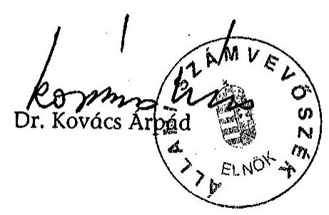

# JELENTÉS 

a Miskolc Megyei Jogú Város Önkormányzata gazdálkodásának átfogó ellenőrzéséről

---

3. Önkormányzati és Területi Ellenőrzési Igazgatóság
3.3 Átfogó Ellenőrzések Főcsoport

Iktatószám: V-1002-7/28/14/2003.
Témaszám: 635
Vizsgálat-azonosító szám: V0102

# Az ellenőrzést felügyelte: 

Dr. Lóránt Zoltán
főigazgató
Az ellenőrzés végrehajtásáért felelős:
Dr. Sepsey Tamás
főigazgató-helyettes
Az ellenőrzést vezette:
Csecserits Imréné
főcsoportfőnök-helyettes

## Az ellenőrzést végezték:

Dr. Szikszai Bertalan számvevő tanácsos Bialkó Zsolt számvevő tanácsos

## Klinga László

számvevő tanácsos
Szalontai Miklós
számvevő

## A témához kapcsolódó - az elmúlt három évben készített számvevőszéki jelentések:

## Címe

Jelentés az önkormányzati tulajdonban lévő kórházak pénzügyi helyzetének, gazdálkodásának vizsgálatáról
Jelentés a nagyvárosi tömegközlekedés feladatellátásának és finanszírozásának ellenőrzéséről
Jelentés a települési önkormányzatok szilárdhulladék-gazdálkodási feladatai ellátásának ellenőrzéséről
Jelentés a helyi önkormányzatok tartós szociális ellátási feladatainak ellenőrzéséről az idősek otthonainál
Jelentés a helyi önkormányzatok egyes pénzügyi befektetésekkel történő gazdálkodásának ellenőrzéséről
Jelentés a szakképzési struktúra szerepéről a munkaerőpiaci igények kielégítésében

## sorszáma

0023
0123
0221

0317
0318

0321

Jelentéseink az Országgyűlés számítógépes hálózatán és az Interneten a www.asz.hu címen is olvashatók.

---

# TARTALOMJEGYZÉK 

BEVEZETÉS ..... 5
I. ÖSSZEGZŐ MEGÁLLAPÍTÁSOK, KÖVETKEZTETÉSEK, JAVASLATOK ..... 7
II. RÉSZLETES MEGÁLLAPÍTÁSOK ..... 18
1.A költségvetés tervezésének, végrehajtásának és a zárszámadás elkészítésének szabályszerűsége ..... 18
1.1.A költségvetés tervezésének, a költségvetési rendelet megalkotásának, elfogadásának szabályszerűsége ..... 18
1.2.A költségvetési előirányzatok módosításának szabályszerűsége ..... 21
1.3.A gazdálkodás szabályozottsága, szabályszerűsége ..... 23
1.4.A munkafolyamatba épített ellenőrzések szabályozottsága és gyakorlati múködése a pénzügyi, gazdálkodási és számviteli feladatellátás területén ..... 28
1.5.A bizonylati rend szabályszerűsége ..... 29
1.6.A vagyon nyilvántartásának és leltározásának szabályszerűsége ..... 31
1.7.A vagyongazdálkodással kapcsolatos feladat és döntési hatáskörök szabályozottsága, a vagyonváltozást előidéző intézkedések szabályszerűsége, célszerűsége ..... 32
1.8.Az Önkormányzat által céljelleggel - nem szociális ellátásként - juttatott támogatásokkal történő elszámoltatás szabályszerűsége ..... 35
1.9.A követelések, részesedések, értékpapírok év végi értékelésének szabályszerűsége ..... 38
1.10.A múködési és felhalmozási bevételek, kiadások alakulása ..... 40
1.11.A költségvetés egyensúlyának helyzete ..... 42
1.12.A közbeszerzési eljárások szabályszerűsége ..... 43
1.13.A Polgármesteri hivatal helyi kisebbségi önkormányzatok gazdálkodásával kapcsolatos tevékenysége ..... 46
1.14.A zárszámadási kötelezettség teljesítésének szabályszerűsége ..... 47
2.Egyes kiemelt önkormányzati feladatok és a rendelkezésre álló források összhangja ..... 48
2.1.A feladatok meghatározása és szervezeti keretei ..... 48
2.2.Egyes naturális mutatókkal mérhető feladatok bevételei és kiadásai ..... 51
2.3.A jelentős ráfordítást igénylő önként vállalt feladatok ellátása ..... 52
3.A belső irányítási, ellenőrzési rendszer múködésének értékelése ..... 53
3.1.Az Önkormányzat informatikai rendszerének szabályozottsága, működése ..... 53
3.2.A helyi ellenőrzési rendszer kialakítása, múködése ..... 54
3.3.A könyvvizsgálati kötelezettség teljesítése ..... 56
3.4.A korábbi számvevőszéki ellenőrzések javaslatainak hasznosulása ..... 56

---

# MELLÉKLETEK 

1. számú Az önkormányzati vagyon nagyságának alakulása (1 oldal)
2. számú Az Önkormányzat 2002. évi bevételeinek és kiadásainak alakulása (1 oldal)
3. számú Az Önkormányzat gazdálkodását meghatározó adatok, mutatószámok (1 oldal)
4. számú Egyes önkormányzati feladatok finanszírozása (1 oldal)
5. számú Káli Sándor polgármester úr észrevétele (3 oldal)

---

# RÖVIDÍTÉSEK JEGYZÉKE 

Ötv.
Áht.
Kbt.
Számv. tv.
Htv.

Hatv.
Ámr.
Vhr.

Ktv.
SzMSz
vagyongazdálkodási rendelet

ÁSZ
TÁH
OEP
Önkormányzat
Közgyűlés
polgármester
jegyzó
Pénzügyi bizottság
Polgármesteri hivatal
ügyrend
Pénzügyi osztály

Pénzügyi osztályvezető
a helyi önkormányzatokról szóló 1990. évi LXV. törvény az államháztartásról szóló 1992. évi XXXVIII. törvény a közbeszerzésekről szóló 1995. évi XL. törvény a számvitelről szóló 2000. évi C. törvény a helyi önkormányzatok és szerveik, a köztársasági megbízottak, valamint egyes centrális alárendeltségú szervek feladat- és hatásköreiről szóló 1991. évi XX. törvény
A helyi adókról szóló 1990. évi C. törvény az államháztartás múködési rendjéről szóló 217/1998. (XII. 30.) Korm. rendelet
az államháztartás szervezetei beszámolási és könyvvezetési kötelezettségének sajátosságairól szóló 249/2000. (XII. 24.) Korm. rendelet
a köztisztviselők jogállásáról szóló 1992. évi XXIII. törvény Miskolc Megyei Jogú Város Önkormányzatának az Önkormányzat Szervezeti és Múködési Szabályzatáról szóló 55/1995. (X. 30.) számú rendelete
Miskolc Megyei Jogú Város Önkormányzatának az Önkormányzat vagyonáról és a vagyontárgyak feletti tulajdonosi jogok gyakorlásának szabályairól szóló 29/1997. (V. 21.) számú rendelete

Állami Számvevőszék
Területi Államháztartási Hivatal
Országos Egészségbiztosítási Pénztár
Miskolc Megyei Jogú Város Önkormányzata
Miskolc Megyei Jogú Város Önkormányzatának Közgyűlése
Miskolc Megyei Jogú Város Önkormányzatának polgármestere
Miskolc Megyei Jogú Város Önkormányzatának jegyzője
Miskolc Megyei Jogú Város Önkormányzatának Pénzügyi Bizottsága
Miskolc Megyei Jogú Város Önkormányzatának Polgármesteri hivatala
polgármester 1/1997. számú utasítása a Polgármesteri hivatal ügyrendjéről
Miskolc Megyei Jogú Város Önkormányzatának Pénzügyi és Ellenőrzési Osztálya, 2003. szeptember 1-jétől Pénzügyi és Gazdálkodási Osztálya
Miskolc Megyei Jogú Város Önkormányzata Pénzügyi és Ellenőrzési Osztályának osztályvezetője, 2003. szeptember 1-jétől Pénzügyi és Gazdálkodási Osztályának osztályvezetője

---

pénzkezelési szabályzat
leltározási szabályzat
2/1998. számú együttes utasítás

2/2003. számú együttes utasítás

Fejlesztési Program
MIK Rt.
MIHŐ Kft.
MVK Rt.
MIVÍZ Rt.
Városgazda Kht.
ESzCsM
ÖNHIKI
Diósgyőri Kórház

Miskolc Megyei Jogú Város Önkormányzata Polgármesteri hivatalának Pénzkezelési szabályzata
a jegyző 4/1999. számú rendelkezése a leltározási és leltárkészítési szabályzatról
a polgármester és a jegyző 2/1998. számú Együttes utasítása a költségvetési gazdálkodás lebonyolításával kapcsolatos feladatok ellátásáról
a polgármester és a jegyző 2/2003. számú Együttes utasítása 2003. július 1-jétől a költségvetési gazdálkodás lebonyolításával kapcsolatos feladatok ellátásáról
Miskolc Megyei Jogú Város Önkormányzatának Fejlesztési Programja 2001-2003. évekre
Miskolci Ingatlankezelő Részvénytársaság
Miskolci Hőszolgáltató Korlátolt Felelősségű Társaság
Miskolc Városi Közlekedési Részvénytársaság
Miskolci Vízmúvek Részvénytársaság
Miskolci Városgazda és Városgazdálkodási Közhasznú Társaság
Egészségügyi, Szociális és Családügyi Minisztérium
Önhibáján kívül hátrányos helyzetben lévő települési önkormányzatok kiegészítő állami támogatása
Diósgyőri Kórház és Rendelőintézet

---

# JELENTÉS 

## a Miskolc Megyei Jogú Város Önkormányzata gazdálkodásának átfogó ellenőrzéséről

## BEVEZETÉS

Az Ötv. 92. § (1) bekezdése, valamint az Áht. 120/A. § (1) bekezdése szerint az önkormányzatok gazdálkodását az Állami Számvevőszék ellenőrzi. A vizsgálatot a V-1002-7/2003. számú ellenőrzési program alapján végeztük.

## Az ellenőrzés célja annak értékelése volt, hogy:

- az önkormányzati gazdálkodás törvényességét, szabályszerűségét biztosítot-ták-e a tervezés, a költségvetés végrehajtása és a zárszámadás során; a gazdálkodás szabályszerűségét biztosító kontrollok ${ }^{1}$ megfelelően segítették-e a végrehajtást;
- az önkormányzat által ellátandó feladatok és az azokhoz rendelkezésre álló pénzforrások összhangja biztosított volt-e;
- a helyi kisebbségi önkormányzat gazdálkodása során érvényesültek-e az Áht. és a vonatkozó kormányrendeletek előírásai.

Az ellenőrzött időszak: a 2002. év, valamint a 2003. I-III negyedév, az 1.7, a 2.1-2.3. és a 3.2-3.4. ellenőrzési programpontok esetében a 2000-2002. évek.

Miskolc megyei jogú város, Borsod-Abaúj-Zemplén megye székhelye, az ország harmadik legnagyobb városa. Az állandó lakosok száma 2002-ben 187328 fő volt.

Az Önkormányzat 10 gazdasági társaságban rendelkezik többségi tulajdonnal, amelyek az ivóvíz-szolgáltatással és szennyvízelvezetéssel, távhőszolgáltatással, helyi tömegközlekedéssel, ingatlangazdálkodással és kulturális szolgáltatásokkal kapcsolatos feladatokat látják el.

Az Önkormányzat 2002. évi mérlegében szereplő eszközök értéke 48,2 milliárd Ft, a 2002. évi teljesített költségvetési bevételek összege 39,2 milliárd Ft, a teljesített kiadásoké 38,3 milliárd Ft volt.

Miskolc Megyei Jogú Városban 11 kisebbségi önkormányzat múködik, melyekből öt a 2002. évi helyhatósági választásokat követően alakult meg.

[^0]
[^0]:    ${ }^{1}$ A gazdálkodás szabályszerűségét biztosító kontroll alatt értjük a kiépített és működő belső irányítási és szabályozási rendszert, valamint a belső ellenőrzési funkciók ellátását.

---

A Közgyűlés munkáját 10 állandó bizottság²segíti, a Közgyűlés tagjainak száma 2002. évben 48 fő. A Polgármesteri hivatalban foglalkoztatott köztisztviselők száma 382 fő volt. Az Önkormányzat 87 önállóan gazdálkodó költségvetési intézményt tart fenn, amelyekben 9636 fő közalkalmazottat foglalkoztattak.

Az ellenőrzött időszakban a Polgármesteri hivatal vezetésében, irányításában, illetve egyes osztályok vezetésében személyi változások következtek be, az önkormányzati választások következtében változott a polgármester személye, és nyugdíjazás miatt új jegyzőt neveztek ki. Az átszervezés az ÁSZ ellenőrzés ideje alatt is folyamatban volt.
${ }^{2}$ Jogi, igazgatási, közbiztonsági és összeférhetetlenségi-, gazdasági-, pénzügyi-, városfejlesztési és üzemeltetési-, oktatási-, egészségügyi-, kulturális és sport-, ifjúsági, idősügyi és családpolitikai-, környezetvédelmi és energiaügyi-, idegenforgalmi bizottság.

---

# I. ÖSSZEGZŐ MEGÁLLAPÍTÁSOK, KÖVETKEZTETÉSEK, JAVASLATOK 

Az Önkormányzat gazdasági programját „Miskolc Megyei Jogú Város Fejlesztési Programja 2001-2003. évekre" elnevezéssel fogadta el a Közgyűlés. A 2002. és a 2003. évi költségvetési koncepciót és rendelettervezetet a polgármester határidőben a Közgyűlés elé terjesztette. A költségvetési koncepciót a bizottságok megtárgyalták, de írásos véleményüket az Ámr-ben előírtak ellenére nem csatolták az előterjesztéshez, azt a Közgyűlésen szóban ismertették. A költségvetési koncepciót a helyben képződő bevételek és az ismert kötelezettségek számba vételével állították össze. A koncepció tervezete a kisebbségi önkormányzatokra vonatkozó részt nem tartalmazott.

A 2002. és a 2003. évi költségvetési rendelettervezeteket az Ámr-ben előírt módszer figyelembe vételével állították össze. Az intézményi előirányzatokat az intézményvezetőkkel egyeztették. A könyvvizsgáló jelentését és a Pénzügyi bizottság véleményét az Ámr-ben foglaltak ellenére a rendelettervezethez nem csatolták. Az alapítói okiratokban az Ámr. előírásai ellenére nem rendelkeztek az óvodák gazdálkodási jogkörök szerinti, valamint az előirányzat felhasználási jogkör szerinti besorolásáról, azok a költségvetésben nem alkottak külön címet, bevételeik és kiadásaik nem kerültek intézményenként bemutatásra. A kötelezően előírt mérlegek, kimutatások tartalmát, az Áht. előírását megsértve, rendeletben nem határozták meg, két tájékoztatásul bemutatott mérleghez - melyek a többéves kihatással járó döntésekről és a közvetett támogatásokról szóltak - nem adtak szöveges indoklást a költségvetési és a zárszámadási rendeletben. A költségvetés végrehajtásával összefüggő végrehajtási szabályokat a költségvetési rendeletben meghatározták. A 2003. évre tervezett 2260 millió Ft-os költségvetési hiány 710 millió Ft-tal nőtt az előző évhez képest.

A Közgyűlés a költségvetési rendeletet a 2002. évben hat alkalommal módosította. Az Önkormányzat intézményei 708,3 millió Ft-tal, a Polgármesteri hivatal 233,8 millió Ft-tal lépte túl a Közgyűlés által jóváhagyott előirányzatokat, az Áht-t megsértve. A túllépéseket a saját hatáskörű előirányzat módosítások Közgyűlés felé történő kezdeményezésének Ámr-ben előírt elmulasztása és az okozta, hogy az Áht. előírását megsértve kötelezettségvállalás és utalványozás a jóváhagyott előirányzatok mértéke felett is történt. A 2002. évi költségvetési rendelet első és utolsó módosítása során az Ámr-ben előírt határidőt nem tartották be. A saját hatáskörű előirányzat-módosítások elmaradásából eredő túllépések okait nem vizsgálták és felelősségre vonást nem kezdeményeztek. A Közgyűlés által elfogadott előirányzatokban bekövetkezett változásokat a főkönyvi könyvelésben és az analitikus nyilvántartásokban folyamatosan nyilvántartották. A 2003. évi költségvetési rendelet-módosításokat az Ámr-ben előírtak ellenére nem negyedévente hajtották végre.

A Polgármesteri hivatalban a gazdálkodással kapcsolatos feladat- és hatásköröket a polgármester és a jegyző együttes utasításban szabályozta. A gazdálkodási jogkörök gyakorlása és a felhatalmazások szabályai megfeleltek az Ámr-ben előírt követelményeknek, a pénzkezelési szabályzat és az együttes

---

utasítások összhangja azonban nem biztosított. A kötelezettségvállalások nyilvántartásának formai és tartalmi követelményeit az Ámr-ben foglaltak ellenére nem írták elő. A bankszámlával kapcsolatos pénzforgalom utalványozása az arra feljogosítottak részéről az Ámr-ben előírtak ellenére elmaradt, valamint a 100 millió Ft feletti kifizetések ellenjegyzését az Ámr-ben és az együttes utasításban előírtak ellenére a jegyző elmulasztotta. A 2003. november hónaptól alkalmazott utalványrendeleten az arra feljogosított személyek gyakorolták az utalványozási, ellenjegyzési jogkörüket. A pénztári be- és kifizetések esetében az utalványozást és ellenjegyzést - az Ámr-ben előírt összeférhetetlenségi szabályok figyelmen kívül hagyásával - ugyanazon személy végezte.

A Polgármesteri hivatal részjogkörű egységei részére biztosított előirányzatok feletti rendelkezési és ellenőrzési feladatokkal megbízottakat a jegyző nem határozta meg. Az előzetes írásbeliséget nem igénylő 50 ezer Ft-ot el nem érő kötelezettségvállalások rendjét és nyilvántartási formáját, tartalmi követelményeit az Ámr-ben foglaltak ellenére a jegyző́ belső szabályzatban nem írta elő. A kötelezettségvállalások nyilvántartásba vételi sorszámát a pénztári és a banki bizonylatokon az Ámr-ben előírtak ellenére nem tüntették fel. A Pénzügyi osztályon dolgozók munkaköri leírással rendelkeztek, de azok - egyes eseteket kivéve - nem tartalmazták az együttes utasításokban meghatározott hatásköröket. A szakmai teljesítés igazolásának módjáról, az azt végző személyek kijelöléséről az Ámr-ben előírtak ellenére nem gondoskodtak. A banki és pénztári bizonylatok érvényesítését az arra feljogosított dolgozók minden esetben elvégezték. Az érvényesítést végző és a szakmai teljesítést igazoló személyek összeférhetetlenségét az Ámr. előírásai ellenére nem szabályozták. Nem határozták meg a munkafolyamatba épített ellenőrzés során feltárt hiányosságok dokumentálásának módját.

A Polgármesteri hivatal a helyi sajátosságok figyelembevételével elkészítette a számviteli politika részeként előírt szabályzatokat és a számlarendet. A Vhr-ben és a leltározási és leltárkészítési szabályzatban előírtak ellenére nem rögzítették a leltározás elvégzését igazoló leltárt helyettesítő összesítő kimutatás tartalmát, és alkalmazásának Közgyűlés általi egyetértését nem kérték ki. A jegyző a Polgármesteri hivatal számviteli rendjét szabályozta, de a Htvben előírtakat megsértve nem alakította ki az intézmények számviteli rendjét. A szabályzatokat és a számlarendet a 2003. évi változásokkal nem aktualizálták. A szigorú számadású nyomtatványok nyilvántartása hiányos, azok leltározását nem végezték el. Az elszámolásra kiadott előlegek elszámolási határidejét csak a belföldi és a külföldi kiküldetések esetében határozták meg.

A Polgármesteri hivatalban a pénztári kiadásokat alátámasztó számviteli bizonylatok 1,5\%-ában jelentkező típushibák (a Polgármesteri hivatal által kiállított pénztárbizonylatokon nem szerepelt a gazdálkodó szervek megjelölése, üzemanyag elszámolások) következtében megsértették a Számv. tv-ben a bizonylatokra vonatkozóan előírt alaki és tartalmi követelményeket. A gazdasági eseményt öt alkalommal nem a tényleges tartalmának megfelelően rögzítették a számviteli nyilvántartásban.

A részesedésekről és értékpapírokról egyedi analitikus nyilvántartást az Ámrben foglaltakkal ellentétben nem vezettek. Az ingatlanvagyon-kataszter és a számviteli nyilvántartás közötti összhangot 2003. január 1-jét követően biztosí-

---

tották. A Polgármesteri hivatalnál mennyiségi leltározást a Vhr-ben és a leltározási és leltárkészítési szabályzatban meghatározott eszközcsoportoknál az előírtak ellenére nem végeztek. Az eszközök és a források leltározását a 2002. év végén a Közgyűlés egyetértése nélkül, a részletező nyilvántartásokból készített összesítő kimutatások alapján végezték el. A leltározási szabályzatban nem határozták meg az összesítő kimutatások tartalmát, formáját, kellékeit. A követelések, részesedések, értékpapírok értékelését a gazdálkodási év végén elvégezték, és az a központi és a helyi szabályozásban előírtaknak megfelelő volt. Az üzemeltetésre, kezelésre átadott eszközök közül négy esetében az átadásról megállapodás nem készült és ezen eszközök mennyiségi leltározása az Önkormányzatnál nem történt meg.

A vagyongazdálkodást szabályozó rendelet módosítása - az ÁSZ korábbi ellenőrzése során tett javaslat ellenére - nem történt meg, az ingó és ingatlanvagyon értékesítésére, hasznosítására megállapított versenyeztetési kötelezettség értékhatárát indokolatlanul magas összegben határozták meg. A vagyonváltozást eredményező intézkedéseknél - értékesítés, bérbeadás, követelések törlése - betartották a vagyongazdálkodási rendelet előírásait. A MIVÍZ Rt.-nek üzemeltetési céllal átadott létesítmények esetében azonban nem az arra jogosult Közgyűlés döntött. Az önkormányzati követelések elengedésével kapcsolatban lehetővé tették a méltányosság gyakorlását, azonban annak tartalmát nem határozták meg.

Az önkormányzati vagyon, az eszközök nettó értéke a 2000. évről a 2002. évre $37,8 \%$-kal nőtt, azonban ennek $40 \%$-át idegen (kölcsön) tőke finanszírozta. Kiugróan magas volt a növekedés az üzemeltetésre átadott eszközöknél, mivel a MIK Rt. kezelésében lévő, korábban érték nélküli földingatlanok értékét a 2001. évben megállapították, emiatt a vagyonérték 4,3 milliárd Ft-tal nőtt. A befejezetlen beruházások értéke 2065 millió Ft-tal nőtt a 2002. év végén az előző évhez képest.

A Polgármesteri hivatal a 2002. évben múködési célra 1609 millió Ft, fejlesztési célra 431 millió Ft, mindösszesen 2040 millió Ft, a 2003. évben 2295 millió Ft támogatást adott önkormányzati gazdasági társaságok, különféle szervezetek, magánszemélyek részére. Az államháztartáson kívüli szervezeteknek céljelleggel juttatott pénzeszközökkel kapcsolatos számadási és ellenőrzési kötelezettséget a költségvetési rendeletben az Áht. előírásaival összhangban határozták meg. Az Áht. előírásait megsértve az elszámolást nem követelték meg az önkormányzati gazdasági társaságoktól, illetve nem végezték el a felhasználások ellenőrzését. Az egyéb szervezeteknél - alapítványok, egyházak, non-profit szervezetek - megtörtént a számadások megkövetelése és az ellenőrzés. Az ellenőrzést a beküldött dokumentummásolatok alapján, illetve a megállapodásban foglaltakra tekintettel végezték el a Polgármesteri hivatalnál. Az ellenőr által rögzített jegyzőkönyvek szerint megállapított elszámolási hiányosságok miatt, az Áht. előírásait megsértve, nem intézkedtek a támogatások folyósításának a felfüggesztésére, illetve a visszafizetésre. A hatáskört gyakorló személyek felé a 2003. évi költségvetés összeállításakor jelezték azon szervezetek jegyzékét, melyek nem tettek eleget kötelezettségeiknek, s kérték a következő évi támogatásokból való kihagyásukat. A költségvetési rendeletben keretjelleggel meghatározott támogatások esetére a Közgyűlés a támogatásokra vonatkozó döntési hatáskörét bizottságokra, a polgármesterre és az alpolgármesterekre át-

---

ruházta. Az alapítványi, közalapítványi támogatás vonatkozó döntési jog átruházásával, valamint az átruházott hatáskör továbbadásával az Ötv. előírását megsértették. A céltámogatás alapítvány részére történő juttatása alkalmával - a 2002. évben egy esetben - a polgármester gyakorolta a döntési hatáskört, amivel megsértette az Ötv. előírásait, mivel a Közgyűlés hatásköréből nem ruházható át az alapítványok támogatása.

Az önkormányzati követelések, részesedések, értékpapírok év végi értékelését a Számv. tv., a Vhr. és szabályzataik előírásaival összhangban elvégezték. Az önkormányzati tulajdonú gazdasági társaságok részére nyújtott kölcsönök törlesztési határidejének betartása érdekében a határidő letelte után intézkedést tettek.

Az Önkormányzat 2002. évi múködési célú bevételei és kiadásai közötti egyensúly - 220 millió Ft ÖNHIKI igénybe vételét követően - biztosított volt. A fizetőképességet a vizsgált években csak likviditási célú hitel felvételével tudták megőrizni, amelynek értéke folyamatos növekedést mutatott. A felhalmozási célú kiadások a 2002. évben a 2000. évhez képest 111,4\%-kal emelkedtek, az összes kiadások 14,8\%-át alkották. A növekvő mértékű felhalmozási kiadásokat azonban fokozódó eladósodás árán tudták teljesíteni. Az Önkormányzat beruházásokra felvett hitelállománya a 2002. év végén összesen 3 milliárd Ft-ot tett ki. Az Önkormányzat adósságot keletkeztető kötelezettségvállalása nem veszélyeztette a működőképességet a 2002. évben. A kötelezettségvállalások nyilvántartásának teljes körűségét és egységességét biztosító szabályozás hiánya miatt, a 2002. évre vonatkozóan az Áht. előírásait megsértve nem rendelkeztek olyan összesítő kimutatással, melyből megbízhatóan megállapítható az éves kötelezettségvállalások teljes köre és összege.

A működés gazdaságosabbá tétele érdekében, a demográfiai változásokat követve, intézmény-összevonás, illetve megszüntetés lehetőségével három óvoda és egy általános iskola esetében éltek, két általános és egy középiskola feladatellátási kötelezettségét pedig egyházaknak adták át a vizsgált időszakban. A 2000-2002. években nem értékelték a vállalkozások feladatellátásban betöltött helyét, szerepét és eredményességét. A működési források kiegészítése érdekében 366 millió Ft összegben vontak be a költségvetésbe pályázat útján elnyert bevételt. A hiány csökkentése érdekében az iparűzési, az építmény- és az idegenforgalmi adó mértékét növelték.

A Közgyűlés rendeletet alkotott az Önkormányzat és szervei közbeszerzési eljárásainak helyi szabályairól. Az osztályok ügyrendjeiben, valamint az érintettek munkaköri leírásaiban azonban nem konkretizálták a végrehajtással kapcsolatos feladatokat. A Kbt. előírásait megsértve az önkormányzati rendelet közbeszerzési eljárást lezáró szabályozása a döntés meghozatalára a közbeszerzési bizottságot jogosítja fel. A lefolytatott közbeszerzési eljárások során a nyertes pályázók kiválasztásáról szóló döntést a Kbt-t megsértve a Közbeszerzési Bizottság hozta meg. A felújításokra és az útberuházásokra adott megrendeléseknél a közbeszerzési eljárás lefolytatásának elmaradásával megsértették a törvényben foglalt részekre bontás tilalmát és az egybe számítás követelményét. A közbeszerzési eljárásban nyertes szervezettel utólag vállalkozási szerződésmódosításra is sor került, melynek a Kbt-ben előírt feltétele nem volt meg, a körülmény nem a szerződést követően következett be. A közbeszerzésekről

---

szóló rendeletben előírták a törvény hatálya alá nem tartozó, értékhatár alatti beszerzések rendjét, azonban nem határozták meg ezen beszerzéseknél lefolytatandó eljárás konkrét módját és a döntéshozatalra jogosultak körét.

Az Önkormányzat és a helyi kisebbségi önkormányzatok megállapodás keretében szabályozták az együttmúködés körébe tartozó feladatokat, illetve a követendő eljárások rendjét. A megállapodásokban nem rögzítették az Ámrben foglaltakkal ellentétben a költségvetési előirányzatok módosításáról szóló kisebbségi önkormányzatnak az Önkormányzat részére történő átadása határidejét, a teljesítések szakmai igazolásának rendjét, a leltározással és belső ellenőrzéssel kapcsolatos feladatokat. Négy kisebbségi önkormányzat esetében a megállapodások jogszabályi hivatkozásainak aktualizálása nem történt meg. A kisebbségi önkormányzatok költségvetési és zárszámadási határozatait az Önkormányzat változatlan tartalommal beépítette költségvetési, illetve zárszámadási rendeleteibe. Valamennyi kisebbségi önkormányzat rendelkezik elkülönített költségvetési alszámlával, azonban az Ámr. előírásától eltérően nem minden pénzforgalmat ezen bonyolítottak. A kisebbségi önkormányzatok vagyoni és számviteli nyilvántartását a Polgármesteri hivatalban, az Önkormányzat nyilvántartásain belül elkülönítetten vezetik.

A pénzmaradvány elszámolást az Ámr. előírásai szerint készítették el, azonban a figyelembe vett aktív függő elszámolások között olyan összegek is szerepeltek, melyek nem részei a pénzmaradványnak. Az Önkormányzat a 2002. évi zárszámadásról szóló rendeletet határidőben, a költségvetéssel összehasonlítható módon fogadta el.

A Közgyűlés az Ötv. előírásait megsértve az Önkormányzat SzMSz-ében, vagy más rendeletében nem határozta meg az általa ellátandó kötelező és önként vállalt feladatokat. A részben önállóan gazdálkodó költségvetési szervek - óvodák - esetében az Ámr-ben előírtak ellenére elmulasztották a törzskönyvi nyilvántartásba vétel kezdeményezését. A Közgyúlés előterjesztés hiányában nem hagyta jóvá az Ámr. előírásait figyelmen kívül hagyva az önállóan és a részben önállóan gazdálkodó költségvetési szerv között létrejött, a munkamegosztás és felelősségvállalás rendjét rögzítő együttműködési megállapodást, továbbá nem döntött a részben önállóan gazdálkodó költségvetési szervek előirányzatok feletti rendelkezési jogosultság szerinti besorolásról sem. A településüzemeltetési feladatokat az Önkormányzat a kizárólag önkormányzati tulajdonban lévő gazdasági társaságok útján látja el.

A feladatok ellátásának finanszírozásában az Önkormányzat fokozott szerepvállalásra kényszerült. A feladatmutatókkal mérhető feladatok fajlagos kiadásai az inflációt meghaladóan nőttek a vizsgált időszakban. A változást döntően a központi bérintézkedések miatti személyi jellegű kiadások növekedése idézte elő. Az Önkormányzat intézményei akadálymentesítési munkálatai a 2001. évi felmérés alapján 916 millió Ft kiadást igényel, a feladat elvégzésére 2003. év végéig 20,9 millió Ft-ot fordított az Önkormányzat.

Az akadálymentesítéssel kapcsolatosan a 2001-2003. években elvégzett feladatok - mennyiségi és időarányos - nem teszik lehetővé a még hátralévő feladatok 2005. január 1-jei határidőre történő elvégzését.

---

Az Önkormányzat informatikai fejlesztési koncepcióját az 1997. évben elkészítették, azonban az abban meghatározott feladatok végrehajtását nem értékelték. Az informatikai biztonságvédelmi - jogosultsági, adatbiztonsági - rendszer kialakítása a pénzügyi, számviteli területen nem felel meg a szabályzatban meghatározott adatvédelmi követelményeknek, s nem alakítottak ki katasztrófa elhárítási tervet.

Az Önkormányzat az Ötv. 92. § (2) bekezdésében a saját intézmények pénzügyi ellenőrzésére meghatározott feladatok végrehajtására kialakította az ellenőrzés szervezetét és biztosította a személyi feltételeket. Az intézmények ellenőrzésére előírt ötévenkénti gyakoriság túl hosszú időtartamot jelent, nem tette lehetővé a hibák megfelelő időben történő feltárását, s azok gyors kijavítását. Az intézményi belső ellenőrzés szervezetét, s a belső ellenőrzést 2003. szeptember hóban a Polgármesteri kabinethez rendelték. A szervezeti besorolásra vonatkozóan megsértették az Áht. előírásait, mivel 2003. január 1-jétől nem biztosították az ellenőrzés funkcionális függetlenségét. A Polgármesteri hivatal belső ellenőrzési feladatai ellátására nem foglalkoztattak ellenőrt, megsértve az Áht-ben és Ötv-ben előírtakat.

Az Önkormányzat a törvényben előírt könyvvizsgálati kötelezettségét költségvetési minősítésű könyvvizsgáló foglalkoztatásával teljesítette.

A korábbi ÁSZ vizsgálatok tapasztalatainak, javaslatainak hasznosítására készített intézkedési tervekben meghatározták az elvégzendő feladatokat, azok végrehajtásáért felelős személyeket és határidőt. A javasolt intézkedések 78\%-át megvalósították.

A helyszíni ellenőrzés megállapításai mellett a gazdálkodás szabályszerűségének és a munka színvonalának javítása érdekében javasoljuk:

# a polgármesternek 

## a törvényes állapot helyreállítása és a jogszabályi előírások betartása érdekében

1. csatolja a Ámr. 28. § (3) bekezdése szerint a költségvetési koncepció tervezethez a Pénzügyi bizottság, valamint a helyi kisebbségi önkormányzatok koncepcióról alkotott véleményét;
2. csatolja az Ámr. 29. § (9) bekezdésében foglaltak alapján a költségvetési rendelettervezethez a Pénzügyi bizottsági véleményt és a könyvvizsgálói jelentést;
3. terjessze - a jegyző által készített előterjesztés alapján - a Közgyűlés elé az Áht. 118. $\S$-ában előírt mérlegek, kimutatások tartalmának meghatározásáról szóló rendelettervezetet;
4. gondoskodjon az Ámr. 29. § (1) bekezdés a) és b) pontjaiban foglaltaknak megfelelően, a részben önállóan gazdálkodó költségvetési szerveket is tartalmazó költségvetési és zárszámadási rendelet Közgyűlés elé terjesztéséről;

---

5. gondoskodjon az Ámr. 53. § (2) és (6) bekezdésében foglaltak betartása érdekében arról, hogy a költségvetési rendelet utolsó módosítása határidőben megtörténjen, az intézmények saját hatáskörű előirányzat módosítási igényeiket a Közgyűlés felé az Ámr. 53. § (6) bekezdésében foglaltak szerinti határidőben jelezzék, és az előirányzatok módosításra kerüljenek;
6. követelje meg, hogy az Áht. 93. § (1) bekezdésében foglaltaknak megfelelően a költségvetési szervek a Közgyűlés által jóváhagyott előirányzatokon belül gazdálkodjanak. Az előirányzat túllépések okait vizsgálják felül, indokolt esetekben kezdeményezzen személyes felelősségre vonást;
7. kezdeményezze az Ötv. 8. § (2) bekezdése alapján, hogy a Közgyűlés határozza meg az Önkormányzat kötelező és önként vállalt feladatait;
8. intézkedjen az Áht. 13./A. § (2) bekezdése alapján, hogy a támogatott szervezetek eleget tegyenek a részükre meghatározott elszámolási kötelezettségnek, ellenőriztesse a támogatások cél szerinti felhasználását, s a céltól eltérő felhasználás esetén kezdeményezze a támogatások visszafizetését;
9. biztosítsa a céljellegű támogatások juttatása esetén az Ötv. 10. § (1) bekezdés d) pontjában előírtak betartását, miszerint a Közgyűlés hatásköréből nem ruházható át a közösségi célú alapítványi forrás átadása;
10. szüntesse meg az alpolgármesterek támogatások odaítélésével kapcsolatos döntési hatásköreiket, mivel azzal megsértik az Ötv. 9. § (3) bekezdésében előírtakat;
11. kezdeményezze a Kbt. 31. § (3) bekezdésének megfelelően a döntési hatáskörre vonatkozóan a közbeszerzési rendelet módosítását;
12. intézkedjen az Ámr. 29. § (10) bekezdése szerint annak érdekében, hogy a helyi kisebbségi önkormányzatokkal kötött megállapodásokban szabályozásra kerüljön a költségvetési előirányzatok módosításáról szóló kisebbségi önkormányzati határozatok Önkormányzat részére történő átadásának határideje;
13. kezdeményezze a Közgyűlésnél a lakás és nem lakás céljára szolgáló helyiségek bérletéről szóló VIII-186/23585/2003. számú önkormányzati határozat módosítását annak érdekében, hogy a pártok részére megállapított díjtételeket az Alkotmánybíróság 47/2002. (X. 11.) AB. határozat döntésével összhangban állapítsák meg;

# a munka színvonalának javítása érdekében 

14. vizsgálja felül az üzemeltetésre, kezelésre átadott eszközök átvétele és átadása kapcsán kötött megállapodásokat, pótolják a hiányzókat;
15. kezdeményezze a vagyongazdálkodási rendelet módosítását, a versenyeztetésre vonatkozó magas értékhatár csökkentését, valamint a követelések elengedésére vonatkozó méltányossági események meghatározását;
16. kezdeményezze a Közgyűlésnél az önkormányzati tulajdonban lévő gazdasági társaságok, vállalkozások feladatellátásban betöltött szerepének, eredményességének értékelését;

---

17. számoltassa be a felhatalmazottakat a kötelezettségvállalás, utalványozás gyakorlásáról;
18. biztosítsa, hogy a korábbi ÁSZ ellenőrzések - a szilárd hulladékgazdálkodás feladatai, az egyes pénzügyi befektetésekkel történő gazdálkodás - javaslatainak hasznosítására készült intézkedési tervek végrehajtása megtörténjen;
19. kezdeményezze a számvevőszéki ellenőrzés tapasztalatainak Közgyűlés előtti megtárgyalását, és a feltárt hiányosságok megszüntetése érdekében intézkedési terv készüljön;
20. gondoskodjon arról, hogy a közintézmények akadálymentessé tétele a program szerinti ütemezésben megvalósuljon;

# a jegyzőnek 

## a törvényes állapot helyreállítása és a jogszabályi előírások betartása érdekében

1. építse be az Ámr. 28. § (6) bekezdésének előírásai szerint az Önkormányzat költségvetési koncepciójába a helyi kisebbségi önkormányzatokra vonatkozó részt, és tájékoztassák a kisebbségi önkormányzatok elnökeit a költségvetési koncepció rájuk vonatkozó részéről;
2. mutassa be az Áht. 67. § (3) bekezdésének előírásai szerint a költségvetési rendeletben a részben önállóan gazdálkodó költségvetési szerveket címenként;
3. készítse el az Áht. 118. §-a alapján a költségvetési és a zárszámadási rendeletek előterjesztésekor a Közgyűlés részére tájékoztatásul bemutatott mérlegek (az Áht. 116. § 9. pontja szerinti többéves kihatással járó döntések számszerűsítését évenkénti bontásban valamint a 116. § 10. pontja szerint a közvetett támogatásokról szóló kimutatás) szöveges indokolását;
4. írja elő az Ámr. 134. § (4) bekezdésének előírása szerint belső szabályzatban az előzetes írásbeliséget nem igénylő 50 ezer Ft-ot el nem érő kötelezettségvállalások rendjét és a nyilvántartás formáját;
5. jelölje ki az Ámr. 135. § (3) bekezdésének előírásait figyelembe véve a szakmai teljesítés igazolását végzőket és határozza meg feladataikat;
6. írja elő és biztosítsa az Ámr. 135. § (5) bekezdésében meghatározott összeférhetetlenségi szabályokat, az érvényesítést és a szakmai teljesítésigazolást végző személyekre vonatkozóan;
7. határozza meg az Ámr. 134. § (6) bekezdése szerinti kötelezettségvállalás nyilvántartás formai és tartalmi követelményeit úgy, hogy a nyilvántartásból megállapítható legyen az évenkénti kötelezettségvállalások összege;
8. gondoskodjon az Ámr. 136. § (4) bekezdés h) pontjával összhangban arról, hogy a külön írásbeli rendelkezésként elkészített utalványon a kötelezettségvállalások nyilvántartásba vételi sorszáma feltüntetésre kerüljön;

---

9. gondoskodjon az Ámr. 137. § (2) bekezdésében és a 2/2003. számú együttes utasításban előírtak szerint arról, hogy a bevételi és kiadási bizonylatok esetében az utalványozás ellenjegyzését az értékhatártól függően az arra feljogosított személyek végezzék, szüntesse meg a bevételi és kiadási pénztárbizonylatok utalványozása és ellenjegyzése során felmerült összeférhetetlenséget az Ámr. 138. § (1) bekezdésében előírtak figyelembe vételével;
10. követelje meg, hogy az Áht. 12/A. § (1) bekezdésében foglaltaknak megfelelően kötelezettségvállalást és utalványozást csak a jóváhagyott előirányzatok mértékéig teljesítsenek;
11. intézkedjen, hogy az Ámr. 136. § (2) bekezdésében és a 2/2003. számú együttes utasításban előírtak szerint történjen a bevételek és kiadások utalványozása;
12. kezdeményezze az Ámr. 14. § (5) bekezdés b) pontjában foglaltak szerint az önállóan és a részben önállóan gazdálkodó költségvetési szervek között megkötött együttműködési megállapodások jóváhagyását, és az Ámr. 15. § (1) bekezdésben meghatározottak szerint a részben önállóan gazdálkodó költségvetési szervek előirányzatok feletti rendelkezési jogosultság szerinti besorolását;
13. vizsgálja felül és aktualizálja a Vhr. 8. § (4) bekezdésében és a Vhr. 37. § (5) bekezdésében előírt számviteli szabályzatok - kiemelten az eszközök és források leltározási és leltárkészítési valamint pénzkezelési szabályzatokat -, továbbá a 49. §-ban előírt számlarend tartalmát, és gondoskodjon az azokban előírtak végrehajtásáról;
14. gondoskodjon a Vhr. 49. § (1) bekezdése szerint a részesedések és értékpapírok esetében a könyvviteli számlákhoz kacsolódó analitikus nyilvántartások vezetéséről;
15. alakítsa ki a Htv. 140. § (1) bekezdés c) pontja alapján az Önkormányzat költségvetési intézményei egységes számviteli rendjét;
16. biztosítsa a Számv. tv. 165. § (1) bekezdése alapján, hogy a számviteli nyilvántartásokban a megtörtént gazdasági eseményeket tényleges tartalmuknak megfelelően rögzítsék,
17. gondoskodjon a Számv. tv. 166.-167. §-ai előírásainak megfelelően arról, hogy a gazdasági eseményeket magukba foglaló bizonylatok az előírt alaki és tartalmi követelményeknek megfeleljenek, különösen az aktív függő elszámolások, a céltámogatások és a kölcsöntörlesztések könyvelésénél;
18. tegye teljes körűvé a Számv. tv. 168. §-ában előírt szigorú számadású nyomtatványok nyilvántartásának vezetését, továbbá gondoskodjon azok leltározásáról;
19. intézkedjen a Vhr. 37. § (3) bekezdésében előírtak szerint az eszközök, ezen belül az üzemeltetésre, kezelésre átadott eszközök és a források leltározásának mennyiségi felvétellel történő végrehajtása érdekében;
20. intézkedjen a Kbt. 5. § (1) és (2) bekezdésében foglalt részekre bontás tilalmának és a becsült érték számításánál az egybeszámítás követelményének érvényesítése érdekében. A szerződésmódosítások esetében tartassa be a Kbt. 73. § (1) bekezdésében foglaltakat;

---

21. határozza meg a közbeszerzési törvényben előírt értékhatárt el nem érő beszerzésekre vonatkozóan a feladat- és hatásköri szabályokat a Kbt. 24. § (4) bekezdésében foglaltak alapján;
22. biztosítsa, hogy az Ötv. 92. § (2) bekezdésében és az Áht. 120/A. § (2) bekezdés b) pontjában előírt belső ellenőrzési tevékenység az Önkormányzatnál végrehajtásra kerüljön, gondoskodjon az Áht. 121/A. § (3) bekezdése alapján a Polgármesteri hivatal belső ellenőrzésének kialakításáról, ennek keretében biztosítsa a (4) bekezdésben felsorolt, az ellenőrök funkcionális függetlenségét biztosító feltételeket;
23. kezdeményezze, hogy a kisebbségi önkormányzatokkal kötött megállapodások tartalmazzák az Ámr. 135. § (1) és (5) bekezdése szerinti szakmai teljesítések igazolásával összefüggő szabályokat;
24. kezdeményezze az Ámr. 53. § (7) bekezdése alapján, hogy a kisebbségi önkormányzatok módosítsák költségvetési határozataikat abban az esetben, ha többletbevételt érnek el;
25. intézkedjen annak érdekében, hogy a kisebbségi önkormányzatok pénzforgalma a számukra megnyitott alszámlákon történjen a megállapodásokban rögzítetteknek megfelelően;

# a munka színvonalának javítása érdekében 

26. teremtse meg a pénzkezelési szabályzat és a $2 / 2003$. számú együttes utasítás összhangját az utalványozási és ellenjegyzési feladatok tekintetében;
27. vizsgálja felül a Polgármesteri hivatal szervezeti egységeinek ügyrendjét, kezdeményezze az ügyrendek és a 2/2003. számú együttes utasítás összhangjának kialakítását;
28. vizsgálja felül és egészítse ki a dolgozók munkaköri leírásait, különös figyelemmel a gazdálkodási jogkörök gyakorlására és a belső szabályzatokban előírtakra, valamint az Önkormányzat közbeszerzési rendeletében meghatározottakra;
29. szabályozza egyértelműen a pénzkezelési szabályzatban az elszámolásra felvett előlegek elszámolási határidejét;
30. intézkedjen arról, hogy a gazdasági társaságok a részükre nyújtott kölcsönökkel határidőben elszámoljanak;
31. vizsgálja meg az immateriális javak és tárgyi eszközök analitikájának számítógépes nyilvántartása lehetőségét;
32. biztosítsa, hogy a kisebbségi önkormányzatokkal kötött megállapodások kitérjenek a leltározással és belső ellenőrzéssel kapcsolatos feladatokra;
33. értékelje az Önkormányzat informatikai fejlesztési koncepciójának végrehajtását;

---

34. alakítsa ki a pénzügy, számvitel területén alkalmazott programok esetében a hozzáférési jogosultsági, adatbiztonsági rendszert, az engedélyezési jogköröket és készítse el a katasztrófa elhárítási tervet;
35. kezdeményezze, hogy az intézmények ötévenkénti ellenőrzésének gyakoriságát háromévenkéntire változtassa meg a Közgyűlés.

---

# II. RÉSZLETES MEGÁLLAPÍTÁSOK 

## 1. A KÖLTSÉGVETÉS TERVEZÉSÉNEK, VÉGREHAJTÁSÁNAK ÉS A ZÁRSZÁMADÁS ELKÉSZÍTÉSÉNEK SZABÁLYSZERŰSÉGE

### 1.1. A költségvetés tervezésének, a költségvetési rendelet megalkotásának, elfogadásának szabályszerűsége

Az Ötv. 91. § (1) bekezdésében a helyi önkormányzatok részére előírt gazdasági programot a „Miskolc Megyei Jogú Város Fejlesztési Programja 2001-2003. évekre" elnevezésű városfejlesztési programban határozta meg a Közgyűlés.

A Fejlesztési Program tartalmazza a főbb stratégiai célokat, a városfejlesztés, a gazdaságfejlesztés, a társadalmi viszonyok, a városi infrastruktúra és a kistérségi, regionális kapcsolatok fejlesztése, a városmarketing területén, Miskolc gazdasági és társadalmi helyzetében 2003-ra elérendő változásokat.

A jegyző által készített 2002. évre szóló költségvetési koncepció tervezetet a polgármester az Áht. 70. §-ában előírt - november 30-ai - határidőt betartva a Közgyűlés elé terjesztette, amelyet a bizottságok - köztük a Pénzügyi bizottság - megtárgyaltak, de azok írásos véleményét az Ámr. 28. § (3) bekezdésében előírtak ellenére nem csatolták az előterjesztéshez. A bizottságok elnökei az előterjesztéssel kapcsolatos véleményüket a Közgyűlésen szóban ismertették. A költségvetési koncepció a helyi kisebbségi önkormányzatokra vonatkozó részt nem tartalmazott. A koncepciót a helyi kisebbségi önkormányzatok részére nem küldték meg, véleményüket nem kérték ki, nem tartották be az Ámr. 28. § (6) bekezdésében előírtakat. A kisebbségi önkormányzatok véleményét nem csatolta a polgármester - figyelmen kívül hagyva az Ámr. 28. § (3) bekezdésében előírtakat - a koncepcióhoz.

A Közgyűlés az Önkormányzat 2002. évi költségvetési koncepciójáról, valamint a költségvetés készítés további munkáiról az Ámr. 28. § (4) bekezdésében előírtaknak megfelelően határozattal döntött. A költségvetési koncepciót a helyben képződő bevételek és az ismert kötelezettségek számba vételével állították össze az Ámr. 28. § (1) bekezdésében előírtaknak megfelelően. A koncepcióban a számított bevételek és kiadások közötti hiány 2077 millió Ft volt. A költségvetési egyensúly megteremtése, a forráshiány mérséklése érdekében meghatározták a bevételek növelésére és a kiadások csökkentésére vonatkozó intézkedéseket.

A 2002. évi költségvetési rendelettervezetben a Polgármesteri hivatal bevételi és kiadási előirányzatait az Ámr. 26. § (1)-(7) bekezdéseiben előírtak szerint a megelőző év eredeti előirányzataiból kiindulva, a szerkezeti változásokkal és szintre hozásokkal módosított, valamint az előirányzati többlettel növelt összegben határozták meg.

A költségvetési rendelettervezetben szereplő intézményi bevételi és kiadási előirányzatokat az Ámr. 29. § (4) bekezdésében előírtakkal összhangban a költség-

---

vetési szervek vezetőivel egyeztették, amelyet a Pénzügyi osztályvezető a jegyző írásos felhatalmazása alapján végzett. Az egyeztetések tartalmát jegyzőkönyvekben rögzítették.

A 2002. évi költségvetési javaslat egyeztetésére 85 önkormányzati intézménnyel került sor, amelyhez 41 intézmény füzött írásos véleményt. Az egyeztető tárgyalásokat követően öt intézmény indokai alapján összességében 8,8 millió Ft támogatással növelték a javasolt előirányzatot. A 2003. évi költségvetési egyeztetés 83 önkormányzati intézményt érintett, amelyhez 36 intézmény füzött írásos véleményt és kilenc intézmény indokai alapján összesen 16,4 millió Ft támogatással módosították a költségvetési rendelettervezetet.

# A polgármester a bizottságok által megtárgyalt és a Pénzügyi bizottság által véleményezett rendelettervezetet terjesztette a Közgyúlés elé az Áht. 71. § (1) bekezdésében rögzített február 15-i határidőn belül. 

Az Önkormányzat költségvetési rendelettervezetének előkészítése során a kisebbségi referens az Ámr. 28. § (7) bekezdésének megfelelően a helyi kisebbségi önkormányzatok elnökeivel egyeztetést folytatott, rendelkezésükre bocsátotta a rájuk vonatkozó költségvetési előirányzatokat.

A könyvvizsgáló az Ötv. 92/C. § (2) bekezdésében előírtak szerint megvizsgálta a költségvetési rendelettervezetet és a hivatkozott törvény 92/C. § (4) bekezdésének előírása szerint írásban tájékoztatta a Közgyúlést. A költségvetési rendelettervezetről készült könyvvizsgálói jelentés a bizottsági üléseken került a képviselők részére átadásra, a bizottsági véleményeket a bizottsági elnökök a rendelettervezet tárgyalásának ülésén szóban ismertették. Az Ámr. 29. § (9) bekezdésével ellentétesen a Pénzügyi bizottság véleményét és a könyvvizsgálói jelentést a rendelettervezethez nem csatolták.

A címrendet az Áht. 67. § (3) bekezdésével összhangban meghatározták. A költségvetési rendelet szerint az önállóan és részben önállóan gazdálkodó költségvetési szervként működő intézmények egy-egy címet alkotnak. A Közgyűlés a három Óvodai Gazdasági Szervezethez tartozó 25 óvodát - alapítói okiratban - nem sorolta be az Ámr. 14. § (1) bekezdésében meghatározott gazdálkodási jogkör szerint, ebből eredően az Ámr. 29. § (1) bekezdés a) pontjában előírtak ellenére a részben önállóan gazdálkodó költségvetési szervek nem alkottak külön címet a költségvetési rendeletben, illetve bevételeik nem kerültek bemutatásra.

A költségvetési rendelettervezetben a Polgármesteri hivatal költségvetését feladatonként, valamint külön tételben, az Ámr. 29. § (1) bekezdés e) pontjában előírtaknak megfelelően részletezték, az előirányzatokat az ellátott feladatok jellege szerint részjogkörű egységekre osztották (városüzemeltetés, környezetvédelem, vagyongazdálkodás, egészségügy, szociális, oktatás, kulturális, sport, igazgatás, központilag kezelt feladatok).

Az Önkormányzat céltartalékot nem tervezett. Általános tartalékra 130 millió Ft-ot irányoztak elő. Az általános tartalék felhasználásának szabályait a költségvetési rendeletben meghatározták.

---

A költségvetésben elkülönített általános tartalékot az év közben jelentkező többletigények kielégítésére, valamint bevétel elmaradás pótlására irányozták elő, az azzal való rendelkezés jogát a Közgyűlés negyedévenként 12 millió Ft-ig a polgármesterre ruházta át. Az átruházott hatáskörben végrehajtott tartalék felhasználásáról a polgármester a rendeletben előírtak szerint a Közgyűlésnek beszámolt.

A 2002. évi költségvetési rendeletben a költségvetés operatív végrehajtásának elősegítésére meghatározták a költségvetés végrehajtásával öszszefüggő helyi szabályokat.

A polgármester a Közgyűléstől az Áht. 74. § (2) bekezdésében előírtakkal összhangban kapott felhatalmazást a Polgármesteri hivatalnál kezelt előirányzatok közötti, részjogkörű egységeken belüli módosításokra, - a múködési és felhalmozási kiadások közötti módosítást is lehetővé téve - továbbá a költségvetésben megállapított előirányzatok rendeltetését meg nem változtató előirányzat módosításra.

Az Ámr. 53. § (4) bekezdésével összhangban szabályozták az önállóan gazdálkodó költségvetési szervek előirányzat-módosítási jogkörét, az Áht. 93. § (1) bekezdése alapján meghatározták az intézményi többletbevételek feletti jogosultságot. Meghatározták a vállalkozási tartalék Ámr. 69. §-ában előírtak szerinti felhasználásának szabályait (vállalkozási tevékenységet négy önállóan gazdálkodó intézmény folytat).

Az Áht. 8/A. § (1) bekezdése alapján rendelkeztek a költségvetési többlet felhasználási módjáról. A Közgyűlés felhatalmazta a polgármestert, hogy az átmenetileg szabad pénzeszközöket - értékhatár nélkül - betétként elhelyezze, államilag garantált értékpapírt vásároljon, a gázközmű-vagyonnal összefüggő önkormányzati igények kielégítése címén kapott államkötvények értékesítéséről, mobilizálásáról tárgyalásokat folytasson és kedvező ajánlat esetén szerződést kössön.

A Közgyűlés az Áht. 75. § alapján meghatározta a költségvetési hiány fedezésének módját, továbbá a hitelmúveletekkel kapcsolatos hatásköröket, a költségvetés forrásait kiegészítő hitel igénybevételének a rendjét.

Az Áht. 98. § (6) bekezdésében előírtak szerint szabályozták az önkormányzati biztos kirendelésének feltételeit, meghatározva a tartozásállomány irányadó mértékét és időtartamát.

Az Önkormányzat az Áht. 118. §-ában rögzítettek közül az Áht. 116. § 9. pontjában előírt többéves kihatással járó döntések számszerűsítését évenkénti bontásban, valamint összesítve és a 116. § 10. pontjában előírt közvetett támogatásokat tartalmazó kimutatásokat tájékoztatásul bemutatták, de azokhoz az előírás ellenére szöveges indoklást nem csatoltak.

A Közgyűlés a költségvetéssel egyidejűleg tájékoztatásul bemutatandó mérlegek és kimutatások tartalmi követelményeit az Áht. 118. §-ában előírtak ellenére nem határozta meg rendeletben. Ez alól kivételt képez az Áht. 116. § 8. pontjában előírt önkormányzati vagyonkimutatás, amelynek tartalmi követelményeit a vagyongazdálkodási rendelet tartalmazza.

A költségvetési évet követő két év várható előirányzatait az Áht. 71. § (3) bekezdésének megfelelően bemutatták. A polgármester a költségvetési rendelet-

---

tervezet benyújtása előtt az Áht. 71. § (2) bekezdésében előírtaknak megfelelően előterjesztette azokat a rendelettervezeteket, melyek a javasolt előirányzatokat megalapozzák.

A költségvetési rendelettervezetet a Közgyűlés az Áht. 65. § (1) bekezdésében kapott felhatalmazása alapján megtárgyalta, és a 4/2002. (III. 11.) számú rendeletével elfogadta. A költségvetési rendelet 2002-ben 33 197,9 millió Ft bevételt és 34747,9 millió Ft kiadást irányzott elő. A költségvetésben tervezett 1550 millió Ft hiány a költségvetési főösszeg 4,46\%-ának felelt meg.

Az Önkormányzat az Áht. 72. §-ában rögzített határidőn belül, az államháztartás információs és mérlegrendszerének megfelelően, eleget tett tájékoztatási kötelezettségének.

A jegyző által elkészített, a helyben képződő bevételek és az ismert kötelezettségek számba vételével összeállított 2003. évre szóló költségvetési koncepciót a polgármester az Áht. 70. §-ában előírt - a választások évében december 15-ei - határidőt betartva terjesztette a Közgyűlés elé. A koncepcióról - az előző évhez hasonlóan - a bizottságok véleményét a bizottságok elnökei szóban ismertették, a Pénzügyi bizottság véleményét nem csatolták az előterjesztéshez. A költségvetési koncepció a helyi kisebbségi önkormányzatokra vonatkozó részt nem tartalmazott. A Közgyűlés a 2003. évi költségvetési koncepciót elfogadta.

A 2003. évi költségvetési rendelettervezetet - az előző évhez hasonlóan a bizottságok véleményezték, és elfogadásra javasolták. A könyvvizsgáló a rendelettervezetről jelentést készített. A rendelettervezetet a polgármester határidőben a Közgyűlés elé terjesztette a költségvetési rendelettervezet előterjesztésével kapcsolatosan korábban megállapított hiányosságok a 2003. évre vonatkozóan is fennálltak. Nem csatolták a Pénzügyi bizottság véleményét és a könyvvizsgálói jelentést. A költségvetés végrehajtási szabályai nem változtak az előző évhez képest. A 2003. évi költségvetést 41 183,2 millió Ft bevétellel és 43 443,2 millió kiadással hagyta jóvá a Közgyűlés, a tervezett 5,2\%-nak megfelelő, 2260 millió Ft hiány 710 millió Ft-tal magasabb az előző évinél.

# 1.2. A költségvetési előirányzatok módosításának szabályszerűsége 

A Közgyűlés az Áht. 74. § (1) bekezdése alapján az előirányzat-módosításokra vonatkozóan a polgármester részére a költségvetési rendeletben átruházott hatáskört biztosított a következő esetekben:

- a Polgármesteri hivatalnál kezelt előirányzatok közötti, részjogkörű egységeken belüli módosításokra - a működési és a felhalmozási kiadások közötti átcsoportosítást is lehetővé téve - a polgármester jogosult. A módosítások nem veszélyeztethetik a vállalt kötelezettségek teljesítését, illetve a feladatellátás feltételeinek biztosítását.
- A költségvetésben megállapított előirányzatok rendeltetését meg nem változtató előirányzat-módosításokra, a Közgyűlés által jóváhagyott feladat vál-

---

toztatása nélkül az előirányzatoknak a Polgármesteri hivatalból a tényleges felhasználás helyére - intézmények részére - történő átcsoportosítására.

A polgármester a Polgármesteri hivatalon belül kezelt - részjogkörú egységeken belüli - előirányzatok között a 2002. évben 36 alkalommal, míg 2003. december 12-ig 25 alkalommal hagyott jóvá előirányzat módosítást, amelyről a Közgyűlésnek az SzMSz 9. § (4) bekezdésében előírtaknak megfelelően - az évközi beszámolók keretén belül - beszámolt.

A Közgyűlés - a polgármesterre átruházott hatáskör, és az intézményi hatáskörben végezhető előirányzat módosítások kivételével - az előirányzatok megváltoztatásának jogát fenntartotta magának, és a 2002. évet érintően hat alkalommal ${ }^{3}$ módosította költségvetési rendeletét. Az első rendeletmódosítás nem felelt meg az Ámr. 53. § (2) bekezdésében előírtaknak, mivel azt az első negyedévben kellett volna végrehajtani. Az utolsó előirányzat-módosításra a zárszámadási rendelet Közgyűlés elé terjesztését közvetlenül megelőző ülésén 2003. március 10-én - került sor, így nem tartották be az Ámr. 53. § (6) bekezdésében előírt - a költségvetési beszámoló felügyeleti szervhez történő megküldésére külön jogszabályban meghatározott - február 28-ai határidőt. A költségvetési rendeletben jóváhagyott előirányzatok a módosítások következtében 7944 millió Ft-tal (18,6\%-kal) nőttek.

A költségvetési beszámolóban szereplő, illetve a Közgyűlés részére a zárszámadási rendeletben bemutatott módosított előirányzatok és kiemelt előirányzatok megegyeztek. A Közgyűlés által elfogadott előirányzatokról és az azokban bekövetkezett változásokról a Pénzügyi osztály analitikus nyilvántartást vezetett. Az analitikus nyilvántartások teljes körúek és áttekinthetőek, azok adatai megegyeznek a beszámolóban szerepeltetett kiemelt előirányzatok számadataival. A változásokat a fókönyvi könyvelésben folyamatosan rögzítették. A költségvetési rendelet módosítására készített előterjesztések a költségvetési rendelet szerkezetével azonos részletezettségben tartalmazták a módosítási javaslatokat.

Az önállóan gazdálkodó költségvetési intézmények megsértették az Áht. 12/A. § (1) bekezdése előírásait, mert a kötelezettségvállalás, illetve utalványozás során a jóváhagyott előirányzatot a 2002. évben 708,3 millió Ft-tal túllépték ${ }^{4}$.

A múködési célú előirányzatokon belül összességében a személyi juttatások módosított előirányzatát 32 intézmény 61,1 millió Ft-tal, a munkaadót terhelő járulékok módosított előirányzatát 45 intézmény 53,6 millió Ft-tal, a dologi kiadások módosított előirányzatát 33 intézmény 440,1 millió Ft-tal, a támogatások, pénzeszközátadások módosított előirányzatát 11 intézmény 47,5 millió Ft-tal lépte túl. A felhalmozási célú előirányzatokon belül összességében a beruházási kiadások módosított előirányzatát 45 intézmény 99,6 millió Ft-tal, míg a felújítási kiadások módosított előirányzatát 22 intézmény 6,4 millió Ft-tal lépte túl.
${ }^{3}$ Az Önkormányzat 21/2002 (VI. 10.), 26/2002 (IX. 9.), 33/2002 (IX. 9.), 37/2002 (XII. 9.), 38/2002 (XII. 9.), 4/2003 (III. 10.) számú rendeletei.
${ }^{4}$ Az Önkormányzat 12/2003. (IV. 7.) számú rendelete a 2002. évi zárszámadásról.

---

Az Önkormányzat 29 intézménye a kiadások összesen főösszegét 449,1 millió Ft-tal lépte túl, melynek 69,9\%-át a Diósgyőri Kórház 314,1 millió Ft-os előirányzat túllépése okozta.

Az intézményi előirányzat túllépések okai egyrészt, hogy a Közgyűlés által jóváhagyott költségvetési előirányzatok nem tartalmazták teljes körűen a jubileumi jutalom, felmentés, végkielégítés, betegszabadság teljes fedezetét, ezek a Polgármesteri hivatal költségvetésében kerültek megtervezésre. Ezen öszszegek a felmerülés időpontjában kerültek az intézmények részére „túlfinanszírozásként" átadásra, de előirányzat módosítás nem követte a pénzeszköz átadást. Másrészt az intézmények a saját bevétel, illetve az év végén bevételként jelentkező pályázati pénzeszközök, többlet OEP finanszírozás terhére kiadásokat is teljesítettek, de saját hatáskörú előirányzat módosítási igényeiket a felügyeleti szerv felé az Ámr. 53. § (6) bekezdésében előírtak ellenére nem jelezték.

A Polgármesteri hivatal a személyi juttatások kiemelt előirányzatát 2,7\%kal, a munkaadót terhelő járulékok kiemelt előirányzatát $12,3 \%$-kal, míg a támogatásokat, pénzeszközátadások kiemelt előirányzatát $4,4 \%$-kal, összesen 233,8 millió Ft-tal lépte túl. Ebben az esetben az előirányzat túllépés oka, hogy a saját bevételi többletek terhére kiadásokat teljesítettek, de saját hatáskörű előirányzat módosítási igényeiket a Közgyűlés felé nem jelezték.

Önkormányzati szinten a munkaadót terhelő járulékok kiemelt előirányzatát 20,8 millió Ft-tal, a támogatások, pénzeszközátadások kiemelt előirányzatát 107,8 millió Ft-tal lépték túl a jóváhagyott módosított előirányzathoz képest. Az előirányzat túllépésekkel a Polgármesteri hivatalnál és az intézményeknél megsértették az Áht. 93. § (1) bekezdésében előírt, a jóváhagyott előirányzatokon belüli gazdálkodásra vonatkozó követelményt. A kiemelt előirányzatok túllépésének okait a túlfinanszírozások esetében vizsgálták, az előirányzat túllépéseknél visszafizetésre tettek javaslatot a Közgyűlés felé. A saját hatáskörű előirányzat módosítások elmaradásából adódó előirányzat túllépés okait nem vizsgálták, felelősségre vonást nem kezdeményeztek.

Az Önkormányzat 2003. december 19-ig két alkalommal ${ }^{5}$ módosította költségvetési rendeletét, mely során összességében 6739,2 millió Ft-tal, 15,5\%-kal nőttek az előirányzatok. A költségvetést módosító rendelettervezeteket az Ámr. 53. § (2) bekezdése ellenére nem negyedévenként terjesztették a Közgyűlés elé.

# 1.3. A gazdálkodás szabályozottsága, szabályszerűsége 

A Polgármesteri hivatal ügyrendjét az 1997. április 1-jétől hatályba lépett polgármesteri utasításban határozták meg. A költségvetési gazdálkodás lebonyolításával kapcsolatos feladatok ellátásáról a 2/1998. számú együttes utasításban rendelkeztek (ennek helyébe 2003. július 1-jét követően a 2/2003. számú együttes utasítás lépett).

[^0]
[^0]:    ${ }^{5}$ Az Önkormányzat 34/2003. (IX. 9.) és a 35/2003 (IX. 9.) számú rendeletei.

---

A 2003. július 1-jéig hatályos 2/1998. számú együttes utasításban a kötelezettségvállalásra jogosultakat értékhatár és feladat szerint határozták meg. Az Ámr. 134. § (3) bekezdésében foglaltaknak megfelelően kötelezettségvállalóként a polgármester került megjelölésre, aki a következő esetekre és feladatokra adott írásban felhatalmazást:

Az önkormányzati szintű beruházási, beszerzési, felújítási, karbantartási, városüzemeltetési feladatok vonatkozásában vállalkozási, szállítói szerződés megkötésére, megrendelésére, kötelezettségvállalásra szakterületüket illetően 5 millió Ft egyedi értékhatárig az illetékes osztályok vezetői, míg 5 millió Ft-tól 20 millió Ft egyedi értékhatárig az alpolgármesterek jogosultak. A 20 millió Ft fölötti kötelezettségvállalásokra csak a polgármester jogosult. A különféle támogatásokkal kapcsolatos kötelezettségvállalás jogát a polgármester fenntartotta magának. A Polgármesteri hivatal múködésével összefüggő dologi kiadások tekintetében a Szervezési és Közigazgatási Osztály vezetője és csoportvezetője 0,8 millió Ft egyedi értékhatárig, e felett a jegyző vállalhat kötelezettséget. A felhatalmazottak által végzett kötelezettségvállalásokra beszámolási kötelezettséget a 2/1998. számú együttes utasításban nem írtak elő az érintettek részére.

A polgármester távolléte esetén az Ámr. 134. § (3) bekezdésében meghatározottakkal egyezően a kötelezettségvállalásra a tisztségviselők közötti munkamegosztás rendjét szabályozó polgármesteri utasításban ${ }^{6}$ foglaltak szerint kerülhet sor. A 2/1998. számú együttes utasítás alapján a Polgármesteri hivatal egyes osztályai a feladatkörüket érintően a kötelezettségvállalásokról nyilvántartásokat kötelesek vezetni, azonban nem határozták meg a nyilvántartások formai, tartalmi követelményeit. Az előzetes írásbeliséget nem igénylő 50 ezer Ft-ot el nem érő - kötelezettségvállalások rendjét és nyilvántartási formáját az Ámr. 134. § (4) bekezdésében előírtak ellenére belső szabályzatban nem határozta meg a jegyző.

A kötelezettségvállalások ellenjegyzésének szabályait a 2/1998. számú együttes utasításban az Ámr. 134. § (3) bekezdésében előírtakkal összhangban határozták meg. A polgármester és az alpolgármesterek kötelezettségvállalása esetében a jegyző vagy a Pénzügyi osztályvezető volt az ellenjegyző. A városüzemeltetési és beruházási, a főépítészi és környezetvédelmi, valamint a befektetési és vagyonjogi osztályok kötelezettségvállalásai ellenjegyzésére vonatkozóan a felelősök maghatározását, a beszámolás rendjét nem tartalmazza a szabályozás. A jegyző felhatalmazás alapján végzett kötelezettségvállalását illetően a Pénzügyi osztály vezetője, egyéb esetekben a költségvetési, pénzellátási, számviteli csoportvezetők jogosultak az ellenjegyzésre, melyek teljesítéséről a jegyző nem számoltatta be a felhatalmazottakat.

A Polgármesteri hivatalban utalványozásra az Ámr. 136. § (2) bekezdésének megfelelően a polgármester és az általa írásban felhatalmazott személyek jogosultak. A személyhez kötött (polgármester, pénzügyi osztályvezető) utalványozási feladatok helyettesítésének rendjéről nem rendelkezik a 2/1998. számú együttes utasítás.

[^0]
[^0]:    ${ }^{6}$ 3/1998. és az 1/2003. számú Polgármesteri Utasítás a tisztségviselők közötti munkamegosztás rendjéről.

---

Utalványozásra 5 millió Ft-ig a költségvetési, pénzellátási, számviteli csoportvezetők, 5 millió Ft-tól - 100 millió Ft-ig a Pénzügyi osztályvezető, míg ezen összeg felett csak a polgármester jogosult.

A Polgármesteri hivatalnál az Ámr. 137. § (2) bekezdésében előírt utalványozás ellenjegyzési jogkört 5 és 100 millió Ft között a Pénzügyi osztályvezetőhelyettes, a költségvetési, pénzellátási, számviteli csoportvezetők, 100 millió Ft összeg felett csak a jegyző vagy a pénzügyi osztályvezető jogosultak gyakorolni.

A 2/1998. számú együttes utasításban a banki és pénztári bevételek és kiadások utalványozását, ellenjegyzését, érvényesítését a Polgármesteri hivatal egészére szabályozták, ezzel szemben a Pénzkezelési szabályzat 3. számú melléklete az utalványozásnál a polgármestert, az ellenjegyzésnél a jegyzőt nem nevesíti. A pénztári utalványozásra és az ellenjegyzésre csak a Pénzügyi osztály dolgozói kaptak felhatalmazást, mely szabályozás ellentétes 2/1998. számú együttes utasításban előírtakkal.

Az Ámr. 135. § (1) bekezdésében rögzített érvényesítési feladatok elvégzésére a különböző gazdasági eseményekhez kapcsolódóan kilenc dolgozót jelöltek ki a Pénzügyi osztályról, akik egy fő (a bevételekkel kapcsolatos érvényesítési feladatokat végző) kivételével rendelkeztek az Ámr. 135. § (2) bekezdésében előírt szakmai képesítéssel. A helyettesítések rendjét a szabályzatban nem szabályozták, de a munkaköri leírásokban kijelölték a helyetteseket.

A szakmai teljesítés igazolásának módjáról és az azt végző személyek kijelöléséről az Ámr. 135. § (3) bekezdésének megfelelő belső szabályzatban nem rendelkezett a jegyző, a szakmai teljesítések igazolására jogosult osztályok ügyrendjében, illetve az ezeken az osztályokon dolgozók munkaköri leírásában a feladat nem szerepel. A szakmai teljesítések igazolását a 2/1998. számú együttes utasításban „szakmai érvényesítésként" és „szakmai utalványozásként" fogalmazták meg, melyet az egyes osztályok feladatkörük szerint gyakorolnak. Az érvényesítő és a szakmai teljesítést igazoló személyére az Ámr. 135. § (5) bekezdésében, a kötelezettségvállaló, érvényesítő, utalványozó, ellenjegyző személyére az Ámr. 138. § (3) bekezdésében előírt összeférhetetlenségi szabályokat nem határozták meg.

A 2003. július 1-jétől hatályba lépett 2/2003. számú együttes utasításban a kötelezettségvállalásra feljogosított szervezeti egységek vezetőit már nevesítették, az önkormányzati szintű beruházási, beszerzési, felújítási, karbantartási, városüzemeltetési feladatok vonatkozásában vállalkozási, szállítói szerződés megkötésére, megrendelésére, a kötelezettségvállalásra korábban előírt értékhatárokat a 2003. évtől szűkítették.

A szakterületüket illetően 2 millió Ft egyedi értékhatárig az illetékes osztályok vezetői, míg 2 millió Ft - 5 millió Ft egyedi értékhatár között az alpolgármesterek jogosultak kötelezettségvállalásra. Az 5 millió Ft fölötti kötelezettségvállalásokra csak a polgármester jogosult.

A kötelezettségvállalásra történt felhatalmazást az Ámr. 134. § (3) bekezdésében előírtaknak megfelelően írásban megtették. Meghatározták a kötelezettségvállalásokról nyilvántartást vezetni köteles osztályokat, azonban a nyilvántartások formai, tartalmi követelményeit nem írták elő.

---

A kötelezettségvállalások ellenjegyzésére feljogosított szervezeti egységek dolgozói ${ }^{7}$ a kötelezettségvállalást az ügyrendben, illetve a munkaköri leírásokban foglaltaknak megfelelően kötelesek ellenjegyezni. Az érintett osztályok saját ügyrendjükben, továbbá a munkaköri leírásokban nem szabályozták a 2/2003. számú együttes utasításban meghatározott feladatot.

A Polgármesteri hivatalnál 2003 júliusától a célszerűbb munkamegosztás érdekében az utalványozásra, ellenjegyzésre vonatkozó összeghatárok változtak.

Utalványozásra 15 millió Ft-ig a költségvetési, pénzellátási, számviteli csoportvezetők, 15-100 millió Ft között a pénzügyi osztályvezető és helyettese, ezen összeg felett csak a polgármester jogosult. Az utalványozás ellenjegyzése kapcsán a korábbi 5 millió Ft-os határ 15 millió Ft-ra emelkedett.

Az érvényesítéssel 2003. július 1-jétől megbízott dolgozók mindegyike rendelkezik az Ámr. 135. § (2) bekezdésében előírt szakmai képesítéssel, azonban a szakmai teljesítések igazolására jogosultak körét az Ámr. 135. § (3) bekezdésének megfelelő módon a 2003. évben sem határozták meg.

A 2/2003. számú együttes utasításban az Ámr. 138. § (3) bekezdésében előírt összeférhetetlenségi szabályokat meghatározták, de az Ámr. 135. § (5) bekezdésében az érvényesítést végző és a szakmai teljesítést igazoló személyére vonatkozó összeférhetetlenségi szabályokat továbbra sem rögzítették.

A Pénzügyi osztályon dolgozók munkaköri leírással rendelkeznek, amelyek nem tartalmazzák teljes körűen a 2/1998. és a 2/2003. számú együttes utasítások alapján felhatalmazással előírt hatásköröket és feladatokat.

Az érvényesítésre kijelölt kilenc dolgozó közül egy dolgozó munkaköri leírásában részletezték az érvényesítési feladatot. A pénzügyi osztályvezető-helyettes, és a költségvetési csoportvezető munkaköri leírásában nem szerepelnek az utalványozással, ellenjegyzéssel kapcsolatos feladatok. A pénzellátási és a számviteli csoportvezetők munkaköri leírásában a kötelezettségvállalás és az utalványozás ellenjegyzési feladatait nem rögzítették.

A jegyző a Htv. 140. § (1) bekezdés c) pontjában előírtakkal összhangban a Polgármesteri hivatal számviteli rendjét kialakította, azonban az intézmények felé a számviteli rend kialakításáról nem rendelkezett.

A Vhr. 8. § (4) bekezdésében a számviteli politika részeként előírt - az eszközök és források leltározási és leltárkészítési, az eszközök és források értékelési, a pénzkezelési - szabályzatokat hatályba léptették. Elkészítették továbbá a Vhr. 37. § (5) bekezdésében meghatározott felesleges vagyontárgyak hasznosításának és selejtezésének szabályzatát. A Polgármesteri hivatal rendszeres termékértékesítést és szolgáltatást nem végzett, ezért önköltség számítási szabályzattal nem rendelkezett. A szabályzatokat a helyi körülmények figyelembe vételével készítették, alapvetően célszerűen szabályozva a pénzügyi, gazdasági, számviteli feladatokat. A számviteli politika keretében elkészített szabályzatokat a jegyző jóváhagyta.

[^0]
[^0]:    ${ }^{7} 2 / 2003$. számú együttes utasítás 3.3.3. pontja.

---

A Vhr. 8. § (4) bekezdésében előírt és az ellenőrzött időszakban érvényben lévő számviteli politika 2002. január 1-jén lépett hatályba, melyet 2002. december 1-jétől újra szabályoztak. A szabályzatban meghatározták, hogy a számviteli elszámolás szempontjából mit tekintenek lényegesnek, nem lényegesnek, továbbá jelentős és nem jelentős összegnek. A Vhr. 8. § (8) bekezdésében foglaltaknak megfelelve rögzítették továbbá, hogy a könyvekben a tárgyévet követő időszakban február 28-ig végezhetők helyesbítések a tárgyévre vonatkozóan.

A Vhr. 8. § (4) bekezdés a) pontjában előírt, az eszközök és források leltározási és leltárkészítési szabályzata ${ }^{8}$ 1999. szeptember 1-jén lépett hatályba. A folyó kiadásként elszámolható kis értékű tárgyi eszközök értékét 30 ezer Ft-ban rögzítették, szemben a számviteli politikában szereplő 50 ezer Ft értékhatárral. Az immateriális javak kétévenkénti, az analitikus nyilvántartások alapján belső egyeztetéssel történő leltározására vonatkozó előírása ellentétes a Vhr. 37. § (1) bekezdésével, amely az eszközökre és forrásokra évenkénti leltározási kötelezettséget ír elő. Mennyiségi leltárfelvétellel kell ötévenként az ingatlanokat, kétévenként a gépeket, berendezéseket, felszereléseket, a járműveket és a készleteket leltározni. Nem tartalmazta a szabályzat a Vhr. 37. § (4) bekezdésével ellentétben a leltározás elvégzését igazoló leltárt helyettesítő összesítő kimutatás tartalmát, formáját, kellékeit és azok alkalmazásához a Közgyűlés egyetértését.

A Vhr. 8. § (4) bekezdés b) pontjának megfelelő eszközök és források értékelési szabályzata 2002. január 1-jén lépett hatályba, amely meghatározza a Vhr. 32-36. §-a alapján az értékelés szabályait, az eljárások dokumentálásáért, bizonylatolásáért és elkészítéséért felelősök megnevezését.

A Vhr. 8. § (4) bekezdés d) pontjában előírt pénzkezelési szabályzat 1999. április 1-jén lépett hatályba, majd 2003. április 1-jén új pénzkezelési szabályzat került kiadásra. A szabályzat nem tartalmazza a külső pénzkezelői helyként működő Balatonmáriafürdői Gyermektábor pénzforgalmával kapcsolatos szabályokat, a pénzfelvétel és az elszámolás rendjét. Az utólagos elszámolásra kiadott előlegek elszámolási határidejét csak a belföldi és a külföldi kiküldetések vonatkozásában határozták meg, egyéb esetekben az elszámolási határidőt a pénztáros állapította meg. A pénztáros munkaköri leírásában szereplő napi pénztárzárás követelménye és a pénzkezelési szabályzat előírása, amely szerint a pénztárjelentést naponta, de legalább 10 naponként kell lezárni - nincs összhangban. A munkaköri leírásokban - a pénztárellenőr helyettesítésével megbízott dolgozó kivételével - a házipénztár kezelésével kapcsolatos feladatokat meghatározták, a pénztáros és helyettesei felelősségvállalási nyilatkozattal rendelkeznek. A pénztárellenőr személyét kijelölték.

A Vhr. 37. § (5) bekezdésének megfelelően elkészítették és 1999. június 1-jétől hatályba léptették a tárgyi eszközök és készletek hasznosítási és selej-

[^0]
[^0]:    ${ }^{8} 4 / 1999$. számú jegyzői rendelkezés a leltározási és leltárkészítési szabályzatról.

---

tezési szabályzatát. ${ }^{9}$ A Polgármesteri hivatalban a 2002-2003. években selejtezést nem végeztek.

A Vhr. 49. §-ában előírt számlarendet és a Vhr. 48. § (2) bekezdésének megfelelő tartalmú számlatükröt elkészítették, amit a jegyző 2002. április 2-től, majd 2003. január 1-től léptetett hatályba. A számlarendben nem határozták meg a Vhr. 49. § (2) bekezdése ellenére az üzemeltetésre, kezelésre átadott eszközök, kötelezettségek, aktív és passzív pénzügyi elszámolások tekintetében az analitikus nyilvántartások formáját, tartalmát, azok vezetésének módját.

# 1.4. A munkafolyamatba épített ellenőrzések szabályozottsága és gyakorlati múködése a pénzügyi, gazdálkodási és számviteli feladatellátás területén 

A Polgármesteri hivatal irányításával, vezetésével kapcsolatos feladatokat, továbbá a szervezeti egységek tagolódását, azok feladatait a Polgármesteri hivatal Ügyrendjéről szóló 1/1997. számú polgármesteri utasítás tartalmazza. A pénzügyi, számviteli munkafeladatok elvégzésének folyamatát, a dolgozók fe-ladat-, hatás- és jogkörét a 2/1998. számú együttes utasításban, majd 2003. július 1-jétől a 2/2003. számú együttes utasításban szabályozták.

A belső szabályzatokban, rendelkezésekben nem rögzítették a munkafolyamatba épített ellenőrzés során feltárt hiányosságok dokumentálásának módját, melynek következtében a gyakorlatban dokumentált intézkedések megtételére nem került sor.

A 100 millió Ft feletti banki bizonylatok utalványozásának ellenjegyzését nem a jegyző, hanem arra felhatalmazással nem rendelkezők végezték el, ezáltal a Polgármesteri hivatalban az Ámr. 137. § (1) bekezdésében és a $2 / 1998$. és a $2 / 2003$. számú együttes utasításokban előírtakkal ellentétes gyakorlat alakult ki az utalványozás ellenjegyzése során.

A banki és pénztári bizonylatok esetében az utalvány érvényesítése az Ámr. 135. § (1) bekezdésében előírtakkal összhangban, az ezzel megbízott dolgozók részéről minden esetben megtörtént.

A pénztári pénzmozgások során a bevételi és a kiadási pénztárbizonylatok mellett utalványrendeletet is használt a pénzellátási csoport, amelyen az utalványozó és az ellenjegyzó ugyanaz a személy volt. Nem tartották be az Ámr. 138. § (1) bekezdésében előírtakat, amely szerint az utalványozó és az ellenjegyző - ugyanazon gazdasági eseményre vonatkozóan - azonos személy nem lehet.

A szabályzatban foglaltaknak megfelelően a pénztári bizonylatok alaki és tartalmi ellenőrzése, valamint a napi záró pénzkészlet, illetve a pénztárjelentés el-

[^0]
[^0]:    ${ }^{9} 3 / 1999$. számú jegyzői rendelkezés a felesleges vagyontárgyak hasznosításának és selejtezésének szabályzatáról.

---

lenőrzése dokumentált módon a kijelölt pénztárellenőr részéről megtörtént, záró pénzkészlet túllépés nem fordult elő.

A városüzemeltetési és beruházási, a főépítészi és környezetvédelmi, valamint a befektetési és vagyonjogi osztályok a 2002. évben, majd a 2003. év második félévétől a városüzemeltetési és beruházási, építési és környezetvédelmi, befektetési és vagyonjogi, várospolitikai és informatikai, a közoktatási és közművelődési osztályok dolgozói kötelezettségeket vállaltak, s azokat az Ámr. 137. § (2) bekezdésében előírt írásbeli felhatalmazás nélkül ellenjegyezték. A kötelezettségvállalás során nem vizsgálták, hogy a jóváhagyott előirányzat erre fedezetet biztosít-e, így a 2002. évben az Áht. 12/A. § (1) bekezdésében foglalt előírást megsértve a rendelkezésre álló kiadási előirányzatokat meghaladóan is vállaltak kötelezettséget.

# 1.5. A bizonylati rend szabályszerűsége 

A gazdasági eseményeket magukban foglaló bizonylatok adatait a Számv. tv. 165. § (1) bekezdésében előírtaknak megfelelően a könyvviteli nyilvántartásokban rögzítették, de öt alkalommal a megtörtént gazdasági eseményeket nem tényleges tartalmuknak megfelelően számolták el.

- A polgármester a költségvetési rendeletben kapott felhatalmazás alapján az Önkormányzat nevében 2002. december 30-án 200 millió Ft értékben - rövid lejáratra - államkötvényt vásárolt, amit a Vhr. 9. számú melléklet 2/d. pontjában leírtakkal ellentétben a költségvetési aktív függő elszámolások között könyveltek.
- A polgármester közgyűlési határozat alapján 1999. október 8-án 26,7 millió Ft, költségvetési rendeletben biztosított jogkörében 2000. február 8-án 60,2 millió Ft kamatmentes kölcsönt folyósított az önkormányzati tulajdonú Diósgyőri Kórháznak 12 hónapos visszafizetési határidővel, amelyből 2003. december 12-ig 27,2 millió Ft került az Önkormányzat számlájára visszafizetésre. A kölcsönállományt - melynek 2002. december 31-i egyenlege 59,7 millió Ft volt - nem a Vhr. 19. § (4) bekezdése szerinti kölcsönök, hanem a költségvetési aktív átfutó elszámolások között könyvelték. A Közgyűlés 2003. évben határozatban döntött arról, hogy a Diósgyőri Kórház tartozásainak viszszafizetését átütemezi oly módon, hogy azt kamatmentesen 2006. január hónapjától kezdődően, havi egyenlő részletben 36 hónap alatt kell teljesíteni.
- Az Önkormányzatnak a Városgazda Kht. felé fennálló 22,5 millió Ft-os követelés állományát az egyéb követelések, és helytelenül a költségvetési aktív átfutó elszámolások között is könyvelték. Az összeg így kétszer szerepelt a költségvetési beszámolóban.
- Egy gazdasági társasággal 2000. évben csatorna tisztítási feladatok elvégzésére kötöttek szolgáltatási szerződést, amely alapján 2,1 millió Ft-ot működési támogatásként és nem a szolgáltatás ellenértékeként utaltak át, nem követelték meg a Számv. tv. szerinti számla kiállítását.
- Az RWE Umwelt Kft részére 19,1 millió Ft múködési célú támogatást folyósított a Polgármesteri hivatal a költségvetési előirányzatok terhére. A Közgyűlés 2001. évben felhatalmazta a polgármester, hogy az új hulladéklerakó megvalósításához szükséges 19,1 millió Ft saját forrást biztosítsa. A polgármester és a RWE Umwelt Kft. képviselője együttmúködési megállapodásban rögzítette, hogy a Miskolci Regionális Hulladékgazdálkodási Projekt előkészítő munkálataira három részletben összesen 19,1 Ft összegben kölcsönkeretet biztosít a tár-

---

saság a Polgármesteri hivatal számára a megadott feltételek szerint, amit teljesített is. Az analitikus nyilvántartás szerint 2001. július 24-ig négy részletben történt meg a kölcsön összegek átutalása a Polgármesteri hivatal költségvetési számlájára, amelyet helytelenül felhalmozási célú végleges pénzeszközátvételként könyvelték, a kölcsön törlesztést tévesen múködési célú pénzeszköz átadásként számolták el.

A Polgármesteri hivatalban a kifizetések alapjául szolgáló bizonylatok három kivételével megfeleltek a követelményeknek, a bevételek és kiadások elszámolását az előírt alapbizonylatok alátámasztották. A pénztári kiadási bizonylatok 1,5\% kivételével megfeleltek a Számv. tv. 165-167. §-ában előírt alaki és tartalmi követelményeknek.

- Az Önkormányzat tulajdonában lévő gépjármúvek hivatali célú használata során nem a gazdasági eseményről, üzemanyag beszerzésről szóló bizonylat alapján történt a tényleges pénztári kifizetés. A beszerzett üzemanyagról az ezzel megbízott dolgozó a menetlevélen feltüntetett futásteljesítményt és az esetleges korrekciós tényezőket figyelembe véve elszámolást készített, mely mellé a számlát is csatolta. A pénztári kifizetés nem a Számv. tv. 165. § (1) bekezdésében előírtak szerinti bizonylat - amely ebben az esetben az egyszerúsített számla - hanem az elszámolás alapján történt.
- A Polgármesteri hivatal által kiállított pénztárbizonylatokon nem szerepeltették a bizonylatot kiállító gazdálkodó szerv megjelölését a Számv. tv. 167. § (1) bekezdés b) pontjának előírásával ellentétben.
- A 2002. március 29-én kiállított 788557. sorszámú kiadási pénztárbizonylaton a jegyző részére nettó 45900 Ft költségtérítést fizettek ki a Polgármesteri hivatal pénztárából. A kifizetést megalapozó bizonylatot nem csatolták a kiadási pénztárbizonylathoz. Az utólag becsatolt 47.211/1999. számú intézkedésben a polgármester hatáskörében eljárva a jegyző költségátalányát a korábban általa megállapított havi 30000 Ft-ról 90000 Ft-ra módosította. Ezt az Ötv. 35. § (2) bekezdése e) pontja szerinti egyéb munkáltatói jogkörére hivatkozva, az illetményalap emelkedésével indokolta. A Ktv. 49/C. § (4) bekezdése alapján a kiküldetés tartamára élelmezési költségtérítés jár, ami a (6) bekezdés szerint átalányként is elszámolható az ott előírt számítási módszer szerint. A Ktv. hivatkozott §-a (9) bekezdése szerint a napidíjon túlmenően a munkáltató köteles megfizetni a köztisztviselő kiküldetés során felmerülő szükséges és igazolt többletköltségét, azonban egyéb költségtérítés címén a jogszabály nem teszi lehetővé költségátalány megállapítását a köztisztviselők, így a jegyző esetében sem.

A házipénztári pénzforgalomról pénztárjelentés készült, melyet naponta zárt a pénztáros. A bevétel vagy kifizetés jogcímétől függően az arra kijelölt érvényesítő aláírása az utalvány rendeleten megtalálható volt. Az érvényesítés minden esetben megtörtént és az a szakmai teljesítésigazoláson alapult az Ámr. 135. § (1) bekezdésében előírtaknak megfelelően. A szakmai teljesítések igazolását végzők szabályozás hiányában nem rendelkeztek felhatalmazással a feladat elvégzésére. Az érvényesítési feladatok keretében - a jelzett kivételekkel - megfelelően végezték el a gazdasági események szakfeladati besorolását.

A banki és pénztári kiadási bizonylatok utalványozásakor az Ámr. 136. § (4) bekezdés h) pontjának előírásai ellenére a kötelezettségvállalás nyilvántartásba vételi sorszámát nem tüntették fel.

---

A bankszámlával kapcsolatos bizonylatok utalványozására bevezetett formanyomtatványon az Ámr. 136. § (1)-(2) bekezdésében előírtak ellenére az arra jogosultak részéről nem került sor az utalványozásra. A 100 millió Ft feletti utalványok ellenjegyzését az arra jogosult jegyző az Ámr. 134. § (3) bekezdésében előírtak ellenére nem végezte el egyetlen esetben sem. A Polgármesteri hivatal Pénzügyi osztálya 2003. november 1-jétől bővített tartalmú utalványrendeletet vezetett be, melyen az arra feljogosított személyek utalványoztak, ellenjegyeztek és érvényesítettek.

A Polgármesteri hivatalban a szigorú számadású bizonylatokról nyilvántartást vezetnek. A szigorú számadású nyomtatványok vezetését, számadási kötelezettségét a számlarendben és a pénzkezelési szabályzatban is egymással összhangban - előírták. A gyakorlatban vezetett nyilvántartás azonban nem felel meg a szabályzatokban és a Számv. tv. 168. §-ában előírtaknak. A nyilvántartásban nem rögzítették a nyilvántartott bizonylatok beszerzési idejét, illetve a felhasználásra átvevő aláírását. A vezetett nyilvántartás teljes körűsége sem biztosított, mivel a leltározással összefüggő nyomtatványokat - leltárfelvételi jegy, leltár ív, leltári összesítő - nem tartják nyilván. A leltározási szabályzatban előírtak ellenére a szigorú számadású nyomtatványok leltározását nem végezték el.

A Polgármesteri hivatal pénztárából folyósított előlegek nyilvántartása megfelel a vonatkozó szabályzatnak, a tartalmi és formai követelményeknek.

# 1.6. A vagyon nyilvántartásának és leltározásának szabályszerűsége 

Az Önkormányzat vagyonában bekövetkezett változásokat a Polgármesteri hivatal és az intézmények számviteli nyilvántartásai tartalmazzák teljes körűen. A számviteli nyilvántartásokban a törzsvagyon elkülönített nyilvántartásáról a Vhr. 9. számú melléklet 1/k. pontjában előírtaknak megfelelően 2002-ben részletező analitikus nyilvántartások vezetésével, míg 2003-ban már a főkönyvi könyvelésben is elkülönítetten gondoskodtak.

Az immateriális javak és a tárgyi eszközök analitikus nyilvántartásának vezetése manuálisan történik, a számítógépes nyilvántartás lehetőségével nem éltek. Az értékcsökkenést - negyedévenként - a Vhr. 30. § (2) bekezdésében meghatározott leírási kulcsok alapján számolták el. Az eszközök bekerülési értékének megállapítását a Vhr. 28-29. §-ával összhangban, az eszközök és források értékelési szabályzatának előírásai szerint végezték. A Vhr. 30. § (9) bekezdése előírásával összhangban szabályozták a terven felüli értékcsökkenés elszámolását.

A Polgármesteri hivatal számviteli nyilvántartásában 2002. december 31-ig nem szerepelt az érték nélkül nyilvántartott forgalomképtelen törzsvagyon. A vagyonelemek besorolása - forgalomképtelen illetve korlátozottan forgalomképes törzsvagyon, vállalkozói vagyon - megtörtént a vagyongazdálkodási rendeletben, s az Ötv. 78-79. §-ában előírtak szerint.

---

Az ingatlanvagyon-kataszter és a főkönyvi könyvelés 2002. december 31-i bruttó értékadatai nem egyeztek, de az önkormányzatok tulajdonában lévő ingatlanvagyon nyilvántartási és adatszolgáltatási rendjéről szóló, 48/2001. (III. 27.) Korm. rendelettel módosított 147/1992. (XI. 26.) Korm. rendelet 3. §-ában előírt értékeléssel összefüggő egyeztetésnek az Önkormányzat 2003. január 1-jét követően tett eleget.

A részesedésekről és az értékpapírokról egyedi analitikus nyilvántartást az ezzel megbízott Befektetési és Vagyonjogi Osztály nem vezetett, megsértve a számlarendben és a Vhr. 9. számú melléklet 1/h. pontjában előírtakat.

A kötelezettségeket egyeztetés útján leltározták, melynek alapjául a leltározási bizonylatok - hitelek, szállítói állomány analitikus nyilvántartása - szolgáltak.

A Polgármesteri hivatal Pénzügyi osztálya a költségvetési aktív függő, átfutó, kiegyenlítő kiadásokról és bevételekről részletes analitikus nyilvántartást vezet, melyet év végén leltároztak. A költségvetési aktív függő, átfutó, kiadások számlacsoportjában a Vhr. 9. számú melléklet 3/g pontjának előírásait figyelmen kívül hagyva számoltak el - tévesen - kiadásokat 282,2 millió Ft összegben, ami a számlacsoport főösszegének 12,3\%-a.

A jegyző a leltározási szabályzatban előírta a könyvviteli mérlegben szereplő eszközök és források leltározására vonatkozó szabályokat. Mennyiségi leltárfelvételre - a készletek eszközcsoport kivételével - a szabályozással ellentétben a 2002. év végén nem került sor. A könyvviteli mérlegben szereplő többi vagyonelem leltározását a részletező nyilvántartások alapján készített összesítő kimutatások készítésével, azok egyeztetésével végezték. A leltározás elvégzését igazoló leltárt helyettesíthette a Vhr. 37. § (4) bekezdésében előírt részletező nyilvántartások alapján készített összesítő kimutatás, de ehhez a jogszabályban előírt felügyeleti szervi egyetértéssel (közgyűlési döntéssel) nem rendelkeztek. A kis értékű tárgyi eszközök leltározására előírt kétévenkénti mennyiségi felvételt, jegyzői utasítás hiányában nem végezték el, év végén az analitikus nyilvántartásokkal egyeztették a kis értékű tárgyi eszközök éves forgalmát.

Az Önkormányzat tíz gazdasági társaságnak ( 9609 millió Ft értékben) adott át üzemeltetésre, kezelésre eszközöket, ami a 2002. év végi eszközállomány 19,9\%-a volt. Az átadásokról négy esetben nem kötött megállapodást az Önkormányzat az üzemeltetőkkel (Városgazda Kht., Állami Közútkezelő Kht., MVK Rt., ÉMÁSZ Rt.), s az üzemeltetésre, kezelésre átadott eszközök mennyiségi felvétellel történő leltározása az Önkormányzatnál a Vhr. 37. § (1) bekezdésében előírtakkal és a leltározási és leltárkészítési szabályzattal ellentétben nem történt meg.

# 1.7. A vagyongazdálkodással kapcsolatos feladat és döntési hatáskörök szabályozottsága, a vagyonváltozást előidéző intézkedések szabályszerűsége, célszerűsége 

Az Önkormányzat vagyona a 2000. december 31-i 34974 millió Ft-ról 2002. december 31-ig 48187 millió Ft-ra, 13213 millió Ft-tal nőtt, amelyet

---

60\%-ban saját tőke, 40\%-ban idegen (kölcsön) forrás finanszírozott. Az önkormányzati saját tőke 2000. december 31-i értéke 30105 millió Ft-ról 2002. december 31-re 38066 millió Ft-ra, a kötelezettségek összege ugyanezen időpontokra vonatkozóan 4055 millió Ft-ról 9111 millió Ft-ra nőtt. A növekedés mértéke 2001. december 31-én $23 \%$, 2002. december 31-én $12 \%$ volt. A befektetett eszközök a 2000-2002. közötti időszakban 39,2\%-kal, a forgóeszközök 31,1\%kal növekedtek. (Az önkormányzati vagyon nagyságának alakulását az 1. számú melléklet tartalmazza.)

A folyamatban lévő beruházások könyvviteli mérleg szerinti értéke 2001. december 31-én 2562 millió Ft volt, ami 2002. december 31-ére 4627 millió Ftra növekedett. Jelentősebb tételei a munkahely teremtő beruházást elősegítő fejlesztés, a Semmelweis kórház rekonstrukciója, az önkormányzati bérlakás állomány beruházása volt, összesen 2025 millió Ft értékben.

Az üzemeltetésre átadott eszközök nettó értéke a 2001. évben 315 millió Ft-tal, 85,9\%-kal emelkedett, miután a MIK Rt. részére üzemeltetési céllal átadott külterületi és belterületi földingatlanok értékét meghatározták.

Az Önkormányzat vagyongazdálkodási rendeletében meghatározta az Önkormányzat vagyonát, és a vagyontárgyak feletti tulajdonosi jogok gyakorlásának a szabályait. A vagyongazdálkodási rendelet hatálya nem terjed ki a teljes önkormányzati vagyoni körre. Az önkormányzati tulajdonú lakásokra, a nem lakáscélú helyiségekre, építményeknek nem minősülő bérleményekre, az önkormányzati tulajdonú gépkocsi tárolókra és az alattuk lévő földterületekre, az említett vagyontárgyak értékesítésére külön rendeletet alkottak.

A vagyongazdálkodási rendeletben nevesítették az önkormányzati vagyontípusokat az Ötv. 79. § (1)-(2) bekezdéseiben előírt csoportosítás szerint. A vagyongazdálkodási rendelet 1. számú mellékletében előírták a törzsvagyon többi vagyontárgytól való elkülönített nyilvántartását, s meghatározták a vagyon nyilvántartásának a főbb szabályait. A vagyoni helyzet alakulásáról évente a zárszámadáshoz csatolt leltár útján kellett tájékoztatást adni a Közgyűlés felé. A szabályozás alapján a vagyonleltár elfogadásával egyidejűleg nyilvánítható törzsvagyonná az az önkormányzati vagyon, ami kötelező önkormányzati feladat ellátását, vagy közhatalom gyakorlását szolgálja. Az évente egy alkalommal történő minősítés miatt az évközi állapotváltozások nem tükröződnek a nyilvántartásban.

A vagyongazdálkodási rendeletben - az Áht. 108. § (2) bekezdés előírásaival összhangban - meghatározták az önkormányzati vagyon ingyenes és kedvezményes átengedésének a szabályait. Rögzítették a követelésről történő lemondás módját és eseteit, a feltételeket és a döntéshozatalra jogosultakat.

Az önkormányzati vagyon ingyenes, vagy kedvezményes átruházásáról, megszerzéséről a Közgyűlés, követelésről való lemondásról - a meghatározott értékhatártól függően - a polgármester, a Tulajdonosi Bizottság vagy a Közgyűlés határoz.

A Tulajdonosi Bizottság a 12/2002. számú határozatával 2,8 millió Ft, a polgármester a 2039/2002. számú határozatával 27 millió Ft követelés leírását engedélyezte. A követelések leírását a kisösszegű követelések, az öt éven túli elé-

---

vült követelések esetében, illetve méltányosság címén hajtották végre. A vagyongazdálkodási rendeletben nem határozták meg a méltányosság körébe tartozó eseteket. A követelés leírására vonatkozó előterjesztések és a döntések összhangban voltak a vagyongazdálkodási rendelet előírásaival. Az előző évi 3493 millió Ft mérleg szerinti követelés 0,9\%-a volt a leírt összeg a 2002. évben.

A vagyon értékesítésére, a vagyon használatának, a hasznosítás jogának átengedésére az Áht. 108. § (1) bekezdése alapján nyilvános versenytárgyalás kiírására meghatározott értékhatár - ingó és ingatlan vagyon elidegenítése, használatba-, bérbeadása esetén 500 millió Ft, portfolió esetén egy milliárd Ft olyan magas, hogy a gyakorlatban nem került sor az alkalmazására. A versenyeztetésre külön jogszabályban nem szabályozott esetekben a Közgyűlés által rendeleti formában jóváhagyott versenyeztetési szabályzat tartalmaz előírásokat.

A közcélú vízi- és településtisztasági célú létesítmények MIVÍZ Rt. részére történő bérbeadása esetében a Közgyúlés hatáskörébe tartozó döntést a vagyongazdálkodási rendelettel ellentétesen a polgármester hozta meg.

Az Önkormányzat és a MIVÍZ Rt. képviselői 2002. március 11-én bérüzemeltetési megállapodást kötöttek a tételes kimutatásban szereplő tárgyi eszközökre a 2002. évre vonatkozóan. A bérleti díjat évi 150 millió Ft + áfa összegben állapították meg, mely esetben figyelembe vették az átadott eszközök 1848 millió Ft bruttó értékét. A vagyongazdálkodási rendelet értelmében a korlátozottan forgalomképes vagyon felett tulajdonosi jogokat - bérleti vagy használati jogának átengedését ötmillió Ft, vagy ötmillió Ft egyedi értékhatár felett a Közgyűlés gyakorolja.

A Jókai Mór Általános és Alapfokú Művészeti iskola épületének eladásáról, az eladási ár meghatározásáról, az önkormányzati vagyon tulajdonjogának kedvezményes átengedéséről a vagyongazdálkodási rendelet előírásával összhangban a Közgyúlés döntött.

A Közgyűlés felhatalmazása alapján 2001. június 12-én írt alá a polgármester adásvételi megállapodást a Miskolc-Tetemvári Református Egyházközség képviselőjével. A vevő kötelezettséget vállalt az iskola oktatási és pedagógiai szakirányú funkciója megtartására. A korlátozottan forgalomképes önkormányzati ingatlan egyszerűsített forgalmi értékbecslését a MIK Rt. készítette 2001. február 8-án. A telek, a főépület, valamint az udvari épület forgalmi értékét 257 millió Ft-ban határozták meg. Az adásvételi szerződében az átvállalt oktatási feladatokra tekintettel, bruttó 32 millió Ft-ban határozta meg a Közgyűlés az ingatlanok eladási árát. A megállapodás szerint a vevő öt részletben vállalta a vételár megfizetését, melyet időarányosan teljesített. Eladó az adásvételi szerződés aláírásával hozzájárulását adta, hogy az ingatlan tulajdonjogát vevő javára, vétel jogcímén, 1/1 arányban jelzáloggal, valamint az elidegenítési és terhelési tilalommal terhelten az ingatlan nyilvántartásba bejegyezzék.

A pártok, civil és társadalmi szervezetek elhelyezéséről a 2003. évben a Közgyúlés döntött ${ }^{10}$. A Közgyűlési határozat 1. és 2. számú mellékleteiben

[^0]
[^0]:    ${ }^{10}$ A Közgyűlés VIII-186/23585/2003.számú határozata.

---

feltüntetett pártok és társadalmi szervezetek részére 2006. december 31-ig, vagy korábbi egyedi testületi döntések esetében a határozatokban megjelölt időtartamra az ott megjelölt helyiségek ingyenes, illetőleg kedvezményes bérleti díjú használatát biztosította. A kedvezmény mértéke öt párt esetében 94\%, egy párt esetében pedig $\mathbf{8 0 \%}$ volt. A Közgyűlés döntése sérti a pártok múködéséről és gazdálkodásáról szóló 1989. évi XXXIII törvény 4. § (2) bekezdésében foglaltakat, mely szerint költségvetési szerv párt részére vagyoni hozzájárulást nem adhat. Az Ötv. 1. § (1) bekezdése alapján az Önkormányzat feladatés hatáskörébe tartozó helyi érdekű közügyekben önállóan jár el. A pártok, szervezetek támogatása nem tartozik a helyi közügyek körébe. A díjkedvezményen keresztül számukra nyújtott burkolt támogatás nem tekinthető olyannak, amely az önkormányzati feladatellátással kapcsolatos célokat szolgálja. Ezért a szervezetek és más - e kedvezményben nem részesülő - helyiségbérlők közötti megkülönböztetésnek elfogadható indoka nincs, az Alkotmány 70/A. §-a, illetve az Ötv 1. § (2) bekezdése és a 78. §-ának (1) bekezdése is ezt támasztja alá.

# 1.8. Az Önkormányzat által céljelleggel - nem szociális ellátásként - juttatott támogatásokkal történő elszámoltatás szabályszerűsége 

Az Önkormányzat 2002. évi költségvetési rendelete - a költségvetés végrehajtásával kapcsolatos szabályok között - a céljelleggel juttatott önkormányzati támogatásokkal kapcsolatban, az Áht. 13/A. § (2) bekezdésével összhangban meghatározta, hogy:

- a keretjellegú meghatározott oktatási támogatások odaítélésére az Oktatási bizottság, a Mecénási Alapból 14 millió Ft odaítélésére a Kulturális bizottság, 7 millió Ft odaítélésére a Polgármester, 6 millió Ft odaítélésére az Ötv. 9. § (3) bekezdésében előírtakat megsértve az alpolgármesterek jogosultak. A kulturális rendezvények támogatási keretén belül a támogatások odaítélésére a Kulturális bizottság, a sportegyesületi támogatásokra meghatározott kereten belül az Ifjúsági és sport bizottság jogosult;
- a költségvetésben szervezetekre meghatározott támogatásokat a címzettek kaphatják, nem folyósítható támogatás annak a szervezetnek, amelynek 30 napon túli lejárt köztartozása van, fel kell függeszteni a folyósítást, ha számadási kötelezettségének nem tesz eleget a támogatott;
- a támogatottak a (nem szociális juttatásként) juttatott összeg rendeltetésszerű felhasználásáról - a velük kötött megállapodásban foglaltak szerint - kötelesek elszámolni, a polgármester a belső ellenőrzés keretében köteles ellenőrizni a jóváhagyott célnak megfelelő felhasználást és számadást.

A 2/1998. számú együttes utasítás szerint a különféle támogatásokkal (önkormányzati tulajdonú gazdálkodó szervezetek, Mecénási Alap) kapcsolatos kötelezettségvállalás jogát, figyelemmel a bizottságok döntéseire és az éves költségvetési rendeletekben foglaltakra, a polgármester magának tartotta fenn.

---

A Polgármesteri hivatal 2002. évi költségvetési beszámolója szerint államháztartáson kívüli szervezeteknek a következő kifizetések történtek:

| Megnevezés | ezer Ft |
| :-- | --: |
| Múködési célú pénzeszközátadások | 1608890 |
| - alapítványoknak | 68654 |
| - egyesületeknek | 83751 |
| - egyházaknak | 12657 |
| - non-profit szervezeteknek | 20925 |
| - háztartásoknak | 15588 |
| - polgármesteri mecénási alapból | 7831 |
| - alpolgármesteri mecénási alapból | 4899 |
| - önkormányzati közhasznú társaságoknak | 554796 |
| - önkormányzati, egyéb gazdasági társaságoknak | 839789 |
| Felhalmozási célú pénzeszközátadások | 431105 |
| - alapítványoknak | 20604 |
| - egyházaknak | 22000 |
| - önkormányzati közhasznú társaságoknak | 12000 |
| - önkormányzati gazdasági társaságoknak | 376501 |

A támogatott szervezetekkel - az önkormányzati gazdasági társaságok kivételével - kötött megállapodások tartalmazták a jóváhagyó testületi döntés megnevezését, a támogató és a támogatott azonosító adatait, a felhasználás a jogcímét, az elszámolás módját és határidejét, a cél meghiúsulása esetében a visszafizetési kötelezettséget, s a támogató ellenőrzési jogosultságát. Múködési célú támogatást 135 egyesület, alapítvány és non-profit szervezet, kilenc egyház, 33 gazdasági társaság és 250 magánszemély, Mecénási Alapból 135 szervezet kapott. Fejlesztési célú támogatásban 10 alapítvány és egyház, illetve nyolc gazdasági társaság részesült.

A Polgármesteri hivatal Pénzügyi osztálya 2003. március 31-én feljegyzésben rögzítette, hogy a nyilvántartása szerinti megállapodásokban szereplő 2002. december 31-i határidőre 72 szervezet 8 millió Ft $-0,4 \%$ - támogatás felhasználásáról nem számolt el. A polgármester 2003. április-június hóban végeztetett ellenőrzést, amelynek során megállapították, hogy 18 támogatott 1,9 millió Ft-tal 2002. december 12-ig sem számolt el, s négy esetben 2,6 millió Ft összegben nem a megállapodásban meghatározott célok teljesültek. Az ellenőrzést a Polgármesteri hivatal részére megküldött bizonylatmásolatok alapján végezték, a megállapodásban rögzített feltételek teljesítésére tekintettel.

Az Önkormányzat az előírt számadási kötelezettség teljesítéséig az Áht. 13/A. § (2) bekezdésében előírtakat megsértve a további finanszírozást, támogatást nem függesztette fel, a támogatási cél meghiúsulása vagy a megjelölt céltól el-

---

térő felhasználás esetén nem követelte meg a támogatás megállapodásban is kikötött visszafizetését. A hatáskört gyakorló személyek felé a 2003. évi költségvetési terv összeállításához jelezték azon szervezetek jegyzékét, melyek nem tettek eleget kötelezettségeiknek, s kérték a következő évi támogatásokból való kihagyásukat.

A céljellegú támogatások odaítélésével kapcsolatban az Önkormányzat a 2002. és a 2003. évi költségvetési rendeletében döntési hatáskört biztosított a polgármester, az alpolgármesterek és a bizottságok számára. Egy alkalommal a polgármester élve a kötelezettségvállalási jogával, támogatást nyújtott közhasznú alapítványnak 100 ezer Ft összegben. Az Ötv. 10. § (1) bekezdése d) pontjában előírtakat megsértve gyakorolta a polgármester hatáskörét, mivel a Közgyűlés hatásköréből nem ruházható át a közösségi célú alapítvány és alapítvány forrás átadása.

A közhasznú társaságok részére átadott pénzeszközök közül a legjelentősebb, 150 millió Ft múködési támogatásban a Városgazda Kht. részesült az elszámolás szerint forgalomtechnikai, köztisztasági, városüzemelési, stb. feladatokra. A közhasznú szervezetekről szóló 1997. évi CLVI. törvény 14. § (2) bekezdése szerint közhasznú szervezet az államháztartás alrendszereitől csak írásbeli szerződés alapján részesülhet támogatásban, s meg kell határozni a támogatással való elszámolás feltételeit és módját, mely feltételeket az Önkormányzat teljesítette. A megállapodás szerint a 150 millió Ft támogatás konkrét városüzemeltetési feladatok végzéséhez kapcsolódott.

A Közgyűlés az egyes közszolgáltatásokkal (menetrendszerinti helyi autóbusz közlekedés, személyszállítás, lakossági távfűtés és melegvíz-szolgáltatás) kapcsolatos legmagasabb hatósági ár megállapítása során a díjkalkulációban múködési támogatást is figyelembe vett:

- a Közgyűlés a 2002. évi átlagos 6,5\%-os tarifaemelés mellett 620 millió Ft önkormányzati múködési támogatást biztosított az MVK Rt. részére, amelyből 560 millió Ft-ot utaltak át. A költségvetésben jóváhagyott támogatás folyósításának, elszámolásának és ellenőrzésének feltételeit az Áht. 13/A. § (2) bekezdésében és a költségvetési rendeletben előírtakat megsértve nem rögzítették. Az MVK Rt. Gazdasági Bizottsága által 2003. április 3-án elfogadott 2002. évi beszámolóját a támogatásról készített elszámolásnak tekintették.
- A Közgyűlés a 2002. évi átlagosan 6,2\%-os díjemelés mellett 200 millió Ft önkormányzati múködési támogatást biztosított a távhőszolgáltatást végző MIHŐ Kft. részére és kötelezte a társaság ügyvezetését a racionalizálási program folytatására vonatkozó intézkedési terv összeállítására, valamint havonta beszámoló készítésére, a Közgyűlés tájékoztatására az I. negyedéves likviditási helyzetről. A támogatással kapcsolatban az Áht. 13/A. § (2) bekezdése előírásait megsértve nem írtak elő külön számadási kötelezettséget, melynek oka a túl általános célmeghatározás (a szükséges díjemelés elmaradása miatti árbevétel elmaradás pótlása), ami nem tette lehetővé a támogatás cél szerinti felhasználásának ellenőrzését. A gazdasági társaság 2002. évi beszámolóját a Gazdasági bizottság a 2003. május 8-i 41/2003. számú határozatával elfogadta. A beszámoló kiegészítő melléklete

---

szerint az önkormányzati támogatás megakadályozta a társaság fizetésképtelenné válását. A beszámoló elfogadásán túlmenően a rendeltetésszerű felhasználásra vonatkozó ellenőrzést nem végzett az Önkormányzat.

A gazdasági társaságoknak juttatott 388 millió Ft fejlesztési célú pénzeszközátadást közgyűlési döntések alátámasztották, azonban a céljellegú támogatások rendeltetésszerű felhasználására, a számadásra és ellenőrzésre vonatkozó, az Áht. 13/A. § (2) bekezdésében előírtakat megsértve a végrehajtást biztosító megállapodások hiányoztak vagy hiányosak voltak. Az elszámolás és azok ellenőrzése elmaradt, az ellenőrzést a gazdasági társaságok üzleti terveinek a jóváhagyásával és a beszámoló elfogadásával rendezettnek tekintették.

Az Önkormányzat 2002. évi költségvetése az önkormányzati tulajdonú gazdasági társaság feladat ellátásához víziközmű fejlesztésre tartalmaz beruházási előirányzatot, amelynek terhére a költségvetés módosítása nélkül a MIVÍZ Rt. részére 53,4 millió Ft fejlesztési célú támogatást biztosított. A céljellegú támogatás felhasználására az Önkormányzat a gazdasági társaság részére nem írt elő számadási kötelezettséget, megsértve az Áht. 13/A. § (2) bekezdésében előírtakat.

A 2002. évben autóbusz beszerzésre 150 millió Ft támogatást kapott az MVK Rt. A céljellegú támogatásról külön számadási kötelezettséget az Áht. 13/A. § (2) bekezdésében előírtakat megsértve nem írtak elő, s nem határozták meg az önkormányzati ellenőrzés formáját sem. A gazdasági társaság 2002. évi beszámolója szerint az autóbuszok beszerzése megtörtént.

A Polgármesteri hivatal adatszolgáltatása alapján, a költségvetési rendelettel összhangban 2003. december 31-ig 2295 millió Ft múködési- és fejlesztési célú támogatást folyósítanak 306 szervezetnek és 245 magánszemélynek. A összes támogatásból 1437 millió Ft önkormányzati tulajdonban lévő, közszolgáltatást végző gazdasági társaságok részére jutatott összeg.

A támogatott szervezetekkel, személyekkel - alapítványok, egyesületek, egyéb non-profit szervezetek, egyházak, közhasznú társaságok, Mecénási Alapok támogatottjai, magánszemélyek - megállapodást kötöttek, amelyben előírták a számadási kötelezettséget. Az önkormányzati gazdasági társaságoknak biztosított támogatásoknál továbbra sem határozták meg a számadási kötelezettséget, a rendeltetésszerű felhasználás, az elszámolás önkormányzati ellenőrzésének formáját.

A MIHŐ Kft. és a MVK Rt. a 2003. évi költségvetési rendeletben előirányzott 880 millió Ft múködési támogatást a Gazdasági bizottság határozatával elfogadott 2003. évi üzleti tervébe beépítette.

# 1.9. A követelések, részesedések, értékpapírok év végi értékelésének szabályzerúsége 

A számviteli politika, valamint az eszközök és források értékelési szabályzata meghatározza a követelések, részesedések, értékpapírok év végi értékelésének szabályait, az ezzel kapcsolatos feladat- és hatásköröket. A szabály-

---

zat szerint értékvesztés elszámolására és visszaírására vonatkozó javaslat jóváhagyására a jegyző jogosult.

Év végén a követeléseket értékelték és a vevő követeléseknél 195,4 millió Ft, az adósoknál 23,3 millió Ft, a rövid lejáratú kölcsönöknél 23,5 millió Ft értékvesztést számoltak el. Az értékvesztés elszámolása a Polgármesteri hivatal számviteli politikájában meghatározottak szerint, szabályszerűen történt. A követelésről történő lemondás módját, eseteit az Áht. 108. § (2) bekezdésének előírásai szerint rendeletben - vagyongazdálkodási rendelet - meghatározták. Behajthatatlannak minősített követelést 30,1 millió Ft összegben írtak le, ebben az esetben a döntést a vagyongazdálkodási rendeletben felhatalmazottak - polgármester, Tulajdonosi bizottság - hozták meg.

A követelések (rövid lejáratú kölcsönök) között szerepel az önkormányzati tulajdonú Városgazda Kft-nek 1997. május 29-én nyújtott 30 millió Ft-os, és a MIHŐ Kft-nek 2002. június 5-én nyújtott 300 millió Ft-os kölcsön összege.

A Városgazda Kft-nek - amely a 2000. évtől átalakult közhasznú társasággá adott 30 millió Ft-os kölcsön visszafizetési határidejét 1998. május 31-ben határozták meg. A kölcsön összegéből 7,5 millió Ft-ot 2002. december 31-ig, míg a fennmaradó 22,5 millió Ft-ot 2003. november 13-ig fizette vissza a Városgazda Kft. az Önkormányzatnak. A szerződésben kikötötték, hogy a késedelmes visszafizetés esetében a mindenkori jegybanki alapkamatnak megfelelő összeget köteles fizetni a kölcsönvevő. A kölcsön kamatairól való lemondásról az Áht. 108. § (2) bekezdésében előírtakat megsértve nem hoztak döntést, annak megfizetésére nem intézkedtek.

A MIHŐ Kft. a kölcsönt 12 hónapos visszafizetési határidővel kapta pénzügyi helyzetének stabilizálására, amit a szerződésben rögzített határidőn belül nem fizetett vissza. A Közgyűlés határozatban döntött arról, hogy a MIHŐ Kft. 2003. évben szeptember 10-ig 10 millió Ft, december 31-ig 40 millió Ft kölcsönt az Önkormányzat számlájára köteles visszafizetni. A fennmaradó 250 millió Ft tartozást úgy kívánták rendezni, hogy ezen összeg erejéig a MIHŐ Kft. közüzemi díjtartozást engedményez az Önkormányzatra, amely saját forrása terhére a lakosság MIHŐ Kft. felé fennálló tartozásának rendezésére szolgáló adósságkezelési alapot képez. A MIHŐ Kft. a Közgyűlési határozatban szereplő határidővel ellentétben 2003. november 24-én fizette vissza a 10 millió Ft kölcsöntartozást. A késedelmes visszafizetés okát nem vizsgálták, szankciót nem alkalmaztak.

A gazdasági társaságokban lévő tulajdoni részesedést jelentő befektetéseknél a 2002. év végén három esetben számoltak el értékvesztést 11,8 millió Ft összegben, egy esetben pedig értékvesztés visszaírására került sor 2,8 millió Ft értékben. A Pénzügyi osztály által a Számv. tv. 54. § (1) bekezdésében, és a számviteli politikában előírtaknak megfelelően elkészített értékelést a jegyző jóváhagyta. A tartós hitelviszonyt megtestesítő értékpapírok között államkötvényeket (546,4 millió Ft), és kárpótlási jegyet ( 0,6 millió Ft) mutattak ki, amit a 2002. év végén értékeltek. A kárpótlási jegyek esetében a Számv. tv. 54. § (4) bekezdésében, és a számviteli politikában előírtaknak megfelelően értékvesztés elszámolására került sor.

---

# 1.10. A múködési és felhalmozási bevételek, kiadások alakulása 

A 2000-2002. évi költségvetések teljesítési adatai alapján a múködési és felhalmozási célú bevételek, valamint a kiadások inflációt meghaladó mértékű növekedését mutatja az alábbi táblázat ${ }^{11}$ milliárd Ft-ban:

| Megnevezés | 2000. év | 2001. év | 2002. év | $\begin{gathered} 2002 / 2000 . \\ \% \end{gathered}$ |
| :--: | :--: | :--: | :--: | :--: |
| Múködési célú bevételek | 25,2 | 27,8 | 33,3 | 132,2 |
| Felhalmozási bevételek | 2,8 | 4,3 | 5,8 | 206,4 |
| Összes költségvetési bevétel | 28,0 | 32,1 | 39,1 | 139,6 |
| Múködési célú bevétel az összes bevétel $\%$-ában | 89,9 | 86,6 | 85,1 | - |
| Felhalmozási bevétel az összes bevétel $\%$-ában | 10,1 | 13,4 | 14,9 | - |
| Múködési kiadások | 24,6 | 26,9 | 32,6 | 132,4 |
| Felhalmozási kiadások | 2,7 | 3,8 | 5,7 | 211,4 |
| Összes költségvetési kiadás | 27,3 | 30,7 | 38,3 | 140,1 |
| Múködési kiadás az összes kiadás $\%$-ában | 90,2 | 87,7 | 85,2 | - |
| Felhalmozási kiadás az összes kiadás $\%$-ában | 9,8 | 12,3 | 14,8 | - |

A táblázat alapján a költségvetési bevételek 39,6\%-kal, a kiadások 40,1\%-kal, ezen belül a felhalmozási kiadások 111,4\%-kal növekedtek, amely az előző évhez viszonyítva 2002. évben a bevételeknél $22 \%$-os, a kiadásoknál pedig $24,6 \%$-os volt. A három év viszonylatában a felhalmozási célú kiadások részaránya 5 százalékponttal, $14,8 \%$-ra nőtt, amelyet elsősorban felvett hitelből finanszíroztak. A 2002. évi felhalmozási célú bevételek 23\%-a éven túli lejáratra felvett hitelből származott. Az Önkormányzat gazdálkodási lehetőségeinek behatároltságát jelzi, hogy a 2002. évben összkiadásainak $46,5 \%$-át a személyi jellegú kiadások és a munkaadót terhelő járulékok képezték.
Az egy lakosra jutó összes költségvetési kiadás az előző évhez viszonyítva a 2002. évben 24,8\%-kal, a saját bevétel 19,5\%-kal, ezen belül a helyi adóbevétel 16,1\%-kal növekedett. A könyvviteli mérlegben kimutatott idegen források összes forráshoz viszonyított aránya a 2002. évben az előző évihez képest 6 százalékponttal, 18,9\%-ra, az egy főre jutó adósságállomány 93,2\%-kal nőtt. (Részletesen a 3. számú mellékletben.)
A rövid lejáratú kötelezettségek a 2001. évben 32,3\%-kal, a 2002. évben 107,5\%-kal emelkedtek az előző évhez képest. A 2002. évi 3247 millió Ft rövidlejáratú kötelezettségből 789 millió Ft a 2002. évi iparúzési adó feltöltési kötelezettségek teljesítéséből származik, amelynek előírására csak a 2003. évi adóbevallások alapján került sor. A követelések, az értékpapírok és a pénzeszközök

[^0]
[^0]:    ${ }^{11}$ A táblázat adatai megegyeznek az egyszerúsített beszámoló adataival, amely a költségvetési beszámoló halmozódásait kiszúrve nem tartalmazza az egyéb finanszírozási bevételeket és kiadásokat, a költségvetési kiegészítéseket, visszatérüléseket, valamint a tervezett maradványt, eredményt, tartalékot..

---

aránya a rövidlejáratú kötelezettségekhez viszonyítva - likviditási gyors ráta - a 2001. évi 3,7-ről számottevően, 1,6-re csökkent a 2002. év végére. A mutató alapján az Önkormányzat a rövidlejáratú kötelezettségeit a mobilizálható eszközeiből teljesíteni tudja, azonban a mutató csökkenése a pénzügyi mozgástér szükülését jelzi.
A 2000-2002. években a pénzügyi egyensúlyt folyamatosan növekvő rövidlejáratú hitel felvétellel tudták biztosítani. A rendelkezésre álló hitelkeret a 2000. évi 150 millió Ft-ról a 2003. évben 260 millió Ft-ra emelkedett. A számlavezető pénzintézettel kötött szerződés alapján, az éven belül visszafizetendő (likvid) hitel mellett a 2002. évben 450 millió Ft folyószámla hitelkeret is megnyitásra került, amelyből - a nyári hónapokban - a hitel lehívása megközelítette a keret maximumát.

A likviditási feszültségeket mutatja, hogy 2002. júliusában a fizetőképesség biztosítása érdekében a 220 millió Ft likvid hitel mellett 391,7 millió Ft folyószámlahitelt is felvett az Önkormányzat.
A jegyző a 2002. és a 2003. évre vonatkozóan a pénzállomány várható alakulásáról az Ámr. 139. §-ában előírt likviditási tervet a költségvetés mellékleteként elkészítette, és azt folyamatosan aktualizálta.
A beruházások megvalósítása érdekében az Önkormányzat az elmúlt években több alkalommal hosszúlejáratú hitelt vett fel, a felhalmozási célú hitelek állománya a 2002. év végén összesen 3016 millió Ft volt.

A felvett hitelek összege a 2000. évben 400 millió Ft, a 2001. évben 600 millió Ft, a 2002. évben pedig 1340 millió Ft volt. A 2003. év novemberéig 1230 millió Ft felvételére került sor, mely összeg a megkötött szerződés alapján az év végéig 500 millió Ft-tal egészült ki. A megkötött hitelszerződések alapján 2015. év szeptemberig terheli adósságszolgálat az Önkormányzatot. A 2002. évben felhalmozási forrásokból 417,5 millió Ft-ot fordítottak a beruházási célú hitelek tőke- és kamattörlesztésére. A 2002. évi költségvetési rendelet $4 /$ e melléklete szerint a beruházási és fejlesztési feladatok megvalósítására felvett hitelek adósságszolgálata a 2003. évi költségvetésben 876 millió Ft.

Az Önkormányzat a 2002. és a 2003. évben vizsgálta az Ötv. 88. § szerinti adósságot keletkeztető kötelezettségvállalás felső határát. Az Önkormányzat az éves adósságot keletkeztető kötelezettségvállalása nem lépte túl az Ötv. 88. § (2) bekezdésében meghatározott mértéket, nem veszélyeztetette a működőképességét.

A kiadási előirányzatokat terhelő kötelezettségvállalások nyilvántartásának teljes körűségét és egységességét biztosító szabályozás hiánya miatt az Áht. 103. § (2) bekezdését megsértve 2002. évre vonatkozóan nem rendelkeztek olyan összesítő kimutatással, melyből megbízhatóan megállapítható lett volna a kötelezettségvállalások köre és összege ${ }^{12}$.

[^0]
[^0]:    ${ }^{12}$ A könyvelési program nyilvántartási rendszere nem teszi lehetővé a szerződésben vállalt, de még nem számlázott kötelezettségvállalások bemutatását.

---

# 1.11. A költségvetés egyensúlyának helyzete 

Az Önkormányzat a 2002. évi költségvetés tervezésekor 1550 millió Ft forráshiánnyal számolt, amelyből 242,5 millió Ft volt a múködési forráshiány. A múködési célú bevételek és kiadások egyensúlyát 220 millió Ft hitel felvételével, és 22,5 millió Ft felhalmozási célú bevétel átcsoportosításával, a felhalmozási kiadások és bevételek egyensúlyát 1330 millió Ft beruházási célú hitelfelvétellel tervezték biztosítani. A múködési forráshiányt az Ötv. 87. § (1) bekezdése alapján, az önhibáján kívül hátrányos helyzetben lévő önkormányzatok kiegészítő támogatásából elnyert 220 millió Ft csökkentette, amely a tervezett múködési forráshiány $90,1 \%$-ára nyújtott fedezetet. A 2000-2003. évben eredményesen pályáztak az önhibájukon kívül hátrányos helyzetben lévő önkormányzatok kiegészítő támogatására ${ }^{13}$.

Az intézmények kihasználtsága eltérő, de összességében magas volt 2002-ben. Az egyesített bölcsődék 75,2\%-os, az óvodák 100\%-ot meghaladó, az általános iskolák hat intézmény kivételével, a középiskolák pedig egy kivételtől eltekintve 100\% feletti kihasználtsággal múködtek. Kedvezőtlenebb volt a Gyermekváros bentlakásos ellátásának kihasználtsága, melynek mértéke 79,8\%-os, valamint a három, 71-90,9\% közötti értéket mutató középiskolai kollégiumé. A forráshiány csökkentése érdekében intézmény-összevonás, illetve megszüntetés lehetőségével három óvoda, és egy általános iskola esetében éltek a 2001-2002. években, két általános- és egy középiskolával összefüggő feladat-ellátási kötelezettséget pedig egyházaknak adták át.

Az Önkormányzat bevételeinek növelése érdekében a Hatv-ben kapott felhatalmazással élve három adónemet ${ }^{14}$ vezetett be és az adómértéket folyamatosan - az adómaximumhoz közelítve - növelték:

- az iparűzési adómérték 2001. évben 5-7 millió Ft közötti adóalapnál 1,8\%, 7 millió Ft felett 1,9\% volt. A 2002. évben, az előző évi két adósávot megtartották, de 50 millió Ft-ot meghaladó adóalaptól a törvényben meghatározott maximális adókulcsot - adóalap 2\%-a - alkalmazták. A 2003. évben pedig az adókulcs az adóalap összegétől függetlenül egységesen $2 \%$ lett. Az iparúzési adóban az árbevételhez kötött adómentesség határát szűkítve a 2002. évi 5 millió Ft-os értékről 2 millió Ft-ra csökkentették, megnövelték ${ }^{15}$ a beruházáson alapuló kedvezményt 2003. évtől vállalkozás-ösztönzési céllal. Az Önkormányzat számított iparúzési adóerőképessége a 2002. évben 2135,7 millió Ft, a realizált iparúzési adó bevétel ezt lényegesen meghaladó, 3527,4 millió Ft volt.
- Az építményadó 2002. évi mértéke az üdülők esetében $600 \mathrm{Ft} / \mathrm{m}^{2}$, (az adómérték Hatv-ben rögzített maximuma $900 \mathrm{Ft} / \mathrm{m}^{2}$ ) garázsok esetében

[^0]
[^0]:    ${ }^{13}$ A 2000. évben 128,7 millió Ft-ot, a 2001. évben 160 millió Ft-ot a 2003. évben pedig 64 millió Ft-ot nyert el.
    ${ }^{14}$ A 2001. évben a helyi iparúzési adóról, és az építményadóról a korábbi rendelet hatályon kívül helyezése mellett új rendeletet fogadtak el.
    ${ }^{15} 2002$. évi hatállyal a korábbi feltétel felében, 4000 millió Ft beruházásban és 500 fő foglalkoztatásában szabták meg a 10 éves adómentesség biztosítását.

---

$160 \mathrm{Ft} / \mathrm{m}^{2}$, mezőgazdasági rendeltetésű építmény esetben $100 \mathrm{Ft} / \mathrm{m}^{2}$, minden egyéb adóköteles építménynél $660 \mathrm{Ft} / \mathrm{m}^{2}$ volt. Az adó mértékét a 2003. évtől nem emelték, de az adófizetési kötelezettséget kiterjesztették a külterületen elhelyezkedő gazdasági épületekre $100 \mathrm{Ft} / \mathrm{m}^{2}$, illetve a lakó ingatlanokra is, $660 \mathrm{Ft} / \mathrm{m}^{2}$ összeggel, azonban a lakáscélra szolgáló épületekre, épületrészekre adómentességet biztosítottak.

- Az idegenforgalmi adóban személyenként és vendégéjszakánként a törvény szerint maximális 300 Ft adótételt állapított meg a Közgyűlés. Az adó megfizetése alól mentesítették a három és több gyermekes családok tagjait, valamint az önálló keresettel nem rendelkező, 67\%-os mértéket meghaladó fogyatékos magánszemélyeket.

Helyi adókból és a kapcsolódó pótlékokból, bírságokból származott a 2002. évben a bevételek 12,2\%-a ( 4773 millió Ft). A behajtásra tett intézkedések felszólítás, letiltás - ellenére nem csökkent a 742 millió Ft-os hátralékállomány, amelynek csupán 11,5\%-a ( 85 millió Ft) végrehajtható, 570 millió Ft behajthatatlan, a felszámoló felé bejelentett követelés. A gépjármúadóból 289 millió Ft folyt be a 2002. évben, amelyhez viszonyítottan magas, 114 millió Ft a hátralék. (A hátralékok 29,8\%-át, 34 millió Ft-ot minősítették behajthatónak.) Az adókedvezményekkel, valamint az adóelengedésekkel nyújtott közvetett támogatások összege 293 millió Ft-ot tett ki 2002ben.

A költségvetés bevételeit külső forrásokból is kiegészítették, az intézmények összesen 260 millió Ft, a Polgármesteri hivatal 106 millió Ft pályázatokkal összefüggő́ bevételt realizált.

# 1.12. A közbeszerzési eljárások szabályszerűsége 

Az Önkormányzat élt a Kbt. 96. § (2) bekezdésében kapott felhatalmazással, és a 14/1998. (V. 5.) számú rendeletet alkotta meg az Önkormányzat és szervei közbeszerzési eljárásának helyi szabályairól, amelyben meghatározták a közbeszerzési eljárás kiírásával és elbírálásával kapcsolatos feladat- és hatásköröket. A rendelet hatálya kiterjed a Polgármesteri hivatalra, valamint az Önkormányzat által alapított költségvetési szervek Kbt. 2. § (1) bekezdésében nevesített beszerzéseire. A közbeszerzések értékhatárát a mindenkori költségvetési törvényben előírtakkal egyezően határozták meg. Szabályozták a Kbt. 31. § (2) bekezdésében előírt összeférhetetlenségi követelményeket is. A Polgármesteri hivatalban a közbeszerzéssel összefüggő feladatokat a közbeszerzési referens, az intézményekben az eseti jellegű Előkészítő Munkacsoport látja el. A munkacsoport összetételére, feladataira vonatkozóan nem határoztak meg követelményeket.

A közbeszerzési eljárást lezáró döntés meghozatalára a közbeszerzési bizottság jogosult az önkormányzati rendelet 13. §-a szerint, ugyanakkor e rendelet 11. § (4) bekezdése alapján az üléséről készített jegyzőkönyv egy példányát „amennyiben az nem a közbeszerzési bizottság, a döntésre jogosult részére át kell adni". A szabályozás ellentmondásos, nem tartalmazza, hogy ki a döntésre jogosult abban az esetben, ha nem a közbeszerzési bizottság hozza a döntést, ugyanakkor a szabályozás sérti a Kbt. 31. § (3) bekezdésében foglalta-

---

kat, mert nem kizárólag személyt, hanem a közbeszerzési bizottságot is felhatalmazta az eljárást lezáró döntés meghozatalára.

Az önkormányzati rendeletben nevesített közbeszerzési referens munkaköri leírása nem konkretizálja az általa ellátandó feladatokat, kizárólag a mindenkori közbeszerzésekről szóló rendeletre utal vissza. A Polgármesteri hivatal és a közbeszerzéseket végző osztályok ügyrendje sem tartalmaz a rendeletben foglaltak végrehajtására vonatkozó előírást. Nem alakították ki a közbeszerzési eljárások kezdeményezésére vonatkozó konkrét szabályokat, fela-dat- és hatásköröket.

A közbeszerzésekről szóló rendeletben a két, önállóan gazdálkodó önkormányzati tulajdonú kórház gyógyszer, gyógyászati segédeszköz, és szakmai anyag beszerzéseire vonatkozóan előírták a közös közbeszerzési eljárás lefolytatásának kötelezettségét. Más, önálló jogi személyiségű intézménynél a közbeszerzés eljárás centrális megvalósításának lehetőségét nem vizsgálták.

A közbeszerzésekről szóló rendelet 18. §-ában a Kbt. 24. § (4) bekezdésében foglalt felhatalmazással élve szabályozták az értékhatár alatti beszerzéseknél az összeghatártól függő eljárás típusait (legalább három árajánlat bekérése, nyilvános pályázat), azonban nem határozták meg az eljárás szabályait és a döntéshozatalra jogosultak körét.

A 2002-2003. évekre vonatkozóan a Polgármesteri hivatal 2002. március 28án, illetve 2003. március 27 -én közzétette a tervezett közbeszerzéseiről szóló előzetes összesített tájékoztatóját.

A közbeszerzési eljárások Kbt. 61. § (9) bekezdésében előírt éves összegzése szerint a Polgármesteri hivatal a 2002. évben 15 nyílt közbeszerzési eljárást folytatott le, melyek közül kettőt a törvény 42. § (3) bekezdésében foglalt követelményeknek megfelelően előminősítési eljárás előzött meg. A 2003. évben 11 nyílt eljárást fejeztek be, és folyamatban van két nyílt, valamint egy tárgyalásos közbeszerzési eljárás.

A Közgyűlés által alapított költségvetési szervek a 2002. évben egy tárgyalásos - Semmelweis Kórház -, egy meghívásos - Diósgyőri Kórház -, és egy nyílt közbeszerzési eljárást folytattak le.

Az útberuházásokra és a vizesblokk felújításokra adott megrendeléseknél megsértették a Kbt. 5. § (1) és (2) bekezdésében foglalt részekre bontás tilalmát és a becsült érték egybeszámítására vonatkozó szabályokat ${ }^{16}$. Eljárásuk ellentétes a közbeszerzésekre vonatkozó önkormányzati rendelet 3. § (1) bekezdésében előírtakkal is, mert az azonos szolgáltatásokra irányuló megállapodások értékeként nem az éves összértéket vették alapul.

[^0]
[^0]:    ${ }^{16}$ A Kbt. 1999. évi LX. törvénnyel hatályba léptetett módosítása rendelkezett az összeférhetetlenség kizárásáról, az írásbeli összegzés készítésének kötelezettségéről, a 2001. évi LXXIV. törvény rögzítette a közbeszerzési eljárás belső felelősségi rendjének meghatározási kötelezettségét, valamint az éves összegzés készítésének feladatát.

---

A Polgármesteri hivatal - megsértve a Kbt. 5. § (1) bekezdésében rögzített részekre bontás tilalmát ${ }^{17}$-, az Önkormányzat területén lévő utak költségvetési éven belüli építési beruházásaira tervezett kiadásait, a törvényben előírt feltételek fennállása ellenére nem tekintette azonos, vagy hasonló rendeltetésű beszerzéseknek.

A 2002. évben összesen 348 millió Ft útberuházásra jóváhagyott előirányzat alapján kezdeményeztek beszerzést, azonban közbeszerzési eljárásokat az éves előirányzatokból - szabálytalanul - csak 134 millió Ft-ot felölelő beszerzésekre írtak ki. A fennmaradó 214 millió Ft éves összegű útberuházásokra vonatkozóan a az előírásoknak megfelelő közbeszerzési eljárást folytattak le.

A Tokaji Ferenc utca szakaszolt útberuházására az első szerződést 1996. június 3án, a Kbt. hatályba lépését követően kötötték meg 11 millió Ft vállalkozási díjjal. Ezt követően évente éltek a szerződés módosításának lehetőségével. Szerződésmódosítást 2003. március 12-én kötöttek meg újabb szakaszok beruházására vonatkozóan A műszakilag egymástól elválasztott szakaszok egyikét sem pályáztatták, annak ellenére, hogy a szerződés módosítások előtt a kivitelezést végző vállalkozóval szemben kötelezettségük csak a már megkötött szerződések erejéig volt.

A Polgármesteri hivatal által kezdeményezett eljárások közül háromnál fordultak jogorvoslati kérelemmel a Közbeszerzési Tanács Közbeszerzési Döntőbizottságához, amely a kérelmeket jogerős döntéseiben megalapozatlannak találta.

A Földes Ferenc Gimnázium $2583 \mathrm{~m}^{2}$ beépített alapterülettel való bővítése kivitelezőjének kiválasztását szolgáló, a 2002. évben lefolytatott közbeszerzési eljárás során a nyertes ajánlattevő kiválasztásáról szóló döntést a Kbt. 30.§ (3) bekezdésben a döntéshozatalra vonatkozó előírást megsértve személy helyett a Közbeszerzési Bizottság hozta meg, egyéb vonatkozásban az eljárás lefolytatása megfelelt a Kbt. 51. § és 55-61. §-ában, valamint a közbeszerzésekről szóló önkormányzati rendeletben foglaltaknak.

A Kbt. 42. § (3) bekezdésében foglaltakkal összhangban a Polgármesteri hivatal nyílt előminősítési eljárást folytatott le. A dokumentációt átvevő hat gazdasági társaságból három önállóan, kettő pedig együttesen pályázott. A Városüzemeltetési és Beruházási Osztály szakmai értékelése alapján az önkormányzati rendeletben meghatározottak szerint felálló Közbeszerzési Bizottság valamennyi ajánlattevőt ajánlattételre alkalmasnak találta. Az ajánlatok közül szintén szakmai előminősítést követően született meg a bizottsági döntés. Az előminősítési eljárás lefolytatására, az ajánlattételre, az ajánlatok felbontására, értékelésére és az eredményhirdetésre megállapított szabályokat, illetve határidőket teljes körűen betartották. A benyújtott ajánlatok felbontását, ismertetését, az ajánlattevők alkalmasságának megállapítását jegyzőkönyvezték. Az értékelést a felhívásban közzétett szempontok szerint végezték. Az eljárás eredményéről írásbeli összegzést készítettek, azt a Kbt. 61. §-ában rögzítetteknek megfelelve öt munkanapon belül megküldték az összes ajánlattevőnek, valamint hirdetményben közzétették.

[^0]
[^0]:    ${ }^{17}$ A kifogásolt esetekben a Kbt. 79. § (7) bekezdésében meghatározott kezdeményezési határidő - a Kbt. szabályait sértő esemény bekövetkezésétől számított 90 nap - letelte miatt az ÁSZ-nak nem volt módja a Kbt. 79. § (4) bekezdésében biztosított jogorvoslat kezdeményezésére.

---

A Kbt. 62. §-ában foglaltaknak megfelelően a nyertes szervezettel a szerződést a felhívás, a dokumentáció és az ajánlat tartalmával egyezően 2002. augusztus 10én 555 millió Ft bruttó összegben, írásban megkötötték. A vállalkozási szerződést módosították az önkormányzati rendeletben előírt közterület-használati dí szerződés összegébe való beépítésének igényére hivatkozással, mely 2,5 millió Ft-tal növelte a vállalkozási díjat. Nem állt fenn a szerződés módosításának a Kbt. 73. § (1) bekezdésében rögzített feltétele, a módosítás indokaként hivatkozott körülmény nem a szerződéskötést követően vált ismertté.

A Diósgyőri Vár délkeleti- és délnyugati torony és környezete felújítási munkáira, valamint a Déryné-ház melléképülete felújítására kiírt közbeszerzési eljárást követően megkötött kiviteli szerződések módosítására a Kbt. 73. § (1) bekezdésének megfelelően került sor.

# 1.13. A Polgármesteri hivatal helyi kisebbségi önkormányzatok gazdálkodásával kapcsolatos tevékenysége 

Miskolc Megyei Jogú Városban 11 helyi kisebbségi önkormányzat múködik, amelyek közül öt ${ }^{18}$ a 2002. évi helyhatósági választásokat követően alakult. Hét kisebbségi önkormányzatnak biztosítottak irodai célú helyiséget önkormányzati tulajdonban lévő ingatlanokban bérleti díj felszámítása nélkül, a többi részére - általuk megfelelőnek ítélt - irodacélú helyiség kiválasztása még nem történt meg. A kisebbségi önkormányzatok múködését a Polgármesteri hivatalban dolgozó referens segíti. Az Önkormányzat 2002-ben öt kisebbségi önkormányzatot ${ }^{19} 1-1$ millió Ft, a Roma Kisebbségi Önkormányzatot 1,5 millió Ft támogatásban részesítette, a 2003. évi költségvetésében valamennyi kisebbségi önkormányzatnak 1 millió Ft támogatást irányzott elő.

Az Önkormányzat és a helyi kisebbségi önkormányzatok - figyelembe véve az Áht. 66. § és 68. § (3) bekezdésében, továbbá az Ámr. 29. § (10) bekezdésében foglalt előírásokat - megállapodás keretében ${ }^{20}$ szabályozták együttműködésük körébe tartozó feladataikat, illetve a követendő eljárások rendjét. Valamennyi helyi kisebbségi önkormányzat tekintetében azonos tartalommal elkészített együttműködési megállapodások tartalmazzák a költségvetés elkészítésének és elfogadásának, a költségvetési előirányzatok módosításának, a költségvetési információszolgáltatás, a költségvetési gazdálkodás lebonyolításának rendjére (ezen belül a kötelezettségvállalás, utalványozás, ellenjegyzés, érvényesítés feladataira), az együttműködési megállapodás felülvizsgálatára vonatkozó szabályokat. A megállapodásokban az Ámr. 29. § (10) bekezdésében előírtakat figyelmen kívül hagyva nem rögzítették a költségvetési előirányzatok módosításáról szóló kisebbségi önkormányzati határozatoknak az Önkormányzat

[^0]
[^0]:    ${ }^{18}$ horvát, örmény, szlovén, ukrán, ruszin
    ${ }^{19}$ Bolgár-, Görög-, Lengyel-, Német-, Szlovák Kisebbségi Önkormányzat
    ${ }^{20}$ a megállapodások 1997. márciusában a Szlovák, Görög, Roma és Bolgár Kisebbségi Önkormányzatokkal, 1999. májusában a Lengyel és Német Kisebbségi Önkormányzatokkal, 2003. áprilisában a Horvát, Örmény, Szlovén, Ukrán és Ruszin Kisebbségi Önkormányzatokkal jöttek létre

---

részére történő átadásának határidejét, a teljesítések szakmai igazolásának rendjét, nem szabályozták a leltározással és belső ellenőrzéssel kapcsolatos feladatokat.

A Görög, Szlovák, Bolgár és Roma Kisebbségi Önkormányzattal 1999. előtt kötött megállapodások aktualizálása nem történt meg, amit a megállapodásokban hivatkozott kormányrendeletek 1999. január 1-jei hatályon kívül helyezése is indokolt volna.

A 2002. évi választást megelőzően már működő kisebbségi önkormányzatok közül a 2002. évben a Görög és Német Kisebbségi Önkormányzat hozott határozatot a költségvetés módosításáról. Négy kisebbségi önkormányzat az eredeti előirányzaton felül többletbevételt ért el, azonban az Ámr. 53. § (7) bekezdésében foglaltak és a megállapodás ellenére nem módosította költségvetésről szóló határozatát.

A kisebbségi önkormányzatok költségvetésének, gazdálkodásának, vagyonjuttatásának egyes kérdéseiről szóló 20/1995. (III. 3.) Korm. rendelet 15. §-ának megfelelően az Önkormányzat éves beszámolójába beépítették a kisebbségi önkormányzatok beszámolóját. A kisebbségi önkormányzatok költségvetést és zárszámadást jóváhagyó határozatát az Ámr. 29. § (3), illetve 36. § (5) bekezdésekben foglaltaknak megfelelően olyan időben továbbították az Önkormányzatnak, hogy a költségvetési és zárszámadási rendeletekbe beépíthetőek voltak.

Az Önkormányzat az Ámr. 103. § (6) bekezdés c) pontja alapján a költségvetési számlájához kapcsolódó alszámlát nyitott valamennyi kisebbségi önkormányzat számára. A megállapodások szerint a kisebbségi önkormányzatok gazdálkodásával és pénzellátásával kapcsolatos minden pénzforgalmat ezeken az alszámlákon kell lebonyolítani. A gyakorlatban az Ámr. 103. § (10) bekezdésében előírtakkal, valamint a megállapodásokkal ellentétben valamennyi kisebbségi önkormányzat esetében az Önkormányzat költségvetési számláján keresztül bonyolították le a pénzforgalmat. Az alszámlák csak a központi, illetve helyi önkormányzati támogatásokon kívüli forrásokból eredő pénzeszközök fogadására funkcionálnak. A kisebbségi önkormányzat készpénzforgalmát - elkülönített nyilvántartás mellett - az Önkormányzat pénztárán keresztül bonyolították le. A kisebbségi önkormányzatok vagyoni és számviteli nyilvántartásait a Polgármesteri hivatalban az Önkormányzat nyilvántartásain belül elkülönítetten vezetik.

# 1.14. A zárszámadási kötelezettség teljesítésének szabályszerűsége 

A polgármester a bizottságok által véleményezett zárszámadási rendelettervezetet az Áht. 82. §-ában meghatározott határidőn belül a Közgyűlés elé terjesztette, amely a 2002. évi zárszámadást a 12/2003. (IV. 7.) számú rendelettel fogadta el. A Vhr. 7. § (1) és 10. § (1) és (5) bekezdése alapján határidőben elkészített költségvetési beszámoló és a zárszámadási rendelet kiemelt előirányzatai, az eredeti és módosított előirányzatok, a teljesítés adatai megegyeztek. A zárszámadási rendelet az Áht. 18. §-ában előírtakkal összhangban az elfogadott költségvetéssel összehasonlítható módon készült.

---

A polgármester a Vhr. 10. § (1) bekezdésével összhangban a 2002. évi zárszámadási rendelettervezettel együtt a Közgyűlés elé terjesztette az Önkormányzat 2002. évi egyszerűsített beszámolóját és a könyvvizsgálói jelentést. A Közgyűlés a zárszámadási rendelet jóváhagyásakor döntött az egyszerűsített mérleg, a pénzforgalmi jelentés, a pénzmaradvány- és az eredmény-kimutatás elfogadásáról. Az Önkormányzat eleget tett az Ötv. 92/A. § előírásának és az egyszerúsített tartalmú beszámolóját könyvvizsgálóval felülvizsgáltatta. A könyvvizsgálói jelentés szerint a tárgyévi költségvetési beszámoló és az auditált egyszerűsített beszámoló adatai egyezőek voltak.
A zárszámadásban a Közgyűlés részére bemutatták az Áht. 116. §-ában meghatározott és az önkormányzatok számára a 118. §-ban elöírt mérlegeket, ennek keretében a vagyonkimutatást, a több éves kihatással járó döntések számszerűsítését évenkénti bontásban, valamint összesítve. A közvetett támogatásokat tartalmazó az Áht. 116. § 10. pontjában rögzített kimutatást azonban az Áht. 118. § előírásait megsértve szövegesen nem indokolták.
A Közgyűlés a 2002. évi pénzmaradványt 1463 millió Ft-ban hagyta jóvá. Ebből a Polgármesteri hivatal módosított pénzmaradványa 754 millió Ft, amelyből a kötelezettségek levonása után a szabad pénzmaradvány összege 389 millió Ft volt. A Közgyűlés döntött ennek felosztásáról, felhasználásáról. A pénzmaradvány elszámolást az Ámr. 65-67. §-aiban foglaltak figyelembe vételével készítették el, azonban a költségvetési aktív függő elszámolások között 282 millió Ft-ot szabálytalanul mutattak ki. (Ebből 200 millió Ft államkötvény beszerzés, amit 2003. január 30-án beváltottak, 82 millió Ft egyéb követelés.)
Az intézmények beszámolóit a Polgármesteri hivatal Pénzügyi osztálya vizsgálta felül, amelyek elfogadásáról az Ámr. 149. § (5) bekezdésének megfelelően a zárszámadási rendelet megküldésével egy időben az érintetteket értesítették.

A helyi adó, pótlék és bírság számlán lévő egyenleget az Ámr. 125. § (1) bekezdésében meghatározott havi rendszerességgel (esetenként folyamatosan) utalták a költségvetési elszámolási számlára. A helyi adó számláknak félévkor és év végén nulla volt az egyenlege.

# 2. EGYES KIEMELT ÖNKORMÁNYZATI FELADATOK ÉS A RENDELKEZÉSRE ÁLLÓ FORRÁSOK ÖSSZHANGJA 

### 2.1. A feladatok meghatározása és szervezeti keretei

A Közgyűlés az Ötv 8. § (1) bekezdésében felsorolt, a (4) bekezdésében és az ágazati törvényekben nevesített kötelezően ellátandó helyi közszolgáltatási feladatok, valamint az önként vállalt feladatok ellátásának módjáról, annak szervezeti formáiról egyedileg döntött. Az SzMSz-ben vagy más rendeletében az Ötv. 8. § (2) bekezdésében foglaltakat megsértve nem határozta meg az ellátandó feladatokat.

Az Önkormányzat kötelező feladatai ellátásáról részben az általa alapított és fenntartott költségvetési intézményekkel, részben az Önkormányzat tulajdonában lévő gazdasági társaságokkal, közhasznú társaságokkal, továbbá vállalkozásokkal, non-profit szervezetekkel kötött szerződés útján gondoskodik. A fela-

---

datellátást 2002. december 31-én a Polgármesteri hivatal és 86 önállóan gazdálkodó költségvetési szerv segítette, amelyek száma a 1990-es évek elején még 113 volt.

Elmulasztották a Közgyűlés által alapító okirattal létesített 25 óvoda esetében az Ámr. 159. § (1) bekezdésében ${ }^{21}$ rögzített törzskönyvi nyilvántartásba vételt kezdeményezni. A Közgyűlés az Ámr. 15. § (1) bekezdésben meghatározottak ellenére nem döntött a részben önállóan gazdálkodó költségvetési szervek előirányzatok feletti rendelkezési jogosultság szerinti besorolásáról sem. A nevelési feladatokat ellátó óvodák gazdálkodásával összefüggő feladatokat az önállóan gazdálkodó három óvodai gazdasági szervezet látja el. A részben önállóan gazdálkodó költségvetési szervi besorolással egyidejűleg a Közgyűlés az Ámr. 14. § (5) bekezdés b) pontjában foglaltak ellenére előterjesztés hiányában nem hagyta jóvá az önállóan és a részben önállóan gazdálkodó költségvetési szerv között létrejött, a munkamegosztás és felelősségvállalás rendjét rögzítő együttmüködési megállapodást.

Az önkormányzati feladatok ellátását a következő szervezeti formák jellemzik:

- az egészségügyi feladatellátást két kórház fenntartásával, valamint a privatizált házi-, gyermek-, és fogorvosi szolgálatokon keresztül biztosítják. A 2000. évben területi ellátási kötelezettség mellett a járóbeteg CT vizsgálat vállalkozásba adására, valamint a Semmelweis Kórház szemészetének, és a Diósgyőri Kórház ideggyógyászati járóbeteg szakellátás funkcionális privatizációjára került sor. A 2002. évben a Diósgyőri Kórház radiológiai tevékenységének ellátására irányuló üzemeltetési és bérleti szerződést kötöttek 15 éves időtartamra a HUNIKÓ Kft-vel. A szociális ellátásról négy intézmény gondoskodik. Szociális ellátások biztosításának elősegítésére szerződést kötöttek a Máltai Szeretetszolgálattal, a Magyar Ökumenikus Szolgálattal, a Magyar Vöröskereszt Országos Titkárságával és két alapítvánnyal.
- A gyermek- és ifjúságvédelmi feladatokat szolgálja az 1973. évben alapított gyermekváros, mely intézményt az Önkormányzat önként vállalt feladatként tartja fenn. ${ }^{22}$ A bölcsődei ellátást az Egyesített Bölcsődék önállóan gazdálkodó költségvetési intézmény végzi 10 különböző helyen.
- A nevelési, oktatási feladatok keretében 5600 gyermek óvodai neveléséről 25 óvodában és 18 tagóvodában gondoskodnak. A jelenlegi szervezeti keretek a 2001. évi integrációról döntő határozat alapján jöttek létre. Az akkor meglévő 33 alapító okirattal létrehozott óvoda és a 12 tagóvoda besorolásának részbeni megváltoztatása, illetve integrálása mellett a Vasút a gyermekekért alapítványtól fenntartásba átvettek egy óvodát. A jelenlegi

[^0]
[^0]:    ${ }^{21}$ Ez a jogszabályi előírás a 280/2003. (XII. 29.) Korm rendelet 68. § (6) bekezdése alapján 2004. január 1-től hatálytalan.
    ${ }^{22}$ A gyermekek védelméről és a gyámügyről szóló 1997. évi XXXI. tv 95. § (1) bekezdése szerint a személyes gondoskodást nyújtó szakellátás keretében az otthont nyújtó ellátás, valamint a területi gyermekvédelmi szakellátást a megyei, a fővárosi és a megyei jogú városok önkormányzatai biztosítják 2006. január 1-jétől.

---

óvodák száma a vizsgált időszakban három intézmény megszüntetésével, és az átvétellel alakult ki. Az óvodák gazdálkodását három önállóan gazdálkodó költségvetési szerv, az óvodai gazdálkodó szervezetek végzik.

- Alapfokú oktatást 37 önkormányzati fenntartású intézményben folytatnak, melyből kettő eltérő tantervű általános iskola, kettő pedig alapfokú művészetoktatási intézmény. Az általános iskolák közül 33 önálló, és kettő tagiskola, az oktatottak száma a 2002. évben 14390 fő volt. A tanulók létszámának 1990 óta tartó folyamatos - a 2001. évi 569 fős, a 2002. évi 689 fős -csökkenését követve a közoktatási intézményhálózat korszerűsítése érdekében végrehajtandó feladatokról a Közoktatási és Közművelődési osztály évente készít döntést előkészítő elemzést, és javaslattervet. Az osztály megszüntetéseken túl a 2001. évben két általános iskolát összevontak. A 2001. és a 2002. évben egy-egy általános iskola önkormányzati fenntartásának megszüntetéséről és az oktatási funkció egyházközségnek történő átadásáról született döntés. A 2002. évtől a Városi Sportiskola az oktatási rendszer korszerűsítése jegyében önállóan gazdálkodó intézmény lett.
- A középfokú oktatást a város 22 intézménye biztosítja, melyből öt a tiszta profilú gimnázium, 11 a szakközép- és hat a szakiskola. A tanulók száma a 2002. évben 17473 fő volt. A 2002. évi intézményszám egy gimnázium önkormányzati fenntartásának megszüntetésével és az egyház részére történő átadásával alakult ki. A középiskolai kollégiumok a 2002. évben 80,9\%-os átlagos kihasználtsággal 1985 főnek biztosítottak ellátást.
- A közmúvelődési feladatellátás területén kilenc intézményt múködtet az Önkormányzat. Ezek közül költségvetését és a kulturális életben betöltött szerepét tekintve kiemelkedik a Miskolci Nemzeti Színház. A kulturális igények kielégítése és a város megítélésének javítása érdekében a Miskolci Operafesztivál Kulturális Szolgáltató Kht-t hoztak létre. A közművelődési feladatai ellátása érdekében a saját intézményi keretei kihasználásán túl az Önkormányzat együttműködési megállapodást kötött hét egyesülettel, illetve kht-vel. A megállapodások közül öt a városrészek helyi közművelődési feladatai ellátásának elősegítésére irányul.
- A közterületek felügyeletéről a Közterületfelügyelet, a helyi tűzvédelemről a Miskolci Hivatásos Önkormányzati Tüzoltóság fenntartásával gondoskodnak.
- A településüzemeltetési, közszolgáltatási feladatokat a város a 100\%-os önkormányzati tulajdonban lévő társaságai révén látja el. Az egészséges ivóvízellátásról és a szennyvízelvezetésről a MIVÍZ Rt., az ingatlangazdálkodásról a MIK Rt., a helyi tömegközlekedésről az MVK Rt., a távhőellátásról a MIHŐ Kft. gondoskodik. A feladataik áttekintése és értékelése utoljára az önkormányzati tulajdonú közszolgáltatók gazdasági társasággá történő átalakítását megelőzően történt meg. Az átalakulási időszak 1993-1997-ig tartott, mely alatt valamennyi önkormányzati tulajdonú, közszolgáltatást végző vállalkozás teljes körű átvilágításra került. A Közgyűlés az átfogó vizsgálatokat követően hozta meg a jelenlegi szervezeti kereteket eredményező döntéseket. A gazdasági társaságok üzleti tervét és beszámolóját a Közgyűlés fogadta el, a tulajdonosi bizottság döntés-előkészítését köve-

---

tően. A 2000-2002. években az üzleti tervek és beszámolók elfogadásán túlmenően nem értékelték a vállalkozások feladatellátásban betöltött helyét, szerepét, és eredményességét.

A vizsgált években a közszolgáltatások területén két szervezeti változás történt:
a távhőszolgáltatás átalakítására szakértői átvilágítást követően, a Miskolci Fűtőmű Kft. és a MIHŐ Kft. egyesülésével került sor, amelynek célja a pénzügyi összeomlástól fenyegetett, egymásra épülő szolgáltatást végző társaságok összeolvadásából várható szervezeti előnyök kihasználása, az indokolatlanul magas működési költségek csökkentése volt. A szervezet-átalakítás önmagában nem oldotta meg a távfűtő rendszer már létesítésekor is alacsony műszaki, energiahatékonysági színvonalából eredő költséghatékonyság problémáit, ezáltal azok jelenleg is fennállnak.

A Miskolci Városgazda Kft-t a 2000. évben közhasznú társasággá alakították. A tipikus gondnoksági feladatokat ellátó szervezet létrehozását ösztönözte a felhalmozott veszteség, a piaci bizonytalanság okozta gazdálkodási hiányosságok megszüntetésének igénye. A közhasznú társaság fő tevékenységét a Vadaspark üzemeltetése képezi, emellett feladata a közhasznú és közcélú foglalkoztatás koordinálása, valamint a parkok, temetők gondozása.

Az Ötv. 80. § (3) bekezdésének megfelelően az Önkormányzat vállalkozásai a kötelező feladatainak ellátását nem veszélyeztetik. Az Önkormányzat csak olyan vállalkozásban vesz részt, amelyben felelőssége nem haladja meg vagyoni hozzájárulásának mértékét. Az Önkormányzat többségi, vagy meghatározó tulajdonrésszel rendelkezik további hat gazdasági társaságban.

A szilárd hulladékgazdálkodással kapcsolatos feladatai ellátása érdekében az Önkormányzat társult 34 települési önkormányzattal. Az együttműködés célja a Miskolci Regionális Hulladékgazdálkodási Program megvalósítása ISPA-támogatás igénybevételével.

# 2.2. Egyes naturális mutatókkal mérhető feladatok bevételei és kiadásai 

Az Önkormányzat által ellátott, naturális mutatóval mérhető feladatokra fordított kiadások fajlagos értéke a 2000-2002. években az inflációt meghaladó mértékben nőtt, amelynek oka a közalkalmazottakat érintő központi bérintézkedések miatti személyi jellegű kiadások emelkedése volt. (Az egyes önkormányzati feladatok finanszírozási forrásait a 4. számú melléklet részletezi.)

Bölcsődei ellátásban a gyermeklétszám 4,1\%-kal növekedett, és a kihasználtság javulása mellett a bölcsődék racionalizálásával, létszámleépítéssel tették gazdaságosabbá a működést. A 2001. évben $8 \%$-kal csökkent az egy főre vetített önkormányzati támogatás az előző évihez képest, ami az állami támogatás $24 \%$-os emelkedése mellett is az összes múködési kiadás 7,2 millió Ft-os csökkenését eredményezte. A 2002. évben az egy ellátottra jutó kiadás 72,3\%-át az Önkormányzat, 6,8\%-át pedig intézményi saját bevétel finanszírozta.

---

Az óvodai nevelésben részesülő gyermekek száma a 2000-2002. években 7,6\%-kal csökkent. A működési kiadások a 2001. évben a 150 férőhelyes MÁV Rt. óvoda átvételét követően 48,3\%-kal emelkedtek. Az óvodai csoportok számának csökkentése, illetve két óvoda megszüntetése hatására az összes múködési célú kiadás 2,3\%-kal csökkent a 2002. évben, amelyben az önkormányzati támogatás $5,1 \%$-os csökkenése játszott szerepet.

Általános iskolai oktatásban részesülők száma a 2000-2002. évek között folyamatosan, összesen 1100 fővel csökkent, amelyben szerepet játszott két intézmény egyház részére történő átadása. A 2000. és a 2001. év között bekövetkezett 6,4\%-os önkormányzati támogatás csökkenést intézményracionalizálással, az osztályok számának csökkentésével érték el. A 2002. évi 234 ezer Ft-os egy főre vetített kiadás forrásai közül az önkormányzati támogatás 78,4\%-kal növekedett az előző évi mértékhez képest. Az összes működési célú kiadások 31,2\%-át fedezte ebben az évben az önkormányzati támogatás, amely tükrözi a 2001. évi 22,6\%-hoz képest emelkedő kiadásokon belül az állami szerepvállalás csökkenését.

A középfokú oktatás fajlagos kiadásai a 2000-2002. közötti években gimnáziumi oktatás esetében 68,1\%-kal, 313 ezer Ft-ra, a szakközép- és szakiskolai oktatásnál pedig 47,1\%-kal, 253 ezer Ft-ra emelkedtek. Az oktatottak száma gimnáziumoknál 20,3\%-kal - intézmény egyház részére történt átadás miatt -, a szakközépiskoláknál pedig 7,7\%-kal csökkent. Az Önkormányzat az összkiadások 40,3\%-át, illetve 18,7\%-át finanszírozta a 2002. évben gimnáziumi, valamint a szakközép- és szakiskolai oktatásban.

A nappali és a bentlakásos szociális intézményi ellátás fajlagos kiadásai a 2000-2002. év között 51,8\%-kal, illetve 41,1\%-kal emelkedtek. Az inflációt meghaladó $34,1 \%$-os, valamint $30,7 \%$-os növekedés volt a 2002. évben az egy főre vetített kiadásoknál, amelyben szerepet játszott a szakmai minimumfeltételek biztosításával összefüggő összesen 119 fős létszámfejlesztés. Az ellátottak száma a három év viszonylatában, mindkét ellátási formában 1-2\%-kal nőtt. A finanszírozásból az Önkormányzat a nappali ellátás esetében 40,7\%-ot, a bentlakásos ellátásnál pedig 14,9\%-ot vállalt magára.

# 2.3. A jelentős ráfordítást igénylő önként vállalt feladatok ellátása 

A kötelező feladatokon túl a jelentősebb önként vállalt feladatok az Önkormányzat költségvetésében a működési célú kiadások 3,9\%-át, a felhalmozási kiadások $0,1 \%$-át képviselték.

Az alsó tagozatos tanulók kedvezményes utaztatása 90 millió Ft, a Gyermekváros múködése 181 millió Ft, a Miskolci Nemzeti Színház, a Galéria, a Szimfonikus Zenekar múködése 700 millió Ft, a Városi Sportközpont múködése 117 millió Ft kiadással növelte az Önkormányzat költségvetési kiadásait a 2002. évben. A felsoroltakból a Színház múködésére fordított kiadás érte el az Önkormányzat költségvetési összkiadásának 1,8\%-át.

Az államháztartáson kívülre történt, önként vállalt feladatok ellátásához kapcsolódó múködési célú jelentősebb mértékú pénzeszköz át-

---

adás a sportegyesületek 163 millió Ft-os, a 2002. évi költségvetési összkiadások 0,4\%-át jelentő támogatása volt. Az önként vállalt feladatokhoz kapcsolódó működési és fejlesztési célú pénzeszköz átadás nagyságrendje a 2000-2002. években nem veszélyeztette a kötelező feladatok ellátását.

Az akadálymentesítéssel ${ }^{23}$ kapcsolatos épület átalakítási teendőkről 2001. évben határozatot fogadtak el, és azok költségvonzatáról felmérést készítettek. Az intézmények akadálymentes kialakításának prognosztizált költsége 916 millió Ft.

Az Önkormányzat a felhalmozási forrásaiból a 2001. évben 7,5 millió Ft-ot, a 2002. évben 0,4 millió Ft-ot fordított, a 2003. évben 13 millió Ft-ot tervezett akadálymentesítési munkálatok elvégzésére. A források felhasználásával két iskola vizesblokkjának átalakítását, és egy óvodai rámpa kialakítását végezték el. A 2003. évi előirányzat terhére elvégezték egy-egy általános és szakiskola útés rámpa kialakítását, valamint folyamatban van egy óvodai rámpa megépítése. Az eddigi ráfordítások és az időarányos teljesítések azt igazolják, hogy a hátralévő feladatok az előírt határidőre nem végezhetők el.

# 3. A BELSŐ IRÁNYÍTÁSI, ELLENŐRZÉSI RENDSZER MŰKÖDÉSÉNEK ÉRTÉKELÉSE 

### 3.1. Az Önkormányzat informatikai rendszerének szabályozottsága, múködése

Az Önkormányzat informatikai fejlesztési koncepcióját az 1997. évben fogadta el a Közgyűlés. A szükséges források feladathoz rendelésével alapvető célként határozták meg a Polgármesteri hivatal Integrált Információs Rendszerének a kifejlesztését. Részcélként az információs hálózat önkormányzati intézményeire és a gazdasági társaságaira történő kiépítését fogalmazta meg a koncepció. A feladat végrehajtásának a felelőseként a polgármestert jelölték meg, és évenkénti beszámolási kötelezettséget határoztak meg számára. A fejlesztési koncepcióban meghatározott feladatok végrehajtását 2003. december 12-ig nem értékelték, az önkormányzati Integrált Információs rendszert nem alakították ki, a Vezetői Információs Rendszer sem a koncepcióban megfogalmazottak szerint múködik.

A Polgármesteri hivatalban kialakították az informatikai eszközök nyilvántartási rendszerét. A Polgármesteri hivatal 2003. június 30-án 321 db személyi számítógéppel rendelkezett, amelyből 18 db korszerú.

[^0]
[^0]:    ${ }^{23}$ A fogyatékos személyek jogairól és esélyegyenlőségük biztosításáról szóló 1998. évi XXVI. törvény 29. § (6) bekezdése alapján a törvény kihirdetésekor már meglévő középületek akadálymentessé tételét fokozatosan, de legkésőbb 2005. január 1-jéig el kell végezni.

---

A meglévő informatikai rendszerre vonatkozóan jegyzői rendelkezések ${ }^{24}$ határoznak meg előírásokat, melyek a közszolgálati és számítástechnikai adatvédelem szabályait, illetve az Iratkezelési Szabályzatot és Irattári tervet tartalmazzák. Az informatikai rendszert érintő katasztrófa elhárítási tervet nem készített a Polgármesteri hivatal. A jogosultsági és az adatbiztonsági rendszerre vonatkozó általános előírásokat rögzítették, ezek a témák részei az adatvédelmi szabályzatnak.

Az engedélyezési jogkörökröl nem készítettek dokumentációt. Nem határozták meg, hogy a számítógépes felhasználói programot kinek van joga használni, hogy az adatok milyen feltételek teljesítése után vihetők a rendszerbe, illetve hogyan lehet programot módosítani. Nem határozták meg az adatszolgáltatásban részt vevők felelősségi körét, nem készítettek dokumentációt a felhasználók köréről, a számítógépek használóiról, ezért az alapvető biztonsági rendszer kialakítása nem felel meg a szabályzat adatvédelmi előírásainak.

A pénzügyi-számviteli területen használt ügyviteli programokhoz rendelkeznek üzemeltetési leírással, felhasználói kézikönyvvel. Biztosított a könyvviteli adatok utólagos kiíratása, az adatállomány elektronikus formában történő megőrzéséről nem rendelkeztek.

A munkaköri leírásokban a számítógép használatát adott munkakörnél előirták, azonban a végzendő konkrét feladatokat nem részletezték. Az ügyintézők rendelkeznek alapfokú - számítógép használatára jogosító tanfolyami végzettséggel.

# 3.2. A helyi ellenőrzési rendszer kialakítása, múködése 

A Közgyűlés az 1997. évben fogadta el a saját intézmények és gazdálkodó szervezetek belső ellenőrzésének átfogó szabályozását. A szabályozásban előírták, - megkülönböztetve az intézményi és a Polgármesteri hivatal belső ellenőrzését - hogy a Polgármesteri hivatal belső ellenőrzésére vonatkozóan keretjelleggel vonatkoznak az előírások. A részletes szabályozás kidolgozására a polgármestert hatalmazta fel a Közgyűlés.

Az Önkormányzat az Ötv. 92. § (2) bekezdésében a saját intézmények pénzügyi ellenőrzésére vonatkozóan meghatározott feladatok végrehajtására kialakította az ellenőrzés szervezetét, s biztosította személyi feltételeit. A szabályozásban az intézmények ellenőrzésére ötévenkénti gyakoriságot írtak elő. Az ötévenkénti ellenőrzések nem tették lehetővé, hogy az ellenőrzés tapasztalatait a vezetés kellő mértékben hasznosíthassa, s az ilyen hosszú időtartam akadályozza, hogy az ellenőrzés megfelelő időben tárja fel a hibákat, és elősegítve azok gyors kijavítását. Az intézményi ellenőrzést 2002 és 2003. években a Pénzügyi osztályhoz rendelten az Intézményellenőrzési csoport látta el 8 fővel. A szervezeti besorolásra vonatkozóan megsértették az Áht. 121/B. § (6) bekezdése előírásait, mivel 2003. január 1-jétől nem biztosították a

[^0]
[^0]:    ${ }^{24}$ A jegyző 5 és a 6/1999. számú rendelkezései.

---

funkcionális függetlenséget. A 2002. évi intézményi ellenőrzési tervet a Közgyűlés határozattal fogadta el. Az ellenőrzési tervben meghatározott feladatokat az ütemezésnek megfelelően, a szabályozással összhangban végrehajtották. Az ellenőrzött intézmények vezetői a hiányosságok megszüntetésére intézkedtek, s a végrehajtásról tájékoztatták az ellenőrzést végző szervezetet. A Közgyűlés a Htv. 138. § (1) bekezdése g) pontjában előírtakkal összhangban áttekintette az általa alapított és fenntartott költségvetési szervek - a Polgármesteri hivatal kivételével - ellenőrzési tapasztalatait. A további feladatokat is meghatározó tájékoztatót határozattal fogadták el. A 2002. évben az intézményi ellenőrzés nem terjedt ki a normatív állami hozzájárulások, valamint a normatív, kötött felhasználású támogatások igénylése és elszámolása ellenőrzésére. A feladatot külön megbízás alapján, s a témára vonatkozó ellenőrzési program előírásai szerint, a szakmai osztályok ügyintézőinek a bevonásával végezték el. A 2003. évre meghatározott és elfogadott intézményellenőrzési terv végrehajtásának értékelését - 2003. december 15-ig - még nem készítette el az Önkormányzat. Az ellenőrzés szervezetét, irányítását 2003. október 1-jétől megváltoztatták, az Intézményellenőrzési csoportot a Pénzügyi osztálytól a polgármester közvetlen irányítása alá tatozó polgármesteri kabinethez rendelték.

A Polgármesteri hivatal belső ellenőrzését szabályozó, a Közgyűlés által a polgármester számára előírt belső szabályzatot nem állították össze. A 2002. és a 2003. évi feladatok végrehajtására ellenőrzési tervet nem készítettek, kinevezett ellenőrt nem foglalkoztattak. Az Áht 121/B. § (1) bekezdésében 2003. január 1-től hatályosan előírt ellenőrzési feladatokat nem hajtották végre a Polgármesteri hivatalra, mint költségvetési szervre vonatkozóan. A belső ellenőri munkakör betöltésére pályázatot írtak ki 2003. II. félévétől, azonban a munkakör betöltése eredménytelen volt. Az ellenőri státuszt, illetve a hivatali ellenőrzést is a polgármesteri kabinethez tartozó intézményellenőrzési csoportba integrálták.

# A Polgármesteri hivatal belső ellenőrzésének elmulasztásával a 

jegyzö ${ }^{25}$ megsértette az Ötv. 92. § (2) bekezdésében előírt azon követelményt, mely szerint a helyi önkormányzat gondoskodik gazdálkodásának belső ellenőrzéséről, valamint az Áht. 2003. január 1-től hatályos 120/A. § (2) bekezdésének b) alpontját, mely alapján az államháztartás és ennek keretében az Önkormányzat költségvetési szerveinek belső pénzügyi ellenőrzését a helyi önkormányzatok költségvetési szerveinek belső ellenőrei látják el. Megsértették az Áht. 2003. január 1-től hatályos 121/B. § (1) bekezdését, melyek értelmében a függetlenített belső ellenőrzés feladata az államháztartás alrendszereiben a költségvetés tervezésének, végrehajtásának és a végrehajtásról szóló beszámolónak, kapcsolódóan a pénzügyi rendszerek múködésének vizsgálata, értékelése szabályossági, illetve hatékonysági szempontból. Az Áht. 2003. január 1-től hatályos 121/B. § (6) bekezdésben előírt függetlenséget a Polgármesteri kabineten belüli ellenőrzési csoport kialakításával nem biztosították, nem megoldott

[^0]
[^0]:    ${ }^{25}$ A Htv. 140. § (1) bekezdés e) pontja a jegyző gazdálkodási feladataként és hatásköreként állapítja meg az önkormányzat által alapított és fenntartott költségvetési szervek pénzügyi-gazdasági ellenőrzésének ellátását.

---

az irányítási és végrehajtási tevékenységből való egyértelmű szervezeti elkülönítés.

# 3.3. A könyvvizsgálati kötelezettség teljesítése 

Az Önkormányzat az Ötv. 92/A. § (1) bekezdése alapján folyamatos könyvvizsgálatra kötelezett. A könyvvizsgáló kiválasztása, illetve a megbízása során betartották a szakmai követelményekre-, illetve az összeférhetetlenségre vonatkozó törvényi előírásokat.

A megbízott könyvvizsgáló felülvizsgálta az Önkormányzat költségvetési zárszámadási rendelettervezeteit és az összevont egyszerűsített beszámolót. A 2002. évi egyszerűsített beszámolóról készített könyvvizsgálói jelentés szerint:

- a kialakított számviteli rend alkalmas arra, hogy az Önkormányzat vagyonát, pénzügyi helyzetét, továbbá az azokban bekövetkezett változásokat folyamatosan, a valóságnak megfelelően rögzítse;
- a könyvviteli nyilvántartás tételei bizonylatokkal alátámasztottak, a mérleg, a pénzmaradvány kimutatás, valamint a pénzforgalmi jelentés adatai a főkönyvi kivonattal, valamint az analitikus nyilvántartással egyezőek.

A könyvvizsgálói jelentésben megfogalmazott javaslatok hasznosultak, azonban a gazdasági társaságoknak nyújtott múködési és fejlesztési célú támogatások felhasználására vonatkozó megállapodásokkal, elszámolásokkal, illetve azok ellenőrzésével kapcsolatos észrevételekre nem történt intézkedés.

A könyvvizsgáló az Önkormányzat 2002. évi egyszerűsített tartalmú mérlegét érintően auditálási eltérést nem állapított meg, a beszámolót korlátozás nélküli hitelesítő záradékkal látta el.

### 3.4. A korábbi számvevőszéki ellenőrzések javaslatainak hasznosulása

A 2000-2003. években az ÁSZ hat vizsgálatot végzett az Önkormányzatnál, az ellenőrzések során megfogalmazott célszerűségi- és hatékonyság javítását szolgáló javaslatok 78\%-a hasznosult.

A nagyvárosi tömegközlekedés feladatellátásának és finanszírozásának a 2000. évi ellenőrzése során az ÁSZ javasolta a tömegközlekedési feladatellátásra vonatkozó fejlesztési koncepció-, illetve a végrehajtáshoz kapcsolódó cselekvési program kidolgozását, a gazdasági társaság alapítói határozatának felülvizsgálatát, s a feléjük támasztott szakmai követelmények pontosítását, a tömegközlekedés lehetséges szervezeti formáinak elemzését, a tulajdonosi jogok gyakorlásának belső szabályozását, s a szakmai irányítás hatékonyabbá tételét. A polgármester és a részvénytársaság elnök-igazgatója az intézkedési tervét elkészítette és megküldte az ÁSZ részére, melynek végrehajtását az ÁSZ ellenőrzés ideje alatt - 2003. november hónapban - értékelték. A kilenc javaslatból kettőt nem hajtottak végre, további kettőnek a végrehajtása részben történt meg.

---

Az önkormányzati tulajdonban lévő Diósgyőri Kórház pénzügyi helyzetének, gazdálkodásának 2000. évi vizsgálata során tapasztalt hiányosságok, problémák megszüntetésére 10 pontban fogalmazta meg javaslatait, ajánlásait az ÁSZ. A javaslatok kiterjedtek a klinikai részlegek teljesítményeinek vizsgálatára, a költségvetés tervezésére, a belső érdekeltségi rendszer megváltoztatására, a szállítói szerződések felülvizsgálatára, a bérleti szerződésekre, az áru- és eszközbeszerzésekre, a készpénzes vásárlásokra, illetve az iktatás, irattározás kívánatos rendjére. Az intézkedési tervben meghatározott feladatokat végrehajtották.

A szilárdhulladék-gazdálkodási feladatok ellátása 2001. évi ellenőrzésének javaslatai a törvényességi és a szabályszerűségi kérdésekre - az ármegállapításra, és az egyéb, kapcsolódó szabályozásokra - vonatkoztak. Az ÁSZ javasolta a Polgármesteri hivatal osztályai feladatainak pontosítását, a tulajdonosi jogok gyakorlásának átgondolását, a szakmai ellenőrzési feladatok megszervezését és végrehajtását, az ingatlanvagyon-kataszter adatainak a pontosítását. Az Önkormányzatnál 2003. év novemberében áttekintették az ÁSZ ellenőrzés által megfogalmazott javaslatok végrehajtását. Öt javaslat esetében készült intézkedési terv, azonban ennek végrehajtása - vagyonrendelet módosítás, ügyrendpontosítás - elmaradt.

A tartós szociális ellátási feladatok 2002. évi vizsgálata alapján a törvényességi és szabályszerűségi intézkedéseket igénylő, illetve a hatékonyság növelését célzó célszerűségi javaslatok végrehajtására intézkedési tervet készítettek, az abban szereplő feladatokat végrehajtották.

Az Önkormányzat egyes pénzügyi befektetésekkel történő gazdálkodásának a 2002. évi ÁSZ ellenőrzés javasolta a vagyontárgyak feletti tulajdonosi jogok gyakorlásának szabályairól szóló rendelet módosítását, a befektetett eszközök nyilvántartásának megszervezését. A javaslatok hasznosítására részben került sor, mert a vagyongazdálkodási rendeletet nem módosították.
A szakképzési struktúrának a munkaerő piaci igények kielégítésében betöltött szerepére vonatkozó 2003. évi ellenőrzés a Polgármesteri hivatalra és három szakképző iskolára terjedt ki. Az intézmények épületeinek, berendezési tárgyai helyzetének, állapotának javítását célzó elfogadott ÁSZ javaslat közül négynek a megvalósítása megtörtént. A támogatások megszerzésére az intézmények igazgatói benyújtották a pályázataikat, s kedvező elbírálás esetén tervezik külső források bevonását is a feladatok végrehajtásához. Az önrészek önkormányzati elkülönítését rögzítették a 2004. évi költségvetésben. Megkezdték az iskolák érdekeltségi szabályzatának, s az intézményvezetés ösztönzési rendszerének a kidolgozását a többletforrások biztosítása érdekében.
Budapest, 2004. május „ 10 „

Melléklet: $\quad 5 \mathrm{db} \quad 7$ lap

---

Miskolc Megyei Jogú Városi Önkormányzata

# Az önkormányzati vagyon nagyságának alakulása

|  Mérlegsor megnevezése | 2000.év
(ezer Ft) | 2001. év
(ezer Ft) | 2002. év
(ezer Ft) | Változás \%-a |  |   |
| --- | --- | --- | --- | --- | --- | --- |
|   |  |  |  | 2001/2000. | 2002/2001. | 2002/2000.  |
|  Immateriális javak | 34465 | 40180 | 40875 | 116,58 | 101,73 | 118,60  |
|  Tárgyi eszközök | 11656049 | 13438077 | 16703111 | 115,29 | 124,30 | 143,30  |
|  ebből: ingatlanok | 8106841 | 9328388 | 10364192 | 115,07 | 111,10 | 127,85  |
|  beruházások | 2142028 | 2561842 | 4626615 | 119,60 | 180,60 | 215,99  |
|  Befektetett pénzügyi eszközök | 12284364 | 12744353 | 13996727 | 103,74 | 109,83 | 113,94  |
|  Üzemeltetésre átadott eszközök | 5018315 | 9333043 | 9609045 | 185,98 | 102,96 | 191,48  |
|  Befektetett eszközök összesen | 28993193 | 35555653 | 40349758 | 122,63 | 113,48 | 139,17  |
|  Forgóeszközök összesen | 5980859 | 7452911 | 7837734 | 124,61 | 105,16 | 131,05  |
|  ebből: követelések | 3324065 | 3493251 | 3845562 | 105,09 | 110,09 | 115,69  |
|  pénzeszközök | 1001235 | 2272965 | 1481973 | 227,02 | 65,20 | 148,01  |
|  Eszközök összesen | 34974052 | 43008564 | 48187492 | 122,97 | 112,04 | 137,78  |
|  Saját tőke összesen | 30105003 | 36093473 | 38065533 | 119,89 | 105,46 | 126,44  |
|  Tartalék összesen | 813845 | 1366927 | 1011007 | 167,96 | 73,96 | 124,23  |
|  Kötelezettségek összesen | 4055204 | 5548164 | 9110952 | 136,82 | 164,22 | 224,67  |
|  ebből: rövid lejáratú kötelezettségek | 1182342 | 1564600 | 324863 | 132,33 | 20,76 | 27,48  |
|  hosszú lejáratú kötelezettségek | 1262977 | 1719323 | 3097386 | 136,13 | 180,15 | 245,24  |
|  Források összesen: | 34974052 | 43008564 | 48187492 | 122,97 | 112,04 | 137,78  |

Forrás: Államháztartási Hivatal Költségvetési Nyilvántartási és Adatfeldolgozási Főosztály éves költségvetési beszámoló "01" számú űrlap adatai

---

# Az önkormányzat 2002. évi bevételeinek és kiadásainak alakulása 

Adatok: ezer Ft-ban

| Mérlegsor megnevezése | Eredeti | Módosított | Teljesítés |
| :--: | :--: | :--: | :--: |
|  | elöirányzat |  |  |
| Bevételek |  |  |  |
| Intézményi müködési bevételek | 2593619 | 3778537 | 3464985 |
| Kamatbevételek | 65226 | 71095 | 116409 |
| Gépjármüadó | 273000 | 273000 | 288944 |
| Helyi adók és kapcsolódó pótlékok, bírságok | 4350000 | 4350000 | 4773281 |
| Illetékek | 340000 | 340000 | 383584 |
| Személyi jövedelemadó | 4991213 | 4981278 | 4981278 |
| Egyéb átengedett adók, adójellegü bevételek | 2000 | 2000 | 2317 |
| Önkorm. megillető bírságok és egyéb sajátos bevételek | 2000 | 2000 | 3666 |
| Müködési célra átvett pénzeszközök | 5702627 | 7390205 | 7429403 |
| Költségvetési kiegészítések, visszatérülések | - | - | 318192 |
| Felhalmozási és tőkejellegű bevételek | 1361800 | 1131540 | 1013626 |
| ebböl: |  |  |  |
| Tárgyi eszköz, immateriális javak értékesítése | 934000 | 788864 | 609443 |
| Önkorm. lakások, egyéb helyiségek ért., cseréje | 178800 | 178800 | 265367 |
| Részesedések értékesítése | - | - | 1173 |
| Felhalmozási célra átvett pénzeszközök | 2674218 | 3444710 | 1073011 |
| Kölcsönök visszatérülése, igénybevétele | 100700 | 121100 | 510510 |
| Saját bevételek összesen | 22456403 | 25885465 | 24359206 |
| Önkormányzat költségvetési támogatása | 10071565 | 12123693 | 11897380 |
| Előző évi pénzmaradvány igénybevétele | - | 1814537 | 1636294 |
| Hitelek bevételei | 1550000 | 2194000 | 1564500 |
| Értékpapírok bevételei | 670000 | 674620 | 104632 |
| Egyéb finanszírozás bevételei | - | - | 498498 |
| BEVÉTELEK MINDÖSSZESEN | 34747968 | 42692315 | 40060510 |
| Kiadások |  |  |  |
| Személyi juttatások | 11302653 | 13292747 | 13128490 |
| Munkaadókat terhelő járulékok | 4045267 | 4673174 | 4694046 |
| Dologi kiadások | 7704002 | 9659814 | 9519282 |
| Egyéb folyó kiadások | 481154 | 564519 | 667011 |
| Ellátottak pénzbeli juttatása | 21229 | 97452 | 81943 |
| Müködési célú pénzeszköz átadás | 1560999 | 2449956 | 2248656 |
| Társadalom- és szociálpolitikai juttatások | 2190072 | 1902006 | 1787990 |
| Tervezett maradvány, eredmény, tartalék | 130000 | 33155 | 87344 |
| Felújítás | 253200 | 416828 | 344146 |
| Intézményi beruházási kiadások | 6210624 | 8064520 | 4208146 |
| Egyéb felhalmozási kiadások | - | - | - |
| Részesedések vásárlása | - | 129100 | 234333 |
| Felhalmozási célú pénzeszköz átadások | 632000 | 897739 | 435587 |
| Kölcsönök törlesztése, nyújtása | 51000 | 116417 | 537120 |
| Hitelek törlesztése | 165768 | 390268 | 390268 |
| Értékpapírok kiadásai | - | 4620 | 4620 |
| Egyéb finanszírozás kiadásai | - | - | 937534 |
| KIADÁSOK MINDÖSSZESEN | 34747968 | 42692315 | 39306516 |

Forrás: Államháztartási Hivatal Költségvetési Nyilvántartási és Adatfeldolgozási Főosztály éves költségvetési beszámoló "80" számú űrlap adatai

---

# Az Önkormányzat gazdálkodását meghatározó adatok, mutatószámok 

| Megnevezés | 2002. év |
| :--: | :--: |
| A település állandó lakosainak száma (fő) | 187328 |
| A közgyülés tagjainak a száma (fő) | 48 |
| A közgyülés munkáját segítő állandó bizottságok száma (db) | 10 |
| Az önkormányzati hivatalban foglalkoztatott köztisztviselők száma (fő) | 382 |
| Az összes vagyon értéke, a 2002. december 31-i számviteli mérleg szerint (millió Ft) | 48187 |
| Az adósságállomány értéke 2002. december 31-én (millió Ft) | 6344 |
| Az egy lakosra jutó adósságállomány ( Ft ) | 33867 |
| Az összes költségvetési bevétel (millió Ft) | 39562 |
| Ebből: saját bevétel (millió Ft), melyből | 24359 |
| helyi adóbevétel (millió Ft) | 4773 |
| Az egy lakosra jutó összes költségvetési bevétel (Ft) | 211191 |
| Az egy lakosra jutó saját bevétel (Ft) | 130034 |
| Az egy lakosra jutó helyi adóbevétel (Ft) | 25479 |
| Saját bevétel/Összes költségvetési bevétel (\%) | 61,6 |
| Helyi adó bevétel/Összes költségvetési bevétel (\%) | 12,1 |
| Az összes költségvetési kiadás (millió Ft) | 38369 |
| Ebből: felhalmozási célú kiadás (millió Ft) | 5206 |
| Az összes költségvetési kiadásból a felhalmozási kiadás részaránya (\%) | 13,6 |
| Az egy lakosra jutó költségvetési kiadás (Ft) | 204823 |
| Az egy lakosra jutó felhalmozási kiadás (Ft) | 27791 |
| Az önkormányzat által fenntartott költségvetési intézmények száma (db) | 87 |
| Ebből: részben önállóan gazdálkodó (db) | 0 |
| Az önkormányzat által fenntartott költségvetési intézményekben foglalkoztatott közalkalmazottak száma (fő) | 9636 |

---

# Egyes önkormányzati feladatok finanszírozása 

| Megnevezés | 2000. év | 2001. év | 2002. év | A finanszírozási források megoszlásának változása (+/- százalékpont) |  |
| :--: | :--: | :--: | :--: | :--: | :--: |
|  |  |  |  | 2001-2000. év | $\begin{gathered} 2002-2001 \\ \text { év } \end{gathered}$ |
| Bölcsődei ellátás: egy ellátottra jutó kiadás (Ft/fö) | 958356 | 929705 | 998394 | 3,0 | 7,0 |
| Egy ellátottra jutó kiadás változása (előző év = 100\%) | - | 97,0 | 107,0 |  |  |
| A kiadások forrásának megoszlása (\%) |  |  |  |  |  |
| - állami hozzájárulás, támogatás | 15,0 | 19,0 | 21,0 | 4,0 | 2,0 |
| - önkormányzati támogatás | 78,0 | 74,0 | 72,0 | $-4,0$ | $-2,0$ |
| - intézményi saját bevétel | 7,0 | 7,0 | 7,0 | - | - |
| Övodai nevelés: egy ellátottra jutó kiadás (Ft/fö) | 170717 | 261435 | 267701 | 53,0 | 2,0 |
| Egy ellátottra jutó kiadás változása (előző év = 100\%) | - | 153,0 | 102,0 |  |  |
| A kiadások forrásának megoszlása (\%) |  |  |  |  |  |
| - állami hozzájárulás, támogatás | 62,0 | 47,0 | 52,0 | $-15,0$ | 5,0 |
| - önkormányzati támogatás | 35,0 | 51,0 | 47,0 | 16,0 | $-4,0$ |
| - intézményi saját bevétel | 3,0 | 2,0 | 1,0 | $-1,0$ | $-1,0$ |
| Általános Iskolai oktatás: egy ellátottra jutó kiadás (Ft/fö) | 163040 | 180488 | 233539 | 11,0 | 29,0 |
| Egy ellátottra jutó kiadás változása (előző év = 100\%) | - | 111,0 | 129,0 |  |  |
| A kiadások forrásának megoszlása (\%) |  |  |  |  |  |
| - állami hozzájárulás, támogatás | 70,0 | 72,0 | 63,0 | 2,0 | $-9,0$ |
| - önkormányzati támogatás | 27,0 | 23,0 | 31,0 | $-4,0$ | 8,0 |
| - intézményi saját bevétel | 3,0 | 5,0 | 6,0 | 2,0 | 1,0 |
| Nappali szociális intézményi ellátás: egy ellátottra jutó kiadás (Ft/fö) | 265677 | 301030 | 403517 | 13,0 | 34,0 |
| Egy ellátottra jutó kiadás változása (előző év = 100\%) | - | 113,0 | 134,0 |  |  |
| A kiadások forrásának megoszlása (\%) |  |  |  |  |  |
| - állami hozzájárulás, támogatás | 36,0 | 39,0 | 36,0 | 3,0 | $-3,0$ |
| - önkormányzati támogatás | 29,0 | 36,0 | 41,0 | 7,0 | 5,0 |
| - intézményi saját bevétel | 35,0 | 25,0 | 23,0 | $-10,0$ | $-2,0$ |
| Bentlakásos szociális intézményi ellátás: egy ellátottra jutó kiadás (Ft/fö) | 708012 | 764450 | 999304 | 8,0 | 31,0 |
| Egy ellátottra jutó kiadás változása (előző év = 100\%) | - | 108,0 | 131,0 |  |  |
| A kiadások forrásának megoszlása (\%) |  |  |  |  |  |
| - állami hozzájárulás, támogatás | 55,0 | 60,0 | 54,0 | 5,0 | $-6,0$ |
| - önkormányzati támogatás | 9,0 | 4,0 | 15,0 | $-5,0$ | 11,0 |
| - intézményi saját bevétel | 36,0 | 36,0 | 31,0 | - | $-5,0$ |

---

# MISKOLC MEGYEI JOGÚ VÁROS POLGÁRMESTERE 

Pü.: 53.201-9/2004.

Állami Számvevőszék Elnöke
Dr. K ov á c s Árpád úr
részére

Budapest

## Tisztelt Elnök Úr!

Miskolc megyei jogú Város Önkormányzata gazdálkodásának átfogó ellenőrzéséről szóló jelentést megkaptam, az abban foglaltakkal kapcsolatos véleményemről a következőkben tájékoztatom:

Elöljáróban is szeretném megköszönni a vizsgálatot végzők munkáját, akik a hosszabb időn át végzett helyszíni ellenőrzés során érintett munkatársaimmal jó munkakapcsolatot alakítottak ki, menet közben tájékoztattak a vizsgálat állásáról, a fontosabb megállapításokról.

Úgy látom, hogy a vizsgálat által feltárt és a jelentésben is megfogalmazott hiányosságok megszüntetése munkánk színvonalának javítását, a hibák kijavítása önkormányzatunk érdekeit szolgálja.

Az észrevételek, javaslatok hasznosítása érdekében a szükséges intézkedéseket megteszem. Az erre vonatkozó feladattervet Intézkedési tervben foglalom össze és azt az Állami Számvevőszék részére is megküldöm.

Az ellenőrzésről szóló jelentés tartalmaz néhány, a vizsgálat során is felvetett, de akkor nem orvosolható - elsősorban jogi szabályozásbeli - problémát, melyeket a központi szabályozás korszerűsítése során (a gyakorlati életet figyelembe véve) érdemes lenne napirendre tüzni.

---

Néhány fontosabb kérdésről részletesebben:

1. A jelentés rögzíti, hogy a koncepciót és a rendelettervezetet a bizottságok előzetesen megtárgyalták, azokat határidőben a közgyűlés elé terjesztettük ugyan, de hiányosság, hogy az írásos véleményeket illetve a könyvvizsgáló jelentést nem csatoltuk az előterjesztéshez, a bizottságok véleménye szóban került ismertetésre.
A mi fogalmaink szerint ez azt jelenti, hogy a bizottsági írásos vélemények a kész előterjesztésről fizikailag elválaszthatatlanok, az előterjesztés részét kellene, hogy képezzék. Ez a gyakorlatban időkorlátok miatt is kivitelezhetetlen 10 bizottság esetében. Szerintünk ezzel egyenértékủ, ha a helyi TV nyilvánossága előtt (a TV a közgyűléseket közvetíti) hangzanak el a vélemények, azokat a testületi ülésről készített jegyzőkönyv, valamint a bizottsági ülésekről készített (a Közigazgatási Hivatalnak is megküldött) jegyzőkönyvek is tartalmazzák. A könyvvizsgálói írásos jelentést pedig csatoltnak tekintjük, hiszen azt az önkormányzati képviselők és a bizottságok tagjai a közgyülés előtt (legkésőbb a bizottsági üléseken) megkapják.
2. A jelentés javaslati része az alpolgármesterek részére biztosított - támogatások odaítélésére vonatkozó - döntési hatáskörök megszüntetését kezdeményezi az Ötv. 9.§ (3) bekezdésére hivatkozással. Megítélésünk szerint a vonatkozó szabályok alapján az alpolgármesterek a közgyűléstől kaphatnak ilyen jogosítványt (az alpolgármesterre a polgármesterre vonatkozó szabályok érvényesek).
Az alpolgármesterek egyébként nálunk a közgyűléstől az éves költségvetésben nevesítetten alpolgármesteri keretösszegként megjelenő összeg felhasználására kapnak felhatalmazást a költségvetési rendeletben. A gyakorlatban ez lényegében kötelezettségvállalásra vonatkozó felhatalmazást jelent.
3. A jelentés a költségvetési előirányzatok módosításával kapcsolatban hiányosságként rögzíti, hogy 2002. évet illetően az első negyedévben előirányzatmódosítás nem volt, az utolsó módosítás pedig a zárszámadási rendelettervezet közgyűlés elé terjesztését megelőző ülésen került a képviselő-testület elé. A gazdálkodásra vonatkozó szabályok változásait illetően látható, hogy az előirányzatmódosításokra vonatkozó rendelkezések többször változtak, de még ma sem egyértelműek, nem rendezik az eljárást sem jogilag, sem a gyakorlati kérdéseket illetően. A vizsgálatot végzőkkel is megvitattuk a problémakört, mi másként értelmeztük a szabályokat.
A többször módosított 217/1998. (XII. 30.) Korm. rendelet 53.§ (2) bekezdése szerint: „...a képviselő-testület negyedévenként, de legkésőbb a költségvetési szerv számára a költségvetési beszámoló felügyeleti szervhez történő megküldésének külön jogszabályban meghatározott határidejéig, de december 31-i hatállyal dönt..." Ez a rendelkezés a kormányrendelet módosítása kapcsán 2003. január 1-én lépett hatályba. A vizsgált 2002. évben hatályos rendelkezés így szólt:

---

„... a képviselő-testület negyedévenként, de legkésőbb a zárszámadási rendelettervezet képviselő-testület elé terjesztését közvetlenül megelőző képviselő-testületi ülésén december 31-i hatállyal dönt..."
Mi az utolsó előirányzatmódosításnál ez utóbbi rendelkezés szerint jártunk el. A jogszabálymódosítás átmeneti, záró rendelkezés formájában sem fogalmazta meg, hogy az új rendelkezést visszamenőlegesen, a 2002-es gazdálkodásra is alkalmazni kell.
Az első negyedéves előirányzatmódosítási kötelezettséget illetően is kételyeink vannak. Egyrészt azért, mert jogszabály felhatalmazást ad az önkormányzatnak, hogy szabályozza az előirányzatmódosítások rendjét (... negyedévenként, de legkésőbb ...). Ezt meg is tettük költségvetési rendeletünkben. Egyébként „az első negyedévben" történő előirányzatmódosítás időben is lehetetlen egyrészt a költségvetési tervezés, a költségvetési rendelet megalkotásának időbeli ütemezése következtében, másrészt a központi forrásjuttatás dokumentálása miatt is.
Az év végi utolsó módosításokhoz hasonlóan az I. negyedév végén is történhetnek (történnek is) beépítendő módosítások. (Csak a tényszerűség kedvéért említem meg, hogy 2004-ben a MÁK-tól első negyedéves előirányzatmódosításról áprilisban kaptunk először dokumentumot.) Ezek feldolgozása, a közgyűlési előterjesztés elkészítése (az egyeztetések lefolytatása), az SZMSZ szerinti időben történő kipostázása, az előterjesztések bizottságok elé terjesztése időt igényel. Mindezeket nem lehet figyelmen kívül hagyni.

Felvetéseimben csupán néhány olyan problémakörre kívánlam rávilágítani, mely más, elsősorban nagyobb önkormányzatokat is érint vagy érinthet. Úgy gondolom, mint ahogy már fentebb is jeleztem, az önkormányzati gazdálkodást érintő szabályozás korszerűsítésre szorul, nem hagyhatók figyelmen kívül a jogszabályokat végrehajtó önkormányzatok felvetései, az ÁSZ vizsgálatok tapasztalatai.
A jogszabályok nem lehetnek öncélúak, sőt úgy gondolom, hogy azokkal szemben ugyanolyan fontos elvárás a reális teljesíthetőség elve, biztosítani szükséges azt, hogy a végrehajtásban résztvevők az előírásokat végre is tudják hajtani.

Miskolc, 2004. április 19.

Tisztelettel

Ká li Sándor