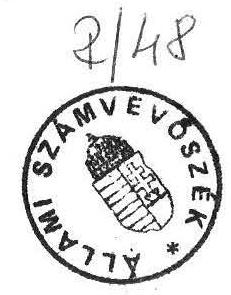

# Allami S̊zámuevös̊èk 

## JELENTÉS

a Budapest, V. kerület, Dorottya utca 1. szám alatti Gerbeaud-ház privatizációjának vizsgálata során tett ténymegállapításokról

---

A vizsgálatot végezték:
dr. Ráboczki András, dr. Molnár Barnabás

---

I. Klōzmények

A GERBEAUD ház privatizációjával kapcsolatos számvevőszéki vizsgálat elrendelésére országgyúlési képviselők javaslata alapján került sor 1991. évi január hó Z. napján, azzal, hogy a tényfeltárást január 10. napjáig kell befejezni.A vizsgálat során az érintett Állami Vagyonügynökségtől iratokat szereztünk be, felvilágosításokat kértünk, illetve eljártunk a Gabonaforgalmi és Malomipari Szolgáltató Vállalatnál (továbbiakban GAMSZOV), a Földhivatalnál és a Fővárosi Bíróságánál is. Az elkészített közbensõ jelentést átadtuk az Állami Vagyonügynökségnek észrevételezésre. Az észrevételeiket és az azzal kapcsolatos álláspontunkat a végleges jelentésbe foglaltuk.

# II. MEGALLAPITASOK 

## 1. Események a Vagyonügynökség bekapcsolódását megelőzően

A Gabonaforgalmi és Malomipari Szolgáltató Vállalat (mint a Dorottya u. 1. szám alatti ingatlan kezelöje, amelynek az irodái is az épületben vannak), 1989. évi december hó 6. napján szindikátusi szerződést kötött a GSB Betriebs und Beteiligung Gmbh / továbbiakban GSB / NSZK székhelyú és a TRADE-INVEST Kft / továbbiakban TI / budapesti székhelyú társaságokkal. A felek abban állapodtak meg, hogy társaságot alapítanak a Budapest V. kerület Dorottya utca 1. szám alatt lévő Gerbeaud ház kiürítésére, felújítására és szállodaként történő müködtetésére.

A szindikátusi szerződésnek megfelelően a felek 1989. évi december hó 20. napján társasági szerződést kötöttek (továbbiakban alapító szerződés), és öt millió forint alaptőkével létrehozták a GSB TRADE INVEST Beruházás Szervező Kft-t (továbbiakban Társaság.)

A Társaság alaptőkéjéből a GSB 2500 ezer, a Gamszov 2250 ezer és a TI 250 ezer forintot jegyzett készpénzben. A szavazati jogot úgy szabályozták, hogy tízezer forintonként jár egy szavazat. Igy a GSB 250, a Gamszov 225 és

---

a TI 25 szavazatot kapott. A nyereségböl a GSB $75 \%$, a Gamszov $20 \%$ és a TI $5 \%$ erejéig részesedett.

Az alapító szerződés szerint szavazategyenlőség esetén a GSB szavazata dönt, továbbá az ügyvezetés során nem hozható olyan döntés, amellyel nem ért egyet. A külföldi fél egyoldalú felhatalmazást kapott, hogy a Társaság céljait szolgáló ügyletkötésekre javaslatot tegyen. A javaslatai csak akkor hagyhatók figyelmen kívül, ha nyilvánvalóan és igazolhatóan súlyosan veszélyeztetik a Társaság érdekeit.

Mellékszolgáltatásként a Gamszov vállalta, hogy feltétel nélkül és tehermentesen a Társaság tulajdonába adja a Gerbeaud házat.
A GSB mellékszolgáltatásként arra vállalkozott, hogy a Társaság céljainak eléréséhez szükséges 1,6 milliárd forintot biztosítja, úgy, hogy a finanszírozás terheit a Társaság viseli.

Az alapító szerződés egyértelmũen hátrányos volt a magyar félre nézve, mert a jelentös értékũ ingatlan úgy került a Társaság tulajdonába, hogy a külföldi fél gyakorlatilag az alapító szerződés szerint nem volt ellenszolgáltatás nyújtására kötelezhető. Klőnytelen volt a szavazás rendjére és a nyereségfelosztásra vonatkozó megállapodás is.

A Cégbíróság 1990. február hó 21. napján elrendelte a cégbejegyzést.

A Legfelső Bíróság elnöke 1990. április hó 28-án a cégbejegyzést elrendelő végzés ellen törvényességi óvást nyújtott be. A Legfelső Bíróság a határozatában megállapította a cégbejegyzést elrendelő végzés törvénysértó voltát, de a bejegyzést hatályában fenntartotta. Döntését azzal indokolta, hogy az alapító szerződés a magyar jog szerint semmis, mert abban az állami tulajdonban lévő Gerbeaud házat ellenszolgáltatás nélkül adta a Gamszov a Társaság tulajdonába. A bíróság szerint az alapító szerződésből nem lehet megállapítani, hogy a GSB bármely, a Gerbeaud házzal azonos értékũ mellékszolgáltastásra lett volna kötelezett. A cégbejegyzés törlését azért nem rendelte el a Legfelső Bíróság, mert idôközben a Gamszov és a GSB módosította az alapító szerződést, és így lehetôség nyílott a semmisséget eredményező ok megszüntetésére.

---

A Társaság alapításának jelentös és negatív viszhangja ugyanis lépések megtételére késztette a Gamszov-ot. Korábban a Gerbeaud ház felértékelése nem történt meg, ezért egymást követően két céget kértek fel értékbecslés elkészítésére. A Magistral Kft 1990 ferbruárjában készített véleményében 466.642 ezer forintra teszi az épület értékét üresen. A becslés utal arra, hogy hasonló jellegú és fekvésű ingatlan forgalmáról nincs tudomásuk. Az UNIBAU Kft 1990 április hónapban készített becslést, amely szerint az épület értéke üresen 800 millió forint. A becslés irodaként történő hasznosítás esetén az elérhetö bérleti dijat havonta és négyzetméterenként 60 márkára teszi.

Az alapító szerződést a felek módosították 1990. évi május hó 3-4. napján (továbbiakban módosító szerződés). A Gamszov mellékszolgáltatásának - a Gerbeaud háznak - az értékét egy milliárd forintban határozták meg. A GSB mellékszolgáltatásait is meghatározták úgy, hogy az épület kiürítéséért a Gamszov - választása szerint - 500 millió forintot, vagy megfelelő - a Magyar Állam tulajdonába kerülő - csereingatlanokat, és még 100 millió forintot kap. Ezen kívül 1,1 milliárd forint összeghatárig kölcsönt biztosít a GSB az átépítésre, amely a Társaságot terheli.

A GSB által a Társaság érdekében külföldön végzett marketing tevékenységet 400 millió forintra értékelték. A TI mellékszolgáltatásként vállalta a beruházási és fővállalkozói tevékenységet, amelynek értékét a beruházás 10 \%-ában határozták meg. A szavazás és a nyereségfelosztás szabályait kiegészítették azzal, hogy ha a Társaság a külföldi marketing tevékenységre nem tart igényt, úgy a nyereséget a tulajdoni hányad arányában osztják fel. Megjegyzendő, a GSB a szavazati jog alapján kizárólagosan dönthetett a külföldi marketing igénybevételéről. Valószinűsíthető a kétszeres figyelembevétel is, mert a GSB külföldi tevékenységét a kölcsön biztosításánál és a marketingnél egyaránt értékelték.

# 2. Az Allami Vagyonügynökség tevékenysége 

A módosító szerződés alapján elvileg lehetöség nyílott a társasági szerződés semmisségét eredményező hibájának kijavítására. Időközben azonban hatályba lépett az állami vagyon védelméről szóló 1990. évi VIII törvény, amely szerint a módosító szerződést csak az Állami Vagyonügynökség (továbbiakban AVU) jóváhagyásával lehetett megkötni.

---

Az AVO az 1990. évi junius hó 14. napján hozott határozatával megtiltotta a módosító szerzödés megkötését. Döntését azzal indokolta, hogy

- jobb ajánlatról van tudomása,
- a Gamszov és a GSB mellékszolgáltatása nem arányos,
- a döntési jog átengedése és az asszimetrikus jövedelemfelosztás nem indokolt,
- a Társaság megszüntetése esetén az ingatlan résztulajdonosa lehet a GSB és a TI anélkül, hogy ténylegesen értékarányos ellenszolgáltatást adtak volna.

Az AVO határozata ellen a Társaság pert inditott, az ügyben még nincs döntés. Jelenleg a Pesti Központi Kerületi Bíróságon van a per, de az AVO részére a keresetlevelet a mai napig nem kézbesítették. Megjegyzendő, hogy az AVO tevékenyéségre vonatkozó törvényt idôközben módosították, és így ma már nincs mód a bíróság elôtti perindításra.

Az alapító szerződésnek megfelelően a Fôvárosi Kerületek Földhivatala 1990. évi február hó 7. napján bejegyezte a Társaság tulajdonjogát, majd a saját határozatát hivatalból felülvizsgálva, 1990 március 22-én elrendelte az eredeti állapot helyreállítását. Döntését azzal indokolta, hogy nem csatolták a Társaság cégbejegyzését igazoló okiratot. Ezen határozat ellen a Társaság fellebbezést jelentett be, és csatolta a cégbejegyzést igazoló okiratot. A Fôvárosi Földhivatal 1990. augusztus hó 6. napján kelt határozatával a Társaság fellebbezését elutasította. A döntés indokolásában kifejtette, hogy az AVO megtiltotta a módosító szerződés aláírását, így az alapító szerződésnek a Legfelső Bíróság által megállapított semmisségét nem szüntették meg. A Fôvárosi Földhivatal a Társaság tulajdonjogának bejegyzésére a jogszabályba ütköző és ezért semmis alapító szerződés alapján nem látott lehetôséget. A vizsgálat során beszereztük a Gerbeaud ház tulajdoni lapját, amely szerint az ingatlan tulajdonosa a Magyar Allam, kezelôje a Gamszov.

A Fôvárosi Bíróságon a Mirelit Rt, a Hungária Szálloda és Ettermi Vállalat - mint a Gerbeaud ház bérlõi -, valamint az SZDSZ pert indítottak a Társaság és a Gamszov ellen, az alapító szerződés érvénytelenségének a megállapítása iránt. A bíróság 1990. évi október hó 20. napján hozott itéletében megállapította az alapító szerződés érvénytelenségét. Az itélet ellen a Társaság fellebbezett, így

---

az nem jogerős, a Legfelsőbb Biróság még nem tüzte ki a fellebviteli tárgyalás napját.

Mindezek a körülmények azt eredményezték, hogy a Társaság a törvényességi óvás nyomán hozott határozat, a földhivatali határozatok és az AVO tiltó határozata nyomán érdemi tevékenységre nem volt képes. Bizonytalanságot eredményezett a két folyamatban lévő per elhúzódása is. Ugyanakkor a Magyar Allam, mint tulajdonos is hátrányos helyzetbe került, mert a nagy értékü ingatlan gazdaságos és bevételt hozó hasznositását akadályozta a rendezetlen helyzet.

Az AVO ügyvezető igazgatója a helyzet tisztázása érdekében 1990. év augusztusában előterjesztést készitett az Állami Vagyonügynökség Igazgató Tanácsához (továbbiakban Igazgató Tanács) és több döntési lehetőséget vázolt fel.

Az első szerint az AVO tárgyalja újra az ügyet a GSBvel, és ennek során küszöbölje ki a hátrányos feltételeket. E megoldás előnyeként jelzi az ügyvezető igazgató, hogy kínos nemzetközi feltünést eredményező per előzhető meg, hátránya viszont, hogy nem jár jelentős bevételi többlettel.

A második megoldásként felvetette, hogy fenntartva az alapító szerződés módosítását tiltó határozatot kivárják a peres eljárások befejezését, majd azt követően döntenek a hasznosítás módja felől.

Tartalmazza az előterjesztés azt a lehetőséget is, hogy az AVO a törvény által biztosított lehetőséggel élve elvonja a Gamszov-tól a Gerbeaud ház kezelői jogát, és társaságot alapít a hasznosításra.

Az előterjesztést az Igazgató Tanács nem tárgyalta meg, ezért az ügyvezető igazgató szeptemberben újabb javaslatot tett, lényegében megismételve az előzőekben ismertetett megoldási módokat. A másodiknak említett javaslatot azonban kiegészítette azzal, hogy a peres eljárások lezárása után nyílt pályázatot hirdetnek az ingatlan hasznosítására, és annak során kapjon a GSB azonos feltételek esetén elővásárlási jogot. Az Igazgató Tanács elfogadta a második javaslatot, és döntése szerint a Gerbeaud ház kezelői jogát meg kellett vonni a Gamszov-tól, mert a gabonaforgalmi- és malomipari szolgáltató tevékenységgel indiferens az ingatlanforgal-

---

mazás. Felhatalmazást adott a GSB-vel történő tárgyalásra úgy, hogy eredménytelenség esetén a hasznosítás nyilvános pályázat útján történjen.

Az ügyvezető igazgató 1990. szeptember 27-én ismét az Igazgatótanácshoz fordult. Elöterjesztésében a GSB-vel folytatott tárgyalásokon felmerült új tényként arra hivatkozik, hogy a Legfelsőbb Bíróság törvényességi óvás nyomán hozott határozata nem zárja ki a Társaság - és így a GSB - tulajdoni igényét, mert nem a határozata rendelkező részében, hanem az indokolásban állapítja meg a bíróság az alapító szerződés semmisségét. Ezért a GSB képviselójével olyan megoldást készítettek elő, hogy közösen írnak ki versenytárgyalást. Az előterjesztés indokoltnak tartja a költségtérítést a GSB javára viszszalépés esetén. Az Igazgató Tanács ezt, az augusztusítól lényegesen eltérő feltételeket eredményező javaslatot is elfogadta.

A felhatalmazás alapján az AVO - a Társaságban fennálló tulajdoni hányadból eredő jogokat a Gamszov meghatalmazása alapján gyakorolva - 1990. évi október hó 20. napján szerződést kötött a GSB-vel (továbbiakban megállapodás) amely szerint a vállalkozást nyilvános versenytárgyalásra bocsátják. A pályázatra érkező ajánlatokat akkor tekintik kedvezöbbnek, mint GSB eredeti ajánlatát, ha a Gerbeaud ház módosító szerződésben megállapított 1 milliárd forintos értékét $20 \%$-kal meghaladják. Ezt a kikötést a módosító szerződés óta eltelt idő inflációjának figyelembe vételével indokolták.
Az AVO azt azonban nem kötötte ki, hogy az inflációra figyelemmel a GSB akkor is $20 \%$-kal magasabb árat ismerjen el, ha nem lévén kedvezöbb ajánlat, a korábban kötött szerződések érvényben maradnak. A közbensõ jelentésre adott válaszában ezt az AVO azzal magyarázta, hogy a GSB részéről a felújításhoz szükséges tervek készíttetése, illetve pénzeszközök készenlétben tartása miatt költségek merültek fel. Fehívásunkra azonban az AVO a tervezés illetve a pénz készenlétbentartása költségeinek meglétét, illetve összegét igazoló okmányokat (számlákat) bemutatni nem tudott, mert azok - szerinte a GSB üzleti titkát képezik, és azokat nem adja ki.

Ha kedvezöbb ajánlat érkezik a GSB gyakorolhatja az elövételi jogát, vagy elállhat a szerződéstől. Elállás esetén azonban a GSB az 1 milliárd forintot meghaladó többletbevétel terhére részesedésre jogosult úgy, hogy

- az első 200 millió $8 \%-a$,
- a második 200 millió $6 \%-a$
- és az e feletti rész $5 \%$-a illeti meg.

---

A megállapodás kiterjedt arra is, hogy a felek a vitás kérdések eldöntésében feltétel nélkül alávetik magukat a Zürichi Kereskedelmi Kamara mellett müködõ Döntöbíróság hatáskörének és illetékességének. Ez utóbbi feltétel alapvetően eltér a korábbi szerződésektől, mert mind az alapító szerződésben, mind a módosító szerződésben a Magyar Kereskedelmi Kamara melletti Választottbíróság elé utalták a felek a vitás kérdések eldöntését. A közbensõ jelentésre adott magyarázatában az AVO a feltétel elfogadását azzal indokolta, hogy a GSB szerint a magyar bíróságok elôtt indult perek és az ezekben hozott ítéletek nem nyújtottak számára megfelelô jogi védelmet. Ezért a GSB részéről a külföldi bíróság elfogadása feltétele volt a megállapodás aláírásának.

Az AVO a GSB-vel október 20. napján kötött megállapodásnak megfelelően nyilvános pályázatot hirdetett meg, és ismertetve a GSB-vel korábban kötött szerzödések feltételeit - arra hívja felí az érdeklődőket, hogy tegyenek jobb ajánlatot. A felhívás azonban tartalmazta azt is, hogy a GSB jogosult a jlegjobb ajánlatot tevõ helyébe lépni.
az
hc
Az AVO a pályázat benyújtásának határidejét elöször 1991. január 09. napja 16 órában határozta meg, az elbírálásra pedig 1991. január hó 31. napjáig vállalt kötelezettséget.
va
Az elözetes jelentésre adott válaszában az AVO közölte, hogy a benyújtás határidejét elöször január 18. napjára, majd februárra módosították.

# II. Következtetések és javaslatok 

Az AVO a megállapodással a magyar fél számára hátrányos helyzetet teremtett. A pályázatkiírásával a magyar fél cselekvési körén kívül eső tényegõ - a pályázat minősége - dönti el, hogy érdemes volt-e a megállapodás kockázatát vállalni. A kockázatvállalást az igazolhatja, ha a pályázat eredményeként akár a GSB-vel, akár visszalépése miatt mással kedvezőbb szerződés köthető.

Az AVO a közbensõ jelentésre adott válaszában vitatja, hogy a megállapodás hátrányos hedyzetet teremtett volna. Ezt igazolandó, három tényezőre hivatkozik:

- a megállapodással kötelmi jogcímet teremtett a Gerbeaud

---

ház feletti rendelkezésre, és megakadályozta, hogy a Gamszov vagy a Társaság egyoldalúan rendelkezzék a házzal.

- a pályázat eredménye bizonyíthatja, hogy a GSB-vel kötött módosító szerződés előnyös vagy előnytelen volt,
- a megállapodás megdől, ha a Legfelsőbb Bíróság a fellebbezési eljárásban helyben hagyja a Fővárosi Bíróság első fokú ítéletét.

Ez a érvelés az Allami Számvevöszék szerint nem állja meg a helyét. Nem volt szükség arra, hogy kötelmi jogcímet teremtsen az AVO a maga számára, mert a Gerbeaud ház ma is a Magyar Allam tulajdona (ezt igazolja a tulajdoni lap is). A Gamszov egyoldalú rendelkezési jogát az is megakadályozta volna, ha az Igazgató Tanács döntésének megfelelően megvonják a kezelői jogát. A másik két érv bizonytalan, jövőbeni feltételre utal. Megjegyzendő, hogy a Legfelsőbb Bíróság a törvényességi határozatában az alapító szerződés semmisségének jogkövetkezményét alkalmazta. Ugyanezt tette a Fövárosi Fölhivatal is. A Ptk 234. szakasz /1/ bekezdése szerint a semmisség megállapításához külön eljárásra nincs szükség, arra bárki határidő nélkül hivatkozhat. A Legfelsőbb Bíróság kifejtette azt is, hogy a módosító szerződés alkalmas lehet a semmisség okának megszüntetésére, ha azt az AVO jóváhagyja. A jóváhagyást az AVO először megtagadta, majd a megállapodással sikertelen pályázat esetére kötelezettséget vállalt a korábbi tartalommal a módosító szerződés elismerésére. Ezzel együtt jár a Gerbeaud ház tulajdonának átruházása is.

A vizsgálati megállapításokra adott válaszában azonban az AVO már azt közölte, hogy háromoldalú megállapodás' keretében átfogó revizó alá vették a megállapodást. Kérésünkre átadták a GSB-nek megküldött szerződési ajánlatot. Annak lényege szerint a GSB hozzájárul, hogy valamennyi korábbi szerződést felbontják, és a közösen kiírt pályázatot úgy módosítják, hogy megszünik a GSB elővételi joga. Ennek fejében az AVO kötelezi magát a számlákkal igazolt költségek erejéig a GSB kártalanítására. A vizsgálat idején a GSB válasza még nem ismert.

Az a tény, hogy az AVO maga kezdeményezte a megállapodás felülvizsgálatát, és a GSB-t megillető előjogok kiiktatását igazolja, hogy a megállapodás hátrányos helyzetet teremtett. A GSB számára felajánlott - igazolt költségeit fedezö - kártalanítás a jelen helyzetben már nem kifogásolható.

---

Az a látható törekvés, hogy az AVO az örökölt rossz tárgyalási helyzetböl nem birósági eljárásokkal, hanem megállapodással kiván kikerülni, nem vitatható. A GSB válasza az AVO legújabb ajánlatára és a pályázat eredménye még nem ismert, ezért az ügyröl végleges értékelés nem adható.

Az ügy lezáratlan volta ugyanakkor arra is lehetöséget ad, hogy az eddig feltárt tanuságok alapján intézkedésekre kerüljön sor. Szükségesnek látszik több olyan lépés megtétele, amelyek a későbbi döntéseket károsan befolyásoló kényszerhelyzetet megszüntethetik. Ezért javasoljuk, hogy

1. Az AVO ügyvezető igazgatója hajtsa végre az Igazgató Tanács döntését, és a Gerbeaud ház kezelői jogát vonja meg a Gamszovtól, hogy a különlegesen nagy értékü ingatlan hasznosítása ne függjön az ingatlanforgalmazásban járatlan vállalat magatartásától.
2. Megfontolást igényel, hogy a Gamszov-tól elvonják a Társaságban lévő tulajdoni hányadát. Jelenleg az AVO az 1991. január hó 20. napján lejárt határidejü meghatalmazás alapján jár el. Ha már átvette az AVO a Gerbeaud ház hasznosításának irányítását, úgy célszerű megvizsgálni, hogy ráhatását érdemes-e teljeskörűen biztosítania.
3. Mivel nem ritka jelenség a Gamszovhoz hasonló helyzetben lévő állami vállalat, amely nagy értékü ingatlan kezelöje anélkül, hogy az adott ingatlanra a gazdasági tevékenyéséhez feltétlenül szükség lenne, ezért a jelen ügy tapasztalait felhasználva indokolt átfogó megelőző lépések tétele. Ki kell zárni, hogy a jövőben - hozzá nem értés vagy más ok miatt - a Gerbeaud ház hasznosításánál tapasztalt kényszerhelyzetek alakuljanak ki. Az Igazgató Tasnács által már elfogadott elvek végrehajtásának meggyorsítása és a gyakorlati lépések megtétele szükséges.

Budapest, 1991. január 28.

Dr. Hagelmayè István
elnök