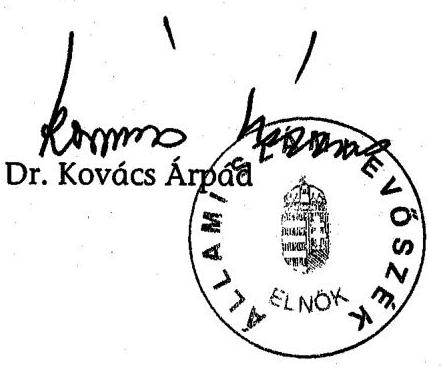
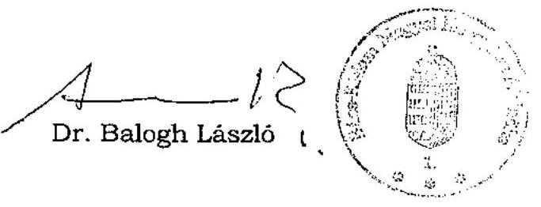

# JELENTÉS 

## a Bács-Kiskun Megyei Önkormányzat gazdálkodásának átfogó ellenőrzéséről

---

3. Önkormányzati és Területi Ellenőrzési Igazgatóság
3.3 Átfogó Ellenőrzések Főcsoport
Iktatószám: V-1002-7/27/14/2003.
Témaszám: 635
Vizsgálat-azonosító szám: V0102
Az ellenőrzést felügyelte:
Dr. Lóránt Zoltán
főigazgató
Az ellenőrzés végrehajtásáért felelős:
Dr. Sepsey Tamás
főigazgató-helyettes
Az ellenőrzést vezette:
Csecserits Imréné
főcsoportfőnök-helyettes
Az ellenőrzést végezték:
Dr. Csikai Zsolt
számvevő tanácsos
Nagy János
számvevő tanácsos
A témához kapcsolódó - az elmúlt három évben készített - számvevőszéki jelentések:
címe
sorszáma
Jelentés a közbeszerzésekről szóló törvény végrehajtásának 0109 ellenőrzéséről
Jelentés a helyi önkormányzatok 2000. évi normatív állami 0128
hozzájárulás igénylésének és elszámolásának vizsgálatáról
Jelentés a Magyar Köztársaság 2001. évi költségvetése 0232
végrehajtásának ellenőrzéséről
Jelentés a megyei, fővárosi illetékhivatali tevékenység 0243
ellenőrzéséről
Jelentés a helyi önkormányzatok tartós szociális ellátási 0317
feladatainak ellenőrzéséről az idősek otthonainál
Jelentés a 2002. évi országgyűlési, valamint a helyi és kisebbségi 0325 önkormányzati képviselő választások lebonyolítására felhasznált pénzeszközök ellenőrzéséről
Jelentés a területfejlesztési tanácsok és munkaszervezeteik 0327
rendelkezésére álló támogatások igénylésének és felhasználásának ellenőrzéséről

Jelentéseink az Országgyűlés számítógépes hálózatán és az Interneten a www.asz.hu címen is olvashatók.

---

# TARTALOMJEGYZÉK 

BEVEZETÉS ..... 5
I. ÖSSZEGZŐ MEGÁLLAPÍTÁSOK, KÖVETKEZTETÉSEK, JAVASLATOK ..... 7
II. RÉSZLETES MEGÁLLAPÍTÁSOK ..... 16
1.A költségvetés tervezésének, végrehajtásának és a zárszámadás elkészítésének szabályszerűsége ..... 16
1.1.A költségvetés tervezésének, a költségvetési rendelet megalkotásának, elfogadásának szabályszerűsége ..... 16
1.2.A költségvetési előirányzatok módosításának szabályszerűsége ..... 20
1.3.A gazdálkodás szabályozottsága, szabályszerűsége ..... 22
1.4.A munkafolyamatba épített ellenőrzések szabályozottsága és gyakorlati működése a pénzügyi, gazdasági és számviteli feladatellátás területén ..... 28
1.5.A bizonylati rend szabályszerűsége ..... 29
1.6.A vagyon nyilvántartásának és leltározásának szabályszerűsége ..... 30
1.7.A vagyongazdálkodással kapcsolatos feladat és döntési hatáskörök szabályozottsága, a vagyonváltozást előidéző intézkedések szabályszerűsége, célszerűsége ..... 32
1.8.Az Önkormányzat által céljelleggel - nem szociális ellátásként - juttatott támogatásokkal történő elszámoltatás szabályszerűsége ..... 38
1.9.A követelések, részesedések, értékpapírok év végi értékelésének szabályszerűsége ..... 41
1.10.A működési és felhalmozási bevételek, kiadások alakulása ..... 42
1.11.A költségvetés egyensúlyi helyzete ..... 44
1.12.A közbeszerzési eljárások szabályszerűsége ..... 44
1.13.A zárszámadási kötelezettség teljesítésének szabályszerűsége ..... 48
2.Az egyes kiemelt önkormányzati feladatok és a rendelkezésre álló források összhangja ..... 49
2.1.A feladatok meghatározása és szervezeti keretei ..... 49
2.2.Az egyes naturális mutatókkal mérhető feladatok bevételei és kiadásai ..... 52
2.3.A jelentős ráfordítást igénylő önként vállalt feladatok ellátása ..... 54
3.A belső irányítási, ellenőrzési rendszer működésének értékelése ..... 56
3.1.Az Önkormányzat informatikai rendszerének szabályozottsága, működése ..... 56
3.2.A helyi ellenőrzési rendszer kialakítása, működése ..... 57
3.3.A könyvvizsgálati kötelezettség teljesítése ..... 59
3.4.A korábbi számvevőszéki ellenőrzések javaslatainak hasznosulása ..... 60

---

# MELLÉKLETEK 

1. számú Az önkormányzati vagyon nagyságának alakulása (1 oldal)
2. számú Az Önkormányzat 2002. évi bevételeinek és kiadásainak alakulása (1 oldal)
3. számú Az Önkormányzat gazdálkodását meghatározó adatok, mutatószámok (1 oldal)
4. számú Egyes önkormányzati feladatok finanszírozása (1 oldal)
5. számú Dr. Balogh László úr, a Bács-Kiskun Megyei Közgyűlés elnökének észrevétele (1 oldal)

---

# RÖVIDÍTÉSEK JEGYZÉKE 

| Ötv. | a helyi önkormányzatokról szóló 1990. évi LXV. törvény |
| :--: | :--: |
| Áht. | az államháztartásról szóló 1992. évi XXXVIII. törvény |
| Ámr. | az államháztartás működési rendjéről szóló 217/1998. (XII. 30.) Korm. rendelet |
| Kbt. | a közbeszerzésekről szóló 1995. évi XL. törvény |
| Számv. tv. | a számvitelről szóló 2000. évi C. törvény |
| Htv. | a helyi önkormányzatok és szerveik, a köztársasági megbízottak, valamint egyes centrális alárendeltségű szervek feladat- és hatásköreiről szóló 1991. évi XX. törvény |
| Vhr. | az államháztartás szervezetei beszámolási és könyvvezetési kötelezettségének sajátosságairól szóló 249/2000. (XII. 24.) Korm. rendelet |
| Közgyűlés | Bács-Kiskun Megyei Közgyűlés |
| Közgyűlés elnöke | Bács-Kiskun Megyei Közgyűlés elnöke |
| Önkormányzat | Bács-Kiskun Megyei Önkormányzat |
| főjegyző | Bács-Kiskun Megyei Önkormányzat főjegyzője |
| Önkormányzat hivatala | Bács-Kiskun Megyei Önkormányzat Hivatala |
| Pénzügyi bizottság | Bács-Kiskun Megyei Közgyűlés Pénzügyi Bizottsága |
| Közgazdasági főosztály | Bács-Kiskun Megyei Önkormányzat Hivatalának Közgazdasági Főosztálya |
| GESZ | Bács-Kiskun Megyei Önkormányzat Gazdasági Ellátó Szervezete |
| ÁSZ | Állami Számvevőszék |
| TÁH | Bács-Kiskun Megyei Területi Államháztartási Hivatal |
| SzMSz | Bács-Kiskun Megyei Önkormányzat 2/1999. (III. 3.) számú rendelete a Bács-Kiskun Megyei Önkormányzat Szervezeti és Működési Szabályzatáról |
| ügyrend | A Közgyűlés 4/2003. (I. 31.) számú határozata a Bács-Kiskun Megyei Önkormányzat Hivatala Ügyrendjéről |
| Illetékhivatal   vagyongazdálkodási   rendelet | Bács-Kiskun Megyei Illetékhivatal   Bács-Kiskun Megyei Önkormányzat 11/1996. (VI. 17.)   számú rendelete a Bács-Kiskun Megyei Önkormányzat   vagyonáról és a vagyongazdálkodás szabályairól |

---

.

---

# JELENTÉS 

## a Bács-Kiskun Megyei Önkormányzat gazdálkodásának átfogó ellenőrzéséről

## BEVEZETÉS

Az Ötv. 92. § (1) bekezdése, valamint az Áht. 120/A. § (1) bekezdése szerint az Önkormányzat gazdálkodását az Állami Számvevőszék Önkormányzati és Területi Ellenőrzési Igazgatósága a V-1002-7/2003. számú ellenőrzési program alapján vizsgálta.

## Az ellenőrzés célja annak értékelése volt, hogy:

- az önkormányzati gazdálkodás törvényességét, szabályszerűségét biztosították-e a tervezés, a költségvetés végrehajtása és a zárszámadás során; a gazdálkodás szabályszerűségét biztosító kontrollok ${ }^{1}$ megfelelően segítették-e a végrehajtást;
- az Önkormányzat által ellátandó feladatok és az azokhoz rendelkezésre álló pénzforrások összhangja biztosított volt-e.

Az ellenőrzött időszak: a 2002. év, valamint a 2003. I-III. negyedév, az 1.7., 2.1.-2.3.; 3.2.-3.4. ellenőrzési programpontok esetében a 2000-2002. évek.

Bács-Kiskun megye az ország legnagyobb megyéje, területe $8445 \mathrm{~km}^{2}$, lakosainak száma 2003. január 1-jén 553 ezer fő volt. A megyében 18 város és 101 község található.

Az Önkormányzat 2003. évi költségvetésének főösszege 19,4 milliárd Ft, számviteli mérlegének főösszege 2002. év végén 15,4 milliárd Ft volt. Az Önkormányzat intézményeinek száma: 36, melyből 19 önálló és 17 részben önálló intézmény. Az Önkormányzat hivatalában és intézményeiben foglalkoztatottak száma - a 2003-ra jóváhagyott költségvetés szerint - 4304 fő, ebből köztisztviselő 186 fő, közalkalmazott 4118 fő.

Az Önkormányzatnak két gazdasági társaságban van 100%-os, kettőben többségi és négyben kisebbségi részesedése. Az önkormányzati - szociális, közoktatási és művelődési - feladatellátást három közalapítvány segíti.

A 2002. évi önkormányzati választásokhoz kapcsolódóan a Közgyűlés elnöke és alelnökei személyében változás történt.

[^0]
[^0]:    ${ }^{1}$ A gazdálkodás szabályszerűségét biztosító kontroll alatt értjük a kiépített és működő belső irányítási rendszert, valamint a belső ellenőrzési funkciók ellátását.

---

A 46 tagú Közgyűlés - döntéseinek előkészítésére, a döntések végrehajtásának szervezésére és ellenőrzésére - 11 állandó bizottságot hozott létre. (Az önkormányzati gazdálkodást meghatározó főbb adatokat, mutatószámokat a 3. számú melléklet részletezi.)

---

# I. ÖSSZEGZŐ MEGÁLLAPÍTÁSOK, KÖVETKEZTETÉSEK, JAVASLATOK 

Az önkormányzati feladatokat hosszabb távra kijelölő - gazdasági program céljainak megfelelő - munkaprogrammal rendelkezik az Önkormányzat. A 2002. és a 2003. évi költségvetési koncepciót a helyben képződő bevételek és az ismert kötelezettségek figyelembevételével állították össze.

A 2002. és a 2003. évre szóló költségvetés tervezése és a költségvetési rendelet alkotása során az Ámr-ben előírtak ellenére a bizottságok költségvetési koncepcióról alkotott véleményét és a Pénzügyi bizottság véleményét a költségvetési rendelettervezetről az előterjesztésekhez nem csatolták. Nem tartalmazta a költségvetés az Ámr-ben előírtak ellenére felújítási előirányzatokat és az intézményi felhalmozási kiadásokat feladatonként és az intézményi működési és felhalmozási célú bevételi és kiadási előirányzatokat mérlegszerűen. A Közgyűlés az Áht. előírását megsértve nem határozta meg önkormányzati rendeletben a költségvetés (és a zárszámadás) mellékleteként tájékoztatásul bemutatandó mérlegek, kimutatások tartalmi követelményeit. E hiányosság ellenére a költségvetési rendelettervezet - tájékoztatási céllal - tartalmazta az Áht-ban előírt mérlegeket, kimutatásokat, de a szükséges szöveges indoklás nélkül. A költségvetés végrehajtási szabályai között a Közgyűlés elnöke részére az alapítványok támogatására biztosított döntési jogkör átadása sérti az Ötv. vonatkozó előírását.

A Közgyűlés a 2002. évre vonatkozó költségvetési rendeletében jóváhagyott előirányzatokat hét alkalommal módosította. A zárszámadási rendeletben szereplő - önkormányzati szintű - módosított előirányzatokat a teljesítési adatok nem haladták meg, a költségvetési szervek szintjén hat intézménynél egyes kiemelt kiadási előirányzatokat túllépték, ezáltal megsértették az Áht-t. A túllépések okait nem vizsgálták, felelősségre vonásra nem került sor.

A gazdálkodás szabályozottsága, szabályszerűsége érdekében a Közgyűlés előirányzat-felhasználási hatáskört ruházott át a Közgyűlés elnökére, a Közgyűlés bizottságokra, a Közgyűlés elnöke és a főjegyző utasításokat, intézkedéseket adott ki. A költségvetési rendeletben jóváhagyott előirányzatokról, azok változásairól az Áht-ban előírt követelményeknek megfelelő nyilvántartást vezettek.

Az Önkormányzat hivatala - mint önálló gazdálkodási jogkörrel rendelkező költségvetési szerv - az Áht-t megsértve nem rendelkezik alapító okirattal, valamint az Ámr-ben előírtak ellenére Szervezeti és Működési Szabályzattal.

A különböző gazdálkodási jogkörök gyakorlására feljogosítottak munkaköri leírásában e hatáskörök - 2003. február 1-jéig - nem kerültek rögzítésre. Az ezt követően kiadott, megújított munkaköri leírások sem rögzítik kellő részletezettséggel a munkafolyamatba épített belső ellenőrzési, egyeztetési feladatokat és azok dokumentálásának módját.

---

A gazdálkodási és ellenőrzési jogkörök tartalmát, a jogkörök gyakorlására jogosultak körét az Ámr-ben előírtakkal összhangban határozták meg. A gazdálkodási és ellenőrzési jogkörök szabályozása a felhatalmazottak beszámoltatásának módját, formáját nem tartalmazza, a felhatalmazottakat nem számoltatták be a jogkör gyakorlásáról. A Htv. előírását megsértve a főjegyző nem alakította ki az intézmények egységes számviteli rendjét.

A főjegyző elkészíttette az Önkormányzat hivatalának számviteli politikáját a kapcsolódó szabályzatokat, valamint a számlarendet.

A szabályzatok tartalmazzák a helyi sajátosságokat, de a szabályozás nem terjedt ki az ellátandó feladatok teljes folyamatára; a számlarendből - az Számv. tv-t, valamint a Vhr. előírását megsértve - hiányzik a számlaösszefüggések előírása, a zárlati feladatok során elvégzendő egyeztetések formájának és dokumentálásának meghatározása. Az Önkormányzat hivatalában a bizonylati rendet és az alkalmazandó bizonylatokat a számlarend melléklete a Számv. tv. előírásainak megfelelően tartalmazta.

Az Önkormányzat hivatalának gazdasági szervezete rendelkezik ügyrenddel, azonban sem az ügyrend, sem a munkaköri leírások nem tartalmazzák az elvégzendő ellenőrzési, egyeztetési feladatokat. Nem szabályozták - az Ámr-t figyelmen kívül hagyva - a kötelezettségvállalások célszerűségét megalapozó eljárást és a kapcsolódó dokumentumok tartalmát.

A munkafolyamatba épített ellenőrzési feladatokat nem végezték el, az Ámr-ben előírtak ellenére a kötelezettségvállalást tartalmazó bizonylatok 43,8%-ánál hiányzott a kötelezettségvállalás ellenjegyzését igazoló aláírás, az ellenjegyzés nélküli kötelezettségvállalást tartalmazó bizonylatok alapján is folyamatosan teljesítették a kifizetéseket. Az ellenjegyzés nélküli kötelezettségvállalással megsértették az Áht. és az Ámr. vonatkozó előírásait.

Az elszámolásra adott előlegek esetében nem tartották be a pénzkezelési szabályzatnak azt a rendelkezését, hogy ha ugyanaz a személy elszámolásra újabb összeget kíván felvenni, akkor a korábban felvett összeggel előbb el kell számolnia. Az Önkormányzat hivatalában a kiadások elszámolása során a Számv. tv-t, valamint az Ámr-ben foglaltakat megsértve a bizonylatok 19,6%-a nem felelt meg a törvény által támasztott tartalmi követelményeknek, mert az Önkormányzat hivatala olyan számlákat is kiegyenlített, amelyeken vevőként nem az Önkormányzat hivatalának, hanem egy szervezeti egységnek, az Illetékhivatalnak a neve és címe volt feltüntetve. A számlát utalványozási hatáskörrel nem rendelkező dolgozó utalványozta, vagy az utalványozás, az érvényesítés, a teljesítés szakmai igazolása nem történt meg az Ámr-ben foglalt előírás ellenére.

A vagyon nyilvántartásának módját a Számv. tv. és a vonatkozó kormányrendeletben foglaltaknak megfelelően kialakították. Az ingatlanvagyon kataszteri nyilvántartást elkészítették. Az ingatlanoknál - a 2002. évben - az ingatlanvagyon-kataszteri nyilvántartás bruttó értékadata és a számvitelben
 rögzített bruttó értékadatok egyezőségét a vonatkozó kormányrendelet előírása ellenére nem biztosították. Az ingatlanvagyon-kataszterben rögzített bruttó értékadat 2002. év végén 727 millió Ft-tal kevesebb volt, mint a számviteli nyilván-

---

tartásban szereplő érték, mert az ingatlanvagyon kataszterben nem szerepeltettek minden 2001-2002. évben megvalósult beruházást. A vagyon 2002. év végi leltározását a leltározási szabályzatban foglaltaknak megfelelően elvégezték. Az üzemeltetésre átadott eszközök leltározását az üzemeltetők elvégezték, annak ellenére, hogy az üzemeltetési szerződésben a leltározás végrehajtására vonatkozó kötelezettséget nem rögzítették.

Az üzemeltetésre, kezelésre átadott eszközök leltárfelvételére vonatkozó szabályokat a leltározási szabályzatban nem rögzítették. A tervszerinti értékcsökkenés elszámolásakor a Számv. tv. és a Vhr. által előírtakat betartották.

A hosszú- és rövid távú pénzügyi befektetéseiket a jogszabályi előírásoknak megfelelően értékelték.

Az Önkormányzat vagyona - a 2000-2002. években - összességében 38,8%-kal növekedett. Ezen belül kiemelkedő a forgóeszközök értékének növekedése, amely 65,9%-ot tett ki. A forgóeszközökön belül a követelések 67,5%-kal, a pénzeszközök 56,0%-kal emelkedtek. A kötelezettségek értékének növekedése 32,2%-os, amelyet a rendelkezésre álló pénzügyi források minden évben fedeztek. Az Önkormányzat hivatalának 30 napon túli tartozása nem volt.

A Közgyűlés 1996. évben alkotott rendeletet vagyongazdálkodásáról. Ebben meghatározták a vagyongazdálkodással kapcsolatos feladatokat és döntési hatásköröket. A vagyontárgyakat az Ötv-nek megfelelően csoportosították (törzsvagyon és egyéb vagyontárgyak). Hiányossága a rendeletnek, hogy az üzemeltetésre, kezelésre átadott eszközökre vonatkozóan a rendelkezési jog gyakorlását nem szabályozták. A vagyongazdálkodási rendeletben a vagyon forgalomképesség szerinti besorolás megváltoztatásának módját nem szabályozták.

A 2002-2003. évi vagyonértékesítések kapcsán a vagyongazdálkodási rendelet előírásait nem tartották be. Hatályos közgyűlési hozzájárulás nélkül adtak el ingatlant a 2002. évben. A Pénzügyi bizottság eladási ár megállapítása nélkül adtak el másik önkormányzatnak 2003. évben üzemeltetésre, kezelésre átadott víziközmű-eszközöket és üzletrészt. A 2003. évi telek eladásakor a hatályos vagyongazdálkodási rendeletben foglaltakkal ellentétesen hat hónapnál régebbi értékbecslés alapján állapították meg az eladási árat. A Közgyűlés a 2002. évben úgy döntött három - összesen 6773 ezer Ft - követelés elengedéséről, hogy annak eseteit a vagyongazdálkodási rendelet nem tartalmazta.

Az Önkormányzat a 2002. évben 277 szervezetnek, ezen belül 11 alapítványnak nyújtott céljellegű támogatást, részükre a támogatás célját és a számadási kötelezettséget előírták. A 2002. évben 70 szervezet nem tett eleget a számadási kötelezettségnek, azonban ezen szervezeteket az elszámolás pótlására nem szólították fel és az Áht. előírását megsértve a felhasználást nem ellenőrizték. A számadási kötelezettséget teljesítő szervezeteknél a szerződésben előírt feltételek teljesítését ellenőrizték, két esetben állapítottak meg nem rendeltetésszerű felhasználást. A Közgyűlés elnöke a 2002-2003. évben négy olyan szervezetnek engedélyezett újabb támogatást, amelyek a korábban felvett támogatással nem számoltak el. Az Ötv-t megsértve a 11 közösségi célú alapítvány támogatásáról a Közgyűlés elnöke döntött.

---

Az Önkormányzat a követelések, részesedések és értékpapírok év végi értékelésének szabályait számviteli politikájában és számlarendjében szabályozta. Megsértették a Számv. tv. a terven felüli értékcsökkenés elszámolására vonatkozó szabályait, amikor a tárgyi eszközöknél a könyv szerinti érték és a piaci érték között kimutatott eltérést a 2002. évi mérlegükben nem mutatták ki. A követelések értékvesztését a főkönyvi könyvelésben nem számolták el. A gazdasági társaságokba befektetett részesedések, illetve a kárpótlási jegyre vonatkozó értékvesztés elszámolásának szükségességét a 2002. évben nem vizsgálták, ezáltal nem tettek eleget a Vhr. előírásainak. Az Önkormányzatnál az eszközök piaci értéken történő értékelésével nem éltek.

Az Önkormányzat által ellátott feladatokra a pénzügyi források rendelkezésre álltak. A működési bevételi többlet fedezetet nyújtott a felhalmozási kiadási többletek finanszírozására. A felhalmozási kiadások egyik évben sem veszélyeztették az intézmények működésének finanszírozását.

A kötelezettségvállalások nyilvántartásának rendjét a 2003. évben szabályozták, a nyilvántartást azonban nem vezetik, annak vezetését az intézményeknél sem rendelték el. Ezzel megsértették az Ámr. előírásait.

Az Önkormányzat költségvetési egyensúlyi helyzete kiegyensúlyozott, a vizsgált éveket számottevő költségvetési tartalékkal zárták, amelynek összege a 2002. év végén 1533 millió Ft volt. A működésre, illetve fejlesztésre éven túl lejáró hitelt nem vettek igénybe. A főjegyző megsértette az Ámr-t, mert likviditási tervet nem készített.

A Közgyűlés a közbeszerzési eljárások szabályozására rendeletet alkotott. A rendeletben foglaltak megfelelnek a Kbt. előírásainak. Az Önkormányzat a 2002. évi közbeszerzéseiről az előírt összegzést határidőre nem készítette el és nem küldte meg a Közbeszerzések Tanácsának, ezzel megsértették a Kbt-t.

Az Önkormányzat a Kbt-ban meghatározott értékhatárt elérő esetekben a közbeszerzési eljárást lefolytatta.

A zárszámadási rendelettervezetet a Közgyűlés elnöke az előírt határidőn belül benyújtotta, annak szerkezete azonos volt a költségvetési rendelet szerkezetével. Nem tartalmazta - az Áht-t megsértve - a zárszámadás a több éves kihatással járó döntésekről és a közvetett támogatásokról készített kimutatások szöveges indoklását. A Közgyűlés az Önkormányzat 2002. évi zárszámadását és pénzmaradványát jóváhagyta. A főjegyző az önállóan gazdálkodó intézményeket írásban értesítette a költségvetési beszámolóik elfogadásáról és a jóváhagyott pénzmaradvány összegéről.

Az Önkormányzat a kötelező és önként vállalt feladatok ellátásáról saját intézményhálózatával, általa alapított közhasznú társasággal és gazdasági társaságok útján gondoskodott. A feladatokat a 2002. évben az Önkormányzat hivatala és 36 költségvetési intézmény, valamint nyolc gazdasági társaság és három közhasznú társaság látta el.

Az Önkormányzat a 2000. évben kötelező feladatokat vett át települési önkormányzattól, a középiskolai, az alapfokú művészeti oktatás, valamint a fogya-

---

tékosok nevelése és oktatása szakfeladat körében. A vizsgált években intézményeket szervezett át, illetve szüntetett meg és helyette kht-t, kft-t alapított. A Bugaci Kisvasút Kht. közhasznú tevékenységet nem végez, e vasút működését a MÁV Rt. biztosítja.

Az önként vállalt feladatok összköltségvetéshez viszonyított aránya összességében 1,5%, intézményenként és feladatonként azonban nem érik el az összköltségvetéshez viszonyított 1%-os mértéket. Az önként vállalt feladatok ellátása és ezek finanszírozása nem veszélyeztette a kötelező feladatok ellátását.

Az Önkormányzat 2003. év végéig az Önkormányzat hivatala és 36 intézménye közül az Önkormányzat hivatalában és hat intézményben végezte el a mozgáskorlátozottak akadálymentes közlekedését elősegítő beruházásokat. Az Önkormányzatnak ahhoz, hogy a törvényi előírást és a saját munkaprogramjában foglaltakat teljesítse, az Önkormányzat hivatalának becslése szerint 2004. évben 500-550 millió Ft-ot kellene fordítania a mozgáskorlátozottak akadálymentes közlekedésének megoldására.

Az Önkormányzat informatikai eszközökkel való ellátottsága megfelelő. Az informatikai rendszerrel összefüggő szabályozást alakították ki. Nem készítettek informatikai stratégiát és katasztrófa-elhárítási tervet, nem rögzítették az ügyviteli folyamatok kapcsolatát, az adatokért való felelősségi köröket. Az adatbiztonsági eljárásokat kialakították.

Az önkormányzati intézmények felügyeleti jellegű ellenőrzésének szabályairól a főjegyző rendelkezett, de nem határozta meg az ellenőrzések gyakoriságát. Az önkormányzati intézmények felügyeleti ellenőrzését négy fő pénzügyigazdasági ellenőr végezte a főjegyző által jóváhagyott éves intézményi ellenőrzési terv alapján. A felügyeleti és a belső ellenőrzések tapasztalatairól a 2002-2003. években a Közgyűlés előtt átfogóan nem szerepelt beszámoló, a Közgyűlés nem tekintette át a költségvetési szervek ellenőrzésének tapasztalatait, ezzel megsértette a Htv-t. Az Önkormányzati hivatal belső ellenőre a 2002. és a 2003. évben a céljelleggel juttatott támogatásokat ellenőrizte, a költségvetés tervezésével, végrehajtásával és a végrehajtásról szóló beszámolóval kapcsolatos ellenőrzést nem végezte, megsértve az Áht-nak előírását.

Az Önkormányzat könyvvizsgálati kötelezettségét - választott könyvvizsgáló megbízásával - a jogszabályi előírásoknak megfelelően teljesítette.

Az ÁSZ által folytatott ellenőrzésekről készült jelentéseket a Közgyűlés nem tárgyalta meg, ennek ellenére az ÁSZ javaslatai teljes körűen realizálódtak és hasznosultak. A javaslatok alapján az Önkormányzat módosította a közbeszerzésekről szóló rendeletét, az Illetékhivatal szervezeti felépítését, biztosították, hogy a felügyeleti ellenőrzés kiterjedjen a normatív állami hozzájárulással kapcsolatos intézményi adatszolgáltatásra, az önkormányzat hivatalában növelték a területfejlesztési pályázatokkal és döntés-előkészítéssel foglalkozók létszámát.

---

A helyszíni ellenőrzés megállapításai mellett a gazdálkodás szabályszerűségének és a munka színvonalának javítása érdekében javasoljuk:

# a Közgyűlés elnökének 

## a törvényes állapot helyreállítása és a jogszabályi előírások betartása érdekében

1. a költségvetési gazdálkodás jogszabályszerű kereteinek kialakítása céljából:
a) csatolja a költségvetési koncepció-tervezethez az Ámr. 28. § (3) bekezdése szerint a bizottságok koncepció-tervezetről alkotott véleményét;
b) terjessze - a főjegyző által készített előterjesztés alapján - a Közgyűlés elé az Áht. 118. §-ában előírt, a költségvetés és a zárszámadás előterjesztésekor bemutatandó mérlegek, kimutatások tartalmi követelményeiről szóló rendelettervezetet;
c) csatolja a költségvetési rendelettervezethez a Pénzügyi bizottság véleményét az Ámr. 29. § (9) bekezdésében foglaltak alapján;
d) terjessze - a főjegyző által készített előterjesztés alapján - a Közgyűlés elé a költségvetési és zárszámadási rendelettervezetet úgy, hogy az tartalmazza az Ámr. 29. § (1) bekezdés c) pontjában foglaltaknak megfelelően a felújítási előirányzatokat célonként, a d) pontjának megfelelően a felhalmozási kiadásokat feladatonként, a h) pontjának megfelelően a működési és a felhalmozási célú bevételi és kiadási előirányzatok bemutatását tájékoztató jelleggel, mérlegszerűen, egymástól elkülönítetten, de - a finanszírozási műveleteket is figyelembe véve - együttesen egyensúlyban;
2. biztosítsa, hogy a kötelezettségvállalás az Áht. 98. § (2) bekezdésében, valamint az Ámr. 134. § (2) bekezdésében foglaltaknak megfelelően ellenjegyzés után történjen;
3. a nem szociális célra nyújtott céljellegű támogatások esetében
a) tartsa be a támogatások odaítélésekor az Ötv. 10. § (1) bekezdés d) pontjának azt az előírását, hogy a Közgyűlés hatáskörébe tartozik a közösségi célú alapítványi forrás átadására vonatkozó döntési jogkör;
b) biztosítsa, hogy a számadási kötelezettségét határidőben nem teljesítő támogatott az Áht. 13/A. § (2) bekezdésében foglaltaknak megfelelően további támogatásban ne részesüljön;
4. gondoskodjon a vagyongazdálkodási rendelet 11. § (1) bekezdés a) pontjában foglalt döntési hatáskör, a 7. § (3) bekezdésében foglalt minimális ár-megállapítási hatáskör, a 8. § (2) bekezdésében foglalt értékbecslési érvényességi határidő, valamint a 10. § (2) bekezdésében előírt követelés lemondási esetek betartásáról;
5. kezdeményezze a Közgyűlésnél, hogy meghatározott időközönként tekintse át a Htv. 138. § g) pontja előírásának betartása érdekében a költségvetési szervek ellenőrzésének tapasztalatait;

---

# a munka színvonalának javítása érdekében 

6. kezdeményezze, hogy a számvevőszéki jelentést a Közgyűlés tárgyalja meg és a feltárt hiányosságok megszüntetése érdekében készíttessen intézkedési tervet;
7. számoltassa be a kötelezettségvállalásra, utalványozásra felhatalmazottakat a tett intézkedésekről;
8. gondoskodjon az üzemeltetésre átadott eszközök üzemeltetőivel már megkötött, illetve megkötendő szerződésekben az önkormányzati tulajdon védelmét szolgáló vagyonmegállapító leltározásnak az üzemeltetési szerződésben való szerepeltetéséről;
9. kezdeményezze, hogy a Közgyűlés - az Ötv. 92. § (2) bekezdésében előírt kötelezettsége teljesítése érdekében - határozza meg az önálló gazdálkodási jogkörrel rendelkező költségvetési szerveknél elvégzendő pénzügyi ellenőrzés gyakoriságát, tartalmát és a realizálás módját;
10. kezdeményezze az Önkormányzat vagyongazdálkodási rendeletének kiegészítését az üzemeltetésre, kezelésre átadott eszközök feletti rendelkezési jogosultság szabályozásával, valamint a vagyontárgyak forgalomképesség szerinti besorolás megváltoztatásának módjának meghatározásával;
11. kísérje figyelemmel a fogyatékosok jogairól és esélyegyenlőségük biztosításáról szóló 1998. évi XXVI. törvény 2. § (6) bekezdésében előírt, a középületek akadálymentessé tételét, tekintettel a 2005. január 1-i teljesítési határidőre;

## a főjegyzőnek

## a törvényes állapot helyreállítása és a jogszabályi előírások betartása érdekében

1. az Ámr. 29. § (1) bekezdés c), d), h) pontjaiban előírtak betartása érdekében gondoskodjon arról, hogy a költségvetési és zárszámadási rendelettervezetek tartalmazzák a felújítási előirányzatokat célonként,
 a felhalmozási kiadásokat feladatonként, továbbá a működési és felhalmozási célú bevételi és kiadási előirányzatokat mérlegszerűen is;
2. gondoskodjon a Htv. 140. § (1) bekezdés c) pontja alapján az intézmények számviteli rendszerének kialakításáról;
3. intézkedjen annak érdekében, hogy a költségvetés végrehajtása során a kötelezettségvállalás - az Áht. 12/A. § (1) bekezdésében rögzítettek szerint - a költségvetési intézményeknél a jóváhagyott kiadási előirányzatok mértékéig terjedjen;
4. biztosítsa a Számv. tv. 161. § (2) bekezdés b) pontjában foglaltak betartását a számlarend számlaösszefüggésekkel való kiegészítésével, valamint a Számv. tv. 161. § (5) bekezdés c) pontja és a Vhr. 49.§ (3) bekezdése alapján az év végi zárlati feladatok során a főkönyvi számlák és az analitikus nyilvántartások között elvégzendő egyeztetések formájának, dokumentálásának meghatározását;

---

5. egészítse ki a „gazdasági ügyrend"-et az Ámr. 17. § (5) bekezdés alapján az elvégzendő ellenőrzési, egyeztetési feladatokkal;
6. biztosítsa, hogy a kötelezettségvállalás ellenjegyzési kötelezettségnek - az Ámr. 134. § (2) bekezdésében foglalt előírásnak és a helyi szabályoknak megfelelően - minden gazdasági eseménynél tegyenek eleget;
7. gondoskodjon az Ámr. 135. § (1)-(2) és a 136. § (1)-(2) bekezdésében foglalt előírás betartása érdekében az érvényesítési és utalványozási jogkörök teljes körű elvégzéséről, illetve az érvényesítés során az ellenőrzési feladatok végrehajtásáról;
8. határozza meg az Önkormányzat hivatala SzMSz-ében az Ámr. 10. § (5) bekezdés c.) pontjának betartása érdekében, a kötelezettségvállalások célszerűségét megalapozó eljárást és a kapcsolódó dokumentumok tartalmát;
9. gondoskodjon az Ámr. 134. § (6) bekezdésében előírtaknak megfelelően az évenkénti kötelezettségvállalások nyilvántartásáról és szabályozza az Ámr. 134. § (4) bekezdésében előírtak alapján az előzetes, írásbeli kötelezettségvállalásokhoz nem kötött kötelezettségvállalások rendjét és nyilvántartási formáját;
10. a nem szociális célra nyújtott céljellegű támogatások esetében:
a) szólítsa fel a számadás pótlására az előírás ellenére számadási kötelezettséget nem teljesítő szervezeteket, ellenőrizze a kapott számadásokat és a cél szerinti felhasználást az Áht. 13/A. § (2) bekezdésében foglaltaknak megfelelően;
b) intézkedjen annak érdekében, hogy a céltól eltérő felhasználás esetén az Áht. 13/A. § (1) bekezdés alapján a felhasználó a támogatást fizesse vissza;
11. készítse elő az Áht. 88. § (3) bekezdésében és az Ámr. 10. § (4) bekezdésében foglaltakat figyelembe véve az Önkormányzat hivatala - mint önálló gazdálkodási jogkörrel rendelkező költségvetési szerv - alapító okiratának és Szervezeti és Működési Szabályzatának jóváhagyását;
12. gondoskodjon az Önkormányzat közbeszerzéseiről szóló összegzés Kbt. 61. § (9) bekezdésében előírt határidőre történő elkészítéséről és a Közbeszerzések Tanácsának való megküldéséről;
13. gondoskodjon a számviteli és az ingatlanvagyon kataszteri nyilvántartás folyamatos vezetéséről, valamint az ingatlanok bruttó értékadatai egyezőségéről az önkormányzatok tulajdonában lévő ingatlanvagyon nyilvántartási és adatszolgáltatási rendjéről szóló 147/1992. (XI. 6.) Korm. számú rendelet 1. § (1) bekezdése és (3) bekezdése alapján;
14. gondoskodjon a követelések értékvesztésének a Számv. tv. 55. § (1) - (2) bekezdése és a Vhr. 31. § alapján történő számviteli elszámolásáról;
15. gondoskodjon a részesedések értékvesztésének a Számv. tv. 54. § (1) bekezdése alapján történő elszámolásáról;
16. gondoskodjon az Ámr. 139. §-ának előírása alapján likviditási terv elkészítéséről, szükség szerinti aktualizálásáról;

---

17. gondoskodjon az Áht. 116. § 9. és 10. pontjában foglaltak alapján a több éves kihatással járó döntések és a közvetett támogatások szöveges indoklással történő bemutatásáról;
18. a belső ellenőrzési tevékenység szabályozásával gondoskodjon az Áht. 120/A. § (3) bekezdésében előírtak - a belső ellenőrzés tárgya a költségvetési bevételek és a kiadások tervezése, felhasználása és elszámolása, valamint az eszközökkel és forrásokkal való gazdálkodás - betartásáról;

# a munka színvonalának javítása érdekében 

19. egészítse ki a Közgazdasági főosztály köztisztviselőinek munkaköri leírását az adott munkakörben elvégzendő gazdálkodási, ellenőrzési, egyeztetési feladatok tartalmának részletes kijelölésével;
20. szabályozza a gazdálkodási és ellenőrzési jogkörökkel felhatalmazott személyek beszámoltatásának módját, formáját;
21. gondoskodjon a költségvetési szerveknél az előirányzat-túllépés esetén a felelősség megállapításáról;
22. gondoskodjon a pénzkezelési szabályzat azon rendelkezésének betartásáról, hogy ha ugyanaz a személy csak a korábban felvett összeggel történő elszámolást követően kapjon újabb előleget;
23. vizsgálja felül a közhasznú tevékenységet nem végző Bugaci Kisvasút Kht-ben való részvételének szükségességét;
24. intézkedjen az átfogó informatikai stratégia és a katasztrófa-elhárítási terv elkészítésére az informatikai rendszer belső szabályozottsága érdekében, továbbá a programrendszerben lévő adatért felelősök körét tartalmazó pénzügyi-számviteli ügykörök, folyamatok leírásának készítésére;
25. biztosítsa a felhasznált cél- és címzett támogatások ellenőrzését;
26. egészítse ki az Önkormányzat hivatala leltározási szabályzatát az üzemeltetésre, kezelésre átadott eszközök teljes körű szabályozásával.

---

# II. RÉSZLETES MEGÁLLAPÍTÁSOK 

## 1. A KÖLTSÉGVETÉS TERVEZÉSÉNEK, VÉGREHAJTÁSÁNAK ÉS A ZÁRSZÁMADÁS ELKÉSZÍTÉSÉNEK SZABÁLYSZERŰSÉGE

### 1.1. A költségvetés tervezésének, a költségvetési rendelet megalkotásának, elfogadásának szabályszerűsége

A Közgyűlés az éves költségvetéseket hosszabb távon meghatározó feladatok kijelölését, középtávú célkitűzéseit - az Ötv. 91. § (1) bekezdésében előírt gazdasági program céljainak megfelelő, a 159/1999. (XI. 12.) számú határozattal jóváhagyott - a 2000-2002. évekre szóló munkaprogramjában határozta meg. A munkaprogram tartalmazta az Önkormányzat települési, térségi és nemzetközi partnerkapcsolati politikáját, gazdaságpolitikájának alapelveit és főbb elemeit, azok megvalósításának eszközrendszerét. A munkaprogramban meghatározott feladatok végrehajtásáról a Közgyűlés elnöke a 2002. szeptember 13-án tartott közgyűlésen írásban is beszámolt. A beszámolót a Közgyűlés megtárgyalta, elfogadta. A 2002. évi helyi és helyi kisebbségi önkormányzati képviselő-választásokat követően a megválasztott új Közgyűlés a 2003-2006. évekre szóló munkaprogramjában - melyet a 2003. március 28-án tartott ülésén hozott 36/2003. (III. 28.) számú határozatával fogadott el - meghatározta cselekvésének fő irányait, alapelveit, céljait, a célok megvalósításának eszközrendszerét.

A Közgyűlés elnöke az Önkormányzat 2002. évre vonatkozó költségvetési koncepcióját az Áht. 70. §-ában előírt határidőn - november 30. belül - a 2001. november 9-én tartott ülésre terjesztette a Közgyűlés elé.

A költségvetési koncepciót - az önállóan és a részben önállóan gazdálkodó költségvetési intézmények a 2002. évre vonatkozó feladatainak áttekintése, a költségvetés megalapozásához szükséges adatok bekérése és az intézményvezetőkkel 2001. október 11-én történt egyeztetése után - a helyben képződő bevételek és az ismert kötelezettségek figyelembevételével állították össze. Az Önkormányzat a 2002. évi költségvetési koncepciójára vonatkozó 2001. október 25-i kelű előterjesztést a Közgyűlés bizottságai 2001. november 5-7. napokon megtárgyalták és annak kiegészítésére, módosítására javaslatokat tettek. A bizottságok koncepció-tervezetről alkotott véleményét az Ámr. 28. § (3) bekezdésében előírtak ellenére a Közgyűlés elnöke az előterjesztéshez nem csatolta, azok ismertetése a Közgyűlés 2001. november 9-i ülését megelőzően kiosztott írásos anyag útján történt meg.

A közbenső egyeztetés során a Közgyűlés elnöke által adott észrevétel szerint: „A 2002. évi költségvetési koncepcióhoz az akkori közgyűlési elnök a bizottságok véleményét kikérte. Az írásos anyag kiküldése után a közgyűlés bizottságai megtárgyalták az előterjesztést. A bizottságok véleményeiről, javaslatairól összegzés készült, melyet a képviselők a napirend tárgyalása előtt megkaptak, továbbá a bizottságok határozatait a bizottságok elnökei a közgyűlésen ismertették. A közgyűlés tagjai tehát a bizottsági vélemények ismeretében hozták meg döntésüket."

Az észrevétel nem megalapozott, mivel az Ámr. 28. § (3) bekezdése a vélemények csatolását írja elő, a bizottságok véleményeiről, javaslatairól készült összegzésnek a napirend tárgyalása előtt való kiosztása nem felel meg ennek a követelménynek, mert nem biztosít elegendő felkészülési időt a vélemény átgondolt kialakításához.

A Közgyűlés a 186/2001. (XI. 9.) számú határozatával az Önkormányzat 2002. évi költségvetési koncepcióját elfogadta. E határozat tartalmazta a 2002. évi költségvetés tervezésére vonatkozó elveket, az elfogadott bizottsági és képviselői javaslatokat és a koncepció háttérszámításait. Az elfogadott koncepcióban a 2002. évi - OEP finanszírozás nélküli - bevételeket 7738 millió Ft-ban, a kiadásokat 8173 millió Ft-ban prognosztizálták, a költségvetésben tervezhető hiányt 350 millió Ft-ban maximálták. A koncepció elfogadásával a Közgyűlés teljes körűen döntött azokban a kérdésekben, amelyek a költségvetés összeállítását megalapozták.

Az elfogadott költségvetési koncepció alapján az Önkormányzat 2002. évi költségvetési javaslatának kidolgozása, az Önkormányzat hivatala és az intézmények előirányzatainak meghatározása az Ámr. 26. §-ában előírtak szerint történt (a megelőző év eredeti előirányzatának a szerkezeti változásokkal és a szintre hozásokkal módosított összegét növelték az előirányzati többletekkel).

A költségvetési szervek vezetőivel a költségvetési rendelettervezet Ámr. 29. § (4) bekezdésében előírt egyeztetése 2001. november 14-én megtörtént, az egyeztetés eredményét írásban dokumentálták.

A főjegyző irányításával összeállított 2002. évi költségvetési rendelettervezetet a Közgyűlés elnöke határidőben - 2001. november 27-i dátummal - terjesztette a Közgyűlés elé annak 2001. december 14-én tartott ülésére.

A költségvetési rendelettervezet az Áht. 69. § (1) bekezdésének megfelelően tartalmazta a címrendet, a működési és felhalmozási célú bevételeket és kiadásokat, ezen belül költségvetési szervenként a személyi és dologi jellegű kiadásokat, az ellátottak pénzbeli juttatásait, a speciális célú támogatásokat, a költségvetési létszámkeretet, az Önkormányzat által kijelölt felhalmozások előirányzatait. A rendelettervezet előterjesztéséhez a könyvvizsgáló írásos jelentését csatolták. Az Ámr. 29. § (9) bekezdésében előírtak ellenére az előterjesztéshez nem csatolták a Pénzügyi bizottság véleményét a költségvetési rendelettervezetről${ }^{2}$, azt a bizottságok az előterjesztés kiküldését követően tárgyalták meg 2001. december 5. és december 11-e között. A költségve-

[^2]:
[^2]:    ${ }^{2}$ A számvevői jelentésre tett észrevételben a Közgyűlés elnöke arról adott tájékoztatást, hogy a költségvetési rendelettervezethez a Pénzügyi bizottság véleményét a 2004. évi költségvetéshez kapcsolódóan írásos formában csatolta.

---

tésről alkotott bizottsági véleményekről külön előterjesztés vagy összefoglaló nem készült.

Nem tartalmazta a költségvetés az Ámr. 29. § (1) bekezdés c) pontjában előírtak ellenére a felújítási előirányzatokat célonként, a d) pontjában foglaltak ellenére a felhalmozási kiadásokat feladatonként, valamint az Ámr. 29. § (1) bekezdés h) pontjában előírt működési és felhalmozási célú bevételi és kiadási előirányzatok bemutatását tájékoztató jelleggel mérlegszerűen egymástól elkülönítetten, de - a finanszírozási műveleteket figyelembe véve - együttesen egyensúlyban. ${ }^{3}$

A közbenső egyeztetés során a Közgyűlés elnöke által adott észrevétel szerint: „Az intézmények felújítási előirányzatát célonként, a felhalmozási kiadásokat feladatonként a 2002. évi eredeti költségvetés nem tartalmazta. (Összesen két intézménynek volt eredeti előirányzata.) Az év végi beszámoló jelentésben már tájékoztatást kapott a közgyűlés az intézmények felújítási és beruházási teljesítmény adatairól tételesen.
A 2003. évi költségvetés már eredeti szinten is tartalmazta az intézményi felújításokat, beruházásokat.
Az intézmények működési és felhalmozási bevételeit és kiadásait mérlegszerűen nem tartalmazta a 2002. évi költségvetés, azonban a címrend intézményenként és valamennyi intézményt összesítve is alkalmas az intézményi költségvetések ilyenformán való bemutatására.

Az észrevétel nem megalapozott, mivel az intézmények működési és felhalmozási bevételeinek és kiadásainak mérlegszerű egymástól elkülönítetten, de - a finanszírozási műveleteket is figyelembe véve - együttesen egyensúlyban történő bemutatásának követelményét az Ámr. 29. § (1) bekezdés h)pontja előírja. A címrend valóban alkalmas az intézményi költségvetések működési és felhalmozási bevételeinek és kiadásainak bemutatására, azonban a hivatkozott jogszabály a mérlegszerű, egymástól elkülönített, de - a finanszírozási műveleteket is figyelembe véve - együttesen egyensúlyban történő bemutatási igényt is tartalmazza.

A Közgyűlés - az Áht. 118. §-ában előírtakat megsértve - önkormányzati rendeletben nem határozta meg

 a költségvetés (és a zárszámadás) mellékleteként tájékoztatásul bemutatandó mérlegek, kimutatások tartalmi követelményeit. E hiányosságok ellenére a költségvetési rendelettervezet - tájékoztatási céllal - tartalmazta az Áht. 118. §-ában előírt mérlegeket, kimutatásokat, de szöveges indoklás nélkül tartalmazta az Áht. 116. § 9. - 10. pontja szerinti mérlegeket.

A közbenső egyeztetés során a Közgyűlés elnöke által adott észrevétel szerint: „A közgyűlés elé terjesztendő költségvetés és zárszámadás előterjesztésekor az Áht. 118.§-ában előírt mérlegek tartalmára külön rendelet nem készült, erre vonatkozóan a mindenkori éves költségvetési rendelet előírásai tartalmaznak részletes szabályokat. Megítélésem szerint az Áht. nem ír elő külön rendeletben való szabályozási kötelezettséget."
${ }^{3}$ A számvevői jelentésre tett észrevételben a Közgyűlés elnöke arról adott tájékoztatást, hogy 2004. évi költségvetés - túl a címrend szerinti bemutatáson - már mérlegszerűen is tartalmazza az intézmények ilyen jellegű előirányzatait.

---

Az észrevétel nem megalapozott mivel az Áht. 118. § előírja, hogy „A helyi önkormányzatok költségvetésének előterjesztésekor, illetőleg a zárszámadáskor a Képviselőtestület részére tájékoztatásul be kell mutatni az adott helyi önkormányzat összes bevételét, kiadását, finanszírozását és pénzeszközeinek változását és - a helyi önkormányzat rendeletében meghatározott tartalommal - a 116. § 4., 6., 8., valamint szöveges indoklással együtt a 9. és 10. pontja szerinti mérlegeket." A 116.§ hivatkozott pontjaiban megjelölt mérlegek tartalmi követelményeinek Önkormányzat által történő meghatározásának kötelezettségét a Magyar Köztársaság 2001. és 2002. évi költségvetéséről szóló 2000. évi CXXXIII. törvényben az államháztartásról szóló 1992. évi XXXVIII. törvény módosítását tartalmazó 82. § (24) bekezdése írta elő 2001. január 1-től hatályosan. Ellenőrzési tapasztalataink szerint a tartalmi követelmények egy alkalommal történő rendeleti meghatározása a későbbiekben biztos alapot nyújt a kapcsolódó nyilvántartási rendszer kialakításához, valamint évenként a költségvetés és a zárszámadás előterjesztésekor a Közgyűlés részére bemutatandó mérlegek összeállításához. A rendeletben történő meghatározás általában nem önállóan került megoldásra, hanem pl. a vagyonkimutatás tartalmi követelményeinek meghatározása a vagyongazdálkodási rendeletben.

A 2002. évi költségvetésről szóló 17/2001. (XII. 22.) számú rendeletet 2001. december 14-én alkotta meg a Közgyűlés. E rendelet az Önkormányzat 2002. évi bevételi és kiadási főösszegét 14714607 ezer Ft-ban, a költségvetési egyensúlyának megteremtése érdekében felvehető hitel összegét 350000 ezer Ft-ban (ebből: 182151 ezer Ft működési-, 167849 ezer Ft fejlesztési célú hitel), a költségvetés általános tartalékát 45000 ezer Ft-ban, az Önkormányzat és intézményeinek engedélyezett létszámkeretét 4252 főben (ebből a Hivatal létszáma 183 fő) határozta meg.

Az elfogadott költségvetési rendelet alapján az Önkormányzat hivatalának Pénzügyi és számviteli osztálya az Önkormányzat és a költségvetési intézmények költségvetéseit tartalmi és formai szempontból ellenőrizte és az ellenőrzött költségvetéseket az Ámr. 43. § (3) bekezdésében előírtak szerint a TÁH-hoz benyújtotta. A költségvetésről szóló, a TÁH részére benyújtott adatszolgáltatás tartalma 94 millió Ft-tal eltért a Közgyűlés által elfogadott összegtől. Az eltérést az okozta, hogy a közgyűlési előterjesztés összeállításakor nem vették figyelembe a 2002. évre jóváhagyott 94 millió Ft címzett támogatás összegét.

A költségvetési rendelet részét képezte az intézményi gazdálkodás (12 pontban foglalt) és a költségvetés végrehajtásának (15 pontban foglalt) szabályrendszere, mely - többek között - szabályozta:

- az önkormányzati szintű előirányzatok megváltoztatásának, felosztásának rendjét;
- a hatáskör-átruházás és előirányzat felhasználási hatáskör átengedés eseteit, a hozott döntésekről történő beszámolás rendjét;
- az intézmény-finanszírozás és az intézményi gazdálkodás rendjét;
- az év során átmenetileg szabad pénzeszközök hasznosításának szabályait;
- az évközben keletkező hiány finanszírozásával összefüggő hitelműveleti hatáskört;
- a vagyonnal kapcsolatos tárgyévi aktuális teendőket;

---

- a beruházások lebonyolításának főbb szabályait;
- a céljelleggel juttatott támogatások elszámolását és ellenőrzését.

A költségvetés végrehajtásának szabályai közt szereplő az a rendelkezés, mely szerint „A közgyűlés felhatalmazza elnökét, hogy az önkormányzati célfeladatokon belül - a meghatározott célnak megfelelően - döntsön a nonprofit és civil programok támogatásáról" alapítványok esetében sérti az Ötv. 10. § (1) bekezdés d) pontjának előírását, mert a képviselő-testület hatásköréből nem ruházható át a közösségi célú alapítvány és alapítványi forrás átadása.

Az Önkormányzat az önkormányzati biztos kirendelésének és tevékenységének rendjéről szóló 4/1999. (IV. 12.) számú rendeletének 2. §-ában szabályozta, hogy a költségvetési szervek milyen mértékű és időtartamú tartozásállománya esetén kell a Közgyűlésnek önkormányzati biztost kijelölnie.

A Közgyűlés elnöke a költségvetési rendelettervezetek benyújtásakor az Áht. 71. § (2) bekezdésében előírtak szerint előterjesztette azokat a rendelettervezeteket is, amelyek a javasolt előirányzatokat megalapozták. ${ }^{4}$

A Közgyűlés a 2003. évi költségvetési javaslat kidolgozására vonatkozó szabályokat 2002-ben sem határozott meg, ezért a 2003. évi költségvetési koncepció, a költségvetési rendelettervezet előterjesztése és elfogadása során a 2002. évi költségvetés készítésekor jelentkező hiányosságok megismétlődtek.

# 1.2. A költségvetési előirányzatok módosításának szabályszerűsége 

Az Önkormányzat a 2002. évi költségvetését hét alkalommal módosította ${ }^{5}$. A módosítások következtében az Önkormányzat 2002. évi költségvetésének az önkormányzati rendeletben elfogadott eredeti előirányzata 32,2%-kal növekedett.

A módosított bevételi előirányzatokon belül az Önkormányzat költségvetési támogatása 35,6%-kal, az átvett pénzeszközök 116,9%-kal, az önkormányzati saját bevételek 60,6%-kal, az OEP finanszírozás 26,3%-kal emelkedett, míg a hitel-előirányzat 20,5%-kal csökkent.

A saját bevételek 1550 millió Ft növekedéséből 998 millió Ft-ot, a növekedés 64,4%-át az előző évi pénzmaradvány idézte elő.

[^0]
[^0]:    ${ }^{4}$ Az előterjesztések alapján elfogadott önkormányzati rendeletek: 19/2001. (XII. 22.) és 20/2001. (XII. 22.) számú rendeletek az önkormányzat fenntartásában működő intézményekben fizetendő térítési díjakról és a 21/2001. (XII. 22.) számú rendelet az illetékügyi feladatokat ellátó köztisztviselők anyagi érdekeltségéről.
    ${ }^{5}$ A 2002. évi költségvetést módosító önkormányzati rendeletek: 5/2002. (V. 3.); 6/2002. (VI. 20.); 7/2002. (IX. 20.); 10/2002. (XII. 2.); 11/2002. (XII. 30.); 1/2003. (II. 7.) és 6/2003. (III. 5.) számú rendeletek.

---

A módosított kiadási előirányzatokon belül a működési kiadások 4145 millió Ft-tal, 33,0%-kal, a felhalmozási kiadások 763 millió Ft-tal, 39,7%-kal növekedtek, míg a hiteltörlesztés előirányzata 140 millió Ft-tal, 77,8%-kal, az általános tartalék 29 millió Ft-tal, 64,4%-kal csökkent.

A Közgyűlés a költségvetési előirányzat módosításai során - a főösszeget nem érintő - 109,6 millió Ft-os, az intézményi előirányzatok 1,0%-át jelentő átcsoportosítást is végrehajtott az intézményi előirányzatok között.

A Közgyűlés a 2002. évi költségvetés előirányzatait az Ámr. 53. § (2) bekezdésében előírt határidő ${ }^{6}$ betartásával utolsó - hetedik - alkalommal 2003. február 28-án tartott ülésén módosította a központi forrásból származó pótelőirányzatokkal.

A költségvetési rendelet módosítására vonatkozó rendelettervezetek szerkezete, részletezettsége azonos volt az eredeti költségvetés rendeletével, valamennyi előirányzat-változtatás hitelt érdemlően dokumentált.

A Közgyűlés nem élt az Áht. 74. § (2) bekezdésében biztosított lehetőséggel, a jóváhagyott előirányzatok közötti átcsoportosítás jogát sem bizottságaira, sem a Közgyűlés elnökére nem ruházta át.

Az intézmények előirányzat-módosítási hatáskörben előirányzataikat csak a Közgyűlés által jóváhagyott előző évi pénzmaradvánnyal módosíthatták (előzetes bejelentési kötelezettség mellett). A bejelentések alapján a Közgyűlés módosította a költségvetést.

A Közgyűlés felhatalmazta a Közgyűlés elnökét egyes előirányzatok (céljellegű pótelőirányzatok, céljellegű támogatások, vis maior keret, intézményvezetők jutalmazási kerete) saját hatáskörében történő felosztására, utólagos beszámolási kötelezettséggel.

A Közgyűlés tájékoztatása a központi forrásból származó pótelőirányzat-módosításokról a soron következő ülésen megtörtént, a Közgyűlés az előirányzat-módosításról az Ámr. 53. § (2) bekezdésében előírt határidőn belül döntött. Az előirányzatokkal történő gazdálkodás folyamatos figyelemmel kísérését a zárt rendszerű analitikus nyilvántartás biztosította. Az előirányzat nyilvántartások áttekinthetőek, azok adatai a beszámolóban szerepeltetett számadatokkal megegyezőek.

A Közgyűlés a 2003. évi költségvetést 2003. szeptember 30-ig háromszor módosította. ${ }^{7}$

[^0]
[^0]:    ${ }^{6}$ Az Ámr. 53. § (2) és a Vhr. 10. § (2) bekezdése szerint a képviselő-testület negyedévenként, de legkésőbb a következő év február 28-ig, december 31-i hatállyal dönt a költségvetési rendeletének módosításáról.
    ${ }^{7}$ A 2003. évi költségvetést módosító önkormányzati rendeletek: 14/2003. (VI. 3.); 16/2003. (VII. 3.); 17/2003. (XI. 10.) számú rendeletek.

---

A Közgyűlés által meghatározott 2002. évi előirányzatokat az Önkormányzat hivatala betartotta, az Önkormányzat 36 intézménye közül a kiemelt kiadási előirányzatokat hat intézmény túllépte, ezáltal megsértették az Áht. 12/A. § (1) és az Áht. 93. § (1) bekezdésének azt az előírását, hogy a költségvetési szerv a jóváhagyott előirányzatokon belül köteles gazdálkodni.

A kiemelt kiadási előirányzatok közül a személyi juttatások előirányzatát két intézmény 2843 ezer Ft-tal, 1,3%-kal, a munkáltatót terhelő járulék előirányzatát két intézmény 220 ezer Ft-tal, 0,3%-kal, a dologi kiadások előirányzatát két intézmény 3395 ezer Ft-tal, 3,6%-kal, az összes működési kiadás előirányzatát két intézmény 5985 ezer Ft-tal, 1,5%-kal, a beruházási kiadás előirányzatát három intézmény 1231 ezer Ft-tal, 35,3%-kal, a felújítási kiadás előirányzatát négy intézmény 3350 ezer Ft-tal, 30,1%-kal lépte túl.

Az előirányzat-túllépéseket is számszerűen bemutató zárszámadási rendeletet a Közgyűlés 13/2003. (IV. 28.) számú rendeletével elfogadta és a kiadásokat - kiemelt előirányzatonként részletezve - jóváhagyta. A túllépés miatt külön vizsgálatot nem indítottak, az érintett intézmények vezetőinek felelősségre vonására nem került sor.

# 1.3. A gazdálkodás szabályozottsága, szabályszerűsége 

Az Önkormányzat gazdálkodásának szabályozottsága a jogszabályi előírásoknak nem felelt meg, mert az Áht. 88. § (3) bekezdését megsértve az Önkormányzat hivatala - mint önálló gazdálkodási jogkörrel rendelkező költségvetési szerv - nem rendelkezik alapító okirattal ${ }^{8}$ és az Ámr. 10. § (4) bekezdésében előírt Szervezeti és Működési Szabályzattal.

A közbenső egyeztetés során a főjegyző által adott észrevétel szerint: „A helyi önkormányzatokról szóló 1990. évi LXV. tv. 38. § (1) bekezdése rendelkezik arról, hogy a képviselő-testület egységes hivatalt hoz létre - polgármesteri hivatal elnevezéssel - az önkormányzat működésével, valamint az államigazgatási ügyek döntésre való előkészítésével és végrehajtásával kapcsolatos feladatok ellátására.
Az önkormányzati törvény fenti felhatalmazása alapján a Bács-Kiskun Megyei Közgyűlés 2/2003. (II. 7.) Kgy. rendeletével megalkotta a Bács-Kiskun Megyei Önkormányzat Szervezeti és Működési Szabályzatát, ebben - mint jogszabályban - létrehozta a Bács-Kiskun Megyei Közgyűlés Hivatalát.
Az államháztartásról szóló 1992. évi XXXVIII. tv. 87. § (1) bekezdése szerint költségvetési szerv létrehozható jogszabályban, határozatban, alapító okiratban.
A közgyűlés hivatalát, mint költségvetési szervet, jogszabály hozza létre, ezért külön alapító okiratra nincs szükség.
A helyi önkormányzatokról szóló 1990. évi LXV. tv. 75. § (3) bekezdése úgy rendelkezik, hogy a megyei közgyűlés meghatározza a hivatal belső szervezetét és működésének szabályait.
Ezen túlmenően nem tartalmaz semmiféle megkötöttséget arra vonatkozóan, hogy ezt a

[^0]
[^0]:    ${ }^{8}$ A számvevői jelentésre tett észrevételben a főjegyző arról adott tájékoztatást, hogy a Közgyűlés a 12/2004. (II. 27.) számú határozatával megállapította az Önkormányzat hivatalának alapító okiratát.

---

szabályozást a testület milyen formában, milyen elnevezés alatt teheti meg, tehát a szabályozás történhet akár szervezeti és működési szabályzat, akár ügyrend formájában is.

A 2/2003. (II. 7.) Kgy. rendelettel megállapított Bács-Kiskun Megyei Önkormányzat Szervezeti és Működési Szabályzata 62. § (3) bekezdése értelmében a hivatal belső szervezeti felépítését, részletes feladatait, az ügyfélfogadás rendjét a közgyűlés által jóváhagyott Ügyrend tartalmazza.
Ennek megfelelően a megyei közgyűlés a 4/2003. (I. 31.) Kgy.
 határozatával jóváhagyta a Bács-Kiskun Megyei Közgyűlés Hivatalának 2003. február 1-jétől hatályos Ügyrendjét. Az államháztartás működési rendjéről szóló 217/1998. (XII. 30.) Korm. rendelet 10. § (4) bekezdésében előírt Szervezeti és Működési Szabályzatnak tehát a hivatalunknál az Ügyrend felel meg. Álláspontom szerint nem a szabályzat elnevezése, hanem annak tartalma dönti el, hogy miről van szó.

Az észrevétel nem megalapozott, mivel az Áht. 87. § (1) bekezdése a költségvetési szerv fogalmát határozza meg a következőképpen: „A költségvetési szerv az államháztartás részét képező olyan jogi személy, amely a társadalmi közös szükségletek kielégítését szolgáló jogszabályban, határozatban, alapító okiratban (a továbbiakban együtt: alapító okirat) meghatározott állami feladatokat alaptevékenységként, nem haszonszerzés céljából, az alapító okiratban megjelölt szerv szakmai és gazdasági felügyelete mellett, az alapító okiratban rögzített illetékességi és működési körben, feladatvégzési és ellátási kötelezettséggel végzi.” Az Áht. 88. § (3) bekezdése előírja, hogy a költségvetési szerv alapításáról alapító okiratban kell intézkedni, ezért az Önkormányzat hivatalának - mint önálló gazdálkodási jogkörrel rendelkező költségvetési szervnek - alapító okirattal és az Ámr. 10. § (4) bekezdése alapján Szervezeti és Működési Szabályzattal kell rendelkeznie. Az SzMSz által támasztott követelményeknek a jelenlegi ügyrend azért nem felelt meg, mert nem tartalmazza

- az alapító okirat keltét, számát,
- a vállalkozási feladatnak, és közhasznú, vagy gazdasági társaságban való részvételnek a részletes - alaptevékenységtől elhatárolt - felsorolását, e feladatok, tevékenységek forrásait,
- a feladatmutatók megnevezését, körét,
- a költségvetési szerv költségvetésének végrehajtására szolgáló számlaszámot, általános forgalmi adó alanyiságának tényét.

Általában nem a szabályzat elnevezése, hanem a tartalma dönti el, hogy miről van szó, azonban célszerű a jogszabályban előírt tartalom és megnevezés összhangját biztosítani.

# Az operatív gazdálkodással, ellenőrzéssel összefüggő legfontosabb 

jogkörök és feladatok - 2003. június 30-ig hatályban lévő - szabályozását ${ }^{9}$ a Közgyűlés elnöke és a főjegyző 1996. augusztus 1-jén kelt - a kötelezettségvállalás és az ellenjegyzés rendjéről szóló - együttes rendelkezése tartalmazza.

A rendelkezésben szabályozták a kötelezettségvállalás, utalványozás, ellenjegyzés, érvényesítés és az Önkormányzat hivatala számlái feletti rendelkezési jogo-

[^0]
[^0]:    ${ }^{9}$ A Közgyűlés elnöke és a főjegyző 3001-2/1996. számú együttes rendelkezése.

---

sultság eseteit, az aláírásra felhatalmazottak név szerinti felsorolását. Az aláírás-címpéldányt a rendelkezés melléklete nem tartalmazta.

A rendelkezés hiányossága, hogy nem történt meg az Ámr. előírásainak 1998. évi hatályba lépését követő átdolgozása, ezért hiányzik belőle az összeférhetetlenségi követelmények maradéktalan betartása érdekében az Ámr. 135. § (5) és a 138. § (1) - (3) bekezdésében felsorolt összeférhetetlenségi esetek előírása: az érvényesítést végző és a szakmai teljesítést igazoló nem lehet azonos személy, a kötelezettségvállaló és az ellenjegyző, illetőleg az utalványozó és az ellenjegyző - ugyanazon gazdasági eseményre vonatkozóan - azonos személy nem lehet.

A gazdálkodási és ellenőrzési jogkörök gyakorlására név szerint feljogosítottak köre az 1998. évi, illetve a 2002. évi önkormányzati választásokat követően 69,5%-ban, illetve 74,6%-ban változott, ennek ellenére a rendelkezés módosítása csak 2003. július 1-jei hatállyal történt meg.

A különböző gazdálkodási és ellenőrzési jogkörök gyakorlására feljogosítottak 2003. február hónapig hatályos munkaköri leírásában e hatáskörök - egy ellenjegyzésre jogosult osztályvezető-helyettest kivéve - nem kerültek rögzítésre. A 2003. február 1-je után kiadott új munkaköri leírások már rögzítik a gazdálkodási és ellenőrzési jogkörök gyakorlására történő jogosultságot is.

Az érvényesítéssel megbízott személyek rendelkeztek az Ámr. 135. § (2) bekezdésében előírt képesítéssel.

A Közgyűlés elnöke és a főjegyző 2003. július 1-jétől hatályos „együttes rendelkezése ${ }^{10}$ a kötelezettségvállalás és az ellenjegyzés rendjéről” az Ámr. 134-138. §-aiban előírtakkal összhangban határozta meg a gazdálkodási és ellenőrzési jogkörök tartalmát, a jogkörök gyakorlására jogosultak körét, és azt, hogy mely előirányzatokra és milyen összeghatárig terjednek ki a felhatalmazások:

- az Önkormányzat nevében 500 ezer Ft felett a Közgyűlés elnöke vállalhat kötelezettséget, távolléte vagy akadályoztatása esetén a Közgyűlés általános alelnöke (külön felhatalmazás és minden korlátozás nélkül). Az 500 ezer Ft-ot meg nem haladó kötelezettségvállalásra a Közgazdasági főosztály vezetője kapott felhatalmazást;
- a kötelezettségvállalás ellenjegyzésére - az Ámr. 134. §. (3) bekezdésével összhangban - a főjegyző jogosult. A főjegyző távolléte, akadályoztatása esetén ellenjegyzésre az aljegyző jogosult. A főjegyző az ellenjegyzésre az Önkormányzat hivatala Számviteli osztályának vezetőjét, annak távollétében az osztályvezető által kijelölt főkönyvi könyvelőt hatalmazta fel a 100 ezer Ft alatti kötelezettségvállalás esetén;
- utalványozásra a Közgyűlés általános alelnöke, valamint a Közgazdasági, a Költségvetési, valamint a Beruházási és vagyongazdálkodási osztályok vezetői kaptak felhatalmazást;

[^0]
[^0]:    ${ }^{10}$ A Közgyűlés elnöke és a főjegyző 1/2003. számú együttes rendelkezése.

---

- utalvány ellenjegyzésére a kötelezettségvállalás ellenjegyzésére vonatkozó szabályozást írták elő;
- érvényesítésre - az Ámr. 135. § (2) bekezdésének megfelelően - az Önkormányzat hivatala Közgazdasági főosztályának mérlegképes könyvelői jogosultak;
- a teljesítések szakmai igazolására a feladatkörükbe tartozó ügyekben a főosztályvezetők és az osztályvezetők jogosultak.

A rendelkezés melléklete tartalmazza a felhatalmazottak aláírási címpéldányát.

A szabályozás a felhatalmazottak beszámoltatásának módját, formáját nem tartalmazza, a felhatalmazottakat nem számoltatták be.

Az Ámr. 134. § (4) bekezdésében foglaltaknak megfelelően a szabályozás rendelkezik az 50 ezer Ft-ot el nem érő előzetes, írásbeli kötelezettségvállaláshoz nem kötött kötelezettségvállalások nyilvántartási rendjéről és formájáról is.

A rendelkezésben az Ámr. 135. § (5) és 138. § (1)-(3) bekezdéseinek megfelelően teljes körűen meghatározták az összeférhetetlenségi szabályokat is.

Az Önkormányzat hivatala rendelkezett a főjegyző által jóváhagyott - a helyi sajátosságokat figyelembe vevő 2002. január 1-jétől hatályos - számviteli politikával, amit 2003. január 1-jétől aktualizáltak.

A számviteli politikában a Vhr. 8. § (5) bekezdésében előírtaknak megfelelően rögzítésre került, hogy a számviteli elszámolás és az értékelés szempontjából mit tekintenek lényegesnek és nem lényegesnek, jelentős és nem jelentős összegnek, meghatározták a mérlegkészítés időpontját, az eszközök minősítésének szabályait.

A megbízható és valós összkép kialakítását befolyásoló lényeges információk tekintetében:

- lényegesnek tekintendő: az információ megfelelően mutassa be a közgyűlés hivatala vagyoni, pénzügyi helyzetét,
- nem tekintendő lényeges információnak: azok az adatok, amelyeknek nincs hatása a hivatal vagyoni, pénzügyi helyzete megítélésére,
- jelentős összegű hibának tekintendő a beszámoló pénzforgalmi adatainak a valós adattól való eltérése a mérleg főösszeg 2%-át meghaladó összegnél, amennyiben a hiba feltárását megelőző évben a mérlegben kimutatott saját tőke legalább 20%-kal változik, valamint, ha az APEH által megállapított ellenőrzés a +/- 5%-ot eléri.

---

Az önkormányzati szinten egységes számviteli rendszer biztosítása érdekében - megsértve a Htv. 140.§ (1) bekezdés c) pontjában foglaltakat - a főjegyző nem alakította ki az intézmények számviteli rendjét. ${ }^{11}$

A közbenső egyeztetés során a főjegyző által adott észrevétel szerint: „Azért nem alakítottam ki az intézmények egységes számviteli rendjét, mert két jogszabály ellentétesen értelmezhető.
Az 1991. évi XX. törvény 140. § (1) c) pontja rendelkezése: „A jegyző kialakítja a saját, valamint intézményei számviteli rendjét a költségvetési szervekre vonatkozó előírások alapján.”
Az államháztartás szervezetei beszámolási és könyvvezetési kötelezettsége sajátosságairól szóló 249/2000. (XII. 24.) Korm. sz. rendelet 8. § (3) bekezdése szerint: a számvitelről szóló 2000. évi C. tv. és az e rendeletben foglaltak szerint az államháztartás szervezetének szakmai feladatai és sajátosságai figyelembevételével ki kell alakítania és írásban szabályoznia kell számviteli politikáját, tehát nem a jegyzőnek, hanem az intézményeknek kell elkészítenie a számviteli rendjét.”

Az észrevétel nem megalapozott, mivel az önkormányzati szinten egységes számviteli rendszer kialakítása a Htv. 140. § (1) bekezdés c) pontja alapján kötelező, mivel az önkormányzati szintű összevont beszámoló egységes szemléletben történő elkészítését az biztosítja, valamint meghatározza, megalapozza a Vhr. 8. § (3) bekezdése alapján intézményenként kialakítandó számviteli politika kereteit. A számviteli rendben a Vhr. 7. § (6) és (7) bekezdésében foglaltak alapján elkészítendő költségvetési beszámoló, valamint az önkormányzat és intézményei adatait összevontan tartalmazó egyszerűsített éves költségvetési beszámoló összeállítását biztosító követelmények meghatározása szükséges, (pl. mérlegkészítés időpontjának kijelölése, számviteli elszámolás szempontjából a jelentős, lényeges meghatározása). Ez nem jelenti a hatáskör átadását az intézményvezető tekintetében.

A számviteli politika keretében elkészítették és hatályba léptették a kötelezően készítendő szabályzatokat; a Vhr. 37. § (5) bekezdés alapján a leltározási és leltárkészítési szabályzatot, a tárgyi eszközök és készletek hasznosítási és selejtezési szabályzatát, a Vhr. 8. § (4) bekezdés a) és d) pontjának megfelelően az eszközök és források értékelésének szabályzatát és a pénz- és értékkezelési szabályzatot.

Az önköltségszámítás rendjére vonatkozó belső szabályzatot készítettek a Vhr. 8. § (4) bekezdés c) pontjában foglaltaknak megfelelően, mivel szolgáltatási tevékenységet (nyomdai szolgáltatást és ingatlanhasznosítást) végez az Önkormányzat hivatala.

[^0]
[^0]:    ${ }^{11}$ A számvevői jelentésre tett észrevételben a főjegyző arról adott tájékoztatást, hogy „a megyei önkormányzat 2004. évi költségvetéséről szóló 2/2004. (III. 5.) Kgy. rendelet végrehajtásáról szóló 3/2004. (II. 27.) Kgy. sz. határozatban már megfogalmazásra került, hogy a megyei főjegyző kiadja az intézmények részére a számviteli rendet megalapozó számviteli politika elkészítéséhez szükséges rendelkezést. A költségvetési rendelet 3. § (23) bekezdése értelmében az intézmények vezetői kötelesek lesznek ezt a főjegyzői rendelkezést figyelembe venni (ezzel korlátozottan fog érvényesülni az intézményvezetőknek a számviteli politika főbb irányainak meghatározására vonatkozó, kormányrendeletben biztosított joga.)”

---

A leltározási és leltárkészítési szabályzat tartalmazta a leltározás alapfogalmait, a leltározás célját, tartalmát, rögzítette a leltározásban közreműködők feladatait, meghatározta a leltár előkészítését, a leltárfelvétel módját, (mennyiségi felvétellel) idejét, bizonylatait, a leltárkülönbözetek elszámolását, az értékelés szabályait. Az üzemeltetésre, kezelésre átadott eszközökre vonatkozóan a szabályzat előírásokat nem tartalmazott.

A közbenső egyeztetés során adott főjegyzői észrevétel szerint: „A leltározási szabályzat az üzemeltetésre, kezelésre átadott eszközökre vonatkozóan nem tartalmaz előírásokat, de ezek az eszközök használatba adási szerződések keretében, a mellékletben tételesen felsorolt eszközlistával kerültek átadásra. Véleményem szerint a nyilatkozattal történő leltározás megfelel a vonatkozó előírásoknak, továbbá a szerződésben rögzített feltételeknek.
A helyszínen történő leltározás víziközműveknél nem lehetséges, pl. a földalatti vezetékek helyszínen történő leltározása.”

Az észrevétel nem megalapozott, mivel az üzemeltetésre átadott eszközök esetében az önkormányzati vagyon védelmét nem biztosítja az üzemeltető által adott nyilatkozat, amely nem felel meg a Vhr. 37. § (3) bekezdésében leírt leltározási módnak. Az egyes eszközök leltározásának részletes szabályait a Vhr. 37.§ (3) és (5) bekezdésében foglaltak figyelembevételével a költségvetési szervnek saját hatáskörben kell megállapítania.

Az eszközök és források értékelési szabályzata - az általános értékelési előírásokon túlmenően - meghatározta az eszközök bekerülési és előállítási értékébe beszámítandó ráfordítások tartalmát, a terven felüli értékcsökkenés elszámolásának és az értékvesztés visszaírásának eszközcsoportonként részletezett rendjét.

A pénz- és értékkezelési szabályzatban az Ámr. 103. §-ával összhangban rögzítették a Közgyűlés által választott számlavezető hitelintézetet, a bankszámlaszerződésekből adódó jogokat és kötelezettségeket, a pénzforgalom lebonyolítására szolgáló számlákat, az ügyfélterminállal kapcsolatos jogokat és kötelezettségeket, a számlák feletti rendelkezési jogosultságot, a bankszámlaforgalom lebonyolításának rendjét. Tartalmazza a szabályzat a házipénztár működésének szabályait, a pénztár kezelésével kapcsolatos feladatköröket részletezve a pénztáros és a pénztárellenőr
 feladatait -, a pénzkezelés bizonylatait, az értékpapírok nyilvántartásával, tárolásával, kezelésével kapcsolatos feladatokat. Szabályozták a pénzszállítást, a házipénztári keret összegét (egymillió Ft), az elszámolásra kiadott pénzösszegek kifizetésének és elszámolásának rendjét, az elszámolási határidőket.

Az eszközök selejtezési és értékelési szabályzata rögzítette a felesleges vagyontárgyak feltárásával, hasznosításával kapcsolatos feladatokat, a minősítési jogokat gyakorló munkaköröket, a hasznosítás során követendő eljárási rendet és az ármegállapítás szabályait, a döntéshozatalra jogosultak körét. A szabályzat rögzíti a selejtezési bizottság tagjainak kijelölését, feladatait, a selejtezés bizonylati rendjét és a nyilvántartásokkal kapcsolatos feladatokat.

A számlarendből a Számv. tv. 161. § (2) bekezdés b) pontjában előírtak megsértésével hiányzik a számlaösszefüggések előírása, a számlát érintő gazdasági események és azok más számlákkal való kapcsolatának leírása. A Számv. tv.

---

161. § (2) bekezdés c) pontjában előírtakat megsértve nem tartalmazza a számlarend a zárlati feladatok során a főkönyvi számlák és az analitikus nyilvántartások között kötelezően elvégzendő egyeztetések formájának és dokumentálásának meghatározását. A számlarend a Vhr. 49. § (2) és (4) bekezdésében foglaltaknak és a helyi sajátosságoknak megfelelően rögzítette az analitikus nyilvántartások formáját, tartalmát, vezetésének módját és annak adataiból készítendő összesítő feladatok elkészítésének gyakoriságát.

# 1.4. A munkafolyamatba épített ellenőrzések szabályozottsága és gyakorlati működése a pénzügyi, gazdasági és számviteli feladatellátás területén 

Az Önkormányzat hivatalának szervezeti felépítését, részletes feladatait, az ügyfélszolgálat rendjét a Közgyűlés a 41/2000. (II. 11.) számú határozattal jóváhagyott, 2003. január 31-ig hatályban lévő ügyrend tartalmazta. A 2003. február 1-jétől hatályos ügyrendet a Közgyűlés a 4/2003. (I. 31.) számú határozattal fogadta el.

Az ügyrend belső szervezeti egységenként felsorolja azok főbb feladatait.
Az Ámr. 17. § (4) bekezdésében ${ }^{12}$ előírtaknak megfelelően, az Önkormányzat hivatalának gazdasági szervezetére vonatkozó 2002. január 1-jétől hatályos, a főjegyző által jóváhagyott „gazdasági ügyrend" részletesen tartalmazza e szervezet szervezeti felépítését, feladatait, a vezetők és más dolgozók feladat-, hatás- és jogkörét. Sem a „gazdasági ügyrend", sem a dolgozók részletes feladatait tartalmazó munkaköri leírások nem rögzítik az adott területen, az adott munkakörben elvégzendő ellenőrzési, egyeztetési feladatokat, e feladatok gyakoriságát, határidejét, azok dokumentálásának módját.

A közbenső egyeztetés során a főjegyző által adott észrevétel szerint: „... a számviteli politikában és az annak alapján készült további szabályzatokban szerepelnek az ellenőrzési, egyeztetési kötelezettségek, a gazdasági ügyrendben pedig a feladatok, illetve munkakörök. Így beazonosítható, hogy kinek kell ezt végezni."

Az észrevétel nem megalapozott, mivel az Ámr. 17. § (4) bekezdésében foglaltak alapján az Önkormányzat hivatalának gazdasági szervezete ügyrendet készít, amely részletesen tartalmazza e szervezet és szervezeti egységei és a pénzügyigazdasági feladatok ellátásáért felelős személy(ek) által ellátandó feladatokat, a vezetők és más dolgozók feladat-, hatás- és jogkörét. Az ellenőrzési és egyeztetési feladatok és azokkal kapcsolatos hatás- és jogkörök rögzítése a feladatellátási kötelezettség rögzítésén túlmenően a felelősség meghatározásához is szükséges.

A gazdálkodási jogkörökhöz kapcsolódó ellenőrzési jogkörök - kötelezettségvállalás ellenjegyzése, utalványozás ellenjegyzése - érvényesülését az operatív gazdálkodással, ellenőrzéssel összefüggő rendelkezés aktualizálásának hi-

[^0]
[^0]:    ${ }^{12}$ A bekezdés számozását (5)-re változtatta az államháztartás működési rendjéről szóló 217/1998. (XII. 30.) Korm. rendelet módosításáról szóló 280/2003. (XII. 29.) Korm. rendelet 7. § (2) bekezdése.

---

ánya 2003. július 1-ig nehezítette. Nem szabályozták az Ámr. 10. § (5) bekezdés c) pontjában előírtak ellenére a kötelezettségvállalások célszerűségét megalapozó eljárást és a kapcsolódó dokumentumok tartalmát.

A munkafolyamatba épített ellenőrzési feladatok közül a kötelezettségvállalást tartalmazó bizonylatok 43,8\%-ánál hiányzott a kötelezettségvállalás ellenjegyzését igazoló aláírás. A kötelezettségvállaló azáltal, hogy az előírt ellenjegyzés nélkül vállalt kötelezettséget, megsértette az Áht. 98. § (2) bekezdésében, valamint az Ámr. 134. § (2) bekezdésében előírtakat. Ezen kötelezettségvállalásokkal kapcsolatos kifizetéseket folyamatosan utalványozták és ellenjegyezték. Ezekben az esetekben az érvényesítő és az utalványozás ellenjegyzője nem tartotta be az Ámr. 135.§ (1) bekezdésében, illetve az Ámr. 134. § (7) bekezdés c) pontjában foglaltakat, mert nem ellenőrizték az alaki követelmények betartását és a kötelezettségvállalás célszerűségét megalapozó eljárás megtörténtét.

A házipénztárban lebonyolított készpénzforgalom az előírt nyomtatványok alkalmazásával történt. A pénztárjelentéseket a pénztárellenőr - a pénz- és értékkezelési szabályzat szerinti - pénztárzárásonként ellenőrizte, az ellenőrzött okmányokat kézjegyével ellátta. A házipénztári záró-pénzkészletek a pénzkezelési szabályzatban előírt mértéket nem haladták meg. Az elszámolásra adott összegek kifizetésénél a pénztáros a 2002. évben 37 esetben nem tartotta be a pénzkezelési szabályzatnak azt a rendelkezését, hogy ha ugyanaz a személy elszámolásra újabb összeget kíván felvenni, akkor a korábban felvett összeggel előbb el kell számolnia.

Utasításra történő ellenjegyzés vagy érvényesítés a 2002. évben és a 2003. I.-III. negyedévben nem fordult elő.

# 1.5. A bizonylati rend szabályszerűsége 

A bizonylati rend szabályozását - a Számv. tv. 161. § (2) bekezdés d) pontja és a Vhr. 49. § (3) bekezdése szerint - a számlarend 3. számú melléklete tartalmazta.

Az Önkormányzat hivatalában a kiadások elszámolása, nyilvántartásba vétele részben felelt meg a gazdálkodással kapcsolatos központi és helyi előírásoknak, mivel a gazdasági eseményeket magukban foglaló számviteli bizonylatok 19,6\%-a nem felelt meg a Számv. tv. 167. § (1) bekezdése által támasztott tartalmi követelményeknek:

- az Önkormányzat hivatala a számlák 2,1\%-át kitevő olyan számlákat is kiegyenlített, amelyeken vevőként nem az Önkormányzat, hanem az Önkormányzat hivatala részjogkörű egységének - az Illetékhivatalnak - a neve és címe van feltüntetve. Az Ámr. 135. § (1) bekezdésében foglaltak ellenére az érvényesítő nem ellenőrizte, illetve nem észrevételezte, hogy a számlán feltüntetett vevő nem önálló jogi személy, nem azonos az önálló költségvetési szervként működő Önkormányzat hivatalával, hanem annak egy szervezeti egysége;

---

- a pénztári kifizetésekhez kapcsolódó számlák 5,5\%-át - utalványozási hatáskörrel nem rendelkező dolgozó - utalványozta és a számlák 1,4\%-ának (7582 ezer Ft értékben) kiegyenlítése az Ámr. 136. § (2) bekezdésben foglaltak ellenére utalványozás nélkül történt az átutalás;
- a banki bizonylatok 5,9\%-át utalványozási hatáskörrel nem rendelkező dolgozó utalványozta és a bizonylatok 2,1\%-ánál az Ámr. 136. § (2) bekezdésében foglaltak ellenére utalványozás nélkül történt.

A bizonylatok adatait a könyvviteli nyilvántartásban teljes körűen rögzítették. Az analitikus nyilvántartás és a főkönyvi könyvelés adatai között az egyeztetés, az ellenőrzés lehetősége biztosított volt. A könyvvezetést a számviteli előírásoknak megfelelő számítógépes program alkalmazásával rendezett formában végezték, a bevételeket és kiadásokat a kialakított szakfeladat-rend szerint megfelelően számolták el.

A készpénzkezeléshez kapcsolódó szigorú számadású nyomtatványokról, bizonylatokról vezetett nyilvántartás megfelelő volt.

# 1.6. A vagyon nyilvántartásának és leltározásának szabályszerűsége 

Az önkormányzati vagyon nyilvántartását az Önkormányzat vagyongazdálkodási rendeletének 2. § (3) bekezdése, továbbá a 2002. január 1-jétől hatályos számlarend szabályozza ${ }^{13}$.

A vagyongazdálkodási rendelet előírja, hogy az Önkormányzat vagyonának nyilvántartása keretében gondoskodni kell a törzsvagyon elkülönített kezeléséről. A vagyon nyilvántartásának zárt rendszerét a főkönyvi könyvelésnek, az analitikus-, és az ingatlanvagyon kataszter nyilvántartásnak együttesen kell biztosítania. A törzsvagyon elkülönített kezeléséről a számviteli analitikus nyilvántartás keretében gondoskodtak.

Az Önkormányzat hivatalának leltározási szabályzata a befektetett eszközöknél mennyiségi felvétellel évente írja elő a leltározást. A főjegyző a 2002. október 9-én kiadott utasításában a tárgyi eszközökre minden költségvetési szervnél elrendelte a mennyiségi felvétellel történő leltározást.

Az ingatlanok 2002. évi leltározása mennyiségi és érték felvétellel történt, amelynek bizonylatai a leltárfelvételi jegyek és a leltárösszesítő ívek.

Az üzemeltetésre, kezelésre átadott tárgyi eszközök bruttó értéke a 2002. évi leltározás alapján önkormányzati szinten 857,1 millió Ft volt. Ebből az Önkormányzat hivatalának nyilvántartásában szerepel 793,8 millió Ft, az összérték 93\%-a. A 2002. évi leltározási adatok alapján az Önkormányzat hivatala kilenc szervezetnek (vízmű társaságok, városi kórházak) adott át üze-

[^0]
[^0]:    ${ }^{13}$ Az Önkormányzat hivatala 2002. évi számlarendjének 4./ pontja.

---

meltetésre eszközöket (földterületet, épületet, építményt, gépeket és berendezéseket).

Az üzemeltetésre, kezelésre átadott eszközöknél a vagyon üzemeltetőjével kötött használati szerződésben a leltározás végrehajtására vonatkozó kötelezettséget nem rögzítették. A főjegyző évente, december hónapban nyilatkozat formájában kérte a vagyonleltár tárgyi eszközönkénti részletezését. A vagyont üzemeltetők által megküldött adatok mennyiségi és értékadatainak egyeztetése az Önkormányzat hivatala által az analitikus nyilvántartásban rögzített adatokkal történt.

Az üzemeltetésre, kezelésre átadott eszközök helyszíni leltározásában az Önkormányzat hivatala nem vett részt.

Az Önkormányzat az üzemeltetőknek fejlesztési pénzeszközt nem adott át. A megvalósult fejlesztéseket az Önkormányzat hivatala bonyolította, a tárgyi eszköz-növekmény az Önkormányzat vagyonát gyarapította, amelyet 2002. évben üzemeltetésre, kezelésre adtak át a KALOCSAVÍZ Kft-nek 7598 ezer Ft értékben. A több önkormányzat tulajdonát képező vagyontárgyak (vízmű vagyon) megosztásában 1994-1995. évben az érintett önkormányzatok megállapodtak.

Az értékpapírok és a részesedések 2002. évi leltározását az Önkormányzat hivatala az általa vezetett analitikus nyilvántartás adatainak egyeztetésével elvégezte. A hosszú- és rövid lejáratú kötelezettségeket és követeléseket az évközben vezetett analitikus nyilvántartás alapján egyeztető levelekkel leltározták.

A függő-, átfutó- és kiegyenlítő bevételek és kiadások leltározása az analitikus nyilvántartás és a főkönyvi könyvelés értékadatainak egyeztetésével történt.

A terv szerinti értékcsökkenést a Vhr. 30. § (2) bekezdésében meghatározott leírási kulcsok alapján negyedévenként időarányosan elszámolták.

Az ingatlanvagyon katasztert az Önkormányzat hivatalában elkészítették. Önkormányzati szinten a 2002. évi ingatlanvagyon kataszter bruttó értékadata 6694 millió Ft volt, a költségvetési beszámolóban a bruttó érték 7421 millió Ft volt. Az ingatlanvagyon kataszterben kimutatott adat 727 millió Ft-tal kevesebb, mint a 2002. évi költségvetési beszámoló adata.

Az eltérés oka, hogy az intézmények nem szerepeltettek az ingatlanvagyon kataszterben a 2001-2002. évben az újonnan megvalósult, üzembe helyezett beruházások és felújítások értékéből 727 millió Ft értékűt.

Az ingatlanvagyon kataszter és a számviteli nyilvántartás bruttó értékadatának eltérésével az Önkormányzat hivatala nem biztosította az önkormányzatok tulajdonában lévő ingatlanvagyon nyilvántartás és adatszolgáltatás rendjéről szóló 147/1992. (XI. 6.) Korm. rendelet 1. § (1) és a (3) bekezdésében foglalt előírásokat, melyek szerint az ingatlanvagyon kataszter vezetését folyamato-

---

san kell biztosítani és a vagyonkataszterben biztosítani kell a számviteli nyilvántartás szerinti bruttó értékkel való egyezőségét.

# 1.7. A vagyongazdálkodással kapcsolatos feladat és döntési hatáskörök szabályozottsága, a vagyonváltozást előidéző intézkedések szabályszerűsége, célszerűsége 

Az önkormányzati vagyon nagyságának alakulását - a 2000-2002. évek között - az 1. számú melléklet tartalmazza. A könyvviteli mérlegadatok alapján a 2000. évi 11107 millió Ft eszközérték 2002. évre 15421 millió Ft-ra emelkedett, amely 38,8\%-os növekedésnek felel meg. Ezen belül a befektetett eszközök értéke 2000. évhez viszonyítva 29\%-kal, a forgóeszközök értéke 65,9\%-kal emelkedett. A befektetett eszközökön belül kiemelkedő a beruházások értékének növekedése, amely 2000. évhez viszonyítva közel négyszeresére emelkedett. Az Önkormányzat a 2000-2002. között saját és központi forrásból (címzett és céltámogatásból) az egészségügyi, szociális és oktatási feladataihoz kapcsolódóan valósított meg 2219 millió Ft értékben beruházást.

Az üzemeltetésre, kezelésre átadott eszközök számviteli nyilvántartás szerinti értéke évről évre csökken, ennek oka, hogy az évente elszámolt 39,6 millió Ft amortizáció összege meghaladta a 2001-2002. évben fejlesztésre fordított 17,9 millió Ft összeget.

A forgóeszközökön belül a követelések 2002. évi 2110 millió
 Ft értéke a 2001. évhez viszonyítva 41,6%-os, a pénzeszközök 1794 millió Ft értéke 58,5%-os emelkedésnek felel meg (1. számú melléklet). A követelések értékének növekedése meghatározó mértékben (95%-ban) az illeték-követelések 587 millió Ft-os növekedéséből adódik.

A Vhr. 34. § (7) bekezdése alapján az Önkormányzat a követelések között az illetékhátralékot teljes összegben - 100%-os értéken - mutatta ki, figyelembe véve a 32/1999. (XII. 22.) PM. számú rendelet hátralékok és befizetések alakulását tartalmazó mellékletének adatait:

Adatok: ezer Ft-ban

| Megnevezés | 2001. | 2002. | Változás   % |
| :-- | --: | --: | --: |
| Illetékkövetelés | $\mathbf{1 416 390}$ | $\mathbf{2 003489}$ | $\mathbf{41,4}$ |
| Ebből:   végrehajtás alá nem vonható követelés | 796509 | 1295051 | 62,6 |
| hátralék | 619881 | 708438 | 14,3 |
| Folyó évi előírás | $\mathbf{2 965204}$ | $\mathbf{4075473}$ | $\mathbf{37,4}$ |

A 2001. december 31-i illetékkövetelés több mint fele (56,2%) végrehajtás alá nem vonható követelés (fizetési határidőn belüli, kiskorú kedvezmény miatt nem esedékes, részletfizetés, halasztás és el nem bírált ügyek). A 2002. december 31-i

---

illetékkövetelésből 64,6% a végrehajtás alá nem vonható. A követelés növekedését a 2002. évi előírás 1110 millió Ft-os, 37,4%-os növekedése okozta, melyet a különböző jogszabályi változások - kedvező lakáshitelek - idéztek elő.

A pénzeszközök értékének növekedését alapvetően két költségvetési szerv (Önkormányzat hivatala és a megyei kórház) év végi pénzkészletének nagysága határozta meg. Mindkét költségvetési szervnél a működésre, fejlesztésre a december hónap végén átutalt támogatási előfinanszírozás okozta a pénzállomány növekedést.

A kötelezettségek összegének növekedése 32%, ezen belül a függő-, átfutó-, kiegyenlítő bevételek teszik ki az összes kötelezettség 69%-át. Az Önkormányzat itt mutatta ki a tárgyév végén a következő év finanszírozására kapott támogatási előleget is.

Az Önkormányzat hivatalában a rövid lejáratú szállítói kötelezettségek a 2002. évben - az előző évhez viszonyítva - több mint kétszeresére növekedtek. Ennek oka, hogy a beruházásokkal összefüggő számlákat 2003. január első felében egyenlítették ki.

A hosszú lejáratú kötelezettségek összege a 2002. évben 14,4 millió Ft volt, amely - hiteltörlesztések miatt - 30%-kal csökkent a 2000. évhez viszonyítva.

Az Önkormányzat eszközeinek forrását - a 2000-2002. évek átlagában - 88%-os mértékben a saját tőke és a tartalék fedezte. Az Önkormányzat kötelezettségekkel csökkentett 13509 millió Ft nettó vagyona a 2002. évben biztosította a kiegyensúlyozott költségvetési gazdálkodást.

A Közgyűlés elnöke a 2002. évi költségvetési rendeletben kapott felhatalmazást „átmenetileg a szabad pénzeszközeinek hozambevétel elérése érdekében történő befektetésére, a vonatkozó jogszabályi keretek között a lehető legkedvezőbb és legbiztonságosabb megtakarítási forma kiválasztásával”. A Közgyűlés elnöke a Közgazdasági főosztályt hatalmazta fel - az Önkormányzat likviditásának figyelembevételével - az átmenetileg szabad pénzeszközök hozambevétel elérése érdekében történő befektetésének javaslattételére.

A Közgyűlés elnökének megbízása alapján az Önkormányzat hivatala 2002. január 7-től - szeptember 9-ig bezárólag öt esetben vásárolt összesen 650 millió Ft értékben OPTIMA befektetési jegyet az OTP Rt-től. Az év folyamán január 17-től - december 28-ig bezárólag 14 esetben adtak el OPTIMA befektetési jegyet összesen 513 millió Ft értékben. Az OPTIMA befektetési jegyek 2002. évi könyvviteli mérleg szerinti értéke 137 millió Ft volt.

Az OTP Rt. az OPTIMA nyíltvégű befektetési jegy megvásárlásakor kötelezettséget vállalt arra, hogy ha a befektetési jegyek visszaváltásakor a befektető által kapott ár kisebb lenne, mint a befizetéskor fizetett ár, akkor a különbséget a befektetőnek megfizeti. Ennek feltétele, hogy a vevő a befektetési jegyét folyamatosan értékpapír számlán, letéti vagy tőkeszámlán tartja, továbbá a vétel és eladás között legalább 30 nap eltelt. A követelményeknek az Önkormányzat hivatala a 2002. évben folyamatosan eleget tett. Az eladáskor számított nettó

---

eszközérték minden esetben magasabb volt, mint a vásárláskor megállapított nettó eszközérték, így az Önkormányzatnak a befektetésből 17403 ezer Ft hozama keletkezett.

Az Önkormányzat a 2002. évben nyolc gazdasági társaságban és három közhasznú társaságban rendelkezett 331,7 millió Ft részesedéssel. A gazdasági társaságok közül kettő kft-ben (Bács-Kiskun Hangja Rádió Kft. és a bajai Sugovica Hotel Kft.) 100%-os a részesedése, a kht-k közül a Bács-Kiskun Megyei Nemzetközi Kerámia Stúdió Kht-ban 100% volt az Önkormányzat részaránya.

A vagyongazdálkodási rendelet kiterjedt az ingatlanok, ingóságok, gazdasági társaságokban lévő befektetések, értékpapírok kezelésére. Az üzemeltetésre, kezelésre átadott eszközök feletti rendelkezési jog gyakorlását nem szabályozták.

A közbenső egyeztetés során a Közgyűlés elnöke által adott észrevétel szerint: „A vagyonrendelet szabályozza a használatra átadott eszközök feletti jogosultságot. Véleményem szerint az üzemeltetésre átadott eszköz fogalmilag megegyezik a használatra átadott eszköz fogalmával, így külön szabályozásra nincs szükség. 2003. december 8-án került kihirdetésre az SzMSz módosítása, melyben a vagyontárgyak forgalomképesség szerinti besorolás megváltoztatásáról dönthet a közgyűlés. Erre vonatkozóan a vagyonrendeletben véleményem szerint külön rendelkezni nem kell.”

Az észrevétel nem megalapozott, mert a számviteli nyilvántartási kötelezettség szempontjából az üzemeltetésre átadott eszköz fogalmilag lényegesen eltér a használatra átadott eszközök forgalmától.
A Vhr. 20. § (1) bekezdése alapján „Üzemeltetésre, kezelésre átadott, koncesszióba adott eszközként kell kimutatniuk az államháztartás szervezeteinek azokat a tulajdonukban lévő, de nem a befektetett pénzügyi eszközök között kimutatható tárgyi eszközöket, amelyeket nem saját maguk vagy felügyeletük alá tartozó költségvetési szervük üzemeltet, hanem azok üzemeltetését, működtetését, kezelését más gazdálkodó szervre bízták.”
A Vhr. 15.§ (1) bekezdése alapján „A könyvviteli mérlegben eszközként kell kimutatni az államháztartás szervezete rendelkezésére, használatára bocsátott, kezelésébe adott, az államháztartás szervezetének működését szolgáló befektetett eszközöket és forgóeszközöket, a bérbe vett eszközök kivételével.”
A különbséget a használó, üzemeltető szervezet szervezeti formája jelenti, az államháztartási körön kívülre használatra átadott eszköz a számviteli szabályok szerint üzemeltetésre, kezelésre átadott eszköznek minősül.

Az Önkormányzat vagyongazdálkodási rendelete az összes vagyon típusát nevesíti az Ötv. 78-79. §-ában előírt csoportosításnak megfelelően.

- Forgalomképtelen törzsvagyonnak nyilvánítja az Ötv-ben is annak nyilvánított tárgyakat. A forgalomképtelen törzsvagyont az éves zárszámadási rendelet előterjesztésekor tájékoztatásul bemutatott vagyonkimutatásban nevesítették (közpark, udvar, parkoló).
- Korlátozottan forgalomképes törzsvagyonnak minősíti a rendelet 4. § (1) bekezdése a kötelező önkormányzati feladatot ellátó költségvetési szervek kötelező feladatának ellátására szolgáló - használatában lévő vagyont, a közműveket, a középületeket (Közgyűlés és szervei elhelyezésére szolgáló épület).

---

- A vagyongazdálkodási rendelet 5. § (1) bekezdése a törzsvagyonon kívüli egyéb vagyontárgyak körébe sorolja az önként vállalt önkormányzati feladatok ellátására és jövedelemszerzés céljára, valamint a más önkormányzati és állami szervek kötelező elhelyezésére szolgáló vagyont.

A vagyongazdálkodási rendeletben a forgalomképesség szerinti besorolás megváltoztatásának módját nem szabályozták.

Az egyes vagyontárgyakkal való rendelkezési jogosultság szabályait a vagyongazdálkodási rendelet tartalmazza. A Közgyűlés hatáskörébe $^{14}$ tartoznak az Önkormányzat vagyonát érintő alábbi döntések:

- ingatlan értékesítésre történő kijelölése;
- önkormányzati vagyon ingyenesen vagy kedvezményesen történő átruházása;
- az Önkormányzat gazdasági és közhasznú társaságban fennálló részesedésének értékesítésre történő kijelölése, döntés a társaság alapításáról, megszüntetéséről;
- hitel felvétele, kötvény kibocsátása;
- kezességvállalás, értékpapír-vásárlás, váltókibocsátás és elfogadás;
- az Önkormányzat szerve által ingatlan és gazdasági társaságban részesedés, visszterhes és ajándékozás címén történő megszerzésének, részesedés értékesítésének engedélyezése;
- Önkormányzat költségvetési szerve által gazdasági és közhasznú társaság alapításának engedélyezése;
- az Önkormányzat költségvetési szerve által társadalmi szervezet, alapítvány létrehozásának engedélyezése, valamint a hozzájuk való csatlakozás és azok támogatásának engedélyezése.

A vagyongazdálkodási rendelet tartalmazza - az Áht. 108. § (2) bekezdésében foglaltak alapján - az önkormányzati vagyon tulajdonjogának és a vagyon ingyenes átruházásának, az Önkormányzat követeléseiről való lemondásának eseteit, módját.

A vagyongazdálkodási rendelet alapján a Pénzügyi bizottság hatáskörébe tartozik - értékhatártól függetlenül - az Önkormányzat tulajdonát képező ingatlan hasznosítása során az ingatlanok Önkormányzaton kívüli szervezet beruházásában történő értéknövelő beruházáshoz az előzetes tulajdonosi hozzájárulás.

A Közgyűlés elnökének hatáskörébe tartozik a vagyongazdálkodási rendelet alapján értékhatártól függetlenül az Önkormányzat tulajdonát képező, az Önkormányzat szerve használatába nem adott vagyon hasznosítása a vagyongazdálkodási rendeletben meghatározott korlátozó rendelkezések figyelembevételével.

[^0]
[^0]:    $^{14}$ Az Önkormányzat vagyongazdálkodási rendeletének 11. § (1) bekezdése.

---

A vagyongazdálkodási rendelet alapján az Önkormányzat 20 millió Ft feletti értékű vagyonát hasznosítani csak nyilvános versenytárgyalás útján, a legjobb ajánlatot tevő részére lehet. A versenytárgyalás részletes feltételeinek meghatározása, a minimális eladási ár megállapítása a Pénzügyi bizottság hatáskörébe tartozik. A vagyongazdálkodási rendeletben meghatározták, hogy a Pénzügyi bizottság dönthet a 20 millió Ft-ot meg nem haladó ingatlan hasznosításának, a hasznosítás jogának versenytárgyaláson kívüli átengedéséről, továbbá a 20 millió Ft-ot meg nem haladó értékű, ingatlannak nem minősülő vagyon versenytárgyaláson kívüli hasznosításáról.

Az önkormányzati vagyon értéke meghatározásához a vagyongazdálkodási rendelet társasági részesedés értékesítése esetén 6 hónapnál nem régebbi üzleti értékbecslés beszerzését írja elő kivéve, ha a részesedés aránya nem éri el a 25%-ot. Egyéb értékpapír eladása esetén a névérték alapján, egyéb vagyon esetén 6 hónapnál nem régebbi értékbecslés alapján történhet az értékesítés. A vagyongazdálkodási rendelet szerint az értékbecslést arra feljogosított szakértővel kell elkészíttetni.

A 2002-2003. I. féléve közötti időszakban a vagyontárgyak értékesítése során nem tartották be a vagyongazdálkodási rendelet szabályait az alábbi esetekben:

A Lakitelek-tőserdei üdülőt (Bagolyvár u. 45.) 2002. szeptember hó folyamán értékesítette az Önkormányzat. Az értékesítésre a döntést a Közgyűlés 1995. évben született 40/1995. (III. 31.) számú határozat alapján hozta meg. Az értékesítéssel összefüggő eljárás lebonyolítására 1995. november 30-ig adott a Közgyűlés határidőt. Az értékesítés határidőre nem teljesült. Az eltelt hét évben azt a Közgyűlés sem határozatban, sem a költségvetési rendeleteiben nem erősítette meg, így az 1995. évi döntés 2002. évben már nem volt hatályos. A Pénzügyi bizottság a 2002. évben tárgyalt az ingatlan eladási áráról (vagyongazdálkodási rendelet szerint), a vagyont külső szakértővel értékeltette. A szakértő által megállapított becsült érték 6216 ezer Ft volt. Az értékesítésre a versenytárgyalást kitűzték, amelynek során a legjobb ajánlatot tevővel a Közgyűlés elnöke adásvételi szerződést kötött, 7110 ezer Ft értéken. A helyi önkormányzat elővásárlási joggal rendelkezett, így ezen az áron az ingatlant ő vette meg.
A Közgyűlés elnöke megsértette az Önkormányzat vagyongazdálkodási rendeletének 11. § (1) bekezdés a) pontjában foglaltakat azáltal, hogy az ingatlan értékesítésre történő kijelöléséről a 2002. évben a Közgyűlés új döntést nem hozott. $^{15}$

A közbenső egyeztetés során a Közgyűlés elnöke által adott észrevétel szerint: „Az ingatlanok értékesítésekor az eredeti kijelölő határozat figyelembevétele nem sérti a vagyonrendelet 11. § (1) bekezdését, mert a határozatok nem kerültek visszavonásra.”

Az észrevétel nem megalapozott, mivel az ingatlan értékesítéseknek lebonyolítására a Közgyűlés 1995. évben hozott határozatában 1995. november 30-ig adott határidőt. A határidő lejárta után, tekintettel a lejárt határidőre és az eltelt közel

[^0]
[^0]:    $^{15}$ A számvevői jelentésre tett észrevételben a Közgyűlés elnöke arról adott tájékoztatást, hogy a megyei önkormányzat

 2004. évi költségvetési rendeletében eleget tesz az évenkénti kijelölésnek.

---

hét évre, a vagyongazdálkodási rendelet 11. § (1) bekezdésének a) pontja alapján a Közgyűlés volt jogosult döntésre.

Az Önkormányzat a Kalocsa Városi Önkormányzat részére a Közgyűlés 121/2003. (VI. 27.) számú határozata alapján értékesítette a KALOCSAVÍZ Kft-nek üzemeltetésre, kezelésre átadott 122401 ezer Ft vagyona 43,02%-át 52657 ezer Ft értékben, valamint 8947 ezer Ft értéken üzletrészét. A Közgyűlés határozatában az üzemeltetésre, kezelésre átadott eszközök eladási árát a 2003. március 31-i számviteli nyilvántartás szerinti nettó értékben határozta meg. A társaságban a Kalocsa Városi Önkormányzaton kívül tulajdonos 14 önkormányzatnak - tulajdoni hányaduk arányában - vételre az Önkormányzat 8947 ezer Ft üzletrészét felajánlotta. A visszaküldött képviselő-testületi határozatok alapján a vétel lehetőségével az érintett önkormányzatok nem éltek, így a tulajdonos Kalocsa Város Önkormányzata lett.

A vagyongazdálkodási rendelet alapján a minimális eladási ár megállapítása a Pénzügyi bizottság hatáskörébe tartozott. A Pénzügyi bizottság 2003. június 25-i ülésén tárgyalta az előterjesztést, azonban a bizottság határozatképesség hiányában nem döntött az eladási ár kérdésében. A Közgyűlés június 27-i ülésére készített előterjesztés ellenjegyzője a főjegyző, nem jelezte, hogy a Pénzügyi bizottság határozatképesség hiányában a vagyon eladási árára vonatkozóan nem döntött. A Közgyűlés elnöke és főjegyzője megsértette a vagyongazdálkodási rendelet 7. § (3) bekezdésében foglaltakat akkor, amikor a Pénzügyi bizottság hatáskörét figyelmen kívül hagyva terjesztette a Közgyűlés elé az eladási árat is tartalmazó határozati javaslatot. A Közgyűlés a Pénzügyi bizottság előzetes, minimális értékesítési ár megállapítása nélkül döntött a vagyontárgyak 2003. március 31-i számviteli nyilvántartás szerinti nettó értéken történő értékesítésében.

Az Önkormányzat a 2003. február 28-án aláírt adás-vételi szerződés alapján 2500 ezer Ft értékben - 1/10-ed tulajdoni hányadú - telekingatlant értékesített a kecskeméti ÉPKER Kft. részére. Az értékesítési szerződést a Közgyűlés 2001. évben hozott 20/2001. (II. 16.) számú határozata alapján kötötték meg. A Pénzügyi bizottság 2001. november hó folyamán döntött az ingatlan eladási áráról. A Pénzügyi bizottság ármegállapító határozata óta (2001. november 6.) az értékesítésig (2003. február 28-ig) 14 hónap telt el. A 2003. február 28-án kötött adásvételi szerződésben szereplő értékesítési ár megállapításakor megsértették a vagyongazdálkodási rendelet 8. § (2) bekezdés c) pontjában foglaltakat azzal, hogy a vagyonértékesítéskor 6 hónapnál régebbi értékbecslést vettek figyelembe, a telek értékesítése a 2003. évi költségvetési rendelet felhalmozási bevételi előirányzatában nem szerepelt.

Az Önkormányzat vagyongazdálkodási rendeletének 10. § (2) bekezdése szabályozza a követelésekről való lemondás eseteit. Az Önkormányzat és a Közgyűlés elnöke csődegyezségi megállapodásban csak a következő esetekben mondhat le részben vagy egészben pénz-, illetve egyéb vagyoni követelésekről:

- bírósági egyezség keretében;
- felszámolási eljárás során, ha a felszámoló által írásban adott nyilatkozat alapján a követelés várhatóan nem térül meg;
- ha a végrehajtás során a követelés nem, vagy csak részben térül meg;
- ha a követelés igazoltan csak veszteséggel érvényesíthető;

---

- kötelezettje nem lelhető fel és ez dokumentumokkal hitelt érdemlően bizonyított.

A vagyongazdálkodási rendelet meghatározza, hogy 1 millió Ft feletti követelésről való lemondáshoz a Közgyűlés hozzájárulása szükséges. Az 1 millió Ft-ot meg nem haladó követelésről való lemondásra a Közgyűlés elnöke jogosult.

A Közgyűlés a 2002. évben a 66/2002. (IV. 26.) számú határozatával három sportkör kölcsöntartozásának (követelés) elengedéséről döntött. Az elengedett kölcsöntartozás összege 6773 ezer Ft volt.

A Közgyűlés nem tartotta be a vagyongazdálkodásról szóló rendelet 10. § (2) bekezdésében foglaltakat, mert a rendelet követelés-elengedést ilyen címen nem tett lehetővé.

A közgyűlés a kecskeméti Sport Klub 3969 ezer Ft kölcsöntartozását 4 millió Ft vissza nem térítendő támogatás nyújtásával engedte el.

A kecskeméti Testedző Egyesület 804 ezer Ft kölcsöntartozását vissza nem térítendő támogatássá minősítette át.

A bajai Football Club - mint jogutód - 2000 ezer Ft kölcsöntartozásáról az egyesület jogutód nélküli megszűnése címén mondott le a Közgyűlés. A bajai Football Clubot a Bács-Kiskun Megyei Bíróság 2001. augusztus 6-án törölte az egyesületek nyilvántartásából. A törlés oka azonban nincs feltüntetve a cégbíróság által kiadott dokumentumon. A törlés okát az Önkormányzat nem vizsgálta.

# 1.8. Az Önkormányzat által céljelleggel - nem szociális ellátásként - juttatott támogatásokkal történő elszámoltatás szabályszerűsége 

Az Önkormányzat a 2002. évi költségvetése keretében céljellegű támogatásban részesített alapítványokat, közalapítványokat, egyházakat, egyesületeket, egyéb nonprofit szervezeteket, közhasznú társaságokat és önkormányzatokat.

A 2002. évi költségvetési rendeletben az Önkormányzat a támogatott célfeladatokat három kiemelt cím alatt határozta meg, ezek a következők voltak: szervezetek támogatása, egyéb célfeladatok, központi feladatok. Az összes támogatási keret 28%-át az egyéb célfeladatokra, 57%-át a közalapítványok támogatására tervezték fordítani.

---

Az Önkormányzat az alább felsorolt működési és fejlesztési pénzeszközöket adta át alapítványoknak, egyesületeknek, egyházaknak, egyéb nonprofit szervezeteknek:

| Adatok: ezer Ft-ban |  |  |
| :--: | :--: | :--: |
| Megnevezés | 2002. év | $\begin{gathered} 2003 . \\ \text { I-III. n. év } \end{gathered}$ |
| Működési célú pénzeszköz-átadás |  |  |
| - alapítványoknak | 15050 | 5470 |
| - közalapítványnak | 201154 | 78312 |
| - egyesületeknek | 10146 | 8499 |
| - egyházaknak | 13185 | 2600 |
| - nonprofit egyéb szervezeteknek | 30000 | 44706 |
| - háztartásoknak (belvízkárra) | 1208 | 1048 |
| - közhasznú társaságoknak | 28606 | 25150 |
| - önkormányzatoknak | 21937 | 15455 |
| Összesen: | 321286 | 181240 |
| Felhalmozási célú pénzeszközátadások |  |  |
| - nonprofit egyéb szervezeteknek | 22100 | 21000 |
| - háztartásoknak (belvízkárra) | 4500 | - |
| - önkormányzatoknak | 5000 | - |
| Összesen: | 31600 | 21000 |

A működésre és a felhalmozási célra - a 2002. évben - átadott pénzeszközök címzettjét és a támogatott célt a támogatási összeg 60,1%-ában a Közgyűlés, 39,9%-ában a Közgyűlés elnökének döntései határozták meg.

A működésre és felhalmozásra átadott pénzeszközökből a közoktatási közalapítványnak átadott 201154 ezer Ft kötött felhasználású központi költségvetésből biztosított pénzeszköz, amelyet az éves költségvetési törvényelőírásának megfelelően az Önkormányzat átutalt a Bács-Kiskun Megyei Közoktatási Közalapítványnak elszámolási kötelezettséggel. A támogatások további címzettjét és a támogatott célokat a közalapítvány kuratóriuma határozta meg. A közalapítvány elszámoltatatta a támogatott oktatási intézményeket a támogatás összegének cél szerinti felhasználásáról.

Az Önkormányzat Hivatalához beérkezett támogatási kérelmekről analitikus nyilvántartást vezetnek. A nyilvántartás tartalmazza a kérelmező nevét, a kért támogatás jogcímét, összegét, a döntést hozó nevét és az engedélyezett támogatás összegét, valamint az elszámolási határidőt.

A 2002. évi nyilvántartás szerint a 277 támogatásban részesült szervezettel, ebből 11 alapítvánnyal a Közgyűlés elnöke kötött támogatási megállapodást, amelyben rögzítették a támogatott célt, a támogatás

---

összegét, a számadási kötelezettséget és a támogatás célszerű felhasználásának ellenőrzését. A 2002. évi nyilvántartás szerint 70 szervezet, 31,3 millió Ft értékben nem tett eleget számadási kötelezettségének. A számadást elmulasztó szervezeteket az Önkormányzat hivatala nem szólította fel az elszámolás pótlására, a támogatások cél szerinti felhasználásának ellenőrzését nem végezték el, megsértve az Áht. 13/A. § (2) bekezdésében foglalt előírást, mely szerint a finanszírozó köteles ellenőrizni a felhasználást és a számadást.

A számadási kötelezettséget teljesítő szervezeteknél a szerződésben előírt feltételek (célok) teljesítését ellenőrizték, két esetben állapítottak meg céltól részben eltérő felhasználást. Az egyik esetben az ellenőrzést - folyamatban lévő büntetőeljárás miatt - nem tudták elvégezni, így a cél szerinti felhasználás nem volt megállapítható. A másik szervezetnél az ellenőrzés keretében megállapították, hogy a cél szerinti felhasználás csak részben teljesült. Intézkedés - az 1412 ezer Ft támogatás visszatérítésére az érintett szervezetektől - az Önkormányzat hivatala részéről nem történt, ezzel megsértették az Áht. 13/A. § (2) bekezdését, mely szerint visszafizetési kötelezettség terheli a támogatottat, ha nem rendeltetésszerűen használja fel a támogatást.

Az Önkormányzat 2002. évi költségvetési rendelete a Közgyűlés elnökét hatalmazta fel, hogy döntsön a nonprofit és civil programok támogatásáról, utólagos beszámolási kötelezettséggel. A 2002. évi költségvetési beszámolóban célfeladatonként, a támogatott szervezetek és 11 alapítvány támogatásáról a Közgyűlés elnöke döntött. A Közgyűlés elnöke az alapítványoknak nyújtott támogatásnál hozott döntésével megsértette az Ötv. 10. § (1) bekezdés d) pontját, mely szerint a Közgyűlés hatásköréből nem ruházható át a közösségi célú alapítványnak nyújtott forrás átadása.

A közbenső egyeztetés során a Közgyűlés elnöke által adott észrevétel szerint: „Az Önök által megvizsgált támogatási szerződések mindegyike közgyűlési határozaton alapult."

Az észrevétel nem megalapozott, mivel az Önkormányzat költségvetési rendeletében foglalt felhatalmazás nem módosítja az Ötv. 10. § (1) bekezdés d) pontjában foglaltakat, mely szerint a Közgyűlés hatásköréből nem ruházható át a közösségi célú alapítványnak nyújtott forrás átadása.

A támogatási nyilvántartás szerint a Közgyűlés elnöke 2002. évben egy alapítványnak 7000 ezer Ft, 2003. évben a református egyháznak 3600 ezer Ft, két városi önkormányzati fenntartású kórháznak 5000-5000 ezer Ft támogatást $^{16}$ úgy engedélyezett, hogy az érintett szervezetek a már korábban felvett támogatás összegével nem számoltak el. Ezzel a Közgyűlés elnöke megsértette az Áht. 13/A. § (2) bekezdésében foglalt azon előírást, amely szerint a számadási kötelezettség elmulasztása esetén a további finanszírozást fel kell függeszteni.

[^0]
[^0]:    $^{16}$ Az Önkormányzat hivatalában vezetett támogatási szerződések nyilvántartásából (292-293, 297-298, 420 sorszám alatt).

---

# 1.9. A követelések, részesedések, értékpapírok év végi értékelésének szabályszerűsége 

A követelések, részesedések és az értékpapírok értékelésének szabályait az Önkormányzat hivatala számviteli politikájában és számlarendjében határozta meg. A számlarend mellékletét képező értékelési szabályzat tartalmazza a terven felüli értékcsökkenés és az értékvesztés elszámolásának és azok visszaírásának módját.

Az Önkormányzat hivatalának 2002. évi könyvviteli mérlegében a követelések értéke 2020,1 millió Ft volt, ebből az adósok állománya 2003,5 millió Ft, a vevők tartozása 10,4 millió Ft. A vevőállományból 4,7 millió Ft 365 napon túli követelés volt. A vevők tartozását minősítették, azonban a 4,7 millió Ft 365 napon túli követelés esetében elmulasztották az értékvesztés elszámolását, ezzel megsértették az Számv. tv. 55. § (1) bekezdését, amely előírja, ha a mérlegkészítéskor rendelkezésre álló információk alapján a követelés könyv szerinti értéke és a várhatóan megtérülő összeg közötti veszteségjellegű különbözet tartósnak és jelentősnek mutatkozik, az értékvesztést el kell számolni. $^{17}$

Az Önkormányzat 2002. évi könyvviteli mérlegében a befektetett pénzügyi eszközök értéke 381 millió Ft volt, ebből kettő kft-ben (Bács-Kiskun Hangja Rádió és a bajai Sugovica Hotel Kft.) a 100%-ban önkormányzati tulajdonú részesedés értéke 8,7 millió Ft-ot tett ki.

A gazdasági társasági részesedések után a 2001. évben számoltak el értékvesztést 16513 ezer Ft összegben. Az értékvesztés elszámolása megalapozott volt, amelyet a társaságok mérlegadataival támasztottak alá. A gazdasági társaságokból kettő társaság felszámolás, illetve végelszámolás alatt van (Déli Autópálya Rt. és a Fogathajtó Kft.), két társaságnál (Bács-Kiskun Hangja Rádió Kft., a bajai Sugovica Hotel Kft.) a
 saját tőke, jegyzett tőke aránya 17%-ra, illetve 39%-ra csökkent, az értékvesztés elszámolása a Számv. tv. 54. § (1) bekezdése alapján indokolt volt. A gazdasági társaságokba befektetett részesedések értékvesztése elszámolásának szükségességét 2002. évben a Számv. tv. 54. § (1) bekezdésében foglaltakat megsértve nem vizsgálták. A gazdasági társaságok közül a bajai Sugovica Hotel Kft. beszámolója tartalmazott veszteséget, amelynek alapján a bajai Sugovica Hotel Kft. saját tőke és jegyzett tőke aránya az előző évi 39%-ról 25,4%-ra csökkent.

A közbenső egyeztetés során adott főjegyzői észrevétel szerint: „A részletes jelentésben említett gazdasági társaságok közül 2002 évben nem került sor a részesedések leértékelésére, mert a felszámolás és végelszámolás alatt lévő társaságoknál előző évben a felszámolási és végelszámolási nyitó mérlegek szerinti összegre a leértékelés megtörtént. A Sugovica Szálloda és Kemping Kft. tekintetében pedig a megyei Közgyűlés 81/2001. (IV. 28.) Kgy. határozatában döntött a jegyzett tőke 50%-ra történő feltöltésről, így további leértékelésre nem került sor."

[^0]
[^0]:    ${ }^{17}$ A számvevői jelentésre tett észrevételben a főjegyző arról adott tájékoztatást, hogy a 2003. évi követelésállomány értékelésekor már értékvesztést elszámoltak, az értékvesztés nagyságrendje a mérleg főösszegéhez képest 0,07%.

---

Az észrevétel nem megalapozott, mivel az értékelésnél a Számv. tv. 54. § (2) bekezdés c) pontja alapján a gazdasági társaság saját tőkéje és a jegyzett tőkéje, illetve a befektetés könyv szerinti értéke és névértéke arányát kell figyelembe venni a számviteli politikában megfogalmazott értékelési előírásokon túlmenően. Az észrevételben jelzett jegyzett tőke felemelési szándék önmagában nem elegendő annak megítéléséhez, hogy milyen mértékben indokolt vagy nem indokolt az értékvesztés elszámolása.

Egy évnél hosszabb lejáratú értékpapír, 69 ezer Ft kárpótlási jegy volt az Önkormányzat hivatala birtokában. A kárpótlási jegyre vonatkozóan az értékvesztés elszámolásának szükségességét nem vizsgálták, ezzel nem tettek eleget a Vhr. 32. § (1) bekezdésében előírtaknak, mely szerint a befektetett eszközöket a mérlegben az elszámolt értékvesztés összegével csökkentve, és a visszaírt értékvesztés összegével növelve kell kimutatni.

Az Önkormányzatnál - a számviteli politikájukban rögzítettek alapján - 2002. január 1-jétől nem éltek az egyes vagyonrészek piaci értéken történő értékelésének és nyilvántartásának lehetőségével.

# 1.10. A működési és felhalmozási bevételek, kiadások alakulása 

Az Önkormányzat működési és felhalmozási bevételeinek és kiadásainak alakulását az alábbi adatok szemléltetik ${ }^{18}$ :

| Megnevezés | 2000. év   tény | 2001. év   tény | 2002. év   tény | 2002/2000.   % |
| :-- | --: | --: | --: | --: |
| Működési bevételek millió Ft-ban | 12813 | 15119 | 18097 | 141,2 |
| Felhalmozási bevételek millió   Ft-ban | 456 | 1095 | 1629 | 357,2 |
| Összes költségvetési bevétel   millió Ft-ban | 13269 | 16214 | 19726 | 148,7 |
| Működési bevétel az összes bevétel   %-ában | 96,5 | 93,2 | 91,7 | - |
| Felhalmozási bevétel az összes be-   vétel %-ában | 3,5 | 6,8 | 8,3 | - |
| Működési kiadások millió Ft-ban | 11617 | 13742 | 16232 | 139,7 |
| Felhalmozási kiadások millió   Ft-ban | 743 | 1447 | 1972 | 265,4 |
| Összes költségvetési kiadás   millió Ft-ban | 12360 | 15189 | 18204 | 147,3 |
| Működési kiadás az összes kiadás   %-ában | 93,9 | 90,5 | 89,2 | - |

[^0]
[^0]:    ${ }^{18}$ 2000-2002. évi önkormányzati zárszámadás adataiból.

---

| Felhalmozási kiadás az összes kia- | 6,1 | 9,5 | 10,8 |  |
| :-- | :-- | :-- | :-- | :-- |
| dás %-ában |  |  |  |  |

Az Önkormányzat összes költségvetési bevétele a 2002. évben - a 2000. évhez viszonyítva - 49%-kal emelkedett, ezen belül az állami támogatás (normatív állami hozzájárulás és a címzett és céltámogatás) 3,3 milliárd Ft összege 2,5-szerese a 2000. évinek, a saját bevételek 4,2 milliárd Ft összege 1,8-szerese a 2000. évinek. Az értékpapír, hitelműveletekkel összefüggő pénzügyi bevételek felére csökkentek. A 2000. évi értékpapír, hitelfelvétel 1,34 milliárd Ft volt, amely 2002. évben 663 millió Ft-ot ért el. Az Önkormányzatnak a 2002. évben 1522 millió Ft többletbevétele keletkezett, amely lehetővé tette, hogy a hitelfelvételt csökkentse 2001. évhez viszonyítva. A 2001. évi 717 millió Ft likvidhitel-szükséglet a 2002. évben 81 millió Ft-ra csökkent.

A működési célú bevételek növekedése 1,5%-kal meghaladta a kiadások növekedésének mértékét.

A felhalmozási bevételek - a 2000. évhez viszonyítva - 3,5-szeresére emelkedtek. A felhalmozási kiadások 2002. évi összege 2,6-szerese a 2000. évinek. A felhalmozási kiadások összege minden évben magasabb volt, mint a bevételeké. A felhalmozási kiadási többletre a működési bevételek átcsoportosításával biztosították a fedezetet. A működési kiadások súlya a meghatározó az összes költségvetési kiadásokon belül. Aránya a 2000-2001. évben 90% feletti, a 2002. évben 89,2%. Az Önkormányzat a 2000-2003. években éven túli, illetve közép- vagy hosszú lejáratú hitelt működésre, illetve fejlesztésre nem vett fel.

A 14,4 millió Ft hosszú lejáratú kötelezettség (melyből 10 millió Ft 2005. június 30-ig szóló kezességvállalás) a költségvetési gazdálkodás biztonságát nem veszélyeztette. Adósságot keletkeztető kötelezettségvállalásról az Önkormányzat nem döntött, likviditási hitelen kívül más jellegű hitelfelvétele a 2000-2002. években nem volt. Korábbi évekről áthúzódó hiteltörlesztés sem terhelte az Önkormányzatot. Az önkormányzat adósságot keletkeztető kötelezettségvállalásainál betartotta az Ötv. 88. § (2) és (3) bekezdésében foglaltak szerint számított felső határt.

A főjegyző a 2000-2003. években likviditási tervet nem készített. Ezzel nem tartotta be az Ámr. 139. §-ában előírtakat, amely kimondja, hogy az Önkormányzat pénzállományának alakulásáról a főjegyző - szükség szerint aktualizálva - likviditási tervet készít.

Az Önkormányzat kötvényt nem bocsátott ki és lízingszerződést nem kötött. Kezességvállalás a 2002. évben egy esetben volt, 21 millió Ft összegben, amely a szerződés alapján 2005. évben lesz esedékes abban az esetben, amennyiben az adós a hitelezőnek az esedékesség évében nem teljesít.

Az Önkormányzat hivatalában a kötelezettségvállalások analitikus nyilvántartásának rendjét a 2002. évben nem szabályozták. A nyilvántartást nem vezették, ezzel megsértették az Ámr. 134. § (6) bekezdésében foglalt előírásokat, amely szerint a kötelezettségvállalásokról olyan analitikus

---

nyilvántartást kell vezetni, amelyből megállapítható az évenkénti kötelezettségvállalás összege. A 2003. július 1-jétől hatályos kötelezettségvállalást szabályzó belső szabályzatuk tartalmazza, hogy a kötelezettségvállalásról a Közgazdasági főosztály nyilvántartást vezet. A nyilvántartás formáját azonban nem alakították ki, a nyilvántartást nem vezetik. Az Ámr. 134. § (4) bekezdésében foglaltak ellenére belső szabályzatban nem rögzítették az 50 ezer Ft-ot el nem érő előzetes, írásbeli kötelezettségvállaláshoz nem kötött kifizetések rendjét és nyilvántartási formáját. Nem vezetnek nyilvántartást az 50 ezer Ft-ot el nem érő előzetes írásbeli kötelezettségvállalásokról sem.

# 1.11. A költségvetés egyensúlyi helyzete 

Az Önkormányzat nem volt működési forráshiányos, évente jelentős működési bevételi többlettel zárta a költségvetési évet.

Az évente képződött működési bevételi többlet fedezetet nyújtott a felhalmozási kiadási többletek finanszírozására. A költségvetési egyensúlyi helyzet stabilitását mutatja, hogy az Önkormányzat jelentős pénzmaradvánnyal zárta a költségvetési éveket. A költségvetési tartalék évről évre növekedett a következők szerint: a 2000. évben 911 millió Ft, a 2001. évben 998 millió Ft, a 2002. évben 1533 millió Ft.

Az Önkormányzat összköltségvetésének 48-49%-át a kórház gazdálkodásával összefüggő kiadások teszik ki.

Az Önkormányzat gazdasági-pénzügyi helyzete stabil, az 1078 millió Ft rövid lejáratú kötelezettség fedezetére a 2002. év végén a költségvetési tartalék állt rendelkezésre.

Gazdálkodásához (működés-fejlesztéshez) a költségvetési rendeletben előirányzatoktól eltérően az év közbeni többletbevételek miatt éven túli lejáratú hitelt nem vettek fel. A költségvetési kiadások folyamatos finanszírozásához csökkenő mértékben vett igénybe likviditási hitelt.

A likviditási hitelfelvétel évenkénti összege: a 2000. évben 814 millió Ft, a 2001. évben 717 millió Ft, a 2002. évben 81 millió Ft, a 2003. I.-III. n. év 44 millió Ft volt.

### 1.12. A közbeszerzési eljárások szabályszerűsége

A Közgyűlés - a Kbt. 96. § (2) bekezdésében kapott felhatalmazás alapján - rendeletben ${ }^{19}$ szabályozta a közbeszerzési eljárásokat. A rendeletben foglaltak megfelelnek a Kbt. 96. §. (2) bekezdésében foglalt előírásoknak. A rendelet hatálya kiterjed az Önkormányzat hivatalára, valamint az Önkormányzat által alapított költségvetési intézmények közbeszerzéseire.

[^0]
[^0]:    ${ }^{19}$ Az Önkormányzat közbeszerzésekről szóló 10/1996. (V. 14.) számú rendelete.

---

A közbeszerzés hatálya alá nem tartozó beruházások, rekonstrukciók, felújítások lebonyolítását külön szabályzat rögzíti. ${ }^{20}$ E szabályzat előírása szerint a Kbt. hatálya alá nem tartozó beruházások esetén is versenyeztetési eljárást kell lefolytatni - legalább három ajánlat bekérésével - kivéve, ha a beruházás értéke 500 ezer Ft alatti, a megyei kórház esetében egymillió Ft alatti. A versenyeztetési eljárás nyílt vagy meghívásos eljárás lehet. Beruházás megvalósítását megkezdeni csak érvényes beruházási alapokmány és az adott évi pénzügyi fedezet birtokában lehet.

A rendelet meghatározza az ajánlatkérő nevében eljáró bizottságnak az eljárás megindításával, az ajánlatok elbírálásával és az eljárást lezáró döntés meghozatalával kapcsolatos feladatait és hatáskörét.

A rendelet szerint a két szakaszból álló közbeszerzési eljárást lezáró határozatot a Közgyűlés elnöke hozza meg - az OEP-től kapott pénzeszközökből - az Önkormányzat kórháza részére történő árubeszerzések és szolgáltatások esetében pedig az intézmény főigazgatója.

A Bács-Kiskun Megyei Önkormányzat Kórháza egyes beszerzései vonatkozásában a rendeletben szabályozott külön, önálló eljárást az OEP által finanszírozott tevékenységével összefüggő rendkívül nagyszámú és speciális, a Kbt. hatálya alá tartozó árubeszerzés és szolgáltatás megrendelés indokolta. Esetükben célszerűbb volt, ha ezen közbeszerzési eljárásokat a Kbt. és a közbeszerzési rendelet előírásainak megtartásával az intézmény saját hatáskörében, az illetékes orvos-szakmai és egyéb szakterületek közvetlen bevonásával bonyolítja le.

A közbeszerzési rendelet megalkotásakor hatályos beruházási szabályzat az Önkormányzat és hivatala, valamint intézményei beruházásainak lebonyolítását és megvalósítását az abban meghatározott bekerülési összeg felett az Önkormányzat, illetve az Önkormányzat hivatala feladatává tette. E szabályozásnak megfelelően a megalkotott közbeszerzési rendelet is a centrális előkészítést és megvalósítást rögzítette a közbeszerzési értékhatárt elérő, illetve meghaladó beszerzések vonatkozásában. Ennek indoka a már kialakult és bevált gyakorlat tovább folytatása, valamint az átláthatóság és ellenőrizhetőség biztosítása volt.

A szakmai előkészítő bizottságot (Közbeszerzési Bizottságot) a Közgyűlés elnöke az Önkormányzat ügyrendjének felhatalmazása alapján hozta létre öt fővel, állandó munkacsoportként. A bizottságban három fő pénzügyi szakember, egy fő jogász és egy fő beruházási előadó vett részt.

Az Önkormányzat hivatala a 2002. évben összesen hat közbeszerzési eljárást folytatott le a Kbt. hatálya alá tartozó felújításokkal (szolgáltatásokkal) és építési beruházásokkal kapcsolatban. A lefolytatott eljárások közül kettő nyílt, egy nyílt előminősítéses, egy hirdetmény közzététele nélküli tárgyalásos és kettő hirdetmény közzétételével induló tárgyalásos eljárás volt. A lefolytatott eljárások közül három - melyek összértéke: 986,5 millió Ft - eredményes volt, három eljárás eredménytelenül zárult, melyből

[^0]
[^0]:    ${
 }^{20}$ A Közgyűlés beruházások és felújítások rendjéről szóló 184/1992. számú határozata (hatályos 2003. február 1-jéig), illetve az Önkormányzat 3/2003. (II. 7.) számú rendelete.

---

egynél - Kecskemét Cifrapalota Képtár tetőszerkezetének műemléki felújítása - 2003-ban új eljárás lefolytatására került sor.

Az Önkormányzat a 2002. költségvetési év végén az éves közbeszerzéseiről az összegzést nem készítette el, azt a Közbeszerzések Tanácsának nem küldte meg, ezzel megsértette a Kbt. 61. § (9) bekezdésében előírtakat. ${ }^{21}$

A helyszíni ellenőrzés során egy közbeszerzési eljárás szabályszerűségét vizsgáltuk:

Cifrapalota Képtár (Kecskemét) tetőszerkezetének (műemléki) felújítása tárgykörben 2002. évben nyílt közbeszerzési eljárást lefolytattak, amely eredménytelen volt. Erre az ajánlati felhívásra két érvényes ajánlat érkezett, de az egyik ajánlattevő a Kbt. 44. § (6) és (8) bekezdése alapján alkalmatlan volt a szerződés teljesítésére, mivel az ajánlati felhívásban meghatározott pénzügyi és gazdasági alkalmassági feltételeket nem teljesítette. A másik ajánlattevő nem tett az ajánlatkérő részére - a Kbt. 32. § (2) bekezdése szerint rendelkezésre álló anyagi fedezet mértékére tekintettel - megfelelő összegű ajánlatot.

Az Önkormányzat, mint ajánlatkérő, a Cifrapalota Képtár tetőszerkezetének felújítására 2003-ban ismét nyílt közbeszerzési eljárást indított. Az Önkormányzat a felújítás lebonyolításával egy kft-t bízott meg. A megbízás kiterjedt a közbeszerzési eljárás lebonyolítására, az értékelési dokumentáció elkészítésére, a Közbeszerzési Bíráló Bizottság munkájának segítésére, a felújítás megkezdésétől a műszaki ellenőri tevékenység ellátására.

Az ajánlati felhívás 2003. április 23-án jelent meg a Közbeszerzési Értesítőben. Az ajánlatok benyújtási határidejére négy érvényes ajánlat érkezett.

A felújítás lebonyolításával megbízott kft. a megbízási szerződésben foglalt feladatait a közbeszerzési eljárás valamennyi szakaszában a Kbt. előírásainak megfelelően teljesítette.

A közbeszerzési eljárás minden szakasza megfelelően dokumentált. A közbeszerzési eljárást lezáró döntést a Közgyűlés elnöke hozta meg, a nyertes ajánlattevő a legalacsonyabb összegű ajánlattevő volt, mivel az alkalmasnak minősített ajánlattevők érvényes ajánlatának értékelése a Kbt. vonatkozó előírásainak megfelelően - legalacsonyabb összegű ellenszolgáltatás - szerint történt.

A vállalkozási szerződést az ajánlati felhívás, a dokumentáció és a nyertes ajánlat tartalmának megfelelően 19,2 millió Ft + áfa áron 2003. augusztus 31-i befejezési határidővel kötötték meg a nyertes ajánlattevővel 2003. június 26-án.

A vállalkozási szerződést - az ajánlati dokumentációban, illetve a vállalkozó ajánlatában nem szereplő, előre nem látható, műszakilag indokolt - pótmunkák miatt 2003. augusztus 29-én módosították. A szerződés-módosításnak a Kbt. 73. § (1) bekezdésében rögzített feltételei fennálltak, mivel a szerződést követően beállott körülmény folytán a szerződés mindkét fél jogos érdekét sértette. Az ajánlati dokumentáció alapját képező kiviteli terv elkészítése (2001. december) és a kivitelezés tényleges megkezdése (2003. július) között az épület állagának olyan rom-

[^0]
[^0]:    ${ }^{21}$ A számvevői jelentésre tett észrevételben a főjegyző arról adott tájékoztatást, hogy 2003. költségvetési év végén az éves közbeszerzésekről szóló összegzést elkészítette.

---

lása következett be, mely a pótmunkák (tűzfal-visszabontás, párta-, és koronafalak megerősítése, 10 m-es főszaru-állás kiváltása) elvégzését elengedhetetlenül szükségessé tette. A pótmunkák elmaradása az Önkormányzat jogos érdekét sértette volna, mert csak azok elvégeztetése tette rendeltetésszerűen használhatóvá a létesítményt.

A módosítás a szerződéses elemek közül a műszaki tartalmat, a teljesítési határidőt - 2003. szeptember 25. - és a műszaki-pénzügyi ütemtervet érintette. A szerződésmódosítás nem érintette a vállalkozói díjat, a pótmunkák ellenértékének megállapítására a munkák elvégzését követően az elszámolás keretében került sor. A vállalkozó a munkát késedelmesen teljesítette, a műszaki átadás-átvételi eljárás 2003. október 10-én zárult le. Ezt követően az elszámolás során, 2003. október 22-én az Önkormányzat és a vállalkozó a szerződést „Kiegészítő közös nyilatkozat"-ban abban egyezett meg, hogy a vállalkozó pótmunkából eredő költségigénye és az Önkormányzatnak a késedelmes és a vállalástól eltérő teljesítéssel (egyes munkarészek nem I. osztályú minősége) összefüggésben a vállalkozóval szemben támasztott igényei kiegyenlítik egymást, így a felújítás elszámolása az eredeti, nyertes ajánlati összeggel történt meg.

A Közbeszerzési Döntőbizottság egy esetben, 2002. decemberében hozott határozatában ${ }^{22}$ az Önkormányzatot elmarasztalta, és 2 millió Ft bírságot szabott ki terhére, mivel az Önkormányzat megsértette a Kbt. 70. § (3) bekezdés b) pontját, mely szerint az ajánlatkérő tárgyalásos eljárást árubeszerzés esetén csak akkor alkalmazhat, ha „a korábban beszerzett dolog részbeni kicserélése vagy bővítése során a korábbi nyertes ajánlattevőnek másikkal történő helyettesítése azzal a következménnyel járna, hogy eltérő és nem illeszkedő műszaki-technikai jellemzőjű dolgokat kellene beszerezni, vagy az ilyen beszerzés aránytalan műszaki-technikai nehézséget eredményezne a működtetésben és a karbantartásban". Az Önkormányzat a törvénysértést - a Közbeszerzési Döntőbizottság szerint - azáltal követte el, hogy 2002. szeptember 17-én nyílt közbeszerzési eljárás helyett hirdetmény közzététele nélküli tárgyalásos eljárás lefolytatására ajánlati felhívást küldött egy kft. részére annak ellenére, hogy nem álltak fenn a tárgyalásos eljárási forma alkalmazásának a Kbt. 70. § (3) bekezdésében előírt feltételei. Az Önkormányzat a határozat ellen keresetlevelet nyújtott be, az ügy az ellenőrzés idején még nem zárult le.

Az Önkormányzat a Kbt. 2. § (1) és (3), valamint a 4. § (1) bekezdésében meghatározott értékhatárt elérő közbeszerzései esetén a közbeszerzési eljárást lefolytatta, a becsült érték kiszámításakor a Kbt. 5. §-ának előírásai szerint járt el.

[^0]
[^0]:    ${ }^{22}$ A Közbeszerzési Döntőbizottság D-703/18/2002. számú, 2002. december 17-i kelű határozatában.

---

# 1.13. A zárszámadási kötelezettség teljesítésének szabályszerűsége 

A főjegyző által előkészített zárszámadási rendelettervezetet a Közgyűlés elnöke az Áht. 82. §-ában előírt határidőn belül ${ }^{23}$ benyújtotta, azt a Pénzügyi bizottság megtárgyalta és véleményezte.

A Közgyűlés a 2003. április 25-i ülésén megtárgyalta és a 13/2003. (IV. 28.) számú rendeletével 19 726,3 millió Ft bevételi, 18 204,2 millió Ft kiadási főösszeggel és 1484,0 millió Ft pénzmaradvánnyal jóváhagyta az Önkormányzat zárszámadását.

A zárszámadást az elfogadott költségvetéssel összehasonlítható módon, az év utolsó napján érvényes szervezeti, besorolási rendnek megfelelően készítették el, betartva az Áht. 18. §-ában előírtakat. Az Önkormányzat zárszámadásának keretében bemutatták az Áht. 118. §-a szerinti mérlegeket, de azok az Áht. 116. § 9. és 10. pontjában foglaltakat megsértve a többéves kihatással járó döntések és a közvetett támogatások esetében a szöveges indoklást nem tartalmazták. ${ }^{24}$

A zárszámadási rendeletben jóváhagyott főösszegek megegyeztek az Önkormányzat költségvetési szervei által készített költségvetési beszámolók önkormányzati szintre összesített, nettósított főösszegeivel.

A Közgyűlés az Ámr. 66. §. (4) bekezdésében előírtaknak megfelelően - az önállóan gazdálkodó költségvetési szervek pénzmaradványának felülvizsgálata után - jóváhagyta az Önkormányzat költségvetési szerveinek a 2002. évi pénzmaradványát.

A jóváhagyott 1484 millió Ft pénzmaradvány a költségvetés - halmozódás nélküli - főösszegéhez viszonyított aránya 7,5 % volt.

A pénzmaradvány-kimutatást az Ámr. 65-67. §-aiban foglaltak figyelembevételével szabályszerűen készítették el.

Az intézményeket megillető pénzmaradvány a javasolt 53 millió Ft elvonás figyelembevételével 1261 millió Ft, amely 397 millió Ft-tal volt több a 2001. évi jóváhagyott pénzmaradványnál.

Az intézményeket megillető pénzmaradványból 1052 millió Ft volt a Bács-Kiskun Megyei Önkormányzat Kórháza kötelezettségvállalással terhelt pénzmaradványa. Az Önkormányzat Hivatalának pénzmaradványa 181 millió Ft, amelyet terhelt az állami támogatás visszafizetési kötelezettsége - 12 millió Ft - és kiegészített az intézményektől elvonni javasolt 53 millió Ft, továbbá a bajai Speciális Közoktatási Intézmény 2002. évi 11 millió Ft-os túlfinanszírozásának összege.

A főjegyző teljesítette az Ámr. 149. § (5) bekezdésében előírt kötelezettségét, az önállóan gazdálkodó intézményeket írásban értesítette az éves számszaki - szöveges indoklással alátámasztott - költségvetési beszámolóik elfogadásáról és a Közgyűlés által intézményi felhasználásra jóváhagyott és elvont pénzmaradvány összegéről.

A Közgyűlés elnöke a 2002. évi zárszámadási rendelettervezettel együtt, de külön napirendként terjesztette a Közgyűlés elé az Önkormányzat 2002. évi egyszerűsített beszámolóját. A zárszámadási rendelethez mellékelték a könyvvizsgáló jelentését az Önkormányzat egyszerűsített éves beszámolójáról és a zárszámadási rendelettervezet véleményezéséről, eleget téve az Ötv. 92/A. §-ában foglaltaknak. A Közgyűlés - betartva a Vhr. 10. § (11) ${ }^{25}$ bekezdésének előírását - a zárszámadási rendelet jóváhagyásakor az 53/2003. (IV. 25.) számú határozatával döntött az Önkormányzat egyszerűsített mérlegének, pénzforgalmi jelentésének és pénzmaradvány-kimutatásának jóváhagyásáról.

Az Önkormányzat vállalkozási tevékenységet nem folytatott, ezért eredmény-kimutatást nem kellett készítenie.

Az Önkormányzatot a 2002. évben megillető 1518 millió Ft összegű illetékbevétel átutalása az Önkormányzat költségvetési elszámolási számlájára évközben és év végén is az Ámr. 124. § (3) - (4) bekezdésében előírt határidőben megtörtént.

# 2. AZ EGYES KIEMELT ÖNKORMÁNYZATI FELADATOK ÉS A RENDELKEZÉSRE ÁLLÓ FORRÁSOK ÖSSZHANGJA 

### 2.1. A feladatok meghatározása és szervezeti keretei

Az Önkormányzat a kötelező feladatokat saját intézményi, közhasznú társasági és gazdasági társasági formában látja el.

Az Önkormányzat kötelező feladatok közé sorolja a települési önkormányzatokkal együtt gazdasági társasági formában működtetett ivóvíz-ellátási feladatokat. Az Önkormányzat tulajdonába az 1993-1994. évi vagyonfelosztás során olyan vízmű vagyonrészek kerültek, amely nélkül a települések nem képesek ellátni az ivóvíz-ellátással összefüggő kötelező feladatukat (települések közötti ivóvíz összekötő-vezetékek, csatornarendszerek és az ehhez tartozó földterületek). A vagyonfelosztás során az Önkormányzat kötelezettséget vállalt arra,

[^0]
[^0]:    ${ }^{23}$ Az Áht. 82. §-a alapján a Közgyűlés elnöke a zárszámadási rendelettervezetet a költségvetési évet követő 4 hónapon belül terjeszti a Közgyűlés elé.
    ${ }^{24}$ A számvevői jelentésre tett észrevételben a főjegyző arról adott tájékoztatást, hogy a 2004. évi költségvetésben már szöveges indoklás is készült a többéves kihatással járó döntésekhez.

---

hogy ezen vagyontárgyait a települési önkormányzatok kötelező feladatainak ellátásához biztosítja.

A szociális intézményi feladatellátás keretében biztosítja az Önkormányzat a bentlakásos és átmeneti elhelyezést, a pszichiátriai és szenvedélybetegek bentlakásos ellátását és a nappali szociális ellátást hét önálló költségvetési intézmény útján.

A gyermekvédelmi feladatellátás keretében biztosítja az Önkormányzat az otthont nyújtó, speciális gyermekotthoni és az utógondozói ellátást három részben önálló intézmény útján.

Az egészségügyi feladatokat ellátó önálló költségvetési szerv az 1352 kórházi ágyas megyei kórház, amely ellátja a fekvő- és járóbeteg-gondozás, ellátás feladatait.

Az oktatási feladatok keretében látják el a szakközépiskolai oktatást és szakképzést, valamint a kollégiumi elhelyezést. A speciális nevelés-oktatás keretében (gyógypedagógiai ellátás, korai fejlesztés, gondozás, fejlesztő felkészítés, fogyatékos tanulók kollégiumi ellátása, intézményi étkeztetés) feladatokat látnak el. Az Önkormányzat ezen felül működtet egy nevelési tanácsadó szolgálatot és egy pedagógiai intézetet. Az oktatási feladatokat 11 költségvetési intézmény látja el, amelyből négy önálló költségvetési szerv.

Az Önkormányzat a kiskunhalasi városi önkormányzattól kötelező feladatot vett át 2000. január 1-jétől és 2000. augusztus 1-jétől a Közgyűlés 65/1999. (IV. 30.) és a 109/1999. (VI. 25.) számú határozata alapján a közoktatási feladatkörben. Kiskunhalas Város Önkormányzatától 2000. január 1-jével vette át az Önkormányzat a nevelési tanácsadó intézetet, továbbá a konduktív pedagógiai feladatokat ellátó mozgássérültek nevelő intézetét. 2000. augusztus 1-jével vették át a szakközép- és szakképző, valamint a kollégiumi feladatokat ellátó intézményt, továbbá az alapfokú

[^0]
[^0]:    ${ }^{25}$ Az államháztartás szervezetei beszámolási és könyvvezetési kötelezettségének sajátosságairól szóló 278/2002. (XII. 24.) Korm. rendelet 8.§-a a bekezdés számozását (6)-ra változtatta.

---
 művészeti oktatási feladatot ellátó zeneiskolai intézményt. Ugyanezen időponttal vette át továbbá a speciális nevelési központot, annak intézményeivel együtt, amelyben fogyatékos tanulók nevelése és oktatása folyik. A feladat-átvétel az Ötv. 69. § (1) bekezdésében foglaltak figyelembevételével történt. Az Önkormányzat olyan közoktatási feladatokat vett át Kiskunhalas Város Önkormányzatától, amelyek feladatokat a települési önkormányzat 1991. évtől önként vállalt. A települési önkormányzat az 1998. évi választásokat követően testületi határozattal döntött a feladat átadásáról. A 2002. évi választásokat követően ismét megerősítették, hogy az Önkormányzatnak átadott feladatot továbbra sem kívánják ellátni. Az intézmények ingatlanaira használati jog illeti meg az Önkormányzatot, viseli a használattal járó és keletkezett hibák kijavításának költségeit, valamint a fenntartási, működtetési kiadásokat ${ }^{26}$. A megállapodásban rögzítették azt is, hogy az Önkormányzat a rendeltetésszerű használattal járó értékcsökkenést nem köteles megtéríteni. Az ingó- és ingatlanvagyont gyarapító értéket a megállapodás megszűnésekor az Önkormányzatnak megtéríti a település önkormányzata. A megállapodás határozott időre - választási ciklusra - szól.

[^0]
[^0]:    ${ }^{26}$ A megyei és a települési önkormányzat által 1999. és 2000. évben kötött megállapodás 8.1. - 8.10. pontja.

---

A közgyűjteményi, művészeti, közművelődési és sportfeladatokat ellátó intézmények száma nyolc, amelyek közül kiemelkedik a megyei könyvtár tevékenysége, ahol a 2002. évben 31732 fő volt a beiratkozott olvasók száma. A megyei múzeumi szervezethez tartozik a megyében 10 múzeumi egység. A levéltárban a tárolt iratok száma a 2002. év végén 9380 fm volt.

A GESZ-t 2001. évben hozták létre, amely szervezet 11 részben önálló intézmény pénzügyi-gazdasági feladatait látja el. A hozzátartozó intézmények 2002. évi költségvetési kiadása 1550 millió Ft volt.

Az Önkormányzat a 2002. évi állapot szerint nyolc gazdasági társaságban érdekelt, amelyből négy lát el kötelező feladatot a települési önkormányzatok ivóvíz-szolgáltatásában. Önként vállalt feladatot négy gazdasági társaság lát el a rajzfilm-előállítás, a humánszolgáltatás, az elektronikus hírszolgáltatás és az idegenforgalom-szállodai szolgáltatás területén. A gazdasági társaságok közül egy az eredményes működése által osztalékot fizetett az Önkormányzatnak.

Az Önkormányzat önként vállalt feladatai közé tartozik az üdültetési tevékenység, amelyhez két üdülő 292 szálláshellyel áll rendelkezésre.

Az Önkormányzat a rendelkezésére álló források változásával összhangban változtatta feladatellátásának szervezeti rendszerét. A Közgyűlés 26/2000. (II. 11.) számú határozata alapján egy részben önálló oktatási intézményt önálló intézménnyé alakított át. Egy önálló intézmény a közművelődés területén a Közgyűlés 103/2001. (VI. 29.) számú határozat alapján megszűnt és a feladat ellátására a Közgyűlés közhasznú társaságot hozott létre (Nemzetközi Kerámia Stúdió Kht.). A Közgyűlés 146/2001. (VI. 29.) számú határozatával az Önkormányzat a kiskunhalasi vízműből (üzletrészének eladásával) kilépett az ivóvíz-szolgáltatás feladatból, részvétele a gazdasági társaságban megszűnt.

Az Önkormányzat - a 2001. évben - egy közhasznú társaságot alapított önként vállalt feladat ellátására. A szervezet kötelező feladatot is ellát, amely a múzeumi feladat. A Nemzetközi Kerámia Stúdió Kht-t - mint önálló költségvetési intézményt - a 2001. évben megszüntették és létrehozták a Bács-Kiskun Megyei Nemzetközi Kerámia Stúdió Kht-t. A szervezet létrehozásának célja az volt, hogy nagyobb felelősséggel működjenek, átgondoltabb gazdálkodást folytassanak, s nagyobb energiát fordítsanak a saját bevételek növelésére. Az átszervezés következtében az Önkormányzat által kitűzött célok részben teljesültek tekintettel arra, hogy a Bács-Kiskun Megyei Nemzetközi Kerámia Stúdió Kht-nak az alapító által juttatott támogatás (19 700 ezer Ft) 2001. évben is közel azonos volt. A Bács-Kiskun Megyei Nemzetközi Kerámia Stúdió Kht. által a saját bevételek növelésére irányuló tevékenysége számottevően javult, a 2001. évi 8,4 millió Ft saját bevétellel szemben 2002. évben 15,3 millió Ft vállalkozói bevételt ért el.

A közhasznú társaságok közül a FILANTROP Környezetvédelmi és Fűtéstechnikai Kht., amelyet az Önkormányzat és 47 települési önkormányzat alapított. A FILANTROP Környezetvédelmi és Fűtéstechnikai Kht-ban az Önkormányzat résztulajdonaránya 80,2 %, a tevékenysége kiterjed a környezetvédelmi, településtisztasági

---

szolgáltatásokra, valamint a szennyvízelvezetés, kezelés és a szilárd hulladék, veszélyes hulladék kezelésére.

A Bugaci Kisvasút Kht-t a 2001. évben az Önkormányzat és 12 szervezet alapította 3 millió Ft törzstőkével, amelyből az Önkormányzat törzstőkéje 500 ezer Ft készpénzt tett ki. A társaság alapításának célja volt a MÁV Rt. által üzemeltetett bugaci kisvasút további üzemeltetése, amennyiben annak működtetéséről a MÁV a későbbi években lemond (2258/1999. (X. 14.) Korm. számú határozat). Tekintettel arra, hogy a vasút működését továbbra is a MÁV biztosítja, a társaság tevékenységet nem végez.

Az Önkormányzat évenként értékeli a nonprofit szervezetek munkáját. E szervezetek 2002. évi tevékenységét 2003. IV. negyedévében értékelték. Az Önkormányzat 11 alapítványt önállóan és 15 alapítványt települési önkormányzatokkal, illetve más szervezetekkel együtt hozott létre. Az értékelés alapján egy alapítvány a 2002. évben érdemben tevékenységet nem végzett. Az alapítvány önkormányzati támogatásban - a 2002. évben - nem részesült.

A természet- és környezetvédelmi feladatokat 48 települési önkormányzattal közösen közhasznú társasági formában látják el. ${ }^{27}$

A gazdasági társaságokban és a közhasznú társaságokban való részvétel nem veszélyeztette - a 2002. évben - az Önkormányzat kötelező feladatainak ellátását.

# 2.2. Az egyes naturális mutatókkal mérhető feladatok bevételei és kiadásai 

A feladatok ellátásának finanszírozását, forrásösszetételét az óvodai nevelés, az általános iskolai és a középfokú oktatás, nappali szociális és a bentlakásos szociális intézményi ellátás fajlagos kiadásainak alakulásán keresztül vizsgáltuk (4. számú melléklet).

Az oktatási-nevelési feladatok ellátását, az egy ellátottra jutó kiadásokat számottevően befolyásolta, hogy egymástól nagy távolságra vannak az oktató-nevelő intézmények. Így kevésbé van lehetőség két azonos típusú intézmény között a tanulók átcsoportosítására, amennyiben azt a létszámcsökkentés indokolttá tenné. Az intézmények gazdálkodásának hatékonyságát meghatározza az is, hogy speciális feladatokat látnak el mind az óvodai nevelés, mind az általános iskolai ellátás keretében. A fogyatékos oktatási intézménybe irányított gyermekek nevelésének és oktatásának személyi és tárgyi feltételeinek biztosítása a költségvetésben abszolút összegében is és fajlagosan is többletkiadással jár.

Az óvodai nevelés szakfeladaton belül fogyatékos gyermekek nevelését biztosítja az Önkormányzat. E tevékenységben az egy ellátottra jutó kiadás 2000. évi 515 ezer Ft/fő összege, a 2002. évre 1125 ezer Ft-ra emelkedett. Ez

[^0]
[^0]:    ${ }^{27}$ Az Ötv. 70. § (1) bekezdés c) pontja szerint.

---

több mint kétszeres költségnövekedésnek felel meg. Ennek oka, hogy az ellátásban részesülők száma három év alatt 16%-kal csökkent, a működési kiadások abszolút összege 53 millió Ft-ról 97,8 millió Ft-ra emelkedett, amely 85%-os növekedésnek felel meg. A kiadási előirányzatokban meghatározó a személyi juttatás és annak járulékai, amely az összkiadások 75%-át teszik ki. A 2001-2002. évi közalkalmazotti béremeléseknek jelentős szerepük volt (30-35%) a költségek ilyen nagyarányú növekedésében. A dologi kiadások - ebben az időszakban - átlagosan 5-6%-kal emelkedtek.

Az általános iskolai oktatás keretében speciális (enyhe- és középsúlyos értelmi fogyatékos tanulók oktatása) feladatokat látnak el. Az oktatottak száma a 2000. évről - a 2002. évre 48%-kal emelkedett. Ennek ellenére a fajlagos költségek a 2000. évi 329 ezer Ft/főről a 2002. évre 371 ezer Ft/főre emelkedtek, amely 23%-os növekedésnek felel meg. A kiadások emelkedésében jelentős szerepe volt, hogy a költségek 66%-kal növekedtek, amelyet ellensúlyozott a tanulólétszám 48%-os emelkedése. A kiadások forrásainak megoszlását illetően az évi önkormányzati támogatás aránya a 2000. évi 22%-ról a 2002. évben 8%-ra csökkent, amelynek oka, hogy az egy ellátottra jutó normatív állami hozzájárulás 36,5%-kal emelkedett. A kiadások összegének növekedését itt is a közalkalmazotti bérrendezések és azok járulékai növekedése okozták.

A középiskolai oktatásban a szakközépiskolai szakfeladat-ellátás kiadásainak alakulását vizsgáltuk. Itt a költségek alakulására hatással volt, hogy az intézményt évközben (2000. július 1-jétől) vette át az Önkormányzat. A középfokú oktatásban a 2000. évi egy ellátottra jutó 197 ezer Ft/fő kiadás a 2002. évre 183 ezer Ft/főre csökkent, amely 7,1%-os kiadásmegtakarítást jelent. Ennek oka, hogy a tanulólétszám a 2000. évről a 2002. évre 48%-kal növekedett. A kiadások forrásának megoszlásában az állami hozzájárulás aránya 63,9%-ról 88,1%-ra emelkedett. Ezt két tényező okozta: az állami hozzájárulás emelkedése és a tanulólétszám növekedése. A 2002. évben a 35%-os átlagos közalkalmazotti bérrendezés és ennek járuléka 27%-kal növelte a kiadásokat.

A bentlakásos szociális ellátás kiadásai a 2000. évről a 2002. évre 36,1%-kal emelkedtek, az ellátottak száma 3%-kal csökkent. Ezen mutatók együttes hatására az egy ellátottra jutó kiadás a 2000. évi 997 ezer Ft/főről a 2002. évre 1398 ezer Ft/főre emelkedett, amely 40%-os növekedésnek felel meg. A kiadások forrásainak megoszlásában lényeges változás nem következett be, a normatív állami hozzájárulás aránya közel azonos volt, 38-40%, az önkormányzati támogatás aránya 24%-ról 29%-ra emelkedett. A kiadások növekedésének meghatározó eleme volt itt is a közalkalmazotti bérek 2002. évi emelése és azok járulékainak növekedése. A bérnövekedés a 2001. évről a 2002. évre 34% volt, a dologi kiadások 7%-kal emelkedtek.

A nappali szociális ellátás sem létszámában, sem összegében nem meghatározó az Önkormányzat szociális feladatai ellátásának körében, az összes szociális feladatra fordított kiadás - a 2000-2002. években - 0,2%-a. Az ellátottak számaránya az összes ellátottak számához viszonyítva 1,7%. A 2000. évi kiemelkedően magas fajlagos kiadást az indokolta, hogy a költségfelosztás során az állandó költségekből a nappali szociális ellátásra ráosztott arány a 2000. évben 18% volt, amely arányt a következő évben 6%-os mértékben határoztak

---

meg. Ennek alapján a 2001-2002. évi kiadások reálisak mind abszolút összegében, mind az egy főre jutó kiadásokat tekintve. A 2001. évet bázisévnek tekintve, az ellátottak száma 9,5%-kal emelkedett, a kiadások növekedése 33%. A nappali szociális intézményi ellátás kiadásait 90-92%-os arányban fedezte az állami hozzájárulás, önkormányzati támogatásra a 2001-2002. években nem volt szükség.

A vizsgált intézmények körében összességében a 2002. évi kiadások emelkedésében jelentős szerepet játszott, hogy a bértömeg a 2001-2002. években differenciáltan, 31-36%-os mértékben, a dologi kiadások 6-7%-kal emelkedtek a 2000. évhez viszonyítva.

# 2.3. A jelentős ráfordítást igénylő önként vállalt feladatok ellátása 

A 2003. február 1-jétől hatályos SzMSz 4. számú melléklete kilenc pontban foglalja össze az Önkormányzat önként vállalt feladatait.

Az Önkormányzat önként vállalt feladatai az alábbiak:

- a közösségi, ezen belül a nemzetiségi kulturális hagyományok és értékek ápolásának, a művelődésre, társas életre szerveződő közösségek tevékenységének, a lakosság életmódja javítását szolgáló kulturális célok megvalósításának támogatása;
- a művészeti intézmények, továbbá a lakosság művészeti kezdeményezéseinek, önszerveződéseinek támogatása, a művészi alkotómunka feltételeinek javítása és a művészeti értékek létrehozásának, megőrzésének segítése;
- nemzetközi ifjúsági kapcsolatok rendszerének működtetésé, a csapatok utaztatásának, fogadásának előkészítése, szervezése. Ifjúsági közösségek támogatása;
- a megyében a településkutatást szolgáló tudományos munka támogatása;
- a közigazgatási tevékenység színvonalasabbá tétele, a települési önkormányzatok munkájának segítése érdekében a képviselő-testületek tagjainak, tisztségviselőinek, a polgármesteri hivatalok dolgozóinak szakmai képzése, továbbtanulásának szervezése;
- az önkormányzatok nemzetközi kapcsolatainak
 fellendítése, elősegítése érdekében külföldi kapcsolatok közvetítése, külföldi tanulmányutak szervezése, lebonyolítása;
- a lakosság egészségi állapotának figyelemmel kísérése, az egészséges életmód elősegítése területén feladatok vállalása;
- kapcsolattartás a megyében működő egyházakkal, tevékenységük támogatása;
- természeti katasztrófák kárenyhítése.

A 2002-2003. évi költségvetésben az üdültetési tevékenységet is önként vállalt feladatként tüntették fel.

---

Az önként vállalt feladatok költségvetési finanszírozására fordított kiadások aránya az összes költségvetési kiadásokhoz viszonyítva évről évre csökkent: a 2000. évben 1,8%, a 2001. évben 1,6%, a 2002. évben 1,5%.

Az önként vállalt feladatokra fordított költségvetési pénzeszközök aránya évről évre csökkent.

Az SzMSz 4. számú mellékletében foglaltaknak megfelelően az Önkormányzat éves költségvetési rendeletében az önként vállalt feladatokat az alábbiak szerint csoportosították. Az e célra fordított kiadások részaránya az összes költségvetési kiadásokhoz viszonyítva a 2002. évben az alábbi:

- művelődési-kulturális tevékenység (0,23%)
(Forrás Kiadó, Csillagvizsgáló);
- művészeti tevékenység (0,16%)
(Nemzetközi Zománc Művészet tevékenység);
- alapítványok támogatása (0,07%);
- társadalmi szervezetek támogatása (0,25%);
- egyházak támogatása (0,07%);
- vállalkozások és háztartások támogatása (0,08%);
- üdültetési tevékenység (0,63%).

Az adatok (arányok) mutatják, hogy 2002. évben az önként vállalt feladatok sem intézményi, sem az egyes célfeladatok körében feladatonként nem érték el az 1%-ot a költségvetés főösszegéhez viszonyítva.

Az önként vállalt feladatok a kötelező feladatok ellátását - a 2000-2002. években - nem veszélyeztették.

A Közgyűlés 36/2003. (IV. 25.) számú határozattal elfogadott a 2003-2006. évre szóló munkaprogramban28 célul tűzték ki a megyei intézmények épületeinek akadálymentessé tételének megvalósítását a fogyatékos személyek jogairól és az esélyegyenlőségük biztosításáról szóló 1998. évi XXVI. törvény 2. § (6) bekezdésében előírt - 2005. január 1. - határidőig. A programban előírták, hogy az önkormányzati tulajdonú épületekben lehetővé kell tenni a mozgáskorlátozottak közlekedését, valamint az ehhez szükséges saját források biztosítását és a pályázaton elnyerhető támogatásokra meg kell tenni az intézkedéseket.

Az Önkormányzat hivatala 2002. november hó folyamán végzett felmérést az intézményeknél a mozgáskorlátozottak akadálymentes közlekedését megoldó beruházások költségfelmérésére. Ebben a felmérésben a beruházási költségeket 500-550 millió Ft-ra becsülték, szakértői, illetve saját felmérés alap-

[^0]
[^0]:    28 Munkaprogram 7.1. pontja

---

ján29. Az Önkormányzat 36 intézménye közül - 2003. III. negyedévvel bezárólag - hat intézményben és az Önkormányzat hivatalánál oldották meg a mozgáskorlátozottak akadálymentes közlekedését. A 2004. évben 30 intézményben vár megoldásra az akadálymentes közlekedés biztosítása, hogy az Önkormányzat a törvényben30 és a munkaprogramjában előírt célkitűzéseknek 2005. január 1-jéig eleget tegyen.

# 3. A BELSŐ IRÁNYÍTÁSI, ELLENŐRZÉSI RENDSZER MŰKÖDÉSÉNEK ÉRTÉKELÉSE 

### 3.1. Az Önkormányzat informatikai rendszerének szabályozottsága, működése

Az Önkormányzat hivatala épületében vegyes informatikai hálózat épült ki. Az informatikai hálózatra az Önkormányzat hivatala épületében több központi számítógép kapcsolódik. A rendszer üzemeltetésével, karbantartásával kapcsolatos feladatokat három fő informatikus látja el.

Az Önkormányzat hivatala az informatikával kapcsolatos hosszú távú elképzeléseket, terveket tartalmazó informatikai stratégiával és a váratlan események bekövetkezésekor - a folyamatos, biztonságos munkavégzés, az adatmentés és adatmegőrzés érdekében - teendő intézkedésekre vonatkozó katasztrófa-elhárítási tervvel nem rendelkezik.

Az Önkormányzat hivatalának informatikai rendszere a külső behatolás elleni védelmi eszközzel - tűzfallal - rendelkezik. A szerver funkciót ellátó számítógép és a munkaállomások vírusellenőrző programmal vannak ellátva. A központi számítógépen tárolt adatokról egy külön - erre a célra működtetett - számítógépre rendszeres mentés készül, az adatmentésekről eseménynaplót vezetnek.

Az informatikai rendszer program mélységű hozzáférési jogosultsági rendszerét irodák és személyek szerint alakították ki, melyek dokumentálása is megtörtént.

Az Önkormányzat hivatalában működtetett programok üzemeltetői dokumentációval, működési leírással és felhasználói leírással rendelkeznek.

A pénzügyi-számviteli területen az ügyviteli folyamatok leírását, azok kapcsolatát, az adatokért való felelősségi köröket nem rögzítették.

Az Önkormányzat hivatalában 184 db számítógép működik, ezek biztosítják a pénzügyi-gazdálkodási folyamatok rendszerszerű működését.

[^0]
[^0]:    29 Az Önkormányzat hivatala által 2002. november 5-én összeállított belső feljegyzés alapján.
    30 A fogyatékos személyek jogairól és esélyegyenlőségük biztosításáról szóló 1998. évi XXVI. tv. 29. § (6) bekezdése.

---

Az informatikai rendszert használók közül 73 fő, az Önkormányzat Hivatalában foglalkoztatottak 40%-a rendelkezik a számítógépes feladat ellátásához szükséges igazolt - különböző fokú - informatikai végzettséggel.

A pénzügyi-számviteli területen dolgozók munkaköri leírása tartalmazza az informatikai rendszer használatát.

Az informatikai eszközök nyilvántartási rendszerét kialakították, a munkaállomások konfigurációjáról az informatikusok vezetik a nyilvántartást az üzemeltetés biztonságos ellátása érdekében.

Az Önkormányzat hivatala számítógépes rendszere által előállított számviteli bizonylatok adatait adattárolás, megőrzés céljából rendszeresen kinyomtatták.

# 3.2. A helyi ellenőrzési rendszer kialakítása, működése 

A főjegyző 5742/1999. számon adta ki - az 1999. február 1-jétől hatályos - az intézmények felügyeleti jellegű pénzügyi-gazdasági ellenőrzésének szabályzatát, mely azóta nem módosult.

A szabályzat tartalmazza az ellenőrzés feladatait, az eljárási szabályokat, az ellenőrzés szervezetének leírását, az ellenőrzések típusait és meghatározza az ellenőrzések nyilvántartását, de nem határozza meg az ellenőrzések gyakoriságát.

Az önkormányzati intézmények felügyeleti ellenőrzését 2003. január 31-ig - a szabályzatnak megfelelően - az intézményirányítási osztályhoz tartozó négy fő pénzügyi-gazdasági ellenőr - szükség esetén szakmai munkatársak közreműködésével - végezte.

A főjegyző megbízása alapján 2003. február 1-jétől az aljegyző közvetlen irányítása alatt álló revizori csoport látja el az önkormányzati intézményeknél a felügyeleti, és az Önkormányzat hivatalában a belső ellenőrzési feladatokat, amely az akkor hatályos előírásnak megfelelő volt.

A 2003. évben a 2/2003. (II. 7.) számú önkormányzati rendelettel megállapított SzMSz 65. § (2) és (3) bekezdése szerint „A megyei önkormányzati intézmények pénzügyi ellenőrzését a Közgyűlés látja el. Az intézmények pénzügyi ellenőrzéséről és az önkormányzat gazdálkodásának belső ellenőrzéséről a Közgyűlés a jogszabályban meghatározott képesítésű ellenőrök útján gondoskodik" A szabályozás összhangban van az Áht. 2003. január 1-től 2003. november 26-ig hatályos 120/A. § (2) bekezdés b) és a 121/B. § (1) és (6) bekezdéseiben foglalt, a belső ellenőrzés szervezetére, feladataira és funkcionális függetlenségére vonatkozó előírásokkal.

Az önkormányzati intézmények felügyeleti ellenőrzését a főjegyző által jóváhagyott éves intézményi ellenőrzési terv alapján végezték.

A 2002. évben végzett 12 felügyeleti ellenőrzés során négy átfogó pénzügyi-gazdasági ellenőrzést, öt téma-, egy cél- és kettő utóvizsgálatot hajtottak végre, 2003. I-III. negyedévben három átfogó-, három téma-, három cél-, és egy utóvizsgálat végrehajtására került sor.

---

A felügyeleti ellenőrzés kiterjedt:

- a normatív állami hozzájárulással kapcsolatos minden érintett intézmény adatszolgáltatására;
- a pénzmaradványok felülvizsgálatára minden intézménynél;
- a központosított előirányzatok igénybevételével és elszámolásával kapcsolatos kérdésekre (részben);
de nem terjedt ki a cél- és címzett támogatás igénybevételével és elszámolásával kapcsolatos kérdésekre.

A belső ellenőrzés - egy fővel - a 2002. évben kizárólag az Önkormányzat által a 2001-2002. években céljelleggel juttatott támogatások cél szerinti felhasználását ellenőrizte, az erről szóló 209 db jelentéseken kívül más jelentés nem készült. (A lefolytatott ellenőrzések felénél a cél szerinti felhasználást a helyszínen is ellenőrizték, az ellenőrzések másik felénél az ellenőrzés csak bizonylatok alapján történt.) 2003-ban a belső ellenőrzés a céljelleggel juttatott támogatásokon kívül az iratkezelési szabályzatban foglaltak betartását és az ingatlanvagyon kataszter nyilvántartását ellenőrizte, ezzel megsértették az Áht. 2003. január 1-től 2003. november 26-ig hatályos 121/B. § (1) bekezdésében írtakat, mert a függetlenített belső ellenőrzés feladata a költségvetés tervezése, végrehajtása és a végrehajtásról szóló beszámolás vizsgálata, értékelése, szabályossági, illetve hatékonysági szempontból.

A felügyeleti és belső ellenőrzések tapasztalatait összegző önálló beszámoló a Közgyűlés részére a 2002-2003. években nem készült. A belső ellenőrzés, valamint a felügyeleti ellenőrzések tapasztalatairól a 2002-2003. években a Közgyűlés előtt átfogóan nem szerepelt beszámoló. Az Önkormányzatnál arra vonatkozóan nincs szabályozás, hogy az ellenőrzési tapasztalatokat a Közgyűlésnek milyen rendszerességgel kell áttekintenie.

A Közgyűlés 2002-ben - megsértve a Htv. 138. § (1) bekezdés g/ pontjában előírtakat - nem tekintette át az általa alapított és fenntartott költségvetési szervek ellenőrzésének tapasztalatait.

A Közgyűlés előtt 2003-ban szerepeltek (három esetben) az önkormányzati intézmények beszámolói mellett az elvégzett pénzügyi-gazdasági, szakmai ellenőrzések megállapításai is. Az intézményi beszámolók elfogadásáról a Közgyűlés a pénzügyi-gazdasági és szakmai ellenőrzés tapasztalatainak figyelembevételével határozattal döntött.

Az ellenőrzés megállapításai alapján két intézmény - az Önkormányzat Testnevelési és Sport Intézete és az Önkormányzat Pedagógiai Intézete - beszámolóját a Közgyűlés nem fogadta el, intézkedés megtételét kezdeményezte. A Közgyűlés 59/2003. (IV. 24.) számú határozatában az Önkormányzat Testnevelési és Sport Intézetét 2003. június 30-ai hatállyal megszüntette, az intézet feladatait 2003. július 1-jétől az Önkormányzat hivatala látja el.

---

Az Önkormányzat hivatalának 2003. február 16-án tartott vezetői megbeszélésén döntés született arról, hogy az intézményi beszámolók esetében a jövőben készüljön a főjegyző aláírásával az Önkormányzat hivatalának értékelése.

A felügyeleti ellenőrzések vizsgálati megállapításai alapján a hibák kijavítására, a hiányosságok megszüntetésére az intézmények intézkedési tervet készítettek.

# 3.3. A könyvvizsgálati kötelezettség teljesítése 

Az Önkormányzat az Ötv. 92/A. § (1) bekezdése alapján könyvvizsgálatra kötelezett, ezért a Közgyűlés a 163/1995. számú határozatával a könyvvizsgálói feladatok ellátásával egy pályázat útján kiválasztott könyvvizsgálót bízott meg 1996. január 1-jétől31. A megbízási szerződés határidejét a Közgyűlés folyamatosan meghosszabbította.

Az Önkormányzat választott könyvvizsgálója a Magyar Könyvvizsgálói Kamara bejegyzett, regisztrált és költségvetési minősítéssel rendelkező tagja, aki írásban nyilatkozott, hogy személyével szemben összeférhetetlenség nem áll fenn. A könyvvizsgálói feladattal, ezen belül az egyszerűsített tartalmú - a helyi önkormányzat és intézményei adatai összevontan tartalmazó - éves pénzforgalmi jelentés, könyvviteli mérleg, továbbá pénzmaradvány és eredmény-kimutatás felülvizsgálatával és a pénzügyi helyzet elemzésével megbízott könyvvizsgáló kiválasztásakor az Önkormányzat betartotta az Ötv. 92/B. §-ában előírtakat.

A könyvvizsgáló az éves költségvetés készítésével kapcsolatos előterjesztéseket, rendelettervezeteket írásban véleményezte. Felülvizsgálta a 2002. évi költségvetés végrehajtásáról szóló előterjesztést és zárszámadási rendelettervezetet, az Önkormányzat egyszerűsített tartalmú költségvetési beszámolóját. A könyvvizsgáló az Önkormányzat költségvetési szervei adatait összevontan tartalmazó 2002. évi egyszerűsített mérleg, egyszerűsített pénzforgalmi jelentés és egyszerűsített pénzmaradvány-kimutatás, valamint a 2002. évi zárszámadási előterjesztés felülvizsgálatáról a 2003. április 11-i jelentésében számolt be, amelyhez mellékelte az egyszerűsített tartalmú beszámolót is. A könyvvizsgáló az egyszerűsített mérleget, az egyszerűsített pénzforgalmi jelentést érintően auditálási eltérést nem állapított meg. Az egyszerűsített pénzmaradvány-kimutatást 13618 ezer Ft auditálási eltéréssel hagyta jóvá. Az Önkormányzat 2002. évi egyszerűsített éves beszámolójáról a könyvvizsgáló a korlátozás nélküli hitelesítő záradékot kiadta. A Közgyűlés a 2002. évi egyszerűsített beszámolót és az ahhoz mellékelt könyvvizsgálói jelentést a 13/2003. (IV. 28.) számú határozatával elfogadta.

A könyvvizsgáló az Önkormányzat részére részletesen leírta a 2002. évi költségvetési gazdálkodással, a vagyonnal, az Önkormányzat pénzügyi, számviteli rendszerének alapdokumentumaival és a költségvetési beszámoló egyes részei-

[^0]
[^0]:    31 A Közgyűlés 163/1995. számú határozata.

---

nek vizsgálatával kapcsolatos megállapításait. A könyvvizsgálói jelentés tartalmazta az Önkormányzat által - a jelzett hiányosságok megszüntetése érdekében - megteendő intézkedéseket.

A könyvvizsgáló a 2001. évi egyszerűsített éves beszámolóról szóló jelentésében kitért a vagyonkataszteri és a számviteli nyilvántartások eltérésére, az ingatlanvagyon értékelésére. Javasolta, hogy az önkormányzatok tulajdonában lévő
 ingatlanvagyon nyilvántartási és adatszolgáltatási rendjéről szóló 48/2001. (III. 27.) Korm. rendelet 3. § (2) bekezdése szerint az Önkormányzat 2003. január 1-jéig ingatlanvagyon-kataszterét vizsgálja felül és módosítsa. Az Önkormányzat 2002-ben elvégezte a földhivatali nyilvántartással egyeztetett ingatlanvagyonának kataszteri nyilvántartásba vételét, azonban a 2002. évi költségvetési beszámoló 38. űrlapján szereplő bruttó érték nem egyezik meg az ingatlanvagyon kataszterben szereplő bruttó értékkel. Ezért a könyvvizsgáló ismételten felhívta az Önkormányzat figyelmét a szükséges korrekciók elvégzésére.

# 3.4. A korábbi számvevőszéki ellenőrzések javaslatainak hasznosulása 

Az ÁSZ az elmúlt három évben a Kbt. végrehajtását, a 2000. évi normatív állami hozzájárulást, a 2001. évi zárszámadást, az önkormányzatok tartós szociális ellátási feladatait, a megyei illetékhivatal tevékenységét, a 2002. évi országgyűlési, valamint a helyi és kisebbségi önkormányzati képviselő-választásokra felhasznált pénzeszközöket és a területfejlesztési tanácsok támogatás-igénylését és felhasználását ellenőrizte.

A hét jelentés kapcsán az ÁSZ összesen 29 javaslatot tett, melyből mind a 29 javaslat realizálódott. Az ÁSZ javaslatai hasznosultak.

Az ÁSZ jelentéseit a Közgyűlés nem tárgyalta meg.
A realizált javaslatok az alábbiakban összegezhetők:

- a Kbt. végrehajtásával kapcsolatos vizsgálat javaslatai alapján az Önkormányzat módosította közbeszerzéseiről szóló rendeletét, pontosította a közbeszerzési bizottság elnökének jogosítványait és érvényt szerzett a megkötött szerződés alapján végzett kivitelezés szabályszerű dokumentációjának;
- a normatív állami hozzájárulások vizsgálata kapcsán tett javaslatok alapján a realizálást jelentő intézkedésekről a Közgyűlés elnöke 5792-2/2001. számú levelében írásban tájékoztatta a vizsgálat vezetőjét. A normatív állami hozzájárulással kapcsolatos intézményi adatszolgáltatást az Önkormányzat felügyeleti ellenőrzés keretében teljes körűen ellenőrzi;
- a zárszámadás ellenőrzésekor tett javaslatnak megfelelően az Önkormányzat gondoskodott az önkormányzati törzsvagyon jogszabályoknak megfelelő elkülönített nyilvántartásáról, az Önkormányzat tulajdonában lévő ingatlanvagyon felülvizsgálata, az erre vonatkozó nyilvántartások egyezőségének biztosítása azonban elhúzódott;
- az Illetékhivatal tevékenységének vizsgálatakor tett javaslatok alapján a Közgyűlés módosította az Illetékhivatal szervezeti felépítését, biztosította a létszám-bővítés és a számítástechnikai eszközök fejlesztésének fedezetét, ezáltal csökkentette az átlagos ügyintézési időt. A Közgyűlés az illetékügyi feladatokat

---

ellátó köztisztviselők anyagi érdekeltségéről szóló 13/2003. (IV. 28.) számú rendeletében újra szabályozta a céljutalék megállapításának feltételeit;

- az önkormányzatok tartós szociális ellátási feladatainak vizsgálatával kapcsolatos javaslatok alapján a települési önkormányzatok szolgáltatás-tervezési koncepcióját az Önkormányzat előzetesen véleményezi, a megyei módszertani intézmény koordináló munkájával pedig a megyében működő szociális intézmények együttműködését segíti;
- a 2002. évi választásra felhasznált pénzeszközök vizsgálata kapcsán a főjegyző gondoskodott arról, hogy a választás teljes költsége a rendeletekben foglalt választási feladatokkal kapcsolatos szakfeladaton jelenjen meg;
- a területfejlesztési tanácsok rendelkezésére álló támogatások felhasználásával kapcsolatos javaslatok alapján a pályázatokkal és döntés-előkészítéssel foglalkozók létszámát növelték, a benyújtott pályázatok előterjesztését a tanács döntése előtt 10 nappal a kistérségek részére megküldik.

Budapest, 2004. május " 10 "

Melléklet: $\quad 5 \mathrm{db} \quad 5$ lap

---

# Bács-Kiskun Megyei Önkormányzat

## Az önkormányzati vagyon nagyságának alakulása

|  Mérlegsor megnevezése | 2000.év (ezer Ft) | 2001. év (ezer Ft) | 2002. év (ezer Ft) | Változás %-a |  |   |
| --- | --- | --- | --- | --- | --- | --- |
|   |  |  |  | 2001/2000. | 2002/2001. | 2002/2000.  |
|  Immateriális javak | 22172 | 24649 | 28238 | 111,17 | 114,56 | 127,36  |
|  Tárgyi eszközök | 7322433 | 8438111 | 9802396 | 115,24 | 116,17 | 133,87  |
|  ebből: ingatlanok | 5617339 | 6020667 | 6182409 | 107,18 | 102,69 | 110,06  |
|  beruházások | 469797 | 768713 | 1867156 | 163,63 | 242,89 | 397,44  |
|  Befektetett pénzügyi eszközök | 424718 | 396249 | 381067 | 93,30 | 96,17 | 89,72  |
|  Üzemeltetésre átadott eszközök | 385390 | 348303 | 311325 | 90,38 | 89,38 | 80,78  |
|  Befektetett eszközök összesen | 8154713 | 9207312 | 10523026 | 112,91 | 114,29 | 129,04  |
|  Forgóeszközök összesen | 2952305 | 3267373 | 4898432 | 110,67 | 149,92 | 165,92  |
|  ebből: követelések | 1259506 | 1490300 | 2110117 | 118,32 | 141,59 | 167,54  |
|  pénzeszközök | 1150322 | 1132117 | 1794306 | 98,42 | 158,49 | 155,98  |
|  Eszközök összesen | 11107018 | 12474685 | 15421458 | 112,31 | 123,62 | 138,84  |
|  Saját tőke összesen | 8748325 | 10114533 | 11976105 | 115,62 | 118,40 | 136,90  |
|  Tartalék összesen | 911383 | 997951 | 1532599 | 109,50 | 153,57 | 168,16  |
|  Kötelezettségek összesen | 1447310 | 1362201 | 1912754 | 94,12 | 140,42 | 132,16  |
|  ebből: rövid lejáratú kötelezettségek | 897954 | 842144 | 1078615 | 93,78 | 128,08 | 120,12  |
|  hosszú lejáratú kötelezettségek | 21470 | 16929 | 14433 | 78,85 | 85,26 | 67,22  |
|  Források összesen: | 11107018 | 12474685 | 15421458 | 112,31 | 123,62 | 138,84  |

Forrás: Államháztartási Hivatal Költségvetési Nyilvántartási és Adatfeldolgozási Főosztály éves költségvetési beszámoló "01" számú űrlap adatai

---

# Bács-Kiskun Megyei Önkormányzat 

## Az önkormányzat 2002. évi bevételeinek és kiadásainak alakulása

Adatok: ezer Ft-ban

| Mérlegsor megnevezése | Eredeti | Módosított | Teljesítés |
| :--: | :--: | :--: | :--: |
|  | előirányzat |  |  |
| Bevételek |  |  |  |
| Intézményi működési bevételek | 1152779 | 1573785 | 1548745 |
| Kamatbevételek | 22728 | 55502 | 64722 |
| Gépjárműadó | - | - | - |
| Helyi adók és kapcsolódó pótlékok, bírságok | - | - | - |
| Illetékek | 1242000 | 1306336 | 1518401 |
| Személyi jövedelemadó | 2387655 | 2388059 | 2388059 |
| Egyéb átengedett adók, adójellegű bevételek | - | - | - |
| Önkorm. megillető bírságok és egyéb sajátos bevételek | - | - | - |
| Működési célra átvett pénzeszközök | 6501397 | 8333048 | 8335375 |
| Költségvetési kiegészítések, visszatérülések | - | 25762 | 25762 |
| Felhalmozási és tőkejellegű bevételek | 139332 | 147702 | 36602 |
| ebből:   Tárgyi eszköz, immateriális javak értékesítése | 135532 | 143902 | 15348 |
| Önkorm. lakások, egyéb helyiségek ért., cseréje | - | - | - |
| Részesedések értékesítése | - | - | - |
| Felhalmozási célra átvett pénzeszközök | 458034 | 333585 | 202124 |
| Kölcsönök visszatérülése, igénybevétele | - | 666672 | 666772 |
| Saját bevételek összesen | 11903925 | 14830451 | 14786562 |
| Önkormányzat költségvetési támogatása | 2552682 | 3346174 | 3288946 |
| Előző évi pénzmaradvány igénybevétele | - | 998312 | 987469 |
| Hitelek bevételei | 350000 | 278310 | 80702 |
| Értékpapírok bevételei | - | - | 582604 |
| Egyéb finanszírozás bevételei | 2000 | - | - |
| BEVÉTELEK MINDÖSSZESEN | 14808607 | 19453247 | 19726283 |
| Kiadások |  |  |  |
| Személyi juttatások | 5066886 | 6423990 | 6139906 |
| Munkaadókat terhelő járulékok | 1757305 | 2172129 | 2047447 |
| Dologi kiadások | 5003341 | 5947502 | 5549519 |
| Egyéb folyó kiadások | 47972 | 163334 | 158194 |
| Ellátottak pénzbeli juttatása | 211845 | 226167 | 223567 |
| Működési célú pénzeszköz átadás | 513909 | 818706 | 798240 |
| Társadalom- és szociálpolitikai juttatások | - | - | - |
| Tervezett maradvány, eredmény, tartalék | 45000 | 15820 | - |
| Felújítás | 117625 | 228404 | 134034 |
| Intézményi beruházási kiadások | 1859724 | 2446598 | 1825900 |
| Egyéb felhalmozási kiadások | - | - | - |
| Részesedések vásárlása | - | - | - |
| Felhalmozási célú pénzeszköz átadások | 5000 | 9500 | 11600 |
| Kölcsönök törlesztése, nyújtása | - | 1001097 | 515057 |
| Hitelek törlesztése | 180000 | - | 80702 |
| Értékpapírok kiadásai | - | - | 720000 |
| KIADÁSOK MINDÖSSZESEN | 14808607 | 19453247 | 18204166 |

Forrás: Államháztartási Hivatal Költségvetési Nyilvántartási és Adatfeldolgozási Főosztály éves költségvetési beszámoló "80" számú űrlap adatai

---

# Bács-Kiskun Megyei Önkormányzat 

## Az Önkormányzat gazdálkodását meghatározó adatok, mutatószámok

| Megnevezés | 2002. év |
| :--: | :--: |
| A megye állandó lakosainak száma (fő) | 554149 |
| A közgyűlés tagjainak a száma (fő) | 46 |
| A közgyűlés munkáját segítő állandó bizottságok száma (db) | 11 |
| Az önkormányzati hivatalban foglalkoztatott köztisztviselők száma (fő) | 189 |
| Az összes vagyon értéke, a 2002. december 31-i számviteli mérleg szerint (millió Ft) | 15421 |
| Az adósságállomány értéke 2002. december 31-én (millió Ft) | 14 |
| Az egy lakosra jutó adósságállomány ( Ft ) | 25 |
| Az összes költségvetési bevétel (millió Ft) | 19726 |
| Ebből: saját bevétel (millió Ft), melyből | 14787 |
| helyi adóbevétel (millió Ft) | 0 |
| Az egy lakosra jutó összes költségvetési bevétel (Ft) | 35597 |
| Az egy lakosra jutó saját bevétel (Ft) | 26685 |
| Az egy lakosra jutó helyi adóbevétel (Ft) | 0 |
| Saját bevétel/Összes költségvetési bevétel (\%) | 74,96 |
| Helyi adó bevétel/Összes költségvetési bevétel (\%) | 0 |
| Az összes költségvetési kiadás (millió Ft) | 18204 |
| Ebből: felhalmozási célú kiadás (millió Ft) | 1972 |
| Az összes költségvetési kiadásból a felhalmozási kiadás részaránya (\%) | 10,83 |
| Az egy lakosra jutó költségvetési kiadás (Ft) | 32851 |
| Az egy lakosra jutó felhalmozási kiadás (Ft) | 3559 |
| Az önkormányzat által fenntartott költségvetési intézmények száma (db) | 36 |
| Ebből: részben önállóan gazdálkodó (db) | 17 |
| Az önkormányzat által fenntartott költségvetési intézményekben foglalkoztatott közalkalmazottak száma (fő) | 4110 |

Kecskemét, 2004. február 10.

---

# Bács-Kiskun Megyei Önkormányzat

## Egyes önkormányzati feladatok finanszírozása

|  Megnevezés | 2000. év | 2001. év | 2002. év | A finanszírozási források megoszlásának változása (+/- százalékpont) |   |
| --- | --- | --- | --- | --- | --- |
|   |  |  |  | 2001-2000. év | 2002-2001. év  |
|  Övodai nevelés: egy neveltre, oktatottra jutó kiadás (Ft/fő) | 514563 | 815725 | 1124897 |  |   |
|  Egy ellátottra jutó kiadás változása (előző év = 100\%)

 | - | 158,5 | 137,9 |  |   |
|  A kiadások forrásának megoszlása (\%) |  |  |  |  |   |
|  - állami hozzájárulás, támogatás | 42,8 | 29,6 | 25,2 | - 13,2 | - 4,4  |
|  - önkormányzati támogatás | 51,8 | 68,5 | 73,3 | 16,7 | 4,9  |
|  - intézményi saját bevétel | 5,5 | 2,0 | 1,5 | 3,5 | 0,5  |
|  Általános iskolai oktatás: egy ellátottra jutó kiadás (Ft/fő) | 329387 | 301994 | 371394 |  |   |
|  Egy ellátottra jutó kiadás változása (előző év = 100\%) | - | 91,7 | 123,0 |  |   |
|  A kiadások forrásának megoszlása (\%) |  |  |  |  |   |
|  - állami hozzájárulás, támogatás | 66,8 | 82,4 | 80,9 | 15,6 | - 1,6  |
|  - önkormányzati támogatás | 22,0 | 4,9 | 7,9 | - 17,1 | 2,9  |
|  - intézményi saját bevétel | 11,2 | 12,6 | 11,3 | 1,4 | - 1,4  |
|  Középfokú oktatás: egy ellátottra jutó kiadás (Ft/fő) | 197351 | 143700 | 182919 |  |   |
|  Egy ellátottra jutó kiadás változása (előző év = 100\%) | - | 72,8 | 127,3 |  |   |
|  A kiadások forrásának megoszlása (\%) |  |  |  |  |   |
|  - állami hozzájárulás, támogatás | 63,9 | 100,0 | 88,1 | 36,2 | -11,9  |
|  - önkormányzati támogatás | 13,0 | - | 10,5 | -13,0 | 10,5  |
|  - intézményi saját bevétel | 23,2 | - | 1,4 | -23,2 | 1,4  |
|  Nappali szociális intézményi ellátás: egy ellátottra jutó kiadás (Ft/fő) | 209429 | 131667 | 156217 |  |   |
|  Egy ellátottra jutó kiadás változása (előző év = 100\%) | - | 62,9 | 118,7 |  |   |
|  A kiadások forrásának megoszlása (\%) |  |  |  |  |   |
|  - állami hozzájárulás, támogatás | 46,1 | 89,9 | 91,7 | 43,8 | 1,9  |
|  - önkormányzati támogatás | 43,4 |  |  | -43,4 |   |
|  - intézményi saját bevétel | 10,6 | 10,2 | 8,3 | -0,4 | -1,9  |
|  Bentlakásos szociális intézményi ellátás: egy ellátottra jutó kiadás (Ft/fő) | 997383 | 1128877 | 1397572 |  |   |
|  Egy ellátottra jutó kiadás változása (előző év = 100\%) | - | 113,2 | 123,8 |  |   |
|  A kiadások forrásának megoszlása (\%) |  |  |  |  |   |
|  - állami hozzájárulás, támogatás | 38,9 | 40,4 | 38,6 | 1,5 | -1,8  |
|  - önkormányzati támogatás | 24,3 | 23,0 | 29,2 | -1,3 | 6,2  |
|  - intézményi saját bevétel | 36,8 | 36,6 | 32,2 | -0,2 | -4,4  |

Kecskemét, 2004. február 10.

---

5902-3/2004.
Ügy: dr. Ferenczi István
Tel: 76/513-800
E-mail: fojegyzo@bacskiskun.hu

Tárgy: Ász vizsgálati jelentésre vonatkozó észrevétel
Hiv.sz.:V-1002-7/27/11/2003.

# Dr. Kovács Árpád Úr 

ÁLLAMI SZÁMVEVŐSZÉK
Elnöke

## Budapest

Tisztelt Elnök Úr!

A Bács-Kiskun Megyei Önkormányzat gazdálkodásának átfogó ellenőrzéséről szóló számvevőszéki jelentést megkaptam és az abban foglaltak tudomásul vétele mellett az alábbi véleményt teszem.

A jelentésben tett megállapításokra és javaslatokra 2004. március 18-án Csecserits Imréné Asszony részére a hivatal vezetője megküldte részletes észrevételeinket, melyeket továbbra is fenntartunk és amelyet kérjük szíveskedjenek feltüntetni saját álláspontjuk mellett.

A vizsgálati anyag összegző megállapításait, javaslatait a további munka során figyelembe vesszük és a feltárt hiányosságok kijavítása érdekében megtesszük a szükséges intézkedéseket.

Kecskemét, 2004. április 14.

