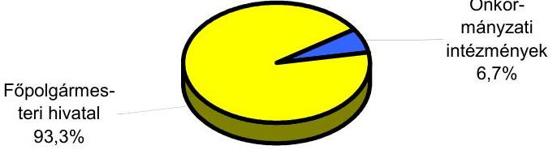
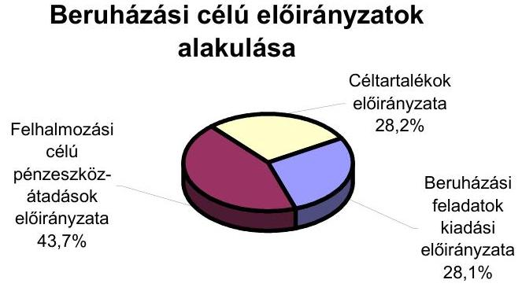
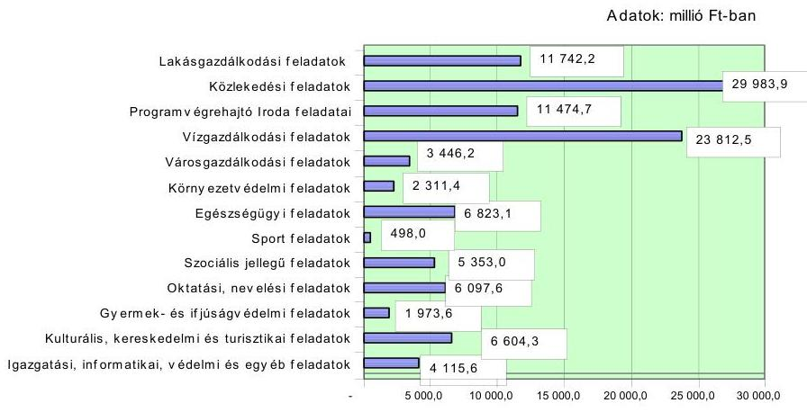
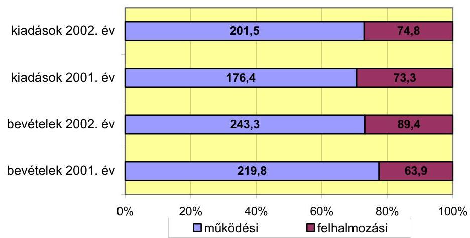
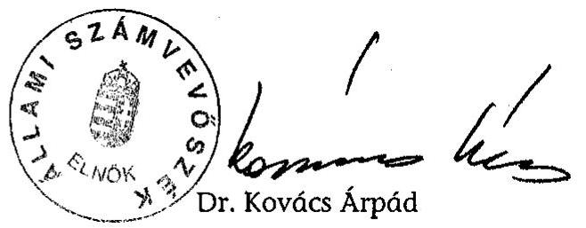
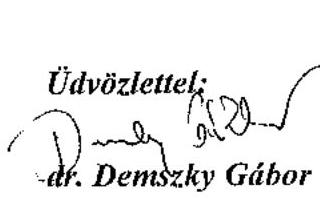

# JELENTÉS 

a Budapest Főváros Önkormányzatánál a beruházási rendszer múködésének ellenőrzéséről
Az önkormányzati gazdálkodás átfogó ellenőrzésének I. üteme

---

3. Önkormányzati és Területi Ellenőrzési Igazgatóság
3.3. Átfogó Ellenőrzések Főcsoport
Iktatószám: V-1002-7/20/24/2003.
Témaszám: 635
Vizsgálat-azonosító szám: V0102

# Az ellenőrzést felügyelte: 

Dr. Lóránt Zoltán
főigazgató
Az ellenőrzés végrehajtásáért felelős:
Dr. Sepsey Tamás
főcsoportfőnök
Az ellenőrzést vezette:
Csecserits Imréné
főcsoportfőnök-helyettes

## Az ellenőrzést végezték:

| Bauer Lajosné | Endrődy Péterné | Dr. Karáné Kőszegi Zsuzsanna |
| :-- | :-- | :-- |
| főtanácsadó | számvevő | számvevő tanácsos |
| Kozma Gábor | Dr. Körös István | Molnár Gyula Mihály |
| számvevő | számvevő tanácsos | számvevő főtanácsos |

## A témához kapcsolódó eddig készített számvevőszéki jelentések:

| címe | sorszáma |
| :-- | --: |
| Jelentés a Budapest Főváros Önkormányzata pénzügyi-gazdasági | 364 |
| ellenőrzésének tapasztalatairól |  |
| Jelentés a főváros és a megyei jogú városok szennyvíztisztítási | 9805 |
| programjára rendelkezésre álló források felhasználásának |  |
| vizsgálatáról |  |
| Jelentés a helyi önkormányzatok által fenntartott járóbeteg- | 9817 |
| szakellátás helyzetének és a ráfordított pénzeszközök |  |
| felhasználásának vizsgálatáról |  |
| Jelentés a helyi önkormányzatok által nyújtott pénzbeli szociális | 9913 |
| ellátások helyzetének vizsgálati tapasztalatairól |  |
| Jelentés a helyi önkormányzatok által igényelhető 1998. évi | 9921 |
| központosított előirányzatok felhasználásának ellenőrzéséről |  |
| Jelentés a helyi önkormányzatok beruházásaihoz és | 9922 |
| rekonstrukcióihoz nyújtott 1998. évi címzett és céltámogatások |  |
| vizsgálatáról |  |
| Jelentés a helyi önkormányzatok 1998. évi normatív állami | 9929 |

[^0]
[^0]:    Jelentéseink az Országgyűlés számítógépes hálózatán és az Interneten a www.asz.hu címen is olvashatók.

---

hozzájárulás, valamint az ezekhez kapcsolt kiegészítő támogatások igénybevételének és elszámolásának ellenőrzéséről
Jelentés a települési önkormányzatok tulajdonában lévő közutak, 0007 hidak, alagutak fejlesztésének, fenntartásának és üzemeltetésének vizsgálatáról
Jelentés a helyi önkormányzatok vagyonszerkezetének, 0008 vagyonhasznosítási és nyilvántartási tevékenységének vizsgálatáról
Jelentés a helyi önkormányzatok beruházásaihoz és 0022 rekonstrukcióihoz nyújtott 1999. évi címzett és céltámogatások felhasználásának vizsgálatáról
Jelentés az önkormányzati korlátozottan forgalomképes 0108 törzsvagyon-gazdálkodás vizsgálatáról
Jelentés a települési önkormányzatok adóztatási tevékenységének 0121 vizsgálatáról
Jelentés a nagyvárosi tömegközlekedés feladatellátásának és 0123 finanszírozásának ellenőrzéséről
Jelentés a helyi és kisebbségi önkormányzatok 2000. évi 0126
zárszámadásának ellenőrzéséről
Jelentés a települési önkormányzatok szilárdhulladék-gazdálkodási 0221 feladatai ellátásának ellenőrzéséről
Jelentés a foglalkoztatást elősegítő támogatások felhasználásának 0226 ellenőrzéséről
Jelentés Budapest Főváros Önkormányzata gazdálkodásának 0246 utóvizsgálatáról
Jelentés a helyi önkormányzatok tartós szociális ellátási 0317 feladatainak ellenőrzéséről az idősek otthonainál
Jelentés a helyi önkormányzatok egyes pénzügyi befektetésekkel 0318 történő gazdálkodásának ellenőrzéséről
Jelentés a szakképzési struktúra szerepéről a munkaerőpiaci 0321 igények kielégítésében
Jelentés a 2002. évi országgyűlési, valamint a helyi és kisebbségi 0325 önkormányzati képviselő választások lebonyolítására felhasznált pénzeszközök ellenőrzéséről
Jelentés a helyi és a helyi kisebbségi önkormányzatok 0319 gazdálkodásának átfogó ellenőrzéséről
Jelentés a helyi önkormányzatoknak bérlakásépítésre és 0349 korszerűsítésre juttatott pénzügyi támogatások ellenőrzéséről
Jelentés a Megyei, fővárosi illetékhivatali tevékenység 0243 ellenőrzéséről
Jelentés az önkormányzati tulajdonban lévő kórházak pénzügyi 0023 helyzetének, gazdálkodásának vizsgálatáról
A Magyar Köztársaság 1998. évi költségvetése végrehajtásának 9927 ellenőrzése; A helyi önkormányzatok ellenőrzése (4. sz. füzet)

---

Jelentés az 1997. évi népszavazásra, továbbá az 1998. évi ..... 9920
országgyúlési, valamint a helyi és kisebbségi önkormányzati
képviselő-választások lebonyolítására felhasznált pénzeszközök vizsgálatáról
Jelentés a helyi önkormányzatok által igényelhető 1997. évi ..... 9824
központosított előirányzatok felhasználásának ellenőrzéséről
Jelentés a helyi önkormányzatok beruházásaihoz és ..... 9823
rekonstrukcióihoz nyújtott 1997. évi címzett- és céltámogatások vizsgálatáról
Jelentés az önkormányzatok 1995. évi normatív állami ..... 324
hozzájárulása igénybevételének és elszámolásának ellenőrzési tapasztalatairól
Jelentés a helyi önkormányzatok beruházásaihoz és ..... 388
rekonstrukcióihoz nyújtott 1996. évi címzett és céltámogatás vizsgálatának tapasztalatairól
Jelentés a fogászati ellátás finanszírozásának és múködésének ..... 358
vizsgálatáról
Jelentés a helyi önkormányzatok beruházásaihoz és ..... 329
rekonstrukcióihoz nyújtott 1995. évi címzett és céltámogatás vizsgálatának tapasztalatairól
Jelentés a tartós szociális ellátást nyújtó intézmények helyzetének ..... 363
és finanszírozásának vizsgálati tapasztalatairól
A helyi önkormányzatok beruházásaihoz és rekonstrukcióihoz nyújtott címzett és céltámogatás vizsgálata
A helyi önkormányzatok normatív hozzájárulás 1994. évi igénybevételének és elszámolásának a vizsgálata
A helyi önkormányzatok adóztatási tevékenységének az ellenőrzése
A helyi önkormányzatok infrastrukturális fejlesztéseire fordított pénzeszközök felhasználásának ellenőrzése
A helyi önkormányzatok közüzemi víz- és csatornaszolgáltatás támogatási rendszerének és gazdálkodásának utóvizsgálata
A helyi önkormányzatok rövid és hosszú lejáratú követeléseinek, kötelezettségeinek a pénzügyi egyensúlyra gyakorolt hatása
A távfűtés és melegvíz-szolgáltatás finanszírozási és gazdálkodási rendszerének utóvizsgálata
A helyi önkormányzatok beruházásaihoz és rekonstrukcióihoz nyújtott cél- és címzett támogatások vizsgálata
A szakmunkásképzésre fordított pénzeszközök felhasználásának az ellenőrzése
Az állami gondozásra szoruló fiatalok intézményes ellátása
Az országgyúlési, valamint a helyi és kisebbségi önkormányzati képviselők választások lebonyolítására felhasznált pénzeszközök vizsgálata
Az önkormányzatok 1993. évi normatív támogatás

---

igénybevételének és felhasználásának az ellenőrzése
Az önkormányzatok településtisztasági tevékenysége finanszírozási rendszerének a vizsgálata
A helyi és területi államigazgatási szervek létszám és bérgazdálkodásának vizsgálata
A helyi önkormányzatok beruházásaihoz és rekonstrukcióihoz nyújtott cél- és címzett támogatások vizsgálata
A megyei (fővárosi) illetékhivatalok tevékenységének vizsgálata
Az önkormányzatok 1992. évi zárszámadásának ellenőrzése
Az önkormányzatok 1992.évi normatív támogatás igénybevételének és elszámolásának az ellenőrzése
Az önkormányzatok és intézményeik vállalkozási tevékenységének a vizsgálata
A helyi önkormányzatok 1992. évi beruházásaihoz és rekonstrukcióihoz nyújtott céltámogatások vizsgálata
A helyi önkormányzatok 1992. évi fejlesztéseihez és rekonstrukcióihoz nyújtott címzett támogatások vizsgálata
Alapfokú oktatásra fordított pénzeszközök felhasználásának ellenőrzése
Az önhibáján kívül hátrányos helyzetben lévő önkormányzatok kiegészítő 1991. évi támogatásának ellenőrzése
Az önkormányzatok 1991. évi zárszámadásának vizsgálata
Az önkormányzatok tulajdonába került vagyontárgyakkal való gazdálkodás ellenőrzése
A helyi önkormányzatok 1991. évi beruházásaihoz és rekonstrukcióihoz nyújtott címzett támogatások vizsgálata
A helyi önkormányzatok áthúzódó kötelezettségei, különös tekintettel az adósságszolgálathoz kapcsolódó 1991. évi címzett támogatásra
A helyi önkormányzatok beruházásaihoz és rekonstrukcióihoz nyújtott céltámogatások ellenőrzése
A kiemelt kommunális feladatokhoz - közvilágítás, útfenntartás, lakásgazdálkodás - kialakított normatív és céltámogatási rendszer múködésének vizsgálata
A szennyvíz elvezetésre és tisztításra fordított eszközök felhasználásának ellenőrzése
A színházi bemutatók pályázati úton történő támogatásának ellenőrzése
Az önhibáján kívül hátrányos helyzetben lévő önkormányzatok elutasított támogatási igényeinek helyszíni felülvizsgálata
Az önkormányzati rendszerre való átállás szervezeti, gazdálkodási kérdéseinek ellenőrzési tapasztalatai
Az önkormányzatok elutasított céltámogatási pályázatainak felülvizsgálata

---

Normatív állami hozzájárulás igénybevételének és elszámolásának ellenőrzése
A Foglalkoztatási Alap múködésének pénzügyi-gazdasági ellenőrzése
A megyei, fővárosi tanácsok 1989. évi likviditási helyzetének vizsgálata
A privatizáció hatása a tanácsok gazdálkodására
A tanácsok 1989. évi költségvetési beszámolójának ellenőrzése
Az 1990. évi országgyűlési képviselő választások előkészítésével és lebonyolításával kapcsolatos állami feladatok végrehajtására biztosított költségvetési pénzeszközök felhasználásáról és az 198990. évi választások pénzügyi összegezése

Az 1990. június 29-i népszavazáshoz nyújtott költségvetési pénzeszköz felhasználásának ellenőrzése
Az állami tulajdonban lévő tanácsi kezelésű ingatlanok hasznosítása
Az önkormányzatok 1991. évi állami támogatásának tervezési, módszertani kérdéseinek ellenőrzése
Bérpolitikai intézkedések vizsgálata a tanácsoknál
Pályázati úton nyújtott szociálpolitikai támogatások és az önkormányzatok szociális feltételrendszerének ellenőrzése

---

# TARTALOMJEGYZÉK 

BEVEZETÉS ..... 7
I. ÖSSZEGZŐ MEGÁLLAPÍTÁSOK, KÖVETKEZTETÉSEK, JAVASLATOK ..... 10
II. RÉSZLETES MEGÁLLAPÍTÁSOK ..... 23
1.A beruházási tevékenység szabályozottsága ..... 23
2.A beruházási feladatok költségvetési tervezésének és a költségvetési rendelet megalkotásának, elfogadásának szabályszerűsége ..... 36
3.A költségvetési, ezen belül a beruházási feladatok költségvetési előirányzatai módosításának és nyilvántartásának szabályszerűsége ..... 43
4.A beruházási feladatokhoz kapcsolódó bizonylatok szabályszerűsége, a kiadások elszámolása és nyilvántartása ..... 46
5.A beruházások nyilvántartása, leltározásának szabályszerűsége, kiemelten az üzemeltetésre átadott eszközök fejlesztése tekintetében ..... 47
6.A beruházási döntések, intézkedések szabályszerűsége, célszerűsége ..... 51
7.Az Önkormányzat által beruházási céllal juttatott pénzügyi támogatásokkal történő elszámolás szabályszerűsége ..... 54
8.A múködési és felhalmozási bevételek, kiadások alakulása, a költségvetés egyensúlyi helyzete ..... 56
9.A beruházásokkal kapcsolatos adósságot keletkeztető kötelezettségvállalások szabályszerűsége, a kötelezettségvállalások nyilvántartása ..... 61
10.A közbeszerzési eljárások szabályszerűsége ..... 63
11.A helyi kisebbségi önkormányzatok gazdálkodásának lebonyolítása során a beruházásokhoz kapcsolódó feladatok szabályszerűsége ..... 72
12.A zárszámadási kötelezettség teljesítésének szabályszerűsége a beruházási feladatok vonatkozásában ..... 73
13.A pénzügyi, gazdálkodási és számviteli feladatellátás területén az ellenőrzések szabályozottsága és gyakorlati múködése ..... 74
14.A beruházási feladatok gazdálkodási megállapításaira vonatkozó korábbi számvevőszéki ellenőrzések javaslatainak hasznosulása ..... 76

---

# MELLÉKLETEK 

1. számú Az önkormányzati vagyon nagyságának alakulása (1 oldal)
2. számú Az Önkormányzat 2002. évi bevételeinek és kiadásainak alakulása (1 oldal)
3. számú Az Önkormányzat gazdálkodását meghatározó adatok, mutatószámok (1 oldal)
4. számú Az Önkormányzat 2003. évi fejlesztési terve az Önkormányzat 2003. évi költségvetéséről szóló 10/2003. (III. 14.) rendeletének 5. számú táblázatának adatai szerint (4 oldal)
5. számú Az ellenőrzött beruházási feladatok bemutatása (1 oldal)
6. számú A Főpolgármesteri hivatal szervezeti felépítése (1 oldal)
7. számú Dr. Demszky Gábor főpolgármester úr észrevétele (2 oldal)

---

# RÖVIDÍTÉSEK JEGYZÉKE 

Ötv.
Áht.
Ámr.
Kbt.
Számv. tv.
Htv.
Vhr.

ÁSZ
Önkormányzat
Közgyűlés
főpolgármester
főjegyző
Pénzügyi bizottság
Tulajdonosi bizottság
Környezetvédelmi bizottság
önkormányzati intézmények
Főpolgármesteri hivatal
Főjegyzői iroda
Belső ellenőrzési csoport
Vizsgálóbiztosi csoport
Főépítészi iroda
Költségvetési ügyosztály
Beruházási ügyosztály
Gazdasági és ellátási ügyosztály
Informatikai ügyosztály
Lakás ügyosztály
Fejlesztési és fenntartási alosztály
Kereskedelmi ügyosztály
a helyi önkormányzatokról szóló 1990. évi LXV. törvény az államháztartásról szóló 1992. évi XXXVIII. törvény az államháztartás müködési rendjéről szóló 217/1998. (XII. 30.) Korm. rendelet
a közbeszerzésekről szóló 1995. évi XL. törvény
a számvitelről szóló 2000. évi C. törvény
a helyi adókról sólo 1990. évi C. törvény
az államháztartás szervezetei beszámolási és könyvvezetési kötelezettségének sajátosságairól szóló 249/2000. (XII. 24.) Korm. rendelet

Állami Számvevőszék
Budapest Főváros Önkormányzata
Budapest Főváros Önkormányzatának Közgyűlése
Budapest Főváros Önkormányzatának Főpolgármestere
Budapest Főváros Önkormányzatának Főjegyzője
Budapest Főváros Önkormányzata Közgyűlésének Pénzügyi Bizottsága
Budapest Főváros Önkormányzata Közgyűlésének Tulajdonosi Bizottsága
Budapest Főváros Önkormányzata Közgyűlésének Környezetvédelmi Bizottsága
Budapest Főváros Önkormányzata Közgyűlésének költségvetési intézményei
Budapest Főváros Önkormányzata Közgyűlésének Főpolgármesteri Hivatala
Főpolgármesteri Hivatal Főjegyzői Iroda
Főpolgármesteri Hivatal Főjegyzői Iroda Belső Ellenőrzési Csoportja
Főpolgármesteri Hivatal Főjegyzői Iroda Vizsgálóbiztosi Csoportja
Főpolgármesteri Hivatal Főépítészi Iroda
Főpolgármesteri Hivatal Költségvetési, Tervezési és Gazdálkodási Ügyosztálya
Főpolgármesteri Hivatal Beruházási és Közbeszerzési Ügyosztálya
Főpolgármesteri Hivatal Gazdasági és Ellátási Ügyosztálya
Főpolgármesteri Hivatal Informatikai Ügyosztálya
Főpolgármesteri Hivatal Lakás Ügyosztálya
Főpolgármesteri Hivatal Lakás Ügyosztály Fejlesztési és Fenntartási Alosztálya
Főpolgármesteri Hivatal Kereskedelmi, Turisztikai és Fogyasztói Érdekvédelmi Ügyosztálya

---

Környezetvédelmi ügyosztály
Közlekedési ügyosztály
Közmű ügyosztály
Jogi és közgazdasági
alosztály
Vagyonnyilvántartási
ügyosztály
Védelmi és rendészeti
ügyosztály
Vállalkozási ügyosztály
Igazgatási ügyosztály
Programvégrehajtó iroda
FŐKERT Rt.
FCSM Rt.
SzMSz
ügyrend

BMSz
2003. évi költségvetési rendelet

2002. évi költségvetési rendelet
költségvetési rendeletek beruházási rendelet
közbeszerzési rendelet
vagyongazdálkodási rendelet

Főpolgármesteri Hivatal Környezetvédelmi Ügyosztálya
Főpolgármesteri Hivatal Közlekedési Ügyosztálya
Főpolgármesteri Hivatal Közmű Ügyosztálya
Főpolgármesteri Hivatal Közmű ügyosztály Jogi és Közgazdasági Alosztálya
Főpolgármesteri Hivatal Vagyonnyilvántartási Ügyosztálya
Főpolgármesteri Hivatal Védelmi és Rendészeti Ügyosztálya
Főpolgármesteri Hivatal Vállalkozási és Vagyonkezelési Ügyosztály
Főpolgármesteri Hivatal Igazgatási és Hatósági Ügyosztály
Főpolgármesteri Hivatal Főpolgármesteri Iroda Programvégrehajtó Irodája
Fővárosi Kertészeti Részvénytársaság
Fővárosi Csatornázási Művek Rt.
Budapest Főváros Önkormányzata Közgyűlésének 7/1992. (III. 26.) számú rendelete a Fővárosi Önkormányzat Szervezeti és Múködési Szabályzatáról
Budapest Főváros Önkormányzata Főpolgármesteri Hivatalának ügyrendjéről szóló, többször módosított 03942/3/1998. számú Főpolgármesteri és Főjegyzői együttes intézkedés
Belső Múködési Szabályzat
Budapest Főváros Önkormányzata Közgyűlésének a 2003. évi költségvetéséről szóló 10/2003. (III. 14.) számú rendelete
Budapest Főváros Önkormányzata Közgyűlésének a 2002. évi költségvetéséről szóló 85/2001. (XII. 18.) számú rendelete
a 2002. évi és a 2003. évi költségvetési rendelet
Budapest Főváros Önkormányzata Közgyűlésének az 50/1998. (X. 30.) számú rendelete Budapest Főváros Önkormányzata és intézményei beruházási és felújítási tevékenysége előkészítésének jóváhagyásának, megvalósításának rendjéről
Budapest Főváros Önkormányzata Közgyűlésének a 6/2001. (III. 14.) számú rendelete a közbeszerzési eljárás egyes kérdéseiről
Budapest Főváros Önkormányzata Közgyűlésének a 27/1995. (V. 15.) számú rendelete a Fővárosi Önkormányzat vagyonáról, a vagyontárgyak feletti tulajdonosi jogok gyakorlásáról

---

fővárosi zöldterületekről Szóló rendelet

518/2001. számú együttes intézkedés

531/1998. számú együttes intézkedés

2002. évi számlarend

Bizonylati szabályzat
áfa
EIB

Budapest Főváros Önkormányzata Közgyűlésének 40/1994. (VII. 8.) számú rendelete a fővárosi zöldterületek és zöldfelületek megóvásáról, használatáról, fenntartásáról és fejlesztéséről
A Főpolgármester és a Főjegyző 518/2001. számú együttes intézkedése a fővárosi közbeszerzések megvalósításának rendjéről
A Főpolgármesternek és a Főjegyzőnek az 531/1998. számú együttes intézkedése a Főpolgármesteri Hivatal pénzgazdálkodásával kapcsolatos kötelezettségvállalás, utalványozás, ellenjegyzés és érvényesítés hatásköri rendjéről
A Főjegyzö 528/1999. számú intézkedése Budapest Főváros Önkormányzata Főpolgármesteri Hivatala számlarendjéről
A Főjegyzö 543/2002. számú intézkedése Budapest Főváros Önkormányzata Főpolgármesteri Hivatala számlarendjéről
2003. évi számlarend 4. számú melléklete, a Bizonylati Szabályzat
általános forgalmi adó
Európai Beruházási Bank

---

# JELENTÉS 

## a Budapest Főváros Önkormányzatánál a beruházási rendszer múködésének ellenőrzéséről

## Az önkormányzati gazdálkodás átfogó ellenőrzésének I. üteme

## BEVEZETÉS

Az Ötv. 92. § (1) bekezdése, valamint az Áht. 120/A. § (1) bekezdése alapján az Önkormányzat gazdálkodását az ÁSZ Önkormányzati és Területi Ellenőrzési Igazgatósága a V-1002-20/2/2003. számú ellenőrzési programban foglaltaknak megfelelően vizsgálta.

Az Önkormányzatnál több évre ütemezett átfogó vizsgálati program végrehajtása keretében I. ütemként az ÁSZ ellenőrizte az önkormányzati beruházások tervezésének, végrehajtásának és elszámolásának szabályszerűségét, valamint minősítette a kialakított rendszer célszerűségét. A II. ütemben a működési célú pénzeszköz-átadások rendszerének ellenőrzésére kerül sor. Az ellenőrzési feladat végrehajtásakor az ÁSZ a beruházási feladatok fogalmához tartozónak tekintette a Számv. tv. 3. § (4) bekezdése 7. pontjában foglaltakat ${ }^{1}$ és a beruházási célú pénzeszköz-átadásokat. Nem terjedt ki az ellenőrzés a beruházások szerződés szerinti műszaki tartalmának teljesítésére.

## Az ellenőrzés célja annak értékelése volt, hogy:

- a költségvetés tervezése, végrehajtása, a számviteli elszámolások és a zárszámadás során a beruházási feladatok tekintetében betartották-e a jogszabályi előírásokat, a belső szabályozatok előírásait, a szabályszerűséget bizto-

[^0]
[^0]:    ${ }^{1}$ Beruházás „a tárgyi eszköz beszerzése, létesítése, saját vállalkozásban történő előállítása, a beszerzett tárgyi eszköz üzembe helyezése, rendeltetésszerú használatbavétele érdekében az üzembe helyezésig, a rendeltetésszerú használatbavételig végzett tevékenység (szállítás, vámkezelés, közvetítés, alapozás, üzembe helyezés, továbbá mindaz a tevékenység, amely a tárgyi eszköz beszerzéséhez hozzákapcsolható, ideértve a tervezést, az előkészítést, a lebonyolítást, a hitel-igénybevételt, a biztosítást is); beruházás a meglévő tárgyi eszköz bővítését, rendeltetésének megváltoztatását, átalakítását, élettartamának, teljesítőképességének közvetlen növelését eredményező tevékenység is, az előbbiekben felsorolt, e tevékenységhez hozzákapcsolható egyéb tevékenységekkel együtt".

---

sító kontrollok ${ }^{2}$ megfelelően segítették-e a beruházásokkal kapcsolatos feladatok végrehajtását, célszerűen alakították-e ki a beruházási feladatok szervezeti rendszerét;

- biztosított volt-e az Önkormányzat által jóváhagyott beruházási feladatok és az azokhoz rendelkezésre álló pénzforrások összhangja.

Az ellenőrzött időszak: a 2002. év, valamint a 2003. év I. féléve, a 8. és 9. ellenőrzési programpontok esetében 2001-2003. év I. féléve.

Budapest főváros lakosainak száma a 2002. év végén 1726872 fő volt. Az Önkormányzat 66 tagú Közgyűlésének munkáját 21 állandó bizottság segítette. Feladatainak végrehajtása érdekében az Önkormányzat 260 intézményt múködtet, amelyből gazdálkodási szempontból 17 intézmény részben önálló. A közfeladatok ellátását gazdasági társaságok, közhasznú társaságok segítik. Az önkormányzati feladatokat ellátó társaságaiban - 14 részvénytársaságban, hat korlátozott felelősségű társaságban és 11 közhasznú társaságban - lévő részesedését vagyonában korlátozottan forgalomképes törzsvagyonként szerepelteti. Az Önkormányzat költségvetési szerveinél foglalkoztatottak száma a 2002. év végén 44626 fő, ebből 967 fő köztisztviselő.

Az Önkormányzat a 2002., illetve a 2003. évben 664,4 milliárd Ft, illetve 701,8 milliárd Ft bevételt és 512,7 milliárd Ft, illetve 546,9 milliárd Ft kiadást teljesített, ebből a felhalmozási célú kiadások összege 74,8 milliárd Ft, illetve 97,2 milliárd Ft. A felhalmozási célú kiadásokból a beruházásokra és a felhalmozási célú pénzeszköz-átadásokra 55,1 milliárd Ft-ot, illetve 58,9 milliárd Ft-ot fordítottak, ami az Önkormányzat összes kiadásának a 10,7\%-a, illetve 10,8\%-a. A számviteli mérleg szerint az Önkormányzat a 2002., illetve a 2003. év végén 1733,8 milliárd Ft, illetve 1810,8 milliárd Ft saját vagyonnal rendelkezett. Az ellenőrzött beruházási feladatok eredeti előirányzata a 2002., illetve 2003. évi költségvetésben az összes felhalmozási feladatra jóváhagyott költségvetési előirányzatnak a $4 \%$-át, illetve $9 \%$-át jelentette.

Az Önkormányzat beruházási tevékenységének folyamatában a Főpolgármesteri hivatal beruházási feladatot ellátó szervezeti egységei és az önkormányzati intézmények vesznek részt. A beruházási feladatok 93,3\%-át a Főpolgármesteri hivatalban, 6,7\%-át az önkormányzati intézményekben valósítják meg.

A Főpolgármesteri hivatalban a Beruházási Ügyosztályon túlmenően kilenc ügyosztály egy-egy adott ágazatot érintő beruházási feladatainak előirányzata 17,7 milliárd Ft, amely az önkormányzati felhalmozási kiadások előirányzatának a 15,5\%-a. A beruházási feladatokat önállóan ellátó ügyosztályok közül a legjelentősebb a Közmű ügyosztály feladataihoz kapcsolódó előirányzat, amely az ügyosztályok által beruházóként megvalósított fejlesztések 54,5 \%-a. A beruházási feladatok közül 19\%-a Közlekedési ügyosztály, 12,2\%-a Lakás ügyosz-

[^0]
[^0]:    ${ }^{2}$ A gazdálkodás szabályszerűségét biztosító kontroll alatt értjük a kiépített és működő belső irányítási és szabályozási rendszert, valamint a belső ellenőrzési funkciók ellátását.

---

tály, 9,2\%-a Informatikai ügyosztály és 3,7\%-a Környezetvédelmi ügyosztály tevékenységi köréhez kapcsolódott.

A Főpolgármesteri hivatal ügyosztályai közül a Beruházási ügyosztály a több ágazatot érintő beruházási feladatokat látja el, amelyek az önkormányzati intézmények feladatellátásával vannak összefüggésben. A nem önállóan beruházó ügyosztályok feladataihoz kapcsolódó, ágazati fejlesztési előirányzatok az önkormányzati felhalmozási kiadások 10,9\%-át jelentették. A 2003. évi költségvetési rendelet szerint, ezen belül legjelentősebb beruházási előirányzattal a kulturális ágazat rendelkezett, amely az önkormányzati intézményekhez kapcsolódó önkormányzati fejlesztések 42,4\%-a. Ezen beruházási előirányzatokból $17,1 \%$ az oktatási ágazat, $17,1 \%$ a szociális ágazat, $15,5 \%$ az egészségügyi ágazat, $7,4 \%$ a gyermek- és ifjúságvédelmi ágazat, valamint $0,5 \%$ a sportágazat tevékenységéhez kötődött.

A pénzeszköz-átadásokkal megvalósított beruházások 2003. évi előirányzata az összes önkormányzati felhalmozási célú kiadási előirányzatnak 31,8\%-át tette ki. A pénzeszköz-átadásokkal megvalósított fejlesztések közül a legjelentősebb a Közlekedési ügyosztály tevékenységéhez kapcsolódó pénzeszköz-átadásoknak a 2003. évi költségvetési rendelet szerinti előirányzata, amely az összes fejlesztési célú pénzeszköz-átadás 42,3 \%-a. A pénzeszköz-átadás előirányzatából 25,7\% a Lakás ügyosztály, 23,7\% a Programvégrehajtó iroda, 7,2\% a Közmű ügyosztály és $1,0 \%$ a Környezetvédelmi ügyosztály, valamint $0,1 \%$ a Kereskedelmi ügyosztály és a Kulturális ügyosztály tevékenységéhez kapcsolódott.

---

# I. ÖSSZEGZŐ MEGÁLLAPÍTÁSOK, KÖVETKEZTETÉSEK, JAVASLATOK 

A beruházás előkészítésével és megvalósításával kapcsolatos feladatokat a beruházási rendelet ${ }^{3}$, valamint annak mellékleteit képező célokmányok és engedélyokiratok tartalmazzák. A beruházási rendelet szerint a beruházó szervezetet a jóváhagyásra jogosult testületek vagy személyek döntésével jelölik ki a beruházás előkészítési szakaszában a célokmányban, illetve - amennyiben a beruházás nem volt célokmány köteles - a megvalósítási szakaszt megelőzően az engedélyokiratban. Beruházási célokmányt kell készíteni a beruházási rendelet alapján valamennyi 15 millió Ft értékhatárt meghaladó és hatósági engedélyhez kötött beruházásra, kivéve, ha a beruházás azonnal üzembe helyezhető - aktiválható - tárgyi eszköz beszerzésével, illetve azonnal aktiválható immateriális javak megszerzésével valósul meg. Az 500 millió Ft becsült értékhatárt meghaladó beruházási célokmány jóváhagyására a Közgyűlés, illetve a 15-500 millió Ft becsült értékhatár közötti beruházási célokmány jóváhagyására a Pénzügyi bizottság egyetértésével az illetékes bizottság jogosult. Beruházási engedélyokiratot kell készíteni a 15 millió Ft értékhatárt meghaladó beruházásokra, továbbá a célokmány köteles beruházásokra. A beruházási rendelet szerint az 500 millió Ft értékhatárt meghaladó beruházási engedélyokirat jóváhagyására a Közgyűlés, illetve a 15-500 millió Ft értékhatár közötti beruházás engedélyokirat jóváhagyására a Pénzügyi bizottság egyetértésével a beruházás szerint illetékes bizottság jogosult. Egyszerűsített beruházási engedélyokiratot kell kiállítani a beruházási rendelet szerint a 15 millió Ft értékhatárt meg nem haladó beruházásokra. A beruházási rendelet szerint az egyszerúsített beruházási engedélyokirat jóváhagyására a főpolgármester jogosult.

A beruházási rendeletben a beruházó szervezetek pénzügyi-gazdasági tartalmú feladatait egyértelműen meghatározták. A beruházási feladatok megvalósításához a szervezeti rendszert a beruházási rendeletben célszerűen alakították ki, azonban az egyes beruházási feladatok beruházóinak kijelölési feltételrendszerét nem határozták meg. A beruházási rendeletben nem rögzítették azokat a szempontokat, a személyi és tárgyi feltételeket, amelyek alapján a beruházási feladatok ellátására a Főpolgármesteri hivatal, illetve annak egyes szervezeti egységei és az Önkormányzat egyes költségvetési intézményei kijelölhetők a beruházási döntés alkalmával.

A gazdálkodási jogkörök gyakorlásáról szóló 531/1998. számú együttes intézkedés, illetve minden „500-as" főpolgármesteri, főjegyzői intézkedés és módosítása nem tartalmazta az évszámon túl a hatályba lépés hónapját, napját, továbbá nem jelölték az egységes szerkezetű intézkedésben a módosított szö-

[^0]
[^0]:    ${ }^{3}$ Az Önkormányzat önálló rendeletben szabályozta a beruházási feladatok ellátásának rendjét annak ellenére, hogy arra központi előírás nem kötelezte.

---

vegrészeket, ezért az egységes szerkezetbe foglalt intézkedésből nem állapítható meg az egyes rendelkezések alkalmazásának kezdő időpontja.

Az 531/1998. számú együttes intézkedésben az önkormányzati beruházások esetében nem vették figyelembe a kivételek között a sajátosan szabályozott fejlesztési célú pénzeszköz átadás-átvételt nem határozták meg, mely szerződések tartoznak a „Közgyülés által megkötött szerződések" körébe. Az elnevezésben a „megkötött" szó használata félreérthető, mert ténylegesen a Közgyűlés által jóváhagyott szerződéseket jelenti. A kötelezettségvállalást, illetve annak ellenjegyzését szabályozó intézkedések egyidejűleg történő használata nehezíti az előírások áttekintését és alkalmazását.

A beruházási rendelet mellékleteiben a beruházási célokmány és a beruházási engedélyokirat formanyomtatványán az aláírásra jogosultakat kötelezettségvállalóként és ellenjegyzőként jelölték, amely nem azonos az Ámr-ben meghatározott kötelezettségvállalással és ellenjegyzéssel, mert ehhez nem kapcsolódik fizetési vagy teljesítési kötelezettség, hanem a beruházás előkészítésének, illetve megvalósításának az engedélyezését jelenti.

Az 531/1998. számú együttes intézkedésben az Ámr. előírása szerint a pénzgazdálkodással összefüggő feladatok meghatározásakor az utalványozás ellenjegyzőjének feladatát nem egészítették ki a kötelezettségvállalás célszerűségét megalapozó eljárás, a szakmai teljesítésigazolás és az érvényesítés megtörténtéről való meggyőződés kötelezettségének előírásával. Az összeférhetetlenségi szabályokat nem egészítették ki azzal, hogy az érvényesítést végző személy és a szakmai teljesítést igazoló személy nem lehet azonos. Az utalványozásról szóló részben az Ámr-ben előírtak ellenére nem sorolták fel a kötelezően feltüntetendő adatok között a fizetés időpontját, módját, összegét és a kötelezettségválla-lás-nyilvántartásba vétel sorszámát, az utalványrendelet formanyomtatványán nem tüntették fel a kötelezettségvállalás-nyilvántartásba vétel sorszámát. A fejlesztési számlák kifizetéséhez bevezetett egyedi jelöléseket tartalmazó belső bizonylatnak az utalványrendelet melletti alkalmazása többletmunkát okoz az érvényesítést, ellenjegyzést és utalványozást végző személyeknek. A szakmai teljesítésigazolás tartalmának meghatározásában az Ámr-ben előírtak ellenére nem rendelkeztek annak módjáról, és az azt végző személyek kijelöléséről. A szakmai teljesítésigazolás „megrendelés alapján" szövege nem alkalmazható a megállapodáson alapuló pénzeszköz-átadások esetében, mert a pénzeszközátadásra vonatkozó megállapodás nem megrendelés.

A számviteli politikát, számlarendet és az értékelési szabályzatot főjegyzői intézkedéssel a Számv. tv-t megsértve 2002. I. negyedév helyett csak 2002. december 28-án aktualizálták. Az aktualizált értékelési szabályzatban a Számv. tv. és a Vhr. előírásaival összhangban határozták meg a terven felüli értékcsökkenés elszámolását és a visszaírásra vonatkozó előírásokat. A számviteli politikában meghatározták, hogy az elszámolás során mit tekintenek lényeges szempontnak és jelentős összegnek. A Főpolgármesteri hivatal a Vhrben előírtak ellenére nem rendelkezett a felesleges eszközök feltárására és az elhasználódott vagyontárgyak selejtezésére vonatkozó szabályozással. Az értékelési szabályzat előírása - miszerint a beruházás meghiúsulása miatt a befejezetlen beruházási állományból a terven felüli értékcsökkenés elszámolást

---

követő kivezetés a selejtezésre vonatkozó előírások szerint történik - hiányos, mert a Főpolgármesteri hivatal nem rendelkezik selejtezési szabályzattal.

A leltározási szabályzatnak a leltározás mennyiségi, illetve egyeztetéssel való elvégzésére vonatkozó előírása nem felel meg a Vhr. rendelkezéseinek, mert nem határozták meg eszköz típusok szerint a leltározás módját.

A beruházások bekerülési értékének kialakítását a Számv. tv. előírásainak megfelelően szabályozták.

A 2003. évi számlarendben teljes körűen szabályozták a beruházások elszámolását, aktiválását, valamint a beruházást végrehajtó ügyosztályok közötti egyeztetések elvégzésének rendjét az egyeztetések során alkalmazott bizonylatok formáját, a beruházási feladatokkal kapcsolatos gazdasági események könyvelésének alapjául szolgáló bizonylatok kiállításának, javításának módját. Megalkották az ellenőrzésükre, feldolgozásukra, tárolásukra és megőrzésükre vonatkozó előírásokat.

Az Önkormányzat több évre szóló működési és fejlesztési elgondolásait, terveit - a hétéves időszakot felölelő - finanszírozási prognózisok és a hétéves fejlesztési tervek tartalmazzák. A hétéves finanszírozási prognózist és a hétéves fejlesztési tervet a Közgyűlés évente, az éves költségvetési koncepció elfogadásával egyidejűleg felülvizsgálja, egy évvel kiegészíti ${ }^{4}$. A hétéves fejlesztési tervben és a hétéves finanszírozási prognózisban a fejlesztésekhez forrásként számításba vett hitel összege eltért egymástól. Az Önkormányzat a 2003. évre nem rendelkezett költségvetési koncepcióval. A költségvetési rendeletek a Főpolgármesteri hivatal költségvetésében az Ámr-ben előírtaknak megfelelően, önálló címen tartalmazták az önkormányzati beruházások összevont kiadási előirányzatát, a jóváhagyott beruházásokat, felhalmozási célú pénzesz-köz-átadásokat feladatonként bemutatták. Az önkormányzati intézmények költségvetésében „Intézményi beruházások" kiemelt előirányzat jogcímen jóváhagyott beruházási kiadást az Ámr-ben előírtak ellenére feladatonként nem mutatták be. Az évközi indítású beruházások tervezett összegét elkülönítetten, a felhalmozási célú tartalékok között szerepeltették. A költségvetési rendeletek tartalmazták a többéves elkötelezettséggel járó felhalmozási kiadások későbbi évekre vonatkozó kihatásait.

A Közgyűlés az éves költségvetési rendeletekben részletesen meghatározta a költségvetés végrehajtásának szabályait. A felhalmozási célú előirányzatokra az Áht. előírása alapján előirányzat átcsoportosítási hatáskört biztosított a főpolgármesternek, szabályozta az előirányzat átcsoportosítási intézkedéssel összefüggő költségvetési rendeletmódosítást, meghatározta a beruházási, illetve felhalmozási célú támogatás folyósításának rendjét. A költségvetési rendeletekben a beruházási feladatok végrehajtásával összefüggésben meghatározott szabályok összhangban vannak a beruházási- és a vagyongazdálkodási rendelet kapcsolódó rendelkezéseivel.

[^0]
[^0]:    ${ }^{4}$ A 2002. és a 2003. év e tekintetben kivétel, a 2003-2009. évekre szóló terveket a 2003. évi költségvetés elfogadásakor határozták meg, a 2004-2010. évekre szóló tervek elfogadását a 2004. évi költségvetési rendelet elfogadásának időpontjára tervezik.

---

A Közgyűlés a 2002. évi költségvetési rendeletében jóváhagyott előirányzatokat nyolc alkalommal módosította, amelynek során betartotta az Ámr. előírásait. A Közgyűlés az éves költségvetési rendeleteiben meghatározottak szerint előirányzat átcsoportosítási hatáskört biztosított a főpolgármester, illetve a bizottságai részére. A főpolgármesternek a beruházási feladatokat érintő előirányzat átcsoportosítási intézkedései megfeleltek az éves költségvetési rendeletek előírásainak. A Főpolgármesteri hivatalra vonatkozóan a költségvetési rendeletekben jóváhagyott előirányzatok nyilvántartásának módját, formáját, tartalmát a Bizonylati szabályzatban az Áht. rendelkezéseinek megfelelően meghatározták, de azokat az Áht-ban és a belső szabályzatban előírtak ellenére beruházási feladatok vonatkozásában nem vezették. A beruházási feladat végrehajtására illetékes ügyosztályokon a költségvetési rendeletben jóváhagyott előirányzatokról, azok változásairól a beruházási feladatok 71\%-ára vezettek előirányzat nyilvántartást, de azok nem feleltek meg az Áht. előírásának, illetve a belső szabályzatban előírt követelményeknek. A feladatonkénti nyilvántartásokban lévő 2002. év végi módosított előirányzat összege megegyezett a költségvetési beszámolóban és a zárszámadási rendeletben szerepeltetett feladatonkénti előirányzati összegekkel.

A beruházások előkészítésével és megvalósításával kapcsolatos bizonylatok 96,5\%-ban megfeleltek a Számv. tv-ben előírt alaki és tartalmi követelményeknek. Az Önkormányzat érvényes számlarendjében a 2003. január 1jétől előírt utalványrendeletet a Gazdasági és ellátási ügyosztály, valamint a Közmű ügyosztály nem alkalmazta. Az utalványrendeletet alkalmazó ügyosztályoknál nem tüntették fel a kötelezettség-nyilvántartásba vétel sorszámát, ezáltal az utalványrendelkezés nem felelt meg az Ámr-ben előírtaknak.

A beruházásokhoz kapcsolódó gazdálkodási és ellenőrzési jogkörök gyakorlásával kapcsolatban feltárt hiányosságokkal megsértették az Ámr. előírásait, illetve nem tartották be a belső szabályozásban leírtakat. A gazdasági eseményekről szóló bizonylatok 3,5\%-ánál hiányzott az érvényesítés, ezért az érvényesítés feladatát ellátók megsértették az Ámr-ben előírtakat. A pénzügyi kifizetések szakmai teljesítésigazolása a beruházások 2,1\%-nál hiányzott, ezzel nem tartották be az Ámr-ben előírtakat.

A beruházási feladatok kiadásainak számviteli elszámolása és nyilvántartása a Számv. tv-ben, továbbá az érvényes számlarendben leírtaknak megfelelően, a pénzmozgással egyidejűleg megtörtént.

Az Önkormányzat a beruházások számviteli analitikus és főkönyvi nyilvántartásáról az ágazatilag illetékes ügyosztály, valamint a Költségvetési ügyosztály révén gondoskodott. A beruházások nyilvántartása ügyosztályonként, beruházási egységszámonként tételesen tartalmazta a beruházások pénzügyi kiadásait. A befejezett beruházások műszaki átadás-átvétele, üzembe helyezése és aktiválása megfelelően dokumentált, a központi és helyi szabályozásnak megfelelt.

A beruházásokkal kapcsolatos főkönyvi feladások egyeztetése és ellenőrzése a beruházásoknál negyedévente megtörtént, ellentétben a 2002. és a 2003. évi számlarendben és a vonatkozó 2002. évi, valamint a 2003. évi minőségügyi eljárásban előírt havi egyeztetési kötelezettséggel. A beruházásokkal kapcsolatos bizonylatok átadása-átvétele a beruházást végrehajtó ügyosztályok, illetve a

---

főkönyvi és analitikus nyilvántartásokat vezető Költségvetési ügyosztály között dokumentáltan megtörtént.

Az Önkormányzat a beruházások 2002. évi leltározásáról - ügyosztályai, gazdasági társaságai és intézményei révén - gondoskodott. A befejezetlen beruházások leltározását az ügyosztályi analitikus nyilvántartás és a főkönyvi könyvelés adataival való egyeztetetéssel oldották meg, ami nem felelt meg a Vhr. előírásainak. A beruházásoknál az egyezőség 2002. év végén biztosított volt. Az Önkormányzatnál az üzemeltetésre átadott eszközök leltározását az üzemeltető végezte el. A leltározásról készített dokumentáció a Főpolgármesteri hivatalban rendelkezésre állt.

Az Önkormányzat tulajdonában lévő ingatlanvagyonról felfektetett ingat-lanvagyon-kataszter vezetését főjegyzői intézkedésben szabályozták. Az előírásoknak megfelelően 2002. december 31-ig az ingatlanok műszaki állapotát felmérték, és elvégezték a korábban érték nélkül nyilvántartott ingatlanok értékelését is. Ennek hatására az Önkormányzat ingatlanvagyonának bruttó értéke 2002. december 31 -én 1528893 millió Ft, mely 116,6\%-kal haladta meg a 2001. december 31-ei ingatlanvagyon értéket. Az önkormányzat ingatlan vagyonának bruttó értéke 2003. december 31-én 1650197 millió Ft, amely 8\%kal haladta meg a 2002. december 31-i ingatlanvagyon értéket. A bruttó érték változások ingatlanvagyon-kataszterben való rögzítésének határidejét a számviteli nyilvántartásokban való módosítással azonos időben, illetve a tárgyévet követő év január 31-ben szabták meg, melyet az ingatlan beruházások esetében betartottak.

Az Önkormányzat ingatlanvagyonának bruttó értéke 2002. december 31-én az ingatlanvagyon-kataszterben 27902,6 millió Ft-tal kevesebb a számviteli nyilvántartás és az ezzel megegyező zárszámadáshoz csatolt vagyonkimutatás szerinti ingatlanok bruttó értékétől, ezért nem tartották be az önkormányzatok tulajdonában lévő ingatlanvagyon nyilvántartási és adatszolgáltatási rendjéről szóló kormányrendelet előírását. Az eltérés összegéből 4775,7 millió Ft - a számviteli nyilvántartás szerinti ingatlanok bruttó értékének 0,3\%-a - rendezhető a Főpolgármesteri hivatal hatáskörében, a további eltérés a számviteli és az ingatlanvagyon-kataszteri nyilvántartásra vonatkozó szabályok alapján fennállhat.

Az Önkormányzat beruházási rendelete alapján a beruházási feladatok végrehajtását jóváhagyó döntési jogköröket a Közgyűlés és illetékes bizottságai, a főpolgármester, valamint az önkormányzati intézmények vezetői hatáskörébe utalta.

A beruházási döntéseket a beruházási rendeletben előírt jogosultsági szinteknek megfelelően hozták meg, kijelölték a beruházó szervet is. A beruházások megvalósításával kapcsolatos feladat- és felelősségi köröket a beruházási célokmányban és a beruházási engedélyokiratban rögzítették. A beruházási döntésekhez kapcsolódó előterjesztések a beruházások 85,6\%-ban megfeleltek a beruházási rendelet követelményeinek. A beruházások 2,1\%-ánál a beruházási döntésekhez kapcsolódó előterjesztések alátámasztása hiányos. A beruházások a tervezési dokumentumokban előírt műszaki tartalommal, az előirányzott összköltségen belül valósultak meg, azonban a beruházások 57\%-a az eredeti-

---

leg tervezett határidőn túl fejeződött be, ebből a beruházási feladatok 38\%-ánál a késés 4-12 hónap között volt, két nagy értékű, 6 milliárd Ft feletti szennyvízközmű beruházás esetében a csúszás elérte az egy-három évet. A beruházások előkészítési és megvalósítási szakaszának kezdési és befejezési határidejének meghatározása a megvalósítás tükrében nem kellően megalapozott. A beruházási rendelet a beruházás előkészítésének dokumentumai (beruházási célokmány, beruházási engedélyokirat) meghatározásakor megvalósítási ütemterv készítését nem írta elő, ugyanakkor főjegyzői körlevél alapján a 2002. évtől a beruházások szakmailag megalapozottabb előkészítéséhez megvalósítási ütemtervet kell készíteni.

Az Önkormányzat költségvetési rendeletének végrehajtási szabályai között mindkét évben meghatározta, hogy a Főpolgármesteri hivatal és az önkormányzati intézmények költségvetéséből támogatott szervezetek számadási kötelezettséggel tartoznak a részükre juttatott céljellegű összeg felhasználására vonatkozóan. A támogatást nyújtó szervezet köteles ellenőrizni a juttatott összeg felhasználást. A pénzeszköz-átadási megállapodások, illetve támogatási szerződések tartalmi elemeire vonatkozó előírást a beruházási rendelet tartalmaz az engedélyokiratnak megfelelő tartalmú megállapodás kötelezővé tételével.

Az Önkormányzatnál a 2002. évben befejezett ÁSZ utóvizsgálat javaslatai alapján főjegyzői utasítással kiadott intézkedési tervben előírt - egységesen alkalmazandó - „minta" megállapodások kialakítása az előírt határidőre nem történt meg.

A beruházási feladatok közül felhalmozási célú pénzeszköz-átadás történt a Városrehabilitációs keretből társasházi és önkormányzati lakások felújításának támogatására, valamint gyógyfürdők rekonstrukciójára a Budapest Gyógyfürdői és Hévizei Rt. részére. A végleges pénzeszköz-átadással megvalósuló gyógyfürdő beruházások olyan kiadást jelentettek az Önkormányzat részére, amelyek a kizárólagos tulajdonában lévő társaság eszközértékét gyarapította, de az Önkormányzat számviteli nyilvántartás szerinti vagyonát nem növelte.

A felhalmozási célú pénzeszköz-átadásról, támogatásról a megállapodásokat megkötötték. A megállapodásokban rögzítették a céljelleggel juttatott támogatás összegét és a felhasználás jogcímét. Az Áht., illetve a költségvetési rendelet előírásának megfelelően meghatározták számadási kötelezettséget, illetve a jóváhagyott támogatás finanszírozásának feltételeit. A kapott támogatásról a támogatottak az előírt számadási kötelezettséget teljesítették. A társasházak felújításához nyújtott támogatási megállapodásokban részletesen felsorolták a számlamásolathoz kötelező mellékletként kért iratokat, a többi esetben az utólagos finanszírozást a számlamásolat benyújtásához kötötték. A Főpolgármesteri hivatalban a pénzeszköz-átadáshoz, annak rendeltetésszerű felhasználásához kapcsolódó ellenőrzés módjára, a beszámoltatás formájára és tartalmára általános érvényű előírást nem határoztak meg. A pénzeszköz-átadásról szóló megállapodások egy ügyosztályon belül is eltérő részletezettséget tartalmaztak.

Az Önkormányzat által ellátott feladatok, ezen belül a beruházási feladatok és az azokhoz rendelkezésre álló pénzforrások összhangja a

---

2001-2002. évben biztosított volt. Az éves költségvetési beszámolók teljesítési adatai szerint a múködési célú bevételek fedezték a múködési célú kiadásokat, a múködési célú bevételek és kiadások egyenlege forrásul szolgált a felhalmozási kiadásokhoz. A szabad pénzeszközök lekötéséből származó kamatbevételeket a számlarendben nem különböztették meg aszerint, hogy azok múködési, illetve felhalmozási célú szabad források hasznosításából keletkeztek. Az éves költségvetések múködési és felhalmozási kiadásainak, bevételeinek mérlegszerű bemutatásakor a kamatbevételeket a múködési célú bevételek között vették figyelembe. Az Önkormányzatnak a 2001-2002. évi pénzügyi helyzete stabil. Pénzügyi tartalékai ellenére a felhalmozási célú kiadások finanszírozásához mindkét évben külföldi bankoktól hitelt vett fel. A Közgyűlés a hitelfelvétel elhatározásakor vizsgálta az adósságot keletkeztető kötelezettségvállalásra előírtakat, adósságot keletkeztető kötelezettségvállalásakor betartotta az Ötv-ben foglaltakat. A 2002. és a 2003. évben a hitelen túl garancia- és kezességvállalással, kötvénykibocsátással kapcsolatos adósságot keletkeztető kötelezettséget nem vállalt. A 2002. évben két vezető nemzetközi hitelminősítő ügynökséggel elvégeztették az Önkormányzat adósminősítését, amely szerint az Önkormányzat külföldi pénznemre vonatkozó adósminősítése megegyezett a Magyar Állam részére megállapított minősítéssel.

Az Ámr-ben előírtak ellenére a Főpolgármesteri hivatal nem rendelkezik szervezeti és múködési szabályzattal, nem szabályozták, illetve nem határozták meg - az Ámr. szerint a szervezeti és múködési szabályzatban vagy annak mellékletében - a kötelezettségvállalások célszerűségét megalapozó eljárás és dokumentumai tartalmát.

A Bizonylati szabályzatban meghatározták az előirányzat és kötelezettségvállalások egységes nyilvántartási formáját. A nyilvántartás vezetésére kötelezettként a „Gazdálkodó szervezeti egységek"-et, a 2003. évi számlarendben a meghatározott előirányzatok felett rendelkező szervezeti egységeket, míg az 531/1998. számú együttes intézkedésben a „Gazdálkodó megnevezése" fogalmat használták. Az eltérő fogalomhasználat miatt nem egyértelmű, hogy a Főpolgármesteri hivatal mely szervezeti egységeire, illetve gazdálkodókra vonatkozik az előírt nyilvántartási kötelezettség. A Bizonylati szabályzattal kötelező alkalmazásra elrendelt nyilvántartások tartalma megfelel az Áht-ban előírtaknak.

A beruházási feladatokat érintő kötelezettségvállalásokról beruházási feladatonként nem az előírt formanyomtatványon vezették a nyilvántartásokat. Megsértették az Áht-ban előírtakat, mert nem tartották nyilván az Önkormányzati fejlesztések költségvetési cím kiadási előirányzatát terhelő kötelezettségvállalásokat. Nem tartották be az Ámr-ben előírtakat, mert a Főpolgármesteri hivatalban nem vezettek olyan nyilvántartást, amelyből az évenkénti kötelezettségvállalások összege megállapítható.

Az Önkormányzat a költségvetési szerveinek közbeszerzési tevékenységét a Kbt. előírásaival összhangban rendeletben szabályozta. A közbeszerzési rendelet Főpolgármesteri hivatalnál történő alkalmazásának eljárási rendjét az egységes végrehajtás érdekében főpolgármesteri és főjegyzői együttes intézkedés szabályozta. Az intézkedésben meghatározták, hogy a Főjegyzői irodához tartozó Vizsgálóbiztosi csoport folyamatba épített ellenőrzés során ellenőrzi és mi-

---

nősíti az eljárás egyes szakaszainak szabályosságát tanúsítvány, vagy hiánypótlási, illetve észrevételezési jegyzőkönyv kiállításával. A közbeszerzési eljárásra vonatkozó előírásokat tartalmaz még a Főpolgármesteri hivatal közbeszerzéseinek megvalósítására megalkotott folyamatszabályozás, amely meghatározza a közbeszerzés folyamatát, valamint a felelősségi köröket a különféle eljárási típusokra vonatkozóan. A közbeszerzési tevékenységre vonatkozó szabályozások egymással összhangban vannak.

A felhalmozási célú pénzeszköz-átadással megvalósuló beruházások közbeszerzésével kapcsolatos általános előírást a költségvetési rendelet tartalmaz. A beruházási rendelet konkrétan meghatározza, hogy a Kbt. szabályai szerinti eljárás kötelezettségét a pénzeszköz átadás-átvételi megállapodásban rögzíteni kell. A közbeszerzési eljárás betartásának és szabályszerűségének ellenőrzésére a beruházási rendelet előírást nem tartalmaz, annak ellenére, hogy a 2003. évi felhalmozási előirányzaton belül kisebb részarányt képviselő - Főpolgármesteri hivatal által lebonyolított - beruházások közbeszerzései részletekre kiterjedő szabályozással folyamatba épített ellenőrzés mellett történnek.

Két beruházási feladat megvalósítása központosított közbeszerzéshez való csatlakozás keretében valósult meg, egy beruházásra nemzetközi szerződésben meghatározott külön eljárás keretében történő beszerzés miatt a Kbt. hatálya nem terjedt ki.

A Kbt. részekre bontás tilalmára és a becsült értékre vonatkozó előírását megsértették a Béke Gyermekotthon berendezési és felszerelési tárgyainak beszerzésénél, a Budapest, Blaha Lujza téri parkrekonstrukció szakértői feladatainak megrendelésénél. A Kbt. előírását megsértve nem írtak ki közbeszerzési eljárást a Blaha Lujza téri parkrekonstrukció és a Budapest, VI. kerület Nagymező utcai díszburkolat beruházáshoz kapcsolódó fasor rekonstrukció kivitelezési feladataira, a Budapest. X. kerület Kőbányai úti főgyűjtő csatorna beruházás terveinek elkészítésére, valamint a Széchenyi fürdőhöz kapcsolódó beruházás közbeszerzési eljárás lebonyolítójának kiválasztására. A Kbt. előírását megsértve a Budapest Gyógyfürdői és Hévizei Rt-nél nem vizsgálták az összeférhetetlenség kizárását, valamint az előírt személyi döntés helyett bizottság döntött a közbeszerzési eljárás lezárásáról három gyógyfürdő beruházásnál.

A közbeszerzési eljárás fajtáját pénzeszköz-átadás esetén megállapodásban rögzítették, azonban egy esetben - gyógyfürdő rekonstrukciók kivitelezőjének kiválasztásakor - a pénzeszközt átvevő a megállapodásban rögzítettől eltérő közbeszerzési eljárást folytatott le. A lefolytatott eljárás a Kb. előírását nem sértette.

A beruházási rendeletben foglaltak ellenére a lakásfejlesztésekhez nyújtott támogatások pénzeszköz-átadási megállapodásaiban nem írták elő a közbeszerzésre vonatkozó jogszabályi előírások kötelező alkalmazását.

Az értékhatár alatti beszerzéseknél két esetben megsértették a legalább három ajánlat beszerzésére vonatkozó beruházási rendeleti előírást.

A helyi kisebbségi önkormányzatok gazdálkodásának lebonyolításánál a beruházási kiadások elszámolását a számviteli nyilvántartásokban a Költség-

---

vetési ügyosztályon helyi kisebbségi önkormányzatonként elkülönítve, az előírásoknak megfelelően elvégezték. Az elkülönítetten vezetett pénzügyi és számviteli nyilvántartásokban szereplő beruházási kiadások adatai megegyeztek a 2002. évi és a 2003. I. félévi beszámoló adataival.

A főpolgármester az Áht-ban előírt határidőn belül - 2003. április 24-én - terjesztette a Közgyűlés elé az Önkormányzat 2002. évi zárszámadási rende-let-tervezetét, amely alapján a Közgyűlés megalkotta az Önkormányzat 2002. évi költségvetésének végrehajtásáról szóló rendeletét. Annak tartalma - kivéve az intézményi felhalmozási kiadásokat - megfelelt az Ámr-ben előírtaknak. Felhalmozási feladatonként nem mutatták be az önkormányzati intézmények költségvetésében jóváhagyott intézményi felhalmozási feladatokat, ezért nem tartották be az Ámr-ben előírtakat. Csatolták a zárszámadási rendelettervezethez az Áht-ban előírt, tájékoztatásul bemutatandó mérlegeket és kimutatásokat, azok tartalmát a Közgyűlés az Áht-ban előírtak ellenére önkormányzati rendeletben nem határozta meg. A Közgyűlés külön határozatokkal fogadta el az Önkormányzat 2002. évi vagyonkimutatását, egyszerűsített beszámolóját, a költségvetési intézmények pénzmaradványát, illetve vállalkozási tevékenységének eredményét. Meghatározták a pénzmaradvány felhasználással kapcsolatos különböző elszámolási előírásokat.

A beruházási feladatok vonatkozásában biztosították a számszaki egyezőséget a 2002. évi önkormányzati szintű költségvetési beszámoló és a zárszámadási rendelet adatai között.

Az Önkormányzat a 2002. évi zárszámadási rendeletében és a vonatkozó előterjesztésekben a beruházási feladatok teljesítéséről a Közgyűlés részére adott információ áttekinthető és teljes körű volt, a számviteli nyilvántartás szerint megbízható teljesítési adatokat tartalmazott.

A beruházási feladatokhoz kapcsolódó vezetői és munkafolyamatba épített ellenőrzések során nem észrevételezték a kötelezettségvállalás írásbeliségének hiányát, az utalványrendeleteken hiányzott az érvényesítés, továbbá nem tüntették fel az utalványrendeleteken a kötelezettségvállalás nyilvántartásba vételi sorszámát. A Főjegyzői irodához tartozó Vizsgálóbiztosi csoport a 2002. és a 2003. évi munkaterve alapján a beruházásokat ellenőrizte. Az ellenőrzésekről készített jelentések megállapításokat és javaslatokat tartalmaztak, a javaslatok realizálását utólagosan ellenőrizték. A Főjegyzői irodához tartozó Belső ellenőrzési csoport munkaterve alapján folyamat közben ellenőrizte a beruházási feladatok időbeni és engedélyokirat szerinti megvalósítását. A jelentésekben hiányosságokat nem tártak fel.

Az ÁSZ korábbi ellenőrzési javaslatának 80\%-át megvalósították, kialakították az utalványrendelet egységes formáját, az aláírás-bejelentő formanyomtatvány és a gazdálkodási, ellenőrzési jogosítványok szabályozásának összhangját, egységesítették a kötelezettségvállalások analitikus nyilvántartását, meghatározták a beruházások üzembe helyezésének és aktiválásának egységes dokumentálási rendjét, szabályozták a közbeszerzési eljárás alapján megkötött szerződések módosításának rendjét, kiegészítették a szervezeti egységek működési szabályzatait és a munkaköri leírásokat az ellenőrzési feladatokkal. Intézkedtek az évek óta lezáratlan beruházások nyilvántartásának rendezéséről. Az ÁSZ utó-

---

ellenőrzésében a beruházásokhoz kapcsolódóan javasolt feleslegessé vált vagyontárgyak selejtezésével kapcsolatos eljárás rendjét továbbra sem szabályozták, nem alakították ki a pénzeszköz átadás-átvételi - a támogató ellenőrzési jogosítványát és az ellenőrzés módját is meghatározó - „minta" megállapodásokat.

A helyszíni ellenőrzés megállapításainak hasznosítása mellett a gazdálkodás szabályszerűségének és a munka színvonalának javítása érdekében javasoljuk:

# a főpolgármesternek 

## a törvényesség biztosítása és a jogszabályi előírások betartása érdekében

1. gondoskodjon a Kbt. 2. § (1) bekezdésében foglaltak betartása érdekében a közbeszerzési értékhatárt elérő tervezési feladatoknál a közbeszerzési eljárás lefolytatásáról;
2. gondoskodjon a Kbt. 5. § (1) és (2) bekezdésében előírtak betartásáról, a berendezési és felszerelési tárgyak beszerzése, valamint a szakértői feladatok megrendelése során vegyék figyelembe a részekre bontás tilalmára vonatkozó előírásokat;
3. kezdeményezze a fővárosi zöldterületekről szóló rendelet 10. §-ának a módosítását annak érdekében, hogy abban a Kbt. 1. § e) pontjában és 10. § f) pontjában foglaltakkal összhangban a főváros zöldfelületeivel kapcsolatos munkák elvégzésére kizárólagos jogosítvánnyal rendelkező korlátozott számú szervezet megjelölésre kerüljön;
4. kezdeményezze a Közgyűlésnél, hogy határozza meg az Áht. 118. §-a alapján rendeletben az Áht. 116. §-ának 6., 8., 9. és 10. pontja szerinti mérlegek, kimutatások tartalmát;

## a munka színvonalának javítása érdekében

5. kezdeményezze a számvevőszéki ellenőrzés tapasztalatainak közgyűlési megtárgyalását, a feltárt hiányosságok megszüntetésére készíttessen intézkedési tervet;
6. határozza meg az Ámr. 134. § (3) bekezdése alapján egyértelműen a kötelezettségvállalásra felhatalmazottakat;
7. vizsgálja felül a 100\%-os tulajdonú gazdasági társaságok részére biztosított felhalmozási célú pénzeszköz-átadások gyakorlatát, annak érdekében, hogy azok az Önkormányzat számviteli nyilvántartás szerinti vagyonát növeljék;

## a föjegyzönek

a törvényes állapot helyreállítása és a jogszabályi előírások betartása érdekében

1. gondoskodjon az 531/1998. számú együttes intézkedés II. fejezete E. pontjában foglaltak kiegészítéséről és pontosításáról a következők vonatkozásában;

---

a) vegye figyelembe az önkormányzati beruházásokra vonatkozó 1. pontban kivételként az intézkedés 3. pontjában szabályozott fejlesztési célú pénzeszköz át-adás-átvételt;
b) egészítse ki az utalványozás ellenjegyzőjének feladatát az Ámr. 134. § (7) bekezdés c) pontja alapján a kötelezettségvállalás célszerűségét megalapozó eljárás és az Ámr. 137. § (3) bekezdésének megfelelően a szakmai teljesítésigazolás és az érvényesítés megtörténtéről való meggyőződésének kötelezettségével;
c) egészítse ki az utalványrendeletet az Ámr. 136. § (4) bekezdésében foglaltakkal az e) pont szerinti fizetés időpontja, módja és összege és a h) pont szerint a köte-lezettségvállalás-nyilvántartásba vétel sorszáma tekintetében;
d) szabályozza a pénzeszköz-átadásból megvalósuló beruházásokhoz kapcsolódó szakmai teljesítésigazolások módját és jelölje ki a teljesítésigazolást végző személyeket az Ámr. 135. § (3) bekezdésének megfelelően;
2. intézkedjen a számlarend mellékletét képező Bizonylati szabályzatban foglaltak módosításáról és kiegészítéséről a következők vonatkozásában:
a) gondoskodjon az utalványrendelet egységes formanyomtatványán az Ámr. 136. § (4) bekezdés h) pontja szerint a kötelezettségvállalás-nyilvántartásba vétel sorszámának feltüntetéséről;
b) módosítsa - figyelemmel az Ámr. 135. § (1) bekezdésében foglaltakra - a teljesítésigazolás szövegét, hogy az a megállapodáson alapuló pénzeszköz-átadás különböző eseteiben is alkalmazható legyen;
c) intézkedjen az Ámr. 135-137. §-aiban előírtak betartása érdekében az utalványrendelettel párhuzamosan, a fejlesztési kiadások könyveléséhez kiállított belső bizonylat alkalmazásának megszüntetéséről annak érdekében, hogy a gazdasági eseményekkel kapcsolatos kiadás teljesítést és könyvelést egységesen, az utalványrendeletek alapján végezzék;
3. gondoskodjon az Ámr. 10. § (4) bekezdése alapján a Főpolgármesteri hivatal szervezeti és múködési szabályzatának az elkészítéséről és abban, az Ámr. 10. § (5) bekezdése c) pontjában előírtaknak megfelelően, a kötelezettségvállalások célszerűségét megalapozó eljárás és dokumentumai tartalmának szabályozásáról;
4. gondoskodjon az Áht. 103. § (1)-(2) bekezdéseiben előírtak betartásáról, ennek érdekében:
a) intézkedjen a számlarend Bizonylati szabályzatában a kötelezettségvállalások nyilvántartására vonatkozó előírások betartására;
b) szabályozza az Ámr. 134. § (6) bekezdésében előírtak betartása érdekében az évenkénti kötelezettségvállalások megállapításának rendjét, és biztosítsa a nyilvántartások teljes körű vezetésével, hogy azokból megállapítható legyen az évenkénti kötelezettségvállalások összege;
5. a költségvetési és a zárszámadási rendelet-tervezet előkészítésekor gondoskodjon az Ámr. 29. § (1) bekezdésének d) pontjában a rendelet-tervezet szerkezetére előírtak

---

teljes körű - az önkormányzati intézmények saját forrásaiból finanszírozott beruházásokra is kiterjedő - betartásáról;
6. intézkedjen az Ámr. 134-136. §-ainak előírásán alapuló 531/1998. számú együttes intézkedésben foglaltak betartására annak érdekében, hogy a beruházásokhoz kapcsolódóan a kötelezettségvállalás, az érvényesítés és a szakmai teljesítésigazolás során a feladat ellátására jogosultak az előírások szerint járjanak el;
7. intézkedjen a számlarendben és a minőségügyi eljárásban előírtak betartása érdekében, hogy a beruházási feladatokkal kapcsolatos, a főkönyvi könyvelési adatok és az ügyosztályi analitikus nyilvántartások közötti egyeztetési feladatokat az előírt időszakonként végezzék el;
8. gondoskodjon a Vhr. 37. § (3) bekezdésében foglaltak betartása érdekében, hogy a beruházások leltározását mennyiségi felvétellel végezzék;
9. gondoskodjon a Vhr. 37. § (5) bekezdésében foglaltak betartása érdekében a felesleges eszközök feltárására és az elhasználódott vagyontárgyak selejtezésére vonatkozó szabályozás kialakításáról az értékelési szabályzat 2.4.1. pontjában, a befejezetlen beruházásból való kivezetésre vonatkozó előírás betartása érdekében;
10. intézkedjen az ingatlanvagyon kataszteri nyilvántartás kiegészítéséről annak érdekében, hogy az önkormányzatok tulajdonában lévő ingatlanvagyon nyilvántartási és adatszolgáltatási rendjéről szóló 147/1992. (XI. 6.) Korm. rendelet 2. számú melléklete előírásának megfelelően a kataszterben feltüntetett ingatlanok bruttó értéke kü-lön-külön, minden időpontban egyezzen meg a számvitelben nyilvántartott bruttó értékkel;
11. gondoskodjon, hogy a beruházási döntésekhez kapcsolódóan a döntéshozó Közgyűlés, a bizottságok, illetve a főpolgármester részére benyújtott előterjesztésekben a beruházási rendelet 9. § (2) bekezdés a) és l) pontjában előírtaknak megfelelően mutassák be a beruházások szükségességének indokolását, a jelenlegi ellátottságot, illetve ha van célokmány az azzal való összhangot, illetve a megvalósítás költségeit éves ütemezéssel;
12. biztosítsa, hogy a beruházási rendelet 24. §-ában foglaltaknak megfelelően legalább három ajánlattal rendelkezzenek a közbeszerzési értékhatár alatti beszerzések esetében, és szabályozza a beruházási rendelet szerint beszerzendő, legalább három ajánlatból a nyertes ajánlat kiválasztásának a rendjét;
13. gondoskodjon a beruházási rendelet 17. §-ában foglaltak betartása érdekében arról, hogy a lakóépületek korszerűsítéséhez nyújtott támogatások esetében a Kbt. előírásainak alkalmazása a megállapodásokban előírásra kerüljön;

# a munka színvonalának javítása érdekében 

14. gondoskodjon a beruházási rendelet kiegészítéséről azokkal a szempontokkal (értékhatárok, hatósági engedélyezés szükségessége, azonnal aktiválható beruházás) és azokkal a személyi és tárgyi feltételekkel, amelyek ismeretében a döntéshozók a beruházási feladatokat a Főpolgármesteri hivatal egyes szervezeti egységeire, illetve az Önkormányzat egyes költségvetési intézményeire ruházhatják;

---

15. gondoskodjon a beruházási rendeletben - a beruházások szakmailag megalapozott előkészítése érdekében - a beruházások engedélyezési dokumentumainak megvalósítási ütemtervvel történő kiegészítéséről;
16. intézkedjen a beruházási rendelet mellékletének pontosításáról az Ámr. 134. § (1)(3) bekezdéseiben előírtak betartása érdekében, hogy a beruházási célokmányon és a beruházási engedélyokiraton töröljék a kötelezettségvállaló és ellenjegyző meghatározásokat;
17. határozza meg, betartva az Ámr. 134. § (3) bekezdésében előírtakat, az 531/1998. számú együttes intézkedésben teljes körűen, más intézkedésre utalás nélkül a kötelezettségvállalás ellenjegyzésére jogosultak körét;
18. egészítse ki az 531/1998. számú együttes intézkedésben az összeférhetetlenségi előírásokat az Ámr. 135. § (5) bekezdésének megfelelően azzal, hogy az érvényesítést végző személy nem lehet azonos a szakmai teljesítést igazoló személlyel;
19. gondoskodjon a főpolgármester és a főjegyző által kiadott intézkedések sorszámozásánál és az egységes szerkezetben történő megjelentetésénél a módosítások átvezetésénél a hatályba lépés pontos dátumának jelöléséről;
20. pontosítsa az 531/1998. számú együttes intézkedésben a „Közgyűlés által megkötött szerződések" kifejezést annak érdekében, hogy az elnevezés a szerződés Közgyűlés által történő jóváhagyását tükrözze;
21. gondoskodjon arról, hogy a hétéves fejlesztési tervben és a hétéves finanszírozási prognózisban lévő fejlesztési célú hitelre vonatkozó adatok összhangban legyenek;
22. intézkedjen az éves költségvetések működési és felhalmozási kiadásainak, bevételeinek mérlegszerű bemutatása érdekében arról, hogy a szabad források lekötéséből származó kamatbevételeket a számlarendben különböztessék meg eredetük, a működési, illetve a felhalmozási szabad források lekötése szerint;
23. vizsgálja felül, és egységesen határozza meg a számlarendben, a Bizonylati szabályzatban és az 531/1998. számú együttes intézkedésben a „gazdálkodó" megnevezésére használt fogalmakat annak érdekében, hogy egyértelműen megállapítható legyen, hogy az előirányzat és kötelezettségvállalás nyilvántartási kötelezettség a Főpolgármesteri hivatalon belül kikre vonatkozik;
24. határozza meg a felhalmozási célú pénzeszköz-átadások esetében az Áht. 13/A. § (2) bekezdésében foglaltak betartása érdekében a számadási kötelezettség teljesítésének módját, tartalmi és formai követelményeit, valamint gondoskodjon arról, hogy a rendeltetésszerű felhasználás ellenőrzése a kapcsolódó közbeszerzési eljárás lefolytatására, annak keretében az összeférhetetlenség kizárásának vizsgálatára, valamint a döntéshozatal módjára is térjen ki;
25. gondoskodjon a beruházási feladatokkal kapcsolatosan a vezetői és a munkafolyamatba épített ellenőrzések működéséről;
26. alakítsa ki a felhalmozási célú pénzeszköz-átadások „minta" megállapodásait az ellenőrzési jogosítványok és az ellenőrzés módjának a meghatározásával.

---

# II. RÉSZLETES MEGÁLLAPÍTÁSOK 

## 1. A beruházási teVékenység szabályozottsága

A beruházási rendelet 6. § (1) bekezdésében foglaltak alapján a beruházó szervezetet a jóváhagyásra jogosult testületek vagy személyek döntésével jelölik ki, a beruházás előkészítési szakaszában a célokmányban, illetve - amennyiben a beruházás nem volt célokmány köteles - a megvalósítási szakaszt megelőzően az engedélyokiratban. A beruházási rendelet nem tartalmaz előírásokat a beruházó szervezetek kijelölésének feltételrendszerére. A beruházási rendeletben nem rögzítették azokat a szempontokat (értékhatárok, hatósági engedélyezés szükségessége, azonnal aktiválható beruházás), illetve azokat a személyi és tárgyi feltételeket, amelyek alapján a beruházási feladatok ellátására a Főpolgármesteri hivatal, illetve annak egyes szervezeti egységei és az Önkormányzat egyes költségvetési intézményei kijelölhetők a beruházási döntés alkalmával.

Az Önkormányzat beruházási tevékenységének folyamatában a Főpolgármesteri hivatal beruházási feladatot ellátó szervezeti egységei és az önkormányzati intézmények vesznek részt a költségvetési rendeletek, az ügyrend, valamint az ügyosztályok BMSz-e alapján. Önkormányzati beruházási feladatot látnak el a felhalmozási célú pénzeszköz-átadásban részesített gazdasági társaságok.

A beruházási feladatok költségvetési előirányzatának 93,3\%-a a Főpolgármesteri hivatal, 6,7\%-a az önkormányzati intézmények költségvetésében szerepel, amelyet a következő grafikon szemléltet:

## Beruházási feladatellátás költségvetési szervek szerinti alakulása

---

A) Főpolgármesteri hivatal beruházási feladatot ellátó szervezeti egységei

A Főpolgármesteri hivatal 2003. évi költségvetésében megtervezett beruházási feladatok, felhalmozási célú pénzeszköz-átadások és beruházási célú céltartalékok kiadási előirányzatát a következő grafikon szemlélteti:

Az önkormányzati beruházási feladatokat önállóan ellátó ügyosztályok száma kilenc volt ${ }^{5}$. Az ügyosztályok egy-egy adott ágazatot érintő feladataihoz kapcsolódó beruházási tevékenység pénzeszköz-átadásokkal csökkentett előirányzata 17722,2 millió Ft, ez az önkormányzati felhalmozási kiadások előirányzatának ${ }^{6}, 114236,0$ millió Ft-nak 15,5\%-a.

A beruházási feladatokat ellátó ügyosztályok közül a legjelentősebb a Közmű ügyosztály feladataihoz kapcsolódó 9659,9 millió Ft előirányzat, amely az ügyosztályok által beruházóként megvalósított fejlesztések 54,5 \%-a. További jelentős fejlesztési előirányzat kapcsolódott a Közlekedési ügyosztály (3371,1 millió Ft, 19\%), a Lakás ügyosztály (2169,4 millió Ft, 12,2\%), az Informatikai ügyosztály (1622,1 millió Ft, 9,2\%) és a Környezetvédelmi ügyosztály (652,6 millió Ft, 3,7\%) tevékenységi köréhez.

A Beruházási ügyosztály az oktatási, egészségügyi, kulturális, gyermek és ifjúságvédelmi, szociálpolitikai, sport és igazgatási tevékenységhez kapcsolódó beruházási feladatokat látja el, amely az önkormányzati intézményeknek a feladatellátásával van összefüggésben. A Beruházási ügyosztály az önkormányzati intézmények részére az ügyrend, illetve az ügyosztály BMSz-e alapján, feladatkörében végzi el a beruházások előkészítésével és a

[^0]
[^0]:    ${ }^{5}$ Közmű ügyosztály, Közlekedési ügyosztály, Környezetvédelmi ügyosztály, Gazdasági és Ellátási ügyosztály, Informatikai ügyosztály, Lakás ügyosztály, Védelmi és rendészeti ügyosztály, Kereskedelmi ügyosztály, Vállalkozási ügyosztály.
    ${ }^{6}$ Azonos a 2003. évi költségvetési rendelet 3. számú táblázatában a költségvetési címek „Fővárosi Önkormányzat mindösszesen" oszlopának 15. sorával; az intézmény beruházások, céljelleggel támogatott intézményi beruházások, az önkormányzati beruházások, a felhalmozási célú pénzeszköz átadások és a felhalmozási célú tartalékok áfával növelt összegének előirányzataival és megegyezik az 5. számú táblázatban bemutatott fejlesztési kiadások összegével.

---

megvalósítással kapcsolatos feladatokat. Ezek az intézményi beruházások olyan önkormányzati fejlesztések, amelyek hét - önálló beruházást nem végző - ügyosztály ${ }^{7}$ feladatköréhez kapcsolódnak, de ezek az ügyosztályok önálló beruházási hatáskörrel nem rendelkeznek. A nem önállóan beruházó ügyosztályok feladataihoz kapcsolódó, ágazati fejlesztési előirányzatok összesített értéke $12416,7$ millió $\mathrm{Ft}^{8}$, amely az önkormányzati felhalmozási kiadás $10,9 \%-a$.

A 2003. évi költségvetési rendelet szerinti legjelentősebb beruházási előirányzattal a kulturális ágazat rendelkezett ( 5267,9 millió Ft), amely az önkormányzati intézményekhez kapcsolódó önkormányzati fejlesztések 42,4\%-a. Előirányzattal rendelkezett az oktatási ágazat ( 2123,5 millió $\mathrm{Ft}, 17,1 \%$ ), a szociális ágazat ( 2120,2 millió $\mathrm{Ft}, 17,1 \%$ ), az egészségügyi ágazat ( 1925,1 millió $\mathrm{Ft}, 15,5 \%$ ), a gyermek- és ifjúságvédelmi ágazat ( 921,1 millió $\mathrm{Ft}, 7,4 \%$ ), valamint a sportágazat $(58,9$ millió $\mathrm{Ft}, 0,5 \%)$.

A pénzeszköz-átadásokkal megvalósított önkormányzati fejlesztések összesen hat önkormányzati feladat-ellátási területet (ágazatot) érintenek, illetve hat ügyosztály ${ }^{9}$ és a Programvégrehajtó iroda ${ }^{10}$ feladatköréhez kapcsolódnak. A pénzeszköz-átadásokkal megvalósított beruházásoknak a 2003. évi előirányzata 36294,5 millió $\mathrm{Ft}^{11}$, ez az összes önkormányzati felhalmozási célú kiadási előirányzat $31,8 \%$-a.

A pénzeszköz-átadásokkal megvalósított fejlesztések közül a legjelentősebb a Közlekedési ügyosztály tevékenységéhez kapcsolódó pénzeszköz-átadásoknak a 2003. évi költségvetési rendelet szerinti 15359,4 millió Ft előirányzata, amely az összes fejlesztési célú pénzeszköz-átadás 42,3 \%-a. Pénzeszköz-átadás kapcsolódik a Lakás ügyosztály ( 9312,8 millió Ft, 25,7\%), a Programvégrehajtó iroda ( 8614,4 millió $\mathrm{Ft}, 23,7 \%$ ), a Közmű ügyosztály ( 2616 millió $\mathrm{Ft}, 7,2 \%$ ) és a Környezetvédelmi ügyosztály ( 361,6 millió $\mathrm{Ft}, 1,0 \%$ ), valamint a Kereskedelmi ügyosztály és a Kulturális ügyosztály ( 27,3 millió Ft és 3 millió Ft, együttesen 0,1\%) tevékenységéhez.
B) Önkormányzati intézmények által ellátott beruházási feladatok

Az önkormányzati intézmények látják el a beruházói feladatokat a céljellegű pénzeszköz-átadások és a saját forrásokkal finanszírozott fejlesztések tekintetében. A céljellegú pénzeszköz-átadással finanszírozott intézményi

[^0]
[^0]:    ${ }^{7}$ Oktatási ügyosztály, Egészségügyi ügyosztály, Kulturális ügyosztály, Gyermek- és Ifjúságvédelmi ügyosztály, Szociálpolitikai ügyosztály, Sport ügyosztály, Igazgatási ügyosztály.
    ${ }^{8}$ A 2003. évi költségvetési rendelet 5. számú táblázat A. részének 7. oszlopában.
    ${ }^{9}$ Lakás ügyosztály, Közlekedési ügyosztály, Közmű ügyosztály, Környezetvédelmi ügyosztály, Kulturális ügyosztály, Kereskedelmi ügyosztály.
    ${ }^{10}$ A Programvégrehajtó iroda a szakmai ügyosztályokkal együttműködve a nagyberuházásokhoz kapcsolódó hitelek felvételéhez tartozó feladatokat látja el.
    ${ }^{11}$ A 2003. évi költségvetési rendelet 5. számú táblázat A. részének 8. oszlopában.

---

beruházások összesített előirányzata 2340,8 millió $\mathrm{Ft}^{12}$, amely az összes önkormányzati felhalmozási kiadás $2 \%$-a. Az önkormányzati intézmények saját beruházásainak összesített előirányzata 5363,2 millió $\mathrm{Ft}^{13}$, amely az önkormányzati felhalmozási kiadás 4,7 \%-a.

A 2003. évre tervezett önkormányzati felhalmozási kiadások 21,2\%-át a felhalmozási célú tartalékok ${ }^{14}$ képezték 30059,5 millió Ft értékben. Az önkormányzati fejlesztések költségvetési címen túl további négy költségvetési címen terveztek felhalmozási célú pénzeszköz-átadásokat, amelynek összege ${ }^{15}$ 10 199,1 millió Ft, aránya 8,9\%. A jelentés 4. számú melléklete mutatja be - a 2003. évi költségvetési rendelet alapján - az Önkormányzat 2003. évi fejlesztési tervét.

Az Önkormányzat 2003. évi költségvetésében szereplő beruházási feladatok és felhalmozási célú pénzeszköz-átadások feladatcsoportok szerinti alakulását a következő grafikon szemlélteti:

# Önkormányzati beruházások feladatcsoportonkénti alakulása 

[^0]
[^0]:    ${ }^{12}$ A 2003. évi költségvetési rendelet 5. számú táblázat B. része alapján.
    ${ }^{13}$ A 2003. évi költségvetési rendelet 5. számú táblázatának D. része alapján.
    ${ }^{14}$ A 2003. évi költségvetési rendelet 5. számú táblázatának C. része alapján.
    ${ }^{15}$ A 2003. évi költségvetési rendelet 5. számú táblázatának A. részének az A/2.-A/6. sorai alapján.

---

A beruházás előkészítésével és megvalósításával kapcsolatos feladatokat a beruházási rendelet, valamint annak mellékleteit képező célokmányok és engedélyokiratok tartalmazzák.

- Beruházási célokmányt kell készíteni a beruházási rendelet 7. § (1) bekezdése alapján valamennyi 15 millió Ft értékhatárt meghaladó és hatósági engedélyhez kötött beruházásra, kivéve, ha a beruházás azonnal üzembe helyezhető - aktiválható - tárgyi eszköz beszerzésével, illetve azonnal aktiválható immateriális javak megszerzésével valósul meg.

A beruházási cél jóváhagyását megalapozó előterjesztésben be kell mutatni a beruházás műszaki-gazdasági, ágazati-szakmai mutatóira, az ellátottságra, a szanálási-kisajátítási igényre, üzemeltetési költség alakulására, a létesítmény élettartamára, a környezetvédelmi, az esztétikai szempontokra, a szakmai, a szociológiai, a lakossági elvárásokra vonatkozó adatokat és indokokat, amelyek alapján az optimális beruházási cél megfogalmazható és eldönthető. A beruházási célokmány részletesen tartalmazza a beruházás tervezett költségeit és éves ütemezését, illetve a beruházás tervezett pénzügyi forrásait és annak éves ütemezését, továbbá az előkészítés és megvalósítás kezdési és befejezési időpontját.
A beruházási rendelet 8. § (1)-(2) bekezdése szerint az 500 millió Ft becsült értékhatárt meghaladó beruházási célokmány jóváhagyására a Közgyúlés, illetve a 15-500 millió Ft becsült értékhatár közötti beruházási célokmány jóváhagyására a Pénzügyi bizottság egyetértésével az illetékes bizottság jogosult.

- Beruházási engedélyokiratot kell készíteni a beruházónak és jóváhagyására előterjeszteni a beruházási rendelet 9. § (1) bekezdése szerint a 15 millió Ft értékhatárt meghaladó beruházásokra, továbbá a célokmány köteles beruházásokra. A célokmány köteles beruházások engedélyokiratai jóváhagyásra a célokmányban meghatározott előkészítési feladatok megvalósítását követően terjeszthetők elő.

A beruházási engedélyokirat a megvalósítandó beruházás részletes adatait - telepítési hely, a célokmány adatai, a beruházás költségvetése, pénzügyi forrásai - a beruházó megnevezését és a közbeszerzés lefolytatásának szükségességére vonatkozó rendelkezést tartalmazza.
A beruházási rendelet 12. § (1)-(2) bekezdése szerint az 500 millió Ft értékhatárt meghaladó beruházási engedélyokirat jóváhagyására a Közgyúlés, illetve a 15-500 millió Ft értékhatár közötti beruházás engedélyokirat jóváhagyására a Pénzügyi bizottság egyetértésével a beruházás szerint illetékes bizottság jogosult.

- Egyszerúsített beruházási engedélyokiratot kell kiállítani a beruházási rendelet 14. § (1) bekezdése szerint a 15 millió Ft értékhatárt meg nem haladó beruházásokra, de „Nem kell egyszerúsített beruházási engedélyokiratot kiállítani a számviteli törvényben a beruházásként elszámolandó beszerzések értékhatárát el nem érő beszerzésekre."

A beruházási rendelet 14. § (2) bekezdése szerint az egyszerűsített beruházási engedélyokirat jóváhagyására a főpolgármester jogosult.

---

A beruházási rendeletben a beruházó szervezetek pénzügyi-gazdasági tartalmú feladatait egyértelműen meghatározták. A beruházási rendelet 16. §-a szerint a beruházás megvalósítását érvényes engedélyokirat és az adott évi pénzügyi fedezet biztosítását követően lehet megkezdeni. A beruházási rendelet 20. § (5) bekezdése a beruházás megvalósulására irányuló kötelezettségvállalás, szerződéskötés és kifizetés, engedélyezés feltételeként az érvényes engedélyokirat, továbbá a megvalósításához szükséges pénzügyi fedezet meglétét írja elő, rögzíti, hogy a beruházás megvalósításával kapcsolatos kifizetések az Önkormányzat költségvetési rendelete, a beruházási rendelet szabályai és az érvényes engedélyokiratban foglaltak alapján, azoknak megfelelően teljesíthetők. A beruházási rendelet 23. §-a alapján az Önkormányzat beruházásaira a közbeszerzési rendelet előírásait kell alkalmazni, azzal a kiegészítéssel, hogy az érvényes engedélyokiratot a szerződés teljesítését biztosító anyagi fedezetként, vagy arra vonatkozó biztosítékként kell kezelni, illetve a részben cél-, címzett támogatással finanszírozott beruházások esetében a közbeszerzési eljárást az Országgyűlés jóváhagyó döntését követően lehet megkezdeni.

A Főpolgármesteri hivatal pénzgazdálkodásával kapcsolatos hatásköri rendet az 531/1998. számú - a 2001. január 1-jétől kétszer ${ }^{16}$ módosított - együttes intézkedés szabályozza, amely tartalmazza a kötelezettségvállalásra, a kötelezettségvállalás ellenjegyzésére, az utalványozásra, az utalványozás ellenjegyzésére és az érvényesítésre jogosultak körét (a továbbiakban együttesen: a pénzgazdálkodással kapcsolatos hatáskörök). Az 531/1998. számú együttes intézkedés használatát nehezítette, hogy annak a módosításokkal egybeszerkesztett változata nem tartalmazta a sorszámozásában az évszámon túl a módosító intézkedés hatályba lépésének hónapját, napját, továbbá nem jelölték meg lábjegyzetben a módosított szövegrészeket, ezért az egységes szerkezetű intézkedésből nem állapítható meg, hogy az egyes rendelkezéseket mikortól kell alkalmazni. Ez a gyakorlat érvényes minden „500-as" főpolgármesteri, főjegyzői, illetve együttes intézkedésre.

A közbenső egyeztetés során adott főpolgármesteri észrevétel szerint: „Az 500-as intézkedések módosítása során az egységes szerkezetú változata jobb gyakorlati használhatóság miatt, a módosító intézkedés mellékleteként kerül kiadásra. A módosító intézkedés és az egységes szerkezetú változat is eljut a Főpolgármesteri Hivatal minden belső szervezeti egységéhez, továbbá a Hivatal számítógépes hálózatán is megtalálható. Minden 500-as intézkedés - legyen az akár alap, akár módosító - tartalmaz rendelkezést a hatályba lépés időpontjára vonatkozóan.
A módosító intézkedésből minden esetben pontosan meg lehet határozni, hogy az alap intézkedés mely részei kerültek változtatásra és azok mikor léptek hatályba.
Tévesnek tartjuk tehát azt az állítás, miszerint nem állapítható meg, hogy az egységes szerkezetú változat egyes rendelkezései mikor léptek hatályba, ezen adat ugyanis a módosító intézkedésekből mindig egyértelmüen kideríthető, annak ellenére is, hogy az egységes szerkezetú változat szövegében az egyes rendelkezések hatályba lépésének időpontját külön nem jelöljük.
Az egységes szerkezetú 500-as intézkedés sorszámában, címében minden esetben feltüntetjük, hogy azt mely számú intézkedések módosították, és azokból a Jelentés által hiányolt adat elókereshető.

[^0]
[^0]:    ${ }^{16}$ A főpolgármester és a főjegyző 531/2000. és 504/2003. számú együttes intézkedésével.

---

Az un. „500-as" belső intézkedések, s azok módosítását valamennyi belső szervezeti egység nyomtatott formában megkapja, illetve a számítógépen kezelt információs adatbázisban minden munkatárs részére hozzáférhető (melléklet)."

Az észrevétel nem megalapozott, mivel az 500-as intézkedések egységes szerkezetű változataiból közvetlenül nem állapítható meg, hogy egyes rendelkezései mikor léptek hatályba. Ezen intézkedések alkalmazói és az ellenőrzés számára is csak közvetetten, az önálló módosító intézkedések nyújtanak tájékoztatást arról, hogy a rendelkezés mikor lépett hatályba. Az egységes szerkezetű és a módosító intézkedések egyidejű használata - a módosító intézkedések nagy száma miatt megnehezíti azok alkalmazását.

Az 531/1998. számú együttes intézkedésnek az önkormányzati fejlesztési kiadásokra vonatkozó szabályozása - a II. fejezet E. pontjában - a költségvetési rendeletekben meghatározott címek, elnevezések és jóváhagyott előirányzatok szerint határozta meg a kötelezettségvállalásra, a kötelezettségvállalás ellenjegyzésére, az utalványozásra, az utalványozás ellenjegyzésére és az érvényesítésre jogosultak körét. A szabályozással kapcsolatos megállapítások a következők:

- az 531/1998. számú együttes intézkedés 3. pontjában szabályozták a fejlesztési célú pénzeszköz átadás-átvételt, de ezt az 1. pontban, az önkormányzati beruházásokra vonatkozó szabályozásnál kivételként nem vették figyelembe. Az 531/1998. számú együttes intézkedés szerint a 2002. január 1. és 2002. szeptember 16. közötti időszakban kötelezettségvállalásra a feladat végrehajtásáért felelős beruházó szervezeti egység vezetője rendelkezett jogosultsággal, összhangban, az ügyrendben a szervezeti egység vezetőjének felelősségi körében felsorolt feladattal. A 2002. szeptember 16-ától hatályos módosítást ${ }^{17}$ követően a kötelezettségvállalásra jogosultság köre kiegészült a főpolgármesterrel a „Közgyűlés által megkötött szerződések" esetére. Az 531/1998. számú együttes intézkedésben nem határozták meg, hogy mely szerződések tartoznak a „Közgyűlés által megkötött szerződések" körébe. Az elnevezésben a „megkötött" szó használata félreérthető, mert ténylegesen a Közgyűlés által jóváhagyott szerződéseket jelenti.

A közbenső egyeztetés során adott főpolgármesteri észrevétel szerint: „Az Ötv. előírásaiból adódóan az elsődleges döntési jogosultság a közgyűlést illeti meg, bármely szerződést a főpolgármester a közgyűlés elé terjeszthet jóváhagyásra. Ebből következően a „közgyűlés által megkötött szerződés" a magyar nyelv elfogadott használatából következően minden olyan szerződés amelyet szövegszerüen a közgyülés hagyott jóvá. Ennek külön definiálását erre tekintettel nem tartjuk szükségesnek, de ha észrevételüket fenntartják, úgy természetesen az említett fogalommeghatározást rögzítjük."

Az észrevétel nem megalapozott, mivel a „Közgyűlés által megkötött szerződés" kifejezésben félreérthetően szerepel a „megkötött" szó. Az észrevételben is a megnevezés magyarázatára a közgyűlési jóváhagyást szerepeltették, az egyértelmű megnevezésre történő módosítást továbbra is indokoltnak tartom.

- Az 531/1998. számú együttes intézkedés szerint a főpolgármester távollétében a kötelezettségvállalási és a kötelezettségvállalás ellenjegyzési

[^0]
[^0]:    ${ }^{17}$ A főpolgármester és a főjegyző 531/2002. számú együttes intézkedése.

---

hatáskör gyakorlására a kiadmányozás rendjére vonatkozó szabályozás, valamint a kötelezettségvállalási hatáskör gyakorlására ezen túlmenően a főpolgármesteri helyettesítési rend szabályozásáról szóló intézkedése érvényes. Az intézkedések egyidejúleg történő használata nehezíti az előírások áttekintését és alkalmazását.

A közbenső egyeztetés során adott főpolgármesteri észrevétel szerint: „Az 531/1998. számú intézkedés IV. fejezet 2. pontja szerint a főpolgármester távollétében a helyettesitési rendnek megfelelően - az intézkedésben részletesen szabályozottakon túl - a főpolgármester-helyettesek is jogosultak aláirni. Ez a szabály csakis a főpolgármester aláírásban való akadályozása, távolléte során alkalmazható, azt rögzíti, hogy a főpolgármester által saját maga részére fenntartott kötelezettségvállalásokat a helyettesítését ellátók írják alá. A Fővárosi Közgyűlés a főpolgármester munkájának segitésére, helyettesitésére választott főpolgármester-helyetteseket, akiknek feladatait a főpolgármester állapította meg és ő döntött arról is, hogy milyen sorrendben látják el távollétében a feladatait (írják alá helyettesként pl. a főpolgármesteri kötelezettségvállalásokat és nem azokat, amelyeket az 531/1998. számú intézkedés eleve a főpolgármester-helyettesek ügykörébe utalt). A helyettesitési sorrend megállapítása a főpolgármester joga, amelynek során nem köteles tekintettel lenni a helyettesek egyéb feladataira és nem köteles azt az utóbbira figyelemmel megállapítani. Megitélésem szerint a helyettesitési sorrend és a kiadmányozási jogosultság eltérése a kötelezettségvállalás során nem okoz problémát."

A kötelezettségvállalásnak és a kötelezettségvállalás ellenjegyzésének szabályozására tett észrevétel nem megalapozott, mivel a több intézkedés (531/1998. számú együttes intézkedé,s a kiadmányozásról szóló, valamint a helyettesítésről szóló intézkedések) egyidejú használata nehezíti alkalmazásukat. Az áttekinthetőség érdekében továbbra is indokoltnak tartom a kötelezettségvállalásra és a kötelezettségvállalás ellenjegyzésére vonatkozó szabályozás egy intézkedésben történő meghatározását.

- Az 531/1998. számú együttes intézkedés melléklete tartalmazza a pénzgazdálkodással kapcsolatos hatáskörök, feladatok részletes meghatározását. A mellékletben a kötelezettségvállalás és ellenjegyzése feladatát az Ámr. 134. § (1) és (3) bekezdésének megfelelően határozták meg, amelyek értelmében a Főpolgármesteri hivatal feladatainak ellátása (végrehajtása során) fizetésre vagy más teljesítésre kötelezettséget vállalni (a továbbiakban: kötelezettségvállalás) a főpolgármester vagy az általa felhatalmazott személy, a kötelezettségvállalás ellenjegyzésére a főjegyző vagy az általa felhatalmazott személy jogosult.

A beruházási rendelet mellékleteiben a beruházási célokmány és a beruházási engedélyokirat formanyomtatványán az aláírásra jogosultakat kötelezettségvállalóként és ellenjegyzőként jelölték, amely nem felel meg az Ámr. 134. § (1) és (3) bekezdésében meghatározott kötelezettségvállalás és ellenjegyzés tartalmának, mert az nem kapcsolódik fizetési vagy teljesítési kötelezettséghez, hanem a beruházás előkészítésének, illetve megvalósításának az engedélyezését jelenti. Ezt támasztja alá a beruházási rendelet 20. § (5) bekezdése is, amely szerint a beruházás „megvalósítására irányuló szerződést kötni, illetve egyéb szerződéses kötelezettséget vállalni, kifizetést teljesíteni csak érvényes engedélyokirat, valamint a megvalósításhoz szükséges pénzügyi fedezet birtokában és erejéig lehet". Az engedélyokirat akkor érvényes, ha azt a beruházási rendelet

---

alapján jogosultsággal rendelkező személyek (főpolgármester, illetékes bizottság és pénzügyi bizottság elnöke) aláírták.

A közbenső egyeztetés során adott főpolgármesteri észrevétel szerint: „Elfogadom azon álláspontjukat, hogy ezen kötelezettségvállalás és ellenjegyzés nem szerződéskötéshez kapcsolódik, de álláspontunk szerint nem is kapcsolódhat ahhoz. Ezen engedélyezési okmányok a vonatkozó jogszabályok (költségvetési, beruházási) alapján a testület azon kötelezettségét és felhatalmazását jelzik, amellyel az éves költségvetési rendeleten túlmenően hosszabb távú szerződéskötésre ad lehetőséget (ez esetben minősített többséggel kerülnek az adott okmányok elfogadásra). A folyamatos munkavégzést biztosító garancia, hogy az adott feladat megvalósitására kötelezettséget vállal az arra jogosult testület, s költségvetésében azt szerepeltetni is fogja. Ezen testületi kötelezettséget jelzi az Önök által is hivatkozott beruházási rendeletünk 20.§-ban foglaltak is, miszerint:
(1) bek.: „Budapest Főváros Önkormányzata költségvetési rendeletében csak jóváhagyott beruházási vagy felújítási engedélyokirattal rendelkező beruházás vagy felújítás megvalósítási költségét lehet elöirányozni"
4) bek.: „Az érvényes engedélyokirattal rendelkező (megvalósitás alatt álló) beruházások vagy felújítások éves pénzügyi szükségletét (szerződéses és egyéb kötelezettségeket) Budapest Főváros Önkormányzata költségvetési rendeletében feladatonként kell szerepeltetni"
míg a hivatkozott (5) bek. teljességében így szól: „A beruházás vagy felújitás megvalósítására irányuló szerződést kötni, illetve egyéb szerződéses kötelezettséget vállalni, kifizetést teljesiteni csak érvényes engedélyokirat, valamint a megvalósításhoz szükséges pénzügyi fedezet birtokában és erejéig lehet. A beruházás vagy felújitás megvalósitásával kapcsolatos kifizetések csak Budapest Főváros Önkormányzata költségvetési rendelete, e rendelet szabályai, valamint az érvényes engedélyokirat szerint teljesithetők."
Tehát a hivatkozott rendelet is különbséget tesz a testületi, illetve az Áht. szerinti szerződéses kötelezettségben, mivel két különálló jogviszonylaton alapulnak. A helyi önkormányzatokról szóló 1990. évi LV. törvény az önkormányzatok gazdálkodása szabályozása körében foglalkozik a testület kötelezettségvállalásával, amely testületi kötelezettség az Ötv. 10§ (1) bekezdése szerint át nem ruházható rendeletalkotási kötelezettséggel és jogosítvánnyal függ össze, míg a szerződéses kötelezettség az Áht elöirásain alapul, s elsődlegesen a Ptk. alkalmazási lehetőségét biztosítja."

Az észrevétel nem megalapozott, mert az engedélyezési okmányokban foglaltakhoz közvetlenül nem kapcsolódik az Ámr. 134. § (1) és (3) bekezdésében foglalt fizetési vagy teljesítési kötelezettség. A költségvetési gazdálkodáshoz a kötelezettségvállalás tartalma jogszabályban meghatározott, ezért indokoltnak tartom, hogy az engedélyezési okmányokon az aláirók megnevezésére más kifejezést alkalmazzanak.

- Az 531/1998. számú együttes intézkedésben az utalványozás ellenjegyzöjének feladatát nem egészítették ki az Ámr. 134. § (7) bekezdés c) pontjában, illetve az Ámr. 137. § (3) bekezdésében előírtak ellenére arról történő meggyőződés kötelezettségének előírásával, hogy a kötelezettségvállalás célszerúségét megalapozó eljárás, illetve a szakmai teljesítésigazolás és az érvényesítés megtörtént-e. Az érvényesítést végző személy esetében az összeférhetetlenségi előírásokat az Ámr. 135. § (5) bekezdésében foglaltak alapján nem egészítették ki azzal, hogy az érvényesítést végző és a szakmai teljesítést igazoló nem lehet azonos személy. Az utalványozásról szóló részben - ellentétben az Ámr. 136. § (4) bekezdésében foglaltakkal - az utalványrendeleten kötelezően feltüntetendő adatok között nem sorolták fel az e) pont szerint a fizetés időpontját, módját és összegét és a kialakított utalványrendeleten sem szerepeltették

---

a h) pont szerint a kötelezettségvállalás-nyilvántartásba vételi sorszámát.

- Az 531/1998. számú együttes intézkedés a beruházási kiadások érvényesítésének alapjául szolgáló szakmai teljesítésigazolás felelősének kijelölését a kifizetésekről döntést hozó szervezeti egység vezetőjének feladataként határozta meg. Az Ámr. 135. § (3) bekezdésében előírtaknak nem tettek eleget, mert a szakmai teljesítésigazolás tartalmának meghatározásában nem rendelkeztek a 2003. január 1-jétől hatályos előírás szerint a szakmai teljesítés igazolásának módjáról és az azt végző személyek kijelöléséről. A teljesítésigazolás egységes formáját Bizonylati szabályzatban ${ }^{18}$ írták elő. A kötelezően alkalmazott „megrendelés alapján" szöveg a pénzesz-köz-átadás különböző eseteiben nem alkalmazható, mert a szakmai teljesítésigazolást a megállapodásban foglaltak szerint kell elvégezni.
- Az 531/1998. számú intézkedés mellékletében foglaltak szerint a pénzgazdálkodással kapcsolatos hatáskörök gyakorlásával megbízott személyek konkrét kijelölése a főpolgármester és a főjegyző által aláírt „aláírás bejelentő formanyomtatvány"-on történik az azon feltüntetett címkódra, feladatra, szakmai keretekre. Az intézkedés megfelel a kötelezettségvállalás és annak ellenjegyzése esetében az Ámr. 134. § (2) bekezdése szerinti felhatalmazásnak, az érvényesítésre vonatkozóan az Ámr. 135. § (2) bekezdése szerinti írásbeli megbízásnak, utalványozásnál az Ámr. 136. § (2) bekezdése szerinti írásbeli felhatalmazásnak, valamint az utalvány ellenjegyzésénél az Ámr. 137. § (1) bekezdése szerinti írásbeli kijelölésnek.

Az utalványrendelet egységes formanyomtatványának alkalmazását a Bizonylati szabályzatban rendelték el. Az utalványrendelet az Ámr. 135. § (4) bekezdésének megfelelően tartalmazta az érvényesítésre előírt adatokat is. A Bizonylati szabályzatban bevezették a „Belső bizonylat a fejlesztési számla kifizetésének részletezése, fökönyvi könyveléshez" megnevezésű formanyomtatványt ${ }^{19}$, amelyen a Főpolgármesteri hivatalban a beruházások azonosítására alkalmazott egyedi jelöléseket „A beruházás OTP egységszámát" és a fejlesztési kiadások „könyvelési kódjait" kell feltüntetni. Az utalványrendelettel párhuzamosan kiállított belső bizonylat kitöltése többletmunkát okoz az érvényesítési, az ellenjegyzési és az utalványozási feladatot ellátók számára.

A beruházások számviteli nyilvántartási rendjét a 2002. és a 2003. évi számlarendben foglalt előírásokkal állapították meg és szabályozták. A számlarendek tartalmazták a Főpolgármesteri hivatal számviteli politikáját, számviteli rendjét, értékelési szabályzatát, számlarendjét, az analitikus nyilvántartás rendszerét, a mellékleteivel együtt. Az együttes szabályozás „számlarendi" elnevezése téves, mert az a számviteli rend szabályozásának felel meg. A számlarend kialakított szerkezete nem felelt meg a Vhr. 49. § (1)-(3) bekezdéseiben foglalt, számlarendre vonatkozó tartalmi előírásoknak, mivel azok

[^0]
[^0]:    ${ }^{18}$ A Bizonylati szabályzat 218. számú bizonylati törzslapja.
    ${ }^{19}$ A Bizonylati szabályzat 265. számú bizonylati törzslapja.

---

alapján a számviteli politika és az annak keretében készítendő szabályzatok nem képezik a számlarend részét.

A közbenső egyeztetés során adott főpolgármesteri észrevétel szerint: „... a vezetői intézkedés korrekciója folyamatban van, ennek megfelelően a számlarendre vonatkozó belső intézkedés külön fejezetekre tagozódik: I. fejezet Általános rész, a II. fejezet Budapest Főváros Önkormányzata Főpolgármesteri Hivatala számviteli politikája, a III. fejezet a Számlarend, amely megfelel a Sztv. 161.§, (2) bekezdésének."

Az észrevétel nem megalapozott, mivel a „számlarend" tartalmi követelményeit a Vhr. 49. § (1)-(3) bekezdése meghatározza. A számlarendre vonatkozó vezetői intézkedés során, a jelzett fejezetekre tagozódás figyelembe vételével, az intézkedést tartalmilag kifejezi a „számviteli rend" megnevezés.

A Főpolgármesteri hivatal számlarendjét 2002. december 28-án aktualizálták. A Számv. tv. 14. § (8) bekezdésének előírását megsértették a 90 napon túli aktualizálással. A 2002. évben hatályos számviteli politikában nem határozták meg konkrétan a kis értékű tárgyi eszközök, a vagyoni értékű jogok és a szellemi termékek minősítéséhez a lényegesség szempontjait. A szabályozás szerint lényeges szempont, hogy ezen eszközök egyedileg milyen értékűek, használati idejük az egy évet meghaladja-e és a tulajdon védelme mennyire biztosított. Konkrét értékhatár meghatározást a szabályozás nem tartalmazott a Vhr. 8. § (5) bekezdésének b) pontjában előírtak ellenére. A 2003. évre vonatkozó számviteli politikában rögzítették az értékhatárt, 50 ezer Ft összegben. Az egyedileg értékelt, külön-külön nem működtethető számítástechnikai eszközöket (számítógép, monitor, billentyűzet, nyomtató) befektetett eszköznek minősítették.

A Vhr. 30. § (9) bekezdésében előírt terven felüli értékcsökkenés elszámolásának rendje és módja a 2002. évre vonatkozóan nem szabályozott. A 2003. évi számviteli politikában a Számv. tv. 53. § (1)-(2) bekezdésének és a Vhr. 32. § (2) bekezdésének előírásaival összhangban határozták meg a terven felüli értékcsökkenés elszámolását és a visszaírásra vonatkozó előírásokat. A számviteli politika részét képező értékelési szabályzat előírja, hogy terven felüli értékcsökkenést kell elszámolni a Főpolgármesteri hivatal számviteli politikájában lényeges szempontként meghatározott esetekben, a jelentős öszszegként meghatározott értékhatár figyelembevételével.

A számviteli politika 2.1.6. pontja szerint a terven felüli értékcsökkenés elszámolásánál lényeges szempontnak minősül, ha a beruházás értéke tartósan lecsökkent, mert feleslegessé vált, vagy megrongálódás, megsemmisülés, hiány következtében rendeltetésének megfelelően nem használható. A megbízható és valós összkép kialakítását befolyásoló lényeges információk tekintetében a terven felüli értékcsökkenés elszámolásánál jelentős összegnek számít, ha az elszámolandó különbözet „az egyedi könyvszerinti érték 5 \%-a, vagy ha ez nagyobb 500 ezer Ft-nál, akkor az 500 ezer Ft".

Az alap- és vállalkozási tevékenységet terhelő előzetesen felszámított áfa megosztását szabályozni nem kellett, mivel a Főpolgármesteri hivatal vállalkozási tevékenységet nem végez.

A leltározási szabályzat I. Általános részének 1.) pontja szerint a leltárfelvétel során megszámlálás, mérés útján mennyiségben kell megállapítani a befek-

---

tetett eszközök, készletek tényleges állományát. A 2.) pontban a szervezeti egységekre vonatkozó kötelező előírások között rögzítették, hogy az immateriális javakat, tárgyi eszközöket, beruházásokat minden évben mennyiségi felvétellel, illetve egyeztetéssel kötelezően leltározni kell. A beruházások leltározási módjának kijelölésében nincs összhang a leltározási szabályzat I. részének 1.) és 2.) pontja között, mivel az 1.) pont kizárólag mennyiségi felvétellel való leltározást rögzít. A szabályzat V. részében a leltározás előkészítésére és lebonyolítására vonatkozó előírások között nem egyértelmúen határozták meg a beruházások leltározásának módját, mert a leltározási szabályzat 2.) pontjában egyszerre mind a két leltározási módot előírták. A leltározási szabályzat előírása nem felel meg a Vhr. 37. § (3) bekezdésében foglaltaknak, amely szerint az eszközök leltározását „....- kivéve a követeléseket (ideértve kölcsönöket is), a beruházási előleget és az aktív pénzügyi elszámolásokat - leltározását mennyiségi felvétellel ... kell végrehajtani".

Az értékelési szabályzat II. fejezetének I/2.4. pontjában rögzítették, hogy a befejezetlen beruházási állományból a beruházások meghiúsulása miatti kivezetésre csak a terven felüli értékcsökkenés elszámolása után kerülhet sor a vagyonrendelet selejtezésre vonatkozó előírásainak, illetve a selejtezési szabályzatban meghatározottak figyelembevételével. A Főpolgármesteri hivatal ugyanakkor a felesleges eszközök feltárására és az elhasználódott vagyontárgyak selejtezésére vonatkozó - a Vhr. 37. § (5) bekezdés szerinti - szabályozással nem rendelkezett. Az Önkormányzat vagyongazdálkodási rendelete selejtezési döntésre vonatkozó előírást tartalmaz, az ingó dolgok selejtezésére felhatalmazza tulajdonosi jogok gyakorlóját, azonban ezen eszközök selejtezési eljárása sem szabályozott.

A beruházások bekerülési értékének kialakítását a Számv. tv. 47-48. §a előírásainak megfelelően szabályozták. Az eszköz megszerzése, létesítése érdekében az üzembe helyezésig, illetve raktárba történő beszállításig felmerült, az eszközhöz egyedileg hozzákapcsolható tételek együttes összegeként - az egyes tételek konkrét nevesítésével - határozták meg az eszköz bekerülési értékét. A bekerülési érték részét nem képező kiadásokat a törvényi szabályozásnak megfelelően állapították meg (pl. levonható, előzetesen felszámított áfa, az erdőnevelési, erdőfenntartási, erdő felújítási munka ellenértéke).

A bekerülési (beszerzési) értéket növelő tételeket ${ }^{20}$ a Számv. tv. 48. §-ban foglaltakkal összhangban határozták meg.

A 2002. évi számlarend előírásai szerint a beruházási kiadások számviteli nyilvántartását a szakmai ügyosztályok közremúködésével az Önkormányzat Köz-igazgatási-szervezési és Informatikai Szolgálat végezte a számlarend előírásai és a „Fejlesztési kiadások nyilvántartásának és könyvelésének folyamatleirása" elnevezésű részletes szabályozás alapján. Ez a szabályozás nem követte a Főpolgármesteri hivatalban bekövetkezett szervezeti változásokat, mivel ezt a felada-

[^0]
[^0]:    ${ }^{20}$ A meglévő tárgyi eszköz bővítésével, rendeltetésének megváltoztatásával, átalakításával, élettartamának növelésével, az elhasználódott tárgyi eszköz eredeti állagának helyreállításával összefüggő munka.

---

tot 2001. november 1-jén a Költségvetési ügyosztály fejlesztési kiadások főkönyvelősége vette át. A 2002. évi számlarendben - a 2002. január 1-jétől hatályos módosítások szerint - a Számv. tv. 161. § (2) bekezdése b) pontjában, illetve a Vhr. 49. §-ában előírtakat megsértve nem szabályozták a beruházások állományváltozására és egyéb gazdasági eseményekre vonatkozó számlaösszefüggéseket. A 2003. évi számlarendben a hiányosságot megszüntették, mert az tartalmazza a szervezeti változásokat és a hiányzó számlaösszefüggéseket, valamint szabályozták az eljárási rendet „a Fővárosi Önkormányzat felügyelete alá tartozó önkormányzati intézmények részére átadásra kerülő beruházások analitikus nyilvántartási rendszerének kialakításához".

A 2003. évi számlarendben a főkönyvi számlák megbontásával az eszközcsoportoknál ${ }^{21}$ állományi és forgalmi alszámlák nyitását írták elő a beruházással kapcsolatos előirányzatok és kiadások rögzítésére. A használatba nem vett, üzembe nem helyezett beruházások állományát külön alszámlákon mutatták ki. Szabályozták, hogy a beruházásokról a mindenkor érvényes költségvetési rendelet szerint beruházási feladatonként egyedi nyilvántartást kell vezetni. A beruházási feladatok pénzforgalmának analitikus nyilvántartását a Költségvetési ügyosztály fejlesztési kiadások főkönyvelősége vezette, és ehhez kapcsolódóan a szakmai ügyosztályokat azonos adattartalmú kézi vagy gépi nyilvántartás vezetésére kötelezték az adatok havonkénti egyeztetésének előírása mellett. A főkönyvi számlák és az analitikus nyilvántartás adatainak egyeztetését a zárlati feladatokra vonatkozó szabályok között havi egyeztetési feladatként írták elő. A befejezett beruházások üzembe helyezését, aktiválását az előírt nyomtatványok kötelező használatával kell elvégezni. A 2003. évi számlarend előírásokat tartalmaz a használó és a bérbevevő által lebonyolított beruházás számlázására, könyvelésére, finanszírozására, műszaki átadás-átvételének lebonyolítására, az üzembe helyezésre és az aktiválásra. A 2003. évi számlarendben szabályozták az idegenek (kerületi önkormányzatok, gazdasági társaságok) által fővárosi önkormányzati ingatlanon, valamint az Önkormányzat által idegen tulajdonon végzett beruházással kapcsolatos eljárás rendjét, kivéve az üzemeltetésre átadott eszközökkel kapcsolatos beruházásokat, mert arról az üzemeltetési szerződésekben fogalmaztak meg előírásokat.

A 2002. évi számlarendben nem, de a 2003. évi számlarendben szabályozták a beruházásokra vonatkozóan az aktiválások lebonyolítását és egyeztetését a Költségvetési ügyosztály főkönyvelősége, mint a beruházás aktiválását végző szervezeti egység és a Költségvetési ügyosztály fejlesztési kiadások főkönyvelősége, mint a folyamatban lévő beruházások nyilvántartását végző szervezeti egység között. Szabályozták a beruházások elszámolására, aktiválására és a beruházást végrehajtó ügyosztályok közötti egyeztetésére használatos bizonylatok formáját és rendjét. A 2003. évi számlarendben foglaltak alapján szabályozták a beruházási feladatokkal kapcsolatos gazdasági események könyvelésének alapjául szolgáló bizonylatok kiállításának, készítésének, javításának módját, kötelező tartalmi és alaki kellékeit. Meg-

[^0]
[^0]:    ${ }^{21}$ Az immateriális javak, ingatlanok, gépek, berendezések, felszerelések és járművek.

---

alkották a bizonylatok ellenőrzésére, feldolgozására, tárolására és megőrzésére vonatkozó előírásokat.

# 2. A BERUHÁZÁSI FELADATOK KÖLTSÉGVETÉSI TERVEZÉSÉNEK ÉS A KÖLTSÉGVETÉSI RENDELET MEGALKOTÁSÁNAK, ELFOGADÁSÁNAK SZABÁLYSZERŰSÉGE 

Az Ötv. külön fejezetben - a VII. fejezet 62. § - 68/D. §-aiban - rendelkezik a fővárosról, kifejezve, hogy a főváros különleges, egyedi szerepet tölt be az önkormányzatokra vonatkozó szabályozásban. A főváros önkormányzati rendszere kétszintű, a főváros és kerületei önkormányzataiból áll. Az Ötv. keretei között mind a fővárosi, mind a kerületi önkormányzatok a főváros gazdasági létét befolyásoló döntések meghozatalára jogosultak. A több évre szóló gazdasági programok, célkitűzések összehangolására önálló szabályozó rendszert az Önkormányzatnál nem készítettek, az SzMSz viszont - a legfontosabb területeket nevesítve - széles körű együttműködést ír elő a kerületi önkormányzatokkal. Az SzMSz 64. § (2) bekezdésének d) pontja szerint előírt „a Főváros Általános Rendezési Tervének, a fơváros városfejlesztési és város-rehabilitációs programjának meghatározásához kapcsolódóan a kerületi képviselő-testületek véleményének egyeztetése". A kerületi képviselő-testületek véleményének egyeztetése az ügyrendben, valamint az illetékes szervezeti egységek BMSz-ében jelenik meg egy-egy konkrét feladathoz kapcsolódóan.

A Főpolgármesteri hivatal ügyrendje szerint a Főépítészi iroda készíti elő a fővárosi város-rehabilitációs programja végrehajtásához az akcióterületek ${ }^{22}$ kijelölését, és ehhez kapcsolódóan a kerületi önkormányzatokkal kötendő megállapodásokat, valamint ellátja az érdekeltekkel együttmúködve a program megvalósításához szükséges projektek előkészítésével kapcsolatos feladatokat. Szakmai kapcsolatot tart a kerületi Polgármesteri hivatalok építésügyi igazgatási feladatokat ellátó szervezeti egységeivel.

A Főépítészi iroda BMSz-e szerint az irodavezető-főépítész felelős a fővárosi településszerkezeti tervek, a fővárosi szabályozási keretterv, a kerületi szabályozási tervek, illetőleg a fővárosi építési keretszabályzat és a kerületi helyi építési szabályzatok összhangjához szükséges szakmai egyeztetésekért. Szakértőként - felkérésre - részt vesz az Önkormányzat beruházási, fejlesztési döntéseinek előkészítésében.

A Lakás ügyosztály BMSz-e szerint az ügyosztályvezető felelős a kerületi önkormányzatok lakásokkal foglalkozó szervezeti egységeivel való kapcsolattartásért.

[^0]
[^0]:    ${ }^{22}$ Az Önkormányzatnak a 62/2002. (XI. 30.) számú, a Fővárosi Város-rehabilitációs Keretből juttatható támogatás feltételeiről és a pályázati eljárás rendjéről szóló rendelete 15. § (2)-(3) bekezdése szerint „(2) A városrehabilitációs akcióterületek: a városrehabilitációs súlyponti területeken belül lévő olyan összefüggő városias beépítésű területek, amelyeket a Fővárosi Közgyűlés külön határozatában városrehabilitációs akcióterületté nyilvánít." „(3) A városrehabilitációs súlyponti területek: az e rendelet 1. számú mellékletében a határoló utcák felsorolásával, területileg megjelölt területi egységek."

---

A Fejlesztési és fenntartási alosztály feladata a lakásépítéssel kapcsolatos beruházási programok készítésében az együttműködés az illetékes kerületi önkormányzatokkal.

Az Önkormányzat 1999. évtől hét éves időszakra szólóan készít fejlesztési tervet ${ }^{23}$ és finanszírozási prognózist ${ }^{24}$, amelyet a Közgyűlés évente, az éves költségvetési koncepció elfogadásával egyidejűleg felülvizsgál, és egy évvel kiegészít. Az első év azonos a költségvetési koncepció évével, az utolsó év évente egy évvel növekszik. A finanszírozási prognózis három fő részből áll: a folyó bevételeket és a folyó kiadásokat bemutató részből, amelyek különbözetét múködési eredménynek ${ }^{25}$ nevezték; a felhalmozási és tőkejellegú bevételeket és a felhalmozási és tőkejellegú kiadásokat tartalmazó részből, amelyek különbözetét beruházási hiánynak, többletnek jelöltek, valamint az Önkormányzat adósságszolgálati kötelezettségét bemutató részből. A hétéves finanszírozási prognózissal a költségvetési koncepció elveinek hatását vizsgálják, azok jelenteneke kockázatot a hosszú távú, kiegyensúlyozott önkormányzati költségvetési gazdálkodásban.

A 2002-2008. évekre jóváhagyott fejlesztési terv 19 feladatcsoportra és az időszak első három évére a következő összesített fejlesztési adatokat tartalmazza, bemutatva azok tervezett forrásait is:

Adatok milliárd Ft-ban

| Megnevezés | 2002. év | 2003. év | 2004. év |
| :-- | :--: | :--: | :--: |
| Tervezett fejlesztési kiadások | $\mathbf{9 4 , 4}$ | $\mathbf{8 5 , 6}$ | $\mathbf{6 6 , 0}$ |
| Fedezet: - állami támogatás | 0,5 | 1,3 | 4,5 |
| - átvett pénzeszközök | 6,8 | 21,5 | 22,7 |
| - hitel | 7,9 | 10,3 | 5,7 |
| - saját forrás | 79,2 | 52,5 | 33,1 |
| Hitellel fedezett fejlesztés aránya \%-ban | $\mathbf{8 , 4}$ | $\mathbf{1 2 , 0}$ | $\mathbf{8 , 6}$ |

[^0]
[^0]:    ${ }^{23}$ A beruházási rendelet 4. §-ában foglaltak szerint a beruházási rendelet hatálya alá tartozó költségvetési szervek fejlesztési tevékenységüket „érvényes középtávú fejlesztési" program alapján végzik, amelyet a Közgyűlés minden évben felülvizsgál, és arról a költségvetési koncepció elfogadásával egyidejűleg dönt. A beruházási rendeletben a hétéves fejlesztési terv fogalma helyett érvényes középtávú fejlesztési program megnevezést használták, a két dokumentum tartalmában azonos.
    ${ }^{24}$ A finanszírozási prognózisokat 2000-ig a Credit Local International Conceil szakértői által kidolgozott számítógépes pénzügyi elemzési modell segítségével készítették. A modell továbbfejlesztésére a 2000. évben a GKI Gazdaságkutató Rt. kapott megbízást. A finanszírozási prognózisokban a múködési költségvetés várható bevételeit és kiadásait modellszámítások alapján, reálértéken, becsült inflációs adatok segítségével vetik össze.
    ${ }^{25}$ A finanszírozási prognózisokban célként szerepelt, hogy a 2006. évre a múködési költségvetés eredménye, azaz a folyó bevételek és a folyó kiadások különbözete érje el a folyó bevételek 20\%-át, és az Önkormányzat elsődlegesen a múködési eredményből, a folyó bevételek és a folyó kiadások pozitív különbözetéből finanszírozza a felhalmozási kiadások saját forrás igényét, illetve az adósságszolgálatból eredő terheket.

---

A 2002-2008. évekre szóló finanszírozási prognózisban az időszak első három évére a következő fejlesztések szerepelnek:

Adatok milliárd Ft-ban

| Megnevezés | 2002. év | 2003. év | 2004. év |
| :-- | --: | --: | --: |
| Felhalmozási és tőkejellegű kiadások | $\mathbf{1 0 1 , 7}$ | $\mathbf{8 0 , 1}$ | $\mathbf{6 9 , 7}$ |
| Felhalmozási és tőkejellegű bevételek | 45,0 | 26,5 | 31,7 |
| Beruházási forráshiány | $\mathbf{5 6 , 7}$ | $\mathbf{5 3 , 6}$ | $\mathbf{3 8 , 0}$ |
| Tervezett hitel összege | 33,4 | 38,1 | 5,7 |
| Egyéb saját források ${ }^{26}$ | 68,3 | 42,0 | 64,0 |
| Felhalmozási és tőkejellegű saját forrás- | $\mathbf{4 4 , 2}$ | $\mathbf{3 3 , 1}$ | $\mathbf{4 5 , 5}$ |
| sal fedezett fejlesztés aránya \%-ban | $\mathbf{3 2 , 8}$ | $\mathbf{4 7 , 6}$ | $\mathbf{8 , 2}$ |

A hétéves fejlesztési terv és a hétéves finanszírozási prognózis kiadási adatai eltérnek egymástól. Az eltérést az okozza, hogy a hétéves fejlesztési tervekben szerepeltetett kiadási összegek nem tartalmazzák az önkormányzati intézmények felhalmozási (beruházási és felújítási) célú kiadásait, viszont a hétéves finanszírozási prognózisban azokat is figyelembe vették. A hitellel fedezett fejlesztések aránya a hétéves fejlesztési tervben $(8,4 \%, 12,0 \%, 8,6 \%)$ eltér a finanszírozási prognózis adatai alapján számított aránytól ( $32,8 \%, 47,6 \%, 8,2 \%)$. Az eltérés oka, hogy a hétéves fejlesztési tervben az a hitelösszeg szerepel, amelyet a Közgyűlés egy-egy konkrét feladat megvalósításához forrásként megjelölt. A finanszírozási prognózisban a további fejlesztési feladatok finanszírozásához szükséges és hiányzó forrást nem hitelként, hanem saját forrásként szerepeltették. A hétéves fejlesztési tervben és a finanszírozási prognózisban szerepeltetett hitelösszegek tekintetében nem biztosították az összhangot. A hétéves fejlesztési terv és a hétéves finanszírozási prognózis együtt megfelel az Önkormányzat hétéves gazdasági programjának.

A hétéves fejlesztési tervekben a Közgyűlés jóváhagyta az Önkormányzat feladataihoz kapcsolódó - több évet érintő - beruházási elképzeléseket. A több éves megvalósítással tervezett beruházásokat ágazatonkénti csoportosításban határozták meg, azon belül megkülönböztették az adott ágazat jóváhagyott fejlesztéseit, illetve az ágazati céltartalékból javasolt fejlesztéseket. A Közgyűlés a 2001. november 29-i ülésén tárgyalta és hagyta jóvá a 2095/2001. (XI. 29.) számú határozatával az Önkormányzat 2002. évi költségvetési koncepcióját. A 2002. évi költségvetési koncepció elfogadásakor a Közgyűlés jóváhagyta a 2131/2001. (XI. 29.) számú határozatával az Önkormányzat 2002-2008. évekre vonatkozó hétéves fejlesztési tervét. A Közgyűlés által elfogadott több évre szóló fejlesztési programban lévố beruházási feladatok szerepeltek a 2002. évre elfogadott költségvetési koncepcióban ${ }^{27}$. Az éves költségvetési kon-

[^0]
[^0]:    ${ }^{26}$ Számított adat.
    ${ }^{27}$ A beruházási feladatok 67\%-a szerepelt a 2002-2008. évekre szóló hétéves fejlesztési tervben, illetve a 2002. évre jóváhagyott költségvetési koncepcióban.

---

cepció elfogadásakor a Közgyűlés döntött azokban a kérdésekben, amelyek a beruházási feladatok vonatkozásában a részletes költségvetés összeállítását meghatározták.

A főpolgármester a 2003. évi költségvetési koncepciót tartalmazó javaslatát a Közgyűlés részére - az Áht. 70. §-ában előírt ${ }^{28}$ határidőt betartva - benyújtotta, azonban az előterjesztett javaslatot a Közgyűlés az 1908/2002. (XII. 19.) számú határozata szerint nem vette napirendjére, és a későbbiekben sem tárgyalta. Ennek következtében az Önkormányzat a 2003. évre nem rendelkezett Közgyűlés által jóváhagyott költségvetési koncepcióval, a 2003. évi költségvetési rendelettervezet előkészítését nem alapozta meg a Közgyűlés által jóváhagyott költségvetési koncepció. A 2003-2009. évekre szóló hétéves fejlesztési tervet a Közgyúlés a 2003. évre szóló költségvetési rendelet megalkotásával egyidejúleg, a 327/2003. (III. 4.) számú határozatával fogadta el ${ }^{29}$.

A főpolgármester a 2004. évre szóló költségvetési koncepcióra vonatkozó javaslat benyújtásával egy időben javasolta a Közgyűlésnek - hivatkozva az Ötv. 91. § (1) bekezdésében előírtakra - hétéves gazdasági program meghatározását, amely tartalmában azonos a hétéves fejlesztési tervvel és hétéves finanszírozási prognózissal. A Közgyűlés az éves költségvetési koncepció és a hét éves gazdasági program tárgyában 2003. december 31-éig döntést nem hozott, annak ellenére, hogy a főpolgármester a szükséges döntések meghozatala érdekében azokat a Közgyűlés novemberi és december havi üléseire benyújtotta. A Közgyűlés a 2004. január 29-i ülésén ${ }^{30}$ a részletes tervezőmunka alapjául elfogadta az Önkormányzat 2004. évi költségvetési koncepciójára benyújtott javaslatot. Rögzítette, hogy a költségvetést két fordulóban fogja tárgyalni, és a második fordulóban tervezi elfogadni a 2004. évi részletes költségvetést és az Önkormányzat hétéves gazdasági programját, a hétéves finanszírozási és fejlesztési tervét.

A költségvetési rendeletek az Áht. 69. § (1) bekezdésében foglaltaknak megfelelően tartalmazták a Közgyűlés által kijelölt felhalmozások (beruházások, felújítások és az egyéb felhalmozási célú kiadások, támogatások) elöirányzatait. A felhalmozások előirányzatait Önkormányzatra és költségvetési szerveire elkülönítetten és összesítve együttesen is bemutatták.

A költségvetési rendeletek önálló címen (8403 Önkormányzati fejlesztések) tartalmazták az önkormányzati beruházások összevont kiadási előirányzatát. A jóváhagyott beruházásokat, felhalmozási célú pénzeszköz-átadásokat felada-

[^0]
[^0]:    ${ }^{28}$ Az általános határidő a költségvetési koncepció benyújtására november 30-a, de a helyi önkormányzati választások évében (a 2002. év annak megfelelt) december 15-e.
    ${ }^{29}$ A beruházási feladatok 71\%-át tartalmazta a 2003-2009. évekre elfogadott hétéves fejlesztési terv.
    ${ }^{30}$ A 29/2004. (I. 29.) számú határozatában.

---

tonként bemutatták ${ }^{31}$. Egyes kiemelt felhalmozási célú pénzeszköz-átadások összevont előirányzatait különböző címeken tervezték meg (8404 Szennyvízcsatornázás fővárosi céltámogatása, 8320 Iharos Sándor Sport Közalapítvány, törzstőke biztosítására, 8439 Budapesti Rendőr-főkapitányság támogatása), amelyek egyben önálló beruházási feladatként is szerepeltek ${ }^{32}$ a költségvetési rendeletekben.

A Közgyűlés beruházási feladatonként ${ }^{33}$ meghatározta az önkormányzati intézmények címein belül tervezett beruházási kiadásokhoz kapcsolódó céljellegú önkormányzati támogatásokat. A költségvetési rendeletekben az önkormányzati intézmények saját hatáskörú beruházásait önkormányzati intézményenként ${ }^{34}$ és ágazatonként összevontan ${ }^{35}$ szerepeltették, de azokat feladatokra bontva nem mutatták be, az Ámr. 29. § (1) bekezdés d) pontjában előirtakkal ellentétben, mely a felhalmozási kiadások feladatonkénti bemutatását szabályozza.

A költségvetési rendeletek megfeleltek az Áht. 73. § (2) bekezdésének, illetve az Ámr. 29. § (1) bekezdésének e) pontjában előírtaknak, mert a felhalmozási célú céltartalékok ${ }^{36}$ között - elkülönítetten a cél- és címzett támogatásban részesülő beruházások saját forrásait - feladatonkénti bontásban bemutatták az évközi indítású beruházások tervezett összegét. A felhalmozási céltartalékok között szerepeltették a felújítási célú tartalékokat és a felhalmozási célú támogatások előirányzatait is.

Betartották az Áht. 71. § (2) bekezdésében előírtakat, a költségvetési rendeletekben bemutatták a többéves elkötelezettséggel járó felhalmozási kiadások késóbbi évekre - további hat évre - vonatkozó kihatásait ${ }^{37}$. Az elkötelezettségek éves bontású tagolása megfelelt az Ámr. 29. § (1) bekezdése g) pontjában előírtaknak. Az Európai Uniós elő́csatlakozási eszközök támogatásával megvalósuló projektek elöirányzatait külön táblázatban ${ }^{38}$ szerepeltették, amellyel eleget tettek az Ámr. 29. § (1) bekezdés k) pontjában foglaltaknak.

[^0]
[^0]:    ${ }^{31}$ A költségvetési rendeletek 5. számú táblázatának A. részében.
    ${ }^{32}$ A költségvetési rendeletek 5. számú táblázatának A. részében.
    ${ }^{33}$ A költségvetési rendeletek 5. számú táblázatának B. részében.
    ${ }^{34}$ A költségvetési rendeletek 3. számú táblázatában, az 1000-6000 költségvetési címeken.
    ${ }^{35}$ A költségvetési rendeletek 5. számú táblázatának D. részében.
    ${ }^{36}$ A költségvetési rendeletek 5. § (3) és (4) bekezdése alapján az 5. számú táblázat C. részében.
    ${ }^{37}$ A költségvetési rendeletek 6. § (2) bekezdése alapján az 5. számú táblázat A. és B. részének 11-16. oszlopainak adataiban.
    ${ }^{38}$ A költségvetési rendeletek 2. § (2) bekezdés c) pontja szerint a 3/f. táblázatban.

---

A Közgyűlés - az Áht. 73. § (3) bekezdése alapján - a költségvetési rendeletek 11-12. §-ában ${ }^{39}$ a főpolgármesterre ruházta át a felhalmozási céltartalékokkal való rendelkezés jogát, meghatározta a céltartalékok feladatra történő átcsoportosítására vonatkozó javaslatok előterjesztésének speciális feltételeit.

A költségvetési rendeletekben előírtak ${ }^{40}$ alapján a főpolgármester jogosult a költségvetési előirányzatok átcsoportosításáról intézkedni. Előirányzat átcsoportosítási hatáskörében a feladatonként jóváhagyott céltartalék előirányzatokról a megfelelő önkormányzati beruházási feladatra, felhalmozási célú pénzeszközátadásra, illetve az önkormányzati intézmények céljellegú támogatása feladatra csoportosíthat át előirányzatokat a költségvetési rendeletekben meghatározott feltételek betartásával. Az átcsoportosítási intézkedés feltétele az, hogy - a beruházási feladat megvalósítására jóváhagyott összegek erejéig - a beruházási célokmány, az egyszerúsített engedélyokirat, az engedélyokirat, illetve a pénzeszköz átadás-átvételi megállapodás aláírása megtörténjen.

A 2002. évi költségvetési rendelet 11. § (8) bekezdésében, illetve a 2003. évi költségvetési rendelet 11. § (7) bekezdésében a feladatra vonatkozó céltartalék előirányzat átcsoportosításával kapcsolatosan előírt végrehajtási szabályok összhangban vannak a beruházási rendeletben foglaltakkal, a beruházások megvalósítását, pénzügyi tervezését és a kifizetések feltételeit szabályozó rendelkezésekkel.

A feltételekhez kötött átcsoportosítással biztosították, hogy a Közgyűlés által jóváhagyott beruházási feladatok előirányzattal rendelkezzenek a végrehajtási szakaszban jelentkező kötelezettségvállalásokhoz.

A költségvetési rendeletek és a beruházási rendelet előírásai szerint kötelezettség a beruházások előkészítésére a célokmány/engedélyokirat elfogadásáig az ágazati keretek (tartalékok) terhére, a célokmány elfogadása után a céltartalékelőirányzat átcsoportosítását követően, a beruházások megvalósítására az engedélyokirat elfogadása után, a céltartalék-előirányzat fennmaradó részének átcsoportosítását követően vállalható.

A Közgyűlés az Áht. 74. § (2) bekezdése alapján a költségvetési rendeletekben ${ }^{41}$ további, 20 millió Ft egyedi értékhatárig terjedő, jóváhagyott felhalmozási előirányzatokat érintő átcsoportosítási jogot biztosított a főpolgármesternek.

A főpolgármester a költségvetési rendeletekben meghatározottak alapján az önkormányzati beruházásokra és felhalmozási célú pénzeszköz-átadásokra, valamint az önkormányzati intézmények céljellegú támogatására jóváhagyott fej-

[^0]
[^0]:    ${ }^{39}$ A 2002. évi költségvetési rendelet 11. § (8) bekezdésében, illetve a 2003. évi költségvetési rendelet 11. § (7) bekezdésében, illetve a 2002. és a 2003. évi költségvetési rendelete 12. § (1) bekezdésének D) pontjában meghatározottak szerint.
    ${ }^{40}$ A 2002. évi költségvetési rendelet 11. § (8) bekezdésében, illetve a 2003. évi költségvetési rendelet 11. § (7) bekezdésében.
    ${ }^{41}$ A költségvetési rendeletek 12. § (1) bekezdésének D) pontjában.

---

lesztések között feladatonként 20 millió Ft egyedi értékhatárig rendelkezhet az előirányzatok átcsoportosításáról. Az előirányzat átcsoportosításokkal a beruházási feladat teljes költsége nem módosítható és az előirányzat növelés nem irányulhat a műszaki tartalom megváltoztatására, továbbá a tervezési/előkészítési ágazati keretek, illetve a külső forrással finanszírozott beruházások előirányzatai az átcsoportosítással nem változtathatók meg. A meghatározott ${ }^{42}$ korlátozások következtében az átcsoportosítással a beruházások időbeni pénzügyi ütemezése változtatható a jóváhagyott engedélyokiratokhoz képest a beruházási engedélyokirat módosítása nélkül. Ez alól kivétel, ha hat hónapot meghaladó a beruházás késedelme, mert ez esetben - a beruházási rendelet értelmében - az engedélyokiratot módosíttatni kell.

A költségvetési rendeletek 12. § (1) bekezdésének D) pontjában meghatározott, jóváhagyott felhalmozási előirányzatokat érintő átcsoportosítási rendelkezések összhangban vannak a beruházási rendelet 15. §-ában foglaltakkal, amely beruházási rendelkezések a jóváhagyott engedélyokiratok módosításának eseteit, szükségességét tartalmazzák.

A Közgyűlés költségvetési rendeletei és beruházási rendelete egymással összhangban lévô előírásokat tartalmaz a fővállalkozói előleg fizetésével kapcsolatosan. A költségvetési rendeletekben előírták, hogy a beruházásokkal kapcsolatos szerződésekben nem vállalhatnak kötelezettséget fővállalkozói előleg fizetésére ${ }^{43}$. Kivételként rögzítették, hogy a nemzetközi fejlesztési hitelintézetek által nyújtott hitelekkel, illetve az Európai Unió csatlakozási pénzeszközeivel finanszírozott beruházások esetében a finanszírozó beszerzési szabályzata alapján járjanak el a fővállalkozói előleg nyújtásával kapcsolatban. A 2002. és a 2003. évi költségvetési rendelet 19. § (1) bekezdése a) pontjában foglaltak összhangban vannak a beruházási rendelet 3. § (2) bekezdésével.

A költségvetési rendeletek előírása ${ }^{44}$ alapján a céltartalékról a beruházási feladatra történő előirányzat-átcsoportosítást követően ${ }^{45}$ vállalható kötelezettség a 15 millió Ft értékhatárt meg nem haladó beruházások, a célokmány kiadásához nem kötött engedélyokirattal jóváhagyott 15 millió Ft értékhatár feletti beruházások, valamint az azonnal aktiválható immateriális javak és tárgyi eszközök, illetve a hatósági engedélyhez nem kötött beruházások vonatkozásában. A költségvetési rendeletek 19. § (1) bekezdés b) pontjában előírt, kötelezettségvállalásra vonatkozó szabályozás összhangban van a beruházási rendelet 20. § (3) és (5) bekezdésével, továbbá a 8. § (5) bekezdésével, amelyek a beruházás előkészítésének és megvalósításának pénzügyi feltételeit szabályozzák.

[^0]
[^0]:    ${ }^{42}$ A költségvetési rendeletek 12. § (1) bekezdésének D) pontjában foglaltak szerint.
    ${ }^{43}$ A költségvetési rendeletek 19. § (1) bekezdése a) pontja szerint.
    ${ }^{44}$ A költségvetési rendeletek 19. § (1) bekezdés b) pontja.
    ${ }^{45}$ A 2002. évi költségvetési rendelet 11. § (8) bekezdésének, illetve a 2003. évi költségvetési rendelet 11. § (7) bekezdésének ab) pontja szerint.

---

A költségvetési rendeletekben szabályozták ${ }^{46}$ a beruházásokkal kapcsolatos költségvetési támogatások finanszírozási rendjét, amely szerint:

- az önkormányzati intézmények részére a felhalmozási kiadásokhoz kapcsolódó támogatások teljesítmény-arányosan utalhatók;
- az önkormányzati intézmények részére az intézményi beruházásokra adott céljellegú támogatások igénylésre, egy összegben utalhatók;
- a beruházóként kijelölt közüzemi gazdasági társaságok részére a fejlesztési pénzeszközök teljesítmény- és forrásarányosan utalhatók;
- a gazdasági társaságok, önkormányzatok, más költségvetési szervek és egyéb szervezetek részére a költségvetési rendeletekben önálló feladatként jóváhagyott beruházási támogatások a társaságokkal, szervezetekkel a „megkötött megállapodás szerint" teljesíthetők.

A költségvetési rendeletek előírást tartalmaznak az ingó vagy ingatlan vagyontárgyak megszerzésével kapcsolatosan is, miszerint ${ }^{47} 500$ millió Ft értékhatárig a Tulajdonosi bizottság, illetve 500 millió Ft értékhatár felett a Közgyűlés döntése szükséges az előirányzat-átcsoportosítás végrehajtásához. A 2002. évi költségvetési rendelet 11. § (8) bekezdésében, és a 2003. évi költségvetési rendelet 11. § (7) bekezdésének aa) és ab) alpontjaiban meghatározott, vagyontárgy megszerzésével kapcsolatos végrehajtási szabályok összhangban vannak a vagyongazdálkodási rendelet 23. § (1) bekezdésének előírásaival, amely a forgalomképes ingatlan és ingó vagyon feletti tulajdonosi jogok gyakorlását szabályozza.

# 3. A KÖLTSÉGVETÉSI, EZEN BELÜL A BERUHÁZÁSI FELADATOK KÖLTSÉGVETÉSI ELŐIRÁNYZATAI MÓDOSÍTÁSÁNAK ÉS NYILVÁNTARTÁSÁNAK SZABÁLYSZERŰSÉGE 

A Közgyűlés nyolc alkalommal módosította a 2002. évi költségvetési rendeletében jóváhagyott előirányzatokat, összesen 81 194,7 millió Fttal. A főösszeget érintő módosítások az eredeti előirányzat összegét 30,1\%-kal növelték, ezen kívül végrehajtottak 25 402,6 millió Ft főösszeget nem érintő, előirányzatok közötti átcsoportosítást, amely az eredeti előirányzatok összege $9,4 \%$-ának a változtatását jelentette, amelyből 9,3\% főpolgármesteri, $0,1 \%$ bizottsági hatáskörben történt. A költségvetési rendelet módosítására előterjesztett rendelettervezetek részletezettsége azonos volt az eredeti előirányzatokat tartalmazó költségvetési rendelet szerkezetével, ezáltal biztosították azok összehasonlíthatóságát.

[^0]
[^0]:    ${ }^{46}$ A 2002. évi költségvetési rendelet 20. §-ában, illetve a 2003. évi költségvetési rendelet 21. §-ában.
    ${ }^{47}$ A 2002. évi költségvetési rendelet 11. § (8) bekezdés, a 2003. évi költségvetési rendelet 11. § (7) bekezdés aa) és ab) alpontjai.

---

A főpolgármester rendszeresen tájékoztatta a Közgyűlést az Önkormányzat számára év közben központi költségvetési kapcsolatokban (Országgyűlés, Kormány, költségvetési fejezet, elkülönített állami pénzalap) engedélyezett pótelőirányzatokról, a Közgyűlés az előterjesztések alapján módosította a 2002. évi költségvetési rendeletét. A Közgyűlés a 2002. évi költségvetésének előirányzatait utolsóként ${ }^{48}$ december 31-i hatállyal a 2003. február 28-i ülésén módosította, amelyet a 6/2003. (III. 19.) számú rendeletével tett közzé. Az abban elfogadott előirányzatokat szerepeltették a zárszámadásban, ezzel az Önkormányzatnál betartották és teljesítették az Ámr. 53. § (2) bekezdésében ${ }^{49}$ elöírtakat.

A Közgyűlés - az Áht. 74. §-ának (2) bekezdése alapján - a költségvetési rendeletekben meghatározottak szerint a jóváhagyott előirányzatok között átcsoportosítást engedélyezett a főpolgármester és a bizottságai részére. A beruházási feladatok előirányzatait a főpolgármester átcsoportosítási döntéssel a 2002. évben 47,7\%-nál, a 2003. év első félévében 19\%-nál változtatta meg. Intézkedéseivel a feladatra vonatkozó céltartalék előirányzatról a megvalósításra jóváhagyott feladatra csoportosította át a kiadási előirányzatot. A főpolgármesteri előirányzat átcsoportosítások megfeleltek a 2002. évi költségvetési rendelet 11. § (8) bekezdésében, illetőleg a 2003. évi költségvetési rendelet 11. § (7), illetve (11) bekezdésében előírtaknak, mert a főpolgármester a beruházási feladatok megvalósításához a beruházási rendeletben meghatározott okmányok meglétét követően intézkedett az előirányzat átcsoportosításról. Az előirányzat módosítások dokumentumokkal alátámasztottak. A főpolgármester saját hatáskörben hozott, beruházási feladatokra vonatkozó döntéseit, illetve a közgyűlési döntést igénylő előirányzat változások indokát belső bizonylatok, iktatott ügyiratok rögzítették.

Az Önkormányzatnál a költségvetési rendeletek módosításakor betartották a 2002. és 2003. évi költségvetési rendelet 17. § (3) bekezdése c) pontjában, továbbá az Ámr. 53. § (6) bekezdésében előírtakat, mert a Közgyűlés a beruházásokkal kapcsolatosan főpolgármesteri hatáskörben végrehajtott előirányzat módosításokkal, és az önkormányzati intézmények saját hatáskörben végrehajtott előirányzat változtatásaival összefüggésben módosította költségvetési rendeleteit ${ }^{50}$.

[^0]
[^0]:    ${ }^{48}$ A költségvetési beszámoló felügyeleti szervhez történő megküldésének külön jogszabályban meghatározott határidejéig, amely a Vhr. 10. § (1) bekezdése alapján február 28-a.

    49 „(2) Ha év közben az Országgyűlés, a Kormány, illetve valamely költségvetési fejezet, vagy elkülönített állami pénzalap a helyi önkormányzat számára pótelőirányzatot biztosít, arról a polgármester a képviselő-testületet tájékoztatja. A képviselő-testület negyedévenként, de legkésőbb a költségvetési szerv számára a költségvetési beszámoló felügyeleti szervhez történő megküldésének külön jogszabályban meghatározott határidejéig, december 31-i hatállyal dönt a költségvetési rendeletének ennek megfelelő módosításáról."
    ${ }^{50}$ A január 1-je - június 30-a közötti időszakra vonatkozóan szeptember 15-éig, a július 1-je - december 31-e közötti időszakra vonatkozóan a tárgyévet követő év február 28-ig.

---

A főpolgármester a közgyűlési felhatalmazás alapján végrehajtott előirány-zat-átcsoportosítási intézkedéseiről a Pénzügyi, illetve az érintett szakbizottságok elnökeit az előirányzat-módosítási irat megküldésével tájékoztatta. Ezzel eleget tett a 2002. és a 2003. évre szóló költségvetési rendelet 25., illetve 26. §-ában előírtaknak, amely szerint a főpolgármester a rendeletben meghatározott jogköreit a főjegyző ellenjegyzésével, a Pénzügyi bizottság, valamint az érintett szakbizottság elnökének egyidejú tájékoztatása mellett gyakorolhatja. A főpolgármester a rendes ülést megelőző hónapban hozott előirányzat átcsoportosítási intézkedéseiről - a költségvetési rendeletek 17. § (1) bekezdésének b) pontjában előírt ${ }^{51}$ formában és részletezettséggel - havonta tájékoztatta a Közgyűlést, bemutatta az átcsoportosítási intézkedések elői-rányzat-csoportokat érintő hatásait.

Az Önkormányzat zárszámadási rendelete szerint a beruházási feladatokra a Közgyűlés által jóváhagyott kiadási előirányzatokat betartották.

A költségvetési rendeletben jóváhagyott előirányzatokról, azok változásairól nem vezettek olyan nyilvántartást, amely költségvetési címenként (így a beruházási feladatok előirányzatait összevontan tartalmazó 8403 Önkormányzati fejlesztések címre is) mutatja a jóváhagyott előirányzatoknak és azok teljesülésének alakulását, valamint a kiadási előirányzatokat terhelő kötelezettségvállalásokat ${ }^{52}$, ezzel megsértették az Áht. 103. § (1)-(2) bekezdéseiben előírtakat.

A Főpolgármesteri hivatalra vonatkozóan a költségvetési rendeletekben jóváhagyott előirányzatok nyilvántartásának módját, formáját, tartalmát a Bizonylati szabályzatban meghatározták. A szabályozás megfelel az Áht. 103. § (1)-(2) bekezdéseiben foglaltaknak, de az Áht-ban és a Bizonylati szabályzatban előírtak ellenére a nyilvántartást az illetékes ügyosztályokon a beruházási feladatokra nem vezették.

Az előirányzatok alakulásáról a beruházási feladat végrehajtására hatáskörrel rendelkező ügyosztályokon a beruházási feladatok 71\%-ára vezettek feladatonkénti nyilvántartást, amelyek áttekinthetőek voltak, de nem feleltek meg a 2003. évi számlarendben előírtaknak. A beruházások feladatonkénti előirányzat nyilvántartását nem vezették a Gazdasági és ellátási, a Védelmi és Rendészeti, valamint a Közmú ügyosztályon. A feladatonkénti nyilvántartásokban lévő 2002. év végi módosított előirányzat összege meg-

[^0]
[^0]:    ${ }^{51}$ A költségvetési rendeletek 17. § (1) bekezdése szerint „A főpolgármester havonta, a Közgyűlés rendes ülésén: ... b) a rendelet 1. és 2. számú táblázatainak megfelelő formában tájékoztatást köteles adni a 10-12. §-okban ...részletezett rendelkezési, illetve előirányzat-módosítási jogkörökben - a rendes ülést megelőző hónapban - hozott intézkedések előirányzat-csoportokat érintő hatásairól."
    ${ }^{52}$ A költségvetési rendeletek szerint a 8403 Önkormányzati fejlesztések címnek bevételi előirányzata nem volt, ezért a nyilvántartási kötelezettség a bevételi előirányzatok teljesítését előrejelző - a teljesülés várható időpontja szerint rögzített - bevételi előírások folyamatos nyilvántartására nem terjedt ki.

---

egyezett a költségvetési beszámolóban és a zárszámadási rendeletben szerepeltetett feladatonkénti előirányzati összegekkel.

# 4. A BERUHÁZÁSI FELADATOKHOZ KAPCSOLÓDÓ BIZONYLATOK SZABÁLYSZERŰSÉGE, A KIADÁSOK ELSZÁMOLÁSA ÉS NYILVÁNTARTÁSA 

A beruházások előkészítésével és megvalósításával kapcsolatos bizonylatok 96,5\%-ban feleltek meg a Számv. tv. 166. § (1) és (2), továbbá a 167. § (1) bekezdésében előírt alaki és tartalmi követelményeinek. A Gazdasági és ellátási, valamint a Közmű ügyosztályon nem tartották be a belső szabályzatban előírtakat, mert a Bizonylati szabályzatban foglaltak ellenére a 2003. január 1-jétől előírt utalványrendeletet ${ }^{53}$ nem alkalmazták. E két ügyosztálynál az utalványozást az okmányra történő rávezetéssel az Ámr. 136. § (4) bekezdésében előírtnak megfelelően a szállítói számlákon teljesítették, egyúttal az 531/1998. számú együttes intézkedésben foglaltaknak is eleget tettek. A kiadások teljesítéséhez a könyvviteli elszámolásra utaló főkönyvi számlaszám kijelöléshez belső bizonylatot alkalmaztak.

Az utalványrendeletet alkalmazó ügyosztályoknál nem tüntették fel a köte-lezettség-nyilvántartásba vétel sorszámát, ezáltal az utalványrendelkezés nem felelt meg az Ámr. 136. § (4) bekezdés h) pontjában előírtaknak. A beruházásokhoz kapcsolódó kötelezettségvállalások és a kötelezettségvállalások ellenjegyzése - egy eset kivételével - megfelelt az Ámr. 134. § (1) (3) bekezdéseiben foglaltaknak, valamint az 531/1998. számú együttes intézkedésben leírtaknak.

A Béke Gyermekotthon (Hárshegyi u.) rekonstrukció beruházási engedélyokiratában a beruházó a Főpolgármesteri hivatal, a feladat végrehajtásával megbízott szerv a Beruházási ügyosztály, amely egyúttal a kötelezettségvállaló is. A Béke Gyermekotthon (Hárshegyi u.) rekonstrukciója során a 290,0 millió Ft összköltségű beruházásból a 37,7 millió Ft összegű berendezéseket, felszerelési tárgyakat írásos kötelezettségvállalás nélkül (megrendelés, szállítói szerződés nélkül, közvetlen vásárlással) szerezték be. A beruházási engedélyokirat szerint a kijelölt beruházó a Főpolgármesteri hivatal, ennek ellenére a Béke Gyermekotthon intézmény vezetője járt el kötelezettségvállalóként. Ezzel a Beruházási ügyosztály vezetője figyelmen kívül hagyta az 531/1998. számú együttes intézkedés II. rész E/1. pontjában leírtakat.

A beruházási kiadások szakmai teljesítésigazolása 97,9\%-ban, az érvényesítés 96,5\%-ban megfelelt az Ámr. 135. § (1) bekezdésében, valamint az 531/1998. számú együttes intézkedésben leírtaknak. A pénzügyi kifizetések szakmai teljesítésigazolása a beruházások $\mathbf{2 , 1 \%}$-ánál, az érvényesítés a beruházások 2,1\%-ánál hiányzott, ezáltal nem tartották be az Ámr. 135. § (1) bekezdésében előírtakat.

Az Esze Tamás Gyermekotthon 0,3 millió Ft értékű eszközbeszerzéseinek átvételét és nyilvántartásba vételét az intézmény vezetője a számlán nem igazolta le, a bizonylaton elmaradt a szakmai teljesítésigazolás, a Beruházási ügyosztály

[^0]
[^0]:    ${ }^{53}$ A Bizonylati szabályzat 215. számú bizonylati törzslapja.

---

vezetője a céljellegú támogatás utalására rendelkezett, a pénzügyi kifizetést engedélyezte.

A Védelmi és rendészeti ügyosztály által a Fővárosi Közterület Felügyelet részére bonyolított 2002. évi 16,7 millió Ft értékű jármű beszerzéseknél hiányzott a számlákon a szakmai teljesítésigazolás.

Az érvényesítő aláírása a 18,8 millió Ft értékű nyomdagépek 2002. évi beszerzésénél, a Pók utcai átemelő telep 2002. évi 0,6 millió Ft összegű szállítói számláinál, valamint a Védelmi és rendészeti ügyosztály 18,1 millió Ft értékű beszerzéseinél hiányzott.

A szakmai teljesítésigazolás hiánya mellett érvényesítették a 0,3 millió Ft összegű kiadást az Esze Tamás Gyermekotthon beszerzéseinél, továbbá a Fővárosi Közterület Felügyelet 16,7 millió Ft értékű jármú és bútor beszerzéseinél.

Budapest VIII. kerület Blaha Lujza tér 28,5 millió Ft összköltségű parkrekonstrukció 2002. május 8 -án aláírt beruházási célokmánya $750 \mathrm{~m}^{2}$ zöldfelület felújítását és $630 \mathrm{~m}^{2}$ meglévő burkolat felújítását tartalmazta. A Környezetvédelmi bizottság 149/2002. (X. 15.) számú határozatával elfogadott engedélyokiratában a beruházás műszaki tartalma lecsökkent, ezzel arányosan a beruházás összköltségét nem mérsékelték. A park felújításának műszaki átadás-átvétele 2003. június 17én megtörtént. Az elvégzett munkákat a jegyzőkönyvben $\mathrm{m}^{2}$-ben rögzítették, az árajánlatban az ültetendő cserjék darabszámát határozták meg, így az adatokat nem lehetett összehasonlítani.

A beruházási feladatok kiadásainak számviteli elszámolása és nyilvántartása a pénzmozgással egyidejúleg megtörtént a Számv. tv. 165. § (3) bekezdésének a) pontjában, valamint a számlarendben előírtaknak megfelelően.

# 5. A BERUHÁZÁSOK NYILVÁNTARTÁSA, LELTÁROZÁSÁNAK SZABÁLYSZERŰSÉGE, KIEMELTEN AZ ÜZEMELTETÉSRE ÁTADOTT ESZKÖZÖK FEJLESZTÉSE TEKINTETÉBEN 

A Főpolgármesteri hivatalban a beruházások analitikus és szintetikus nyilvántartása az ágazatilag illetékes ügyosztály, valamint a Költségvetési ügyosztály feladata, amelyre a 2002. és a 2003. évi számlarendek tartalmaztak részletes előírásokat.

A beruházási feladatokról a Gazdasági és ellátási ügyosztályon nem vezették a 2003. évi számlarendben előírt ${ }^{54}$ beruházási feladatonkénti egyedi nyilvántartást az előírt adattartalommal a „8323 Nyomdagépek 2002. évi beszerzése" beruházási egységszámú és elnevezésű beruházással kapcsolatban.

A befejezett beruházások múszaki átadás-átvétele, üzembe helyezése és aktiválása megfelelően dokumentált. A beruházások értéke az Önkormányzat 2002. évi zárszámadásához csatolt vagyonkimutatásban szerepelt.

[^0]
[^0]:    ${ }^{54}$ „IV. Az analitikus nyilvántartás rendszere 1.3.6 Beruházások nyilvántartása" pontjában foglaltaknak megfelelően.

---

A beruházások év végi állományi értékének leltározását az ágazatilag illetékes ügyosztály analitikus nyilvántartásának a Költségvetési ügyosztály fókönyvi és analitikus könyvelési adataival való egyeztetésével végezték el. Ezzel a Főpolgármesteri hivatal illetékes ügyosztályai nem tartották be a Vhr. 37. § (3) bekezdésében foglaltakat, mely az eszközök, és így a beruházások leltározásának mennyiségi felvétellel való végrehajtását írja elő. A beruházásoknál az ügyosztályi nyilvántartás és a Költségvetési ügyosztály analitikus, illetve főkönyvi könyvelési adatai közötti egyezőség 2002. év végén biztosított volt.

A beruházási feladatok végrehajtását ellátó ügyosztályok a beruházásokkal kapcsolatos bizonylatokat dokumentáltan adták át a főkönyvi és analitikus nyilvántartást végző, valamint a pénzügyi teljesítést végrehajtó Költségvetési ügyosztálynak. A beruházások főkönyvi könyvelési adatainak egyeztetése és ellenőrzése megtörtént a főkönyvi és analitikus könyvelési tételeket tartalmazó listák, kimutatások és könyvelési naplók alapján. Az adatok eltérése esetén a beruházást végző ügyosztály írásban jelezte az eltéréseket, ennek alapján az adatokat helyesbítették, a hibákat kijavították. Az egyeztetéseket nem a számlarendben és a 2002., valamint a 2003. évi minőségügyi eljárásokban ${ }^{55}$ előírt havi rendszerességgel, hanem annál ritkábban, negyedévenként végezték el.

Az ügyosztályi nyilvántartások adatai és a beruházások főkönyvi és analitikus könyvelési adatai között - a költségvetési beszámolók (2002. évi és 2003. I. félévi) időpontjában - az egyezőség fennállt.

Az Önkormányzat által az FCSM Rt. - mint üzemeltető - részére átadott létesítmények számviteli nyilvántartását a 2003. évi számlarend szabályozta, mely szerint a beruházásokról beruházási feladatonként egyedi nyilvántartást kell vezetni. A Közmű ügyosztály BMSz-ében a Jogi és közgazdasági alosztály feladatai között szerepelt: „a megvalósult beruházások bérbeadásával (üzemeltetésével) összefüggően analitikus nyilvántartások vezetése, az értékcsökkenés elszámolása, ellenőrzése és a főváros könyveibe (főkönyvi könyvelés) történő feladás elkészítése".

A Közmű ügyosztály a szennyvízközmű beruházásokat a műszaki átadásátvételi jegyzőkönyvek alapján üzembe helyezte, a Költségvetési ügyosztály az aktiválásokat elvégezte. Az Önkormányzat és az FCSM Rt. közötti „Bérleti, üzemeltetési szerződés" aláírását követően - a Közmű ügyosztály könyvelési feladása alapján - a Költségvetési ügyosztály az eszközöket átvezette az üzemeltetésre átadott eszközök közé. Az eszközök nyilvántartása, üzembe helyezése és aktiválása a 2002. és a 2003. évi számlarendben foglalt szabályozásnak megfelelt. A vagyongazdálkodási rendelet a közműveket a korlátozottan forgalomképes törzsvagyontárgyak közé sorolta.

Az Önkormányzat az üzemeltetésre átadott szennyvízközművek analitikus nyilvántartásának és évenkénti leltározásának módját az FCSM Rt-vel 2001.

[^0]
[^0]:    ${ }^{55}$ A minőségügyi kézikönyv ME 04-25 és ME 04-32 számú folyamat leírásának 3.1.12. pontjában előírtak szerint.

---

szeptember 7-én megkötött „Bérleti és üzemeltetési (keret) szerződés"-ben rögzítette. A szerződésben foglaltak alapján az FCSM Rt. kötelezettsége az üzemeltetésre átadott eszközök - évenkénti egy alkalommal, december 31-i forduló nappal történő - leltározásának elvégzése, és annak a következő év január 20-ig, a kiértékeléssel együtt történő megküldése a Főpolgármesteri hivatal számára. Az FCSM Rt. az üzemeltetésre átadott eszközök 2002. évi leltárát a Főpolgármesteri hivatal részére megküldte.

A főjegyző 519/2002. szám alatt intézkedést (a továbbiakban: főjegyzői intézkedés) adott ki az Önkormányzat tulajdonában lévő ingatlanvagyonról felfektetett ingatlanvagyon-kataszter vezetésének rendjéről, mely 2002. május 10. napján lépett hatályba. A főjegyzői intézkedésben az önkormányzatok tulajdonában lévő ingatlanvagyon nyilvántartási és adatszolgáltatási rendjéről szóló 147/1992. (XI. 6.) Korm. rendelet (továbbiakban: az önkormányzatok tulajdonában lévő ingatlanvagyon nyilvántartási és adatszolgáltatási rendjéről szóló kormányrendelet) előírásainak megfelelően szabályozták az ingatlan-vagyon-kataszter célját, a vele szemben támasztott követelményeket, a vezetésére vonatkozó általános és speciális rendelkezéseket, valamint az ellenőrzéssel kapcsolatos előírásokat. Az ingatlanvagyonkataszterrel szemben támasztott követelmények között előírták, hogy: „a számviteli nyilvántartásával egyezően tartalmazza a könyv szerinti bruttó értéket, ha az a számviteli nyilvántartásban szerepel", illetve, hogy „a számviteli nyilvántartásokkal való egyezőség érdekében valamennyi ingatlanra nézve kötelező a bruttó értéken történő nyilvántartás, az értékváltozás és az egyenleg vezetése".

A Főpolgármesteri hivatalban az ingatlanvagyon-kataszteri nyilvántartást a főjegyzői intézkedésben felsorolt vagyongazda feladatot ellátó ügyosztályok vezetik, a statisztikai adatszolgáltatást ellátó Vagyonnyilvántartási ügyosztály felügyelete és irányítása mellett. Az ingatlanvagyon-kataszterben és a számviteli nyilvántartásban szereplő ingatlanok bruttó értékének egyezőségét a szakmailag illetékes vagyongazdák kötelesek ellenőrizni és biztosítani a konkrétan meghatározott főkönyvi számlák vonatkozásában. A bruttó értékváltozások ingatlanvagyon-kataszterbeli rögzítésének szabályozásával időbeli korlátot ${ }^{56}$ szabtak a feladatok végrehajtására a számviteli nyilvántartások módosításához igazodóan.

A beruházások 57,1\%-a esetében kellett az ingatlanvagyon-kataszteri nyilvántartást módosítani az állományba kerülő eszközök bruttó érték változásának megfelelően. A részben, vagy teljesen üzembe helyezett ingatlanok bruttó érték változásait a számviteli nyilvántartások változásával azonos időben és összegben átvezették az ingatlanvagyon-kataszteri nyilvántartáson.

Az ingatlanok - a főjegyzői intézkedésben 2003. január 1-jére előírt - kötelező értékelése érdekében a vagyongazda ügyosztályok - a Vagyonnyilvántartási ügyosztály szervezése, irányítása és ellenőrzése mellett - 2002. október 31-ig felmérték az ingatlanok műszaki állapotát és elvégezték a korában érték nélkül

[^0]
[^0]:    ${ }^{56}$ A számviteli nyilvántartások módosításával azonos időben, illetve a tárgyévet követő év január 31-ig.

---

nyilvántartott ingatlanok értékelését. A feladat elvégzéséről 2002. december 31ig teljességi nyilatkozatot adtak a Vagyonnyilvántartási ügyosztály részére.

Az Önkormányzat ingatlanállományának számviteli nyilvántartás szerinti bruttó értéke 2002. december 31-én 1528 893,3 millió Ft, ami a 2000. december 31-i értéket 195,4\%-kal, a 2001. december 31-i értéket 116,6\%-kal haladta meg.

Az Önkormányzat ingatlan értékadatai 2002. december 31-én a következőképpen alakultak:

Adatok: milliárd Ft-ban

| Megnevezés | Érték |
| :--: | :--: |
| Ingatlanvagyon-kataszteri bruttó érték: | 1501,0 |
| Ingatlanok számviteli nyilvántartás szerinti bruttó értéke: | 1528,9 |
| Ingatlanok vagyonkimutatás szerinti bruttó értéke: | 1528,9 |
| Eltérés az ingatlanvagyon-kataszter és a számviteli nyilvántartás adatai között: | 27,9 |
| Ebből: |  |
| - ingatlanokhoz kapcsolódó vagyoni értékű jogok értéke* | 2,5 |
| - idegen tulajdonon végzett beruházás* | 9,9 |
| - egyéb, az ingatlanvagyon-kataszterben nem kötelezően kimutatandó (fasorok), a számviteli nyilvántartásban az ingatlanok között szereplő eszközök* | 10,7 |
| - rendezés alatt álló tételek (tulajdonjog rendezés, apport felülvizsgálat) | 4,6 |
| - egyéb, nem azonosított eltérés (kerekítés, stb.) | 0,2 |

A *-gal jelzett tételek nem szerepelnek az önkormányzatok tulajdonában lévő ingatlanvagyon nyilvántartási és adatszolgáltatási rendjéről szóló kormányrendelet alapján az ingatlanvagyon-kataszteri nyilvántartásban, a jelzett tételekből adódó eltérés a számviteli nyilvántartás és az ingatlanvagyon-kataszteri nyilvántartás között fennállhat.

Az Önkormányzatnál nem tartották be az önkormányzatok tulajdonában lévő ingatlanvagyon nyilvántartási és adatszolgáltatási rendjéről szóló kormányrendelet 2. számú mellékletében előírtakat, az ingatlanva-gyon-kataszter és számviteli nyilvántartás adatai között 2002. december 31-én 27 902,6 millió Ft az eltérés. Az eltérés összegéből a Főpolgármesteri hivatal hatáskörében rendezhető összeg 4775,7 millió Ft, ami a számviteli nyilvántartás szerinti bruttó érték 0,3\%-a. Az Önkormányzat 2002. évi összevont egyszerűsített költségvetési beszámolójának könyvvizsgálatáról készült független könyvvizsgálói jelentés kiegészítésében foglaltak szerint a könyvvizsgáló elvégezte a Vhr. 46. § (1) bekezdésében előírtaknak megfelelően az önkormányzati ingatlanvagyon-kataszteri nyilvántartásban, valamint a zárszámadáshoz készített vagyonkimutatásban szereplő értékadatok egyezőségének vizsgálatát. Ennek alapján megállapította, hogy „a vagyonleltár, a va-

---

gyonkimutatás, a könyvviteli mérleg és az önkormányzati ingatlanvagyon-kataszter egyezőségeire 2002. december 31-i fordulónappal megbizható adatok állnak rendelkezésre".

A 2003. január 1-jére vonatkozó statisztikai jelentés ingatlanvagyon összesítőjében szereplő könyv szerinti bruttó éték 1494680,1 millió Ft, amely az ingat-lanvagyon-kataszteri bruttó értéktől 6 310,6 millió Ft-tal tért el. Az eltérést a statisztikai jelentést készítő programban használt lekérdezési funkció sajátosságai okozták, mivel nem minden, az ingatlanvagyon-kataszteri nyilvántartásban szereplő adatot összesített a program a megadott ismérveknek megfelelően. A programok által feldolgozott adatok összhangjának biztosítása érdekében megbízást adtak a programok készítőinek.

# 6. A beruházási döntéseK, IntÉzkedÉseK SzabÁlySzerüsÉGE, CÉLSZERŰSÉGE 

Az Önkormányzat a beruházási rendeletben a beruházási feladatok végrehajtását jóváhagyó döntési hatásköröket a Közgyűlés és illetékes bizottságai ${ }^{57}$, a főpolgármester, valamint az önkormányzati intézmények vezetői hatáskörébe utalta.

A beruházási döntési hatásköröket összetett szempont-rendszer alapján sorolták az egyes döntéshozókhoz. A fő szempont a beruházás értékhatára ${ }^{58}$ volt a beruházási folyamat előkészítési és megvalósítási szakaszában. A beruházási rendelet szerint az előkészítés szakaszában a beruházásra vonatkozó döntést ${ }^{59}$ a beruházási célokmányban kell rögzíteni. A megvalósítás megkezdése előtt a beruházásra vonatkozó döntést ${ }^{60}$ a beruházási engedélyokiratban, illetve ${ }^{61}$ az egyszerűsített engedélyokiratban kell dokumentálni.

Az értékhatár mellett az előkészítés során a hatósági engedély beszerzésének szükségessége, a megvalósítás során a beruházási döntéshez kapcsolódó kötelezettségvállalás éven belüli vagy éven túli időtartama határozta meg a döntési szintet. További szempontként vették figyelembe a beruházás üzembe helyezésének és aktiválásának lehetséges időpontját. Az önkormányzati intézmények

[^0]
[^0]:    ${ }^{57}$ A bizottságok illetékességére vonatkozóan a bizottságokra átruházott hatáskörök jegyzékét (SzMSz 5. számú melléklete) tekintették irányadónak a beruházási rendelet 2. § (4) bekezdésében. Ha ennek alapján az illetékesség nem állapítható meg, akkor a beruházás tartalma szerint kell dönteni. A Főpolgármesteri hivatal beruházásai - a beruházási rendelet szerint - a Pénzügyi bizottság illetékességébe tartoznak.
    ${ }^{58}$ Áfát is tartalmazó beruházási összeg a beruházási rendelet 2. § (3) bekezdésének megfelelően.
    ${ }^{59}$ A beruházási rendelet 7. § (4) bekezdésében és az 1/a. mellékletében határozták meg.
    ${ }^{60}$ A beruházási rendelet 9. §-ában és a 2/a. mellékletében határozták meg.
    ${ }^{61}$ A beruházási rendelet 14. §-ában és a 3/a. mellékletében határozták meg.

---

saját forrásból végrehajtott, éven belüli időtartamú beruházásainál az önkormányzati intézmény vezetője jogosult dönteni.

A beruházási döntéseket a beruházási rendeletben előírt jogosultsági szinteknek (Közgyűlés, illetékes bizottságok, főpolgármester) megfelelően hozták meg. A beruházások megvalósításával kapcsolatos feladat - és felelősségi köröket rögzítették a beruházási célokmányban és a beruházási engedélyokiratban. A döntéshozók meghatározták a beruházó szervezetet is, annak ellenére, hogy a beruházási rendelet a beruházó kijelölésének feltétel- és szempontrendszerére előírást nem tartalmaz.

A beruházások 71\%-ánál a Főpolgármesteri hivatal, 14,3\%-ánál gazdasági társaság és $14,3 \%$-nál önkormányzati intézmény volt a beruházó.

A beruházási döntésekhez kapcsolódó elő́terjesztések a fejlesztések szükségességét, azok becsült költségeit a beruházási rendelet 7. § (2) bekezdésében, valamint a 9. § (2) bekezdésében előírtaknak 85,6\%-ban megfelelően tartalmazták. A beruházási feladatot 14,4\%-ánál alultervezték a beruházás összköltségét és a beruházás megvalósításának időtartamát. Az ÉszakBudapesti szennyvíztisztító I. ütem beruházásnál túllépték a beruházási összköltséget és a beruházás megvalósítási időtartamát. A Budapest, VIII. kerület Blaha Lujza téri parkrekonstrukció beruházási feladata szükségességét az előterjesztésben nem indokolták meg. A Dr. Török Béla óvoda beruházás feladatát a megvalósíthatósági időtartamnál rövidebb időtartamra tervezték.

A beruházások megvalósításának időtartamát és pénzügyi ütemezését a hétéves fejlesztési terv, illetve az adott évi költségvetési rendelet alapján határozták meg az engedélyokiratokban, ami a beruházások 57\%-ánál nem felelt meg a beruházások tényleges időszükségletének. A nagy értékű, több éves átfutási idejű beruházások előkészítési szakaszában a közbeszerzésnek-, a külső pénzügyi források biztosításának-, a nemzetközi pályáztatásnak az időszükségletét a tényleges időszükséglethez képest rövidebb időtartamra tervezték.

A Dr. Török Béla óvoda 24,8 millió Ft értékű eszközbeszerzésének engedélyokiratát 2002. június hónapban hagyták jóvá. A beruházás megvalósításának befejezési határidejét 2002. december hónapra határozták meg, amely a közbeszerzési eljárás időigényét is figyelembe véve nem reális, a beruházást 2003. december 31-ig nem valósították meg, az időbeli késedelem meghaladja az egy évet.

A beruházások előkészítési és megvalósítási szakaszának kezdési és befejezési határidejének meghatározása a megvalósítás tükrében nem kellően megalapozott. A 2002. és a 2003. évben befejezett, az 1996-2000. évek között indított hosszú átfutási idejű beruházásokhoz a beruházási célokmány mellékleteként ütemtervet ${ }^{62}$ nem készítettek, a beruházási rendelet ezt nem írta elő. A 2002. évtől a beruházások szakmailag megalapozottabb előkészítéséhez megvalósítási

[^0]
[^0]:    ${ }^{62}$ A főjegyző 70-250/2002. szám alatt kiadott körlevele szerint a 2002. évtől a beruházások szakmailag megalapozottabb előkészítéséhez megvalósítási ütemtervet kell készíteni.

---

ütemtervet is kell készíteni, azonban az intézkedés ellenére a Közmű ügyosztály ezt nem alkalmazta. A beruházások 43\%-a határidőre befejeződött, ugyanakkor a beruházások 38\%-ánál a határidő túllépés 4-12 hónap, 19\%-nál 1-3 év közötti. A beruházási engedélyokiratban rögzített eredeti határidőhöz viszonyított öt évet meghaladó túllépés a nagy értékű (6 milliárd Ft feletti) szennyvízközmű beruházásoknál fordult elő.

Az Észak-Budapesti szennyvíztisztító telep I. ütem beruházása az 1996. áprilisi célokmányban elfogadott az 1998. évi befejezéshez viszonyítva 2003. évben fejeződött be. A beruházás műszaki tartalmának változása, illetve az inflációs hatás miatt az eredeti 3519,0 millió Ft előirányzattal szemben a tényleges kifizetés 2002 december 31-ig 6085,1 millió Ft. A beruházás megvalósításának elhúzódását az előkészítés hiányosságai (műszaki és pénzügyi), a nemzetközi pályáztatás bonyolultsága és időigénye, a külső források biztosítása, az EU eljárási szabályok és a magyar jogi szabályozás közötti összhang megteremtésének hiánya okozta.

A beruházások 71\%-a a beruházási engedélyokiratban előírt múszaki tartalommal, az előirányzott összköltségen belül valósult meg, 29\%-nál a műszaki változtatások a befejezési határidő meghosszabbítását és egyúttal kiadás növekedését okozták.

Az Észak-Budapesti szennyvíztisztító telep I. ütem összköltsége az eredetileg tervezett 3519,0 millió Ft-ról a 2003. évi költségvetési rendelet szerint 6687,5 millió Ftra növekedett, az 1998. évi tervezett befejezéshez képest a 2003. évben valósult meg a beruházás.

Az Óvoda, Általános Iskola és Készségfejlesztő Szakiskola (VIII. kerület Üllői út) elhelyezés beruházása a tervezett 2001. évi befejezéshez képest ténylegesen 2003. október hónapban fejeződött be. A 2001. évi beruházási engedélyokiratban jóváhagyott 163,0 millió összköltségű beruházása a 2003. évben módosított engedélyokirat szerint 440,0 millió Ft-ra emelkedett.

Az alacsony teljesítési értékek ${ }^{63}$ azt jelzik, hogy a beruházások előkészítése, végrehajtása jelentősen elhúzódott, a beruházási engedélyokiratokban tervezett befejezési határidőket nem tartották be ${ }^{64}$.

A befejezett beruházásoknál szankciók alkalmazására nem volt szükség. A műszaki átadás-átvétel során talált hiányosságokat a kivitelezők a vállalt határidőre kijavították.

[^0]
[^0]:    ${ }^{63}$ A beruházási kiadások 2001. évben 52,1\%-ra, 2002. évben 57,9\%-ra, a felhalmozási célú pénzeszközátadások 2001. évben 47,1\%-ra, 2002. évben 50,5\%-ra teljesültek.
    ${ }^{64}$ Észak-Budapesti szennyvíztisztító telep I. ütemű beruházása, Pók utcai átemelő telep beruházása, Óvoda, Általános Iskola és Készségfejlesztő Szakiskola elhelyezése, Védelmi és rendészeti ügyosztály 18,1 millió Ft értékű nyomdagépek beszerzése.

---

# 7. Az ÖNKORMÁNYZAT ÁltAl BERUHÁZÁSI CÉLlal JUTTATOTT PÉNZÜGYI TÁMOGATÁSOKKAL TÖRTÉNŐ ELSZÁMOLÁS SZABÁLYSZERŰSÉGE 

A költségvetési rendeletek 7. § (5) bekezdése értelmében a Főpolgármesteri hivatal és az önkormányzati intézmények költségvetéséből építési-beruházási, árubeszerzési célú támogatásban részesített szervezetek számadási kötelezettséggel tartoznak a részükre juttatott céljellegú összeg felhasználására vonatkozóan, a számadást a költségvetési szerv ellenőrizni köteles.

A költségvetési rendeletben pénzeszköz-átadás megvalósulásával tervezett beruházások esetében a beruházási rendelet 14. § (6) bekezdése előírja, hogy a pénzeszköz átadás-átvételi megállapodás tartalmára és jóváhagyására az engedélyokirat tartalma és jóváhagyása az irányadó. A beruházási rendelet 17. §a alapján a megállapodásokban rögzíteni kellett:

- a célokmány előterjesztésével és a hatósági engedélyek megszerzésével, a beruházás költség-előirányzat tervezésével ${ }^{65}$;
- a beruházás és felújítás feladatának külön választásával ${ }^{66}$;
- a beruházások lezárásával kapcsolatos előírásokat ${ }^{67}$.

Felhalmozási célú pénzeszközt adtak át a Városrehabilitációs keretből társasházi és önkormányzati lakások felújításának támogatására, valamint a Budapest Gyógyfürdői és Hévizei Rt. tulajdonában lévő gyógyfürdők rekonstrukciójára.

A Városrehabilitációs Keretből és annak fővárosi kiegészítéséből a 2002. évben a fővárosi kerületi önkormányzatok részére juttatható támogatásra benyújtott pályázatok közül 23 beruházás felelt meg a feltételeknek és részesült támogatásban. Ezek közül a 2003. évben 15 beruházáshoz vettek igénybe támogatást. Az állami tulajdonú lakások privatizációja során alakult társasházi lakóépületek felújítási munkáinak támogatására kiírt pályázat során a 2002. évben hat pályázónak, a 2003. évben három pályázónak ítéltek meg támogatást.

A lakások felújítására adott pénzeszköz-átadásokra „minta" megállapodást dolgoztak ki. A társasházak felújításához nyújtott támogatási megállapodásban részletesen felsorolták a számlákhoz kötelező mellékletként kért iratokat (vállalkozói szerződés, anyagfelhasználás és munkadíj tételes kimutatása, felmérési napló, építési napló). A 2003. év második felében támogatást nyert önkormányzatoknak megküldött megállapodásokat a benyújtandó igazolások felsorolásával kiegészítették. A Lakás ügyosztály minden esetben megkövetelte a megállapodásban foglaltak betartását, a számlamásolatokhoz kötelezően csatolandó mellékletek meglétét.

[^0]
[^0]:    ${ }^{65}$ A beruházási rendelet 9-11. §.
    ${ }^{66}$ A beruházási rendelet 18. §.
    ${ }^{67}$ A beruházási rendelet 21. §.

---

A Közgyűlés a három gyógyfürdő beruházás megvalósítására végleges pénzeszköz-átadásról döntött. A felhalmozási célú pénzeszköz-átadással megvalósuló beruházás olyan kiadást jelentett az Önkormányzat részére, amely a kizárólagos tulajdonában lévő társaság eszközértékét gyarapította, de az Önkormányzat számviteli nyilvántartás szerinti vagyonát nem növelte.

A Közgyűlés részére készített előterjesztések mellékletét képező - a beruházási rendelet által előírt engedélyokirat tartalmi követelményeit kielégítő - pénzeszköz átadás-átvételi megállapodás tervezet mindegyik esetben a Budapest Gyógyfürdői és Hévizei Rt-t jelölte meg beruházóként. A végleges pénzeszköz átadásról szóló megállapodást a tervezettel azonos szerkezetben és tartalommal kötötték meg. A megállapodásokban rögzítették a Budapest Gyógyfürdői és Hévizei Rt-nek céljelleggel juttatott támogatás összegét és a felhasználás jogcímét.

A 2003. évi költségvetési rendelet 21. § (1) bekezdés m) pontjának megfelelően meghatározták a jóváhagyott beruházási támogatás finanszírozási rendjét. Ennek értelmében a beruházáshoz kapcsolódó számlák nettó - áfa nélküli - összegét a számláknak az Önkormányzathoz történt benyújtását követő 5. naptól legkésőbb a fizetési határidőig a támogatott bankszámlájára kell utalni. Az Áht. 13/A. § (2) bekezdésében előírt számadási kötelezettség teljesítését, illetve a támogatási összeg rendeltetésszerű felhasználásának az ellenőrzését a létesítményfelelős köztisztviselő helyszíni ellenőrzést követő szakmai teljesítés igazolásával biztosították. A megállapodásokban meghatározták, hogy a beruházás tervezett teljes költségét meghaladóan felmerülő többletköltség teljes egészében a beruházót terheli. Rögzítették, hogy rendeltetésellenes felhasználás esetén az átvett pénzeszközt a támogatott köteles az Önkormányzatnak haladéktalanul visszafizetni.

A megállapodásokban rögzítették, hogy a beruházó a beruházás megvalósításának teljes befejezését követő 90 napon belül köteles a beruházásról az Önkormányzatot tájékoztatni, a tájékoztatóhoz csatolni kell a beruházás utolsó üzembe helyezéséről kiállított jegyzőkönyvet. A beszámoló részletes tartalmi és formai elemeinek előirása azonban elmaradt, a beruházóra, vagyis a támogatott szervezetre bízva annak eldöntését. A beruházás megvalósításának módjára, formájára, továbbá a beruházást finanszírozó források alakulására és a lefolytatott közbeszerzési eljárás fajtájára vonatkozó tájékoztatási kötelezettséget a Közmű ügyosztály nem írta elő. A beszámoló tartalmára vonatkozó iránymutatás sem a Főpolgármesteri hivatalra, sem az Önkormányzat egészére hatályos helyi szabályozás nincs.

Az Önkormányzatnál a 2002. évben lezárt ÁSZ utóvizsgálat javaslatai alapján kidolgozott intézkedési terv II. fejezetének A.5.) pontja előírja, hogy ki kell alakítani az egységesen alkalmazandó pénzeszköz átadás-átvételi megállapodások egyes típusait a támogató ellenőrzési jogosítványának és az ellenőrzés módjának egyértelmú rögzítése mellett. A jogi felülvizsgálattal egyeztetett és véglegesített pénzeszköz átadás-átvételi „minta" megállapodások vezetői jóváhagyásra történő felterjesztésének határidejeként 2003. június 5 -ét jelölte meg az intézkedési terv. Jóváhagyott, és ezáltal főpolgármesteri hivatali szinten kötelezően alkalmazandó minta megállapodással 2003. december végéig a Főpolgármesteri hivatal nem rendelkezett.

---

A pénzeszköz átadásokhoz kapcsolódó ellenőrzés módjára, a beszámoltatás formájára és tartalmi elemeire vonatkozó általános érvényú előírást nem határozták meg. Emiatt az egyes pénzeszköz átadás-átvételi megállapodások egy ágazaton, illetve ügyosztályon belül is eltérő részletezettséget tartalmaztak. Részletesebb előirásokat alkalmaztak, amikor a pénzeszközátadás forrását részben hitelből biztosították.

A Pesterzsébeti strandfürdő gyermekmedence rekonstrukció és új szűrőforgató berendezés telepítésének finanszírozása részben hitelfelvétellel történt. A pénzeszköz átadás-átvételi megállapodás - a saját forrásból megvalósuló gyógyfürdő rekonstrukciókkal ellentétben - az alábbi, ténylegesen elvégzett többlet jogosítványokat is meghatározott a pénzeszköz átadó részére:

- az Önkormányzat minden vonatkozó tender elbírálásában részt vesz;
- az építési szerződések módosítása csak az Önkormányzat előzetes, írásbeli egyetértésével történhet;
- az Önkormányzat fenntartja magának a jogot arra, hogy a munkákat kivitelezés közben, illetve átvételkor ellenőrizze, szükség esetén a Budapest Gyógyfürdői és Hévizei Rt.-től „független minőségi ellenőrrel" is ellenőriztesse.

A pénzeszköz-átadással megvalósuló beruházások közül a Széchenyi fürdő rekonstrukció V. ütem 2003. szeptember 30-án fejeződött be. A beruházás befejezéséről szóló tájékoztatót a beruházó Budapest Gyógyfürdői és Hévizei Rt. a 90 napos határidőn belül, 2003. december 22-én készítette el. A beszámolóban az Önkormányzatot tájékoztatták a beruházás kiviteli munkáira - a közbeszerzési eljárás nyertesével - kötött szerződés keretében elvégzendő feladatokról, valamint arról, hogy a kivitelezési munka határidőre elkészült, az átadott 30 millió Ft-ot rendeltetésszerűen felhasználták. A műszaki átadásról készített jegyzőkönyvet a megállapodásban foglaltaknak megfelelően a tájékoztatóhoz mellékelték. A műszaki átadás-átvétel időpontja a befejezési határidővel (2003. szeptember 30.) azonos. A tájékoztató - konkrét tartalmi előírás hiányában - egyéb információt nem tartalmazott.

# 8. A MÜKÖDÉSI ÉS FELHALMOZÁSI BEVÉTELEK, KIADÁSOK ALAKULÁSA, A KÖLTSÉGVETÉS EGYENSÚLYI HELYZETE 

Az Önkormányzat a 2001 - 2003. évi költségvetések készítésénél figyelemmel volt az ellátandó feladatok forrásigénye és a várható bevételek közötti egyensúly biztosítására.

A Főpolgármesteri hivatal és az önkormányzati intézmények 2002. évi költségvetési beszámolóinak önkormányzati szintre összesített adatait mutatja be az 1. számú melléklet, mely szerint a teljesített költségvetési bevételek összege 664410,4 millió Ft, a költségvetési kiadások összege 512723,0 millió Ft. Az Önkormányzat a 2002. évi zárszámadásában korrigálta az önkormányzati szintű adatokat, kiszűrte a halmozódásból eredő, a költségvetési előirányzatoknak és teljesítési adatainak torzítását eredményező pénzforgalmi és pénzforgalom nélküli adatokat. A 2002. évben az éven belüli értékpapír forgatás miatti halmozódás összege 141 144,7 millió Ft, amely összeggel mind a bevételeket, mind a kiadásokat csökkentették. A pénzmaradvány elszámolás miatti

---

korrekció a bevételek esetében 190 567,0 millió Ft, a kiadások tekintetében 95 283,5 millió Ft. A pénzügyi egyensúlyi helyzet elemzése az említett halmozódásoktól mentes adatokon alapul.

A 2001-2002. években teljesített költségvetési bevételek és kiadások múködési és felhalmozási cél szerinti alakulását a következő grafikon szemlélteti:

Az Önkormányzat a 2001-2002. évekre szóló költségvetéseinek teljesítési adatai alapján a múködési és felhalmozási célú bevételek és kiadások alakulását mutatja be a következő táblázat:

Adatok: milliárd Ft-ban

| Megnevezés | 2001. év   tény | 2002. év   tény | 2002/   2001.   $\%$ |
| :-- | :--: | :--: | :--: |
| Múködési bevételek | 219,8 | 243,3 | 110,7 |
| Felhalmozási bevételek | 63,9 | 89,4 | 139,9 |
| Összes költségvetési bevétel | $\mathbf{2 8 3 , 7}$ | $\mathbf{3 3 2 , 7}$ | $\mathbf{1 1 7 , 3}$ |
| Múködési bevétel az összes bevétel \%-ában | 77,5 | 73,1 |  |
| Felhalmozási bevétel az összes bevétel \%-ában | 22,5 | 26,9 |  |
| Múködési kiadások | 176,4 | 201,5 | 114,2 |
| Felhalmozási kiadások | 73,3 | 74,8 | 102,0 |
| Összes költségvetési kiadás | $\mathbf{2 4 9 , 7}$ | $\mathbf{2 7 6 , 3}$ | $\mathbf{1 1 0 , 7}$ |
| Múködési kiadás az összes kiadás \%-ában | 70,6 | 72,9 |  |
| Felhalmozási kiadás az összes kiadás \%-ban | 29,4 | 27,1 |  |

A múködési célú bevételek - mindkét évben - fedezték a múködési célú kiadásokat, a múködési bevételek és kiadások egyenlege forrásul szolgált a felhalmozási kiadásokhoz. A múködési bevételek - kiadások egyenlege a 2001. évben 43 358,4 millió Ft, a 2002. évben 41 802,7 millió Ft, amely a múködési bevételekhez viszonyítva 19,7\%-os, illetve 17,2 \%-os múködési pénzmaradványnak felelt meg. A felhalmozási bevételek a 2001. évben nem nyújtottak

---

fedezetet a felhalmozási kiadásokhoz. A 2002. évben elért felhalmozási bevételek fedezték a felhalmozási célú kiadásokat. Jelentős lemaradást mutatnak a 2001-2002. évben teljesített felhalmozási kiadások a módosított kiadási elöirányzathoz képest, a beruházási kiadások 52,1\%-ra, illetve 57,9\%-ra, a felújítási kiadások 63,6\%-ra, illetve 58,8\%-ra, a felhalmozási célú pénzeszköz átadások 41,7\%-ra, illetve 50,5\%-ra teljesültek.

A 2002. évi múködési célú bevételek a 2001. évhez képest 10,7\%-kal növekedtek, miközben a múködési kiadások növekedése 14,2\%-os volt, tehát 3,5 százalékponttal magasabb a múködési célú kiadások növekedése a müködési célú bevételek növekedési mértékénél. A múködési kiadásoknak az összes költségvetési kiadáson belüli részaránya a 2002. évben a 2001. évhez képest 2,3 százalékponttal növekedett, miközben a múködési célú bevételeknek az összes költségvetési bevételen belüli részaránya 4,4 százalékponttal csökkent. A 2002. évi felhalmozási célú bevételek a 2001. évhez képest 39,9\%-kal növekedtek, a felhalmozási célú kiadások növekedése 2,0\%-os, jelentősen elmaradt a források által nyújtott lehetőségtől. A felhalmozási célú bevételeken belül a hitelfelvétel útján biztosított forrás részaránya a 2001. évben 24,2\%, a 2002. évben 41,3\% és a 2003. év első félévében 24,0\% . A felhalmozási kiadások az összes költségvetési kiadáson belüli részaránya a 2001. évhez képest a 2002. évben 2,3\%-kal csökkent.

A saját bevételek összege a 2001. évben 164 131,4 millió Ft, a 2002. évben 186 074,3 millió Ft, az összes költségvetési bevételhez viszonyított aránya 57,9\%, illetve 55,9\%. Az Önkormányzat a Htv. 1. §-ának (2)-(3) bekezdésében biztosított felhatalmazás alapján helyi adókat vezetett be, az idegenforgalmi adót ${ }^{68}$ és az iparüzési adót ${ }^{69}$.

A főváros esetében a Htv-ben foglaltakon alapuló adóztatásra sajátos szabályok vonatkoznak. A 2001. január 1-től hatályos rendelkezések szerint az építményadót, a telekadót, a magánszemélyek kommunális adóját, valamint a vállalkozók kommunális adóját és az idegenforgalmi adót - a Htv-ben meghatározottak kivételével - a kerületi önkormányzatok, a helyi iparűzési adót a fővárosi önkormányzat jogosult bevezetni. A kerületi önkormányzatok által bevezethető helyi adót a kerületi önkormányzat helyett a fővárosi önkormányzat akkor jogosult rendeletével bevezetni, ha a fővárosi rendelettel a kerületi képviselő-testületek többsége egyetért. A Közgyűlés által a 2001. január 1-jét megelőzően bevezetett idegenforgalmi adó további múködtetéséhez az Önkormányzat beszerezte a Htv. 7. § d) ${ }^{70}$ pontjában előírtak betartása érdekében a kerületi képviselő-testületek

[^0]
[^0]:    ${ }^{68}$ Budapest Főváros Önkormányzata Közgyűlésének az idegenforgalmi adóról szóló 31/1994. (VI. 14.) számú rendeletével.
    ${ }^{69}$ Budapest Főváros Önkormányzata Közgyűlésének az iparűzési adóról szóló 21/1991. (IX. 5.) számú rendeletével.
    ${ }^{70}$ A Htv. 7. §-ának d) pontja szerint „a kerületi önkormányzat a fővárosi közgyűlés által bevezetett adót annak hatályon kívül helyezése időpontjáig, a fővárosi közgyűlés az általa az 1. § (3) bekezdés alapján bevezetett adót a kerületi képviselő-testületek többségi véleményének beszerzéséig nem működtetheti".

---

többségének az egyetértését, és a 70/2000. (XII. 29.) számú rendeletével módosította az idegenforgalmi adóról szóló 31/1994. (VI. 10.) számú rendeletét. Az idegenforgalmi adót annak hatályon kívül helyezése időpontjáig a kerületi önkormányzatok nem vethetik ki. Az Ötv. 64. § (4) bekezdésében foglaltak alapján a helyi adókból származó bevételek a fővárosi önkormányzatot és a kerületi önkormányzatokat osztottan megillető bevételek körébe ${ }^{71}$ tartozik.

Az Önkormányzat a helyi adók bevezetésével forrást biztosított az önkormányzati feladatok ellátásához. A saját bevételeken belül a helyi adóbevétel aránya mindkét évben 30,6\%. A helyi adóbevétel összege - amely a fővárosi és a kerületi önkormányzatok közötti forrásmegosztás alapján az Önkormányzatot megillette - a 2001. évben 50243,4 millió Ft, a 2002. évben 56919,0 millió Ft, a növekedés $13,3 \%$, mely 4 százalékponttal alacsonyabb a költségvetési bevételek növekedési mutatójától. A helyi adókból származó bevétel részaránya az Önkormányzat összes költségvetési bevételéhez viszonyítva 2001. évi 17,7\%-ról 0,6 százalékponttal 17,1\%-ra csökkent a 2002. évre.

A szabad pénzeszközök lekötéséből származó kamatbevételek összege a 2001. évben 11 396,4 millió Ft, a 2002. évben 11 458,1 millió Ft. A kamatbevételek részaránya az összes költségvetési bevételen belül 4,0\%, illetve $3,4 \%$. Az éves költségvetések működési és felhalmozási kiadásainak, bevételeinek mérlegszerű bemutatásakor a kamatbevételeket a múködési célú bevételek között vették figyelembe. A kamatbevételek működési, illetve felhalmozási célú megkülönböztetését jogszabály nem írja elő, a 2002. és a 2003. évi számlarend sem tartalmazott erre vonatkozó előírást. Az ellenőrzéskor végzett kigyűjtés alapján a 2001-2002. évben elért kamatbevételből 3925,3 millió Ft, illetve 6387,4 millió Ft a felhalmozási célú szabad pénzeszköz lekötéséből származó kamatbevétel.

Az Önkormányzat pénzügyi helyzete - a 2001-2002. években - stabil, amelyet a Közgyűlés az évenkénti hitelfelvétel és a pénzügyi tartalékok egyidejú tervezése és igénybevétele mellett tartott fenn. A felhalmozási célú, ezen belül az infrastrukturális beruházások finanszírozásához külső forrásként külföldi bankoktól hitelt vett igénybe. A 2002. évben felvett 36 962,1 millió Ft hitelből 215,8 millió Ft a Világbanktól a szennyvíztisztító telepek korszerűsítésére, 6128,7 millió Ft az EIB-től a kiemelt infrastrukturális beruházások részbeni fedezetére és 30617,6 millió Ft a további fejlesztési felada-

[^0]
[^0]:    ${ }^{71}$ További megosztandó bevételek a magánszemélyek jövedelemadójából az állami költségvetésről szóló tv. alapján a települési önkormányzatokat megillető rész, az egyéb központi adó és az állandó népességhez kapcsolódó központi hozzájárulás, kivéve az Ötv. 64/B. § a) pontban foglaltakat. A fővárosi és a kerületi önkormányzatok közötti -feladat- és hatáskörarányos - forrásmegosztás érdekében normatív eljárásokat kell alkalmazni, amely eljárásokat külön törvényben kell meghatározni. A külön törvényt, a fővárosi önkormányzat és a kerületi önkormányzatok közötti forrásmegosztásról szóló 2003. évi CXIV. törvényt az Országgyűlés a 2003. december 15-i ülésnapján fogadta el.

---

tok teljesítéséhez felvett szindikált hitel ${ }^{72}$. A fejlesztési feladatok megvalósítását külső forrásként a hitel mellett vissza nem térítendő hazai és EU-s támogatások, továbbá a minisztériumoktól (fejezetektől) és más államháztartáson belüli és kívüli szervektől átvett felhalmozási célú források is elősegítették, amelyek alakulását mutatja be a következő táblázat:

|  | Adatok milliárd Ft-ban |  |  |  |
| :-- | :--: | :--: | :--: | :--: |
| Megnevezés | 2001. év   tény | 2002. év   tény | 2003.   I. félév   tény | $2002 /$   2001.   $\%$ |
| Hitel | 15,5 | 37,0 | 6,2 | 238,7 |
| Címzett támogatás | 5,5 | 0,5 | - | 9,1 |
| Céltámogatás | 0,2 | 0,2 | 0,1 | 100,0 |
| PHARE támogatás | 2,7 | 1,1 | 0,1 | 40,7 |
| ISPA támogatás | - | 0,1 | - | - |
| Minisztériumoktól átvett források | 0,7 | 0,6 | 0,5 | 85,7 |
| Egyéb, felhalmozási célra átvett források | 2,8 | 2,4 | 2,3 | 85,7 |
| Felhalmozási célú külső forrás ösz- | 27,4 | 41,9 | 9,2 | 152,9 |
| szesen | 63,9 | 89,4 | 26,0 | 139,9 |
| Felhalmozási célú bevételek | 42,9 | 46,9 | 35,4 |  |
| Felhalmozási célú külső források az ösz- |  |  |  |  |

Az Önkormányzat felhalmozási kiadásain belül a felújításra és beruházásra fordított kiadások részaránya a 2001. évben 42,5\%, a 2002. évben 54,3\%. Felújításra és beruházásra a 2001. évben 6045,2 millió Ft-ot, illetve 25073,8 millió Ft-ot, a 2002. évben 12 179,6 millió Ft-ot, illetve 28477,3 millió Ft-ot fordítottak. A felhalmozási célú pénzeszköz-átadások összege és felhalmozási kiadásokon belüli aránya is jelentős, 2001. évben összege 14 929,1 millió Ft, aránya 20,4\%, 2002. évben összege 26 608,5 millió Ft, aránya $35,6 \%$. A felhalmozási célú kiadásokat a 2001. évben 21,2\%-ban, a 2002. évben 49,4\%-ban finanszírozta hitelfelvételből származó forrás. A 2003. évre tervezett felhalmozási célú kiadási előirányzata 151078,0 millió Ft, ezen belül a felújításra és a beruházásra tervezett kiadások (8094,8 millió Ft, illetve 36962,4 millió Ft) részaránya 29,8\%, a felhalmozási célú pénzeszköz-átadások (46 373,0 millió Ft) részaránya 30,7\%. A 2003. évre

[^0]
[^0]:    ${ }^{72}$ A szindikált hitel olyan nagy összegű hitel, mely nyújtásának kockázatát egy bank nem tudja, vagy nem akarja felvállalni, ezért a hitel nyújtására egy bankokból álló konzorciumot - szindikátust - szervez. Egy hitelszerződés jön létre, azonban az adóssal szemben több hitelnyújtó áll, megosztva a terheket és kockázatot. Az Önkormányzat által kötött szindikált hitelről szóló szerződés szerint hitelnyújtók a szindikátus vezető hitelintézetek: az ABN AMRO Bank N.V., Bank Ausztria Creditanstalt AG, HVB Bank Hungary Rt., KBC Bank N.V. és a Kereskedelmi és Hitelbank Rt., és mögöttük további 12 bank.

---

tervezett előirányzatok szerint a felhalmozási kiadások 22,5\%-át finanszírozza hitel felvételéből származó külső forrás.

A költségvetési beszámolók szerint a megelőző évhez képest a 2001. évben 18 242,5 millió Ft-tal, a 2002. évben 7382,8 millió Ft-tal növekedett az immateriális javak és a tárgyi eszközök után elszámolt értékcsökkenés. A két év közötti eltérés fő oka ${ }^{73}$, hogy a 2002. évben, a korábbi években elszámolt értékcsökkenés a „vagyonértékelés rendelkezésével összefüggő értékcsökkenés kivezetése" miatt 11 379,8 millió Ft-tal csökkent. A beruházásra és felújításra fordított kiadások összege a 2001. évben 31119,0 millió Ft, a 2002. évben 40656,9 millió Ft, amelyek összege többszöröse - 1,7-szerese, illetve 5,5szerese - az évente elszámolt értékcsökkenésnek.

# 9. A beruHÁzÁsOKKAL KAPCSOLATOS ADÓSSÁGOT KELETKEZTETŐ KÖTELEZETTSÉGVÁLLALÁSOK SZABÁLYSZERŰSÉGE, A KÖTELEZETTSÉGVÁLLALÁSOK NYILVÁNTARTÁSA 

A 2001-2003. évre szóló költségvetések előterjesztése kor a Közgyűlés vizsgálta az Ötv. 88. § (2) bekezdésében foglaltak betartása érdekében az adósságot keletkeztető kötelezettségvállalás felső határát, amely a bemutatott, és az Önkormányzat könyvvizsgálója által felülvizsgált számítások szerint a 2001. évben 38 166,3 millió Ft, a 2002. évben 43 949,2 millió Ft, illetve a 2003. évben 34 517,0 millió Ft. Az adósságot keletkeztető kötelezettségvállalások tárgyévben esedékes együttes összege az éves költségvetések elfogadásakor az adóságot keletkeztető kötelezettségvállalás adott évi felső határához képest a 2001. évben 8,4\%-ot a 2002. évben 7,2\%-ot, a 2003. évben 84\%ot tett ki. A 2003. évi részarány növekedés indoka, hogy az 1998. évben kibocsátott euró-kötvény beváltása a 2003. évben esedékes. A Közgyűlés betartotta az Ötv. 88. § (2) bekezdésében előírtakat, mert az Önkormányzat adósságot keletkeztető éves kötelezettségvállalásának összege a korrigált saját folyó bevételt nem haladta meg. A 2002. és a 2003. évben a hitelen túl garan-cia- és kezességvállalással, kötvénykibocsátással kapcsolatos adósságot keletkeztető kötelezettséget nem vállalt.

Az Önkormányzat kibocsátói, illetve adósminősítését ${ }^{74}$ a 2002. évre két vezető nemzetközi hitelminősítő ügynökség, a Moody's és a Standard \& Poor's végezte el. Az Önkormányzat külföldi pénznemre vonatkozó hitelminősítése megegyezett

[^0]
[^0]:    ${ }^{73}$ Az ellenőrzés részére átadott irat szerint.
    ${ }^{74}$ A hitelminősítés a nemzetközi tőke- és pénzpiacok szereplői által széles körben elfogadott, erre szakosodott független hitelminősítő ügynökségek által alkotott vélemény arról, hogy mekkora a nem fizetés valószínűsége egy adósságot megtestesítő instrumentum élettartama alatt (adósságminősítés), illetőleg, hogy egy adós milyen valószínűséggel lesz képes és kész arra, hogy pénzügyi kötelezettségvállalásainak időben és maradéktalanul eleget tegyen (kibocsátói vagy adósminősítés). A minősítés vonatkozhat rövid, éven belüli, illetőleg hosszú lejáratra, valamint helyi, illetőleg külföldi pénznemre.

---

a Magyar Állam részére meghatározott minősítésekkel. A minősítés indokolásában mind a két hitelminősítő ügynökség erősségként emelte ki a Főváros prudens, óvatos pénzügyi irányítását, szilárd pénzügyi és költségvetési teljesítményét és alacsony eladósodottsági szintjét. Kiemelték: „a föváros pénzügyei jó teljesítményt mutatnak az elmúlt öt év során, beleértve a nagy müködési egyenlegeket és az önfinanszírozási képesség magas szintjét." A 2003. évre a Standard \& Poor's a főváros hosszú és rövid lejáratú, külföldi pénznembeli kibocsátói minősítését megerősítette ${ }^{75}$. A hosszú és rövid lejáratú, helyi pénznembeli kibocsátói minősítését viszont egy fokozattal lejjebb szállította ${ }^{76}$. Így a helyi pénznembeli kibocsátói minősítés a külföldi pénznembeli kibocsátással azonos minősítést kapott. A hitelminősítő szerint: „A helyi pénznembeli minősités tükrözi a föváros agresszivebb ${ }^{77}$ pénzügyi politikáját, valamint a müködési és tőkeráfordítás erőteljesebb nyomását, ami a pénzügyi teljesítmény romlásához és növekvő adósságállományhoz vezetett." A minősítő várakozása szerint Budapest továbbra is képes lesz hasznosítani a diverzifikált, szerteágazó és növekvő gazdaságot, ez pedig elősegíti a múködési egyensúly hosszabb távon magas szintre való beállását és a nagyszabású beruházási projektek középtávú finanszírozását.

Az Ámr. 10. § (5) bekezdésének c) pontjában előírtak ellenére a Főpolgármesteri hivatalban nem szabályozták a kötelezettségvállalások célszerúségét megalapozó eljárást és a kapcsolódó dokumentumok tartalmát, amelyet a költségvetési szerv szervezeti és múködési szabályzatában vagy annak mellékletében kell meghatározni. Az Ámr. 10. § (4) bekezdésében előírtak ellenére a Főpolgármesteri hivatal szervezeti és múködési szabályzattal nem rendelkezik.

A 2002. és a 2003. évi számlarendek tartalmaznak az „előirányzatok nyilvántartása" részben a kötelezettségvállalások analitikus nyilvántartására vonatkozó előírásokat. A szabályozás szerint az „előirányzatok felett rendelkező szervezeti egységeknél" vezetett előirányzat nyilvántartásoknak kell tartalmazniuk a kötelezettségvállalásra vonatkozó adatokat.

A Bizonylati szabályzatban meghatározták az „Előirányzat és kötelezettségvállalások nyilvántartása" egységes formáját ${ }^{78}$. A nyilvántartás vezetésére kötelezettként nem a 2003. évi számlarendben meghatározott előirányzatok felett rendelkező szervezeti egységeket jelölték meg, hanem a „Gazdálkodó szervezeti egységek" fogalmat használták. Az 531/1998. számú együttes intézkedés alapján a Főpolgármesteri hivatal operatív gazdálkodásához, az egyes költségvetési címekhez kiadott jegyzékben „Gazdálkodó megnevezése" fogalmat használtak. Nem határozták meg, hogy a Főpolgármesteri hivatalon belül mely szervezeti egységek tartoznak egyik, vagy a másik fogalom körébe. Az eltérő fogalom-

[^0]
[^0]:    ${ }^{75}$ 'A-', illetve 'A-2'
    ${ }^{76}$ 'A' besorolásról 'A-' besorolásra, illetőleg 'A-1'-ről 'A-2'-re szállította le.
    ${ }^{77}$ A szó fordítása gazdasági értelemben „rámenős, energikus", a főváros energikusabb pénzügypolitikáját jelenti.
    ${ }^{78}$ A 261. sorszámú Előirányzat és kötelezettségvállalás nyilvántartása és a 262. sorszámú Összesített kimutatás az éven túli kötelezettségvállalásokról megnevezésű formanyomtatványokon.

---

használat miatt nem egyértelmű, hogy a Főpolgármesteri hivatal mely szervezeti egységeire, illetve gazdálkodókra vonatkozik az előírt nyilvántartási kötelezettség. A szabályzatban meghatározott, kötelező alkalmazásra elrendelt nyilvántartások tartalma megfelel az Áht. 103. § (1)-(2) bekezdésében előírtaknak, tartalmazza a feladatra jóváhagyott előirányzat terhére vállalt kötelezettségek bemutatását. A beruházási feladatokat érintő kötelezettségvállalásokról az illetékes ügyosztályok beruházási feladatonként nem vezették a 2002. és a 2003. évi számlarend szerinti nyilvántartásokat. Az Ámr. 134. § (6) bekezdésében előírtak ellenére nem szabályozták, hogy a szervezeti egységek számára előírt, feladatonkénti kötelezettségvállalások nyilvántartásából milyen eljárási rendben és milyen módszerrel állapítják meg a Főpolgármesteri hivatal költségvetését érintően az évenkénti kötelezettségvállalás összegét.

Az Áht. 103. § (2) ${ }^{79}$ bekezdésében előírtakat megsértették, mert nem tartották nyilván a 8403 Önkormányzati fejlesztések költségvetési cím kiadási előirányzatát terhelő kötelezettségvállalásokat.

A beruházási feladatokkal kapcsolatos kötelezettségvállalásokat, a feladatot ellátó ügyosztályokon - két ügyosztály kivételével - ügyosztályi szintű szerződés nyilvántartásokban vezették. A Közmű ügyosztályon a Pók utcai átemelő-telep feladat vonatkozásában négy szerződés, a Beruházási ügyosztályon az Óvoda Általános Iskola és Készségfejlesztő Szakközépiskola (Üllői út) elhelyezése feladat vonatkozásában két szerződés, a Szerb Tanítási Nyelvű Óvoda, Ált. Isk., Gimnázium és Diákotthon, óvoda korszerűsítése feladat vonatkozásában egy szerződés hiányzott az ügyosztályi nyilvántartásokból. A Gazdasági és ellátási, illetve a Védelmi és rendészeti ügyosztályokon a Nyomdagépek 2002. évi beszerzésével és a Fővárosi Közterület-felügyelet 2002. évi eszközbeszerzéseivel kapcsolatos kötelezettségvállalásokat nem tartották nyilván, a szerződésekről az ügyosztályokon nyilvántartást nem vezettek.

# 10. A KÖZBESZERZÉSI ELJÁRÁSOK SZABÁLYSZERŰSÉGE 

Az Önkormányzat a költségvetési szerveinek közbeszerzési tevékenységét a Kbt. 96. §-ában kapott felhatalmazás alapján rendeletben szabályozta. A közbeszerzési rendelet értelmében a Főpolgármesteri hivatal költségvetéséből megvalósuló beruházásoknál az ajánlatkérő nevében eljáró személy a főpolgármester, az önkormányzati intézmények által megvalósítandó beruházások esetében a szerv vezetője.

A közbeszerzési rendelet a törvényi előírással összhangban rögzíti a közbeszerzési eljárás fajtáira ${ }^{80}$ és a lebonyolításra ${ }^{81}$ vonatkozó szabályokat. A köz-

[^0]
[^0]:    ${ }^{79}$ Az Áht. 103. § (2) bekezdése szerint a nyilvántartási kötelezettség „kiterjed a kiadási előirányzatokat terhelő kötelezettségvállalások és a bevételi előirányzatok teljesítését előrejelző - a teljesülés várható időpontja szerint rögzített - bevételi előírások folyamatos nyilvántartására", de a 8403 Önkormányzati fejlesztések címhez bevételi előirányzatot nem terveztek.
    ${ }^{80}$ Nyílt, meghívásos, tárgyalásos eljárás.

---

beszerzési rendelet 7. § (1) bekezdés a) pontja szerint meghívásos eljárás alkalmazásáról a Kbt. 65. § (1) bekezdésében előírt feltételek fennállása esetén az engedélyokiratot, illetve az egyszerúsített engedélyokiratot jóváhagyó személy vagy szerv az okmány jóváhagyása során dönt.

A közbeszerzési eljárást lezáró döntési jogot az ajánlatkérő nevében eljáró személy (főpolgármester, önkormányzati intézmény vezetője) hatáskörébe utalták, a Kbt. 31. § (3) bekezdése személyi döntést előiró követelményének megfelelően. A közbeszerzési rendelet 18. § (6) bekezdése rögzíti, hogy jogorvoslati eljárás keretében személlyel, illetőleg szervezettel szemben keletkező befizetési kötelezettség teljesítéséhez - tekintettel a Kbt. 90. § (2) bekezdésében foglaltakra, hogy a keresetlevél benyújtásának a határozat végrehajtására nincs halasztó hatálya - a céltartalék felhasználható.

A közbeszerzési rendelet Főpolgármesteri hivatalnál történő alkalmazásának eljárási rendjét az egységes végrehajtás érdekében az 518/2001. számú együttes intézkedés szabályozza, amelyben meghatározták a közbeszerzés lebonyolítására feljogosított szervezeteknek ${ }^{82}$ az eljárás egyes szakaszaira vonatkozó konkrét feladatait a határidők rögzítésével. A szabályozás az általános rendelkezések között rögzíti, hogy a közbeszerzési eljárás intézkedésben meghatározott szakaszaiban a Vizsgálóbiztosi csoport ${ }^{83}$ folyamatba épített ellenőrzési feladatként ellenőrzi a jogszabályok előírásainak betartását, minősíti az eljárás adott szakaszának szabályosságát, az ellenőrzés alapján tanúsítványt, vagy hiánypótlási, illetve észrevételezési jegyzéket állít ki. Az 518/2001. számú együttes intézkedés tartalmazza a közbeszerzési eljárás alapján megkötött szerződések módosításával és az esetleges jogorvoslati eljárással kapcsolatos feladatokat is.

A közbeszerzési eljárásra vonatkozó további előírásokat tartalmaz a közbeszerzések megvalósítására a „Minőségügyi eljárás" keretében megalkotott közbeszerzések megvalósításának folyamatszabályozása ${ }^{84}$. Az eljárás a - Főpolgármesteri hivatal Minőségügyi Kézikönyve követelményeinek megfelelően meghatározza a közbeszerzések folyamatát, valamint a felelősségi köröket az egyes eljárási típusokra vonatkozóan. A szabályozás a nyílt, nyílt előminősítéses és a meghívásos közbeszerzési eljárásokat együtt kezelve a folyamatot tíz szakaszra bontja, meghatározva az egyes fázisokban elvégzendő feladatokat és a feladat elvégzéséért felelős személyeket. A folyamatszabályozás eltérő eljárási rendet határoz meg a hirdetmény közzétételével és a hirdetmény közzététele nélkül induló tárgyalásos közbeszerzési eljárásra vonatkozóan.

[^0]
[^0]:    ${ }^{81}$ Eljárás megindítása, ajánlatok felbontása, elbírálás szakmai előkészítése, ajánlatok elbírálása.
    ${ }^{82}$ Az intézkedés 1. számú mellékletében nevesített szervezeti egységek.
    ${ }^{83}$ Az ügyrend szerinti elnevezése: Főpolgármesteri Hivatal Főjegyzői Iroda Vizsgálóbiztosi Csoportja
    ${ }^{84}$ Az ME-04-03 folyamatszabályozás.

---

A közbeszerzési tevékenységre vonatkozó szabályozások egymással összhangban vannak.

Az Önkormányzat a 2003. évi fejlesztéseinek egyharmadát pénzeszköz-átadás keretében tervezte megvalósítani. Az Önkormányzat támogatásával (pénzesz-köz-átadással) megvalósítandó beruházásokra a költségvetési rendelet és a beruházási rendelet tartalmaz előírásokat. A költségvetési rendeletek a végrehajtási szabályok között rögzítik, hogy a támogatott szervezetek az „építési beruházási és szolgáltatás megrendelési céllal juttatott támogatásokat kizárólag a közbeszerzési törvény szabályainak alkalmazásával használhatják fel". A beruházási rendelet 17. §-a előírja a Kbt. szabályai szerinti eljárás kötelezettségének a pénz-eszköz-átadási megállapodásba való foglalását. A közbeszerzési eljárás betartása ellenőrzésének jogát a pénzeszköz átadás-átvételi megállapodások kötelező tartalmi elemeként nem írták elő. A Főpolgármesteri hivatal szervezésében lebonyolított beruházások közbeszerzéseit a Vizsgálóbiztosi csoport folyamatba épített ellenőrzésével oldják meg részletekre kiterjedő szabályozás mellett.

A közbeszerzési értékhatár alatti beruházások szabályait tartalmazó beruházási rendelet 24. §-a rögzíti, hogy ha a beruházás értéke nem éri el a közbeszerzésekről szóló törvény szerinti értékhatárt, a megvalósításra vonatkozó szerződés megkötése előtt legalább három ajánlatot kell a beruházónak beszereznie az adott beruházás tárgyában referenciával rendelkező gazdálkodó szervezetektől. A Kbt. 96. § (2) bekezdésének b) pontja felhatalmazza a helyi önkormányzatokat, hogy az értékhatár alatti beszerzésekre vonatkozó részletes szabályokat rendeletben határozzák meg. Az Önkormányzat ennek lehetőségével nem élt, a Kbt. hatálya alá nem tartozó értékhatár alatti beszerzések eljárási rendjét nem szabályozta a közbeszerzési rendeletben. A Főpolgármesteri hivatal beszerzéseire vonatkozóan a „Beszerzés, beszállítók minősitése folyamatszabályozása" minőségügyi eljárás ${ }^{85}$ a minősítés folyamatát, a minősített beszállítók listájára való felvételt szabályozza. A minőségügyi eljárás előírja, hogy a szerződés, illetve a megrendelés kizárólag az „elfogadott" minősítésű beszállító esetén terjeszthető elő jóváhagyásra, aláírásra. Az intézmények a Kbt. hatálya alá nem tartozó beszerzések beszállítóit a minősített beszállítói jegyzékben foglaltaknál tágabb gazdálkodói körből választhatják ki. A közbeszerzési értékhatár alatti beszerzések eljárási rendje, (ajánlatkérés, döntés előkészítés, döntés) a nyertes ajánlat kiválasztásának rendje nem szabályozott.

A Kbt. 6. § b) pontja alapján a törvény hatálya nem terjedt ki a nemzetközi szerződésben meghatározott külön eljárás keretében történő - beszerzésekre. A Pók utcai átemelő telep beruházásához az Önkormányzat EIB által folyósított nemzetközi hitelt vett fel, és a Finanszírozási Szerződés alapján vállalta, hogy az EIB döntésétől függően nyitott nemzetközi pályázat útján szerez be árukat, szolgáltatásokat és rendel meg munkálatokat a projekt számára. A beruházás eddigi megvalósítása során az EIB a független mérnöki szolgáltatásokat nyújtó tanácsadó cég kiválasztására írta elő nyitott nemzetközi pályázathoz kötött szolgáltatás megrendelését. A pályázati eljárás eredményeként egy német-

[^0]
[^0]:    ${ }^{85}$ Az ME-06-01 folyamatszabályozás.

---

magyar cégekből álló konzorciummal kötötték meg a szolgáltatásra vonatkozó szerződést. A kivitelező kiválasztására az EIB által előírt nemzetközi pályázatot a 2003. év végéig nem írták ki.

Az Önkormányzat központosított közbeszerzésekhez való csatlakozás keretében valósította meg a Fővárosi Közterület-felügyelet járműbeszerzését, valamint egy db nagyteljesítményű fénymásoló gép vásárlását a Kbt. 3. § (3) bekezdése alapján.

A Kbt. előírását megsértve nem írtak ki közbeszerzési eljárást az alábbi esetekben ${ }^{86}$ :

- A Béke Gyermekotthon (Hárshegyi u.) rekonstrukció beruházás kivitelezése során a Kbt. előírásait betartották, de a beruházási feladat keretében megvalósuló berendezési és felszerelési tárgyak beszerzése során megsértették a Kbt. 2. § (3) bekezdésében foglaltakat, valamint a Kbt. 5. § (2) bekezdésének - a részekre bontás tilalmára vonatkozó - előírásait és az 5. § (4) bekezdésében előírtakat. A Kbt. 5. § (4) bekezdése értelmében, „ha a becsült érték kiszámításakor a (2) bekezdésében foglaltakat nem vették figyelembe, a közbeszerzésnek a költségvetési évben még beszerzendő tárgyaira - azok értékétől függetlenül - csak a törvény szerinti eljárás alapján lehet szerződést kötni".

A Béke Gyermekotthon (Hárshegyi u.) rekonstrukció beruházási engedélyokiratában a tervezett költségek között az első készletbeszerzés sora adatot nem tartalmazott, az egyéb költségekre, melybe beletartozik a berendezési és felszerelési tárgyak beszerzése is, előzetesen 4 millió Ft + áfa összeget ütemeztek. Az építési beruházáshoz tartozó eszközbeszerzést - a kialakított gyakorlat szerint - az intézményvezető végezte annak ellenére, hogy a beruházási engedélyokiraton beruházóként nem nevesítették. A beszerzett áruk áfa nélküli összege, ezen belül az egy szállítótól beszerzett áruk összege ${ }^{87}$ meghaladta a közbeszerzési értékhatárt ${ }^{88}$, azonban a közbeszerzési eljárást a beruházó nem folytatta le. A rekonstrukcióhoz kapcsolódóan a berendezési tárgyak és felszerelések beszerzésére 2003. áprilisában 13,3 millió Ft-tal számolt az intézményvezető, amellyel a Gyermek és ifjúságvédelmi, illetve a Beruházási ügyosztály felelős munkatársai egyetértettek. A 2003. június hótól kezdődően több alkalommal beszerzett áruk áfa nélküli értéke 2003. december 12-ig 37,7 millió Ft. Az árubeszerzések értéke szeptember hóban meghaladta a 19 millió Ft-ot, a beszerzést azonban tovább folytatták, a közbeszerzési eljárást mellőzték, a következő beszerzéssel azonban túllépték az árubeszerzés közbeszerzési értékhatárát. Az ÁSZ a Kbt. 79. § (4) bekezdésének d) pontja és (7) bekezdése alapján - a Kbt. szabályait sértő esemény tudomásra jutásától

[^0]
[^0]:    ${ }^{86}$ A Kbt. 79.§ (7) bekezdésében szabályozott, jogorvoslati eljárás indítására vonatkozó 90 napos jogvesztő határidő - egy kivételével - valamennyi beszerzés vonatkozásában letelt, így az ÁSZ-nak a felsorolt ügyekben jogorvoslati eljárás kezdeményezésére nincs lehetősége. A kivételt képező beszerzés esetében az ÁSZ kezdeményezte a jogorvoslati eljárást.
    ${ }^{87}$ Egy szállítótól 11 db számla szerint 31,3 millió Ft áfá-t nem tartalmazó értékű eszközt szereztek be.
    ${ }^{88}$ A Kbt. 2. § (3) bekezdése szerinti értékhatár 20 millió Ft.

---

számított 15 napon belül, és az esemény bekövetkezésétől számított 90 napon belül - jogorvoslati eljárást kezdeményezett a Beruházási ügyosztály beszerzési eljárása ellen, amelynek során a Közbeszerzések Tanácsának Közbeszerzési Döntő Bizottsága 25,3 millió Ft beszerzési értékre megállapította a Kbt. 5. § (1) és (2) bekezdésének megsértését, figyelemmel a Kbt. 2. § (1) bekezdésére, és 2 millió Ft bírság megfizetésére kötelezte a Főpolgármesteri hivatalt. A határozat kézhezvételét követően a főjegyző munkajogi felelősségre vonást indított az eljárásban érintett köztisztviselők ellen.

- A Környezetvédelmi ügyosztály közbeszerzési eljárás mellőzésével kötött szerződést 2002. december 17-én a Fővárosi Levegőtisztaság-védelmi Kft-vel a Blaha Lujza tér parkrekonstrukciós munkáinak szakmai felülvizsgálatára és egyéb szakértői feladatok (tervek véleményezése, kiviteli költségvetésben foglaltak betartásának figyelése) elvégzésében való közremúködésre 0,25 millió Ft+ áfa összegben. A Fővárosi Levegőtisztaság-védelmi Kft-vel ugyanezen tárgykörben (parkfenntartási és parkrekonstrukciós munkák szakmai ellenőrzése, valamint azok terveinek véleményezése) a 2002. évben megkötött szerződések összértéke 16,4 millió Ft. A Környezetvédelmi ügyosztály eljárásával megsértette a Kbt. 5. § (2) bekezdésében foglalt - a részekre bontás tilalmára vonatkozó - előírást.

A közbenső egyeztetés során adott főpolgármesteri észrevétel szerint: „Az ügy megítéléséhez jelezzük, hogy az ügyosztály zöldfelület-gazdálkodással kapcsolatos feladati részben a közcélú zöldterületek és fasorok meghatározott körének fenntartására és fejlesztésére terjed ki. A két elkülönült feladatcsoportra a költségvetés müködési forrást és beruházási forrást biztosít. A feladatokkal kapcsolatos valamennyi tevékenység ellátására a megfelelő forrás nyújt fedezetet. Ezért finanszírozás tekintetében a forrás miatt is elkülönülnek egymástól a tevékenységek. A forrás különbözőségéből adódóan a beruházások múszaki szakértői tevékenységének díja a aktiválásra kerül a beruházás teljes bekerülési összegén belül, míg a fenntartási feladatok ellenőrzése költségként merül fel.
Elkülönülnek továbbá a feladat előre láthatóságának, tervezésének tekintetében is. Ugyanis a müködési forrás terhére a költségvetés jóváhagyását követően egy összegben fenntartási vállalkozási szerződést kötünk az év hátralévő részére, a hatályos jogszabályok (különösen a .......) szerint a FŐKERT Rt-vel. E feladatnál jól számíthatók a múszaki szakértői munka paraméterei, amelyek alapján a feladat ellátására szerződés köthető. Ezzel szemben a beruházási feladatok esetében, a kivitelezést megelőzően számos döntés születik (hatósági, közmú engedélyek, bizottsági döntés a keretfelosztásról, bizottsági döntések a beruházási okiratok elfogadásáról), amelyek szükségesek a beruházás megvalósításához, illetve e döntések magukban hordanak bizonytalansági tényezőt is, hiszen a megvalósítást meg is akadályozhatják.
Tehát a fenntartási és fejlesztési munkák múszaki szakértői ellenőrzési feladatai is egymástól függetlenül, más időben és helyen jelentkezik.
A fenntartási és fejlesztési tevékenység sok hasonlósága ellenére lényegesen különbözik egymástól. A fenntartás üzemeltetői, karbantartó tevékenység, míg a fejlesztés a parkok fasorok rekonstrukcióját eredményező építési tevékenység. Ennek megfelelően a múszaki szakértői tevékenység is más a fenntartási feladatoknál és a beruházási feladatoknál.
A fentiek értelmében a fenntartási munkák és a fejlesztési munkák múszaki szakértői ellenőrzése nem azonos körbe tartozó tevékenység.
A vizsgált időszakban a fenntartási feladatok szakmai felülvizsgálatára az FLA Kft-vel kötött szerződés nettó összege 8940430 Ft, a beruházási feladatok múszaki szakértői feladataira kötött szerződések nettó összege összesen: 6340400 Ft. A két összeg egyike sem éri el az akkor érvényes közbeszerzési értékhatárt (nettó 10000000 Ft).
Előzőekre tekintettel a részekre bontás tilalmára vonatkozó megállapításuk felülvizsgálatát kérjük, mert úgy véljük, hogy a vonatkozó önkormányzati rendelet (tehát jogszabály)

---

alapján jártunk el, amelynek módosítását viszont - az Önök álláspontját szem elôtt tartva - véleményem szerint is napirendre kell tüzni."

Az észrevétel nem megalapozott, mert a zöldterületek és fasorok fenntartására és fejlesztésére vonatkozó szakmai felülvizsgálat és egyéb szakértői feladatok elvégzésére a 2002. évben kötött szerződések együttes értéke 16,4 millió Ft volt. A Kbt. 5. § (2) bekezdése szerint „A becsült érték kiszámítása során mindazon árubeszerzések vagy építési beruházások vagy szolgáltatások értékét egybe kell számítani, amelyek a) beszerzésére egy költségvetési évben került sor [a 4. § (6) bekezdése szerinti eset kivételével] és b) beszerzésére egy ajánlattevővel lehetne szerzödést kötni, továbbá c) rendeltetésre azonos vagy hasonló, illetőleg felhasználásuk egymással összefügg." A Kbt. 5. § (2) bekezdését alkalmazni kellett, mivel a feladatokat egy költségvetési évben valósították meg, a feladatokra egy ajánlattevővel lehetett szerződést kötni, és az igénybe vett szolgáltatás hasonló tartalmú - műszaki-szakértő tevékenység volt. A közbeszerzési eljárás lefolytatási kötelezettség megítélésénél a Kbt. 5. § (3) bekezdése szerint nem szempont, hogy a feladatot milyen forrásból valósítják meg és az működési-fenntartási, vagy fejlesztési tevékenységhez kötődik. A Kbt. előírásaira figyelemmel a megállapítást fenntartom.

- A Közmű ügyosztály megsértette a Kbt. 5. § (1)-(2) bekezdésében foglaltakat a Budapest, X. kerület Kőbányai úti főgyűjtő csatorna beruházás terveztetése során.

A Budapest X. ker. Kőbányai úti főgyűjtő csatorna beruházás terveinek (vízjogi létesítési engedélyezési tervének, valamint az egyszerűsített kiviteli- és tenderterv) elkészítésére közbeszerzési eljárás lefolytatása nélkül kötöttek vállalkozási szerződést, annak ellenére, hogy a két szerződés összege ( 17 millió Ft) meghaladta a szolgáltatásokra vonatkozó Kbt. szerinti értékhatárt. Az eljárással megsértették a Kbt. 5. § (1)-(2) bekezdésében foglaltakat. A Vizsgálóbiztosi csoport a Közmű ügyosztálynak a beruházás műszaki terveztetésével kapcsolatos jogsértő magatartását feltárta.

- A Budapest Gyógyfürdői és Hévizei Rt. közbeszerzési eljárás mellőzésével bízta meg a beruházások kivitelezőjének kiválasztására vonatkozó közbeszerzési eljárások lebonyolításával a műszaki terveket is készítő társaságot. A Széchenyi fürdőhöz kapcsolódó beruházások kivitelezőjének kiválasztására vonatkozó közbeszerzési eljárás lebonyolítására és a műszaki tervek készítésére a társasággal 2002. évben kötött szerződések áfa nélküli együttes értéke 16,2 millió Ft, ezért a Budapest Gyógyfürdői és Hévizei Rt. megsértette a Kbt. 2. § (3) bekezdése szerint a szolgáltatások beszerzésére a 2002. évre meghatározott értékhatárra ${ }^{89}$ és a Kbt. 5 § (2) bekezdésében foglalt részekre bontás tilalmára vonatkozó előírásokat.
- A Blaha Lujza téri parkrekonstrukció és a Budapest, VI. kerület Nagymező utcai díszburkolat beruházás, fasor rekonstrukció kivitelezésére a FŐKERT Rt. a Parképítő Kft-vel közbeszerzési eljárás nélkül kötött szerződést, ezzel megsértette a Kbt. 2. § (1) bekezdésében foglalt előírást. A Kbt. 2. § (1) bekezdés szerint: „Az 1. § e) pontja szerinti szervezet szolgáltatás megrendelése esetén nem köteles a törvény szabályai szerint eljárni, ha a szolgáltatást olyan vállalkozástól szerzi be, amely felett a Tpt. 23. §-a szerint irá-

[^0]
[^0]:    ${ }^{89}$ A 2002. évben az értékhatár 9 millió Ft.

---

nyítást gyakorol, feltéve, hogy a tárgyévet megelőző három év során az irányított vállalkozás nettó árbevételének nyolcvan százaléka az irányító vállalkozással folytatott gazdasági tevékenységből keletkezett." Az 1. § e) pontja szerinti szervezetnek minősülnek az országos, regionális vagy helyi közszolgáltató tevékenység gyakorlására jogszabály alapján kizárólagos jogosítvánnyal rendelkező gazdálkodó szervezetek és önkormányzat feladatkörébe tartozó közszolgáltatás céljából alapított önkormányzati intézmények.

Az Önkormányzat fővárosi zöldterületekről szóló rendeletének 10. §-a rögzíti, hogy a rendelet hatálya alá tartozó 1. §-ban meghatározott „fenntartási és fejlesztési közszolgáltatási feladatokról a Fővárosi Önkormányzat úgy gondoskodik, hogy a közszolgáltatási feladatok teljes körü ellátásával a Fővárosi Kertészeti Részvénytársaságot és az irányítása alá tartozó cégcsoportot bizzza meg". A rendelet hatálya kiterjedt az 1. § szerint „(1) azokra a közparkokra, közkertekre, sétányokra, játszóterekre, utcai fasorokra és az azokat kisérő zöldsávokra, amelyek szerepe a városszerkezetben elfoglalt helyük és használatuk következtében fővárosi jelentőségü, és amelyeket a kiemelt közcélú zöldterületekről szóló 14/1993. (IV. 30.) Föv. Kgy. rendelet melléklete tartalmaz, (2) azokra a zöldterületekre és zöldfelületekre, amelyek a fővárosi önkormányzat tulajdonában vannak". Az Ötv. 8. § (1) bekezdése alapján önkormányzati közszolgáltatási feladat az épített és természeti környezet védelme, amelynek körébe tartoznak az épített környezet alakításáról és védelméről szóló 1997. évi LXXVIII. törvény 1. § h) pontja alapján a települések zöldfelületeivel kapcsolatos munkák. A közszolgáltatást kizárólagos joggal ellátó FÖKERT Rt. a Kbt. alanyi hatálya alá tartozik, de a Kbt. 2. § (1) bekezdésében foglaltak szerint nem köteles a közbeszerzési eljárást lefolytatni, ha a szolgáltatást olyan vállalkozástól szerzi be, amely felett irányítást gyakorol, feltéve, hogy a tárgyévet megelőző három év során az irányított vállalkozás nettó árbevételének 80\%-a az irányító vállalkozással folytatott gazdasági tevékenységből keletkezett. A Blaha Lujza téri parkrekonstrukció és a Budapest, VI. kerület Nagymező utcai díszburkolat beruházáshoz kapcsolódó fasor rekonstrukció kivitelezési munkáit a FŐKERT Rt. a Tpt. 23.§ szerint irányítása alatt álló (a cégcsoporthoz tartozó) Parképítő Kft-nek, alvállalkozónak a közremúködésével végezte el. A Parképítő Kft-vel a Blaha Lujza tér két beruházásának (zöldfelület-rekonstrukció, díszburkolat-rekonstrukció) kivitelezésére 2002. november 18-án kötött szerződések együttes összege (áfa nélkül) 43 millió Ft. Az Önkormányzat és a FŐKERT Rt. által a kivitelezésre kötött szerződés 4.) pontjában foglaltak szerint a vállalkozás köteles figyelembe venni a közbeszerzésre vonatkozó jogszabályokat a feladat megvalósítása során. A FŐKERT Rt. a Kbt. 2. § (1) bekezdésében foglalt feltételt, mint korlátot nem vizsgálta, annak figyelésére alkalmas nyilvántartást nem vezetett. Az ellenőrzés során elkészített kigyűjtés alapján a Kbt. 2. § (1) bekezdés szerinti feltétel nem teljesült. A fővárosi zöldterületekről szóló rendeletben a FŐKERT Rt. irányítása alá tartozó „cégcsoport" esetében nem lehet alkalmazni a Kbt. 1. § e) pontjának előírását, mert a szabályozás nem feleltethető meg a Kbt. 10. § f) pontjában foglaltaknak.
A Kbt. 1. § e) pontja és 10. § f) pontja alapján helyi közszolgáltató tevékenység gyakorlására kizárólagos jogosítvány biztosításakor a jogosultak megjelölésén túlmenően azok számát is meg kell jelölni. A fővárosi zöldterületekről szóló rendeletben alkalmazott „cégcsoport" megjelölés nem felel meg ennek a követelménynek.

A közbeszerzési eljárásban résztvevők esetében a Kbt. 31. § (2) bekezdésében előírt összeférhetetlenség kizárását - a három gyógyfürdő beruházás kivételével - vizsgálták. A gyógyfürdő beruházások kivitelezőjének kiválasztására lefolytatott közbeszerzési eljárás során mindegyik esetben a Budapest Gyógyfürdői és Hévizei Rt-nél bizottsági döntés született, ezáltal megsértették a Kbt. 31. § (3) bekezdésének személyi döntésre vonatkozó előírásait, mi-

---

szerint a bíráló bizottság „szakvélemény készitésével segíti az ajánlatkérő nevében a közbeszerzési eljárást lezáró határozatot meghozó személy döntését".

A beruházásokat megvalósító Budapest Gyógyfürdői és Hévizei Rt. - szakértelem hiányában - a műszaki terveket is készítő társaságot bízta meg közbeszerzési eljárás lefolytatására a kivitelező kiválasztása érdekében. A beruházó közbeszerzésre vonatkozó belső szabályozással nem rendelkezett. Ebből adódóan a közbeszerzési eljárás kiírójának nevében eljáró személy, és a hozzá kapcsolódó feladatok nem meghatározottak, illetve szabályozottak. A közbeszerzési eljárásnak a Kbt. 31. § (6) bekezdésében előírtak alapján kialakított belső felelősségi rendje a döntési jogot a bíráló bizottság hatáskörébe utalta. A döntés mindegyik esetben a belső felelősségi rend - a Kbt. 31. § (3) bekezdésétől eltérő - szabályozása szerint történt. (Az Önkormányzat által a három gyógyfürdő rekonstrukcióra nyújtott támogatás összege 111 millió Ft.)

A közbeszerzési eljárásokra vonatkozóan a beruházási rendeletben, valamint a pénzeszköz-átadási megállapodásban foglaltakat nem tartották be az alábbi esetekben:

- a lakóépületek korszerűsítéséhez a 2002. és a 2003. évben nyújtott támogatásokról szóló pénzeszköz-átadási megállapodásokban nem írták elő a Kbt. előírásainak alkalmazását. Ezzel megsértették a beruházási rendelet 17. §ában előírtakat, miszerint a Kbt. szabályai szerinti eljárás kötelezettségét a pénzeszköz átadás-átvételi megállapodásban rögzíteni kell.
- A Széchenyi fürdő homlokzatrekonstrukciója V. üteme kivitelezési feladatainak megvalósítására a 2001. évben kötött pénzeszköz-átadási megállapodás konkrétan meghatározta a közbeszerzési eljárás fajtáját, miszerint „a vállalkozó kiválasztásánál előminősités nélküli nyilt eljárást kell lefolytatni". A Budapest Gyógyfürdői és Hévizei Rt. két szakaszból álló előminősítési eljárást folytatott le a megállapodásban foglaltaktól eltérően. (Az eljárás a Kbt. előírásait nem sértette, mert a közbeszerzési eljárást követően a kivitelezővel megkötött szerződés értéke 84,3 millió Ft volt.)

A közbeszerzési eljárást lezáró döntést előkészítő legalább háromtagú bizottságot a beruházások közbeszerzési eljárásának lebonyolítása során létrehozták, a lefolytatott közbeszerzési eljárások ellenőrzésekor az eljárási szabályok megsértését nem tapasztaltuk, az eljárásokhoz kapcsolódóan az előírt hirdetményeket közzétették. A szerződéseket a közbeszerzési eljárások nyerteseivel kötötték meg.

Az ÁSZ által ellenőrzött beruházási feladatok esetében a kivitelezőkkel kötött szerződéseket a 2003. év végéig a beruházások 50\%-ánál módosították, a módosítások a Kbt. 73. § (1) bekezdésében előírtaknak megfeleltek.

A Főpolgármesteri hivatal a 2002. költségvetési év végén az Önkormányzat éves közbeszerzésekről az összegzést elkészítette, azt a Közbeszerzések Tanácsa részére megküldte, ezzel betartották a Kbt. 61. § (9) bekezdésében előírtakat.

A közbeszerzési értékhatár alatti beruházás lebonyolítójának kiválasztásánál nem tartották be a beruházási rendelet 24. §-ában foglaltakat, mely szerint legalább három ajánlatot kell beszerezni a beruházás tárgyában referenciával rendelkező gazdálkodó szervezettől, és a Közlekedési és a Beruházási

---

ügyosztály figyelmen kívül hagyta a beruházási rendelet 26. § (1) bekezdésében foglaltakat, amely kimondja, hogy az 1999. január 1-je után induló ügyekben a beruházási rendelet három ajánlat beszerzésére vonatkozó rendelkezéseit alkalmazni kell.
„A tömegközlekedés előnyben részesítése 2002." beruházás lebonyolítója a Fővárosi Közterület Fenntartó Rt. volt, az 1993. március 17-én megkötött határozatlan időre szóló lebonyolítási szerződés alapján. A szerződést azóta nem módosították. A 2002. évi beruházás lebonyolítására tervezett összeg (3,2 millió Ft) nem érte el a Kbt. szerinti értékhatárt.

A közbenső egyeztetés során adott főpolgármesteri észrevétel szerint: „A megállapítás korrekciója igényénél jelezzük, hogy az 1988. évi I. törvény 9/B § (2) bek. alapján a föváros alapfeladatai ellátására hivatott, közszolgáltatási feladatokat ellátó FKF Rt. (100\%-ban önkormányzati tulajdonú társaság), keretén belül kialakított Közütfenntartási Igazgatóság feladata az út-, hid-, mütárgy-, forgalomtechnikai létesítmények, valamint önkormányzati őrzött parkolók üzemeltetési és fenntartási munkáinak elvégzése, illetve külső kivitelezők által történő munkavégzés lebonyolítása. Az igazgatóságon belül a forgalomtechnikai létesítmények üzemeltetését és fenntartását a Forgalomtechnikai Főosztály látja el szakirányú képzettségű munkatársaival. Ennek okán indokolt, hogy az e területen végrehajtandó fejlesztések lebonyolítására vonatkozó megbizás, az e szervezet részére történő munkába adás, melyre tekintettel a hivatkozott beruházási rendelet nem sérül.
Tájékoztatásul jelezzük, hogy a vonatkozó jogszabályi előirásokra tekintettel folyamatban van a fö- és tömegközlekedési utak kezelői szabályzatának kidolgozása önkormányzati jóváhagyásra."

Az észrevétel nem megalapozott, mivel a Közlekedési Ügyosztály, mint a beruházási feladat végrehajtója a beruházás lebonyolítójának kiválasztásánál nem tartotta be a beruházási rendelet 26. § (1) bekezdésében foglaltakat, amely szerint annak rendelkezéseit az 1999. január 1. után induló ügyekben alkalmazni kell. A lebonyolító kiválasztásához az ügyosztály nem szerezte be az előírt legalább három ajánlatot.

A Szerb Tanítási Nyelvű Óvoda, Ált. Iskola, Gimnázium és Diákotthon óvodájának korszerűsítése esetében a feladatra jóváhagyott előirányzat nem érte el a Kbt. szerinti értékhatárt, ezért az óvoda-korszerűsítés kivitelezőjével történő szerződéskötést megelőzően a beruházási rendelet 24. §-ában előírtak alapján legalább három ajánlatot kellett a beruházónak beszereznie, amelyet a Beruházási ügyosztály nem tartott be. Az óvoda korszerűsítési feladat során a beruházási rendelet előírásától eltérően választották ki a tervezőt és a lebonyolítót. A kivitelezővel történő szerződéskötést megelőzően három ajánlatot kértek a minősített szállítók jegyzéke alapján, azonban csak két ajánlat érkezett be. A három ajánlatot a beruházó nem szerezte be, ennek ellenére az eljárást nem ismételték meg, a beérkezett két ajánlat értékelése alapján kötötték meg a kivitelezővel a szerződést.

A közbenső egyeztetés során adott főpolgármesteri észrevétel szerint: „E feladatokra, nem a közbeszerzési rendeletünk tér ki. Ugyanakkor jelezzük - és Önök által is ismert -, hogy a hivatal által lefolytatott közbeszerzések tekintetében külön ellenőrzési rendszer került kialakításra, s ennek megfelelően belső vezetői intézkedés tartalmazza ennek részleteit. A három ajánlat bekérése tekintetében - mivel a Kbt. 96. § (2) bek. b) pontja felhatalmazza a helyi önkormányzatokat, hogy az értékhatár alatti beszerzésekre vonatkozó részletes szabályokat rendeletben határozzák meg - a beruházási rendeletünk 24. §-a szabályoz. Kétségtelen ennek részletes eljárási rendjének - rendeleti úton történő - meg-

---

határozására nem került sor. Az új közbeszerzési törvény e problémát feloldja, s a kialakítás alatt álló szabályzatainkban szükségszerúen ki fogunk térni ennek részleteire.
A konkrét problémát az 51. old. második-harmadik bekezdése tartalmazza: amely tekintetben tényszerüen jelezzük, hogy három ajánlat bekérésére került sor a Szerb Óvoda korszerúsitési feladat során, azonban csak két ajánlat érkezett be, amelyből a nyertes kiválasztásra került."

Az észrevétel nem megalapozott, mivel az átadott pénzeszközökkel megvalósított beruházások esetében a közbeszerzési eljárás szabályszerűségének ellenőrzésére a beruházási rendelet nem tartalmaz előírást. A közbeszerzési értékhatár alatti beszerzésekre a beruházási rendelet 24. §-a rögzíti hogy a „... szerződés megkötése előtt legalább három ajánlatot kell a beruházónak beszereznie az adott beruházás vagy felújitás tárgyában referenciával rendelkező gazdálkodó szervezettől". Az ellenőrzött esetben a három ajánlat bekérésével nem biztosították, mert az ajánlattételre felkértek közül csak ketten tettek ajánlatot, ezáltal a legalább három ajánlat beszerzésére vonatkozó követelmény nem teljesült.

# 11. A HELYI KISEBBSÉGI ÖNKORMÁNYZATOK GAZDÁLKODÁSÁNAK LEBONYOLÍTÁSA SORÁN A BERUHÁZÁSOKHOZ KAPCSOLÓDÓ FELADATOK SZABÁLYSZERŰSÉGE 

A helyi kisebbségi önkormányzatok beruházási tevékenységüket az éves költségvetésükben szereplő előirányzatok terhére vagy az év közben előre nem tervezett kisebb eszközbeszerzések esetében - az előirányzatok módosításával -, önállóan bonyolították le. A Költségvetési ügyosztály a helyi kisebbségi önkormányzatok költségvetésének, gazdálkodásának, vagyonjuttatásának egyes kérdéseiről szóló 20/1995. (III. 3.) Korm. rendelet 15. §-a előírásainak megfelelően, elkülönítetten rögzítette a helyi kisebbségi önkormányzatok nyilvántartásaiban a beruházási kiadásokat. A Gazdasági és ellátási ügyosztály helyi kisebbségi önkormányzatonként vezette a beszerzett eszközök analitikus nyilvántartását, és elkészítette az eszközök üzembe helyezésről, állományba vételről a számlarendben előírt bizonylatokat. A 2002. és a 2003. évben beruházási kiadásra eredeti előirányzata egyik helyi kisebbségi önkormányzatnak sem volt. A beruházási kiadásokra vonatkozó módosított előirányzatok erejéig számítás- és ügyvitel technikai eszközöket, valamint bútorokat, illetve berendezési tárgyakat szereztek be közvetlenül a kereskedelmi forgalomból. A 2002. évben múködő kilenc ${ }^{90}$ helyi kisebbségi önkormányzat közül ötnél volt beruházás a költségvetési beszámolókban feltüntetett adatok alapján összesen 0,8 millió Ft összegben, mely $35,8 \%$-kal elmaradt az 1,3 millió Ft-os módosított előirányzattól. A legnagyobb összegű beruházási kiadás 0,4 millió Ft-ot tett ki. A 2003. évben múködő tizenegy ${ }^{91}$ helyi kisebbségi önkormányzatnak - a 2003. június 30 -ára vonatkozó beszámolók adatai alapján - a beruházási és felhalmozási célú módosított előirányzata 5,8 millió Ft, melyből a teljesített kiadások összege 1,8 millió Ft-ot (31,3\%-ot) tett ki.

[^0]
[^0]:    ${ }^{90}$ A bolgár, a görög, a horvát, a lengyel, a német, a ruszin, a szerb, a szlovák és az ukrán.
    ${ }^{91}$ A 2002. évben tartott választások után a cigány és az örmény kisebbségi önkormányzatok is megalakultak.

---

A 2002. évi és a 2003. I. félévi kisebbségi önkormányzati beszámolók beruházási kiadásra vonatkozó adatai megegyeztek a helyi kisebbségi önkormányzatok elkülönítetten vezetett pénzügyi és számviteli nyilvántartásaiban szereplő beruházási kiadások adataival.

# 12. A ZÁrSZÁMADÁSI KÖTELEZETTSÉG TELJESÍTÉSÉNEK SZABÁLYSZERŰSÉGE A BERUHÁZÁSI FELADATOK VONATKOZÁSÁBAN 

A főpolgármester az Önkormányzat 2002. évi zárszámadási rendelet-tervezetét az Áht. 82. §-ában előírt határidőn ${ }^{92}$ belül, 2003. április 24-én terjesztette a Közgyűlés elé. A költségvetés végrehajtásáról szóló zárszámadást az elfogadott költségvetéssel összehasonlítható módon készítették el, ezzel betartották az Áht. 18. §-ában előírtakat. A 2002. évi zárszámadási rendeletben nem mutatták be feladatonként az intézményi felhalmozási kiadásokat, az Ámr. 29. § (1) bekezdés d) pontjában a felhalmozási kiadások feladatonkénti bemutatási kötelezettség előirása ellenére.

Az előterjesztéshez csatolták az Áht. 118. §-ában előírt, tájékoztatásként bemutatandó mérlegeket és kimutatásokat, de azok tartalmát az Áht. 118. §-ban foglaltakat megsértve önkormányzati rendeletben nem szabályozták ${ }^{93}$. Mellékelték az előterjesztéshez az Önkormányzat 2002. évi pénzmaradványának jóváhagyására vonatkozó javaslatot. A Közgyűlés a 2003. május 15-i ülésén határozatilag hagyta jóvá az Önkormányzat 2002. évi vagyonkimutatását, elfogadta a 2002. évi egyszerűsített beszámolót. Megállapította az önkormányzati intézmények pénzmaradványát, illetve vállalkozási tevékenységének eredményét, elfogadta a pénzmaradvány felhasználással kapcsolatos különböző elszámolási előírásokat, felkérte a főpolgármestert, hogy értesítse az önkormányzati intézményeket a jóváhagyott pénzmaradványról, a vállalkozási tevékenység eredményéről, továbbá intézkedjen a pénzmaradvány elszámolásához kapcsolódó befizetési kötelezettségek teljesítéséről. A Közgyűlés a 2003. május 15-i ülésén megalkotta az Önkormányzat 2002. évi költségvetésének végrehajtásáról szóló zárszámadási rendeletét, amelyet a 26/2003. (V. 30.) számú rendeletével hirdetett ki.

A beruházási feladatok vonatkozásában biztosították a számszaki egyezőséget az önkormányzati szintű költségvetési beszámoló és a zárszámadási rendelet adatai között. Ennek megfelelően az önkormányzati szintű költségvetési beszámolóban a felhalmozási kiadások előirányzatai és annak teljesítési adatai megegyeztek a zárszámadási rendelet adataival (28 478,5 millió Ft).

[^0]
[^0]:    ${ }^{92}$ A költségvetési évet követő négy hónapon belül.
    ${ }^{93}$ A számvevői jelentésre tett észrevételben a főpolgármester arról adott tájékoztatást, hogy Budapest Főváros Önkormányzata Közgyűlésének a 2004. évi költségvetéséről szóló 8/2004. (III. 19.) számú rendelete 28. §-ában a rendeleti szabályozásról gondoskodtak.

---

A Közgyűlés a 837/2003. (V. 15.) számú határozatával költségvetési szervenként hagyta jóvá az Önkormányzat pénzmaradványát az Ámr. 66. § (4) bekezdésében előírtaknak megfelelően. Az Önkormányzat 2002. évi módosított pénzmaradványa 55922,0 millió Ft, melyből 10835,6 millió Ft az önkormányzati intézmények, 45064,5 millió Ft a Főpolgármesteri hivatal és 21,7 millió Ft a helyi kisebbségi önkormányzatok pénzmaradványa. A zárszámadási rendelet szerinti módosított pénzmaradvány összege megegyezik a költségvetési beszámolóban szereplő módosított pénzmaradvány összegével. Az előző évek pénzmaradványának összege 3062,6 millió Ft, melyből az önkormányzati intézmények pénzmaradványa 1820,1 millió Ft, míg a Főpolgármesteri hivatal pénzmaradványának összege 1242,4 millió Ft.

A 2002. évi beruházási célú kiadások előirányzat maradványa 43866,4 millió Ft, melyből a 2002. évi pénzmaradvány 33 443,1 millió Ft-ra nyújt fedezetet. A különbözet a 2002. évi 5,2\%-os (18 419,0 millió Ft-os) bevétel elmaradásból eredt. Az áthúzódó kötelezettségek között beruházási feladatonként szerepeltették az elkötelezettségeket. A Költségvetési ügyosztály a 2003. évi költségvetés tervezési munkálatai során a beruházást végző ügyosztályok vezetőivel beruházási feladatonként számba vette és egyeztette, illetve írásban rögzítette az áthúzódó kötelezettségeket. A beruházásokat lebonyolító ügyosztályokkal együttesen felmérték a beruházási feladatok befejezéséhez szükséges források nagyságrendjét. Ennek figyelembevételével tervezték meg az áthúzódó kötelezettségeket a 2003. évi költségvetés beruházási kiadásai között, 44 029,6 millió Ft összeggel, mely a pótigények összegével haladta meg a 2002. évi előirányzati maradványt. A beruházásokkal kapcsolatosan jelentkező halasztásokat és átütemezéseket figyelembe véve a következő hat évre tervezett kiadások módosításait is elvégezték.

A 2002. évi zárszámadási rendelet, a 2003. évi költségvetés alakulásáról szóló I. félévi beszámoló és a vonatkozó előterjesztések alapján a beruházási feladatok teljesítéséről a Közgyűlés részére adott információ áttekinthető és teljes körű, a számviteli nyilvántartás szerint megbízható teljesítési adatokat tartalmazott.

# 13. A PÉNZÜGYI, GAZDÁLKODÁSI ÉS SZÁMVITELI FELADATELLÁTÁS TERÜLETÉN AZ ELLENŐRZÉSEK SZABÁLYOZOTTSÁGA ÉS GYAKORLA-   TI MŰKÖDÉSE 

A beruházási feladatok ellátásának Főpolgármester hivatali belső ellenőrzését a szervezeti séma szerint a Főjegyzői irodához tartozó Belső ellenőrzési csoport végzi. Az ügyrend szerint a Főpolgármesteri hivatal éves költségvetési rendeletében valamennyi, közbeszerzési törvény hatálya alá tartozó, gazdasági eseményre vonatkozóan a Kbt. és a közbeszerzési rendelet előírásainak betartását, valamint a beruházásokra tett észrevételek kivizsgálásának feladatát a Főjegyzői irodához tartozó Vizsgálóbiztosi csoport látta el. A főjegyző 502/1999. számú, a Főpolgármesteri hivatal belső ellenőrzési szabályzatáról szóló

---

intézkedése ${ }^{94}$, tartalmazza mind a két szervezeti egység feladatát, valamint az ellenőrzést végzők és az ellenőrzöttek jogait és kötelességeit. A belső ellenőrzési szabályzat részletezi a vezetői és a munkafolyamatba épített ellenőrzés folyamatát, melyeket a munkaköri leírásokban kell rögzíteni. A belső ellenőrzést éves munkaterv alapján kell végezni, a szabályzatban meghatározott feltételek, a Főjegyzői iroda BMSz-e, valamint a minőségügyi eljárásában ${ }^{95}$ foglaltak szerint.

A beruházási feladatokat ellátók munkaköri leírásában szerepeltek - egy kivétellel - a munkafolyamatba épített ellenőrzési feladatok.

A Környezetvédelmi ügyosztályon a Blaha Lujza téri parkrekonstrukciónál a teljesités igazolását végzố alosztályvezető munkaköri leírása a feladatot nem tartalmazta.

A beruházások gazdálkodási, számviteli és pénzügyi feladatellátása során a vezetői és a munkafolyamatba épített ellenőrzések 3,5\%-ánál nem biztosították az írásbeli kötelezettségvállalást, a kötelezettségvállalások ellenjegyzését, a szakmai teljesítés igazolását, valamint az érvényesítés feladatának az ellátását. A feltárt hiányosságok egy-egy bizonylatra vonatkozóan eseti jellegűek, nem általánosíthatók sem a beruházás egészére, sem az egyes ügyosztályokra.

Az utalványrendeleteken nem tüntették fel (100\%-ban) a kötelezettségvállalás nyilvántartásba vételi sorszámát, amely hiányosságot a munkafolyamatba épített ellenőrzés sem tárt fel.

A Belső ellenőrzési csoport a 2002. és a 2003. évi munkatervben meghatározott beruházásokat a megvalósítás folyamatában ellenőrizte. Az ellenőrzés a beruházások engedélyokirat szerinti műszaki tartalmának időarányos megvalósítására és a határidő betartására terjedt ki. A belső ellenőrzések nem tártak fel a beruházás megvalósítását akadályozó okot, ezért a jelentések a tények rögzítésén túl nem tartalmaztak javaslatot.

A Belső ellenőrzési csoport 2003. évi munkatervében szerepelt az ÁSZ 20012002. évi utóvizsgálata alapján kiadott intézkedési terv végrehajtásának vizsgálata. Ennek keretében ellenőrizték a beruházások befejezetlen állományának 2002. év végi alakulását és az állomány-felülvizsgálat érdekében megtett ügyosztályi intézkedések eredményességét. A 2003. augusztus 25 -én készített jelentés javaslatai alapján az érintett ügyosztályok intézkedési tervet készítettek a jelentésben megállapított hiányosságok felszámolása érdekében, határidők és felelősök megjelölésével, amit a főjegyző részére megküldtek.

[^0]
[^0]:    ${ }^{94}$ A főjegyző az 510/2000. és az 519/2001. számú intézkedésével módosította az 502/1999. számú a Főpolgármesteri hivatal belső ellenőrzési szabályzatáról szóló intézkedését.
    ${ }^{95}$ ME 04-11 számú minőségügyi eljárás a Főjegyzői iroda folyamatszabályozás 3.2. Belső ellenőrzési csoport feladatai és 3.3. Vizsgálóbiztosi csoport megnevezésű pontokban.

---

A Vizsgálóbiztosi csoport a 2002. és a 2003. évi munkaterve alapján beruházásokat érintő folyamatba épített és belső ellenőrzési feladatokat a következők szerint látott el:

- a Főpolgármesteri hivatalban a 2000. és a 2001. évben végzett ellenőrzések alapján hozott realizáló intézkedések végrehajtásának utóellenőrzése;
- az építési beruházások szerződésmódosításának okainak feltárása és a kivitelezési költségekre gyakorolt hatásának vizsgálata;
- a megkötött szerződések és az önkormányzati érdekek közötti (kötbérezés érvényesítése) összhang biztosításának ellenőrzése;
- a Közlekedési ügyosztály által kötött lebonyolítási és kivitelezési szerződésekben foglalt tartalék összegek felhasználása szabályszerűségének és indokoltságának a vizsgálata;
- a Vizsgálóbiztosi csoport által véleményezett szerződésmódosítások alapján tett intézkedések hasznosulásának a véleményezése;
- a Vizsgálóbiztosi csoport 2002. évben végzett ellenőrzéseiben javasolt intézkedések megvalósulásának a vizsgálata.

A Vizsgálóbiztosi csoport ellenőrzéseiről készített jelentések megállapításokat és a hiányosságok megszüntetésére jogszabályi hivatkozással alátámasztott javaslatokat tartalmaztak. Kitértek az ellenőrzések által feltárt hiányosságok felszámolására tett realizáló intézkedések megvalósulásának az ellenőrzésére.

A beruházási feladatok ellátása során a pénzügyi, gazdálkodási és számviteli területen az ellenőrzés szabályozottsága biztosítja a hiányosságok feltárását, de a gyakorlatban a munkafolyamatba épített ellenőrzés az ellenőrzések 3,5\%-ánál nem múködött megfelelően.

# 14. A BERUHÁZÁSI FELADATOK GAZDÁLKODÁSI MEGÁLLAPÍTÁSAIRA VONATKOZÓ KORÁBBI SZÁMVEVŐSZÉKI ELLENŐRZÉSEK JAVASLATAINAK HASZNOSULÁSA 

Az ÁSZ 2000-2002. években végzett ellenőrzései közül a „Budapest Főváros Önkormányzat gazdálkodásának utóvizsgálatáról" szóló jelentés tartalmaz a beruházások megvalósításával kapcsolatos megállapításokat. A főjegyző a 70230/2003. számú utasításával a megállapítások és a javaslatok alapján intézkedési tervet adott ki.

A realizálás során az alábbi - a szabályszerű gazdálkodást elősegítő és a munka színvonalát javító - intézkedéseket tették:

- módosították a gazdálkodási jogköröket szabályozó 531/1998. számú együttes intézkedés aláírás bejelentő formanyomtatványát, melyen elkülönítették a kötelezettségvállalás és az utalványozás ellenjegyzését és az előzetes érvényesítést végző személyeket, ezzel megteremtették az aláírás bejelentő formanyomtatvány és a szabályozás összhangját;

---

- a 2003. évi számlarend 4. számú mellékleteként kiadták a Bizonylati szabályzatot, amelyben kialakították az utalványrendelet egységes formáját;
- a Bizonylati szabályzatban intézkedtek a bizonylatok Főpolgármesteri hivatalon belüli mozgásának szabályozásáról;
- a főjegyzőnek az 543/2002. számú intézkedésével új számlarendet adtak ki 2002. december 28 -tól, amelyben az ÁSZ javaslatait is figyelembe vették;
- a Bizonylati szabályzatban egységesítették a kötelezettség vállalások analitikus nyilvántartását, valamint meghatározták az elkészült beruházások üzembe helyezésének és aktiválásának egységes formanyomtatványát;
- az 509/2003. számú együttes intézkedéssel szabályozták a közbeszerzési eljárás alapján megkötött szerződések módosításakor a beruházó ügyosztályok feladatát. Az intézkedés mellékletében felsorolt dokumentumok csatolásával a szerződésmódosítás kezdeményezéséről a Vizsgálóbiztosi csoportot írásban tájékoztatni kell, melyet a Vizsgálóbiztosi csoport öt munkanapon belül köteles véleményezni;
- az ügyosztályvezetők kiegészítették a BMSz-eket és a munkaköri leírásokat a vezetői és a munkafolyamatba épített ellenőrzés feladataival, feltüntették a gazdálkodási jogkörök ellátásáért felelős köztisztviselők munkaköri leírásában a feladat-ellátási felelősséget;
- intézkedtek a meghiúsult, illetve évek óta lezáratlan beruházások állományból való kivezetéséről.

A főjegyző nem szabályozta a feleslegessé vált vagyontárgyak selejtezésével kapcsolatos eljárás rendjét, az utóvizsgálatról készített ÁSZ jelentésben megfogalmazott javaslat ellenére, valamint nem alakította ki a pénzeszköz átadás-átvételi - a támogató ellenőrzési jogosítványát és az ellenőrzés módját is meghatározó - „minta" megállapodásokat.

Budapest, 2004. május " 20 "

Melléklet: $\quad 7 \mathrm{db} \quad 11$ lap

---

# Az önkormányzati vagyon nagyságának alakulása

|  Mérlegsor
megnevezése | 2000.év
(millió Ft) | 2001. év
(millió Ft) | 2002. év
(millió Ft) | Változás \%-a |  |   |
| --- | --- | --- | --- | --- | --- | --- |
|   |  |  |  | 2001/2000. | 2002/2001. | 2002/2000.  |
|  Immateriális javak | 1004,0 | 1002,7 | 1090,2 | 99,9 | 108,7 | 108,6  |
|  Tárgyi eszközök | 364 960,7 | 362 336,4 | 998 579,2 | 99,3 | 275,6 | 273,6  |
|  ebből: ingatlanok | 309 339,3 | 315 144,2 | 947 591,5 | 101,9 | 300,7 | 306,3  |
|  beruházások | 42 613,2 | 32 844,3 | 32 151,8 | 77,1 | 97,9 | 75,5  |
|  Befektetett pénzügyi eszközök | 327 178,2 | 337 200,1 | 314 297,2 | 103,1 | 93,2 | 96,1  |
|  Üzemeltetésre átadott eszközök | 180 493,9 | 188 168,4 | 378 940,8 | 104,3 | 201,4 | 209,9  |
|  Befektetett eszközök összesen | 873 636,8 | 888 707,6 | 1692 907,4 | 101,7 | 190,5 | 193,8  |
|  Forgóeszközök összesen | 132 478,1 | 146 341,8 | 172 247,0 | 110,5 | 117,7 | 130,0  |
|  ebből: követelések | 37 760,0 | 47 727,6 | 51 599,7 | 126,4 | 108,1 | 136,7  |
|  pénzeszközök | 21 931,8 | 41 607,7 | 65 491,3 | 189,7 | 157,4 | 298,6  |
|  Eszközök összesen | 1006 114,9 | 1035 049,4 | 1865 154,4 | 102,9 | 180,2 | 185,4  |
|  Saját tőke összesen | 930 526,7 | 920 472,2 | 1674 315,2 | 98,9 | 181,9 | 179,9  |
|  Tartalék összesen | 18 434,8 | 37 375,8 | 59 489,9 | 202,7 | 159,2 | 322,7  |
|  Kötelezettségek összesen | 57 153,4 | 77 201,4 | 131 349,3 | 135,1 | 170,1 | 229,8  |
|  ebből: rövid lejáratú kötelezettségek | 12 885,9 | 34 366,5 | 35 261,6 | 266,7 | 102,6 | 273,6  |
|  hosszú lejáratú kötelezettségek | 34 198,5 | 30 899,6 | 80 395,3 | 90,4 | 260,2 | 235,1  |
|  Források összesen: | 1006 114,9 | 1035 049,4 | 1865 154,4 | 102,9 | 180,2 | 185,4  |

Forrás: Államháztartási Hivatal Költségvetési Nyilvántartási és Adatfeldolgozási Főosztály éves költségvetési beszámoló "01" számú űrlap adatai

---

Budapest Főváros Önkormányzata
Az Önkormányzat 2002. évi bevételeinek és kiadásainak alakulása

Adatok: millió Ft-ban

| Mérlegsor megnevezése | Eredeti | Módosított | Teljesítés |
| :--: | :--: | :--: | :--: |
|  | elöirányzat |  |  |
| Bevételek |  |  |  |
| Intézményi müködési bevételek | 17091,8 | 19237,5 | 19374,9 |
| Kamatbevételek | 8998,0 | 11967,7 | 11458,1 |
| Gépjármüadó | - | - | - |
| Helyi adók és kapcsolódó pótlékok, bírságok | 58679,2 | 54455,8 | 56919,0 |
| Illetékek | 6755,0 | 6755,0 | 6698,3 |
| Személyi jövedelemadó | 15746,2 | 15592,1 | 15592,1 |
| Egyéb átengedett adók, adójellegü bevételek | - | - | 0,9 |
| Önkorm. megillető bírságok és egyéb sajátos bevételek | 949,3 | 949,3 | 1078,3 |
| Müködési célra átvett pénzeszközök | 48682,7 | 57843,0 | 58217,4 |
| Költségvetési kiegészítések, visszatérülések | - | - | 95283,5 |
| Felhalmozási és tőkejellegü bevételek | 38962,7 | 21714,6 | 10224,2 |
| ebböl: |  |  |  |
| Tárgyi eszköz, immateriális javak értékesítése | 3016,0 | 3061,3 | 1353,6 |
| Önkorm. lakások, egyéb helyiségek ért., cseréje | 338,0 | 1004,8 | 1164,7 |
| Részesedések értékesítése | 32047,1 | 11043,8 | 17,0 |
| Felhalmozási célra átvett pénzeszközök | 7184,4 | 10387,2 | 6240,1 |
| Kölcsönök visszatérülése, igénybevétele | 572,3 | 576,2 | 271,0 |
| Saját bevételek összesen | 203621,6 | 199478,4 | 281357,8 |
| Önkormányzat költségvetési támogatása | 21290,2 | 29308,6 | 29056,7 |
| Előző évi pénzmaradvány igénybevétele | - | 37397,8 | 129584,7 |
| Hitelek bevételei | 33346,6 | 38628,5 | 36962,1 |
| Értékpapírok bevételei | 11664,5 | 46304,3 | 187449,1 |
| Egyéb finanszírozás bevételei | - | - | - |
| BEVÉTELEK MINDÖSSZESEN | 269 922,9 | 351 117,6 | 664 410,4 |
| Kiadások |  |  |  |
| Személyi juttatások | 53885,9 | 66228,7 | 62885,6 |
| Munkaadókat terhelő járulékok | 20250,1 | 23079,6 | 21823,4 |
| Dologi kiadások | 54949,2 | 73146,3 | 67924,7 |
| Egyéb folyó kiadások | 2583,6 | 12285,6 | 107299,6 |
| Ellátottak pénzbeli juttatása | 519,3 | 606,7 | 585,7 |
| Müködési célú pénzeszköz átadás | 26245,3 | 25710,8 | 24714,1 |
| Társadalom- és szociálpolitikai juttatások | 33,8 | 264,3 | 220,8 |
| Tervezett maradvány, eredmény, tartalék | 62265,5 | 9588,3 | 11,4 |
| Felújítás | 17141,4 | 20728,9 | 12179,6 |
| Intézményi beruházási kiadások | 9441,4 | 49157,3 | 28477,3 |
| Egyéb felhalmozási kiadások | - | - | 1,2 |
| Részesedések vásárlása | - | 1561,7 | 1561,7 |
| Felhalmozási célú pénzeszköz átadások | 19592,8 | 52705,4 | 26608,5 |
| Kölcsönök törlesztése, nyújtása | 635,8 | 1988,7 | 668,9 |
| Hitelek törlesztése | 978,8 | 978,8 | 935,3 |
| Értékpapírok kiadásai | 1400,0 | 13086,5 | 156825,2 |
| KIADÁSOK MINDÖSSZESEN | 269 922,9 | 351 117,6 | 512723,0 |

Forrás: Államháztartási Hivatal Költségvetési Nyilvántartási és Adatfeldolgozási Főosztály éves költségvetési beszámoló "80" számú űrlap adatai

---

Budapest Főváros Önkormányzata

# Az Önkormányzat gazdálkodását meghatározó adatok, mutatószámok 

| Megnevezés | 2002. év |
| :--: | :--: |
| Budapest főváros állandó lakosainak száma (fő) | 1726872 |
| A közgyülés tagjainak a száma (fő) | 66 |
| A közgyülés munkáját segítő állandó bizottságok száma (db) | 21 |
| A főpolgármesteri hivatalban foglalkoztatott köztisztviselők száma (fő) | 967 |
| Az összes saját vagyon értéke, a 2002. dec. 31-i számviteli mérleg szerint (millió Ft) | 1733805 |
| Az adósságállomány értéke 2002. december 31-én (millió Ft) | 115658 |
| Az egy lakosra jutó adósságállomány ( Ft ) | 46795 |
| Az összes költségvetési bevétel (millió Ft) | 664410 |
| Ebből: saját bevétel (millió Ft), melyből | 281358 |
| helyi adóbevétel (millió Ft) | 56919 |
| Az egy lakosra jutó összes költségvetési bevétel (Ft) | 384748 |
| Az egy lakosra jutó saját bevétel (Ft) | 162929 |
| Az egy lakosra jutó helyi adóbevétel (Ft) | 32961 |
| Saját bevétel/Összes költségvetési bevétel (\%) | 42 |
| Helyi adó bevétel/Összes költségvetési bevétel (\%) | 9 |
| Az összes teljesített költségvetési kiadás (millió Ft) | 512723 |
| Ebből: felhalmozási célú kiadás (millió Ft) | 74814 |
| Az összes költségvetési kiadásból a felhalmozási kiadás részaránya (\%) | 15 |
| Az egy lakosra jutó költségvetési kiadás (Ft) | 296909 |
| Az egy lakosra jutó felhalmozási kiadás (Ft) | 39857 |
| A fővárosi önkormányzat által fenntartott költségvetési intézmények száma (db) | 260 |
| Ebből: részben önállóan gazdálkodó (db) | 17 |
| A fővárosi önkormányzat által fenntartott költségvetési intézményekben foglalkoztatott közalkalmazottak száma (fő) | 43659 |

---

# Az Önkormányzat 2003. évi fejlesztési terve

a 2003. évi költségvetésről szóló 10/2003. (III. 14.) számú rendeletének 5. számú táblázatának adatai szerint

|  Azonosító szám | Megnevezés | 2003. év eredeti előirányzat | ebből: pénzeszköz- átadás, támogatás | a 2003. évi ütem forrásaiból |  | Hét éves fejlesztési terv szerinti átnevezés |  |  |  |  |   |
| --- | --- | --- | --- | --- | --- | --- | --- | --- | --- | --- | --- |
|   |  |  |  | ingatlan- értékesítés bevétel | hitel | 2004.
év | 2005.
év | 2006.
év | 2007.
év | 2008.
év | 2009.
évtől  |
|  1. | 2. | 3. | 4. | 5. | 6. | 7. | 8. | 9. | 10. | 11. | 12.  |
|  A/ ÖNKORMÁNYZATI BERUHÁZÁSOK, FELHALMOZÁSI CÉLÚ PÉNZESZKÖZ ÁTADÁSOK ÉS KAPCSOLÓDÓ DOLOGI KIADÁSOK |  |  |  |  |  |  |  |  |  |  |   |
|  A/1 | 8403 ÖNKORMÁNYZATI FEJLESZTÉSEK |  |  |  |  |  |  |  |  |  |   |
|   | Lakásgazdálkodási feladatok összesen | 11482,2 | 9312,8 | - | - | 425,0 | 425,0 | 325,0 | 325,0 | 325,0 | 300,0  |
|   | Közlekedési feladatok összesen | 18730,5 | 15359,4 | - | 9461,6 | 272,3 | 68,0 | - | - | - | -  |
|   | Programvégrehajtó Iroda feladatai összesen | 8694,4 | 8614,4 | - | - | - | - | - | - | - | -  |
|   | Vizgazdálkodási feladatok összesen | 5641,9 | 834,2 | - | 1472,4 | 2518,1 | - | - | - | - | -  |
|   | Kiemelt vizgazdálkodási feladat összesen | 4654,0 | - | - | - | 498,1 | - | - | - | - | -  |
|   | Városgazdálkodási feladatok összesen | 1980,0 | 1781,8 | - | 977,2 | 6189,3 | 4105,3 | 636,3 | - | - | -  |
|   | Környezetvédelmi feladatok összesen | 1014,2 | 361,6 | - | 381,9 | - | - | - | - | - | -  |
|   | Egészségügyi feladatok összesen | 1925,1 | - | - | - | - | - | - | - | - | -  |
|   | Sport feladatok összesen | 58,9 | - | - | - | - | - | - | - | - | -  |
|   | Szociális feladatok összesen | 2120,2 | - | - | - | 1221,0 | - | - | - | - | -  |
|   | Oktatási, nevelési feladatok összesen | 2123,5 | - | - | - | 1170,0 | - | - | - | - | -  |
|   | Gyermek- és ifjúságvédelmi feladatok összesen | 921,1 | - | - | - | - | - | - | - | - | -  |
|   | Kulturális feladatok összesen | 5270,9 | 3,0 | - | - | - | - | - | - | - | -  |
|   | Városrendezési feladatok összesen | 41,9 | - | - | - | - | - | - | - | - | -  |
|   | Informatikai feladatok összesen | 1622,1 | - | - | - | 106,8 | 82,0 | 22,0 | 23,0 | 25,0 | -  |
|   | Gazdasági és ellátási feladatok összesen | 112,5 | - | - | - | - | - | - | - | - | -  |
|   | Kereskedelmi és turisztikai feladatok összesen | 27,3 | 27,3 | - | - | - | - | - | - | - | -  |
|   | Védelmi és rendészeti feladatok összesen | 12,7 | - | - | - | - | - | - | - | - | -  |
|  A/1 | 8403 ÖNKORMÁNYZATI FEJLESZTÉSEK ÖSSZESEN | 66433,4 | 36294,5 | - | 12293,1 | 12400,6 | 4680,3 | 983,3 | 348,0 | 350,0 | 300,0  |
|  A/2 | 8404 Szennyvizesatornázás fövárosi céltámogatása | 5156,5 | 5156,5 |  |  |  |  |  |  |  |   |
|  A/3 | 8429 Fövárosi Stratégiai Alap | 4950,3 | 4950,3 |  |  |  |  |  |  |  |   |
|  A/4 | 8320 Ibaros Sándor Sport Közalapítvány, törzstöke | 10,0 |  |  |  |  |  |  |  |  |   |
|  A/5 | 8217 Budapesti Információ-gazdálkodási Alap | 22,3 | 22,3 |  |  |  |  |  |  |  |   |
|  A/6 | 8439 Budapesti Rendőrfőkapitányság támogatása | 60,0 | 60,0 |  |  |  |  |  |  |  |   |

---

|  Az | Megnevezés | 2003. év
eredeti
előirányzat | ebből:
pénzeszköz
átadás,
támogatás | a 2003. évi ütem
forrásaiból |  | Hét éves fejlesztési terv szerinti ütemezés |  |  |  |  |   |
| --- | --- | --- | --- | --- | --- | --- | --- | --- | --- | --- | --- |
|  szám |  |  |  | ingatlan-
értékesítés
bevétel | hitel | 2004.
év | 2005.
év | 2006.
év | 2007.
év | 2008.
év | 2009.
év  |
|  A/ ÖNKORMÁNYZATI BERUHÁZÁSOK, FELHALMOZÁSI CÉLŰ PÉNZ- |  |  |  |  |  |  |  |  |  |  |   |
|  ESZKÖZ ÁTADÁSOK ÉS KAPCSOLÓDÓ DOLOGI KIADÁSOK |  | 76 632,4 | 46 483,5 | - | 12 293,1 | 12 400,6 | 4 680,3 | 983,3 | 348,0 | 350,0 | 300,0  |
|  - felhalmozási kiadás (önkormányzati beruházás) |  | 29 989,0 |  |  |  |  |  |  |  |  |   |
|  - felhalmozási célú végleges pénzeszközátadás |  | 46 483,5 |  |  |  |  |  |  |  |  |   |
|  - dologi kiadás |  | 159,9 |  |  |  |  |  |  |  |  |   |
|  B/ CÉLJELLEGGEL TÁMOGATOTT INTÉZMÉNYI BERUHÁZÁS ÉS FELHALMOZÁSI CÉLŰ PÉNZESZKÖZÁTADÁS |  |  |  |  |  |  |  |  |  |  |   |
|  Egészségügyi intézmények összesen |  | 1 225,6 | - | - | - | - | - | - | - | - | -  |
|  Sport intézmények összesen |  | 210,2 | - | - | - | - | - | - | - | - | -  |
|  Szociális intézmények összesen |  | 307,6 | - | - | - | 3,0 | - | - | - | - | -  |
|  Oktatási, nevelési intézmények összesen |  | 162,3 | - | - | - | - | - | - | - | - | -  |
|  Gyermek- és ifjúságvédelmi intézmények összesen |  | 35,1 | - | - | - | - | - | - | - | - | -  |
|  Kulturális intézmények összesen |  | 312,7 | - | - | - | - | - | - | - | - | -  |
|  Igazgatási intézmények összesen |  | 87,3 | 8,7 | - | - | - | - | - | - | - | -  |
|  B/ CÉLJELLEGGEL TÁMOGATOTT INTÉZMÉNYI BERUHÁZÁS |  |  |  |  |  |  |  |  |  |  |   |
|  ÉS FELHALMOZÁSI CÉLŰ PÉNZESZKÖZÁTADÁS ÖSSZESEN |  | 2 340,8 | 8,7 | - | - | 3,0 | - | - | - | - | -  |
|  - céljellegel támogatott intézményi beruházás |  | 2 332,1 |  |  |  |  |  |  |  |  |   |
|  - céljellegel támogatott felhalmozási célú pénzeszköz átadás |  | 8,7 |  |  |  |  |  |  |  |  |   |
|  C/ FELHALMOZÁSI CÉLŰ TARTALÉKOK |  |  |  |  |  |  |  |  |  |  |   |
|  C/1 9111 Új induló cél- és címzett beruházások saját forrása |  |  |  |  |  |  |  |  |  |  |   |
|  Egészségügyi feladatok |  |  |  |  |  |  |  |  |  |  |   |
|  9111 Új induló cél- és címzett beruházások saját forrása összesen |  | 434,3 | - | - | - | 191,7 | 1 081,1 | 1 608,8 | 2 135,6 | - | -  |
|  C/2 9112 Évközi indítású beruházások |  |  |  |  |  |  |  |  |  |  |   |
|  Lakásgazdálkodási feladatok összesen |  | 151,3 | - | - | - | 1 505,0 | 1 505,0 | 1 505,0 | 1 505,0 | 1 500,0 | 1 500,0  |
|  Közlekedési feladatok összesen |  | 11 253,4 | - | - | 2 250,0 | 29 898,5 | 37 640,4 | 28 477,2 | 36 082,4 | 40 897,6 | 58 579,3  |
|  Programvégrehajtó Iroda feladatai összesen |  | 2 780,3 | - | - | - | 90,0 | 2 688,5 | 724,6 | - | - | -  |
|  Vízgazdálkodási feladatok összesen |  | 2 852,3 | - | - | 80,7 | 5 299,5 | 9 318,6 | 14 096,8 | 15 675,9 | 17 983,8 | 15 244,0  |
|  Kiemelt vízgazdálkodási feladatok összesen |  | 557,5 | - | - | - | 27 964,8 | 26 765,9 | 22 888,0 | 19 307,2 | - | -  |
|  Városgazdálkodási feladatok összesen |  | 442,0 | - | - | - | 1 089,0 | 1 215,0 | 716,5 | - | - | -  |
|  Környezetvédelmi feladatok összesen |  | 1 174,3 | - | - | 68,2 | 2 274,9 | 660,0 | - | - | - | -  |
|  Egészségügyi feladatok összesen |  | 2 107,1 | - | - | - | 2 607,2 | 3 576,7 | 7 090,0 | 7 640,0 | 8 319,5 | 6 690,0  |
|  Sport feladatok összesen |  | 208,9 | - | 93,0 | - | 20,0 | 20,0 | 20,0 | 20,0 | 20,0 | 20,0  |
|  Szociális feladatok összesen |  | 2 796,0 | - | - | - | 2 397,7 | 1 629,0 | 1 788,0 | 2 820,0 | 1 930,0 | 740,0  |
|  Oktatási, nevelési feladatok összesen |  | 1 200,2 | - | - | - | 2 468,0 | 6 670,0 | 6 465,0 | 4 545,0 | 4 950,0 | 6 450,0  |
|  Gyermek- és ifjúságvédelmi feladatok összesen |  | 974,9 | - | 215,0 | - | 1 387,0 | 674,0 | 80,0 | 133,0 | 235,0 | 290,0  |
|  Kulturális feladatok összesen |  | 376,9 | - | - | - | 30,0 | 1 000,0 | 1 676,5 | - | - | -  |
|  Igazgatási feladatok összesen |  | 514,8 | - | - | - | 542,0 | 266,0 | 266,0 | 266,0 | 266,0 | -  |
|  Városrendezési feladatok összesen |  | 7,5 | - | - | - | 40,0 | 40,0 | 40,0 | 40,0 | 40,0 | 40,0  |

---

|  Azonosító szám | Megnevezés | 2003. év eredeti előirányzat | ebből: pénzeszközátadás, támogatás | a 2003. évi ütem forrásaiból |  | Hét éves fejlesztési terv szerinti ütemezés |  |  |  |  |   |
| --- | --- | --- | --- | --- | --- | --- | --- | --- | --- | --- | --- |
|   |  |  |  | ingatlan- értékesítés bevétel | hitel | 2004. év | 2005. év | 2006. év | 2007. év | 2008. év | 2009. évtől  |
|   | Informatikai feladatok összesen | 315,8 | - | - | - | 320,0 | 464,0 | 228,0 | 167,0 | 300,0 | 175,0  |
|   | Gazdasági és ellátási feladatok összesen | 483,6 | - | - | - | 881,1 | 884,6 | 543,7 | 43,7 | 43,7 | 43,7  |
|   | Kereskedelmi és turisztikai feladatok összesen | 120,0 | - | - | - | - | - | - | - | - | -  |
|   | Védelmi és rendszeti feladatok összesen | 18,5 | - | - | - | 18,5 | 18,5 | 18,5 | 18,5 | 18,5 | 18,5  |
|   | Központi és egyéb feladatok összesen | 700,0 | - | - | - 5 803,0 | 660,0 | 660,0 | 660,0 | 660,0 | 660,0 | 660,0  |
|  C/2 | 9112 Évközi indítású beruházások összesen | 29 035,2 | - | 308,0 | - 3 404,1 | 79 493,2 | 95 696,2 | 87 283,8 | 88 923,7 | 77 164,1 | 90 450,5  |
|  C/3 | 9140 Pályázat hajléktalan ellátásra | 10,0 |  |  |  |  |  |  |  |  |   |
|  C/4 | 9155 Oktatási intézmények energiagazdálkodásának racionalizálása | 50,0 |  |  |  | 341,2 |  |  |  |  |   |
|  C/5 | 9158 Dolgozók lakásépítési támogatása | 60,0 |  |  |  |  |  |  |  |  |   |
|  C/6 | 9166 Fejlesztő társaság alapítása, törzstöke | 200,0 |  |  |  |  |  |  |  |  |   |
|  C/7 | 9172 Budapesti Információ-gazdálkodási Alap céltartalék | - |  |  |  |  |  |  |  |  |   |
|  C/8 | 9175 Fenntartói önrész a pedagógus számítógép vásárláshoz | 20,0 |  |  |  |  |  |  |  |  |   |
|  C/9 | 9214 Fővárosi Egészségfejlesztési Alap céltartalék | 250,0 |  |  |  |  |  |  |  |  |   |
|  C/ FELHALMOZÁSI CÉLÚ TARTALÉKOK ÖSSZESEN |  | 30 059,5 | - | 308,0 | - 3 404,1 | 80 026,1 | 96 777,3 | 88 892,6 | 91 059,3 | 77 164,1 | 90 450,5  |
|  D/ | INTÉZMÉNYI ÉS EGYÉB BERUHÁZÁSOK, FELHALMOZÁSI CÉLÚ PÉNZESZKÖZÁTADÁS |  |  |  |  |  |  |  |  |  |   |
|  1000 | Egészségügyi | 880,9 | 322,4 |  |  |  |  |  |  |  |   |
|  1000 | Sport | 10,0 |  |  |  |  |  |  |  |  |   |
|  2000 | Szociális | 119,1 |  |  |  |  |  |  |  |  |   |
|  3000 | Oktatás | 2 541,6 |  |  |  |  |  |  |  |  |   |
|  4000 | Gyermek- és ifjúságvédelem | 42,6 |  |  |  |  |  |  |  |  |   |
|  5000 | Kulturális | 496,5 | 11,1 |  |  |  |  |  |  |  |   |
|  6001 | Fővárosi Közterület-felügyelet | 11,0 |  |  |  |  |  |  |  |  |   |
|  6002 | Csarnok és Piac Igazgatóság | 708,5 |  |  |  |  |  |  |  |  |   |
|  6005 | Fővárosi Tűzoltóparancsnokság | 39,3 |  |  |  |  |  |  |  |  |   |
|  6006 | Központi Műszaki Nyilvántartó és Mérnöki Iroda (INGRI) | 0,5 |  |  |  |  |  |  |  |  |   |
|  6007 | Közigazgatás-szervezési és Informatikai Szolg. (FÖSZINFORM) | 0,3 |  |  |  |  |  |  |  |  |   |
|  6009 | Fővárosi Közterületi Parkolási Társulás | 249,5 | 232,5 |  |  |  |  |  |  |  |   |
|  7101 | Igazgatási apparátus kiadásai | 18,0 | 18,0 |  |  |  |  |  |  |  |   |
|  7103 | Gazdasági és ellátási feladatok | 99,0 |  |  |  |  |  |  |  |  |   |
|  7104 | Fővárosi Illetékhivatal feladatai | 16,0 |  |  |  |  |  |  |  |  |   |
|  7213 | Polgárivédelem feladatai | 2,5 |  |  |  |  |  |  |  |  |   |
|  7216 | Települési értékvédelmi támogatás | 122,9 | 122,9 |  |  |  |  |  |  |  |   |
|  7322 | Kösvilágítás | 5,0 | 5,0 |  |  |  |  |  |  |  |   |
|  D/ | INTÉZMÉNYI ÉS EGYÉB BERUHÁZÁSOK ÉS FELHALMOZÁSI CÉLÚ PÉNZESZKÖZÁTADÁS ÖSSZESEN |  |  |  |  |  |  |  |  |  |   |
|   | - intézményi beruházás | 5 363,2 | 711,9 |  |  |  |  |  |  |  |   |
|   | - intézményi felhalmozású célú pénzeszközátadás | 4 651,3 |  |  |  |  |  |  |  |  |   |
|   |  | 711,9 |  |  |  |  |  |  |  |  |   |

---

|  Azonosító szám | Megnevezés | 2003. év eredeti előirányzat | ebből: pénzeszköz-átadás, támogatás | a 2003. évi ütem forrásaiból |  | Hét éves fejlesztési terv szerinti ütemezés |  |  |  |  |   |
| --- | --- | --- | --- | --- | --- | --- | --- | --- | --- | --- | --- |
|   |  |  |  | ingatlan- értékesítés bevétel | hitel | 2004. év | 2005. év | 2006. év | 2007. év | 2008. év | 2009. évtől  |
|  MINDÓSSZESEN (A - D) |  | 114 395,9 | 47 204,1 | 308,0 | 8 889,0 | 92 429,7 | 101 457,6 | 89 875,9 | 91 407,3 | 77 514,1 | 90 750,5  |
|  - FELHALMOZÁSI KIADÁSOK |  | 36 972,4 |  |  |  |  |  |  |  |  |   |
|  - FELHALMOZÁSI CÉLÚ PÉNZESZKÖZÁTADÁSOK |  | 47 204,1 |  |  |  |  |  |  |  |  |   |
|  - FELHALMOZÁSI CÉLÚ TARTALÉKOK |  | 30 059,5 |  |  |  |  |  |  |  |  |   |
|  FELHALMOZÁSI KIADÁSOK ÖSSZESEN |  | 114 236,0 |  |  |  |  |  |  |  |  |   |
|  KAPCSOLÓDÓ DOLOGI KIADÁSOK |  | 159,9 |  |  |  |  |  |  |  |  |   |

---

Budapest Főváros Önkormányzata

# Az ellenőrzött beruházási feladatok bemutatása

|  Sorszám | A beruházási feladat megnevezése | A beruházás teljes költsége áfá-val millió Ft-ban | 2003. évi költségvetés eredeti előirányzata millió Ft-ban  |
| --- | --- | --- | --- |
|  1. | Béke Gyermekotthon (Hárshegyi u.), rekonstrukció | 290,0 | 222,9  |
|  2. | Hungária Átmeneti Gyermekotthon, tornaterem | 205,0 | 8,1  |
|  3. | Esze Tamás Gyermekotthon, HACCP rendszerhez eszközök beszerzése/II | 1,5 | 1,2  |
|  4. | Fővárosi Állat- és Növénykert, Akvárium rekonstrukció befejezése | 217,2 | 217,2  |
|  5. | Pesterzsébeti strandfürdő, gyermekmedence szűrő-forgató | 51,1 | 47,4  |
|  6. | Széchenyi fürdő, homlokzatrekonstrukció V. ütem | 30,0 | 19,8  |
|  7. | Szent Lukács fürdő rekonstrukció I. ütem | 30,0 | 30,0  |
|  8. | Blaha Lujza tér parkrekonstrukció | 28,5 | 21,7  |
|  9. | Nagymező utca, diszburkolat kialakítása | 215,0 | 140,8  |
|  10. | Tömegközlekedés előnyben részesítése 2002. | 200,0 | 54,5  |
|  11. | Városrehabilitációs keret | 11581,8 | 6419,8  |
|  12. | Nyomdaipari szakképző központ kialakítása | 120,0 | 20,0  |
|  13. | Óvoda, Általános Iskola és Kézségfejlesztő Szakiskola (Üllői út) elhelyezése | 440,0 | 418,5  |
|  14. | Szerb Tanítási Nyelvü Óvoda, Általános Iskola, Gimnázium és Diákotthon, óvoda korszerűsítés | 12,0 | 10,9  |
|  15. | Dr. Török Béla Óvoda, Általános Iskola, Szakiskola, Diák- és Gyermekotthon, speciális gyógypedagógiai taneszköz | 24,8 | 24,8  |
|  16. | Észak- budapesti szennyvíztisztító korszerűsítése, bővítése I. ütem | 6687,5 | 680,3  |
|  17. | Dél-pesti szennyvíztisztító telep korszerűsítése, bővítése | 8222,1 | 105,0  |
|  18. | Kőbányai út egyesített főgyűjtő | 976,3 | 330,5  |
|  19. | Nyomdagépek 2002. évi beszerzése | 18,8 | 18,8  |
|  20. | Fővárosi Közterület-felügyelet 2002. évi eszközbeszerzése | 18,5 | 12,7  |
|  21. | Pók utcai átemelőtelep | 1816,1 | 1052,5  |

---

Budapest Főváros Önkormányzata

A FŐPOLGÁRMESTERI HIVATAL SZERVEZETI FELÉPÍTÉSE (2004. 01. 26.)

Irányítás Szakmai tevékenység felügyelete

FőPOLGÁRMESTER DR. DEMSZKY GÁBOR

FőJEGYZŐ Dr. Tiba Zsolt

MINÓSÉGÜGYI VEZETŐ

FőJEGYZŐI IRODA

EGÉSZSÉGÜGYI ÉS SZOCIALPOLITIKAI FÓPOLGÁRMESTER -HELYETTES

Európai Integrációs Főpolgármester-helyettesi Iroda

Európai Integrációs Főpolgármester-helyettesi Iroda

Európai Integrációs és Közügyi Iroda (csak európai integrációs tevékenység)

Európai Integrációs és Közügyi Iroda (csak európai integrációs tevékenység)

Európai Integrációs és Közügyi Iroda (csak európai integrációs tevékenység)

Európai Integrációs és Közügyi Iroda (csak európai integrációs tevékenység)

Európai Integrációs és Közügyi Iroda (csak európai integrációs tevékenység)

Európai Integrációs és Közügyi Iroda (csak idegenforgalmi terv)

Kultúrális és Oktatási Főpolgármester-helyettesi Iroda

Kultúrális és Oktatási Főpolgármester-helyettesi Iroda

Gyermek- és Ifjúságvédelmi Ogyosztály

Kalmárlás Ogyosztály

Kalmárlás Ogyosztály

Oktatási Ogyosztály

Kereskedelmi, Turisztikai és Fogyasztói Értékvédelmi Ogyosztály (csak idegenforgalmi terv)

Kontaktálási, Turisztikai és Fogyasztói Értékvédelmi Ogyosztály (csak idegenforgalmi terv)

ALJEGYZŐ I.

Főpolgármesteri Iroda

Európai Integrációs Főpolgármester-helyettesi Iroda

Adó Ogyosztály

Európai Integrációs és Közügyi Iroda

Illisték Ogyosztály (Fővárosi Illistékhív.)

Jogi Ogyosztály

Főépítészi Iroda

Kereskedelmi, Turisztikai és Fogyasztói Értékvédelmi Co.

Szervezési Ogyosztály

Települési Értékvédelmi Ogyosztály

Vagyonnyilvántartási Ogyosztály

Vállalkozási és Vagyonkezelési Co.

Városrendezési Ogyosztály

Védelmi és Rendészeti Ogyosztály

ALJEGYZŐ II.

Főpolgármester-helyettesi Iroda

Főpolgármester-helyettesi Iroda

Vagyongazálkodási és Városzeredelési Főpolgármester-helyettesi Iroda

Beruházási és Közbeszerzési Ogyosztály

Gezmek- és Ifjúságvédelmi Ogyosztály

Igazgatási és Hatósági Ogyosztály

Kalmárlás Ogyosztály

Lakás Ogyosztály

Oktatási Ogyosztály

Sport Ogyosztály

Szentügyeti, Oktatási és Munkaügyi Ogyosztály.

Szentügyítékai Ogyosztály

ALJEGYZŐ III.

Pénzügyi Főpolgármester-helyettesi Iroda

Vagyongazálkodási és Városzeredelési Főpolgármester-helyettesi Iroda

Beruházási és Közbeszerzési Ogyosztály

Informatikai Ogyosztály

Gazdasági és Kliátási Ogyosztály

Költségvetési Revizori Ogyosztály

Költségvetési, Tervezési és Gazdálkodási Ogyosztály

Környezetvédelmi Ogyosztály

Közlekedési Ogyosztály

Közmű Ogyosztály

---

# BUDAPEST FÓVÁROS FÓPOLGÁRMESTERE 

Ikt.sz.: 70-401/5/2004.

Állaḿi Számvevőszék Kovács Árpád elnök úr részére

## Tisztelt Elnök Úr!

Az elmúlt év végén indított átfogó ellenőrzés alapján készített számvevői jelentésre tett észrevételünket követően véglegesített vizsgálati jelentést
„a Budapest Fövárosi Önkormányzatánál a beruházási rendszer müködésének ellenörzéséröl. Az önkormányzati gazdálkodás átfogó ellenörzésének I. üteme." [V-1002-7/20/2003.sz., 2004. április]
köszönettel megkaptam. Mint a véglegesített jelentés címéből is kiderül, e vizsgálat az Önök által tervezett több éven át tartó komplex vizsgálat egyik elemét képezte. Ilyen típusú komplex vizsgálatra - ebben a formában és tartalommal - először kerül sor a Fővárosi Önkormányzatnál.

A jelentés véglegesített változatát áttekintettem. Korábbi részletes észrevételeinkre, a vizsgálatban érintett munkatársak további menetközi egyeztetéseire figyelemmel, általános, összefoglaló jellegủ észrevételt teszek a következökben.

A jelentésből kitűnik, hogy annak súlypontja - a beruházási feladatellátás - mellett hangsúlyt kaptak a költségvetési gazdálkodást, a vagyongazdálkodást, a hivatali szintủ szabályozottságot érintő kérdések is. A vizsgálati program komplex teljesítésére törekedve tevékenységük több fővárosi részvénytársaság helyszíni vizsgálatára is kiterjedt. A társaságoknál megtartott helyszíni vizsgálatok ugyancsak beruházási feladatellátáshoz kötődtek, s eredményét e jelentésben ismerhettük meg.

---

Igen részletesen mutatja be a jelentés a főváros általános szabályozórendszerét, müködési rendjét, s tájékoztatást ad a 2002-2003. évek beruházási, felújitási feladataiból kiválasztott 21 beruházás egyes eseményeiről. E konkrét beruházások vizsgálata nyomán szerzett tapasztalataik alapján - az általános szabályozási rendszerünk ismeretében, annak jobbítására - részletesen fogalmaztak meg többirányú javaslatot. Részletes megállapításaik többoldalú megközclítéssel mutatnak rá a csomópontként megjelölhető javitandó kérdésekre, amelyek mellett megfelelő súllyal több pozitív megállapítást is tartalmaznak.
Ezen arányos vonalvezetés az összegző megalapítások során kevésbé érzékelhető, minden bizonnyal annak okán, hogy abban elsődlegesen a következő időszak tennivalóira hívják fel figyelmünket.

Az átfogó vizsgálat II. ütemének vizsgálati programja átadása során örömmel vettem ezen, I. ütemủ vizsgálat tapasztalatainak és a véglegesített vizsgálati jelentésnek pozitív megítélését Önök részéről. Tevékenységünk ezen megítélése több éves tapasztalatukra épül, s értelemszerüen jó alapot biztosít az egyedi ügyek részletei feltárására, megítélésére.

Úgy látom, hogy a főváros éves szinten tervezett több mint ezer beruházási, felújítási feladat megvalósítása jobbitását szolgálja a vizsgálat során kiemelt egyes beruházások részletei alapos vizsgálatával bemutatott pontatlanságok, s alkalmat teremt hasonló esetek jövőbeni kiküszöbölésére. Úgy ítélem meg, hogy fokozottabb odafigyeléssel ezek elkerülhetők.

A főváros saját elhatározásából meghozott beruházási rendeletének, gazdálkodási tevékenységének kedvező megítélése mellett a belső szabályozó intézkedéseink további pontositását célzó gondosan részletezett megállapításaikat és javaslataikat hasznosítjuk. Megítélésem szerint a megállapítások egy része a Fővárosi Önkormányzat speciális helyzetéből adódóan további jogszabályi pontosítást, módosítást igényel, más része belső szabályozók pontositásával, a munkavégzés során nagyobb odafigyeléssel kiküszöbölhetők. Korábbi vizsgálataikat követően hozott intézkedéseink pozitív hatása jelentésükből is kitűnik. Jelen vizsgálatuk során tett javaslataik hasznosítását várhatóan a későbbiekben ugyancsak tapasztalni fogják, részben szabályozóink, belső eljárási rendünk további pontositásával, részben pedig reájuk vonatkozó észrevételeiknek a vizsgálatban érintett társaságok irányába közvetítésével.
Kialakult gyakorlatunknak megfelelően e vizsgálatot követően is készül intézkedési terv, melynek véglegesítését megelőzően köszönettel venném esetleges észrevételeiket is. A végleges jelentésről, az annak alapján készült intézkedési tervről a közgyülés tájékoztatását, s azt megelőzően a Pénzügyi Bizottság tárgyalását előkészítjük.

Munkájukat megköszönöm.
Budapest, 2004. április " ".

