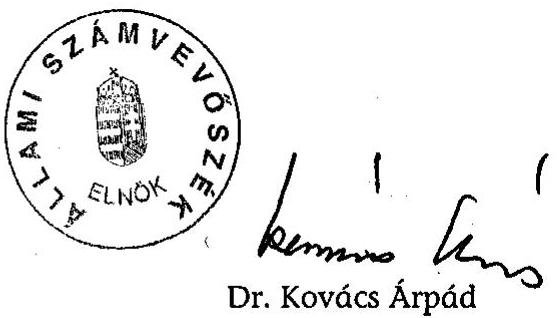
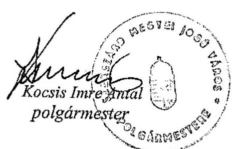

# JELENTÉS 

a Szekszárd Megyei Jogú Város Önkormányzata gazdálkodásának átfogó ellenőrzéséről

---

3. Önkormányzati és Területi Ellenőrzési Igazgatóság
3.3 Átfogó Ellenőrzések Főcsoport
Iktatószám: V-1002-7/35/14/2003.
Témaszám: 635
Vizsgálat-azonosító szám: V0102

# Az ellenőrzést felügyelte: 

Dr. Lóránt Zoltán
főigazgató
Az ellenőrzés végrehajtásáért felelős:
Dr. Sepsey Tamás
főigazgató-helyettes
Az ellenőrzést vezette:
Csecserits Imréné
főcsoportfőnök-helyettes

## Az ellenőrzést végezték:

## Péntek László

számvevő tanácsos
Kopaczné Horváth Zsuzsanna
számvevő tanácsos

A témához kapcsolódó - az elmúlt három évben készített számvevőszéki jelentések:
címe
sorszáma
Jelentés a közbeszerzésekről szóló törvény végrehajtásának ellenőrzéséről 0109
Jelentés a Magyar Köztársaság 2000. évi költségvetése végrehajtásának ellenőrzéséről 0126
Jelentés a települési önkormányzatok szilárdhulladék-gazdálkodási feladatai ellátásának ellenőrzéséről 0221

---

# TARTALOMJEGYZÉK 

BEVEZETÉS ..... 5
I. ÖSSZEGZŐ MEGÁLLAPÍTÁSOK, KÖVETKEZTETÉSEK, JAVASLATOK ..... 7
I. RÉSZLETES MEGÁLLAPÍTÁSOK ..... 21
1.A költségvetés tervezésének, végrehajtásának és a zárszámadás elkészítésének szabályszerűsége ..... 21
1.1.A költségvetés tervezésének, a költségvetési rendelet megalkotásának, elfogadásának szabályszerűsége ..... 21
1.2.A költségvetési előirányzatok módosításának szabályszerűsége ..... 25
1.3.A gazdálkodás szabályozottsága, szabályszerűsége ..... 27
1.4.A munkafolyamatba épített ellenőrzések szabályozottsága és gyakorlati működése a pénzügyi, gazdálkodási és számviteli feladatellátás területén ..... 31
1.5.A bizonylati rend szabályszerűsége ..... 32
1.6.A vagyon nyilvántartásának és leltározásának szabályszerűsége ..... 33
1.7.A vagyongazdálkodással kapcsolatos feladat- és döntési hatáskörök szabályozottsága, a vagyonváltozást előidéző intézkedések szabályszerűsége, célszerűsége ..... 35
1.8.Az Önkormányzat által céljelleggel - nem szociális ellátásként - juttatott támogatásokkal történő elszámolási szabályszerűsége ..... 39
1.9.A követelések, részesedések, értékpapírok év végi értékelésének szabályszerűsége ..... 43
1.10.A működési és felhalmozási bevételek, kiadások alakulása ..... 45
1.11.A költségvetés egyensúlyának helyzete ..... 47
1.12.A közbeszerzési eljárások szabályszerűsége ..... 50
1.13.A polgármesteri hivatal helyi kisebbségi önkormányzatok gazdálkodásával kapcsolatos tevékenysége ..... 55
1.14.A zárszámadási kötelezettség teljesítésének szabályszerűsége ..... 57
2.Egyes kiemelt önkormányzati feladatok és a rendelkezésre álló források összhangja ..... 59
2.1.A feladatok meghatározása és szervezeti keretei ..... 59
2.2.Egyes naturális mutatókkal mérhető feladatok bevételei és kiadásai ..... 62
2.3.A jelentős ráfordítást igénylő önként vállalt feladatok ellátása ..... 64
3.A belső irányítási, ellenőrzési rendszer működésének értékelése ..... 66
3.1.Az Önkormányzat informatikai rendszerének szabályozottsága, működése ..... 66
3.2.A helyi ellenőrzési rendszer kialakítása, működése ..... 67
3.3.A könyvvizsgálati kötelezettség teljesítése ..... 69
3.4.A korábbi számvevőszéki ellenőrzések javaslatainak hasznosulása ..... 70

---

# MELLÉKLETEK 

1. számú Az Önkormányzat vagyonának alakulása a 2000-2002. között (1 oldal)
2. számú Az Önkormányzat a 2002. évi bevételeinek és kiadásainak alakulása (1 oldal)
3. számú Az Önkormányzat gazdálkodását meghatározó főbb adatok, mutatószámok (1 oldal)
4. számú Egyes önkormányzati feladatok finanszírozása (1 oldal)
5. számú Kocsis Imre polgármester úr észrevétele (1 oldal)

---

# RÖVIDÍTÉSEK JEGYZÉKE 

Ötv.
Áht.
Ámr.
Kbt.
Számv. tv.
Htv.

Vhr.

Ltv.

Ktv.
ÁSZ
TÁH
OEP
Önkormányzat
Közgyűlés
Pénzügyi bizottság
Gazdasági bizottság
Művelődési bizottság
Sport bizottság
Hivatal
Közgazdasági iroda
Pénzügyi osztály
Számviteli osztály
Műszaki iroda
Jogi iroda
polgármester
a helyi önkormányzatokról szóló 1990. évi LXV. törvény az államháztartásról szóló 1992. évi XXXVIII. törvény az államháztartás működési rendjéről szóló 217/1998. (XII. 30.) Korm. rendelet
a közbeszerzésekről szóló 1995. évi XL. törvény
a számvitelről szóló 2000. évi C. törvény
a helyi önkormányzatok és szerveik, a köztársasági megbízottak, valamint egyes centrális alárendeltségű szervek feladat- és hatásköreiről szóló 1991. évi XX. törvény
az államháztartás szervezetei beszámolási és könyvvezetési kötelezettségének sajátosságairól szóló 249/2000. (XII. 24.) Korm. rendelet
a lakások és helyiségek bérletére, valamint az elidegenítésükre vonatkozó egyes szabályokról szóló 1993. évi LXXVIII. törvény
a köztisztviselők jogállásáról szóló 1992. évi XXIII. törvény
Állami Számvevőszék
Területi Államháztartási Hivatal
Országos Egészségügyi Pénztár
Szekszárd Megyei Jogú Város Önkormányzata
Szekszárd Megyei Jogú Város Önkormányzatának Közgyűlése
Szekszárd Megyei Jogú Város Önkormányzata Közgyűlésének Pénzügyi Bizottsága
Szekszárd Megyei Jogú Város Önkormányzata Közgyűlésének Gazdasági és Városfejlesztési Bizottsága
Szekszárd Megyei Jogú Város Önkormányzata Közgyűlésének Művelődési Bizottsága
Szekszárd Megyei Jogú Város Önkormányzata Közgyűlésének Sport és Ifjúsági Bizottsága
Szekszárd Megyei Jogú Város Önkormányzatának Polgármesteri hivatala
Szekszárd Megyei Jogú Város Önkormányzata Polgármesteri hivatalának Közgazdasági Irodája
Szekszárd Megyei Jogú Város Önkormányzata Polgármesteri hivatalának Pénzügyi Osztálya
Szekszárd Megyei Jogú Város Önkormányzata Polgármesteri hivatalának Számviteli Osztálya
Szekszárd Megyei Jogú Város Önkormányzata Polgármesteri hivatalának Műszaki Irodája
Szekszárd Megyei Jogú Város Önkormányzata Polgármesteri hivatalának Jogi és Önkormányzati Irodája
Szekszárd Megyei Jogú Város Önkormányzatának polgármestere

---

| jegyző | Szekszárd Megyei Jogú Város Önkormányzatának jegyzője, 2003. február 5-től a jegyzői feladatokat az aljegyző látja el |
| :--: | :--: |
| SzMSz | Szekszárd Megyei Jogú Város Önkormányzatának 10/2000. (IV. 17.) rendelete a Szervezeti és Működési Szabályzatról |
| ügyrend   vagyongazdálkodási   rendelet | az SzMSz 2. számú melléklete   Szekszárd Megyei Jogú Város Önkormányzatának 17/1992. (V. 28.) számú rendelete az önkormányzati vagyonnal való gazdálkodás egységes szabályairól |
| közbeszerzési rendelet | Szekszárd Megyei Jogú Város Önkormányzatának 18/1996. (VI. 5.). számú rendelete a közbeszerzésekkel kapcsolatos eljárás szabályairól |
| Vagyonkezelő Kft. | Szekszárdi Vagyonkezelő Korlátolt Felelősségű Társaság |
| Vízmű Kft. | Szekszárdi Víz- és Csatornamű Korlátolt Felelősségű Társaság |

---

# JELENTÉS 

## a Szekszárd Megyei Jogú Város Önkormányzata gazdálkodásának átfogó ellenőrzéséről

## BEVEZETÉS

Az ellenőrzés az Ötv. 92. § (1) bekezdése, valamint az Áht. 120/A. § (1) bekezdése alapján, az Állami Számvevőszék Önkormányzati és Területi Ellenőrzési Igazgatósága 2003. évi munkatervben szereplő feladataként, a V-1002-7/2003. számú ellenőrzési programjában foglaltak szerint került elvégzésre.

## Az ellenőrzés célja annak értékelése volt, hogy:

- az önkormányzati gazdálkodás törvényességét, szabályszerűségét biztosították-e a tervezés, a költségvetés végrehajtása és a zárszámadás során; a gazdálkodás szabályszerűségét biztosító kontrollok ${ }^{1}$ megfelelően segítették-e a végrehajtást;
- az Önkormányzat által ellátott feladatok és az azokhoz rendelkezésre álló pénzforrások összhangja biztosított volt-e, különös tekintettel egyes kiemelt feladatokra;
- a helyi kisebbségi önkormányzat gazdálkodása során érvényesültek-e az Áht. és a vonatkozó kormányrendeletek előírásai.

Az ellenőrzött időszak: a 2002. év, valamint a 2003. I-III. negyedév, az 1.7., 2.1-2.3., 3.2-3.4. ellenőrzési programpontok esetében a 2000-2002. évek és 2003. I-III. negyedév.

Szekszárd az ország legkisebb, csökkenő lélekszámú megyeszékhelye, 2002. január 1-jén 36215 fő lakott a városban.

Az önkormányzati feladat- és hatásköröket a 24 fős Közgyűlés gyakorolja, mellette hat állandó bizottság működik. A polgármester az 1990. évtől tölti be tisztségét, munkáját egy főállású és két társadalmi megbízatású alpolgármester segíti. A Közgyűlés a jegyzőt 2003. február 5-én hivatalvesztés fegyelmi büntetésben részesítette, ettől az időponttól a jegyzői feladatokat az aljegyző látja el. A városban német, cigány, szlovák, horvát és görög kisebbségi önkormányzat működik. A Hivatal kilenc szervezeti egységében dolgozó köztisztviselők létszáma 2002. december 31-én 138 fő volt. A jegyző Szálka Község Önkormányzata részére ellátja a körjegyzői feladatokat. Az Önkormányzat 21 önálló és négy részben önálló gazdálkodási jogkörű intézményt működtet.

[^0]
[^0]:    ${ }^{1}$ A gazdálkodás szabályszerűségét biztosító kontroll alatt értjük a kiépített és működő belső irányítási és szabályozási rendszert, valamint a belső ellenőrzési funkciók ellátását.

---

Az Önkormányzat összes bevétele a 2002. évben 8252 millió Ft volt, melynek 44,2%-a helyben képződött, a helyi adók összege 962 millió Ft-ot tett ki, a kiadások 8145 millió Ft-ban teljesültek, melynek 91,7%-át működésre fordították. Az Önkormányzat adósságállománya a 2002. év végén 1096 millió Ft, a kötelezettségekkel nem terhelt saját vagyon 4952 millió Ft volt.

---

# I. ÖSSZEGZŐ MEGÁLLAPÍTÁSOK, KÖVETKEZTETÉSEK, JAVASLATOK 

Az Önkormányzat - megsértve az Ötv. előírását - a feladatokat több évre meghatározó gazdasági programot nem fogadott el. A 2002. és a 2003. évi költségvetési koncepciót a polgármester az előírt határidőn belül - 2001. november 29-én, illetve 2002. november 28-án - benyújtotta a Közgyűlésnek. A bizottságok és a kisebbségi önkormányzatok koncepcióról alkotott véleményét az Ámr-ben előírtak ellenére nem csatolták a költségvetési koncepcióhoz. A bizottságok a véleményüket a Közgyűlés ülésén szóban ismertették. A kisebbségi önkormányzatok a költségvetési koncepcióról határozatot hoztak, és abban rögzítették az Önkormányzattól igényelt pénzügyi támogatás mértékét is. A Közgyűlés az Áht. előírását megsértve nem határozta meg rendeletben a költségvetés előterjesztésekor és a zárszámadáskor bemutatandó mérlegek tartalmi követelményeit, továbbá elmaradt annak meghatározása, hogy a költségvetési szervek milyen mértékű és időtartamú tartozásállománya esetén kell a Közgyűlésnek önkormányzati biztost kijelölnie. A Közgyűlés a költségvetési rendelettervezet beterjesztését megelőzően megalkotta azokat a rendeleteket, amelyek a javasolt előirányzatokat megalapozták.

A 2002. és a 2003. évi költségvetési rendelettervezet előterjesztéséhez - az Ámr. előírása ellenére - nem csatolták a Pénzügyi bizottság írásos véleményét. A polgármester a költségvetési rendelettervezet benyújtásakor az Áht-ban előírt mérlegek és kimutatások közül - tájékoztatási céllal - nem mutatta be a kisebbségi önkormányzatok mérlegeit, a több éves kihatással járó döntések számszerűsítését évenkénti bontásban és összesítve, valamint a közvetett támogatásokat tartalmazó kimutatást a szöveges indoklással együtt. Az előterjesztéshez mellékelték az Önkormányzat összevont mérlegét, a költségvetési évet követő két év várható előirányzatainak kimutatását, valamint a hitelállományról és a hitelekkel kapcsolatos kötelezettségek évenkénti alakulásáról készített kimutatást.

A költségvetési rendelet szerkezetére, tartalmára vonatkozó Áht-ban és Ámr-ben foglalt előírásokat mindkét évben megsértették. A Hivatal bevételi és kiadási előirányzatainak 2002. évi kimunkálásánál az igazgatási feladatok dologi kiadásainak szintrehozásához nem biztosítottak fedezetet. A költségvetésben a költségvetési bevételek és a költségvetési kiadások között mutatták ki a finanszírozási célú pénzügyi műveleteket (a hitelfelvételeket, illetve a hiteltörlesztéseket). A Hivatal működési kiadási előirányzatán belül a kiemelt előirányzatokat feladatonként és szakfeladatonként állapították meg, a személyi juttatások, a munkaadót terhelő járulékok, valamint a dologi kiadások hivatali szintű összesítése az Áht-ban előírtak ellenére elmaradt. A működési célra átadott pénzeszközök között a bizottságok részére elkülönített pénzügyi keretek alapkénti szerepeltetése a költségvetési rendeletben történő elnevezése sérti az Áht. előírását. A költségvetési rendeletekben az egyéni képviselői keretek jóváhagyásával megsértették az Ötv-ben foglalt hatáskör átruházására vonatkozó előírást. Az egyéni képviselők részére - a közvetlen lakókörnyezetet érintő fejlesztésekre, fenntartási munkákra - a 2002. évben 7 millió Ft-ot, a 2003. évben 10,5 millió

---

Ft-ot biztosítottak. A munkák megrendelése, szervezése a Műszaki iroda feladatkörébe tartozott.

A 2002. évi költségvetési rendeletbe az Ámr. előírásai ellenére nem építették be elkülönítetten a kisebbségi önkormányzatok költségvetését. A 2003. évi költségvetési rendelet a kisebbségi önkormányzatok határozatainak megfelelően tartalmazta a kisebbségi önkormányzatok költségvetését.
A Közgyűlés a 2002. évi költségvetésben jóváhagyott kiemelt előirányzatok közötti átcsoportosításra - a Pénzügyi bizottság kivételével - a bizottságokat, illetve a polgármestert nem hatalmazta fel.

Az előirányzatok és az előirányzat-módosítások nyilvántartására vonatkozó szabályokat nem határozták meg, teljes körű és naprakész analitikus nyilvántartást az Áht. előírását megsértve a 2002. és a 2003. évben nem vezettek.

A Közgyűlés a 2002. évi költségvetésben jóváhagyott bevételi és kiadási előirányzatokat öt alkalommal módosította. Az Ámr-ben előírtak ellenére a költségvetési rendeletet a központi pótelőirányzatokkal nem módosították legalább negyedévenkénti gyakorisággal². Nem tartották be az Ámr-ben foglalt előírást, mely szerint az intézmények saját hatáskörben végrehajtott előirányzatváltoztatásáról a jegyző előkészítésében a polgármester a Közgyűlést 30 napon belül tájékoztatja.
Az utólagos előirányzat módosítások ellenére a Hivatal három kiemelt kiadási előirányzatát - az Áht. előírását megsértve - túllépte. A kiemelt előirányzatokat túllépőkkel szemben felelősségre vonást nem alkalmaztak.

A Közgyűlés az SzMSz-ben a Hivatal szervezeti felépítését, az ügyrendben a szervezeti egységek főbb feladatait rögzítette. Az ügyrend nem felel meg az Ámr-ben előírtaknak, nem tartalmazza részletesen az ellátandó feladatokat, a vezetők és a dolgozók feladat-, hatás- és jogkörét.

A polgármester és a jegyző a pénzgazdálkodási jogkörök
 gyakorlásának rendjére együttes szabályzatot adott ki, melyben rögzítették a gazdálkodási, ellenőrzési jogkörrel felhatalmazottakat. A felhatalmazottakat a jogkör gyakorlásáról nem számoltatták be. A jegyző az érvényesítési feladatok ellátására az előírt képesítéssel rendelkező dolgozókat jelölt ki. A szakmai teljesítésigazolás módját nem határozták meg, a feladatot ellátó személyek kijelölése az Ámr-ben előírtak ellenére elmaradt. A jegyző a szakmai teljesítést igazoló és az érvényesítő személyére vonatkozó összeférhetetlenségi előírást - az Ámr-ben előírtak ellenére - nem rögzítette, az előzetes, írásbeliséghez nem kötött kötelezettségvállalások nyilvántartási formáját és rendjét nem határozta meg.

Elkészítették a Hivatalra, annak részben önálló költségvetési szervére és a kisebbségi önkormányzatok gazdálkodásának számviteli nyilvántartására is kiterjedő számviteli politikát és a kapcsolódó szabályzatokat, valamint a számlarendet. A Htv. előírását megsértve nem alakította ki a jegyző az intézmények

[^0]
[^0]:    ${ }^{2}$ Az egyeztetés során a polgármester ezen megállapítással kapcsolatban észrevételt tett, melynek összegzése a Jelentés 27. oldalán, a részletes megállapítások fejezet 1.2. pontjában található.

---

számviteli rendjét. A leltározási és leltárkészítési szabályzatban az eszközök és források évenkénti mennyiségi felvétellel és egyeztetéssel történő leltározását írták elő. A szabályozásban előírt, az immateriális javak, az üzemeltetésre átadott eszközök, a beruházások és részesedések egyeztetéssel történő leltározása ellentétes a Vhr-ben előírtakkal. Az eszközök hasznosítási, selejtezési szabályzata az üzemeltetésre átadott és a részben önálló költségvetési szerv használatában lévő eszközök selejtezési eljárására a Vhr-ben előírtak ellenére nem tartalmaz rendelkezéseket. Az eszközök és források értékelési szabályzatát, a pénzkezelési szabályzatot és a számlarendet a helyi sajátosságoknak megfelelően dolgozták ki, a folyamatos aktualizálásukról gondoskodtak.

A gazdálkodási szabályzatokban és a belső ellenőrzési szabályzatban előírt ellenőrzési feladatokat a Közgazdasági iroda dolgozóinak munkaköri leírásában nem vagy a szabályzatokban foglaltaktól eltérően rögzítették. A kifizetésekkel összefüggő kötelezettségvállalások ellenjegyzése 26%-ban - a felhalmozási kiadások teljesítéséhez kapcsolódóan - történt meg. A kötelezettségvállaló megsértette az Ámr. előírását azáltal, hogy az előírt ellenjegyzés nélkül vállalt kötelezettséget. Az utalványozás ellenjegyzése a készpénzforgalom 95%-ában elmaradt, a banki forgalomhoz kapcsolódó utalványrendeletek 79%-ánál megtörtént. Az ellenjegyzői jogkör gyakorlója az ellenjegyzés elmulasztásával megsértette az Ámr. előírásait. Az érvényesítők a feladat elvégzését „érvényesítve" jelöléssel nem igazolták, az utalványrendelet kitöltése nem felelt meg az Ámr. előírásainak. ${ }^{3}$ A pénztárellenőr az előzetes pénztárellenőrzése során a pénz- és értékkezelési szabályzatban foglaltak ellenére nem vizsgálta, hogy az utalványozás, az ellenjegyzés, és az érvényesítés megtörtént-e.

A 2003. évben végezték el a korábban érték nélkül nyilvántartott ingatlanok értékének megállapítását, a számviteli nyilvántartásba vételét, valamint a meglévő ingatlanvagyon-kataszteri nyilvántartás hibáinak megszüntetését. Az ingatlanvagyon kataszteri és a számviteli nyilvántartás között a teljes körű egyezőség 2003. szeptember 30-án még nem állt fenn, az üzemeltetésre átadott csatornahálózat nem szerepelt az ingatlanvagyon kataszteri nyilvántartásban. Az Önkormányzat tulajdonában lévő, a Vízmű Kft. által üzemeltetett eszközök a Hivatal számviteli nyilvántartásában a Vhr. előírása ellenére az ingatlanok és nem az üzemeltetésre átadott eszközcsoportban kerültek kimutatásra. Az önkormányzati tulajdonú Keselyűsi úti hulladéklerakó telepet üzemeltető Kft-vel az ÁSZ korábbi javaslata ellenére az üzemeltetési szerződés megkötésére nem került sor.

A 2002. évi leltározást - leltározási ütemterv alapján - mennyiségi felvétellel és egyeztetéssel végezték el, a leltár kiértékelése, az eredményének számviteli nyilvántartásba vétele megtörtént. Az ingatlanok és az üzemeltetésre átadott eszközök leltározását a Hivatal a Vhr-ben előírtaktól eltérően, egyeztetéssel végezte el.

[^0]
[^0]:    ${ }^{3}$ Az egyeztetés során a polgármester ezen megállapítással kapcsolatban észrevételt tett, melynek összegzése a Jelentés 33. oldalán, a részletes megállapítások fejezet 1.5. pontjában található.

---

A vagyongazdálkodási rendeletben rögzítették, hogy a vagyonhasznosítás nem veszélyeztetheti a kötelező feladatok ellátását, nem rendelkeztek a törzsvagyon forgalomképessé minősítésének feltételeiről. A vállalkozói vagyon hasznosítására, ezen belül az üzletrészek, a részvények és a vállalkozási célú pénzeszközök hasznosítására az Áht-ban foglaltakat megsértve, részletes szabályozás nem készült, a követelések elengedésének eseteit - az Áht. előírását megsértve - nem szabályozták. A vagyongazdálkodási rendeletben és az SzMSz-ben rögzített szabályozás összhangja nem biztosított, a vagyongazdálkodási rendelet az ingatlanvagyon elidegenítésének, hasznosításának, megterhelésének szabályozása során kizárólagos közgyűlési hatáskört állapított meg, az SzMSz-ben a Gazdasági bizottság is kapott döntési hatáskört. A 15 millió Ft értékhatár felett nyilvános versenytárgyalás kiírását, ingatlan értékesítéséhez forgalmi értékbecslés készítését írta elő a vagyongazdálkodási rendelet.

Az Önkormányzat vagyona a 2000-2002. években 45,9%-kal növekedett, ezen belül az ingatlanok nettó értéke 98,2%-kal emelkedett az intézményekhez tartozó, korábban érték nélkül nyilvántartott földterületek számviteli nyilvántartásba vételéhez kapcsolódóan. Az Önkormányzat vagyonszerkezetének változása, a kötelezettségállomány 79,1%-os növekedése az eladósodási folyamat erősödését mutatja. A Közgyűlés vagyongazdálkodási döntéseit elsődlegesen a költségvetési forráshiány indukálta értékesítések jellemezték.

A vagyonértékesítések során a vagyongazdálkodási rendelet nyilvános versenytárgyalásra vonatkozó előírását két esetben - egy részvényértékesítés és egy ingatlanértékesítés esetében - nem tartották be.
Az Önkormányzat a 2000-2002. években 2,5 millió Ft nyilvántartási értékű eszközt adott át ingyen államháztartáson kívüli szervezeteknek, az ingyenes vagyonátruházás során nem tartotta be a vagyongazdálkodási rendelete azon előírását, mely szerint vagyont ingyenesen átruházni önkormányzati feladatellátás vállalásához kapcsolódóan lehet. A követelésekről történő lemondás eseteit az Áht-ban előírtakat megsértve rendeletben nem szabályozták. Az Önkormányzat a 2002. január 1-jei összes követelésállománya 51,9%-ának megfelelő összegben - szabályszerűen - törölt követelést a tárgyévben, mely a Szekszárdi Húsipari Rt. felszámolásához kapcsolódott.

A Közgyűlés a támogatási rendszer működésének részletes szabályait nem dolgozta ki. Az éves költségvetési rendeletekben a támogatás folyósítását írásbeli, elszámolási kötelezettséget tartalmazó megállapodáshoz kötötte. Az egyes bizottságok részére biztosított pénzügyi keretek felhasználásával kapcsolatos nyilvántartási, elszámoltatási kötelezettségek teljesítésének módjára követelményeket nem határozott meg. A Hivatalban nem alakítottak ki egységes nyilvántartási rendszert a támogatásokról. A támogatások az önkormányzati feladatellátáshoz, az SzMSz-ben megfogalmazott célok teljesítéséhez kapcsolódtak, a lakosság önszerveződő közösségi tevékenysége, a közművelődési, a tudományos, a művészeti és a sport tevékenység, valamint a turizmus fejlesztésének elősegítését szolgálták.

A támogatások folyósítása, a támogatottak elszámoltatása során megsértették az Áht. előírásait, nem tartották be a költségvetési rendeletben előírt rendelkezést, a 2002. évi támogatások 52%-ára nem írtak elő számadási kötelezettséget. A támogatási szerződésekben előírt, a támogatottak számadási kötelezettsége

---

teljesítését a kapott elszámolások alapján elfogadták, helyszíni ellenőrzést nem végeztek.

Az Önkormányzatnál a támogatásokról szóló döntések meghozatalakor megsértették az Ötv. előírásai szerinti hatásköri szabályokat. A 2002. évben az alapítványok, a közalapítványok részére juttatott támogatások 62%-áról a Közgyűlés döntött, 29%-áról a helyi adózók rendelkeztek, 9%-át a bizottságok és a polgármester hagyta jóvá.
A helyi adókról és az adózás rendjéről szóló önkormányzati rendelet helyi iparűzési adóra vonatkozó szabályozása - mely alapján a saját bevétel meghatározott részéről való rendelkezést átengedi bizonyos feltételekkel rendelkező vállalkozás számára - sérti az Ötv. helyi adó megállapításra vonatkozó előírását, mert a helyi adókról szóló törvény a helyi iparűzési adó meghatározott százalékáról való rendelkezés átengedésére vonatkozó felhatalmazást nem tartalmaz.

A 2004. évi költségvetési rendeletben foglalt szabályozás szerint az adózó a befizetett iparűzési adója 5%-ának felhasználására javaslatot tehet. A helyi adóból képzett tartalék felhasználásáról a Művelődési és a Sport bizottság együttes ülésen dönt.

A Hivatal a befektetett pénzügyi eszközök és követelések értékelését és az értékvesztés elszámolását a számviteli politikában, a Számv. tv-ben és a Vhr-ben előírtaknak megfelelően végezte.

# A működési célú bevételek a 2002. évben a működési célú kiadások 

96,8%-ára nyújtottak fedezetet, a különbséget felhalmozási bevételekből, valamint hitel igénybevételével fedezték. A gazdálkodás során folyamatosan jelentkező likviditási gondok áthidalására folyószámla- és munkabérhiteleket vettek igénybe. Az adósságot keletkeztető éves kötelezettségvállalások mértéke a 2002. évben nem haladta meg az Ötv. előírásai alapján számított felső határt, annak 87,9%-a volt. A likviditási gondok mérséklése érdekében az Önkormányzat intézkedései a hitelfelvételeken túlmenően a 100%-os tulajdonában lévő gazdasági társaságoktól igénybe vehető kölcsönökre, pénzeszköz átvételre, valamint a vagyoni eszközök értékesítésére irányultak. A 2003. év folyamán az intézményi gazdálkodáshoz szükséges források indokoltságának, az elérhető megtakarítások mértékének feltárása érdekében vizsgálatokat kezdeményeztek. A Hivatalban a 2002. évben a kötelezettségvállalásokról az Ámr. előírása ellenére analitikus nyilvántartást nem vezettek, a 2003. évtől számítógépes programmal, a számviteli nyilvántartás alapján vezetik a nyilvántartást. A jegyző az Ámr-ben előírt kötelezettség ellenére likviditási tervet nem készített ${ }^{4}$.

Az Önkormányzat az 1991. év óta él a helyi adóztatás lehetőségével. Az építményadó a törvényi adómérték felső határának 11,1%-a, a vállalkozók kommunális adója és a helyi iparűzési adó a törvény szerinti felső határral azonos, az idegenforgalmi adó a törvényi maximum 83%-a. Az idegenforgalmi adón

[^0]
[^0]:    ${ }^{4}$ Az egyeztetés során a polgármester ezen megállapítással kapcsolatban észrevételt tett, melynek összegzése a Jelentés 46. oldalán, a részletes megállapítások fejezet 1.10. pontjában található.

---

kívül a többi adónemnél a törvényi előíráson felül mentességeket biztosítottak elsősorban a vállalkozások, a foglalkoztatottság ösztönzése céljából.

Az Önkormányzat a közbeszerzési eljárás szabályait rendeletben meghatározta, a korábbi számvevőszéki vizsgálat ${ }^{5}$ során a szabályozással kapcsolatosan megállapított hiányosságokat nem szüntette meg. A közbeszerzési rendelet nem tartalmazza az eljárás kiírásával és elbírálásával kapcsolatos tevékenység részletes előírásait. A Kbt. előírását megsértették azáltal, hogy értékhatár feletti útfenntartási, kátyúmentesítési, burkolatjavítási munkákra ${ }^{6}$, valamint három saját konyhával rendelkező intézmény esetében az élelmezési anyagok beszerzéseire nem hirdetettek meg közbeszerzési eljárást. A 2002. évben lefolytatott négy közbeszerzési eljárás esetében - a Kbt. előírását megsértve - az ajánlatkérő nevében eljáró személy helyett a Közgyűlés, illetve átruházott hatáskörben a Gazdasági bizottság döntött az eljárás nyerteséről ${ }^{7}$. A Kbt. előírását megsértve egy beszerzésnél tárgyalásos eljárás lefolytatása nélkül módosították a fővállalkozási szerződést.
A Közbeszerzési Döntőbizottság a 2003. évben egy esetben elmarasztalta az Önkormányzatot, mert érvénytelen ajánlatot hirdetett ki nyertesként. Az ajánlatok ismételt elbírálása alapján az ajánlatkérő nevében az eljáró személy helyett - a Kbt. előírását megsértve - a Gazdasági bizottság döntött az eljárás nyerteséről.

A városban a 2002. évi választások óta öt kisebbségi önkormányzat működik, a gazdálkodási feladataik lebonyolításához szükséges együttműködési megállapodás megkötése az Áht-ban előírtakat megsértve - az Önkormányzat kezdeményezése ellenére - 2003. december 31-ig nem történt meg ${ }^{8}$. A kisebbségi önkormányzatok költségvetésének tervezésével, jóváhagyásával, az előirányzat-módosítással és a zárszámadással kapcsolatos feladatellátás, továbbá az információszolgáltatás rendje és határidői szabályozatlanok voltak. A szabályozás hiányára vezethető vissza, hogy a kisebbségi önkormányzatok a 2002. évi zárszámadásukról az Önkormányzat zárszámadási rendeletének jóváhagyását követő időpontokban hozták meg a határozatukat, emiatt a zárszámadásuknak és a pénzmaradványuknak a rendeletbe történő beépítése nem volt biztosított.

A polgármester a 2002. évi zárszámadási rendelettervezetet az Áht-ban előírt határidőn belül terjesztette a Közgyűlés elé jóváhagyásra. A jegyző megsértette az Áht. előírását azáltal, hogy a 2002. évi zárszámadási rendelettervezetben az önkormányzati szintű működési kiadások vonatkozásában - a személyi juttatások és a munkaadót terhelő járulékok kivételével - nem biztosí-

[^0]
[^0]:    ${ }^{5}$ Jelentés

 a közbeszerzésekről szóló törvény végrehajtásának ellenőrzéséről, sorszáma: 0109
    ${ }^{6}$ Az egyeztetés során a polgármester ezen megállapítással kapcsolatban észrevételt tett, melynek összegzése a Jelentés 52. oldalán, a részletes megállapítások fejezet 1.12. pontjában található.
    ${ }^{7}$ Az egyeztetés során a polgármester ezen megállapítással kapcsolatban észrevételt tett, melynek összegzése a Jelentés 54. oldalán, a részletes megállapítások fejezet 1.12. pontjában található.
    ${ }^{8}$ Az együttműködési megállapodások megkötésére 2004. január 13-án sor került.

---

totta a jóváhagyott kiemelt előirányzatokkal való összehasonlíthatóságot. A zárszámadási rendelet szerkezete - az Áht-ban előírtakat megsértve - nem tartalmazta önkormányzati szinten összesítve a működési, felhalmozási előirányzatok teljesítését és a tényleges létszámadatokat, nem felelt meg a jogszabályi előírásoknak, mert hivatali szinten nem összesítették a személyi jellegű kiadásokat, a munkaadót terhelő járulékokat és a dologi kiadásokat, nem határozták meg költségvetési szervenként a tényleges létszámadatokat, nem mutatták be tájékoztató jelleggel, mérlegszerűen a működési és felhalmozási bevételi és kiadási előirányzatok teljesülését. Az Áht. előírásait megsértve nem mutatták be az előterjesztéssel egyidejűleg - tájékoztatásul - a kisebbségi önkormányzatok mérlegeit, a több éves kihatással járó döntéseket évenkénti bontásban, valamint a közvetett támogatásokat tartalmazó kimutatást. A 2002. évi zárszámadáshoz készített előterjesztés tartalmazta az önálló és a részben önálló intézmények, valamint a Hivatal pénzmaradvány elszámolását. Az Ámr. előírása ellenére a zárszámadás elfogadásával egyidejűleg az önkormányzati szintű módosított pénzmaradvány jóváhagyásáról döntöttek, a költségvetési szervek pénzmaradványát később határozták meg.

A Közgyűlés az Ámr-ben foglaltak ellenére rendeletben nem rögzítette, hogy a szabad rendelkezésű pénzmaradvány az intézményeket a jogszabályban foglaltakon túlmenően milyen előírások szerint számított összegben nem illeti meg, ennek ellenére azt a 2002. évi pénzmaradvány jóváhagyásakor elvonta. A Hivatal az intézmények költségvetési beszámolóját felülvizsgálta, az Ámr. előírása ellenére azonban annak eredményéről írásban nem értesítette az intézményvezetőket.

Az Önkormányzat a feladatokat a költségvetési intézményeik és az általa alapított gazdasági társaságok útján látja el, a feladatok ellátásában ezen túlmenően alapítványok, vállalkozók és egyház is közreműködik. A feladatellátás szervezeti struktúrája a 2000. évet megelőzően már kialakult.

A Közgyűlés a 2000-2002. években a feladatellátás intézményi formáit és alternatív szervezeti lehetőségeit átfogó jelleggel nem vizsgálta, a 2003. évben az Önkormányzat teljes átvilágításáról döntött, melyet közbeszerzési eljárás során kiválasztott cég végzett el. Az átvilágítás megállapításainak értékelése, az intézkedések megtétele a 2004. évben kezdődött el.

A jegyző az 1993. évben kötött megállapodás alapján a Hivatal bevonásával körjegyzői feladatokat lát el Szálka Község Önkormányzatánál. Az operatív gazdálkodási feladatokat az Ötv-ben foglaltakat megsértve 2003. június 30-ig a Szálka Községi Önkormányzat által kinevezett két ügyintéző látta el. A körjegyzőségi feladatok ellátásához, az operatív gazdálkodáshoz az Ötv. előírásának megfelelő szervezeti feltételeket 2003. július 1-jétől biztosították.

Az Önkormányzat által kötelezően ellátott, naturális mutatókkal mérhető közoktatási és szociális feladatok, működési kiadásainak jelentős - 64-77%-os hányada a személyi juttatásokhoz és járulékaihoz kapcsolódik, így a kiadások növekedésében meghatározó szerepe volt a végrehajtott közalkalmazotti béremeléseknek, a Kjt. szerinti pótlékalap változásnak, a minimálbér emelésének.

---

Az Önkormányzat által ellátott kötelező és önként vállalt feladatok elkülönítése nem történt meg. Az önként vállalt feladatok nem veszélyeztették a kötelező feladatok ellátását.

A fogyatékos személyek jogairól és esélyegyenlőségük biztosításáról szóló törvény alapján a közintézmények akadálymentessé tételére jóváhagyott program időarányos teljesítése - a költségvetési hiány következtében - nem biztosított.

Az Önkormányzat informatikai stratégiával nem rendelkezik. A folyamatos és biztonságos munkavégzés érdekében katasztrófa-elhárítási tervet nem készítettek. A Hivatal számítástechnikai eszközei elavultak. A pénzügyi-számviteli, ügyviteli folyamatokról leírás nem készült, a programok használatával kapcsolatos engedélyezési jogkörökről, a felhasználók köréről dokumentációt nem készítettek, nem határozták meg a programrendszerben lévő adatokért felelősök körét.

Az Önkormányzat ellenőrzési kötelezettségének teljesítése a Hivatalon belül két szervezeti egység feladatkörébe tartozik: a Jogi iroda a belső ellenőrzést, a Közgazdasági iroda a felügyeleti ellenőrzést végzi. A belső ellenőrnek a Jogi iroda szervezetébe történő besorolása sérti az Áht-nak a belső ellenőrzés funkcionális függetlenségére vonatkozó előírását. A Hivatal ellenőrzési szabályzatában az ellenőrzés célja, feladatai általános jelleggel kerültek megfogalmazásra. A belső ellenőr az igazgatási és a hatósági feladatellátáshoz kapcsolódóan végzett ellenőrzési feladatokat. A felügyeleti ellenőrzést végzők számának csökkenése veszélyezteti a valamennyi intézményre kiterjedő, kétévenkénti ellenőrzés végrehajtását. A jegyző nem szabályozta a központi költségvetésből igénybe vett hozzájárulások és támogatások igénylésével, felhasználásával, elszámolásával kapcsolatos eljárási rendet, a Hivatal nem vizsgálta a normatív állami hozzájárulások igénylésének és elszámolásának alapjául szolgáló intézményi adatszolgáltatásokat. A Közgyűlés napirendjén a 2002-2003. években - a Htv. előírását megsértve - nem szerepelt a Hivatal belső és felügyeleti ellenőrzéseinek megállapításait, a javaslatok hasznosítását összegző előterjesztés.

Az Önkormányzat a könyvvizsgálati kötelezettségének eleget tett, a könyvvizsgáló megbízásánál betartotta az előírt szakmai és összeférhetetlenségi követelményeket.

Az ÁSZ a 2000-2002. években három témavizsgálatot végzett az Önkormányzatnál a közbeszerzési törvény, a zárszámadás és a szilárd hulladékgazdálkodási feladatok végrehajtása tárgykörben. A vizsgálatok során feltárt szabálytalanságok, hiányosságok megszüntetésére intézkedési tervet nem készítettek, a javaslatok 30%-át hasznosították.

---

A helyszíni ellenőrzés megállapításai mellett a gazdálkodás szabályszerűségének és a munka színvonalának javítása érdekében javasoljuk:

# a polgármesternek 

## a törvényes állapot helyreállítása és a jogszabályi előírások betartása érdekében

1. kezdeményezze a költségvetési gazdálkodás szabályszerű helyi kereteinek kialakítása céljából, hogy a Közgyűlés:
a) alkossa meg a Htv. 138. § (1) bekezdés a.) pontja alapján az Ötv. 91. § (1) bekezdésében előírt gazdasági programot;
b) rendeletben határozza meg az Áht. 118. §-ának előírásai alapján - az Áht. 116. § 6., 8., 9., és 10. pontjai szerint - a költségvetéshez és a zárszámadáshoz csatolandó mérlegek tartalmi követelményeit;
c) határozza meg az Áht. 98. §. (6) bekezdésének előírása alapján, hogy a költségvetési szervek milyen mértékű és időtartamú tartozásállománya esetén kell a Közgyűlésnek biztosítékot kijelölnie;
d) szüntesse meg az éves költségvetési rendeletben jóváhagyott egyéni képviselői kereteket az Ötv. 9. § (3) bekezdésében foglalt - a hatáskörök átruházására vonatkozó - előírások betartása érdekében;
e) döntsön az Ámr. 66. § (4) bekezdése előírásainak megfelelően a zárszámadási rendelet jóváhagyásával egyidejűleg a költségvetési szervek pénzmaradványáról;
f) határozza meg a Htv. 138. § (1) bekezdés j) pontja alapján az önkormányzati vagyonnal történő gazdálkodás részletes, az SzMSz-szel összhangban lévő szabályait, a követelésekről való lemondás eseteit az Áht. 108. § (2) bekezdésének előírása szerint, az Ötv. 79. §-a alapján az Önkormányzat törzsvagyonának besorolását;
g) szüntesse meg a helyi adókról és az adózás rendjéről szóló rendeletében a helyi iparűzési adó 5%-áról való rendelkezés átengedésére vonatkozó - az Ötv. 10. § (1) bekezdés d) pontjában a helyi adó megállapításra vonatkozó előírást sértő szabályozását;
h) rendeletben határozza meg az Ámr. 66. § (6) bekezdés g) pontja alapján, hogy a költségvetési szerveket a szabad rendelkezésű pénzmaradványból az Ámr. 66. §. (6) bekezdés a)-f) pontjaiban foglaltakon túlmenően milyen előírások szerint számított összeg nem illeti meg;
i) tekintse át a Htv. 138. § (1) bekezdése g) pontjában foglaltak alapján az általa alapított és fenntartott költségvetési szervek ellenőrzésének tapasztalatait;
j) határozza meg a helyben ellátandó közszolgáltatások mértékét, és határozza meg az önként vállalt feladatait, azok szervezeti kereteit, költségvetési forrásait;

---

2. a szabályszerű költségvetési gazdálkodás biztosítása érdekében:
a) csatolja írásban a költségvetési koncepció tervezetéhez az Ámr. 28. § (3) bekezdése szerint a bizottságok és a kisebbségi önkormányzatok véleményét, valamint az Ámr. 29. § (9) bekezdése szerint a költségvetési rendelet előterjesztéséhez a Pénzügyi bizottság véleményét;
b) terjessze be a Közgyűlésnek az évközben biztosított pótelőirányzatokról, valamint az intézmények saját hatáskörben végrehajtott előirányzat-változtatásairól, módosításáról szóló rendelet-tervezeteket az Ámr. 53. § (2) és (6) bekezdéseinek előírásai szerinti határidőben;
c) intézkedjen, hogy a Hivatalban a kötelezettségvállalási és az utalványozási jogkör gyakorlói tartsák be az Ámr. 134. § (2) és (7) bekezdéseiben a kötelezettségvállalás és az utalványozás ellenjegyzésére vonatkozó előírásokat;
d) biztosítsa, hogy a kötelezettségvállalás a költségvetés végrehajtása során - az Áht. 12/A. § (1) bekezdésében rögzítettek szerint - a jóváhagyott kiadási előirányzatok mértékéig terjedjen;

# a munka színvonalának javítása érdekében 

3. számoltassa be a kötelezettségvállalásra és utalványozásra felhatalmazottakat az átruházott hatáskörben tett intézkedésekről;
4. gondoskodjon a számvevőszéki jelentések Közgyűlés elé terjesztéséről és a javaslatok hasznosítása céljából intézkedési terv készítéséről;
5. gondoskodjon arról, hogy a közintézmények akadálymentessé tétele a program szerinti ütemezésben megvalósuljon, kezdeményezze az ahhoz szükséges költségvetési források pályázati pénzeszközökkel történő kiegészítését;

## a jegyzőnek

## a törvényes állapot helyreállítása és a jogszabályi előírások betartása érdekében

1. a költségvetés elkészítésével, jóváhagyásával és módosításával összefüggően:
a) biztosítsa, hogy a költségvetési rendelettervezetben a költségvetési bevételek és kiadások, valamint ezek különbségeként a tervezett hiány meghatározása az Áht. 8. § (1) és 8/A. § (7) bekezdéseiben előírtaknak megfeleljen;
b) gondoskodjon a költségvetési rendelettervezet előkészítésekor arról, hogy teljes körűen mutassák be a Közgyűlésnek az Áht. 118. §-ában meghatározott - az Áht. 116. § 6., 9. és 10. pontja szerinti - mérlegeket, kimutatásokat, szöveges indoklásokat;
c) gondoskodjon a költségvetési rendelettervezet előkészítésekor arról, hogy az Ámr. 26. § (2) bekezdésében foglaltaknak megfelelően a Hivatal igazgatási fel-

---

adatain belül a dologi kiadások a szintrehozásokkal módosított összegben kerüljenek meghatározásra;
d) biztosítsa, hogy a költségvetési rendelettervezetben az Áht. 69. § (1) bekezdésének előírása alapján a Hivatal költségvetésében a személyi jellegű kiadások, a munkaadót terhelő járulékok, valamint a dologi kiadások összesített előirányzata szerepeljen;
e) biztosítsa az Áht. 54. §-a előírásainak betartása érdekében, hogy a bizottságok részére az éves költségvetésben működési célra átadott pénzeszközként tervezett összeg elnevezése a továbbiakban ne „alap" legyen;
f) gondoskodjon az Áht. 103. § (1)-(2) bekezdéseiben előírt előirányzat nyilvántartás folyamatos és teljes körű vezetéséről;
g) kísérje figyelemmel a kiemelt előirányzatokon belüli gazdálkodást, azok túllépése esetén - a Htv. 140. § (1) bekezdés e) pontjában biztosított jogkörében eljárva - vizsgálja meg azok okait, és indokolt esetben tegyen javaslatot a felelősségre vonásra;
2. a szabályszerű költségvetési és operatív gazdálkodás biztosításához
a) egészítse ki az ügyrendet az Ámr. 17. § (5) bekezdésében foglalt előírásoknak megfelelően a vezetők és dolgozók feladat-, hatás- és jogkörének meghatározásával, a belső kapcsolatok rendjével;
b) határozza meg a kötelezettségvállalás, ellenjegyzés, érvényesítés és utalványozás szabályzatában - az Ámr. 135. § (3) bekezdése szerint - a Hivatalban a szakmai teljesítés igazolásra jogosultakat, a feladatellátás módját, melynél tartsa be az Ámr. 135. § (5) bekezdése érvényesítő és a szakmai teljesítésigazoló személyre vonatkozó összeférhetetlenségi előírást;
c) szabályozza - az Ámr. 134. § (4) bekezdése alapján - az 50000 Ft alatti előzetes írásbeliséghez nem kötött kötelezettségvállalások nyilvántartási formáját és rendjét;
d) alakítsa ki - a Htv. 140. § (1) bekezdése c) pontja alapján - az intézményekre vonatkozó számviteli rendet;
e) módosítsa a leltározási és leltárkészítési szabályzatot az immateriális javak, az üzemeltetésre átadott eszközök, a beruházások és a részesedések
 egyeztetéssel történő leltározása vonatkozásában, annak érdekében, hogy a leltározás a Vhr. 37. § (3) bekezdése előírásának megfelelően mennyiségi felvétellel történjen;
f) határozza meg a felesleges vagyontárgyak hasznosításának és selejtezésének szabályzatában - a Vhr. 37. § (5) bekezdésében foglaltak alapján - az üzemeltetésre átadott és a részben önálló költségvetési szerv használatában lévő eszközök selejtezési eljárására vonatkozó feladatokat;
g) intézkedjen, hogy a Hivatalban az Ámr. 136. § (4)-(5) bekezdése előírásainak megfelelő utalványrendeletet használjanak, továbbá, hogy az érvényesítők a feladat elvégzését az Ámr. 135. § (4) bekezdése előírásának megfelelően igazolják;
h) intézkedjen, hogy a Hivatalban - az Ámr. 134. § (7) bekezdése, illetve a 137. (3) bekezdése előírásai szerint - a kötelezettségvállalások és utalványozások ellenjegyzése minden esetben megtörténjen;
i) készítse el a 147/1992. (XI. 6.) Korm. rendelet 2. számú mellékletében foglaltaknak megfelelően az üzemeltetésre átadott csatornahálózat ingatlanvagyon kataszteri nyilvántartását;
j) biztosítsa a számviteli és az ingatlanvagyon kataszteri nyilvántartás egyezőségének megteremtését az önkormányzatok tulajdonában lévő ingatlanvagyon nyilvántartási és adatszolgáltatási rendjéről szóló, módosított 147/1992. (XI. 6) Korm. rendelet 1. § (3) bekezdésének előírása alapján, ennek érdekében gondoskodjon a 3. és 4. §-ok - az ingatlankataszter folyamatos vezetésére, az ingatlan valós állapotában, értékében bekövetkezett változás átvezetésére vonatkozó - előírásainak teljesítéséről;
k) biztosítsa, hogy a vagyongazdálkodási rendelet 3. § (4) bekezdésének előírása alapján a 15 millió Ft értékhatár feletti vagyon értékesítése nyilvános versenytárgyalás lefolytatásával történjen;
l) biztosítsa a vagyongazdálkodási rendelet 12. § (1) bekezdésében foglaltak érvényesülését, mely szerint vagyont ingyenesen átruházni önkormányzati feladatátvállaláshoz lehet;
m) gondoskodjon, hogy az üzemeltetésre átadott eszközök nyilvántartása a Vhr. 20. § (1) bekezdése előírásainak megfelelően történjen;
n) intézkedjen, hogy a Hivatalban az év végi leltározást a Vhr. 37. § (3) bekezdésben foglalt előírásnak megfelelően hajtsák végre, az ingatlanok és az üzemeltetésre átadott eszközök leltározása mennyiségi felvétellel történjen;
o) intézkedjen annak érdekében, hogy a támogatások odaítélésénél a döntést hozó ne sértse meg az Ötv. 10. § (1) bekezdés d) pontjában a közgyűlési hatáskörre vonatkozó előírást;
p) intézkedjen, hogy az Önkormányzat által céljelleggel juttatott támogatások folyósítása esetében a számadási kötelezettség előírásra kerüljön, a Hivatal az Áht. 13/A. § (2) bekezdése alapján ellenőrizze a számadást, valamint a támogatás célszerinti felhasználását;
q) készítse el az Ámr. 139. §-ának megfelelően a likviditási tervet és biztosítsa, hogy az évközben folyamatosan aktualizálásra kerüljön;
r) intézkedjen annak érdekében, hogy a közbeszerzési eljárások során a vonatkozó központi és önkormányzati előírásokat - köztük a Kbt. 5. § (2) bekezdésében foglaltak alapján a becsült érték kiszámítása során az egybeszámításra vonatkozó előírásokat - maradéktalanul tartsák be a Hivatalban;
s) hívja fel az intézmények vezetőinek figyelmét arra, hogy a Kbt. 5. § (2) bekezdésében foglaltak alapján a becsült érték kiszámítása során az egybeszámításra vonatkozó előírásokat maradéktalanul tartsák be;
t) intézkedjen annak érdekében, hogy a közbeszerzési eljárások esetében az eljárást lezáró határozatot a Kbt. 31. § (3) bekezdésében foglaltaknak megfelelően személy hozza meg;
u) biztosítsa - az Ámr. 36. § (5) bekezdése alapján -, hogy a kisebbségi önkormányzatok zárszámadása és pénzmaradványa a kisebbségi önkormányzatok határozatai alapján épüljenek be az Önkormányzat zárszámadási rendeletébe;
v) értesítse írásban a költségvetési intézmények vezetőit az Ámr. 149. § (5) bekezdésben foglaltak alapján az éves számszaki beszámolójának elbírálásáról, jóváhagyásáról;
w) biztosítsa az Áht. 121/A § (4) bekezdésében előírtaknak megfelelően a belső ellenőrzés funkcionális függetlenségét;
x) intézkedjen, hogy a belső ellenőr az Áht. 120/A. § (3) bekezdésében előírt ellenőrzési témákban - költségvetési bevételek és kiadások tervezése, felhasználása és elszámolása, valamint az eszközökkel és forrásokkal való gazdálkodás - végezzen vizsgálatokat a Hivatalban;
3. a zárszámadási rendelettervezet elkészítéséhez kapcsolódóan:
a) biztosítsa, hogy az éves zárszámadásról szóló rendelettervezet - az Áht. 18. §-ának előírásai szerint - a költségvetési rendelettel összehasonlítható módon készüljön, ennek érdekében - az Áht. 69. § (1) bekezdése alapján - mutassa be az Önkormányzatra összesen a működési, felhalmozási célú bevételi és kiadási előirányzatok teljesítését és a tényleges létszámadatokat, továbbá az Ámr. 29. § (1) bekezdés h) pontja alapján mutassa be tájékoztató jelleggel, mérlegszerűen a működési és felhalmozási célú bevételi és kiadási előirányzatok teljesülését;
b) intézkedjen, hogy a zárszámadási rendelettervezet - az Áht. 69. § (1) bekezdésében előírtaknak megfelelően - tartalmazza összesítve a Hivatal, mint költségvetési szerv személyi jellegű kiadásait, a munkaadót terhelő járulékait, és a dologi kiadásait;
c) mutassa be a zárszámadási rendelet-tervezetben az Ámr. 29. § (1) bekezdés f) pontja alapján költségvetési szervenként a tényleges létszámadatokat;
d) gondoskodjon arról, hogy a zárszámadás előterjesztésekor az Áht. 118. §-ában előírt, a 116. § 6. pontja, valamint szöveges indoklással együtt a 9. és 10. pontja szerinti mérlegek, így a kisebbségi önkormányzatok mérlegei, a több éves kihatással járó döntések számszerűsítése évenkénti bontásban és összesítve, valamint a közvetett támogatásokat tartalmazó kimutatás - tájékoztatásul bemutatásra kerüljenek;

# a munka színvonalának javítása érdekében: 

4. számoltassa be az utalvány ellenjegyzésére felhatalmazottakat a tett intézkedéseikről;
5. egészítse ki az ellenőrzési szabályzatot a pénzügyi-gazdasági folyamatokkal kapcsolatos tevékenységi jegyzékkel, annak érdekében, hogy a munkavégzési folyamatok megszakítás nélküli ellenőrzése érvényesüljön (a viszonyítási alap, az eltérés megállapításának meghatározása, eltérés esetén a dokumentálás és jelzési kötelezettség előírása);
6. intézkedjen, hogy a pénztárellenőr - a pénz- és értékkezelési szabályzatban előírtak szerinti - előzetes pénztárellenőrzése során vizsgálja az utalványozás, az ellenjegyzés és az érvényesítés megtörténtét;
7. egészítse ki a Közgazdasági iroda dolgozóinak munkaköri leírását, melyben teremtse meg az összhangot a gazdálkodási szabályzatokban meghatározott feladatokkal;
8. kezdeményezze a más gazdálkodó üzemeltetésében lévő önkormányzati eszközökre az üzemeltetési szerződés megkötését;
9. alakítsa ki a céljellegű támogatások nyilvántartási rendszerét, amelyből naprakészen megállapítható, hogy a támogatottak mikor, milyen forrásból részesültek támogatásban, a párhuzamosságok elkerülése érdekében;
10. intézkedjen a Hivatal informatikai rendszerének zavartalan működése érdekében katasztrófa-elhárítási terv, továbbá a programrendszerben lévő adatokért felelősök körét tartalmazó pénzügyi-számviteli, ügyviteli munkafolyamatok leírásának készítésére;
11. gondoskodjon a felügyeleti ellenőrzés - az ellenőrzési szabályzat szerinti kétévenként, a teljes intézményi körben történő elvégzéséhez szükséges - személyi feltételeinek megteremtéséről;
12. tegyen intézkedést a normatív állami hozzájárulások és egyéb központi támogatások igénylésének, felhasználásának, elszámolásának rendszeres ellenőrzésére, a Htv. 140. § (1) bekezdés h) pontja előírásának teljesíthetősége érdekében.

# I. RÉSZLETES MEGÁLLAPÍTÁSOK 

## 1. A KÖLTSÉGVETÉS TERVEZÉSÉNEK, VÉGREHAJTÁSÁNAK ÉS A ZÁRSZÁMADÁS ELKÉSZÍTÉSÉNEK SZABÁLYSZERŰSÉGE

### 1.1. A költségvetés tervezésének, a költségvetési rendelet megalkotásának, elfogadásának szabályszerűsége

Az Önkormányzat gazdasági programját - megsértve az Ötv. 91. § (1) bekezdésében előírtakat - nem fogadta el. A polgármester a Közgyűlés 2002. december 19-i ülésén ismertette az Önkormányzat ciklusprogramját, amely a gazdaságpolitikai célkitűzéseket és az infrastrukturális fejlesztés feladatait is tartalmazta. A Közgyűlés a tájékoztatót határozathozatal nélkül tudomásul vette.

Az Ámr. 28. § (1) bekezdése alapján a jegyző elkészítette a 2002. és a 2003. évre vonatkozó költségvetési koncepciót, és azt a polgármester az Áht. 70. §-ában előírt határidőn belül - 2001. november 29-én, illetve 2002. november 28-án - benyújtotta a Közgyűlésnek.
A 2002. és a 2003. évi költségvetési koncepcióban részletesen ismertették az Önkormányzat gazdálkodására ható főbb külső tényezőket, rögzítették a tervezés általános elveit, továbbá bemutatták és indokolták a bevételek és a kiadások alakulását.

Nem tartották be az Ámr. 28. § (3) bekezdésének előírását, amely szerint az Önkormányzatnál működő bizottságoknak és a helyi kisebbségi önkormányzatoknak a koncepció tervezetéről alkotott véleményét a koncepcióhoz kell csatolni. A koncepciót valamennyi bizottság megtárgyalta, a véleményüket a Közgyűlés ülésén szóban ismertették.
A koncepcióban foglaltak szerint a kisebbségi önkormányzatoknál elsősorban a fejlesztési, beruházási szándékok támogatását helyezte előtérbe az Önkormányzat. Az Önkormányzat költségvetési koncepciójáról és a kisebbségi önkormányzatokra vonatkozó adatokról a Hivatal tájékoztatta a kisebbségi önkormányzatok elnökeit. A kisebbségi önkormányzatok testületei a tervezetet megtárgyalták, a koncepcióról határozatot hoztak, és abban rögzítették az Önkormányzattól igényelt pénzügyi támogatás mértékét is.

A 2002. évi költségvetési koncepciót a Közgyűlés három ülésén tárgyalta.
A 2001. december 21-i ülésen előterjesztett módosító indítvánnyal („szociális csomag” bevezetésével) kapcsolatos eltérő álláspontok miatt a koncepcióra vonatkozó döntést a soron következő közgyűlésig elnapolták.

A 2002. évi költségvetési rendelettervezet összeállításához a Közgyűlés által jóváhagyott költségvetési koncepció nem állt rendelkezésre. A Közgyűlés a koncepciót többszöri tárgyalás után a 2002. február 28-i ülésén - a 2002. évi költségvetési rendelettervezet tárgyalását megelőző napirend keretében - fogadta el. A határozatban rögzítették, hogy a Hivatal által kidolgozott hitelállomány-csökkentő javaslatok kiadási oldalt mérséklő, illetve bevételt növelő hatását már a 2002. évi költségvetés végrehajtása során is figyelembe kell venni.

A 2003. évi költségvetési koncepcióban meghatározták azokat a feladatokat és szempontokat, amelyeket a részletes költségvetés összeállításánál figyelembe kell venni.

A koncepcióban foglaltak szerint az Önkormányzat gazdálkodásának alapproblémája, hogy az Önkormányzat működési, üzemeltetési célú kiadásai rendszeresen meghaladják a működési célú bevételeit. Az eladósodás megállítására, illetve az adósságállomány csökkentésére a hosszú távú megoldást elsősorban a működéssel, üzemeltetéssel kapcsolatos kiadások célszerűségének felülvizsgálata jelenti. Az elkészült hitelállomány-csökkentő koncepció mellett a vagyon hatékonyabb működtetését szolgáló program elkészítését is szükségesnek ítélték.

A Hivatal bevételi és kiadási előirányzatainak kimunkálásánál az Ámr. 26. § (2) bekezdésének előírását az igazgatási feladatok dologi kiadásainál nem tartották be. A 2002. évi költségvetési rendelettervezet összeállításakor - a kimutatott forráshiány csökkentése érdekében - az igazgatási feladatok dologi kiadásait alultervezték, a szintrehozást nem biztosították.

A 2001. évben az eredeti előirányzat 110 millió Ft, a teljesítés 173,3 millió Ft volt. A 2002. évben ezen kiadásokra 91,9 millió Ft-ot terveztek, a teljesítés 179,6 millió Ft volt.

A 2002. és a 2003. évi költségvetési rendelettervezet előkészítése során az Ámr. 28. § (7) bekezdésében előírtaknak megfelelően a polgármester egyeztetést folytatott a kisebbségi önkormányzatok elnökeivel, ennek keretében az elnökök rendelkezésére bocsátotta a kisebbségi önkormányzatokra vonatkozó adatokat.
A 2002. és a 2003. évi költségvetési rendelettervezetet - az Ámr. 29. § (4) bekezdésének előírása alapján - a jegyző egyeztette az intézmények vezetőivel, és annak eredményét írásban rögzítette. A polgármester az SzMSz 44. § (5) bekezdésében foglaltaknak megfelelően az intézmények vezetőivel egyeztetett költségvetési rendelettervezetet az állandó bizottságok elé terjesztette.

A Közgyűlésnek a költségvetés előterjesztésekor és a zárszámadáskor bemutatandó mérlegek tartalmi követelményeit - az Áht. 118. §-ának előírását megsértve - önkormányzati rendeletben nem határozták meg.
Az Áht. 67. §-ában foglalt előírásoknak megfelelő címrendet a költségvetési rendeletben rögzítették.

A 2002. évi és a 2003. évi költségvetési rendelettervezetet a polgármester az Áht. 71. § (1) bekezdésében meghatározott - február 15-i - határidőig benyújtotta a Közgyűlésnek. A polgármester az Ámr. 29. § (9) bekezdésének előírása ellenére a Pénzügyi bizottság írásos véleményét nem csatolta az előterjesztéshez. A Pénzügyi bizottság a véleményét a Közgyűlés ülésén szóban ismertette. Az Önkormányzat könyvvizsgálójának a rendelettervezet felülvizsgálatáról készített jelentését az előterjesztéshez mellékelték.

A Közgyűlés a költségvetési rendelettervezet beterjesztését megelőzően - az Áht.
 71. § (2) bekezdésének előírása alapján – megalkotta azokat a rendeleteket ${ }^{9}$, amelyek a javasolt előirányzatokat megalapozzák.

A polgármester a 2002. és a 2003. évi költségvetési rendelettervezet benyújtásakor az Áht. 118. §-ában foglaltakat megsértve, az előírt mérlegek és kimutatások közül – tájékoztatási céllal – nem mutatta be az Áht. 116. § 6. pontja szerint elkülönítetten a kisebbségi önkormányzatok mérlegeit, az Áht. 116. § 9. pontja szerint a többéves kihatással járó döntések számszerűsítését évenkénti bontásban és összesítve, továbbá az Áht. 116. § 10. pontja szerint a közvetett támogatásokat (adóelengedéseket, adókedvezményeket) tartalmazó kimutatást, szöveges indoklással együtt.
Az előterjesztés mellékletét képezte az Áht. 71. § (3) bekezdésének előírása alapján a költségvetési évet követő két év várható előirányzatainak kimutatása, az Áht. 116. § 4. pontja szerint a hitelállományról és a hitelekkel kapcsolatos kötelezettségek évenkénti alakulásáról készített kimutatás, valamint az Áht. 116. § 6. pontja szerint az Önkormányzat összevont mérlege.
A Közgyűlés a 2002. évi költségvetést a 3/2002. (III. 6.) számú rendeletével, a 2003. évi költségvetést a 4/2003. (III. 5.) számú rendeletével fogadta el.

A 2002. évi költségvetési rendeletben a bevételek és a kiadások főösszegét 6275,6 millió Ft-tal, azon belül a hitelfelvétel összegét 760 millió Ft-tal, a hitel visszafizetés összegét 762,2 millió Ft-tal hagyták jóvá.
A 2003. évi költségvetés bevételi és kiadási főösszege 7338,6 millió Ft, azon belül a hitelfelvétel összege 708,8 millió Ft, a hitel visszafizetés összege 597,4 millió Ft.

# A költségvetési rendelet szerkezetére, tartalmára vonatkozó jogszabályi előírásokat a költségvetési rendelettervezet előterjesztésekor mindkét évben megsértették a következők miatt: 

- az Áht. 8. § (1) és 8/A. § (7) bekezdéseiben foglaltakkal ellentétben a költségvetési bevételek és a költségvetési kiadások között mutatták ki a finanszírozási célú pénzügyi műveleteket (a hitelfelvételeket, illetve a hiteltörlesztéseket), a költségvetés bevételi és kiadási főösszege a likvid hitelek tervezett összegét is tartalmazta (a 2002. évben 350 millió Ft, a 2003. évben 200 millió Ft összegben);
- a Hivatal működési kiadási előirányzatán belül a kiemelt előirányzatokat feladatonként és szakfeladatonként állapították meg, a személyi jellegű kiadásokat, a munkaadót terhelő járulékokat, valamint a dologi jellegű kiadásokat – az Áht. 69. § (1) bekezdésének előírása ellenére – a Hivatalra, mint költségvetési szervre összesítve nem mutatták ki.

A működési célra átadott pénzeszközök között a bizottságok részére „bizottsági alapokat” irányozták elő, az elkülönített pénzügyi keretek alapként történő el-

[^0]
[^0]:    ${ }^{9}$ Az Önkormányzat 28/2001. (II. 6) számú rendelete a vásárok és piacok tartásáról, a 29/2001. (XII. 6) számú rendelete a közterület használatáról, 31/2001. (XI. 30.) számú rendelete a helyi adókról, 36/2001. (XII. 21.) számú rendelete a személyes gondoskodást nyújtó ellátások térítési díjairól.

---

nevezése sérti az Áht. 54. §-ának előírásait. A pénzügyi keretek felhasználásáról az illetékes bizottságok döntöttek.

A 2002. évi költségvetési rendelet további hiányossága, hogy abba nem építették be elkülönítetten – az Ámr. 29. § (1) bekezdés i) pontjában foglaltak ellenére – a kisebbségi önkormányzatok költségvetését.

A Közgyűlés a költségvetési rendeletekben meghatározta a tartalékok és a működésre átadott pénzeszközök felhasználásának jogköreit, a létszám és a bérgazdálkodásra vonatkozó rendelkezéseket, a hitelfelvételekkel kapcsolatos jogköröket és döntéseket, az ideiglenesen szabad pénzeszközök évközi hasznosításának módját és hatásköreit, az intézmények finanszírozására, előirányzataik megváltoztatására vonatkozó szabályokat, továbbá a bevételi többletekre vonatkozó rendelkezéseket.

A Közgyűlés a 2002. évi költségvetésben jóváhagyott kiemelt előirányzatok közötti átcsoportosításra – a Pénzügyi bizottság kivételével – a bizottságokat, illetve a polgármestert nem hatalmazta fel. Az SzMSz-ben foglaltak alapján a Pénzügyi bizottság – az illetékes bizottságok egyetértésével – évente egy alkalommal módosíthatja az eredeti előirányzatokat azok 10%-a, de legfeljebb 1 millió Ft erejéig és összességében a költségvetés halmozódástól mentes főösszegének 1%-áig. A 2003. évi költségvetési rendeletben a Közgyűlés a Gazdasági bizottság hatáskörébe utalta a tárgyévben induló beruházások, valamint a beruházás előkészítések előirányzaton szereplő egyes kiadások meghiúsulása esetén felszabaduló pénzeszközök felhasználását.

A 2002. évi költségvetési rendeletben foglalt előírás szerint az Önkormányzat által az év folyamán realizált, nem kötött felhasználású bevételi többlet a hitelfelvételi előirányzatot csökkenti. E forrás a 2003. évben a pályázati tartalékalap előirányzatának növelésére fordítható. Az Önkormányzat önállóan gazdálkodó intézményei saját hatáskörű előirányzat-módosításaikat az Áht. 93. § (4) bekezdésében és az Ámr. 53. § (4) bekezdésében meghatározottak alapján szabályozták.

Az Áht. 98. § (6) bekezdésében foglaltakat megsértve mindkét évben elmaradt annak meghatározása, hogy a költségvetési szervek milyen mértékű és időtartamú tartozásállománya esetén kell a Közgyűlésnek önkormányzati biztost kijelölnie.

A Közgyűlés – az Ötv. 9. § (3) bekezdésében a hatáskör átruházására vonatkozó előírást megsértve – a 2002. és a 2003. évi költségvetési rendeletben a fejlesztési tartalékon belül egyéni képviselői keretet hagyott jóvá, melynek mértéke a 2002. évben 7 millió Ft volt, a 2003. évben 10,5 millió Ft. A költségvetési rendeleti szabályozás alapján az egyéni képviselők részére biztosított – személyenként 500 ezer Ft, illetve 750 ezer Ft – pénzügyi keret a közvetlen lakókörnyezetet érintő fejlesztésekre, fenntartási munkák szervezésére, valamint városüzemeltetési jellegű kisösszegű munkák finanszírozására fordítható. A munkák szervezése, megrendelése, elvégeztetése a Műszaki iroda feladatkörébe tartozott, a megrendeléshez kapcsolódóan az irodavezetőt a polgármester a kötelezettségvállalási jogkörrel felhatalmazta.

---

# 1.2. A költségvetési előirányzatok módosításának szabályszerűsége 

A Közgyűlés a 2002. évi költségvetési rendeletben jóváhagyott bevételi és kiadási előirányzatokat öt alkalommal ${ }^{10}$, összesen 2011 millió Ft-tal (32%-kal) módosította. A hitelfelvétel előirányzata nélkül a bevételi főösszeg összesen 357,4 millió Ft-tal (6,5%-kal) növekedett.

A 2002. március 28-i és április 25-i rendeletmódosítás a költségvetés főösszegét nem változtatta meg. Az előirányzat-átcsoportosítások a benyújtott, illetve a benyújtásra kerülő pályázatokban előírt saját forrás feladatonkénti kimutatására, valamint a bizottsági alap bizottságok közötti felosztására irányultak. Megsértették az Ámr. 53. § (2) bekezdésének előírását, mert az első negyedévben nem módosították a költségvetés előirányzatait a központi költségvetésből 2002. február és március hónapban biztosított – összesen 33,5 millió Ft összegű – pótelőirányzattal. Az előirányzatok ezen összeggel történő megváltoztatását a költségvetési rendelet 2002. június 27-i módosításakor végezték el.

A 2002. és a 2003. évben nem tartották be az Ámr. 53. § (6) bekezdésében foglalt előírást, amely szerint az intézmények saját hatáskörben végrehajtott előirányzat-változtatásáról a jegyző előkészítésében a polgármester a Közgyűlést 30 napon belül tájékoztatja. A költségvetési rendeletben az intézmények részére június 30-i, szeptember 30-i, illetve december 31-i határidőt írtak elő a tájékoztatás teljesítésére. Az intézményi adatszolgáltatások időpontja a költségvetési rendelet tervezett módosításaihoz igazodott.

Az előterjesztett rendelet-tervezetek a költségvetés szerkezetével azonos részletezettségben tartalmazták a módosítási javaslatokat. Az előterjesztésekben kiemelt előirányzatonként szerepeltették az eredeti előirányzatot, annak esetleges korábbi módosítását, valamint a módosítási igényt. Az előirányzatváltoztatásokat – a 2003. január 30-i rendeletmódosítás kivételével – számszerűen, illetve dokumentumokkal alátámasztották.

A Közgyűlés a 2003. január 30-i ülésén végrehajtott rendelet-módosítással a 2002. évi költségvetés – 2002. november 28-án – módosított bevételi és kiadási főösszegét 365,5 millió Ft-tal (4,6%-kal) megemelte. Az előirányzat módosítás tartalmazta a központi támogatások, a saját bevételek, az átvett pénzeszközök és a hitelfelvételek változásait, valamint az intézmények saját hatáskörben végrehajtott előirányzat átcsoportosításait. Ezen túlmenően a Hivatal kiemelt előirányzatait a tényleges kiadások alapján 2002. december 31-i visszamenőleges hatállyal módosították.

Az önkormányzati szintű előirányzat-növekedést a költségvetési bevételek és kiadások között elszámolt hitelfelvételek és hiteltörlesztések emelkedése okozta. A 2003. január 30-i előirányzat-módosítás keretében utólagosan a hitelfelvétel előirányzatát 429,5 millió Ft-tal, a hiteltörlesztés előirányza-

[^0]
[^0]:    ${ }^{10}$ Az Önkormányzat 5/2002. (III. 29.) számú, 8/2002. (IV. 29.) számú, 11/2002. (VII. 3.) számú, 14/2002. (XII. 3.) számú és 1/2003. (II. 4.) számú rendelete.

---

tát 425 millió Ft-tal növelték. A Hivatal bevételi előirányzatát 191,4 millió Ft-tal, a kiadási előirányzatát 186,9 millió Ft-tal csökkentették a hitelfelvételek és a hiteltörlesztések nélkül. A kiadásokon belül a működési kiadások előirányzata 38,5 millió Ft-tal nőtt, a fejlesztési kiadások előirányzata 225,4 millió Ft-tal csökkent.

A Hivatalnál az előirányzatok és az előirányzat-módosítások nyilvántartására vonatkozó szabályokat nem határozták meg. Az Áht. 103. § (1)-(2) bekezdéseiben előírtak ellenére a 2002. évben nem vezettek folyamatosan és teljes körűen analitikus nyilvántartást a költségvetési címek, illetve a költségvetési szervek jóváhagyott előirányzatainak és azok teljesülésének alakulásáról.

A Közgazdasági iroda a 2002. évben csak a központi pótelőirányzatokról vezetett analitikus nyilvántartást. A nyilvántartás alapján nem volt megállapítható az, hogy a pótelőirányzatokkal mely időpontokban módosították a költségvetési rendeletet. A Közgazdasági iroda a Közgyűlés által jóváhagyott előirányzat-módosításokról a 2003. évtől vezet nyilvántartást, azonban az Áht. 103. § (1)-(2) bekezdéseiben előírtakat megsértve ez a nyilvántartás sem biztosítja az előirányzatok és azok teljesülésének folyamatos nyilvántartását.

A városüzemeltetési, beruházási és felújítási előirányzatok és azok teljesítésének nyilvántartását a Műszaki iroda végzi, az előirányzatok felhasználásáról negyedévente tájékoztatta a Közgyűlést.

A 2002. évi zárszámadási rendeletben szereplő módosított előirányzatok a Közgyűlés 2003. január 30-i ülésén elfogadott előirányzatokkal megegyeztek. A kiemelt előirányzatokat önkormányzati szinten betartották.

Az önállóan gazdálkodó intézmények körében az Egészségügyi Gondnokság dologi kiadásainál 1974 ezer Ft összegű (6,8%-os) előirányzat-túllépést mutattak ki. Ennek oka az volt, hogy az Egészségügyi Gondnoksághoz tartozó részben önálló Városi Bölcsőde munkahelyi vendéglátás szakfeladatán tervezett dologi kiadások teljesítési adatát a Hivatal a zárszámadási rendelet-tervezetben tévesen az önállóan gazdálkodó intézmény dologi kiadásai között szerepeltette.

A 2003. január 30-án végrehajtott előirányzat-módosítások ellenére a Hivatal az alábbi kiemelt előirányzatait túllépte:

- a városüzemeltetési feladatok előirányzatát 8587 ezer Ft-tal (2,7%-kal);
- az igazgatási feladatok dologi előirányzatát 1082 ezer Ft-tal (0,6%-kal);
- a felújítások összesen előirányzatát 587 ezer Ft-tal (0,6%-kal) és ezen belül az Okmányiroda épületének felújítási előirányzatát 6037 ezer Ft-tal (69,8%-kal).

A Hivatal a kiemelt előirányzatai túllépésével megsértette az Áht. 12/A. § (1) bekezdésének előírását, mely szerint a költségvetés végrehajtása során tárgyévi fizetési kötelezettség csak a jóváhagyott kiadási előirányzatok mértékéig vállalható és kifizetések is ezen összeghatárig rendelhetők el. A ki-

---

emelt előirányzatokat túllépőkkel szemben felelősségre vonást nem alkalmaztak.

A Közgyűlés a 2003. évi költségvetésben jóváhagyott bevételi és kiadási előirányzatokat a 2003. I-III. negyedévben két alkalommal ${ }^{11}$, összesen 215,5 millió Ft-tal (2,9%-kal) módosította.

A 2003. április 24-i rendelet-módosítás a költségvetés főösszegét nem változtatta meg. A Hivatal költségvetésében a benyújtásra kerülő pályázatok miatt szükségessé vált előirányzat átcsoportosításokat hajtották végre. A 2003. június 12-i előirányzat módosítások a saját bevételek, az átvett pénzeszközök változásaival, az előző évi pénzmaradványnak a költségvetési rendeletbe történő beépítésével kapcsolatos átcsoportosításokat, valamint a Közgyűlés határozataiban jóváhagyott módosításokat tartalmazták.

Az Ámr. 53. § (2) bekezdésének előírását megsértve nem módosították negyedévenként a 2003. évi költségvetést a központi költségvetésből biztosított pótelőirányzatokkal ${ }^{12}$.

A közbenső egyeztetés során adott polgármesteri észrevétel szerint a jogszabály a költségvetési rendelet módosítására végső határidőként a beszámoló
 leadási határidejét határozza meg, ezért nem került sor a negyedévenkénti módosításra.

Az észrevétel nem megalapozott, mivel az Ámr. 53. § (2) bekezdése értelmében, ha év közben az Országgyűlés, a Kormány, illetve valamely költségvetési fejezet, vagy elkülönített állami pénzalap a helyi önkormányzat számára pótelőirányzatot biztosít, arról a polgármesternek a Közgyűlést a hatályos jogszabályi előírás alapján tájékoztatnia kell. A Közgyűlés negyedévenként, de legkésőbb a költségvetési szerv számára a költségvetési beszámoló felügyeleti szervhez történő megküldésének külön jogszabályban meghatározott határidejéig, december 31-i hatállyal dönt a költségvetési rendeletének ennek megfelelő módosításáról.
Az előírásokból következik, hogy az Önkormányzat költségvetési rendeletét a pótelőirányzatokról kapott értesítést követően - legkésőbb negyedéven belül módosítani kell, a „de legkésőbb" fordulat azokra az előirányzat-módosításokra vonatkozik, melyek tekintetében a pótelőirányzat az utolsó negyedévben érkezik, viszont a módosítására már nincs lehetőség a következő negyedév végéig, tekintettel a költségvetési beszámoló felügyeleti szervhez történő megküldése február 28-ai határidejére.

# 1.3. A gazdálkodás szabályozottsága, szabályszerűsége 

A Közgyűlés az SzMSz-ben a Hivatal szervezeti felépítését, az ügyrendben a szervezeti egységek - irodák, osztályok - főbb feladatait rögzítette. Az ügyrend tartalmában nem felelt meg az Ámr. 17. § (4) ${ }^{13}$ bekezdésében foglalt előírásoknak, melyek szerint a gazdasági szervezet ügyrendje részletesen tar-

[^0]
[^0]:    ${ }^{11}$ Az Önkormányzat 11/2003. (IV. 30.) számú és 14/2003. (VI. 29.) számú rendelete
    ${ }^{12}$ A központi pótelőirányzatok összege a 2003. I. negyedévben 8,3 millió Ft, a II. negyedévben 12,2 millió Ft, a III. negyedévben 166,9 millió Ft volt.
    ${ }^{13}$ Számozását a 280/2003. (XII. 29.) Korm. rendelet 7. § (2) bekezdése - 2004. január 1-jei hatállyal - 17. § (5) bekezdésre módosította.

---

talmazza a pénzügyi-gazdasági feladatok ellátásáért felelős személy ellátandó feladatait, valamint a vezetők és más dolgozók feladat-, hatás- és jogkörét.

A Hivatalban a pénzgazdálkodási jogkörök gyakorlásának rendjét a pénz- és értékkezelési ${ }^{14}$, valamint a kötelezettségvállalás, ellenjegyzés, érvényesítés és utalványozási jogkörök alkalmazására ${ }^{15}$ együttesen kiadott szabályzatokban (továbbiakban: szabályzat) rögzítették.

A szabályzat szerint az Önkormányzat nevében kötelezettséget a polgármester vállal és ellátja az utalványozást, ezen jogkörével a Hivatal vezető köztisztviselőit a következők szerint felhatalmazta:

- a közgazdasági irodavezető - távolléte esetén a pénzügyi, illetve számviteli osztályvezető - a jóléti ingatlanok üzemeltetése, a sportfeladatok, az igazgatási feladatok, a nagy értékű tárgyi eszközök költségvetési előirányzatokra;
- a műszaki irodavezető - távolléte esetén a beruházási, vagy a kommunális és közlekedési osztályvezető - a városüzemeltetési előirányzatokra, beruházásokra, felújításokra;
- a szociális irodavezető a segélyezési és támogatási feladatok előirányzataira;
- a jogi irodavezető a peres eljárások körében
vállalhat kötelezettséget, illetve gyakorolhatja az utalványozási jogkört.
A felhatalmazottakat a kötelezettségvállalásaikról, illetve az ellenjegyzésekről nem számoltatták be.

A kötelezettségvállalás és az utalványozás ellenjegyzése a jegyző és felhatalmazása alapján a közgazdasági irodavezető feladata. Az utalványozás ellenjegyzésére a közgazdasági irodavezető távollétében a pénzügyi osztályvezető jogosult. ${ }^{16}$

Az érvényesítési feladatok elvégzése megosztottan a Számviteli, valamint a Pénzügyi osztály három-három - az Ámr. 135. § (2) bekezdésében előírt középfokú iskolai végzettséggel és pénzügyi-számviteli képesítéssel rendelkező - köztisztviselőjének a feladata.
A jegyző az Ámr. 135. § (3) bekezdése előírása ellenére nem szabályozta a szakmai teljesítés igazolásának módját, nem jelölte ki az azt végző személyeket. A szabályzat szerint a teljesítések igazolása az adott irodákon dolgozó ezen feladattal megbízott köztisztviselők feladata.

A szabályzat a fenti gazdálkodási jogkörök gyakorlóit nevesíti, így külön írásbeli felhatalmazás, illetve megbízás nem készült.

[^0]
[^0]:    ${ }^{14}$ A jegyző által 2003. május 19-én, illetve 2001. december 15-én kiadott szabályzat.
    ${ }^{15}$ A polgármester és a jegyző által 2003. június 30-án, 2002. július 17-én, 2001. július 4-én együttesen kiadott szabályzatok.
    ${ }^{16}$ 2002. július 17-ig a számviteli osztályvezető is kapott felhatalmazást utalvány ellenjegyzésére.

---

A szabályozás hatálya kiterjed a Hivatalhoz integrált részben önálló gazdálkodási jogkörű - Hivatásos Önkormányzati Tűzoltóság - költségvetési szervre és a helyi kisebbségi önkormányzatokra is, e körben a kötelezettségvállalás, utalványozás és teljesítésigazolás az adott költségvetési szerv vezetőjének, illetve a kisebbségi önkormányzat elnökének a feladata, az ellenjegyzésre és érvényesítésre a Hivatal rendelkezései ${ }^{17}$ érvényesek.

Az összeférhetetlenségre vonatkozó előírások között a jegyző nem rögzítette az Ámr. 135. § (5) bekezdése - 2003. január 1-jétől hatályos - rendelkezését, mely szerint az érvényesítést végző nem lehet azonos a szakmai teljesítést igazoló személlyel.

A jegyző - az Ámr. 134. § (4) bekezdésében előírt - gazdasági eseményenként 50000 Ft-ot el nem érő előzetes, írásbeli kötelezettségvállaláshoz nem kötött kifizetések nyilvántartási formáját és rendjét nem határozta meg.

A Hivatalra, annak részben önálló költségvetési szervére és a kisebbségi önkormányzatok gazdálkodásának számviteli nyilvántartására kiterjedő számviteli politikát és a keretébe tartozó kötelező szabályzatokat (a pénzkezelési szabályzat kivételével), valamint a számlarendet költségvetési minősítésű könyvvizsgáló az Önkormányzatra adaptálva elkészítette, és biztosította a jogszabályi változások követését.

A jegyző megsértette a Htv. 140. § (1) bekezdés c) pontja rendelkezését, mert az önkormányzati szinten egységes számviteli rendszer biztosítása érdekében nem alakította ki az intézmények számviteli rendjét.

A számviteli politikában a mérlegkészítés időpontját a költségvetési évet követő év február 28. napjában jelölték meg, a tárgyévre vonatkozó helyesbítések február 15-ig végezhetőek el; meghatározták a kis értékű tárgyi eszközök, a vagyoni értékű jogok, a szellemi termékek, a raktári készletek leltározása során az eltérések kompenzálása, a terven felüli értékcsökkenés, az értékvesztés elszámolásánál a lényeges és nem lényeges szempontokat. A számviteli politikában rögzítették, hogy a beszámoló készítése során a pénzforgalmi adatoknak a valós adatoktól való 10 ezer Ft, a mérlegtételek értékelésénél a 100 ezer Ft eltérés a jelentős összeg.

A leltározási és leltárkészítési szabályzat rögzíti a leltározás előkészítésének, lebonyolításának - mennyiségi felvétel, egyeztetés - feladatait, az értékelés szabályait, a leltár bizonylatait, a leltárkülönbözetek rendezését, a leltározásban részt vevők feladatait. A leltározás vezetőjének, a leltározási körzeteknek a kijelölése a 2002. évi leltározási ütemtervben megtörtént. A szabályzat a mérlegben szereplő eszközök és források évenkénti leltározását írja elő, az ingatlanok, a gépek, berendezések, a járművek, a tartós hitelviszonyt megtestesítő értékpapírok, készletek, értékpapírok, pénztárak vonatko-

[^0]
[^0]:    ${ }^{17}$ A szabályzat kisebbségi önkormányzatokra vonatkozó rendelkezése szerint: „A kötelezettségvállalás ellenjegyzése, az ellenőrzés, az érvényesítés és az utalványozás ellenjegyzése megegyezik a Szekszárd Megyei Jogú Város Önkormányzata nevében e feladatokkal megbízott személyekkel."

---

zásában mennyiségi felvétellel, a többi - immateriális javak, üzemeltetésre, kezelésre átadott eszközök, beruházások, részesedések - eszközcsoportban és a forrásoknál egyeztetéssel. A szabályzat szerint a Hivatal a Vhr. 37. § (4) ${ }^{18}$ bekezdésében foglalt, az eszközök leltározásának elvégzését igazoló leltárt helyettesítő, a részletező nyilvántartásokból készített összesítő kimutatást nem alkalmazta. A szabályzatnak a nem kisértékű immateriális javak, az üzemeltetésre átadott eszközök, a beruházások, a részesedések egyeztetéssel történő leltározására vonatkozó rendelkezése ellentétes a Vhr. 37. § (3) bekezdése előírásával, mely szerint az eszközök leltározását mennyiségi felvétellel kell elvégezni. A mérlegben nem szereplő, mennyiségben nyilvántartott eszközök - mennyiségi felvétellel történő - leltározását két évente írta elő a jegyző.

Az eszközök és források értékelési szabályzata tartalmazza eszközcsoportonként a bekerülési érték meghatározását, a térítésmentesen átvett, az ajándékba kapott eszközök értékének számítását, az értékvesztés, a terven felüli értékcsökkenés elszámolásának rendjét, az év végi mérlegtételek értékelésének szabályait. A szabályzatban rögzítették, hogy az Önkormányzat piaci értékelést nem alkalmaz.

A pénzkezelési szabályzat tartalmazza az Ámr. 103. § (6) bekezdése alapján megnyitható bankszámlák körét, a bankszámlák felett rendelkezésre jogosultak megnevezését a kötelezettségvállalási szabályzatban rögzítették. A szabályzat napi pénztárzárási kötelezettséget ír elő, melyet követően a Hivatal házipénztárában 100 ezer Ft, a kisebbségi önkormányzatoknál 50 ezer Ft az engedélyezett napi zárópénzkészlet. A szabályozás konkrétan meghatározza az előzetes és a napi pénztárzáráshoz kapcsolódó utólagos pénztár-ellenőrzési feladatokat, az ellenőrzésért felelős személyek megnevezése azonban hiányzik; tartalmazza a pénzszállítás és őrzés rendjét, a 14 pénzkezelő helyre vonatkozó szabályokat.

A szabályzat szerint pénzt elszámolásra kiadni beszerzésre, kiküldetési kiadásokra, „kis kiadásokra" és üzemanyag vásárlásokra lehet, a kiadott előleggel történő elszámolás határidejét csak a kiküldetéseknél határozták meg, annak teljesítéséhez kapcsolódóan. A készpénzigénylési nyomtatványon az elszámolás határidejét egy hónapban rögzítették.

Az Önkormányzat az értékpapírjait az OTP Rt-nél letétbe helyezte el, azokról a számlarend szerinti analitikus nyilvántartás vezetését írták elő.

A Hivatal rendszeres termékértékesítést nem végez, ezért az önköltségszámítás rendjére vonatkozóan szabályzatot nem készített.

A Hivatal számlarendje tartalmazza az alkalmazott főkönyvi számlákat, alszámlákat, melyben elkülönítik a törzsvagyont, rögzíti a főkönyvi számlaösszefüggéseket, az egyes gazdasági eseményekkel kapcsolatos műveleteket, a könyvviteli egyeztetési és zárlati feladatokat havi, negyedéves és éves üteme-

[^0]
[^0]:    ${ }^{18}$ A Vhr-t módosító 278/2003. (XII. 24.) Korm. rendelet 29. § (3) bekezdése a Vhr. 37. § (4) bekezdését 2004. január 1-jétől hatályon kívül helyezte.

---

zésben, az analitikus nyilvántartások formáját, tartalmát és azok vezetésének, illetve a főkönyvi könyveléssel való egyeztetésének kötelezettségét. Az analitikus nyilvántartások és a főkönyvi könyvelés egyeztetésének határidejét a zárlati feladatokhoz kapcsolódóan határozták meg.

A felesleges vagyontárgyak hasznosításának és selejtezésének szabályzata tartalmazza a felesleges vagyontárgyak feltárásának rendjét, a feleslegessé válás ismérveit, a minősítési jogokat gyakorló munkaköröket, a hasznosítás - bérbeadás, térítéssel történő átadás, ingyenes átadás, magánszemély részére történő értékesítés - során követendő eljárási rendet, a selejtezési eljárás lefolytatását, a selejtezési bizottság feladatait, a selejtezés dokumentálását, ellenőrzését. Az Önkormányzatot megillető ellenérték mértékének megállapítása a jegyző hatáskörébe tartozik. A jegyző nem tett eleget a Vhr. 37. § (5) bekezdése - a selejtezés részletes szabályozására vonatkozó - előírásának, mert az üzemeltetésre átadott és a részben önálló költségvetési szerv használatában lévő eszközök selejtezési eljárását nem szabályozta.

# 1.4. A munkafolyamatba épített ellenőrzések szabályozottsága és gyakorlati működése a pénzügyi, gazdálkodási és számviteli feladatellátás területén 

A Hivatal gazdálkodási szabályzataiban és a belső ellenőrzési szabályzatában előírt ellenőrzési feladatokat a Közgazdasági iroda dolgozóinak munkaköri leírásában nem, illetve a szabályzatokban foglaltaktól eltérően rögzítették:

- a közgazdasági irodavezető munkaköri leírásából hiányzik az ellenjegyzési feladat ellátása;
- a kötelezettségvállalásra felhatalmazott számviteli osztályvezető a munkaköri leírása szerint - a kötelezettségvállalási szabályzat módosítása ellenére - a kötelezettségvállalás ellenjegyzését végzi;
- a szabályozás szerint érvényesítéssel megbízott köztisztviselők közül kettő munkaköri leírása nem tartalmazza ezt a feladatot, egy dolgozó az utalványozás ellenjegyzésére kapott jogosultságot;
- az érvényesítés ellenőrzési teendőivel megbízott három pénzügyi ügyintéző közül csak egy munkaköri leírásában szerepel a feladat;
- a főkönyvi könyvelő analitikus könyvelővel történő - a számlarend szerinti - egyeztetési kötelezettsége nem szerepel a feladatai között.

A Hivatalban a beruházásokra, a felújításokra vonatkozó kötelezettségvállalásokhoz kapcsolódóan az ellenjegyzési jogkör gyakorlója - a városüzemeltetési feladatok és az Okmányiroda épületének felújítása kivételével - vizsgálta, hogy a kötelezettségvállalás tárgyával összefüggő kiadási előirányzat biztosítja-e
 a fedezetet, a kötelezettségvállalás nem sérti-e a gazdálkodásra vonatkozó szabályokat, a szakmai teljesítés igazolása és az érvényesítés megtörtént-e. Az egyéb - megbízási, támogatási - szerződések, megrendelések által vállalt kötelezettségek ellenjegyzése az Ámr. 134. § (3) bekezdésében foglaltak ellenére elmaradt, a jogi irodavezető a szerződéseket jogi szempontból ellenőrizte. A kifizetésekkel összefüggő kötelezettségvállalások ellenjegyzése 26%-ban

---

- a felhalmozási kiadások teljesítéséhez kapcsolódóan - történt meg. A kötelezettségvállaló azáltal, hogy az előírt ellenjegyzés nélkül vállalt kötelezettséget megsértette az Ámr. 134. § (2) bekezdésében előírtakat. Az utalványozás ellenjegyzése a készpénzforgalom 95%-ában elmaradt, a banki forgalomhoz kapcsolódó utalványrendeleteken 79%-ban megtörtént. A számviteli osztályvezető 2002. július 17-től - a kötelezettségvállalási szabályzat módosítása óta - felhatalmazás nélkül végezte az ellenjegyzési feladatokat.

Az ellenjegyzői jogkör gyakorlója az ellenjegyzés elmulasztásával megsértette az Ámr. 134. § (7) bekezdésében, illetve a 137. § (3) bekezdésében előírtakat.

A számlarendben a főkönyvi könyvelés és az analitikus nyilvántartás egyeztetési kötelezettségét a zárási feladatokhoz kapcsolódóan írták elő, mely elvégzését az analitikus és a főkönyvi könyvelő aláírásával igazolta.

A pénztárellenőr - a pénzkezelési szabályzat alapján - előzetes és utólagos pénztárellenőrzést végzett. A szabályzat szerint az előzetes pénztárellenőrzés során meg kell győződnie, hogy a pénztárbizonylathoz csatolták-e az alapbizonylatokat, s az arra jogosultak által megtörtént-e az érvényesítés, utalványozás, ellenjegyzés. A pénztárellenőr a feladat ellátását aláírásával minden esetben igazolta, de a pénzkezelési szabályzatban foglaltak ellenére nem vizsgálta, hogy az utalványozás, az ellenjegyzés és az érvényesítés megtörtént-e.

# 1.5. A bizonylati rend szabályszerűsége 

A Hivatalban az operatív gazdálkodás során nem tartották be a Számv. tv. 165. § (2) bekezdésében foglalt - a számvitel bizonylati elvére és rendjére vonatkozó - előírásokat azáltal, hogy a számviteli nyilvántartásban a Számv. tv 167. § (1) bekezdése - a bizonylatok általános alaki és tartalmi - követelményeinek ${ }^{19}$ nem megfelelő bizonylatokat is rögzítettek.

A készpénzforgalom bonyolítására nem használták az Ámr. 136. § (4) bekezdése szerinti utalványrendeletet, az utalványozás - az Ámr. 136. § (5) bekezdésében foglaltaknak megfelelően - az érvényesített okmányon történt. A banki forgalom bonyolításához használt utalványrendelet kitöltése nem felelt meg az Ámr. 136. § (4) bekezdésében foglalt követelményeknek, nem tartalmazta a rendelkezőnek és a rendelkezést végrehajtónak a megnevezését, a befizető és a kedvezményezett pontos megnevezését, címét, bankszámlájának a számát, a fizetés időpontját, módját, a kötelezettségvállalás-nyilvántartásba vétel sorszámát.

[^0]
[^0]:    ${ }^{19}$ A Számv. tv. 167. § (1) bekezdése szerint a könyvviteli elszámolást közvetlenül alátámasztó bizonylat általános alaki és tartalmi kelléke többek között a gazdasági múveletet elrendelő személy vagy szervezet megjelölése, az utalványozó és a rendelkezés végrehajtását igazoló személy, valamint a szervezettől függően az ellenőr aláírása; a készletmozgások bizonylatain és a pénzkezelési bizonylatokon az átvevő, az ellennyugtákon a befizető aláírása.

---

A közbenső egyeztetés során adott polgármesteri észrevétel szerint - az Ámr. 136. § (5) bekezdésében foglaltak alapján - nem kell az utalványon feltüntetni azokat az adatokat, amelyeket a számla már tartalmaz.

Az észrevétel nem megalapozott, mert az abban foglaltak az érvényesített okmányra vezetett rendelkezésre (rövidített utalványra) vonatkoznak.
A Hivatalban a banki pénzforgalom bonyolításához nem rövidített utalványt, hanem utalványrendeletet használnak. A külön írásbeli rendelkezésként elkészített utalványnak tartalmaznia kell az Ámr. 136. § (4) bekezdés a-h) pontjaiban meghatározott adatokat.

A Hivatalban a gazdálkodási jogkör gyakorlása, az elvégzett ellenőrzési feladat teljesítése a kötelezettségvállalás, ellenjegyzés, érvényesítés és utalványozási jogkörök alkalmazására kiadott szabályzatban megbízottak és a bizonylatokon szereplő aláírások - aláírási címpéldány alapján történt - összevetéséből volt megállapítható.

A kifizetések és a bevételek beszedése során a pénztárbizonylatok 27%-át, a banki bizonylatok 6%-át nem utalványozták, a gazdálkodási jogkör gyakorlói megsértették az Ámr. 136. § (1) bekezdése előírását.

Az érvényesítés keretében a számla ellenőrzésre és a főkönyvi szám rögzítésére vonatkozó előírásokat betartották. Az érvényesítés elvégzésének igazolására az Ámr. 135. § (4) bekezdésében előírtak ellenére az „érvényesítve" megjelölést nem használták.

A szakmai teljesítésigazolás a bizonylatok 23%-ánál elmaradt. A szakmai teljesítésigazolás elmulasztásával megsértették az Ámr. 135. § (1) bekezdése teljesítésigazolásra vonatkozó rendelkezését.

# 1.6. A vagyon nyilvántartásának és leltározásának szabályszerűsége 

A számlarendben előírták az önkormányzati vagyontárgyak - a Vhr. 9. számú melléklet 1/k. pontja előírásainak megfelelő - nyilvántartását, mely elkészítésének alapja a törzsvagyon forgalomképesség szerinti besorolása. Nem készítették el a vagyongazdálkodási rendeletben előírt ${ }^{20}$, az Önkormányzat törzsvagyon tárgyainak forgalomképtelen és korlátozottan forgalomképes besorolását. A számviteli nyilvántartásban az Ötv. 79. §-ának az önkormányzati tulajdon törzsvagyon besorolására vonatkozó előírásai alapján különítették el az Önkormányzat vagyontárgyait.

A ingatlanok bruttó értéke tekintetében az ingatlanvagyon kataszteri nyilvántartás és a számviteli nyilvántartás közötti egyezőséget 2002. december 31-ig nem teremtették meg, ezáltal nem tartották be az önkormányzatok tulajdonában lévő ingatlanvagyon nyilvántartási és adatszolgáltatási rendjéről szóló

[^0]
[^0]:    ${ }^{20}$ A vagyongazdálkodási rendelet 1. § (2) bekezdése rendelkezik a törzsvagyon tárgyainak besorolásáról: „Az önkormányzati vagyon külön részeként kezelt törzsvagyon tárgyait a rendelet 1-2 számú mellékletei tartalmazzák, forgalomképtelen és korlátozottan forgalomképes felosztásban."

---

147/1992. (XI. 6.) Korm. rendeletet módosító 48/2001. (III. 27.) Korm. rendelet 3. §-a előírásait.

A 2002. december 31-i állapot szerint az ingatlanvagyon bruttó értéke a számviteli nyilvántartásban 3947 millió Ft, az ingatlanvagyon kataszteri statisztikában 1748 millió Ft volt.

Az Önkormányzat könyvvizsgálója a 2002. évi beszámolót a tárgyi eszközök ingatlan eszközcsoportja vonatkozásában korlátozó záradékkal hitelesítette. Az ingatlanvagyon sem a számviteli, sem az ingatlankataszteri nyilvántartásban nem a valós állapotot mutatta, ezáltal sérült a mérlegvalódiság.

A könyvvizsgálói jelentésben foglalt feladatok végrehajtására a Közgyűlés a 85/2003. (IV. 24.) számú határozatával intézkedési tervet fogadott el, mely alapján 2003. szeptember 30-ig elvégezték az Önkormányzat ingatlanvagyonának felmérését, a korábban érték nélkül nyilvántartott ingatlanok értékének megállapítását, a számviteli nyilvántartásba vételét, illetve az ingatlanvagyon kataszteri nyilvántartás hibáinak megszüntetését. A belső bizonylatok, jegyzőkönyvek alapján a számviteli nyilvántartásba 4111 darab ingatlan került felvételre.

A Hivatal számviteli nyilvántartásában 2003. szeptember 30-án 28797 millió Ft bruttó értékű ingatlan szerepelt, az ingatlankataszteri nyilvántartás szerint a Hivatalnál számba vett ingatlanok bruttó értéke 28606 millió Ft volt. A 191 millió Ft különbözet a számvitelben nyilvántartott idegen tulajdonon végzett beruházás és felújítás, valamint az Önkormányzat tulajdonában lévő szennyvízcsatorna-hálózat 52,8 millió Ft bruttó értéke.

Az Önkormányzat az idegen tulajdonon végzett beruházások és felújítások között tartja nyilván a Széchenyi Terv pályázati rendszer keretében az iparosított technológiával épült lakóépületek energiatakarékos felújításai kiadásait, valamint a Vagyonkezelő Kft. és a Tolna Megyei Önkormányzat tulajdonában lévő épületekben működő intézményeknél végzett beruházások értékét.

Az elmúlt években megépült szennyvízcsatorna-hálózati szakaszokat üzemeltetésre átadták a Vízmű Kft-nek, az ingatlankataszter ezen vagyontárgyakat az önkormányzatok tulajdonában lévő ingatlanvagyon nyilvántartási és adatszolgáltatási rendjéről szóló 147/1992. (XI. 6.) Korm. rendelet 2. számú mellékletének előírása ellenére nem tartalmazta.

Az ingatlanvagyon kataszteri nyilvántartást a 2003. évtől a térinformatikai rendszer kataszter moduljával tartják nyilván, a program és a befektetett eszközök nyilvántartási programja rendszerbe kapcsolása nem történt meg, így a párhuzamos adatfelvitel jelentős többletmunkát okozott.

A Hivatal a 2002. évi vagyonmérlegében az üzemeltetésre átadott eszközcsoportban 167 millió Ft nettó értékű eszközt tartott nyilván, mely a Vagyonkezelő Kft. feladatát képező önkormányzati ingatlanok kezeléséhez kapcsolódott, kisebb értékű (összesen 1,3 millió Ft) berendezések a posta és az Állami Népegészségügyi és Tisztiorvosi Szolgálat használatában vannak.

---

A Vízmű Kft. által üzemeltetett eszközök ${ }^{21}$ a Vhr. 20. § (1) bekezdésében előírtak ellenére a Hivatal számviteli nyilvántartásában az ingatlanok és nem az üzemeltetésre átadott eszközcsoportban kerültek kimutatásra.

A Keselyűsi úti hulladéklerakó telepet az Önkormányzat megalakulása óta annak 100%-os, illetve többségi tulajdonában lévő gazdasági társaság üzemelteti. Az üzemeltetési szerződés megkötésére - a korábbi Ász javaslat ${ }^{22}$ ellenére - nem került sor, a Hivatal a telepet a földterületek között tartja nyilván.

A Hivatal leltározási ütemterv alapján a 2002. évi leltározást mennyiségi felvétellel és egyeztetéssel végezte el, a leltár kiértékelése, az eredményének számviteli nyilvántartásba vétele megtörtént. Mennyiségi felvétellel leltározták a gépeket, berendezéseket, felszereléseket, járműveket, készleteket, értékpapírokat, a többi eszközcsoport leltározása egyeztetéssel történt.

Az üzemeltetésre átadott eszközök leltározását a Hivatal és az üzemeltetők analitikus nyilvántartásának egyeztetésével, közösen végezték el. Az ingatlanok leltározását az analitikus és az ingatlanvagyon kataszteri nyilvántartás egyeztetésével végezték el, amely eljárás nem felelt meg sem a Vhr. 37. § (3) bekezdésében, sem a leltározási szabályzatban foglaltaknak, mert a leltározást mennyiségi felvétellel kellett volna elvégezni.

A tervszerinti értékcsökkenést a Vhr. 30. § (2) bekezdésében foglaltaknak megfelelően számolták el.

# 1.7. A vagyongazdálkodással kapcsolatos feladat- és döntési hatáskörök szabályozottsága, a vagyonváltozást előidéző intézkedések szabályszerűsége, célszerűsége 

Az Önkormányzat mérlegében kimutatott vagyon az előző évihez viszonyítva a 2001. évben 418 millió Ft-tal (12,3%-kal), a 2002. évben 1557 millió Ft-tal (29,9%-kal) emelkedett.

Az Önkormányzat vagyonszerkezetében meghatározó tárgyi eszközök, ezen belül az ingatlanok nettó értéke a 2000-2002. években 98,2%-kal emelkedett, mely döntően az intézményekhez tartozó, korábban érték nélkül nyilvántartott földterületek értékének számviteli nyilvántartásba vételéhez kapcsolódott.

A beruházások értéke a 2000. évi 84 millió Ft-tal szemben a 2002. év végén 617 millió Ft volt. Az Önkormányzat legnagyobb volumenű beruházása a szennyvíztisztító telep folyamatban lévő rekonstrukciója, melynek tervezett bekerülési költsége 715,5 millió Ft.

[^0]
[^0]:    ${ }^{21}$ A szennyvízcsatorna beruházások műszaki átadás-átvételi jegyzőkönyvei szerint a Vízmű Kft. azokat üzemeltetésre átvette.
    ${ }^{22}$ A Szekszárd Megyei Jogú Város Önkormányzata települési szilárd hulladékgazdálkodási feladatai ellátása címú, Tsz. 559. számú 2001. októberben az Önkormányzatnak átadott számvevői jelentés.

---

Az Önkormányzat eladósodottságát jelző kötelezettségek növekedési üteme az előző évi 48%-kal szemben a 2002. évben 21%-os volt, a mérleg főösszegéhez viszonyított aránya a 2002. évben 21% volt az előző évi 23%-kal szemben.

A Közgyűlés az 1992. évben alkotta meg a vagyongazdálkodási rendeletét, melyet 2000-2003. III. negyedév között két alkalommal módosított: a 2000. évben a 15 millió Ft értékhatár feletti vagyon hasznosításához - az Áht. 108. § (1) bekezdésében foglaltak alapján - nyilvános versenytárgyalás lefolytatását írták elő. A 2003. évi módosításban a Közgyűlés az orvosi rendelőket „egészségügyi célvagyon" elnevezéssel elkülönítette és egyedi szabályokat határozott meg az eladási ár megállapítására, ${ }^{23}$ rögzítve, hogy az értékesítésből származó bevétel csak fejlesztésre fordítható.

A vagyongazdálkodási rendelet értelmében az önkormányzati vagyon kezelői a Hivatal, az intézmények és az Önkormányzat vállalkozásai, amelyek jogosultak a „közszolgáltatásban nélkülözhető" vagyontárgyak bérbeadására, egyéb hasznosítására, ingó vagyontárgyak elidegenítésére.

A Közgyűlés a vagyongazdálkodási rendelet általános szabályai között rögzítette, hogy az önkormányzati vagyon hasznosításának célja az Önkormányzat kötelező és önként vállalt feladatainak hatékony és eredményes ellátása, a hasznosítás a kötelező feladatok ellátását nem veszélyeztetheti, nem rendelkezett azonban a törzsvagyon forgalomképessé minősítésének feltételeiről.

A Közgyűlés a törzsvagyon és a vállalkozói vagyon hasznosítására
 vonatkozó szabályait külön-külön állapította meg.

- A korlátozottan forgalomképes törzsvagyon körébe tartozó ingatlanok - a Közgyűlés által elfogadott forgalmi értékbecsléssel alátámasztva - tulajdonjogának átruházása (adásvétel, csere, más önkormányzatoknak átadás, stb.) a Közgyűlés kizárólagos hatáskörébe tartozik. Az egyéb tulajdonosi jognyilatkozatok (társtulajdonosi, elővásárlási jog gyakorlása, telekmegosztás, telekösszevonás és telekhatár-rendezés, stb.) kérdésében a Gazdasági és a Pénzügyi bizottságok külön-külön számított többségi szavazatával együttesen jogosult dönteni.
- A vállalkozói vagyon hasznosítására, ezen belül az üzletrészek, részvények és vállalkozási célú pénzeszközök hasznosítására konkrét, részletes szabályozás nem készült, a tulajdonjog átruházása és az egyéb tulajdonosi jognyilatkozatok tekintetében a Közgyűlés, illetve a Gazdasági és a Pénzügyi bizottság kapott döntési hatáskört.

A vagyongazdálkodási rendeletben és az SzMSz-ben rögzített szabályozás összhangja nem biztosított: a vagyongazdálkodási rendelet 10. § (1) bekezdése szerint a vállalkozói vagyon kezeléséről, hasznosításáról a Közgyűlés gondoskodik, az SzMSz 1. számú mellékletének 4/a. pontja szerint a Gazdasági bizottság külterületi ingatlan elidegenítéséről, külterületi nem me-

[^0]
[^0]:    ${ }^{23}$ A vagyongazdálkodási rendelet 1/A. § (6) bekezdése szerint: „Az egészségügyi célvagyonba tartozó vagyontárgyak - egészségügyi célvagyoni jellegűkből kifolyólag csökkentett értéken kerülnek értékesítésre. Az értékcsökkenés mértékéről a Közgyűlés külön határozatban dönt."

---

zőgazdasági ingatlan bérbeadásáról, a bérleti díj elengedéséről, építési telkek elidegenítéséről, visszavásárlásáról is dönt.

Az ingó vagyontárgyak elidegenítéséről 50-500 ezer Ft értékhatár között a polgármester jóváhagyásával a vagyonkezelő dönt, ezen értékhatár felett a Pénzügyi bizottság előzetes jóváhagyása szükséges.

Az Önkormányzat tulajdonát képező vagyon ingyenes átruházásáról a vagyongazdálkodási rendelet előírásai szerint a Közgyűlés dönt a Gazdasági és a Pénzügyi bizottságok véleményének figyelembevételével. A vagyongazdálkodási rendelet 12. § (1) bekezdése értelmében vagyont ingyenesen átruházni csak abban az esetben lehet, ha az átvevő az Ötv. 8. § (1) bekezdésében meghatározott feladatok ${ }^{24}$ valamelyikének ellátását vállalja és a vagyonrész ehhez szükséges.

Az Önkormányzat a 2000-2002. években az ingyenes vagyonátruházásról szóló döntésekor nem tartotta be a vagyongazdálkodási rendelete fenti előírását.

Az Önkormányzat a 2000. évben a nyilvántartásában 2,4 millió Ft értéken nyilvántartott zenélő toronyórát adott át egyházközség részére, valamint cigányszervezet részére számítógépet és nyomtatót adott át 158 ezer Ft értékben.

Az önkormányzati vagyon hasznosítására vonatkozó intézkedések szabályszerűségét, a döntések célszerűségét a következő értékesítések dokumentumainak áttekintése alapján minősítettük.

- a befektetett pénzügyi eszközök köréből történt értékesítéseknél az egyedüli cél a likviditási problémák kezelése volt:
- Az Önkormányzat az 1993. december 23-án megalapított Dél-Dunántúli Regionális Fejlesztési Rt-ben (DDRF Rt.) a 2002. évben 70,1 millió Ft névértékű részesedéssel rendelkezett. Az eredményesen gazdálkodó társaság részvényeit a számvitelben névértéken tartották nyilván.
A Közgyűlés a 2002. évben folyamatosan jelentkező likviditási problémák kezelése érdekében - a 265/2002. (XII. 19.) számú határozatában - döntött a DDRF Rt. törzsrészvényeinek az Önkormányzat 100%-os tulajdonában lévő Vagyonkezelő Kft. részére történő értékesítéséről, az eladási árat 130 millió Ft-ban állapította meg. Az értékesítést megelőző egyeztető tárgyalásokról, továbbá a részvények eladási árának meghatározásáról írásos dokumentumot nem készítettek.
Nem tartották be a vagyongazdálkodási rendelet 3. § (4) bekezdésének előírását, mert az értékesítésre nyilvános versenytárgyalást nem hirdettek meg. A Vagyonkezelő Kft. részére történt értékesítés célja az volt, hogy az Önkormányzat tulajdonosi érdekeltsége továbbra is fennmaradjon a gazdasági társaságban.
A Vagyonkezelő Kft. a 2002. december 20-án megkötött előszerződés alapján a tárgyévben - előleg címén - 65 millió Ft-ot utalt át az Önkormányzat bankszámlájára. A részvények tulajdonba adására a 2003. évben a teljes vételár kifizetését követően került sor.

[^0]
[^0]:    ${ }^{24}$ Az Ötv. 8. § (1) bekezdése sorolja fel a települési önkormányzatok helyi közszolgáltatások körében ellátandó feladatait.

---

- A 2001. évi beruházások finanszírozásához szükséges fejlesztési hitel felvételére hat pénzintézettől kértek ajánlatot. A Gazdasági bizottság és a Pénzügyi bizottság javaslata alapján a Közgyűlés a legkedvezőbb kamatot és járulékos költségeket tartalmazó ajánlatot - az OTP Bank Rt. lombard-hitel ajánlatát - fogadta el. A pénzintézettel 2001. október 19-én szerződést kötöttek 250 millió Ft lombard hitel igénybevételére, melynek fedezetére a gázközmű-vagyon után juttatott 293,3 millió Ft névértékű államkötvényt kötötték le.
A hitelfelvételre vonatkozó döntés előkészítésénél az államkötvények értékesítésével nem számoltak, annak ellenére, hogy az Önkormányzat likviditási gondjai ezt indokolták volna. Az államkötvények hitelfedezetként történt lekötése nehezítette azok 2002. évi értékesítését.
Az Államadósság Kezelő Központ Rt. által az államkötvények lejárat előtti visszavásárlására közzétett ajánlati felhívással az Önkormányzat élni kívánt, ennek érdekében a lombard hitelből 2002. január hónapban 88 millió Ft összegű előtörlesztést teljesített.
A Közgyűlés a 7/2002. (I. 31.) számú határozatában a hitelfedezetből kivont államkötvényekből 100 millió Ft névértékű államkötvényt ajánlott fel az Államadósság Kezelő Központ Rt. részére történő eladásra. Az értékesítésből származó bevétel 103,8 millió Ft volt.
- Az Államadósság Kezelő Központ Rt. a 2002. júliusi ajánlati felhívásában sorozatonként 2-2 millió Ft értékű államkötvény garantált megvásárlását hirdette meg. A Közgyűlés a 181/2002. (VI. 27.) számú határozatában döntött a még tulajdonában lévő 193,3 millió Ft névértékű államkötvény eladásáról, és felhatalmazta a polgármestert az azzal kapcsolatos intézkedések megtételére.
A kamattal növelt hitel teljes összegének visszafizetéséhez szükséges források hiányában a garantált visszavásárlással azonos értékű - 10 millió Ft - állampapírra kapott az Önkormányzat ajánlati nyilatkozatot. Az értékesítésből 10,3 millió Ft bevételt értek el.
- Az Önkormányzat likviditási problémái miatt az államkötvények értékesítésének ügye a Közgyűlés 2002. november 28-i ülésén ismét napirendre került. A Közgyűlés a 239/2002. (XI. 28.) számú határozatában elrendelte a fennálló 162 millió Ft összegű lombard hitel visszafizetését és a hitel fedezetéből felszabaduló 183,3 millió Ft értékű államkötvény értékesítését. A Közgyűlés által meghatározott 2002. december 20-i határidőig az Államadósság Kezelő Központ Rt. részére történő eladásra - ajánlati felhívás hiányában - nem volt lehetőség. Az eladást megelőző hiteltörlesztési kötelezettség és az ahhoz szükséges saját források hiánya miatt az államkötvényeket az OTP Bank Rt-nek értékesítették az általa ajánlott - sorozatonkénti 98,07-100,45% közötti - bruttó árfolyamon. Az értékesített állampapírok eladási ára 181,9 millió Ft volt. Az Önkormányzat a fejlesztési hitel felvételénél és az államkötvény értékesítésénél a vagyongazdálkodási rendeletben foglaltakat betartotta.
- Nagy értékű ingatlan értékesítésére a 2003. évben került sor.
- A Szekszárd, Széchenyi u. 64. szám alatti, $3157 \mathrm{~m}^{2}$ területű - KÖJÁL megnevezésű - ingatlan az ÁNTSZ Tolna Megyei Intézete 7151/7652-ed és az Önkormányzat 501/7652-ed részbeni közös tulajdonát képezte. A gyógyszertár céljára bérbe adott önkormányzati tulajdonú ingatlanrészből a bérlő - a tulajdonos hozzájárulásával - az általa gyógyszertárként nem hasznosított 108/7652-ed tulajdoni részt albérletbe adta egy egészségügyi szolgáltatást nyújtó gazdasági társaságnak.
A Közgyűlés a 81/2003. (III. 31.) számú határozatában döntött a teljes tulajdoni rész elidegenítéséről, és az azzal kapcsolatos intézkedések végrehajtásával a Vagyonkezelő Kft. ügyvezetőjét bízta meg. A Közgyűlés döntése alapján

---

az ingatlant az elővásárlási joggal rendelkező bérlő részére kellett felajánlani, az eladási árat független értékbecslés alapján - a forgalmi érték 100%-ában - kellett megállapítani. Nem tartották be a vagyongazdálkodási rendelet 3. § (4) bekezdésének előírását, mely a 15 millió Ft-nál nagyobb értékű vagyon elidegenítéséhez nyilvános versenytárgyalás lefolytatását írja elő.
A Vagyonkezelő Kft. megbízásából az értékbecslést az OTP Ingatlan Rt. szakembere végezte el, az ingatlan - áfa-t nem tartalmazó - forgalmi értékét 89 millió Ft-ban határozta meg. A Közgyűlés a 164/2003. (V. 29.) számú határozatában az ajánlati árat a becsült értékkel egyenlő összegben fogadta el.
A Vagyonkezelő Kft. 2003. július 10-én az ingatlant összesen 90,9 millió Ft (+ 22,2 millió Ft áfa) összegért értékesítette a bérlő és az albérlő részére. A tulajdonjog átruházására a vételár teljes összegének megfizetésével egy időben került sor.

A vagyongazdálkodási rendeletben foglaltak szerint az Önkormányzatot megillető követelésről való lemondáshoz, a behajthatatlannak minősült bevételi előírások törléséhez a Pénzügyi bizottság jóváhagyása szükséges. A követelésekről történő lemondás eseteit - az Áht. 108. § (2) bekezdésében előírtakat megsértve - rendeletben nem szabályozták.

A Pénzügyi bizottság a 6/2002. (I. 30.) számú határozatában összesen 48,7 millió Ft összegű - az 1994. január 1-1999. december 31. között különböző jogcímeken előírt követelések teljesítésének elmaradásából keletkezett - hátralékok törlését rendelte el. A Hivatal a Pénzügyi bizottság részére készített írásos anyagban tételesen ismertette a befizetés érdekében megtett intézkedéseket, a behajthatatlanság okát, és mellékelte az azokat alátámasztó dokumentumokat. A behajthatatlan követelés 62%-át a Szekszárdi Húsipari Rt. tartozása tette ki, annak törlését a felszámolási zárómérleg és a Tolna Megyei Bíróság végzése alapján kezdeményezték. A 80 ezer Ft-ot meghaladó összegű tartozások száma 11 volt, azokat a behajtásukra tett intézkedések (adóbehajtás, bírósági eljárás) eredménytelensége miatt engedték el.

A Tolna Megyei Bíróság a Szekszárdi Húsipari Rt.-t a 2002. évben - felszámolási eljárás keretében - megszüntette, és a cégjegyzékből jogutód nélkül törölte. A bíróság végzése szerint a felosztható vagyon nem nyújtott fedezetet a hitelezői igények kielégítésére. A gazdasági társaságnak az Önkormányzattal szemben a helyi adókból, gépjárműadóból és késedelmi pótlékból - összesen 132 millió Ft összegű - tartozása volt. A jogerős felszámolási végzés kézhezvételét követően a Hivatal adóügyi osztályvezetője - az adózás rendjéről szóló 1990. évi XCL törvény 94. § (1) bekezdése alapján - határozatban elrendelte a tartozás törlését behajthatatlanság címén.

A 2002. évben törölt önkormányzati követelések a 2002. január 1-jei összes követelésállomány 51,9%-át tették ki.

# 1.8. Az Önkormányzat által céljelleggel - nem szociális ellátásként - juttatott támogatásokkal történő elszámolási szabályszerűsége 

Az SzMSz 3. § (1) bekezdése az Önkormányzat feladatai között nevesíti a lakosság önszerveződő közösségi tevékenységének, a közművelődési, a tudományos,

---

a művészeti és a sport tevékenységeknek, a turizmus fejlesztésének támogatását. Az SzMSz a bizottságok részére a céljellegű támogatási keretek felett rendelkezési jogosultságot biztosított. A Közgyűlés a támogatási rendszer működésének részletes szabályait - a folyósítás, a támogatásokkal való elszámolás rendjét, a felhasználás ellenőrzésének módját - nem dolgozta ki. A Közgyűlés az egyes bizottságok részére biztosított pénzügyi keretek felhasználásával kapcsolatos nyilvántartási, elszámoltatási kötelezettségeket a bizottságok munkájának koordinálásával megbízott köztisztviselő feladatává tette, a feladatellátás módjára követelményeket nem határozott meg.

Az éves költségvetési rendeletekben a támogatás elnyerésének alapfeltételeit az Áht-ban előírtakhoz viszonyítva szigorította azáltal, hogy az Önkormányzatra nem vonatkozó, az Áht. 13/A. § (5) bekezdésében foglaltakat (támogatás nem folyósítható a kedvezményezettnek addig, míg esedékes köztartozása van) is előírta. ${ }^{25}$ Meghatározta, hogy magánszemélyek, gazdálkodó szervek, alapítványok, egyesületek, civil szervezetek részére pénzeszközt csak aláírt megállapodás alapján lehet kiutalni, az átadott pénzek célnak megfelelő, határidőre történő elszámolási kötelezettség vállalása mellett.

A Közgyűlés a 2002. évi költségvetési rendeletében az oktatási célra átadott pénzeszközök előirányzat-csoporton belül alapítványok, egyház, vállalkozás, költségvetési szervek részére kiemelt előirányzatként hagyta jóvá a támogatás összegét, az egyéb célra átadott pénzeszközök előirányzat-csoportban 32 kiemelt előirányzatot (13 szervezetet konkrétan nevesített) határozott meg. A rendelet felhalmozási célú pénzeszközátadást nem irányozott elő.
A
 2003. évi költségvetési rendeletben az oktatási célú pénzeszközátadást előirányzatcsoportban, az egyéb célra átadott pénzeszközöket 12 kiemelt előirányzatként tervezték meg.

A 2002. évi zárszámadási rendelet szerint a működési célra átadott pénzeszközök eredeti előirányzata 182 millió Ft, a módosított előirányzat 150 millió Ft-ra csökkent, a teljesítés 126,8 millió Ft volt. A felhalmozási célú pénzeszközátadások az évközi előirányzat-módosítással azonos összegben, 22,5 millió Ft-ban teljesültek. Ezen túlmenően átadott pénzeszközök a polgári védelmi feladatokon és a kisebbségi önkormányzatok kiadásai között is szerepeltek. A zárszámadási rendelet és a költségvetési beszámoló közötti összhang nem volt biztosított. A működési célra átadott pénzeszközöket előirányzatcsoportonként, illetve kiemelt előirányzatonként hagyta jóvá a Közgyűlés függetlenül attól, hogy azok államháztartáson belül, vagy kívül kerültek felhasználásra.

Nem alakították ki a céljellegű támogatások nyilvántartásának olyan egységes rendszerét, amelyből naprakészen megállapítható lenne, hogy a támogatottak mikor, milyen forrásból részesültek támogatásban.

[^0]
[^0]:    ${ }^{25}$ Az Önkormányzat 3/2002. (III. 6.) számú rendeletének 9. § (5) bekezdése: „Önkormányzati, bizottsági támogatásban csak az részesülhet, aki a korábban kapott támogatás felhasználásáról elszámolt, illetve nincs helyi adó-, gépjárműadó, valamint az önkormányzat felé fennálló egyéb tartozása."

---

Az ellenőrzés ideje alatt, annak kérésére kigyűjtéssel meghatározott adatok szerint a működési célú pénzeszközátadás 82%-a, a felhalmozási célú pénzeszközátadás 66%-a államháztartáson kívülre adott támogatás volt a 2002. évben.

| Szekszárd Megyei Jogú Város Önkormányzata | millió Ft |
| :-- | --: |
| Működési célú pénzeszközátadások | $\mathbf{90,9}$ |
| - alapítványoknak | 19,6 |
| - egyesületeknek | 38,8 |
| - egyházaknak | 4,6 |
| - non-profit egyéb szervezeteknek | 5,7 |
| - háztartásoknak (magánszemélyeknek) | 11,0 |
| - vállalkozásoknak | 11,2 |
| Felhalmozási célú pénzeszközátadások | $\mathbf{22,5}$ |
| - non-profit szervezeteknek | 1,6 |
| - háztartásoknak (társasházaknak) | 4,0 |
| - egyéb vállalkozásoknak | 16,2 |
| - egyéb külföldieknek | 0,7 |

A támogatások az önkormányzati feladatellátáshoz, az SzMSz-ben megfogalmazott célok teljesítéséhez kapcsolódtak, a lakosság önszerveződő közösségi tevékenysége, a közművelődési, a tudományos, a művészeti és a sport tevékenység, a turizmus fejlesztésének elősegítését szolgálták.

A működési támogatások 42,6%-át egyesületek kapták, elsősorban sportegyesületek: a Sport bizottság 17 millió Ft felosztásáról rendelkezett, a helyi iparűzési adó 5%-ának felét szintén e szervezetek támogatására ajánlották fel az adózók. Az alapítványok, közalapítványok támogatása önkormányzati feladatok átvállalásához, kulturális fesztivál rendezéséhez, díjhátralékosok esélyegyenlősége javításához kapcsolódott. Az egyházak támogatása - közoktatási megállapodás alapján - az általános iskolai és az óvodai feladatellátást segítette. A non-profit szervezetek támogatásának fedezetét a bizottsági keretek, a polgármesteri keret és a helyi adó 5%-a biztosította. A magánszemélyek részére nyújtott támogatás tudományos, művészeti, tanulmányi ösztöndíjak folyósításához kapcsolódott. A vállalkozásoknak nyújtott bizottsági támogatások fesztivál-rendezvényekhez kapcsolódtak. A felhalmozási célú pénzeszközátadás 72%-a a közvilágításhoz kapcsolódott a DÉDÁSZ-szal kötött megállapodás alapján, továbbá a tömbszerű lakások utólagos hőszigeteléséhez adott önkormányzati támogatást és a magyarlakta települések fejlesztési támogatását tartalmazta.

Az alapítványok, a közalapítványok részére juttatott támogatások 62%-áról a Közgyűlés döntött, 29%-áról a helyi adózók rendelkeztek, 9%-át a Közgyűlés bizottságai és a polgármester hagyták jóvá. A bizottsági és a polgármesteri döntések meghozatalánál megsértették az Ötv. 10. § (1) bekezdés d) pontja előírását, mely szerint a Közgyűlés hatásköréből nem ruházható át a közösségi célú alapítványi és alapítványi forrás átvétele, átadása.

---

Az Önkormányzatnak a helyi adókról és az adózás rendjéről szóló többször módosított 29/1991. (XII. 23.) számú rendelete 19/A. § (1) bekezdése biztosítja az iparűzési adót fizetők részére, hogy a megfizetett éves adójuk 5%-a mértékéig rendelkezzenek a városban működő sport, kulturális, karitatív célú társadalmi és civil szervezetek, alapítványok, közalapítványok, közhasznú társaságok valamelyikének támogatásáról. A rendeletben a 2002. évre vonatkozóan 58 sportegyesület, 80 társadalmi és civil szervezet és 80 alapítvány volt a támogatható szervezetek listáján.

A helyi adókról és az adózás rendjéről szóló rendelet 19/A. § (1) bekezdése sérti az Ötv. 10. § (1) bekezdés d) pontja - a helyi adó megállapítására vonatkozó előírását, mert a helyi adókról szóló 1990. évi C. törvény a helyi iparűzési adó meghatározott százalékáról való rendelkezés átengedésére vonatkozó felhatalmazást nem tartalmaz. Az önkormányzati rendelet nem csak az Ötv., hanem a helyi adókról szóló 1990. évi C. törvény rendelkezéseivel is - mint magasabb szintű jogszabállyal - ellentétes előírást tartalmaz. Ez pedig a jogalkotásról szóló 1987. évi XI. törvény 1. § (2) bekezdése előírásait is sérti, mely szerint az alacsonyabb szintű jogszabály nem lehet ellentétes a magasabb szintű jogszabállyal.

A 2004. évi költségvetési rendeletben foglalt szabályozás szerint az adózó a befizetett iparűzési adója 5%-ának felhasználására javaslatot tehet. A helyi adóból képzett tartalék felhasználásáról a Művelődési és a Sport bizottság együttes ülésen dönt.

A 2002. évi támogatások 20%-ának folyósításánál nem kötöttek megállapodást, nem írtak elő számadási kötelezettséget a kedvezményezett részére, nem határozták meg a támogatások folyósításának, felhasználásának, elszámolásának és ellenőrzésének feltételeit, valamint nem biztosították a felhasználás ellenőrzését, ezzel megsértették az Áht. 13/A. § (2) bekezdésében előírt kötelezettséget. Nem kötöttek megállapodást az alábbiaknál:

- a Közgyűlés a befizetett iparűzési adó 5%-a feletti rendelkezési jog magánszemélyeknek, vállalkozásoknak történő - jogtalan - átengedésével 17,5 millió Ft államháztartáson kívülre juttatott támogatás esetében;
- a Közgyűlés a 231/2002. (XI. 28.) számú határozatában döntött az igazfalvi templom és a lugosi RMDSZ székház felújításának támogatásánál;
- a polgármester a költségvetési rendeletben részére biztosított polgármesteri keretből - az Önkormányzat nevére kiállított számlák alapján - a Magyar Politikai Foglyok Szövetsége Tolna Megyei Szervezete részére (a 2002. évben 74,5 ezer Ft, a 2003. év szeptemberéig 99,8 ezer Ft terembérlet, telefon költség kifizetésére), az Országos Nyugdíjas Polgári Egyesület részére (30 ezer Ft villamosenergia és távhőszolgáltatás díjának kifizetésére) nyújtott támogatásoknál.

A 2002. évi támogatások 32%-ánál kötöttek szerződést a támogatottal, azonban abban nem írtak elő számadási kötelezettséget, nem ellenőrizték a folyósított támogatások cél szerinti felhasználását. Ellenőrzési kötelezettségét nem teljesítették, ezzel megsértették az Áht. 13/A. § (2) bekezdésében előírtakat. A megkötött szerződésekben nem írtak elő számadási kötelezettséget az alábbi esetekben:

---

- a Mezőgazdasági bizottság, valamint a Vállalkozásfejlesztési és turisztikai bizottság által jóváhagyott támogatások esetében, melyek elsődlegesen fesztiválok szervezéséhez kapcsolódtak,
- polgármesteri keretből nyújtott kis összegű - 50 ezer Ft alatti - támogatások folyósítása esetében, amelyek jellemzően kulturális rendezvényekhez kapcsolódtak;
- az 1998-2001. években megkötött közoktatási megállapodásokban a 2003. évben megújított megállapodások már tartalmazzák a számadási kötelezettséget;
- a szociális és gyermekvédelmi feladatok ellátására alapítványokkal, egyesülettel megkötött ellátási szerződésekben;
- a helyi közszolgálati műsorszolgáltatás 8,9 millió Ft-os támogatásánál a 2003. április 1-jén aláírt támogatási megállapodásban.

A támogatási szerződésekben előírt, a támogatottak számadási kötelezettsége teljesítését rövid szakmai értékelés és a fénymásolt bizonylatok alapján elfogadták, helyszíni ellenőrzést nem végeztek. Amennyiben a támogatási cél konkrétan nem került rögzítésre a szerződésben, a Hivatal a támogatottak gazdálkodásáról szóló éves beszámoló jelentést elfogadták.

A benyújtott elszámolások - melyek alapján nem állapítható meg a támogatások esetleges jogszabálysértő, vagy nem rendeltetésszerű felhasználása - nem feleltek meg az Áht. 13/A. § (2) bekezdésben foglaltaknak. A Művelődési, a Sport és a Szociális és egészségügyi bizottságok a támogatottak elszámolásait minden esetben elfogadták, kettő támogatott felszólítás ellenére nem számolt el, őket a Szociális és egészségügyi bizottság a 2003. április 14-i határozatában kizárta a 2003. évi pályázatból.

# 1.9. A követelések, részesedések, értékpapírok év végi értékelésének szabályszerűsége 

Az Önkormányzat az értékvesztés elszámolásának és azok visszaírásának rendjét a számviteli politikájában, az eszközök és források értékelési szabályzatában, az azokhoz kapcsolódó konkrét könyvelési tételeket a számlarendjében a vonatkozó jogszabályi előírásoknak megfelelően szabályozta.

A számviteli politika az adósok évenkénti egyedi minősítésén alapuló értékvesztés elszámolása mellett lehetőséget biztosított a Számv. tv. 55. § (2) bekezdése alapján vevőnként, adósonként a kis összegű - 80 ezer Ft alatti - követelések együttes minősítésen alapuló értékvesztés elszámolására.
A kisösszegű követelések nyilvántartásba vételi értékének százalékában a fizetési határidő lejártához kapcsolódóan határozták meg az értékvesztést, a következő %-ok alkalmazásával:

---

| A fizetési határidő lejárta | Értékvesztés %-a |
| :--: | :--: |
| 1-2 év | 20 |
| 2-3 év | 40 |
| 3-4 év | 60 |
| 4-5 év | 80 |

A 2002. év december 31-én fennálló és a mérlegkészítés időpontjáig még nem rendezett követeléseknél összesen 621,2 ezer Ft értékvesztést számoltak el: a vevőknél 387,7 ezer Ft-ot, az adósoknál 242,5 ezer Ft-ot. A 23 vevővel szembeni követelések nyilvántartási értéke 1,5 millió Ft, a fizetési határidő lejárta 1-3 év közötti volt, a 24 adóssal szemben a 2000. évtől felhalmozódott követelések nyilvántartási értéke 1,1 millió Ft. Az értékvesztés elszámolása a számviteli politika előírásainak megfelelően történt.

Az Önkormányzatnak a 2002. évi mérlegkészítés időpontjában 10 gazdasági társaságban volt tulajdoni részesedést megtestesítő befektetett pénzügyi eszköze, az összesen 1486,8 millió Ft névértékű üzletrész nyilvántartási értéke 1451,7 millió Ft volt.
Az Önkormányzat három, felszámolás alatt álló gazdasági társaságban lévő részesedésére a nyilvántartási értékkel azonos összegű értékvesztést számolt el, mivel a felszámolóktól kapott írásos tájékoztatás várhatóan megtérülő összeget nem jelzett. Egy gazdasági társaságban a saját tőke-jegyzett tőke negatív változása miatt került sor értékvesztés elszámolására. A 2002. évben elszámolt összes értékvesztés 11,7 millió Ft, így a 2002. december 31-i mérlegben a részesedések értéke 1440 millió Ft volt.
A Hivatal a befektetett pénzügyi eszközök értékelését és az értékvesztés elszámolását a Számv. tv. 54. § (1) bekezdése és a Vhr. 31. §-a előírásainak megfelelően végezte el.

A forgóeszközök között szereplő 4,3 millió Ft értékpapír 98%-a hat gazdasági társaságban lévő részesedések nyilvántartási értéke, illetve a 90 ezer Ft nyilvántartási értékű ${ }^{26}$ kárpótlási jegy.

Értékvesztés visszaírására egy esetben került sor az előző években elszámolt összeg 3%-ában. A Közgyűlés az Önkormányzat likviditási helyzetének kezeléséről hozott 8/2003. (I. 30.) számú határozatában a nyilvántartásában összesen 4,3 millió Ft értéken szereplő értékpapírok (részvények, üzletrészek, kárpótlási jegyek) értékesítéséről döntött, melyek becsült piaci értékét 10 millió Ft-ban jelölte meg. Ez az értékpapír-csomag tartalmazott olyan részvénycsomagot is, melyre a 2001. évben a nyilvántartási értékkel azonos összegű értékvesztést számoltak el. A Közgyűlés az értékvesztés visszaírásával érintett részvények piaci értékét az előterjesztésben foglaltak alapján 2,6 millió Ft-ban állapította meg, a vevő ajánlatát elfogadva. Az adásvételi szerződésben a részvények vételárát 150 ezer Ft összegben határozták meg a felek. A becsült piaci érték megállapítási módját nem dokumentálták. Az értékvesztés visszaírása 150 ezer Ft-ban történt meg, a részvények ezen összegben szerepelnek a 2002.

[^0]
[^0]:    ${ }^{26}$ A 280 ezer Ft névértékű kárpótlási jegy értékvesztését a 2001. év előtt számolták el.

---

évi éves beszámoló mérlegadatai között. Az értékvesztés
 visszaírását a polgármester jóváhagyta.

A Hivatal a Számv. tv. 57. § (3) bekezdésében biztosított, az eszközök piaci értéken történő értékelésének lehetőségével nem élt.

# 1.10. A működési és felhalmozási bevételek, kiadások alakulása 

A működési és felhalmozási célú bevételek és kiadások alakulását - a zárszámadási rendeletek, valamint a nettósított költségvetési beszámolók 80-as űrlapjainak adatai alapján - mutatja be a következő táblázat: ${ }^{27}$

| Megnevezés | $\begin{gathered} 2000 . \\ \text { év } \\ \text { tény } \end{gathered}$ | $\begin{gathered} 2001 . \\ \text { év } \\ \text { tény } \end{gathered}$ | $\begin{gathered} 2002 . \\ \text { év } \\ \text { tény } \end{gathered}$ | $\begin{gathered} 2002 / \\ 2000 . \\ \% \end{gathered}$ |
| :--: | :--: | :--: | :--: | :--: |
| Működési bevételek millió Ft-ban | 3734,6 | 4245,4 | 5054,0 | 135,3 |
| Felhalmozási bevételek millió Ft-ban | 223,4 | 551,1 | 767,8 | 343,7 |
| Összes költségvetési bevétel millió Ft-ban | 3958,0 | 4796,5 | 5821,8 | 147,1 |
| Működési bevétel az összes bevétel %-ában | 94,4 | 88,5 | 86,8 |  |
| Felhalmozási bevétel az összes bevétel %-ában | 5,6 | 11,5 | 13,2 |  |
| Működési kiadások millió Ft-ban | 3691,6 | 4446,8 | 5220,8 | 141,4 |
| Felhalmozási kiadások millió Ft-ban | 282,3 | 457,9 | 675,0 | 239,1 |
| Összes költségvetési kiadás millió Ft-ban | 3973,9 | 4904,7 | 5895,8 | 148,4 |
| Működési kiadás az összes kiadás %-ában | 92,9 | 90,7 | 88,6 |  |
| Felhalmozási kiadás az összes kiadás %-ában | 7,1 | 9,3 | 11,4 |  |

A 2000-2002. években a költségvetési bevételek nem nyújtottak fedezetet a költségvetési kiadásokra, a költségvetési hiány a 2000. évi 15,9 millió Ft-ról a 2002. évben 74,0 millió Ft-ra nőtt.

A működési bevételek költségvetésen belüli részaránya a 2000. évi 94,4%-ról a 2002. évben 86,8%-ra csökkent, a működési kiadások részaránya ezen időszakban 92,9%-ról 88,6%-ra módosult.

A 2001. évben a működési bevételek a működési kiadások 95,5%-át fedezték. A felhalmozási bevételekből 93,2 millió Ft-ot működési célokra fordítottak. A működési célú hitelállomány 2001. december 31-én 322,6 millió Ft volt.

[^0]
[^0]:    ${ }^{27}$ A táblázat a finanszírozási célú pénzügyi műveleteket (hitelfelvételeket, hiteltörlesztéseket, továbbá az államháztartáson kívülről kapott 118,5 millió Ft éven belül visszafizetendő kölcsönöket) nem tartalmazza.

---

A 2002. évi költségvetésben a kiadások finanszírozásához 160 millió Ft fejlesztési hitel, 250 millió Ft rövidlejáratú hitel, továbbá 350 millió Ft likviditási hitel igénybevételével számoltak. Az adósságot keletkeztető éves kötelezettségvállalások mértékére a 2002. évben nem végeztek számítást. Az Ötv. 88. § (2)-(4) bekezdései alapján meghatározott felső határt a hitelek és járulékaik együttes összege nem érte el, annak 65,9%-a volt. (A likvid-hitelt az Ötv. 88. § (4) bekezdésben foglaltak alapján az adósságot keletkeztető éves kötelezettségvállalás felső korlátjának számításánál figyelmen kívül hagyták.) A 2003. évi adósságot keletkeztető kötelezettségvállalások felső határát a költségvetési rendelet mellékletében az Ötv. 88. § (2)-(4) bekezdéseinek előírása alapján számított összeg 95,4%-ban állapították meg.

A 2002. évi összes költségvetési kiadás 5895,8 millió Ft, azon belül a működési és a felhalmozási kiadások részaránya 88,6%, illetve 11,4% volt. A működési célú bevételek a működési célú kiadások 96,8%-ára nyújtottak fedezetet. A felhalmozási bevételek teljes mértékben fedezték a felhalmozási kiadásokat. A felhalmozási bevételekből 92,8 millió Ft-ot működési célokra fordítottak.

A jegyző az Ámr. 139. §-ában előírt kötelezettség ellenére az Önkormányzat pénzállományának alakulásáról likviditási tervet nem készített.

A közbenső egyeztetés során adott polgármesteri észrevétel szerint a Hivatal a Közgyűlés által - a költségvetési rendelet mellékleteként - elfogadott előirányzatfelhasználási terv szerint gazdálkodik, külön likviditási tervet a jegyző nem készített.

Az észrevétel nem megalapozott, mivel az Ámr. 29. § (1) bekezdés j) pontjában előírt előirányzat-felhasználási ütemterv az év várható bevételi és kiadási előirányzatainak teljesítésére vonatkozik. A költségvetési rendelet mellékleteként jóváhagyott előirányzat-felhasználási terv az Önkormányzat pénzállományának alakulását nem tartalmazza.

A 2000-2003. évi gazdálkodás során folyamatosan jelentkeztek likviditási gondok, azok áthidalására folyószámla- és munkabérhiteleket vettek igénybe. A számlavezető pénzintézettel évente folyószámla-hitelkeret szerződést kötöttek, az Önkormányzat rendelkezésére álló hitelkeret a 2001. év óta 350 millió Ft. A bank a folyószámla- és a munkabérhitel év végi állományát átminősítette rövid lejáratú hitellé, annak összege 2002. december 31-én 515,4 millió Ft volt. A rövid lejáratú hitelek állománya 192,8 millió Ft-tal (59,8%-kal) meghaladta az előző évit. A Közgyűlés 2002. december 19-i döntése alapján a 220 millió Ft összegű éven belüli lejáratú hitel igénybevételére 2003. január 30-án kötötték meg a hitelszerződést.

Az önkormányzati beruházások (szennyvíztelep rekonstrukció, tehermentesítő úttal kapcsolatos munkák) megvalósításához 2002. július 1-jén 160 millió Ft célhitel igénybevételére kötöttek keretszerződést. A hitel lejárata 2007. december 27-e. A hitelkeretből a 2002. évben 121,2 millió Ft-ot használtak fel.

A Közgyűlés garancia-, illetve kezességvállalásról a 2000-2003. közötti években nem döntött. A hitelfelvételekből eredő adósságot keletkeztető kötelezettség-

---

vállalások mértéke (546,4 millió Ft) nem haladta meg az Ötv. 88. § (2)-(4) bekezdései alapján számított felső határt, annak 87,9%-a volt.

A 2002. évben átmenetileg szabad pénzeszközökkel nem rendelkeztek, pénzlekötésből származó kamatbevételt nem realizáltak.

A kötelezettségvállalások analitikus nyilvántartását az Ámr. 134. § (6) bekezdésében előírtak ellenére a 2002. évben a Hivatalban nem vezették. A kötelezettségvállalásokhoz kapcsolódó analitikus nyilvántartást 2003. január 1-jétől számítógépes programmal, a könyvelésben rögzített számlák alapján vezetik.

# 1.11. A költségvetés egyensúlyának helyzete 

Az Önkormányzat a 2000-2003. években az ellátandó feladatok pénzigénye és a várható bevételek közötti egyensúlyt az éves költségvetéseiben nem teremtette meg. A kötelező és az önként vállalt feladatokkal kapcsolatos kiadási igények évről évre a központi támogatások és a saját bevételek növekedését meghaladó mértékben nőttek. Az ellátott feladatok mértékének csökkentésére és a feladatellátás évek óta változatlan szervezeti struktúrájának átalakítására intézkedések nem történtek. A növekvő mértékű forráshiányt hitelfelvételekkel ellentételezték.
Az év végi hitelállomány a 2000. évi 342,5 millió Ft-ról a 2002. évben 636,6 millió Ft-ra nőtt. A szállítók állománya 2002. december 31-én 240,9 millió Ft-ot tett ki. A 2003. évi költségvetésben 708,8 millió Ft hitel - ezen belül 320 millió Ft rövid lejáratú hitel, 200 millió Ft likviditási hitel és 188,8 millió Ft fejlesztési célú hitel - felvételét tervezték.

A Közgyűlés első ízben a 2003. évben határozott arról, hogy a Hivatal nyújtson be pályázatot az önhibájukon kívül hátrányos helyzetű önkormányzatok kiegészítő támogatására. A Hivatal az előzetes számítások alapján megállapította, hogy az induló működési kiadási szintet csökkentő, előírt korrekciós tételek miatt működési forráshiány nem mutatható ki, ezért a pályázat kidolgozására és benyújtására nem került sor.

A Közgyűlés már a 2001. évi költségvetési koncepcióban meghatározta a további eladósodás megakadályozásához szükséges feladatokat, azok végrehajtására azonban a 2003. III. negyedév végéig intézkedés nem történt.
A Közgyűlés a 33/2002. (II. 28.) számú határozatában a hitelállomány csökkentését célzó ütemtervet fogadott el, abban intézmények szervezeti átalakítására, önként vállalt feladatok megszüntetésére, valamint önkormányzati gazdasági társaság részleges privatizációjának előkészítésére vonatkozó javaslat kidolgozását írta elő a Hivatal részére folyamatos határidővel.

A 2002. évben a likviditási problémák kezelésének ügye rendszeresen szerepelt a Közgyűlés üléseinek napirendjén. A megtett intézkedések - a hitelfelvételeken túlmenőn - elsősorban az Önkormányzat 100%-os tulajdonában lévő gazdasági társaságoktól igénybe vehető kölcsönökre, pénzeszköz átvételre, valamint vagyoni eszközök értékesítésére irányultak.

---

A Vízmű Kft. 8 millió Ft fejlesztési célú pénzeszközt adott át a szennyvíztisztító telep rekonstrukciós munkáihoz szükséges saját forrás kiegészítésére.
A Vagyonkezelő Kft. és a Vízmű Kft. két-két esetben együttesen 102 millió Ft kölcsönt nyújtott az Önkormányzatnak, tárgyéven belüli visszafizetési kötelezettséggel.
A gázközmű vagyonnal összefüggésben kapott - összesen 293,3 millió Ft névértékű - államkötvényeket a 2002. évben három részletben értékesítették, 2002. december hóban döntöttek a 70,1 millió Ft névértékű DDRF Rt. törzsrészvényeknek a Vagyonkezelő Kft. részére történő értékesítéséről, 130 millió Ft vételár ellenében.

A 2003. évi költségvetési koncepcióban foglaltak szerint a 2003. évi költségvetés finanszírozhatósága érdekében a Közgyűlésnek alapvetően a kiadási oldalt érintő intézkedésekről kell döntenie, a teljes kiadási struktúra átalakítása hosszabb távú feladat-sorozat elfogadását igényli.

A költségvetési rendelet-tervezet előterjesztésében szereplő indoklás alapján a Közgyűlés a 41/2003. (II. 27.) számú határozatában a gazdálkodás hatékonyabbá tételére irányuló intézkedést hozott. A határozat előírta, hogy nyílt közbeszerzési eljárást kell meghirdetni az Önkormányzat gazdálkodásának hatékonyabbá tételét célzó felülvizsgálati tevékenység elvégzésére.

Az Önkormányzat a nyílt közbeszerzési eljárás lezárását követően, 2003. június 10-én szerződést kötött a nyertes ajánlattevővel a gazdálkodásának felülvizsgálatára, 2003. december 10-i teljesítési határidővel. A vizsgálat eredményeként meg kell határozni azokat a lényeges elemeket a Hivatal és az intézmények gazdálkodásában, amelyek megváltoztatásával, átszervezésével jelentősebb költségek takaríthatók meg.

A 2003. év folyamán jelentkezett likviditási problémák kezelésére a Közgyűlés a 169/2003. (VI. 12.) számú határozatában a következő döntéseket hozta:

- az intézményi létszámok felülvizsgálata alapján létszámcsökkentést rendelt el, az intézkedés 41 gazdasági, karbantartói, konyhai és egyéb álláshelyet érintett;
- vizsgálatokat kezdeményezett annak érdekében, hogy az üzemeltetési struktúra átszervezésével további megtakarítás legyen elérhető a következő területeken: karbantartás, konyhák, takarítás, könyvelés, adminisztráció;
- a szabad rendelkezésű intézményi pénzmaradványokból 20 millió Ft összegű tartalék képzését rendelte el, a kötelezettségvállalással nem terhelt pénzmaradvány fennmaradó részét elvonta az intézményektől;
- intézkedett a Politechnikai műhely, a Városi Sportcsarnok, a két közművelődési intézmény, valamint a szociális ágazat helyzetének megvizsgálására, kiadási megtakarítás elérése céljából;
- zárolta a működési kiadások 2%-át a 2003. I-III. negyedévi költségvetési beszámoló elfogadásának időpontjáig.

---

A Közgyűlés a bevételek biztosítását, illetve növelését célzó döntései körében:

- elrendelte 11 ingatlan (üdülők, volt iskola épületek, gyógyszertárak) értékesítését;
- a Vagyonkezelő Kft. közreműködésével kijelölte az Önkormányzat, valamint a Vagyonkezelő Kft. tulajdonában lévő elidegeníthető ingatlanok (irodák, üzletek, garázsok) körét, és meghatározta az értékesítés feltételeit;
- meghatározta az egészségügyi célvagyon körébe sorolt rendelőingatlanok részleges elidegenítésének eljárási szabályait.

A 2003. szeptember 30-i állapot szerint az épületingatlanok értékesítéséből a 2003. évben 174,9 millió Ft bevételt értek el. Az elidegenítések a nyári hónapokban kezdődtek el, a már felértékeltetett ingatlanok becsült forgalmi értéke 819,5 millió Ft.

A Közgyűlés döntése alapján a polgármester üzemeltetési szerződést kötött a Vízmű Kft-vel a folyamatban lévő szennyvíztelep rekonstrukció révén megvalósuló közmű vagyon működtetésére, 2004. január 1-től kezdődően 10 év időtartammal. A bérleti díjat évi 60 millió Ft (+ áfa) összegben állapították meg, azzal a kitétellel, hogy a Vízmű Kft. a 2003. évben előlegként 150 millió Ft (áfa-t is tartalmazó) összeget köteles átutalni.

Az Önkormányzat a 29/1991. (XII. 23.) számú rendeletében a helyi adók közül az építményadó, a vállalkozók kommunális adója és a helyi iparűzési adó, a 25/2000.
 (XII. 18.) számú rendeletében az idegenforgalmi adó bevezetéséről rendelkezett.

Az építményadó mértéke a bevezetés évétől változatlan $100 \mathrm{Ft} / \mathrm{m}^{2}$ évente, ami a helyi adókról szóló 1990. évi C. törvény 16. § a) pontja szerinti adómérték felső határának $11,1 \%$-a.
Az adókötelezettség a város külterületén és a zártkertekben lévő nem lakás céljára szolgáló építményekre terjed ki. Az 1950. év előtt épült építmények esetében az adó mértékét $50 \%$-kal csökkentették. A 2002. évi adóbevétel 3,8 millió Ft volt.

A legnagyobb bevételt eredményező két adónem (vállalkozók kommunális adója, helyi iparűzési adó) esetében az adó mértéke a törvény szerinti felső határral azonos. A 2002. évben a vállalkozók kommunális adójából 27 millió Ft, a helyi iparűzési adóból 915,7 millió Ft bevétele volt az Önkormányzatnak.

A vállalkozók kommunális adójánál a 2002. évben mentes volt az adó megfizetése alól az öregségi nyugdíj korhatárt elért vállalkozó, az anyasági ellátásban részesülő, továbbá a sorkatonai szolgálatot teljesítő vállalkozó, ha alkalmazottat vagy segítő családtagot nem foglalkoztatott. A vállalkozót 20\% adókedvezmény illette meg három év időtartamra a szekszárdi ipari parkban létesített telephelyen legalább 50 fő foglalkoztatása esetén. A vállalkozásban foglalkoztatott alkalmazottak számának növelése esetén a vállalkozó az adóját a létszámnövekmény után alkalmazottanként 1000 Ft-tal, maximum az adó 50\%-ig csökkenthette.

---

A helyi iparűzési adó megfizetése alól a 2002. évben mentesek voltak a kiskereskedelmi hálózaton kívül - a lakosságnak, kistételben - értékesítő vállalkozók; a kezdő vállalkozók a vállalkozás megkezdését követő év végéig; azok a vállalkozók, akiknek előző évi nettó árbevétele az 1 millió Ft-ot nem érte el. Mentesültek az adó $50 \%$-ának megfizetésétől a gyermek- és szociális étkeztetést végző, valamint a Szekszárdon közszolgáltató tevékenységet végző vállalkozók az e tevékenységből származó nettó árbevételüket illetően. Az a vállalkozó, aki az Önkormányzat illetékességi területén 50 millió Ft-ot meghaladó értékű beruházást valósított meg, a beruházás összegének 20\%-ával csökkenthette az adóalapját.

Az idegenforgalmi adó megfizetésére az a magánszemély kötelezett, aki nem állandó lakosként az önkormányzat illetékességi területén legalább egy vendégéjszakát eltöltött. Az adó mértéke személyenként és vendégéjszakánként 250 Ft, a törvény szerinti adómérték felső határának $83 \%$-a. Az idegenforgalmi adóból a 2002. évben 1,8 millió Ft bevételt értek el.

A helyi adókból származó bevétel (a pótlékokkal és bírságokkal együtt) a 2002. évben 962,2 millió Ft volt, ami a hitelfelvételek nélkül számított összes bevétel 16,7 \%-át tette ki. Az adóbevételek az előző évihez viszonyítva 9,4\%-kal növekedtek.
A négy adónem vonatkozásában 2002. december 31-én összesen 64,2 millió Ft hátralékot mutattak ki, annak $93,8 \%$-a a helyi iparűzési adó megfizetésének elmaradásából származott.

# 1.12. A közbeszerzési eljárások szabályszerűsége 

Az Önkormányzat a közbeszerzésekkel kapcsolatos eljárás egyes szabályait az 1996. évben a közbeszerzési rendeletben határozta meg. A közbeszerzési rendelet hatálya az Önkormányzat és költségvetési szervei azon beszerzéseire terjed ki, amelyek értéke a közbeszerzés megkezdésekor meghaladja az éves költségvetési törvényben megállapított értékhatárt. A közbeszerzési rendelet hatályának az Önkormányzatra történt kiterjesztése sérti a Kbt. 96. § (2) bekezdésének előírását, mely az önkormányzatok által alapított költségvetési szervek vonatkozásában adott felhatalmazást helyi szabályozás kialakítására.
A közbeszerzési rendelet alapvetően nem a Kbt. 96. § (2) bekezdésében foglaltak meghatározására irányult, abban a közbeszerzés személyi és tárgyi hatályára, az eljárás fajtáira és szabályaira, valamint a bíráló bizottság összetételére és értékelési szempontjaira vonatkozó rendelkezéseket rögzítették.
A szabályozás szerint az ajánlatkérő nevében annak vezetője jár el, ő hozza meg az ajánlatok elbírálásával kapcsolatos döntéseket.

A közbeszerzési eljárások centrális lebonyolításának lehetőségét nem vizsgálták. Nem határozták meg a Kbt. 5. § (2) bekezdésében előírtak ellenére az Önkormányzat költségvetésében előirányzott azonos vagy hasonló tárgyú beszerzések körét és értékét. Nem vizsgálták továbbá azt, hogy az azonos tárgyú beszerzésekre egy ajánlattevővel lehetne-e szerződést kötni.

Az Önkormányzat a Kbt. hatálya alá nem tartozó beruházások és felújítások lebonyolítására vonatkozó helyi szabályokat a beruházások rendjéről szóló 25/1993. (X. 5.) számú rendeletében határozta meg. Az értékhatár alatti beszerzésekre (városfenntartási és üzemeltetési feladatokra, beruházásokra és

---

felújításokra) meghívásos, illetve nyilvános pályáztatások lebonyolítását követően kötöttek szerződést.

A Kbt. előírásai alapján a Hivatalnál a 2002. évben négy, a 2003. évben szeptember 30-ig két közbeszerzési eljárás lefolytatására került sor. A beszerzések között egy építési beruházás volt a 2002. évben, a többi eljárás szolgáltatás igénybevételére irányult.
A beszerzések egyes kategóriákba történő besorolása a Kbt. 7-9. §-aiban előírtaknak megfelelően történt.

# A 2002. évi közbeszerzések tárgyai: 

- Szekszárd város zöldfelületeinek gondozása;
- Szekszárd, Kadarka u. 17. szám alatti általános iskola fűtéskorszerűsítési munkái;
- a Szekszárd városi szennyvíztisztító-telep rekonstrukciójának befejezése, korszerűsítése a telep folyamatos működésének biztosítása mellett;
- Szekszárd és az idegenforgalmilag fontos Tolna megyei területek 2002. évi szúnyoggyérítése.

## A 2003. évi közbeszerzések tárgyai:

- az Önkormányzat gazdálkodásának hatékonyabbá tételére irányuló felülvizsgálati tevékenység elvégzése és az ésszerűsítésre vonatkozó javaslatok megtétele;
- Szekszárd, valamint az idegenforgalmilag fontos Tolna megyei területek szúnyoggyérítése.

Az Önkormányzat felügyelete alá tartozó intézmények közbeszerzési eljárást nem folytattak le.

Az Önkormányzat nem hirdetett meg közbeszerzési eljárást a következő - értékhatár feletti ${ }^{28}$ - beszerzései esetében:

- a Kbt. 5. § (1)-(2) bekezdéseiben foglalt előírásokat megsértve a belterületi utak fenntartására, kátyúmentesítésére, burkolat nagyjavítási munkáira, valamint a zártkerti utak fenntartására vonatkozó szerződések megkötésénél.

A belterületi utak, járdák fenntartási munkáira, illetve a belterületi utak felújítási munkáira a 2002. évben - nyílt egyfordulós pályázat alapján - két keretszerződést kötöttek ugyanazon vállalkozóval. A 2002. április 2. - 2003. március 31-i időszakra vonatkozó vállalkozói díj szerződésenként 7 millió Ft (+25\% áfa) volt. A keretszerződések lejártát követően a 2003. évben ismét nyílt egyfordulós pályázatot írtak ki a munkákra, majd azok elvégzésére a korábbival azonos módon kötöttek két keretszerződést a vállalkozóval. A

[^0]
[^0]:    ${ }^{28}$ A közbeszerzés értékhatára a 2002. évben a szolgáltatás megrendelésénél 9 millió Ft, az árubeszerzésnél 18 millió Ft, a 2003. évben a szolgáltatás megrendelésénél 10 millió Ft, árubeszerzésnél 20 millió Ft volt.

---

2003. május 1. - 2004. április 30. közötti időszakra vonatkozóan a vállalkozói díjat szerződésenként 7,7 millió Ft (+25\% ÁFA) összegben határozták meg. Az Önkormányzat 2003. évi költségvetésében a szilárd burkolatú utak üzemeltetésére és rekonstrukciójára összesen 26,6 millió Ft-ot irányoztak elő.

A zártkerti utak fenntartási munkáira a 2002. évben - az Önkormányzat által meghatározott pályázati feltételek alapján - szekszárdi telephellyel rendelkező vállalkozások pályázhattak. A pályázati kiírásban a munkákat öt tételcsoportra bontották, és lehetőséget biztosítottak a több ajánlattevővel történő szerződéskötésre.
A pályázatokat elbíráló bizottság döntése alapján a fenntartási munkákat három vállalkozás nyerte el. A megkötött három keretszerződésben a 2002. május 1-2003. április 30-ig tartó időszakra a vállalkozói díjat szerződésenként bruttó 6 millió Ft-ban állapították meg.

A közbenső egyeztetés során adott polgármesteri észrevétel szerint a belterületi utak, járdák, műtárgyak fenntartásával, a belterületi utak burkolat nagyjavítási és kátyúzási munkáival, továbbá a zártkerti utak fenntartásával kapcsolatosan értékhatár alatti beszerzésekre került sor. A három tételcsoport teljesen eltérő műszaki feladat, egy beszerzésbe történő összefogásuk műszakilag teljesen indokolatlan és célszerűtlen.

Az észrevétel nem megalapozott, mivel a Kbt. 5. § (2) bekezdésének előírásai szerint a becsült érték kiszámítása során mindazon szolgáltatások értékét egybe kell számítani, amelyek

- beszerzésére egy költségvetési évben kerül sor,
- beszerzésére egy ajánlattevővel lehetne szerződést kötni, továbbá
- rendeltetése azonos, vagy hasonló, illetve felhasználásuk egymással összefügg.

A városüzemeltetési és fenntartási feladatok részét képező - a szilárd burkolatú utak, járdák, műtárgyak fenntartásával, illetve kátyúmentesítésével és burkolat nagyjavításával kapcsolatos - munkákra ugyanazon vállalkozóval megkötött két keretszerződés együttes összege a 2002. és a 2003. évben is meghaladta az éves költségvetési törvényben megállapított értékhatárt.
A zártkerti utak fenntartási munkáit - a Kbt. 5. § (1) bekezdése előírását megsértve - részekre bontották.
A beszerzések becsült értéke alapján ezen munkákra közbeszerzési eljárást kellett volna lefolytatni.

- A Kbt. 2. § (3) és 5. § (2) bekezdéseinek előírásai ellenére nem folytattak le közbeszerzési eljárást három saját konyhával rendelkező intézmény esetében az élelmezési anyagok beszerzésére. A beszerzések összege intézményenként 20,8 millió Ft, 22,7 millió Ft, illetve 24,9 millió Ft volt.

A lefolytatott közbeszerzési eljárások esetében az egyes eljárási fajtákat a Kbt. 16. §-ában előírtaknak megfelelően választották ki.

A beszerzésekre öt esetben nyílt eljárást, egy esetben hirdetmény közzététele nélküli tárgyalásos eljárást folytattak le.

---

A közbeszerzési eljárások közül két 2002. évi eljárás dokumentációja került ellenőrzésre, annak megállapításai a következők:

- a Hivatal a 2002. évben nyílt eljárást indított a Babits Mihály Általános Iskola fűtéskorszerűsítési munkáinak kivitelezésére. Az ajánlati felhívást a Közbeszerzési Értesítő 2002. évi 18. számában tették közzé.
Az ajánlati dokumentációt nyolc vállalkozó vásárolta meg, közülük hatan nyújtottak be ajánlatot a június 17-i határidőig. A Közgyűlés által létrehozott bíráló bizottság biztosította az eljárás szabályszerű lebonyolítását és az eljárást lezáró döntés megfelelő előkészítését. A bizottság tagjai összeférhetetlenségi nyilatkozatot tettek. Az ajánlatok bontása és az arról készített jegyzőkönyv tartalma a Kbt. 51-54. §-aiban előírtaknak megfelelt. Az elbírálás szempontjaként az összességében legelőnyösebb ajánlatot jelölték meg. Az ajánlatok elbírálásánál a felhívásban meghatározott értékelési szempontok szerint jártak el. A Kbt. 31. § (3) bekezdésének, valamint az önkormányzati rendelet 2. § (2) bekezdésének előírását megsértve a nyertes ajánlattevőről - az ajánlatkérő nevében eljáró személy helyett - a bíráló bizottság javaslata alapján a Közgyűlés határozott. Az eljárás eredményének kihirdetése és közzététele a Kbt. 61. §-ában foglaltaknak megfelelően történt. A közbeszerzési eljárás lezárását követően jogorvoslati eljárás nem indult.
Az Önkormányzat 2002. július 29-én fővállalkozási szerződést kötött - az ajánlati felhívásban és dokumentációban meghatározott munkákra - a nyertes ajánlattevővel, 12 millió Ft (+25\% áfa) vállalkozói dí ellenében. A szerződésben rögzítették, hogy az abban foglaltak a megrendelő érdekkörében felmerülő pótmunka esetén módosításra kerülnek. A fővállalkozási szerződésben rögzített vállalkozói díjat a 2002. augusztus 21-i szerződés-módosítás során 438 ezer Ft (+áfa) összeggel megemelték. A Kbt. 70. § (2) bekezdése előírását megsértve nem folytattak le tárgyalásos eljárást az eredeti állapot helyreállításához szükséges kiegészítő - festés-mázolási - munkákra.
- Az Önkormányzat a város szennyvíztisztító telepének rekonstrukciójára és korszerűsítésére - nyílt előminősítéses közbeszerzési eljárás lefolytatását követően - a Közgyűlés döntése alapján 2001. szeptember 14-én fővállalkozási szerződést kötött a nyertes ajánlattevővel. A vállalkozói díj 428,8 millió Ft (+107,2 millió Ft áfa), a teljesítési határidő próbaüzemmel 2003. július 30-a volt. A második legkedvezőbb ajánlattevő jogorvoslati kérelmet nyújtott be a Közbeszerzési Döntőbizottsághoz, amelyben az ajánlatkérő értékelésével kapcsolatos kifogásait rögzítette. A Közbeszerzési Döntőbizottság a 2001. szeptember 28-án kelt határozatában megállapította, hogy az ajánlatkérő értékelése összességében megalapozott volt, ezért a jogorvoslati kérelmet elutasította. A fővállalkozó a szerződésben vállalt teljesítési határidőket nem tartotta be, és 2002. augusztusában a munkaterületről is levonult. Az általa benyújtott rész-számlák (bruttó 193,7
 millió Ft) összegéből a Hivatal a jóteljesítés biztosítékaként 4 millió Ft-ot, a Vízmű Kft. kárigénye miatt 6 millió Ft-ot visszatartott.
A Közgyűlés a 208/2002. (IX. 26.) számú határozatában a fővállalkozási szerződést felmondta. Az elállás indokát abban jelölte meg, hogy a teljesítési határidő lejárta előtt nyilvánvalóvá vált, hogy a fővállalkozó a munkát csak olyan számottevő késéssel tudja elvégezni, hogy a teljesítés emiatt már nem áll az Önkormányzat, mint megrendelő érdekében. A Közgyűlés a fővállalkozóval szemben bírósági eljárást nem kezdeményezett.
A részlegesen működő és folyamatos környezetszennyezést okozó szennyvíztisztító-telep rekonstrukciós munkáinak lehető legrövidebb időn belüli folytatása a környezetvédelmi hatóság intézkedései, valamint a rekonstrukcióhoz megítélt központi támogatások esetleges elvonása miatt is szükséges volt. Te-

---

kintettel a rendkívüli sürgősségre a Közgyűlés - a Kbt. 70. § (1) bekezdés c) pontja alapján - 2002. október 31-én a rekonstrukciós munkákra hirdetmény közzététele nélküli tárgyalásos közbeszerzési eljárást indított. Ajánlattételre a beruházás korábbi alvállalkozóját kérték fel. A Kbt. 71/B. § (2) bekezdése alapján az ajánlati felhívást megküldték a Közbeszerzési Döntőbizottságnak.
A tárgyalásos eljárás lefolytatására a Közgyűlés a Gazdasági bizottságot hatalmazta fel. Az eljárás előkészítésébe és lebonyolításába egy erre szakosodott ügyvédi irodát is bevontak. A Gazdasági bizottság a 180/2002. (XI. 13.) számú határozatában a rekonstrukciós munkák folytatása érdekében megtartott tárgyalást eredményesnek ítélte, és a Kbt. 31. § (3) bekezdésének előírását megsértve - az ajánlatkérő nevében eljáró személy helyett - döntött az eljárás lezárásáról. Az eljárás eredményéről készített tájékoztatót a Közbeszerzési Értesítő 2002. évi 49. számában közzétették.
A 2002. november 13-án megkötött fővállalkozói szerződés alapján a rekonstrukció folytatásához és befejezéséhez szükséges munkák ellenértéke 294,5 millió Ft (+25% áfa), a teljesítési véghatáridő 2003. december 31-e.

A 2002. és a 2003. évben a lefolytatott közbeszerzési eljárások eredményhirdetését követően a Közbeszerzési Döntőbizottság egy esetben elmarasztalta az Önkormányzatot. A Szekszárd város, valamint az idegenforgalmilag fontos Tolna megyei területek szúnyoggyérítésére tárgyú, 2003. évi közbeszerzési eljárás ellen benyújtott jogorvoslati kérelem alapján a Közbeszerzési Döntőbizottság megsemmisítette a Közgyűlés eljárást lezáró döntését és 1 millió Ft pénzbírságot szabott ki az Önkormányzatra. A Döntőbizottság megállapítása szerint az ajánlatkérő érvénytelen ajánlatot hirdetett ki nyertesként. Ezt követően az Önkormányzat a Kbt. 88. § (8) bekezdésében foglaltak szerint folytatta az eljárást. Az ajánlatok megismételt elbírálása alapján - a Közgyűlés által átruházott hatáskörben - a Gazdasági bizottság új döntést hozott az eljárás nyerteséről. A Közgyűlés, illetve a Gazdasági bizottság hatáskörében hozott döntéssel megsértették a Kbt. 31. § (3) bekezdésének előírását.

A közbenső egyeztetés során adott polgármesteri észrevétel szerint a Kbt. 31. § (3) bekezdésének megsértésére vonatkozó megállapítás megkérdőjelezhető, ugyanis az önkormányzatok esetében az Ötv. szerint a döntéshozó a Közgyűlés.

Az észrevétel nem megalapozott, mivel a Kbt. 25. §-a szerint: „A közbeszerzési eljárás e törvényben meghatározott szabályaitól csak annyiban lehet eltérni, amennyiben azt e törvény kifejezetten megengedi." A Kbt. 31. § (3) bekezdése rögzíti, hogy az ajánlatok elbírálására létrehozott legalább három tagú bizottság szakvélemény készítésével segíti az ajánlatkérő nevében a közbeszerzési eljárást lezáró határozatot meghozó személy döntését. A Kbt. nem tartalmaz a Kbt. 31. § (3) bekezdésében meghatározott szabályoktól való eltérést engedélyező rendelkezést.

A Kbt. 61. § (9) bekezdésének előírása alapján a Hivatal elkészítette az Önkormányzat 2002. évi közbeszerzéseinek összegzését, és azt az előírt határidőre megküldte a Közbeszerzések Tanácsának.

---

# 1.13. A polgármesteri hivatal helyi kisebbségi önkormányzatok gazdálkodásával kapcsolatos tevékenysége 

A városban 2002. októberéig három - német, roma és szlovák - kisebbségi önkormányzat működött. A 2002. évi választásokat követően - a már korábban működő kisebbségi önkormányzatok mellett - a horvát és a görög kisebbség is megalakította önkormányzatát.

A kisebbségi önkormányzatok gazdálkodási feladatainak lebonyolításához szükséges együttműködési megállapodást az Áht. 66. § és 68. § (3), valamint az Ámr. 29. § (10) bekezdésében foglaltakat megsértve az Önkormányzat a 2002. és 2003. évben nem kötötte meg a kisebbségi önkormányzatokkal. A megállapodás tervezetét a Közgyűlés a 37/1999. (II. 25.) számú határozatával jóváhagyta, a megállapodások aláírására azonban a polgármester kezdeményezése ellenére a 2003. év végéig nem került sor. A megállapodások megkötésének elmulasztása miatt nem volt biztosított, hogy az Önkormányzat és a kisebbségi önkormányzatok együttműködése a költségvetési tervezés, az operatív gazdálkodás és a zárszámadás területén a jogszabályi előírásoknak maradéktalanul megfeleljen. A megállapodásokat az ellenőrzés ideje alatt, 2004. január 13-án a kisebbségi önkormányzatok és az Önkormányzat megkötötték.

A megállapodások hiányában a kisebbségi önkormányzatok pénzforgalmának lebonyolítására és a számviteli nyilvántartásokra vonatkozó szabályokat a Hivatal belső szabályzataiban határozták meg. A gazdálkodási jogkörök gyakorlására a kisebbségi önkormányzatok Szervezeti és Működési Szabályzata, valamint azzal összhangban a Hivatal szabályzata is tartalmazott előírásokat. A kisebbségi önkormányzatok Szervezeti és Működési Szabályzata alapján ellenjegyzésre és érvényesítésre a jegyző és az általa felhatalmazott személy jogosult. A jegyző a kötelezettségvállalási, ellenjegyzési, érvényesítési és utalványozási jogkörök alkalmazására kiadott szabályzatban úgy rendelkezett, hogy az Önkormányzat nevében eljáró személyek a felelősek a kisebbségi önkormányzatok ellenjegyzési és érvényesítési feladataira vonatkozóan is. Az érvényesítéssel megbízott köztisztviselők a feladatukat elvégezték. A szabályzat a teljesítések igazolását a kisebbségi önkormányzatok elnökeinek feladataként jelölte meg. A kisebbségi önkormányzatok költségvetésének tervezésével, jóváhagyásával, az előirányzat-módosítással és a zárszámadással kapcsolatos feladatok, továbbá az információszolgáltatás rendje és határidői szabályozatlanok voltak. Az SzMSz-ben foglaltak értelmében a kisebbségi önkormányzatok költségvetésének és zárszámadásának előkészítéséről - a kisebbségi önkormányzatokkal való egyeztetés alapján - a Hivatal gondoskodik.

A 2002. évi költségvetési rendeletbe - az Áht. 65. § (3) bekezdésének előírását megsértve - elkülönítetten nem építették be a kisebbségi önkormányzatok költségvetéseit. A kisebbségi önkormányzatok 2003. évi költségvetéseit a költségvetési határozatok alapján elkülönítetten beépítették a 2003. évi költségvetési rendeletbe.

A kisebbségi önkormányzatok közül a roma kisebbségi önkormányzat három alkalommal, a szlovák kisebbségi önkormányzat egy alkalommal módosította a 2002. évi költségvetési határozatát. A 2002. évi költségvetési rendeletben a

---

határozatoknak megfelelően módosították a kisebbségi önkormányzatok költségvetési előirányzatait. A német kisebbségi önkormányzat a 2002. évi költségvetési határozatát nem módosította, a kisebbségi önkormányzat a költségvetésében jóváhagyott előirányzatokon belül gazdálkodott.

A kisebbségi önkormányzatok a 2002. évi zárszámadásukról az Önkormányzat zárszámadási rendeletének jóváhagyását követő időpontokban hozták meg a határozatukat, emiatt a zárszámadásuknak és a pénzmaradványuknak a rendeletbe történő beépítése nem volt biztosított.
A kisebbségi önkormányzatok pénzmaradványa (együttesen 1,9 millió Ft) a 2003. június 12-i rendeletmódosítással épült be a 2003. évi költségvetési rendeletbe.

Az Ámr. 103. § (1)-(2) bekezdéseiben foglaltaknak megfelelően a kisebbségi önkormányzatok pénzforgalmának bonyolítására az Önkormányzat költségvetési elszámolási számlájához kapcsolódó alszámlákat nyitottak, és minden pénzforgalmat e számlákon bonyolítottak.
Az alszámlák feletti rendelkezési jogosultságot a Hivatal szabályozta. Az alszámlák feletti rendelkezési jog a kisebbségi önkormányzatok elnökeit és az általuk felhatalmazott személyeket - a banki aláírás bejelentés szerint - illette meg. A számlák felett kettős aláírással lehetett rendelkezni. A második aláíró a Közgazdasági iroda munkatársa volt.

A Közgazdasági iroda a kisebbségi önkormányzatok készpénzforgalmára önálló pénztárakat működtetett.

A kisebbségi önkormányzatok költségvetésének, gazdálkodásának, vagyonjuttatásának egyes kérdéseiről szóló 20/1995. (III. 3.) Korm. rendelet 15. §-a előírásaival összhangban a Hivatal az Önkormányzat nyilvántartásain belül elkülönítetten vezette a kisebbségi önkormányzatok vagyoni és számviteli nyilvántartásait. A vagyonról készült analitikus nyilvántartások adatait leltárral alátámasztották.
A Hivatal költségvetési beszámolója elkülönítetten tartalmazta a kisebbségi önkormányzatok beszámolóját.

Az Önkormányzat a görög, a horvát és a szlovák kisebbségi önkormányzatok testületi üléseinek megtartásához a Hivatal épületében biztosított helyiséget.
A német kisebbségi önkormányzat a német közösségi házban működik. A Közgyűlés határozata alapján a 2002. évben önkormányzati ingatlanokat adtak a roma kisebbségi önkormányzat használatába roma közösségi ház kialakítására és működtetésére.

Az Önkormányzat a 2002. évben összesen 6,5 millió Ft pénzügyi támogatást nyújtott a német, a roma és a szlovák kisebbségi önkormányzat működéséhez. A német kisebbségi önkormányzat részére - a cserkészház építéséhez - 1 millió Ft fejlesztési célú támogatást is biztosított.

---

# 1.14. A zárszámadási kötelezettség teljesítésének szabályszerűsége 

A polgármester a Pénzügyi bizottság által megtárgyalt és a könyvvizsgáló által véleményezett 2002. évi zárszámadási rendelettervezetet az Áht. 82. §-ában előírt határidőn belül terjesztette a Közgyűlés elé, azt a Közgyűlés a 7/2003. (IV. 30.) számú rendeletében elfogadta.

Az Áht. 18. §-ának előírását megsértették, mert a rendelet-tervezetben az önkormányzati szintű működési kiadások vonatkozásában - a személyi juttatások és a munkaadót terhelő járulékok kivételével - nem biztosították a jóváhagyott kiemelt előirányzatokkal való összehasonlíthatóságot. A tervezethez csatolt egyszerűsített pénzforgalmi jelentés a költségvetési rendelettől eltérő szerkezetben tartalmazta az önkormányzati szintű előirányzatokat és azok teljesítését.
Az önállóan gazdálkodó költségvetési szervek eredeti előirányzatainak fő- és részösszegeit a zárszámadási rendelettervezet mellékleteiben a költségvetési rendelet vonatkozó adataival egyezően szerepeltették.

## A zárszámadási rendelet szerkezetére, tartalmára vonatkozó jogszabályi előírások közül nem tartották be a következőket:

- nem határozták meg az Áht. 69. § (1) bekezdését megsértve Önkormányzatra összesen a működési, felhalmozási célú bevételi és kiadási előirányzatok teljesítését és a tényleges létszámkeretet;
- nem összesítették a Hivatalra - az Áht. 69. § (1) bekezdésében előírtakat megsértve - a működési kiadások közül a személyi jellegű kiadásokat, a munkaadót terhelő járulékokat és a dologi kiadásokat;
- nem tüntették fel - az Ámr. 29. § (1) bekezdés f) pontjának előírása ellenére - költségvetési szervenként a tényleges létszámkeretet;
- nem mutatták be az Ámr. 29. § (1) bekezdése h) pontjának előírása ellenére tájékoztató jelleggel, mérlegszerűen a működési és a felhalmozási célú bevételi és kiadási előirányzatok teljesülését.

Az Áht. 118. §-ában előírt mérlegek közül - az Áht. 116. § 6. pontja szerint - az Önkormányzat 2002. évi összevont mérlegét és - az Áht. 116. § 8. pontja szerint - a vagyonkimutatást a zárszámadási rendelet előterjesztésekor tájékoztatásul bemutatták. A Közgyűlés az Áht. 118. §-ának előírása ellenére a vagyonkimutatás tartalmi követelményeit rendeletben nem határozta meg. A vagyonkimutatás az Önkormányzat eszközeit és forrásait - az ingatlanok kivételével a költségvetési beszámoló mérleg űrlapjával azonos részletezettséggel tartalmazta. Az ingatlanokat - azok rendeltetése szerint - további csoportokra bontották. Az Áht. 118. §-a előírásának ellenére nem mutatták be tájékoztatásul az Áht. 116. § 6. pontja szerint a kisebbségi önkormányzatok mérlegeit, az Áht. 116. § 9. pontja szerint a több éves kihatással járó döntéseket évenkénti bontásban és összesítve, továbbá az Áht. 116. § 10. pontja szerint a közvetett támogatásokat tartalmazó kimutatást a szöveges indoklással együtt.

---

A könyvvizsgáló által auditált egyszerűsített beszámoló - az Áht. 82. §-a előírásának megfelelően - a zárszámadási rendelet mellékletét képezte. A könyvvizsgáló a zárszámadás tartalmára, szerkezetére vonatkozó észrevételt nem tett.

A zárszámadáshoz készített előterjesztés tartalmazta az önálló és a részben önálló intézmények, valamint a Hivatal pénzmaradvány elszámolását.
Az intézmények 2002. évi helyesbített pénzmaradványa 38 millió Ft volt. A Hivatal a pénzmaradványt módosító
 tételként vette számításba az alulfinanszírozást, illetve a túlfinanszírozást, a célfeladatok elszámolásából adódó különbözeteket, a feladatelmaradásból származó maradványokat, és azok alapján összesen 104,4 millió Ft „számított" intézményi pénzmaradványt állapított meg. Az intézményi túlfinanszírozás 2,8 millió Ft-ot, az alulfinanszírozás 81,5 millió Ft-ot tett ki. A Hivatal az intézmények pénzmaradványának meghatározásánál az Ámr. 66. § (6) bekezdésének, valamint a 2002. évi költségvetési rendelet 16-17. §-ainak előírásait figyelembe vette. A Hivatal tárgyévi helyesbített pénzmaradványa - 26,1 millió Ft, a módosított pénzmaradványa -126,4 millió Ft volt.

A Közgyűlés a zárszámadási rendelettervezetet tárgyaló 2003. április 24-i ülésén - a polgármester javaslatára - a költségvetési szervek pénzmaradványának jóváhagyásával kapcsolatos döntést elnapolta, mivel az azzal kapcsolatos egyeztetések a zárszámadás tárgyalásának időpontjáig nem zárultak le. Az Ámr. 66. § (4) bekezdésének előírását megsértették, mert a zárszámadás elfogadásával egyidejűleg az önkormányzati szintű módosított pénzmaradvány (-2 millió Ft) jóváhagyásáról döntöttek, és a költségvetési szervek pénzmaradványát nem hagyták jóvá.

A Közgyűlés a 169/2003. (VI. 12.) számú határozatában arról döntött, hogy az intézmények részére a feladatokkal terhelt pénzmaradvány kerül jóváhagyásra. A szabadon felhasználható pénzmaradványokból 20 millió Ft összegű intézményi tartalékot képeztek, amelynek felhasználásáról a Gazdasági bizottság dönt. A szabad rendelkezésű pénzmaradvány fennmaradó részét az intézményektől elvonták. A Közgyűlés - az Ámr. 66. § (6) bekezdése g) pontjában előírtakkal ellentétben - rendeletben nem rögzítette azt, hogy a szabad rendelkezésű pénzmaradványból az Ámr. 66. § (6) bekezdés a)-f) pontjaiban foglaltakon túlmenően milyen előírások szerint számított összeg nem illeti meg az intézményeket.
A 2002. évi pénzmaradványt a 2003. évi költségvetés június 12-i módosításakor építették be a költségvetési rendeletbe. Az intézmények részére összesen 67,4 millió Ft pénzmaradványt hagytak jóvá.

A Hivatal az intézmények 2002. évi költségvetési beszámolóját számszakilag felülvizsgálta, de annak eredményéről - az Ámr. 149. § (5) bekezdésének előírása ellenére - írásban nem értesítette az intézményeket.

Az Ámr. 125. § (1) bekezdésében előírtaknak megfelelően a Hivatal a helyi adó beszedési számlák, valamint a pótlék és bírság beszedési számlák egyenlegeit havonkénti rendszerességgel átutalta a költségvetési elszámolási számla javára. A helyi adó, pótlék és bírság beszedési számlák a félév végén és az év végén nulla egyenleget mutattak.

---

# 2. EGYES KIEMELT ÖNKORMÁNYZATI FELADATOK ÉS A RENDELKEZÉSRE ÁLLÓ FORRÁSOK ÖSSZHANGJA 

### 2.1. A feladatok meghatározása és szervezeti keretei

A Közgyűlés az Önkormányzat által ellátandó közszolgáltatásokat az SzMSz-ben - az Ötv. 8. § (1), valamint a 61. § (1) bekezdései alapján - határozta meg. A konkrét feladat-meghatározás, annak teljes körű számbavétele elmaradt: az SzMSz-be a törvényi megfogalmazás került beépítésre, mely szerint az Önkormányzat „területén ellátja - megfelelő eltérésekkel - saját hatásköreként a megyei önkormányzati feladat- és hatásköröket is".

Az Önkormányzat a kötelező és önként vállalt feladatait döntően a költségvetési intézményein keresztül látja el. A településüzemeltetésben az Önkormányzat által alapított gazdasági társaságok szerepvállalása a meghatározó.

A közszolgáltatások szervezeti struktúrája a 2000. évet megelőzően már kialakult, a 2000-2003. években bekövetkezett változások intézményátalakítást nem érintő feladatbővülésekre, illetve a vállalkozási szféra feladatellátásában történő változásokra korlátozódtak.

## Az egyes feladatok ellátásának szervezeti formái, változásai a 2000-2002. években:

Az óvodai ellátást négy intézmény 1102 férőhelyen biztosítja, az intézményhálózat erősen széttagolt, a városban 12 épületben folyik nevelés.
A feladatellátásban - közoktatási megállapodás alapján - egyház (Szent Rita Katolikus Óvoda), alapítvány (Waldorf Óvoda), és magánszemély („Az Én Ovim") is részt vállal.
Az intézményi kör egy tagóvodával történő bővülése következett be, azáltal, hogy a megyei önkormányzat a 2001. évben a fenntartásában működő kórházi bölcsőde és óvoda jogutódlással történt megszüntetéséről és az Önkormányzat részére történő átadásáról döntött. A 2001. július 16-án aláírt megállapodás értelmében az átvevő, a feladatellátást biztosító ingatlanra 10 éves időtartamra ingyenes használati jogot kapott. A 2003. március 4-én megkötött megállapodásban a megyei önkormányzat az ingatlant térítésmentesen az Önkormányzat tulajdonába adta.

Az alapfokú oktatás-nevelés öt általános iskolában és a gimnáziumban folyik (az egyik intézményben 20 férőhelyes diákotthon is működik), az intézményhálózat koncentrált. Az Önkormányzat az enyhén értelmi fogyatékos gyermekek oktatását önálló gazdálkodási jogkörű intézményben (Szivárvány Általános Iskola) biztosítja. Az alapfokú művészeti oktatási feladatokra költségvetési intézményt működtet (Liszt Ferenc Zeneiskola).
A feladatellátásban - közoktatási megállapodások alapján - felsőoktatási intézmény (JPTE Illyés Gyula Főiskola gyakorlóiskolája), egyház (Szent József Katolikus Általános Iskola) és alapítvány (Comenius Általános Iskola) is részt vállal.
A helyi önkormányzatok társulásairól és együttműködéséről szóló 1997. évi CXXXV. törvény 7. §-a szerinti társulási megállapodás megkötésére 1996-

---

ban Sióagárd községgel, és 2002-ben Szálka községgel (előtte együttműködési megállapodás volt) került sor, melyben az Önkormányzat az alapfokú oktatási feladatellátást vállalta. Általános iskola keretében részben önálló gazdálkodási jogkörű Nevelési Tanácsadó intézmény is működik.

Középfokú képzésre az Önkormányzat három intézményt tart fenn, valamint egy 274 férőhelyes középiskolai kollégiumot működtet, továbbá közoktatási megállapodás alapján egyházi fenntartású középfokú oktatási intézmény (Kolping Katolikus Szakképző Iskola) működéséhez járul hozzá.

Az Önkormányzat a nyilvános könyvtári ellátási kötelezettségét a megyei önkormányzattal kötött megállapodás alapján a Megyei Könyvtár működtetése révén teljesíti.
Közösségi színteret két önkormányzati intézmény (Babits Mihály Múvelődési Ház és Gyermekek Háza, valamint Művészetek Háza) biztosítja. A sport és szabadidő eltöltésére a Városi Sportcsarnok intézményt tartja fenn.

Az egészségügyi alapellátást nyújtó felnőtt és gyermek háziorvosok, a fogorvosok és iskola egészségügyi orvosok döntően (35 főből 32 fő) vállalkozóként dolgoznak. A szolgálatok tárgyi eszközeinek privatizációja jelenleg van folyamatban, az eszközök, felszerelések értékesítése már megtörtént, az épületállomány elidegenítése megkezdődött.
A központi egészségügyi ügyeleti szolgálat közös ellátására az Önkormányzat 11 környező település önkormányzatával társulást hozott létre, a szolgálat szállítási feladatait szerződés alapján vállalkozó látja el.

A gyermekek napközbeni ellátásáról 90 férőhelyes bölcsőde fenntartásával gondoskodik az Önkormányzat. A 2001. évben a megyei önkormányzattól átvett 25 férőhelyes kórházi bölcsőde - a már működő önkormányzati bölcsőde szervezeti egységébe tartozik - a feladatellátás mennyiségi növekedését eredményezte.

A szociális intézményi ellátás keretében az Önkormányzat nappali és bentlakásos, tartós és átmeneti elhelyezést nyújtó intézményeket tart fenn, kettő költségvetési szervéhez integráltan: a négy Idősek Klubja 100 férőhellyel működik, az Idősek Otthona három épületegyüttesben 111 férőhelyet számlál, a Fogyatékosok Napköziotthona 20, a Hajléktalanok átmeneti szállása és éjjeli menedékhelye 20, a Családok átmeneti otthona 12 férőhelyes, a Nappali melegedő és népkonyha napi 50 fő részére tud étkeztetést biztosítani. A feladatellátásban mennyiségi növekedést jelentett a 2001. évben az idősek részére - volt óvoda épületben - kialakított 10 férőhelyes bentlakásos ellátást nyújtó részleg.
Az Önkormányzat a megváltozott munkaképességűek szociális foglalkoztatásának biztosítására önálló költségvetési intézményt - Szociális Foglalkoztatót - működtet.

A szociális és gyermekvédelmi intézményi feladatvállalás mellett az Önkormányzat három szervezettel kötött ellátási szerződést a szenvedélybetegek nappali pszichoszociális és mentálhigiénés szakellátására (REV), krízisprevencióra (Városi Mentálhigiénés Műhely Egyesület), és családi napközi, házi gyermekfelügyeletre (Kék Madár Alapítvány). Az önkormányzat Sióagárd és Szálka községek részére társulási megállapodás keretében biztosítja a család-

---

segítő, gyermekjóléti és gyermekvédelmi ellátást.
A településüzemeltetési feladatok végrehajtásában a vállalkozói szféra jelenléte a meghatározó.

Az ivóvíz szolgáltatást, a szennyvízelvezetés- és tisztítást az Önkormányzat 100%-os tulajdonában lévő Vízmű Kft. biztosítja. Az önkormányzati lakás és egyéb helyiségek kezelése az Önkormányzat egyszemélyes társasága, a Vagyonkezelő Kft. feladata. A hulladékgazdálkodási és településtisztasági, valamint a közterület tisztítási szolgáltatás az Önkormányzat többségi tulajdonában lévő gazdasági társaság végzi. A parkfenntartási, gondozási feladatokat - közbeszerzési eljárás során nyertes - Vagyonkezelő Kft. látja el, az önkormányzati utak, hidak javítására, karbantartására egyedi szerződéseket kötött az Önkormányzat.

A településüzemeltetés területén a 2000. évben végrehajtott szervezeti változás${ }^{29}$ a feladatellátás más vállalkozás által történő ellátását jelentette a 100%-os önkormányzati tulajdonú Héliosz Önkormányzati Közszolgáltató Kft. átalakulásához kapcsolódóan. A Héliosz Önkormányzati Közszolgáltató Kft. tevékenységi köréből leválasztották a vagyonkezelői feladatokat és a települési szilárd hulladékkezelésre, valamint a közterület fenntartási tevékenységre korlátozódó, tiszta profilú gazdasági társaságot alapított az Önkormányzat, a távhőszolgáltatást pedig vállalkozói szerződés alapján biztosítja.

Az önkormányzati feladatellátásban részt vevő egyéb vállalkozásnál bekövetkezett változás az önkormányzati tulajdonú Városi TV Kht. értékesítéséhez kapcsolódott, az értékesítést követően az Önkormányzat a közszolgálati műsorszolgáltatást szerződés alapján biztosítja.

Az Önkormányzat a 2002. évben „Esély a Szekszárdi Díjhátralékosoknak Közalapítvány"-t hozott létre, a közhasznú szervezet alapítási hiányosságok miatt nem működött, 2003. szeptember 30-án 2,8 millió Ft pénzeszközzel rendelkezett.

A Közgyűlés a 2000. január 1. és 2003. szeptember 30. közötti időszakban a teljes feladatellátás intézményi formáit és alternatív szervezeti lehetőségeit nem vizsgálta, részterület - közoktatás - átvilágítására 2003. márciusában, külső cég megbízásával sor került. A cég vizsgálati megállapításai szerint a közoktatási intézményhálózat nagyon koncentrált, a fajlagos költségek alacsonyabbak az országos átlagnál, indokoltnak az óvodai hálózat - a 12 épületben való működés - felülvizsgálatát tartották.

A jegyző az 1993. évben kötött megállapodás alapján a Hivatal bevonásával körjegyzői feladatokat lát el Szálka Község Önkormányzatánál. Az SzMSz-ben az Ötv. 38. § (3) bekezdésében foglaltak alapján rögzítették a körjegyzői feladat ellátását. Az ügyrend szerint a Közgazdasági iroda végzi a Szálka Községi Önkormányzat könyvelési, valamint gazdálkodási feladatait.

[^0]
[^0]:    ${ }^{29}$ A szervezeti változás részletes leírása a Szekszárd Megyei Jogú Város Önkormányzata települési szilárd hulladékgazdálkodási feladatai ellátása címú, Tsz. 559. számú 2001. októberben az Önkormányzatnak átadott számvevői jelentésben található.

---

Az operatív gazdálkodási feladatokat - az Ötv. 38. § (3) bekezdésében foglaltakat megsértve - 2003. június 30-ig a Szálka Községi Önkormányzat által kinevezett két ügyintéző látta el. A törvényes állapot helyreállítása érdekében 2003. július 1-jétől a két ügyintézőt a Hivatal köztisztviselőjévé nevezték ki.

# 2.2. Egyes naturális mutatókkal mérhető feladatok bevételei és kiadásai 

Az Önkormányzat által kötelezően ellátott, naturális mutatókkal mérhető - a vizsgálatba vont - közoktatási és szociális feladatok kiadásai a 2000-2001-2002. években 24-25-23%-os részarányt képviseltek az éves költségvetésekben, az intézmények működési kiadásainak átlag 60%-át tették ki. E feladatok kiadásai a 2000-2002. években a központi támogatás emelkedését meghaladóan 1263 millió Ft-ról 1878 millió Ft-ra növekedtek, melyek fedezetét az Önkormányzat 36%-ban a saját bevételéből, 64%-ban a normatív állami hozzájárulásból biztosította.

A működési kiadások jelentős - 64-77%-a - hányada a személyi juttatásokhoz és járulékaihoz kapcsolódik, így a kiadások növekedésében meghatározó szerepe volt a végrehajtott közalkalmazotti béremeléseknek, kiemelten a 2002. szeptemberi átlag 50%-os emelésnek, a Kjt. szerinti pótlékalap változásnak, a 2000. évi 25500 Ft-os minimálbér 50000 Ft-ra történt emelésének.

Az önkormányzati bölcsődében az ellátottak száma a három év alatt 21%-kal csökkent, ugyanakkor az egy főre jutó kiadások átlagos összege 101%-kal emelkedett. Az éves beszámolókban kimutatott adatok alapján a bölcsődei ellátás fajlagos kiadása 2000-ről a 2002. évre 577 ezer Ft/főről 1164 ezer Ft/főre növekedett.
A bölcsődei ellátás fajlagos kiadásainak emelkedését több tényező alakította a 2000-2002. években: az önkormányzati bölcsőde 2001. augusztus
 31-től - a városi és a megyei önkormányzat közötti feladatátadási megállapodás alapján 90 férőhellyel működik, melyen 2002-ben 60 gyermekről gondoskodtak, a kapacitáskihasználás 67%-os. A bölcsőde konyhája szociális étkeztetést is nyújt, melynek kiadásai döntően a szakmai szakfeladaton jelennek meg, az ehhez kapcsolódó bevételek nem. Az intézmény számviteli nyilvántartásában a tényleges kiadások megbontása nem történt meg. Az éves beszámolók tanúsága szerint a 2000. évben az intézmény működési kiadása 43817 ezer Ft volt, melynek 67%-át a személyi juttatások és járulékai tették ki, az intézmény üzemeltetéséhez kapcsolódó létszám 20 fő volt, a szakmai létszám 18 fő. A 2002. évben a bölcsőde 69826 ezer Ft összegből fedezte működési kiadásait, az üzemeltetéshez kapcsolódó létszám 22 fő, a szakmai létszám 20 fő.

Az Önkormányzat fenntartásában működő óvodákban a 2002. évben 1065 óvodáskorú gyermek részesült intézményes ellátásban, a férőhelykihasználás 97%-os volt. Az ellátotti létszám 10 fővel emelkedett az elmúlt három évben. Az intézményi ellátás egységnyi kiadása 225-246-339 ezer Ft/fő volt. Az óvodai nevelés működési kiadásainak finanszírozásában a normatív állami hozzájárulás részaránya a 2000. évi 50%-ról a 2002. évben 46%-ra visszaesett. Az Önkormányzat költségvetési támogatásának nagysága ezzel ellen-

---

tétesen 49%-ról 53%-ra emelkedett, változatlan intézményi saját bevétel mellett.
Az ellátott gyermeklétszám növekedése a 135 gyermeket ellátó kórházi óvoda 2001. évi átvételéhez kapcsolódik. Az intézményekben a személyi juttatások és járulékai a működési kiadások 61-62-64%-át tették ki.

Az Önkormányzat általános iskoláiban a 2002. évben 3065 tanuló oktatása-nevelése folyt, a tanulólétszám 3%-kal, 84 fővel csökkent három év alatt. A feladat ellátására az Önkormányzat a 2000-2002. években 38%-kal, 213 millió Ft-tal nagyobb összeget használt fel. Az egy gyermek oktatására fordított kiadások átlagos összege ugyanezen időszakban 42%-kal, 74 ezer Ft/fő-vel emelkedett, a 2002. évben 252 ezer Ft/fő-ben realizálódott. Az alapfokú oktatási feladat finanszírozásában jelentős az állami szerepvállalás: a normatív állami hozzájárulások és támogatások az általános iskolai oktatás egységnyi kiadásainak a 2000. évben 74%-át, a 2001. évben 71%-át, a 2002. évben - a közalkalmazotti béremelés központi támogatása következtében - 73%-át fedezték, az intézményi saját bevételek 3% alatti részaránya mellett.

Az Önkormányzat a három középfokú oktatási intézményében a 2002. évben 2129 tanuló általános és szakmai képzését biztosította. A középiskolákban oktatottak száma az elmúlt három évben 151 fővel, mintegy 8%-kal emelkedett, az egy ellátottra számított kiadás a 2000-2002. években 147-216 ezer Ft/fő összegben teljesült. Az iskolák működési kiadásait 79-76%-ban a normatív állami hozzájárulás és központi költségvetési támogatás fedezte, a változatlan intézményi saját bevételi részarány mellett az önkormányzati támogatás súlya 3%-kal emelkedett.

A nappali szociális intézményi ellátást az Önkormányzat idősek klubja és a fogyatékosokat ellátó nappali intézménye keretében biztosítja, az ellátásban részesülők száma 46 fővel emelkedett az elmúlt három évben, a 2002. évben 169 rászorult vette igénybe a szolgáltatást. Az intézmények működtetésének fajlagos kiadása az elmúlt három évben 207-201-221 ezer Ft/fő volt. A kiadások finanszírozásában az állami hozzájárulás 46-59-69%-ot, az intézményi bevételek 14-15-12%-ot képviseltek. A 2002. évi magas állami hozzájárulás-arányt a közalkalmazotti béremeléshez kapcsolódó központi támogatás eredményezte.

Az Önkormányzat bentlakásos szociális intézményi ellátás - idősek otthona, hajléktalanok átmeneti szállása, családok átmeneti otthona - keretében 107 fő rászorultról gondoskodott a 2002. évben, az ellátotti létszám 11,5%-kal emelkedett három év alatt. Az intézmények fenntartására, működtetésére fordított kiadások egységnyi összege a 2000-2002. években 1104-1272-1594 ezer Ft/fő volt. A tevékenység finanszírozásában az állami támogatás súlya 35-41%-ot képviselt, az intézményi bevétel 27-21%, az Önkormányzat közvetlen költségvetési támogatási szükséglete a 2002. évben 38%-ban realizálódott.
Az egységnyi működési kiadások jelentős - 490 ezer Ft/fős - növekedésében a személyi juttatások és járulékai központi emelése mellett szerepet játszott a

---

10 férőhelyes új otthon indítása okozta létszám emelkedés kihatása, az élelmezési üzem HACCP-nek $^{30}$ való megfeleltetés miatti dologi kiadás növekedése, az intézményekben lakók egészségi állapota romlása miatti költségnövekedés (gyógyszer-, textília, egészségügyi segédeszközök és -anyagok nagyobb felhasználási szükséglete, stb.).

# 2.3. A jelentős ráfordítást igénylő önként vállalt feladatok ellátása 

Az Önkormányzat által ellátandó közszolgáltatásokat az SzMSz-ben részletesen nem határozták meg, a kötelező és önként vállalt feladatok elkülönítése sem a szabályzatban, sem a számviteli nyilvántartásokban nem történt meg.

Az SzMSz nem tartalmazza az Önkormányzat költségvetési szerveinek felsorolását, az intézmények alapító okirataiban - a Babits Művelődési Ház és Gyermekek Háza alapító okirata kivételével - nem különítették el a feladatokat aszerint, hogy azok törvényi kötelezettségen, vagy közgyűlési döntésen alapulnak.

A jogszabályi előírások figyelembe vételével - a Hivatallal egyeztetve meghatározott önként vállalt feladatok: a Hivatal költségvetésében megjelenő lapkiadás, üdültetés, utazásszervezés (Tourinform iroda), állategészségügyi feladatok (kényszervágóhíd, hatósági húsbolt, kutyamenhely), helyi közszolgáltatási műsorszolgáltatás támogatása, a Babits iskola központi politechnikai műhelye, az önálló gazdálkodási jogkörű Szociális Foglalkoztató tevékenysége, továbbá a nem közoktatási megállapodások és ellátási szerződések alapján nyújtott működési és felhalmozási célú támogatások.

A 2000-2002. évi költségvetési beszámolók adatai szerint a Közgyűlés által felvállalt feladatok kiadásai 220,1 millió Ft-ról 271,2 millió Ft-ra emelkedtek, az Önkormányzat költségvetési kiadásainak 6, illetve 5%-át kötötték le. Az önként vállalt feladatok nem veszélyeztették a kötelező feladatok ellátását.

Az intézményi feladatok kiadásai 67,4%-kal, 71,9 millió Ft-tal növekedtek, e körben a Szociális Foglalkoztató és a gyermektáborok működtetése jelenti a legnagyobb kiadási igényt.

A Szociális Foglalkoztató speciális költségvetési szerv, a 2002. évben kiadásai 93%-át fedezte az intézményi forrás (saját bevétel 60%, a rehabilitációs alap bevétele 40%), az önkormányzati támogatás összege 5,1 millió Ft volt.

[^0]
[^0]:    $^{30}$ A vendéglátás és közétkeztetés keretében történő élelmiszer-előállítás és -forgalmazás feltételeiről szóló 80/1999. (XII. 28.) GM-EüM-FVM együttes rendelete előírja, hogy a közétkeztetőnek saját élelmiszer biztonsági rendszert kell működtetnie a biológiai, a kémiai és a fizikai veszélyek megelőzését szolgáló „Veszélyelemzés Kritikus Szabályozási Pontok (HACCP)" rendszer elvei alapján.

---

A nem kötelező feladathoz kapcsolódó működési célra átadott pénzeszközök a 2000. évről a 2002. évre 22 millió Ft-tal csökkentek, a vállalkozások támogatásának jelentős csökkentése miatt.

Az Önkormányzat a közszolgálati műsorszolgáltatást nyújtó önkormányzati tulajdonú Szekszárdi Televízió Kht. támogatására a 2000. évben 30 millió Ft-ot fordított, az értékesítést követően a Szekszárd 1. Műsorszolgáltató és TV Kft-nek 2001. szeptemberéig 12,8 millió Ft támogatást nyújtottak, a 2001. szeptember 3-án aláírt szerződés alapján a vállalkozás a 2001. évre 5,6 millió Ft-ban, a 2002. évben 16,9 millió Ft-ban számlázta le a szolgáltatást. Az Önkormányzat a Szekszárd 1. Műsorszolgáltató és TV Kft-vel 2003. április 1-jén 8,9 millió Ft összegű támogatási megállapodást írt alá.

Az alapítványok, társadalmi szervezetek támogatása 3 millió Ft-tal emelkedett, a költségvetési kiadáson belüli részaránya a 2002. évben 0,2% volt.
A társadalmi szervezetek támogatásában meghatározó az iparűzési adó 5%-áról való rendelkezés biztosítása, annak összege a 2002. évben 17,5 millió Ft volt.

A 2002. évben az önként vállalt feladathoz kapcsolódó felhalmozási célú pénzeszközátadás legnagyobb tétele - 9,7 millió Ft - a Béla tér díszkivilágításához kapcsolódott.

Az Önkormányzat működésre átvett pénzeszközeinek összege a 2000-2002. években 176-269-245 millió Ft volt, melynek 18-29-17%-a az államháztartáson kívülről származott, elsődlegesen az intézmények részére juttatott támogatásból, pályázati forrásokból. A felhalmozási célú átvett pénzeszközök között elszámolt legnagyobb tétel a gázközmű vagyonhoz kapcsolódó készpénzkifizetés volt.

A fogyatékos személyek jogairól és esélyegyenlőségük biztosításáról szóló 1998. évi XXVI. törvény - a közintézmények akadálymentessé tétele - végrehajtására a Hivatal a 2001. évben felmérést készített az épületeinek állapotáról, a várható akadálymentesítési munkákról és azok költségeiről.
A javaslatot a Közgyűlés elé terjesztették, de határozat nem született, a 2002. évi költségvetésben külön előirányzat nem került jóváhagyásra a feladat ellátására. Az intézmények felújítása, átalakítása során a program egyes elemeit megvalósították: több épületnél - Babits Művelődési Ház és Gyermekek Háza, Mérey utcai idősek otthona - készült rámpa és akadálymentes illemhely.

A Közgyűlés a 2003. január 30-i ülésén tárgyalta és hagyta jóvá az akadálymentesítéssel kapcsolatos feladatok megvalósításának programjavaslatát.
A két ütemben készült program első ütemének végrehajtása biztosítaná a középületekbe való akadálymentes bejutást, melynek becsült költsége 66 millió Ft, a második ütem az egyes épületszintek akadálymentes megközelítését és használatát biztosítaná, mely 151 millió Ft ráfordítással valósítható meg. A kiadások nagyságrendjére tekintettel a Műszaki iroda javaslatot tett a 2003. évben legsürgősebben elvégzendő munkákra 36 millió Ft összegben.
A Közgyűlés a 2003. évi költségvetésében az akadálymentesítési feladatokra 5 millió Ft-ot hagyott jóvá, mely összeget kiegészítette a 2002. évben megkezdett munkálatok 2003. évi előirányzata, így összesen 21,5 millió Ft volt az erre a feladatra jóváhagyott 2003. évi előirányzat.

---

A Műszaki iroda 2003. szeptember 30-i beszámolója szerint elkészült a Kadarka és a Mérey utcai idősek otthona akadálymentes rámpája összesen 3 millió Ft ráfordítással. Befejeződött a Vörösmarty utca 5. szám alatti épület akadálymentesítése 15,5 millió Ft értékben, és folyamatban van a Szent István téri orvosi rendelő, a Hivatal, valamint az óvodák akadálymentesítésének tervezése.

A közintézmények akadálymentessé tételére jóváhagyott program időarányos teljesítése - a költségvetési hiány következtében - nem biztosított.

# 3. A BELSŐ IRÁNYÍTÁSI, ELLENŐRZÉSI RENDSZER MŰKÖDÉSÉNEK ÉRTÉKELÉSE 

### 3.1. Az Önkormányzat informatikai rendszerének szabályozottsága, működése

Az Önkormányzat informatikai stratégiával nem rendelkezik. Az éves költségvetések előkészítésekor határozták meg a következő évi fejlesztési elképzeléseket, szükségletet.

A Hivatalban 117 számítógép hálózatban működik, melynek üzemeltetése, műszaki felügyelete, az eszközök beszerzése, karbantartása, a szoftverek telepítése a Jogi irodán belül működő három fős Informatikai osztály feladata.

Minden felhasználó egyedi azonosítóval és jelszóval rendelkezik, melyhez egyedi jogosultság tartozik. A szervezeti egységek szakmai igényeinek megfelelően határozták meg a hálózat-hozzáférési jogosultságot, melynek nyilvántartását, folyamatos karbantartását az Informatikai osztály végzi.

A folyamatos és biztonságos munkavégzés érdekében katasztrófa-elhárítási tervet nem készítettek. A 3/1995. (X. 27.) számú jegyzői utasítással kiadott hivatali adatkezelési és adatvédelmi szabályzat fogalmazza meg a számítástechnikai adatvédelem alapvető fizikai-, szoftver-, vírus-, hálózati-, ügyvitelvédelmi követelményeit: a tűzvédelmi szabályokra, a biztonságos őrzésre, a szervergépek lényegi adatainak havi mentésére, az archiválásra, a vírusvédelemre, a biztonsági másolat készítésére vonatkozóan írt elő kötelezettségeket.

Az Informatikai osztály teljes körűen nem tartja nyilván a Hivatal informatikai eszközeit: személy szerinti nyilvántartásában a használatban lévő, önkormányzati tulajdonú eszközök szerepelnek. Nem tartja nyilván a Belügyminisztérium által az okmányiroda rendelkezésére bocsátott informatikai eszközöket.

A Hivatal számviteli nyilvántartásában 2002. december 31-én 142 személyi számítógép, hét szerver, négy mikroszámítógép, egy laptop és három notebook szerepelt. A 2002. december 31-i fordulónapi leltár szerint az Informatikai osztályon és a számvitelben nyilvántartott, használatban lévő eszközök mennyiségi egyezősége biztosított volt.

---

A Belügyminisztérium Központi Hivatala tulajdonát képező informatikai eszközökről a Hivatal évente tárolási nyilatkozatban számol el, a 2002. évre vonatkozó nyilatkozat szerint 78 eszköz szerepelt a számviteli nyilvántartásban.

A Hivatal számítástechnikai eszközei elavultak: a 2002. évi leltáradatok szerint ezen eszközcsoport
 bruttó értéke 50 millió Ft, a nettó érték mindössze 6 millió Ft, a nullára leírt, használatban lévő eszközök bruttó értéke 36 millió Ft.

A pénzügyi-számviteli, ügyviteli folyamatokról leírás nem készült, a programok használatával kapcsolatos engedélyezési jogkörökről, a felhasználók köréről dokumentációt nem készítettek, nem határozták meg a programrendszerben lévő adatokért felelősök körét.

A pénzügyi-számviteli feladatokhoz használt szoftverek egy-egy részterülethez – főkönyvi könyvelés, befektetett eszközök nyilvántartása, helyi adó, számlázási, bérszámfejtés – kapcsolódnak. A TÁH-ok által kifejlesztett szoftverek üzemeltetési, felhasználói dokumentációját a TÁH elkészítette. Az e programokat használók rendelkeznek alapfokú informatikai képzettséggel, illetve több éves felhasználói gyakorlatuk van. A pénzügyi és a számviteli osztályokon dolgozók használnak számítógépet, egyharmad részük munkaköri leírásában rögzítették a szoftverek használatát.

A Hivatalban a 2003. évben vásárolt integrált szoftver alkalmazásával készült az ingatlanvagyon kataszter feldolgozása. A szoftver hat modult $^{31}$ tartalmaz, a rendszert teljes körűen még nem alkalmazzák.

A Számviteli osztály a számlarendben előírt zárásokhoz kapcsolódóan a főkönyvi kivonatokat és a befektetett eszközök analitikáját nyomtatott formában tárolja.

A számítógépen előállított analitikus nyilvántartásokat, számviteli bizonylatokat az Informatikai osztály naponta menti, havonta biztonsági, másik szerverre történő mentést is végez és a teljes anyagot CD-re kiíratva tárolja.

# 3.2. A helyi ellenőrzési rendszer kialakítása, működése 

Az SzMSz a Közgyűlés részére nem határozott meg ellenőrzéssel kapcsolatos feladatokat, nem rögzítette az ellenőrzést végző szervezet beszámoltatásának gyakoriságát. Az SzMSz szerint az állandó szakbizottságok a 2003. évtől ellenőrzik a Hivatal döntés-előkészítő és végrehajtó munkáját.

A belső ellenőrzési szabályzat a vezetői ellenőrzés eszközeként az adatszolgáltatások elemzését, értékelését, valamint az utalványozási, ellenjegyzési jog gyakorlását és a munkahelyen végzett helyszíni ellenőrzést jelöli meg.

[^0]
[^0]:    $^{31}$ Ingatlanvagyon kataszter, iktató, ügyfélnyilvántartó, szabályozási terv, címregiszter, alaptérkép-kezelő modulok

---

A Hivatal felügyeleti ellenőrzési szabályzatát 1991. december 31-én léptette hatályba a jegyző, melyben az ellenőrzés célja, feladatai általános jelleggel kerültek megfogalmazásra.

Az ügyrend az Önkormányzat ellenőrzési kötelezettségének teljesítésére a Hivatalon belül két szervezeti egységet jelölt ki: a Jogi iroda feladatkörébe tartozik a belső ellenőrzés, a Közgazdasági iroda végzi a felügyeleti ellenőrzést. A belső ellenőr jogállását tekintve közvetlenül a jegyző irányítása alatt áll, szervezetileg a Jogi irodához tartozik. A belső ellenőrnek a Jogi iroda szervezetébe történt besorolása sérti az Áht. 121/A. § (4) bekezdése belső ellenőrzés funkcionális függetlenségére vonatkozó előírását. A felügyeleti ellenőrzési feladatokat egy köztisztviselő $^{32}$ látja el.

Az ellenőrök közül egy fő képesítése nem felel meg a köztisztviselők képesítési előírásairól szóló 9/1995. (II. 3.) Korm. rendelet 1. számú mellékletében előírt követelményeinek, mivel nem rendelkezik felsőfokú végzettséggel. Az ellenőrök a jegyző által jóváhagyott ellenőrzési program alapján végezték a vizsgálatokat.

A belső ellenőr a 2002. évben – az éves ellenőrzési terv alapján – végzett ellenőrzései: az igazgatási feladatok ellátása (a körjegyzőségnél), építésügyi bírság végrehajtása, építési és használatbavételi engedély kiadása, közterülethasználat, közbeszerzések törvényessége, sporttevékenységgel kapcsolatos döntések előkészítése, közterület-felügyeleti tevékenység utóellenőrzése.
A 2001. január – 2002. június időszakban lebonyolított közbeszerzési eljárások törvényessége vizsgálatáról ellenőrzési program alapján készült jelentés nem kellő részletezettségű (nem szerepel benne a közbeszerzés tárgya, a lefolytatott eljárások száma, a minta nagysága, az eljárás típusa), az ellenőrzés az eljárások formai követelményeinek betartására irányult, kisebb hiányosságokra hívta fel a figyelmet. A belső ellenőr az elkészült jelentést az ellenőrzött szervezeti egység vezetőjének további intézkedés céljából, valamint a jegyző részére tájékoztatásul átadta.

A belső ellenőr a 2002. évben az ellenőrzési tervben foglaltakon túlmenően a polgármester kezdeményezésére belső vizsgálatot végzett. A vizsgálat célja annak megállapítása volt, hogy a Hivatal dolgozóinak jutalmazásával kapcsolatban sor került-e a polgármesteri hatáskör gyakorlására. A vizsgálati jelentés megállapítása – tételes kimunkálás alapján – szerint hét esetben került sor olyan jutalmazásra, ahol a polgármester (az általa kiadott utasítás szerint) nem gyakorolta egyetértési jogát. A Közgyűlés a vizsgálat megállapításait is figyelembe vette a jegyző ellen fegyelmi eljárás megindításáról meghozott döntésében. $^{33}$

A jegyző a Hivatal 2003. évi belső ellenőrzési munkaterve összeállításánál nem tartotta be az Áht. 2003. január 1-től hatályos 121/B. § (1) be-

[^0]
[^0]:    $^{32}$ A 2002. év júliusáig a felügyeleti ellenőrzést két fő látta el.
    $^{33}$ A Közgyűlés az 1/2003. (I. 6.) számú határozatában döntött a fegyelmi eljárás megindításáról.

---

kezdése $^{34}$ ellenőrizendő témákra vonatkozó előírását azáltal, hogy a belső ellenőr részére igazgatási, hatósági feladatellátáshoz kapcsolódóan írt elő ellenőrzési feladatokat.

A felügyeleti ellenőrzést kétévente a teljes intézményi körben elvégzik, a 2002. évben esedékessé vált 11 pénzügyi-gazdasági ellenőrzés az évközi létszámcsökkenés miatt 2003. I. negyedévére áthúzódott.
Az ellenőrök a gazdálkodás szabályszerűségére és a feladatellátás szervezettségére irányuló ellenőrzéseket a jegyző által kiadott ellenőrzési programok alapján, azonos elvek szerint végezték.
Az ellenőrzésekről készült jelentések információ-tartalma, a konkrét javaslatok megfogalmazása segítséget nyújtott az intézmények gazdálkodási fegyelmének, működésük törvényességének és szabályszerűségének javításához. A realizálást követő intézkedési tervek végrehajtását utóellenőrzés keretében kérik számon, a 2002. évben egy utóellenőrzésre került sor. Az ellenőrök egy intézmény gazdálkodásában olyan súlyos jogszabálysértéseket tártak fel, melyek fegyelmi felelősség megállapítását indokolták, a megrovás fegyelmi büntetés kiszabásáról a Közgyűlés a 269/2002. (XII. 19.) számon hozott határozatot.

A jegyző nem szabályozta a központi költségvetésből igénybe vett hozzájárulások és támogatások igénylésével, felhasználásával, elszámolásával kapcsolatos eljárási rendet, a Hivatal nem vizsgálta a normatív állami hozzájárulások igénylésének és elszámolásának alapjául szolgáló intézményi adatszolgáltatásokat. $^{35}$ A Hivatal nem tartotta be az Ámr. 149. § (2) bekezdés a) pontjában előírt adatszolgáltatási kötelezettség szabályozására, valamint a (3) bekezdés b) pontjában megfogalmazott, a pénzügyi teljesítésre és a feladatmegvalósítás összhangjára vonatkozó felülvizsgálati kötelezettségét.

A Htv. 138. § (1) bekezdés g) pontja a Közgyűlés gazdálkodási feladatkörébe helyezi, hogy meghatározott időszakonként áttekinti az általa alapított és fenntartott költségvetési szervek ellenőrzésének tapasztalatait. A Közgyűlés részére a 2002-2003. évben a Hivatal belső és felügyeleti ellenőrzéseinek megállapításait, a javaslatok hasznosítását összegző előterjesztést a jegyző nem készített.

# 3.3. A könyvvizsgálati kötelezettség teljesítése 

Az Önkormányzat az Ötv. 92/A. § (1) bekezdése alapján fennálló könyvvizsgálati kötelezettségének eleget tett. A könyvvizsgáló megbízásánál betartotta az Ötv. 92/B. §-ban előírt szakmai és összeférhetetlenségi követelményeket: a megbízott könyvvizsgáló a Magyar Könyvvizsgálói Kamara által vezetett könyvvizsgálói névjegyzékben szerepel, „költségvetési” minősítéssel rendelkezik, függetlensége fennáll.

Az Önkormányzatnál a könyvvizsgáló megbízási jogviszonya a közgyűlési határozatok alapján évenként megújítva folyamatos, feladata a törvényi kötelezettségeken túl a kötött felhasználású normatív állami támogatások, a cél- és címzett támogatások felhasználásának ellenőrzése is, a feladatok ellátását – a Hivatalnak átadott – éves munkaterv alapján végzi.

A könyvvizsgáló több éve korlátozó záradékkal látta el az Önkormányzat egyszerűsített éves beszámolóját. A korlátozó minősítés oka volt, hogy a főkönyvi könyvelés és az analitikus nyilvántartás nem tartalmazta teljes körűen a földterületeket, az épületekhez tartozó egyéb telkeket, egyéb építményeket és azok értékeit.

A 2000. évben a számviteli nyilvántartás szerint az ingatlanvagyon bruttó értékénél az ingatlanvagyon kataszterben szereplő bruttó érték 54,8 millió Ft-tal, a 2001. évben 27,7 millió Ft-tal volt több.

A 2002. évben a számviteli nyilvántartásokban jelentős ingatlanvagyon növekedés történt, melyet az intézményeknél a telkek 1319,6 millió Ft értékben való állományba vétele eredményezett. Az ingatlanvagyon kataszteri nyilvántartásban szereplő ingatlanok bruttó értéke 1747,8 millió Ft, a számviteli nyilvántartásban szereplő ingatlanok bruttó értéke pedig 3747,9 millió Ft, melyből az intézményeké 2748,8 millió Ft, a Hivatalé 999,3 millió Ft. Az önkormányzati ingatlanvagyon értéke nem volt megállapítható, mivel egyik nyilvántartás sem volt teljes – állapította meg a könyvvizsgáló.

A könyvvizsgáló mindhárom évben javasolta a Közgyűlésnek az ingatlanvagyon teljes körű szerepeltetését a mérlegben, a leltárban, felhívta a figyelmet az ingatlankataszter teljes körűvé tételére, a hibák javítására, a folyamatos vezetésére, az önkormányzati törzsvagyon jegyzék elkészítésére.

A Közgyűlés a 2002. évi könyvvizsgálói jelentésben foglalt feladatok elvégzésének határidejét 2003. szeptember 30. napjában írta elő. $^{36}$ A közgazdasági irodavezető a határozatot végrehajtásáról szeptember hónapban beszámolt a Közgyűlésnek.

# 3.4. A korábbi számvevőszéki ellenőrzések javaslatainak hasznosulása 

Az ÁSZ a 2000-2002. években három témavizsgálatot végzett az Önkormányzatnál a közbeszerzési törvény, a zárszámadás és a szilárdhulladékgazdálkodási feladatok végrehajtása tárgykörben. A vizsgálatok több szabálytalanságot, hiányosságot tártak fel, melyek megszüntetésére az ellenőrzésekről készült jelentésekben összesen 14 javaslat került megfogalmazásra.

[^0]
[^0]:    $^{34}$ Az ellenőrizendő témákat 2003. november 27-től az Áht. 120/A. (3) bekezdése tartalmazza.
    $^{35}$ A helyi önkormányzatok 2000. évi zárszámadásának helyszíni ellenőrzéséről készült, Tsz. 550 számú, 2001. áprilisi számvevői jelentésben javasoltuk a normatív állami hozzájárulások igényléséhez és a felhasználásuk elszámolásához bekért intézményi adatszolgáltatás ellenőrzését.
    $^{36}$ A Közgyűlés 85/2003. (IV.24.) számú határozata

---

Az ellenőrzési jelentéseket sem a Közgyűlés, sem a témában illetékes bizottságok nem tárgyalták meg, a hiányosságok megszüntetésére intézkedési tervek nem készültek.

# A számvevőszéki vizsgálatokat követően a javaslatok 30%-át hasznosították a Hivatal feladatellátásában: 

- a számviteli politikát és szabályzatait könyvvizsgálóval a Hivatalra adaptálva elkészíttették, a jogszabálykövetésre megbízást adtak;
- az ingatlanvagyon felmérését elvégezték, az ingatlanvagyon-kataszter hibáit javították, teljes körűen azonban nem teremtették meg az ingatlanvagyonkataszteri és számviteli nyilvántartás egyezőségét;
- a normatív állami hozzájárulás elszámolásához írásban kértek intézményi adatszolgáltatást;
- a kisebbségi önkormányzatokkal 2004. év januárjában megkötötték az együttműködési megállapodást.

Budapest, 2004. május "21"

Melléklet: $\quad 5 \mathrm{db} \quad 5$ lap

---

1. számú melléklet a V-1002-7/35/2003. számú jelentéshez

Szekszárd Megyei Jogú Városi Önkormányzata

# Az önkormányzati vagyon nagyságának alakulása

|  Mérlegsor megnevezése | 2000.év (ezer Ft) | 2001. év (ezer Ft) | 2002. év (ezer Ft) | Változás %-a |  |   |
| --- | --- | --- | --- | --- | --- | --- |
|   |  |  |  | 2001/2000. | 2002/2001. | 2002/2000.  |
|  Immateriális javak | 5395 | 14288 | 19093 | 264,84 | 133,63 | 353,90  |
|  Tárgyi eszközök | 1954173 | 2364960 | 4165871 | 121,02 | 176,15 | 213,18  |
|  ebből: ingatlanok | 1656621 | 1790463 | 3283845 | 108,08 | 183,41 | 198,23  |
|  beruházások | 84142 | 328857 | 617064 | 390,84 | 187,64 | 733,36  |
|  Befektetett pénzügyi eszközök | 1490813 | 1778567 | 1467874 | 119,30 | 82,53 | 98,46  |
|  Üzemeltetésre átadott eszközök | 119589 | 163466 | 167126 | 136,69 | 102,24 | 139,75  |
|  Befektetett eszközök összesen | 3569970 | 4321281 | 5819964 | 121,05 | 134,68 | 163,03  |
|  Forgóeszközök összesen | 576530 | 604137 | 478890 | 104,79 | 79,27 | 83,06  |
| 

 ebből: követelések | 430189 | 354000 | 184594 | 82,29 | 52,15 | 42,91  |
|  pénzeszközök | 67631 | 112923 | 112571 | 166,97 | 99,69 | 166,45  |
|  Eszközök összesen | 4146500 | 4925418 | 6298854 | 118,78 | 127,88 | 151,91  |
|  Saját tőke összesen | 3425006 | 3767908 | 4938953 | 110,01 | 131,08 | 144,20  |
|  Tartalék összesen | - 30302 | 44843 | 13200 | - 147,99 | 29,44 | - 43,56  |
|  Kötelezettségek összesen | 751796 | 1112667 | 1346701 | 148,00 | 121,03 | 179,13  |
|  ebből: rövid lejáratú kötelezettségek | 590889 | 769225 | 1003628 | 130,18 | 130,47 | 169,85  |
|  hosszú lejáratú kötelezettségek | 4740 | 164538 | 92510 | 3471,27 | 56,22 | 1951,69  |
|  Források összesen: | 4146500 | 4925418 | 6298854 | 118,78 | 127,88 | 151,91  |

Forrás: Államháztartási Hivatal Költségvetési Nyilvántartási és Adatfeldolgozási Főosztály éves költségvetési beszámoló "01" számú űrlap adatai

---

# Az Önkormányzat 2002. évi bevételeinek és kiadásainak alakulása 

Adatok: ezer Ft-ban

| Mérlegsor megnevezése | Eredeti | Módosított | Teljesítés |
| :--: | :--: | :--: | :--: |
|  | előirányzat |  |  |
| Bevételek |  |  |  |
| Intézményi működési bevételek | 601725 | 638331 | 645783 |
| Kamatbevételek | 24542 | 31730 | 31808 |
| Gépjárműadó | 66000 | 67203 | 67203 |
| Helyi adók és kapcsolódó pótlékok, bírságok | 952500 | 969256 | 962159 |
| Illetékek | 160000 | 160000 | 131344 |
| Személyi jövedelemadó | 968811 | 967438 | 967438 |
| Egyéb átengedett adók, adójellegű bevételek | 5600 | 5600 | 4884 |
| Önkorm. megillető bírságok és egyéb sajátos bevételek | 500 | 851 | 844 |
| Működési célra átvett pénzeszközök | 292121 | 231900 | 239760 |
| Költségvetési kiegészítések, visszatérülések | - | 23272 | 94288 |
| Felhalmozási és tőkejellegű bevételek | 552100 | 236307 | 153792 |
| ebből: |  |  |  |
| Tárgyi eszköz, immateriális javak értékesítése | 92500 | 106089 | 26326 |
| Önkorm. lakások, egyéb helyiségek ért., cseréje | 5000 | 16325 | 18210 |
| Részesedések értékesítése | 300000 | 65400 | 65363 |
| Felhalmozási célra átvett pénzeszközök | 341000 | 223657 | 223448 |
| Kölcsönök visszatérülése, igénybevétele | - | 102000 | 124449 |
| Saját bevételek összesen | 3964899 | 3657545 | 3647200 |
| Önkormányzat költségvetési támogatása | 1450269 | 1897941 | 1869208 |
| Előző évi pénzmaradvány igénybevétele | 265 | 134174 | 138464 |
| Hitelek bevételei | 760000 | 2311533 | 2311533 |
| Értékpapírok bevételei | 100200 | 285400 | 285407 |
| Egyéb finanszírozás bevételei | - | - | - |
| BEVÉTELEK MINDÖSSZESEN | 6275633 | 8286593 | 8251812 |
| Kiadások |  |  |  |
| Személyi juttatások | 2050994 | 2302743 | 2249055 |
| Munkaadókat terhelő járulékok | 701261 | 792015 | 773538 |
| Dologi kiadások | 1386673 | 1521942 | 1496001 |
| Egyéb folyó kiadások | 74862 | 211862 | 217215 |
| Ellátottak pénzbeli juttatása | 12724 | 21282 | 21248 |
| Működési célú pénzeszköz átadás | 182007 | 146109 | 131522 |
| Társadalom- és szociálpolitikai juttatások | 260700 | 225020 | 225097 |
| Tervezett maradvány, eredmény, tartalék | 42313 | 681 | - |
| Felújítás | 53323 | 157796 | 143469 |
| Intézményi beruházási kiadások | 748533 | 522387 | 497410 |
| Egyéb felhalmozási kiadások | - | - | - |
| Részesedések vásárlása | - | - | - |
| Felhalmozási célú pénzeszköz átadások | - | 33513 | 34142 |
| Kölcsönök törlesztése, nyújtása | - | 102000 | 107050 |
| Hitelek törlesztése | 762243 | 2249243 | 2249244 |
| Értékpapírok kiadásai | - | - | - |
| KIADÁSOK MINDÖSSZESEN | 6275633 | 8286593 | 8144991 |

Forrás: Államháztartási Hivatal Költségvetési Nyilvántartási és Adatfeldolgozási Főosztály éves költségvetési beszámoló "80" számú űrlap adatai

---

# Az Önkormányzat gazdálkodását meghatározó adatok, mutatószámok 

| Megnevezés | 2002. év |
| :--: | :--: |
| A település állandó lakosainak száma (fő) | 36215 |
| A közgyűlés tagjainak a száma (fő) | 24 |
| A közgyűlés munkáját segítő állandó bizottságok száma (db) | 6 |
| Az önkormányzati hivatalban foglalkoztatott köztisztviselők száma (fő) | 138 |
| Az összes vagyon értéke, a 2002. december 31-i számviteli mérleg szerint (millió Ft) | 6299 |
| Az adósságállomány értéke 2002. december 31-én (millió Ft) | 1096 |
| Az egy lakosra jutó adósságállomány (Ft) | 30264 |
| Az összes költségvetési bevétel (millió Ft) | 5822 |
| Ebből: saját bevétel (millió Ft), melyből | 3647 |
| helyi adóbevétel (millió Ft) | 962 |
| Az egy lakosra jutó összes költségvetési bevétel (Ft) | 160757 |
| Az egy lakosra jutó saját bevétel (Ft) | 100704 |
| Az egy lakosra jutó helyi adóbevétel (Ft) | 26564 |
| Saját bevétel/Összes költségvetési bevétel (\%) | 62,6 |
| Helyi adó bevétel/Összes költségvetési bevétel (\%) | 16,5 |
| Az összes költségvetési kiadás (millió Ft) | 5896 |
| Ebből: felhalmozási célú kiadás (millió Ft) | 675 |
| Az összes költségvetési kiadásból a felhalmozási kiadás részaránya (\%) | 11,4 |
| Az egy lakosra jutó költségvetési kiadás (Ft) | 162800 |
| Az egy lakosra jutó felhalmozási kiadás (Ft) | 18639 |
| Az önkormányzat által fenntartott költségvetési intézmények száma (db) | 25 |
| Ebből: részben önállóan gazdálkodó (db) | 4 |
| Az önkormányzat által fenntartott költségvetési intézményekben foglalkoztatott közalkalmazottak száma (fő) | 1176 |

---

# Egyes önkormányzati feladatok finanszírozása

|  Megnevezés | 2000. év | 2001. év | 2002. év | A finanszírozási források megoszlásának változása (+/- százalékpont) |   |
| --- | --- | --- | --- | --- | --- |
|   |  |  |  | 2001-2000. év | 2002-2001. év  |
|  Bölcsődei ellátás: egy ellátottra jutó kiadás (Ft/fő) | 576539 | 934018 | 1163767 |  |   |
|  Egy ellátottra jutó kiadás változása (előző év = 100\%) |  | 162,0 | 124,6 |  |   |
|  A kiadások forrásának megoszlása (\%) |  |  |  |  |   |
|  - állami hozzájárulás, támogatás | 24,8 | 19,0 | 23,5 | - 5,8 | 4,5  |
|  - önkormányzati támogatás | 56,2 | 73,5 | 62,5 | 17,3 | - 11,0  |
|  - intézményi saját bevétel | 19,0 | 7,5 | 14,0 | - 11,5 | 6,5  |
|  Óvodai nevelés: egy ellátottra jutó kiadás (Ft/fő) | 225413 | 245662 | 339339 |  |   |
|  Egy ellátottra jutó kiadás változása (előző év = 100\%) |  | 109,0 | 138,1 |  |   |
|  A kiadások forrásának megoszlása (\%) |  |  |  |  |   |
|  - állami hozzájárulás, támogatás | 50,4 | 46,4 | 46,0 | - 4,0 | - 0,4  |
|  - önkormányzati támogatás | 48,8 | 52,4 | 52,8 | 3,6 | 0,4  |
|  - intézményi saját bevétel | 0,8 | 1,2 | 1,2 | 0,4 | -  |
|  Általános iskolai oktatás: egy ellátottra jutó kiadás (Ft/fő) | 177604 | 210516 | 252022 |  |   |
|  Egy ellátottra jutó kiadás változása (előző év = 100\%) |  | 118,5 | 119,7 |  |   |
|  A kiadások forrásának megoszlása (\%) |  |  |  |  |   |
|  - állami hozzájárulás, támogatás | 73,7 | 71,4 | 73,4 | - 2,3 | 2,0  |
|  - önkormányzati támogatás | 23,8 | 25,9 | 24,1 | 2,1 | - 1,8  |
|  - intézményi saját bevétel | 2,5 | 2,7 | 2,4 | 0,2 | - 0,3  |
|  Nappali szociális intézményi ellátás: egy ellátottra jutó kiadás (Ft/fő) | 206675 | 201127 | 221030 |  |   |
|  Egy ellátottra jutó kiadás változása (előző év = 100\%) |  | 97,3 | 109,9 |  |   |
|  A kiadások forrásának megoszlása (\%) |  |  |  |  |   |
|  - állami hozzájárulás, támogatás | 46,7 | 58,8 | 68,6 | 12,1 | 9,8  |
|  - önkormányzati támogatás | 39,0 | 26,4 | 19,3 | - 12,6 | - 7,1  |
|  - intézményi saját bevétel | 14,3 | 14,8 | 12,1 | 0,5 | - 2,7  |
|  Bentlakásos szociális intézményi ellátás: egy ellátottra jutó kiadás (Ft/fő) | 1104292 | 1272229 | 1594140 |  |   |
|  Egy ellátottra jutó kiadás változása (előző év = 100\%) |  | 115,2 | 125,3 |  |   |
|  A kiadások forrásának megoszlása (\%) |  |  |  |  |   |
|  - állami hozzájárulás, támogatás | 35,1 | 35,8 | 41,2 | 0,7 | 5,4  |
|  - önkormányzati támogatás | 37,6 | 40,8 | 38,2 | 3,2 | - 2,6  |
|  - intézményi saját bevétel | 27,3 | 23,4 | 20,7 | - 3,9 | - 2,7  |

---

# Szekszárd Megyei Jogú Város POLGÁRMESTERE 

Iktatószám: II-33/2004

Állami Számvevőszék
Dr. Kovács Árpád elnök részére

Budapest
Pf 54.
1364

## Tisztelt Elnök Úr!

Az Állami Számvevőszék Szekszárd Megyei Jogú Város Önkormányzata gazdálkodásának átfogó ellenőrzésével kapcsolatos -V-1002-7/35/11/2003 számú - jelentéséhez további észrevételt nem teszek, és kérem, hogy a végleges jelentésben az általunk korábban tett észrevételek továbbra is tüntessék fel.

Kérem, hogy a jelentést végleges formában megküldeni szíveskedjen.
Szekszárd, 2004. április 19.

Tisztelettel:

