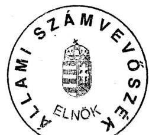
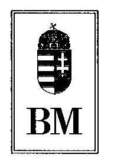
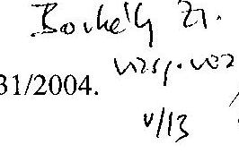
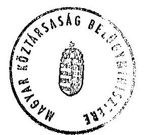

# JELENTÉS 

a 2003. április 12-én megtartott országos népszavazás lebonyolításához felhasznált pénzeszközök elszámolásának ellenőrzéséről

---

# 3. Önkormányzati és Területi Ellenőrzési Igazgatóság 

3.3. Átfogó Ellenőrzések Főcsoport

Iktatószám: V-1011-33/2004.
Témaszám: 705
Vizsgálat-azonosító szám: V0129

## Az ellenőrzést felügyelte:

Dr. Lóránt Zoltán
főigazgató
Az ellenőrzés végrehajtásáért felelős:
Dr. Sepsey Tamás
főigazgató helyettes
Az ellenőrzést vezette:
Borbély Zsuzsanna
számvevő tanácsos
A számvevői jelentések feldolgozásában és a jelentés összeállításában közreműködtek:

Dér Géza
számvevő
Dr. Mezei Imréné
főtanácsadó
Az ellenőrzést végezték:

| Bialkó Zsolt | Borbély Zsuzsanna | Dér Géza |
| :-- | :-- | :-- |
| számvevő | számvevő tanácsos | számvevő |
| Dér Lívia | Dr. Fülöp László | Hirka Mihály |
| számvevő tanácsos | számvevő tanácsos | főtanácsadó |
| Hütter Erzsébet | Kenéz Sándor | Kéri Péter |
| számvevő | főtanácsadó | számvevő |
| Dr. Mezei Imréné | Nagy László Csaba | Nagy Sándorné |
| főtanácsadó | számvevő | számvevő tanácsos |
| Schósz Attila Ferencné | Szendrey Lajos | Tóth István |
| számvevő | számvevő | tanácsadó |
| Tóth Péter | Horváth János |  |
| számvevő | szakértő |  |

Jelentéseink az Országgyűlés számítógépes hálózatán és az Interneten a www.asz.hu címen is olvashatók.

---

# A témához kapcsolódó eddig készített számvevőszéki jelentések: 

címe
sorszáma
Jelentés az 1994. évi országgyűlési, valamint a helyi és kisebbségi önkormányzati képviselő választások lebonyolítására felhasznált pénzeszközök ellenőrzéséről (1995. évben elkészített jelentés) Jelentés az 1997. évi népszavazásra, továbbá az 1998. évi országgyűlési, valamint a helyi és kisebbségi önkormányzati képviselő-választások lebonyolítására felhasznált pénzeszközök vizsgálatáról
Jelentés a 2002. évi országgyűlési, valamint a helyi és kisebbségi 0325 önkormányzati képviselő választásra felhasznált pénzeszközök ellenőrzéséről

---

# TARTALOMJEGYZÉK 

BEVEZETÉS ..... 5
I. ÖSSZEGZŐ MEGÁLLAPÍTÁSOK, KÖVETKEZTETÉSEK, JAVASLATOK ..... 7
II. RÉSZLETES MEGÁLLAPÍTÁSOK ..... 12

1. A népszavazási kiadások tervezése, az előirányzatok nyilvántartása és módosítása ..... 12
2. A pénzeszközök felhasználása és szabályszerűsége ..... 15
2.1. A pénzügyi fedezet biztosítása ..... 15
2.2. A gazdálkodási jogkörök szabályozása ..... 16
2.3. A népszavazással kapcsolatosan elszámolt dologi kiadások a BM KÖNYV Hivatalban ..... 17
2.4. A népszavazás pénzeszközei felhasználásának szabályszerűsége és célszerűsége a területi és helyi szerveknél ..... 18
2.5. A közbeszerzési eljárások és a szabadkézi vételek lebonyolítása ..... 23
2.6. A népszavazáshoz kapcsolódó informatikai fejlesztések ..... 25
3. A népszavazási feladatra felhasznált pénzeszközök elszámolása ..... 27
4. Ellenőrzés ..... 30

## MELLÉKLETEK

1. számú melléklet Az ellenőrzött szervek jegyzéke
2. számú melléklet A 2003. április 12-én megtartott országos népszavazás normatíváinak jogcímenkénti felosztása és elszámolása
3. számú melléklet A 2003. április 12-én megtartott országos népszavazás kapcsán lefolytatott közbeszerzési eljárások adatai
4. számú melléklet A helyi választási irodák, az OEVK-k, a területi választási irodák és közigazgatási hivatalok tervezett és elszámolt kiadása
5. számú melléklet A 2003. április 12-én megtartott országos népszavazás tervezett és tényleges kiadásainak alakulása és megoszlása

---

.

---

# RÖVIDÍTÉSEK JEGYZÉKE 

| Kbt. | a közbeszerzésekről szóló 1995. évi XL. törvény |
| :--: | :--: |
| Számv. tv. | a számvitelről szóló 2000. évi C. törvény |
| Ve. tv. | a választási eljárásról szóló 1997. évi C. törvény |
| Ámr. | az államháztartás működési rendjéről szóló 217/1998. (XII. 30.) Korm. rendelet |
| 125/1996. (VII. 24.) | a központi költségvetési szervek központosított közbeszer- |
| Korm. rendelet | zéseinek részletes szabályairól szóló 125/1996. (VII. 24.) Korm. rendelet |
| 126/1996. (VII. 24.) | a központi költségvetési szervek szabadkézi vétellel történő beszerzéseinek szabályairól szóló 126/1996. (VII. 24.) Korm. rendelet |
| 151/1999. (X. 22.) Korm. | egyes beszerzések nemzetbiztonsági és titokvédelmi okok |
| rendelet | miatti sajátos szabályairól szóló 151/1999. (X. 22.) Korm. rendelet |
| 34/2002. (XII. 23.) BM | a 34/2002. (XII. 23.) BM rendelet a választási eljárásról |
| rendelet | szóló 1997. évi C. törvény végrehajtásáról az országos népszavazáson és az országos népi kezdeményezésen |
| Népsz. rendelet | a 2003. április 12-én megtartásra kerülő európai uniós népszavazás költségeinek normatíváiról, tételeiről, elszámolási és belső ellenőrzési rendjéről szóló 7/2003. (III. 14.) BM rendelet |
| BM | Belügyminisztérium |
| OVI | Országos Választási Iroda |
| BM KÖNYV Hivatal | BM Központi Adatfeldolgozó, Nyilvántartó és Választási Hivatal |
| OEVK | Országgyűlési Egyéni Választókerület |
| SzSzB | szavazatszámláló bizottság |
| népszavazás | a 2003. április 12-én megtartott európai uniós népszavazás |

---

.

---

# JELENTÉS 

## a 2003. április 12-én megtartott országos népszavazás lebonyolításához felhasznált pénzeszközök elszámolásának ellenőrzéséről

## BEVEZETÉS

A Ve. tv. 5. § alapján a népszavazás előkészítésével és lebonyolításával kapcsolatos állami feladatok végrehajtására fordított pénzeszközök ellenőrzése, valamint az ellenőrzési tapasztalatokról az Országgyűlés tájékoztatása az Állami Számvevőszék feladata. E felhatalmazás, valamint az ÁSZ 2004. évi ellenőrzési terve alapján vizsgáltuk a 2003. április 12-én megtartott országos népszavazás lebonyolítására fordított pénzeszközök felhasználásának szabályszerűségét és célszerűségét.

Az Országgyűlés a 114/2002. (XII. 23.) számú határozatában egyetértett, hogy a 2003. évi országos népszavazás előkészítésének és lebonyolításának eredményes végrehajtására a Belügyminisztérium fejezetben legfeljebb 4 milliárd forint használható fel ${ }^{1}$. A pénzügyi támogatást a Kormány 2036/2003. (III.4.) számú határozatával 3824 millió forintban hagyta jóvá a költségvetés általános tartaléka terhére.

Az ellenőrzés célja annak megállapítása volt, hogy a központi szerveknél, a közigazgatási hivataloknál, valamint a megyei és a helyi önkormányzatoknál a népszavazással kapcsolatos feladatok ellátása során

- a kiadások tervezése megalapozottan történt-e,
- a pénzeszközök felhasználását célszerűen, a jogszabályi előírásoknak megfelelően végezték-e,
- a pénzügyi elszámolásokat határidőben, a jogszabályban meghatározott módon teljesítették-e.

Helyszíni ellenőrzést folytattunk a BM KÖNYV Hivatalban, hat közigazgatási hivatalban, három megyei és a fővárosi önkormányzatnál, valamint 29 települési önkormányzatnál. A vizsgált szerveket az 1. sz. mellékletben soroljuk fel.

[^0]
[^0]:    ${ }^{1}$ Az 1994. évi országgyűlési képviselőválasztásra 1700 millió Ft, önkormányzati képviselőválasztásra 1118 millió Ft, mindösszesen 2818 millió Ft; az 1997. évi népszavazásra 1700 millió Ft, 1998. évi országgyűlési képviselőválasztásra 3853 millió Ft, önkormányzati és országos kisebbségi képviselőválasztásra 2654 millió Ft, mindösszesen 8207 millió Ft; a 2002. évi országgyűlési képviselőválasztásra 6370,7 millió Ft, önkormányzati és országos kisebbségi képviselőválasztásra 3100 millió Ft, mindösszesen 9470,7 millió Ft előirányzat került jóváhagyásra.

---

6

---

# I. ÖSSZEGZŐ MEGÁLLAPÍTÁSOK, KÖVETKEZTETÉSEK, JAVASLATOK 

Magyarország Európai Unióhoz való csatlakozása tárgyában kiírt ügydöntő országos népszavazás költségelőirányzatát 2003. március 4-én a Kormány 3824 millió Ft-os összegben hagyta jóvá. A kiadások tervezésekor a helyi választási szervek (területi és helyi választási irodák, OEVK-k) és közigazgatási hivatalok részére normatívan juttatott támogatást a 2002. évi önkormányzati képviselőválasztás tervezett előirányzatához képest 41,2 millió Ft-tal alacsonyabb összegben határozták meg. A központi kiadások ${ }^{2}$ tervezése nem részletes felméréssel, hanem tapasztalati adatok alapján történt.

A tervezett kiadásokból 1583 millió Ft (41,4\%) a helyi választási irodák, OEVK-k, területi választási irodák és közigazgatási hivatalok feladatai ellátásának fedezetére szolgált. A központi kiadásokat 1191 millió Ft-ban (31,1\%), az informatikai kiadásokat 1050 millió Ft-ban (27,5\%) határozták meg.

A népszavazás költségeinek normatíváiról, tételeiről, elszámolási és belső ellenőrzési rendjéről az előírásokat a Belügyminisztérium rendeletben szabályozta. Ennek értelmében az OVI, a BM KÖNYV Hivatal, a Megyei Közigazgatási Hivatal, a Területi Választási Iroda, valamint a Helyi Választási Iroda vezetője illetékességi körén belül felelős volt a népszavazás előkészítése, szervezése és lebonyolítása pénzügyi feltételeinek feladatokhoz kötött meghatározásáért, pénzügyi tervezéséért, lebonyolításáért, elszámolásáért és ellenőrzéséért.

A népszavazás lebonyolítására jóváhagyott 3824 millió Ft előirányzatból a BM fejezeti hatáskörben 80 millió Ft-ot átcsoportosított a rendőri biztosítás költségeire. Az OVI és a BM KÖNYV Hivatal vezetője hét alkalommal döntött belső átcsoportosításokról, melyek közül hat intézkedés a központi és az informatikai kiadások alcímeit érintette, egy pedig a helyi és a területi választási irodák, illetve közigazgatási hivatalok számára pótlólag meghatározott feladatokkal volt összefüggésben.

A népszavazás pénzügyi tervezése a helyi választási szerveknél (területi és helyi választási irodák) a normatívák Népsz. rendelet általi kihirdetését követően történt meg, mivel ekkor váltak tervezhetővé a lakossági tájékoztatók, hirdetmények előállításának, sokszorosításának, közzétételének, a választói névjegyzék összeállításának, kézbesítésének költségei, a szavazásnapi szavazóköri és polgármesteri hivatali dologi jellegű kiadások, valamint a választási irodák és szavazatszámláló bizottságok tagjainak, póttagjainak személyi jellegű juttatásai.

[^0]
[^0]:    ${ }^{2}$ Központi kiadások: a népszavazással kapcsolatban az OVI és a BM KÖNYV Hivatal által végrehajtott feladatok tervezése és elszámolása.

---

A területi választási irodáknál a normatívák a személyi kiadások mellett a kapcsolattartáshoz, a koordinációs és kommunikációs tevékenységhez, jogorvoslati ügyek intézéséhez, az információs és ellenőrzési rendszer működtetéséhez, a közigazgatási hivataloknál a választási informatikai rendszerek működtetéséhez biztosítottak tervezhető központi forrásokat.

Az ellenőrzött 29 helyi választási iroda közül 10 nem gondoskodott a népszavazás költségtervének összeállításáról, a négy területi választási iroda mindegyike készített költségtervet. A költségtervek összeállításakor figyelemmel voltak az előírt költségnormatívákra, és a központi támogatás mellett 23\%-uk saját forrás kiegészítéssel is számolt.

A vizsgált szervek a központi támogatást a Népsz. rendelet előírásának megfelelően átvett pénzeszközként kezelték. A helyi önkormányzatok 72\%-a, a megyei önkormányzatok mindegyike gondoskodott a költségvetési előirányzatok évközi módosításáról. A rendelkezésre bocsátott pénzügyi fedezet a Népsz. rendelet által előírt határidőben a választásban résztvevő szerveknél rendelkezésre állt.

A választási pénzeszközökkel való gazdálkodás jogköreit a BM KÖNYV Hivatalnál, a területi választási irodáknál és a közigazgatási hivataloknál az Ámr-ben és a Népsz. rendeletben foglalt előírásoknak megfelelően szabályozták, a helyi önkormányzatok 24,1\%-a nem gondoskodott a jogszabályi előírások érvényesítéséről.

A népszavazás lebonyolításában közreműködő szervek a feladat ellátására biztosított normatív támogatást a Népsz. rendelet előírásának megfelelően használták fel, de a póttámogatásként biztosított pénzeszköz felhasználásánál eltértek az OVI vezetőjének előírásától, mivel abból személyi jellegű kifizetéseket is teljesítettek. A szakfeladaton való elkülönítési kötelezettségének a népszavazás lebonyolításában közreműködő szervek 12,8\%-a nem tett eleget.

A kijelölt szakfeladaton való elkülönített kezelés arra szolgált, hogy azon valamennyi (központi, saját) forrásból felmerülő kiadás mellett az általános költségek arányos felosztását követően a népszavazás teljes ráfordítását kimutassák. A tényleges pénzfelhasználás kimutatása csak korlátozottan érvényesült, mert a Népsz. rendelet a pénzeszközök számvitelen belüli elkülönített kezeléséről intézkedett, annak tartalmát a Belügyminisztérium és OVI által kiadott, a pénzügyi lebonyolítás szabályainak értelmezéséhez készült tájékoztató határozta meg. A tájékoztatóban sem került egyértelműen rögzítésre azonban, hogy a választás teljes költségébe a közvetetten elszámolható általános költségek arányos része is beszámítható, továbbá nem adott támpontot arra vonatkozóan, hogy az arányosítást milyen vetítési alapok segítségével, milyen teljesítményi jellemzők alapján kell megtenni.

Az ellenőrzött helyi önkormányzatok háromnegyede, a megyei önkormányzatok fele, a közigazgatási hivatalok egyharmada nem végzett számítást, hogy az általános költségeiből mennyi terhelte a népszavazás lebonyolítását, hanem azt saját kiadásai között számolta el, saját költségvetése terhére. Azokban az esetekben, amikor a hivatalokban felmerülő általános jellegű igazgatási feladatok költségeinek egy részét népszavazást terhelő tételként elszámolták, nem készült

---

tényleges költségfelosztás. Az önkormányzatok az igazgatási jellegű dologi üzemeltetési kiadásai közül gépjármű üzemeltetéshez, postai és kommunikációs szolgáltatásokhoz kapcsolódó választásnapi, valamint ingatlan fenntartási kiadásokat számoltak el, a rendelkezésre
 álló normatív keretösszeg erejéig.

Az OVI vezetője célszerinti felhasználásra többlettámogatást biztosított a népszavazásban közreműködő területi, illetve helyi szerveknek. A céltámogatás tartalma és a támogatásról történt rendelkezés időpontja a népszavazásra kitűzött dátumhoz képest a teljesíthetőség szempontjából megkésett volt. A továbbképzések szervezése már előkészített állapotban volt, a tanfolyamok költségstruktúrája kialakult, a jogi és az igazgatási felkészítőket már megtartották. A feladatokat a támogatottak eltérő módon oldották meg. A póttámogatásból az OVI vezetőjének rendelkezése ellenére személyi kifizetéseket teljesítettek, illetőleg mivel dologi kiadásokra felhasználni nem tudták, visszautalták a BM KÖNYV Hivatal részére. A helyszíni ellenőrzések tapasztalatai azt igazolták, hogy a póttámogatás meghaladta a szükségletet.

A BM KÖNYV Hivatal a népszavazás lebonyolítása érdekében hat esetben kötött megbízási szerződést közbeszerzési eljárás lefolytatására, illetve informatikai (számítástechnikai) anyagokat központosított közbeszerzés keretében szereztek be két esetben. Az eljárás során a kiemelt termékek központosított közbeszerzésére vonatkozó előírásokat betartották. Két esetben - a fordítások megrendelésénél és a BM Duna Palota bérbevételénél - a közbeszerzési értékhatárt meghaladó szolgáltatás megrendelésénél megsértették a Kbt. előírását, mivel nem folytatták le a közbeszerzési eljárást. A szabadkézi vétel körébe tartozó beszerzések ajánlatkérései - minőségi követelmények meghatározásának, referenciakérések tájékoztató adatok hiánya miatt - nem feleltek meg a vonatkozó kormányrendeletben meghatározott előírásoknak.

A népszavazás összkiadásának 27,7 %-át fordították informatikai szolgáltatásokra. A népszavazási feladat fontosságának megfelelően az alkalmazott rendszerek fejlesztésénél a magas színvonalon való és biztonságos működtetésre helyezték a hangsúlyt, ami többletköltséget jelentett.

A népszavazás céljára biztosított pénzeszközök felhasználásának elszámolásáról a Népsz. rendelet feladat típusú elszámolás elkészítését írta elő, amelynek konkrét formáját, határidejét a rendelet melléklete tartalmazta. Az elszámolásra megjelölt határidejét a választási szervek betartották. A költségvetési szervet megillető fedezet összegét a népszavazás tényadatai alapján számolták el, amely - a póttámogatásból teljesített személyi kifizetések miatt - a rendeltetéstől eltérő felhasználást is tartalmazott.

A feladat típusú elszámolás, aminek elkészítési határideje a népszavazást követő 60 nap - kizárólag a népszavazásra juttatott támogatás felhasználásáról adott információt. A szakfeladaton elszámolt kiadások csak a költségvetési évet követő összegzés után válnak ismertté. Ennek alapján a népszavazással kapcsolatos összes kiadás megismerésére, a kiadási arányok valódi alakulásának elemzésére, következtetések levonására a népszavazást követő évben van lehetőség.

---

A BM KÖNYV Hivatal vezetője a jogszabályban megjelölt határidőben elkészítette beszámolóját a 2003. április 12-én megtartott EU népszavazás költségvetésének felhasználásáról. A beszámoló szerint a népszavazás lebonyolítására rendelkezésre álló 3824,0 millió Ft-os előirányzat 3744,0 millió Ft-ra módosult a fejezeti szintű elvonás miatt. Ebből a választási szerveket illette meg 1774,3 millió Ft, amelyből felhasználtak 1721,5 millió Ft-ot, így a maradvány 52,8 millió Ft. A 734,7 millió Ft-ot kitevő központi kiadások teljesülése 79 %-os, a maradványa pedig 193,5 millió Ft, az informatikai kiadások maradványa 98,3 millió Ft. Az összegzés szerint a népszavazás lebonyolítására a 943,1 millió Ft informatikai kiadásokkal együtt 3399,3 millió Ft-ot használtak fel és 344,6 millió Ft maradvány keletkezett. A népszavazás költségvetésének felhasználásáról szóló beszámolót az OVI vezetője 2003. június 30-án terjesztette fel a belügyminiszter részére, aki azt jóváhagyta.

A népszavazás lebonyolításáról intézkedő Népsz. rendelet valamennyi választásban közreműködő szerv számára előírt ellenőrzési kötelezettséget, melynek a helyi választási irodák 69 %-a nem tett eleget. A területi választási irodák eltérő módon (helyszíni ellenőrzés, dokumentális ellenőrzésről feljegyzés készítése, elszámolások aláírása) gondoskodtak a kötelezettség teljesítéséről.

A BM KÖNYV Hivatal ellenőrzési program alapján 48 helyen végzett ellenőrzést, melynek tapasztalatait összegezte és megállapításait a következő választásnál kívánja hasznosítani. Az ellenőrzések során rendeltetéstől eltérő felhasználást nem állapítottak meg.

A helyszíni ellenőrzésekről készült jelentésekben a helyi önkormányzatok részére a népszavazási (választási) feladatok pénzügyi tervezését, a népszavazáshoz (választáshoz) kapcsolódó saját kiadások elkülönített nyilvántartását, valamint a rendelkezési, ellenőrzési feladatok elvégzésének szabályozását javasoltuk, két esetben (Csongrád Megyei Közigazgatási Hivatal felhalmozási célra fordított 1074 ezer Ft-ot, Jász-Nagykun-Szolnok Megyei Közigazgatási Hivatal 294 ezer Ft fel nem használt támogatást számolt el) a céltól eltérően felhasznált támogatás visszafizetését kezdeményeztük.

A BM KÖNYV Hivatalnál a pontosabb tervezésre, a közbeszerzési és szabadkézi beszerzések szabályszerű lebonyolítására, valamint a hivatal dologi kiadásaiból - téves számítás miatt - a népszavazás szakfeladaton elszámolt 3433 ezer Ft összeg helyesbítésére tettünk javaslatot.

A helyszíni ellenőrzés megállapításainak hasznosítása mellett javasoljuk:

# a belügyminiszternek, hogy 

1. Gondoskodjon a választásban közreműködő szervek tervezési, költségmegosztási és elszámolási feladatainak egyértelmű szabályozásáról.
2. Intézkedjen a BM KÖNYV Hivatal vezetője felé, hogy gondoskodjon a közbeszerzési előírások megsértése miatti felelősségre vonásról.

---

3. Utasítsa az OVI vezetőjét, hogy a jövőben a póttámogatás esetén a feladat elvégzéséhez szükséges időben értesítse a választási szerveket, póttámogatást csak indokolt esetben nyújtson.
4. Rendelje el, hogy az OVI vezetője teljes körűen vizsgálja felül a póttámogatások felhasználását a területi választási irodák és a megyei közigazgatási hivatalok által leadott elszámolások és az azokat alátámasztó bizonylatok alapján a rendeltetéstől eltérő felhasználása megállapítására, és jogszerűtlen felhasználás esetén a rendezésére.

---

# II. RÉSZLETES MEGÁLLAPÍTÁSOK 

## 1. A NÉPSZAVAZÁSI KIADÁSOK TERVEZÉSE, AZ ELŐIRÁNYZATOK NYILVÁNTARTÁSA ÉS MÓDOSÍTÁSA

A népszavazás pénzügyi feltételeinek előkészítése során a belügyminiszter 2002. december 4-én benyújtotta 4 milliárd Ft-ról szóló előterjesztését. Az Országgyűlés a 2003. április 12-i ügydöntő országos népszavazás pénzügyi támogatásáról szóló 114/2002. (XII. 23.) határozatában egyetértett azzal, hogy a népszavazás előkészítésének és lebonyolításának eredményes végrehajtására a Belügyminisztérium fejezetben legfeljebb 4 milliárd forint felhasználásra kerüljön.

A kiadások tervezésekor a helyi választási szervek (területi és helyi választási irodák, OEVK-k) és közigazgatási hivatalok részére normatívan juttatott támogatást a 2002. évi önkormányzati képviselőválasztás tervezett előirányzatához képest 41,2 millió Ft-tal alacsonyabb összegben határozták meg. A központi kiadások tervezése nem részletes felméréssel, hanem tapasztalati adatok alapján történt.

A végleges előterjesztés 2003. februárban készült, a tervezett összeg 3824 millió Ft, amelyet a Kormány 2036/2003. (III. 4.) számú határozatával fogadott el.

Ennek alapján a BM Könyv Hivatal működési költségvetésében
személyi kiadásra 35 millió Ft
munkaadókat terhelő járulékokra 11 millió Ft
dologi kiadásokra 1847 millió Ft
egyéb működési célú kiadásokra, támogatásokra 1583 millió Ft
felhalmozási költségvetésében
intézményi beruházási kiadásokra 348 millió Ft
előirányzatot hagyott jóvá.
Az előterjesztés 3. számú mellékletében a kiadások részletes bontása megegyezett a Népsz. rendelet mellékletében rögzített összegekkel.

A BM KÖNYV Hivatalban a jóváhagyott előirányzatokat a határozatnak megfelelően nyilvántartásba vették, illetve a Népsz. rendeletnek megfelelően tovább bontották. Az előirányzat-nyilvántartás választási szervenként és kiadási jogcímenként tartalmazta a jóváhagyott összegeket.

---

A tervezett kiadásokból ³1583 millió Ft (41,4 %) a helyi választási irodák, az OEVK-k, a területi választási irodák és a közigazgatási hivatalok feladatainak fedezetére szolgált. A központi kiadásokat 1191 millió Ft-ban (31,1 \%), az informatikai kiadásokat pedig 1050 millió Ft-ban (27,5 \%) határozták meg. A központi dologi kiadások 1145 millió Ft-os összegéből a pártsemleges kampányra és a szavazásnapi nyomtatványokra tervezett összeg 350-350 millió Ft, valamint a választói névjegyzékek, értesítők központi előállítására tervezett 130 millió Ft volt, a fennmaradó 14 jogcímen 315 millió Ft-ot terveztek összesen (2. sz. melléklet). A Népsz. rendelet 1. számú mellékletében a központi kiadások 154 számú jogcímén a pártsemleges kampány ⁴megnevezés szerepel. A jogcímen lakossági tájékoztató anyagok elkészítését, sajtóban, rádióban közölt népszavazással kapcsolatos ismeretterjesztést és tájékoztató film elkészítését számolták el. A Ve. tv. 38. § (1) bekezdés d) pontja szerint az OVI feladata a pártsemleges tájékoztatás, ami nem azonos a kampánnyal és az elszámolt feladatok sem tartoznak a kampány tevékenységek körébe.

A népszavazás költségeire tervezett 3824 millió Ft-os előirányzat a BM KÖNYV Hivatalnál 3744 millió Ft-ra módosult a fejezeti hatáskörben - a népszavazás során felmerült rendőri biztosítás költségeire - történt 80 millió Ft előirányzat átcsoportosítás miatt. A módosítás megfelelt az Ámr. 48. § (1) bekezdés f) pontja előírásának, amely szerint a központi költségvetési szerv felügyeleti szerve a jóváhagyott előirányzatok felhasználását - amennyiben azokat bizonyos feltételhez köti - saját rendelkezésébe vonhatja.

Az OVI és a BM KÖNYV Hivatal vezetője a kormány által jóváhagyott előirányzatok között egy alkalommal intézkedett átcsoportosításról, amely a központi dologi kiadásokról az egyéb működési kiadások, támogatások előirányzatára - a helyi és a területi választási irodák, illetve a közigazgatási hivatalok részére feladatátadás miatt - történt.

Az átcsoportosítást az OVI vezetője 2003. március 27-én kelt EU-83/1/2003. számú feljegyzésében rendelte el, amelyben a helyi választási irodák részére lakossági tájékoztató szórólapok kézbesítésére, illetve szavazóköri jegyzőkönyvek szállítására, a területi választási irodák részére oktatásra, jegyzőkönyvszállításra és kiadványkészítésre, a közigazgatási hivatalok részére pedig oktatásra és terembérletre csoportosíttatott át pénzeszközöket, amelyekről a normatív támogatásokkal együtt kellett elszámolni. Az átcsoportosítások indokoltságára az OVI vezetőjének rendelkező levele a következő magyarázatot adta: „A területi és helyi választási irodáknak a 2003. április 12-i ügydöntő országos népszavazás előkészítése és lebonyolítása során olyan többletfeladatokat is el kellett, illetve el kell végezniük, melyek költségráfordításait a 7/2003. (III. 14.) BM rendelet helyi és területi normatívái nem tartalmazzák. A központi költségvetés dologi költségeinél megtakarítás jelentkezik. Ez lehetőséget biztosít arra, hogy a területi választási irodáknál, a helyi választási irodáknál és

[^0]
[^0]:    ³ A 7/2003. (III.14.) BM rendelet 1. sz. mellékletével ellentétben a SzSzB tagokkal kapcsolatos kiadásokat a helyi kiadásokhoz csoportosítottuk át a központi kiadásokból, mivel így elemezhetők és hasonlíthatók össze a tervezett és a tényleges kiadások a feladat típusú elszámolással.
    ⁴ Az ÁSZ 0351 az EU Kommunikációs Közalapítvány gazdálkodásának ellenőrzéséről szóló jelentés szerint a Közalapítványnak a népszavazás népszerűsítése, a részvételre való felhívással kapcsolatban merültek fel kiadásai. A kampányrendezvények megtartására 180,8 millió Ft-ot használt fel.

---

a közigazgatási hivatalnál jelentkező többletfeladatok zavartalan, pontos végrehajtásához szükséges költségráfordítás a központi keretből átadott pénzeszközként a megye és a települések részére biztosítsuk."

A dologi kiadásokra jóváhagyott előirányzatokon belül a központi és az informatikai kiadások jogcímei között hat esetben döntött az OVI és a BM KÖNYV Hivatal vezetője átcsoportosításról.

Az előirányzat átcsoportosításokkal a BM KÖNYV Hivatal költségvetésében az átadott pénzeszközök előirányzata 193333 ezer Ft-tal emelkedett a központi dologi kiadások terhére. A nyilvántartásokon az előirányzat változásokat szabályszerűen átvezették.

A Népsz. rendelet 1. § (2) bekezdés c) pontja előírta, hogy a területi választási iroda és a helyi választási iroda vezetője illetékességi területén belül felelős a népszavazás pénzügyi tervezéséért, lebonyolításáért, elszámolásáért. Az előkészítés és lebonyolítás pénzügyi fedezetéül a Népsz. rendelet 2. sz. mellékletében meghatározott normatívák alapján számított költségvetési fedezetnél a központi személyi adat- és lakcímnyilvántartás 2003. január 1-jei állapota szerinti adatállomány részletező adatait (lakosság, választásra jogosultak, szavazókörök száma településenként) kellett figyelembe venni. A népszavazás helyi és területi pénzeszközeinek felhasználását a Népsz. rendelet 5. § (2) bekezdésében határozta meg a belügyminiszter. A normatívák alapján kiszámított pénzeszközök felett a népszavazás lebonyolítását végző szervek a feladat ellátásához szabadon rendelkeztek, megkötést a
 Népsz. rendelet csak a személyi kiadások minimumára jelölt meg.

A helyi és területi választási irodáknál a népszavazás pénzügyi tervezése a normatívák Népsz. rendelet általi kihirdetését (III. 14.) követően történt, mivel ekkor váltak ismertté a lakossági tájékoztatók, hirdetmények előállításának, sokszorosításának, közzétételének, a választói névjegyzékek összeállításának, kézbesítésének költségei, a szavazásnapi szavazóköri és polgármesteri hivatali dologi jellegű kiadások, valamint a választási irodák és szavazatszámláló bizottságok tagjainak, póttagjainak személyi jellegű juttatásai.

A területi választási irodák esetében a normatívák a személyi kiadások mellett a kapcsolattartáshoz, a koordinációs és kommunikációs tevékenységhez, jogorvoslati ügyek intézéséhez, az információs és ellenőrzési rendszer működtetéséhez, a közigazgatási hivataloknál a választási informatikai rendszerek működtetéséhez biztosítottak tervezhető központi forrásokat.

Az ellenőrzött szervek körében a 29 helyi választási iroda közül 10 (34%, ezen belül három város) nem gondoskodott a népszavazás költségtervének összeállításáról, a helyi választási iroda vezetője nem teljesítette a Népsz. rendelet 1. § (2) bekezdés c) pontjának a tervezési felelősségére meghatározott előírását. Az ellenőrzött négy területi választási iroda mindegyike készített költségtervet. A költségtervek összeállításakor figyelemmel voltak Népsz. rendelet 1. számú mellékletében előírt költségnormatívákra, a központi támogatás mellett azonban saját forrás kiegészítéssel 23% (nyolc helyi és egy területi választási iroda) számolt. A Népsz. rendelet a közigazgatási hivatalok vezetői részére nem határoz meg tervezési felelősséget, ennek ellenére az ellenőrzött hat megyei közigazgatási hivatal közül öt készített, egy (Csongrád megye) nem készített költségtervet.

A vizsgált szervek a központi támogatást a Népsz. rendelet 3. § (3) bekezdésének megfelelően átvett pénzeszközként kezelték. A helyi önkormányzatok 72%-a, a megyei önkormányzatok mindegyike gondoskodott a költségvetési előirányzatok évközi módosításáról, az Ámr. 53. § (2) bekezdésében foglalt hatásköri és eljárási rendnek megfelelően.

Az előirányzat-módosítási kötelezettségét elmulasztó nyolc helyi önkormányzat közül négy Szabolcs-Szatmár-Bereg megyei település, míg további négy megyében pedig - Csongrád, Jász-Nagykun-Szolnok, Pest, Vas - egy-egy település esetében maradt el az előirányzatok költségvetési rendelettel való jóváhagyása.

A közigazgatási hivatalok mindegyike az Ámr. 51. § (2) bekezdés előírásának megfelelően a BM fejezet engedélye alapján, a juttatott hozzájárulásokkal megegyező előirányzat-módosításokat elvégezte.

# 2. A PÉNZESZKÖZÖK FELHASZNÁLÁSA ÉS SZABÁLYSZERŰSÉGE 

### 2.1. A pénzügyi fedezet biztosítása

A központi költségvetésből a népszavazással kapcsolatos feladatok ellátásához szükséges pénzügyi fedezetet a BM KÖNYV Hivatal előirányzat felhasználási számláján a havi finanszírozás keretében 2003. áprilistól decemberig kilenc részletben nyitották meg, a fedezet a népszavazás lebonyolításának időpontjában nem állt rendelkezésre, hanem azt a BM KÖNYV Hivatal megelőlegezte. A Népsz. rendelet 3. § (4) bekezdése szerint a BM KÖNYV Hivatal vezetőjének a szavazás napját megelőző 20. munkanapig kellett átutalnia a támogatást a fővárosi, megyei közgyűlés hivatalainak bankszámláira és a közigazgatási hivatalok előirányzat-felhasználási keretszámláira. Az előleget a Népsz. rendeletnek megfelelően, március 13-án, 22 munkanappal a szavazás napja előtt átutalták.

Az ellenőrzött körben a Népsz. rendelet normatívái alapján számított járandóság minden szervezethez eljutott a jogszabályban rögzített határidőn belül, azok március 17-22. között kerültek jóváírásra a költségvetési, illetve előirányzat-felhasználási számlákon.

Az OVI vezetője által pótelőirányzatként biztosított támogatást a közigazgatási hivatalok és a területi választási irodák részére április 4-én utalták át. A területi választási irodák a helyi választási irodáknak járó összeget ezt követően április 4-11. között utalták tovább.

A népszavazással kapcsolatban a felmerülő kiadásokat (irodaszer, értekezletre élelmiszer, üdítő vásárlás, útiköltség) az önkormányzatok közül négy – Mártély, Nagybajom, Budapest XIV. kerület, valamint a Baranya Megyei Önkormányzat – a közigazgatási hivataloknak fele – Jász-Nagykun-Szolnok, Somogy, Zala megyei közigazgatási hivatal – előlegezett meg, azonban ez finanszírozási nehézséget sehol sem okozott.

A Ve. tv. V. fejezetében nevesített választási szerveken és a közigazgatási hivatalokon kívül a tervezett központi dologi kiadásokból két szervezet kapott a népszavazással összefüggő feladatra költségvetési támogatást.

A BM Távközlési Szolgálat részére adatátviteli és a nem adatátviteli összeköttetések lebonyolítására, valamint a szolgáltatások lebonyolításához szükséges készlet beszerzésre 23197 ezer Ft-ot adott át 2003. április 17-én a BM KÖNYV Hivatal. Az elszámolás szerint 22748 ezer Ft-ot dologi kiadásokra, 474 ezer Ft-ot pedig személyi kiadásokra fordítottak, így a teljesített kifizetés 25 ezer Ft-tal több volt az átadott összegnél, amit saját forrásból biztosítottak.

A belügyminiszter 2003. április 26-án kelt 001/1005/2003. számú határozata alapján a BM KÖNYV Hivatal és a BM Költségvetési és Gazdasági Főosztály 2003. április 28-án együttműködési megállapodást kötött 2000 ezer Ft összegről, melyből a belügyminiszter a területi választási irodák és a közigazgatási hivatalok vezetőit tárgyjutalomban részesíti a népszavazás lebonyolításában való közreműködésükért. A BM KÖNYV Hivatal december 11-én a benyújtott számlák és átvételi elismervények alapján 1786,5 ezer Ft-ot utalt át a BM számlájára.

Normatív támogatási körbe nem tartozó egyéb feladatokra egy esetben csoportosítottak át pénzeszközt, mivel az OVI kezdeményezésére kiállítást hoztak létre „Népszavazás Magyarországon az Európai Uniós tagságról" címmel.

A 15 tablóból álló kiállítás megrendezésére 45 helyi önkormányzat részére biztosítottak 300 ezer Ft, a Fővárosi önkormányzatnak (két kiállítás megtartására) 600 ezer Ft támogatást, összesen 14100 ezer Ft összegben. A támogatott önkormányzatok a felhasználásról elszámoltak.

# 2.2. A gazdálkodási jogkörök szabályozása 

A pénzgazdálkodási jogköröket illetően a BM KÖNYV Hivatalban a hivatal vezetőjének 2001. július 1-én hatályba helyezett 11/2001. számú intézkedése a kötelezettségvállalásról, az ellenjegyzésről, érvényesítésről és az utalványozásról volt az irányadó. Az intézkedésben a gazdálkodási jogköröket az Ámr. kötelezettségvállalás, utalványozás, ellenjegyzésről szóló 134-138. §-aiban foglaltaknak megfelelően a helyi sajátosságok figyelembevételével határozta meg. Az intézkedéshez mellékelték a „teljesítésigazolás és utalványozási bizonylatot", az érvényesítésre, utalványozásra és ellenjegyzésre jogosultak jegyzékét az aláírás mintával, valamint a szabályozásban leírt fogalmak értelmezését.

A népszavazással kapcsolatos kötelezettségvállalásokat a Népsz. rendelet 1. § (1) bekezdés b) pontjának megfelelően szabályozták, kötelezettséget vállalni - a BM KÖNYV Hivatal vezetője, illetve felhatalmazása alapján a Közgazdasági Főosztály vezetője - az OVI vezetőjének előzetes egyetértésével lehetett ${ }^{5}$.

A BM KÖNYV Hivatalban a bizonylati fegyelem megfelelő volt. A kötelezettségvállalások az Ámr. 134. § (2) bekezdésében foglaltnak megfelelően, kizárólag annak ellenjegyzését követően, a Népsz. rendelet 5. § (1) bekezdésében előírtak szerint az OVI vezetőjének egyetértése mellett történtek. A kiadások teljesítésének elrendelését - a szakmai teljesítésigazolások után - minden esetben érvényesítették az Ámr. 135. § (1) bekezdése alapján. Az utalványozás és annak ellenjegyzése maradéktalanul megvalósult.

A területi választási irodáknál és a közigazgatási hivataloknál a népszavazással kapcsolatos gazdálkodási jogkörök gyakorlása megfelelt az Ámr. 134-138. §-ában, illetve a Népsz. rendelet 1. § (2) bekezdés b) pontjában foglaltaknak, mivel gondoskodtak arról, hogy belső szabályzataikban a népszavazás pénzügyi lebonyolításához kapcsolódó gazdálkodási jogköröket az előírásoknak megfelelően, személyre szabottan rögzítsék, az összeférhetetlenségi eseteket kizárják, a népszavazáshoz kapcsolódó speciális feladatok - informatika, oktatás - teljesítésének igazolási rendjét kialakítsák. A gazdálkodási jogkörök gyakorlása során a szabályzataikban foglalt előírásokat betartották.

A helyi önkormányzatoknak 24,1%-a - Sellye, Pomáz város, Berente, Hejőpapi, Tiszavalk, Ilk, Tisztaberek község - nem gondoskodott a gazdálkodási jogkörök előírás szerinti gyakorlásának szabályozásáról, figyelmen kívül hagyták, hogy az Ámr. 134. § (3) bekezdés szerint a választások pénzeszközeinek felhasználásakor az önkormányzat jegyzője - mint a helyi választási iroda vezetője - rendelkezik kötelezettségvállalási, utalványozási jogkörrel.

A választási célú pénzeszközök felhasználása során a kialakított helyi szabályozást, illetve annak hiányában, a jogszabályban foglaltakat az ellenőrzött szervek egyedi kivételtől eltekintve betartották. A 29 önkormányzat közül az Ámr. 134-138. §-aiban meghatározott kötelezettségvállalás, utalványozás szabályait öt, az érvényesítés követelményeit hat, míg a teljesítés igazolás rendjét három sértette meg.

# 2.3. A népszavazással kapcsolatosan elszámolt dologi kiadások a BM KÖNYV Hivatalban 

A népszavazás dologi kiadásainak eredeti előirányzata 1145000 ezer Ft, amely a módosítások után 880227 ezer Ft-ra csökkent, és a felhasználása 688802 ezer Ft volt. A teljesített kiadásokon belül ${ }^{6}$ a legnagyobb tételt a szavazólapok, szavazásnapi nyomtatványok (39,2%), valamint a pártsemleges kampány jogcímen elszámolt tételek (28,7%) tették ki. A tájékoztatóanyagok, népszavazási füzetek jogcímen 7,3%-ot, a választói névjegyzékek 5,8%-ot, az OVI működési kiadásai 6%-ot képviseltek a dologi kiadásokon belül. A többi kiadás (összesen 13%) jogcímenként nem érte el az 5%-ot.

A népszavazás lebonyolításával kapcsolatban fenntartási, üzemeltetési költségek merültek fel a BM KÖNYV Hivatal működési kiadásai között, melyek megosztását a dologi kiadások költségvetésen belüli módosított előirányzatának aránya alapján számították.
adatok: ezer Ft-ban

| Megnevezés | BM KÖNYV Hivatal számítása |  | Ellenőrzés megállapítása |  |
| :-- | :--: | :--: | :--: | :--: |
|  | Dologi   kiadás | Megoszlás   % | Előirányzat 80   millió Ft-tal való   csökkentése | Megoszlás   % |
| Intézményi | 15068200 | 90,31 | 15068200 | 90,75 |
| EU népszava-   zás | 1616370 | 9,69 | 1536370 | 9,25 |
| összesen | 16684570 | 100,0 | 16604570 | 100,0 |
|  | Vetítési alap | elszámolt összeg |  | elszámolható   összeg |
| elszámolás | 788941 | 76431 |  | 72998 |

Megállapításunk szerint a számítás helytelenül történt, mivel a költségek felosztása 2003. május 21-én készült, azonban június 3-án fejezeti hatáskörben 80 millió Ft elvonás történt, amely miatt a népszavazás tervezett dologi kiadásai csökkentek, ezáltal az arány 9,25%-ra változott, a költségmegosztást viszont nem helyesbítették. A helytelen számítás miatt a népszavazás szakfeladaton 3433 ezer Ft-tal több általános költséget számoltak el a központi dologi kiadások között, a hivatal működési kiadásaiból. A helyszíni ellenőrzés lezárásakor a számvevői jelentésben az elszámolás helyesbítésére tettünk javaslatot.

Nem megfelelő igényfelmérés, illetve téves becslés miatt a nyomdai szolgáltatás eredeti megrendelése megalapozatlan volt. A BM KÖNYV Hivatal a népszavazás lebonyolításához nyomtatványok, szavazástechnikai anyagok gyártására és szállítására kötött vállalkozási szerződést az Állami Nyomda Rt-vel ${ }^{7}$. A március 12-én megkötött - összeghatárt nem tartalmazó - szerződés alapján a BM KÖNYV Hivatal 280 millió Ft értékű megrendelést adott, amely 391 millió Ft-ra növekedett az OVI vezetőjének 2003. március 26-i 63,5 millió Ft és 2003. április 9-i 47,5 millió Ft összegről szóló írásbeli intézkedése alapján.

# 2.4. A népszavazás pénzeszközei felhasználásának szabályszerűsége és célszerűsége a területi és helyi szerveknél 

A Népsz. rendelet 6. § (1) bekezdése előírta a pénzeszközök felhasználásának feladatonkénti elszámolását, és a tényleges pénzforgalom szakfeladaton történő nyilvántartását. A népszavazáshoz kapcsolódó kiadások és bevételek elkülönített kezelése követelményének - a 75117-5 szakfeladaton való elszámolásnak - a vizsgált szervek

[^0]
[^0]:    ${ }^{5}$ A BM KÖNYV Hivatal vezetője a 2002. december 18-án kelt, 3-636/1/2002. számú utasításában gondoskodott az előzetes ellenjegyzés végrehajtásának szabályozásáról.
    ${ }^{6}$ A jelentés 2. számú mellékletében a jelzett kiadásokat összegszerűen mutatjuk be.
    ${ }^{7}$ Az Állami Nyomda Rt. és a Pénzjegynyomda Rt. által alkotott konzorcium képviseletében.

 12,8 %-a nem tett eleget (Zala megyei közigazgatási hivatal, valamint Sellye város, Berente, Nagyecsed község, Budapest XIV. kerület önkormányzata).

A Népsz. rendelet 6. § (1) bekezdésének előírása szerint a szakfeladaton való elkülönített kezelés arra szolgált, hogy azon valamennyi (központi, saját) forrásból felmerülő kiadás mellett az általános költségek arányos felosztását követően a népszavazás teljes ráfordítását kimutassák.

A tényleges pénzfelhasználás kimutatása korlátozottan érvényesült, mert a Népsz. rendelet csak a pénzeszközök számvitelen belüli elkülönített kezeléséről intézkedett, annak tartalmát a Belügyminisztérium és OVI által kiadott, a pénzügyi lebonyolítás szabályainak értelmezéséhez készült tájékoztató ${ }^{8}$ határozta meg. A tájékoztatóban sem került egyértelműen rögzítésre azonban, hogy a választás teljes költségébe a közvetetten elszámolható általános költségek arányos része is beszámítható-e, továbbá nem adott támpontot arra vonatkozóan sem, hogy az arányosítást milyen vetítési alapok segítségével, milyen teljesítményi jellemzők alapján kell megtenni.

Az ellenőrzött helyi önkormányzatok háromnegyede, a megyei önkormányzatok fele, a közigazgatási hivatalok egyharmada nem végzett számítást, hogy az általános költségeiből mennyi terhelte a népszavazás lebonyolítását, hanem azt saját kiadásai közt számolta el saját költségvetésének terhére. Azokban az esetekben, amikor a hivatalokban felmerülő általános jellegű igazgatási feladatok költségeinek egy részét népszavazást terhelő tételként elszámolták, nem készült tényleges költségfelosztás. Az önkormányzatok az igazgatási jellegű dologi üzemeltetési kiadásai közül gépjármű üzemeltetéshez, postai és kommunikációs szolgáltatásokhoz kapcsolódó választásnapi, valamint ingatlan fenntartási kiadásokat számoltak el, a rendelkezésre álló normatív keretösszeg erejéig.

A bizonylati fegyelem megfelelt a Számv. tv. 166. § (2) bekezdésében foglaltaknak, mivel adataik alakilag és tartalmilag hitelesek és helytállóak voltak. A népszavazáshoz elszámolható általános költségek könyvelésének alapjául szolgáló belső bizonylatokkal kapcsolatban egy esetben sértették meg a Számv. tv. 167. § (1) bekezdésében előírtakat.

A Zala Megyei Közigazgatási Hivatalnál a népszavazás lebonyolításához normatívák alapján biztosított pénzeszközök terhére, dologi kiadásként a hivatal különböző arányban megosztott üzemeltetési ráfordításait, telefondíjait, irodaszer beszerzéseit, gépjármű fenntartási, üzemeltetési kiadásait belső bizonylatok alapján számolták el, de a megosztás rendszerét helyileg nem szabályozták. A kiállított belső bizonylatok a Számv. tv. 167. § (1) bekezdésében előírt alaki és tartalmi követelményeknek nem feleltek meg. Nem tartalmazták a gazdasági műveletet elrendelő szervezet megjelölését, az utalványozó és a rendelkezés végrehajtását igazoló személy aláírását, a gazdasági művelet tartalmának leírását, a könyvelés módjára, az érintett könyvviteli számlákra történő hivatkozást és a könyvviteli nyilvántartásokban történt rögzítés időpontját, igazolását. A számviteli el-

[^0]
[^0]:    ${ }^{8}$ Tájékoztató a 2003. április 12-én megtartásra kerülő európai uniós népszavazás pénzügyi lebonyolításának szabályairól (Választási füzetek 107. szám)

---

számolások alapján a központilag biztosított támogatás a közigazgatási hivatal népszavazáshoz kapcsolódó összes kiadására fedezetet nyújtott.

Az Országos Választási Iroda vezetője 2003. április 1-jei keltezésű, EU-83/2/2003. sz. levelében foglaltak szerint többlettámogatást biztosított a népszavazásban közreműködő területi illetve helyi szerveknek. A leirat egyértelműen rögzítette, hogy a többlettámogatást csak a megjelölt feladatok dologi költségeire lehet felhasználni ${ }^{9}$. Az OVI vezetője a támogatás felhasználására vonatkozóan április 8-án a rendelkező levelet módosította ${ }^{10}$. A céltámogatás tartalma és a támogatásról történt rendelkezés időpontja a népszavazásra kitűzött dátumhoz képest a teljesíthetőség szempontjából elkésett volt. A továbbképzések szervezése már előkészített állapotban volt, a tanfolyamok költségstruktúrája kialakult, a jogi és az igazgatási felkészítőket már megtartották. Azok a szervek, akik az első utasításban meghatározott feltételnek (csak dologi kiadások teljesíthetők) tettek eleget, a támogatást nem vagy csak részben használták fel.

A pótlólag támogatott választási feladatok és az azokhoz rendelt források az alábbiak voltak:

- A helyi választási irodák részére az OVI által készített választási tudnivalókat tartalmazó szórólap háztartásokba való eljuttatása, szórólaponként 15 Ft, valamint a szavazóköri jegyzőkönyvek választás lezárását követő haladéktalan Országos Választási Központba való szállítása címén az okmányirodai székhelyű helyi választási irodák részére helyi választási irodánként 8000 Ft volt, összesen 81433 ezer Ft.
Az ily módon rendelkezésre bocsátott támogatásról a hivatalos információ a területi választási irodákon keresztül április 4-6. között jutott a helyi választási irodákhoz, ahol a választópolgárok tájékoztatása ez időre már megtörtént.
A polgármesteri hivatalok egy része a szórólapokat vagy saját hivatali dolgozóik megbízásos jogviszonyban való foglalkoztatása révén, vagy közhasznú, közcélú foglalkoztatottjaik bevonásával juttatta el a háztartásokba, illetve a helyi postával kötöttek megállapodást, szerződést a szórólapok terjesztésére $4,50 \mathrm{Ft} / \mathrm{db}$ díjtétel fejében.
A normatív alapon számított dologi többlettámogatás maradványát az önkormányzatok az OVI vezetőjének utasításával ellentétben egyéb választással összefüggő kiadásaikra használták fel, négy önkormányzat (Sellye, Hat-

[^0]
[^0]:    ${ }^{9}$ OVI vezetője EU-83/2/2003 rendelkező levele szerint: „A szigorú pénzügyi szabályok betartása érdekében felhívom a figyelmet arra, hogy az átadott pénzeszközöket csak az előzőekben felsorolt választási feladatok teljesítéséhez, dologi kiadások fedezetére lehet felhasználni. Ezen pénzeszközök felhasználásáról a népszavazást követően a BM rendeletben meghatározott pénzügyi elszámolás keretében kell elszámolnia a területi választási irodának, a közigazgatási hivatalnak és a helyi választási irodának".

    10 OVI vezetője EU 83/3/2003. levele: „2003. április 1-jén az EU-83/2/2003. számú ügyiratot az alábbiak szerint módosítom: A hivatkozott ügyiratszámban megjelölt feladatok teljesítéséhez célhoz kötött átadott pénzeszközöket a 7/2003. (III. 14.) BM rendelet 5. § (2) bekezdése a) alpontja alapján az államháztartás működési rendjéről szóló 217/1998. (XII. 30.) Korm. rendeletben meghatározottak figyelembe vételével kell felhasználni".

---

van, Körmend város, Budapest XIV. kerület) utalta vissza a szórólap terjesztésére és a jegyzőkönyvek szállítására biztosított céljellegű forrás maradványát.

- A területi választási irodák részére kiadvány szerkesztésére 3 millió Ft, jegyzőkönyvek továbbszállítására az OVI-hoz 0,1 millió Ft, valamint a népszavazás jogi és igazgatási oktatásának dologi költségeire 1 millió Ft volt a póttámogatás, összesen 81,9 millió Ft.
A többlettámogatásról a területi választási irodák április 1. után az OVI vezetőjének leveléből értesültek, ekkor a jogi, igazgatási oktatások szervezésére, kiadványszerkesztésre, összeállításra, annak internetes honlapon való megjelenítésére már nem voltak meg az időbeli feltételek. A feladatot a területi választási irodák eltérő módon oldották meg, de ellentétben az OVI vezetőjének utasításával a póttámogatásból személyi kifizetéseket is teljesítettek, amellyel a támogatást nem a rendeltetésnek megfelelően használták fel.

A Baranya Megyei Területi Választási Iroda a „Kiadvány az április 12-i népszavazással kapcsolatosan" kapott póttámogatás felhasználásával kiadványt jelentetett meg. A kiadvány tartalmát a területi választási iroda tagjai állították össze megbízási szerződések keretében. A díjazás mértékét differenciáltan, az elvégzendő szerkesztői munka mennyiségének függvényében állapította meg a területi választási iroda vezetője. A megyében a póttámogatás 4100 ezer Ft-os összegéből 2130 ezer Ft-ot személyi kiadásként használtak fel.

A Heves Megyei Területi Választási Irodánál az OVI által a népszavazás jogi és igazgatási oktatására dologi kiadásként biztosított 1000 ezer Ft-ból 770 ezer Ft személyi kiadásként került kifizetésre, megbízási szerződések keretében.

A Fővárosi Választási Iroda a pótelőirányzatként biztosított 4,1 millió Ft-ot nem használta fel, és azt az elszámolást követően visszautalta a BM KÖNYV Hivatal részére.

A BM KÖNYV Hivatal ellenőrzési tapasztalata ${ }^{11}$ azt bizonyította, hogy a területi választási irodák a póttámogatást, illetve annak egy részét nem használták fel.

- A megyei közigazgatási hivatalok részére az informatikai felhasználói rendszerek oktatásához kapcsolódó dologi költségek fedezetére 1 millió Ft-ot az oktatások helyszínein terembérletre 500 ezer Ft-ot, összesen 30 millió Ft-ot csoportosítottak át.
Az OVI vezetője a területi választási irodák értesítésében határozta meg a közigazgatási hivatalok számára megjelölt támogatás összegét is. Mivel a közigazgatási hivatalok részére a BM KÖNYV Hivatal utalja a támogatást, a területi választási irodák a tájékoztatást - mivel nem feladatuk - nem továbbították, és azt sem az OVI vezetője, sem a BM KÖNYV Hivatal nem tette meg. A felhasználható póttámogatásról és annak felhasználására vonatkozó előírásról egymás közötti munkakapcsolataikból származóan közvetett

[^0]
[^0]:    ${ }^{11}$ A BM KÖNYV Hivatal az ellenőrzési tapasztalatokról készült összefoglalójában öt területi választási irodánál jelölte meg, hogy a céltámogatást részben vagy teljes összegben visszautalta.

---

módon, illetve vezetői értekezleten elhangzott szóbeli tájékoztatásból értesültek. A közigazgatási hivatalok a feladatot elvégezték. Az oktatási feladatra biztosított póttámogatást saját dolgozóik részére fizették ki, ellentétesen az OVI vezetőjének előírásával, ezáltal a felhasználás nem a rendeltetésének megfelelően történt.

Jász-Nagykun-Szolnok megyében a Közigazgatási Hivatal az informatikai felkészülést saját informatikai irodájának dolgozóival biztosította, oly módon, hogy velük - mind a hat fővel - megbízási szerződést kötött. A változó összegű, összességében 950 ezer Ft-ra szóló szerződésekben rögzítették, hogy a felkészítés nem képezi a dolgozók munkaköri feladatát. A megbízási szerződések megkötésekor figyelmen kívül hagyták, hogy a közigazgatási hivatalok feladatairól szóló 191/1996. (XII. 17.) Korm. rendelet 17. § (2) bekezdés b) pontja, a dolgozók munkaköri leírása szerint a népszavazás informatikai lebonyolítása a hivatal feladata, ezért megsértették az Ámr. 59. § (9) bekezdését, mivel a dolgozókkal munkakörükbe tartozó feladatra megbízási szerződések nem köthetők.

A Zala Megyei Közigazgatási Hivatal az informatikai felhasználói rendszerek alkalmazásának oktatására biztosított 1 millió Ft központi támogatást két fő jutalmazására és annak járulékaira fordította.
A jutalom kifizetésére a hivatalvezető intézkedése alapján került sor, anélkül, hogy célfeladat kitűzése történt volna. A hivatal informatikusai a népszavazással kapcsolatosan a választási ügyviteli rendszeren keresztül internetes távoktatást végeztek, amelynek lebonyolításáról a jelenléti íven túl további dokumentumok nem készültek.
A Közigazgatási Hivatal által összeállított oktatási terv szerint a hivatal a helyi választási irodák informatikai feladatot ellátó munkatársai részére a szavazatösszesítő, a helyi ellenőrző és a választási pénzügyi rendszerrel összefüggő képzést végzett. A résztvevőktől a megjelenés igazolására a jelenléti ív kitöltését nem kérték. A hivatal informatikai szakemberei a képzési terv szerint 10 helyi választási iroda munkatársa részvételével internetes adatlap rögzítés technikai részleteinek oktatását végezték, de a részvétel igazolását ez esetben sem dokumentálták.

A Békés Megyei Közigazgatási Hivatalnál az informatikai oktatást a saját hivatali dolgozók megbízásos jogviszony keretei között való foglalkoztatásával szervezték. A kapott póttámogatásból 883 ezer Ft-ot a rendeltetéstől eltérően személyi kiadásokra fordítottak.

A Somogy Megyei Közigazgatási Hivatalnál a póttámogatásból 880 ezer Ft-ot személyi juttatásként a dolgozóknak, részben céljutalom, illetve általános jutalmazás címén fizették ki.

A Fővárosi Közigazgatási Hivatal 347 ezer Ft személyi juttatást fizetett ki rendeltetéstől eltérően. Az elszámolás során a póttámogatás fel nem használt részét, 855945 Ft-ot visszafizetett a BM KÖNYV Hivatal részére.

A közigazgatási hivatalok alapfeladataként is megjelent a népszavazással kapcsolatos informatikai feladatok ellátása. A helyszíni tapasztalataink azt igazolták, hogy az oktatásra juttatott többlettámogatásra a népszavazás lebonyolításához a közigazgatási hivataloknak nem volt szüksége.

A közigazgatási hivatalok a választási névjegyzék készítése kapcsán a helyi választási irodák megrendelésétől függően is többletforráshoz jutottak.

---

A helyi választási irodák a választói névjegyzék készítését vállalhatták saját maguk, vagy megrendelhették a megyei közigazgatási hivataloktól, illetve a BM KÖNYV Hivataltól. A Népsz. rendelet normatívái ehhez választópolgáronként 15 Ft-ot biztosítottak a helyi választási szerveknek. A
 névjegyzékkészítést a vizsgált körben mindössze három városi és egy községi polgármesteri hivatal vállalta fel, a többiek azt a közigazgatási hivataloktól és a BM Könyvvizsgálati Hivataltól rendelték meg. A közigazgatási hivatalok bevétele az önkormányzatok megrendelésétől függően 1,7 és 3 millió Ft közötti összeg volt.

A népszavazáshoz kapcsolódó logisztikai szolgáltatások központi megszervezésének elmaradása miatt nem érvényesültek a takarékossági szempontok.

A BM rendelet az értesítők postázására és az ahhoz kapcsolódó adminisztratív feladatokra normatív alapon választópolgáronként 50 Ft-ot biztosított. A Magyar Posta Rt. vezérigazgató-helyettese a BM Könyvvizsgálati Hivatal hivatalvezetőjének 2003. január 31-én írt 2536/03. sz. levelében azt ajánlotta, hogy az értesítő szelvények postázását $19 \mathrm{Ft} / \mathrm{db}$ áron, azaz a helyi postai levélkézbesítés díjához (35 Ft) képest 46%-os kedvezménnyel vállalja. A kedvező ajánlat ellenére nem történt intézkedés, további tárgyalás a teljesítési körülmények tekintetében. Az önkormányzatok néhány kivételtől eltekintve, akik saját maguk gondoskodtak a kézbesítésről – Sellye, Egervár, Gyöngyöshalász, Tisztaberek – a fenti díjtétel (19 Ft/db) melletti postai szolgáltatást választották.

# 2.5. A közbeszerzési eljárások és a szabadkézi vételek lebonyolítása 

A BM Könyvvizsgálati Hivatal a népszavazással kapcsolatos közbeszerzési eljárásoknál a Kbt. vonatkozó előírásait, valamint a központosított közbeszerzésekre vonatkozó 125/1996. (VII. 24.) Korm. rendeletet alkalmazta. A közbeszerzések bonyolítását a BM Beszerzési és Kereskedelmi Rt. végezte a BM Könyvvizsgálati Hivatal megbízása alapján.

A BM Könyvvizsgálati Hivatal a népszavazás lebonyolítása érdekében hat esetben kötött megbízási szerződést összesen 1156,3 millió Ft összegű közbeszerzési eljárás lefolytatására, illetve az informatikai (számítástechnikai) anyagokat központosított közbeszerzés keretében szerezték be két esetben 16,3 millió Ft értékben. Az eljárás során a 125/1996. (VII. 24.) Korm. rendelet 3. § (2) előírásait – a kiemelt termékek központosított közbeszerzésére vonatkozóan – betartották.

A hat közbeszerzés tárgyát és azok beszerzési értékét a 3. számú melléklet tartalmazza.

A BM Könyvvizsgálati Hivatalban az első közbeszerzési eljárás megkezdése 2002. november 26-án történt. A szabályszerű lebonyolítás érdekében a BM a 2314/2002. (X. 17.) Korm. határozatra hivatkozva engedélyezte a közbeszerzési eljárások megindítását, illetve az azzal összefüggő kötelezettségvállalást.

A közbeszerzési eljárásokkal kapcsolatos feladatokat, hatásköröket, a felelősségi rendszert a BM Könyvvizsgálati Hivatal Szervezeti és Működési Szabályzata, valamint a vezetői intézkedések megfelelő részletezettséggel tartalmazták. A Népszavazás rendelet 1. számú mellékletében meghatározták azokat

---

a rendelkezésre álló központi előirányzatokat, amelyek terhére a közbeszerzési eljárásokat kiírták.

Az ajánlatkérő a hat közbeszerzési eljárás során tárgyalásos eljárást alkalmazott a Kbt. 70. § (1) bekezdésének b), c) és e) pontjainak megfelelően. Az előírt határidőket – ajánlattételi, eredményhirdetési és szerződéskötési – betartották. A Kbt. 31. § (3) bekezdése szerint jártak el mindegyik eljárás lezárásakor, mivel a döntést a BM Könyvvizsgálati Hivatal vezetője hozta meg. A BM Könyvvizsgálati Hivatal a Kbt. 61. § (5) bekezdésének megfelelően az eljárás eredményéről szóló tájékoztatóját hirdetményben közzétette. Azokról az eljárásokról, amelyekre a tájékoztatási kötelezettség vonatkozott a Közbeszerzési Döntőbizottság részére, az értesítést megfelelő adattartalommal határidőn belül megküldték a Közbeszerzési Döntőbizottság elnökének a Kbt. 71/B. § (2) bekezdésének megfelelően.

A BM Könyvvizsgálati Hivatal megsértette a Kbt. 2. § (1) bekezdésében foglaltakat, mivel nem indított közbeszerzési eljárást a 2003. évben közbeszerzési értékhatárt meghaladó két szolgáltatásra, megsértette továbbá a részekre bontás tilalmára vonatkozóan a Kbt. 5. § (1) bekezdés és (2) bekezdésének előírásait, mivel szolgáltatónkénti egyedi döntést hozva nem folytatta le a közbeszerzési eljárást ${ }^{12}$.

A népszavazással kapcsolatos fordítási munkákra 30.000 ezer Ft-ot terveztek, ami meghaladta azt az értékhatárt, amely a közbeszerzési eljárást szükségessé teszi. A lektorált fordításokat azonban a 126/1996. (VII. 24.) Korm. rendelet alapján szabadkézi vétellel szerezték be. Két megrendelést adtak országismertető anyagok, jogszabályok, nemzetközi megfigyelő füzet és internetes honlap fordítására, összesen 19 nyelvre. Döntésüket azzal indokolták, hogy a fordítandó anyagok és a fordítási nyelvek nem teszik lehetővé, hogy egy ajánlattevővel kössenek szerződést. A közbeszerzési eljárást ez okból nem lehet mellőzni.
A lektorált fordításra adott négy megrendelésre egy költségvetési éven belül került sor a népszavazással összefüggésben. A benyújtott számlák végösszege 18063 ezer Ft+áfa volt. A megállapodásokkal a BM Könyvvizsgálati Hivatal a lektorált fordítást olyan összegű részekre bontotta, hogy az egyes részek a szolgáltatás közbeszerzési értékhatáraként meghatározott ${ }^{13} 10000$ ezer Ft+áfát nem haladta meg. Ezzel a magatartással a részekre bontásra vonatkozó, a Kbt. 5. § (1) és (2) bekezdésében foglalt tilalmat megszegték.

A BM Könyvvizsgálati Hivatal a népszavazással kapcsolatban két szerződést kötött terembérletre 3600 ezer Ft+áfa és 8756 ezer Ft+áfa összegekben. A BM Duna Palota és Kiadó szolgáltatásairól szóló 32/1999. (BK 21.) BM utasítás (továbbiakban: BM utasítás) azon rendelkezése alapján ${ }^{14}$, hogy a belügyi szervek a BM Duna Palota

[^0]
[^0]:    ${ }^{12}$ Az Állami Számvevőszék vizsgálata a Kbt. 79. § (7) bekezdésében szabályozott, a jogorvoslati eljárás indítására vonatkozó 90 napos objektív jogvesztő határidő letelte után történt, ezért a Közbeszerzési Döntőbizottságot a mulasztásról nem értesítettük.
    ${ }^{13}$ A Magyar Köztársaság 2003. évi költségvetéséről szóló 2002. évi LXII. törvény 55. § (1) bekezdés c) pontja alapján.
    ${ }^{14}$ 32/1999. (BK 21.) BM utasítás 2. pont ,,A belügyi szervek - abban az esetben, ha saját objektumuk erre nem alkalmas, illetve ha más költségvetési szerv vagy szponzor kedvezőbb feltételeket (pl: térítésmentesség) nem biztosít - Budapesten a BM Duna Palota és Kiadó szolgáltatásait kötelesek igénybe venni szakmai és üzleti rendezvényeik - konferenciák, sajtótájékoztatók, kiállítások, ünnepségek, munkaebéd, fogadás, oktatás, továbbképzés (a továbbiakban: rendezvények) - megtartására."

---

és Kiadó szolgáltatásait kötelesek igénybe venni, ezért a közbeszerzési eljárást nem folytatták le. Helytelenül tekintették közbeszerzési szempontból a BM Duna Palota és Kiadót úgy kizárólag jogosultnak a szolgáltatás teljesítésére, hogy az mentesít a közbeszerzési eljárás alól, mivel a Kbt. alóli mentesség a Kbt. 6. § i) pontja értelmében csak abban az esetben áll fenn, ha a kizárólagos jogosultságot más törvény, vagy törvény felhatalmazása alapján hozott egyéb jogszabály írja elő. A BM utasítás a jogalkotásról szóló 1987. évi XI. törvény. 49. §. (1) bekezdése értelmében nem minősül jogszabálynak, csak az állami irányítás egyéb jogi eszközének. Mivel a két szerződés együttes összege – 12356 ezer Ft+áfa – meghaladta a szolgáltatás közbeszerzési értékhatáraként meghatározott 10000 ezer Ft+áfát, ezért a részekre bontással megsértették a Kbt. 5. § (1) és (2) bekezdésében foglaltakat.

A BM Könyvvizsgálati Hivatal országos népszavazáshoz kapcsolódó kiadásaiból 4,9%-ot képviselt a szabadkézi beszerzés.

A BM Könyvvizsgálati Hivatal a 126/1996. (VII. 24.) Korm. rendelet 3. § (1) bekezdésében előírtak alapján a szabadkézi vétel körébe tartozó beszerzésekhez három ajánlatot kért be. Az ajánlatkérések nem feleltek meg a 126/1996. (VII. 24.) Korm. rendelet 3. § (3) bekezdésében foglalt előírásoknak, mivel nem határozták meg a minőségi követelményeket. Nem kértek referenciákat, továbbá nem adtak tájékoztatást az ajánlatok összehasonlítására, kiválasztására, valamint az előnyben részesítésre vonatkozóan, és ezzel nem tettek eleget a 126/1996. (VII. 24.) Korm. rendelet 3. § (4) bekezdés előírásainak.

A hivatalvezető 9/2003. szám alatt 2003. augusztus 31-én a közbeszerzési eljárások és a szabadkézi vétellel történő beszerzések lebonyolításáról intézkedést adott ki, melyben az érintett szervezeti egység feladataként előírta a referenciák bekérését.

A BM Könyvvizsgálati Hivatal a beérkezett ajánlatok tartalmának összehasonlítását elvégezte és a legalacsonyabb árat adó ajánlattevővel kötött szerződést, illetve adott megrendelést.

# 2.6. A népszavazáshoz kapcsolódó informatikai fejlesztések 

A népszavazás tervezett költségeinek 27,5%-át, 1050 millió Ft-ot tett ki az informatikai kiadásokra szánt összeg, amely az előirányzat módosításokat követően 1041,4 millió Ft-ra csökkent, a felhasználás 943,1 millió Ft (összes kiadás 27,7%-a) volt.

A népszavazást támogató információrendszer funkciójánál fogva egy sajátos közigazgatási információrendszer, mivel eseti jelleggel kell működnie, a meglévő közigazgatási információrendszerekhez kell illeszkednie, nagy megbízhatóságúnak kell lennie, valamint a rendszernek átláthatóan kell működnie. A rendszer kialakítása és működtetése során nagy hangsúlyt kell fektetni a külső szemlélő számára is bizalmat erősítő megoldásokra, maximális mértékben kell hasznosítani a közigazgatás különböző információrendszereit, adatbázisait, informatikai infrastruktúráját, valamint szervezeteit és személyzetét.

---

A meglévő rendszer fejlesztésére szükség volt, mivel

- a népszavazást támogató korábban kialakított információrendszerek elavultak,
- a népszavazást támogató közigazgatási rendszereken az elmúlt években jelentős változtatásokat kellett végrehajtani, sőt új rendszerek jöttek létre (lásd az okmányirodai hálózatot, a személyiadat- és lakcímnyilvántartás fejlesztéseit stb.),
- a rendszereket kiszolgáló informatikai infrastruktúra technológiája is állandóan és gyors ütemben változik, állandó megújításukra van szükség,
- a rendszereket támogató szoftverek, szoftvercsomagok, adatbáziskezelő rendszerek két-három évenként elavulnak, ezeket frissíteni kell, összhangba kell hozni az operációs rendszereket az alkalmazói rendszerekkel.

A már meglévő rendszerek közül további módosítást nem igényelt a választójoggal nem rendelkező nagykorú állampolgárok nyilvántartása. Módosításra került a körzetesítő, névjegyzék és értesítőszelvény készítő programrendszer, a nyomdai adatszolgáltató rendszer, a tájékoztató rendszer, a választásnapi rendszer és a végleges jogi eredmény megállapítását támogató rendszer. A népszavazás informatikai támogatása érdekében került kifejlesztésre az Internet-kapcsolattal rendelkező kistelepülések számára a „Kistelepülések választásnapi feladatait támogató rendszer”.

A választási rendszer működtetéséhez – az alkalmazások fejlesztéséhez kapcsolódó szolgáltatásokon túl – szükséges volt a választási feladatokban résztvevő eszközparkra biztosítandó hot-line szerviz szolgáltatás, fokozott rendelkezésre állás, valamint ügyeleti szolgáltatások biztosítása. Az informatikai szolgáltatások mellett, a feladatcsoporton belül az előbb felsoroltakon túl biztosítani kellett az Országos Választási Központ felszereléséhez szükséges eszközöket és a központi infrastruktúra kiemelt eszközeinek tartalékos megoldását bérleti konstrukcióban.

A kialakított informatikai megoldások magas színvonalon és zavartalanul biztosították a népszavazás lebonyolítását, az eredményadatok megállapítását és a tájékoztatást. Az alkalmazásfejlesztések és a projektirányítás dokumentáltsága a legigényesebb szakmai elvárásoknak is eleget tett. Az alkalmazott informatikai megoldások (az alkalmazott fejlesztési módszertan, a szoftverek, az adatbázis kezelők, hálózati szolgáltatások stb.) a hazai környezetben a legkorszerűbbnek minősíthetők. Ezek következményeként az informatikai megoldás fejlesztésorientálttá vált.

A népszavazással összefüggő informatikai fejlesztések és a rendszer működtetése során az üzemeltetés, a jelentés és ügyelet, a pénzügyi rendszer üzemeltetése, a behatolás elleni védelem és a projektirányítás területén a teljes biztonságra törekedtek, valamint a politikai kockázatokra is figyelemmel biztosították a rendszer működését.

---

Az informatikai feladatokra fordított kiadások 94%-át öt vállalkozó részére fizették ki, amelyet táblázatban szemléltetünk.

|  | Informati-   kai alkal-   mazásfejlesz   tés   ezer Ft | Informati-   kai szolgál-   tatások   igénybevéte-   le   ezer Ft | Projektirányitás, mi-   nőségelle-   nőrzés   ezer Ft | Összesen   ezer Ft | Megoszlás   $\%$ |
| :-- | :--: | :--: | :--: | :--: | :--: |
| IDOM 2000. Rt. | 311000,0 | 92000,0 | 0,0 | 403000,0 | 42,7 |
| AAM Tech. Kft. | 0,0 | 0,0 | 99124,3 | 99124,3 |

 10,5 |
| Zalaszám Kft. | 20000,0 | 77495,0 | 99871,0 | 197366,0 | 20,9 |
| Siemens Kft. | 0,0 | 154645,5 | 0,0 | 154645,5 | 16,4 |
| SUN Microsystem Kft. | 0,0 | 31607,4 | 0,0 | 31607,4 | 3,4 |
| egyéb: 12 vállalkozás és   2 BM szervezet | 8062,5 | 42307,4 | 7000,0 | 57369,9 | 6,1 |
| Összesen: | 339062,5 | 398053,3 | 205995,3 | 943113,1 | 100,0 |

Az IDOM 2000 Rt. és a Zalaszám Kft. a választási és népszavazási feladatok információs rendszerének kialakításában és fejlesztésében évek óta részt vettek. A kialakított rendszer a fejlesztő tulajdonában maradt a szerződésekben rögzítettnek megfelelően.

# 3. A NÉPSZAVAZÁSI FELADATRA FELHASZNÁLT PÉNZESZKÖZÖK ELSZÁMOLÁSA 

A népszavazás céljára biztosított pénzeszközök felhasználásának elszámolásáról a Népsz. rendelet feladat típusú elszámolás elkészítését írta elő, amelynek konkrét formáját, határidejét a rendelet 3. számú melléklet függelékei tartalmazták.

E szerint a helyi választási irodáknak és a közigazgatási hivataloknak a felhasznált pénzeszközökről a népszavazás lebonyolítását követő 10 naptári napon belül, míg a területi választási irodáknak - tekintettel arra, hogy a helyi választási irodák vonatkozásában felülvizsgálati, ellenőrzési kötelezettségük is volt - 30 napon belül kellett teljesíteniük az elszámolást.

Az előírt beszámolási határidőt a vizsgált területi választási irodák mindegyike, a közigazgatási hivatalok egy (Békés megyei hivatal), a helyi választási irodák négy (Baranya megyei Sellye város, Borsod-Abaúj-Zemplén megyei Berente, Hejőpapi, Tiszavalk község) kivételével betartották. A késedelem 1-10 nap közötti volt.

A feladat típusú elszámolást a Népsz. rendelet 6. § (2) bekezdése előírása szerint kellett elkészíteni. Az elszámolásban a népszavazásban közreműködő helyi és területi választási irodák és közigazgatási hivatalok a normatívák alapján járó támogatás felhasználásáról adtak számot. Az elszámolásban a leutalt támogatás és a számított járandóság közötti, a többletköltség és feladatelmaradás miatti elszámolási különbözetet mutatták be, annak jogcímenkénti

részletezésével együtt. A feladat típusú elszámolás jelenlegi formájában arról ad információt, hogy a választásban közreműködő szervek kiadásai személyi juttatások, munkaadókat terhelő járulékok és dologi kiadások tekintetében hogyan alakultak a normatívan juttatott támogatásokon belül. A költségvetési szervet megillető fedezet összegét a népszavazás tényadatai alapján számolták el, amely a személyi juttatások esetében rendeltetéstől eltérő felhasználást is tartalmazott.

A feladat típusú elszámolás, aminek elkészítési határideje a népszavazást követő 60 nap - kizárólag a népszavazásra juttatott támogatás felhasználásáról adott információt. A szakfeladaton elszámolt kiadások csak a költségvetési évet követő összegzés után válnak ismertté. Ennek alapján a népszavazással kapcsolatos összes kiadás megismerésére, a kiadási arányok valódi alakulásának elemzésére, következtetések levonására a népszavazást követő évben van lehetőség.

A 4. sz. mellékletben a közigazgatási hivatalok, a helyi választási irodák, az OEVK-k és a területi választási irodák eredeti és módosított előirányzatát mutatjuk be, valamint a feladat típusú elszámolást állítjuk szembe a BM KÖNYV Hivatal jogcímenkénti elszámolásával. Ebből látszik, hogy a 36,1 %-os arányt képviselő személyi kiadás (621442 ezer Ft) 49,9 %-ra emelkedett (858461 ezer Ft), míg az 52,6 %-os arányú dologi kiadás (906367 ezer Ft) 36,7 %-ra csökkent (632180 ezer Ft). Az átcsoportosítások azt jelzik, hogy a feladat lebonyolításában a résztvevők kihasználták a Népsz. rendeletben megadott lehetőséget a személyi kifizetésekre vonatkozóan. A feladat ellátását biztosították, és a működési kiadások részbeni átvállalásával (általános költségek, irodaszer beszerzés) a normatívan biztosított támogatás fennmaradó részéből, illetve az OVI vezetőjének utasításával ellentétesen a póttámogatásból a népszavazásban közreműködő saját dolgozóiknak teljesítettek kifizetéseket.

Az ellenőrzött körben a feladat típusú elszámolásokból nyert összegzés szerint a helyi önkormányzatok a részükre juttatott támogatás $\mathbf{48,5 \%}$-át - ezen belül a városok $51,1 \%$-át, a községek $47,2 \%$-át - személyi kiadásokra fordították, miközben a központi tervezés a helyi feladatok tekintetében 33,2\%-os részarányú személyi kiadással számolt.

A városok személyi ráfordításainak szélső értékei jelentősek, a Somogy megyei Nagybajom a rendelkezésre álló forrás $77,3 \%$-át, a Vas megyei Körmend 62,2\%-át, míg a Szabolcs-Szatmár-Bereg megyei Nagyecsed csak 28,6\%-át fordította személyi juttatásra. A községeket tekintve mindkét felhasználási szélső érték Pest megyében volt tapasztalható, Tápióbicske 73,6\%-os, Tahitótfalu pedig 30,4\%-os arányban teljesített személyi jellegű kifizetést.

A közigazgatási hivatalok a tervezett 28,3\%-os aránnyal szemben átlagosan 51,1\%-ot használtak fel személyi juttatásra, ezen belül a Jász-Nagykun-Szolnok megyei hivatal 60,5\%-ot, míg a Csongrád megyei hivatal 28,4\%-ot fordított e célra. (Csongrád megyében a biztosított dologi jellegű többlettámogatás egy részét nem személyi, hanem beruházási célra csoportosították át.)

A területi választási irodák a tervezéskor 45,3\%-os személyi kifizetés felmerülésével számoltak, az elszámolások tanúsága szerint az átlagosan

59,2\%-ot (Baranya megyei választási irodában 66,4; Fővárosi választási irodában $67,4 \%$ ) ért el.

A vizsgált 29 helyi önkormányzat közül kilenc városi, hét községi élt a szavazatszámláló bizottságok tagjainak kiegészítése miatt többletigénnyel, feladatelmaradás miatti visszafizetési kötelezettséget a szórólap terjesztése és a jegyzőkönyvek szállítására biztosított céljellegű előirányzat maradványaként három város (Sellye, Hatvan, Körmend) és Budapest XIV. kerülete mutatott ki és fizetett vissza.

A vizsgált szervek két kivételtől eltekintve a népszavazás pénzeszközeinek terhére nem számoltak el olyan kiadást, amely nem kapcsolható a népszavazási feladathoz.

#### Abstract

A Jász-Nagykun-Szolnok Megyei Közigazgatási Hivatal a hivatali informatikai kapacitás kiegészítését egy fővel, havi 100000 Ft összegre kötött megbízási szerződés keretében biztosította. Oly módon, hogy a magánszeméllyel 2002. augusztus 1-jén kötött szerződést 2002. december 12-én 2003. június 30-ig meghosszabbították, tartalmát pedig az európai uniós népszavazás előkészítésével kapcsolatos feladatokkal kiegészítették. A megbízott részére havi rendszerességgel 2003. január hónaptól kezdődően 2003. április 23-ig terjedő időszakra, összesen 377300 Ft bruttó összegű járandóságot fizettek ki. A magánszemély a szerződéses kapcsolatot 2003. április 23-án megszüntette. A hivatal feladat típusú elszámolásában és a kijelölt szakfeladaton valótlan adatot közölt, mivel a megbízás kapcsán a 600000 Ft személyi kiadást és annak járulékát, mint ténylegesen teljesített kifizetést szerepeltették, ami az alapbizonylatokon szereplő összegtől eltért. A népszavazás lebonyolítására céljelleggel juttatott központi forrás maradványát, a 222700 Ft összegű személyi juttatás járulékkal növelt összegét, azaz 293964 Ft-ot az intézmény általános hivatali működési céljaival összefüggésben használta fel, ezért a számvevői jelentésben annak visszafizetését kezdeményeztük.

A Csongrád Megyei Közigazgatási Hivatal közigazgatási az oktatásszervezésre és terembérletre pótlólag biztosított támogatásból 1073915 Ft-ot informatikai eszközbeszerzésre (felhalmozásra) fordított. A számvevői jelentésben a támogatás visszafizetését kezdeményeztük.

A BM KÖNYV Hivatal a közigazgatási hivatalok és a területi választási irodák vezetőit a népszavazásra biztosított források felhasználásáról elszámoltatta, a személyi kifizetéseket nem észrevételezte. A feladat típusú elszámolások összesítése alapján megállapítható, hogy a szavazatszámláló bizottsági póttagok bevonása miatt jelentkezett többletkiadás, egyéb tételeknél a választási szerveknek visszafizetési kötelezettsége keletkezett, melynek a pénzügyi rendezése megtörtént.

A BM KÖNYV Hivatal vezetője a jogszabályban megjelölt határidőben, 2003. június 12-én EU-143/1/2003. számon elkészítette beszámolóját a 2003. április 12-én megtartott EU népszavazás költségvetésének felhasználásáról és azt június 13-án átadta az OVI vezetőjének. A beszámolóban értékelte az előirányzatok alakulását, az átcsoportosítások indokoltságát. A beszámoló nem tért ki a többlettámogatás rendeltetéstől eltérő felhasználására. A beszámolóhoz csatolták a feladatsoros elszámolást, a feladat típusú elszámolást és az előirányzat

változások alapdokumentumait. Az OVI vezetője a beszámolót elfogadta, és június 30-án továbbította a belügyminiszter részére.

A beszámoló szerint a népszavazás lebonyolítására rendelkezésre álló 3824,0 millió Ft-os előirányzat 3744,0 millió Ft-ra módosult a fejezeti szintű elvonás miatt. Ebből a választási szerveket illette meg 1774,3 millió Ft, amelyből felhasználtak 1721,5 millió Ft-ot, így a maradvány 52,8 millió Ft.
A 734,7 millió Ft-ot kitevő központi kiadások teljesülése 79%-os, a maradványa pedig 193,5 millió Ft, az informatikai kiadások maradványa 98,3 millió Ft.
Az összegzés szerint a népszavazás lebonyolítására a 943,1 millió Ft informatikai kiadásokkal együtt 3399,3 millió Ft-ot használtak fel és 344,6 millió Ft maradvány keletkezett (5. számú melléklet).

# 4. ELLENŐRZÉS 

A Népsz. rendelet az 1. § (1) bekezdés a) pontjában, a (2) bekezdés a) pontjában és a 9. § (1) és (4) bekezdésében valamennyi választásban közreműködő szervezet számára írt elő ellenőrzési kötelezettséget.

A helyi választási irodák vezetői a kiadások elszámolásának ellenőrzéséről a települések 31%-ában gondoskodtak, 69%-ban nem tettek eleget a Népsz. rendelet 1. § (2) bekezdés a) pontjában foglaltaknak.

A helyi választási irodák által összeállított elszámolások ellenőrzése a Népsz. rendelet 9. § (1) bekezdése szerint a területi választási irodák feladata volt, amelynek keretében azok felülvizsgálták az érvényesíthető többletköltségeket, illetve feladatelmaradás miatti maradványokat.

A többletköltség érvényesítésére a szavazókörök számának vagy a szavazatszámláló bizottságba bevont póttagok számának növekedése miatt volt lehetőség, a ténylegesen teljesített kiadások alapján.
A vizsgált körben a helyi választási irodák - kilenc esetben - igényeltek többlettámogatást a szavazatszámláló bizottságba bevont póttagok díjazására. A póttagok bevonása azért vált szükségessé, mert a pártok - különösen a nagyobb településeken - nem minden szavazókörbe delegáltak tagot, így azok működőképességét csak póttagok bevonásával lehetett biztosítani.

Feladatelmaradás miatti visszafizetésre nem a szavazókörök számának csökkenése miatt került sor, hanem azért voltak maradványok a személyi kifizetéseknél, mert a választási bizottságokban, szavazókörökben egyes bizottsági tagok nem vették igénybe a részükre jogszabályban megállapított járandóságot, illetve a pótelőirányzatként biztosított dologi támogatást nem használták fel.

A területi választási irodák eltérő módon gondoskodtak a Népsz. rendelet 1. § (2) bekezdés a) pont szerinti ellenőrzési felelősség érvényesítéséről.

A Heves megyei területi választási iroda vezetője az általa 2003. április 10-én jóváhagyott, a helyi választási irodák által az európai uniós népszavazás lebonyolítására felhasznált központi támogatás pénzügyi elszámolására vonatkozó ellenőrzési ütemtervben intézkedett a Népsz. rendeletben előírt ellenőrzési kötelezettségének teljesítésére.
Az ellenőrzések lefolytatásának határidejét május 12-én jelölte meg; az ellenőrzés módszereként a szúrópróbaszerűen kijelölt önkormányzatok bizonylatainak az elszámolások leadásával egyidejűleg elvégzendő tételes ellenőrzését határozta

meg, valamint helyszíni ellenőrzés lefolytatását az OVI által kijelölt településeken az OVI munkatársaival együtt. Az ellenőrzés szempontjai az OVI programpontjaival azonosan kerültek meghatározásra.
A területi választási iroda pénzügyi felelőse a helyi választási irodák feladat típusú elszámolásainak leadásakor valamennyi esetben elvégezte a számszaki ellenőrzést, a szúrópróbaszerűen kijelölt öt település (Bükkszenterzsébet, Gyöngyössolymos, Heréd, Kál, Verpelét) bizonylatainak bekérésével történő tételes ellenőrzését azonban nem egyedileg dokumentálták. Az ellenőrzésről összevont, összefoglaló jelentés készült, melyben hiányosságot nem állapítottak meg az ellenőrzést végzők.

A Baranya megyei területi választási iroda vezetője a helyi választási irodák feladat típusú elszámolásainak ellenőrzéséről csak abban az esetben gondoskodott, amikor az elszámolás többletköltség érvényesítésére vonatkozó igényt tartalmazott. Ezekben az esetekben a területi választási iroda vezetőjének pénzügyi helyettese bekérte a többletigények jogosságát alátámasztó bizonylatokat és tételesen ellenőrizte azokat. A megállapításoknak megfelelően javították az elszámolásokat a helyi választási irodák pénzügyi feladatokat ellátó tagjai. A helyi választási irodák helyszíni utóellenőrzésére egyáltalán nem került sor.

A Vas megyei területi választási irodánál is sor került a helyi választási irodák feladat típusú elszámolásának ellenőrzésére.
Az ellenőrzésről és az
 elvégzett helyesbítésekről önálló dokumentáció nem készült, de az elszámolásokon az egyeztetések nyomon követhetők. Az elszámolások számszaki ellenőrzésén túlmenően a területi választási iroda vezetője 20 helyi választási irodánál helyszíni ellenőrzést végzett az EU népszavazás rendelkezésére bocsátott, átvett pénzeszközök célszerinti, rendeltetésszerű és szabályszerű felhasználásáról. Az ellenőrzés 44 települést - önkormányzatok 20,37%-a - érintette.

A Fővárosi Választási Iroda pénzügyi felelőse mind a 23 helyi választási iroda feladat típusú elszámolását tételesen felülvizsgálta. Az ellenőrzés lefolytatására még a népszavazás előkészítésének időszakában ellenőrzési terv készült, melyet a Fővárosi Választási Iroda helyettes vezetője hagyott jóvá. Az ellenőrzési tervet a helyi választási irodavezetőknek a felkészítő oktatáskor átadták. Az ellenőrzések végrehajtására az ellenőrzési tervben meghatározottak szerint került sor, amelyeket feljegyzés készítésével zártak.

A területi választási irodák és közigazgatási hivatalok elszámolásainak ellenőrzése az OVI, illetve a BM KÖNYV Hivatal feladata volt.

A népszavazás lebonyolításának pénzügyi végrehajtásának vizsgálatához az OVI vezetője 2003. március 18-án EU-60/3/2003. számon ellenőrzési programot adott ki. A program szerint az ellenőrzésnek valamennyi területi választási irodára, megyénként egy országgyűlési egyéni választókerületi választási irodára, vagy közigazgatási hivatalra és egy helyi választási irodára kellett kiterjednie. A programban meghatározták az ellenőrzés témaköreit, az ellenőrzés végrehajtásának és írásba foglalásának határidejét. A programhoz ellenőrzési feladatterv is készült.

Helyszíni ellenőrzést a BM KÖNYV Hivatal dolgozói két közigazgatási hivatalnál, 19 területi választási irodánál és a fővárosi választási irodánál, valamint 28 helyi választási irodánál végeztek, a programnak megfelelően.
A feldolgozott munkalapok alapján a BM KÖNYV Hivatalban 2003. július 15-én elkészítették a 2003. évi EU népszavazás lebonyolítása pénzügyi feladatainak

---

végrehajtására, a költségek elosztási rendjének vizsgálatára végrehajtott ellenőrzés tapasztalatai címú összegzést, amelyet a BM KÖNYV Hivatal vezetője jóváhagyott, és az OVI vezetője aláirta. A dokumentumban a tapasztalatokat választási szervenként csoportosítva összefoglalták. A megállapításokat követően intézkedés megtételére nem volt szükség. Az ellenőrzés tapasztalatait a következő választásnál hasznosítják. Az ellenőrzések során rendeltetéstől eltérő felhasználást nem állapítottak meg.

A helyszíni vizsgálataink megállapítása szerint a népszavazáshoz kapcsolódóan 2003. április 22. - május 26. között a területi választási irodák mindegyikét ellenőrizte az OVI, illetve a BM KÖNYV Hivatal, egyik esetben sem állapítottak meg hiányosságot a népszavazás pénzügyi lebonyolításával és elszámolásával összefüggésben.

A megyei közigazgatási hivatalok mindegyike részesült normatív forrásokon felül többlettámogatásban, így országosan az e körben felhasználható előirányzat megduplázódott.
Az OVI és a BM KÖNYV Hivatal az ÁSZ által ellenőrzött hivatalok körében helyszíni ellenőrzést nem végzett, a feladat típusú elszámolásaikat jóváhagyólag tudomásul vette.

Budapest, 2004. május " 21 "

Melléklet: $\quad 5 \mathrm{db} \quad 8$ lap

---

# Az ellenőrzött szervek jegyzéke

|  sor-
szám | Megye/főváros | Megnevezés | Közigazgatási hivatal | Megye/ főváros | Város/ kerület | Nagy- község | Község 1000 fő lakosságszám |  |   |
| --- | --- | --- | --- | --- | --- | --- | --- | --- | --- |
|   |  |  |  |  |  |  | felett |  | alatt  |
|  1 | Baranya | Megyei önkormányzat |  | x |  |  |  |  |   |
|  2 |  | Selye |  |  | x |  |  |  |   |
|  3 |  | Hidas |  |  |  |  | x |  |   |
|  4 | Békés | Megyei közigazgatási hivatal | x |  |  |  |  |  |   |
|  5 |  | Mezőhegyes |  |  | x |  |  |  |   |
|  6 |  | Konágota |  |  |  |  | x |  |   |
|  7 |  | Szendrő |  |  | x |  |  |  |   |
|  8 | Borsod | Berente |  |  |  |  | x |  |   |
|  9 |  | Hejöpspt |  |  |  |  | x |  |   |
|  10 |  | Tiszavalk |  |  |  |  |  |  | x  |
|  11 | Csongrád | Megyei közigazgatási hivatal | x |  |  |  |  |  |   |
|  12 |  | Kistelek |  |  | x |  |  |  |   |
|  13 |  | Mártély |  |  |  |  | x |  |   |
|  14 | Heves | Megyei önkormányzat |  | x |  |  |  |  |   |
|  15 |  | Hatvan |  |  | x |  |  |  |   |
|  16 |  | Gyöngyöshulász |  |  |  |  | x |  |   |
|  17 | Jász-Nagykun-Szolnok | Megyei közigazgatási hivatal | x |  |  |  |  |  |   |
|  18 |  | Kisújszállás |  |  | x |  |  |  |   |
|  19 |  | Rákóczifalva |  |  |  | x |  |  |   |
|  20 |  | Pomáz |  |  | x |  |  |  |   |
|  21 | Pest | Budakulász |  |  |  | x |  |  |   |
|  22 |  | Tahitótfalu |  |  |  |  | x |  |   |
|  23 |  | Tápióbicske |  |  |  |  | x |  |   |
|  24 |  | Megyei közigazgatási hivatal | x |  |  |  |  |  |   |
|  25 | Somogy | Nagybajom |  |  | x |  |  |  |   |
|  26 |  | Balatonendréd |  |  |  |  | x |  |   |
|  27 |  | Nagyecsed |  |  | x |  |  |  |   |
|  28 | Szabolcs-Szatmár-Bereg | Ilk |  |  |  |  | x |  |   |
|  29 |  | Tisztaberek |  |  |  |  |  |  | x  |
|  30 |  | Vállaj |  |  |  |  | x |  |   |
|  31 |  | Megyei Önkormányzat |  | x |  |  |  |  |   |
|  32 | Vas | Körmend |  |  | x |  |  |  |   |
|  33 |  | Sorkifalud |  |  |  |  |  |  | x  |
|  34 | Zala | Megyei közigazgatási hivatal | x |  |  |  |  |  |   |
|  35 |  | Letenye |  |  | x |  |  |  |   |
|  36 |  | Egervár |  |  |  |  | x |  |   |
|  37 |  | Fővárosi közigazgatási hivatal | x |  |  |  |  |  |   |
|  38 | Főváros | Fővárosi önkormányzat |  | x |  |  |  |  |   |
|  39 |  | XIV. kerületi |  |  | x |  |  |  |   |
|  40 |  |  | 6 | 4 | 12 | 2 | 12 |  | 3  |

---

# A 2003. április 12-én megtartott országos népszavazás normatíváinak jogcímenkénti felosztása és elszámolása

|   |  |  |  |  | adatok ezer Ft-ban |   |
| --- | --- | --- | --- | --- | --- | --- |
|   |  |  | eredeti előirányzat | módosított előirányzat | felhasználás | maradvány  |
|  1. HELYI FELADATOK KÖLTSÉGEI |  |  |  |  |  |   |
|  1.1. Dologi kiadások |  |  |  |  |  |   |
|  101 |  | Hirdetmény és tájékoztató nyomtatvány költsége
szavazókörönként Lakossági tájékoztatók, hirdetmények (szavazókörök helye, címe, választás napja) nyomtatása, sokszorosítása, kiragasztása | 37 975 | 37 975 | 38 066 | -91  |
|  102 |  | Egyéb kiadások szavazás napján |  |  |  |   |
|   |  | Kiadás szavazás napján szavazókörökben Szavazókörben telefon, fax, villamos energia, takarítás, portaszolgálat kiadásai | 30 380 | 30 380 | 30 453 | -73  |
|   | 10201 | Kiadás szavazás napján helyi választási irodákban önáll. településeken, és körjegyzőségi székhelyeken Polgármesteri hivatal telefon, fax, villamos energia, gépkocsihasználat, takarítás, portaszolgálat kiadásai | 9 395 | 9 395 | 9 023 | 372  |
|   |  | Kiadás szavazás napján körjegyzőségi HVI részére kapcsolódó településenként pótelőirányzat Körjegyzőségi hivatal kapcsolattartása a településekkel, gépkocsihasználat, telefon, fax kiadásai
 | 1 288 | 1 288 | 1 421 | -133  |
|   |  | Választói névjegyzék és értesítő szelvények elkészítése. Névjegyzék és értesítő szelvény megszemélyesítése, nyomtatása, vágása, csomagolása (a szükséges nyomtatványok beszerzési kiadása a Központi kiadásoknál kerül megtervezésre) | 122 250 | 122 250 | 120 932 | 1 318  |
|  103 |  | Értesítők postázása, a jegyzők egymás közötti értesítései. Névjegyzék és NESZA jegyzék továbbvezetése, lakcímváltozások kezelése, igazolások kiadása | 407 500 | 407 500 | 403 089 | 4 411  |
|   |  | Választással összefüggő egyéb dologi kiadások. Helyben készülő nyomtatványok előállítása, papír költsége: eskütételi jegyzőkönyvek, napközbeni jelentések nyomtatványai, választási bizottságok tagjainak megbízó levelei, szavazóurnák átadás-átvételi jegyzőkönyve, nyilvántartás a mozgóurnát igénylőkről, visszautasítottak jegyzéke | 108 500 | 108 500 | 108 707 | -207  |
|  105 |  | Lakossági tájékoztató szórólap |  | 53 981 | 44 635 | 9 346  |
|  1991 |  | Szavazóköri jegyzőkönyvek szállítása okmányirodákból TVI-hez |  | 25 152 | 21 024 | 4 128  |
|  1993 |  | Szavazóköri jegyzőkönyvek szállítása okmányirodákból TVI-hez Budapest |  | 2 300 | 75 | 2 225  |
|  1.1. Dologi kiadások összesen: |  |  | 717 288 | 798 721 | 777 423 | 21 296  |
|  1.2. Személyi kiadások |  |  |  |  |  |   |
|  201 |  | Szavazatszámláló bizottságok tagjainak és póttagjainak díja | 290 368 | 290 368 | 291 208 | -840  |
|   |  | Szavazatszámláló bizottság mellett működő jegyzőkönyvvezető díja. Szavazás napján 05 órától 22-24 óráig az SZSZB mellett elvégzendő adminisztratív feladatok | 86 800 | 86 800 | 87 000 | -200  |
|  202 |  | A helyi választási iroda tagjainak díja. Az iroda feladatait a Ve. 35-39. §-ai határozzák meg, feladatuk a választás kitűzésétől a jogerős jegyzőkönyvi eredmény megállapításáig tart | 58 716 | 58 716 | 57 390 | 1 326  |
|  203 |  | Megismételt szavazás költségei | 23 112 | 23 112 | 0 | 23 112  |
|  204 |  | HVI tagjai díja körjegyzőségnél kapcsolt település után | 5 520 | 5 520 | 6 090 | -570  |
|  255 |  | Szavazatszámláló bizottsági tagok és póttagok díjazása |  |  |  |   |
|   |  | Szavazatszámláló bizottsági póttagok (Ve. 23. § (2), illetve 30. § (1)) díja több szavazókörös településeken szavazó kör (8000 Ft/fő) igény szerint | 34 719 | 34 719 | 66 460 | -31 741  |
|   | 25501 | SZSZB választott tagjai távolléti díja (Ve. 21. § (4)) igény szerint | 20 000 | 18 000 | 548 | 17 452  |
|  1.2. Személyi kiadások összesen: |  |  | 519 235 | 517 235 | 508 696 | 8 539  |
|  1.3. Munkaadót terhelő járulék |  |  | 166 355 | 166 355 | 158 446 | 7 909  |
|  1. HELYI FELADATOK KÖLTSÉGEI ÖSSZESEN: |  |  | 1 402 878 | 1 482 311 | 1 444 567 | 37 744  |

---

1. számú melléklet a V-1011-33/2004. számú jelentéshez

|   |  |  | eredeti előirányzat | módosított előirányzat | felhasználás | maradvány  |
| --- | --- | --- | --- | --- | --- | --- |
|  2. OEVK KIADÁSOK |  |  |  |  |  |   |
|  2.1. Dologi kiadások |  |  |  |  |  |   |
|  121 |  | OEVK-k dologi kiadásai |  |  |  |   |
|   |  | Szavazásnapi kiadások OEVK székhely településeken a választási irodák részére. Az OEVK székhely település plusz költségei a HVI-kel történő kapcsolattartás, telefon, fax, gépkocsihasználat, központi nyomtatványok (szavazolap, jegyzőkönyvek, szavazástechnikai eszközök) ellenőrzése, továbbítása a települések részére | 4 440 | 4 440 | 4 440 | 0  |
|   |  | Szavazatösszesítéssel összefüggő egyéb dologi kiadások. Szavazatösszesítés feladatai, jegyzőkönyvek ellenőrzése, adatrögzítés, számítógépek és a hálózat üzemeltetése, 12104/papír és számítástechnikai segédanyagok biztosítása | 8 340 | 8 340 | 8 339 | 1  |
|  2.1. Dologi kiadások összesen: |  |  | 12 780 | 12 780 | 12 779 | 1  |
|  2.2. Személyi kiadások |  |  | 17 760 | 17 760 | 17 760 | 0  |
|  2.3. Munkaadót terhelő járulék |  |  | 5 683 | 5 683 | 5 683 | 0  |
|  2. OEVK KIADÁSOK ÖSSZESEN: |  |  | 36 223 | 36 223 | 36 222 | 1  |
|  3. MEGYEI KIADÁSOK |  |  |  |  |  |   |
|  3.1. Dologi kiadások |  |  |  |  |  |   |
|  131 |  | A választás lebonyolításának területi (főjegyző) szinten jelentkező dologi kiadásai |  |  |  |   |
|   |  | TVI dologi kiadás megyénként. Kapcsolattartás a OEVK székhely településekkel, telefon, fax, gépkocsihasználat, biztonsági őrizet, értekezletek tartása HVI vezetők részére, technikai feltételek biztosítása (teremtakarítás, villamos energia), részvétel az országos oktatáson | 7 000 | 7 000 | 7 000 | 0  |
|   |  | TVI szavazásnapi kiadásai megye sz. Választási bizottság szavazásnapi működésének biztosítása, párttájékoztató informatikai rendszer működtetése, kapcsolattartás a településekkel (telefon, fax, papír), jogorvoslatok elbírálása | 1 200 | 1 200 | 1 200 | 0  |
|  132 |  | Települések pénzügyi elszámolásához pénzügyi rendszer működtetése | 2 000 | 2 000 | 2 000 | 0  |
|  399 |  | Célfeladatok kiadásai | 0 | 81 900 | 70 365 | 11 535  |
|  3.1. Dologi kiadások összesen: |  |  | 10 200 | 92 100 | 80 565 | 11 535  |
|  3.2. Személyi kiadások |  |  |  |  |  |   |
|   |  | Helyi választási iroda vezetőinek díja településtípusonként. Feladatai a választási iroda létrehozása, működtetése, választásszakmai felügyelete, választói névjegyzék tartalmának jogi ellenőrzése. A választás lebonyolítása, szavazóköri jegyzőkönyvek ellenőrzése, jegyzőkönyvek levéltárba helyezése | 57 484 | 57 484 | 55 910 | 1 574  |
|  231 |  | Körjegyzőség kapcsolt település utáni díja a jegyző részére. A kapcsolódó települések választási feladatainak irányítása, ellenőrzése | 5 520 | 5 520 | 6 114 | -594  |
|  233 |  | Irodavezető plusz díja | 9 820 | 9 820 | 9 820 | 0  |
|  234 |  | TVB választott tagjainak díja [Ve. 28. § (4)] 20 megye x 3 fő x 6000 Ft | 360 | 360 | 342 | 18  |
|   |  | TVI tagjainak díja (20 megye x 15 fő x 6000 Ft). A választási iroda feladatait a Ve. 35-39. §-ai határozzák meg. Tevékenysége a választás kitűzésétől a jogerős jegyzőkönyvi eredmény megállapításáig tart | 1 800 | 1 800 | 1 800 | 0  |
|  236 |  | TVI vezető helyetteseinek díja | 1 800 | 1 800 | 1 800 | 0  |
|  237 |  | TVI vezetők díja (20 megye x 120 000 Ft) | 2 400 | 2 400 | 2 400 | 0  |
|  3.2. Személyi kiadások összesen: |  |  | 79 184 | 79 184 | 78 186 | 998  |
|  3.3. Munkaadót terhelő járulék |  |  | 25 339 | 25 339 | 24 259 | 1 080  |
|  3. MEGYEI KIADÁSOK ÖSSZESEN: |  |  | 114 723 | 196 623 | 183 010 | 13 613  |

---

1. számú melléklet a V-1011-33/2004. számú jelentéshez

|   |  |  | eredeti előirányzat | módosított előirányzat | felhasználás | maradvány  |
| --- | --- | --- | --- | --- | --- | --- |
|  4. KÖZIGAZGATÁSI HIVATAL |  |  |  |  |  | 0  |
|  141 |  |  |  |  |  | 0  |
|   |  | Közigazgatási Hivatalok dologi kiadásainak biztosítása |  |  |  | 0  |
|   |  | Oktatások, kiszállások, sokszorosítás, szállítás, helyi és területi PC Hot-line |  |  |  | 0  |
|   |  | Közigazgatási Hivatalok dologi kiadásai. A választási eljárás 3 hónapján keresztül a választási informatikai rendszerekkel kapcsolatos feladatok ellátása, rendszer- és felhasználói programok telepítése, tesztelése, oktatása, részvétel az országos próbák, főpróbák megtartásán | 7 000 | 7 000 | 6 997 | 3  |
|  499 |  | Célfeladatok kiadásai | 0 | 30 000 | 28 601 | 1 399  |
|   | Dologi kiadások összesen: |  | 7 000 | 37 000 | 35 598 | 1 402  |
|  4.2. Személyi kiadások |  |  |  |  |  |   |
|   |  | Megbízási szerződések a Közig. Hiv.-k kapacitásának kiegészítésére (6 ember/hó x 120 000 Ft
 x 20 megye) | 14 400 | 14 400 | 14 400 | 0  |
|  242 |  | Közigazgatási hivatal vezető díja | 2 400 | 2 400 | 2 400 | 0  |
|  4.2. Személyi kiadások összesen: |  |  | 16 800 | 16 800 | 16 800 | 0  |
|  4.3. Munkaadót terhelő járulék |  |  | 5 376 | 5 376 | 5 291 | 85  |
|  4. KÖZIGAZGATÁSI HIVATAL ÖSSZESEN: |  |  | 29 176 | 59 176 | 57 689 | 1 487  |

---

1. számú melléklet a V-1011-33/2004. számú jelentéshez

|   |  |  | eredeti előirányzat | módosított előirányzat | felhasználás | maradvány  |
| --- | --- | --- | --- | --- | --- | --- |
|  5. KÖZPONTI KIADÁSOK |  |  |  |  |  |   |
|  5.1. Dologi kiadások |  |  |  |  |  |   |
|  151 |  | OVB működési kiadásai OVB ülések megszervezése, technikai feltételek biztosítása (terembérlet, hangfelvétel, kommuniké stb.) | 5000 | 5000 | 4500 | 500  |
|  152 |  | OVI működési kiadásai |  |  |  |   |
|   |  | OVI folyamatos működésének kiadásai Országos értekezletek megszervezése, technikai feltételek biztosítása, TVI-kel kapcsolattartás (telefon, fax, villamos energia, gépkocsihasználat, irodaszer) | 25000 | 25000 | 14371 | 10629  |
|   | 15201 |  |  |  |  |   |
|   |  | OVI választásnapi működési kiadásai A népszavazás napján 05 órától másnap hajnalig tartó folyamatos rendelkezésre állással kapcsolatos kiadások | 15000 | 15000 | 14156 | 844  |
|   | 15202 | Külföldi megfigyelők szállítási, ellátási, tolmácsolási, sajtó képviselőinek tájékoztatásának költségei | 16000 | 16000 | 12910 | 3090  |
|  154 |  | Pártsemleges kampány |  |  |  |   |
|   | 15401 | Lakossági tájékoztató anyagok (értesítők, felhívások) | 190000 | 76579 | 76047 | 532  |
|   | 15402 | Pártsemleges kampány (sajtó, TV, rádió, tájékoztató film) | 160000 | 168000 | 121274 | 46726  |
|  155 |  | Országos választási központ működési kiadásai szavazás napján (Duna Palota) | 7000 | 7000 | 6949 | 51  |
|   |  | Szavazólapok, szavazásnapi nyomtatványok A népszavazáshoz szükséges szavazólapok nyomdai előállítása. Szavazásnapi kellékek (szavazóurnák, tárolószállító dobozok, szavazástechnikai eszközök) gyártása, szavazókörönként - 10 850, illetve 3153 települési tartalék a szükséges szavazólapok, jegyzőkönyvek, szavazásnapi technikai eszközök csomagolása | 350000 | 350000 | 270000 | 80000  |
|   |  | Szavazásnapi nyomtatványok szállítási, elosztási költsége Szavazásnapi kellékek külön logisztikai terv szerinti elosztása és OEVK székhelyekre történő szállítása, szavazóköri, illetve települési csoportosításban | 60000 | 30648 | 21700 | 8948  |
|  157 |  | A választói névjegyzékek, értesítők központi előállítása | 130000 | 50000 | 40280 | 9720  |
|   |  | Tájékoztató anyagok, népszavazási füzetek megírása, szerkesztési díja, nyomdai előállítása | 50000 | 50000 | 49963 | 37  |
|  161 |  | Képzés, oktatás |  |  |  |   |
|   | 16101 | Köztisztviselők választás-szakmai képzése | 30000 | 10000 | 6565 | 3435  |
|   |  | Informatikai felhasználói rendszerek alkalmazásának oktatása (névjegyzékkészítés, jelöltnyilvántartás, szavazatösszesítés, területi-országos szintű tájékoztató rendszerek stb.) | 20000 | 0 | 0 | 0  |
|   | 16202 | Oktatáshoz szükséges termek bérleti díja | 10000 | 0 | 0 | 0  |
|  162 |  | Elektronikus kiadvány szerkesztés (Internet megjelenítés) | 45000 | 45000 | 27223 | 17777  |
|   |  | Fordítási költségek (jogszabályok, tájékoztató anyagok, kiadványok, jegyzőkönyvek) | 30000 | 30000 | 22579 | 7421  |
|  163 |  | Népszavazás pénzügyi ellenőrzésének költségei (belföldi kiküldetési költség, szállásdíj) | 2000 | 2000 | 285 | 1715  |
|  164 |  |  | 1145000 | 880227 | 688802 | 191425  |
|  5.2. Személyi kiadások |  |  |  |  |  |   |
|   |  | OVI tagjainak díjazása A választási iroda feladatait a Ve. 35-39. §-ai határozzák meg | 25000 | 25000 | 24787 | 213  |
|  256 |  | Külsős munkatársak díja | 10000 | 12000 | 11720 | 280  |
|  5.2. Személyi kiadások összesen: |  |  | 35000 | 37000 | 36507 | 493  |
|  5.3. Munkaadói terhelő járulék |  |  | 11000 | 11000 | 9415 | 1585  |
|  5. KÖZPONTI KIADÁSOK ÖSSZESEN: |  |  | 1191000 | 928227 | 734724 | 193503  |
|  6. INFORMATIKAI KIADÁSOK |  |  |  |  |  |   |
|  6.1. Alkalmazásfejlesztés |  |  | 348000 | 339440 | 339062 | 378  |
|  6.2. Szolgáltatások igénybevétele |  |  | 498000 | 498000 | 400043 | 97957  |
|  6.3. Projektirányítás, minőség-ellenőrzés |  |  | 204000 | 204000 | 204000 | 0  |
|  6. INFORMATIKAI KIADÁSOK ÖSSZESEN: |  |  | 1050000 | 1041440 | 943105 | 98335  |
|  NÉPSZAVAZÁS ÖSSZESEN: |  |  | 3824000 | 3744000 | 3399317 | 344683  |

---

# A 2003. április 12-én megtartott országos népszavazás kapcsán lefolytatott közbeszerzési eljárások adatai

|  Megnevezés | A Kbt. szerint alkalmazott eljárás §-a | Felhívás közzététele | Eredmény-hirdetés | Szerződés-kötés időpontja | Szerződő felek | Szerződés összege (ezer Ft)  |
| --- | --- | --- | --- | --- | --- | --- |
|  Emberi erőforrások és speciálisan képzett szakértői kapacitások biztosítása | 70.§ (1) c) | nem szükséges | 2002.12.13 | 2002.12.23 | ZALASZÁM Kft. AAM Kft. | 198 995  |
|  Alkalmazások rendszertervének elkészítése, kifejlesztése, stb. | 70.§ (1) b) | nem szükséges | 2003.02.06 | 2003.02.14 | IDOM 2000 Rt. | 403 000  |
|  Informatikai szolgáltatás és eszközbérlet biztosítása | 70.§ (1) e) | 2003.01.08 | 2003.03.13 | 2003.03.24 | Siemens Rt. | 154 656  |
|  Illetéktelen hozzáférés elleni védelmi szolgáltatás támogatása | 70.§ (1) e) | 2003.01.08 | 2003.03.03 | 2003.03.12 | SUN Microsystems Kft. | 30 461  |
|  - módosítás |  |  |  | 2003.03.31 |  | 31 607  |
|  Nyomtatványok, szavazástechnikai anyagok gyártása, szállítása | 70.§ (1) e) | 2003.01.08 | 2003.03.03 | 2003.03.12 | Állami Nyomda-Pénzjegynyomda Rt. | 391000*  |
|  Választási Pénzügyi, Logisztikai Rendszer bővítése | 70.§ (1) b) | nem szükséges | 2003.02.10 | 2003.02.19 | ZALASZÁM Kft. | 88 000  |

*A pályázatot az Állami Nyomda - Pénzjegynyomda Rt. az ajánlati felhívásban rögzített "nyomdai termékkosár"-ra adott nettó 63.506.190 Ft értékű ajánlatával nyerte meg. A tényleges megrendelés összege a megrendelt mennységtől függően alakult.

---

# A helyi választási irodák, az OEVK-k, a területi választási irodák és közigazgatási hivatalok tervezett és elszámolt kiadásai

|  Megnevezés | eredeti előirányzat |  | előirányzat
módosítás | módosított előirányzat |  | BM KÖNYVH elszámolása |  | feladat típusú elszámolás |   |
| --- | --- | --- | --- | --- | --- | --- | --- | --- | --- |
|   | összeg
ezer Ft | megoszlás \% | ezer Ft | összeg
ezer Ft | megoszlás \% | összeg
ezer Ft | megoszlás \% | összeg
ezer Ft | megoszlás \%  |
|  Személyi kiadások | 632979 | 40,0 | -2000 | 630979 | 35,6 | 621442 | 36,1 | 858461 | 49,9  |
|  Munkaadót terhelő járulék | 202753 | 12,8 | 0 | 202753 | 11,4 | 193679 | 11,3 | 230847 | 13,4  |
|  Dologi kiadások | 747268 | 47,2 | 193333 | 940601 | 53,0 | 906367 | 52,6 | 632180 | 36,7  |
|  Összesen | 1583000 | 100,0 | 191333 | 1774333 | 100,0 | 1721488 | 100,0 | 1721488 | 100,0  |

---

# A 2003. április 12-én megtartott országos népszavazás tervezett és tényleges kiadásainak alakulása és megoszlása

|  megnevezés | eredeti előirányzat | módosított | változás | teljesítés | változás | maradvány  |
| --- | --- | --- | --- | --- | --- | --- |
|  1. | 2. | 3. | 4=3/2 | 5. | 6=5/3 | 7.  |
|  Helyi feladatok | 1402878 | 1482311 | 105,66\% | 1444567 | 97,45\% | 37744  |
|  OEVK kiadások | 36223 | 36223 | 100,00\% | 36222 | 100,00\% | 1  |
|  Megyei kiadások | 114723 | 196623 | 171,39\% | 183010 | 93,08\% | 13613  |
|  Közigazgatási hivatal | 29176 | 59176 | 202,82\% | 57689 | 97,49\% | 1487  |
|  átadott pénzeszköz összesen | 1583000 | 1774333 | 112,09\% | 1721488 | 97,02\% | 52845  |
|  Központi kiadások | 1191000 | 928227 | 77,94\% | 734724 | 79,15\% | 193503  |
|  Összesen | 2774000 | 2702560 | 97,42\% | 2456212 | 90,88\% | 246348  |
|  Informatikai kiadások | 1050000 | 1041440 | 99,18\% | 943105 | 90,56\% | 98335  |
|  Népszavazás összesen: | 3824000 | 3744000 | 97,91\% | 3399317 | 90,79\% | 344683  |

|  megnevezés
 | eredeti előirányzat | módosított | teljesítés | maradvány  |
| --- | --- | --- | --- | --- |
|  1. | 2. | 3. | 5. | 7.  |
|  Helyi feladatok | 36,69\% | 39,59\% | 42,50\% | 10,95\%  |
|  OEVK kiadások | 0,95\% | 0,97\% | 1,07\% | 0,00\%  |
|  Megyei kiadások | 3,00\% | 5,25\% | 5,38\% | 3,95\%  |
|  Közigazgatási hivatal | 0,76\% | 1,58\% | 1,70\% | 0,43\%  |
|  átadott pénzeszköz összesen | 41,40\% | 47,39\% | 50,64\% | 15,33\%  |
|  Központi kiadások | 31,15\% | 24,79\% | 21,61\% | 56,14\%  |
|  Összesen | 72,54\% | 72,18\% | 72,26\% | 71,47\%  |
|  Informatikai kiadások | 27,46\% | 27,82\% | 27,74\% | 28,53\%  |
|  Népszavazás összesen: | 100,00\% | 100,00\% | 100,00\% | 100,00\%  |

---

BELÜGYMINISZTÉRIUM

Iktatószám: 19-27/3/2004.
$1-\mathrm{a}-2 / 15 / 2004$.

ATM-2689/2004
V-1011-32/2004.

$v / 12$

Dr. Kovács Árpád úrnak
Állami Számvevőszék
elnöke

# Budapest 

## Tisztelt Elnök Úr!

Az Állami Számvevőszék által készített, a 2003. április 12-én megtartott országos népszavazás lebonyolításához felhasznált pénzeszközök elszámolásának ellenőrzéséről szóló számvevőszéki jelentés megállapításaira, javaslataira észrevételt nem teszek.

A jelentés-tervezet egyeztetési munkaszakaszában tett és el nem fogadott fejezeti észrevételek végleges ellenőrzési jelentésben feltüntetésére nem tartok igényt.

Budapest, 2004. május 10.

Üdvözlettel

Dr. Lamperth Mónika

