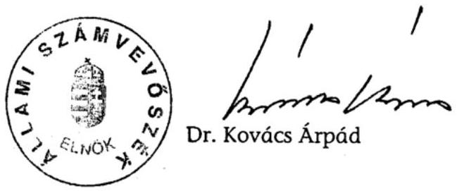
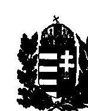

# JELENTÉS 

a Magyar Honvédség Szárazföldi csapatai működtetését szolgáló pénzeszközök hasznosulásának ellenőrzéséről

---

# 2. Államháztartás Központi Szintjét Ellenőrző Igazgatóság 

2.3. Átfogó Ellenőrzési Főcsoport

Iktatószám: V-24-51/2003-2004.
Témaszám: 670
Vizsgálat-azonosító szám: V0098

## Az ellenőrzést felügyelte:

Bihary Zsigmond
főigazgató
Az ellenőrzés végrehajtásáért felelős:
Hegedüsné dr. Müllern Veronika
főcsoportfőnök
Az ellenőrzést vezette:
Hudik Zoltán
igazgatóhelyettes
Az ellenőrzést végezték:

| Balkay Attila számvevő | Domonkosné Kurilla Edit számvevő tanácsos | dr. Király László számvevő tanácsos, tanácsadó |
| :--: | :--: | :--: |
| Mátyási József számvevő | dr. Pataki Magdolna számvevő tanácsos, tanácsadó | Tóth Bálint számvevő tanácsos, főtanácsadó |
| Trenovszki István számvevő tanácsos, főtanácsadó | Vásárhelyi Zoltán számvevő tanácsos |  |

## A témához kapcsolódó eddig készített számvevőszéki jelentések:

címe
Jelentés a Honvédelmi Minisztérium fejezet 1994-1995. évi
[313] költségvetésében és gazdálkodásában a haderőfejlesztési célok érvényesülésének pénzügyi-gazdasági ellenőrzéséről (1996.)
Jelentés a Magyar Honvédségnél a repülőcsapatok működésének [9821] pénzügyi-gazdasági ellenőrzéséről
Jelentés a Honvédelmi Minisztérium fejezet működésének [0017] ellenőrzéséről (2000.)
Jelentés a NATO Biztonsági Beruházási Programja (NSIP) keretében Magyarországon megvalósuló fejlesztések ellenőrzéséről A katonai védelmi beruházások ellenőrzéséről [9826] [9927] (évente) [0024] [0126]
Jelentés a központi költségvetés előirányzatai [9839] [9932] megalapozottságáról (évente) [0034]

---

# TARTALOMJEGYZÉK 

BEVEZETÉS ..... 7
I. ÖSSZEGZŐ MEGÁLLAPÍTÁSOK, KÖVETKEZTETÉSEK, JAVASLATOK ..... 10
II. RÉSZLETES MEGÁLLAPÍTÁSOK ..... 21

1. A haderő-átalakítás feltételrendszere, a katonai szervezetek integrációja ..... 21
1.1. A haderő-átalakítás szabályozási környezete ..... 21
1.2. A NATO katonai integrációs folyamatok és a haderő-átalakítás kölcsönhatásai ..... 25
2. A szárazföldi haderő személyi állományának, katonai szervezeteinek kiképzése, felkészítése, nemzetközi és hazai gyakorlatai ..... 31
2.1. A kiképzések és gyakorlatok tervezése ..... 31
2.2. A kiképzések és gyakorlatok szervezése, a végrehajtás személyi, technikai feltételeinek alakulása ..... 34
2.3. A hadműveleti, kiképzési területekre kiterjedő ellenőrzések, értékelések ..... 43
3. A katonai szervezetek kiképzésének, gyakorlatainak logisztikai támogatása ..... 48
3.1. A logisztikai támogatás rendszere ..... 48
3.2. A kiképzések, gyakorlatok logisztikai támogatottsága ..... 52
3.3. A logisztikai gazdálkodás információs rendszere ..... 58

## MELLÉKLET

Honvédelmi miniszter észrevétele

---

# RÖVIDÍTÉSEK JEGYZÉKE 

| ABV | Atom, biológiai és vegyivédelmi felszerelés |
| :--: | :--: |
| ABV RIÉR | ABV Riasztási és Értesítési Rendszer |
| ACE | NATO Szövetséges Európai Főparancsnokság (Allied Command Europe) |
| AFS | NATO Szövetséges Európai Főparancsnokság követelményei (Allied Command Europe - ACE - Forces Standards) |
| Áht | az államháztartásról szóló 1992. évi XXXVIII. törvény |
| AMF/L | Európai Szövetséges Főparancsnokság Mozgékony Szárazföldi Haderő (ACE Mobile Forces/Land) |
| ARRC | Szövetséges Gyorsreagálású Erők (Allied Rapid Reaction Corp.) |
| ÁSZ | Állami Számvevőszék |
| BMP | lövész páncélos |
| CAX | számítógéppel támogatott parancsnoki és törzsvezetési gyakorlat |
| CPX | dandár szintű parancsnoki és törzsvezetési gyakorlat |
| CRK | címrend kód |
| DCI | Washingtoni Védelmi Képességi Kezdeményezés (Defence Capability Initiative) |
| DOS | napi felhasználási érték (Day of Supply) |
| DP '05 | Dedicated Phalanx '05 |
| DPQ | Védelmi Tervezési Kérdőív (Defence Planning Questionnaire) |
| ehc szd | elektronikai harc század |
| EU | Európai Unió |
| f z | felderítő zászlóalj |
| Feladatterv | Integrációs Program kidolgozása |
| FG | haderő fejlesztési célok (Force Goals) |
| FG 0001 | haderőfejlesztési célok 2001-re (Force Goal 2001) |
| FP 2002- | haderőfejlesztési javaslatok 2002 (Force Proposal 2002) |
| gldd | gépesített lövész dandár |
| HIAP | NATO AFSOUTH Integrációt Elősegítő Program (Hungarian Integration Affirmation Program) |
| HM | Honvédelmi Minisztérium |
| HM 2. sz. TPSZI | HM 2. számú Területi Pénzügyi és Számviteli Igazgatóság |
| HM BBBH | HM Beszerzési és Biztonsági Beruházási Hivatal |
| HM GTH | HM Gazdasági Tervező Hivatal |
| HM HVK | Honvédelmi Minisztérium Honvéd Vezérkar |
| HM HVK Ht Csf-ség | HM HVK Haderőtervezési Csoportfőnökség |
| HM HVKF | Honvédelmi Minisztérium Honvéd vezérkari főnök |
| HM KÁT | Honvédelmi Minisztérium közigazgatási államtitkár |
| HM KPSZH | HM Központi Pénzügyi és Számviteli Hivatal |
| HM KVEH | Honvédelmi Minisztérium Költségvetési Ellenőrzési Hivatal |
| HM KVF | HM Közgazdasági és Vagyonfelügyeleti Főosztály |

---

| HM VGHÁT | HM védelemgazdasági helyettes államtitkár |
| :--: | :--: |
| HVK | Honvéd Vezérkar |
| HVK Hdm Csf-ség | HVK Hadműveleti Csoportfőnökség |
| HVK Hdm és Kik Csf-ség | HVK Hadműveleti és Kiképzési Csoportfőnökség |
| HVKF | Honvéd vezérkari főnök |
| Hvt | a honvédelemről szóló 1993. évi CX. törvény |
| KFF | Készenlét fokozása és fenntartása |
| KFOR | Koszovói Erő (Kosovo Force) |
| KFR | Készenlét fenntartásának rendszere |
| KGIR | Költségvetési Gazdálkodási Információs Rendszer |
| LGIR | Logisztikai Gazdálkodási Információs Rendszer |
| MC | NATO Katonai Tanácsa (NATO Military Committee) |
| MEDP | NATO Katonai Gyakorlatok Direktívája és Programja |
| MFO | Magyar Katonai Rendész Kontingens (Multinational Force \& Observer) |
| MH | Magyar Honvédség |
| MH KFF | Magyar Honvédség Készenlét Fenntartása és Fokozás rendszer |
| MH KT | MH Katonai Tanács. |
| MH LEP | Magyar Honvédség Légierő Parancsnokság |
| MH ÖHD | MH Összhaderőnemi Doktrína |
| MH ÖLD | MH Összhaderőnemi Logisztikai Doktrína |
| MH ÖLTP | MH Összhaderőnemi Logisztikai Támogató Parancsnokság |
| MH SZFP | Magyar Honvédség Szárazföldi Parancsnoksága |
| MH SZFPK | Magyar Honvédség Szárazföldi Parancsnok |
| MHGYDP | MH Gyakorlatok Direktívája és Programja |
| MHPK | Magyar Honvédség Parancsnoka |
| müdd | műszaki dandár |
| NATO | Észak-atlanti Szerződés Szervezete (Nord Atlantic Treaty |
|  | Organization) |
| NATO AFSOUTH | NATO Dél-Európai Szövetséges Erők (Allied Forces South Europe) |
| NATO Task List | NATO feladatlista |
| NRF | gyorsreagálású felderítő egység (NATO Response Force) |
| NTL | NATO feladatlista (NATO Task List) |
| OGY | Országgyűlés |
| OPEVAL | alegység értékelő módszer (Operational Evaluation) |
| PC | asztali (személyi) számítógép |
| PCC | Prágai Képességvállalások (Prague Capabilities Commitment) |
| SACEUR | Szövetséges Hatalmak Európai Legfelsőbb Parancsnoka (The Supreme Allied Commander Europe) |
| SFOR | Stabilizációs Erő (Stabilisation Force) |
| SHAPE | Szövetséges hatalmak Európai Legfelsőbb Parancsnoksága (Supreme Headquarters Allied Powers Europe) |
| STANAG | Szabványosítási egyezmény (Standardization Agreement) |

---

| TEEED | Kiképzési, oktatási ellenőrzési direktíva (Training Education   Evaluation Exercise Directive) |
| :-- | :-- |
| TPSZI | Területi Pénzügyi Számviteli Igazgatóság |
| TVTR | Tárca Védelmi Tervező Rendszer |
| vb z | vezetésbiztosító zászlóalj |
| VFIB | Védelmi Felülvizsgálatot Irányító Bizottság |
| VOCS | MH SZFP Vezetési Operatív Csoport |
| VTR | Védelmi Tervező Rendszer |
| ZMNE | Zrínyi Miklós Nemzetvédelmi Egyetem |

---

# JELENTÉS 

## a Magyar Honvédség Szárazföldi csapatai működtetését szolgáló pénzeszközök hasznosulásának ellenőrzéséről

## BEVEZETÉS

A Magyar Honvédség Szárazföldi Parancsnoksága (MH SZFP) a honvédség alkotmányos kötelezettségének teljesítése érdekében a szárazföldi erők részére meghatározott feladatok végrehajtásával, a szövetséges fegyveres erőkkel, azok haderőnemeivel együttműködésben hivatott biztosítani a Magyar Köztársaság területi integritását, továbbá a szövetségi kötelezettségeknek való megfelelés érdekében a szárazföldi hadműveleti feladatok megoldását, a szárazföldi haderőnem béke- és háborús feladatainak hadműveleti-harcászati szintű tervezését, szervezését, irányítását és ellenőrzését.

A Magyar Köztársaság biztonság- és védelempolitikájának megváltozása, valamint az egymást váltó kormányok eltérő haderő-alkalmazási elképzelései következtében többször változott a haderő átalakításának koncepciója. Legutóbb a 2002. évben indított ún. védelmi képesség felülvizsgálat tűzte ki célul a képesség alapú, finanszírozható, a nemzeti és a szövetségi elvárásokat ötvöző követelmény rendszernek megfelelő haderő kialakítását. Az átalakítás menetében - a NATO tagság valóra válásával, az Európai Unióhoz történő csatlakozási folyamat előrehaladásával - kulcskérdéssé vált a NATO katonai integráció mielőbbi végrehajtása.

A katonai szervezeteknél folyó kiképzés és felkészítés azt a célt szolgálja, hogy az alakulatok a küldetésük figyelembevételével meghatározott feladatok végrehajtására - önállóan vagy szövetségi kötelékben, a NATO műveleti szabványoknak megfelelően - képesek legyenek. A gyakorlatok rendeltetése, hogy fenntartsák és fejlesszék a vezető szervek, a parancsnokok és törzsek, a csapatok hadműveleti, harcászati, valamint együttműködési képességeit, azokat az elvárt készültségi szinteket, amelyek békeidőben, válsághelyzetben, illetve háborúban szükségesek számukra.

Az ún. logisztikai támogatással biztosítják a katonai képességek fenntartását a minisztériumi szervek és szervezetek szabályozása alapján - a logisztikai gazdálkodás központi-, haderőnemi-, végrehajtói (csapat, intézmény) szintjein. A katonai logisztika termelői ága (HM gazdasági blokkja és háttérintézményei) a Magyar Honvédség (MH) működéséhez szükséges erőforrásokat szolgáltatja, a fogyasztói ága - az MH logisztikai szervezetei közreműködésével - a honvédség működtetését biztosítja. Mindezek adtak alapot arra, hogy a szárazföldi had-

---

erőnem működésének ellenőrzési fókuszába a kiképzési folyamatokat és ezek logisztikai támogatását állítsuk.

Az MH SZFP hadtestparancsnokság jogállású haderőnemi parancsnokság, a gazdálkodás megszervezésének módjára tekintettel önállóan gazdálkodó, a költségvetési előirányzatok feletti rendelkezési jogosultság szempontjából részjogkörrel rendelkező költségvetési szerv. Az alárendelt katonai szervezetek gazdálkodása, irányítása szempontjából középirányító, gazdálkodási felügyeleti jogosultsággal rendelkező honvédelmi szerv. Az MH SZFP és az alárendelt csapatok pénzügyi és számviteli, ellenjegyzési és érvényesítési feladatait a HM 2. számú Területi Pénzügyi és Számviteli Igazgatóság látja el.

Az MH SZFP és alárendeltjei számára a költségvetési törvények 2002. és 2003. évekre a Honvédelmi Minisztérium költségvetési fejezet az MH Szárazföldi csapatai alcímen 29 Mrd Ft, illetve 36,4 Mrd Ft kiadási előirányzatot határoztak meg. A csapatok működtetéséhez a logisztikai támogatás összege 2002. évben a fejezet más alcíméről 16,5 Mrd Ft nagyságrendű volt, 2003-ra 19,8 Mrd Ft logisztikai támogatás teljesült. (A katonai szervezetek többségében központi, térítésmentes ellátás keretében jutnak technikai eszközökhöz, anyagokhoz, az elhelyezési és közüzemi szolgáltatásokhoz.)

Az Állami Számvevőszék a Honvédelmi Minisztérium (HM) költségvetési fejezetnél az államháztartás forrásait és azok felhasználását, valamint a vagyonnal való gazdálkodást az államháztartásról szóló 1992. évi XXXVIII. törvény (Áht) 120/A. § (1) bekezdése alapján ellenőrzi. A számvevőszéki ellenőrzések visszatérően figyelemmel kísérték a haderő-átalakítás folyamatát (a haderőfejlesztési célok érvényesülésének 1996-ban lezárt célellenőrzése, a 2000. évi átfogó ellenőrzés és a katonai védelmi beruházások 2003-ban lezárt teljesítményellenőrzése). Az MH szárazföldi haderőneménél számvevőszéki ellenőrzést első alkalommal végeztünk.

Az Állami Számvevőszékről szóló 1989. évi XXXVIII. törvény 2. § (3) és (5), valamint a 17. § (5) bekezdésben foglaltak alapján hajtottuk végre az MH szárazföldi haderőnem kiképzés és gyakorlatok végrehajtására felhasznált költségvetési kiadásokkal kapcsolatos gazdálkodás ellenőrzését.

Az ellenőrzés célja annak értékelése volt, hogy a Honvédelmi Minisztérium költségvetési fejezetnél a szárazföldi haderőnem működésénél:

- a haderő-korszerűsítés folyamatában megfogalmazott elvárások, követelmények nyújtottak-e kellő támpontot a katonai szervezetek kiképzésének, felkészítésének képesség-orientált kialakításához;
- a kiképzések, a gyakorlatok rendszere (tervezése, szervezése, végrehajtása és kiértékelése) a honvédelmi tárca NATO katonai integrációs programjához igazodóan, eredményesen szolgálta-e a személyi állomány, a katonai szervezetek felkészülését, a rendelkezésre álló költségvetési források célszerű felhasználását;
- a honvédség logisztikai támogató rendszerében a fogyasztói logisztika szervezettsége, forrása megfelelő feltételeket biztosított-e a kiképzési feladatokhoz és a gyakorlatokhoz.

---

A teljesítmény-ellenőrzés módszerével, rendszerszemléletű közelítésben tekintettük át a szárazföldi haderőnem működésének szabályozási hátterét. A kiképzések, a gyakorlatok, ezek logisztikai támogatásának szervezését, végrehajtását az eredményesség szempontjából értékeltük. A katonai szervezeteknél a kiképzések teljesítménye alapvetően az eredményesség oldaláról - a hadrafoghatóság és az alkalmazhatósági készség elért szintje alapján - közelíthető meg. A kiképzések, gyakorlatok logisztikai támogatása, mint feltételrendszer kapcsolódott az ellenőrzés tárgyköréhez, ezért gazdaságossági és hatékonysági szempontok szerinti értékelést ezúttal nem készítettünk.

Az ellenőrzés a szárazföldi haderőnem ${ }^{1}$ 2002-2003. évi kiképzési tevékenységére koncentrált, felhasználva az MH-nál a katonai szervezetek rendeltetésével összefüggésben végrehajtott ellenőrzések, értékelések tapasztalatait. A helyszíni ellenőrzés alapvetően az MH SZFP, valamint az MH Összhaderőnemi Logisztikai és Támogató Parancsnokság (MH ÖLTP) - kiképzések és gyakorlatok tervezésében, végrehajtásában, ezek logisztikai támogatásában érintett - katonai szervezeteire terjedt ki. Emellett az ellenőrzési kérdések megválaszolása szükségessé tette a tájékozódást a honvédség felső vezetési szintjén, a HM Honvéd Vezérkar (HM HVK) közvetlen alárendeltségében működő, a katonai szervezetek hadrafoghatóságáért, felkészítéséért és kiképzéséért felelős szervezeteinél is.

A végleges jelentést az Állami Számvevőszékről szóló 1989. évi XXXVIII. törvény III. fejezet 25. § (1) bekezdésének megfelelően észrevételezésre megküldtük Juhász Ferenc miniszter úrnak, aki megállapításainkat megalapozottnak tartotta, javaslataink realizálását eredményességet javító tényezőnek minősítette és jelezte, hogy javaslataink alapján hozott intézkedéseiről törvényes határidőben tájékoztatást ad (lásd: Melléklet).

[^0]
[^0]: ${ }^{1}$ Szárazföldi haderőnem: az MH Szárazföldi Parancsnokság és az alárendelt katonai szervezetei

---

# I. ÖSSZEGZŐ MEGÁLLAPÍTÁSOK, KÖVETKEZTETÉSEK, JAVASLATOK

Magyarország NATO tagságából adódó követelmény, hogy a magyar haderő képes legyen az együttműködésre a tagországok más katonai szervezeteivel, a szövetség katonai struktúrájába felajánlott erőink érjék el a számukra előírt képességeket ${ }^{2}$ és készenlétet, továbbá adott esetben a nemzeti haderő a Magyarország megsegítésére küldött szövetséges csapatok megérkezéséig a haza fegyveres védelmét el tudja látni. A szövetség részére felajánlott erők felkészítésének, kiképzésének célja az, hogy a számukra meghatározott feladatokat önállóan vagy a NATO illetékes parancsnoksága keretében végre tudják hajtani. A nemzeti és szövetségi elvárások teljesíthetőségi feltételeit mindenek előtt a szabályozási háttér áttekintésével vizsgálta az ellenőrzés.

E követelmények egyes elemei az Alkotmányban, a Magyar Köztársaság biztonság- és védelempolitikájának alapelveiről szóló, hatályban levő OGY határozatban megjelentek. Magyarország fegyveres erejének fő feladatai között határozták meg a haza katonai védelmét, a nemzetközi szerződésből eredő kollektív védelmi feladatok ellátását, a szuverenitás és a területi épség védelmét, illetve a Szövetség kollektív védelméhez való hozzájárulást.

Az ország-védelemben - konkrétan az Alkotmányban elrendelt fegyveres védelmi tervhez kapcsolódóan - az irányadó szabályozások (alapvetően a honvédelemről szóló 1993. évi CX. törvény) olyan harmonizációja, ami a nemzeti és szövetségi szerepvállalást együtt kezelné, a NATO tagországgá válást követően elmaradt. Azt, hogy az ország biztonságát a Szövetség tagjaként kell értelmezni, a helyszíni ellenőrzés befejezéséig mindössze a Magyar Honvédség 2004 - 2013 közötti időszakra vonatkozó átalakításának és új szervezeti struktúrájának kialakításáról szóló - 2003-ban hozott - kormányhatározat rögzítette. (Az Országgyűlés az ezzel kapcsolatos egyetértését csak a 2004. márciusi - a Magyar Honvédség hosszú távú fejlesztési irányairól szóló - határozatában fejezte ki.)

Az Alkotmányban előírt fegyveres védelmi terv, a honvédelmi törvény, a miniszteri, vezérkari főnöki éves feladatszabások, valamint a NATO szövetségi kiadványai, előírásai a kiképzési irányok meghatározásához szolgáltatnak alapot. Az ország-védelem felső szintű szabályozásában nem tükröződött egyértelműen, hogy a fegyveres védelmi terv egyes funkcióit a NATO Szövetséges Európai Főparancsnokság szintjén működő műveleti tervezési rendszer (melyben

[^0]
[^0]: ${ }^{2}$ Katonai képesség: a honvédség személyi állományának, vezető szerveinek, katonai szervezeteinek, technikai eszközeinek és anyagi készleteinek állapota, valamint annak előírt szinten tartását elősegítő más tényezők megléte, amelyek alkalmassá teszik a biztonságpolitikai célkitűzések megvalósítására, a törvényekben és más jogszabályokban meghatározott feladataik végrehajtására.

---

a műveleti tervek valós és potenciális fenyegetések figyelembevételével készülnek) átvette. (A jelzett követelményeknek megfelelően - a Miniszterelnöki Hivatal 2004. április 5-én kelt tájékoztatása szerint - megkezdődött a honvédelemről szóló törvény módosításának előkészítése és a kormányzati koordináció javítása terén is folyamatosan történnek lépések.)

A haderő-átalakítás koncepciója az elmúlt tíz évben többször változott. A korábbi átalakítások eredményeként a honvédség szervezete, létszáma lényegesen kisebb lett, vezetési struktúrája átalakult, viszont a szükséges haditechnikai fejlesztések elmaradtak. A haderőnem NATO katonai integrációja megfelelő koordináció hiányában relatív késéssel jutott a megfelelő pályára. A Szövetségnek felajánlott erők tekintetében - a NATO tagság első három évében - az azonnali és a gyors reagálású alakulatok integrációs folyamatát időben, ezzel szemben az ún. fővédő erők integrációjának előkészítő munkálatait csak két év múlva indították.

A honvédelmi tárca és az Magyar Honvédség vezetése 2002-ben hozott intézkedést a tárca integrációs programjának kidolgozására, majd a kormányváltást követően védelmi felülvizsgálatot rendelt el a nemzeti és szövetségi követelmények teljesítéséhez szükséges képességű, ugyanakkor finanszírozható haderő meghatározása céljából.

Az integrációs program készítését és a védelmi felülvizsgálat elemzéseit is jól hasznosítható segédeszközként szolgálhatták volna az alakulatok ún. haderőfejlesztési törzskönyvei ${ }^{3}$, amennyiben az elkészítésük elrendelésének időszakában haderőnemi szinten már rendelkeznek a szükséges információk teljes körével, de legalább a szövetségi követelmények kellő ismeretével. E feltételek hiányában a tárca szintű integrációs program eredeti elképzelések szerinti - alulról építkező, a haderőnemek integrációs terveire (a felkészítés, a kiképzés és a gyakorlatok önálló integrációs terveire) épülő, a katonai szervezetek haderőfejlesztési törzskönyveire alapozott - kidolgozás végrehajtása sikertelenné vált.

A honvédelmi tárca NATO katonai Integrációs Programját 2003 februárjában hagyta jóvá a miniszter, amiben a NATO ajánlások figyelembevételével határozták meg a Magyar Honvédség számára azokat a területeket - az oktatást, a kiképzést és felkészítést, a gyakorlatokat, valamint a védelmi tervezést -, melyek mentén az integráció megvalósítható.

A szárazföldi haderőnemnél a tárca szintű integrációs program alapján módosították az integrációs tervüket. Az átalakítás összetett, több szálon futó folyamatában - a Honvéd Vezérkar szakmai szervezetei koordinációs tevékenységének erősödése eredményeként - az alakulatok haderő-fejlesztési törzskönyvei már jó közelítéssel megfeleltek alaprendeltetésüknek (figyelembe véve a védelmi felülvizsgálat keretében kialakított új feladatrendet, hadműveleti követelményeket és struktúrát, továbbá a már ismert szövetségi előírásokat). Ezzel együtt - többszöri átdolgozásuk után is - maradtak tisztázatlan területek, pl. az

[^0]
[^0]: ${ }^{3}$ haderő-fejlesztési törzskönyv: a katonai szervezet okmánya, melyben a vele szemben támasztott követelményeket és ezek teljesítésének megítéléséhez szükséges adatokat rögzítik

---

MH SZFP háborús és béke vezetési struktúrájának kialakítására, valamint a HM és az MH ÖLTP közötti feladatmegosztásra vonatkozó döntések elhúzódása miatt.

A szövetségi rendszernek a logisztikai interoperabilitás ${ }^{4}$ biztosítására vonatkozó elvárását szintén a tárca szintű integrációs program közvetítette az MH szervezetei felé. Az integráció minimális szintjének elérését eredetileg 2005-re, a teljes integráció megvalósítását 2010-re tervezte a központi logisztikai feladatokat ellátó szervezet. A tárcánál 2003-ban végrehajtott szervezetkorszerűsítésre és a védelmi felülvizsgálat tapasztalatain alapuló változásokra tekintettel a logisztikai terület integrációs folyamatát az MH 2004 - 2013 közötti időszakra vonatkozó átalakításához igazították.

A HM vezetése a védelmi felülvizsgálat első szakaszában a haderő 2013-ra kialakítandó struktúráját - mivel a megfelelő tartalmú haderő-fejlesztési törzskönyvek a feltételek hiányában nem állhattak rendelkezésre - egy központilag (a CUBIC csoport ${ }^{5}$ és a HVK együttműködésében) létrehozott adatbázisra alapozva készítette el. Erre építve indult a haderőfejlesztés tízéves tervének a kidolgozása. Célként határozták meg a NATO tagságból levezethető követelményekkel szinkronizáló képességek és ezek készenléti idejének megfogalmazását, továbbá a haderőfejlesztés, az infrastruktúra és a kiképzés területén szükséges változtatások hozzárendelését, mindehhez igazodó csapatstruktúrák kialakítását. A kidolgozói munkával párhuzamosan folyik az alakulatok átalakítása is.

Lényegében a tíz évet átfogó haderőfejlesztés tervezési munkái eredményeként válhat majd láthatóvá a 2013-as haderőkép költségvetési realitása. Ebben a munkában érvényesülhet érdemben a haderő-fejlesztési törzskönyvek haderőtervezést segítő funkciója - a törzskönyvi alapadatok ún. beárazásával - a perspektivikus döntések költségvetési realizálhatóságának visszaigazolása révén. Ezt támasztja alá, hogy a védelmi felülvizsgálat első szakaszának - előzetes számításokon alapuló - döntései a tíz éves erőforrás-tervkészítésnél, illetve a részfeladatok ütemezésénél már igényeltek korrekciót.

A jövőkép tervezési bizonytalanságát hordozza még, hogy a szövetségi követelmények is módosulhatnak, a képesség-orientált haderő kialakítását önkéntes haderőre való áttéréssel párhuzamosan kell végezni, érvényesíteni kell azt az alapelvet, hogy a katonák csak a hadsereg alaprendeltetésével összefüggő feladatokkal foglalkozzanak. A NATO parancsnoki és haderő struktúrájának napirenden levő korszerűsítése keretében folyó egyeztetések újabb korrekciókat tettek/tesznek szükségessé.

Az önkéntes haderőre történő átállás becsült többletköltségének kompenzálására - a GDP %-os arányában prognosztizált éves költségvetések mellett - nem

[^0]
[^0]: ${ }^{4}$ interoperabilitás (együtt alkalmazhatóság): a technikai rendszerek vagy egységek azon képessége, hogy más rendszereknek vagy egységeknek szolgáltatást nyújtsanak, illetve azoktól szolgáltatást fogadjanak
    ${ }^{5}$ CUBIC csoport: a Magyar Köztársaság és az Amerikai Egyesült Államok kormányai közötti segélyegyezmény keretében tanácsadásra szerződtetett vállalkozás

---

számíthat a költségvetési fejezet. A sorállomány kiváltásán túl, az említett alapelv érvényesítése érdekében több feladatot (őrzés-védelem, infrastrukturális ellátás, élelmezés, gyakorlóterek működtetése terén) át kell szervezni, szolgáltatásként kell megvásárolni. A tárca ezek költségvonzataival összefüggésben végzett számításai tíz évre, mintegy 250-300 Mrd Ft ráfordítási igényt jeleztek. A költségek nagyságrendje figyelmeztet arra, hogy az átalakítás végső döntéseit komplex közelítéssel, részletes gazdasági számításokkal, elemzésekkel kell megalapozni. Ennek hiánya kockázati tényezőnek tekinthető a képességorientált haderő terv szerinti kialakításában, ami a haderő tervezés menetében készített kockázatelemzésekből is kitűnt.

Az új haderőstruktúra kialakításának fontos kérdése az új képességeknek megfelelő kiképzési rendszer kialakítása. A Magyar Honvédség a tervek szerint 2005. március elsejétől egy teljesen új kiképzési rendszerre tér át, amely már csak a hivatásos és szerződéses katonákkal számol. Ebből következett, hogy a teljesítményellenőrzés fókuszába állított kiképzési rendszert és ennek logisztikai támogatottságát a folyamatosan változó körülmények között lehetett értékelni.

A NATO tagországgá válást követően - 2000-ben - történtek lépések a szövetségi követelményeket figyelembe vevő kiképzési rendszer kialakítására. A kiképzés, felkészítés képesség-orientálttá, doktrína-bázisúvá tételére azonban csak 2003-ban hoztak intézkedéseket (a HM Honvéd Vezérkar (HM HVK) főnöki intézkedése rendelkezett az MH kiképzési doktrína kiadásáról, ami összhangban van a honvédelmi tárca NATO katonai Integrációs Programban megfogalmazott célkitűzésekkel). A közbenső időszakban a honvédség, a szárazföldi haderőnem kiképzésének követelményeit és feladatait az évente kiadott miniszteri irányelvekben, HM HVK intézkedésekben határozták meg.

Szakmai oldalról a szárazföldi haderőnem adott évre vonatkozó hadműveleti feladatai adtak alapot az alárendeltjei felkészítésének és kiképzésének differenciált, cél- és feladat orientált rendszerű meghatározásához, melyben a reagáló erők képességének fenntartása, szövetségi kötelékben való alkalmazása, valamint a fővédőerőknek a NATO Dél-Európai Szövetséges Erőkhöz történő integrációja kapott prioritást. A parancsnokok és a törzsek felkészítését a csapatok kiképzésével összhangban tervezték. Olykor ad hoc jellegű kiképzésre is szükség volt a változó követelményekhez igazodás érdekében (olyan alegységek felkészítésénél, melyek egyébként az MH hadrendjében nem szerepeltek).

A kiképzési követelmények és feladatok kidolgozásának felelősségét 2002-től megosztották a koordináló HVK szervek és a kiképzésben érintett katonai szervezetek MH szintű parancsnokai között. A kiképzés irányításában a parancsnoki felelősség meghatározása - a korábbi évek gyakorlatához képest - a szakmai mozgástér növelését jelentette. A kiképzések anyagi biztosítása terén parancsnoki hatáskörbe a reális igény-meghatározás és a célirányos forrásfelhasználás tartozik. Ez megfelel a szövetség haderőinél alkalmazott gyakorlatnak, miszerint az anyagi ellátást a logisztikai támogatás keretében és felelősségével biztosítják.

Mégis látszólagos ellentmondásként feszült, hogy a HVK intézkedés a kiképzések végrehajtásához szükséges anyagi forrásról nem rendelkezett, ugyanis az anyagi források biztosítása - döntő többségében (mintegy 90\%-ban) - a köz-

---

ponti ellátó szervek feladata. Az ellenőrzött időszakban előfordult ellátási gondok több tényező hatásával (a kiképzési rendszer átalakításának átmeneti kiforratlanságával, a soron kívüli feladatok jelentkezésével és nem utolsó sorban a behatárolt költségvetési forrásokkal) hozhatók összefüggésbe, és nem a hatásköri megosztottságra vezethetők vissza. (Pl. az újonnan alakított kontingensek felkészítésénél fordult elő, hogy az állománytáblában szereplő felszerelések, anyagok nem a kellő mennyiségben álltak rendelkezésre a kiképzés megkezdéséhez.)

A kiképzési feladatok tervezése a tárca szintű elképzelések szerint Védelmi Tervező Rendszer (VTR) alrendszereként valósul meg. A VTR több éve megkezdett fejlesztését azonban még nem fejezték be, amely 2003. februártól Tárca Védelmi Tervező Rendszer (TVTR) megnevezéssel folytatódott. A kiképzési kiadások tervezéséhez a normatív erőforrás tervező alrendszer nem készült el, annak ellenére sem, hogy a tárca vezetése 2002-től a fejlesztés felgyorsítását határozta el. A fejlesztő munka elakadását, a VTR és alrendszerei alkalmazásának szükségességét a korábbi számvevőszéki ellenőrzések ${ }^{6}$ is visszatérően jelezték.

A haderő-átalakítás folyamatában mindeddig jellemző volt, hogy a honvédség működtetésének erőforrás igénye - a létszám- és szervezetcsökkentések után is meghaladta a költségvetési támogatás lehetőségeit (részben a fejezetet érintő megvonások, valamint az év közben jelentkező kiemelt feladatok biztosítása következtében). Így a feladat alapú költségvetés tervezés, a feladatok és a források összhangja egy időben nem valósulhatott meg. A szárazföldi haderőnem felkészítésének, kiképzéseinek költségvetési tervezése - más feladatok tervezéséhez hasonlóan - a HM HVK éves feladatszabása alapján a tárgyévet megelőző, igény összeállítással vette kezdetét. A végrehajtható feladatok konkrét meghatározása - a prioritások figyelembevételével - már a jóváhagyott költségvetési sarokszámok ismeretében történt.

A kiképzési, felkészítési feladatok erőforrás igényének tervezését aktualizált kiképzési normák nem segítették. A kiképzés új normáinak kidolgozását 1998-ban megkezdték, de az átdolgozás eredménytelensége miatt szakáganként továbbra is az évtizedek óta nem aktualizált, tartalmilag érdemben nem módosított normák (pl. az 1973-ban bevezetett hadianyag norma) álltak rendelkezésre.

Az nem igényel különösebb magyarázatot, hogy az elévült normák a NATO alkalmazási elveinek megfelelő kiképzési feladatok tervezéséhez lényegében használhatatlanok. Továbbá az a következtetés is levonható, hogy csak a finanszírozható haderő kialakítása teremti meg a megalapozott normák kialakításának, egyben a reális költségvetés készítés feltételét. Amíg a szakmai igények meghaladják a költségvetési teljesíthetőség határát, a kiképzési követelményekhez igazított normatívák sem biztosíthatják a valóban teljesíthető erőforrás igények tervezését. Ugyanakkor az MH felkészítésére és kiképzésére vonatkozóan 1998-ban készített normajegyzék aktualizálása érdemben segítheti a finanszírozható haderő megvalósítása érdekében folyó tervező munkát.

[^0]
[^0]:    ${ }^{6}$ Lásd: az 1996-2003. években készített - a honvédelmi tárcát érintő - számvevőszéki jelentések [313], [0017], [0333] javaslatai

---

A haderőnem működtetéséhez rendelkezésre álló költségvetési előirányzatokat decentralizáltan jelenítették meg a tárca költségvetésében. A központosított előirányzatokból és az intézményi költségvetésből történő egyidejű finanszírozás, valamint a költségek jelentős hányadát lefedő természetbeni ellátás (logisztikai támogatás) következtében a gazdasági eseményekhez kapcsolódó mechanizmus (kötelezettségvállalás, ellenjegyzés) is többszintű. A munkafolyamatok - átláthatóságot javító, hatékonyabb kezelést biztosító - racionalizálására a logisztikai támogatás rendszerének megkezdett korszerűsítésében kell figyelmet fordítani.

A nemzetközi és hazai felkészítési, kiképzési rendezvények, gyakorlatok (továbbiakban: gyakorlatok) tervezhetőségét, végrehajtását kedvezőtlenül érintette az MH integrációs tervkészítésének elhúzódása, emellett az a körülmény, hogy a mérvadó követelményeket támasztó dokumentumok - a NATO Európai Főparancsnokság Csapatkövetelmény előírásai és a NATO Feladatjegyzék (NATO Task List) - teljes körűen 2002-ben nem álltak az MH SZFP rendelkezésére, valamint a meglévők feldolgozása vontatottan haladt.

A gyakorlatok tervezésének és elszámolásának rendszerét - a 2002-ben hozott HM HVK intézkedéssel - elvileg számon kérhető módon határozták meg. Ennek ellenére a nemzetközi és a hazai gyakorlatok eltérő finanszírozási rendje mellett nem alakult ki a források kezelésének egységes gyakorlata. (A nemzetközi gyakorlatok kiadásait központi forrásokból, központilag meghatározott cím-rend-kód kötelező alkalmazásával finanszírozták, míg az intézményi költségvetésből megvalósuló hazai gyakorlatoknál a címrend kód alkalmazása eseti jellegű volt.)

A szárazföldi haderőnemnél folyamatosan karbantartották a kiképzés személyi feltételei elemzéséhez szükséges kimutatásokat, hasznosították a külföldi szolgálatról visszatértek tapasztalatait. A humán erőforrás értékelő rendszer alkalmazásával 2001-től végzik az állomány - NATO kompatibilis - teljesítményértékelését, ami megfelelő alapot nyújt a kiképző állomány kiválasztásához, a külföldi szolgálatokra érkezett pályázatok elbírálásához, valamint a kiképzést szolgáló beiskolázási, nyelvi képzési feladatok tervszerű kivitelezéséhez.

A hivatásos, szerződéses és sorozott állomány 2002-2003. évi békeidős feltöltöttségét - egyes állománykategóriákban időszakosan mutatkozó növekedés mellett - általában a létszámhiány jellemezte. Az önkéntes haderőre történő átállási folyamatot is alacsony feltöltöttség és egyúttal magas fluktuáció kísérte (a bevonultak jelentős hányada még próbaidő alatt leszerelt, 2003 végén a szerződéses állomány a tervezett létszám 81\%-át érte el). A kiképző létszám 23\%-os hiányát - a betöltetlen, kiképzést közvetlenül irányító tiszti és tiszthelyettesi, valamint a kiképző szerződéses beosztások kedvezőtlen hatását - a kiképzések hatékonyság-csökkenésének megelőzése érdekében a meglévő állomány túlterhelésével igyekeztek kompenzálni, ami hosszabb távon nem lehet megoldás.

A szolgálati- és munkaviszonyra vonatkozó jogszabályi előírások szerint végrehajtott egyéni képzések (beiskolázások, tanfolyami elfoglaltságok stb.) a kiképzési feladatok és gyakorlatok teljesítéséhez szükséges készségek, képességek továbbfejlesztését szolgálták. Ugyanakkor az állománycsoportok munkaidő felhasználásának kimutatásaiban szerepeltek, a távollétek magas értékét előidéző okok

---

között. Több tényező - a hazai és külföldi tanfolyamokon való részvétel, a külföldi szolgálatra történő felkészítés és maga a külföldi szolgálat, a 24 órás szolgálatot követő pihenőnap kivétele, az évi rendes és az egészségügyi szabadság igénybevétele - együttes hatásaként valóban magas, szervezési intézkedéseket igénylő távolléteket mutattak ki. (A tiszti állomány rendszeresített éves munkaidejének 63,8\%-a, a tiszthelyetteseké 52,3\%-a, a szerződéses legénységi állományé 59,3\%-a hiányzott, illetve kiesett a napi feladatok végzéséből.)

Az MH SZFP értékelése szerint, ahol a külszolgálatról hazatérőket bevonták a kiképzésbe, ott a felkészítés színvonala magasabb volt. (Pl. a békemissziók tapasztalatai alapján vezették be a rövid távolságra történő lövészet gyakorlását stb.) A tapasztalatátadás hasznossága mellett, a kiképzésben relatívan kedvezőtlenebb feltételeket jelentett a hazai kiképző beosztásban lévő, külszolgálati tapasztalattal rendelkezők alkalmazásánál a huzamosabb idejű - az egyéb kötelezettségeik miatt indokolt - távollétük. E problémakör kezelése meghaladta a parancsnoki hatáskört, viszont a megoldására lehetőséget kínál a katonai kiképzés és képzés rendszerének - napirenden levő - új követelményekhez igazodó átalakítása (amit egyébként a Magyar Honvédség hosszú távú fejlesztésének irányairól 2004. márciusában hozott OGY határozat a fő feladatok között fogalmazott meg).

A tudatosan szorgalmazott nyelvi képzés és a felsőfokú tanintézetekben szerzett nyelvismeret eredményeként a HM SZFP ténylegesen betöltött személyi állományának több mint fele (56,5%) rendelkezik angol nyelvvizsgával. A felajánlott alakulatok felkészítése lehetővé tette a békemissziókban való részvételt. A fokozatos fejlődés mellett kedvezőtlenebb képet mutatott a szárazföldi haderő alárendeltjei állományának angol nyelvismerete, kevés a kommunikációképes nyelvtudással rendelkező tiszt és tiszthelyettes.

A kiképzés-technikai eszközgazdálkodás központi szinten integrálódott a logisztikai tervezés, ellátás rendszerébe. A katonai szervezetek a központi logisztikai gazdálkodás keretében - az MH Összhaderőnemi Logisztikai és Támogató Parancsnokság (MH ÖLTP) szervezetei közreműködésével, a szakági ellátó központok útján - kapták meg a feladatellátáshoz szükséges technikai eszközöket, anyagokat, jutottak szolgáltatásokhoz, a költségvetési fejezet más alcímén tervezett előirányzatok, illetve a központi készletek terhére.

A központi logisztikai támogatás feladat-megosztási rendjében - a fegyverzeti (pl. gyakorlólőszer) és a gépjárműtechnikai oktatási eszközök kivételével önálló ágazatot képez a több-száz tételű cikkjegyzékkel bíró kiképzés-technikai eszköz és szakanyag ellátás. A kiképzés-technikai eszközöket viszont nem tartották az alakulatok haderő-fejlesztési törzskönyvében kimutatandó, állománytáblás haditechnikai eszköznek, így fejlesztésükre, fenntartásukra - gazdálkodási prioritásokra tekintettel - a maradékelv szerint tervezték a kiadási előirányzatokat az MH ÖLTP költségvetésében. A haditechnikai eszközellátás ilyen alapú differenciálásából eredően - a kiképzési feladatok teljesítését érintő hátrányok csak a finanszírozható haderőkép meghatározását követően, a ténylegesen feladatalapú költségvetés-tervezés esetében nem jelentkeznek.

A katonai szervezetek rendelkezésére álló kiképzés-technikai eszközök, berendezések állapota rendkívül vegyes képet mutatott, egyaránt megtalálhatók az el-

---

avult, de a kiképzéshez még használható és a korszerű, számítógép vezérlésű eszközök. A kedvezőtlen kép kialakulásában szerepet játszott, hogy 2001 és 2003 között minden évben csökkentették a kiképzés-technikai eszközbeszerzési, felújítási, üzemeltetési tervek beruházási tételeit. A védelmi felülvizsgálat nyomán módosuló haderőstruktúra velejárója az is, hogy a közelmúlt egyes beszerzései, fejlesztései (pl. a BMP lánctalpas páncélozott gyalogsági harcjármű hadrendből tervezett kivonása következtében) nem hasznosulnak.

A költségigényes haditechnikai fejlesztések jelentették a haderő-korszerűsítés szűk keresztmetszetét az átalakítási folyamat bármely időszakában. Az átalakítás korábbi terveiben ezért tolódott a technikai korszerűsítés a tíz évet átfogó időszak végére. (A korszerűsítés ilyen ütemezésének kockázataira a korábbi számvevőszéki ellenőrzések már igyekeztek felhívni a figyelmet. ${ }^{7}$ ) Figyelemmel a technikai eszközök állapotára, a 2013-ig terjedő átalakítás tervezése menetében célszerű a technikai fejlesztések időarányos ütemezéséről gondoskodni. (2003-ban a 67 eszközcsoportból mindössze 17-nél volt 90\%-ot elérő a hadrafoghatóság, aminek elérését a készenlét fenntartásának és fokozásának követelményeként írtak elő).

A parancsnokok, törzsek döntési helyzeteinek modellezését a rendszeresített szimulációs rendszerek, illetve a haditechnikai eszközök kezelésének begyakorlását a szimulátorok szolgálják. Alkalmazásuk hozzájárul a képzettség objektív értékeléséhez, emellett azzal az előnnyel is jár, hogy a felhasználásukkal megtakaríthatók a valós csapatok igénybevételével egyébként együtt járó kiadások. A felhasználói tapasztalatok elemzése azonban a helyőrségeknél nem vált általánossá, ehhez mindössze a központilag elrendelt gyakorlatok értékelési jegyzőkönyvei szolgáltattak adatokat. A fejlesztési lehetőségek forrásfüggősége irányítja a figyelmet - a felhasználói értékelések útján - a nagy értékű szimulációs rendszer- és eszközbeszerzések tervezésének, a kiképzés-technikai fejlesztések prioritásainak megalapozottabbá tételére.

A szárazföldi haderőnemnél a kiképzési létesítményekről és technikai eszközökről nem vezettek egységes, központi nyilvántartást, azok csak az alakulatok kimutatásában szerepeltek. Így a költségvetésben jóváhagyott, felhasznált összegek elégséges vagy elégtelen voltának megítélését nem tette lehetővé. A MH SZFP jelentései azt tükrözték, hogy a kiképzéshez szükséges gyakorló és kiképzési objektumok biztosítják a kiképzési feladatok végrehajtását. Ennek az általános értékelésnek még nem feltétlenül mond ellent, hogy egyes objektumokon nem folytattak kiképzést, mivel az elmaradt karbantartások miatt a kiképzési feladatok végrehajtására alkalmatlanná váltak, felújításra szorulnak (a vezetési pályáknál a mobil elemeket elhasználódás után nem pótolták, a stacioner elemek felújítást igényelnek).

A haderőnemi logisztikai támogatás szintjén az MH SZFP Logisztikai Főnökség irányította és szervezte az alárendelt alakulatok anyagi és technikai eszközeinek üzemeltetését, fenntartását, vagyonhasználatát és készletgazdálkodását, mindehhez tervezte a szárazföldi haderőnem éves logisztikai költségvetését. Az

[^0]
[^0]:    ${ }^{7}$ Lásd: a 2000-2003. években készített - a honvédelmi tárcát érintő - számvevőszéki jelentések [0017], [0333] megállapításai, következtetései

---

MH SZFP részére jóváhagyott költségvetések viszont nem tartalmazták a nemzetközi feladatok (a missziós feladatok logisztikai előirányzatai, a nemzetközi gyakorlatok) fedezetét, azokat évközi előirányzat-módosítással biztosította a fejezet szintű gazdálkodásért felelős központi szerv (HM KPSZH).

A fejezetnél működő - a gazdasági események pénzmozgás szerinti követésére alkalmas - Költségvetés Gazdálkodási Információs Rendszer (KGIR) továbbfejlesztése útján, logisztikai gazdálkodási információs alrendszer (LGIR) létrehozásával kívánták megoldani a logisztikai feladatellátás információ igényének teljes körű kiszolgálását. A miniszteri jóváhagyású LGIR fejlesztés előkészítésének, rendszerszemléletű kezelésének hiányosságai (az LGIR alkalmazói szoftver választását a kivitelezés időszakára halasztották, a döntések megalapozásához az előkészítés dokumentációja nem tartalmazott az alkalmazási rendszerekhez kapcsolódó költség kimutatásokat), a szoftveralkalmazás tisztázását megelőző eszközbeszerzések célszerűtlen megoldásokhoz vezettek. A szoftver kiválasztás körüli döntésképtelenség a fejlesztés elhúzódását eredményezte.

Az LGIR fejlesztés keretében 2001-2002 között nagy - közel 5 Mrd Ft - értékű eszköz- és szolgáltatás beszerzésre kötöttek szerződéseket, amiből 2002 áprilisáig közel 1,5 Mrd Ft összegű beszerzést realizáltak.

A beszerzett, raktáron lévő PC munkaállomásokat, laptop számítógépeket és nyomtatókat - a fejlesztés már látható elhúzódására, az eszközök gyors avulására, a garanciavesztés feloldására is tekintettel - az MH ÖLTP szakmai indoklással alátámasztott javaslatára kiosztották a KGIR programrendszert alkalmazó logisztikai, számviteli, pénzügyi szervezetek között, ami hozzájárult a logisztikai feladatellátás számítástechnikai hátterének szükségszerű színvonal emeléséhez. Ugyanakkor az eredeti cél szerinti felhasználás elmaradt, a logisztikai feladatellátás üzemgazdasági szempontú követésének lehetősége halasztódott. (A honvédelmi miniszter - a helyszíni ellenőrzést követően - az LGIR fejlesztése keretében realizált számítástechnikai eszköz beszerzésre vonatkozó döntés körülményeinek tisztázására belső vizsgálatot rendelt el.)

Időközben a tárcánál nyilvánvalóvá vált, hogy az MH Légierő Parancsnokság hadrafoghatóságának prioritása (MIG alkatrész-igény kielégítése) csak forrás átcsoportosítással kezelhető. Ennek érdekében született döntés az LGIR fejlesztés átmeneti szüneteltetésére, az informatikai előirányzat összegének csökkentésére, a fejlesztés folytatásához szükséges fedezet 2004 - 2005. évekre való átütemezésére.

A katonai szervezetek működésének (szakmai tevékenységének, költségvetési gazdálkodásának) ellenőrzéséhez a HM és MH szintű szabályozások megfelelő keretet adtak. A szárazföldi haderő szervezeteinél az ellenőrzött időszakban végrehajtott - a különböző vezetési szintekhez (HVK, SZFP stb.) rendelt - felügyeleti ellenőrzéseinél az értékelés szempontjait az ellenőrzési programokban fogalmazták meg, ezek egységes szabályozását 2003-ban valósították meg. A NATO-nál alkalmazott ellenőrzési követelmény és értékelési módszer adaptálásával készített Ideiglenes Szakutasítás kiadása teremtette meg a katonai szervezetek képesség alapú ellenőrzésének, objektív hadműveleti és harcászati értékelésének feltételét.

---

A katonai szervezeteknél a felkészítés, kiképzés eredményessége a hadrafoghatóság és az alkalmazhatósági készség elért szintjének kimutatásával mérhető. Ehhez határozták meg az Ideiglenes Szakutasításban az egyértelmű, számon kérhető követelményeket, hozzárendelve az értékelés szubjektivitás minimalizálására alkalmas mennyiségi és minőségi kritériumait. (Az "ideiglenes" jelző a védelmi felülvizsgálatot követően szükségessé váló korrekciókra utalt.)

A szárazföldi haderőnemnél végzett ellenőrzések visszatérően jelezték a folyamatosan változó feltételek között működő katonai szervezetek gondjait (kiképző eszközök hiányát, létszámfeltételek kedvezőtlen alakulását), de ezek megszüntetése - a központosított gazdálkodásból adódóan - általában meghaladta a csapatok, a haderőnem vezetésének lehetőségeit.

A szövetségi rendszerben a tagországok felajánlott erői képességének, készenlétének mérése, az ún. OPEVAL alegység értékelő módszer ${ }^{8}$ alkalmazásával NATO szemlélők bevonásával - nemzeti hatáskörbe tartozik. A módszer elsajátítása - bár az irányadó szabályozások kiadása elhúzódott - jó irányba halad, amit a felajánlott szárazföldi alakulatoknál végzett ún. gyakorló ellenőrzések igazoltak. Az OPEVAL ellenőrzések jelentősége abban áll, hogy lényegében Magyarország szövetségi vállalásait a NATO ilyen szempontok alapján értékeli.

A felkészülési és a gyakorló ellenőrzések is jelezték a nemzeti felelősség körébe tartozó hiányosságokat (felszereléssel, haditechnikai eszközökkel való részleges ellátottságot). Tekintettel arra, hogy a folyamatos átalakítással felszabaduló eszközök átcsoportosítása adta mozgástér sem volt elegendő a katonai szervezetek hiánytalan felszereléséhez, a hiányosságok felszámolását 2006-ra prognosztizálta a tárca. Az ellenőrzés megítélése szerint az érdemi előrelépés feltétele a hosszú távon finanszírozható haderőkép meghatározása.

Az ellenőrzés tapasztalataira épülő következtetéseink alapján:

# az Országgyűlés Honvédelmi Bizottsága figyelmébe ajánljuk 

a Magyar Köztársaság Alkotmányában előírt fegyveres védelmi terv céljához és tartalmához kapcsolódó szabályozási háttér áttekintését, az ország-védelemmel kapcsolatos feladatok és a Magyarország NATO tagságával együtt járó követelmények összhangjának teljesülése szempontjából.

A helyszíni ellenőrzés megállapításainak hasznosítása mellett javasoljuk:

## a Kormánynak

tegye meg a szükséges intézkedéseket az ország-védelemmel kapcsolatos jogszabályi háttér Magyarország NATO tagságával harmonizáló kialakításához, annak figyelem-

[^0]
[^0]:    ${ }^{8}$ OPEVAL (Operational Evaluation): a NATO Szövetséges Európai Főparancsnokság alárendeltségébe utalt katonai szervezeteket - követelmények teljesítése alapján - értékelő módszer

---

bevételével, hogy az ország fegyveres védelmét a Magyar Honvédségnek szövetségesi környezetben kell biztosítani.

# a honvédelmi miniszternek 

1. Gondoskodjon:
a) a haderő átalakítására vonatkozó döntéseknél - hatástanulmányok, gazdasági számítások megkövetelésével - a finanszírozhatóságot befolyásoló kockázati tényezők teljes körének figyelembevételéről, különös tekintettel a szövetségi követelmények egyeztetési folyamataira, az önkéntes haderőre való áttérés, a sorállomány kiváltás és a katonák alaprendeltetésű foglalkoztatását biztosító változtatások (egyes tevékenységek költségvetési körön kívülre szervezésének) költségvetési összefüggéseire;
b) a NATO és a hazai védelmi tervezés folyamatának harmonizálásáról, a Tárca Védelmi Tervező Rendszer (és alrendszerei) alkalmazhatósági szintre hozásáról;
c) a gyakorlatok finanszírozási rendjének racionalizálásáról, ezen a téren is a költségvetési forrás-felhasználás átlátható kezeléséről.
2. Intézkedjen a HM Honvéd Vezérkar főnöke felé, hogy hatáskörében gondoskodjon:
a) a haderő-átalakítás menetében a kidolgozói munka eredményes végrehajtásához szükséges feltételek (szakmai és pénzügyi-gazdasági információk, dokumentációk) időben történő biztosításáról, a belső kommunikáció, információátadás hatékonyabb szervezéséről;
b) a honvédség vezetési szintjeihez rendelt felügyeleti ellenőrzések, valamint a képesség alapú ellenőrzések (Ideiglenes Szakutasítás alapján végzett ellenőrzések és OPEVAL értékelések) megállapításainak érdemi feldolgozásáról, ezek figyelembevételével a katonai szervezetek (közöttük a felajánlott erők) képességeinek és harckészültségének követelményeknek megfelelő szintre hozása és a nemzeti hatáskörbe tartozó hiányosságok felszámolása érdekében szükséges intézkedések foganatosításáról.
c) az MH Szárazföldi Parancsnokság parancsnoka tegye meg a szükséges intézkedéseket:

- az alárendelt állomány - NATO katonai integrációval kapcsolatos - ismeretszerzésének felgyorsításáról, a szövetségi kötelékben történő alkalmazás (együttműködés, kommunikáció) személyi feltételeinek javítása érdekében;
- a kiképzés-technikai eszközök, berendezések - különösen a nagy értékű szimulátorok, szimulációs rendszerek - helyőrségi felhasználói tapasztalatainak elemzéséről, a fejlesztési, beruházási igények meghatározásánál az értékelések hasznosításáról.

---

# II. RÉSZLETES MEGÁLLAPÍTÁSOK 

## 1. A HADERŐ-ÁTALAKÍTÁS FELTÉTELRENDSZERE, A KATONAI SZERVEZETEK INTEGRÁCIÓJA

### 1.1. A haderő-átalakítás szabályozási környezete

A haderő átalakításának 1995-1999. időszakában a honvédséggel szemben általánosságban megfogalmazott politikai-társadalmi követelmények, elvárások nem adtak megfelelő támpontot a katonai vezetés számára, az alapvetően feladatorientált katonai szervezetek képesség-centrikus kialakításához (a béke- és háborús feladatok képesség alapú hadműveleti-harcászati szintű tervezéséhez, szervezéséhez, irányításához és ellenőrzéséhez, az egyes alakulatok képesség-orientált kiképzéséhez és felkészítéséhez). Ennek is meghatározó szerepe volt abban, hogy az egyes haderő-átalakítási koncepciók céljainak meghatározásakor nem tudtak egyértelmű, időtálló és finanszírozható, a nemzeti és a szövetségi elvárásokat ötvöző követelményrendszert kialakítani.

A Magyar Köztársaság biztonság- és védelempolitikájának megváltozása, valamint az egymást váltó kormányok eltérő haderő-alkalmazási elképzeléseinek következtében többször változott a haderő átalakításának koncepciója. Az egyes átalakítási koncepciókat és végrehajtási terveket azonban nem alapozták meg a véghezvitelhez szükséges politikai iránymutatást és elkötelezettséget biztosító alapdokumentumokkal. A Nemzeti Biztonsági Stratégia kiadása késett, a Nemzeti Katonai Stratégia kiadása pedig nem történt meg.

A Nemzeti Katonai Stratégia csak a mögötte álló politikai és pénzügyi elkötelezettséggel együtt biztosíthatja a szaktárca számára a haderőreform véghezvitelének hátterét, időtálló alapot képezve a honvédség feladat- és eszközrendszerének meghatározásához és ezek összehangolásához, a feladatrendszerhez illeszkedő haderőstruktúra és képesség kialakításához, összhangban a végrehajtáshoz szükséges pénzügyi források tervezésével.

Annak ellenére, hogy a haderő átalakítása 2000-től megkezdődött, a Kormány csak 2002. májusban fogadta el a Magyar Köztársaság Nemzeti Biztonsági Stratégiáját (2144/2002. (V. 6.) Korm. határozat), melyben többek között előírta a honvédelmi tárca feladataként a Nemzeti Katonai Stratégia kidolgozását 2002. december 31. határidővel, ami a kormányhatározat előkészítésével egyidejűleg megkezdődött. Ennek tervezete több változatban is elkészült, azonban a kormányváltást, majd a védelmi felülvizsgálat megkezdését követően kidolgozása háttérbe szorult. A helyszíni ellenőrzéssel egy időben ismét elkezdődött egy új Nemzeti Biztonsági Stratégia Tervezet tárcaközi egyeztetése.

A szabályozási háttér hiányossága és a szövetségi szerepvállalás részletes követelményeinek azonosítatlansága miatt korábban nem kerültek egyértelműen meghatározásra a magyar haderővel szembeni nemzeti elvárások. Nem vezethetők le egyértelműen az MH SZFP alárendeltségébe tartozó katonai szerve-

---

zetek alkalmazásával szemben támasztott követelmények és fejlesztési irányelvek.

Nemzeti elvárás az Alkotmányból levezethető fegyveres védelmi terv (továbbiakban: védelmi terv) feladatainak végrehajtása, ezen túl követelményeket tartalmaznak a honvédelmi törvény (Hvt), a miniszteri éves irányelvek, a VKF és VK szervek vezetőinek, illetve a szárazföldi parancsnok éves feladatszabásai. A NATO részére felajánlott erőkkel szembeni követelményeket a NATO szövetségi kiadványok, szabványok, feladatlisták és az AFS tartalmazzák, melyeket értelmezés, azonosítás után rögzíteni szükséges a katonai szervezetek szintjén.

Az Alkotmány (a többször módosított 1949. évi XX. törvény) rögzítette, hogy az Országgyűlés dönt a hadiállapot kinyilvánításáról és a békekötés kérdéséről, hadiállapot vagy idegen hatalom fegyveres támadásának közvetlen veszélye (háborús veszély) esetén kihirdeti a rendkívüli állapotot, és Honvédelmi Tanácsot hoz létre. Az Alkotmányban meghatározott esetek kivételével szintén az Országgyűlés dönt a fegyveres erők országon belüli vagy külföldi alkalmazásáról, külföldi fegyveres erők magyarországi, vagy az ország területéről kiinduló alkalmazásáról, a fegyveres erők békefenntartásban való részvételéről, külföldi hadműveleti területen végzett humanitárius tevékenységéről, valamint a fegyveres erők külföldi, illetve a külföldi fegyveres erők magyarországi állomásozásáról (19. § (3) bekezdés g), h), j) pontok). Lényegében ez utóbbi esetben utal a szabályozás az ország területének a honi és szövetséges készültségi erőkkel való együttes oltalmazására, valamint a szükségállapot vagy a rendkívüli állapot kihirdetésére vonatkozó döntésig a Kormány - köztársasági elnök által jóváhagyott védelmi terv szerinti - intézkedési kötelezettségére (19/E. § (1) bekezdés).

A honvédelemről szóló 1993. évi CX. törvény hangsúlyozta, hogy a Magyar Köztársaság az ország egyéni és kollektív védelmi képességének fenntartásában és fejlesztésében a saját erejére, továbbá a szövetséges államok és azok fegyveres erői kölcsönös segítségnyújtására épít. Ugyanakkor a honvédelem célmeghatározása már általánosságban történt: a Magyar Köztársaság függetlenségét, területi sérthetetlenségét stb. az idegen hatalom fegyveres támadása ellen alapvetően katonai erővel kell védeni (Hvt 1. § (1) bekezdés, Hvt 2. §).

A Kormány részére az ország védelmi felkészültségének biztosítása céljából meghatározott feladatok sokrétűsége tükrözi, hogy az ország-védelem az államszervezet összehangolt felkészítését igényli. (A Kormány gondoskodik a szövetségi kötelezettségből eredő védelmi tervezési feladatok elvégzéséről; meghatározza a honvédelemben részt vevő szervek honvédelmi feladatait; összehangolja a minisztériumok és országos hatáskörű szervek honvédelmi felkészítési és országmozgósítási tevékenységét (Hvt 8. § (1) bekezdés c), g), h) pontok).

A szabályozások nem adtak egyértelmű iránymutatást a nemzeti és a szövetségi haderő országvédelemben nyújtott szerepvállalását illetően. A Magyar Köztársaságnak az Észak-atlanti Szerződéshez történő csatlakozásáról és a Szerződés szövegének kihirdetéséről szóló 1999. évi I. törvényen túl jogszabályban nem szabályozott, hogy az országvédelemmel kapcsolatos feladatot a magyar haderőnek önállóan, vagy a szövetségi szerepvállalás előtérbe helyezésével, megfelelő magyar fogadó nemzeti támogatás biztosításával kell-e ellátni. Ugyanis a védelmi terv egyes funkcióit a NATO Szövetséges Európai Főparancsnokság szintjén működő műveleti tervezési rendszer átvette, melyben a műveleti tervek valós és potenciális fenyegetések figyelembevételével készülnek.

---

Az Alkotmány 40/A. § (1) bekezdése értelmében a fegyveres erők (MH, Határőrség) alapvető kötelessége a haza katonai védelme, valamint nemzetközi szerződésből eredő kollektív védelmi feladatok ellátása. A jelenleg hatályos, a Magyar Köztársaság biztonság- és védelempolitikájának alapelveiről szóló 94/1998. (XII. 29.) OGY határozat a szuverenitás és a területi épség védelmét, továbbá a Szövetség kollektív védelemhez való hozzájárulást határozza meg Magyarország fegyveres erejének fő feladataként.

Az alakulatok alapító okiratai nem tartalmazzák a velük szemben támasztott alkalmazási, hadműveleti követelményeket. A haderő- és kiképzéstervezés rendszerében nincs teljes körűen biztosítva, hogy a védelmi tervből levezethető feladatok és eszközök megtervezésre kerüljenek, továbbá az ellenőrzés számára nem állapítható meg megnyugtatóan a védelmi terv feladatai és az alakulatok eszközellátottsága, rendeltetése, feladatrendszere és azon belül kiképzési feladatai közötti összhang.

A Kormány által 1999-ben elrendelt stratégiai felülvizsgálat eredményeként döntések születtek az MH átalakításának 10 éves tervéről. (Ennek megalapozottságával kapcsolatos észrevételeket a korábbi számvevőszéki ellenőrzések már jelezték.) Előrelépésként értékelhető, hogy a honvédelmi miniszter által 2002. júniusában elrendelt védelmi felülvizsgálat döntései nyomán a haderőtervezés keretében az alakulatokkal szemben támasztott hadműveleti követelményeket rögzítették.

A haderőnemek részére a HM HVK Hdm és Kik Csoportfőnökség 2003. novemberben „Tervezési alapok az alegységek törzskönyvei elkészítéséhez" címmel adta ki a hadműveleti követelményeket a védelmi felülvizsgálat után kialakítandó szervezetekre vonatkozóan.

A védelmi felülvizsgálat eredményeként kialakult haderő-átalakítási koncepció és (2013-ra vonatkozó) haderőkép irányelveit a Kormány elfogadta, a Magyar Honvédség 2004 - 2013 közötti időszakra vonatkozó átalakításának és új szervezeti struktúrájának kialakításáról szóló 2236/2003. (X. 1.) Korm. határozat egy meghatározó honvédelmi alapelvet rögzít, miszerint „az ország biztonságát a Szövetség tagjaként kell értelmezni és a fenyegetettség-értékelés alapján - annak ellenére, hogy egyéb kockázati tényezők (pl. terrorizmus veszély) is léteznek - abból kell kiindulni, hogy a Magyar Köztársaságot várhatóan az elkövetkező 10 évben nem fenyegeti hagyományos támadás veszélye". Az új védelmi koncepció szerint a katonai biztonság legfontosabb záloga továbbra is a honvédség, de a Kormányhatározat előterjesztése leszögezi, hogy ezt a feladatát ma már nem önállóan, hanem szövetségesi környezetben kell teljesítenie. Ennek egyértelmű rögzítése egyébként a NATO tagság óta hiányzik a honvédség országvédelemmel kapcsolatos feladatellátásának szabályozási hátteréből.

A kormányhatározat előterjesztése a válságkezelési képességet tekinti az ország védelmi képessége központi elemének, amely a nemzeti erőforrások aktivizálásával és szövetségi támogatással alapul szolgálhat az Alkotmányban megfogalmazott minősített időszak előtti, illetve a minősített időszakban jelentkező konfliktusok megoldására. A képesség-orientált haderő erőforrás tervezése az MH feladat ellátási kötelezettségeire épült.

---

A védelmi képességek felülvizsgálata során a minisztérium az MH fő feladataként azonosította a következőket: a NATO 5. cikkely szerinti műveletek (országvédelem, más tagország megsegítése, részvétel a szövetség egésze elleni stratégiai támadás elhárításában), határbiztosítás, befogadó nemzeti támogatás, részvétel nemzetközi válságkezelésben (békeműveletek és egyéb nemzetközi műveletek), terrorizmus elleni harc, két és többoldalú nemzetközi kapcsolatok, nemzetközi szerződések ellenőrzése, humanitárius segítség nyújtás, információ szerzés, - feldolgozás, - védelem, polgári hatóságok támogatása (katasztrófavédelem feladataihoz való hozzájárulás, tűzszerészeti feladatok, kutatás-mentés, szükségállapot katonai feladatai), légtérellenőrzés, frekvenciagazdálkodás és protokolláris feladatok.

Az új kihívásoknak megfelelően - a kormányhatározat szerint - a honvédségnek már nem kizárólag Magyarország területének védelmére kell felkészülnie, hanem arra is, hogy minél aktívabban és sikeresebben vegyen részt a valódi kockázatok elhárításában, esetleges válságok kialakulásának megakadályozásában.

Az átalakítás eredményei 2003-ig nem tették lehetővé, hogy felajánlott képességeinkkel valóban hozzájáruljunk a NATO haderőstruktúrájához. Egyrészt - a felajánlott gyors- és azonnali reagálású alakulatok kivételével - a szükséges technikai fejlesztések megvalósítását csak 2006. utánra tervezte a HM, másrészt a tervezett feladatokat és azok prioritásait a NATO 2001-től kezdődő átalakítása bizonytalanná tette. A Szövetség új katonai struktúrájáról, valamint a tagországok területén kívüli feladatellátásról 2001-et követően született döntések a feladatrendszer teljes átalakítását eredményezték.

A washingtoni Védelmi Képességi Kezdeményezés 1999-ben alapvetően a Szövetség új stratégiai koncepciója alapján meghatározta a fejlesztendő öt területet. A beindított reformfolyamat a 2001. szeptember 11-ei események következtében felülvizsgálatra szorult, ezért 2002-ben a Prágai Képességvállalásokban új programot hagytak jóvá, amelynek lényege, hogy a korábbi öt képesség az aszimmetrikus kihívásra történő válaszként módosult (terrorizmus, tömegpusztító fegyverek elterjedésének veszélye).

A szövetség tagjaként, annak tervezési rendszerében is el kell fogadtatni haderő-fejlesztési elképzeléseinket. A NATO parancsnokságok igényei és a tagországok lehetőségei, szándékai több körös egyeztetésének eredményeként alakítják ki a NATO haderőfejlesztési céljait (FG).

Ezt a folyamatot szemlélteti a 2003. november 26-28. között a NATO és a HM HVK tervezői között - a 2004. évi haderő tervezési javaslatokról - lefolytatott konzultáció. A magyar haderő-átalakítás lépéseiről (felajánlott erők készenléte, technikai eszközei) folytatott eredményes megbeszéléseket követően, az ott kialakított kompromisszumos megoldások nem igényelték a védelmi felülvizsgálat keretében hozott korábbi kormányzati döntések mélyreható változtatását.

A Magyar Honvédség 2004 - 2013 közötti időszakra vonatkozó átalakításának és új szervezeti struktúrájának kialakításáról szóló 2236/2003. (X. 1.) Korm. határozat végrehajtására vonatkozó, 2003. októberében kiadott 01/2003. HM utasítás meghatározta az MH átalakításának, új struktúrája kialakításának feladattervét, a 2004 - 2013 közötti időszakra vonatkozó 10 éves részletes terv kidolgozásának folyamatát, valamint a szervezetek átalakítását. Az előterjesztés a benne foglalt feladatok teljesítésének feltételeként az átalakítás jogszabályi hátterének felülvizsgálatát és módosítását is külön kiemelte. A kor-

---

mányhatározat és a végrehajtásáról szóló HM utasítás is tartalmaz egyes ilyen feladatokat.

A kormányhatározatban meghatározott határidőre (2003. november 30.) a honvédelmi miniszter nem terjesztette a Kormány elé a Magyar Honvédség hosszú távú átalakításának irányairól szóló, valamint a Magyar Honvédség részletes bontású létszámáról szóló országgyűlési határozatokra vonatkozó előterjesztéseket. A vonatkozó határidőket a Kormány a helyszíni ellenőrzés befejezéséig nem módosította. A közigazgatás reformjával összhangban az országvédelem központi és helyi igazgatási elemeinek feladatrendszerének és struktúrájának felülvizsgálatára 2004. június 30-i határidőt szabott a Kormány.

A haderőkép kialakításához szükséges OGY határozat tervezetének tárcaközi egyeztetése a helyszíni ellenőrzés befejezésekor folyamatban volt. A HM és MH szervek a védelmi felülvizsgálat elhúzódása miatt az OGY döntés meghozataláig (2004. március 24.) rendelkezésre álló időben rendkívüli tervező munkát végeztek, annak érdekében, hogy a 2004. évben elvégzendő feladatok már a tíz éves terv keretében az új haderő elképzelés kialakítását ténylegesen szolgálhassák. A miniszter által meghatározott részfeladatok határidői azonban közel egybeesnek, annak ellenére, hogy köztük több az egymásra épülő feladat. A szervezetek így csak előzetes tervekből, nagybani költségbecslésekből, munkaanyagokból próbáltak tervezni.

# 1.2. A NATO katonai integrációs folyamatok és a haderőátalakítás kölcsönhatásai

Az MH hosszú távú átalakításának irányairól szóló és a helyszíni ellenőrzés lezárásakor hatályos 61/2000. (VI. 21.) OGY határozat már megfogalmazta azt a követelményt, hogy a szövetséges haderő részét képező magyar szárazföldi csapatok képességeinek meg kell felelni az ország szövetségi felajánlásainak és az azokból következő részletes szövetségi elvárásoknak. (A határozatot a 14/2004. (III. 24.) OGY határozat hatályon kívül helyezte.)

A 61/2000. (VI. 21.) OGY határozat értelmében az MH átalakítását követően a fő védő erők zömét alkotó szárazföldi haderőnem szervezetén belül a vezető szerveknek, valamint a békében feltöltött és mozgósítás útján felállított harci, harci támogató csapatok és harci kiszolgáló erőknek egymással együttműködve képesnek kell lenni arra, hogy a feladataikat önállóan vagy szövetségi keretek között hajtsák végre. Az együttműködő képesség követelménye a védelmi felülvizsgálat után is a prioritások közé tartozik, amit az átalakított szervezeteknek is teljesíteniük kell.

Az MH SZFP és alárendelt alakulatainak integrációja a NATO tagságot követő első három évben eltérő ütemezéssel folyt. Egyfelől a Szövetségnek felajánlott magyar azonnali és gyors reagálású alakulatok integrációja gyors ütemben megkezdődött. Ezzel szemben a csatlakozást követően mind a Szövetséges Főparancsnokság, mind Magyarország részéről háttérbe szorult a felajánlott, ún. fővédő erők integrációja a NATO Dél-európai Szövetséges Erők haderőstruktúrájába, mely a NATO Déli Összhaderőnemi Parancsnokságával megkezdett, majd rendszeresen folytatott tárgyalásokkal 2002. év februárjától kapott lendületet, az integráció végrehajtásának ütemeit ekkor rögzítették. Ezek

---

a tárgyalások már rámutattak arra, hogy a katonai szervezetek a szükséges szövetséges kiadványoknak csak egy részével rendelkeztek.

Az első ütemben 2005-ig meg kell teremteni az integráció minimális szintjét, melynek elérésével végrehajtható a kijelölt gyakorlat (DEDICATED PHALANX '05). A gyakorlat keretében a magyar törzs összhaderőnemi kétfokozatú tervezési és vezetési feladatainak végrehajtásával mutatja be az MH SZFP és alárendelt dandártörzsek, illetve az MH SZFP és MH LEP együttműködését, minimális magyar végrehajtó erőkkel. A 2006 - 2010-ig tartó második ütemben az MH teljes katonai integrációját meg kell valósítani.

Az integráció érdekében elvégzendő feladatokat az MH és HM szervek számára a 2002. évre vonatkozó Feladatterv rögzítette. Az akkori elképzelések szerint a haderőnemek kidolgozzák integrációs tervüket és a felkészítés, kiképzés és gyakorlatok önálló integrációs tervét, a katonai szervezetek elkészítik haderőfejlesztési törzskönyveiket, végül ezekből építkezve a HM elkészíti a tárca integrációs tervét.

A Feladattervben a HM HVK a haderő fejlesztési törzskönyvek és a haderőnemi Integrációs Tervek tartalmával szemben konkrét, számon kérhető követelményeket határozott meg, a Felkészítés, Kiképzés és Gyakorlatok (önálló) Integrációs Tervére vonatkozóan viszont ilyen részletes feladatszabás nem történt. A Feladatterv reális időpontot, 2002. december 16-át jelölte meg a Program kidolgozásának határidejeként.

A tárca szintű Integrációs Program 2002. évi kidolgozásának célja a haderő képességének, állapotának és az azonosított követelmények közötti különbség feltárása, azok beárazása és ütemezett megszüntetése volt. Az MH SZFP feladata az Integrációs Program kidolgozásában a szárazföldi haderőnem Integrációs Tervének, a Felkészítés, Kiképzés és Gyakorlatok (önálló) Integrációs Tervének, valamint az alárendelt alakulatok törzskönyveinek a NATO Szövetséges Európai Főparancsnoksága által meghatározott követelményeken (AFS) alapuló elkészítése volt.

Az Integrációs Program elkészítése nyújt lehetőséget az elért integrációs eredmények, illetve az integrációt gátló szellemi és anyagi hiányosságok NATO dokumentumokban rögzített követelményeken alapuló tárca szintű azonosítása és felmérése mellett, az azonosított hiányosságok megszüntetésére tett erőfeszítések olyan nyomon követésére, ahol a feladatban érintett szervezetek - beleértve a NATO érintett parancsnokságai is - pontosan ismerhetik a feladatok végrehajtásának aktuális helyzetét és a megvalósítás határidejét.

Az MH SZFP 2002. októberéig felterjesztette a HVK-hoz az alárendelt alakulatok elkészített haderő-fejlesztési törzskönyveit, a szárazföldi haderő Integrációs Tervét, valamint a Felkészítés, Kiképzés és Gyakorlatok (önálló) Integrációs Tervét, melyek kidolgozása során az alárendelt alakulatai, a NATO Dél-Európai Szövetséges Erők Parancsnoksága (NATO AFSOUTH) által kidolgozott Integrációt Elősegítő Programra is figyelemmel feldolgozták, azonosították és bedolgozták a vonatkozó NATO követelményeket. A rendelkezésére álló haderő fejlesztési célok (FG), a védelmi tervezési kérdőív (DPQ), a NATO feladatlisták (NATO Task List), a NATO Szövetséges Európai Főparancsnokság követelményei (AFS) és a hazai haderő-átalakítási tervek alapján, részletes központi iránymutatás hiányában az MH SZFP maga határozta meg az alárendelt alakulatokkal

---

szemben támasztott követelményeket, melyek alapját képezték a dokumentumok kidolgozásának.

A 2002. évi kormányváltást követően a Feladatterv végrehajtásával párhuzamosan megkezdődött az MH védelmi képességeinek felülvizsgálata (65/2002. (HK 22.) HM utasítás). A felülvizsgálat ideje alatt a haderő működése, kiképzése, átalakítása a korábbi - 2000-es koncepcióba illeszkedő - tervek szerint folytatódott. A Katonai Integrációs Program feladatait nem módosították, a dokumentumokat a párhuzamosan folyó felülvizsgálattól függetlenül ki kellett dolgozni. A feladatszabás szerint az érintett szervezetek és a HM tárca Integrációs Programját a VFIB munkájának befejezését követően a feladatrendszert és a struktúrát érintő döntések függvényében és a Szövetségi katonai parancsnoki és haderőstruktúra változásának következtében módosítani kellett.

A haderő-fejlesztési törzskönyvek célja az alakulatokkal szemben támasztott NATO követelmények és az aktuális helyzet közötti különbség feltárása volt az egyes katonai szervezetekkel szemben támasztott nemzeti és NATO képességi követelmények teljes körű azonosításával. Így szolgáltat alapadatokat a haderő-tervezési szakterület számára a haderő fejlesztéséhez szükséges beruházások, beszerzések ütemezéséhez, mivel bemutatja a felajánlások megvalósításához szükséges eszköz igényt, melynek beárazása elősegítheti a pénzügyi források tervezését, a feladatok priorizálását, ütemezését.

A Feladattervben a törzskönyvek kidolgozásával szemben támasztott feladatszabáson túlmenően a HM HVK Ht Csf-ség a törzskönyvek kitöltéséhez kitöltött Minta Törzskönyvet bocsátott a kidolgozó állomány rendelkezésére. Ennek ellenére a törzskönyvek első változatának felterjesztése után a csoportfőnökség tartalmi hiányosságokat tapasztalt, melyek kiküszöbölésére 2002. szeptember végén a csoportfőnök elrendelte a törzskönyvek pontosítását.

Az Integrációs Program 2002. évi koncepciójában az önálló Integrációs Terv kidolgozása a kiképzés, felkészítés és gyakorlatozás területén - annak ellenére, hogy az elkészített anyag értékelése utólag nem történt meg - előrelépést jelentett, de alapvető hiányosság volt, hogy a törzskönyvek elkészítésével kapcsolatban nem írták elő az alakulat képességének eléréséhez szükséges kiképzés, felkészítés eszközigényének felmérését. A HM HVK Ht CsF-ség 2002. szeptemberi, törzskönyvek kidolgozásával kapcsolatos követelmény pontosítása sem járt eredménnyel, az alakulatok kiképzéséhez, felkészítéséhez szükséges eszközök pontos mennyiségének meghatározása tekintetében.

Ezt követően az MH SZFP 2003. január végén terjesztette fel az átdolgozott törzskönyveket a HM HVK Ht Csf-ség részére, melyek tartalmáról írásbeli visszajelzést nem kapott. A 2003. februárban a miniszter által jóváhagyott tárca integrációs program a törzskönyvek ismételt kidolgozását írta elő, melynek végrehajtását az MH SZFP nem teljesítette. Ebben szerepet játszhatott a védelmi felülvizsgálat 2003. március végére ígért befejezésének késedelme, így a felesleges munkavégzés elkerülésére irányuló magatartás volt tapasztalható.

A törzskönyvek kidolgozására tett két korábbi sikertelen kísérletet követően, az új haderőstruktúra kialakításának tervezéséhez szükséges reális helyzetértékelés és a számvetések megalapozottsága érdekében a HM HVKF helyettes 2003. ok-

---

tóberében intézkedést adott ki a haderő-fejlesztési törzskönyvek véglegesítésére. A HM HVK Hdm és Kik Csf-ség 2003. novemberben kiadta a haderőnemek részére a hadműveleti követelményeket a védelmi felülvizsgálat után kialakítandó szervezetekre vonatkozóan, mely a törzskönyvek elkészítésének megfelelő alapját képezte, azonban a katonai szervezetek számára megadott határidőket tekintve kiadása későn történt.

A törzskönyvek kidolgozásának - immáron harmadik - határideje 2003. december 31-e volt. A helyszíni ellenőrzés alatt a törzskönyvek kidolgozásával kapcsolatban az MH SZFP-nél és alárendelt alakulatainál több probléma is felmerült, melyek kétségessé tették a végrehajtandó feladatok teljes körű megvalósítását az előírt határidőre. Az alakulatoknak 2003. december elején még nem volt végleges, jóváhagyott állománytáblájuk. Az MH SZFP béke és háborús vezetési struktúrája nem került kialakításra, mely a kidolgozó munka alapjait befolyásolja. (Ugyanilyen probléma volt a HM és az MH ÖLTP közötti feladatmegosztás tisztázatlansága.)

Az állománytábla javaslatok kidolgozásánál olyan fegyverzeti, haditechnikai és egyéb eszközöket vettek figyelembe, melyek nem álltak a szervezetek rendelkezésére, paramétereik csak részben voltak ismertek (alkalmazhatóságukról, kapacitásukról nem rendelkeztek tapasztalatokkal). Az egyes szakterületek, szervezetek nem rendelkeznek az új szervezeteknek megfelelő doktrínával, így a követelményeket nem tudták/tudják egységesen értelmezni.

Az MH SZFPK 2003. december 2-án jelezte ezeket a problémáit a HM HVKF helyettesnek kiegészítve azzal, hogy „a feladat kidolgozásához, a STANAG-ek teljes tanulmányozásához és a feladathoz való beazonosításhoz több időre lenne szükség".

A HM HVKF helyettes meghatározta továbbá, hogy a törzskönyvekben szereplő követelmények teljesítéséhez szükséges konkrét feladatok költségvonzatának megállapítása érdekében alakuljanak munkacsoportok, melyek a megadott határidőig (2004. február 29.) beárazzák a törzskönyveket. A törzskönyvek beárazása alapozhatta volna meg a tárca döntéseit, illetve a 10 éves erőforrásterv realizálhatóságát.

Az MH SZFP felterjesztett törzskönyveiről, 2004. januárban a HM HVK ismét megállapította, hogy azok nem tekinthetők véglegesnek, mivel nem biztosítják a beárazás teljes körű végrehajtását, ezért a HM HVKF helyettes újabb (március 10.) határidőt szabott a törzskönyvek kiegészítésére, pontosítására.

Az intézkedés a korábban 2004. február 29-ei határidőre előírt beárazás megkezdésére felhívta ugyan a figyelmet, de annak befejezésére újabb határidőt nem szabott. A feladatszabás is utalt arra, hogy még mindig lesznek olyan szervezetek, ahol nem tisztázott az alakulat vagy annak felszerelésének helyzete, struktúrája, készenléti kategóriája, stb., tehát még vannak véglegesítésre váró vagy nem tisztázott kérdések.

A HM HVK Ht Csf-ség - a minisztériumi főosztályokkal és csoportfőnökségekkel valamint az alárendelt katonai szervezetekkel együttműködésben - az eredetitől eltérő megközelítésben 2002. december közepére kidolgozta a NATO Katonai Integrációs Program első tervezetét, amelyet a honvédelmi miniszter 2003. február 14-én jóváhagyott. Ennek célja az elért interoperabilitási eredmények és hiányosságok ismételt felmérése volt. Célja teljes mértékben, tartal-

---

ma pedig kisebb változtatásoktól eltekintve lényegében megegyezett az egy évvel korábban kiadott Feladattervvel. A Program a 2002. évi sikertelenségből okulva további követelményeket határozott meg a dokumentumok újbóli kidolgozásához (pl. a követelmények teljes kibontása tegye lehetővé az erők és eszközök pontos számvetését). A szárazföldi haderőnem integrációs terveinek véglegesítését és jóváhagyását irreális határidővel (2003. február 28.) írta elő.

Az MH SZFP 2002. december végén felterjesztett Integrációs Tervét - melynek tartalma kisebb változtatásoktól eltekintve megegyezett a 2002 októberében felterjesztettel - a HM HVK Ht Csf-ség véleményezte, annak hiányosságaira pontos és részletes észrevételeket tett. Ezek alapján az MH SZFP módosította a tervet, majd 2003. április 3-án közvetlenül felterjesztette a vezérkari főnökhöz (ezt a változatot a szakmai felelős szervezet - HM HVK Ht Csf-ség - részére nem küldte meg), melyet a HM HVKF 2003. szeptember 30-án észrevétel nélkül jóváhagyott.

A NATO Katonai Integrációs Program már nem írta elő a Kiképzés, Felkészítés és Gyakorlatozás önálló Integrációs Tervének elkészítését, de megfogalmazta, hogy újra kell értékelni a kiképzés helyét, szerepét; a kiképzést képesség-orientálttá és doktrína bázisúvá kell tenni, amihez segítségként a NATO feladatlistákat jelölték meg (ezek hadászati, harcászati és hadműveleti szinten lebontják az egyes képességeket feladatokra).

A NATO Katonai Integrációs Programban meghatározott átfogó kiképzési reform, melyet a kormányprogramban megfogalmazott önkéntes haderőre történő áttérés indokolt, a helyszíni ellenőrzés befejezéséig nem szolgált eredménnyel. A védelmi felülvizsgálatot követő tervezési időszakban csak az alakulatok állománytábláinak, elvárt képességeinek és feladatainak meghatározása után nyílik mód a kiképzés, felkészítés alapelveinek, valamint közép- és hosszú távú terveinek kidolgozására, értékelésére. Az önkéntes haderőre történő áttéréssel - a békeidőszaki hadkötelezettség megszüntetésével - kapcsolatban meg kell még jegyezni, hogy ennek jogszabályi feltételrendszeréről is gondoskodni szükséges.

A NATO Katonai Integrációs Program végrehajtására az MH ÖLTP parancsnok 2003 áprilisában adta ki intézkedését, melyben a logisztikai interoperabilitás elérését, az új szervezetek létrehozását, valamint azok képességeinek kialakítását két ütemben (2005-ig az integráció minimális szintje, 2010-ig a teljes integráció) tervezte. Az intézkedés nyomán megalakultak a szükséges dokumentumok kidolgozására rendelt munkacsoportok és részletes végrehajtási ütemtervet készítettek a feladatokról (pl. a haderőfejlesztési törzskönyvek kidolgozásáról, a törzskönyv tartalmáról és a vele szemben támasztott követelményekről.)
2003. év végén időben elkészült a módosított végrehajtási ütemterv, a honvédelmi tárca NATO katonai integrációs programjának feladattervében, az MH ÖLTP és alárendelt katonai szervezetei részére meghatározott feladatokra. Ez a dokumentum már tartalmazza az MH 2004-2013. közötti időszakra vonatkozó átalakításához és az új szervezeti struktúra kialakításához szükséges feladatokat és a végrehajtás javasolt, új határidőit is.

---

Időközben a HVK azt is felismerte, hogy a szövetségi kiadványok teljes körének ismerete nélkül a haderővel szemben támasztott szövetségi követelmények nem kerülhettek teljes körűen azonosításra. A HM HVK haderő-tervezési csoportfőnök a VKF útján jelentette a miniszter részére az integrációt akadályozó problémákat, de a rövidtávú feladatként javasolt, a honvédelmi tárca NATO katonai integrációjának végrehajtása érdekében szükséges, a NATO dokumentumokban megfogalmazott követelmények azonosítását elősegítő ideiglenes munkacsoport létrehozásáról és feladatairól csak 2003. április végén történt intézkedés, a 34/2003. (HK 11.) HM KÁT- HM HVKF együttes intézkedéssel.

A munkacsoport feladatvégzése során megállapította többek között, hogy a haderőnemek NATO Szabványosítási Egyezmények (STANAG) referensei, akik részt vesznek NATO szakbizottságok munkájában és rendelkeznek STANAG-ekkel, gyakran nem továbbították azokat a parancsnokság többi főnöksége, osztálya illetve a végrehajtók felé, valamint a gyűjtésre kijelölt HM Technológiai Hivatal részére. Az MH SZFP szerint a parancsnokság részéről a NATO bizottságaiban dolgozó szakemberek a munkájukhoz valóban kaptak okmányokat, melyek nem hivatalosak. Ez rendszerint csak a feladathoz szükséges rész dokumentum volt. A vonatkozó miniszteri utasítás azonban azt határozta meg, hogy bármilyen módon megszerzett dokumentumot valamint annak lefordított és lektorált példányát meg kell küldeni a HM Technológiai Hivatalnak (1/2000. (HK 2/2001.) HM utasítás 1-2. §).

A munkacsoport három hónapos munkája eredményeként 2003. év második felében mintegy 1000 STANAG-ot és egyéb szövetségi kiadványt juttatott el a katonai szervezetekhez. Megállapítható volt, hogy a jelenlegi szabályozás nem alkalmas arra, hogy a szükséges NATO szabályozók a megfelelő időben az érintett katonai szervezethez eljussanak, és a haderő-tervezési folyamatba az ott meghatározott követelmények szervesen beépüljenek. Annak ellenére, hogy több szervezet feladatát is képezte a STANAG-ok kezelése, az információk áramlása nem működött megfelelően. Ezt a problémát is felismerve a HM HVK Ht Csf-ség középtávú feladatként javasolta a miniszternek a NATO STANAG-ek haderő-tervezéshez történő rendelkezésre állása érdekében olyan szervezet kialakítását, mely folyamatosan gyűjti, rendszerezi és naprakészen tartja, illetve szervesen beilleszti a haderő-tervezésbe azok követelményeit. (A helyszíni ellenőrzés befejezéséig a felvetett problémát a HM HVK nem rendezte.)

Az ideiglenes munkacsoport megoldotta a legsürgősebb feladatokat, azonban felvetődött a NATO Szövetségi Kiadványok és NATO Szabványosítási Egyezmények feldolgozása, valamint a nemzeti doktrinális okmányok kidolgozása eddig kialakított rendszerének újragondolása, azok hatékonyságának növelése érdekében. A HVK Hdm és Kik Csf-ség által készített ún. „Elgondolás" a meglévő problémákat jogharmonizációs hiányosságokra, személyi és anyagi feltételek hiányára, valamint szervezési, működési nehézségekre vezette vissza. Nem tartotta célszerűnek a NATO dokumentum-feldolgozás legfelső irányításának eddigi gyakorlatát,
 műveleti és anyagi dokumentumok szerint kettéválasztását, helyette egyszemélyi irányítást javasolt. A jelenlegi helyzetben többek között nem fordítanak kellő figyelmet a műveleti dokumentumok elfogadásával járó költségkihatás számításba vételére.

Az „Elgondolás"-t a HM HVK hadműveleti és kiképzési csoportfőnök jóváhagyta, a feltárt problémák megoldására HM KÁT-HM HVKF együttes intézkedést terjesz-

---

tett elő. Az intézkedés tervezet 2003. augusztusi egyeztetésekor megszabott november 30-i határidőt azonban az intézkedés október 31-i aláírásakor nem módosították, így az - határidőn belül - teljesíthetetlen volt.

Az „Elgondolás" javaslatai között megfogalmazott feladatok túlmutatnak a HM HVK hadműveleti csoportfőnök hatáskörén, így azokhoz a HM felső vezetésének támogatása is szükséges, tekintettel a megoldandó problémák széles körére, pl. miniszteri vagy vezérkari főnöki intézkedés szükséges azon javasolt mechanizmus létrehozásához, mely a kiképzés, gyakorlatok és a hadműveleti területen (külföldi missziókban) megszerzett tapasztalatokat a doktrína kidolgozóihoz eljuttatja, illetve a doktrínafejlesztési rendszerbe beépíti.

# 2. A SZÁRAZFÖLDI HADERŐ SZEMÉLYI ÁLLOMÁNYÁNAK, KATONAI SZERVEZETEINEK KIKÉPZÉSE, FELKÉSZÍTÉSE, NEMZETKÖZI ÉS HAZAI GYAKORLATAI 

### 2.1. A kiképzések és gyakorlatok tervezése

A kiképzés tervezésének alapvető célja a követelményeknek megfelelően kijelölni az egyének és a katonai szervezetek kiképzésének fő irányait. Ehhez kell meghatározni a követelményeket és feladatokat, tervezni a szükséges erőforrásokat, a végrehajtás fontosabb időpontjait. Az állománykategóriák kiképzését egységes elvek és rend szerint hajtják végre, amely magába foglalja a tanintézeti képzés és a csapatoknál folytatott kiképzés, felkészítés minden fajtáját és formáját az alapkiképzéstől az előmeneteli rendhez kapcsolódó tovább- és átképzésekig.

Az MH kiképzés irányítását egymásra épülő részletes szabályozási háttér rendezi, melyek meghatározzák a kiképzés felsőszintű irányításának rendjét, az MH-nál folytatott felkészítés és kiképzés középtávú célkitűzéseit és követelményeit, továbbá az MH 2001-2003. évi védelmi feladatainak tervezését, illetve ezek alapján a tárgyévi felkészítési és kiképzési feladatokat.

MHPK-i intézkedés határozta meg a kiképzés felsőszintű irányításának rendjét, HVKF intézkedés rendelkezett a hadköteles és a szerződéses legénységi állományú katonák felkészítéséről és kiképzéséről (316/2001.(HK 18.) HVKF, 32/2001. (HK 4.) MHPK intézkedés).
„A Magyar Honvédség 2001-2003. évi védelmi tervezési feladatainak tervezéséről" a 08/2000. (HK 5.) MHPK intézkedés rendelkezett, az MH-nál folytatott felkészítés és kiképzés középtávú célkitűzéseit és követelményeit a 326/2001. (HK 1/2002.) HVKF intézkedés határozta meg.
Az MH tárgyévi felkészítési és kiképzési feladatait a HVKF éves munkatervei és intézkedései tartalmazták, a szárazföldi haderőnem szervezeteinek részletes feladatait az MH SZFP éves munkaterve és kiképzési intézkedései rögzítették.

A NATO tagságot megelőzően megfogalmazott elvekre épülő felkészítési és kiképzési követelmény rendszer átalakításának szükségességét felismerve az MH, annak az új feladatokhoz igazodó és a szövetségi követelményeket figyelembe vevő átalakításáról döntött. A kiképzés korszerűsítése - a szövetséges haderők kiképzésére vonatkozó doktrínális kérdések tanulmányozásával - a tárcánál megkezdődött, majd megtorpant. Ebben meghatározó szerepe volt a védelmi

---

felülvizsgálat elindításának, a szövetségi követelmények változásának, a szövetséges haderők kiképzésére vonatkozó dokumentum feldolgozása elhúzódásának. Továbbá hatással volt a NATO szakemberei által, a szövetség követelményei változására figyelemmel elindított munka is, amely eredményeként készített direktíva az MH kiképzés korszerűsítéséhez irányelvként figyelembe vehető.

A NATO tagországok haderőnemeinek alkalmazására, kiképzésére vonatkozó doktrinális kérdések feldolgozását, az elvek, követelmények és javaslat kidolgozására az MH szervezetébe történő bevezetése, a kiképzési követelmények kiegészítése, módosítása és az MH kiképzési rendszerének korszerűsítésére vonatkozó feladatokat - határidő nélkül - a 32/2001. (HK 4.) MHPK intézkedés a HVK Hdm Csf-ség számára határozta meg.
Az MH katonai szervezetei 2002. évi feladataira vonatkozó 26/2002 számú VKF parancs - a kiképzési célok elérése érdekében - a HVK Hdm Csf-ség részére rendelte el a kiképzési rendszer felülvizsgálatát, és korszerűsítésének rövid és hosszabb távú programja kidolgozását. Az MH kiképzési, felkészítési rendszere korszerűsítésének rövid és hosszú távú programját 2002-ben a HM HVK Hdm Csf-ség elkészítette, amelyet azonban sem a HVK Katonai Tanácsa, sem a HM Kollégium sem tárgyalta meg, mivel a Kormányprogram az önkéntes haderőre való áttérést határozta meg. (2004-ben készült el a kiképzési rendszer átalakítására vonatkozó koncepció, amely nagy vonalakban meghatározta az átalakítás irányát és a megvalósításhoz szükséges további feladatokat.)

A kiképzéssel, képzéssel, továbbképzéssel kapcsolatos direktívára vonatkozó Training Education Evaluation Exercise Directive" (TEEED) dokumentumot a Szövetség szakemberei 2003-ban dolgozták ki, amely NATO szinten még nem elfogadott dokumentum.

A folyamatban lévő átalakítás, a feladatok változása tükröződik a kiképzéssel kapcsolatos szabályozásában, amely már feltételezi további rendelkezések meglétét. A 2002. január 31-étől hatályos a 326/2001. (HK 1/2002) HVKF intézkedés a felkészítés és kiképzés elvi alapjának a Biztonságpolitikai Alapelvek és a NATO Szövetségi kiadványokkal harmonizáló doktrínákat, valamint az azokra épülő belső rendelkezéseket határozta meg, bár az utóbbi dokumentumok véglegezése, kiadása még nem realizálódott. Az intézkedés a kiképzési követelmények meghatározásának felelősségét a követelmények kidolgozásáért felelős HVK szervek vezetői, valamint a katonai szervezetek kiképzéséért felelős MH szintű parancsnokai között megosztotta. Az intézkedés a kiképzés végrehajtáshoz szükséges anyagi forrás közvetlen hozzárendeléséről nem intézkedett. A kiképzés-technikai támogatás felsőszintű költségvetés tervezését az MH ÖLTP (mint anyagnem felelős), a kiképző központokban, a Központi Harcászati Gyakorló Bázison, valamint a tanintézetekben folytatott kiképzés és kiképzés feltételei biztosításának tervezését a 2003. júliusban megszüntetett MH Hadkiegészítő és Kiképző Parancsnokság és az MH SZFP számára határozta meg az utasítás.

Az MH Összhaderőnemi Doktrína (MH ÖHD) kiadásáról szóló 128/2002. (HK 28.) HVKF intézkedés meghatározása szerint arra épülő dokumentum a kiképzés rendszerét tartalmazó doktrína. Az intézkedés azonban hangsúlyozta, hogy a honvédség kiképzésének konkrét követelményeit és feladatait nem a doktrína, hanem a miniszteri irányelvek alapján a HM VKF kiképzési

---

intézkedése, valamint az erre épülő alacsonyabb szintű szabályzók tartalmazzák. A 2000-ben készített kiképzési doktrína véglegezése elhúzódott.

A kiképzési doktrína tervezetet 2003-ban - a MH tárgyévi felkészítési és kiképzési feladatairól szóló HM HVKF intézkedésben meghatározott határidőt betartva - a HM HVK Hdm Csf-ség átdolgozta és az előírtak szerint felterjesztette, amelynek jóváhagyása a helyszíni ellenőrzés befejezéséig nem realizálódott.

A HVKF intézkedés figyelembe vételével az MH SZFP 2003. évi - 05/2003 MH SZFPK - intézkedésében a célokat, feladatokat részletesen megfogalmazták, azonban a végrehajthatóság központi feltételei nem voltak minden esetben biztosítva. A vonatkozó MH SZFPK intézkedés olyan követelményeket is megfogalmazott, melyek teljesítéséhez a feltételek sem technikailag, sem a tapasztalatokat illetően nem adottak. Az MH SZFP rendelkezése gyakorlatilag megismételte a HVK intézkedését.

Az MH SZFP-nek szélsőséges időjárási és domborzati viszonyok (sivatagi, sarkkörön túli stb.) között végrehajtott katonai tevékenységekkel kapcsolatban nincsenek tapasztalatai, ilyen jellegű gyakorlatokon nem vett eddig részt. A feladatszabáskor nem rendelkezett a szükséges eszközökkel, ruházattal és technikával, illetve kellő felkészültséggel, de az intézkedés előírta, hogy a dandár készüljön fel a gépesített hadtest kötelékében, vagy szövetséges kötelékben bármilyen harc, vagy harccal kapcsolatos tevékenységek végrehajtására, bármilyen éghajlati és domborzati viszonyok között (05/2003. számú MH SZFPK intézkedés).

Az intézkedés 3. oldal utolsó bekezdés szerint, amely az 1/2003. (HK 2.) HVKF intézkedés 6/a pontjának felel meg, előírta a szükséges képességek kialakítását az ország védelemből fakadó feladatok végrehajtására, a többnemzeti törzsekben való közös munkavégzésre, a harc és a harccal kapcsolatos tevékenységek NATO elvek szerinti tervezésére, valamint a készültségi erők válságkezelői, a csapatok ország védelemből fakadó és az MH Készenlét Fenntartása- és Fokozása Rendszere feladatainak begyakorlását, képessé válva azok valós helyzetekben történő végrehajtására.

Az intézkedés 4. oldal 3. bekezdése szerint (amely az 1/2003. (HK 2.) HVKF intézkedés 6/e pontjával mutat lényegi azonosságot) „a szárazföldi csapatok a kötelékkiképzést a Szövetséges Európai Parancsnokság Szabványai (ACE FORCES STANDARDS /AFS/) követelményeinek figyelembe vételével hajtsák végre."

Az MH SZFP a parancsnokok és törzsek felkészítését a csapatok kiképzésével összhangban tervezte. A felkészítés és kiképzés területén a reagáló erők képességeinek fenntartása a szövetségi kötelékben történő alkalmazása, valamint 2002. évtől kezdődően a fővédőerőknek a NATO Dél-Európai Szövetséges Erőkhöz (NATO AFSOUTH) történő integrációja kapott prioritást.

A parancsnokok és törzsek felkészítését a különböző típusú hazai és külföldi elsősorban különböző szintű NATO parancsnokságok által vezetett - parancsnoki és törzsvezetési, valamint harcászati gyakorlatok szolgálták. A gyakorlatokon a résztvevő parancsnokságok és törzsek feltöltöttségi és nyelvtudási problémákra visszavezethetően változó összetételéből adódóan kevésbé segítették a törzsek összekovácsolását, elsősorban az egyéni felkészültséget növelték.

A nemzetközi és hazai felkészítési és kiképzési rendezvények, gyakorlások és gyakorlatok tervezésénél figyelembe veendő prioritásokat, hazai és NATO köve-

---

telményeket a vezérkari főnöki intézkedés részletesen szabályozta. Az intézkedésben előírtak végrehajtásánál bizonytalansági tényezőként hatott, hogy a követelményeket, a prioritásokat tartalmazó dokumentumok nem készültek el, a meglévőket késedelemmel kapta meg. Az MH SZFP Integrációs terve 2002-ben nem került jóváhagyásra, így a vizsgált időszak kiképzési intézkedéseiben HVKF jóváhagyás hiányában - az integrációs tervet részletesen nem bontották le (a kiképzési programok nem voltak feladatokra részletezve).

A 326/2001. (HK 1/2002.) MH vezérkari főnöki intézkedés az integrációt elősegítve - a magyar nyelvű jogharmonizált kiadványok hatályba lépéséig - illesztette be az Európai Szövetséges Erők Főparancsnokság követelményeiben (AFS) meghatározott előírásokat az MH kiképzési rendszerébe. A felkészítés és kiképzés tervezése, szervezése és végrehajtása tekintetében megfogalmazta, hogy az megfelel az AFS-ben meghatározott előírásoknak. A vezérkari főnöki intézkedés azonban a magyar azonnali és a gyors reagálású erők esetében kevesebb - különböző típusú - gyakorlat végrehajtását írta elő, mint amennyit az AFS évenkénti minimum követelményként ezen erőkre meghatározott.

Az intézkedés rendelkezik arról, hogy az azonnali és gyors reagálású erők évente részt vesznek az ACE Mobile Forces/Land és az Allied Rapid Reaction Corp gyakorlatain. Az AFS az évenkénti minimum gyakorlat követelményt ennél részletesebben határozza meg. Az azonnali reagáló erőkre előírja egy dandár szintű hadműveleti felvonulás és harcászati gyakorlat (FTX)/harcvezetési gyakorlat (CFX)/parancsnoki terepgyakorlat, különböző régióban és regionális irányítás alatt a Szövetséges Hatalmak Európai Legfelsőbb Parancsnoka (SECEUR) prioritásai szerint. Egy második dandár szintű, belföldi FTX/CTX minden évben (úgy, hogy mindegyik nemzeti hozzájárulás gyakoroltatva van egyszer egy évben), de amelynek a hadműveleteken kívüli felvonulása optimalizált költséghatékonysággal jár. Évi egy harcászati gyakorlat éleslövészettel egybekötve, benne légi támogatás végrehajtása egy tervezett FTX/CTX-hez kapcsolódva, tűztámogatás összehangolásának céljából.

# 2.2. A kiképzések és gyakorlatok szervezése, a végrehajtás személyi, technikai feltételeinek alakulása 

Az MH SZFP a változó követelményekhez igazodóan a rendelkezésére álló dokumentumok és a meglévő ismeretek alapján fogalmazta meg az adott évre vonatkozó hadműveleti feladatát. Ez adta alapját a haderőnemhez tartozó szervezetek kiképzési céljainak, a követelményeknek, a katonai szervezetek rendeltetését és a várható alkalmazását (felajánlott erők stb.) figyelembe vevő differenciált, cél- és feladatorientált rendszerű meghatározásának.

A parancsnokok és törzsek felkészítéséhez az éves vezérkari főnöki, a haderőnemi intézkedések, valamint a hadműveleti-harcászati alkalmazási alapelveket tartalmazó doktrína tervezetek biztosítottak alapot, az utóbbiakkal az MH SZFP, a gépesített lövészdandárok (és alárendeltjeik), valamint a könnyű vegyes ezred rendelkezik, a további szervezetek nem.

A doktrína tervezettel nem rendelkező szervezetek a Szövetséges Erők Doktrínái, valamint a külföldi tanfolyamokon és gyakorlatokon
 résztvevő hivatásos állomány utján rendelkezésre álló új ismereteket (angol nyelvű anyagok alapján) illesztették a felkészítési, kiképzési feladatokba. Ez az eljárás a parancsnoki állo-

---

mány új iránti fogékonyságát tükrözi, de nem biztosítja az egységes értelmezést és kiképzést.

A szervezeti felépítés, az eszközrendszer módosulása, a tervezett alkalmazás változása, valamint az új elvárásokat késedelemmel követő doktrína kiadása a kiképzés végrehajtásában okozott bizonytalanságot. Ebben szerepe volt annak is, hogy a doktrínák „felülről lefelé" történő elkészítési rendje hosszabb időt igényel. Az irányelveket, a főbb alkalmazási elveket rögzítő követelmények tervezetei alapján (vagy azok hiányában) folytatott kiképzés nincs szinkronban a katonai magatartás alapelveivel, azzal hogy részletes szabályozás határozza meg a feladatokat és azok végrehajtását. A kiképzés tervezését és végrehajtását szabályozó vezérkari főnöki intézkedések új követelmények szerinti módosítása, újólag történő kiadása csak a védelmi felülvizsgálatot követő felső szintű döntéseket követően lehetséges. Így a korábban kiadott intézkedéseket eseti feladatszabással egészítették ki.

Az MH tárgyévi felkészítési és kiképzési feladatait a HVKF éves munkatervei és intézkedései tartalmazták, a szárazföldi haderőnem szervezeteinek részletes feladatait az MH SZFP éves munkaterve és kiképzési intézkedései rögzítették.

A változó feladatrend és személyi feltételek (hathónapos sorkatonai szolgálat stb.) miatt a kiképzésnél rövid távú, éves tervezés volt megvalósítható. A kiképzési feladatok meghatározására kiadott vezérkari főnöki intézkedések alapján a haderőnem szervezetei tervezett alkalmazására részletesen határozták meg a haderőnemi parancsnoki feladatszabások. A meghatározott kiképzési rendet (két ciklusban 3+6+3 és 12 hó) a haderő nem tudta minden esetben betartani, amelyről az éves beszámoló keretében önkritikusan számot adott. A feladatok végrehajtása az elvárásoknak alapvetően megfelelt, ugyanakkor a 2002-ben, különböző időpontban szerződést kötő - eltérő szolgálati idővel rendelkező szerződéses - katonák ugyanazon kiképzési feladatot szabályozatlanság miatt, olykor többször végrehajtották.

Az MH SZFPK intézkedések a 2002., 2003. évi felkészítés és kiképzés követelményei, a haderő kiképzésének meghatározásakor fő figyelmet az Észak-atlanti Szerződés 5. cikkelyének alkalmazásából adódó feladatokra, a NATO Reagáló Erőkben történő magyar szerepvállalás előkészítésére, a NATO-nak felajánlott erők alkalmazási képességeinek fejlesztésére és fenntartására, a magas készenlétű katonai szervezetek NATO integrációjának folytatására, az önkéntes haderőre történő fokozatos áttérésre, ennek érdekében a felkészítési és kiképzési rendszer átalakítására fordították.

Az MH vezérkari fegyvernemi főnökségek 1997. évi megszüntetését követően a szakmai munka a szárazföldi haderőnemnél megnehezült, mivel abban a feladatot korábban ellátó munkatársak nem vettek részt. A haderőnemi vezérkarok (szárazföldi, légierő) 2000. évi megszüntetését követően, a felső szintű szakirányítást nem rendezték, a kiképzés fegyvernemi vezérkari szakirányítása nem valósult meg maradéktalanul. A fegyvernemi szakirányítás érzékelhető hiányát éves beszámolóiban a haderőnem rendre jelezte. Előrelépést a HM HVK szervezetén belül - 2002-ben - a fegyvernemi referensi osztály, a szárazföldi haderőnem csapatainál a kiképzés vezetése-irányításban a Kiképzési Főnökség létrehozása jelentett.

---

Az MH vezérkari fegyvernemi főnökségeket 1997. évben megszüntették, ezután a fegyvernemi kiképzés szakirányítása, néhány kivételtől eltekintve (felderítő, híradó stb.) a Szárazföldi és a Légierő vezérkar feladatát képezte. A haderőnemi vezérkarok megszüntetését (2000. október) követően, az új haderőnemi vezetőszerv, az MH SZFP részére fegyvernemi szakirányítási feladatot a belső rendelkezések már nem határoztak meg.

A szárazföldi haderő keretei között újonnan, adott nemzetközi feladat ellátására alakított kontingensek felkészítésénél előfordult, hogy az állománytáblában meghatározott felszerelések és anyagok nem kellő mennyiségben, illetve nem álltak rendelkezésre a kiképzés megkezdésének idejére, amely - az MH SZFP szerint - kedvezőtlenül befolyásolta a speciális beosztásokra történő felkészítés hatékonyságát. A változó követelményeknek való megfelelés érdekében olyan alegységek felkészítését is meg kellett oldani, amely katonai szervezetek az MH keretében egyébként nincsenek.

A gyakorlatok kiképzés folyamatába illesztését a HM, az MH szintű szabályzók és az érvényben lévő kiképzési programok segítették. A gyakorlatoknál bevezetett, $1+2+2$ évre vonatkozó tervezés megfelelő keretet biztosít középtávon a feladatok ütemezésére.

A hazai és a nemzetközi gyakorlatokra való felkészülés és annak végrehajtása hozzájárult a csapatok kiképzettségi szintjének növeléséhez és méréséhez, a parancsnokok, a törzsek állománya gyakorlati jártasságának, készségének fejlesztéséhez. Ezt a gyakorlatok értékelése igazolta vissza a résztvevő csapatoknak és törzseknek.

A Veronában megrendezett „DISCIPLINED WARRIOR-03" gyakorlaton a gyakorlatvezető meg volt elégedve az állomány elméleti felkészültségével, a gyakorlati tevékenységet „MEGFELELŐ"-re értékelte ${ }^{9}$.

A 2003. évi hazai, az 1. USA páncélos hadosztály Parancsnokság vezette gyakorlat az „IRON STRIKE-03" parancsnoki és törzsvezetési gyakorlat követelményeit a résztvevő magyar dandárparancsnokság és a végrehajtó alegységek „MEGFELELŐ" szinten teljesítették, eredményesen gyakorolták az együttműködés feladatait.

A hazai gyakorlatok közül „Megfelelő" értékelést kapott az „ELEKTRO-2002" dandár szintű, számítógéppel támogatott parancsnoki és törzsvezetési gyakorlat (CAX), a „SÁRVÁR-2002" dandár szintű parancsnoki és törzsvezetési gyakorlat (CPX), a „SZABLYA-2002" dandár szintű számítógéppel támogatott parancsnoki és törzsvezetési gyakorlat, melynek egy mozzanatában egy gépesített lövészzászlóalj éleslövészettel egybekötött harcászati gyakorlatot hajtott végre.

A „BAKONYI CSAPDA-03" dandár szintű számítógéppel támogatott parancsnoki és törzsvezetési - ennek keretében zászlóalj szintű - gyakorlatot a dandár „MEGFELELŐ", a zászlóalj „JÖ" eredménnyel hajtotta végre. Az MH SZFP Vezetési Operatív Csoportja az „ACÉLOS AKARAT-2003" MH szintű hadászati parancsnoki és törzsvezetési gyakorlaton eredményesen teljesítette a Gyakorlat Tervezői Intézkedésben kitűzött célokat. A dandár szintű, számítógéppel támogatott parancsnoki és törzsvezetési, illetve alegységek bevonásával végrehajtott terepgyakorlat „BAKONYI CSAPÁS-2003" „MEGFELELŐ" eredménnyel zárult.

[^0]
[^0]:    ${ }^{9}$ MH SZFPK 2003. évi beszámolója, külföldi, nemzetközi gyakorlatok fejezet

---

A szolgálati- és munkaviszonyra vonatkozó jogszabályi előírások szerint végrehajtott egyéni szintű képzések (beiskolázások, tanfolyami elfoglaltságok stb.) a kiképzési feladatok, valamint a gyakorlatok teljesítéséhez szolgáltak alapul, az azokhoz szükséges készségek, képességek továbbfejlesztését, a kiképzés személyi feltételei javítását szolgálták.

A hivatásos, a szerződéses és a sorozott állomány 2002-2003. évi békeidős feltöltöttségét az egyes állománykategóriákban a fokozatos - esetenként ciklikusan ingadozó - növekedés mellett a folyamatos létszámhiány jellemezte. Kedvezőtlenül érintette a létszám alakulását a szerződéses állomány lassú feltöltődése, ami egyúttal magas fluktuáció mellett ment végbe. A toborzás nehézségeit jelzi, hogy a regisztrált érdeklődők átlagosan egyötöde vonult be (2003 januárjától augusztusig 4871 főből 983 fő), ugyanakkor még a próbaidő alatt - az első fél évben - átlagosan a felük el is hagyta a katonai pályát. 2003 végére $81\%$-os feltöltöttséget mutatott a szerződéses állománytábla.

Az MH SZFP által 2002-ben végzett kiképzési ellenőrzés megállapítása szerint a kiképzési feladatok célirányos és eredményes végrehajtását hátráltatta a kiképzést közvetlenül irányító tisztek, illetve tiszthelyettesek, valamint a kiképző szerződéses beosztások betöltésének hiánya. A kiképző létszám mintegy 23\%-os hiányának kedvezőtlen hatását, a kiképzés hatékonyságának csökkenését azzal előzték meg, hogy egyes alakulatoknál a kiképzési feladatok végrehajtását a meglévő állomány túlterhelésével biztosították.

A létszámhiány mellett a feladatok végrehajtását nehezítette továbbá a különböző okok miatti távollét viszonylag magas mértéke, amelyek együttes hatásaként a tiszti állomány rendszeresített éves munkaidejének 63,8\%-a, a tiszthelyetteseké 52,3\%-a, a szerződéses legénységi állományé 59,3\%-a hiányzott, illetve kiesett a napi feladatok végzéséből. A távollétek főbb okai között a hazai és külföldi tanfolyamokon való részvétel, a külföldi szolgálatra történő felkészítés és maga a külföldi szolgálat, a 24 órás szolgálatot követő pihenőnap kivétele volt, a rendes szabadság, illetve az egészségügyi szabadság szerepelt.

A haderőnemnél - 2002 - 2003-ban - a tiszti állomány munkaidő keretének 9,3\%-át, a tiszthelyettesekének 4,5\%-át, a szerződéses legénységi állományénak 1,4\%-át fordították a továbbképzés jellegű képzési célok elérésére. A képzéseken résztvevők számára megfelelő érdekeltséget és motivációt biztosított a szükséges ismeretek elsajátításához, hogy a képzéseken való részvételt, az ott támasztott követelmények teljesítését az éves teljesítményértékelés és minősítés, valamint az előmenetel során figyelembe vették.

A NATO tagsággal együtt járó szerződéses kötelezettségek teljesítése lényegében a kiképzési célok egy meghatározott körének a realizálását jelenti. A külföldi, valamint a többnemzeti (multinacionális) alakulatokban szolgáló katonák felkészültsége megfelelt a nemzetközi követelményeknek. Ennek elérését segítette, hogy a békemissziós tevékenységre pályázati úton jelentkezők kiválasztásának szempontjait alapvetően az állománytábla szerint határozták meg (szakmai felkészültség, idegen nyelvismeret, egészségügyi és fizikai alkalmasság, biztonsági vizsgálat, békemissziós tapasztalat stb.), valamint a résztvevők speciális felkészítő kiképzésen vettek részt. A tapasztalatok alapján további előre lépésként a 2004-ben készített „kiképzési koncepció" a kiképzés tervezett új rendszeré-

---

ben már követelményként fogalmazta meg a katonai szervezettel szemben meghatározott alaprendeltetésnek és a várható alkalmazásnak megfelelő kiképzettségi szint kialakítását.

Az új kiképzési koncepció alapelvei között szerepel, hogy a kiképzés folyamatában a minősített időszaki, az Észak-atlanti Szerződés 5. cikkely szerinti és a béketámogató feladatokra történő kiképzés egységes, komplex folyamatban valósul meg. Amennyiben a kollektív kiképzési szakaszban besorolt katonai szervezet az alkalmazási szakaszában ténylegesen alkalmazásra kerül, akkor számára a kollektív kiképzési szakasz végén további - az adott művelethez/hadművelethez szükséges - célzott felkészítést terveznek és hajtatnak végre.

A szárazföldi haderőnem állománya és a szervezetek nemzetközi tapasztalata a szövetséges erőkkel való együttműködés szélesedésével, a közösen végrehajtott feladatokkal folyamatosan bővült. Tapasztalatokat szerzett a béke és egyéb missziókban, az együttműködésben, valamint a békefenntartói feladatokkal kapcsolatban. A külföldi szolgálatról visszatértek tapasztalatait összegezték, elemezték, azokat a törzsek felkészítésekor feldolgozták, a hazai kiképzésben hasznosították. Pl. csapat kiképzési elemek tartalmát megváltoztatták, azokat a harci követelményekhez igazították (harcjárműben történő utazás akna veszélyes környezetben, a rövid távolságra történő lövészet gyakorlása stb.), de nem követte a vonatkozó szakutasítások ez irányú módosítása, kiegészítése. A szabályzatmódosítás, az aktualizálás elmaradása nem támogatta az igényekhez igazodó kiképzést, illetve az adott, nem aktualizált szabályzat előírásainak betartása szűkítette a parancsnok mozgásterét a kiképzések végrehajtásában.

A haderőnemnél általános tapasztalat volt, hogy ahol a korábban külföldön (békemisszióban, képzésen stb.) szolgálatot teljesítőket hazatérésüket követően bevonták a kiképzésbe, ott a felkészítés színvonala magasabb. Ugyanakkor a hasznosítható tapasztalatok mellett, különböző kötelezettségek teljesítése közvetetten hátrányosan érintette a kiképzési célok elérését, mivel a hazai kiképzésben résztvevő - szervező, irányító és végrehajtó raj- és szakaszparancsnoki állomány hiányát növelte a felkészítés, a távollét és az azt követő felhalmozódó szabadnapok révén.

Az egyes állománycsoportok különböző célú munkaidő felhasználásának kimutatásai képet adnak a kiképzés szempontjából szűk keresztmetszetekre, azok felhasználhatók a kiképzések tervezésénél (felgyűlt szabadság, külföldi szolgálat, beiskolázás mennyiben érinti a szükséges kiképző létszámot, illetve a kiképzést stb.) azonban az időmérlegek alkalmazása nem vált gyakorlattá, erre vonatkozó igény a haderőnem vezetésében nem volt.

A sorkatonák kiválását követően, az önkéntes haderőnél tervezett változtatások azt célozták meg, hogy a katonák csak a honvédség alaprendeltetésében megfogalmazott feladatokkal foglalkozzanak, az egyéb tevékenységek ne terheljék a katonaállományt. Ennek kapcsán célszerűen jelenik meg az az igény, hogy egy sor - eddig sorkatonák által ellátott - feladatot szolgáltatásként kell megrendelni, pl: a kevésbé fontos objektumok őrzés-védelmét, az infrastrukturális ellátást, egyes katonai szervezeteknél az élelmezést, gyakorlóterek üzemeltetését. Ezen feladatok tárcán kívüli ellátásának költségigényére vonatkozóan végeztek számításokat, melynek tíz évre vetített összege 250-300 Mrd Ft. Az ön-

---

kéntes haderőre való átállás többletköltségét 2003-ban a tárca mintegy 60 Mrd Ft-ra becsülte.

Az objektumok őrzés-védelmét a tervek szerint úgy szervezik át, hogy a kiemelt objektumokat szerződéses katonák, a kevésbé fontosakat polgári alkalmazott fegyveres biztonsági őrök őrzik, míg az egyéb objektumok őrzését civil biztonsági őrséggel, szolgáltatásként történő igénybevétellel oldják meg.

Az élelmezés sorkatonák nélküli megszervezésére nyolcféle modellt dolgoztak ki. Az elképzelések szerint a jövőben békefenntartó, valamint NATO 5. cikkely szerinti feladatokat ellátó szervezetek továbbra is saját, a katonák által üzemeltetett élelmezési szolgálattal rendelkeznek, a többi szervezetnél azonban fokozatosan vállalkozásba adják.

A gyakorló terek működtetését is hármas tagozódásban tervezik a közeljövőben. Egy részüket civil szervezetek szolgáltatásként, más helyeken közalkalmazottak, a harmadik kategóriában szerződéses és hivatásos katonák működtetik.

A kiképzés rendszerének átalakítása célul tűzte ki a három szakaszból (kollektív kiképzési-, alkalmazási-, továbbképzés és pihentetés szakasza) álló ciklikus kiképzési rend bevezetését, amely követi a katonai szervezetek műveleti/hadműveleti alkalmazási rendjét és annak megfelelő kiképzés végrehajtását határozza meg.

A szárazföldi haderőnem tagjairól - NATO kompatibilis - teljesítményértékelés 2001 óta készül az arra jogosult vezetők közreműködésével. A humán erőforrás értékelő rendszer alkalmazása hozzájárult a kiképzési feladatok és gyakorlatok humán oldalának megalapozott tervezéséhez. Az értékelés megfelelő alapot nyújtott a kiképző állomány kiválasztásához, a külföldi szolgálatokra érkezett pályázatok elbírálásához, valamint a kiképzést szolgáló beiskolázási, nyelvi képzési feladatok tervszerű kivitelezéséhez.

Az MH SZFP-nél és a felajánlott alárendelt alakulatainál folytatott tudatos felkészítés hatására a nyelvi képzettség lehetővé tette a békemissziókban való részvételt és a NATO felajánlásnak való megfelelést. A nyelvi képzés, valamint a felsőfokú tanintézetekben végzettek nyelvismerete eredményeként a HM SZFP ténylegesen betöltött 260 fős személyi állományának több mint fele (147 fő, 56,5\%) rendelkezik angol nyelvvizsgával. A fokozatos fejlődés ellenére kedvezőtlenebb képet mutatott az MH SZFP és alárendelt katonai szervezetei állományának angol - különösen a NATO követelményeket tükröző STANAG 6001 szerinti - nyelvismerete, ami a szárazföldi haderőnem egészét tekintve még alacsony szintű. A nyelvvizsgával rendelkezők között kevés a kommunikációképes nyelvtudással rendelkező tiszt és tiszthelyettes.

A kiképzési, felkészítési feladatok erőforrás igénye megalapozásához új normák kialakítása MH szinten - 1998-ban - megkezdődött. A honvédség átalakítása, létszámcsökkentése, az önkéntes haderőre való átállás megkezdésének, valamint az alkalmazás, a kiképzési igények módosulása is hatással volt arra, hogy a felülvizsgálatra fordított munka eredménytelenül zárult. Így 2002-2003-ban teljes körűen alkalmazható normák a kiképzéshez nem voltak. A tárca szintű elképzelések között szerepel, hogy a kiképzési feladatok tervezése a

---

Védelmi Tervező Rendszer alrendszereként valósul meg. A tervező rendszer hiányosságát korábbi jelentéseinkben ${ }^{10}$ visszatérően jeleztük, melyekben felhívtuk a tárca figyelmét a szükséges intézkedések meghozatalára. A rendszer építése még nem fejeződött be, a kiképzési kiadások tervezését nem segíti, mivel az ezt támogató alrendszer napjainkban sem működik.

A kiképzési feladatok végrehajthatóságára kedvezőtlen hatással volt, hogy alapvetően fontos információk nem álltak az MH SZFP rendelkezésére (évközben elrendelt többlet feladatokhoz a szükséges forrást is rendelkezésre bocsátották-e vagy sem stb.). A 2001. évi haderő fejlesztési célok alapján a kiképzési feladatokat megtervezték, azonban azok pénzügyi fedezete bizonytalan volt, így feladat alapú költségvetés tervezésről még nem lehetett beszélni.

A haderőnem működtetéséhez rendelt költségvetési erőforrások magasabb arányban (mintegy 90\%) a központi (HM, MH, MH ÖLTP) és kisebb részben helyi szinten - decentralizáltan - jelentek meg a tárca költségvetésében. Az eltérő hatáskörbe tartozó előirányzatokból adódóan a kapcsolódó mechanizmus (kötelezettség vállalás, ellenjegyzés) több szinten jelenik meg. A kiképzés és a gyakorlatok költségeinek pontos elszámolása a vizsgálat időszakában a tervezés bizonytalansága (normák hiánya), az intézményi költségvetésből, a központosított előirányzatokból történő egyidejű finanszírozás és a költségek jelentős hányadát lefedő természetbeni ellátás (logisztikai támogatás) miatt a kiképzésre, illetve a hazai gyakorlatokra fordított költség nem állapítható meg.

Vezérkari főnöki intézkedés 2001-ben adott ki szabályozást „a Magyar Honvédség nemzetközi és hazai gyakorlatai tervezésének, szervezésének, valamint költségvetési keretei felhasználásának követelményeiről és rendjéről", amely részletesen határozza meg a tervezés és elszámolás rendszerét. Ugyanakkor a tárca költségvetésben több jogcímen rendelkezésre álló forrásbiztosításból adódóan a költségvetési kiadás, a felhasználás nyilvántartása és az elszámolása kezelése nem azonos, egységes gyakorlata a nemzetközi és hazai gyakorlatok tekintetében nem alakult ki. A külföldi gyakorlatok költségeire - a 83/1998. HM utasítás alapján - a központilag meghatározott kód hozzárendelésével gyűjtött kiadások elvileg megállapíthatók, de esetenként ugyanazon kódszámon elszámolt gyakorlatok esetén az egy feladathoz tartozó kiadás az információs rendszer pénzügyi elszámolásából utólag már nem lehetséges.

Az MH SZFP kijelölt alakulatai 2002. évben 26 nemzetközi rendezvényen, gyakorlaton vettek részt. Ezek közül „Kétoldalú gyakorlat" feladatmegnevezéssel egy címrendkódon (CRK 152) számoltak el négy nemzetközi gyakorlatot (magyarfrancia felderítő kiképzés, ICET-PSYOPS, ICET-2 HUSZÁR-SHADOW, HUNGARYAN EXPRESS 2002). A NATO/PfP gyakorlatok és rendezvények feladaton (CRK 177 címrendkód három nemzetközi gyakorlat (DINAMIC MIX 2002, ARDENT GROUND 2002, COOPERATIV ADVENTURE EXCHANGE) kiadásait összevontan számolták el.

A hazai és a nemzetközi gyakorlatokhoz kapcsolódó költségeket becsléssel határozták meg, ebből adódóan túl- vagy alultervezett volt. A tervezés kockázatát

[^0]
[^0]:    ${ }^{10}$ Lásd: az 1996-2003. években készített - a honvédelmi tárcát érintő - számvevőszéki jelentések [313], [0017], [0333] javaslatai

---

növelte a HM, valamint az MH SZFP-nél az eltérő időpontban végrehajtott - kiképzés márciusi, a költségvetés júniusi - tervezés, illetve a végleges költségvetési előirányzatok késői - fejezeti szintű - jóváhagyása.

Az MH SZFP 2003. évi nemzetközi rendezvényeire tervezett 38 tételből a helyszíni ellenőrzés kezdetéig nyolcat számoltak el, annak ellenére, hogy azt a vonatkozóan HVK intézkedés 30 napon belül tette kötelezővé. Az elszámolásokból megállapítható volt, hogy egy gyakorlat a tervezettet meghaladó kiadást igényelt, ugyanakkor a további elemezett hét gyakorlat a tervezett kiadás mindössze 30-70\%-án valósult meg.

Az MH GYDP adatbázisban a BAKONYI CSAPÁS 2003 gyakorlat 87,8 M Ft tervezett költséggel szerepel. A 2003. augusztusában készült és jóváhagyott költségvetési terv, a gyakorlat pontos ismeretében annak összes költségét 223 M Ft-ban jelölte meg (a szárazföldi csapatok intézményi költségvetésből 71 M Ft-ot, az MH ÖLTP költségvetésében megjelenő természetbeni ellátásként és szolgáltatásigénybevételként 152 M Ft-ot terveztek). Az alig két hónappal későbbi - novemberi - elszámolásban 52,2 M Ft intézményi felhasználást (tervezett összeg alig 73\%-át) mutatták ki.

Az IRON STRIKE 2003 nemzetközi gyakorlattal együtt megvalósított, BAKONYI CSAPDA 2003 parancsnoki törzsvezetési gyakorlat az adatbázisban 57,4 M Ft tervezett költséggel szerepelt. Az okmányok szerint 314 M Ft összegben tervezett gyakorlat kiadását a HM HVK Hdm CsF-ség mint keretgazda 113 M Ft-ban maximálta. A 2003. augusztusi elszámolás szerinti költség 106,6 M Ft volt.

A kiképzéshez, a gyakorlatokhoz természetbeni ellátásként és szolgáltatásként nyújtott logisztikai támogatás összege (pl. vasúti szállítás, tárgyi eszköz felújítás, karbantartás stb.) a MH ÖLTP költségvetésében, más kiadásokkal együtt halmozottan jelent meg. A szárazföldi csapatok egyes alakulatainak feladathoz kötött felhasználása egyedileg elrendelt, manuálisan elvégzett okmánykigyűjtés útján volt megállapítható. Az ellátó központok a rendelkezésükre álló nyilvántartásaikból a rendszeresített anyagnemek szerinti bontásban, egyéb előírás hiányában csak arányosított érték adatokat tudtak szolgáltatni a szárazföldi csapatok részére térítésmentesen biztosított eszközök anyagok felhasználásáról.

A költségvetési-, pénzügyi és számviteli követelményeknek megfelelő költségvetés gazdálkodási információs rendszere (KGIR), valamint - a HM számviteli politika alapján - az eszközök és anyagok analitikus nyilvántartását szolgáló ESZKÖZ program nem támogatja megfelelően a logisztikai folyamatok információs rendszerét, nem alkalmas a feladatellátás üzem-gazdasági szempontú követésére, objektív értékelésére. A gazdasági eseményeket pénzmozgás szerint követő, pénzforgalmi szemléletű pénzügyi-számviteli rendszer nyilvántartásaiból és adatbázisából kinyerhető adatok és információk alapján nem határozhatók meg egzakt módon a katonai feladatokhoz tartozó (pl. kiképzési feladatok és gyakorlatok) logisztikai-, az anyag- és eszközellátási költségek. Megjegyezhető, hogy a hatályos rendelkezés az üzemgazdasági szempontok érvényesítésével szemben csak a teljesítés szemléletű könyvviteli nyilvántartások vezetését írta elő (az államháztartás szervezetei beszámolási és könyvvezetési kötelezettségeinek sajátosságairól szóló 249/2000. (XII. 24.) Korm. rendelet). A logisztikai támogatás értéke meghatározásának elvi problémája, hogy a raktár-

---

készletből biztosított eszközök és anyagok elszámoló ára jellemzően nem fedezi a pótlásukhoz szükséges új beszerzések költségeit.

A kiképzés-technikai eszközellátottság alakulására kihatott az a tény, hogy a kiképzés-technikai eszközök nem számítanak a törzskönyvekben szereplő, állománytáblás haditechnikai eszköznek, így fejlesztésükre, fenntartásukra a maradékelv szerint tervezhetők a kiadások az MH ÖLTP költségvetésében. A kiképzés-technikai szakanyagok köre, melynek sok száz tételes cikkjegyzéke az egyszerű papíralapú lőlaptól a számítógép-vezérlésű szimulátorig terjed, mégsem teljes, a fegyverzet (pl. gyakorlólőszer) és a gépjárműtechnika oktatási eszköze - főleg technológiai okok miatt - az adott szakághoz tartozik.

Az MH SZFP-nél a kiképzési létesítményekről és technikai eszközökről nincs egységes és központosított nyilvántartás és ez a költségvetésben jóváhagyott, felhasznált összegek elégséges vagy elégtelen voltának megítélését nem tette lehetővé. Az MH SZFP alárendeltségébe tartozó katonai szervezetek - egy zászlóalj kivételével - rendelkeznek kiképzési objektumokkal.

A szárazföldi haderőnem jelentéseiből kiolvasható volt, hogy a kiképzéshez szükséges gyakorló és kiképzési objektumok biztosítják a kiképzési feladatok végrehajtását, ugyanakkor egyes objektumokon nem folytattak kiképzést, mivel az elmaradt karbantartások miatt az objektumok kiképzési feladatok végrehajtására alkalmatlanok voltak, több felújításra szorult (a vezetési pályáknál a mobil elemeket elhasználódás után nem pótolták, a stacioner elemek felújítást igényelnek). Az MH SZFP-hez tartozó katonai szervezetek - kisebb hiányok mellett - rendelkeznek a kiképzéshez szükséges anyagokkal, eszközökkel, berendezésekkel. Ezek között egyaránt találhatók korszerűtlen, de a kiképzésre használható, valamint korszerű, számítógép vezérlésű eszközök.

Az éves beszerzési terv elkészítése és a szükséges módosítása a haderőnemi parancsnokságokkal végzett előzetes egyeztetés után történt. A 2001 - 2003 években a kiképzés-technikai eszközök beszerzési, felújítási, üzemeltetési terveiből minden évben a beruházási tételeket csökkentették, amivel a kiképzésért MH szinten felelős HM HVK Hdm és Kik csoportfőnök egyetértett.

A korszerű, ugyanakkor nagy értékű szimulációs rendszerek és szimulátorok a parancsnokok és törzsek döntési helyzeteinek modellezését és gyakorlását, illetve a haditechnikai eszközök kezelésének begyakorlását szolgálják. Ezek kilencvenes évek végén történt rendszeresítését gazdaságossági számításokkal alátámasztották. Alkalmazásukkal a harcászati, hadműveleti gyakoroltatás során a csapat igénybevétel csökkenthető és így szállítási, üzemanyag, lőszer, ellátási, javítási stb. kiadások takaríthatók meg.

A BAGLYAS tűzvezető szimulátor bekerülési költsége 2001-es áron készletenként 74 M Ft, a zászlóaljszintű harcászati gyakorlást biztosító MARS szimulációs rendszer készletenként 45 M Ft, míg a hadosztály-hadtest szintű gyakorláshoz szükséges MARCUS berendezés 1998-2000 között, 1200 M Ft beruházással létesült.

A vezetői, irányzói szimulátorral való ellátás megkezdődött első üteme eredményesen lezárult, a második ütem a központi költségvetési fedezethiány miatt halasztódott. A védelmi felülvizsgálat nyomán kialakuló új haderőstruktúra pedig egy sor korábban tervezett, a gyakoroltatást, kiképzést szolgáló kiképzés-

---

technikai beszerzést tett okáfogyottá (pl. a lánctalpas eszközök hadrendi helyének változása, a BMP lánctalpas páncélozott gyalogsági harcjármű tervezett kivonása, a T-72 harckocsik diszlokációjának módosulása).

A nagy értékű, a képzettséget objektív módon értékelő szimulációs berendezések használatát MH szinten a Központi Gyakorló- és Lőtérparancsnokság Szimulációs Központja, helyi szinten a csapatok tervezték. Az évente 2-3 alkalommal elrendelt, központilag vezetett gyakorlatok végrehajtását értékelő jegyzőkönyvekben - pozitív minősítéssel - kitértek a szimulációs berendezések használhatóságára is. Ugyanakkor a helyőrségi alkalmazások tapasztalatainak értékelése nem vált általánossá. Az MH SZFP és alárendeltjeinek szimulációs berendezésekkel kapcsolatos fejlesztési igényeit ilyen irányú értékelésekkel nem támasztották alá. Az MH SZFP igényei alapján az MH ÖLTP szerepeltetett a kiképzési eszközök központi beszerzési tervében szimulációs eszköz beszerzéseket, de ezek a fejlesztési lehetőségek korlátjai miatt elmaradtak.

A 2003. évi haditechnikai fejlesztések, technikai korszerűsítések lényegében közvetetten szolgálták a NATO haderőfejlesztési javaslatok 2002 (FP 2002) dokumentumában meghatározott fejlesztési célokat, mivel az erőforrások jelentős részét a külföldi missziók, elsősorban az iraki szállító zászlóalj technikai felszerelésére fordították. A csapatok eszközeinek üzemben tartása nehezebbé vált, azok zömére az erkölcsi és technikai elavultság a jellemző (2003-ban a 67 féle eszközcsoportból mindössze 17-nél volt $90 \%$-ot elérő a hadrafoghatóság, amit követelményként határoztak meg a készenlét fenntartásának és fokozásának okmányai).

Az MH SZFP értékelése szerint az ABV védelmi eszközök hiánya, illetve kis száma miatt a kiképzést alacsony hatásfokkal hajtották végre. A szakkiképzést negatívan befolyásolta a szaktechnikai eszközök magas életkora, gyakori meghibásodása, a javítóanyagok és az új típusú védőeszközök hiánya, illetve korlátozott száma. A költségvetési lehetőség is meghatározó volt abban, hogy a Mistral rakétákkal a rajok általában 3 - 5 évente végezhettek lőgyakorlatot, amelyet nehezít, hogy a saját felismerő és vezetési rendszer hiányos volt. A kezelőállomány 5 éves szerződéses időtartamát figyelembe véve így az is előfordulhat, hogy a katona a szerződéses ideje alatt nem lő. Ez különösen akkor figyelemre méltó, ha az állománytáblában rögzített rajok felállítása, feltöltése realizálódik.

# 2.3. A hadműveleti, kiképzési területekre kiterjedő ellenőrzések, értékelések 

A költségvetési gazdálkodásból, valamint a szakmai feladatok összetettségéből is adódik, hogy a fejezet költségvetési ellenőrzés rendjéről és a szakmai ellenőrzésről külön-külön miniszteri utasítás rendelkezik. A honvédelmi tárca a szakmai ellenőrzés rendszerét a tárcára jellemző többszintű irányítási, vezetési szint figyelembevételével alakította ki, amelyet ennek megfelelően fejezeti felügyeleti-, elöljárói felügyeleti-, és belső ellenőrzésre tagoltak. Az ellenőrzés valamennyi típusához (komplex-, átfogó,- témavizsgálat, cél,- és utóellenőrzés) hozzárendelhető elöljárói felügyeleti ellenőrzés, amelynek részletezését az éves ellenőrzési terv - elkülönítetten - tartalmazza.

A tárca, valamint a szárazföldi haderőnem ellenőrzési rendje megfelelő keretet adnak - a gazdálkodás ellenőrzése mellett - a szakmai ellenőrzések végrehajtá-

---

sához. A csapatok kiképzettségének, felkészültségének vizsgálata a költségvetési ellenőrzéssel együtt alkotja a honvédség, az MH SZFP ellenőrzési rendszerét.

A költségvetési ellenőrzést - a vizsgált időszakban érvényes jogszabályoknak megfelelően - fejezeti felügyeleti és belső költségvetési ellenőrzés alkotja. A fejezet belső költségvetési ellenőrzésnek minősítette a hivatali (szolgálati), valamint a szakmai elöljárói költségvetési ellenőrzést, amelyet a felső, illetve a középszintű vezető szervek látnak el, a szolgálati, illetve szakmai felügyeletébe tartozó szerveknél. Továbbá ide sorolták a pénzügyi és számviteli, a logisztikai szakellenőrzést, valamint az intézményi belső költségvetési ellenőrzést.

Az irányítás és vezetés szolgálati és ágazati tagozódásából adódóan az elöljárói felügyeleti ellenőrzést a területek vezetői a miniszteri utasításban szabályozott módon parancsnoki elöljárói felügyeleti-, valamint elöljárói felügyeleti szakellenőrzés keretében hajtják végre. A szabályozásból adódóan felügyeleti ellenőrzésnek minősül a közvetlen elöljáró szervezet által végzett ellenőrzés (pl. a szárazföldi haderőnem tevékenységének a HM HVK általi végzett ellenőrzése, az MH SZFP-nek az alárendelt katonai szervezeteinél végrehajtott ellenőrzése stb.)

Parancsnoki elöljárói felügyeleti ellenőrzést az elöljáró vezető, parancsnok a szolgálati-, a szakmai elöljáró vezető, parancsnok a szakterületi szolgálati kötelmeiből adódó kötelezettsége alapján rendelhet el az alárendelt, illetve szakirányítási körébe tartozó szakterületet érintően.

A katonai szervezetek szakterületeire meghatározott követelmények és azok teljesítésére vonatkozó egységes értékelési rendszert a vizsgált időszakban a honvédelmi szervezeteknél nem alkalmaztak. A nemzeti követelményekből adódó képességek értékelését az MH SZFP és az alárendelt szervezeteinél - az érvényben lévő jogszabályok és fejezeti utasítások szerint -, a háromévenként ismétlődő felügyeleti jellegű ellenőrzés keretében végezték. Az értékelési szempontokat a terület sajátosságait figyelembe vevő ellenőrzési programok tartalmazták.

A felkészítés és kiképzés valamennyi mozzanatának objektív mutatók alapján történő értékelésének feltételeit alapvetően kialakította a tárca, a honvédség. A felkészítés és kiképzés értékelése keretei között a lőgyakorlatok értékelése egzakt, a követelmény és az értékelés részletesen szabályozott. Ugyanakkor ez nem teljes körűen valósul meg MH szinten önálló, kiképzést ellenőrző szervezet hiányában a különböző kiképzési és harcászati feladatok értékelésénél. A kiképzési és harcászati feladatok értékelésében - többek között - olyan parancsnokok vesznek részt, akiknek az alegységét más alkalommal az általuk ellenőrzött alegység parancsnoka értékeli. Az értékelési mód a szubjektivitás teljes kizárására ugyan nem alkalmas, de az a több évtizedes működési tapasztalatok alapján elfogadott gyakorlat.

Az MH SZFPK 2002. és 2003. évi kiképzési eredményekről szóló jelentései szerint a szárazföldi haderő katonai szervezetei a kiképzési feladataikat - a négyfokozatú értékelési skálát (Nem megfelelő, Megfelelő, Jó, Kiváló) figyelembe véve - összességében „MEGFELELŐ" szinten hajtották végre.

A katonai szervezetek rendeltetésével, szakterületek tevékenységével összefüggő követelményeket és azok objektív értékelését, minősítését 2003. évben vezérkari

---

főnöki intézkedéssel „Ideiglenes Szakutasítás a katonai szervezetek rendeltetésével összefüggő ellenőrzések követelményeire és értékelés rendjére" címmel kiadott - a szövetség kritériumaihoz igazodó - szakutasítás határozza meg (72/2003. (HK 13.) HVK vezérkari főnöki intézkedés). A Szakutasítás bevezetését 2002. október végére tervezték, amelyet közel egy éves késéssel (2003. július) ideiglenes jellegű szabályozásként adtak ki. Az ideiglenes szabályozást az is indokolta, hogy a védelmi felülvizsgálat eredményei, a tervezett szervezeti módosítások, valamint az addig végzett ellenőrzések tapasztalatai is igényelhetik a szabályozás átdolgozását. (A Szakutasítás véglegesítésére vonatkozó határidőt HM HVKF intézkedés 2004. novemberi határidővel állapította meg.

Az Ideiglenes Szakutasítás a NATO-nál alkalmazott ellenőrzési követelménnyel és értékelési módszerrel konzisztens ellenőrzési és értékelési kritériumokat határozott meg. A készenlét fenntartásának és fokozásának helyzete ellenőrzésére a NATO-ban alkalmazott hadműveleti, harcászati értékelés képesség alapú ellenőrzés módszerével, az abban rögzített követelmény és értékelési mutató alapján való végrehajtást rendelte el. A szabályozásban előírt értékelési mód csökkenti az ellenőrzés szubjektivitását, a részterületekre, majd azok minősítése alapján a területre vonatkozó eredmény meghatározása minőségi ismérvekhez mennyiségi ismérvek hozzárendelésével. Ez a honvédség szervezetei, szakterületei értékelésének egységes végrehajtási rendje kialakítását eredményezte, illetve az előírt értékelési mód kötelező alkalmazásával az ellenőrzés szigorúbbá is vált. (A szakutasítás alkalmazásával kapcsolatos tapasztalatokról - a kiadásának elhúzódására tekintettel - a helyszíni ellenőrzés időszakában még nem lehetett beszámolni.)

A követelményeket és azok értékelését szakterületenként megfelelő részletességgel dolgozták ki (pl. a kiképzést négy részterületen 23 kérdéskörben négyfokozatú skálán kell értékelni), a minősítést három lépcsőben, az egyes területek kiemelt mutatóinak összesítéséből képzett mutatóhoz rendelt minősítés adja.

Az ellenőrzött időszakban - a belső előírások betartásával - az MH SZFP és alárendeltjei évente készítettek ellenőrzési tervet, átfogták a szakmai és az intézményi költségvetés szakterületeit, ellenőrizetlen terület nem maradt. A tervek tartalmazták azokat az ellenőrzési követelményeket, feladatokat, amelyek a felsőbb szintű szervezetek ellenőrzési terveiből következtek, kiképzés területén az eseti ellenőrzéseken túl, ismétlődő jelleggel parancsnoki elöljárói felügyeleti ellenőrzést terveztek és hajtottak végre. A szervezeti és feladat módosuláshoz (átszervezés stb.) igazodóan a terveket évközben pontosították.

A haderőnem szolgálati, szakmai felügyeleti szerve, a HM HVK - kijelölt szervezeti egység, HM HVK Hdm és Kik Csf-ség - 2002-2003-ban elöljárói felügyeleti ellenőrzés keretében rendszeresen vizsgálta a kiképzési szakterületet. A belső szabályozás szerint elöljárói átfogó felügyeleti-, valamint elöljárói szakellenőrzést az éves munkaterv szerint hajtott végre. A különböző szinten végzett ellenőrzések eseti egyeztetési hiányosságával függ össze a kiképzési szakterületen 2003-ban végzett HM HVK elöljárói felügyeleti téma ellenőrzés, amellyel közel egy időben hasonló céllal az MH SZFP is ellenőrzött a katonai szervezeteinél. A jelentések azonos tartalmú - helyenként szó szerint megegyező - megállapításai tükrözik a két ellenőrzés hasonlóságát.

---

A haderőnem kiképzési szakterületre kiterjedő elöljáró szakmai felügyeleti ellenőrzést 2002-ben tizenkettő, 2003-ban tíz alkalommal végzett a felügyeleti szerv, a HM HVK.

A kiképzés helyzetét értékelő - közel azonos időben végzett - haderőnemi és vezérkari ellenőrzések hasznosulása a felső vezetés tekintetében közvetlenül nem volt megállapítható. Az MH SZFP és a vezérkari szervezet által végzett ellenőrzések tapasztalatairól a HM HVK a jelentések felterjesztése után értesült, vált az ismeretek birtokosává. Ez lehetőséget teremtett a hibák kiküszöbölése érdekében a teendők megfogalmazására, valamint a szükséges intézkedés megtételére. A kiképzési ellenőrzésekről a HM HVK Hdm és Kik Csf-ség készített összegző jelentést, amelynek megtárgyalását a HM HVKF helyettese - 2002. március javasolta az MH Katonai Tanácsnak (MH KT). Az ülés döntéseiről készített HVK Iroda feljegyzése szerint a napirendi pont tárgyalása az MH KT ülésén nem szerepelt.

A jelentés tapasztalatainak hasznosítására alkalmas lett volna az MH KT 2002. II. félévi munkatervébe felvett, az MH kiképzés és felkészítés rendszere korszerűsítésének hosszú távú programját tartalmazó előterjesztés megvitatása is, azonban ebben az időszakban a HM HVKF a testület működését szüneteltette, az MH KT-t nem hívta össze (más fórum sem tárgyalta).

A NATO Szövetséges Európai Főparancsnokság az alárendeltségébe tartozó - a tagországok által felajánlott - katonai szervezeteknél az általa meghatározott követelmények (AFS) teljesítését képesség alapú értékelő módszer Operational Evaluation (OPEVAL) alkalmazásával minősíti. Az OPEVAL az AFS-ben rögzített program, amely a szövetségi feladatokra felajánlott erők képességeinek és harckészültségének felmérésére, illetve értékelésére nyújt egységes módszert, végrehajtása NATO szemlélők bevonásával nemzeti hatáskörbe tartozik.

A NATO azt írja elő, milyen képességekkel rendelkezzenek a felajánlott erők. Az OPEVAL az alegység alkalmazási képességének elérésével kapcsolatos felkészültségre, a felajánlott erő bevethetőségére helyezi a hangsúlyt, azt minősíti.

Az OPEVAL program céljai között a szárazföldi erők általános készültségének fenntartása, az alegység készenléte elérésére irányuló képesség értékelése a követelményekkel összhangban, az értékelési eljárások és követelmények egységesítése (felkészítés, tervezés, harcképesség stb.), információk szolgáltatása a Szövetséges Hatalmak Európai Főparancsnoksága számára a szárazföldi erők helyzetéről szerepel.

Az 1999. évi előkészületet és a 2000. évi elméleti, felkészítő és gyakorlati bemutató módszertani foglalkozásokat követően a szárazföldi haderőnemnél a NA-TO-ban alkalmazott OPEVAL értékelő program bevezetését, alkalmazását - a felajánlott erők képesség alapú minősítését - több (nyolc) gyakorló ellenőrzés végrehajtása segítette. Bár a felajánlott szárazföldi csapatoknál a gyakorló ellenőrzések végrehajtása közel egy éve folyt - esetenként NATO szemlélők bevonásával - a harcászati felmérő és értékelő program (OPEVAL) szabályozására késedelmesen, 2001-ben rendelkezett MHPK intézkedés. A honvédségnél bevezetett ellenőrzésnek a tárca ellenőrzési rendszerébe való beillesztésére csak 2002-ben kiadott utasításban intézkedett a minisztérium.

---

A honvédelmi tárca komplex ellenőrzési rendjéről szóló miniszteri utasítás határozta meg, hogy az OPEVAL-, légierőnél a TACEVAL-programok szerinti műveleti képességek felmérésére és értékelésére - a NATO-követelmények alapján kiadott harcászati felmérő és értékelő programok Magyar Honvédségnél történő bevezetéséről szóló MHPK intézkedés vonatkozik.

Az új eljárás, az
 OPEVAL ellenőrzés begyakorlását a szárazföldi haderőnemnél, a résztvevők felkészítését 2001-2003-ban összesen nyolc gyakorló ellenőrzés segítette. Az ellenőrzéshez kiadott értékelő lap az AFS VII. kötetben találhatónál részletezettebben fogalmazta meg a követelményeket annak érdekében, hogy segítse az osztályozás meghatározásában az értékelőt. Az OPEVAL hazai felügyeletét a HM HVK Hdm és Kik. Csf-ség látja el.

A meghatározott területek értékelésének eredményét jelentésben (jegyzőkönyvben) foglalták össze, mely megfogalmazta az alegység és a nemzeti felelősségi körben feltárt hiányosságokat. Az alegység felelősségi körébe tartozó hiányosságok között a hadműveleti okmányok (tervek, dokumentációk) hiányát, felkészítetlenséget állapított meg az ellenőrző csoport. A nemzeti felelősség körébe tartozó hiányosság (felszereléssel, haditechnikai eszközökkel való részleges ellátatlanság) gyakorlatilag mindegyik jegyzőkönyvben megismétlődött.

Az alegység felelősségi körébe tartozó hiányosság megszüntetése rendezett, az ellenőrzött egység parancsnoka intézkedési tervet készített a hiányosságok megszüntetésére, végrehajtását a HM HVK Hdm. Csf-ség kíséri figyelemmel. A nemzeti felelősség körébe tartozó hiányosságok felszámolása nem az ellenőrzött szervezet hatáskörébe tartozik, azok megszüntetésével kapcsolatos felelősség az érdemi intézkedésben érintett szervekre hárult.

A szabályozás a HVK Hdm. Csf-ség feladatai között mindössze azt határozza meg, hogy segíti azon hiányosságok felszámolását, amelyek meghaladják az MH SZFP hatáskörét és nemzeti felelősségi hatáskörbe tartoznak. Ebből adódott hogy a 2002. évi gyakorló OPEVAL ellenőrzését követően - a nemzeti felelősségi körben feltárt hiányosságok kiküszöbölése érdekében - az egység parancsnokának jelzésére több szinten készítettek (MH SZFP, HM HVK Hdm és Kik. Csf-ség) intézkedési tervet.

A nemzeti felelősségi hatáskörbe tartozó hiányosságok kiküszöbölésére írásos javaslatokat az érintett egység parancsnoka az MH SZFP és a HM HVK részére fogalmazott meg. A hiányosságok megszüntetése érdekében az MH SZFP az anyagi, technikai ellátási hatáskörrel rendelkező MH ÖLTP-t kereste meg.

Az intézkedések (eszköz átcsoportosítások) részleges eredménnyel jártak, a HM HVK Hdm és Kik. Csf - 2003. év eleji - ellenőrzése a hiányok csökkenése mellett a logisztika (pl. vegyi védelem) területén azok meglétét ismételten tapasztalta.

A felkészülési és a gyakorló ellenőrzések rámutattak arra, hogy a felajánlott erők tekintetében, a folyamatos átalakítással felszabaduló eszközök átcsoportosítása adta mozgástér és erre a célra rendelkezésre álló költségvetés sem volt elegendő a katonai szervezet hiánytalan felszereléséhez. A 2003. elején végzett gyakorló OPEVAL ellenőrzést követően nemzeti hatáskörben feltárt hiányosságokat (hiányos haditechnikai eszköz, szállító jármű üzemképtelensége, vegyivédelmi felszerelés, és jelzőkészülék ellátottság hiánya) átcsoportosítással igyekeztek megszüntetni az érintett szakanyagnem felelős szervezetek. A NATO

---

alkalmazásra felajánlott, MH 62/1 gépesített lövész zászlóaljnál 2003. szeptemberében végrehajtott OPEVAL ellenőrzés csökkenő tendenciával, de ismételten jelezte egyes eszközök hiányát (GPS helyzet-meghatározó, romboló puska stb.), a gépjármű-technika üzemképtelenségét.

A 62/1 gépesített lövész zászlóaljnál a tapasztalt hiányosság csökkent, megszüntetni nem tudták. Az MH ÖLTP parancsnok 2002. évi beszámolója és 2003. évi feladat szabása előírta a prioritásokat az ellenőrzések során feltárt, de a tervezők által is ismert eszköz hiányosságok felszámolására. Ez a technikai fejlesztési programok és beszerzések (gépjárműtender, URH harcászati rádió tender stb.) beindulása után is hosszabb időt vesz igénybe.

Az anyagi eszközök területén meglévő hiányosságok megszüntetését, a szükséges eszközöket, a készletek feltöltését az MH ÖLTP 2006. évre prognosztizálta. A felajánlott szervezet katonai képessége ezt követően felelhet meg a NATO követelményeknek.

# 3. A KATONAI SZERVEZETEK KIKÉPZÉSÉNEK, GYAKORLATAINAK LOGISZTIKAI TÁMOGATÁSA 

### 3.1. A logisztikai támogatás rendszere

A katonai szervezetek logisztikai támogatási rendszerének kialakítását és működését szabályozó elveket tartalmazó legmagasabb szintű funkcionális dokumentum - mely része az összhaderőnemi doktrína rendszernek - az MH Összhaderőnemi Logisztikai Doktrína (ÖLD). Az MH ÖHD logisztikai fejezet alapelvei szerint ez képezi alapját a logisztikai szervezetek kialakításának, a logisztikai támogatási rendszer működésének, a katonai műveletek logisztikai támogatása megszervezésének. A logisztikai rendszer a logisztikai funkciók alapján termelői, valamint a fogyasztói alrendszerekre tagozódik.

A termelői logisztika célja a honvédelmi tárca egészére kiterjedően a logisztikai folyamatok, valamint a fogyasztói logisztikai alrendszer működéséhez szükséges feltételek folyamatos biztosítása. A termelői logisztika körébe tartozóan többek között kiemelten a katonai logisztika egészére érvényes szabályozói tevékenységet - HM főosztályai -, valamint döntés-előkészítési, koordinációs és végrehajtási tevékenységet - HM/MH hivatalok és szervezetei látják el.

A fogyasztói logisztika szervezetei a logisztikai támogató rendszerek működtetői és a logisztikai feladatok (késztermékek átvétele, ellenőrzése, raktározása, szállítása, karbantartása, működtetése, a hadfelszerelések elosztása, eszközökkel és anyagokkal való ellátás, üzembentartás) végrehajtói. A támogató logisztikai szervezetek a rendelkezésükre álló ellátási-, üzembentartási-, közlekedési- (szállítási) és elhelyezési lehetőségeikkel és az igénybevett polgári szolgáltatási kapacitásokkal segítik (támogatják) a katonai műveleteket végrehajtó - harci-, harci támogató- és harci kiszolgáló - katonai szervezeteket.

A HM és az MH szervezeteinél az ellenőrzött időszakban folyamatban lévő szervezeti változtatások, feladat átszervezések és leépítések az MH valamennyi szintjén érintették a logisztika szervezeti rendszerét. A védelmi felülvizsgálat az MH logisztikai rendszerének lényegi változtatásáról döntött. A HVK Logisztikai Csoportfőnökség funkcióit, a szervezet megszüntetése mellett - felső szintű

---

logisztikai vezetői jogkör nélkül - a közép- (hadműveleti) szintű logisztikai vezetőszerv, az MH Összhaderőnemi Logisztikai és Támogató Parancsnokság (MH ÖLTP) feladatkörébe telepítették.

1997-2000. között a valós logisztikai folyamatokat az MH Logisztikai Főigazgatósága irányította, majd a haderő átalakítás részeként 2000-től a katonai logisztikában gyökeres változások következtek. Az önálló állománytáblás katonai szervezetként 2001-ben létrehozott MH ÖLTP költségvetési szervként való létrehozásáról a honvédelmi miniszter a 21/2003. (március 28.) HM határozatával rendelkezett. A határozat visszamenőlegesen döntött a MH Logisztikai Főigazgatóság megszüntetéséről, 2000. október 1-jei hatállyal.

A vezérkari funkció ellátását az MH ÖLTP alapító okiratának 2003. évi módosításával oldották meg, ettől kezdődően az MH ÖLTP parancsnoka kettős funkciót tölt be. Az ellenőrzött időszakban az MH középszintű vezető szerveként ellátta a szolgálati alárendeltségbe tartozó központi logisztikai és támogató szervezetek vezetését, irányítását, a nem szolgálati alárendeltségébe tartozó katonai szervezetek logisztikai szolgálatainak szakirányítását, a fogyasztói logisztika területén a fejezet gazdálkodási szakterületeinek vezetését és szakirányítását. Az alapító okirat 2003. júliusi módosítását követően az MH ÖLTP parancsnoka egyben a HM HVK logisztikai csoportfőnöke funkciót is ellátta. A helyszíni ellenőrzést követően a Magyar Honvédség irányításának és felsőszintű vezetésének rendjéről szóló 2204/2001. (VIII. 8.) Korm. határozat módosításáról rendelkező 2209/2004. (I. 22.) Korm. határozat delegált miniszteri jogkörben a HM HVKF közvetlen alárendeltségében működő felsőszintű vezetőszervként határozta az MH ÖLTP-t.

A fogyasztói logisztikai gazdálkodás - a termelői logisztikai gazdálkodástól elkülönülve - a tárca szintű szabályozásnak megfelelően központi-, haderőnemi-, végrehajtói (csapat, illetve intézményi) szinteken valósult meg.

A központi logisztikai szervezetek, az MH ÖLTP szervezetei a logisztikai gazdálkodási folyamatra kiterjedő irányítói, koordinálói és felügyeleti szerepüket anyagnem-felelős ágazati rendben töltik be. A központi gazdálkodás körébe vont haditechnikai eszközöket, hadfelszerelési cikkeket, ellátási anyagokat és eszközöket, valamint szolgáltatásokat, az állománytáblában jóváhagyott mennyiségek figyelembevételével a központi logisztikai szervezetek költségvetésük (központi költségvetési keret), központi készletek terhére természetbeni ellátásként, térítésmentesen biztosítják a honvédelmi szervezetek, köztük a szárazföldi csapatok részére.

Az MH ÖLTP jóváhagyott Szervezeti és Működési Szabályzattal (SzMSz) nem rendelkezik annak ellenére, hogy az alapító okirat előírta, hogy annak hatályba lépését követő 60 napon belül kell elkészíteni és jóváhagyásra a honvédelmi miniszternek felterjeszteni. Az SzMSz kiadása az által is húzódik, hogy a HM és az MH más szervezetei közötti további feladat és hatáskör megosztásról késve született döntés. Így az MH ÖLTP csak 2004. elején kapta vissza miniszter jóváhagyás előtti utolsó egyeztetésre a 2003. júniusában felterjesztett dokumentumot.

A HM HVK Vezérkari Iroda átiratában rögzítette, hogy az MH ÖLTP feladatrendszerét érintő módosításokat követő tárcaszintű véleményezés után válhat aktuálissá

---

az MH ÖLTP SzMSz kiadásának kezdeményezése (2003. november 12-én kelt 11/629/2003. számú levél). A változások az MH ÖLTP alapító okiratának újabb feladatokat tartalmazó harmadik, továbbá a HM Gazdasági Tervező Hivatal alapító okiratának módosításával, valamint a HM Logisztikai és Haditechnikai Fejlesztési Felügyeleti Főosztály és az MH ÖLTP közötti hatáskör- és feladatmegosztással és a katonai elhelyezési ellátás megváltozott tevékenységi és működési rendjéről szóló HM KÁT-HVKF együttes intézkedés kiadásával tovább módosulnak.

A logisztikai támogatás módosított rendjében a haderőnemi szintű logisztikai gazdálkodás feladatait az MH SZFP logisztikai szervezete, a Logisztikai Főnökség látja el, ami a csapatok ellátási-, fenntartási-, javítási igényeinek a szabályozott rend szerinti gyűjtésében, összesítésében és a központi gazdálkodó szervezetek részére történő továbbításában nyilvánul meg. A honvédelmi szervezetek kéttagozatos (központ-csapat) ellátási rendszerében a haderőnemi logisztikai szervezet adminisztratív és irányító szerepet tölt be. A logisztikai gazdálkodási szakfeladatokat, működéssel összefüggő ellátási, technikai kiszolgálási, rendszerben tartási tevékenységet a szárazföldi csapatok haderőnemi szintű logisztikai támogató szervezete - a 64. Boconádi Szabó József Logisztikai és Támogató Ezred - teljesíti.

Az MH SZFP Logisztikai Főnökség haderőnemi szinten részt vesz az ágazatok gazdálkodása követelményeinek összeállításában, a normák és normatívák képzésében, eszközök és készletek rendszerbeállításának lebonyolításában, valamint az ágazati költségvetés tervezésében az alárendelt katonai szervezetei részére, a haderőnemi szinten jóváhagyott költségvetés elosztási folyamatában.

A parancsnok gazdasági döntéseit a Logisztikai Főnök, illetve az esetenként ülésező Gazdálkodási Tanács javaslatai alapján hozza meg. A költségvetési előirányzatot érintő műveletek ellenjegyzése a szervezeten kívüli, illetékességgel rendelkező HM TPSZI hatásköre.

Az alsó- (harcászati) szintű logisztikai vezető szervek az alakulat parancsnokságokban működő logisztikai szervezetek és a logisztikai támogató szervezetekben működő Logisztikai Műveleti Központok. A dandár-, zászlóalj szintű Logisztikai Műveleti Központok feladata a logisztikai támogatás szakfeladatainak szervezése és felügyelete. A logisztikai gazdálkodást a dandár (ezred) logisztikai végrehajtó szervezetek végzik, ideértve az állománytáblák, normák, normatívák és más tervezési alapokmányok alapján - a katonai szervezet szükségleteinek tervezését is.

Az MH ÖLTP központi szervezeteinél kialakították az egységes fogyasztói logisztikát, amibe a kiképzés-technikai, a térképészeti-, a humán anyagellátás és az állandó híradás is beletartozik. Ugyanakkor az MH SZFP szervezetében e négy gazdálkodási terület nem tartozik a Logisztikai Főnökséghez, mivel a szakági integrációt az MH SZFP - a HM HVK által jóváhagyott - állománytábla szerint valósította meg. Így a szárazföldi haderőnemnél a kiképzés-technikai eszközök a Kiképzési Főnökség, a térképészeti anyagellátás a Felderítő Főnökség, a humán anyagellátás a Személyügyi Főnökség, az állandó híradás a Vezetési Főnökség hatáskörébe került.

Az eltérő struktúra miatt - az MH SZFP értékelése szerint - az alárendelt katonai szervezeteknél (dandár, ezred és Logisztikai Műveleti Központ) a létszám-

---

csökkentés elsődleges szempontja szerint kialakított logisztikai szervezetekkel a vertikális, egyenes szakmai alá- és fölérendeltség nem biztosítható. A problémák legélesebben dandár szinten jelentkeztek, ahol a parancsnoki és a szakmai vezetést egyaránt hátráltatta a jog és a hatáskörök rendezetlensége.

A gazdálkodási folyamatok lényeges és szinte azonnali módosításait a szabályozások részterületenként és meglehetősen lassan, fokozatosan - esetenként két-hároméves késéssel - követték, ami a napi gyakorlatban hatásköri ütközések forrása volt, lefedetlen területek is maradtak. Ebből az is következett, hogy a parancsnoki intézkedések előkészítéséhez a szükséges információt az alárendeltek és az együttműködők előállították, de ezzel együtt egy sor intézkedés
 hozatala egyedi döntéseket igényelt.

A logisztikai támogatási rendszer irányítását és vezetését az MH ÖLD (HVKF 145/2002. (HK 30/2002.) intézkedés), a szakmai követelményeit MH szinten a készenlét fenntartásának és fokozásának logisztikai támogatásáról szóló HM HVK Logisztikai Csoportfőnök 001/2002. (június 16.) intézkedése határozza meg.

A kiképzési rendszer támogatására vonatkozóan a 326/2001. (HK 1/2002.) MH vezérkari főnöki intézkedés megállapítja, hogy a kiképzési feltételek biztosítását az MH érintett szervezetei együttesen végzik.

Az MH ÖLTP hatáskörébe tartozóan a doktrinális kidolgozói munka keretében 2001-ben felmérték a logisztikai szakterületre vonatkozó felsőszintű szabályozókat. A haderő-átalakítás folyamatában bekövetkezett változtatások jelentős számú szabályozási korrekciót generáltak. A megkezdett szabályozó korszerűsítés egyben jelentős szűkítést, ezáltal jobb kezelhetőséget jelent a szabályozók alkalmazhatóságánál.

A módosítandó szabályozások között a logisztikai gazdálkodás általános és szakági feladatait érintően ( 188 db ), a logisztikai felkészítés és kiképzés területén (4 db), a készenlét fokozása logisztikai biztosítását érintően ( 21 db ), valamint a békefenntartó műveletek logisztikai gazdálkodásának általános és szakági feladatait érintő, a kialakított feladatrendszerhez nem illeszkedő szabályozás van hatályban.

Az üzemanyag szakterületen 23 helyett 5 új, a közlekedési szakterületen 28 régi helyett mindössze 5 új szabályozás kiadását ütemezték 2006-ig.

Az MH SZFP készenlét fokozása és fenntartása logisztikai támogatásának feladatrendje olyan szinten kidolgozott, hogy az egyben alapja lehet az Logisztikai Gazdálkodás Információs Rendszer (LGIR) tervezett létrehozásához szükséges szakfeladat-rendnek (illetve annak egy részének). Az éves munkaterv alapján a MH SZFP Logisztikai Főnökség részt vesz a logisztika modernizációja és egységes működési rendjének kialakítása feladatban, a Nemzeti Támogató Elem létrehozásában, a NATO szállítási és anyagmozgatási technológiák meghonosításában.

A nagyszámú szervezeti változás, a MH szintű szabályozások normatív dokumentumokban történő átvezetésének időigényességéből adódóan hosszabb távon éreztetik hatásukat a 2003. évi HVKF intézkedéssel kiadott "Ideiglenes Szakutasítás"-ban előírt ellenőrzések realizálhatóságára, a számonkérhetőség szempontjából.

---

# 3.2. A kiképzések, gyakorlatok logisztikai támogatottsága 

Az MH ÖLTP megalakításával erősödött a haditechnikai és hadtápellátás integrációja (19 szakág), melynek eredményeképpen a csapatok a működésükhöz szükséges eszközöket, anyagokat, szolgáltatásokat térítésmentesen, természetbeni ellátásként közvetlenül kapják a központi logisztikai szervezetektől (ellátó központoktól, területi raktáraktól).

Az MH átalakuló, formálódó eszközrendszerére figyelemmel, az új technikai eszközök rendszerbeállásáig (várhatóan 2006-ig) az időszakos hiány ismétlődésével lehet számolni. A NATO alkalmazásra felajánlott erők képessége a technikai eszköz ellátottság szempontjából még nem mondható teljesnek, ezzel együtt - az eszköz és fenntartási (javító) anyaghiány mellett - a kiképzési feladatokat végrehajtották.

A kiképzések és gyakorlatok logisztikai támogatottsága - több más tényező mellett - elsősorban az ellenőrzött időszakban rendelkezésre álló költségvetési források függvényében alakult, amit a helyszíni ellenőrzésre kijelölt szakágaknál szerzett tapasztalatok szemléltetnek.

A szárazföldi haderőnem fegyverzettechnikai eszköz, lőszer és rakéta ellátása szabályozott keretek között alapvetően a központi ellátás keretei között valósult meg. A katonai szervezetek szükségleteit az MH SZFP Logisztikai Főnökség állította össze, majd igényelte az MH ÖLTP Fegyverzettechnikai Szolgálatfőnökségtől. Az évközben jelentkező, a tervezés időszakában nem ismert feladatok végrehajtásához szükséges eszközöket, lőszereket egyedi igényléséhez igazodóan térítésmentesen biztosította a központi gazdálkodó szervezet.

Pl. a központi szervezet 2003. év közben megalakított MH Szállító Zászlóalj felszerelésére, a kiképzési feladatok végrehajtásához, több ütemben biztosította a szükséges lőszereket.

Az MH SZFP logisztikai szervezete a kiképzési lőszerfelhasználást az alárendelt alakulatok részére fajta és mennyiség szerint határozta meg. (A LÖV/2 szakutasítás részletezte a különféle lőgyakorlatok végrehajtásához szükséges normákat.) A logisztikai biztosításra vonatkozó feladatokat meghatározó intézkedésben a csapatok felé jelezte azokat a lőszer és rakéta- féleségeket, amelyet a rendelkezésre álló információk alapján a központi ellátó szervezet korlátozottan, illetve nem tud a katonai szervezetek részére biztosítani.

Pl. a 2003. évi logisztikai feladatokat meghatározó intézkedés rögzítette, hogy a központi ellátó szervezet korlátozottan tud biztosítani pl. 30mm-es vaklőszert (2A-72), 122 mm önjáró tarackhoz világító TT lőszert, 14,5 mm-es Bodza lőtéri lőszert, továbbá mintegy 20 féle lőszer, rakéta igény nem az igényelt mennyiségben, korlátozott számban áll rendelkezésre, mint pl. a 30 mm -es 2A-72 lőtéri lőszer, PG-7V, PG-15V lőtéri lőszer, PG-7V kumulatív lőszer.

A kiképzési lőszerek közül 2002-ben a 42 M támadó kézigránátból, jelzőtöltényből robbanó hangjelzőből, 125 mm -es harckocsi lőszer, lőtéri lőszerekből adódott hiány.

Ugyanakkor az MH SZFP alárendelt katonai szervezeteinek 2000-2002. évi kiképzési harcanyag felhasználásáról készített kimutatása szerint összesen 120

---

fajta anyag igény közel felénél a felhasználás nem érte el a tervezett mennyiség 50\%-át. A kiképzési harcanyag felhasználás esetenként (2000-ben 16, 2001-ben 20, 2002-ben 16 eset) haladta meg a tervezettet, amelyet a saját készlet és központi ellátás tett lehetővé. A tervezési és a felhasználási adatok összevetése a feladatszabáshoz tartozó tervezés és a kiképzési igények nem kellő megalapozottságára engedett következtetni.

A fegyverzettechnikai eszközök karbantartó és javító anyag igényét a központi ellátó szervezet egyes eszközök vonatkozásában nem tudta biztosítani a csapatok részére. Elmaradás a 2SZ1 önjáró, a D-20 tarack, valamint a BRDM-2 páncéltörő komplexum tekintetében jelentkezett. A fenntartási és javítóanyag ellátás hiányossága a tervszerű javítás és karbantartás végrehajtását nehezítette.

Az állománytáblában meghatározott, központi ellátási hatáskörbe tartozó lézertávcső, kézi lézer távmérő szögmérővel, globális helymeghatározó (GPS) készülék, valamint GEPÁRD M2 romboló puska tekintetében a 62/1 gépesített lövész zászlóalj nem rendelkezett az állománytáblában meghatározott mennyiséggel.

A 2002. évi feladatok végrehajtásáról szóló jelentésében az MH SZFP Logisztikai Főnökség már jelezte a GEPÁRD M2 romboló puska készlet hiányát, amely a kiképzési feladatok végrehajtását nem befolyásolja, ugyanakkor a katonai szervezet rendeltetés szerinti alkalmazását korlátozza.

A páncélos és gépjármű-technikai szakanyag vonatkozásában az eszköz ellátást központi szerv természetben - az állománytáblában előírtak figyelembe vételével - az ellátó központok bevonásával biztosította az MH SZFP és alárendelt alakulatai számára. A rendszeresített járművek pótlása, cseréje nem az igényekhez igazodott, hanem a költségvetésben erre a célra rendelkezésre álló előirányzathoz, így az eszköz ellátás a prioritást jelentő feladatokra koncentrálódott.

A hazai gyakorlatok végrehajtása érdekében beszerzett eszközök, anyagok költségvetési ráfordításait, az eszköz és anyag felhasználást - követelmény hiányában - a logisztikai szervezetek nem mutatták ki. A kiadási adatok a költségvetési - számviteli szabályozásokban meghatározott módon - költségvetési szerv, anyagnemenként összevontan - álltak rendelkezésre az érintett szervezetek számára. A feladatmegosztásból adódóan az összesített költségvetési adattal a MH Páncélos- és Gépjárműtechnikai Szolgálatfőnökség, a részletes felhasználási adatokkal a szakirányú ellátó szervezet rendelkezett. Az egyes gyakorlatokra való felhasználás kimutatása csak egyedileg, az alapbizonylatok feldolgozásával valósítható meg, ilyen jellegű információs igény a szolgálati ág vezető szerve részéről nem fogalmazódott meg.

Az MH Páncélos- és Gépjárműtechnikai Szolgálatfőnökség 2002. évi költségvetési felhasználási adatai szerint a teljesített kiadás 60\%-át (mintegy 5,8 Mrd Ft) a szárazföldi csapatok érdekében használta fel központi szervezet. A szárazföldi csapatok érdekében felhasznált előirányzat tartalmazza a gyakorlaton résztvevő szervezetek eszközeinek a gyakorlatot megelőző felkészülés keretei között elvégzett karbantartás és javítás kiadásait is.

---

A 2003. szeptember hónapban végrehajtott OPEVAL ellenőrzés a katonai szervezet alkalmazásában levő egyes gépjármű típusoknál (URAL-4320, Mercedes) rögzítette a képességhez szükséges fenntartási (javító) anyagi készletek hiányát. A készletek feltöltésében viszont az ellenőrzött katonai szervet, az MH SZFP hatásköre - a központosított ellátásra tekintettel - az igény jelzésére korlátozódott, mivel az anyagi készletet központi készletként alakították ki. Az MH ÖLTP a központi készletezés mellett a helyszíni tárolást - figyelemmel a felajánlott katonai szervezet készenlétére és a tárolási kapacitáshiányra - nem tartotta indokoltnak.

A vegyivédelmi eszköz- és anyagellátás az MH ÖLTP Vegyivédelmi Technikai Szolgálatfőnökség fő feladata. Ennek keretében irányítja a vegyivédelmi és tűzvédelmi eszközrendszer fejlesztési, beszerzési, ellátási, fenntartási folyamatait.

Az alakulatok atom-bakterológiai-vegyivédelmi (ABV) felszerelésekkel, eszközökkel történő ellátását, azok mennyiségét az állománytáblákban és a haderőfejlesztési törzskönyvekben rögzítették. A szükséglet megállapításánál a számvetés alapját a vonatkozó NATO STANAG 2352 átvételével az MH ÖLTP Vegyvédelmi Technikai Szolgálatfőnökség által 2003-ban kialakított ellátási normák képezték.

A katona egyéni, az alegységek és a vegyivédelmi szakalegységek, technikai eszközeit és anyagait több száz cikkből álló lajstrom tartalmazza. Az ellátottság megítéléséhez vezértermékként kiválasztottuk a katona egyéni felszereléséhez tartozó 93 M gázálarc és védőruha készletet.

Az MH SZFP alakulatai 2003-ban a katona egyéni felszereléséhez tartozó 93 M gázálarc és védőruha készletet védőeszközökből összesen 10500 db készlettel rendelkeztek, ami átlagosan mindössze $15 \%$-os ellátottságot jelent a $2,2 \mathrm{klt} / \mathrm{fő}$ hadinormához képest. Az összesítés adatai sem kedvezőek, de az egyes szervezetek ellátottsága differenciáltabb, mert amíg a hadműveleti területen működő és a gyorsreagálású erők felszereltsége eléri a hadinormát, addig a hosszú készenléti idejű, illetve a központi raktárakhoz földrajzilag közeleső alakulatok ellátatlanok.

Az ellátottsági helyzet kedvezőtlen alakulását az okozta, hogy az MH összességében számított, a szükséglettől lényegesen elmaradó költségvetési forrás állt rendelkezésre ezen eszközök beszerzésére.

2002-ben a szolgálat 1,9 Mrd Ft-os költségvetéséből 100 M Ft-ot, 2003-ban az 5,2 Mrd Ft-os költségvetésből 1,9 Mrd Ft-ot fordítottak a katona egyéni védőfelszereléseinek beszerzésére. Ez összességében mintegy 12700 db 93 M készletet jelent (egy készlet 2002-es nyilvántartási ára 190 E Ft), amiből közel 6000 készlet a szárazföldi csapatokhoz került kiadásra. A 2004-ben beszerzésre tervezett 10000 készletből 8000 készlet a szárazföldi csapatok ellátását javítja.

A csapatoknál lévő egyéni védőfelszerelésből minimális mennyiség (10-50 készlet/alakulat) szolgál kiképzési célokra, ami az állománynak egyidejű gyakoroltatását csak raj-szakasz szinten teszi lehetővé. Ettől magasabb szinten (század, zászlóalj) a közös gyakoroltatást - átmeneti megoldásként - eseti átcsoportosí-

---

tással biztosította a központi ellátó szervezet (pl. Bakonyi Csapás 2003. gyakorlat).

A kiképzések és gyakorlatok terveiben szereplő vegyivédemi szakmai igények (főként tűzvédelmi eszközök, köd- és füstjelző anyagok) biztosítása alapvetően megtörtént. A korábbi években azonban az igények és pénzügyi lehetőségek nem álltak összhangban, így a kiképzésekhez és gyakorlatokhoz szükséges köd- és füstjelző anyagokat - 2002. évet megelőzően - teljes mértékben nem tudták a központi ellátó szervek biztosítani.

A vegyivédelmi szakterületen megindult korszerűsítés egyben igen nagy mennyiségű régi eszköz kivonását jelenti. Így a korábbi rendszeresítésű, elavult gázálarcok, összfegyvernemi védőkészletek, tűzoltó készülékek, mentesítő készletek darabszáma típusonként több tízezres nagyságú. A vegyivédelmi anyagok kezelését, az anyaggazdálkodást nehezíti, hogy a raktár kapacitások jelentős részét (mintegy $80 \%$-t) hadihasználatból kivont inkurrens anyagok töltik ki. (Ez a szárazföldi csapatok szintjén 500 tonna körüli veszélyes anyagot jelent.)

Az MH SZFP állományába tartozó gépjárművek és más hőerőgéppel üzemelő haditechnikai eszközök üzem- és kenőanyag, valamint üzemanyagtechnikai eszközökkel való ellátását alapvetően költségtérítés nélküli, természetbeni ellátással valósítja meg a központi ellátó szervezet. A csapatok kiképzési feladataihoz, a működéshez szükséges éves üzemanyag tervet az állománytáblás eszközök tapasztalati úton korrigált fogyasztási normái, az előző évi üzemanyag-felhasználás és az éves költségvetési lehetőségei figyelembevételével az MH ÖLTP ÜSZF határozta meg.

Az MH SZFP által igényelt és évközi pótigényben megadott üzemanyag szükségletet a központi ellátó szervezet biztosította. Ez 2002-2003-ban 900-980 tonna autóbenzint és 2400 - 3400 tonna gázolajat jelentett.

A helyőrségközi közlekedést lebonyolító személyszállító járművek (személygépkocsi, autóbusz) üzemanyag ellátását a csapatköltségvetés terhére biztosított MOL kártyákkal biztosították, amelyek használatát az MH Logisztikai Főigazgató 301/1997. (HK 25.) intézkedése szabályozta. Az így biztosított fogyasztás a természetbeni ellátás kis részét, mintegy 5\%-t teszi ki.

A katonai szervezetek működését biztosító töltőállomások karbantartását, javítását, időszakos hitelesítését, felújítását, stb. térítésmentes szolgáltatásként kapják az MH SZFP és alárendelt katonai alakulatai. A 2003. első félévére megvalósult 10 éves rekonstrukciós program eredményeként az alakulatoknál a hatályos környezetvédelmi és biztonsági előírásoknak megfelelő töltőállomások állnak rendelkezésre. A haderő átalakítás továbbfolytatódó folyamata - mintegy tíz évvel korábbi döntés végrehajtásából adódóan azt is jelenti, hogy a védelmi felülvizsgálat eredményeként 2004-től felszámolásra kerülő alakulatoknál új és újszerű telepített eszközök maradnak vissza (pl. Szabadszálláson 2002-ben befejezett 170 M Ft-os beruházás).

A térképészeti szakanyag ellátást szabályozó korábbi szakutasítás (Ált/206) 2003. májusában történt hatályon kívül helyezését követően segédletek és egyedi intézkedések biztosítják a szabályozást, az új szakutasítás csak tervezet

---

formájában volt fellelhető. Ezzel együtt a csapatok térképpel való ellátása folyamatos.

A normatív ellátás, készletképzés, gazdálkodás és ezek ellenőrzésének alapját a 01/2001. MH TÉSZ főnöki intézkedés és annak hatályos módosításai adták.

A honvédelmi tárca a 2002-2006. időszakra tervezett feladataihoz három nagy térképészeti program megvalósítását tervezte, amelyből a térképészeti interoperabilitás végrehajtása megkezdődött, a tervezettek szerint ütemezetten hajtották végre.

A nyolc év alatt, mintegy 13 Mrd Ft felhasználásával végrehajtásra tervezett programok időszak elején végrehajtandó feladatát - minimális programként - a NATO katonai szervezeteivel a térképészeti interoperabilitás alapvető feltételeinek megteremtése jelenti, amelyre 2002-2003 időszakban 2,7 Mrd Ft kiadást prognosztizáltak.

A programidőszak további célkitűzései az MH térképészeti anyagainak NATO szabványok szerinti teljes körű átalakítása (2004-2008 között összesen 7 Mrd Ft tervezett összköltséggel), valamint a Magyar Topográfiai Program teljessé tétele (2006-2008 közötti időszakban összesen 3 Mrd Ft tervezett összköltséggel), ami az MH érdeken túli állami feladat ellátást szolgál.

A programban meghatározott feladatokat 2002. szeptemberétől - a "logisztikai anyagnem-felelősi feladatok átadás-átvételéről" szóló 2000. évi intézkedés alapján - az MH ÖLTP Ellátási Főnökség Térképészeti anyagi alosztálya, az MH Térképész Szolgálat (MH TÉSZ), valamint a 2001. január 1-jével megalakult HM Térképészeti Közhasznú Társaság „együttműködési megállapodás"-ban szabályozott keretek között látják el. A többoldalú szabályozással kialakított feladatmegosztás anyagnem-felelősi és gazdálkodási feladatok ellátási, felelősségi anomáliáihoz vezetett.
Az együttműködési megállapodás rendelkezett a térképészeti termékeknek az MH ellátási rendszerbe történő bekerüléséről (a termék minőségi átvételéről), a térképészeti termékkel való ellátás rendjéről (raktározás, selejtezés, archiválás, stb.).
Az MH Térképészeti Hivatal jogutódja a 49/2001. (HK 11.) HM határozattal alapított jogi személyiségű, új katonai költségvetési szervezet, az MH TÉSZ, amely szervezet 2002-2003-ban a térképészeti feladatellátáshoz szükséges önálló költségvetéssel nem rendelkezett. Az MH Ellátási Főnökség Térképészeti anyagi alosztály az MH ÖLTP költségvetésében tervezte a feladatokat. A termékek szállítására, a szolgáltatások teljesítésére a költségvetési előirányzat-kerettel rendelkező anyagnemfelelős alosztály viszont nem kötött szerződést. A rendelkezésre álló - évközben módosított - költségvetési előirányzat feletti rendelkezés jog a Térképész Kht felügyeltét ellátó HM Közgazdasági és Vagyonfelügyeleti Főosztályhoz került, a pénzügyi bonyolítást az állami feladatok ellátásának fedezetéül szolgáló pénzeszközök átutalását végző HM KPSZH útján.

Nem valósult meg a feladatmegosztásra vonatkozó 2000 - 2001. évi tárca szintű rendelkezések összhangja. Ezen túlmenően a térképészeti interoperabilitásprogram teljesülésének átláthatóságát korlátozta, hogy a költségvetési keret 2002 - 2003. évi csökkentésével nem járt együtt az elmaradó feladatok beárazása.

A védelmi célokat szolgáló földmérési és térképészeti szakigazgatási feladatokról, valamint a honvédelmi célú térképellátásról szóló 35/2000. (XII. 20.) HM rende-

---

let értelmében az MH TÉHI irányítja és felügyeli a HM Térképészeti Kht szakmai tevékenységét. Az ellátást, valamint az MH térképészeti és katonaföldrajzi biztosítását a vezérkari főnök által kiadott szakutasítások szabályozzák, így az anyagnem és gazdálkodási felelősséget is (35/2000. (XII. 20.) HM rendelet 4. § (1) bekezdés, 200/2000. MH PK intézkedés). A Honvédelmi Minisztérium részvételével alapított közhasznú társaságok működése feletti tulajdonosi és szakmai felügye-let-gyakorlás és a szakmai követelmény-támasztás rendjéről szóló 33/2001. (HK 10.) HM utasítás a térképészeti szakfeladatok, térképészeti ellátásában és a kapcsolódó szolgáltatások vonatkozásában HM és MH szakmai szervek (szervezetek) - a HM Tervezési és Koordinációs Főosztály, az MH ÖLTP, MH Térképész Szolgálat, a MH Összhaderőnemi Műveleti Központ - illetékességéről rendelkezett.

Az MH ÖLTP 2002-2003. években összesen 2,4 Mrd Ft költségvetési előirányzatot adott át (az eredeti programban 2,6 Mrd Ft szerepelt) a HM Közgazdasági és Vagyonfelügyeleti Főosztálynak. A Térképészeti Kht-val kötött éves szolgáltatási szerződések összege ugyanerre az időszakra - a NATO szabványos térképészeti interoperabilitás minimális programja teljesítésére -, 1,8 Mrd Ft volt. (A különbözetként jelentkező 0,6 Mrd Ft a tárcánál időközben felmerülő többletfeladatok fedezetéül szolgált.)

Adott esetben az Országgyűlés 65/2003. (VI. 3.) OGY számú határozatában döntött az iraki válság rendezése érdekében a magyar katonai hozzájárulásról, a Kormány a védelmi felülvizsgálat alapján elfogadta a tárca átalakítására vonatkozó hosszú távú elképzeléseit, amelynek megvalósítása már 2003-ban kezdetét vette. A 99/2003. (X. 10.) OGY határozat döntött hazánk afganisztáni szerepvállalásáról is, amelynek keretében orvos-csoport került kiküldésre. Terven felüli kiadásként merült fel a taszári bázis készenlétének biztosítása.

A programok eredményessége, pontos elszámolhatósága, az anyagnem-felelősi és gazdálkodási felelősségek érvényesülése, egyaránt megkövetelik a szabályozás harmonizálását, a feladatalapú gazdálkodás nyomon követhetőségének biztosítását.

Az MH ÖLTP Közlekedési Szolgálat a csapatok részére a központi gazdálkodás keretében természetbeni ellátásként biztosítja a polgári szállítási szolgáltatások (közúti, vasúti, vízi, légi) igénybevételét, a közlekedéstechnikai szakeszközök (konténerek, rakodógépek) beszerzését, javítását, a közlekedési hálózat (hadiutak, iparvágányok és csatlakozó műtárgyaik) fenntartását. A csapatgazdálkodáshoz biztosított előirányzat ad lehetőséget a helyőrségen belüli eseti szállítási szolgáltatások igénybevételére, a szállításokhoz szükséges rögzítő és segédanyagok (kötöződrót, faék, szög stb.), menetrendek, javító alkatrészek (izzó, ékszíj stb.) beszerzésére.

A költségvetési tervezés alapját a szállítási feladatokban azok változó nagysága (útvonalak, mennyiségek) miatt a tapasztalati adatok adják, míg a szaktechnikai eszközök fenntartására a rendeleti előírások (pl. emelő és rakodógépek biztonságtechnikai vizsgáztatása) az irányadók, de a konkrét évi költségvetés a meghatározó.

A szolgálat a szállítási teljesítmény jelentős részét a szárazföldi csapatok részére biztosítja (így a 2001. évi 1400 M Ft-os költségvetésből 880 M Ft-ot; a 2002. évi 2100 M Ft-os költségvetésből 1300 M Ft-ot). A szárazföldi csapatoknak nyújtott szolgáltatás nagy részét (90\%) gyakorlatokkal és a missziókkal kapcsolatos mozgatás tette ki. Emellett nem elhanyagolható az alakulatok megszüntetésé-

---

vel és az inkurrencia anyagok mozgatásával kapcsolatos feladat, ami 2001-2002-ben az összteljesítmény 20\%-a volt.

A 2004-ben megszűnő és áttelepülő alakulatok inkurrencia anyagainak mozgatására mintegy 600 M Ft többlet kiadást terveztek, amiből előreláthatóan 400 M Ft az MH SZFP alárendelt alakulatai területén kerül felhasználásra.

# 3.3. A logisztikai gazdálkodás információs rendszere 

A költségvetési gazdálkodási információs rendszer (KGIR) alrendszereként megvalósításra tervezett logisztikai gazdálkodási információs rendszer (LGIR) fejlesztés elhatározása indokolt célkitűzés volt a feladatorientált finanszírozás, a valóságos költségeket kimutató, üzemgazdasági szemléletű elszámolások biztosítása szempontjából.

A központi adatbázis, nyilvántartások elérésének hiányában a logisztikai gazdálkodás különböző szintjei - hatáskörüknek megfelelő - logisztikai és költségvetési gazdálkodási feladatai ellátásához (pl. tervezés, szervezés, irányítás, ellenőrzés) területenként külön, lokális adatbázisokat hoztak létre és működtetnek. Helyi és egyedi programrendszereket (ACCES, Excel stb.) működtetve vezetnek nyilvántartásokat, készítenek kimutatásokat, elemzéseket, értékeléseket a gazdálkodási döntések, intézkedések meghozatalához. Az egyedi adatszolgáltatások, a kigyűjtések megbízhatósága, az ezekre épülő kiértékelések, elemzések megalapozottsága a logisztikai folyamatok integrált, egységes elveken működő, megfelelő informatikai háttérrel támogatott információs rendszer hiányában nem volt biztosított.

A logisztikai terület feladatellátásában jelentkező információ igény - a feladatorientált erőforrás - és költségmeghatározás, valamint a költségvetési igények norma és normatíva alapon történő - teljes körű kiszolgálása és biztosítása érdekében több éve elkezdődött a logisztikai információs rendszer fejlesztés előkészítése, a fejezetnél működő költségvetés gazdálkodási információs rendszerének továbbfejlesztése keretében. A KGIR egyik (fizikailag elkülönült) alrendszereként kidolgozandó LGIR teljes körű alkalmazásba vételét több lépcsőben ütemezték, figyelembe véve a rendelkezésre álló személyi és tárgyi feltételeket, valamint a távközlési, adatátviteli lehetőségeket. A teljes működést biztosító, központi adatbázison alapuló LGIR (al)rendszer bevezetéséig a szolgálati ágaknál a „Szakági analitikus nyilvántartás" és az „Egységszintű analitikus nyilvántartás" vezetését írták elő.

Az LGIR fejlesztés hároméves (2001-2003) programjának indítására a HM Gazdasági Tervező Hivatal 2001. decemberében kapott miniszteri jóváhagyást. A miniszteri döntés alapját képező előterjesztésben az LGIR fejlesztésére alkalmazói szoftvereként két alkalmazás-rendszer került együttesen megjelölésre, az alkalmazói szoftvert csak a fejlesztés későbbi szakaszában tervezték kiválasztani.

Az előterjesztés közel 5 Mrd Ft értékben (ütemezve: 2001-ben 1423 M Ft, 2002ben 1867 M Ft, 2003-ban 1685 M Ft) tartalmazott eszközbeszerzést és szolgáltatásvásárlást. Az LGIR fejlesztésével összefüggésben a tárca 2001. december és 2002. áprilisa között az előterjesztésben szereplő keretösszegnek megfelelő összértékben szerződéseket kötött. Ezek következtében a tárca az előterjesztés

---

ütemezésének megfelelően nagy értékű hardver és szoftver beszerzéseket realizált 2002. áprilisáig. Az LGIR rendszerfejlesztési feladataira egy számítástechnikai rt-vel 2002. áprilisban kötött szerződést a tárca, az ebben kitűzött feladatokat 2002. év szeptemberéig folyamatosan végezték, aminek megfelelően a tárca kifizetéseket teljesített. A szerződések tartalmát és teljesítésük mértékét az ÁSZ nem vizsgálta.

A rendszerfejlesztésre 2002-ben miniszteri utasítás rendelkezett projektszervezet létrehozásával, projektvezetőként - a tárca szintű koordinációs feladatok ellátására - a HM védelemgazdasági és informatikai főigazgató lett kijelölve. Az LGIR alrendszer rendszergazdájaként a rendszerfejlesztés és bevezetés időszakában a HM Gazdasági Tervező Hivatal (HM GTH) főigazgatóját (szorosan együttműködve az MH ÖLTP parancsnokával), majd a rendszer bevezetést követően az MH ÖLTP parancsnokát határozta meg az utasítás.

Az LGIR fejlesztéséhez kapcsolódóan a központosított közbeszerzés keretében megrendelt 695 M Ft összesített értékű PC munkaállomásokat (1000 db), laptop számítógépeket ( 500 db ), valamint nyomtatókat ( 200 db ) a tárca 2002ben átvette, majd azokat az MH ÖLTP 2002 tavaszán több fordulóban előterjesztett, szakmai indoklással alátámasztott javaslatára a KGIR ESZKÖZ programrendszert alkalmazó logisztikai, számviteli, pénzügyi szervezetek között kiosztották. Ennek keretében biztosítottak 210 db számítógépet és 30 db nyomtatót az MH SZFP és alárendelt katonai szervezetei részére. Az erre vonatkozó döntés a projektirányító bizottság 2002. júniusi ülése által támogatott javaslat alapján született.

Az LGIR alkalmazói szoftverének kiválasztása a rendszerterv elkészülését követően sem történt meg, döntésképtelenség következtében. A projektbizottság a döntést a fővállalkozóra akarta terhelni, aki azt nem vállalta fel, de 2002. szeptemberében készített egy „Alkalmazási szoftver kiválasztási javaslatot". Ezt követően sem készült el a döntés meghozatalához szükséges projektbizottsági javaslat. A projektbizottság nem gondoskodott a vezetői döntés előkészítéséhez az egyes változatok pontos és teljes körű költségkihatásainak felméréséről, értékeléséről. A Projekt terv végrehajtásában (Központi Vagyon Leltár valamint az Adattárház fejlesztés kivételével) 2002. szeptembere óta nem történt előrelépés, a fejlesztés leállt, a kitűzött határidőkhöz viszonyítva lényeges késedelem áll fenn.

Az LGIR fejlesztésével és bevezetésével kapcsolatos célkitűzéseket és ütemezést közel három év alatt a tárca nem tudta megvalósítani. Az LGIR-rel összefüggésben beszerzett eszközök elosztásával a logisztikai szakterület számítástechnikai ellátottságának színvonala javult, de ez önmagában nem szolgálja a fejlesztés eredeti célkitűzésében megfogalmazottak teljesülését.

Az alkalmazói szoftverről való döntés kényszere a fejlesztési javaslat előterjesztésétől kezdve fennállt és nem oldódott meg a fejlesztés tervezési szakaszában sem. A döntés elhúzódása jelentősen megnövelte a fejlesztés megvalósításának kockázatát. A beszerzések ütemezése nem szolgálta az eredménycentrikus költségfelhasználást, mivel a tárca által a fejlesztés kezdeti szakaszában végrehajtott, a rendszerfejlesztéshez kapcsolódó nagy értékű hardver és szoftver beszerzések forrásfelhasználása nem volt összeegyeztethető a fejlesztés magas kocká-

---

zatával. Az LGIR rendszertervének elkészítése, valamint az alkalmazói szoftvert kiválasztó döntés megszületése előtt nem volt indokolt és megalapozott a beszerzések végrehajtása.

Már 2002 második félévében felszínre került az MH Légierő Parancsnokság hadrafoghatóságának prioritása, konkréten MIG alkatrészigények kielégítése, illetve ennek biztosítása érdekében szükséges költségvetési források előteremtése. A HM honvéd vezérkar főnök ez irányú javaslata motiválta az előirányzat átcsoportosítás szükségességét, közvetve az LGIR 2003. évre ütemezett feladatai átmeneti szüneteltetését. A HM KGIR projektvezetője - a légierőnél felmerülő költségvetési szükséglet kezelhetősége érdekében, a HM HVKF átcsoportosítást kezdeményező javaslatának megfelelően - 2003. május 5-én a HM KPSZH és a HM GTH képviselőivel egyeztetetten a 2003. évi gazdaságiinformatikai előirányzat csökkentésére, az összeg 2004-2005 évre való átütemezésére tett szakmai javaslatot a miniszternek.

Az előterjesztés megjelölte az LGIR még elvégzendő feladatait, amelyre figyelemmel a fel nem használt 1767 M Ft előirányzat 2004-2005. évekre történő átütemezésére tett javaslatot.

Megjegyezhető még, hogy 2002. év végén a miniszter külső szakértők bevonásával a KGIR fejlesztés végrehajtását érintő vizsgálatot kezdeményezett. Az elkészült vizsgálati jelentés egy része foglalkozott az LGIR készenlétével, megvalósítási problémáival, ezekhez kapcsolódóan a fejlesztés felfüggesztését és újragondolását javasolta.

A miniszter az előterjesztést - a Védelmi Felülvizsgálatot Irányító Bizottság prioritások átrendezésére vonatkozó javaslatát is figyelembe véve - 2003. május 25-én hagyta jóvá. Az eredeti Projektterv megváltoztatására, a feladatok meghatározására - a helyszíni ellenőrzés befejezéséig - azonban intézkedés nem történt.

A helyszíni ellenőrzés befejezését követően a miniszter 2003. december 12-i hatállyal módosította a HM fejezet költségvetés gazdálkodási információs rendszeréről és az információs rendszer továbbfejlesztéséről szóló utasítást. Ennek értelmében törölték a logisztikai gazdálkodási alrendszert a KGIR egységes információs rendszer részét képező alrendszerek közül. A módosítás már nem tartalmazta a logisztikai gazdálkodási alrendszer felépítését, valamint a miniszter - további intézkedésig - a HM HVKF feladatkörébe utalta az LGIR fejlesztésének előkészítésével összefüggő feladatokat tartalmazó rendelkezések végrehajtásának felfüggesztését. A miniszter a Magyar Honvédség Logisztikai Gazdálkodási Információs Rendszer fejlesztési folyamatának témavizsgálatára - a helyszíni ellenőrzés jelzéseinek figyelembevételével - készített ellenőrzési programot 2004. március 11-én hagyta jóvá.

Budapest, 2004. május "10"

Melléklet: $\quad 1 \mathrm{db} \quad 1$ lap

---

MAGYAR KÖZTÁRSASÁG
HONVÉDELMI MINISZTERE

Nyt. szám: 30/53/2004.
Hiv. szám: V-24-49/2003-2004. ÁSZ

Dr. Kovács Árpád úr
az Állami Számvevőszék
elnöke

Budapest

1. számú példány, 4221/04.

ÁLLAMI SZÁMVEVŐSZÉK
OGYVITELI IRODA
Érkezett: 2004 MÁJ. 14
Iktatószám: V-24-58/2003-2004.

Melléklet: 01820

Tisztelt Elnök Úr!

A Magyar Honvédség Szárazföldi Csapatai működtetését szolgáló pénzeszközök hasznosulásának ellenőrzéséről a fenti hivatkozási számon megküldött Állami Számvevőszéki jelentést köszönettel megkaptam.

A jelentésben foglalt helyzetértékelés átfogóan, szakmailag megalapozottan mutatja be a vizsgált területet, a jellemző problémákat. A tett megállapítások reálisak. A hatáskörömben teendő intézkedésekre vonatkozó javaslatok előremutatóak, amelyek - a fejezetet érintően több fordulóban eredményesen végrehajtásra került egyeztetésekre is tekintettel - egybeesnek a tárca szándékaival, így a jelentésben foglaltakkal egyetértek.

Az „új” szemléletű teljesítmény-ellenőrzés megállapításai alapján tett javaslatok realizálása a jövőben jelentős mértékben segítheti a Magyar Honvédség, illetve a Szárazföldi Csapatok kiképzésének eredményességét.

A javaslatok alapján hozott intézkedéseimről az Állami Számvevőszékről szóló 1989. évi XXXVIII. törvény II. fejezet 25. § (1) bekezdésében foglalt határidőre részleteiben kívánok tájékoztatást adni.

Ezúton fejezem ki köszönetemet Elnök Úrnak a hatékony és eredményes munkáért, valamint az ellenőrzésben részt vett munkatársainak az ellenőrzés során tanúsított, a feltárt gondok megoldását célzó segítő szándékért, közreműködésért.

Budapest, 2004. május "11."

Tisztelettel:

H-1885 BUDAPEST, Pf.: 25 • TEL.: (36-1) 474-1104 • FAX: (36-1) 474-1285
