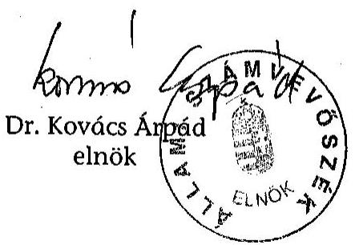
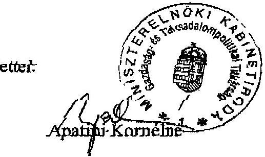
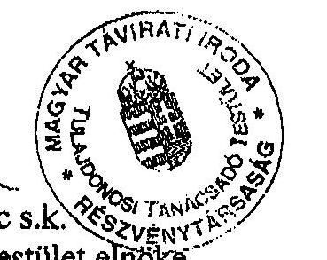
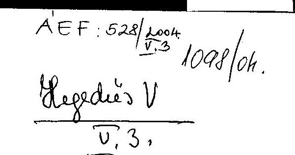
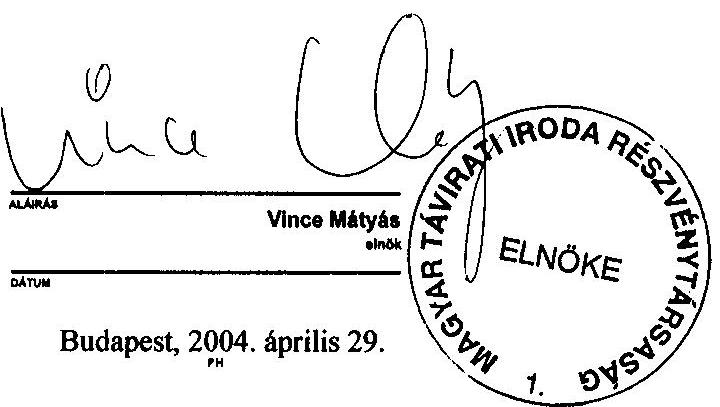
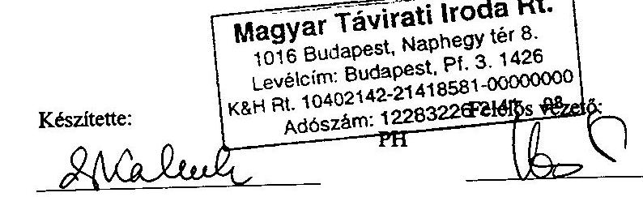
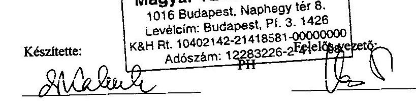

# JELENTÉS 

a Magyar Távirati Iroda Rt. 2003. évi gazdálkodásának ellenőrzéséről

---

2. Államháztartás Központi Szintjét Ellenőrző Igazgatóság
2.3. Átfogó Ellenőrzési Főcsoport
V-38-32/2003-2004.
Témaszám: 690
Vizsgálat-azonosító szám: V0123
Az ellenőrzést felügyelte:
Bihary Zsigmond
főigazgató
Az ellenőrzés végrehajtásáért felelős:
Hegedüsné dr. Müllern Veronika
főcsoportfőnök
Az ellenőrzést vezette:
Dr. Podonyi László
igazgatóhelyettes
Az ellenőrzést végezték:
Koós Lászlóné Dr. Majoros Sándor
számvevő tanácsos,
tanácsadó
tanácsadó
A témához kapcsolódó eddig készített számvevőszéki jelentések:
címe
sorszáma
Jelentés a Magyar Távirati Iroda költségvetési fejezet és a Magyar 9829
Távirati Iroda Részvénytársaság pénzügyi-gazdasági ellenőrzéséről (1997.)

Jelentés a Magyar Távirati Iroda Részvénytársaság működésének 9924
pénzügyi-gazdasági ellenőrzéséről (1998.)
Jelentés a Magyar Távirati Iroda Rt. 1999. évi 0029
gazdálkodásának ellenőrzéséről
Jelentés a Magyar Távirati Iroda Rt. 2000. évi gazdálkodásának 0124
ellenőrzéséről
Jelentés a Magyar Távirati Iroda Rt. 2001. évi gazdálkodásának 0236
ellenőrzéséről
Jelentés a Magyar Távirati Iroda Rt. 2002. évi gazdálkodásának 0326
ellenőrzéséről

Jelentéseink az Országgyűlés számítógépes hálózatán és az Interneten a www.asz.hu címen is olvashatók.

---

# TARTALOMJEGYZÉK 

BEVEZETÉS ..... 5
I. ÖSSZEGZŐ MEGÁLLAPÍTÁSOK, KÖVETKEZTETÉSEK, JAVASLATOK ..... 7
II. RÉSZLETES MEGÁLLAPÍTÁSOK ..... 14

1. Az MTI Rt. működésének szabályozottsága, törvényessége, a feladatok és a szervezeti rendszer összhangja ..... 14
1.1. A társasági működés általános szabályozása ..... 17
1.2. A részvénytársaság közfeladatainak ellátásához kapcsolódó társasági szabályzatok ..... 19
1.3. A TTT és az FB működését biztosító társasági szabályozottság ..... 21
2. Az MTI Rt. gazdálkodása ..... 22
2.1. A társaság 2003. évi üzleti tervének megalapozottsága, teljesülése ..... 22
2.2. Az érvényben lévő díjszabás és az értékesítési politika összhangja ..... 25
2.3. Az állami támogatások felhasználásának megalapozottsága ..... 26
2.4. A rendszeres és nem rendszeres személyi juttatások cél és szabályszerűsége ..... 30
2.5. Az MTI Rt. vagyongazdálkodása ..... 33
3. A társaság belső ellenőrzési rendszerének működése ..... 35
4. Az Állami Számvevőszék 2003. évi jelentésének hasznosulása ..... 37

## MELLÉKLETEK

1. A jelentéstervezetre tett észrevételek
2. ÁSZ-javaslatokkal összefüggő OGY határozatok
3. Az 1999-2003. évi ÁSZ-jelentésekben foglalt javaslatok
4. Tanúsítványok (1-8.)

## FÜGGELÉK

1. Az MTI Rt. digitális tartalomszolgáltatás kiszélesítését bővítő kutatásfejlesztési projekt teljesítményellenőrzése

---

# RÖVIDÍTÉSEK JEGYZÉKE 

| MTI Rt., társaság | Magyar Távirati Iroda Részvénytársaság |
| :-- | :-- |
| FB | Felügyelő Bizottság |
| TTT | Tulajdonosi Tanácsadó Testület |
| ÁSZ | Állami Számvevőszék |
| OGY | Országgyűlés |
| SZMSZ | Szervezeti és Működési Szabályzat |
| Nht. | A nemzeti hírügynökségről szóló 1996. évi CXXVII. törvény |
| Gt. | A gazdasági társaságokról szóló 1997. évi CXLIV törvény |
| Kbt. | A közbeszerzésekről szóló 1995. évi XC. törvény |
| MTI-NET projekt | A Magyar Távirati Iroda Rt. digitális tartalomszolgáltatás |
|  | kiszélesítését bővítő kutatásfejlesztési projekt |

---

# JELENTÉS 

## a Magyar Távirati Iroda Rt. 2003. évi gazdálkodásának ellenőrzéséről

## BEVEZETÉS

A nemzeti hírügynökségi tevékenység ellátására az Állam nevében az Országgyűlés egyszemélyes részvénytársaságként megalapította a Magyar Távirati Iroda Részvénytársaságot (MTI Rt.). A részvénytársaság a nemzeti hírügynökségről szóló 1996. évi CXXVII. törvény (Nht.) 2. § (1) bekezdésében felsorolt közszolgálati feladatokat köteles ellátni, amelyhez állami támogatásban részesül. Az MTI Rt. a Magyar Távirati Iroda költségvetési intézményből 1997. július 15-ével alakult át, egyszemélyes - 100\%-ban állami tulajdonú - részvénytársasággá. Tevékenységét budapesti székhelyén kívül öt telephelyen és egy fióktelepen végzi. A tulajdonosi jogokat az Országgyűlés gyakorolja. Az Nht és az MTI Rt. Alapító Okirata szerint a részvénytársaság elnöke évente beszámol az Országgyűlésnek a részvénytársaság tevékenységéről, amelynek keretében sor kerül a mérleg és az eredménykimutatás jóváhagyására, valamint a nyereség felosztására. Az elnök beszámolóját a részvénytársaság felügyelő bizottságának véleményével együtt az Országgyűlés elé kell terjeszteni. A beszámolóhoz mellékelni kell az Állami Számvevőszék elnökének jelentését a részvénytársaság tevékenységéről. Az Nht. 29. §-a értelmében a részvénytársaság gazdálkodását az Állami Számvevőszék ellenőrzi.

Az MTI Rt. 2003-ra tervezett 4005 millió Ft bevételéből a központi költségvetés működési célú támogatása 1522 millió Ft volt, amely időarányosan teljesült, ezt meghaladóan az MTI Rt 205 millió Ft céltámogatásban részesült.

Az ellenőrzés célja annak feltárása, hogy az MTI Rt.:

- szervezeti és működési rendszere összhangban volt-e a feladatokkal, mennyiben segítette azok hatékony és eredményes ellátását, belső szabályozása megfelelt-e a hatályos jogszabályoknak;
- az alapító okiratában és a vonatkozó jogszabályokban foglaltaknak megfelelően törvényesen, célszerűen és eredményesen gazdálkodott-e a rendelkezésére bocsátott vagyonnal és a központi költségvetésből a részvénytársaság közszolgálati feladatai ellátásához nyújtott működési célú és egyéb a digitális tartalomszolgáltatás kiszélesítését célzó kutatás-fejlesztési projekt (továbbiakban: MTI-NET projekt), Európai Unióhoz történő csatlakozással kapcsolatos ismeretek bővítését elősegítő hírügynökségi tevékenység támogatása/ céltámogatásokkal;

---

- a társaság belső ellenőrzése elősegítette-e a hatékony gazdálkodást, figyelemmel a Tulajdonosi Tanácsadó Testület, a Felügyelő Bizottság és a management ellenőrzési gyakorlatára;
- hogyan hasznosította a 2002. évi tevékenységének ellenőrzéséről készült ÁSZ-jelentés megállapításait, javaslatait, ajánlásait.

Az ellenőrzés társasági szintű átfogó jellegű vizsgálat, amely az MTI Rt. működésének az ellenőrzési programban meghatározott tevékenységeire, területeire terjed ki, ezért nem feladata az Rt. teljes körű átvilágítása. A vizsgálat részét képezi az „MTI-NET projekt" keretében költségvetési forrás felhasználásával megvalósított fejlesztés teljesítmény ellenőrzése. Az MTI Rt. székházában végzett helyszíni ellenőrzés módszere a dokumentális vizsgálat és elemzés. Az ellenőrzés és az elemzés alapdokumentumai elsősorban a részvénytársaság éves beszámolói (mérleg, eredménykimutatás, kiegészítő melléklet, üzleti jelentés, könyvvizsgálói jelentés), illetve ezeket alátámasztó dokumentumok, bizonylatok, a testületek üléseinek jegyzőkönyvei és határozatai, a vezetői utasítások, szabályzatok, elemzések, a külső- és belső ellenőrzés jelentései.

A jelenlegi ellenőrzés alkalmával a helyszíni vizsgálat lezárásának időpontja korábbi időpontra esett, mint a mérlegkészítés időpontja, ezért a helyszíni vizsgálat lezárása és a számvevői jelentés elkészítése közötti időszakban bekövetkező mérlegmódosításokat tanúsítványok tartalmazzák. Az MTI Rt. gazdálkodásának ellenőrzését úgy ütemeztük, hogy az Országgyűlésnek, mint a közgyűlési jogok gyakorlójának, lehetősége legyen a társasága éves beszámolójának előírt határidőn belüli, 2004. május 31-e előtti elfogadására.

A jelentéstervezetet megküldtük a Miniszterelnöki Hivatal közigazgatási államtitkárának, az MTI Rt. elnökének, az MTI Rt. Felügyelő Bizottsága és Tulajdonosi Tanácsadó Testülete elnökének. Az észrevételeket az 1. sz. melléklet tartalmazza.

---

# I. ÖSSZEGZŐ MEGÁLLAPÍTÁSOK, KÖVETKEZTETÉSEK, JAVASLATOK 

A korábbi ellenőrzések tapasztalatai és a jelenlegi ellenőrzés megállapításai is alátámasztják, hogy az MTI Rt. működtetésére kialakított, speciális tulajdonosi megoldás célszerűtlen, ismétlődő szabályozási és társasági hiányosságok vannak. Az MTI Rt. 2002. évi tevékenységéről szóló éves beszámolót a közgyűlési jogokat gyakorló Országgyűlés még nem fogadta el. A nemzeti hírügynökségi törvény felülvizsgálata, összehangolása elmaradt. A működési céltámogatás szabályos, célszerű és eredményes felhasználása érdekében nem határozták meg a közszolgálati feladatokat és a feladatok ellátásához szükséges mértékű állami támogatást. Az állami támogatás átláthatóságának szükségességét az ÁSZ éveken keresztül szorgalmazta. Európai Uniós csatlakozásunk időpontjától különösen időszerű és sürgető feladat a közösségi joggyakorlatnak megfelelő szabályozás azért, hogy az állami támogatás a jövőben is legitim cél maradhasson. A közszolgálati feladatok pontos meghatározása a támogatások odaítélésének és felhasználásának átláthatósága, hatékony ellenőrzése uniós követelmény. Nem alkották meg az Nht.-ban jelzett, a választási időszakban végzendő feladatokról szóló törvényt. Az ÁSZ ellenőrzési tapasztalatai, megállapításai, javaslatai alapján készített társasági intézkedési tervek elsősorban formai eredményt hoztak. ${ }^{1}$

A társaság 1997. évi megalakulása után 2002-ben először volt veszteséges. 2003-ban az üzleti tervben megfogalmazott nulla körüli mérleg szerinti eredménytervet nem tudta teljesíteni, a veszteség nagyságrendje a 2002. évivel azonos mértékű - 100 millió Ft feletti - volt. 2004-ben sem várható pozitív mérleg szerinti eredmény. Az Rt. működési költségei és ráfordításai 2003-ban nem igazodtak a csökkenő saját bevételekhez, miközben a társaság folyamatosan növekvő összegű támogatásra tart igényt a közszolgálati feladatok pontos - termék, termékcsoportok szerinti - meghatározása nélkül, a korábban kialakított szervezet megtartása mellett. A társaság finanszírozhatósága érdekében 2004-ben hitelt vesz fel, tervezi néhány ingatlanja értékesítését, költségcsökkentést, illetve jelentős létszámleépítést.

Az Országgyűlés, a TTT, az FB és az MTI Rt. elnöke között megosztott tulajdonosi irányítás és ellenőrzés törvényi szabályozása és alapító okirata felülvizsgálatát, e szervezetek feladat- és hatásköri szabályozása pontosítását az ÁSZ évek óta szorgalmazza, eredménytelenül. Az alapító okirat módosítását a TTT kezdeményezheti. Az MTI Rt. elsődleges érdekeinek figyelembevételével, a hatékony együttműködésre való törekvés az Rt. és a testületek között - egyértel-

[^0]
[^0]:    ${ }^{1}$ Lásd a 3. sz. mellékletet az Állami Számvevőszéknek az MTI Rt.-nél végzett korábbi ellenőrzése alapján tett ajánlásaiból az ÁSZ Jelentés a Magyar Távirati Iroda Rt. 2000. évi gazdálkodásának ellenőrzéséről (0124), a Jelentés a Magyar Távirati Iroda Rt. 2001. évi gazdálkodásának ellenőrzéséről (0236) és a. Jelentés a Magyar Távirati Iroda Rt. 2002. évi gazdálkodásának ellenőrzéséről (0326).

---

műen megfogalmazott elvárások, követelményrendszer, a végrehajtás ellenőrzése, továbbá ezek szabályozása - 2003-ban sem valósult meg. Az együttműködésben meglévő problémák egy része megmaradt, miközben újak is keletkeztek, de ezek egységesen a hatásköri kérdések eltérő értelmezésében mutatkoztak meg, szükségtelen feszültséget és felesleges többletkiadásokat okozva az MTI Rt.-nek. A korábbi problémák ismétlődtek meg a díjszabás, az SZMSZ, a társaság és a TTT közötti együttműködésben, újak keletkeztek a TTT belső működésében, a TTT és az Rt. közötti információszolgáltatásban. ${ }^{2}$

2003-ban a társasági működés szabályozásában - bár 19 elnöki utasítás született - az SZMSZ-re, elnöki, alelnöki utasításokra, a Szakmai és Közszolgálati Tájékoztatási Szabályzatra, szakmai kézikönyvekre, munkaköri leírásokra épülő szabályozás hiányosságai megmaradtak. Az SZMSZ 2003-ban kétszer (az év elején és az év végén) változott. Az SZMSZ módosításai az új beosztások szervezeti megoldásainak átvezetését, az igazgatói szintek növelését jelentette.

Nem készült el az SZMSZ módosítások szükségességének indoklása, a módosításokkal elérendő célok megfogalmazása, az elvárható hatékonyabb működés eredményei, a változtatások hatása a költségek és ráfordítások összegének alakulására, a létrehozott új szervezetek működése eredményeinek értékelése. Mindez a célszerű és átgondolt szervezetfejlesztés hiányára utal, és a foglalkoztatott létszám megtartását, a vezetők számának növelését eredményezte. A társasági szabályzatok elkészítése, aktualizálása, az SZMSZ és a munkaköri leírások közötti összehangolás elmaradt, az SZMSZ-ben a korábban kifogásolt egyszerű pontatlanságokat sem szüntette meg az MTI Rt. Mindezek következménye, hogy a felelősség megállapíthatósága sem biztosított. ${ }^{3}$

A részvénytársaság közfeladatainak ellátásához kapcsolódó társasági szabályzatok, az állami támogatás (működési céltámogatás) társasági igénylésének és felhasználásának szabályozása nem készült el, a társaság megalakulása óta folytatott gyakorlat (ugyanazokra az okokra hivatkozó, bázisszemléletű, egyre nagyobb támogatásra igényt tartó) nem változott. ${ }^{4}$ A közfeladatok ellátásához kapcsolódó szabályok közül 2003 végén átfogó szabályozás készült a közbeszerzés rendjéről, az archiválási szabályzat tervezett aktualizálása azonban elmaradt.

Az MTI Rt. 2003. évi gazdálkodását 138 millió Ft veszteséggel zárta, annak ellenére, hogy a belföldi értékesítés nettó árbevétele növekedett és működési valamint céltámogatások révén az állami költségvetésből 334 millió forinttal több támogatásban részesült. A működési célú támogatás esetében a támoga-

[^0]
[^0]:    ${ }^{2}$ Lásd a 3. sz. mellékletet az Állami Számvevőszéknek az MTI Rt.-nél végzett korábbi ellenőrzése alapján tett ajánlásaiból az ÁSZ Jelentés a Magyar Távirati Iroda Rt. 2001. évi gazdálkodásának ellenőrzéséről (0236) és a. Jelentés a Magyar Távirati Iroda Rt. 2002. évi gazdálkodásának ellenőrzéséről (0326) .
    ${ }^{3}$ Ugyanaz, mint a 2. sz. lábjegyzet.
    ${ }^{4}$ Ugyanaz, mint a 2. sz. lábjegyzet.

---

tások felhasználásáról rendelkező érvényben lévő jogszabályok betartása és ellenőrzése a közszolgálati tevékenység fogalmának konkrét meghatározása nélkül nem lehetséges. ${ }^{3}$ Nincs összhangban az Nht. és - az európai uniós normáknak megfelelő - a vállalatoknak nyújtott állami támogatások tilalma alóli mentességek egységes rendjéről szóló kormányrendelet, ami feltételezi a közszolgálati tevékenység fogalmának deklarálását és elszámolásának a szabályozását.

Az Európai Unióhoz történő csatlakozással kapcsolatos állami támogatás folyósítását a támogató nem foglalta szerződésbe. Konkrét feladatok, illetve feltételek hiányában a támogatás, tág teret adott a támogatottnak a felhasználást illetően. Többletfeladatok és konkrét cél nélkül a támogatás célszerűsége nem biztosított. A támogatás nem a hatályos rendeletek szerint lett folyósítva és felhasználva. Ellentmondásos helyzetet teremtett, hogy szerződés hiányában az MTI Rt. nem alanya a támogatások felhasználását szabályozó kormányrendeletnek, viszont a támogatás, amelyet igénybe vett, csak a rendelet szerint használható fel. A felhasználás célszerűségének, hatékonyságának az ellenőrzése, jogszerűségének a megállapítása a kormányhatározat pontatlanságai miatt nem lenne lehetséges, de az érvényben lévő kormányrendelet hatálya kiterjed az összes költségvetésből finanszírozott támogatás felhasználására. A rendelet a támogatott cél érdekében közvetlenül felmerült költségek elszámolását engedi meg. A támogatás keretében vásárolt informatikai eszközök hasznosítása nem köthető minden esetben az európai uniós csatlakozással kapcsolatos tájékoztatási feladatokhoz.

Az MTI-NET projekt keretében 2001. november és 2003. december között felhasznált kutatás-fejlesztési céltámogatás hiányosságait a korábbi ÁSZ jelentés részben feltárta. A 2003. évi folyósítás során a támogató a jogszabálytól eltért azáltal, hogy nem módosította az érvényben lévő jogszabálynak megfelelően a támogatási szerződést, nem határozta meg a konkrét támogatási kategóriát, annak ellenére, hogy ez jogszabályi kötelessége lett volna. Az MTI Rt. a támogatás felhasználása során nem az érvényes jogszabályok szerint járt el, amikor nem kizárólag a kutatás-fejlesztési célra használta fel a támogatást. Aggályos a projekt keretében megvalósított, de nem hasznosított, vagy többször megújított szellemi termékek értékcsökkenésének könyvviteli nyilvántartása. A támogatott a támogató hozzájárulása nélkül módosította a kitűzött célokat. A projekt keretei között megkötött szerződések a gazdasági életben szokatlan - és az MTI Rt. számára hátrányos - jogkövetkezményeket foglalnak magukba, másrészt a megbízási feladat homályos megfogalmazása révén a szolgáltatás tényleges tartalmának meghatározása nem lehetséges.

Az MTI Rt. az alapítói határozat szerint a fotó, hír és mikrofilm archívumait ezer forinton tartja nyilván mérlegében, annak ellenére, hogy az átalakuláskor a szakértői vélemények 2950 millió Ft-ban állapították meg akkori értéküket. Az előállított, vagy vásárolt hírek illetve fotók - az ellenérték költségként történő elszámolását és a szellemi termékké való átminősítést követően - az archívumokba nulla értéken kerülnek be, amely eljárás mind a belső szabályzatok-

[^0]
[^0]:    ${ }^{3}$ Ugyanaz, mint a 2. sz. lábjegyzet.

---

kal, mind a számviteli törvény előírásaival ellentétes. Az archívumok folyamatos bővülése nincs összhangban a számviteli törvénnyel és a hatályos belső szabályozással.

Annak ellenére, hogy az elmúlt három évben, az ÁSZ ellenőrzések megállapításai javasolták az MTI Rt. elnökének a kettős foglalkoztatottság megszüntetését, továbbra is folytatódik az ilyen jellegű foglalkoztatás. ${ }^{6}$ A veszteséges gazdálkodás fő oka a különféle jogcímeken kifizetett, de összességében személyi jellegű ráfordítások, inflációt meghaladó, túlzott mértékű növekedése, konkrét feladatok meghatározása, illetve teljesítmény és hatékonyság javulás nélkül. A működési célú támogatás valamint az Európai Uniós támogatás és az MTI-NET projekt keretében végzett tevékenységek tartalmi átfedései miatt a kifizetések mögött többlet teljesítmény nem igazolható. A felsőszintű vezetés érdekeltségi rendszere nem kapcsolódik a költségek 52\%-át kitevő személyi jellegű kifizetések csökkentéséhez, a támogatások hatékony felhasználásához.

A céltámogatásokból megvalósított feladatok ellátására szerződött külső vállalkozások között, az MTI Rt. munkavállalójának részvételével alapított vállalkozások és a munkavállalói szerződések összeférhetetlenek.

A tárgyi eszközök, ezen belül az informatikai eszközök analitikai nyilvántartása két helyen történik, egyrészt a pénzügyi igazgatóság, másrészt az informatikai igazgatóságon. A két nyilvántartás annak ellenére, hogy a lehetősége adott, nincs összevezetve. Nem biztosított, ezáltal az informatikai eszközök nyilvántartásának naprakészsége, célnak megfelelő felhasználásuk dokumentáltsága.

A társaság belső ellenőrzése működésében 2003-ban sem kapott hangsúlyt az ellenőri, szakértői megállapítások és javaslatok hasznosításának, a hiányosságok felszámolásának, az FB határozatok végrehajtása ellenőrzésének igénye. 2003-ban a belső ellenőr elhúzódó betegsége miatt a függetlenített belső ellenőrzés hatékonysága romlott. 2003-ban összesen három társasági működést ellenőrző vizsgálat volt. A csekély számú ellenőrzés javaslatai nem hasznosultak. ${ }^{7}$

Az Állami Számvevőszék 2003. évi jelentésében megfogalmazott megállapításai, javaslatai és ajánlásai az MTI Rt.-nél 2003-ban többségében nem hasznosultak. A MTI Rt elnöke intézkedési tervében szereplő 15 feladatból 6 feladatot végeztek el határidőre, többségében teljes körűen. Évek óta megoldatlan, legfontosabb feladatok: egyes szabályzatok, utasítások elkészítése összehangolása, aktualizálása; a közfeladatok és a társaság egyéb feladatainak meghatározása, az elvégzéshez szükséges hatékony szervezet kialakítása, a

[^0]
[^0]:    ${ }^{6}$ Lásd a 3. sz. mellékletet az Állami Számvevőszéknek az MTI Rt.-nél végzett korábbi ellenőrzése alapján tett ajánlásaiból az ÁSZ Jelentés a Magyar Távirati Iroda Rt. 2000. évi gazdálkodásának ellenőrzéséről (0124), a Jelentés a Magyar Távirati Iroda Rt. 2001. évi gazdálkodásának ellenőrzéséről (0236) és a. Jelentés a Magyar Távirati Iroda Rt. 2002. évi gazdálkodásának ellenőrzéséről (0326).
    ${ }^{7}$ Ugyanaz, mint a 6. sz. lábjegyzet.

---

munka-, a megbízási- és vállalkozási szerződések tartalmi, teljesítmény szempontú felülvizsgálata, módosítása, megszüntetése; a Károly körúti bérlemény hasznosítása; az ügyvédi szerződések átalánydíjas tartalmi elemeinek pontosítása, teljesítésük ellenőrzése. ${ }^{8}$

Az ÁSZ évenkénti ellenőrzési tapasztalatai, megállapításai, javaslatai alapján formailag ugyan mindig készültek intézkedési tervek, de a feladatoknak több mint a felét egy évben sem hajtották végre határidőre, teljes körűen. A társaság nem kellő körültekintéssel mérte fel a feladatok nagyságát, elvégezhetőségének határidejét. Az MTI Rt. elnöke, felső vezetése elfogadta a beszámoltatáson alapuló társasági teljesítést, a ténylegesen elvégzett feladatok, illetve azok eredményének ellenőrzése nélkül.

A helyszíni ellenőrzés megállapításainak hasznosítása mellett javasoljuk:

# az Országgyűlésnek, mint a Magyar Távirati Iroda Rt. közgyűlése jogai gyakorlójának 

1. tekintse át és módosítsa a 68/2002. (X. 4.) OGY határozatban megfogalmazott jogalkotási feladatnak megfelelően a nemzeti hírügynökségről szóló törvényt és az MTI Rt. Alapító Okiratát a teljes körűen összehangolt szabályozás kialakítása, a közszolgálati feladatok és az azok ellátásához szükséges állami támogatás egyértelműbb és pontosabb meghatározása, a jelenlegi tulajdonosi megoldás felülvizsgálata és hatékonyabbá tétele érdekében;
2. tűzze napirendjére az MTI Rt 2002. évi beszámolóját és hozza meg tulajdonosi döntését.

## a Kormánynak

1. kezdeményezzen a 68/2002. (X. 4.) OGY határozatban az MTI Rt. támogatásával kapcsolatban megfogalmazott átláthatósági követelmény érvényre juttatása érdekében szükséges jogalkotási és egyéb intézkedéseket, különös figyelemmel a közösségi jog előírásaira;
2. kezdeményezze az Nht. 2. § (1) bekezdése h) pontjában megjelölt - a választási időszak feladataira vonatkozó - külön törvény megalkotását;
3. fontolja meg a - a következő évi költségvetési törvényjavaslatban - a TTT működési költségei támogatásának elkülönítését az MTI Rt. előirányzatától.
[^0]
[^0]:    ${ }^{8}$ Ugyanaz, mint a 6. sz. lábjegyzet.

---

# a TTT elnökének 

1. szabályozza a testület ügyrendjében a döntési, a tanácsadói, a javaslattételi, a véleményezési hatáskörében végzett feladatai ellátásával kapcsolatos eljárási rendet, szüntesse meg a testület működésében kialakult zavarokat az MTI Rt. elsődleges érdekeinek figyelembevételével;
2. kezdeményezze a tulajdonosnál a rábízott tulajdonosi jogosítványok egyértelmű meghatározását, az MTI Rt. alapító okiratának módosítását.

## az FB elnökének

intézkedjen, hogy határozatait az MTI Rt. végrehajtsa, szervezze meg a végrehajtás ellenőrzését, gondoskodjon a belső ellenőri megállapítások társasági hasznosításának utóellenőrzéséről.

## az MTI Rt. elnökének

1. intézkedjen, hogy az ÁSZ jelentések megállapításai, javaslatai alapján utasításban kiadott intézkedési tervek eredményes végrehajtása megtörténjen;
2. vizsgálja felül az MTI Rt. tevékenységét, szervezeti rendjét, alakítsa ki a tevékenység elvégzéséhez szükséges, hatékony szervezeti rendet; hangolja össze a szervezeti egységek közötti feladatokat, az SZMSZ-t az elnöki, alelnöki utasításokat és a munkaköri leírásokat; a felülvizsgálat keretében kezdeményezze a TTT-nél és az FB-nél, hogy az SZMSZ részeként szabályozásra kerüljön a TTT, az FB és az MTI Rt. közötti kapcsolattartás és együttműködés rendje;
3. végezze el a megbízási - ezen belül az ügyvédi - és vállalkozási szerződések hatékonyságelemzését, a hasznosítás elsődlegessége alapján döntsön azok szükségességéről, határozza meg a szerződések egységes tartalmi követelményeit és biztosítsa azokban a feladatmeghatározás, a teljesítés és a számonkérés összhangját;
4. alakíttassa ki a társaság elő- és utókalkulációját úgy, hogy azok megfelelő adatokat szolgáltassanak az egyes termékek, szolgáltatások árképzéséhez; intézkedjen az új tarifarendszer kidolgozására és bevezetésére;
5. intézkedjen a Károly krt.-i bérelt ingatlan kihasználatlan helyiségeinek hasznosítása érdekében;
6. vizsgálja felül az MTI Rt. munkaszerződéseinek feladat meghatározásait, felmondási és végkielégítési gyakorlatát. Intézkedjen a számviteli politikában és az önköltségszámítási szabályzatban a fotó és hírvásárlás elszámolásának és nyilvántartásának szabályozásáról;
7. intézkedjen a nem jogszerű kettős foglalkoztatás megszüntetéséről; a munkavállalói szerződésekben kikötött összeférhetetlenség mellőzésével kötött vállalkozói szerződések megszüntetéséről;

---

8. rendelkezzen az informatikai eszközök célnak megfelelő felhasználásának és folyamatos, naprakész nyilvántartásának a kialakításáról; hozzon azonnali költségtakarékossági intézkedéseket a túlzott mértékű személyi jövedelem kiáramlás megszüntetésére és a létszám racionalizálásra.

---

# II. RÉSZLETES MEGÁLLAPÍTÁSOK 

## 1. Az MTI Rt. MŰKÖDÉSÉNEK SZABÁLYOZOTTSÁGA, TÖRVÉNYESSÉGE, A FELADATOK ÉS A SZERVEZETI RENDSZER ÖSSZHANGJA

Az Országgyűlés, az MTI Rt. alapítója, részvényesi és közgyűlési jogainak gyakorlója, az MTI Rt. 2001. évi tevékenységéről szóló beszámolóját elfogadó 68/2002. (X. 4.) OGY határozatában ${ }^{9}$ - az ÁSZ korábbi javaslatai szerint - jogalkotási feladatot fogalmazott meg a hírügynökségi törvény és az MTI Rt. Alapító Okirata áttekintésére, a teljes körűen összehangolt szabályozás kialakítására, a közszolgálati feladatok és azok ellátásához szükséges állami támogatás egyértelműbb és pontosabb meghatározására. Az ÁSZ 2004. évi helyszíni ellenőrzésének befejezéséig, a jogalkotási feladat nem teljesült. Nem alkották meg az Nht.-ben rögzített, a választási időszakban végzendő feladatokra vonatkozó törvényt. Az Országgyűlés nem hozott határozatot az MTI Rt. 2002. évi beszámolója elfogadásáról és az eredmény felosztásáról.

Az Rt. tulajdonosi szerkezete, irányítási, működtetési és ellenőrzési megoldása eltér a társasági törvény szabályaitól. Az MTI Rt. tulajdonosa az Országgyűlés, a tulajdonos és társasága között rendszeres kapcsolat nincs. Az MTI Rt.-nek nincs igazgatósága, az igazgatóság feladatait az MTI Rt. elnöke látja el. Az elnöki hatalom korlátozása érdekében a Felügyelő Bizottságnak is sajátos feladata van, ami kiterjed a meghatározott értékhatárok feletti szerződések megkötésének előzetes jóváhagyására. A Tulajdonosi Tanácsadó Testület javaslattevő, véleményező, tanácsadó testület, ugyanakkor a törvényben meghatározott esetekben döntéshozó szervként működik. Az Rt. elnöke és az FB tagjai a részvénytársaságnak okozott kárért a polgári jog szabályai szerint felelnek, a TTT tagjainak ilyen felelősége nincs.

Az
 Országgyűlés, a TTT, az FB és az MTI Rt. elnöke között megosztott tulajdonosi irányítás és ellenőrzés törvényi szabályozása, e szervezetek feladat- és hatásköri szabályozása pontatlan, ezek felülvizsgálatát és pontosítását az ÁSZ évek óta kezdeményezi a jogalkotóknál, a testületeknél és az MTI Rt.-nél sikertelenül. 2003-ban is elmaradt a nemzeti hírügynökségi törvény, az MTI Rt. alapító okirata, a testületek ügyrendje, a Szervezeti és Működési Szabályzat (SZMSZ) rendelkezéseinek pontosítása, a tulajdonosi jogok gyakorlóinak egymás és a társaság között, a zavartalan működéshez szükséges eljárási rendek megalkotása. A szervezetek közötti együttműködés hatékonysága 2003-ban sem javult.

Az együttműködésben a korábban kialakult zavarok egy része megmaradt, 2003-ban újak is keletkeztek, ezek egységesen a hatásköri kérdések eltérő értelmezésére vezethetők vissza.

[^0]
[^0]:    ${ }^{9}$ Lásd a 2. sz. mellékletet

---

A hatályos szabályozás szerint a TTT ügydöntő hatásköre az MTI Rt. díjszabásának jóváhagyása. Az Nht. \{21. § (1) bek. h) pont, 2. § (3) bek.\} és az Alapító Okirat sem pontosítja, hogy a díjszabás jóváhagyása konkrétan melyik termékekre, termékcsoportokra vagy szolgáltatásokra - csak a közszolgálati vagy az MTI Rt. összes termékére, szolgáltatására - vonatkozik, a díjszabás milyen mélységű bemutatása szükséges a döntés meghozatalához.

A társaságnak 2002-ben és 2003-ban sem volt TTT által elfogadott, érvényes díjszabása az Nht., az MTI Rt. Alapító Okirata díjszabással kapcsolatos pontatlansága, a TTT és a Társaság közötti megegyezés, szabályozás hiánya miatt. A társaság ennek hiányában kötötte meg az értékesítési szerződéseket. A tarifarendszer tervezetét az Rt. vezetése elkészítette és a TTT-nek, jóváhagyásra benyújtotta, de azt nem hagyta jóvá (az elkészített tarifapolitika nem az önköltségszámításon alapult). A TTT 2003-ban sem hozott olyan határozatot, amelyben elfogadta az MTI Rt. 2004-es díjszabását. A TTT-39/2003. (XI. 06.) sz. határozatában a menedzsment díjszabásra vonatkozó tájékoztatóját tudomásul vette és felhívta a menedzsment figyelmét, hogy terjesszen elő 2004-re vonatkozó „ideiglenes" díjszabási javaslatot, amely a tájékoztatóban szereplő elvekre és a jelenleg alkalmazott rendszerre épül. A határozatban a feladat teljesítésére a TTT határidőt nem szabott. A TTT 2004. február 12-én hagyta jóvá a 2004-es díjszabást.

Az érvényben lévő szabályozás szerint (Alapító Okirat V.5.5. pontja) a TTT-nek az MTI Rt. SZMSZ-ével kapcsolatban véleményezési joga van. A véleményezési jogot, a jog gyakorlásának eljárási rendjét a TTT (saját ügyrendjében), és a társaság (SZMSZ-ben) nem szabályozta. Emiatt hatásköri kérdések értelmezése céljából a testület és az MTI Rt. elnöke is többször rendelt meg jogi szakértői véleményeket, amelyek tartalma egymástól eltért.

A véleményezési jog gyakorlásával összefüggésben 2001-ben és 2002-ben is nézetkülönbség volt a TTT és a társaság között. A TTT 2003. január 23-án elfogadta a 2003. február 1-jétől életbe léptetett szervezeti változásokat. Az MTI Rt. elnökének előterjesztése 2003. január 16-án készült. Az SZMSZ 2003. október 31-ei módosítását azonban az MTI Rt. elnöke nem terjesztette a TTT elé véleményezésre. A TTT 41/2003. (XI. 13.) sz. határozatában megállapította, hogy az MTI Rt. elnöke a testület véleményének kikérése nélkül hatályba léptetett SZMSZ módosítással megsértette az Alapító Okirat vonatkozó rendelkezéseit. A TTT elnökének véleménye szerint a 2003. október 31-ei hatályossága továbbra is vitatott. Felelősségre vonást alkalmazó TTT határozat nem született. Az Rt. elnöke, a korábbi elnökhöz hasonlóan, jogi szakértői véleményt kért az SZMSZ változtatásának TTT vélemény kikérése nélküli hatályossága kérdésében. Korábban a TTT is kért szakértői véleményt, de a szakértői vélemények ismerete eredményt nem hozott. (További szakértői véleményeket rendelt meg az MTI Rt. elnöke, amelyekben arra várt választ, hogy a TTT hatáskörébe tartozik-e pl. az összeférhetetlenség vizsgálata, továbbá konkrét szerződések vizsgálata céljából ezeknek a szerződéseknek a bekérése, illetve átadhatóak-e ezek a szerződések munkajogi szempontból.) A szakértői díjak kifizetése az együttműködési szabályok megalkotásával elkerülhetők.

---

A testületek és a társaság közötti együttműködés szabályozásának hiánya, 2003-ban zavarokat okozott a TTT belső működésében, továbbá a TTT és az Rt. közötti információszolgáltatásban.

Feszültség alakult ki a TTT elnöke, tagjai és a TTT titkársága vezetője között az igazgatói rangban lévő titkárságvezető és a beosztott munkatársak foglalkoztatása ügyrendeknek megfelelő hatásköri kérdésében. 2003. szeptember 18-án a TTT elnöke javaslatát, amely a TTT Titkársága vezetőjének valamivel több, mint féléves munkaviszonya rendkívüli vagy rendes felmondással történő megszüntetésére, felmentésére irányult, a testület nem fogadta el. (E szám nélküli határozat a határozatok tárában nem, csak az ülésről készült jegyzőkönyvben szerepel.) 2003. október 10-én az MTI Rt. gazdasági alelnöke elkészítette a titkársági referens munkaköri leírását. A TTT ezt 2003. november 6-án (TTT-33/2003. (XI. 06.) sz. határozata) hatálytalannak nyilvánította, mert az a TTT egyetértése nélkül készült. 2003. október 10-én az MTI Rt. gazdasági alelnöke további titkársági dolgozót vett fel a TTT elnökének javaslatára. A TTT e munkaviszony létesítését jogellenesnek minősítette (TTT-32/2003. (XI. 06.) sz. határozata) és felkérte az Rt. gazdasági alelnökét a munkaviszony megszüntetésére. Az Rt. SZMSZ-e a Titkárság dolgozói munkaviszonya létesítése és megszüntetése kérdésében egyértelműen fogalmaz. E munkaviszonyok létesítéséhez és megszüntetéséhez a TTT egyetértése szükséges. (A Titkársági létszám a szükségnél nagyobb mértékű lett. Egy vezetőt igazgatói rangban, két dolgozót, az üléseken készült jegyzőkönyv elkészítésére külön jogászt alkalmaztak. A testület tagjainak száma 10 fő volt. Az elnök és a titkárságvezetője és az egyik dolgozó közötti viszony megromlott, a testületi iratok, jegyzőkönyvek, határozatok kezelését az elnök és az új alkalmazottra bízta.) A TTT elnökének véleménye szerint „a TTT minimális szinten való működésének biztosítása érdekében volt szükség egy alkalmazottra: nélküle ma nem a TTT hatékonyságromlásáról, hanem esetleg működésképtelenségéről beszélhetnénk". Véleménye szerint "ha a Titkárság nem működik, akkor legalább a munka egy részét valakinek el kell végezni". A TTT elnökének tájékoztatása szerint „a Testület egésze is úgy látta, hogy a TTT Titkárságának működése ellehetetlenült, ezért 2004. március 25-én a TTT egyhangú szavazás után kezdeményezte a TTT Titkárság vezetője munkaviszonyának rendes felmondással, de azonnali hatállyal való megszüntetését. Remélhető, hogy ezen döntés után a TTT Titkársága a jövőben ismételten el tudja látni a feladatát."

A TTT ügyrendje az ülésekről készült jegyzőkönyvek elkészítési határidejét 8 napban határozza meg. A jegyzőkönyvet az ülésen megválasztott két tag hitelesíti. Az üléseken hozott határozatokat e jegyzőkönyvek tartalmazzák. A testület érdemi határozatait a TTT Határozatok Könyvében kell nyilvántartani. A jegyzőkönyvek készítéséért és archiválásáért, a Határozatok Könyvének kezeléséért a Titkárságvezető felel. A határozatok végrehajtásáról a TTT elnöke gondoskodik.

A testületi munkában az a gyakorlat alakult ki, hogy a jegyzőkönyvek hitelesítésén kívül az előző ülésen hozott határozatokat a testület következő ülésén maga a testület is hitelesíti. Ezen kívül a jegyzőkönyvekben szereplő határozatokat a Határozatok Könyve nyilvántartás részére az Elnök külön is aláírja. A kialakult gyakorlat az ügyrendtől eltér.

A működésben kialakult zavarok azt eredményezték, hogy a TTT 2003. novemberi és decemberi üléseinek jegyzőkönyveit nem hitelesítették, a társaságot érintő határozatokat nem továbbították. A Határozatok Könyve részére készült határozatokat az Elnök 2003. szeptember 18-ával kezdődően nem írta alá. A társaság gazdasági alelnöke hitelesített határozatok hiányára hivatkozva a TTT Titkárságára felvett alkalmazott munkaviszonyával összefüggő TTT hatá-

---

rozatokat nem hajtotta végre, ami az Rt. számára indokolatlan többletköltséget eredményezett. A testület munkájának hatékonysága romlott.

A TTT 2003-évi munkaterve, a TTT Titkársága feladat- és munkarendje, a titkárság beosztott dolgozóinak munkaköri leírása elfogadásáról határozatot nem hozott. Ez utóbbi kettő az ülések napirendjén sem szerepelt. Nem határozott meg a testület kellő időben (az év első negyedévének végéig) 2003. évi prémiumfeladatot az Rt. elnöke számára. A prémiumfeladatról 2003. május 29-én született határozat. A kitűzött feladatok között olyan is szerepel (a 2004. évi díjszabás beterjesztése és elfogadtatása), amely az elnöki megbízási szerződésnek is egyik feltétele volt. A megbízási szerződésben és a prémiumkitűzésben szereplő teljesítési időpontok nem azonosak. A TTT és az Rt. elnöke közötti megbízási szerződés szerint az alapdíj 20\%-ában meghatározott prémium összegét a kiírás elmaradása esetén is ki kell fizetni. A megbízási szerződés egy ponton, az átvállalt biztosítási (élet-, egészség-, illetve balesetbiztosítás) díj fizetésében, eltér a TTT javadalmazással összefüggő határozatától. A határozat a biztosításról nem rendelkezik. Az elnök megbízási szerződését a TTT szövegszerűen jóváhagyta.

# 1.1. A társasági működés általános szabályozása 

A társaság SZMSZ-e 2003-ban kétszer változott. A változás lényegében az igazgatói szintek bővülését eredményezte. Jelenleg 9 igazgatói munkakör van, a munkavállalók száma 2003. december 31-én 459 fő volt. A társaság munkatervében vállalt átfogó szervezeti felülvizsgálatra nem került sor, a vállalt határidőt egyszer módosították. Az MTI Rt. létszámtervezése és a létszámgazdálkodás elveinek kidolgozására vonatkozó feladat 2003. szeptember 30-ai határideje 2004. április 15-ére változott. A második SZMSZ módosítást véleményezésre utólag nyújtották be a TTT-nek. A korábbi gyakorlat ebben a tekintetben is változatlan maradt. Az új SZMSZ-nek megfelelő munkaköri leírások a munkavállalók 10\%-nál még nem készültek el a helyszíni ellenőrzés ideje alatt. Várat magára az SZMSZ és a belső szabályzatok összehangolása, az ÁSZ ellenőrzési megállapításaiban korábban többször kifogásolt SZMSZ hiányosságok és pontatlanságok megszüntetése is.

Az MTI Rt. funkcionális munkamegosztás szerint működő szervezete 1999. június 1-jén alakult ki. Több módosítás, majd azok visszarendezését követően 2003. február 1-jétől és 2003. október 31-étől - formailag új SZMSZ készült, de az SZMSZ generális felülvizsgálata elmaradt, így a megváltoztatott szervezet egységei között a feladatok megosztásának, a hatályos elnöki és alelnöki utasításoknak és a munkaköri leírásoknak az összehangolása.

A szervezeti változást, ahogyan a korábbi években, 2003-ban sem előzte meg a korábbi szervezet működésének elemzése, a közszolgálati és az új, piaci feladatok pontos megfogalmazása, a feladatok elvégzését biztosító szervezeti formák kijelölése, működésük összehangolása, a feladatok létszámigényének meghatározása, személyi és tárgyi feltételei biztosításának várható költségtervezése, a szervezeti változtatás eredményeinek értékelése. A munkaviszony keretében foglalkoztatottak száma 2003-ban 14 fővel, a vezetők száma 8 fővel nőtt. A külsős foglalkoztatottak száma, a MTI-NET projekt miatt 2001. december 31-éhez viszonyítva, 106-ról 143-ra nőtt. 2002. december 31-én a külsős foglalkoz-

---

tatottak száma 206 fő volt. A 2003-ban kilépett 44 dolgozó szerződését 22 esetben szüntették meg közös megegyezéssel, a munkáltató mindössze 7 fő szerződését mondta fel. A szervezeti változások szükséges létszámigényét és költségeit, várható eredményeit nem tervezték. Mindez ellentmond a racionális költséggazdálkodásnak. ${ }^{10}$

A 2003. február 1-jétől végrehajtott SZMSZ módosítást a Projektigazgatóság megszüntetése, a Humánerőforrás Igazgatóság létrehozása, a decemberi változtatások szövegének átvezetése, illetve az SZMSZ egységes szerkezetbe foglalása indokolta. Az előző elnök által megalakított Projektigazgatóság működésének felülvizsgálata, a humánerőforrás-gazdálkodás fontossága, igazgatói szintre emelése, mint feladat, az elnöki pályázatban megfogalmazásra került.

A 2003. október 31-étől végrehajtott SZMSZ módosítást az önálló Marketing Igazgatóság (2 fő) és a Projektelszámolások és költségvetési kapcsolatok Igazgatója státusz (1 fő) létrehozása, a jogtanácsos és a Nemzeti Tájékoztatási Szolgálat (NOTESZ) függelmi viszonyainak változása, az MTI-Panoráma Szerkesztőség és a Videoarchívum megalakulása, a logisztikai feladatok átszervezése jelentette. A marketing feladatok fontosságát az elnöki pályázat hangsúlyozta.

A meglévő szervezeti rend komplex áttekintése szervezetfejlesztő tanácsadó cég megbízásával, a szükséges, szervezettel összefüggő feladatok elvégzésének a megkezdése feladat az elnöki pályázatban és a Társaság 2003-as I. és II. negyedévi munkatervében is szerepelt, végrehajtása a tervezett határidőben nem történt meg. Az MTI Rt. 2003-ban szerződést kötött egy tanácsadó céggel az operatív működés fejlesztése és az oktatás támogatása feladat elvégzésére 10 millió Ft értékben. A részanyagok és az összegző szakértői anyag is elkészült. A javaslatok elfogadásáról az Rt. elnöke még nem döntött.

A 2003-ban hatályba lépett szervezeti változásokkal összefüggő feladatok összehangolásának hiányára vezethető vissza, hogy az Informatikai Titkárság a nem létező humánpolitikai osztály számára készít munkaügyi jelentést, a munkavédelem rendjéért a nem létező ingatlankezelési és üzemeltetési igazgatóság felel, a számviteli osztály tevékenységét a nem létező főkönyvelő irányítja.

Nem hangolták össze az SZMSZ új szervezeteinek, illetve azok elnevezésének és a hatályos utasítások szövegét, így a hatályban lévő utasítások szerint nem létező szervezeteknek van feladata (pl. 1/1999. évi Elnöki utasítás az archiválási szabályzatról).

A 2003-ban hatályba lépett szervezeti változások szabályozásában sem volt elvárás a munkaköri leírások elkészítéséért és folyamatos karbantartásáért való felelősség egységes és következetes megjelenítése. (pl. Elnöki iroda igazgatója, informatikai igazgató, humánerőforrás igazgató.) Az új szervezeti egységek 41 dolgozójának munkaköri leírása nem volt naprakész. A 17/2003. számú elnöki utasításban - a Magyar Távirati Iroda Rt. felsővezetői jelentési rendszerének

[^0]
[^0]:    ${ }^{10}$ Lásd a Jelentés a Magyar Távirati Iroda Rt. 2001. évi gazdálkodásának ellenőrzéséről (0236) ÁSZ jelentés 1.2. pontját és a Jelentés a Magyar Távirati Iroda Rt. 2002. évi gazdálkodásának ellenőrzéséről (0326) ÁSZ jelentés 1.2. pontját.

---

bevezetéséről és használatáról - elrendelt, munkaköri leírások módosítására vonatkozó feladatokat nem hajtották végre.

# 1.2. A részvénytársaság közfeladatainak ellátásához kapcsolódó társasági szabályzatok 

Az állami támogatás (működési céltámogatás) társasági felhasználásának szabályozása nem készült el annak ellenére, hogy az SZMSZ önálló, kiemelt feladatként igazgatói szintre emelte a projektelszámolások és költségvetési kapcsolatok ügyintézését, az elszámolások szabályozását. A támogatás szabályozására az MTI Rt. megalapítása óta nem került sor. A 2003-ban kinevezett igazgató 2004-ben tervezi e szabályok megalkotását.

A Társaság közszolgálati feladatai ellátásához szükséges mértékű állami támogatása (működési céltámogatás) összegének meghatározása 2003-ban és a 2004-es költségvetési törvény előkészítési folyamatában is alku eredménye volt. A támogatás összegét a közszolgálati feladat termék vagy termékcsoport szintű társasági meghatározása, kritériumrendszere és számítási módszere kialakítása nélkül kérte az MTI Rt. A kérésben megfogalmazott támogatási igény összegének egy részét a 2003-as és a 2004-es költségvetési törvényben is méltányolták. Ezért a működési céltámogatás szabályos, célszerű és eredményes felhasználását egzakt módon változatlanul nem lehet ellenőrizni. Pontosításra szorul az Nht. megfogalmazása a Társaság nyereségének, illetve eredménytartalékának a felhasználásával kapcsolatban is, mivel a felhasználást a közszolgálati feladatokkal összefüggésben határozza meg a törvény.

A 2003. évre vonatkozó társasági működési céltámogatási igényt az MTI Rt. elnöke a korábbi években kialakult gyakorlat alapján ugyanazokhoz a fórumokhoz juttatta el, a támogatási igény számszaki alátámasztása sem változott. A Társaság szerint szükségesnek tartott támogatási összeg meghatározásakor a meglévő szervezet költségeivel számoltak, hatékonyságjavító intézkedéseket nem vettek figyelembe. (A kérelemhez nem csatolták az FB és a könyvvizsgáló véleményét, azokat nem is kérték. ${ }^{11}$ Az MTI Rt. Alapító Okirata 10.3. pontja alapján a támogatási javaslatot az FB és a könyvvizsgáló véleményével együtt kell az MTI Rt. elnökének megtenni.) A részvénytársasági indoklások tartalma általában mindig ugyanaz volt: inflációkövetés, vagy annak elmaradása; a TTT működési költségeinek növekvő (2002-ben 46,6 millió, 2003-ban 81,7 millió Ft) összege; a választások idejére törvényben meghatározott feladatok költségeinek meg nem térítése. 2004-ben új elemként a létszámcsökkentésre vonatkozó állami támogatási igény fogalmazódott meg. Az MTI Rt. a 2003. évi költségvetésben 200 millió Ft működési célú támogatási növekményt ért el, 2004-ben az elért növekmény összege 85 millió Ft volt. Ugyancsak ez évben további támogatás volt a költségvetési céltartalék terhére, a létszámcsökkentéssel kapcsolatos egyszeri személyes kifizetések, a pénzügyminiszterrel kötött megállapodás alapján. (A kérelem 30-35 főre és 100 millió Ft-ra vonatkozott.)

[^0]
[^0]:    ${ }^{11}$ Lásd az Állami Számvevőszék Jelentés a Magyar Távirati Iroda Rt. 2000. évi gazdálkodásának ellenőrzéséről (0124), a Jelentés a Magyar Távirati Iroda Rt. 2001. évi gazdálkodásának ellenőrzéséről (0236) és a Jelentés a Magyar Távirati Iroda Rt. 2002. évi gazdálkodásának ellenőrzéséről (0326) 1.1 pontjait.

---

Az Állami Számvevőszék korábban és a 2003. évi költségvetési törvényjavaslat elkészítésénél is javasolta a TTT működési költségeinek elhatárolását az MTI Rt. támogatásától, mert ezek a költségek a Társaság tevékenységétől függetlenül alakulnak. A költségvetési törvényjavaslat módosítása elmaradt. Az Állami Számvevőszék javasolta, de nem alkották meg az Nht.-ban rögzített, a választási időszakban végzendő feladatokra vonatkozó külön törvényt. ${ }^{12}$

Az MTI Rt. a közbeszerzés rendjét 2003 végén újra szabályozta. A 16/2003. számú Elnöki utasítás - a Magyar Távirat Iroda Rt. beszerzési szabályzatáról - 2003. december 1-jén lépett hatályba és a Társaság beszerzési tevékenysége összehangolt, egységes rendszerbe foglalt eljárási rendjének kialakítását szolgálta. Az FB az MTI Rt. 2003. évi közbeszerzési tevékenységet, a közbeszerzési törvény érvényesülését és alkalmazását, külső szakértő (könyvvizsgáló) bevonásával ellenőriztette. A 2003. december 18-án elkészült szakértő könyvvizsgálói jelentés a törvény megsértését nem állapította meg. A közbeszerzési szabályok 2004-ben változtak, - a közbeszerzési értékhatárok 2004. január 1-jétől - a 2003-as társasági szabályt a helyszíni ellenőrzés befejezéséig azonban még nem aktualizálták.

A személyes adatok védelmében - a személyes adatok védelméről és a közérdekű adatok nyilvánosságáról szóló, többször módosított 1992. évi LXIII. törvény szabályainak betartására - az MTI Rt.-nél önálló szabályozás nincs, egyes elemei a társaság különböző szabályzataiban fellelhetők. (Pl. az archiválási szabályzatról szóló, 1999. január 18-án kiadott Elnöki utasítás szerint a Fotóarchívum gyűjteményének azon darabjait, amelyekkel - az adott felhasználás során - azt MTI Rt. megsértené a személyiségi jogot, nem szabad értékesíteni.) A Humánerőforrás Igazgatóság munkaügyi dolgozói szerint a személyes adatok védelmét szolgálják a munka- és a vállalkozási szerződések titoktartási kötelezettségre vonatkozó rendelkezései, valamint az a - korábban szóbeli utasítás alapján - kialakult gyakorlat, amely szerint adatokat csak írásbeli kérésre szolgáltathatnak ki. Ugyanakkor a szabályozás szükségességét indokolja, hogy az MTI Rt. elnöke 2003-ban jogi szakértői véleményt kért annak eldöntésére, hogy kiadhatók-e a TTT részére munkajogi dokumentációk. A szakértő véleménye szerint a TTT kérése személyiségi jogi kérdéseket is felvet, ezért olyan adatok, amelyből a személy beazonosítható, nem adhatók át a testület kérésére sem.

Az 1999. januárban kiadott archiválási szabályzatot a társaság korábban és 2003-ban sem aktualizálta, bár az archiválás technikai, technológiai megoldásai, jogszabályi és társasági szervezeti keretei 1999-2002 között megváltoztak. Időközben egy elnöki és egy szakmai alelnöki utasítással próbálta meg a társaság a technológiai változásokat leképezni. Bár a 2/2002. számú Elnöki utasítás az MTI Rt. fotóinak védelméről és felhasználásáról rendelkezik, a hatályos archiválási szabályzattal nem hangolták össze, az utasításban az érvényes

[^0]
[^0]:    ${ }^{12}$ Lásd a 3. sz. mellékletet az Állami Számvevőszéknek az MTI Rt.-nél végzett korábbi ellenőrzése alapján tett ajánlásaiból az ÁSZ Jelentés a Magyar Távirati Iroda Rt. 2000. évi gazdálkodásának ellenőrzéséről (0124), a Jelentés a Magyar Távirati Iroda Rt. 2001. évi gazdálkodásának ellenőrzéséről (0236) és a Jelentés a Magyar Távirati Iroda Rt. 2002. évi gazdálkodásának ellenőrzéséről (0326).

---

szabályozásra nem hivatkoztak. A társaság 2003. december 15-ei határidőre tervezte az Archiválási Szabályzat korszerűsítését - a felülvizsgálatot és az új szabályzat kiadását - ami a vállalt határidőre nem készült el. Az egyeztetés, az újonnan megbízott ügyvéd véleményének figyelembevételével, a helyszíni ellenőrzés idején folyamatban volt. Az archiválási szabályzat végleges tervezetét az ORTT részére is meg kell küldeni, egyetértő véleményük megadását követően lehet majd a szabályzatot hatályba léptetni. A Fotóarchívum 2001 előtti anyagának egységes nyilvántartási rendszere nincs. A 2004. januárjában elkészült fotószakmai szakértői vélemény szerint „jelenleg legalább hét különböző nyilvántartás alapján történik a keresés, amelyeket semmi más nem fog össze, mint az ott dolgozók emlékezete, rutinja, szakértelme". A Fotóarchívum fotótárgyai egyedileg a társaság könyveiben nincsenek nyilvántartva.

A nemzeti hírügynökségről szóló 1996. évi CXXVII. törvény 2. § (1) j) bekezdése szerint a nemzeti hírügynökség közszolgálati feladata, hogy a tevékenysége során birtokába került kulturális értékek és történelmi jelentőségi eredeti dokumentumok tartós megőrzéséről és védelméről archívumában gondoskodik, azokat szakszerűen összegyűjti, tárolja, gondozza, és az azokhoz való hozzáférhetőséget biztosítja. A törvény 11. §-a előírja, hogy az archiválás szabályait és feltételeit, a hasznosítás módját a közgyűjteménynek nem minősülő dokumentumok vonatkozásában az MTI Rt. elnöke az ORTT-vel egyetértésben külön szabályzatban állapítja meg.

A művelődési és közoktatási miniszter a Magyar Nemzeti Múzeum Újabbkori Történeti Múzeuma főigazgató-helyettese, intézményvezető útján az MTI Rt. Fotóarchívumának teljes anyagát, amely magában foglalja az 1945 utáni magyar történelem fényképanyagának legnagyobb, mintegy 10 millió darabos gyűjteményét (nitrocellulóz alapú negatívok, negatívok, színes diák, mintaképanyag és beírókönyvek) 1993. május 24-én, határozatban védetté nyilvánította, így ezekre jelenleg a kulturális örökség védelméről szóló 2001. évi LXIV. törvényben foglaltak az irányadók.

A társaság jelenleg érvényes archiválási szabályzatát az ORTT 1998. december 9-én hagyta jóvá. (A Fotóarchívum digitalizálására kapott állami támogatás felhasználásának ellenőrzése a 2.3. programpontban szerepel.)

# 1.3. A TTT és az FB működését biztosító társasági szabályozottság 

A 2003. február 1-jei és a 2003. október 31-ei SZMSZ nem szabályozta a Társaságnak a TTT-vel és az FB-vel való kapcsolattartási és együttműködési feladatait, a kapcsolattartás területeit, módját, rendszerességét, a testületek működési (személyi és tárgyi) feltételeit, a feltételek biztosításának garanciáit. (A szabályozás szükségességét az együttműködésben kialakult zavarok miatt az ÁSZ korábbi jelentéseiben is hangsúlyozta.)

---

A szabályozás hiánya 2003-ban a társaság és a TTT együttműködésében az 1. pontban kifejtettek szerint okozott zavarokat és szükségtelen többletköltséget az MTI Rt.-nek. ${ }^{13}$

Pályázatában az MTI Rt. jelenlegi elnöke fontosnak tartotta a testületek és a Társaság közötti együttműködés javítását. Az együttműködés teljes körű szabályozására a helyszíni ellenőrzés befejezéséig nem került sor. (A TTT és az elnök közötti együttműködés némely területének (éves beszámoló, prémium, információáramlás, díjszabás) határidőit a megbízási szerződésben rögzítették.) Az elnökválasztás pályázatának egyik kritériuma volt a TTT-vel való kölcsönös együttműködés szabályozása.

# 2. Az MTI Rt. GAZDÁLKODÁSA 

### 2.1. A társaság 2003. évi üzleti tervének megalapozottsága, teljesülése

A Társaság vesztesége -137,9 millió Ft volt 2003-ban, annak ellenére, hogy működési támogatás címén 1522,2 millió Ft-ot kapott az állami költségvetésből, 200 millió Ft-tal
 többet, mint az előző évben folyósított összeg.
millió Ft

|  | 1999 | 2000 | 2001 | 2002 | 2003 |
| :-- | --: | --: | --: | --: | --: |
| Bevétel összesen | 3077,2 | 3389,4 | 3648,5 | 3660,5 | 3968,0 |
| Bevétel (tám. nélkül) | 1800,0 | 2031,6 | 2308,6 | 2236,4 | 2210,1 |
| Működési támogatás | 1207,0 | 1322,2 | 1322,2 | 1322,2 | 1522,2 |
| Egyéb támogatás | 70,2 | 35,6 | 17,7 | 101,9 | 235,7 |
| Támogatás összesen | 1277,2 | 1357,8 | 1339,9 | 1424,1 | 1757,9 |
| Költség és ráford. össz. | 2972,2 | 3293,2 | 3455,9 | 3802,9 | 4105,9 |
| Eredmény | 105,0 | 96,2 | 192,6 | $-142,4$ | $-137,9$ |

Az MTI Rt. - működési és egyéb céltámogatás nélkül számított - összes bevétele 26,3 millió Ft-tal (1,2\%), vesztesége 4,5 millió Ft-tal (3,2\%) csökkent az előző évhez képest, ami gyakorlatilag változatlan szintet jelent.

[^0]
[^0]:    ${ }^{13}$ Lásd a 3. sz. mellékletet az Állami Számvevőszéknek az MTI Rt.-nél végzett korábbi ellenőrzése alapján tett ajánlásaiból az ÁSZ Jelentés a Magyar Távirati Iroda Rt. 2000. évi gazdálkodásának ellenőrzéséről (0124), a Jelentés a Magyar Távirati Iroda Rt. 2001. évi gazdálkodásának ellenőrzéséről (0236) és a Jelentés a Magyar Távirati Iroda Rt. 2002. évi gazdálkodásának ellenőrzéséről (0326).

---

A gazdálkodás költségei és ráfordításai 303 millió Ft-tal növekedtek. A veszteséges gazdálkodás egyértelműen a költségek és ráfordítások ezen belül elsősorban a személyi jellegű kifizetések növekedésére vezethető vissza.
A belföldi értékesítés 2041 millió Ft árbevétele a tervhez képest 91 millió Ft-tal alacsonyabb értéken realizálódott, de az előző évhez képest 42 millió Ft-tal nőtt. A belföldi árbevétel 60\%-át kitevő hírszolgálati bevétel mindössze 2 millió Ft-tal maradt el a 2002. évi bevételtől. A fotószolgáltatás árbevételének előző évhez viszonyított értéke 21 millió Ft-tal növekedett, míg a sajtóadatbanki és a gazdasági jellegű tevékenységek, valamint a műszaki szolgáltatás árbevétele változatlan szinten realizálódott. Jelentősebb csökkenés - 17 millió Ft - mindössze a bérbe adott területekből származó díjbevételnél tapasztalható az előző évhez viszonyítva.
Az export bevételek 17 millió Ft-tal alacsonyabb értéken realizálódtak az előző évhez képest, míg a tervhez képest az elmaradás 24 millió Ft volt. Az export árbevételek csökkenését a műszaki szolgáltatások bevételeinek 18 millió Ft-os kiesése okozta.

Jelentősen - 15\%-kal - nőtt a működési célú támogatás, amely 2003-ban 1522 millió Ft volt. Céltámogatás címén 236 millió Ft-ot használt fel a társaság 2003-ban.

A társaság költségei és ráfordításai a tervhez viszonyítva mindössze 1,4\%-kal növekedtek 2003-ban, viszont az előző évhez képest a növekedés 8,7\%. A költségek elemzése során megállapítható, hogy a legjelentősebb eltérés a személyi jellegű kifizetések terén tapasztalható.
millió Ft

|  | Bérköltség | $\%$ | Személyi jellegű   egyéb kifiz. | Bérjárulék | Összesen | $\%$ |
| :--: | :--: | :--: | :--: | :--: | :--: | :--: |
| 1997 | 562,7 |  | 238,1 | 260,0 | 1060,8 |  |
| 1998 | 664,5 | 18 | 363,8 | 323,4 | 1351,7 | 27 |
| 1999 | 738,7 | 11 | 371,2 | 319,2 | 1429,1 | 6 |
| 2000 | 863,8 | 16 | 401,2 | 412,6 | 1677,7 | 17 |
| 2001 | 906,4 | 5 | 401,7 | 406,1 | 1714,2 | 5 |
| 2002 | 1048,4 | 16 | 407,1 | 443,4 | 1898,9 | 11 |
| 2003 | 1329,7 | 27 | 307,4 | 491,2 | 2128,3 | 13 |

A hatályon kívül helyezett stratégiai terv - felismerve annak jelentőségét és szükségességét - célként fogalmazza meg: „a személyi jellegű költségeknek az inflációval arányos növekedése a vállalati teljesítmény változatlansága esetén a jövedelmek reálértékbeli növekedésének forrása a létszámgazdálkodás racionalizálása, a vállalati teljesítmény növelése". A célkitűzés nem valósult meg, sőt a vállalati teljesítmény egyáltalán nem indokolja a bérjellegű kifizetések növekedési ütemét.

---

A bérköltség növekedése az elmúlt négy évben meghaladta az infláció mértékét, anélkül, hogy létszám racionalizálást hajtottak volna végre. A médiapiacon végbemenő kedvezőtlen változások már 2002. év végén jelentkeztek, aminek hatására a saját bevételek relatív csökkenése következett be 2003-ban. Ennek ellenére a 2003-ban végrehajtott bérfejlesztésnek nem volt feltétele a hatékonyság javulás vagy a létszám racionalizálás.

A létszámleépítés támogatására a 2409/1997. (XII. 17.) Korm. határozat alapján 1997-ben 195 millió Ft támogatást kapott az MTI Rt., amelyet három év alatt használt fel. Az összes személyi jellegű kifizetés, de különösen a bérköltség növekedése nem támasztja alá a felhasznált támogatás hasznosulásának hatékonyságát.

Volumenében a rendszeres jövedelmek kifizetése 117 millió Ft-tal haladta meg az előző évben kifizetett összeget és 20 millió Ft-tal magasabb a tervezettnél is. A külső vállalkozóknak fizetett díj 2003-ban elérte az 512 millió Ft-ot, 64 millió Ft-tal haladva meg a tervezett és 96 millió Ft-tal az előző évi értéket. (Megjegyezzük, hogy a külső vállalkozók közé tartoznak az MTI Rt.-nél állományban lévő dolgozók által alapított és üzemeltetett cégek, elsősorban betéti társaságok is.) A tervezettől magasabb jövedelem kiáramlás a teljesítményhez kötött feltételek hiánya miatt nem járt hatékonyság növekedéssel. A többlet jövedelem folyósításának fedezetét a céltámogatások biztosították, megkérdőjelezve ezáltal folyósításuk indokoltságát. Az EU népszerűsítésre adott 100 millió Ft céltámogatás 2003. február 19-április 12. közötti időszakában minden EU-hoz kapcsolódó hírt a céltámogatás terhére számoltak el, megkérdőjelezve ezáltal a működési célú támogatás felhasználásának célszerűségét vagy adott esetben jogtalanul, ugyanarra a célra kétszer megítélt (duplikált) támogatás megvalósulását.

Az EU népszerűsítését szolgáló támogatás 1/3-ának elszámolása során a közvetett költségek felosztásának az alapja az összes hír és a közvetlenül EU kommunikációhoz kapcsolódó hírek aránya.

A munkaidő nyilvántartás valamint a megbízási és vállalkozási szerződések konkrét feladat meghatározásának hiánya, de elsősorban a kettős foglalkoztatás intézménye tette lehetővé és ellenőrizhetetlenné a teljesítménynövekedéstől független személyi jellegű költségnövekedést. A munkaidő nyilvántartó rendszer hiányában csak szubjektív módon ellenőrizhető, hogy a megbízási szerződéssel foglalkoztatott dolgozók mikor és milyen tevékenységet végeznek. A felső vezetés érdekeltségi rendszerének nem része a költségek 52\%-ot kitevő személyi jellegű kifizetések csökkentése és a támogatások hatékony felhasználása. A külső vállalkozók, a tanácsadók és szakértők, az ügyvédi és egyéb szolgáltatások, azaz a nem anyagjellegű szolgáltatások értékének növekedése 17,8\% volt 2003-ban, amivel szemben az alaptevékenységhez kötődő anyagjellegű szolgáltatások értéke mindössze $2,1 \%$-kal, a felhasznált anyagköltség $5,7 \%$-kal emelkedett egy év alatt, amelyek súlyozott értéke nem éri el az infláció mértékét.

A 2002. évi gazdálkodásról szóló ÁSZ jelentés megállapította azokat az MTI Rt. 2003. december végéig tartó középtávú üzleti stratégiájába foglalt célkitűzéseket, amelyek nem teljesültek. Mivel a középtávú üzleti stratégiához 2003. évre nem készült részletesen lebontott ütemterv, a vizsgálatot követően az MTI Rt.

---

Elnöke 8/2003. számú határozatában hatályon kívül helyezte, annak ellenére, hogy az MTI-NET projekt keretében meghatározott célkitűzések jelentették a középtávú stratégia fő vázát. Az új stratégia elkészítésének határidejét 2004. április 30. állapították meg, amely a tervek szerint a szakmai munka átalakítását, és a piac igényeire épülő szolgáltatások kialakítását eredményezi.

# 2.2. Az érvényben lévő díjszabás és az értékesítési politika összhangja 

Az MTI Rt. egységes tarifarendszere kialakítását a 10/2001. évi Elnöki utasítás hagyta jóvá. Az utasítás 1. pontja rendelkezett az MTI Rt. termékeinek költségvizsgálatáról és a szolgáltatási díjak költségalapú meghatározásáról. Az évenként ismétlődő ÁSZ vizsgálat 2001 óta minden évben kifogásolta az önköltségalapú díjszabás kialakításának hiányát.

Az új, 2004 évben jóváhagyott díjszabás kidolgozása 2003-ban elkezdődött. „Mivel a hírszolgáltatási tevékenység során felmerülő költségek mértéke független az értékesített darabszámtól", ezért első lépcsőben meghatározták az egyes termékcsoportokat, majd kialakították a termékcsoportonkénti önköltségszámítási szabályzatot.

Az MTI Rt. 2004. évi hírszolgáltatási díjszabása szerint az előfizetési díj alapdíjból és lefedettségtől vagy példányszámtól függő, elérési díjból tevődik össze.

Az önköltség termékcsoportonkénti megosztása lehetővé teszi az adott termékcsoportban előállított piacképes információ költségének meghatározását, viszont a díjszabás ettől függetlenül, média típusonként határozza meg az alapdíjat. Az alapdíj, amelynek meghatározása nem szerepel a díjszabásban, nem termékcsoport függő. Ez alól az internetes honlap valamint az OTS cégvonal szolgáltatásai képeznek kivételt. A díjszabás nem tekinthető önköltség alapúnak, közöttük a kapcsolat nem közvetlen, csak közvetett. Az új díjszabás mindenképpen előrelépést jelent, amelynek legfontosabb előnye, hogy minden területen figyelembe veszi a lefedettséget, teret adva ezzel a kisebb médiumok számára. Az új díjszabás jóváhagyása 2004. február végén történt, így a hozzá kapcsolódó végrehajtási utasítás, amely rendelkezne a bevezetéséig terjedő átmeneti időszakról, az adható kedvezmények mértékéről vagy a kedvezményben részesülők és a kedvezményt adók köréről még nem készült el.

A díjszabás nem tartalmazza az archívumokból történő értékesítés díjtételeit. Az archívumok díjainak önköltségalapú meghatározása nem lehetséges, mivel a megőrzésük érdekében kialakított speciális helységek és berendezések fenntartásának költségeit a jelenlegi piaci kereslet nem igazolja vissza. A két díjszabás alkalmazására vonatkozó utasítás viszont megegyezhet.

Nem egységes a díjszabás - annak ellenére, hogy megnevezésében az MTI Rt. díjszabása szerepel - mivel nem tartalmazza a fentebb említett hiányosságokon túlmenően a műszaki szolgáltatások díjtételeit sem.

Elkezdődött 2003-ban egy tudatos marketing és piacpolitika kialakítása. Ennek érdekében több szegmensre is kiterjedő piackutatást végeztettek, amelynek eredménye a középtávú stratégia meghatározásához is segítséget nyújt. Az új,

---

korszerű vállalati szemlélet meghonosítása céljából új értékesítési politika kialakítását és létszámleépítést határoztak el és megerősítést nyert a marketing terület. Az elnöki pályázatban megfogalmazottakkal összhangban a fő cél az egyes ügyfélcsoportok (piaci szegmensek) igényeit a jelenleginél jobban kiszolgáló termékválaszték kialakítása és ehhez kapcsolódóan egy ügyfélközpontú értékesítési szemlélet bevezetése. Az elkezdett átalakítási folyamatok várhatóan 2004. közepére fejeződnek be.

# 2.3. Az állami támogatások felhasználásának megalapozottsága 

Az MTI Rt. 2003. évben a Magyar Köztársaság 2003. évi költségvetéséről szóló 2002. évi LXII. törvény szerint 1522,2 millió Ft - az előző évi támogatási összegnél 200 millióval nagyobb - működési jellegű céltámogatásban részesült, az Nht. 2. és 24. §-aiban meghatározott feladatok ellátására, illetve az Alkotmányban megfogalmazott közszolgálati hírügynökség fenntartása érdekében.

A korábbi évek ÁSZ ellenőrzései is megállapították, de jelenleg is érvényes, hogy a működési jellegű „céltámogatás" összegének és célszerű felhasználásának az objektív elbírálását több szempontból akadályozza a közszolgálati feladatok részletes meghatározásának a hiánya.

Nem vitatott, hogy a közszolgálati feladatok ellátása nem piacorientált, nem várható el elsődleges célként a nyereségérdekeltség, ezért az itt jelentkező veszteséget pótolni kell. A közszolgálati feladatok meghatározása viszont nincs deklarálva, az ezzel kapcsolatos költségek elszámolása nem konkretizálható.

Az MTI Rt. számára, a nemzeti hírügynökségről szóló törvény szerint biztosított támogatás célja továbbra sem meghatározott, amit a 2001. évi gazdálkodásról készített ÁSZ jelentés már megfogalmazott. Az Nht. 30. § (1) bekezdése szerint az MTI Rt. „a 2. §-ban rögzített közszolgálati feladatok ellátásához szükséges mértékű céltámogatásban" részesül. A közszolgálati feladatok viszont átölelik a részvénytársaság teljes tevékenységi körét. Ennek megfelelően a támogatás felhasználásának ellenőrzése csak a teljes gazdálkodási folyamat ellenőrzésével biztosítható. Ez a tény viszont ellentmond az Nht. 30. § (1) bekezdésben megjelölt „céltámogatás" megfogalmazásnak. Ezért fordulhat elő, hogy az MTI Rt. működési támogatásként szerepelteti a közszolgálati feladatok ellátására biztosított támogatást. Az ellentmondás feloldására az Nht. módosítása szükséges.

Az Nht. 30. § (2) bekezdése olyan korlátozást tartalmaz a részvénytársaság nyereségének a felhasználására, miszerint a „nyereséget kizárólag a közszolgálati hírügynökségi tevékenység folytatására, fejlesztésére, illetve vállalkozásainak fejlesztésére, valamint munkavállalóinak javadalmazására használhatja fel."

Konkrét feladat meghatározás hiányában nem lehet elkülöníteni és ellenőrizni az éves gazdálkodáson belül a közszolgálati célokat szolgáló bevétel és ráfordítás mértékét, az igényelt támogatás összegének indokolt mértékét, valamint a képződött eredmény felhasználásának jogszerűségét. Az alaptevékenységet jelentő hírszolgáltatás feladat ellátása során ugyanazon eszközök igénybevételével történik a munkavégzés mind a közszolgálatinak tekintett, mind a nem közszolgálati tevékenység végzése során.

---

A vállalkozásoknak nyújtott állami támogatások tilalma alóli mentességek egységes rendjét szabályozó 163/2001. (IX. 14.) Korm. rendelet, a Magyar Köztársaság és az Európai Közösségek és azok tagállamai között aláírt Európai Megállapodás alapján egységesíti a támogatásokra vonatkozó alapelveket. A rendelet VIII. fejezetének 40. § (5) bekezdése szabályozza az egyéb támogatási lehetőségeket, amelybe beletartozik az MTI Rt. részére folyósítandó működési támogatás is, mint a társadalom közszolgáltatásokkal történő ellátását biztosító támogatás, amennyiben az a közszolgáltatás ténylegesen felmerült költségei tekintetében indokolt. Ezek szerint a támogatás a közszolgálati tevékenység ténylegesen felmerült költségeire folyósítható, ez viszont a közszolgáltatás fogalmának konkretizálása nélkül valamint az MTI Rt. jelenlegi nyilvántartása alapján nem tartható be. A támogatások követelményrendszer nélküli folyósítása és a felsőszintű vezetés érdekeltségi rendszere nem tartalmazza a költséghatékony, felelős gazdálkodás feltételeit.

Az MTI Rt. 2003-ban 264 millió Ft céltámogatásban részesült, amelyből a központi költségvetés finanszírozott egyéb céljellegű támogatás címén 236 millió Ft támogatást használt fel a következő részletezésben:

Nemzeti fotóarchívum digitalizálása
Az EU csatlakozással kapcsolatos ismeretbővítés célra Az EU csatlakozással kapcsolatos környezetvédelmi feladatok bemutatására
MTI Net projekt
OM-IKTA
(EU delegáció *
(Erdélyi hírhálózat kialakítása*
*nem központi költségvetés terhére

34775 ezer Ft
87679 ezer Ft
10000 ezer Ft
85498 ezer Ft
3174 ezer Ft
3755 ezer Ft)
10889 ezer Ft)

Az MTI Rt Nemzeti fotóarchívumának digitalizálási munkáihoz a Nemzeti Kulturális Örökség Minisztériuma a 4.1.1-3/88/2003. számú támogatási szerződésben 10 millió Ft-ot biztosított 2003-ban. A támogatás kapcsolódik a 2002. évben folyósított, de csak részben felhasznált, ugyanilyen tartalmú támogatáshoz. Célja az MTI Rt. tulajdonában álló közel 12 millió kép értékmentő digitalizálása, rendszerezése, és szakszerű archiválásának finanszírozása. A támogatási szerződés meghatározta, hogy személyi jellegű kiadásokra 5,6 millió Ft, járulékokra 1,5 millió Ft és dologi kiadásokra 2,9 millió Ft használható fel az előzetesen benyújtott költségvetés szerint. A támogatás felhasználásának határideje 2003. december 31. elszámolási határnapja 2004. január 31. volt.

A személyi jellegű kiadásokra és járulékokra elszámolható összegek alapdokumentációja, a kifizetések nyilvántartása megfelel a támogatási feltételeknek. A támogatás keretében 5600 db fotót rendeztek adatbázisba. A támogatás a megadott feltételeknek megfelelően lett felhasználva, amelyről a támogatónak készített jelentés részletesen beszámol. A támogatási cél létjogosultsága és közszolgálati célú felhasználása nem kérdőjelezhető meg még akkor sem, ha az archívumból történő értékesítés a piaci viszonyok szerint történik.

Az Országgyűlés 10/2003. (II. 19.) határozata alapján 100 millió Ft költségvetési többlettámogatást biztosított az MTI Rt. részére az EU csatlakozással kap-

---

csolatos ismeretek bővítését szolgáló tájékoztatási feladatok ellátására. Sem az OGY határozat, sem a végrehajtására kiadott 1017/2003. (III. 18.) Korm. határozat a felhasználást illetően nem határoz meg külön kötöttséget, mindössze annyit, hogy „csak a 2003. február 19-ét követően felmerülő kiadások fedezetéül lehet felhasználni" egy előzetes pénzügyi terv készítésével, amelyet a TTT elé kell terjeszteni. Az európai uniós népszavazást követő 90 napon belül részleges, a teljes felhasználást követő 90 napon belül pedig teljes körű elszámolást kell készíteni.

A kormányhatározat megfogalmazása szerint az MTI Rt által elkészített pénzügyi tervet a TTT elé kell „terjeszteni". Nem ad a kormányhatározat felhatalmazást a TTT számára annak jóváhagyására vagy elutasítására. A TTT a beterjesztett pénzügyi tervet március 13-án és 27-én tárgyalta és hatáskör hiányában csak javaslatokkal látta el.

A pénzügyi terv egy elszámolási szabályzattal egészült ki.
A 2002. évi országgyűlési választás többletfeladatainak az ellátására biztosított támogatás folyósítási feltétele a többlet feladatok költségeinek a részletes kimutatása és elszámolása volt. Jelen esetben a támogató nem határozta meg a felhasználás határidejét, és feltételeit.

Az 1017/2003. (III. 18.) Korm. határozat nem írta elő a kedvezményezettek részére a 163/2001. (IX. 14.) Korm. rendeletben meghatározott feltételek betartását annak ellenére, hogy a költségvetés terhére folyósított támogatásokat a rendelet szabályai szerint lehet felhasználni. Mivel a kedvezményezett nem alanya a rendeletnek, de a támogatás, amelyben a kedvezményezett részesült igen, ezért támogatási szerződés nélkül is a rendeletnek megfelelően lehet felhasználni a támogatást. A felhasználás célszerűsége az OGY határozat pontatlan megfogalmazása következtében konzekvensen nem ellenőrizhető. A TTT valószínűleg ezért javasolta, hogy a felhasználás az MTI Rt. Projektszabályzata szerint történjen.

A támogatás felhasználását a management úgy értelmezi, hogy az nem jár többletfeladattal csak többlettámogatással. „A hivatkozott OGY határozat többlettámogatásról rendelkezik és nem többletfeladatokról. Az MTI Rt a támogatás 2/3-át mégis többletfeladatok teljesítésére használta fel. Egyébként nem is lett volna értelmezhető a többletfeladat, hiszen négy közmédium volt a címzettje." Ezzel magyarázza a management az általa indokoltnak tartott támogatások céltól eltérő elköltését.

A pénzügyi terv három fő területet, azokon belül további részterületeket jelölt meg a céltámogatás felhasználására. A megjelölt feladatok nem különíthetők el az MTI Rt. napi tevékenységétől és párhuzamosság, adott esetben átfedés tapasztalható a társaságnál folyamatban lévő egyéb támogatott tevékenységekkel is.

Az MTI-NET projekt keretein belüli fejlesztették ki és számolták el, a 2003-ban létrehozott videó adatbázis EU-tematikájú alrendszerét, amelyben Magyarország uniós csatlakozásának főbb hazai eseményeit dolgozták fel és tették visszakereshetővé.

---

Az EU népszavazás keretein belül az MTI-NET projekt stábja által rögzített filmeket mindenki számára hozzáférhető, nyilvános, elkülönített multimédiás EUvideóadattárba rendezték.

A vizsgálat alatt bekért kimutatásokkal nem lehetett elkülöníteni a két tartalom és elszámolás közötti különbséget. Jól jellemzi az átfedéseket és az egyértelműen elkülönített elszámolás hiányát, hogy az EU támogatás elszámolásában „az MTINET szerkesztőség EU-val kapcsolatos kommunikációs tevékenységének összefoglalójában" folyamatosan az "MTI-NET projekt" tevékenysége van feltüntetve.

Az EU támogatás keretén belül szerepel a Sajtóadatbank önálló EU-alrendszerével történő bővítése. A megfogalmazás - a feladat „megvalósult a Sajtóadatbank önálló EU-alrendszerével" - félrevezető, mert az EU-alrendszer nem az EU támogatásból lett létrehozva, az már 2002 novemberétől működött. Ennek ellenére a dátum nélküli, 2003. február 19-április 12. közötti EU támogatás kiadásairól készített, beszámolóban erre a célra 3859 ezer Ft felhasználást mutattak ki.

A támogatás elszámolásának módja költséghelyenkénti megosztás szerint történt. A konkrét elszámolás alapján megállapítható, hogy 2003. február 19. és április 12. között minden EU-val kapcsolatos hír, fotó esemény stb. az EU támogatás terhére lett elszámolva, annak ellenére, hogy e támogatás nélkül is az MTI Rt. kötelessége lett volna a közszolgálati feladatai ellátására biztosított 1522 millió Ft költségvetési támogatás felhasználásából a feladat ellátása.

A kormányhatározat nem ír elő semmilyen kötöttséget a felhasználást illetően, ami egyrészt a rendelettel ellentétes, másrészt nem igazolja a támogatás egészének indokoltságát.

A támogatás választásokat követően felhasznált része nem hozható összefüggésbe a támogatási céllal. A támogatásból vásárolt eszközök egy része nem kizárólag az EU népszerűsítését, az uniós csatlakozással kapcsolatos tájékoztatási feladatok költségeit szolgálja. Ezek közé tartoznak azok az informatikai eszközök, amelyek a pénzügy, a kontrolling, a humán erőforrás, az elnöki iroda, vagy az általános szakmai alelnök részére lettek kiadva. A támogató nem vette figyelembe a 163/2001. (IX. 14.) Korm. rendelet 5. § (1) bekezdését, amely szerint az állami támogatás egyedi vagy támogatási program keretében nyújtható. Ezek kötelező tartalmi elemei többek között a támogatás céljának meghatározása támogatási kategóriánként, az elszámolható költségek köre, az egyedi támogatás, vagy támogatási program, illetve az alapján megkötött támogatási szerződés megsértésének szankciói. A 6/A § szerint a támogatást nyújtó köteles tájékoztatni a kedvezményezettet a nyújtott támogatás tartalmáról és a támogatásra vonatkozó támogatási kategóriáról.

Meghiúsítja az ellenőrzést, hogy nincs a MTI-NET projekt keretében megvalósított új fejlesztésekre felosztott, elkülönített nyilvántartás, ezáltal az elszámolás módja pénzügyi és nem feladatorientált. Ezért például nem volt egyértelmű, hogy jogszerűen a MTI-NET projekt, vagy az EU-támogatás keretében valósult-e meg a multimédiás videó-adatbázis és archiváló rendszer megtervezése, kivitelezése és a hozzá kapcsolódó adminisztrációs rendszer és felhasználói interfész tervezése, programozása, az automatikus adattöltés megvalósítása. A feladat mindkét programban szerepel, így az EU-támogatáson belüli szerepeltetése indokolatlan. Az Informatikai Igazgatóságra terhelt eszközöket több esetben nem a támogatási célnak megfelelő helyre telepítették (pl. 17819-17844). Így a cél-

---

szerű használatuk sem volt biztosított. A 163/2001. (IX. 14.) Korm. rendelet, amely vonatkozik a 2003. évi támogatási felhasználásokra, 12. § (6) bekezdése értelmében kutatás-fejlesztési támogatás csak abban az esetben nyújtható, amennyiben az a normál működésen túlmutató kutatás-fejlesztési tevékenységre ösztönöz. Mind a támogatás folyósításakor érvényben lévő 217/1998. (XII. 30.) Korm. rendelet, mind a 163/2001. (IX. 14.) Korm. rendelet tartalmazza, hogy a
kutatási-fejlesztési célú támogatás esetében:

- személyi jellegű költségek (kizárólag az adott kutatási programban dolgozó kutatók, technikusok, egyéb kisegítő személyzet);
- műszerek, berendezések, telek, építmények költségei, feltéve, ha azokat kizárólag és folyamatos jelleggel kutatási célokra használják;
- konzultáció és ezzel egyenértékű szolgáltatások igénybevételének költségei (szabadalom, külső technikai, kutatási szolgáltatások költségei), feltéve, ha azok kizárólag az adott kutatáshoz kapcsolódnak;
- a kutatási tevékenységhez kapcsolódó fenntartási költségek;
- egyéb, a kutatáshoz kapcsolódó fenntartási költségek (pl. anyagköltség, közműdíj)
alatt mit kell érteni. A kormányrendeletnek megfelelő elhatárolások a NETProjektnél nem voltak megtalálhatók.

Magyarország uniós csatlakozásával a 163/2001. (IX. 14.) Korm. rendeletalapját képező államháztartási törvény 15. §-át hatályon kívül helyezte a 2003. évi XCV. törvény 44. § (1) bekezdése. Az Áht. 15/A §-a és az említett Korm. rendelet helyébe lépett 85/2004. (IV. 19.) Korm. rendelet is a Pénzügyminisztériumban működő Támogatásokat Vizsgáló Iroda hatáskörébe utalja az állami támogatások (előzetes) bejelentését. A jövőben is a támogatónak, azaz az Országgyűlésnek kell a - nemzeti hírügynökségi feladatok mértékének megfelelő céltámogatást bejelentenie. A 2004. évi költségvetési törvényben a céltámogatás összege 1605,2 millió Ft, de feladatmutatóhoz nem kötött. Mivel az EK Szerződés 87. cikke az állami támogatások, illetőleg azon belül a közszolgáltatások fogalmát nem definiálja, és a közvetítésről (broadcasting) csak egy bizottsági közlemény rendelkezik, kellően alá kell támasztani a hazai szabályozás alaposságával és az európai közösségi joggyakorlat alapján, hogy a jövőben az állami támogatás e körben legitim cél maradjon.

A 68/2002. (X. 4.) OGY határozat 4. pontja célul tűzte ki a támogatásokkal kapcsolatos átláthatóságot, amely az irányításnak és az ellenőrzés hatékonyságának közös előfeltétele. Ezt az említett bejelentési kötelezettség teljesítése, valamint a támogatásnak az elszámolható költségek és az Nht., illetve az MTI Rt. közszolgálati feladatai szerinti tagolása tudja csak megfelelően megalapozni annak érdekében, hogy a felhasználásról szóló beszámoló és a számvevőszéki ellenőrzés eredménye összevethető legyen. Ehhez az Országgyűlésen belüli esetleges szervezeti intézkedések, valamint az Nht., az MTI Alapító Okirata kiegészítése szükséges.

---

# 2.4. A rendszeres és nem rendszeres személyi juttatások cél- és szabályszerűsége 

Az MTI Rt. költségei között 52\% a személyi jellegű kifizetések aránya, aminek csökkentése kiemelt jelentőségű lehetne a költségtakarékossági intézkedések sorában. Az ÁSZ, az MTI Rt. megelőző három vizsgálata során, kifogásolta a bérköltség magas szintjét és javasolta a kettős foglalkoztatottság megszüntetését és ezzel kapcsolatban a megbízási, vállalkozási szerződések felülvizsgálatát, a feladatok pontos megfogalmazását és a számonkérés lehetőségének a biztosítását. ${ }^{14}$

A javasolt változtatások egy részét a 2003. évben hatályba lépett jogszabályváltozás törvényi szintre emelte. A 2003. évi XCI. törvény 223. §-a rendelkezik az úgynevezett adóamnesztiáról, a színlelt (vállalkozási) szerződéssel foglalkoztatottakról. Megszüntetésükre a törvény 2004. június 30-ai határidőt állapított meg. A vállalkozási szerződések megszüntetésének folyamata elkezdődött, 12 esetben már befejeződött, az MTI Rt.-nél.

Az MTI Rt. Elnökének pályázata foglalkozott a társaság létszámhelyzetével és bérszínvonalával, de nem tért ki a kettős foglalkoztatottság kérdéskörére. Európai összehasonlítást is alapul véve a pályázatban a létszám 20\% vagy magasabb mértékű leépítését helyezte kilátásba. Ennek megvalósítása 2004-ben várható. Pályázatában az Elnök a bérszínvonal megítélését nem tekintette magasnak.

| Megnevezés | 1998 | 1999 | 2000 | 2001 | 2002 | 2003 |
| :-- | --: | --: | --: | --: | --: | --: |
| Teljes munkaidőben foglalkoztatott | 429 | 404 | 393 | 378 | 418 | 432 |
| -fizikai foglalkozásúak | 59 | 45 | 47 | 32 | 27 | 27 |
| -szellemi foglalkozásúak | 370 | 359 | 346 | 346 | 391 | 405 |
| Külsős foglalkoztatottak | n.a. | 105 | 96 | 106 | 206 | 305 |
| Mindösszesen | 429 | 509 | 489 | 484 | 624 | 737 |

Megjegyzés: a külső foglalkoztatottak száma 2004. január 1-jére 143 főre csökkent.

Az MTI Rt. 1998-ban már kapott a létszámleépítés biztosítására állami támogatást, de a 2002-2003. évi létszámnövekedés következtében az átlagos állományi létszám már meghaladta az 1998. évi szintet. A létszámnövekedés ráadásul a fizikai foglalkozásúak létszámának csökkenése mellett következett be

[^0]
[^0]:    ${ }^{14}$ A korábbi ÁSZ-jelentések kifogásolták a megbízási szerződések feladatmeghatározásának pontatlanságát és az ebből adódó teljesítményértékelések és hatékonyságelemzések elmaradását.

---

oly módon, hogy a fizikai dolgozók által ellátott tevékenységek - mint pl. takarítás, karbantartás, stb. - megszüntetése jelentős költségmegtakarítást nem eredményezett, mivel külső vállalkozások formájában tovább terhelik a társaság költségvetését.

Az MTI Rt. teljes munkaidőben foglalkoztatott dolgozóinak 94\%-a, azaz 405 fő szellemi foglalkozású. Ugyancsak szellemi tevékenységet végeznek a külsős foglalkoztatottak, akiknek a létszáma az elmúlt 2 évben megháromszorozódott. Munkaidejük egyrészt kötetlen, másrészt közvetlen teljesítménymutatókhoz nem kötött. Az előző vezetés által 2002-ben kidolgozott Teljesítmény Értékelő Rendszer (TÉR) bevezetését 2003-ban elhalasztották. A dolgozók munkaidejének nyilvántartására alkalmas beléptető rendszer csak a személyazonosítás funkcióját tölti be. A külső vállalkozók, vagy a megbízással is foglalkoztatott alkalmazottak részére kifizetett díjazás szubjektív értékelésen alapszik. Munkaidő nyilvántartás hiányában nem ellenőrizhető, hogy pl. a megbízással is foglalkoztatott alkalmazott munkaidőben vagy azon túl végzi el a rábízott feladatot. A külső vállalkozók egyharmada (89 fő) az MTI Rt.-vel munkaviszonyban álló alkalmazott. Nem volt bizonyított alkalmazásuk és tevékenységük szükségessége, illetve a hatékony munkaszervezés sem. A megbízási szerződések feladat meghatározásának pontosítása és szankcionálása terén végrehajtott változtatás a munkaidő nyilvántartó rendszer működésének hiánya, valamint az egyéni teljesítmények értékelési rendszere bevezetésének az elmaradása miatt önmagában nem elegendő. Ezek hiányában a megbízási szerződések teljesítésének valódiságtartalma utólag továbbra sem ellenőrizhető.

Felvetődik a felső vezetés felelősségének a kérdése, hogy a külső foglalkoztatottak arányának elmúlt két évben történt ugrásszerű emelkedése és a gazdálkodás eredményessége közötti összefüggés hatására miért nem hoztak költségtakarékossági intézkedéseket a személyi jellegű kifizetések - ezen belül a külső foglalkoztatottak - terén, illetve a TÉR bevezetésének elhalasztására miért került sor.

Eddig nem készült - és a rendelkezésre álló adatokból az ellenőrzés ideje alatt nem is készíthető - kimutatás azokról a külső vállalkozásokról - elsősorban betéti társaságokról -, amelyek beltagjai, vagy tulajdonosai az MTI Rt. alkalmazottai. Az összeférhetetlenség elkerülése érdekében az MTI Rt. munkatársainak nyilatkozatban kell bejelenteni, hogy a munkaviszonyuk fennállása alatt hasonló tevékenységet végző vállalkozásban csak munkáltatói engedéllyel vesznek részt. Az ellenőrzés során a támogatott projektekben alkalmazott vállalkozások aktív közreműködői az ellenőrzött esetek 30\%-ban nem rendelkeztek munkáltatói hozzájárulással, erről munkáltatójukat nem értesítették. A dolgozók munkaszerződése tartalmazza, hogy „nem adható hozzájárulás olyan megbízás elvállalására, amely lényeges szempontból hasonló az illető munkatárs MTI-ben végzett tevékenységéhez, vagy amely azonos az MTI Rt. fő tevékenységi körébe tartozó tevékenységek bármelyikével". A konkrét esetek felmérése a vizsgálat időtartama alatt elkezdődött.

---

# 2.5. Az MTI Rt. vagyongazdálkodása 

Az MTI Rt. jegyzett tőkéje az alapítás óta változatlan, 1750 millió Ft, saját tőke értéke az utóbbi két év veszteséges gazdálkodása következtében viszont csökkenő tendenciát mutat, 2003-ban értéke 3144 millió Ft volt.

A társaság vagyoni helyzetének alakulását a 2. sz. tanúsítvány tartalmazza.
A befektetett eszközök között nyilvántartott immateriális javak értéke 95 millió Ft, az elmúlt 5 évben fokozatosan csökkenő tendenciájú.

Az MTI Rt. Számlarendje szerint az immateriális javak azok a nem anyagi természetű eszközök, amelyek forgalomképesek, vagyoni értéket és jogokat testesítenek meg. Ebbe a körbe tartoznak, és a szellemi termékek között kerülnek kimutatásra az archívumok - amelybe a mikrofilmtár, a fotó archívum és a sajtóadatbank tartozik.

Az archívumok értékét az Rt. alapításakor 1000-1000-1000 Ft-ban állapította meg a 70/1997. (VII. 15.) OGY határozat. Az 1998. évi ÁSZ-jelentés szerint az Rt. nyitómérlegének elkészítésekor a műszaki szakértői vagyonértékelés az Rt archívumainak értékét (Sajtóadatbank 1700 millió Ft, szakkönyvtár 500 millió Ft, Fotóarchívum 750 millió Ft, azaz) összesen 2950 millió Ft-ban állapította meg, amelyek a vagyonértékelő/könyvvizsgáló javaslata szerint 1000 Ft eszmei értéken kerültek a nyitómérlegben felvételre. A pénzügyminiszternek tett javaslatában az ÁSZ indítványozta a hatályos Szt. 37. § (4) bekezdésének módosítását annak érdekében, hogy a különlegesnek tekintett tárgyi eszközök és szellemi termékek után ne kelljen értékcsökkenést elszámolni. Emiatt az Országgyűlésnek javasolta a tömegkommunikációs szervezetek archívumainak szakmai és számviteli szempontok szerinti készletértékelési rendjének szabályozását. Az eltelt időszakban érdemi változás nem történt.

Az MTI Rt. könyvvizsgálója levelében megállapította, hogy az archívumok értékelését az akkor hatályos számviteli törvény nem szabályozta. Amennyiben eszközként lekönyvelték volna az archívum tárgyait, úgy értékcsökkenést kellett volna elszámolni, ami a működési költségeket jelentősen megemelte volna.

A Számvitelről szóló 2000. évi C. 52. § szerint:
(6) Nem szabad terv szerinti értékcsökkenést elszámolni a képzőművészeti alkotásnál, a régészeti leletnél, valamint az olyan kép- és hangarchívumnál, illetve egyéb gyűjteménynél, egyéb eszköznél, amely értékéből a használat során sem veszít, illetve amelynek értéke - különleges helyzetéből, egyedi mivoltából adódóan - évről évre nő.
(7) Terv szerinti értékcsökkenést a már rendeltetésszerűen használatba vett, üzembe helyezett immateriális javak, tárgyi eszközök után kell elszámolni addig, amíg azokat rendeltetésüknek megfelelően használják.

Az MTI Rt. belső szabályozási rendszere nem szabályozza egyértelműen a fotóarchívum és a fotóarchívumba kerülő szellemi termékek nyilvántartásának, elszámolásának és értékcsökkenésének módját. Az Rt Önköltségszámítási szabályzata megállapítja, hogy a Fotóarchívum közvetlen szolgáltatást nyújtó, önálló költséghely. Az 5/2001. sz. Alelnöki utasítás által hatályba helyezett

---

Eszközök és források értékelési szabályzata szerint az immateriális javakat a vállalkozásba történő bekerüléskor beszerzési áron kell értékelni, amelyek között nyilvántartott szellemi termékek bekerülési értékét lineáris leírással három év alatt számolják el értékcsökkenési leírásként nulla maradványértékkel. A szabályzat külön nevesíti azokat az eszközöket, amelyek után nem lehet értékcsökkenést elszámolni, de a felsorolásban sem a szellemi termékek közé sorolt fotó, sem az archívum nem szerepel. A terven felüli értékcsökkenés elszámolásának módja említi az immateriális javak vagy szellemi termékek értékének tartós vagy jelentős csökkenése esetére alkalmazott eljárást. Rendelkezik továbbá a szabályzat arra az esetre is, „amennyiben az új eszköz használata, rendeltetése az eredeti besorolást követően megváltozik, mert az eszköz a tevékenységet, a működést tartósan már nem szolgálja vagy fordítva, akkor azok besorolását meg kell változtatni: a befektetett eszközöket át kell sorolni a forgó eszközök közé, vagy fordítva".

Az MTI Rt. Számviteli politikája (2/2001. sz. ügyviteli utasítás) az immateriális javak és a szellemi termékek között nem szerepelteti a fotót, a hírt vagy a mikrofilmet. Szellemi termék a találmány, a szabadalom és ipari minta, a szerzői jogvédelemben részesülő szoftver védjegy függetlenül attól, hogy használatba vétele megtörtént-e. Az értékcsökkenés számításánál viszont már külön nevesíti a számviteli politika, hogy a képarchívumnál nem számolnak el értékcsökkenést.

Az MTI Rt. Fotóarchívumába háromféle forrásból beszerzett képek kerülnek:

- saját állományban lévő, főfoglalkozású dolgozó által készített fotók,
- megbízás vagy vállalkozói munkaviszonyban készített fotó,
- vásárolt (pl. külföldi hírügynökségektől) fotó.

Az elszámolás módjában viszont nincs különbség közöttük.
A fotók ellenértéke nem tartalmaz külön nevesítve szerzői jogdíjat, de a felhasználás jogát a kép vásárlásával egy időben a szerző átengedi az MTI Rt. részére. A fotók, vagy fotósorozat ellenértékét szolgáltatási díjak között, ráfordításként könyvelik le. A megvásárolt fotósorozatból a kiválasztott és szerkesztett képeket értékesíti az MTI Rt. az ügyfelei számára. Ezek a fotók nulla értéken kerülnek a fotóarchívum nyilvántartásába, mint szellemi termék, viszont így a számviteli gyakorlat sem a fotóarchívum értékének változását, sem a fotók szellemi termékké történő átminősítését nem tudja lekövetni, ezáltal ellentétes a Szt.-ben meghatározott valódiság, következetesség és folytonosság elveivel.

A fotó az elkészítés pillanatától szellemi terméknek minősül. Könyvelése is ennek megfelelően kell, hogy történjen. Az MTI Rt. felsorolt szabályzatai és utasításai nem nevesítik külön a fotót vagy a hírt, mint szellemi terméket, csak az értékcsökkenés elszámolásánál emelik ki, ezért az általános - szellemi termékekre vonatkozó - számviteli és önköltségszámítási előírások vonatkoznak azokra. Ennek megfelelően helytelen az MTI Rt. szellemi termékek vásárlására vonatkozó eljárása és az archívumok értékének nyilvántartása, mivel nem mutatja ki az évente gyarapodó archívum értékbeli változását, ezáltal nem ad valós képet a társaság gazdálkodási folyamatairól.

---

Az MTI Rt. anyag és készletgazdálkodásra, valamint az értékcsökkenés elszámolására vonatkozó szabályozása naprakész. A forgóeszközök között nyilvántartott készletek értéke az elmúlt négy évben azonos szinten alakult. A készletek állományának forgóeszközökön belüli aránya nem éri el az 5\%-ot.

A tárgyi eszközöket egyedi vonalkóddal látták el és költséghelyenként elkülönített bizonylaton tartják nyilván. Az ellenőrzés során megvizsgált nyilvántartás és a tárgyi eszközök használata eltért egymástól, annak ellenére, hogy az informatikai eszközöket az Informatikai igazgatóság külön is nyilvántartásba veszi. A számviteli és az informatikai nyilvántartás összevezetése elméletileg megvalósítható, de gyakorlatilag erre csak az évenként kötelező leltár alkalmával kerül sor. A két nyilvántartás rendszeres összevezetésével, illetve folyamatos kontroll beépítésével elkerülhető lenne, hogy a különféle támogatásokból beszerzett eszközök - amelyek kizárólag a támogatási cél megvalósítását szolgálhatják - ne kerülhessenek el a támogatás eredeti célját megvalósító szervezeti egységtől. A két rendszer összevezetésének hiánya miatt az Informatikai igazgatóságnak nincs rálátása, hogy a projektekből, vagy támogatásból vásárolt eszközöket kik és milyen céllal hasznosítják.

Az amortizáció elszámolása a szabályzatnak megfelelően történik az egyedi tárgyi eszköz állománybavételi bizonylat nyilvántartásai segítségével.

Az MTI Rt. tulajdonában álló fotóarchívumot 1993-ban muzeális értékűnek minősítették, ezért utána a számviteli törvény 52. § (6) szerint amortizációt nem szabad elszámolni. A bekezdés értelemszerűen alkalmazandó a hír és mikrofilm archívumra is.

# 3. A TÁRSASÁG BELSŐ ELLENŐRZÉSI RENDSZERÉNEK MŰKÖDÉSE 

Az MTI Rt. belső ellenőrzési rendszerében 2003-ban lényeges változás nem volt. Az SZMSZ és a különböző szabályzatok, elnöki, alelnöki utasítások összehangolása nem történt meg, a munkaköri leírások egy része nem készült el, olyan feladatokat sem hajtottak végre a munkaköri leírások módosítására, amelyekre külön elnöki utasításban rendelkezett az elnök. Az utasítások végrehajtásának ellenőrzési rendszere a beszámoltatásra épült. A munkatervi feladatok egy részének határidejét folyamatosan módosították. Pl. a szerkesztőségi kézikönyvek, archiválási szabályzat, középtávú stratégia kidolgozása, döntés a MTI-NET projektről és az ezzel összefüggő felelősségre vonásról, a létszámgazdálkodás áttekintése.

A függetlenített belső ellenőrzés hatékonysága a belső ellenőr elhúzódó betegsége miatt romlott. A belső ellenőr betegségéig két nem társasági munkával összefüggő (az előző elnök munkaviszonya megszüntetésével kapcsolatos TTT határozatot meghaladó kifizetések és az MTI Rt. iktatási rendszere, a TTT és az FB költségvetése) ellenőrzést, és egy társasági utóellenőrzést végzett. Az FB a belső ellenőr tartós betegsége miatt két külső könyvvizsgálóval végeztetett ellenőrzést. Az egyik a társaság közbeszerzési gyakorlatára, a másik az Európai Unióhoz történő csatlakozással kapcsolatos ismeretek bővítését elősegítő hírügynökségi tevékenység támogatásának felhasználására vonatkozott. A 2003. évi ellenőrzéseknek gyakorlati hasznosulása nem volt. Az FB véleménye szerint a megbízott szakértők megállapításainak hasznosítása a 2004. év feladata lesz.

---

Az FB a korábbi években, de 2003-ban is - az év elején és az év végén - hozott határozatot a kettős jogviszonyú (munka- és vállalkozási) szerződések tartalmának felülvizsgálatára, kérve az MTI Rt. elnökét, hogy a feladatok közötti átfedéseket szüntesse meg, vezető állású munkavállalók nem legyenek kettős jogviszonyban foglalkoztatva. Az FB határidőt a feladatok elvégzésére nem állapított meg. Az FB határozatait az Rt. nem hajtotta végre. A témával összefüggő utolsó FB határozat 49/2003. (XI. 25.) a valójában munkajogviszonynak minősíthető vállalkozási és megbízási szerződések megszüntetésére 2004. június 30-ai határidőt szabott. A határidő a Munka Törvénykönyvének, a munkajogi viszonyt vállalkozási szerződéssel színlelt megoldásainak megszüntetésére vonatkozó, 2003-as módosításához igazodott.

A belső ellenőrzési rendszer klasszikus fogalomkörébe tartozó vezetői ellenőrzés, munkafolyamatba épített ellenőrzés és a függetlenített belső ellenőrzés rendszerszemléletű szabályozása az MTI Rt.-nél hiányzik. Az Nht. 12. § (2) bekezdése feltételezi belső ellenőrzési szervezet működését, mert irányítását az FB hatáskörébe rendeli. Az MTI Rt. 2003-ban is egy fő függetlenített belső ellenőrt foglalkoztatott, aki a feladatok irányítása szempontjából az FB, munkajogi szempontból az MTI Rt. elnöke irányításával végezte munkáját.

A belső ellenőrzés rendszerszemléletű szabályozásának hiánya mellett a vezetői számonkérés szabályozásának, a vezetés által tervezett és szervezett automatizmusoknak a nyomai az SZMSZ-ben, a különböző utasításokban, a szakmai kézikönyvekben fellelhetők. Az SZMSZ, azonban csak a két alelnök esetében nevesíti a hatékony vezetői ellenőrzésért való felelősséget, az alacsonyabb szintű vezetőkkel szemben ilyen elvárás nincs megfogalmazva. A munkafolyamatba épített ellenőrzés szervezetileg elkülönült formái, a vezetői ellenőrzést is segítő rendszerek - a Controlling és a Monitoring Csoport - működtetése.

Az SZMSZ és a munkaköri leírások, az érvényben lévő társasági szabályzatok összehangolásának, a szabályzatok aktualizálásának hiánya miatt lefedetlen ellenőrzési területek maradtak, ezért a felelősség nehezen állapítható meg. A végrehajtás ellenőrzésének egyetlen módja a beszámoltatás volt.

A Társaság belső ellenőre 2003-ban is féléves munkatervek alapján dolgozott. A belső ellenőr tevékenységével kapcsolatos szabályok (az FB ügyrendje, a belső ellenőrzési szabályzat) 2003-ban sem módosultak. A belső ellenőrzési szabályzat 2003. február 1-jétől az SZMSZ mellékletét képezi. A 2003. október 31-i SZMSZ ilyen mellékletet nem tartalmaz, a szervezeti ábrában sem tüntették fel a belső ellenőrt. Nem pontosították az előző évi ÁSZ jelentésben kifogásolt SZMSZ belső ellenőrzésre vonatkozó szövegszerű hibáit sem.

Az SZMSZ szövegezésből nem derül ki, hogy a belső ellenőrzési szervezet és a függetlenített belső ellenőr egymástól függő vagy független feladatot lát-e el, vagy a függetlenített belső ellenőrt értik belső ellenőrzési szervezet alatt. A szövegezésből az sem derül ki, hogy a „fent meghatározott feladat" megfogalmazás milyen feladatokat takar, mert a feladat feljebb a szövegben nincs meghatározva.

A belső ellenőr 2003-ban egy olyan vizsgálatot végzett, ami a társasági működéssel volt kapcsolatos. Ez a vizsgálat a korábbi 2002-es ellenőri megállapítások utóellenőrzésére, a javaslatok társasági hasznosítására vonatkozott. Az előző elnök munkaviszonya megszüntetésével kapcsolatos TTT határozatot meghaladó kifizetésekre és az MTI Rt. iktatási rendszerére vonatkozó belső ellenőri vizsgálattól függetlenül az ügyben munkaügyi per van folyamatban, az iktatási rendszer el-

---

lenőrzésére vonatkozó további vizsgálatra később nem került sor. A két külső könyvvizsgálói szakértői jelentés javaslatai sem hasznosultak.

# 4. Az Állami Számvevőszék 2003. évi jelentésének hasznosulása 

Az ÁSZ a 2003. évi jelentésében az Országgyűlésnek, a TTT-nek, az FB elnökének és az MTI Rt. elnökének fogalmazott meg ajánlásokat. Az Országgyűlésnek, a TTT-nek, az FB elnökének tett ÁSZ javaslatok, amelyek nagy része évek óta ismételt megállapításokra épült, nem hasznosultak, az MTI Rt. elnöke is folytatta a korábbi gyakorlatot, intézkedési terveket készített, de azok nagy részét határidőre, teljes körűen a társaság 2003-ban sem hajtotta végre. (A jogalkotási és szabályozási hiányosságokat, illetve azok eredményét a jelentés 1. pontja tartalmazza).

A TTT tulajdonosi jogosítványai egyértelmű meghatározása kezdeményezése érdekében 2003. szeptember 18-án hozott határozatot. A TTT 27/2003. (IX. 18.) sz. határozatával az Nht. módosítására vonatkozó javaslat kidolgozására albizottságot hozott létre. A javaslat kidolgozásának határideje 2003. november 15. volt. A testület 2003. december 11-i ülése napirendjén az MTI alapító okiratának változtatására vonatkozó javaslat megvitatása szerepelt. A testület tagjai határozatot nem hoztak, bár vita volt az egy testületi tag által készített javaslatról. A tagok véleménye a javaslat tartalmával, a rendelkezésre álló idő és információs anyagok mennyiségével kapcsolatban eltért. A TTT elnökének véleménye szerint a TTT 27/2003. (IX. 18.) sz. határozatában az „elnökhelyettes vezetésével létrehozott albizottság egyetlen egy alkalommal nem ült össze; nem konzultált a testület tagjaival; nem konzultált az MTI Rt. menedzsmentjével és a Felügyelő Bizottsággal sem. Fentiekkel szemben semmilyen ellentétes tényállás nem merült fel. A TTT, így azon belül annak elnöke sem rendelkezik utasítási joggal annak érdekében, hogy a testületi tagok a rájuk átruházott és vállalt feladatát elvégezzék!"

A TTT 28/2003. (IX. 18.) számú határozatában felkérte az FB-t, hogy soron kívül vizsgálja meg a társaság 2002. évi közbeszerzési tevékenységét. A TTT 29/2003. (IX. 18.) számú határozatában felkérte az MTI Rt. elnökét, hogy a testület részére részletes írásbeli tájékoztatást adjon a társaság 2002. évi közbeszerzéseiről, azok szabályszerűségéről, és az MTI-NET projektről. Felkérte továbbá, hogy bocsássa a testület rendelkezésére az általa az MTI-NET projekt ügyében lefolytatott vizsgálat anyagát. A két határozatban határidő kitűzése nem szerepelt. Az MTI Rt. elnöke 2003. november 24-én átadta a TTT elnökének az MTI-NET projekttel kapcsolatban elkészült szakmai összefoglalót, szakmai értékelést, illetve az MTI-NET projekt felülvizsgálata és tapasztalatai című anyagot. E tárgykörben az MTI Rt. elnöke jogi szakértői véleményt is kért. E szakvélemény felveti és javasolja a büntetőjogi felelősségre vonást. A TTT 2003-ban nem tűzte napirendjére a közbeszerzésekkel és az MTI-NET projekttel kapcsolatos kérdések megvitatását, a személyi felelősség kérdését. A TTT elnökének véleménye szerint „az MTI Rt. Elnökének 2003. november 24-én átadott anyag nem tartalmazta azoknak a dokumentációknak fontos részleteit, amelyek nélkülözhetetlenek a TTT állásfoglalásának kialakításához. A TTT csak később kapott megfelelő dokumentumokat, így érdemben 2004. március 25-én tudja tárgyalni az MTI NETprojekt ügyét. A Net-projektet egyébként a TTT számtalanszor kifogásolta, még akkor

---

is, ha tételes határozatokat csak részlegesen hozott a testület." (A közbeszerzésekkel kapcsolatban is készült jogi szakvélemény, továbbá a már említett FB által kért könyvvizsgálói szakértői vélemény. Ez utóbbi szakértők személyi felelősségre vonást nem javasoltak.)

A belső ellenőr munkatervében egy utóellenőrzés szerepelt. A belső ellenőr megállapította, hogy három javaslatából a társaság kettőt hasznosított. Az FB és az MTI Rt. munkájában a belső ellenőri megállapítások (szakértőké is) hasznosításának, az FB határozatok végrehajtásának, a végrehajtás ellenőrzésének igénye nem kapott kellő hangsúlyt.

A MTI Rt elnöke 15 feladat elvégzésére készített intézkedési tervet. Ebből 6 feladatot végeztek el határidőre, majdnem teljes körűen. A többi feladat folyamatban van.

A társaság elvégezte a beruházási, felújítási és karbantartási munkák számviteli nyilvántartása gyakorlatának és szabályozásának felülvizsgálatát. A hatályos utasítás módosítását nem tartotta szükségesnek.

Az ügyvédi megbízási szerződések felülvizsgálatának eredménye az volt, hogy öt ügyvédi megbízási szerződést szüntettek meg. A tanácsadói szerződések szükségességének felülvizsgálata, a tartalom és teljesítésigazolások összefüggéseinek megteremtése, a tanácsadási szerződések hasznosulásának vizsgálata alapján az indokolatlan szerződések felmondására nem került sor. A tanácsadói szerződések száma és díja 2003-ban nőtt, a legtöbb döntést igénylő ügyben is véleményt kért a társaság, mégsem született döntés.

Az új tarifarendszer fő elvei kidolgozása határidőben megtörtént. A díjszabást a TTT 2004. február 26-án hagyta jóvá.

A céltámogatások - célnak megfelelő - felhasználásának folyamatba épített ellenőrzési rendszeréről a gazdasági alelnöki utasítás (1/2004.) elkészült.

A céltámogatási szerződések feladatnak megfelelő megvalósulásáról készített a „Magyar Távirati Iroda Rt. által működtetett projektek aktuális helyzete" című anyagot az igazgatói értekezlet 2003. december 15-én tárgyalta.

A NET-projekt teljes körű felülvizsgálata az eddig felhasznált támogatás cél- és jogszerűségének megállapítása céljából megtörtént. Döntés nem született.

Nem készült el az intézkedési tervben vállalt határidőre az MTI Rt. tevékenységének és szervezeti rendjének felülvizsgálata az SZMSZ és más utasítások szabályzatok, a munkaköri leírások felülvizsgálata és összehangolása. Nem készült el - a testületekkel egyeztetett SZMSZ - amelyben a testületek és az MTI Rt. közötti kapcsolattartás és együttműködés rendjét is szabályozni tervezték. (A Jelentés 1. pontja)

Elmaradt a
 megbízási és vállalkozási szerződések feladat- és hatékonyság szempontú felülvizsgálata és elemzése, majd e szerződések egységesítése. Ez lehetővé teszi a teljesítmények nélküli pénzkiáramlást. A kettős jogviszonyban foglalkoztatottak - 2003-ban 83 fő - közül 2003-ban 6 fő vezető szerződését vizsgálták felül és módosították. A módosítás nem egységes elvek alapján ké-

---

szült. 2004. júniusáig további 6 vezető állású munkavállaló szerződésének módosítását vállalták. A szerződések további nagy számáról az intézkedési tervben meghatározott feladatok végrehajtásáról készült beszámolóban szó sem esik, annak ellenére, hogy az FB 2004. június 30-ai határidőt szabott a teljes körű felülvizsgálatára a Munka törvénykönyvének módosítása, a színlelt szerződések megszüntetése érdekében. Az ÁSZ éveken keresztül kifogásolta e jogviszonyok indokoltságát, kereteit, de csak kis eredményeket ért el. A törvény módosítás célja, a kilátásba helyezett szankciók érvényesítésével, kikényszeríteni az egyértelmű megoldás alkalmazását.

Az MTI Rt. nem vizsgálta felül a társaság munkaszerződéseit, a munkaszerződések feladat meghatározásait, illetve felmondási és végkielégítési gyakorlatát. A hiányosságok megszüntetésére nem készült elnöki utasítás.

A társaság elő- és utókalkulációja egyes termékekre nem, hanem termékcsoportokra/szervezeti egységekre határozza meg a felszámítandó költségeket és ráfordításokat.

A Károly körúti bérlemény hasznosítását az ÁSZ évek óta szorgalmazza. A társaság tájékoztatása szerint a hasznosításra 2004-ben új javaslat készül majd.

A MTI-NET projekt felülvizsgálatát követően döntés, a személyi felelősség megállapítására és a felelősségre vonás kezdeményezésre, nem született.

Az átalánydíjas ügyvédi megbízási szerződések feladatpontosítása elmaradt. Az év végén hatályos hat ügyvédi szerződés közül háromban, az átalánydíjas szerződésekben a feladat általánosan van megfogalmazva. Ebben a körben sem a feladat, sem annak elvégzése nem ellenőrizhető.

Budapest, 2004. május 25.

| Melléklet: | 4 db | 13 lap |
| :-- | :-- | --: |
| Függelék: | 1 db | 5 lap |

---

1.  sz. melléklet

a V-38-32/2003-2004. sz. jelentéshez

# A jelentéstervezetre tett észrevételek

---

MINISZTERELNÖKI KABINETIRODA
Gazdaság- és Társadalompolitikai Titkárság
Helyettes Államtitkár

Iktatószám: I-2/1147/4/2004.
Ügyintéző: dr. Tóth Judit

# Bihary Zsigmond úr   főigazgató

## Állami Számvevőszék

## Budapest

## Tisztelt Főigazgató Úr!

Az MTI Rt. 2003. évi gazdálkodásának ellenőrzéséről készített, végleges szövegezésű jelentéstervezetével kapcsolatosan tájékoztatom, hogy a Kormány számára ajánlásként megfogalmazott jogalkotási előkészítő feladatokkal egyetértünk, így különösen az állami támogatások nyitására, a közszolgálati feladatok részletezésére, a Nht. szerinti választásokra vonatkozó szabályok pótlásával, hiszen az európai közösségi joggal való összhang, valamint a szervezet költségvetési támogatásának átláthatósága közös érdekeink. Ezért a Kormány ésszerű időn belül kész az erre vonatkozó előterjesztést benyújtani.

Budapest, 2004. május 26.

---

# mti)

MAGYAR TÁVIRATI IRODA RT. $\cdot$ TULAJDONOSI TANÁCSADÓ TESTÜLET ELNÖKE

Bihary Zsigmond úr
Az Állami Számvevőszék Főigazgatója
Részére
BUDAPEST

Tisztelt Főigazgató Úr!

Az Állami Számvevőszék MTI Rt.-re vonatkozó 2.sz. jelentéstervezetéhez kapcsolódó észrevételem nincs.

Budapest. 2004.05.06.

NAGYAR Ferenc s.k.
A Tulajdonosi Tanácsadó Testület elnöke

---

1.  sz. melléklet 1128/04.

ÁLLAMI SZÁMVEVŐSZÉK
ÜGYVITELI IRODA
ATTI-25.116/04.
Érkezett: 2004. MAJ 05.

Magyar Távirati Iroda Rt. • Felügyelő Bizottság 1540/25.

Melléklet: 2004.

AEF 540/2004

T.
Állami Számvevőszék
Bihary Zsigmond
Főigazgató Úrnak!

Hiv. szám: V-38-22-2004.

Igen Tisztelt Főigazgató Úr!

Hegedűs V.

Köszönettel megkaptam az MTI Rt. 2003. évi gazdálkodásának ellenőrzéséről készített újabb jelentés-
tervezetüket.

A Felügyelő Bizottság a tervezetet 2004. április 27-i ülésén tárgyalta, és az FB. egyetértőleg állapította
meg, hogy az egyeztetések eredményeként lényeges véleményeltérés nem maradt fent, ezért a
Felügyelő Bizottságnak a jelentés-tervezettel kapcsolatos újabb észrevételei nincsenek.

Fentiek szíves tudomásulvételét kérve, és a Számvevőszék értékes munkáját ezúton is megköszönve,
maradok

Budapest, 2004. április 29.

tisztelettel:

Dr. Boglutz István
MTI Rt.
Felügyelő Bizottság elnöke

Magyar Távirati Iroda Rt. Felügyelő Bizottság
1016 Budapest, Naphegy tér 8. • Telefon: 375-6722/1046 • Tel/fax: 266-7238
Internet: http://www.mti.hu

---

# mti)

## Bihary Zsigmond Főigazgató Úr részére

## Állami Számvevőszék

1051 Budapest
Apáczai Csere János u. 10.

Tisztelt Főigazgató Úr!

Hiv. sz.: V-38-22/2003-2004.
Témaszám: 690
Ikt.sz.: 709/2004.

## ÁLLAMI SZÁMVEVŐSZÉK   ÜGYVITELI IRODA

Érkezett: 2004 APR 30
Iktatószám: 21M 2460/04
Melléklet: $V-38-23104$

Köszönettel megkaptuk a Magyar Távirati Iroda Rt. 2003. évi gazdálkodásának ellenőrzéséről szóló 2. számú jelentés-tervezetet.

A jelentés-tervezethez észrevételt nem teszünk.

Üdvözlettel:

Magyar Távirati Iroda Rt.
1016 Budapest, Naphegy tér 8. Telefon: 3563363 Telefax: 3177577 E-mail: vincem@mti.hu Internet:http://www.mti.hu

---

# ÁSZ-javaslatokkal összefüggő OGY határozatok

## 64/2002. (X. 4.) OGY határozat a Magyar Távirati Iroda Részvénytársaság 1997. évi tevékenységéről szóló beszámolójáról

Az Országgyűlés a nemzeti hírügynökségről szóló 1996. évi CXXVII. törvény 9. §-a alapján a Magyar Távirati Iroda Részvénytársaság 1997. évi tevékenységéről szóló beszámolót tudomásul veszi, és az abban foglalt mérleg és eredménykimutatást jóváhagyja.

## 65/2002. (X. 4.) OGY határozat a Magyar Távirati Iroda Részvénytársaság 1998. évi tevékenységéről szóló jelentés elfogadásához

Az Országgyűlés a nemzeti hírügynökségről szóló 1996. évi CXXVII. törvény 9. §-a alapján a Magyar Távirati Iroda Részvénytársaság 1998. évi tevékenységéről szóló jelentést tudomásul veszi, és az abban foglalt mérleg és eredménykimutatást jóváhagyja.

## 66/2002. (X. 4.) OGY határozat a Magyar Távirati Iroda Részvénytársaság 1999. évi tevékenységéről szóló jelentés elfogadásához

Az Országgyűlés a nemzeti hírügynökségről szóló 1996. évi CXXVII. törvény 9. §-a alapján a Magyar Távirati Iroda Részvénytársaság 1999. évi tevékenységéről szóló jelentést tudomásul veszi, és az abban foglalt mérleg és eredménykimutatást jóváhagyja.

## 67/2002. (X. 4.) OGY határozat a Magyar Távirati Iroda Részvénytársaság 2000. évi tevékenységéről szóló beszámolójáról

Az Országgyűlés a nemzeti hírügynökségről szóló 1996. évi CXXVII. törvény 9. §-a alapján a Magyar Távirati Iroda Részvénytársaság 2000. évi tevékenységéről szóló beszámolót tudomásul veszi, és az abban foglalt mérleg és eredménykimutatást jóváhagyja.

---

# 68/2002. (X. 4.) OGY határozat a Magyar Távirati Iroda Részvénytársaság 2001. évi tevékenységéről szóló beszámolójáról

1.  Az Országgyűlés a nemzeti hírügynökségről szóló 1996. évi CXXVII. törvény 9. §-a alapján a Magyar Távirati Iroda Részvénytársaság 2001. évi tevékenységéről szóló beszámolót - az ahhoz pótlólag benyújtott kiegészítéssel együtt - tudomásul veszi, és az abban foglalt módosított mérleg és eredmény-kimutatást jóváhagyja.
2.  Az Országgyűlés hozzájárul a 2001. évi módosított eredmény - 192 581 E Ft eredménytartalékba való helyezéséhez.
3.  Az Országgyűlés tulajdonosként hozzájárul az MTI Fotó Kft. végelszámolásával kapcsolatban elengedett tagi kölcsön eredménytartalék terhére való elszámolásához 53 000 E Ft összegben.
4.  Az Országgyűlés megállapítja, hogy a Magyar Távirati Iroda Részvénytársaságra vonatkozó hatékonyabb tulajdonosi joggyakorlás és irányítás, ellenőrzés, valamint működtetés, továbbá a közszolgálati feladatok és azok ellátásához az állami támogatás egyértelműbb és pontosabb meghatározása érdekében indokolt a nemzeti hírügynökségről szóló 1996. évi CXXVII. törvény és az MTI Rt. létrehozásáról szóló 70/1997. (VII. 15.) OGY határozat (az MTI Rt. Alapító Okirata) áttekintése és a teljes körűen összehangolt szabályozás kialakítása.

---

# Az 1999-2003. évi ÁSZ-jelentésekben foglalt javaslatok

## 6 Jelentés a Magyar Távirati Iroda Rt. 2002. évi gazdálkodásának ellenőrzéséről

A helyszíni ellenőrzés megállapításainak hasznosítása mellett javasoljuk:

## az Országgyűlésnek,

1.  tekintse át és módosítsa a 68/2002. (X. 4.) OGY határozatban megfogalmazott jogalkotási feladatnak megfelelően a nemzeti hírügynökségről szóló törvényt és az MTI Rt. Alapító Okiratát a teljes körűen összehangolt szabályozás kialakítása, a közszolgálati feladatok és az azok ellátásához szükséges állami támogatás egyértelműbb és pontosabb meghatározása érdekében;
2.  gondoskodjon az Nht. 2. § (1) bekezdése h) pontjában megjelölt (a választási feladatokra vonatkozó) külön törvény megalkotásáról;
3.  fontolja meg a TTT működési költségeinek az MTI Rt. működési céltámogatásától való elkülönítését a következő évi költségvetési törvényben.

## a Tulajdonosi Tanácsadó Testület elnökének,

1.  szabályozza a testület ügyrendjében a döntési, a tanácsadói, a javaslattételi, a véleményezési hatáskörben végzendő feladatai ellátásával kapcsolatos eljárási rendet;
2.  kezdeményezze a tulajdonosnál jogosítványai egyértelmű meghatározását.;
3.  vizsgálja meg a közbeszerzésekkel és az MTI NET-projekttel kapcsolatban a személyi felelősség kérdését.

## a Felügyelő Bizottság elnökének,

intézkedjen, hogy a belső ellenőr munkatervében hangsúlyt kapjon az utóellenőrzés, az MTI Rt. munkájában pedig a belső ellenőri megállapítások hasznosításának igénye.

## az MTI Rt. elnökének,

1.  vizsgálja felül az MTI Rt. tevékenységét és szervezeti rendjét, hangolja össze a szervezeti egységek közötti feladatokat, az SZMSZ-t és az elnöki, alelnöki utasításokat, az SZMSZ-t és a munkaköri leírásokat; a felülvizsgálat keretében, a testületekkel együttműködve szabályozza a TTT, az FB és az MTI Rt. közötti kapcsolattartás és együttműködés rendjét: ellenőrizze az MTI Rt.-nél

---

végzett beruházási, felújítási és karbantartási munkák számviteli nyilvántartási gyakorlatát, szabályozottságát és a közbeszerzések összefüggéseit;
2.  végezze el a megbízási és a vállalkozási szerződések hatékonyságelemzését, egységesítse a megbízási és vállalkozási szerződéseket, és biztosítsa azokban a feladatmeghatározás, a teljesítés és a számonkérés összhangját; vizsgáltassa ki a megbízási - ezen belül az ügyvédi - és tanácsadási szerződések szükségességét, valamint a feladatnak megfelelő tartalom- és a teljesítésigazolások összefüggéseit, az MTI Rt. munkaszerződéseinek feladatmeghatározásait, felmondási és végkielégítési gyakorlatát;
3.  alakíttassa ki úgy a Társaság elő- és utókalkulációját, hogy azok megfelelő adatokat szolgáltassanak az egyes termékek, szolgáltatások árképzéséhez; intézkedjen az új tarifarendszer kidolgozására, és szüntesse meg a határidők folyamatos módosítását;
4.  intézkedjen a Károly krt.-i bérelt ingatlan hasznosítására;
5.  alakítsa ki a céltámogatások célnak megfelelő felhasználásának folyamatba épített ellenőrzési rendszerét, vizsgálja felül a céltámogatási szerződések feladatnak megfelelő megvalósulását;
6.  vizsgálja meg a NET-projekt keretében eddig felhasznált támogatás cél- és jogszerűségét és a személyi felelősség felvetésének szükségességét;
7.  intézkedjen a közbeszerzési törvény és a közbeszerzési eljárás rendjéről szóló elnöki utasítás maradéktalan betartásáról;
8.  pontosítsa az ügyvédi megbízási szerződések feladatmeghatározásait a közbeszerzési törvény alkalmazásának meghatározásához;
9.  intézkedjen, hogy az ÁSZ-jelentések megállapításai, javaslatai alapján utasításban kiadott intézkedési terveknek - a határidők betartásával - eredménye legyen.

# 0236 Jelentés a Magyar Távirati Iroda Rt. 2001. évi gazdálkodásának ellenőrzéséről

A helyszíni ellenőrzés megállapításainak hasznosítása mellett javasoljuk:

## a Kormánynak

1.  Kezdeményezze a nemzeti hírügynökségről szóló törvény és az MTI Rt. létrehozásáról szóló 70/1997. (VII. 15.) OGY határozat (az MTI Rt. Alapító Okirata) módosítását az MTI Rt.-re vonatkozó tulajdonosi jogosítványok, az eljárási rendek és a döntési folyamatok, valamint a közfeladatok szükséges mértékű támogatásának pontosítása és szabályozása érdekében.
2.  Kezdeményezze az Nht. 2. § (1) bekezdése h) pontjaiban megjelölt (a választási időszak alatti tájékoztatásra vonatkozó) külön törvény megalkotását.
3.  Fontolja meg a TTT működési költségeinek elkülönítését - a következő évi költségvetési törvényjavaslatban - az MTI Rt. támogatásától.

---

# a Tulajdonosi Tanácsadó Testületnek

Szabályozza a testület ügyrendjében a döntési, a tanácsadói, a javaslattételi, a véleményezési hatáskörében végzett feladatai ellátásával kapcsolatos eljárási rendet.

## az FB elnökének

Intézkedjen, hogy a belső ellenőr munkatervében hangsúlyt kapjon az utóellenőrzés, az MTI Rt. munkájában pedig a belső ellenőri megállapítások hasznosításának igénye.

## az MTI Rt. elnökének

1.  Vizsgálja felül a megbízási és vállalkozási szerződések hatékonyságát, egységesítse a megbízási és vállalkozási szerződéseket és biztosítsa azokban a feladat meghatározás, a teljesítés és a számonkérés összhangját.
2.  Alakíttassa ki úgy a Társaság elő- és utókalkulációját, hogy azok megfelelő adatokat szolgáltassanak az egyes termékek, szolgáltatások árképzéséhez. Intézkedjen az új árképzési elvek kidolgozásával és bevezetésével kapcsolatos határidők betartására.
3.  Intézkedjen a Károly krt.-i bérelt ingatlan kihasználatlan helyiségeinek hasznosítása érdekében, szüntesse meg a Társaság területén két esetben tapasztalt szerződés nélküli ingatlan használatot, és a Társaság 100\%-os tulajdonában álló MTI ECO Kft. által bérelt ingatlanra vonatkozó üzemeltetési költségtérítési engedményt.
4.  Szüntesse meg a befektetett üzletrészek között nyilvántartott korlátolt felelősségű társaságokban a 100\% tulajdoni hányadot és a tulajdonosi jóváhagyást követően vezettesse át a mérlegén az MTI Fotó Kft. vagyonrendezéséhez biztosított pénzügyi intézkedést az adózott eredmény terhére.
5. Szabályozza a Társaság Szervezeti és Működési Szabályzatában a TTT, az FB és az MTI Rt. közötti kapcsolattartás és együttműködés rendjét. Vizsgáltassa felül a TTT-t érintő kérdésekben a TTT egyetértésével a hatályos társasági szabályokat, intézkedjen, hogy azok tartalmi és formai követelményei a 2002-ben kiadott utasításban foglaltaknak megfeleljenek.

## 0124 Jelentés a Magyar Távirati Iroda Rt. 2000. évi gazdálkodásának ellenőrzéséről

Az ÁSZ 2000. évi és korábbi jelentéseiben megfogalmazott megállapítások nagy része - az érdemi intézkedések elmaradása miatt - jelenleg is helytálló, az ajánlások időszerűek. Az Állami Számvevőszék ezek határozott megerősítése mellett és az MTI Rt. 2000. évi gazdálkodásának 2001-ben végzett ellenőrzési tapasztalatai alapján javasolja, hogy

---

# a Kormány 

1. Kezdeményezze a nemzeti hírügynökségről szóló törvény és az MTI Rt. Alapító Okiratának módosítását az MTI Rt.-re vonatkozó tulajdonosi jogosítványok megosztásának, az eljárási rendek és a döntési folyamatok, valamint a közfeladatok szükséges mértékű támogatásának a szabályozása érdekében.
2. Kezdeményezze az Nht. 2. § (1) bekezdése h) és i) pontjaiban megjelölt külön törvények megalkotását.
3. Fontolja meg a TTT működési költségeinek elhatárolását - a következő évi költségvetési törvényjavaslatban - az MTI Rt. támogatásától.

## az MTI Rt. elnöke

1. Intézkedjen, hogy az évenként ismétlődő ÁSZ-jelentések megállapításai alapján utasításban kiadott intézkedési terveket - a határidők betartásával végrehajtsák.
2. Egységesítse az egymástól tartalmában el nem különíthető megbízási szerződéseket. A megbízási és vállalkozási szerződésekben biztosítsa a feladatmeghatározás, a teljesítés és a számonkérés összhangját.
3. Vizsgálja felül a szerzői díjas tevékenységre vonatkozó felhasználási szerződéseket. Értékelje, hogy adójogi szempontból a szerződések kifejezik-e a tényleges foglalkoztatási jogviszonyt, ennek eredményeként fontolja meg az önrevízió szükségességét. Az esetleges többletköltség okozta veszteség miatt vizsgálja meg a személyes felelősségrevonás felvetésének szükségességét.
4. Szüntesse meg a társaság 100\%-os tulajdonában álló kft.-k által bérelt ingatlanokra vonatkozóan a bérleti díjkedvezményeket.
5. Intézkedjen a Károly krt.-i ingatlan bérleti jogának rendezése és hasznosítása érdekében.
6. Vizsgálja felül és szüntesse meg a társaság 100\% tulajdonában álló kft.-k veszteségeit.
7. Alakíttassa ki úgy a társaság elő- és utókalkulációját, hogy azok megfelelő adatokat szolgáltassanak az egyes termékek, szolgáltatások árképzéséhez.

## 0029 Jelentés a Magyar Távirati Iroda Rt. 1999. évi gazdálkodásának ellenőrzéséről

Az Állami Számvevőszék az ellenőrzés tapasztalatai alapján javasolja, hogy

## a Kormány

Fontolja meg a TTT működési költségeinek elhatárolását a költségvetésben az MTI Rt. támogatásától, hasonlóan a többi médiaszervezethez.

Intézkedjen a KEHI által "jogtalan felhasználásnak" minősített és elkülönített számlán elhelyezett 32,9 millió Ft rendezéséről - az 1998. évi helyi és önkor-

---

mányzati választásokkal összefüggő költségvetési támogatás - törvényjavaslattal vagy a visszafizetés elrendelésével.

# a Tulajdonosi Tanácsadó Testület elnöke 

Az alapfeladat ellátásán felül tevékenységével segítse elő az MTI Rt. tevékenységének folyamatos illeszkedését a részvénytársaság gazdálkodási és működési rendjébe, amíg a részvénytársaság egységes szervezeti működése véglegessé nem válik.

## az FB képviselője az Rt. elnökével együtt

1. különítse el ügyrendjében:

- a részleges stratégiai irányítási jogkörbe tartozó feladatokat,
- az egyes stratégiai ellenőrző, valamint
- operatív, hagyományos ellenőrző funkcióit,
- ehhez igazítsa a belső ellenőrzés feladat- és hatáskörét.

2. Szabályozza a Felügyelő Bizottság tagjaira vonatkozóan az összeférhetetlenség kritériumait.
3. Dolgozza ki a FB tagok és az Rt. elnök felelősségét a fokozott polgári jogi felelősségi mérce alapján.
4. Határozza meg a társaság érdekében végzett menedzsment tevékenység MTI Rt.-re alkalmazható egységes követelményrendszerét.

## az Rt. elnöke

1. Növelje az átvilágító tanulmányok ajánlása alapján a részvénytársasági személytelen tulajdonformához illő intézményesítettség mértékét az MTI Rt. szervezeti működési rendjében.
2. Teremtse meg a szerződések tartalmának pontosítása során a vállalkozói díjak és a feladat-meghatározások összhangját.
3. Fontolja meg indokoltság hiányában a bartermegállapodások megszüntetésének lehetőségét.
4. Vizsgáltassa át a médiával kötött szolgáltatási szerződések tartalmát. Dolgoztassa ki az egységes árképzési elveket.
5. Vizsgáltassa felül a kettős foglalkoztatást, a pótlékok és túlórák címén kifizetett összegek mértékét és a kifizetések rendszerét. Határozza meg a hétvégi műszakok időtartamát.
6. Értékelje a saját alapítású Kft.-k fenntartásának szükségességét.
7. Dolgozza ki a beruházásoknál, fejlesztéseknél, épület-felújításoknál a gazdaságosság feltételrendszerét, a számítás módját.
8. Intézkedjen az éves üzleti terv és az éves beszámoló beruházási adatai kö-

---

zötti egyezőség biztosításáról, az üzleti terv számai (esetleges) változásainak nyomonkövethetőségéről, a legalább negyedéves - forrásoldalról így biztosított - ütemezésről és a források megbontásáról saját forrás és támogatás összegekre.
9. Intézkedjen a közbeszerzés eljárási rendjéről szóló 8/2000. sz. Elnöki utasítás kiegészítéséről a közbeszerzések sürgősségi eseteire vonatkozóan, kiemelten az informatikai fejlesztésekre.
10. Intézkedjen a leltározási és selejtezési szabályzat kiegészítéséről az elveszett, valamint ellopott tárgyakra vonatkozó eljárási rend módosításával.
11. Gondoskodjon az ingatlanok állapotfelmérésen alapuló felújításairól, állagjavításairól ingatlanonkénti részletezettséggel.

# 9924 Jelentés a Magyar Távirati Iroda Részvénytársaság működésének pénzügyi-gazdasági ellenőrzéséről 

Az ellenőrzés megállapításainak hasznosítása mellett javasoljuk

## az Országgyűlésnek:

1. A Felügyelő Bizottság törvényes működésének helyreállítása igényli, hogy az Nht. 13. §. (1) bek. a/ pontja szerint az FB elnökét az Országgyűlés minél hamarabb megválassza.
2. Olyan döntési eljárást javasolunk kialakítani, hogy az Országgyűlés az MTI Rt. elnökének éves gazdasági beszámolóját, eredményfelosztását reálisan rövid határidőn belül tárgyalja meg és döntsön azok elfogadásáról.
3. Kezdeményezze, hogy a Kormány a számviteli és szakmai szempontok mérlegelése alapján szabályozza a közszolgálati tömegkommunikációs szervezetek (MTI Rt., MTV Rt., Duna TV, MR) archívumainak készletértékelési rendjét.

## a Tulajdonosi Tanácsadó Testület elnökének:

1. A TTT és FB tagokat megillető juttatások tekintetében kezdeményezze az alapdíj és a költségtérítési átalány - méltányos keretek közötti - arányának meghatározását az Rt. működési költségeinek kímélése figyelembevételével.
2. Kezdeményezze a TTT Ügyrendjének felülvizsgálatát és olyan értelmű módosítását, amely lehetővé teszi a hatékonyabb működést, gyorsítja a TTT döntési folyamát, figyelembe véve az Nht. és az MTI Rt. Alapító Okiratában a testületre vonatkozó jogosultságokat.

## a Felügyelő Bizottság elnökének:

Szabályozni kell a függetlenített belső ellenőrzés eljárási rendjét. A szabályzatnak lehetővé kell tennie, hogy az Rt. elnöke is ellenőriztethessen és a belső ellenőr által tett megállapításokra észrevételeket tehessen.

---

# a Részvénytársaság elnökének: 

1. Az ügyrendek és a munkaköri leírások elkészítésére - az SZMSZ hatálybalépéséhez igazítva - határozzon meg a vezetők számára új határidőt. A teljesítés ellenőrzése képezze a belső ellenőri munkaterv részét.
2. Az új KSZ kidolgozási munkálataira és elfogadására dolgozzon ki ütemtervet.
3. Gondoskodjon az üzleti terv és a beszámoló megfelelő adatai közötti egyezőség biztosításáról; az üzleti terv számai (esetleges) változásai nyomonkövethetőségéről.
4. A létszám- és bérgazdálkodás keretében - a keresetek szerkezeti átalakulására is figyelemmel - intézkedjen a külsős- és belsős megbízási (vállalkozási) jogviszony keretében történt foglalkoztatások felülvizsgálatáról és azok szabályozásáról.
5. Az éves fejlesztési tervekben dolgozza ki a megvalósítás részletes ütemezését és a forrásszükséglet tervezett struktúráját.
6. Készíttesse el és haladéktalanul léptesse hatályba a jelentésben hiányolt, a gazdálkodás egyes részterületeire irányuló szabályzatokat (önköltségszámítási szabályzat, külföldi tudósítók járandóságának szabályzata).
7. Döntsön az MTI Fotó Kft. jövőjéről.
8. A controlling rendszer eddigi fejlesztési eredményei felülvizsgálata alapján tegyen intézkedéseket a vezetői információs igények jobb kielégítésére. Az információs rendszer elemzésekkel kiegészítve segítse az operatív és távlatosabb vezetői döntések megalapozását.
9. A pénzügyi helyzet folyamatos áttekinthetősége érdekében valamennyi pénzügyi kihatású szerződésről (követelések és kötelezettségek) vezessenek központi nyilvántartást. Tegyen eleget az Nht. 27. § (2) bekezdésében foglalt előírásnak, azaz gondoskodjon az 500 E Ft szerződési értéket meghaladó szerződések külön nyilvántartásáról.
10. Az ügyrendek és a munkaköri leírások elkészítésére az SZMSZ késedelmes hatálybalépése miatt új határidőket indokolt megállapítani.
11. A Kollektív Szerződés elkészítésére új határidőt szükséges megállapítani.

---

# Tanúsítványok jegyzéke 

1. sz. Árbevétel és eredményterv értékelése 2003.

Költség- és ráfordítás terv értékelése 2003.
2. sz. A társaság vagyoni helyzetének alakulása (eszközök)
3. sz. A társaság vagyoni helyzetének alakulása (források)
4. sz. Bevételek alakulása
5. sz. Költségek és ráfordítások alakulása
6. sz. Eredmény alakulása
7. sz. Költségvetési befizetési kötelezettségek
8. sz. Költségvetési juttatások

---

# Árbevétel és eredményterv kimutatása 2003. I.-XII.

## V-38- /2004.

### I/a sz. tanúsítvány

|  Megnevezés | 2002. Tény | Terv 2003. | Tény 2003. | Index ( %)  |
| --- | --- | --- | --- | --- |
|   |  |  |  | 2003. tény/terv  |
|   | 1 | 2 | 3 | 4 (3/2)  |
|  Belföldi értékesítés nettó árbevétele | 1 998 857 | 2 131 801 | 2 040 869 | 95,73%  |
|  Export értékesítés nettó árbevétele | 118 818 | 126 200 | 102 091 | 80,90%  |
|  Egyéb bevételek | 47 287 | 20 000 | 20 720 | 103,60%  |
|  **I. Árbevétel összesen** | 2 164 962 | 2 278 001 | 2 163 680 | 94,98%  |
|  Költségvetési támogatás | 1 424 153 | 1 727 200 | 1 757 970 | 101,78%  |
|  Intézményi támogatás | 1 322 200 | 1 522 200 | 1 522 200 | 100,00%  |
|  **I. Árbevétel saját teljesítmény** | 0 | 0 | 0 |   |
|  **II. Bevételek összesen** | 3 589 115 | 4 005 201 | 3 921 650 | 97,91%  |
|  **V. Költségek és ráfordítások összesen** | 3 757 908 | 4 029 696 | 4 084 716 | 101,37%  |
|  **A. Üzleti eredmény (II-V)** | -168 793 | -24 495 | -163 066 | 665,71%  |
|  Pénzügyi műveletek bevétele | 47 224 | 34 000 | 38 260 | 112,53%  |
|  Pénzügyi műveletek ráfordítása | 17 664 | 9 000 | 15 330 | 170,33%  |
|  **B. Pénzügyi műveletek eredménye** | 29 560 | 25 000 | 22 930 | 91,72%  |
|  **C. Szokásos vállalkozói eredmény** | -139 233 | 505 | -140 136 | -27749,70%  |
|  **D. Rendkívüli eredmény** | -3 150 | 0 | 2 181 |   |
|  **E. Mérleg szerinti eredmény** | -142 383 | 505 | -137 955 | -27317,82%  |

**Adatforrás:** az éves beszámoló

**Budapest, 2004. március 18.**

**Készítette:**

**Magyar Távirati Iroda Rt.**

1016 Budapest, Naphegy tér 8.

Levélcím: Budapest, Pf. 3. 1428.

K&H Rt. 10402142-2141

Adószám: 12283226-2-41

---

Magyar Távirati Iroda Rt. Budapest

Költség- és ráfordításterv kimutatása 2003. I.-XII.

V-1-38 /2004. 1/b sz. tanúsítvány

|  Megnevezés | 2002. Tény | Terv 2003. | Tény 2003. | Index (%)  |
| --- | --- | --- | --- | --- |
|   |  |  |  | 2003. tény/terv  |
|   | 1 | 2 | 3 | 4 (3/2)  |
|  IV. Anyagjellegű ráfordítások | 1 467 084 | 1 457 456 | 1 448 462 | 99,38%  |
|  V. Személyi jellegű ráfordítások | 1 898 949 | 2 036 730 | 2 040 848 | 100,20%  |
|  VI. Értékcsökkenés összesen | 331 278 | 307 410 | 312 377 | 101,62%  |
|  VII. Egyéb költség és ráfordítások összesen | 60 597 | 25 100 | 19 388 | 77,24%  |
|  Céltámogatás elszámolt költségei | 0 | 203 000 | 263 641 | 129,87%  |
|  Költség és ráfordítások összesen | 3 757 908 | 4 029 696 | 4 084 716 | 101,37%  |

Adatforrás: az éves beszámoló Budapest, 2004. március 18.

Magyar Távirati Iroda Rt. 1016 Budapest, Naphegy tér 8. Levélicím: Budapest, Pf. 3. 1426 K&H Rt. 10402142-21418581-00000000 Adószám: 12283226-2-41 08. Felelős vezető: PH 16

---

# Magyar Távirati Iroda Rt.

## Budapest

### A társaság vagyoni helyzetének alakulása (ESZKÖZÖK)

|  Megnevezés | 1999. | 2000. | 2001. | 2002. | 2003.  |
| --- | --- | --- | --- | --- | --- |
|  Befektetett Eszközök | 3 033 394 | 2 996 070 | 3 084 308 | 3 067 162 | 3 136 963  |
|  ebből: Immateriális javak | 158 025 | 149 500 | 112 128 | 132 612 | 105 656  |
|  tárgyi eszközök | 2 826 295 | 2 799 967 | 2 921 726 | 2 896 471 | 2 998 015  |
|  befektetett pü. eszközök | 49 074 | 46 603 | 50 454 | 38 079 | 33 292  |
|  Forgóeszközök | 586 098 | 703 965 | 694 133 | 537 031 | 431 964  |
|  ebből: készletek | 13 310 | 20 179 | 19 110 | 20 362 | 15 651  |
|  követelések | 232 209 | 229 517 | 253 553 | 234 503 | 269 904  |
|  értékpapírok | 205 777 | 205 777 | 305 791 | 205 777 | 0  |
|  pénzeszközök | 134 802 | 248 492 | 115 679 | 76 389 | 146 409  |
|  Aktív időbeli elhatárolások | 39 873 | 29 454 | 30 064 | 105 226 | 31 461  |
|  ESZKÖZÖK ÖSSZESEN: | 3 659 365 | 3 729 489 | 3 808 505 | 3 709 419 | 3 600 388  |

Adatforrás: az éves beszámoló

Budapest, 2004. március 18.

Magyar Távirati Iroda Rt. 1016 Budapest, Naphegy tér 8. Levélcím: Budapest, Pf. 3. 1426 K&H Rt. 10402142-21418581-00000000 Adószám: 12283226-2-41, 08. Felelős vezető: 2. Nalewl. PH 12.0

---

# Magyar Távirati Iroda Rt.

## Budapest

### A társaság vagyoni helyzetének alakulása (FORRÁSOK)

#### ezer Ft-ban

|  Megnevezés | 1999. | 2000. | 2001. | 2002. | 2003.  |
| --- | --- | --- | --- | --- | --- |
|  Saját tőke | 3 159 535 | 3 255 762 | 3 395 343 | 3 252 510 | 3 114 101  |
|  ebből: jegyzett tőke | 1 750 000 | 1 750 000 | 1 750 000 | 1 750 000 | 1 750 000  |
|  tőketartalék | 892 396 | 892 396 | 892 396 | 892 396 | 892 396  |
|  eredménytartalék | 412 093 | 517 139 | 560 816 | 752 497 | 609 660  |
|  mérleg szerinti eredmény | 105 046 | 96 227 | 192 131 | -142 383 | -137 955  |
|  Céltartalék | 18 057 | 10 997 | 10 997 | 26 533 | 15 536  |
|  Kötelezettségek | 355 701 | 355 022 | 242 671 | 231 327 | 297 165  |
|  Passzív időbeli elhatárolások | 126 072 | 107 708 | 159 494 | 199 049 | 173 586  |
|  FORRÁSOK ÖSSZESEN: | 3 659 365 | 3 729 489 | 3 808 505 | 3 709 419 | 3 600 388  |

Adatforrás: az éves beszámoló

Budapest, 2004. március 18.

Készítette: *M. V. Felelős*

Magyar Távirati Iroda Rt. 1016 Budapest, Naphegy tér 8. Levélcím: Budapest, Pf. 3. 1426 K&H Rt. 10402142-21418581-00000000 Adószám: 12283226-2-41 08. Felelős vezetői: *M. V. Felelős*

---

# Bevételek alakulása

## Magyar Távirati Iroda Rt.

### Budapest

|  Megnevezés | 1999. | 2000. | 2001. | 2002. | 2003.  |
| --- | --- | --- | --- | --- | --- |
|  Belföldi értékesítés nettó árbevétele | 1 364 519 | 1 772 421 | 1 912 884 | 1 998 857 | 2 040 869  |
|  Export értékesítés nettó árbevétele | 79 288 | 133 739 | 116 839 | 118 818 | 102 091  |
|  Egyéb bevételek | 1 465 091 | 1 372 091 | 1 393 833 | 1 471 440 | 1 778 690  |
|  Saját előállítású eszközök aktivált értéke | 0 | 43 302 | 0 | 0 | 0  |
|  Pénzügyi műveletek bevételei | 96 929 | 66 507 | 75 219 | 47 224 | 38 260  |
|  Rendkívüli bevételek | 71 388 | 1 407 | 149 752 | 24 199 | 8 091  |
|  BEVÉTELEK ÖSSZESEN: | 3 077 215 | 3 389 467 | 3 648 527 | 3 660 538 | 3 968 001  |

- A számviteli törvény változása miatt a 2000. és a 2001. évi adatok változatlan szerkezetben nem hasonlíthatók össze, ezért a 2000. évit korrigáltuk.

Adatforrás: az éves beszámoló

Budapest, 2004. március 18.

Magyar Távirati Iroda Rt. 1016 Budapest, Naphegy tér 8. Levélcím: Budapest, Pf. 3. 1426 K&H Rt. 10402142-21418581-00000000 Adószám: 12283226-2-41 08.

Készítette: *Marlal*

|  Felelős vezető: |   |
| --- | --- |
|  |   |

---

Magyar Távirati Iroda Rt. Budapest

Költségek és ráfordítások alakulása

V-38- /2004. 5. sz. tanúsítvány

|   |  |  |  |  | ezer Ft-ban  |
| --- | --- | --- | --- | --- | --- |
|  Megnevezés | 1999. | 2000. | 2001. | 2002. | 2003.  |
|  Anyagjellegű ráfordítások | 516 293 | 1 257 370 | 1 328 488 | 1 467 084 | 1 594 208  |
|  Személyi jellegű ráfordítások | 1 429 085 | 1 677 735 | 1 714 190 | 1 898 949 | 2 128 316  |
|  Értékcsökkenési leírás | 218 376 | 282 635 | 281 188 | 331 278 | 342 804  |
|  Egyéb költségek és ráfordítások | 716 837 | 48 046 | 78 630 | 60 597 | 19 388  |
|  Pénzügyi műveletek ráfordításai | 14 852 | 15 962 | 5 313 | 17 664 | 15 330  |
|  Rendkívüli ráfordítások | 76 726 | 11 492 | 48 137 | 27 349 | 5 910  |
|  KÖLTSÉGEK ÉS RÁFORD. ÖSSZESEN: | 2 972 169 | 3 293 240 | 3 455 946 | 3 802 921 | 4 105 956  |

- A számviteli törvény változása miatt a 2000. és a 2001. évi adatok változatlan szerkezetben nem hasonlíthatók össze, ezért a 2000. évit korrigáltuk.

Adatforrás: az éves beszámoló

Budapest, 2004. március 18.

Készítette: *Makuleh*

Felelős vezető: *B. S.*

Magyar Távirati Iroda Rt. 1016 Budapest, Naphegy tér 8. Levélcím: Budapest, Pf. 3. 1426 K&H Rt. 10402142-21418581-00000000 Adószám: 12283226-2-41 08.

---

# Eredmény alakulása

## Magyar Távirati Iroda Rt.

## Budapest

## Eredmény alakulása

## V-38- /2004.

## 6. sz. tanúsítvány

|  Megnevezés | 1999. | 2000. | 2001. | 2002. | 2003.  |
| --- | --- | --- | --- | --- | --- |
|  1. Üzemi (üzleti) tevékenység eredménye | 28 307 | 55 767 | 21 060 | -168 793 | -163 066  |
|  2. Pénzügyi műveletek eredménye | 82 077 | 50 545 | 69 906 | 29 560 | 22 930  |
|  3. Szokásos vállalkozási eredmény (1+2) | 110 384 | 106 312 | 90 966 | -139 233 | -140 136  |
|  4. Rendkívüli eredmény | -5 338 | -10 085 | 101 615 | -3 150 | 2 181  |
|  5. Adózás előtti eredmény (3+4) * | 105 046 | 96 227 | 192 581 | -142 383 | -137 955  |

Adatforrás: az éves beszámoló

Budapest, 2004. március 18.

---

# Költségvetési befizetési kötelezettségek

## (adók, járulékok)

### ezer Ft-ban

|  Megnevezés | 1999. | 2000. | 2001. | 2002. | 2003.  |
| --- | --- | --- | --- | --- | --- |
|  Személyi jövedelemadó | 323 868 | 340 775 | 361 924 | 401 319 | 441 679  |
|  Általános forgalmi adó | 137 392 | 172 454 | 169 999 | 171 976 | 113 490  |
|  Munkaadói járulék | 25 800 | 27 712 | 30 552 | 15 510 | 38 264  |
|  Munkavállalói járulék | 11 673 | 12 537 | 13 794 | 15 392 | 11 075  |
|  **Mindösszesen:** | **498 733** | **553 478** | **576 269** | **604 197** | **604 508**  |

Adatforrás: az éves beszámoló

Budapest, 2004. március 18.

---

# Magyar Távirati Iroda Rt.

## Budapest

### Költségvetési juttatások (közvetlen és közvetett támogatások)

#### V-38- /2004.

#### 8. sz. tanúsítvány

|  ezer Ft-ban |  |  |  |   |
| --- | --- | --- | --- | --- |
|  Megnevezés | 2001. | 2002. Tény | 2003. várható | 2003.  |
|  Bevételt növelő támogatások |  |  |  |   |
|  Működési támogatás | 1 322 200 | 1 322 200 | 1 522 200 | 1 522 200 |
| Céltámogatás: | | | | |
| Választási feladatok | | | | |
| Európai unió komm. feladatok | | | 100 000 | 87 679 |
| **ÖSSZESEN:** | **1 322 200** | **1 322 200** | **1 622 200** | **1 609 879** |
| Saját tökét növelő támogatások | | | | |
| | | | | |
| | | | | |
| | | | | |
| **ÖSSZESEN:** | | | | |
| Egyéb támogatások | | | | 148 091 |
| Illyés Közalapítvány | | 12 264 | | 10 889 |
| IKB-IHM MTI Net projekt* | 16 783 | 76 770 | 70 000 | 85 498 |
| IHM önkormányzatok hírellátása | | | 9 000 | |
| NKÖM Digitális Fotóarchív pr.* | 169 | 11 119 | 10 000 | 34 775 |
| Környezetvédelmi Minisztérium - Zöld Forrás | | | 10 000 | 10 000 |
| Oktatási Minisztérium | 800 | 1 800 | 3 174 | 3 174 |
| EU delegáció | | | | 3 755 |
| | | | | |
| **ÖSSZESEN:** | **17 752** | **101 953** | **102 174** | **148 091** |
| **MINDÖSSZESEN:** | **1 339 952** | **1 424 153** | **1 724 374** | **1 757 970** |

- A céltámogatások tárgyévben elszámolt összegei nem tartalmazzák a beruházások miatt a következő évekre az amortizációval arányosan elhatárolt támogatási fedezetet.

Magyar Távirati Iroda Rt. 1016 Budapest, Naphegy tér 8. Levélcím: Budapest, Pf. 3. 1426 K&H Rt. 10402142-21410581-00000000 Adószám: 12283226-2-41 08.

Budapest, 2004. március 18.

Készítette: *Mikluce*

PH

Felelős vezetői: *M. P.*

---

# A Magyar Távirati Iroda Rt. Digitális tartalomszolgáltatás kiszélesítését célzó kutatás-fejlesztési projekt teljesítményellenőrzése

A vizsgálat a Miniszterelnöki Hivatal Informatikai Kormánybiztossága által 2001. november 30-án kötött támogatási szerződés alapján 200 millió Ft támogatásban részesített „MTI NET projekt" keretein belül 2001. november 30.-2003. december 31. között végrehajtott „kutatás-fejlesztési" tevékenység teljesítmény ellenőrzésére vonatkozik. A vizsgálatnál csak a dátummal ellátott és aláírt dokumentumokat vettük figyelembe.

A támogató a támogatási szerződésben biztosított támogatás felhasználását szabályozó jogszabályok változását nem vezette át a támogatási szerződésen, így megsértette a jogszabályi előírásokat. A vállalkozásoknak nyújtott állami támogatások tilalma alóli mentességek egységes rendjéről szóló 163/2001.(IX. 14.) Korm. rendelet hatálya viszont nem a támogatott személyére, hanem a támogatást nyújtókra és az általuk az államháztartás alrendszeréből nyújtott támogatásokra terjed ki. Mivel a támogatási szerződés kiemeli a támogatás felhasználására vonatkozó jogszabályok betartásának kötelezettségét a támogatás felhasználása során, így értelemszerűen nem lehet hivatkozási alap a szerződés módosításának az elmaradása, annak elbírálása, vagy a jogszabály figyelmen kívül hagyása érdekében.

## 1. A PROJEKT CÉLKITŰZÉSEI

A teljesítményellenőrzés célja sem a pályázatban, sem a támogatási szerződésben konkrétan nem lett megfogalmazva. Jogszabályt sértett a támogató, amikor nem tartotta be a támogatási szerződésben is feltüntetett 217/1998.(XII. 30.) Korm. rendelet VIII. fejezete és 7/a melléklete előírásait illetve a 163/2001. (IX. 14.) Korm. rendelet 5. § (1)és 6/A §-át, mivel az állami támogatás egyedi vagy támogatási program keretében nyújtható, ezek kötelező tartalmi elemei többek között a támogatás célja azon belül támogatási kategóriánként. A támogató jogszabályt sértett, amikor nem tartotta be 163/2001.(IX. 14) Korm rendelet X. fejezetének 60.§-át, amely szerint a rendelet hatálybalépése előtt létező támogatási programokat legkésőbb 2003. január 1-éig kell összhangba hozni a rendelet 5. §-ban foglalt rendelkezésekkel.

A teljesítményellenőrzés kérdéseire adott válaszok helyes megítélését több körülmény nehezíti. Az „MTI-Net projekt" célja a támogatási szerződéstől kezdve nem körülhatárolt és leszabályozott. A kutatás-fejlesztésen belüli támogatási kategória meghatározásának hiánya a támogatási szerződésben, tág kereteket

---

biztosít a kedvezményezett számára a támogatás felhasználására, amely végig nyomon kísérhető a projekt időtartama alatt.

A támogatás az érvényben lévő 76/1999.(V. 26.) Korm. rendelet szerint a kutatás-fejlesztés kategóriába tartozik. A számviteli nyilvántartás szerint a jogszabályi értelmezés megkülönböztet alkalmazott, azaz primer és kísérleti fejlesztés, mint szekunder típusú k+f projektet.

- alapkutatás: olyan kísérleti és elméleti munka, amelynek elsődleges célja új ismeretek szerzése a jelenségek alapvető lényegéről és a megfigyelhető tényekről, bármiféle konkrét alkalmazási és felhasználási célkitűzés nélkül;
- alkalmazott kutatás: új ismeretek megszerzésére irányuló eredeti vizsgálat, amelyet elsődlegesen valamely konkrét gyakorlati cél érdekében végeznek;
- kísérleti fejlesztés: olyan a kutatásból és a gyakorlati tapasztalatokból nyert, már létező tudásra támaszkodó, rendszeres munka, amelynek célja új anyagok, termékek és szerkezetek létrehozása, új eljárások, rendszerek és szolgáltatások bevezetése vagy a már létrehozottak vagy bevezetettek lényeges javítása;

A módosított, 163/2001.(IX. 14.) Korm. rendelet ezeket a támogatási kategóriákat tartalmazza.

A program tárgya - „az Internet felhasználók száma növekedésének, valamint az új típusú digitális, multimédiás tartalomszolgáltatás iránti igény további bővülésének egyik fontos előfeltétele értékes és vonzó magyarnyelvű tartalmak előállítása, megjelentetése és elérhetősége különböző médiumokon keresztül a magyar felhasználók széles körei számára" - sem ad elégséges eligazítást a kérdés eldöntéséhez. A támogatási szerződés mellékletét képező Projektjavaslat szerint a projekt célja, hogy a „fejlesztéssel az MTI Rt. a magyarországi hír és információszolgáltatás ezen új piaci szegmensében is meghatározó, egyfajta inkubátor szerepet töltsön be". A megfogalmazás alapján nem lehet egyértelműen eldönteni, csak következtetni lehet, hogy a támogatási szerződés primer típusú fejlesztésre vonatkozik.

Maga a projekt vezetője egy általa 2002. február 18-án írt levelében a projektet alkalmazott kutatásnak tekinti, de ez a megfogalmazás máshol - így a támogatási szerződésben sem - jelenik meg. A projekt elszámolása során viszont kísérleti fejlesztésre vonatkozó meghatározás szerint jártak el.

A konkrét feladatok meghatározása már tartalmaz alkalmazott kutatásra vonatkozó részeket (a) és kutatás-fejlesztésre vonatkozó részeket (b) is.
a) „megteremti a multimédiás magyarnyelvű hír és információszolgáltatás alapjait", „új típusú hírügynökségi termékeket fejleszt ki", „kifejleszti a működést támogató szoftvereket", „megteremti az alapjait azoknak a hírügynökségi normáknak, magas szintű szakmai követelményeknek az új típusú hír és információszolgáltatás területén, amelyek követése a piac várható többi szereplője számára is példaértékűek lehetnek"
b) „kiépíti a mozgóképi tartalmak egységes, teljesen digitalizált rendszerű előállításának, feldolgozásának és publikálásának technikai feltételeit", megújítja illetve átszervezi az internetes honlapját a program során előálló eredményeknek megfelelően

---

a kutatás-fejlesztési program által finanszírozott területek közé tartozik a meglévő infrastruktúra kiépítése és a felmerülő működési költségek biztosítása.

Mindezek alapján nem állapítható meg és konzekvensen nem is ellenőrizhető a felhasználás célszerűsége illetve hatékonysága. A támogatónak ezek szerint nem volt célja a szakszerű számonkérés lehetőségének a biztosítása a program keretein belül. Erre következtethetünk abból is, hogy a támogató nem emelt semmilyen kifogást a támogatás felhasználásával illetve értékesülésével kapcsolatban, vagyis az elszámolási időszakonként jóváhagyta a projektről készített beszámolókat.

# 2. A PROJEKT LEBONYOLÍTÁSA

Az MTI Rt. nem készített - konkrét célok hiányában nem is készíthetett - a projekt lebonyolítására feladatszintű tervet. Valószínűleg ez az indoka, hogy sem a tervezésre, sem a lebonyolításra - a műszaki berendezések központi közbeszerzés keretében történő beszerzése kivételével - nem írt ki pályázatot. A projekt egyes részfeladataira egyetlen esetben sem írtak ki pályázatot. Ez a magyarázata, hogy a projekt keretében megvalósult szerződések, megállapodások megszerkesztésekor nem illesztettek a szerződésekbe olyan feltételeket és kikötéseket, amelyek a kellő gondosság követelményének szem előtt tartása mellett elvárhatóak lettek volna, illetve a gazdasági életben merőben szokatlan és az MTI Rt. számára hátrányos jogkövetkezményt is magukba foglaltak.

A támogatási szerződés 12. pontja kifejezetten nevesíti, hogy a kedvezményezettnek fokozott figyelemmel kell érvényesíteni számviteli, pénzügyi, valamint a közbeszerzésekről szóló 1995. évi XL. törvény előírásait. Ennek ellenére, maga a támogató szerződésében nem alkalmazza a számviteli törvényben meghatározott kutatás-fejlesztésre vonatkozó alapfogalmakat, meghiúsítva ezzel a korrekt számonkérés lehetőségét.

Az MTI Rt. a közbeszerzési törvény kiemelt alanyaként van nevesítve. A támogatási szerződés is kiemeli a közbeszerzési törvény előírásainak fokozott betartását. Ennek ellenére az ÁSZ 2002. évi 0326. számú jelentésében foglaltak szerint az igénybevett és egymással összefüggő szolgáltatásokat - a törvény és a támogatási szerződésben foglaltak eltérő értelmezése miatt - nem a közbeszerzési eljárás alapján rendelték meg.

## 3. A CÉLKITŰZÉSEK MEGVALÓSULÁSA

Nem rendelkezik a támogatási szerződés arról, hogy a projekt keretein belül megvalósított fejlesztéseket, illetve beszerzett eszközöket meddig lehet, illetve kell a projekt céljaként megvalósított tevékenységre használni, üzemben tartani ahhoz, hogy a támogatás elérje a célját. A projekt 2001. novembertől 2003. decemberéig tartó megvalósítási időszakának végén üzembe helyezett eszközök a projekt kötelező elszámolási időszakában (2004. február 28.), még biztosan a projekt célját szolgálják, de utána már nem ellenőrizhető a használat. Az már most látható hogy további támogatás nélkül a videó szolgáltatás nem tartható fenn. A rendelet és annak melléklete előírja, hogy a kutatás-fejlesztési célra vásárolt eszközök és berendezések csak a kutatási célt szolgálhatják, valamint a

---

kutatás fejlesztés keretében beszerzett eszközök öt évig a megvalósítandó célt kell, hogy szolgálják.

A támogatás keretein belül „kizárólag és folyamatosan kutatási célra használt eszközök bekerülési értékének a számviteli törvény 47-48.§-ai, 51.§-a szerint részét képező tételek" számolhatók el. Az MTI-NET projekt keretein belül beszerzett eszközök között elszámolt személyi használatra kiadott laptopok és notebook-ok használata nem kizárólag a kutatás-fejlesztési célt szolgálják. A vizsgálat során - a leltári szám azonosítása során - a projekt keretein belül beszerzett eszközt használnak az egyes - nem közvetlenül a projekthez kapcsolódó - vezetők vagy az orvosi rendelő is. Két - a társaságtól kilépett - dolgozó a személyi használatra kiadott eszközt a munkaviszony megszűnése után is magánál tartotta.

Ellentmond a támogatási szerződésben megfogalmazott cél és a finanszírozott területek felsorolása, miszerint. „kifejleszti a működést támogató szoftvereket", ugyanakkor „a program megvalósításához szükséges, de még nem létező informatikai eszközök és képességek" - amelybe a hiányzó szoftver is beletartozik - finanszírozhatók. A program lejáratát megelőzően, de nem csak a támogatás céljára használható szoftver vásárlása, a cél szerint nem számolható el, de a finanszírozható területek fogalomköre szerint elszámolható.

Az MTI NET projekt szervezeten belüli elhelyezkedése és az SZMSZ-en belüli megkülönböztetése a projekt megvalósítási időtartamán belül több alkalommal változott (Projekt igazgatóság, NET szerkesztőség,). Azok a szervezeti egységek, amelyekhez szervezetileg tartozott a projekt tartalmilag megegyező szolgáltatást végeztek. Jó példa erre a NET Szerkesztőség feladatkörének a meghatározása, amely egy az egyben lefedi a NET projekt céljaként megjelölt területet:
„Az MTI-NET Szerkesztőség, a távirati iroda 2002 januárjától működő szerkesztősége a részvénytársaság digitális, multimédiás kutatás-fejlesztési programjának megvalósítási terepe. A szerkesztőség feladata sokrétű: digitális platformon multimédiás tartalmak szöveg, kép, hang, mozgókép - előállítása és értékesítése, valamint új típusú hírügynökségi termékek kifejlesztése. Az MTI NET mindezen túl a multimédiás tartalmakat folyamatosan egy nemzetközi viszonylatban is egyedülálló multimédiás archívumba rendezi. Saját fejlesztésű módszerének és rendszereinek eredményeként nem csak az egyes videofelvételek között, hanem a felvételeken belül is kikereshetővé válnak az igényelt film-, illetve hangrészletek. A szerkesztőség emellett folyamatosan fejleszti és működteti az MTI portálját, valamint az előfizetők számára elérhető internetes felületeket."

A 2002. évi ÁSZ jelentésben az MTI-NET projekttel kapcsolatban megfogalmazott problémákat az MTI Rt. részéről felkért külső szakértők - egy eset kivételével - megegyező módon tárták fel. A teljesítmény ellenőrzés keretein belül ezek a problémák azért nem kerülnek felszínre, mert a 2002. évre vonatkozó hiányosságokat a 2003. évben kinevezett új projektvezetés döntően korrigálta. Nem megfelelő a számviteli nyilvántartása azoknak a projekt céljára vásárolt eszközöknek és szolgáltatásoknak, amelyek bizonyíthatóan nem a támogatott célt szolgálták, illetve beszerzésük a projekt azon területét szolgálták, amelyek nem valósultak meg. Vitatható továbbá az MTI Rt. honlapjának az MTI-NET projekt keretén belül háromszor történő „megújításának" számviteli elszámolása, mert a kutatás fejlesztés megfogalmazása egyrészt nem teszi lehetővé a

---

megújítást, másrészt az első két megújítás költségeinek a számviteli nyilvántartása különbözik a megvalósult nyilvántartástól.

A teljesítmény-ellenőrzésnél az átadott és az MTI Rt menedzsmentje által hivatkozott dokumentumok közül csak a 2001. november 30-i szerződéstől a 2003. december 31-ig terjedő időszakban készült és tartalmukat tekintve kizárólag a NET projekthez kapcsolódó anyagok vehetők figyelembe.

---

# Ellenőrzési témák és célok 

#### Abstract

A teljesítmény ellenőrzés az MTI Rt-nél a 2001. november 30-án megkezdett és 2003. december 31-én lezáruló céltámogatás keretén belül megvalósított technológiai fejlesztés eredményességének vizsgálatára irányul. A vizsgálati program összeállítása és a vizsgálat lefolytatása az Állami Számvevőszék által adaptált és alkalmazott teljesítmény-ellenőrzés módszertanát követi. A vizsgálati cél szerint az eredményesség kritériumát az jelenti, hogy a saját erő valamint az állami támogatás felhasználásával megvalósított fejlesztés megfelel-e a kitűzött célnak.

## 1. Előkészítés

### 1.1. A projekt megkezdése előtt egyértelműen megfogalmazták-e a fejlesztés műszaki céljait? Nem.

Az MTI-NET projekt egy könyvvizsgáló társaság 2000-ben készített tanulmányára épült, amely nagyvonalakban, megfelelő piacfelmérés nélkül határozta meg az MTI Rt. lehetséges fejlesztési, fejlődési irányait. A támogatási igény alátámasztására beadott dokumentum kizárólag az elektronikus piactér vásárlóit célozta meg. A kifejlesztett termékeket nyereségorientált vállalkozások részére kívánta értékesíteni, anélkül, hogy előzőleg konkrét piacfelmérést végeztek volna a kijelölt területek piaci fogadókészségére. Nem készült a program elején összesítő a célhoz tartozó, megvásárolni kívánt eszközökről, szolgáltatásokról.

### 1.1.1. A fejlesztéshez készültek-e stratégiai dokumentumok? Igen, de ezek nem csatlakoztak szorosan az akkor érvényben lévő stratégiai tervhez.

Az MTI Internet stratégiai dokumentuma, amely 1999. október 1-jén készült sem tartalmában, sem céljait tekintve nem fedi le a projekt keretein belül végzett tevékenységet. A projekt időtartama alatt az eredeti tervben nem szereplő tevékenységi területek is teret nyertek a támogató értesítése nélkül.

### 1.1.2. Készült-e helyzetértékelés? Nem teljes körűen.

A projektre és annak célkitűzéseire vonatkoztatva nem, csak a projekt néhány részterületére végeztek egymással össze nem függő felméréseket. (MTI Internet stratégia, Carnation 1999., MTI élen a tartalomiparban SWOT analízis, 2000.)

---

# 1.1.3. Meghatározták-e a célkitűzéseket? Igen, de tág határok közt. 

A program indulásakor meghatározott célkitűzések a projekt időtartama alatt módosultak, a támogatási összeg felhasználása ennek értelmében eltért az eredeti célkitűzéstől.

### 1.1.4. Megfogalmazták-e a pályázatok tartalmi elemeit, a legfontosabb elvárásokat és értékelési szempontokat? Nem.

A támogatási szerződésben megfogalmazott célok nem konkretizáltak, körülhatároltak és ezekhez nem is kapcsoltak értékelési szempontokat. A projekt elején megfogalmazott elvárások a projekt megvalósítási időtartama alatt többször változtak. Pl.: az üzleti tervben megfogalmazott eredmények részben teljesültek. (Az MTI Rt. internetes stratégiájának egy projektmenedzser által készített koncepciója.)

### 1.2. A fejlesztés megkezdése előtt egyértelműen meghatározták-e az elérni kívánt gazdasági célokat? Igen.

### 1.2.1. Készült-e előzetes értékelés a várható gazdasági eseményekről? Igen.

A támogatási szerződés melléklete volt a Projekt üzleti terv; Projekt üzleti terv 2001-2002-re; Kiegészítések az MTI-NET projekt, valamint a Szolgáltatási igazgatóság 2002. évi üzleti tervéhez.

### 1.2.2. Végeztek-e a kutatás-fejlesztést megelőző gazdaságossági számításokat? Nem.

Készült a kutatás-fejlesztéshez gazdaságossági számítás a projekt indulásakor, amelyet a projekt üzleti terve tartalmaz. (Projekt üzleti terv; Projekt üzleti terv 2001-2002-re; Kiegészítések az MTI-NET projekt, valamint a Szolgáltatási igazgatóság 2002. évi üzleti tervéhez. A hivatkozott dokumentumok az 1.2.1. pontnál találhatók. Ezek közül egyik sem a projekt üzleti terve.)

### 1.3. Felmérték-e, hogy a célok megvalósításához milyen és mekkora erőforrások szükségesek? Igen, részben.

A projekten belüli egyes részterületekre nem készült erőforrás allokáció, csak a projekt egészére vonatkoztatva.

A finanszírozásnak két forrása volt, az IKB, majd az IHM támogatása, 200 M Ft összegben, amiről a támogatási szerződés rendelkezett, valamint az önerő, 100 M Ft összegben, a fedezet mindkét forrásra biztosítva volt. A saját forrást alapvetően az MTI gazdálkodása és a támogatási szerződés elfogadásának időszakában rendelkezésre álló szabad rendelkezésű pénzeszközök alapján lehetett biztosítottnak tekinteni. Ebből adódóan finanszírozási kockázatokkal nem kellett számolni. Sajátos az MTI Rt. esetében a saját erő biztosítása, mert a nem

---

közszolgálati tevékenység eredménye nincs elkülönített nyilvántartva (Támogatási szerződés).

# 1.3.1. Biztosították-e a megvalósításhoz szükséges erőforrásokat? Igen. 

Az erőforrások az előző bekezdésben megfogalmazottak alapján biztosítottak voltak, ami az időszakos elszámolásokból is kiderül. (Szöveges beszámoló az I. fázisról a MEH IKB felé, 2002. március; Beszámoló az MTI-NET projekt működésének tapasztalatairól; Beszámoló a támogatási szerződés teljesítéséről 2. fázis IHM felé, 2002. október; Támogatási szerződés III. ütemének elszámolása, 2003. november.)

## 2. Lebonyolítás

## 2.1. Írtak-e ki pályázatot a technológiai berendezések beszerzésére és a szolgáltatási feladatok ellátására? Nem.

A projekt keretében a hardvereket központosított közbeszerzésen keresztül szerezték be.

### 2.1.1. Betartották-e a vonatkozó közbeszerzési előírásokat? Igen.

A hardverek esetében, de a szolgáltatási feladatok megrendelése esetében nem.

### 2.1.2. Megfelelt-e a szerződés a pályázati feltételeknek? Igen.

Az IHM felülvizsgálta és elfogadta a benyújtott dokumentációkat, a számlákat, a szerződéseket stb.

## 2.2. Megfelelő volt-e a projektvezetés módszere, a projektszervezet felépítése és működése? Nem.

A szervezet a projektidőszakban többször módosult. A szervezeti felépítésen belül a projekt első két évében átfedések voltak az MTI-NET projekt szervezete és a projektigazgatóság vagy a NET szerkesztőség között. 2003-ban a projekt szervezetet teljes egészében felülvizsgálták, amely megjelent az SZMSZ 2003. évi módosításában. (A Magyar Távirati Iroda Rt. projektszabályzata; Emlékeztető az MTI-NET projektmegbeszélésről, 2001. november; Projektigazgatósági névsor, 2002. június; Emlékeztető a projekt szakmai feladatairól, 2002. október; A szolgáltatási igazgatóság továbbfejlesztett feladatterve; A Projektigazgatóság szervezeti felépítése; Az MTI Projektigazgatóság 2003. évi munkaterve, előzetes munkaanyag; Az MTI Projektigazgatóság 2003. évi feladattervéhez, különös tekintettel a multimédia fejlesztésének lehetőségeire, előzetes munkaanyag; Folyamatábra, 2003. évben módosított SZMSZ).

---

# 2.3. A fejlesztés megfelelő határidőre és minőségben teljesült-e? Igen. 

2.3.1. Voltak-e ellenőrző pontok beépítve annak érdekében, hogy a felhasználó az igényeinek és céljainak megfelelő rendszert kapja? Igen.

Éves beszámolók készültek az IKB-nak, majd az IHM-nek.

### 2.3.2. Volt-e az MTI Rt.-nek eljárási lehetősége arra az esetre, ha a fejlesztés nem teljesíti a kívánt paramétereket? Igen.

Az időszaki és a folyamatos beszámoltatások alapján az MTI Rt. vezetése és a projekt vezetése szükség szerint bármikor közbeavatkozhatott a projekt tevékenységébe, mint ahogy ezt meg is tette a 2002-2003. év fordulóján a projekt célkitűzéseinek részbeni átfogalmazásával és egyúttal a korábbi projektvezetés leváltásával. (MTI-NET projekt státuszjelentés; Vizsgálati célkitűzések az MTINET projektjével kapcsolatban, amelyet az általános, szakmai alelnök készített 2003. januárban; Az MTI-NET projekt mozgóképi részének szakmai értékelése; MTI-NET projekt, a Magyar Távirati Iroda online tartalomszolgáltatással összefüggő munkájának bemutatása, értékelése, amelyet egy média Kft. készített 2003. februárban; A hagyományos és az online média kapcsolata, Net-Monitor kutatás, 2003. február; Internet és multimédia fejlesztési irányok; Projektjavaslat, NET-projekt II.)

### 2.3.3. Voltak-e eszközök annak biztosítására, hogy a fejlesztésben vállalt kötelezettségek a kívánt színvonalon készüljenek el? Igen.

A projektszervezet felső vezetői, szakmai és pénzügyi ellenőrzése és szükség szerinti utasítása a módosítások végrehajtására. (Csatolt dokumentumok: MTINET projekt státuszjelentés; Vizsgálati célkitűzések az MTI-NET projektjével kapcsolatban, készítette az általános, szakmai alelnök, 2003. január; Az MTINET projekt mozgóképi részének szakmai értékelése; MTI-NET projekt a Magyar Távirati Iroda online tartalomszolgáltatással összefüggő munkájának bemutatása, értékelése, készítette egy média Kft. 2003. február; A hagyományos és az online média kapcsolata, Net-Monitor kutatás 2003. február; Internet és multimédiafejlesztési irányok; Projektjavaslat NET-projekt II. A felsorolt dokumentumok a 2.3.2-nél találhatók).

### 2.4. Az MTI-NET projekt teljes körű, hatékony használatához szükséges feltételek rendelkezésre álltak-e? Igen.

A Magyar Távirati Iroda Rt. biztosította a projekt működéséhez szükséges személyi és tárgyi feltételeket, a pénzügyi finanszírozást, a megfelelő elhelyezést, a műszaki infrastruktúra igénybevételét, a beruházások lebonyolítását, a társszervezetekkel való kapcsolatot, az adatbázisok igénybevételét, valamint tevékenysége során hasznosítja, illetve továbbfejleszti a projekt keretében megvalósult eredményeket.

---

# 2.5. A fejlesztés költségei és finanszírozása megfelelt-e a terveknek? Igen. 

A fejlesztési kiadások és azok finanszírozása nem lépte túl a tervben szereplő értéket, az MTI Rt.-nek a tervezetthez képest lényegesen több kiadást nem kellett elszámolnia. A tervek a korábban előadottak szerint többször módosultak, adott esetben év közben is, amely összességében a projekt végrehajtásának szakmai tartalmát nem befolyásolta, viszont felesleges költségvonzattal járt.

### 2.5.1. Az MTI-NET projekt tényleges költségei megegyeztek-e a tervezettel? Nem.

A projekthez fejlesztési egységekre lebontott költségvetés nem készült, így annak ellenőrzése utólag nem is lehetséges. A tényleges kiadások között elszámolt szakértői, tanácsadói díjak célszerű és hatékony felhasználása nem volt biztosított.

## 3. Eredmény

### 3.1. A terveknek megfelelő fejlesztés valósult-e meg? Igen, részben.

2003. év elején az MTI Rt. korrigálta a projekt célkitűzéseit és a szakmai terveket. Végül a szakmailag korrigált tervek valósultak meg.

### 3.1.1. Az MTI Rt. teljes egészében használja-e a fejlesztés során megvalósított technológiai berendezéseket és finanszírozott szolgáltatásokat? Igen, részben.

Az MTI Rt. a fejlesztés során megvalósított technológiát és a kifejlesztett szolgáltatásokat hasznosítja, bár természetesen termékcsoportonként eltérő hatékonysággal. A fejlesztés részét képező egységek többszöri megújítása során a korábbi verziókat értelemszerűen nem használják. (Az MTI internetes portáljának szerepe az EU-kommunikációban 2003. február; MTI-NET projekt helyzetkép 2003. május; Termékfejlesztési javaslatok az MTI-WAP oldal létrehozása; MTI WAP oldal és Vodafon live-ra optimalizált mutációjának létrehozása 2003. július; MTI MMS szolgáltatás létrehozása 2003. augusztus;
 A rádiós hírszolgáltatás, amely jelenleg 44 helyi rádió részére szolgáltat interneten keresztül, közvetlenül adásba adható hírblokkokat; Az MTI-NET projekt eredményeit hasznosítja az ún. MINDS projekt, amelyet az Európai Közösség támogat és több nemzetközi hírügynökség részvételével valósul meg konzorciális formában. A MINDS projekt ajánlásokat dolgoz ki a 3. generációs mobilokon túli szolgáltatásokra, megfelelő eredményesség esetén EU szabvány bevezetésére; Egységes tartalommenedzselő rendszert indítottak be, amely az interneten keresztül szolgálja ki az új technológiákat, a multimédiás internetes portálokat, hírlevelet, WAP, PDA, MMS, SMS-t stb.; A videószolgáltatás MTI Rt.-n belül megvalósítandó további módjáról tematika, termékszintű szolgáltatás, üzleti modell stb., a Társaság vezetése 2004. március-áprilisában tervezett döntést hozni.

---

# 3.2. Készült-e utólagos értékelés a fejlesztés céljainak teljesüléséről és az üzemeltetés tapasztalatairól? Igen, részben. 

A fejlesztés egyes részegységeiről még nem vagy csak részben állnak rendelkezésre tapasztalati számok és mutatók. (Az MTI vezetésének készített beszámolók, amelyet az általános szakmai alelnök és a projektvezető készített).
