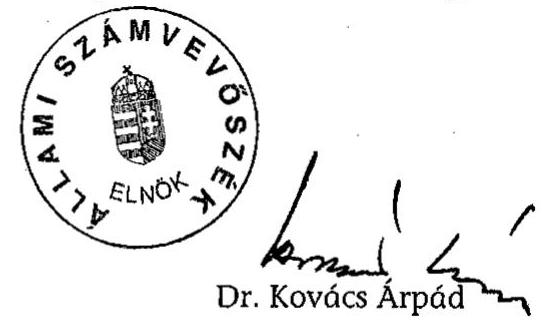
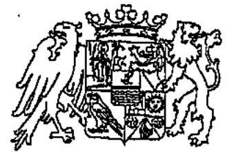
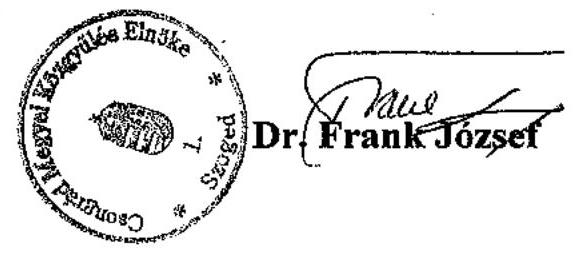

# JELENTÉS 

## a Csongrád Megyei Önkormányzat gazdálkodásának átfogó ellenőrzéséről

---

3. Önkormányzati és Területi Ellenőrzési Igazgatóság
3.3 Átfogó Ellenőrzések FőcsoportIktatószám: V-1002-7/29/27/2003.Témaszám: 635
Vizsgálat-azonosító szám: V0102
Az ellenőrzést felügyelte:
Dr. Lóránt Zoltán
főigazgató
Az ellenőrzés végrehajtásáért felelős:
Dr. Sepsey Tamás
főigazgató-helyettes
Az ellenőrzést vezette:
Csecserits Imréné
főcsoportfőnök-helyettes
Az ellenőrzést végezték:
Benkéné dr. Lavner Klára
számvevő tanácsos
Fülöp Lászlószámvevő tanácsos
A témához kapcsolódó - az elmúlt három évben készített -számvevőszéki jelentések:
címe ..... sorszáma
Jelentés az önkormányzati korlátozottan forgalomképes ..... 0108
törzsvagyon-gazdálkodás vizsgálatáról
Jelentés a helyi önkormányzatok 2000. évi normatív állami ..... 0128
hozzájárulás igénylésének és elszámolásának vizsgálatáról
Jelentés a helyi önkormányzatok tartós szociális ellátási ..... 0317
feladatainak ellenőrzéséről az idősek otthonainál
Jelentés a helyi önkormányzatok egyes pénzügyi befektetésekkel ..... 0318
történő gazdálkodásának ellenőrzéséről
Jelentés a szakképzési struktúra szerepéről a munkaerőpiaci ..... 0321
igények kielégítésében

---

# TARTALOMJEGYZÉK 

BEVEZETÉS ..... 5
I. ÖSSZEGZŐ MEGÁLLAPÍTÁSOK, KÖVETKEZTETÉSEK, JAVASLATOK ..... 7
II. RÉSZLETES MEGÁLLAPÍTÁSOK ..... 13
1.A költségvetés tervezésének, végrehajtásának és a zárszámadás elkészítésének szabályszerűsége ..... 13
1.1.A költségvetés tervezésének, a költségvetési rendelet megalkotásának, elfogadásának szabályszerűsége ..... 13
1.2.A költségvetési előirányzatok módosításának szabályszerűsége ..... 16
1.3.A gazdálkodás szabályozottsága, szabályszerűsége ..... 17
1.4.A munkafolyamatba épített ellenőrzések szabályozottsága és gyakorlati múködése a pénzügyi, gazdasági és számviteli feladatellátás területén ..... 19
1.5.A bizonylati rend szabályszerűsége ..... 20
1.6.A vagyon nyilvántartásának és leltározásának szabályszerűsége ..... 21
1.7.A vagyongazdálkodással kapcsolatos feladat és döntési hatáskörök szabályozottsága, a vagyonváltozást előidéző intézkedések szabályszerűsége, célszerűsége ..... 22
1.8.Az Önkormányzat által céljelleggel - nem szociális ellátásként - juttatott támogatásokkal történő elszámoltatás szabályszerűsége ..... 25
1.9.A követelések, részesedések, értékpapírok év végi értékelésének szabályszerűsége ..... 27
1.10.A múködési és felhalmozási bevételek, kiadások alakulása ..... 28
1.11.A költségvetés egyensúlyi helyzete ..... 30
1.12.A közbeszerzési eljárások szabályszerűsége ..... 30
1.13.A zárszámadási kötelezettség teljesítésének szabályszerűsége ..... 32
2.Az egyes kiemelt önkormányzati feladatok és a rendelkezésre álló források összhangja ..... 33
2.1.A feladatok meghatározása és szervezeti keretei ..... 33
2.2.Az egyes naturális mutatókkal mérhető feladatok bevételei és kiadásai ..... 35
2.3.A jelentős ráfordítást igénylő önként vállalt feladatok ellátása ..... 37
3.A belső irányítási, ellenőrzési rendszer múködésének értékelése ..... 38
3.1.Az Önkormányzat informatikai rendszerének szabályozottsága, múködése ..... 38
3.2.A helyi ellenőrzési rendszer kialakítása, múködése ..... 40
3.3.A könyvvizsgálati kötelezettség teljesítése ..... 41
3.4.A korábbi számvevőszéki ellenőrzések javaslatainak hasznosulása ..... 42

---

# MELLÉKLETEK 

1. számú Az önkormányzati vagyon nagyságának alakulása (1 oldal)
2. számú Az Önkormányzat 2002. évi bevételeinek és kiadásainak alakulása (1 oldal)
3. számú Az Önkormányzat gazdálkodását meghatározó adatok, mutatószámok (1 oldal)
4. számú Dr. Frank József úr, a Megyei Közgyűlés elnökének észrevétele (1 oldal)

---

# RÖVIDÍTÉSEK JEGYZÉKE 

| Ötv. | a helyi önkormányzatokról szóló 1990. évi LXV. törvény |
| :--: | :--: |
| Áht. | az államháztartásról szóló 1992. évi XXXVIII. törvény |
| Ámr. | az államháztartás múködési rendjéről szóló 217/1998. (XII. 30.) Korm. rendelet |
| Kbt. | a közbeszerzésekről szóló 1995. évi XL. törvény |
| Számv. tv. | a számvitelről szóló 2000. évi C. törvény |
| Htv. | a helyi önkormányzatok és szerveik, a köztársasági megbízottak, valamint egyes centrális alárendeltségű szervek feladat- és hatásköreiről szóló 1991. évi XX. törvény |
| Tpt. | a tőkepiacról szóló 2001. évi CXX. törvény |
| Vhr. | az államháztartás szervezetei beszámolási és könyvvezetési kötelezettségének sajátosságairól szóló 249/2000. (XII. 24.) Korm. rendelet |
| vagyongazdálkodási rendelet | a Csongrád Megyei Önkormányzat vagyonáról és a gazdálkodás egyes szabályairól szóló 11/1996 (IX. 18.) számú rendelet |
| SzMSz | a Csongrád Megyei Közgyűlés és szervei Szervezeti és Múködési Szabályzatáról szóló 7/1999 (V. 10.) számú rendelet |
| ügyrend | a Csongrád Megyei Közgyűlés és szervei Szervezeti és Múködési Szabályzatáról szóló 7/1999 (V. 10.) számú rendelet 7. számú melléklete a Csongrád Megyei Önkormányzat Hivatalának múködési szabályzatáról és ügyrendjéről |
| OEP | Országos Egészségbiztosítási Pénztár |
| ÁSZ | Állami Számvevőszék |
| Közgyűlés | Csongrád Megyei Közgyűlés |
| Önkormányzat | Csongrád Megyei Önkormányzat |
| Közgyűlés elnöke | Csongrád Megyei Közgyűlés elnöke |
| Főjegyző | Csongrád Megyei Önkormányzat főjegyzője |
| Önkormányzat hivatala | Csongrád Megyei Önkormányzat Hivatala |
| Pénzügyi bizottság | Csongrád Megyei Közgyűlés Pénzügyi Bizottsága |
| Tulajdonosi bizottság | Csongrád Megyei Közgyűlés Tulajdonosi Bizottsága |
| Értékelési utasítás | Csongrád Megyei Közgyűlés főjegyzőjének a Csongrád Megyei Önkormányzat Hivatalának értékelési szabályzatáról szóló 2002. IV. 12-i utasítása |
| Illetékhivatal | Csongrád Megyei Illetékhivatal |
| Közgazdasági osztály | Csongrád Megyei Önkormányzat Hivatalának Közgazdasági Osztálya |
| ESzCsM | Egészségügyi Szociális és Családügyi Minisztérium |

---

.

---

# JELENTÉS   a Csongrád Megyei Önkormányzat gazdálkodásának átfogó ellenőrzéséről 

## BEVEZETÉS

Az Ötv. 92. § (1) bekezdése, valamint az Áht. 120/A. § (1) bekezdése szerint Csongrád Megye Önkormányzatának gazdálkodását az Állami Számvevőszék Önkormányzati és Területi Ellenőrzési Igazgatósága a V-1002-7/2003. számú ellenőrzési program alapján vizsgálta.

## Az ellenőrzés célja annak értékelése volt, hogy:

- az önkormányzati gazdálkodás törvényességét, szabályszerűségét biztosítot-ták-e a tervezés, a költségvetés végrehajtása és a zárszámadás során; a gazdálkodás szabályszerűségét biztosító kontrollok ${ }^{1}$ megfelelően segítették-e a végrehajtást;
- az Önkormányzat által ellátandó feladatok és az azokhoz rendelkezésre álló pénzforrások összhangja biztosított volt-e.

Az ellenőrzött időszak: a 2002. év, valamint a 2003. I.-III. negyedév, az 1.7., 2.1-2.3., 3,2-3.4. ellenőrzési programpontok esetében a 2000-2002. évek, és 2003. I-III. negyedév.

Csongrád megye a Dél-alföldi régió közepén található. Területe 4,3 ezer $\mathrm{km}^{2}$, 60 településében 436 ezer lakos él. A megye lakosságának 72,3\%-a nyolc városban lakik, melyek közül Szeged és Hódmezővásárhely megyei jogú város. A községek átlagos lélekszáma 2240 fő, az országos átlag 2,5-szerese.

A 40 tagú Közgyűlés munkáját kilenc állandó bizottság, és az Önkormányzat hivatalának 147 fős apparátusa segítette. A 2002. évi választást követően a Közgyűlés elnökének és a főjegyző személye nem változott.

Az Önkormányzat feladatainak végrehajtása érdekében 30 önállóan gazdálkodó és három részben önállóan gazdálkodó költségvetési intézményt működ-

[^0]
[^0]:    ${ }^{1}$ A gazdálkodás szabályszerűségét biztosító kontroll alatt értjük a kiépített és működő belső irányítási rendszert, valamint a belső ellenőrzési funkciók ellátását.

---

tet, amelyekben a különböző szakmai és gazdasági feladatokat 3589 fő látta el. Az Önkormányzat 2003. évi költségvetésének bevételi és kiadási főösszege 14431 millió Ft, a könyvviteli mérlegének főösszege a 2002. év végén 12408 millió Ft volt.

---

# I. ÖSSZEGZŐ MEGÁLLAPÍTÁSOK, KÖVETKEZTETÉSEK, JAVASLATOK 

A Közgyűlés az 1999-2002 közötti valamint a 2003-2006. közötti évekre szóló gazdasági program meghatározásával teljesítette az Ötv-ben előírt erre vonatkozó kötelezettségét. Az Önkormányzatnál 2002. évre szóló költségvetés előkészítése, a tervezés és a költségvetési rendeletalkotás folyamata a törvényi előírásoknak megfelelő volt. A költségvetési koncepció tervezetét a Közgyűlés bizottságai megtárgyalták, a költségvetési koncepció előterjesztése tartalmazta a Pénzügyi bizottság írásos véleményét. A költségvetési rendelettervezet előkészítése során, és a költségvetési javaslat kidolgozására vonatkozó Ámr-ben foglalt előírások ellenére az Önkormányzat hivatalához rendelt három részben önálló költségvetési intézmény bevételi előirányzatának tervezetét a rendelettervezet nem tartalmazta. Az 2002. évi költségvetési rendelettervezethez a Pénzügyi bizottság véleményét csatolták. A költségvetésben a felhalmozási hiány előirányzatként hitel felvételt terveztek, amelynek igénybevételére nem került sor. A 2002. évi költségvetés, tartalmazta a költségvetés végrehajtásával kapcsolatos előírásokat, szabályokat.

A költségvetési és zárszámadási rendelettervezet az előírt mérlegeket, kimutatásokat tartalmazta, de a Közgyűlés az Áht. előírását megsértve rendeletben nem határozta meg a költségvetés és a zárszámadás során tájékoztatásul bemutatandó mérlegek, kimutatások tartalmi követelményeit. A Közgyűlés a 2002. évre vonatkozó költségvetési rendeletét öt alkalommal, összesen 20,3\%-kal módosította. Két intézmény a költségvetés végrehajtási szabályai között előírt előirányzat módosítási határidőt túllépve módosította az átvett pénzeszközök előirányzatát. A költségvetési rendelet év közbeni módosításairól vezetett analitikus előirányzat nyilvántartás áttekinthető és hiteles dokumentumokkal alátámasztott. A zárszámadási rendeletben szereplő - önkormányzati szintű módosított előirányzatokat a teljesítési adatok nem haladták meg, de egy költségvetési szerv 0,9 millió Ft-tal túllépett egy kiemelt kiadási jogcímet. Az előirányzat túllépés okait az Önkormányzat hivatala vizsgálta, felelősségre vonás nem történt.

Az Önkormányzat hivatala rendelkezik szervezeti és múködési szabályzattal, valamint ügyrenddel. Az ügyrend tartalmazza a feladatokat, azok ellátásáért felelős szervezeti egységet, a munkafolyamatba épített ellenőrzési követelményeket. A kötelezettségvállalás, utalványozás, ellenjegyzés, érvényesítés, szakmai teljesítésigazolás az Ámr-ben foglalt előírásoknak és az összeférhetetlenségi követelményeknek megfelelt.

A főjegyző kialakította és szabályozta az Önkormányzat hivatala számlarendjét, számviteli politikáját és elkészítette az annak részét képező szabályzatokat.

A jelentős összegű hiba nagyságát a mérlegfőösszeg 2\%-ában jelölték meg a számviteli politikában. A jelentős összegű hiba nagyságának aránya magas,

---

figyelembe véve a közpénzekkel történő gazdálkodással szembeni szigorú elszámolási igényt. A leltározási és selejtezési szabályzat, valamint az éves költségvetési rendelet részletezi a leltározási feladatokat. A Vhr-ben foglalt lehetőség alapján a Közgyűlés a költségvetési szerveknél az eszközök legalább háromévenkénti teljes körű, mennyiségi felvételezéssel történő leltározását írta elő. A források leltározásának szabályait a Vhr-ben előírtak ellenére nem határozták meg. Az Önkormányzat hivatalának bizonylati rendjét a főjegyző szabályozta. Az Önkormányzat hivatala a költségvetés végrehajtása során a törvény által előírt alaki és tartalmi követelményeknek megfelelő bizonylatokat alkalmazott. A bizonylatokat - a teljesítések szakmai igazolását követően - érvényesítették. A gazdasági események utalványozása és ellenjegyzése a Vhrben előírtakkal összhangban megtörtént. A gazdasági események számviteli nyilvántartásban történő rögzítése során a számviteli alapelvek érvényesültek.

A törzsvagyon nyilvántartásáról - elkülönítéséről a számvitelben és az ingatlanok esetében az ingatlanvagyon kataszterben - gondoskodtak. Az analitikus és főkönyvi könyvelés, valamint az ingatlanvagyon kataszter egyezősége 2002. végén nem volt biztosított, mert a számviteli nyilvántartás az ingatlanok esetéebn 35 millió Ft-tal magasabb bruttó értéket mutatott ki, mint az ingatlanvagyon kataszter. A 2002. évi leltározási kötelezettséget a leltározási szabályzatban, valamint a költségvetési rendelet végrehajtási szabályai között előírtak szerint összesítő kimutatás alapján elvégezték. Az üzemeltetésre átadott eszközök és források leltározását nem szabályozták, de azok leltározása megtörtént. Az értékcsökkenés elszámolásánál a jogszabályi előírásokat betartották.

A vagyonnal való gazdálkodás szabályait a Közgyűlés vagyongazdálkodási rendeletével megalkotta. A vagyongazdálkodással kapcsolatos feladatokat és döntési hatásköröket, valamint az eszközök törzsvagyonba és forgalomképes besorolásának szempontjait, a forgalomképesség szerinti besorolás módjait meghatározták. A vagyongazdálkodásról szóló rendelet előírásai az üzemeltetésre átadott eszközökre nem terjedtek ki. A követelésről való lemondást, valamint a vagyon tulajdonjogának ingyenes átruházás módját, eseteit az Áht. 108. § (2) bekezdésében foglaltak alapján szabályozták.

Az Önkormányzat eszközeinek értéke a 2000. évről a 2002. évre 52\%-kal növekedett, ezen belül az immateriális javak $37 \%$-kal, a tárgyi eszközök $81 \%$-kal, a forgóeszközök és a pénzeszközök 52,7\%-kal növekedtek. A tárgyi eszközök állományának növekedését a korábban érték nélkül nyilvántartott ingatlanok számviteli nyilvántartás szerinti értékének megállapítása okozta. A követelések, részesedések, értékpapírok év végi értékvesztésének elszámolási szabályozása megtörtént. Értékvesztés elszámolására 50\%-os mértékben két pénzügyi befektetés esetében indokoltan került sor. A követelés állomány 2002. év végi felülvizsgálatát elvégezték, értékvesztés elszámolására nem került sor.

Az Önkormányzat által ellátott feladatok és azokhoz rendelkezésre álló saját pénzforrás összhangja biztosított volt. A költségvetési beszámolók 20002002. évi teljesítési adatai alapján, önkormányzati szinten minden évben a kiadások teljesítéséhez a szükséges források rendelkezésre álltak. Felhalmozási célú kiadásoknál minden évben hiányt mutatott ki a költségvetésben az Önkormányzat. Az év során a működési célú bevételek átcsoportosításával biztosítot-

---

ta a hiányzó forrást. Hitelt az Önkormányzat nem vett fel, több évre szóló kötelezettsége a 2002. évben keletkezett az ESzCsM kórház konszolidációs programjához kapcsolódóan, a kapott összeg törlesztése 2004. évtől esedékes. A tervezett 2002. évi feladatok zavartalan ellátása és a biztonságos gazdálkodás érdekében a főjegyző likviditási tervet készített, azt szükség szerint aktualizálta. A főjegyző a kötelezettségvállalás nyilvántartás tartalmát és formáját szabályozta.

Az Önkormányzat által céljelleggel juttatott alapítványi támogatások 33,3\%nál megsértették az Ötv. előírásait, mert a Közgyűlés elnöke, illetve bizottságai döntöttek a támogatásról. A céljelleggel átadott támogatások 3,6\%-ában megsértették az Áht. előírásait, mert nem írtak elő számadási kötelezettséget. A támogatásban részesült szervezetek a folyósított összegek felhasználásáról - az Áht-t megsértve - az esetek 48\%-ában nem számoltak el. Olyan szervnek is folyósítottak támogatást, amely azt megelőzően nem tett eleget számadási kötelezettségének. Az Önkormányzat a benyújtott elszámolások, bizonylatok alapján ellenőrizte a támogatás felhasználását, helyszíni ellenőrzést nem végzett az elszámolást elmulasztókat - az Áht. előírását megsértve - nem szólította fel a számadási kötelezettség teljesítésére, nem intézkedett a visszafizetési kötelezettség érvényesítéséről. A céljelleggel, nem szociális ellátásként adott támogatásokról vezetett analitikus nyilvántartásokból nem állapítható meg a támogatás tételszáma, a döntéshozó személye, a megállapodás kötés ténye, a számadási kötelezettség határideje, annak teljesítése, illetve a felhasználás és elszámolás ellenőrzésének elvégzése.

Az Önkormányzat a Kbt. hatálya alá tartozó beszerzéseinek feladat és hatásköreit rendeletben szabályozta. A Kbt. előírását megsértve szabályozták a döntéshozatalt, mivel azt nem személyhez rendelték, hanem a bíráló bizottság hatáskörébe utalták. A közbeszerzésekre előírt értékhatárt elérő beszerzéseknél a közbeszerzési eljárást szabályosan folytatták le, kivéve a közbeszerzési eljárást lezáró döntéshozatalt, mivel személy helyett bizottság döntött.

Az elnök az előírt határidőn belül nyújtotta be a Közgyűlés részére a főjegyző által előkészített zárszámadási rendelettervezetet, amely a költségvetési rendelettel összehasonlítható módon készült. A Közgyűlés zárszámadási rendeletében jóváhagyta a költségvetési intézmények 2002. évi pénzmaradványát, a felhasználható, az intézménytől elvont, valamint feladattal terhelt bontásban, megállapítása az Ámr. előírásainak megfelelt.

Az Önkormányzat kötelező feladatellátását elsősorban a 30 önállóan, és három részben önállóan gazdálkodó költségvetési szervén keresztül, ezen túlmenően gazdasági, illetve közhasznú társaságai, közalapítványa útján szervezte meg. A Közgyűlés nem tekintette át és nem értékelte a non-profit szervezetek, az egyéni és társas vállalkozások feladatellátásában betöltött szerepét, eredményességét. Az önként vállalt feladatok finanszírozásába külső forrásokat nem vont be az Önkormányzat, azok ellátására fordított kiadások nem veszélyeztették a kötelező feladatok ellátását.

Az Önkormányzat beruházásai során az új épületeinek építésénél, valamint azokban a meglévő épületekben, ahol átalakítás, felújítás volt, megvalósította a mozgásukban korlátozott személyek biztonságos, akadálymentes közlekedésének lehetőségét. A fogyatékos személyek jogairól és esélyegyenlőségük biztosí-

---

tásáról szóló törvényben előírtak teljesítésére felmérést készítettek. A végrehajtást megkezdték, de a törvényben előírt feladatok teljesítéséhez a szükséges pénzügyi forrás nem biztosított.

Az önkormányzati hivatal informatikai rendszerének szabályozottsága nem kialakított. Nem készítettek informatikai stratégiát, adatvédelmi szabályzatot és katasztrófa elhárítási tervet. Az informatikai rendszer program részletezésű hozzáférési jogosultsági rendszerét, az engedélyezési jogköröket nem rögzítették.

Az Önkormányzat hivatalának intézményi ellenőrei éves ellenőrzési terv alapján látták el felügyeleti ellenőrzési feladataikat. A 2002. évi normatív állami támogatások intézményi adatszolgáltatásának ellenőrzése a 2003. évben megtörtént. A 2001. évi normatív hozzájárulások elszámolásához az alapdokumentumok tételes felülvizsgálatát az intézményeknél nem végezték el. Az ellenőrzési feladatok ellátását két közszolgálati jogviszonyban lévő ellenőrrel valósították meg. Évente a tervezett nyolc intézmény átfogó költségvetési ellenőrzése megvalósult.

Az ellenőrzésekről készült jelentések megfelelő információt adtak a Közgyűlésnek, az ellenőrzött intézményeket segítették a hibák kijavításában. A Közgyűlés a Htv-ben előírt kötelezettségének előterjesztés hiányában az Önkormányzat hivatalának ellenőrzése tekintetében nem tett eleget, csak a költségvetési intézmények ellenőrzésének tapasztalatait tekintette át az éves költségvetési beszámolók, zárszámadások keretében.

Az Önkormányzat hivatalában az Ötv., a Htv., valamint a Áht. előírását megsértve nem alakították ki a függetlenített belső ellenőrzés szervezeti kereteit, működési szabályait. Az Önkormányzat hivatalánál hivatali belső ellenőrzési feladattal megbízott személy nem volt alkalmazásban. Az Ötv. előírása szerint az Önkormányzat hivatalának vezetője a főjegyző, ezért rá vonatkozik az Áht. előírása, amely szerint a költségvetési szerv vezetője felelős a belső ellenőrzés megszervezéséért és múködtetéséért.

Az Önkormányzat a törvényben előírt könyvvizsgálati kötelezettségét költségvetési minősítésű könyvvizsgálóval teljesítette, összeférhetetlenség nem állt fenn. A könyvvizsgáló a költségvetési beszámolókat korlátozás nélküli, hitelesítő záradékkal látta el.

Az ÁSZ korábbi ellenőrzéseiről készült jelentések közül két esetben a megfogalmazott javaslatok alapján intézkedtek a hiányosságok megszüntetésére. Négy vizsgálat javaslatai intézkedés hiányában nem hasznosultak. Így nem került sor a normatív állami hozzájárulások ellenőrzési rendszerének kialakítására, a közoktatási megyei feladat-ellátási, intézményhálózat múködtetési és fejlesztési tervet nem bővítették az oktató-nevelő munka minőségével kapcsolatos elvárásokkal, valamint elmaradt a részvények nyilvántartásának kiegészítésével kapcsolatos javaslatok megvalósítása.

---

A helyszíni ellenőrzés megállapításai mellett a gazdálkodás szabályszerűségének és a munka színvonalának javítása érdekében javasoljuk:

# a Közgyűlés elnökének 

## a törvényes állapot helyreállítása és a jogszabályi előírások betartása érdekében

1. terjessze - a főjegyző által készített előterjesztés alapján - a Közgyűlés elé az Áht. 118. §-ában előírt, a költségvetés és a zárszámadás előterjesztésekor bemutatandó mérlegek és kimutatások tartalmának meghatározására vonatkozó rendelettervezetet;
2. intézkedjen annak érdekében, hogy a költségvetés végrehajtása során a kötelezettségvállalás - az Áht. 12/A. § (1) bekezdésében rögzítettek szerint - a költségvetési intézményeknél a jóváhagyott kiadási előirányzatok mértékéig terjedjen;
3. a szabályszerű költségvetési gazdálkodás biztosítása céljából:
a) gondoskodjon arról, hogy a céljelleggel juttatott - nem szociális jellegű - támogatások esetében az Áht. 13/A. § (2) bekezdésében előírt számadási kötelezettség előírása, teljesítése, valamint a számadás és a felhasználás ellenőrzése megtörténjen;
b) biztosítsa, hogy az alapítványok támogatásánál minden esetben a Közgyűlés döntsön az Ötv. 10. § (1) bekezdés d) pontban foglaltaknak megfelelően;
4. kezdeményezze a főjegyző felelősségre vonását az önkormányzati hivatal függetleníttett belső ellenőrzésének elmulasztása miatt a Htv. 140. § (1) bekezdés e) pontjában és az Áht. 97. §-ában előírtak alapján;

## a munka színvonalának javítása érdekében

5. kezdeményezze, hogy az ÁSZ jelentést a Közgyűlés tárgyalja meg, és a feltárt hiányosságok megszüntetése érdekében készíttessen intézkedési tervet;

## a főjegyzönek

a törvényes állapot helyreállítása és a jogszabályi előírások betartása érdekében

1. gondoskodjon a költségvetési rendelettervezet elkészítése során az Ámr. 29. § (1) bekezdés a) pontjában előírtak betartása érdekében arról, hogy az Önkormányzat hivatalához rendelt részben önálló intézményeinek bevételei a költségvetési rendelettervezetben bemutatásra kerüljön;
2. kísérje figyelemmel az intézmények előirányzat gazdálkodását, túllépés esetén a Htv. 140. § (1) bekezdés e) pontjában biztosított jogkörében eljárva vizsgálja meg annak okát és indokolt esetben tegyen javaslatot a felelősségre vonásra;

---

3. terjessze a Közgyűlés elé az Önkormányzat közbeszerzésekről szóló 10/1996. (V. 24) számú rendeletének módosítását annak érdekében, hogy a Kbt. 31. § (3) bekezdésének megfelelően a döntést személy hozza meg;
4. szervezze meg és múködtesse az Áht. 97.§ (1) bekezdés, valamint a Htv. 140. § (1) bekezdés e) pontja alapján az Önkormányzat hivatalának függetlenített belső ellenőrzését, tartsa be az Áht. 121/A. § (3) bekezdésében foglaltakat;
5. gondoskodjon az ingatlanvagyon kataszter és a számviteli nyilvántartás egyezőségéről, a 147/1992. (XI. 6.) Korm. rendelet 2. számú mellékletében szereplő előírásaira figyelemmel;
6. biztosítsa az Önkormányzat által céljelleggel - nem szociális ellátásként - juttatott támogatások esetében az Áht 13/A. § (2) bekezdésének betartását, intézkedjen annak érdekében, hogy olyan szervezetnek ne folyósítsanak támogatást, amely azt megelőzően nem tett eleget számadási kötelezettségének, nem számolt el a támogatással, továbbá az elszámolást elmulasztókat szólítsa fel számadási kötelezettségük teljesítésére, intézkedjen a visszafizetési kötelezettség értényesítéséről;
7. egészítse ki a leltározási és selejtezési szabályzatot a források, valamint az üzemeltetésre átadott eszközök leltározási feladataival a Vhr. 37. § (5) bekezdés előírására figyelemmel;

# a munka színvonalának javítása érdekében 

8. az Önkormányzat által céljelleggel - nem szociális ellátásként - juttatott támogatások esetében:
a) biztosítsa, hogy az analitikus nyilvántartásából a támogatások tételszáma, a döntéshozó személye, a megállapodás-kötés ténye az Áht. 13/A. § (2) bekezdésében előírt számadási kötelezettség határideje és annak teljesítése, valamint a felhasználás és az elszámolás ellenőrzésének elvégzése megállapítható legyen;
b) intézkedjen annak érdekében, hogy a támogatások rendeltetésszerű felhasználását lehetőség szerint a helyszínen ellenőrizzék;
9. gondoskodjon az informatikai stratégia és a katasztrófa elhárítási terv, valamint adatvédelmi szabályzat elkészítéséről;
10. rögzítse az informatikai rendszer program részletezésű hozzáférési jogosultsági rendszerét és az engedélyezési jogköröket;
11. biztosítsa a számviteli politikában a jelentős összeg nagyságrendjének olyan meghatározását, hogy az segítse a közpénzekkel történő gazdálkodás és szigorú elszámolás követelményének érvényesülését.
12. kísérje figyelemmel a fogyatékos személyek jogairól és esélyegyenlőségük biztosításáról szóló 1998. évi XXVI. törvény 29. § (6) bekezdésében előírt, a középületek akadálymentessé tételét, tekintettel a 2005. január 1-i teljesítési határidőre;
13. biztosítsa az állami hozzájárulások és támogatások ellenőrzését.

---

# II. RÉSZLETES MEGÁLLAPÍTÁSOK 

## 1. A KÖLTSÉGVETÉS TERVEZÉSÉNEK, VÉGREHAJTÁSÁNAK ÉS A ZÁRSZÁMADÁS ELKÉSZÍTÉSÉNEK SZABÁLYSZERŰSÉGE

### 1.1. A költségvetés tervezésének, a költségvetési rendelet megalkotásának, elfogadásának szabályszerűsége

A Közgyűlés az Ötv. 91. § (1) bekezdésében foglaltakat betartva az 1999-2002. évekre vonatkozó középtávú célkitűzéseit tartalmazó gazdasági programját a 36/1999. (IV. 29.) határozatával jóváhagyta. A gazdasági program a megye adottságait figyelembe véve négy éves időszakra tartalmazta az Önkormányzat legfontosabb feladatait, célkitűzéseit, a területfejlesztés, az egészségügy, a gazdálkodás a humán közszolgáltatás és a nemzetközi kapcsolatok területén. A gazdasági programban foglaltak végrehajtásáról készített beszámolót a Közgyűlés a 68/2002. (IX. 13.) számú határozatával fogadta el, továbbá a megválasztandó Közgyűlés számára ajánlásokat fogalmazott meg.

A 2002. évben megválasztott Közgyűlés - az SzMSz 10. § (1) bekezdésében foglaltaknak megfelelően - a megbízatásának időtartamára, a 2003-2006. évekre a 40/2003. (IV. 24.) számú határozatával elfogadott gazdasági programban határozta meg fő célkitűzéseit, a feladatok rangsorolását.

A program célkitűzései a területfejlesztési, pénzügyi, gazdálkodási, egészségügyi, szociális, gyermekvédelmi, közoktatási, közművelődési, sport, turisztika- idegenforgalom feladatainak ellátásával megvalósuló együttműködés területeinek meghatározásával kapcsolatosak.

A főjegyző által elkészített a 2002. és 2003. évekre vonatkozó költségvetési koncepció tervezeteket a Közgyűlés elnöke - az Áht. 70. §-ában előírt november 30-ai, valamint a választás évére vonatkozóan december 15-ei határidőt betartva - 2001. november 15-én, illetve 2002. december 15-én terjesztette a Közgyűlés elé.

Az előterjesztéseket megelőzően a Közgyűlés bizottságai a koncepció tervezeteket megtárgyalták. A költségvetési koncepció előterjesztése tartalmazta a Pénzügyi bizottság írásos véleményét az Ámr. 28. § (3) bekezdésében előírtaknak megfelelően.

A Közgyűlés a 101/2001. (XI. 15.) számú határozatával fogadta el az Önkormányzat 2002. évre vonatkozó költségvetési koncepcióját, amelyben számba vette a várható önkormányzati bevételeket, kiadásokat az ellátandó feladatok tükrében.

- A 2002. évre várható bevételeket jogcímenként csoportosították, külön részletes kimutatatásban a bevételek $70 \%$-át kitevő - központi költségvetésből

---

származó - támogatásokat és az szja-t. A kiadásokat múködési és fejlesztési szempont szerint vették számításba.

- A koncepció 216 millió Ft költségvetési, fejlesztési forráshiánnyal számolt, ezért a Közgyűlés alapvető irányelvként az intézmények működőképességének a biztosítását tűzte ki célul. Az intézmények zavartalan működése érdekében prioritásként határozta meg a koncepció a fejlesztési feladatok megvalósíthatóságának egyedi mérlegelését a teherbíró képesség függvényében, a fejlesztési kiadásokkal kapcsolatos pályázati lehetőségek kihasználását, a működési-fejlesztési egyensúly fenntartását.

A 2002. évre vonatkozó költségvetési rendelettervezet előkészítése során, ezen belül az Önkormányzat hivatala és az intézmények kiadási és bevételi előirányzatainak meghatározásakor, a költségvetési javaslat előirányzatainak számszerű kimunkálását az Ámr. 26. §-ában előírtak szerint végezték el. A rendelettervezetek javasolt előirányzatait a tervévet megelőző év eredeti előirányzatából kiindulva, a szerkezeti változásokkal és szintre hozásokkal módosítva, továbbá az előirányzati többlettel növelve munkálták ki. Az Áht. 71. § (2)-(3) bekezdéseiben foglaltak alapján a Közgyűlés elnöke a költségvetési rendelet tervezet benyújtásakor bemutatta a több éves elkötelezettséggel járó kiadási tételek későbbi évekre vonatkozó hatásai, beleértve a költségvetési évet követő két év várható előirányzatait.

A 2002. évre vonatkozó költségvetési rendelettervezetben szereplő intézményenkénti kiadási, bevételi előirányzatokat, és létszám irányszámokat az intézmények vezetőivel folytatott egyeztető tárgyalásról készített feljegyzésben foglaltakkal támasztották alá, betartva az Ámr. 29. § (4) bekezdésében előírtakat.

A 2002. évre vonatkozó költségvetési rendelettervezetet a Közgyűlés a 16/2001. (XII. 30.) számú rendeletével 12328 millió bevételi és kiadási főösszeggel fogadta el. A rendelettervezetet a Közgyűlés bizottságai - köztük a Pénzügyi bizottság - megtárgyalták. A rendelettervezet beterjesztésekor az Áht. 71. § (2) bekezdésében foglaltak alapján a Közgyűlés döntött azokban a kérdésekben, ${ }^{2}$ amelyek a tervezett előirányzatokat megalapozták. A rendelettervezet előterjesztéséhez a könyvvizsgáló írásos jelentését, és a Pénzügyi bizottság véleményét tartalmazó dokumentumot csatolták, betartva az Ámr. 29. § (9) bekezdésében előírtakat.

A Közgyűlés Önkormányzati szinten működési hiány nélküli költségvetést fogadott el a 2002. évre, a felhalmozási kiadások és bevételek egyensúlyát 91 millió Ft fejlesztési hitel előirányzat tervezésével teremtette meg.

A költségvetési rendelettervezet, illetőleg a jóváhagyott költségvetési rendelet szerkezete, tartalma nem felel meg az Ámr. 29. § (1) bekezdés a) pontjában foglaltaknak, mert a három, részben önálló költségvetési intézmény bevételi előirányzatait nem tartalmazta.

[^0]
[^0]:    ${ }^{2}$ Létszám és személyi juttatás, élelmezési normák, térítési díjak az előirányzat évközi módosításának szabályai, képviselők tiszteletdíja és költségtérítésének rendje.

---

A Közgyűlés az Önkormányzat hivatalának kiadásai között a 30 millió Ft általános tartalékon kívül összesen 162 millió Ft előirányzatot különített el céltartalék címén.

A 2002. évi költségvetési rendeletben a jogszabályi előírásokkal összhangban szabályozták a költségvetés végrehajtásával összefüggő alábbi kérdéseket:

- az intézmények előirányzat-módosítási hatáskörének gyakorlását az Ámr. 53. § (4) bekezdésben előírtak szerint;
- a Közgyűlés elnökének felhatalmazását a tervezett fejlesztési célú hitel felvételére;
- a pénzmaradvány felhasználásának szabályait, az Ámr. 66. § (6) bekezdésében előírtakkal összhangban;
- a felhalmozási célú hitel felvételét, valamint az átmenetileg szabad pénzeszköz rövid lejáratú betétként való elhelyezését az Áht. 8/A. § (1)-(3) bekezdés előírására figyelemmel.

A Közgyűlés az Áht. 74. § (2) bekezdésében biztosított felhatalmazás alapján előirányzat felhasználási hatáskört engedett át, illetőleg egyes előirányzatokra rendelkezési jogosultságot biztosított a bizottságok és a Közgyűlés elnöke részére. A Közgyűlés az átruházott hatáskörben hozott döntésekről történő beszámolás rendjét előírta.

A költségvetési rendelettervezet tartalmazta az Áht. 118. §-ában előírt mérlegeket, kimutatásokat, de a Közgyűlés - az Áht. 118. §-ában előírtakat megsértve rendeletben nem határozta meg a költségvetés előterjesztésekor tájékoztatásul bemutatandó mérlegek, kimutatások tartalmi követelményeit.

A Közgyűlés a 110/2002. (XII. 19.) számú határozatával fogadta el a 2003 évre vonatkozó költségvetési koncepcióját, melyben az előző, 2002. évi tervezési módszertan szerint számba vette a várható bevételeket és kiadásokat.

Az Önkormányzat 2003. évi költségvetés tervezési folyamatában, az előterjesztett rendelettervezet tartalmára, szerkezetére vonatkozóan a 2002. évi költségvetés készítésének folyamatára az előzőekben rögzített megállapítások és hiányosságok ${ }^{3}$ változatlanul megismétlődtek. A 2/2003. (III. 3.) számú jóváhagyott 2003. évi költségvetés 14273 millió Ft bevételi és 14431 millió Ft kiadási főösszeget, és a 158 millió Ft felhalmozási célú hitel tervezetet tartalmazott.

Az Önkormányzat 2002. év 2003. évi elfogadott költségvetési rendeletei alapján a költségvetési szervek részletesen kimunkálták költségvetéseiket. A Közgazdasági osztály az intézmények részletes költségvetési előirányzatait számszakilag és tartalmilag ellenőrizte, és az Ámr. 43. § (3) bekezdésében előírtak-

[^0]
[^0]:    ${ }^{3}$ Három részben önálló költségvetési szerv bevételi előirányzatait nem tartalmazta, valamint a Közgyűlés rendeletben nem határozta meg a költségvetés előterjesztésekor tájékoztatásul bemutatandó mérlegek, kimutatások tartalmi követelményeit.

---

nak megfelelően továbbították a TÁH részére. A költségvetésről szóló adatszolgáltatás számszakilag egyezik a Közgyűlés által elfogadott költségvetéssel.

# 1.2. A költségvetési előirányzatok módosításának szabályszerűsége 

A Közgyűlés a 2002. évre vonatkozó költségvetési rendeletében jóváhagyott előirányzatokat 12328,2 millió Ft-ról 14832,4 millió Ft-ra 2504,2 millió Ft-tal növelve összesen öt alkalommal módosította. A főösszeget érintő módosítások az eredeti előirányzat 20,3\%-át tették ki. A költségvetési előirányzatok módosítására előterjesztett rendelettervezetek az eredeti előirányzatokat tartalmazó rendelet megváltoztatására irányultak.

A 2002. évi költségvetés előirányzatait az Ámr. 53. § (6) bekezdésében foglaltakat betartva, a Közgyülés utolsó alkalommal a 2003. február 28án tartott ülésén alkotott 1/2003. (III. 3.) számú rendelettel módosította.

A Közgyűlés a 2002. évi költségvetésnek a 2003. február 28-án tartott ülésen hozott 1/2003. (III. 3.) számú rendelettel történő módosítása során az Ámr. 53. § (2) bekezdésében foglaltakat betartotta. Az Önkormányzat intézményei közül kettő a költségvetés végrehajtási szabályai között előírt utolsó előirányzat módosítási határidő (december 31.) után módosította az átvett pénzeszközzel előirányzatait.

Az előirányzat-módosításokat hitelt érdemlően alátámasztották, ezek megalapozását tartalmazó iratokat rendezetten, áttekinthetően tartották nyilván. A Közgyűlés döntését igénylő előirányzat változások indokát belső feljegyzésekkel támasztották alá, illetve a Közgyűlés döntését nem igénylő, központi költségvetési kapcsolatokból eredő változásokat leiratok igazolták. A költségvetési rendelet módosítására benyújtott előterjesztések megfelelő részletezettségűek voltak, melyek alapján a Közgyűlés a beterjesztett módosítási javaslatokat jóváhagyta.

A költségvetési előirányzatokat, azok módosításait, önkormányzati szinten, azon belül költségvetési szervenként, illetve kiemelt előirányzati bontásban áttekinthető, ellenőrizhető módon tartották nyilván.

Az Önkormányzat hivatalának költségvetési előirányzatait számítógépes könyvelési programmal is rögzítették, e nyilvántartási rendszer keretében biztosított volt az előirányzatok változásának, és a teljesítések folyamatos, naprakész követése.

A 2002. évi költségvetési beszámoló, illetve zárszámadási rendelet alapján a módosított kiadási kiemelt előirányzatokat önkormányzati szinten nem lépték túl. Egy önállóan gazdálkodó költségvetési intézmény az Áht. 12/A. § (1) bekezdésében foglaltakat megsértve egy kiemelt kiadási előirányzat jogcímet túllépett.

A Dr. Diósszilágyi Sámuel Kórház-rendelőintézet a kiemelt felhalmozási kiadás előirányzatát 809 ezer Ft-tal lépte túl. Az előirányzat túllépés oka a rekonstrukciós beruházás során előre nem látható munkák többlet költsége volt. Az Önkor-

---

mányzat hivatala a túllépés okait vizsgálta, a felelősségre vonás eszközével nem élt.

Az Önkormányzat a 2003. évi költségvetéséről és annak végrehajtásáról a költségvetési gazdálkodás 2003. évi szabályairól szóló 2/2003. (III. 3.) számú rendeletét a 2003. évben öt alkalommal módosította. ${ }^{4}$ A módosítások következtében 19,8\%-kal 14431 millió Ft-ról 17291 millió Ft-ra 2860 millió Ft összeggel módosult az önkormányzat 2003. évi költségvetése.

# 1.3. A gazdálkodás szabályozottsága, szabályszerűsége 

A Közgyűlés 7/1999. (V. 10.) számú rendeletével fogadta el az SzMSz-t, és ezen belül az Önkormányzat hivatalának ügyrendjét. Az Önkormányzat hivatala mint önálló gazdálkodási jogkörrel rendelkező költségvetési szerv - az Ámr. 10. § (4) bekezdésében előírt szervezeti és működési szabályzattal rendelkezik.

Az Önkormányzat hivatalának ügyrendje tartalmazza az Önkormányzat hivatalának irányításával, vezetésével összefüggő feladatokat, felsorolja a belső szervezeti egységek jogállását és feladatait, a munkavégzéssel kapcsolatos munkafolyamatba épített munkakörönként ellátandó ellenőrzési feladatokat.

Az Önkormányzati hivatal gazdálkodása lebonyolításának rendjét, a gazdálkodási jogkörök gyakorlásának módját a Közgyűlés elnöke és a főjegyző az 1/1996. (XI. 1.) számú együttes utasításban (továbbiakban: utasítás) szabályozta. Az utasítás 1996. évtől változatlan tartalommal hatályos a helyi sajátosságokat az ellátandó teljes folyamatra kiterjedően, az összeférhetetlenségi előírásokra is figyelemmel tartalmazza a gazdálkodási jogkörök szabályait.

Az utasításban szabályozták a kötelezettségvállalás, utalványozás ellenjegyzés és érvényesítés rendjét. Az utasítás 2. számú melléklete tartalmazza a felhatalmazások alapján a kötelezettségvállalási, utalványozási, ellenjegyzési jogkörrel rendelkező személyek felsorolását, az aláírási mintákkal együtt. A Közgyűlés elnöke kötelezettségvállalásra, utalványozásra az alelnököket felhatalmazta. A kötelezettségvállalás ellenjegyzésére a főjegyző távolléte esetére az aljegyzőt felhatalmazta. A felhatalmazott köztisztviselők gazdálkodási jogkörrel kapcsolatos utalványozási jogköre az Önkormányzat hivatalában a dologi kiadások kifizetésének elrendelése esetén egy millió Ft egyedi értékhatárig terjedt. Az 50 ezer Ft alatti előzetes írásbeliséghez nem kötött kötelezettségvállalás nyilvántartásának formáját és rendjét - az Ámr. 134. § (4) bekezdésében foglaltakat betartva szabályozták.

Az utasítás 1. számú melléklete tartalmazza az Ámr. 135. § (3) bekezdésében foglalt előírásainak megfelelően a szakmai teljesítés igazolásának módját és az azt végző személyek kijelölését. Meghatározta azokat a feltételeket, amikor a szakmai teljesítések igazolására külső szakértőket kell igénybe venni.

[^0]
[^0]:    ${ }^{4}$ Az Önkormányzat 4/2003. (IV. 3.) számú, a 6/2003. (VI. 30.) számú, a 10/2003. (IX. 30.) számú, a 13/2003. (XI. 30.) számú, a 15/2003. (XII. 22.) számú rendeletei.

---

Az érvényesítésre jogosult személyeket írásban bízták meg e feladatok végzésével. Az érvényesítéssel megbízott személyek az Ámr. 135. § (2) bekezdésében előírt képesítéssel rendelkeznek.

A gazdálkodási, ellenőrzési jogkörök gyakorlására történt felhatalmazások során, illetve a kijelöléseknél figyelemmel voltak a kötelezettségvállalás, utalványozás és ezek ellenjegyzője, valamint az érvényesítőre és a szakmai teljesítés igazolójára vonatkozó - az Ámr. 135. § (5) bekezdésében, illetve az Ámr. 138. § (1)-(3) bekezdésében előírt - összeférhetetlenségi szabályokra.

A felhatalmazás alapján kötelezettséget vállalókat, illetve ellenjegyzési jogkört gyakorlók a jogkör gyakorlásáról beszámoltak a felhatalmazóknak.

A Htv. 140. § (1) bekezdésének c) pontját figyelembe véve a főjegyző kialakított az Önkormányzat hivatalának és az intézményeknek a számviteli rendjét, a költségvetési szervekre vonatkozó előírások betartásával.

Az Önkormányzat hivatala rendelkezik a Vhr. 8. § (3) bekezdés alapján kialakított számviteli politikával. A számviteli politikában szabályozták, hogy mit tekintenek megbízható és valós összkép kialakításánál, valamint a kis értékű tárgyi eszközök, vagyoni értékű jogok és szellemi termékek minősítését befolyásoló lényes információnak. A jelentős összegű hiba nagyságát a mérlegfőösszeg 2\%-ában jelölték meg, amely az Önkormányzat hivatala 2002. évi könyvviteli mérlegének főösszege alapján 248,2 millió Ft volt. A jelentős összegű hiba aránya magas, figyelembe véve a közpénzekkel történő gazdálkodással szembeni fokozott és szigorú elszámolási igényt. Szabályozták az értékcsökkenés összegének elszámolása, az értékpapírok forgóeszközként, vagy befektetett eszközként való minősítésénél követendő eljárás követelményeit. A 2002. évtől szabályozták a terven felüli értékcsökkenés, illetve az értékvesztés és azok visszaírásának módját.

A leltározási és selejtezési szabályzatban a Vhr. 37. § (5) bekezdésében foglaltak alapján állapították meg az eszközök és források leltározásával és selejtezésével kapcsolatos feladatokat. A leltározási és selejtezési szabályzat a leltározás végrehajtási szabályaként a szellemi termékek, befektetett pénzügyi eszközök, valamint a raktári készletek esetében írja elő az évenkénti mennyiségi leltározás elvégzését, a többi eszköz esetében a Vhr. 37. § (3) bekezdésében foglaltak ellenére évente a nyilvántartások egyeztetésével történő leltározási kötelezettséget tartalmazza. Leltározásra vonatkozóan hiányos előírást tartalmaz a 2002. és a 2003. évben is a költségvetési rendelet 6. § (4) bekezdése, mely szerint az eszközök teljes körű, mennyiségi felvételezéssel történő leltározását legalább háromévenként kell elvégezni, azonban a források leltározására sem a leltározási és selejtezési szabályzat, sem a költségvetési rendelet, a Vhr. 37. § (5) bekezdésében foglaltak ellenére nem tartalmaz előírást. Az üzemeltetésre átadott eszközök leltározásával kapcsolatos feladatokat a Vhr. 37. § (5) bekezdésében foglaltak ellenére nem határozták meg. A szabályozás keretében meghatározásra kerültek a leltározás előkészítése során elvégzendő feladatok, a leltári egységek kijelölése, a leltározás módja, az értékelés szabályai, a leltározás bizonylatainak köre, a feldolgozás módja, a leltározás elvégzését igazoló leltárt helyettesítő összesítő kimutatás tartalma, formája, a leltárellenőrzés, a leltár különbözetek megállapításának, rendezésének módja, a mérlegben értékkel

---

nem szereplő kis értékű tárgyi eszközök leltározásának ideje, módja. A leltározási és selejtezési szabályzat rendelkezik a feleslegessé vált vagyontárgyak feltárásának rendjéről, az elavult, tönkrement eszközök és készletek hasznosításának, selejtezésének módjáról.

Az eszközök és források értékelésére vonatkozó értékelési utasítás tartalmazza az eszközök és források értékelésének szabályait. Ennek keretein belül az utasítás meghatározza az eszközök beszerzési értékébe beszámítandó kifizetések, ráfordítások tartalmát, megnevezését, az értékvesztés elszámolásának és az értékvesztés visszaírásának elveit, módszereit.

Az Önkormányzat hivatala saját kivitelezésben beruházási tevékenységet nem végez, rendszeresen terméket nem állít elő, nem értékesít, szolgáltatást nem nyújt, ezért önköltség számítási szabályzat készítésére nem kötelezett.

A pénzkezelési szabályzat tartalmazza a bankszámla és a készpénz forgalmára vonatkozó szabályokat, a bankszámlák és pénztár kapcsolatrendszerét, készpénz felvételének szabályait, a készpénz szállításának, őrzésének, kezelésének, ellenőrzésének rendjét, az ezekkel kapcsolatos munkaköröket, feladatokat, kötelezettségeket. A szabályzat kitér a pénztáros helyettesítésének, az utólagos elszámolásra kiadott összegek nyilvántartásának, elszámolásának, a házipénztáron kívüli pénzkezelés, továbbá az értékpapírok nyilvántartásának és őrzésének rendjére. A házipénztár keretösszegét a napi pénztárzárás alkalmával 500 ezer Ft-ban határozták meg.

Az Önkormányzat hivatala a Vhr. 49. §-ában foglaltak alapján a számlarendet elkészítette, mely az alkalmazott főkönyvi számlák megnevezését, tartalmát, a főkönyvi számla értékváltozásának jogcímeit, alapbizonylatait, az ezekhez kapcsolódó analitikus nyilvántartások formáját, tartalmát, vezetését az előírásokkal összhangban tartalmazza. A számlarendben meghatározták az évközi egyeztetési feladatokat, és a zárlati teendőket is. A számlarendben a számlavezető pénzintézetnél nyitott bankszámlákat felsorolták. A számlavezető bank aláírás-bejelentő nyomtatványa alapján tartalmazza a bankszámlák felett rendelkezésre jogosultak körét.

# 1.4. A munkafolyamatba épített ellenőrzések szabályozottsága és gyakorlati múködése a pénzügyi, gazdasági és számviteli feladatellátás területén 

A Közgazdasági osztály köztisztviselőinek munkaköri leírásaiban részletesen meghatározták a dolgozók feladat,- hatás,- és jogkörét, ezen belül az egyeztetési feladatokat, a munkafolyamatba épített ellenőrzéseket. Az Önkormányzat hivatalánál a munkaköri leírásokban a felhatalmazások alapján végzendő ellenőrzési feladatok meghatározásra kerültek.

A kötelezettségvállalás ellenjegyző̉e az Ámr. 134. §. (7) bekezdésében foglalt kötelezettségének eleget tett, ellenőrizte a kiadás jogszerúségét, a költségvetési előirányzat meglétét.

---

Az érvényesítéssel megbízott dolgozók a kiadások teljesítésének, és a bevételek beszedésének elrendelése előtt az Ámr. 135. § (1) bekezdést figyelembe véve okmányok alapján ellenőrizték és érvényesítették a gazdasági műveletek jogosultságát, összegszerűségét, a fedezet meglétét, az előírt alaki követelmények betartását.

Az Ámr. 137. § (3) bekezdése szerint a 134. § (7)-(8) bekezdésében foglaltak értelemszerű alkalmazásával az utalványozások ellenjegyzői ellenőrizték az előirányzat rendelkezésre állását, az utalványozás szabályszerűségét, az érvényesítés és szakmai teljesítésigazolás megtörténtét.

A pénztárellenőr az ellenőrzés elvégzését a pénztári bizonylatokon aláírásával dokumentálta. A bizonylatokat a kijelölt dolgozó érvényesítette, ellenjegyezte, utalványozta. A pénztár napi zárlati feladatainak elvégzését a pénztárellenőr ellenőrizte és aláírásával igazolta.

Az Önkormányzat hivatalának házipénztárában a pénztárellenőrzést elvégezték.

Az érvényesítést az Ámr. 135. § (1) bekezdésében, az ellenjegyzést a 137. § (3) bekezdésében előírtak szerint elvégezték. Az érvényesítés során ellenőrzésre került a gazdasági műveletek jogosultsága, a fedezet megléte, az utalványozások ellenjegyzése alkalmával megbizonyosodtak arról, hogy azt az arra jogosult személy végezte-e. A szigorú számadás alá vont nyomtatványok, nyilvántartása kezelése a pénzkezelési szabályzatban foglaltakkal összhangban van.

A készpénzforgalomhoz kapcsolódó gazdasági eseményeket rögzítő szigorú számadású pénztár bizonylatok nyilvántartása naprakész, pontos. A gazdasági eseményeket rögzítő, banki bizonylatok a gazdálkodási jogkörök előírásainak megfeleltek. A szakmai teljesítések igazolása a bank- és pénztárbizonylatokon megtörtént.

# 1.5. A bizonylati rend szabályszerúsége 

A gazdasági eseményeket rögzítő bizonylatok megfeleltek a Számv. tv. 166. § (2) bekezdés és a 167. § (1) bekezdésében előírt alaki és tartalmi követelményeknek.

A banki átutalásoknál és jóváírásoknál figyelembe vették a gazdálkodási jogosítványokra vonatkozó előírásokat. Az utalványozás az Ámr. 136. § (2) bekezdés előírásának megfelelően az arra felhatalmazottak végezték.

A pénztári bevételezések és kiadások 96,6\%-ánál betartották a gazdálkodási jogosítványokra vonatkozó központi és helyi előírásokat 3,4\%-nál nem történt meg az utalványozás.

A kifizetések elrendeléséhez utalványrendeletet alkalmaztak, amelyeken aláírásokkal jelezték az utalványozás és az ellenjegyzés elvégzését. Az érvényesítő az utalványrendeletet is aláírta, annak ellenére, hogy a csatolt dokumentumokon végezte el az érvényesítési feladatokat.

---

Az utólagos elszámolásra kiadott előlegek kezelése megfelelt a Pénzkezelési szabályzatban foglaltaknak, a készpénzforgalom során a kiadott előlegekről a megadott határidőben elszámoltak az előleget felvevők.

Az Önkormányzat hivatalában a bevételeket és kiadásokat tartalmuknak megfelelően, az előírt szakfeladatokon számolták el. A könyvvezetés a számviteli előírásoknak megfelelően rendezett formában történt.

# 1.6. A vagyon nyilvántartásának és leltározásának szabályszerűsége 

Az Önkormányzat vagyonának nyilvántartási rendszerét a főkönyvi könyvelés és az analitikus nyilvántartások együttese és az ingatlanok esetében ezen túlmenően az ingatlanvagyon kataszter biztosítja.

Az Önkormányzat hivatalánál a Vhr. 20. § (1) bekezdésében foglaltak alapján üzemeltetésre átadott eszközként mutatták ki azokat az önkormányzati tulajdonban lévő eszközöket, amelyek üzemeltetését más gazdálkodó szervre bízták. Az üzemeltetésre átadott eszközök az Önkormányzat hivatalának számviteli nyilvántartásában, mérlegében szerepeltek. Ezen eszközök 2002. évi leltározását az Önkormányzat hivatala egyeztetéssel végezte el, melyet összesítő kimutatással támasztottak alá.

Az analitikus és a főkönyvi könyvelés, valamint az ingatlanvagyon kataszter adatainak egyeztetéseit az Önkormányzat hivatala elvégezte. Az Önkormányzat tulajdonában lévő ingatlanvagyon nyilvántartási és adatszolgáltatási rendjéről szóló 147/1992. (XI. 6.) Korm. rendelet előírásai alapján, a korábban érték nélkül nyilvántartott ingatlanok értékét megállapították. Az ingatlanvagyon kataszteri nyilvántartásokat folyamatosan vezették.

Az ingatlanvagyon kataszter 6210 millió Ft bruttó értékadata a számviteli nyilvántartás 6245 millió Ft bruttó értékadatától 35 millió Ft-tal eltért, mert a teljesen, nullára leírt nettó nyilvántartási értékű ingatlanok bruttó értékének ingatlanvagyon kataszterben történő nyilvántartásba vételét nem végezték el 2002. december 31-i fordulónappal.

Az ingatlanvagyon forgalomképesség szerinti elkülönített nyilvántartásáról az ingatlanvagyon kataszterben, és a számviteli analitikus nyilvántartásokban gondoskodtak.

A vagyongazdálkodási rendelet 3. §-a tartalmazta a vagyonelemek felsorolását, korlátozottan forgalomképes, forgalomképes bontásban. Az egyes vagyonelemek törzsvagyonba való besorolása, valamint a forgalomképesség megállapítása a vagyongazdálkodási rendelet 5. §-a alapján, a 147/1992. (XI. 6.) Korm. rendelet 1. § (3) bekezdésének figyelembe vételével történt. Az ingatlanvagyon kataszterben a vagyon jellege és forgalomképessége szerint a törzsvagyon forgalomképtelen és korlátozottan forgalomképes csoportosítását elvégezték.

---

Az Önkormányzat hivatala a 2002. évben eleget tett a leltározási kötelezettségének. A leltározást - az üzemeltetésre átadott eszközök kivételével - a leltározási szabályzatban, valamint az éves költségvetési rendelet végrehajtási szabályai között előírtaknak megfelelően végezték el. A leltárak kiértékelése megtörtént, eltéréseket nem tapasztaltak. Selejtezést az Önkormányzat hivatalánál a 2002-2003. I-III. negyedév közötti időszakban nem végeztek.

A kötelezettségek, a követelések, a függő-, átfutó- és kiegyenlítő bevételek, illetve kiadások év végi állományát egyeztetéssel leltározták, eltérést nem állapítottak meg. A szállítói, vevői állomány év végi leltározása, egyeztetéssel (egyeztető levelek, visszaigazolások alapján) dokumentáltan a Számv. tv. 69. § (1) bekezdés és a Vhr. 37. § (3) bekezdés előírásainak megfelelően szabályosan megtörtént.

Az Önkormányzat hivatalában az immateriális javak és a tárgyi eszközök értékcsökkenési leírását - negyedévenként - a Vhr. 30. § (2) bekezdésében foglaltaknak megfelelően, a tényleges használatnak megfelelően időarányosan számolták el.

Üzemeltetésre - Csongrád Megyei Polgárvédelmi Parancsnokságnak, Ópusztaszeri Nemzeti Emlékparknak, Tűzoltó Parancsnokságnak, Szeged Turist Kftnek, Csongrád Megyei Pedagógiai és Közművelődési Kht-nek, Gépjármű Műszaki Vizsga Állomásnak, Állami Népegészségügyi Tisztiorvosi Szolgálatnak, és a Csongrád Megyei Autóiskolák Közhasznú Egyesületnek - átadott, 1152 millió Ft nettó értékű eszköz könyvviteli mérleg szerinti adatának alátámasztása leltárral az Önkormányzat hivatalánál megtörtént. Az Önkormányzat az üzemeltetésre átadott eszközök bővítéséhez pénzeszközt nem biztosított, az indokolt beruházásokat, korszerűsítéseket az üzemeltetők finanszírozták.

Az Önkormányzatnál a kötelezettségvállalás nyilvántartási rendszere az írásban vállalt kötelezettséget jelentő okmányok egy példányának az operatív gazdálkodást ellátó Számviteli Csoportnál történő gyűjtésével, és a kötelezettség teljesítését követően beérkező fizetési kötelezettséget jelentő okmányoknak megfelelő kivezetésével, továbbá a teljesített kötelezettségek könyiviteli nyilvántartásban történő folyamatos rögzítésével történik. Az Ámr. 134. § (6) bekezdés kötelezettségvállalás nyilvántartásának előírásait az Önkormányzat betartotta. Az 50 ezer Ft alatti előzetes, írásbeliséghez nem kötött kötelezettségvállalásokat nyilvántartották.

# 1.7. A vagyongazdálkodással kapcsolatos feladat és döntési hatáskörök szabályozottsága, a vagyonváltozást előidéző intézkedések szabályszerűsége, célszerúsége 

A 2000-2002. évek között az Önkormányzat vagyona folyamatosan növekedett, a 2000. évről a 2001. évre 18,7\%-kal, 2001. évről a 2002. évre 28,1\%-kal, melynek főbb összetevői az alábbiak voltak, a vagyon alakulását részletező 1. számú melléklet adatai alapján.

Az Önkormányzat eszközeinek és forrásainak értéke a 2000-2002. évek alatt 8163,6 millió Ft-ról 12 408,9 millió Ft-ra, 52\%-kal növekedett:

---

- az immateriális javak 336,5\%-os növekedése a szoftver termékek vásárlásával és hálózatfejlesztéssel függött össze;
- a tárgyi eszközök 80,7\%-kal növekedtek, összetételében az ingatlanok értéke 1271 millió Ft összegű növekedése $42 \%$-kal növelte meg az Önkormányzat vagyonát;
- a beruházások összege 1758 millió Ft összeggel, 480,4\%-kal nőtt, tartalmukban egészségügyi intézmények rekonstrukciós feladatai voltak a legjelentősebbek;
- a forgóeszközök 34\%-os növekedésében a pénzeszközök 53\%-os növekedése volt a legjelentősebb;
- az Illetékhivatal által folyósított illeték számla átvezetését 2003. január 1-től az előírásoknak megfelelően végrehajtják;
- a befektetett pénzügyi eszközök 21\%-kal csökkentek a 2002. év végén a Questor befektetési jegy 2,1 millió Ft összegű, 50\%-os értékvesztésének elszámolása következtében;
- a követelések állományának 10\%-os csökkenésében az illetékhátralék összege 787 millió Ft volt a 2002. év végén;
- a kötelezettségek 41,7\%-os növekedésében a hosszú lejáratú kötelezettség 65 millió Ft, melyből 63,7 millió Ft a Szentesen lévő megyei önkormányzati intézmény, a Területi Kórház-rendelőintézet Szentes kötelezettsége, melynek törlesztése 2004-től esedékes, 1 millió Ft a lízingbe vett eszközök miatti kötelezettség.

A felhalmozási feladatok és a felújítások kiadási előirányzatait feladatonként és célonként a költségvetési rendelet mellékletei tartalmazták és azokat a Közgyűlés, valamint a bizottságok jóváhagyása mellett valósították meg. Az értékesítések és vásárlások közgyűlési, bizottsági döntésen, adásvételi szerződéseken és az azokat alátámasztó határozatokon alapultak, ezek megfeleltek a vagyongazdálkodási és a 2002. évi költségvetési rendelet 11. §-ában rögzítetteknek, az egészségügyi, szociális, oktatási intézményekre vonatkozó fejlesztési céloknak.

A vagyongazdálkodással kapcsolatos feladat és döntési hatáskörök szabályozását a vagyongazdálkodási rendeleti tartalmazza. A jogkörök szabályozása a vagyonhoz fűződő jogok (tulajdonos, üzemeltető) és a vagyonhasznosítási formák alapján történt. A vagyongazdálkodási rendelet 5. §-a a Közgyűlés kizárólagos hatáskörébe, 6. §-a a Tulajdonosi bizottság, 7. §-a Közgyűlés elnökének, 8. §-a a vagyonkezelői szervek (költségvetési intézmények) hatáskörébe utalt döntési jogokat. A vagyongazdálkodási rendeletben az egy millió Ft feletti bruttó értékű ingó vagyon értékesítéséről a döntési jogot a Tulajdonosi bizottság részére biztosították. Az egy millió Ft alatti ingó vagyon értékesítésének döntési jogát a vagyonkezelő szerv határkörébe utalták. A 100 ezer Ft alatti értékű ingó vagyontárgyak térítésmentes átadás-átvételéről a Közgyűlés elnöke kapott döntési jogot. Minden ingatlan értékesítés a Közgyűlés kizárólagos hatásköre.

---

A vagyonkezelő szervezetek hatáskörébe tartoznak a vagyongazdálkodási rendelet 8. § (1) bekezdésének rendelkezése alapján mindazok a tulajdonosi jogok, melyeket a Közgyűlés nem von saját hatáskörébe, és nem a Tulajdonosi bizottságra vagy nem a Közgyűlés elnökére ruházott át.

A vagyongazdálkodási rendelet előírásai a vagyoncsoportok, az eszközök teljes körére tartalmaznak szabályozást, melyekben az ingatlanvagyon forgalomképesség szerinti besorolásának és megváltoztatásának rendjét a Közgyűlés kizárólagos hatáskörébe utalták.

A vagyongazdálkodási rendelet 5. § (1) bekezdés tartalmazza, az Áht. 108. § (2) bekezdés előírását betartva, a követelések elengedésének, valamint a tulajdonról és a vagyonkezelő jogának ingyenes átruházásának módját, eseteit. Ezen túlmenően szabályozta a kedvezménye átruházás eseteit, módját. Követelést az Önkormányzat nem engedett el a 2002. évben és a 2003. I-III. negyedévben.

A vagyongazdálkodási rendelet tartalmazza az önkormányzati vagyon hasznosítására vonatkozó szabályokat. A vagyongazdálkodási rendelet alapján az önkormányzati vagyont 5 millió forint értékhatár felett értékesíteni, a vagyon használatát, hasznosítási jogát átengedni - ha a törvény kivételt nem tesz csak nyilvános versenytárgyalás útján, a legjobb ajánlattevő részére lehet. A versenytárgyalás lebonyolítása a vagyonkezelő szerv feladata, a szabályszerű lebonyolítást az Önkormányzat hivatalán belül múködő Előkészítő Munkacsoport véleményezte, javaslatot tett, és a Közgyűlés elnöke döntött.

Az Önkormányzat hivatala a 2002. évben 5,7 millió Ft-ért értékesített 9 db , öszszesen 20 millió Ft bruttó értékű használt, teljesen nullára leírt gépjárművet, valamint vásárolt 18 millió Ft-ért földterületet.

A gépjárművek értékesítésének előkészítése során a főjegyző három ajánlat közül a legkedvezőbb ajánlattevővel kötött szerződést. A gépjárművek értékesítéséhez a Tulajdonosi bizottság - a vagyongazdálkodási rendelet - előírásának megfelelően a 20/2002. (IX. 19.) számú határozatával hozzájárult. Az értékesítési szerződéseket az erre felhatalmazott gazdasági alelnök írta alá, ellenjegyzését a főjegyzö végezte el.

A 18 millió Ft értékű földterület vásárlás két ingatlanforgalmi becslésen, és a Közgyűlés 698/2002. számú jóváhagyó határozatán alapult. A Tulajdonosi bizottság 6/2002. (IV. 11.) TB. számú határozatában a vásárláshoz hozzájárult. Az adásvételi szerződést a Közgyűlés elnöke írta alá. A megvásárolt ingatlanok tulajdoni bejegyzése a Szegedi Körzeti Földhivatalnál, valamint kifizetése az előírásoknak megfelelően történt.

A vásárlások alkalmával betartották a vagyongazdálkodási rendelet 6. § (1) bekezdés ingó és ingatlan vagyontárgyakra vonatkozó előírásait.

---

# 1.8. Az Önkormányzat által céljelleggel - nem szociális ellátásként - juttatott támogatásokkal történő elszámoltatás szabályszerűsége 

Az Önkormányzat a 2002. évben pénzeszköz átadások keretében 241,8 millió Ft-tal támogatott 124 esetben - nem szociális ellátásként - közalapítványt, alapítványokat, egyesületeket, non-profit egyéb szervezeteket és közhasznú társaságokat. Az Önkormányzat a különböző szervezetek részére a mecenatúra ${ }^{5}$ keretében nyújtott támogatások odaítélésének rendjét nem szabályozta. Elmaradt annak meghatározása, hogy az adott támogatás konkrétan milyen célra használható fel, a támogatási feltétel meglétét milyen módon kell igazolni, melyek az ellenőrzés eljárási szabályai.

Az Önkormányzat 2002. évi költségvetésében szereplő támogatások 222,1 millió Ft 69\%-ánál a támogatás címzettje, 12,2\%-ánál a támogatott feladat van nevesítve, míg 18,8\%-ánál a támogatott feladat és a támogatás címzettje nincs konkretizálva, a céltartalék keretösszeg megjelölése miatt.

Az Önkormányzat hivatala 2002. és 2003. évi költségvetéséből a következő jogcímeken és összegben juttatott támogatásokat ${ }^{6}$ és számolt el kiadásokat:

Adatok: millió Ft-ban

| Megnevezés | 2002. évi   eredeti elő-   irányzat | 2002. évi   tény | 2003. évi   eredeti elő-   irányzat |
| :-- | :--: | :--: | :--: |
| Müködési célú pénzeszközát-   adások | $\mathbf{2 2 2 , 1}$ | $\mathbf{2 4 0 , 2}$ | $\mathbf{1 1 9 , 2}$ |
| - alapítványoknak | 1,7 | 2,4 | 2,0 |
| - közalapítványnak | 164,6 | 164,6 | 83,2 |
| - egyesületnek | - | 2,2 | - |
| - közhasznú társaságnak | 51,0 | 51,0 | 27,5 |
| - non-profit egyéb szervezeteknek | 4,8 | 20,0 | 6,5 |
| Felhalmozási célú pénzeszköz-   átadások | - | $\mathbf{1 , 6}$ | - |
| - egyéb vállalkozásoknak | - | 1,6 | - |

[^0]
[^0]:    ${ }^{5}$ A Közgyűlés az éves költségvetési rendelet megalkotásakor a pénzeszköz átadások, céltartalékok között különféle (elnöki rendelkezésű, szociális és egészségügyi, művelődési, oktatási és ifjúságpolitikai célra felhasználható) támogatási keretösszeget hagyott jóvá 17 millió Ft összegben az önként vállalt feladatok, illetve különböző civilszervezetek támogatására. A költségvetési rendeletben ezen előirányzatok felhasználásánál a döntési jogot 3 millió Ft összeg felett a Közgyűlés elnökére, 14 millió Ft összeg felett a bizottságokra ruházta át.
    ${ }^{6}$ Az adatok nem tartalmazzák az önkormányzati intézményeknek támogatásként átadott összegeket.

---

Az Önkormányzat hivatalában a támogatásokról vezetett analitikus nyilvántartásokból nem állapítható meg a céljellegú támogatás tételszáma, a döntést hozó személye, a megállapodás kötésének ténye, a támogatott elszámolási kötelezettsége és annak határideje, valamint a felhasználás és elszámolás ellenőrzésének elvégzése (az adatokat a vizsgálat kérésére kigyűjtéssel állapították meg).

A felhalmozási célra átadott 1,6 millió Ft támogatás a beruházásokhoz kapcsolódó egyszeri közmúfejlesztési hozzájárulásként kifizetett összeg.

A múködési célra adott 240,2 millió Ft támogatás címzettjét és a támogatott célt a támogatási összeg:

- 91,2\%-a esetében a Közgyűlés költségvetést megállapító, illetve azt módosító rendeletei;
- 7,5\%-a esetében az éves költségvetési rendeletben a Közgyűlés bizottságai részére szakmai feladatok végrehajtásának támogatására jóváhagyott, elsősorban pályáztatás útján történő elosztásáról hozott határozatok;
- 1,3\%-a esetében pedig a költségvetési rendeletben jóváhagyott Közgyűlés elnöki mecenatúra támogatási keret felhasználása során a Közgyűlés elnöke által hozott döntések határozták meg.

A múködési célra átadott 240,2 millió Ft-ból a Csongrád megyei Közoktatási Közalapítvány részére pénzeszköz átadása 164,6 millió Ft-ot tett ki7. E támogatás nélkül a támogatások címzettjét, illetve a támogatott célt 72,2\%-ban Közgyűlési rendelet, 23,8\%-ban a Közgyűlés bizottságai pályáztatással, 4\%-nál az elnöki támogatási keretből hozott döntések határozták meg.

Az alapítványok 33,3\%-ánál a támogatást nem a Közgyűlés állapította meg, hanem $25 \%$-ban a Közgyűlés elnöke, 8,3\%-ban bizottság döntött a Közgyűlés utólagos jóváhagyásával

A döntések meghozatalakor megsértették az Ötv. 10. § (1) bekezdés d) pontjának előírásait, mely szerint a Közgyűlés át nem ruházható hatáskörébe tartozik az alapítványok részére történő forrásátadás, mivel az alapítványokat érintő döntések 66,7\%-át fogadta el a Közgyűlés.

A támogatások odaítéléséről, illetve felhasználásának módjáról a 124 eset 96,5\%-ában készült támogatási szerződés, melyben rögzítették a támogatás öszszegének nagyságát, folyósításának és felhasználásának célját, módját, határidejét, az elszámolási kötelezettség módját és határidejét.

[^0]
[^0]:    ${ }^{7}$ A közalapítványi támogatásként a Magyar Köztársaság 2001. és 2002. évi költségvetéséről szóló 2000. évi CXXXIII. törvény 8. számú mellékletében foglaltak alapján az Önkormányzatot normatív, kötött felhasználású támogatás címén megillető 164,6 millió Ft-nak a Csongrád megyei Közoktatási Közalapítvány részére történő átutalása szerepel.

---

Az Áht. 13/A. § (2) bekezdésében, valamint a 2002. évi költségvetési rendelet 5. § (4) bekezdésében foglaltakat - a működési célú támogatások 3,5\%-ában megsértették, a támogatásban részesített szervezetek részére nem írtak elő számadási kötelezettséget, a finanszírozó szerv részére pedig nem határozták meg a számadás és a felhasználás ellenőrzését.

A támogatásban részesült szervezetek a folyósított összegek felhasználásáról az esetek 52\%-ban elszámoltak, melyek a szakmai beszámolót, rendezvények fotóit, számlákat tartalmaztak. Az elszámolást elmulasztókat nem szólították fel a számadási kötelezettség teljesítésére és olyan szervezeteknek is folyósítottak támogatást az Áht. 13/A. § (2) bekezdésében előírtakat megsértve, melyek nem tettek eleget számadási kötelezettségének, valamint nem intézkedtek a visszafizetési kötelezettség érvényesítéséről. Felszólítás az elszámolásra egyetlen esetben sem történt meg, és a számadást elmulasztók 2003. évben is a szerződés szerinti havi támogatást megkapták.

Nem számoltak el jelentős nagyságú támogatásokról az alábbi szervezetek:

- Magyar Befektetési és Kereskedelem Fejlesztési Kht. az Önkormányzattal kötött több évre szóló szerződés alapján havi 170 ezer Ft, évi 2040 ezer Ft összeget a szegedi regionális iroda múködésének támogatásához kapott, a támogatásának felhasználásáról a támogatási szerződésben előírt kötelező elszámolás nem történt meg, a támogatást 2003. évben is tartalmazta a költségvetés, azonban a támogatás kiutalására az előző évi elszámolás elmaradása miatt nem került sor;
- a Polgárőrség szervezetének nyújtott 700 ezer Ft támogatásról a támogatási szerződésben rögzített határidőre - és később sem - elszámolás nem történt meg. A támogatás 2003. évben is megtörtént;
- az Alapítvány a Választásokért számára biztosított 150 ezer Ft-ról sem támogatási szerződés, sem elszámolás nem készült.

# 1.9. A követelések, részesedések, értékpapírok év végi értékelésének szabályszerűsége 

A követelések, részesedések, értékpapírok értékelési feladatait a 2002. évben érvényben lévő számviteli politika, a számlarend és az értékelési szabályzat tartalmazta.

A követelések értékelését a jogszabályok a helyi előírások figyelembe vételével a főkönyv és az analitikus nyilvántartás alapján végezték el. A követelések 2002. év végi értékelését a vevő követelések egyeztető leveleinek visszaigazolásai, az illetékek zárási összesítői, valamint a különféle egyéb követelések (rövid lejáratú lakásépítési támogatás, négy volt tanácsi vállalat privatizációjához kapcsolódó követelések) egyeztetéseit, hiteles dokumentáció alapján végezték. A 2002. év végi követelés értékelése alapján sem értékvesztés elszámolására, sem értékvesztés visszaírására nem volt szükség.

A 2002. évi költségvetési beszámoló összeállítása során, a pénzügyi befektetések értékvesztés elszámolásának és visszaírásának szükségességét az Önkormányzat hivatala az értékelési szabályzat előírásainak megfelelően megvizsgálta. A gazdasági társasági befektetések esetében értékvesztés elszámolása

---

nem volt indokolt. A Questor befektetési jegy könyv szerinti értékét 2,1 millió Ft után, 50\%-os értékvesztést elszámoltak, valamint a Dél-alföldi Agrárcentrum Kht-ban lévő 6,5 millió Ft üzletrész esetében a társaság saját tőkéjének a jegyzett tőkéhez viszonyított arányának tartós csökkenése mellett 50\%-os értékvesztést számoltak el.

Az Önkormányzatnak részesedése a 2002. év végén összesen négy gazdasági (egy részvénytársaság, három korlátolt felelősségű társaság) és öt közhasznú társaságban volt.

Az Önkormányzat az értékelési utasítás, valamint a Számv. tv. 54-56. § és a Vhr. 32. §-ának előírásaival összhangban, szabályozottan végezte el a részesedések és az értékpapírok felülvizsgálatát és az értékvesztés elszámolását.

Az Önkormányzat mérlegében a követelések állománya a 2002. év végén összesen 812 millió Ft volt, ennek 97,2\%-a, 787 millió Ft összegben az illeték bevételek hátralékából adódott. Az illeték bevétel hátralékának 54,1\%-a, 426 millió Ft Szeged Megyei jogú Városi Önkormányzat, 36,7\%-a, 289 millió Ft az Önkormányzat, 9,7\%-a 72 millió Ft Hódmezővásárhely Megyei jogú Városi Önkormányzat illetékességi területén keletkezett. Az illeték hátralék végrehajtását a 2003. évben összesen 567 millió Ft összegben realizálta az Önkormányzat. A végrehajtás feladataiban 23000 db intézkedés kiadás és helyszíni foglalás történt, mely 337 millió Ft-ot jelentett.

# 1.10. A múködési és felhalmozási bevételek, kiadások alakulása 

Az Önkormányzat az éves költségvetések készítésénél figyelemmel volt az ellátandó feladatok forrásigényére, a várható bevételek közötti egyensúly biztosítására.

A múködési célú bevételek a vizsgált években fedezték a működési célú kiadásokat. A felhalmozási célú kiadások mindhárom évben meghaladták az e címen képződő bevételeket, amelyet múködési célú bevételekből fedeztek.

Az Önkormányzati szintű összes költségvetési bevételek és kiadások a vizsgált években közel azonos mértékben nőttek. A növekedés mértéke a bevételeknél $53,9 \%$-os, a kiadások esetében $52,3 \%$-os volt.

---

| Megnevezés | 2000. év   tény | 2001. év   tény | 2002. év   tény | 2002/   $2000 \%$ |
| :-- | :--: | :--: | :--: | :--: |
| Múködési bevételek millió Ft-ban | 10221 | 11655 | 14541 | 142,3 |
| Felhalmozási bevételek millió Ft-   ban | 480 | 874 | 1928 | 401,7 |
| Összes költségvetési bevétel   millió Ft-ban | 10701 | 12529 | 16469 | 153,9 |
| Múködési bevétel az összes bevé-   tel \%-ában | 95,5 | 93,0 | 88,3 |  |
| Felhalmozási bevétel az összes   bevétel \%-ában | 4,5 | 7,0 | 11,7 |  |
| Múködési kiadások millió Ft-ban | 9407 | 10161 | 13268 | 141,0 |
| Felhalmozási kiadások millió Ft-   ban | 707 | 1343 | 2135 | 302,0 |
| Összes költségvetési kiadás   millió Ft-ban | 10114 | 11504 | 15403 | 152,3 |
| Múködési kiadás az összes kia-   dás \%-ában | 93,0 | 88,3 | 86,0 |  |
| Felhalmozási kiadás az összes   kiadás \%-ában | 7,0 | 11,7 | 14,0 | 200,0 |

A 2002. évben a múködési bevételek aránya $88,3 \%$ volt, mely a 2000. évi 95,5\%-os arányhoz képest a három év alatt összesen 7,2 százalékponttal csökkent.

A múködési kiadások a 2000. évről a 2002. évre 41,0\%-kal növekedtek, mely a múködési bevételek azonos időszakra vonatkozó $42,3 \%$-os növekedési ütemét 1,3 százalékponttal haladta meg.

A múködési kiadások aránya az összes kiadáson belül folyamatosan csökkent a felhalmozási célú kiadások arányának azonos mértékű növekedése mellett. A 2002. évben 7,0 százalékponttal volt alacsonyabb a múködési kiadás és ugyanennyivel nagyobb a felhalmozási kiadás aránya a 2000. évhez képest.

A felhalmozási bevételek 301,7\%-kal, 1448 millió Ft-tal növekedtek a 2002. évre a 2000. évi teljesítéshez képest. A növekedés a központi és pályázati úton nyert támogatások hatása. A felhalmozási kiadások ugyanakkor 1428 millió Ft-tal növekedtek a 2002. évre a 2000. évhez viszonyítva. A kiadások növekménye 20 millió Ft-tal alacsonyabb volt az 1448 millió Ft felhalmozási bevételeknél, vagyis a múködési bevételekből a 2002. évben 207 millió Ft-ot használtak fel felhalmozásra, míg a 2000. évben 227 millió Ft-ot.

Az Önkormányzatnak hosszú lejáratú adósságállománya az ESzCsM által meghirdetett kórház konszolidációs program keretében a 2002. évben keletkezett a Szentesi Területi Kórházat érintően 63,7 millió Ft összegben. A törlesztési kötelezettség a 2004. évben kezdődik. Az Önkormányzatnak adósságot keletkeztető kötelezettségvállalása a fentieken kívül nem volt.

---

A költségvetési rendelettervezethez csatolták a főjegyző által elkészített előirányzat felhasználási ütemtervet, amelyet év közben folyamatosan aktualizáltak, havi finanszírozási (likviditási) terv elkészítésével.

Az Önkormányzat hivatala a likviditási terv szigorú betartásával, úgynevezett központi pénzkezeléssel, a tényleges kiadási igényeknek megfelelően finanszírozta a költségvetési intézményeket, ennek hatására is, az átmenetileg szabad pénzeszközök lekötéséből származó kamatbevétel nagysága a 2002. évben a 2001. évhez képest 40 millió Ft-tal nőtt.

# 1.11. A költségvetés egyensúlyi helyzete 

Az Önkormányzatnak a vizsgált időszakban nem volt működési forráshiánya, a bevételek fedezték a kiadásokat. A költségvetés egyensúlyának stabil helyzetét mutatja, hogy 2000-2002. években a múködési bevételekből felhalmozási kiadásokat finanszírozott, és nem vállalt hosszú lejáratú kötelezettséget.

### 1.12. A közbeszerzési eljárások szabályszerűsége

A Közgyűlés a 7/2000.(VI. 1) számú rendelettel módosított 10/1996. (V. 24.) számú rendeletével (továbbiakban: közbeszerzési rendelet) szabályozta a közbeszerzési eljárások lefolytatásával kapcsolatos feladat és hatásköröket. A közbeszerzési rendelet a közbeszerzési eljárást szétbontja előkészítő és bírálati szakaszra, és ennek figyelembevételével határozza meg az eljárásban részt vevők körét. A közbeszerzési eljárás előkészítését a főjegyző által kijelölt Előkészítő Munkacsoport végezte, amelynek tagjai az Önkormányzat hivatalának köztisztviselői, a közbeszerzéssel érintett intézmény - mint jövőbeni felhasználó vezetője. Az Előkészítő Munkacsoport végezte a közbeszerzési eljárásban az ajánlatok felbontásáig felmerülő közbenső adminisztrációs és szakmai előkészítő feladatokat, bevonva a közbenső érdemi döntésekbe a bírálatra létrehozott bizottságot is. Az ajánlatok elbírálását öt tagból álló Bíráló bizottság végezte.

A közbeszerzési rendelet 3. § (3) bekezdése rögzíti, hogy az eljárásban a Bíráló bizottság elnököt választ, akinek feladata az eljárás törvényességének biztosítása. A közbeszerzési rendelet 3. § (5) bekezdése szerint a Bíráló bizottság dönt az ajánlatokról. A közbeszerzési rendelet ezen előírása sérti a Kbt. 31. § (3) bekezdésében foglaltakat, miszerint a közbeszerzési eljárást lezáró döntést személynek kell meghoznia.

A közbeszerzési rendelet összeállításánál figyelembe vették, hogy melyek azok a feladatok, amelyek túlnyomórészt a költségvetési intézményeknél fordulnak elő gyakrabban, ezért itt a döntési jogosítványokat a költségvetési intézményhez telepítették.

A közbeszerzési rendelet a múködési célú árubeszerzéseknél és szolgáltatásoknál a közbeszerzési eljárás kiírására és elbírálására a jogosítványt, illetve kötelezettséget a költségvetési szervhez telepíti. A költségvetési szerv vezetője felelős a közbeszerzési eljárás előkészítésével, kiírásával és elbírálásával kapcsolatos tevékenység rendeletben foglalt szabályainak betartásáért.

---

A Önkormányzat által alapított intézmények beszerzései a Kbt. 1. § a) és 10. § b) pontja alapján a Kbt. hatálya alá tartoznak, önálló alanyai a Kbt-nek. A beszerzéseikkel kapcsolatos eljárás kérdéseit - a Kbt. 96. § (2) bekezdésében foglalt felhatalmazás alapján - önkormányzati rendeletben szabályozták, megtartva az intézmények önállóságát a költségvetési intézményeknél előforduló múködési célú beszerzéseknél, szolgáltatásoknál azzal, hogy az eljárásban, a rendeletben foglalt szabályokat kell alkalmazni. Az Önkormányzat, mint tulajdonos ellenőrzési jogát, továbbá a szakmai segítséget is biztosítva, a költségvetési szervnél a közbeszerzési eljárásban a Bíráló bizottság egy tagját - kapcsolódóan a közbeszerzés jellegéhez - a Közgyűlés elnöke jelöli ki. A közbeszerzési rendelet szerint Önkormányzati szinten összevonva történik meg annak eldöntése, hogy mely beszerzések tartoznak a Kbt. hatálya alá.

Az Önkormányzat hivatalánál 2002. évben lefolytatott hat közbeszerzési eljárásnál a nyílt eljárási fajtát választották, az eljárást ennek megfelelően folytatták le.

- A Csongrádi Aranysziget Otthon nyílászáróinak cseréjére meghirdetett nyílt közbeszerzési eljárás során betartották az Önkormányzat 10/1996. (V. 24.) számú rendeletének ${ }^{8}$ előírásait, azonban megsértették a Kbt. 31. § (3) bekezdésében előírtakat, mivel a döntést nem személy, hanem a Bíráló Bizottság hozta meg.
- A Dr. Diósszilágyi Sámuel Kórház-rendelőintézet új belgyógyászati épületének megvalósításához szükséges, a dokumentációban részletezett különböző, öszszesen 165 db orvosi gép-műszer, berendezés és kórházi eszköz leszállítása, üzembe helyezése, 35 db meglévő orvosi gép-műszer áttelepítése, valamint 1384 db egészségügyi bútor mobilia beszállítására és beszerelésére meghirdetett nyílt közbeszerzési eljárás során betartották a közbeszerzési rendeletük előírásait. Ugyanakkor megsértették a Kbt. 31. § (3) bekezdésében előírtakat, mivel rendeletüknek megfelelően a döntést nem személy, hanem a Bíráló Bizottság hozta meg.

Az Önkormányzat a Kbt. rendelkezéseinek betartása, illetve az eljárás szabályosságának biztosítása érdekében az eljárások lebonyolítását minden esetben külső szakértő szervezet bevonásával végezte. A részletes pályázati kiírások körültekintő összeállításával, és - szükség esetén - minden ajánlattevő számára biztosított konzultáció tartásával segítették, hogy az ajánlatok a kiírásnak megfelelően készüljenek el. Az Önkormányzatot a Kbt. megsértése miatt a Közbeszerzési Döntőbizottság nem marasztalta el.

A Bíráló bizottság az ajánlatokat a Kbt. 51. § (2) bekezdésének megfelelően nyilvános ülésen bontotta fel, és zárt ülésen bírálta el. A Bíráló bizottság üléséről jegyzökönyvet készített, amely tartalmazta a döntés szempontjait és a meghozott határozatot. Az eljárási cselekmények dokumentálása megtörtént.

A Kbt. 61. § (9) bekezdésében előírt, a lefolytatott közbeszerzésekről készített éves összegzést az Önkormányzat elkészítette és azt határidőben a Közbeszerzések Tanácsának megküldte

[^0]
[^0]:    ${ }^{8}$ Az Önkormányzat 10/1996. (V. 24.) számú rendelete az Önkormányzat vagyonkezelő szervei közbeszerzési eljárásainak szabályairól.

---

Az Önkormányzat hivatala a 2002. év és a 2003. év I-III. negyedévben hat közbeszerzési eljárást folytatott le, összesen 945,9 millió Ft értékben, melynek 86,8\%-a cél- címzett támogatású beruházásokhoz kapcsolódott.

A 2002. évben és 2003. év I-III. negyedévében három árubeszerzésre (egészségügyi gép- műszerbeszerzés), két felújításra és egy átalakításra folytattak le közbeszerzési eljárást. Valamennyi értékhatárt elérő beszerzés esetén a közbeszerzési eljárást lefolytatták.

A 2002. évi céltámogatásból beszerzésre kerülő egészségügyi gép- műszer beszerzéseik esetén történtek szállítói késedelmek, amelyekért az Önkormányzat jogosan 3 millió Ft késedelmi kötbért érvényesített.

Az Önkormányzat hivatalában a dologi kiadások az értékhatár szempontjából nem érték el azt az értékhatárt mely alapján közbeszerzési eljárást kellett volna lefolytatni.

# 1.13. A zárszámadási kötelezettség teljesítésének szabályszerűsége 

A Közgyűlés elnöke az Áht. 82. §-ában előírtaknak megfelelően - határidőben, a főjegyző által előkészített zárszámadási rendelettervezetet - előterjesztette, és ez alapján a Közgyűlés a 2002. évi költségvetési gazdálkodásról szóló zárszámadás elfogadásáról, a normatív állami hozzájárulás elszámolásáról szóló 3/2003. (IV. 30.) számú rendeletét ${ }^{9}$ megalkotta. A zárszámadási rendelet alapján az Önkormányzat költségvetési főösszege 2002-ben 16469 millió Ft bevétel, és 15403 millió Ft kiadás volt.

Az Önkormányzatot megillető 1,2 millió Ft illetékbevételt az Illetékhivatal - az Ámr. 124. § (3) és (4) bekezdés előírását betartva - év közben és év végén átutalta az Önkormányzat hivatalának költségvetési elszámolási számlájára.

Az Önkormányzat zárszámadási rendelete a költségvetési rendelettel összehasonlítható módon, tartalmazta az eredeti, és módosított előirányzatokat, valamint a teljesítés pénzügyi adatait.

Az Önkormányzat 2002. évi zárszámadásának mellékleteként bemutatták az Áht. 118. § szerinti mérlegeket, kimutatásokat, de a Közgyűlés - az Áht. 118. §ában előírtakat megsértve - rendeletben nem határozta meg a zárszámadás előterjesztésekor tájékoztatásul bemutatandó mérlegek, kimutatások tartalmi követelményeit.

A zárszámadási rendelet mellékletét képezte az Önkormányzat vagyoni állapotát tartalmazó kimutatás, melyben a törzsvagyont tételesen, - ingatlanonként, az ingatlan címe, helyrajzi száma, területe, vagyonkezelő szerv megnevezése, címe,

[^0]
[^0]:    ${ }^{9}$ Az Önkormányzat 3/2003. (IV. 30.) számú rendelete a 2002. évi költségvetési gazdálkodásról szóló zárszámadás elfogadásáról, a normatív állami hozzájárulás elszámolásáról.

---

bruttó értéke és becsült értéke - felsorolták. A vagyoni állapotnak a 2002. évi változásáról szöveges értékelés készült. A vagyoni állapotot teljes körűen bemutatva, szabályszerűen végrehajtott leltározás adataival támasztották alá.

Az intézményi beszámolókat az Önkormányzat hivatala felülvizsgálta az Ámr. 149. § (3)-(5) bekezdésében foglalt határidőt, és tartalmi követelményeket betartva.

A Közgyűlés a zárszámadásban intézményi, hivatali részletezésben és önkormányzati szinten összesítve hagyta jóvá a 2002. évi pénzmaradványt és a vállalkozási tartalékot. A 2002. évi jóváhagyott vállalkozási tartalék 10,7 millió Ft összegét az alaptevékenység célú felhasználási kötelezettséggel hagyta jóvá. A pénzmaradvány megállapítása az Ámr. 65. §-ában előírtaknak megfelelő volt. Az önállóan gazdálkodó költségvetési szervek pénzmaradványát az Önkormányzat hivatala felülvizsgálta és a Közgyűlés jóváhagyta. A pénzmaradvány kimutatást az Ámr. 65-67. §-aiban foglaltaknak megfelelően, szabályosan készítették el.

A Közgyűlés elnöke által előterjesztett 2002. évi zárszámadási előterjesztés a Vhr. 10. § (11) bekezdés előírását betartva tartalmazta az egyszerűsített mérleget, az egyszerűsített pénzforgalmi jelentést, az egyszerűsített pénzmaradvány kimutatást, és a könyvvizsgálói jelentést.

Az egyszerűsített beszámolót független könyvvizsgáló felülvizsgálta, melynek eredményéről jelentést készített. A jelentésében a Területi Kórház-rendelőintézet Szentes intézménynél 25,4 millió Ft rövid lejáratú kötelezettség auditálási eltérésként, 63,7 millió Ft hosszú lejáratú kötelezettség kiegészítő mellékletben történő bemutatásának szükségességét állapította meg. A független könyvvizsgáló megállapítását a Közgyűlés figyelembe vette, a 2002. évi zárszámadási rendeletében, az auditálási eltérést rövid lejáratú kötelezettségként, a hosszú lejáratú kötelezettség összegét az intézményi zárszámadás adataiban kimutatta.

A főjegyző az Ámr. 149. § (5) bekezdése előírásának megfelelően az intézményeket írásban értesítette a jóváhagyott 2002. évi költségvetésük teljesítéséről, az intézményi felhasználásra elfogadott és elvont pénzmaradványok összegéről.

# 2. Az eGyes KIEMELT ÖNKORMÁNYZATI FELADATOK ÉS A RENDELKEZÉSRE ÁLLÓ FORRÁSOK ÖSSZHANGJA 

### 2.1. A feladatok meghatározása és szervezeti keretei

A Közgyűlés az Ötv. 70. § (1) bekezdésében foglaltak figyelembe vételével határozta meg az SzMSz 4. §-ában az Önkormányzat által ellátandó feladatokat. Az SzMSz szabályozása az ellátandó feladatokat a törvény szövegét megismételve fogalmazta meg, rögzítette, hogy az Önkormányzatnak feladata:

- törvényben előírt helyi közügyek ellátása, lakossági közszolgáltatások biztosítása, amelynek megoldására a települési önkormányzat nem kötelezhető;

---

- a megye egészére, vagy részére kiterjedő olyan körzeti jellegű közszolgáltatás megszervezése, amelynek ellátása törvényi előíráson alapul.

Lehetőséget biztosított az SzMSz a kötelező feladatokon túl, önként vállalt közfeladatok ellátására is, olyan feladat esetében, amelyet jogszabály nem utal más szerv kizárólagos feladat- és hatáskörébe, rendelkezésére állnak a feladat ellátásához szükséges személyi és tárgyi feltételek, az önként vállalt feladat nem veszélyezteti a kötelezően előírt feladatok ellátását.

Az Önkormányzat meghatározta a számára kötelezően előírt, illetve önként vállalt feladatai ellátásával kapcsolatos koncepcióját a gazdasági és munkaprogramjában.

Az Önkormányzat a kötelezően ellátandó feladatait döntően az általa alapított költségvetési szervein keresztül látta el. Az önkormányzati feladatellátást 2003. január 1-i állapot szerint - 30 önállóan gazdálkodó költségvetési szerv, és három részben önálló gazdálkodási jogkörrel rendelkező intézmény biztosította.

Az Önkormányzat egyes feladatainak ellátásáról a következők szerint gondoskodott:

- a szakosított szociális ellátás feladatait a megyében 10, az Önkormányzat által fenntartott önállóan gazdálkodó ápoló-gondozó otthon biztosítja. Az intézmények közül kettő a pszichiátriai szempontból sérült személyek (egy a vakok, egy a súlyos értelmi fogyatékos felnőttek) elhelyezését és gondozását biztosítja.
- Az egészségügyi feladatellátás keretében az Önkormányzat kötelező feladatellátását három önállóan gazdálkodó intézménye valósítja meg. A három intézmény közül kettő általános kórházként múködik, egy intézmény pedig tüdőgyógyászati és kardiológiai diagnosztikai és rehabilitációs feladatok ellátásával nem csak megyei, hanem régiós igényeket is kielégít.
- A gyermek és ifjúságvédelmi feladatok ellátására egy önállóan gazdálkodó intézményt múködtet a Közgyűlés, mely a gyermekek védelméről és a gyámügyi igazgatásról szóló 1997. évi XXXI. számú törvény 95. § (1) bekezdés szerint a személyes gondoskodást nyújtó szakellátás keretében otthont nyújtó ellátást, és a területi gyermekvédelmi szakszolgáltatást biztosít nyolc lakóotthon és a nevelőszülői hálózat múködtetésével.
- Az oktatási feladatellátás keretében az Önkormányzat 12 önálló gazdálkodási jogkörrel rendelkező intézményt múködtet. Az intézménystruktúra keretében alap, és középfokú oktatás valósul meg. Az alap- és középfokú oktatás feladatait nyolc intézmény látja el, a fiatalkorú fogyatékosok ellátását négy intézmény, speciális óvoda, szakiskola, diákotthon, gyermekotthon keretében végzik. Közoktatási feladatot lát el a Csongrád megyei Közoktatási Közalapítvány.
- A közmúvelődési feladatellátás területén három intézményt múködtet az Önkormányzat. Az intézmények közül kettő önálló gazdálkodási jogkörrel rendelkezik, a Móra Ferenc Múzeum, Csongrád Megyei Önkormányzat

---

Múzeuma Szeged, valamint a Csongrád Megyei Levéltár; egy részben önálló gazdálkodási jogkörű intézmény a Csongrád Megyei Közművelődési Tanácsadó Központ.

- A sportszervezési feladatokat egy részben önálló gazdálkodási jogkörű intézmény látja el.
- A Tisza vízgyűjtő területéhez tartozó nyolc megyei önkormányzattal közösen a Közgyűlés „Tisza Vízgyűjtő Programrégió Önkormányzati Társulás"-t hozott létre, az Önkormányzat részben önálló gazdálkodási jogkörű intézményeként, szegedi székhellyel.
- Az önkormányzati tulajdonban lévő üdülők üzemeltetését egy önálló gazdálkodási jogkörű intézmény látja el.
- Gazdasági és kulturális feladatokat látott el az öt közhasznú társaság, amelyekben az Önkormányzat és az intézmények együtt az alábbi tulajdoni hányaddal rendelkeztek:
- Ópusztaszeri Nemzeti Történeti Emlékpark Kht. 76\%,
- Csongrád megyei Pedagógiai és Közművelődési Kht. 95,2\%,
- Homokhát Eurointegrációs Centrum Kht. 3,3\%,
- Csongrád megyei MEDNET Kórházcsoport Hálózat Üzemeltetési Kht. 26\%,
- Dél-alföldi Agro-Bio Centrum Kht. 38,1\%.
- Az önkormányzatnak négy gazdasági társaságban volt érdekeltsége, a részesedés összege 54,9 millió Ft, a részesedés mértéke két gazdasági társaságban $60 \%$ feletti, két gazdasági társaságban pedig $20 \%$ alatti. A társaságok gazdaságélénkítési, idegenforgalmi, turisztikai feladatok ellátásával, köztisztasági feladatok, hulladék kezelés megyei megoldásával, temetkezéshez kapcsolódó szolgáltatásokkal foglalkoztak.

A feladatellátáshoz szükséges szervezeti struktúra lényeges átalakításával 2000. és 2003. szeptember 30-a közötti időszakban a Közgyűlés nem foglalkozott.

Egyedüli intézkedésként, megegyezés alapján a Földművelésügyi és Vidékfejlesztési Minisztérium kezdeményezésére átadták a minisztériumok 2001. július 1-től az egyik szentesi szakképző intézmény fenntartói jogát.
2002. II. félévében nem történt feladat átadás-átvétel a települési önkormányzatok és a megyei Önkormányzat között. 2003. I. negyedévében kezdeményezés érkezett Makó Város Önkormányzatától három középiskola, illetve Pusztamérges Község Önkormányzatától egy középiskola feladatainak átvételére. A közoktatási és kollégiumi feladatok tényleges átvételére 2003. szeptember 1-től került sor.

Az Önkormányzat intézményfenntartó, illetve igazgatási társulásban nem vett részt a megyei sajátosságok (a viszonylag nagy lakosságszámú települési önkormányzatok) ezt nem igényelték.

# 2.2. Az egyes naturális mutatókkal mérhető feladatok bevéte-

---

# lei és kiadásai 

Az Önkormányzat által ellátott naturális mutatókkal mérhető feladatok fajlagos kiadásainak vizsgálatát az általános iskolai oktatás, a bentlakásos szociális intézményi ellátás és a középfokú oktatás, valamint a fiatalkorú fogyatékosok ellátása vonatkozásában végeztük el a 2000-2002. évekre. A vizsgálattal érintett feladatokra fordított kiadások fajlagos értéke 32-48\%-os mértékben nőtt. A növekedés alapvető oka a bekövetkezett közalkalmazotti bérfejlesztés.

Általános iskolai oktatás a 2000-2002. években öt intézményben folyt. Az egy tanulóra jutó múködési kiadások összege a 2000. évi 122000 Ft/főről 179000 Ft/főre, azaz 46,7\%-kal emelkedett. A növekedés oka, hogy az általános iskolai tanuló létszám 2002-ben 9\%-kal volt magasabb a 2000. évinél, a múködési kiadások ugyanakkor 59,9\%-kal nőttek. A kiadások finanszírozásában az állami támogatás részaránya csökkent, a 2000. évi 95,9\%-kal szemben 2002-ben 88,9\%-os volt. Az intézményi saját bevételek részaránya a kiadások fedezetében $4,1 \%$ és $7,2 \%$ között változott. Önkormányzati támogatásra csak a 2002. évben volt szükség, melynek részaránya 2,9\% volt. Az általános iskolai oktatásra 2000-ben 20,4 millió Ft-ot, 2002-ben 33,6 millió Ft-ot fordított az Önkormányzat.

A bentlakásos szociális intézményi ellátás múködési kiadásának összege 38,9\%-kal nőtt a 2000. évről a 2002. évre az ellátottak számának 2,2\%-os növekedése mellett. A létszám változásának alacsony mértéke ellenére az egy ellátottra jutó kiadás 987000 Ft/főről 1336000 Ft/főre 35,4\%-kal emelkedett. A kiadások finanszírozásában meghatározó részaránya az állami hozzájárulásnak volt, ez 2000-ben 39,3\%-ot, 2002-ben 40,3\%-ot tett ki. Az intézményi saját bevétel abszolút összegének növekedése mellett részaránya a 2000. évben $36,7 \%$, 2002-ben $31,6 \%$ volt.

A kiadások növekedési ütemével (138,4\%) csaknem azonos mértékben növekvő állami hozzájárulás (138,9\%) és saját intézményi bevétel mellett kiadások finanszírozását a növekvő önkormányzati támogatás is segítette. Az önkormányzati támogatás részaránya 2000-ben 24,8\%-ot, 2002-ben 28,1\%-ot tett ki. A szociális intézményi ellátásra fordított kiadás 2000-ben 1107 millió Ft, 2002ben 1532,5 millió Ft volt.

A középfokú oktatás a 2000. évben kilenc, a 2001. évtől nyolc intézményben folyt. Az egy tanulóra jutó múködési kiadások összege a 2000. évi 208000 Ft/főről 2002. évre 274000 Ft/főre, 31,6\%-kal emelkedett. A fajlagos kiadás növekedését a múködési kiadások 36,1\%-os, valamint a tanulói létszám 3,4\%-os növekedése okozta. A 2002. évi állami finanszírozás 59,6\%-os részaránya növekedést, míg az Önkormányzati támogatás $31 \%$-os, az intézményi saját bevétel 9,4\%-os részarányai csökkenést mutatnak a 2000. évihez viszonyítva.

A fiatalkorú fogyatékosok ellátása négy intézményben folyt a megyében. Az egy ellátottra jutó múködési kiadások összege a 2000. évi 416000 Ft/főről a 2002. évre 615000 Ft/főre, $48 \%$-kal nőtt. Az ellátottak létszáma 2002-ben 615 fő, 199 fővel, és $48 \%$-kal magasabb, mint a 2000. évi. A múködési kiadások $61 \%$-kal emelkedtek. A kiadások finanszírozásában az állami támogatás

---

részaránya nőtt, a 2000. évi 55,8\%-kal szemben 2002-ben 56,7\% volt. Az önkormányzati támogatás részaránya a kiadások fedezetében a 2000. évben $42,1 \%$, 2002-ben $41,3 \%$, ez 5,2 százalékpontos csökkenést jelent. A fiatalkorú fogyatékosok ellátására a 2000. évben 273,2 millió Ft-ot, 2002-ben 440 millió Ft-ot fordított az Önkormányzat.

# 2.3. A jelentős ráfordítást igénylő önként vállalt feladatok ellátása 

Az Önkormányzat az Ötv. 70. § (1) bekezdésben foglaltaknak megfelelően önként vállalt feladatait SzMSz-ében, gazdasági programjaiban határozta meg. Az éves költségvetési rendeletekben az önként vállalt feladatok támogatását meghatározták, ilyenek:

- közhasznú társaságok és alapítványok támogatása;
- elnöki és bizottsági hatáskörben felhasználható előirányzatok;
- nemzetközi és euró-régiós együttmúködéssel kapcsolatos feladatok;
- múvelődési és sportfeladatok támogatása.

A önként vállalt feladatok kiadási előirányzatai évenként 59,1 millió Ft és 81,6 millió Ft között változtak. Az önként vállalt feladatokkal kapcsolatos célok megvalósításához az Önkormányzat külső forrásokat nem tudott bevonni.

Az éves költségvetés végrehajtásáról szóló rendeletek tényadatai azt mutatják, hogy az önként vállalt feladatokra teljesített kifizetések nem érték el az éves költségvetési előirányzat $1 \%$-át, az önként vállalt feladatok a kötelező feladatellátást nem veszélyeztették.

Az Önkormányzat a 1999. évtől kezdődően foglalkozott a mozgáskorlátozott személyek akadálymentes közlekedését biztosító feladatokkal. A Közgyűlés 89/2001. (IX. 27.) számú határozatával elfogadta a fogyatékosügyi programját, s feladatul tűzte ki benne, hogy az Önkormányzat épületeire akadálymentesítési felmérés és program készüljön. Ebben az intézmények egyedileg, tételesen rögzítsék az akadály-mentesség biztosításához szükséges tennivalókat. A „mozgássérültek és az épített környezet" témában indított vizsgálathoz kapcsolódva az Önkormányzat tulajdonában, illetőleg a használatában lévő közintézményekbe való bejutás, az ott közlekedés akadálymentességének felmérését, valamint az akadálymentesítés biztosíthatóságát, a megvalósítás költségeinek becslését elvégezték. E becslés szerint 130 millió Ft szükséges a feladatok megvalósításához, melyből 115 millió Ft az állami támogatási igény.

Az épített környezet alakításáról és védelméről szóló 1997. évi LXXVIII. törvény hatálybalépésével az Önkormányzat a beruházásai során - az új épületek építésénél, a meglévő épületek átalakításánál, felújításánál - betartotta a biztonságos és akadálymentes használhatóság megvalósítását, a mozgásukban korlátozott személyek részére. Ennek során az elmúlt években az idősek otthonainál került sor az egészségügyi helyiségek felújítására, korszerűsítésére, ahol a

---

bejáratok és a helyiségek méreténél, belső elrendezésénél az akadálymentes közlekedés előírásait figyelembe vették.

Az Önkormányzat 2001-2003. években elvégzett akadálymentesítései:

- a Szociális és Családügyi Minisztérium támogatásával a rekonstrukciós programja keretében a Csongrád Megyei Önkormányzat Idősek Otthona Mórahalom akadálymentesítésére 19820 ezer Ft-ot fordított;
- beruházás vagy korszerűsítés során a Csongrád Megyei Önkormányzat Vakok Otthona ( 635 ezer Ft), Csongrád Megyei Önkormányzat Maros-menti Idősek Otthona Makó (2142 ezer Ft), Idősek Otthona Öföldeák (8221 ezer Ft);
- az új intézményeknél - Aranysziget Otthon Csongrád (1760 ezer Ft) és Napsugár Otthon Kistelek-Ruzsa (1850 ezer Ft) - biztosították az akadálymentesítést.

Jelentős további pénzügyi forrást igényelnek a múemlék épületek - a Kastély Otthon Nagymágocs, Ápoló Otthon Derekegyház, Pszichiátriai Otthon Ópusztaszer - akadálymentesítése. Az Önkormányzat költségvetése ilyen feladatra a 2002. évben nem tartalmazott előirányzatot. A 2003. évi költségvetési rendelet a szociális intézmények akadálymentesítése jogcímen 20 millió Ft előirányzatot tartalmazott, ennek felhasználására azonban nem került sor.

A fogyatékos személyek jogairól és esélyegyenlőségük biztosításáról szóló 1998. évi XXVI. törvényben előírt feladatok 2005. január 1-ig történő teljesítéséhez a szükséges pénzügyi forrás nem biztosított.

# 3. A BELSŐ IRÁNYÍTÁSI, ELLENŐRZÉSI RENDSZER MŰKÖDÉSÉNEK ÉRTÉKELÉSE 

### 3.1. Az Önkormányzat informatikai rendszerének szabályozottsága, múködése

Az Önkormányzatnál a strukturált számítógép-hálózat kiépítése 1996 évben megtörtént. A hálózat alkalmas a nagytömegú és gyors adatátvitelre.

Az Önkormányzat hivatala az informatikával kapcsolatos hosszú távú elképzeléseket, terveket tartalmazó informatikai stratégiával és a váratlan események bekövetkezésekor - a folyamatos, biztonságos munkavégzés, az adatmentés és adatmegőrzés érdekében - teendő intézkedésekre vonatkozó ka-tasztrófa-elhárítási tervvel nem rendelkezik.

Az informatikai rendszer program részletezésú hozzáférési jogosultsági rendszerét, az engedélyezési jogköröket nem rögzítették. A gyakorlatban a munkahelyi vezető határozta meg, hogy ki, milyen programokat és milyen hozzáféréssel jogosult használni.

Az informatikai eszközökről a számviteli egyedi nyilvántartások a számítógépekhez rendelten tartalmazzák a különböző műszaki paramétereket és az egy konfigurációba tartozó eszközöket. Az informatikai eszközöket és programokat nyilvántartották és leltározták. A leltározás adatai egyezőséget mutattak a gépi nyilvántartás adataival.

---

A felhasználók köre a pénzügyi-számviteli terület köztisztviselőit tekintve teljes. Minden számítógépen megtalálhatók az általános célú felhasználói programok. Az általánostól eltérő felhasználói program a számítógép hálózaton keresztül nem érhető el. Ezek konkrét felhasználói köre a munkakör meghatározásával, a programnak a felhasználó által használt számítógépre való telepítésével biztosított.

Az Önkormányzati hivatal minden számítógépe hálózatba kötötten múködik, használatához felhasználói azonosítóval és jelszóval férnek hozzá. Az alkalmazott hálózati operációs rendszer nyilvántartja, és dokumentálja a felhasználók adatait és jogosultságait. A hozzáférési jogosultságok beállításának alapja a felhasználó munkaköre.

Az Önkormányzatnál a pénzügyi-számviteli területen dolgozó 17 köztisztviselő közül informatikával összefüggő felsőfokú szakképzettsége három főnek van. Hatan rendelkeznek alapfokú OKJ-s és ECDL bizonyítvánnyal.

A pénzügyi-számviteli területen dolgozó köztisztviselők munkaköri leírásában nem szerepelt a konkrét számítógépes program alkalmazása. Kivétel négy fő, akiknél a feladat meghatározás megfelelően tükrözte a ténylegesen használandó programokat.

A rendszer üzemeltetésével, karbantartásával kapcsolatos feladatokat az Önkormányzat hivatalánál egy fő informatikus látja el. Az egységes rendszer kialakítására, a fejlesztési irányok meghatározására és annak koordinálására a főjegyző 1996-ban informatikai munkacsoportot hozott létre.

A számítógépes feladatok megoldásához az aktív munkaállomások száma a 2002. évben 60 volt. Évente 10-15 új számítógép beszerzése illetve cseréje történik. A számítógépek beszerzése OEM alapszoftverekkel (Windows és Office) együtt történik. A számítógéppark átlagos életkora 2,5 év.

Az Önkormányzat 2003. június 1-i hatállyal csatlakozott a Miniszterelnökség Közbeszerzési és Gazdasági Igazgatósága és a Microsoft Ireland Operations Limited között megkötött keretszerződéshez. ${ }^{10}$ A vírusvédelmi szoftver frissítése 2001. óta licencszerződés keretében megtörténik. Két saját fejlesztésű programot készítettek: egy iktatóprogramot, és a települési rendeletek feldolgozását végző alkalmazást.

A pénzügyi-számviteli ügyviteli folyamatokról nem készült komplex felhasználói program, , üzemeltetési leírás. A pénzügyi-számviteli programokhoz rendelkezésre állnak a működési leírások.

A számviteli bizonylatok biztonságos megőrzése érdekében a könyvviteli nyilvántartást és az elszámolást alátámasztó számviteli bizonylatok kiíratása éven-

[^0]
[^0]:    ${ }^{10}$ A Microsoft kedvezményes licenc konstrukciót alakított ki az Önkormányzat és intézményei részére, mely egyszerűsítette és hatékonnyá tette a jogtiszta szoftver gazdálkodást.

---

te papír adathordozóra valamint lemezre történő tártolása teljes körűen megtörtént.

# 3.2. A helyi ellenőrzési rendszer kialakítása, múködése 

Az Önkormányzat 92. § (2) bekezdésében előírt - a saját intézmények ellenőrzésére vonatkozó - feladat végrehajtására a Közgyűlés kialakította a szervezeti kereteket. Az SzMSz-ben a Közgazdasági osztály részére írták elő az intézményi pénzügyi ellenőrzési feladatokat.

A főjegyző állapította meg az Önkormányzat felügyeleti ellenőrzési szabályzatát az 1/2002. számú, 2002. április 22-én kelt főjegyzői utasítással, melyben meghatározta a felügyeleti ellenőrzés feladatait, azonban nem határozta meg a 30 önálló gazdálkodási jogkörrel rendelkező költségvetési szerv vonatkozásában az elvégzendő pénzügyi ellenőrzések rendszerességét. A hatályos főjegyzői utasítás az Önkormányzat intézményeinek felügyeleti ellenőrzéséről rendelkezik. A főjegyző a Htv. 140. § (1) bekezdés e) pontjában előírtakat megsértette, mert nem biztosította az Önkormányzat hivatala tekintetében a pénzügyigazdasági ellenőrzés keretében a függetlenített belső ellenőrzési feladatok elvégzését. Az Ötv. 92. § (2) bekezdése tekintetében nem gondoskodott az Önkormányzat gazdálkodásának belső ellenőrzéséről jogszabályban meghatározott képesítésű ellenőr útján.

A főjegyző megsértette az Áht. 2003. január 1. - 2003. november 26. között hatályos 120/A. § (2) bekezdés b) pontját, mivel az Önkormányzat hivatalának nem volt függetlenített belső ellenőrzési szervezete, s nem volt belső ellenőre. Az Ötv. 36. § (2) bekezdésére tekintettel a főjegyző megsértette az Áht. 97. §-ának azon előírását, mely szerint a költségvetési szerv vezetője felelős a belső ellenőrzés megszervezéséért és múködtetéséért, mert belső ellenőr nem volt az Önkormányzat hivatalánál.

A 2002. és 2003. években az Önkormányzat hivatalánál hivatali belső ellenőrzési feladattal megbízott személy nem volt alkalmazásban. Ezzel 2003. január 1-től megsértették az Áht.2003. január 1-től hatályos 120/A. § (2) bekezdés b) pontjában foglaltakat is, mely alapján az önkormányzatok költségvetési szerveinek belső pénzügyi ellenőrzését függetlenített (utólagos) belső ellenőrzési szervezet útján kell ellátni.

Az éves költségvetési rendeletek mellékletében a Közgyűlés meghatározta az éves intézményi ellenőrzési tervet, megjelölve az elvégzendő ellenőrzés fajtáját, tervezett időpontját. A 2002. és 2003. években nyolc-nyolc átfogó költségvetési ellenőrzés; 16 illetve 12 témavizsgálat; valamint 2002. évben két célvizsgálatot terveztek. A témavizsgálatok kiterjedtek az intézményi mosodai kapacitások gazdaságosságára; az egészségügyi intézmények szolgáltatásaira; az oktatási intézményi térítési díjakra; a közoktatási információs rendszer fejlesztésének irányaira, az intézményvezetői munka szabályozottságára; a szociális intézményekben a gyógyszerfelhasználás és szakmai minimum feltételek biztosításának helyzetére; a normatív támogatások igénylésére és elszámolására; a selejtezésekre, a készletnyilvántartások szabályozottságára stb. Utóvizsgálatot nem terveztek és nem is végeztek.

---

A meghatározott ellenőrzési feladatok végrehajtásához két főfoglalkozású pénzügyi ellenőri álláshelyet, és a kapcsolódó előirányzatokat jóváhagyta a Közgyűlés. A feladat ennek megfelelően az alkalmazott két köztisztviselő revizor munkaköri leírásában meghatározásra került.

A felügyeleti ellenőrzést végző két fő köztisztviselő a 2002. évben az ellenőrzési utasításban foglaltak figyelembe vételével, a főjegyző által kiadmányozott ellenőrzési program betartásával végezte feladatát. A program tartalmazta a vizsgálat célját, a gazdálkodás rendjével kapcsolatos ellenőrzés szempontjait.

Az ellenőrzésről készített éves beszámoló szerint a 2002. évre jóváhagyott ellenőrzési terv végrehajtásra került. A terv szerinti vizsgálatok a 2002. évben végrehajtásra kerültek, ezzel az intézmények 72\%-át - 10 szociális, nyolc oktatási, három egészségügyi, egy gyermekvédelmi, egy közgyűjteményi vizsgálatot folytattak.

A helyszíni vizsgálatokról készített jelentések a vizsgálati programokkal összhangban, azonos szerkezetben készültek. A jelentések a vizsgálat célján és módszerének ismertetésén kívül tartalmaztak megállapításokat, javaslatokat, és az ellenőrzési programban foglalt célokra választ adtak. Ezáltal megfelelő információt szolgáltattak, és a törvényes állapot helyreállítása céljából feladatot határoztak meg, az ellenőrzött intézményeknek segítséget jelentettek a feltárt hibák, illetve hiányosságok megszüntetésében.

Az ellenőrzött szervek vezetői írásban észrevételt tettek a jelentésekben megfogalmazottakra, szükség esetén intézkedési tervet készítettek.

A normatív állami hozzájárulások, a felhasználási kötöttséggel igénybevett hozzájárulások, valamint a cél- és címzett támogatások igénylésének és elszámolásának ellenőrzési rendje nem volt szabályozott. Az állami támogatások, hozzájárulások intézményi adatszolgáltatásának ellenőrzése nem rendszeres. A normatív támogatások igénybevételét, elszámolását megalapozó nyilvántartások vezetését a 2003. évben ellenőrizték a szociális és az oktatási intézményekben. A 2001. évi normatív hozzájárulások elszámolásához az intézményeknél az alapdokumentumok tételes felülvizsgálatát 2002. évben nem végezték el.

A Közgyűlés a Htv. 138. § (1) bekezdés g) pontjában előírt kötelezettségének, előterjesztés hiányában az Önkormányzat hivatalának ellenőrzése tekintetében nem tett eleget, csak az intézmények ellenőrzésének tapasztalatait tekintette át az éves költségvetési beszámolók, zárszámadások keretében.

A 2002. évi ellenőrzésről készített beszámolót a Közgyűlés a 24/2003. (IV. 20.) számú határozatával elfogadta, és a tudomásul vételről határozatot hozott.

# 3.3. A könyvvizsgálati kötelezettség teljesítése 

Az Önkormányzat az Ötv. 92/A § (1) bekezdése alapján könyvvizsgálatra kötelezett volt. A választott könyvvizsgálója a Magyar Könyvvizsgálói Kamara bejegyzett, regisztrált és költségvetési minősítéssel rendelkező tagja, továbbá nyilatkozott, hogy személyével szemben összeférhetetlenség nem áll fenn. A

---

könyvvizsgálói feladattal, ezen belül az egyszerúsített beszámoló felülvizsgálatával megbízott könyvvizsgáló kiválasztásakor az Önkormányzat betartotta az Ötv. 92/B §-ában előírtakat.

A könyvvizsgáló írásban véleményezte az éves költségvetés készítésével kapcsolatos előterjesztéseket, rendelettervezeteket, felülvizsgálta a 2002. évi költségvetés végrehajtásáról szóló előterjesztést, és a zárszámadási rendelettervezetet, valamint az Önkormányzat egyszerúsített tartalmú költségvetési beszámolóját. A könyvvizsgáló az Önkormányzat költségvetési szerveinek adatait összevontan tartalmazó 2002. évi egyszerúsített beszámoló, valamint a zárszámadási előterjesztés felülvizsgálatáról 2002. április 10-i jelentésében számolt be. A könyvvizsgáló eltérést állapított meg.

A Közgyűlés a 2002 évi egyszerúsített beszámolót és az ahhoz mellékelt könyvvizsgálói jelentést a 32/2003. (IV. 24.) számú határozatával elfogadta. A könyvvizsgáló az Önkormányzat beszámolóit korlátozás nélküli, hitelesítő záradékkal látta el.

A könyvvizsgáló a Vhr. 46. §-ában előírt kötelezettségét - a számviteli és vagyonkataszteri nyilvántartások egyezősége tárgyában - teljesítette. Az ingatlanok esetében az alátámasztás egyeztetéssel történt, a könyvvizsgáló megállapította, hogy e nyilvántartások egyezősége biztosított. Ellenőrzésünk eltérést tapasztalt az ingatlanvagyon kataszter 2002. december 31-i 6210 millió Ft-os értékadata, és a számvitel 6245 millió Ft bruttó értékadata között. A 35 millió Ftos eltérés oka a nullás nettó értékű ingatlanok átvezetésének elmaradása volt.

A könyvvizsgáló éves munkaprogram szerint intézményi körben végzett vizsgálatainak eredményét, az írásban tett megállapításokat, illetve javaslatokat, az Önkormányzat hivatala az intézmény felügyeleti tevékenysége során hasznosította, részben a rendszer, illetve egyedi hibák kiszűrése, megelőzése érdekében.

# 3.4. A korábbi számvevőszéki ellenőrzések javaslatainak hasznosulása 

Az elmúlt három évben az ÁSZ hét témában végzett ellenőrzést az Önkormányzatnál. A szakképzési struktúra vizsgálatában a megállapításokon túlmenően javaslat nem született.

A korlátozottan forgalomképes törzsvagyonnal való gazdálkodás hiányosságai alapján tett javaslatokkal kapcsolatos intézkedések az alábbiak:

- az analitikus nyilvántartásokba és a számlarendbe feltüntették az eszközök azonosítására alkalmas adatokat;
- a térítésmentesen átadott földterületek és telkek értékének megállapítását, nyilvántartásba vételét elvégezték;
- a tartozás fejében átvett telkek nyilvántartását a 2001. évben elkészítették.

---

A vagyongazdálkodással és nyilvántartással kapcsolatos feladatok elvégzésének ellenőrzése az intézményi ellenőrzési munkatervekben javaslatunk ellenére nem szerepelt.

Az Illetékhivatal tevékenységének ellenőrzése során javaslatainkra vállalt intézkedések hatására folyamatosan javult az Illetékhivatal eszköz ellátottsága, a dolgozók elhelyezési körülményei. Biztosították 2003. januártól a szemlealanyok ellenőrzésével kapcsolatos feladatok ütemezett ellátására a személyi feltételeket kapcsolt munkaköri kötelezettséggel. Külön is értékelték a vizsgálat javaslatainak megfelelően az Illetékhivatal szervezeti egységeinek teljesítményét, a félévi zárási összesítők elkészítését követő 15. napon.

A helyi önkormányzatok 2000. évi normatív állami hozzájárulás igénylésének és elszámolásának ellenőrzésekor az ÁSZ javasolta:

- az Önkormányzat évenkénti rendszerességgel vizsgálja felül az intézményi adatszolgáltatás pontosságát, hitelességét, a nyilvántartások vezetését;
- az elszámolási rendszer teljességére való tekintettel az elszámolás alapdokumentációjának teljes körét biztosítsák az intézményi nyilvántartási rendszerben;
- a feladat végrehajtás érdekében intézkedési terv készüljön, és azt az ÁSZ részére küldjék meg.
A javaslatokra intézkedés nem történt.
Az általános iskolai oktatás minőségének javítását szolgáló intézkedések ellenőrzésekor javasoltuk, hogy a közoktatás megyei feladat-ellátási, intézményhálózat múködtetési és fejlesztési tervében fogalmazzák meg az oktatónevelő munka minőségével kapcsolatos elvárásokat. Intézkedés nem született.

A helyi önkormányzatok egyes pénzügyi befektetésekkel történő gazdálkodásának ellenőrzésekor javasoltuk:

- az analitika kiegészítését a részvények induló sorozatszámával, a társaság saját tőkéjének összegével, az értékvesztés visszaírásának lehetőségével;
- a számviteli politika és a számlarend mellékleteként csatolják a számviteli elszámolás során az Önkormányzatnál használatos nyomtatványokat;
- a mérleghez csatolt részesedésekről szóló kimutatásokban tüntessék fel, hogy az Önkormányzat milyen százalékban tulajdonosa az adott társaságnak.
A javaslatokra intézkedés nem történt.
Budapest, 2004. június " 8 "

Melléklet: $\quad 4 \mathrm{db} \quad 4 \mathrm{lap}$

---

Csongrád Megyei Önkormányzat

# Az önkormányzati vagyon nagyságának alakulása

|  Mérlegsor megnevezése | 2000.év
(ezer Ft) | 2001. év
(ezer Ft) | 2002. év
(ezer Ft) | Változás \%-a |  |   |
| --- | --- | --- | --- | --- | --- | --- |
|   |  |  |  | 2001/2000. | 2002/2001. | 2002/2000.  |
|  Immateriális javak | 15384 | 37844 | 51765 | 246,00 | 136,79 | 336,49  |
|  Tárgyi eszközök | 4167833 | 5192185 | 7532770 | 124,58 | 145,08 | 180,74  |
|  ebből: ingatlanok | 3029225 | 3473494 | 4299783 | 114,67 | 123,79 | 141,94  |
|  beruházások | 365913 | 846048 | 2123820 | 231,22 | 251,03 | 580,42  |
|  Befektetett pénzügyi eszközök | 193945 | 192271 | 153573 | 99,14 | 79,87 | 79,18  |
|  Üzemeltetésre átadott eszközök | 1172138 | 1152429 | 1165182 | 98,32 | 101,11 | 99,41  |
|  Befektetett eszközök összesen | 5549300 | 6574729 | 8903290 | 118,48 | 135,42 | 160,44  |
|  Forgóeszközök összesen | 2614270 | 3114180 | 3504912 | 119,12 | 112,55 | 134,07  |
|  ebből: követelések | 941874 | 936429 | 845759 | 99,42 | 90,32 | 89,80  |
|  pénzeszközök | 1224771 | 1569385 | 1871282 | 128,14 | 119,24 | 152,79  |
|  Eszközök összesen | 8163570 | 9688909 | 12408202 | 118,68 | 128,07 | 151,99  |
|  Saját tőke összesen | 5679652 | 6653409 | 8761818 | 117,14 | 131,69 | 154,27  |
|  Tartalék összesen | 661659 | 1048941 | 1064956 | 158,53 | 101,53 | 160,95  |
|  Kötelezettségek összesen | 1822259 | 1986559 | 2581428 | 109,02 | 129,94 | 141,66  |
|  ebből: rövid lejáratú kötelezettségek | 168493 | 248374 | 403276 | 147,41 | 162,37 | 239,34  |
|  hosszú lejáratú kötelezettségek | - | - | 65070 |  |  |   |
|  Források összesen: | 8163570 | 9688909 | 12408202 | 118,68 | 128,07 | 151,99  |

Forrás: Államháztartási Hivatal Költségvetési Nyilvántartási és Adatfeldolgozási Főosztály éves költségvetési beszámoló "01" számú űrlap adatai

---

Csongrád Megyei Önkormányzat

# Az Önkormányzat 2002. évi bevételeinek és kiadásainak alakulása 

Adatok: ezer Ft-ban

| Mérlegsor megnevezése | Eredeti | Módosított | Teljesítés |
| :--: | :--: | :--: | :--: |
|  | elöirányzat |  |  |
| Bevételek |  |  |  |
| Intézményi müködési bevételek | 1169784 | 1190182 | 1195094 |
| Kamatbevételek | 44563 | 47439 | 98253 |
| Gépjármüadó | - | - | - |
| Helyi adók és kapcsolódó pótlékok, bírságok | - | - | - |
| Illetékek | 1110000 | 1210000 | 1213680 |
| Személyi jövedelemadó | 2603347 | 2609285 | 2609285 |
| Egyéb átengedett adók, adójellegü bevételek | - | - | - |
| Önkorm. megillető bírságok és egyéb sajátos bevételek | - | - | - |
| Müködési célra átvett pénzeszközök | 3990774 | 4657732 | 4673872 |
| Költségvetési kiegészitések, visszatérülések | - | - | 200039 |
| Felhalmozási és tőkejellegü bevételek | 39500 | 36919 | 26034 |
| ebböl: |  |  |  |
| Tárgyi eszköz, immateriális javak értékesítése | 30000 | 20979 | 13064 |
| Önkorm. lakások, egyéb helyiségek ért., cseréje | - | - | - |
| Részesedések értékesítése | - | 6440 | 1580 |
| Felhalmozási célra átvett pénzeszközök | 103433 | 310804 | 273565 |
| Kölcsönök visszatérülése, igénybevétele | - | 63700 | 63700 |
| Saját bevételek összesen | 9061401 | 10126061 | 10353522 |
| Önkormányzat költségvetési támogatása | 3171209 | 3730796 | 3503437 |
| Előző évi pénzmaradvány igénybevétele | 4243 | 975518 | 946861 |
| Hitelek bevételei | 91310 | - | - |
| Értékpapírok bevételei | - | - | 1370453 |
| Egyéb finanszírozás bevételei | - | - | 294851 |
| BEVÉTELEK MINDÖSSZESEN | 12328163 | 14832375 | 16469124 |
| Kiadások |  |  |  |
| Személyi juttatások | 5007559 | 5505718 | 5414163 |
| Munkaadókat terhelő járulékok | 1713202 | 1864868 | 1835170 |
| Dologi kiadások | 3110777 | 3768208 | 3524661 |
| Egyéb folyó kiadások | 60419 | 85725 | 348340 |
| Ellátottak pénzbeli juttatása | 98632 | 109975 | 98227 |
| Müködési célú pénzeszköz átadás | 337067 | 478918 | 484465 |
| Társadalom- és szociálpolitikai juttatások | - | 856 | 856 |
| Tervezett maradvány, eredmény, tartalék | 191601 | 137904 | 10676 |
| Felújítás | 88942 | 167626 | 132503 |
| Intézményi beruházási kiadások | 1719964 | 2680280 | 1971266 |
| Egyéb felhalmozási kiadások | - | - | - |
| Részesedések vásárlása | - | - | 1700 |
| Felhalmozási célú pénzeszköz átadások | - | 32297 | 29593 |
| Kölcsönök törlesztése, nyújtása | - | - | - |
| Hitelek törlesztése | - | - | - |
| Értékpapírok kiadásai | - | - | 1370453 |
| Egyéb finanszírozás kiadásai | - | - | 180488 |
| KIADÁSOK MINDÖSSZESEN | 12328163 | 14832375 | 15402561 |

Forrás: Államháztartási Hivatal Költségvetési Nyilvántartási és Adatfeldolgozási Főosztály éves költségvetési beszámoló "80" számú űrlap adatai

---

Csongrád Megyei Önkormányzat

# Az Önkormányzat gazdálkodását meghatározó adatok, mutatószámok

|  Megnevezés | 2002. év  |
| --- | --- |
|  A megye állandó lakosainak száma (fő) | 436183  |
|  A közgyülés tagjainak a száma (fő) | 40  |
|  A közgyülés munkáját segítő állandó bizottságok száma (db) | 9  |
|  Az önkormányzati hivatalban foglalkoztatott köztisztviselők száma (fő) | 96  |
|  Az összes vagyon értéke, a 2002. december 31-i számviteli mérleg szerint (millió Ft) | 12408  |
|  Az adósságállomány értéke 2002. december 31-én (millió Ft) | 105  |
|  Az egy lakosra jutó adósságállomány (Ft) | 241  |
|  Az összes költségvetési bevétel (millió Ft) | 16469  |
|  Ebből: saját bevétel (millió Ft), melyből | 10354  |
|  helyi adóbevétel (millió Ft) | 1214  |
|  Az egy lakosra jutó összes költségvetési bevétel (Ft) | 37757  |
|  Az egy lakosra jutó saját bevétel (Ft) | 23737  |
|  Az egy lakosra jutó helyi adóbevétel (Ft) | 2783  |
|  Saját bevétel/Összes költségvetési bevétel (\%) | 63  |
|  Helyi adó bevétel/Összes költségvetési bevétel (\%) | 7,4  |
|  Az összes költségvetési kiadás (millió Ft) | 15222  |
|  Ebből: felhalmozási célú kiadás (millió Ft) | 2133  |
|  Az összes költségvetési kiadásból a felhalmozási kiadás részaránya (\%) | 14,01  |
|  Az egy lakosra jutó költségvetési kiadás (Ft) | 34898  |
|  Az egy lakosra jutó felhalmozási kiadás (Ft) | 4891  |
|  Az önkormányzat által fenntartott költségvetési intézmények száma (db) | 30  |
|  Ebből: részben önállóan gazdálkodó (db) | 3  |
|  Az önkormányzat által fenntartott költségvetési intézményekben foglalkoztatott közalkalmazottak száma (fő) | 3740  |

---

# CSONGRÁD MEGYEI KÖZGYŰL 

elnök

## 366-7/2004.

Dr. Kovács Árpád
az Állami Számvevőszék elnöke
H-1364 Budapest
Pf: 54.

## Tisztelt Elnök Úr!

Kézhez vettem a Csongrád Megyei Önkormányzat gazdálkodásának átfogó ellenőrzéséről készült jelentést. melyben foglaltakat az alábbiak szerinti elfogadom, ezért a korábban tett és el nem fogadott észrevételeinket kérem a végteges jelentéshöl kihasvni, egyben köszönöm munkánkat segitó, pontositó megállapításaikat.
Levelemet felhasználva tájékoztatom, hogy a jelentésben foglalt javaslatokra milyen intézkedéseket tettünk, illetve teszünk a közeljövöben:

A Közgyűlés elnökének tett javaslatok alapján

1. A költségvetés és a zárszámadás előterjesztésekor bemutatandó mérlegek és kimutatások tartalmának meghatározására rendelettervezet fog készülni.
2. Megtesszük a szükséges intézkedést annak érdekében, hogy az Áht 12/A. § (1) bekezdésében foglaltak maradéktalanul érvényre jussanak
3. a. A céljelleggel átadott támogatások esetén előírásra kerül a számadási kötelezettség, melynek ellenőrzését minden esetben végrehajtjuk
b. Az alapítványok támogatásánál biztosítjuk a Közgyűlés döntését.

---

4. A főjegyző hosszú, 40 éves közszolgálatban eltöltött tevékenysége után bejelentette nyugdíjba vonulását, tekintettel arra, hogy 2004. május 30 -án betölti 62. életévét. Erre a bejelentésre május 20-i közgyűlésünkön kerül sor.

Mivel a pályázati procedúrát követően új főjegyzö fogja irányítani a hivatal munkáját, az ÁSZ jelentésben foglaltak tekintetében külön figyelmet fordítok a főjegyzö számára tett javaslatok maradéktalan betartása, betartatása és végrehajtása érdekében.
Ennek keretében létrehozzuk a függetlenített belső ellenőrzést biztosítjuk a Közbeszerzésről szóló törvényben foglaltak végrehajtását, különös tekintettel a jogszabályi változásokra is. Figyelemmel kísérjük a javaslatban megjelölt rendelettervezetek, szabályzatok intézkedések meghozatalának, módosításának szükség szerinti elkészültét, végrehajtását.

A leírtakkal együtt figyelemmel kísérem a korábbi ÁSZ ellenőrzésben foglalt javaslatok végrehajtását is.

Kérem tájékoztatásom szíves elfogadását.

Szeged, 2004. május 14.
Tisztelettel:
