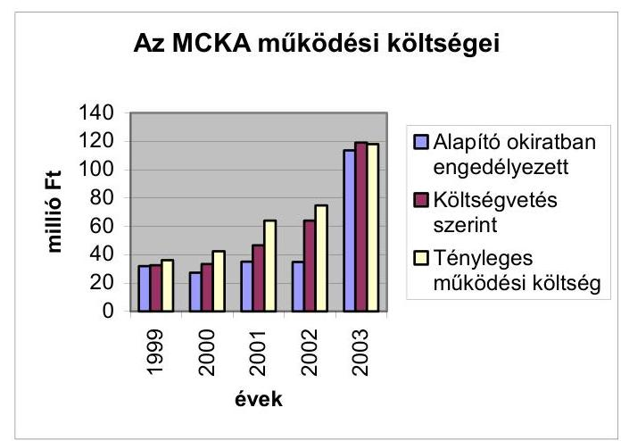
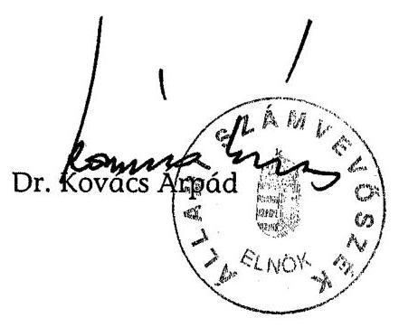
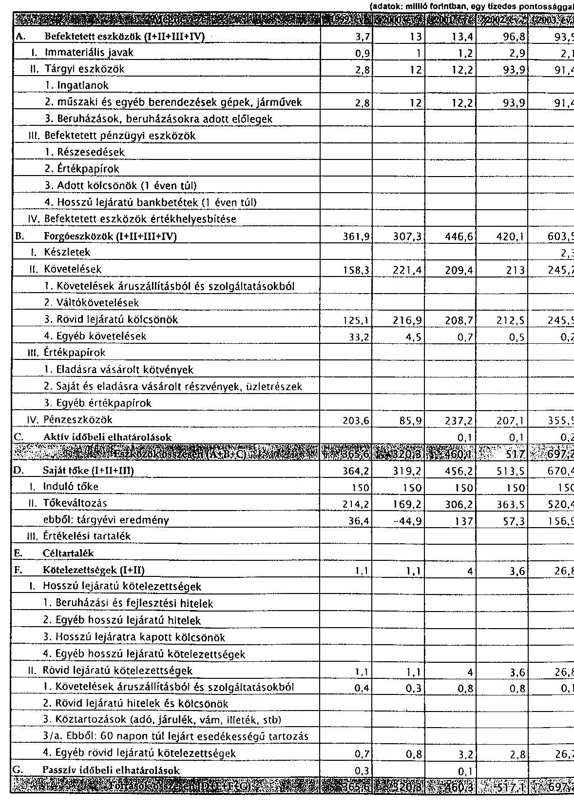
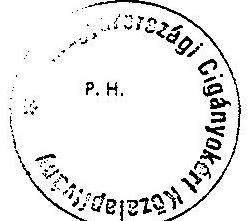
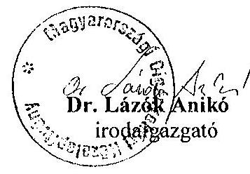
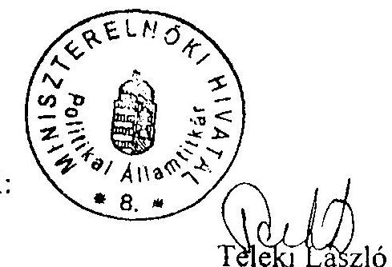
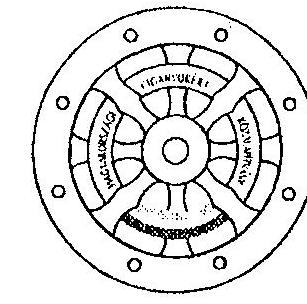
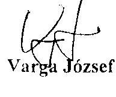

# JELENTÉS 

a Magyarországi Cigányokért
Közalapítvány gazdálkodásának ellenőrzéséről

---

3. Önkormányzati és Területi Ellenőrzési Igazgatóság
3.1. Szabályszerűségi Ellenőrzések FőcsoportIktatószám: V-1019-32/2004.Témaszám: 688
Vizsgálat-azonosító szám: V0119
Az ellenőrzést felügyelte:
Dr. Lóránt Zoltán
főigazgató
Az ellenőrzés végrehajtásáért felelős:
Dr. Elek János
főigazgató-helyettes
Az ellenőrzést vezette:
Balázs Andrásné
főcsoportfőnök-helyettes
Az összefoglaló jelentést készítette:
Pásztor Katalin
számvevő tanácsos
Az ellenőrzést végezték:
Pásztor Katalin
számvevő tanácsos
Robák Ferenc számvevő
A témához kapcsolódó eddig készített számvevőszéki jelentések:
címe
sorszáma
Jelentés a Nemzeti Gyermek és Ifjúsági Alapítvány pénzügyi- ..... 80
gazdasági ellenőrzéséről (1992)
Jelentés a Magyar Vállalkozásfejlesztési Alapítvány részére PHARE ..... 220
forrásból juttatott pénzügyi támogatások felhasználásának vizsgálatáról (1994)
Jelentés a fejezetek és intézményeik által az alapítványoknak ..... 306
juttatott állami pénzek és vagyon felhasználásának, működtetésének ellenőrzéséről (1996)
Jelentés a Magyar Alkotóművészeti Közalapítvány ..... 347
gazdálkodásának ellenőrzéséről (1997)
Jelentés a Gandhi Közalapítvány pénzügyi-gazdasági ..... 351
ellenőrzéséről (1997)
Jelentés a Magyarországi Cigányokért Közalapítvány pénzügyi- ..... 372
gazdasági ellenőrzéséről (1997)
Jelentés a Magyarországi Nemzeti és Etnikai Kisebbségekért ..... 373

---

Közalapítvány pénzügyi-gazdasági ellenőrzéséről (1997)
Jelentés a médiatörvény végrehajtásának pénzügyi - gazdasági 396 ellenőrzéséről (1997)
Jelentés a Magyar Rádió Közalapítvány és - kapcsolódó 9806 ellenőrzésként - a Magyar Rádió Részvénytársaság gazdálkodásának ellenőrzéséről
Jelentés a Magyar Televízió Közalapítvány és kapcsolódó ellenőrzés 9812 keretében a Magyar Televízió Rt. működésének és gazdálkodásának ellenőrzéséről
Jelentés a Nemzetközi Pető András Közalapítvány és - kapcsolódó 9822 ellenőrzésként - a Mozgássérültek Pető András Nevelőképző és Nevelőintézet pénzügyi-gazdasági ellenőrzéséről
Jelentés a Magyar Nemzeti Üdülési Alapítványnak juttatott állami 9906 eszközök felhasználásának és működtetésének pénzügyi-gazdasági ellenőrzéséről
Jelentés a sportcélú közalapítványok működésének pénzügyi- 9907 gazdasági ellenőrzéséről
Jelentés a Fogyatékos Gyermekek, Tanulók Felzárkóztatásáért 9915 Országos Közalapítvány működésének pénzügyi-gazdasági ellenőrzéséről
Jelentés a Nemzeti Gyermek és Ifjúsági Közalapítvány 0002 működésének pénzügyi-gazdasági ellenőrzéséről
Jelentés a Közoktatási Modernizációs Közalapítvány működésének 0011 ellenőrzéséről
Jelentés a Magyar Nemzeti Üdülési Alapítvány vagyon- 0101 gazdálkodásának ellenőrzéséről
Jelentés az Országos Foglalkoztatási Közalapítvány 0117 gazdálkodásának ellenőrzéséről
Jelentés az Új Kézfogás Közalapítvány gazdálkodásának 0136 ellenőrzéséről
Jelentés a közalapítványoknak és az alapítványoknak az 1998- 0228 2001. évek között juttatott nem normatív központi költségvetési támogatás felhasználásának ellenőrzéséről
Jelentés a Magyar Mozgókép Közalapítvány gazdálkodásának 0304 ellenőrzéséről
Jelentés a Magyar Alkotóművészeti Közalapítvány 0323 gazdálkodásának ellenőrzéséről
Jelentés az EU Kommunikációs Közalapítvány gazdálkodásának 0351 ellenőrzéséről
Jelentés a Magyarországi Zsidó Örökség Közalapítvány 0402 gazdálkodásának ellenőrzéséről

---

# TARTALOMJEGYZÉK 

BEVEZETÉS ..... 7
I. ÖSSZEGZŐ MEGÁLLAPÍTÁSOK, KÖVETKEZTETÉSEK, JAVASLATOK ..... 11
II. RÉSZLETES MEGÁLLAPÍTÁSOK ..... 19

1. Az MCKA működése ..... 19
1.1. A kuratórium ..... 20
1.2. A felügyelő bizottság ..... 21
1.3. A közalapítványi iroda működése ..... 22
2. A gazdálkodás és a könyvvezetés szabályozottsága, szabályossága ..... 23
2.1. A vagyongazdálkodás szabályozottsága és szabályossága ..... 23
2.2. A gazdálkodás szabályai ..... 25
2.3. Az iratkezelés ..... 26
2.4. Az éves költségvetések ..... 28
2.5. A számviteli nyilvántartás rendszere és szabályossága ..... 29
2.6. Az éves beszámolók szabályossága, a beszámolási-, és auditálási kötelezettség teljesítése ..... 29
2.7. A közalapítvány bevételei ..... 31
2.7.1. Az MCKA-nak nyújtott központi költségvetési támogatás ..... 31
2.7.2. A központi költségvetési támogatás felhasználására kötött szerződések, a támogatások finanszírozása, az elszámolások ..... 32
2.8. A közbeszerzési törvény előírásainak betartása ..... 33
2.9. A közalapítvány költségei és ráfordításai ..... 34
2.9.1. A közalapítvány működési költségei ..... 35
2.9.2. A tiszteletdíjak alakulása ..... 36
2.9.3. Munkabérek ..... 37
2.10. A pénzkezelés, a vagyonvédelem és a likviditás ..... 38
2.10.1. A közalapítvány pénzügyi helyzete, likviditása ..... 39
3. A közalapítványnak nyújtott központi költségvetési támogatás felhasználása ..... 39
3.1. A közalapítvány támogatási rendszere ..... 39
3.2. A közalapítvány által pályázati felhívás nélkül adott támogatások ..... 44
3.3. Pályázati úton nyújtott támogatások ..... 46
3.3.1. A megélhetési programokra nyújtott támogatások célszerű felhasználása és elszámoltatása ..... 50
3.3.2. A vállalkozói programokra nyújtott visszatérítendő támogatások célszerű felhasználása és elszámoltatása ..... 51

---

3.3.3. A közéleti képzési, közösségi ház, jogvédő programok pályázati támogatásai ..... 52
3.3.4. Az ösztöndíjprogramok pályázati támogatásai ..... 53
3.3.5. Informatikai pályázat ..... 54
4. Az intézkedési terv feladatainak teljesítése ..... 56
MELLÉKLETEK

1. számú Eszközök és források
2. számú Eredmény kimutatás
3. számú Bevételek, kiadások és ráfordítások
4. számú Pályázati támogatások
5. számú Adott támogatások támogatási formánként
6/A. számú Szervezeteknek adott támogatások
6/B. számú Magánszemélyeknek adott támogatások
6. számú Munkabér, megbízási díj, tiszteletdíj alakulása
7. számú Nyilatkozat
8. számú A MEH Roma ügyekért felelős politikai államtitkárának nemleges észrevétele
9. számú Az MCKA kuratóriumi elnökének nemleges észrevétele

---

# RÖVIDÍTÉSEK JEGYZÉKE 

| Áht. | az államháztartásról szóló 1992. évi XXXVIII. törvény |
| :--: | :--: |
| ÁSZ törvény | az Állami Számvevőszékről szóló 1989. évi XXXVIII. törvény |
| BM | Belügyminisztérium |
| CKÖ | Cigány Kisebbségi Önkormányzat |
| FB | Felügyelő Bizottság |
| GM | Gazdasági Minisztérium |
| IM | Igazságügyi Minisztérium |
| Kh. tv. | a közhasznú szervezetekről szóló 1997. évi CLVI. törvény |
| Kincstár | Magyar Államkincstár |
| Ltv. | A közokiratokról, a közlevéltárakról és a magánlevéltári anyag védelméről szóló 1995. évi LXVI. törvény |
| MCKA | Magyarországi Cigányokért Közalapítvány |
| MEH | Miniszterelnöki Hivatal |
| MEH IKB | Miniszterelnöki Hivatal Informatikai Kormánybiztossága |
| MNEKK | Magyarországi Nemzeti és Etnikai Kisebbségekért Közalapítvány |
| NEKH | Nemzeti és Etnikai Kisebbségi Hivatal |
| Nek. tv. | a nemzeti és etnikai kisebbségek jogairól szóló 1993. évi LXXVII. törvény |
| NKÖM | Nemzeti Kulturális Örökség Minisztériuma |
| OCÖ | Országos Cigány Önkormányzat |
| OGY | Országgyúlés |
| OM | Oktatási Minisztérium |
| Ptk. | a Polgári Törvénykönyvről szóló 1959. évi IV. törvény |
| SZMSZ | Szervezeti és Működési Szabályzat |
| Szt.(új) | a számvitelről szóló 2000. évi C. törvény |
| Szt.(régi) | a számvitelről szóló 1991. évi XVIII. törvény |

---

.

---

# ÉRTELMEZŐ SZÓTÁR 

Az alapítvány bevételei

Az alapítvány költségei (kiadásai)

Az alapítvány kezelő
szervének költségei (kiadásai)

Cél szerinti tevékenység

Induló vagyon

Kiemelkedően közhasznú közalapítvány

Kisebbségek

Közalapítvány

Közfeladat

A vállalkozási tevékenység bevétele, valamint az alapítványi célú tevékenység bevételei (minden olyan bevétel, amely nem a vállalkozási tevékenységhez kapcsolódó befizetés, ideértve a céltámogatást is) [115/1992. (VII. 23.) Korm. rendelet 3. § (1) bekezdésének a) és b) pontja].
A vállalkozási tevékenység közvetlen költségei, az alapítványi célú tevékenység közvetlen költségei, az alapítvány kezelő szervének költségei (kiadásai) és az egyéb közvetett költségek (kiadások) [115/1992. (VII. 23.) Korm. rendelet 3. § (2) bekezdésének a) és b) és c) pontja].

Az alapítvány kezelő szervének üzemeltetési, fenntartási költségei (az alapító okiratok ezeket a költségeket tekintik a kuratórium és a munkaszervezet működési költségeinek).
Minden olyan tevékenység, amely az alapító okiratban megjelölt célkitűzés elérését közvetlenül szolgálja [Kh. tv. 26. § b) pontja].

A közalapítvány javára a célja megvalósításához az alapító okiratban meghatározott vagyon [Ptk. 74/A. § (1) bekezdése, 74/B. § (1) bekezdése]. A közalapítvány rendelkezésére legalább olyan mértékű vagyont kell bocsátani, amely a működése megkezdéséhez feltétlenül szükséges [Ptk. 74/B. § (4) bekezdése]. A közalapítványi vagyon pontos megjelölése nélkül a közalapítvány nem jöhet létre [BH2001. 303].
A kiemelkedően közhasznú közalapítványnak a közhasznú közalapítványokra előírt követelmények teljesítésén túl közhasznú tevékenysége során olyan közfeladatot kell ellátnia, amelyről törvény vagy törvény felhatalmazása alapján más jogszabály rendelkezése szerint, valamely állami szervnek vagy a helyi önkormányzatnak kell gondoskodnia, az alapító okirata szerinti tevékenységének és gazdálkodásának legfontosabb adatait a helyi vagy országos sajtó útján is nyilvánosságra hozza, továbbá a közhasznú tevékenységet maga látja el [Kh. tv. 5. § és a BH2001. 451].
A Nek. tv. értelmében Magyarországon honos népcsoportnak minősülnek: a bolgár, a cigány, a görög, a horvát, a lengyel, a német, az örmény, a román, a ruszin, a szerb, a szlovák, a szlovén és az ukrán.
A közalapítvány olyan alapítvány, amelyet az Országgyúlés, a Kormány, valamint a helyi önkormányzat vagy kisebbségi önkormányzat képviselő-testülete közfeladat ellátásának folyamatos biztosítása céljából hoz létre [Ptk. 74/G. § (1) bekezdése].
Közfeladatnak az az állami vagy helyi önkormányzati, kisebbségi önkormányzati feladat, amelynek ellátásáról -

---

Közhasznú egyszerüsített éves beszámoló

Közhasznú tevékenység

Közhasznúsági jelentés

Különleges adat

Személyes adat

Támogatás
Vezető tisztségviselő a
közalapítványoknál
jogszabály alapján - az államnak vagy az önkormányzatnak kell gondoskodnia [Ptk. 74/G. § (2) bekezdése].
A közhasznú nyilvántartásba vett közalapítványoknál mérlegből, közhasznú eredmény-kimutatásból és tájékoztató adatokból áll [224/2000. (XII. 19.) Korm. rendelet 6. § (8) bekezdése, illetve 4 . és 6 . számú melléklete].

A társadalom és az egyén közös érdekeinek kielégítésére irányuló, a közhasznú közalapítvány alapító okiratában szereplő cél szerinti tevékenység [Kh. tv. 26. § c) pontja].
Tartalmazza a számviteli beszámolót; a költségvetési támogatás felhasználását; a vagyon felhasználásával kapcsolatos kimutatást; a cél szerinti juttatások kimutatását; a központi költségvetési szervtől, az elkülönített állami pénzalaptól, a helyi önkormányzattól, a kisebbségi települési önkormányzattól, a települési önkormányzatok társulásától és mindezek szerveitől kapott támogatás mértékét; a közhasznú szervezet vezető tisztségviselőinek nyújtott juttatások értékét, illetve összegét; a közhasznú tevékenységről szóló rövid tartalmi beszámolót [Kh. tv. 19. § (3) bekezdése].

A faji eredetre, a nemzeti, nemzetiségi és etnikai hovatartozásra, a politikai véleményre vagy pártállásra, a vallásos vagy más meggyőződésre vonatkozó személyes adatok.
A meghatározott természetes személlyel kapcsolatba hozható adat, az adatból levonható, az érintettre vonatkozó következtetés. A személyes adat az adatkezelés során mindaddig megőrzi e minőségét, amíg kapcsolata az érintettel helyreállítható.
Pénzbeli és nem pénzbeli juttatás [Kh. tv. 26. § j) pontja].
A közalapítvány kuratóriumának és felügyelő bizottságának elnöke és tagja, a közalapítvánnyal munkaviszonyban vagy munkavégzésre irányuló egyéb jogviszonyban álló, az alapító okirat szerint egyszemélyi felelős vezető feladatot ellátó személy [Kh. tv. 26. § m) pontja].

---

# JELENTÉS 

## a Magyarországi Cigányokért Közalapítvány gazdálkodásának ellenőrzéséről

## BEVEZETÉS

A nonprofit szervezetek között 1994. január 1-jétől jelentek meg a közalapítványok, melyek megalakítására és működésére a Ptk. az alapítványok szabályozásán belül külön feltételeket és követelményeket határozott meg az alapítók körét, az ellátandó közfeladatokat, valamint a működés és gazdálkodás feltételeit illetően. Közalapítványt csak az Országgyúlés, a Kormány, valamint a helyi önkormányzat vagy kisebbségi önkormányzat képviselő-testülete hozhat létre közfeladat (állami, helyi önkormányzati vagy országos kisebbségi önkormányzati feladat) ellátásának folyamatos biztosítása céljából, de a közalapítvány létrehozása nem érinti az államnak, illetve az önkormányzatnak a feladat ellátására vonatkozó kötelezettségét. A közalapítványok a nyilvánosság előtt tevékenykednek, ezért alapító okiratukat, gazdálkodásuk legfontosabb adatait nyilvánosságra kell hozni.

A közpénzek törvényes, felelős és közhasznú felhasználása érdekében a Ptk. és a közhasznú szervezetekről szóló törvény részletesen meghatározta a közalapítvány vagyonkezelő szervezete (kuratóriuma) működésének, képviseletének, a tisztségviselők felelősségének és összeférhetetlenségének szabályait. A közalapítvány vagyonát kezelő szervezet (kuratórium) tagjai az alapítók bizalmából látják el feladatukat, de tőlük sem közvetlenül, sem közvetve nem függhetnek, az alapítók nem gyakorolhatnak meghatározó befolyást a közalapítvány vagyonának felhasználására.

A közalapítványok ellenőrzésére az alapítványoknál szigorúbb követelmények vonatkoznak, így az alapítóknak már az alapítással egy időben létre kell hozni a kuratórium ellenőrzésére jogosult ellenőrző szervet (ellenőrző vagy felügyelő bizottságot). Az Országgyúlés és a Kormány által alapított közalapítványoknál az Állami Számvevőszék nemcsak az állami támogatás felhasználását, hanem a gazdálkodás törvényességét és célszerűségét is jogosult ellenőrizni.

A 2003. év végén - az ún. média közalapítványokkal együtt - 50 működő, illetve bejegyzés alatt álló, az Országgyúlés és a Kormány által alapított közalapítvány volt. A 2004. évi költségvetési
 törvény - eredeti előirányzatként - a Kormány által alapított közalapítványoknak közvetlenül névre címzetten 35,6 milliárd Ft eredeti támogatási előirányzatot hagyott jóvá ${ }^{1}$, amelyből az államháztartás

[^0]
[^0]:    ${ }^{1}$ Ez az összeg nem tartalmazza az Országgyúlés által alapított három ún. médiaközalapítvány támogatását.

---

egyensúlyi helyzetének javításához szükséges rövid és hosszabb távú intézkedésekről szóló 2050/2004. (III. 11.) Korm. határozat 2,1 milliárd Ft-ot (5,9\%-ot) zárolt. Az Országgyűlés az éves költségvetési törvényekben az 1999-2003. években a Magyarországi Cigányokért Közalapítvány részére közvetlenül névre címzetten közel 2,4 milliárd Ft támogatást hagyott jóvá. A 2004. évi éves költségvetési törvényben az eredeti támogatási előirányzat 1135 millió Ft, amelyet nem érintettek a Kormány 2004. márciusi, az államháztartás egyensúlyi helyzetének javítását szolgáló előirányzat-zárolásai.

A Kormány a cigányság esélyegyenlőtlenségét csökkentő intézkedések támogatására, a Magyar Köztársaság Alkotmányának 70/A. § (3) bekezdése szerinti közfeladat ellátása céljából 1995-ben hozta létre a Magyarországi Cigányokért Közalapítványt, 150 millió Ft induló vagyonnal. A közalapítványt a Fővárosi Bíróság 5941. sorszámon 1996. február 6-án vette nyilvántartásba, majd 2000. január 18-án kelt végzésével 1998. január 1-jei visszamenő hatállyal kiemelkedően közhasznú szervezetté nyilvánította. A Kormány 1998-2002 között az igazságügy-minisztert, 2003-tól a MEH roma ügyekért felelős politikai államtitkárát bízta meg a Magyarországi Cigányokért Közalapítvány tekintetében az alapítói jogkörök gyakorlásával.

A magyarországi cigány lakosság társadalmi mutatói az országos átlagnál lényegesen rosszabbak, a munkanélküliség tömegesen érinti a romákat, az 1990-es években ők kerültek ki legnagyobb számban a munkaerőpiacról. Ez annak a következménye, hogy először az alacsony iskolai végzettséggel is betölthető, szakképzettséget nem igénylő álláshelyek szűntek meg, ahol korábban a cigány népesség többsége dolgozott. A cigány népesség nagy százaléka él az ország kedvezőtlen helyzetű, fejletlen infrastruktúrájú régióiban. A romáknak csupán 10\%-a él a fővárosban, a falvakban arányuk viszont az országos 38\%-hoz képest 20-25\%-kal magasabb. Az Európai Unióhoz való csatlakozás előkészítése során a Kisebbségvédelmi Keretegyezménynek, illetve a Regionális vagy Kisebbségi Nyelvek Európai Chartájának végrehajtásáról készült 2000. novemberi éves jelentés kisebbségi jogokkal és kisebbségvédelemmel foglalkozó fejezetei megállapították, hogy - összhangban a Csatlakozási Partnerség rövid távú célkitűzésével és az 1999 áprilisában elfogadott Középtávú Roma Akcióprogrammal - a Kormány speciális támogatást biztosított a cigány kisebbség nehéz helyzetének kezelésére. A dokumentum az eredmények mellett megállapította, hogy a cigányság javuló iskolázottsági mutatói ellenére a cigány és nem cigány lakosság közötti esélyegyenlőtlenség növekedett. A problémák megoldására, a cigányság életkörülményeinek és társadalmi helyzetének javítására, az esélyegyenlőtlenség csökkentése érdekében a Kormány közép- és hosszú távú programokat és intézkedéscsomagokat dolgozott ki. ${ }^{2}$ A programok prioritásai

[^0]
[^0]:    ${ }^{2}$ Lásd a cigányság helyzetével kapcsolatos legsürgetőbb feladatokról szóló 1125/1995. (XII. 12.) Korm. határozatot, a cigányság élethelyzetének javítására vonatkozó középtávú intézkedéscsomagról szóló 1093/1997. (VII. 29.) Korm. határozatot, a cigányság életkörülményeinek és társadalmi helyzetének javítására irányuló középtávú intézkedéscsomagról szóló 1047/1999. (V. 5.) Korm. határozatot, a hosszú távú cigány társadalom- és kisebbségpolitikai stratégia irányelveit tartalmazó vitaanyag elfogadásáról és társadalmi vitájáról szóló 1078/2001. (VII. 13.) Korm. határozatot.

---

az oktatáson, a munkaerő-piaci helyzet javításán, valamint a családjóléti kondíciók fejlesztésén túl a diszkrimináció ellenes feladatokat és a cigánysággal kapcsolatos kommunikációs feladatokat is tartalmazzák.

A cigányság életkörülményei és társadalmi helyzete javítására irányuló középtávú intézkedéscsomag végrehajtásának elősegítésére 2000-ben a Kormány módosította a Magyarországi Cigányokért Közalapítvány alapító okiratát, kinyilvánította azt a szándékát, hogy folyamatosan támogatni kívánja a cigányság társadalmi esélyegyenlőségének elősegítését, az e célt szolgáló egészségmegőrzési, betegségmegelőzési, nevelési, oktatási, valamint az emberi és állampolgári jogok védelmét szolgáló tevékenységeket. A Kormány 2001-ben elfogadta a hosszú távú cigány társadalom- és kisebbségpolitikai stratégia irányelveit tartalmazó vitaanyagot, amelyet társadalmi vitára bocsátott, és a vita befejezését követően az Országgyűlés elé terjeszti.

A Magyarországi Cigányokért Közalapítvány az esélyegyenlőség megteremtése érdekében támogatja a hazai cigányok önazonosságának megőrzését, társadalmi integrálódását, az őket érintő munkanélküliség mérséklését, az iskolai és iskolán kívüli oktatásban esélyeik növelését és emberi jogaik védelmét.

Az Állami Számvevőszék a közalapítványt - az Országgyűlés felkérésére ${ }^{3}$ - 1997-ben a helyszínen ellenőrizte ${ }^{4}$ az 1995. évi alapítás és 1997. április 30. közötti időszakra vonatkozóan, 2002-ben pedig adatlapok kitöltésével számoltatta el ${ }^{5}$ a kapott állami támogatás felhasználásáról. Az 1997-es helyszíni ellenőrzésünk megállapította, hogy a kuratórium által meghirdetett programok az alapító okiratban lefektetett céloknak teljes egészében nem feleltek meg, a pályázatokat egyedi szempontok alapján és nem kellő hatékonysággal bírálták el. A kuratórium magas létszáma, a kurátorok egyébirányú elfoglaltsága rontotta az üléseken való részvételi fegyelmet. Hiányosak voltak a belső szabályzatok, így például az SZMSZ nem teljes körűen szabályozta a pályázati rendet, a kuratórium és az iroda feladatrendszerét. A kuratórium, az FB és a könyvvizsgáló nem látta el az alapító okiratban rögzített ellenőrzési feladatokat. Az ÁSZ ellenőrzést követően a javaslatok alapján a kuratórium feladattervet készített, melyet alkalmasnak tartottunk a hiányosságok felszámolására. A 2001 végéig kapott állami támogatás felhasználásáról készített tanúsítványokban a kuratórium - többek között - arról adott számot, hogy 2000-ben nem készítettek közhasznúsági jelentést és nem hozták nyilvánosságra a gazdálkodás legfontosabb adatait, a 2001-ben hatályos pályáztatási szabályzatot nem a kuratórium

[^0]
[^0]:    ${ }^{3}$ Lásd a Magyarországi Nemzeti és Etnikai Kisebbségekért Közalapítványnál, a Magyarországi Cigányokért Közalapítványnál és a Gandhi Közalapítványnál elvégzendő Állami Számvevőszéki vizsgálatról szóló 19/1997. (III. 19.) OGY határozatot
    ${ }^{4}$ Jelentés a Magyarországi Cigányokért Közalapítvány pénzügyi-gazdasági ellenőrzéséről (1997. év, 372.)
    ${ }^{5}$ Jelentés a közalapítványoknak és az alapítványoknak az 1998-2001. évek között juttatott nem normatív központi költségvetési támogatás felhasználásának ellenőrzéséről (2002. év, 0228.)

---

hagyta jóvá, továbbá, hogy - az alapító okirattal ellentétesen - a munkaszervezet alkalmazottai vagy más személy(ek) is gyakorolták a képviseleti jogot.

A Magyar Köztársaság miniszterelnöke 2003. július 17-én kelt levelében kérte, hogy az Állami Számvevőszék soron kívül ellenőrizze a közalapítvány elmúlt négyévi gazdálkodásában az állami költségvetésből juttatott támogatás felhasználását.

Az Állami Számvevőszék az Állami Számvevőszékről szóló 1989. évi XXXVIII. törvény 2. § (5) bekezdése alapján ellenőrzi a közalapítványoknál az állami költségvetésből nyújtott támogatás felhasználását, továbbá a Ptk. 74/G. § (8) bekezdése alapján a gazdálkodás törvényességét és célszerűségét.

Az ellenőrzés - egyben utóellenőrzés - célja az volt, hogy törvényességi és célszerűségi szempontból értékelje

- a közalapítvány a kapott állami támogatást rendeltetésszerűen és eredményesen használta-e fel az alapító okiratban meghatározott céljainak megvalósítása érdekében;
- a közalapítvány működése és gazdálkodása elősegítette-e az alapító okiratban meghatározott célok és feladatok megvalósítását;
- a gazdálkodás és a könyvvezetés szabályozottsága biztosította-e a gazdálkodás törvényességét és célszerűségét;
- a közalapítvány alapítója, kuratóriuma, felügyelő bizottsága és a közalapítványi iroda megtett-e minden szükséges és eredményes intézkedést az Állami Számvevőszék korábbi ellenőrzései során feltárt hiányosságok megszüntetése érdekében.

A Fővárosi Főügyészség 2003-ban a közalapítványnál törvényességi felügyeleti vizsgálatot folytatott, az ellenőrzési programot a törvényességi felügyeleti vizsgálatra figyelemmel határoztuk meg. Az ügyészség az észlelt törvénysértések miatt 2004 februárjában a kuratóriumi elnöknél felszólalással élt.

Az ellenőrzés az 1999. január 1-jétől 2003. december 31-ig tartó időszakra terjedt ki.

---

# I. ÖSSZEGZŐ MEGÁLLAPÍTÁSOK, KÖVETKEZTETÉSEK, JAVASLATOK 

A Magyarországi Cigányokért Közalapítvány kuratóriuma megalapítása óta közreműködik a hazai cigányok önazonosságának megőrzését, társadalmi integrálódását, az őket érintő munkanélküliség mérséklését, az iskolai és iskolán kívüli oktatásban esélyeik növelését és emberi jogaik védelmét célzó programok, tevékenységek támogatásában.

A cigányság életkörülményeinek javítására szolgáló pénzeszközök alapvetően a következő forrásokból származtak: a kifejezetten a cigány lakosságot célzó támogatásokból, a nemzeti és etnikai kisebbségek számára együttesen biztosított forrásokból, a hátrányos helyzetű rétegekkel kapcsolatos forrásokból és egyéb, a romákat is érintő szakmai feladatok ellátásához rendelt forrásokból. A Magyarországi Cigányokért Közalapítvány szerepe az állami támogatások felhasználásában megerősödött, ezt támasztja alá, hogy amíg a kisebbségek támogatását szolgáló nem normatív előirányzatok 2001-2003 között 182\%-ra emelkedett (3,8 milliárd Ft-ról 6,9 milliárd Ft-ra) ${ }^{6}$, addig a Magyarországi Cigányokért Közalapítványnak juttatott támogatás ugyanebben az időszakban több mint háromszorosára (350 millió Ft-ról 1135 millió Ft-ra) nőtt.

A Magyarországi Cigányokért Közalapítvány az 1999-2003. évek között összesen 2,8 milliárd Ft bevételt realizált, amelyből az éves költségvetési törvényekben közvetlenül névre címzett állami támogatás 2,4 milliárd Ft (85,7\%) volt. Egyéb bevételei teljes egészében közhasznú tevékenységéből származtak, a közalapítvány vállalkozási tevékenységet nem folytatott. Ugyanezen időszakban a kuratórium az alapító okirat szerinti célok megvalósítása érdekében kiírt pályázatokra összesen 1,9 milliárd Ft-ot fordított, a közalapítvány működési költsége 0,3 milliárd Ft volt.

Az ellenőrzött időszakban a Kormány a Magyarországi Cigányokért Közalapítványnál az alapító nevében és képviseletében eljáró kormányzati felelősként 2003. áprilisáig az igazságügy-minisztert, ezt követően a MEH roma ügyekért felelős politikai államtitkárát jelölte meg, e megbízatásnak megfelelően az 1999-2002. évek között a Magyarországi Cigányokért Közalapítvány támogatási előirányzata az IM, a 2003-2004. években a Miniszterelnökség fejezetben szerepelt.

Az IM az 1999-2002. években az éves költségvetési támogatás cél szerinti felhasználására és elszámolására nem kötött szerződést a közalapítvánnyal. A MEH a 2003. évben a támogatás felhasználásával kapcsolatos előírásokat, valamint az elszámolások benyújtásának határidejét és módját támogatási szerződésben rögzítette. Az elszámolás a helyszíni ellenőrzés 2004. februári befejezésekor még nem volt esedékes.

[^0]
[^0]:    ${ }^{6}$ Forrás: Pénzügyminisztérium adatgyűjtése

---

A kuratórium a kapott állami támogatásból és egyéb bevételeiből - alapító okiratával összhangban - a cigányság megélhetését, a cigány munkavállalók foglalkoztatását, a cigány gyermekek, fiatalok tanulmányainak sikeres folytatását, az érdekérvényesítés érdekében a közéleti képzést, az előítélet-mentes jogalkalmazást, a hátrányos megkülönböztetés megakadályozását szolgáló kezdeményezéseket, a társadalmi integrálódást elősegítő oktatási programokat támogatott rendszeresen. Nem írtak ki pályázatokat az ellenőrzött időszakban az alapító okiratban megfogalmazott egészségmegőrzési cél támogatására.

A Magyarországi Cigányokért Közalapítvány 1999-2003 között összesen 47 pályázatot írt ki, melyekre 117 463 db pályázat érkezett be 5673,9 millió Ft támogatási igénnyel. Az elfogadott pályázatok száma 45 100 db volt, 2741 millió Ft támogatási összeggel. A kuratórium a pályázók 38,4\%-át támogatta, az igényelt összeg 48,3\%-át ítélte meg támogatásként. A támogatásban részesített pályázatok 92,1\%-a tanulmányi ösztöndíj-kérelem volt, 1999-2003 között 969,8 millió Ft tanulmányi ösztöndíjat fizettek ki. 41 539 fő ösztöndíjban, 106 993 család természetbeni juttatásban részesült, rajtuk kívül pályázati úton további 680 magánszemélyt és 1322 szervezetet támogatott a Magyarországi Cigányokért Közalapítvány.

A Magyarországi Cigányokért Közalapítvány a támogatási programjaiban megkülönböztetett figyelmet fordított a cigány fiatalok iskolai esélyegyenlőségének növelésére, ennek érdekében kiszélesítette ösztöndíjrendszerét, amelynek révén az ösztöndíjrendszer pályázati kerete az 1999. évi 50 millió Ft-ról 2002-re több mint kétszeresére, 111 millió Ft-ra nőtt. A 2003. évben a korábban az IM fejezetben megtervezett előirányzatot is a közalapítvány támogatási előirányzatába építették be, így a tanulást támogató ösztöndíj-keret 650 millió Ft-ra növekedett.
 A tanulmányi ösztöndíjak folyósítására a kuratórium nem kötött támogatási szerződést.

Közéleti képzésre 209 pályázónak 122,7 millió Ft, közösségi ház programokra 313 pályázónak 130,5 millió Ft, jogvédő iroda pályázatra 128 szervezetnek 158,8 millió Ft támogatást ítélt meg a kuratórium.

1999-2003 között a cigányság megélhetését, a cigány munkavállalók foglalkoztatását segítő vállalkozási és egyéb lehetőségek növelésére természetbeni, megélhetési és vállalkozási (2002-től kísérleti vállalkozói is) támogatásokat nyújtott a közalapítvány, részben vagy egészében visszatérítendő jelleggel. Megélhetési támogatásként 312 pályázónak 176,1 millió Ft pénzbeli támogatást ítéltek meg, természetbeni juttatásként 149,6 millió Ft értékben nyújtottak támogatást.

Vállalkozói programra 303 esetben 454,5 millió Ft támogatást ítélt meg a kuratórium, ez a támogatás teljes összegében visszatérítendő volt. A vállalkozói támogatások esetében a visszafizetés fedezetéül minden esetben ingatlant fogadott el a közalapítvány, melyre jelzálogjogot jegyeztetett be. A jelzálog bejegyzése a gyakorlatban nem funkcionált a támogatás visszafizetésének fedezetéül, hiszen a közalapítványnak végrehajtási eljárásból származó bevétele az ellenőrzött időszakban nem volt. 2002 végéig a visszafizetések elmulasztása miatt 248 pályázót érintően az elszámolt értékvesztés összege 123 millió Ft volt, ebből az 1999. január 1. után megítélt támogatásokból leírt értékvesztés 55,3 millió Ft volt, 88 pályázót érintően. A kuratórium a vállalkozások, illetve megélhetési programok alacsony jövedelmezősége, illetve veszteségessége miatt engedélyezte a visszafizetés átütemezését, de csak vis major esetén (árvízkár) minősítette vissza nem térítendővé a támogatást. A kuratórium ügyvédi irodán keresztül, fizetési meghagyással intézkedett a fizetési kötelezettségüket elmulasztókkal szemben, az eredménytelen felszólítást követően bírói úton kísérelte meg a követelés behajtását. 2003 végén 81 bírói eljárás volt folyamatban.

A meghirdetett pályázatok közül kifogásoltuk az informatikai pályázat elhúzódását és alacsony hatékonyságát, amelyet a MEH IKB-val 2001. augusztus 27-én kötött 100 millió Ft-os támogatási szerződésére alapoztak. A támogatás a belföldön, az első diploma megszerzéséért egyetemen vagy főiskolán nappali tagozatos képzésen tanuló hallgatók részére tanulmányaik folytatásához szükséges számítógépek beszerzését és üzemeltetését célozta, és azt írta elő a közalapítványnak, hogy az összes ellátott hallgató részére azonos hardver konfigurációjú számítógépet, azonos szoftverrel köteles biztosítani. A program keretében a közalapítványnak háromszáz db gépet kellett beszereznie. A támogatás célja volt, hogy a számítógépek ingyenes használatba adásával a hallgatók közül a jobb tanulmányi eredménnyel rendelkezőket segítse. A MEH IKB irreális előírásai (saját telefonvonal, Internet előfizetési kötelezettség, ECDL vizsga kötelezettség), illetve a Magyarországi Cigányokért Közalapítványnak az igénylők létszámára vonatkozó, csak az ösztöndíjasok tanulmányi eredmény adatbázisára támaszkodó felmérése miatt a támogatásra felhasznált 100 millió Ft az eltelt két év alatt nem hasznosult teljes egészében. A szabályos közbeszerzési eljárás keretében 2002-ben beszerzett és kifizetett 300 db számítógépből két év alatt, 2003 végéig még csak 242 számítógépet tudtak pályázat keretében kiosztani, 58 számítógépet - a közalapítványt terhelő tárolási dí ellenében - a szállító cég tárolt.

A támogatások odaítélésével, elszámolásával és a felhasználásuk ellenőrzésével kapcsolatos általános eljárási rendet - az alapító okirat előírásával ellentétesen - a kuratórium nem szabályozta, a pályázatok kiírásáról, elbírálásának rendjéről, a támogatási szerződésről, valamint a támogatások odaítéléséről minden esetben a kuratórium egyedileg döntött. A döntések előkészítését a kuratóriumi tagokból megválasztott munkabizottságok és a közalapítványi iroda munkatársai végezték. A nyertes pályázókkal az ösztöndíj támogatást és a természetbeni juttatást kivéve szerződést kötöttek, melyek tartalmazták a támogatási összeget, a felhasználás időpontját, a pénzügyi elszámolás határidejét és a programok teljesítéséről készített írásbeli beszámoló elkészítésének kötelezettségét, rögzítették a szerződésszegés eseteit, azok szankcióit.

Az alapító okirat 2000-től engedélyezte, hogy a kuratóriumi ülések között a kuratórium elnöke - két, a kuratórium által erre felhatalmazott kurátor írásos hozzájárulásával és a kuratórium utólagos tájékoztatásának kötelezettségével a közalapítvány céljaival összhangban dönthet a közalapítvány mindenkori éves költségvetési támogatása 1%-ának megfelelő keretösszeg felhasználásáról, két ülés között legfeljebb 1 millió Ft összeghatárig. Az eredeti alapító okirat 2000-ig évi ötszázezer forintos keretösszeg felhasználását engedélyezte, a kuratórium utólagos tájékoztatása mellett. Az ellenőrzött 1999-2003 közötti időszakban az elnöki keretből 316 pályázó 29,6 millió Ft összegű támogatást kapott, a legmagasabb támogatási összeg 300 ezer Ft, a legalacsonyabb 5 ezer Ft volt. A keretet 2001-től a kuratóriumi elnök minden évben túllépte, a három év alatt összesen 8,9 millió Ft-tal, felhasználásáról az alapító okirat rendelkezése ellenére 2000 óta nem számolt be a kuratóriumnak.

A tanulmányi ösztöndíj támogatásokra, az erdei iskolai támogatásokra és a természetbeni juttatásokra vonatkozó kuratóriumi határozatok és kifizetések bizonylatai a könyvvezetésben megtalálhatók voltak, de az ellenőrzött időszak teljes egészére vonatkozóan a tanulmányi ösztöndíj támogatások, illetve az 1999. és a 2000. évre vonatkozóan a természetbeni juttatások és az erdei iskolai támogatások pályázataihoz kapcsolódó, számviteli bizonylatnak minősülő egyedi dokumentumok a szabálytalan iratselejtezés miatt hiányoztak. Az ösztöndíj pályázati adatlapok adattartalmát számítógépes nyilvántartásban rögzítették. Tekintve, hogy az iratmegsemmisítés részleges volt, a megmaradt dokumentumok és számítógépes nyilvántartások az ellenőrzés érdemi lefolytatását lehetővé tették. Az ellenőrzés tapasztalata és a selejtezési jegyzőkönyvek alapján a számviteli bizonylatok selejtezése nem az ÁSZ, illetve más ellenőrző szervek munkájának megakadályozása miatt, hanem a közalapítvány szűkös irattári kapacitására hivatkozással történt. A dokumentumokat minden esetben az Országos Levéltár felülvizsgálata és jóváhagyása után semmisítették meg. A közalapítvány iratkezelési szabályzatának a pályázatok és ösztöndíjpályázatok dokumentációjának - mint számviteli bizonylatoknak - a megőrzésére vonatkozó rendelkezése (az iratok megőrzésének három, illetve egy éves időtartama) ellentétes volt a hatályos számviteli törvényekben előírt (2000-ig öt, 2001 után nyolc éves) megőrzési kötelezettséggel.

A kuratórium az ülések határozatképességének megállapításánál 1999-ben törvénysértő gyakorlatot folytatott, mivel a jelenlévők számát nem az alapító okiratban megállapított létszámhoz, hanem az egyéni lemondásokkal csökkentett létszámhoz viszonyította. A törvénysértő gyakorlat megszüntetése érdekében a Fővárosi Főügyészség 2004. február 4-én a kuratórium elnökénél felszólalással élt.

A közalapítvány alapító okirata 2000. évi módosításától a Magyarországi Cigányokért Közalapítvány kuratóriumában huszonegy tagból összesen tíz a kormány tagjai, illetve vezető tisztségviselők delegáltak. Ezen felül az alapító jelölte a kuratórium elnökét is. 2002-ben az OCÓ képviselője a megalakuló Kormányban politikai államtitkári megbízást kapott, ezzel még egy személlyel több lett (összesen 12 fő) az alapítót képviselő kurátorok száma, emiatt nem érvényesül a Ptk.-nak az a követelménye, hogy az alapító - közvetlenül vagy közvetve - az alapítvány vagyonának felhasználására meghatározó befolyást nem gyakorolhat.

Az FB működése 2002 áprilisától nem felelt meg az alapító okirat és az FB ügyrendje előírásainak, mivel az öttagú bizottság létszáma a határozatképesség határa alá csökkent. Az alapító okiratban megjelölt miniszterek a helyszíni ellenőrzés 2004. február végi befejezéséig még nem delegáltak új FB tagokat.

A közalapítványnál a képviseleti jog gyakorlásának szabályozása 2001. december 31-ig törvénysértő volt, mivel az SZMSZ által meghatározott keretek között az igazgató is jogosult volt a képviseleti jog gyakorlására. A képviseleti jog gyakorlása 2002. január 1. óta megfelel a Ptk. hatályos előírásainak.

A Magyarországi Cigányokért Közalapítvány jelenleg rendelkezik a törvényekben kötelezően előírt szabályzatokkal, de kuratóriumi határozattal a számviteli politikát csak 2001 decemberében, illetve 2003 júniusában, a leltározási szabályzatot pedig csak 2001-ben fogadta el a kuratórium. A vagyonkezelési szabályzat módosítása nem követte az alapító okirat változásait, azokkal nem volt összhangban. Az iratkezelési szabályzat iratmegőrzésre vonatkozó rendelkezései törvénysértők voltak. Az 1997-től hatályos iratkezelési szabályzat a törvényes előírástól eltérően, az Országos Levéltár jóváhagyása nélkül, a 2002. decemberétől hatályos szabályzat már annak jóváhagyásával készült.

1999-2003 között a kapott támogatások számviteli nyilvántartása szabálytalan volt, mivel a kapott támogatásokat a hatályos számviteli előírásokkal ellentétesen nem kötelezettségként, hanem teljes egészében a bevételek között számolták el.

A közalapítvány az ellenőrzött időszak minden évére elkészítette az egyszerűsített éves beszámolót, közhasznúsági jelentést azonban az előírások ellenére csak a 2001. évtől készített. A kuratórium a közalapítvány működéséről az alapító felé beszámolási kötelezettségének éves beszámolói és 2001-től a közhasznúsági jelentés megküldésével eleget tett.

A Magyarországi Cigányokért Közalapítvány 1999-ben érvényes alapító okirata a felhasználható működési költséget a vagyon 10%-ában, 2000-től a mindenkori éves költségvetési támogatás 10%-ában határozta meg. A kuratórium mindegyik évben az engedélyezett szint fölé tervezte meg a működési költségeket, a teljesítés során pedig még ezt az összeget is túllépte. Az MCKA teljesített működési kiadásai 1999-től az egyes években 4,1 millió Ft-tal, 15,2 millió Ft-tal, 29,0 millió Ft-tal, 39,8 millió Ft-tal, illetve 4,4 millió Ft-tal haladták meg az alapító okirat által engedélyezett működési költségeket. A túllépéshez hozzájárult, hogy a könyvvezetésben nem különítették el a kuratórium és közalapítványi iroda működési költségeit a közalapítványi célú tevékenység közvetlen költségeitől ${ }^{7}$, emiatt a működési költségek között számolták el pl. a közalapítványi célú költségnek minősülő, 26 millió Ft-ot meghaladó monitoring költséget.

Az alapító okirat nem határozta meg a kuratóriumi tagok tiszteletdíjának konkrét összegét vagy számítási módját, csak a tiszteletdíjban részesülők körét szabályozta. Az alapító okirat e része hiányos és célszerűtlen, mivel az alapító okiratban más szerv vagy személy számára nem ruházta át a tiszteletdíj megállapításának jogát, de nem zárta ki azt az - általunk etikailag kifogásolt - értelmezési lehetőséget, hogy a kuratórium jogosult lehet a saját tagjai számára megállapítani a tiszteletdíjat. A kuratórium érintett tagjai a tiszteletdíj megá-

[^0]
[^0]:    ${ }^{7}$ Korábban már az Új Kézfogás Közalapítványnál (lásd a 0136. számú jelentést), az Országos Foglalkoztatási Közalapítványnál (lásd a 0117. számú jelentést), a Közoktatási Modernizációs Közalapítványnál (lásd a 0011. számú jelentést) és a Magyar Mozgókép Közalapítványnál (lásd a 0304. számú jelentést) is megállapítottuk, hogy a számviteli nyilvántartásban nem teljes körűen különítették el a közalapítványi célú tevékenység közvetlen költségeit a kuratórium és a munkaszervezet költségeitől, illetve az egyéb közvetett költségektől.

lapításáról hozott határozat elfogadásakor megszegték az összeférhetetlenségi előírásokat, mivel a határozathozatal eredményében személy szerint érdekeltek voltak (előnyben részesültek).

A tiszteletdíjak és a költségtérítés kifizetése törvénytelen ${ }^{8}$ kuratóriumi határozat alapján történt. A kuratóriumi tagok tiszteletdíjáról és költségtérítéséről szóló szabályzat módosítását a kuratórium érvénytelen határozattal fogadta el, mivel nem az alapító okiratban szereplő kétharmados, minősített többséggel, hanem a kuratóriumi ülésen jelenlévő tagok (12 fő) egyszerű szótöbbségével, 11 igen és 1 tartózkodás mellett hozta a határozatot.

A Magyarországi Cigányokért Közalapítvány az ellenőrzött időszak egyik évében sem vásárolt átmenetileg szabad pénzeszközeiből a Kincstár által forgalmazott, államilag garantált értékpapírokat, így elesett ez ebből származó bevételektől. 2003-ban pl. a közalapítvány Kincstárnál vezetett bankszámlájának hó végi záró egyenlege átlagosan 481,3 millió Ft volt, a legalacsonyabb 146,8 millió Ft - januárban, a legmagasabb - 847,8 millió Ft - márciusban, így számításaink szerint 2003-ban a bevételkiesés 40-50 millió Ft-ra tehető.

A gazdálkodás legfontosabb adatai nyilvánosságra hozatali kötelezettségének a Magyarországi Cigányokért Közalapítvány csak részben tett eleget, mivel közhasznúsági jelentését - kivonatosan - csak 2001-ben és 2002-ben jelentette meg, gazdálkodási
 adatai közül honlapján a 2001. évi közhasznúsági jelentés kivonataként a közhasznú beszámoló mérleg és eredmény-kimutatása fő sorai olvashatók.

A Magyarországi Cigányokért Közalapítvány az ÁSZ 1997. évi ellenőrzése alapján megfogalmazott javaslatok végrehajtására intézkedési tervet készített. Az intézkedési tervben megfogalmazott feladatait a pályázatok kiírásának, elbírálásának, a támogatások odaítélésének, elszámolásának rendjéről szóló szabályzat elkészítése kivételével végrehajtotta.

A helyszíni ellenőrzés megállapításainak hasznosítása mellett javasoljuk:

# a Kormánynak 

1. Gondoskodjék a kuratórium és a felügyelő bizottság működőképessé tételéről a lemondott, illetve a delegálók által visszahívott tagok helyett más személyek soron kívüli jelölésével és az alapító okirat erre vonatkozó módosításának a Fővárosi Bírósághoz történő benyújtásával.
[^0]
[^0]:    ${ }^{8}$ A Legfőbb Úgyészség a Magyar Mozgókép Közalapítvány határozatképtelen kuratóriumi üléseken hozott határozataival kapcsolatosan adott véleményében úgy foglalt állást, hogy azokat a határozatokat, amelyeket nem az alapító okiratban meghatározott arányú megjelenéssel hoztak, törvénysértőnek kell tekinteni (lásd Jelentés a Magyar Mozgókép Közalapítvány gazdálkodásának ellenőrzéséről, 0304. számú jelentés).

---

2. Vegye figyelembe a kuratórium összetételének kialakításánál, hogy a Ptk. 74/C. § (3) bekezdése szerint az alapító a vagyon felhasználására meghatározó befolyást nem gyakorolhat.
3. Módosítsa, illetve egészítse ki az alapító okiratot a következőkkel:
a) kötelezze a kuratóriumba való delegálásra felhatalmazott szervezeteket és minisztereket, hogy haladéktalanul gondoskodjanak a feladatukat ellátni nem képes vagy lemondott kuratóriumi és felügyelő bizottsági tagok cseréjéről;
b) határozza meg a kuratórium tagjai tiszteletdíját, folyósításának feltételeit, az elszámolható költségtérítés jogcímeit és felső határát.

# a Magyarországi Cigányokért Közalapítvány kuratóriumának 

1. Tételesen vizsgálja felül a határozatképtelen üléseken és/vagy a minősített többséghez szükséges szavazatok nélkül hozott törvénysértő határozatokat és intézkedjék ezek megerősítéséről, törléséről vagy a szükséges módosításokkal új határozatok meghozataláról.
2. Módosítsa és korszerűsítse a belső szabályzatokat a következők figyelembevételével:
a) hozza összhangba a hatályos alapító okirattal a vagyonkezelési szabályzatot a vállalkozási tevékenység végzésére vonatkozóan, dolgozza ki a vállalkozási tevékenység részletes szabályait;
b) módosítsa az iratkezelési szabályzatban az iratok megőrzésének időtartamát, összhangban a számvitelről szóló 2000. évi C. törvény 169. § (1), (2) és (5) bekezdéseivel;
c) módosítsa a számviteli politikát - összhangban a 237/2003. (XII. 17.) Korm. rendelet 9. §-ával - a továbbutalási céllal kapott támogatások számviteli elszámolására vonatkozóan, határozza meg a közalapítvány sajátosságait figyelembe véve a közalapítványi tevékenység közvetlen költségeibe (kiadásaiba), illetve a kuratórium és a munkaszervezet költségeibe (kiadásaiba) tartozó költségeket (kiadásokat), ezek elkülönítésének módját;
d) módosítsa a számlarendet az aktualizált számviteli politikának megfelelően;
e) készítse el a pályáztatás rendjének szabályozását.
3. Biztosítsa, hogy a közalapítvány éves költségvetésében a működési költségeket az alapító okirat előírásainak megfelelően, az aktualizált számviteli politikában meghatározott költségek figyelembevételével tervezzék meg, illetve a teljesített működési költség összege ne haladja meg az alapító okiratban meghatározott mértéket.
4. Hozza nyilvánosságra a közalapítvány gazdálkodásának legfontosabb adatait a Ptk. és a Kh. tv. előírásainak megfelelő rendszerességgel és tartalommal.
5. Érvényesítse a szerződésszegések miatt keletkezett kintlévőségek behajtásánál a visszafizetés fedezeteként a közalapítvány javára bejegyzett jelzálogjogot is.

---

6. Készíttessen olyan analitikus nyilvántartásokat a pályázatokról, amelyek elősegítik mind a közalapítványnak juttatott állami támogatás elszámolását, mind a közalapítvány által nyújtott támogatások szerződés szerinti elszámoltatásának teljességét.
7. Gondoskodjék az átmenetileg szabad pénzeszközök hasznosításáról államilag garantált értékpapírok vásárlásával.
8. Dolgozza ki a támogatásként adott számítógépek visszaszolgáltatás utáni újrahasznosításának rendjét, teremtse meg a visszaadott számítógépek biztonságos tárolásának feltételeit.

---

# II. RÉSZLETES MEGÁLLAPÍTÁSOK 

## 1. Az MCKA MŰKÖDÉSE

Az MCKA-t a Kormány az 1121/1995. (XII. 7.) Korm. határozattal hozta létre a Magyar Köztársaság Alkotmányának 70/A. § (3) bekezdése szerinti közfeladat ellátása céljából. A Fővárosi Bíróság 5941. sorszámon 1996. február 6-án vette nyilvántartásba, majd 2000. január 18-án kelt végzésével 1998. január 1-jétől kiemelten közhasznú szervezetté nyilvánította. A Kormány által alapított közalapítványok és alapítványok kormányzati felelőseinek kijelöléséről szóló 1117/1998. (IX. 18.) Korm. határozat az alapítót megillető jogkör gyakorlására - az alapításról szóló kormányhatározatban meghatározott terjedelemben - az MCKA tekintetében az igazságügy-minisztert hatalmazta fel. A 2003. évtől a Kormány a MEH roma ügyekért felelős politikai államtitkárát bízta meg az alapítót megillető jogkör gyakorlásával.

A 2000. június 28-tól hatályos alapító okirat szerint az MCKA célja, hogy „az esélyegyenlőség megteremtése érdekében támogassa a hazai cigányok önazonosságának megőrzését, társadalmi integrálódását, az őket érintő munkanélküliség mérséklését, az iskolai és iskolán kívüli oktatásban esélyeik növelését és emberi jogaik védelmét. Ösztönözze, segítse, sokoldalúan támogassa különösen

- a cigányság megélhetését célzó mezőgazdasági vagy más jellegű kezdeményezéseket, illetve a cigányság polgárosodását elősegítő földhöz juttatási terveket, programokat;
- a cigány munkavállalók foglalkoztatását elősegítő, üzleti tervvel rendelkező kisvállalkozásokat;
- a cigány gyermekek, fiatalok tanulmányainak sikeres folytatását a cigányság jobb érdekérvényesítése érdekében a közéleti képzést;
- az előítélet-mentes jogalkalmazást, a hátrányos megkülönböztetés megelőzését és megakadályozását szolgáló kezdeményezéseket, a kisebbséggel szemben nyitott, elfogadó társadalmi közhangulat kialakítását;
- az integrálódást elősegítő nevelési, oktatási programokat;
- a cigányság körében az egészségmegőrzést és a betegségek megelőzését célzó kezdeményezéseket."

Céljai megvalósítása érdekében a közalapítvány:

- pályázatok útján támogatást nyújt a kisebbségi önkormányzatoknak, társadalmi szervezeteknek, közösségeknek, illetve személyeknek a fenti törekvések megvalósítását szolgáló munkájukhoz, kezdeményezéseihez;
- támogatja a cigányság, mint hátrányos helyzetű csoport, társadalmi esélyegyenlőségének elősegítését szolgáló programokat, kezdeményezéseket;

---

- támogatja a munkaerő-piacon hátrányos helyzetű rétegek képzésének, foglalkoztatásának elősegítését,
- az integrálódást elősegítő nevelési, oktatási, egészségmegőrzési, betegségmegelőzési programokat;
- ösztöndíjakat adományoz;
- segíti az érdekvédelmi tevékenységet, az emberi és állampolgári jogok védelmét, támogatja a jogvédő irodák, konfliktuskezelő szervezetek tevékenységét;
- támogatja a többfunkciós cigány közösségi házakat.

# 1.1. A kuratórium 

A közalapítvány legfőbb döntéshozó szerve, vagyonának kezelője a 22, majd a 2000. évi alapító okirat módosítástól - a 21 tagú kuratórium, a kuratórium elnöke az alapító által e tisztségre jelölt személy volt.

A kuratórium személyi összetételében 2000-ig részben a delegálási, részben a megbízási elv érvényesült. Az elnök és a tagok megbízatása négy évre szólt. 2000 júniusától a kuratórium személyi összetételében a delegálási elv érvényesült, a delegált személyeket az alapító a kuratórium tagjának jelölte határozatlan időre.

A kuratórium tagjai:

- az OGY Emberi jogi, kisebbség és vallásügyi bizottsága által delegált egy kormánypárti és egy ellenzéki képviselő vagy szakértő;
- az OCÖ Közgyűlése által megválasztott öt cigány kisebbségi önkormányzati képviselő vagy szakértő;
- a belügyminiszter, az egészségügyi miniszter, a földművelésügyi és vidékfejlesztési miniszter, a gazdasági miniszter, az ifjúsági és sportminiszter, a nemzeti kulturális örökség minisztere, a szociális és családügyi miniszter, a Miniszterelnöki Hivatal közigazgatási és területpolitikai államtitkára és a NEKH elnöke által delegált egy-egy személy;
- a NEKH elnöke javaslatára az alapító által kijelölt három szakértő.

A közalapítvány alapító okiratának módosításakor - 2000-ben és 2002-ben - a Fővárosi Bíróság nem kifogásolta, hogy az MCKA kuratóriumába huszonegy tagból összesen tizet a kormány tagjai illetve vezető tisztségviselők delegáltak. Ezen felül az alapító jelölte a kuratórium elnökét is.

2002-ben az OCÖ képviselője a megalakuló Kormányban politikai államtitkári megbízást kapott, ezzel még egy személlyel több lett az alapítót képviselő kurátorok száma.

A kuratórium személyi összetételében (mivel a 21 fős kuratóriumban 11 fő az alapítót képviseli) nem érvényesült a Ptk. 74/C. § (3) bekezdésében foglalt előírása, mivel az alapító a kuratóriumban a vagyon felhasználására meghatározó befolyást nem gyakorolhat.

---

Az alapító okiratban rögzített delegálási rendszer veszélyeztette a kuratórium határozatképességét, mivel az okirat szerint a kuratóriumi tagság megszűnik az országgyűlési képviselői és kisebbségi önkormányzati képviselői megbízatás megszűnésével. Bár 2000-től a kuratóriumi tagsági megbízatás határozatlan időre szólt, de az alapító az alapító okiratban a kuratóriumi tagság megszűnésének feltételeit nem változtatta meg, a képviselői megbízatás megszűnésével megszűnik a kuratóriumi tagság is.

A helyszíni ellenőrzés idején az alapítói jogokat gyakorló roma ügyekért felelős politikai államtitkár a 2004. március 16-án kelt levelében azt a tájékoztatást adta, hogy a kuratórium összetétele 2000-ben megváltozott, változás állt be az elnök és részben a kuratóriumi tagok személyében. A kuratórium működésében gondot okozott, hogy az alapító okirat szerinti delegálási elv alapján a kormányzati oldalt képviselő tagok köztisztviselőként vettek részt a kuratórium működésében és ebbéli minőségükben közszolgálati jogviszonyuk megszűnése, áthelyezésük, illetőleg a központi közigazgatási szerv átszervezése esetén kuratóriumi tagságuk az eredetileg delegáló szerv képviseletében fennmaradt. Ugyanakkor működésükért, munkájukért díjazás nem illette meg őket, és gyakorta nem is vettek részt a közös munkában. Problémaként merült fel továbbá, hogy a választott képviselőknek - a megbízatásuk lejártát követően, az alapító okirat értelmében a kuratóriumi tagságuk is megszűnt. Ez gyakorta nem tette lehetővé az előírtaknak megfelelő arányban hozott döntések meghozatalát, amely miatt egyes kuratóriumi határozatok érvénytelenek lettek (például szabályzatok elfogadása) annak ellenére, hogy a határozatképes kuratóriumi ülésen jelenlévő kurátorok akár egyhangú döntéssel is támogatták az előterjesztést.

A kuratórium 1999-ben a Ptk. rendelkezéseivel ellentétesen figyelembe vette a tisztségviselők személyében bekövetkezett változásokat és a határozatképesség megállapításánál az alapító okiratban meghatározott kuratóriumi létszámot a változásokkal csökkentette.

Az 1999-ben megtartott 11 kuratóriumi ülésen a jegyzőkönyvben rögzített megjelent kurátorok száma 9 és 14 fő között váltakozott. Minden esetben határozatképesnek nyilvánították a kuratóriumi ülést, pedig az alapító okirat 9. 3. pontja értelmében a határozatképességhez a tagok több mint felének jelenléte volt szükséges.

# 1.2. A felügyelő bizottság 

A közalapítvány működésének és gazdálkodásának ellenőrzésére - a 2000-től hatályos alapító okirat értelmében - az alapító öt tagból álló felügyelő bizottságot (FB) nevezett ki határozatlan időre. Az FB működését az alapító okirat VII. fejezet 3. pontja szabályozta részletesen.

Az FB elnöke az igazságügy-miniszter által felkért személy. Tagjait a gazdasági miniszter, a pénzügyminiszter által delegált egy-egy személy és a MEH-t vezető miniszter által delegált két személy.

Az FB az alapító okirat felhatalmazása alapján 1997 augusztusában elkészítette az ügyrendjét, amely összhangban volt az alapító okirattal.

[^0]
[^0]:    ${ }^{9}$ Az alapító okirat 7. 6. pontja, a 2000. évtől az alapító okirat V. 4. b) pontja alapján

---

Az ügyrend tartalmazta az FB feladatait és hatáskörét, működésének szabályait, üléseinek gyakoriságát, az ülések összehívásának és levezetésének rendjét, az ülésekről készített jegyzőkönyvek kötelező tartalmi és formai kellékeit.

A legutolsó alapító okirattal bejegyzett FB működése 2002 áprilisától nem felelt meg az alapító okirat és az ügyrend előírásainak. Az öttagú bizottság létszáma a határozatképesség határa alá csökkent, törvényes működése nem volt biztosított. A kijelölt miniszterek nem gondoskodtak - az alapító okiratban előírt kötelezettségük alapján - az új FB tagok delegálásáról.

A MEH által delegált két tag bizottsági tisztségéről lemondott, a GM által delegált tag munkaviszonya a minisztériumban megszűnt.

Az FB az ellenőrzött időszakban az alapító okiratnak és az ügyrendjének megfelelően évente véleményezte a közalapítvány éves beszámolóját, javaslatot tett a hibák javítására, a hiányosságok pótlására.

A helyszíni vizsgálat idején az FB már nem működött. Elnöke 2003 szeptemberében lemondott. Az igazságügy-miniszter - miként a többi erre kijelölt kormánytag - nem biztosította az FB működésének
 törvényességét.

Az ellenőrzés idején az alapítói jogokat gyakorló roma ügyekért felelős politikai államtitkár 2004. március 16-án kelt levelében azt a tájékoztatást adta, hogy a helyszíni ellenőrzés után - az alapító okirat módosítása nyomán a szervezeti változásokra figyelemmel - módosult az FB összetétele. Az FB elnöke és tagjai csak közszolgálati jogviszonyban álló személyek lehetnek. A kuratóriumi tagokhoz hasonlóan az FB tagság megszűnik a delegáló szervnél fennálló közszolgálati jogviszony megszűnésével.

# 1.3. A közalapítványi iroda működése 

A közalapítvány folyamatos működését biztosító, a kuratórium döntéseit előkészítő, végrehajtó, adminisztratív, pénzügyi, gazdálkodó feladatokat a közalapítványi iroda végezte.

Az iroda működésének szabályait az iroda 1997 augusztusában elfogadott ügyrendje tartalmazta.

Az iroda munkájának irányítója az igazgató volt. A mindenkori igazgatóval munkaszerződést kötött a kuratórium elnöke, az igazgató feladatait a munkaköri leírás tartalmazta. A jelenlegi igazgató kiválasztásakor a kuratórium - az alapító okiratnak megfelelően - pályázat keretében döntött. A kuratórium három jelentkező közül választotta ki és bízta meg az igazgatót.

Az iroda alkalmazottainak és megbízási jogviszonyban foglalkoztatottainak száma a közalapítványhoz benyújtott pályázatok számának növekedésével, a feladat bővülésével összhangban emelkedett. A munkaszervezet tagjainak létszáma és munkaköre megfelelt a közalapítványi iroda feladatainak.

1999-ben hat, 2003-ban tíz főnek fizetett munkaszerződés alapján munkabért. Ugyancsak jelentős emelkedést mutatott az alkalmi jelleggel, egy-három hónapos időtartamra foglalkoztatott adatrögzítők száma. Míg 1999-ben, 2000-ben számuk egy, illetve két fő volt, addig 2003-ban tizennégy fő.

---

Az időszak folyamán évről évre emelkedett az iroda által kezelt pályázatok darabszáma, a beérkezett pályázatok db száma és a kifizetett támogatás összege kilencszeresére emelkedett. Megbízás alapján, majd 2003-tól saját feladatként az iroda bonyolította a cigány tanulók ösztöndíjával kapcsolatos teljes adminisztrációt.

Az ellenőrzött időszak alatt a közalapítványnál foglalkoztatott dolgozók szabályos munkaszerződéssel és részletes munkaköri leírással rendelkeztek.

A jogi képviseletre, a könyvelési valamint a folyamatos könyvvizsgálói feladatokra megbízási szerződést kötött a közalapítvány.

Az MCKA-nál nem működött függetlenített belső ellenőr, foglalkoztatását az SZMSZ nem írta elő. A vezetői ellenőrzést mind a kuratórium elnöke, mind az igazgató az alapító okiratnak megfelelően gyakorolta.

# 2. A GAZDÁLKODÁS ÉS A KÖNYVVEZETÉS SZABÁLYOZOTTSÁGA, SZABÁLYOSSÁGA 

### 2.1. A vagyongazdálkodás szabályozottsága és szabályossága

Az alapító az alapító okiratban az MCKA induló vagyonát a Magyar Köztársaság 1996. évi költségvetéséről szóló 1995. évi CXXI. törvény VII. Miniszterelnökség fejezetében előirányzott 150 millió Ft-ban határozta meg. Az alapító okirat törzsvagyonra vonatkozó előírást nem tartalmazott.

A 2000. június 27-ig hatályos alapító okirat előírta, hogy a közalapítvány mindenkori vagyonának legalább 10%-át kell tartalékként kezelni. Nem határozta meg az alapító okirat, hogy a tartaléknak milyen formában, milyen összetételben kell rendelkezésre állni.

Az alapító okirat a közalapítvány anyagi forrásai között első helyen említette a mindenkori költségvetési törvényben megállapított pénzügyi támogatást.

Az alapító okirat rendelkezett továbbá a vagyon felhasználásáról. Meghatározta a közalapítvány működési költségeinek mértékét és a két kuratóriumi ülés között az elnök egyedi döntései alapján a közalapítványi célt szolgáló támogatások fedezetét szolgáló keretösszeg nagyságát.

A vizsgált időszakban, az 1999. és 2003. évek között az alapító a közalapítvány alapító okiratát kétszer módosította. Az időszak folyamán érvényben lévő mindhárom alapító okirat úgy rendelkezett, hogy az MCKA vagyona felhasználásáról a kuratórium - az általa elfogadott vagyonkezelési és befektetési szabályzatnak megfelelően - dönt.

A vagyont érintő döntési jogkörök szabályozását az SZMSZ 4. számú melléklete, a vagyonkezelői szabályzat rögzítette. A vagyonkezelési szabályzat módosítása nem követte az alapító okirat változásait, azokkal nem volt összhangban.

A kuratórium 1997 áprilisában fogadta el a vagyonkezelői szabályzatot, majd 1999 márciusában módosította.

---

Az 1997 áprilisától 1999 márciusáig hatályos vagyonkezelési szabályzat a mindenkori vagyon 7%-ában maximálta a működésre felhasználható összeget. Az alapító okirat 1997. májusi módosítása a vagyon 10%-át engedte működésre felhasználni.

Az alapító okirat felhatalmazta a közalapítványt, hogy közhasznú céljainak elérése érdekében, azokat nem veszélyeztetve vállalkozást végezhet. A vagyonkezelési szabályzat szigorúbb előírást tartalmazott: a közalapítvány vállalkozási tevékenységet nem végezhet.

# A képviseleti jog gyakorlásának szabályozása 2002. január 1-jéig 

nem felelt meg a Ptk. vonatkozó előírásának, mivel az alapító okirat már 1997 augusztusában úgy rendelkezett, hogy a kuratórium önálló képviseletére a kuratórium elnöke, valamint az SZMSZ által meghatározott keretek között az igazgató jogosult, továbbá, hogy a képviseleti jogosultság átruházásáról az SZMSZ rendelkezhet.

A Ptk. 74/C. § (1) bekezdése szerint a kezelő szerv (szervezet) az alapítvány képviselője. A Ptk. 74/C. §. (4) bekezdése csak 2002. január 1-jétől tartalmazza, hogy az alapító az alapító okiratban úgy is rendelkezhet, hogy a kezelő szerv (szervezet) az alapítvány alkalmazottjának képviseleti jogot biztosíthat, megjelölve a képviseleti jog gyakorlásának módját, illetőleg terjedelmét.

A képviseleti jog gyakorlása az ellenőrzött időszakban az alábbiak szerint történt:

- A közalapítványnak nyújtott költségvetési támogatások támogatási szerződéseit, illetve a kormányzati szervekkel kötött megbízási szerződéseket minden esetben a kuratórium elnöke írta alá.
- A támogatási szerződéseket 2001 márciusa előtt - az alapító okiratnak megfelelően, de ellentétben a Ptk. 74/C. § (1) bekezdésével - a közalapítvány igazgatója, utána a Ptk. előírásának megfelelően a kuratórium elnöke írta alá.
- A közalapítványi iroda alkalmazottaival kötött munka- és vállalkozási szerződéseket - az igazgatókkal kötött szerződések kivételével - minden esetben az igazgató írta alá.

A banki aláírási jog gyakorlása szabályosan történt. A közalapítványi iroda csak két banki aláírási címpéldányt tudott bemutatni, melyek 2000 februárjától, illetve 2001 márciusától voltak érvényben. A kuratórium elnökének aláírása mellett mindkettőn szerepelt a közalapítvány igazgatójáé is. Az ellenőrzött banki átutalásokon a két aláírás minden esetben együtt szerepelt.

A 2000. márciusi, 2001. áprilisi, 2002. decemberi és 2003. januári átutalási megbízások mindegyikén szerepelt a kuratóriumi elnök aláírása.

A közalapítvány pénztár és értékelési szabályzata rendelkezett az utalványozási jog gyakorlásáról. Az 1997. december 1-jétől érvényes szabályzat a kuratórium elnökét, a 2003 júniusától hatályos az igazgatót jelölte meg utalványozóként. Az utalványozási jog gyakorlata nem felelt meg a pénztár és értékelési szabályzat előírásainak a 2000. márciusi, 2001. áprilisi, 2002. decemberi és 2003. januári pénztárbizonylatok esetében.

---

A 2000. márciusi pénztárbizonylatokon és mellékleteken nem szerepelt az utalványozó aláírása.

A 2001. áprilisi, a 2002. decemberi és a 2003. januári kiadási pénztárbizonylatokat - ellentétben a pénztár és értékelési szabályzat előírásával - az igazgató írta alá utalványozóként, a mellékletként csatolt számlákon nem szerepelt az utalványozó aláírása. A kiküldetési rendelvényeket 2001 áprilisában az igazgató utalványozta, a többi vizsgált esetben ezeken nem szerepelt utalványozói aláírás. Az elnöki keretből juttatott támogatásokat minden esetben a kuratórium elnöke hagyta jóvá.

# 2.2. A gazdálkodás szabályai 

Az ellenőrzött időszak alatt a régi és új Szt. valamint a Kh. tv. rögzítette a könyvvezetéshez kötelezően szükséges gazdálkodási szabályzatok körét, melyekkel a közhasznú szervezeteknek - így az MCKA-nak is - rendelkeznie kellett.

A számvitelről szóló 1991. évi XVIII. törvény 14. § (3)-(5), valamint a 2000. évi C. törvény (továbbiakban Szt.) 14. § (3)-(5) bekezdései szerint el kellett készíteni a számviteli politikát, és a számviteli politikán belül az eszközök és a források leltárkészítési és leltározási-, az eszközök és a források értékelési-, és a pénzkezelési szabályzatokat, valamint a 79. § (1) bekezdése, illetve az új számviteli törvény 161. §-a szerint a számlarendet.

A helyszíni ellenőrzés idején a közalapítvány a fenti jogszabályokban előírt szabályzatokkal rendelkezett, de a számviteli politikát csak 2001 decemberében, illetve 2003 júniusában fogadta el a kuratórium, a leltározási szabályzatot pedig csak 2001-ben.

A számviteli politika általános részében hiányosságokkal rögzítették a számviteli elszámolás módját.

A számviteli politika nem tartalmazta a közalapítványokra jellemző, sajátos elszámolásokat, pl.: a kapott támogatások kötelezettségként való nyilvántartását és elszámolását.

2002-ben nem határozta meg a pályázati úton, térítés nélkül, támogatásként juttatott számítógépekkel kapcsolatos könyvelési feladatokat sem az üzembe helyezett, sem a visszaadott gépekre. Csak a 2003-ban elfogadott számviteli politika szabályozta ezeknek a számítógépeknek az értékcsökkenését, holott az eszközöket 2002-ben szerezte be a közalapítvány, a mérlegben már 2002-ben szerepelt az értékük.

A számlarend tartalmazta a számlák számjelét, megnevezését és tartalmát, valamint az egyes számlákat érintő gazdasági eseményeket, azoknak további számlákkal és az analitikus nyilvántartásokkal való kapcsolatát.

A számlatükör az alkalmazott számlák számjelét és megnevezését tartalmazta.
A pénztár és értékelési szabályzat 1997 decemberében illetve módosítása 2003 júniusában lépett hatályba. A módosítás a házipénztár napi záró készpénzállománya maximumának megállapítására vonatkozott, amelyet a kuratórium 2003-ban ötszázezer Ft-ról kétmillió ötszázezer Ft-ra növelt.

---

2001 decemberéig a közalapítvány nem rendelkezett a kuratórium által elfogadott leltározási szabályzattal.

Az 1999-ben készült leltározási szabályzat elfogadásáról a kuratórium nem határozott. A szabályzat teljes körűen felsorolta a leltár, a leltározás alapfogalmait.

# 2.3. Az iratkezelés 

1997 augusztusában, majd 2002 decemberében a közalapítvány kuratóriuma elfogadta az iroda iratkezelési szabályzatát. A szabályzat meghatározta az iratselejtezés szabályait is. A 2002 decemberéig hatályos szabályzat nem felelt meg a köziratokról, a közlevéltárakról és a magánlevéltári anyag védelméről szóló 1995. évi LXVI. tv. 10. § (4) bekezdésének, de az utána hatályos szabályzat már a törvény előírásainak megfelelően, az Országos Levéltár egyetértésével készült.

2002-ben az iroda irattári tervet készített. Az irattári terv rögzítette az elnöki, igazgatói hatáskörbe tartozó ügyek, az igazgatási és jogi ügyek, a költségvetési és gazdasági ügyek, a humánpolitikai ügyek, a szakfeladatok és a dokumentáció iratai selejtezhetőségének és levéltárba adásának idejét.

Az iratkezelési szabályzat és a 2002. évi irattári terv a törvényi előírásoknál rövidebb megőrzési kötelezettséget írt elő a közalapítvány egyes iratai esetében. A közalapítvány iratkezelési szabályzatának a pályázatok és ösztöndíjpályázatok dokumentációjának - mint számviteli bizonylatoknak - a megőrzésére vonatkozó rendelkezése (az iratok megőrzésének három, illetve egy éves időtartama) ellentétes volt a hatályos számviteli törvényekben (Szt. (régi) 84. § (1) és 87. § (1)-(2) bekezdés, valamint az Szt. (új) 166. § (1) és 169. § (1)-(2) bekezdés) előírt (2000-ig öt, 2001 után nyolc éves) megőrzési kötelezettséggel.

Az 1997. évi iratkezelési szabályzat 10. 1. pontja szerint a közalapítványnál keletkezett iratok köteles őrzési ideje három év volt. A 2002-ben elfogadott irattári terv a közalapítványnál keletkezett tanulmányi ösztöndíj adatlapok köteles őrzési idejét egy évben határozta meg.

A számvitelről szóló 1991. évi XVIII. törvény (Szt. régi) 87. § (1)-(2) bekezdése szerint 2000. december 31-ig az éves beszámolót, az egyszerűsített éves beszámolót, az egyszerűsített mérleget, a költségvetés alapján gazdálkodó szerv a költségvetési beszámolót, valamint az azt alátámasztó főkönyvi kivonatot, leltárt és értékelést, továbbá a naplófőkönyvet, a pénztárkönyvet, valamint más, e törvény követelményeinek megfelelő nyilvántartást, az ezeket alátámasztó leltárt és az analitikus, illetve kiegészítő nyilvántartást olvasható formában, legalább 10 évig kellett megőrizni. A számviteli bizonylatot legalább az adó megállapításához való jog elévüléséig kellett olvasható formában, a könyvelési feljegyzések hivatkozása alapján visszakereshető módon megőrizni.

A számvitelről szóló 2000. évi C. törvény (új Szt.) 169. § (1), (2) és (5) bekezdése szerint 2001. január 1-jétől az üzleti
 évről készített beszámolót, valamint az azt alátámasztó leltárt, értékelést, főkönyvi kivonatot, továbbá a naplófőkönyvet vagy más, a törvény követelményeinek megfelelő nyilvántartást olvasható formában legalább 10 évig kell megőrizni. A könyvviteli elszámolást közvetlenül és közvetetten alátámasztó számviteli bizonylatot (ideértve a főkönyvi számlákat, az analitikus, illetve részletező nyilvántartásokat is), legalább 8 évig kell olvasható formában, a könyvelési feljegyzések hivatkozása alapján visszakereshető módon megőrizni. A bizonylat 2002. január 1-jétől elektronikus formában is megőrizhető, ha az alkalmazott módszer biztosítja az eredeti bizonylat összes adatának késedelem nélküli előállítását, folyamatos leolvashatóságát, illetve kizárja az utólagos módosítás lehetőségét, és az megfelel a 167. § (5) bekezdése szerinti feltételeknek.

A régi Szt. 84. § (1) bekezdése értelmében számviteli bizonylat minden olyan külső és belső okmány - függetlenül annak nyomdai vagy egyéb előállítási módjától -, amelyet a gazdasági esemény számviteli nyilvántartása céljára készítettek.

Az új Szt. 166. § (1) bekezdése értelmében számviteli bizonylat minden olyan a gazdálkodó által kiállított, készített, illetve a gazdálkodóval üzleti vagy egyéb kapcsolatban álló természetes személy vagy más gazdálkodó által kiállított, készített okmány (számla, számlát helyettesítő okmány, szerződés, megállapodás, kimutatás, hitelintézeti bizonylat, bankkivonat, jogszabályi rendelkezés, egyéb ilyennek minősíthető irat) - függetlenül annak nyomdai vagy egyéb előállítási módjától -, amelyet a gazdasági esemény számviteli nyilvántartása céljára készítettek, és amely rendelkezik az e törvényben meghatározott általános alaki és tartalmi kellékekkel.

A hatályos számviteli törvény előírásait a közalapítványra alkalmazva a kifizetett támogatások jogosságát és szabályosságát igazoló iratok - így pl. a pályázati adatlapok és a hozzá csatolandó igazolások (tanulói/hallgatói jogviszony igazolása, bizonyítvány másolat, nyelvvizsga bizonyítvány, stb.), a támogatási szerződés - számviteli bizonylatok, így az iratkezelési szabályzatban a pályázati dokumentumok megőrzésére előírt három éves, illetve ösztöndíj pályázatok esetében egy éves időtartam törvénysértő volt.

Az MCKA-nál az iratok selejtezése az iratkezelési szabályzat alapján történt, azokról jegyzőkönyvet készítettek. A selejtezéseket a Magyar Országos Levéltár minden esetben jóváhagyta. Tekintve, hogy az iratmegsemmisítés részleges volt, a megmaradt dokumentumok és számítógépes nyilvántartások az ellenőrzés érdemi lefolytatását lehetővé tették.
2002. február 13-án a közalapítványi iroda selejtezési bizottsága az iratkezelési szabályzat előírásainak megfelelően selejtezte az MCKA megalakulásától, 1996. februárjától 1998. december 31-ig keletkezett iratokat. 2002. szeptember 16-án - selejtezési jegyzőkönyv felvétele mellett - selejtezték az 1999./2000., a 2000./2001., a 2001./2002. tanévek tanulmányi ösztöndíj adatlapjait. A selejtezési jegyzőkönyv szerint az adatlapokon található adatok teljes egészében megtalálhatók a feldolgozáshoz kapcsolódó önálló számítógépes szoftver programon. 2003. szeptember 2-án - selejtezési jegyzőkönyv felvétele mellett - selejtezték a 2002./2003. tanév tanulmányi ösztöndíj adatlapjait. A selejtezési jegyzőkönyv szerint: „az adatlapokon található adatok teljes egészében megtalálhatók a feldolgozáshoz kapcsolódó önálló számítógépes szoftver programon".

Az ösztöndíj-pályázatok kifizetési bizonylatait nem selejtezték, azok a közalapítvány könyvvezetésének mellékleteit képezték.

A tanulmányi ösztöndíj adatlapokon kívül selejtezték az 1999. és 2000. évi kerti mag, vetőburgonya pályázatok és a kukorica pályázatok igénylési kérelmeit, a pályázattá nem vált vállalkozói pályázati adatlapokat és az 1999. és 2000. évi erdei iskola pályázatokat.

Az ellenőrzés tapasztalata és a selejtezési jegyzőkönyvek alapján a számviteli bizonylatok selejtezése nem az ÁSZ, illetve más ellenőrző szervek munkájának megakadályozása, hanem a közalapítvány szűkös irattári kapacitása miatt történt. A dokumentumokat minden esetben az Országos Levéltár felülvizsgálata és jóváhagyása után semmisítették meg. A közalapítvány az ösztöndíjak megítéléséről a kuratóriumi határozatokat és kifizetések bizonylatait nem semmisítette meg, azok a könyvvezetésben megtalálhatók voltak. A pályázati adatlapok adattartalmát számítógépes nyilvántartásban rögzítették.

# 2.4. Az éves költségvetések 

Az 1999-2003. évekre vonatkozóan a közalapítványi iroda elkészítette az éves költségvetést, amit a kuratórium minden évben megtárgyalt és elfogadott. A költségvetések teljes körűen tartalmazták a kiadások és a bevételek tervszámait. Az MCKA az 1999-2003. évekre elkészített költségvetéseiben a felhasználható források összegét biztonsággal tudta megtervezni, mivel minden évben bevételeinek több, mint 80%-a származott a központi költségvetésből: az éves költségvetési törvény szerinti éves költségvetési támogatás, illetve a kormányzati szervekkel kötött megállapodások alapján kapott támogatás, megbízási díj. Nagyobb bizonytalansággal volt tervezhető a visszatérítendő támogatások törlesztése és a természetes és jogi személyek befizetései.

Bevételi oldalon számoltak az évi költségvetési támogatás mellett a visszatérítendő támogatások visszafizetésével, a vetőmag pályázatok térítéseivel is.

Csak az 1999. évi költségvetésben számoltak az átmenetileg szabad pénzeszközök lekötéséből származó hozammal, illetve az állampolgárok személyi jövedelemadójának 1%-a felajánlásából származó 0,5 millió Ft-os bevétellel. A többi évben ilyen bevételeket nem terveztek.

A kiadási oldalon minden évben túlterveztek egyes kiadásokat.

- Minden évben, így 2001 után is, amikor az alapító okirat erre már nem kötelezte a közalapítványt, 10%-os tartalékot képeztek.
- A működési költségkeretet nem az alapító okirat előírásainak megfelelően, hanem annál magasabb összegben határozták meg, 1999-ben 0,5 millió, 2000-ben 6,1 millió, 2001-ben 11,7 millió, 2002-ben 29,1 millió, 2003-ban 5,5 millió Ft-tal terveztek többet. A működési költségeket minden évben kifizetési jogcímenként részletezésben tervezte meg a közalapítvány.
- Az ellenőrzött időszak minden évében terveztek olyan beruházást is, melyek tervbe való beépítése megfelelő előkészítettség hiányában megalapozatlan volt.

1999-re gazdasági társaság megalakítására 3,5 millió Ft-ot terveztek. A 2000. év összesen 62,5 millió Ft-ra tervezett beruházásai között feltüntették a gyermeküdülő vásárlását is. A további három évben is tervezték gyermeküdülő vásárlását, felújítását, berendezését. A közalapítvány 2001. évi költségvetésében 44,5 millió Ft, a 2002. évi költségvetésben 3,5 millió Ft, a 2003. évi költségvetésben 78 millió Ft szerepelt ezen a kiadási jogcímen.

A tervezéskor a pályázati keretösszeget pályázatonként határozták meg. A keretösszegen belül 1999-re és 2000-re 2-2 millió Ft, a további évekre 10-10 millió Ft pályázati tartalékot képeztek. A tartalék arra szolgált, hogy elkerüljék a költségvetés év közbeni módosítását.

Az éves beszámoló keretében a pályázatokra kifizetett összegeket és a működési költségek alakulását a tervezett adatokhoz viszonyítva is értékelte a közalapítvány.

# 2.5. A számviteli nyilvántartás rendszere és szabályossága 

A közalapítvány kettős könyvvitelt vezetett, egyszerűsített éves beszámolót készített. Az éves beszámolót analitikus nyilvántartásokkal alátámasztott főkönyvi kivonat alapján állították össze.

1999-2003 között a kapott támogatások számviteli nyilvántartása szabálytalan volt, mivel a kapott támogatásokat a hatályos számviteli előírásokkal ellentétesen nem kötelezettségként, hanem teljes egészében a bevételek között számolták el.

Az 1999. január 1. és 2000. december 31. között hatályos 219/1998. (XII. 30.) Korm. rendelet 22. § (6) bekezdése kimondta, hogy az alapítvány azokat a támogatásokat bevételként nem számolhatja el, amelyeket az alapító okiratában meghatározott feladatai fedezetére kap, ha ezeket a feladatokat nem saját maga látja el, hanem azt pályázati úton végezteti. Az így kapott pénzeszközöket kötelezettségként kell nyilvántartásba venni, majd a továbbutaláskor onnan kivezetni.

A 2001. január 1-jétől hatályos 224/2000. (XII. 19.) Korm. rendelet 16. § (5) bekezdése pedig úgy rendelkezik, hogy nem bevételként, hanem kötelezettségként kell kimutatni azt az alaptevékenység céljára kapott támogatást, amelyet az alapítótól, pályázati vagy egyéb más úton kap, és azt továbbutalja, illetve átadja olyan szervezet részére, amely a cél szerinti feladatot közvetlenül megvalósítja.

A közalapítvány számviteli nyilvántartásában teljes körűen elkülönítette a központi költségvetésből és a más forrásból származó bevételeit. Külön számlaosztályban vezette a támogatások kifizetéseit és a kezelő- és munkaszervezet működési költségeit. Ezáltal a költségek nyilvántartása lehetőséget adott a közalapítvány kezelő- és munkaszervezete működési költségeinek folyamatos figyelemmel kísérésére, elemzésére.

### 2.6. Az éves beszámolók szabályossága, a beszámolási-, és auditálási kötelezettség teljesítése

Az MCKA alapító okirata - a Kh. tv. 7. § (2) bekezdése d.) pontjának megfelelően - az éves beszámoló jóváhagyásának módjára vonatkozó szabályokat tartalmazta.

A közalapítvány az ellenőrzött időszak minden évére elkészítette az egyszerűsített éves beszámolót, s azt a Ptk. vonatkozó előírásainak megfelelően, mint a közalapítvány képviseletére jogosult személy, a kuratórium elnöke írta alá. Az egyszerűsített éves beszámolót a kettős könyvvitel szerinti könyvvezetéssel és az eszközök leltárfelvételi ívével támasztották alá.

A közalapítvány éves mérlegeit az 1. számú, éves eredmény kimutatásait a 2. számú melléklet tartalmazza.

Az éves beszámolókat - az alapító okirat előírásának megfelelően - az FB véleményezte, a hibák, hiányosságok javítására szólította fel a közalapítványt. A kuratórium a javított beszámolót fogadta el.

Az 1999. évről szóló éves beszámolót a 259/2000. (V. 11.), a 2000. évit az 56/2001 (IV. 10.), a 2001. évit a 78/2002 (V. 24.), a 2002. évit a 13/2003. (IV. 16.) számú kuratóriumi határozatokkal fogadta el a kuratórium.

A közalapítvány csak a 2001. és a 2002. évre vonatkozóan készítette el a közhasznúsági jelentést, melyet a kuratórium az éves beszámolókkal együtt elfogadott.

A Kh. tv. 19. § szerint a közhasznú közalapítvány köteles az éves beszámoló jóváhagyásával egyidejűleg közhasznúsági jelentést készíteni, ennek elfogadása a kuratórium kizárólagos hatáskörébe tartozik.

Az MCKA közhasznúsági jelentése - összhangban a Kh. tv. 19. § (3) bekezdésével - tartalmazta a számviteli beszámolót, a költségvetési támogatás felhasználását, a vagyon felhasználásával kapcsolatos kimutatást, a közhasznú szervezet vezető tisztségviselőinek nyújtott juttatások összegét, valamint a közhasznú tevékenységről szóló rövid tartalmi beszámolót. Nem tartalmazta viszont az ugyanitt előírt cél szerinti juttatások kimutatását és a központi költségvetésből kapott támogatás mértékét.

A közalapítvány számviteli rendjének folyamatos ellenőrzését független könyvvizsgáló végezte. A könyvvizsgáló a közalapítvány egyszerűsített éves beszámolóiról szöveges jelentést készített és a beszámolókat korlátozás nélküli hitelesítő záradékkal látta el.

# A gazdálkodás legfontosabb adatainak a Ptk. és a Kh. tv. által előírt nyilvánosságra hozatali kötelezettségét a közalapítvány nem teljesítette. 

A Ptk. 74/G. § (8) bekezdés szerint a közalapítvány gazdálkodásának legfontosabb adatait nyilvánosságra kell hozni.

A Kh. tv. 5. § alapján a kiemelkedően közhasznú szervezet nyilvántartásba vételéhez a közalapítvány alapító okiratának tartalmaznia kell, hogy az alapító okirata szerinti tevékenységének és gazdálkodásának legfontosabb adatait a helyi vagy országos sajtó útján is nyilvánosságra hozza.

A 2000. júniusától hatályos alapító okirat szerint a közalapítvány működésének, szolgáltatásai igénybevételének módját, beszámolóit, szükség szerint legalább egy postai terjesztésű országos napilapban közleményként, illetőleg az Interneten teljes terjedelemben köteles megjelentetni. Ennek a kötelezettségének az MCKA csak részben tett eleget, amikor 2001. és 2002. évi közhasznúsági jelentésének kivonatát a Magyar Nemzetben megjelentette.

A helyszíni ellenőrzés befejezésekor az MCKA gazdálkodásáról közalapítvány internetes honlapján mindössze a 2001. évi közhasznúsági jelentés kivonata szerepelt. Ebben az iroda a közhasznú beszámoló mérleg és eredmény-kimutatása fő sorait hozta nyilvánosságra.

A közalapítvány az éves beszámoló és a közhasznúsági jelentését megküldésével eleget tett az alapító felé a beszámolási kötelezettségének.

# 2.7. A közalapítvány bevételei 

Az MCKA az 1999-2003. évek között összesen 2802,6 millió Ft bevétellel rendelkezett. Bevételei teljes egészében közhasznú tevékenységéből származtak, vállalkozást nem végzett. (Az MCKA bevételeit a 3. számú melléklet tartalmazza.)

A legjelentősebb bevételt az éves költségvetési törvény alapján címzett támogatás jelentette, amely az időszak alatt összesen 2378,6 millió Ft volt, és amely a közalapítvány által 1999-2003. évek alatt realizált összes bevétel 84,9%-át
 tette ki. Az MCKA költségvetési forrásból 251,2 millió Ft egyéb támogatáshoz jutott (9,0%).

A közalapítványnak a vizsgált időszakban 49 millió Ft (1,7%) bevétele származott a kerti mag és vetőburgonyáért beszedett kedvezményes térítési díjakból.

A térítés összege 1999-ről 2003-ra több mint háromszorosára emelkedett. Ennek oka nem csak a térítési díjak emelkedése, hanem a kiosztott támogatás mennyiségének növekedése is volt.

Késedelmi kamatbevétel címén 0,4 millió Ft bevételhez jutott a közalapítvány.
Az összes bevétel 4,4%-át, 123,4 millió Ft-ot könyveltek különféle egyéb bevételként.

### 2.7.1. Az MCKA-nak nyújtott központi költségvetési támogatás

Az éves költségvetési törvény alapján a közalapítványnak címzett támogatásként a vizsgált időszakban összesen 2378,6 millió Ft-ot juttatott a költségvetés. A támogatás összege 1999-ben 272 millió Ft volt, 2003-ra több mint négyszeresére, 1135 millió Ft-ra emelkedett.
1999. évben a költségvetési törvény végrehajtása során az MCKA 272 millió Ft, 2000. évben 272,7 millió Ft, 2001. évben 350 millió Ft, 2002. évben 348,9 millió Ft, 2003. évben 1135 millió Ft támogatást kapott.

2003-ban a közalapítvány a címzett támogatásból legalább 650 millió Ft-ot köteles volt a cigány tanulók ösztöndíjára felhasználni. Változatlan feladatokat figyelembe véve a növekedés 1999-hez képest 2003-ra 78,3%-os volt.

Az MCKA bevételeinek növelése céljából nem vett részt pályázaton.
A vizsgált időszakban egyéb támogatás címén a közalapítvány összesen 251,2 millió Ft-ot számolt el.

- 2000-ben az IM-mel kötött megállapodás alapján 4,2 millió Ft,
- 2001-ben az OM Alapkezelő Igazgatóságával és a MEH IKB-val kötött támogatási szerződés alapján 100-100 millió Ft,

---

- 2002-ben az SZCSM-mel kötött támogatási szerződés alapján 17 millió Ft, az NEKH-el kötött megbízási szerződés alapján 25 millió Ft és az FVM által szerződés nélkül átadott 5 millió Ft egyéb támogatást számolt el a közalapítvány bevételként.

Különféle egyéb bevételként könyvelte az MCKA az egyéb költségvetési forrásból származó bevételeit, a visszatérített pályázati támogatásokat, a tárgyi eszközök értékesítéséből, a közbeszerzési eljárás pályázati díjaiból származó bevételeit.

A 2001. és 2003. évek között több mint duplájára nőtt ez a bevétel.

- 1999-ben ilyen címen nem volt bevétele az MCKA-nak,
- 2000-ben 1 millió Ft,
- 2001-ben a 20,5 millió Ft-ból 10,1 millió Ft-ot az OM-mel kötött szerződés alapján, 9,2 millió Ft-ot az IM-mel kötött szerződés alapján,
- 2002-ben az 51 millió Ft-ból az IM-től 8,4 millió Ft, egy vállalkozástól 5,3 millió Ft, az MNEKK-től 25 millió Ft,
- 2003-ban 50,5 millió Ft-ból 15 millió Ft a MEH-hel kötött megbízási szerződés alapján elszámolt különféle bevétele volt.

Az MCKA nem a költségvetésből származó forrásból mindössze 5,3 millió Ft bevételt számolt el.

2002-ben megbízási szerződés szerint egy vállalkozó 1878 m³ fa értékesítéséből származó bevételét a közalapítvány számlájára utalta. Az MCKA köteles volt a bevételt a cigányság integrációját elősegítő programokra fordítani. A vállalkozó 5,3 millió Ft-ot fizetett be a közalapítvány számlájára.

# 2.7.2. A központi költségvetési támogatás felhasználására kötött szerződések, a támogatások finanszírozása, az elszámolások 

Az éves költségvetési törvény alapján nyújtott címzett költségvetési támogatásról az IM az 1999. és 2002. évek között nem kötött támogatási szerződést. A minisztérium ezzel nem tett eleget az Áht. 13/A. § (2) bekezdése szerinti kötelezettségének, mivel nem írta elő az alapító okiratban meghatározott célok szerinti felhasználás kötelezettségét, nem határozta meg az elszámolások benyújtásának határidejét és az elszámolás módját.

A 2003. évre a MEH az Áht. 13/A. § (2) bekezdésének megfelelően támogatási szerződést kötött a közalapítvánnyal.

A címzett támogatás finanszírozása - noha ezt korábban szerződés nem garantálta - rendszeresen havi ütemezésben érkezett a közalapítvány számlájára. A MEH a támogatási szerződésnek megfelelően utalta át a közalapítvány számlájára a támogatást.

Az egyéb támogatások esetében az Áht.-nak megfelelő támogatási szerződést kötött a közalapítvánnyal:

- 2001-ben a MEH IKB, az OM és az OM Alapkezelő Igazgatósága,

---

- 2002-ben az SZCSM.

Megbízási szerződést kötött az MCKA-val az IM, az NEKH, a MEH, megállapodást az IM és az MNEKK.

Mind a megbízási szerződések, mind a megállapodások egyértelműen meghatározták az elvégzendő feladatot, az Áht.-nak megfelelően előírták a beszámolási és elszámolási kötelezettséget. Az MCKA eleget tett az egyéb, a költségvetésből származó támogatások felhasználásával kapcsolatos beszámolási kötelezettségének.

Az FVM nem tett eleget az Áht. 13/A. § (2) bekezdése szerinti kötelezettségének, amikor 2002-ben szerződés nélkül adott át 5 millió Ft-ot a közalapítványnak.

A támogatók a költségvetési támogatások felhasználásának ellenőrzését kizárólag a kuratóriumba és a felügyelő bizottságba delegált tagokon keresztül végezték. Más ellenőrzésnek írásos bizonyítékát a közalapítványi iroda nem tudta bemutatni.

Az OM Alapkezelő Igazgatósága érdemben számoltatta el a közalapítványt. Felhívta figyelmét az elszámolás tartalmi és formai hiányosságaira, hiánypótlásra szólította fel.

A helyszíni vizsgálat idején a MEH Ellenőrzési Főosztálya a Roma Kulturális Alapból nyújtott támogatás felhasználását ellenőrizte.

# 2.8. A közbeszerzési törvény előírásainak betartása 

A MEH IKB 2001-ben informatikai, távközlés-fejlesztési és frekvenciagazdálkodási feladatok fejezeti kezelésű célelőirányzata terhére 100 millió Ft támogatást adott az MCKA-nak.

A támogatás 90%-át eszközbeszerzésre, legalább háromszáz számítógép beszerzésére kellett fordítani. Az egyforma hardware és software konfigurációjú gépeket a felsőfokú tanulmányokat végző cigány fiataloknak pályázati úton kellett átadni.

A támogató jogutódja, az Informatikai és Hírközlési Minisztérium 2003 júniusában módosította a támogatási szerződést. Előírta, hogy a közalapítvány - a gépek beszerzése után megmaradt támogatás terhére - köteles ingyenes számítógépes tanfolyamokat szervezni a nyertes pályázók részére.

A számítógépek beszerzésénél a közalapítvány a közbeszerzési törvény előírásait betartotta. Nem csatlakozott a központi közbeszerzéshez, az eljárást maga folytatta le a törvény előírásainak megfelelően.

Az MCKA 2001. október 10-én a Közbeszerzési Értesítőben ajánlati felhívást tett közzé. Az érdeklődőknek helyszíni konzultációt tartott, a konzultációról jegyzőkönyv készült. Az ajánlatbontásra 2002. november 21-én került sor.

Hiánypótlási jegyzőkönyv felvétele mellett az iroda minden pályázót értesített és felszólított a pályázatok kiegészítésére.

---

A pályázatok bírálatához jól használható, részletes információs anyag készült, mely a felkínált technikai paramétereket értékelte. A közalapítvány könyvvizsgálója a pályázó szervezetek mérlegéről készített szakvéleményt.

2001 decemberében készítettek összegzést az eljárásról. A közbeszerzési eljárást érvénytelennek nyilvánították, mivel egy ajánlattevő sem tett - az ajánlati felhívásban foglaltak szerinti - az ajánlatkérő számára megfelelő ajánlatot.

2002 januárjában az eljárást azonos körülmények között megismételték. Az eredményt április 3-án hirdették ki, a Közbeszerzési Értesítő 2002. április 24-i számában jelentették meg. A pályázat nyertese egy, a korábbi eljárásban is részt vevő cég lett, aki ezúttal alacsonyabb árú ajánlatot nyújtott be.

# 2.9. A közalapítvány költségei és ráfordításai 

Az ellenőrzött időszakban a közalapítvány összes költsége és ráfordítása 2459,1 millió Ft volt. Ezt teljes egészében közhasznú tevékenységre fordította, vállalkozási tevékenységet nem végzett.

A közalapítvány költségeinek és ráfordításainak alakulását - jogcímenként és évenként - a 3. számú melléklet mutatja be.

A közalapítvány összes költsége jogcímenként az ellenőrzött időszakban az alábbiak szerint alakult:

- Az ellenőrzött időszakban az anyagjellegű ráfordítások 144,1 millió Ft-ot tettek ki. Ezen belül az igénybe vett szolgáltatások értéke 91,6%-ot, az anyagköltségek 6,2%-ot, az egyéb igénybevett szolgáltatások értéke 2,2%-ot képviselt. Az igénybe vett szolgáltatások 31,2%-át jelentik a könyvvitel és könyvvizsgálatért (12 millió Ft), a monitoroknak (16,3 millió Ft) és a szaktanácsadásért (12,9 millió Ft) kifizetett megbízási díjak. Iroda bérleti díj címén a közalapítvány költségeinek töredékét fizette ki, a vizsgált öt év alatt összesen 6,5 millió Ft-ot.
- A személyi jellegű ráfordítások az ellenőrzött időszak alatt összesen 170,3 millió Ft-ot tettek ki, az összes költségnek és ráfordításnak - a pályázati úton nyújtott támogatásokat nem számítva - a 31,7%-át. A személyi jellegű ráfordításokon belül a bérköltség összege 121,2 millió Ft (71,2%), a személyi jellegű egyéb költség 9 millió Ft (5,3%), a bérjárulék összege 40,1 millió Ft (23,5%) volt.
- Az immateriális javak és tárgyi eszközök után elszámolt értékcsökkenési leírás 16,3 millió Ft volt.
- A pályázati úton nyújtott támogatásokat a ráfordítások között számolta el a közalapítvány, a vizsgált időszakban összesen 1906,6 millió Ft értékben.
- Az egyéb ráfordítások 221,7 millió Ft-ot tettek ki az 1999. és 2003. évek között.

---

# 2.9.1. A közalapítvány működési költségei 

Az MCKA működési költsége az ellenőrzött időszakban összesen 335,2 millió Ft volt. A működési költségek a közalapítvány közhasznú tevékenysége költségeinek és ráfordításainak átlagosan 13,6%-át képviselték. Ez az arány az időszak alatt évenként 11,3% és 18,5% közötti volt.

1999-ben a működési költség 36,1 millió Ft volt, mely a közhasznú tevékenység költségének (240,3 millió Ft) a 15,0%-át jelentette. 2000-ben a 42,5 millió Ft-os működési költség a 329 millió Ft-ot kitevő közhasznú tevékenység költségének a 12,9%-át, 2001-ben a 64 millió Ft-ot kitevő működési költség a 442,2 millió Ft-os közhasznú tevékenység költségeinek 14,5%-át tette ki. Ugyanez az arány 2002-ben 18,5%, 2003-ban 11,3% volt.

A működési költségek évenkénti alakulását a 2. számú melléklet tartalmazza.
A közalapítvány ellenőrzött időszakban hatályos alapító okiratai különbözőképpen határozták meg a működési költségek mértékét.

Az 1999-ben érvényes alapító okirat a vagyon - anélkül, hogy a vagyont definiálta volna - 10%-át a további években a mindenkori éves költségvetési támogatás 10%-át határozta meg a működési költség maximumaként.

Az ellenőrzés idején az alapítói jogokat gyakorló roma ügyekért felelős politikai államtitkár 2004. március 16-án kelt levelében azt a tájékoztatást adta, hogy az 1014/2004. (III. 2.) Korm. határozattal elfogadott módosított alapító okiratban változott a működési költségekre vonatkozó szabályozás is, eszerint a közalapítvány működési költségeire a kuratórium által évente meghatározott összeg, de legfeljebb a közalapítvány mindenkori éves költségvetésének 10%-a fordítható.

Az MCKA minden vizsgált évben az alapító okirat által meghatározott szint fölé tervezte működési költségeit, a teljesítés pedig még a tervet is meghaladta. A működési költségek túllépéséhez azonban hozzájárult az is, hogy a vizsgált időszakban nem különítették el a kuratórium és közalapítványi iroda működési költségeit a közalapítványi célú tevékenység közvetlen költségeitől, emiatt a működési költségek között közalapítványi célú költségeket is elszámoltak.

1999-ben és 2000-ben valamennyi felmerült költségét működési költségként számolta el a közalapítvány, így teljes egészében a pályáztatás közvetlen költségeit is. A további években is - de már nem teljes körűen - a működési költségek között mutattak ki a célszerinti tevékenység érdekében felmerült olyan költségeket, mint a monitorozás költségei, közbeszerzési, végrehajtási, közjegyzői díjak (3. számú melléklet).

Az MCKA teljesített működési kiadásai 1999-től az egyes években 4,1 millió, 15,2 millió, 29,0 millió, 39,8 millió, illetve 4,4 millió Ft-tal haladták meg az alapító okirat által engedélyezett működési költségeket.

---

Az alapító és a kuratórium felé egyaránt jelezte az FB mind a felültervezést, mind a túlteljesítést. A kuratórium ennek ellenére az alapító okirat által megszabott működési keret számításának alapját nem az alapító okirat szerint, hanem az évi teljes bevétel függvényében határozta meg a tervezésnél és a felhasználásnál egyaránt.

# 2.9.2. A tiszteletdíjak alakulása 

A MCKA az ellenőrzött időszakban hatályos alapító
 okiratai szerint a kuratórium országgyűlési képviselőként és köztisztviselőként delegált tagjai valamint az FB tagjai tiszteletdíjra nem voltak jogosultak.

Az alapító okirat és módosításai nem határozták meg a kuratóriumi tagok tiszteletdíjának konkrét összegét vagy számítási módját, csak a tiszteletdíjban részesülők körét szabályozták. Az alapító okirat e része hiányos és célszerűtlen, mivel az alapító okiratban más szerv vagy személy számára nem ruházta át a tiszteletdíj megállapításának jogát, de nem zárta ki azt az - általunk etikailag kifogásolt - értelmezési lehetőséget, hogy a kuratórium jogosult lehet a saját tagjai számára megállapítani a tiszteletdíjat. A kuratórium érintett tagjai a tiszteletdíj megállapításáról hozott határozat elfogadásakor megszegték az összeférhetetlenségi előírásokat, mivel a határozathozatalban személy szerint érdekeltek voltak (előnyben részesültek).

A Kh. tv. 8. § (1) bekezdése b) pontja szerint a határozathozatalban nem vehet részt az a személy, aki a határozat alapján bármilyen más előnyben részesül.

Az SZMSZ 6. számú mellékleteként a kuratórium maga fogadta el a tagjai tiszteletdíját, költségtérítését szabályozó dokumentumot.

- A kuratóriumi tagok költségtérítéséről és tiszteletdíjáról szóló eredeti szabályzatot a kuratórium 1997. augusztus 27-én fogadta el. Ebben ülésenként 8000 Ft-ban határozta meg a tiszteletdíj mértékét. A tiszteletdíjra jogosultakat jövedelemigazolásra kötelezte. A mindenkori minimálbér kétszeresében határozta meg azt a kisebbségi önkormányzattól vagy kisebbségi társadalmi szervezettől származó jövedelmet, mely fölött a kuratórium tagjai nem voltak jogosultak tiszteletdíjra.

---

- A kuratórium 509/2000. (XI. 30.) számú határozatával - érvénytelenül - módosította a fent megnevezett szabályzatot, mivel nem az alapító okiratban szereplő kétharmados, minősített többséggel, hanem a kuratóriumi ülésen jelenlévő tagok (12 fő) egyszerű szótöbbségével, 11 igen és 1 tartózkodás mellett fogadta el a határozatot. A módosított szabályzat a kuratóriumi tagok tiszteletdíját - jövedelmükre vonatkozó korlátozás nélkül - az igazgató bérének függvényében szabályozta. Az elnök az igazgató bruttó bérének 90%-ára, a kuratóriumi tagok 30%-ára voltak jogosultak, a kifizetések a megszabott mértéket betartva, de érvénytelen kuratóriumi határozat alapján történtek.

A közalapítvány az 1999-2003. években összesen 43,5 millió Ft tiszteletdíjat fizetett ki. A kifizetések 1999. és 2003. között közel megnyolcszorozódtak, 1,7 millió Ft-ról 13,4 millió Ft-ra emelkedtek, az egy főre jutó tiszteletdíj az 1999. évi 0,2 millió Ft-ról 2003-ban 1,7 millió Ft-ra, több mint nyolcszorosára növekedett. (A tiszteletdíjak alakulását a 2. számú melléklet tartalmazza.)

A tiszteletdíjban részesülők száma évről évre változott. 1999-ben 7, 2000-ben 8, 2001-ben 11, 2002-ben 10, 2003-ban 8 fő részére fizetett tiszteletdíjat az MCKA. Korábban voltak tiszteletdíj felvételére jogosult kurátorok, akik írásban lemondtak tiszteletdíjukról.

2002-től három kuratóriumi tag - köztük a kuratórium elnöke - országgyűlési képviselő lett, ezért tiszteletdíjban nem részesült.

Sem alapító okirat, sem a kuratórium tagjainak tiszteletdíjáról és költségtérítéséről szóló szabályzat nem engedélyezte a kurátorok jutalmazását, így a kuratórium szabálytalanul hagyta jóvá 525/2001. (XII. 11.) számú határozatával a kuratórium elnökének háromhavi tiszteletdíj összegével azonos jutalmazását.

A kuratórium a határozatot egyhangúlag, a tizenöt jelenlévő kuratóriumi tag szavazatával hozta. A szavazás érvényes volt, mivel a kuratóriumi tagok 2/3-a támogatta.

A vizsgált időszakban a kuratóriumi tagoknak nyújtott költségtérítések nem mutattak számottevő változást. Egy-egy évben 6-10 fő vett fel költségtérítést. A legmagasabb összeget, 0,7 millió Ft-ot 2000-ben 7 fő részére, a legalacsonyabbat, 0,3 millió Ft-ot 2002-ben 10 fő részére fizette ki a közalapítvány.

# 2.9.3. Munkabérek 

A közalapítványi iroda alkalmazottainak létszáma a vizsgált időszakban 6-ról 10 főre, az alkalmilag foglalkoztatottaké 1-ről 14 főre emelkedett.

Az iroda igazgatójának munkabérét a köztisztviselői bérekhez igazították. Eszerint a juttatás mértéke a központi költségvetésről rendelkező törvényben előírt, mindenkori központi közigazgatási szervnél főosztályvezető besorolás alapján megállapított illetmény a hozzátartozó egyéb juttatásokkal együtt.

Az alkalmazottaknak kifizetett bér a vizsgált időszakban közel megnégyszereződött, 5,9 millió Ft-ról 21,4 millió Ft-ra emelkedett. A megbízási szerződésekkel, együttműködési megállapodásokkal kapott többletfeladatok elvégzését jutalom kifizetésével is honorálta a közalapítvány. Az 1999-ben fizetett 0,2 millió Ft-os jutalom 2003-ra 7,3 millió Ft-ra emelkedett. 1999-ben 3 alkalmazott, 2003-ban 9 részesült jutalomban.

A jelenlegi igazgató 2001-ben és 2002-ben négy-négyhavi, 2003-ban hat havi illetményének megfelelő jutalmat kapott a kuratórium elnökének döntése alapján.

A pályázatokba foglalt célok valódiságát, azok megvalósítását ún. monitorok ellenőrizték. Velük megbízási szerződést kötött a közalapítvány. 1999-ben 1 főnek, 2000-ben egynek sem, 2001-ben és 2002-ben 6-nak, 2003-ban 4-nek fizetett megbízási díjat az iroda. Költségtérítést 1999-ben és 2000-ben 8 fő, 2001-ben és 2002-ben 6 fő, 2003-ban 4 fő számolt el. A monitori díjak együttesen 1999-ben 2,6 millió, 2000-ben 3,9 millió, 2001-ben 3,9 millió, 2002-ben 4,9 millió, 2003-ban 4,5 millió Ft-ot tettek ki. Emelkedésük 1999. és 2003. között 73,1%-os volt.

# 2.10. A pénzkezelés, a vagyonvédelem és a likviditás 

A közalapítvány - az Áht. hatályos 18/C. § d) pontja előírásait betartva - pénzforgalmát a Magyar Államkincstárnál vezetett folyószámlán bonyolította.

A házi pénztárban lévő pénzeszközöket az egyik irodában elhelyezett páncélszekrényben tárolták. Ez nem felelt meg a pénztár és értékelési szabályzat 2003 júniusában elfogadott, a korábbinál lényegesen enyhébb szabályozásának sem.

A szabályzat előírásaival szemben a közalapítványnál nem működött biztonsági portaszolgálat, a pénzt nem külön, zárható helyiségben tárolták.

A pénztár és értékelési szabályzat szerint a házipénztár készpénzállománya a napi zárlat után nem haladhatta meg a 0,5 millió Ft-ot, illetve 2003 júniusa után a 2,5 milliót. Ettől eltérni csak az elnök, illetve később az igazgató engedélyével lehetett. A pénztárjelentések alapján megállapítható, hogy a vizsgált esetek többségében - tizenháromból tíz alkalommal - túllépték az előírt értékhatárt.

- 2000. március 12-én 899,3 ezer, 27-én 654,4 ezer, 31-én 570,0 ezer Ft,
- 2001. április 9-én 202,0 ezer, 23-án 376,7 ezer, 27-én 874,9 ezer Ft,
- 2002. december 9-én 2903,0 ezer, 16-án 1045,8 ezer, az év végi záráskor 500 ezer Ft,
- 2003. január 9-én 1895,0 ezer, 15-én 1183,3 ezer, 27-én 3145,6 ezer, 31-én 2750,6 ezer Ft volt a pénztár záró állománya.

Az ellenőrzött időszaki pénztárellenőrzéseken nem tüntették fel a pénzkészlet címleteit, a felelősök aláírását.

A közalapítvány a leltározási kötelezettségének évente eleget tett. A közalapítvány az immateriális javakról, a tárgyi eszközökről és a készletekről folyamatos és értékbeni analitikát vezetett. Az iroda az elvégzett leltározásokról leltárkiértékeléseket nem készített.

---

A helyszínen ellenőriztük a közalapítvány tulajdonában lévő és a pályázók által visszaadott számítógépek, valamint az MCKA-nál nyilvántartásba vett műalkotások meglétét. A felsorolt tárgyi eszközök állományában hiányt nem állapítottunk meg. A szállítónál tárolt, de a közalapítvány tulajdonát képező, pályázati úton kiosztásra még nem került számítógépekről 2003. december 30-án a leltárt alátámasztó tárolási nyilatkozatot adott ki a vállalkozás.

# 2.10.1. A közalapítvány pénzügyi helyzete, likviditása 

A közalapítvány pénzügyi helyzete az 1999. és 2003. évek közötti időszakban stabil volt. Az év végi mérlegadatok szerint a likvid pénzeszközök értéke magas volt, miközben rövidlejáratú kötelezettségei rendkívül alacsonyak.

A vizsgált időszakban a pénzeszközök állománya a 2000. évben volt a legalacsonyabb, 85,9 millió Ft, kötelezettségei ebben az évben 1,1 millió Ft-ot tettek ki. 2003-ban rendelkezett a közalapítvány a legtöbb pénzeszközzel, amikor ennek értéke 355,5 millió Ft-os volt, ugyanakkor kötelezettségként 28,4 millió Ft-ot tartott nyilván.

Az MCKA átmenetileg szabad pénzeszközeit nem kötötte le, nem vásárolt a Kincstár által forgalmazott államilag garantált értékpapírokat, így nem realizálta az értékpapírok értékesítéséből származó kamatbevételeket.

Pl.: 2003-ban a Kincstárnál vezetett bankszámla hó végi záró egyenlege januárban 146,8 millió, februárban 229,2 millió, márciusban 847,3 millió, áprilisban 545,8 millió, májusban 547,4 millió, júniusban 540,2 millió, júliusban 512,3 millió, augusztusban 529,6 millió, szeptemberben 566,0 millió, októberben 597,5 millió, novemberben 359,2 millió, decemberben 353,8 millió Ft volt.

## 3. A KÖZALAPÍTVÁNYNAK NYÚJTOTT KÖZPONTI KÖLTSÉGVETÉSI TÁMOGATÁS FELHASZNÁLÁSA

### 3.1. A közalapítvány támogatási rendszere

Az MCKA a támogatási koncepcióját az alapító okiratban megfogalmazott célok elérése érdekében a vizsgált időszakban alapvetően a cigányság életkörülményeinek és társadalmi helyzetének javítására irányuló középtávú intézkedéscsomagról szóló 1047/1999. (V. 5.) Korm. határozatban foglaltak szerint alakította ki.

Az MCKA kuratóriuma az alapító okirattal összhangban a cigányság megélhetését célzó, a cigány munkavállalók foglalkoztatását segítő, a cigány gyermekek, fiatalok tanulmányainak sikeres folytatását, az érdekérvényesítés érdekében közéleti képzést, az előítélet-mentes jogalkalmazást, a hátrányos megkülönböztetés megakadályozását szolgáló kezdeményezéseket, a társadalmi integrálódást elősegítő oktatási programokat támogatott rendszeresen. Nem írtak ki pályázatokat az ellenőrzött időszakban az alapító okiratban megfogalmazott egészségmegőrzési cél támogatására.

---

Az alapító okirat a célok közötti fontossági sorrendet nem írta elő, azt a kuratórium döntötte el a mindenkori éves költségvetés keretében az egyes pályázatokra keretösszegek meghatározásával.

Az ösztöndíjakra tervezett keret az 1999. évi 50 millió Ft-ról 2003-ra 650 millió Ft-ra emelkedett. A közösségi házak működési támogatási kerete 15 millió Ft-ról 2003-ban 35 millió Ft-ra, a jogvédő irodák támogatási kerete 10 millió Ft-ról 2003-ban 40 millió Ft-ra, a közéleti képzés támogatási kerete 23 millió Ft-ról 30 millió Ft-ra emelkedett a vizsgált időszak utolsó évére. A megélhetési és vállalkozási programokra a pályázati kereteket az 1999. évi 85, illetve 80 millió Ft-ról 100 millió Ft-ra emelte meg a kuratórium. A megélhetési programok esetében a természetbeni támogatás keretszámát nem határozták meg a költségvetésben. A megélhetési programok támogatása a gyakorlatban maradványelvre épült a kerti mag és vetőburgonya igények kielégítésének függvényében, illetve más források felhasználásával egészült ki.

Például: 2002-ben a megélhetési programra előirányzott keretösszeg 85 millió Ft volt, ebből a kuratórium döntése alapján 40 millió Ft-ot fordítottak természetbeni támogatásra, a megélhetési programok támogatási keretösszegét a Szociális és Családügyi Minisztérium, a Földművelésügyi és Vidékfejlesztési Minisztérium támogatásával, valamint a vállalkozói program szabad keretének felhasználásával egészítették ki.

Az éves költségvetés összeállításakor - az előzetes tárgyalások alapján - figyelembe vették a különböző fejezeti kezelésű előirányzatokból a közalapítvány céljaival megegyező célú támogatásoknak a közalapítvány általi lebonyolítási lehetőségét is, kiegészítve ezzel a közalapítványi erőforrásokat. Ilyen volt 1999-ben a pedagógiai műhely, 2002-ben a tanműhely és az informatikai pályázat. Nem valósult meg az 1999-re és 2001-re egyaránt tervezett egészségmegőrzési pályázat. 2000-2002 között bonyolította a közalapítvány az Igazságügyi Minisztérium fejezetében cigány tanulók ösztöndíjaira elkülönített előirányzat alapján kiírt pályázatokat.

A költségvetés tervezése során minden évben beszámították az előző év kötelezettségvállalással nem terhelt maradványát és a visszatérítendő támogatások várható befizetéseit, ezekkel megemelték a pályázati keretet, mely így 2001-ben és 2002-ben meghaladta az éves költségvetési támogatás összegét.

Az alapító okirat alapján a közalapítvány által alkalmazható támogatási eszközök közül a hitelgarancia nyújtás eszközét az ellenőrzött időszak egy évében sem alkalmazta a kuratórium. Az egyes költségek átvállalását meghatározott időtartamra az informatikai pályázat keretében alkalmazták csak.

A MCKA kuratóriuma az 509/2000. számú határozatával a 2001-2003. évekre szóló rövidtávú stratégiai tervet fogadott el. A koncepció arra irányult, hogy a kuratórium által meghatározott támogatási irányok a túlélési programokon túl a fenntartható fejlődés támogatásának irányába mozduljanak el.

A közalapítvány
 a támogatási programok kialakításakor megkülönböztetett figyelmet fordított a cigány fiatalok iskolai esélyegyenlőségének növelésére az ösztöndíjrendszer kiszélesítésével. A tanulást támogató ösztöndíjrendszer pályázati kerete az 1999. évi 50 millió Ft-ról 2002-re több mint kétszeresére nőtt,

---

111 millió Ft lett. A 2003. évben a tanulást támogató ösztöndíj keret 650 millió Ft-ra növekedett, mivel ez évtől az addig az IM fejezetben megtervezett előirányzatot a közalapítvány támogatási előirányzatába építették be.

Kibővítették az általános iskolás ösztöndíjak rendszerét, a 2000. évtől már az általános iskola 5. osztályától kaphattak tanulási támogatást a gyermekek 3,5 tanulmányi átlag felett. Alapelvként érvényesítették a 2000. évtől, hogy a pályázati feltételeknek megfelelő, határidőben beérkezett pályázatokat el kell fogadni a közalapítványi költségvetésben meghatározott keretösszegen felül is. A pályázati keretösszeg túllépést a pályázati tartalék felhasználásával és keretösszeg átcsoportosítással oldották meg. Az ellenőrzött időszakban az ösztöndíj kategóriák tanulmányi átlagtól függő egy főre meghatározott összege nem változott, jelentősen emelkedett viszont a támogatott tanulók száma. Míg 1999-ben 2859 fő kapott közalapítványi ösztöndíjat, addig 2003-ban már 25694 fő, összesen az öt év alatt 41539 tanulót részesítettek ösztöndíjban.

A cigányság megélhetését célzó, a cigány munkavállalók foglalkoztatását segítő vállalkozási, megélhetési lehetőségeinek növelésére természetbeni, megélhetési és vállalkozási (2002-től kísérleti vállalkozói is) részben, vagy egészében visszatérítendő támogatásokat nyújtott a közalapítvány.

A megélhetési pályázatokra a természetbeni támogatással együtt évenként 70-85 millió Ft-ot irányzott elő a kuratórium. A támogatást szervezetek cigány, vagy a cigányság érdekében tenni akaró civil szervezetek, helyi cigány kisebbségi önkormányzatok, községi, városi önkormányzatok kaphatták programjaik megvalósítására részben visszatérítendő, részben vissza nem térítendő támogatásként. A megélhetési pályázatok támogatásával a közalapítvány támogatási koncepciója elsősorban mezőgazdasági tevékenységek támogatását, a vidéki cigány lakosság segítését irányozta elő. Ezzel a támogatási formával olyan területen kívánt segíteni a kuratórium, ahol a lakosság munkaalkalomhoz nem jut, de a támogatás eredményeként önfenntartóvá válhat. A megélhetési támogatásra beadott és támogatott programok döntően földművelésre, kertészeti növénytermesztésre, erdőművelésre, állattenyésztésre, és e tevékenységekkel kapcsolatos eszközbeszerzésre készültek. A döntési táblák adatai alapján a 313 megítélt támogatásból 281 volt a mezőgazdasági jellegű tevékenységre irányuló pályázat. A nem mezőgazdasági tevékenységre benyújtott pályázatok közül 5 db volt közhasznú foglalkoztatással kapcsolatos eszközbeszerzéshez támogatást kérő pályázat, melyet települési, illetve kisebbségi önkormányzatok nyújtottak be a közhasznú foglalkoztatáshoz szükséges saját erő kiváltására.

A támogatási forma hatásvizsgálatának hiányában az eredményessége nem volt számszerűsíthető. A kuratórium a visszatérülések és módosító kérelmek, valamint a kurátorok személyes tapasztalatai alapján 2001. április 10-i ülésén megállapította, hogy a megélhetési támogatás hozadéka kicsi volt. A kuratórium 2001-re az előző évhez képest ugyan 10 millió Ft-tal csökkentette a megélhetési pályázati keretet, ennek következtében április 23-tól kezdődően, az erre a programra beérkezett valamennyi pályázatot kerethiány miatt elutasították. A támogatási igények nagy száma miatt 2002-ben a kuratórium 21%-kal, 85 millió Ft-ra emelte meg az éves keretet a költségvetés tervezése során. A megélhetést biztosító termelői tevékenység támogatására 2001-ben 160 db pályázat érkezett a közalapítványhoz.

---

A megélhetést támogató programoknak a megvalósításra ösztönző eszköze a visszatérítendő támogatási rész volt. A kuratórium szándéka szerint 2001-től a megvalósítható és megélhetést biztosító programokat akarta támogatni, olyanokat, melyeknek hozama is van, ezért az addigi 30-70%-os visszatérítendő és vissza nem térítendő arányt 50-50%-ra módosította. 2001-től az őstermelővé válás elősegítésére ültetvénytelepítésre három éves programot is be lehetett nyújtani évenként 1-1 millió Ft-os támogatási igénnyel. A programok a helyszíni ellenőrzés idejében még nem fejeződtek be, hasznosulásuk ezért nem volt megállapítható.

A közalapítvány megalakulásától kezdődően a nyújtott visszatérítendő támogatások visszatérülését vizsgálva - az MCKA 2002. évi adósnyilvántartása alapján - a 248 nyilvántartott adósból 109 volt azon szervezetek száma melyek a visszafizetést nem teljesítették.

A természetbeni támogatás szociális jellegű támogatás volt, melynek pénzben kifejezett összege az ellenőrzött időszakban nem nőtt olyan mértékben, mint az ez által támogatáshoz jutó családok száma. (Míg a családok számának emelkedése 986,7% volt, a támogatás Ft értéke 216,7%-kal nőtt.) A támogatást helyi cigány szervezetek pályázták meg az igényelő családok nevében, a szállításról és a szétosztásról is a szervezetek gondoskodtak. A támogatás igénybevételének szándékát és a vállalt önrész befizetésének szándékát a családok egy-egy tagja aláírásával igazolta. Az igénylő és elosztó szervezetek a természetbeni juttatást e nyilatkozatok alapján pályázták meg. A közalapítvány pályázat alapján a vetőmag és vetőburgonya igényeket a pályázatok beérkezési sorrendjében elégítette ki a rendelkezésre álló készlet erejéig. Az MCKA pályázat útján törekedett olcsó kiskerti vetőmag és vetőburgonya beszerzésére, melyet a támogatottak kedvezményes áron vásároltak meg. A támogatás összege így a beszerzési ár és a térítés különbözete. Természetbeni juttatásként öt év alatt 148,9 millió Ft támogatást nyújtottak a rászorulóknak.

A kerti mag és vetőburgonya befizetés a könyvelés adatai alapján 1999-től az évek során 4,7 millió; 6,7 millió; 8,5 millió; 14,5 millió Ft volt. A támogatásban részesült családok száma 106993 volt.

A vállalkozói pályázatok támogatása aktív támogatási eszköz, mely a vállalkozás eredményhozadékából a szerződésben meghatározott ütemezés szerint 100%-ban visszafizetendő kölcsön.

A közalapítvány stratégiai munkabizottsága a középtávú támogatási koncepció összeállításához elemzést és javaslatokat készített.

A vállalkozói pályázatokat elemezve megállapította, hogy a cigány egyéni vállalkozók jelentős része önfoglalkoztató kényszervállalkozó, a családi háztartás és a vállalkozás bevétele jellemzően nem válik el egymástól. A munkabizottság felmérése szerint a támogatottak az ország elmaradott régióiban, településein élnek, így olyan vállalkozásokat kell indítaniuk, amelyek az elmaradott térségek piacain is életképesek. A legtöbb önfoglalkoztató kényszervállalkozó a megalakulást követően rövid időn belül kénytelen megszüntetni tevékenységét. A munkabizottság javaslata szerint a problémát csak új munkahelyek teremtésével lehet megoldani, addig átmeneti jelleggel lehetséges az önfoglalkoztatást megoldó, elsősorban megélhetést biztosító vállalkozások támogatása is. Új elemként a mun-

---

kabizottság a munkahelyteremtő kis- és középvállalkozások támogatását javasolta.

A munkacsoport javaslatát a kuratórium figyelembe vette, a vállalkozói pályázatok 2001. évi kiírása során elindította a kísérleti vállalkozói programot is, kisvállalkozások versenyképességének növelésére, munkahelyteremtő képesség fejlesztésére, bővítésére. Erre a pályázati kiírás szerint elkülönített pályázati keretet biztosítottak, melynek nagyságát nem számszerúsítették. A tervezés során a vállalkozói pályázati keretet egy évben sem osztották fel a kétféle vállalkozói programra.

A pályázati kiírásban megfogalmazottak szerint azokat a vállalkozásokat támogatja a közalapítvány, amelyek az elmúlt években bizonyítottan hatékonyan gazdálkodtak, bővíthető, piaci igényekre épülő vállalkozásuk van, a tervezett fejlesztéssel több, jelenleg munkanélküli cigány ember legalább egy éves munkaviszonyban történő foglalkoztatását biztosítja.

A kísérleti vállalkozói programot a 2003. évi pályázat kiírásakor módosította a kuratórium, a vállalkozások részére az előírt foglalkoztatott létszámot csökkentette, melynek indoka volt, hogy kevés olyan vállalkozás pályázott, amely nagyobb létszámban foglalkoztatott cigány munkavállalót.

A 2001-2002 években a pályázati egyéb feltételek teljesítése és 1-9 fő foglalkoztatása esetén 5 millió Ft-ig, 10-49 fő foglalkoztatása esetén 10 millió Ft-ig támogathatták a vállalkozót, a 2003. évben legalább 5 fő foglalkoztatása esetén 5 millió Ft-ig terjedő támogatás volt nyújtható.

A vállalkozók részére a támogatás visszafizetése megkezdésére a pályázati kiírásban és a megkötött támogatási szerződésben is úgynevezett türelmi időt biztosított a kuratórium. A hagyományos vállalkozói támogatások esetében a nyújtott, maximum 1,5 millió Ft támogatás visszafizetését 9 hónap türelmi idő után kellett megkezdeni és 3 év alatt visszafizetni, a kísérleti vállalkozói programok esetében a türelmi idő maximum 1 év volt, és 5 év futamidőt határoztak meg.

A megítélt vállalkozói támogatásokon belül évről évre csökkent a mezőgazdasággal kapcsolatos pályázatok száma, az 1999. évi 63,3%-os részarány 2003-ra 46,4%-ra csökkent. Előtérbe kerültek a szolgáltatás területén működő vállalkozások.

A rövidtávú stratégiai koncepció alapján meghatározott harmadik fő csoportba a közéleti képzéssel, a jogvédelemmel, közösségi házak működtetésével kapcsolatos programok vissza nem térítendő támogatása tartozott. A koncepció általánosan a társadalmi igények függvényében javasolta a programok kibővítését, konkrét ajánlásokat nem fogalmazott meg. A támogatás tartalma működési jellegű támogatás volt.

A közösségi ház funkciót a kuratórium, mint támogatási célt nem határozta meg egyértelműen, keveredett a jogvédő funkcióval, valamint a közösségi házak színterei is voltak a közéleti képzéseknek. Így ez a támogatási rendszer magában hordozta azt a lehetőséget, hogy a közösségi házak működési támogatása és az egyéb feladatokra biztosított támogatások költségelszámolása keveredhet, átfedéseket tartalmazhatott. A kuratórium 2001. február 13-i ülésén a ku-

---

rátorok is felvetették a közösségi ház funkció egyértelmű megfogalmazásának igényét. 2002-től a közalapítvány a támogatási szerződésekben a közösségi házak és a közéleti képzés programokra már előírta az elszámolásnál elfogadható költségeket.

A közösségi házak pályázatban megfogalmazott támogatási célja az összetett közösségi funkciót ellátó (foglalkoztatást elősegítő képzések, szociális, kulturális, egészségügyi, képzési és egyéb programok) közösségi házak működési költségeinek részbeni támogatása (fenntartás, berendezés, eszközigény, programok). A pályázati kiírások minden évben megjelölték az odaítélhető pályázati keretösszeget, 1999-2002 között egyértelműen, feladatonként határozták meg a pályázati támogatás maximumát. 2003-ban a pályázati kiírás nem határozta meg az egy pályázónak nyújtható maximális támogatás mértékét, a pályázatok elbírálása során elsőbbséget élvező súlypontokat. Míg 1999-2002 között a regionális feladatokat ellátó szervezetek élveztek előnyt a pályázat elbírálásakor, addig 2003-ban az 1000 fő alatti kistelepülések közösségi házai támogatását irányozták elő.

A közéleti képzésre kiírt pályázatok CKÖ-k, társadalmi szervezetek és önkormányzati képviselők részére minimum kétnapos, közéleti munkára való felkészítést és a cigány kisebbség érdekérvényesítésével kapcsolatos felkészítések támogatását célozták meg. A pályázati cél és a pályázók köre a vizsgált időszakban nem változott. A pályázati kiírások szerint előnyt élvezett a saját erőt biztosító pályázó, illetve az a képzési program, mely egy nagyobb térség számára szervezett tanfolyamokat tartalmazott.

Az országban működő cigány jogvédő irodák tevékenységének, működtetésének támogatására az ellenőrzött időszak minden évében pályázatot írt ki a közalapítvány. A támogatási koncepció annyiban változott, hogy 2000-től a támogatás elbírálásánál előnyben részesültek a több éve működő, országos és megyei hatáskörű jogvédő irodák, valamint, hogy 2003-ban csak civil szervezetek részesülhettek támogatásban, CKÖ-k nem.

# 3.2. A közalapítvány által pályázati felhívás nélkül adott támogatások 

Az ellenőrzött időszakban pályázat nélkül 34,4 millió Ft támogatást nyújtott a közalapítvány, elnöki keretből 30,1 millió Ft-ot, az OM célra nyújtott támogatásából 4,3 millió Ft-ot.

Az Oktatási Minisztérium a 26.678/2001. ügyiratszámú, 2001. június 29-én keltezett támogatási szerződésével egyedi döntés alapján 4,5 millió Ft támogatást nyújtott az MCKA-nak a cigány gyerekek oktatásáról, a cigány kisebbséghez tartozó fiatalok iskolai előmenetelét segítő programokról szóló tájékoztatás elősegítése az elektronikus médiumok számára kiírandó pályázatra. A pályázat kiírásával kapcsolatban felmerülő költségeire a támogatási összeg 5%-át kitevő lebonyolítási költséget számolhatott el az MCKA. A támogatási szerződést 2001. augusztus 3-án módosították. A pályázat kiírására vonatkozó kötelmet elhagyták, míg a szerződés egyéb részei változatlanul hatályban maradtak.

A támogatási szerződés megkötését a következők miatt kifogásoltuk:

---

- A támogatási szerződést a kuratórium elnöke a kuratórium jóváhagyása nélkül írta alá.
- A támogatási szerződést a szerződésben meghatározott,
 a támogatás felhasználásának kezdő határideje (2001. június 15.) után két héttel írták alá.
- A támogatási szerződés módosítása alapján a támogatottat, mivel pályázat kiírására nem került sor, a pályázat lebonyolításával kapcsolatos költségek nem terhelték, így a 0,2 millió Ft működési költségtérítés nem illette meg, a módosított szerződés erre nem tért ki. A közalapítvány a támogatás felhasználásával elszámolt, azt az OM elfogadta.

Kuratóriumi határozat nélkül az elnök egyedi döntése alapján került felhasználásra az OM 4,3 millió Ft-os támogatása. A közalapítvány a cél szerinti támogatást a Rádió C Kht. oktatási rovata infrastrukturális felállításához, működési költségeinek részbeni fedezéséhez, a rovat újságírójának fizetéséhez nyújtotta. A kht. a támogatás elszámolását szakmai beszámolóval és számlákkal támasztotta alá a támogatási kérelemhez mellékelt költségvetés szerkezetében. A közalapítvány az elszámolást elfogadta.

Az ellenőrzött időszakban az elnöki keretből 316 pályázónak 30,1 millió Ft összegű támogatást ítélt meg a kuratórium elnöke. Az időszak alatt a legmagasabb támogatási összeg 300 ezer Ft, a legalacsonyabb 5 ezer Ft volt.

Az ellenőrzést véletlenszerű mintavétel alapján végeztük.
Az elnöki keret felhasználása az ellenőrzött időszakban szabálytalan volt, nem felelt meg az alapító okiratban, illetve az SZMSZ-ben foglalt szabályozásnak.

- A keret felhasználása 2001-2003 között meghaladta az alapító okirat VIII. 8. pontja által meghatározott mértéket, a három év alatt összesen 8,9 millió Ft-tal.

Az alapító okirat szerint a kuratóriumi ülések között a kuratórium elnöke -két, a kuratórium által erre felhatalmazott kurátor írásos hozzájárulásával és a kuratórium utólagos tájékoztatásának kötelezettségével - a közalapítvány céljaival összhangban dönthet a közalapítvány mindenkori éves költségvetési támogatása 1%-ának megfelelő keretösszeg felhasználásáról, két ülés között legfeljebb 1 millió Ft összeghatárig. Az elnöki keretből csak rendkívül indokolt esetben nyújtható támogatás olyan pályázatra, melyet a kuratórium már elbírált.

Az elnöki keret évenkénti felhasználásának alakulása 2001-2003 között az évek sorrendjében: 7,3 millió Ft; 7,2 millió Ft; 12,8 millió Ft volt. 2001-2002-ben az éves költségvetési támogatás 1%-a 3,5 millió Ft, 2003-ban 11,4 millió Ft volt.

- Az elnöki keret felhasználásáról a kuratórium elnöke csak 1999-ben számolt be a kuratóriumnak, akkor sem az alapító okirat szabályozása szerint.

Az alapító okirat VIII. 8. pontja szerint a két kuratóriumi ülés között hozott elnöki döntésekről a kuratóriumot tájékoztatni kell. 1999-ben a negyedik kuratóriumi ülésen tájékoztatta az elnök a kuratóriumot arról, hogy az éves támogatási keretét felhasználta, s azt milyen célokra nyújtotta. 2000-től a kuratórium elnöke a keretfelhasználásról a kuratóriumot nem tájékoztatta.

---

Az 1999. évi keret felhasználásáról sem elnöki határozat, sem támogatási szerződés nem volt fellelhető az MCKA irattárában. Az elnöki keretet 1999-ben a közalapítvány könyveiben elkülönítetten nem tartották nyilván.

A 2000. évben az elnöki határozattal alátámasztott keretfelhasználás és a könyvelés nyilvántartása nem egyezett meg. A 38 db sorszámozott elnöki határozat alapján 2,8 millió Ft felhasználása történt meg. A főkönyvi nyilvántartás szerint a 8656 számlán elnöki keretként 2,1 millió Ft-ot, az 5217 számlán pedig személyi támogatás elnöki keretként 1,8 millió Ft felhasználást könyveltek.

- Az alapító okirat előírta, hogy az elnöki döntéseket két kurátor - az SZMSZ szabályozása szerinti sorrendben - írásos hozzájárulásával lehet meghozni. A 2000-2003 évek között a 316 db elnöki döntésből 23 esetben nem volt ellenjegyzés, illetve nem volt teljes az ellenjegyzés, vagyis nem írta alá legalább egy kurátor az elnöki határozatot.

Az elnöki keret terhére megítélt támogatásokból 65,8%-ban magánszemélyek részesedtek, ebből pedig 32,2% tanulási támogatás volt. Olyan célból is részesedtek támogatásban az elnöki keretből amilyen célok támogatására egyébként a közalapítvány rendszeresen, évről-évre írt ki pályázatot.

A 43/2001. számú elnöki döntéssel az elnök vállalkozás beindítására irányuló kérelemre adott 250 ezer Ft támogatást. A támogatott a vállalkozók részére kiírt pályázat beadási határidőt lekéste, ezért külön kérelemmel fordult a közalapítvány kuratóriumának elnökéhez. A támogatás odaítélésének indoka volt 40 fő cigány munkavállaló foglalkoztatásának biztosításának lehetősége volt.

A 125/2003. számú elnöki döntés alapján a Jászsági Roma Polgárjogi Szervezet jogvédő irodája működtetésének, valamint kulturális programjai megvalósítására 250 ezer Ft támogatásban részesült. A támogatás indoka a helyi cigány és nem cigány lakosság közötti probléma elhárításához való hozzájárulás volt.

- A keretből az elnök nem támogatott olyan pályázatot, melyet a kuratórium már elbírált, és elutasított.

Kifogásoltuk, hogy a támogatásokat kérelemre, szerződés nélkül fizették ki, illetve a támogatások felhasználásáról nem kért elszámolást a közalapítvány, és a felhasználást nem is ellenőrizte.

# 3.3. Pályázati úton nyújtott támogatások 

A központi költségvetésből kapott támogatás felhasználására a közalapítvány az időszak alatt összesen 47 pályázatot írt ki, melyekre 117463 pályázat érkezett be 5673,9 millió Ft támogatási igénnyel. Az elfogadott pályázatok száma 45100 db volt, 2741 millió Ft támogatási összeggel. A kuratórium a pályázók 38,4%-át támogatta, az igényelt összeg 48,3%-át ítélte meg támogatásként. A támogatásban részesített pályázatok többsége, 92,1%-a tanulmányi ösztöndíj kérelem volt. 1999 és 2003 között 969,8 millió Ft tanulmányi ösztöndíjat fizetett ki a közalapítvány. Pályázati úton 680 magánszemélyt (ösztöndíj és természetbeni juttatásban részesülők nélkül) és 1322 szervezetet támogatott a közalapítvány.

---

A legtöbb pályázat, összesen 42275 db 2002-ben érkezett a közalapítványhoz. Az ellenőrzött időszakban az elfogadott pályázatok számának a beérkezett pályázatokhoz viszonyított aránya 79,7%-ról, 2002-ig folyamatosan csökkent, már csak 6,7% volt, 2003-ban ez az arány javult (65,6% volt) az ösztöndíj pályázatra beérkezett megfelelt pályázatok nagy száma miatt. Ez azt mutatja, hogy a támogatási igények növekedésével nem állt párhuzamban a közalapítvány rendelkezésére álló anyagi forrás. Az MCKA költségvetési támogatása 1999 és 2002 között 28,3%-kal emelkedett, a támogatási igénynövekedés viszont 325,5%-os volt.

Az egy pályázatra jutó átlagos támogatás (ösztöndíj és természetbeni juttatásban részesülők nélkül) magánszemélyeknek nyújtott támogatásoknál 345,6 ezer Ft, szervezeteknél pedig 567,4 ezer Ft volt.

Az alapító okirat VIII. fejezete előírta, hogy az MCKA a támogatásokat általában nyilvános pályázati rendszer keretei között nyújtsa, a támogatások odaítélésekor, meg kell határoznia a támogatott elszámolási kötelezettségét, a támogatás felhasználásának rendjét, valamint ki kell kösse a közalapítvány ellenőrzési jogát.

A támogatások odaítélésével, elszámolásával és a felhasználásuk ellenőrzésével kapcsolatos általános eljárási rendet - az alapító okirat előírásával ellentétesen - az SZMSZ-ben, illetve mellékleteiben nem szabályozták, a közalapítvány vagyonkezelési szabályzata is csak annyit írt elő a pályázatok nyilvántartásával és ellenőrzésével kapcsolatban, hogy hogyan történjen az iktatás és a döntés-előkészítés. A vállalkozói és megélhetési programokra kötött támogatási szerződések „E" melléklete szabályozta a „Nyújtott támogatások elszámolásának szabályos és célszerű rendjét".

A pályázatok meghirdetésére, elbírálására, a támogatási szerződések megkötésére, a támogatásokkal való elszámolás módjára, a támogatási szerződések módosítására vonatkozó előírásokat, valamint a támogatás folyamatához kapcsolódó feladat és hatásköröket nem szabályozták.

Az MCKA a pályázati felhívásait egy országos napilapban, kisebbségi sajtóban, valamint a közalapítvány internetes honlapján és kisebbségi rádió, illetve TV műsorokban hirdette meg.

A pályázatok kiírásáról a kuratórium minden évben határozatot hozott. A pályázatok kiírásához az alapító okiratban és az SZMSZ-ben előírt minősített többség megléte volt szükséges, azonban a kuratóriumi jegyzőkönyvek vezetése és jelenléti ívek aláírása nem volt összhangban, így a kuratóriumi üléseken résztvevők tényleges száma nem volt minden esetben megállapítható.
2000. november 30-án tartott kuratóriumi ülés hitelesített jegyzőkönyve 19 fő kurátor jelenlétét rögzítette, a kuratórium elnöke az ülés megnyitásakor 15 jelenlévő kurátort számolt össze. Ugyanezen év december 20-án tartott kuratóriumi ülés határozatképességének jegyzőkönyvi megállapításakor 14 jelenlévő kurátorral határozatképes ülést nyitottak meg. A hitelesített jegyzőkönyv 17 jelenlévő kurátor nevét tartalmazta.

---

A kuratórium az ülések határozatképességének megállapításánál törvénysértő gyakorlatot folytatott 1999-ben, mivel a jelenlévők számát nem az alapító okiratban megállapított létszámhoz, hanem az egyéni lemondásokkal csökkentett létszámhoz viszonyította. Így a határozatképtelen kuratóriumi ülésen hozott kuratóriumi döntések érvénytelenek voltak.
1999. április 7-én a jegyzőkönyvben rögzítettek alapján határozatképesnek nyilvánították a kuratóriumi ülést 10 kurátor jelenlétével. Ekkor döntöttek ösztöndíj és jogvédő pályázati kiírásokról.

A pályázati kiírásokban a kuratórium meghatározta a pályázati program célját, a támogatás elnyerésének feltételeit. A pályázati kiírások kapcsán a kuratórium az elbírálás kritériumait is megállapította, a pályázati kiírásokban szerepelt, hogy mely szempontok alapján kik, vagy mely szervezetek élveznek előnyt az elbíráláskor. A pályázati kiírások tartalmazták a pályázók körét, a támogatás felhasználásának jogcímét, a kizáró okot, a pályázat benyújtásának határidejét és módját, a csatolandó dokumentumok körét, illetve 2003-ig a maximálisan igényelhető támogatás összegét is. Nem tartotta be a kuratórium a Kh. tv. 26 § i./ pontját, mikor a pályázati kiírásokban nem határozta meg az értékelési határidőket, az eredmény nyilvánosságra hozatalának időpontját.

A következő pályázatok nem tartalmazták a pályázat elbírálási határidőt: kerti mag és vetőburgonya 1999-2003; erdei iskola 1999-2000. évekre; tanulást támogató pályázat 1999-ben; a külföldi ösztöndíj pályázatok benyújtásának határideje folyamatos volt; megélhetési pályázatok beadási határideje folyamatos volt; közéleti képzés; közéleti díj; közösségi ház;

A pályázati döntések nyilvánosságra hozatali időpontját a közalapítvány egy pályázati kiírása sem tartalmazta. A kuratórium pályázati döntéseit csak 2001-től hozta nyilvánosságra és csak a közalapítvány honlapján.

A vagyonkezelési és ellenőrzési szabályzat előírásának megfelelően a közalapítványi iroda a beérkezett pályázatokat nyilvántartásba vette. A pályázatokról analitikus nyilvántartást - az ösztöndíj pályázatok kivételével - 2003-ig nem vezettek. Az ösztöndíj pályázatok nyilvántartó programját 2000-ben vásárolta meg az alapítványi iroda, az egyéb pályázatokra vonatkozó nyilvántartó programot 2003-ban telepítették, az az évi pályázatok adatait a számítógépes nyilvántartás tartalmazta.

A döntések előkészítését a közalapítványi iroda programfelelősei végezték. A megélhetési és vállalkozói pályázatok esetében monitori, helyszíni ellenőrzést folytattak a pályázat valóságtartalmának vizsgálatára. A programfelelősök a pályázatokról egyedileg készítettek összefoglalót. Az összefoglaló szakmai értékelést és a támogatás mértékére tett javaslatot tartalmazott. A kuratórium által létrehozott és a kuratórium tagjaiból álló munkacsoportok feladata volt a döntés előkészítő javaslat összeállítása a pályázatok felülvizsgálata után.

2002-től javult a pályázatokkal kapcsolatos döntés előkészítő munka. A döntés előkészítő, összefoglaló táblák már tartalmazták a pályázat áttekinthető, rövid értékelését, a pályázó korábbi, ugyanarra a pályázatra vonatkozó esetleges hátralékos kötelezettségeit.

---

A közalapítvány szabályai szerint nem nyújthatott újabb támogatást, ha a pályázó előző évi elszámolási kötelezettségét nem teljesítette, vagy visszafizetési kötelezettségének nem tett eleget.

A kuratórium az egyes pályázatokról egyedi határozatokat hozott. A kuratórium a munkacsoport javaslatát érdemben megvitatta és ennek eredményeként esetenként felülbírálta azt.
2001. december 11-én a kuratórium a közéleti képzés pályázatok elbírálásakor a meghozott 24 db támogatási határozatából 4 volt olyan, melyet a szakmai értékelők támogatni nem javasoltak. A négy pályázatból háromnak 0,4 millió Ft-ot, egynek pedig 0,6 millió Ft-ot ítélt meg a kuratórium.

A 2002. június 27-i kuratóriumi ülésen vállalkozói pályázatokról döntöttek. A munkabizottság 44 db pályázatot javasolt támogatni 48,5 millió Ft-os támogatási összeggel, a kuratórium 42 db pályázónak összesen 45 millió Ft támogatást ítélt meg.

A támogatások megítélését követően a nyertes pályázókkal a támogatási szerződést az
 MCKA részéről 2001-ig a Ptk. 74/C. § (1) bekezdésével ellentétesen az irodaigazgató írta alá. Irodaigazgató váltás után 2001-től a kuratórium elnöke gyakorolta képviseleti jogát a szerződések megkötésekor is.

A Ptk. 74/C. § (1) bekezdése értelmében az alapítvány kezelő szerve (a kuratórium) jogosult dönteni a vagyont érintő kérdésekben. Az alapítvány képviselőjét az alapító okiratban ki kell jelölni. Az MCKA alapító okirata a képviseletre a kuratórium elnökét nevezte meg.

A támogatási szerződések tartalmazták, hogy mely pályázatra kötik, a támogatási összeget, a támogatásból megvalósítandó konkrét célt és tevékenységet, a támogatás utalásának ütemezését, visszatérítendő támogatás esetén a visszatérítés ütemezését, a támogatott program MCKA általi ellenőrzésének jogosultságát, a rész- és teljes elszámolás határidejét és módját, a más forrás felhasználásáról a bejelentési kötelezettséget, a program meghiúsulása esetén a szankciókat. A szerződésekhez minden esetben mellékelték az elszámolások rendjének részletes szabályait.

Az elszámolásokhoz az MCKA az eredeti számlákat kérte be, melyeket ellenőrzés és másolás után visszajuttatott a pályázónak.

A közalapítványi iroda 2003-ig - az ösztöndíjak nyilvántartásának kivételével - nem alakította ki a pályázatok egységes nyilvántartásának analitikus rendszerét, ennek hiányában nem volt kimutatható, hogy az ellenőrzött években milyen összegű kifizetés történt a visszatérítendő támogatási formában működtetett pályázatoknál, pályázat típusonként. A visszatérítendő támogatásoknál nem volt megállapítható sem a közalapítvány által kifizetett, sem pedig a támogatottak által visszafizetett támogatás az adott évre megélhetési és vállalkozási pályázatonként elkülönítve. A visszatérítendő támogatások aránya a nyújtott támogatásokon belül 19,5% volt.

Az MCKA 1999-2003 között 454,5 millió Ft visszatérítendő támogatást nyújtott. A visszatérítendő támogatásokból 46,3%-ot fizettek vissza. A követelésállomány az évek sorrendjében a következőképpen alakult: 158,3 millió; 221,4 millió; 209,5 millió; 213,0 millió; 245,5 millió Ft. A vállalkozói támogatások esetében a visszafizetés fedezetéül minden esetben ingatlant fogadott el a közalapítvány, melyekre jelzálogjogot jegyeztetett be. A közalapítványi támogatással indított vállalkozásoknak, megélhetési programoknak alacsony volt a jövedelmezősége, illetve veszteségesek voltak, emiatt a kuratórium engedélyezte a visszafizetés átütemezését, de csak vis major esetén minősítette vissza nem térítendővé a támogatást. 2002 végéig a visszafizetések elmulasztása miatt 248 pályázót érintően az elszámolt értékvesztés összege 123 millió Ft volt, ebből az 1999. január 1. után megítélt támogatásokból leírt értékvesztés 55,3 millió Ft volt, 88 pályázót érintően. A kuratórium ügyvédi irodán keresztül intézkedett a fizetési kötelezettségüket elmulasztókkal szemben, az eredménytelen felszólítást követően bírói úton kísérelte meg a követelés behajtását. 2003 végén 81 bírói eljárás volt folyamatban.

# 3.3.1. A megélhetési programokra nyújtott támogatások célszerű felhasználása és elszámoltatása 

Az MCKA - az alapító okiratban megfogalmazott célokkal összhangban - a cigányság megélhetését célzó mezőgazdasági, vagy más jellegű kezdeményezéseket a megélhetési és természetbeni támogatási pályázatain keresztül valósította meg. Az ellenőrzött időszakban 312 pályázónak 176,1 millió Ft támogatást ítéltek meg, természetbeni juttatásként pedig 106943 családnak nyújtottak támogatást 149,6 millió Ft értékben. A támogatást a kuratórium részben visszatérítendő, részben vissza nem térítendő támogatásként ítélte meg. A megítélt összeget szerződés szerint két részletben utalták. A második részlet utalásának szerződés szerinti feltétele volt az első támogatási részlet felhasználásával való elszámolás.

A nyújtott támogatások célszerű felhasználását és elszámoltatását véletlenszerűen választott minta alapján ellenőriztük. A kiválasztott minta a megélhetési pályázatok darabszámának 6%-a, a megítélt támogatásnak pedig 10%-a.

Az ellenőrzött 17 db megélhetési pályázatból egy esetben ( $\mathrm{P} / 2312$ számú 2002. évi pályázat) fordult elő, hogy a második részlet kiutalására nem került sor egy hároméves ültetvény telepítési program esetében. A támogatás első részletének visszatérítendő részét a támogatott CKÖ szerződés szerint visszafizette. A támogatás második részletének felhasználásáról, a program folytatásától elállt a szervezet. A támogatási szerződés nem került módosításra, a támogatott megszegte a szerződés 8. pontjában vállalt kötelezettségét, miszerint, ha a pályázatban vállalt célkitűzések részben meghiúsulnak, úgy kezdeményezi a közalapítványnál a szerződés módosítását. A pályázati nyilvántartás hiányára vezethető vissza, hogy a támogatás odaítélésekor nem vették figyelembe a szervezet korábbi, visszatérítendő támogatásából esedékessé vált tartozását.

A közalapítvány kuratórium által elfogadott szabálya szerint annak a támogatottnak, az újabb pályázatával érdemben nem foglalkozhat, amelynek a korábbi támogatásból még tartozása van a közalapítvány felé.

A CKÖ a P/216 számú 1997. évi programját sem valósította meg, visszafizetési kötelezettségének nem tett eleget, a tartozása 725 ezer Ft volt. Ugyanezen szervezetnek jogvédő és közéleti képzési pályázatát is támogatásban részesítette a kuratórium 2002-ben.

Három pályázó nem tett eleget szerződés szerinti ütemezésben a visszafizetési kötelezettségének.

A szerződés megkötésekor a pályázó jelöli meg a szerződés „A" mellékletében a kapott támogatás felhasználásának ütemét „C" mellékletében azt, hogy a kölcsönt milyen ütemezésben fizeti vissza.

A P/946 pályázat (kifizetett 1 millió Ft támogatás, melyből 50% visszatérítendő) elszámolását a közalapítvány elfogadta, a pályázati cél megvalósult. A támogatott szervezetnek 1999 szeptemberében kellett volna megkezdenie a visszafizetést 20,8 ezer Ft/hó részletekben. A támogatott egy részletet fizetett be, azt is késedelmesen 2000 júniusában, tartozása 479,1 ezer Ft.

A P/1211 számú pályázatra a támogatott tartozása a közalapítvány felé 120 ezer Ft. A közalapítvány nyilvántartási hiányosságaiból adódóan annak ellenére, hogy a támogatott adóssága fennállt 2002. április 5-én a visszatérítendő támogatás fedezetéül bejegyzett ingatlan jelzálog jogát töröltette. Indoklásában az szerepelt, hogy a felvett kölcsön visszafizetésre került.

A P/2036 pályázat támogatottja egy polgárjogi érdekvédő szervezet volt. A szervezet baromfi és takarmányvásárlásra pályázott, a kedvezményezettek a szervezet tagjai voltak. A pályázó szervezet szerződésmódosítási kérelmet nyújtott be a közalapítványhoz arra való hivatkozással, hogy a kedvezményezettek szociális járadékból élnek, így fizetni nem tudnak, a szervezetnek pedig nincs pénze. A kuratórium 2003. december 5-i ülésén úgy határozott, hogy a nyilvántartott 275034 Ft-os fizetési kötelezettségét a pályázó 2003. december 31-étől havi 6 ezer Ft-os részletekben fizesse vissza. A támogatott a visszafizetést nem kezdte meg.

# 3.3.2. A vállalkozói programokra nyújtott visszatérítendő támogatások célszerú felhasználása és elszámoltatása 

Vállalkozói programra az ellenőrzött időszak alatt 303 esetben 454,5 millió Ft támogatást ítélt meg a kuratórium. A támogatás teljes összegében visszatérítendő. A pályázók által benyújtott támogatási programok a tevékenységek széles körét ölelik fel. Az ellenőrzött időszakban a mezőgazdasági, erdőgazdasági tevékenységet folytató vállalkozások az összes támogatott vállalkozói program darabszámának 43,6%-át tették ki.

A támogatások célszerű felhasználását minta alapján ellenőriztük. A mintába 15 db vállalkozói program 25,6 millió Ft megítélt támogatással került be. A kiválasztás szempontja volt, hogy a támogatási maximum 1,5 illetve 5 millió Ft alatti támogatási igények által megvalósított programok, olyan programok, melyek a támogatási maximumot kapták, olyan programok, melyeket a kísérleti vállalkozói keretből támogatottak egyaránt szerepeljenek a mintában.

A vállalkozói pályázatok esetében is a programokra a megítélt támogatást két részletben utalták. A második részlet utalására az első támogatási részlettel való elszámolás után került csak sor. Az MCKA eleget tett ellenőrzési kötelezettségének. A pályázatok elbírálásakor azok valóságtartalmát monitorozták, 2002-től pedig a pályázatok utókövetését is elvégezték. Az ellenőrzött pályázatok esetében a támogatott vállalkozások 60%-a nem megalapozott üzleti tervre épülő pályázati kérelmet nyújtott be, mivel a törlesztését nem szerződés szerint fizette, indokai között pedig a vártnál rosszabb üzleti év szerepelt, vagy időközben módosította vállalkozásának tevékenységét. A támogatási cél módosítását a közalapítvány kuratóriuma engedélyezte.

A vállalkozói támogatások esetében a visszafizetés fedezetéül minden esetben ingatlant fogadott el a közalapítvány, melyekre jelzálogjogot jegyeztetett be a támogatás erejéig. A jelzálog bejegyzése a gyakorlatban nem funkcionált a támogatás visszafizetésének fedezetéül, hiszen a közalapítványnak végrehajtási eljárásból származó bevétele az ellenőrzött időszakban nem volt.

Az ingatlanok terhelhetőségének vizsgálatakor a földhivatalok nyilvántartásának adataira támaszkodtak.

A P/2408 kísérleti vállalkozói program keretében 3 millió Ft-tal támogatott pályázó által a kölcsön fedezetéül felajánlott ingatlan már összesen 7,5 millió Ft jelzáloggal terhelt volt, mikor a vállalkozó pályázatát elbírálták. Így az MCKA egy esetleges végrehajtási eljárás alkalmával a sorban a többi hitelező mögé került.

# 3.3.3. A közéleti képzési, közösségi ház, jogvédő programok pályázati támogatásai 

Mindhárom program előfinanszírozott, utólagos elszámolási kötelezettség mellett. A közéleti képzési és a közösségi ház programokra elszámolható költségeket 2001-től a közalapítvány a támogatási szerződésben részletesen meghatározta.

Közéleti képzésre az ellenőrzött időszakban 209 pályázónak 122,7 millió Ft támogatást ítéltek meg. A megítélt támogatást a közéleti képzés költségeinek részbeni fedezetére nyújtották, de nem volt kizáró feltétel az, ha a pályázó nem jelölt meg önerőt. Az ellenőrzött 14 db támogatás 14,3%-a nem tudott elszámolni a támogatás teljes összegével.

P/1646 számú pályázatra a támogatott a pályázathoz benyújtott költségvetésétől eltért, mivel az előadók tiszteletdíjat nem kértek, az elszámolásba ezért más képzés oktatói díjait állította be, amelyet a közalapítványi iroda elfogadott. (A kapott 950 ezer Ft támogatásból az így elszámolt oktatói díj 405595 Ft volt.)

A P/2116 számú pályázat 0,4 millió Ft-os támogatásának elszámolási határideje 2002. szeptember 30. volt. A pályázó az elszámolását a megadott határidőig benyújtotta, de a 122982 Ft-os benzinszámláit a közalapítvány irodája nem fogadta el. (benzinköltséget csak abban az esetben fogadtak el, ha saját gépkocsival rendelkezett a szervezet). A pénzügyi korrekciónak a szervezet nem tudott eleget tenni, tartozásukat elismerték és kérték a részletfizetés lehetőségét. A közalapítványi iroda a részletfizetést engedélyezte. A szervezet a visszafizetést megkezdte.

Az elszámolási határidőt az ellenőrzött szervezetek 35,7%-a nem tartotta be.
A közösségi ház programokra 313 pályázónak 130,5 millió Ft támogatást ítélt meg a kuratórium. A programokra 2002-től a támogatott fenntartási, berendezési, eszközvásárlási kiadásait a támogatás 70%-a erejéig számolhatta el, reprezentációs költségekre a támogatás maximum 20%-át fordíthatta, útiköltséget 10% erejéig fogadott el a közalapítvány.

A közösségi ház pályázati kiírásában feltétel volt, hogy csak közösségi házat fenntartó szervezet kaphat támogatást, ennek ellenére egy alkalommal olyan esetben is megítéltek támogatást, mikor nem a közösségi ház fenntartója pályázott.

A támogatott közösségi ház régióközpontként is funkcionáló, jól működő központ volt és a támogatott szervezetek a támogatással évenként határidőben elszámoltak.

A P/2875 számú pályázatra 2002-ben 1,2 millió Ft feltételes támogatást ítélt meg a kuratórium, mivel a szervezet vezetőjének 1997. évi vállalkozói pályázata kapcsán még 2002-ben is fennálló tartozása volt. A tartozás kiegyenlítése után, 2003 februárjában utalták csak a szervezetnek a megítélt támogatást, melynek felhasználásáról a szervezet elszámolását 2004. január 24-én elfogadták. Az elszámolási határidőt a kuratórium jóváhagyásával módosították.

Jogvédő iroda pályázatra az ellenőrzött időszakban összesen 158,8 millió Ft támogatást ítélt meg a kuratórium 128 szervezetnek.

Megállapítottuk, hogy

- a támogatások célja minden esetben megfelelt a közalapítványi és a pályázati kiírásban megfogalmazott céloknak;
- csak olyan pályázónak ítéltek meg támogatást, akinek a pályázata megfelelt a pályázati kiírásban megfogalmazott előírásoknak;
- a támogatásokról a szakértői bizottság javaslata alapján a kuratórium döntött;
- egy szervezet 2001. és 2002. évi támogatásával késedelmesen számolt el.

# 3.3.4. Az ösztöndíjprogramok pályázati támogatásai 

Tanulmányi ösztöndíjakra 41539 főnek 969,8
 millió Ft-ot nyújtott a közalapítvány.

A tanulmányi ösztöndíj támogatásokra vonatkozó kuratóriumi határozatok és kifizetések bizonylatai a könyvvezetésben megtalálhatók voltak, de az ellenőrzött időszak teljes egészére vonatkozóan a tanulmányi ösztöndíj támogatások pályázataihoz kapcsolódó, számviteli bizonylatnak minősülő egyedi dokumentumok a szabálytalan iratselejtezés miatt hiányoztak. Az ösztöndíj pályázati adatlapok adattartalmát számítógépes nyilvántartásban rögzítették. Tekintve, hogy az iratmegsemmisítés részleges volt, a megmaradt dokumentumok és számítógépes nyilvántartások az ellenőrzés érdemi lefolytatását lehetővé tették.

Az ösztöndíj pályázatok megőrzött dokumentációi az 1999/2000; a 2000/2001; a 2001/2002 tanévekre és a 2002/2003 tanév I. félévére vonatkozóan hiányosak voltak, nem tartalmazták az ösztöndíj kérelmek adatlapjait és a hozzá csatolt ösztöndíj jogosultságot igazoló okmányokat.

---

Az ellenőrzés tapasztalata és a selejtezési jegyzőkönyvek azonban azt igazolják, hogy a számviteli bizonylatok selejtezése nem az ÁSZ, illetve más ellenőrző szervek munkájának megakadályozása, hanem a közalapítvány szűkös irattári kapacitása miatt történt. A dokumentumokat minden esetben az Országos Levéltár felülvizsgálata és jóváhagyása után semmisítették meg. A közalapítvány iratkezelési szabályzatának a pályázatok és ösztöndíjpályázatok dokumentációjának - mint számviteli bizonylatoknak - a megőrzésére vonatkozó rendelkezése (az iratok megőrzésének három, illetve egy éves időtartama) ellentétes volt a hatályos számviteli törvényekben előírt (2000-ig öt, 2001 után nyolc éves) megőrzési kötelezettséggel.

A 2003/2004 tanév első félévére az ösztöndíjak kifizetését a helyszíni ellenőrzés időszakában bonyolították. A beérkezett ösztöndíj kérelmeket a közalapítvány nyilvántartásba vette. A nyilvántartás a kérelmező adatain kívül az ösztöndíj odaítélése feltételeinek való megfelelést is tartalmazta. A feltételeknek megfelelő és határidőben beérkező kérelmekre az ösztöndíjat támogatási szerződés nélkül kuratóriumi határozat alapján fizette ki a közalapítvány irodája.

A 2002/2003. tanév második félév ösztöndíjasai közül 78 db ösztöndíj kérelmet ellenőriztünk.

A 78 ösztöndíj kérelemből 4 esetben nem volt csatolva iskolalátogatási igazolás az egyetemre, illetve főiskola első évfolyamára beiratkozottak esetében. Az ösztöndíj kérelem benyújtásának határidejében a felsőoktatási intézményekben még folyamatban volt a beiratkozás, az iskolalátogatási igazolások pótlását a kedvezményezettek későbbi időpontban pedig elmulasztották. A felvételt igazoló okmányt csatolták a kérelemhez. Az ösztöndíj kifizetésre került számukra is.

A külföldön tanulmányokat folytatók ösztöndíj kifizetése a közalapítványhoz benyújtott kérelem és a kint tartózkodás jogcímének igazolása alapján történt. 12,9 millió Ft külföldi ösztöndíjat fizettek ki 97 kérelemre.

# 3.3.5. Informatikai pályázat 

A MEH IKB 2001. augusztus 27-én támogatási szerződéssel 100 millió Ft-ot adott a közalapítványnak belföldön, az első diploma megszerzéséért egyetemen vagy főiskolán nappali tagozatos képzésen tanuló hallgatók részére tanulmányaik folytatásához szükséges számítógépek beszerzésére és üzemeltetésére. A támogatási szerződés 4. pontja előírta a közalapítvány részére, hogy az összes ellátott hallgató részére egyforma hardver konfigurációjú számítógépet, azonos szoftverrel köteles biztosítani. A támogatott program keretében a közalapítványnak a szerződés értelmében 300 db gépet kellett beszereznie. A támogatás célja volt, hogy a számítógépek ingyenes használatba adásával a hallgatók közül a jobb tanulmányi eredménnyel rendelkezőket segítse. A MEH IKB irreális előírásai (saját telefonvonal, internet előfizetési kötelezettség, ECDL vizsga kötelezettség), illetve a Magyarországi Cigányokért Közalapítványnak az igénylők létszámára vonatkozó, csak az ösztöndíjasok tanulmányi eredmény adatbázisára támaszkodó, nem körültekintő felmérése miatt a támogatásra felhasznált 100 millió Ft az eltelt két év alatt nem hasznosult teljes egészében. A realitások felmérésének hiányában a gépek kihelyezése egyrészt elhúzódott, másrészt a darabszám nagysága megalapozatlannak minősült. A közalapítvány a módo-

---

sított támogatási szerződés alapján sem tudta két év alatt mind a 300 gépet odaítélni, 2003 végéig összesen 242 számítógép kiszállítása történt meg.

A támogatási szerződés értelmében 90 millió Ft-ot fordíthatott eszközbeszerzésre a kuratórium, 10 millió Ft pedig a működési költség fedezete volt.

A közbeszerzési eljárás során 300 db számítógépet szereztek be 69,9 millió Ft-ért, a 300 db szoftver bekerülési értéke 10 millió Ft, a maradvány 10 millió Ft volt.

A működési költségként elszámolt 10 millió Ft 42,2%-a bérjellegű kiadás (munkabér, tiszteletdíj, megbízási díj és járulékaik), 26%-a a közbeszerzési eljárás és jogi tevékenység díja, valamint az eljáráshoz kapcsolódó hirdetési, közzétételi költség, 31,8%-a pedig egyéb működési költség volt. A közalapítványt a számítógépek tárolásáért, kiszállításáért 2003. július 1-jétől 0,3 millió Ft költség terhelte, melyet a Computer Technika Kft. az eredeti szerződés módosítása alapján a gépek elhúzódó tárolásáért és a kiszállításáért számított fel.

- A MEH IKB-val kötött támogatási szerződés 5. pontja a számítógép biztosítás alapfeltételeként olyan feltételrendszert írt elő (saját telefonvonal és internet előfizetés, ECDL vizsgakötelezettség), mely alapján 2002 végéig mindössze 94 db számítógép ingyenes használatának biztosításáról döntöttek, vagyis a beszerzett 300 db számítógép kevesebb, mint egyharmadáról.

A számítógép beszerzés közbeszerzési eljárása 2002. április 3-án zárult le, a vállalkozói szerződést 2002. április 11-én írta alá az MCKA és a Computer Technika Kft.

A közbeszerzési eljárás elindítása után írta ki első ízben a közalapítvány a hallgatók részére a pályázatot, melyre csak 61 hallgató jelentkezett. A kuratórium 2001. december 11-i döntése alapján 59 hallgató pályázatát fogadta el. A közalapítvány a 2001/2002. tanév második félévére meghirdetésre került újbóli pályázat alapján a 16 pályázónak biztosított még számítógépet. A számítógépek kiszállítása a 77 nyertes pályázó részére 2002. június 26-án fejeződött be. A 2002/2003-as tanév első félévére kiírt pályázatra harmincegyen jelentkeztek, a kuratórium 17 pályázatot fogadott el.

A támogatandó hallgatókkal szemben felállított feltételeket az MCKA és a MEH IKB az előkészítő tárgyalások során közösen alakította ki. Eldöntötték, hogy elsősorban a jobb tanulmányi eredménnyel rendelkező hallgatók részesülnek a támogatásban. A közalapítvány felmérése szerint az ösztöndíjasai közül 400 hallgató felelt meg a legalább 3,5 tanulmányi átlagnak. A MEH IKB további feltételként szabta meg a vezetékes telefonvonal és internet üzemeltetés, valamint nemzetközi ECDL vizsga letételének kötelezettségét is, melyek költségét a hallgatóknak kell viselni.

A pályázat részbeni eredménytelensége és a hallgatók visszajelzései alapján az MCKA kuratóriumának elnöke 2002. december 10-én kérte az Informatikai és Hírközlési Minisztériumot a pályázati feltételek megváltoztatására, a támogatási szerződés módosítására. Egyben javaslatot tett a pályázók körének kiszélesítésére az esti, levelező, másoddiplomás felsőfokú szakképesítést nyújtó képzésben, valamint a középiskola 3. és 4. osztályába járó 4,5 tanulmányi átlaggal rendelkező diákok részére.

---

Az ECDL vizsgakötelezettséget kiváltó alapfokú számítógép-kezelői tanfolyam a támogatás maradványának terhére történő megszervezését is felajánlotta.

Több hallgató jelezte, hogy a számítógép elnyeréséhez szükséges telefonvonal, internet hozzáférés és az ECDL vizsgakötelezettség költségei számukra teljesíthetetlenek.

A kuratórium elnökének levele szerint a hallgatók jelentős része szerény anyagi körülmények között élő családok gyermeke, akik a tanulási költségeken felül további anyagi megterhelést már képtelenek vállalni.

A támogatási szerződést az indokok és részben a javaslatok alapján, a támogatási célok hatékonyabb megvalósítása érdekében 2003. június 3-án módosította az IHM és az MCKA. Nem terjesztették ki a középiskolások számára a pályázati lehetőségeket, de eltörölték a telefonvonalra és internet előfizetésre kötelező előírásokat és előírták a közalapítvány számára az alapfokú számítógépes tanfolyam megszervezését és a támogatottak kötelezését a tanfolyam elvégzésére.

A tanfolyamszervezésre meghívás alapján három árajánlatot kért be az MCKA. A közalapítvány 250 fő részére indítandó tanfolyamok megszervezésére a 2003. december 18-án megkötött megbízási szerződésben a Roma Informatikai és Oktatási Közhasznú Egyesületet bízta meg, mint a legjobb ajánlatot tevőt. A megbízási díj a maradvány teljes összege.

- A MEH IKB és az MCKA közötti támogatási szerződés 11. b) pontja szerint a támogatottat a géphasználat kizárólag a diploma megszerzéséig vagy a tanulmányok befejezéséig és a 3,5 tanulmányi átlag elvesztéséig biztosítható. Az így visszaszállított gépek újbóli kihelyezéséről a közalapítványnak új pályázat kiírásával kell gondoskodnia. A hallgatóknak a jogosultság fennállását félévenként igazolni kell a szerződés szerint, ellenkező esetben a számítógépet vissza kell szállítani a közalapítványhoz.

Az MCKA a hallgatókkal kötött támogatási szerződésben ezen feltételeket kikötötte, de a teljesülést nem vizsgálta, a visszaszállítandó számítógépek fogadására nem készült fel, mivel még az eredeti teljes mennyiséget sem tudták kihelyezni.

# 4. AZ INTÉZKEDÉSI TERV FELADATAINAK TELJESÍTÉSE 

Az ÁSZ korábbi ellenőrzése alapján megfogalmazott javaslatok végrehajtására tett intézkedések az alábbiak voltak:

- Az MCKA elkészítette az SZMSZ mellékleteit. 1997 augusztusában elfogadta a kuratórium és az alapítványi iroda ügyrendjét, a vagyonkezelői szabályzatot, a kuratóriumi tagok költségtérítéséről, tiszteletdíjáról szóló szabályzatot. A pályázatok kiírásának, előkészítésének, elbírálásának, a támogatások odaítélésének, elszámolásának rendjéről szóló szabályzat nem készült el, csak a támogatási szerződéseket tipizálták.
- A vizsgált időszakban a közalapítvány kettős könyvvitelt vezetett, az iroda munkatársai közül egy alkalmazottat megbíztak a pénztárosi feladatok ellátásával, a pénztár és értékelési szabályzat meghatározta az utalványozó

---

személyét. Az iroda az immateriális javakról, tárgyi eszközökről, készletekről leltárt készített.

- Az MCKA kuratóriuma 1998-ban határozott a középtávú koncepció elfogadásáról illetve elkészítette 2001-2003. évre szóló stratégiai tervét.
- A közalapítványnak a vizsgált időszakban likviditási problémája nem volt, a likviditási helyzete nem lehetett akadálya a pályázatokkal kapcsolatos kötelezettségek határidőben történő pénzügyi teljesítésének.
- Az alapítványi iroda a kuratóriumi ülésekről jegyzőkönyvet készített, melyből egyértelműen rekonstruálható volt a kuratórium munkája, az egyes kurátorok álláspontja, a hozott határozatok tartalma.

Budapest, 2004. május 25.
Melléklet: M db Mlap

---

MELLÉKLETEK

---

# A MAGYARORSZÁGI CIGÁNYOKÉRT KÖZALAPÍTVÁNY ESZKÖZEI ÉS FORRÁSAI 

Alulírott az Állami Számvevőszékről szóló 1989. évi XXXVII. törvény 24. § c.) pontja alapján aláírásommal kijelentem, hogy a feltüntetett adatok teljesek és a közalapítvány nyilvántartásával, okmányaival mindenben egyeznek.
Budapest, 2004. ...... hó ..... nap
P.H. A képviselőre jogosult aláírása

---

# A MAGYARORSZÁGI CIGÁNYOKÉRT KÖZALAPÍTVÁNY EREDMÉNYKIMUTATÁSA

Megjegyzés: a 2003 évi adatok, zárás után, könyvvizsgáló ellenőrzés előtt, és a kuratóriumi döntése előtt készült (adatok: millió Ft-ban, egytizedes pontossággal)

|  Ér | Cím | Kormány | 2003 | 2002 | 2001  |
| --- | --- | --- | --- | --- | --- |
|  A. | Összes (közhasznú) tevékenység bevétele (1-4) | 276,8 | 284,1 | 579,2 | 461,4  |
|  1. | (Közhasznú) célra, működésre kapott támogatás | 272 | 272,7 | 550 | 425,9  |
|   | a.)alapítótól |  |  | 350 | 348,9  |
|   | b.) államháztartás alrendszeréből |  |  | 200 | 77  |
|   | c.) más adományozótól |  |  |  |   |
|  2. | Pályázati úton elnyert támogatás |  |  |  |   |
|  3. | Cél szerinti (közhasznú) tevékenységből származó bevétel |  |  |  |   |
|  4. | Egyéb bevétel | 4,8 | 11,4 | 29,2 | 35,5  |
|  B. | Vállalkozási tevékenység bevétele |  |  |  |   |
|  C. | Összes (közhasznú) tevékenység bevétele (1-4) | 276,8 | 284,1 | 579,2 | 461,4  |
|  D. | Cél szerinti (közhasznú) tevékenység költségei
 és ráfordításai (1+2) | 240,3 | 329 | 442,2 | 404,1  |
|  1. | Cél szerinti tevékenység közvetlen költségei és ráfordításai | 204,2 | 286,5 | 378,2 | 329,4  |
|  2. | Működési költségek (kezelőszerv ktg-ei és egyéb közvetett ktg-ek) | 36,1 | 42,5 | 64 | 74,7  |
|  E. | Vállalkozási tevékenység költségei és ráfordításai |  |  |  |   |
|  F. | Összes (közhasznú) tevékenység költségei és ráfordításai (1+2) | 276,8 | 284,1 | 579,2 | 461,4  |
|  G. | Adózás előtti eredmény | 36,5 | -44,9 | 137 | 57,3  |
|  H. | Adófizetési kötelezettség |  |  |  |   |
|  I. | Farkaság tevékenység (1+2) | 276,8 | 284,1 | 579,2 | 461,4  |

Alulírott az Állami Számvevőszékről szóló 1989. évi XXXVIII. törvény 24. § c.) pontja alapján aláírásommal kijelentem, hogy a feltüntetett adatok teljesek és a közalapítvány nyilvántartásaival mindenben egyeznek.

Budapest, 2004. $\qquad$ hó 23 nap $\qquad$

---

# A MAGYARORSZÁGI CIGÁNYOKÉRT KÖZALAPÍTVÁNY BEVÉTELEI, MŰKÖDÉSI KÖLTSÉGEI ÉS KÁFORDÍTÁSAI

(adatok: millió Ft-ban, egytizedes pontossággal)

|  Sor
szám | Megnevezés | 1999. | 2000. | 2001. | 2002. | 2003. | Összesen  |
| --- | --- | --- | --- | --- | --- | --- | --- |
|  1. | Költségvetési támogatás | 272,0 | 272,7 | 350 | 348,8 | 1135 | 2578,6  |
|  2. | Egyéb támogatás |  | 4,2 | 200 | 47 |  | 251,2  |
|  3. | Kertimag, vetőbursonya térítés | 4,7 | 6,8 | 8,5 | 14,5 | 14,5 | 49  |
|  4. | Késedelmi kamatbevétel | 0,1 | 0,1 | 0 |  | 0,1 | 0,3  |
|  3. | Egyéb bevételek |  |  |  |  |  |   |
|  3.1. | bírság, kötbér, késedelmi kamat |  |  |  |  |  |   |
|  3.2. | visszabékezett céltámogatás |  |  |  |  |  |   |
|  3.3. | visszaérkezett ösztöndíj |  |  |  |  |  |   |
|  3.4. | SZJA 1%-ának felajánlásából |  |  |  |  |  |   |
|  3.5. | különféle egyéb bevételek |  | 1 | 20,0 | 51 | 50,8 | 123,4  |
|  4. | Pénzügyi műveletek bevételei |  |  |  |  |  |   |
|  5. | Rendkívüli bevételek |  |  |  |  |  |   |
|  I. | Bevételek összesen (1+2+3+4) | 276,8 | 284,8 | 579,2 | 461,4 | 1200,4 | 2802,5  |
|  6. | Anyagköltségek | 1,3 | 1,4 | 1,6 | 2,4 | 2,2 | 8,9  |
|  6.1. | energia | 0,3 | 0,4 | 0,4 | 0,5 | 0,4 | 2,0  |
|  6.2. | nyomtatvány, irodaszer | 0,7 | 0,6 | 1,0 | 1,0 | 1,2 | 4,5  |
|  6.3. | egyéb anyag | 0,3 | 0,4 | 0,2 | 0,2 | 0,1 | 1,2  |
|  6.4. | üzemanyag |  |  |  | 0,7 | 0,5 | 1,2  |
|  7. | Igénybevett szolgáltatások értéke | 17,6 | 21,4 | 20,8 | 24,1 | 48,2 | 132,1  |
|  7.1. | taxiköltség |  |  | 0,1 | 0,2 | 0,1 | 0,4  |
|  7.2. | egyéb szállítási költség |  |  | 0,1 | 0,1 | 0,1 | 0,3  |
|  7.3. | bérleti díj | 1,8 | 1,8 | 1,3 | 0,8 | 0,8 | 6,5  |
|  7.4. | postaköltség | 1,0 | 1,4 | 1,2 | 1,0 | 7,2 | 11,8  |
|  7.5. | telefon, mobiltelefon, internet | 1,5 | 1,6 | 2,3 | 3,7 | 3,6 | 12,2  |
|  7.6. | ügyvédi díj | 1,1 | 1,1 | 1,2 | 1,2 | 3,6 | 8,2  |
|  7.7. | közjegyzői díj |  | 0,1 | 0,1 | 0,1 | 0,1 | 0,4  |
|  7.8. | szakkönyv, közlöny, cd jogtár | 0,1 | 0,2 | 0,3 | 0,5 | 0,3 | 1,6  |
|  7.9. | karbantartás | 0,1 | 0,2 | 0,3 | 0,6 | 0,5 | 1,7  |
|  7.10. | hirdetés, reklám | 1,3 | 0,2 | 0,1 | 0,4 | 0,5 | 2,5  |
|  7.11. | oktatás, továbbképzés | 0,3 | 0,1 | 0,1 | 0,2 | 5,6 | 6,3  |
|  7.12. | belföldi utazás - monitorok | 2,2 | 3,8 | 1,5 | 1,1 | 1,3 | 9,9  |
|  7.13. | könyvvitel, könyvvizsgálat | 1,8 | 1,8 | 2,2 | 2,3 | 3,9 | 12,0  |
|  7.14. | egyéb szolgáltatás - monitorok | 3,5 | 3,5 | 2,4 | 3,7 | 3,2 | 16,3  |
|  7.15. | szaktanácsadás | 0,9 | 1,6 | 2,7 | 2,5 | 5,2 | 12,9  |
|  7.16. | különféle egyéb szolgáltatások | 0,9 | 2,3 | 2,1 | 4,0 | 3,0 | 12,3  |
|  7.17. | végrehajtói díjak |  |  | 1,1 | 0,5 | 1,0 | 2,6  |
|  7.18. | rendezvények szervezése |  |  | 0,4 |  | 7,0 | 7,4  |
|  7.19. | belföldi utazás költségei | 1,1 | 1,7 | 1,3 | 1,2 | 1,1 | 6,4  |
|  8. | Egyéb igénybevett szolgáltatások értéke | 0,2 | 0,3 | 0,8 | 0,6 | 1,3 | 3,2  |
|  8.1. | biztosítási díjak | 0,1 | 0,2 | 0,2 | 0,4 | 1,1 | 2,0  |
|  8.2. | bankköltség | 0,1 | 0,1 | 0,1 | 0,2 | 0,1 | 0,6  |
|  8.3. | hatósági díj |  |  |  |  |  |   |
|  8.4. | különféle egyéb költség |  |  | 0,5 |  | 0,1 | 0,6  |
|  9. | Anyagjellegű ráfordítások (6+7+8) | 19,1 | 23,1 | 23,2 | 27,1 | 51,7 | 144,2  |
|  10. | Bérköltség | 9,6 | 11,5 | 26,9 | 31,2 | 42,0 | 121,2  |
|  10.1. | bérköltség | 6,0 | 7,9 | 10,1 | 14,8 | 21,4 | 58,2  |
|  10.2. | megbízási díj | 1,7 | 1,1 | 0,1 | 0,3 |  | 3,2  |
|   | jutalom* 1.0 | 1,7 | 2,5 | 13,8 | 13,2* | 13,3 | 44,5  |
|  10.3. | jutalom | 0,2 |  | 2,9 | 3,1 | 7,3 | 15,6  |
|  11. | Személyi jellegű egyéb kifizetések | 0,8 | 1,2 | 0,7 | 2,2 | 4,1 | 9,0  |
|  11.1. | étkezési költségtérítés | 0,1 | 0,1 | 0,1 | 0,1 | 0,1 | 0,5  |
|  11.2. | betegszabadság | 0,1 |  |  | 0,1 | 0,1 | 0,3  |
|  11.3. | munkáltatói SZJA | 0,2 | 1,0 | 0,1 | 1,1 | 3,1 | 5,5  |
|  11.4. | reprezentáció | 0,4 | 0,1 | 0,5 | 0,9 | 0,8 | 2,7  |
|  12. | Bérjárulékok | 3,1 | 4,1 | 9,9 | 10,0 | 13,0 | 40,1  |
|  13. | Személyi jellegű ráfordítások (10+11+12) | 13,5 | 16,8 | 37,5 | 43,4 | 59,1 | 170,3  |
|  14. | Értékcsökkenési leírás | 1,2 | 2,0 | 3,3 | 4,2 | 5,6 | 16,3  |
|  15. | pályázati úton nyújtott támogatások | 204,2 | 286,5 | 293,3 | 261,3 | 861,3 | 1906,6  |
|  16. | Értékesített törött eszközök értéke |  | 0,1 |  |  |  | 0,1  |
|  17. | Egyéb ráfordítások | 3,3 | 6,3 | 84,9 | 68,1 | 65,9 | 221,7  |
|  II. | Költségek és ráfordítások összesen
(9+13+14+15+16+17) | 240,3 | 329,0 | 442,2 | 404,1 | 1043,6 | 2459,2  |

Megjegyzés: a tanúsítvány nem tartalmazza a közalapítvány által kifizetett célszerinti támogatások összegét!

Alulírott az Állami Számvevőszékről szóló 1989. évi XXXVIII. törvény 24. § c.) pontja alapján aláírásommal kijelentem, hogy a feltüntetett adatok teljékek és a közalapítvány nyilvántartásával mindenben egyeznek.

Budapest, 2004. ... hó 24. nap P. H. A képviseletre jogosult aláírása ...

---

1. számú melléklet a V-1019/2004. számú jelentéshez

# A MAGYARORSZÁGI CIGÁNYOKÉRT KÖZALAPÍTVÁNY ÁLTAL ADOTT TÁMOGATÁSOK ADATAI

|  Megnevezés |  | Beérkezett pályázatok száma (db) | Igényelt összeg (millió Ft) | Támogatott pályázatok száma (db) | Odaítélt összeg (millió Ft) | Kifizetett támogatás összege (millió Ft)  |
| --- | --- | --- | --- | --- | --- | --- |
|  1999. év | Pályázati úton | 4.485 | 521,5 | 3.573 | 289,2 | 261,5  |
|   | Elnöki keret | 5 | - | - | 0,5 | 0,5  |
|  2000. év | Pályázati úton | 12.820 | 871 | 7236 | 385,6 | 353,9  |
|   | Elnöki keret | 75 | - | 38 | 2,8 | 2,1  |
|  2001. év | Pályázati úton | 17.319 | 625,1 | 4.816 | 314,9 | 423,4  |
|   | Elnöki keret | 156 |
 - | 80 | 7,3+4,3* | 7,3  |
|  2002. év | Pályázati úton | 42.275 | 1.697,4 | 2.851 | 421 | 353,8  |
|   | Elnöki keret | 178 | - | 73 | 7,2 | 7,2  |
|  2003. év | Pályázati úton | 40.564 | 1.958,9 | 26.624 | 1.329,8 | 1.013,2  |
|   | Elnöki keret | 197 | - | 125 | 12,8 | 12,5  |
|  1999-2003. | Pályázati úton | 117.463 | 5.673,9 | 45.100 | 2.740,5 | 2.405,8  |
|   | Elnöki keret | 611 | - | 316 | 30,1 | 29,6  |

*egyedi döntéssel Radio C Kht. támogatása Alulírott az Állami Számvevőszékről szóló 1989. évi XXXVIII. törvény 24. § c) pontja alapján aláírásommal kijelentem, hogy a feltüntetett adatok teljesek és a közalapítvány nyilvántartásaival, okmányaival mindenben egyeznek.

Budapest, 2004. P. H.

Képviseletre jogosult aláírása

---

# A Magyarországi Cigányokért Közalapítvány 1999-2003. évi támogatásai

(adatok millió forintban egy tizedes pontossággal)

|   | Támogatás formája | 1999. | 2000. | 2001. | 2002. | 2003. | Összesen  |
| --- | --- | --- | --- | --- | --- | --- | --- |
|  1. | Kamattámogatás |  |  |  |  |  |   |
|  2. | Hitelgarancia |  |  |  |  |  |   |
|  3. | Gazdasági társaságok alapítása |  |  |  |  |  |   |
|  4. | Vissza nem térítendő támogatás | 146,3 | 167,1 | 213,4 | 226,7 | 257,6 | 1011,1  |
|  5. | Tanulmányi ösztöndíj | 58,5 | 120,8 | 87,1 | 55,6 | 647,8 | 969,8  |
|  6. | Visszatérítendő támogatás | 57,2 | 68,1 | 130,2 | 78,7 | 120,3 | 454,5  |
|  61. | ebből visszafizetett | 22,8 | 28,5 | 66,1 | 23,9 | 69,3 | 210,6  |
|  62. | behajthatatlannak nyilvánított |  |  | 2 |  |  | 2  |
|  7. | Meghatározott költségek átvállalása kötött időtartamra |  |  |  |  |  |   |
|  8. | Egyéb: |  |  |  |  |  |   |
|   | Összesen (1.-8.) | 262 | 356 | 430,7 | 361 | 1025,7 | 2435,4  |

Alulírott az Állami Számvevőszékről szóló 1989. évi XXXVIII. törvény 24. § c) pontja alapján aláírásommal kijelentem, hogy a feltüntetett adatok teljesek és a közalapítvány nyilvántartásaival, okmányaival mindenben egyeznek.

Budapest, 2004.

---

6/A számú melléklet a V-1019/2004. számú jelentéshez

A MAGYARORSZÁGI CIGÁNYOKÉRT KÖZALAPÍTVÁNY ÁLTAL SZERVEZETEKNEK ADOTT TÁMOGATÁSOK

|  Sor-
szám | Támogatás | 1999. |  | 2000. |  | 2001. |  | 2002. |  | 2003. |  | Összesen |   |
| --- | --- | --- | --- | --- | --- | --- | --- | --- | --- | --- | --- | --- | --- |
|   |  | db | millió Ft | db | millió Ft | db | millió Ft | db | millió Ft | db | millió Ft | db | millió Ft  |
|  1 | Megélhetési pályázatok | 25 | 20,3 | 88 | 51 | 62 | 38 | 44 | 26,2 | 93 | 40,6 | 312 | 176,1  |
|  2 | Érdei iskola pályázat | 143 | 15,6 | 152 | 21,6 | 22 | 9,5 | - | - | - | - | 317 | 46,9  |
|  3 | Pedagógiai műhely program | 15 | 9,3 | - | - | - | - | - | - | - | - | 15 | 9,3  |
|  4 | Közösségi ház pályázatok | 93 | 2,1 | 68 | 20 | 29 | 49,3 | 48 | 17,8 | 75 | 31,3 | 313 | 120,5  |
|  5 | Jögyvédő iroda pályázatok | 29 | 27,2 | 25 | 22,1 | 19 | 40,9 | 31 | 17,7 | 24 | 50,9 | 128 | 158,8  |
|  6 | Közéleti képzés | 53 | 40,5 | 38 | 1 | 24 | 39,5 | 41 | 11,4 | 53 | 30,3 | 209 | 132,7  |
|  7 | Media pályázat | - | - | - | - | - | - | - | - | 7 | 11,5 | 7 | 11,5  |
|  8 | Tánműhely pályázat | - | - | - | - | - | - | 21 | 88,1 | - | - | 21 | 88,1  |
|   | Egyedi döntéssel adott támogatás |  |  |  |  |  | 4,3 |  |  |  |  |  | 4,3  |
|   | Összesen | 358 | 118,2 | 371 | 125,7 | 156 | 181,5 | 185 | 161,2 | 252 | 164,6 | 1322 | 751,2  |

Alulírott az Állami Számvevőszékről szóló 1989. évi XXXVII. törvény 24. § (c) pontja alapján aláírásommal kijelentem, hogy a feltüntetett adatok teljesek és a közalapítvány nyilvántartásaival, okmányaival mindenben

Budapest, 2004. 02. 27.

A képviseletre jogosult aláírása

24.

---

6/B számú melléklet a V-1019/2004. számú jelentéshez

# A MAGYARORSZÁGI CIGÁNYOKÉRT KÖZALAPÍTVÁNY ÁLTAL MAGÁNSZEMÉLYEKNEK ADOTT TÁMOGATÁSOK

(adatok: egytizedes pontossággal)

|  Sorszám | Támogatás | 1999. |  | 2000. |  | 2001. |  | 2002. |  | 2003. |  | Összesen |   |
| --- | --- | --- | --- | --- | --- | --- | --- | --- | --- | --- | --- | --- | --- |
|   |  | 10. | millió Ft | 10. | millió Ft | 10. | millió Ft | 10. | millió Ft | 10. | millió Ft | 10. | millió Ft  |
|  1. | Vállalkozói pályázatok | 49 | 57,2 | 64 | 68,1 | 61 | 130,2 | 70 | 78,7 | 59 | 120,3 | 303 | 454,5  |
|  2. | Tanulmányi ösztöndíj | 2859 | 58,5 | 6465 | 120,8 | 4349 | 87,1 | 2172 | 55,6 | 25694 | 647,8 | 41539 | 969,8  |
|  2.1. | Általános iskola |  | 58,5 | 6134 | 114,3 | 4349 | 87,1 | 1561 | 26,2 | 18158 | 375,3 | 30202 | 660,7  |
|  2.2. | Gimnázium, szakközép nappali |  |  | 241 | 4,4 |  |  | 86 | 2,4 | 2424 | 69,7 | 2751 | 76,5  |
|  2.3. | Középiskola est–levelező tagozat |  |  | 81 | 1,6 |  |  | 2 | 0,1 | 418 | 10,5 | 501 | 12,2  |
|  2.4. | Szakiskola, szakmunkásképző |  |  |  |  |  |  | 25 | 0,6 | 1720 | 43 | 1745 | 43,8  |
|  2.5. | Egyetem, főiskola nappali tagozat |  |  |  |  |  |  | 28 | 1,7 | 1012 | 60,7 | 1040 | 62,4  |
|  2.6. | Egyetem, főiskola esti–levelező tagozat, másoddiploma, távoktatás |  |  |  |  |  |  | 456 | 22,8 | 1227 | 61,4 | 1683 | 84,3  |
|  2.7. | Felsőfokú szakképesítés |  |  |  |  |  |  | 6 | 0,1 | 255 | 6,4 | 261 | 6,5  |
|  2.8. | Technikusképzés |  |  |  |  |  |  | 3 | 0,8 | 397 | 9,9 | 400 | 10,7  |
|  2.9. | Külföldön tanuló hallgató |  |  | 9 | 1,2 |  |  | 5 | 0,8 | 83 | 10,9 | 97 | 12,9  |
|  3. | Közéleti díj | 6 | 0,7 | 5 | 0,6 | 5 | 0,6 | 5 | 0,6 | 5 | 0,6 | 26 | 3,1  |
|  4. | Informatikai pályázatok |  |  |  |  |  |  | 69 | 20,7 | 153 | 35,7 | 222 | 56,4  |
|  5. | Természetbeni juttatások | 245* | 20,4 | 235* | 24 | 165* | 24 | 257* | 37 | 336* | 44,2 | 1238* | 149,6  |
|  6. | Konfliktuskezelés | 56 | 6,5 | 53 | 14,7 |  |  |  |  |  |  | 109 | 21,2  |
|  7. | Elnöki keret |  |  |  | 2,1 | 80 | 7,3 | 73 | 7,2 | 125 | 12,5 | 278 | 29,6  |
|  Összesen |  |  |  |  | 230,3 | 4660 | 249,2 | 2666 | 199,8 | 26372 | 861,1 | 43778 | 1384,2  |

A **jelölt számok szervezeteket jelölnek, amelyek az adott településen élő családok részére továbbították a Közalapítvány által nyújtott kerti vetőmagot és ültetésre alkalmas burgonyát. 1999. év: 3750 család; 2000. év: 12 000 család; 2001. év: 23 343 család; 2002. év: 30900 család; 2003. év: 37000 család Alulírott az Állami Számvevőszékről szóló 1989. évi XXXVIII. törvény 24. § (c) pontja alapján aláírásommal kijelentem, hogy a feltüntetett adatok teljesek
 és a közalapítvány nyilvántartásaival, okmányaival mindenben egyeznek.

Budapest, 2004. 02. 27.

A képviseletre jogosult aláírása

A képviseletre jogosult aláírása

24.

---

7. számú melléklet a V-1019/2004. számú jelentéshez

Magyarországi Cigányokért Közalapítvány Munkabér, megbízási díj, tiszteletdíj alakulása 1999-2003-ig

|   | 1999 év |  | 2000 év |  | 2001 év |  | 2002 év |  | 2003 év |   |
| --- | --- | --- | --- | --- | --- | --- | --- | --- | --- | --- |
|   | fő | MFt | fő | MFt | fő | MFt | fő |  | fő | MFt  |
|   |  |  |  |  |  |  | Ft |  | Ft |   |
|  Alkalmazott adatrögzítő | 6 | 6 | 6 | 8 | 8 | 10.1 | 9 | 14.6 | 10 | 21.3  |
|   | 1 |  | 2 |  | 4 |  | 9 |  | 14 |   |
|  Jutalom | 3 | 0,2 |  |  | 7 | 2.8 | 8 | 3.1 | 9 | 7.3  |
|  Megbízás | 2 | 1.3 | 2 | 1.1 | 1 | 0,1 | 1 | 0,3 |  |   |
|  |   |   |   |   |   |   |   |   |   |   |
|  Monitori megbízás | 1 | 0,3 |  |  | 6 | 2,4 | 6 | 3,7 | 4 | 3,1  |
|  |   |   |   |   |   |   |   |   |   |   |
|  Monitorok utiköltség térítés | 8 | 2.2 | 8 | 3,8 | 6 | 1,4 | 6 | 1,1 | 4 | 1,3  |
|  |   |   |   |   |   |   |   |   |   |   |
|  Tiszteletdíj Kurátor | 7 | 1.7 | 8 | 2.5 | 11 | 13.8 | 10 | 12.2 | 8 | 13.3  |
|  Jutalom |  |  |  |  |  |  | 1 | 1.0 |  |   |
|  Utiköltség térítés | 7 | 0,7 | 7 | 0,7 | 10 | 587 | 10 | 0,3 | 6 | 0,4  |

1. február 9.

---

# Magyarországi Cigányokért Közalapítvány 

Székhely: 1091 Budapest, Üllői u. 47-49. Tel: 455-9030, Fax. 455-9038. E-mail: mckat@elender.hu Internet: www.macika.hu

## NYILATKOZAT

A Magyarországi Cigányokért Közalapítvány képviseletében nyilatkozom arról, hogy a Közalapítvány 2003. évtől működik pályázat nyilvántartó rendszert, melynek segítségével folyamatosan kerülnek nyilvántartásba a pályázatok 1996. évig visszamenőleg is.

A Magyarországi Cigányokért Közalapítvány tanulmányi ösztöndíj programjának feldolgozása - 1996. évtől, azaz a Közalapítvány működésének megkezdése óta - a pályázat nyilvántartó rendszertől független önálló számítógépes szoftver segítségével történik. A számítógépes program nyilvántartja a pályázat benyújtásához szükséges adatlap teljes adattartalmát.

Az Állami Számvevőszék által vizsgált időszakra vonatkozóan, a tanulmányi ösztöndíj program benyújtásához szükséges papír alapú adatlapokat és hozzájuk csatolt dokumentumokat a 2002/2003-as tanév II. és 2003/2004-es tanév I. félévére vonatkozó dokumentumok kivételével nem tudtam rendelkezésre bocsátani, mivel helyhiányában az Országos Levéltár engedélyével selejtezésre került.

A Közalapítvány irattárában a 2000. február 1. napja előtti aláírási címpéldányok nem fellelhetők.

Nyilatkozom arról, hogy a Közalapítvány költségvetési támogatásának felhasználására vonatkozóan a támogató általi ellenőrzés nem volt.

Az 1999. évi elnöki keret felhasználására vonatkozó határozatokat és támogatási szerződéseket nem tudtuk átadni, mert a Közalapítvány irattárában nem fellelhetők.

Budapest, 2004. február 24.

---

# MINISZTERI ELNÖKI HIVATAL   ROMA ÜGYEKÉRT FELELŐS POLITIKAI ÁLLAMTITKÁR 

Ikt.sz.:XXXV/6702004.
Hiv.sz.:V-1019-32/2003-2004.

## Kovács Árpád úrnak elnök

Állami Számvevőszék

## Budapest

## Tisztelt Elnök Úr!

Az Állami Számvevőszék által V-1019-32/2003-2004. hív.számon megküldött a Magyarországi Cigányokért Közalapítvány gazdálkodásának ellenőrzéséről készült jelentésre észrevételt nem teszek, az abban foglaltakkal egyetértek.

Budapest, 2004. június „O4,,

Üdvözlettel:

---

# Magyarországi Cigányokért Közalapítvány Kuratóriumának Elnöke 

1091 Budapest, Üllői út 47-49. II. emelet
Tel.: 455-9030, Fax: 455-9038 E-mail: mckal.@elender.hu

Ikt.szám: 748-6/2004.
Hív.szám: V-1019-012/2003
Témaszám: 688

Dr. Kovács Árpád úr
Állami Számvevőszék
részére

## BUDAPEST 4.

Pf: 54
1364

## Tisztelt Elnök Úr!

A Magyarországi Cigányokért Közalapítvány Elnökeként az Ön munkatársai által, a Közalapítvány gazdálkodásának ellenőrzéséről készített végleges Jelentését, a részemre nyitva álló törvényes határidőn belül áttanulmányoztam, annak megállapításaival kapcsolatban észrevételt nem kívánok tenni.

A Közalapítvány Kuratóriumát 2004. március 26-ai ülésén már előzetesen tájékoztattam a vizsgálat eredményéről.

A Kuratórium 2004. június 7-én ülésén ismételten megtárgyalta és tudomásul vette a jelentés tartalmát.

A vizsgálati megállapítások alapján a Közalapítványi Iroda intézkedési tervet készít a jelzett problémák kiküszöbölése érdekében.

Engedje meg, hogy ezúton is köszönetemet fejezzem ki munkatársainak a szakszerűen és segítőkész munkájáért, mellyel hozzájárultak a Közalapítvány működésének még sikeresebbé tételéhez.

Budapest, 2004. június 8.

Tisztelettel

