# JELENTÉS 

## a szekszárdi Duna-híd beruházás ellenőrzéséről

---

2. Államháztartás Központi Szintjét Ellenőrző Igazgatóság
2.1. Teljesítmény Ellenőrzési Főcsoport
Iktatószám: V-23-082/2003-2004.
Témaszám: 669
Vizsgálat-azonosító szám: V-0115
Az ellenőrzést felügyelte:
Bihary Zsigmond
főigazgató
Az ellenőrzés végrehajtásáért felelős:
Kemény Emil
főcsoportfőnök
Az ellenőrzést vezette:
Karsainé Dömsödi Éva
számvevő igazgatóhelyettes
Az ellenőrzést végezték:

| Bank Lajos   tanácsadó | Fekete Gábor   tanácsos | Tukacs Éva   tanácsos |
| :-- | :-- | :-- |
| Wirth Eszter   gyakornok | Komáromy Attila   külső munkatárs | Szabó Gábor   szakértő |

# A témához kapcsolódó eddig készített számvevőszéki jelentések: 

címe
sorszáma
Jelentés az Útalap és az abból finanszírozott országos közúthálózat 94-228
fenntartásának, üzemeltetésének, fejlesztésének, valamint a kezelő
szervezetek működésének pénzügyi-gazdasági ellenőrzéséről
Jelentés a Közlekedési, Hírközlési és Vízügyi Minisztérium fejezet 96-339
pénzügyi-gazdasági ellenőrzéséről
Jelentés a települési önkormányzatok tulajdonában lévő közutak, 0007
hidak, alagutak fejlesztésének, fenntartásának és üzemeltetésének
vizsgálatáról
Jelentés a koncesszióba adott állami tevékenységek vizsgálatáról 0114
Jelentés az M3 autópálya beruházás pénzügyi folyamatának 0218
ellenőrzéséről
Jelentés az M7 autópálya beruházás pénzügyi folyamatának 0342
ellenőrzéséről
Jelentés a Gazdasági és Közlekedési Minisztérium fejezet 0350
működésének ellenőrzéséről

---

TARTALOMJEGYZÉK
BEVEZETÉS ..... 5
I. ÖSSZEGZŐ MEGÁLLAPÍTÁSOK, KÖVETKEZTETÉSEK, JAVASLATOK ..... 7
II. RÉSZLETES MEGÁLLAPÍTÁSOK ..... 17
1 Az M9 autóút építési beruházás finanszírozása ..... 17
1.1 A megvalósítás szervezeti keretei ..... 17
1.2 A társaságok finanszírozása ..... 18
2 A beruházás pénzügyi lebonyolítása és költségeinek elszámolása ..... 23
3 A beruházás vállalkozásba adása ..... 26
3.1 A fővállalkozó kiválasztása ..... 26
3.2 Fővállalkozói szerződések és a szerződéses feltételek kialakítása ..... 27
3.2.1 A fővállalkozói szerződések előkészítése ..... 27
3.2.2 Az egyes szerződéses feltételek alakulása ..... 28
3.2.3 A kivitelezési szerződések jóváhagyása és módosításai ..... 31
3.3 A beruházás költségelőirányzata, és az árak kialakítása ..... 33
3.3.1 A beruházás költségelőirányzatát befolyásoló előzmények ..... 34
3.3.2 A 2117/1999. (V. 26.) Korm. határozat előírásainak betartása ..... 35
3.3.3 Az ajánlati árak megalapozottsága ..... 37
3.3.4 Egységárelemzés a tényleges organizáció alapján ..... 39
4 Beruházás megvalósítása ..... 41
4.1 Előzmények ..... 41
4.1.1 Tervezés, engedélyeztetés ..... 41
4.1.2 Az építési engedély módosításai ..... 42
4.2 A műszaki tartalom változása és költségkihatásai ..... 43
4.3 A megvalósítás követése, monitoring rendszer ..... 46
4.4 A Mérnök szerződéses feladatai, együttműködése a beruházóval és a tervezővel ..... 46
4.5 A minőségbiztosítás irányítási rendszere ..... 48
4.5.1 Kiemelt minőségi szempontok érvényesülése a Dunahídnál ..... 50
4.5.2 Kiemelt minőségi szempontok érvényesülése az útépítési munkáknál ..... 51
4.5.3 Technológiai és mintavételi változtatások hatása az útpálya minőségére, élettartamára ..... 53
5 A beruházás használatba vétele és regionális hatásai ..... 56
5.1 Üzemeltetői és úthasználói szempontok érvényesítése ..... 56
5.2 Gyorsforgalmi és egyéb utak kezelése ..... 57
5.3 Környezetvédelem ..... 59
5.4 Önkormányzatok ..... 60

---

# MELLÉKLETEK 

1. Gazdasági és közlekedési miniszter levele
2.a. Kivonat a 2044/2003. (III. 12.) Korm. határozatból
2.b. Az M9 autóút beruházás kronológiája
3.a. Kimutatás a beruházás finanszírozásáról
3.b. ÁAK Rt. tőke emelése
2. MFB Rt.-NA Rt. finanszírozás
3. Kimutatás a szerződésekről
4. Kimutatás a pótmunkákról
5. M9 autóút-Duna-híd általános terve
6. M9 autóút mintakeresztszelvény
7. M9 autóút terveinek módosítása
8. Kimutatás a tervmódosítások költségkihatásairól létesítményenként
9. Az „A", „B", „C" projektelemek havonkénti pénzügyi teljesítései
10. A Mérnök teljesítésigazolása az „A" szakaszon
11. A bogyiszlói csomópont pótmunkáinak egységár felülvizsgálata
12. Kimutatás a műszaki átadás-átvételi eljárásokról
13. NA Rt. nyilatkozata az 1. és 3. sz. hidak szórt szigeteléséről
14. Összefoglaló kimutatás a kezelői/üzemeltetői észrevételekről
15. Összefoglaló kimutatás a kezelésbe adás helyzetéről
16. NA Rt. nyilatkozata a tározó árkok környezetvédelmi monitoringjáról
17. A szekszárdi Duna-híd beruházás ellenőrzéshez tartozó teljesítményértékelés

## FÜGGELÉKEK

1. Beruházási glosszárium
2. A fejlesztési program költségszakértői árvizsgálata
3. A minőségbiztosítás szakértői vizsgálata
4.a. Regionális hatások az önkormányzatok értékelése alapján
4.b. Az önkormányzatok értékelése a szekszárdi Duna-híd beruházás település fejlődésére gyakorolt hatásáról

---

# RÖVIDÍTÉSEK JEGYZÉKE 

| APEH | Adó és Pénzügyi Ellenőrzési Hivatal |
| :--: | :--: |
| ÁMI Kft. | Általános Mérnöki Iroda Kft. |
| Ász tv. | 1989. évi XXXVIII. törvény az Állami Számvevőszékről |
| Áht. | 1992. évi XXXVIII. törvény az államháztartásról |
| Épt. | 1996. évi CXI. törvény az értékpapírok forgalomba hozataláról, a befektetési szolgáltatásokról és az értékpapírtőzsdéről |
| Gt. | 1997. évi CXLIV. törvény a gazdasági társaságokról |
| Kkt. | 1988. évi I. törvény a közúti közlekedésről |
| Koncessziós tv. | 1991. évi XVI. törvény a koncesszióról |
| Kbt. | 1995. évi XL. törvény a közbeszerzésről |
| Kv.tv. | A Magyar Köztársaság költségvetéséről szóló törvény |
| Priv tv. | 1995. évi XXXIX. törvény az állam tulajdonában lévő vállalkozó vagyon értékesítéséről |
| Ptk. | 1959. évi IV. törvény a Polgári Törvénykönyvről |
| Szvt. | 2000. évi C. törvény a számvitelről |
| Tpt. | 2001. évi CXX törvény a tőkepiacról |
| ÁAK Rt. | Állami Autópálya Kezelő Részvénytársaság |
| ÁHH | Államháztartási Hivatal |
| ÁKK | Államadósság Kezelő Központ |
| ÁPV Rt. | Állami Privatizációs és Vagyonkezelő Részvénytársaság |
| BME | Budapesti Műszaki Egyetem |
| ÉKMA Rt. | Északkelet-magyarországi Autópálya-fejlesztő és Üzemeltető Rt. |
| ÉMIR | Építőipari Műszaki Iránynormák |
| FIDIC | Tanácsadó Mérnökök Nemzetközi Szövetsége |
| GKM | Gazdasági és Közlekedési Minisztérium |
| GYUKI | Gyorsforgalmi Utak Koordinációs Iroda |
| KHVM | Közlekedési, Hírközlési és Vízügyi Minisztérium |
| KöM | Környezetvédelmi Minisztérium |
| KöViM | Közlekedési és Vízügyi Minisztérium |
| KSH | Központi Statisztikai Hivatal |
| KVI | Kincstári Vagyoni Igazgatóság |
| MAK | Magyar Autópálya-építő Konzorcium |
| MEH | Miniszterelnöki Hivatal |
| MFB Rt. | Magyar Fejlesztési Bank Részvénytársaság |
| NA Rt. | Nemzeti Autópálya Részvénytársaság |
| PM | Pénzügyminisztérium |
| UKIG | GKM Útgazdálkodási és Koordinációs Igazgatóság |
| Vegyépszer Rt. | Vegyiműveket Építő és Szerelő Rt. |
| KKF | Központi Közlekedési Felügyelet |

---

KTI Rt.
OTP Rt.

Közlekedéstudományi Intézet
Országos Takarékpénztár Rt.

---

# JELENTÉS 

## a szekszárdi Duna-híd beruházás ellenőrzéséről

## BEVEZETÉS

Az Állami Számvevőszék stratégiai célkitűzéseivel összhangban megkülönböztetett figyelmet fordít a gyorsforgalmi úthálózat-fejlesztési program megvalósításának ellenőrzésére. 2001-2002. évben ellenőriztük az M3 autópálya Füzesabony-Polgár közötti szakasz beruházást, 2003-ban az M7 autópálya felújítás pénzügyi folyamatait.

Az ellenőrzési stratégia folytatása a szekszárdi Duna-híd és a hozzá tartozó útszakasz építési beruházások vizsgálata. A híd a Duna két partja mentén haladó 6-os és 51-es országos főút összekötése érdekében épült. Az országos közúthálózat fejlesztési programban a beruházás az M9 autóút része, annak első fejlesztési ütemeként szerepel.

A 2015-ig jóváhagyott program ${ }^{1}$ még két fejlesztési ütem megvalósítását célozza meg. A második ütem az 51-es és az 54-es főút összekötése, folytatva a most elkészült beruházást, 2006-os átadási határidővel. A harmadik Sopron és az 53-as főút összekötése 2009-2015 közötti építéssel. A teljes beruházás az országos gyorsforgalmi úthálózat külső déli gyűrűjének része, autópályává bővítésüket a későbbiekben tervezik. A határozatok előírták az ütemezést, a keretfeltételeket, a megvalósítás szervezeti rendjét, amelyeket befolyásoltak a mindenkori kormányzati igények és finanszírozási lehetőségek. A módosítások négy esetben érintették a vizsgált beruházást, változott a megvalósítás határideje, a híd műszaki kialakítása, a finanszírozás és a vállalkozásba adás koncepciója. A 2117/1999. (V. 26.) Korm. határozatban szereplő 2001. évi befejezési határidő 2003. június 30-ra módosult - a 2303/2001. (X. 19.) Korm. határozat szerint.

A szekszárdi hidat és a kapcsolódó útszakaszokat 2003. június 29-én helyezték forgalomba, az átadáskor a híd a Szent László Híd nevet kapta.

[^0]
[^0]:    ${ }^{1}$ A kormányhatározat alapján hatályos fejlesztési program kivonatát az 1.a. sz. melléklet tartalmazza. Az országos közúthálózat fejlesztésének, fenntartásának és üzemeltetésének hosszú és középtávú feladatairól, valamint finanszírozásának egyes kérdéseiről a 2044/2003. (III. 14.) Korm. határozat szól.

---

Az M9 autóút első fejlesztési ütem beruházás három alprojektre osztva valósult meg. A Szent László Duna-hidat tartalmazó 2 km-es „B" jelű útszakasz része az acélszerkezetű, a folyó feletti mederhíd és a két vasbeton-acél öszvérszerkezetű ártéri híd. A másik két alprojekt a 6. sz. főúttól a hídig tartó $15,2 \mathrm{~km}$-es „A" szakasz, illetve a hídtól az 51. sz. főútig tartó $4,5 \mathrm{~km}$ hosszú „C" szakasz. A beruházás részeként 11 kishíd is épült. A beruházási kronológia az 2. b. sz. mellékletben található.

A „B" szakaszt a Magyar Hídépítő Konzorcium (MHK) valósította meg, tagjai a Vegyépszer Rt. és a Ganz Híd-, Daru- és Acélszerkezetgyártó Rt. Az „A" és a „C" szakaszt a Magyar Autópálya-építő Konzorcium (MAK), mint fővállalkozó kivitelezte, tagjai: a Vegyépszer Rt. és a Betonút Szolgáltató és Építőipari Rt. A Mérnök feladatait az Általános Mérnökiroda Kft. (ÁMI Kft.) végezte mindhárom alprojektre. A megvalósításban résztvevő szervezetek és vállalkozók feladatainak, funkciójának és felelősségének általános értelmezését a FIDIC ajánlások alapján kidolgozott beruházási glosszárium tartalmazza (1. sz. függelék).

Az ellenőrzés során a finanszírozásra, a közpénzfelhasználás gazdaságosságára és a műszaki, minőségi követelmények teljesülésére helyeztük a hangsúlyt.
Az ellenőrzés célja annak értékelése volt, hogy:

- a műszaki és a pénzügyi lebonyolítás, a szerződéses feltételek és az árképzési elv, az elszámolás megfelelt-e a szabályozás különböző szintű előírásainak, költségtakarékosan szolgálta-e a kormányzati célok megvalósítását;
- a rendelkezésre bocsátott erőforrásokat a gazdaságosság kritériumai szerint használták-e fel a beruházás előkészítésére, megvalósítására, figyelemmel a közlekedésbiztonsági, környezetvédelmi és területfejlesztési szempontokra is;
- a jogszabályok, a műszaki-technikai előírások és egyéb szabályozások előírásainak teljesítése hozzájárult-e az engedélyezési dokumentumokban foglaltak, a minőségi követelmények és a kormányzati célok teljesítéséhez, kitekintve a korábbi ÁSZ ellenőrzési tapasztalatok és ajánlások hasznosulására;
- a tényleges ráfordítások elszámolása megfelelt-e a pénzügyi szabályossági követelményeknek.

Az ellenőrzés végrehajtására az Állami Számvevőszékről szóló 1989. évi XXXVIII. törvény 2. § (7) bekezdésében foglaltak adtak jogszabályi alapot.

A teljesítményellenőrzési kritériumok (19. sz. melléklet) alkalmazásával végzett ellenőrzés az ÁSZ ellenőrzési tapasztalatain, a bekért dokumentumokon, a helyszíni szemle és a műszaki mérések alapján végzett elemzéseken alapult. A beruházással kapcsolatos 1999-2003. évi tevékenységeket és pénzügyi folyamatokat tekintettük át az NA Rt.-nél, a GKM, az MFB Rt., valamint az ÁAK Rt. kapcsolódó ellenőrzésével, utalva az 1992-től folytatott előkészítésre. A vizsgálat visszatekintett a korábbi autópálya beruházás ellenőrzési tapasztalatok és az előző jelentésekben megfogalmazott ajánlások hasznosulására is.
A jelentést 8 napos egyeztetésre megküldtük a gazdasági és közlekedési miniszternek. Válaszlevelének másolatát az 1. sz. melléklet tartalmazza.

---

# I. ÖSSZEGZŐ MEGÁLLAPÍTÁSOK, KÖVETKEZTETÉSEK, JAVASLATOK 

A szekszárdi Duna-híd és a kapcsolódó útszakaszok beruházásnál az NA Rt. projektmenedzsmentje a projekt ütemterv teljesítésének, a beruházás megvalósításának felügyeletét megfelelő körültekintéssel látta el, a fővállalkozók betartották a szerződésben vállalt határidőket, figyelembe vették az országos közúthálózat fejlesztés többször módosított kormányprogramjában előírtakat. A tervekkel összhangban a most elkészült híd az egyik félpálya forgalmát vezeti el, újabb párhuzamos híd építésével oldható meg a másik félpálya létesítése. A kivitelezésben érvényesült a későbbi autópályává fejlesztés követelménye, párhuzamos útsáv létesíthető, a közúti műtárgyak kialakítása megfelelő. A későbbi bővítés szakmai szempontjait, az autópálya útügyi előírásokat figyelembe vette az NA Rt. és az ÁAK Rt. a telekalakításnál, a szerkezeti tervezésnél, a csomópontok - a bogyiszlói kivételével -, és lehajtó ágak, közúti műtárgyak kialakításánál.

A szekszárdi Duna-hídra 9,704 Mrd Ft-ot, a kapcsolódó útszakaszokra 13,823 Mrd Ft-ot fizettek a fővállalkozóknak. A híd és a rajta átívelő M9 autóút forgalomba helyezett 20,6 km hosszú szakasza összesen 24,8 Mrd Ft nettó bekerülési értékű. Ez az összeg 2000. évtől kezdődően tartalmazza a két fővállalkozó mellett a műszaki ellenőrzést ellátó mérnök díjazását, a járulékos költségeket, valamint a beruházó NA Rt. működési költségeinek e beruházásra felosztott részét. A tényleges és teljes ráfordítás több mint az aktivált összeg, mivel számszerűen nem ismertek az 1992-1999 között teljesített kiadások, amelyek az NA Rt. megalakulását megelőzően keletkeztek. Ezeket a ráfordításokat az ellenőrzés nem tudta feltárni az igazoló dokumentumok hiánya, az időközben történt minisztériumi, társasági szervezeti átalakítások iratkezelési hiányosságai miatt. ${ }^{2}$

A szekszárdi Duna-híd és autóút egyik eleme a kormányzati döntések eredményeként határozatokban rögzített gyorsforgalmi úthálózat fejlesztési programnak, amely a mindenkori kormányzati igények és lehetőségek függvényében többször változott, ugyanakkor gazdasági társaságok együttműködésével megvalósított, műszaki-gazdasági értelemben önálló beruházás. A pénzügyi ráfordítások mértékét befolyásoló tényezők feltárhatók a kormányzati döntések eredményeként, illetve a beruházás műszaki gazdasági előkészítési és a vállalkozásba adási folyamatában, emiatt a gazdaságosságot elemeztük a döntések

[^0]
[^0]:    ${ }^{2}$ Az ÁSZ a Mária-Valéria híd beruházás ellenőrzéséről 2002-ben nyilvánosságra hozott jelentésében kifogásolta az állami beruházások dokumentumainak kezelését, különös tekintettel az előkészítés több éves folyamata alatt szükségszerűen bekövetkező szervezeti változásokra. A 2002-ben publikált jelentésben javasoltuk a gazdasági és közlekedési miniszternek, hogy: Gondoskodjon olyan adatbázis és nyilvántartási rendszer kialakításáról, amely lehetővé teszi a nagyberuházások alapdokumentumainak hatékony visszakeresését és gazdaságtörténeti feldolgozását, valamint ezen alapdokumentumok egy helyen történő tárolását.

---

előkészítése és végrehajtása, valamint a beruházói feladatok megvalósítása szempontjából.

A kormányzati döntés eredményeként kialakított országos közúthálózat fejlesztési és finanszírozási szervezeti konstrukció nem kedvezett az átlátható és elszámoltatható közpénzfelhasználás érvényesítésének, az országos közlekedési rendszerbe tagozódás gazdaságossági követelményei nem hasznosultak a kormányprogramban, hátrányosan befolyásolta a gazdaságos megvalósítást a vállalkozásba adás módja és az alkalmazott finanszírozási mód.

# Az országos közúthálózat fejlesztési és finanszírozási szervezeti konstrukcióban valósult meg a szekszárdi Duna-híd, valamint az M3 

és az M7 autópálya, amelyek együttes ellenőrzési tapasztalatai alátámasztják, hogy az alkalmazott tulajdonosi-társasági konstrukció nem segítette elő a közpénzek átlátható és elszámoltatható felhasználását. Az állami költségvetésben nem jelentek meg teljes körűen e beruházások finanszírozási terhei, a társaságok által felvett hitelek (a bank esetében állami készfizető kezességvállalással, az NA Rt. esetében bankgarancia vállalással járó pénzügyi kötelezettségek). Az országos közúthálózat fejlesztésre juttatott költségvetési források felhasználása államháztartási körön kívülre került úgy, hogy nem voltak szabályozottak az ilyen, költségvetési eredetű pénzeszközök felhasználásának nyilvántartási, elszámolási kötelezettségei. ${ }^{3}$ A gyorsforgalmi úthálózat fejlesztési költségvetési előirányzat egy összegben tartalmazta az adott évre ütemezett fejlesztések forrásait, beleértve a társasági működés költségeit is. A gyorsforgalmi úthálózat fejlesztés tőke- és/vagy tőketartalék emelések útján történő finanszírozási rendszere egyrészt a projektek megvalósulásakor jelentett problémát azáltal, hogy nem teremtette meg az átlátható és költségtakarékos finanszírozást a megfelelő szabályok hiányában. Másrészt a projektek megvalósulása után az aktiválás (kivezetés) az NA Rt.-nél a jegyzett tőke csökkentésével ellensúlyozható. E konstrukció miatt nem mutathatók ki a költségvetésben teljes körűen a közútfejlesztésre igénybevett források konszolidált pénzügyi hatásai.

[^0]
[^0]:    ${ }^{3}$ A Számvevőszék a 2002-ben lezárult, M3 autópálya beruházásról szóló jelentésében megállapította: „A kialakított új struktúrában államháztartási körön kívülre került az állami feladatellátáshoz kötődő tevékenységek finanszírozása, az MFB Rt. feladata lett a fejlesztési források koordinálása és biztosítása. A szakosított pénzintézet jogállását, tevékenységi körét, működését és szervezetét az állami gazdaságpolitikai célkitűzéseivel összhangban, 2001-ben külön törvényben, részletesen meghatározták. A törvény előírja, hogy a Kormány készfizető kezességet vállal - a mindenkori költségvetési törvényben meghatározott mértékig - a bank feladatköréhez kapcsolódó valamennyi kül- és belföldről felvett hitelből és kötvénykibocsátásból eredő fizetési kötelezettség teljesítéséért. A törvényben a Kormány felhatalmazást kapott arra, hogy rendeletben szabályozza a kintlévőségek, befektetések, mérlegen kívüli tételek és a fedezetek minősítésének és értékelésének az MFB Rt.-re vonatkozó szabályait, az állami garanciabeváltás, valamint a Magyar Államkincstár és az MFB Rt. közötti elszámolások eljárási szabályait. Ezek a kormányrendeletek nem készültek el. A törvény indoklása ugyanakkor kimondja, hogy e két rendelet megalkotása elengedhetetlenül szükséges ahhoz, hogy az MFB Rt. a törvényben meghatározott rendelkezéseknek megfelelően folytathassa tevékenységét."

    Az Áht. és az államháztartás működési rendjéről szóló kormányrendeletek rendelkezései nem vonatkoztathatók a kincstári körön kívülre került, a társaságok saját tőke részévé vált - közvetetten költségvetési eredetű - pénzeszközök elszámolására.

---

Követhetőbbé tette a fejlesztési célú költségvetési források felhasználását az, hogy az NA Rt. működési támogatás előirányzata a fejlesztési program finanszírozására jóváhagyott egyösszegű előirányzattól elválasztva jelent meg, először a 2003. évi költségvetési törvényben. Továbbra sem jelent meg viszont a fejlesztési program előirányzat projektekre lebontva, a fejlesztési program feladatokhoz igazítva, projekt előirányzatként. Ez nem felel meg az államháztartási törvényben előírt követelménynek, amely szerint - az 1997. évi költségvetési évtől kezdődően - be kell mutatni a költségvetésben a többéves elkötelezettséggel járó kiadási tételek kihatásait a költségvetési évet követő két évre várható, tervezett feladat-ellátási kötelezettségeket. A költségvetésben, egy összegben előirányzott gyorsforgalmi úthálózat fejlesztési kiadás ebben a finanszírozási rendszerben alkalmazott elszámolása nem tette lehetővé az előirányzattal rendelkező számára, hogy meghatározza a felhasználás tartalmát, kezdeti és célállapotát úgy, hogy a felhasználás folyamatosan mérhető, ellenőrizhető legyen, tervezett legyen a megvalósítás időtartama, határideje, bekerülési költsége és a forrás összetétele.

Az országos közlekedési rendszerbe tagozódás gazdaságossági követelményei nem épültek be a kormányprogramba, nem hasznosultak a forgalmi adatok és hatástanulmányok előrejelzései a fejlesztési program prioritások kijelölésekor. Ennek következménye, hogy a programon belül az M9 első fejlesztési ütem prioritását (önálló projektként) számítások nem támasztják alá az 1993-tól rendszeresen készült költséghaszon elemzésekben, megtérülési kalkulációkban. Az elemzésekben a szekszárdi hidat is magában foglaló 20,6 km-es útszakasz megépítésének megtérülési mutatói nem kedvezőek. Az út használatából származó, kormányzati szinten elvárt gazdasági előnyök ebben a térségben minimum az 54-es főúttal való összekötést biztosító, további 10 km-es szakasz megépítésével érhetők el a számítások szerint, a prognosztizált forgalomra, gazdasági fejlődésre, versenyképességre, foglalkoztatottságra gyakorolt hatások következtében. A térségi önkormányzatoknál végzett kérdőíves felmérés szerint gazdasági hatás jelenleg még nem mérhető az eddigi használatból következően a kistérségi foglalkoztatottság, a helyi vállalkozások tekintetében. Hét megkérdezett önkormányzat közül három jelezte válaszában, hogy az új útszakasz igénybevételéhez szükséges bekötő utak nem készültek el, vagy rossz állapotúak, így gondot jelent az új út és dunai átkelés megközelítése. A bekötő utak építése a megyei közútkezelői és az önkormányzati források hiánya, vagy szűkössége miatt nehezen megoldható. ${ }^{4}$

A szekszárdi Duna-híd és kapcsolódó útszakaszok beruházás vállalkozásba adása nem közbeszerzési eljárás keretében valósult meg, és más ver-

[^0]
[^0]:    ${ }^{4}$ A jelenleg kiépült szakasz a Nagykanizsát, Kaposvárt, Szekszárdot és Szegedet érintő kelet-nyugati irányú M9 autóút részeként újabb dunai átkelést biztosít az északra 50 km távolságban található dunaföldvári, és a délebbre 20 km távolságban található bajai közúti hidak között. A fejlesztés első ütemében a most vizsgált 20,6 km-es szakasz szerepelt, a további 10 km-es II. fejlesztési ütemnél 2009-2015 helyett 2006-os befejezési határidőre változtatott az átütemezett program. Az M9 autóút nem része az EU-s úthálózatban kiemelt Helsinki folyosóknak. A három bekötőút problémát jelző önkormányzat: Tolna, Dusnok és Bogyiszló. A kérdőíves felmérésre adott válaszok összegzése a 4.a. és a 4.b. sz. függelékekben található.

---

senyeztetési eljárást sem alkalmaztak, ami hátrányosan befolyásolta a gazdaságosságot. Megerősítette a kijelölt fővállalkozók kizárólagos helyzetét, nem kedvezett az áralkuban a takarékossági szempontok érvényesítésének. A kormányhatározat felmentést adott az MFB Rt. által finanszírozott beruházásokra a közbeszerzési törvény alkalmazása alól, így a vállalkozási szerződések megkötését nem előzte meg tender kiírás. A fővállalkozó kiválasztására a tulajdonos MFB Rt. más versenyeztetési formát sem írt elő, annak ellenére, hogy a Kormány határozata nem zárt ki egyéb versenyeztetési eljárást, vagy több, összehasonlítható ajánlat beszerzését. Így a tulajdonos egyetértésével és igényeinek megfelelően az NA Rt. a szekszárdi Duna-hídra a Magyar Hídépítő Konzorciumtól kért ajánlatot, az útépítésre pedig a Magyar Autópálya-építő Konzorciumtól. A vállalkozásba adás folyamata így feltétlenül gyorsabb volt, de az árverseny hiánya miatt nem érvényesülhetett a piaci verseny árleszorító hatása, ${ }^{5}$ ám e tényezők számszerű kimutatása több éves piaci trendeket is tükröző beruházási adatbázis hiányában nem lehetséges.

# A vállalkozásba adás módja egyértelműen lehetővé tette a kormányhatározatokban előírt hazai vállalkozók alkalmazását, viszont a gyakorlatban nem volt értelmezhető és végrehajtható az elfogadható árszinthez viszonyított 5%-os árcsökkentés ${ }^{6}$ követelményének teljesítése. A kívánt megtakarítás alátámasztására készített kalkulációk esetenként erőltetettek, a számításokat elsősorban az előírás formális teljesítés érdekében dokumentálták. A szakmai tartalom megalapozottsága háttérbe került, annak ellenére, hogy egyes számítások 30% feletti megtakarítást is kimutattak. A három, közelmúltban épített híd adatait olyan korrekciós tételekkel számították, amelyekhez háttérszámítások nem készültek. Ez annak következtében alakulhatott ki, hogy a kormányhatározat nem tartalmazta az elfogadható ár fogalmát, az összehasonlító árelemzés metodikáját, nevezetesen: nem írta elő az eltérő piaci körülmények elemzési módját, a szerkezeti összetételeltérések, a geológiai adottságok hatásainak figyelembe vételét, a műtárgyak, csomópontok eltérő kialakításának, a környezetvédelmi sajátosságok különbözőségének értékelését. 

A MAK ajánlati ára 1,5 hónappal, a MHK ajánlati ára 2 hónappal az elfogadható ár kalkulációit jóváhagyó igazgatósági előterjesztés tárgyalása előtt ismert volt. A vizsgált három projektnél az ajánlati árhoz képest a tényleges bekerülési költségek minimális növekményének mértéke 5,22 % volt, amely a

[^0]
[^0]:    ${ }^{5}$ Az M3 és az M7 autópálya vállalkozásba adásának időpontjai között került sor a szekszárdi Duna-híd projektek vállalkozásba adására, így e három beruházás körülményei és feltételei azonosak voltak. Az ÁSZ korábbi jelentéseiben kifogásolta a beruházás vállalkozásba adás eljárásrendjének hiányát. A gazdasági és közlekedési miniszter intézkedési tervet dolgozott ki az ÁSZ ajánlásainak hasznosítására, amely alapján az NA Rt.-nél folyamatban van a szabályozás elkészítése - figyelemmel az ÁSZ javaslatok, megállapítások hasznosítására.
    ${ }^{6}$ A 2117/1999. (V.26.) Korm. határozat előírta, hogy a fejlesztési program beruházásai összehasonlító árakon számolva 5%-al legyenek olcsóbbak az eddigi - 2000-ben a határozat módosításával változott előírás szerinti - árszintnél, amely az M9 autóút szerződéseinek megkötésekor még hatályban volt.

---

kivitelezés során elkerülhetetlenül és szükségszerűen bekövetkezett műszaki tartalom változások költsége volt.

A szekszárdi Duna-híd finanszírozását az MFB Rt. teljesítette. A szükséges források bevonásához kapcsolódó, illetve a készfizető kezesség-vállalásból és bankgaranciából származó kötelezettségeit ellátta és koordinálta a hitelfelvételi ügyleteket. Költségvetési forráshiány nem akadályozta az MFB Rt. finanszírozási kötelezettségeinek ellátását, a költségvetésből kapott tőkejuttatások és a 180 Mrd Ft. szindikált hitel elegendő fedezetet nyújtottak. Kormánydöntés következményeként módosult a 2001-2002. évi költségvetési törvényben eredetileg autópálya építési céllal előirányzott kiadási tételek felhasználása. A kormányhatározat szerint elvégzett előirányzat-átcsoportosítás ${ }^{7}$ lehetővé tette az MFB Rt. számára, hogy a Kormány döntésével összhangban, de az eredeti költségvetési törvényben előírt céltól eltérően fektesse be az átadott forrásokat. Ugyanakkor lehetővé tette azt is, hogy a költségvetési eredetű forrás továbbadásának időpontját és módját maga határozza meg, mivel nem volt szabályozott a költségvetésen kívüli szervezetek számára, így az NA Rt. számára juttatott költségvetési források felhasználásának lebonyolítása, elszámolása.

A Bank a költségvetésből kapott forrásokat részletekben - az Alapítói Határozatokkal összhangban - adta tovább az NA Rt. számára, ahol a forrásjuttatás ütemezése nem biztosította a feladatok végrehajtásához igazodó, gördülékeny finanszírozást ${ }^{8}$. A Bank a pénzügyi nehézségek kiküszöbölése érdekében áthidaló hitelt nyújtott az NA Rt.-nek, amelynek szükségességét nem támasztja alá egyértelműen a költségvetési forrásjuttatás módja. A szekszárdi Duna-híd beruházás finanszírozására hozott 61 finanszírozási döntést eredményező gazdasági eseményből 19 esetben a finanszírozás módja áthidaló hitel volt. Az összesen 40 Mrd Ft áthidaló hitel az NA Rt. számára 2003. évben 4,3 Mrd Ft kamatfizetési kötelezettséggel növelt ráfordítást okozott. Az állam tulajdonosi érdekeit képviselni hivatott ágazati szakmai irányítás és felügyeleti ellenőrzés szerepe 2002. év végéig formális volt, így a szakminisztérium nem volt hatással a beruházás hatékony megvalósítására, az átlátható és költségtakarékos gazdálkodásra. A kincstári kivásárlással 2003. januártól megváltozott a tulajdonosi szerkezet, az NA Rt. állam tulajdonosi jogai a GKM-hez kerültek, megszűnt az MFB Rt. finanszírozási feladata, amely előremutató lépés volt a közvetlen ágazati szakmai irányítás érvényesítése és a közpénzfolyósítás átláthatóbbá tétele szempontjából.

A beruházói feladatok ellátására hozott tulajdonosi döntések nem teremtették meg a gazdaságos megvalósítás lehetőségét, beleértve a vállalkozási szerződések előfeltételeit, a szerződéses árak kialakítását, valamint a technológiai megvalósítást és a minőségbiztosítás mérnöki felügyeletét.

[^0]
[^0]:    ${ }^{7}$ 2119/2001. (V. 19.) Korm. határozat a külső szövetkezeti üzletrészek megváltásával összefüggő feladatokról szóló 2045/2001. (III.13.) Korm. határozat módosításáról.
    ${ }^{8}$ Ezt az ÁSZ az M 7 autópálya felújítás pénzügyi folyamatának ellenőrzéséről szóló jelentés 1.2. pontjában megállapította.

---

A szekszárdi Duna-híd és autóút vállalkozásba adásának előfeltételei nem álltak teljes körűen rendelkezésre. A nyolc éve folyó különféle műszaki tervezési munkák ellenére engedélyezési terv szintű dokumentáció képezte az ajánlatkérés alapját. A híd és a kapcsolódó útszakaszok együttes létesítmény engedélyezési terve 1994-ben elkészült, az építési engedélyt 1996 decemberében kiadták, így - a koncessziós megvalósítás elvetését követően - a vállalkozásba adás előfeltételeinek részletes kidolgozására már 1997-től adott volt a lehetőség. A megvalósítás felgyorsítására - az építési engedély időközben elvégzett négyszeri módosítását követően - az NA Rt. megalakulásával, 1999. novemberétől kezdődően került sor. Kiviteli terv részletességű tervdokumentáció nem volt, pedig kormányhatározat és MFB Rt. igazgatósági határozat egyaránt előírta a kiviteli szintű tervdokumentáció szükségességét a szerződések megkötése előtt. Ebből következett, hogy az engedélyezési terv alapján készített ajánlati ár, valamint az áralkut követően megkötött átalányáras árforma bizonytalanságai és kockázati tartalma árfelhajtó hatású volt.

A híd építési engedélye vasbeton szerkezetre vonatkozott, de az ajánlatkérés előtt változott a műszaki tartalom. A tulajdonos döntésének megfelelően felmerült az acélszerkezetű mederhíd és vasbeton-acél ártéri híd - úgynevezett öszvérszerkezet - megvalósítása. A megváltozott műszaki tartalomhoz nem állt rendelkezésre engedélyezési tervdokumentáció. Az NA Rt. az építési engedéllyel rendelkező eredeti és a módosított változatra egyaránt kért ajánlatot. A tulajdonosi döntésnek megfelelően felkért fővállalkozó csak az acélszerkezetű változatra nyújtott be alternatív ajánlatot. A felszerkezet összevont tételrendhez kalkulált egységárakat tartalmazott, a megvalósítás feladatait négy tételben foglalta össze. Ezek lefedték a felszerkezet hídépítési feladatait, de műszakigazdasági kockázati tartalmuk magas volt, az anyagmennyiségek, a szerkezeti mennyiségek, továbbá a térbeli és időbeli organizációs feltételek bizonytalanságai miatt.

Az útszakaszok esetében az engedélyezési terv az autópályává fejleszthető műszaki tartalomra készült. A hídépítéshez hasonló kockázatok fordultak elő az útszakaszokra tett ajánlati egységárakban is. Az egyes összevont tételárak természetesen tartalmazták a vállalkozók közvetett költségeit is, de a részletes tételbontás hiánya miatt nem zárható ki, hogy többször felszámolt költségelemek is megjelenhettek az összevont tételárakban, és a munkadíj szükséglet elhatárolása nem volt egyértelmű. Az ajánlati árak fix áras jellegéből és az azokból képzett egységárakból következett, hogy azok „tájékoztató jellegűek", közelítő árbecslésre alkalmasak, de a tételes árellenőrzést nem tették lehetővé.

A szerződéses ár tárgyalások sorozatával alakult ki, amelyek során az NA Rt. alkupozícióban összesen 2,8 Mrd Ft árcsökkentést ért el, ami a benyújtott ajánlatok 12,5\%-át tette ki, pozitív eredményként értékelhető. A költségek elemzésére a társaság négy évvel ezelőtti megalakulásától eltelt - útépítési beruházási léptékkel mérve - rövid idő miatt még nem állhatott rendelkezésre az NA Rt.-nél saját, aktualizálható egységár adatbázis, ezért külső társaság szakértői árbecslése képezte az áralku alapját, amellyel az ajánlati árak nagyságrendi elté-

---

réseit kiszűrték. ${ }^{9}$ A fővállalkozói szerződéseket a szekszárdi Duna-híd A,B,C projektjeire az MFB Rt. elvárásai alapján átalányárban kötötték meg, amelyeket az NA Rt. vezető testületei jóváhagytak, annak ellenére, hogy ez az árforma nem támogatta a költségtakarékos megvalósítás követelményét, illetve nem írták elő árelemzéssel alátámasztott árkalkuláció készítését ${ }^{10}$. Az áralku során az NA Rt. által elért ajánlati árcsökkentés (a hídépítésnél 2,4 Mrd Ft, az útszakaszokra 0,4 Mrd Ft) a benyújtott ajánlati árak bizonytalanságai, az összevont tételrend alkalmazása miatt volt lehetséges. Költségnövelő kockázatokat jelentett a megvalósítás során az átalányárak megalapozottságának hiánya, a kiviteli tervdokumentáció hiánya, az acélszerkezetű mederhíd esetében az engedélyezési dokumentáció és a szerződéskötés párhuzamos lebonyolítása, a vállalkozásba adási előfeltételek bizonytalanságai.

A hídépítést végző fővállalkozó konzorciumnak ténylegesen kifizetett 9,7 Mrd Ft összesen 0,34 Mrd Ft-tal; míg az útépítést végző fővállalkozó konzorciumnak ténylegesen kifizetett 13,8 Mrd Ft összesen 0,8 Mrd Ft-tal haladta meg az eredeti szerződéses árat, amelyek a megvalósítás során indokoltan felmerült pótmunkákból származó költségnövekmények voltak.

Költségelemzéssel vizsgáltuk a kialakult árat a meghatározó aszfaltburkolati és földmunka tételekre, az átalányáras szerződés megkötésekor meglévő árképzési kockázati tartalom és az előkészítésből következett bizonytalanságok mértékének összegszerű megállapítása érdekében. A költségszakértői elemzés a vállalkozói (szerződéses) árral összevetve, a hídépítési tételeknél 0,3 Mrd Ft, az útépítési tételeknél 2,2 Mrd Ft becsült költségtöbbletet mutatott, amely az átalányár vállalkozói kockázatát jelenti.

A földmunka és az aszfalt burkolati tételeknél az út- és hídépítési projektelemekben alkalmazott egységárak arányeltérései $0 \%-30 \%$ között változtak, egy földmunka tétel esetében kiugró, hatszoros eltérés volt egy $\mathrm{m}^{3}$-re vetítve. A fajlagos adatok a földmunkáknál mintegy $800-3100 \mathrm{Ft} / \mathrm{m}^{3}$ között változtak, az aszfaltburkolati tételek esetében mintegy $3000-15000 \mathrm{Ft} / \mathrm{m}^{3}$ közötti egységár különbségeket jelentettek. Ezek a térbeli és időbeli organizáció eltéréseivel nem magyarázhatók, miután a teljes úthossz 20 km. Az anyagszállítási különbségek nem indokolják az egységárak ilyen mértékű eltéréseit, figyelembe véve, hogy a szállítandó anyagösszetétel változatlan.

[^0]
[^0]:    ${ }^{9}$ A gazdasági és közlekedési miniszter az ÁSZ M7-es autópálya beruházás pénzügyi folyamatainak ellenőrzéséről szóló jelentésre készített intézkedési tervében feladatul szabta az NA Rt. számára a beruházási adatbázis kialakítását, amely folyamatban van a beruházó társaságnál.
    ${ }^{10}$ Az átalányáras forma alkalmazása esetén nem követelmény az árelemzéssel alátámasztott árkalkuláció, viszont követelmény a kiviteli részletességű tételrend alkalmazása, amely a szekszárdi híd beruházásnál nem állt rendelkezésre. Ennek ismeretében hiányoljuk az árelemzést. Az átalányáras forma a finanszírozás pénzügyi tervezése szempontjából előnyösebben kalkulálható, mint a tételes teljesítés alapján rendre kalkulált finanszírozási igény, de a műszaki tartalom bizonytalanságai miatt ez utóbbi esetén közelíthetők a ráfordítások a tényleges műszaki tartalomhoz.

---

A híd- és az útépítési szerződéses feltételeket egységes szerkezetben hagyták jóvá, a szekszárdi Duna-híd, az M3 és az M7 autópálya beruházás szerződéses feltételei lényegében azonosak, az ellenőrzés megállapításai megegyeznek a két korábbi jelentésben szereplő megállapításokkal. A szekszárdi Dunahíd beruházás megvalósítás során az útépítési feltételek két esetben, a hídépítésre vonatkozók négy esetben módosultak, amelyek az előkészítési hiányosságok miatt következtek be. Az útszakaszok és a hídépítés esetében a többletmunka része volt a szerződéskötéskor megállapított átalányárnak. A szerződéses feltételekben módosult a pótmunka értelmezése és a Ptk. 304. §-ával összhangban elszámolhatóvá vált az indokolt műszaki tartalom változás alapján elrendelt pótmunka. A hídépítésnél a megváltozott műszaki tartalom miatt, az acélszerkezet alkalmazása miatti áttervezés és az ehhez tartozó újraengedélyeztetés további szerződésmódosítással járt együtt. Az útépítés esetében négy további tétel került be a módosítással, amelyek nem voltak részei az eredeti tételrendnek. A szavatossági és jótállási bankgaranciák is változtak, amelyek a beruházó érdekeinek védelmét szolgálták.

A kivitelezés során a műszaki tartalom és az ahhoz tartozó tervezési változtatások a kiviteli tervek kidolgozásával párhuzamosan zajlottak. Módosítások voltak anyagszerkezetben, anyagminőségben, a műtárgyak összetételében, a csomópontok kialakításában, szerkezeti tartalomban, amelyek a költségvetés módosítását igényelték egy évvel a munkák befejezése előtt. A változtatások az autóút műszaki színvonalának javítását szolgálták, az autópályává fejlesztés - eredeti tervezési állapot óta bekövetkezett - szakmai előírásainak változásaival függtek össze. Ezek vállalkozásba adást megelőző tisztázása, tervezési dokumentálása költségtakarékosabb megvalósítást tett volna lehetővé. A módosításokra a Mérnök egyetértésével, az NA Rt.-vel egyeztetve került sor. A takarékos közpénzfelhasználás szempontjából kifogásoljuk, hogy a beruházás kivitelezésére szerződéssel megbízott vállalkozó készítette a kiviteli tervdokumentációt, párhuzamosan a megvalósítás előrehaladásával. A közpénzvédelem javítása a szakmai szemléletű tulajdonos irányításával és ellenőrzésével érhető el.

A Mérnök tevékenységének díjazására 546 millió Ft összegű megbízási szerződést kötött az NA Rt., amelyet megalapozó kalkuláció nem készült, a teljesítésigazolások összevontan negyedéves időszakokra készültek, az ezt alátámasztó dokumentumok a havi jelentések. A Mérnök és a tervező közötti személyi összefonódás miatt nem teljesült a függetlenség követelménye. A havi jelentésekben nem teljes körűen dokumentáltak a szerződéses követelményektől való eltérések értékelései. A hiányosságok rendezésére tett intézkedések és teljesítésük dokumentáltsága, részletezése nem volt kielégítő. Ebből következik, hogy szóbeli szakvélemények szerint a minőségi és a műszaki tartalommal összefüggő változtatások megalapozottak voltak és a beruházó érdekeit szolgálták, viszont a megvalósítás alatt keletkezett műszaki ellenőrzési dokumentációkból ez teljes körűen nem bizonyítható. Minőségi kifogást a Mérnök nem jelzett, így levonást nem kezdeményezett. A kiviteli tervdokumentáció elkészíttetéséért, a műszaki ellenőrzési feladatok ellátásáért felelős Mérnök szerződésében nem szerepel olyan pont, amely jogi és gazdasági ösztönzéssel érdekeltté tette volna - a műszaki tartalommal arányosan -, a tényleges ráfordítások csökkentésében. A vállalkozók által készített, a Mérnök által ellenőrzött megvalósulási dokumentáció részben eltért a tényleges teljesítésektől, amelynek megfelelő javításáról az NA Rt. a helyszíni vizsgálat alatt intézkedett.

---

Az aszfaltrétegek, a pályaszerkezet kialakítása szempontjából eltéréseket tapasztaltunk az
 eredeti szerződésben rögzített műszaki tartalommal összehasonlítva, amelyeket a megvalósítás során készített szerződésmódosításokban megfelelően rögzítettek. A változtatásokat kockázatosnak tartjuk, mivel a dokumentumokban leírtak alapján teljes körűen és megalapozottan műszakilag nem ítélhető meg azok szükségessége. Az eredeti műszaki tartalom változásait alátámasztja az NA Rt. által megkért KTI szakvélemény, amelyben a szakhatóság 2003. decemberében a módosításokat az eredetileg tervezettel egyenértékűnek ismerte el. Változott a pályaszerkezet, a zúzottkő anyaga a kötőrétegben, mészkő adalékanyagot építettek be az eredeti eruptív kőzet helyett. Az aszfalt kötőréteg technológiai utasításban rögzített bitumentartalma megfelelt az érvényes útügyi előírásokban általában alkalmazható határértékeknek, viszont a minták mintegy háromnegyedében eltért a technológiai utasításban leírt középértéktől. A mintavételi előírások változtak, a kopóréteg vastagság- és tömörségmérését szolgáló kifúrt minták számát $50 \%$-kal csökkentették az eredeti kiíráshoz képest, amelyet geodéziai mérésekkel pótoltak. A Mérnök a tendertől eltérően hagyta jóvá a minősítési és mintavételi terveket, a mérések eszerint valósultak meg. Minőségi eltérések mutatkoztak két hídnál, a szórt szigetelések tapadási jellemzőiben, amelyek nem feleltek meg az eredetileg vállalt minőségi követelményeknek, de a szabványban előírt tűréshatáron belül maradtak. Nem ítélhető meg, hogy a tervezés és a technológiai utasítás, vagy a módosítás műszaki tartalma volt-e inkább megfelelő a szekszárdi beruházás sajátosságaihoz. A változtatásokkal a Mérnök egyetértett, az NA Rt. a változtatások esetleges kockázatainak ellensúlyozására megemelte a jótállási időt 1,5 évről 5 évre.

A minőségbiztosítás, minőségellenőrzés rendszerét az NA Rt. a Mérnökkel és a vállalkozókkal kötött szerződéseiben szabályozta, egyéb szabályozás az NA Rt.-nél nem készült, beleértve az e terület szervezeti működési szabályozását. A minőségbiztosításban a bizalmi elv a FIDIC előírásoknak megfelelően, minden szinten érvényesült. A kontroll minőségvizsgálati feladatokat ellátó független laboratóriumok képviselete a rendszeresen tartott kooperációs értekezleteken biztosított volt, eredményeik megfelelően dokumentáltak és hasznosultak, működésük megfelelt az ISO 9000-es követelményeknek. A három laboratórium szolgáltatási szerződését az M3, az M7 és az M9 beruházásra összevontan kötötték meg, az M9-re jutó ráfordítás nem különíthető el.

A korrózióvédelemre alkalmazott bevonatrendszer és a hegesztett szerkezetek minősége kiemelt jelentőségű az acélszerkezetű híd élettartama szempontjából. A szükségessé vált minősítési kiegészítések után sem állt rendelkezésre olyan minőségtanúsítási dokumentáció, amely tükrözte volna, hogy a festék rétegvastagság megfelelő, továbbá rögzítette volna, hogy nincs az előírt minimum értéknél kisebb egyedi érték. A korrózióvédelem műszaki átvételét az eredetileg megállapodott előírásoknak megfelelő tartalmú és mérésszámú dokumentum nem támasztja alá. Minőségi indokkal levonás a benyújtott számlákból nem történt, a Mérnök javaslatára a Beruházó képviselője elfogadta a minősítési dokumentációt. A hegesztett szerkezetek roncsolásos és roncsolásmentes vizsgálatai megtörténtek, az előírt ultrahangos, röntgen és egyéb vizsgálatokat elvégezték és ezek eredményei dokumentáltak és megfelelő minőségű munkát igazoltak. A helyszíni szerelést követő próbaterhelések mérési eredményei a szabvány követelményeket kielégítették.

---

A helyszíni ellenőrzés megállapításainak hasznosítása mellett javasoljuk:

# a Kormánynak 

1.  Szabályozza a kincstári körön kívül felhasznált költségvetési források nyilvántartásának és elszámolásának rendjét az átlátható és elszámoltatható közpénzfelhasználás követelményeinek érvényesítése érdekében, a feladatfinanszírozási előirányzatok szabályainak figyelembevételével.
2.  Mutassa be a Magyar Köztársaság éves költségvetésében - gazdasági számítások alapján, a projektek megvalósításának ütemezésével összhangban, beruházási ütemenként elkülönítve - a több éves pénzügyi kihatásokkal járó országos közúthálózat fejlesztési program várható ráfordításait.
3.  Gondoskodjon arról, hogy hasznosuljanak az országos közúthálózat fejlesztési program egyes projektjeinek ütemezésében a projektekre az előkészítés több éves szakaszában készített gazdaságossági számítások, megvalósíthatósági tanulmányok és egyéb gazdasági elemzések eredményei, a minimálisan gazdaságosan megvalósítható projektek tervezése érdekében.
4.  Hangolja össze a gyorsforgalmi úthálózat fejlesztési programban elkészült beruházások használatához szükséges bekötő-, illetve rákötő utak megépítését az érintett tárcák bevonásával, a térségi gazdaságélénkítő hatás hatékonyabb érvényesítése érdekében.

## a gazdasági és közlekedési miniszternek

5.  Szabályozza Alapítói Határozatban az NA Rt.-nél a fejlesztési beruházások vállalkozásba adásának eljárási rendjében a vállalkozásba adáskor alkalmazható árképzési forma feltételeit és kötöttségeit (átalányár alkalmazása, tételes elszámolás stb.).
6.  Szabályozza Alapítói Határozatban az NA Rt.-nél a beruházások műszaki ellenőrzési feladatait ellátó Mérnökkel való szerződéskötés feltételeit, a függetlenséget garantáló és a költségtakarékosságra ösztönző biztosítékok beépítésével, ellenőrzésével. Térjen ki a szabályozás az NA Rt. és a Mérnök közötti hatáskör- és munkamegosztásra azokban az esetekben, amelyeknél a megvalósítás során a szerződésestől eltérő műszaki tartalomváltozás, pótmunkák elbírálásának és jóváhagyásának igénye merül fel.
7.  Követelje meg - a beruházások előkészítésének javítása érdekében megfelelően részletes műszaki-technológiai tartalommal - a tervezési, felmérési dokumentáció elkészíttetését a vállalkozásba adást megelőzően.
8.  Kísérje figyelemmel az NA Rt.-nél költségelemzésre alkalmas, saját aktualizálható egységár adatbázis és beruházás összehasonlító elemzésre alkalmas, megvalósítási mutatókat tartalmazó beruházási adatbázis kialakítását.
9.  Gondoskodjon olyan adatbázis és nyilvántartási rendszer kialakításáról, amely lehetővé teszi az állami beruházások alapdokumentumainak hatékony visszakeresését, műszaki, gazdasági és gazdaságtörténeti feldolgozását, valamint ezen alapdokumentumok egy helyen történő tárolását.

---

# II. RÉSZLETES MEGÁLLAPÍTÁSOK 

## 1 Az M9 autóút építési beruházás finanszírozása

Az M9 autópálya finanszírozásának módja szorosan összefügg a finanszírozás szervezeti kereteivel, valamint annak változásaival. Az M3 autópálya építésére és az M7 autópálya felújítására vonatkozó korábbi ÁSZ jelentések részletesen elemezték ezeket az összefüggéseket.

### 1.1 A megvalósítás szervezeti keretei

A gyorsforgalmi úthálózat tízéves fejlesztési programjának megvalósításáról szóló 2117/1999. (V. 26.) Korm. határozatnak megfelelő volt a finanszírozásban résztvevő szervezetek együttműködése.

A fenti kormányhatározat 3.2. pontjának megfelelően a gyorsforgalmi úthálózat (autópályák, autóutak) fejlesztési programjának teljesítéséhez szükséges hitelfelvételek pénzügyi koordinációját az MFB Rt. elvégezte. A 3.3. pontnak megfelelően az MFB Rt. saját forrásból létrehozta a Nemzeti Autópálya Részvénytársaságot (továbbiakban: NA Rt.), majd a fenti kormányhatározat 2000. II. 29-i módosításának megfelelően az NA Rt. megalapította az Állami Autópálya Kezelő Részvénytársaságot (továbbiakban: ÁAK Rt.)

A beruházás finanszírozásában résztvevő társaságok tulajdoni viszonyait a kormányhatározatban előírt finanszírozási konstrukcióban építették ki a beruházás megkezdésétől 2002. december 31-ig. A három társaság feladatai együttesen lefedték az országos közúthálózat fejlesztésének finanszírozási, építési és üzemeltetési feladatait ${ }^{11}$.
2002. december 31-ét követően a finanszírozás módja alapvetően megváltozott, mivel a beruházás teljes felügyelete a szakminisztériumhoz a GKM-hez került és ezzel összefüggésben a tulajdon viszonyok is átalakultak. A Magyar Állam az NA Rt. és az ÁAK Rt. részvényeinek tulajdonjogát az MFB Rt-től kivásárolta, ${ }^{12}$ és az állam tulajdonosi jogainak gyakorlását a GKM vette át. Ez a Priv. törvény mellékletében nem jelent meg, annak ellenére, hogy zárt alapítású, kizárólagosan az állam tulajdonában lévő társaságról volt szó.

Az MFB Rt. esetében a változás a vagyonkezelői jogot érintette. A 100 \%-os állami tulajdonlás megmaradt, a bank felett a tulajdonosi jogokat azonban nem

[^0]
[^0]:    ${ }^{11}$ A társaságok tulajdoni, részvényesi jellemzőit részletesen bemutattuk az M3 autópálya beruházás pénzügyi folyamatának ellenőrzéséről, valamint az M7 autópálya felújítás pénzügyi folyamatának ellenőrzéséről szóló jelentésekben.
    ${ }^{12}$ a Magyar Köztársaság 2001. és 2002. évi költségvetéséről szóló 2000. évi CXXXIII. törvény 122. § (19)-(20) bekezdése a 2002. XII. 29-étől hatályos változatban.

---

a Kormány által kijelölt MEH miniszter, hanem a GKM minisztere gyakorolja 2002. 10. 24 -től.

Az NA Rt. tulajdonosi szerkezete átalakult a Magyar Köztársaság 2003. évi költségvetéséről szóló 2002. évi LXII. törvény (a továbbiakban: 2003. Kvtv.) 101. § előírásainak megfelelően. A jogszabály módosította a 2001. és 2002. évi költségvetéséről szóló 2000. évi CXXXIII. törvényt és 97.800 millió Ft összegben maximálta a kivásárlásra fordítható kiadást. A Magyar Állam megvásárolta az MFB Rt. NA Rt.-ben lévő részesedését, továbbá az MFB Rt. ÁAK Rt.-ben lévő részesedését a 2002. évi költségvetés terhére, 2002. december 31-i értéknappal. A törvénynek megfelelő kivásárlás ténye nem jelent meg a 2003. 09. 30-i cégjegyzékben, és ugyancsak nem szerepel a Priv. törvény ${ }^{13}$ mellékletében sem.

Az ÁAK Rt. 2002. december 29-ével végrehajtott kincstári kivásárlása után az NA Rt. és az ÁAK Rt. vagyonkezelőjéül a GKM-et jelölte ki a Magyar Állam nevében tulajdonosi jogokat gyakorló Kincstári Vagyoni Igazgatóság.

A kincstári kivásárlás lehetővé tette az ágazati szakmai felügyelet közvetlen érvényesítését, és ezzel átláthatóbbá vált a tulajdonosi és társasági képviseleti funkciók gyakorlása.

# 1.2 A társaságok finanszírozása 

A gyorsforgalmi úthálózat fejlesztés részeként az M9 beruházás finanszírozása az ÁPV Rt., az MFB Rt. és az NA Rt. kapcsolatában a 2117/1999 (V. 26.) Korm. határozatnak megfelelően 1999. június 18 -ától 2002. december 31-ig terjedő időszakban az ÁPV Rt. és az MFB Rt. feladata volt, amelyet a társaságok teljesítettek.

A társaság alapításától kezdődően 2002. végéig öt különböző módon történt forrásjuttatás az NA Rt.-nek, úgymint jegyzett tőke befizetésével, a jegyzett tőke és a tőketartalék (ázsió) emelésével, valamint szindikált és áthidaló hitelek nyújtásával. Ezek időpontját és mértékét a 3.a. és a 4. sz. mellékletekben foglaltuk össze.

A jegyzett tőke emelések során a cégbíróság két esetben, 21, illetve 43 napig terjedő időszakra eltért a cégnyilvántartásról, a cégnyilvánosságról szóló 1997. évi CXLV. törvény (Cjt.) 12. § (1) bek. g) pontja, a 20. § (2) és a 44. § (2) bekezdése, valamint a gazdasági társaságokról szóló 1997. évi CXLIV törvény 247. és 248. §-aiban foglalt előírásoktól. Nem vizsgálták meg minden esetben külön-külön, hogy a tőkeemelések során a kötelezően a bejegyzés előtt befizetendő tőkeemelés 30\%-án felül befizették-e az ázsió teljes értékét (Gt. 247. §). Ez előfordult az MFB Rt. által az NA Rt Rt.-nél végrehajtott tőkeemelések során - hasonlóan az ÁAK Rt.-hez -, hogy a Fővárosi Cégbíróság előbb jegyezte be a tőkeemelést, mint ahogy azt az NA Rt.-nek ténylegesen átutalták volna (4. sz. melléklet 7. és 16-18. sorai). A cégbírósági bejegyzések időbeli elcsúszása az el-

[^0]
[^0]:    ${ }^{13}$ Az állam tulajdonában lévő vállalkozói vagyon értékesítéséről szóló 1995. évi XXXIX. törvény

---

járási szabályok átmeneti megsértését jelentette, a társaságok gazdálkodására nem volt kimutatható hatása.

| Művelet | Összeg | Dátum |
| :--: | :--: | :--: |
| Tőkeemelés utalva | 4,5455 Mrd Ft | 2000. 07. 20-án |
|  | 4,5445 Mrd Ft | 2000. 08. 23-án |
| Bejegyezve | 2000. 08. 02-án | (21 nappal előbb, mint a második utalás) |
| Tőkeemelés utalva | 9 Mrd Ft | 2001. 05. 24-én |
|  | 2 Mrd Ft | 2001. 05. 25-én |
|  | 4 Mrd Ft | 2001. 07. 17-én |
|  | 1 Mrd Ft | 2001. 08. 14-én |
|  | 4,77 Mrd Ft | 2001. 08. 21-én |
| Bejegyezve | 2001. 07. 09-én | (43 nappal előbb, mint az utolsó utalás) |

A Gt. 211. §-a és 247 §-a lehetővé teszi, hogy a pénzbeli hozzájárulás értékének legalább a $30 \%$-át fizessék be az alapítók az alapító okirat módosításakor. A 247. §. mondatának második része viszont előírja: „ha az alaptőke-emelés során a részvények kibocsátási értéke a névértéket meghaladja, a különbözetet a részvényjegyzéskor teljes egészében meg kell fizetni". Esetünkben az ázsióval növelt pénzbeli hozzájárulás névértéken felüli kibocsátási értéknek felel meg. Az NA Rt. esetében a 2001. 07. 09-én hatályba lépett Cg. 01-10-044180/52 sz. cégbírósági végzés szerint 20,77 Mrd Ft tőkeemelés történt. A 7/2001. (V. 23.) sz. MFB Rt. Alapítói határozat szerint a 20,77 Mrd Ft törzstőke emeléshez 6,231 Mrd Ft ázsióemelés is tartozott, amelyet a Gt. 247. §-a szerint teljes egészében a bejegyzésig be is kellett volna fizetni. A cégbírósági bejegyzés napjáig (2001. 07. 09-ig) be kellett volna fizetni a törzstőke emelés 30%-át, azaz 6,231 Mrd Ft-ot valamint az ázsió teljes egészét, azaz 6,231 Mrd Ft-ot, összesen 12,462 Mrd Ft-ot, de eddig az időpontig csak 9+2=11 Mrd Ft-ot fizettek be. Az MFB Rt. által kiállított, a fenti összegek átutalásával kapcsolatos könyvelési feladások szövegezése pontatlan volt, mert minden esetben a bizonylatokra az átutalás céljaként „tőkeemelést" írtak, pedig ázsió átutalása is történt. A fentiekben hivatkozott 7/2001. (V. 23.) sz. MFB Rt. Alapítói határozat táblázatának összeállításakor, vagy az 50/2001. (IV. 18.) sz. MFB Rt Igazgatósági határozat meghozatalakor sem rögzítették, hogy az ázsiót előre, a tőkeemelés 30%-ával a bejegyzésig kell majd befizetni.

Az áthidaló hitelnyújtás szükségességét a szekszárdi híd beruházás finanszírozására - az NA Rt. számára az MFB Rt. részéről - nem támasztják alá egyértelműen és kétséget kizáróan a 3.a. sz. mellékletben bemutatott egyenleg adatok, illetve a forrásjuttatás módja (4. sz. melléklet). Az eredeti törvényhozói akarat szerint az MFB Rt-nek nyújtott tőkeemelések és a 180 Mrd Ft szindikált hitel elegendő fedezetet nyújtottak a gyorsforgalmi úthálózat fejlesztési program ütemezés szerinti finanszírozására, amelyet a forrásjuttatás alakulása támaszt alá, összegszerűen és időpontok szerint az alábbiakban részletezve. Ugyanakkor többletforrás igényt jelentett az MFB Rt. számára - az ezzel járó finanszírozás koordinációs feladatokkal együtt - a Széchenyi Plusz programból az országos közutak fejlesztéseinek finanszírozása.

---

A Magyar Köztársaság 2001. és 2002. évi költségvetéséről szóló 2000. évi CXXXIII. törvény eredetileg meghatározta a felhasználás célját. Ebből a törvényalkotó 2001. évre: 35,2 Mrd Ft-ot, 2002. évre pedig: 36 Mrd Ft-ot különített el „a Magyar Fejlesztési Bank Rt. tőkejuttatása autópálya építés céljára" címen. A Kormány a külső szövetkezeti üzletrészek megváltásával összefüggő feladatokról szóló 2045/2001. (III. 14) számú határozatot két hónappal később módosította a 2119/2001. (V. 19.) számú határozatával, és ebben rendelkezett a költségvetési törvény kiadási előirányzatok átcsoportosításáról. A módosító Kormányhatározat a 2001. évi 35,2 Mrd Ft előirányzatot három részre bontva átcsoportosította a Miniszterelnöki Hivatal fejezetbe, a kormányzati rendkívüli kiadásokhoz, az MFB Rt. tőkejuttatásaként úgy, hogy ebből: 11,6 Mrd Ft-ot a „gyorsforgalmi úthálózat üzemeltetési és fenntartási kiadásaira", 10,91 Mrd Ft-ot „tőketartalékba", 12,69 Mrd Ft-ot a „mezőgazdasági szövetkezeti üzletrészek megvásárlásával kapcsolatos állami hitelnyújtás fedezetére" különített el. A 2002. évi 36 Mrd Ft előirányzatot két részre bontva csoportosította át a Miniszterelnöki Hivatal fejezetbe, a kormányzati rendkívüli kiadásokhoz, MFB Rt. tőkejuttatásként úgy, hogy ebből: 15,3 Mrd Ft-ot a „gyorsforgalmi úthálózat üzemeltetési és fenntartási kiadásaira", míg a fennmaradó 20,7 Mrd Ft-ot „tőketartalékba" különített el.

A Kormány a módosító határozatában ${ }^{14}$ saját hatáskörében nem a költségvetési törvényben eredetileg megjelölt célokkal összhangban végezte el az előirány-zat-átcsoportosítást. A két évre összesen autópálya építésre szánt 71,2 Mrd Ft-ból az átcsoportosítás következtében 26,9 Mrd Ft-ra lecsökkentett kiadási tételek kerültek üzemeltetési és fenntartási - tehát nem autópálya építési - feladatokra, míg a „tőketartalék"-ba helyezett 21,791 Mrd Ft összeg konkrét felhasználási célját nem jelölte meg a kormányhatározat. Ennek következményeként, a kormánydöntésnek megfelelően az MFB Rt. tőkejuttatása az NA Rt. feladatkörébe tartozó gyorsforgalmi úthálózat építési feladatokat céljelleggel nem érintette. Az előirányzat átcsoportosítás kormányhatározatban előírt módja nem felelt meg - az akkor hatályos - 217/1998. (XII. 30.) Kormányrendelet 46. § (1) d) bekezdésében foglaltaknak, mert az előirányzat-átcsoportosítás csak azonos jogcímen történhetett volna meg a két fejezeti kezelésű előirányzat között, ez esetben azonban a költségvetési törvény jogcímeket megváltoztatta ${ }^{15}$ a kormányhatározat. Az átcsoportosításoknak megfelelő felhasználást a 2001, illetve 2002. évi költségvetés végrehajtásáról szóló törvényekkel az Országgyűlés jóváhagyta ${ }^{16}$.

[^0]
[^0]:    ${ }^{14}$ 2119/2001. (V. 19.) Korm. határozat a külső szövetkezeti üzletrészek megváltásával összefüggő feladatokról szóló 2045/2001. (III.13.) Korm. határozat módosításáról.
    ${ }^{15}$ Az államháztartás működési rendjéről szóló - 2001. év májusban hatályban lévő 217/1998. (XII.30.) Korm. rendelet 46. § (1) bek. d) pontja szerint „fejezetek, címek, alcímek, költségvetési szervek, központi kezelésű előirányzatok közötti költségvetési előirányzatátcsoportosításnak minősül.
    d) a fejezeti kezelésű előirányzatként jóváhagyott ágazati és fejezeti célú pénzeszköz azonos jogcímen, más fejezetnél vagy az államháztartás más alrendszerében történő felhasználása.
    ${ }^{16}$ 2002. évi XL. törvény és a 2003. évi XCV. törvény a Magyar Köztársaság 2001. és 2002. évi költségvetésének 2001. évi, illetve 2002. évi végrehajtásáról.

---

A hivatkozott kormányhatározat lehetővé tette az eredeti költségvetési törvényben előírt céltól eltérő felhasználást. Ugyanakkor lehetővé tette az MFB Rt. számára, hogy a költségvetési eredetű forrás továbbadásának időpontját és módját maga határozza meg, mivel nem volt szabályozott a költségvetésen kívüli szervezetek számára, így az NA Rt, számára juttatott költségvetési források felhasználásának lebonyolítása, elszámolása.

Az MFB Rt. 2002. 03. 25-én 15,3 Mrd Ft jegyzett tőke és 20,7 Mrd Ft tőketartalék-emelésben részesült a MEH fejezetéből a hivatkozott kormányhatározat alapján. Így a tőke-, illetve tőketartalékként kapott költségvetési források egy részét az MFB Rt. áthidaló hitelként adhatta tovább az NA Rt. részére. Az MFB Rt. 2002. március 26. és december 19. között, több részletben 40 Mrd Ft áthidaló hitelt nyújtott az NA Rt.-nek. Szükséges hangsúlyozni, hogy ebben az időben jelentkeztek az NA Rt.-nél a Széchenyi Plusz program finanszírozási igényei, amelyek további forrásokat igényeltek.

A 2003. 11. 17-i NA Rt. főkönyvi kivonat szerint ( 8722110 sz. főkönyvi számla) az NA Rt. részéről az MFB Rt. áthidaló hitelek után fizetendő kamatfizetési kötelezettség 2003. évben időarányosan 4,3 Mrd Ft volt. A 2002. március 25-én megkapott 15,3 Mrd Ft jegyzett tőke és 20,7 Mrd Ft tőketartalékból az MFB Rt. 2002. december 11-én és 18-án összesen 8,5 Mrd Ft tőkeemelést hajtott végre az ÁAK Rt.-ben (3.b. sz. melléklet).

A Magyar Fejlesztési Bank Részvénytársaság működésének és a központi költségvetés végrehajtásához kapcsolódó tevékenységének ellenőrzéséről szóló, 2004. áprilisi ÁSZ jelentés megállapította (9.oldal): „, ...Az MFB tv. 2002. évi változtatása után, az annak megfelelő banki működés következtében elszámolt és megképzett értékvesztés/céltartalékképzés miatt a Bank a saját tőkéjét élte fel. Működőképességét csak 96 milliárd Ft-os állami tőkejuttatással tudta fenntartani. Ebből 60 milliárd Ft volt a veszteségtérítés, annak érdekében, hogy a Htp. előírásainak megfelelően a Bank saját tőkéje ne csökkenjen a jegyzett tőkéje alá. A 2001-2002. évi költségvetési törvény 36 milliárd Ft tőkejuttatást hagyott jóvá a Bank részére, amelyből 15,3 milliárd Ft-ot a gyorsforgalmi úthálózat üzemeltetési és fenntartási kiadásaira kellett felhasználni. A törvény a céljelleggel juttatott 15,3 milliárd Ft felhasználására határidőt nem írt elő. Ez azzal függ össze, hogy a központi költségvetésben olyan kiadások teljesítésénél, ahol az előirányzat nem a kincstári körbe tartozó szervezetet illet meg, nincs a teljesítés módja és ideje szabályozva. A Bank 8,5 milliárd Ft-ot 2002 decemberében felhasznált úgy, hogy tőkét emelt az ÁAK Rt.-nél, 6,8 milliárd Ft-ot azonban visszatartott, amelyre jogalappal nem rendelkezett. A tulajdonosi jogokat gyakorló GKM miniszter a céltól eltérő felhasználás miatt az Áht. és a központi, a társadalombiztosítási és a köztestületi költségvetési szervek kormányzati, felügyeleti, valamint belső költségvetési ellenőrzéséről szóló kormányrendelet előírásai alapján nem intézkedett az összeg visszafizetéséről. ${ }^{17}$ A Bank ezt az összeget a veszteség mérséklésére használta fel...."

A 180 Mrd Ft szindikált hitel ${ }^{18}$ szükségességét indokolta, hogy nem voltak elégségesek a 2117/1999. (V. 26.) Korm. határozatban kitűzött feladatok végre-

[^0]
[^0]:    ${ }^{17}$ „A GKM 2004. január 7-én kelt levelében az ÁSZ-t arról tájékoztatta, hogy a szükséges intézkedések megtétele folyamatban van." - idézet az ÁSZ jelentéséből
    ${ }^{18}$ A 180 Mrd Ft-os hitel finanszírozásában 11 bank vett részt, az OTP Bank Rt., az MKB Bank Rt. és a CIB Bank Rt. voltak a főszervezők. A hitel összege 120 Mrd Ft értékben

---

hajtásához az MFB Rt. 19/2000. (VII. 6.) Alapítói határozatában előírt évi 27 Mrd Ft-os tőkeemelések (2000-2002. években összesen 81 Mrd Ft). Az M3 autópálya Füzesabony-Zamárdi szakasz felújítása 72,4 Mrd Ft-ba, a 2002. 12. 31-én a háromoldalú megállapodásban átadott, ${ }^{19}$ Polgárt elkerülő 35-ös sz. út 6,9 Mrd Ft-ba, illetve a jelen vizsgálat tárgyát képező szekszárdi Duna-híd és a hozzákapcsolódó M9-es autóút 17,6 Mrd Ft-ba került 2002. év végéig, ami összesen: 210,1 Mrd Ft-ot tett ki. A hitel törlesztését a Magyar Állam 2002. december 31-ével teljes egészében átvállalta. ${ }^{20}$

A GKM átvette - a kincstári kivásárlást követően - az MFB Rt.-től a finanszírozásban a meghatározó szerepet. Az ezt megelőző 2002. évig terjedő időszakban a tulajdonosok nem gondoskodtak arról, hogy az NA Rt. működési költségeinek fedezete elkülönítetten rendelkezésre álljon, ezért a működési költségekre felhasználható összeget az NA Rt. üzleti tervében határozta meg, és az egyes projektek adott évi ráfordításainak arányában felosztotta. Az átlátható pénzfelhasználást elősegítette, hogy az új tulajdonosi formának megfelelően a Magyar Köztársaság 2003. évi költségvetéséről szóló 2002. évi LXII. törvény - a GKM fejezetén belül - rögzítette a gyorsforgalmi úthálózat fejlesztéshez a költségvetési forrásokat, elkülönítve az NA Rt. működési támogatását az alábbiak szerint:

| Sorsz. | Megnevezés | 2003. évi Ktg.vetési tör-   vény XV. fejezet (GKM)   25. Alcím | NA Rt. 2003.   11.30-ig átvett |
| :--: | :-- | --: | --: |
| 1. | Gyorsforgalmi úthálózat program | 86,846 | 47,151 |
| 2. | Felhalmozási kiadások |  | 4,416 |
| 3. | NA Rt. működési támogatás | 3,000 | 2,615 |

A törvény külön soron 3 Mrd Ft-ban határozta meg az NA Rt. működési támogatását, így a működési költségek felosztása elkerülhető, a fejlesztési és működési ráfordítások átláthatóbbá váltak. Ezt a támogatást a GKM évközben 2,925 Mrd Ft-ra csökkentette, valamint a folyósított 2,615 Mrd Ft mellett 310 millió Ft-ot - tőketartalékba helyezendően - utalt át az NA Rt. számára.

HUF-ból, 60 Mrd Ft értékben pedig EURO-ból tevődött össze, amelyet a Magyar Állam a 2002. december 31-én kötött háromoldalú megállapodásban - tekintettel arra, hogy törlesztés addig még nem történt - teljes egészében átvállalt. A hitelt 3,5 év türelmi idővel 15 évre vették fel, báziskamata BUBOR, illetve EURIBOR, a kamatfelár 0,6\%.
${ }^{19}$ Háromoldalú megállapodás, amelyet 2002. 12. 31-én kötöttek az NA Rt., az ÁAK Rt. és a Magyar Állam tulajdonosi jogait gyakorló KVI között, amelyben az NA Rt. 185,6 Mrd Ft értékben átadja az M7, M3 eddig elkészült, valamint a 35-ös út Polgárt elkerülő szakaszát, a Magyar Állam pedig ugyanekkora értékben hitelt vállal át az NA Rt.-től.
${ }^{20}$ A Magyar Köztársaság 2001. és 2002. évi költségvetéséről szóló 2000. évi CXXXIII. törvény 122. § (7) bekezdése a 2002. XII. 29-étől hatályos változatban.

---

# 2 A beruházás pénzügyi lebonyolítása és költségeinek elszámolása 

A beruházás pénzügyi lebonyolítása, és a költségek elszámolása a hatályos jogszabályoknak, és az NA Rt. Számviteli politikájának megfelelően történt. A számviteli törvény előírásainak megfelelően a számlákhoz tartozó számlamellékletek és teljesítés-igazolások megtalálhatók voltak, ezt a vállalkozók által benyújtott számlák tételes vizsgálata alátámasztotta.
A szekszárdi Duna-híd és a hozzákapcsolódó utak bekerülési értéke 24,832 Mrd Ft-ot tett ki.
A beruházás bekerülési értéke számlákkal igazoltan csak az NA Rt. megalakulásától kezdődően határozható meg. Az ezt megelőző években - már 1992-től végzett tevékenységek ráfordításai nem mutathatók ki alapbizonylatokkal (számlák, szerződések, stb.) alátámasztva. Így az alábbi pénzügyi összesítések nem tartalmazzák a korábbi engedélyezési tervezés, kisajátítás, és egyéb előkészítő munkák ráfordításait.

Az NA Rt. megalakulását követő ráfordítások

| Sorsz. | Megnevezés | Nettó (ÁFA nélküli) összeg (Mrd Ft-ban) |  |  |  |  |
| :--: | :--: | :--: | :--: | :--: | :--: | :--: |
|  |  | 2000. év | 2001. év | 2002. év | 2003. év | Összesen |
| 1. | ABC projektek | 0,000 | 4,339 | 11,994 | 7,194 | 23,527 |
| 2. | Mérnöki szerződés | 0,078 | 0,156 | 0,117 | 0,042 | 0,393 |
| 3. | Kiegészítő tervezés | 0,199 | 0,002 | 0,038 | $-0,183$ | 0,056 |
| 4. | Engedélyezés, lőszermentesítés | 0,002 | 0,002 | 0,002 | 0,004 | 0,010 |
| 5. | Fölvásárlás járulékos költségei |  | 0,008 | 0,003 | 0,003 | 0,014 |
| 6. | Régészet |  | 0,010 | 0,001 |  | 0,011 |
| 7. | Területszerzés, kisajátítás, járulékos költségei |  | 0,001 |  | 0,002 | 0,004 |
| 8. | Tanulmány, tanácsadás | 0,001 |  | 0,005 | 0,001 | 0,007 |
| 9. | Egyéb átterhelések | 0,007 | 0,120 | 0,682 |  | 0,810 |
|  | Összesen: | 0,287 | 4,639 | 12,842 | 7,064 | 24,832 |

A táblázatban szereplő 2003. évi adatok tartalmazzák a helyszíni vizsgálat befejezését követően véglegesített, a teljes beruházást lezáró végszámlákat is.
Az egyéb átterhelések (9. sorban) a 2002. évi 682 millió Ft-os „igazgatási költségek átterhelése 2002. évre" elnevezésű tétel tartalmazza az NA Rt. működési költségeinek, valamint a felvett hitelek kamatainak felosztását az M9 beruházásra.
Nem szerepelnek az adatok között az ún. „több projektet érintő" tételek felosztásával kapcsolatos összegek, mivel ezeket a beruházás kivezetésekor számolják

---

el, ami a helyszíni vizsgálat lezárásáig nem történt meg. Az ÁSZ az M7 autópálya vizsgálat során ${ }^{21}$ kifogásolta a projektenkénti elszámolás hiányát, mivel a gyűjtőkódok alkalmazásával olyan tételeket is elszámoltak az adott projektre, amelyek nem kapcsolódtak ahhoz. Álláspontunk szerint már a szerződések szintjén a különböző projektekkel kapcsolatos munkákat el kell különíteni, illetve a már megkötött „több projektet érintő" szerződéseket egyedileg tételesen meg kell vizsgálni és csak azon munkák között lehet elvégezni a felosztást, amelyekre az adott szerződés szerinti teljesítés ténylegesen megtörtént.
A beruházások kivezetése (aktiválása) - így az M9 esetében is - az NA Rt. jegyzett tőke alakulásának szempontjából aggályos. A 2002. 12. 31-én kötött az NA Rt., az ÁAK Rt. és a KVI háromoldalú megállapodásában az NA Rt. 185,551 Mrd Ft értékben adott át utakat (M3-as, M7-es, 35. sz. út Polgárt elkerülő szakasza) a Magyar Államnak és a Magyar Állam ugyan ilyen mértékben vállalt át hitelt az NA Rt.-től, amely tartalmazta - többek között - az útépítésre felvett 180 Mrd Ft-os szindikált hitel teljes egészét. Az NA Rt. hitelállománya így viszont lecsökkent, ezért a következő utak átadásakor - amennyiben az átadás-átvétel az eddigi gyakorlat szerint történik - már nem lesz elegendő hitelállomány a csökkentéshez, és az átadás-átvételt az NA Rt. részéről csak a jegyzett tőke csökkentésével lehet majd ellensúlyozni.
A vállalkozók a számlákat három projektelembe besorolva, a megkötött szerződéseknek megfelelően állították ki. Az egyes projektelemek megvalósítására külön szerződést kötöttek. (5. sz. melléklet). A 2001-2003. években megvalósult beruházás vállalkozói kifizetései a következők szerint alakultak nettó (ÁFA nélküli) áron.

Vállalkozói kifizetések nettó áron
(Me.: Mrd Ft)

|  | A | B | C | Összesen |
| :--: | :--: | :--: | :--: | :--: |
| NA Rt. nyilván-   tartási kód | 4500000094 | 4500000080 | 4500000095 |  |
| 2001. | 1,279 | 2,240 | 0,820 | 4,339 |
| 2002. | 4,783 | 5,737 | 1,474 | 11,994 |
| 2003. | 4,609 | 1,727 | 0,858 | 7,194 |
| Összesen: | $\mathbf{1 0 , 6 7 1}$ | $\mathbf{9 , 7 0 4}$ | $\mathbf{3 , 1 5 2}$ | $\mathbf{2 3 , 5 2 7}$ |

A számlák és a főkönyvi karton egyeztetése során eltérés nem volt. A beruházás végszámláját az adatok összeállításakor figyelembe vettük.
Az 6. sz. melléklet a Vegyépszer Rt.-t érintő pótmunkákkal kapcsolatos számlákat is tartalmazza. A „B" és „C" jelű projektek esetében a pótmunkák aránya 3\% körüli volt, míg az „A" projekt esetében 9\%. A „B" és „C" jelű projekteknél a pótmunka nem haladta meg a tartalékkeretet, az „A" projekt esetében viszont meghaladta 155 millió Ft-tal. Ez utóbbi esetben a Bogyiszlói csomópont

[^0]
[^0]:    ${ }^{21}$ az M7 autópálya felújítás pénzügyi folyamatának ellenőrzése 2003. november (2.1.1. fejezet)

---

eredeti tervektől való eltérő műszaki tartalommal való megépítése okozta a keret túllépését ${ }^{22}$. A pótmunkákat külön számlákon, de az adott projekthez kapcsolódóan számolták el, amelyekhez a megfelelő számlamellékleteket és teljesítés-igazolásokat is csatolták.

A területszerzés és kisajátítás szempontjából a szekszárdi Duna-híd projekt helyzete sajátos az útépítési projekthez képest, mert 1999. évet megelőzően koncesszió formájában gondolták megvalósítani, így a területszerzéshez már 1994-ben hozzákezdtek, jóval az NA Rt., illetve az ÁAK Rt. megalakítását megelőzően. 1998. év végére a munka megkezdéséhez szükséges földterület rendelkezésre állt.

A területszerzés alapvetően két módon volt lehetséges. A földtulajdonosokkal adásvételi szerződést kötöttek, vagy pedig az ingatlant kisajátítás útján szerezték meg. Az államigazgatási eljárás részeként lehetőség volt jogorvoslatként bírósághoz fordulni, amellyel két esetben éltek is az érintettek, de ez nem akadályozta a munkák kezdését, a kisajátítási eljárás részeként ugyanis lehetőség van a területet az építés céljára igénybe venni a határozat kihirdetése után. A kisajátítási eljárás, illetve az adás-vételi szerződések megkötése az építkezés megkezdését nem hátráltatta. A területszerzésekre az ÁAK Rt. megalakulását követően (2000. augusztus) az ÁAK Rt. nevében az NA Rt. adott megbízást az erre vállalkozó cégeknek és a költségeket az NA Rt.-nek az ÁAK Rt. továbbszámlázta.

A területszerzések kapcsán egy esetben az M9-es utat lezáró dusnoki körforgalomnál előfordult, hogy ugyanazon területet kétszer fizették ki. Az adott terület helyrajzi száma a terület felosztása miatt 1994. évi állapothoz képest időközben megváltozott és a földhivatali térképvázlaton a korábbi területszerzést nem tüntették fel. Ez a pénzösszeg nem éri el a félmillió forintot, 1994. évben bírói letétbe került.

A beruházás állami tulajdonú területeket is érintett, amelyeknél a kezelői jog megvonása útján került a terület az ÁAK Rt.-hez. A területszerzési és kisajátítási eljárások során felmerült különböző járulékos költségek ezer Ft-ban az alábbiak:

| Megnevezés | $\mathbf{1 9 9 8 .}$ | $\mathbf{1 9 9 9 .}$ | $\mathbf{2 0 0 0 .}$ | $\mathbf{2 0 0 1 .}$ | $\mathbf{2 0 0 2 .}$ | $\mathbf{2 0 0 3 .}$ | Összesen |
| :-- | :--: | :--: | :--: | :--: | :--: | :--: | :--: |
| Ingatlan szakértői díj | 304 | 506 |  |  |  |  | 810 |
| Földvédelmi járulék |  |  | 305 | 4529 | 880 | 3344 | 9058 |
| Eljárási illeték |  |  | 35 |  |  |  | 35 |
| Vizi Társulat érdekeltségi hozzájárulás |  |  |  |  | 17 | 17 | 34 |
| Erdőművelés alóli   kivonás |  |  |  | 560 |  | 98 | 658 |
| Összesen: | $\mathbf{3 0 4}$ | $\mathbf{5 0 6}$ | $\mathbf{3 4 0}$ | $\mathbf{5 0 8 9}$ | $\mathbf{8 9 7}$ | $\mathbf{3 4 5 9}$ | $\mathbf{1 0 5 9 5}$ |

[^0]
[^0]:    ${ }^{22}$ A kisajátított terület nem tette lehetővé az autópálya szabványnak megfelelő ívű le-, illetve felhajtó ágak kiépítését.

---

A 2000. évtől kezdődően a területszerzésekkel és kisajátításokkal kapcsolatosan az alábbi többletfeladatok elvégzése vált szükségessé, amelyre az NA Rt. az UVATERV Rt.-t bízta meg.

| Sor-   sz. | NA Rt. nyil-   vántartási   kód | Megnevezés | Összeg   (E Ft) |
| :--: | :--: | :-- | :--: |
| 1. | 4500000146 | M9 autóút terület megszerzési terveinek újra zá-   radékoltatása a 2000. nov. 23-i földhivatali   egyeztetés szerint és pót-kisajátítási tervek készí-   tése Szekszárd, Bogyiszló és Mözs községekben | 1200 |
| 2. | 4500000159 | M9 autóút „A" és „C" szakasz elpusztult tengely és   határpontjainak pótlása | 1890 |
| 3. | 4500000221 | M9 autóút alap-kisajátítási, valamint a földutak   terveinek összehangolása | 300 |

A táblázatban feltüntetett feladatok közül a 3. sorban szereplő munka szolgálta a 2001. évig elvégzett területszerzési és kisajátítási feladatok áttekintését, míg az első sorban bemutatott feladat tartalmazott új pótkisajátítással kapcsolatos elemeket.
A szekszárdi Duna-híd és a hozzá kapcsolódó utak forgalomba helyezési engedélyét 2003. június 28-án adták ki, a forgalomnak való tényleges átadás pedig 2003. július 4-én történt. Az ÁAK Rt. a közútkezelői feladatok ellátására a Tolna megyei Állami Közútkezelő Kht.-val 2003. 03. 26-án szerződést kötött, amely szerint a forgalomba helyezést követően az e tevékenységért járó ellenérték 9 millió Ft/hó. Ezen felül az ÁAK Rt. a híd elektromos világítását fizeti közvetlenül.
Az előírt megvalósulási dokumentáció a helyszíni vizsgálat végéig teljes körűen nem készült el, a vállalkozó ebben folyamatosan rögzítette a ténylegesen elvégzett munkákat, amelyeket a Mérnök ellenőrzött, az NA Rt. szakmai felügyeletével. A tételes vagyonleltár a megvalósulási dokumentáció befejezéséig nem készíthető el, emiatt a vagyonkezelésbe adás lezárása sem történt meg a helyszíni vizsgálat befejezéséig. Erre határidőket jogszabály nem ír elő, mulasztás nem történt.

Telekalakítási terv a helyszíni vizsgálat végéig nem készült el, szabályozás hiányában ez nem szankcionálható.

# 3 A beruházás vállalkozásba adása 

### 3.1 A fővállalkozó kiválasztása

Az út- és a hídépítésre alkalmas vállalkozók kiválasztása versenyeztetés nélkül történt, irányítottan egy-egy vállalkozónak küldte meg az NA Rt. az ajánlatkéréseket. A kiválasztás megalapozottsága a rendelkezésre bocsátott dokumentumok alapján nem bizonyított.

---

A 2037/2000. (II.29.) Korm. határozat előírta a hazai vállalkozók előnyben részesítését, amely teljesült az MFB Rt. Cenzúra Bizottsága részére készített előterjesztésben leírtak szerint, mivel az NA Rt. felmérte előzetesen a hazai vállalkozókat. Ezt alátámasztó dokumentum (pl.: hazai vállalkozók felmérése) a helyszíni ellenőrzés idején nem volt fellelhető sem az MFB Rt.-nél, sem az NA Rt.-nél.

A 2117/1999. (V. 26.) Korm. határozat 3.2. bekezdése lehetővé tette, hogy a kivitelezők, a Mérnök kiválasztására a közbeszerzési eljárás meghirdetése nélkül kerüljön sor, a szerződő partnerek kiválasztását egyéb versenyeztetés sem előzte meg. Ez azért következhetett be, mert más versenyeztetési eljárás alkalmazását nem írta ezt elő - bár nem is tiltotta - sem jogszabály, sem a tulajdonos MFB Rt. az NA Rt. számára. ${ }^{23}$

A beruházás vállalkozásba adása nem egy előre meghatározott eljárási rend alapján történt, miután a beruházások vállalkozásba adásának a KHVM Közúti Főosztály - 5874/001/1998. és 005290/2000. számú - rendelkezései szerinti szabályozása az NA Rt.-re, mint társaságra, nem kötelezőek. Ez az eljárási rend meghatározza az ajánlatok beszerzésének, elbírálásának kötelező formáját és módját, továbbá a szerződésekben alkalmazandó szerződéses feltételeket.

# 3.2 Fővállalkozói szerződések és a szerződéses feltételek kialakítása 

### 3.2.1 A fővállalkozói szerződések előkészítése

Az NA Rt. csak a Magyar Autópálya-építő Konzorciumtól ${ }^{24}$ kért be ajánlatot az „A" és „C" szakaszok útépítési munkálatainak elvégzésére, a hídépítési munkákhoz a „B" szakasz megvalósítására pedig csak a Magyar Hídépítő Konzorciumtól ${ }^{25}$. Az ajánlatkérés átalányáras konstrukcióra vonatkozott, alapját az engedélyezési tervek részletezettsége határozta meg. A szerződéskötést megelőzően az NA Rt. a beérkezett ajánlati árak elemzése alapján árcsökkentést eredményező áralkut folytatott le a vállalkozókkal és egyeztette a szerződéskötés előfeltételeit és körülményeit a fővállalkozói szerződések megalapozása érdekében.

A teljes beruházás három szakaszban egyidejűleg valósult meg. A Duna-hidat tartalmazó 2 km -es „B" jelű autóút szakasz, a 6. sz. főúthoz 14,1 km-es „A" jelű autóút szakasszal, az 51. sz. főúthoz a 4,5 km hosszú „C" jelű autóút szakasszal kapcsolódik. Mindhárom szakaszra külön szerződés készült, amelyek Szerződé-

[^0]
[^0]:    ${ }^{23}$ A korábbi ÁSZ és egyéb ellenőrzések megállapításai alapján hozott intézkedéseiről az NA Rt. a 2003. 10. 18-án kelt levelében számolt be tulajdonosának. Ebben tájékoztatja arról, hogy felállításra került a közbeszerzési iroda, az újabb beruházások kivitelezőit közbeszerzés útján választják ki, valamint jóváhagyta az NA Rt. Versenyeztetési Szabályzatát, amely 2002. 10. 16-tól érvényes.
    ${ }^{24}$ Tagjai: a Vegyiműveket Építő és Szerelő Rt. és a Betonút Rt. voltak.
    ${ }^{25}$ Tagjai: a Vegyiműveket Építő és Szerelő Rt és a Ganz Híd-, Daru- és Acélszerkezetgyártó Rt. voltak.

---

ses Feltételeit az NA Rt. a FIDIC ajánlásai alapján - és annak megfelelően - készítette elő. A Szerződéses Feltételeket a szerződés 3. füzete tartalmazta.

Az egyes szerződések csak az út-, illetve hídépítési sajátosságokban térnek el (pl.: a kiviteli tervek jóváhagyása, a Duna-híd építési engedélyének Vállalkozót terhelő módosítási kötelezettsége, a hatályba léptetés feltételei). Ezek az eltérések a 71 fejezetből ötöt érintettek. Az egységes szerkezet átláthatóbbá tette a Szerződéses Feltételek betartásának külső és belső ellenőrzését egyaránt.

# 3.2.2 Az egyes szerződéses feltételek alakulása 

A két kivitelező konzorciummal megkötött 3 db szerződés Szerződéses Feltételei megfeleltek a jogszabályoknak, az építési engedélyt kiadó Határozatnak, valamint az NA Rt. Közgyűlése által előírtaknak. Az egyes feltételek tartalma és módosításaik az alábbi részletezés alapján támasztják ezt alá.

A költségeket befolyásoló szerződés feltételeket a Felek 2002. 04. 03-án módosították. Ez lehetőséget adott a kiviteli tervek alapján készített árajánlat, illetve az azokhoz rögzített műszaki tartalom módosítására, az indokolt pótmunkák elszámolására. A tényleges ár a Megrendelő és a Kivitelező közötti további egyeztetések és áralku eredményeként alakult ki. Az eredeti szerződés a Vállalkozó kockázatának tekintette a nem nevesített költségeket. Módosult a pótmunka értelmezése, a tartalékkeret beszámításának módja.
Az NA Rt. Igazgatóság 2002. 02. 14-i ülésére készített előterjesztés szerint ellentmondás volt a Szerződéses Feltételek 12.3, 12.4, illetve az 52. pontjában a pótmunkák elszámolhatóságára vonatkozóan, amelyek nem egyeztek meg a Ptk. pótmunkákra vonatkozó 304-es szakaszában leírtakkal. Ezek az ellentmondások eredményezték a kiviteli szerződések módosítását.

Az NA Rt. a módosítást megelőző álláspontja szerint a Szerződéses Feltételek értelmében pótmunka elszámolására nem volt lehetőség a 12.3, és a 12.4 pontokra hivatkozva.

Az eredeti Szerződéses Feltételek is rendelkeznek a pótmunkák elvégzéséről, azok elszámolásáról. Az igazgatósági előterjesztésben említett 12.3, és a 12.4 pontok egyrészt kiemelik azt, hogy a többletmunkák értéke része az átalányárnak, valamint azt, hogy a pótmunkák elrendelése következtében felmerült költségeket az 52. cikkely szerint kell rendezni.

A műszaki tartalom változásai miatt olyan pótmunkák merültek fel, amelyek sem az Ajánlatkérési dokumentációban, sem az Engedélyezési tervekben nem szerepeltek. A kivitelezési tervek az árak elfogadásakor még nem álltak rendelkezésre (részletesen a megvalósításról szóló 4 . pontban).

A módosítások után kimaradt az eredeti Szerződéses Feltételek 12.3 pontjából az, hogy a szerződéses ár nem foglalja magában a tartalékkeret összegét, mivel átalányáras szerződés esetében, szakértői vélemény szerint nem értelmezett a tartalékkeret. Kimaradt továbbá az, hogy „Az átalányár magában foglalja azt az esetlegesen bekövetkező árkülönbözetet, amely az engedélyezési tervek alapján kalkulált beruházási összköltség, illetve a konkrét kiviteli tervek alapján megvalósításra kerülő beruházás összköltsége közötti eltérés összege."

---

A Szerződéses Feltétek 12.4 pont szerint a szerződéses ár tartalmazza mindazon, a szerződésben kifejezetten nem nevesített költségeket, amelyek a szerződés teljesítésével kapcsolatosak. Az átalányár nyújtott fedezetet azokra a tételekre, amelyekhez a Vállalkozó nem rendelt árat, vagy egységárat. A módosítással kimaradt a „nem nevesített költség" fogalma, helyette nevesítettek négy korábban nem szereplő tételt. A beárazatlan tételekre vonatkozó meghatározás helyébe az került, hogy a Vállalkozó a Mérnökkel és a Megrendelővel történt egyeztetéseknek megfelelően piaci mértékű díjra jogosult. Kimaradt, hogy a Mérnök által jóváhagyott tervek alapján számított mennyiségek esetleges eltéréseinek költségeit az átalányár részének kell tekinteni.

A szerződéskötéskor ismert műszaki feladatok részletezettsége nem volt alkalmas a takarékos átalányáras megegyezésre. Ebből következett, hogy a megvalósítás alatt szükségszerűen bekövetkező műszaki tartalom változások miatt az eredeti árforma feltételeinek módosítása is szükségessé vált.

# Fizetési, teljesítési garanciák 

A Szerződés Feltételei megfelelően rögzítik mind a beruházás folyamán alkalmazandó bankgaranciák tartalmát, benyújtásának határidejét, mind pedig a teljesítések igazolásának módját, az igazolás kiadásáért felelős személyt, a beruházással kapcsolatos ellenőrzési és monitoring feladatokat. A beruházás befejezéséig, azaz a Mérnök által kiállított Befejezési Igazolás kiállításáig, valamint a jótállási és szavatossági időszakra vonatkozóan ötféle bankgaranciát kellett a Vállalkozónak (valamint egy teljesítési bankgaranciát a Mérnöknek) átadnia, amit mind a Vállalkozó, mind a Mérnök a szerződéseknek megfelelően teljesített. A beruházás folyamán alkalmazott bankgaranciák a következők:

- Előleg-visszafizetési bankgarancia (Az Ajánlatkérési Feltételek 23.b pontja)
- Előleg-visszafizetési kötelezettségvállalás (Az Ajánlatkérési Feltételek 23.a pontja)
- Teljesítési bankgarancia
- Jótállási bankgarancia
- Szavatossági bankgarancia

## Előleg-visszafizetési bankgarancia illetve kötelezettségvállalás

A Vállalkozó a beruházás költségeire 10\% kölcsönelőlegre volt jogosult a Szerződés Feltételei 58.1 szerint. A kölcsönelőleg visszafizetésére a Beruházó kétféle bankgarancia nyújtásának lehetőségét írta elő. A Vállalkozó teljesítette garanciaadási kötelezettségét, a helyszíni vizsgálat végéig a Vállalkozók - a részszámlák keretében - az előlegekkel a Szerződéses Feltételeknek megfelelően elszámoltak.

A kétféle bankgarancia kikötésére nem volt szükség, hiszen a Beruházó érdekeit a bank mindkét kötelezettségvállalása külön is megfelelően védte. Az „A" és a "C" projektekre banki kötelezettségvállalás készült 2000. 12. 18-án a kölcsönelőleg teljes összegéről. A „B" projektre 950,6 M Ft összegről Kötelezettségvállalás, és 219,2 M Ft összegről Előleg-visszafizetési bankgarancia készült 2000. 12.

---

15-én. (A két banki kötelezettségvállalás együttes összege éri el a kölcsönelőleg összegét.)

# Teljesítési bankgarancia 

A Teljesítési bankgarancia átadása a szerződés hatályba lépésének egyik feltétele volt. (Átadásuk határideje az Ajánlatkérési Dokumentáció szerint 2000. 09. 30. volt.) A teljesítési bankgarancia értéke a szerződéses ár 10\%-a. Abban az esetben, ha a Vállalkozónak a szerződés alapján kifizetett összeg módosítás vagy pótmunka elrendelése miatt bizonyíthatóan meghaladja a szerződéses árat, a Vállalkozónak meg kellett emelnie a teljesítési bankgarancia értékét saját költségére. A teljesítési bankgaranciákat a Vállalkozók (és a Mérnök) átadták a táblázatban összefoglaltak szerint.

A teljesítési bankgaranciák értékéből visszaszámolt teljes szerződéses ár 28,3 Mrd Ft. A szerződéses ár, és a beruházás során elrendelt pótmunkák értéke meghaladta a 28,8 Mrd Ft-ot az elfogadott végszámla összege nélkül, tehát a teljesítési bankgaranciák értéke kevesebb, mint a Szerződés Feltételei 10.1. pontjában meghatározott összeg, így sérültek a Beruházó érdekei. (Az eltérés 51 M Ft, ami nem tekinthető jelentősnek - 1,7%). A - később kiállított - bankgaranciák értéke alapján a Beruházó - és így a Magyar Állam - érdekei már megfelelő védelemben részesültek.

Teljesítési bankgaranciák (a szerződéses ár 10\%-a értékben)

|  | kiállítás | Összeg   M Ft | Érvényesség kez-   dete | Érvényesség.   Lejárta |
| :-- | :--: | :--: | :--: | :--: |
| "A" | 2000.11.24. | 1240 | 2000.11.26 | 2003.09.30. |
| Megemelés | 2002.10.17. | 16 | Nem változott | Nem változott |
| "B" | 2000.12.15. | 1170 | 2000.12.15. | 2003.08.29. |
| Megemelés | 2002.10.17. | 25 | Nem változott | Nem változott |
| "C" | 2000.11.24. | 384 | 2000.11.26 | 2003.09.30. |
| Megemelés | 2002.10.17. | 5.75 | Nem változott | Nem változott |
| Összesen |  | 2835 |  |  |
| ÁMI | 2000.07.12. | 65,55 | 2000.06.21 | 2003.12.31. |

A fentiektől eltérő teljesítési bankgaranciát adott a Vállalkozó az áthúzódó tételnek számító kisminta és mederfelvétel építést követő kivitelezésére. A pótmunka teljes összegére szólt a teljesítési bankgarancia annak érdekében, hogy a Vállalkozó által csak egy későbbi időpontig (2004. 06. 30.) elvégzendő, de már a végelszámolásig kifizetésre kerülő munka elvégzését szavatolja. A teljesítés elmulasztása esetén a pótmunka teljes összegét a Beruházó visszakaphatja a teljesítési bankgarancia lehívásával. Ezzel a bankgaranciával megfelelően védetté vált a beruházó NA Rt. érdeke.

---

Jótállási bankgarancia

|  | Szerződés   összege | Garancia   összege M Ft | Érvényesség   kezdete | Érvényesség   lejárta | $100 \%$ szá-   mítása |
| :-- | :--: | :--: | :--: | :--: | :--: |
| "A" | 12408 | 666,26 | 2003.07.03 | 2005.01.02 | 13325,2 |
| "A" szakaszon   hidak |  | 102,03 | 2003.07.03 | 2008.07.02 | 2040,6 |
| "B" | 11700 | 546,33 | 2003.07.17 | 2005.01.16 | 10926,6 |
| Hídbevonat |  | 55 | 2003.07.17 | 2008.07.16 | 1100 |
| Híd informati-   kai rendszere |  | 4,9 | 2003.09.16 | 2005.03.16 | 98 |
| "C" | 3841 | 196,99 | 2003.06.28 | 2004.12.27 | 3939,8 |
| Összesen | 27949 | 1571,51 |  |  | 31430,2 |

A Szerződés Feltételei 10.4 pontja szerinti Jótállási bankgaranciát a Vállalkozónak a sikeres műszaki átadás-átvétel, illetve a Mérnök Hiánypótlási igazolásának kiadása után kellett átadnia a szerződéses ár 5\%-ának értékében. A Beruházó, a Mérnök és a Kivitelező közösen felvett jegyzőkönyvei tartalmazzák az egyes szakaszokra a jótállási időszak kezdetét, amelyre a Szerződéses Feltételeknek megfelelően a Vállalkozó átadta a jótállási bankgaranciákat a megfelelő összegekre, 18 hónapos időtartamra.

A jótállási bankgarancia érvényességének feltétele volt, hogy a teljesítési bankgaranciákat az NA Rt. a banknak visszajuttatja, ami az átvételt igazoló aláírások szerint megtörtént. A bankgaranciákat a Vállalkozó 2003. 08. 29-én cserélte ki a jótállási garanciákkal.

Az átadott jótállási bankgaranciák értéke összesen 1571,51 M Ft, tehát a jótállással biztosított szerződéses érték meghaladja a 31 Mrd Ft-ot. Ez 2 Mrd Ft-tal magasabb, mint a végszámla nélküli kifizetések összesen, tehát az átvett jótállási bankgaranciák megfelelően szolgálják az állami vagyon védelmét.

# Szavatossági bankgarancia 

A Szavatossági bankgarancia átadásának határideje a jótállási garancia lejáratnak időpontja, amely a helyszíni vizsgálat lezárása után lesz esedékes.

### 3.2.3 A kivitelezési szerződések jóváhagyása és módosításai

A szerződések jóváhagyásának azonos volt az eljárási rendje, amely megfelelt az NA Rt. Alapító Okiratának, amely szerint az Igazgatóság jogosult dönteni 800 M Ft, a Közgyűlés pedig az 5 Mrd Ft értékhatár feletti szerződések ügyében.

Az Alapító Okirat szövegezéséből nem derül ki, hogy ezek az összeghatárok ÁFA nélkül, vagy azzal együtt értendőek.

---

A szerződések megkötését, illetve módosításait az Igazgatóság és a Közgyűlés az Alapító Okiratnak megfelelően megszavazta, azok dokumentálása megfelelő volt (táblázatos összefoglaló).
A „C" szakasz kiviteli szerződése nem érte el az 5 Mrd Ft értékhatárt még bruttó módon sem (3,8 Mrd Ft), ennek ellenére arról is a Közgyűlés döntött - együtt kezelve az „A" szakasz szerződésével. Ez az eljárás lehetővé tette a tulajdonos érdekeinek fokozottabb védelmét.
Az „A" és „C" szakasz megépítésére a Beruházó előzetesen kiküldött Ajánlatkérési dokumentációja alapján a Magyar Autópálya-építő Konzorcium (tagjai a Vegyépszer Rt. és a Betonút Rt.), mint Vállalkozó elkészítette ajánlatait.
Ezek alapján az NA Rt. a Vállalkozóval kötött egy-egy szerződést. A szerződéseket a két fél az ajánlatra kiállított Elfogadó Levél 2000. 10. 24-i kiállítását követően 2000. 10. 26-án írta alá. A szerződéses átalányár az „A" szakaszra 12,4 Mrd Ft, a megállapított tartalékkeret 1 Mrd Ft, a „C" szakaszra az átalányár 3,8 Mrd Ft, a tartalékkeret 0.25 Mrd Ft volt. Az összegek az ÁFA-t tartalmazták. A vállalt befejezési határidő mindkét szerződésben 2003. június 30.
A szerződések hatályba lépésének feltétele volt, hogy a Szerződés Feltételei 9.1 pontja szerint az Elfogadó Levél kézhezvétele után Vállalkozó a Teljesítési bankgaranciát átadja. Ezt a Vállalkozó a helyszíni vizsgálat során bemutatott jegyzőkönyvek szerint teljesítette, a szerződések 2000. 11. 24-én léptek hatályba. Mindkét szerződést a Felek kétszer módosították.
Az első (2002. 04. 03.) módosításkor a pótmunkák kifizethetőségének a lehetőségét módosították.

A második szerződésmódosítást 2002. május 21-én írták alá. A módosítás szerint a szavatossági bankgaranciát csak a jótállási bankgarancia lejáratát megelőzően kell a Vállalkozónak átadnia, ami nem sérti a Beruházó érdekeit. A megelőző szerződésmódosítás következtében szükségessé vált a bankgaranciák értékének módosítása, az elfogadott pótmunkák értékével a bankgaranciák értékét is növelni kellett. Ezek a módosítások a Beruházó, és így a Magyar Állam érdekeit fokozottabban védték.

A módosítás következő pontja jogszabály-módosulásból eredt (51/2000. (VIII. 9.) FVM-GM-KöVIM együttes rendelet), illetve a közbenső kifizetések Mérnök általi igazolásának határidejét (10 napról 5 napra) módosította. Fentiek érdemben nem befolyásolták a Szerződéses Feltételekben megállapodottakat.

A „B" szakaszra a Megrendelő egy Ajánlatkérést, de két Ajánlatkérési Dokumentációt bocsátott ki a Szekszárd térségi Duna-híd 14,1-16,1 km sz. közötti szakasz megépítésére, és az M3 autópálya Füzesabony - Polgár 114,35-174,4 km sz. közötti szakaszán belül a Mocsárréti Híd és kapcsolódó útépítések, a Tisza Híd és csatlakozó ártéri hidak megépítésére. Az ajánlatkérés elkülönítetten tartalmazta a szekszárdi Duna-híd Ajánlatkérési Dokumentációt az engedélyezési terveknek megfelelően. A Duna-híd megépítésére vonatkozóan az Ajánlat értékelése szempontjából azonos értékű ajánlatként, teljes hosszon felsőpályás, feszített vasbeton, vagy ortotróp pályalemezes acél felszerkezetű megoldás volt benyújtható. Az ajánlati dokumentációt az Ajánlattevő 2000. április 27-én vette át.

---

A szekszárdi Duna-híd, valamint az M3 autópálya Tisza-hídja és Mocsárréti hídja ajánlati árai együttesen egy csomagként kerültek a Vállalkozóval megtárgyalásra, amelyek során az együttes ajánlati összeg mintegy 2,8 Mrd Ft-tal csökkent. Ezzel együtt is megállapítható volt, hogy a szekszárdi „A" ; „B" és „C" szakasz esetében felmerülő bekerülési költség 2,459 Mrd Ft-tal magasabb, mint amely összeget az eredeti forrásigény meghatározása idején számításba vettek. (Ez az összeg az „A" és „C" elemek ajánlata alapján tovább nőtt.)

A megvalósításra a Magyar Hídépítő Konzorciummal (tagjai a Vegyépszer Rt. és a Ganz Híd-, Daru- és Acélszerkezetgyártó Rt.) kötött szerződéses megállapodást az NA Rt. A szerződés a Vállalkozó által elkészített Ajánlat 2000. 08. 02-i elfogadásával 2000. 08. 04-én került aláírásra. A szerződéses átalányár 11,7 Mrd Ft, a megállapított tartalékkeret 1 Mrd Ft volt. Az összegek az ÁFA-t tartalmazták. A vállalt befejezési határidő 2003. június 30. volt.

A helyszíni vizsgálat során átadott jegyzőkönyv szerint a Duna-híd szakasz kivitelezési szerződése a teljesítési bankgarancia átadása után, 2000.12.15-én lépett hatályba.

A szerződéses megállapodást a Felek négy alkalommal módosították.
Az első 2000. 09. 30-i módosításkor az Ajánlatkérésben (10. oldal) a híd szerkezete teljes hosszában feszített vasbeton, vagy ortotrop pályalemezes acélszerkezetű volt. A 2000. június 22-én elfogadott Megállapodás szerint a pályaszerkezetre vonatkozó ezen előírást törölték.

Az Ajánlat acélszerkezetű hídra érkezett be a Vállalkozótól. A szerkezetmódosításra gazdaságossági számítások a helyszíni vizsgálat alatt sem az MFB Rt.-nél, sem az NA Rt.-nél nem voltak fellelhetőek. Az MFB Rt. 2001. 03. 26-án kelt levelében hivatkozott arra, hogy „Tudomásunk szerint döntés született arról, hogy a dunai és a tiszai hidak acélszerkezettel készülnek."

A híd újratervezésének elhúzódása miatt a szerződéses megállapodás hatályba lépésének határideje 2000. 11. 15-re módosult.

A második 2000. 11. 14-i módosításkor az engedélyeztetési folyamat további elhúzódása miatt a hatályba lépési határidő további egy hónappal tolódott 2000. 12. 15-re. Ezek a módosítások nem érintették a beruházás befejezésének határidejét.

A harmadik 2002. 04. 03-i és a negyedik 2002. 05. 21-i módosításkor a módosítások tartalma megegyezik az „A" és „C" szakaszok azonos időben történt módosításával. Egy eltérés volt, amely szerint a Duna-híd jótállási garanciájának értékét - a híd bevonatára vonatkozóan - megemelték 1,1 Mrd Ft-tal.

# 3.3 A beruházás költségelőirányzata, és az árak kialakítása 

A beruházás költségelőirányzatát, és az árak megalapozottságát négy szempont szerint értékeltük. Figyelembe vettük az előkészítési szakaszban hozott döntések gazdasági hatásait, áttekintettük a 2117/1999. (V. 26.) Korm. határozat előírásainak betartását, a vállalkozásba adás feltételeinek kialakítását, valamint elemeztük a kivitelezési szerződésekben meghatározott árak tartalmát és megalapozottságát (2. sz. függelék).

---

# 3.3.1 A beruházás költségelőirányzatát befolyásoló előzmények 

A beruházás vállalkozásba adását megelőző időszakban - 1992-től az NA Rt. megalakulásáig - készült kalkulációk, gazdasági elemzések, tanulmányok dokumentumai hiányosan voltak fellelhetők, az ezekre felhasznált pénzeszközök volumene adatok hiányában nem határozható meg. Az előkészítés ezen időszakában a megvalósítás módjának keresése volt a meghatározó (koncesszióba adás, műszaki, technológia- és a szerkezet változásai), a gazdaságosság szempontja a koncessziós megvalósítás érdekében hitelt nyújtani szándékozó pénzintézetek részéről merült fel. A GKM-nél nem voltak fellelhetők szakértői számítások, amelyek a beruházás gazdaságosságát elemezték. A koncesszornál és az ÁAK Kht.-nél készültek elemzések, megvalósíthatósági tanulmányok, amelyek e rövid szakaszon, a finanszírozásban a költségvetés szerepvállalását támogatták, a becsült forgalmi adatok alapján.

A koncesszióba adás meghiúsult, mivel a koncesszor a vállalt pénzügyi feltételeket nem teljesítette. ${ }^{26}$ E folyamatok megalapozására készített számítások szerint a tervezett szakasz megtérülési mutatói nem feleltek meg a hitelnyújtó pénzintézetek elvárásainak. Így a beruházás becsült forgalmi adatok figyelembe vételével kalkulált nettó jelenértéke negatív volt, a várható megtérülési ideje nagyobb volt, mint 20 év, szemben a pénzintézetek által elfogadható 10 éves terminussal. Az akkori tervek szerint a gazdaságosságot növelő, forgalomnövekedést elősegítő, további útfejlesztéseket több mint 10 éves időtartamban irányozták elő.

A 6-os és az 51-es út közötti 21 km-es szakasz gazdaságtalan megépítését alátámasztó előzetes számítások ellenére a gyorsforgalmi úthálózat fejlesztési programba első lépésként e beruházás megvalósítása került be, és csak 2006-ra előirányzott az 51-es és 54-es főutak közötti további 10 km-es szakasz megépítése. A szakértői számítások azt valószínűsítették, hogy az M9 autóút projekt csak az új szakasz megépítésével felelhet meg a beruházás-gazdaságossági követelményeknek. ${ }^{27}$

Az NA Rt. megalakulását követően, az MFB Rt. 2000. július 6-i igazgatósági ülésére készített előterjesztés áttekintette a fejlesztési programhoz kapcsolódó feladatokat. Az előterjesztés szerint a költségek tervezetthez képesti növekedését akkor lehet kiküszöbölni, illetve csökkenteni, ha az ártárgyalás minden projekt, így az M9 esetében is a részletes kiviteli tervek alapján történik, a szerződést átalányáron köti meg a beruházó a kivitelezővel, továbbá mind a Mérnökkel, mind a fővállalkozóval olyan szerződést kell kötni, amely az aláírókat érdekeltté teszi a költségek racionalizálásában. Az elfogadott feltételek érvényesítését az MFB Rt. nem képviselte a kiviteli szerződések jóváhagyásakor, az előterjesztés

[^0]
[^0]:    ${ }^{26}$ Jelentés a koncesszióba adott állami tevékenységek vizsgálatáról
    „A beruházást megalapozó hitelszerződéseket a társaság nem tudta megkötni a minisztérium által többször módosított pénzügyi zárás idejére." 17. oldal
 ${ }^{27}$ a nemzetközi pénzintézetek beruházásokra kidolgozott megtérülési, gazdaságossági mutatóit alapul véve

---

hivatkozott bekezdéseihez kapcsolódó igazgatósági, illetve alapítói határozat nem született.

A kivitelezési és a mérnöki szerződéseket az NA Rt. közgyűlése hagyta jóvá. Ezek közül a kivitelezési szerződés nem felelt meg az MFB Rt. igazgatósága által jóváhagyott előterjesztésben foglaltaknak, mivel kiviteli terv nem állt rendelkezésre. Az építkezés megvalósításához benyújtandó ajánlatokhoz a beruházó NA Rt. csak engedélyezési tervvel rendelkezett. Nem készültek el a részletes kiviteli tervek az ajánlatok beérkezése és elbírálása időszakára, ennek ellenére a jóváhagyott kiviteli szerződések átalányárat határoztak meg. A Mérnök szerződésében nincs olyan pont, amely a Mérnököt érdekeltté tenné a költségek csökkentésében - az indokolt műszaki tartalom és a minőség megőrzése mellett -, ösztönző feltételeket nem tartalmazott.

# 3.3.2 A 2117/1999. (V. 26.) Korm. határozat előírásainak betartása

A kormányhatározat hatályba lépése után, a költségvetésből történő finanszírozással megváltozott az építtető és az üzemeltető. Az újabb elképzeléseknek megfelelően az NA Rt. és az ÁAK Rt. felülvizsgálta a korábbi tervek műszaki tartalmát és ennek alapján aktualizálták mind a finanszírozási, mind a műszaki módosítás igényeit.

A kormányhatározat 3. 2. bekezdésének megfelelően a vállalkozásba adás nem közbeszerzési eljárás keretében valósult meg. Más versenyeztetési eljárást sem alkalmaztak annak ellenére, hogy a kormányhatározat ezt nem zárta ki. Az MFB Rt. és az NA Rt. sem készített elemzéseket a versenyeztetés nélküli, illetve a versenyeztetéssel történő vállalkozásba adás gazdasági összehasonlítására. Az ellenőrzés során feltárt dokumentumok alapján a környezetterhelés; a kivitelezői felkészültség (gép-eszköz, humán erőforrások, szakmai referenciák); továbbá a megvalósítás gyorsításának igénye indokolta volna a megvalósítás összetett szempontrendszerének gazdasági-hatékonysági elemzését a lehetséges költségtakarékos vállalkozásba adási megoldás, illetve az alkalmazott árak kiválasztása érdekében. Az NA Rt. az egész beruházásra kiterjedő gazdaságossági vizsgálatokat nem végzett, illetve nem rendelt meg, indoklása szerint azért, mert a kormányhatározatban rögzített programban az M9 autóút megépítéséről már döntés született. Ezt az indoklást a kormányhatározat előírásai egyértelműen nem támasztják alá.
A kormányhatározat szerint elvárt 5\%-os költségcsökkentés megalapozottságának értékelését az összehasonlító árképzés és az árváltozások szerződések szerinti elemzésével végeztük.

Az „A" és „C" szakaszok szerződéseinél NA Rt. 2000. 09. 08-i Igazgatósági ülésére készült előterjesztés tartalmazta a számításokat az 5\%-os költségcsökkentés eléréséhez az elfogadható ár megállapítására, míg a MAK a projektelemekre 2000. július 27-én adta be ajánlatát.

Az igazgatósági ülésen felvett jegyzőkönyv szerint a vizsgált szakaszok illetve a bázisnak tekintett füzesabonyi út $4,1 \mathrm{~km}$-es szakasza eltéréseinek költséghatásait megközelítő becsléssel állapította meg az előterjesztő. Az inflációs hatást, és az 5\%-os árcsökkentési kötelezettséget figyelembe véve az elfogadható ár $879,55 \mathrm{M} \mathrm{Ft} / \mathrm{km}$ volt a várható befejezési időre (2003. 06. 30.). Az ajánlati ár-

---

ból (bruttó 16,2 Mrd Ft tartalékkeret nélkül), és a teljes út hosszából (18,6 km) képzett egységár $871 \mathrm{MFt} / \mathrm{km}$ volt, amely alacsonyabb volt, mint az elfogadható egységár. Az ajánlati ár $8,55 \mathrm{MFt} / \mathrm{km}$-el kevesebb volt, így formailag megfelelt a 2117/1999. (V. 26.) Korm. határozat 5. pontjában előírtaknak. Viszont az elfogadható ár kalkulálásakor alkalmazott korrekciós tételek költségekre gyakorolt hatását alátámasztó részletes számítások nem voltak fellelhetőek. A korrekciós tételekben az összehasonlító elemzés alapjául kiválasztott, néhány kilométeres beruházás-szakaszok talajmechanikai jellemzőinek eltéréseit, a különböző alapozási követelményeket, a csomópontok és lehajtó ágak kialakításának változásait vették figyelembe. Az anyagmennyiségek, a szerkezeti menynyiségek és az organizációs eltérések bizonytalanságai az 5\%-nál nagyobb mértékű eltérést is jelenthetnek, ezért a felsorolt tényezők hatásai és azok mértéke eredendően nem tette lehetővé megalapozott kalkuláció készítését.

Az előterjesztések nem tértek ki arra, hogy a kalkulált elfogadható árnak része-e a tartalékkeret. A beruházás megkezdése után másfél évvel született 17/2002. (III. 27.) sz. Alapítói határozat 2. pont 4. bekezdése szerint a kifizetett pótmunkák ellenértéke és a szerződéses ár együttesen nem haladhatják meg a fent hivatkozott kormányhatározatban megjelölt költségszintet. Az ennek alapján végzett összehasonlítás szerint: az ajánlati árból a tervezett tartalékkerettel együtt számított egységár $938 \mathrm{MFt} / \mathrm{km}$, ami meghaladja a $879,55 \mathrm{MFt} / \mathrm{km}$ elfogadható árat. Ezzel a számítással a szerződéses ár nem tett eleget a 2117/1999. (V. 26.) Korm. határozat 5. pontjában előírt 5\%-os költségcsökkentés követelményének.

A tényleges forrásfelhasználás alapján a gazdaságosnak tekintett árszint ellenőrzése csak a végszámla elfogadását követően lehetséges, de időközben, 2002. novemberében hatályon kívül helyezték a 2117/1999. (V. 26.) Korm. határozatot ${ }^{28}$. A hatályon kívül helyező kormányhatározat és a GKM sem rendelkezett a folyamatban lévő beruházások gazdaságossági követelményeiről.

A „B" szakasz szerződése esetében az NA Rt. 2000. július 20-i Igazgatósági ülésén fogadta el a kivitelezői szerződést, amelynek alapja volt az elfogadható ár meghatározása, míg az MHK 2000. május 29-én nyújtotta be ajánlatát.

Az elfogadható árat az 1999-ben megépült Tiszaugi híd költségei jelentették. Az összehasonlító híd kiválasztását az előterjesztés nem indokolta. Az előterjesztés alapján a Duna híd ajánlati ára (bruttó 11,7 Mrd Ft) formálisan megfelelt az 5\%-os költségcsökkentési előírásnak.

A hidak funkcióinak, műszaki jellemzőinek, az alkalmazott technológiának, az organizációs adottságoknak és feltételeknek, továbbá a költségvetési tételek tartalmának, minőségi és mennyiségi eltérései miatt az előterjesztésben bemutatott gazdaságossági összehasonlítás nem támasztja alá egyértelműen az 5\% tényleges megtakarítását. Emiatt nem tartjuk megalapozottnak az igazgatói előterjesztésben szerepelt szekszárdi Duna-híd ajánlati ár négyzetméterenkénti 34\%-os költségelőnyét a Tiszaugi hídhoz képest.

[^0]
[^0]: ${ }^{28}$ a 2333/2002. (XI. 7.) Korm. határozat

---

# 3.3.3 Az ajánlati árak megalapozottsága

Az ajánlatadás alapját képező engedélyezési tervdokumentációk kidolgozása bizonytalanságokat, egyben műszaki-gazdasági kockázatokat tartalmazott, mivel a tervek részletessége nem felelt meg a javasolt kiviteli terv szintű részletességnek. A végleges műszaki tervek csak az ajánlat elfogadását követően készültek el. Ez megkérdőjelezi az ajánlati árak megalapozottságát az átalányáras szerződéskötés keretei között.

A benyújtott ajánlati árat a vállalkozók nem támasztották alá árelemzésekkel, ennek előírása a beruházó érdeke lett volna ${ }^{29}$. Az egyes tételek egységárait „tájékoztató jellegűnek" minősítette a Szerződéses Feltételek ${ }^{30}$ dokumentum, ami az átalányáras árforma jellegéből következett. A szekszárdi híd esetében az ajánlatok engedélyezési tervek alapján, összevont tételrendben készültek, ami növelte az ajánlati ár kockázati tartalmát és ezzel párhuzamosan csökkentette az ajánlati árak megalapozottságát. A beruházás megvalósítása alatt a szerződéskötéskor ismert tételrendre eldöntött, megváltoztathatatlan átalányár képezte a felmerült pótmunkák és a szerződésmódosítások alapján elvégzett munkák díjazásának alapját, kivéve azokat az eseteket, amelyekre nem volt eredetileg tétel. ${ }^{31}$ Ez megnehezítette a tényleges műszaki tartalommal arányos ráfordítások szükséges mértékének megítélését, ezért választottuk az ellenőrzés során a 3.3.4. pontban bemutatott utólagos árelemzést, amelynek eredményeivel az adott feltételek között alkalmazott árforma kockázatait jelezzük.

Az ajánlatok elfogadási szakaszaiban a térbeli és időbeli organizációs tervek megfelelően részletezett tételrend szerinti kidolgozása és ennek keretében a szállítási útvonalak optimalizálása az előbbiekből eredően nem teljesült. Ennek a hiánya - beleértve a földszállítási útvonalak figyelembevételét az árkalkulációban - nem teremtette meg a megfelelő pontosságú organizációs adatokkal megalapozott beruházói költségelemző munka feltételeit. A piaci helyzet változásai befolyásolják ugyan az ajánlati árképzést, de a vállalkozó ennek tudatában teszi meg ajánlatát, saját kockázatait mérlegelve és érvényesítve az árban. Az ajánlatok értékelése az igazgatósági előterjesztések szerint fajlagos árakon alapult, az érvényes kormányhatározatokban előírtaknak megfelelően.

[^0]
[^0]: ${ }^{29}$ Az átalányáras szerződéshez általában nem szükséges egységárelemzés, viszont a szekszárdi híd esetében az engedélyezési tervek alapján összevont tételrendre készültek az ajánlatok, amelyek jellegükből következően magasabb kockázatúak voltak, mint a részletes tervek és tételrend alapján, egységárelemzéssel kalkulált árak.
    ${ }^{30}$ A Szerződéses feltételek dokumentumot az NA Rt. felkérésére és megbízásából ügyvédi iroda dolgozta ki. A dokumentumot az NA Rt. döntéshozó testületei jóváhagyták.
    ${ }^{31}$ A Szerződéses Feltételek 12.4. pontja szerint: „A beárazott Mennyiség-kimutatás tételei a Szerződés tartalmának megfelelő teljes költségösszeget tartalmazzák, de az árak, egységárak az átalányáras díj megállapítás következtében az esetleges pótmunkák és szerződésmódosítások alapján elvégzésre kerülő munka díjazásának, valamint a Szerződésben meghatározott költségek, összegek, igények kivételével a Megrendelő részére kizárólag tájékoztató jellegűnek tekintendők."

---

A tételrend által felölelt összevont tevékenységek lefedték az építési feladatot. A tételek részletezettsége közelítő árbecslésre alkalmas, ugyanakkor a tételes (pl. ÉMIR szintű) árellenőrzést nem támogatja. A „Tender dokumentáció" 10. füzete, a „tételek rövid tartalma" alapján az egyes tételek árának „közvetlen költsége" csak becsléssel elemezhető, így az ellenőrzés eredményeként azok megalapozottsága egyértelműen nem bizonyítható. Az egyes tételárak az összes „közvetett költségeket" is ráosztva tartalmazták, az ebből eredő összemosódás miatt az árellenőrzés nem lehet pontos. Ezen túlmenően az összevont tételekben szereplő tevékenységek eltérő munkadíj szükséglete is pontatlanságokat eredményezett az egységár meghatározásában.

Így például: egy aszfalt burkolati réteg megépítésének (m2) a műszaki tartalmába beletartozik a közvetlen költségek műszaki tartalmán túl, a kiírás szerint: az „ideiglenes melléképítmények" kiépítése, a „szükség szerinti forgalomterelés", az „építés közbeni víztelenítés" és „minden egyéb munka, teljesen készre". A „Pillérvédelem (felületi kőszórás, geotextília terítéssel)" című tétel mértékegysége $\mathrm{m}^{3}$, de a tétel tartalmazza a „terep előkészítése, a kövek elhelyezéséhez szükséges földmunka" és "geotextília elterítése" tevékenységeket is, ami a felület $\left(\mathrm{m}^{3}\right)$ nagyságától függ elsődlegesen.

A földmunka és az aszfaltburkolatok beépítése során az „A", „B" és „C" projektelemekben olyan egységár különbségek mutatkoztak, amelyeket sem a térbeli, sem az időbeli organizációs eltérések egyértelműen nem indokoltak. Például a következő földmunka és aszfaltszerkezeti tételek esetében az „A" és „C" projektnél együttesen 1,3 Mrd Ft költségmegtakarítás ért volna el a Beruházó, amennyiben a „B" projekt egységárait veszik alapul az „A" és „C" projekteknél is. Az egységár eltéréseket a 2. sz. függelék tartalmazza.

Az egységár eltérések - a projektelemek térbeni és időbeni organizációja alapján - egyes esetekben adódhatnak a tételrend pontatlanságából, de pl. a „többletszállítás $10 \mathrm{~km}$-ig" egységáreltérése $151,-\mathrm{Ft} / \mathrm{m}^{3}$ volt, ami szakmailag nem indokolható. Az „A" és „C" projektelemekben a hozzá tartozó mennyiség összesen $1.261 .505+341.615=1.603 .120 \mathrm{~m}^{3}$, így a költségeltérés ezen a tételen (kizárólag az ajánlattevő egységárát felhasználva) több mint 242 millió forint.

Az „A" és „B" projektelemek aszfalt burkolati rétegének építésében a több ezer forint eltérést tapasztaltunk köbméterenként, ami nem magyarázható organizációs eltérésekkel, mivel ugyanaz az aszfalt került ugyanolyan vastagságban, ugyanolyan technológiával bedolgozásra, ugyanarról a keverőtelepről szállítva. Eltérés csupán a szállítási távolságban alakult ki, ami ráadásul a „B" projektelem esetében nagyobb 8 km-rel (a súlyponti távolságot tekintve). A fő pálya aszfaltmennyiségeivel számolva, amennyiben az „A" aszfalt egységárak megegyeznének a „B" projektelem építése során alkalmazott ajánlati egységárakkal, akkor a tényleges mennyiségek figyelembevételével a költség többlet: közel 160 millió forint.

A „Földmű építése anyag nyerőhelyről (1 km)" tétel szerkezeti mennyisége az „A" és „C" projektelemnél összesen 1.231.250 m3, amely 935,7 M Ft. költségtöbbletet eredményezett a „B" projektelem szerződött egységárával számolva.

Az „A" és „C" projektelemekre vonatkozóan 2000. július 27-én adta be ajánlatát a Magyar Autópálya-építő Konzorcium 9.926.437.000,-Ft + áfa, illetve 3.073.495.000,-Ft + ÁFA vállalási árral. A projektelemekre vonatkozóan a

---

humuszgazdálkodási terv elkészítése, valamint a töltésépítéshez szükséges föld-anyag-nyerőhelyek kutatása az ajánlatadást követően zárult le.

A „B" projektelem esetében az ajánlati felhívás lehetőséget adott a szekszárdi Duna híd műszaki alternatívára vonatkozó ajánlattételre. Az ajánlati dokumentáció átvételét követően 32 napon belül a vállalkozó benyújtotta ajánlatát a Duna-híd megvalósításának alap és alternatív változatára. Ez az időtartam egy alap és egy alternatív tervmegoldás kidolgozására és beárazására csak jelentős kockázati tartalom fennmaradása mellett, nagyvonalú, összevont tételrend alkalmazásával lehet elégséges, tekintettel a projekt volumenére. E bizonytalanságokat viszont az ajánlati árban érvényesíti a vállalkozó. Az áralku ezt követően kétszer annyi ideig tartott, mint az ajánlat tényleges elkészítése.

A közbeszerzési törvény hatálya alá eső építési beruházások ajánlattételi ideje minimálisan 41 nap, értékhatártól függetlenül.

Az alap ajánlat a Duna feletti hídra (nettó) 13.358.158.000 Ft összegű megoldást, míg alternatív műszaki megoldással ugyanezen hídra (nettó) 9.672.093.000 Ft ajánlati összeget tartalmazott. A kivitelezői ajánlat műszaki tartalmának kiértékelésére 2000. június 23-án került sor, ahol megállapították a szakértők, hogy az Ajánlattevő alternatív ajánlata „egyértelműen kedvezőbb, mert túl azon, hogy nem akadálya későbbi fejlesztési lehetőségnek (új híd megépítése), időveszteség nélküli építést eredményezhet, gazdaságosabb, továbbá esztétikai szempontból is előnyös". A szerződéses ár ártárgyalások sorozatával alakult ki, az alternatív ajánlatból kiindulva. A benyújtott, jóváhagyott műszaki változtatási javaslatok alapján kialakított „módosított ajánlati ár" összességében a 9,6 milliárd forintos alternatív ajánlati árhoz képest 7,232 Mrd Ft lett. Az áralku során a benyújtott ajánlati árhoz képest az NA Rt. által elért 2,4 milliárd forintnyi ajánlati árcsökkentés alátámasztja a benyújtott ajánlati árak megalapozatlanságát. Ugyanakkor jelzi az alkupozícióban rejlő tartalékokat is arra az esetre, ha az ajánlatkérés szakaszában rendelkezésre álltak volna a részletes kiviteli tervek.

# 3.3.4 Egységárelemzés a tényleges organizáció alapján

A részletes tervek, pontosabb műszaki tartalom hiányában az átalányáras árforma következményeinek számszerű érzékeltetésére, továbbá a szerződéses ár megalapozottságának ellenőrzése céljából a helyszíni vizsgálat során ÁSZ szakértői (továbbiakban: szakértő) egységárelemzés készült a hídberuházás építési költségének $80 \%$-át lefedő meghatározó tételekre. ${ }^{32}$ A költségelemzések kiterjedtek az útépítés esetében a földmunka- és aszfaltbedolgozási tételekre, a hídépítés esetében a cölöpözés, pillérek, pillérvédelem, az acél felszerkezet gyártása és szerelése, felületvédelem tételekre (2. sz. függelék).

[^0]
[^0]:    ${ }^{32}$ Az utólag, már a tényleges organizáció ismeretében végzett tételes árellenőrzéssel az átalányáras árforma bizonytalanságaiból fakadó áreltérések arányait érzékeltettük. Ezek az ismeretek természetesen nem álltak rendelkezésre sem a beruházó, sem a vállalkozó számára a szerződések 2000-ben történt megkötésekor.

---

A költségszakértői számítások szerint a „B" projektnél összességében az egységárak a szakértői ár alsó és felső értéke által határolt tartományon belül helyezkedtek el. A tapasztaltak szerint a „B" projektnél az ajánlati, illetve vállalkozási egységárak - a vizsgált tételek esetében - a középtartományban voltak. Mivel részletesebb (ÉMIR szinthez közelítő) tételrendet nem alkalmaztak, (például a hídépítésnél a betonacél szerelés tétel esetében), az egységárak tájékoztató jellege, továbbá a feladatok és azok erőforrásigényének pontosítása hiányában nem bizonyított az áralku folyamatnak az eredményessége.

Az útépítési tételek árellenőrzése során, a „B" projektelem ajánlatában alkalmazott egységárak - mind a földmunka, mind az aszfalt burkolatok építésének a költségei - elfogadhatóak voltak, mivel 5%-nál kisebb eltérést mutattak a szakértői, kalkulált árakhoz viszonyítva, amelyek a piaci feltételek figyelembevételével készültek. Az „A" és „C" projektelemek ajánlati egységárai indokolatlanul eltértek a „B" projektelem azonos tételeinek egységáraitól, és egyben a szakértői áraktól is. A szakértői árhoz viszonyított költségtöbblet a földmunkák és az aszfaltburkolat tételeinél - az átalányáras szerződéskötéskor meglévő árképzési kockázati tartalom és az előkészítettségből következett bizonytalanságok miatt - együttesen 2,2 Mrd Ft-ot jelentett. Projektelemenként az eltéréseket forintban és százalékosan egyaránt kiszámítottuk.

Az ÉP-TOTÁL Kft a Beruházó számára a 2000. június-augusztus közötti időszakra vonatkozóan jelentést készített, amelynek mellékletében egységárelemzések, szállítási költség előrejelzések készültek a szekszárdi Duna híd és közúti kapcsolatai kivitelezői árajánlatainak gyorsított felülvizsgálatára (útépítésre vonatkozóan). Az ÉP-TOTÁL Kft. árai magasabbak voltak az „A" és „C" projektelemre vonatkozóan is az Ajánlattevő árainál. Az áreltérések oka többek között a kivitelezési tervek hiánya, az organizációs adatok pontatlansága volt. Ebből eredően az ÉP-TOTÁL Kft. jelentésének számításai szakértői összehasonlításra alkalmatlannak bizonyultak.

A hídépítési tételek ajánlati (szerződéses) árainak ellenőrzése nagyobb bizonytalansággal volt végezhető, mint az útépítési tevékenységek esetében, az egyedi, speciális szerkezet, valamint a műszaki dokumentáció kezdeti stádiuma miatt.

A hídszerkezetek építése során az 1 tonna acélszerkezet gyártásának és helyszíni szerelésének becsült szakértői egységára 394 ezer Ft és 1113 ezer Ft között szórt. (2. sz. függelék). A fenti szórás nem teszi lehetővé költség-összehasonlító számítási módszerek adekvát alkalmazását. Ebből eredően nem vonható le megalapozott következtetésként az, hogy a költségtakarékossági szempontokat érvényesítették-e az árakban. Az összevont tételrendben az írott és informális tulajdonosi elvárások, direktívák és a Vállalkozó egyedi pozíciója határozta meg a tényleges szerződéses árat.

A tájékoztató költségadatok alapján kiszámolt becsült átlagos egységár (a legalacsonyabb beszerzési költség és az átlagos járulékos költségek figyelembevételével és az utóvizsgálatok külön soron való felszámítása nélkül): 730.711 Ft/t. Az egyes szerkezeteknél, vagy azon belüli elemeknél (igényesebb és kisebb, illetve kevésbé igényes nagy súlyú és nagy méretű szerkezetek, mint például a szerviz lépcsők) $\pm 10-15\%$ eltérés is indokolt lehet. A vállalkozás (áralku) során

---

tett kb. 7,8-8% árengedmény következtében megváltozott árból visszaszámolt meder szerkezet vállalkozói egységára 748.764 Ft/t. Így a vállalkozói ár a szakértői becsült alsó és felső egységár középtartományában helyezkedik el.

A hídszerkezet felületkezelésének egységárát 5-11 E Ft/m2 között becsültük. Az alacsonyabb érték a felület letisztítás kisgépes módszerére, a magasabb érték az üzemi és üzemi körülményeket teremtő helyszíni gépi módszerre vonatkozik. A vállalkozói ár (figyelembe véve az áralku során tett árengedményt is) a meder szerkezetnél $10 \mathrm{E} \mathrm{Ft} / \mathrm{m}^{2}$, az ártéri szerkezetnél $10 \mathrm{E} \mathrm{Ft} / \mathrm{m}^{2}$. Mindkét egységár a szakértői becsült értéktartomány felső sávjában helyezkedett el.

A költségek további 26%-át kitevő 8 tétel (2. sz. függelék 9-10. old.) vizsgálata azt mutatta, hogy a tételrendben szereplő tevékenységek, anyagok részletes megadása hiányában az egységárak nagy szórással kalkuláltak, ezáltal nem alátámasztott az egységárak elemzése.

# 4.1 Előzmények

### 4.1.1 Tervezés, engedélyeztetés

Az ellenőrzött beruházás előkészítése több mint tíz évvel a megvalósítás előtt megkezdődött. Az Új Duna-Híd Koncessziós Részvénytársaság (továbbiakban: koncesszor) 1993. évben koncessziós pályázatot nyert, és 1993. 12. 17-én koncessziós szerződést kötött a Magyar Állammal, amely szerint megépíti a szekszárdi Duna-hidat, valamint a hozzá csatlakozó 20 km útszakaszt a Magyar Állam által a rendelkezésére bocsátott földterületeken. A beruházás megtérülése érdekében az építtető hídpénzt szedhetett volna az áthaladóktól. A koncessziós szerződés, illetve annak módosításai a helyszíni vizsgálat idején a vizsgált helyszíneken nem voltak fellelhetőek.

A koncesszor tervei szerint az út $2 \times 2$ forgalmi sávos lett volna, leállósáv és elválasztó sáv nélkül, amely nem felelt meg az akkor érvényben lévő magyar útépítési szabványoknak. Hasonló műszaki megoldást alkalmaztak az (M0) autóút építése során.

Az engedélyeztetési folyamat idején szerzett rossz magyar tapasztalatok alapján (pl. M0 autóút baleseti adatai) a Közlekedési Főfelügyelet 1996. december 16-án kelt határozatában a koncesszor részére megadott építési engedélye - a módosított engedélyezési tervek alapján - már csak $2 \times 1$ forgalmi sávú kiépítést engedélyezett, a későbbi kiszélesítés műszaki lehetőségeinek fenntartásával, vagyis az autóút felett átívelő műtárgyak nyílásszélessége megfelel az autópályákra vonatkozó előírásoknak.

A földterületek kisajátítását - a Magyar Állam nevében az Állami Autópálya Kezelő Rt. (továbbiakban ÁAK Rt.) jogelődje az Autópálya Igazgatóság - megbízásából eljáró FŐBER Rt. - a koncesszor előzetes tervei alapján kezdte meg. A helyszíni vizsgálat végéig megvásárolt, kisajátított földsáv szélessége nem elegendő, a jövőbeni fejlesztés további kisajátításokat igényel.

---

A tervezés és a hatósági engedélyeztetési folyamat az érvényben lévő előírások szerint zajlott. Két kishíd szakhatósági engedélyezése az alapozással párhuzamosan folyt. Az egyik esetben a híd rendelkezett ugyan építési engedéllyel - így az eredeti jóváhagyásnak megfelelően az alapozást megkezdték -, de a felszerkezet kisebb változtatása miatt szükséges volt e változtatásokra a KKF jóváhagyása, ami a munkák műszaki előrehaladásával, a felszerkezet megkezdésére rendelkezésre állt. A másik híd építését a bogyiszlói csomópont részeként 2002-ben pótmunkaként rendelték el. Az útépítési tervek kisebb mértékben elmaradtak a hídtervekhez képest, ami befolyásolta az engedélyezési folyamatot, azonban a KKF a benyújtott dokumentációkat felülvizsgálta, megfelelőnek találta és így az engedélyek a műszaki előrehaladással párhuzamosan készültek el. Az NA Rt. projektmenedzsment a véghatáridő betartása érdekében megfelelően járt el azzal, hogy hozzájárult - a Mérnökkel egyetértve -, hogy a vállalkozó az engedélyek véglegesítése előtt kezdje meg a kivitelezést. A szakhatóság a hídtervek felülvizsgálata alapján megfelelőnek minősítette a benyújtott dokumentációt.

A Mérnök 2002. októberi havi jelentése szerint az engedélyeztetés a hidak beruházásával egy időben történt, így engedély nélkül kezdte meg a Vállalkozó azok építését a Mérnök és a Beruházó beleegyezésével a műszaki tartalom ismeretében, a határidő tartása érdekében.

Az S9 (később M9) projekt megépítését a Közlekedési Főfelügyelet 1996. december 16-án kelt határozatában (továbbiakban: Határozat) engedélyezte a koncesszor nevére (20 km gyorsforgalmi út, a Szekszárd térségi Duna-híd és 10 db kishíd). A Tolna, valamint a Bács-Kiskun Megyei Közlekedési Felügyelet pedig - a projekt keretén belül - közel 10 km hosszú, különféle burkolatú alsóbb rendű csatlakozó út, valamint egy kishíd építésére adott engedélyt.

# 4.1.2 Az építési engedély módosításai

A módosítások a beruházás vállalt befejezési határidejét nem befolyásolták. A Határozatban kiadott építési engedélyt többször, különféle okokból módosították - az érvényben lévő előírásoknak megfelelően - az alábbiak szerint:

- A beruházó szervezet változása

Az építést a koncesszor nem kezdte meg, mert a pénzügyi feltételeket nem teljesítette, ezért a koncessziós szerződés érvénytelenné vált. Az építési engedélyben szereplő koncesszor helyett - az építési engedélyt kiadó határozat módosításaiból is követhetően -, előbb a koncesszor és az ÁAK Kht. közös kérelme alapján az utóbbi, (1998. 12. 15-én kelt módosítás), majd a 2117/1999. (V. 26.) Korm. határozat alapján az NA Rt. lett az engedélyes (1999.12.16-i módosítás).

- A Duna-híd szerkezetének változása

A Határozatban vasbeton szerkezetű híd szerepelt, (Határozat 4.1.1. pontja.). A Vállalkozónak átadott Ajánlati dokumentációban megjelent választható hídszerkezetként az acélszerkezetű megvalósítás lehetősége is. A 2000. 11. 15-től módosított építési engedély az eredetileg engedélyezettől eltérően vasbeton és acél szerkezetű, un öszvér ártéri hidak, valamint
 acélszerkezetű mederhíd meg-

---

valósítását hagyta jóvá. A helyszínen - MFB Rt., NA Rt. - áttanulmányozott dokumentumok nem tartalmaztak a szerkezetváltásra műszaki okokat, gazdaságossági számításokat. Az MFB Rt. 2001. március 23-án kelt, az NA Rt-nek írt levele szerint „alapvető elvárás, hogy a folyamok feletti hidak ne vasbeton, hanem acél szerkezettel kerüljenek kialakításra".

- Az autópályák díjszedési koncepciójának változása

A Határozat szerint díjfizető helyet kell kialakítani (Határozat 1.1. pontja.). Az állami kezelésben lévő díjas autópályák működésével összefüggő egyes feladatokról szóló 2185/2001. (VII. 20.) Korm. határozat szerint módosult az autópályák díjszedési koncepciója. A Kormány szükségesnek tartotta az ellenőrző kapuk megszüntetését, ezért a díjfizető kapukat nem kellett megépíteni. A 2000. 11.15-i, módosítást engedélyező határozattal az építési engedély ennek megfelelően módosult.

- Az építési engedély érvényességi idejének meghosszabbítása

Az eredeti építési engedély két évig volt érvényes, de ezt az 1998. 11. 23-án kelt módosításában a Közlekedési Főfelügyelet az építtető kérésére- a hídszerkezet áttervezésének elhúzódása miatt - meghosszabbította 1999. 12. 31-ig.

Az engedélyes NA Rt. 1999. 11. 18-án kelt levelében bejelentette az építési munkák megkezdését, ezzel az építési engedély lejárta előtt megkezdődött a beruházás, és a kiviteli szerződésekben foglaltaknak megfelelően a vállalt határidőre (2003. 06. 30.) befejeződött.

# 4.2 A műszaki tartalom változása és költségkihatásai 

A kivitelezési szerződés megkötését követően a projektelemek műszaki összetétele az ajánlatban foglaltakhoz képest folyamatosan módosult. Az NA Rt. az érdekeltek és szakértők bevonásával, véleményük figyelembevételével döntött az elmaradt és a beruházási programba felvett újabb létesítmények és építményszerkezetek köréről. Figyelembe vették a távlati autópályává fejlesztés, az átadás utáni forgalombiztonsági és üzemeltetési szempontokat (7.-8. sz. melléklet). Az autóút kiépítettségét és forgalombiztonságát növelő új projektelemek illetve létesítmények költségeit az NA Rt. pótmunkaként fogadta el. Az ajánlati költségvetésben nem szereplő pótmunkák és az elmaradt munkák, továbbá technológiai változtatások kiterjedtek:

- az egyes, újonnan betervezett önálló létesítményekre (például körgyűrűk építésére, a Bogyiszlói többszintű csomópont kialakítására)
- a szerkezeti változtatásokra, a szakvélemények alapján korszerűbb szerkezeti kialakításra (például: bélelt árok elhagyása, a feszültségmentesítési megoldás módosítása)
- illetve a tételrendben nem szereplő tevékenységekre (pl. szemcsés anyagból történő feltöltés, ill. töltésépítés, forgalomtechnika)
- továbbá előfordultak anyagminőségi változtatások (például a kötőréteg összetételében az eruptív kőzet helyett mészkő alkalmazásával).

---

Az egyes műszaki változtatások további tervmódosításokat eredményeztek (9. sz. melléklet). Például a Bogyiszlói csomópont megépítése miatt a párhuzamos földutak nyomvonala megváltozott. A műszaki változások mértéke indokolta, hogy a szerződő felek az ajánlati költségvetést módosítsák, amelyben 2002. májusában megállapodtak, és ezt követően a módosított költségvetés szolgált a pénzügyi lebonyolítás keretében az elvégzett munkák viszonyítási alapjául.

A 6-os sz. és 5112 j. utak szintbeli jelzőlámpás csomópontokat körforgalmi csomópontokra tervezték át a közútkezelők javaslata, és a Forgalomtechnikai Bizottság indokai alapján. A Bogyiszlói külön szintű csomópont kiépítésének műszaki szükségességét és költségtöbbletét az NA Rt. megvizsgálta, és - az úthasználók érdekeit figyelembe véve - elfogadta.

Folyamatosan, a talajmechanikai vizsgálatok alapján aktualizálták a földmunkaépítés technológiáját és azzal összefüggően a műszaki jellemzőket, ezek alapján a földmunkák mennyisége változott.

A nagyobb jelentőségű műszaki változtatások összefüggésben voltak az autóút kiépítési színvonalával. Az NA Rt. átterveztette az útpadka és a töltésrézsűk védelmére eredetileg meghatározott vízelvezető szegélyt, gyepnemez terítéses megoldásra az Építtető, a Kivitelező, a Kezelő és a Mérnök megegyezése alapján. Így az új megoldás a szakértők szerint nemcsak a balesetveszélyt, hanem az építési költséget is csökkentette.

A létesítményenkénti pénzügyi változásokat az „A", „B" és „C" szakaszokon a 10. sz. melléklet foglalja össze, a táblázat mutatja a tenderköltségtől és módosított költségvetéstől történő különbözetek \%-át is.

A 2003. október 31-ig bezárólag történő teljesítések értékelése az „A" projektelemnél a tenderben vállalt munkák összköltsége 9,9 Mrd Ft. volt, a tényleges teljesítés pedig 10,4 Mrd Ft., 4,3\%-os eltérést eredményezve. A módosított költségvetéshez történő viszonyítás szerint a tényleges kifizetés 2003. október 31-ig 2,96\%-kal több a módosított költségvetésnél. Elmaradt a 2. híd építése, amely 206 millió Ft megtakarítást eredményezett a tenderhez képest, viszont helyette megépült a Bogyiszlói csomópont, amely 620 M Ft pótmunka kifizetését tette szükségessé adott időszakig. Ezen kívül a legjelentősebb költség ráfordítási eltéréseket a körgyűrűk megépítésével a 6. sz. főútnál 172 M Ft pótmunka és az 5112. j. útnál 92 M Ft pótmunka elrendelése okozta. A 0+000-14+100 szakaszon október 31-én még mintegy 90 M Ft megtakarítás mutatkozott. A rendelkezésre álló adatok szerint megépült az 1 jelű párhuzamos földút 25 M Ft értékben, amely nem volt benne a tender költségvetésében. Az A313 létesítménynél, amely párhuzamos út $1+151 \mathrm{~km}$ vasútvonal bal oldalán, a tender költségvetésében foglaltakhoz képest 42 millió Ft pótmunka alakult ki, ugyanakkor 95 millió Ft megtakarítást mutatkozik az A316 jelű létesítménynél a párhuzamos út a 6+585-7+640 km szelvény baloldal esetében. A „C" projektelemnél a költségráfordítások elemzése azt mutatta, hogy a szerződésben foglaltakhoz képest 1,5 \%-os a különbözet, amely 46 M Ft. többlet költséget jelent. Az október 31-ig rendelkezésre álló adatok szerint C302 51. sz. főút 139+080-139+360 km sz. létesítmény megépítése önmagában 50 millió Ft pótmunkával járt.

A „B" projektelemnél a Duna-hídnál 70 millió Ft értékű pótmunka, valamint a „pótmunka 3. csomag" keretében további 71 millió Ft értékű pótmunka vált szükségessé a hajózási jelzések, a forgalomszámlás, a meteorológiai rendszer és

---

a hídszekrényhez történő behatolási védelem kiépítése miatt. A híd közvetlen környezetében lévő útszakaszok építése 103 M Ft-tal került többe a szerződéshez képest.

A pótmunkák és elmaradó munkák jóváhagyása az NA Rt. felelősségi körébe tartozott. Az NA Rt.-én belül a döntési jogosultságokat nem szabályozták. A létesítmények kiépítettségének változását a Mérnök javaslata alapján az NA Rt. vezérigazgatója hagyta jóvá.

A műszaki átadás-átvételi eljárás és a forgalomba helyezési eljárás keretében felvett hiánylistán lévő munkák a 21 napos határidőn belül megvalósultak a növénytelepítési munkák kivételével. A hiánypótlási munkák értékét minden esetben meghatározta a Mérnök, a kifizetésre a ténylegesen elvégzett és igazolt munkák alapján került sor, amelyeket az NA Rt. felülvizsgált és jóváhagyott.

A növénytelepítési munkákat az „A" és „C szakaszokon a Vállalkozó az aszályos időjárás miatt nem tudta elvégezni a szerződésben rögzített 2003.06.30-i határidőre. A műszaki-átadáskor ezt az NA Rt. figyelembe vette, a növénytelepítési munkák módosított határideje 2003. 11. 30. lett. Az erre vonatkozó megállapodásban rögzítették, hogy amennyiben a növénytelepítési munkák a számla kifizetéséig nem készülnének el, úgy a Vállalkozó köteles a növénytelepítési munkák teljes összegét, összesen 297 millió Ft-ot bankgaranciaként letenni, amely a végszámla kifizetésének feltétele.

A műszaki átadás-átvételek során, továbbá az azt követően elrendelt pótmunkák közül a közlekedési útvonalat és forgalom biztonságát érintő pótmunkák a forgalomba helyezésig elkészültek.

A forgalomba helyezéskor felmerült, időközben megváltozott kezelői igények indokolták a további pótmunkák elvégzésének szükségszerűségét.

A jövő évre áthúzódó munkák teljesítését bankgaranciával biztosították és élettartam növelő hatásuk mellett, csökkentik a fenntartási, illetve üzemeltetési költségeket.

Például a pótmunkák készültségi fokának értékelése és a helyszíni szemle tapasztalatai azt mutatták, hogy az „A" projektelemnél a kishidak rámpáinak meghosszabbítási és a Bogyiszlói csomópont déli összekötő ág vízelvezetési munkálatai még folytak, véghatáridejük 2004. 06. 30, összege 15 millió Ft. (ÁFÁ-val). A „B" projektelemnél a madárvédő háló felszerelése időjárási és forgalomkorlátozási okok miatt csak tavasszal valósítható meg, amelynek határideje 2004. 06. 30, a munka értéke 11,5 millió Ft.+ÁFA. A „C" projektelem estében a vadátjáró melletti rézsűburkolat hiányzott. A teljes összegű bankgarancia értéke 187 ezer $\mathrm{Ft}+$ ÁFA.

Az „A", „B" és „C" mindhárom projektelemnél a pótmunkák teljesítésének igazolása és elbírálása a helyszíni vizsgálat ideje alatt nem fejeződött be.

---

# 4.3 A megvalósítás követése, monitoring rendszer 

A Szekszárd térségi Duna-híd 658 nap alatt épült meg, a beruházás résztvevői tartották a kitűzött átadási határidőt. A beruházási folyamatban közreműködők megfelelő gondossággal jártak el a hiánypótlási határidők tartása során. A műszaki- átadási jegyzőkönyvek szerint - elsősorban a hidaknál - a hiánypótlási munkák köre - leszámítva a növénytelepítést és füvesítést - minimális volt, azokat a műszaki átadás-átvételi folyamat során pótolták. A Beruházó, a Mérnök és a Vállalkozó közötti koordinációs tevékenység lehetővé tette a belső határidők követését és aktualizálását. A projektfigyelő számítógépes program segítségével vezették a létesítmény megvalósítását nyomon követő nyilvántartást, beleértve a leigazolt teljesítéseket, számlázási tevékenységet és a számlák alapján az előrehaladást (11. sz. melléklet).

A monitoring rendszerből hiányzott a teljes beruházás összesített költségnyilvántartása és ütemezése, különösen a beruházás előkészítési fázisában.

Az NA Rt. nem fejlesztette ki - az ellenőrzési tapasztalatok szerint - a tervezési, engedélyezési, minőségbiztosítási és költségszakértői, továbbá a mérnöki tevékenységek integrált információs rendszerét. A dokumentumok és adatok nyilvántartása az egyes szervezeteknél elkülönülten, (az érdemi adatok többsége a Mérnöknél tároltan) és nem szabályozottan (NA Rt.-nél nem egységesítve), a számlatételekhez közvetlenül nem azonosíthatóan és idősorosan történt. A korszerűtlen adat-nyilvántartási technika megnehezítette a projektek átláthatóságát (például: a Mérnök által és egyéb megállapodásokban elrendelt pótmunkák, minőségi kifogások kezelése stb.). A teljesítmény ellenőrzés hatékony végrehajtásához hiányoztak a minőség, ár és idő szerint rendezett információk, illetve azok összefüggéseit értékelő dokumentumok (például technológiai utasítások, minősítési terv teljesülésének értékelése). Az NA Rt. nem gondoskodott központi irattár működtetéséről.

### 4.4 A Mérnök szerződéses feladatai, együttműködése a beruházóval és a tervezővel

A Mérnök szerződésében szerepelt a kiemelt minőségi szempontok érvényesítésének követelménye, továbbá a technológia és a minőség elfogulatlan ellenőrzése. Ugyanakkor a szerződéses dokumentáció nem tartalmazta a Megbízott referenciáit. A Mérnök ügyvezető igazgatója és a Tervező vezérigazgatóhelyettese ugyanaz a személy, így a „Független Mérnök" státusz követelményének érvényesülése aggályos. A Mérnök által befolyásolható gazdaságossági döntések csak a pótmunkákra és a technológiai módosítások javaslatára korlátozódtak, amelyek értéke a beruházás költségének 10\%-a alatt volt. A Mérnök előterjesztése alapján az NA Rt. döntött.

A Mérnök minőségi hiányosságokból eredően nem kezdeményezett levonást a számlákban a helyszíni vizsgálat befejezéséig. A termelési koordinációs értekezleteken a műszaki szükségszerűségből, vagy kivitelező hibájából felmerült problémákat nem kezelte a Mérnök elkülönítetten. A termelési értekezleteken nem történt visszacsatolás azok megoldási módjaira és idejére. Előbbiek hiányában a Mérnök intézkedéseinek, a tervezői és kivitelezői beavatkozásoknak a teljessége és hatékonysága külön-külön nem átlátható.

---

A Mérnök tevékenység-értékelésének alapja a 2000. 06. 07-én megkötött 546 M Ft összegű megbízási szerződés volt. A szerződéses összeg megállapítására, számítási módszerére, alapadataira a szerződés információt nem tartalmazott, az összegszerűség megalapozottsága nem volt dokumentált.

A Mérnök munkájának adott időszakra (negyedév, félév, év) vonatkozó értékelését tartalmazó dokumentum - a 2001. évtől a számlákhoz csatolt teljesítésigazolásokon túlmenően - nem állt rendelkezésre. A teljesítésigazolások a Mérnök nyilatkozatát (a munkavégzés megtörtént, a Mérnök a feladatait ellátta) és a Megrendelő igazolását (a díj számlázható, a számla benyújtható) tartalmazták. A Mérnök feladatai az időszakokhoz és/vagy meghatározott készültségi fokok eléréséhez nem voltak kötve a szerződésben, így a teljesítésigazolások a Mérnök tényleges feladatvégzése értékeléséhez nem nyújtottak elégséges információt. A benyújtott számlák kifizetése levonás, vagy az összeg egy részének visszatartása nélkül történt meg. Így volt ez az utolsó kifizetés esetén (esedékesség 2003. 07. 01.) is, bár még jelentős - elsősorban az átadáshoz és a dokumentációk jóváhagyásához kapcsolódó - feladatok voltak a későbbiekben. A szerződéskötés időpontja utáni 2000. június hónapi 24 napra a negyedéves összeg kifizetése történt meg, erre vonatkozóan a szerződés információt, indoklást nem tartalmaz.

A díjfizetés ütemezése 2000. 07. 01-2002. 07. 01 között negyedévenként 48750 E Ft, 2002. 12. 31. időszakig 42300 E Ft, majd 2003. 12. 31-i időszakig a szerződéses összeg 10\%-a. A fizetési ütemezést 2003. 03. 24-én a még ki nem fizetett összegek esetében módosították, a 2003. 04. 01-i esedékesség 26250 E Ft, a 2003. 07. 01-i 26625 E Ft, az utolsó kifizetés esedékessége 2005. 01. 02. Ez az ütemezés azt jelentette, hogy az időarányos teljesítéshez képest - tekintettel a projekt 2003. 06. 30-i átadási időpontjára - előre fizetés történt. A szerződés szerint a Megbízó jogosult volt a Mérnök díjazását a Vállalkozási szerződés megvalósulási ütemtervéhez (a Vállalkozó mindenkori teljesítéseihez) kötni (4. Fizetési feltételek).

A tervek, az engedélyezési folyamat időbeni alakulását a Mérnök követte, jelentéseiben azokról beszámolt. A feldolgozott dokumentumok szerint a beruházó rendszeresen részt vett a Mérnök által koordinált termelési kooperációs és minőségi értekezleteken, amelyek keretében operatívan gyakorolta felügyeleti jogkörét. Az értekezleteken a Tervező, a Mérnök, a Beruházó is részt vett.

Az NA Rt. az átalányáras szerződés következményeként nem igényelte a felmérési napló vezetését a Mérnöktől a ténylegesen megépült szerkezetek tételes felmérése érdekében. A kivitelezői teljesítéseket a munka befejeztével automatikusan 100\%-os mennyiséggel elismerte a Mérnök a módosított költségvetéshez viszonyítva (12. sz. melléklet). Ez alapján a leszerződött, illetve a Mérnök árszakértőjével felülvizsgált egységárral számolva nyújtotta be a számlákat a kivitelező (13. sz. melléklet). Ezáltal az autóút beruházás befejeztével - az időközben elkészült kiviteli tervek ellenére - a rendelkezésre álló információk a szerkezeti mennyiségekről nem a valós teljesítéseket mutatták, például a földmunkák esetében a vízelvezető árkok kialakításánál, a töltésalapozásnál és a szükséges altalajcserénél.

A műszaki átadás-átvételi eljárás megkezdéséhez szükséges dokumentálási feladatokat teljes körűen nem fejezték be (14. sz. melléklet). A projektütemtervben meghatározott véghatáridővel egybe eső, kormánydöntéssel elvárt forga-

---

lomba helyezés érdekében a befejező kivitelezői, hiánypótlási munkálatokat párhuzamosan végezték a műszaki átadás-átvételi eljárással. Ebből következett, hogy a MAK csak részben teljesítette a Szerződéses Feltételek 39. 3 (a) utolsó bekezdésében foglaltakat, mivel - az előzőleg átadott minősítési dokumentáció kiegészítéseként - a közösen végzett mérések és vizsgálatok bizonylatait nem adta át 7 nappal a műszaki átadási eljárás kezdete előtt a Mérnök részére. Ezáltal a Mérnök teljes körűen nem értékelte ki a megvalósulási és minősítési dokumentumokat, azokat kiegészítésre visszaadta a kivitelezőnek, az NA Rt. felhatalmazásával. A MAK a szükséges dokumentációkat a későbbiekben pótolta. A Szerződéses Feltételeknek megfelelő teljes dokumentálás időbeli eltérése visszavezethető arra, hogy a műszaki átadás-átvételi eljárás szabályozása nincs összhangban az építési beruházási gyakorlattal. A Vállalkozó és a Mérnök nyilatkozatai szerint a fizikai megvalósítás megtörtént, a létesítmények a rendeltetésszerű üzemeltetésre alkalmasak voltak, ezért a beruházást a projektütemterv szerinti határidőben átadták.

Az átvételre felajánlott munkák, illetve a műszaki átadás átvétel tárgyát képező létesítmények esetében a jegyzőkönyvek mindegyike azt tartalmazta, hogy minősítési dokumentációt a Mérnök megfelelőnek ítélte és kisebb kiegészítésekre a Vállalkozónak visszaadta. Ugyanakkor az Építtető és a Mérnök minden minőségi hiányossággal kapcsolatos kérdésben jogfenntartással élt.

A kivitelező a hiánypótlási határidő 21 napját meghaladóan 2003. júliusa helyett 2003. november 14-én szállította le az NA Rt.-nek az útépítési megvalósulási dokumentációt. Késedelmi kötbért az NA Rt. nem számított fel. A tervezői minőségbiztosításon átesett, a Mérnök által jóváhagyott megvalósulási dokumentációban a tényleges megvalósulástól eltérő műszaki megoldást találtunk két esetben, ahol a következő dokumentálási hiányosságok merültek fel:

- A megvalósulási terv, amelynek tervezői nyilatkozatai a találhatók, mintakeresztszelvényeiben a padka legfelső 10 cm -es rétegének minősége nem felelt meg a Mérnök által leigazolt teljesítéseknek, mivel a tervező 0/50-es mészkőzúzalékot ábrázolt a tervben az M50 mechanikai stabilizáció helyett. A feltárt hiba a dokumentáció javítását igényli, mivel az NA Rt. nyilatkozata és a minősítési dokumentáció szerint tervezői hiba történt.
- A megvalósulási terv kitűzési tervében a körgyűrűs csomópontokban a pálya tengelyére vonatkozó tengelymagasságok nem egyeztek meg a megvalósulási terv ugyanazon helyein a hossz-szelvényekben megadott magasságokkal.

Az ÁSZ által feltárt jelzett dokumentálási hiányosságok kijavításáról az NA Rt. azonnal intézkedett a Mérnökön keresztül.

# 4.5 A minőségbiztosítás irányítási rendszere 

A szekszárdi Duna-híd beruházás minőségbiztosítással, minőségellenőrzéssel összefüggő feladatait az NA Rt. a Mérnökkel és a vállalkozókkal kötött szerződéseiben szabályozta, amelyeknek része volt a korábban már bemutatott általános Szerződéses Feltételek is. A területre vonatkozó egyéb belső szabályozás a projekt megvalósításának időszakában az NA Rt.-nél nem volt. A hatályos Szervezeti és Működési Szabályzat nem tartalmazott erre vonatkozó előírást.

---

Nem állt rendelkezésre a minőségbiztosítási folyamatra, feladatvégzésre, hatáskörökre és felelősségekre vonatkozó hatályos szabályozás, beleértve a Megrendelő és a Mérnök közötti kapcsolatrendszert is. Hiányzott a Mérnök tájékoztatási, beszámolási kötelezettség-teljesítésének rendje, tartalmi követelményei, továbbá a szerződéses összegek kifizetésének feltételrendszerére vonatkozó előírás, valamint a minőségbiztosítási dokumentációk felülvizsgálatának követelményei. Készültek különböző tervezetek, de ezek hatályba léptetése a vizsgálat befejezéséig nem történt meg. A minőség-felügyeleti és útgazdálkodási osztályvezető érvényes munkaköri leírásában szerepelnek a minőségi kontrollvizsgálatok koordinációs feladatai.

Az NA Rt. 2003. 11. 26-i igazgatósági ülésére előterjesztett SzMSz tervezete tartalmaz minőségügyi feladatokat egyes szervezeti egységeknél, ezek azonban nem fedik le teljes körűen a minőségirányítási témaköröket, feladat, hatáskör és felelősségi előírásokat.

A minőségbiztosítás irányítási rendszerében a kontroll vizsgálatokat végző szervezetek (ÉMI, KTI, TLI) minőségbiztosítási rendszere az MSz EN ISO 9001 szabvány követelményeinek megfeleltek, az erre vonatkozó tanúsítvánnyal rendelkeztek. Kivéve KTI Aszfalt- és Geotechnikai Laboratóriumát, mivel a 2000. 09. 03-tól a 2003. 07. 18-ig terjedő időszakban nem rendelkezett a szükséges akkreditációval, ennek ellenére mérési adatait felhasználták.

A kontroll minőségvizsgálati, -ellenőrzési feladatokat - a Megrendelővel megkötött vállalkozási szerződések alapján - ellátó Építésügyi Minőségellenőrző Innovációs Kht. (ÉMI), Közlekedéstudományi Intézet Rt. (KTI), TLI Technológiai, Laboratóriumi és Innovációs Kft. (TLI) dokumentációi szakszerűek, hasznosítható értékeléseket tartalmaznak. A minőségi kooperációs értekezletek emlékeztetői alapján e szervezetek szakembereinek részvétele folyamatos volt a minőségi követelmények érvényesítésére irányulóan.

A kontroll laboratóriumokkal kötött átalányáras szerződések tartalmaztak a megállapított szerződéses összeg számítására vonatkozóan adatokat (ellenőrzési fajták, darabszámok, mérnöknapok, gépkocsi futás). Mindhárom szerződés esetén a nettó vállalkozási díj összevont értékkel szerepel az M3, M7 és M9 munkákra vonatkozóan, így az M9 projektre jutó összeg nem különíthető el.

A kontroll vizsgálatok éves költségelőirányzata az NA Rt. üzleti tervében szerepelt, szervezetek szerinti bontásban. A teljesítések igazolása a havi jelentésekben foglaltak alapján történt. Ezek a jelentések nem tartalmaztak olyan információt, hogy vizsgálatok a költségfedezet hiánya miatt elmaradtak volna.

A Mérnök és a Megrendelő is megbízott külső szakértőket a vitás kérdések rendezése céljából (földmunkák, korrózióvédelem), a szükséges forrásokat az érintettek biztosították. A Mérnök saját apparátusával végezte el a geodéziai ellenőrző méréseket.

A minősítési, minőségtanúsítási dokumentációk - a korrózióvédelem kivételével - azt rögzítették, hogy az adott projektelem, illetve munkavégzés az előírásoknak eleget tett, a minősítés „megfelel". Ugyanakkor a Mérnök havonkénti jelentései, valamint az útépítésre, illetve hídépítésre vonatkozóan megtartott minőségi kooperációs értekezletek emlékeztetői egyáltalán nem, vagy csak érintő-

---

legesen tartalmaztak információkat arra vonatkozóan, hogy milyen eredménnyel sikerült a megvitatott minőségi problémákat, hiányosságokat megszüntetni, az intézkedések végrehajtásával milyen mértékben teljesültek a minőségi követelmények.

# 4.5.1 Kiemelt minőségi szempontok érvényesülése a Duna-hídnál 

A szekszárdi Duna-híd acél felszerkezet minőségtanúsítási dokumentációja részletesen tartalmazta a hegesztési utasításokat, a minőségi és mintavételi előírásokat, a hegesztők és anyagvizsgálók minősítését, a hegesztés-technológia jóváhagyásának jegyzőkönyveit, az alapanyaggyártók minőségi bizonyítványait, a gyártás és a szerelés során elvégzett ellenőrzéseket, vizsgálatokat és azok eredményeit, továbbá tartalmazta a korrózióvédelem, a szigetelés, az aszfaltozás minőségellenőrzési dokumentumait, valamint a próbaterhelés eredményeit.

Duna híd hegesztett szerkezeteinél a (mederhíd és ártéri hidak) gyártás és szerelés során a hegesztett szerkezetek előírt vizsgálatai megtörténtek a minőségtanúsítási dokumentációkban foglaltak alapján. Elvégezték a roncsolásos és a roncsolásmentes hegesztési varrat vizsgálatokat, továbbá a mágnesporos, ultrahangos és radiográfiai ellenőrzéseket. Az eredményeket dokumentálták, film-, illetve fénykép-felvételekkel alátámasztva a szabvány előírásoknak megfelelően. Megtörtént a méretellenőrzés, a csavarkötések ellenőrző vizsgálata, a saruk és dilatációk beállítása. A vonatkozó jegyzőkönyvek a dokumentációkban megtalálhatók. A minősítés „megfelel", vagy „jó" minden esetben. Az ÉMI több alkalommal ellenőrző vizsgálatokat végzett, amelynek eredményeit külön jelentésekben foglalta össze (mintadarabok hegesztett kötéseinek roncsolásos laboratóriumi vizsgálata, vizuális vizsgálatok, mágnesporos, ultrahangos és radiográfiai hibakereső vizsgálatok szakértői ellenőrzése stb.). Az ÉMI jelentés rögzítette, hogy a szerkezetek gyártása és szerelése során vizsgálataik kedvező eredményt mutattak, azok megfeleltek a vonatkozó előírások követelményeinek, utólagos javítási intézkedés nem vált szükségessé. A Ganz Acélszerkezet Rt. Anyagvizsgáló Laboratórium minőségellenőrzési rendszerét megfelelőnek értékelték. A KTK Rt. havi jelentése megállapította, hogy a helyszíni szereléssel kapcsolatban érdemleges probléma nem merült fel. A minőségtanúsítási dokumentációban található szakvélemény szerint a próbaterhelés mérési eredményei (a mért lehajlás és a maradó lehajlás értékei) megfeleltek a Közúti Hídszabályzat követelményeinek.

A korrózióvédelem esetében a kiviteli tervekben a rétegfelépítés eltért a tender előírástól és az érvényes közlekedésépítési hozzájárulástól, mivel a híd belső acélszerkezetein alkalmazandó fedőréteg festékfajtáját a közbenső rétegével azonosan tervezték. A festési munkálatok elkezdődtek úgy, hogy a megváltoztatott rétegvastagságra és az alkalmazni kívánt belső bevonat-rendszerre nem volt közlekedésépítési hozzájárulás és jóváhagyott technológiai utasítás. Így a fedőréteg festékkel ezen a részen bevonat nem készült. A Megrendelő a Mérnök felé a hiányosságokat több alkalommal írásban kifogásolta, kérte azok megszüntetését és a kifizetéseket felfüggesztette. A felkért külső szakértők úgy foglaltak állást, hogy a belső felületen elfogadható a fedő festékfajta helyett a közbenső fajta alkalmazása. Az Állami Közúti Műszaki és Információs Kht.

---

(ÁKMI) a tender előírásoktól eltérő megoldásra az alkalmazási hozzájárulást megadta (2003. 01. 20.), majd a technológiai utasítás jóváhagyása - a menet közbeni többszöri módosításokat követően - megtörtént (2003. 02. 03.).

Az alkalmazott PERMACOR (névváltozás előtt PERMATEX) bevonatrendszer szerződéskötéskor érvényes közlekedésépítési hozzájárulása és műszaki szállítási feltételei (engedély száma: 362510/93) meghatározta a rétegfelépítést. Az alkalmassági engedély 2.7.2. pontja $80 \mu \mathrm{~m}$ alapozó, $100 \mu \mathrm{m}$ közbenső és $60 \mu \mathrm{m}$ fedőréteget jelölt meg.

A 2003. június havi kivitelezői nyilatkozat: „a műtárgy a szerződés mellékletét képező Műszaki Feltételek 11. sz. füzetben foglalt feltételeknek megfelel", a korrózióvédelem esetében a Vállalkozó által megbízott „FÖLDES-HIDKORR" Kft. szakvéleményében szereplő mérési adatok alapján.
 nem megalapozott. Ennek ellenére a nyilatkozattal - amely hivatkozik a minősítési dokumentációra, illetve a szakvéleményre - a Mérnök képviselője egyetértett.

A Mérnök nyilatkozata alapján a Beruházó képviselője elfogadhatónak tartotta a Minősítési dokumentációt, ezért minőségi levonás nem volt, a számla kifizetését nem korlátozták.

A minősítési dokumentációban megtalálhatóak a Kivitelező saját mérési adatai, ezek azonban nem a követelmények szerint rendezettek és hídnyílásonként az összesítéseket nem tartalmazzák. A FÖLDES-HIDKORR Kft.-nek a szakvéleménye a minősítési dokumentáció részeként a meghatározott minősítési követelményeket részben teljesíti a 3. sz. függelékben részletezettek szerint.

A minőségtanúsítási dokumentáció ismételt feldolgozását az NA Rt. elvégeztette a Kivitelezővel, a megfelelő rétegvastagság bizonyítására. A Kivitelező mérési adatainak ezt a feldolgozott dokumentációját a Megrendelő 2004. 01. 19-én az Állami Számvevőszék részére megküldte. A feldolgozott, összesített adatok (dátuma 2004. 01. 14.) a függelékben részletezett hiányosságok miatt nem teljes körűen bizonyították a korrózióvédelem megfelelőségét. Ezt követően az ÁSZ észrevételeinek figyelembevételével az NA Rt. elrendelte a korrózióvédelemre vonatkozó előírásoknak mindenben megfelelő új minősítési dokumentáció elkészítését a szükséges, pótlólagos mérések elvégzésével együtt.

# 4.5.2 Kiemelt minőségi szempontok érvényesülése az útépítési munkáknál

Az útépítés minősítési dokumentációi az „A", „B" és „C" szakaszra külön készültek a földmunka fázisok és az útburkolati rétegek szerinti bontásban. Tartalmazták a minősítő nyilatkozatokat, a mintavételi és minősítési terveket, a különböző vizsgálatok, mérések eredményeit és értékelését, a geodéziai minősítést és az aszfaltnaplót. A mérési adatok, jegyzőkönyvek, minőségi bizonylatok dokumentálása megfelelő, a szükséges minőségbiztosítási információkat tartalmazták. A minősítési dokumentációban a kivitelező az adott munkarész minőségét megfelelőnek minősítette, amellyel a Mérnök képviselője minden esetben egyetértett. Ennek időpontja azonban a minősítő nyilatkozaton nem szerepelt.

---

Földmű-építés esetében az elkészült földművek - „A", „B" és „C" szakaszok minősítési dokumentációiban található összesített adatok alapján - vizsgálati eredményei (tömörség, teherbírás, szint, szélesség, rézsű hajlásszög, védőréteg vastagság) az előírt értékeket meghaladták, illetve a tűréshatárokon belül voltak, így a minősítésük „megfelelt".

Az építés során mindhárom szakaszon süllyedésmérőket építettek be. Ezek mérési eredményei dokumentáltak és több esetben a GEO-TERRA Kft. írásos véleményezés is rendelkezésre áll a konszolidáció mértékére és a továbbépítés engedélyezésére vonatkozóan. A dokumentációban az adatok nem szelvényenként rendezettek és a szakvéleményezéseket nem tartalmazzák.

A Mérnök több esetben kifogásolta a Kivitelező helyszíni műszaki irányításának színvonalát és az építési munka során végzendő önellenőrző mechanizmus hiányát (minőségi kooperációs értekezlet emlékeztetője 2002. 05. 28.). A megrendelő NA Rt. írásban kérte a Mérnöktől az azonnali, határozott intézkedések megtételét és a műszaki ellenőri állomány megerősítését (2002. 06. 07.). Az ezt követően megtartott kooperációs értekezletek emlékeztetőiben nem tértek vissza a felvett intézkedések megtételére, a visszacsatolásokat alátámasztó egyéb dokumentum nem volt fellelhető, a teljesítések kifizetése minőségi levonás nélkül történt meg.

Az aszfalt pályaszerkezeteknél a minősítési dokumentációk szerint az alapréteg, kötőréteg és kopóréteg bitumen, töltőanyag, homok és kőanyag tartalmát minden esetben „megfelelt"-nek minősítették.

Az aszfalt pályaszerkezet és keverék összetétel minőségi követelményeire vonatkozó dokumentumok a minősítési dokumentációkban megtalálhatóak voltak. Az aszfalt típusonként elkészített keveréktervek tartalmazták a felhasznált ásványi anyagokat és azok részarányát, a kötőanyag szabványos megnevezését és az aszfaltkeverék előírt paramétereit.

Az ellenőrző laboratóriumok a vizsgálati eredményeket a havi jelentésekben dokumentálták, kivéve a KTI Rt. által a 2003. 04. 17-i és 2003. 05. 29-i kikeri zúzottkő mintavételeket, amelyeknek eredményeit (2003. 04. 17. kőzetfizikai, 2003. 05. 29. termékminősítő és kőzetfizikai) az ellenőrzés időszakában küldte meg a Megrendelő részére.

Az aszfalt pályaszerkezet rétegenkénti vizsgálata megtörtént (vastagság, tömörség, szint, szélesség, oldalesés), a minősítés minden esetben „megfelelt". Az ellenőrző laboratóriumok is a megfelelőséget dokumentálták (aszfalt tömörség, testsűrűség, rétegvastagság), kivéve a KTI Rt. alapréteg és kötőréteg vastagság mérési eredményeit a 6. sz. úti csomópontban és a bogyiszlói csomópontban. Az összes rétegvastagság mérési eredményei alapján az aszfaltburkolat vastagsága a minimum értéket (18 cm) minden esetben meghaladta. Az útpálya burkolat szélességi méretei a vonatkozó jegyzőkönyvek alapján minden esetben a tűréshatárokon belül voltak. A 2003. 11. 20-i helyszíni ellenőrzésünk során a magasabb kockázatú szelvényekben (14 db) mért szélességi értékek az előírásnak megfeleltek.

---

# 4.5.3 Technológiai és mintavételi változtatások hatása az útpálya minőségére, élettartamára

A helyszíni vizsgálat során öt esetben tapasztaltunk a tenderben és a technológiai utasításban leírtaktól eltérő kivitelezési megoldást. Ezek: a pályaszerkezet módosítása (CKT réteg repesztésével és a kötőrétegben modifikált bitumen alkalmazásával elhagyható volt az e célra az eredeti tervben szereplő SAMI réteg, a szakértői vélemények szerint), mészkőzúzalék alkalmazása eruptív kőzet helyett, a javasolt bitumentartalom változtatása, a mintavételi előírások változtatása, továbbá a hidak szórt szigetelésének módosítása. A speciálisan a szekszárdi híd beruházásra rögzített követelményektől való eltérések a szakvélemények szerint az általános műszaki, útügyi előírások határtartományán belül maradtak. Az ÁSZ útépítési műszaki kompetenciáját meghaladja az eltérések műszaki tartalom helytállósága szerinti minősítése, véleményünket a dokumentációkban leírtak alapján alakítottuk ki (tender, technológiai utasítás, minőségellenőrzési és mintavételi terv).

A pályaszerkezet korszerűsítést célzó módosításokban az NA Rt., a Mérnök és a Kivitelező megállapodtak. A tenderdokumentáció SAMI közbenső réteg építését tartalmazta, amelynek funkciói a feszültségelosztás, a repedés áthidalás és a ragasztás volt. A pálya teljes hosszában nem készült SAMI réteg, a Mérnök jóváhagyásával. A pályaszerkezet módosítását jóváhagyó, elfogadását szabályozó dokumentumok nem voltak az NA Rt.-nél fellelhetőek.

A módosított pályaszerkezetben az élettartam szempontjából fontos funkciót betöltő mikro-repesztés elvégzésére vonatkozóan (a CKT rétegen vibrálva tömörítő hengerrel mikro-repedések létrehozása) az átvizsgált építési naplókban információ nem volt. A munka elvégzését igazoló dokumentum nem állt rendelkezésre, a kifizetése megtörtént.

Mészkőzúzalék alkalmazását a Mérnök a technológiai utasításban elfogadta. A tenderdokumentáció 310.6.3 pontja előírta a legalább „AA" kőzetfizikai csoportnak megfelelő, eruptív származású zúzottkő, zúzalék alkalmazását. A dokumentációkban leírtak szerint a kötőréteg mészkő adalékanyaggal „AA" és „BB" minősítéssel készült.

Az „A" és „B" szakaszokon beépített Öskü-Kikeriből származó dolomit zúzalék KTI Rt. által végzett kőzetfizikai vizsgálati eredményei azt mutatják, hogy a kivitelezés időszakában a szekszárdi aszfaltkeverő telepen keverékből történt mintavételek között előfordultak a tender előírásaitól eltérő BB minősítésű minták is.

Az „A" és „B" szakaszok érintett szelvényeiben a BB minősítésű kikeri zúzottkő adalékanyagok beépítésével a vonatkozó tender előírás nem teljesült, emiatt minőségi levonás nem történt. Az ÚT 2-3. 301:2002. útügyi műszaki előírás 3. táblázata szerint a kötőrétegben a BB kőzetfizikai csoportú zúzottkövek felhasználása lehetséges.
Az ÁSZ számvevői jelentésében kifogásolta a tendertől eltérő összetételt, amelyre az NA Rt. beszerezte a KTI szakvéleményét. A KTI Rt. 2003.12.18-i levele szerint: „A 2002.09.05-i technológia megbeszélésen jelenlévők megállapodtak abban, hogy a tender műszaki előírás helyett az ÚT 2-3.301:2002. útügyi műszaki előírás le-

---

gyen érvényes a projektre a következő mintavételi és vizsgálati rend figyelembe vételével. Az ÚT 2-3.301:2002 útügyi műszaki előírás 3. táblázata rendelkezik az aszfaltkeverékben felhasználható zúzottkő termékek vonatkozásában. Az előírás szerint F forgalmi igénybevételi kategória esetén alap- és kötőrétegben AA vagy BB kőzetfizikai csoportú kövek felhasználása lehetséges, származási megkötés nélkül. A kötőrétegben felhasznált zúzottkövek ezt a követelményt kielégítik."

A bitumentartalom technológiai utasítás szerinti értékének betartására felhívta a figyelmet a KTI Rt., tekintettel arra, hogy eruptív kőzet helyett mészkövet alkalmaztak az aszfaltkeverék előállításához. A 2002. 12. 03-i minőségi kooperációs értekezlet emlékeztetője és a vonatkozó technológiai utasítás rögzítette, hogy az aszfalt kötőréteg tiszta mészköves adalékanyagára tekintettel szükséges az átlagosan $4,3 \%$-os tervezett bitumentartalom érték betartása, a mért adatok $4,2 \%$ átlagértéket mutattak.

A KTI Rt. 2002. 12. 02-i telefaxában az mK-20/F alkalmassági vizsgálat véleményezésekor rögzíti: „Javaslom a gyártás során a tiszta mészköves keverékre tekintettel a 4,3%-os tervezett bitumentartalom értékének betartását, a bitumentartalmat nem a megengedhető alsó tűrési értékre beállítani. A Vállalkozó a KTI Rt. véleményét a 2002. 12. 03-i minőségi kooperációs tárgyaláson tudomásul vette (a szakvélemény másolata részére átadásra került). A Mérnök, a Vállalkozó által benyújtott technológiai utasítást 2002. 12. 05-én észrevételekkel fogadta el: 3. pont: A technológiai utasítás a KTI Rt. 2002. 12. 02-én kelt telefaxában foglaltakkal együtt érvényes. (Alkalmassági vizsgálat véleményezése.)" A bitumenfajtára vonatkozó javaslat teljesült, mivel a PmB 30/60S típusú bitumen beépítése megtörtént. Ugyanakkor az idézett megállapításból következik, hogy a bitumentartalom átlagos értékének - a mészkőzúzalék alkalmazása miatt - a kötőréteg élettartamának biztosításában lényeges szerepe van. A vonatkozó szabványra alapozott szakértői vélemények szerint a $0,1 \%$-os átlagos értékeltérés az útügyi szabvány $+/-0,25\%$ eltérést megengedő tűréshatárán belül maradt.

A mintavételi előírások változtak, illetve csak részben teljesültek a következő esetekben a tender előírásokhoz képest:

Kifúrt minták számát 50%-kal csökkentették az eredeti kiíráshoz képest. A tenderdokumentáció a kifúrt minták alapján 500 méterenként írta elő a kopóréteg vastagság- és tömörségmérését. A Mérnök a tendertől eltérően hagyta jóvá a minősítési és mintavételi terveket, amelyek 1000 m-enkénti mintavételeket tartalmaztak. A mérések a Mérnök előírásai szerint valósultak meg.

A 2002.09.05-i KTI Rt.-nél tartott megbeszélés Emlékeztetője az 500 m/burkolati sáv mérési gyakoriságot rögzíti (3. oldal táblázat) a kifúrt minták alapján. Továbbá megállapítja: A keverékgyártás és beépítés előzőekben meghatározott sűrűséggel végzett ellenőrző vizsgálatainak eredményeit kell a réteg minősítésekor figyelembe venni."

A felére csökkentett számú kifúrt mintával kapcsolatban a Mérnök 2003. 11. 25-i levelében közölte: az aktuális minőségbiztosítási értekezleten a KTI Rt. tájékoztatta a jelenlévőket a mintavétel fenti módosításáról.

---

Az „A" szakaszon a kopóréteg vastagságának további ellenőrzése a geodéziai mérések alapján történt kilométerenként a fúrt mérések távolságának felezőpontjában. A „B" és „C" szakaszon geodéziai ellenőrzés nem történt.

Minőségellenőrzési eljárást módosították az eredeti kiíráshoz képest. A tenderdokumentáció mechanikai stabilizáció minősítésére radiometriás tömörség vizsgálatokat írt elő. A minősítési dokumentációkban található kiértékelő táblázatok a tömörségi vizsgálati eredményeket nem tartalmazták.

A Mérnök a KTI javaslata alapján elfogadta a radiometriás tömörség mérések helyett a tárcsás teherbírás méréseket. Ezek egyidejűleg szolgáltatták a tömörségi tényező értékeit is, amelyek megfeleltek a vizsgálati jegyzőkönyv szerint. A tömörségi tényező vizsgálatok eredményeire vonatkozó információk a minősítési dokumentáció kiértékelő táblázatában nem szerepeltek.

Az utazáskényelmi mérések elmaradtak, a mérések elvégzéséről az NA Rt. nem intézkedett az átadás-átvétel időpontja utáni 2 hónapon belül, eltérően a tenderdokumentációban előírtaktól. A helyszíni ellenőrzéskor kifogásolt hiányosság pótlására az NA Rt. 2003. novemberében elrendelte a méréseket.

Az útpálya egyenetlenség mérések eredménye szerint az 500 m-es szakaszokon mért összes egyenetlenségek a megengedett értéken belüliek, a dokumentációk szöveges értékelést nem tartalmaztak.

Az 1. és 3. sz. hidak szórt szigetelésének hiányosságai miatt az elvégzett munka minősége nem felelt meg az ajánlati ár képzésénél vállalt minőségi szintnek. Az NA Rt. a szigetelő réteg feletti aszfalt védőréteget megépítését követően szerzett tudomást a tenderben előírtnál kisebb tapadó szilárdsági értékekről. A mért átlagos tapadó szilárdsági érték az Útügyi műszaki előírás (ÚT 23.406) 1,0 átlagértékénél magasabbak volt.

A külső szervezetek minősítési dokumentációi
 szerint a szórt szigetelés felületre merőleges tapadó szilárdság értékei nem feleltek meg a tenderdokumentáció előírásának. A tenderkövetelményeknek nem megfelelő tapadó szilárdsági értékek miatt minőségi levonás nem történt. Nincs megállapodás az 5 év eltelte utáni időszakban felmerülő kár rendezéséről, így ezt követően az esetleges hibák javítása a jogszabályokban előírt, kötelező termékszavatosság érvényesítésével lehetséges.

A 2003. 05. 30-i megállapodás szerint a Megrendelő az 1,0-1,5 N/mm² átlagos értékek esetén a megemelt garanciát és az esetlegesen szükségessé váló javítások költségfedezetére a bankgaranciát elfogadta. Ezt követően (2003. 06. 23-i jegyzőkönyv) a jótállási bankgarancia ideje 18 hónapról 5 évre növekedett, a szavatossági bankgarancia helyett is a jótállási bankgarancia vált érvényessé. A jövőbeni javítási árak fedezetére az 1. és 3. sz. hidakra kibocsátandó bankgarancia összege 102034319 Ft. Az NA Rt. a kockázatkezelésre elégségesnek tartotta a bankgarancia időtartamának meghosszabbítását (15. sz. melléklet).

---

# 5 A beruházás használatba VÉTELE És REGIONÁLIS HATÁSAI 

### 5.1 Üzemeltetői és úthasználói szempontok érvényesítése

A beruházás megvalósítása során a közreműködők érvényesítették az M9 autópályává fejlesztésének forgalomszervezési szempontjait, beleértve a csomópontok alul/felüljárók kialakítását, az autópálya-híddá fejleszthetőség szempontjait. Az építési engedélyt kiadó határozatnak megfelelően a kiviteli terv részeként a környezetvédelmi, valamint a kezelői és üzemeltetői határok terve elkészült. A beruházásban érintettek érdekeinek érvényesítésére az engedélyezési folyamatban mód volt, a főtervező beszerezte az érdekeltek nyilatkozatát, illetve részt vett a közigazgatási bejáráson, valamint az ezt megelőző lakossági fórumokon.

Az NA Rt. az előírásoknak megfelelően bevonta a beruházási folyamatba a kezelőket és az üzemeltetőket az engedélyezési és átadási dokumentumok szerint. Észrevételeiket az engedélyező hatóságok határozataikban - két kivétellel - figyelembe vették. A mözsi önkormányzat jelezte, hogy nem képes kezelni a földutat pénzügyi források és gép-eszköz hiányában. A bogyiszlói önkormányzat kérte, hogy mentesítsék a burkolat fenntartási feladatok alól, mivel szakmai felkészültsége nem alkalmas a feladatra, fejlesztésre forrása pedig nem biztosított. Ezen üzemeltetési feladatok pótlására vonatkozó intézkedés nem történt. A környezet- és természetvédelem érdekeinek érvényesítését a környezetvédelmi hatóság határozatában előírta.

A környezetvédelmi, vízügyi és természetvédelmi szempontból a Közép-Dunántúli és az Alsó-Dunavölgyi környezetvédelmi felügyelőségek, a vízügyi igazgatóságok, valamint a Duna-Dráva és a Kiskunsági Nemzeti Park vettek részt az engedélyezésben.

Az országos közutakra vonatkozóan a Tolna és Bács-Kiskun Megyei Állami Közútkezelő Kht., a helyi közutakra (földutakra) az önkormányzatok (Szekszárd, Tolna, Bogyiszló, Fajsz és Dusnok) adták meg közútkezelői hozzájárulásukat.

A vizsgált esetekben a kezelői véleményeket (16. sz. melléklet) az építési tervek közbenső fázisaira az NA Rt. megkérte. Folyamatos volt az együttműködését ÁAK Rt.-vel, mint kezelővel.

A 2001. március 21-én véleményezésre megküldött „A" és „C" építési szakasz „p" fázisú építési terveit észrevételezte 2001. március 26-án. A Duna-hídat magában foglaló „B" szakaszra vonatkozóan az ÁAK Rt. 2001. 06. 21.-én adta ki kezelői állásfoglalását. A rézsűvédelem vízelvezető szegélyes megoldását balesetveszélyesnek tartotta. A Tervező végül az „i" fázisban elvégezte az előírt módosítást és elmaradt a vízelvezető szegély megépítése. Az NA Rt. a módosításról a forgalomtechnikai szempontok mellett 8 technológiai változat összehasonlításával és az érdekeltekkel együtt választotta ki a gyepnemezes rézsűvédelem alkalmazását. A 2001. október 4-i közútkezelői vélemény az M9 autóút "i" fázisú terveire előírta, hogy a „magassági vonalvezetés miatt a vasúti felüljáró előtt az 51. sz. út felől érkezők részére, a Duna hídon mindkét irány részére 100 km/h sebességkorlátozás tervezendő." Az üzemeltetői feladatok ellátásához a magas töltések oldalában kezelő padkák épültek.
2001. március 5-én az NA Rt. megerősítette az ÁAK Rt. felé, hogy „észrevételeiket, véleményüket -az M9 autóút „A" és C" szakasz tervezésének eddigi gyakorlatát folytatva - a Kivitelező által készítendő és a hatóságok, szakhatóságok, közműtu-

---

lajdonosok részére benyújtásra kerülő „i" fázisú kiviteli tervekben kívánja érvényre juttatni.". Ugyanakkor, az NA Rt.-nél a kezelői észrevételekről és hozzájárulásokról, az együttműködés fontosabb eseményeiről nem készült teljes körű, az átláthatóságot segítő nyilvántartás, illetve kimutatás.
Az értékelt forgalmi adatok szerint, az M9 autóút a forgalom levezetéséhez kapacitás tartalékokkal rendelkezik. Hosszú távon a forgalmi vizsgálat feltételezte, hogy az M9 csatlakozó szakaszai $2^{\star} 1$ sávval kiépülnek, az M8 autóút teljes hosszban megépül, és a 6. sz. főút vonalában új gyorsforgalmi út üzemel.

A bogyiszlói csomópont tervezésekor, 2001-ben készült forgalom-megoszlási adatok szerint mind 2003-ban, mind 2015-ben az M9 autóút - kelet irányában 3300 jármű/nap, az M9 autóút - nyugat irányában 3225 jármű/nap forgalom valószínűsíthető. A kétirányú becsült forgalom összesen 6525 jármű/nap (a bogyiszlói irányokban további 460 jármű/nap). A forgalomba helyezést követően a Duna-hídnál mért adatok szerint a két forgalmi sávot igénybevevő járművek száma 2003. július 15. és 2003. október 31. közötti időszakban 1236 - 3655 jármű/nap között alakult, a tervezéskor becsült értékek megközelítőleg felét tette ki.

# 5.2 Gyorsforgalmi és egyéb utak kezelése 

A 2002. XI. 7. után megkezdett gyorsforgalmi beruházások esetében a jogszabályok nem nevesítették a kezelő szervezetet. Az M9 beruházás kezelői jogviszonya rendezett, mivel a beruházás már korábban megkezdődött.
A kezelési és lehatárolási tervben megjelölt kezelők a közúti közlekedésről szóló 1988. évi I. törvény szerinti kezelők. A teljes beruházásból a gyorsforgalmi úthálózat és műtárgyainak kezelője a 2117/1999. (V. 26.) Korm. határozat 2002. 11. 6-ig volt hatályban volt - 3.3. pontja szerint az ÁAK Rt., az egyéb utak és műtárgyak kezelői jogát az országos közutak kezelésének szabályozásáról szóló 6/1998. (III. 11.) KHVM rendelet szabályozza.

A Határozatok Tárában közzétett kormányhatározatokban előírt határidős feladatok felülvizsgálatáról szóló 2333/2002. (XI. 7.) Korm. határozat hatályon kívül helyezte a 2117/1999. (V. 26.) Korm. határozat 3.3. pontját, és nem rendelkezett a gyorsforgalmi utak kezelőjének nevesítéséről, amelyet a közúti közlekedésről szóló 1988. évi I. törvény sem tesz meg. Mivel a 2117/1999. (V. 26.) Korm. határozat megváltozása után jogszabályok nem jelölik ki a közútkezelőt, illetve a vagyonkezelőt, ezért a kincstári vagyon kezeléséről, értékesítéséről és az e vagyonnal kapcsolatos egyéb kötelezettségekről szóló 183/1996. (XII. 11.) Korm. rendelet 8. § (1) szerint vagyonkezelési szerződés - a költségvetési szervektől eltekintve, a fenti esetekben is - csak versenyeztetés útján köthető.
A kezelési lehatárolási terv az előírásoknak megfelelően elkészült. A jegyzőkönyvek szerint a kezelők az egyes tervekkel kapcsolatos nyilatkozataikat megtették. A Határozat előírta, hogy az építtető köteles az általa a beruházás során megvalósított, de azt követően nem kezelendő valamennyi létesítményre a kezelésbe, illetve tulajdonba adásról a gyorsforgalmi út forgalomba helyezésének napjáig a leendő kezelőkkel, illetve tulajdonosokkal megállapodást kötni. Az NA Rt. a helyszíni vizsgálat végéig nem kötötte meg ezeket a Megállapodásokat, ez azonban nem akadályozta a kezelőket munkájuk elvégzésében.

---

Az NA Rt. nem teljesítette teljes körűen a kezelésbe adáskor tervszolgáltatási kötelezettségét a megvalósulási és minősítési dokumentációk, a kezelési és karbantartási utasítások vonatkozásában. Ez a körülmény hozzájárult ahhoz, hogy a megvalósulási dokumentumok üzemeltetői felülvizsgálata a beruházás befejezés igazolás kiadása előtt nem valósult meg, félévet késett.

A kezelési és karbantartási terv elkészítése ugyancsak a Kivitelező feladata volt. Az NA Rt. az M9 autóút kezelési üzemeltetési tervében szereplő kezelőknek és üzemeltetőknek átadta a létesítményeket kezelésre a 2003. június 24 és július 3. között (17. sz. melléklet).

A kivitelező nem tett időben eleget szerződéses kötelezettségének, mivel a kezelési utasításokat nem adta át teljes körűen az NA Rt.-nek. Nem zárult le 2003. novemberig az M9 autóút kishidak kezelési karbantartási utasításainak egyeztetése, a Szent László Híd üzemeltetési-, és karbantartási utasításának véglegesítése folyamatban volt. Az ÁAK Rt. az M9 autóút kezelési és karbantartási utasításai közül a vízépítés, a védőkerítés, a hüllőátjáró és hüllőterelő háló, a monitoring rendszer, a talajvíz megfigyelő kút, a vadátjárást akadályozó rács, az út menti növénytelepítés kezelési és karbantartási utasításait megvizsgálta és megfelelőnek tartotta (2003. 10. 06.).

A végszámla rendezéséig fennmaradtak azok a tényleges megvalósulás ellenőrzési hiányosságok és kockázatok, amelyek elkerülésére - az előbbiekben részletezett módon a 14 napos határidőn belül - az üzemeltetői feladatok teljesítése további biztosítékot és garanciát adott volna.
A közútkezelő és a vagyonkezelő fogalma eltérő jogi környezetben használatos. Az útügyi előírások a közútkezelőkre vonatkoznak, a forgalomba helyezési eljárásban a közútkezelők nyilatkoztak. A gyorsforgalmi út kincstári vagyonkezelői szerződését a végszámla elfogadása, a számviteli aktiválás, a vagyontárgy KVI-nek történő átadása után lehet csak megkötni.

A kezelői és üzemeltetői határok terve tartalmazta az ÁAK Rt. feladatait. Kijelölték a keresztező út kezelőjének feladatait aluljárók és felüljárók esetében. A hidakhoz nem tartoznak hozzá a szigetelést védő réteg feletti útpálya-szerkezeti rétegek, és ezért a téli és nyári üzemeltetés és fenntartás a területileg illetékes önkormányzat feladata.
Az ÁAK Rt. közútkezelői feladatait megbízási szerződés keretében látta el, mivel az M9 autóúttal közvetlen saját kezelésű hálózati kapcsolata nem volt. A döntést a gazdaságossági szempontoknak megfelelően hozták meg, mivel az M9 autóút távlati fejlesztéséig autóút szakaszmérnökség kiépítése nem térülne meg. A megbízási szerződést 2003. márciusában írta alá a Tolna Megyei Állami Közútkezelő Kht.-val, az alvállalkozó a Bács-Kiskun megyei Állami Közútkezelő Kht. volt.

Az NA Rt. és a Tolna megyei Állami Közútkezelő Kht. között a szekszárdi Dunahíd és az M9 autóút közútkezelői - üzemeltetői feladatainak ellátására létrejött szerződésben a szerződő felek megállapodtak arról, hogy az ÁAK Rt. a létesítmény teljes elkészülte után a beruházás megvalósulási tervét és mindazon dokumentumokat, melyek a szerződés teljesítéséhez szükségesek az üzemeltetőnek átadja. Az üzemeltető a szerződéses feltételek szerint - a kézhezvételtől számított 14 napon belül volt köteles áttekinteni az átadott tervdokumentációt mindegyik esetben, így a megvalósulási tervek esetében is, abból a célból, hogy felmérje azok kihatásait a létesítmény sikeres üzemeltetésére és karbantartására.

---

A tulajdonosi/kezelői határok terve jelenti az alapot a végleges ingatlan megosztási tervek elkészítéséhez, amelynek benyújtása előfeltétele a végleges használatbavételi, illetve forgalomba helyezési határozat kiadásának.

# 5.3 Környezetvédelem 

A környezetvédelmi monitoring vizsgálat kiterjedt az alapállapot (2001. augusztus), az építés alatti állapot felvételére majd az üzemelésre előírt első vizsgálatok elvégzésére. A 2003. augusztus 29-én a Mérnök által jóváhagyott monitoring rendszerre vonatkozó megvalósulási terv szerint a felszíni vízmintavételi helyek, valamint a zajvizsgálatok és a levegőminőség vizsgálatok helyének kijelölése az érvényes környezetvédelmi engedély előírásainak megfelelően történt. A monitoring eredmények alapján külön környezetvédelmi intézkedés nem történt. A monitoring vizsgálatokat az üzemeltetőnek kell folytatnia a környezetvédelmi engedélyben előírtaknak megfelelően. A vizsgálati jelentéseket a tárgyévet követő január 31-ig a Közép-Dunántúli Felügyelőségre kell megküldeni.

A tározó árkok vizsgálata elmaradt, amely - a megvalósulási dokumentációban foglaltak szerint (FTV Rt. 2003. augusztus) - az UVATERV Rt. mulasztására vezethető vissza, mivel nem készítette el a vízelvezető tározó árkokra vonatkozó, a megváltozott technológiát (agyagpaplan elhagyása) is figyelembe vevő monitoring módszertant. A megvalósulási terv a valóságnak megfelelően feltárta az elmaradt munka tényét. Ugyanakkor a
 Mérnök nem intézkedett a beruházás befejezési igazolásának kiadásáig az elmaradt munka pótlásáról, nem vette fel a hiánypótlási listára a tározó árkok vizsgálatának elmaradását a műszaki átadás-átvételi eljáráskor.

A Közép-Dunántúli Környezetvédelmi Felügyelőség 50183-18/95. számú környezetvédelmi engedélye, melyet a Környezetvédelmi Főfelügyelőség H-2878/9/1995 számú határozatával jogerőre emelt, környezetvédelmi monitoring rendszer kiépítését írta elő. Az előírások figyelembevételével az UVATERV Rt. készítette el a környezeti Monitoring rendszer intézkedési tervét. A MAK és a Magyar Hídépítő Konzorcium 2001. évben az FTV Geotechnikai, Geodéziai és Környezetvédelmi Rt.-t bízta meg a környezetvédelmi monitoring rendszer kiépítésével és üzemeltetésével 2001-2003. évekre vonatkozóan.

Az UVATERV az árokburkolat alatti talaj felső 10 cm-éből írta elő a mintavételt, miközben az technikailag nem volt megoldható. Az FTV Rt. nem mérte fel a vizsgálati módszertan kidolgozásának hiánya miatt az alapállapotot és az üzembe helyezést követő 7 napon belül a mérést nem ismételte meg. Ugyanakkor a bélelt árkok elhagyása illetve a szerkezetének módosulása különösen szükségessé tette az alapállapot rögzítését a megváltoztatott technológia helyességének utólagos értékelhetőségéhez.
A szakértői vélemények szerint a tározó árok szigetelő rétegének megfúrása mintavétel céljából a tározó szigetelő hatását gyengíti, ezért a környezetvédelmi engedélyben tett előírás eredeti formájában nem értelmezhető. Az NA Rt. nyilatkozata szerint (18. sz. melléklet) folyamatban volt a környezetvédelmi hatósággal az egyeztetés arról, hogy a tározó árkok vizsgálatát ebben a formában elhagyhatónak ítélik-e meg, illetve előírnak-e az üzemeltetési állapotra vonatkozóan pótlólagos vizsgálatokat.

---

# 5.4 Önkormányzatok 

Nem megoldott az önkormányzati kezelésbe adott építmények teljes életciklus alatti üzemeltetésének pénzügyi forrása. A hídburkolatok és a párhuzamos földutak üzemeltetése és fenntartása, különösen azok avulását követően az önkormányzatok számára finanszírozási és szakmai felkészültségi problémát okozhat.

A beruházás gazdasági, környezeti hatásait az érintett önkormányzatok (Sükösd, Tolna, Szekszárd, Bogyiszló, Fajsz, Dusnok, Nemesnádudvar) által kitöltött kérdőívek összesítése alapján elemeztük 4/a. sz. és 4./b. sz. függelékek.
Az átadott útszakasz kistérségi hatásai az eltelt idő rövidsége miatt csekély mértékben érzékelhetőek. A beruházás gazdasági hatása a településeket csak a beruházás idején érintette, mivel néhány helyi vállalkozó is munkát kapott az építkezésen. Hosszabb távú gazdasági hatás a tanúsítványok szerint nem volt kimutatható, nem nőtt a vállalkozások száma. A kiépített csomópontokat nehezen tudják a lakosok megközelíteni a bekötő utak hiánya, vagy minősége miatt. Az átmenő forgalom gazdaságélénkítő hatásaira is csak akkor számítanak, ha az 51. sz. főút felújítását elvégzik.
A felgyorsított gyorsforgalmi úthálózat fejlesztési program szerint a 2006. évben megépül az M9 autóút 51. és 54. sz. főutak közötti 10 km-es szakasza, amely javítja a hatékonyságot. A közútfejlesztés felgyorsítása esetén, a fejlesztések együttes hatását számításba véve, a szakértők valószínűsítették, hogy a kb. 10 km-es újabb szakasz beruházási és működtetési többletköltségét is figyelembe véve, az M9 autóút projekt megfelel a nemzetközi pénzintézetek hatékonysági követelmény szintjének. A projekt átfogó értékelései és a helyszíni tapasztalatok azt mutatták, hogy az M9 autóút és a Szent László híd megépítésnek haszna elsősorban a térségfejlesztő hatásában van, továbbá a nemzetgazdasági átfogó externális hatásokban mutatható ki a későbbiekben, a statisztikai idősorok alapján.

Budapest, 2004. június „15"

| Melléklet: | 19 db | 39 lap |
| :-- | --: | --: |
| Függelék: | 4 db | 33 lap |

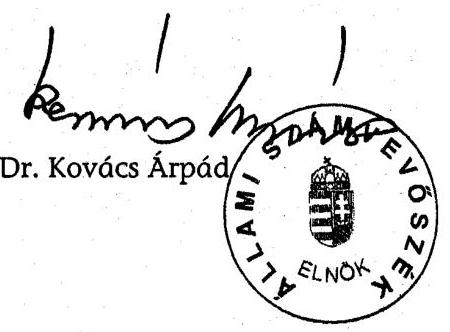

---

MELLÉKLETEK

---

# 2004 06/09 10:26 FAX +36 1 269 3485 

## Miniszter

## 1. sz. melléklet

X-3/455/3/2004.
V-23-082/2003-2004. jelentéshez

## Dr. Kovács Árpád úr

elnök
Állami Számvevőszék

## Budapest

## Tisztelt Elnök Úr!

Köszönettel megkaptam a Szekszárdi Duna-híd beruházásának ellenőrzéséről készült jelentés végleges változatát.

A dokumentációban leírt megállapításokat tudomásul vesszük és a tárcánk számára megfogalmazott javaslatokat megvizsgáljuk. Ennek alapján - a korábbi vizsgálatokhoz hasonlóan az illetékes szakfőosztályok bevonásával összeállítjuk a GKM Intézkedési Tervét, amelyet szíves tájékoztatásul Elnök Úr számára is megküldünk.

Budapest, 2004. május "31"
Üdvözlettel:
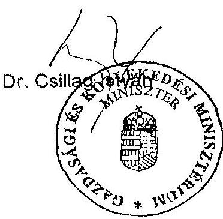

---

# Kivonat 

## az országos közúthálózat fejlesztésének, fenntartásának és üzemeltetésének hosszú és középtávú feladatairól, valamint finanszírozásának egyes kérdéseiről szóló 2044/2003. (III. 14.) Korm. határozatból

1. A gyorsforgalmi úthálózat 2003-2006 közötti középtávú fejlesztési feladatait is magában foglaló, 2015-ig terjedő hosszú távú fejlesztési programja az alábbi útszakaszok megvalósítását tartalmazza:
1.1. az M0 teljes budapesti gyűrű az M1 autópályától indulva és oda zárva, szektoronként a forgalom igényeinek megfelelő keresztmetszetben;
1.2. az M1 autópálya Budapesttől Hegyeshalomig; M15 autópálya Rajkáig;
1.3. az M2 autópálya Budapesttől Vácig;
1.4. az M2 autópályává fejleszthető autóút Váctól a magyar-szlovák határig;
1.5. az M3 autópálya Budapesttől Nyíregyházáig autópályaként (szakaszolt beruházás);
1.6. az M3 autóút Nyíregyházától a magyar-ukrán határig;
1.7. az M4 autópálya Budapesttől Szolnokig;
1.8. az M4 autóút Szolnoktól a magyar-román határig (Biharkeresztes);
1.9. az M5 autópálya Budapesttől a magyar-jugoszláv határig (Röszke);
1.10. az M6 autópálya Budapesttől Dunaújvárosig;
1.11. az M6 autópályává fejleszthető autóút Dunaújvárostól Pécsig;
1.12. az M7 autópálya Budapesttől a magyar-horvát határig (Letenye) (szakaszolt felújítás és építés);
1.13. az M8 autóút Rábafüzestől Veszprémen át Dunaújvárosig, valamint Dunavecsétől Szolnokig;
1.14. az M8 autópálya Dunaújvárostól (M6) Dunavecséig (51 sz. főút);
1.15. az M9 autóút Soprontól az 53 sz. főútig (szakaszolt beruházás a kapcsolódó Szekszárdi Duna-híddal);
1.16. az M15 autópálya Mosonmagyaróvártól a magyar-szlovák határig (Rajka);
1.17. az M25 autóút M3-Eger között;
1.18. az M30 autópálya Emődtől (M3) Miskolcig;
1.19. az M30 autópályává fejleszthető autóút Miskolctól a magyar-szlovák határig (Tornyosnémeti);
1.20. az M35 autópálya Görbeházától (M3) Debrecenig;
1.21. az M43 autópályává fejleszthető autóút Szegedtől (M5) a magyar-román határig (Nagylak);
1.22. az M44 autóút Kecskeméttől (M5) a magyar-román határig (Gyula);
1.23. az M56 autóút Bólytól (M6) a magyar-horvát határig;
1.24. az M70 autóút Letenyétől (M7) a szlovén határig (Tornyiszentmiklós);
1.25. az M86 autóút Levéltől (M1/M15) Hegyfaluig (M9).
2. A kiszámítható közútfejlesztés megvalósítása érdekében 2003-2006. között 420 km új gyorsforgalmi út készüljön el, továbbá 425 km gyorsforgalmi út építése, valamint további 803 km gyorsforgalmi útvonal építésének előkészítése kezdődjék meg. A fejleszté-

---

sek megvalósításához szükséges forrásokról az alábbiakban előírt ütemezésnek megfelelően kell gondoskodni. Ennek keretében
2.1. épüljön meg

# 2.1.1. a 2003. évben az M9 autóút szekszárdi Dunahídhoz kapcsolódó szakasza a 6 és 51 sz. főutak között; 

2.1.2. a 2004. évben
2.1.2.1. az M30 autópálya Emőd és Miskolc közötti,
2.1.2.2. az M3 autópálya Polgár-Görbeháza közötti,
2.1.2.3. az M7 autópálya Becsehely-Letenye (M7/M70 csomópont) közötti, valamint
2.1.2.4. az M70 autóút Letenye-Tornyiszentmiklós közötti
szakasza;
2.1.3. a 2005. évben
2.1.3.1. az M0 keleti szektorában az M5 és a 4 sz. főút közötti szakasz, a 4 sz. főút Vecsést és Üllőt elkerülő szakaszával együtt,
2.1.3.2. az M7 autópálya Balatonszárszó-Ordacsehi szakasza;
2.1.4. a 2006. évben
2.1.4.1. az M0 északi szektorában a 2-11 sz. főutak közötti autópálya szakasz a gyűrű északi Duna-hídjával, a 10 sz. főút fejlesztésével,
2.1.4.2. az M3 autópálya Görbeháza-Nyíregyháza közötti szakasza,
2.1.4.3. az M3 autópálya Görbeháza-Nyíregyháza szakaszához kapcsolódó, Nyíregyházát elkerülő szakasz a hozzá tartozó főúti fejlesztésekkel,
2.1.4.4. az M5 autópálya Kiskunfélegyháza-Szeged északi csomópont közötti szakasza,
2.1.4.5. az M35 autópálya Görbeháza-Debrecen közötti szakasza,
2.1.4.6. az M35 autópálya építéséhez kapcsolódó, Debrecent északnyugatról elkerülő szakasza,
2.1.4.7. az M6 autópálya Budapest (M0)Dunaújváros szakasza,
2.1.4.8. az M7 autópálya Zamárdi-Balatonszárszó és Ordacsehi-Balatonszentgyörgy szakasza,
2.1.4.9. az M8 autópálya dunaújvárosi Duna-hídja és Dunaújváros (M6)-Dunavecse (51 sz. főút) közötti szakasza,

### 2.1.4.10. az M9 autóút 51 és 54 sz. főutak közötti szakasza;

2.2. 2003-2006. között kezdődjön meg az építés
2.2.1. az M0 keleti szektorában a 4 sz. főút és az M3 autópálya között, beleértve a gödöllői átkötést is;
2.2.2. az M0 M1-M5 autópályák közötti déli szektorának $2 \times 3$ sávos autópályává bővítésén;
2.2.3. az M2 autóút Vác-országhatár szakaszán;
2.2.4. az M6 autóút Dunaújváros-Szekszárd közötti szakaszán;
2.2.5. az M6 autóút Szekszárd-Pécs szakaszán;
2.2.6. az M7 autópálya Nagykanizsa-Becsehely és Balatonszentgyörgy-Nagykanizsa szakaszain;
2.2.7. a 10 sz. főút Dorog-Budapest közötti szakaszán;
2.2.8. az M30 autóút Miskolc-Tornyosnémeti közötti szakaszán;
2.2.9. az M43 autópálya Szeged (M5)-Makó közötti szakaszán;
2.3. 2003-2006. között a tervezési és az egyéb előkészítési munkák kezdődjenek meg, illetve folytatódjanak a 2007-2015. közötti megvalósítás érdekében
2.3.1. az M0 északi szektorában;
2.3.2. az M2 autóút Budapest-Vác szakaszának autópályává bővítésén;
2.3.3. az M3 autóút Nyíregyháza-országhatár szakaszán;
2.3.4. az M5 autópálya Szeged-Röszke szakaszán;
2.3.5. az M8 autóút Rábafüzes-Veszprém, Veszprém-Dunaújváros, Dunavecse-Szolnok és az M4 autóút Szolnok-országhatár szakaszain;

---

2.3.6. az M9 autóút Sopron-Kaposvár-Szekszárd és az 53 sz. főút közötti szakaszán;
2.3.7. az M15 autóút autópályává fejlesztésén;
2.3.8. az M25 autóút M3--Eger között;
2.3.9. az M43 autóút Makó-országhatár közötti szakaszán;
2.3.10. az M56 Bóly-országhatár autóúton.

---

# Az M9 autóút beruházás kronológiája 

| 1993. december | Az Új Duna-híd Koncessziós Rt.-vel a koncessziós szerződés megkötése |
| :--: | :--: |
| 1996. december | Az építési engedély kiadása az S9 (későbbiekben M9) projekt megépítésére a koncesszornak 2 évre |
| 1998. november | A Közlekedési Főfelügyelet meghosszabbította az építési engedély érvényességét 1999. december 31-ig |
| 1998. december | Az ÁAK lett az engedélyes |
| 1999. május | Az M9 autóút építésének elrendelése 2001. évi befejezéssel (2117/1999. (V.26.) Korm. határozat) |
| 1999. november | Az NA Rt. bejelentette az építési munkák megkezdését |
| 1999. december | Az NA Rt. lett az engedélyes |
| 2000. május | A Magyar Hídépítő Konzorcium beadta az ajánlatát a "B" szakaszra |
| 2000. június | Szerződéskötés a Mérnökkel |
| 2000. július | A MAK beadta ajánlatát az "A" és "C" szakaszra |
| 2000. augusztus | Az NA Rt. Közgyűlése elfogadta a "B" szakasz kivitelezői szerződését |
| 2000. augusztus | A "B" szakasz szerződéskötése (hatályos 2000. decembertől) |
| 2000. szeptember | A "B" szakasz szerződésének első módosítása |
| 2000. október | Az NA Rt. Közgyűlése elfogadta az "A" és "C" szakasz kivitelezői szerződését |
| 2000. október | Szerződéskötés az "A" és "C" szakaszra (Hatályos 2000. novembertől) |
| 2000. november | A "B" szakasz szerződésének második módosítása |
| 2001. október | A 2303/2001. (X.19.) kormányhatározat eltekintett az eredeti befejezési határidőtől |
| 2002. április | A "B" szakasz szerződésének harmadik, egyben az "A" és "C" szakasz első módosítása |
| 2002. május | A "B" szakasz szerződésének negyedik, egyben az "A" és "C" szakasz második módosítása |
| 2002. május | Az NA Rt. módosította az ajánlati költségvetést a konzorciumokkal |
| 2003. március | Az M9 autóút - szekszárdi Duna hídhoz kapcsolódó a 6 és 51 sz. főutak közötti szakasza - építésének befejezését 2003. évben határozták meg (2044/2003. (III.14.) Korm. határozat |
| 2003. március | A közútkezelői szerződés megkötése az ÁAK Rt. és a Tolna megyei Állami Közútkezelő Kht. között |
| 2003. július | A Szekszárdi Duna- híd és a kapcsolódó útszakaszok forgalomba helyezésének befejezése |
| 2003. június-július | A létesítmények átadása a kezelőknek/üzemeltetőknek |
| 2003. szeptember | Mérnök kiadta a Befejezési Igazolásokat a teljes beruházásra |

---

# Kimutatás

az ÁPV Rt. (vagy MEH) -MFB Rt. és az MFB Rt.-NA Rt. közötti finanszírozási módokról a gyorsforgalmi úthálózat fejlesztéssel összefüggésben

|  Sor | ÁPV Rt.(vagy MEH)-MFB Rt. |  | |  |  | MFB Rt.-NA Rt. |  |  |  |  | Áthidaló hitel |   |
| --- | --- | --- | --- | --- | --- | --- | --- | --- | --- | --- | --- | --- |
| sz. | Időszak | Jegyzett tőke | Tőketartalék | Összesen | Egyenleg | Időszak | Jegyzett tőke | Tőketartalék | Összesen | Egyenleg | Időszak | Megnevezés  |
|  1. |  |  |  |  |  | 1999.09.15 | 0,990 |  | 0,990 | 0,990 |  |   |
|  2. | 1999.12.31 | 25,980 | 18,956 | 44,936 | 44,936 |  |  |  | 0,000 | 0,990 |  |   |
|  3. |  |  |  | 0,000 | 44,936 | 2000.03.29 | 4,450 | 0,450 | 4,900 | 5,890 |  |   |
|  4. | 2000.03.31 | 12,000 | 6,000 | 18,000 | 62,936 |  |  |  | 0,000 | 5,890 |  |   |
|  5. |  |  |  | 0,000 | 62,936 | 2000.07.20 | 4,545 | 0,455 | 5,000 | 10,890 |  |   |
|  6. |  |  |  | 0,000 | 62,936 | 2000.08.23 | 4,545 | 0,454 | 4,999 | 15,889 |  |   |
|  7. |  |  |  | 0,000 | 62,936 |  |  |  | 0,000 | 15,889 | 2000.10.06 | 12,2 Mrd OTP  |
|  8. | 2000.12.12 |  | 25,000 | 25,000 | 87,936 |  |  |  | 0,000 | 15,889 |  |   |
|  9. | 2000.12.19 | 10,000 | 4,000 | 14,000 | 101,936 |  |  |  | 0,000 | 15,889 |  |   |
|  10. | 2000.12.31 |  | $-0,209$ | $-0,209$ | 101,727 |  |  |  | 0,000 | 15,889 |  |   |
|  11. |  |  |  | 0,000 | 101,727 | 2001.01.17 | 10,910 | 1,091 | 12,001 | 27,890 |  |   |
|  12. |  |  |  | 0,000 | 101,727 | 2001.05.24 | 9,000 |  | 9,000 | 36,890 |  |   |
|  13. |  |  |  | 0,000 | 101,727 | 2001.05.30 | 2,000 |  | 2,000 | 38,890 |  |   |
|  14. | 2001.07.17 | 24,290 | 10,910 | 35,200 | 136,927 | 2001.07.17 | 4,000 |  | 4,000 | 42,890 |  |   |
|   |  |  |  |  |  | 2001.08.14 | 1,000 |  | 1,000 | 43,890 |  |   |
|  15. |  |  |  | 0,000 | 136,927 | 2001.08.21 | 4,770 | 4,230 | 9,000 | 52,890 |  |   |
|  16. |  |  |  | 0,000 | 136,927 | 2001.09.18 |  | 2,000 | 2,000 | 54,890 |  |   |
|  17. |  |  |  | 0,000 | 136,927 |  |  |  | 0,000 | 54,890 | 2001.09-től | 25 Mrd MFB  |
|  18. |  |  |  | 0,000 | 136,927 |  |  |  | 0,000 | 54,890 | 2001.12-től | 35 Mrd MFB  |
|  19. | 2002.03.25 | 15,300 | 20,700 | 36,000 | 172,927 |  |  |  | 0,000 | 54,890 |  |   |
|  20. |  |  |  | 0,000 | 172,927 |  |  |  | 0,000 | 54,890 | 2002.03.26-tól | 40 Mrd MFB  |
|  21. |  |  |  | 0,000 | 172,927 |  |  |  | 0,000 | 54,890 | 2002.12.06-tól | 43 Mrd MFB  |
|  22. | 2002.12.30 |  | 60,000 | 60,000 | 232,927 |  |  |  | 0,000 | 54,890 |  |   |

---

| Sor
sz. | Döntés/
Döntéshozó | Részvényesi határozat | Tőkemozgás |  |  | Jegyzett tőke változásai |  |  |  | Ázsió
(Tőke-
tartalék) | Cégbejegyzés
dátuma | MFB Rt.
részesedése  |
| --- | --- | --- | --- | --- | --- | --- | --- | --- | --- | --- | --- | --- |
|   |  |  | Megnevezés | Időpont | Összege | Pénzbeni
(MrdFt) | Apport
(MrdFt) | Összesen |  |  |  |   |
|  1. | KHVM |  | Beolvadás | 2000.08.29 |  | 7,269 | 7,781 | 15,050 |  | 2000.08.29 |  |   |
|  2. | 2185/2001.
Korm.
határozat | 38-as
(2001. 12. 28.
NA Rt.) | Tőkeemelés+ázsió | 2001.12.28 | 5,250 | 17,769 | 7,781 | 32,819 | 2,100 | 2002.01.08 | 10,5/25,55=
41,1 % |   |
|  3. |  |  | Tőkeemelés+ázsió | 2002.08.06 | 1,340 |  |  |  |  |  |  |   |
|  4. |  |  | Tőkeemelés+ázsió | 2002.09.02 | 3,300 |  |  |  |  |  |  |   |
|  5. |  |  | Tőkeemelés+ázsió | 2002.10.01 | 2,710 |  |  |  |  |  |  |   |
|  6. | 2045/2001.
Korm.
határozat | 2002. 12. 06-i
és 2002. 12. 13-
i Közgyűlés | Tőkeemelés | 2002.12.11 | 4,200 | 21,969 | 7,781 | 29,750 | 2,100 | 2002.12.16 | 14,7/29,75=
49,41 % |   |
|  7. |  |  | Tőkeemelés | 2002.12.18 | 4,300 | 26,269 | 7,781 | 34,050 | 2,100 | 2002.12.30 | 19/34,05=
55,8 % |   |

---

MFB. Rt.-NA Rt. Szekszárdi Duna-híd vizsgálat 4. melléklet V-23-082/2003-2004. jelentéshez

Kimutatás az MFB Rt. és NA Rt. közötti finanszírozási módokról

(készítette: Fekete Gábor ÁSZ az NA Rt. és az MFB Rt. iratai alapján; 2003. 11. 03.) (JT= Jegyzett tőke)

| Sor
sz. | Döntés/
Döntéshozó | Jóváhagyó |  | Utalás
napja | Összeg
(millió Ft-ban) | Összeg
(millió Ft-ban) | Finanszírozás
módja | Cégbejegyzés
hatálya | Törzstöke |  | Megjegyzés  |
| --- | --- | --- | --- | --- | --- | --- | --- | --- | --- | --- | --- |
|   |  | Megnevezés | Időpont |  |  |  |  |  |  |  |   |
|  1. |  | Cenzúra Bizottság | 1999.06.18 | 1999.09.15 | 99,0 | JT befizetés |  |  |  |  |   |
|  2. | (nem az MFB Rt.-től, hanem a Közlekedési és Vízügyi Minisztériumtól
(KöViM) származik) |  |  |  | 1,0 | JT befizetés | 1999.11.16 |  | 100,0 | 99/1 | 1 db elsőbbségi
részvény (KöViM)  |
|  3. |  | Cenzúra Bizottság | 2000.03.22 | 2000.03.29 | 4 450,0 | JT emelés | 2000.06.20 |  | 4 550,0 | 4549/1 | Összesen:
4 900 mFt  |
|  4. |  |  |  |  | 450,0 | Tőketartalék (ázsió) |  |  |  |  |   |
|  5. |  |  |  | 2000.07.20 | 4 545,5 | JT emelés |  |  |  |  | Összesen:
5 000 mFt  |
|  6. |  | MFB. Rt.
Igazgatósága | 2000.07.19 |  | 454,5 | Tőketartalék (ázsió) |  |  |  |  |   |
|  7. |  |  |  | 2000.08.23 | 4 544,5 | JT emelés | 2000.08.02 |  | 13 640,0 | 13629000/1
(elírás lehet) | Összesen: 4 999 mFt a
cégbejegyzés hatálya
megelőzi a befizetést!  |
|  8. |  |  |  |  | 454,5 | Tőketartalék (ázsió) |  |  |  |  |   |
|  9. |  | MFB Bankgarancia! |  | n. a. | 7 000,0 | áthidaló hitel |  |  |  |  |   |
|  10. | 12,2 MrdFt-os
OTP hitel | Cenzúra Bizottság | 2000.10.06 | n. a. | 4 300,0 | áthidaló hitel | 0 |  | maradt
ugyanaz | maradt
ugyanaz | 17,2 - 5 MrdFt OTP
áthidaló hitel az MFB
garanciájával  |
|  11. |  | MFB Rt. Igazgatóság | 2000.10.12 | n. a. | 900,0 | áthidaló hitel |  |  |  |  |   |
|  12. | PM Államtitkár |  | 2001.01.17 | 2001.01.17 | 10 910,0 | JT emelés | 2001.02.08 |  | 24 550,0 | 24549/1 | 12 001 millióFt  |
|  13. | MFB Rt. Igazgatóság |  | 2001.01.15 | (MNB) | 1 091,0 | Tőketartalék (ázsió) |  |  |  |  |   |
|  14. |  |  |  | 2001.05.24 | 9 000,0 | JT emelés |  |  |  |  | Összesen:27 MrdFt
a cégbejegyzés  |
|  15. | MEH miniszter |  |  | 2001.05.30 | 2 000,0 | JT emelés | |  |  |  | hatálya megelőzi a
befizetést! Az  |
|  16. | MFB Rt. |  |  | 2001.07.17 | 4 000,0 | JT emelés |  |  |  |  | "Alapítói határozat"  |
|  17. | Alapítói | MFB Rt. Igazgatóság | 2001.04.18 | 2001.08.14 | 1 000,0 | JT emelés | 2001.07.09 |  | 45 320,0 | 45319/1 | nem jó!  |
|  18. | határozat |  |  | 2001.08.21 | 4 770,0 | JT emelés |  |  |  |  |   |
|  19. | 2001.05.23 |  |  |  | 4 230,0 | Tőketartalék (ázsió) |  |  |  |  |   |
|  20. |  |  |  | 2001.09.18 | 2 000,0 | Tőketartalék (ázsió) |  |  |  |  |   |
|  21. | MEH miniszter | MFB Rt. Igazgatóság | 2001.09.19 | 2001.09.24 | 8 000,0 | áthidaló hitel |  |  |  |  |   |
|  22. | MFB Rt. Alapítói
határozat |  |  | 2001.10.02 | 13 107,0 | áthidaló hitel | 0 |  | maradt
ugyanaz | maradt
ugyanaz | 25 MrdFt MFB Rt.
áthidaló hitel  |
|  23. | 2001.09.25 | 25 MrdFt MFB Rt. áthidaló hitel |  | 2001.11.14 | 3 868,0 | áthidaló hitel |  |  |  |  |   |

1. oldal

---

|  4. melléklet |   |
| --- | --- |
|  Szekszárdi Duna-híd vizsgálat | V-23-082/2003-2004. jelentéshez  |

|  Sorsz. | Döntés/ Döntéshozó | Jóváhagyó | Utalás napja | Összeg (millió Ft-ban) | Finanszírozás módja | Cégbejegyzés hatálya | Törzstöke összege (mFt) | Tőrzstöke Aránya | Megjegyzés  |
| --- | --- | --- | --- | --- | --- | --- | --- | --- | --- |
|  24. | MEH Miniszter 2001.11.30 | Cenzúra Bizottság 2001.11.08
MFB Igazgatóság 2001.11.22. | 2001.12.03 | 11 000,0 | áthidaló hitel | 0 | maradt ugyanaz |  | 35 MrdFt MFB Rt. áthidaló hitel  |
|  25. | SZ 1 |  | 2001.12.21 | 40 000,0 | szindikált hitel | 0 | maradt ugyanaz |  | Összesen: 180 MrdFt  |
|  26. | Törlesztés! |  | 2001.12.21 |  | 10 000,0 | NA Rt. Törlesztés! |  | 25 MrdFt | MFB Rt. áthidaló hitel  |
|  27. | Törlesztés! |  | 2001.12.21 |  | 12 200,0 | NA Rt. Törlesztés! |  | 12,2 MrdFt | OTP Rt. áthidaló hitel  |
|  28. | Id. 14-20. tétel 2001. évi MFB Rt. tőkeemelés+ázsió |  | 2001.12.27 | 1,0 | Tőketartalék (ázsió) | 0 | maradt ugyanaz |  | a 14-20. tételhez tartozik  |
|  29. | SZ 2 |  | 2002.01.10 | 15 000,0 | szindikált hitel |  | maradt ugyanaz |  | Összesen: 180 MrdFt  |
|  30. | Törlesztés! |  | 2001.12.21 |  | 10 000,0 | NA Rt. Törlesztés! |  | 25 MrdFt | MFB Rt. áthidaló hitel  |
|  31. | Törlesztés! |  | 2001.12.21 |  | 5 000,0 | NA Rt. Törlesztés! |  | 25 MrdFt | MFB Rt. áthidaló hitel  |
|  32. | SZ 3 |  | 2002.01.24 | 5 000,0 | szindikált hitel |  | maradt ugyanaz |  | Összesen: 180 MrdFt  |
|  33. | SZ 4 |  | 2002.02.18 | 10 000,0 | szindikált hitel |  | maradt ugyanaz |  | Összesen: 180 MrdFt  |
|  34. | Törlesztés! |  | 2002.02.18 |  | 5 000,0 | NA Rt. Törlesztés! |  | 35 MrdFt | MFB Rt. áthidaló hitel  |
|  35. | SZ 5 |  | 2002.03.11 | 5 000,0 | szindikált hitel |  | maradt ugyanaz |  | Összesen: 180 MrdFt  |
|  36. | MEH, GKM | CB és Igazgatóság 2002.02.20.25. | 2002.03.26 | 5 000,0 | áthidaló hitel |  | 40 MrdFt |  | MFB Rt. áthidaló hitel  |
|  37. | SZ 6 |  | 2002.03.28 | 10 000,0 | szindikált hitel |  | maradt ugyanaz |  | Összesen: 180 MrdFt  |
|  38. | Törlesztés! |  | 2002.03.28 |  | 6 000,0 | NA Rt. Törlesztés! |  | 35 MrdFt | MFB Rt. áthidaló hitel  |
|  39. | MEH, GKM | CB és Igazgatóság 2002.02.20.25. | 2002.04.25 | 4 000,0 | áthidaló hitel |  | 40 MrdFt |  | MFB Rt. áthidaló hitel  |
|  40. | SZ 7 |  | 2002.04.29 | 10 000,0 | szindikált hitel |  | maradt ugyanaz |  | Összesen: 180 MrdFt  |
|  41. | SZ 8 |  | 2002.05.17 | 10 000,0 | szindikált hitel |  | maradt ugyanaz |  | Összesen: 180 MrdFt  |
|  42. | MEH, GKM | CB és Igazgatóság 2002.02.20.25. | 2002.06.04 | 5 000,0 | áthidaló hitel |  | 40 MrdFt |  | MFB Rt. áthidaló hitel  |
|  43. | SZ 9 |  | 2002.06.07 | 5 000,0 | szindikált hitel |  | maradt ugyanaz |  | Összesen: 180 MrdFt  |
|  44. | SZ 10 |  | 2002.06.24 | 15 000,0 | szindikált hitel |  | maradt ugyanaz |  | Összesen: 180 MrdFt  |
|  45. | SZ 11 |  | 2002.07.22 | 15 000,0 | szindikált hitel |  | maradt ugyanaz |  | Összesen: 180 MrdFt  |
|  46. | MEH, GKM | CB és Igazgatóság 2002.02.20.25. | 2002.08.01 | 1 500,0 | áthidaló hitel |  | 40 MrdFt |  | MFB Rt. áthidaló hitel  |
|  47. | GKM 2002.08.12. | CB és Igazgatóság 2002.07.25. | 2002.08.21 | 12 461,0 | JT emelés | 2002.12.17 | 72 320,0 72319/1 |  | Össz.: 27 MrdFt  |
|  48. | MEH, GKM | CB és Igazgatóság 2002.02.20.25. | 2002.08.21 | 3 000,0 | áthidaló hitel |  | 40 MrdFt |  | MFB Rt. áthidaló hitel  |
|  49. | MEH, GKM | CB és Igazgatóság 2002.02.20.25. | 2002.09.10 | 4 000,0 | áthidaló hitel |  | 40 MrdFt |  | MFB Rt. áthidaló hitel  |
|  50. | SZ 12 |  | 2002.09.23 | 9 000,0 | szindikált hitel |  | maradt ugyanaz |  | Összesen: 180 MrdFt  |
|  51. | GKM 2002.08.12. | CB és Igazgatóság 2002.07.25. | 2002.08.21 | 14 539,0 | JT emelés | 2002.12.17 | 72 320,0 72319/1 |  | Össz.: 27 MrdFt  |
|  52. |  |  | 2002.10.22 | 5 000,0 | áthidaló hitel |  | 35 MrdFt |  | MFB Rt. áthidaló hitel  |
|  53. | MEH, GKM | CB és Igazgatóság 2002.02.20.25. | 2002.11.20 | 5 500,0 | áthidaló hitel |  | 40 MrdFt |  | MFB Rt. áthidaló hitel  |

---

|  4. melléklet |   |
| --- | --- |
|  Szekszárdi Duna-híd vizsgálat | V-23-082/2003-2004. jelentéshez  |

|  Sor
sz. | Döntés/
Döntéshozó | Jóváhagyó |  | Utalás
napja | Összeg
(millió Ft-ban) |  | Finanszírozás
módja | Cégbejegyzés
hatálya |  | Törzstöke
összege (mFt) |  | Megjegyzés  |
| --- | --- | --- | --- | --- | --- | --- | --- | --- | --- | --- | --- | --- |
|   |  | Megnevezés | Időpont |  |  |  |  |  |  |  |  |   |
|  54. | SZ 13 |  |  |  | 2002.11.22 | 15 000,0 | szindikált hitel |  |  |  | maradt ugyanaz | Összesen: 180 MrdFt  |
|  55. |  |  |  |  | 2002.12.06 | 7 759,6 | áthidaló hitel |  |  |  | maradt ugyanaz | MFB 43 MrdFt áthidaló  |
|  56. | SZ 14 |  |  |  | 2002.12.10 | 6 000,0 | szindikált hitel |  |  |  | maradt ugyanaz | Összesen: 180 MrdFt  |
|  57. | SZ 15 |  |  |  | 2002.12.10 | 10 000,0 | szindikált hitel |  |  |  | maradt ugyanaz | Összesen: 180 MrdFt  |
|  58. |  |  |  |  | 2002.12.16 | 13 490,4 | áthidaló hitel |  |  |  | maradt ugyanaz | MFB 43 MrdFt áthidaló  |
|  59. |  |  |  |  | 2002.12.19 | 6 977,5 | áthidaló hitel |  |  |  | 35 MrdFt | MFB Rt. áthidaló hitel  |
|  60. |  |  |  |  | 2002.12.30 | 21 056,3 | áthidaló hitel |  |  |  | maradt ugyanaz | MFB 43 MrdFt áthidaló  |
|  61. | Törlesztés! |  |  |  | 2002.12.30 |  | 45,0 | NA Rt. Törlesztés! |  |  |  | MFB Rt. áthidaló hitel | |

|  ÖSSZESEN: | JT, JT emelés, ázsió, hitel
Hitel törlesztés |  |  | 391 459,8 |  |  |  |  |  |  |   |
| --- | --- | --- | --- | --- | --- | --- | --- | --- | --- | --- | --- |
|   |  |  |  |  | 48 245,0 |  |  |  |  |  |   |
|  EBBŐL: |  |  |  |  |  |  |  |  |  |  |   |
|  JT és JT emelés |  |  |  |  | 72 320,0 |  |  |  |  |  |   |
|  Tőketartalék (ázsió) |  |  |  |  | 8 681,0 |  |  |  |  |  |   |
|   | Hitelek és törlesztések alakulása |  |  |  |  |  |  | (millió Ft-ban) |  |  |   |
|   | megnevezés |  |  | Hitelkeret | Lehívás |  |  | törlesztés |  |  | Megjegyzés  |
|   |  |  |  | (MrdFt-ban) | összesen | db |  | összesen | db |  |   |
|  17,2 MrdFt-os OTP Rt. áthidaló |  |  |  | 17,2-5 | 12 200,0 | 3 |  | 12 200,0 | 1,0 |  |   |
|  25 MrdFt-os MFB Rt. áthidaló |  |  |  | 25 | 24 975,0 | 3 |  | 25 000,0 | 3,0 |  |   |
|  180 MrdFt-os szindikált hitel |  |  |  | 180 | 180 000,0 | 15 |  | 0,0 | 0,0 |  |   |
|  35 MrdFt-os MFB Rt. áthidaló hitelkeret |  |  |  | 35 | 22 977,5 | 3 |  | 11 000,0 | 2,0 |  |   |
|  40 MrdFt-os MFB Rt. áthidaló hitel |  |  |  | 40 | 28 000,0 | 7 |  |  |  |  |   |
|  43 MrdFt-os MFB Rt. áthidaló hitel |  |  |  | 43 | 42 306,3 | 3 |  |  |  |  |   |
|  MFB hitel törlesztés |  |  |  |  |  |  |  | 45,0 | 1,0 |  |   |
|   | Összes hitel: |  |  |  | 310 458,8 |  |  |  |  |  |   |
|   | Ellenőrző szám: |  |  |  | 391 459,8 |  |  |  |  |  |   |
|  Magyar Állam által átvállalt hitel |  |  |  | 180 | 180 000,0 |  |  |  |  |  |   |
|  Magyar Állam által átvállalt hitel |  |  |  | 6,9 | 6 855,0 (40 MrdFt-osból) |  |  |  |  |  |   |
|  Magyar Állam által átvállalt hitel |  |  |  | 5,5 | 5 551,3 |  |  |  |  |  |   |
|   |  |  |  | Összesen: | 192 406,3 |  |  |  |  |  |   |

---

# 5. melléklet

## V-23-082/2003-2004. jelentéshez

### Kimutatás a Szekszárdi Duna-híd és a hozzá kapcsolódó utak Vegyépszer Rt.-t érítő NA Rt. által kötött szerződésekről

|  Sze | Sz | Kötés
Bátruma | Szerződés tárgya | Befejezési
határidő | Bruttó összeg
(ÁFA-val) | Tartalék (ÁFA-
val) | Előleg | Teljesítés
(kifizetett) | Ebből: pótmunka | Keret túllépés
(pótmunka nélkül) | Számlák
db  |
| --- | --- | --- | --- | --- | --- | --- | --- | --- | --- | --- | --- |
|  1. | A | B | 4500000094 | 2000.10.26 | Szekszárdi Duna-híd és 6. sz.-51. sz. főutak
közötti autóút "A" jelű projektelem (0,0-14,0
kmsz.) | 2000.06.30 | 12 408 046 250 | 1 000 000 000 | 10% | #HIV! | #HIV! | #HIV!  |
|  2. | A |  | 4500000080 | 2000.08.04 | Szekszárdi Duna-híd és 6. sz.-51. sz. főutak
közötti autóút beruházásból a Duna-híd és
csatlakozó töltésszakaszok ("B" jelű
projektelem (14,1-16,1 kmsz.) | 2003.06.30 | 11 700 000 000 | 1 000 000 000 | 10% | #HIV! | #HIV! | #HIV!  |
|  3. | A |  | 4500000095 | 2000.10.26 | Szekszárdi Duna-híd és 6. sz.-51. sz. főutak
közötti autóút "C" jelű projektelem (16,1-20,6
kmsz.) | 2003.06.30 | 3 841 868 750 | 250 000 000 | 10% | #HIV! | #HIV! | #HIV!  |
|   |  |  |  |  | Összesen: |  | 27 949 915 000 | 2 250 000 000 | 0 | #HIV! | #HIV! | #HIV!  |

Ellenőrző szám:

Megjegyzés: szerződés módosítások a fenti szerződések esetében voltak, de ezek a befejezési határidőt és a szerződött összeget nem érintették.

---

# KIMUTATÁS

a pótmunkákról

|  "A" projektelem |  |  |  |  |  |   |
| --- | --- | --- | --- | --- | --- | --- |
|  Sorsz. | Teljesítés dátuma | Megnevezés | Összeg (Ft) |  |  | Megjegyzés  |
|   |  |  | Nettó | ÁFA | Bruttó |   |
|  1.1. | 2002-12-18 | Optikai kábel kiváltása | 699480 | 174870 | 874350 | Előleg 104 923Ft  |
|  2.1 | 2003-03-25 | Bogyiszlói csomópont (terület előkészítés, földmunkák, híd alépítmény, vízvezeték kiváltása) | 188886307 | 47221577 | 236107884 | Kapcsolódó utak: bogyiszlói bekötő út gemenci bekötő út Kutyatanyai gátőház bekötő útja  |
|  2.2 | 2003-04-25 | Bogyiszlói csomópont (földmunkák, útburkolati cementes stabilizáció, híd alépítmény, híd felszerkezet) | 117434916 | 29358729 | 146793645 |   |
|  2.3 | 2003-05-25 | Bogyiszlói csomópont (földmunkák, útburkolati rétegek, híd alépítmény, híd felszerkezet, villamos távvezeték bontás és építés) | 54410273 | 13602568 | 68012841 |   |
|  2.4 | 2003-06-25 | Bogyiszlói csomópont (földmunkák, útburkolati rétegek, hídépítés befejező munkái) | 167499964 | 41874991 | 209374955 |   |
|  2.5 | 2003-07-25 | Bogyiszlói csomópont (útburkolati rétegek, hídépítés befejező munkái, terep rendezés, egyéb építés) | 90054967 | 22513742 | 112568709 | Bogyiszlói csp.
Összesen (Bruttó)
772858034  |
|  3.1 | 2003-06-25 | Szekszárd-Tolna villamos távvezeték 2+870 | 4689120 |  |  |   |
|   |  | Útépítés 0-14,100 (földmunkák, módosított pályaszerkezet árkülönbözete, útbaigazító tábla, forgalomtechnika, volt gátőrház bontása) | 128132129 |  |  |   |
|   |  | 6-os sz. főút 138,850-139,250 | 78204198 |  |  |   |
|   |  | 5112.j. út | 28798929 |  |  |   |
|   |  | 4,780 keresztező földút | 2105682 |  |  |   |
|   |  | Párhuzamos földút | 25766289 |  |  |   |
|   |  | Útlejáró | 7935161 |  |  |   |
|   |  | Párhuzamos földút (vasútvonal oldalában) | 1125504 |  |  |   |
|   |  | Párhuzamos földút | 2275750 |  |  |   |
|   |  | Párhuzamos földút | 10000324 |  |  |   |
|   |  | Párhuzamos földút | 6921494 |  |  |   |
|   |  | Útlejáró | 306704 |  |  |   |
|   |  | Bogyiszlói csomópont (földmunka,forg.tech.) | 2469614 |  |  |   |
|   |  | Párhuzamos földút | 6234657 |  |  |   |
|   |  | Összesen: | 304965555 | 76241389 | 381206944 |   |
|   |  | "A" összesen: | 923951462 | 230987866 | 1154939328 |   |
|   |  | Ebből 2002. év: | 699480 | 174870 | 874350 |   |
|   |  | 2003. év: | 923251982 | 230812996 | 1154064978 |   |

---

Szekszárdi Duna-híd vizsgálat NA Rt. 6. melléklet V-23-082/2003-2004. jelentéshez "B" projektelem

|  Sorsz. | Teljesítés
dátuma | Megnevezés | Összeg (Ft) |  |  | Megjegyzés  |
| --- | --- | --- | --- | --- | --- | --- |
|   |  |  | Nettó | ÁFA | Bruttó |   |
|  1.1 | 2002-08-25 | Duna-híd külső energia ellátása | 7995043 |  |  |   |
|   |  | Vízügyi kábel kiváltása | 3931580 |  |  |   |
|   |  | Útépítés 14,100-14,702 geotextília stb. | 84964127 |  |  |   |
|   |  | Útépítés 15,618-16,100 geotextília stb. | 37723608 |  |  |   |
|   | | Duna-híd (acélháló, matrac...stb.) | 52870603 |  |  |   |
|   |  | Összesen: | 187484961 | 46871240 | 234356201 | Előleg 28122 744Ft  |
|  1.2 | 2002-11-25 | Duna-híd (acél szegélytartók) | 6227221 | 1556805 | 7784026 |   |
|  1.3 | 2002-12-18 | Duna-híd (acél szegélytartók) | 9340519 | 2335130 | 11675649 |   |
|  1.4 | 2003-02-25 | Duna-híd (acél szegélytartók) | 3113297 | 778324 | 3891621 |   |
|  1.5 | 2003-03-25 | Duna-híd (RENO matrac a 6.pillérnél) | 12730500 | 3182625 | 15913125 |   |
|  1.6 | 2003-04-25 | (RENO matrac a 6.pillérnél, acél szegélytartók | 20667113 | 5166778 | 25833891 |   |
|  1.7 | 2003-05-25 | gyártása és korrózióvédelme) | 13314074 | 3328519 | 16642593 |   |
|  1.8 | 2003-06-25 | Acél szegélytartók korrózióvédelme | 7426082 | 1856521 | 9282603 |   |
|  2.1 | 2002-12-18 | Geodéziai alappont hálózat kiépítése | 6622000 | 1655500 | 8277500 |   |
|  3.1 | 2003-06-25 | Meterológiai rendszer | 50215225 |  |  |   |
|   |  | Forgalomszámláló rendszer | 13487867 |  |  |   |
|   |  | Összesen: | 63703092 | 15925773 | 79628865 |   |
|  3.2 | 2003-07-25 | Meterológiai rendszer | 1884775 |  |  | A Mérnök módosította  |
|   |  | Hídszekrény behatolás elleni védelme | 594051 |  |  |   |
|   |  | Forgalomszámláló rendszer | 306067 |  |  |   |
|   |  | Hajózási jelzések | 4153180 |  |  |   |
|   |  | Összesen: | 6938073 | 1734518 | 8672591 |   |
|   |  | "B" összesen: | 337566932 | 84391733 | 421958665 |   |
|   |  | Ebből 2002. év: | 209674701 | 52418675 | 262093376 |   |
|   |  | 2003. év: | 127892231 | 31973058 | 159865289 |   |

"C" projektelem

|  Sorsz. | Teljesítés dátuma | Megnevezés | Összeg (FI) |  |  | Megjegyzés  |
| --- | --- | --- | --- | --- | --- | --- |
|   |  |  | Nettó | ÁFA | Bruttó |   |
|  1.1 | 2002-03-20 | Jeladó vezeték védelembe helyezése | 2488544 | 622136 | 3110680 | Előleg 373 281Ft  |
|  2.1 | 2002-11-25 | 16+114-ben keresztező öntöző berendezés jeladó vezeték kiváltása | 4632266 | 1158067 | 5790333 | Előleg 694840Ft  |
|  3.1 | 2003-06-25 | Módosított pályaszerkezet, útbaigazító és KRESZ táblák | 43842121 |  |  |   |
|   |  | 51-es kőgyűrű | 13595008 |  |  |   |
|   |  | Porongi út | 463785 |  |  |   |
|   |  | Párhuzamos földút (jobb és bal oldal) | 14934975 |  |  |   |
|   |  | Párhuzamos földút (jobb oldal) | 16692788 |  |  |   |
|   |  | Összesen: | 89528677 | 22382169 | 111910846 |   |
|   |  | "C" összesen: | 96649487 | 24162372 | 120811859 |   |
|   |  | Ebből 2002. év: | 7120810 | 1780203 | 8901013 |   |
|   |  | 2003. év: | 89528677 | 22382169 | 111910846 |   |

---

7. sz. melléklet

V-23-082/2003-2004. jelentéshez
M9 AUTÓÚT - DUNA HÍD
$M=1: 400$
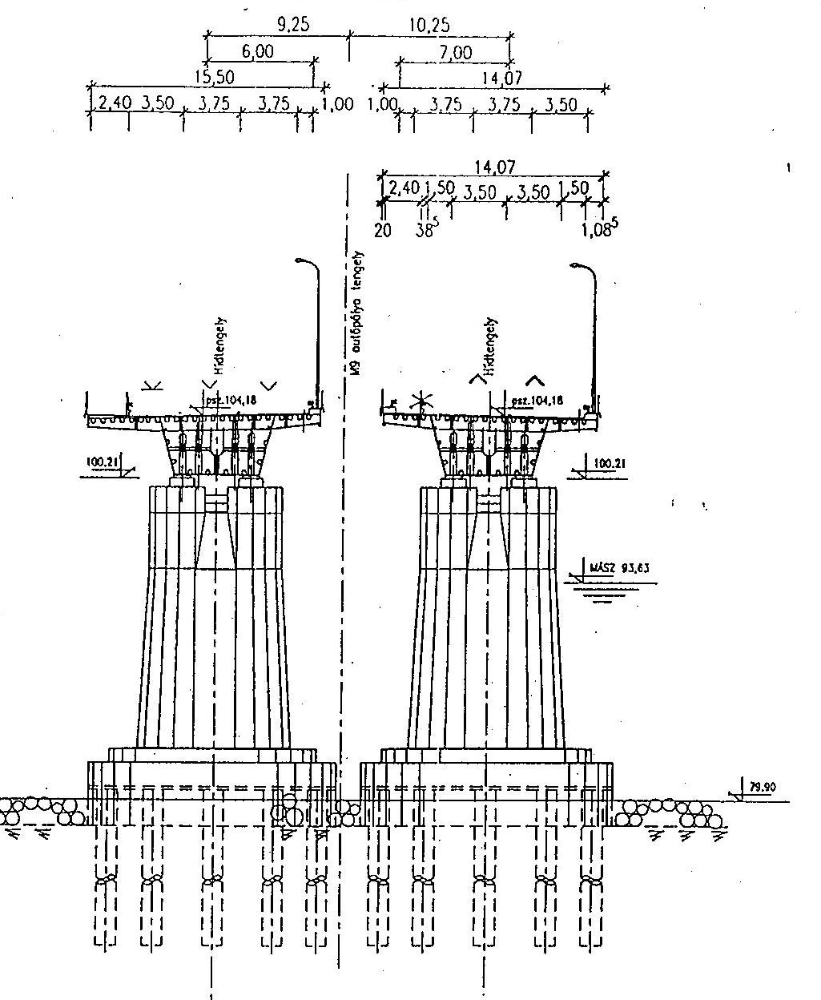

OLDALNÉZET
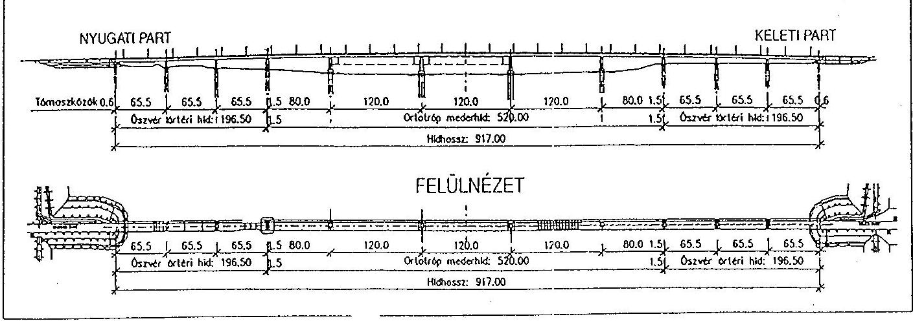

Általános terv

---

# M9 AUTÓÚT

EGYENESBEN ÉS R 3000 m SUGARÚ JOBB ÍVBEN
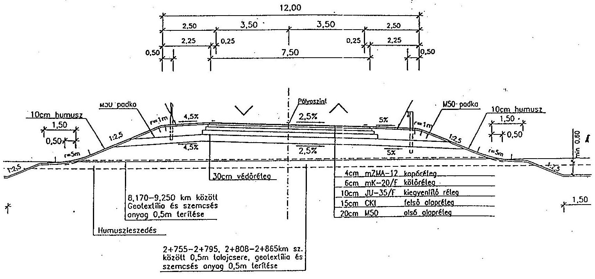

---

# NEMZETI

Tárgy: Az M9 autóút kiviteli
terveinek módosítása
Előadó: Ágh György

## Magyar Autópálya-építő Konzorcium   Farkas László projekt igazgató úr

1151 Budapest
Mogyoród útja 42.

Az M9 autóút elkészült „P" fázisú kiviteli terveinek egyeztetését követően mint Építtető - tervezési pótmunkaként -, az „I" fázisú kiviteli tervekben az alábbi módosításokat rendeljük el:
I. A 6-os sz. és 5112 j. úti csomópontok a Közútkezelő kérése és a Forgalomtechnikai Bizottság javaslata alapján körforgalmú csomópontokként tervezendők, engedélyeztetendők és építendők.
Elmaradó kiviteli munkák az összehangolt jelzőlámparendszer telepítése, a csomópontok és a csatlakozó útszakaszok világításának kiépítése.
A tervezés során a korábbi egyeztetéseken Önökkel közösen kialakított, valamint a már hivatkozott Forgalomtechnikai Bizottsági diszpozíciót kell figyelembe venni.
2. A 2. sz. híd megépítése elhagyható.
3. A Fajszi csomópontot „T" csomópontként kell megtervezni, a két érintett közlekedési hatóságnak bemutatni. A módosítást az eltérések engedélyezési eljárásán fölmerült igényeknek megfelelően kell elvégezni, miszerint a gyorsforgalmi út és a lassú járművek szintbeni keresztezését meg kell akadályozni.
4. Az útpadka és a töltésrézsűk védelmére tervezett vízelvezető szegélyes megoldás helyett, az április 10-i tárgyaláson az Építtető, a Kivitelező, a Kézelő és a Mérnök kölcsönös megjegyezése szerinti gyepnemez terítéses megoldást kell tervezni és kivitelezni.

---

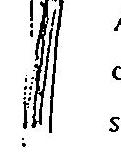

A megoldás nem csak a balesetveszélyt, hanem az építési költséget is csökkenti, mivel elmaradnak a főpálya burkolatszélesítései, a vízelvezető szegélyek és a surrantók.
5. Az „I" fázisú kiviteli tervnek a mennyiségi kimutatásokon túl, tartalmazniuk kell a „P" fázisú tervekhez képest bekövetkező mennyiségi változásokat annak érdekében, hogy az eltérésekből származó költségkülönbözetek meghatározhatók legyenek.

Az 1-es és 10-es sz. hidaknál az űrszelvény csökkenthetőségének, a csapadékvíz elvezethetőségének, az árokbélelés elhagyhatóságának, a csőátereszek típusának és az árokbélés anyagának vizsgálata, valamint az engedélyezett sebességhatár $10 \mathrm{~km} /$ órás fölemelésével szükségessé váló forgalomtechnikai intézkedések, az útbaigazító táblákra vonatkozóan idei évben életbe lépő új előírások szerinti áttervezés nem az Építtető közvetlen megrendelésére készülnek, ezért nem képezik jelen tervezési pótmunka tárgyát. Költségeiket az érvényes építési szerződésekben meghatározott tervezési költség biztosítja. Ezekben a kérdésekben az érintettek nyilatkozatainak - a Kivitelező és a Mérnök - ismeretében az „I" tervezési fázisban kívánunk dönteni.

Budapest, 2001. június Ifj.
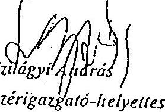
fejlesztési vezérigazgató-helyettes

NEMZETI AUTÓPÁLYA RÉSZVÉNYTÁRSASÁG 1051 Budapest, Nádor u 31
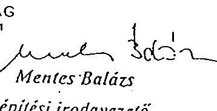

Kapják: Címzett
AAK Rt.
AMI
Kosik Attila
Mentes Balázs
Tamás Éva
Simonyi Tamásné
Elöndö
Szirekay Józsefné
Építési I.
Irattár

---

10. sz. melléklet V-23-082/2003-2004. jelentéshez

|  Építmény szám | Megnevezés | Tender Költség | Módosított költségvetés | Tényleges teljesítés 2003 okt.31-ig | Tender költség és a Tényi. teljesítés különbözete | Különbözet / Tender költség | Módosított költségvetés és a Tényi. teljesítés különbözete | Különbözet / Módosított költségvetés  |
| --- | --- | --- | --- | --- | --- | --- | --- | --- |
|   |  | eFt | eFt | eFt | eFt | % | eFt | %  |
|  C110 | Általános tételek | 415 300,00 | 415 300,00 | 408 450,00 | -6 850,00 | -1,65% | -6 850,00 | -1,65%  |
|  C211 | C211 Duna-híd 20kV vezetéke | 38 198,00 | 0,00 | 0,00 | -38 198,00 | -100,00% | 0,00 |   |
|  C212 | C212 Baja-Kalocsa I. 20kV vezeték | 6 456,00 | 5 300,80 | 5 300,80 | -1 155,20 | -17,89% | 0,00 | 0,00%  |
|  C221 | C221 Védőcső elhelyezés | 1 001,00 | 0,00 | 0,00 | -1 001,00 | -100,00% | 0,00 |   |
|  C222 | C222 Jeladó vezeték védelme terv | 0,00 | 2 488,67 | 7 120,94 | 7 120,94 |  | 4 632,27 | 186,13%  |
|  C231 | C231 Izsákpuszta-Szántópuszta 3 bar gázvezeték | 17 139,00 | 16 574,03 | 16 469,50 | -669,50 | -3,91% | -104,53 | -0,63%  |
|  C301 | C301 M9 autóút 16+100-20+572 km sz. | 2 000 888,00 | 2 081 112,64 | 2 042 891,50 | 42 003,50 | 2,10% | -38 221,14 | -1,84%  |
|  C302 | C302 51.sz. út (139+080-139+360 km sz.) | 74 265,00 | 116 097,37 | 124 712,08 | 50 447,08 | 67,93% | 8 614,71 | 7,42%  |
|  C303 | C303 Burkolt út (16+550 km sz.) | 44 256,00 | 32 753,59 | 33 217,37 | -11 038,63 | -24,94% | 463,78 | 1,42%  |
|  C304 | C304 Feltáró földútj és 11.sz.híd | 22 191,00 | 29 237,12 | 28 873,38 | 6 682,38 | 30,11% | -363,74 | -1,24%  |
|  C305 | C305 Párhuzamos út 15+730-16+535 km sz. bal oldal | 30 854,00 | 21 394,53 | 36 240,94 | 5 386,94 | 17,46% | 14 846,41 | 69,39%  |
|  C306 | C306 Párhuzamos út 15+735-16+535 km sz. jobb oldal | 29 984,00 | 11 282,77 | 27 975,55 | -2 008,45 | -5,70% | 16 692,78 | 147,95%  |
|  C307 | C307 Párhuzamos út 16+550-17+040 km sz. bal oldal | 18 467,00 | 16 243,29 | 16 185,09 | -2 281,91 | -12,36% | -58,20 | -0,36%  |
|  C308 | C308 Párhuzamos út 16+550-17+190 km sz. jobb oldal | 22 951,00 | 11 974,09 | 11 974,09 | -10 976,91 | -47,83% | 0,00 | 0,00%  |
|  C309 | C309 Párhuzamos út 18+520-19+320 km sz. bal oldal | 14 798,00 | 12 922,83 | 12 922,83 | -1 875,17 | -12,67% | 0,00 | 0,00%  |
|  C310 | C310 Párhuzamos út 19+190-19+610 km sz. jobb oldal | 12 732,00 | 11 450,37 | 11 450,37 | -1 281,63 | -10,07% | 0,00 | 0,00%  |
|  C311 | C311 Útlejáró 20+250-20+280 km sz. jobb oldal | 940,00 | 741,69 | 741,68 | -198,32 | -21,10% | 0,00 | 0,00%  |
|  C312 | C312 Útlejáró 20+572 km sz. | 7 376,00 | 0,00 | 0,00 | -7 376,00 | -100,00% | 0,00 |   |
|  C313 | C313 Árvédelmi út | 0,00 | 5 208,13 | 5 132,77 | 5 132,77 |  | -75,36 | -1,45%  |
 C501 | C501 10. sz. híd | 238 175,00 | 242 242,03 | 242 242,03 | 4 067,03 | 1,71% | 0,00 | 0,00%  |
|  C502 | C502 11. sz. híd | 77 524,00 | 87 508,45 | 87 508,45 | 9 984,45 | 12,88% | 0,00 | 0,00%  |
|   | Mindösszesen: | 3 073 495,00 | 3 119 832,39 | 3 119 409,37 | 45 914,37 | 1,49% | -423,02 | -0,01%  |

10. sz. melléklet V-23-082/2003-2004. jelentéshez

O:\Program\Projekt monitoring\/Monitoring OL_Közös\M9\Összeloglalás\Összesítés építményenként C/1.sz.klg

---

M9 B projektelem

Költségadatok

|  K
b
t
i
t
g
a
t | B projektelem | Tender
Költség | Költség 1. sz.
pótmunkával | Tényleges
teljesítés 2003
okt.31-ig | Tender költség
és a Tényt.
teljesítés
különbözzete | Költsége 1. sz.
pótmunkával és a
Tényt. teljesítés
különbözzete | Költség 1. sz.
pótmunkával  |
| --- | --- | --- | --- | --- | --- | --- | --- |
|   |  | eft | eft | eft | % | eft | %  |
|  B101 | Általános idrényk | 967 022,00 | 967 022,00 | 967 022,00 | 0,00 | 0,00% | 0,00  |
|  B211 | Dunn-híd közzét-energiköltség (15.700 km.) | 964,00 | 8 959,04 | 8 958,61 | 7 994,61 | 829,32% | -0,44  |
|  B212 | Dunn-híd közzét-energiköltség (14.500-15.800 km-ét.) | 11 640,00 | 11 640,00 | 11 638,32 | -1,68 | -0,01% | -1,68  |
|  B213 | Dunn-híd és hídszerkezet villamos berendezése | 12 882,00 | 14 941,08 | 14 939,05 | 2 057,05 | 15,97% | -2,09  |
|   | 02-2.4.1.1.1.2.4.1.2.4.1.2.4.1.2.4.1.2.4.1.2.4.1.2.4.1.2.4.1.2.4.1.2.4.1.2.4.1.2.4.1.2.4.1.2.4.1.2.4.1.2.4.1.2.4.1.2.4.1.2.4.1.2.4.1.2.4.1.2.4.1.2.4.1.2.4.1.2.4.1.2.4.1.2.4.1.2.4.1.2.4.1.2.4.1.2.4.1.2.4.1.2.4.1.2.4.1.2.4.1.2.4.1.2.4.1.2.4.1.2.4.1.2.4.1.2.4.1.2.4.1.2.4.1.2.4.1.2.4.1.2.4.1.2.4.1.2.4.1.2.4.1.2.4.1.2.4.1.2.4.1.2.4.1.2.4.1.2.4.1.2.4.1.2.4.1.2.4.1.2.4.1.2.4.1.2.4.1.2.4.1.2.4.1.2.4.1.2.4.1.2.4.1.2.4.1.2.4.1.2.4.1.2.4.1.2.4.1.2.4.1.2.4.1.2.4.1.2.4.1.2.4.1.2.4.1.2.4.1.2.4.1.2.4.1.2.4.1.2.4.1.2.4.1.2.4.1.2.4.1.2.4.1.2.4.1.2.4.1.2.4.1.2.4.1.2.4.1.2.4.1.2.4.1.2.4.1.2.4.1.2.4.1.2.4.1.2.4.1.2.4.1.2.4.1.2.4.1.2.4.1.2.4.1.2.4.1.2.4.1.2.4.1.2.4.1.2.4.1.2.4.1.2.4.1.2.4.1.2.4.1.2.4.1.2.4.1.2.4.1.2.4.1.2.4.1.2.4.1.2.4.1.2.4.1.2.4.1.2.4.1.2.4.1.2.4.1.2.4.1.2.4.1.2.4.1.2.4.1.2.4.1.2.4.1.2.4.1.2.4.1.2.4.1.2.4.1.2.4.1.2.4.1.2.4.1.2.4.1.2.4.1.2.4.1.2.4.1.2.4.1.2.4.1.2.4.1.2.4.1.2.4.1.2.4.1.2.4.1.2.4.1.2.4.1.2.4.1.2.4.1.2.4.1.2.4.1.2.4.1.2.4.1.2.4.1.2.4.1.2.4.1.2.4.1.2.4.1.2.4.1.2.4.1.2.4.1.2.4.1.2.4.1.2.4.1.2.4.1.2.4.1.2.4.1.2.4.1.2.4.1.2.4.1.2.4.1.2.4.1.2.4.1.2.4.1.2.4.1.2.4.1.2.4.1.2.4.1.2.4.1.2.4.1.2.4.1.2.4.1.2.4.1.2.4.1.2.4.1.2.4.1.2.4.1.2.4.1.2.4.1.2.4.1.2.4.1.2.4.1.2.4.1.2.4.1.2.4.1.2.4.1.2.4.1.2.4.1.2.4.1.2.4.1.2.4.1.2.4.1.2.4.1.2.4.1.2.4.1.2.4.1.2.4.1.2.4.1.2.4.1.2.4.1.2.4.1.2.4.1.2.4.1.2.4.1.2.4.1.2.4.1.2.4.1.2.4.1.2.4.1.2.4.1.2.4.1.2.4.1.2.4.1.2.4.1.2.4.1.2.4.1.2.4.1.2.4.1.2.4.1.2.4.1.2.4.1.2.4.1.2.4.1.2.4.1.2.4.1.2.4.1.2.4.1.2.4.1.2.4.1.2.4.1.2.4.1.2.4.1.2.4.1.2.4.1.2.4.1.2.4.1.2.4.1.2.4.1.2.4.1.2.4.1.2.4.1.2.4.1.2.4.1.2.4.1.2.4.1.2.4.1.2.4.1.2.4.1.2.4.1.2.4.1.2.4.1.2.4.1.2.4.1.2.4.1.2.4.1.2.4.1.2.4.1.2.4.1.2.4.1.2.4.1.2.4.1.2.4.1.2.4.1.2.4.1.2.4.1.2.4.1.2.4.1.2.4.1.2.4.1.2.4.1.2.4.1.2.4.1.2.4.1.2.4.1.2.4.1.2.4.1.2.4.1.2.4.1.2.4.1.2.4.1.2.4.1.2.4.1.2.4.1.2.4.1.2.4.1.2.4.1.2.4.1.2.4.1.2.4.1.2.4.1.2.4.1.2.4.1.2.4.1.2.4.1.2.4.1.2.4.1.2.4.1.2.4.1.2.4.1.2.4.1.2.4.1.2.4.1.2.4.1.2.4.1.2.4.1.2.4.1.2.4.1.2.4.1.2.4.1.2.4.1.2.4.1.2.4.1.2.4.1.2.4.1.2.4.1.2.4.1.2.4.1.2.4.1.2.4.1.2.4.1.2.4.1.2.4.1.2.4.1.2.4.1.2.4.1.2.4.1.2.4.1.2.4.1.2.4.1.2.4.1.2.4.1.2.4.1.2.4.1.2.4.1.2.4.1.2.4.1.2.4.1.2.4.1.2.4.1.2.4.1.2.4.1.2.4.1.2.4.1.2.4.1.2.4.1.2.4.1.2.4.1.2.4.1.2.4.1.2.4.1.2.4.1.2.4.1.2.4.1.2.4.1.2.4.1.2.4.1.2.4.1.2.4.1.2.4.1.2.4.1.2.4.1.2.4.1.2.4.1.2.4.1.2.4.1.2.4.1.2.4.1.2.4.1.2.4.1.2.4.1.2.4.1.2.4.1.2.4.1.2.4.1.2.4.1.2.4.1.2.4.1.2.4.1.2.4.1.2.4.1.2.4.1.2.4.1.2.4.1.2.4.1.2.4.1.2.4.1.2.4.1.2.4.1.2.4.1.2.4.1.2.4.1.2.4.1.2.4.1.2.4.1.2.4.1.2.4.1.2.4.1.2.4.1.2.4.1.2.4.1.2.4.1.2.4.1.2.4.1.2.4.1.2.4.1.2.4.1.2.4.1.2.4.1.2.4.1.2.4.1.2.4.1.2.4.1.2. 4,78 km | 0,00 | 0,00 | 7 935,16 | 7 935 |  | 7 935,16 |   |
|  4307 | A307 Gemenci TVK bekötő út | 30 252,00 | 26 766,08 | 0,00 | -30 252 | -100,00% | -26 766,08 | -100,00%  |
|  4308 | A308 Földút és 6. sz. híd | 208 308,00 | 214 776,67 | 208 998,42 | 690 | 0,33% | -5 778,25 | -2,69%  |
|  4309 | A309 Földút és 7. sz. híd | 207 227,00 | 217 442,13 | 211 678,54 | 4 452 | 2,15% | -5 763,59 | -2,65%  |
|  4310 | A310 Útlejáró (5112.) út 23+750 jobb oldal) | 222,00 | 9 017,32 | 9 017,32 | 8 795 | 3961,86% | 0,00 | 0,00%  |
|  4311 | A311 Útlejáró (5112.) út 23+800 bal oldal) | 247,00 | 3 448,36 | 3 448,36 | 3 201 | 1295,10% | 0,00 | 0,00%  |
|  4312 | A312 párhuzamos út 0+30-1+270 km sz. bal oldal | 25 232,00 | 27 680,92 | 27 589,34 | 2 357 | 9,34% | -91,58 | -0,33%  |
|  4313 | A313 Párhuzamos út 1+551 km vasútvonal bal oldal | 8 610,00 | 42 379,05 | 42 540,46 | 33 930 | 394,08% | 161,40 | 0,38%  |
|  4314 | A314 Párhuzamos út 1-765-2+335 km sz. jobb oldal | 10 990,00 | 20 351,39 | 19 958,99 | 8 969 | 81,61% | -392,40 | -1,93%  |
|  4315 | A315 Párhuzamos út 3+910-4+880 km sz. bal oldal | 29 873,00 | 26 341,34 | 26 227,34 | -3 646 | -12,20% | -113,99 | -0,43%  |
|  4316 | A316 Párhuzamos út 6+585-7+640 km sz. bal oldal | 178 803,00 | 104 260,84 | 81 212,65 | -95 590 | -54,07% | -23 048,19 | -22,11%  |
|  4316-1 | A316-1 Párhuzamos földút M9 autóút 6,480-6,570 k | 0,00 | 0,00 | 10 000,32 | 10 000 |  | 10 000,32 |   |
|  4317 | A317 Párhuzamos út 9+350-9+840 km sz. jobb oldal | 14 990,00 | 10 919,67 | 10 919,67 | -4 070 | -27,15% | 0,00 | 0,00%  |
|  4318 | A318 Párhuzamos út 10+190-10+650 km sz. bal oldal | 15 796,00 | 14 529,76 | 14 529,76 | -1 266 | -8,02% | 0,00 | 0,00%  |
|  4318-1 | A 318-1 Párhuzamos földút (10,355 km keresztező) | 0,00 | 0,00 | 6 921,49 | 6 921 |  | 6 921,49 |   |
|  4318-2 | A 318-2 Útlejáró (10,355 km keresztező földút 0) | 0,00 | 0,00 | 306,70 | 307 |  | 306,70 |   |
|  4319 | A319 Párhuzamos út 10+430-10+500 km sz. jobb oldal | 3 923,00 | 0,00 | 0,00 | -3 923 | -100,00% | 0,00 |   |
|  4320 | A320 Párhuzamos út 12+320-12+680 km sz. jobb oldal | 17 572,00 | 0,00 | 0,00 | -17 572 | -100,00% | 0,00 |   |
|  4321 | A321 Párhuzamos út (5112.) út 23+800 km sz. jobb | 6 446,00 | 14 073,67 | 14 073,67 | 7 628 | 118,33% | 0,00 | 0,00%  |
|  4322 | A322 Útlejáró (Gemenci bekötő út) | 0,00 | 5 693,42 | 0,00 | 0 |  | -5 693,42 | -100,00%  |
|  4323 | A323 Földút (Pálszólas-Bálaszék vasútvonal jobb | 0,00 | 2 838,19 | 2 785,63 | 2 786 |  | -52,55 | -1,85%  |
|  4324 | A324 Bogyiszói csomópord Pármunka | 0,00 | 0,00 | 620 756,06 | 620 756 |  | 620 756,06 |   |
|  4325 | A325 Párhuzamos földút (M9 autóút 13,450-13,830 | 0,00 | 0,00 | 6 234,69 | 6 235 |  | 6 234,69 |   |
|  4326 | A501 1. sz. híd | 232 146,00 | 234 240,72 | 234 240,72 | 2 095 | 0,90% | 0,00 | 0,00%  |
|  4327 | A502 3. sz. híd | 50 613,00 | 50 611,64 | 50 611,27 | -2 | 0,00% | -0,37 | 0,00%  |
|  4328 | A503 5. sz. híd | 73 732,00 | 73 730,16 | 73 730,16 | -2 | 0,00% | 0,00 | 0,00%  |
|   |  | 9 926 437,00 | 10 054 776,48 | 10 352 027,77 | 425 591 | 4,29% | 297 251,29 | 2,95%  |

---

|  Építmény szám | Megnevezés | Tender Költség | Módosított költségvetés | Tényleges teljesítés 2003 okt.31-ig | Tender költség és a Tényl. teljesítés különbözete | Módosított költségvetés és a Tényl. teljesítés különbözete | Módosított költségvetés  |
| --- | --- | --- | --- | --- | --- | --- | --- |
|   |  | ePt | ePt | ePt | ePt | % | ePt  |
|  A110 | Általános tételek | 888 700,00 | 888 700,00 | 620 900,00 | -67 800 | -7,62% | -67 800,00  |
|  A211 | A211 Szedres-Pécs 120kV vezeték | 7 920,00 | 14 886,67 | 14 266,67 | 6 347 | 80,13% | -720,00  |
|  A212 | A212 Szekszárd-Tolna III. 20kV vezeték | 10 772,00 | 13 368,41 | 13 368,41 | 2 596 | 24,10% | 0,00%  |
|  A213 | A213 Szekszárd-Tolna I. 20kV vezeték | 1 662,00 | 3 425,50 | 3 425,50 | 1 764 | 106,11% | 0,00%  |
|  A214 | A214 Szekszárd-Tolna II. 20kV vezeték | 326,00 | 1 339,00 | 4 669,12 | 4 363 | 1338,38% | 3 350,12  |
|  A215 | A215 Kutyatenyél gyilónáz 20kV leágazás | 3 659,00 | 1 804,00 | 1 804,00 | -1 855 | -50,70% | 0,00%  |
|  A216 | A216 Tájelő erdészház 0,4kV vezeték 0+006 | 910,00 | 1 560,00 | 560,00 | -350 | -38,46% | -1 020,00  |
|  A216-1 | A216-1 Tájelő erdészház 0,4kV vezeték 5+633 | 0,00 | 960,00 | 0,00 | 0 |  | -560,00  |
|  A217 | A217 Szeksz. és P.puszta, csomóp. erősáramú földkábel | 6 730,00 | 0,00 | 0,00 | -6 730 | -100,00% | 0,00  |
|  A218 | A218 Szeksz. és P.puszta, csomóp. közvilágítása | 43 354,00 | 0,00 | 0,00 | -43 354 | -100,00% | 0,00  |
|  A219 | A219 Vadvédő kerítés földelése 2+150 | 402,00 | 774,00 | 774,00 | 372 | 92,54% | 0,00  |
|  A219-1 | A219-1 Vadvédő kerítés földelése 2+027 | 0,00 | 516,00 | 516,00 | 516 |  | 0,00  |
|  A219-2 | A219-2 Vadvédő kerítés földelése 2+870 | 0,00 | 516,00 | 516,00 | 516 |  | 0,00  |
|  A219-3 | A219-3 Vadvédő kerítés földelése 7+678,5 | 0,00 | 774,00 | 0,00 | 0 |  | -774,00  |
|  A219-4 | A219-4 Vadvédő kerítés földelése 0+453 | 0,00 | 546,00 | 546,00 | 546 |  | 0,00  |
|  A221 | A221 Paks-Szekszárd fényvezető kábel védelme M9 | 1 879,00 | 1 793,96 | 1 793,96 | -85 | -4,53% | 0,00  |
|  A221-1 | A221-1 Paks-Szekszárd fényvezető kábel 5112 út | 0,00 | 188,85 | 188,85 | 189 |  | 0,00  |
|  A221-2 | A221-2 5112 jelű út optikai kábel kiváltás | 0,00 | 0,00 | 699,48 | 699 |  | 699,48  |
|  A222 | A222 Paks Szeksz. T6 koax. és körzetkábel védelme | 2 700,00 | 24 162,11 | 17 126,31 | 14 426 | 534,31% | -7 035,80  |
|  A223 | A223 Gy 5*4 típusú vízügyi kábel kiváltása | 2 375,00 | 2 842,61 | 2 830,75 | 456 | 19,19% | -12,06  |
|  A224 | A224 Vízügyi hírközlési kábel védelme | 0,00 | 1 184,93 | 1 184,93 | 1 185 |  | 0,00  |
|  A225 | A225 Paks-Szekszárd T6 koax 23+100 | 0,00 | 473,76 | 413,76 | 414 |  | -60,00  |
|  A226 | A226 Paks-Szekszárd T6 koax 23+750 | 0,00 | 317,65 | 257,85 | 258 |  | -60,00  |
|  A227 | A227 Szekszárd-Szedres fényvezető 23+100 | 0,00 | 333,72 | 333,72 | 334 |  | 0,01  |
|  A228 | A228 Szekszárd-Szedres fényvezető 23+750 | 0,00 | 183,85 | 183,85 | 184 |  | 0,00  |
|  A229 | A229 Köszpelyő köves áthelyezése | 0,00 | 25,99 | 25,99 | 25 |  | 0,00  |
|  A231 | A231 Szekszárd-Tolna 6-bar gázvezeték | 24 847,00 | 22 866,64 | 22 866,64 | -1 980 | -7,97% | 0,00  |
|  A232 | A232 Nagyfróómású gázvezeték és hírközlő kábel vé | 0,00 | 2 066,96 | 2 066,96 | 2 067 |  | 0,00  |
|  A241 | A241 Vízvezeték keresztezés terve | 0,00 | 1 664,31 | 0,00 | 0 |  | -1 664,31  |
|  A251 | A251 Rátszilas-Bátaszék vasút légvez. kiváltása | 19 585,00 | 20 761,70 | 20 761,70 | 1 177 | 6,01% | 0,00  |
|  A301 | A301 M9 süldút 0+000-14+100 km sz. | 7 038 412,00 | 7 197 645,42 | 6 948 435,62 | -89 976 | -1,28% | -249 209,60  |
|  A302 | A302 6. sz. főút | 186 461,00 | | 324 576,85 | 358 483,80 | 172 023 | 92,25% | 33 906,95 |
| A303 | A303 5112. j. út | 64 329,00 | 131 068,70 | 156 113,75 | 91 785 | 142,68% | 25 045,05 |
| A304 | A304 51165. j. út | 43 309,00 | 38 498,29 | 0,00 | -43 309 | -100,00% | -38 498,29 |
| A305 | A305 Főidül és 2. sz. híd | 206 672,00 | 355,15 | 355,15 | -206 317 | -99,83% | 0,00 |

C:\Program\Ig\Projekt monitoring\MMonitoring Of_Közde\MthÖsszeloglalás\Összesítés építményenként A/1.ldg A

---

# 11. sz. melléklet

V-23-082/2003-2004. jelentéshez
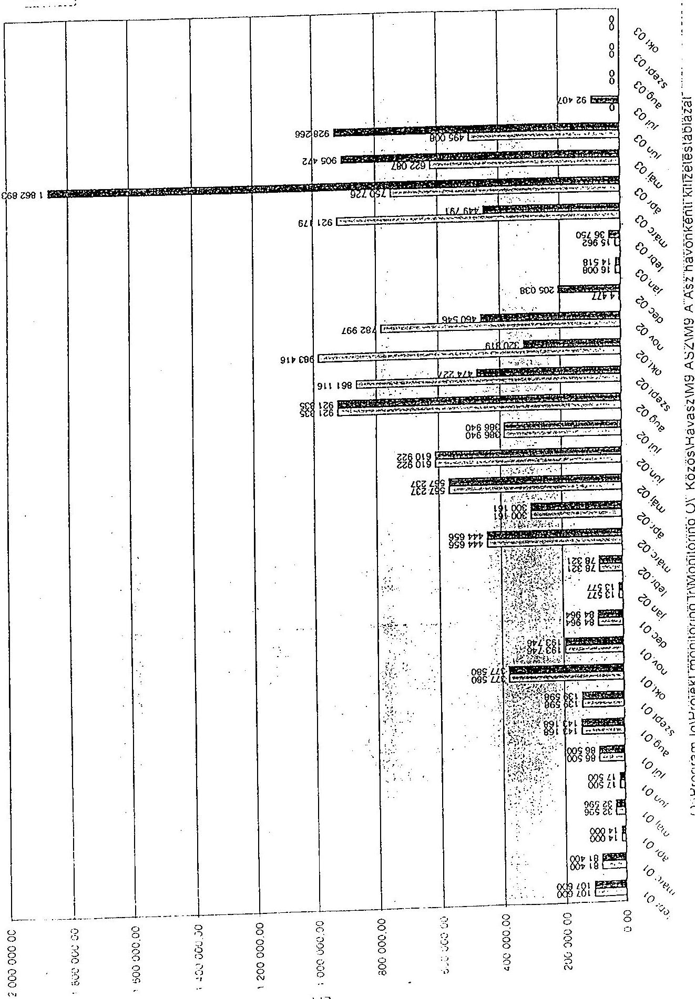

---

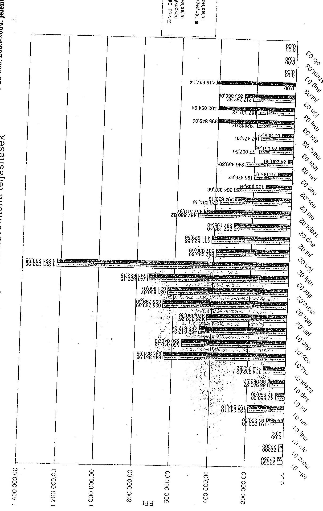

# 109 "B" projektøiem havonkénti teljesítések

## 11. 12. 13. 14. 15. 16. 17. 18. 19. 20. 21. 22. 23. 24. 25. 26. 27. 28. 29. 30. 31. 32. 33. 34. 35. 36. 37. 38. 39. 40. 41. 42. 43. 44. 45. 46. 47. 48. 49. 50. 51. 52. 53. 54. 55. 56. 57. 58. 59. 60. 61. 62. 63. 64. 65. 66. 67. 68. 69. 70. 71. 72. 73. 74. 75. 76. 77. 78. 79. 80. 81. 82. 83. 84. 85. 86. 87. 88. 89. 90. 91. 92. 93. 94. 95. 96. 97. 98. 99. 100. 101. 102. 103. 104. 105. 106. 107. 108. 109. 110. 111. 112. 113. 114. 115. 116. 117. 118. 119. 120. 121. 122. 123. 124. 125. 126. 127. 128. 129. 130. 131. 132. 133. 134. 135. 136. 137. 138. 139. 140. 141. 142. 143. 144. 145. 146. 147. 148. 149. 150. 151. 152. 153. 154. 155. 156. 157. 158. 159. 160. 161. 162. 163. 164. 165. 166. 167. 168. 169. 170. 171. 172. 173. 174. 175. 176. 177. 178. 179. 180. 181. 182. 183. 184. 185. 186. 187. 188. 189. 190. 191. 192. 193. 194. 195. 196. 197. 198. 199. 200. 201. 202. 203. 204. 205. 206. 207. 208. 209. 210. 211. 212. 213. 214. 215. 216. 217. 218. 219. 220. 221. 222. 223. 224. 225. 226. 227. 228. 229. 230. 231. 232. 233. 234. 235. 236. 237. 238. 239. 240. 241. 242. 243. 244. 245. 246. 247. 248. 249. 250. 251. 252. 253. 254. 255. 256. 257. 258. 259. 260. 261. 262. 263. 264. 265. 266. 267. 268. 269. 270. 271. 272. 273. 274. 275. 276. 277. 278. 279. 280. 281. 282. 283. 284. 285. 286. 287. 288. 289. 290. 291. 292. 293. 294. 295. 296. 297. 298. 299. 300. 301. 302. 303. 304. 305. 306. 307. 308. 309. 310. 311. 312. 313. 314. 315. 316. 317. 318. 319. 320. 321. 322. 323. 324. 325. 326. 327. 328. 329. 330. 331. 332. 333. 334. 335. 336. 337. 338. 339. 340. 341. 342. 343. 344. 345. 346. 347. 348. 349. 350. 351. 352. 353. 354. 355. 356. 357. 358. 359. 360. 361. 362. 363. 364. 365. 366. 367. 368. 369. 370. 371. 372. 373. 374. 375. 376. 377. 378. 379. 380. 381. 382. 383. 384. 385. 386. 387. 388. 389. 390. 391. 392. 393. 394. 395. 396. 397. 398. 399. 310. 311. 312. 313. 314. 315. 316. 317. 318. 319. 320. 321. 322. 323. 324. 325. 326. 327. 328. 329. 330. 331. 332. 333. 334. 335. 336. 337. 338. 339. 340. 341. 342. 343. 344. 345. 346. 347. 348. 349. 350. 351. 352. 353. 354. 355. 356. 357. 358. 359. 360. 361. 362. 363. 364. 365. 366. 367. 368. 369. 370. 371. 372. 373. 374. 375. 376. 377. 378. 379. 380. 381. 382. 383. 384. 385. 386. 387. 388. 389. 390. 391. 392. 393. 394. 395. 396. 397. 398. 399. 310. 311. 312. 313. 314. 315. 316. 317. 318. 319. 320. 321. 322. 323. 324. 325. 326. 327. 328. 329. 330. 331. 332. 333. 334. 335. 336. 337. 338. 339. 340. 341. 342. 343. 344. 345. 346. 347. 348. 349. 350. 351. 352. 353. 354. 355. 356. 357. 358. 359. 360. 361. 362. 363. 364. 365. 366. 367. 368. 369. 370. 371. 372. 373. 374. 375. 376. 377. 378. 379. 380. 381. 382. 383. 384. 385. 386. 387. 388. 389. 390. 391. 392. 393. 394. 395. 396. 397. 398. 399. 310. 311. 312. 313. 314. 315. 316. 317. 318. 319. 320. 321. 322. 323. 324. 325. 326. 327. 328. 329. 330. 331. 332. 333. 334. 335. 336. 337. 338. 339. 340. 341. 342. 343. 344. 345. 346. 347. 348. 349. 350. 351. 352. 353. 354. 355. 356. 357. 358. 359. 360. 361. 362. 363. 364. 365. 366. 367. 368. 369. 370. 371. 372. 373. 374. 375. 376. 377. 378. 379. 380. 381. 382. 383. 384. 385. 386. 387. 388. 389. 390. 391. 392. 393. 394. 395. 396. 397. 398. 399.
 344. 345. 346. 347. 348. 349. 350. 351. 352. 353. 354. 355. 356. 357. 358. 359. 360. 361. 362. 363. 364. 365. 366. 367. 368. 369. 370. 371. 372. 373. 374. 375. 376. 377. 378. 379. 380. 381. 382. 383. 384. 385. 386. 387. 388. 389. 390. 391. 392. 393. 394. 395. 396. 397. 398. 399. 310. 311. 312. 313. 314. 315. 316. 317. 318. 319. 320. 321. 322. 323. 324. 325. 326. 327. 328. 329. 330. 331. 332. 333. 334. 335. 336. 337. 338. 339. 340. 341. 342. 343. 344. 345. 346. 347. 348. 349. 350. 351. 352. 353. 354. 355. 356. 357. 358. 359. 360. 361. 362. 363. 364. 365. 366. 367. 368. 369. 370. 371. 372. 373. 374. 375. 376. 377. 378. 379. 380. 381. 382. 383. 384. 385. 386. 387. 388. 389. 390. 391. 392. 393. 394. 395. 396. 397. 398. 399. 310. 311. 312. 313. 314. 315. 316. 317. 318. 319. 320. 321. 322. 323. 324. 325. 326. 327. 328. 329. 330. 331. 332. 333. 334. 335. 336. 337. 338. 339. 340. 341. 342. 343. 344. 345. 346. 347. 348. 349. 350. 351. 352. 353. 354. 355. 356. 357. 358. 359. 360. 361. 362. 363. 364. 365. 366. 367. 368. 369. 370. 371. 372. 373. 374. 375. 376. 377. 378. 379. 380. 381. 382. 383. 384. 385. 386. 387. 388. 389. 390. 391. 392. 393. 394. 395. 396. 397. 398. 399. 310. 311. 312. 313. 314. 315. 316. 317. 318. 319. 320. 321. 322. 323. 324. 325. 326. 327. 328. 329. 330. 331. 332. 333. 334. 335. 336. 337. 338. 339. 340. 341. 342. 343. 344. 345. 346. 347. 348. 349. 350. 351. 352. 353. 354. 355. 356. 357. 358. 359. 360. 361. 362. 363. 364. 365. 366. 367. 368. 369. 370. 371. 372. 373. 374. 375. 376. 377. 378. 379. 380. 381. 382. 383. 384. 385. 386. 387. 388. 389. 390. 391. 392. 393. 394. 395. 396. 397. 398. 399. 310. 311. 312. 313. 314. 315. 316. 317. 318. 319. 320. 321. 322. 323. 324. 325. 326. 327. 328. 329. 330. 331. 332. 333. 334. 335. 336. 337. 338. 339. 340. 341. 342. 343. 344. 345. 346. 347. 348. 349. 350. 351. 352. 353. 354. 355. 356. 357. 358. 359. 360. 361. 362. 363. 364. 365. 366. 367. 368. 369. 370. 371. 372. 373. 374. 375. 376. 377. 378. 379. 380. 381. 382. 383. 384. 385. 386. 387. 388. 389. 390. 391. 392. 393. 394. 395. 396. 397. 398. 399. 310. 311. 312. 313. 314. 315. 316. 317. 318. 319. 320. 321. 322. 323. 324. 325. 326. 327. 328. 329. 330. 331. 332. 333. 334. 335. 336. 337. 338. 339. 340. 341. 342. 343. 344. 345. 346. 347. 348. 349. 350. 351. 352. 353. 354. 355. 356. 357. 358. 359. 360. 361. 362. 363. 364. 365. 366. 367. 368. 369. 370. 371. 372. 373. 374. 375. 376. 377. 378. 379. 380. 381. 382. 383. 384. 385. 386. 387. 388. 389. 390. 391. 392. 393. 394. 395. 396. 397. 398. 399. 310. 311. 312. 313. 314. 315. 316. 317. 318. 319. 320. 321. 322. 323. 324. 325. 326. 327. 328. 329. 330. 331. 332. 333. 334. 335. 336. 337. 338. 339. 340. 341. 342. 343. 344. 345. 346. 347. 348. 349. 350. 351. 352. 353. 354. 355. 356. 357. 358. 359. 360. 361. 362. 363. 364. 365. 366. 367. 368. 369. 370. 371. 372. 373. 374. 375. 376. 377. 378. 379. 380. 381. 382. 383. 384. 385. 386. 387. 388. 389. 390. 391. 392. 393. 394. 395. 396. 397. 398. 399. 310. 311. 312. 313. 314. 315. 316. 317. 318. 319. 320. 321. 322. 323. 324. 325. 326. 327. 328. 329. 330. 331. 332. 333. 334. 335. 336. 337. 338. 339. 340. 341. 342. 343. 344. 345. 346. 347. 348. 349. 350. 351. 352. 353. 354. 355. 356. 357. 358. 359. 360. 361. 362. 363. 364. 365. 366. 367. 368. 369. 370. 371. 372. 373. 374. 375. 376. 377. 378. 379. 380. 381. 382. 383. 384. 385. 386. 387. 388. 389. 390. 391. 392. 393. 394. 395. 396. 397. 398. 399. 310. 311. 312. 313. 314. 315. 316. 317. 318. 319. 320. 321. 322. 323. 324. 325. 326. 327. 328. 329. 330. 331. 332. 333. 334. 335. 336. 337. 338. 339. 340. 341. 342. 343. 344. 345. 346. 347. 348. 349. 350. 351. 352. 353. 354. 355. 356. 357. 358. 359. 360. 361. 362. 363. 364. 365. 366. 367. 368. 369. 370. 371. 372. 373. 374. 375. 376. 377. 378. 379. 380. 381. 382. 383. 384. 385. 386. 387. 388. 389. 390. 391. 392. 393. 394. 395. 396. 397. 398. 399. 310. 311. 312. 313. 314. 315. 316. 317. 318. 319. 320. 321. 322. 323. 324. 325. 326. 327. 328. 329. 330. 331. 332. 333. 334. 335. 336. 337. 338. 339. 340. 341. 342. 343. 344. 345. 346. 347. 348. 349. 350. 351. 352. 353. 354. 355. 356. 357. 358. 359. 360. 361. 362. 363. 364. 365. 366. 367. 368. 369. 370. 371. 372. 373. 374. 375. 376. 377. 378. 379. 380. 381. 382. 383. 384. 385. 386. 387. 388. 389. 390. 391. 392. 393. 394. 395. 396. 397. 398. 399. 310. 311. 312. 313. 314. 315. 316. 317. 318. 319. 320. 321. 322. 323. 324. 325. 326. 327. 328. 329. 330. 331. 332. 333. 334. 335. 336. 337. 338. 339. 340. 341. 342. 343. 344. 345. 346. 347. 348. 349. 350. 351. 352. 353. 354. 355. 356. 357. 358. 359. 360. 361. 362. 363. 364. 365. 366. 367. 368. 369. 370. 371. 372. 373. 374. 375. 376. 377. 378. 379. 38. 380. 381. 382. 383. 384. 385. 386. 387. 388. 389. 390. 391. 392. 393. 394. 395. 396. 397. 398. 399. 310. 311. 312. 313. 314. 315. 316. 317. 318. 319. 320. 321. 322. 323. 324. 325. 326. 327. 328. 329. 333. 334. 335. 336. 337. 338. 339. 340. 341. 342. 343. 344. 345. 346. 347. 348. 349. 350. 351. 352. 353. 354. 355. 356. 357. 358. 359. 360. 361. 362. 363. 364. 365. 366. 367. 368. 369. 370. 371. 372. 373. 374. 375. 376. 377. 378. 379. 38. 380. 381. 382. 383. 384. 385. 386. 387. 388. 389. 390. 391. 392. 393. 393. 394. 395. 396. 397. 398. 399. 392. 393. 397. 398. 399. 391. 392. 393. 393. 394. 395. 396. 397. 398. 399. 399. 393. 394. 397. 398. 399. 392. 393. 394. 395. 396. 397. 398. 399. 399. 399. 399. 399. 399. 399. 399. 391. 392. 393. 393. 394. 397. 398. 399. 393. 394. 395. 396. 397. 398. 399. 399. 399. 399. 399. 399. 399. 399. 399. 399. 391. 392. 393. 393. 393. 399. 399. 391. 392. 393. 393. 393. 393. 393. 393. 394. 395. 396. 397. 398. 399. 394. 397. 398. 399. 399. 399. 399. 399. 399. 399. 399. 399. 399. 399. 399. 399. 399. 399. 399. 399. 391. 392. 393. 393. 393. 393. 393. 393. 393. 394. 395. 397. 399. 399. 399. 399. 399. 399. 399. 399. 399. 399. 399. 399. 399. 399. 399. 399. 399. 399. 399. 399. 399. 399. 391. 392. 393. 393. 393. 393. 393. 393. 393. 393. 394. 394. 395. 397. 399. 399. 399. 399. 399. 399. 399. 399. 399. 399. 399. 399. 399. 399. 399. 399. 399. 399. 399. 399. 399. 399. 399. 399. 399. 399. 399. 399. 399. 399. 399. 399. 399. 399. 399. 399. 399. 399. 399. 399.

---

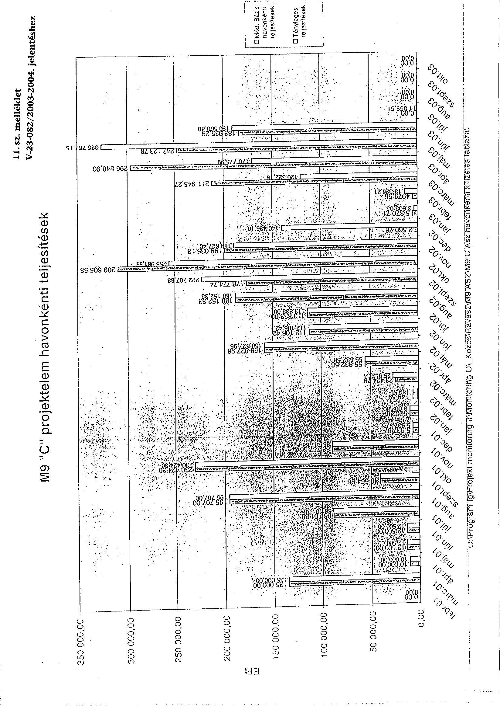

# M9 "C" projektelem havonkénti teljesítések

| 11. sz. melléklet | 12. sz. melléklet | 13. sz. melléklet | 14. sz. melléklet | 15. sz. melléklet | 16. sz. melléklet | 17. sz. melléklet | 18. sz. melléklet | 19. sz. melléklet | 20. sz. melléklet | 21. sz. melléklet | 22. sz. melléklet | 23. sz. melléklet | 24. sz. melléklet | 25. sz. melléklet | 26. sz. melléklet |
| --- | --- | --- | --- | --- | --- | --- | --- | --- | --- | --- | --- | --- | --- | --- | --- |
| 50 000.00 | 50 000.00 | 50 000.00 | 50 000.00 | 50 000.00 | 50 000.00 | 50 000.00 | 50 000.00 | 50 000.00 | 50 000.00 | 50 000.00 | 50 000.00 | 50 000.00 | 50 000.00 | 50 000.00 | 50 000.00 |
| 250 000.00 | 250 000.00 | 250 000.00 | 250 000.00 | 250 000.00 | 250 000.00 | 250 000.00 | 250 000.00 | 250 000.00 | 250 000.00 | 250 000.00 | 250 000.00 | 250 000.00 | 250 000.00 | 250 000.00 | 250 000.00 |
| 125 000.00 | 125 000.00 | 125 000.00 | 125 000.00 | 125 000.00 | 125 000.00 | 125 000.00 | 125 000.00 | 125 000.00 | 125 000.00 | 125 000.00 | 125 000.00 | 125 000.00 | 125 000.00 | 125 000.00 | 125 000.00 |
| 50 000.00 | 50 000.00 | 50 000.00 | 50 000.00 | 50 000.00 | 50 000.00 | 50 000.00 | 50 000.00 | 50 000.00 | 50 000.00 | 50 000.00 | 50 000.00 | 50 000.00 | 50 000.00 | 50 000.00 | 50 000.00 |
| 100 000.00 | 100 000.00 | 100 000.00 | 100 000.00 | 100 000.00 | 100 000.00 | 100 000.00 | 100 000.00 | 100 000.00 | 100 000.00 | 100 000.00 | 100 000.00 | 100 000.00 | 100 000.00 | 100 000.00 | 100 000.00 |
| 50 000.00 | 50 000.00 | 50 000.00 | 50 000.00 | 50 000.00 | 50 000.00 | 50 000.00 | 50 000.00 | 50 000.00 | 50 000.00 | 50 000.00 | 50 000.00 | 50 000.00 | 50 000.00 | 50 000.00 | 50 000.00 |
| 200 000.00 | 200 000.00 | 200 000.00 | 200 000.00 | 200 000.00 | 200 000.00 | 200 000.00 | 200 000.00 | 200 000.00 | 200 000.00 | 200 000.00 | 200 000.00 | 200 000.00 | 200 000.00 | 200 000.00 | 200 000.00 |
| 100 000.00 | 100 000.00 | 100 000.00 | 100 000.00 | 100 000.00 | 100 000.00 | 100 000.00 | 100 000.00 | 100 000.00 | 100 000.00 | 100 000.00 | 100 000.00 | 100 000.00 | 100 000.00 | 100 000.00 | 100 000.00 |
| 50 000.00 | 50 000.00 | 50 000.00 | 50 000.00 | 50 000.00 | 50 000.00 | 50 000.00 | 50 000.00 | 50 000.00 | 50 000.00 | 50 000.00 | 50 000.00 | 50 000.00 | 50 000.00 | 50 000.00 | 50 000.00 |
| 100 000.00 | 100 000.00 | 100 000.00 | 100 000.00 | 100 000.00 | 100 000.00 | 100 000.00 | 100 000.00 | 100 000.00 | 100 000.00 | 100 000.00 | 100 000.00 | 100 000.00 | 100 000.00 | 100 000.00 | 100 000.00 |
| 200 000.00 | 200 000.00 | 200 000.00 | 200 000.00 | 200 000.00 | 200 000.00 | 200 000.00 | 200 000.00 | 200 000.00 | 200 000.00 | 200 000.00 | 200 000.00 | 200 000.00 | 200 000.00 | 200 000.00 | 200 000.00 |
| 50 000.00 | 50 000.00 | 50 000.00 | 50 000.00 | 50 000.00 | 50 000.00 | 50 000.00 | 50 000.00 | 50 000.00 | 50 000.00 | 50 000.00 | 50 000.00 | 50 000.00 | 50 000.00 | 50 000.00 | 50 000.00 |
| 200 000.00 | 200 000.00 | 200 000.00 | 200 000.00 | 200 000.00 | 200 000.00 | 200 000.00 | 200 000.00 | 200 000.00 | 200 000.00 | 200 000.00 | 200 000.00 | 200 000.00 | 200 000.00 | 200 000.00 | 200 000.00 |
| 100 000.00 | 100 000.00 | 100 000.00 | 100 000.00 | 100 000.00 | 100 000.00 | 100 000.00 | 100 000.00 | 100 000.00 | 100 000.00 | 100 000.00 | 100 000.00 | 100 000.00 | 100 000.00 | 100 000.00 | 100 000.00 |
| 50 000.00 | 50 000.00 | 50 000.00 | 50 000.00 | 50 000.00 | 50 000.00 | 50 000.00 | 50 000.00 | 50 000.00 | 50 000.00 | 50 000.00 | 50 000.00 | 50 000.00 | 50 000.00 | 50 000.00 | 50 000.00 |
| 100 000.00 | 100 000.00 | 100 000.00 | 100 000.00 | 100 000.00 | 100 000.00 | 100 000.00 | 100 000.00 | 100 000.00 | 100 000.00 | 100 000.00 | 100 000.00 | 100 000.00 | 100 000.00 | 100 000.00 | 100 000.00 |
| 200 000.00 | 200 000.00 | 200 000.00 | 200 000.00 | 200 000.00 | 200 000.00 | 200 000.00 | 200 000.00 | 200 000.00 | 200 000.00 | 200 000.00 | 200 000.00 | 200 000.00 | 200 000.00 | 200 000.00 | 200 000.00 |
| 50 000.00 | 50 000.00 | 50 000.00 | 50 000.00 | 50 000.00 | 50 000.00 | 50 000.00 | 50 000.00 | 50 000.00 | 50 000.00 | 50 000.00 | 50 000.00 | 50 000.00 | 50 000.00 | 50 000.00 | 50 000.00 |
| 200 000.00 | 200 000.00 | 200 000.00 | 200 000.00 | 200 000.00 | 200 000.00 | 200 000.00 | 200 000.00 | 200 000.00 | 200 000.00 | 200 000.00 | 200 000.00 | 200 000.00 | 200 000.00 | 200 000.00 | 200 000.00 |
| 100 000.00 | 100 000.00 | 100 000.00 | 100 000.00 | 100 000.00 | 100 000.00 | 100 000.00 | 100 000.00 | 100 000.00 | 100 000.00 | 100 000.00 | 100 000.00 | 100 000.00 | 100 000.00 | 100 000.00 | 100 000.00 |
| 200 000.00 | 200 000.00 | 200 000.00 | 200 000.00 | 200 000.00 | 200 000.00 | 200 000.00 | 200 000.00 | 200 000.00 | 200 000.00 | 200 000.00 | 200 000.00 | 200 000.00 | 200 000.00 | 200 000.00 | 200 000.00 |
| 200 000.00 | 200 000.00 | 200 000.00 | 200 000.00 | 200 000.00 | 200 000.00 | 200 000.00 | 200 000.00 | 200 000.00 | 200 000.00 | 200 000.00 | 200 000.00 | 200 000.00 | 200 000.00 | 200 000.00 | 200 000.00 |
| 200 000.00 | 200 000.00 | 200 000.00 | 200 000.00 | 200 000.00 | 200 000.00 | 200 000.00 | 200 000.00 | 200 000.00 | 200 000.00 | 200 000.00 | 200 000.00 | 200 000.00 | 200 000.00 | 200 000.00 | 200 000.00 |
| 200 000.00 | 200 000.00 | 200 000.00 | 200 000.00 | 200 000.00 | 200 000.00 | 200 000.00 | 200 000.00 | 200 000.00 | 200 000.00 | 200 000.00 | 200 000.00 | 200 000.00 | 200 000.00 | 200 000.00 | 200 000.00 |
| 200 000.00 | 200 000.00 | 200 000.00 | 200 000.00 | 200 000.00 | 200 000.00 | 200 000.00 | 200 000.00 | 200 000.00 | 200 000.00 | 200 000.00 | 200 000.00 | 200 000.00 | 200 000.00 | 200 000.00 | 200 000.00 |
| 200 000.00 | 200 000.00 | 200 000.00 | 200 000.00 | 200 000.00 | 200 000.00 | 200 000.00 | 200 000.00 | 200 000.00 | 200 000.00 | 200 000.00 | 200 000.00 | 200 000.00 | 200 000.00 | 200 000.00 | 200 000.00 |
| 200 000.00 | 200 000.00 | 200 000.00 | 200 000.00 | 200 000.00 | 200 000.00 | 200 000.00 | 200 000.00 | 200 000.00 | 200 000.00 | 200 000.00 | 200 000.00 | 200 000.00 | 200 000.00 | 200 000.00 | 200 000.00 |
| 200 000.00 | 200 000.00 | 200 000.00 | 200 000.00 | 200 000.00 | 200 000.00 | 200 000.00 | 200 000.00 | 200 000.00 | 200 000.00 | 200 000.00 | 200 000.00 | 200 000.00 | 200 000.00 | 200 000.00 | 200 000.00 |
| 200 000.00 | 200 000.00 | 200 000.00 | 200 000.00 | 200 000.00 | 200 000.00 | 200 000.00 | 200 000.00 | 200 000.00 | 200 000.00 | 200 000.00 | 200 000.00 | 200 000.00 | 200 000.00 | 200 000.00 | 200 000.00 |
| 200 000.00 | 200 000.00 | 200 000.00 | 200 000.00 | 200 000.00 | 200 000.00 | 200 000.00 | 200 000.00 | 200 000.00 | 200 000.00 | 200 000.00 | 200 000.00 | 200 000.00 | 200 000.00 | 200 000.00 |
| 200 000.00 | 200 000.00 | 200 000.00 | 200 000.00 | 200 000.00 | 200 000.00 | 200 000.00 | 200 000.00 | 200 000.00 | 200 000.00 | 200 000.00 | 200 000.00 | 200 000.00 | 200 000.00 | 200 000.00 |
| 200 000.00 | 200 000.00 | 200 000.00 | 200 000.00 | 200 000.00 | 200 000.00 | 200 000.00 | 200 000.00 | 200 000.00 | 200 000.00 | 200 000.00 | 200 000.00 | 200 000.00 | 200 000.00 | 200 000.00 |
| 200 000.00 | 200 000.00 | 200 000.00 | 200 000.00 | 200 000.00 | 200 000.00 | 200 000.00 | 200 000.00 | 200 000.00 | 200 000.00 | 200 000.00 | 200 000.00 | 200 000.00 | 200 000.00 | 200 000.00 | 200 000.00 |
| 200 000.00 | 200 000.00 | 200 000.00 | 200 000.00 | 200 000.00 | 200 000.00 | 200 000.00 | 200 000.00 | 200 000.00 | 200 000.00 | 200 000.00 | 200 000.00 | 200 000.00 | 200 000.00 | 200 000.00 | 200 000.00 | 200 000.00 |
| 200 000.00 | 200 000.00 | 200 000.00 | 200 000.00 | 200 000.00 | 200 000.00 | 200 000.00 | 200 000.00 | 200 000.00 | 200 000.00 | 200 000.00 | 200 000.00 | 200 000.00 | 200 000.00 | 200 000.00 | 200 000.00 | 200 000.00 | 200 000.00 | 200 000.00 | 200 000.00 |
| 200 000.00 | 200 000.00 | 200 000.00 | 200 000.00 | 200 000.00 | 200 000.00 | 200 000.00 | 200 000.00 | 200 000.00 | 200 000.00 | 200 000.00 | 200 000.00 | 200 000.00 | 200 000.00 | 200 000.00 | 200 000.00 | 200 000.00 | 200 000.00 | 200 000.00 | 200 000.00 | 200 000.00 | 200 000.00 | 200 000.00 | 200 000.00 | 200 000.00 | 200 000.00 |
| 200 000.00 | 200 000.00 | 200 000.00 | 200 000.00 | 200 000.00 | 200 000.00 | 200 000.00 | 200 000.00 | 200 000.00 | 200 000.00 | 200 000.00 | 200 000.00 | 200 000.00 | 200 000.00 | 200 000.00 | 200 000.00 | 200 000.00 | 200 000.00 | 200 000.00 | 200 000.00 | 200 000.00 | 200 000.00 | 200 000.00 | 200 000.00 | 200 000.00 | 200 000.00 | 200 000.00 | 200 000.00 | 200 000.00 | 200 000.00 | 200 000.00 | 200 000.00 | 200 000.00 | 200 000.00 | 200 000.00 | 200 000.00 | 200 000.00 | 200 000.00 | 200 000.00 | 200 000.00 | 200 000.00 | 200 000.00 | 200 000.00 | 200 000.00 | 200 000.00 | 200 000.00 | 200 000.00 | 200 000.00 | 200 000.00 | 200 000.00 | 200 000.00 | 200 000.00 | 200 000.00 | 200 000.00 | 200 000.00 | 200 000.00 | 200 000.00 | 200 000.00 | 200 000.00 | 200 000.00 | 200 000.00 | 200 000.00 | 200 000.00 | 200 000.00 | 200 000.00 | 200 000.00 | 200 000.00 | 200 000.00 | 200 000.00 | 200 000.00 | 200 000.00 | 200 000.00 | 200 000.00 | 200 000.00 | 200 000.00 | 200 000.00 | 200 000.00 | 200 000.00 | 200 000.00 | 200 000.00 | 200 000.00 | 200 000.00 | 200 000.00 | 200 000.00 | 200 000.00 | 200 000.00 | 200 000.00 | 200 000.00 | 200 000.00 | 200 000.00 | 200 000.00 | 200 000.00
 | 200 000.00 | 200 000.00 | 200 000.00 | 200 000.00 | 200 000.00 | 200 000.00 | 200 000.00 | 200 000.00 | 200 000.00 | 200 000.00 | 200 000.00 | 200 000.00 | 200 000.00 | 200 000.00 | 200 000.00 | 200 000.00 | 200 000.00 | 200 000.00 | 200 000.00 | 200 000.00 | 200 000.00 | 200 000.00 | 200 000.00 | 200 000.00 | 200 000.00 | 200 000.00 | 200 000.00 | 200 000.00 | 200 000.00 | 200 000.00 | 200 000.00 | 200 000.00 | 200 000.00 | 200 000.00 | 200 000.00 | 200 000.00 | 200 000.00 | 200 000.00 | 200 000.00 | 200 000.00 | 200 000.00 | 200 000.00 | 200 000.00 | 200 000.00 | 200 000.00 | 200 000.00 | 200 000.00 | 200 000.00 | 200 000.00 | 200 000.00 | 200 000.00 | 200 000.00 | 200 000.00 | 200 000.00 | 200 000.0 | 200 000.0 | 200 000.00 | 200 000.00 | 200 000.00 | 200 000.00 | 200 000.00 | 200 000.00 | 200 000.00 | 200 000.00 | 200 000.00 | 200 000.00 | 200 000.00 | 200 000.00 | 200 000.00 | 200 000.00 | 200 000.00 | 200 000.0 | 200 000.00 | 200 000.00 | 200 000.00 | 200 000.00 | 200 000.00 | 200 000.00 | 200 000.00 | 200 000.00 | 200 000.00 | 200 000.00 | 200 000.00 | 200 000.00 | 200 000.00 | 200 000.00 | 200 000.00 | 200 000.00 | 200 000.00 | 200 000.00 | 200 000.00 | 200 000.00 | 200 000.00 | 200 000.00 | 200 000.00 | 200 000.00 | 200 000.00 | 200 000.00 | 200 000.00 | 200 000.00 | 200 000.0 | 200 000.0 | 200 000.00 | 200 000.00 | 200 000.00 | 200 000.0 | 200 000.0 | 200 000.0 | 200 000.00 | 200 000.00 | 200 000.0 | 200 000.0 | 200 000.0 | 200 000.0 | 200 000.0 | 200 000.0 | 200 000.0 | 200 000.0 | 200 000.0 | 200 000.0 | 200 000.0 | 200 000.0 | 200 000.0 | 200 000.0 | 200 000.0 | 200 000.0 | 200 000.0 | 200 000.0 | 200 000.0 | 200 000.0 | 200 000.0 | 200 000.0 | 200 000.0 |
 200 000.0 | 200 000.0 | 200 000.0 | 200 000.0 | 200 000.0 | 200 000.0 | 200 000.0 | 200 000.0 | 200 000.0 | 200 000.0 | 200 000.0 | 200 000.0 | 200 000.0 | 200 000.0 | 200 000.0 | 200 000.0 | 200 000.0 | 200 000.0 | 200 000.0 | 200 000.0 | 200 000.0 | 200 000.0 | 200 000.0 | 200 000.0 | 200 000.0 | 200 000.0 | 200 000.0 | 200 000.0 | 200 000.0 | 200 000.0 | 200 000.0 | 200 000.0 | 200 000.0 | 200 000.0 | 200 000.0 | 200 000.0 | 200 000.0 | 200 000.0 | 200 000.0 | 200 000.0 | 200 000.0 | 200 000.0 | 200 000.0 | 200 000.0 | 200 000.0 | 200 000.0 | 200 000.0 | 200 000.0 | 200 000.0 | 200 000.0 | 200 000.0 | 200 000.0 | 200 000.0 | 200 000.0 | 200 000.0 | 200 000.0 | 200 000.0 | 200 000.0 | 200 000.0 | 200 000.0 | 200 000.0 | 200 000.0 | 200 000.0 | 200 000.0 | 200 000.0 | 200 000.0 | 200 000.0 | 200 000.0 | 200 000.0 | 200 000.0 | 200 000.0 | 200 000.0 | 200 000.0 | 200 000.0 | 200 000.0 | 200 000.0 | 200 000.0 | 200 000.0 | 200 000.0 | 200 000.0 | 200 000.0 | 200 000.0 | 200 000.0 | 200 000.0 | 200 000.0 | 200 000.0 | 200 000.0 | 200 000.0 | 200 000.0 | 200 000.0 | 200 000.0 | 200 000.0 | 200 000.0 | 200 000.0 | 200 000.0 | 200 000.0 | 200 000.0 | 200 000.0 | 200 000.0 | 200 000.0 | 200 000.0 | 200 000.0 | 200 000.0 | 200 000.0 | 200 000.0 | 200 000.0 | 200 000.0 | 200 000.0 | 200 000.0 | 200 000.0 | 200 000.0 | 200 000.0 | 200 000.0 | 200 000.0 | 200 000.0 | 200 000.0 | 200 000.0 | 200 000.0 | 200 000.0 | 200 000.0 | 200 000.0 | 200 000.0 | 200 000.0 | 200 000.0 | 200 000.0 | 200 000.0 | 200 000.0 | 200 000.0 | 200 000.0 | 200 000.0 | 200 000.0 | 200 000.0 | 200 000.0 | 200 000.0 | 200 000.0 | 200 000.0 | 200 000.0 | 200 000.0 | 200 000.0 | 200 000.0 | 200 000.0 | 200 000.0 | 200 000.0 | 200 000.0 | 200 000.0 | 200 000.0 | 200 000.0 | 200 000.0 | 200 000.0 | 200 000.0 | 200 000.0 | 200 000.0 | 200 000.0 | 200 000.0 | 200 000.0 | 200 000.0 | 200 000.0 | 200 000.0 | 200 000.0 | 200 000.0 | 200 000.0 | 200 000.0 | 200 000.0 | 200 000.0 | 200 000.0 | 200 000.0 | 200 000.0 | 200 000.0 | 200 000.0 | 200 000.0 | 200 000.0 | 200 000.0 | 200 000.0 | 200 000.0 | 200 000.0 | 200 000.0 | 200 000.0 | 200 000.0 | 200 000.0 | 200 000.0 | 200 000.0 | 200 000.0 | 200 000.0 | 200 000.0 | 200 000.0 | 200 000.0 | 200 000.0 | 200 000.0 | 200 000.0 | 200 000.0 | 200 000.0 | 200 000.0 | 200 000.0 | 200 000.0 | 200 000.0 | 200 000.0 | 200 000.0 | 200 000.0 | 200 000.0 | 200 000.0 | 200 000.0 | 200 000.0 | 200 000.0 | 200 000.0 | 200 000.0 | 200 000.0 |

---

Vállalkozó neve: MAGYAR AUTÓPÁLYA-ÉPÍTŐ KONZORCIUM Adóigazgatási száma: 10866966-2-44 Szerződés száma: 90000-02-A-3140 Teljesítés időszaka: 2003. július hó

1/36

Megnevezése

1/36

| Tétel szám | Megnevezése | Szerződés mennyiségei | Mennyi egység | Eddig elszámolt teljesítmény mennyisége | Tárgyhavi teljesítés mennyisége | Tárgyhavi teljesítés %-ban | Tárgyhó végéig göngyölített mennyiség | Tárgyhó végéig göngyölített teljesítés %-ban |
| --- | --- | --- | --- | --- | --- | --- | --- | --- |
| 1 |  |  |  |  |  |  |  |  |
|  |  |  |  |  |  |  |  | 2=5+6 |
|  |  |  |  |  |  |  |  | 3 |
|  |  |  |  |  |  |  |  | 4 |
|  |  |  |  |  |  |  |  | 5 |
|  |  |  |  |  |  |  |  | 6 |
|  |  |  |  |  |  |  |  | 7 |
|  |  |  |  |  |  |  |  | 8 |
|  |  |  |  |  |  |  |  | 9 |
|  |  |  |  |  |  |  |  | 10 |
|  |  |  |  |  |  |  |  | 11 |
|  |  |  |  |  |  |  |  | 12 |
|  |  |  |  |  |  |  |  | 13 |
|  |  |  |  |  |  |  |  | 14 |
|  |  |  |  |  |  |  |  | 15 |
|  |  |  |  |  |  |  |  | 16 |
|  |  |  |  |  |  |  |  | 17 |
|  |  |  |  |  |  |  |  | 18 |
|  |  |  |  |  |  |  |  | 19 |
|  |  |  |  |  |  |  |  | 20 |
|  |  |  |  |  |  |  |  | 21 |
|  |  |  |  |  |  |  |  | 22 |
|  |  |  |  |  |  |  |  | 23 |
|  |  |  |  |  |  |  |  | 24 |
|  |  |  |  |  |  |  |  | 25 |
|  |  |  |  |  |  |  |  | 26 |
|  |  |  |  |  |  |  |  | 27 |
|  |  |  |  |  |  |  |  | 28 |
|  |  |  |  |  |  |  |  | 29 |
|  |  |  |  |  |  |  |  | 30 |
|  |  |  |  |  |  |  |  | 31 |
|  |  |  |  |  |  |  |  | 32 |
|  |  |  |  |  |  |  |  | 33 |
|  |  |  |  |  |  |  |  | 34 |
|  |  |  |  |  |  |  |  | 35 |
|  |  |  |  |  |  |  |  | 36 |
|  |  |  |  |  |  |  |  | 37 |
|  |  |  |  |  |  |  |  | 38 |
|  |  |  |  |  |  |  |  | 39 |
|  |  |  |  |  |  |  |  | 40 |
|  |  |  |  |  |  |  |  | 41 |
|  |  |  |  |  |  |  |  | 42 |
|  |  |  |  |  |  |  |  | 43 |
|  |  |  |  |  |  |  |  | 44 |
|  |  |  |  |  |  |  |  | 45 |
|  |  |  |  |  |  |  |  | 46 |
|  |  |  |  |  |  |  |  | 47 |
|  |  |  |  |  |  |  |  | 48 |
|  |  |  |  |  |  |  |  | 49 |
|  |  |  |  |  |  |  |  | 50 |
|  |  |  |  |  |  |  |  | 51 |
|  |  |  |  |  |  |  |  | 52 |
|  |  |  |  |  |  |  |  | 53 |
|  |  |  |  |  |  |  |  | 54 |
|  |  |  |  |  |  |  |  | 55 |
|  |  |  |  |  |  |  |  | 56 |
|  |  |  |  |  |  |  |  | 57 |
|  |  |  |  |  |  |  |  | 58 |
|  |  |  |  |  |  |  |  | 59 |
|  |  |  |  |  |  |  |  | 60 |
|  |  |  |  |  |  |  |  | 61 |
|  |  |  |  |  |  |  |  | 62 |
|  |  |  |  |  |  |  |  | 63 |
|  |  |  |  |  |  |  |  | 64 |
|  |  |  |  |  |  |  |  | 65 |
|  |  |  |  |  |  |  |  | 66 |
|   |  |  |  |  |  |  |  | 67 |
|   |  |  |  |  |  |  |  | 68 |
|   |  |  |  |  |  |  |  | 69 |
|   |  |  |  |  |  |  |  | 70 |
|   |  |  |  |  |  |  |  | 71 |
|   |  |  |  |  |  |  |  | 72 |
|   |  |  |  |  |  |  |  | 73 |
|   |  |  |  |  |  |  |  | 74 |
|   |  |  |  |  |  |  |  | 75 |
|   |  |  |  |  |  |  |  | 76 |
|   |  |  |  |  |  |  |  | 77 |
|   |  |  |  |  |  |  |  | 78 |
|   |  |  |  |  |  |  |  | 79 |
|   |  |  |  |  |  |  |  | 80 |
|   |  |  |  |  |  |  |  | 81 |
|   |  |  |  |  |  |  |  | 82 |
|   |  |  |  |  |  |  |  | 83 |
|   |  |  |  |  |  |  |  | 84 |
|   |  |  |  |  |  |  |  | 85 |
|   |  |  |  |  |  |  |  | 86 |
|   |  |  |  |  |  |  |  | 87 |
|   |  |  |  |  |  |  |  | 88 |
|   |  |  |  |  |  |  |  | 89 |
|   |  |  |  |  |  |  |  | 90 |
|   |  |  |  |  |  |  |  | 91 |
|   |  |  |  |  |  |  |  | 92 |
|   |  |  |  |  |  |  |  | 93 |
|   |  |  |  |  |  |  |  | 94 |
|   |  |  |  |  |  |  |  | 95 |
|   |  |  |  |  |  |  |  | 96 |
|   |  |  |  |  |  |  |  | 97 |
|   |  |  |  |  |  |  |  | 98 |
|   |  |  |  |  |  |  |  | 99 |
|   |  |  |  |  |  |  |  | 100 |
|   |  |  |  |  |  |  |  | 101 |
|   |  |  |  |  |  |  |  | 102 |
|   |  |  |  |  |  |  |  | 103 |
|   |  |  |  |  |  |  |  | 104 |
|   |  |  |  |  |  |  |  | 105 |
|   |  |  |  |  |  |  |  | 106 |
|   |  |  |  |  |  |  |  | 107 |
|   |  |  |  |  |  |  |  | 108 |
|   |  |  |  |  |  |  |  | 109 |
|   |  |  |  |  |  |  |  | 110 |
|   |  |  |  |  |  |  |  | 111 |
|   |  |  |  |  |  |  |  | 112 |
|   |  |  |  |  |  |  |  | 113 |
|   |  |  |  |  |  |  |  | 114 |
|   |  |  |  |  |  |  |  | 115 |
|   |  |  |  |  |  |  |  | 116 |
|   |  |  |  |  |  |  |  | 117 |
|   |  |  |  |  |  |  |  | 118 |
|   |  |  |  |  |  |  |  | 119 |
|   |  |  |  |  |  |  |  | 120 |
|   |  |  |  |  |  |  |  | 121 |
|   |  |  |  |  |  |  |  | 122 |
|   |  |  |  |  |  |  |  | 123 |
|   |  |  |  |  |  |  |  | 124 |
|   |  |  |  |  |  |  |  | 125 |
|   |  |  |  |  |  |  |  | 126 |
|   |  |  |  |  |  |  |  | 127 |
|   |  |  |  |  |  |  |  | 128 |
|   |  |  |  |  |  |  |  | 129 |
|   |  |  |  |  |  |  |  | 130 |
|   |  |  |  |  |  |  |  | 131 |
|   |  |  |  |  |  |  |  | 132 |
|   |  |  |  |  |  |  |  | 133 |
|   |  |  |  |  |  |  |  | 134 |
|   |  |  |  |  |  |  |  | 135 |
|   |  |  |  |  |  |  |  | 136 |
|   |  |  |  |  |  |  |  | 137 |
|   |  |  |  |  |  |  |  | 138 |
|   |  |  |  |  |  |  |  | 139 |
|   |  |  |  |  |  |  |  | 140 |
|   |  |  |  |  |  |  |  | 141 |
|   |  |  |  |  |  |  |  | 142 |
|   |  |  |  |  |  |  |  | 143 |
|   |  |  |  |  |  |  |  | 144 |
|   |  |  |  |  |  |  |  | 145 |
|   |  |
 |  |  |  |  |  | 146  |
|   |  |  |  |  |  |  |  | 147  |
|   |  |  |  |  |  |  |  | 148  |
|   |  |  |  |  |  |  |  | 149  |
|   |  |  |  |  |  |  |  | 150  |
|   |  |  |  |  |  |  |  | 151  |
|   |  |  |  |  |  |  |  | 152  |
|   |  |  |  |  |  |  |  | 153  |
|   |  |  |  |  |  |  |  | 154  |
|   |  |  |  |  |  |  |  | 155  |
|   |  |  |  |  |  |  |  | 156  |
|   |  |  |  |  |  |  |  | 157  |
|   |  |  |  |  |  |  |  | 158  |
|   |  |  |  |  |  |  |  | 159  |
|   |  |  |  |  |  |  |  | 160  |
|   |  |  |  |  |  |  |  | 161  |
|   |  |  |  |  |  |  |  | 162  |
|   |  |  |  |  |  |  |  | 163  |
|   |  |  |  |  |  |  |  | 164  |
|   |  |  |  |  |  |  |  | 165  |
|   |  |  |  |  |  |  |  | 166  |
|   |  |  |  |  |  |  |  | 167  |
|   |  |  |  |  |  |  |  | 168  |
|   |  |  |  |  |  |  |  | 169  |
|   |  |  |  |  |  |  |  | 170  |
|   |  |  |  |  |  |  |  | 171  |
|   |  |  |  |  |  |  |  | 172  |
|   |  |  |  |  |  |  |  | 173  |
|   |  |  |  |  |  |  |  | 174  |
|   |  |  |  |  |  |  |  | 175  |
|   |  |  |  |  |  |  |  | 176  |
|   |  |  |  |  |  |  |  | 177  |
|   |  |  |  |  |  |  |  | 178  |
|   |  |  |  |  |  |  |  | 179  |
|   |  |  |  |  |  |  |  | 180  |
|   |  |  |  |  |  |  |  | 181  |
|   |  |  |  |  |  |  |  | 182  |
|   |  |  |  |  |  |  |  | 183  |
|   |  |  |  |  |  |  |  | 184  |
|   |  |  |  |  |  |  |  | 185  |
|   |  |  |  |  |  |  |  | 186  |
|   |  |  |  |  |  |  |  | 187  |
|   |  |  |  |  |  |  |  | 188  |
|   |  |  |  |  |  |  |  | 189  |
|   |  |  |  |  |  |  |  | 190  |
|   |  |  |  |  |  |  |  | 191  |
|   |  |  |  |  |  |  |  | 192  |
|   |  |  |  |  |  |  |  | 193  |
|   |  |  |  |  |  |  |  | 194  |
|   |  |  |  |  |  |  |  | 195  |
|   |  |  |  |  |  |  |  | 196  |
|   |  |  |  |  |  |  |  | 197  |
|   |  |  |  |  |  |  |  | 198  |
|   |  |  |  |  |  |  |  | 199  |
|   |  |  |  |  |  |  |  | 200  |
|   |  |  |  |  |  |  |  | 201  |
|   |  |  |  |  |  |  |  | 202  |
|   |  |  |  |  |  |  |  | 203  |
|   |  |  |  |  |  |  |  | 204  |
|   |  |  |  |  |  |  |  | 205  |
|   |  |  |  |  |  |  |  | 206  |
|   |  |  |  |  |  |  |  | 207  |
|   |  |  |  |  |  |  |  | 208  |
|   |  |  |  |  |  |  |  | 209  |
|   |  |  |  |  |  |  |  | 210  |
|   |  |  |  |  |  |  |  | 211  |
|   |  |  |  |  |  |  |  | 212  |
|   |  |  |  |  |  |  |  | 213  |
|   |  |  |  |  |  |  |  | 214  |
|   |  |  |  |  |  |  |  | 215  |
|   |  |  |  |  |  |  |  | 216  |
|   |  |  |  |  |  |  |  | 217  |
|   |  |  |  |  |  |  |  | 218  |
|   |  |  |  |  |  |  |  | 219  |
|   |  |  |  |  |  |  |  | 220  |
|   |  |  |  |  |  |  |  | 221  |
|   |  |  |  |  |  |  |  | 222  |
|   |  |  |  |  |  |  |  | 223  |
|   |  |  |  |  |  |  |  | 224  |
|   |  |  |  |  |  |  |  | 225  |
|   |  |  |  |  |  |  |  | 226 |
|   |  |  |  |  |  |  |  | 227 |
|   |  |  |  |  |  |  |  | 228 |
|   |  |  |  |  |  |  |  | 229 |
|   |  |  |  |  |  |  |  | 230 |
|   |  |  |  |  |  |  |  | 231 |
|   |  |  |  |  |  |  |  | 232 |
|   |  |  |  |  |  |  |  | 233 |
|   |  |  |  |  |  |  |  | 234 |
|   |  |  |  |  |  |  |  | 235 |
|   |  |  |  |  |  |  |  | 236 |
|   |  |  |  |  |  |  |  | 237 |
|   |  |  |  |  |  |  |  | 238 |
|   |  |  |  |  |  |  |  | 239 |
|   |  |  |  |  |  |  |  | 240 |
|   |  |  |  |  |  |  |  | 241 |
|   |  |  |  |  |  |  |  | 242 |
|   |  |  |  |  |  |  |  | 243 |
|   |  |  |  |  |  |  |  | 244 |
|   |  |  |  |  |  |  |  | 245 |
|   |  |  |  |  |  |  |  | 246 |
|   |  |  |  |  |  |  |  | 247 |
|   |  |  |  |  |  |  |  | 248 |
|   |  |  |  |  |  |  |  | 249 |
|   |  |  |  |  |  |  |  | 250 |
|   |  |  |  |  |  |  |  | 251 |
|   |  |  |  |  |  |  |  | 252 |
|   |  |  |  |  |  |  |  | 253 |
|   |  |  |  |  |  |  |  | 254 |
|   |  |  |  |  |  |  |  | 255 |
|   |  |  |  |  |  |  |  | 256 |
|   |  |  |  |  |  |  |  | 257 |
|   |  |  |  |  |  |  |  | 258 |
|   |  |  |  |  |  |  |  | 259 |
|   |  |  |  |  |  |  |  | 260 |
|   |  |  |  |  |  |  |  | 261 |
|   |  |  |  |  |  |  |  | 262 |
|   |  |  |  |  |  |  |  | 263 |
|   |  |  |  |  |  |  |  | 264 |
|   |  |  |  |  |  |  |  | 265 |
|   |  |  |  |  |  |  |  | 266 |
|   |  |  |  |  |  |  |  | 267 |
|   |  |  |  |  |  |  |  | 268 |
|   |  |  |  |  |  |  |  | 269 |
|   |  |  |  |  |  |  |  | 270 |
|   |  |  |  |  |  |  |  | 271 |
|   |  |  |  |  |  |  |  | 272 |
|   |  |  |  |  |  |  |  | 273 |
|   |  |  |  |  |  |  |  | 274 |
|   |  |  |  |  |  |  |  | 275 |
|   |  |  |  |  |  |  |  | 276 |
|   |  |  |  |  |  |  |  | 277 |
|   |  |  |  |  |  |  |  | 278 |
|   |  |  |  |  |  |  |  | 279 |
|   |  |  |  |  |  |  |  | 280 |
|   |  |  |  |  |  |  |  | 281 |
|   |  |  |  |  |  |  |  | 282 |
|   |  |  |  |  |  |  |  | 283 |
|   |  |  |  |  |  |  |  | 284 |
|   |  |  |  |  |  |  |  | 285 |
|   |  |  |  |  |  |  |  | 286 |
|   |  |  |  |  |  |  |  | 287 |
|   |  |  |  |  |  |  |  | 288 |
|   |  |  |  |  |  |  |  | 289 |
|   |  |  |  |  |  |  |  | 290 |
|   |  |  |  |  |  |  |  | 291 |
|   |  |  |  |  |  |  |  | 292 |
|   |  |  |  |  |  |  |  | 293 |
|   |  |  |  |  |  |  |  | 294 |
|   |  |  |  |  |  |  |  | 295 |
|   |  |  |  |  |  |  |  | 296 |
|   |  |  |  |  |  |  |  | 297 |
|   |  |  |  |  |  |  |  | 298 |
|   |  |  |  |  |  |  |  | 299 |
|   |  |  |  |  |  |  |  | 300 |
|   |  |  |  |  |  |  |  | 301 |
|   |  |  |  |  |  |  |  | 302 |
|   |  |  |  |  |  |  |  | 303 |
|   |  |  |  |  |  |  |  | 304 |
|   |  |  |  |  |  |  |  | 305 |
|   |  |
 |  |  |  |  |  | 306 |
|   |  |  |  |  |  |  |  | 307 |
|   |  |  |  |  |  |  |  | 308 |
|   |  |  |  |  |  |  |  | 309 |
|   |  |  |  |  |  |  |  | 310 |
|   |  |  |  |  |  |  |  | 311 |
|   |  |  |  |  |  |  |  | 312 |
|   |  |  |  |  |  |  |  | 313 |
|   |  |  |  |  |  |  |  | 314 |
|   |  |  |  |  |  |  |  | 315 |
|   |  |  |  |  |  |  |  | 316 |
|   |  |  |  |  |  |  |  | 317 |
|   |  |  |  |  |  |  |  | 318 |
|   |  |  |  |  |  |  |  | 319 |
|   |  |  |  |  |  |  |  | 320 |
|   |  |  |  |  |  |  |  | 321 |
|   |  |  |  |  |  |  |  | 322 |
|   |  |  |  |  |  |  |  | 323 |
|   |  |  |  |  |  |  |  | 324 |
|   |  |  |  |  |  |  |  | 325 |
|   |  |  |  |  |  |  |  | 326 |
|   |  |  |  |  |  |  |  | 327 |
|   |  |  |  |  |  |  |  | 328 |
|   |  |  |  |  |  |  |  | 329 |
|   |  |  |  |  |  |  |  | 330 |
|   |  |  |  |  |  |  |  | 331 |
|   |  |  |  |  |  |  |  | 332 |
|   |  |  |  |  |  |  |  | 333 |
|   |  |  |  |  |  |  |  | 334 |
|   |  |  |  |  |  |  |  | 335 |
|   |  |  |  |  |  |  |  | 336 |
|   |  |  |  |  |  |  |  | 337 |
|   |  |  |  |  |  |  |  | 338 |
|   |  |  |  |  |  |  |  | 339 |
|   |  |  |  |  |  |  |  | 340 |
|   |  |  |  |  |  |  |  | 341 |
|   |  |  |  |  |  |  |  | 342 |
|   |  |  |  |  |  |  |  | 343 |
|   |  |  |  |  |  |  |  | 344 |
|   |  |  |  |  |  |  |  | 345 |
|   |  |  |  |  |  |  |  | 346 |
|   |  |  |  |  |  |  |  | 347 |
|   |  |  |  |  |  |  |  | 348 |
|   |  |  |  |  |  |  |  | 349 |
|   |  |  |  |  |  |  |  | 350 |
|   |  |  |  |  |  |  |  | 351 |
|   |  |  |  |  |  |  |  | 352 |
|   |  |  |  |  |  |  |  | 353 |
|   |  |  |  |  |  |  |  | 354 |
|   |  |  |  |  |  |  |  | 355 |
|   |  |  |  |  |  |  |  | 356 |
|   |  |  |  |  |  |  |  | 357 |
|   |  |  |  |  |  |  |  | 358 |
|   |  |  |  |  |  |  |  | 359 |
|   |  |  |  |  |  |  |  | 360 |
|   |  |  |  |  |  |  |  | 361 |
|   |  |  |  |  |  |  |  | 362 |
|   |  |  |  |  |  |  |  | 363 |
|   |  |  |  |  |  |  |  | 364 |
|   |  |  |  |  |  |  |  | 365 |
|   |  |  |  |  |  |  |  | 366 |
|   |  |  |  |  |  |  |  | 367 |
|   |  |  |  |  |  |  |  | 368 |
|   |  |  |  |  |  |  |  | 369 |
|   |  |  |  |  |  |  |  | 370 |
|   |  |  |  |  |  |  |  | 371 |
|   |  |  |  |  |  |  |  | 372 |
|   |  |  |  |  |  |  |  | 373 |
|   |  |  |  |  |  |  |  | 374 |
|   |  |  |  |  |  |  |  | 375 |
|   |  |  |  |  |  |  |  | 376 |
|   |  |  |  |  |  |  |  | 377 |
|   |  |  |  |  |  |  |  | 378 |
|   |  |  |  |  |  |  |  | 379 |
|   |  |  |  |  |  |  |  | 380 |
|   |  |  |  |  |  |  |  | 379 |
|   |  |  |  |  |  |  |  | 381 |
|   |  |  |  |  |  |  |  | 382 |
|   |  |  |  |  |  |  |  | 383 |
|   |  |  |  |  |  |  |  | 384 |
|   |  |
 |  |  |  |  |  | 385 |
|   |  |  |  |  |  |  |  | 386 |
|   |  |  |  |  |  |  |  | 387 |
|   |  |  |  |  |  |  |  | 388 |
|   |  |  |  |  |  |  |  | 389 |
|   |  |  |  |  |  |  |  | 390 |
|   |  |  |  |  |  |  |  | 389 |
|   |  |  |  |  |  |  |  | 391 |
|   |  |  |  |  |  |  |  | 392 |
|   |  |  |  |  |  |  |  | 393 |
|   |  |  |  |  |  |  |  | 394 |
|   |  |  |  |  |  |  |  | 395 |
|   |  |  |  |  |  |  |  | 396 |
|   |  |  |  |  |  |  |  | 397 |
|   |  |  |  |  |  |  |  | 398 |
|   |  |  |  |  |  |  |  | 399 |
|   |  |  |  |  |  |  |  | 399 |
|   |  |  |  |  |  |  |  | 400 |
|   |  |  |  |  |  |  |  | 401 |
|   |  |  |  |  |  |  |  | 402 |
|   |  |  |  |  |  |  |  | 403 |
|   |  |  |  |  |  |  |  | 404 |
|   |  |  |  |  |  |  |  | 405 |
|   |  |  |  |  |  |  |  | 406 |
|   |  |  |  |  |  |  | 407 |
|   |  |  |  |  |  |  | 408 |
|   |  |  |  |  |  |  | 409 |
|   |  |  |  |  |  |  | 410 |
|   |  |  |  |  |  |  | 411 |
|   |  |  |  |  |  |  | 412 |
|   |  |  |  |  |  |  | 413 |
|   |  |  |  |  |  |  | 414 |
|   |  |  |  |  |  |  | 415 |
|   |  |  |  |  |  |  | 416 |
|   |  |  |  |  |  |  | 417 |
|   |  |  |  |  |  |  | 418 |
|   |  |  |  |  |  |  | 419 |
|   |  |  |  |  |  |  | 420 |
|   |  |  |  |  |  |  | 419 |
|   |  |  |  |  |  | 421 |
|   |  |  |  |  |  |  | 422 |
|   |  |  |  |  |  | 422 |
|   |  |  |  |  |  | 423 |
|   |  |  |  |  |  | 424 |
|   |  |  |  |  |  | 425 |
|   |  |  |  |  |  | 425 |
|   |  |  |  |  |  | 426 |
|   |  |  |  |  |  | 426 |
|   |  |  |  |  |  | 427 |
|   |  |  |  |  |  | 427 |
|   |  |  |  |  |  | 428 |
|   |  |  |  |  |  | 428 |
|   |  |  |  |  |  | 429 |
|   |  |  |  |  |  | 430 |
|   |  |  |  |  |  | 429 |
|   |  |  |  |  | 431 |
|   |  |  |  |  | 432 |
|   |  |  |  |  | 433 |
|   |  |  |  |  | 433 |
|   |  |  |  |  | 434 |
|   |  |  |  |  | 434 |
|   |  |  |  |  | 434 |
|   |  |  |  |  | 434 |
|   |  |  |  |  | 435 |
|   |  |  |  |  | 435 |
|   |  |  |  |  | 435 |
|   |  |  |  |  | 435 |
|   |  |  |  |  | 435 |
|   |  |  |  |  | 436 |
|   |  |  |  |  | 436 |
|   |  |  |  |  | 436 |
|   |  |  |  |  | 436 |
|   |  |  |  |  | 437 |
|   |  |  |  |  | 437 |
|   |  |  |  |  | 437 |
|   |  |  |  | 438 |
|   |  |  |  |  | 438 |
|   |  |  |  | 439 |
|   |  |  |  | 439 |
|   |  |  |  | 440 |
|   |  |  |  |  | 440 |
|   |  |  |  |  | 439 |
|   |  |  |  | 441 |
|   |  |  |  |  | 442 |
|   |  |  |  |  | 443 |
|   |  |  |  |  | 443 |
|   |  |  |  |  | 440 |
|   |  |  |  | 443 |
|   |  |  |  |  | 443 |
|   |  |  |  |  | 444 |
|   |  |  |  |  | 441 |
|   |  |  |  | 442 |
|   |  |  |  | 443 |
|   |  |  |  | 444 |
|   |  |  |  | 444 |
|   |  |  |  | 444 |
|   |  |  |  | 444 |
|   |  |  |  | 440 |
|   |  |  |  | 445 |
|   |  |  |  | 441 | |
|   |  |  |  | 4432  |
|   |  |  |  | 4432  |
|   |  |  |  | 4433  |
|   |  |  |  | 4433  |
|   |  |  |  | 4433  |
|   |  |  |  | 4434  |
|   |  |  |  | 4444  |
|   |  |  |  | 4444  |
|   |  |  |  | 4444  |
|   |  |  |  | 4445  |
|   |  |  |  | 445  |
|   |  |  |  | 445  |
|   |  |  |  | 446  |
|   |  |  |  | 446  |
|   |  |  |  | 447  |
|   |  |  |  | 447  |
|   |  |  |  | 447  |
|   |  |  |  | 448  |
|   |  |  |  | 449  |
|   |  |  |  | 450  |
|   |  |  |  | 451  |
|   |  |  |  | 452  |
|   |  |  | 453  |
|   |  |  |  | 453  |
|   |  |  | 453  |
|   |  |  | 454  |
|   |  |  | 46  |
|   |  |  | 46  |
|   |  |  | 46  |
|   |  |  | 46  |
|   |  |  | 46  |
|   |  |  | 46  |
|   |  |  | 47  |
|   |  |  | 47  |
|   |  |  | 47  |
|   |  |  | 47  |
|   |  |  | 47  |
|   |  |  | 48  |
|   |  |  | 48  |
|   |  |  | 48  |
|   |  |  | 49  |
|   |  |  | 49  |
|   |  |  | 49  |
|   |  |  | 49  |
|   |  |  | 49  |
|   |  |  | 49  |
|   |  |  | 410  |
|   |  |  | 410  |
|   |  |  | 411  |
|   |  |  | 412  |
|   |  |  | 413  |
|   |  |  | 414  |
|   |  |  | 413  |
|   |  |  | 420  |
|   |  |  | 422  |
|   |  |  | 424  |
|   |  |  | 421  |
|   |  |  | 422  |
|   |  |  | 423  |
|   |  |  | 424  |
|   |  |  | 424  |
|   |  |  | 430  |
|   |  |  | 432  |
|   |  |  | 433  |
|   |  |  | 433  |
|   |  |  | 434  |
|   |  |  | 434  |
|   |  |  | 435  |
|   |  |  | 435  |
|   |  |  | 436  |
|   |  |  | 4444  |
|   |  |  | 4444  |
|   |  |  | 445  |
|   |  |  | 445  |
|   |  |  | 446  |
|   |  |  | 45  |
|   |  |  | 45  |
|   |  |  | 46  |
|   |  |  | 46  |
|   |  |  | 47  |
|   |  |  | 47  |
|   |  |  | 47  |
|   |  |  | 48  |
|   |  |  | 48  |
|   |  |  | 48  |
|   |  |  | 49  |
|   |  |  | 49  |
|   |  |  | 49  |
|   |  |  | 49  |
|   |  |  | 49  |
|   |  |  | 49  |
|   |  |  | 49  |
|   |  |  | 410  |
|   |  |  | 411  |
|   |  |  | 412  |
|   |  |  | 413  |
|   |  |  | 414  |
|   |  |  | 420  |
|   |  |  | 424  |
|   |  |  | 424  |
|   |  |  | 421  |
|   |  |  | 422  |
|   |  |  | 424  |
|   |  |  | 422  |
|   |  |  | 422  |
|   |  |  | 430  |
|   |  |  | 4314  |
|   |  |  | 4324  |
|   |  |  | 4324  |
|   |  |  | 4325  |
|   |  |  | 433  |
|   |  |  | 433  |
|   |  |  | 4334  |
|   |  |  | 4335  |
|   |  |  | 436  |
|   |  |  | 436  |
|   |  |  | 437  |
|   |  |  | 444  |
|   |  |  | 4444  |
|   |  |  | 4444  |
|   |  |  | 445  |
|   |  |  | 445  |
|   |  | 446  |
|   |  |  | 45  |
|   |  |  | 45  |
|   |  |  | 46  |
|   |  |  | 46  |
|   |  |  | 47  |
|   |  |  | 47  |
|   |  | 47  |
|   | 48  |
|   |  |  | 48  |
|   | 49  |
|   |  |  | 49  |
|   | 410  |
|   |  |  | 48  |
|   | 412  |
|   |  |  | 49  |
|   | 413  |
|   | 413  |
|   | 413  |
|   | 4111  |
|   | 422  |
|   | 423  |
|   | 423  |
|   | 423  |
|   | 424  |
|   | 424  |
|   | 424  |
|   | 424  |
|   | 425  |
|   | 424  |
|   | 424  |
|   | 43  |
|   | 43445  |
|   | 435  |
|   | 436  |
|   | 437  |
|   | 438  |
|   | 439  |
|   | 4312  |
|   | 4313  |
|   | 4326  |
|   | 4326  |
|   | 437  |
|   | 4320  |
|   | 43339  |
|   | 4440  |
|   | 4413330  |
|   | 444133332  |
|   | 44414  |
|   | 44445  |
|   | 44445  |
|   | 4446  |
|   | 445  |
|   | 446  |
|   | 447  |
|   | 45  |
|   | 45  |
|   | 45  |
|   | 46  |
|   | 46  |
|   | 47  |
|   | 47  |
|   | 47  |
|   | 48  |
|   | 48  |
|   | 48  |
|   | 49  |
|   | 47  |
|   | 49  |
|   | 41348  |
|   | 49  |
|   | 414  |
|   | 410  |
|   | 4112  |
|   | 413  |
|   | 413  |
|   | 4213  |
|   | 420  |
|   | 4213  |
|   | 4214  |
|   | 421111  |
|   | 42222  |
|   | 42223  |
|   | 433334  |
|   | 433434  |
|   | 4343434  |
|   | 435  |
|   | 435  |
|   | 436  | | 437 |
| | 438 |
| | 435 |
| | 449 |
| | 40 |
| | 4140 |
| | 41412 |
| | 4113 |
| | 4113 |
| | 42223 |
| | 4223 |
| | 4223 |
| | 422424 |
| | 4235 |
| | 436 |
| | 437 |
| | 4238 |
| | 439 |
| | 431424 |
| | 43130 |
| | 435 |
| | 436 |
| | 437 |
| | 44414 |

---

# 13. sz. melléklet

V-23-082/2003-2004. jelentéshez

## ÁMI

Általános Mérnöki Iroda Kft.
F-3 1117 Bp., Dombóvári út 17-19.
Telefon: 203-24-62
Telefax: 203-27-94
Iktatószám:
4438/2002

Nemzeti Autópálya Rt.
Marton Gábor
M9 projekt osztályvezető úr részére
Fax: 4368-110

Tárgy: M9 autóút Bogyiszlói csomópont pótmunka költségvetése.

Tisztelt Marton Úr!

Tárgyi építmény „i" fázisú tervek alapján Vállalkozó által elkészített, Önökkel és Mérnökkel többszörösen egyeztetett költségvetését Mérnök árszakértője is felülvizsgálta, az abban foglalt egységárakat megfelelőnek találta.

Levelünk mellékleteként csatoltuk az árszakértő által véleményezett költségvetés főösszesítőjét, melynek alapján javasoljuk T. Megbízó részére a tárgyi költségvetés elfogadását.

Bp. 2002-11-07

ÁMI Kft.
1117 Bp. Dombóvári út 17-19
Postacím. 1537.86. 114.
PI: 453.1.421

---

# 14. sz. melléklet V-23-082/2003-2004. jelentéshez

MŰSZAKI ÁTADÁSI-ÁTVÉTELI ELJÁRÁSOK ÖSSZEFOGLALÓ KIMUTATÁSA

| Megkezdése | Befejezése | Lezárása | Tárgya | Minőség
levonás
összege
Ft | Jótállás!
Időszak
kezdete |
| --- | --- | --- | --- | --- | --- |
| 2003.06.16 | 2003.06.27 | 2003.06.30 | Az M9-es autóút 16+100-20+520 km szelvények közötti szakasz párhuzamos fóktutak C" szakasz | 0 | 2003.06.30 |
| 2003.06.03 | 2003.06.26 | 2003.06.26 | Az M9-es autóút 6-51 utak közötti szakaszának 16+10020+571 km szelvények közötti "C" szakasz ( 10. sz. híd kivételével) | 0 | 2003.06.28 |
| | | 2003.06.26 | Az M9-es autóút (14+100-14+702 km), M9 autóút (15+61815+100 km), Árvédelmi út (Duna jobb parti töltés), Árvédelmi út (Duna bal parti tólés), Kerékpárút (14+596 - 14+694 km bal oldal) Kerékpárút (15+626 - 15+692 km bal oldal) | 0 | 2003.07.16 |
| 2003.06.16 | 2003.06.30 | 2003.06.30 | Az M9-es autóút "A" szakasz párhuzamos fóktutak | 0 | 2003.06.30 |
| | | 2003.07.02 | M9 autóút bogyisziol kölönszintü forgalmi csomópont + 12. számú híddal kapcsolatos megállapítások | | |
| 2003.06.18 | 2003.06.26 | 2003.06.26 | Az M9-es autóút 6.sz. fókt 138+850 - 139+250 km sz. között valamint M9- 5112. j. út északi ág építménye! | 0 | 2003.06.28 |
| 2003.06.19 | 2003.06.26 | 2003.06.26 | Az M9-es autóút (0+000-14+100 km) | 0 | 2003.06.28 |
| 2003.06.17 | 2003.06.18 | 2003.06.25 | Az M9-es autóút 6-51 utak közötti szakasza "B" projektelemének Felüljáró a Duna felett (14+682 - 15+638 km) | 0 | 2003.07.16 |
| 2003.06.04 | 2003.06.24 | 2003.06.24 | Az M9-es autóút 6-51 utak közötti szakasza "A" projektelemének 3.sz. híd Felüljáró a Fekete ér felett (2+808 km sz.), és 5.sz. híd Felüljáró a Tolnai Holt Duna levezető csatorna felett (5+652 km sz.) | 0 | 2003.06.27 |
| 2003.06.11 | | 2003.06.24 | Az M9-es autóút 10 sz. híd Felüljáró a Sárkóz főcsatorna, földút, vadáljáró felett (Vajas fok) 18+670 km | 0 | 2003.06.27 |
| 2003.06.11 | | 2003.06.24 | Az M9-es autóút "B" projektelem 9.sz. híd Felüljáró árvédelmi út felett (15+735 km) | 0 | 2003.07.16 |
| 2003.06.06 | | 2003.06.24 | Az M9-es autóút 11. sz. híd Felüljáró Sárkóz Főcsatorna felett Vajas fok (18,5) km jobb oldal) "C" szakasz | 0 | 2003.06.27 |
| 2003.06.12 | | 2003.06.24 | Az M9-es autóút "B" projektelem 8. sz. híd felüljáró ávédelmi út felett (14+560) | 0 | 2003.06.16 |
| 2003.06.12 | | 2003.06.24 | Az M9-es autóút "A" projektelem 1. sz. híd Felüljáró a MÁV Sárbogárd - Bátaszék vasútvonal és földút felett (1+542 km) | 0 | 2003.06.27 |
| 2003.06.16 | | 2003.06.24 | Az M9-es autóút 6-51 utak közötti szakasza "A" projektelemének 4+780 km. 4. sz. híd aluljáró földút alatt, 10+355 km 6sz. Sz | 0 | 2003.06.27 |
| 2003.07.02 | | 2007.07.03 | Az M9-es autóút 6-51 utak közötti szakasza "A" projektelemének 7+590 km szelvényében lévő 12. sz. híd Aluljáró az 51165 j. út alatt | 0 | 2007.07.03 |

Készítette: Bank Lajos tanácsadó

---

# 15. sz. melléklet

## NEMZETI

## AUTÓPÁLYA

## Nyilatkozat

Az M9 autóút 6.-51. sz. utak közötti építési munkáira vonatkozó Tender Műszaki Előírások című dokumentáció az un. kishidak szórt/kent műanyagalapú szigeteléseinek felületre merőleges tapadószilárdságára $1,5 \mathrm{~N} / \mathrm{mm}^{2}$ értéket határozott meg. Ugyanerre az Útügyi Műszaki Előírás $1,0 \mathrm{~N} / \mathrm{mm}^{2}$ átlagértéket és $0,7 \mathrm{~N} / \mathrm{mm}^{2}$ egyedi értéket rögzít.

Az 1. és 3. sz. hidak szigetelésének felületre merőleges tapadószilárdsága nem éri el a Tender Műszaki Előírásokban megkövetelt, a szabványosnál magasabb értéket. Teljesíti viszont az Útügyi Műszaki Előírásban meghatározott értéket. Így nem vállalunk az általános hídépítési gyakorlatban szokásosnál nagyobb kockázatot arra nézve, hogy ezek a szigetelések idő előtt tönkremennének, vagy meghibásodnának.

A megmaradó biztonság ellenére a Kivitelező nem teljesítette a Tenderben előírtakat, ennek szankcionálására a következő lehetőségeink voltak:

1.  Elbontatjuk a szigetelést a pályalemez roncsolásával, majd a pályalemez javítása után újraépíttetjük a szigetelést. Ez szerződés szerinti lehetséges megoldás, de veszélyeztette volna a teljes projekt befejezési határidejét.
2.  Minőségi levonást alkalmazunk a szerződés szerint. A két híd szigetelésének bruttó összértéke 21.520.110,- Ft, hosszú viták után ennek egy részét lehetett volna levonni.
3.  Megnöveljük a jótállási bankgarancia idejét és összegét.

A 3. megoldást választottuk úgy, hogy a Kivitelező köteles meghosszabbítani a két híd szigetelésének jótállási idejét 18 hónapról 60 hónapra, valamint köteles letenni külön jótállási bankgaranciaként a szigetelés és a fölötte lévő rétegek javítását fedező, járulékos munkákkal együtt értendő, jótállási idő végére prognosztizált bruttó összeget, 102.034.319,- Ft-ot. A szerződés ezt a szankciót ugyan nem említi, de rögzíti a szerződéstől való eltérés lehetőségét. Ez a megoldás a Beruházó számára lényegesen nagyobb védettséget ad az esetlegesen előforduló meghibásodások esetén.

A Kivitelező a külön jótállási bankgarancia összegét letette, a garancia lejárata 2008.07.02.

Budapest, 2003. december 17.
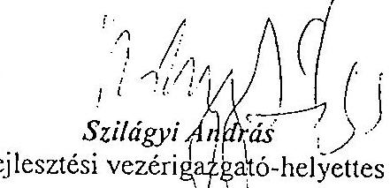
fejlesztési vezérigazgató-helyettes
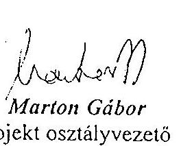
Marton Gábor
projekt osztályvezető

[^0]
[^0]: NEMZETI AUTÓPÁLYA RT.
1036 BUDAPEST, LAJOS UTCA 80.
TEL.: (36-1) 4368-100 FAX: (36-1) 4368-110
www.nart.hu autopalya@nart.hu

---

| KEZELŐ/ÜZEMELTETŐ | építmény
db | | ÉSZREVÉTELEK /VAGY JÓVÁHAGYÓ
NYÍLATKOZATOK |
| --- | --- | --- | --- |
| 1/a | Állami Autópályakezelő Rt. | 21 | 2002.09.09 | észrevételeiben több területen nem vállalta a
kezelést |
| 1/b | Állami Autópályakezelő Rt. | 38 | | |
| 2 | Tolna Megyei Állami
Közútkezelő Kht. | 7 | 2003.02.11 | egyetért (korábban 2002.08. 29-én értett egyet)
egyetért, beleértve az 51 sz. főút
keresztezésében megépítésre kerülő körforgalmú
csomópontot is |
| 3 | Bács-Kiskun Megyei Állami
Közútkezelő Kht. | 1 | 2002.08.08 | kéri a 2003.02.11-i egyeztetés jegyzőkönyvét.
korábbi nyilatkozatát fenntartja, amely a
2002.08.08-i |
| 4 | Szekszárd Önkormányzata | 13 | 2002.08.27 | nincs észrevétele
Az üzemeltetés feltételeire önkormányzatunk
jelenleg felkészülve nincs! Az üzemeltetésre
átadandó 11 db területre a műszaki-átadás
átvétel során üzemeltetői utasítást illetve leírást
kérünk! |
| 5 | Tolna-Mózs Önkormányzata | 10 | 2003.02.11 | Tolna Város egyetért
2002.09.09
Tolna Város az 5/12-es terület üzemeltetői
változásával egyetért |
| 6 | Bogyiszló Önkormányzata | 20 | 2002.08.23 | Véleménye szerint a 6. és 7. sz hidak esetében
az útburkolat az ÁAK RT. kezelésében lévő
rendkívül nagy értékű műtárgyak szerves része,
az útburkolat folyamatos jó állapota, az egész
műtárgy hosszú idejű jó állapotának záloga. |
| 7 | | | 2003.02.11 | Az átvezető utak hídjainál a szigetelések feletti
útburkolati rétegek karbantartását nem vállalta,
kivéve a hóeltakarítást. Közvetlenül a híd
Dunántúli hídfőjét övező terület hasznosítását
tervezték, például turisztikai célokra. |

---

| 12 | MÁV Rt. | 1 | 2002.08.07 | feltétellel a tervet elfogadta |
| --- | --- | --- | --- | --- |
| | | | | nyilatkozat helyett a melléklet azt tartalmazta, |
| | | | 2003.02.28 | hogy a sürgetett nyilatkozatot a MÁV Rt. |
| | | | | Vezérigazgatóságától szerezze be a tervező. |
| 13 | Csapó Dániel
Mezőgazdasági Szakképző
Intézet | 3 | 2002.09.18 | a tervet előzetesen elfogadták, de jelzett terület |
| | | | | elérésének módját nem ismerték |
| | | | 2003.02.11 | további észrevételük nincs |
| 14 | Vajas Agrogép Kft. | 1 | 2002.09.20 | nincs kifogásuk |
| | | | 2003.02.11 | nyilatkoztak arról, hogy elfogadják a tervet |
| 15 | Kék- Duna Mgsz. | 2 | 2002.09.30 | a tervezett kezelői és üzemeltetői határokat a |
| | | | | Porongi út melletti öntözővíz csatorna |
| | | | | vonatkozásában elfogadja. |
| | | | 2003.03.11 | nyilatkozatában kérte, hogy a ...csatorna és |
| | | | | átereszeknek földdel betöltött részét pucolják ki, |
| | | | 2003.03.11 | továbbá jelezte, hogy az M9-es út elkerülő útja |
| | | | | még nincs kész! |
| 16 | Mózsi Mgsz. | 4 | 2003.04.03 | a tervet elfogadta észrevétel nélkül. |
| | Halértékesítő és | | |
 |
|   | Kisállattenyésztő |  |  |   |
|  17 | Szövetkezet - Tolna | 2 | 2003.03.26 | a tervet elfogadta észrevétel nélkül.  |
|   |  |  |  | Észrevételezte, hogy az 1811 és 1812 0209 hrsz -  |
|  18 | Dunamenti és Kiskunsági |  |  | új csatorna a Társulat kezelésében lévő  |
|   | Vízgazdálkodási Társulat | 2 | 2003.03.26 | Molnárfoki csatorna.  |

---

|   |  |  |  | Az AAK Rt. az emlékeztetőben foglaltak szerint fenntartotta álláspontját.  |
| --- | --- | --- | --- | --- |
|   |  |  | 2003.03.19 | 2003.03.26  |
|   |  |  | 2003.03.27 | Az AAK Rt nem vállalja a 6. és 7. sz. hidak útburkolat kezelését, amelyet az Önkormányzat átadna.  |
|  7 | Fajsz önkormányzata | 6 | 2003.03.11 | 6  |
|  8 | Dusnok Önkormányzata | 6 | 2002.09.03 | 6  |
|  9 | Közép-Dunántúli Vízügyi Igazgatóság | 21 | 2003.02.11 | A KDT VÍZIG kezelésébe javasolt területek között nem VÍZIG kezelésében lévők is szerepeltek. A VÍZIG nyilatkozta, hogy csak azokat tudja átvenni, amelyek az alapfeladatatok ellátására szükségesek, további egyeztetést javasolt.  |
|   |  |  | 2003.03.27 | 2003.03.27  |
|  10 | Alsó-Dunavölgyi Vízügyi Igazgatóság | 10 | 2003.02.11 | 10/6, 10/7 területeket nem veszi át. A terv javasolja a Dunamenti és Kiskunsági Vízgazdálkodási Társulatnak átadni. 21/25-ös lap. Csak térítés ellenében vállalják a többi területükön az üzemeltetéssel kapcsolatos feladatok elvégzését.  |
|  11 | Gemenci Erdő és Vadgazdaság Rt. | 7 | 2003.02.11 | 7  |
|   |  |  | 2003.04.22 | 7  |

---

M9 autóút kezelők és üzemeltetők

|  |   |   |   |   |   |
| --- | --- | --- | --- | --- | --- |
|  |   |   |   |   |   |
|  |   |   |   |   |   |
|  |   |   |   |   |   |
|  |   |   |   |   |   |
|  |   |   |   |   |   |
|  |   |   |   |   |   |
|  |   |   |   |   |   |
|  |   |   |   |   |   |
|  |   |   |   |   |   |
|  |   |   |   |   |   |
|  |   |   |   |   |   |
|  |   |   |   |   |   |
|  |   |   |   |   |   |
|  |   |   |   |   |   |
|  |   |   |   |   |   |
|  |   |   |   |   |   |
|  |   |   |   |   |   |
|  |   |   |   |   |   |
|  |   |   |   |   |   |
|  |   |   |   |   |   |
|  |   |   |   |   |   |
|  |   |   |   |   |   |
|  |   |   |   |   |   |
|  |   |   |   |   |   |
|  |   |   |   |   |   |
|  |   |   |   |   |   |
|  |   |   |   |   |   |
|  |   |   |   |   |   |
|  |   |   |   |   |   |
|  |   |   |   |   |   |
|  |   |   |   |   |   |
|  |

---

# 17. sz. melléklet 

V-23-082/2003-2004. jelentéshez

## M9 autóút

kezelők és üzemeltetők

|  |  |  |  |  |  |
| :--: | :--: | :--: | :--: | :--: | :--: |
|  |  |  |  |  |  |
|  |  |  |  |  |  |
|  |  |  |  |  |  |
| Köszig: Dunáttáll: Vízügyi igazgatóság | 9 | Árvízvédelmi út (Duna jobb parti töltés) | 2003. június 26. | még nem |  |
|  |  | Kerékpárút (M9 14+595 - 14+695 km bal oldalon) | 2003. június 26. | még nem |  |
|  |  | Árvízvédelmi út (Duna bal parti töltés) | 2003. június 26. | még nem |  |
|  |  | Kerékpárút (M9 15+626 - 15+692 km bal oldalon) | 2003. június 26. | még nem |  |
|  |  |  |  |  |  |
| MÁV Rt. | 12 | nincs átadandó |  |  |  |
|  |  | Vagyonjogi átadás keretében rendezzük |  |  |  |
|  |  | Vagyonjogi átadás keretében rendezzük |  |  |  |
|  |  | Vagyonjogi átadás keretében rendezzük |  |  |  |
| Caspo Dénia/Étszázszottsági Szakképző intézet | 13 | Vagyonjogi átadás keretében rendezzük |  |  |  |
|  |  | Vagyonjogi átadás keretében rendezzük |  |  |  |
|  |  | Vagyonjogi átadás keretében rendezzük |  |  |  |
|  |  | Vagyonjogi átadás keretében rendezzük |  |  |  |
|  |  | Vagyonjogi átadás keretében rendezzük |  |  |  |
| Hölédékesítő és Kizállaltonyésző Szövetkezet | 17 | Vagyonjogi átadás keretében rendezzük |  |  |  |
|  |  | Vagyonjogi átadás keretében rendezzük |  |  |  |
|  |  | Vagyonjogi átadás keretében rendezzük |  |  |  |

---

# 18. sz. melléklet 

V-23-082/2003-2004. jelentéshez

## NEMZETI AUTÓPÁLYA

## NYILATKOZAT

A tározó árok szigetelő rétegének megfúrása mintavétel céljából a tározó szigetelő hatását gyengíti, ezért a környezetvédelmi engedélyben tett előírás eredeti formájában értelmezhetetlen. Folyamatban van a környezetvédelmi hatósággal az egyeztetés arról, hogy a tározó árkok vizsgálatát ebben a formában elhagyhatónak ítélik-e, illetve előírnak-e az üzemelési állapotra vonatkozóan pótlólagos vizsgálatokat.

Budapest, 2003. december 17.
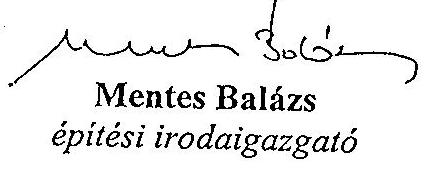

Simonyi Ágnes
vezető környezetvédelmi koordinátor

$$
\begin{aligned}
& \text { Aftvetern: 2003, dec. } 17 \text {. } \\
& \text { 22. oldie utolnd alsth to: } \\
& \text { 16. oldie. 4. bet. }
\end{aligned}
$$

---

# A szekszárdi Duna híd beruházás ellenőrzéshez tartozó teljesítményértékelés 

## Teljesítménymutatók és kritériumok

A helyszíni ellenőrzés során rendelkezésre álló adatok függvényében elemezzük a beruházás előtti állapot és a projekt üzembe helyezésének eredményeként elért célok, hatások alakulását. Az alábbi általános szempontrendszert figyelembe véve dolgoztuk ki a mutatókat az egyes vizsgálati programpontokhoz: A helyszíni vizsgálat tapasztalatai alapján választjuk ki az alábbi táblázatból a teljesítménymutatókat.

Infrastrukturális kritériumok: úthasználat (elérhetőség, utazási sebesség, közúti kapcsolatok), forgalombiztonság alakulása, forgalomszervezési szempontok érvényesülése (autópályává fejlesztés lehetőségei, csomópontok szervezése, mezőgazdasági, környezetvédelmi és karbantartási funkciók megvalósítása).

Környezetvédelmi és természetvédelmi kritériumok: zajvédelem és levegőtisztasági környezetvédelmi cél megállapítása, teljesülése, vadvédelem, mezőgazdasági szempontok figyelembevétele (pl.: dűlőutak átvezetése).

Beszerzési kritériumok: építési költségek, anyag, áru beszerzése, szállítókkal való kapcsolat, kis és középvállalkozások támogatása.

Technikai kritériumok: építési technológia, innováció, technikai adaptációs készség és képesség fejlesztése.

Területfejlesztési kritériumok: a kistérségek gazdasági fejlődésére gyakorolt hatások (Országos és Regionális Területfejlesztési Koncepciók), gazdaságélénkítő hatások (pl.: térségi mezőgazdasági vállalkozások logisztikai lehetőségeinek bővülése, vállalkozásfejlesztési lehetőségek bővülése).

Benchmarking elemzés: a beruházás műszaki gazdasági adatainak, fajlagos mutatóinak alakulása alátámasztja-e a költséghatékony és gazdaságos megvalósítást. A benchmarking elemzéshez felhasználandó beruházások: Tiszaugi híd, M3 Tisza-híd, Lágymányosi híd, szekszárdi híd. Az elemzést a teljesítmény-összehasonlítás módszerével kell elvégezni. A helyszíni adatok részletes ismeretében kiválasztjuk azokat a fajlagos teljesítménymutatókat, számított adatokat, controlling információkat, amelyek összehasonlításra alkalmasak, megbízható és hiteles információt adnak a benchmarking elemzéshez. Értékeljük az elemzéseket, mérlegeljük az eltérések okait és - az ellenőrzött szervezet bevonásával - meghatározzuk az összehasonlító elemzés előremutató tanulságait, hasznosítható tapasztalatait. A benchmarking elemzés célja a beruházó számára jövőbeni beruházások előkészítéséhez megalapozott értékelés készítése.

A minőségbiztosítási rendszerek értékelésénél az ISO 9000-es a minőségi rendszerekre vonatkozó nemzetközi szabványt (International Standard for Quality Systems) vesszük alapul. A minőségmenedzsment (ISO 9004) ellenőrzése keretében kiemelten vizsgáljuk az ISO 9004-6 „Irányelvek minőségbiztosításra projektmenedzsmenthez" nemzetközi szabvány érvényesítését a beruházás lebonyolítói feladatainak ellátásánál.

---

A beruházás megvalósításának ellenőrzésekor alapul vesszük a FIDIC (Tanácsadó Mérnökök Nemzetközi Szövetségének) előírásait.
Az ellenőrzés szempontjai közül kiemeltük azokat a pontokat, amelyek elemzéséhez speciális teljesítménymutatókat alkalmazunk. E teljesítménymutatókat és a hozzájuk tartozó kritériumokat, dokumentumforrásokat foglaltuk össze a következő táblázatokban.

---

# Teljesítménymutatók és a hozzátartozó kritériumok a szekszárdi Duna híd és a csatlakozó projektelemek értékeléséhez 

| Vizsgálati kérdés |  | Kiválasztott mutató | Kritériumok, illetve adathorrások |
| :--: | :--: | :--: | :--: |
| 1 | Finanszírozás |  |  |
| 1.1 | A finanszírozás szervezeti keretei megfeleltek-e a jogszabályokban előírtaknak, a beruházás ütemezésével összhangban rendelkezésre álltak-e a szükséges előirányzott források;   A jogszabályokban és a kormányhatározatokban megnevezett forrásbiztosítási lehetőségeken túlmenően történt-e egyéb forrásbevonás; | A forrás felhasználás megoszlása beruházási ráfordítások tárgya szerint (a már bekért adatok struktúrájában):   Beruházási ráfordítások   - Területszerzés   - Szakértői tevékenység   - Tervezés   - Beruházás lebonyolítás   - Kivitelezés   - Pénzügyi műveletek   - Vagyonértékű jogok   - NA Rt működési költség allokáció   - Egyéb | NA Rt. kimutatás - évenként (2000-2003.) tevékenységi bontásban:   - tervezés   - beruházás ráfordításai   - banki költségek (kamat)   - engedélyek, lőszermentesítés, régészet   - területszerzés, kisajátítás   - kivitelezés   - mérnök, lebonyolítás   - tanulmány, tanácsadás   - környezetvédelem |
| 1.2 | A finanszírozás módja szolgálta-e a beruházás hatékony, költségtakarékos és átlátható lebonyolítását. | Járulékos költségek és pótlólagos beruházások összevetése:   - eredeti célokkal (létesítményekkel, vagy azok részeinek darabszámaival   - hatóság által eredetileg és pótlólag (menetközben) előírt kötelezéssel (PI.: Környezetvédelmi Felügyelőségi határozat) |  |
| 2 | Beruházás elszámolása |  |  |
| 2.4 | Az M9 beruházás megvalósításához szükséges földterületek megvásárlása a jogszabályoknak megfelelően történt-e.   A rendelkezésre álló földterületek nagysága lehetővé teszi-e a tervezett bővítést | A megvásárolt földterületek, és a megszerzésükre fordított források összevetése.   Volt-e többszörös kifizetés a területszerzéssel kapcsolatban;   A megvásárolt földterületek nagyságának viszonya az M9 autópályává szélesítésének területi igényéhez (a vonatkozó jogszabályok szerint) | NA Rt., ÁAK Rt nyilvántartásai   Adattartalom ellenőrzése településnév és helyrajzi szám alapján   Hatósági előírások, NA Rt., ÁAK Rt földterületi nyilvántartásai |
| 2.6 | Hasznosították-e a különböző szintű ellenőrzések megállapításait és javaslatait -a felügyeleti, tulajdonosi, vezető testületi, belső és külső ellenőrzéseket - a beruházás megvalósítása során. | Az ellenőrzések konkrét intézkedési javaslatainak száma, ill. az intézkedést szükségessé tevő megállapításainak száma, valamint ezekhez képest: a beruházás során megvalósított intézkedési javaslatok ill. meghozott intézkedések száma. | Az ellenőrzési módosító javaslatok adatforrásai: beruházással összefüggésben végzett külső és belső ellenőrzések jelentéseinek megállapításai, javaslatai. A javaslatok megvalósításának adatforrásai: az esetlegesen készült intézkedési tervek, az utóellenőrzések megállapításai. |

---

| 3.6 | Keletkeztek-e peres ügyek a területszerzés, a beruházás vállalkozásba adása és megvalósítása során, amelyekben az NA Rt., az ÁAK Rt., az MFB Rt., illetve a fővállalkozók érintettek - beleértve az alkalmazott technológiát és szabadalmi kérdéseket -, továbbá ezek befolyásolták-e a beruházás megvalósítását és annak ráfordításait. | - az az arány, amely fennáll az alábbi két szám között:   - azon esetek száma, amelyekben adott társaság/fővállalkozó számára - valamely peres ügyéből kifolyólag - költség lépett fel (a figyelembe veendő költségek típusait lásd: a Program mellékletét alkotó: 8. sz. Tanúsítvány kitöltési útmutatójában); és   - azon esetek száma, amelyekben a fenti társaság/fővállalkozó - peres költségei megismerésének/fellépésének időpontjában, vagy azt követő rövid időn belül - többlet- ill. pótmunka címén számlát nyújtott be. | - a peres ügyekből kifolyólag, az adott társaság/fővállalkozó számára fellépett, alábbi típusú költségek összegének és fellépése időpontjának adatforrásai a következők:   - pénzbírság, kamat, kártérítés: bírósági ítéletek, végzések dokumentumai;   - kötbér összege: a vonatkozó szerződés; a nem teljesítés vagy nem szerződésszerű teljesítés ténye: a teljesítést igazoló dokumentumok;   - szabálytalan átalakítások után: az eredeti állapot visszaállításának költségei: a fővállalkozó által - az adott munkálatokhoz szükséges anyagokról, munkákról - kapott számlák;   - a munkák szünetelésének költségei: azon számlák, amelyeket a fővállalkozó olyan erőforrásmennyiségekről nyújtott be, amelyeket - a munkák szünetelése miatt - nem használt fel, amelyeknek költségét azonban meg kellett fizetnie.   - A fővállalkozó által, többlet- ill. pótmunka címén benyújtott számlák tételeinek, összegeinek, illetve benyújtásuk időpontjának adatforrásai: maguk a számlák. |
| --- | --- | --- |

---

| 3.7 | Figyelembe vették-e a Déldunántúli és Dél-alföldi területek gyorsforgalmi kapcsolatának fejlesztésén túl, az Európai Uniós úthálózat-fejlesztés szempontjait. | Az uniós úthálózat fejlesztési szempontok figyelembevételének követése   - a nyomvonal kijelöléseket tartalmazó megvalósíthatósági tanulmányokban   - a költségefőirányzatokban és költségbecslésekben (közte a távlati autópályává szélesítés előkészítéséhez)   - a fejlesztési és finanszírozási prioritások kijelölésénél (EU és magyar prioritások összhangja).   A gyorsforgalmi úthálózat fejlesztési igényekhez és követelményekhez lépest a jelenleg megvalósult szakasz kiépítettsége   - a külön szintű és a szintbeli csomópontok száma, aránya tekintetében. | A területszerzés alá vont területek tartalmazzák-e a későbbi autópályává szélesítés területigényét..   Forrásanyagok pl.:   - nemzetközi megállapodások,   - közútfejlesztési programok, koncepciók,   - kormányhatározatok és előterjesztések   - a Bizottság 438/2001/EK rendelete (2001. márc.2.) |
| :--: | :--: | :--: | :--: |
| 4.1 | Mérnök jelentések |  |  |
|  | A Mérnökkel kötött szerződés(ek), a kialakított feltételek lehetővé tették-e a beruházás felügyeletének független, elfogulatlan elvégzését a technológia, a szerkezeti mennyiségek és a minőség ellenőrzése alapján;   A szerződés tartalmazott-e ösztönző feltételeket a költségtakarékos megvalósításra, az indokolatlan többlet- és pótmunkák kiszűrésére; A Mérnök szerződése elősegítette-e a költség, minőség és az időbeliség közötti egyensúly biztosítását;   A Mérnök, a Beruházó, a Tervező és a Kivitelező közötti koordináció hozzájárult-e a gazdaságossági szempontok érvényesüléséhez; | Fizikai megvalósítás belső ellenőrzése (Mérnök, Vállalkozó) feltárt hiányosságok számához viszonyítva a tervezet és tett intézkedések kooperációs megbeszélések eredményei, döntések aránya.   Fizikai megvalósítás külső ellenőrzése (kontrollaborok stb.) feltárt hiányosságok/hozott döntések. | 51/2000. (VIII.9.) FVM-GM-KöVIM együttes rendelet az építőipari kivitelezési, valamint a felelős műszaki vezetői tevékenység gyakorlásának részletes szakmai szabályairól és az építési naplóról.   a) Mérnöki jelentés   b) kooperációs jegyzőkönyvek   c) egyéb egyeztetések jegyzőkönyvek, emlékeztetők |
| 4.3 | Terv-tény teljesítés és követése |  |  |
|  | A megvalósításban közreműködő szervezetek alkalmaztak-e a tényleges teljesítést nyomon követő adatokkal és információkkal szolgált monitoring rendszert;   A vezetői információs rendszer szolgáltatta-e a vezetés számára a szükséges információkat a beruházás szerződéses kötelezettségek teljesítésének követéséhez, a gazdaságosság figyelemmel kíséréséhez és kontrolljához;   A vezetés időben megtette-e azokat az intézkedéseket, amelyekre a monitoring rendszer jelzései hívták fel a figyelmet; | A programban elkészült létesítmények aránya az eredeti és módosított határidők szerint,   A program állása.   A tervezett és a tényleges átadási határidő viszonya, a túllépés nagysága.   A kivitelezés készültségi fokának követése, az előrehaladás fázisonkénti alakulása az előrejelzésekhez és az aktualizált állapothoz képest.   A késedelmek mértéke, időbeli aránya és térbeli megoszlása (szakasz/km) a program eredeti, bázis „ütemtervéhez" képest. | Viszonyítási alap:   - 2117/1999. (V. 26.) Korm. határozat (1999-2001),   - a projektszakaszokra kötött szerződéses megállapodások,   - monitoring havi jelentések,   - egyéb.   Bázis és aktualizált ütemtervek |
| 4.6 | Minőségbiztosítás |  |  |
|  | A kialakított minőségbiztosítási rendszer megbízhatóan és hatékonyan elősegítette-e a szerződésekben vállalt kötelezettségek teljesítésének minősítését a beépített anyagok, szerkezetek és berendezések, továbbá az alkalmazott technológiák vizsgálatával; | A minőségi folyamatok kiértékelése Összes elvégzett mintavétel száma, abból   - a hibás eredményt adó mintavételek aránya   - a sikertelen mintavételek aránya.   - a garanciális észrevételek jegyzékében szerelő összes hiba száma   - hibafajták szerinti megoszlás | Forrás: minőségi kooperációs értekezletek jegyzőkönyvei.   Minőségbiztosítási kézikönyv   Mintavételi és Minősítési |

---

|  | A minőségbiztosítási, szakértői és laboratóriumi vizsgálati feladatokat megfelelően összehangolták-e a kivitelezési folyamattal, és elkülönítették-e rá a költségeket;   A minőségbiztosítás nyilvántartási rendszere lehetővé tette-e a hatékony ellenőrizhetőséget a kifizetések jóváhagyási folyamatában;   A Mérnök feladatai teljesítésének elismerésekor milyen mértékben vették figyelembe a minőségbiztosítással kapcsolatos tevékenységét és a kockázatokat. | - a garanciális igény kivitelező által történt elfogadásának aránya (\%) | Terv   Technológiai Utasítás   Laboratóriumi eredmények, jegyzőkönyvek   Teljességi nyilatkozatban lerögzített hibaszám, hiba fajták. |
| :--: | :--: | :--: | :--: |
| 4.7 | A beruházás teljes életciklusa / hatások / környezetvédelem |  |  |
|  | A beruházás teljes életciklusára kiterjedően körültekintően gondoskodtak -e az üzemeltetők a környezetvédelem hosszú távú érdekeinek érvényesítéséről.   Felhasználtak-e a műszaki-gazdasági összehasonlításokhoz áradatbázist, továbbá üzemeltetési és fenntartási költség adatokat,   Végeztek-e hatékonysági számításokat. | Eredmény mutatók:   1. a menetidő csökkenése (menetrendszerinti autóbusz)   5. Beindult, vagy tervezett buszforgalom nagysága + az ezáltal összekötött települések távolsága ( km )   Hatások/hatásmutatók:   - a gépjármű forgalom növekedése   - a biztonság növekedése (közlekedési balesetek száma egy év után) | Forrás: minőségi kooperációs értekezletek jegyzőkönyvei.   Minőségbiztosítási kézikönyv   Forgalomszámlálási adatok   Baleseti statisztikák |
|  | Hatás a környezetre | Környezeti hatás a szennyezés növekedésével, vagy csökkenésével kifejezve (Co2, NOx ...)   Közlekedési zaj változása   Az átalakított természetes területek nagysága   Regisztrált természet- és környezetkárosítások száma, a hatóságokhoz tett bejelentések ezekkel kapcsolatban | Előzetes környezeti hatás tanulmányok   Mérések eredményei   Nemzeti Park Igazgatóság jelentései   Lakossági bejelentések |
|  | Benchmarking négy hídberuházás adatainak összehasonlítása |  |  |
|  | Alátámasztják-e a szekszárdi híd gazdaságosságát más hídberuházások (a Tiszaugi híd, az M3 Tiszahíd és a Lágymányosi híd) összehasonlításra alkalmas műszakigazdasági adatai | A Tiszaugi híd, az M3 Tisza-híd és a Lágymányosi híd műszaki-gazdasági fajlagos adatainak összehasonlítása.   Létesítmények tervezett élettartama, | Fajlagos költségadatok   - korrózióvédelem fajlagos költsége   - hegesztés fajlagos költsége   - a híd acélszerkezetéhez beépített anyagok fajlagos mennyiségi értékelése és minőségi jellemzői |

---

# Beruházási glosszárium 

| FIDIC | Federation Internationale Des Ingénieurs-Conseils Tanácsadó Mérnökök Nemzetközi Szövetsége |
| :--: | :--: |
| Megbízó | A szerződéses feltételek II. részében „különleges feltételek" között Megbízóként megnevezett szerződő fél és az ilyen személy törvényes jogutódjai, de ez nem jelenti (kivéve ha a Vállalkozó hozzájárul) annak a személynek bármely engedményesét. |
| Vállalkozó | az a személy, akinek az ajánlatát a Megbízó elfogadta, valamint annak a személynek törvényes
 jogutódjai, de ez nem jelenti (kivéve ha a Megbízó hozzájárul) annak a személynek bármely engedményesét. |
| Alvállalkozó | a Szerződésben a Beruházás egy részére Alvállalkozóként nevezett személy vagy bármely személy, aki a Mérnök hozzájárulásával alvállalkozói szerződést köt a beruházás egy részére, és annak a személynek törvényes jogutódjai, ide nem értve annak bármely engedményesét. |
| Mérnök | a Megbízó által kijelölt személy, aki a szerződés érdekében Mérnökként tevékenykedik és akit a szerződéses feltételek II. részében „különleges feltételek" Mérnökként megneveznek |
| Organizáció | Térbeli és időbeli anyagszállítás tervezés, szervezés. |
| Szerződés | szerződéses feltételek (I. rész: általános feltételek; II. rész: különleges feltételek), a műszaki előírások, a tervek, a mennyiség-kimutatás, az ajánlat, az elfogadó levél, a szerződéses megállapodás (ha ki van töltve), és az olyan további dokumentumok, amelyek kifejezetten belefoglaltak az elfogadó levélbe vagy a szerződéses megállapodásba (ha készült), |
| Tervek | az összes terv, számítás és az olyan természetű műszaki információk, amelyekkel a Mérnök látja el a Vállalkozót a Szerződés alapján, és az összes rajz, számítás, minták, sablonok, mintadarabok, üzemeltetési és fenntartási utasítások és egyéb olyan természetű műszaki információk, amelyeket a Vállalkozó nyújtott be és a Mérnök jóváhagyta, |
| Mennyiség-   kimutatás | a beárazott és kitöltött mennyiség-kimutatás, amely az ajánlat részét képezi |
| Ajánlat   („Tender") | a Vállalkozó beárazott ajánlata, amelyet a Megbízóhoz benyújtott a Beruházás kivitelezésére és megvalósítására, valamint minden olyan hiba kijavítására, amely a Szerződés rendelkezéseivel összhangban elvégzendő, ahogyan az elfogadó levélben szerepel |

---

| Elfogadó levél | az Ajánlatnak a Megbízó részéről történő hivatalos elfogadása |
| :-- | :-- |
| Szerződéses meg-   állapodás | a szerződéses megegyezés (ha van ilyen) |
| Szerződéses ár | az Elfogadó levélben szereplő összeg, amely a Vállalkozónak   fizethető a Beruházás kivitelezéséért és megvalósításáért és   az összes olyan hiba kijavításáért, amely a Szerződés felté-   eleivel összhangban van, |
| Beruházás | végleges munkák és az ideiglenes munkák, vagy bármelyik   közülük, ahogy megfelelő |
| Költség | (a FIDIC és nem számviteli értelemben)   az összes jogosan, akár a Munkaterületen, akár azon kívül   felmerült vagy felmerülő kiadás, beleértve a rezsi és egyéb   költséget, amelyek jogosan felszámíthatók, de nem szerepel   benne semmilyen nyereségrész. |

Készült a FIDIC „red book" meghatározásai alapján.

---

# Az M9 autóút szerződéses árainak összehasonlítása és a kiválasztott tételeinek szakértői árvizsgálata 

Az árszakértői jelentés kivonata

## 1. A szerződéses árak kialakítása

## „B" projektelem

Az ajánlatkérési dokumentáció 1. füzete tartalmazza az ajánlatkérési feltételek között az ajánlati árakra vonatkozó megrendelői kitételeket. ${ }^{1}$

A „B" projektelemnél az ajánlati felhívás lehetőséget adott műszaki alternatívára vonatkozó ajánlattételre. Az ajánlatot a konzorcium 2000. május 29-én benyújtotta (32 nappal az ajánlati dokumentáció átvételét követően). Az alapajánlat a Duna feletti hídra (nettó) 13.358.158.000,-Ft összegű megoldást, míg alternatív műszaki megoldással ugyanezen hídra (nettó) 9672093000 Ft ajánlati összeget tartalmazott. A kivitelező ajánlata műszaki tartalmának kiértékelésére 2000. június 23-án került sor, ahol megállapították a szakértők, hogy az Ajánlattevő alternatív ajánlata „egyértelműen kedvezőbb, mert túl azon, hogy nem akadálya későbbi fejlesztési lehetőségnek (új híd megépítése), időveszteség nélküli építést eredményezhet, gazdaságosabb, továbbá esztétikai szempontból is előnyös".

Ezt követően a szerződéses ár, ártárgyalások sorozatával alakult ki, az alternatív ajánlat alapján. NA Rt. felszólította ajánlattevőt, hogy vizsgálja meg azokat a lehetőségeket, amelyek műszaki változtatásokkal az ajánlati ár csökkentéséhez vezethetnek. A benyújtott műszaki változtatási javaslatok, illetve az ezek közül jóváhagyott elképzelések alapján kialakított „módosított ajánlati ár" összességében a 9,6 milliárd forintos alternatív ajánlati árhoz képest 2,4 milliárd forinttal kevesebb lett. A „B" projektelem összes költségének több, mint $80 \%$-át meghatározó B50 jelű tevékenység „Hídépítés (felüljá-

[^0]
[^0]:    ${ }^{1}$ „A munkák mennyiségeit tételenkénti bontásban a Mennyiségszámítások tartalmazzák..."
    „Az Ajánlattevőnek a Mennyiségszámításban szereplő minden tételhez, amelyhez tartozik mennyiség, be kell írnia egységárat, vagy árat."
    „Az Ajánlattevő a fentieknek megfelelő egyösszegű átalányárat az Ajánlatában úgy köteles meghatározni, hogy annak magában kell foglalnia azt az esetlegesen bekövetkező átkülönbözetet, amely az engedélyezési tervek alapján kalkulált beruházási összköltség, illetve a konkrét kiviteli tervek alapján megvalósításra kerülő beruházás összköltsége közötti eltérés összege."
    „A beárazott Mennyiségszámítás tételei a Szerződés tartalmának megfelelő teljes költségösszeget tartalmazzák, amelyek az átalányáras díj megállapítás következtében az esetleges pótmunkák díjazásának kivételével a Megrendelő részére kizárólag tájékoztató jellegűnek tekintendők."
    „Az Ajánlattevő által megadott átalányár, egységárak és árak a Szerződés teljesítése során nem kerülnek kiigazításra sem az árakban, sem egyéb okból bekövetkező változások miatt."

---

rók)" költségéből ajánlattevő engedményt adott, ami általában kb. 8\%-nak felel meg, de a meder felszerkezet építése során a két legnagyobb költséget képviselő tételre vonatkozóan 10\%. (Ezen a két tételen az árengedmény több mint 377 millió forint.) A szerződéses ár tehát az ajánlati árhoz képest egy lefolytatott áralku eredményeként alakult ki. Így állt elő a megkötésre kerülő szerződés vállalkozási árában a nettó 7231914000 Ft összeg a Duna-híd hídépítési feladataira (B502 jelű építmény), míg a „B" projektelem teljes szerződéses árából a Duna híd építésén túl, mintegy nettó 1 milliárd forint a hidak útépítési munkáinak költsége és mintegy nettó 1 milliárd forint értéket képvisel az összes többi kapcsolódó tevékenység költsége. A szerződéses árban, valamint a szerződés egyéb feltételeinek pontosításában az Ajánlatkérő és az Ajánlattevő konzorciumi tagok cégjegyzésre jogosult képviselői 2000. július 19-én jegyzőkönyvileg állapodtak meg.

# „A" és „C" projektelemek 

Az „A" és „C" projektelemek költsége előzetes tervezet formájában került jóváhagyásra, mivel azok ajánlatainak beadására ezt követően került sor.

A szerződéses árak árelemzésekkel történő alátámasztására ezen ajánlatokban sem intézkedtek (nem volt a Megrendelő részéről előírva), a Szerződéses Feltételek között²:

A szekszárdi „A", „B" és „C" szakasz esetében felmerülő bekerülési költség 2,459 Mrd Ft-tal magasabb lett, mint amely összeget a korábbi forrásigény meghatározása idején az MFB Rt. számításba vett. (Ez az összeg az „A" és "C" elemek ajánlata alapján tovább nőtt.)

## 2. A szerződéses árak bizonytalanságai

A szerződéses árak nem versenyhelyzetben alakultak ki, így a verseny árleszorító hatása nem érvényesülhetett.

Az ajánlatadás alapját képező engedélyezési tervdokumentációk bizonytalanságokat tartalmaztak, amelyek árfelhajtó hatással lehetnek egy átalányáras szerződés esetén. A műszaki tervkészültség ilyen fokán az átalányáras szerződéses megállapodási forma előnytelen volt az Ajánlatkérőnek. (Például: szállítási költség elszámolás a tényleges organizáció szerint; megállapodás a tételek egységárában egy becsült előirányzati mennyiséggel és az eltérés elszámolása +/- irányban a tényleges felmérés alapján; több éves árprognosztizáció helyett megállapodni ajánlati árszinten, az infláció utólagos, tényszerű elszámolásával stb.).

- A „B" projektelem esetén a kiviteli terv csak az ajánlat elfogadását követően készült el arra a változatra, ami ténylegesen megépítésre került.

[^0]
[^0]:    ${ }^{2}$ „A beárazott Mennyiség-kimutatás tételei a Szerződés tartalmának megfelelő teljes költségösszeget tartalmazzák, de az árak, egységárak az átalányáras díj megállapítás következtében az esetleges pótmunkák és szerződésmódosítások alapján elvégzésre kerülő munka díjazásának, valamint a Szerződésben meghatározott költségek, összegek, igények kivételével a Megrendelő részére kizárólag tájékoztató jellegűnek tekintendők."

---

- Az „A" és „C" projektelemekre vonatkozóan a humuszgazdálkodási terv elkészítése, valamint a töltésépítéshez szükséges földanyag nyerőhelyek kutatása az ajánlatadást követően zárult le, a kiviteli terven alapuló térbeni organizáció is a szerződéskötést követően készült el. Az útépítés során a térbeli organizáció költségkihatásait az egységárelemzés során táblázatosan is értékeltük.

Az ajánlatok kidolgozására - különösen a „B" projektelem esetén - rendkívül kevés idő állt rendelkezésre. Az ajánlati dokumentáció átvételét követően a 32. napon került benyújtásra a Duna-híd megvalósításának alap és alternatív változatára az ajánlat. Ez az idő egy alap és egy alternatív tervmegoldás kidolgozására és beárazására csak bizonytalanságok fennmaradása mellett lehet elégséges egy ilyen volumenű projekt esetében. (Összehasonlítás képpen: a közbeszerzési törvény hatálya alá eső építési beruházások ajánlattételi ideje minimálisan 41 nap, abban az esetben is, ha a beruházás értéke akár század része a „B" projektelem értékének.) Az áralku ezt követően kétszer annyi ideig tartott, mint az ajánlat tényleges elkészítése.

A szerződéses árak nem kerültek árelemzésekkel alátámasztásra, hiszen az egyes tételek árai (egységárai) „tájékoztató jellegűnek tekintendők". Ezt nem is kérte az Ajánlatkérő, mert prognosztizált, a megvalósítás során megváltoztathatatlan átalányáron kívánt szerződni.

Az ÉP-TOTÁL Kft. az NA Rt. megbízásából 2000. évben jelentést készített, amelynek mellékletei egységárelemzéseket, szállítási költség prognosztizációkat tartalmaztak a Szekszárdi Duna híd és közúti kapcsolatai kivitelezői árajánlatainak gyorsított felülvizsgálatára (útépítésre vonatkozóan). Az elemzések - az eltérő organizációs feltételek miatt - külön készültek az „A", illetve a „C" projektelemre. Az ÉP-TOTÁL Kft. árai magasabbak voltak az „A" és „C" projektelemre vonatkozóan is az Ajánlattevő árainál. Ugyanakkor Az ÉP-TOTÁL Kft jelentésében szereplő egységárak magasabbak voltak a piaci viszonyok között érvényesíthető áraknál. Ez visszavezethető volt a pontatlan térbeni organizációs adatokra. Például a szállítási költség meghatározásánál kimutathatóak voltak eltérések, amelyek a keverékárak kalkulációja során - kőanyag esetén $3900 \mathrm{Ft} / \mathrm{t}$, kötőanyag ár esetén 7870 $\mathrm{Ft} / \mathrm{t}$ - költségtöbbletet eredményeztek.

Az ÉP-TOTÁL Kft. számításai szerint a zúzottkő szállítás Komló és Szekszárd között 150 km vasúti és 5 km közúti szállítással, valamint többszöri rakodással számolt, amelynek költsége összesen $4210 \mathrm{Ft} / \mathrm{t}$ lett. Ugyanakkor a tényleges organizációs adatokkal számolva, 70 km közúti szállítást figyelembe véve a szállítási költség összesen $1120 \mathrm{Ft} / \mathrm{t}$ volt A : bitumenszállítás egységára az ÉP-TOTÁL Kft szerint $14580 \mathrm{Ft} / \mathrm{t}$ volt, mert 165 km vasúti szállítással számolt 122 km -es közúti szállítás helyett, amelynek költsége $6710 \mathrm{Ft} / \mathrm{t}$ volt. A Szekszárdon, illetve Baján érvényes aszfalt keverékárakhoz képest az ÉPTOTÁL Kft. Aszfaltkeverék árai magasabbak voltak.

A tételrend (10. füzet) részletezettsége árbecslésre alkalmas, de a tételes árellenőrzést nem támogatja. Az ajánlatkérés során egy részleteiben jobban megbontott tételrend kialakítása szükséges, különösen akkor, ha az ármegállapodás alapja verseny hiányában kizárólag a tételes árfelülvizsgálat lehet. (Pl.: az építési piacon közismert és elterjedt ÉMIR normarendszer, ese-

---

tenként jól definiált speciális „K" tételek kiírásával.). A „Tender dokumentáció" 10. füzete, a „tételek rövid tartalma" összevonásokat tartalmazott, ezért az egyes tételek árának „közvetlen költsége" pontosan nem volt ellenőrizhető, hiszen az egyes tételárak az összes „közvetett költségeket" is ráosztva tartalmazták.
(Így például: egy aszfalt burkolati réteg megépítése esetén az egységár négyzetméterre vonatkozik, ugyanakkor műszaki tartalmába a kiírás szerint beletartozik a közvetlen költségeken túl: az „ideiglenes melléképítmények" kiépítése, a „szükség szerinti forgalomterelés", az „építés közbeni víztelenítés" és „minden egyéb munka, teljesen készre". A „Pillérvédelem (felületi köszörűs, geotextília terítéssel)" című
 tétel esetében az egységár köbméterre vonatkozik, ugyanakkor a tétel tartalmazza a „terep előkészítése, a kövek elhelyezéséhez szükséges földmunka" és „geotextília elterítése" tevékenységeket is, ez utóbbi tevékenység költsége a felület nagyságától függ elsődlegesen.

# 2.1. A három projektelem ajánlati egységárainak összehasonlítása 

Az útépítési tételek szakértői árellenőrzése azt mutatta, hogy a „B" projektelem ajánlatában alkalmazott egységárak - mind a földmunka, mind az aszfalt burkolatok építésénél $-5 \%$-nál kisebb eltérést mutatnak a szakértői, kalkulált árakhoz viszonyítva, amelyek a piaci feltételek figyelembevételével készültek.

Az „A" és „C" projektelemek ajánlati egységárai indokolatlanul eltérnek a „B" projektelem azonos tételeinek egységáraitól, és egyúttal a szakértői áraktól is. Az „A" és „C" projektelemek azonos műszaki tartalmú tételeinek elfogadott szerződéses egységárai magasabbak voltak több esetben a „B" projektelem egységárainál. A földmunka és az aszfalt burkolatok beépítése során a három projektelemnél az alábbi két táblázatban bemutatott egységár különbségek mutatkoznak, amit nem indokolnak térbeli, időbeli organizációs eltérések.

| Földmunka tételek | Ajánlatban szereplő (szerződéses) egységár   (Ft/m3) |  |  |
| :-- | :--: | :--: | :--: |
|  | "A" projektelem | "B" projektelem | "C" projektelem |
| Humuszleszedés (1 km) | 660 | 660 | 660 |
| Földmű ép. bevágásból (1 km) | 831 | 831 | 831 |
| Földmű ép. any. nyerőről (1 km) | 2150 | 1390 | 2150 |
| Védőréteg h. kavicsból | 7400 | 3465 | 7400 |
| Padka mech. stabilizáció (1 km ) | 8320 | 1529 | 9590 |
| Többletszállítás 10 km -ig | 666 | 515 | 666 |

Például a „védőréteg homokos kavicsból" tétel esetében kétszeres volt az eltérés, a „Padka mechanikai stabilizációja" tételben hatszoros volt az eltérés.

---

A „többletszállítás 10 km-ig" egységáreltérése $151,-\mathrm{Ft} / \mathrm{m}^{3}$, ami szakmailag nem magyarázható. Ezen a tételsoron az „A" és „C" projektelemnél az összes szerkezeti mennyiség $1261505+341615=1603120 \mathrm{~m}^{3}$, így a költségtöbblet (kizárólag az ajánlattevő egységárát felhasználva) több mint 242 millió forint.

A „Földmű építése anyagnyerő helyről ( 1 km )" tétel szerkezeti mennyisége az „A" és „C" projektelemnél összesen $1231250 \mathrm{~m}^{3}$, amennyiben a „B" projektelem szerződött egységárait alkalmazták volna, a 935,7 millió Ft megtakarítást eredményez.

| Aszfalt burko-   latok | Ajánlatban szereplő (szerződéses) egységár (Ft/m3) |  |  |
| :--: | :--: | :--: | :--: |
|  | "A" projektelem | "B" projektelem | "C" projektelem |
| AB-12 | 54300 | 70400 | 58800 |
| K-20 | 52800 | - | - |
| JU-35 | 42200 | 35386 | 50940 |
| AB-12/F | 56375 | - | 61350 |
| mZMA-12 | 67500 | 64100 | 77000 |
| JU-35/F | 50030 | 43050 | 54500 |
| K-20/F | 55283 | 46933 | 55367 |

Például a K-20/F kötőréteg szerződéses egységára 18\%-kal magasabb az „A" és „C" projektelem esetében a „B" projekteleméhez viszonyítva. Általában több ezer forinttal magasabb köbméterenként az „A" és „B" projektelemek aszfalt burkolati rétegének egységára annak ellenére, hogy ugyanazt az aszfaltot ugyanolyan vastagságban, ugyanolyan technológiával dolgozták be, ugyanarról a keverőtelepről szállították. Abban az esetben, ha az „A" aszfaltmennyiségét a „B" projektelem építése során alkalmazott ajánlati egységárakkal vesszük figyelembe, akkor a (főpályán, lehajtó ágak nélkül) a JU35/F; K-20/F; mZMA-12 aszfaltok bedolgozásakor a költségtöbblet 160 millió forint.

# 2.2. A költségvetési tételek árellenőrzése (egységárelemzés) 

A „tájékoztató jellegű" egységárak ellenőrzése- Ajánlattevői, illetve Megrendelői egységárelemzések hiányában - a projektelemek meghatározó tételeinek kalkulációjával történt, a piaci árak figyelembevételével. Útépítés esetében ezek a földmunka- és aszfaltbedolgozási tételeire, a hídépítés esetében a cölöpözés, pillérek, pillérvédelem, az acél felszerkezet gyártása és szerelése, felületvédelem tételeire terjedt ki.

Az árellenőrzésben a versenytársak ajánlati áraival való összehasonlításra nem volt lehetőség a versenyeztetés elmaradása miatt.

Az útépítési szakértői árak meghatározása a piaci árakon alapult. A keverékárakat az aktuális keverőtelepek (Szekszárd és Baja) 2003. évi aszfalt el-

---

adási áraival vettük figyelembe. Az organizációs adatokat NA Rt. szolgáltatta. A földmunka tételek egységárának meghatározása a 2002. évi ÉMIR normakönyv díjtételei és a piaci szállítási feltételek alapján történt.

# Földmunkák egységárelemzése 

A szakértői egységárakkal számolva, a földmunkák főbb tételeinél mintegy 1,85 Mrd Ft többletköltség mutatható ki a szerződött árakhoz képest. A szakértői árakhoz képest közel $46 \%$-kal több volt a szerződéses ár (1. sz. melléklet).

A szakértői árban a tételek díj költségei az ÉMIR normákon alapultak, a szállítási költségek aktuális piaci viszonyokat tükröznek, a földanyag, homokos kavics, mechanikai stabilizáció anyagköltségei szintén aktuális piaci árak.

A kimutatás az „A", „B" és „C" projektelemekre külön készült. A „B" projektelem földmunka egységárai közel azonosak a szakértői árral. Ezzel szemben az „A" és „C" projektelemek egységárai magasabbak a szakértői árnál (így a „B" projektelem árainál is).

## Aszfalt pályaszerkezet egységárelemzése

Az egységárakat a megadott organizáció figyelembevételével határoztuk meg. Az „A" projektelem esetében a szekszárdi aszfaltkeverő telepről történő szállítással, 11 km-es fuvarköltséggel számoltunk. Az alápermetezéshez szükséges bitumenemulzió anyag- és szállítási költségét az ÉMIR norma szerinti mennyiség, és 104 km-es szállítási távolság figyelembevételével számoltuk. Az aszfalt anyagárát a bedolgozás helyszínén az aszfalt közvetlen anyagköltsége, fuvarköltsége, a bitumenemulzió közvetlen anyagköltsége és annak szállítási költsége együttesen adja. A díjköltség az ÉMIR normakönyv 2003. évi $\mathrm{Ft} / \mathrm{m}^{3}$ értéke. A szakértői ár az anyagköltség, a díjköltség, valamint $30 \%$ fedezeti érték figyelembevételével adódik, ami fedezetet nyújt minden járulékos, közvetett költségre is. A számítások eredményeit táblázatos formában adtuk meg (2. sz. melléklet).

A táblázat utolsó előtti oszlopa a konzorciumi ajánlati árat mutatja, az utolsó oszlop a szakértői árhoz viszonyítva mutatja a százalékos eltéréseket. Az „A" projektelem esetében az eltérések 109 és $129 \%$ között alakultak. A „C" esetében ugyanez az eltérés 119-129\% tartományban voltak.

A „B" projektelem aszfaltburkolat építési tételeinek árellenőrzésénél az NA Rt. által megadott organizációt vettük figyelembe (3. sz. melléklet).

A „B" projektelem aszfaltbedolgozási ajánlati árai összesítésben a kalkulált szakértői árhoz képest hibahatáron belüliek, 100-106\% közé estek.

A három projektelemet összesítve a szakértői árhoz viszonyított költségtöbblet összesen 353 millió Ft (4. sz. melléklet).- A táblázat aszfalt-fajtánként és projektelemenként mutatja a vállalkozói szerződéses és a szakértői egységárakat. Az „Eltérés" oszlopban szerepel az egyes egységárak különbözete projektelemenként, valamint az azok alapján a szerkezeti mennyiségek figyelembevételével számított költségtöbblet aszfaltburkolat fajtánként. Az eltérés

---

az „A" projektelemnél 264 millió Ft, a „C" projektelemnél a költségtöbblet értéke 84 millió Ft volt. A vizsgált tételeknél a szakértői becsült árhoz képest a szerződéses ár összességében 18\%-kal volt magasabb.

# Hídszerkezet költségbecslése 

A híd rendkívül összetett, egyedi és speciális szerkezet, s mivel tényleges versenyeztetés nem volt, ezért a költségek vizsgálatán keresztül végeztük az árak értékelését.

A hídépítési tételek ajánlati (szerződéses) árainak ellenőrzése az egyedi, speciális szerkezet, valamint a műszaki dokumentáció kezdeti stádiuma miatt nagyobb bizonytalansággal volt végezhető, mint az útépítési tevékenységek esetében.

A „Pareto" elvet követve („80/20" szabály: a tételek 20\%-át vizsgálva a költségek 80\%-ára kaphatunk magyarázatot) a híd főbb szerkezeti munkáit, a jelentősebb betonozási munkákat és a kőszórás tételét vizsgáltuk meg.

A tételek közül a híd fémszerkezeti munkáinak két összetartozó tétele, nevezetesen a meder felszerkezet acélszerkezeti gyártása és felületkezelése a teljes hídépítési munkák költségeinek a meder-híd esetében közel 43\%-át képviseli, míg az ártéri felszerkezet esetében ez további 11\%-a a teljes hídépítési költségnek (összesen mintegy 54\%).

A hídszerkezetek építése során az 1 tonna acélszerkezet gyártásának és helyszíni szerelésének becsült szakértői egységára 394 M Ft és 1113 M Ft között szórt (5. sz. melléklet). A fenti szórás nem teszi lehetővé költségösszehasonlító számítási módszerek adekvát alkalmazását. Ebből eredően nem vonható le megalapozott következtetésként az, hogy a költségtakarékossági szempontokat érvényesítették-e az árakban. Így az összevont tételrendben az írott és informális tulajdonosi elvárások, direktívák és a Vállalkozó egyedi pozíciója határozta meg a tényleges szerződéses árat.

A tájékoztató költségadatok alapján kiszámolt becsült átlagos egységár (a legalacsonyabb beszerzési költség és az átlagos járulékos költségek figyelembevételével és az utóvizsgálatok külön soron való felszámítása nélkül): $730711 \mathrm{Ft} / \mathrm{t}$. Az egyes szerkezeteknél, vagy azon belüli elemeknél (igényesebb és kisebb, illetve kevésbé igényes nagy súlyú és nagy méretű szerkezetek, mint például a szerviz lépcsők) $\pm 10-15 \%$ eltérés is indokolt lehet. A vállalkozás (áralku) során tett kb. 7,8-8\% árengedmény következtében megváltozott árból visszaszámolt meder szerkezet vállalkozói egységára $748764 \mathrm{Ft} / \mathrm{t}$. Így a vállalkozói ár a szakértői becsült alsó és felső egységár középtartományában helyezkedik el.

Az árakat és a szakértői költségbecsléseket befolyásoló tényezők az alábbiak voltak:

- A meder és ártéri felszerkezet gyártására és helyszíni szerelésére a „Megváltozott tételek felsorolása és tartalma" c. 10. füzetből a „B5029100 mederhíd 1-2 keresztmetszeti egységeinek gyártása" leírását vettük alapul.

---

- A híd szerkezetének megadott anyagminősége (S 355) önmagában nem nyújt elegendő információt, így az árat sem lehet összevontan értékelni. Az egyes anyagok méretétől és konkrét minőségi paramétereitől függ a beszerzési és gyártási költség. Az anyagminőségnél további jellemzők (pl. ütőmunka, köznyelven hidegtűrés vagy más, egyéb jellemzés, pl. a kezelésre vonatkozó jelölés G3 vagy más, stb.) megadása szükséges.
- A beszerzési árat a szállítandó mennyiségek, a szállítási módok és egyéb áralkalmazási és szerződéses (pl. fizetési, partneri, rakodási, tárolási, csomagolási, stb.) feltételek is befolyásolják. Általában a hídszerkezeteknél tipikusan előforduló S 355 J2 G3 minőségű szerkezeti acél anyagok a mérettől és fajtától függően budapesti paritással $96000 \mathrm{Ft} / \mathrm{t}$ és $117000 \mathrm{Ft} / \mathrm{t}$ egységáron szerezhetők be. (Feltételezhető, hogy a nagy mennyiségekre való tekintettel az alacsonyabb áron való beszerzés a reális.)
- A beszerzést követően a gyártóműhelybe szállítás költsége is terheli az anyagokat. A beszállítási és lerakodási költségek acél anyagok esetében általában az anyagár 2-6\%-át teszik ki. A vizsgált beruházás esetében az anyagok speciális mérete (pl. a $12 \times 6 \mathrm{~m}$ méretű lemeztáblák) és a speciális beszerzési helyek (import) növelheti, míg a nagy mennyiségekre vonatkozó esetleges fuvardíj kedvezmény csökkentheti ezt a költséget, ezért a fuvar-organizáció ismeretében egyedi kalkuláció készítése ad pontosabb eredményt, ami a vállalkozói árvetés feladata.
- A hulladék mértéke jó tervek és jó gyártás előkészítés esetén 2-3\% lehet. (Az árvetéseknél, részletes gyártási tervek és technológiai leírás hiányában ennél magasabb számokkal szoktak számolni, viszont a méretre való anyagrendelés a hulladék mennyiségét is csökkentheti.) A hulladék kis mennyiségére és állapotára, valamint az ebből eredő minimális értékre tekintettel az értékesíthető hulladék visszatérítését elhanyagoltuk. (Amennyiben mégis keletkezett visszatérítendő összeg, annak a vállalkozói árvetésből kellene kitűnnie.)
- A gyártási munkaköltséget a tervek és technológiai leírások alapján kiszámított erőforrások és azok költségének ismeretében konkrétan
 szokták meghatározni. Általában a gyártási idő 80-240 óra/t között szór, a szerkezet egységsúlyának és bonyolultságának függvényében. Tekintettel arra, hogy a hídszerkezetek nagysúlyú anyagokból készülnek a reális erőforrás az alacsonyabb időérték közelébe esik. A rezsivel növelt óradíj a gyártóműhely fedezetétől és a munkások bérétől függően $1500-4500 \mathrm{Ft} /$ ó. (Feltételezve, hogy a segédanyagok, üzemi felszerelések, az ideiglenes szerkezetek és költségek és egyéb műhely-költségek a rezsiben szerepelnek, ez az összeg még magasabb is lehet.)
- A gyártási külön költségek (speciális szerszámok készítése, vizsgálatok költsége, különös tekintettel a hegesztési varratok ultrahangos és röntgennel való vizsgálatára, stb.) igen széles határok között mozoghat, ezért minden esetben a technológiai folyamatterv, szerszám-terv és minősítési terv meghatározásai alapján esetenként konkrétan a gyártás-előkészítő specialista szokta meghatározni. (Összegszerűen elérheti az anyagköltség és munkadíj összegének 5-10\%-át. Tekintettel a híd szerkezet biztonsági és minősítési előírásaira, itt a magasabb érték közelében lévő érték valószí-

---

nűsíthető. (A tényleges költséget az üzemi kalkulációból, tehát a részletes árvetésből lehetne megismerni.)

- A gyártást követően a szerkezetek szállításra való előkészítése és anyagmozgatása, valamint helyszínre szállítása több lépcsőben történt (közúti szállítás, speciális rakodás mellett elsősorban vízi szállítás a jellemző) ugyancsak egyedi kalkulációt igényel. (Összegszerűen elérheti az anyagköltség és munkadíj összegének 3-5\%-át.)
- A beemelés, beállítás, szintezés és összeszerelése minden egyes szerkezeti elemnél más és más erőforrásokat igényel, ezért az egyedi kalkuláció itt is nélkülözhetetlen. Becsült értékként a szerkezet eddigi költségének (építéshelyi termékár) 8-20\%-a szokásos. További vizsgálati költségek terhelik a kivitelezést, melyek a kész szerkezetre vonatkoznak. Az utó-vizsgálati és tanúsítási költségek, terhelési próbák, stb. szerepelhetnek a vállalkozói fedezetben is, de az árvetésnél a külön soron való felszámításuk is gyakori, mivel ezeket a vizsgálatokat többnyire független szervezetek végzik.

# Acélszerkezetek gyári és helyszíni felületvédelme 

A hídszerkezet felületkezelésének egységárát 5.055-11.115.- Ft/m2 között becsüljük. Az alacsonyabb érték a felület letisztítás kisgépes módszerére, a magasabb érték az üzemi és üzemi körülményeket teremtő helyszíni gépi módszerre vonatkozik. A vállalkozói ár (figyelembe véve az áralku során tett árengedményt is) a meder szerkezetnél $10.072 . \mathrm{Ft} / \mathrm{m} 2$, az ártéri szerkezetnél $10327 \mathrm{Ft} / \mathrm{m}^{2}$. Mindkét egységár a becsült ár maximuma közelében, az alatt $9,4 \%$, illetve $7,1 \%$-os különbséggel helyezkedik el.

A szakértői árbecslésnél figyelembe vett tényezők az alábbiak voltak:

- A meder és ártéri felszerkezet festésére, gyári és helyi felületvédelmére a 10. füzetből a B5029500 tétel leírását vettük alapul „B107 m mederhíd szerelési szakaszainak korrózióvédelme".
- A felület előkészítése ( $21 / 2$ tisztasági fokozat, ami „fémtiszta" felületet jelent) speciális (sörétezett, homokszórásos vagy más korszerű) technológiával végezhető. Az élőmunka és gépi munka erőforrás szükséglete függ a szerkezet kialakításától, a tisztítandó felület tagoltságától és méreteitől. A fémszerkezetek felületkezelésére előirányzott átlagos erőforrások szórása is igen magas, így a költségek is tág határok között ( $2800-8200 \mathrm{Ft} / \mathrm{m}^{2}$ ) változhatnak.
- Az alapréteg felhordása többnyire a gyártás helyén történik és közbenső és fedő felület felhordása akár a gyártelepen, akár a helyszínen megvalósítható. Az összeszerelés utáni javítás természetesen csak a helyszínen készülhetett. Mindegyik esetben a felületkezelésnél üzemi körülményeket feltételezünk.
- Az alap-, közbenső- és fedőréteg gépi felhordása összes erőforrásigénye $0,4-0,7$ óra $/ \mathrm{m}^{2}$ (élőmunka) a felület tagoltságától és méreteitől függően. A gépköltsége is hasonló módon változik. Mivel a kisegítő és járulékos (takarítási, portalanítási, zsírtalanítási) munkák időigényét is tartalmaznia kell az időszükségletnek és gépköltségnek, ezért az átlagos értékeknél magasabb erőforrás értékek is előfordulhatnak.

---

- A szükséges festék mennyisége ugyancsak a szerkezet kialakításától függ, legkevesebb $0,54 \mathrm{~kg} / \mathrm{m}^{2}$, de esetenként $1 \mathrm{~kg} / \mathrm{m}^{2}$ festékre is szükség lehet. Az alapozástól a fedő mázolúsig megadott festék nagykereskedelmi árával számolva kb 1 200-1 $400 \mathrm{Ft} / \mathrm{m}^{2}$ anyagár becsülhető. A munkadíj (élőmunka és gépköltség $850-1250 \mathrm{Ft} / \mathrm{m}^{2}$ között reális. A teljes 3 rétegű festés átlagos költsége 2 050-2 650 Ft .
- A helyszíni javítási munkákra a festési munkák költségének 10\%-át irányoztuk elő. (205-265 Ft/m²) Figyelembe kell venni, hogy a javításoknál a javítandó felületet előre nehéz meghatározni, (a hegesztési varratokon kívül a szállítási és szerelési sérülések is javítandók), viszont a javítási munka mindég körülményesebb, mint az eredeti festés. A helyszíni felülettisztítás szükségességét (sörétezést) külön nem vettük figyelembe, de ennek felmerülése esetén a becsült ár növekedhet.

# Egyéb főbb tételek egységárelemzése 

A következő 8 vizsgált tétel összesen a híd építési költségének további 26\%-át jelentette, így ezekkel együtt a vizsgálat a költségek 80 százalékára terjedt ki.

- 5182, 5280 jelű tételek: betonacél (B60.50)

A tételek rövid tartalmában nem szerepel a betonacélok mérete. A tételre az építőipari iránynormák alkalmazásával és a piaci költségadatokkal kiszámolt egységár 117 000-239 $000 \mathrm{Ft} / \mathrm{t}$ között változhat. Az alépítményi munkákhoz felhasznált betonacélok eredeti egységára $165265 .-\mathrm{Ft} / \mathrm{t}$, majd a későbbi engedményes ár $152360 \mathrm{Ft} / \mathrm{t}$. A felszerkezeti munkákhoz felhasznált betonacél tétel eredeti egységára $191101 \mathrm{Ft} / \mathrm{t}$, engedményes ár $176205 \mathrm{Ft} / \mathrm{t}$ volt. Az elfogadott egységárak a becsült egységár középérték közelében voltak.

- 5193 jelű tétel: pillérvédelem felületi kőszórással, geotextília terítéssel

Sem a Beruházó, sem a Vállalkozó nem határozta meg a kőszórás tételénél a kő fajtáját, minőségét, méretét, és organizációját. A geotextília terítéséhez nincs megadva a felület nagysága, csupán az előirányzott kőmennyiség térfogata. A fenti bizonytalanságokkal együtt a tétel költsége (maximum) elérheti az ártéri pilléreknél a $15000,-\mathrm{Ft} / \mathrm{m}^{3}$ árat, aminek kétszerese a mederpillérek esetében nem túlzott.

- 5241 jelű tétel: monolit pályalemez (C 30) zsaluzással, állványozással

Sem a Beruházó, sem a Vállalkozó nem határozta meg a zsaluzási felület mennyiségét, valamint az állványszerkezet fajtáját és mennyiségét, valamint nem álltak rendelkezésre organizációs adatok. Önmagában a beton mennyiségből ezen tételek költségigénye nem határozható meg elfogadható pontossággal (5\%-os tartományon belül). A pályalemez árának része az állványozás költsége, így a szakértői becslés bizonytalansága nagy. A pályalemez betonozása elérheti az $53100,-\mathrm{Ft} / \mathrm{m}^{3}$ értéket, amit kiegészítve a szállítási, zsaluzási és állványozási tevékenységek (beton $\mathrm{m}^{3}$-re vetített) költségével, a vállalkozói $92300 \mathrm{Ft} / \mathrm{m}^{3}$ egységár akár el is érhető. A tétel súlyára való tekintettel nagy hatása nincs az esetleges eltérésnek a teljes vállalkozói árra.

---

- Fúrt cölöp C 20 betonból átmérő: 1300 mm (parton)

A szakértői árinformációk szerint a fenti minőségű és méretű fúrt vb. cölöp készítés költsége $133000 \mathrm{Ft} / \mathrm{m}$. Ez azonban a talajmechanikától, a fúrás mélységétől is függ. Mivel a tétel tartalmaz még szükség szerinti kiegészítő talajfeltárást, valamint a helyszínre szállításokat, a résiszap előállítását és bevezetését, a jelentős felvonulást, melléképítményeket, így az egységár 10-15\%-kal magasabb is lehet. Ebben az esetben a vállalkozói ár eltérése mintegy 6,5\%-os többletköltséget mutat.

- Fúrt cölöp C 20 betonból átmérő: 1300 mm (mederben)

A mederben történő fúrás esetében a 2,5-szeres egységár semmiképpen nem túlzó a parton történő fúrt cölöpözéshez képest. A mederben történő cölöpözés szabadalom alatti technológiával történt, így annak pontos kalkulációja végképp nem lehetséges.

- 5302 jelű tétel: Műanyag bázisú szórt hídszigetelés meder szerkezetben

A szakértői ár kent vagy szórt szigetelés készítésére átlagosan $20000 \mathrm{Ft} / \mathrm{m}^{2}$. Ez az érték a vállalkozói árral gyakorlatilag megegyezik.

- Műanyag bázisú hídszigetelés ártéri szerkezetben

A műanyag bázisú hídszigetelés egységára 7\%-kal magasabb, mint a mederszerkezet szigeteléséé, amely nem indokolt.

Szabó Gábor sk.
költségszakértő

---

# MELLÉKLETEK 

| 1. melléklet | Földmunkák költségelemzése |
| :-- | :-- |
| 2. melléklet | Aszfaltburkolatok költségelemzése „A" és „C" projektelemekre |
| 3. melléklet | Aszfaltburkolatok költségelemzése „B" projektelemre |
| 4. melléklet | Aszfaltburkolatok költségelemzésének összesítése |
| 5. melléklet | Szekszárdi Duna-híd gyártási-szerelési költségeinek elemzése |

---

2.  függelék
3.  melléklete
a V jelentéshez

"A" projektelem

|  | menny.   m3 | váll. e.árf Ft/m3 | váll. költség   Ft | szak. e.á   Ft/m3 | szak. költség   Ft | eltérés   Ft |
| :--: | :--: | :--: | :--: | :--: | :--: | :--: |
| Humuszleszedés | 184630 | 660 | 121855800 | 639 | 117978570 | 3877230 |
| Földmű bevágás | 43065 | 831 | 35787015 | 842 | 36260730 | $-473715$ |
| Földmű any.nyerő | 986535 | 2150 | 2121050250 | 1482 | 1462044870 | 659005380 |
| Védőréteg h.kavics | 94650 | 7400 | 700410000 | 3470 | 328388175 | 372021825 |
| Padka mech.stabi. | 47275 | 8320 | 393328000 | 4142 | 195789413 | 197538588 |
| Többletszáll. 10 km | 1261505 | 666 | 840162330 | 474 | 597448768 | 242713562 |
|  |  |  | 4212593395 |  | 2737910526 | 1474682870 |

"B" projektelem

|  | menny.   m3 | váll. e.árf Ft/m3 | váll. költség   Ft | szak. e.á   Ft/m3 | szak. költség   Ft | eltérés   Ft |
| :--: | :--: | :--: | :--: | :--: | :--: | :--: |
| Humuszleszedés | 29170 | 660 | 19252200 | 639 | 18639630 | 612570 |
| Földmű bevágás | 2250 | 831 | 1869750 | 842 | 1894500 | -24 750 |
| Földmű any.nyerő | 233030 | 1390 | 323911700 | 1482 | 345350460 | -21 438760 |
| Védőréteg h.kavics | 6270 | 3465 | 21725550 | 3470 | 21753765 | -28 215 |
| Padka mech.stabi. | 4225 | 1529 | 6460025 | 4142 | 17497838 | -11 037813 |
| Többletszáll. 10 km | 268675 | 515 | 138367625 | 474 | 127244480 | 11123145 |
|  |  |  | 511586850 |  | 532380673 | -20 793823 |

"C" projektelem

|  | menny.   m3 | váll. e.árf Ft/m3 | váll. költség   Ft | szak. e.á   Ft/m3 | szak. költség   Ft | eltérés   Ft |
| :--: | :--: | :--: | :--: | :--: | :--: | :--: |
| Humuszleszedés | 68450 | 660 | 45177000 | 639 | 43739550 | 1437450 |
| Földmű bevágás | 14250 | 831 | 11841750 | 842 | 11998500 | -156 750 |
| Földmű any.nyerő | 244715 | 2150 | 526137250 | 1482 | 362667630 | 163469620 |
| Védőréteg h.kavics | 23000 | 7400 | 170200000 | 3470 | 79798500 | 90401500 |
| Padka mech.stabi. | 14200 | 9590 | 136178000 | 4142 | 58809300 | 77368700 |
| Többletszáll. 10 km | 341615 | 666 | 227515590 | 474 | 161788864 | 65726726 |
|  |  |  | 1117049590 |  | 718802344 | 398247246 |

"A"+"B"+"C"
 projektelemek

|  | menny.   m3 | váll. e.ár Ft/m3 | váll. költség   Ft | szak. e.á   Ft/m3 | szak. költség   Ft | eltérés   Ft |
| :--: | :--: | :--: | :--: | :--: | :--: | :--: |
| Humuszleszedés | 282250 | 660 | 186285000 | 639 | 180357750 | 5927250 |
| Földmű bevágás | 59565 | 831 | 49498515 | 842 | 50153730 | -655 215 |
| Földmű any.nyerő | 1464280 | 2029 | 2971099200 | 1482 | 2170062960 | 801036240 |
| Védőréteg h.kavics | 123920 | 7201 | 892335550 | 3470 | 429940440 | 462395110 |
| Padka mech.stabi. | 65700 | 8158 | 535966025 | 4142 | 272096550 | 263869475 |
| Többletszáll. 10 km | 1871795 | 644 | 1206045545 | 474 | 886482112 | 319563433 |
|  |  |  | 5841229835 |  | 3989093542 | 1852136293 |

---

M9 autóút aszfalt burkolatok költségelemzése "A" és "C" projektelemekre

2. függelék 2. melléklet a V jelentéshez

"A" Projektelem, aszfaltburkolat építés - Szekszárdi keverőtelepről

| aszfalt
burkolat
fajta | Közvetlen anyagktg.
Szekszárd, 2003. |  | Fuvar
11 km-re
(FT/m3) | Bitumen emulzió
anyag
(FT/m3) |  | Anyag
ktg.
(FT/m3) | $\begin{gathered} \text { Díj } \ \text { ktg. } \end{gathered}$ | $\begin{gathered} \text { A + D + F } \ \text { ktg. } \end{gathered}$ | Konzorc.
szerz. | $\%$ |
| --- | --- | --- | --- | --- | --- | --- | --- | --- | --- | --- |
| | (FT/to) | (FT/m3) | | | | | | | | |
| AB-12 (4cm) | 12 108 | 29 301 | 1016 | 1081 | 55 | 31454 | 3686 | 45681 | 54300 | 118,87 |
| K-20 (6cm) | 10868 | 26302 | 1016 | 721 | 36 | 28075 | 3686 | 41289 | 52800 | 127,88 |
| JU-35 (10cm) | 9986 | 24166 | 1016 | 606 | 31 | 25819 | 3686 | 38356 | 42200 | 110,02 |
| JU-35 (7cm) | 9986 | 24166 | 1016 | 865 | 44 | 26091 | 3686 | 38710 | 42200 | 109,01 |
| JU-35 (5cm) | 9986 | 24166 | | | | | | | | |
| AB-12/F (4cm) | 13049 | 31579 | 1016 | 1081 | 55 | 33731 | 3686 | 48642 | 56375 | 115,90 |
| mZMA-12 (4cm) | 16877 | 40842 | 1016 | 1081 | 55 | 42995 | 3686 | 60685 | 67500 | 111,23 |
| JU-35/F (10cm) | 10383 | 25127 | 1016 | 606 | 31 | 26779 | 3686 | 39605 | 50030 | 126,32 |
| K-20/F (6cm) | 11388 | 27559 | 1016 | 721 | 36 | 29332 | 3686 | 42924 | 55283 | 128,79 |

"C" Projektelem, aszfaltburkolat építés - Bajai keverőtelepről

| aszfalt
burkolat
fajta | Közvetlen anyagktg.
Baja - MASZ, 2003. |  | Fuvar
26 km-re
(FT/m3) | Bitumen emulzió
anyag
(FT/m3) |  | Anyag
ktg.
(FT/m3) | $\begin{gathered} \text { Díj } \ \text { ktg. } \end{gathered}$ | $\begin{gathered} \text { A + D + F } \ \text { ktg. } \end{gathered}$ | Konzorc.
szerz. | $\%$ |
| --- | --- | --- | --- | --- | --- | --- | --- | --- | --- | --- |
| | (FT/to) | (FT/m3) | | | | | | | | |
| AB-12 (4cm) | 11980 | 28992 | 1258 | 1081 | 53 | 31384 | 3686 | 45591 | 58800 | 128,97 |
| K-20 (6cm) | 11450 | 27709 | | | | | | | | |
| JU-35 (10cm) | 10980 | 26572 | 1258 | 606 | 30 | 28465 | 3686 | 41797 | 50940 | 121,88 |
| JU-35 (7cm) | 10980 | 26572 | 1258 | 865 | 42 | 28737 | 3686 | 42151 | 50943 | 120,86 |
| JU-35 (5cm) | 10980 | 26572 | 1258 | 1211 | 59 | 29100 | 3686 | 42622 | 50940 | 119,51 |
| AB-12/F (4cm) | 13317 | 32227 | 1258 | 1081 | 53 | 34620 | 3686 | 49798 | 61350 | 123,20 |
| mZMA-12 (4cm) | 17680 | 42788 | 1258 | 1081 | 53 | 45179 | 3686 | 63524 | 77000 | 121,21 |
| JU-35/F (10cm) | 12242 | 29625 | 1258 | 606 | 30 | 31518 | 3686 | 45766 | 54500 | 119,09 |
| K-20/F (6cm) | 11997 | 29033 | 1258 | 721 | 35 | 31048 | 3686 | 45154 | 55367 | 122,62 |

---

M9 autóút aszfalt burkolatok költségelemzése "B" projektelemre

2.  függelék 3. melléklet a V jelentéshez

"B" Projektelem, aszfaltburkolat építés - Szekszárdi keverőtelepről

| aszfalt
burkolat
fajta | Közvetlen anyagktg.
Szekszárd, 2003. |  | Fuvar
19 km-re | Bitumen emulzió
anyag
(Ft/m3) |  | Anyag
ktg.
(Ft/m3) | $\begin{gathered} \text { Díj } \ \text { ktg. } \end{gathered}$ | $\begin{gathered} \text { A + D + F } \ \text { ktg. } \end{gathered}$ | Konzorc.
szerz. | $\%$ |
| --- | --- | --- | --- | --- | --- | --- | --- | --- | --- | --- |
| | (Ft/fo) | (Ft/m3) | | | | | | | | |
| AB-12 (4cm) | 12108 | 29301 | 1307 | 1081 | 56 | 31745 | 3686 | 46061 | 70400 | 152,84 |
| K-20 (6cm) | 10868 | 26302 | | | | | | | | |
| JU-35 (10cm) | 9986 | 24166 | | | | | | | | |
| JU-35 (7cm) | 9986 | 24166 | 1307 | 865 | 45 | 26383 | 3686 | 39089 | 35386 | 90,53 |
| JU-35 (5cm) | 9986 | 24166 | | | | | | | | |
| AB-12/F (4cm) | 13049 | 31579 | | | | | | | | |
| mZMA-12 (4cm) | 16877 | 40842 | 1307 | 1081 | 56 | 43286 | 3686 | 61064 | 64100 | 104,97 |
| JU-35/F (10cm) | 10383 | 25127 | 1307 | 606 | 31 | 27070 | 3686 | 39983 | 43050 | 107,67 |
| K-20/F (6cm) | 11388 | 27559 | 1307 | 721 | 37 | 29624 | 3686 | 43302 | 46933 | 92,26 |

"B" Projektelem, aszfaltburkolat építés - Bajai keverőtelepről

| aszfalt
burkolat
fajta | Közvetlen anyagktg.
Baja - MASZ, 2003. |  | Fuvar
28 km-re | Bitumen emulzió
anyag
(Ft/m3) |  | Anyag
ktg.
(Ft/m3) | $\begin{gathered} \text { Díj } \ \text { ktg. } \end{gathered}$ | $\begin{gathered} \text { A + D + F } \ \text { ktg. } \end{gathered}$ | Konzorc.
szerz. | $\%$ |
| --- | --- | --- | --- | --- | --- | --- | --- | --- | --- | --- |
| | (Ft/fo) | (Ft/m3) | | | | | | | | |
| AB-12 (4cm) | 11980 | 28992 | 1355 | 1081 | 94 | 31522 | 3686 | 45770 | 70400 | 153,81 |
| K-20 (6cm) | 11450 | 27709 | | | | | | | | |
| JU-35 (10cm) | 10980 | 26572 | | | | | | | | |
| JU-35 (7cm) | 10980 | 26572 | 1355 | 865 | 75 | 28867 | 3686 | 42318 | 35386 | 83,62 |
| JU-35 (5cm) | 10980 | 26572 | | | | | | | | |
| AB-12/F (4cm) | 13317 | 32227 | | | | | | | | |
| mZMA-12 (4cm) | 17680 | 42788 | 1355 | 1081 | 94 | 45316 | 3686 | 63702 | 64100 | 100,62 |
| JU-35/F (10cm) | 12209 | 29545 | 1355 | 606 | 52 | 31558 | 3686 | 45817 | 43050 | 93,96 |
| K-20/F (6cm) | 11997 | 29033 | 1355 | 721 | 62 | 31172 | 3686 | 45315 | 46933 | 96,55 |

"B" Projektelem, aszfaltburkolat építés a fő pályán, 50-50\% beszállítási arány feltételezésével

| aszfalt fajta | Szakértő | Szerződés | $\%$ |
| --- | --- | --- | --- |
| mZMA-12 (4cm) | | 62383 | 64100 |
| JU-35/F (10cm) | | 42900 | 43050 |
| K-20/F (6cm) | | 44309 | 46933 |

---

M9 autóút aszfaltburkolatot költségelemzésének összesítése "A", "B" és "C" projektelemekre 2. függelék 4. melléklet a V jelentéshez

"A"+"B"+"C" projektelemek aszfaltburkolat építés

| aszfalt
burkolat
fajta | Mennyiség
(m3) |  |  | Vállalkozói (szerződéses) egységár |  |  | Szakértői egységár
(Ft/m3) |  | | Eltérés
(eFt) |  |  |   |
| --- | --- | --- | --- | --- | --- | --- | --- | --- | --- | --- | --- | --- | --- |
|   | "A" | "B" | "C" | "A" | "B" | "C" | "A" | "B" | "C" | "A" | "B" | "C" | "A"+"B"+"C"  |
|  AB-12 (4cm) | 924 | 192 | 120 | 54300 | 70400 | 58800 | 45681 | 45916 | 45591 | 7967 | 4691 | 1585 | 14244  |
|  K-20 (6cm) | 124 |  |  | 52800 |  |  | 41289 |  |  | 1426 |  |  | 1426  |
|  JU-35 (10cm) | 472 |  | 112 | 42200 |  | 50940 | 38356 |  | 41797 | 1814 |  | 1019 | 2834  |
|  JU-35 (7cm) | 1332 | 281 | 116 | 42200 | 35386 | 50943 | 38710 | 40704 | 42151 | 4649 | $-1493$ | 1015 | 4172  |
|  JU-35 (5cm) |  |  | 15 |  |  | 50940 |  |  | 42622 |  |  | 127 | 127  |
|  AB-12/F (4cm) | 488 |  | 137 | 56375 |  | 61350 | 48642 |  | 49798 | 3775 |  | 1580 | 5356  |
|  mZMA-12 (4cm) | 4517 | 315 | 1447 | 67500 | 64100 | 77000 | 60685 | 62383 | 63524 | 30781 | 541 | 19500 | 50821  |
|  JU-35/F (10cm) | 12120 | 845 | 3979 | 50030 | 43050 | 54500 | 39605 | 42900 | 45766 | 126351 | 127 | 34753 | 161230  |
|  K-20/F (6cm) | 7089 | 480 | 2331 | 55283 | 46933 | 55367 | 42924 | 44309 | 45154 | 87609 | 1260 | 23807 | 112675  |
|   |  |  |  |  |  |  |  |  |  | 264373 | 5126 | 83386 | 352885  |
|   |  |  |  |  | Szerződéses ár összesen: |  |  |  |  | 1463511 | 102497 | 485124 | 2051132  |
|   |  |  |  |  |  |  |  |  |  | \% | \% | \% |   |
|   |  |  |  |  |  |  |  |  |  | 18,06 | 5,00 | 17,19 |   |

---

# 1 t acélszerkezet gyártásának és helyszíni szerelésének becsült átlagos költsége 

| megnevezés | mennyiség | mérték e.   (m.e.) | egységár   Ft/m.e. | összesen   Ft |
| :-- | :--: | :--: | :--: | --: |
| S 355 J2 G3 jelű szerkezeti acél | 1 | t | 96000 | 96000 |
| beszállítás gyártóhelyre | 4 | $\%$ | 96000 | 3840 |
| hulladék | 2,5 | $\%$ | 96000 | 2400 |
| anyagköltség összesen: |  |  |  | 102240 |
| gyártás | 160 | óra | 3000 | 480000 |
| anyag és gyártás összesen: |  |  |  | 582240 |
| gyártási külön költség | 7,5 | $\%$ | 582240 | 43668 |
| leszállítás a helyszínre | 4 | $\%$ | 582240 | 23290 |
| Beemelés és összeszerelés | 14 | $\%$ | 582240 | 81514 |
| Hídszerkezet (nettó) összesen: |  |  |  | $\mathbf{7 3 0} \mathbf{711}$ |

1 t acélszerkezet gyártásának és helyszíni szerelésének becsült minimális költsége (átlagos lakatos szerkezet, egyszerű rács, korlát, stb.)

| megnevezés | mennyiség | mérték e.   (m.e.) | egységár   Ft/m.e. | összesen   Ft |
| :-- | :--: | :--: | :--: | --: |
| S 355 J2 G3 jelű szerkezeti acél | 1 | t | 96000 | 96000 |
| beszállítás gyártóhelyre | 2 | $\%$ | 96000 | 1920 |
| hulladék | 2 | $\%$ | 96000 | 1920 |
| anyagköltség összesen: |  |  |  | 99840 |
| gyártás | 80 | óra | 3000 | 240000 |
| anyag és gyártás összesen: |  |  |  | 339840 |
| gyártási külön költség | 5 | $\%$ | 339840 | 16992 |
| leszállítás a helyszínre | 3 | $\%$ | 339840 | 10195 |
| Beemelés és összeszerelés | 8 | $\%$ | 339840 | 27187 |
| Hídszerkezet (nettó) összesen: |  |  |  | $\mathbf{3 9 4 2 1 4}$ |

1 t acélszerkezet gyártásának és helyszíni szerelésének becsült maximális költsége

| megnevezés | mennyiség | mérték e.   (m.e.) | egységár   Ft/m.e. | összesen   Ft |
| :-- | :--: | :--: | :--: | --: |
| S 355 J2 G3 jelű szerkezeti acél | 1 | t | 96000 | 96000 |
| beszállítás gyártóhelyre | 6 | $\%$ | 96000 | 5760 |
| hulladék | 3 | $\%$ | 96000 | 2880 |
| anyagköltség összesen: |  |  |  | 104640 |
| gyártás | 240 | óra | 3000 | 720000 |
| anyag és gyártás összesen: |  |  |  | 824640 |
| gyártási külön költség | 10 | $\%$ | 824640 | 82464 |
| leszállítás a helyszínre | 5 | $\%$ | 824640 | 41232 |
| Beemelés és összeszerelés | 20 | $\%$ | 824640 | 164928 |
| Hídszerkezet (nettó) összesen: |  |  |  | $\mathbf{1 113264}$ |

---

# AZ M9 AUTÓÚT MINŐSÉGBIZTOSÍTÁSA 

A szakértői jelentés kivonata

## 1. A MINŐSÉGBIZTOSÍTÁS SZERVEZETEI ÉS DOKUMENTUMAI

Az NA Rt. Minőségfelügyeleti és Útgazdálkodási Osztályának feladata a minőségi kontrollvizsgálatok koordinációjára terjedt ki. A minőségbiztosítás irányítási rendszerében az ÉMI, KTI, TLI szervezetek végezték az NA Rt. megbízásából.

A vizsgáló laboratóriumok a Nemzeti Akkreditáló Testület (NAT) akkreditálási okiratával rendelkeztek, kivéve a KTI Rt. Út- és Hídügyi Tagozat Aszfalt- és Geotechnikai Laboratóriumát. A szerződés 10.1 pontja szerint a Vállalkozónak rendelkeznie kell akkreditált laboratóriumi státussal, amelynek dokumentumait szerződéskötéskor, illetve érvényességét éves rendszerességgel Megrendelőnek be kell mutatnia. A 2000. 09. 03-tól a 2003. 07. 18. -ig terjedő időszakban a szerződés vonatkozó előírása nem teljesült mivel nem rendelkezett a szükséges akkreditációval, ennek ellenére a KTI Aszfalt- és Geotechnikai Laboratóriuma végezte a havi jelentésekben dokumentált vizsgálatokat.

A KTI laboratóriumára vonatkozóan a Szakmai Akkreditáló Bizottság 2003. 07. 18-i határozatában állapította meg, hogy a laboratórium akkreditálható. A Laboratórium korábbi akkreditálási okirata 2000. 09. 03-ig volt érvényes. A KTI Rt. 2003. 12. 18-i levele szerint „az akkreditálás meghosszabbítása húzódott el". A Laboratórium a projekt megvalósításának időszakában csak ÁKMI okirattal rendelkezett, amely az országos közúthálózat építési és építés jellegű fenntartási munkáinál végzendő vizsgálati tevékenységre jogosít.

A beruházás előkészítése és lebonyolítása során elkészített legfontosabb írásos dokumentumok, amelyek tartalmazzák a megvalósítás egyes fázisaira, illetve szakaszaira vonatkozóan a kiinduló követelményeket, a tervezett és elvégzett vizsgálatokat, méréseket, ellenőrzéseket és ezek módszereit, a lebonyolítás (gyártás, szerelés, építés) során a minőségbiztosítást célzó intézkedéseket és az átadásra kerülő létesítmény minőségi jellemzőit, a mérési adatokat és a vizsgálatok eredményeit:

- tenderdokumentáció 11. füzete;
- technológiai utasítások, mintavételi és minősítési tervek;
- a gyártás, szerelés, építés naplói;
- a kontroll vizsgálatot végző külső laborok mérési eredményei, értékelései;
- a megvalósult projekt minősítési, minőségtanúsítási dokumentációi

---

# 2. KIEMELT MINŐSÉGI SZEMPONTOK ÉRVÉNYESÜLÉSE 

### 2.1. Szekszárdi Duna híd építése

### 2.1.1. A korrózióvédelem

A megvalósulási dokumentációk (mederhíd és ártéri hidak) külső felület közbenső rétegének festéktípusa PERMACOR 2329 2K, az ÁKMI hozzájárulásban 2329/EG megjelölés szerepel (ugyanaz, mint a belső felületek közbenső és fedőrétege). A FÖLDES-HIDKORR Kft. szakvéleményében ugyanennek a rétegnek a típusjelzése 2329/Rapid E 42 (az utólagos helyesbítés a belső rétegre vonatkozott). A külső felület közbenső rétegének festéktípusa a megvalósulási dokumentációkban, az ÁKMI hozzájárulásban, a FÖLDES-HIDKORR Kft. szakvéleményében eltérően szerepelt.

A minőségi kooperációs értekezletek foglalkoztak az ÉMI kontroll laborok méréseinek eredményeivel, a nem megfelelő rétegvastagsággal és a nagyobb számú önellenőrző mérés szükségességével. A Megrendelő által felkért külső szakértő (Fortuna László) 2003. 02. 26-i mérési adatai ( $20399 \mathrm{~m}^{2}, 2830$ mérés) szerint a mederhíd külső felületén a (száraz) rétegvastagság mérési mintáinak a $35,1 \%$-a nem érte el a $240 \mu \mathrm{m}-\mathrm{t}, 18 \%$-a a minimális $192 \mu \mathrm{m}$-t. Az ártéri hidaknál ez 25,3 és 8,2%, a híd belső felületeknél 26,5 és 9% és több kivitelezési hiányosságot jelzett (6.1, 6.2 és 7. pontok). „Az átvétel követelménye, hogy a megadott értéknél 20\%-kal alacsonyabb egyedi érték nem lehet a minősített felületen és a mérési értékek 10\%-ánál több nem lehet a megadott érték alatt. A minősítéshez 1000 m²-enként legalább 150 mérést kell értékelni." (Tenderdokumentáció 11. füzet 510.7.3.12.4) A minimális érték elérésének követelménye szerepel a szakvéleményekben és az ÁKMI hozzájárulásban: „A legkisebb egyedi száraz rétegvastagság 192 μm lehet" (2003. 01. 20.). A VEKOR Korrozióvédelmi, Analitikai Kft. szakvéleménye (2003. 02. 03.) tartalmazza, hogy a 15 éves bevonat élettartam elérésének egyik feltétele a $192 \mu \mathrm{m}$ minimális rétegvastagság elérése.

A tenderdokumentáció 11. füzet előírásai, a bevonatrendszer alkalmazási hozzájárulása és a FÖLDES-HIDKORR Kft. szakvélemény 1.32 pontja (amely hivatkozik a kiviteli utasításra és az MSz EN ISO 12.944-7 szabványra) alapján a szárazréteg vastagság átvételének minősítési követelményeit meghatározták.

A FÖLDES-HIDKORR Kft.-nek a szakvéleménye a minősítési dokumentáció részeként a meghatározott a minősítési követelményeket részben teljesíti, mivel

- a 192-240 μm közötti tartományra és a $720 \mu \mathrm{m}$ feletti mérési eredményekre vonatkozóan nem tartalmaz információkat;
- 192 μm alatti egyedi értékek vannak valamennyi hídnyílásnál a külső és belső felületeken egyaránt;
- a minősítéshez szükséges mértékadó értékelő mérések száma lényegesen kevesebb az előírtnál.

A mederhíd minőségtanúsítási dokumentációjának dátuma 2003. június hó, miközben a 3. kötet 10. Korrózióvédelem pontjában 2003. júliusi szakvélemény („FÖLDES-HIDKORR" Kft.) található, amely a 2003. 06. 03., 06. 23. és 07.12. na-

---

pokon végzett mérések eredményeit és a bevonati (festési) hiányosságok fényképeit is tartalmazza. A szakvéleményben található 07. 12-i mérések egyedi értékei azt mutatják, hogy a külső és belső felületeknél, valamennyi hídnyílásnál voltak a rétegvastagsági alsó határértéket el nem érő mérések, több esetben ezek számottevő arányt képviseltek. Külső felületeknél 6,1 és 4,9\%, belső felületeknél 9,7 és $5,7 \%$. A szakértői számítások alapján a mérések 2,7 , illetve $3,6 \%$-a az alsó határértéknél kevesebb volt és a mérések száma jelentősen elmaradt a tender előírástól. A 2003. 07. 14-i Jegyzőkönyv négy hídnyílás esetében újabb mérések a hibák kijavításának megtörténtét rögzíti, a többi hídnyílásról nem tesz említést.

A minősítési dokumentációban megtalálhatóak a Kivitelező saját mérési adatai, ezek azonban nem a követelmények szerint rendezettek és hídnyílásonként az összesítéseket nem tartalmazzák. A FÖLDES-HIDKORR Kft.-nek a szakvéleménye a minősítési dokumentáció részeként a meghatározott a minősítési követelményeket részben teljesítette.

A minőségtanúsítási dokumentáció ismételt feldolgozását az NA Rt. elvégeztette a Kivitelezővel a megfelelő rétegvastagság bizonyítására. A Kivitelező mérési adatainak ezt a feldolgozott dokumentációját a Megrendelő 2004. 01. 19-én az Állami Számvevőszék részére megküldte. A feldolgozott, összesített adatok (dátuma 2004. 01. 14.) a következőkben részletezett hiányosságok miatt nem teljes körűen bizonyították a korrózióvédelem megfelelőségét.

Megküldött dokumentáció hiányosságai:

- A kiértékelések nem tartalmazzák a 192-240 $\mu \mathrm{m}$ közötti tartományban a mérések számát (jelentés 5. old. közepe), így nem állapítható meg, hogy ezek a megengedett $10 \%$-os arányon belül vannak-e az összes méréshez viszonyítva;
- Nem szerepelnek a kiértékelő táblázatokon az adott mérési számok mellett a mért felületek (jelentés 5. old. közepe), csak az ártéri hidak és a mederhíd összesített felületei ( $9100,6250,9100,6250,40500,30501 \mathrm{~m}^{2}$ ), így a részletezetten szereplő mérésszámok nem vethetők össze a mért felületekkel;
- A mederhíd esetében a technológiai utasítás szerinti 200 mérés követelménye az összesített adatok alapján nem teljesült, mivel ez az érték 154, illetve 151 mérés $1000 \mathrm{~m}^{2}$-enként. Ezért elsősorban itt indokolt dokumentálni, hogyan alakult a kisebb részegységek esetén $1000 \mathrm{~m}^{2}$-enként a 150 mérés követelménye (a mérések száma az egyes rész méréseknél jelentős szórást mutat).
- Az összesítések szerkezeti egységeknek a 2 db ártéri hidat és a mederhidat tekintik, a FÖLDES-HIDKORR Kft. szakvéleménye pedig az adatokat hídnyílásonként tartalmazza, így a két kiértékelés jelenleg nem vethető össze, indokolt a méréseket hídnyílásonként értékelni
- Az összesítések a mérések időpontját nem tartalmazzák (és nem csatolták az alapul szolgáló mérések jegyzőkönyveit, amelyeken a dátumok szerepelnek), így nem állapítható meg, hogy azok Budapesten, vagy a helyszínen történtek;
- A táblázatos adatokból nem állapítható meg, hogy azok között vannak-e javítás utáni mérések. Ennek jelentősége van olyan szempontból is, hogy a budapesti mérések után voltak-e a helyszínen mérések azokon a helyeken,

---

ahol sérülések történhettek (pl. szállítás, mozgatás, állványozás kapcsán), illetve munkavégzés folyt (pl. szerelések) és ezeknek mi az eredménye az elvégzett javítások után. Önmagában a budapesti mérések nem igazolják az átadáskori azonosságot (megfelelőséget) az előbbi helyeken, ezért az átadás idején meglévő állapotot indokolt dokumentálni az adott esetekben;

- Az időpontok szerepeltetésének azért is jelentősége van, mivel Fortuna László szakértő 2003. 02. 26-i mérési adatai jelentős minőségi hiányosságokat mutattak, ezért szükséges dokumentálni, hogy ezeken a felületeken (összesen $20399 \mathrm{~m}^{2}$ ) a Kivitelező mérései milyen értékeket mutattak 2003. 02. 26. előtt és után.

# 2.2. Útépítés 

### 2.2.1. A földműépítés

A földmű építés során a minőségbiztosítási követelmények teljesítése kiemelt feladatot jelentett, elsősorban a bogyiszlói és a faluhelyi anyagnyerő helyek magas víztartalma következtében (pl.: a KTI Rt. 2001. 05. havi mintavétele szerint a bogyiszlói bányából származó anyag víztartalma $26,1 \%$ volt, ami az optimális 2,1-szerese, így a felhasználása csak intenzív szárítás után lehetséges). A kivitelezés során azért is kiemelt figyelmet kellett fordítani a megfelelő mérési eredmények elérésére és az ez utáni továbbépítésre, mivel az ütemtervhez képest mintegy féléves elmaradás volt az anyagnyerő helyek késedelmes megnyitása (jogerős engedélyek időpontjai: Faluhely 2001. 09. 14., Bogyiszló 2001.09.17., Szedres 2001.11.06.), a csapadékos időjárás, továbbá a Duna magas vízállása miatti talajvízszint emelkedés következtében. A szárításos technológiát folyamatosan kellett alkalmazni, ami a napi teljesítményt csökkentette.

A Mérnök több esetben kifogásolta a Kivitelező helyszíni műszaki irányításának színvonalát és az építési munka során végzendő önellenőrző mechanizmus hiányát (minőségi kooperációs értekezlet Emlékeztető 2002. 05. 28.). Megrendelő írásban kérte a Mérnöktől az azonnali, határozott intézkedések megtételét és a műszaki ellenőri állomány megerősítését (2002. 06. 07.).

A Mérnök - a KTI Rt. egyetértésével - a bogyiszlói talajból a következő réteg továbbépítését csak úgy engedélyezte, ha a megépült réteg felületén a megengedett tűréshatáron belüli víztartalom érték és $\mathrm{E}_{2}>20 \mathrm{~N} / \mathrm{mm}^{2}$ teherbírási modulus állapítható meg (KTI Rt. 2002. 07. havi jelentés 62. oldal). Ez azt jelentette, hogy a minősítési és mintavételi tervnél több tárcsás teherbírás mérés történt a $25-30 \mathrm{~cm}$ vastagságú terítési rétegenkénti vizsgálatok elvégzésével.

Az építési technológia meghatározásában közreműködő szervezetek megállapodtak, hogy az elkészült töltésszakaszon a felső 30 cm -es réteget nem a bogyiszlói, hanem a jobb talajfizikai tulajdonságú és kedvező víztartalmú szedresi talajból készítik el. Ez a minőségi követelmények teljesítését elősegítő pozitív döntés volt. A KTI Rt. levele (2002. 08. 07.) rögzíti: „a lehetőségekhez képest megfelelő minőségben készült el az M9 autóút említett szakaszának töltése, amely 30 cm-es vastagságú szedresi és 30 cm -es vastagságú komlói bányameddő anyagú védőrétegekkel együtt a pályaszerkezeti rétegek megfelelő alátámasztását képes lesz biztosítani".

---

Az elkészült földművek - „A", „B" és „C" szakaszok minősítési dokumentációiban található összesített adatok alapján - vizsgálati eredményei (tömörség, teherbírás, színt, szélesség, rézsű hajlásszög, védőréteg vastagság) az előírt értékeket meghaladták, illetve a tűréshatárokon belül voltak, így a minősítésük „megfelelt".

Az építés során mindhárom szakaszon süllyedésmérők beépítésére került sor. Ezek mérési eredményei dokumentáltak és több esetben a GEO-TERRA Kft írásos véleményezés is rendelkezésre áll a konszolidáció mértékére és a továbbépítés engedélyezésére vonatkozóan. Azonban a dokumentációk nem átlátható, mivel az adatok nem szelvényenként rendezettek és a szakvéleményezéseket sem tartalmazzák.

# 2.2.2. Aszfalt pályaszerkezetek 

Az aszfaltpálya szerkezet és keverék összetétel minőségi követelményeire vonatkozó dokumentumok a minősítési dokumentációkban megtalálhatóak. Az aszfalt típusonként elkészített keveréktervek tartalmazzák a felhasznált ásványi anyagokat és azok részarányát, a kötőanyag szabványos megnevezését és az aszfaltkeverék előírt paramétereit.

Az ellenőrző laboratóriumok a vizsgálati eredményeket a havi jelentésekben dokumentálták, kivéve a KTI Rt. által a 2003. 04. 17-i és 2003.05.29-i kikeri zúzottkő mintavételeket, amelyeknek eredményeit (2003.04.17. kőzetfizikai, 2003.05.29. termékminősítő és kőzetfizikai) az ÁSZ ellenőrzés időszakában küldte meg a Megrendelő részére. A minősítési dokumentációk tartalmazzák az alapréteg, kötőréteg és kopóréteg bitumen, töltőanyag, homok és kőanyag tartalmát, ezek középértékeit és a szabad hézagtartalmat, minden esetben „megfelelt" minősítéssel.

Az aszfaltpálya szerkezet rétegenkénti vizsgálata megtörtént (vastagság, tömörség, szint, szélesség, oldalesés), a minősítés minden esetben „megfelelt". Az ellenőrző laboratóriumok is a megfelelőséget dokumentálták (aszfalt tömörség, testsűrűség, rétegvastagság), kivéve a KTI Rt. alapréteg és kötőréteg vastagság mérési eredményeit a 6. sz. úti csomópontban és a bogyiszlói csomópontban. Az összréteg vastagság mérési eredményei alapján az aszfaltburkolat vastagsága a minimum értéket ( 18 cm ) minden esetben meghaladta. Az útpálya burkolat szélességi méretei a vonatkozó jegyzőkönyvek alapján minden esetben a tűréshatárokon belül voltak. A 2003. 11. 20-i helyszíni ellenőrzésünk során a magasabb kockázatú szelvényekben ( 14 db ) mért szélességi értékek az előírásnak megfeleltek.

## 3. TECHNOLÓGIAI És MINTAVÉTELI VÁLTOZTATÁSOK HATÁSA AZ ÚTPÁLYA MINŐSÉGÉRE, ÉLETTARTAMÁRA

### 3.1. A feszültség-mentesítést szolgáló SAMI réteg elhagyása

A tenderdokumentáció 11. füzet 310.5 .5 pontja SAMI közbenső réteg építését tartalmazza, amelynek funkciói a feszültségelosztás, a repedés áthidalás és a ragasztás. A pálya teljes hosszában nem készült SAMI réteg. A pályaszerkezet

---

módosítására vonatkozó szabályozási dokumentumok nem voltak az NA Rt.-nél fellelhetőek.

A módosított pályaszerkezetben az élettartamszempontjából fontos funkciót betöltő mikro-repesztés elvégzésére (a $\mathrm{CK}_{\mathrm{t}}$ rétegen vibrálva tömörítő hengerrel mikro-repedések létrehozása) vonatkozóan az átvizsgált építési naplókban információ nem volt található. A munka elvégzését igazoló dokumentum nem állt rendelkezésre, ugyanakkor a kifizetése hiánytalanul megtörtént.
2002. 09. 05-én tartott megbeszélés emlékeztetője rögzíti: „Kivitelező javasolta, hogy a $\mathrm{CK}_{\mathrm{t}}$ réteg feszültségmentesítését szolgáló SAMI réteg elhagyásra kerüljön, helyette a K-20/F réteg készüljön modifikált bitumennel. A CK, réteg fe-szültség-mentesítése pedig mikro-repesztéssel történjen. Jelenlévők a Kivitelező javaslatát elfogadhatónak találták. Megállapodtak abban, hogy a közbülső és kopórétegben elasztomerrel modifikált bitumen legyen." A CK ${ }_{t}$ (telepen kevert cementtel stabilizált burkolatalap) építésére vonatkozó technológiai utasítás (TU-21/2 javított változat) - amely 4.5 pontja foglalkozik a feszültségmentesítéssel - Mérnök általi jóváhagyásának időpontja 2002. 07. 31., az említett szakmai megbeszélés időpontja 2002. 09. 05. volt, amiből következően már ezen időpont előtt lehetővé vált a feszültség-mentesítéssel a SAMI réteg későbbi elhagyása.

Az egyenértékűséggel kapcsolatban a KTI Rt. levele rögzíti: „véleményünk szerint a tender műszaki előírásban szereplő aszfalt pályaszerkezet ( 20 cm összvastagságú aszfalt modifikált bitumenes kopóréteggel + SAMI réteg a $C_{k t}$ repedéseinek áthidalására) egyenértékű a projekt során megvalósított aszfalt pályaszerkezettel ( 20 cm összvastagságú aszfalt modifikált bitumenes kopó- és kötőréteggel $+C_{k t}$ réteg mikrorepesztése)".

# 3.2. A bitumenes kötőrétegben „BB" minősítésű mészkőzúzalék alkalmazása 

A tenderdokumentáció 310.6.3 pontja előírja legalább „AA" kőzetfizikai csoportnak megfelelő eruptív származású zúzottkő, zúzalék alkalmazását. Ezzel szemben a kötőréteg mészkő adalékanyaggal „AA" és „BB" minősítéssel készült.

Az „A" és „B" szakaszokon beépített Öskü-Kikeriből származó dolomit zúzalék KTI Rt. által végzett kőzetfizikai vizsgálati eredményei azt mutatják, hogy a kivitelezés időszakában a szekszárdi aszfaltkeverő telepen keverékből történt mintavételekből voltak a tender előírásainak nem megfelelő BB minősítésűek:

| Mintavétel   időpontja | Frakciók |  |  |
| :-- | :--: | :--: | :--: |
|  | $0 / 5$ | $5 / 12$ | $12 / 20$ |
| 2002. 11. 20. | BB | BB | BB |
| 2003. 04. 17. | AA | AA | AA |
| 2003. 05. 29. | BB | BB | AA |

---

A kötőréteg kivitelezésének időtartama:
„A" szakasz
2003. 03. 16-2003. 06. 09. között,
„B" szakasz
2002. 10. 14-2003. 06. 13. között volt,
így a vizsgálati eredmények alapján részben igazolt a két útpálya szakaszon az AA kőzetfizikai követelményeknek megfelelő adalékanyag beépítése.

A minősítési dokumentációban szereplő, a szállító által szolgáltatott minőségi bizonyítványok AA besorolást tartalmaznak, hivatkozva a Sztrádateszt Kft jegyzőkönyvekre.

A KTI Rt. 2003. 12. 18-i levele szerint: „A 2002. 09. 05i technológia megbeszélésen Jelenlévők megállapodtak abban, hogy a tender műszaki előírás helyett az ÚT 23.301:2002. útügyi műszaki előírás legyen érvényes a projektre a következő mintavételi és vizsgálati rend figyelembe vételével. Az ÚT 2-3.301:2002 útügyi műszaki előírás 3. táblázata rendelkezik az aszfaltkeverékben felhasználható zúzottkő termékek vonatkozásában. Az előírás szerint F forgalmi igénybevételi kategória esetén alap- és kötőrétegben AA vagy BB kőzetfizikai csoportú kövek felhasználása lehetséges, származási megkötés nélkül. A kötőrétegben felhasznált zúzottkövek ezt a követelményt kielégítik."

# 3.3. A bitumentartalom eltérése a technológiai utasítástól 

A 2002. 12. 03-i minőségi kooperációs értekezlet emlékeztetője és a vonatkozó technológiai utasítás rögzítette, hogy az aszfalt kötőréteg tiszta mészköves keverékre tekintettel szükséges a 4,3\%-os tervezett bitumentartalom érték betartása.

A KTI Rt. 2002. 12. 02-i telefaxában az mK-20/F alkalmassági vizsgálat véleményezésekor rögzíti: „Javaslom a gyártás során a tiszta mészköves keverékre tekintettel a 4,3\%-os tervezett bitumentartalom értékének betartását, a bitumentartalmat nem a megengedhető alsó tűrési értékre beállítani. A Vállalkozó a KTI Rt. véleményét a 2002. 12. 03-i minőségi kooperációs tárgyaláson tudomásul vette (a szakvélemény másolata részére átadásra került). A Mérnök, a Vállalkozó által benyújtott technológiai utasítást 2002. 12. 05-én észrevételekkel fogadta el: 3. pont: A technológiai utasítás a KTI Rt. 2002. 12. 02-én kelt telefaxában foglaltakkal együtt érvényes. (Alkalmassági vizsgálat véleményezése.)"

Az ömlesztett aszfaltminta vizsgálati anyagok adattartalma a kivitelező által készített minősítési dokumentáció összesített adatokat tartalmazó táblázatai alapján:

---

|  | Minták   száma db. | 4,3\% felett | 4,0-4,3\%   között | 3,87-4,0\%   között | Átlag   $\%$ |
| :-- | :--: | :--: | :--: | :--: | :--: |
| „A" szakasz | 48 | 14 | 26 | 8 | 4,2 |
|  | $100 \%$ | $29,2 \%$ | $54,2 \%$ | $16,6 \%$ |  |
| „B" szakasz | 4 | 1 | 2 | 1 | 4,22 |
|  | $100 \%$ | $25 \%$ | $50 \%$ | $25 \%$ |  |
| Együtt | 52 | 15 | 28 | 9 | 4,2 |
|  | $100 \%$ | $28,9 \%$ | $53,8 \%$ | $17,3 \%$ |  |

A minősítési dokumentációban szereplő minták 71,1\%-a nem érte el a 4,3\%-os keveréktervi átlagos bitumentartalmat. Az átlagos érték 4,2\%. A minősítési dokumentációban szereplő adatok szerinti átlagos 4,2\%-os bitumentartalom az ÚT 2-301:2002 szerinti megengedett 4,05-4,55 tömeg\% közötti sávba esik, így annak megfelel.
2003. 03. 04 hónapokban a 16 db mintavételből 8 db volt 4,3\% alatti, ebből egy igen alacsony értékű (3,61\%, 2003.03.24-én), 2003.05-06 hónapokban 8 db mintavételből 4 db volt előírt érték alatti, ebből egy 4,0\% alatti.

Az összesített 76 db mintavétel vizsgálati eredményének 64,5\%-a (49:76x100) nem érte el a KTI Rt. által javasolt és a Mérnök által a technológiai utasítással elrendelt 4,3\%-os átlagos bitumentartalmat. Az értékek a 3,85-4,75\% közötti előírt tartományban vannak (egy kivételével). A 3,85\% alatti mérési eredménnyel (3,61\%) összefüggésben a KTI Rt. 2004. 01. 13-i levele szerint „valószínűsíthetően a keverék mintavételénél történt hiba (a keverék osztályozódott a mintavétel során) és ez okozta a tűréshatárt túllépő bitumentartalom és Marshall hézagtartalom értékeket".

A már hivatkozott KTI Rt. telefax (2003. 12. 02.) hangsúlyozza a kötőréteg megfelelőségének jelentőségét a reflexiós repedések áttükröződési veszélye csökkentésével összefüggésben: „Külföldi kutatási eredmények szerint a forgalom okozta nyíró feszültség maximuma, vagyis a legnagyobb igénybevétel a felülettől számított 6-8 cm mélységben, a kötőrétegben jelentkezik. Ezért a későbbi pályaszerkezeti meghibásodások szempontjából lényeges, hogy a kötőréteg jó minőségű, nyomvályúsodásnak és repedésképződésnek ellenálló kötőanyaggal készüljön. Ezt a célt szolgálja a kötőrétegbe beépített nagy rugalmasságú, elasztomor típusú műanyaggal modifikáló bitumen." Ez a követelmény teljesült, a PmB 30/605 típusú bitumen beépítése megtörtént. Ugyanakkor az idézett megállapításból következik, hogy a bitumentartalomnak - a mészkőzúzalék alkalmazása miatti követelményen túlmenően - a kötőréteg élettartamának biztosításában lényeges szerepe van.

Az „A" és „B" szakaszok érintett szelvényeiben a BB minősítésű kiskéri zúzottkő adalékanyagok beépítésével a vonatkozó tender előírás nem teljesült, emiatt levonás nem történt.

---

Az ÚT 2-3.301:2002 útügyi műszaki előírás 3. táblázata szerint a kötőrétegben a BB kőzetfizikai csoportú zúzottkövek felhasználása lehetséges.

# 3.4. Eltérések a tenderben lévő mintavételi előírásokhoz képest 

A tenderdokumentáció a kopóréteg (mZMA-12) vonatkozásában rögzíti, hogy a vastagságmérés és tömörségmérés a kifúrt minták alapján 500 méterenként (sávonként) történjen, ez azonban 1000 méterenként valósult meg.

A 2002.09.05-i KTI Rt.-nél tartott megbeszélés Emlékeztetője az 500 m/burkolati sávmérési gyakoriságot rögzíti (3. oldal táblázat) a kifúrt minták alapján. Továbbá megállapítja: A keverékgyártás és beépítés előzőekben meghatározott sűrűséggel végzett ellenőrző vizsgálatainak eredményeit kell a réteg minősítésekor figyelembe venni." A minősítési és mintavételi tervek 1000 m-enkénti mintavételeket tartalmaznak.

A felére csökkent számú kifúrt mintával kapcsolatban a Mérnök 2003. 11. 25-i levelében közölte: az aktuális minőségbiztosítási értekezleten a KTI Rt. tájékoztatta a jelenlévőket a mintavétel fenti módosításáról.

Az „A" szakaszon a kopóréteg vastagságának további ellenőrzése a geodéziai mérések alapján történt kilométerenként a fúrt mérések távolságának felezőpontjában. A „B" és „C" szakaszon geodéziai ellenőrzés nem történt.

A tenderdokumentáció az M5O kötőanyag nélküli mechanikai stabilizáció (310.5.3) és padka (310.7.1) esetén ÚT 2-3.103 szerinti radiometriás tömörség vizsgálatokat ír elő. A minősítési dokumentációkban található kiértékelő táblázatok a tömörségi vizsgálati eredményeket nem tartalmazzák.

Ugyanakkor a Mérnök 2003. 11. 25-i levelében foglaltak szerint: A KTI 2002. június 14-i levelének második oldal 5. bekezdése szerint „a radiometriás tömörség mérések elvégzése - az adott M50 komlói anyag szemeloszlásából adódó módosított Proctor készítés bizonytalansági tényezők miatt - nem szolgáltatna megbízható tömörségi fok(Trg \%) eredményeket, ezért az M50 rétegen a radiometriás tömörség mérések helyett is tárcsás teherbírás méréseket javasolunk elvégezni. A hivatkozott tárcsás teherbírás egyidejűleg szolgáltatja a tömörségi tényező ( $T_{1}$ ) értékeit is, melyek a vizsgálati jegyzőkönyvben szerepelnek. Valamennyi eredmény megfelelt."

A tenderdokumentáció 310.6.4.1.6.5 pontja szerint a pálya utazáskényelmét a forgalmi sávok teljes hosszában, 100 m -es bontásban meg kell mérni az átadás-átvétel időpontja utáni 2 hónapon belül. A Megrendelő a mérések elvégzésére intézkedett.

Az ellenőrzés időszakában az utazáskényelmi hosszúsági útpálya egyenetlenség mérése mindkét forgalmi sávban megtörtént (2003. 11. 24.) a 0+550$20+571$ szelvények között. A vizsgálati jegyzőkönyvekben a két mérés átlaga alapján megadott eredmények szerint az 500 m-es szakaszokon mért összes egyenetlenségek a megengedett értéken belüliek, a dokumentációk szöveges értékelést nem tartalmaznak.

---

# 3. 5. Az 1. és 3. sz. hidak szórt szigetelésének hiányosságai 

A minősítési dokumentációk szórt szigetelés pontjában szereplő külső szervezetek által mért felületre merőleges tapadó szilárdság értékei nem feleltek meg a tenderdokumentáció 11. füzet (6.sz. táblázat 254. oldal) $1,5 \mathrm{~N} / \mathrm{mm}^{2}$ előírásának, mivel annál kisebbek, 1,0 alatti egyedi értékek is vannak. Ennek következtében az elvégzett munka minősége nem felelt meg az ajánlati ár képzésénél vállalt minőségi szintnek. A jegyzőkönyv nem tartalmaz megállapodást az 5 év eltelte utáni időszakra az esetlegesen felmerülő kár rendezésére vonatkozóan. A tenderkövetelményeknek nem megfelelő tapadó szilárdsági értékek miatt minőségi levonás nem történt.

Az előírtnál kisebb tapadó szilárdság értékekről - ami az Útügyi műszaki előírás (ÚT 2-3.406) 1,0 átlagértékénél magasabb - az NA Rt. tájékoztatása közlése szerint akkor szerzett tudomást, amikor a szigetelő rétegre az aszfalt védőréteg építése már megtörtént. A 2003. 05. 30-i jegyzőkönyv szerint a Megrendelő az 1,0-1,5 N/mm² átlagos értékek esetén a megemelt garanciát és az esetlegesen szükségessé váló javítások költségfedezetére a bankgaranciát elfogadja. Az ezt követő megállapodás (2003. 06. 23-i jegyzőkönyv) alapján a jótállási bankgarancia ideje 18 hónapról 5 évre növekszik, a szavatossági bankgarancia helyett is a jótállási bankgarancia érvényes. A jövőbeni javítási árak fedezetére az 1. és 3. sz. hidakra kibocsátandó bankgarancia összege 102034319 Ft. Az Na Rt. a kockázatkezelésre elégségesnek tartotta a bankgarancia időtartamának meghosszabbítását.

Komáromy Attila sk.
külső szakértő

---

# Regionális hatások az önkormányzatok értékelése alapján 

Az érintett önkormányzatok a beruházás okozta változásokról (a települések közlekedésének javulásáról, a környezeti, gazdaságélénkítő hatásokról, valamint a beruházás során kialakított önkormányzati együttműködésről) adtak tájékoztatást a kérdőívek 2003. novemberi kitöltésével.

Az M9 forgalomba helyezése óta eltelt négy hónap alatt statisztikailag kimutatható, az önkormányzatok által egyértelműen érzékelhető hatás alig mutatkozott.

1. A települések közlekedése az új útszakasszal nem javult. Néhány útvonal elérhetőbbé vált földrajzilag, de az 51-es út rossz állapota miatt az utazók inkább az 56-os utat használták. (Tolna, Dusnok). Egy esetben kapcsolódott helyi útfelújítás a beruházáshoz, 500 méter utat újítottak fel 6 M Ft értékben. (Szekszárd) Az M9 megközelítését nehezíti, hogy saját csomópont nem épült, a bogyiszlói csomópontot nem tudják használni a rákötő út állapota miatt. (Tolna). A tömegközlekedés javult, a menetrend átalakításával 18 új járat indult. Arról nem közölt információt az önkormányzat, hogy mennyi új és régi járat használja az M9 autóutat. (Szekszárd) Más önkormányzat szerint kellene új járat, de ennek feltétele a csomópont és a falu közötti út közlekedésre alkalmassá tétele. (Bogyiszló)

A Tolna Megyei Közúti Kht, forgalomszámlálást végzett, amelynek eredménye azt mutatja, hogy az út kapacitásának kihasználtsága csúcsidőben is $50 \%$ alatti. Sükösd és Bogyiszló önkormányzata nehezményezte az átmenő forgalom növekedését, várják a továbbépítést. valamint a Tolna és Bogyiszló közötti út felújítását, elkerülő útszakasz kiépítését. (Tolna)

A környezeti hatásoktól az önkormányzatok az eltelt rövid idő miatt nem tudtak nyilatkozni.

A gazdaságélénkítő hatások elenyészők voltak. A beruházás idején vendégszobákat adtak ki, (Tolna) illetve 1 cég kapott munkát az építkezésen. (Sükösd)

Nemesnádudvarra semmilyen kimutatható hatással nem volt a beruházás, a továbbépítésben remél szerepet.

---

# Az önkormányzatok értékelése a szekszárdi Duna-híd beruházás település fejlődésére gyakorolt hatásáról (a feldolgozott kérdőívek összesítése alapján)

|  KÉRDÉSEK | Tolna |  | Szekszárd |  | Bogyiszló |  | Dusnok |  | Fajsz |  | Sükösd |  | Összesen |   |
| --- | --- | --- | --- | --- | --- | --- | --- | --- | --- | --- | --- | --- | --- | --- |
|   | Igen | Nem | Igen | Nem | Igen | Nem | Igen | Nem | Igen | Nem | Igen | Nem | Igen | Nem  |
|  1. Gyakorolt-e érzékelhető, vagy mérhető hatást a Beruházás átadása a település összeköttetéseinek javulására? Melyek ennek mércéi? | X |  | X |  |  |  | X |  | X |  |  |  |  |   |
|  1.1. A Szekszárdi Duna Híd, illetve az M9 autóút beruházással kapcsolatban megépült, vagy felújított települési utak használata |  | X | X |  |  | X |  | X | |  | X |  | X |  | 5  |
|  1.2. A Szekszárdi Duna Híd, illetve az M9 autóút beruházáshoz épült - fel-, illetve lehajtási lehetőséget biztosító - közúti csomópontok használata |  | X | X |  | M |  | X |  | X |  |  | X |  | 2  |
|  1.3. Érzékelhető-e a menet-, illetve elérési idő csökkenése a szomszédos települések, közszolgáltatási intézmények megközelítésénél? Volt-e lakossági közvéleménykutatás erről? * |  | X |  | X |  |  | X |  | X |  |  | X |  | 3  |
|  1.4. Szükségessé vált-e új autóbusz vonalak beállítása, vagy a korábbiak meghosszabbítása, illetve egyes járatok sűrítése * |  | X |  | - |  |  | X |  | X |  |  | X |  | 2  |
|  1.5. Az utasforgalom változása /Volt helyi forgalomszámlálás? * | X |  |  | X |  |  |  | X |  | X | X |  | 3 | 3  |
|  1.6. Maradtak-e a megközelíthetőség szempontjából kielégítetlen igényei az önkormányzatnak a Beruházás jelenlegi I. szakaszának lezárása után? * |  | X |  | X |  |  | X |  | X |  |  | X |  | 3  |

---

|  2. Voltak-e környezeti változások a Beruházás építésével kapcsolatosan, illetve annak következményeként az átadást követően eltelt időszakban? | X |  |  |  |  |  | X |  |  |  |  |  | 2  |
| --- | --- | --- | --- | --- | --- | --- | --- | --- | --- | --- | --- | --- | --- |
|  2.1. Levegőtisztaság területén | X |  | na |  |  |  | X |  | X |  | X |  | 4  |
|  2.2. Zajterhelésben | X |  | Na |  |  |  | X |  | X | X |  | 1 | 3  |
|  2.3. Természetvédelem és a földvédelem (pl. veszélyes anyag szennyeződés az építés alatt) kapcsán | X |  | X |  |  |  | X |  | X |  | X |  | 5  |
|  2.4. Vízelvezetés tekintetében | X |  | X |  |  |  | X |  | X |  | X |  | 5  |
|  3. A híd és az összekötő útszakaszok tervezése, megépítése hatással volt-e a vállalkozások és a foglalkoztatás alakulására 1992-2003. évek között? | X |  |  |  |  | X |  |  | X |  |  |  | 2  |
|  3.1. A helyi kis- és középvállalkozásokat bevonták a Beruházás megvalósításába? * | X | X |  | X |  | X |  |  | X | X |  | 4 | 2  |
|  3.2. Érzékelhető volt-e a helyi cégalapítások számának változása 1999-2003. évek között? * | X | X |  | X |  |  | X |  | X |  | X |  | 4  |
|  3.3. Kimutatható a vállalkozói kereslet növekedése önkormányzati földek, ingatlanok iránt a Beruházással összefüggésben, illetve az általa érintett körzetekben? /19922003./ * | X |  | X |  |  | X |  |  | X |  | X |  | 4  |
|  3.4. Van-e információja az önkormányzatnak a helyi vállalkozók által - a híd és a kapcsolódó útszakaszok építésével összefüggő, vagy annak következményeként - benyújtott/elnyert támogatásokról, pályázatokról, illetve azok növekedéséről 1999-2003. évek között? Fejtse ki! * | X |  | Na |  | X |  | X |  | X | X |  | 1 | 4  |

---

|  3.5. Csökkent-e, illetve hogyan változott a munkanélküliek száma? (1999-2003.) * | X | X |  |  | X |  | X |  | X |  | X | 1 | 5  |
| --- | --- | --- | --- | --- | --- | --- | --- | --- | --- | --- | --- | --- | --- |
|  3.6. Növekedett-e a foglalkoztatottak száma, illetve változott-e struktúrája? /1999-2003./ * | X | X |  |  | X |  | X |  | X |  | X | 1 | 5  |
|  3.6.1. Fejtse ki milyen szerepet játszott a Beruházás gazdaságfejlesztő hatása a 3.5 és 3.6 pontokban szereplő statisztikai adatok alakulásában! | X |  | Na |  | - | Na |  |  | X |  |  |  | 2  |
|  3.6.2. Sorolja fel, milyen konkrét települési önkormányzati beruházások, felújítások megkezdése, illetve kivitelezése járult hozzá a foglalkoztatottság javulásához! Fejtse ki részint a híd- és útberuházás fizikai megvalósításához kapcsolódva, részint a régiók közötti közúti kapcsolat létesítése miatt, a megközelíthetőség javulása következtében.* | X |  | X | X |  | Na |  |  | X |  |  | 1 | 3  |
|  4. Tapasztalható-e egyes egészségügyi intézmények betegforgalmában változás a települések közötti elérhetőség módosulása következtében? (Például ágyszám bővítések, - csökkentések, ágyszám kihasználtság szintjének változásai stb.) | X | X |  |  | X |  | X |  | X |  | X | 1 | 5  |
|  5. A Beruházással összefüggő építmények létesítése, szolgáltatások kialakítása terén volt-e koordináció az érintett helyi önkormányzatok között? | X |  |  | X | X |  | X |  |  | X |  | X | 3  |

$\mathrm{M}=$ szöveges értékelés külön érkezett $\mathrm{Na}=$ nincs adat