# JELENTÉS 

## a Magyar Posta Rt. gazdálkodásának ellenőrzéséről

---

2. Államháztartás Központi Szintjét Ellenőrző Igazgatóság
2.3. Átfogó Ellenőrzési Főcsoport

Iktatószám: V-26-76/2003-2004.
Témaszám: 672
Vizsgálat-azonosító szám: V0105

# Az ellenőrzést felügyelte: 

Bihary Zsigmond
főigazgató
Az ellenőrzés végrehajtásáért felelős:
Hegedűsné dr. Müllern Veronika
főcsoportfőnök
Az ellenőrzést vezette:
dr. Podonyi László
igazgatóhelyettes
Az ellenőrzést végezték:
Bátory Béláné
számvevő tanácsos, tanácsadó
Biró Endre
számvevő tanácsos
dr. Kemenczei Rezső
számvevő
Koós Lászlóné
számvevő tanácsos, tanácsadó
dr. Németh Klára
számvevő tanácsos
Szíjártó Károly
számvevő tanácsos, tanácsadó

Uglár László
számvevő tanácsos, főtanácsadó
Vati László
számvevő tanácsos
dr. Zelei Andrásné
külső munkatárs
Önkormányzati és Területi
Ellenőrzési Igazgatóságról:
Koczor László Baranya megye
számvevő
dr. Fülöp László Csongrád megye
számvevő tanácsos

## A témához kapcsolódó eddig készített számvevőszéki jelentések:

## Címe

sorszáma
Jelentés a Magyar Posta Vállalat 1990-1991. évi működésének és gazdálkodásának ellenőrzéséről (1993)
Jelentés a belső ellenőrzés működéséről 1996-1997. években kilenc 9803 állami tulajdonban lévő részvénytársaságnál,
Jelentés a Magyar Posta Rt. 1997-1998. évi működésének 0014 ellenőrzéséről

---

# TARTALOMJEGYZÉK 

BEVEZETÉS ..... 5
I. ÖSSZEGZŐ MEGÁLLAPÍTÁSOK, KÖVETKEZTETÉSEK, JAVASLATOK ..... 8
II. RÉSZLETES MEGÁLLAPÍTÁSOK ..... 17

1. Az Magyar Posta Rt. működésének tulajdonosi, szakmai irányítása, ellenőrzése ..... 17
1.1. A tulajdonosi jogok gyakorlása ..... 17
1.2. A döntési jogkörök szétválasztásának hatása ..... 18
1.3. A társaság stratégiái, a stratégia váltások oka, a változó koncepciók konzekvenciái ..... 22
1.4. A tulajdonosi jogok gyakorlója döntéseinek törvényessége, célszerűsége ..... 25
1.5. Az Igazgatóság és a Felügyelő Bizottság működése, szabályozottsága ..... 27
2. A közfeladatok ellátása a szolgáltatás színvonala ..... 28
2.1. A közfeladat tartalma, terjedelme ..... 28
2.2. A postai hálózat működtetésének megváltoztatása ..... 29
2.3. A közfeladatok ellátásának mérhetősége és megítélése ..... 31
2.4. A postai szolgáltatásokra vonatkozó EU előírások és érvényesülésük ..... 31
2.5. Az MP Rt. minőségirányítási rendszerének megfelelősége, hatékonysága ..... 37
2.6. A hatósági felügyelet ellenőrzéseinek megállapításai, azok hasznosulása ..... 38
3. Az MP Rt. működésének szabályozottsága, törvényessége, a feladatok és a szervezeti rendszer összhangja ..... 40
3.1. A postai szolgáltatások szabályozása, azok változása, hiányosságai ..... 40
3.2. A törvény és végrehajtási rendeletei, valamint a MP Rt. szabályzatainak összhangja ..... 43
4. A Magyar Posta Rt. gazdálkodása ..... 46
4.1. A gazdálkodás tervezése ..... 46
4.2. Az árképzés elvei ..... 46
4.3. A bevételek és költségek (ráfordítások) alakulása ..... 47
4.4. Létszám és bérgazdálkodás ..... 50
4.5. A vállalkozási és megbízási szerződések ..... 51
4.6. A társaság vagyongazdálkodása ..... 53
4.6.1. Az MP Rt. társaságai és azoknak az MP Rt. eredményére gyakorolt gazdasági hatása ..... 53

---

4.6.2. Az MP Rt. és a gazdasági társaságok kapcsolata, a tulajdonosi irányítás szabályszerűsége ..... 57
4.6.3. Az ingatlanok ..... 57
4.6.4. Anyag és készletgazdálkodás ..... 59
4.7. Beruházások előkészítése, megvalósulása, indokoltsága ..... 61
5. A Magyar Posta Rt. vagyonvédelme, belső ellenőrzése ..... 66
5.1. Biztonsági és vagyonvédelmi rendszer működése ..... 66
5.2. A társaság belső ellenőrzési rendszerének működése ..... 67
6. A Magyar Posta Rt.-nél korábban végzett számvevőszéki ellenőrzések megállapításainak, javaslatainak hasznosulása ..... 72
MELLÉKLETEK

1. Észrevételek
2. Főbb események kronológiája
3. MP Rt. tulajdonosi jogokat gyakorlói és vezérigazgatói 1999-2002 között
4. Főbb stratégiai fejlesztések
5. Az MP Rt. piaci magatartása a Versenytanács 167/2001/52. VJ. Sz. határozata alapján
6. A Magyar Posta Rt. 2002. évi befektetési portfolió tisztításának következménye
7. Megállapítások a vizsgált vállalkozási és megbízási szerződésekről
8. A Magyar Posta Rt. ingatlanai és a Klotild palota értékesítése
9. A Magyar Posta Rt. 1998-2003. évek közötti készpénzkészletének alakulása
10. Táblázatok
11. Tanúsítványok

# FÜGGELÉK 

1. A Magyar Posta Rt. Integrált Posta Hálózat (IPH) beruházásának teljesítmény-ellenőrzése

---

# RÖVIDÍTÉSEK JEGYZÉKE 

| Áfa | általános forgalmi adó |
| :--: | :--: |
| Alaptevékenység | Az MP Rt. hagyományos tevékenységi körébe tartozó küldeményforgalmat és pénzforgalmat, valamint az ehhez szorosan kapcsolódó tevékenységeket (pl. a pénzforgalmi-, megtakarítás-közvetítési) tevékenységet értjük |
| APEH | Adó- és Pénzügyi Ellenőrzési Hivatal |
| ÁPV Rt. | Állami Privatizációs és Vagyonkezelő Részvénytársaság |
| ÁSZ | Állami Számvevőszék |
| BH | Bírósági Határozat |
| B2A, B2B, B2C | Az üzleti és a közigazgatási, a vállalatközi és a fogyasztói Internet alapú elektronikus információs, nagy- ill. kiskereskedelmi tevékenység. |
| Ctv. | 1997. évi CXLV. törvény a cégnyilvántartásról, a cégnyilvánosságról és a bírósági cégeljárásról |
| DM | Direkt mail - címzett reklámküldemény |
| $\mathrm{D}+1$ | Feladási nap+1 nap |
| EDR | Egységes Digitális Rádió-távközlő rendszer |
| EFQM | Európai Minőség-irányítási Alapítvány |
| EKR | Elektronikus Közbeszerzési rendszer |
| EPK | Elektronikus Posta Központ |
| EU | Európai Unió |
| EU irányelv | Az Európai Parlament és Tanács 97/67/EK irányelve a közösségen belüli postai szolgáltatások fejlesztésére és a szolgáltatások minősége javítására meghatározott közös szabályokról |
| HDB | Hírközlési Döntőbizottság - a hatósági felügyelet engedélyező, vitás kérdésekben döntéshozó szerve |
| HíF | Hírközlési Főfelügyelet - Hkt. szerint a hatósági felügyelet másodfokon eljáró szerve. 2004. január 1-jétől Nemzeti Hírközlési Hatóság |
| Hkt. | 2001. évi XL. törvény a hírközlésről |
| HTH | Hírközlési Területi Hivatal - Hkt. szerint a hatósági felügyelet egyik, elsőfokon eljáró önálló hatáskörű szerve |
| IHM | Informatikai és Hírközlési Minisztérium |
| IPH | Integrált Postahálózat |
| FB | Magyar Posta Részvénytársaság Felügyelő Bizottsága |
| Gt. | 1997. évi CXLIV. törvény a gazdasági társaságokról |
| JNT Kft. | JNT Ingatlanforgalmazó és Szolgáltató Korlátolt Felelősségű Társaság |
| Kbt. | 1995. évi XL. törvény a közbeszerzésekről |
| KHVM | Közlekedési, Hírközlési és Vízügyi Minisztérium |
| KöViM | Közlekedési és Vízügyi Minisztérium |
| MeH | Miniszterelnöki Hivatal |

---

| MGT | A beruházási döntéshez szükséges Műszaki Gazdasági   Tanulmányterv |
| :-- | :-- |
| MP Rt | Magyar Posta Részvénytársaság |
| MPB Rt. | Magyar Posta Biztosító Részvénytársaság |
| MPEB Rt. | Magyar Posta Életbiztosító Részvénytársaság |
| Mt. | Munka Törvénykönyve |
| NAH | Nagyterületű adathálózat |
| OGY | Országgyűlés |
| OLH | Országos Logisztikai Hálózat |
| OLK | Országos Logisztikai Központ |
| PEK | Postai Elszámoló Központ |
| PEP | Postai Elektronikus Piactér |
| PM | Pénzügyminisztérium |
| POK | Posta Oktatási Központ |
| POSTABANK | Postabank és Takarékpénztár Részvénytársaság |
| Postatörvény | 1992. évi XLV. törvény a postáról |
| Postatörvény (új) | 2003. évi CI. törvény a postáról |
| Priv. tv. | 1995. évi XXXIX. törvény Az állam tulajdonában lévő |
|  | vállalkozási vagyon értékesítéséről |
| Ptk. | 1959. évi. IV. törvény a Polgári Törvénykönyvről |
| Ptké. | 1960. évi 11. törvényerejű rendelet a Polgári Törvény- |
|  | könyv hatálybalépéséről és végrehajtásáról |
| SAP | Vállalati erőforrás-tervezést megvalósító komplex vállala- |
|  | ti szoftvercsomag a belső ügyvitel teljes körű elektronizált |
|  | kezelésére. |
| SZMSZ | Szervezeti és Működési Szabályzat |
| Szt. | 2000. évi. C. törvény a számvitelről |
| TQM | Átfogó Minőségirányítás |
| V.I.B. Kft. | Vagyonkezelő, Ingatlanhasznosító és Befektető Korlátolt |
|  | Felelősségű Társaság |

---

# JELENTÉS 

## a Magyar Posta Rt. gazdálkodásának ellenőrzéséről

## BEVEZETÉS

A Magyar Posta Rt. (MP Rt.) egyszemélyes részvénytársaság működését 1994. január 1-jén kezdte meg, a korábbi Magyar Posta Vállalat jogutódjaként. Az Rt. jelenleg 100\%-ban állami tulajdonban van, részvényei felett a tulajdonosi jogokat az ÁPV Rt. gyakorolja. A postai tevékenység, a postai szolgáltatások nyújtásának jogi szabályozása, a részvénytársaság tulajdonosi jogainak gyakorlója az utóbbi években lényegesen megváltozott. Folyamatosan módosult a Magyar Posta Rt. feladata, működtetési struktúrája és jövőjével kapcsolatban kialakított koncepciója.

A Magyar Posta Rt. részvényei felett a tulajdonosi jogokat 2002-ig a Közlekedési, Hírközlési és Vízügyi Minisztérium gyakorolta. 2002-ben az állam tulajdonában lévő vállalkozási vagyon értékesítéséről szóló 1995. évi XXXIX. törvény módosításával a tulajdonosi jogok gyakorlója az ÁPV Rt. lett. 2003. január 1-jétől változott az állam megtartandó tulajdonosi részaránya, a korábbi 100\%-ról 50\%+1 szavazatra módosult. A Magyar Posta Rt. ágazati-szakmai irányítását 2000. I. félévéig a KHVM, majd a Miniszterelnöki Hivatal látta el, 2002-ben az Informatikai és Hírközlési Minisztérium vette át a szakmai irányítási feladatokat.

A postai tevékenységek ellátását, a szolgáltatások végzésének feltételeit korábban az 1992. évi XLV. számú postatörvény szabályozta, amelyet 2001-ben hatályon kívül helyeztek, a szabályozás a Hkt. része lett. 2004. január 1-jével hatályba lépett a postáról szóló 2003. évi CI. törvény. A jogszabályok változását az EU szabályozása is indokolta.

A társaság megalakulásakor a Posta saját tőkéje 15,6 milliárd Ft, ezen belül a jegyzett tőke 11,6 milliárd Ft volt. Az átalakulástól 1998 végéig, a szinte folyamatosan növekvő éves mérleg szerinti nyereségek - a saját tőkét közvetlenül növelő külső források mellett - gyarapították a Posta vagyonát. A vizsgált időszakban 2002-ig a társaság üzemi eredménye folyamatosan csökkent, a mérleg szerinti eredményt ingatlanok és befektetések értékesítése javította. A Magyar Posta gazdálkodása 2002-ben jelentős, 7,1 milliárd Ft üzemi veszteséggel zárult. 2003-ban az üzemi tevékenység eredménye 3,4 milliárd Ft-ra emelkedett.

A társaság jegyzett tőkéje az alapítástól 2002-ig nem változott, 2002-ben tulajdonosi döntéssel a jegyzett tőkét jelentősen megemelték. (A KöViM összesen 33,9 milliárd Ft értékű Postabank és Takarékpénztár Rt. részvényt apportált a Magyar Posta Rt. jegyzett tőkéjébe két részletben.)

---

Az Állami Számvevőszék az 1989. évi XXXVIII. törvényben meghatározott hatáskörében és feladatai alapján 1993-ban, ezt követően 2000-ben ellenőrizte a Magyar Posta Rt. működését, gazdálkodását, hogy közszolgálati feladatait milyen színvonalon látta el, és felkészült-e az EU-csatlakozásra. Az ÁSZ 1998-ban kilenc állami tulajdonban lévő részvénytársasággal együtt vizsgálatot végzett a társaságnál, amely a belső ellenőrzés működésére irányult.

A jelenlegi ellenőrzés célja annak értékelése volt, hogy a Magyar Posta Rt.:

- tulajdonosi jogainak gyakorlója törvényesen és célszerűen működtette-e a Magyar Posta Rt.-t, a tulajdonosi, valamint a szakmai irányítás és ellenőrzés biztosította-e a közszolgálati feladatok teljesítését, a postai szolgáltatások színvonalának javítását. A társaság ügyvezetésének és menedzsmentjének döntései elősegítették-e a rendelkezésre álló vagyon növekvő hatékonyságú hasznosítását, gyarapodását, megőrzését. Felkészült-e az Európai Uniós csatlakozásra;
- külső és belső szabályozása, szervezeti és működési rendszere összhangban volt-e a feladatokkal, belső szabályozása megfelelt-e a hatályos jogszabályoknak, társasági működésében és az általa teljesített közszolgáltatások során a vonatkozó jogszabályi környezetben a piacgazdaság alapvető elvei érvényesültek-e;
- az alapító okiratában és a vonatkozó jogszabályokban foglaltaknak megfelelően törvényesen, célszerűen és eredményesen gazdálkodott-e a rendelkezésére bocsátott vagyonnal és a központi költségvetésből nyújtott céltámogatással. A megkezdett és befejezett fejlesztések összhangban voltak-e a közfeladatok biztonságos ellátásával, érvényesültek-e a közbeszerzési törvény előírásai;
- vagyonvédelmi rendszere és a belső ellenőrzése elősegítette-e a hatékony gazdálkodást, továbbá hogyan hasznosította a társaság tevékenysége, gazdálkodása ellenőrzéséről készült korábbi ÁSZ jelentések megállapításait, javaslatait, ajánlásait.

A beruházások ellenőrzése keretében a teljesítményellenőrzés módszerével értékeltük a Magyar Posta Rt.-nél megvalósított Integrált Posta Hálózat (IPH) beruházás eredményességét. A kérdések összeállítása és a vizsgálat lefolytatása az Állami Számvevőszék által adaptált és alkalmazott teljesítményellenőrzés módszertanát követte. Az eredményesség értékelésénél választ kerestünk arra, hogy a megvalósított IPH beruházás megfelelt-e a kitűzött céloknak. Ennek kapcsán vizsgáltuk a rendszerrel szemben támasztott gazdaságossági követelmények teljesülését is. A teljesítmény-ellenőrzés megállapításait a függelékben részletezzük.

Az átfogó ellenőrzés az 1999-2003. évekre terjedt ki, de az ellenőrzés lezárásáig figyelemmel kísérte a gazdasági-pénzügyi folyamatokat. A jelentés részletes megállapításaihoz kiegészítő információkat tartalmaznak a kapcsolódó mellékletek és a függelék.

Az ÁSZ vizsgálata elsősorban arra irányult, hogy a magyar állam nevében eljárók a tulajdonosi jogokat hogyan gyakorolták. Az ajánlásokat és javaslatokat

---

ezért a Kormánynak, a pénzügyminiszternek, valamint az informatikai és hírközlési miniszter részére fogalmaztuk meg a tulajdonosi és szakmai felügyeleti struktúra figyelembevételével.

A jelentést megküldtük a PM és IHM miniszterének, észrevételeiket az 1. számú melléklet tartalmazza.

Az EUROHÍVÓ Rt. részvényátruházásával összefüggésben, a folyamatban lévő büntetőeljárást végző nyomozóhatóság részére tájékoztatás céljából megküldjük a jelentést.

---

# I. ÖSSZEGZŐ MEGÁLLAPÍTÁSOK, KÖVETKEZTETÉSEK, JAVASLATOK 

Az Magyar Posta Rt. a vizsgált időszakban összességében stagnáló majd romló minőségi színvonalon, folyamatos átszervezések mellett, a tulajdonosok által el nem fogadott, hektikusan változó stratégiák alapján működött. 2002. évben a társaságnak jelentős vesztesége keletkezett.

A hírközlés-politikáról szóló 1998. évi kormányhatározat irányozta elő az EU elvárásoknak megfelelő intézményi rendszer kialakítását a tulajdonosi, a szabályozási és a hatósági feladatok elhatárolásával. A döntési jogkörök szervezeti szétválasztása 2000. év második félévében megtörtént. A szakmai irányítás a MeH-hez, a tulajdonosi jogok gyakorlása a KöViM-hez került. A hatósági ellenőrzés változatlanul a HíF feladatát képezte. A vizsgált időszakban, 1999-2003 között, az MP Rt.-nek négy tulajdonosi joggyakorlója, három szakmai irányítója, két megbízott és négy kinevezett vezérigazgatója volt. A posta működtetésére kialakított stratégiákat nem a folyamatosság, hanem a kormányzati elképzelések változtatása jellemezte. Ezek együtt jártak a társaság igazgatósága, felügyelő bizottsága személyi összetételének, a vezérigazgató személyének cseréjével, valamint a már korábban is folyamatosan változó társasági szervezet átalakításával. A szervezeti átalakítás a helyszíni ellenőrzés ideje alatt is tartott.

A struktúra szétválasztása az MP Rt. működését és a postai szolgáltatás teljesítését tekintve nem hozott eredményeket. Az ágazati-szakmai irányítás az EU csatlakozásból adódó jogharmonizációs követelményekre fordította figyelmét. A döntési jogköröket szétválasztó új struktúrában, az ágazati-szakmai irányítás nem dolgozott ki külön programokat a postai szolgáltatások fejlesztésére. A hírközlés-politikáról szóló kormányhatározat az MP Rt. szerepét, stratégiai feladatait és finanszírozási lehetőségeit 2002-ig foglalta össze. A tulajdonosi jogok gyakorlói nem aktualizálták a hírközlés-politikában megfogalmazott feladatokat a 2002. év utáni időszakra.

A közfeladat ellátását szolgáló postai tevékenység fejlesztésére az MP Rt.-nek nyújtott központi költségvetési támogatás csökkent, majd 2000-ben megszűnt. A támogatás elmaradása mellett az egyetemes szolgáltatások lehetséges finanszírozására a hírközlési törvényben megfogalmazott Egyetemes Postai Támogatási Alap képzésére nem voltak meg az EU irányelvek szerint szükséges feltételek és igénybe vehető EU források sem álltak rendelkezésre. Ennek kompenzálására a fenntartott szolgáltatási kört - a jogharmonizáció adta keretek között - a legszélesebb mértékben állapította meg a Hkt., és az új postatörvény.

Az egyetemes szolgáltatás megvalósítását szolgáló támogatás megszüntetésével egyidejűleg, a tulajdonosi jogokat gyakorló miniszter a vonatkozó kormányhatározatok meghozatalakor tudomásul vette mindazokat a beruházásokat és be-

---

fektetéseket, amelyek az MP Rt. saját forrásainak felhasználásával nem a postai alaptevékenység körébe tartozó kormányzati célok megvalósítását szolgálták.

A kormányzati programok megvalósítása mellett a tulajdonosi jogokat gyakorló miniszter - az MP Rt. éves beszámolóinak elfogadásával - tudomásul vette és jóváhagyta mindazokat a beruházásokat és befektetéseket is, amelyek szerint a menedzsment és az Igazgatóság az MP Rt. saját forrásait, ugyancsak nem az alaptevékenység és ezen belül nem az egyetemes szolgáltatások fejlesztésére fordította. Ezen beruházások, illetve befektetések végrehajtására is előzetesen jóváhagyott gazdaságossági számítások nélkül került sor.

A kormányhatározatok alapján végrehajtott költségigényes fejlesztések esetében a tulajdonosi jogok gyakorlója az ágazati irányítással közösen nem vizsgálta és nem egyeztette a beruházások gazdaságossági kritériumait. A projektek végrehajtását megelőzően nem biztosították a gazdaságos és az eredményes megvalósításukhoz szükséges kormányzati feltételek teljes körű meglétét.

Az összesen 4,8 milliárd Ft értékben előirányzott, majd 3,5 milliárd Ft értékben megvalósított kormányzati, kormányzatival összefüggő társasági és társasági szintű stratégiai beruházások és befektetések (TETRA, EKR, PEP, EUROHÍVÓ) együttesen 5,7 milliárd Ft kalkulált veszteséget eredményeztek. A veszteségeket a TETRA kormányzati távközlési hálózat kiépítésének elhalasztása, az országos EUROHÍVÓ távközlési szolgáltatási rendszer gazdaságos üzemeltethetőségének hiánya, valamint az EKR elektronikus közbeszerzési rendszer kormányzati célú felhasználásának leállítása miatt felmerült költségek okozták. Az MP Rt. a részben megvalósított EKR rendszert kormányzati hasznosításra felajánlotta és egyidejűleg tudakozódott arról, hogy a hasznosítás hiányában a kormányzat az MP Rt. 4,5 milliárd Ft veszteségét milyen módon szándékozik ellentételezni. A MeH még nem alakította ki végleges álláspontját. Az IHM kompetencia hiányára hivatkozva nem kívánt állást foglalni.

A döntési jogköröket szétválasztó rendszer bevezetését követően a tulajdonos nem hagyott jóvá a szakmai irányítással is egyeztetett fejlesztési stratégiát. Az MP Rt. stratégiai tervei a vezérigazgatók személyéhez kötötten változtak. Az MP Rt.-nél az 1999-2003. évekre terjedő időszakban négy alkalommal került sor vezérigazgató váltásra és ehhez kapcsolódóan négy egymástól különböző középtávú fejlesztési stratégia készült. Az Igazgatóság és az FB a stratégiai dokumentumokat a tulajdonosi jogok mindenkori gyakorlójának elfogadásra javasolta, jóváhagyásuk, illetve véglegesítésük azonban nem történt meg. A stratégiai irányelveknek és koncepció-változtatásoknak - a kormányhatározatokban elrendelt programokat kivéve - nem voltak kifejezett gazdaságpolitikai követelményekből levezethető indokai. A stratégiák a mindenkori vezérigazgatók és a mindenkori tulajdonosi jogokat gyakorló miniszterek elképzeléseit képviselték.

A tulajdonosi jogok gyakorlására 2002. évben felhatalmazott ÁPV Rt. a kezelése alatt álló társaságok stratégiai tervezését tekintve - beleértve az MP Rt.-t is egységes módszertan és tulajdonosi elvárások bevezetéséről döntött. Az MP Rt. stratégiai célkitűzéseit az IHM is megismerte és véleményezte. A legutóbbi,

---

2002-ben összeállított stratégiát a tulajdonos ÁPV Rt. a vizsgálat lezárásáig nem fogadta el.

A korábbi stratégiai célkitűzések mindegyikének az volt a jellemzője, hogy az MP Rt. piaci versenyképességének biztosítására - a rendelkezésre álló fejlesztési források felhasználását tekintve - nem a postai alaptevékenység fejlesztésére helyezte a hangsúlyt, miközben az alaptevékenység volumene a meghatározó, a közfeladat ellátására alapított társaság eredményes tevékenysége szempontjából. A 2002-ben elkészített stratégia fő célkitűzése az alaptevékenység erősítésére irányul.

A következő ábra jól illusztrálja az alaptevékenység dominanciáját.
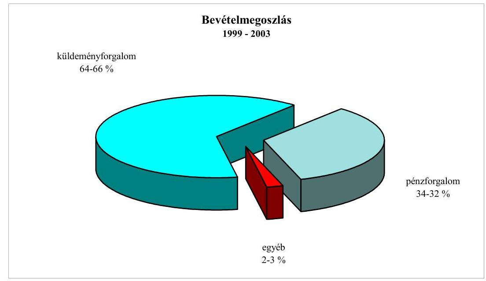

A hangsúly eltolódás és gyakori stratégia váltások azon fejlesztések elhalasztását, vagy befejezésük mai napig fennálló elhúzódását eredményezték, amelyek közvetlenül és közvetve az EU irányelve szerinti egyetemes szolgáltatás versenyképes megvalósítását szolgálták. Ilyen stratégiai elemek voltak: a csomagok házhoz kézbesítése és a gyorsasági levél küldemény kategória bevezetése, az informatikai és számítástechnikai alapstruktúra 1997-ben megkezdett beruházásainak - IPH, NAH, SAP - folytatása és továbbfejlesztése, valamint az egyetemes szolgáltatás viteléhez is kapcsolódó korszerű csomaglogisztikai kereskedelmi szolgáltatások, és a csomagszállítás nyomkövető rendszerének megvalósítása.

---

Az EU irányelvek szerinti postai szolgáltatás színvonala és minősége romlott, a minőség romlását a küldemények $\mathrm{D}^{1}+1$ napi kézbesítési arányában beállott változások jellemzik az EU normák, illetve a Hkt. előírásaihoz viszonyítva:

A küldemények D+1 napi kézbesítési aránya
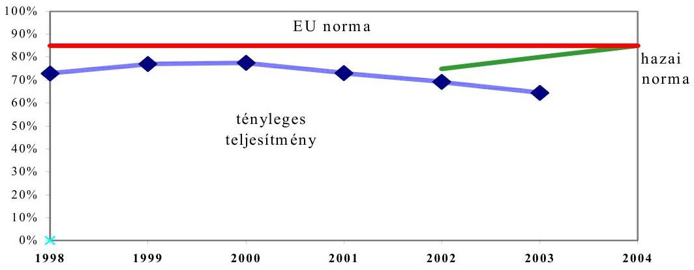

Az 1999-2003 közötti években - az MP Rt. stratégiai célkitűzéseivel ellentétben nem valósultak meg azok a fejlesztések és beruházások, amelyek feltételét képezték az EU követelmények maradéktalan teljesíthetőségének. Az eredetileg 2002-re megvalósíthatónak tartott egyetemes szolgáltatás teljesítése a folyó intézkedések alapján az MP Rt. szerint csak 2004. II. félévétől várható.

Az ÁSZ mindezekre a korábbi vizsgálatai során ${ }^{2}$ már felhívta a tulajdonosi jogok képviselőjének és a társaság vezető testületeinek a figyelmét. A liberalizált postai piacon az egyetemes szolgáltatások ellátását a kiegészítő szolgáltatások - volumenüket tekintve - csak támogathatják, de alapvetően nem biztosíthatják. A versenyképtelen szolgáltatás az egyetemes szolgáltató piaci kiszorulását eredményezi. A szolgáltatási kötelezettsége ellenére az állam nem vállalhatja fel egy gazdaságtalan, nem hatékony és eredménytelen postai szolgáltatás finanszírozását.

A tulajdonosi jogok gyakorlói a vizsgált időszakban a társaság üzleti tevékenységét, a szolgáltatások ellátását és a társaság rendelkezésére álló anyagi eszközök felhasználását megfelelőnek találták. A vezérigazgatók munkáját elismerték, miközben a premizálási feltételek meghatározásakor egyik tulajdonosi joggyakorló sem tartotta fontosnak a vezérigazgatókat a szolgáltatások ellátása, a szolgáltatások minősége javítása érdekében ösztönözni. A tulajdonosi jogok gyakorlói nem éltek a Munka Törvénykönyve módosításával bevezetett azon lehetőséggel, hogy a munkáltató vezetőjén és helyettesén kívül a kulcspozícióban lévő személyeket is vezetőnek minősítse, ezáltal szigorúbb felelősségi szabályokat alkalmazzon.

[^0]
[^0]:    ${ }^{1}$ A feladás napja
    ${ }^{2}$ Az Állami Számvevőszék 0014 számú jelentése a Magyar Posta Rt. 1997-1998. évi működésének ellenőrzéséről

---

A gyakran változó tulajdonosi irányítás nem fordított figyelmet az MP Rt. Igazgatóságának és menedzsmentjének biztosított döntési jogkörök értékhatárainak karbantartásáról. Az igazgatóság és a vezérigazgató döntési jogköre 2002-ben jelentősen - 2,9 ill. 1,7 milliárd Ft-ról 11,4, illetve 6,8 milliárd Ft-ra - növekedett. A KöViM és a PM között tulajdonosi átadás-átvételi jegyzőkönyv nem készült. Előkészítő dokumentumok hiányában az egyes tulajdonosi döntések megalapozottságát ellenőrizni nem lehetett. Az államigazgatási eljárás döntési mechanizmusa, a dinamikusan változó piaci környezet, valamint a struktúraváltás során kialakuló teljesítményorientált működési rend miatt a tulajdonos 2003-ban az Igazgatóság döntési hatáskörét 5 milliárd forintban, míg a vezérigazgatóét 1 milliárd forintban határozta meg.

Az ellenőrzött időszakban a postai tevékenységet két, egymást követő törvény szabályozta. A helyszíni ellenőrzés befejezése előtt újabb törvényt alkottak meg. A közfeladat tartalma és terjedelme lényegében az új Posta törvényben sem változott. A közfeladatot a változó jogi környezetben egyaránt - közérthetővé egyszerűsítve - a belföldi levél és csomag, a külföldi levél és csomag, a távirat, a belföldi postautalvány (ide értve a nyugellátási utalványokat is) felvételét, gyűjtését, továbbítását és kézbesítését jelentette, amelyekhez külön szolgáltatások vehetők igénybe.

A hírközlési törvény meghozatalával, a hazai jogi szabályozás része lett az EU irányelveknek megfelelő postai szolgáltatás szabályozása. A szolgáltatás felügyeletét ellenőrző hatóságnak biztosított jogkör alapján mérhetővé és ellenőrizhetővé vált az MP Rt. szolgáltatásainak színvonala és minősége.

Az MP Rt. teljesítménye a szolgáltatása terjedelmét, színvonalát és minőségét tekintve alapvetően három területen - a területi hozzáférés, a csomagok házhoz kézbesítése, és a levélküldemények átfutási ideje - maradt el a hazai és az uniós követelményektől. A területi hozzáférés és a csomagok házhoz kézbesítésének mértéke és terjedelme az 1999-2003. években kismértékben javult, de az EU irányelvek szerinti postai szolgáltatás színvonala és minősége romlott. A hatóság a területi hozzáférés és a csomagok házhoz kézbesítési követelményének teljesítése alól az MP Rt. kérésére - az uniós irányelveknek is megfelelő, törvény adta kereteken belül - 2004. május 1-jei határidővel átmeneti felmentést adott. A hatóság a felmentés megadásakor és a szankcionálástól való eltekintésekor mérlegelte az MP Rt. tényleges kapacitásait és a szolgáltatás teljesítése érdekében tervbe vett, részben már folyamatba tett intézkedéseit.

Az MP Rt. szolgáltatásának minőségét - a Hkt. hatályba léptetéséig - saját hatáskörben határozta meg és ellenőrizte. A korábbi postatörvény nem határozta meg egyértelműen a minőség fogalmát és ellenőrzését. A Hkt. szerinti szabályozás az EU normáknak megfelelően megvalósította, hogy az MP Rt. a felügyeleti hatósággal együttműködve rendszeresen, meghatározott - a hatóság által is jóváhagyott - előírások szerint vizsgálja a szolgáltatás minőségét. A felügyeleti hatóság az MP Rt.-vel közösen regisztrálta az egyetemes szolgáltatás teljesítésében fennálló hiányosságokat és a felszámolásukhoz szükséges intézkedéseket, valamint azok végrehajtásának határidejét. A rendszernek része a szankcionálás is, amely a szolgáltatás romlása esetén a pénzbeli büntetést, ezen túlmenően szigorított minőségellenőrzési előírások elrendelését eredményezheti.

---

A hatóság területi szervezetei a postai szolgáltatások megfelelőségének ellenőrzésére - az MP Rt. kötelező adatszolgáltatásának értékelésén túlmenően - célvizsgálatokat is végzett. A célvizsgálatok során feltárt egyéb - a levélbélyegző és bérmentesítő-gépek, valamint a levélszekrények megfelelőségét érintő - hiányosságok alapján a 2002-2003. években összesen 5,3 millió Ft bírságot szabott ki az MP Rt.-re. Az MP Rt. a követelmények teljesítése érdekében beruházási programot készített. A hatóság területi szervei által végzett, vagy elrendelt vizsgálatok eredményének ugyancsak területi szintű kezelési gyakorlata nem biztosította, hogy az MP Rt. központi minőségirányítási szervezete közvetlenül a hatóságtól is tájékoztatást kapjon valamennyi feltárt hiányosságról, és a szükséges intézkedéseket megtegye.

A Hkt. által megvalósított új szabályozás teljes körűségét tekintve az ágazati szakmai irányítás adós maradt - a szolgáltatók piacra lépését és a szolgáltatások teljesítésére vonatkozó adatszolgáltatás tartalmát szabályozó - kormány, illetve miniszteri szintű végrehajtási rendelkezés meghozatalával.

A törvényi szabályozás 2002. évet követően nem rendelkezett a szolgáltatások költségalapú árának hatósági ellenőrizhetőségét biztosító végrehajtási rendelet meghozataláról. A postai szolgáltatásokra vonatkozó EU és hazai előírások a postai szolgáltatások számviteli nyilvántartásai elkülönített vezetésének szabályairól, valamint a költségalapú és a minőségi teljesítménytől függő díjtételek alkalmazásáról is rendelkeztek. Az egyetemes szolgáltató részére előírt elkülönített számviteli rendszer bevezetését az MP Rt. teljesítette. A költségalapú és a minőségi teljesítménytől függő díjtételek alkalmazása azonban nem volt ellenőrizhető, mert a hatályos jogszabályok a hatósági felügyeletet nem hatalmazták fel a hatósági árképzés körén kívüli szolgáltatások díjtételeinek költségtartalom és minőség szerinti ellenőrzésre. A hiányosság pótlására a 2003. évben meghozott új postatörvény felhatalmazásai lehetőséget biztosítottak. A szabályozási hiányok a hatóság munkájának célszerű vitelét nem akadályozták. A 2004. január 1-jétől hatályos új postatörvény az egyetemes szolgáltatás ellátását és minőségi követelményeit tekintve nem teremtett új követelményeket az MP Rt. részére.

A postai szolgáltatások EU-normák szerinti nyújtása a hazai jogi szabályozás alapján 2002. évtől kezdődően fokozatosan, az uniós csatlakozás évében -2004-ben - teljes körűen kötelező. A postai szolgáltatások EU normák szerinti nyújtását az MP Rt. a belső szabályozásába - vezérigazgatói utasítások formájában - beillesztette. A külső és belső szabályozás összhangja 2003-tól valósult meg. A belső szabályozási munka egy éves elhúzódása részben a hatóságnak nyújtandó adatszolgáltatást szabályozó végrehajtási rendelet, részben az MP Rt. felkészültségének hiányából eredt. A késői szabályozás következménye, hogy a postai alaptevékenység színvonalát jellemző mérőszámok nem egységesek, így a 2002. és 2003. évi teljesítmények csak a tendenciák alakulása tekintetében hasonlíthatók össze.

Az MP Rt. 2000. évtől kezdődően rendszeresen vizsgálta és mérte felkészültségét a postai szolgáltatásokra meghatározott EU irányelvek szerint. Az uniós normatíváknak megfelelő minőség elérését és ellenőrzését szolgáló minőségirányítási rendszerét folyamatosan alakította ki. A felállított minőségirányítási rendszer felépítését, irányítását, működtetését és célkitűzéseit tekintve alkal-

---

mas a postai szolgáltatások minőségének az EU követelmények szerinti biztosítására. A rendszer eredményes és hatékony működtetéséhez 2004. évet megelőzően hiányoztak a minőség eléréséhez szükséges műszaki és technikai feltételek.

A vizsgált időszakban 2002-ig a társaság üzemi eredménye folyamatosan csökkent, a mérleg szerinti eredményt ingatlanok és befektetések értékesítésével javították. A Magyar Posta gazdálkodása 2002-ben jelentős veszteséggel zárult, ebben az évben a társaság 7,1 milliárd Ft üzleti vesztesége mellett, az adózás előtti eredménye -9,1 milliárd Ft volt. 2003-ban a társaság üzleti eredménye 3,4 milliárd Ft-ra, az adózás előtti eredménye 60 milliárd Ft-ra növekedett, ez utóbbi a postabanki részesedés értékesítésének eredménye.

Az árbevételnek kb. 70-75\%-át az ún. szabadáras termék-szolgáltatások, 25-30\%-át pedig az ún. hatósági áras termék-szolgáltatások adták (belföldi szabványlevél, levelezőlap, címzett reklámküldemény stb.). A hatósági áras termékek forgalmából a vizsgált időszakban veszteséget realizált a társaság. A veszteségek kialakulásában szerepe volt annak, hogy az engedélyezett, illetve végrehajtott áremelések mértéke rendszerint kisebb volt (2000-ben -4,2\%, 2001-ben -2,9\%, 2002-ben -0,6\%) az évenkénti infláció mértékénél.

A Magyar Posta Rt. 1999-2003. évi pénzügyi helyzetét a cash flow kimutatásai alapján évről-évre csökkenő működési, váltakozó nagyságú negatív befektetési, valamint a vizsgált időszak első 3 évében növekvő negatív értékű, majd 2002. évben pozitív finanszírozási cash flow érték jellemzi. A Posta 2003. évi működési pénzeszközeinek változása közel egyharmadára csökkent az előző évek átlagához viszonyítva, míg a befektetési tevékenységből származó pénzeszközváltozás háromszorosára nőtt az 1990-2001 évek átlagához képest.

A társaság a pénzkészletek vagyonvédelmét 2002. év elejétől tiszta profilú vállalkozás formájában működteti. A JNT Kft. értékesítésére kormányhatározat utasította a Posta Rt.-t. A JNT a magánosítás során - hasonlóan a Defendhez - kikerül a Posta felügyelete és szakmai irányítása alól. A nélkülözhetetlen pénzszállítási és pénzfeldolgozási tevékenység privatizációja az ár- és teljesítménygarancia oldaláról jelentős kockázatot hordoz.

A kézbesítők védelmét országosan táskariasztókkal biztosítják. A táskák nagy része elavult, nem nyújtanak megfelelő védelmet, gyakoriak a meghibásodások. Ezért elkezdődött a korszerűbb - pénzfestő rendszerű - táskák beszerzése és alkalmazása.

A társaság 1999. évi feladatait 44161 fővel látta el a 2003. évi statisztikai állományi létszáma 41097 fő volt. A társaság öt év alatt a statisztikai állományi létszámát 3064 fővel csökkentette. A személyi jellegű ráfordítások 54,1 milliárd Ft-ról 78,7 milliárd Ft-ra növekedett. A költségszerkezetén belül a személyi jellegű ráfordítások a vizsgált időszak alatt 61,2\%-ról 55,6\%-ra csökkentek. A végkielégítés jogcímen tervezett költségeket a társaság üzleti terve tartalmazta. A társaságnál a 2000-2002. években végrehajtott vezetőcserék és szervezeti átalakítások következtében a kifizetett végkielégítések összege jelentős mértékben megemelkedett, ennek ellenére a tervezett költségkereten belüli gazdálkodás megvalósult.

---

A Társaság 2003. júliusig csak a közszolgáltató tevékenységével közvetlenül összefüggő közbeszerzései tekintetében kellett alkalmaznia a közbeszerzési törvényt. Tekintettel arra, hogy 1999-től folyamatosan vett igénybe állami támogatást a beruházásaihoz és, a könyveiben nem különítette el a kizárólag közszolgáltatásból származó bevételeit, így nem határozható meg pontosan, hogy az igénybe vett beszerzéseik mely tevékenységek érdekében történtek.

A beruházások mindenek előtt a postai működés fenntartásának, a műszaki feltételek folyamatos biztosítása szem előtt tartásával valósultak meg, kevés figyelmet kapott a beruházási költségek és ráfordítások összefüggése a gazdaságossággal, a megtérüléssel. Milliárdos nagyságrendű informatikai beruházások indultak hatástanulmányok, gazdaságossági számítások nélkül. A megvalósításról szóló döntésekben nem az előzetes gazdaságossági számítás volt a mértékadó, hanem a beruházások célja volt a döntő indok, függetlenül annak eredményétől. A Beruházási Szabályzatokban előírt utóellenőrzések a vizsgált időszak egyetlen befejezett beruházásánál sem történtek meg.

A Magyar Posta Rt. külön-külön szakellenőrzési apparátust működtet a vezérigazgatóságon, a középfokú és a végrehajtó szinten egyaránt. A függetlenített belső ellenőrzés függelmi viszonya közvetlenül SZMSZ-ben szabályozott, ahol konkrét feladatai, hatásköre és felelőssége is meg van határozva. 2003. január 1-jétől a Belső Ellenőrzési Igazgatóságot munkajogilag is a vezérigazgató irányítja. Az új szemléletű vállaltirányítási program részeként 2003. július 1-jétől a középfokú postaszerveknél a belső ellenőrzési apparátus megszűnt és az ellenőrzési tevékenység integrálódott a vezérigazgatóság független belső ellenőrzési szervezetébe. Ezzel a belső ellenőrzés egyszintűvé vált és megvalósult valódi függetlensége.

Az Állami Számvevőszék a "Magyar Posta Rt. 1997-1998. évi működésének ellenőrzéséről" szóló jelentésében a feltárt hibák és hiányosságok megszüntetése érdekében ajánlásokat és javaslatokat fogalmazott meg a Kormány, a közlekedési, hírközlési és vízügyi miniszter és a Magyar Posta Rt. számára. Az ÁSZ korábbi javaslatai melyet a Kormánynak és a felügyeletet ellátó Miniszternek tett a vizsgált időszak lezárásáig fele részben valósultak meg. A Magyar Posta Rt. az ÁSZ ajánlások nyomán társasági szintű intézkedési tervet készített. Az intézkedések végrehajtásáért az érintett területek vezetői voltak a felelősek. Az Ellenőrzési Igazgatóság az előírtaknak megfelelően az éves beszámolójában külön kitért az ÁSZ ellenőrzési megállapításaival kapcsolatosan kiadott intézkedési terv megvalósulására.

A részletes megállapítások hasznosításán túl - a Magyar Posta Rt. működésének és gazdálkodásának átláthatósága, a beszerzések ellenőrizhetősége, a szolgáltatás minőségének javítása érdekében - javasoljuk az ÁPV Rt. Igazgatóságának, hogy a Magyar Posta Rt. Igazgatóságának útján:

- biztosítsa a Beruházási Szabályzat és az SZMSZ teljes összehangoltságát, súlypontként kezelve az egyes beruházásokra előírt utólagos ellenőrzéseknek a beruházásban nem érintett független szervezettel történő végrehajthatóságát, a hozam prognózisok és a kapcsolódó módosítások személyes felelősséghez kötését, az üzembe helyezések olyan egységes rendjét, amely az informatikai beruházások speciális folyamataihoz is megfelelő;

---

- gondoskodjon arról, hogy a Magyar Posta Rt.-nél alkalmazott közbeszerzési eljárásrend feleljen meg a 2003. évi CXXIX. törvény rendelkezéseinek;
- vizsgáltassa meg, hogy a társaság részesedései, befektetései közül melyek azok, amelyek alaptevékenysége ellátását elősegítik, vegye számba az alaptevékenységét nem szolgáló befektetések gazdaságos értékesítését;
- vizsgáltassa felül a szolgáltatás minőségi mutatói körét, változtatásának lehetőségét. Tekintse át az Ügyfélszolgálati Iroda és a minőséggel foglalkozó szervezetek közötti kapcsolatot és tegyen javaslatot a kapcsolattartás szabályainak módosítására az ügyfelek elvárásait figyelembe véve.

A helyszíni ellenőrzés megállapításainak hasznosítása mellett javasoljuk:

# a Kormánynak

vizsgálja meg a Magyar Posta Rt. által kialakított EKR rendszer hasznosításának lehetséges megoldásait.

## a pénzügyminiszternek

ellenőrizze az ÁPV Rt. Igazgatósága részére megfogalmazott ajánlások teljesülését.

## az informatikai és hírközlési miniszternek

1. kezdeményezze az egyetemes szolgáltatási körben a Magyar Posta árképzési mechanizmusának felülvizsgálatát;
2. követelje meg minden esetben a fejezeti kezelésű, fejlesztési típusú postai támogatások felhasználásának tervét, maradéktalanul végezze el a támogatás felhasználásával kapcsolatos utóellenőrzést.

---

# II. RÉSZLETES MEGÁLLAPÍTÁSOK

## 1. Az Magyar Posta Rt. működésének tulajdonosi, szakmai IRÁNYÍTÁSA, ELLENŐRZÉSE

### 1.1. A tulajdonosi jogok gyakorlása

Az 1992. évi postatörvény és az 1995. évi privatizációs törvény értelmében a 100\%-os állami tulajdonban lévő MP Rt. szakmai irányítása, az állam tulajdonosi jogainak gyakorlása, és a hatóság felügyelete egyazon, a közlekedési, hírközlési és vízügyi miniszter feladatkörébe tartozott. Az Európai Parlament és Tanács 97/67/EK irányelve, amely a közösségen belüli postai szolgáltatások vitelét szabályozta, egymástól elkülönített tulajdonosi, szakmai irányítási és hatósági ellenőrzési struktúrát kívánt.

Az irányítási és tulajdonosi hatáskörök szétválasztásáról az egyes miniszterek feladat- és hatáskörének változásával összefüggésben szükséges törvénymódosításokról szóló 2000. évi LXXXIX. törvény rendelkezett. A KHVM egyidejű átalakításával az MP Rt. tulajdonosi jogait a KöViM vezetője gyakorolta, a szakmai irányításáért a Miniszterelnöki Hivatalt vezető miniszter felelt. A későbbiekben a felelős szervezetek és a szervezeteket irányító vezetők többször változtak, a változások azonban nem érintették a döntési jogkörök szétválasztását. A 2002. évben a tulajdonosi struktúra annyiban változott, hogy a Privatizációs tv. módosításával jogszabályi lehetőség nyílt a tulajdonosi struktúra megváltoztatására, a társaság részleges magánosításával, 50\%+1 szavazat tartós állami tulajdoni részarány fenntartása mellett.
 A szakmai és tulajdonosi irányításban bekövetkezett változásokat időrendben a 2. számú melléklet mutatja be.

Az új struktúra felállítása a hatósági felügyelet szervezeti felépítésének megváltoztatása mellett a hatóság feladatait - a postai szolgáltatások végzésének engedélyezése, ellátásának és minőségének ellenőrzése - alapvetően nem érintette. A 2002. évtől hatályos Hkt. megerősítette, hogy a hatósági felügyeletet a Hírközlési Felügyelet látja el, amely a Kormány irányítása és a miniszter felügyelete alatt működő, törvényben vagy kormányrendeletben hatáskörébe utalt feladatokat végző, a piaci szereplőktől független, országos illetékességű, jogi személyiséggel rendelkező központi közigazgatási szerv. A hatósági felügyelet tevékenységének célja a hírközlési piac zavartalan, eredményes működésének, a hírközlési tevékenységet végzők és a felhasználók érdekei védelmének, továbbá a tisztességes és szabályozott piaci verseny fenntartásának elősegítése.

Az állami irányítási, tulajdonosi és hatósági ellenőrzési struktúrán a 2004. január 1-jétől hatályos új Postatörvény nem változtatott. Az új törvényi szabályozás a már kialakított rendszert annyiban érintette, hogy a korábban elmulasztott végrehajtási jogszabályok meghozatalára - mint a piacra lépés, vagy a költségalapú árképzés hatósági ellenőrizhetősége - az újra lehetőség nyílt.

# 1.2. A döntési jogkörök szétválasztásának hatása 

A döntési jogkörök szétválasztásával és a hírközlési törvény életbe léptetésével a szakmai és a tulajdonosi irányítás feladatai alapvetően nem változtak. Az ágazati irányítás meghatározó feladata a nemzeti hírközlés-politika kidolgozása, a szolgáltatások ellátásához szükséges feltételek biztosítása, a postai szolgáltatások színvonalának javítása és a fejlesztését szolgáló programok kidolgozása, valamint a törvényben nem rendezett feladat és hatásköri szabályok megállapítása volt. A mindenkori tulajdonos feladata a postai szolgáltatások megfelelő színvonalú fenntartása és fejlesztése, a társaság nyereséges gazdálkodásának és vagyon növekedésének a biztosítása, és az ehhez szükséges stratégiai célok és eszközök meghatározása. Tekintettel arra, hogy az MP Rt. 100\%-os állami tulajdonú társaság a szakmai és a tulajdonosi irányítás tevékenysége teljesítményük megítélése szempontjából nem különíthető el egymástól.

Az ágazati-szakmai irányítás az EU csatlakozásból adódó jogharmonizációs követelményekre fordított figyelmet, amelynek eredményeképpen beiktatásra került a hírközlésről szóló 2001. évi XL. törvény, és a törvényi felhatalmazás alapján előírt végrehajtási rendeletek.

Az ágazati szakmai irányítás nem dolgozott ki külön programokat a postai szolgáltatások színvonalának javítása és a fejlesztése céljából. Az 1998. évi hírközléspolitikáról ${ }^{3}$ szóló kormányhatározat Cselekvési Programja a postai tevékenységek ellátására és ezen belül az MP Rt. szerepére 2002. évig határozott meg irányelveket és feladatokat. A későbbiek során a szakmai irányítás a Cselekvési Programot nem aktualizálta.

Az ágazati szakmai irányítás a hírközléspolitikában az egyetemes szolgáltatás megvalósításához szükségesnek tartott támogatásokat nem biztosította. A hírközléspolitikáról szóló kormányhatározat az EU irányelv szerinti egyetemes szolgáltatás megvalósítása érdekében 1999-2002 között évi 1 milliárd Ft költségvetési támogatást tervezett a "Posta szállítóeszköz parkjának, feldolgozó kapacitásának és kézbesítő rendszerének fejlesztésére". A Magyar Posta a 4 milliárd Ft költségvetési előirányzattal szemben, 1999-2002-ben összesen csak 431,3 millió Ft támogatást kapott.

Az egyetemes szolgáltatások szükség szerinti finanszírozását támogató Kompenzációs Alap felállítására nem került sor. Az EU irányelv megengedte egy Kompenzációs Alap létrehozását az egyetemes szolgáltatás nyújtásából adódó pénzügyi teher mérséklésére, de a Hkt. szabályozása az alap forrásait tekintve nem felelt meg az EU irányelvének. Az új törvényi szabályozás már nem rendelkezett ilyen alap létrehozásáról.

[^0]
[^0]:    ${ }^{3}$ 1071/1998(V. 22.) Korm. határozat a hírközléspolitikáról

A döntési jogköröket szétválasztó rendszer bevezetését követően a tulajdonos nem hagyott jóvá a szakmai irányítással is egyeztetett fejlesztési stratégiát.

A szakmai és a tulajdonosi irányítás szétválasztását megelőző 1998-1999. években az EU csatlakozás előkészítése keretében a KHVM a jogharmonizációs munkán túlmenően figyelmet fordított az MP Rt. szolgáltatás színvonalának megfelelőségét szolgáló stratégiai irányok, célok és teendők megfogalmazására, a postai szolgáltatások uniós követelményeinek teljesítése érdekében. Ennek eredményeként - a hírközléspolitikáról szóló az 1998-ban meghozott kormányhatározat keretében - a postai szolgáltatások fejlesztése érdekében az MP Rt. által 2005. évig végrehajtandó feladatokat, azok forrás igényét, a költségvetési és a társasági saját finanszírozás mértékét is azonosította.

A stratégiát és Cselekvési Programot adó kormányhatározattal összhangban az MP Rt. a 2000-2005. évekre szóló stratégiáját 1999. év szeptemberében szakmai és tulajdonosi szempontból a Miniszteri Kollégium megvitatta és észrevételezte. A stratégiának az észrevételek szerinti kiegészítése és végrehajtása nem történt meg. A stratégia benyújtását követően változás állt be az MP Rt.-t irányító vezérigazgató személyében és a tulajdonosi irányításban is. (Ld. 3. számú melléklet) Ezt követően az MP Rt. új vezérigazgatója, majd az őt követő másik két vezérigazgató is új stratégiát készített, amely stratégiákat azonban a tulajdonos nem véglegesítette és így kötelező végrehajtásuk sem lépett érvénybe.
2002. novemberben új stratégiai terv készült "A Magyar Posta Részvénytársaság stratégiája" címmel 2003-2007 időtávra szólóan. A tulajdonosi jogok gyakorlására 2002. évben felhatalmazott ÁPV Rt. az új postatörvény hatálybalépéséig elhalasztotta az MP Rt. vezetése által kidolgozott stratégia véglegesítését. Az ÁPV Rt. mint tulajdonos 2003. szeptember 30-ai ügyvezetőségi ülésén határozatban döntött arról, hogy a stratégiai tervezést társaságainál módszertani útmutató bevezetésével egységesíti. Ennek alapján az MP Rt. stratégiai terve elfogadásának kijelölt határideje 2004. február 29. volt, a társaság vezetésével történt egyeztetés alapján az ÁPV Rt az aktualizált stratégiát 2004. I. félév végéig tárgyalja meg.

Az MP Rt. a kormányhatározatok alapján az alaptevékenységétől idegen kormányzati programokat hajtott végre a 2000-től 2002. májusig terjedő időszakban. Ezek a fejlesztési célok a posta stratégiai elképzeléseiben is szerepeltek, de a gazdaságossági számítások hiányában az állami tulajdonosi irányítás, mint elfogadott stratégiai célt, nem véglegesítette. Így került sor a kormányzati Elektronikus Közbeszerzési Rendszer kiépítésére, a TETRA Rt. megalapítására, és a Postabank részvények megvételére. A fejlesztések az MP Rt. gazdálkodását és vagyongyarapítását nem szolgálták, miközben a társasági saját pénzügyi forrásokat elvonták az alaptevékenység fejlesztésétől, és veszteséget okoztak.

Az EKR elektronikus közbeszerzési rendszer kialakításáról a Kormány intézkedett. A rendszer koncepcionális elemeit, megvalósítási ütemezését, a részfeladatok felelőseit, az MP Rt. közreműködését kormányhatározatok rögzítették. Az ágazati szakmai irányítási és a tulajdonosi feladatokat érintő 2068/2002. (III. 21.) Korm. határozat azonnali határidővel felhatalmazta a Miniszterelnöki

Hivatalt vezető minisztert, hogy az EKR kialakítására és működtetésére vonatkozó együttműködési szerződést, a társasággal kösse meg. A kormányhatározat azt is kimondta, hogy a közlekedési és vízügyi miniszter ennek megfelelő tevékenységi körrel egészítse ki a társaság alapító okiratát. Az MP Rt. a rendszer kialakítását - az együttműködési szerződés megkötésének bevárása nélkül - saját hatáskörben 2,26 milliárd Ft tervezett beruházási értékkel megkezdte. A MeH a kormányhatározatban rögzített felhatalmazás ellenére nem kötötte meg a szerződést, mivel a kormányzati és a postai igények eltérnek egymástól. Tekintettel arra, hogy az EKR üzemeltetési együttműködési szerződés nem jött létre, az MP Rt. 2002. szeptember 1-jétől a rendszerrel kapcsolatos fejlesztési tevékenységét a kárenyhítés érdekében felfüggesztette. Ezt követően a rendszer kormányzati használatába vétele körüli bizonytalanság miatt az 1,7 milliárd Ft megvalósított beruházási érték mellett, a fejlesztések további finanszírozásának leállításáról döntött.

Az EKR-hez kapcsolódóan, az MP Rt. ugyancsak elindította a PEP elektronikus piactér kialakítását is 1,95 milliárd Ft beruházási értékel, amely saját stratégiai célját képezte, mint új, diverzifikált szolgáltatási tevékenység megvalósítása. A projektekre a tulajdonos és az Igazgatóság által elfogadott gazdaságossági-megtérülési számítások nem készültek, megvalósításuk megkezdését a vezérigazgató saját hatáskörben rendelte el. Az EKR rendszer felfüggesztésével összefüggésben az új vezetés a PEP projektet is leállította 1,2 milliárd Ft megvalósított értékkel.

A TETRA Rt. megalapítása az Európai Unió és a NATO igényeivel is kompatibilis integrált távközlő rendszer kiépítésének célját szolgálta. A 2001. évi kormányhatározatokban írták elő az MP Rt. közreműködését a rendszer megvalósításában. A kormányhatározatnak megfelelően a közlekedési és vízügyi miniszter 19/2001. (VII. 30.) tulajdonosi határozata alapján az MP Rt. az MFB Rt.-vel közösen megalapította a TETRA Távközlési Szolgáltató Részvénytársaságot. A társaság a kormányhatározatban is rögzített feladatoknak megfelelően a rendszer megvalósítására 2001 novemberében kétfordulós pályázatot írt ki. A második fordulót követően 2002. januárban a versenyben maradt két mobiltelefon szolgáltató társasággal folytattak tárgyalásokat a rendszer szállításáról. A tárgyalások nem fejeződtek be, mert 2002. január 23-án a TETRA Rt. Igazgatósága - nemzetbiztonsági okokra hivatkozva - eredménytelennek nyilvánította a pályázatokat. A pályázati kiírás során a hírközlésről szóló - 2001. VI. 26.-án kihirdetett - törvény 13. § előírásainak figyelmen kívül hagyása, az adatfeldolgozáshoz szükséges számítástechnikai eszközöknek a hálózat kiépítését megelőző beszerzése, a kiemelt jövedelemmel alkalmazott szakértők, a bérelt infrastruktúra, a beszerzett eszközök leértékelt áron történő értékesítése és a szükséges stratégiai döntés elmaradása miatt a társaság tevékenysége az MP Rt.-nek 0,9 milliárd Ft veszteséget okozott. Az integrált távközlési hálózat kiépítésének elhalasztása miatt a TETRA Rt. költséges fenntartása végelszámolással megszűnt.

A kormányhatározatokban előírt projektek megvalósításában a szakmai és a tulajdonosi irányítás nem volt összhangban. A tulajdonosi jogok gyakorlója - 2001-ben a közlekedési és vízügyi miniszter - a kormányzati célú programok - EKR és TETRA projektek - megvalósítása előtt nem járt el körültekintően.

A miniszter, az MP Rt. stratégiájának véleményezésekor, amely stratégiai célkitűzésként tartalmazta ezeket a programokat, 2001. március 29-ei és április 28-ai leveleiben a célokkal egyetértett és azok konkrét gazdasági számításokkal való kiegészítését kérte. Ennek ellenére hatástanulmány nem készült, a beruházások MP Rt. részéről történő egyoldalú beindítását nem ellenezte. A szakmai irányításért felelős MeH az együttműködési szerződést MP Rt.-vel nem kötötte meg és a kormányzati célú egységes digitális rádió-távközlési rendszer szakmai követelményeinek újbóli felülvizsgálatára került sor.

A Postabank Rt. tulajdonlása megfelelt az MP Rt. azon stratégiai célkitűzésének, hogy jogot vagy lehetőséget szerezzen banki tevékenység végzésére. Tekintettel arra, hogy a pénzügyi tevékenység szabályozása - az EU hitelintézeti irányelveit is figyelembe véve - az MP Rt. saját jogon történő pénzforgalmi számlavezetését kizárta, az MP Rt. vezérigazgatója szerint megoldást saját bank alapítása vagy banki részesedés megszerzése nyújtott.

A Postabank 2000. évi konszolidációjának szükségessége kapcsán a Kormány, a 2051/2000. (III. 22.) Korm. határozatával a Postabank és az MP Rt. közötti stratégiai szövetség kialakítására hivatkozva engedélyezte az MP Rt.-nek 15\%-os tulajdoni részesedés megszerzését a Postabankban. A továbbiakban a 2187/2001. (VII. 20.) Korm. határozat már az állami tulajdonban lévő Postabank részvények apportálásával 33\%-os tulajdoni részesedés megszerzését engedélyezte MP Rt.-nek és egyidejűleg felszólította MP Rt.-t a Postabank többi részvényének nyilvános ajánlattétel útján való megvásárlására. Az MP Rt. 2002. évben már 96,8\%-os postabanki részesedéssel bírt. Az MP Rt.-nek a 2094/2003. (V. 20.) Korm. határozat alapján a postabanki teljes részvénycsomagját értékesítenie kellett.

A Postabank Rt. tulajdonlásának mintegy 1 éves időszaka - amikor az MP Rt. a részvények birtokában a Postabank irányítása feletti joggal rendelkezett - nem volt elegendő a postai stratégiai célok érdemi megvalósításának elkezdésére sem. Az MP Rt. tulajdonszerzése valójában csak a Kormány postabanki konszolidációs és privatizációs kötelezettségeit és célkitűzéseit támogatta, amint azt a Postabank és Takarékpénztár Rt. konszolidációjával, stratégiájával, és privatizációjával kapcsolatos további feladatokról szóló 2051/2000. (III. 22.) Korm. határozat a címében is kifejezte.

A hatósági ellenőrzési tevékenységét tekintve a Hkt. által megvalósított szabályozás az új struktúrában eredményt hozott annak ellenére, hogy a szakmai irányítás néhány jogszabály meghozatalával adós maradt. A hatóság önálló ellenőrzési és jóváhagyási jogkörének következtében a korábbi szabályozáshoz mérten, a szolgáltatásban fennálló hiányosságok pontosan és egyértelműen ismertekké váltak a szakmai és a tulajdonosi irányítás előtt és az MP Rt. ellenőrizhető formában meghatározta a kijavításukhoz szükséges teendőket. Az egyetemes szolgáltatás színvonalának ellenőrzése során, a hatóság döntően az MP Rt. felkészültségének hiányosságára vonatkozóan tett megállapításokat.

A felügyeleti hatóság a szankcionálási lehetőségeivel csak korlátozottan élt. A 2002. évtől bevezetett szabályozás szerinti követelmények teljesítését tekintve elsősorban nem a hiányosságok fennállását, hanem azok felszámolására meg-

---

kezdett illetve tervbe vett intézkedéseket mérlegelte. Az MP Rt. felkészültsége 1998-2003 között alig fejlődött. A minőséget fejlesztő beruházások elmaradtak vagy még nem fejeződtek be. A hatósági ellenőrzés Hkt. szerinti - a korábbinál szigorúbb - szabályozásának bevezetése még nem biztosíthatta a postai szolgáltatások minőségének javulását, de biztosította a fennálló színvonal ellenőrizhető mérését és a hiányosságok megszüntetéséhez szükséges feladatok azonosítását, végrehajtási határidejük rögzítését.

# 1.3. A társaság stratégiái, a stratégia váltások oka, a változó koncepciók konzekvenciái 

A stratégiai irányokat a hírközléspolitikáról szóló 1998. évi kormányhatározat fogalmazta meg 2005. évig terjedően. A kormányhatározat a hírközléspolitikai programon belül a postai szolgáltatások fejlesztésével összefüggésben az MP Rt. feladatait és lehetséges forrásait is felsorolta. Ezek konkrétan az EU normák szerinti postai egyetemes szolgáltatás bevezetését nevesítették, általánosságban az EU liberalizált postai piacán szükséges versenyképesség biztosítását írták elő. Az uniós csatlakozással szükségessé váló fejlesztési programok a hírközlési ágazat egészére vonatkoztatva lettek kijelölve. Ebből eredően az MP Rt. konkrét szerepét az ágazat egészének fejlesztésében az ágazat szakmai irányításával egyetértésben a társaság tulajdonosa által elfogadott stratégia keretében kellett rögzíteni.

Az MP Rt.-nél az 1999-2003. években négy alkalommal váltottak vezérigazgatót és ehhez kapcsolódóan négy egymástól különböző középtávú fejlesztési stratégia készült. Az Igazgatóság és az FB a stratégiai dokumentumokat a tulajdonosi jogok mindenkori gyakorlójának elfogadásra javasolta, jóváhagyásuk, illetve véglegesítésük azonban nem történt meg. Az MP Rt.-nek nem volt a tulajdonosi irányítás által elfogadott stratégiai terve. A legutóbbi, 2002-ben összeállított anyag elfogadása - a legújabb tulajdonosi joggyakorló, az ÁPV Rt. által megadott szempontok átvezetését követően - 2004. I. félévében várható. A stratégiai irányelvek és koncepciók változtatásainak - a kormányhatározatokban elrendelt programokat kivéve - nem voltak kifejezett gazdaságpolitikai követelményekből levezethető indokai, tartalmuk a mindenkori vezérigazgatók és a mindenkori tulajdonosi jogokat gyakorló miniszterek elképzeléseit képviselték.(Ld. 4. számú melléklet)

A stratégiák - kivéve a legutóbbi, a 2002-ben elkészített - a rendelkezésre álló fejlesztési források felhasználását tekintve nem a postai alaptevékenység fejlesztésére helyezték a hangsúlyt az MP Rt. versenyképességének biztosítása érdekében. Ennek következtében az EU irányelvek szerinti postai szolgáltatás színvonala és minősége romlott, miközben 4,8 milliárd Ft-t irányoztak elő nem a hagyományos postai tevékenységet szolgáló programokra, amelyek végrehajtása veszteséget okozott. Jellemző volt, hogy az így megvalósított programokhoz a tulajdonos és az Igazgatóság által előzetesen elfogadott megvalósítási tanulmányok és gazdaságossági számítások sem a stratégiai sem az éves tervezés során nem készültek. Az ÁSZ mindezekre már 2000-ben felhívta a tulajdonosi jogok képviselőjének és a társaság vezető testületeinek a

---

figyelmét ${ }^{4}$. A liberalizált postai piacon az egyetemes szolgáltatások ellátását a kiegészítő szolgáltatások - volumenüket tekintve - csak támogathatják, de alapvetően nem biztosíthatják. A versenyképtelen szolgáltatás az egyetemes szolgáltató piaci kiszorulását eredményezi.

Valamennyi stratégia megfogalmazta az EU irányelve szerinti egyetemes szolgáltatás érdekében is, a csomagok házhoz-kézbesítése, a gyorsasági levél küldemény kategória, a korszerű csomaglogisztikai szolgáltatások, a csomagszállítási nyomkövető rendszer bevezetésének szükségességét, és az informatikai, számítástechnikai alapstruktúra 1997-ben megkezdett beruházásainak IPH, NAH, SAP - megvalósítását. A stratégia váltások egyik leghátrányosabb következménye volt e fejlesztések elhalasztása, illetve a megvalósítás elhúzódása. Az eredetileg 2002-re megvalósíthatónak tartott egyetemes szolgáltatás teljesítése 2004. május 1-jétől várható.

Az MP Rt. 2000-2005. évekre szóló, 1999-ben összeállított középtávú stratégiája a hírközléspolitikáról szóló kormányhatározatra épült. A stratégia szerint az MP Rt. négy év alatt összesen 50 milliárd Ft értékű fejlesztési program megvalósítását tervezte. Az uniós csatlakozással közvetlenül nem összefüggő a társaság piaci versenyképességének növelését szolgáló - fejlesztések nem voltak konkrétak, csak a fejlesztés területeit jelezték, számszerűsítésük igen tág határok között mozgott. A nem postai tevékenységre vonatkozó fejlesztési célok közül a postai banki és takarékpénztári tevékenység újbóli bevezetésének az igénye és szükségessége fogalmazódott meg a legmarkánsabban. A program az európai uniós csatlakozással összefüggő infrastrukturális beruházásokról részletesebb tájékoztatást adott és a beruházások értékét összesen 16 milliárd Ft-ban prognosztizálta. Megvalósításukat az MP Rt. 85-90\%-ban saját forrásból, a fennmaradó részt hitelből, valamint az Európai Uniótól és a központi költségvetéstől megszerezhető forrásokból kívánta fedezni. A beruházások megvalósítási határidejét a 2001. év végével jelölte meg.

Az ÁSZ a 2000. évben lezárt ellenőrzési jelentésében kifogásolta ${ }^{5}$, hogy hiányzik a megfogalmazott célkitűzések és fejlesztések megvalósításához szükséges konkrét feladat-meghatározás és ütemezés, továbbá a programok nem pontosítják mi szükséges az EU felkészüléshez, illetve általában a postai versenyképességhez. Az ÁSZ jelentése javasolta az EU irányelvek teljesítéséhez szükséges beruházási programok végrehajtási ütemtervének elkészítését a tervezett határidőn belüli megvalósításuk biztosítása céljából. A 2001. év végi befejezéssel meghatározott és az egyetemes szolgáltatás bevezetését közvetlenül szolgáló beruházások egyike sem valósult meg. A stratégiát 1999. év szeptemberében szakmai és tulajdonosi szempontból a KHVM miniszteri Kollégiuma megvitatta és észrevételezte. A stratégia észrevételek szerinti kiegészítése és végrehajtása nem valósult meg. A stratégia benyújtását követően változás állt be az MP Rt.-t irányító vezérigazgató személyében és a

---

szakmai és a tulajdonosi irányítás 2000. évi elválasztásakor a tulajdonosi irányításban is személyi változás történt.
"Stratégia 2000 Az MP Rt. középtávú stratégiája (2001 - 2007)" címmel a 2000. novemberben hivatalba lépett új vezérigazgató új stratégiát állított össze. Az anyag alapvetően új piaci tevékenységek megvalósításának fejlesztési irányait fogalmazta meg konkrét beruházási és befektetési célok megnevezése nélkül. Főbb eleme a pénzügyi és banki jellegű szolgáltatások nyújtása mellett az elektronikus kereskedelem és hírközlési szolgáltatások bevezetése volt egy 2007-ig kialakítandó vállalatcsoport létrehozásával. A stratégia finanszírozási koncepciója a korábbihoz képest merőben megváltozott. A megvalósításához szükséges források mértékének megjelölése nélkül kimondta, hogy a célok megvalósításához szükséges fejlesztések, beruházások, befektetések finanszírozási igénye már túlnőtt a korábban felhalmozott és az év során megtermelt belső finanszírozási teljesítőképességen. A stratégia tulajdonosi jóváhagyást nem kapott.
"A Magyar Posta Rt. stratégiája 2001-2005" címet viselte a 2001 februárjában elkészíttet stratégia. Az elődeihez képest konkrétan is megfogalmazott fejlesztési elképzelések és irányok forrás igénye - és ezen belül az állami szerepvállalás minden korább megjelölt mértéket meghaladott. A teljes program megvalósításához 81,0 milliárd Ft összeg szerepelt, megközelítőleg 50,0 milliárd Ft költségvetési forrású tőkeemelést, illetve állami garanciával fedezett hitelfelvételt feltételezve. A stratégia az egyetemes szolgáltatások minőségi vitelét is szolgáló OLK, OLH, raktárbázis és járműpark fejlesztési projektek mellett a postahelyi hálózat racionalizálását, az elektronikus kereskedelem, a pénzügyi-banki szolgáltatások, a biztosítási tevékenység megvalósítását, a távközlési szolgáltatások és az önálló hírlapterjesztés újbóli bevezetését irányozta elő, továbbá utazásszervezési tevékenységet is indított. A megvalósítás módja részben beruházás részben gazdasági társaságalapítás vagy meghatározó mértékű tulajdoni részesedés szerzés volt.

Az egyes stratégiai célok megvalósítását Kormány határozat is támogatta. A stratégia alapján megkezdett főbb beruházások az EKR és a PEP rendszerek voltak. Alapítással illetve vásárlással megszerzett tulajdoni részesedésekkel a TETRA Rt., az EURÓHIVÓ Rt., az MPB Rt., és az MPEB Rt. biztosító társaságok, valamint a Postabank Rt. kerültek az MP Rt. portfoliójába. Ugyanakkor a korábbi távközlési, és biztosító társasági részesedéseket haszonnal értékesítették. A stratégiai célokkal a tulajdonosi jogokat gyakorló közlekedési és vízügyi miniszter egyetértett és gazdaságossági számításokkal való kiegészítésüket kérte 2001. április 28 -ai, és március 29 -ei levelében. Megvalósíthatósági tanulmányok és gazdasági számítások a beruházások és a tulajdon részesedések megszerzése előtt és utána sem készültek. A stratégia szerint megvalósított célkitűzések az MP Rt. alaptevékenységének ellátását nem segítették, egy részük veszteséges volt. A diverzifikációs elképzelések nem hoztak eredményt, nem fordították meg a társaság eredményességének folyamatosan csökkenő tendenciáját, melynek során a. 2002. év már veszteséggel zárult.
"A Magyar Posta Részvénytársaság stratégiája" címmel 2003-2007 időtávra szólóan 2002. novemberben új terv készült. A 2002. II. félévétől hivatalba lépett új vezérigazgató, tekintettel a társaság veszteséges gazdálkodására, a korábbi stratégiát felülvizsgálta. A megalapozatlan és eredménytelen beruházásokat és tevékenységeket leállította, a veszteséget termelő gazdasági társaságokat végelszámoltatta. Az új stratégia alapvetően különbözik a korábbiaktól.

A társaság a jövedelemtermelő- és versenyképesség javítása érdekében a postai alaptevékenység fejlesztésére helyezi a hangsúlyt és nem az árbevétel teljes vo-

---

lumenében is alacsony részarányt képviselő kiegészítő tevékenységekre. A stratégia a pénzforgalmi bevételek növelését lehetővé tévő banki szolgáltatások bevezetését csak a 2001. és 2002. évi gyenge ill. veszteséges gazdálkodás stabilizálását követően irányozta elő. A hírlapterjesztés és a kereskedelmi áruk forgalmazása tekintetében csak azon tevékenységekre koncentrál, amelyek a stratégiai időtávon belül hozzájárulhatnak a jövedelmezőség fokozásához. Ugyanakkor folytatja társaság alaprendszereit képező - IPH, NAH, SAP, OLK, OLH - infrastrukturális és logisztikai fejlesztéseket. A stratégia a szolgáltató hálózat (postahelyek) racionalizálása tekintetében nem csak átvette a megelőző stratégiai koncepciót, de megkezdte annak konkrét megvalósítását is. Az új stratégia abban is különbözik a korábbiaktól, hogy az elérendő stratégiai célokat első alkalommal mutatja be számszerűsítve számvitelileg és közgazdaságilag elfogadott mutatók alapján éves bontásban.
A stratégiát az MP Rt. Igazgatósága és az FB-je is megtárgyalta. A tulajdonosi jogok gyakorlására 2002. évben felhatalmazott ÁPV Rt. az új postatörvény hatálybalépéséig elhalasztotta az MP Rt. vezetése által kidolgozott stratégia véglegesítését.

# 1.4. A tulajdonosi jogok gyakorlója döntéseinek törvényessége, célszerűsége 

A Magyar Posta Rt. tulajdonosi jogait 1999-2003 között - a hatályos jogszabályok alapján - 4 szervezet vezetője gyakorolta (Ld. 3. számú melléklet)

A Magyar Köztársaság minisztériumainak felsorolásáról rendelkező 2002. évi XI. törvény - hatályos 2002. május 27 -étől - a korábbi Közlekedési és Vízügyi Minisztériumot megszüntette. A törvény a postával összefüggő szakmai feladatok ellátásáról rendelkezett, az általános jogutódlásról, a tulajdonosi jogok gyakorlásáról nem. Így a 2002. évi XXIII.
 törvény hatálybalépéséig, 2002. július 27-éig - ez az időpont az ún. Privatizációs törvény mellékletének módosítása, az ÁPV Rt. kijelölése - a Posta feletti tulajdonosi jogokat a pénzügyminiszter látta el a Polgári Törvénykönyvről szóló 1959. évi IV. törvény 28. § (1) bekezdése alapján. A KöViM és a PM között átadás-átvételi jegyzőkönyv nem készült. Annak ellenére, hogy a törvényi rendelkezések az ÁPV Rt.-t, a tulajdonosi jogok gyakorlójaként 2002. július 27-étől kijelölték, a PM és az ÁPV Rt. közötti, a tulajdonosi jogok gyakorlásával kapcsolatos megállapodás aláírására csak 2002. szeptember 30-án, a tényleges átadás-átvételre 2002. október 9-én került sor. Emiatt a Magyar Postának 2002. november 18-áig nem volt 2001-re elfogadott konszolidált mérlege, 2002-es üzleti terve. A PM tulajdonosi joggyakorlása sem a Posta részvénykönyvében, sem alapító okiratában nincs nevesítve.
A PM 2002. július 27-e után a privatizációs törvénytől eltérően gyakorolta a tulajdonosi jogokat, ugyanakkor az ÁPV Rt.-nek történő átadásig (2002. szeptember 30-áig) dokumentált tulajdonosi döntést nem hozott.

A tulajdonosi jogokat gyakorló miniszterek a társaság tevékenységét, az Igazgatóság, a Felügyelő Bizottság folyamatos tevékenységén, a könyvvizsgáló jelentésén keresztül kísérte figyelemmel. A Felügyelő Bizottság és a könyvvizsgáló minden évben jelentést készített a Társaság éves beszámolójáról.

A tulajdonosi jogok gyakorlói a vizsgált időszakban a gazdasági társaságokról szóló 1997. évi CXLIV. törvény rendelkezései alapján hoztak részvényesi határozatokat. A Posta működésével összefüggésben több Kormányhatározat is szü-

---

letett, amelyek közvetítése - a társaság részére - a tulajdonosi jogok gyakorlójának volt a feladata.

A tulajdonosi jogok gyakorlói, az MP Rt. kimutatása alapján, évente 1999-ben 10-nél kevesebb, ezt követően 20-nál több tulajdonosi döntést hoztak. A Magyar Posta úgy nyilatkozott, hogy a határozatok nyilvántartásba vétele a jelenlegi menedzsment hivatalba lépéséig nem volt egységesítve, emiatt a határozatok teljes körű meglétét nem tudják garantálni. A társaság jelenlegi tulajdonosi joggyakorlója, az ÁPV Rt, arról nyilatkozott, hogy a Pénzügyminisztérium és az ÁPV Rt. között 2002. október 9. napján kelt átadás-átvételi jegyzőkönyv tanúsága szerint a tulajdonosi döntések dokumentumai közül a Magyar Posta Rt. 1999., 2000., 2001. évi éves beszámolóit elfogadó részvényesi határozatokat adták át az ÁPV Rt. részére. Az ÁPV Rt. igazgatósága első döntését 2002. november 14-én hozta, a határozat november 18-án kelt, az ezt követő időszakról rendelkezik a tulajdonosi döntéseket megalapozó dokumentumokkal, illetve a tulajdonosi határozatokkal.

A nem teljes körű, de meglévő tulajdonosi határozatokban a tulajdonosi jogok gyakorlói a társasági törvény és az alapító okirat kereteinek megfelelő döntéseket hozták meg. Ilyenek az alapító okirat módosításai; az igazgatóság, a felügyelő bizottság tagjainak visszahívása és kijelölése, tagjai tiszteletdíjának megállapítása; a vezérigazgatók visszahívása és kinevezése; az éves üzleti tervek elfogadása; a vezérigazgató bérének, prémiumfeladatának a meghatározása, a prémiumfeladat elbírálása; a könyvvizsgáló kiválasztása, díjazásának meghatározása; az éves társasági és konszolidált mérlegek elfogadása.

Az ÁSZ 1999. évi jelentésében a Magyar Posta felett tulajdonosi jogokat gyakorló miniszternek javasolta, hogy csökkentsék a MP Rt. menedzsmentjének vagyont érintő jogosítványait a magántársaságok ügyvezetésének megfelelő szintre. A végrehajtott módosítás - az ÁSZ javaslatának figyelmen kívül hagyásával - eltörölte az egyedi döntések éves összesített korlátját is.

Az 1999. májusában kelt 13. alapító okirat módosítás szerint egyedi döntések a Társaság alaptőkéjének 25\%-áig - akkor ez 2,9 milliárd Ft-ot jelentett - hosszúlejáratú hitelek esetén 20 milliárd Ft-ig, rövidlejáratú hitelek tekintetében 10 milliárd Ft-ig hozhatók a tulajdonos megkérdezése nélkül. Ez a módosítás a tulajdonos nélkül meghozható vagyont érintő döntéseknek az egyedi döntések esetében 2,5-szeres, hitelfelvétel esetén 10-szeres emelkedését jelentette.

A döntési jogkörök értéke - az ÁSZ javaslatának figyelmen kívül hagyásával - a társaság tőkeemeléseinek hatására tovább emelkedett. 2001-ben a Postabank MP Rt.-be történt integrálásával, a jegyzett tőke megemelésével a vezérigazgató egyedüli döntési jogosítványai már meghaladták a 7 milliárd Ft-ot, ami a társasági formában megjelenő állami vagyonnal való gazdálkodás kockázatait tovább emelte. Ebben az időszakban a MP Rt.-nél a vezérigazgató egyben az igazgatóság elnöki posztját is betöltötte. A döntési jogkörök értékének csökkentését eredményezte 2003-ban az alapító okirat 25. számú módosítása. Az államigazgatási eljárás döntési mechanizmusa, a dinamikusan változó piaci környezet, valamint a struktúraváltás során kialakuló teljesítményorientált működési rend miatt az Igazgatóság döntési hatáskörét 5 milliárd forintban, a vezérigazgató döntési hatáskörét pedig 1 milliárd Ft-ban határozták meg.

---

A meglévő tulajdonosi határozatokban valamennyi tulajdonosi joggyakorló az éves terveket, az éves és konszolidált beszámolókat elfogadta, a nyereséget a társaságnál hagyta, a vezérigazgatók prémiumát - 1999 kivételével - kifizette. (1999-ben csökkentett prémiumot fizettek, a jövedelmezőség 95,4\%-os teljesítése miatt, az elmaradás arányában.)

A vezérigazgatók - egy kivétellel - munkaviszonya közös megegyezéssel szűnt meg, a távozó vezérigazgatók prémiumukat, továbbá a munkaszerződésükben szereplő valamennyi járandóságot megkapták. A jelenlegi vezérigazgató részére a 2002. évi prémiumfeladatot az ÁPV Rt. 2002. november 18-án írta ki. (Ekkor fogadta el a tulajdonosi joggyakorló a társaság 2002. évi üzleti tervét is.) A prémium kiírása gyakorlatilag az elvégzett munka tudomásulvétele volt.

A vezérigazgatói prémiumfeladatokban a tulajdonos által meghatározott gazdasági célok, eredményelvárások szerepeltek, a szolgáltatás ellátásával, minőségével kapcsolatban elvárás korábban és 2003-ban sem volt. (2003-ban a regionális igazgatók prémiumkiírásában volt átfutási idővel kapcsolatos - a küldemények átfutási sebességének csökkentése - feladat célérték megjelölése nélkül. A feladat megfogalmazása sem egyértelmű, mert a "sebesség csökkentése" nem az átfutási idő javítása irányába hat.)

Ezek alapján megállapítható, hogy a tulajdonosi jogok gyakorlói a társaság üzleti tevékenységét, a vezérigazgatók munkáját elismerték, megfelelőnek találták a szolgáltatások ellátását és a társaság rendelkezésére álló anyagi eszközök felhasználását. Egyik tulajdonosi jogot gyakorló sem tartotta fontosnak a vezérigazgatókat a szolgáltatások ellátása, a szolgáltatások minősége javítása érdekében ösztönözni.

A tulajdonosi jogok gyakorlói nem éltek a Munka Törvénykönyve, 1999. évi LVI. törvény 19. §-a, módosításának 1999. VIII. 17-től hatályos - a vezető állású munkavállalókra vonatkozó eltérő rendelkezések - lehetőségével.

# 1.5. Az Igazgatóság és a Felügyelő Bizottság működése, szabályozottsága

Az MP Rt. felelős tisztségviselőinek cégjegyzését és felelősségét a cégjegyzést a cégnyilvántartásról, a cégnyilvánosságról és a bírósági cégeljárásról szóló 1997. évi CXLV. törvény szabályozza. A törvény folyamatosan módosult és módosul az EU jogharmonizáció során.

A Magyar Posta Rt. 1999. január 1. és 2003. december 31. között (a tisztségviselők változása miatt) 30 db változás bejegyzési kérelmet nyújtott be a cégbírósághoz. 27 bejelentés 301 személyt érintett. A változás bejelentési kérelmek (aláírási címpéldány, illetékek, közzétételi díjak) összköltsége 1,5 millió Ft-ot tett ki.

Az MP Rt. Igazgatóságának és vezérigazgatójának a 2001. december 27. és 2002. december 18. közötti időszakban, az alaptőke 25\%-ig terjedt a cégjegyzési jogosultsága.

A társasági törvény (Gt.) 29. §-a értelmében a társaság vezető tisztségviselői a társaság ügyvezetését az ilyen tisztséget betöltő személyektől elvárható fokozott

---

gondossággal, a társaság érdekeinek elsődlegessége alapján kötelesek ellátni. A Ctv. és a Gt. vezető tisztségviselőre vonatkozó szabályozása nem teszi lehetővé a személyi felelősség terjedelmének és mértékének egyértelmű azonosítását.

A vezetők megkezdett szervezetkorszerűsítései, stratégiai üzleti tervei és koncepciói megrekednek, illetőleg egymástól eltérő modelleket követnek. 1998-2000. években az MP Rt. erősen centralizált, a vezetőkhöz igazított konfigurációban szerveződött, egyvonalas linearitással. 2001-2002 közepéig a szervezet konszern jellegű átalakítása folyt, diverzifikációs, folyamatszervező szemléletben. A jelenlegi vezetés szervezetkorszerűsítési folyamata, már a 2004. január 1-jén hatályba lépő új posta törvény által megteremtett uniós követelmények megfelelő, melyről később lehet véleményt alkotni. Háttere az államilag szabályozott piac, amely egyenlő hozzáférést biztosító feltételeket ígér valamennyi piaci szereplő számára - egyelőre - a jogi szabályozás szintjén.

A Felügyelő Bizottság működését 2001. évig az átalakuló tulajdonosi struktúrához igazodó bizonytalanság jellemezte. A Magyar Posta Rt. Felügyelő Bizottsága 2002-től féléves munkaterv alapján végzi tevékenységét. A féléves munkatervekben az FB ügyrendjében meghatározott feladatok figyelembevételével, a bizottság tagjainak javaslatai, a társaság Igazgatóságának napirendjén szereplő és a tulajdonos döntési hatáskörébe tartozó témák, valamint a Felügyelő Bizottság által végzett korábbi vizsgálatok megállapításainak végrehajtásával összefüggő ellenőrzésekkel kapcsolatos előterjesztések szerepelnek. A féléves munkatervet a Felügyelő Bizottság a tárgyidőszakot megelőző utolsó ülésén hagyja jóvá.

A Felügyelő Bizottság munkaterv szerint havonta ülésezett. Jellemzően félévenként egy-két rendkívüli ülést is kellett tartaniuk a soron kívüli tulajdonosi dön-tés-előkészítő anyagok vizsgálatára. Az FB valamennyi ülése határozatképes volt. Az FB munkáját megalapozó döntés-előkészítő anyagok alapján - az üléseken résztvevő szakterületi vezetők szóbeli kiegészítéseit is figyelembe véve - a Felügyelő Bizottság az adott előterjesztéssel kapcsolatos döntéseit minden esetben meghozta. Az FB a döntéseinek végrehajtását folyamatosan figyelemmel kísérte, azok teljesítéseinek vizsgálatát - amennyiben indokolt volt - a következő időszakban ismételten napirendre tűzte.

# 2. A KÖZFELADATOK ELLÁTÁSA A SZOLGÁLTATÁS SZÍNVONALA

### 2.1. A közfeladat tartalma, terjedelme

A közfeladat tartalma és terjedelme lényegében nem változott. Az ellenőrzési időszakban a postai tevékenységet a posta törvény szabályozta. A helyszíni ellenőrzés befejezése előtt újabb törvényt alkottak meg. Emiatt változott a postai szolgáltatások közérdekű (közfeladat, alapszolgáltatás, alaptevékenység) feladatainak fogalomrendszere, a feladatok ellátásának szabályozási megoldása. A közfeladatot azonban a változó jogi környezetben - közérthetővé egyszerűsítve - továbbra is a belföldi levél és csomag, a külföldi levél és csomag, a távirat, a belföldi postautalvány (ide értve a nyugellátási utalványokat is) felvétele, gyűjtése, továbbítása és kézbesítése jelentette, amelyekhez külön szolgáltatások vehetők igénybe.

---

A Magyar Posta Rt. a postai küldeményeknek jogszabályban meghatározott feltételekkel történő felvétele, továbbítása és kézbesítése mellett egyéb tevékenységeket (pl. bank-, értékpapír- és biztosítási ügynöki szolgáltatás, érték-cikk-árusítás, pénzforgalmi közvetítői tevékenység) is elláthatott. Ezek azonban az alapellátás biztosítását nem veszélyeztethették.

A Posta alapszolgáltatásai tartalmukban és az árbevételhez való hozzájárulásuk arányaiban lényegében nem változtak.

A Posta legjelentősebb üzletága a küldeményforgalom 1999-ben az üzleti bevétel 64\%-a, 2003-ban már 66\%-a volt. Küldeményforgalom alatt többek között a levélposta, a csomag, a nemzetközi postaforgalom (a levél, a csomag, a távirat, a távbeszélő), az előfizetéses hírlap kézbesítése értendő. A küldeményforgalmon belül csak a távirat forgalom változott, évek óta csökkenő tendenciát mutatott.

A vizsgált időszakban a társaság legnagyobb forgalmat bonyolító tevékenységi köre a levélpostai üzletág volt. A forgalomból 1999-ben és 2002-ben is közel 90\% volt a közönséges levelek számának aránya.

A Posta másik hagyományos tevékenysége - 1999-ben az üzleti tevékenység árbevételéből 34\%-kal, 2002-ben 33\%-kal 2003-ban 32\%-kal részesedő - pénzforgalmi ágazat volt. Főbb szolgáltatási elemei a belföldi postautalvány, a nyugellátási utalvány és az egyéb utalványszolgálat. Az egyéb fentiekhez nem sorolt tevékenységek részaránya 2-3\% között változott.

# 2.2. A postai hálózat működtetésének megváltoztatása

A vizsgált időszakban a postai ellátottságra vonatkozó szabályok (postatörvény, Hkt.) - pl. a lélekszámhoz kötött állandó postahely működtetésének kötelezettsége - lényegében nem változtak. A Magyar Posta Rt. változó számban 1999-ben 634, 2002-ben 620 - olyan településen működtetett állandó postai szolgáltató helyet, ahol ezt számára jogszabályi kötelezettség nem írta elő. Ezeken a 600 fő alatti településeken a postai szolgáltatás más, gazdaságosabb módon megvalósítható megoldási lehetőségei közül 2000-ben - több éves előkészítő munka után - a társaság a körzetesített kézbesítést választotta. A Pécsi Igazgatóságon 2000. szeptember 1-jétől 4 körzet kialakításával hat posta működését szüneteltette, ezeket később megszüntetette. 2001-ben, egy év tapasztalata alapján a költségek 30,9\%-os csökkenését mutatták ki a körzetesített kézbesítés eredményeként.

Az MP Rt. mindenkori stratégiai célkitűzéseiben megfogalmazta a postahálózat korszerűsítésének, fenntartási költségei racionalizálásának szükségességét. Az elvek tényleges végrehajtásában 2003-ban történt előrelépés. A postahálózat modernizációs programja végrehajtása érdekében 2003. január 1-jén megalakult a Postahálózat Modernizációs Projekt szervezet. A projekt keretében gazdasági elemzést készítettek. A 235 postára kiterjedő elemzés azt mutatta, hogy a 600 fő alatti településeken működő posták 92\%-a volt veszteséges 2002-ben. Ezeken a postákon átlagosan naponta 9 db könyvelt küldeményt és 1 postacsomagot vettek fel. A Projekt szervezet meghatározta a korszerűsítési alapmo-

---

delleket, ezen belül a mobil szolgáltatás bevezetését a 600 fő alatti településeken. Ennek megfelelően 625 korábban fix pontú postai szolgáltató helyen mobil posta működtetésével végeznék a postai szolgáltatásokat.

A mobil posta szolgáltatás lényege, hogy több lakott települést magába foglaló terület felvételi- és kézbesítői szolgálatát egy központi fekvésű település postájáról naponta menetrendszerűen gépkocsival közlekedő postai munkavállaló, vagy közreműködő látja el. Ennek keretében valamennyi küldeményt értékhatár korlátozása nélkül házhoz kézbesít, és eközben a címhelyeken a küldeményeket is felveszi.

Az Informatikai és Hírközlési Minisztérium 2003. január 16-ai levelében egyetértett a Magyar Posta Rt. stratégiai koncepciójával. Az ÁPV Rt. 2003. augusztus 12-i levelében kérte a Magyar Posta vezérigazgatóját, hogy a kistelepülési postahivatalok bezárási programjával kapcsolatos tervezett lépéseiről folyamatosan számoljon be. Ezt megelőzte az állampolgári jogok országgyűlési biztosának OBH3053/2003. számú jelentése a Magyar Posta Rt. azon intézkedési csomagjáról, amellyel 625 kistelepülés postahivatalának bezárását, s helyettük mobil posta bevezetését tervezi. A biztos jelentése a Miniszterelnöki Hivatalt vezető miniszter 2003. július 18-ai levele szerint "alkotmányos visszásságot nem állapít meg, felhívja azonban - nagyon helyesen - a figyelmet e változás jelentőségére."

A mobil járatok további bevezetését a társaság 2003. májusra tervezte, ezek beindítása előtt nem minden önkormányzattal egyeztették a konkrét megoldási lehetőségeket, választási alternatívákat nem dolgoztak ki az önkormányzatok számára, és nem állapodtak meg a szolgáltatási alternatívákban. A polgármesteri panaszokat és a lakossági elégedetlenségeket követően a társaság három hónapra felfüggesztette a járatok kiterjesztését és kilenc megyében 10 mobil teszt járatot indított. A társaság a teszt járatok tapasztalatai, a lakossági és polgármesteri észrevételek figyelembe vételével új megoldási módszereket épített be az önkormányzati megegyezés érdekében.

A Projekt végrehajtásáról készített 2003. november 20-ai beszámoló szerint "az új rendszer a felmerülő lakossági igényeket rugalmasan tudja kielégíteni. A napi kapcsolattartás és a mobilizálható rendszer révén biztosítja a veszteségek nagymértékű mérséklését, a törvény által előírt egyetemes postai szolgáltatások ellátását." "A települések lakói hamar ráéreztek arra, hogy a posta házhoz megy, a szolgáltatásokat a lakóhelyükön is igénybe vehetik. (pl. csomagfeladás, POSTAMAT, kereskedelmi árúk vásárlása)." A beszámoló arra nem tért ki, hogy a településeken a mobil járatok bevezetésétől társasági szinten milyen gazdasági és szolgáltatás minőségi eredményt vártak, és az hogyan teljesült. 2003-ban 120 mobil járat indult 440 település harmadosztályú postahelyi szolgáltatás biztosításával.

A Magyar Posta Rt. a kísérleti időszak alatt (2003. augusztus, 10 mobiljárat) független közvélemény-kutatóval készíttetett ügyfél-elégedettségi felmérést, ingyenesen visszajuttatható kérdőív formájában. A kijelölt 3937 háztartásból, csupán 574-ből érkezett válasz. Összességében a mobil posta működését a válaszadók $44 \%$-a inkább jónak ítélte. (A szolgáltatások igénybevételének időigénye kevesebb, mint a fix pontú postán.) Magas volt azoknak az aránya (32\%), akik ebben az esetben nem formáltak véleményt. A véleményezők többsége (74\%) elégedett volt küldeményeinek (levelek, csomagok, pénz, stb.) mobil postajáratú kézbesítésével és felvételével; a postás segítőkészségével (79\%); a saját házánál történő pénz be- és kifizetéssel (73\%). A válaszadók jelzései szerint, a postajáratok döntő részben azonos időben érkeztek, bár néhányszor előfordult, hogy késtek. A vá-

---

laszadók 85\%-a szerint jelzésére (jelzőzászló, jelzőtábla kitétele) a postás mindig megjelent.

A kísérleti időszak alatt végzett felmérésen túlmenően a társaság a mobil járatok bevezetésével kapcsolatos lakossági panaszokat külön nem gyűjtötte, külön felmérést nem készített.

# 2.3. A közfeladatok ellátásának mérhetősége és megítélése 

A szolgáltatási színvonal megítélését és mérhetőségét tekintve - a jogszabályi változások miatt - külön kell választani a Hkt. 2002. évi hatályba lépése előtti és utáni szabályozási időszakot. A Hkt. hatályba lépéséig az MP Rt. szolgáltatásai minőségének, ezen belül az alapszolgáltatások minőségének társasági szintű megítélésére nem volt alkalmas sem a külső szabályozás, sem a társaság belső szabályozása. Konkrét válasz a postai ellátottságra volt adható. A posta három település kivételével ellátottsági kötelezettségének eleget tett.

Nem volt megállapítható, hogy a társaság szolgáltatásait milyen színvonalon végezte, hogy a feladott küldeményeknek a címzetthez mennyi idő alatt kell megérkezni, és mennyi idő alatt érkeztek meg, eleget tett-e a társaság és milyen mértékben titoktartási, kártérítési és közönségszolgálati kötelezettségeinek, maximálisan mennyi lehetett a postákon az ügyintézési idő és ténylegesen mennyi ideig kellett várakozni, elégedettek voltak-e az igénybevevők a postai szolgáltatásokkal.

A közfeladatok ellátásának az MP Rt.-től független objektív megítélését a Hkt. hatálybalépése tette lehetővé. A törvény az EU irányelve szerint szabályozta a szolgáltatás ellátás és az ellátás színvonalának kritériumait, illetve ezek mérésének feltételeit.

### 2.4. A postai szolgáltatásokra vonatkozó EU előírások és érvényesülésük

Az Európai Parlament és Tanács 97/67/EK irányelve rendelkezett a közösségen belüli postai szolgáltatások fejlesztésének és a szolgáltatások minősége javításának szabályairól. A 2001. évi XL. törvény a hírközlésről, a kapcsolódó Kormány és miniszteri rendeletek az EU irányelvével összhangban szabályozták a postai szolgáltatások végzését. A törvény 2001. december 23-i hatályba lépésével az EU irányelvében rögzített szabályok a hazai jogrendszer részévé váltak.

A Hkt. szabályozása 2002. január 1-jétől tette kötelezővé az egyetemes szolgáltatatást, de lehetővé tette, hogy a hatóság átmeneti mentesítést adjon olyan esetekben, amikor a szolgáltatás ellátása rendkívüli földrajzi vagy egyéb körülmények következtében nem, vagy csak aránytalan erőfeszítéssel lehetséges. Az MP Rt. a területi hozzáférés és a csomag házhoz-kézbesítésére vonatkozó előírások alól kért és kapott átmeneti felmentést.

A 2004. január 1-jétől hatályos új postatörvény az egyetemes szolgáltatás ellátását tekintve lényegében nem teremtett új követelményeket. Az Európai Parlament és Tanács 97/67/EK és az azt követő 2002/39/EK irányelvekkel összhangban pontosította a hozzáférési pont ezen belül a mobilposta fogalmát és

---

kivette - a korábban hazai szolgáltatási sajátosságnak minősített - postautalvány szolgáltatást az egyetemes szolgáltatás köréből. A fenntartható szolgáltatások körét a 2002. évi EU irányelvekhez igazította.

Az EU irányelvekben rögzített egyetemes szolgáltatás főbb ellátási és minőségi követelményei, elvárásai magukba foglalják:

- területi és időbeli hozzáférhetőséget, (szolgáltatási hely és gyűjtő levélszekrény),
- házhoz-kézbesítést, (levél, csomag),
- átfutási időt, (levél),
- megbízhatóságot (sérült, elveszett könyvelt küldemények),
- panasz-, kártérítés kezelést (ügyfélszolgálati tevékenység),
- ügyfél elégedettséget (lakosság és üzleti nagy vevők).

Az egyetemes szolgáltatás nyújtásának helyét tekintve az EU irányelvek a szolgáltatás mindenki által való elérhetőségét jelöli meg kötelezettségként. A postai szolgáltatások ellátásáról szóló kormányrendelet az EU irányelv általános megfogalmazástól eltérően a szolgáltatás nyújtásának helyét a korábbi postatörvény előírásainak átvételével pontosabban és részletesebben szabályozta. Ennek alapján az MP Rt.-nek állandó szolgáltató helyet kell fenntartania, a 600 főt meghaladó népességszámú településeken, a városokban 20000 lakosonként, valamint a városok belterületén 3000 méteres körzeten belüli lefedettséggel.

A területi hozzáférés követelményét az MP Rt. részben túlteljesítette, részben elmaradt tőle. Hazai sajátosság, hogy az önkormányzati és lakossági igények figyelembevételével - a jogszabályi előírásokat túlteljesítve, a 2003. I. félévi mérések alapján - az MP Rt. 620 db 600 lakosnál kisebb népességszámú településen is állandó postai szolgáltató helyet működtetett, veszteséggel. Az előírtnál ugyancsak magasabb színvonalú ellátás biztosított 496 településen, ahol a támpontos kézbesítés ${ }^{6}$ helyett a felvételi tevékenység és a kézbesítés ellátását "házhoz megy a posta jelleggel" végezte.

A városok belterületén a 3000 méteres körzeten belüli lefedettség előírásaitól való elmaradás a 3258 db fennálló postai szolgáltató helyet tekintve alacsony mértékű, összesen 110 db állandó postahely hiányzik. A jogszabályi kereteknek megfelelően a magyar Hírközlési Döntőbizottság DB-1810-6/2003. számú határozatában 2004. március 31-éig adott mentesítést a kötelezettség teljesítése alól. A Magyar Posta a felmentés meghosszabbítását kérte.

A levélgyűjtő szekrényekre vonatkozó előírásokat - a bedobó nyílások mérete, 1000 méteren belüli elérhetőség, mozgáskorlátozottak hozzáférése tekintetében - a Hkt. újraszabályozta. Az új szabályozás szerint 2002-ben a levélszekrények $94 \%$-a - az elhelyezés és a kialakítás miatt - nem volt megfelelő. Az MP

[^0]
[^0]:    ${ }^{6}$ Támpont, a közutak mentén kijelölt helyen végzett kézbesítési tevékenység.

---

Rt. 2003-2005. évekre terjedő programot dolgozott ki a mintegy 20000 db levélszekrény, várhatóan 1,2 milliárd Ft költséget igénylő lecserélésére.

Az 2003. évi új postatörvény a fogyatékosok jogainak megfelelő igények teljesítésére 2007. december 31-ei határidőt írt elő.
A postai küldemények házhoz kézbesítésénél az egyetemes szolgáltatás szerint az ország egész területén előírta az alábbi küldemények munkanaponként egyszer történő gyűjtését és belterületi házhoz kézbesítését:

- bármely postai küldemény 2 kg tömeghatárig,
- vakok írását tartalmazó küldemények 7 kg tömeghatárig,
- belföldi postautalvány szolgáltatás ${ }^{7}$ (a 2003. évi új törvényi szabályozás kivette az egyetemes szolgáltatói körből),
- belföldi postacsomagok 10 kg tömeghatárig,
- nemzetközi forgalomból érkező csomagok 20 kg tömeghatárig.

Az MP Rt. feldolgozó és szállítói kapacitásának elmaradottsága miatt az egyetemes szolgáltatási kötelezettség teljesítése a 2 kg feletti postacsomagok teljes körű belterületi házhoz kézbesítésében maradt el az uniós, illetve a hazai szabályozás szerinti előírástól.

Az egyetemes szolgáltatás kötelezettségének előírása mellett az EU irányelve szerint a nemzeti szabályozó hatóság kivételt engedhet, amikor a kötelezettség teljesítése rendkívüli földrajzi, vagy egyéb körülmény miatt nem, vagy csak aránytalan erőfeszítéssel lehetséges. A kivétel alkalmazásának lehetőségét a hazai jogi szabályozás is megengedte. A 2 kg feletti postacsomagok teljes körű házhoz kézbesítés alól az MP Rt.-nek 2004. május 1-jéig van felmentése a Hírközlési Döntőbizottság DB-3888-1/2003. sz. határozata alapján. A mentesítés összesen 2468 települést érint. Bár a szolgáltatásból kimaradó települések száma nagy, csomagforgalmi részesedésük azonban alacsony. A teljes csomagforgalmat tekintve a házhoz-kézbesítés mértéke $90 \%$-os. Ez alapvetően abból ered, hogy 2 kg tömeghatárig a házhoz-kézbesítés teljes körű.

A szolgáltatás teljes körű bevezetését az MP Rt. a gépjárműpark folyamatos felújításával és bővítésével, valamint az Országos Logisztikai Központ projekt 2004. évben előirányzott befejezésével kívánja teljesíteni. A hatósági felmentés is ezen - a mentesítési kérelemben bemutatott és még befejezetlen - beruházások figyelembevételével született meg.

A küldemények belföldi átfutási idejének (a felvételtől a kézbesítésig terjedő idő) hazai szabályozása a küldemények szélesebb körét érinti az EU irányelvekben foglaltakhoz viszonyítva. Az EU irányelv a közösségen belüli határt átlépő forgalomban a leggyorsabb szabvány kategóriába tartozó postai küldemények végponttól végpontig mért átfutási idejét szabályozza. A postai szolgáltatások ellátását szabályzó Kormányrendelet a postacsomagok és a nem elsőbbségi küldemények kézbesítésére is előír határidőket. A szabályozás az EU által előírt átfutási idők fokozatos, 2004. januárjára történő teljesítését írta elő.
MP Rt. csak a három (D+3) munkanapon belül történő kézbesítés és a csomag átfutási idők követelményeit teljesítette. A belföldi levél átfutási idő tekintetében a minőséget meghatározó másnapi (D+1) kézbesítésre előírt mutatót még nem tudta teljesíteni, annak ellenére, hogy a küldeményátfutási időnek az EU szabványosítási elképzelésein alapuló mérését már 1998. januárjától bevezették. A diagnosztikai vizsgálatokon alapuló folyamatos javító intézkedések nem vezettek eredményre, sőt az országos másnapi (D+1) kézbesítési átfutási idő arány 2000-2003 években fokozatosan romlott.

A minőségi teljesítéstől való elmaradást jól jellemzi a leggyorsabb szabványkategóriába tartozó levélküldemények másnapi (D+1) kézbesítéssel teljesítendő mértékének és a tényleges teljesítés alakulásának összehasonlítása.

|  | A küldemények D+1 napi kézbesítési aránya | tényadatok |
| :--: | :--: | :--: |
| EU-követelmény | 85\% |  |
| Hazai jogszabályozás |  |  |
| 1998. év | nincs előírás | $73 \%$ |
| 1999. év | nincs előírás | $77 \%$ |
| 2000. év | nincs előírás | 77,5\% |
| 2001. év | nincs előírás | 73,1\% |
| 2002-ben | 75\% | 69,2\% |
| 2003-ban | 80\% | 64,4\% |
| 2004. I. 1-től | 85\% |  |

Forrás: Az MP Rt. minőségügyi képviselőjének jelentése az MP Rt. Minőségügyi Kollégiuma részére (2003. július 29.)

Az elsőbbséggel kezelt levelek átfutási idejének teljesítését MP Rt. az Országos Logisztikai Központ és az Országos Logisztikai Hálózat projektek 2004. évi megvalósításától várja. Várakozása szerint a leggyorsabb szabványkategória 2004. március 1-jétől tervezett bevezetése is javítani fogja az átfutási idő eredményeit. Az ebbe a szabványkategóriába tartozó - küldeményfajták között nem a tartalom, a méret és a súly szerint, hanem az átfutási idő alapján különbséget tevő - szolgáltatás bevezetése, az ezzel járó feldolgozási, továbbítási és kézbesítési követelmények teljesítésének logisztikai megoldása 2000. év óta várat magára. Ennek következtében a tömeges feladású levelek ${ }^{8}$ jelentős részét is elsőbbségi küldeményként kezeli a posta, ami torzíthatja a mérési eredményt. Az átfutási időt a szabályozás szerint évente egyszer független külső szervezettel is méretni kell. Első alkalommal 2003. IV. negyedévében végzett felmérést egy szakintézet. A független és a postai mérések eredményei nagyságrendileg azonosak, mind a postai mérési eredmények, mind a mérés módszertana auditált.

[^0]
[^0]:    ${ }^{8}$ Egy napon belül ugyanazon a feladási ponton, előfeldolgozottan, meghatározott csoportosításban feladott nagy mennyiségű levélküldemények

---

A várakozási idő szabályozása is a minőségi követelmények körébe tartozik. A szolgáltatási engedéllyel rendelkező és a kijelölt egyetemes postai szolgáltatók ${ }^{9}$ az állandó postai szolgáltató helyek felvételi munkahelyeinek számát az igénybevétel mértékének megfelelően kötelesek kialakítani úgy, hogy a várakozási idő az egyetemes szolgáltatások körébe tartozó szolgáltatásokat is ellátó felvételi munkahelyeknél a legforgalmasabb óra átlagában se haladja meg a 15 percet. A szolgáltatási engedéllyel rendelkező és a kijelölt egyetemes postai szolgáltatók a várakozási idő mérésére kötelesek megfelelő módszert kidolgozni, azt a HTH-val jóváhagyatni és a mért értékeket évente egyszer a HTH számára megküldeni. A várakozási idő-mérések végrehajtása a Hírközlési Területi Hivatal által jóváhagyott módszer szerint történt. A várakozási idő túllépése általában nem jellemző a postahelyeken. A Magyar Posta Rt. a várakozási idő tekintetében megfelelt az előírt követelményeknek. A legforgalmasabb órai átlagos várakozási idő nem lépte túl a jogszabályban előírt 15 percet.

A nemzetközi szolgáltatás-minőség érdekében a Magyar Posta Rt. az EUhoz csatlakozni kívánó további 11 ország postáival együttesen 1998-ban megállapodást írt alá a PostEurop-pal, az európai posták közös szervezetével az EU postai direktívájában megfogalmazott szolgáltatás-minőségi követelmények teljesítése érdekében szükséges nemzetközi mérési együttműködések, ill. módszerek alkalmazására. A PostEurop-pal aláírt megállapodás szerint az MP Rt. tagja lett a 2000. áprilisától indult UNEX Lite nemzetközi átfutási idő-mérési monitoring rendszernek. Ennek alapján egy, a postáktól független szervezet végez végpontos szolgáltatás-minőség ${ }^{10}$ ellenőrzést. Az EU 97/67 EC. számú irányelve értelmében a Közösségen belüli határt átlépő elsőbbségi levélküldemények minőségi szabványait az MP Rt. nem tudta minden relációban teljesíteni.

| UNEX Lite kumulált mérési eredmények |  |  |
| :-- | :--: | :--: |
|  | A küldemények J+3 napi   kézbesítési aránya | A küldemények J+5 napi   kézbesítési aránya |
| EU-követelmény | $85 \%$ | $97 \%$ |
| 2003. III. n. évi mérési adatok |  |  |
| Kimenő | $72,6 \%$ | $94,1 \%$ |
| Bejövő | $75,8 \%$ | $95,6 \%$ |

Megjegyzés: J= a feladás napja
A nemzetközi szolgáltatás-minőség teljes körű teljesítése alapvetően a belföldi átfutási időnormák teljesítésének a függvénye, ami még nem biztosított. A nemzetközi szolgáltatás-minőség nem teljesítése az EU csatlakozás időpontjáig nem szankcionált. A csatlakozást követően a hírközlési Hatóság bírságol.

[^0]
[^0]:    ${ }^{9}$ Szabályhely: 2001. évi XL. törvény a hírközlésről (Hkt.) 3. § (1), 105. § (1)
    ${ }^{10}$ A postai küldemények feladásától a rendeltetési helyre történő kézbesítésig eltelt idő mérése.

---

A továbbítás megbízhatóságának, épségének számszerű mutatóit is meghatározta a jogszabály. Az egyetemes postai szolgáltatók a könyvelt postai küldemények esetében az elveszett küldeményeknek a feladott küldemények számához viszonyított arányára vonatkozóan kötelesek a 0,05 ezrelék mutatószámnak megfelelni. Az MP Rt. 2002. évben nem tudta teljesíteni az előírást, mutatója 0,057 értéken alakult. A 2003. I. félévében mért eredmény 0,0625 - is rosszabb volt az előírtnál.

A küldemények sérülése a könyvelt postai küldemények esetében a feladott küldemények számához viszonyított megengedett sérülés aránya ugyancsak 0,05 ezrelék. Az MP Rt. teljesítménye az előírtaknál jobb - 0,0158 ezrelék - volt. A 2003. I. féléves mutató - 0,0182 ezrelék - is kedvezőbb volt a megengedett értéknél. Az MP Rt. tervei szerint az OLK projekt 2004. évi üzembe helyezésével a zárt technológiai kezelés megvalósításától várja a megbízhatóság maradéktalan biztosítását.

Az áttekinthető, egyszerű és nem költséges panasz kezelési eljárás biztosítása EU irányelv és jogszabályi előírás. Az MP Rt. 2001-ben Központi Ügyfélszolgálati Irodát állított fel és a jogszabályi előírásoknak megfelelően belső postai szabályozásban 2002. július 1-jétől rögzítette a panaszkezelés országosan egységes rendszerének kialakítását. A rendszer csak 2002. III. negyedévétől felelt meg az EU irányelv normáinak, amikortól a korábban csak írásban felvett panaszok kezelése mellett a szóbeli bejelentések feldolgozása is megkezdődött. Az eltérő eljárási rend miatt a 2002-2003. évi bejelentések számukat és tartalmukat tekintve pontosan nem hasonlíthatók össze, így a változás érdemben nem elemezhető. Az új postatörvény tovább pontosította a panasz fogalmát és új jogintézményt - Hírközlési Fogyasztói Jogok Képviselője vezetett be vitás esetek eldöntésére.

A 2002-ben regisztrált panaszok száma 37070 db , 2003 I-III. negyedévben 32704 db volt. Az egy küldeményre vetített panaszok száma még százezrelékben sem fejezhető ki.

Az ügyfél elégedettség jogszabály szerinti közvélemény kutatás formájában évente kötelező mérésére MP Rt. reprezentatív vizsgálatot végzett a lakossági és az üzleti (kis és közepes méretű, valamint a kiemelt) ügyfelek körében. A 2002. decemberében - a postahelyek, a szolgáltatások, a kommunikáció és a cégjellemzők alapján - lefolytatott vizsgálat szerint a lakossági elégedettség egy 100-as skálán mérve $61,75 \%$, míg az üzleti ügyfelek elégedettségi szintje $72 \%$ volt.

Az ügyfél elégedettséget - a technológiai felszereltség, az átfutási idő, a kézbesítés megbízhatósága, a postai munkavállalók magatartása, hozzáértése és a panaszkezelés gyorsasága alapján - a HíF is vizsgálta. A HíF 2001-ben lakossági körben, 2002-ben az üzleti ügyfelek körében végeztetett reprezentatív vizsgálatot. Az 1-től 5-ig terjedő skálán mérve a lakossági elégedettség minden tényező esetében 4-es, illetve 4-5 közé eső osztályzatot kapott, míg az üzleti ügyfelek a posta teljesítményét 3,6 pontra értékelték.

A postai szolgáltatások árát és a szolgáltató számviteli rendszerét tekintve - az egyetemes szolgáltatás ellátási és minőségi mutatóin túlmenően az EU irányelvek és a hazai szabályozás az egyetemes és a fenntartott szolgáltatások bevételeinek és költségének elkülönített nyilvántartását és az elfogadható, átlátható, a szolgáltatások minőségéhez kapcsolódó költségalapú árképzést is előírta. Az MP Rt. a költség-elszámolási rendszerébe a Hkt. által és a postai szolgáltatók számviteli nyilvántartásai elkülönített vezetésének részletes szabályairól szóló 28/2001. (XII. 22.) MeHVM rendelettel előírt számviteli elkülönítést bevezette, ennek tényét és a fedezeti kimutatást a hatóság illetékes Területi Igazgatóságának 2003. június 30-ai határidővel megküldte. Az elkülönített számviteli rendszerre vonatkozó előírás teljesítésén túlmenően azonban, a szolgáltatások elfogadható költségalapú és a minőséghez kapcsolódó árképzése nem ellenőrzött.

# 2.5. Az MP Rt. minőségirányítási rendszerének megfelelősége, hatékonysága 

Az ÁSZ az MP Rt. 1997-1998. évi működésének ellenőrzéséről készült jelentésében a Magyar Posta Rt. vezérigazgatójának figyelmét felhívta a szolgáltatások minősége megítélhetőségének, a minőségügy stratégiai súlyának megfelelő kezelése és szabályozása hiányára. Az ÁSZ vizsgálata megállapította, hogy az MP Rt.-nek nem volt elfogadott és publikált minőségpolitikája, minőségügyi rendszere, meghatározott és előírt minőségi paraméterei, minőségügyi terve valamint minőségügyi felelőse ${ }^{11}$. Az MP Rt. az ÁSZ vizsgálatából eredő feladatok végrehajtására kidolgozott Intézkedési Tervében 2000. év végi határidővel írta elő a minőségpolitika megfogalmazását és a társasági szintű egységes minőségügyi rendszer kidolgozását - kitekintve a vezető európai posták által a vevőközpontúság és a versenypiaci szolgáltatások biztosítására alkalmazott TQM, EFQM módszerekre. Az intézkedési tervben megfogalmazott célkitűzések és a várt minőség javulás még nem valósult meg.

Az MP Rt. - a szolgáltatások EU minőségi követelmények szerinti nyújtásának biztosítására - 2000. évben létrehozta az EU Koordinációs Osztályt. Az osztály feladata volt az uniós direktívák és a jogharmonizáció folyamatának figyelemmel kísérése, a szükséges feladatok meghatározása, a felkészültség mérése, a Felkészülési Terv folyamatos aktualizálása és a menedzsment tájékoztatása. Az osztály feladata későbbiekben kibővült a nem hagyományos postai tevékenységen felül a piaci versenyképességet befolyásoló állami irányítási, jogi szabályozási és támogatási feltételek, valamint az igénybe vehető pályázati lehetőségek figyelemmel kisérésével. Az MP Rt. 2001-ben új minőségügyi szervezeti egységeket - Minőségügyi Kollégiumot és Minőségügyi Koordinációs Bizottságot - hozott létre. Az EU fogyasztóvédelmi irányelveinek megfelelően 2002-ben került sor az Ügyfélszolgálati Koordinációs Iroda felállítására és az EU Koordinációs Osztály feladatkörének bővülésére, ami a minőségirányítás tevékenységére terjedt ki.

A Magyar Postánál 2003. évre kialakított minőségirányítási rendszer felépítése, irányítása megfelel az EU szolgáltatási követelményeinek és minőségi előírásainak. A minőségirányítás kiterjedt a Társaság egészére, a rendszer részeleme-

[^0]
[^0]:    ${ }^{11}$ Az Állami Számvevőszék 0014 számú jelentése a Magyar Posta Rt. 1997-1998. évi működésének ellenőrzéséről, javaslatok az MP Rt. vezérigazgatójának.

---

ként működő minőségmérés pedig független a szolgáltatás ellátásáért felelős szervezeti egységektől.

A rendszer alapdokumentuma az MP Rt. Minőségpolitikai Nyilatkozata, amely az uniós normatívákat követve a felhasználói igényeknek megfelelő magas színvonalú szolgáltatásnyújtás melletti elkötelezettséget és felelősséget hirdetett meg.

A rendszer felépítését, működtetésének rendjét vezérigazgatósági utasítások írják elő. Ezek meghatározták:

- a rendszer felépítését, felelőseit és a továbbfejlesztés konkrét irányait,
- a társaságon belül és a felügyeleti hatóság részére nyújtandó adatszolgáltatást,
- a képzés, az informatikai támogatás és a pénzügyi erőforrások kialakítását.

A rendszer irányítója az általános vezérigazgató-helyettes alá rendelt stratégiai koordinációs igazgató, aki szervezetileg teljesen független a teljesítményért felelős hálózat-üzemeltető szervezeti egységtől.

A szakmai igénnyel és körültekintéssel kialakított minőségirányítási rendszer felépítését tekintve alkalmas a szolgáltatások vitelének EU normák és minőségi követelmények szerinti ellenőrzésére és biztosítására. Eredményes és hatékony működtetésének előfeltétele, hogy MP Rt. rendelkezzen mindazokkal az eszközökkel és kapacitásokkal, amelyek magának az egyetemes szolgáltatási követelménynek a teljesítéséhez szükségesek. Tekintettel arra, hogy az ehhez szükséges beruházások és fejlesztések az 1999-2003 évek közötti időszakban elmaradtak, a rendszer megfelelősége igen, de a rendszer hatékonysága - az EU elvárások teljesítését tekintve, mérhetően - nem értékelhető.

# 2.6. A hatósági felügyelet ellenőrzéseinek megállapításai, azok hasznosulása 

A felügyeleti hatóság éves ellenőrzési tervei keretében vizsgálta a postai szolgáltatások minőségének, térbeli és időbeli elérhetőségének jogszabályi követelmény szerinti teljesítését. A hatósági felügyelet szervezetrendszerében az ellenőrzést végző HTH, - a Hkt. és a kapcsolódó végrehajtási rendeletek hatálybalépését követő - 2002. évet "átmeneti időszaknak" nyilvánította. A szolgáltatás nyújtásának térbeli elérhetőségét tekintve, az MP Rt. kérelme és indokai alapján a HDB 2004-ig, meghatározott határidőre és körben átmeneti felmentést adott a kötelezettségek teljesítése alól és a postai küldemények átfutási idejére vonatkozó normáktól való elmaradást nem szankcionálta. Az átfutási időmérés módszerét - az MP Rt. előterjesztése alapján - a hatóság 2003. évben hagyta jóvá HDB 229-6/2003. sz. levelével.

Az MP Rt. adatszolgáltatási kötelezettsége mellett, a hatóság évente saját hatáskörben is végeztetett vizsgálatokat a levélpostai küldemények országos átfutási idejének ellenőrzésére. A hatóság mérési adatai a postai mérések eredményével - a mintavétel eltérő mértéke miatt - közvetlenül nem hasonlíthatók össze, csak a tendenciák elemezhetők.

---

A HTH területi szervezetei által folytatott postahivatali célvizsgálatok alapján, 2002-ben nem, 2003-ban, két alkalommal szabott ki bírságot a tapasztalt hiányosságok miatt.

A HTH Debreceni Irodája 2003. július 22-i DP-3270-1/2003. sz. határozatában 5 millió Ft bírságot szabott ki, mert a nem könyvelt levélküldeményeken a feldolgozást és a szolgáltató azonosítását szolgáló dátumnyomat hiánya miatt a szolgáltatás teljesítésének kezdete nem volt egyértelműen azonosítható. Az MP Rt. a határozatot megfellebbezte, a jogi útra terelt vita még nem lett lezárva.
A HTH Budapesti Irodája 2003. július 8-ai HBP-4010-3/2003. sz. határozatában 300 ezer Ft bírságot szabott ki, mert egy közönséges levélküldemény nem érkezett meg a feldolgozó központba, a gyűjtő levélszekrényeken az ürítés időpontja több esetben hiányzott, továbbá több levélszekrény nem volt alkalmas a fogyatékkal élők általi önálló igénybevételre.
A célvizsgálatok a várakozási időt tekintve 2003-ban egy postahelyen állapítottak meg túllépést. A HTH újabb ellenőrző mérésekre és ezek eredményétől függően szükséges intézkedésre kötelezte a postát.

Az MP Rt. a levélbélyegző és bérmentesítő-gépek, továbbá levélszekrények megfelelőségének biztosítására két beruházási programot készített. A levélbélyegző és bérmentesítő-gépek vonatkozásában 2003. évtől kezdődően 773 db kis, közepes és nagyteljesítményű gép beszerzését irányozták elő egy 1,1 milliárd Ft beruházási összegű három éves program keretében. A gyűjtő levélszekrények lecserélésére öt éves beruházási programot hagytak jóvá, melynek keretében első lépésben 2003. évre szólóan 2700 db külterületi és 4761 db gyűjtő levélszekrény lecserélését irányozták elő, 384 millió Ft értékben. A HíF a beruházási programról tájékoztatást kapott, melynek alapján folyamatos tájékoztatást kért a program előrehaladásáról.

A hatósági felügyelet eljárásának és a megállapítások postai kezelésének jellemzője, hogy az illetékes területi hivatalok az illetékességi területükön végzett vizsgálatok során tapasztalt hiányosságokat, a vizsgált helyi posta szervezeteknek továbbították, felszólították azokat intézkedésre, illetve részükre bírságot szabtak ki. Az érintett posta szervezetek a megállapítások alapján tett intézkedésekről ugyancsak a vizsgálatot lefolytató területi hatósági szervezeteket értesítették. Az eljárás hátránya, hogy az MP Rt. központi minőségfelügyeleti szervezete és ezen keresztül az igazgatóság, nem kapott közvetlen tájékoztatást a hiányosságokról. A hatóság észrevételeinek központi kezelése így nem teljes körű és nem zárt. A központi értékelés és intézkedés hatóköréből kimaradnak azok az észrevételek, amelyekről a posta területi igazgatóságai nem adnak tájékoztatást a vezérigazgatóság részére.

---

# 3. Az MP Rt. MŰKÖDÉSÉNEK SZABÁLYOZOTTSÁGA, TÖRVÉNYESSÉGE, A FELADATOK ÉS A SZERVEZETI RENDSZER ÖSSZHANGJA 

### 3.1. A postai szolgáltatások szabályozása, azok változása, hiányosságai

A postáról szóló 1992. évi XLV. törvény rendelkezései 2002. december 22-éig voltak érvényben. 2002. január 1-je után az Európai Közösségi szabályokkal összehangolt, a hírközlésről szóló 2001. évi XL. törvény volt hatályban, amelynek egyes rendelkezéseit folyamatosan kellett teljesíteni. Az utolsó határidő az EU csatlakozás időpontja volt. E törvény egyes rendelkezései még hatályba sem léptek, amikor 2003. november 17-én az Országgyűlés megalkotta a postáról szóló önálló, újabb, 2003. évi CI. törvényt, amely 2004. január 1-jén lépett hatályba.

Az alapvetően tevékenység-szabályozó célú, de küldeményi kategóriaorientált ${ }^{12}$ 1992-es postatörvény, a postai tevékenységek egy részét állami monopóliumban tartotta. Állami monopóliumot a bélyegkiadás, a nemzetközi levélküldemény-forgalom, valamint a hazai levélpostai küldeményekkel és pénzküldeményekkel kapcsolatos postai tevékenységek képeztek. A postabélyeg, postai értékcikk kibocsátása, forgalomba hozatala, a forgalomból való kivonása, kizárólagosan állami feladat volt. A postai küldeményeknek jogszabályban meghatározott feltételekkel történő felvétele, továbbítása és kézbesítése koncessziós szerződés vagy engedély alapján volt végezhető. A törvény az állami feladatot definiálta, a szolgáltatások minőségére az ellátottság (600 fő alatti településen, városokban 20 ezer lakosonként állandó szolgáltatóhely fenntartása) meghatározásával írt elő minimum szabályt. Fogalomrendszere nem volt egységes, nem volt összhangban a fogyasztóvédelmi törvénnyel és az Európai Parlament és Tanács 97/67/EK irányelvével.

Az 1992. évi postatörvény hatálya idején a postai szolgáltatások minőségére több jogforrás is hivatkozott anélkül, hogy a minőséget bármelyik definiálta volna. Az 1992-es postatörvény 14. § (1) bekezdése szerint a postai szolgáltatások végzését és minőségét az azt ellátó személyeknél és szervezeteknél a hatóság ellenőrzi. Ugyanezen § (2) bekezdése szerint a postai szolgáltatások megfelelősége ellenőrzésének részletes szabályait a miniszter rendelet állapítja meg, mely - 10 év alatt - 2002-ig nem lépett hatályba. Nem alkották meg a postai szolgáltatók által végzett tevékenység engedélyezésének eljárási rendjét és a díját, továbbá a postai berendezések engedélyezésének műszaki feltételeit és az eljárás rendjét szabályozó jogszabályt sem.

A szabályozás 2002-ig csak szolgáltatás-minőségi elemekre vonatkozó előírásokat fogalmazott meg. Minőségi elem volt például: a közönséges levelek, továbbá a csomagok átfutási idejének mérése, de a mérési módszerre előírás nem volt. (Átfutási időn közönséges levelek esetében a feladástól a kézbesítésig eltelt időt,

[^0]
[^0]:    ${ }^{12}$ Nem a gyorsaságtól, hanem a küldemények kategóriájától (levél, ajánlott levél, csomag, stb.) függ a díjszabás

---

csomagoknál a feladástól a kézbesítő-postáig eljuttatás idejét értették.) A Posta és a hatóság saját hatáskörben mért, de az eredmény elfogadásában megegyezni nem tudtak. További minőségelem volt a szolgáltatások rendszeressége, amelyen a postatörvény postai alapellátásra vonatkozó rendelkezéseit értelmezték. A szolgáltatások megbízhatóságán elsősorban a postai üzletszabályzat kötelező tartalmának meghatározását értették. A szolgáltatások minőségére egységes követelményrendszert (minőség definiálása, előírás, mérési módszer, a követelmények teljesítésének igazolása) nem fogalmazott meg a tulajdonos, a hatóság és a társaság sem.

A Hkt. és a szolgáltatás minőségét szabályozó 254/2001. (XII. 18.) Korm. rendelet az EU irányelvekkel és a fogyasztóvédelmi törvénnyel összhangban készült. A törvény a közfeladatot az egyetemes postai szolgáltatások biztosításával (levél, csomag, belföldi postautalvány) és a távirat szolgáltatási kötelezettség meghatározásával írja elő. E jogszabály meghatározta az egyetemes szolgáltatás fogalmát, körét, kijelölte a Magyar Posta Rt.-t, mint egyetemes postai szolgáltatót ${ }^{13}$. Meghatározta a fenntartott szolgáltatásokat, amelyeket csak az egyetemes postai szolgáltató végezhet. Új fogalommeghatározásokat vezetett be. A hírközlési törvény az EU 97/67/EK irányelvével összhangban meghatározta a szolgáltatás végzésének színvonalára, minőségére, költségképzésére, a minőség mérésére, bemutatására és ellenőrzésére vonatkozó követelményeket, beleértve ezek hatósági felügyeletének ellátását.

A Hkt. és a kapcsolódó végrehajtási rendeletek alapvető változást jelentettek az MP Rt. postai szolgáltatói tevékenységének vitelét tekintve. A hírközlési törvény és a kapcsolódó jogszabályok előírásai - hatálybalépésüket követően - a Magyar Postát arra kötelezték, hogy az egyetemes szolgáltatás ellátásával, e szolgáltatások minőségével, a társaság minőségirányítási rendszerével foglalkozzon.

A hírközlési törvény és a hozzá kapcsolódó jogszabályok megalkotásával a Magyar Posta Rt. postai szolgáltatásai minőségi feltételei szigorodtak. A leglényegesebb ezek közül a postacsomagok - súlyhatártól függően - házhoz szállítási kötelezettsége, továbbá az egyetemes postai szolgáltatások minőségének a fogyasztók védelmével összefüggő minimális követelményei betartásának kötelezettsége.

Ez utóbbiak: a szolgáltatások területi hozzáférhetőségének és a szolgáltatások időbeni hozzáférésének követelményei; a várakozási (sorban állási) idő, a leggyorsabb szabványkategóriába tartozó levélküldemények és a postacsomagok átfutási idejének - végponttól végpontig mért útvonalára vonatkoztatott továbbítási időtartam - meghatározása; a továbbítás megbízhatóságának, épségének számszerű mutatói, a közönségszolgálati követelmények; a postai szolgáltatások adatkezelésére vonatkozó előírások meghatározása. E minőségi követelmények teljesítéséről a hírközlési hatóságnak negyedévente, félévente, illetve évente be kell számolni. A hatóság büntető szankciókat alkalmazhat. A hatósági felügyelet által kiszabható bírság mértékének felső határa, amennyiben MP Rt. jogosulatlanul eltér a jogszabályokban, valamint az általános szerződési feltételekben, a

[^0]
[^0]:    ${ }^{13}$ A Hkt. szerint az egyetemes szolgáltatás a postai szolgáltatások olyan készlete, amely meghatározott minőségben, földrajzi elhelyezkedéstől függetlenül minden felhasználó számára megfizethető ár ellenében igénybe vehető.

---

jóváhagyott üzletszabályzatban foglaltaktól 15 millió Ft, az adatszolgáltatási kötelezettség nem teljesítése esetén 5 millió Ft.

A hatósági felügyeletet a Hkt. előírása szerint a hatóság - HíF és a HTH -, valamint a Hírközlési Döntőbizottság látta el. Az ellenőrzés tárgyát képező postai szolgáltatások ellátásáról és minőségéről a 254/2001. (XII. 18.) Korm. rendelet, a tevékenység piacfelügyeleti ellenőrzéséről a 24/2001. (XII. 22.) MeHVM rendelet, a hatóság által kiszabható bírságokról a 248/2001. (XII. 18.) Korm. rendelet intézkedett.

A jogszabályalkotó munka adós maradt két, a hatósági felügyelet ellátását biztosító külön jogszabály meghozatalával. Ezek a szolgáltatók piacra lépésének és a szolgáltatások teljesítésére vonatkozó adatszolgáltatás szabályozására vonatkoztak. A törvény nem rendelkezett a szolgáltatások elfogadható költségalapú árának hatósági ellenőrizhetőségéhez szükséges rendelkezés meghozataláról.

A postai szolgáltatók piacra lépését a Hkt. a 3. §, 5. § és 6. §-ban szabályozta. Egyidejűleg kimondta, hogy külön jogszabály rendelkezik az engedélykérés tartalmáról és az engedélyezési eljárásról, valamint a szolgáltatás megkezdése bejelentésének tartalmi ill. formai szabályairól.

A nem hatósági ármegállapítás körébe tartozó egyetemes postai szolgáltatások árának, a Hkt. 27. § (4) bekezdésében rögzítettek szerint, a szolgáltatásnyújtásának költségeihez kell igazodnia. A jogszabályozás nem rendelkezik a figyelembe vehető költségek köréről és a költség tartalom hatóság általi ellenőrizhetőségéről. Tekintettel arra, hogy az MP Rt. egyedüli egyetemes szolgáltató, az árak költségalapú megfelelőségét piaci versenyfeltételek nem biztosítják.

A korábbi és a hatályos jogi szabályozás sem rendelkezik arról, hogy a postai küldemények sorsa utáni érdeklődés, reklamáció (tudakozvány) panasznak, ügyfél elégedetlenségnek minősül-e abban az esetben, ha bebizonyosodik, hogy a Posta hibájából a küldemény nem érkezik meg. (2002-ben az indított tudakozványok száma 54318 volt, ennek 20\%-a zárult nemlegesen.) A Posta az ügyfelek küldemények utáni tudakozódását csak előre megfizetett díj ellenében végzi. A panaszok ügyintézése ingyenes. Nem minősült panasznak a szóban tett bejelentés, ami a panaszok 42\%-a volt 2003. I-III. negyedévben. Az Ügyfélszolgálati Iroda 2003. I-III. negyedévi beszámolója szerint az összes panasz 32704 volt, aminek 9,26\%-a az egyetemes szolgáltatásokra vonatkozott és $28 \%$-a volt megalapozott.

Az újabb 2003. évi CI. postatörvény megalkotását az Európai Parlament és Tanács 2002/39/EK irányelvének meghozatala és a Hkt. végrehajtásának tapasztalatai indokolták. Az EU újabb irányelve szűkítette a fenntartott szolgáltatások körét. A Hkt.-val kapcsolatos tapasztalatok - pl. a végrehajtási rendeletek hiányosságai - azt mutatták, hogy a postai szolgáltatások a sajátosságuk miatt, az egységes hírközlési törvénynél jobban szabályozhatók egy önálló postatörvény keretében. Az új törvény az állam postai ágazati irányítási feladatai között egyértelműen szabályozza és elkülöníti a kormányzati, miniszteri és hírközlési hatósági feladatokat. A 2004. január 1-jétől hatályos új törvény a postai szolgáltatásokat meghatározó egyetemes szolgál-

---

tatás ellátását és minőségi követelményeit tekintve nem teremtett új követelményeket az Magyar Posta részére.

Az új Postatörvény korrigálta a korábbi szabályozás hiányosságait és az újbóli felhatalmazások alapján lehetőséget nyújtott az elmaradt, - a piacra lépés, az adatszolgáltatási kötelezettség, az egyetemes postai szolgáltatások költségszámítási elveit szabályozó - végrehajtási rendeletek meghozatalának pótlására.

Az új Postatörvény új fogyasztóvédelmi rendelkezéseket vezetett be és megszüntette az uniós finanszírozási elvekkel ellentétes Egyetemes Postai Támogatási Alapot ${ }^{14}$. Az új törvény pontosította a szankcionálható jogsértéseket. Felsorolta és a szolgáltatónak az előző évi árbevételének százalékában határozta meg a bírság mértékét, amelynek felső határa 0,2, 0,3 ill. 0,5\% lehet a jogsértés fajtájától függően.

A szankcionálás körébe beiktatta: amennyiben a szolgáltatás minősége nem éri el a jogszabályban előírt, vagy az MP Rt. által vállalt értéket, a hatóság további a minőségre vonatkozó adatok szolgáltatását, kötelező célértékeket, vagy újabb eseti vagy rendszeres ellenőrzés végzését írhatja elő a szolgáltató költségére.

A postai szolgáltatásokra vonatkozó hazai szabályozás még mindig nem fejeződött be. Hiányzik a kormányzat és a szakmai irányítás piacszervező feladatainak és felelősségi rendszerének egyértelmű megfogalmazása, illetőleg kialakítása. A tulajdonosi irányítás részéről szükséges a társaság elsődleges érdekeinek megfogalmazása és ennek érvényesítése a szervezet minden szintjén.

# 3.2. A törvény és végrehajtási rendeletei, valamint a MP Rt. szabályzatainak összhangja 

Az MP Rt. a Hkt. előírásaiban foglalt követelményeket belső szabályozásába vezérigazgatói utasítások formájában 2002-ben fokozatosan beillesztették. A külső és belső szabályozás összhangja csak 2003-tól valósult meg.

Az új adatszolgáltatási kötelezettség megállapításáig (2003-ig), az MP Rt.-nél a szolgáltatások minőségén mást értettek a társaság területi szervezetei és mást a társaság központi szakmai irányítói. Egyes igazgatóságok saját hatáskörben ún. minőségügyi rendszert vezettek be. Ennek következtében az igazgatósági minőségügyi rendszerek egyrészt igazgatóságonként eltérőek voltak, másrészt voltak igazgatóságok, ahol nem volt ilyen rendszer.

Az MP Rt. belső mutatórendszere (összesen 34 mutató) az egyes technológiai folyamatokban, az egyes szolgálatokban végzett szakmai munkáról adott képet, nem volt alkalmas a szolgáltatás minőségének társasági szintű megítélésére. Ezek közül mindössze 6 mutató volt társasági szinten is értékelhető, de egységes beszámolási rend és a mutatók elérendő értékének meghatározása hiányában az elvárás és a teljesítés nem volt értékelhető. Ezek a mutatók: a küldemények (levél, csomag) végponttól, végpontig terjedő átfutási időméréseket, az ajánlott küldeményekre és a csomagokra vonatkozó kártérítések darabszáma, az összes kártéri-

[^0]
[^0]:    ${ }^{14}$ Hkt. 2001. évi XL. tv. 53. § (1) bekezdés

---

tés számának és összegének mutatója a felvett ajánlott és csomagküldemények darabszámának függvényében, a postahelyek működésének szüneteltetése. A mutatókon kívül minőségi rendszerelem volt a panaszok ügyintézése, a kapacitásvizsgálat és a posták minősítési rendszere. Társasági szintű rendszere ez utóbbiaknak sem volt.

A végrehajtási rendelet hiányában a szolgáltatás nyújtásának, a szolgáltatás biztonságának, a teljesítés körülményeinek, az ügyfélszolgálati tevékenység és az ügyfél elégedettség minőségi elvárásait és a hatóság részére fennálló adatszolgáltatási kötelezettség mutatóit, mérési módszerét és rendszerességét, valamint a beszámolási kötelezettség határidejét - az MP Rt. kezdeményezése alapján - csak 2002. október 17-én rögzítették a Hírközlési Területi Hivatallal felvett közös emlékeztetőben. Az emlékeztető szerint - az adatszolgáltatásra vonatkozó jogszabály megjelenésének hiányában - mind az átalakult hírközlési hatóság, mind az MP Rt. a 2002. évet a tapasztalatszerzés átmeneti időszakának tekintette, mivel a hírközlési törvény és a végrehajtásáról rendelkező szabályok 2001. december 23-án, a posta jóváhagyott üzletszabályzata 2002. július 1-jén, a kapcsolódó postai belső szabályzatok pedig még később jelentek meg. A vizsgált időszakban a minőségügy kérdését a társaság igazgatósága 2003-ban tárgyalta először.

Az általános vezérigazgató-helyettes, a Magyar Posta Rt. minőségirányítási rendszeréről készített, előterjesztést. Az igazgatósági határozatban legalább évenkénti beszámolási kötelezettséget írtak elő a minőségirányítási rendszer működéséről, különös tekintettel a jogszabályokban előírt és az illetékes hatóságok által szankcionálható minőségi mutatók teljesítéséről. Az egységes minőségmérési és beszámolási rendszer felállítására 2003. július 1-jei határidőt állapítottak meg. 2003ban, az előterjesztésben foglaltak szerint indult meg a minőségirányítási rendszer kiépítése. Négy vezérigazgatói utasítást adtak ki, amelyekben a minőségirányítási rendszerről, az egységes minőségmérési és beszámolási rendszer bevezetéséről, működtetéséről, az adatszolgáltatással kapcsolatos kérdésekről, a minőségmérési és folyamatszervezési szolgáltatások biztosításáról és mindezek szervezeti kereteiről intézkedtek.

A hiányos szabályozás következtében 2002-ben és 2003-ban a postai alaptevékenység csak a tendenciák bemutatásával jellemezhető, mert a mérőszámokat csak féléves vagy ennél kisebb időtartamú, részidős adatgyűjtés alapján lehet megítélni.

Jelenleg hiányzik a minőség fogalmának a definiálása, nem készült még el a rendszer működtetéséhez szükséges kézikönyv, nem működött a minőségméréssel összefüggő egységes elemzési és visszacsatolási rendszer. Felülvizsgálatra szorul, hogy szükség van-e az 51 fő mutatóhoz kialakított 133 részmutatóra, amelyből csak 56-nak van célértéke. (Összesen 103 mutató kapcsolható a jogszabályi előírásokhoz.) A jogszabályi kötelezettség alapján létrehozott Ügyfélszolgálati Iroda - a panaszügyek intézése miatt - jelenleg a szakmai vezérigazgató helyettes irányítása alá tartozik. Megállapítható, hogy elmaradt a minőséggel foglalkozó szervezetek és a panaszügyekkel foglalkozó szervezet közötti kapcsolattartás szabályozása.

A Magyar Posta a jogszabályi előírások teljesítése érdekében 2003. januárban intézkedési tervet készített. Év közben kiegészítő intézkedési tervet is készített, de a

---

levél D+1 napi átfutási idejének javításában nem ért el eredményt. Az intézkedési tervben foglaltak egy részét a társaság nem hajtotta végre. Például: az intézkedési terv feladatként jelölte meg, a belföldi forgalomban, az elsőbbségi küldeménykategória bevezetését, tulajdonképpen a gyorsasági alapú küldeménystruktúrára való áttérést. A határidő 2003. június 30. volt. Az áttérés 2003. decemberében sem történt meg. A téma jelentőségét az adja, hogy a levél átfutási idő követelmény a leggyorsabb szabványkategóriára vonatkozik. Mivel a Postának belföldi forgalomban ilyen terméke nem volt, korábbi méréseit valamennyi közönséges levélre el kellett végezni.

Az MP Rt. 2002. július 1-jén hozta létre Ügyfélszolgálatát. Az új utasítás szabályozta először a posta által végzett szolgáltatások teljesítése során előforduló bejelentések és panaszok egységes kezelését. E szabályozás, illetve módosítása szerint végzett ügyintézés, rögzítés, feldolgozás adatai először a csak 2003. második félévi adatok birtokában lesz összehasonlítható.

A szabályozásból 2002-ig hiányzott a versenypiaci és fogyasztóvédelmi szabályozás figyelembevételével kiadott egységes felépítésű és kezelésű üzletszabályzat is, amely már az uniós követelmények alapján határozza meg az ügyfélszolgálat rendjét. Az MP Rt. üzleti kedvezményrendszerét szabályozó vezérigazgatói utasítások nem voltak összhangban, az üzletszabályzatban nyilvánossá tett feltételekkel. A Gazdasági Versenyhivatal felügyeleti eljárása során 2001-ben vizsgálta az MP Rt. kedvezményrendszerét. Megállapította, hogy az MP Rt. az Elektronikus Központ által nyújtott szolgáltatásainak igénybevétele révén az általánosnál nagyobb kedvezményt adott a küldemények kézbesítési díjából azon megrendelőinek, akik a kézbesítendő küldeményeket vele készíttették el. A hivatal gazdasági erőfölénnyel való visszaélés miatt 22 millió Ft bírsággal sújtotta az MP Rt.-t. (Ld. 5. számú melléklet)

Az MP Rt. Szervezeti és Működési Szabályzatát a vezérigazgató váltások alapján többször módosították. Az SZMSZ és függelékei - 2002. júliusáig - a folyamatokat követő és nem előre meghatározó rendszert képeztek. A vezérigazgatók által a korszerűsítés végrehajtásáról szóló 2003. évi 3-6 számú helyzetjelentések arról tanúskodnak, hogy leggyakrabban az átmeneti rendelkezések hiányoztak a szabályozásból.

Az ÁSZ 2000. évi jelentésében felhívta a figyelmet a szolgáltatások minőségével összefüggő jogi és társasági szabályozási hiányosságokra. Annak ellenére, hogy a minőség javítására intézkedési terv készült, a 1999-2002. években a Magyar Posta szolgáltatásának minősége nem javult.

A belső ellenőrzés 2001. III. negyedévi utóellenőrzése megállapította, hogy a minőségügy a társaság szervezeti felépítésében és a feladatok meghatározásában sincs a téma jelentőségének megfelelő helyen, a munkát az SZMSZ hiányosságai miatt érdemben megítélni nem lehetett, illetve a folyamatos szervezeti és hatásköri változások hátrányosan befolyásolták a minőségbiztosítási tevékenység ellátásának színvonalát. A jelentés szerint a minőségügy terén az elmúlt közel négy éves időszakban (1999-2002) érdemi előrelépés nem történt. A hírközlési törvényi változások hatása sem volt érzékelhető a társaság munkájában, mert a minőségi mutatórendszer felépítésében, működésében nem következett be érdemi változás.
A belső ellenőrzési igazgató a vezetői összefoglalóban, 6 pontban tett javaslatot a hiányosságok megszüntetésére. Ebből öt javaslat határidőcsúszásokkal ugyan, de teljesült. A társaság tulajdonosát elkötelezetté, felső vezetését érdekeltté tevő ja-

---

vaslat, amely szerint az üzleti tervben határozzák meg a minőségügy kiemelt mutatóit, nem valósult meg.

# 4. A Magyar Posta Rt. GAZDÁLKODÁSA 

### 4.1. A gazdálkodás tervezése

A stratégiai és üzleti tervek összhangja, 2002-ig nem valósult meg. A társaság a vizsgált 1999-2003-ig terjedő időszakban elfogadott középtávú stratégiával nem rendelkezett, a stratégiai célok csak az éves üzleti tervekben fogalmazódtak meg.

A tulajdonos részéről nem érkezett olyan előzetesen megfogalmazott elvárás, amelyet a MP Rt.-nek az üzleti tervbe be kellett volna építenie, az elvárás csak közvetve, az éves terv jóváhagyásán keresztül érvényesült.
pl. az 1999., és a 2000. évi üzleti tervekben szerepelt a társaság tőzsdeképességének előkészítése, melynek során számos problémát kellett megoldani (ingatlanértékelés, gazdasági és minőségi előírásoknak való megfelelés, a társaság üzleti értékének a növelése céljából a jövedelmezőség növelése stb.).

A Posta stratégiai irányelveit 2001. évben az
 akkori tulajdonos elfogadta, de annak részletes kidolgozását kérte a menedzsmenttől. A 2001. évi üzleti terv nem tartalmazta (a tervezés időszakában még nem ismert) a stratégiai elemek eredményre gyakorolt hatását.

A Magyar Posta Rt. 2002. évi terv készítésének időszakában nem rendelkezett elfogadott stratégiával, a számszerűsített stratégiai elvárásokat, az ún. "stratégiában megfogalmazott intézkedéseket" az üzleti tervezés előkészítése során dolgozták ki.

A társaság 2002-ben - 3 főigazgatói értekezlet keretében pontosított - üzleti tervét 2002. július 3-án fogadta el a menedzsment. A tulajdonos 2002. júliustól új menedzsmentet delegált a MP Rt. élére. Az új vezetés megváltozott koncepciójának megfelelő tervet dolgozott ki, melyet a társaság Igazgatóságának és a Felügyelő Bizottságának javaslata alapján az ÁPV Rt. elfogadott.

### 4.2. Az árképzés elvei

A Magyar Posta Rt. szolgáltatóként a postatörvényben, a nemzetközi egyezményekben, üzletszabályzatában, stb. foglaltaknak megfelelően köteles postai küldeményt felvenni, feldolgozni, továbbítani és a címzett, vagy egyéb jogosult átvevő részére kézbesíteni. A szolgáltató tevékenységét a postatörvény alapján kijelölt szolgáltatóként végzi. Kötelezettsége kiterjed az egész ország területére. Szolgáltatásai ellenértékeként a postai díjak felszámítására jogosult.

Az alkalmazott áraknak kettős funkciót kell betölteniük. Egyrészt a szolgáltatásokat igénybevevők számára megfizethetőeknek kell lenniük, másrészt a szolgáltató számára fedezetet kell nyújtaniuk az indokolt költségek megtérülésére, valamint méltányos, fejlesztésekre is lehetőséget teremtő nyereség elérésére is.

---

Az egyes szolgáltatások árbevételének és tényleges önköltségeinek (teljes önköltség) egybevetése alapján megállapítható, hogy a jövedelmezőség nagymértékben csökkent a vizsgált időszak (1999-2003.) alatt. Az üzleti tevékenység árbevételére vetített eredmény az 1999. évi 3,3\%-ról 2000-ben 1,6\%-ra csökkent, 2001-ben pedig 4,3\% veszteség keletkezett, ami 2002-ben 5,5\%-ra növekedve 7050 millió Ft üzemi veszteséget jelentett.

Valamennyi vizsgált évben a jelentősebb forgalmi tevékenységek közül csak a pénzforgalmi ágazat és a nemzetközi küldeményforgalmi ágazat hozott számottevő nyereséget, bár ezek jövedelmezősége is számottevően csökkent. Szembetűnő, hogy minden vizsgált évben veszteséges volt a csomagküldő szolgálati üzletág és az előfizetéses hírlapterjesztés (előbbi vesztesége 7,7 milliárd Ft, az utóbbié 10,8 milliárd Ft volt négy év alatt). Ezeknél a termékcsoportoknál gyakran előfordult, hogy az árbevétel a közvetlen költségek szintjét sem érte el.

A vizsgált adatok azt jelzik, hogy a Magyar Posta Rt. ár- és költségviszonyai nem felelnek meg az említett kettős követelménynek.

Az árbevételnek kb. 70-75\%-át az ún. szabadáras termék-szolgáltatások adják, 25-30\%-át pedig az ún. hatósági áras termék-szolgáltatások (belföldi szabványlevél, levelezőlap, címzett reklámküldemény stb.). A hatósági áras termékekből 2002-ben 32,1 milliárd Ft-os önköltség mellett 30,7 milliárd Ft árbevételt és 1,4 milliárd Ft veszteséget realizált a társaság. A veszteségek kialakulásában jelentős szerepe volt annak, hogy az engedélyezett, illetve végrehajtott áremelések mértéke rendszerint kisebb volt (2000-ben -4,2\%, 2001-ben 2,9\%, 2002-ben -0,6\%) az évenkénti infláció mértékénél.

Az árak megállapítása az értékesítésért felelős szervezeti egységek vezetőinek (vezérigazgató-helyettes, főigazgató) feladata, az előírt egyeztetési kötelezettségek mellett. A postai munkafolyamatok jellegéből adódóan az árképzés a tevékenység (szolgáltatás) ellátásához szükséges technológia szerinti - a közvetlen élőmunka-felhasználást megjelenítő norma-adatok alapján számított - ráfordításokra a hozzárendelt eszközköltségekre, valamint a különböző makró és mikró szintű elemzésekre épül. A termékköltségek meghatározása a Jövedelmezőségszámítási Szabályzatban foglaltak szerint történik. A szolgáltatások árait, díjait az üzletszabályzat mellékleteként teszik közzé. A meghirdetett árakhoz üzleti kedvezményrendszer kapcsolódhat, amit az adott évre aktualizált vezérigazgatói utasításban határoznak meg.

Az EU-hoz való csatlakozás követelményei nehéz feladatok elé állítják a Magyar Posta Rt.-t, ugyanis a keresetek terén mutatkozó lemaradás mellett tetemesek a lemaradások a szolgáltatási díjak tekintetében is. Az EU országokban belföldi szabványlevél díja 0,55 EUR, míg a Magyar Postánál ugyanez 48 Ft, azaz 0,19 EUR, vagyis az Uniós díjnak mindössze 35\%-a.

# 4.3. A bevételek és költségek (ráfordítások) alakulása

A Magyar Posta Rt. összes értékesítésének nettó árbevétele a 1999 és 2003 közötti időszakban átlagosan 13,7\% évenkénti növekedést mutat. A pénzügyi műveletek bevétele a vizsgált időszakban - a 2000. év kivételével - csökkent.

---

A pénzügyi bevételek 2000. évi nagy arányú emelkedésének okaként említhető, hogy a társaság 2000-ben mind az ideiglenesen szabad folyószámlán lévő, mind a pénzforgalom finanszírozásához átmenetileg nem szükséges pénzeszközeit kihelyezték. A pénzkihelyezésekből és folyószámla kamatból 2000-ben 303,7 millió Ft kamatbevételt realizált a Posta.

A Magyar Posta Rt. üzleti ráfordításai (költségei) - 2000. év kivételével - átlagosan 15,2\%-kal emelkedtek 1999 - 2003 között. Az üzleti költségek emelkedésének tendenciája meghaladta az összes értékesítés nettó árbevételének növekedési ütemét. Az üzleti költségek emelkedése 2002. évben volt a legnagyobb, mely közül kiemelkedett az egyéb ráfordítás 46,7\%-os növekedése. Ezt elsősorban az 562\%-kal magasabb céltartalék képzés, az eredmény terhére elszámolt 3,1 milliárd Ft ÁFA, a Tetra Rt.-nek adott tagi hitel elengedése miatti értékvesztés, valamint az EKR és a PEP projektek felülvizsgálata következtében 1,3 milliárd Ft terven felüli értékcsökkenés elszámolása miatt keletkezett.

A vizsgált időszak pénzügyi műveleteinek ráfordításai növekedtek, 2001. évben 229,5\%-kal a fizetett kamatok megemelkedése miatt, 2002. évben amikor a pénzügyi műveletek ráfordításai 323\%-kal, a rendkívüli ráfordításai pedig 116\%-kal növekedtek az ún. portfolió tisztítás intézkedései következtében. (Ld. 6. számú melléklet) A Magyar Postának 2002. évben az érdekeltségek felülvizsgálata, értékelése 2,7 milliárd Ft-os egyszeri veszteséget okozott, míg a befektetésekkel, mint jövőbeni kockázati tényezővel kapcsolatos döntések eredményre gyakorolt egyszeri hatása -1,1 milliárd Ft volt.

Az MP Rt. mérleg szerinti eredménye 1999-ben 3,3 milliárd Ft, 2001. évben - az üzleti (üzemi) eredmény 6 milliárdos csökkenése mellett - a mérleg szerinti eredmény - 968 millió Ft volt. 2002-ben a társaság 7,1 milliárd Ft üzemi vesztesége mellett, a mérleg szerinti eredménye - 9,1 milliárd Ft volt. 2003-ban a társaság üzleti eredménye 3,4 milliárd Ft-ra, az adózás előtti eredménye 60 milliárd Ft-ra növekedett, ez utóbbi a postabanki részesedés értékesítésének eredménye.

2002-ben az adózás előtti eredmény ilyen nagyságrendű romlását az egyéb ráfordítások növekedése, a rendkívüli és pénzügyi eredmény csökkenése okozta, melyek alapvetően a befektetési portfolió tisztítás következményei.

A Magyar Posta gazdálkodását az 1999-2003. évek jövedelmezőségi mutatószámai is jól tükrözik. Az eszközarányos árbevétel kivételével az összes mutatószám csökkent, melynek legfőbb oka, hogy az üzleti tevékenység bevételének növekedése ellenére az üzleti tevékenység eredménye évről évre csökkent. Az üzleti tevékenység eredményének csökkenő tendenciáját a társaság csak 2001. évig tudta kompenzálni a pénzügyi és a rendkívüli műveletek eredményével.

A pénzügyi eredmény 2001-ben 2,9 milliárd Ft-tal magasabb volt, mint az előző évi. A beszámolási időszak pénzügyi eredményének 90\%-át a részesedések értékesítésének árfolyamnyeresége adta, amely nagyobb mértékben a Generali Providencia Rt.-ben, kisebb mértékben a VRAM Rt.-ben lévő részesedések, értékesítéséből származott. A nagymértékű változást ezen túlmenően döntően a 2001. január 1-jétől érvényben lévő Számviteli törvény előírásai szerint a pénzügyi műveletek bevételeinek és ráfordításainak tartalma, azok számviteli elszámolása okozta.

---

A rendkívüli eredmény jelentős mértékű emelkedését a társaságba bevitt vagyontárgyak társasági szerződés szerinti értékének tulajdonítható (Klotild Kft., Sas Kft., HÍRÉP Kft., Verseny Kft., mindösszesen 3,3 milliárd Ft).

A Magyar Posta Rt. 1999-2003. év pénzügyi helyzetét a Kiegészítő melléklet cash flow kimutatásai alapján évről-évre csökkenő működési, váltakozó nagyságú negatív befektetési, valamint a vizsgált időszak első 3 évében növekvő negatív értékű, majd 2002. évben pozitív finanszírozási cash flow érték jellemzi. 1999-2000. és 2001. években a működési cash flow-t meghaladta a beruházási volumen, így a free cash flow negatív értékével szemben a befektetési és finanszírozási cash flow változása áll. A Posta 2002. évi működési pénzeszközeinek változása közel egyharmadára csökkent az előző évek átlagához viszonyítva (Ld. 2. számú táblázat), míg a befektetési tevékenységből származó pénzeszközváltozás háromszorosára nőtt az 1990-2001 évek átlagához képest.

A Magyar Posta Rt. likviditási helyzete és változása a számviteli törvény szerint előírt likviditási (statikus) mutatókkal jellemezhető adatait a 8. számú táblázat tartalmazza.

1998-ig e mutatókat kétféleképpen számították, nevezetesen a számviteli törvény előírásai szerinti mérlegadatokkal és a korrigált mérlegadatokkal. A korrekciónál a pénzeszközök mérlegadatát csökkentették az idegen pénz (MNB által biztosított kamatmentes hitel) azon részével, amely a társasági finanszírozásba nem vonható be, a rövid lejáratú kötelezettségek közül pedig a postai pénzforgalmi közvetítő tevékenységgel kapcsolatos kötelezettséget emelték ki. Az MNB 2001-től megszüntette ezt a hitelt, s a Posta a kereskedelmi bankoktól szerzi be ezen szükségleteinek fedezetére a pénzeszközöket.

A Társaság 1999 és 2000. év likviditási mutatóit nem a korrigált mérlegadatokkal számolta, likviditásának összehasonlítása ezért a mutatók statikus jellege mellett, eltérő tartalmuk miatt nem értékelhetőek teljes pontossággal. 2003. évben a társaság likviditási mutatói - a pénzhányad és a likviditási gyorsráta I. mutatószámok kivételével - a bázis évhez viszonyítva jelentősen javultak, melyet a likvid eszközök növekedése befolyásolt.

A Magyar Posta Rt. 1999. évi követelésállományának növekedéséhez (Ld. 9. számú táblázat), mind a belföldi, külföldi vevő-, mind az egyéb követelések változása hozzájárult. Az 1999. év egyéb követelésének nagy arányú emelkedését elsősorban a belföldi pénzforgalmi közvetítő tevékenységből származó követelések és a JNT részesedés növekedésének a következménye.

A belföldi pénzforgalmi tevékenység keretében bankfiókok készpénzellátására kifizetett összegből származó, az év végén fennálló, tárgyév végén 7,6 milliárd Ft értékű követelést az előző évvel ellentétben nem a pénzforgalmi kötelezettségek egyenlegén, hanem a követelések között mutatta ki a társaság. A Posta az 1,2 milliárd Ft törzstőkéjű JNT Ingatlanforgalmazó és Szolgáltató Kft.-ben 1,2 milliárd Ft értékben közel 100\%-os üzletrészt vásárolt. A mérlegkészítés időpontjáig a tulajdonos változás a Cégbíróságon nem lett bejegyezve, ezért szerepel a befektetés követelésként.
2001. év követelésállománya 7,8 milliárd Ft-tal nőtt a 2000. évhez képest, mely elsősorban a kapcsolt vállalkozásokkal szembeni követelésállomány emelkedésének tudható be. E követelésállomány növekedés pedig főleg a Defend Kft.-nél

---

lévő, a postai és pénzforgalmi tevékenységből adódó postahivatali pénzeszközök átadott értékéből (5,6 milliárd Ft) adódik.

A Magyar Posta Rt. 1999. évi hosszú lejáratú kötelezettsége csökkent, a rövid lejáratú kötelezettsége (mely még tartalmazza a pénzforgalom és készpénzellátás forgótőke szükségletét biztosító 30 milliárd Ft MNB kamatmentes hitelt) pedig 6,7 milliárd Ft-tal nőtt az előző évihez képest. A rövid lejáratú kötelezettségek növekedése részben a szállítói állomány (ez pedig a beruházások elhúzódása, illetve az év végi informatikai eszközbeszerzés), részben a pénzforgalmi közvetítő tevékenységből eredő kötelezettségek állományának emelkedése miatt következett be. 2003-ban az egyéb követelések között szerepel a Postabanki részesedés értékesítéséből fennálló követelés, mely 78,217 milliárd Ft.

A Magyar Posta Rt. hosszú és rövid lejáratú kötelezettségei tovább csökkentek 2001. évben, különösen a rövid lejáratú hitelek állománya, mely az MNB pénzforgalom finanszírozásából való fokozatos kivonulása miatt következett be. 2002. évben Posta hosszú lejáratú kötelezettsége 5,8 milliárd Ft-tal nőtt a 2001. évihez képest. A rövid lejáratú kötelezettségek 2002. évben 1,7 milliárd Ft-tal nőttek az előző évihez képest. 2003-ban a hosszúlejáratú kötelezettségek állománya 7,8 milliárd Ft, a rövidlejáratú kötelezettsége 91,7 milliárd Ft, melyből 44 milliárd Ft a Postabank értékesítéséből származó osztalékfizetési kötelezettség.

# 4.4. Létszám és bérgazdálkodás 

Az évenkénti üzleti tervek és a vezetőváltások következtében eltérően alakult a létszám és bérgazdálkodás. Az 1999. évi gazdálkodási terv szerint a személyi jellegű ráfordítások az üzleti ráfordításoknak a 67,7 százalékát adták. Az élő-munka-költségek tervösszege 54596 millió Ft-ot tett ki. 1999-ben a társaság átlagkereset szabályozás keretei között működött. Az engedélyezett átlagkereset növekedés mértéke $12 \%$ volt, melyet a tulajdonos az üzleti terv eredménye alapján, és a nemzetgazdasági környezet béralakulására való tekintettel további $1 \%$ teljesítmény-jutalommal egészített ki. A bértömeg ennek eredményeként a tervezett 34461 millió Ft-tal szemben 34556 millió Ft volt. 2003-ban a személyi jellegű költségek tervadata 78453 millió Ft. Ebből bérre 51356 millió Ft, személyi jellegű egyéb költségre 7628 millió Ft, járulékra és egyéb közteherre 19469 millió Ft-ot terveztek. Kiemelt célkitűzés volt, hogy az üzleti terv személyi jellegű költségekre vonatkozó számai teljesítésre kerüljenek, ennek érdekében a Társaság költségkorlátozó intézkedéseket is bevezetett.

A társaság 1999. évi feladatait 44161 fővel látta el, amelyből 35636 fő volt a teljes munkaidős létszáma, és 7500 fő pedig részmunkaidősként dolgozott. 2000-2001. években az üzleti tervekkel összhangban létszámcsökkenés valósult meg. 2001-ben a statisztikai állományi létszám 43301 fő volt. A tulajdonos által engedélyezett bértömeg növekedés mértéke $12,5 \%$ volt, amely év közben a nem tervezett tevékenységek miatt, valamint a minimálbér jelentős növekedésének bevezetése következtében 318,8 millió Ft-tal emelkedett. A bérköltség 43 642 millió Ft volt. 2002-ben a tevékenységek tervezett bővítése miatt az éves tervben 409 fős bővítés szerepelt, amelyet 372 főre teljesítettek. Így az éves statisztikai állományi létszám 43667 fő volt.

---

2003. évben az üzleti terv 39240 redukált fővel számolt. A veszteség megszüntetése és a költségszerkezet átalakítása érdekében a társaság 10 hónap alatt 2250 fővel csökkentette a létszámot. A tervezett bértömeg 10\%-os növekedést jelentett az előző évre engedélyezett mértékhez képest értéke 51431 millió Ft volt. A társaság 2003. évi statisztikai állományi létszáma 41097 fő volt.

Időközben a tervet módosították az értékszállítási tevékenység 3 havi bérköltségével (51 356 millió Ft-ra). Ezt az összeget mintegy 75 millió Ft-tal haladta meg az Rt., melyet az értékszállítási tevékenység október 3-ig tartó, azaz 5,5 hónapot meghaladó ellátása okozta.

A társaság öt év alatt a statisztikai állományi létszámát 3064 fővel csökkentette. A személyi jellegű ráfordítások 54150 millió Ft-ról 78669 millió Ft-ra növekedtek, ami 144,9\%-os növekedést jelent. A költségszerkezetén belül a személyi jellegű ráfordítások az 1999. évi 61,2\%-ról 55,6\%-ra csökkentek. A bérköltség ugyanezen időszakban 34557 millió Ft-ról 51432 millió Ft-ra növekedett, az összes ráfordításhoz viszonyítva az 1999. évi $39,1 \%$-ról $36,4 \%$-ra csökkent.

A helyszíni vizsgálat megkezdésekor kértük a végkielégítések vizsgálatához szükséges adatokat, melyet írásban - a törvényhely megjelölésével - is megerősítettünk.

A társaság 2003. november végén az Adatvédelmi Biztoshoz fordult azzal a kérdéssel, hogy jogában áll-e az Állami Számvevőszéknek a végkielégítéssel távozott vezetőinek munkaszerződéseit és egyéb személyre szóló adataikat kérni. A helybenhagyó válasz megérkezése után sem adott a társaság teljes körűen értékelhető információt a kifizetett végkielégítésekkel kapcsolatban.

A végkielégítés jogcímen tervezett költségeket a társaság üzleti terve tartalmazta. Annak ellenére, hogy a társaságnál a 2000-2002. években végrehajtott vezetőcserék és szervezeti átalakítások következtében a kifizetett végkielégítések összege jelentős mértékben megemelkedett, a tervezett költségkereten belüli gazdálkodás megvalósult, túllépés nem volt.

A végkielégítések Munka Törvénykönyv szerinti szabályozottsága biztosított. A kifizetések a szabályoknak megfelelően, valamint a társaság Kollektív Szerződése szerint történtek. A végkielégítések elszámolásának, kifizetésének dokumentálása az SAP könyvelési rendszerben nyomon követhető. 1999-ben 58 millió Ft, 2000-ben 116 millió Ft, 2001-ben 6 felső szintű vezetőnek 28,6 millió Ft, 7 középvezetőnek 16,2 millió Ft, és 378 beosztott dolgozónak 159,8 millió Ft végkielégítést fizettek ki. 2002-ben összesen 242,2 millió Ft végkielégítést fizettek ki, amely a szervezeti változásokkal volt összefüggésben.

# 4.5. A vállalkozási és megbízási szerződések 

A társaság költségszerkezetén belül az informatikai fejlesztések, az ingatlan racionalizálás, egyes tevékenységek kiszervezésének költség-átstrukturáló hatása, az ingatlan és eszköz állomány átlagos életkorából és elhasználódási fokából adódó többlet javítási és karbantartási költségek eredményeként az igénybevett anyagjellegű szolgáltatások költség-aránya folyamatos növekedést mutat,

---

melynek értéke a vizsgált időszakban 7,7 milliárd Ft-ról 11,1 milliárd Ft-ra emelkedett.

Ez a növekedés tette indokolttá - ott, ahol meghaladta a Kbt. szerinti értékhatárt -, hogy alkalmazzák a közbeszerzési törvényt valamennyi a Kbt. hatálya alá tartozó szolgáltatás igénybevételénél. A társaság 2003. júliusig csak a közszolgáltató tevékenységével közvetlenül összefüggő közbeszerzései tekintetében kellett alkalmaznia a közbeszerzési törvényt. Tekintettel arra, hogy 1999-től folyamatosan vett igénybe állami támogatást a beruházásaihoz és a könyveiben nem különítette el a kizárólag közszolgáltatásból származó bevételeit, így nem határozható meg pontosan, hogy az igénybe vett beszerzéseik mely tevékenységek érdekében történtek.

A Kbt. kimondja, hogy az olyan közbeszerzésre, amelynek tárgya természetben nem osztható, illetőleg részekre bontása esetén nem használható megfelelően, és a közbeszerzés tárgyát az ajánlatkérő a közszolgáltató, illetve az azon kívüli tevékenységéhez egyaránt felhasználja, a törvény szabályait kell alkalmazni.

1999-ben a nem anyagjellegű szolgáltatások értéke összességében 59,6\%-kal nőtt. Ezt a jelentős növekedést az ingatlan bérleti díjak 41,93\%-os, oktatás $104,11 \%$-os, a szakértői díjak $144,12 \%$-os, a hirdetés és reklám költségek 82,55\%-os növekedése eredményezte. 2000-ben a nem anyagjellegű szolgáltatások összes költsége 4,6\%-kal (213 millió Ft) növekedett.

Az oktatási költségek növekedését a stratégiai célok megvalósítását célzó projekt tagok képzése, különféle vezetői tréningeken történő részvétel, oktatók képzése, nyelvtanfolyamok, vezető képző tanfolyamok, üzleti területek igényének megfelelő új szakmai ismeretek megszerzése érdekében szükségessé vált képzések okozták.
A szakértői költségek növekedését többek között a vagyonértékelés, a távközlés fejlesztési, "2000 projekt", DM projekt, kereskedelmi csomag projekt, stratégia kidolgozásával kapcsolatos projekt, emberi erőforrás átvilágítás többlet költség igénye eredményezte.

Az igénybevett anyagjellegű szolgáltatások értéke 2000-ben 12,3\%-kal emelkedett. Ehhez elsősorban a kiszervezések beindulása, valamint az informatikai fejlesztések járultak hozzá. 2001-ben az igénybevett szolgáltatások együttes értéke 29,9\%-kal (3,8 milliárd Ft) haladta meg a bázis értéket. Az infláció mértékét jelentősen meghaladó növekedést elsősorban a tevékenységek vállalkozásba adásának erőteljes folytatása okozta. A kiemelt projektekhez kapcsolódóan (NAH, SAP, IPH, POS) az adatátviteli bérelt vonal költségei a 2000. évi növekedést folytatva és a mértéket megközelítve 391\%-kal (581 millió Ft) növekedett.

Az igénybevett szolgáltatások értéke 2002-ben 27,3\%-kal (4,5 milliárd Ft) magasabb az előző évhez képest. Az igénybevett szolgáltatások értékének - infláció mértékét jelentősen meghaladó - növekedését elsősorban a vállalkozásba adások folytatódása, illetve a már korábbi években vállalkozásba kiadott tevékenységek igénybevételének növekedése okozta. Az adatátviteli bérelt vonal díja az informatikai fejlesztés következményeként 60,9\%-kal (445 millió Ft), a szoftverkarbantartás pedig 110\%-kal (551 millió Ft) haladta meg az előző évi értéket. A bérleti és kölcsönzési díjak együttes értéke is 31,2\%-os (631 millió Ft)

---

növekedést mutat, mivel a 2001. évben megkezdett ingatlanracionalizálási program átmenetileg többlet bérleti díjakat eredményezett 2002. évben.

A Klotild Palotát hat hónapig bérelte a társaság és az épületben elhelyezett két igazgatóság csak július hónapban költözött át a Szugló utcai felújított ingatlanba.

A javítási és karbantartási díjak értékének együttes növekedése 33,3\%-os közel 1,1 milliárd Ft volt. Ezt a nagy mértékű növekedést elsősorban az informatikához kapcsolódó hardver javítás költsége, valamint az épület javítás és karbantartás költsége okozta. Az előbbi 102,8\%-kal ( 391 millió Ft), az utóbbi pedig $51,7 \%$-kal ( 457 millió Ft) növekedett.

Mivel a vállalkozási és megbízási szerződésekről a vizsgált időszakra vonatkozóan nem állt rendelkezésre lajstromozott nyilvántartás, ezért a helyszíni ellenőrzés folyamatában statisztikai mintavétellel a könyvelési adatokból, a kifizetések szerinti teljesítésekből állapítottuk meg a nagyarányú hibás tartalmú tényeket. (Ld. 7. számú melléklet)

# 4.6. A társaság vagyongazdálkodása 

### 4.6.1. Az MP Rt. társaságai és azoknak az MP Rt. eredményére gyakorolt gazdasági hatása

Az ÁSZ 1999. évi jelentésében a befektetési tevékenységgel kapcsolatban javasolta, hogy a MP Rt. mérje fel, hogy társasági részesedései, befektetései közül melyek azok, amelyek alaptevékenysége ellátását elősegítik és vegye számba, hogy a nélkülözhetők mekkora forrást jelenthetnek az alaptevékenységét szolgáló társasági beruházásaihoz. A 7. számú táblázat adatai mutatják, hogy - a javaslat figyelmen kívül hagyásával - a vizsgált időszakban a Posta számos társaságot alapított és vásárolt, amelyek alaptevékenysége ellátását nem befolyásolták. A befektetési tevékenység nem volt sikeres, a fejlesztések elmaradása mellett a Postánál a 2001. évi 3,0 Mrd Ft eredményt követően a 2002. évben befektetésekkel kapcsolatban jelentkező veszteségek 3,45 Mrd Ft-ot, 2003-ban pedig (a Postabank értékesítéséből származó pozitív eredményhatáson kívül) 0,2 Mrd Ft-ot jelentettek. A Magyar Posta Rt. társaságokban meglévő tulajdonát a vizsgált évek zárása időpontjában a 7. számú táblázat, a társaságok tulajdonlásából bekövetkezett eredményhatást pedig a 10. (a-f) számú táblázatok mutatják be.

A Defend Security Kft. a Postabank Rt. 100\%-os részesedésével 10 millió Ft alaptőkével 1991. október 1-jén alakult. Tulajdonosai 2001. 04. 25-ét követően $60 \%$-ban a MFB Rt., 20,73\%-ban az MP Rt.,19,27\%-ban a V.I.B. Kft.

A MP Rt. Igazgatóságának 2001-ben készült tájékoztató szerint a Posta 20022005 között a pénzszállítás és pénzkezelés Defend Kft-be történő kiszervezésétől összesen 493 millió Ft megtakarítást várt. Ezzel szemben a végeredmény - kamatok nélküli - nettó 561 millió Ft veszteség lett.

A 2000. I. félévi adatok szerint a Defend saját tőkéje - 138,7 millió Ft. volt. Kötelezettségei - elsősorban rövid lejáratú hitelei - 600 millió Ft-ot képviseltek. A hitelek

---

fedezete majdani árbevételek engedményezése volt. A fennálló köztartozások értéke 259 millió Ft volt. Ugyanakkor a társaság üzleti értékét a könyvvizsgáló (a várható hozamok alapján) 2,7 Mrd Ft-ban állapította meg, amely a Defend Kft. nyilatkozata szerint a Postával kötendő üzlet hozadékát még nem tartalmazta.

A Magyar Posta Rt. igazgatósága támogatta a tőkeemelés formájában megvalósuló $50 \%+1$ szavazati jogot biztosító tulajdonrész szerzést, 100\%-os tőkefeltöltést követően. A belépéskor a Posta 500\%-os árfolyamon, 285 millió Ft befizetésével $52 \%$-ot szerzett és 115 millió tulajdonosi hitelt is nyújtott. További kölcsönök nyújtására is sor került 130 millió Ft., majd 100 millió Ft értékben.

A Defend vesztesége 2000-ben közel 1 Mrd Ft volt. 2001-re forgalmát több mint kétszeresére növelte, vesztesége ennek ellenére közel 100 millió Ft maradt.

Az MP Rt. - Defend Security Kft. üzleti kapcsolatainak értéke 2002-re évi 2 Mrd forint nagyságrendet képviselt, amely magában foglalta a pénzfeldolgozás és pénzszállítás valamint az őrzés-védelmi szolgáltatás díját.
2001. márciusában a Defend újabb feltőkésítésre szorult, amelyben az MP Rt. már nem vett részt, így részesedése 20,73\%-ra zsugorodott. A társaságban az MFB Rt. szerzett többségi, 60\%-os részesedést, szintén ázsiós tőkeemeléssel. A társaság működése 2002 augusztusától havi 40-50 millió Ft veszteséget jelentett. Miután egyes megrendelők a fedezetként felajánlott majdani bevételt biztosító megrendeléseket felmondták, a postai pénzfeldolgozás helyzete
 kritikussá vált.

A 2002. december 31-ei mérleg szerint a társaság saját tőkéje - 801 millió forint volt. Az ügyvezetőnek a 2002. 12. 03-i közgyűlésen tett nyilatkozata szerint a Defend 3,3 Mrd Ft adóssággal rendelkezett és minden vagyona biztosítékként lekötött. Az MP Rt. által nyújtott tagi kölcsön ebből 345 millió Ft volt. A társaság végelszámolása 2003. január 1-jén megkezdődött. Az MP Rt. a Defend Security Kft.-ben meglévő befektetését (285 millió forint tulajdonosi tőkerész) a 2002. évi mérlegében céltartalék ellenében értékvesztéssel írta le.

A Defend végelszámolását követően a Posta pénzfeldolgozási és pénzszállítási tevékenységét a JNT Ingatlanforgalmazó és Szolgáltató Kft. vette át, amely a Bp. V., József nádor tér 1. műemléki védelem alatt álló irodaépület tulajdonosa volt és ingatlanforgalmazással foglalkozott. A Kft. 99,99\%-os tulajdonrészét a Magyar Posta Rt. még 1999. decemberében vásárolta meg 1300 millió forintért a 2000. évben. A 2040/2003. (III. 7.) Korm. határozat 2. pontja értelmében hozott Posta döntés alapján a JNT Kft. vásárolta meg 1824 millió Ft +ÁFA értéken az MP Rt. által nyújtott tagi kölcsönből (a végelszámolási zárómérleg szerinti eszközérték: 1704 millió Ft.) a Defend Kft. eszközeit.

A JNT Kft. értékesítésére a 2040/2003. (III. 7.) Korm. határozat utasította a Posta Rt.-t (illetve a tulajdonosi jogok gyakorlóját).

A Posta szemszögéből a Defend és a JNT Kft-k tulajdonlása egy postai tevékenység kiszervezéseként tekinthető, amelynek eredményeképpen magasabb költséghatékonyságnak kellett volna megvalósulni, úgymint létszámcsökkentés (bérmegtakarítás) és kamatköltség csökkenés a hatékonyabb feldolgozás következtében csökkenthető postai készpénzkészlet miatt.

---

Az eredeti célok megvalósulása, azaz, hogy a tevékenység kiszervezése jár-e a Postánál költségmegtakarítással, nem megállapítható. Az, hogy a két társaság árszínvonala hogyan viszonyul ahhoz, amennyiért azt a tevékenységet a Posta saját maga végezte korábban - itt eltekintve a tulajdonosként elszenvedett veszteségtől -, nem kimutatható, tekintettel arra, hogy a Posta számviteléből a tevékenységek nem elkülöníthetők.

A társaság a kormányhatározat értelmében a Defendhez hasonlóan kikerül a Posta irányítása alól, de a munkát valószínűleg továbbra is végezni fogja. A társaság privatizációja rejt kockázatokat, tekintettel arra, hogy a feladatra alkalmas cég az országban nem sok van (jelenleg a JNT-n kívül még egy jöhetne számításba). Így a privatizációt követően a nagy megrendelésen felfejlődő társaság kiválthatatlanná válhat, ami a tevékenység ellátása tekintetében és a költségek oldaláról is kockázatot jelenthet.

A Defend Kft., mint befektetés végül is nettó 558 millió forint veszteséget jelentett a Postának (a végelszámolás eredményét is figyelembe véve). A JNT Kft. mérlegét csak a privatizációt követően lehet majd megvonni.

# A Postakocsi-Postatours-Lenau-Reisen Utazási Iroda Kft. (PPLR Kft.)

A MP Rt. a vizsgálathoz nem adott át olyan dokumentációt - a belső ellenőrzés megállapítása szerint nem is készült - amely az utazási iroda alapítására vonatkozó vezetői döntést alátámasztaná.

Ugyancsak a belső ellenőrzés vizsgálata szerint a befektetési javaslat értékelésébe, illetve az előkészítés folyamatába az SZMSZ szerint illetékes társaságfinanszírozási igazgatóságot nem vonták be, a stratégiai koordinációs igazgatóság működött közre a befektetés ügyintézésében. A befektetési javaslatban csak a befektetés saját rentabilitását vizsgálták, az értékesítésbe bevonni tervezett postahálózatba történő integrálás ráfordításaival, ezeknek a Postára gyakorolt hatásával, a szükséges postai beruházásokkal, a felmerülő kiszolgáló háttérrel és annak költségigényével a javaslat - a Posta belső ellenőrzésének vizsgálata szerint - nem foglalkozik. Az utazási iroda működésének tervezése során és az üzleti tervekben a Postából, mint közvetett tulajdonosból származó előnyöket ugyanakkor messzemenően figyelembe vették.

A társaság megvásárlását a JNT Kft.-n keresztül bonyolították le. A Posta belső ellenőrzésének vizsgálata szerint a JNT Kft.-nél a vásárlással kapcsolatban a MP Rt. szerződéskötési rendjét szabályozó 13/1996, valamint a 203/1998. sz. VIG utasítás előírásainak betartása nem dokumentálható.

A Magyar Posta Rt. stratégiai szemléletében 2002. II. félévében változás történt, amely szerint az alaptevékenység ellátására kíván koncentrálni, így az utazásértékesítési tevékenység eladását tervezte. A várható mérleg szerinti eredmény 23 millió Ft körüli veszteséget jelzett, a kialakult likviditási hiányt 2002. októberben az MP Rt. 13 millió Ft tagi hitel nyújtásával szüntette meg.

A PPLR Kft. 100\%-os üzletrészének megvásárlására a MP Rt. nyilvános, egyfordulós pályázatot hirdetett 2002. októberében. Az értékesítésre 2002. november 14-én került sor. Az eladási ár 22,5 millió Ft volt, ami a 90 millió Ft-os vételárral szemben 67,5 millió Ft közvetett veszteséget jelent az MP Rt. számára (áttételesen, tekintettel arra, hogy 100\%-os leányvállalata, a JNT Kft. volt a tulajdonos). Ezen fe-

---

lül az értékesítés érdekében a MP Rt. a 13 millió Ft tagi hitel visszafizetéséről is lemondott, annak csak a 115,5 ezer Ft összegű kamatára tartott igényt.

# A Hírép Kft.

A társaságot 1989-ben alapították a Posta (és akkor még a MATÁV) építőipari beruházásainak elvégzésére. A társaság jövedelmezősége mindig alacsony volt, árbevétele 600-1000 millió Ft között változott. Átlagos létszáma 80 fő volt.

A társaság által 2002. első félévében alvállalkozói körben utalt előlegek és teljesítés nélküli kifizetések miatt a MP Rt. elnök-vezérigazgatója rendőrségi feljelentést tett ismeretlen tettes ellen.

A büntető ügyekhez kapcsolódó polgári perekben a követelések összesített értéke 456,75 millió Ft. (Az egyik követelést 285 millió Ft értékben a bíróság jogerős ítélettel megítélte a MP Rt.-nek, de a céltartalék nem oldható fel, mert a követelés behajtás során a várható megtérülés nulla.) 2002. 08. 02-án a csőd közeli helyzet miatt a MP Rt. a kft. végelszámolással történő megszüntetése mellett döntött. A szeptemberben elkészült tevékenységet záró mérleg szerint a társaság saját tőkéje 99,5 millió Ft-ra csökkent 524,4 millió Ft jegyzett tőke mellett.

A MP Rt. 2002. évben a Hírép Kft. értékesítése során elszámolt árfolyamveszteségen, átvett peresített követeléseken, illetve az értékesítéskor vállalt kötelezettségeken összesen 896,2 millió Ft veszteséget realizált.

## EUROHÍVÓ Rt.

Az MP Rt. 2002. április 24-én 100 ezer Ft összeggel megvásárolt társasága, amely társaság 2009. évig koncessziós joggal bírt az Eurohívó személyi-hívó rendszer kizárólagos üzemeltetésére. A társaság alapítása óta veszteségesen működött és megvásárlásakor 800 ezer USD, az akkori árfolyamon 192,5 millió Ft-nak megfelelő koncessziós díjfizetési kötelezettsége volt. MP Rt. Igazgatósága 2003. február 3-án - a nem rentábilis üzemelés, a 2002. év végére látható üzemi veszteség és saját tőke vesztés miatti 159 millió Ft tőkefeltöltési kötelezettség figyelembevételével a társaság végelszámolása mellett döntött. Egyidejűleg kezdeményezte az IHM-nél a koncessziós szerződés felbontását és a még hátralékos koncessziós díj elengedését. Az IHM a koncessziós díjat nem engedte el. A társaság felszámolására került sor. A várható veszteség 300 millió Ft.

A Jogi igazgatóság FB részére benyújtott előterjesztésében elkerülhetetlennek tartotta a szerződéseket aláíró személy (a volt elnök-vezérigazgató) büntetőjogi (Btk. 319. § hűtlen kezelés) és munkajogi (Mt. 193. §) felelősségének felvetését. A Magyar Posta Rt. ellenőrzését időközben befejező Kormányzati Ellenőrzési Hivatal - vizsgálata lezárásaként - büntető feljelentést tett a Btk. 319. §-ába ütköző, és eszerint minősülő hűtlen kezelés alapos gyanúja miatt, ismeretlen tettes ellen. E büntető feljelentés - többek között - az EUROHÍVÓ Rt. részvényátruházásával kapcsolatos postai döntésekre, és intézkedésekre is kiterjedt. A Magyar Posta Rt. a büntető feljelentésről a vizsgálatot lefolytató Budapestirendőrfőkapitányság megkereséséből értesült, és a hiányzó dokumentumokat az eljáró rendőrhatóság rendelkezésére is bocsátotta. A Magyar Posta Rt. szerint a társaság feljelentése az ügyben előrelépést nem eredményezett volna, ezért nem tett feljelentést.

---

A Felügyelő Bizottságnak az EUROHÍVÓ előterjesztést megtárgyalt ülésén született 25/2002. (IX. 12). számú határozata nem foglal állást személyi felelősségre vonás tekintetében, arról említést sem tesz: "A Magyar Posta Rt. Felügyelő Bizottsága, figyelembe véve a Vezérigazgató szóbeli kiegészítését támogatja a Társaság menedzsmentjének kezdeményezését, hogy a koncessziós díj kifizetése alól a Társaság mentesüljön. Egyetért azzal, hogy az Eurohívó Rt. végelszámolása megkezdődjön. Felszólítja a menedzsmentet, hogy ennek megvalósulásáról a Felügyelő Bizottság következő ülésén adjon tájékoztatást."

# 4.6.2. Az MP Rt. és a gazdasági társaságok kapcsolata, a tulajdonosi irányítás szabályszerűsége

A befektetésekkel kapcsolatos döntés-előkészítésről és a döntési rendről, amely kiterjed az előzetes befektetési javaslatra, a befektetési bizottság feladatára, személyi összetételére, valamint a bizottság által kiválasztott, részletes vizsgálatra érdemes javaslatra vonatkozó további dokumentációk elkészítésére a Postán belüli egységes eljárás érdekében, 2001. október 24-től a 136/2001. VIG utasítás rendelkezik.

A Magyar Posta Rt. Szervezeti és Működési Szabályzata rögzíti, hogy a társaság befektetési politikájának kialakítása, a befektetési javaslatok véleményezése és értékelése (döntés-előkészítés) - többek között - a Társasági Finanszírozási Igazgatóság (ezen belül a Postai Érdekeltségek Osztály) feladatkörébe, a tevékenységekkel kapcsolatos döntések a vezérigazgató hatáskörébe tartozik.

A kiadott utasítás ellenére a szabály nem mindig érvényesült, azt maga a szabályozó vezérigazgató bírálta felül azzal, hogy ügyeket kiemelt a hatálya alól. Módosult pl. a Klotild, a SAS és a Verseny Kft.-k értékesítésével kapcsolatos ügyintézés is, amelyek az ingatlangazdálkodás feladatát képezik. A Stratégiai Koordinációs Igazgatóság működött közre a Lenau Reisen Kft. (Postakocsi Kft.) megvásárlásában és a biztosítók alapításának előkészítésében.

A Postai Érdekeltségek Osztálya a leányvállalatoktól 2002. év végéig negyedéves beszámolókat kért be, amely részletes adattáblákat és szöveges elemzést tartalmazott a társaságok gazdálkodásáról. Ezeknek elemzése jelentette a társaságok ellenőrzését, amelynek alapján javaslatokat készítettek a társaságok felett tulajdonosi jogokat gyakorló vezérigazgató, vagy elnök-vezérigazgató számára. Tekintettel arra, hogy az előző egy-két év tapasztalatai azt mutatták, hogy a módszer alkalmazása nem nyújt elegendő garanciát a társaságok felügyeletére, 2003. év elejétől áttértek a havi monitoringra, amelynek keretében folyamatosan kellő mélységű információhoz jutnak a befektetett tőke hozama, a gazdálkodás jövedelmezősége, valamint az anyavállalatra gyakorolt hatás alakulása tekintetében.

### 4.6.3. Az ingatlanok

A Magyar Posta Rt. ingatlanállománya 3391 db ingatlanból áll. Az ingatlanok a postai használat jogcíme szerint három kategóriába csoportosíthatók: postai tulajdon, bérlemény és használati joggal biztosított ingatlan. A postai tulajdonban lévő ingatlanok köre az átalakuláskor az alapító által a társaság tulajdonába adott ingatlanokat öleli fel. A bérlemények túlnyomó része a kis- és

---

középposták, hírlap-ügyfélszolgálatok és kiosztók elhelyezését szolgálja. A használat joga alapján működő postai területek jelentős része MATÁV Rt. tulajdonú ingatlanokban található a szétválást követő vagyonmegosztás következményeként. Az ingatlanok előzőek szerinti megoszlását régiónkénti bontásban a 6. sz. táblázat tartalmazza.

Az épületek összes hasznos területének megoszlása: tulajdon $694728 \mathrm{~m}^{2}$, bérlet $139302 \mathrm{~m}^{2}$, használatba adott $12965 \mathrm{~m}^{2}$.

A postai ingatlanállomány megoszlását funkcionális szempontból mutatja be az 5. számú táblázat. Az ingatlanállomány összetételét és 2002. évi állapotfelmérését és a Klotild palota értékesítését a 8. számú melléklet tartalmazza.

Az ingatlanok látszólag kiegyenlített bruttó-nettó érték növekedései mögött nagy mozgások állnak. Pl. 2001-ben a társaságba vitt vagyon nyilvántartás szerinti értéke 408 millió Ft volt, tehát ennyi volt az ingatlan-nyilvántartásból kivezetett, rendkívüli ráfordítások között elszámolt ingatlanérték. Az év folyamán az érintett ingatlanokat (a Klotild palota, a Sas u-i, a Verseny u-i és a Remény u-i ingatlanok) társaságba
 vitték. A társaságba vitel az aktuális 3,3 milliárd Ft értéken történt, ennek megfelelő értékű társasági részesedést eredményezve. Így ráfordításként az alacsony könyv szerinti érték jelentkezett, rendkívüli bevételként pedig a magasabb apport érték. Ez megemelte a tárgyévi nyereséget, kompenzálva a negatív üzemi eredményt.

A nagy különbözet a könyvszerinti és a piaci érték között annak köszönhetően áll fenn, hogy a Magyar Posta Rt. ingatlanvagyonának átértékelése nem történt meg a részvénytársasággá alakuláskor (1994). Az Állami Számvevőszék 1998. évi vizsgálati jelentésében javasolta az MP Rt.-nek, hogy vegye fontolóra ingatlanjainak reális értékű megjelenítését mérlegében, felhasználva az 1999. évi tervezett vagyonértékelés eredményeit (Az értékelési különbözet megjelenítésének hiányában az Rt. mérlege a valóságosnál lényegesen gyengébb vagyoni helyzetet mutat).

A Magyar Posta Rt. ingatlanvagyonának fejlesztése és mobilizálása, a Társaság gazdasági, pénzügyi helyzetével összefüggő lépések megtétele érdekében a Posta akkori vezetése egy tanácsadó Kft.-t bízott meg az ingatlanvagyon racionalizálásában való független ingatlangazdálkodási, ingatlanhasznosítási tanácsadói közreműködéssel és bizonyos kiemelt ingatlanok értékesítésével.

A szerződést 2001. február 9-én írták alá. A feladatokat három csoportra osztották, amelyekért a szerződés aláírását követő hónapra 2,0 millió Ft + ÁFA fix díjazás, az aláírást és adatszolgáltatást követő 12 hónapra 1,4 millió Ft/hó + ÁFA konzultációs díj illette meg a vállalkozót, értékesítés és csere esetén pedig további 3, illetve 2\% sikerdíj. 2002. április 3-án módosították a szerződést és 2002. február 16-ra visszamenőleges hatállyal a konzultációs díjat 3 millió Ft + ÁFA-ra emelték, a szerződés határidejét pedig 2002. szeptember 30-ra hosszabbították. További feladatot is meghatároztak az eredeti szerződésben foglalt II. feladatcsoport kiegészítéseként.

Fenti feladatokért 12 hónapon keresztül további 1 millió Ft/hó + ÁFA megfizetését vállalta a Posta, mindezt úgy, hogy az eredeti szerződés II. feladatcsoportja szerint a tanácsadó cég feladata "összefoglaló jelentés készítése az átvilágítás megálla-

---

podásairól és koncepció kidolgozása az ingatlanvagyon racionalizálására és az ingatlangazdálkodás hatékonyságának növelésére". Előzőek figyelembe vételével a kiegészítés részben ismétli a korábban már vállaltakat, részben konkrét feladatként nem értelmezhető. A tanácsadó leadott jelentései a Posta saját ingatlangazdálkodásának adatait és egyéb részlegeitől adatbekéréseket tartalmaznak, saját, önálló szellemi teljesítmény nem mutatható ki a dokumentumokban, azok a Posta Rt. ingatlangazdálkodását nem támogatták, kifizetésük felesleges kiadást jelentett. A megbízási szerződéseket (2001. február 9., 2001. február 16.) és a 2002. április 3-i módosítást a korábbi elnök-vezérigazgató, a 2001. március 30-i "megbízási szerződés kiegészítését" általános helyettese írta alá. A szerződések előkészítésében a Posta illetékes ingatlangazdálkodási szakapparátusa nem vett részt. A kft. a tanácsadási szerződés alapján szakmai szempontból véleményezte a kezdeményezett ingatlan tranzakciókat. Ez a tevékenység a mindennapi munkában hasznosítható elemeket is tartalmazott. A szerződéseket 2002. július 29-én felmondták. A felmondás következtében a megbízott cég összefoglaló javaslatát már nem készítette el.

2002-ben az üzleti terv elfogadása kapcsán tulajdonosi igényként is megfogalmazódott az ingatlanok piaci értékének mérlegben történő megjelenítése. Ennek alapján a 2003. évi éves beszámolóban 26,5 milliárd Ft értékelési különbözetet jelenít meg a MP Rt.

Az ingatlanok átértékelése és az értékesítési különbözet mérlegben történő megjelenítése megváltoztatja a társaság tőkeszerkezetét is. Új saját tőke elemként megjelenik az értékelési tartalék, ami részben ellensúlyozza Magyar Posta tulajdonában álló Postabank privatizációjából származó eredmény osztalékként történő elvonása miatt a közeljövőben várhatóan bekövetkező jegyzett tőke csökkentés saját tőkét csökkentő hatását.

A MP Rt. a vizsgált időszakban értékesített és társaságba vitt (apportként átadott) ingatlanjaival kapcsolatos információkat tartalmazza a 4. számú táblázat. A táblázat adatai alapján a vizsgált időszakban a 708 millió Ft nettó, könyv szerinti értékű ingatlant, $527+3763=4290$ millió Ft-ért értékesítette, illetve vitte társaságba a MP Rt. A társaság öt év alatt a fenti tranzakciók alapján adózás előtti eredményét 3582 millió Ft-tal javította.

# 4.6.4. Anyag és készletgazdálkodás 

A Társaságnál az 1998-1999. július 1. közötti időszakban a központilag készletezett termékek beszerzése két helyen történt:

- a Beruházási Igazgatóság irányítása alatt működő Beruházási Osztály részeként tevékenykedő Versenyeztetési Csoportnál, és
- az Anyag és Értékcikk Hivatalnál.

Az egyes szervezetek beszerzési kompetenciáját az 1997. júniusában hatályba lépett Közbeszerzési Szabályzatról szóló 105/1997. sz. vezérigazgatói utasítás 2. és 3. számú melléklete tételesen rögzítette.
1999. július 1-jétől az újonnan létrehozott beszerzési szervezet, a Beszerzési és Ellátási Igazgatóság, majd Központ (BEK), jelenleg Szolgáltató Központ látta, illetve látja el valamennyi központilag készletezett termékkel kapcsolatos beszer-

---

zési feladatot. A beszerzési eljárások lefolytatására minden esetben eseti Beszerzési Bizottság jön létre a közbeszerzési törvény előírásaival összhangban.
2003. júliusáig csak azon készletezett termékek beszerzése esetén alkalmazták a közbeszerzési törvény szerinti eljárást, amelyek a közszolgáltatási tevékenységgel közvetlenül összefüggtek, és elérték, vagy meghaladták az aktuális költségvetési törvényben meghatározott közbeszerzési értékhatárt.

Az anyaggazdálkodással megbízott ellátási szervezet feladata a központi beszerzésű, illetve készletezésű termékekből az ellátás folyamatos biztosítása, továbbá a BEK szintű készletgazdálkodás az alábbi termékkörök területén:

- értékesítésre szánt cikkek:
postai és pénzügyi értékcikkek,
kereskedelmi áruk;
- üzemviteli anyagok (postaüzemi, gazdálkodási anyagok, irodaszerek, rendszeresített nyomtatványok, munkaruha alapanyagok), szolgálati munkaruha és tárgyi eszközök.

1999. július 1-jéig a beszerzési szervezet működése az ellátási körébe tartozó fenti termékkörök szerint tagozódott szervezeti egységekre. Az egyes szervezeti egységeken belül a munkatársak beszerzési és készletgazdálkodási feladatokat is elláttak. Felelősségük kiterjedt a beszerzési folyamatok végrehajtására és a készletellátottság, készletszint figyelésére is. A készletadatok havi rendszerességgel álltak rendelkezésre. Postaszintű készletadatok csak főkönyvi számla szerinti bontásban és értékben voltak elérhetők.
2000. január 1-jétől új és önálló szervezeti egység lett a készletgazdálkodás. E szakmai terület keretein belül valósul meg valamennyi, a készletgazdálkodással kapcsolatos folyamat. Feladata a központilag készletezett termékek utánpótlására igény jelzése a beszerzés felé, a meghatározott minimum készletek betartása, készletek tervezése és elemzése, egyes anyagfajtáknál a postaszintű készletek mérése. Az informatikai rendszer fejlesztése eredményeként 2000. január 1-jétől postaszintű adatok állnak rendelkezésre mennyiségben és értékben, postahely mélységű bontásban. Ezzel megteremtődött a lehetősége a postaszintű készletgazdálkodás megvalósításának.

A készletgazdálkodás területén a vizsgált időszakban 3 vezérigazgatói utasítás szabályozta a gazdálkodást. Kiemelt jelentősége van a 103/2003. sz. Vig. Utasításnak, amelyben az alábbi mutatószámokra vonatkozó előírásokat határozták meg:

- Központi kereskedelmi tevékenység árrés hányada.
- Központi beszerzésű kereskedelmi készletek forgási sebessége.
- Saját beszerzésű kereskedelmi készletek forgási sebessége.
- Saját kereskedelmi tevékenység árrés hányada.
- Központi kereskedelmi áru tőke lekötése.

---

- Saját kereskedelmi tőke lekötése.

Az anyagáramlás - a kereskedelmi áruk kivételével - közvetlenül a végpontokra történik. Az ellátási rendszerben 2003. július 1-jétől korszerűsítést hajtottak végre, amelynek keretében több raktárt megszüntettek. Így a többlépcsős készletezést kiiktatták.

Megállapítható, hogy a készleteknél folyamatos növekedés tapasztalható (Ld. a 1. számú diagramon). Az anyagok készlete jellemzően az átlag körül alakult, kivétel a 2000. év vége, ahol az anyagok készlete igen magas volt. A kereskedelmi áruk készlete 1998-tól folyamatosan növekszik, mely főleg a mobil feltöltő-kártyák forgalmazásának a következménye.

A rendszerváltásig a Magyar Posta Rt. pénzforgalma a Magyar Nemzeti Bank könyveiben szerepelt. A Posta részvénytársasággá alakulását követően a tevékenység visszakerült a Posta könyveibe. A pénzforgalom finanszírozásához az MNB kamatmentes, lejárat nélküli hitelt nyújtott a Postának. A hitelhez MNB számlavezetés társult. A számla egyenlege csak pozitív lehetett, az egyenlegre kamatot nem fizetett az MNB, a számlavezetés ingyenes volt. A hitel összege csak a számlán, vagy a postahelyi pénztárakban lehetett. A Magyar Posta Rt. 1998-2003. évek közötti készpénzkészlet alakulását a 9. számú melléklet mutatja be.

A Magyar Posta Rt Treasury feladata a likviditás menedzselése, a pénzügyi és likviditási kockázatok kezelése úgy, hogy a Posta rövid és hosszú távú finanszírozhatósága és fizetőképessége fennmaradjon. A Treasury tevékenységét a Posta belső szabályzata tartalmazza. A pénzforgalom likviditás-menedzselése keretében a társaság likviditási tervet készít, ellátja a bankszámlák közötti allokációt, az MNB számlán biztosítja a készpénzfelvételhez szükséges fedezetet, hitelkeret megállapodásokat köt a bankokkal a szükséges forrás folyamatos rendelkezésre állása érdekében.

A pénzforgalmi (készpénz és számlapénz) likviditás fenntartásához szükséges forrást a Treasury két fő eszközzel biztosítja: folyószámla hitelállománnyal és Treasury line hitelekkel.

A Társaság a pénzkészletek vagyonvédelmét 2002. év elejétől tiszta profilú pénzszállítási feladatokat ellátó vállalkozás formájában működteti, így a tevékenységgel kapcsolatos ún. járatmegtámadási kockázat megszűnt. A kézbesítők védelmét országosan táskariasztókkal igyekeztek biztosítani. Az üzemelő eszközöket a kézbesítők még használják, de a berendezések nem nyújtanak megfelelő védelmet. Nagy részük elavult, gyakoriak a meghibásodások. Ezért elkezdődött a korszerűbb - pénzfestő rendszerű - táskák beszerzése.

# 4.7. Beruházások előkészítése, megvalósulása, indokoltsága 

A Magyar Posta Rt. beruházási tevékenységét a vizsgált időszakra érvényes Beruházási Szabályzatok alapján minősítettük.

A beruházási folyamatszabályozásnak tartalmaznia kell a beruházói munkára vonatkozó törvényi, jogszabályi rendelkezéseket és azokat a speciális kötelezett-

---

ségeket, (belső előírásokat) amelyek a tevékenység célszerű, gazdaságos végzéséhez szükségesek. A beruházás tervezési, döntés-előkészítési, beszerzési, lebonyolítási, ellenőrzési feladatok, valamint a projektszervezési-irányítási kompetenciák - sok szempontból szükségképpen - eltérő szemléletű és szakmai irányultságú szervezeti egységekre bontottak. Ezek tevékenysége az egységek szintjén meghatározott. A szabályozási integráció, a Beruházási Szabályzat (BSZ) és az SZMSZ azonban nem volt képes hatékonyan követni a gyakori változásokat a társaság vezetésében és szervezetében.

A teljesítések a vizsgált időszak minden évében elmaradtak a tervezettől, miközben a befejezetlen beruházások állomány aránya a tényleges ráfordításokhoz viszonyítva növekedett. A beruházások előkészítésében - a stratégia megalapozottságától kezdve az éves tervezésnek az előző évek üzleti eredményeiből következő behatároltságán keresztül, a keletkező indokolatlanul magas befejezetlen állomány nagyságig - jelentős forrás megtakarításra alkalmas belső tartalék van feltáratlanul.

A beruházások mindenek előtt a postai működés fenntartásának, a műszaki feltételek folyamatos biztosítása szem előtt tartásával valósultak meg, kevés figyelmet kapott a beruházási költségek és ráfordítások összefüggése a gazdaságossággal, a megtérüléssel. Milliárdos nagyságrendű informatikai beruházások indultak hatástanulmányok, gazdaságossági számítások nélkül. Más esetekben pedig a megvalósításról szóló döntésekben nem az előzetes gazdaságossági számítás volt a mértékadó, hanem a beruházások célja volt a döntő indok, függetlenül annak eredményétől. A Beruházási Szabályzatokban előírt utóellenőrzések a vizsgált időszak egyetlen befejezett beruházásánál sem történtek meg.

A beruházásokra vonatkozó, jelenleg is érvényben lévő üzembe helyezési eljárásrend egyes informatikai beruházásoknál hiányosan, vagy egyáltalán nem került betartásra. Az átadás-átvételi eljárások az átalakuló szervezetek között nincsenek megfelelően dokumentálva, így az aktiválások elmaradása is bekövetkezett. Az átmeneti időszakokra a személyi felelősség az SZMSZ szerint nem tisztázható, mert a tevékenységi körök nem lettek egyértelműen meghatározva. Az ÁSZ által vizsgált 1999-2003 években érvényes szabályzatok BSZ, SZMSZ hiányossága, hogy a befejezett és a működő beruházások utóellenőrzése során a tervcél és az eredmény összhangját azok a szervezetek minősítették, akik a beruházást megvalósították.

A tervezett és a tényleges gazdaságossági összehasonlítást a működési célszerűségre utaló - nem számszerű - értékelések helyettesítik az üzembe helyezési eljárások záró dokumentumaiban. Hiányos az előzetes gazdaságossági számításokra vonatkozó előírások betartása. Nagy volumenű és hosszú évek gazdálkodására kiható beruházások is műszaki-technikai, technológiai kérdésekként merültek
 fel és oldódtak meg. A gazdaságosság, az üzleti racionalitás kevés figyelmet kapott. Sem a szabályozás, sem a szervezet változásai nem tükrözték a Magyar Posta Rt. számára egyre inkább megváltozó, főként a nemzetközi integrációból, a piaci nyitásból és liberalizálásból, a verseny növekedéséből adódó működési követelményeket.

---

Az ÁSZ által vizsgált időszakban a Magyar Posta Rt. közbeszerzéseit szabályozó vez. ig. utasítások a Kbt.-vel összhangban kiadásra kerültek. A 2003. évi XXIV. törvény hatálybalépését (2003. 06. 9.) követően azonban a Vezérigazgatóság Jogi Igazgatóságának 2003. 06. 20-án megtett javaslata ellenére sem került sor a 167/2000. sz. vezérigazgatói utasítás törvényi változásoknak megfelelő módosítására. Az összes beszerzések száma 120 db. Ebből a közbeszerzési jogorvoslati eljárások száma 24 db, azaz $20\%$ viszonylag magas. Azonban a Magyar Posta Rt. egyetlen eljárást sem veszített el és csak 5 db nincs még jogerős döntéssel lezárva.

A stratégiai-, a középtávú- és az éves tervezés összhangja a vizsgált időszakban nem volt biztosított. A stratégiai terven kívül 2001-ben és 2002-ben csak az egy éves operatív beruházási tervek készültek. Közös jellemzőjük, hogy a már megkezdett informatikai fejlesztések képezték a beruházásra fordítható források felét. A középtávú beruházási tervben az informatikai beruházások mellett a Hkt. előírásainak történő megfelelést szolgáló törvényi kötelezettségű beruházások és a működés fenntartásához nélkülözhetetlen épület felújítás, eszközpótló beruházások szerepelnek 2004. év végéig.

A stratégiai célkitűzések lebontására az új menedzsment bevezette a 3 éves gördülő üzleti- és a beruházási terv készítését. A gördülő tervezés lényege, hogy a folyó év operatív tervteljesítéseinek hatása a következő évek tervén átvezetésre kerül. A Magyar Posta Rt. vezetése így kívánta biztosítani az éves tervek és a hosszabb távú tervezés összhangját.

A beruházási tervek és a megvalósítás összehangoltságának értékeléséhez az ÁSZ helyszíni ellenőrzésekor egyedi beruházás vizsgálatokat is végzett, melyek az alábbiak:

# Postai Elektronikus Piactér és az Elektronikus Közbeszerzési Rendszer 

A beruházás indítását a 2155/2001. (VI. 20.) Kormányhatározat rendelte el. Ebben a Magyar Posta Rt. koncessziós kijelölése történt meg. Felhatalmazást kapott az EKR kialakításával, illetve működésével kapcsolatos tevékenységek megkezdésére. A beruházási okmány 2001. szeptember 26-án került jóváhagyásra 2,2 milliárd Ft bekerülési értékkel. A rendszer felállításának határideje 2004. 01. 31. Az Magyar Posta Rt. elképzelése olyan átfogó Postai Elektronikus Piactér (PEP), létrehozása, amely egyrészről biztosítja a Magyar Elektronikus Piactéren történő aktív megjelenését (Nyílt piactér), másrészről támogatja az EKR megvalósítását (Zárt Piactér), valamint elektronikus alapokra helyezi a Társaság belső beszerzési rendszerét (Belső piactér).

EKR projekt veszteséget prognosztizáló MGT-je a Magyar Posta Rt. vezérigazgatója által elfogadásra került. Az MGT-t ezen döntés után 2002 II. negyedévében az EKR Projekt aktualizálta. A felülvizsgált okmány előterjesztése azonban már nem történt meg, mert 2002. szeptemberében az EKR fejlesztését - a felhasználás feltételeit meghatározó - kormányhatározat hiányában leállították. A megkezdett fejlesztéseket lezárták. Az EKR Projekt a belső funkcionális és informatikai auditot követően 2002. szeptembertől fokozatosan csökkenő létszám mellet látta el a projekt lezáró feladatokat. A főbb tevékenységek az audit szakvéleményben megállapított hiányosságok kiküszöbölése, a háromfázisú kor-

---

mányzati teszt előkészítése és lefolytatása. A Projekt 2003. februárban megszűnt.

A Belső Ellenőrzési Igazgatóság EKR projekt tárgyú vizsgálata (iktatószám: 327312/2002. kelt: 2002. 10. 18., elfogadva 2002. november 22.) megállapítja: "A Magyar Posta Rt. stratégiájának és a kormányhatározatokban foglaltaknak az ismeretében megállapítható, hogy a feladat ellátása nem volt ellentétes a Posta hosszabb távú elképzeléseivel, ugyanakkor az EKR projekt létrehozásakor nem kellő gondossággal járt el, mivel, nem álltak rendelkezésre kellő kormányzati garanciák arra vonatkozóan, hogy a projekt-együttműködés a kormánnyal (MeH-hel) kellő hatásfokú lesz, továbbá nem került kiadásra a rendszer használatát elrendelő szabályozás. Ezek hiányában a projektmunka hasznosulása kétséges volt, és a mai napig is az."

Ilyen tényállás mellett a Magyar Posta Rt. kormányzati hasznosításra kínálta fel a rendszer már elkészített, működőképes egységeit. A tárgyalások folyamatban vannak. A használatba vétel előfeltételeként meg kell teremteni azokat a jogi, műszaki, üzleti és pénzügyi feltételeket, amelyek jelenleg a használat akadályát jelentik.

# A vizsgált informatikai beruházások egyike sem teljesíti az indításkor elérni kívánt eredményeket 

A PEP projektek (Nyílt piac, zárt piac) a Beruházási szabályzatban előírt előzetes gazdaságossági számítás nélkül egyedi, Elnök- vezérigazgatói engedéllyel, indultak. A megvalósítás során készült MGT-k nem kerültek jóváhagyásra. A hitelesítési központra vonatkozóan előterjesztésre sem került MGT. Az EKR veszteséget prognosztizáló első MGT-je a Társaság vezérigazgatója által elfogadásra került.

Az informatikai rendszerek jelenlegi készültségükben még nem hasznosítják a tranzakciós adatok gyűjtése révén létrejött adatvagyont. Nem valósultak meg azok a relatíve kis ráfordítást igénylő fejlesztések sem, amelyek egyes szolgáltatások értékét növelni voltak hivatottak, vagy az informatikai folyamatok optimalizálásával jelentős költségcsökkentést tudtak volna létrehozni. Így a főbb célkitűzések sem valósultak meg maradéktalanul.

## Az Integrált Posta Hálózatról (IPH)

A teljesítményellenőrzés módszerével értékeltük a Magyar Posta Rt.-nél megvalósított Integrált Posta Hálózat (IPH) beruházás eredményességét. A kérdések összeállítása és a vizsgálat lefolytatása az Állami Számvevőszék által adaptált és alkalmazott teljesítményellenőrzés módszertanát követte. Az eredményesség értékelésénél választ kerestünk arra, hogy a megvalósított IPH beruházás megfelelt-e a kitűzött céloknak. Ennek kapcsán vizsgáltuk a rendszerrel szemben támasztott gazdaságossági követelmények teljesülését is. A teljesítményellenőrzés megállapításait a függelékben részletezzük.

---

# Országos postai feldolgozó központ és a logisztikai hálózat beruházás 

Az Hkt., valamint a bevezetésre kerülő Európai Unió által megkívánt szigorú szolgáltatási szabványoknak való megfelelés érdekében a Magyar Posta Rt. számára stratégiai fontosságú az alaptevékenység logisztikai hátterének modernizálása. A beruházásokból az ÁSZ az Országos Logisztikai Központot (OLK) vizsgálta részletesen, de az Országos Logisztikai Hálózatra (OLH) is vonatkozó következtetések nyerhetők, mert a két részre bontott projekt lényegében egységet alkot. Az OLK MGT-k 3-12 év közötti megtérülést prognosztizáltak, amely az értékelési szempontrendszer viszonylag rövid időn belül bekövetkezett lényeges különbségeire hívja fel a figyelmet. Ezért is kiemelt fontosságú a beruházásokra a Beruházási Szabályzatban előírt utóellenőrzések elvégzése. A felülvizsgálatok a szükségessé vált műszaki tartalomváltozások miatt a bekerülési értéket nem változtatták, de a határidő módosításra került. A logisztikai rendszer hálózat egységeinek kiépítése (az OLH) a kitűzött határidőre nem készül el. Ez azt jelenti, hogy az OLK működése mellett a manuális munkavégzés tovább folyik. A tervezett létszám megtakarítást csak részben lehetett végrehajtani, de a Magyar Posta Rt. szerint ez 2004. év végére megvalósul.

Belső ellenőrzési igazgatóság idézett megállapításait követően történt meg az OLH feldolgozói végpontok alkalmassá tételének ütemezése. Az informatikai beruházási teljesítésekre pedig a kitűzött új elkészítési határidő 2004. 12. 31., amelyet az elkészítés alatt lévő új MGT vesz figyelembe a beruházás gazdaságosságának értékelésekor. Intézkedés történt továbbá arról, hogy az OLK projekt és az OLH munkacsoport 2004. január 1-jétől egységes irányítással működjön a Logisztikai szolgáltatások üzletág vezetőjének irányításával

## A Magyar Posta Rt. üzleti tervének eredményességével az éves beruházások volumene nem függött össze

Szembetűnő, hogy a 2002. évben, amikor az üzleti terv eredménye a mélyponton van, ( -7 milliárd Ft) akkor erre az évre tervezett beruházási forrás az időszak legmagasabbika 21,4 milliárd Ft. A tervteljesítés 1999-ben 92\%, 2000-ben 62\%, 2001-ben $97 \%$, 2002-ben $80 \%$, 2003-ban várható $68,4 \%$. A teljesítés minden évben a terv alatt maradt, miközben a befejezetlen beruházások állomány aránya a tényleges ráfordításokhoz viszonyítva az 1999. évi 24\%-ról - ingadozásokkal 2003. évi 35\%-ra növekedett. A 2003. évi záró befejezetlen állomány 6,8 millió Ft, ebből az OLK 4 millió Ft-ot képvisel.

A Magyar Posta Rt. már 1999-ben magasnak ítélte a befejezetlen beruházás állományát, amely a szándékolt csökkentés 2000. évi bekövetkezése után a további években nem a betervezett forrásokkal arányosan változott. A befejezetlen állomány növekedését és magas szinten maradását 2001-2002. évben az informatikai befejezetlen állomány ezen belül is a nagy projektek, IPH, SAP okozzák. Az informatikai beruházási folyamatszabályozás és az informatikai szervezetalakítás időben elszakadt egymástól. Indokolatlanul nem lettek aktiválva az informatikai berendezések.

A beruházásokra biztosított források az 1998., 1999., 2000. években meghaladták a felhasználásokat, azaz lekötött források maradtak kihasználatlanul. A 2001. évben, a forrás és a felhasználás egyensúlyban van. A 2002. évben pedig,

---

amely az adózás előtti eredmény szerint veszteséges ( -9 milliárd Ft), a Magyar Posta Rt. 5,5 milliárd Ft hosszúlejáratú hitelt is felvéve végezte beruházásait. Az ÁSZ által vizsgált időszakban jóváhagyott beruházási okmánnyal, megfelelő gazdaságossági számítással nem rendelkező beruházás 3db volt.

Ezek a Posta Oktatási Központbővítés (POK) 849 millió Ft, a Postai Elektronikus Piactér (PEP) 900 millió Ft, VIG VIII. em. tárgyaló pedig 189 millió Ft. A POK esetében büntetőeljárás van folyamatban, a VIG tárgyaló ügyében a Magyar Posta Rt. a felelősöket elbocsátotta.

Utólagosan történt meg 22 db már megvalósítás alatt lévő beruházás okmány engedélyének elfogadása. Az informatika az összes beruházáshoz viszonyítva 2001-ben 40,7\%, 2002-ben $52 \%$ részarányt képviselt. A 2002. évi stratégiai irányváltás következményeként a 2003. évi beruházási tervben jelentős mértékben ( $8 \%$-kal) csökkent az informatikai beruházások részesedése, azonban még így is az összes ráfordítás 1/3-át teszik ki.

A beruházások forrása az évenként elszámolt értékcsökkenés az eredmény tartalékok és a szakképzési hozzájárulás terhére elszámolható eszközbeszerzések. A felhasználható beruházási forrást növelték a költségvetési támogatások és a Magyar Posta Rt. által felvett hitelek.

Költségvetési támogatással az 1999-2003. időszakban "Postai épület rekonstrukció" keretében a szolgáltatások ellátására alkalmatlan, technológiai szempontból elavult, műszakilag leromlott állapotú épületek felújítása, vagy kiváltása valósult meg. Az épület beruházásokon belül a 2003. évtől az Integrált Postahálózat Rendszer (IPH) fogadásához szükséges technológiai feltételek kialakítására, kiépítésére is fordítható kormányzati forrás.

Felsoroltakon túl még a gépjárműpark rekonstrukció részesült támogatásban -1999-ben - amellyel a gazdaságtalanul üzemelő, környezetszennyező postai szállítóeszközök egy része került kiváltásra. A költségvetési támogatás aránya a tervezett összes beruházáshoz viszonyítva 1999-től 2003-ig sorrendben 5,6\%, 2,0\%, $3,0 \%, 2,3 \%, 2,5 \%$.

A Magyar Posta Rt. a beruházásaihoz a vizsgált időszak minden évében a tervezett (biztosított) költségvetési támogatásnál alacsonyabb összeget realizált. A költségvetési támogatás felhasználásának előírásait a törvényeknek és kormányrendeleteknek megfelelően közvetítik az évente változó minisztériumi szabályzatok. A szabályzatokba foglalt felügyeleti ellenőrzések a gyakorlatban azonban csak a megvalósító szervezet számára előírt negyedéves beszámolókon keresztül az okmányolás ellenőrzését jelentették.

# 5. A Magyar Posta Rt. VAGYONVÉDELME, BELSŐ ELLENŐRZÉSE 

### 5.1. Biztonsági és vagyonvédelmi rendszer működése

A Magyar Posta Rt.-nél a vezérigazgató alárendeltségében Biztonsági Szolgálat működik, főigazgató vezetésével. A szervezet működéséről rendszeresen (féléves, éves) tájékoztató, elemző, értékelő jelentés készül.

---

A társaság sérelmére elkövetett összes bűncselekmény száma a bázis évi 128 -ról a vizsgált időszak három évében (2000-2002) éves átlagban 23\%-kal csökkent.

Ezen belül a befejezett bűncselekmények száma 36\%-kal, míg a kísérletek száma 25\%-kal csökkent. A bűncselekmények számának kedvező irányú változása
 mellet azonban az okozott kár összege a bázisévi 40,5 millió Ft-ról 50,5 millió Ft-ra nőtt, a vizsgált három év átlagában.

A növekedés lényegében egyetlen év (2001) adataira vezethető vissza, amikor a kárösszeg 120,1 millió Ft-ot tett ki, a bázisévi (1999) 40,4 millió Ft-tal, a 2000. évi 21,7 millió Ft-tal és a 2002. évi 9,6 millió Ft-tal szemben. Az említett 2001. évi kárösszegből 23,7 millió Ft postarablás, 5,4 millió Ft kézbesítők kirablásának, 75,4 millió Ft járat-kirablásának, 15,6 millió Ft pedig betöréses lopás következménye.

A felsoroltakon túlmenően a postának számtalan más bűncselekmény lehetőségével is szembe kellett nézni. Ilyenek a közveszéllyel történő fenyegetés, bombariadó, levélbomba, fertőző baktériumokat tartalmazó küldemények, a posta nevével való visszaélés, sikkasztás, külföldön feladott küldemények fosztogatása, hamis bankjegyek forgalmazása stb. A biztonsági szolgálat a szabályozottság növelésével, oktatással, a külső szervekkel (BM, NB Hivatal, VPOP, Katasztrófavédelmi Hivatal, Önkormányzatok stb.) történő együttműködés, a technikai feltételek javításával törekszik a követelményeknek megfelelni. A szolgálat érvényes szervezeti, működési szabályzattal rendelkezik. A szabályzatokat a veszélyeztetettséghez igazodva folyamatosan korszerűsítik.

A követelményeknek való megfelelés jegyében kidolgozták, és érvénybe léptették a társaság Informatikai Biztonsági Szabályzatát (IBSZ). Szabályozták a külső szervezetekkel történő együttműködést az objektumvédelem, az értékszállítás, az információcsere, az oktatás, továbbképzés stb. terén. Ezek mellett még számos szabályt alkottak a szervezettség növelése érdekében. A Biztonsági Szolgálatnál a foglalkoztatottak létszáma a helyszíni vizsgálat zárásakor 158 fő volt, a korábbi 250 fővel szemben.

A szolgálat működésének anyagi kereteit, felhasználható költségeit a társaság üzleti tervével egyidejűleg hagyják jóvá. Esetleges késői döntés esetén az előző évi keretek az irányadók. A biztonsági Szolgálat elsődlegesen elszámolt ráfordításai a 2001. évi 1,7 milliárd Ft-ról 2002-ben 1,2 milliárd Ft-ra 29\%-kal csökkentek, nagyrészt az előzőekben említett létszámcsökkenés következtében.

A 2001. évi ráfordításoknak 66\%-át a 2002. évinek pedig 79\%-át tették ki az ún. élőmunka költségek, míg 32\%-át, illetve 19\%-át az igénybevett szolgáltatások adták. Az anyag és az egyéb ráfordítások aránya nem volt számottevő.

# 5.2. A társaság belső ellenőrzési rendszerének működése 

A Magyar Posta Rt. a vezetői ellenőrzés feladatait az SZMSZ, a 13/1995. számú elnök-vezérigazgatói utasítás, a munkaszerződések, a munkaköri leírások és a vezetői ellenőrzést is meghatározó speciális postai szabályzatok határozzák meg.

---

Az ellenőrzési tevékenységet szabályozó dokumentumok aktualizálása a Magyar Posta Rt. modernizációs programjával összefüggésben a társaság szervezet átalakítása során valósult meg.
A vezetői ellenőrzés a rendszeres (heti) szóbeli és írásbeli beszámoltatás, a helyszínen végzett tapasztalati ellenőrzés és az aláírási jog gyakorlása útján valósult meg. A módszerek alkalmazása attól függ, hogy milyen a feladat jellege, határideje, fontossága. A vezetői ellenőrzés speciális formája a vezérigazgatóság irányítószervi ellenőrzése, melynek célja, téma vagy célellenőrzés keretében a regionális igazgatóságok és funkcionális postaszervek munkájának átfogó, illetve adott tevékenységre vonatkozó értékelése. Az ellenőrzéseket a vezérigazgatóság éves ellenőrzési tervében meghatározott ütemezése szerint végzi a belső ellenőrzés szervezete.

A munkafolyamatba épített ellenőrzés körében végzett ellenőrzés a szervezetnél érvényben lévő munkafolyamat szabályzatokban meghatározott feladatok ellenőrzése során valósult meg. A Magyar Posta Rt.-nek az alaptevékenység szempontjából legfontosabb szabályzata a Postakezelési Szabályzat (A.2., utolsó módosítása 1999-ben történt). Ez az utasítás a postakezelési munkahelyek szervezésére, a postára adott küldemények kezelésével összefüggő tennivalókra és a postakezelés helyi ellenőrzésére vonatkozó szabályokat tartalmazza. Az utasítás részletesen tartalmazza a munkafolyamatok leírásait.

A konkrét postai termékek kezelése vezérigazgatói utasításokban van szabályozva, melyek a Postaügyi Értesítőben jelennek meg. Az utasítások részletesen szabályozzák a tevékenységet és az ellenőrzési pontokon elvégzendő eljárásokat.

A postai munkafolyamatokba épített ellenőrzés célja, hogy a zárt technológiában mindvégig figyelemmel kísérhető legyen a tevékenység, a rendellenességeket nyomban jelezze, és ezzel lehetőség nyíljon az azonnali beavatkozásra. Az ellenőrzési pontok elsősorban üzletpolitikai és gazdasági elképzelések megvalósulását, valamint a minőségi szolgáltatásnyújtás lehetőségét szolgálják. Ugyanakkor fontos kritérium a szabálytalanságok, visszaélések lehetőségének megakadályozása, illetve kellő időben történő feltárása.

A Pécsi Igazgatóságon a munkafolyamatba épített ellenőrzést a Vig. utasításon kívül a Magyar Posta Rt. Pécsi Igazgatósága 40 004/1999. számú Igazgatói utasítása szabályozza. Az utasítás kimondja, hogy "a munkafolyamatba épített ellenőrzési feladatokat névre szólóan és folyamatosan meg kell határozni és azt az érdekeltek munkaköri leírásába be kell építeni". A vizsgálat során az ellenőrzött vezetői és munkatársi munkaköri leírások mindegyikében meghatározásra kerültek az adott munkakörre vonatkozó konkrét ellenőrzési pontok. Ennek alapján a postákon, és középirányító szerveken végbemenő tevékenységek folyamatának ellenőrzése, igazodva a vezérigazgatói utasítás III. fejezetéhez, a MP Rt. SZMSZ-éhez, a 246/1999. számú a postakezelési utasítás módosításáról és egységes szerkezetbe foglalásáról szóló Vig. utasításhoz (A2), valamint a munkaköri leírásokhoz megvalósul.

A Magyar Posta Rt.-nél átfogó minőségbiztosítási rendszer nem működik, viszont egyes szervezetei már korábban megszerezték, vagy a közeljövőben

---

szerzik meg az ISO 9000 szabvány szerint működő és épülő belső minőségirányítási rendszert.

Az Elektronikus Postaközpontban (EPK) 1998. óta működik ISO 9001:1994 szabvány szerint auditált helyi minőségirányítási rendszer. Tekintettel arra, hogy az EPK működési profiljában nem igazolható a fejlesztési, tervezési tevékenység, a rendszert átállították az ISO 9002:1994 szabvány szerinti működésre és a 2002. márciusban végzett megújító audit során is már eszerint folyt a tanúsítás.

Minden régi (1994-es) szabvány szerint tanúsított rendszer auditja 2003. december 15-ig érvényes, ezért az EPK-ban is át kell térni az új, ISO 9002:2000 szabványra. A felkészüléshez külső tanácsadó közreműködésére volt szükség, amelyre a CONSACT Minőségfejlesztési és Vezetési Tanácsadó Kft.-t kérte fel a társaság. Az új rendszer tanúsítása 2003. évvégére befejeződött.

A közös minőségirányítási rendszert működtető EMS központ és ügyfélszolgálati csoport 2001-ben szerzett ISO 9001:2000 szabvány szerinti tanúsítványt. 2003. májusában sikeresen befejezett felülvizsgálattal a 3 évre szóló auditori szerződés lejárt, a svájci székhelyű nemzetközi tanúsító szervezet leányvállalatával, az SGS Hungária Kft.-vel új szerződés lett kötve az ismételt auditra.

Az Országos Logisztikai Központnál a teljes létesítményre vonatkozó, ISO 9001/2000 szabvány szerinti helyi minőségirányítási rendszer kiépítését és tanúsíttatását 2004-ben tervezi a szervezet. A felkészítő tanácsadót pályázat útján választották ki. A felkészülés ütemezése szerint a rendszer tanúsítása 2004. végén valósul meg.

A postai feldolgozási folyamat végpontjai a posták, melyek igen eltérő gépesítettségű helyszínei a postai feldolgozási folyamatoknak.

Az iPosták száma mára több mint 200 darab, a technológiai rendszerváltást követően teljes egészében gépesített. A többi posta jellemzően emberi erőforrás segítségével végzi az ellenőrzést. A postai hierarchia magasabb szintjén (például az igazgatóságok) az ellenőrzést emberi erőforrás és gépi támogatás kombinációjával végzik. Jelentősek még az eltérések az informatikai támogatásban területi egységenként, a postai hierarchia egyes szintjein, illetve az adott technológia zártságától függően.

A Magyar Posta Rt. külön-külön szakellenőrzési apparátust működtet a vezérigazgatóságon, a középfokú és a végrehajtó szinten egyaránt. A szakellenőrzéseket végző szervezetek ellenőrzési és ellenőrzés-szabályozási feladatokat látnak el. Postahelyi szinten a helyi ellenőrök végzik a szakellenőrzéseket. Középfokú szinten, posta-technológiai területen működik szakellenőrzés, melyet a területi biztosok végeznek. Mindkét ellenőrzési szinten az un. középfokú igazgatósági ellenőrzési szabályzat (E.2.) előírásai az irányadók.

A kialakult ellenőrzési gyakorlat a Központi Gazdasági Irodánál és a CashFlow Menedzselési Osztálynál jól működik, a szabályszerű kifizetések végrehajtását biztosítja. A pénzügyi folyamatok ellenőrzésére szolgál a gazdálkodó szervezet egységes számviteli rendszere, melyet a nemzetközileg elismert SAP számítógépes rendszer támogat. A szervezeti egységek részéről az utasítások betartása tekintetében tapasztalható fegyelmezetlenség, amely indokolatlan többletmunkát eredményez a kifizetést végző szervezeti egységek számára.

---

A függetlenített belső ellenőrzés függelmi viszonya közvetlenül SZMSZ-ben szabályozott, ahol konkrét feladatai, hatásköre és felelőssége is meg van határozva. Az Ellenőrzési Igazgatóságot (2003. január 1-jétől Belső Ellenőrzési Igazgatóság) a vezérigazgató irányítja, munkajogilag is a vezérigazgatóhoz tartozik. A szervezet valamennyi ellenőrzés keretében - az adott feladatokhoz kapcsolódóan - vizsgálja a jogszabályok utasítások, szabályzatok betartását a vezetői ellenőrzés működését.

A függetlenített belső ellenőrzés 2001-2003 években kiemelten az alábbi vizsgálatoknál ellenőrizte a vezetői ellenőrzés működését:

- készpénz és maradványgazdálkodás ellenőrzése,
- az utalványozási renddel kapcsolatos tapasztalatok vizsgálata,
- a szerződés-nyilvántartási rendszer vizsgálata,
- az üzleti tervezés folyamatának ellenőrzése,
- igénybevett szolgáltatás szerződéskötés és teljesítés ellenőrzése.

A vizsgálatok megállapították, hogy vezetői ellenőrzés rendszere 20012002. években nem az elvárható színvonalon és hatékonysággal működött, mely kifejeződött a gazdálkodás eredményességében, az indított beruházások átgondolatlanságában, az alapszolgáltatások minőségének jelentős romlásában. A függetlenített belső ellenőrzés valamennyi ellenőrzés keretében vizsgálja a munkafolyamatba épített ellenőrzés megfelelőségét is. Az erre vonatkozó megállapítások - az adott probléma értékelésén keresztül - valamennyi esetben szerepelnek az ellenőrzés összefoglaló megállapításaiban.

A középfokú (területi) postaszerveknél a belső ellenőrök korábban a területi igazgatók irányítása alatt működtek (operatív irányítás és munkajogi függelem szempontjából). A Belső Ellenőrzési Igazgatóság munkatervében meghatározott országos ellenőrzési feladatokat a középfokú ellenőrzés beépítette a munkatervébe és a végrehajtásról - területi igazgató által elfogadott - jelentésben a Belső Ellenőrzési Igazgatóságnak köteles volt beszámolni. A középfokú postaszervek belső ellenőrei az országos feladatokon kívül a helyi igényeknek megfelelően a területi igazgatók által elrendelt feladatokat is elvégezték. Az elvégzett feladatokról az ellenőrzések megállapításairól a javasolt és végrehajtott intézkedésekről éves beszámolóban adtak számot. A Belső Ellenőrzési Igazgatóság és a középfokú postaszervek belső ellenőrei tevékenységének teljes folyamatát és a feladat, a hatásköri és felelősségi szabályokat a 13/1995. Elnök-vezérigazgatói utasítás tartalmazza.

A középfokú postaszervek ellenőrzései során feltárt hiányosságok szankcionálása rendszeres. A szankciók mértéke az ellenőrzés által feltárt hiányosságok súlyától, a kár nagyságától és a kockázat mértékétől függ. A szankciók szóbeli és írásbeli figyelmeztetés, valamint hátrányos jogkövetkezmény (pl. más munkakörbe helyezés, prémium-, jutalommegvonás, személyi alapbércsökkentés, munkaviszony megszüntetés rendkívüli felmondással) útján valósultak meg.

---

Az új szemléletű vállalatirányítási program részeként 2003. július 1-jétől a középfokú postaszerveknél a belső ellenőrzési szervezet megszűnt és az ellenőrzési tevékenység integrálódott a vezérigazgatóság független belső ellenőrzési szervezetébe. Ezzel a belső ellenőrzés egyszintűvé vált és megvalósult valódi függetlensége. Természetesen ez a változás magával hozta a szabályozás korszerűsítését is.

A belső ellenőrzési apparátus összességében, felkészültségét és szakmai és ellenőrzési gyakorlatát figyelembe véve alkalmas feladataik ellátására. A belső ellenőrzési apparátus 2003. január 1. és június 30. közötti időszakban 44 fővel látta el tevékenységét. A szervezetkorszerűsítési intézkedések után a 2003. július 1-jétől 2003. december 31-éig terjedő időszakra a létszám 36 főre módosult. 2004. január 1-jétől a belső ellenőrzés létszáma 25 főre csökken.

A belső ellenőrök mindegyike felsőfokú végzettséggel - és többéves szakmai és ellenőrzési gyakorlattal rendelkezik. Szakmai összetétele lefedi a posta tevékenységének teljes palettáját. A tárgyi technikai feltételek biztosítottak, minden belső ellenőr rendelkezik számítógéppel és hálózati kapcsolattal a kommunikációhoz mobil telefonnal. A központi adatbázisokhoz megfelelő szintű hozzáférési jogosultsággal rendelkezik.

A vezérigazgatósági belső ellenőrzési munkatervét a vezérigazgató a Felügyelő Bizottság, valamint a vezérigazgató-helyettesi területek témajavaslatainak figyelembevételével a Belső Ellenőrzési Igazgatóság állítja össze a tárgyévet megelőző november 30-ig. Az elkészített munkatervet a vezérigazgató hagyja jóvá a tárgyévet megelőző év december hónapjában.
 A munkatervi feladatok mennyiségének meghatározásánál fontos szempont az ellenőrzési apparátus kapacitása. A terven felüli feladatokra általában 25\% kapacitást tartalékol az Igazgatóság. A terven felüli feladatokat, minden esetben - a vezérigazgatóhelyettesek, a Felügyelő Bizottság javaslatai, illetve külső bejelentés alapján - a vezérigazgató rendeli el.

A belső ellenőrzés a vizsgált időszakban a stratégiai szintű ellenőrzés során 52 db munkatervi, 10 db utó és 50 db célirányú ellenőrzést végzett. Az ellenőrzések során megfogalmazott megállapítások és javaslatok végrehajtása érdekében a Belső Ellenőrzési Igazgatóság realizáló levelet küldött az érintett területnek, melyben rögzítették az elvégzendő feladatot és annak határidejét, valamint a beszámolási határidőt a feladat végrehajtásáról. A Belső Ellenőrzési Igazgatóságon a feladatok nyomon követése "Beszámoló Lap"-on történik. A feladatok végrehajtásának ellenőrzése un. utóellenőrzés során valósul meg. Az elmúlt két évben a belső ellenőrzési vizsgálatok alapján a felelősségre vonás jogkövetkezmény alkalmazása mellett valósult meg. A rendkívüli felmondással szankcionált munkavállalók esetében végzett ellenőrzések megállapításai alapján, - az eset súlyosságától függően - ismeretlen tettes ellen büntető feljelentés megtételét kezdeményezte a belső ellenőrzés. A vizsgált időszakban a Magyar Posta Rt. belső ellenőrzési rendszere hatékonyan működött, a vizsgálatba bevont szakterületek, illetve témák a posta gazdálkodásának kulcsfontosságú területeire irányultak.

A Pécsi Igazgatóságon 1996-ban célellenőrzést hajtottak végre a szerződések nyilvántartási rendszerének vizsgálata tárgyában. A vizsgálat megállapította, hogy

---

egyes osztályokon a nyilvántartások hiányosak. A jelentés jóváhagyása után döntés született a hiányosságok megszüntetéséről. 2002. évben az utóellenőrzés megállapítása már az volt, hogy a szerződéseket a 203/1998. számú Vig. utasítással módosított 13/1996. számú Vig. utasításnak megfelelően tartják nyilván.

A függetlenített belső ellenőrzésnek rendszeres kapcsolata van a szervezetnél ellenőrző külső vizsgálókkal és a könyvvizsgálóval. A 13/1995. Vig. utasítás szerint a társaságnál külső szervezetek által végzett ellenőrzésekhez kapcsolódó koordinációs feladatokat az Ellenőrzési Igazgatóság végzi. A Magyar Posta Rt. könyvvizsgálója 2001-ig a KPMG Rt. volt, a belső ellenőrzés rendszeres kapcsolatot tartott fenn a vezető könyvvizsgálóval. A társaság 2001-ben könyvvizsgálónak a PricewaterhousCoopers-t választotta. 2002. őszétől ismét a KPMG látja el ezt a faladatot. A könyvvizsgálati feladatok ellátásával összefüggésben készült vizsgálati jelentéseket a könyvvizsgáló bekérte.

A Felügyelő Bizottság az elmúlt másfél évben három alkalommal vizsgálta és értékelte a Magyar Posta Rt. Belső Ellenőrzési Igazgatóságának működését, ezen belül a belső ellenőrzési szervezet felépítését, szakmai felkészültségét, munkatervét, az ellenőrzések dokumentálását, az ellenőrzések megállapításainak végrehajtásával kapcsolatos tapasztalatokat.

A Belső Ellenőrzési Igazgatóság 2003. éves munkatervének áttekintése során a Felügyelő Bizottság két téma vizsgálatát kezdeményezte. A Belső Ellenőrzési Igazgatóság vezetője a Felügyelő Bizottság valamennyi ülésén részt vett, ahol az adott témákhoz kapcsolódva beszámolt a folyamatban lévő ellenőrzésekről. A Felügyelő Bizottság a hozzá közvetlenül beérkezett panaszos levelek, vagy bejelentések kivizsgálásába három esetben bevonta a Belső Ellenőrzési Igazgatóság szakapparátusát.

A Felügyelő Bizottság 2002. december hónapban vizsgálta és értékelte átfogó módon a Belső Ellenőrzési Igazgatóság működését. A szervezet működése tervszerű volt, annak ellenére, hogy a 2002. évi kormányváltást követően 23 rendkívüli ellenőrzést kellett lefolytatni. A Felügyelő Bizottság által megvizsgált ellenőrzések jelentései és megállapításai szakszerűek voltak, az ellenőrzés által kezdeményezett intézkedések 70-80\%-át az adott szakterület vezetői végrehajtották.

A Magyar Posta Rt. szervezetének korszerűsítésével összefüggésben, 2003-ban sor került a belső ellenőrzési szervezet átszervezésére is. Ennek hatását és eredményeit a Felügyelő Bizottság a 2003. december havi ülésén "A Magyar Posta Rt. ellenőrzési tevékenysége" című napirendi pontja alatt tárgyalta és értékelte. Az FB megállapította, hogy az Ellenőrzési Igazgatóság 2003. évi tevékenysége megfelelő volt. A 2004. évi munkatervében megállapított feladatok teljesítéséhez további létszámcsökkentés nem indokolt. Az FB 2004. I. félévben tájékoztatást kér az új szervezeti felállásnak megfelelő működési rendről.

# 6. A Magyar Posta Rt.-nél korábban VÉGZETT SZÁMVEVŐSZÉKI ELLENŐRZÉSEK MEGÁLLAPÍTÁSAINAK, JAVASLATAINAK HASZNOSULÁSA 

Az Állami Számvevőszék a "Magyar Posta Rt. 1997-1998. évi működésének ellenőrzéséről" szóló jelentésében a feltárt hibák és hiányosságok megszüntetése érde-

---

kében ajánlásokat és javaslatokat fogalmazott meg a Kormány, a közlekedési, hírközlési és vízügyi miniszter és a Magyar Posta Rt. számára.

A vizsgálati jelentéssel kapcsolatban KHVM minisztere által írt 115675/2/2000. számú levél megemlíti, hogy a KHVM feladatkörének, illetve a miniszteri statútumnak megváltoztatásával a KHV miniszterének tett javaslatok 1.2. pontjai a MEH Informatikai Kormánybiztossághoz került, a Kormány részére tett javaslatok 3. és 4. pontjával együtt. A MEH véleménye szerint, postai szempontból nem értelmezhető a hírlapterjesztésről és az általános monopólium ellenességről szóló törvények előkészítésének szükségessége.

A postai tevékenységek egységes engedélyezési rendszeréről, a postai piac szabályozási és felügyeleti feladatainak ellátása érdekében szükséges szabályozási feladatokról, valamint a postai szolgáltatások minőségellenőrzési rendszeréről szóló javaslatok a 2001. évi XL. számú hírközlésről szóló törvény hatálybalépését követően váltak teljesíthetővé.

Az Állami Számvevőszék javaslatai melyet a Kormánynak és a felügyeletet ellátó Miniszternek tett a vizsgált időszak lezárásáig nem valósultak meg. A KHVM minisztériumi Kollégiuma több alkalommal tárgyalta a Magyar Posta Rt. helyzetét, de az állami tulajdonosi jogok gyakorlásával járó feladatok végrehajtásáról, az állami vagyonkezeléssel összefüggő kérdésekben nem született stratégiai döntés.

A Magyar Posta Rt. az ÁSZ ajánlások nyomán társasági szintű intézkedési tervet készített, amelyet a társaság 2000. augusztus 10-én tájékoztatásul megküldött a Közlekedési és Vízügyi Minisztérium, a Felügyelő Bizottság és az Állami Számvevőszék részére.

Az intézkedési terv végrehajtásához 2000. október 20-án az MP Rt. belső utasítást készített. A 31/2001. Vig. utasítás kimondta, hogy az intézkedések végrehajtásáért az érintett területek vezetői a felelősek és a feladatok végrehajtásáról beszámolót kell készíteniük, amelyet a Magyar Posta Ellenőrzési igazgatóságának útján kell beterjeszteni. Az Ellenőrzési Igazgatóság az előírtaknak megfelelően az éves beszámolójában külön kitért az ÁSZ ellenőrzési megállapításaival kapcsolatosan kiadott intézkedési terv megvalósulására.

Az éves beszámolóik alapján megállapítható, hogy a társaság által több alkalommal elkészített és az Igazgatóság által jóváhagyott rövid és középtávú stratégiákat, a tulajdonosi felügyeletet ellátó szervezetek rendre áttekintették - elveikben egyetértettek - esetenként átdolgozásra javasolták, de véglegesen nem fogadták el.

Budapest, 2004. június 15.

| Melléklet: | 11 db | 36 lap |
| :-- | --: | --: |
| Függelék: | 1 db | 17 lap |

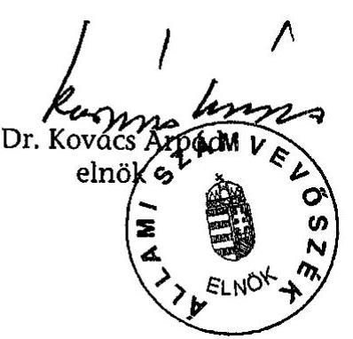

---

# MELLÉKLETEK JEGYZÉKE 

1. Észrevételek
2. Főbb események kronológiája
3. MP Rt. tulajdonosi jogokat gyakorlói és vezérigazgatói 1999-2002 között
4. Főbb stratégiai fejlesztések
5. Az MP Rt. piaci magatartása a Versenytanács 167/2001/52. VJ. sz. határozata alapján
6. A Magyar Posta Rt 2002. évi befektetési portfolió tisztításának következménye
7. Megállapítások a vizsgált vállalkozási és megbízási szerződésekről
8. A Magyar Posta Rt. ingatlanai és a Klotild palota értékesítése
9. A Magyar Posta Rt. 1998-2003. évek közötti készpénzkészletének alakulása
10. Táblázatok
11. Tanúsítványok

---

1. számú melléklet

V-26-76/2003-2004. számú jelentéshez

# Észrevételek

---

# 1. sz. melléklet 

H-1051 BUDAPEST V., JÓZSEF NÁDOR TÉR 2-4. POSTACÍM: 1369 BUDAPEST, POSTAFIÓK 481.

TELEFON: 327-2111 FAX: 318-0738
PÉNZÜGYMINISZTER

Állami Számvevőszék
Dr. Kovács Árpád elnök úr részére

Budapest
Pf.: 54.
1364

Tisztelt Elnök Úr!
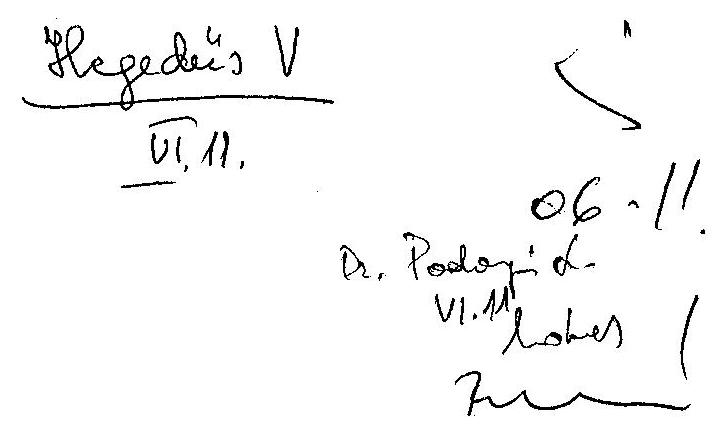

Hivatkozással V-26-70/2003-2004. számú levelére, a Magyar Posta Rt. működésének ellenőrzéséről készített jelentés megállapításával kapcsolatosan - tekintettel arra, hogy a lezajlott közigazgatási egyeztetésen a tárca közigazgatási államtitkára által tett észrevételek figyelembevételre kerültek - újabb észrevételt nem teszek.

Budapest, 2004. június 17.

Üdvözlettel:
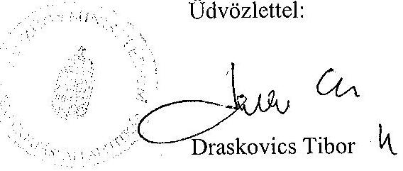

---

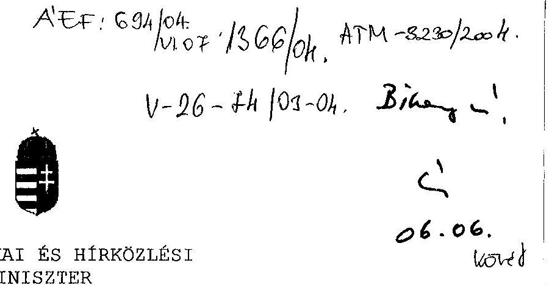

Ikt. szám: 4084/7/2004.

Hiv. szám: V- 26-70/2003-2004.

Dr. Kovács Árpád
Elnök
Állami Számvevőszék

Budapest

Tisztelt Elnök Úr!
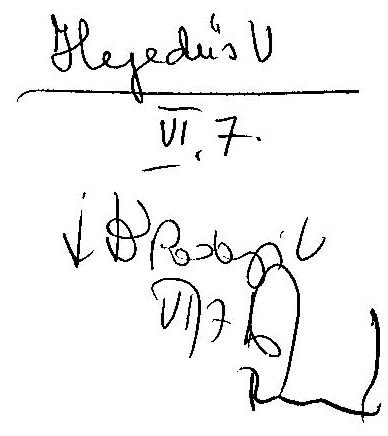

Köszönettel vettem a V-26-70/2003-2004. hivatkozási számon véleményezésre megküldött „a Magyar Posta Rt. gazdálkodásának ellenőrzéséről" készített jelentést.

Az Állami Számvevőszék munkatársaival folytatott egyeztetést követően a jelentésben foglaltakra észrevételt nem teszek.

Budapest, 2004. június 14.
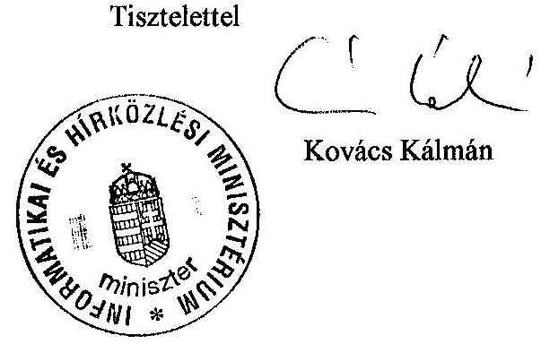

---

# Főbb események kronológiája 

(Jogi szabályozás, szakmai és tulajdonosi jogok gyakorlása, vezérigazgatók, stratégiai célok és kormányhatározatok)
1998. május Kormányhatározat a hírközlés-politikáról és az 1998 - 2005. évi Cselekvési Program, 1071/1998. (V. 22.) Korm. határozat
1998. július A szakmai irányítói és tulajdonosi jogok gyakorlója a KHVM vezetője
1998. szeptember Új vezérigazgató kinevezése
"A Magyar Posta Rt. középtávú stratégiája 2000-2006" beterjesztése a Minisztériumi Kollégium részére
1999. november Megbízott vezérigazgató kinevezése
2000. január Új vezérigazgató kinevezése
2000. március Kormányhatározat - 2051/2000. (III. 22.) - az MP Rt. Postabanki tulajdoni részesedés megszerzéséről
2000. június A szakmai és a tulajdonosi irányítás szétválasztása; a szakmai irányításért a MeH , a tulajdonosi jogok gyakorlásáért a KöViM vezetője a felelős

Kormányhatározat - 2146/2000. (VI. 30.) - az EKR kialakításának megkezdésére
2000. október "Stratégia 2000" A magyar posta Rt. középtávú stratégiája (2001-2007)
2000. november Új vezérigazgató kinevezése
2001. február Újabb stratégia előterjesztése "A Magyar Posta Rt. stratégiája 2001-2005" címmel
2001. június Kormányhatározat az MP Rt. kijelöléséről az EKR kialakításának megkezdésére
2001. július Kormányhatározat - 1074/2001. (VII. 13.) és 1100/2001. (VIII. 27.) - a TETRA rendszer beruházásának lebonyolítására

Kormányhatározat - 2187/2001. (VII. 20.) - a Postabank állami tulajdonrészének az MP Rt. általi teljes megszerzéséről

Kormányhatározat - 1100/2001. (VIII. 27.) - a TETRA rendszer megvalósítására 1 milliárd Ft alaptőkéjű társaság létrehozására majd a szükséges működtetési magállapodások megkötésé-

---

|  | re a KöViM és a MeH vezetőivel |
| :--: | :--: |
| 2001. december | Új törvény a hírközlésről (2001. évi XL. törvény), az 1992 évi   postatörvény hatályon kívül helyezése |
| 2002. január | A TETRA pályázat törlése |
| 2002. március | Kormányhatározat - 2068/2002. (III. 21.) - az EKR kialakítására és működtetésére vonatkozó szerződés megkötésére a MeH vezetőjével |
| 2002. május | A szakmai irányító az IHM, a tulajdonosi jogok gyakorlója a PM vezetője |
| 2002. június | Megbízott vezérigazgató kinevezése |
| 2002. július | A szakmai irányító az IHM vezetője, a tulajdonosi jogok gyakorlója az ÁPV Rt. |
|  | Új vezérigazgató kinevezése |
| 2002. szeptember | Kormányhatározat - 1158/2002. (IX. 26.) - az egységes digitális rádiótávközlési rendszer (EDR) |
|  | kialakításáról, amely a korábbi 1100/2001. (VIII. 27.) és 1074/2001.(VII. 13.) Korm. határozatok hatályon kívülre helyezésével az MP Rt. közreműködését megszüntette a rendszer megvalósításában |
| 2002. november | A Magyar Posta Részvénytársaság Stratégiája - (2002-2007) |
| 2003. január | Az MP Rt. részleges privatizációjának törvényi megengedése megtartandó Állami Tulajdon rész 50\%+1 szavazat |
| 2003. május | Kormányhatározat - 2094/2003. (V. 20.) - az MP Rt. tulajdonában álló Postabank részvénycsomag értékesítéséről |
| 2004. január | Az új posta törvény hatályba lépése (2003. évi. CI. törvény) |
|  | A postai szolgáltatások EU irányelvek szerinti teljes körű teljesítésének határideje. |
| 2004. május | A szolgáltatások EU irányelvek szerinti teljesítése alóli utolsó átmeneti felmentés lejárati határideje |

---

# A Magyar Posta Rt. tulajdonosi jogokat gyakorlói 1999-2002 között 

1994. január 1. - 2000. június 25. a KHVM vezetője,
2000. június 26. - 2002. május 26. a KöViM vezetője,
2002. május 27. - 2002. július 26. a PM vezetője
2002. július 27. - az ÁPV Rt. Igazgatósága

## A tulajdonosok által kinevezett vezérigazgatók működési ideje 1999-2002 között

1998. szeptember 1. - 1999. október 31.
vezérigazgató
1999. november 1. - 2000. január 9.
mb. vezérigazgató
2000. január 10. - 2000. november 20.
vezérigazgató
2000.
 november 21. - 2002. június 5.
vezérigazgató
2002. június 6. - 2002. július 4.
mb. vezérigazgató
2002. július 5. -
vezérigazgató

---

# Főbb stratégiai fejlesztések

(beruházások, projektek, társaság-alapítások ill. részesedés szerzések)
(1999-2003.)

## 1. A postai alaptevékenységet, az egyetemes szolgáltatást szolgáló fejlesztési célok:

## Informatikai és számítástechnikai beruházások

IPH projekt - Integrált Posta Hálózat a Magyar Posta Rt. informatikai, technológiai alaprendszere. Az IPH a manuális postahelyi és feldolgozási technológiát cseréli fel számítógépekkel támogatott technológiára, célja az alaptevékenység minőségének javítása, az új szolgáltatások és termékek gyors és egyszerű bevezethetőségének biztosítása. Az 1997-ben indított projekt 1999-ben lépett a tényleges megvalósítás fázisába és kiépítése folyamatos az elektronikus munkahelyek, a teljesen elektronikus postahelyek (Front Office posták), illetve az összes szolgáltatásféleség egy ablakos ellátására alkalmas munkahelyek kialakításával. A beruházás megvalósítása 2 évet késett, befejezése 2003. évben történt.

NAH - Nagyterületű Adathálózat projekt: feladata a megbízható és biztonságos adatátviteli hálózat megvalósítása a postahelyek és a technológiai központok között. A fejlesztés alapfeltétele az IPH hatékony üzemeltetésének.

SAP rendszer - az MP Rt. integrált pénzügyi-számviteli információs rendszere. Bevezetése 1997-ben kezdődött és több fázisban tervezett a megvalósítása. 2003-ra a verzióváltást és a szervezeti átalakítások rendszeren való átvezetését elvégezték. Az informatikai és számítástechnikai beruházások várható bekerülési értéke 16,0 milliárd Ft.

Küldemény feldolgozási, szállítási és logisztikai beruházások ill. fejlesztések
Budapesti közvetítő pályaudvar, csomagfeldolgozó és gépesített feldolgozó centrum - az 1999. évben összeállított stratégiában megfogalmazott beruházás a postai küldemények egyszerűsített és gépesített feldolgozásával az EU szabályozásnak megfelelő minőségi szolgáltatási követelmény, valamint a teljes körű csomag házhoz-kézbesítés 2002. évre való elérését irányozta elő. Az MP Rt. saját forrásából 4,0 milliárd Ft összegben tervezett beruházás nem valósult meg.

Nyomkövető rendszer - magas színvonalú informatikai alapú csomagforgalmi szolgáltatás, amely a küldemények menet közbeni tartózkodási helyéről ad folyamatos információt. A szolgáltatást nem egyetemes szolgáltatási kötelezettség, hanem a versenyképes elektronikus kereskedelem és az ezzel összefüggő csomagküldő vállalkozás nélkülözhetetlen része. Az 1999. évben összeállított stratégiában 1,1 milliárd Ft beruházási forrás igénnyel szerepelt. Megvalósítása

---

nem történt meg annak ellenére sem, hogy valamennyi stratégia kimondta szükségességét.
Elsőbbségi levél küldemény kategóriaszolgáltatás - az EU normákhoz hasonlóan a küldemény fajták és azok díjtételei között nem a tartalom, méret és súly szerint, hanem az átfutási idő alapján különbséget tevő szolgáltatás. Bevezetését 2000-ben tervezték, bevezetése nem valósult meg annak ellenére sem, hogy a Hkt. is bevezette a kategóriát a fenntartott szolgáltatások körének meghatározása ill. elkülönítése érdekében. Ezen küldemény kategória alkalmazása az átfutási-idő normák azonosítója is, hiányában valamennyi levélküldemény - a közönséges levél is - a szigorú átfutási időnorma teljesítésének körébe esik. A szolgáltatás bevezetése 2004. március 16-ától valósult meg.

OLK-OLH - Országos Postai Feldolgozó Központ és Országos Logisztikai Hálózat. A 2002-ben elrendelt beruházás mindazokat a korábban elmulasztott fejlesztéseket kívánja pótolni, amelyek a levélpostai, postacsomag és gyorsszolgálati küldemények, valamint a kereskedelmi csomagok feldolgozási- és szállítási rendszerének hatékony és gyorsasági alapú átalakításához szükségesek. A beruházás indításáról a 1/2002. (III. 13.) számú Igazgatósági és a 11/2002. (2002. 06. 12.) számú Alapítói határozat rendelkezett. Az OLK a korszerűtlen technológiával több telephelyen végzett feldolgozást váltja ki a Budaörsön felállítandó közúti kapcsolatú, automatizált központi üzemben. A kapcsolódó OLK program a szállítási gerinchálózat átalakításával a regionális feldolgozó központok, a kiemelt posták és a regionális kézbesítő központok kapcsolatát biztosítja. A beruházás 2004. március végéig megvalósult.

# 2. Nem a postai alaptevékenységet szolgáló befektetések és célkitűzések

## Hírlapterjesztés

A hírlapterjesztő társaságait az MP Rt. 1998-ban a kormány döntése értelmében 4,8 milliárd Ft-ért értékesítette. Az 2000. és a 2001. évben összeállított stratégiák az önálló hírlapterjesztés újraindítása Hírlap-Jövő Projekt elnevezéssel 0,94 milliárd Ft, majd MP Hírlap Rt. társaságalapítási elképzeléssel 2,0 milliárd Ft értékű stratégiai fejlesztést fogalmazott meg. Megvalósításukra nem került sor.

## Távközlés

V.R.A.M. - az MP Rt. 1999. évi 2,5 milliárd Ft értékű befektetése a KHVM DCS 1800 koncessziós mobiltelefon-tender pályázata keretében alapított V.R.A.M. Távközlési Részvénytársaságban (a médiákban alkalmazott VODAFON márkanéven). MP Rt. a társasági részesedését 2001-ben értékesítette 5,8 milliárd Ft értékben.

## EUROHÍVÓ Rt.

A MP Rt. 2002. április 24-én kötött részvény átruházási szerződést egy automatizálási és telekommunikációs Rt.-vel és annak leányvállalatával, valamint egy másik telekommunikációs és szolgáltató Kft.-vel az EUROHÍVÓ Rt. 100\%-os tulajdonjogának megszerzésére, összesen 100000 Ft vételárért.

A megvásárolt társaság tevékenységi köre az országos személyhívó távközlési szolgáltatás és az ahhoz szükséges készülékek értékesítése. A működést 1995.

---

évben kezdte el, amely a mobil telefonok elterjedésével rohamosan teret veszített, ami a megvásárlás időpontjában is felmérhető volt.

A végelszámolás eldöntése időpontjában az Rt.-nek mindösszesen 2800 előfizetője volt. A rentábilis működést 100000-es számú előfizető biztosította volna. (A MP Rt. társaságfinanszírozási igazgatóságának megállapítása.)

A Rt. 2000000 USD koncessziós díj ellenében kapta meg a Magyar Államtól a szolgáltatás elvégzéséhez szükséges frekvenciát 2009-ig. Az értékesítés időpontjáig a társaság ebből 1200000 USD-t fizetett meg. Az EUROHÍVÓ 2002. december 31-ei lejárattal 800000 USD koncessziós díjjal tartozott a Magyar Államnak. A koncessziós díj hátralékának befizetésére az EUROHÍVÓ 2002. évi megvásárlásakor a MP Rt kezességet vállalt.

A részvény átruházási szerződés 1.5 pontja tartalmazza, hogy az EUROHÍVÓ Rt. alapító részvényesei és a Közlekedési, Hírközlési és Vízügyi Miniszter által 1994. augusztus 5. napján aláírt Koncessziós Megállapodás 2.2.1. pontjának (iii) alpontja alapján a jelen szerződés érvényességének feltétele a Miniszter előzetes hozzájárulása. Az értékesítéshez az illetékes miniszter, a MEH minisztere 2002. április 26-án, a készfizető kezesség Magyar Posta Rt. átvállalása fejében hozzájárulását adta.

A 2002. évi vezetőváltást követően a mb. vezérigazgató utasítást adott a társaság gazdasági és jogi helyzetfelmérésére, melynek eredményeként megállapítást nyert, hogy a koncessziós társaság veszteségesen működik, ügyfélköre csekély, bővítésre nincs lehetőség, tekintettel a mobiltelefonok elterjedtségére. A cég átvilágítása után az is nyilvánvalóvá vált, hogy az adásvétel keretében minimum 300 millió forintos adósságállományt vásárolt a Posta. Ez két részből tevődött össze, a koncessziós díjhátralékból, illetőleg a cég felszámolásának költségeiből.

Az EUROHÍVÓ előzetes, befektetést megelőző átvilágítása - a jogi igazgatóság által végzett, a befektetés megszerzésének körülményeivel kapcsolatos, az FB részére 2002. augusztusában készített vizsgálat eredménye szerint - nem történt meg, annak ellenére, hogy erre a szerződés lehetőséget nyújtott. (Szerződés 4.4 pontja) Így a cég valós helyzetéről, működéséről és kötelezettségeiről a Posta befektetésekkel kapcsolatban felelős, illetve ügyintézésre a SZMSZ alapján jogosult munkavállalóinak információja nem volt. Az ügyintézésre jogosult szervezet a kész, befejezett befektetést kapta meg, azt addig a korábbi elnökvezérigazgató intézte.

A volt elnök-vezérigazgató rendelkezésünkre bocsátott olyan, már a befektetés megvásárlását követő (2002 május, június, júliusi dátumú), ellenőrizhetetlen, Postánál nem archivált iratokat, amelyek az EUROHÍVÓ előnyeivel foglalkoznak. Az okmányokban foglaltak azt erősítik meg, hogy küldemények érkezésével kapcsolatos értesítésre csak akkor alkalmas a rendszer, ha a címzett is rendelkezik az Eurohívó készülékkel, amelynek széleskörű elterjesztési lehetőségeire nem tartalmaznak az iratok bizonyítékot. Pl. A 2002. májusi keltezésű (tehát a vételt követő) azonosíthatatlan származású, aláíratlan „előzetes" befektetési javaslatban hivatkozás szerepel egy felmérésre, amely szerint a megkérdezettek 45\%-a igényt tart küldemény ismételt házhoz szállítására és ennek a csoportnak az 50\%-a igényelné, hogy a Posta rendszeresen E-mailban, SMS-ben, Eurohívó rendszerben

---

üzenetet küldjön küldemény érkezéséről. Nincs azonban a csoport tovább megbontva, tehát nem tudjuk, hogy mennyi közülük a mobil telefonon vagy számítógépen értesítést kérő és mennyi lenne az Eurohívós ügyfél, amelynek felhasználói oldalról hátránya, hogy nincs lehetőség az üzenet visszaigazolására és válaszüzenetek küldésére.

A rendszer biztonsági célzatú felhasználása is felmerült, a postások segélyhívó rendszerként (a postásoknál lévő pénz elszínezését biztosító postástáskák alkalmazásának kiegészítése vagy alternatívájaként).

Hivatkozás történt a Miniszterelnöki Hivatal Informatikai Kormánybiztosságtól kapott 280 millió Ft támogatásra is, mint kormányzati célmegerősítésre, amely az EUROHÍVÓ vételét megelőzően néhány nappal folyt be a MP Rt.-hez. Ehhez kapcsolódó pályázati anyag a Postán nem volt fellelhető, a támogatási szerződést a Posta a projektleírást tartalmazó melléklet nélkül bocsátotta rendelkezésünkre. A rendelkezésre álló dokumentáció alapján nem lehet a támogatást egyértelműen az EUROHÍVÓ-hoz kötni, tekintettel arra, hogy a támogatott cél „a postai küldemények elektronikus értesítési rendszeré"-nek kialakítása, amelynek csak egyik és nem egyértelműen legjobb rész-megoldása lehetett volna az EUROHÍVÓ bevezetése.

A támogatás összege a Posta mérlegében a passzív elhatárolások között szerepelt a 2002. év végén. A támogatási szerződés határidejét 2004. március 31-ére módosították a fent említett célon belül a Posta országos logisztikai hálózatának informatikai támogatása célzattal.

A koncessziós díj elengedésére vonatkozó tárgyalások a kormányváltást követően illetékes IHM-mel nem vezettek eredményre. A 172 millió Ft 40\%-át a MP Rt 2003. július 30-án megfizette, a fennmaradó 60\% 2004. december 31-éig történő megfizetésére pedig kötelezettséget vállalt. Az IHM ezt követően engedélyezte a koncesszió és az abból fakadó szolgáltatási kötelezettség 2003. 08. 15-ével történő megszüntetését. (Az MP Rt. ezt az engedélyt követően számolhatta fel a veszteségesen működő társaságot.)

A MP Rt. vizsgálta a részvény átruházási szerződés semmissé minősítésének kérdését is, de külső jogi szakértők bevonása után arra az álláspontra jutott, hogy a szerződés 4.4 pontja alapján érvénytelenségi okra (tévedés, megtévesztés stb.) hivatkozni nem lehet.

A 4.4. pontban foglaltak: "A vevő kijelenti, hogy a jelen szerződés megkötését megelőzően nem volt akadályoztatva abban, hogy az EUROHÍVÓ könyveit, mérlegét megtekintse, a szükségesnek vélt vizsgálatokat elvégezze, vagy elvégeztesse; és önként hagyatkozott az Eladók állításaira; Vevő tudomásul veszi, hogy ezzel összefüggésben az Eladókkal szemben később semmilyen igényt nem támaszt."

Az Rt. 2002. I-VI. havi üzemi vesztesége 54,5 millió Ft, mérleg szerinti vesztesége 53,6 millió Ft volt. Kötelezettségei ugyanezen időszakban 271,9 millió Ft-ot képviseltek. A társaság 2002. június 30-i saját tőkéje - 90 millió Ft, jegyzett tőkéje 27,32 millió Ft. A veszteséges működés, illetve a tőkefeltöltési kötelezettség már 2001. év végén, tehát már a vásárlást megelőzően fennállt. A társaság augusztus elejéig volt fizetőképes, augusztustól a tulajdonosnak kellett a veszteséget finanszírozni.

---

A MP Rt., tekintettel az EUROHÍVÓ havi 15 M Ft veszteséget termelő működésére, tulajdonosi határozattal elrendelte a Társaság végelszámolással történő, jogutód nélküli megszűntetését. A végelszámolás kezdete 2003. 02. 18. volt. Tekintettel arra, hogy az EUROHÍVÓ tartozás állománya meghaladta teljes vagyonát, a végelszámoló a Cstv. 72. § (2) bekezdésének előírása alapján a Fővárosi Bíróságnál kezdeményezte a felszámolás elrendelését.

A Cégbíróság felszámolás jogerőre emelkedéséről szóló határozata a Cégközlöny 2003. 09. 25-i számában jelent meg. A felszámolás jogerőre emelkedésének időpontja: 2003. 07. 25.

A MP Rt 2003. évben a koncessziós díjtartozásra, illetve az EUROHÍVÓ veszteséges működésének finanszírozására 200-210 millió forint céltartalékot képzett. A koncessziós díjra képzett céltartalék - amely részben a 2004. évben kerül felhasználásra - az árfolyamváltozás következtében - 28 millió Ft-tal magasabb a szükségesnél. A veszteséges működés finanszírozására a tevékenység 2003. augusztus 15-ével történő beszüntetésének köszönhetően további 72 M Ft nagyságrendű céltartalék feloldható. Az EUROHÍVÓ végelszámolásának befejezéséig 15 millió Ft összeget nem meghaladó kötelezettséggel járó tulajdonosi szerepvállalásra van még szükség, így az Eurohívóval kapcsolatban a 2002. év végén leírt 453,7 millió Ft veszteség, ill. megképzett céltartalék a felszámolás lezártával összesen kb. 300 millió Ft értékben kerül majd igénybe vételre.

# Biztosítási tevékenység

A Generali-Providencia Rt. biztosítótársaságban az MP Rt. 1999-ben 2,4 milliárd Ft árfolyamértékű 10\%-os tulajdoni hányaddal rendelkezett. A részesedést 2001. évben 3,2 milliárd Ft összeggel értékesítették.

MPB Rt. és MPEB Rt. - Magyar Posta Biztosító Rt. és Magyar Posta Életbiztosító Rt. az MP Rt. 2002. évben 45\%-os tulajdoni hányaddal létrehozott társaságai összesen 1,1 milliárd Ft összeggel. Az alapítás célja öt év során 5-10\%-os részesedés megszerzése a biztosítási piacon a postai hálózat kihasználásával. Az MP Rt. Igazgatósága 2003. szeptemberében áttekintette a társaságok és a biztosítási piac helyzetét és a 2008. évig terjedően előre jelzett várható eredmény alapján alaptőke emeléssel további működtetésük mellett döntött.

Az üzleti tervek szerint a társaságok osztalékot 2009-től lesznek képesek fizetni, azaz az alapítástól számított 7. évtől kezdődik majd a tulajdonosi részesedés megtérülése. A középtávú üzleti terv alapján 2004-2008-ban kell további tőkéhez jutniuk a társaságoknak a 2002-2006-os kezdeti időszak veszteségének fedezéséhez, valamint a növekedés finanszírozásához. A tőkerendezés első fázisa már 2003. szeptemberében szükségessé vált. A társaságok által készített középtávú üzleti terv alapján 2003-2008-as időszakban összesen 2868 millió Ft tőkepótlási igény merül fel.

A számítások nem tartalmazzák azt az üzleti kockázatot, hogy a jutalék bevételi és eredményterv a vártnál kedvezőtlenebbül is teljesülhet. A vártnál rosszabb eredmények esetén a Postát a fent említett tőkeigényen felüli további tőkerendezési kötelezettség terheli.

---

Csökkenti a kockázatot a MP Rt. részesedési arányának 33\%-ra történő leszállítása, amelyre a társaságok tőkerendezési igényével kapcsolatban a MP Rt. Igazgatóság 62/2003. (09. 15.) számú határozata hozott döntést. További kockázatcsökkentést (tőkebefektetési kötelezettség csökkentést) jelentene a $25 \%+1$ szavazati arány, amely a minősített többséggel meghozandó döntésekbe való beleszólásnak ugyanazt a lehetőségét biztosítja, amit az eredeti $45\%$-os, illetve a jelenlegi $33\%$-os tulajdoni részesedés.

# Kormányzati célokat megvalósító ill. azokhoz kapcsolódó beruházások, befektetések

EKR - Elektronikus Közbeszerzési Rendszer célja a központosított közbeszerzés gyakorlati alkalmazása során tapasztalt problémák kiküszöbölése egy új beszerzési modell kidolgozásával és a folyamatok elektronikus eszközökkel való támogatásával. A közbeszerzési törvény 1999. évi módosításában kapott felhatalmazást a kormány, hogy az általa irányított költségvetési szervek egyes beszerzéseinek elektronikus úton történő megvalósítását rendeletben szabályozza.

A rendszer koncepcionális elemeit, megvalósítási ütemezését és az MP Rt. részvételét és az ágazati valamint a tulajdonosi irányítási feladatokat ellátó miniszterek feladatait a 2146/2000. (VI. 30.) Korm. határozat a 2068/2002. (III. 21.) Korm. határozat és a 2155/2001. (VI. 20.) Korm. határozat rögzítette. A beruházás végrehajtását a kormány határozata alapján a vezérigazgató rendelte el 2001. szeptember 6-án. Tervezett beruházási érték, melyre - konkrét gazdaságossági-megtérülési számítások nem készültek - 2,26 milliárd Ft volt, 2004. január 31-i megvalósítási határidővel. A rendszer MP Rt. általi megvalósítása és működtetése együttműködési szerződés létrehozását is feltételezte a Miniszterelnöki Hivatalt vezető miniszter és a társaság között. Az együttműködési szerződés megkötésére az MP Rt. többszöri kezdeményezésére sem került sor, ezért az MP Rt. 2002. szeptember 1-jétől, a rendszerrel kapcsolatos fejlesztési tevékenységét a kárenyhítés érdekében felfüggesztette.

A rendszer kormányzati használatába vétele körüli bizonytalanság figyelembevételével a társaság 1,66 milliárd Ft megvalósított beruházási érték mellett, a fejlesztések további finanszírozásának leállításáról döntött 2002. júliusától. A beruházott érték megtérülése a rendszer kormányzati igényű működtetése, illetve más, a Kormány által kijelölt üzemeltető részére való átadás nélkül kérdéses.

PEP - Posta elektronikus piactér projekt koncepciójának kialakítása 2001-ben kezdődött az EKR rendszerhez kapcsolódóan. A projekt célja három önálló elektronikus piactér - belső, nyílt és zárt piactér - integrált rendszerben történő megvalósítása volt. A zárt piactér része a kormányzati intézményeket kiszolgáló EKR rendszer. A Nyílt Piactér Internet alapú elérhetőséggel lehetőséget biztosít egyrészt a rendszert igénybevevő vevőknek és a szállítóknak, hogy egymás közötti tranzakcióikat lebonyolítsák, másrészt az MP Rt. saját beszerzéseinek racionalizált lebonyolítását teszi lehetővé.

A Belső Piactér a MP Rt.-nek és vállalatcsoportja tagjainak kívánt elektronikus támogatást adni csökkentett papíralapú dokumentációval működő igénylési,

---

beszerzési és beszállítási rendszer működtetéséhez. A nyílt piactér működését az EKR projekttel megegyező alkalmazói szoftverével szolgálja. A beruházás végrehajtását jóváhagyott Műszaki Gazdasági Tanulmányterv és gazdaságossági-műszaki számítások nélkül a vezérigazgató rendelte el 2001. december 20-án.

Megvalósíthatósági tanulmány nem készült annak ellenére, hogy a Beruházási Bizottság a megtérülést tekintve a beruházást magas kockázatúnak és a lehetséges piaci bevételek kimunkálását elnagyoltnak tartotta. A tervezett beruházási érték 1,95 milliárd Ft volt 2004. január 31-i megvalósítási határidővel. A beruházás leállításra került 1,139 milliárd Ft megvalósított értékkel. Az MP Rt. a PEP nyílt piacterét a kiépített kapacitásokkal, további fejlesztési ráfordítás nélkül működteti.

# TETRA Rt. - a kormányzati célú egységes digitális rádiótávközlő rendszer kiépítésére létrehozott társaság (TETRA Távközlési Szolgáltató Rt.)

A hírközléspolitikáról szóló 1071/1998. (V. 22.) Korm. határozat megfogalmazta a közigazgatási és a rendvédelmi szervezetek igényeit kielégítő, többszintű, szintenként differenciáltan védett, költségtakarékos, integrált távközlő rendszer kiépítésének szükségességét minimális költségvetési közreműködéssel, elsősorban a szolgáltatók versenyeztetése útján és a kormányzati szervezetek, illetve állami többségi tulajdonú gazdálkodó szervezetek meglevő távközlési erőforrásait is szolgáltatási alapon felhasználva.

Az egységes digitális rádió-távközlő rendszer (EDR) kialakításáról szóló 1074/2001. (VII. 13.) Korm. határozat módosította a célok elérésének a korábbiakban megfogalmazott módját. A korábbiakkal ellentétben elsősorban nem a meglévő erőforrásokra alapoz, hanem - a fenti célok elérése érdekében - előírta, hogy a készenléti TETRA-rendszer kiépítésére, üzemeltetésére, a folyamatos technológiai követésre, valamint ezek pénzügyi fedezetének biztosítására a Magyar Posta Rt. és a Magyar Fejlesztési Bank Rt. gazdasági társaságot hozzon létre postai többségi tulajdonnal. A Kormányhatározat biztosította az új társaság működésének jogi feltételeit, megteremtve szolgáltatásainak piacát. A 3. pontban előírta, hogy a készenléti TETRA rendszert minden kormányzati és készenléti szervezet a rendszer működtetésével kapcsolatosan jogosult és - készenléti feladatai tekintetében - köteles használni a felmerülő költségek térítése ellenében. Emellett a Kormány az önkormányzatokat és az ügyészi szervezetet is felkérte, hogy készenléti feladataik tekintetében a TETRA rendszert használják.

A távközlés-informatika a Magyar Posta profiljától idegen volt. A Magyar Posta Rt. alapításakor a valamikori állami vállalatot e tevékenységek mentén bontották két részre, a Magyar Postára és a már privatizált Matávra.

Az új társaság alaptőkéje 1 milliárd Ft volt, amelyből 600 millió Ft értékű törzsrészvénnyel a MP Rt., 400-al pedig az MFB Rt. rendelkezett. Az alapító okirat a közgyűlés valamennyi határozatához egyhangú döntést írt elő, tehát a többségi tulajdon nem biztosította a Postának az azzal arányos döntési jogosítványokat, az MFB Rt. nélkül nem dönthetett.

---

2001. novemberében a TETRA kétfordulós beszállítói pályázatot hirdetett, amelyen az első forduló után a négy jelentkezőből kiválasztott két mobiltelefon szolgáltató társaság ajánlata közötti döntés érdekében 2002. januárban mindkét jelölttel megkezdték a tárgyalásokat, majd 2002. január 23-án az igazgatóság - a Nemzetbiztonsági Szakszolgálatot vezető tárca nélküli miniszter levele alapján, nemzetbiztonsági okokra hivatkozva - eredménytelennek nyilvánította a pályázatokat. Így a cég megalapítását követő rövid időn belül a hálózat kiépítése lekerült a napirendről, így a TETRA szolgáltatást sem tudott nyújtani.

A társaság 2002. VII. 31-ig terjedő tevékenységéről és pénzügyi helyzetéről a TETRA menedzsmentje által 2002. augusztus 23-án összeállított dokumentum a pályázatok érvénytelenné nyilvánításával kapcsolatban arra hivatkozik, hogy a „pályázatok elbírálásának időszakában változtak a titkos információgyűjtésre vonatkozó jogszabályi feltételek, így a hírközlésről szóló 2001. évi XL. tv 13. §-a előírja, hogy a távközlési szolgáltató a szolgáltatás megkezdésével egyidejűleg biztosítsa a titkos információgyűjtés alkalmazási feltételeit saját költségére." A jogszabály valóban 2001. december 23-án lépett hatályba, a pályázatok beadásának pedig 2001. november 30-a volt a határideje. A törvény azonban már 2001. VI. 26-án, így még a TETRA Rt. megalapítása előtt megjelent a Magyar Közlönyben, így semmi akadálya nem volt annak, hogy előírásait az ügy megoldására alapított szakcég - és a szintén szakcég pályázók - figyelembe vegyék.

A 2001-ben megalapított társaság (alapító okirat kelte: 2001. szeptember 5.) már az év végén 250 millió Ft veszteséggel zárt. A 2002. május 23-i közgyűlés a jegyzett tőke leszállítását határozta el a Gt. 243 § (2) alapján veszteségrendezés címén, amelynek következtében az MP Rt. 60\%-os tulajdonrészesedése az eredeti 600 millió Ft helyett 330 millió Ft értékre csökkent. A tőkehelyzet rendezése érdekében - a tőkeleszállítást követően - 180 millió Ft végleges pénzeszköz átadását is eldöntötte a Posta. A rendezés nem hozott eredményt, a közgyűlés 2002. 07. 17-én a társaság végelszámolásáról döntött.

Az MP Rt. összesen 900 millió forint készpénzt juttatott a társaságnak, 600 millió alaptőke és 300 millió Ft végleges pénzeszköz átadás formájában, amely 2002-ben teljes egészében leírásra került, a befektetések illetve az eredmény terhére.

A végelszámolás lezártával, 2003. szeptemberében 2,8 millió Ft-ot kapott vissza a 900 millió Ft-ot befektetéséből a Posta.
2002. szeptemberében - már a TETRA Rt. felszámolása időszakában - az 1158/2002. (IX. 26.) Korm. határozattal a Kormány döntött a schengeni követelményeknek megfelelő, egységes digitális rádiótávközlő rendszer (EDR) kialakításáról. A Kormányhatározat a Miniszterelnöki Hivatalt vezető miniszter feladatává tette, hogy a Magyar Posta TETRA Távközlési Szolgáltató Rt. végelszámolójával folytasson tárgyalást a már elkészült szellemi termékek hasznosítása érdekében, és felhatalmazta a Miniszterelnöki Hivatalt vezető minisztert az EDR-ben hasznosítható vagyonelemek független értékbecslés alapján történő megvásárlására az Informatika és frekvenciagazdálkodási célelőirányzat terhére. A Kormányhatározatban megnyilvánuló szándéknak megfelelően a TETRA Rt. későbbiekben is hasznosítható eszközeit és immateriális javait a MeH átvette. Átvette azonban a TETRA megőrzésre szoruló, de a továbbiakban

---

nem hasznosítható dokumentációit is, amelyért őrzési díjat számolt fel. Így a végelszámolásnál figyelembe vett egyenleg 11 millió Ft + ÁFA volt.

# Banki tevékenység

## A Postabank

A MP Rt. az előző kormányzati ciklusban megkapott, ill. megszerzett 96,791\%-os Postabankban fennálló tulajdonrészét az állam tulajdonában álló kereskedelmi bankok privatizációjáról szóló 2094/2003. (V. 20.) Korm. határozat alapján az ÁPV Rt.-n keresztül értékesítette.

Az értékesítés érdekében a MP Rt. bizományosi szerződést kötött a tulajdonosi jogait gyakorló ÁPV Rt.-vel. A részesedést, az értékesítést követően a Posta nyilvántartásából kivezették, a tulajdoni hányadra eső bevétel bizományi díjjal csökkentett részét pedig a Posta bevételként elkönyvelte. A tulajdoni hányadra jutó bevétel 91,637 milliárd Ft, a nyilvántartási (könyv szerinti) érték 35,28 milliárd Ft volt. Tekintettel azonban arra, hogy az összegből 2003. december 31-ig csak 13,42 milliárd Ft folyt be a postához, a fennmaradó az ÁPV Rt.-vel szemben fennálló követelésként szerepel a Posta a könyveiben.

---

# Az MP Rt. piaci magatartása a Versenytanács 167/2001/52. VJ. sz. határozata alapján 

A hivatkozott határozatban a Versenytanács megállapította, hogy az MP Rt. az Elektronikus Központ által nyújtott szolgáltatásainak igénybevétele révén az általánosnál nagyobb kedvezményt adott a küldemények kézbesítési díjából azon megrendelőinek, akik a kézbesítendő küldeményeket vele készíttették el, ezért gazdasági erőfölénnyel való visszaélés miatt 22 millió Ft bírsággal sújtotta. Az MP Rt. a határozatot bíróság előtt megtámadta, a per még folyamatban van, de ez a határozat végrehajtását és megállapításait nem érinti.

A Versenytanács a tényállás feltárása során vizsgálta az eljárással érintett piaci struktúrát, nevezetesen a küldemény-előállítási és a levélszolgáltatási piacot, a piaci résztvevők részesedésének mértékét. Az érintett piacok gyakorlati működése elemzésekor kitért az MP Rt. üzleti kapcsolatrendszerére, kedvezményrendszerének belső szabályozására, továbbá a kedvezményrendszer működésére a megkötött szerződések tükrében, valamint az MP Rt. szervezeti rendszerének egyes elemeire, az alkalmazott üzleti stratégiára figyelemmel.

Az MP Rt. üzleti kedvezményrendszerét vezérigazgatói utasításokkal szabályozta, amelyek 2001. januárjáig megjelentek a Postaügyi Értesítőben, ezért mindenki számára elérhetők voltak. A vizsgált esetben azonban ezek az utasítások a piaci szereplők előtt már nem voltak teljes körűen ismertek, mivel a lap már nem minősült hivatalos közlönynek. A piaci partnerek elsősorban tárgyalásaik során értesültek az igénybe vehető kedvezményekről. Az egyébként a postahivatalokban elérhető postai Üzletszabályzat - az Internetet is beleértve - csak annyit tartalmazott, hogy az MP Rt. a Postai Díjszabásban foglaltaknál kedvezőbb díjfizetési módot és kedvezményes szolgáltatási díjat biztosít azon ügyfeleknek, akik rendszeresen nagyobb mennyiségű küldeményt adnak fel a Posta által meghatározott mindenkori feltételek teljesítésével, külön szerződés alapján.

A vizsgált utasítások, piaci partneri nyilatkozatok és a velük kötött megállapodások alapján a Versenytanács megállapította, hogy kizárólag a Posta tud egyedül önmagában, megfelelő feltételekkel komplex, vertikálisan integrált szolgáltatásra (előállítás és kézbesítés) szerződni megrendelőivel.

Amennyiben a küldemény előállítást nem a Posta végzi, hanem egy másik gyártó, akkor először a szolgáltatás megrendelője megállapodik a küldemény előállítójával, hogy milyen feltételekkel vállalja a gyártást, majd a megrendelő kell, hogy szerződjön a Postával a küldemények továbbítására. Az előkészítő tárgyalásokba azonban be kell vonnia a gyártót, mivel a gyártó által végzett előfeldolgozási tevékenységek és az előállított küldemények paraméterei határozzák meg a Postával kötött szerződést és a díjkedvezményeket.

Az eljárás során áttekintett postai stratégia az ismertetett erőfölényes helyzet piaci kihasználását vette célba, ezért a Posta kedvezményrendszere újraszabályozására kényszerült. A Versenytanács azonban nem csak az eljárással érintett

---

2001. év kedvezményrendszerét tekintette át, hanem a 2002. évét is és a következőket állapította meg.

Az érintett ügyben két piac azonosítható. Az egyik a postai küldeményekkel kapcsolatos postai alapszolgáltatások (felvétel, továbbítás, kézbesítés) Magyarországon, amelyen az MP Rt.-nek jogi monopóliuma van. A másik piac a küldemény előállítás hazai piaca (számlák, értesítők, egyenlegek előállítása a nagy ügyfélállománnyal rendelkező bankok, közszolgáltatók számára), ahol az MP Rt. a versenypiacon a jelentős piaci szereplők közé tartozik. A teljes küldemény-előállítási piacot elhanyagolható kivételekkel a számlalevél-értesítő levél piac jellemzi, ezért a jelen eljárás szempontjából a küldemény-előállítási piac alatt ezt kell érteni. A két piac szoros kapcsolatban áll egymással: küldeményelőállítási piac az üzlet természete szerint rá van utalva a postai alapszolgáltatások piacára, mivel másképp nem lehet a küldeményeket a címzetthez eljuttatni.

Az MP Rt. a postai alapszolgáltatások piacán fennálló erőfölényes helyzetét arra használta fel, hogy a küldemény kézbesítés piacán a versenyt korlátozza, torzítsa a kedvezményrendszerének számlalevelekre vonatkozó része és gyakorlata alapján. Az újraszabályozott 2002. évi kedvezményrendszer ugyanakkor nem tartalmazott a számlalevelekre vonatkozó külön rendelkezéseket.

A Posta számlalevelekhez kapcsolódó kedvezményeinek átláthatósága, egységessége és diszkriminációmentessége az alábbiak miatt nagy fontosságú a Versenytanács elvi éllel kihirdetett határozatában (elvi él azt jelenti, hogy minden hasonló esetben kötelező alkalmazni).

Az MP Rt. egyedül képes komplex, vertikálisan integrált szolgáltatásra, ezért a megrendelők számára egyértelműen előnyös vele szerződni küldemények előállítására és kézbesítésére,

- a küldemény-előállító vállalkozások csak hátrányok vállalásával teljesíthetnek komplex szolgáltatást,
- a küldemény-előállítás költséget nagyobb volumenű munkák esetében meghaladja a továbbítás költsége,
Megkülönböztető kedvezmények esetében a nagyobb költségelemből adott kedvezménykülönbséget kell ellensúlyozni, a kisebb költségelemet kitevő tevékenység - viszonylag nagyobb mértékű - hatékonyságával.

A küldemény-előállítási piacon jelentős kapacitásfeleslegek halmozódtak fel, melyek erős ösztönzést jelentenek a piacszerzésre.

A piacon egy-egy megrendelés tartós előnyt vagy hátrányt okozhat.
Az ismertetett piaci jellemzők miatt a Versenytanács kijelentette, hogy az MP Rt.-nek, mint az egyetemes szolgáltatások terheinek ellensúlyozására fenntartott szolgáltatások kiváltságait élvező egyetemes szolgáltatónak, kizárólagos joggal végzett szolgáltatásaihoz, és más piacok működéséhez, illetve más tevékenységek végzéséhez alapszükségletet jelentő postai hálózatához egyenlő feltételekkel kell hozzáférést biztosítani a kapcsolódó piac szereplőinek.

---

# A Magyar Posta Rt 2002. évi befektetési portfolió tisztításának következménye 

A Magyar Postának 2002. évben az érdekeltségek felülvizsgálata, értékelése 2,7 milliárd Ft-os egyszeri veszteséget okozott, míg a befektetésekkel, mint jövőbeni kockázati tényezővel kapcsolatos intézkedések eredményre gyakorolt egyszeri hatása $-1,1$ milliárd Ft.

|  | 2002. évi |  |
| :-- | :--: | :--: |
|  | Terv | Tény |
| Érdekeltségek | 950 | -2673 |
| érdekeltségek átszervezési eredménye | 288 |  |
| Apport eredmény | 762 | 0 |
| befektetés értékesítés | 500 | -387 |
| befektetés tőkerendezés, értékvesztés | -600 | -992 |
| értékvesztés átvett követelésekre |  | -845 |
| céltartalék képzés |  | -464 |
| nem fejlesztési célú támogatás |  | -193 |
| Befektetések | 1001 | -1056 |
| Elektronikus Közbeszerzési Rendszer (EKR) |  |  |
| Bevétel | 600 |  |
| aktiválandó saját teljesítmény | 262 | 192 |
| terven felüli értékcsökkenési leírás |  | -933 |
| Postai Elektronikus Piacterek (PEP) | 38 |  |
| aktiválandó saját teljesítmény | 101 | 71 |
| Értékvesztés |  | -386 |

## 1. Érdekeltségekkel kapcsolatos veszteségek

A Postaautó Kft.-k részvénytársasággá alakítása a tervhez képest 80 millió Ft-tal kisebb eredménnyel zárult.

A Verseny u. 3. ingatlanapport elmaradása miatt csökkent az eredmény.

---

A JNT Kft. értékesítésével kapcsolatos döntések megváltozása miatt a tervezett 500 millió Ft-os bevétel elmaradt. A Hírép Kft. üzletrész eladásának árfolyamvesztesége az eredményt 4 millió Ft-tal rontotta.

A részesedések értékvesztése, tőkerendezése 392 millió Ft-tal emelkedett a tervezetthez képest, ami több tényező hatásának az eredője. A Defend Kft. tőkevesztése miatt 285 millió Ft, a Logért Rt. végelszámolásával összefüggésben 107 millió Ft értékvesztés merült fel.

Céltartalék-képzés vált szükségessé 54 millió Ft összegben a Hírép Kft. végelszámolásával kapcsolatban, valamint az Eurohívóra 410 millió Ft.

A Hírép Kft.-től átvett, várhatóan meg nem térülő követelés 457 millió Ft-tal, az Eurohívónak és a Defend Kft.-nek adott, várhatóan ugyancsak meg nem térülő kölcsön 44 millió Ft, illetve 345 millió Ft-tal rontotta az eredményt. Nem kapott fejlesztési célra támogatást a terv szerint, a Tetra Rt. 180 millió Ft, és az utazási iroda 13 millió Ft értékben.

# 2. Befektetésekkel kapcsolatos veszteségek 

Nem valósult meg az Elektronikus Közbeszerzési Rendszer kapcsán tervezett 600 millió Ft-os, illetve a PEP Külső Piactér miatti 38 millió Ft-os bevételi terv.

EKR - Elektronikus Közbeszerzési Rendszer
A menedzsment a hasznosítási lehetőségek vizsgálatát követően - a tulajdonossal egyetértésben - nem tartotta indokoltnak az EKR projekt befejezetlen állományban tartását, illetve a már aktivált elemek közül 285 millió Ft bruttó értékű szoftver selejtezését javasolta, és mindössze 66,5 millió Ft értékű, dokumentumkezelést lehetővé tevő szoftver megtartását tartotta indokoltnak.

A bekerülési értéken mintegy 1,5 milliárd Ft befejezetlen beruházásként nyilvántartott szoftverek és eszközökből, egyedi értékelést követően 933 millió Ft értékű nagy részben szoftver és eszköz a továbbiakban 0 nyilvántartási értéken szerepel a Magyar Posta Rt. könyveiben, és ennek megfelelően 933 millió Ft terven felüli értékcsökkenés elszámolására került sor 2002-ben. Az eszközök közül valamennyi más célra is hasznosítható tétel (pl. szerverek, egyéb hardverek) 2002. 12. 31-ei aktiválásáról döntött a menedzsment, ezek könyv szerint értéke 560 millió Ft.

PEP (Postai Elektronikus Piacterek) nyílt és belső piactér
A menedzsment az igazgatósági határozattal ${ }^{1}$ összhangban ezért, a könyv szerinti értéken mintegy 637 millió Ft szoftvert és 135 millió Ft eszközt képviselő rendszer év végével történő aktiválása mellett döntött. Ugyanakkor, az egyedi értékelés elve alapján, valamennyi eszközre 50% értékvesztés elszá-

[^0]
[^0]:    ${ }^{1}$ A menedzsment „a PEP implementációjával a vállalat részére okozott károk csökkentése érdekében keresse meg a rendszer kialakítása során keletkezett értékek hasznosításának lehetőségeit".

---

molását javasolta a fenti indokok miatt, ami 386 millió Ft-tal csökkenti a Magyar Posta Rt. számviteli eredményét.

A 2003. évi tulajdonos által elfogadott üzleti terv szerint a társaság 142,47 milliárd Ft értékesítés nettó árbevételt, 10,427 milliárd Ft értékcsökkenési leírást, 6,773 milliárd Ft egyéb ráfordítást, valamint 78,452 milliárd Ft személyi jellegű ráfordítást tervezett. Ennek megfelelően 3,372 milliárd Ft üzleti eredménnyel, -1,029 milliárd Ft pénzügyi, -67 millió Ft rendkívüli eredménnyel, valamint 1,674 milliárd Ft adózás előtti eredménnyel számolt.

---

7. számú melléklet

V-26-76/2003-2004. számú jelentéshez

# Megállapítások a vizsgált vállalkozási és megbízási szerződésekről 

## 2001. évben

1. Célszerűtlennek tartjuk a 43/4323 SAP számú vállalkozási szerződést, amelyben olyan munkára köt határozatlan idejű megbízást a Társaság, amely a szerződés 1. pontja szerint a „jelen fejlesztési szakaszban még nem meghatározható szakértői tevékenységekre" szól. A megbízási díj egy szakértői napra 85000 Ft + áfa. A megbízást többször módosítják 2002. szeptember 6-ig.
2. Célszerűtlennek tartjuk, hogy a társaság a Postabank Rt 2001. évi mérlegének könyvvizsgálati díját 35 millió Ft-ban átvállalta. Előtte a Magyar Posta Rt. egy konzorciumot bízott meg az apportálás előtti könyvvizsgálói feladattal. (a Magyar Posta Rt. szerint: mivel a konzorcium semmilyen információval nem rendelkezett a Postabankról, a rendelkezésre álló idő alatt a Postabank könyvvizsgálójának közreműködése nélkül nem lehetett volna az apportértéket meghatározni)
3. A 43/1723 SAP számú könyvelési tételen 2001. március 1-jén a gazdasági főigazgató megbízási szerződést köt egy kft.-vel a számviteli törvény, a gazdasági társaságokról szóló törvény, valamint egyéb jogszabályokkal kapcsolatos adótanácsadói feladatok ellátására, határozatlan időre, havi 250 ezer Ft+áfa díjért. A felmondási időre 90 napot állapítanak meg. A szerződést azonnali hatállyal 2002. júniusában felmondja a megbízott vezérigazgató. Ez a döntés megkérdőjelezi a szerződés szükségességét.
4. Az SAP 43/663 számú könyvelési tétellel kapcsolatos megbízási szerződéssel a gazdasági főigazgató állandó adószakértői és adótanácsadói tevékenységgel bízott meg egy kft-t, a Magyar Posta egész területére az SZJA, ÁFA és egyéb adónemek átvizsgálására. A kiállított 625311 számú számla időelszámolás nélkül 1125000 Ft-ról szól. A teljesítésigazolás mellett lévő rövid jelentés nem ad új információkat az elszámolásokkal kapcsolatban, így a megbízás állandó jellege felesleges.

## 2002. évben

1. A társaság 2002. február 20-án szerződést kötött a Budapest, Révay utca 12 alatti ingatlan és a hozzá tartozó parkoló határozatlan idejű bérletére. A szerződést 2002. április 5-én felbontották. A társaságot 49,2 millió Ft kár érte a felmondás miatt. A felelőst a szerződéskötésért és felmondásért megállapítani nem tudtuk, mivel a bérleti szerződést bemutatni nem tudták. A Társaság az ügyben senkit nem vont felelősségre.(46/2029 SAP szám).
2. A 189004433 SAP megrendelés számú személygépkocsi bérleti szerződésben közbeszerzési eljárás nélkül 4 db gépkocsit bérelnek egy évre. A szerződésben a 4 gépkocsiból kettőnél ugyanarra a gépkocsira vonatkozik az éves

---

bérlet. A szerződést 2002. március 22-én kötötték, amelyet négy hónappal később felbontottak. A szerződés egyik aláírója az akkori gazdasági főigazgató volt.
3. Az épület felújításoknál vagy nem alkalmazták a közbeszerzési eljárást, vagy színlelt eljárás alapján választották ki a nyertes pályázót. A 189005036 SAP megrendelés számú vállalkozási szerződéssel kapcsolatos munkákra 3 árajánlatot kértek be, amelyekben közel azonos ajánlat szerepel. A vesztes cégek más felújítási munkáknál szintén szerepelnek az ajánlattevők között, és ők kapták a megbízást. A szerződéseket az akkori gazdasági főigazgató és a Központi Gazdasági Iroda igazgató-helyettese írta alá. A felújításoknál tapasztalt közbeszerzési eljárás megsértését a belső ellenőrzés feltárta, és az ügyben feljelentést tett a társaság.
4. A társaság 2001. október 1-jén versenyeztetés nélkül szerződést kötött a JNT Ingatlanforgalmazó Kft.-vel, - amelyben 99\%-os részesedése van - a Posta tevékenységi körének bővítésére. A megállapodáson ügyvédi ellenjegyzés nem szerepel. Pontosan nem határozták meg, hogy a közszolgáltatási tevékenység, vagy új tevékenység bevezetésében segít a megbízott. A 43/2631 SAP azonosító számú okmányon 12,5 millió Ft értékű utazás-szervezési tevékenységet számlázott le a szolgáltató. A könyvelési utalvány-rendeleten „Számla összege megegyezik a szerződésben foglaltakkal" szöveg olvasható, annak ellenére, hogy a szerződésben sem a fenti munkák végzésére vonatkozó megállapodás, sem összeg nem szerepel. Az utazás-szervezési tevékenységben a JNT Kft. megbízásából résztvevő Lenau-Reisen Kft-ben a Magyar Posta Rt. 2002. március 7-étől 2002. november 21-éig társtulajdonos a JNT Kft.-vel együtt, ahol az utóbbi társaság közvetlen irányítási befolyással bír.

Az utazási tevékenység csődhelyzetének megelőzése érdekében a korábbi 4 millió Ft tagi kölcsönön kívül újabb 9 millió Ft tagi kölcsön nyújtására tett javaslatot a társaság vezérigazgatójának a társaságfinanszírozási igazgató, aki egyben az utazási iroda felügyelő bizottságának is tagja volt az érintett időben. A tagi kölcsön javasolt időpontja 2002. november 11. A tagi kölcsön elengedésének időpontja 2002. november 14.
A társaságot ért valós kár pontosan nem állapítható meg, de meghaladja a 60 millió Ft-ot. Ezért az utazásszervezési tevékenységgel kapcsolatban kifizetett összegeket célszerűtlennek és aggályosnak tartjuk.
5. Aggályosnak tartjuk, hogy a fentiekben leírt JNT Kft. ugyanazon megállapodás keretében SZJ 74-84 szolgáltatási jegyzék számon „Biztonsági és információvédelmi rendszer bevezetése" címen 10 millió Ft-ot számlázott le a Magyar Posta Rt.-nek. Ilyen jellegű tevékenységre ebben az időpontban nem volt engedélye a Kft-nek. A teljesítésigazolást az akkori elnökvezérigazgató és a biztonsági főigazgató írta alá, amelyen sem dátum, sem iktatószám nem szerepel (43/2353 SAP azonosító).
6. A 43/2964 SAP számú könyvelési tételen a JNT Kft. által leszámlázott 62500000 Ft gazdasági tevékenységet segítő szolgáltatás alátámasztására olyan elszámolási melléklet van, amely már másik számlánál (43/2631, 43/2353, 43/2445) is szerepelt. (Utazásszervezési tevékenység: 25 millió Ft + áfa, biztonsági és információvédelmi rendszer: 8 millió Ft + áfa, informatikai szolgáltatások: 20 millió Ft + áfa). A könyvelési utalvány-rendeleten

---

„Számla összege megegyezik a szerződésben foglaltakkal" szöveg olvasható, annak ellenére, hogy a szerződésben sem a fenti munkák végzésére vonatkozó megállapodás, sem összeg nem szerepel. (a Magyar Posta Rt. szerint: a számla és az elszámolás helyes, a csatolt elszámolási melléklet hibás, mert a szerződés nem konkrét feladatra és összegre vonatkozott.)
7. A 43/1735 SAP számú könyvelési tételhez nem tudtak mellékelni közbeszerzési eljárási dokumentumokat. A tervezési szerződésben a Vezérigazgatóság épületének felújítási munkáira adtak megbízást 19,375 millió Ft értékben.
8. Célszerűtlennek tartjuk a 2002. március 18-án kötött megbízási szerződést, amelyben a társaság egy közbeszerzési eljárás értékelési rendszerének kidolgozására ad megbízást olyan cégnek, amely nem ismeri a postai feldolgozó központ komplett megvalósításának feltételeit. A megbízási díj 450 ezer Ft. A megbízást az általános vezérigazgató-helyettes adta.
9. Célszerűtlennek tartjuk azt a megbízást, amelyet a gazdasági főigazgató a cég könyvvizsgálójának adott, amikor a társaság bérköltségének és bérfeladásának elemzését kérte a könyvvizsgálattól 37,5 ezer Ft /szakértői óradíjjal, 4,125 millió Ft-ért. (SAP szám: 43/2208).
10. Az épület karbantartási költségek jelentős növekedését a BUVI-Magép kiszervezés miatti költség átstruktúrálódás eredményezte. A kiszervezés kapcsán a saját rezsis beruházások anyagköltsége nem jelentkezett, azonban a Hírép Kft. által végzett fenntartási munkák az idegeneknek fizetett épületjavítás soron jelentek meg. Továbbá több év óta átütemezésre kerültek az épület fenntartási munkák, melyek közül számos a törvényi szabályok betartása miatt sem volt halogatható, illetve a munkavégzés alapvető feltételeinek biztosításához vált szükségessé.
11. A 46/2514 SAP számú könyvelési tételnél aggályosnak, és színlelt versenyeztetésnek tartjuk a vállalkozási szerződésben végeztetett vezérigazgatósági épület burkolati hibáinak javítását. A szerződés értéke 19,9 millió Ft+áfa. A bekért árajánlatok között 2 db azonos nevű községből érkezett, a harmadik is a környékről való volt. Az árajánlatok közel azonos összegről szóltak. A vesztesek egyike egy másik felújítási munkánál hasonló árajánlatok útján lett nyertes. Az eljárást a belső ellenőrzés feltárta. Az ügyben a Társaság rendőrségi feljelentést tett.

A Társaságnak a szerződések időpontjában hatályos SZMSZ-ének 11.1 pontja alapján, valamint a szerződéskötés rendjéről szóló postai utasítás II/6. pontja szerint a Jogi Igazgatóságot be kellett volna vonni minden 10 millió Ft-ot meghaladó értékre vonatkozó szerződés előkészítésébe, véleményezésébe. A szerződés akkor lett volna megköthető, ha a jogi szervezet a tervezetet egyetértően jóváhagyta. A fenti ügyletekre vonatkozóan, erre a vizsgálat során nem találtunk dokumentumokat.

---

# A Magyar Posta Rt. ingatlanai és a Klotild palota értékesítése 

## Postahálózat

A Magyar Posta Rt. ingatlanállományának 91\%-át a postahálózat ingatlanai alkotják darabszám tekintetében. Nagyságrendi kategóriák szerint:

## Nagyposták (5-6. osztályú posták)

Nagyvárosi, városközponti posták, a postahálózat legnagyobb forgalmú, legfontosabb elemei. A városok legfrekventáltabb pontjain (közlekedési csomópontokban, belvárosban) helyezkednek el, sok esetben értékes, patinás épületekben. Városszerkezeti helyüknél fogva a hálózat nélkülözhetetlen részét alkotják. 86\%-ban a Magyar Posta Rt. tulajdonában vannak. A nagyposta épületek 50\%-a - műszaki vagy funkcionális problémák miatt - részleges vagy teljes felújításra szorul. A nagyposták mint ingatlanok megtartása, fejlesztése, rekonstrukciója szükséges.

## Középposták (3-4. osztályú posták)

A nagyvárosok kevésbé frekventált pontjain, kisebb városok központjában, illetve nagyobb községekben működnek, 79\%-ban postai tulajdonú épületekben. Műszaki állapotuk és postaforgalmi alkalmasságuk is vegyes képet nyújt. Az épületek kb. 50\%-a részleges vagy teljes felújításra szorul, amelyre távlati beruházási-felújítási programot dolgoznak ki, a megszüntetésre kerülő posták ingatlanait értékesíteni fogják.

## Kisposták (1-2. osztályú és fiókposták)

55\%-a működik postai tulajdonú épületben, 40\%-a bérleményben, 5\%-a használati jog alapján idegen tulajdonban. A vidéki kisposta épületek alkotják a Posta ingatlan állományának mennyiségileg legjelentősebb hányadát. Egyben ezek az épületek jelentik a postai ingatlangazdálkodás legnagyobb gondját is. Az épületek jelentős hányada műszakilag teljesen elavult, leromlott. Szerkezeti problémák (alapozási-szigetelési hiányosságok, vályogfalak, tönkrement tetőszerkezetek), zsúfolt rossz kialakítású belső terek, a komfort feltételek teljes hiánya jellemzi az épületeket. Az épületek 60\%-a részleges vagy teljes felújításra szorulna, jelentős részük azonban gazdaságosan nem újítható fel. A kisposta épületek további súlyos terhét jelenti az azokban található jelentős számú, többségében szintén rossz állapotú szolgálati lakás. A lakások többsége lakott, túlnyomórészt jóhiszemű jogcím nélküli lakók által (nyugdíjas postások, vagy azok leszármazottai). A lakások felszabadítása csak cserelakások biztosítása útján lehetséges, ami nagy pénzügyi terhet jelentene a Magyar Posta Rt. számára.

---

A kisposta hálózat racionalizálására vonatkozó hálózatüzemeltetési koncepció szerint ezek a posták részben megszüntetésre kerülnek. Szerepüket centralizált kézbesítés, illetve közreműködő útján végzett szolgáltatás veszi át. A megszüntetett posták ingatlanai közül a postai tulajdonúak értékesíthetők, a bérlemények pedig megszüntethetők lesznek. A megszüntetésre kerülő posták, még hasznosítható biztonsági és egyéb berendezései leszerelése kerülnek, a további üzemeltető részére értékesíthetők. A kisposta épületek értékesítésétől - rossz állapotuk és a kistelepülések csekély ingatlanforgalma következtében - csak igen mérsékelt és időben elhúzódó eredmény várható.

# Feldolgozási hálózat 

A postai küldemények feldolgozását végző, speciális technológiákkal felszerelt üzemek a Posta logisztikai rendszerének részét képezik. A jelentős feldolgozó pontok postai tulajdonú ingatlanokban működnek. A technológiai jellegű ingatlanok a postai alaphálózat legfontosabb elemei, nagy kiterjedésűek, speciális kialakításúak és felszereltségűek. A feldolgozási tevékenység elsődlegesen a vasúti szállításhoz kapcsolódott, amit a létesítmények elhelyezkedése jól mutat. A működés körülményei sok esetben igen mostohák, az épületek rossz állapotúak, korszerű technológiára alkalmatlanok. Az országos logisztikai központ építése 24 milliárd Ft-os beruházásként folyamatban van, átadása 2004. márciusában megtörtént. Ezzel a feldolgozási hálózat jelentős mértékben korszerűbbé válik.

## Irodaépületek

A Magyar Posta Rt. irodaház igényét szervezeti felépítése és létszáma határozza meg. Irodaházai a korábbi szervezetnek megfelelően alakultak ki, úgy Budapesten, mint vidéken.

A budapesti irodaépületek közül a Krisztina krt.-i székházat a Magyar Posta építtette (1926-ban készült el), azóta itt működik a Posta legfelső irányító szervezete. Az épület részleges felújítására - a MATÁV Rt. tulajdonrészének megvásárlását követően - 1999-2001. években került sor. A felújítás nem terjedt ki az elhasználódott homlokzati nyílászárók cseréjére, az épületgépészeti infrastruktúra átfogó korszerűsítésére, valamint az alagsori és földszinti kiszolgáló területekre. A parkolási lehetőségek javultak, de a korszerű követelményeket így sem elégítik ki.

A budapesti irodai elhelyezésben - elsősorban az elmúlt évek szervezeti és létszámváltozásai következtében - igen nagy széttagoltság mutatkozik. Az szétszórtság mind gazdaságilag, mind az irányítás hatékonysága szempontjából kedvezőtlen.

A vidéki irodaépületek zömét a régióközpontok igazgatósági épületei alkotják, melyek részben kizárólagos postai, részben a Matáv Rt.-vel közös tulajdonban lévő patinás épületek, hagyományosan postai elhelyezést szolgálnak. Az épületek általában felújítottak, jó állapotúak. Az utóbbi években a régió igazgatóságok többségének szervezete is további irodaterületeket igényelt, melyek részben postai tulajdonú, részben bérlet ingatlanokban kerültek kialakításra.

---

A Magyar Posta Rt. szállítási telephelyei a posta közúti szállítási hálózat bázisaiként az ország egész területét lefedik. A telephelyek - a postai tevékenységek mellett - a Postaautó Rt.-k működését is biztosítják. A telephelyek egy részét - a régióközpontokban találhatók és a közös tulajdonúak kivételével - a Magyar Posta Rt. a Postaautó Rt.-kbe apportálta. A telephelyek műszaki állapota változó.

# Raktárépületek 

A Magyar Posta Rt.-nek jelentős raktározási igényei vannak az alábbi területeken: a működéshez szükséges eszközök és anyagok; forgalmazott áruk, értékcikkek; küldemények; pénzforgalmi bizonylatok; iratok.

Egységes, átgondolt postai raktárhálózat nem alakult ki, a feladatok megoldása esetlegesen történt, ami széttagolt, korszerűtlen raktározási rendszert eredményezett. Kivételt képeznek ez alól a Beszerzési és Ellátási Igazgatóság raktárai, melyek racionalizálása a 90-es években megtörtént. A regionális igazgatóságok raktárai általában szétszórtan, logisztikai szempontból kedvezőtlenül helyezkednek el, kialakításuk, nagyságuk nem megfelelő.

## Jóléti ingatlanok, oktatási épületek

A Magyar Posta Rt. budapesti oktatási központja (Üllői út) már hosszú évek óta nem tud eleget tenni az igényeknek. A vidéki régióközpontok oktatási bázisai általában megfelelnek az igényeknek. Javította a helyzetet, hogy az elmúlt években a Magyar Posta Rt. megvásárolta a pécsi és debreceni közös tulajdonú oktatási központokban a MATÁV Rt. tulajdoni részét.

## A Klotild palota

Előző Posta-vizsgálatunk idején, 1999-ben az MP Rt. már tervezte a Klotild palota értékesítését. Akkor ez a körülmények miatt (földszinti bérleti szerződések, elővásárlási jogok stb.) meghiúsult. 2000-ben az addig MATÁV Rt.-vel közös tulajdont 100%-ban saját kézbe vették, megvásárolták a MATÁV 15%-os tulajdonrészét 194 118 ezer Ft + ÁFA vételáron. Az épületet társaságba vitték, megalapították a Klotild Ingatlanforgalmazó és Szolgáltató Kft.-t, 1850 millió Ft apporttal (Klotild palota) és 3 millió Ft készpénzzel. A Klotild palota értéke az ingatlanok közüli kivezetésekor 277,1 millió Ft könyv szerinti értéket képviselt. Ezzel szemben jelentkezett az 1853 millió Ft értékű társasági részesedés. Ezt követően 2001. december 20-án aláírt szerződéssel 2 milliárd Ft-ért eladták a Klotild Kft.-t egy olasz befektetőnek. A társaság értékesítéséből származó további 143 millió Ft pozitív különbözet a pénzügyi műveletek eredménye között jelentkezett. Az akcióval ért el a Posta 2001-ben nyereséget, amelyre szüksége is volt, tekintve, hogy üzemi eredménye negatív volt és a mérleg is veszteséget mutatott volna e nélkül a társaságalapítás (és értékesítés) nélkül.

A Palota $10748 \mathrm{~m}^{2}$ alapterületű műemlék épület, $1403 \mathrm{~m}^{2}$ üzlethelyiséggel, 1500 $\mathrm{m}^{2}$ pincével. Egy, az értékesítéssel foglakozó előterjesztés 2000 áprilisában az értékesítésből származóan 2000-re 2379 millió Ft, 2001-re 1050, 2002-re -97, 2003ra - 210 millió Ft hozammal számolt. A kiindulási adatok szerint az előterjesztésben rögzítetten kezeltek 1 milliárd Ft elmaradó felújítást, bevétel értékű tételként.

---

Az értékesített ingatlant még az adás-vételi szerződés aláírását megelőző időponttól visszabérelték 2001. december 15. és 2002. június 30. közötti időtartamra plusz 3 hónap tovább-bérlési opcióval. A bérleti díj mértéke $65000 € /$ hó volt.

A MATÁV-tól történt megvásárlás költségén és a bérleti szerződés 5. és 7. pontjai alapján a tovább nem számlázható áfá-t arányosítással tartalmazó 212 millió Ft-os visszabérlési díjon felül költségként merült fel egy tanácsadó Kft. 60 millió Ft +áfa értékesítéssel kapcsolatos sikerdíja, valamint az ingatlan művelési ágának megváltoztatás érdekében eljáró ügyvédi iroda 16 millió Ft-os számlája, aki a „lakóház-udvar" besorolást tevékenysége eredményeképpen a Fővárosi Kerületek földhivatala „kivett, irodaház" művelési ágra változtatta. A művelési ág megváltoztatásához a vevő 400 millió Ft-os vissza nem vonható bankgaranciát kért a Postától, amit a Posta biztosított. Így a művelési ág megváltoztatásának elmaradása 400 millió Ft-jába került volna a társaságnak.

A Klotild palota 50 éve funkcionált a Posta irodaházaként, az elhelyezésről 1953ból származó dokumentum tanúskodik. Nem rendelkeztek azonban irodaházra vonatkozó használatba vételi engedéllyel, így annak ellenére, hogy a Posta az irodaházzá átminősítés ügyében a földhivatalnál eljárt, ezt elérni nem tudta. Az ingatlangazdálkodási igazgatóhelyettes javaslatára az általános vezérigazgatóhelyettes írta alá az ügyvédi iroda megbízását az ügyben, akik a 16 millió Ft-os díj fejében a művelési ág megváltoztatását ténylegesen elérték a Földhivatalnál.

---

# A Magyar Posta Rt. 1998-2003. évek közötti készpénzkészletének alakulása 

1998. októberében az MNB készpénzkezelési és váltási díjat vezetett be. 1999. februárjától erre válaszul a Posta növelte a készpénzkészlete szintjét és korlátozta az MNB forgalmazást, hogy csökkentse a felmerülő költségeket. A készletnövelésre a pénzfeldolgozást végző 31 tagú hálózatban került sor. A pénzfeldolgozás nappali műszakban történt, így a feldolgozás átfutási ideje 2 munkanap volt. Az intézkedés hatására a korábbi átlagos 30 milliárd forint körüli szintről a készpénzmaradványok 40 milliárd forint körüli összegre emelkedtek. A készletszint növelése többletfinanszírozási költséggel nem járt, mivel a fedezetet az MNB kamatmentes hitellel biztosította a Posta részére.
1999. elején az MNB a kamatmentes hitelkonstrukció megszüntetéséről döntött. A hitel kivonására 2000. július 1-2001. január 8. között 3 lépcsőben került sor. A hitel kivonásával párhuzamosan fennmaradt a postai MNB számla. A számla egyenlege csak pozitív lehet, a számla egyenlege után az MNB kamatot nem térít, a számlavezetés költségeit a Posta viseli. A Posta lehetőséget kapott ugyanakkor a VIBER-hez történő csatlakozásra, így valós idejű megbízásokat tud teljesíteni. A hitelkivonást követően a Posta átlagos készpénzkészlete 20 milliárd forint körüli szintre csökkent.

A hitelkivonással kapcsolatban a Posta a készpénzforgalom zavartalansága érdekében több intézkedést hozott:

- Jelentősen csökkentette a pénzfeldolgozó helyek számát.
- Egyes pénzfeldolgozó helyeken éjszakai pénzfeldolgozás indult.
- Korlátozta a tartható készpénzkészletek szintjét.
- Újratárgyalta egyes pénzforgalmi szolgáltatások feltételeit.
- A likviditás biztosítására felállításra került a Treasury szervezete.
- Kialakításra került a pénzforgalmi tervezési rendszer.

2001. februárjától több lépcsőben a Posta a pénzfeldolgozási tevékenységet kiszervezte és azóta a postai pénzfeldolgozás jelentős része a 7 kihelyezett értéktárban történik. A kihelyezett értéktárakban éjszaka történik a pénzfeldolgozás, a pénzforgási sebességének gyorsítása érdekében.
2002. februárjára a jegybanki intézkedések hatására a kamatszintek olyan alacsonyra csökkentek, hogy a készpénzfeldolgozás, szállítás, MNB befizetés költségei meghaladták a kamatszintet, így ismét megérte a készleteket a postahe-

---

lyeken hagyni. Ennek hatására kétlépcsős intézkedésre került sor. Az értéktárban levő pénzeket címlettől és a napi kamatszinttől függően engedték befizetni, néhány kijelölt postánál pedig heti egyszeri beszolgáltatást engedélyeztek. A posták kijelölésénél ügyeltek arra, hogy jelentős be- és kifizetési forgalommal rendelkezzenek, így a felesleges készpénz nem halmozódik, mert felhasználásra kerül a kifizetések során. A pénzfeldolgozási, szállítási, MNB költségek, valamint a kamatok viszonyát folyamatosan figyelik. (A 2003. november 28-ai jegybanki kamatemelés hatására ismét napi befizetéseket rendeltek el.)

---

# TÁBLÁZATOK, DIAGRAMMOK JEGYZÉKE 

1.  MP Rt. készletek alakulása 1998-2003
2.  A pénzeszközök alakulása (év végén)
3.  A tárgyi eszközök bruttó-nettó értékének alakulása a vizsgált időszakban
4.  A vizsgált időszak alatt értékesített és társaságba vitt (apportként átadott) ingatlanok adatai
5.  A postai ingatlanállomány megoszlása funkcionális szempontból
6.  Az ingatlanok megoszlása régiónkénti bontásban
7.  A Magyar Posta Rt. társaságokban meglévő tulajdona a vizsgált évek végén
8.  A Magyar Posta Rt. likviditási mutatói 1999-2003. években
9.  A Magyar Posta Rt. követeléseinek alakulása 1999-2003. években
10. A társaságok tulajdonlásából bekövetkezett eredményhatás

---

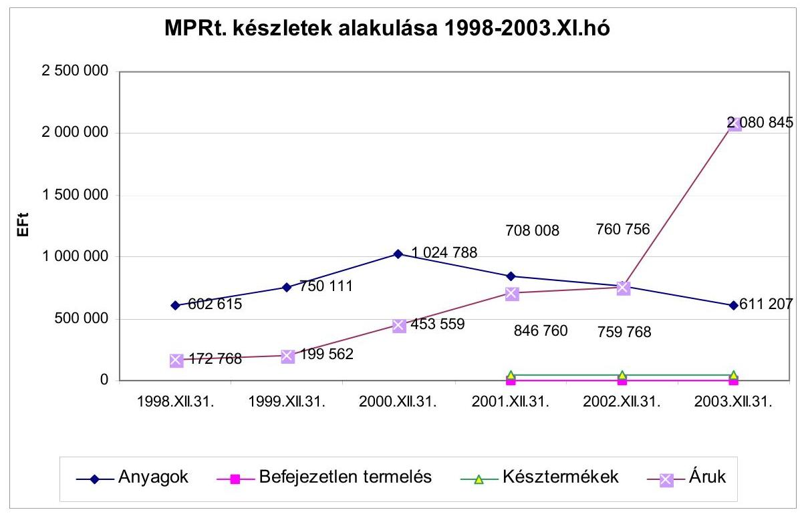
2. számú táblázat

# A pénzeszközök alakulása (év végén) 

|  |  |  |  |  |  | millió Ft |
| :-- | --: | --: | --: | --: | --: | --: |
| Megnevezés | 1998 | 1999 | 2000 | 2001 | 2002 | 2003 |
| Készpénz, csekkek | 32736 | 40678 | 20497 | 9864 | 9022 | 11276 |
| Bankbetétek | 21425 | 4936 | 3057 | 4902 | 7054 | 6944 |
| Összesen | 54161 | 45614 | 23554 | 14766 | 16076 | 18220 |

---

# A tárgyi eszközök bruttó-nettó értékének alakulása a vizsgált időszakban 

millió Ft

|  | 1999. jan.1. |  | 1999. dec. 31. |  | 2000. dec. 31. |  | 2001. dec. 31. |  | 2002. dec. 31. |  | 2003. dec.31. |  |
| :--: | :--: | :--: | :--: | :--: | :--: | :--: | :--: | :--: | :--: | :--: | :--: | :--: |
|  | btto | netto | btto | netto | btto | netto | btto | netto | btto | netto | btto | netto |
| ingatlan | 18268 | 16099 | 22237 | 19472 | 26147 | 22650 | 28046 | 23587 | 33131 | 27863 | 35984 | 29482 |
| műsz.berend. | 12758 | 6425 | 16895 | 8372 | 19270 | 8003 | 21312 | 7665 | 24863 | 8393 | 27661 | 7513 |
| egyéb | 2741 | 1424 | 4348 | 2247 | 6351 | 3046 | 7642 | 2857 | 9780 | 3281 | 10376 | 2572 |
| beruházás | 1264 | 1264 | 3955 | 3955 | 2602 | 2602 | 5404 | 5404 | 5305 | 5302 | 6856 | 6743 |
| összesen | 35032 | 25212 | 47435 | 34045 | 54370 | 36301 | 62405 | 39513 | 73079 | 44839 | 80877 | 46310 |

4. számú táblázat

## A vizsgált időszak alatt értékesített és társaságba vitt (apportként átadott) ingatlanok adatai

ezer Ft

| év | brutto | Écs | netto | értékesítés | társaságba   vitel értéke | Eredmény |
| :--: | --: | --: | --: | --: | --: | --: |
| 1999 | 6889 | -1923 | 4966 | 89067 | 0 | 84101 |
| 2000 | 79888 | -4410 | 75478 | 225185 | 0 | 149707 |
| 2001 | 454080 | -39261 | 414819 | 85309 | 3316000 | 2986490 |
| 2002 | 268291 | -55617 | 212674 | 125003 | 447000 | 359329 |
| 2003 | 240 | -52 | 188 | 2912 | 0 | 2724 |
| összesen | 809388 | -101263 | 708125 | 527476 | 3763000 | 3582351 |

---

# A postai ingatlanállomány megoszlása funkcionális szempontból 

|  | Összesen | Tulajdon | Bérlet | Használat |
| :--: | :--: | :--: | :--: | :--: |
| Postahálózat |  |  |  |  |
| nagy posták | 132 | 114 | 14 | 4 |
| középposták | 579 | 455 | 114 | 10 |
| kisposták | 2373 | 1307 | 957 | 109 |
| Postahálózat összesen: | 3084 | 1876 | 1085 | 123 |
| Egyéb ingatlanok |  |  |  |  |
| szállítási üzemek | 58 | 40 | 15 | 3 |
| feldolgozó és fenntartási üzemek | 73 | 17 | 56 | - |
| irodaépületek | 36 | 17 | 21 | - |
| raktárak | 30 | 9 | 18 | 3 |
| jóléti épületek | 49 | 39 | 8 | 2 |
| beépítetlen telkek | 59 | 52 | 3 | 4 |
| Egyéb ingatlanok összesen: | 307 | 174 | 121 | 12 |
| Mindösszesen | 3391 | 2050 | 1206 | 135 |

6. számú táblázat

## Az ingatlanok megoszlása régiónkénti bontásban

db

|  | Tulajdon | Bérlet | Használat | Összesen |
| :-- | --: | --: | --: | --: |
| Budapest | 89 | 188 | 15 | 292 |
| BUVI terület | 355 | 194 | 13 | 562 |
| Debreceni terület | 324 | 113 | 3 | 440 |
| Miskolci terület | 311 | 123 | 12 | 446 |
| Pécsi terület | 413 | 211 | 36 | 660 |
| Soproni terület | 282 | 311 | 54 | 647 |
| Szegedi terület | 276 | 66 | 2 | 344 |
| Összesen | 2050 | 1206 | 135 | 3391 |
| $\%$ | 60,5 | 35,5 | 4,0 | 100 |

---

# A Magyar Posta Rt. társaságokban meglévő tulajdona a vizsgált évek végén

|  | 1999. |  | 2000. |  | 2001. |  | 2002. |  | 2003. |  |
| :--: | :--: | :--: | :--: | :--: | :--: | :--: | :--: | :--: | :--: | :--: |
|  | $\begin{gathered} \hline \text { millió } \\ \text { Ft } \end{gathered}$ | \% | $\begin{gathered} \hline \text { millió } \\ \text { Ft } \end{gathered}$ | \% | $\begin{gathered} \hline \text { millió } \\ \text { Ft } \end{gathered}$ | \% | $\begin{gathered} \hline \text { millió } \\ \text { Ft } \end{gathered}$ | \% | $\begin{gathered} \hline \text { millió } \\ \text { Ft } \end{gathered}$ | \% |
| Postaautó Bp. Kft. | 57,8 | 100,0 | 57,8 | 99,9 | 61,6 | 99,9 | - | - | - | - |
| Postaautó Pécs Kft. | 40,8 | 100,0 | 40,8 | 99,9 | 84,8 | 99,8 | - | - | - | - |
| Postaautó Debrecen Kft. | 54,8 | 100,0 | 58,4 | 99,9 | 58,4 | 99,9 | - | - | - | - |
| Postaautó Miskolc Kft. | 45,9 | 100,0 | 45,9 | 99,9 | 72,4 | 99,8 | - | - | - | - |
| Postaautó Sopron Kft. | 37,6 | 100,0 | 51,7 | 99,9 | 122,0 | 99,8 | - | - | - | - |
| Postaautó Szeged Kft. | 37,7 | 100,0 | 40,2 | 99,9 | 87,7 | 99,8 | - | - | - | - |
| Postaautó Duna Rt. | - | - | - | - | - | - | 621,9 | 99,9 | 622,3 | 99,9 |
| Postaautó Tisza Rt. | - | - | - | - | - | - | 509,9 | 99,9 | 510,1 | 99,9 |
| Jármújavítók összesen | 274,6 | - | 294,8 | - | 486,9 | - | 1131,8 | - | 1132,4 | - |
| INT Ingatlanforg. Kft. | - | - | 1299,9 | 99,9 | 1299,9 | 99,9 | 1300,0 | 100,0 | 1300,0 | 100 |
| Sas Ingatlanforg. Kft. | - | - | - | - | 652,9 | 96,7 | 653* | 100,0 | 653* | 100 |
| Verseny Ingatlanforg. Kft. | - | - | - | - | 378,9 | 96,7 | 379* | 100,0 | 379* | 100 |
| Ingatlanforg-k összesen | - | - | 1299,9 | - | 2331,7 | - | 1300,0 | - | 1300 | - |
| Hírép Kft. | 49,5 | 100,0 | 49,5 | 99,9 | 664,8 | 99,9 | 0,0 | 0,0 | - | - |
| Postabank Rt. | 0,7 | 0,0 | 0,7 | 0,0 | 0,7 | 0,0 | 33 930,2 | 97,0 | - | - |
| Generali-Providencia Rt. | 596,7 | 10,0 | 846,7 | 10,0 | - | - | - | - | - | - |
| V.R.A.M. | 2556,9 | 10,0 | 5796,9 | 10,0 | - | - | - | - | - | - |
| Defend Security Kft. | - | - | 285,0 | 52,0 | 285,0 | 20,7 | 0,0 | 20,7 | 0,0 | 20,7 |
| MP Tetra Rt. | - | - | - | - | 600,0 | 60,0 | 0,0 | 60,0 | 0,0 | 60,0 |
| Posta Logért Rt. | - | - | - | - | 199,9 | 99,7 | 93,0 | 100,0 | - | - |
| Posta Vámsped Kft. | - | - | - | - | 19,9 | 99,5 | 20,0 | 100,0 | 20,0 | 100,0 |
| Postás Sport Kft. | - | - | - | - | 1,5 | 51,0 | 0,0 | 0,0 | 0,0 | 0,0 |
| MP Biztosító Rt. | - | - | - | - | - | - | 330,8 | 45,0 | 218,1 | 33 |
| MP Életbiztosító Rt. | - | - | - | - | - | - | 771,8 | 45,0 | 476,4 | 45 |
| EUROHÍVÓ Rt. | - | - | - | - | - | - | 0,1 | 100,0 | 0 | 100 |
| Árpád Üzletház Egyesú- | - | - | - | - | 0,1 | 0,0 | 0,1 | 0,0 | 0,1 | 0,0 |
| Összesen: | 3478,5 | - | 8573,6 | - | 4590,5 | - | 37577,8 | - | 705,6 | - |

*Értékesítési terv miatt forgóeszközzé minősítették, ezért értékük nem szerepel az összesenben

---

# A Magyar Posta Rt. likviditási mutatói 1999-2003. években

|  Megnevezés | 1999. év
$\%$ | 2000. év
$\%$ | 2001. év
$\%$ | 2002. év
$\%$ | 2003.év
$\%$  |
| --- | --- | --- | --- | --- | --- |
|  Likviditási ráta
(forgóeszközök/rövid le-
járatú kötelezettség) | 94,02 | 75,05 | 72,56 | 64,73 | 122,38  |
|  Pénzhányad
(pénzállomány/rövid le-
járatú kötelezettségek) | 68,69 | 47,58 | 29,86 | 31,41 | 19,87  |
|  Likviditási gyorsráta I.
/pénzállomány+vevők/
rövid lejáratú kötelezettségek) | 74,67 | 57,86 | 41,60 | 43,30 | 27,02  |
|  Likviditási gyorsráta II.
(pénzállomány+követ.)/
rövid lejáratú kötelezettségek) | 92,56 | 72,03 | 69,31 | 59,65 | 117,71  |
|  Likviditási mutató
(pénzállomány + követelés +
áruk + adott előlegek)
rövid lejáratú kötelezettségek | 92,89 | 72,98 | 70,74 | 61,14 | 119,99  |

1.  számú táblázat

A Magyar Posta Rt. követeléseinek alakulása 1999-2003. években

|  Követelések megnevezése | 1999
milliárd Ft | 2000
milliárd Ft | 2001
milliárd Ft | 2002
milliárd Ft | 2003
milliárd Ft  |
| --- | --- | --- | --- | --- | --- |
|  Áruszállításból és szol-
gáltatásból | 3,973 | 4,960 | 5,804 | 6,085 | 6,556  |
|  Követelések kapcsolt vál-
lalkozással szemben | - | 0,127 | 6,286 | 2,236 | 1,057  |
|  Egyéb követelések | 11,882 | 7,016 | 7,412 | 6,130 | $82,122^{*}$  |
|  ÖSSESEN | 15,885 | $12,103^{ }$ | 19,502 | 14,451 | 89,735  |

- Postabanki részesedés értékesítéséből fennálló követelés: 78,217 milliárd Ft ** a Számviteli törvény módosítása miatt 11,671 milliárd Ft

---

Befektetések hatása az eredményre, 1999.

|  20 | Megnevezés | Eredmény |  | 1999/99  |
| --- | --- | --- | --- | --- |
|  8860000000 | Részesedés kivez. Ért. | 225000000 | - | 225000000  |
|  9860000000 | Részesedés fejében átvett eszk. Ért. | 596708400 | + | 596708400  |
|  Eredményhatás |  | 371708400 | + | 371708400  |

---

Befektetések hatása az eredményre, 2000.

|  Gy | Megyrovsz | 2000 |  | 2000 se  |
| --- | --- | --- | --- | --- |
|  9720000000 | Kapott osztalék, részesedés | 30000000 | + | 30000000  |
|  Eredményhatás |  |  | + | 30000000  |

---

10/c. számú táblázat

Befektetések hatása az eredményre, 2001.

|  SZ | MÉRTEZET |  |  |  |  |  |  |  |  |  |  |  |  |  |  |  |  |  |  |  |  |  |   |
| --- | --- | --- | --- | --- | --- | --- | --- | --- | --- | --- | --- | --- | --- | --- | --- | --- | --- | --- | --- | --- | --- | --- | --- |
|  8672100000 | Értékvesztés a határidőn túli és kétes követelésekre |  |  |  |  |  |  |  |  |  |  |  |  |  |  |  |  |  |  |  |  |  |   |
|  9721000000 | Részesedések értékesítésének árfolyamnyeresége |  |  |  |  |  |  |  |  |  |  |  |  |  |  |  |  |  |  |  |  |  |   |
|  972124 966 |  |  |  |  |  |  |  |  |  |  |  |  |  |  |  |  |  |  |  |  |  |  |   |
|  572 124 966 |  |  |  |  |  |  |  |  |  |  |  |  |  |  |  |  |  |  |  |  |  |  |   |
|  2 369 926 612 |  |  |  |  |  |  |  |  |  |  |  |  |  |  |  |  |  |  |  |  |  |  |   |
|  146 992 |
 000 |  |  |  |  |  |  |  |  |  |  |  |  |  |  |  |  |  |  |  |  |  |  |   |
| 0 |  |  |  |  |  |  |  |  |  |  |  |  |  |  |  |  |  |  |  |  |  |  |   |
| 0 |  |  |  |  |  |  |  |  |  |  |  |  |  |  |  |  |  |  |  |  |  |  |   |
| 2 369 926 612 |  |  |  |  |  |  |  |  |  |  |  |  |  |  |  |  |  |  |  |  |  |  |   |
| 146 992 000 |  |  |  |  |  |  |  |  |  |  |  |  |  |  |  |  |  |  |  |  |  |  |   |
| 0 |  |  |  |  |  |  |  |  |  |  |  |  |  |  |  |  |  |  |  |  |  |  |   |
| 0 |  |  |  |  |  |  |  |  |  |  |  |  |  |  |  |  |  |  |  |  |  |  |   |
| 2 369 926 612 |  |  |  |  |  |  |  |  |  |  |  |  |  |  |  |  |  |  |  |  |  |  |   |
| 146 992 000 |  |  |  |  |  |  |  |  |  |  |  |  |  |  |  |  |  |  |  |  |  |  |   |
| 0 |  |  |  |  |  |  |  |  |  |  |  |  |  |  |  |  |  |  |  |  |  |  |   |
| 0 |  |  |  |  |  |  |  |  |  |  |  |  |  |  |  |  |  |  |  |  |  |  |   |
| 2 369 926 612 |  |  |  |  |  |  |  |  |  |  |  |  |  |  |  |  |  |  |  |  |  |  |   |
| 146 992 000 |  |  |  |  |  |  |  |  |  |  |  |  |  |  |  |  |  |  |  |  |  |  |   |
| 0 |  |  |  |  |  |  |  |  |  |  |  |  |  |  |  |  |  |  |  |  |  |  |   |
| 0 |  |  |  |  |  |  |  |  |  |  |  |  |  |  |  |  |  |  |  |  |  |  |   |
| 2 369 926 612 |  |  |  |  |  |  |  |  |  |  |  |  |  |  |  |  |  |  |  |  |  |  |   |
| 146 992 000 |  |  |  |  |  |  |  |  |  |  |  |  |  |  |  |  |  |  |  |  |  |  |   |
| 0 |  |  |  |  |  |  |  |  |  |  |  |  |  |  |  |  |  |  |  |  |  |  |   |
| 0 |  |  |  |  |  |  |  |  |  |  |  |  |  |  |  |  |  |  |  |  |  |  |   |
| 2 369 926 612 |  |  |  |  |  |  |  |  |  |  |  |  |  |  |  |  |  |  |  |  |  |  |   |
| 146 992 000 |  |  |  |  |  |  |  |  |  |  |  |  |  |  |  |  |  |  |  |  |  |  |   |
| 0 |  |  |  |  |  |  |  |  |  |  |  |  |  |  |  |  |  |  |  |  |  |  |   |
| 0 |  |  |  |  |  |  |  |  |  |  |  |  |  |  |  |  |  |  |  |  |  |  |   |
| 2 369 926 612 |  |  |  |  |  |  |  |  |  |  |  |  |  |  |  |  |  |  |  |  |  |  |   |
| 146 992 000 |  |  |  |  |  |  |  |  |  |  |  |  |  |  |  |  |  |  |  |  |  |  |   |
| 0 |  |  |  |  |  |  |  |  |  |  |  |  |  |  |  |  |  |  |  |  |  |  |   |
| 0 |  |  |  |  |  |  |  |  |  |  |  |  |  |  |  |  |  |  |  |  |  |  |   |
| 2 369 926 612 |  |  |  |  |  |  |  |  |  |  |  |  |  |  |  |  |  |  |  |  |  |  |   |
| 146 992 000 |  |  |  |  |  |  |  |  |  |  |  |  |  |  |  |  |  |  |  |  |  |  |   |
| 0 |  |  |  |  |  |  |  |  |  |  |  |  |  |  |  |  |  |  |  |  |  |  |   |
| 0 |  |  |  |  |  |  |  |  |  |  |  |  |  |  |  |  |  |  |  |  |  |  |   |
| 2 369 926 612 |  |  |  |  | |  |  |  |  |  |  |  |  |  |  |  |  |  |  |  |  |   |
|  146 992 000 |  |  |  |  |  |  |  |  |  |  |  |  |  |  |  |  |  |  |  |  |  |  |   |
|  0 |  |  |  |  |  |  |  |  |  |  |  |  |  |  |  |  |  |  |  |  |  |  |   |
|  0 |  |  |  |  |  |  |  |  |  |  |  |  |  |  |  |  |  |  |  |  |  |  |   |
|  2 369 926 612 |  |  |  |  |  |  |  |  |  |  |  |  |  |  |  |  |  |  |  |  |  |  |   |
|  146 992 000 |  |  |  |  |  |  |  |  |  |  |  |  |  |  |  |  |  |  |  |  |  |  |   |
|  0 |  |  |  |  |  |  |  |  |  |  |  |  |  |  |  |  |  |  |  |  |  |  |   |
|  0 |  |  |  |  |  |  |  |  |  |  |  |  |  |  |  |  |  |  |  |  |  |  |   |
|  2 369 926 612 |  |  |  |  |  |  |  |  |  |  |  |  |  |  |  |  |  |  |  |  |  |  |   |
|  146 992 000 |  |  |  |  |  |  |  |  |  |  |  |  |  |  |  |  |  |  |  |  |  |  |   |
|  0 |  |  |  |  |  |  |  |  |  |  |  |  |  |  |  |  |  |  |  |  |  |  |   |
|  0 |  |  |  |  |  |  |  |  |  |  |  |  |  |  |  |  |  |  |  |  |  |  |   |
|  2 369 926 612 |  |  |  |  |  |  |  |  |  |  |  |  |  |  |  |  |  |  |  |  |  |  |   |
|  146 992 000 |  |  |  |  |  |  |  |  |  |  |  |  |  |  |  |  |  |  |  |  |  |  |   |
|  0 |  |  |  |  |  |  |  |  |  |  |  |  |  |  |  |  |  |  |  |  |  |  |   |
|  0 |  |  |  |  |  |  |  |  |  |  |  |  |  |  |  |  |  |  |  |  |  |  |   |
|  2 369 926 612 |  |  |  |  |  |  |  |  |  |  |  |  |  |  |  |  |  |  |  |  |  |  |   |
|  146 992 000 |  |  |  |  |  |  |  |  |  |  |  |  |  |  |  |  |  |  |  |  |  |  |   |
|  0 |  |  |  |  |  |  |  |  |  |  |  |  |  |  |  |  |  |  |  |  |  |  |   |
|  0 |  |  |  |  |  |  |  |  |  |  |  |  |  |  |  |  |  |  |  |  |  |  |   |
|  2 369 926 612 |  |  |  |  |  |  |  |  |  |  |  |  |  |  |  |  |  |  |  |  |  |  |   |
|  146 992 000 |  |  |  |  |  |  |  |  |  |  |  |  |  |  |  |  |  |  |  |  |  |  |   |
|  0 |  |  |  |  |  |  |  |  |  |  |  |  |  |  |  |  |  |  |  |  |  |  |   |
|  0 |  |  |  |  |  |  |  |  |  |  |  |  |  |  |  |  |  |  |  |  |  |  |   |
|  2 369 926 612 |  |  |  |  |  |  |  |  |  |  |  |  |  |  |  |  |  |  |  |  |  |  |   |
|  146 992 000 |  |  |  |  |  |  |  |  |  |  |  |  |  |  |  |  |  |  |  |  |  |  |   |
|  0 |  |  |  |  |  |  |  |  |  |  |  |  |  |  |  |  |  |  |  |  |  |  |   |
|  0 |  |  |  |  |  |  |  |  |  |  |  |  |  |  |  |  |  |  |  |  |  |  |   |
|  2 369 926 612 |  |  |  |  |  |  |  |  |  |  |  |  |  |  |  |  |  |  |  |  |  |  |   |
|  146 992 000 |  |  |  |  |  |  |  |  |  |  |  |  |  |  |  |  |  |  |  |  |  |  |   |
|  0 |  |  |  |  |  |  |  |  |  |  |  |  |  |  |  |  |  |  |  |  |  |  |   |
|  0 |  |  |  |  |  |  |  |  |  |  |  |  |  |  |  |  |  |  |  |  |  |  |   |
|  2 369 926 612 |  |  |  |  |  |  |  |  |  |  |  |  |  |  |  |  |  |  |  |  |  |  |   |
|  146 992 000 |  |  |  |  |  |  |  |  |  |  |  |  |  |  |  |  |  |  |  |  |  |  |   |
|  0 |  |  |  |  |  |  |  |  |  |  |  |  |  |  |  |  |  |  |  |  |  |  |   |
|  0 |  |  |  |  |  |  |  |  |  |  |  |  |  |  |  |  |  |  |  |  |  |  |   |
|  2 369 926 612 |  |  |  |  |  |  |  |  |  |  |  |  |  |  |  |  |  |  |  |  |  |  |   |
|  146 992 000 |  |  |  |  |  |  |  |  |  |  |  |  |  |  |  |  |  |  |  |  |  |  |   |
|  0 |  |  |  |  |  |  |  |  |  |  |  |  |  |  |  |  |  |  |  |  |  |  |   |
|  0 |  |  |  |  |  |  |  |  |  |  |  |  |  |  |  |  |  |  |  |  |  |  |   |
|  2 369 926 612 |  |  |  |  |  |  |  |  |  |  |  |  |  |  |  |  |  |  |  |  |  |  |   |
|  146 992 000 |  |  |  |  |  |  |  |  |  |  |  |  |  |  |  |  |  |  |  |  |  |  |   |
|  0 |  |  |  |  |  |  |  |  |  |  |  |  |  |  |  |  |  |  |  |  |  |  |   |
|  0 |  |  |  |  |  |  |  |  |  |  |  |  |  |  |  |  |  |  |  |  |  |  |  |   |
|  2 369 926 612 |  |  |  |  |  |  |  |  |  |  |  |  |  |  |  |  |  |  |  |  |  |  |  |   |
|  146 992 000 |  |  |  |  |  |  |  |  |  |  |  |  |  |  |  |  |  |  |  |  |  |  |  |   |
|  0 |  |  |  |  |  |  |  |  |  |  |  |  |  |  |  |  |  |  |  |  |  |  |  |   |
|  0 |  |  |  |  |  |  |  |  |  |  |  |  |  |  |  |  |  |  |  |  |  |  |  |   |
|  2 369 926 612 |  |  |  |  |  |  |  |  |  |  |  |  |  |  |  |  |  |  |  |  |  |  |  |   |
|  146 992 000 |  |  |  |  |  |  |  |  |  |  |  |  |  |  |  |  |  |  |  |  |  |  |  |   |
|  0 |  |  |  |  |  |  |  |  |  |  |  |  |  |  |  |  |  |  |  |  |  |  |  |   |
|  0 |  |  |  |  |  |  |  |  |  |  |  |  |  |  |  |  |  |  |  |  |  |  |  |   |
|  2 369 926 612 |  |  |  |  |  |  |  |  |  |  |  |  |  |  |  |  |  |  |  |  |  |  |  |   |
|  146 992 000 |  |  |  |  |  |  |  |  |  |  |  |  |  |  |  |  |  |  |  |  |  |  |  |   |
|  0 |  |  |  |  |  |  |  |  |  |  |  |  |  |  |  |  |  |  |  |  |  |  |  |   |
|  0 |  |  |  |  |  |  |  |  |  |  |  |  |  |  |  |  |  |  |  |  |  |  |  |   |
|  2 369 926 612 |  |  |  |  |  |  |  |  |  |  |  |  |  |  |  |  |  |  |  |  |  |  |  |   |
|  146 992 000 |  |  |  |  |  |  |  |  |  |  |  |  |  |  |  |  |  |  |  |  |  |  |  |   |
|  0 |  |  |  |  |  |  |  |  |  |  |  |  |  |  |  |  |  |  |  |  |  |  |  |   |
|  0 |  |  |  |  |  |  |  |  |  |  |  |  |  |  |  |  |  |  |  |  |  |  |  |   |
|  2 369 926 612 |  |  |  |  |  |  |  |  |  |  |  |  |  |  |  |  |  |  |  |  |  |  |  |   |
|  146 992 000 |  |  |  |  |  |  |  |  |  |  |  |  |  |  |  |  |  |  |  |  |  |  |  |  |
|  0 |  |  |  |  |  |  |  |  |  |  |  |  |  |  |  |  |  |  |  |  |  |  |  |   |
|  0 |  |  |  |  |  |  |  |  |  |  |  |  |  |  |  |  |  |  |  |  |  |  |  |   |
|  2 369 926 612 |  |  |  |  |  |  |  |  |  |  |  |  |  |  |  |  |  |  |  |  |  |  |  |   |
|  146 992 000 |  |  |  |  |  |  |  |  |  |  |  |  |  |  |  |  |  |  |  |  |  |  |  |   |
|  0 |  |  |  |  |  |  |  |  |  |  |  |  |  |  |  |  |  |  |  |  |  |  |  |   |
|  0 |  |  |  |  |  |  |  |  |  |  |  |  |  |  |  |  |  |  |  |  |  |  |  |   |
|  2 369 926 612 |  |  |  |  |  |  |  |  |  |  |  |  |  |  |  |  |  |  |  |  |  |  |  |   |
|  146 992 000 |  |  |  |  |  |  |  |  |  |  |  |  |  |  |  |  |  |  |  |  |  |  |  |   |
|  0 |  |  |  |  |  |  |  |  |  |  |  |  |  |  |  |  |  |  |  |  |  |  |  |   |
|  0 |  |  |  |  |  |  |  |  |  |  |  |  |  |  |  |  |  |  |  |  |  |  |  |   |
|  2 369 926 612 |  |  |  |  |  |  |  |  |  |  |  |  |  |  |  |  |  |  |  |  |  |  |  |   |
|  146 992 000 |  |  |  |  |  |  |  |  |  |  |  |  |  |  |  |  |  |  |  |  |  |  |  |  |   |
|  0 |  |  |  |  |  |  |  |  |  |  |  |  |  |  |  |  |  |  |  |  |  |  |  |  |   |
|  2 369 926 612 |  |  |  |  |  |  |  |  |  |  |  |  |  |  |  |  |  |  |  |  |  |  |  |  |   |
|  146 992 000 |  |  |  |  |  |  |  |  |  |  |  |  |  |  |  |  |  |  |  |  |  |  |  |  |   |
|  0 |  |  |  |  |  |  |  |  |  |  |  |  |  |  |  |  |  |  |  |  |  |  |  |  |   |
|  2 369 926 612 |  |  |  |  |  |  |  |  |  |  |  |  |  |  |  |  |  |  |  |  |  |  |  |  |   |
|  146 992 000 |  |  |  |  |  |  |  |  |  |  |  |  |  |  |  |  |  |  |  |  |  |  |  |  |  |   |
|  0 |  |  |  |  |  |  |  |  |  |  |  |  |  |  |  |  |  |  |  |  |  |  |  |  |  |   |
|  2 369 926 612 |  |  |  |  |  |  |  |  |  |  |  |  |  |  |  |  |  |  |  |  |  |  |  |  |  |  |   |
|  146 992 000 |  |  |  |  |  |  |  |  |  |  |  |  |  |  |  |  |  |  |  |  |  |  |  |  |  |  |  |   |
|  0 |  |  |  |  |  |  |  |  |  |  |  |  |  |  |  |  |  |  |  |  |  |  |  |  |  |  |  |   |
|  2 369 926 612 |  |  |  |  |  |  |  |  |  |  |  |  |  |  |  |  |  |  |  |  |  |  |  |  |  |  |  |  |   |
|  146 992 000 |  |  |  |  |  |  |  |  |  |  |  |  |  |  |  |  |  |  |  |  |  |  |  |  |  |  |  |  |   |
|  0 |  |  |  |  |  |  |  |  |  |  |  |  |  |  |  |  |  |  |  |  |  |  |  |  |  |  |  |  |   |
|  2 369 926 612 |  |  |  |  |  |  |  |  |  |  |  |  |  |  |  |  |  |  |  |  |  |  |  |  |  |  |  |  |  |   |
|  146 992 000 |  |  |  |  |  |  |  |  |  |  |  |  |  |  |  |  |  |  |  |  |  |  |  |  |  |  |  |  |  |  |   |
|  0 |  |  |  |  |  |  |  |  |  |  |  |  |  |  |  |  |  |  |  |  |  |  |  |  |  |  | |  |  |  |   |
|  2 369 926 612 |  |  |  |  |  |  |  |  |  |  |  |  |  |  |  |  |  |  |  |  |  |  |  |  |  |  |  |  |  |  |  |  |   |
|  0 |  |  |  |  |  |  |  |  |  |  |  |  |  |  |  |  |  |  |  |  |  |  |  |  |  |  |  |  |  |  |  |  |   |
|  2 369 926 612 |  |  |  |  |  |  |  |  |  |  |  |  |  |  |  |  |  |  |  |  |  |  |  |  |  |  |  |  |  |  |  |  |  |  |  |   |
|  0 |  |  |  |  |  |  |  |  |  |  |  |  |  |  |  |  |  |  |  |  |  |  |  |  |  |  |  |  |  |  |  |  |  |  |   |
|  2 369 926 612 |  |  |  |  |  |  |  |  |  |  |  |  |  |  |  |  |  |  |  |  |  |  |  |  |  |  |  |  |  |  |  |  |  |  |  |  |   |
|  146 992 000 |  |  |  |  |  |  |  |  |  |  |  |  |  |  |  |  |  |  |  |  |  |  |  |  |  |  |  |  |  |  |  |  |  |  |  |  |  |   |
|  0 |  |  |  |  |  |  |  |  |  |  |  |  |  |  |  |  |  |  |  |  |  |  |  |  |  |  |  |  |  |  |  |  |  |  |  |  |   |
|  2 369 926 612 |  |  |  |  |  |  |  |  |  |  |  |  |  |  |  |  |  |  |  |  |  |  |  |  |  |  |  |  |  |  |  |  |  |  |  |  |  |  |   |
|  0 |  |  |  |  |  |  |  |  |  |  |  |  |  |  |  |  |  |  |  |  |  |  |  |  |  |  |  |  |  |  |  |  |  |  |  |  |  |   |
|  2 369 926 612 |  |  |  |  |  |  |  |  |  |  |  |  |  |  |  |  |  |  |  |  |  |  |  |  |  |  |  |  |  |  |  |  |  |  |  |  |  |  |  |   |
|  0 |  |  |  |  |  |  |  |  |  |  |  |  |  |  |  |  |  |  |  |  |  |  |  |  |  |  |  |  |  |  |  |  |  |  |  |  |  |  |   |
|  2 369 926 612 |  |  |  |  |  |  |  |  |  |  |  |  |  |  |  |  |  |  |  |  |  |  |  |  |  |  |  |  |  |  |  |  |  |  |  |  |  |  |  |  |   |
|  0 |  |  |  |  |  |  |  |  |  |  |  |  |  |  |  |  |  |  |  |  |  |  |  |  |  |  |  |  |  |  |  |  |  |  |  |  |  |  |  |  |   |
|  2 369 926 612 |  |  |  |  |  |  |  |  |  |  |  |  |  |  |  |  |  |  |  |  |  |  |  |  |  |  |  |  |  |  |  |  |  |  |  |  |  |  |  |  |  |  |  |   |
|  0 |  |  |  |  |  |  |  |  |  |  |  |  |  |  |  |  |  |  |  |  |  |  |  |  |  |  |  |  |  |  |  |  |  |  |  |  |  |  |  |  |  |  |  |  |  |  |  |   |
|  2 369 926 612 |  |  |  |  |  |  |  |  |  |  |  |  |  |  |  |  |  |  |  |  |  |  |  |  |  |  |  |  |  |  |  |  |  |  |  |  |  |  |  |  |  |  |  |  |  |  |  |  |   |
|  0 |  |  |  |  |  |  |  |  |  |  |  |  |  |  |  |  |  |  |  |  |  |  |  |  |  |  |  |  |  |  |  |  |  |  |  |  |  |  |  |  |  |  |  |  |  |  |  |  |   |
|  2 369 926 612 |  |  |  |  |  |  |  |  |  |  |  |  |  |  |  |  |  |  |  |  |  |  |  |  |  |  |  |  |  |  |  |  |  |  |  |  |  |  |  |  |  |  |  |  |  |  |  |  |  |  |   |
|  0 |  |  |  |  |  |  |  |  |  |  |  |  |  |  |  | |  |  |  |  |  |  |  |  |  |  |  |  |  |  |  |  |  |  |  |  |  |  |  |  |  |  |  |  |  |  |  |  |  |  |  |  |  |  |  |  |  |  |   |
|  2 369 926 612 |  |  |  |  |  |  |  |  |  |  |  |  |  |  |  |  |  |  |  |  |  |  |  |  |  |  |  |  |  |  |  |  |  |  |  |  |  |  |  |  |  |  |  |  |  |  |  |  |  |  |  |  |  |  |  |  |  |  |  |  |   |
|  2 369 926 612 |  |  |  |  |  |  |  |  |  |  |  |  |  |  |  |  |  |  |  |  |  |  |  |  |  |  |  |  |  |  |  |  |  |  |  |  |  |  |  |  |  |  |  |  |  |  |  |  |  |  |  |  |  |  |  |  |  |  |  |  |  |  |  |  |  |  |  |  |  |  |  |  |  |  |  |  |  |  |  |  |  |  |  |  |  |  |  |  |  |  |  |  |  |  |  |  |  |   |   |   |   |   |   |   |   |   |   |   |   |   |   |   |   |   |   |   |   |   |   |   |   |   |  |  |  |  |  |  |  |  |  |  |  |  |  |  |  |  |  |  |  |  |  |  |  |  |  |  |  |  |  |  |  |  |  |  |  |  |  |  |  |  |  |  |  |  |  |  |  |  |  |  |  |  |  |  |  |  |  |  |  |  |  |  |  |  |  |  |  |  |  |  |  |  |  |  |  |  |  |  |  |  |  |  |  |  |  |  |  |  |  |  |  |  |  |  |  |  |  |  |  | 

---

## 10/d. számú táblázat

|  KÉSZ |  |  |  |  |  |  |  |  |  |  |  |  |  |  |  |  |  |  |  |   |
| --- | --- | --- | --- | --- | --- | --- | --- | --- | --- | --- | --- | --- | --- | --- | --- | --- | --- | --- | --- | --- |
|  |   |   |   |   |   |   |   |   |   |   |   |   |   |   |   |   |   |   |   |   |
|  |   |   |   |   |   |   |   |   |   |   |   |   |   |   |   |   |   |   |   |   |
|  |   |   |   |   |   |   |   |   |   |   |   |   |   |   |   |   |   |   |   |   |
|  |   |   |   |   |   |   |   |   |   |   |   |   |   |   |   |   |   |   |   |   |
|  |   |   |   |   |   |   |   |   |   |   |   |   |   |   |   |   |   |   |   |   |
|  |   |   |   |   |   |   |   |   |   |   |   |   |   |   |   |   |   |   |   |   |
|  |   |   |   |   |   |   |   |   |   |   |   |   |   |   |   |   |   |   |   |   |
|  867240000 | Értékvesztés alszám. egyéb követelésre |  |  |  |  |  |  |  |  |  |  |  |  |  |  |  |  |  |  |   |
|  8641000000 | Céltartalék-képzés a várható kötelező fedezetére |  |  |  |  |  |  |  |  |  |  |  |  |  |  |  |  |  |  |   |
|  8721000000 | Készesetések értékesítésének árfolyamvesztesége |  |  |  |  |  |  |  |  |  |  |  |  |  |  |  |  |  |  |   |
|  8751100000 | Tartós tulajdoni részesedés értékvesztése |  |  |  |  |  |  |  |  |  |  |  |  |  |  |  |  |  |  |   |
|  8831000000 | Készesetések kivezetendő könyvi értéke |  |  |  |  |  |  |  |  |  |  |  |  |  |  |  |  |  |  |   |
|  8844000000 | Más vállalt, nem fejlesztési nőttig adott pénzes |  |  |  |  |  |  |  |  |  |  |  |  |  |  |  |  |  |  |   |
|  8711000000 | Képzési céltartalék, részletezésre |  |  |  |  |  |  |  |  |  |  |  |  |  |  |  |  |  |  |   |
|  8672100000 | Hat. köteleződésektől követelésekre év, visszalk. |  |  |  |  |  |  |  |  |  |  |  |  |  |  |  |  |  |  |   |
|  Eredményhatás |  | | | | | | | | | | | | | | | | | | | |
| | | | | | | | | | | | | | | | | | | | |
| | | | | | | | | | | | | | | | | | | | |
| | | | | | | | | | | | | | | | | | | | |
| | | | | | | | | | | | | | | | | | | | |
| | | | | | | | | | | | | | | | | | | | |
| | | | | | | | | | | | | | | | | | | | |
| | | | | | | | | | | | | | | | | | | | |
| | | | | | | | | | | | | | | | | | | | |
| | | | | | | | | | | | | | | | | | | | |
| | | | | | | | | | | | | | | | | | | | |
| | | | | | | | | | | | | | | | | | | | |
| | | | | | | | | | | | | | | | | | | | |
 |   |   |   |   |   |   |   |   |   |
|---|---|---|---|---|---|---|---|---|
|   |   |   |   |   |   |   |   |   |   |   |   |   |   |   |   |   |   |   |   |   |
|   |   |   |   |   |   |   |   |   |   |   |   |   |   |   |   |   |   |   |   |   |
|   |   |   |   |   |   |   |   |   |   |   |   |   |   |   |   |   |   |   |   |   |
|   |   |   |   |   |   |   |   |   |   |   |   |   |   |   |   |   |   |   |   |   |
|   |   |   |   |   |   |   |   |   |   |   |   |   |   |   |   |   |   |   |   |   |
|   |   |   |   |   |   |   |   |   |   |   |   |   |   |   |   |   |   |   |   |   |
|   |   |   |   |   |   |   |   |   |   |   |   |   |   |   |   |   |   |   |   |   |
|   |   |   |   |   |   |   |   |   |   |   |   |   |   |   |   |   |   |   |   |   |
|   |   |   |   |   |   |   |   |   |   |   |   |   |   |   |   |   |   |   |   |   |
|   |   |   |   |   |   |   |   |   |   |   |   |   |   |   |   |   |   |   |   |   |
|   |   |   |   |   |   |   |   |   |   |   |   |   |   |   |   |   |   |   |   |   |
|   |   |   |   |   |   |   |   |   |   |   |   |   |   |   |   |   |   |   |   |   |
|   |   |   |   |   |   |   |   |   |   |   |   |   |   |   |   |   |   |   |   |   |
|   |   |   |   |   |   |   |   |   |   |   |   |   |   |   |   |   |   |   |   |   |
|   |   |   |   |   |   |   |   |   |   |   |   |   |   |   |   |   |   |   |   |   |
|   |   |   |   |   |   |   |   |   |   |   |   |   |   |   |   |   |   |   |   |   |
|   |   |   |   |   |   |   |   |   |   |   |   |   |   |   |   |   |   |   |   |   |
|   |   |   |   |   |   |   |   |   |   |   |   |   |   |   |   |   |   |   |   |   |
|   |   |   |   |   |   |   |   |   |   |   |   |   |   |   |   |   |   |   |   |   |

---

10/e. számú táblázat

| KN | Megnevezés | Postabank | Logért | Eurohívó | TETRA | Defend | JNT Kft. | Posta autó Duna Rt. | Posta autó Tisza Rt. | MP Biztosító Rt. | MP Előtbiztosító Rt. | 2003. évi tény |
| --- | --- | --- | --- | --- | --- | --- | --- | --- | --- | --- | --- | --- |
| 8541000000 | Értékvesztés elszám. egyéb követelésre |  |  |  |  |  |  |  |  |  |  | 10 000 000 |
| 867240000 | Értékvesztés elszám. egyéb követelésre |  |  | 69 059 779 |  |  |  |  |  |  |  | 69 059 779 |
| 8721000000 | Részesedések értékesítésének árfolyamvesztesége |  |  |  |  |  |  | 6 583 |  |  |  | 6 583 |
| 8751100000 | Tartós tulajdoni részesedés értékvesztése |  |  | 100 000 |  |  |  |  |  | 112 619 000 | 304 329 000 | 417 048 000 |
| 8851000000 | Elengedett követelés könyv szerinti értéke |  |  |  |  | 10 014 542 | 156 796 859 |  |  |  |  | 166 811 401 |
| 8852000000 | Tartozásátvállalás szerződés szerinti értéke |  |  | 73 198 750 |  |  |  |  |  |  |  | 76 773 750 |
| 9641000000 | Céltart, felhaszn. a várható köt. fedezetére |  |  | 306 483 200 |  |  |  |  |  |  |  | 306 483 200 |
| 9721000000 | Részesedések értékesítésének árfolyamnyeresége |  |  |  |  |  |  |  |  |  |  | 57 706 433 304 |
| 9741400000 | Rövid lejáratú kölcsön kamata |  |  | 4 459 779 |  | 3 777 134 | 156 796 859 |  |  |  |  | 165 033 772 |
| 9822000000 | Részesedések fejében átveti eszközök értéke |  |  |
 |  |  |  |  |  |  |  | 96 910 721 |
|  |  |  |  |  |  |  |  |  |  |  |  |  |
|  |  |  |  |  |  |  |  |  |  |  |  |  |
| Eredménytelés |  |  | 57 706 427 067 | 99 522 475 | 158 584 450 | 2 813 246 | 0 | 0 | 0 | 6 237 | 0 | 57 535 161 154 |

---

10/f. számú táblázat

APPORT ÉRTÉKELÉSBŐL SZÁRMAZÓ EREDMÉNYHATÁS

| É | Tár. 10. 10. 10. |  |  |  |  |  |  |  |  |
| --- | --- | --- | --- | --- | --- | --- | --- | --- | --- |
|  |  |  |  |  |  |  |  |  | 03. 10. 10. |
| 1999. | társ.szerz.szerint |  |  |  |  |  |  |  |  |
|  | könyv szerint |  |  |  |  |  |  |  |  |
| 2000. | társ.szerz.szerint |  |  |  |  |  |  |  |  |
|  | könyv szerint |  |  |  |  |  |  |  |  |
| 2001. | társ.szerz.szerint | 1 850 000 000 | 376 000 000 | 440 000 000 |  | 650 000 000 |  |  | 03. 10. 10. 10. |
|  | könyv szerint | 277 069 294 | 32 911 064 | 32 418 154 |  | 65 820 128 |  |  | 03. 2. 10. 20. |
| 2002. | társ.szerz.szerint |  |  |  | 892 009 922 |  |  |  | 03. 2. 10. 20. |
|  | könyv szerint |  |  |  | 685 127 599 |  |  |  | 03. 2. 20. 20. |
| Apport értékelésből származó |  |  |  |  |  |  |  |  |  |
| eredményhatás |  | 1 572 930 706 | 343 088 936 | 407 581 846 | 206 882 323 | 584 179 872 |  |  | 03. 2. 20. 20. |

---

# Tanúsítványok jegyzéke

1.  A társaság vagyoni helyzetének alakulása (eszközök)
2.  A társaság vagyoni helyzetének alakulása (források)
3.  Bevételek alakulása
4.  A társaságnak juttatott költségvetési támogatások
5.  Költségek és ráfordítások alakulása
6.  A társaság költségeinek összetétele
7.  Eredmény alakulása
8.  Költségvetési befizetési kötelezettségek (adók, járulékok)
9.  Költségvetési támogatások alakulása 1999-2003.
10. Az állományi létszám alakulása
11. Az alaptevékenységet jellemző naturális mutatók a postai ellátottságról
12. Az alaptevékenységet jellemző naturális mutatók a levélpostai küldeményekről és a táviratforgalomról
13. Az egy főre jutó átlagjövedelem alakulása

---

MP Rt. Budapest

A társaság vagyoni helyzetének alakulása (ESZKÖZÖK)

| Megnevezés | 1999 | 2000 | 2001 | 2002 | 2003 |
| --- | --- | --- | --- | --- | --- |
| Befektetett eszközök | 41 269 | 51 640 | 53 893 | 90 461 | 84 127 |
| ebből: Immateriális javak | 2 949 | 5 699 | 7 748 | 7 090 | 5 289 |
| tárgyi eszközök | 34 052 | 36 317 | 40 283 | 44 839 | 72 775 |
| befektetett | 4 268 | 9 624 | 5 862 | 38 532 | 6 063 |
| Forgóeszközök | 62 435 | 37 152 | 35 876 | 33 126 | 112 229 |
| ebből: készletek | 965 | 1 494 | 1 606 | 1 567 | 2 735 |
| követelések | 15 856 | 12 103 | 19 503 | 14 450 | 89 736 |
| értékpapírok | - | - | - | 1 032 | 1 539 |
| pénzeszközök | 45 614 | 23 555 | 14 767 | 16 077 | 18 219 |
| Aktív időbeli elhatárolások | 1 804 | 1 566 | 1 616 | 1 479 | 1 150 |
| ESZKÖZÖK ÖSSZESEN | 105 508 | 90 358 | 91 385 | 125 066 | 197 506 |

Adatforrás:
 az éves beszámolók Tanúsítom, hogy az adatok a nyilvántartásban szereplőkkel megegyezőek! Budapest, 2002. 14. 14. 14. 14. 14. 14. 14. 14. 14. 14. 14. 14. 14. 14. 14. 14. 14. 14. 14. 14. 14. 14. 14. 14. 14. 14. 14. 14. 14. 14. 14. 14. 14. 14. 14. 14. 14. 14. 14. 14. 14. 14. 14. 14. 14. 14. 14. 14. 14. 14

---

MP Rt. Budapest

A társaság vagyoni helyzetének alakulása (FORRÁSOK)

|  Megnevezés | 1999 | 2000 | 2001 | 2002 | 2003  |
| --- | --- | --- | --- | --- | --- |
|  Saját tőke | 34 725 | 35 778 | 36 923 | 61 608 | 92 956  |
|  ebből: jegyzett tőke | 11 613 | 11 613 | 11 613 | 45 519 | 45 519  |
|  tőketartalék | 4 491 | 4 491 | 4 891 | 4 891 | 4 891  |
|  eredménytartalék | 15 318 | 18 250 | 19 451 | 20 256 | 10 265  |
|  lekötött tartalék | - | - | - | 23 | 796  |
|  értékelési tartalék | - | - | - |
 - | 26 464 |
| mérleg sz. eredmény | 3 303 | 1 424 | 968 | - 9 081 | 5 021 |
| Céltartalék | 283 | 597 | 133 | 881 | 561 |
| Kötelezettségek | 67 694 | 50 646 | 50 418 | 57 916 | 99 507 |
| Passzív időbeli elhatárolások | 2 806 | 3 337 | 3 911 | 4 661 | 4 482 |
| FORRÁSOK ÖSSZESEN | 105 508 | 90 358 | 91 385 | 125 066 | 197 506
 |

### **Bevételek alakulása**

|  Megnevezés | 1999 | 2000 | 2001 | 2002 | 2003  |
| --- | --- | --- | --- | --- | --- |
|  Értékesítés nettó árbevétele | 86 599 | 96 773 | 108 857 | 127 817 | 139 738  |
|  Aktivált saját teljesítmények értéke | 902 | 947 | 514 | 524 | 651  |
|  Egyéb bevételek | 1 153 | 1 060 | 1 519 | 1 778 | 1 802  |
|  Pénzügyi műveletek bevételei | 3 180 | 6 538 | 3 923 | 760 | 58 895  |
|  Rendkívüli bevételek | 686 | 238 | 3 552 | 1 139 | 383  |
|  BEVÉTELEK ÖSSZESEN | 92 520 | 105 556 | 118 365 | 132 018 | 201 469  |

**Adatforrás:** az éves beszámolók

**Tanúsítom, hogy az adatok a nyilvántartásban szereplőkkel megegyezőek!**

**Budapest, 2003** *május* 17.

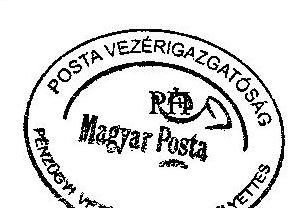

*aláírás*

---

MP Rt. Budapest

A társaságnak juttatott költségvetési támogatások

|   | 1999 | 2000 | 2001 | 2002 | 2003  |
| --- | --- | --- | --- | --- | --- |
|  Egyéb bevételek összesen | 6 | 1 | 2 | 2 | 0  |
|  Ebből: |  |  |  |  |   |
|  Foglalkoztatást elősegítő támogatások | 4 | 1 | 2 | 1 |   |
|  Önkormányzati támogatások | - | - | - | 1 |   |
|  Egyéb | 2 | - | - | - |   |
|  |   |   |   |   |   |
|  |   |   |   |   |   |

Adatforrás: az éves beszámolók Tanúsítom, hogy az adatok a nyilvántartásban szereplőkkel megegyezőek! Budapest, 2003. május 17.
 12. 2021. 12. 2021. 12. 2021. 12. 2021. 12. 2021. 12. 2021. 12. 2021. 12. 2021. 12. 2021. 12. 2021. 12. 2021. 12. 2021. 12. 2021. 12. 2021. 12. 2021. 12. 2021. 12. 2021. 12. 2021. 12. 2021. 12. 2021. 12. 2021. 12. 2021. 12. 2021. 12. 2021. 12. 2021. 12. 2021. 12. 2021. 12. 2021. 12. 2021. 12. 2021. 12. 2021. 12. 2021. 12. 2021. 12. 2021. 12. 2021. 12. 2021. 12. 2021. 12. 2021. 12. 2021. 12. 2021. 12. 2021. 12. 2021. 12. 2021. 12. 2021. 12. 2021. 12. 2021. 12. 2021. 12. 2021. 12. 2021. 12. 2021.
 12. 2021. 12. 2021. 12. 2021. 12. 2021. 12. 2021. 12. 2021. 12. 2021. 12. 2021. 12. 2021. 12. 2021. 12. 2021. 12. 2021. 12. 2021. 12. 2021. 12. 2021. 12. 2021. 12. 2021. 12. 2021. 12. 2021. 12. 2021. 12. 2021. 12. 2021. 12. 2021. 12. 2021. 12. 2021. 12. 2021. 12. 2021. 12. 2021. 12. 2021. 12. 2021. 12. 2021. 12. 2021. 12. 2021. 12. 2021. 12. 2021. 12. 2021. 12. 2021. 12. 2021. 12. 2021. 12. 2021. 12. 2021. 12. 2021. 12. 2021. 12. 2021. 12. 2021. 12. 2021. 12. 2021. 12. 2021. 12. 2021. 12. 2021.
 12. 2021. 12. 2021. 12. 2021. 12. 2021. 12. 2021. 12. 2021. 12. 2021. 12. 2021. 12. 2021. 12. 2021. 12. 2021. 12. 2021. 12. 2021. 12. 2021. 12. 2021. 12. 2021. 12. 2021. 12. 2021. 12. 2021. 12. 2021. 12. 2021. 12. 2021. 12. 2021. 12. 2021. 12. 2021. 12. 2021. 12. 2021. 12. 2021. 12. 2021. 12. 2021. 12. 2021. 12. 2021. 12. 2021. 12. 2021. 12. 2021. 12. 2021. 12. 2021. 12. 2021. 12. 2021. 12. 2021. 12. 2021. 12. 2021. 12. 2021. 12. 2021. 12. 2021. 12. 2021. 12. 2021. 12. 2021. 12. 2021. 12. 2021. 12. 2021. 12. 2021. 12. 2021. 12. 2021. 12. 2021. 12. 2021. 12. 2021. 12. 2021. 12. 2021. 12. 2021. 12. 2021. 12. 2021. 12. 2021. 12. 2021. 12. 2021. 12. 2021. 12. 2021. 12. 2021. 12. 2021. 12. 2021. 12. 2021. 12. 2021. 12. 2021. 12. 2021. 12. 2021. 12. 2021. 12. 2021. 12. 2021. 12. 2021. 12. 2021. 12. 2021. 12. 2021. 12. 2021. 12. 2021. 12. 2021. 12. 2021. 12. 2021. 12. 2021. 12. 2021. 12. 2021. 12. 2021. 12. 2021. 12. 2021. 12. 2021. 12. 2021. 12. 2021. 12. 2021. 12. 2021. 12. 2021. 12. 2021. 12. 2021. 12. 2021. 12. 2021. 12. 2021. 12. 2021. 12. 2021. 12. 2021. 12. 2021. 12. 2021. 12. 2021. 12. 2021. 12. 2021. 12. 2021. 12. 2021. 12. 2021. 12. 2021. 12. 2021. 12. 2021. 12. 2021. 12. 2021. 12. 2021. 12. 2021. 12. 2021. 12. 2021. 12. 2021. 12. 2021. 12. 2021. 12. 2021. 12. 2021. 12. 2021. 12. 2021. 12. 2021. 12. 2021. 12. 2021. 12. 2021. 12. 2021. 12. 2021. 12. 2021. 12. 2021. 12. 2021. 12. 2021. 12. 2021. 12. 2021. 12. 2021. 12. 2021. 12. 2021. 12. 2021. 12. 2021. 12. 2021. 12. 2021. 12. 2021. 12. 2021. 12. 2021. 12. 2021. 12. 2021. 12. 2021. 12. 2021. 12. 2021. 12. 2021. 12. 2021. 12. 2021. 12. 2021. 12. 2021. 12. 2021. 12. 2021. 12. 2021. 12. 2021. 12. 2021. 12. 2021. 12. 2021. 12. 2021. 12. 2021. 12. 2021. 12. 2021. 12. 2021. 12. 2021. 12. 2021. 12. 2021. 12. 2021. 12. 2021. 12. 2021. 12. 2021. 12. 2021. 12. 2021. 12. 2021. 12. 2021. 12. 2021. 12. 2021. 12. 2021. 12. 2021. 12. 2021. 12. 2021. 12. 2021. 12. 2021. 12. 2021. 12. 2021. 12. 2021. 12. 2021. 12. 2021. 12. 2021. 12. 2021. 12. 2021. 12. 2021. 12. 2021. 12. 2021. 12. 2021. 12. 2021. 12. 2021. 12. 2021. 12. 2021. 12. 2021. 12. 2021. 12. 2021. 12. 2021. 12. 2021. 12. 2021. 12. 2021. 12. 2021. 12. 2021. 12. 2021. 12. 2021. 12. 2021. 12. 2021. 12. 2021. 12. 2021. 12. 2021. 12. 2021. 12. 2021. 12. 2021. 12. 2021. 12. 2021. 12. 2021. 12. 2021. 12. 2021. 12. 2021. 12. 2021. 12. 2021. 12. 2021. 12. 2021. 12. 2021. 12. 2021. 12. 2021. 12. 2021. 12. 2021. 12. 2021. 12. 2021. 12. 2021. 12. 2021. 12. 2021. 12. 2021. 12. 2021. 12. 2021. 12. 2021. 12. 2021. 12. 2021. 12. 2021. 12. 2021. 12. 2021. 12. 2021. 12. 2021. 12. 2021. 12. 2021. 12. 2021. 12. 2021. 12. 2021. 12. 2021. 12. 2021. 12. 2021. 12. 2021. 12. 2021. 12. 2021. 12. 2021. 12. 2021. 12. 2021. 12. 2021. 12. 2021. 12. 2021. 12. 2021. 12. 2021. 12. 2021. 12. 2021. 12. 2021. 12. 2021. 12. 2021. 12. 2021. 12. 2021. 12. 2021. 12. 2021. 12. 2021. 12. 2021. 12. 2021. 12. 2021. 12. 2021. 12. 2021. 12. 2021. 12. 2021. 12. 2021. 12. 2021. 12. 2021. 12. 2021. 12. 2021. 12. 2021. 12. 2021. 12. 2021. 12. 2021. 12. 2021. 12. 2021. 12. 2021. 12. 2021. 12. 2021. 12. 2021. 12. 2021. 12. 2021. 12. 2021. 12. 2021. 12. 2021. 12. 2021. 12. 2021. 12. 2021. 12. 2021. 12. 2021. 12. 2021. 12. 2021. 12. 2021. 12. 2021. 12. 2021. 12. 2021. 12. 2021. 12. 2021. 12. 2021. 12. 2021. 12. 2021. 12. 2021. 12. 2021. 12. 2021. 12. 2021. 12. 2021. 12. 2021. 12. 2021. 12. 2021. 12. 2021. 12. 2021. 12. 2021. 12. 2021. 12. 2021. 12. 2021. 12. 2021. 12. 2021. 12. 2021. 12. 2021. 12. 2021. 12. 2021. 12. 2021. 12. 2021. 12. 2021. 12. 2021. 12. 2021. 12. 2021. 12. 2021. 12. 2021. 12. 2021. 12. 2021. 12. 2021. 12. 2021. 12. 2021. 12. 2021. 12. 2021. 12. 2021. 12. 2021. 12. 2021. 12. 2021. 12. 2021. 12. 2021. 12. 2021. 12. 2021. 12. 2021. 12. 2021. 12. 2021. 12. 2021. 12. 2021. 12. 2021. 12. 2021. 12. 2021. 12. 2021. 12. 2021. 12. 2021. 12. 2021. 12. 2021. 12. 2021. 12. 2021. 12. 2021. 12. 2021. 12. 2021. 12. 2021. 12. 2021. 12. 2021. 12. 2021. 12. 2021. 12. 2021. 12. 2021. 12. 2021. 12. 2021. 12. 2021. 12. 2021. 12. 2021. 12. 2021. 12. 2021. 12. 2021. 12. 2021. 12. 2021. 12. 2021. 12. 2021. 12. 2021. 12. 2021. 12. 2021. 12. 2021. 12. 2021. 12. 2021. 12. 2021. 12. 2021. 12. 2021. 12. 2021. 12. 2021. 12. 2021. 12. 2021. 12. 2021. 12. 2021. 12. 2021. 12. 2021. 12. 2021. 12. 2021. 12. 2021. 12. 2021. 12. 2021. 12. 2021. 12. 2021. 12. 2021. 12. 2021. 12. 2021. 12. 2021. 12. 2021. 12. 2021. 12. 2021. 12. 2021. 12. 2021. 12. 2021. 12. 2021. 12. 2021. 12. 2021. 12. 2021. 12. 2021. 12. 2021. 12. 2021. 12. 2021. 12. 2021. 12. 2021. 12. 2021. 12. 2021. 12. 2021. 12. 2021. 12. 2021. 12. 2021. 12. 2021. 12. 2021. 12. 2021. 12. 2021. 12. 2021. 12. 2021. 12. 2021. 12. 2021. 12. 2021. 12. 2021. 12. 2021. 12. 2021. 12. 2021. 12. 2021. 12. 2021. 12. 2021. 12. 2021. 12. 2021. 12. 2021. 12. 2021. 12. 2021. 12. 2021. 12. 2021. 12. 2021. 12. 2021. 12. 2021. 12. 2021. 12. 2021. 12. 2021. 12. 2021. 12. 2021. 12. 2021. 12. 2021. 12. 2021. 12. 2021. 12. 2021. 12. 2021. 12. 2021. 12. 2021. 12. 2021. 12. 2021. 12. 2021. 12. 2021. 12. 2021. 12. 2021. 12. 2021. 12. 2021. 12. 2021. 12. 2021. 12. 2021. 12. 2021. 12. 2021. 12. 2021. 12. 2021. 12. 2021. 12. 2021. 12. 2021. 12. 2021. 12. 2021. 12. 2021. 12. 2021. 12. 2021. 12. 2021. 12. 2021. 12. 2021. 12. 2021. 12. 2021. 12. 2021. 12. 2021. 12. 2021. 12. 2021. 12. 2021. 12. 2021. 12. 2021. 12. 2021. 12. 2021. 12. 2021. 12. 2021. 12. 2021. 12. 2021. 12. 2021. 12. 2021. 12. 2021. 12. 2021. 12. 2021. 12. 2021. 12. 2021. 12. 2021. 12. 2021. 12. 2021. 12. 2021. 12. 2021. 12. 2021. 12. 2021. 12. 2021. 12. 2021. 12. 2021. 12. 2021. 12. 2021. 12. 2021. 12. 2021. 12. 2021. 12. 2021. 12. 2021. 12. 2021. 12. 2021. 12. 2021. 12. 2021. 12. 2021. 12. 2021. 12. 2021. 12. 2021. 12. 2021. 12. 2021. 12. 2021. 12. 2021. 12. 2021. 12. 2021. 12. 2021. 12. 2021. 12. 2021. 12. 2021. 12. 2021. 12. 2021. 12. 2021. 12. 2021. 12. 2021. 12. 2021. 12. 2021. 12. 2021. 12. 2021. 12. 2021. 12. 2021. 12. 2021. 12. 2021. 12. 2021. 12. 2021. 12. 2021. 12. 2021. 12. 2021. 12. 2021. 12. 2021. 12. 2021. 12. 2021. 12. 2021. 12. 2021. 12. 2021. 12. 2021. 12. 2021. 12. 2021. 12. 2021. 12. 2021. 12. 2021. 12. 2021. 12. 2021. 12. 2021. 12. 2021. 12. 2021. 12. 2021. 12. 2021. 12. 2021. 12. 2021. 12. 2021. 12. 2021. 12. 2021. 12. 2021. 12. 2021. 12. 2021. 12. 2021. 12. 2021. 12. 2021. 12. 2021. 12. 2021. 12. 2021. 12. 2021. 12. 2021. 12. 2021. 12. 2021. 12. 2021. 12. 2021. 12. 2021. 12. 2021. 12. 2021. 12. 2021. 12. 2021. 12. 2021. 12. 2021. 12. 2021. 12. 2021. 12. 2021. 12. 2021. 12. 2021. 12. 2021. 12. 2021. 12. 2021. 12. 2021. 12. 2021. 12. 2021. 12. 2021. 12. 2021. 12. 2021. 12. 2021. 12. 2021. 12. 2021. 12. 2021. 12. 2021. 12. 2021. 12. 2021. 12. 2021. 12. 2021. 12. 2021. 12. 2021. 12. 2021. 12. 2021. 12. 2021. 12. 2021. 12. 2021. 12. 2021. 12. 2021. 12. 2021. 12. 2021. 12. 2021. 12. 2021. 12. 2021. 12. 2021. 12. 2021. 12. 2021. 12. 2021. 12. 2021. 12. 2021. 12. 2021. 12. 2021. 12. 2021. 12. 2021. 12. 2021. 12. 2021. 12. 2021. 12. 2021. 12. 2021. 12. 2021. 12. 2021. 12. 2021. 12. 2021. 12. 2021. 12. 2021. 12. 2021. 12. 12. 12. 2021. 12. 2021. 12. 2021. 12. 2021. 12. 2021. 12. 2021. 12. 2021. 12. 2021. 12. 2021. 12. 2021. 12. 2021. 12. 2021. 12. 2021. 12. 2021. 12. 2021. 12. 2021. 12. 2021. 12. 2021. 12. 2021. 12. 2021. 12. 2021. 12. 2021. 12. 2021. 12. 2021. 12. 2021. 12. 2021. 12. 2021. 12. 2021. 12. 2021. 12. 2021. 12. 2021. 12. 2021. 12. 2021. 12. 2021. 12. 2021. 12. 2021. 12. 2021. 12. 2021. 12. 2021. 12. 2021. 12. 2021. 12. 2021. 12. 2021. 12. 2021. 12. 2021. 12. 2021. 12. 2021. 12. 2021. 12. 2021. 12. 2021. 12. 2021. 12. 2021. 12. 2021. 12. 2021. 12. 2021. 12. 2021. 12. 2021. 12. 2021. 12. 2021. 12. 2021. 12. 2021. 12. 2021. 12. 2021. 12. 2021. 12. 2021. 12. 2021. 12. 2021. 12. 2021. 12. 2021. 12. 2021. 12. 2021. 12. 2021. 12. 2021. 12. 2021. 12. 2021. 12. 2021. 12. 2021. 12. 2021. 12. 2021. 12. 2021. 12. 2021. 12. 2021. 12. 2021. 12. 2021. 12. 2021. 12. 2021. 12. 2021. 12. 2021. 12. 2021. 12. 2021. 12. 2021. 12. 2021. 12. 2021. 12. 2021. 12. 2021. 12. 2021. 12. 2021. 12. 2021. 12. 2021. 12. 2021. 12. 2021. 12. 2021. 12. 2021. 12. 2021. 12. 2021. 12. 2021. 12. 2021. 12. 2021. 12. 2021. 12. 2021. 12. 2021. 12. 2021. 12. 2021. 12. 2021. 12. 2021. 12. 2021. 12. 2021. 12. 2021. 12. 2021. 12. 2021. 12. 2021. 12. 2021. 12. 2021. 12. 2021. 12. 2021. 12. 2021. 12. 2021. 12. 2021. 12. 2021. 12. 2021. 12. 2021. 12. 2021. 12. 2021. 12. 2021. 12. 2021. 12. 2021. 12. 2021. 12. 2021. 12. 2021. 12. 2021. 12. 2021. 12. 2021. 12. 2021. 12. 2021. 12. 2021. 12. 2021. 12. 2021. 12. 2021. 12. 2021. 12. 2021. 12. 2021. 12. 2021. 12. 2021. 12. 2021. 12. 2021. 12. 2021. 12. 2021. 12. 2021. 12. 2021. 12. 2021. 12. 2021. 12. 2021. 12. 2021. 12. 2021. 12. 2021. 12. 2021. 12. 2021. 12. 2021. 12. 2021. 12. 2021. 12. 2021. 12. 2021. 12. 2021. 12. 2021. 12. 2021. 12. 2021. 12. 2021. 12. 2021. 12. 2021. 12. 2021. 12. 2021. 12. 2021. 12. 2021. 12. 2021. 12. 2021. 12. 2021. 12. 2021. 12. 2021. 12. 2021. 12. 2021. 12. 2021. 12. 2021. 12. 2021. 12. 2021. 12. 2021. 12. 2021. 12. 2021. 12. 2021. 12. 2021. 12. 2021. 12. 2021. 12. 2021. 12. 2021. 12. 2021. 12. 2021. 12. 2021. 12. 2021. 12. 2021. 12. 2021. 12. 2021. 12. 2021. 12. 2021. 12. 2021. 12. 2021. 12. 2021. 12. 2021. 12. 2021. 12. 2021. 12. 2021. 12. 2021. 12. 2021. 12. 2021. 12. 2021. 12. 2021. 12. 2021. 12. 2021. 12. 2021. 12. 2021. 12. 2021. 12. 2021. 12. 2021. 12. 2021. 12. 2021. 12. 2021. 12. 2021. 12. 2021. 12. 2021. 12. 2021. 12. 2021. 12. 2021. 12. 2021. 12. 2021. 12. 2021. 12. 2021. 12. 2021. 12. 2021. 12. 2021. 12. 2021. 12. 2021. 12. 2021. 12. 2021. 12. 2021. 12. 2021. 12. 2021. 12. 2021. 12. 2021. 12. 2021. 12. 2021. 12. 2021. 12. 2021. 12. 2021. 12. 2021. 12. 2021. 12. 2021. 12. 2021. 12. 2021. 12. 2021. 12. 2021. 12. 2021. 12. 2021. 12. 2021. 12. 2021. 12. 2021. 12. 2021. 12. 2021. 12. 2021. 12. 2021. 12. 2021. 12. 2021. 12. 2021. 12. 2021. 12. 2021. 12. 2021. 12. 2021. 12. 2021. 12. 2021. 12. 2021. 12. 2021. 12. 2021. 12. 2021. 12. 2021. 12. 2021. 12. 2021. 12. 2021. 12. 2021. 12. 2021. 12. 2021. 12. 2021. 12. 2021. 12. 2021. 12. 2021. 12. 2021. 12. 2021. 12. 2021. 12. 2021. 12. 2021. 12. 2021. 12. 2021. 12. 2021. 12. 2021. 12. 2021. 12. 2021. 12. 2021. 12. 2021. 12. 2021. 12. 2021. 12. 2021. 12. 2021. 12. 2021. 12. 2021. 12. 2021. 12. 2021. 12. 2021. 12. 2021. 12. 2021. 12. 2021. 12. 2021. 12. 2021. 12. 2021. 12. 2021. 12. 2021. 12. 2021. 12. 2021. 12. 2021. 12. 2021. 12. 2021. 12. 2021. 12. 2021. 12. 2021. 12. 2021. 12. 2021. 12. 2021. 12. 2021. 12. 2021. 12. 2021. 12. 2021. 12. 2021. 12. 2021. 12. 2021. 12. 2021. 12. 2021. 12. 2021. 12. 2021. 12. 2021. 12. 2021. 12. 2021. 12. 2021. 12. 2021. 12. 2021. 12. 2021. 12. 2021. 12. 2021. 12. 2021. 12. 2021. 12. 2021. 12. 2021. 12. 2021. 12. 2021. 12. 2021. 12. 2021. 12. 2021. 12. 2021. 12. 2021. 12. 2021. 12. 2021. 12. 2021. 12. 2021. 12. 2021. 12. 2021. 12. 2021. 12. 2021. 12. 2021. 12. 2021. 12. 2021. 12. 2021. 12. 2021. 12. 2021. 12. 2021. 12. 2021. 12. 2021. 12. 2021. 12. 2021. 12. 2021. 12. 2021. 12. 2021. 12. 2021. 12. 2021. 12. 2021. 12. 2021. 12. 2021. 12. 2021. 12. 2021. 12. 2021. 12. 2021. 12. 2021. 12. 2021. 12. 2021. 12. 2021. 12. 2021. 12. 2021. 12. 2021. 12. 2021. 12. 2021. 12. 2021. 12. 2021. 12. 2021. 12. 2021. 12. 2021. 12. 2021. 12. 2021. 12. 2021. 12. 2021. 12. 2021. 12. 2021. 12. 2021. 12. 2021. 12. 2021. 12. 2021. 12. 2021. 12. 2021. 12. 2021. 12. 2021. 12. 2021. 12. 2021. 12. 2021. 12. 2021. 12. 2021. 12. 2021. 12. 2021. 12. 2021. 12. 2021. 12. 2021. 12. 2021. 12. 2021. 12. 2021. 12. 2021. 12. 2021. 12. 2021. 12. 2021. 12. 2021. 12. 2021. 12. 2021. 12. 2021. 12. 2021. 12. 2021. 12. 2021. 12. 2021. 12. 2021. 12. 2021. 12. 2021. 12. 2021. 12. 2021. 12. 2021. 12. 2021. 12. 2021. 12. 2021. 12. 2021. 12. 2021. 12. 2021. 12. 2021. 12. 2021. 12. 2021. 12. 2021. 12. 2021. 12. 2021. 12. 2021. 12. 2021. 12. 2021. 12. 2021. 12. 2021. 12. 2021. 12. 2021. 12. 2021. 12. 2021. 12. 2021. 12. 2021. 12. 2021. 12. 2021. 12. 2021. 12. 2021. 12. 2021. 12. 2021. 12. 2021. 12. 2021. 12. 2021. 12. 2021. 12. 2021. 12. 2021. 12. 2021. 12. 2021. 12. 2021. 12. 2021. 12. 2021. 12. 2021. 12. 2021. 12. 2021. 12. 2021. 12. 2021. 12. 2021. 12. 2021. 12. 2021. 12. 2021. 12. 2021. 12. 2021. 12. 2021. 12. 2021. 12. 2021. 12. 2021. 12. 2021. 12. 2021. 12. 2021. 12. 2021. 12. 2021. 12. 2021. 12. 2021. 12. 2021. 12. 2021. 12. 2021. 12. 2021. 12. 2021. 12. 2021. 12. 2021. 12. 2021. 12. 2021. 12. 2021. 12. 2021. 12. 2021. 12. 2021. 12. 2021. 12. 2021. 12. 2021. 12. 2021. 12. 2021. 12. 2021. 12. 2021. 12. 2021. 12. 2021. 12. 2021. 12. 2021. 12. 2021. 12. 2021. 12. 2021. 12. 2021. 12. 2021. 12. 2021. 12. 2021. 12. 2021. 12. 2021. 12. 2021. 12. 2021. 12. 2021. 12. 2021. 12. 2021. 12. 2021. 12. 2021. 12. 2021. 12. 2021. 12. 2021. 12. 2021. 12. 2021. 12. 2021. 12. 2021. 12. 2021. 12. 2021. 12. 2021. 12. 2021. 12. 2021. 12. 2021. 12. 2021. 12. 2021. 12. 2021. 12. 2021. 12. 2021. 12. 2021. 12. 2021. 12. 2021. 12. 2021. 12. 2021. 12. 2021. 12. 2021. 12. 2021. 12. 2021. 12. 2021. 12. 2021. 12. 2021. 12. 2021. 12. 2021. 12. 2021. 12. 2021. 12. 2021. 12. 2021. 12. 2021. 12. 2021. 12. 2021. 12. 2021. 12. 2021. 12. 2021. 12. 2021. 12. 2021. 12. 2021. 12. 2021. 12. 2021. 12. 2021. 12. 2021. 12. 2021. 12. 2021. 12. 2021. 12. 2021. 12. 2021. 12. 2021. 12. 2021. 12. 2021. 12. 2021. 12. 2021. 12. 2021. 12. 2021. 12. 2021. 12. 2021. 12. 2021. 12. 2021. 12. 2021. 12. 2021. 12. 2021. 12. 2021. 12. 2021. 12. 2021. 12. 2021. 12. 2021. 12. 2021. 12. 2021. 12. 2021. 12. 2021. 12. 2021. 12. 2021. 12. 2021. 12. 2021. 12. 2021. 12. 2021. 12. 2021. 12. 2021. 12. 2021. 12. 2021. 12. 2021. 12. 2021. 12. 2021. 12. 2021. 12. 2021. 12. 2021. 12. 2021. 12. 2021. 12. 2021. 12. 2021. 12. 2021. 12. 2021. 12. 2021. 12. 2021. 12. 2021. 12. 2021. 12. 2021. 12. 2021. 12. 2021. 12. 2021. 12. 2021. 12. 2021. 12. 2021. 12. 2021. 12. 2021. 12. 2021. 12. 2021. 12. 2021. 12. 2021. 12. 2021. 12. 2021. 12. 2021. 12. 2021. 12. 2021. 12. 2021. 12. 2021. 12. 2021. 12. 2021. 12. 2021. 12. 2021. 12. 2021. 12. 2021. 12. 2021. 12. 2021. 12. 2021. 12. 2021. 12. 2021. 12. 2021. 12. 2021. 12. 2021. 12. 2021. 12. 2021. 12. 2021. 12. 2021. 12. 2021. 12. 2021. 12. 12. 12. 2021. 12. 2021. 12. 2021. 12. 2021. 12. 2021. 12. 2021. 12. 2021. 12. 2021. 12. 2021. 12. 2021. 12. 2021. 12. 2021. 12. 2021. 12. 2021. 12. 2021. 12. 2021. 12. 2021. 12. 2021. 12. 2021. 12. 2021. 12. 2021. 12. 2021. 12. 2021. 12. 2021. 12. 2021. 12. 2021. 12. 2021. 12. 2021. 12. 2021. 12. 2021. 12. 2021. 12. 2021. 12. 2021. 12. 2021. 12. 2021. 12. 2021. 12. 2021. 12. 2021. 12. 2021. 12. 2021. 12. 2021. 12. 2021. 12. 2021. 12. 2021. 12. 2021. 12. 2021. 12. 2021. 12. 2021. 12. 2021. 12. 2021.
 12. 2021.
---

MP Rt. 5. sz. tanúsítvány Budapest

Költségek és ráfordítások alakulása

|  Megnevezés | 1999 | 2000 | 2001 | 2002 | 2003  |
| --- | --- | --- | --- | --- | --- |
|  Anyagjellegű ráfordítások | 18 110 | 20 549 | 30 879 | 42 544 | 44 887  |
|  Személyi jellegű ráfordítások | 54 150 | 60 906 | 69 980 | 74 918 | 78 669  |
|  Értékcsökkenési leírás | 5 469 | 6 276 | 8 122 | 9 921 | 10 576  |
|  Egyéb költségek és ráfordítások | 8 246 | 9 525 | 6 673 | 9 786 | 4 699  |
|  Pénzügyi műv. ráfordításai | 1 827 | 6 020 |
 | 483 | 2 041 | 1 591 |
| Rendkívüli ráfordítások | 691 | 472 | 875 | 1 889 | 1 069 |
| KÖLTS. ÉS RÁFORDÍT. ÖSSZESEN | 88 493 | 103 748 | 117 012 | 141 099 | 141 491 |

• Megjegyzés :

- Adatforrás: az éves beszámolók, analitikus nyilvántartások Tanúsítom, hogy az adatok a nyilvántartásban szereplőkkel megegyezőek! Budapest, 2008.h. *márius* 14.
- Adatforrás: az éves beszámolók, analitikus nyilvántartások Tanúsítom, hogy az adatok a nyilvántartásban szereplőkkel megegyezőek! Budapest, 2008.h. *márius* 14.

---

# A társaság költségeinek összetétele

|   | 1999 | 2000 | 2001 | 2002 | 2003 |
| --- | --- | --- | --- | --- | --- |
| Anyagköltség | 5530 | 6522 | 6161 | 5626 | 5506 |
| Igénybe vett (anyagjell.) szolg. értéke | 7048 | 7915 | 16527 | 21041 | 21386 |
| Eladott áruk beszerzési értéke | 5289 | 5835 | 7320 | 14981 | 17207 |
| Alvállalkozói teljesítmények / közvetített szolgáltatás | 243 | 277 | 258 | 249 | 244 |
| Bérköltség | 34557 | 38710 | 43642 | 48562 | 51431 |
| Személyi jellegű egyéb kifizetések | 5503 | 6442 | 7961 | 7312 | 7908 |
| Társadalombiztosítási járulék/Bérjárulék | 14090 | 15754 | 18377 | 19044 | 19330 |
| Értékcsökkenési leírás | 5469 | 6276 | 8122 | 9921 | 10576 |
| Egyéb költségek/Egyéb szolgáltatások | 6022 | 6450 | 613 | 647 | 544 |
| | | | | | |

Adatforrás: az éves beszámolók, analitikus nyilvántartások Tanúsítom, hogy az adatok a nyilvántartásban szereplőkkel megegyezőek! Budapest, 2008.11.11.14.

---

MP Rt. 7. sz. tanúsítvány Budapest

# Eredmény alakulása

| Megnevezés | 1999 | 2000 | 2001 | 2002 | millió Ft-ban |
| --- | --- | --- | --- | --- | --- |
| 1. Üzemi (üzleti) tev. eredménye | 2 679 | 1 524 | - 4 764 | - 7 050 | 3 360 |
| 2. Pénzügyi műveletek eredm. | 1 353 | 518 | 3 440 | - 1 281 | 57 304 |
| 3. Szokásos vállalk. eredm (1+2) | 4 032 | 2 042 | - 1 324 | - 8 331 | 60 664 |
| 4. Rendkívüli eredmény | - 5 | - 234 | 2 677 | - 750 | - 686 |
| 5. Adózás előtti eredmény (3+4) | 4 027 | 1 808 | 1 353 | - 9 081 | 59 978 |

Adatforrás: az éves beszámolók

Tanúsítom, hogy az adatok a nyilvántartásban szereplőkkel megegyezőek!

Budapest, 2001/1, tanúsítom 17.

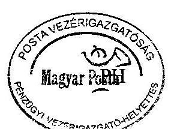

aláírás

---

# Költségvetési befizetési kötelezettségek

(adók, járulékok)

| Megnevezés | 1999. | 2000. | 2001. | 2002. | 2003. |
| --- | --- | --- | --- | --- | --- |
| Személyi jövedelemadó | 7 487 | 9 213 | 10 572 | 10 474 | 9 246 |
| Általános forgalmi adó | 827 | 1 185 | 1 399 | 604 | 1 815 |
| Munkaadói járulék | 1 100 | 1 230 | 1 411 | 1 546 | 1 630 |
| Munkavállalói járulék | 501 | 557 | 632 | 708 | 503 |
| Társadalombiztosítási járulék | 12 140 | 16 690 | 17 826 | 18 643 | 18 180 |
| Szakképzési hozzájárulás | 0 | 31 | 12 | 26 | 0 |
| Rehabilitációs hozzájárulás | 39 | 46 | 51 | 58 | 50 |
| Egészségügyi hozzájárulás | 1 931 | 2 082 | 2 226 | 2 423 | 1 743 |
| Nemzeti kulturális járulék | | | | | 4 |
| Önellenőrzési pótlék | 2 | 1 | 7 | 1 | 3 |
| Késedelmi pótlék | 0 | 0 | 35 | 2 | 1 |
| ÖSSZESEN | 24 027 | 31 035 | 34 171 | 34 485 | 33 175 |

Adatforrás: az adóbevallások, az éves beszámolók, analitikus nyilvántartások Tanúsítom, hogy az adatok a nyilvántartásban szereplőkkel megegyezőek!

Budapest, 2004. 03. 17.

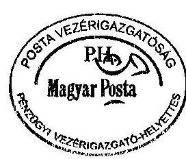

aláírás

8. sz. tanúsítvány

---

# Költségvetési támogatások alakulása

1999-2003.
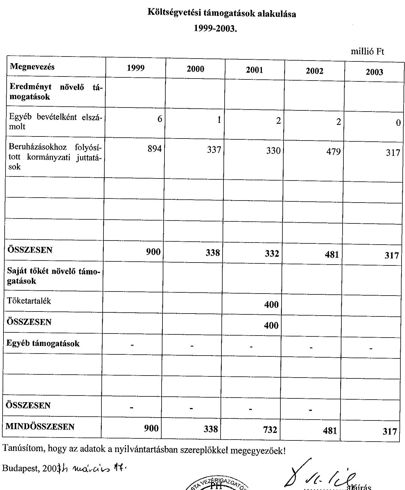

Tanúsítom, hogy az adatok a nyilvántartásban szereplőkkel megegyezőek!
Budapest, 2003b maicics 14.
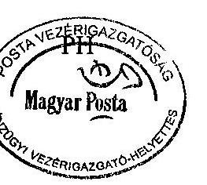

---

# A statisztikai állományi létszám alakulása

Adatok fó

| Megnevezés | 1999 | 2000 | 2001 | 2002 | 2003. |
| :--: | :--: | :--: | :--: | :--: | :--: |
| Vezető I. | 241 | 269,4 | 289,9 | 270,8 | 172,0 |
| Vezető II. | 94,2 | 104,1 | 93,1 | 92,5 | 62,5 |
| Termelésirányitó I. | 279,6 | 283,9 | 257,9 | 253,5 | 242,1 |
| Termelésirányitó II. | 701,4 | 686,7 | 616,2 | 535,1 | 490,3 |
| Termelésirányitó III. | 347,5 | 359,4 | 348,3 | 295,9 | 262,4 |
| III. besorolási osztályba tartozók | 1318,0 | 1315,0 | 1379,2 | 1362,3 | 1315,5 |
| II. besorolási osztályba tartozók | 3247,8 | 3197,3 | 3189,7 | 3172,4 | 3006,4 |
| I. besorolási osztályba tartozók | 11838 | 11688,7 | 11773,2 | 11876,7 | 11569,7 |
| Ügyviteli alkalmazottak | 4110,7 | 4095,2 | 4041,7 | 4469,3 | 4016,3 |
| Mester | 12,1 | 6,7 | 5,3 | 4,9 | 4,7 |
| Szakmunkás | 4568,1 | 4524,0 | 4387,1 | 4392,4 | 3996,1 |
| Betanított munkás | 15782,4 | 15788,9 | 15534,8 | 15541,1 | 14923,3 |
| Segédmunkás | 1620,4 | 1547,3 | 1384,7 | 1399,7 | 1036 |
| | | | | | |
| | | | | | |
| Összesen: | 44161,2 | 43866,6 | 43301,1 | 43666,6 | 41097,3 |
| Ebböl: | | | | | |
| - teljes m. idöben fogl | 35635,7 | 35304,4 | 34955 | 35397,9 | 32884,3 |
| - részmunkaidős | 7500,1 | 7178,2 | 6984,9 | 6927,6 | 7398,1 |
| - nyugdíjas | 1025,4 | 1384,0 | 1361,2 | 1341,1 | 814,9 |

Budapest, 2004. március 17.
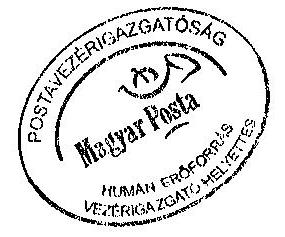

PH
lece
aláira

---

# Az alaptevékenységet jellemző naturális mutatók

Az ellátottság főbb mutatószámai

| Megnevezés | 1996 | 1997 | 1998 | 1999 | 2000 | 2001 | 2002 | 2003 |
| :--: | :--: | :--: | :--: | :--: | :--: | :--: | :--: | :--: |
| Állandó postai szolgáltatóhelyek száma | 3225 | 3234 | 3236 | 3247 | 3257 | 3265 | 3258 | 3201 |
| Ebből: postamesterségek száma | 57 | 122 | 272 | 306 | 371 | 404 | 421 | 388 |
| postaügynökségek száma | 16 | 16 | 9 | 8 | 9 | 9 | 9 | 31 |
| 1 hivatalra eső lakosok száma | 3158 | 3145 | 3132 | 3108 | 3138 | 3116 | 3113 | 3161 |
| 1 hivatalra eső ellátási körzet $\left(\mathrm{km}^{2}\right)$ | 29 | 29 | 29 | 28,7 | 28,6 | 28,5 | 28,8 | 29,1 |
| 1 lakosra jutó levelek száma (hírlap is) | 93 | 107 | 120 | 127 | 136 | 138 | 141 | 144 |
| 1 kézbesítő járásra jutó lakosok száma | 773 | 720 | 732 | 989 | 1020 | 1005 | 980 | 997 |

Megjegyzés: KSH lakosság szám előzetes adat, hozzá tartozó adatok változhatnak
Adatforrás: IX. beszámoló, I. beszámoló, 115 beszámoló, KSH
Tanúsítom, hogy az adatok a nyilvántartásban szereplőkkel megegyezőek!

Budapest, 2002. maicies 18 .
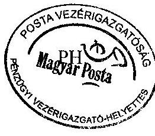
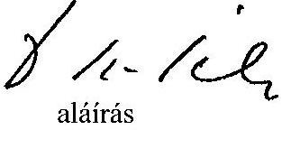

---

# Az alaptevékenységet jellemző naturális mutatók

A levélpostai küldemények naturális adatai ezer db

| Megnevezés | 1996 | 1997 | 1998 | 1999 | 2000 | 2001 | 2002 | 2003 |
| :-- | --: | --: | --: | --: | --: | --: | --: | --: |
| Levélposta összesen | 605525 | 660554 | 705103 | 757416 | 783674 | 847989 | 871811 | 847517 |
| Ebből: közönséges levél | 532721 | 583671 | 616070 | 661992 | 685572 | 740790 | 771025 | 758555 |
| ajánlott küldemény | 72047 | 73541 | 84623 | 89823 | 93329 | 102075 | 96938 | 88679 |
| értéklevél | 220 | 225 | 282 | 240 | 236 | 269 | 320 | 282 |
| Címzetlen nyomtatvány | 45583 | 152035 | 260929 | 299136 | 379552 | 364414 | 324662 | 386082 |

Megjegyzés:
Adatforrás: I. beszámoló

A táviratforgalom naturális mutatói
ezer db

| Megnevezés | 1996 | 1997 | 1998 | 1999 | 2000 | 2001 | 2002 | 2003 |
| :-- | --: | --: | --: | --: | --: | --: | --: | --: |
| Postán felvett távirat | 1674 | 580 | 276 | 156 | 108 | 72 | 60 | 44 |
| Kézbesített távirat | 2284 | 1213 | 765 | 558 | 443 | 359 | 319 | 260 |
| Ebből: dísztávirat | 901 | 516 | 362 | 285 | 238 | 204 | 188 | 161 |

Megjegyzés:
Adatforrás: I. beszámoló
Tanúsítom, hogy az adatok a nyilvántartásban szereplőkkel megegyezőek!
Budapest, 2008. maicies 18.
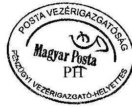

---

# Budapest

## Az egy före jutó átlagjövedelem alakulása

| | | | | | Ft/hó/fő |
| :--: | :--: | :--: | :--: | :--: | :--: |
| Megnevezés | 1999 | 2000 | 2001 | 2002 | 2003. |
| Vezető I. | 425853 | 498359 | 608620 | 754359 | 795440 |
| Vezető II. | 237151 | 269060 | 334962 | 426232 | 509457 |
| Termelésirányitó I. | 205825 | 223544 | 257136 | 277627 | 298300 |
| Termelésirányitó II. | 133371 | 151945 | 171362 | 192414 | 208925 | |
| Termelésirányító III. | 121686 | 127868 | 144759 | 154581 | 171452 |
| III. besorolási osztályba tartozó | 154630 | 182370 | 208503 | 229491 | 262194 |
| II. besorolási osztályba tartozó | 97459 | 108788 | 122291 | 132088 | 152302 |
| I. besorolási osztályba tartozó | 61979 | 69725 | 80102 | 88943 | 102378 |
| Ügyviteli alkalmazottak | 55642 | 64166 | 72748 | 80171 | 90950 |
| Mester | 76549 | 86347 | 99560 | 107942 | 151223 |
| Szakmunkás | 57714 | 67589 | 76496 | 86014 | 99089 |
| Betanított munkás | 46943 | 57294 | 64824 | 72924 | 81001 |
| Segédmunkás | 36744 | 45791 | 54781 | 63156 | 71181 |
|  |  |  |  |  |  |
|  |  |  |  |  |  |

Adatforrás:
Tanúsítom, hogy az adatok a nyilvántartásban szereplőkkel megegyezőek!
Budapest, 2004. március 17.
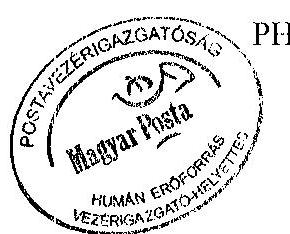
la $u$ aláírás

---

Függelék
V-26-76/2003-2004. számú jelentéshez

# A Magyar Posta Rt. Integrált Posta Hálózat (IPH) beruházásának teljesítmény-ellenőrzése

---

# ÖSSZEFOGLALÓ 

A Magyar Posta Rt. gazdálkodásának ellenőrzéséhez V-26-09/2003. sz. jóváhagyott 672 témaszámú program szerint az Integrált Posta Hálózat (továbbiakban IPH) beruházás eredményességének vizsgálatát is el kellett végezni. A program összeállítása és lefolytatása az Állami Számvevőszék által adaptált és alkalmazott teljesítmény ellenőrzés módszertanát követte. A vizsgálati cél szerint az eredményesség kritériumát az jelenti, hogy a megvalósított beruházás megfelel-e az előkészítés alapján meghatározott céloknak. A vizsgált időszak 1997-2003. év, amely az IPH projekt beruházási alapokmányának elkészítésétől tartalmazza a tervezést, megvalósítást és a folyamat lezárást. A megvalósítást az előkészítő tevékenységek, - alapokmány összeállítás, pályáztatás, Fővállalkozási Szerződés megkötése - után projekt szervezet keretében végezte el a Magyar Posta Rt.

Az IPH a postahelyi és feldolgozási technológiát cseréli fel számítógépekkel támogatott technológiára, és a rögzített adatok révén lehetőséget teremt más rendszerek adatkiszolgálására. Az IPH a teljes postai rendszer megnevezése, amely magában foglalja az összes kapcsolódó hardver- (számítógépek, szerverek, képernyők, perifériák, stb.) és szoftverelemet.

A rendszerrel kapcsolatos döntés-előkészítési feladatok 1995-ben kezdődtek az ún. Front Office program koncepciójának kidolgozásával, amely az egész postai folyamat felülvizsgálatát, a technológia megreformálását és informatikai támogatását tűzte ki célul.

A döntés-előkészítés során a Posta szakemberei vázolták az elképzelt rendszer elemeit (gépes és Front Office posták, feldolgozó pontok, technológiai központok), és bemutattak egy működőképes, informatikai alapokon nyugvó technológiát. Kétéves előkészítő munka után a Beruházási és Üzemletetés-ellenőrzési ágazati igazgatóság elkészítette az IPH Beruházási Alapokmányát (kelt: 1997. május). Ezt a Magyar Posta Rt. Igazgatósága és a tulajdonos a Közlekedési, Hírközlési és Vízügyi Minisztérium (KHVM) 2/1997. sz. tulajdonosi döntéssel elfogadta. Az okmány szerint a beruházás 2001. évi befejezési határidővel, 5,5 milliárd Ft bekerülési összeggel valósulna meg. A cél a keresleti-kínálati viszonyokhoz való igazodás, az eddig megszerzett piacok megtartása volt. Az alapokmány beruházás-gazdaságossági számítást nem tartalmazott, rövid szöveges értékelés foglalkozott a fejlesztés gazdasági hatásaival.

Az IPH létesítésével a cél a Magyar Posta Rt. megújítása. El kell érni, hogy gyorsan tudjon reagálni a piac kihívásaira. Zártabb, így biztonságosabb legyen a technológiai rendszer. Új termékek forgalmazásával is megfelelő szinten tudja kiszolgálni vállalati és lakossági fogyasztóit.

A menedzsmentváltásokkal összefüggő felülvizsgálatok és célkitűzés korrekciók szerint az IPH projektterv többször módosult. Az okok egyrészről az eredeti terv ambiciózusságából, a fejlesztés előkészítésének hiányosságaiból, a pontatlan, hézagos specifikációból, a felülvizsgálatok eredményeképpen bekövetkezett koncepcióváltásokból, (pl. a front-office és a gépes postai arányok) a felhaszná-

---

lói igények nagyszámú módosításából, másrészről a nem megfelelően becsült Magyar Posta Rt. oldali teljesítőképességből (finanszírozhatóság) és az elhúzódó döntésekből következtek.

A projekt megvalósítása során sok volt a szerződésmódosítási kérelem, a kitűzött határidők sorozatban nem teljesültek. Két évvel növekedett a projekt befejezési határideje, miközben a bekerülési költség 5,5 milliárd Ft-ról 9,6 milliárd Ft-ra változott. A beruházás hozamának alakulását a 2000. évi MGT és 2003. évi MGT összehasonlításával mutatjuk be. A hozamprognózisok között a különbség (-)12,5 milliárd Ft.

Az összes tervezett cél 185 db volt, amelyből a megvalósult és részben megvalósult együttesen 150 db. Nem valósult meg 35 db, de éppen ez a termékkör okozza, hogy az elvárt eredmény 271 millió Ft-ra csökken, a 2000. évi prognózis 3,4 milliárd Ft-jával szemben. A beruházás meg nem valósulása esetén elkerülhetetlen műszaki és ingatlanfejlesztések kieséséből származó 2000. évi 3,4 milliárd Ft-os költségmegtakarítás, 2003-ra 0,6 milliárd Ft értékre változott. A cash-flow menedzseléshez kapcsolódó 4,5 milliárd Ft-ra a becsült költségmegtakarítás nullára redukálódik, mivel a pénzforgalmi rendszer racionalizálása a beruházás elhúzódása miatt - az IPH felhasználása nélkül valósult meg az elmúlt években. A 2000-ben kidolgozott MGT szerint a beruházás még 5 év alatt megtérül. A 2003 évi MGT-ben már csak a személyi jellegű költség megtakarítás pozitív 3,6 milliárd Ft értékben. A létszám leépítésből azonban a projekt nem térül meg.

Az MGT-k összehasonlítása arra hívja fel a figyelmet, hogy fontos a prognózisok személyi felelősséghez kötése.

A projekt eredményeként az eredetileg 1000 tervezett gépes postából 493 működik. A front-office terv 200 db volt, megvalósult 207 db, azonban a szerződéses Szeged 1., és Budapest 62., nagy gépszámú posták, csak a rendszer sebességének javítása után, külön engedély alapján telepíthetőek.

A Magyar Posta Rt. elkezdte a rendszer „utóértékelését", kimutatta, hogy a tervezett szolgáltatások vagy nem valósultak meg, vagy az IPH rendszert csak elhanyagolható mértékben érintették. Az üzleti terület elképzeléseiben az IPH rendszer - jelen kiépítettségében - a tevékenységek alapjaként jelenik meg, a tervezett termékek bevezetésének és a postahálózat modernizációnak stratégiai pillére. A rendszerre épülő tevékenységek, illetve a rendszer által nyújtott hatékonyságnövelési lehetőségek tervezése folyamatban van, de konkrét számok még nem képezik a rendszer megtérülésének alapját. Az üzemeltetési költségek számítására kísérlet történt. A rendszer hatása minden egyéb tényező változatlanságát feltételezve azonban még nem határozható meg, mert az ehhez szükséges adatok, információk összegyűjtése hiányos.

# A Projekt megvalósításának pozitív eredményei 

A postákon tömegessé vált az ott dolgozók részéről rendkívül kedvezően fogadott az új számítógépes kultúra. Kialakultak a nagy számítógépes hálózat és szoftver-rendszer biztonságos működtetésének képességei. A fejlesztés során nagy mennyiségű, rendszerezett technológiai tudás és projekt-irányítási tapasz-

---

talat halmozódott fel. Az IPH fejlesztés, más megvalósított és folyamatban lévő alkalmazásokkal együtt lehetőséget teremtett új, innovatív szolgáltatások bevezetésére. A megvalósult infrastruktúra csökkentette a további informatikai fejlesztések költségeit.

# A Projekt megvalósításának negatívumai 

A feladatok megfogalmazása és a projekt lebonyolítása nem eredményorientált módon történt, ennek következtében nem időben valósultak meg az eredmények hasznosításához szükséges párhuzamos fejlesztések, nem sikerült az előirányzott költségkeretet betartani. Az eredeti célkitűzésektől a létszámcsökkentés csak részben vált lehetővé. A 2003. évben 600 fős létszámcsökkentés történt. Egyes tranzakciók műveletei a tervezettnél lassúbbnak bizonyultak. Ezért nem valósult meg a sorbaállási idők elvárt csökkenése. Jelenleg nem hasznosul a tranzakciós adatok gyűjtése révén létrejött adatvagyon, nem valósultak meg azok a relatíve kis ráfordítást igénylő fejlesztések, amelyek egyes szolgáltatások értékét növelni voltak hivatottak, vagy az informatikai folyamatok optimalizálásával jelentős költségcsökkentést tudtak volna létrehozni.

A jelenlegi menedzsment azokat a feladatokat fogalmazta meg, amelyek az adott helyzetből kiindulva szükségesek az IPH rendszer költség-hatékony működésének biztosítására. Az IPH technológiával kapcsolatos rövidtávú célkitűzés, hogy korrigálja az eddigi folyamatban elkövetett hibákat. Rövid és hosszú távon is prioritást kell kapniuk a termék-innovációt szolgáló fejlesztéseknek, ezen belül olyan kapacitásokat kell biztosítani az IPH szinten tartására és továbbfejlesztésére, amely segíti a modernizációs folyamatot.

Az érvényben lévő SZMSZ szerint az IPH projekt megszűnésével a Magyar Posta Rt. szervezeti egységeihez átkerültek azok a tevékenységek, amelyek a működtetést biztosítják. A stratégiai célok megvalósítására a szervezeti egységek tevékenységének koordinálására megalakult a munkacsoport. Az IPH rendszer kikényszerítette, hogy a Posta korszerű adathálózattal rendelkezzen. A kiépített adathálózatot az IPH rendszer mellett további rendszerek használják.

## Javaslat

Magyar Posta Rt. vezetése biztosítsa az IPH rendszer üzemeltetésével, fejlesztésével kapcsolatos üzleti folyamatok gazdaságossági számításokkal történő leképezését. Ehhez a megfelelő metodikát és a kapcsolódó adatgyűjtések rendszerének kidolgozását is rendelje el, valamint intézkedjen a hozam prognózisok és a kapcsolódó módosítások személyes felelősséghez kötéséről, melyhez előre meghatározott szankciókat is ki kell alakítani.

---

# Az IPH projekt teljesítmény-ellenőrzése 

## I. Az IPH Projekt szervezete és kapcsolati rendszere

## 1. A Projekt szervezete

A Projekt a 75/1999. vezérigazgatói utasításban (Po.É. 18/1999.) elrendeltek szerint 1999. február 22-én indult. Ekkor a projektet önálló projektigazgató igazgatóhelyettes - vezette. Ezután a szervezet többszöri átalakuláson ment keresztül:

- 2000 áprilisában a projekt belsőpostai felülvizsgálata után a projekt változatlan önállósággal, IPH Programigazgatóság elnevezéssel, de az Informatikai főigazgató közvetlen irányítása alá került.
- 2001. április 1-jétől a projekt létszámát és feladatkörét csökkentették, a gazdálkodási kérdések feletti irányítást az Informatikai Gazdálkodási Iroda vette át.
- 2002. szeptember 1-jével megszüntetésre került a Programigazgatóság és december 1-jével a projekt, mint szervezet is megszűnt. A projekt szponzorálása az informatikai igazgató irányítása alá, a közvetlen utasítási jogkör pedig a Rendszerintegrációs Iroda vezetőjének hatáskörébe tartozott.

## 2. A Projekt kapcsolati rendszere

A projekt kapcsolati rendszere a mindenkori postai átszervezéseknek megfelelően változtak, alapvető logikai kapcsolata azonban megmaradt.

## Utasítási rendelkezési és jelentéstételi kapcsolat

A projekt a tevékenységéről heti, havi és negyedéves beszámolókkal tájékoztatta a társaság vezetőit és a felügyeletét ellátó más szervezeteket. Elkészítette az előírt gazdasági beszámolókat. A szakmai döntéseket az üzleti területtel együttműködve hozták meg.

## Informatív kapcsolat

A projekt vezetése a Regionális Igazgatóságok közreműködésével a postahelyekre telepítette és 2003. szeptember 30-ig üzemeltette az IPH rendszert úgy informatikailag, mint technológiailag a postahelyeken, valamint az adat központban. Gondoskodott - Humán erőforrás Főigazgatóság bevonásával az előírt oktatási program teljesítéséről.

## A fővállalkozói kapcsolat

A fővállalkozóval rendszeres, általában heti, kétheti projektvezetői értekezleten történt a folyamatos tevékenység biztosítása. A megbeszéléseken el nem dönthető telepítési, szakmai és finanszírozási tevékenységeket az előírt eszkalációs szintekre kellett továbbítani. Az eszkalációs szintek a projekt működé-

---

se során rendszeresen változtak. Az első mindig a projektvezető közvetlen szakmai felettese, a második az informatikai igazgató, harmadik pedig a vezérigazgató helyettesi szint volt.

# 3. A Projekt belső működése 

Az elvégzendő feladatcsoportoknak megfelelően rugalmas változott. A munkatársak koordinálását és irányítását a projektvezető végezte. (1. sz. melléklet)

## II. Az Projekt előkészítése, célkitűzések

## 1. A Projekt előkészítése

Az IPH a postahelyi és feldolgozási technológiát cserélte fel számítógépekkel támogatott technológiára, és a rögzített adatok révén lehetőséget teremtett más rendszerek adatkiszolgálására. Az IPH a teljes postai rendszer megnevezése, amely magában foglalja az összes kapcsolódó hardver- (számítógépek, szerverek, képernyők, perifériák, stb.) és szoftverelemet.

A rendszerrel kapcsolatos döntés-előkészítési feladatok 1995-ben kezdődtek az ún. Front Office program koncepciójának kidolgozásával, amely az
 egész postai folyamat felülvizsgálatát, a technológia megreformálását és informatikai támogatását tűzte ki célul.

A döntés-előkészítés során a Posta szakemberei vázolták az elképzelt rendszer elemeit (gépes és Front Office posták, feldolgozó pontok, technológiai központok), és bemutattak egy működőképes, informatikai alapokon nyugvó technológiát. Kétéves előkészítő munka után a Beruházási és Üzemeltetésellenőrzési ágazati Igazgatóság elkészítette az IPH Beruházási Alapokmányát (kelt: 1997. május). Ezt a Magyar Posta Rt. Igazgatósága és a tulajdonos a Közlekedési, Hírközlési és Vízügyi Minisztérium (KHVM) 2/1997. sz. tulajdonosi döntéssel elfogadta. Az okmány szerint a beruházás 2001. évi befejezési határidővel, 5,5 milliárd Ft bekerülési összeggel valósulna meg, amely tartalmazza a számviteli előírásoknak megfelelően a vissza nem igényelhető áfá-t is.

Az előterjesztők a beruházást technológiai fejlesztésként definiálták. A várható működési költségek nem tértek el jelentősen a kiváltásra került technikai rendszertől. A cél a keresleti-kínálati viszonyokhoz való igazodás, az eddig megszerzett piacok megtartása volt. Az alapokmány beruházásgazdaságossági számítást nem tartalmazott, rövid szöveges értékelés foglalkozott a fejlesztés gazdasági hatásaival. Konkrétan „a beruházással okozati összefüggésben megjelenő létszám megtakarítás 1003 fő" megjelenik, de az is, hogy a bonyolult beruházási javaslat valódi gazdaságossági mutatókkal nem vizsgálható, mert nem valódi termelési beruházásról van szó, hanem vállalkozás fenntartó beruházásról. A gazdasági és finanszírozási elképzelések megvalósításának két fontos feltétele volt: a Magyar Posta Rt. egyéb fej-

---

lesztéseinek jelentős visszafogása és a projekt beruházási költségeinek a tervezett értéken belül tartása.

# 2. Az eredeti célkitűzések

A magyar Posta Rt.-nek meg kell újulnia:

- El kell érni, hogy gyorsan tudjon reagálni a piac kihívásaira, új termékek forgalmazására.
- Megfelelő szinten kell kiszolgálni a meglévő és leendő nagy fogyasztóit.
- Ki kell használni azon lehetőségeket, amelyek a széles hálózatból adódnak.
- Versenyképessé kell válni a kommunikációs piac egyéb területein is.
- Zártabbá, így biztonságosabbá kell tenni a technológiai rendszerét.

A Front Office rendszer előnyei:

- teljes körű adat-felvételezés (felvétel),
- teljes körű adatfelhasználás (rovatolás, kiosztás, leszámolás, technológiai központ),
- országos ON-LINE szolgáltatás.

A fentiek kihasználása érdekében a Front Office rendszerbe be nem vont posták technológiáját úgy kellett kialakítani, hogy mindenképpen illeszkedjék a Front Office rendszerhez, és annak korábban megfogalmazott előnyei ne sérüljenek. A megfogalmazott célok részletes bemutatását a 2. sz. melléklet tartalmazza.

## III. A projekt megvalósításának folyamata

## 1. Pályázat, közbeszerzés, finanszírozás

Az IPH rendszer megvalósítására először tárgyalásos eljárási felhívás jelent meg 1997. október 10-jén a Közbeszerzési Értesítőben 6099. számon. A megvalósítására kiírt tárgyalásos eljárást a Döntő Bizottság eredménytelennek hirdette. A jogorvoslatot a Közbeszerzések Tanácsa hivatalból kezdeményezte. Bírósági felülvizsgálatot a Magyar Posta Rt. nem indított. A következő nyílt eljárás eredménytelenül zárult. Ezután tárgyalásos eljárásban választotta ki a Magyar Posta Rt. a fővállalkozót. A kihirdetésére 1999. február 1-jén került sor. A megkötött Fővállalkozási Szerződés ennek megfelelő. (Fővállalkozói Szerződés a Magyar Posta Rt. Integrált Posta Hálózata (IPH) rendszerének megvalósítására, a Magyar Posta Rt. és a fővállalkozó között 1999. február 9.) A kitűzött célok a megvalósítás alatt többször változtak, melyeket a Fővállalkozási Szerződés módosításai követtek.

---

A beruházási alapokmány első felülvizsgálatát az 1999. február hónapban felállításra került IPH Projekt hajtotta végre. A módosított - 6,5 milliárd Ft beruházási költséget tartalmazó - okmány azonban nem tartalmazott információt sem a finanszírozásról, sem a hatékonysági elképzelésekről. A 2000. év elején megtartott ügyvezetői igazgatói értekezlet döntése alapján az IPH projektnek felülvizsgálatot kellett végezni a beruházás folytatásának, lassításának, leállításának lehetőségeiről. A kimunkált előnyöket és hátrányokat gazdaságossági számítással kellett alátámasztani. Az IPH Projekt számszerűsítette az új technológia várható költségeit, a Marketing Ágazat pedig elkészítette a beruházás bevételek, költség megtakarítások szerinti elemzését. Módosításra került a beruházás alapokmánya, de már a 2000 márciusában bevezetésre került új Beruházási Szabályzatban előírt Műszaki Gazdasági Tanulmányterv formátumban. Az MGT módosítást a tulajdonos, a Közlekedési, Hírközlési és Vízügyi Miniszter 2000. október 31-én kelt 15/2000. számú határozatában elfogadta. A beruházás teljes bekerülési költsége 8,6 milliárd Ft-ra nőtt. A befejezés véghatárideje változatlanul 2001. volt. A gazdaságossági számítás szerint a beruházás a tényleges projektindítástól (1999. február) számítva 5 év alatt, azaz 2004-re megtérül. A megtérülés az alábbi költségmegtakarítási és bevételi elemekből adódott:

- a beruházás megvalósítása révén kiváltásra kerülő munkaerő személyi jellegű költségmegtakarítása;
- az új technológia bevezetésével elmaradó pótló beruházások költségmegtakarítása,
- a készpénz menedzsment támogatása révén felszabaduló pénz kamatköltség megtakarítása,
- az IPH-ra tervezett termékfejlesztés hozama.

Ehhez az MGT-hez kapcsolódóan a Magyar Tudományos Akadémia Információtechnológiai Alapítvány tanulmánya (készült 2000. évben) a projekt terjedelmét és a stratégia céljaival való összhangot vizsgálva megállapítja, hogy:

- a rendszerben tervezett gépmennyiség nem a terhelési csúcsokra tervezett,
- a koncepcióban feltételezett 1003 fős létszám megtakarításra utaló jeleket nem tapasztaltak,
- az IPH beruházáshoz kapcsolódó MGT tényekkel alá nem támasztott megállapításokat tartalmaz (létszámra vonatkozólag is), így azok értékelhetetlenek.

A tanulmány eredményeire építve változott a gépesítettség elosztás (Gépes, Front-Office), és a posta tervezett új szolgáltatásainak beintegrálása.

A beruházás megvalósítása 2001-ben nem fejeződött be. Az IPH projekt 2001. novemberében ismét kezdeményezte az MGT módosítását, amelyet a

- beruházás megváltozott időbeli ütemezésével,

---

- megváltozott műszaki tartalom miatti jelentős mértékű eszközbővítéssel,
- inflációnövekedés miatti forrásigény növekedéssel,
- fővállalkozó pontatlan előzetes felmérései miatti tartalékképzéssel,
- folyamatos csúszások miatt a Fővállalkozó árfolyam-korrekciós igényének növekedésével,
- 2001. január 1-jétől a számviteli törvény megváltozásával (a vissza nem igényelhető áfa-rész nem a bekerülési érték része, hanem ráfordításként számolandó el) indokolt.

Az MGT módosítást azonban a többletforrást igénylő és/vagy anyagiműszaki összetételében változó beruházásokra elő is írta a Magyar Posta Rt. 2001-ben kiadott Műszaki Gazdasági Tanulmánytervekről szóló a 6/2001. gazdasági főigazgatói rendelkezése.

Az MGT módosítása a tulajdonos által nem került elfogadásra. Ezért a 2001. évre vonatkozóan a módosító javaslat 5. sz. mellékletét fogadta el az Elnökvezérigazgató, így az abban felsorolt beruházási tevékenységek elvégzését 2,1 milliárd Ft összegben engedélyezte.

Az újabb, a változásokat részletesen tartalmazó döntés-előkészítő MGT módosítás 2001. decemberére készült el, de különböző tartalmi hiányosságok miatt szintén nem került elfogadásra. Ez a beruházás befejezését 2002-re, a beruházás teljes bekerülési költségét 10,2 milliárd Ft-ra prognosztizálta. Megváltozott 2001-től a vissza nem igényelhető áfa számviteli elszámolása, amelyet korábban a beruházási költségek között, a későbbiekben a tárgyévi ráfordítások között kellett elszámolni. A beruházás vissza nem igényelhető áfá-val növelt összege 11,6 milliárd Ft lett. A gazdaságossági számításban jelezett megtakarítások és bevételek vállalásában azonban nem történt módosítás. A beruházási költség növekedésével és az időbeli csúszások érvényesítésével a beruházás megtérülési ideje 9 évre nőtt.

Az IPH Projekt 2002 májusában - kizárólag a beruházási költséget tekintve ismételten átdolgozta az MGT-t. Azonban ez a módosítás sem került elfogadásra a tulajdonos által. Hasonlóan az előző évhez csak a módosító javaslatot fogadta el az elnök-vezérigazgató, a felsorolt beruházási tevékenységek elvégzését 3,4 milliárd Ft összegben engedélyezte.

A beruházás 2002-ben sem fejeződött be, a 2003-ra szükséges forrásokat azonban az új vezetés már csak a beruházás teljes körű felülvizsgálata és az aktualizált MGT tulajdonosi jóváhagyása esetén engedélyezte. A 2003. májusban elkészült MGT módosítás a beruházási költségek esetében a korábbi évekre vonatkozóan tény adatokat, a 2003. évre pedig a már meglévő szerződéses elkötelezettségeket tartalmazta. A beruházás 8,6 milliárd Ft vissza nem igényelhető áfá-val növelt összeggel 9,6 milliárd Ft-ra alakult. A gazdaságossági számítás felülvizsgálatánál a szakterületek sorra visszaléptek az eredeti hozamígéretek megerősítésétől, illetve jelentős csúszásokat prognosztizáltak:

---

A 2000. évben az akkori Marketing Ágazat prognózisa alapján az IPH-ra alapozott új termékek kialakításával elérhető hozamok éves szinten 1,2-1,6 milliárd Ft körül alakultak volna a teljes kiépítést követő második évtől, 2003-tól. A jelenlegi Küldeményforgalmi Igazgatóság a megváltozott stratégiai elképzelésekre hivatkozva 2004-től évi 100 millió Ft körüli hozamot prognosztizált.

A 2000. évi MGT a beruházás megvalósítását követően 1003 fő postahelyi létszám csökkenést tartalmaz, amelyet - tekintettel a beruházás jelentős csúszására - a Humán Erőforrás szakterület 2004-től kezdődő fokozatos megvalósítással igazolt vissza. Az MGT-ben kiszámított gyors beruházás megtérülésében jelentős szerepet játszott az IPH meg nem valósulása esetén elkerülhetetlen műszaki és ingatlanfejlesztések kieséséből származó 3,4 milliárd Ft-os költségmegtakarítás, melyet a projekt most 0,6 milliárd Ft értékben vállalt fel.

A 2003 évi MGT gazdaságossági számításban nulla a cash-flow menedzseléshez kapcsolódó összeg, mivel a pénzforgalmi rendszer racionalizálása - a beruházás elhúzódása miatt - az IPH felhasználása nélkül valósult meg az elmúlt években. Ezzel szemben a 2000 évi MGT még 4,5 milliárd Ft-ra becsült költségmegtakarítás prognózissal számolt.

A hozam prognózis a 2000. évi MGT-ben 9,7 milliárd Ft volt, amely a 2003. évben (-)2,8 milliárd Ft-ra változott. A két prognózis különbsége így, (-)12,5 milliárd Ft. A 2003. évi hozamprognózisban végül csak a személyi jellegű költség megtakarítás pozitív, 3,6 milliárd Ft értékben.

Belső Ellenőrzési Igazgatóság az IPH-s posták technológiai váltása következtében felszabaduló munkaerő racionalizálási intézkedések áttekintése tárgyú (Iktatószám: 35508/2003. kelt: 2003. december 08.) vizsgálatában megállapítja: „A Beruházási Alapokmány szerint a beruházással okozati összefüggésben megjelenő létszám-megtakarítás 1003 fő, melynek eredményeként 1 milliárd Ft költségcsökkenést prognosztizáltak. A vizsgálatunk során megállapítottuk, hogy az IPH rendszer tervezése során olyan létszám-megtakarításra vonatkozó adatokat számított és szerepeltetett a Stratégiai Fejlesztési Intézet, melyek a szükséges tervezői képességgel nem voltak megtámogatva, dokumentációjuk nem fellelhető. Az IPH technológia váltás következtében felszabaduló munkaerő racionalizálására irányuló folyamatot, létszám-megtakarítási pontok feltárására irányuló vizsgálatokat az ellenőrzés nem tapasztalt, konkrét intézkedéseket ezen a területen csak 2003. februárjától kezdeményeztek a szakterületek. Az IPH rendszer létszámra gyakorolt hatását a 2003. februárban készült jelentésében az IPH projekt is vizsgálta, mely szerint annak mértéke a rendszer teljes kiépítése előtt nem konkretizálható. A belső ellenőrzés álláspontja szerint: az IPH rendszer 2. fázisának beindítása után el kell végezni a részletes normaelemzést, mellyel meghatározható a postahelyeken jelentkező létszám-megtakarítás."

Az IPH beruházás, amelynek megvalósítása két éves csúszást szenvedett, beruházási költsége pedig az eredeti (5,5 milliárd Ft) elképzelésekhez képest közel a duplájára (9,6 milliárd Ft) nőtt kizárólag a bérköltség megtakarításból nem térül meg. A Beruházási Bizottság 2003. augusztusában tárgyalta az IPH utolsó MGT-jét. Tekintettel arra, hogy a beruházás döntően már megva-

---

lósult, illetve az MGT-ben megjelenő elkötelezettségek szerződésekkel lefedettek az okmányban leírtakat tudomásul vette.

# 2. A projekt megvalósítása

## Gépes posták

A Fővállalkozási szerződésben 1000 Gépes postahely szerepelt. Felülvizsgálatot követően azonban 2000. évi felsővezetői döntés szerint csak a legforgalmasabb 502 postahelyet kell telepíteni. A telepítéseket követően 10 postahely bezárt, gépeik más postákon kerültek felhasználásra. Így a projekt lezárásakor 493 postahely működött gépes postaként. Közöttük több olyan van, amelyik analógtelefon vonalon működik. Ezért nem mindig lehetséges az adatközpontra kapcsolódni, akadályozott az adatletöltés.

## Front Office posták

A Fővállalkozási szerződésben 200 postahely szerepelt. Felsővezetői döntés értelmében, a szerződésben szerepeltetett postahelyektől eltérően a 200 legnagyobb forgalmú postahely
 telepítését kellett megtervezni. További döntés után az oktató és tanpostákat is be kellett vonni a telepítésre kerülő Front Office posták körébe. Ezek a tények a korábbi postahelyi kört szintén módosították. A telepítésre kijelölt postahelyek közül néhány helyileg máshol működő kirendeltségekkel is rendelkezett. Műszaki és gazdasági okokból a nagyobb forgalmat lebonyolító kirendeltségek önálló postahelyként kerültek telepítésre.

A szerződéses körből a Budapest 146., és a Debrecen 3. posta eszközei már tárolási nyilatkozattal átvételre kerültek, de átépítésük miatt később telepíthetők. A Szeged 1. és Budapest 62. nagy gépszámú posták, pedig csak a rendszer sebességének javítása után, külön engedély alapján telepíthetőek.

A fenti változtatások alapján 207 postahely telepítése történt meg.

## Adatközpont, COR szerverek

Az IPH rendszer központjának kialakítása megtörtént, a második fázis bevezetésével párhuzamosan háttértárbővítés volt szükséges a megnövekedtet igények kielégítésére.

## A minőségbiztosítás

Az IPH rendszer megvalósítása több lépcsőben történt, mind a szoftverfejlesztések mind a posták telepítésének tekintetében. A minőségbiztosítást segítette egy tanácsadó Kft. A teljesítmény szempontjából az alkalmazás verziók átvételekor ellenőrző mérések történtek.

Pilot környezetben

---

- az IPH gépes postai alkalmazás egyes funkcióinál az éles üzemű működésében 2000. évben jelentős időproblémák merültek fel, amelynek elhárításáig a telepítést a Magyar Posta Rt. felfüggesztette. A működési időket a fővállalkozó az alkalmazás roll out ${ }^{1}$ verziójának változtatásával javította, gyorsította.

Éles környezetben

- a front office alkalmazásra vonatkozó részletes válaszidőmérés történt 2001 évben. Erre alapozva történt a rendszertől elvárt válaszidők kimunkálása. Az IPH rendszerrel kapcsolatos eredeti elvárások szerint az élőmunka ráfordítás csökkentése az egyik, nagyon jelentős célkitűzés. Reálisan elvárható követelmény, hogy a felhasználás során a rendszer aktuális válaszideje minimális értékben jelenjen meg. Szükséges a rendszer reakció idejének csökkentése, ami gyakorlatilag a kezelés gyorsításában jelenik meg. A kezelést bizonyos funkciók párhuzamos működtetésével is lehet gyorsítani (pl.: nyomtatás és beolvasás), illetve a „gyorsbillentyűk" alkalmazását szükséges lenne bevezetni. A fenti javaslatok - programmódosítás következtében - az alkalmazás verzióba beépítésre kerültek.
- nagyposták telepítésének megfelelőségére a Budapest 112. postán 2003. július hónapban tesztelési terv készült. A tesztelési környezetet, beleértve elsősorban a munkaállomások számát, a feldolgozandó adatmennyiséget, az elvárt válaszidőket a terv rögzítette. A mérési eredmények alapján a vizsgált Hardver/Szoftver/Hálózati architektúra mellett a Riposte alapszoftver korlátaiból adódóan - az IPH alkalmazás által kiszolgálható maximális munkahelyszám 80, a maximális Message store méret $1,8 \mathrm{~GB}$, amely értékek nem érték el a két legnagyobb postahely (Bp. 62. és Szeged 1.) esetében szükséges értékeket. Erre a megoldást a Fővállalkozó által kidolgozott a Nagyposták telepítésével összefüggő kérdések tárgyú javaslat (2003. 09. 18.) jelentette. Ezt a Magyar Posta Rt elfogadta.

A vizsgálatok alapján, kis mértékű architektúra módosítás árán, olyan megoldás alkalmazható, amely a felhasználó számára egységesen kezelt postahelyet mutat, és nem csak lehetővé teszi a nagyposták telepíthetőségét, hanem sebességjavulást is eredményez. A rendszermódosítás megtörtént a tesztelés megkezdődött. A IPH projekt próbaüzeme 2003. szeptember hónapban befejeződött. A beruházás üzembe helyezése 2003. december 15-én megtörtént. A Beruházási Bizottság által kezdeményezett utóellenőrzésre még nem került sor. A projekt megvalósítás folyamatát a 3. sz. melléklet részletesen tartalmazza.

# IV. Működtetés, a rendszer továbbfejlesztésének lehetőségei 

## 1. Működtetés

[^0]
[^0]:    ${ }^{1}$ roll out rendszer: 1. Hardver üzembe helyezése, 2. Helyszíni konfigurálás, 3. Hálózati kapcsolatok ellenőrzése, 4. Átadási tesztek alkalmazási környezetben

---

A Magyar Posta Rt. Igazgatósága részére készített projektzáró előterjesztés (kelt: 2003. december 1.) Intézkedési terv fejezete tartalmazza, hogy „A stratégiai célok eléréséhez az IPH-t egy termelési rendszernek, illetve infrastruktúrának tekintjük, amelyre az üzemeltetés során (technológiai és informatikai szempontból is) alapozni kell. A célok elérése érdekében munkacsoport alakult, amely az IPH használatba vételével kapcsolatos kérdések, javító intézkedések, valamint a fejlesztések kialakításának, általános irányainak meghatározását koordinálja, Az érintett szakterületek a Hálózat Igazgatóság, Informatikai Igazgatóság, Logisztikai Igazgatóság, Humán erőforrás szakterület, Pénzügyi szakterület, Stratégiai koordinációs Igazgatóság."

A hálózat átalakítással kapcsolatos feladatok végrehajtásakor az IPH postán keletkező adatok felhasználása:

# Hálózati terület 

Területi irányítás tagoltságának fokozatos csökkentése.

- Körzeti posták kompetenciájának kialakítása.
- Kézbesítési tevékenység leválasztása a felvételi hálózatról.
- Központosított kézbesítés beindítása, nagyvárosi kézbesítési rendszer átalakítása.
- Nagyposták forgalom szervezésének támogatása.
- A postai- és kézbesítő hálózat működésének, szervezettségének és az ügyfélkiszolgálás minőségének javítása, sorbaállás idejének csökkentése.
- Napi munkaszervezési feladatok ellátásának támogatása, technológiájának javítása.
- Postahelyi- és irányítószervi ellenőrzések tartalmi és formai racionalizálása.

## Üzleti terület

- Szerződéses (átutalással fizető) ügyfelek küldeményeinek kezelése.
- Az IPH rendszerben felvett tömeges küldemények díj adatainak, SAP részére számlázási célból történő átadása, az eddigi Díjhiteles rendszer kiváltása és a postahelyen végzett jelenlegi duplikált tevékenység megszűntetése érdekében.
- Tömeges floppys küldeményfelvétel.

## 2. A rendszer továbbfejlesztési lehetőségei

## IPH-PEK kapcsolat

A Posta Elszámoló Központban működő Kleindienst rendszer kiváltása.

---

# IPH-OLK kapcsolat 

A feldolgozási és szállítási rend korszerűsítése következtében egységes és átfogó működési rendszer kialakítása, amely az OLK, a feldolgozó pontok és a postahelyek technológiájának támogatását, a keletkező adatok egységes kezelését biztosítja.

## Új termékek és szolgáltatások bevezetése

Az IPH rendszer megteremtette infrastruktúrán új küldeményforgalmi, pénzforgalmi termékek és szolgáltatások bevezetése, amely elsősorban on-line típusú adatkapcsolatot igényel, pl. lakossági körben nyújtott postabanki kölcsön igények elbírálása.

Nyomkövetési rendszer megvalósításával, az OLK-IPH adatok felhasználásával új típusú ügyfélkapcsolatot lehetővé tevő szolgáltatások bevezetése (küldemény adatok hozzáférhetővé tétele Interneten).

Az IPH posták munkaállomásain lévő egyéb szoftver termékek (MS Word, MS Excel, MS Internet Explorer) irodai környezetben történő kihasználása.
 V. Az IPH projekt értékelése

A menedzsmentváltásokkal összefüggő felülvizsgálatok és célkitűzés korrekciók szerint az IPH projektterv többször módosult. Az okok egyrészről az eredeti terv ambíciózusságából, a fejlesztés előkészítésének hiányosságaiból, a pontatlan, hézagos specifikációból, a felülvizsgálatok eredményeképpen bekövetkezett koncepcióváltásokból, (pl. a front-office és a gépes postai arányok) a felhasználói igények nagyszámú módosításából, másrészről a nem megfelelően becsült Magyar Posta Rt. oldali teljesítőképességből (finanszírozhatóság) és az elhúzódó döntésekből következnek.

Sok volt a szerződésmódosítási kérelem, a kitűzött határidők sorozatban nem teljesültek. Két évvel növekedett a Projekt megvalósulási ideje, miközben a bekerülési költség 5,5 milliárd Ft-ról 9,6 milliárd Ft-ra változott. A beruházás hozamának alakulásait a 2000. évi MGT és 2003. évi MGT összehasonlításával a 4. sz. melléklet mutatja be. A hozamprognózisok között a különbség (-)12,5 milliárd Ft, amely az alábbi okokra vezethető vissza:

- Az összes tervezett cél 185 db volt, amelyből a megvalósult és részben megvalósult együttesen 150 db. Nem valósult meg 35 db, de éppen ez a termékkör okozza, hogy az elvárt eredmény 271 millió Ft-ra csökken, a 2000. évi prognózis 3,4 milliárd Ft-jával szemben.

---

- A beruházás meg nem valósulása esetén elkerülhetetlen műszaki és ingatlanfejlesztések kieséséből származó 2000. évi 3,4 milliárd Ft-os költségmegtakarítás, 2003-ra 0,6 milliárd Ft értékre változik.
- A cash-flow menedzseléshez kapcsolódó 4,5 milliárd Ft-ra a becsült költségmegtakarítás nullára redukálódik, mivel a pénzforgalmi rendszer racionalizálása - a beruházás elhúzódása miatt - az IPH felhasználása nélkül valósult meg az elmúlt években. A 2000-ben kidolgozott MGT szerint a beruházás még 5 év alatt megtérül. A 2003. évi MGT-ben végeredményül már csak a személyi jellegű költség megtakarítás pozitív 3,6 milliárd Ft értékben. A létszám leépítésből azonban a projekt nem térül meg.

Az MGT-k összehasonlítása arra hívja fel a figyelmet, hogy fontos a prognózisok személyi felelősséghez kötése.

A projekt eredményeként az eredetileg 1000 tervezett gépes postából 493 működik. A front office terv 200 db volt, megvalósult 207, azonban a szerződéses Szeged 1., és Budapest 62., nagy gépszámú posták, csak a rendszer sebességének javítása után, külön engedély alapján telepíthetőek.

A Magyar Posta Rt. elkezdte a rendszer „utóértékelését", kimutatta, hogy a tervezett szolgáltatások vagy nem valósultak meg, vagy az IPH rendszert csak elhanyagolható mértékben érintették. Az üzleti terület elképzeléseiben az IPH rendszer - jelen kiépítettségében - a tevékenységek alapjaként jelenik meg, a tervezett termékek bevezetésének és a postahálózat modernizációnak stratégiai pillére. A rendszerre épülő tevékenységek, illetve a rendszer által nyújtott hatékonyságnövelési lehetőségek tervezése folyamatban van, de konkrét számok még nem képezik a rendszer megtérülésének alapját. Az üzemeltetési költségek számítására kísérlet történt. A rendszer hatása minden egyéb tényező változatlanságát feltételezve azonban még nem határozható meg, mert az ehhez szükséges adatok, információk összegyűjtése hiányos.

# A Projekt megvalósításának pozitív eredményei

A postákon tömegessé vált az ott dolgozók részéről rendkívül kedvezően fogadott új számítógépes kultúra. Kialakultak a nagy számítógépes hálózat és szoftverrendszer biztonságos működtetésének képességei. A fejlesztés során nagy mennyiségű, rendszerezett technológiai tudás és projekt-irányítási tapasztalat halmozódott fel. Az IPH fejlesztés, más megvalósított és folyamatban lévő alkalmazásokkal együtt lehetőséget teremtett új, innovatív szolgáltatások bevezetésére. A megvalósult infrastruktúra csökkentette a további informatikai fejlesztések költségeit.

## A Projekt megvalósításának negatívumai

A feladatok megfogalmazása és a projekt lebonyolítása nem eredményorientált módon történt, ennek következtében nem időben valósultak meg az eredmények hasznosításához szükséges párhuzamos fejlesztések, nem sikerült az előirányzott költségkeretet betartani. Az eredeti célkitűzésektől a létszámcsökkentés csak részben vált lehetővé. A 2003. évben 600 fős létszámcsökkentés történt. Egyes tranzakciók műveletei a tervezettnél lassúbbnak bizonyultak.

---

Ezért nem valósult meg a sorban-állási idők elvárt csökkenése. Jelenleg nem hasznosul a tranzakciós adatok gyűjtése révén létrejött adatvagyon, nem valósultak meg azok a relatíve kis ráfordítást igénylő fejlesztések, amelyek egyes szolgáltatások értékét növelni voltak hivatottak, vagy az informatikai folyamatok optimalizálásával jelentős költségcsökkentést tudtak volna létrehozni.

A jelenlegi menedzsment azokat a feladatokat fogalmazta meg, amelyek az adott helyzetből kiindulva szükségesek az IPH rendszer költség-hatékony működésének biztosítására. Az IPH technológiával kapcsolatos rövidtávú célkitűzés, hogy korrigálja az eddigi folyamatban elkövetett hibákat, és minél előbb elérhetővé tegye a technológiából származó közvetlen és közvetett eredményeket. Ennek érdekében kiegészítő fejlesztéseket kell végrehajtani, módosítani szükséges az egyes posták konfigurációit, hogy az eredmények az ügyfelek számára is nyilvánvalóak, érzékelhetőek legyenek. Rövid és hosszú távon is prioritást kell kapniuk a termék-innovációt szolgáló fejlesztéseknek, ezen belül olyan kapacitásokat kell biztosítani az IPH szinten tartására és továbbfejlesztésére, amely segíti a modernizációs folyamatot. (A Magyar Posta Rt. Igazgatósága részére készített Intézkedési terv, kelt: 2003. december 1., 10. fejezet.)

Az érvényben lévő SZMSZ szerint az IPH projekt megszűnésével a Magyar Posta Rt. szervezeti egységeihez átkerültek azok a tevékenységek, amelyek a működtetést biztosítják. A stratégiai célok megvalósítására a szervezeti egységek tevékenységének koordinálására megalakult a munkacsoport. Az IPH rendszer kikényszerítette, hogy a Posta korszerű adathálózattal rendelkezzen. A kiépített adathálózatot az IPH rendszer mellett további rendszerek használják.

---

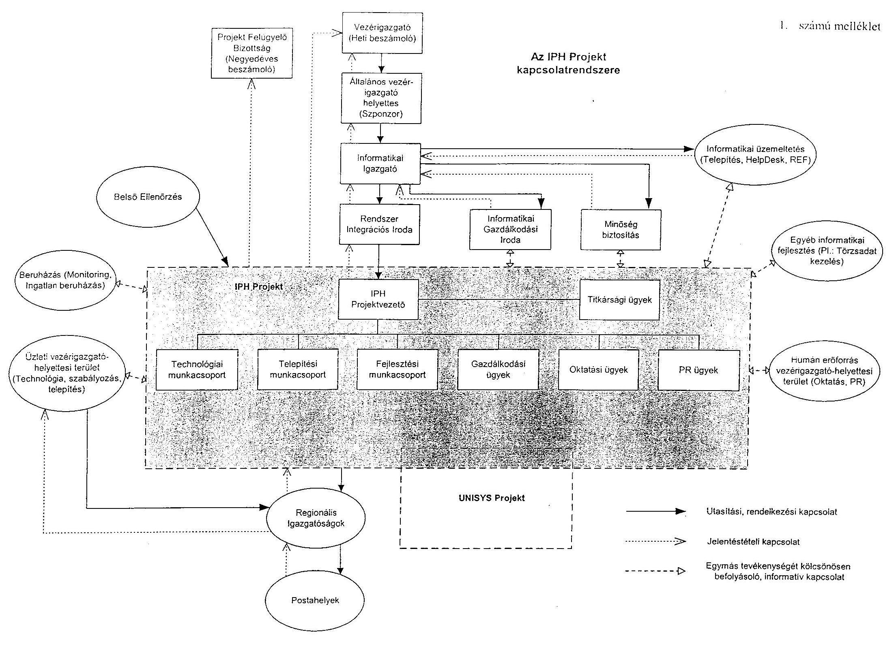

1. számú melléklet

---

IPH rendszer célkitűzéseinek megvalósulása

|  Megfogalmazott célok | Időszak * |  |  |  |  | Megvalósulás | Megjegyzés **** | Minőség  |
| --- | --- | --- | --- | --- | --- | --- | --- | --- |
|   | 1999 | 2000 | 2001 ** | 2002 | 2003 *** |  |  |   |
|  Eredeti célkitűzés (beruházási alapokmányból és MGT-ból) |  |  |  |  |  |  |  |   |
|  Univerzális (egységes) felvevőablak kialakítása, amelyhez rugalmasan változtatható feladatok rendelhetők |  |  | x |  |  | Igen |  | Elvárt  |
|  Ügyfelek tájékoztatása, tudakozódás elősegítése |  |  |  |  | x | Igen |  | Elvárt  |
|  Új típusú Ügyfélirányítás megvalósítása | Törölt |  |  |  |  | Nem | Nem része a Fővállalkozói Szerződésnek |   |
|  Egységes ügyfélkapcsolati bizonylatok kialakítása | x |  |  |  |  | Igen |  | Elvárt  |
|  Ügyfélkiszolgálás idejének (sorállás) csökkentése |  |  |  |  | x | Részben | Nem minden termék esetén valósult meg | Elváráson aluli  |
|  Termékek díjainak kiegyenlítésénél bélyeg helyett etikett használata |  |  | x |  |  | Igen |  | Elvárt  |
|  Pénzforgalmi műveletek radikális egyszerűsítése, a tranzakciók jelentős sebességnövelése |  |  |  |  | x | Részben | Nem minden műveletre valósult meg | Elváráson aluli  |
|  Postai hálózat technológiájának ésszerűsítése és gyorsítása |  |  |  |  | x | Részben | Nem minden funkció esetén valósult meg | Elváráson aluli  |
|  Minden információ csak egyszer, lehetőleg a keletkezés helyén, a rendelkezésre álló eszközök ésszerű felhasználásával kerüljön be a rendszerbe (átfogó, gyors és pontos postai adat felvételezés) |  |  | x |  |  | Igen |  | Elvárt  |
|  Közönségkapcsolati és háttérmunkahelyek integrált együttműködése |  |  | x |  |  | Igen |  | Elvárt  |
|  Szolgáltatás teljesítés és elszámolás átfutási idejének csökkentése |  |  |  |  | x | Igen |  | Elvárt  |
|  Postai hálózat egységes működőképességének biztosítása a különböző mértékben gépesített posták esetében |  |  | x |  |  | Igen |  | Elvárt  |
|  IPH rendszerben az egységes küldemény és egységrakomány (zárlat) vonalkódos azonosítása |  | x |  |  |  | Igen | Teljes körűen csak a küldeményekre vonatkozóan | Elvárt  |
|  Postai dolgozók munkájának egyenletes és gazdaságos szervezése |  |  |  |  | x | Részben | Néhány esetben duplikált tevékenység | Elváráson aluli  |

1.  oldal, összesen: 10

---

IPH rendszer célkitűzéseinek megvalósulása

|  Megfogalmazott célok | Időszak * |  |  |  |  | Megvalósulás | Megjegyzés **** | Minőség  |
| --- | --- | --- | --- | --- | --- | --- | --- | --- |
|   | 1999 | 2000 | 2001 ** | 2002 | 2003 *** |  |  |   |
|  Küldemények követése a postai hálózatban |  |  |  |  | x | Részben | Hatóköre nem teljes, Tudakozvány | Elváráson aluli  |
|  Online és offline kommunikáció biztosítása a különböző postai egységek között |  |  |  |  | x | Részben | Nem minden egységre vonatkozóan | Elváráson aluli  |
|  Központilag meghatározott adatok terítése, valamint a postahely szintű adatok kezelésének lehetősége |  |  | x |  |  | Igen |  | Elvárt  |
|  IPH rendszer és a Magyar Posta Rt. más rendszereinek adatkapcsolata adatközponton keresztül |  |  | x |  |  | Igen |  | Elvárt  |
|  Statisztikák, felmérések, normaadatok automatikus szolgáltatása, forgalom különböző szempont (pl.: üzletági) szerinti elemzése |  |  |  |  | x | Részben | I. sz. beszámolójelentés | Elváráson aluli  |
|  Vezetői információs rendszer támogatása |  |  |  |  |  | Nem |  | Elváráson aluli  |
|  Folyamatos központi irányítás és segítségnyújtás |  | x |  |  |  | Igen | Nem teljeskörű | Elvárt  |
|  1003 fő létszám megtakarítás |  |  |  |  | x | Részben | Nem teljeskörű | Elváráson aluli  |
|  Meglévő termékek értéknövelt különszolgáltatásokkal történő eladása |  |  |  |  | x | Részben | Nem teljeskörű | Elváráson aluli  |
|  Új szolgáltatások gyors és egyszerű bevezetése és a meglévők módosítása |  |  |  |  | x | Részben | Nem teljeskörű | Elváráson aluli  |
|  Gyors reagálás lehetőségének megteremtése a piac kihívásaira, új termékek fogadására |  |  |  |  | x | Részben | Nem teljeskörű | Elváráson aluli  |
|  Közönséges levélpostai küldemény |  |  | x |  |  | Igen |  | Elvárt  |
|  Címzetlen nyomtatvány és reklám küldemény |  |  |  |  | Törölt | Nem | Először igen, majd megszűnt termék PCR 87 |   |
|  Ajánlott és könnyített kézbesítésű levélpostai küldemény kezelése |  |  | x |  |  | Igen | K. ajl. először igen, majd megszűnt termék PCR 71 | Elvárt  |
|  Biztosított ajánlott küldemény kezelése |  |  |  | Törölt |  | Nem | Először igen, majd megszűnt termék PCR 71 |   |
|  Értéklevél kezelése |  |  | x |  |  | Igen |  | Elvárt  |
|  Belföldi kiscsomag kezelése |  |  |  | Törölt |  | Nem | Először igen, majd megszűnt termék PCR 71 |   |
|  Postacsomag kezelése |  |  | x |  |  | Igen |  | Elvárt  |
|  Értékcsomag kezelése |  |  | x |  |  | Igen |  | Elvárt  |

1. oldal, összesen: 10

---

IPH rendszer célkitűzéseinek megvalósulása

|  Megfogalmazott célok | Időszak * |  |  |  |  | Megvalósulás | Megjegyzés **** | Minőség  |
| --- | --- | --- | --- | --- | --- | --- | --- | --- |
|   | 1999 | 2000 | 2001 ** | 2002 | 2003 *** |  |  |   |
|  EMS gyorsposta küldemény kezelése |  |  | $\mathbf{x}$ |  |  | Igen |  | Elvárt  |
|  Távmásolat kezelése |  |  |  |  | $\mathbf{x}$ | Igen |  | Elvárt  |
|  Távirat kezelése |  |  |  |  | $\mathbf{x}$ | Igen |  | Elvárt  |
|  Áru, termék értékesítés kezelése |  |  | $\mathbf{x}$ |  |  | Igen |  | Elvárt  |
|  Szerencsejáték forgalmazás kezelése |  |  | $\mathbf{x}$ |  |  | Igen |  | Elvárt  |
|  Előfizetéses hírlap kezelése |  |  |  | Törölt |  | Nem | Posta visszavonta PCR 77 |   |
|  Belföldi postautalvány kezelése |  |  | $\mathbf{x}$ |  |  | Igen |  | Elvárt  |
|  Belföldi gyorsutalvány kezelése |  |  | $\mathbf{x}$ |  |  | Igen |  | Elvárt  |
|  Kifizetési utalvány kezelése |  |  | $\mathbf{x}$ |  |  | Igen |  | Elvárt  |
|  Kifizetési gyorsutalvány kezelése |  |  | $\mathbf{x}$ |  |  | Igen |  | Elvárt  |
|  Nyugellátási utalvány kezelése |  |  | $\mathbf{x}$ |  |  | Igen | Egyes funkciókat a Posta visszavonta PCR 77 | Elvárt  |
|  TV Díjbeszedés kezelése |  |  |  | Törölt |  | Nem | Posta visszavonta PCR 77 |   |
|  Készpénzátutalási megbízás kezelése |  |  | $\mathbf{x}$ |  |  | Igen |  | Elvárt  |
|  Expressz készpénzátutalási megbízás kezelése |  |  | $\mathbf{x}$ |  |  | Igen | Külső kapcsolati rész nem valósult meg | Elvárt  |
|  Kifizetés készpénzfelvételi utalványra kezelése |  |  |  |  | $\mathbf{x}$ | Igen |  | Elvárt  |
|  Be- és kifizetés pénzforgalmi betétkönyv terhére kezelése |  |  |  |  | $\mathbf{x}$ | Igen |  | Elvárt  |
|  Garantált csekk kezelése |  |  |  |  | $\mathbf{x}$ | Igen |  | Elvárt  |
|  Kártya alapú szolgáltatás (Postamat) kezelése |  |  |  |  | $\mathbf{x}$ | Igen |  | Elvárt  |
|  OTP takarékkönyv kezelése |  |  |  |  | $\mathbf{x}$ | Igen | Technológia megváltozott PCR 5 | Elvárt  |
|  Postabanki betétszámlakönyv kezelése |  |  | $\mathbf{x}$ |  |  | Részben | Külső kapcsolati rész nem valósult meg | Elváráson aluli  |
|  Értékpapír jellegű betétek kezelése |  |  |  |  | $\mathbf{x}$ | Igen | Több esetben módozat változás történt PCR 77 | Elvárt  |
|  Telefonkötvény beváltás kezelése |  |  |  | Törölt |  | Nem | Megszűnt termék |   |
|  Hírközlési Dolgozók Húségalapítványa kezelése |  |  |  |  | Törölt | Nem | Először igen, majd megszűnt termék PCR 106 |   |
|  Nemzetközi postautalvány kezelése |  |  |  |  | $\mathbf{x}$ | Igen | Bizonylat megváltozott PCR 77 | Elvárt  |
|  Valutaforgalmazás kezelése |  |  |  |  | Törölt | Nem | Először igen, majd megszűnt termék |   |
|  Külföldi takarék kifizetés kezelése | Törölt |  |  |  |  | Nem | Megszűnt termék |   |
|  Postacsekk kezelése |  |  | Törölt |  |  | Nem | Megszűnt termék |   |
|  Eurocsekk kezelése |  |  |  | Törölt |  | Nem | Először igen, majd megszűnt termék |   |
|  Biztosítás közvetítés kezelése |  |  |  |  | $\mathbf{x}$ | Igen | Egyes módozat megszűnt | Elvárt  |
|  Lakástakarék közvetítés kezelése |  |  |  |  | $\mathbf{x}$ | Igen |  | Elvárt  |
|  Részvényjegyzés kezelése | Törölt |  |  |  |  | Nem | Megszűnt termék |   |

---

IPH rendszer célkitűzéseinek megvalósulása

|  Megfogalmazott célok | Időszak * |  |  |  |  | Megvalósulás | Megjegyzés **** | Minőség  |
| --- | --- | --- | --- | --- | --- | --- | --- | --- |
|   | 1999 | 2000 | 2001 ** | 2002 | 2003 *** |  |  |   |
|  Pénzváltás kezelése |  |  |  |  |  | Nem | Nincs használatban |   |
|  Hitelintézetek és egyéb gazdasági társaságok készpénzellátása kezelése |  |  |  |  | x | Igen |  | Elvárt  |
|  Zsákos befizetés kezelése |  |  | x |  |  | Igen |  | Elvárt  |
|  Nyugdíjpénztári tagtoborzás kezelése | Törölt |  |  |  |  | Nem | Megszűnt termék |   |
|  Középtávú fejlesztés: Eurogiro rendszerhez csatlakozás |  |  |  |  | Törölt | Nem | Posta döntése értelmében nem valósult meg |   |
|  Középtávú fejlesztés: Western Union rendszerhez csatlakozás |  |  |  |  | Törölt | Nem | Posta döntése értelmében nem valósult meg |   |
|  Középtávú fejlesztés: Commserver rendszerhez csatlakozás |  |  |  |  | Törölt | Nem | IPH-tól függetlenül fog működni. |   |
|  Középtávú fejlesztés: Lakossági számla vezetés, postagiro |  |  |  |  | Törölt | Nem | IPH-tól függetlenül fog működni. |   |
|  Középtávú fejlesztés: Call center |  |  |  |  | Törölt | Nem | Koncepció váltás, forráshiány |   |
|  Hosszútávú fejlesztés: E-bélyeg |  |  |  |  | Törölt | Nem | Eszköz/költségigényes |   |
|  Hosszútávú fejlesztés: Hibrid levelezőlap |  |  |  |  | Törölt | Nem | Szolgáltatás bevezetése IPH-tól független |   |
|  Hosszútávú fejlesztés: E-commerce |  |  |  |  | Törölt | Nem | Költségigényes |   |
|  Hosszútávú fejlesztés: DMDB |  |  |  |  | Törölt | Nem | Adatvédelmi okokból az IPH rendszerrel nem összekapcsolható |   |
|  Hosszútávú fejlesztés: Internetes fizetések / Eközjegyző / Kártyaközpont / Törzskártya |  |  |  |  | Törölt | Nem | Megvalósuláshoz az IPH mellett egyéb fejlesztések is szükségesek |   |
|  Hosszútávú fejlesztés: Dematerializált értékpapír kereskedelem és értékpapírszámla vezetés |  |  |  |  | Törölt | Nem | Megfelelő biztonsági, tárgyi és személyi feltételek megléte szükséges, amely eddig nem volt biztosított |   |
|  Hosszútávú fejlesztés: Kötvények és részvények jegyzése |  |  |  |  | Törölt | Nem | Posta nem tarja reális célkitűzésnek |   |
|  Hosszútávú fejlesztés: Értékpapírok letéti őrzése és letéti számla vezetés |  |  |  |  | Törölt | Nem | Posta nem tarja reális célkitűzésnek |   |
|  Hosszútávú fejlesztés: E-utalvány |  |  | 
 |  | Törölt | Nem | Kifejlesztést és a bevezetést rentábilis |   |
|  Front office posta küldemény- és pénzforgalmi termékek felvétele/kezelése |  |  | x |  |  | Igen |  | Elvárt  |
|  Front office posta kereskedelmi áru- és értékcikk értékesítés |  |  | x |  |  | Igen | Funkció bővülés történt PCR 87 | Elvárt  |
|  Front office posta nyugta- és számlaadás |  |  | x |  |  | Igen |  | Elvárt  |

1. oldal, összesen: 10

---

IPH rendszer célkitűzéseinek megvalósulása

|  Megfogalmazott célok | Időszak * |  |  |  |  | Megvalósulás | Megjegyzés **** | Minőség  |
| --- | --- | --- | --- | --- | --- | --- | --- | --- |
|   | 1999 | 2000 | 2001 ** | 2002 | 2003 *** |  |  |   |
|  Front office posta tömeges felvétel |  |  | x |  |  | Igen | Funkció bővülés történt PCR 78 | Elvárt  |
|  Front office posta küldemények postahelyi és postafiók útján történő kézbesítése |  |  | x |  |  | Igen |  | Elvárt  |
|  Front office posta ügyfélszolgálati kezelők leszámoltatása |  |  | x |  |  | Igen |  | Elvárt  |
|  Front office posta postahely napi zárlatának összeállítása (NER) |  |  | x |  |  | Igen |  | Elvárt  |
|  Front office posta kereskedelmi áru- és értékcikk készlet kezelése |  |  |  |  | x | Igen | Funkció bővülés történt PCR 77 | Elvárt  |
|  Front office posta betétkönyvek és érték papírok készlet kezelése |  |  |  |  | x | Igen |  | Elvárt  |
|  Front office posta készpénz beszolgáltatások és ellátmányok kezelése |  |  | x |  |  | Igen |  | Elvárt  |
|  Front office posta kézbesítő kiosztás |  |  | x |  |  | Igen |  | Elvárt  |
|  Front office posta kézbesítő leszámoltatás |  |  | x |  |  | Igen |  | Elvárt  |
|  Front office posta küldemények indítása és érkeztetése, járatkezelés (rovatolás) |  |  | x |  |  | Részben | Funkció bővülés történt és a 2. fázis nem minden postán PCR 78 | Elváráson aluli  |
|  Front office posta adatrögzítés manuális posták adatai alapján |  |  | x |  |  | Igen | Funkció nincs használatban | Elvárt  |
|  Front office posta nyomkövetés (tudakozvány) |  |  |  |  | x | Igen |  | Elvárt  |
|  Front office posta helyi ügyfelek nyilvántartása |  |  |  |  | x | Igen |  | Elvárt  |
|  Front office posta postavezetői tevékenység támogatása |  |  | x |  |  | Igen |  | Elvárt  |
|  Gépes posta adatrögzítés saját felvett küldemények vonatkozásában |  |  | x |  |  | Igen |  | Elvárt  |
|  Gépes posta adatrögzítés manuális posták adatai alapján |  |  | x |  |  | Igen |  | Elvárt  |
|  Gépes posta postahely napi zárlatának összeállítása (NER) |  |  | x |  |  | Igen |  | Elvárt  |
|  Gépes posta készpénz beszolgáltatások és ellátmányok kezelése |  |  | x |  |  | Igen |  | Elvárt  |
|  Gépes posta kézbesítő kiosztás |  |  | x |  |  | Igen |  | Elvárt  |
|  Gépes posta kézbesítő leszámoltatás |  |  | x |  |  | Igen |  | Elvárt  |
|  Gépes posta nyomkövetés (tudakozvány) |  |  |  |  | x | Igen |  | Elvárt  |
|  Gépes posta helyi ügyfelek nyilvántartása |  |  |  |  | x | Igen |  | Elvárt  |
|  Gépes posta küldemények indítása és érkeztetése, járatkezelés (rovatolás) |  |  | x |  |  | Részben | Funkció bővülés történt és a 2. fázis nem minden postán | Elváráson aluli  |

1. oldal, összesen: 10

---

IPH rendszer célkitűzéseinek megvalósulása

|  Megfogalmazott célok | Időszak * |  |  |  |  | Megvalósulás | Megjegyzés **** | Minőség  |
| --- | --- | --- | --- | --- | --- | --- | --- | --- |
|   | 1999 | 2000 | 2001 ** | 2002 | 2003 *** |  |  |   |
|  Gépes posta postavezetői tevékenység támogatása |  |  | x |  |  | Igen |  | Elvárt  |
|  Rendszerkapcsolat PEK - Kleindienst rendszer |  |  |  | x |  | Részben | Nem minden funkció | Elvárt  |
|  Rendszerkapcsolat IPH - PEK NER rendszer |  |  |  |  | x | Igen | Funkcióbővülés | Elvárt  |
|  Rendszerkapcsolat IPH - KIFUT (floppys kifizetési utalvány) rendszer |  |  | x |  |  | Igen |  | Elvárt  |
|  Rendszerkapcsolat IPH - PEK NSZO |  |  | x |  |  | Igen | Árfolyamtípus változott | Elvárt  |
|  Rendszerkapcsolat IPH - SAP készletgazdálkodás |  |  |  |  | x | Igen | Funkcióbővülés | Elvárt  |
|  Rendszerkapcsolat IPH - SAP tömeges felvétel |  |  |  |  | x | Igen | Funkcióbővülés | Elvárt  |
|  Rendszerkapcsolat IPH - Nemzetközi Kicserélő Üzem |  |  |  |  |  | Nem |  | Elváráson aluli  |
|  Rendszerkapcsolat IPH - EPK Hibrid Mail |  |  |  |  |  | Nem |  | Elváráson aluli  |
|  A rendszerben keletkezett adatok fogadása, tárolása, irányítása és továbbítása az adat címhelyére. Hálózatba kötött nagykapacitású szerverek, amelyek gondoskodnak a központilag előállított adatok terítéséről is. |  |  | x |  |  | Igen |  | Elvárt  |
|  Biztosítja a Magyar Posta Rt. Egyéb rendszereinek adatkiszolgálását és az azoktól érkező adatok fogadását. |  |  | x |  |  | Igen |  | Elvárt  |
|  Adatok archiválása | - |  | x |  |  | Igen |  | Elvárt  |
|  Adatbányászat |  |  |  |  |  | Nem | Felsővezető eszkaláció alatt |   |
|  Help desk |  |  | x |  |  | Igen | Más eszközzel valósult meg | Elvárt  |
|  Munkaállomások állapotának figyelése, hálózat felügyelet |  |  | x |  |  | Igen | Más eszközzel valósult meg | Elvárt  |
|  Szoftver verzió csere a postahelyeken |  |  | x |  |  | Igen | Részben más eszközzel valósult meg. | Elvárt  |
|  A Posta a fejlesztés birtokába jusson |  |  |  |  | x | Részben |  | Elváráson aluli  |
|  Unisys adja át az alkalmazás forráskódját |  |  |  |  | x | Részben |  | Elváráson aluli  |
|  Tervezett gépes posta 1000 db |  | x | x |  |  | Részben | Megvalósított gépes posta 502 db | Elváráson aluli  |
|  Gépes postán PC + monitor 1600 db |  | x | x |  |  | Igen | 1019 db | Elvárt  |
|  Gépes postán ADM Speedy Reader 1600 db |  | x | x |  |  | Igen | 1019 db | Elvárt  |

1. oldal, összesen: 10

---

IPH rendszer célkitűzéseinek megvalósulása

|  Megfogalmazott célok | Időszak * |  |  |  |  | Megvalósulás | Megjegyzés **** | Minőség  |
| --- | --- | --- | --- | --- | --- | --- | --- | --- |
|   | 1999 | 2000 | 2001 ** | 2002 | 2003 *** |  |  |   |
|  Gépes postán OKI ML 3320 mátrixnyomtató 1000 db |  | $\mathbf{x}$ | $\mathbf{x}$ |  |  | Igen | 914 db | Elvárt  |
|  Gépes postán HUB 8 portos 600 db |  | $\mathbf{x}$ | $\mathbf{x}$ |  |  | Igen | 600 db | Elvárt  |
|  Tervezett Front Office posta 200 db |  |  | $\mathbf{x}$ | $\mathbf{x}$ | $\mathbf{x}$ | Igen | Megvalósított Front Office posta 206 db | Elvárt  |
|  Front office postán PC + monitor 2621 db |  |  | $\mathbf{x}$ | $\mathbf{x}$ | $\mathbf{x}$ | Igen | 3316 db | Elvárt
 |
|  Front office postán MIKI PS 612 levélmérleg 4/7 arányban megosztva 955 db |  |  | $\mathbf{x}$ | $\mathbf{x}$ | $\mathbf{x}$ | Igen | 1720 db | Elvárt  |
|  Front office postán Olivetti Lyra POS terminál 4/7 arányban megosztva 955 db |  |  | $\mathbf{x}$ | $\mathbf{x}$ | $\mathbf{x}$ | Igen | 1296 db | Elvárt  |
|  Front office postán MIKI CMA 112-60 csomagmérleg 200 db |  |  | $\mathbf{x}$ | $\mathbf{x}$ | $\mathbf{x}$ | Igen | 201 db | Elvárt  |
|  Front office postán ADM Speedy Reader 2146 db |  |  | $\mathbf{x}$ | $\mathbf{x}$ | $\mathbf{x}$ | Igen | 2931 db | Elvárt  |
|  Front office postán OKI ML 3320 mátrixnyomtató 400 db |  |  | $\mathbf{x}$ | $\mathbf{x}$ | $\mathbf{x}$ | Igen | 1805 db | Elvárt  |
|  Front office postán Olivetti PR4 blokknyomtató 1871 db |  |  | $\mathbf{x}$ | $\mathbf{x}$ | $\mathbf{x}$ | Igen | 2280 db | Elvárt  |
|  Front office postán Olivetti PR2 A4 betétkönyv nyomtató 400 db |  |  |  |  |  | Nem | 0 db más technológia szerint történik a kezelés |   |
|  Front office postán CT001 vonalkód olvasó 275 db |  |  | $\mathbf{x}$ |  |  | Módosult eszköz | Denso HC 36 vonalkód olvasó 454 db | Elvárt  |
|  Front office postán Okipage 8L laser nyomtató 200 db |  |  | $\mathbf{x}$ |  |  | Módosult eszköz | Okipage 14 Ex laser nyomtató 181 db | Elvárt  |
|  Front office postán HUB 870 db |  |  | $\mathbf{x}$ |  |  | Módosult eszköz | Switch 24 portos 273 db | Elvárt  |
|  Front office postán HUB 16190 db |  |  | $\mathbf{x}$ | $\mathbf{x}$ | $\mathbf{x}$ |  |  |   |
|  Correspondence szerverek ( 4 db szerver, 2 db rack szekrény) | $\mathbf{x}$ |  |  |  |  | Igen | Bővítésre került | Elvárt  |
|  Oracle szerverek ( 2 db szerver, 1 db rack szekrény) | $\mathbf{x}$ |  |  |  |  | Igen | Bővítésre került | Elvárt  |
|  HelpDesk munkaállomás 10 db |  | $\mathbf{x}$ |  |  |  | Igen |  | Elvárt  |
|  Rendszerfelügyeleti munkaállomások 10 db |  | $\mathbf{x}$ | $\mathbf{x}$ |  |  | Igen |  | Elvárt  |
|  Windows NT 4.0 workstation 4250 db |  | $\mathbf{x}$ |  | $\mathbf{x}$ |  | Igen | 4509 db, PC-k számának bővülésével a mennyiség növekedett, illetve a munkaállomások egy részére Windows 2000 operációs rendszer került | Elvárt  |

1.  oldal, összesen: 10

---

IPH rendszer célkitűzéseinek megvalósulása

|  Megfogalmazott célok | Időszak * |  |  |  |  | Megvalósulás | Megjegyzés **** | Minőség  |
| --- | --- | --- | --- | --- | --- | --- | --- | --- |
|   | 1999 | 2000 | 2001 ** | 2002 | 2003 *** |  |  |   |
|  Windows NT 4.0 server 7 db | x |  |  |  |  | Módosult | 30 db, a szerverek száma a CA
Unicenter TNG igényeivel bővültek
(a fejlesztést, üzemeltetést támogató
szerverek száma 7 db, ezek nem
képezik a fővállalkozói szerződés
részét). | Elvárt  |
|  Oracle workgroup server 16 db | x |  |  |  |  | Igen | 16 db | Elvárt  |
|  Clementine „data mining" software 5 db |  |  |  |  |  | Nem | 0 db, Felső vezetői eszkaláción |   |
|  Kiposte „enterprise" licence 1 db | x |  |  |  |  | Igen | 1 db | Elvárt  |
|  HP Openview 1 db | x |  |  |  |  | Módosult | 0 db, CA Unicenter TNG
beszerzésével megvalósítva | Elvárt  |
|  Fejlesztői szoftverek 1 db | x |  |  |  |  | Igen | 1 db Szerződés szerint Unisys
használja | Elvárt  |
|  HelpDesk software 1 db | x |  |  |  |  | Módosult | 0 db, CA Unicenter TNG AHD
opciójaként megvalósítva | Elvárt  |
|  Fejlesztői környezet hardver és szoftver eszközei | x |  |  |  |  | Igen |  | Elvárt  |
|  A postahelyek munkatársainak a rendszer
használatára történő betanítása |  | x | x | x | x | Igen | Az oktatáshoz különlegesen
berendezett tantermeket is ki kellett
alakítani | Elvárt  |
|  Az IPH rendszer informatikai működtetésére,
üzemeltetésére alkalmas munkatársak Unisys
általi felkészítése. (Rendszergazdák,
üzemeltetők, fejlesztők, Help Desk kezelők) |  | x |  |  |  | Igen | Az eltelt idő és a fluktuáció miatt a
képzéseket meg kell ismételni | Elvárt  |
|  A felhasználók Felhasználói kézikönyvekkel
történő ellátása |  | x | x | x | x | Igen |  | Elvárt  |
|  Új célkitűzés (szerződés módosításból) |  |  |  |  |  |  |  |   |
|  Postafutár termék kezelése |  |  | x |  |  | Igen | PCR 61 | Elváráson
felüli  |
|  Címzett reklám küldemény kezelése |  |  |  | x |  | Igen | PCR 66 | Elváráson
felüli  |
|  Hivatalos irat kezelése |  |  |  | x |  | Igen | PCR 66 | Elváráson
felüli  |
|  Áruminta kezelése |  |  |  | x |  | Igen | PCR 71 | Elváráson
felüli  |
|  Mini pakk kezelése |  |  |  | x |  | Igen | PCR 71 | Elváráson
felüli  |

1.  oldal, összesen: 10

---

IPH rendszer célkitűzéseinek megvalósulása

|  Megfogalmazott célok | Időszak * |  |  |  |  | Megvalósulás | Megjegyzés **** | Minőség  |
| --- | --- | --- | --- | --- | --- | --- | --- | --- |
|   | 1999 | 2000 | 2001 ** | 2002 | 2003 *** |  |  |   |
|  Válaszküldemény kezelése |  |  |  | x |  | Igen | PCR 71 | Elváráson felüli  |
|  Elsőbbségi küldemény kezelése |  |  |  | x |  | Igen | PCR 71 | Elváráson felüli  |
|  Hitelintézetek készpénz ellátása kezelése |  |  |  | x |  | Igen | PCR 77 | Elváráson felüli  |
|  Tömeges felvétel kiterjesztése gépes postákra |  |  |  | x |  | Igen | PCR 69 | Elváráson felüli  |
|  Irodai alkalmazások (Word, Excel, IE) használatának lehetősége az IPH-s gépeken |  |  |  |  | x | Igen | PCR 107 | Elváráson felüli  |
|  I. számú beszámolójelentés adat-felvételezésének támogatása |  |  |  |  | x | Igen | PCR 110 | Elváráson felüli  |
|  Forgalom Menedzselési Központ |  |  |  | x |  | Igen | Saját adatkigyűjtő program | Elváráson felüli  |
|  Statisztikai rendszer |  |  |  |  | x | Igen | PCR 110 + saját program | Elváráson felüli  |
|  Hardver, szoftver leltározás | x |  |  |  |  | Igen | CA Unicenter TNG - Asset Management Option | Elváráson felüli  |
|  Virusvédelem | x |  |  |  |  | Igen | CA Unicenter TNG - Antivirus Option | Elváráson felüli  |
|  Gépes posta Denso HC 36 vonalkód olvasó eszköz 214 db |  |  | x |  |  | Igen | PCR 39 | Elváráson felüli  |
|  Front office posta Axiohm Blaster 4 Etikett nyomtató eszköz 1676 db |  |  |  | x |  | Igen | PCR 54 | Elváráson felüli  |
|  Front office posta Datalogic Formula 725 mobil vonalkód olvasó eszköz 233 db |  |  |  | x |  | Igen | PCR 82 | Elváráson felüli  |
|  CA Unicenter TNG felügyeleti rendszer | x |  |  |  |  | Igen | PCR 03 - | Elváráson felüli  |
|  CA Unicenter TNG SW | x | x |  |  |  | Igen | A PCR04 keretében 4250, a PCR09 keretében további 800 licenc megvásárolva | Elváráson felüli  |
|  Windows NT 4.0 server |  |  |  | x |  | Igen | Előtét és minta szerverek 1 db | Elváráson felüli  |
|  Windows 2000 server |  |  |  |  | x | Igen | Statisztikai server 1 db | Elváráson felüli  |
|  Üzemeltetéshez kapcsolódó speciális tevékenységek elsajátítása (oktatás) |  |  |  | x | x | Igen | Fejlesztése során fogalmazódott meg | Elváráson felüli  |

1.  oldal, összesen: 10

---

IPH rendszer
 célkitűzéseinek megvalósulása

|  Megfogalmazott célok | Időszak * |  |  |  |  | Megvalósulás | Megjegyzés **** | Minőség  |
| --- | --- | --- | --- | --- | --- | --- | --- | --- |
|   | 1999 | 2000 | 2001 ** | 2002 | 2003 *** |  |  |   |
|  Mintaposta számítástechnikai eszközei |  | x |  |  |  | Igen |  | Elváráson felüli  |
|  Mintaposta audio-vizuális eszközei |  | x |  |  |  | Igen |  | Elváráson felüli  |
|  Minta-adatközpont eszközei |  | x |  |  |  | Igen |  | Elváráson felüli  |

* eredeti, módosított vagy új célok megvalósításának, törlésének ideje ** 1. fázis átvétele *** 2. fázis átvétele **** részletes indoklást az IPH záródokumentum tartalmaz

---

# Az IPH projekt megvalósításának folyamata 

- A Fővállalkozói szerződés hatályba lépése. (1999. február 09)
- Az IPH projekt megalakulása. (1999. február 22)
- Követelményjegyzék (RDD 2.2) elfogadása. Döntés született, hogy a rendszer megvalósítása két fázisban történik. (1999. július)
- KFKI Rt. által végzett felülvizsgálat. (1999. szeptember - 1999. október)
- Első fázisú rendszerterv elfogadása. (1999. december)
- A Unisys átadta a Gépes posták első fázisára vonatkozó első programverziót. (2000. május)
- MTA IT Alapítvány által végzett felülvizsgálat. (2000. május - 2000. augusztus)
- Gépes posta pilot működés kezdete: Dorog 1., Pomáz 1., Gyömrő, Budapest 25., Budapest 63. (2000. június)
- Postán belüli projekt felülvizsgálat, gépes posták telepítésének elhalasztása. (2000. augusztus - 2000. szeptember)
- 497 db Gépes posta telepítése. (2000. december 04. - 2001. április 18.)
- AAM Kft. által végzett felülvizsgálata. (2000. december)
- A Unisys átadta a Front Office posták első fázisára vonatkozó első programverziót. (2001. január)
- Első Front Office pilot posta (Szigetszentmiklós 1.) működésének kezdete. (2001. július 23.)
- Front Office bemutató posták telepítése: Szerencs 1., Karcag 1., Siklós 1., Celldömölk 1., Orosháza 1. (2002. január)
- Front Office szűkített roll-out: 53 db posta telepítése. (2002. március 04. - 2002. április 12.)
- Második fázis rendszertervének elfogadása. (2002. május)
- Folytatódott a Front Office szűkített roll-out: további 15 db posta telepítése. (2002. június 24. - 2002. július 05.)
- KEHI által végzett felülvizsgálata. (2002. június - 2002. október)

---

- További 3 db Front Office posta telepítése. (2002. augusztus 05. - 2002. augusztus 07.)
- A Unisys átadta a postahelyi alkalmazás közös Gépes postai - Front Office postai verzióját, amely révén lehetővé vált a postatípustól független (paraméterekkel vezérelhető) egységes program használata. (2002. augusztus)
- Javított Front Office roll-out alkalmazás átvétele. (2002. október)
- Front Office posták telepítése: 35 db posta. (2002. október 28. - 2002. december 03.)
- Második fázisú programverzió tesztelésének kezdete. (2002. december)
- Front Office posták telepítése: 32 posta. (2003. január 06. - 2003. március 04.)
- Front Office - Gépes postai közös programverzió letöltése a Gépes postákra. (2003. január)
- Front Office posták elektromos szempontból történő felülvizsgálata, egyes posták telepítésének elhalasztása.( 2003. február - 2003. június)
- Front Office második fázisú programverzió pilot postai tesztelésének kezdete. (2003. április 10.)
- További 13 db Front Office posta telepítése. (2003. május 06. - 2003. június 30.)
- Második fázisú programverzió átvétele, letöltése. (2003. július)
- Front Office posták telepítése: 37 db posta. (2003. június 30. - 2003. augusztus 06.)
- IPH próbaüzem. (2003. július 28. - szeptember 28.)
- IPH projekt által végzett feladatok átadás - átvétele. (2003. június - október) Összességében az IPH rendszer 206 FO és 493 GP postán működik.
- IPH projekt megszűnése. (2003. szeptember 30.)
- A fejlesztéssel és telepítésekkel párhuzamosan a következő feladatok kerültek elvégzésre:
- Gépes és Front Office posták működésével kapcsolatos technológiai utasítások elkészítése és megjelentetése.
- Gépes és Front Office oktatások lebonyolítása, amelynek keretében összesen 18313 fő kiképzésére került sor. (Gépes posta: 7337 fő. FO posta: 10976 fő.)
- Üzemszerűen működő külső kapcsolatok kialakítása (Működéshez szükséges adatok átvétele, más postai rendszerek adatkiszolgálása)
- Postákon működő rendszerek kiváltása
- Külső és belső kommunikációs feladatok elvégzése. Ügyfelek, üzleti partnerek, postás dolgozók tájékoztatása a rendszer bevezetésével kapcsolatos változásokról.

---

# 7. Tervezett üzemeltetési költségek, megtérülés

Ez a fejezet a 2000. és 2003. évi MGT-k üzemeltetési költségeinek és megtérüléseinek összehasonlítását tartalmazza a 2003. évi MGT alapján.

Az összesített adatok az alábbi táblázatban láthatók.

|  2000. és 2003. évi MGT előterjesztések megtérülési számításainak (beruházás befejeződését követő 3 működési év) |  |  |   |
| --- | --- | --- | --- |
|  |   |   |   |
|  Összes hozam | M Ft |  | Vizsgált időtáv  |
|  MGT2000 | 9702588 |  | 2002-2004  |
|  MGT2003 | -2842975 |  | 2004-2006  |
|  Különbség | -12545563 |  |   |
|  |   |   |   |
|  Változások | M Ft | M Ft | M Ft  |
|   | 2000 | 2003 | Változás  |
|  Anyagköltség | 79356 | -655538 | -734894  |
|  Energiaköltség | 0 | -467530 | -467530  |
|  Karbantartás | -237596 | -926449 | -688853  |
|  Számításba vett NAH üzem. költségek, Riposte, egyéb | -3045357 | -1359472 | 1685885  |
|  Személyi jellegű költség | 5836 /104 | 3629528 | -2206577  |
|  Értékcsökkenés (IPH+NAH+IPH egyéb kapcs) | -4348959 | -3862282 | 486677  |
|  Kiváltandó beruházások écs-je | 3461600 | 618000 | -2843600  |
|  AFA |  | -90716 | -90716  |
|  Prognosztizált eredmény bevételből | 3457440 | 271484 | -3185956  |
|  Cash Flow menedzsmentből megtakarítások | 4500000 | 0 | -4500000  |
|  Összes változás | 9702588 | -2842975 | -12545563  |
|  |   |   |   |
|  |   |   |   |

Az adatok részletezését a 2A és 2B sz. mellékletek tartalmazzák.

---

# IPH rendszer célkitűzéseinek megvalósulása 

| Célok teljesülése | Elvárt minőségben | Elváráson   alul | Elváráson   felül | Összesen |
| :-- | :-- | :-- | :-- | :-- |
| Megvalósult' | 100 |  | 26 | 126 |
| Módosított eszközökkel megvalósult | 6 |  |  | 6 |
| Részben megvalósult |  | 18 |  | 18 |
| Összesen | 106 | 18 | 26 | 150 |

Összes tervezett cél: $\quad 185 \mathrm{db}$
Ebből nem valósult meg: $\quad 35 \mathrm{db}$