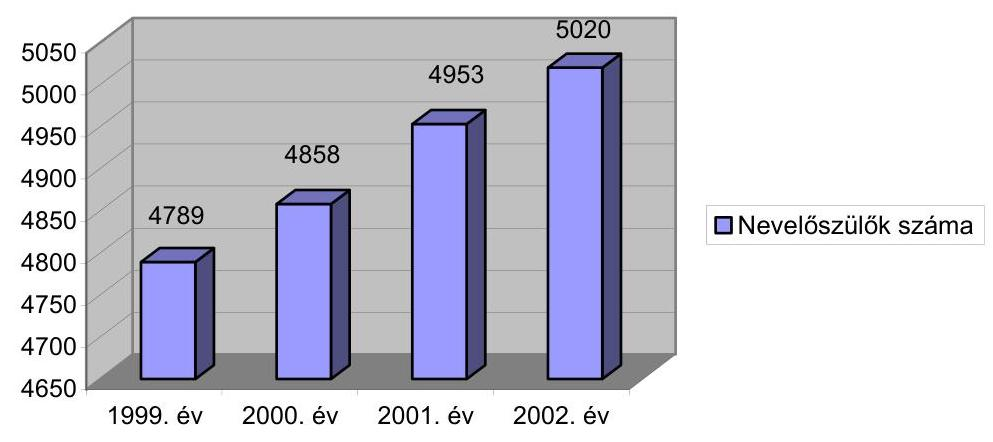
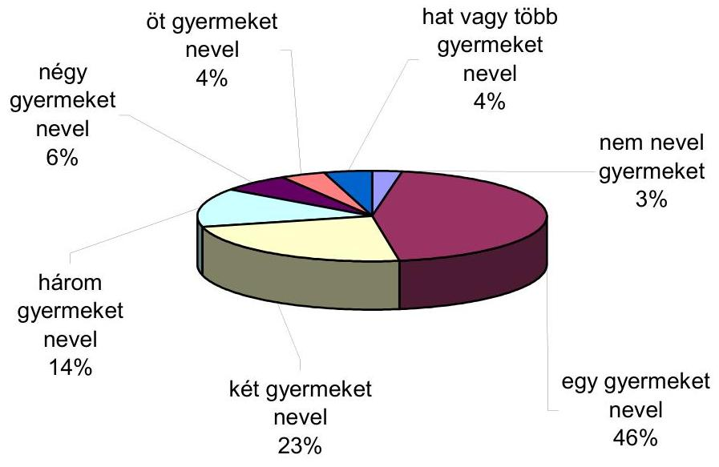
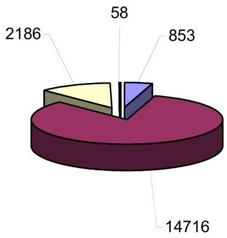
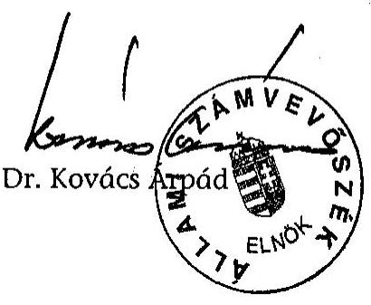
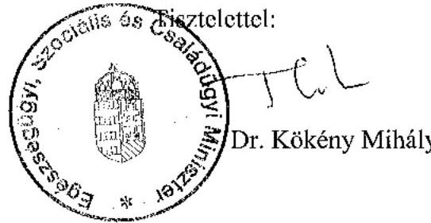
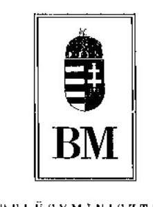
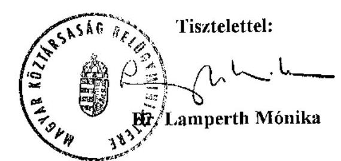
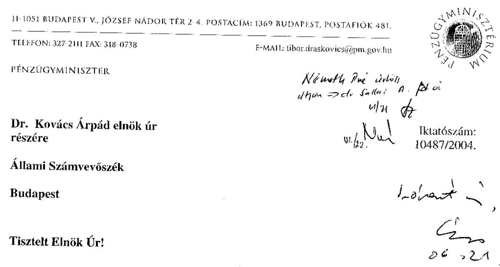
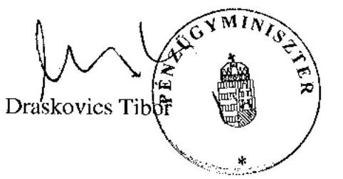

# JELENTÉS 

a helyi önkormányzatok gyermekvédelmi szakellátási tevékenységének ellenőrzéséről

---

3. Önkormányzati és Területi Ellenőrzési Igazgatóság
3.2. Pénzügyi-szabályszerüségi és Teljesítmény-ellenőrzési Főcsoport Iktatószám: V-1009-22/2003-04.
Témaszám: 656
Vizsgálat-azonosító szám: V-0100
Az ellenőrzést felügyelte:
Dr. Lóránt Zoltán
főigazgató
Az ellenőrzés végrehajtásáért felelős:
Németh Péterné
főcsoportfőnök
Az ellenőrzést vezette:
Dr. Sallai Antal
osztályvezető főtanácsos
A számvevői jelentések feldolgozásában és a jelentés összeállításában
közremüködtek:

# Berényi Magdolna 

főtanácsadó

## Huberné Kuncsik Zsuzsa

tanácsadó
Valu Tibor
tanácsadó

## Az ellenőrzést végezték:

| Baloghné Dakó Eszter | Kerezsi Pál | Huberné Kuncsik |
| :-- | :-- | :-- |
| számvevő | számvevő tanácsos | Zsuzsa |
| Bács-Kiskun megye | Borsod-Abaúj-Zemplén | tanácsadó |
|  | megye | Fejér megye |
| Berényi Magdolna | Nyikon Zsigmondné | Csomán Mihály |
| főtanácsadó | számvevő | számvevő tanácsos |
| Győr-Moson-Sopron | Hajdú-Bihar megye | Jász-Nagykun-Szolnok |
| megye |  | megye |
| Castro Hurtadoné | Valu Tibor | Horváth Mária |
| Juhász Erika | tanácsadó | számvevő |
| számvevő tanácsos | Szabolcs-Szatmár-Bereg | Veszprém megye |
| Pest megye | megye |  |

Jelentéseink az Országgyűlés számítógépes hálózatán és az Interneten a www.asz.hu címen is olvashatók.

---

# Szabó Tamás 

számvevő tanácsos
Fővárosi Ellenőrzési Iroda

## A témához kapcsolódó eddig készített számvevőszéki jelentések: címe

sorszáma
A települési önkormányzatok szociális és gyermekjóléti 0015 szolgáltatásai helyzetéről
Az állami gondoskodásra szoruló fiatalok intézményes ellátásáról 246

---

# TARTALOMJEGYZÉK 

BEVEZETÉS ..... 7
I. ÖSSZEGZŐ MEGÁLLAPÍTÁSOK, KÖVETKEZTETÉSEK, JAVASLATOK ..... 9
II. RÉSZLETES MEGÁLLAPÍTÁSOK ..... 17

1. A gyermekvédelmi ellátás szabályozása, szervezeti rendszere ..... 17
1.1. A gyermekvédelem rendszere ..... 17
1.2. Gyermekvédelmi ellátások átalakulása, a szakellátás mai rendszerének kialakulása ..... 19
1.2.1. A gyermekjóléti alapellátások ..... 19
1.2.2. A gyermekvédelmi szakellátások ..... 20
1.2.3. A múködési engedélyezési eljárás ..... 24
2. A szakellátás intézményrendszerének múködése ..... 26
2.1. Területi Gyermekvédelmi Szakszolgálat (TEGYESZ) ..... 26
2.2. Gyermekotthon, lakásotthon ..... 28
2.3. Nevelőszülői hálózat ..... 31
3.A gyermekvédelmi szakellátásban részesülők ..... 35
3.1. Gyermekvédelmi szakellátásban részesülő gyermekek elhelyezése gondozási forma és hely szerint ..... 35
3.2. Utógondozói ellátás ..... 40
3.3. Örökbefogadás ..... 44
3. A szakellátás múködési feltételei ..... 46
4.1. Az átalakulás pénzügyi forrásai ..... 46
4.2. A múködés személyi és tárgyi feltételei ..... 49
4.3. A gyermekvédelmi szakellátási rendszer finanszírozása ..... 50
4.4. A gyermekvédelmi szakellátások információs rendszere ..... 60
4. Az ellenőrzés rendszere, múködése ..... 63

---

# MELLÉKLETEK 

1. sz. A gyermekjóléti és gyermekvédelmi személyes gondoskodást nyújtó ellátások megyei összesítése 2003. évben
2. sz. Adatok az örökbefogadásról
3. sz. A vizsgált önkormányzatok felhalmozási célú költségvetési bevételeinek alakulása
4. sz. Az önkormányzatok gyermekvédelmi szakellátási költségvetési kiadásainak alakulása (országos adatok)
5.sz. A vizsgált önkormányzatok gyermekvédelmi szakellátás költségvetési kiadásainak alakulása
6.sz. A vizsgált önkormányzatok egyes gyermekvédelmi feladatai teljesített fajlagos kiadásainak alakulása

---

# RÖVIDÍTÉSEK JEGYZÉKE 

| Ötv. | 1990. évi LXV. törvény a helyi önkormányzatokról |
| :--: | :--: |
| Csjt. | 1952. évi IV. törvény a házasságról, a családról és a gyámságról |
| Gyvt. | 1997. évi XXXI. törvény a gyermekek védelméről és a gyámügyi igazgatásról |
| Szt. | 1993. évi III. törvény a szociális igazgatásról és a szociális ellátásokról |
| Gyer. | 149/1997. (IX. 10.) Korm. rendelet a gyámhatóságokról, valamint a gyermekvédelmi és gyámügyi eljárásról |
| Gyesz. | 259/2002.(XII. 18.) Korm. rendelet a gyermekjóléti és gyermekvédelmi szolgáltatótevékenység engedélyezéséről, valamint a gyermekjóléti és gyermekvédelmi vállalkozói engedélyről |
| Szgf. | 15/1998. (IV. 20.) NM rendelet a személyes gondoskodást nyújtó gyermekjóléti, gyermekvédelmi intézmények, valamint személyek szakmai feladatairól és múködésük feltételeiről |
| gyámhivatal | A Belügyminisztérium Fővárosi, Megyei Közigazgatási Hivatala Gyámhivatala |
| minisztérium | Az ágazati, szakmai irányítást végző minisztérium (a vizsgált időszakban neve többször változott, jelenleg Egészségügyi, Szociális és Családügyi Minisztérium) |
| TEGYESZ | Fővárosi, Megyei Önkormányzat Területi Gyermekvédelmi Szakszolgálata |
| NCSSZI | Nemzeti Család- és Szociálpolitikai Intézet |
| GYIVI | Gyermek és Ifjúságvédő Intézet |

---

# ÉRTELMEZŐ SZÓTÁR 

Gyermekjóléti és gyermekvédelmi szolgáltató tevékenység
Ideiglenesen elhelyezett

Átmeneti nevelt

Tartós nevelt

Hagyományos nevelőszülő

Hivatásos nevelőszülő

Utógondozói ellátott

Otthonteremtési támogatás

Átmeneti (befogadó) otthon

Gyermekotthon

Lakásotthon

A gyermekjóléti alapellátás, illetve a gyermekvédelmi szakellátás keretében - múködési engedéllyel végzett tevékenység
Ideiglenesen elhelyezett az a kiskorú, akinek azonnali elhelyezése szükséges, mert felügyelet nélkül maradt, vagy fejlődését családi környezete, vagy önmaga súlyosan veszélyezteti.
Átmeneti nevelt az a kiskorú, akit a városi, kerületi gyámhivatal, mint I. fokú hatóság átmeneti nevelésbe vesz, mert fejlődését családi környezete veszélyezteti, és a veszélyeztetettsége az alapellátás keretében nem szüntethető meg. Az átmeneti nevelésbe vétel fennállásának szükségességét a gyámhivatal évente - a 3 éven aluli gyermek esetében félévente - felülvizsgálja. A szülő felügyeleti joga szünetel.
Tartós nevelt az a kiskorú, akinek szülei elhaltak, illetve a vér szerinti szülők lemondtak róla, vagy a bíróság a szülői felügyeleti jogot megszüntette.
Az a személy, aki nevelőszülői jogviszonya keretében saját háztartásában gondozza a gyámhivatal jogerős határozatával nála elhelyezett átmeneti, vagy tartós nevelésbe vett gyermeket, és az utógondozói ellátásban részesülő fiatal felnőttet.
Az a személy, aki munkaviszony keretében saját háztartásában gondozza a gyámhivatal jogerős határozatával nála elhelyezett átmeneti, vagy tartós nevelésbe vett gyermeket, és az utógondozói ellátásban részesülő fiatal felnőttet.
Az a fiatal felnőtt, akinek átmeneti vagy tartós nevelésbevétele nagykorúvá válásával szűnt meg, különleges élethelyzete miatt saját kérésére a gyámhivatal utógondozói ellátását rendeli el. Az ellátott továbbra is a szakellátásban marad.
1997. november 1. után nagykorúvá vált, korábban a szakellátásban ellátott fiatalok esetében alanyi jogon járó normatív támogatás.
Az ideiglenesen beutalt kiskorúak részére biztosít teljes körű ellátást. Rendszerint a TEGYESZ múködteti, de gyakori valamelyik gyermekotthonhoz való integrálása
A gyermekotthon megszakítás nélküli munkarend szerint múködő bentlakásos gyermekintézmény. Legalább 12, de legfeljebb 40 önálló lakóegységben elhelyezett gyermek otthont nyújtó ellátását biztosítja.
A lakásotthon olyan gyermekotthon, amely legfeljebb 12 gyermek, otthont nyújtó ellátását biztosítja önálló lakásban, vagy családi házban családias körülmények között.

---

| Helyettes szülő | Az alapellátás részeként a települési, kerületi önkormányzat múködteti, a családban élő gyermek átmeneti gondozását saját háztartásban biztosítja, gyámságot nem lát el. |
| :--: | :--: |
| Családok átmeneti otthona | Alapellátás keretében múködtetett intézmény, ahol az otthontalanná vált szülő együttesen helyezhető el gyermekével. |
| Gyermekek átmeneti otthona | Az alapellátás keretében az átmenetileg felügyelet nélkül maradt, családban élő gyermek elhelyezését biztosítja intézményes formában. |
| Titkos örökbeadás | Az örökbefogadási eljárás során a vérszerinti szülők az örökbefogadó személyét és személyi adatait nem ismerik. |

---

# JELENTÉS 

## a helyi önkormányzatok gyermekvédelmi szakellátási tevékenységének ellenőrzéséről

## BEVEZETÉS

A gyermekek iránti állami felelősségvállalás Magyarországon 1901-ben kezdődött, amikor a talált és elhagyottnak nyilvánított gyermekekről először hét éves korúkig, majd ugyanebben az évben már 15. születésnapjukig tartó gondoskodásról intézkedtek. 1952-től az elhagyott gyermekek állami gondozottá váltak, a gondoskodás pedig 18 éves korukig terjedt ki.

Az 1990-es években bekövetkezett gazdasági-társadalmi fordulat a gyámügy és a gyermekvédelem egységes jogi szabályozásának szükségességét vetette fel, beépítve a modern európai gyermekvédelem követelményeit is.

A Gyvt. 1997. évi megalkotásával Magyarország megtette a legjelentősebb lépést a Gyermekek Jogairól szóló Egyezményben, a Magyar Köztársaság Alkotmányában megfogalmazottak és az európai jóléti államok által hirdetett elvárások összehangolt megvalósítása érdekében.

Az ország lakónépességének száma az 1999. évi 10,2 millió főről 2002-re 80 ezer fővel csökkent, ezen belül a fiatalkorúak (0-19 évesek) száma 2,37 millió főről 93 e fővel csökkent, ennek következtében a fiatalkorúak aránya 23,2\%-ról 22,5\%-ra esett vissza. A munkaképes korúak száma a vizsgált időszakban több mint negyedmillióval 273485 fővel lett kevesebb. A társadalom gondoskodása azon fiatalok esetében kiemelt jelentőségű, akiknél átmenetileg vagy tartósan hiányzik a megfelelő családi háttér és az egyéni élethelyzetek alakulása miatt az elemi gondoskodás és védelem nem biztosított.

Minden tizedik kiskorú veszélyeztetettnek minősül, ami adódik a válások nagyságrendjéből, a családok jövedelmi, szociális helyzetének romlásából. ${ }^{1}$

A válások száma a vizsgált időszakban közel azonos, az 1999. évben 25 468, a 2002. évben 25 338. A 100 házasságkötésre jutó válások száma átmeneti csökkenést követően ismét növekvő tendenciát mutat, 2002-ben elérte az 1999. évi szintet (55). A rendszeres szociális segélyben részesülők évi átlagos száma 19992002 között 3,6 szorosára nőtt. Az átmeneti segélyben részesítettek száma a vizsgált időszakban a 2000. évi csökkenés után 2002. évre ismét növekvő tendenciát mutat ( 665406 fő).

[^0]
[^0]:    ${ }^{1}$ KSH Statisztikai Évkönyvek 1999-2002. évek

---

A veszélyeztetettség növekedése összefügg a devianciák felerősödésével, 19992002. évek között 9\%-ról 9,7\%-ra emelkedett a fiatalkorúak aránya az ismerté vált közvádas bűnelkövetők között.

A gyermekvédelmi szakellátások célja: otthont nyújtó ellátás biztosítása az ideiglenes hatállyal elhelyezett, az átmeneti és a tartós nevelésbe vett gyermekek számára. Az otthont nyújtó ellátásokat - a jelenleg érvényes szabályozás szerint - nevelőszülőnél, gyermekotthonban vagy más bentlakásos intézményben kell megszervezniük a fővárosi és a megyei önkormányzatoknak.

A szakellátást nyújtó intézmények megléte, az ott rendelkezésre álló személyi és tárgyi feltételek kulcsfontosságúak a gyermekvédelemben. Megfelelő intézményhálózat nélkül a gyermekek gondozása, elhelyezése nem biztosítható. Az 1997. évi XXXI. tv. hatályba lépésével a gyermekvédelem területén alapvető változások zajlottak le. A meglévő intézményrendszer átalakult, többségében megszűntek a nagy létszámú gyermekotthonok, számos kisebb létszámú gyermekotthon és lakásotthon kezdte meg múködését. Az intézményrendszer átalakítása, az előírt személyi és tárgyi feltételek biztosítása pótlólagos központi és helyi forrásokat igényelt.

Az ellenőrzés célja annak feltárása volt, hogy

- a gyermekvédelmi törvény hatására hogyan alakult a személyes gondoskodást nyújtó, szakellátást biztosító intézmények rendszere;
- a szakellátást biztosító helyi önkormányzatok eleget tettek-e a feladatellátási kötelezettségüknek, rendelkezésre állnak-e a gyermekvédelemhez szükséges ellátási formák (otthont nyújtó ellátások, utógondozói ellátás, területi gyermekvédelmi szakszolgáltatás );
- az intézményi ellátások feladatrendszerében (intézmények múködésére vonatkozó jogszabályok, költségvetési források) bekövetkezett változások milyen hatást gyakoroltak az intézményekben folyó szakmai munkára;
- a meglévő intézményhálózat átalakítását, az új ellátási formák kialakítását segítették-e költségvetési többletforrások (a szakmai programokhoz biztosított források és azok felhasználásának hasznosulása).

# Az ellenőrzés jogalapja az Állami Számvevőszékről szóló 1989. évi XXXVIII. tv. 2. § (5) bekezdése. 

A helyszíni vizsgálat az 1999-2002. éveket érintően az Egészségügyi Szociális és Családügyi Minisztériumra, a fővárosi és kilenc megyei önkormányzatra, egy megyei jogú városra, tíz területi gyermekvédelmi szakszolgálatra, tizenegy gyermekotthonra, 10 lakásotthonra, kettő utógondozó otthonra, egy befogadó otthonra és tizenegy nevelőszülői hálózatra terjedt ki. A vizsgálat a 21893 fő gyermekvédelmi gondoskodás alatt álló ellátott (2002. évi országos adat) 68\% át, 14933 főt érintette. A gyermekvédelmi szakellátások múködési kiadásai a vizsgált időszakban 70121 millió forintot tettek ki, ennek $72 \%$-a, 50473 millió forint volt a vizsgált önkormányzatok által teljesített kiadás.

---

# I. ÖSSZEGZŐ MEGÁLLAPÍTÁSOK, KÖVETKEZTETÉSEK, JAVASLATOK 

A magyar gyermekvédelemben 1997-ig, a törvényi szabályozást megelőzően hiányoztak azok a helyi megelőző kríziskezelő ellátások, amelyek lehetővé tették volna a gyermek intézményes ellátása helyett a gyermek családban tartását, a szülővel közös elhelyezését. Az ellátórendszer létrehozása érdekében ki kellett alakítani a hiányzó, személyes gondoskodást nyújtó gyermekjóléti alapellátásokat, feladatként jelentkezett a több évtizeden keresztül centralizáltan múködő szakellátás megváltoztatása, az akkor még túlsúlyban lévő nagy létszámú gyermekotthonok kiváltása, átalakítása.

A gyermekek védelméről és a gyámügyi igazgatásról szóló 1997. évi törvény alapvető szemléletváltást, teljes körű reform megvalósítását jelentette, ugyanakkor egységes rendszerbe foglalta a gyermekvédelmi ellátásokat.

A Gyvt. szabályozta az önkormányzatok és az állam gyermekjóléti és gyermekvédelmi feladatait, amelyek pénzbeli és természetbeni ellátásokból, személyes gondoskodást nyújtó alap- és szakellátásokból, valamint hatósági intézkedésekből állnak. A szabályozás szerint a gyermekjóléti alapellátások a kerületi és a települési önkormányzatok feladatát képezik, míg a gyermekvédelmi szakellátások biztosítása a fővárosi és a megyei önkormányzatok kötelezettsége. A Gyvt. módosításával a megyei jogú városok számára is kötelező lesz az otthont nyújtó ellátások biztosítása, amely a demográfiai folyamatok és a megyei önkormányzatok pénzügyi helyzetének ismeretében nem indokolt.

Az alapellátások a gyermek lakóhelyén a veszélyeztetettség megszüntetését, a gyermek családban maradását szolgálják. Az alapellátások közé a gyermekjóléti szolgáltatás, a gyermekek napközbeni ellátása és átmeneti gondozása tartozik. Ha az alapellátás keretében a veszélyeztetettség nem szüntethető meg, vagy a gyermek gondozása, fejlődése más módon nem érhető el, a személyes gondoskodást nyújtó szakellátó intézményekben kell a gyermeket teljes körúen ellátni. A szakellátás a területi gyermekvédelmi szakszolgálat és az otthont nyújtó ellátás, amely alapvetően nevelőszülői hálózatokban, gyermekotthonokban és lakásotthonokban valósul meg.

A gyermekvédelmi szakellátás intézményeiben az ellátottak száma 1999. évben 22 497fő, 2002. évben 21893 fő volt. Közülük egyre többen (1999. évben 81\%, 2002. évben 88\%) nevelkedtek nevelőszülőknél, illetve gyermekotthonokban.

A törvényben előírt alapellátások létrehozása és a gyermekvédelmi szakellátást végző intézmények átalakítása a konkrét eredmények ellenére lassan haladt előre, alapvetően az ehhez szükséges források hiánya miatt. Ennek következtében a gyermekjóléti szolgálatok lehetőségei a megelőzés és a gyermekvédelem területén korlátozottak. A Gyvt. 2002. évi módosítása a települési önkormányzatok alapellátási kötelezettségét a település

---

nagyságától függően differenciálta. A kis településekre vonatkozóan azonban nem határozta meg a kötelezően biztosítandó alternatív (bölcsőde helyett házi gyermekfelügyelet, családi napközi, a gyermekek átmeneti otthona helyett helyettes szülő) ellátásokat. A gyermekvédelem első szintjének hiánya miatt az indokoltnál nagyobb nyomás nehezedik a szakellátás intézményeire, ahol a legnagyobb elmaradás a többcélú, oktatást is végző gyermekvédelmi intézményeknél jelentkezik, amelyekben az enyhe vagy középsúlyos értelmi fogyatékos gyermekeket gondozzák. A vizsgált fővárosi és megyei önkormányzatok az 1999-2002. évek között felhalmozási kiadásaik mindössze 1,5\%-át fordították a gyermekvédelmi szakellátás fejlesztésére.

A jogszabályok megjelenését megelőzően nem készült felmérés az átalakítások forrásigényére, a változások miatti költségtöbbletekre és a szükséges szakmai létszámfejlesztésre. Megfelelő pénzügyi eszközök hiányában a Gyvt. hatályba lépése óta az átalakításra vonatkozó határidőt folyamatosan módosítani kellett. A Gyvt.-t módosító 2003. évi törvény a határidőt két évvel kitolta, 2004. december 31-ben állapította meg. A Magyar Köztársaság 2004. évi költségvetésről szóló törvény ezt a határidőt 2005. december 31-re módosította.

A minisztériumnak a jogszabályok hatálybalépését követően, az 1999. és a 2003. évben kizárólag az önkormányzatoknál végzett felméréseiből² megállapítható, hogy az intézmények átalakításának, fejlesztésének, illetve a szakmai jogszabályokban előírt feltételek megteremtésének forrásai a központi költségvetésben és az önkormányzatoknál sem álltak rendelkezésre. A minisztérium szakmai pályázati pénzeszközökkel segítette a célok megvalósítását, de az önkormányzati saját források elégtelensége miatt, a pályázati feltételek meghatározásából adódóan a rendszer alacsony hatékonysággal működött, 2003-ban a felhasználható keret $36 \%$-a megmaradt.

A fenntartók már a törvény megjelenése előtt is döntöttek átszervezésekről, de a kötelező érvényű előírások megjelenésével további átalakításokra kényszerültek. A jogszabályok konkrétan előírták az otthont nyújtó ellátásokat biztosító gyermekotthon, lakásotthon maximális férőhelyszámát (40, 12), azok múködtetésének személyi, tárgyi feltételeit. A személyi feltételek teljesítéséhez 3007 fő szakmai létszámfejlesztést kellett volna 1999. évtől 2002. december 31-ig végrehajtani, ezzel szemben csak 1459 fő felvételére került sor. A gyermekvédelmi szakellátó intézményeknél egyes szakmai álláshelyek betöltése nehézséget okoz, mivel a közalkalmazotti bérezési feltételek és a sajátos munkakörülmények miatt nem jelentkezik elegendő pszichológus, fejlesztő pedagógus és gyermekorvos erre a területre.

A szabályozás prioritásként kezeli a kis létszámú, családias körülményeket biztosító, maximum 12 férőhelyes lakásotthonok kialakítását, ahol biztosítható az egyéni törődés, könnyebbé válik a fiatalok társa-

[^0]
[^0]:    ${ }^{2}$ A szakmai szabályok megvalósítási költségeinek becslése 1999. szeptember 30.;Ellátórendszer költségeinek adatai 2003. október 31.

---

dalmi beilleszkedése. 2002-ben a gyermekotthonok átalakításának eredményeként a férőhelyek egyharmada lakásotthoni férőhely, 31\%-kal magasabb, mint 1999. évben.

A Gyvt.-ben előírt célkitúzések csak részben valósultak meg, és az intézményrendszer átalakítása sem zajlott le teljes körúen, ennek ellenére a módosított szakmai jogszabályok újabb feltételeket írtak elő, amelyek betartása további forrásokat igényel (megyei szakértői bizottságok létrehozása, az új létszámnormák biztosítása, a különleges és speciális gyermekotthonok múködési feltételeinek kialakítása). A minisztérium 2003. évben végzett felmérése alapján 2004. és 2005. évekre együttesen 5629 millió Ft forrás szükséges, melynek $54 \%$-a beruházásokhoz, $46 \%$-a a létszámfejlesztésekhez kapcsolható. A fenntartó önkormányzatok a többletköltségek fedezetét önerőből biztosítani nem tudják, ehhez központi források bevonása szükséges.

A fővárosban és minden megyében múködik szakszolgálat, olyan szakmai szolgáltató intézmény, amely a legtöbb információval rendelkezik, és a gondozóhelyekkel való együttmúködéssel, a kompetenciahatárok tiszteletben tartásával fejti ki tevékenységét. A TEGYESZ-hez rendelte a törvény a megszünt GYIVI szakértői feladatait és újakkal egészítette ki azokat. A fenntartó önkormányzatok a gyermekvédelmi szakellátás intézményeit, azok szervezeti kereteit önállóan alakították ki, melyek megyénként különbözőek.

A gyermek gondozási helyének kijelölését alapvetően a szabad férőhelyek befolyásolják. A fenntartó önkormányzatok számára az intézménymüködtetés akkor a leggazdaságosabb, ha a gyermekotthoni férőhelyek kihasználtsága teljes, így nem érdekük csökkenő gyermeklétszám mellett a fajlagos költségeket tekintve legkedvezőbb nevelőszülői hálózat bővítése sem.

A területi gyermekvédelmi szolgálatokhoz tartozó gyermekvédelmi szakértői bizottságnak kell 2003-tól - a gyermek vizsgálata alapján - meghatároznia a gyermek érdekeinek megfelelő gondozási helyet. A gyakorlatban azonban a bizottság csak a szabad férőhelyek alapján hozhatja meg javaslatát a gondozás helyére vonatkozóan, ezért a szakellátásba bekerülő gyermekek nem minden esetben kerülhetnek a számukra legmegfelelőbb ellátást nyújtó gondozási helyre.

A gyermekek nevelőszülőknél történő elhelyezése szakmailag optimális megoldás. A feladatellátásra alkalmas nevelőszülők hiányában a nevelőszülői hálózatok nem fejleszthetők korlátlanul. A nevelőszülők száma 1999-ről 2002. évre 231 fővel emelkedett, az ellátottak 1999 évben 41\%-át, 2002. évben $45 \%$-át gondozták ebben a formában.

A kamaszkorú gyermekek gyakran súlyos magatartási problémákkal, különböző szenvedélybetegségekkel küzdenek, a gondozásukhoz szükséges feltételeket (elhelyezési körülmények, megfelelő szakmai ismeretek) a nevelőszülők nem tudják biztosítani. A szakellátásba ideiglenesen bekerülő 14 év feletti gyermekek száma 2002. évben 287 fővel volt több, mint 1999. évben. A jelenlegi rendszerben a hagyományos nevelőszülők szeretnék megválogatni gondozottjaikat, a tapasztalatok szerint a problémás, idősebb, kamaszkorú

---

gyermekek gondozását nem vállalják, ragaszkodnak a csecsemő, vagy óvodáskorú kisgyermekek befogadásához.

A hivatásos nevelőszülőknek a hagyományos nevelőszülőnél több gyermeket kell gondozniuk, és nem válogathatnak a gyermekek között. A hagyományos nevelőszülőnél - a saját gyermekeit is beszámítva - legfeljebb öt, a hivatásos nevelőszülőnél pedig a saját gyermekeivel együtt legalább három, legfeljebb nyolc gyermek és fiatal felnőtt helyezhető el. A nevelőszülőknél a lakásotthonokhoz képest kevesebb költséggel, családias körülmények között nevelkednek a gyermekek, viszont a szülők kifáradása gyakori.

A hagyományos nevelőszülőként tevékenykedő személyek ugyanolyan gondozási feltételeket biztosítanak, mint a hivatásos nevelőszülők. A fenntartók szabadon döntenek a nevelőszülők alkalmazási formájáról, a hivatásos nevelőszülők munkaviszony keretében, míg a hagyományos nevelőszülők megállapodás alapján végzik feladataikat. Az elmúlt időszakban takarékossági okokból egy megyében a hivatásos nevelőszülők munkaviszonyát megszüntették és a nevelőszülők érdekeivel ellentétben a megállapodás keretében történő alkalmazásról döntöttek.

A gyermekvédelmi szakellátásban gondozott kiskorúak száma az 1999-2002. évek között csökkenő (összesen 4,4\%) tendenciát mutat, ezzel szemben a 18. életévüket betöltött fiatalok közül az egyre többen veszik igénybe az utógondozói ellátást. A vizsgált időszakban számuk az életkezdési nehézségek és a továbbtanulási kedv növekedéséből adódóan 5,6\%-kal, 4080 före emelkedett.

Az utógondozói ellátásban részesülőknek a jogszabályi előírások szerint szükség esetén biztosítani kell a teljes körű ellátást, mint a kiskorúaknak, gyakran gondozási helyük sem változik, ottmaradnak, ahol nagykorúságuk elérése előtt éltek. Az utógondozói otthonok és az elhelyezést szolgáló külső férőhelyek (bérelt lakás, albérlet) száma kevés. A gyermekotthoni férőhelyek 4-5\%-án láttak el az 1999-2002. években utógondozottakat.

Az utógondozói ellátás megszünésével, a 24. életév betöltésével a fiataloknak lakhatásukról, megélhetésükről önmaguknak kell gondoskodniuk. Az alanyi jogon járó otthonteremtési támogatás alacsony összege viszont nem jelent reális lehetőséget a lakásmegoldásra. A fiatal összegyűlt készpénzvagyona, kiegészítve a számára kifizethető otthonteremtési támogatással 1-2 millió Ft, amelyből a lakhatását nem tudja hosszabb távon megoldani. Lakásvásárláshoz ezek a fiatalok másoknál kevesebb eséllyel jutnak hitelhez rendszeres jövedelem és hitelfedezet hiányában. Ezeknek a problémáknak a kezelésére a gyermekvédelem rendszere önmagában nem képes, így a nagykorú fiatalok gyakorlatilag hat év haladékot kapnak lakhatásuk megoldására is.

Az utógondozói ellátásért a fiatal felnőtt a jogszabályi előírások alapján térítési díjat fizet, ha önálló jövedelme van, de ebben az esetben sem haladhatja meg a havonta fizetendő díj annak 30\%-át. A térítési díjakból származó bevétel nem jelentős, mert a vizsgált intézményekben az ellátot-

---

tak fele nem rendelkezett jövedelemmel, vagy tanult. A havonta fizetendő legmagasabb díj 2003. évben nem érte el a 10 ezer Ft-ot.

A gyermekvédelmi szakellátásban ellátottak (átmeneti vagy tartós nevelésbe vett gyermek, nappali tagozaton felsőfokú tanulmányokat folytató utógondozói ellátásban részesülő fiatal felnőtt) tartására köteles személyeknek a gondozási költségekhez hozzá kell járulniuk. A fizetendő gondozási díjat a jogszabályi keretek között a városi gyámhivatalok állapítják meg és az a lakóhely szerint illetékes települési önkormányzatokhoz folyik be, amelyek annak 60\%-át a megjelölt TEGYESZ-nek, illetve a gondozást biztosító ápoló-gondozó intézménynek utalják tovább. A gondozási díjbevétel 40\%-a az alapellátásra kötelezett lakóhely szerint illetékes települési önkormányzatnál marad. A szakellátásba kerülő gyermekek fizetésre kötelezhető hozzátartozói többnyire rossz szociális körülmények között élnek, ezért a megállapított gondozási díjak alacsonyak.

A TEGYESZ-ek ebből származó bevétele, ami a befolyt gondozási díjak 60\%-a (évente 1-2 millió Ft) jelentéktelen. A gondozási díjak megállapításának, befizetésének rendje bonyolult, a jogszabályban elöírt forrásmegosztás a kis összegre tekintettel indokolatlan.

A gyermekvédelmi ellátásból kikerülő örökbefogadott gyermekek száma évek óta 400-500 fő. Az örökbefogadás a vizsgált megyék mindegyikében a jogszabályoknak megfelelően történt. Az örökbefogadó szülökre vonatkozó alkalmassági, lélektani vizsgálati módszerek országosan nem egységesek, minden intézmény saját belátása szerint alkalmaz teszteket, mélyinterjúkat. A szakszolgálatoknál az örökbefogadást egy, esetleg két fő bonyolítja, ezért a javaslat kialakításánál az emberi szubjektivitás nem hagyható figyelmen kívül.

A gyermekvédelmi szakellátások működési kiadásaihoz történő állami hozzájárulás a normál ellátást nyújtó differenciált intézményrendszer ellenére évek óta azonos maradt. A felmerülő költségektől függetlenül azonos összegű normatíva jár a csecsemőotthonokban, a gyermekotthonokban, a lakásotthonokban, a nevelőszülöknél elhelyezettek esetében, 2001. évtől egyedül a speciális és különleges ellátások magasabb költségigényét ismerik el.

Egyedi módon a költségvetési törvény előírja, hogy a szakellátáshoz nyújtott normatív támogatást kizárólag a fövárosi és megyei önkormányzatok igényelhetik, és amennyiben a feladatellátást más önkormányzat is biztosítja, legalább a támogatás összegét kötelesek átadni. Az intézményfenntartó önkormányzatok között a feladatellátás megosztása, az együttmúködés módja nem szabályozott.

A fajlagos költségek alakulásáról ellátási típusonként (normál, speciális, különleges, utógondozói, gyermekotthon, lakásotthon) nincsenek megbízható, pontos adatok. A jelenlegi pénzügyi információs rendszerből a vizsgált intézményeknél megállapítható, hogy az egy főre eső kiadás a csecsemőotthonoknál - az azonos normatíva ellenére - közel kétszerese a lakásotthonoké-

---

nak. 2002-ben a csecsemőotthoni ellátás egy főre jutó kiadása 3031 ezer Ft, a lakásotthonoké 1744 ezer Ft.

A gyermekvédelmi szakellátások költségeinek és bevételeinek elszámolására kijelölt szakfeladat-rend több éve változatlan, nem követte rugalmasan az ellátó rendszer változását. Az önkormányzatok adatai szerint a normatívák a nevelőszülők esetében fedezik a költségeket, a csecsemőotthonok egy főre jutó kiadásához a fenntartók átlagosan 60\%-ban, a gyermekotthonok esetében 50\%-ban biztosítanak saját forrást.

A nagy létszámú gyermekvédelmi intézmények kiváltásával létrejövő lakásotthonok gazdálkodására vonatkozó egységes jogszabályi előírások nincsenek. Az otthonokban elhelyezettek ellátási színvonala eltérő, nagymértékben függ a fenntartók pénzügyi helyzetétől. A lakásotthonokban élők közvetlen ellátási (élelmezési, ruházkodási, közlekedési, iskolai, sport és kulturális) kiadásai havonta 2002. évben 16-69 ezer Ft/fő között mozogtak, átlagosan az otthonok 39 ezer Ft-ot költöttek havonta egy gyermek teljes körú ellátására. A lakásotthonok egy részénél a gyermekekre fordítandó kiadásokat részletesen, egy főre vetítve határozzák meg havonta, míg máshol keretjellegű ellátmány felhasználására belső előírások sincsenek.

A lakásotthonoknál nincs egységes szabályozás az élelmezésre, nincs központi előírás a napi fajlagos élelmezési keretekre, a korcsoportonkénti tápanyagmennyiségre és minőségre. Az egy főre jutó élelmezési kiadások széles határok között szóródnak (2002. évben 287-525 Ft/nap). A lakásotthonoktól eltérően a nagyobb létszámú gyermekotthonok központi konyhát működtetnek, a fenntartók helyi rendeletben határozzák meg az élelmezési normákat (2002. évben 269-530 Ft/fő/nap). Az intézményekben sem a gyámhivatali, sem a fenntartói ellenőrzések nem terjedtek ki az ellátott gyermekek élelmezésére.

A gyermekvédelmi szakellátásokhoz kapcsolódó szakmai statisztikák hiányosak, nem tartalmazzák a nem állami szervek által biztosított ellátásokat fenntartói csoportosításban. A szabályozások értelmében a TEGYESZ-ek valamennyi ellátottról rendelkeznek információval, nyilvántartási kötelezettségeik alapján készítik el az éves szakmai információs jelentéseket. A gyermekotthonok, a nevelőszülői hálózatok helyzetéről önálló statisztika is készül a KSH felé, ugyanakkor a rendszer múködési problémáira utal, hogy a kétféle adatszolgáltatás országos szinten különböző adatokat tartalmaz. A minisztérium többször jelezte a statisztikai adatgyűjtés módosításának szükségességét a Központi Statisztikai Hivatalnak, a javaslatoknak csak egy részét fogadták el.

A gyermekjóléti és gyermekvédelmi személyes gondoskodást nyújtó intézmények működésének engedélyezéséről szóló kormányrendelet nem szabályozza egységesen a gyermekvédelmi szakellátásoknál, az egymástól különböző́ megyében lévő, a székhelyen és telephelyen is szolgáltatást nyújtó intézmény, és nevelőszülői hálózat esetén a gyámhivatal illetékességét. A nevelőszülői hálózat múködését a székhely szerinti, míg az intézményekét a szolgáltatás helye szerinti gyámhivatal engedélyezi. A nevelő-

---

szülők lakóhelye gyakran távol van a hálózat székhelyétől, ebből következően a működést engedélyező gyámhivatal éves szakmai ellenőrzése nehezen megoldható. A gyámhivatalok mellett a fenntartó önkormányzatok is kötelesek ellenőrizni, és évenként értékelni gyermekvédelmi feladataik teljesítését, amelyről a gyámhivatalt is tájékoztatniuk kell. Az említett szervezetek mellett a gyermekjóléti intézményekben más szervek (minisztérium a gyámhivatalok ellenőrzéséhez kapcsolódóan, (állampolgári jogok országgyűlési biztosa, megyei főügyészség) is végeztek ellenőrzéseket. A gyámhivatalok az intézmények működésére vonatkozó évenkénti ellenőrzési kötelezettségüknek a vizsgált intézmények felénél nem tettek eleget.

A helyszíni ellenőrzés tapasztalatai alapján több javaslatot fogalmaztunk meg a gyermekvédelmi szakellátást nyújtó intézmények fenntartói, illetve vezetői felé, így:

- az intézmények szervezettségét, szabályozottságát biztosító helyi szintű szabályzatok felülvizsgálatát, kiegészítését, pontosítását,
- az intézmények átalakításához, működtetéséhez szükséges források biztosítását,
- a nevelőszülői hálózatok fejlesztését,
- szakmai jogszabályokban előírt létszámfeltételek, szakképzettségi szint biztosítását, a továbbképzések szervezését és bonyolítását,
- a gyermekvédelmi intézmények működési, személyi, tárgyi feltételeinek javítását,
- az intézmények engedélyezett férőhelyeinek betartását.

A helyszíni ellenőrzés megállapításainak hasznosítása mellett javasoljuk:

# az egészségügyi, szociális és családügyi miniszternek: 

1. Készítessen számításokat a Gyvt.-ben szereplő ellátások fejlesztéséhez, az új szolgáltatások beindításához szükséges pénzügyi igényre, a központilag szükséges források biztosítására és ütemezésére.
2. Ösztönözze pótlólagos források biztosításával a fenntartó önkormányzatokat az ellátott gyermekek igényeit követő rugalmas intézményrendszer kialakítására.
3. Kezdeményezze a Gyvt. módosítását a hivatásos nevelőszülőnél gondozható gyermekek létszámának csökkentése, a nevelőszülők kifáradásának megelőzése és a gyermekek ellátásának javítása érdekében.
4. Kezdeményezze a hagyományos nevelőszülők tevékenységének munkaviszonyként történő elismerését.
5. Egységesítse országosan az örökbefogadók alkalmassági vizsgálatát.

---

6. Vizsgálja felül az ellátásért fizetendő gondozási díjak megosztásának szükségességét és - figyelemmel annak alacsony összegére - kezdeményezze a forrásmegosztás megszüntetését.
7. Kezdeményezze a statisztikai adatszolgáltatások módosítását, a gyermekvédelmi törvényhez kapcsolódó differenciált ellátási típusoknak megfelelően. Tegyen javaslatot a KSH-nak a TEGYESZ-ek információira épülő statisztikai adatszolgáltatásra.
8. Kezdeményezze a múködési engedélyezési eljárásról szóló jogszabály módosítását a gyámhivatalok illetékességének egységesítése érdekében.

---

# II. RÉSZLETES MEGÁLLAPÍTÁSOK 

## 1. A GYERMEKVÉDELMI ELLÁTÁs SZABÁLYOZÁSA, SZERVEZETI RENDSZERE

### 1.1. A gyermekvédelem rendszere

A gyermekvédelmi ellátás rendszerét a Gyvt. szabályozza, korábban több jogszabály rögzítette a veszélyeztetett gyermekek ellátását, az állami gondoskodás különböző formáit. A gyermekek védelmének rendszere pénzbeli és természetbeni ellátásokból, személyes gondoskodást nyújtó gyermekjóléti alap- és szakellátásokból valamint e törvényben meghatározott hatósági intézkedésekből tevődik össze. A gyermekvédelmi rendszer része a bíróság által javítóintézeti nevelésre utalt, illetve előzetes letartóztatásba helyezett fiatalkorúak intézeti ellátása, melyről külön jogszabály rendelkezik.

A gyermekvédelmi rendszer megújításának igénye már a nyolcvanas években megfogalmazódott. A törvény előkészítésért felelős tárcák a koncepciót elkészítették és a sokrétű szakmai szempontok és érdekek, valamint a gazdasági szükségszerűség figyelembevételével többször átdolgozták.

A gyermek és ifjúságvédelem jogi szabályozásának megújítását és intézményrendszerének átalakítását szükségessé tette, hogy a bekövetkezett társadalmi-gazdasági folyamatok gyermekvédelmi hatásait a korábbi ellátásokkal és intézményrendszerrel már nem lehetett tovább kezelni. Az európai integrációs törekvések elodázhatatlanná tették az alapvető szemléleti és intézményi változásokat. A gyermeki jogoknak és az előírt feltételeknek a biztosítására az Alkotmány és a Magyarország által aláírt nemzetközi egyezmények kötelezték a Kormányt. A magyar közigazgatási rendszert a helyi önkormányzatokról szóló 1990. évi LXV. törvény decentralizálta és a gyermekvédelmi igazgatást ezzel összhangba kellett hozni.

A törvény alapgondolata értelmében minden szükséges állami, önkormányzati és karitatív segítséget biztosítani kell ahhoz, hogy a szülök gyermeküket saját családjukban nevelhessék fel. A gyermekvédelemben is a megelőzés biztosítása a leghumánusabb, a leghatékonyabb és hosszú távon pedig mindenképpen gazdaságosabb megoldás.

A Gyvt. alapelvként fogalmazza meg, hogy a gyermeket családi környezetéből kizárólag anyagi okból nem lehet kiemelni.

A törvény alapvető szemléletváltozást és teljes körű reform megindítását jelentette. Hangsúlyosan veszi figyelembe a gyermeket, mint önálló személyt, határozottan szétválasztja a szolgáltató és hatósági tevékenységet. A kompetenciák kijelölése mellett komplex gyermekvédelmi rendszert alkot, a családot állítja a középpontba, korlátozva az állam beavatkozásának lehetőségeit, szabályozva ezek módját- és formáit, meghatározza a szülők jogait és kötelességeit. Min-

---

den településen kötelezővé teszi a gyermekjóléti alapellátások biztosítását. A szakellátásba utalt gyermekek számára szükségleteiknek megfelelő szolgáltatás biztosítását teszi kötelezővé, a gondoskodás ideje alatt előírja a folyamatos kapcsolattartást a vér szerinti szülőkkel a családba történő visszaillesztés érdekében. Indokolt esetben lehetővé teszi, hogy a szakellátásba került gyermekek - nagykorúságuk elérése után is - a rendszerben maradhassanak utógondozói ellátás keretében.

Az 1997. év előtti gyermekvédelem több évtizeden keresztül centralizált rendszerben múködött. A megyékben (fővárosban) múködő GYIVI-nek az intézményes gondozásra szoruló gyermekek ellátásában kiemelt szerepe volt. Az akkor érvényes jogi szabályozás szerint az intézeti, állami nevelt gyermekek gyámja a GYIVI igazgatója volt. Egyszemélyben volt a gyermekek gondozója, nevelöje, valamint törvényes képviselöje és vagyonának kezelöje. Az állami gondozott gyermekek gondozási helyének kijelölését a GYIVI igazgatója végezte a rendelkezésre álló intézményi kereteken belül, melyben túlsúlyban voltak a nagy létszámú gyermekotthonok.

A Gyvt. hatálybalépésekor a személyes gondoskodást nyújtó gyermekjóléti alapellátások biztosítását a fővárosi kerületi és a települési önkormányzatok, a szakellátásokat a fővárosi és a megyei önkormányzatok feladatkörébe utalta. A törvény által kétszintưvé (alap és szakellátás) vált a gyermekvédelmi ellátás rendszere. A jogszabályi előírások szerint az alapellátások biztosítása a települési (kerületi) önkormányzatoknál a település lakosságszámától függetlenül egyformán kötelező volt.

A gyermekjóléti alapellátások közé:

- a gyermekjóléti szolgáltatás,
- a gyermekek napközbeni ellátása (bölcsőde, családi napközi, házi gyermekfelügyelet),
- a gyermekek átmeneti gondozása (helyettes szülő, gyermekek átmeneti otthona, és családok átmeneti otthona) tartozik

A gyermekvédelmi szakellátások közé:

- a területi gyermekvédelmi szakszolgálat,
- az otthont nyújtó ellátások (nevelőszülő, gyermekotthon, utógondozói ellátás, Szt. hatálya alá tartozó fogyatékosokat ápoló-gondozó bentlakásos intézmény) tartoznak.

A Gyvt. szétválasztotta a hatósági és a szolgáltató tevékenységet. A szolgáltatást biztosító helyi önkormányzatok mellett a hatósági tevékenységet települési önkormányzat jegyzője és a gyámhivatalok végzik. A fővárosi, kerületi illetve a városi gyámhivatalok illetékességi területükön a Gyvt-ben, illetve külön jogszabályban meghatározott feladat és hatásköröket látják el.

---

# 1.2. Gyermekvédelmi ellátások átalakulása, a szakellátás mai rendszerének kialakulása 

### 1.2.1. A gyermekjóléti alapellátások

A Gyvt-ből adódó feladatok, az intézményrendszer átalakítása határidőhöz kötötten nagy feladatot jelentett a helyi önkormányzatoknak. Az ellátórendszer létrehozása érdekében ki kellett alakítani a hiányzó személyes gondoskodást nyújtó gyermekjóléti alapellátásokat, és át kellett alakítani a meglévő szakellátást biztosító intézményeket.

A Gyvt-ben szabályozott alapellátások közül a gyermekjóléti szolgáltatás megszervezése a törvény hatálybalépésével (1997. november 1.) a többi gondoskodási forma kialakítása fokozatosan, de legkésőbb 1999. december 1-ig volt kötelezö valamennyi települési önkormányzat számára. A törvényben felsorolt napközbeni ellátások egyes intézményei (bölcsőde, óvoda, általános iskolai napközi-otthon) már korábban is működtek, az új szolgáltatások (házi gyermekfelügyelet, családi napközi) megszervezését azonban hátráltatta, hogy a törvény végrehajtási rendelete (15/1998. (IV. 30.) NM rend.) féléves késéssel jelent meg.

A gyermekek védelmével kapcsolatos intézkedések összehangolásában kiemelt szerepet kaptak a gyermekjóléti szolgálatok, melyeket a települési önkormányzatok késve 1998 -1999. években, illetve ezt követően hoztak létre. Az ESZCSM tájékoztató szerint 1999-ben 1601 településen múködött gyermekjóléti szolgálat és az ellátott települések száma 3068 volt. 2003-ban 1553 gyermekjóléti szolgálat múködött, összesen 3133 települést láttak el (1. sz. melléklet).

A Gyvt. 2002. évi módosításakor a települési önkormányzatok gyermekvédelmi alapellátási kötelezettsége differenciálásra került. Ahol tízezernél több lakos él bölcsődét, ahol húszezernél több lakos él a bölcsődén felül gyermekek átmeneti otthonát, ahol harmincezernél több lakos él az előzőek mellett családok átmeneti otthonát, ahol negyvenezernél több lakos él gyermekjóléti központot is köteles az önkormányzat múködtetni 2005. 07. 01-től. A megyei jogú városok számára kötelező a gyermekjóléti központ létrehozása.

A differenciált feladat ellátási kötelezettség nem érinti a települési önkormányzatok általános feladatait, melynek keretében szervezik és közvetítik a máshol igénybe vehető ellátásokhoz való hozzájutást.

A jogszabály módosítás következtében a szociális törvényhez hasonlóan a települések nagyságától függ a feladat ellátási kötelezettség. Hiányossága a szabályozásnak, hogy a kisebb településekre vonatkozóan nem határozza meg a kötelezöen biztosítandó alternatív (bölcsőde hiányában házi gyermekfelügyelet, családi napközi, gyermekek otthona helyett helyettes szülői) ellátás megszervezését. Így tulajdonképpen a hiányos ellátások meglétét ismerte el a jogszabály

Az ország lakosságának 41,1\%-a tízezernél kevesebb lakosú településen él és $36,9 \%$-a lakik negyvenezer lakosúnál nagyobb városban.

---

A nappali és az átmeneti ellátások hiánya miatt a gyermekjóléti szolgálatok lehetőségei korlátozottak. A megelőzés, illetve a védelem eszköztára a nagyobb településekhez viszonyítva szűkösebb.

A minisztérium (a gyermekvédelmi ágazat 1998-2001. évek közötti munkájáról készült beszámolója szerint) az intézményrendszerek átalakítását, illetve a prevenciót a pályázati kiírásokkal kívánta erősíteni. A napközbeni ellátások közül a családi napközi kialakítását, a bölcsődei korai fejlesztést, az átmeneti gondoskodás területén a helyettes szülői hálózat kialakításának segítését és a gyermekek illetve a családok átmeneti otthonának létrehozását határozták meg elsődleges célként.

A gyermekek napközbeni ellátása döntően a hagyományos intézményi keretek (bölcsőde, óvoda, általános iskolai napközi) között biztosított. A működő bölcsődei férőhelyek száma az 1999. évi 26071 -ről 2002-re 24078 -ra csökkent. Az új ellátási formák elterjedése lassú, alig (múködött) múködik az országban családi napközi, házi gyermekfelügyelet és az átmeneti ellátások férőhelyei sem növekedtek számottevően. Családi napköziben 1999. évben 424, 2002. évben 1353 kiskorút gondoztak. Házi gyermekfelügyelet keretében teljesített gondozási napok száma 1999-ben 2064 , 2002-ben 2684 volt. A minisztérium család, gyermek és ifjúságvédelemről szóló tájékoztatója szerint 1999. évben csupán 34 kiskorút gondoztak helyettes szülők, az engedélyezett férőhelyek száma a gyermekek és családok átmeneti otthonában együttesen sem érte el az 1000-et ( 989 volt). 2002. évben 213 főt gondoztak helyettes szülők és az átmeneti otthonok engedélyezett férőhelyeinek száma 1827 volt.

Az alapellátási formák jelentős bővülése a vizsgált időszakban nem következett be, mely egyrészt a szakellátás feladatait növelte, másrészt nem biztosította a Gyvt-ben megfogalmazott alapelvek érvényesülését.

A gyermekvédelmi ágazat 2003-2006. évekre vonatkozó stratégiaterve szerint a fö probléma, hogy az ellátások elérhetősége eltérő, országos kiépítettségük néhány kivétellel (gyermekjóléti szolgálat, területi gyermekvédelmi szakszolgálat) hiányos, a szakemberek fluktuációja magas, szakmai tevékenységük segítése alapvetően megoldatlan. A gyermekjóléti szolgálatok több mint fele ún. egyszemélyes szolgálatként működik, ezért az alapvető szakmai szabályok (esetmegbeszélés, esetkezelés, helyettesítés stb.) nem érvényesülnek. Az iskolai gyermekvédelem, a gyermekek veszélyeztetettségének megelőzésében és kezelésében kiemelt jelentőséggel bíró jelző és észlelő rendszer nem működik hatékonyan. Mindez nehezíti a gyermekek, a családok érdemi problémáinak kezelését, a gyermekek megfelelő szintű társadalmi integrációját.

# 1.2.2. A gyermekvédelmi szakellátások 

A szakellátás keretében kell biztosítani az ideiglenes hatállyal elhelyezett, az átmeneti és a tartós nevelésbe vett gyermekotthont nyújtó ellátását, a fiatal felnőtt további utógondozói ellátását, valamint a szakellátást más okból igénylő gyermek teljes körű ellátását.

A Gyermek- és Ifjúságvédő Intézeteket át kellett alakítani, és meg kellett teremteni a területi gyermekvédelmi szakszolgáltatás szervezeti kereteit.

---

# Vizsgált megyék közül két esetet kivéve a GYIVI jogutódja a TEGYESZ lett. 

Jász-Nagykun-Szolnok Megyei Önkormányzat a Gyermek és Ifjúságvédő Intézet alapító okiratát változatlan elnevezéssel hagyta jóvá. A GYIVI önálló jogi személyként múködő, részben önálló költségvetési intézmény, melynek önálló költségvetési szerve a Megyei Önkormányzat Hivatala.

Győr-Moson-Sopron Megyében a centralizált intézményrendszer lebontása 2000. január 1-től - sajátosan történt meg. A Gyermek- és Ifjúságvédő Intézet megszúnését követően a jogutód nem a területi gyermekvédelmi szakszolgálat, hanem a Győri Gyermekotthon lett.

A területi gyermekvédelmi szakszolgáltatás feladata a szakellátásba bekerült gyermek személyiség vizsgálata, szakvélemény és elhelyezési javaslat készítése, az örökbefogadás előkészítése, lebonyolítása, a gyermek egyénigondozási nevelési tervének elkészítése, családgondozás és utógondozás végzése. Feladata továbbá nevelőszülői, eseti gondnoki, vagyonkezelő gondnoki, hivatásos gyámi hálózat, gyermekvédelmi szakértői bizottság múködtetése.

A gyermekvédelmi szakellátásokat biztosító intézményrendszert a fenntartó önkormányzatoknak át kellett alakítani. A Gyvt. 156. § (3) bekezdése szerint új gyermekotthont létesíteni, illetve ilyen intézményt átszervezni csak a törvény rendelkezéseinek betartásával lehetett.

A megyei, fővárosi önkormányzatoknak az otthont nyújtó intézmények átalakításáról fokozatosan, de legkésőbb 2002. december 1-ig kellett gondoskodniuk.

Az önkormányzatok átalakításra vonatkozó koncepcióikat a megyei gyámhivatalok mellett véleményezésre megküldték az Országos Család - és Gyermekvédelmi Intézetnek. Az első megyei koncepciók (Heves, Tolna megye) készítését nem előzte meg helyzetelemzés a megyei ellátási szükségletekről és az ellátórendszerek állapotáról. Nem készültek részletes feladattervek a célok, prioritások megjelölésével, a konkrét fejlesztési vagy átalakítási lehetőségek kidolgozásával intézményi bontásban. Egy-egy megyei koncepcióban (Csongrád, Győr-Moson-Sopron, Heves, Komárom-Esztergom, Pest, Tolna megye) időről-időre megjelent a gyermekvédelem centralizációjára tett kísérlet, melynek keretében igyekeztek a fenntartók egyetlen rendszerbe integrálni az intézményeket.

Győr-Moson-Sopron megyében az új gyermekvédelmi szakellátást biztosító intézményeket 1998-ban alapította a Megyei Közgyűlés. Két nagy intézményt hoztak létre Győr, illetve Sopron székhellyel. A győri intézmény telephelyei közé a területi szakszolgálat, a gyermekotthonok és a lakásotthonok, az utógondozó otthonok tartoztak. A gyámhivatal, valamint a Nemzeti Család és Szociálpolitikai Intézet véleményét szem előtt tartva, 2000.január 1-től a korábban két centrum köré szervezett intézményrendszert lebontották és négy önálló intézményt hoztak létre.

A szakellátást biztosító intézményeket fenntartó önkormányzatok több lépcsőben hajtották (hajtják) végre az átalakítást, a szükséges pénzügyi források hiányában a koncepcióban, fejlesztési tervekben megfogalmazott feladatok megvalósítása, időarányos végrehajtása bizonytalanná vált.

---

A Fejér Megyei Önkormányzat Közgyűlése több alkalommal tárgyalt a gyermekvédelmi szakellátó rendszer átalakításáról, áttekintette a szükséges feltételek megteremtését. A közgyűlés az 1999-2002. évekre szóló szakmai és gazdasági stratégiai programja ütemtervet, a tervek költségvonzatát, illetve azok fedezetét nem tartalmazta. 2001. júniusában az intézmények helyzetét tekintették át, melynek eredményeként határozatot hoztak az elvégzendő feladatokról és az átalakításoknak a mindenkori költségvetési lehetőségek függvényében történő ütemezéséről.

A Fővárosi Önkormányzat 1998. évben készítette el gyermek és ifjúságvédő hálózatának középtávú, modernizációs szakmai programját, majd intézkedett a kiváltást és átalakítást igénylő intézmények esetében a cselekvési program elkészítésére. Az ötéves időtartamra vonatkozó felújítási és beruházási kiadási összeget 1140 millió Ft-ban jelölték meg.

A személyi és tárgyi feltételekről szóló rendelet (Szgf.) 1998. áprilisában jelent meg. Így azon önkormányzatok, amelyek már a Gyvt, illetve az Szgf. megjelenése előtt elkezdték az intézményrendszer átalakítását, kénytelenek (voltak) az időközben megváltozott követelmények miatt további átalakításokat végezni. Hasonló következménnyel járt a Gyvt, illetve az Szgf. módosítása, mely újabb fejlesztéseket (gyermekek speciális, különleges ellátása, szakértői bizottság, speciális gyermekotthonban biztonsági elkülönítő), átalakításokat írt elő.

Jász-Nagykun-Szolnok megyében a gyermekotthonok átalakítása már a gyermekvédelmi törvény hatályba lépése előtt megtörtént. A szolnoki volt Gyermekváros gyermekvédelmi gondoskodásban részesített gyermekeit akkor 16 lakásotthonban helyezték el, emellett két utógondozó otthon is megkezdte múködését. Az 1997. november 1. óta eltelt időszakban a lakásotthonok bővítése, korszerűsítése, funkcióváltása folyik azért, hogy a törvényi minimum feltételeknek megfeleljenek.

A helyi önkormányzatok számára az átalakításra és a személyi és tárgyi feltételek biztosítására előírt határidő azonban elsősorban a szükséges pénzügyi eszközök hiányában nem volt elégséges, a határidő irreálisnak bizonyult. A Gyvt-t és az Szgf-et megelőzően országosan nem készült felmérés az átalakításhoz szükséges feltételekről, forrásokról. Az intézményfenntartók részére nem álltak rendelkezésre megfelelő pénzügyi eszközök. A Gyvt. hatályba lépése óta az átalakításra vonatkozó határidőt folyamatosan módosítani kellett.

A Gyvt-t módosító 2003. évi IV. törvény a határidőt 2004. december 31-ben állapította meg. A Magyar Köztársaság 2004. évi költségvetésről szóló 2003. évi CXVI törvény 96. § (2) bekezdése ezt a határidőt 2005. december 31-re módosította.

A Gyvt. hatálybalépése után az egyes gyermekotthonokban ellátott gyermekek száma nem haladhatja meg a negyven föt. A nagy létszámú gyermekotthonokat át kellett alakítani oly módon, hogy legalább 12, legfeljebb 40 - önálló lakóegységben elhelyezett - gyermek, otthont nyújtó ellátását biztosítsa, vagy ki kell váltani lakásotthoni formában. A kiváltás azt jelenti, hogy a nagy multifunkcionális intézményeket kis létszámú, emberközeli, integrált elhelyezést megvalósító, a problémák jelentkezéséhez közel telepített otthonokkal helyettesítik.

---

A Gyvt. hatályba lépése elôtt már elkezdődött a nagy létszámú gyermekintézmények átalakítása. Kisebb szakmai egységeket, családias közösséget próbáltak a nagy otthonok falai között kialakítani. Az épületek adottságai, a foglalkoztatott dolgozók érdeke és nem utolsósorban a fenntartó önkormányzatok pénzügyi pozíciói hatására a Gyvt-t követően is maradtak meg korábbi nagy intézményeknek helyet adó épületekben gyermekotthonok. Ezekben több szakmai egységet hoztak létre, melyek különálló gyermekotthonként múködnek.

Győr-Moson-Sopron Megyében az egykori József Attila gyermekotthon épületeiben két önálló intézményt alakítottak ki. Az épületek közös udvaron helyezkednek el.

Szabolcs-Szatmár-Bereg megyében Mátészalka Gyermekvédelmi Központ 160 férőhelyén négy lakóegységet alakítottak ki, az intézmény egy épületében elhelyezett négy lakóegységhez tartozó konyha, egyéb kiszolgáló helyiségek továbbra is közösek maradtak.

Az intézmény átalakítást, a kastélyépületek kiváltását jellemzően a lakásotthonok vásárlásával oldották meg a fenntartók.

Fejér megyében a rendszerváltást megelőzően (1990-es évek) a gyermekvédelmi szakellátás kizárólag kastélyépületekben múködő nevelőotthonokban történt. Az önkormányzat 1992-től - elsők között az országban - megkezdte a kastélyépületekben működő intézmények kiváltását, így a Dégen, Rácalmáson, Előszálláson működő nevelőotthonok megszűntek. Az új szervezési struktúrában Előszállás központtal 15 lakóház múködtetésével kialakult a Lakásotthon-hálózat. (A fenti településeken lakóházakat vásároltak, a gyermekeket azokban helyezték el).

Hajdu-Bihar megyében a Közgyűlés döntésének megfelelően megalakították a Hajdú-Bihar Megyei Önkormányzat Gyermekotthonát, a téglási József Attila Gyermekotthon és a nyírmártonfalvai gyermekotthon általános jogutódjaként négy telephellyel. Majd további öt telephely bővítésével, összesen kilenc lakásotthonnal, létrejött a Hajdú-Bihar Megyei Önkormányzat Egyesített Gyermekotthonai, Debrecen székhellyel.

A megyei és a fővárosi gyermekotthonok területi eloszlása egyenlőtlen, többnyire az átalakított, illetve kiváltott intézmény múködési helyén vagy annak környékén létesítettek lakásotthonokat. Ebben közrejátszott az is, hogy a szükségletek jelentkezésének helyén (például a főváros belvárosi kerületeiben) nem található megfelelő (áru) ingatlan.

A Fővárosban az intézmények esetében teljes kiváltást akkor alkalmaztak, ha a meglévő ingatlan sem a szakmai, sem a műszaki követelményeknek nem felelt meg. A Vasvári Gyermek Otthon szakmai programjában foglaltaknak megfelelően családi otthonos ingatlan vásárlását határozta el. Az ingatlanvásárlás fedezetére 20 millió Ft-ot irányoztak elő, amelyből csak Budaörsön találtak megfelelő ingatlant.

A vizsgált megyék egyikében sem fejeződött be a gyermekvédelmi szakellátást biztosító intézmények teljes körú átalakítása és kiváltása, amely alapvetően a pénzügyi eszközök hiányára vezethető vissza. Továbbra is múködnek gyermekvédelmi intézmények kastélyokban és olyan épületekben, ahol a jogszabályi előírásoknak megfelelő feltételek meg sem teremthetők.

---

Jász-Nagykun-Szolnok megyében Tiszaföldvár - Homok településen lévő többcélú intézményben, a kastélyépületben a kollégiummal egy élettérben maradt 24 gyermek elhelyezése érdekében az önkormányzat sikeresen pályázott. A három, egyenként nyolc férőhelyes ház megépítésével, megvásárlásával várhatóan 2004. december 31-ig az összes szakellátásban részesülő gyermek lakásotthoni elhelyezése megvalósul.

Szabolcs-Szatmár-Bereg megyében az átalakítás két intézményben még el sem kezdődött (Tiszadob, Nyírbátor).

A gyermekvédelmi szakellátási feladatok újraelosztásra kerültek, ugyanis a Gyvt. 2002. évi módosítása (95. § (1) bekezdés) 2006. január 1-től elöírja a megyei jogú városok kötelező feladataként, az otthont nyújtó és az utógondozói ellátás biztosítását. Egyúttal csökkenti a megyei és a fővárosi otthont nyújtó, valamint utógondozói ellátást nyújtó intézmények ellátási területét. Ezen törvényi rendelkezés újabb anyagi erőforrások biztosítását igényli a gyermekvédelemben. Nem fejeződött be az intézményrendszer átalakítása, máris újabb változásra kell(ene) felkészülniük a megyei önkormányzatoknak. A demográfiai hatások következtében csökkenő gyereklétszám mellett a megyei önkormányzatok pénzügyi problémáit figyelembe véve a törvénymódosítás nem tűnik indokoltnak.

A megyei intézményekben ellátott és a megyei jogú városok ellátási területéhez tartozó gyermekek kikerülése következtében a meglévő intézmények kihasználtsága jelentős mértékben csökken és fenntartása gazdaságtalanná válik. A megyei jogú városok intézményrendszerének kialakítása ugyanakkor további forrásokat igényel.

Az ellenőrzésbe bevont megyei önkormányzatok egyike sem kezdett a helyszíni vizsgálat befejezéséig megbeszéléseket a megyei jogú városokkal az előírt feladat megoldásáról, azok lehetőségéről.

# 1.2.3. A múködési engedélyezési eljárás 

Első alkalommal önállóan a 15/1998. (IV. 30.) NM rendelet fogalmazta meg a személyes gondoskodásban részesülő kiskorúak elhelyezési körülményeire vonatkozó egységes követelményeket. A személyes gondoskodást nyújtó gyermekjóléti, gyermekvédelmi intézmények valamint személyek szolgáltatásainak tartalmát, szakmai feladatait és múködésük feltételeit rögzítette. A jogszabály a Gyvt-t követően 1998. május 5-én lépett hatályba.

A gyermekjóléti és gyermekvédelmi személyes gondoskodást nyújtó intézmények működésének engedélyezéséről szóló 281/1997. (XII. 23.) Korm. rendelet előírásai szerint a rendelet hatálybalépését megelőzően létesített és működési engedéllyel rendelkező intézmény fenntartójának 1998. május 31-ig kérnie kellett a múködési engedély kiadását. A múködési engedély kiadásához szükséges volt többek között, hogy a külön jogszabályban meghatározott tárgyi és személyi feltételek teljesüljenek. Ha figyelembe vesszük, hogy a személyi és tárgyi feltételekre vonatkozó jogszabály április 30 -át követően vált ismertté, irreálisan rövid idő állt az intézmények rendelkezésére az előírt feltételek megteremtésére, továbbá a kérelemhez csatolandó dokumentumok beszerzésére.

---

Szabolcs-Szatmár-Bereg Megyei Önkormányzat az engedélyezési eljáráshoz szükséges dokumentációkat (szakhatósági vélemények) több esetben nem csatolta a múködési engedély kérelmekhez.

Ez is közrejátszott abban, hogy több olyan gyermekvédelmi szakellátást nyújtó intézmény kapott végleges múködési engedélyt, amely a jogszabályban elöírt feltételeknek nem felelt meg. A fentiek következményeként már az engedélyek kiadásának évében megtartott gyámhivatali ellenőrzések számos hiányosságot állapítottak meg.

A Kormányrendelet nem írta elő a múködési engedélyek kiadásának feltételeként a gyámhivatalok számára a helyszíni szemlét illetve az ellenőrzést.

A Fejér Megyei Önkormányzat Területi Gyermekvédelmi Szakszolgálata határozatlan időre szóló múködési engedélyét a gyámhivatal 1999. május 11-én kiadta, ezt követően nem módosították. A gyámhivatal évenkénti ellenőrzése során a személyi feltételek biztosítására rendszeresen felhívta a fenntartó figyelmét.

A gyermekjóléti és gyermekvédelmi személyes gondoskodást nyújtó intézmények működésének engedélyezésről szóló 281/1997. (XII. 23.) Korm. rendelet és az azt hatályon kívül helyező 259/2002. (XII. 18.) Korm. rendelet sem szabályozza egységesen a gyermekvédelmi szakellátások esetében gyámhivatal illetékességét. A székhelyen, illetve más megyében lévő telephelyen is szolgáltatást nyújtó intézmény esetén más-más gyámhivatal az illetékes. A nevelőszülői hálózatnál a székhely szerinti gyámhivatal engedélyezi a múködést, melyről értesíti az ellátás helye szerint illetékes gyámhivatalt. A jogszabályból következően a működést engedélyező gyámhivatal nevelőszülőkkel kapcsolatos évenkénti ellenőrzési kötelezettségének teljesítését akadályozza az esetenként nagy földrajzi távolság.

A Fővárosi Gyámhivatal vezetője 2000. októberben megkereste az SZCSM Gyermekvédelmi főosztály vezetőjét, kérte, hogy a Pest Megyei Gyámhivatalt jelölje ki a Pest Megyei nevelőszülői hálózattal kapcsolatos múködési engedélyezési eljárásban illetékesnek annak ellenére, hogy a Pest megyei TEGYESZ székhelye Budapesten van. Elutasító választ kapott, amely további problémákat is felvet, mivel a Fővárosi Gyámhivatal a Pest Megyei nevelőszülői hálózattal kapcsolatos szakmai munkáról, továbbfejlesztésekről, problémákról, a gyermekvédelmi feladatainak ellátásának átfogó értékeléséről nem rendelkezik elegendő információval.

A nevelőszülői hálózat esetében csak a nevelőszülők nevét, lakcímét kellett tartalmaznia a múködési engedélynek, az elhelyezhető gyermekek számát nem. A 259/2002. (XII. 18.) Korm. rendelet már szigorúbb előírásokat tartalmaz, ugyanis a múködési engedélyben többek között fel kell tüntetni a hálózat engedélyezett férőhelyszámát, az egyes nevelőszülőknél elhelyezhető gyermekek és fiatal felnőttek számát. Amennyiben a nevelőszülői ellátás helyében, a nevelőszülő személyében változás áll be, illetve a nevelőszülőknél elhelyezhető gyermekek számát csökkenteni vagy növelni akarják a fenntartó köteles a múködési engedély módosítását kérni.

A főváros ellátási területén múködő közel 350 nevelőszülő (550 ellátott gyermek) esetén ez gyakori múködési engedélymódosítást eredményez.

---

A rendelet hatálybalépését megelőzően létesített gyermekotthon abban az esetben, ha a múködési engedély kiadásához szükséges feltételeknek nem felelt meg, de múködtetése ellátási érdekből indokolt volt, legfeljebb 2002. december 31-ig adhatta ki a gyámhivatal az ideiglenes múködési engedélyt. A határidő lejártát megelőzően a Kormány új rendeletet alkotott.

A jogszabályi előírás szerint, ha a fenntartó továbbra sem tudta biztosítani a külön jogszabályokban előírt múködési feltételeket, a főjegyző ellátási érdek indokoltságára vonatkozó nyilatkozata alapján a gyámhivatal 2004. december 31.-ig meghosszabbította az ideiglenes múködési engedélyeket. A szakellátások átalakításáról a Magyar Köztársaság 2004. évi költségvetéséről szóló 2003. évi CXVI. törvény a Gyvt. módosításakor a határidőt további egy évvel növelte, ugyanakkor a Gyesz. módosítása ezzel összhangban nem következett be.

# 2. A SZAKELLÁTÁS INTÉZMÉNYRENDSZERÉNEK MŰKÖDÉSE 

### 2.1. Területi Gyermekvédelmi Szakszolgálat (TEGYESZ)

A TEGYESZ feladatai sokrétűek, melyek egy részét a megszűnt GYIVI-től vette át, másrészt a Gyvt. határozott meg új feladatokat. A TEGYESZ a gyermekvédelmi szakellátó rendszerben a többi intézménnyel egyenrangúan, mellérendelt viszonyban látja el feladatait.

A területi gyermekvédelmi szakszolgáltatás feladata - az átmeneti és tartós nevelésbe vételi eljárás során, valamint az ideiglenes hatályú elhelyezést követően - a gyermekgondozási helyének meghatározása érdekében a gyermek személyiségvizsgálata, a gyermekre vonatkozó szakvélemény és elhelyezési javaslat elkészítése a gyámhivatal megkeresésére.

A TEGYESZ többek között nevelőszülői hálózatot múködtet, feladata továbbá a gyermek örökbefogadásának, illetve az átmeneti és a tartós nevelésbe vett gyermek örökbe fogadhatóvá nyilvánításának és örökbeadásának szakmai előkészítése. Elkészíti a gyermek egyéni gondozási-nevelési tervét, amely alapján segíti és ellenőrzi a gondozási helyen elhelyezett gyermek gyámja és gondozója egyéni program szerinti gondozási, nevelési tevékenységét.

Félévente tájékoztatja a gyámhivatalt a gondozással-neveléssel kapcsolatos feladatok ellátásáról, a gyermek és szülő kapcsolattartásának alakulásáról. Jelzi, ha a gyám jogkörének korlátozása, tisztségéből való felmentése vagy felfüggesztése indokolt. Szaktanácsadás keretében szakmai, módszertani segítséget nyújt a személyes gondoskodásra irányuló szakfeladatok ellátásához, javaslatot készít a szakellátás fejlesztésére és elősegíti a tudományos kutatómunka gyakorlati alkalmazását. Szolgáltatási, szervezési, tanácsadói és gondozási feladatokat végez. Eseti gondnoki, vagyonkezelő gondnoki, hivatásos gyámi hálózatot múködtet, a fenntartó önkormányzat döntése alapján ideiglenes hatályú elhelyezést biztosító otthont tart fenn. Múködteti a gyermekvédelmi szakértői bizottságot, a külső férőhelyeket, az ügyeleti szolgálatot.

A vizsgált megyékben a TEGYESZ szervezeti keretei, a hozzárendelt intézmények a fenntartó döntése alapján különbözőek.

---

A fővárosi TEGYESZ átmeneti otthont, nevelőszülői hálózatot, utógondozó otthont múködtet. Emellett Kék vonal telefonszolgálatot, Ügyfélszolgálatot és 2001. évtől Módszertani Elemző Szolgálatot is fenntart.

A Veszprém megyei TEGYESZ nevelőszülői hálózatot múködtet, de nem tart fenn gyermekotthont.

A Pest megyei TEGYESZ egy befogadó-otthont, kilenc lakásotthont, három gyermekotthont, (közülük egy speciális), és négy nevelőszülői házat múködtet egyéb feladatain túl.

A Gyvt-ben meghatározott sokrétű feladatokat a TEGYESZ-ek maradéktalanul a vizsgált megyék egyikében sem látják el, a tárgyi és személyi feltételek elégtelensége miatt.

A TEGYESZ-ek elhelyezési körülményei, a meglévő tárgyi eszközök, berendezések és felszerelések nem biztosítják a munkavégzéshez szükséges megfelelő feltételeket.

Hajdú-Bihar megyei TEGYESZ vagyonvédelme nem biztosított, mivel a közlekedés csak a TEGYESZ-en keresztül lehetséges az épület más részeibe. Az irodák zsúfoltak. A tíz családgondozó két szobában van elhelyezve, a nevelőszülői tanácsadóknak is csak két szoba jut. A dolgozók munkakörülményeinek javításához kétszer annyi irodára lenne szükség, mint amennyit használnak

A Veszprém megyei TEGYESZ veszprémi irodái nem alkalmasak a kapcsolattartás intim lebonyolítására. A szakmai létszámot bővíteni kell, mivel a jogszabályok által előírt feladatok ellátásához nincs elegendő szakember. A gyermekvédelmi szakértői bizottságnak nincs vezetője. A nevelőszülői hálózathoz további egy fő szakmai vezető munkakör szükséges.

Szabolcs-Szatmár-Bereg megyében a jelentős mértékű létszámhiány miatt a munkakörök összekeverednek egymással, a nevelőszülői tanácsadó vérszerinti családgondozói, gyámi tanácsadói feladatokat is ellát.

Jellemző, hogy szakember hiányában nem múködik a szaktanácsadás a vizsgált TEGYESZ-eknél.

Jász-Nagykun-Szolnok megyében a szaktanácsadással összefüggő feladatok ellátása szakmai létszám hiánya miatt nem biztosított.

A diszpécser szolgálat is csak két megyében múködik (Fejér, Szabolcs) a vizsgáltak közül.

Fejér megyében 2000. évben két fő létszámfejlesztést biztosított a fenntartó a diszpécser szolgálat múködtetésére. A tapasztalatok szerint a diszpécser szolgálat 24 órás fenntartása a valóságos feladatellátáshoz viszonyítva költséges. 2002. évben munkaidőn kívül férőhelykérés, beutalás egy-két esetben fordult elő a rendőrség részéről. A jegyzők és a gyámhivatalok nem tartanak ügyeletet.

A gyerekek igényeinek legjobban megfelelő gondozási hely kiválasztása és kijelölése a gondozás-nevelés eredményessége szempontjából meghatározó jelentőségű. A Gyvt-t módosító 2002. évi IX. törvény 58. §-a szerint a fővárosi, megyei területi gyermekvédelmi szakszolgálatoknál (hatályos 2003. II.

---

15-től) szakértői bizottság működik. A bizottság létrehozásának, működésének célja, hogy - ha szükséges eseti szakértők bevonásával - a gyermek számára legmegfelelőbb gondozási helyet válasszák ki.

A vizsgált megyék mindegyikében létrehozták a szakértői bizottságokat, melyek célja, hogy a foglalkoztatott szakemberek alaposabb vizsgálat eredményeire támaszkodva tudják kijelölni a gyermek gondozási helyét. A gyakorlatban azonban ez nem mindig a szakmai érvek, illetve a vizsgálat eredményeként dől el. Alapvetően a korábbi időszakhoz hasonlóan a meglévő szabad férőhelyek határozzák meg a gondozási helyet. A fenntartó és a foglalkoztatott dolgozók érdeke, hogy a meglévő intézményhálózat férőhelyei maximálisan legyenek kihasználtak.

A megfelelő ellátások biztosítását nehezítette, hogy a nevelőszülői, gyermekotthoni ellátás nem rendelkezik kellő számú speciális férőhelylyel.

A speciális gyermekotthonok száma országosan 2002. évi 27 -ről, 2003. év végére 34 emelkedett. A speciális gondozást vállaló nevelőszülőkre és a speciális gyermekotthoni férőhelyekre vonatkozó statisztikai adatok országosan nem állnak rendelkezésre.

A szakértői bizottság a Gyvt. szerint legalább három tagból, a speciális szükségletű gyermekek vizsgálata esetén legalább öt tagból áll. A szakértői bizottság állandó tagja egy fő gyermekorvos, egy fő gyermek-szakpszichológus és egy fő szociális munkás. A fenntartók eltérő megoldásokat (átszervezés, minimális pótelőirányzat, néhány fős létszámra pótelőirányzat) alkalmaztak a szakértői bizottság kialakítása során.

Borsod-Abaúj-Zemplén megyében 2003. április 2-től múködik a szakértői bizottság, de nincs a tagok között gyermek-szakpszichológus. Gyermek pszichiáter alkalmazására remény sincs, ugyanis a megyében ilyen végzettségű szakember nincs.

Jász-Nagykun-Szolnok megyében a szakértői bizottság múködéséhez 2003. március 1-től az intézmény költségvetésében négy álláshelyet engedélyeztek, a feladatok ellátásának fedezetére pótelőirányzatként 5935 ezer Ft-ot személyi juttatásra, 2065 ezer Ft-ot járulékokra és a minimum feltételek biztosítására 250 ezer Ftot számítógép beszerzésre biztosított a közgyűlés. A vizsgálat idején két tag közalkalmazotti jogviszonyban négy tag megbízással látja el feladatait.

Fejér megyében 2003. április 1-től állt fel a szakértői bizottság, új munkaerő felvétele nélkül, belső átcsoportosítással. Tagjai közé tartozik két fő pszichológus, három fő családgondozó, egy fő gyógypedagógus, és a gyermekorvos megbízással.

# 2.2. Gyermekotthon, lakásotthon 

Otthont nyújtó ellátás keretében biztosítani kell a szakellátásba bekerülő gyermek teljes körű ellátását, a családi környezetbe történő visszahelyezését előkészítő, családi kapcsolatainak ápolását segítő családgondozást, vagy ha ez nem lehetséges, az örökbefogadás elősegítését, a családjába történő vissza illeszkedéséhez, önálló élet megkezdéséhez szükséges személyre szóló tanács-

---

adást, a társadalomba való beilleszkedés elősegítése érdekében segítségnyújtást (utógondozást).

Az otthont nyújtó ellátás keretében különleges ellátást kell biztosítani a tartósan beteg, illetve fogyatékos valamint a kora miatt sajátos szükségletekkel bíró három év alatti gyermek számára. Speciális ellátást kell biztosítani a súlyos pszichés vagy disszociális tüneteket mutató és pszichoaktív szerekkel küzdő gyermek számára. A gyámhivatal által elrendelt utógondozói ellátás keretében a fiatal felnőtt számára szükség esetén teljes körű ellátást és az önálló életkezdéshez szükséges utógondozást kell biztosítani.

# A gyermekotthon legalább 12, de legfeljebb 40 önálló lakóegységben elhelyezett gyermek ellátását biztosítja. A lakásotthon olyan gyermekotthon, amely legfeljebb 12 gyermek, otthont nyújtó ellátását biztosítja önálló lakásban, vagy családi házban családias körülmények között. Mivel az önálló lakóegység fogalma nem körülírt, így azon intézmények is megfelelnek a jogszabályi előírásoknak, ahol a régi nagy intézmény keretein belül - a korábban említettek szerint - egy épületen belül alakítottak ki lakóegységeket. A gyermekotthon legfeljebb 40 férőhelyes lehet, de az Szgf. gyermekcsoportonként határozza meg a szükséges szakmai létszámot. Az érvényes szabályozás szerint egy gyermekcsoportban maximum 12 gyermek lehet. (Az Szgf. 2003. évi módosítása meghatározta az önálló szakmai egység fogalmát, mely szerint egy felső vezető irányítása alá legfeljebb 48 gyermeket befogadó lakásotthonok tartozhatnak.) Különleges gyermekotthoni csoportban három éven aluliaknál maximum nyolc, de három éven aluli fogyatékosokat (is) ellátó csoportban maximum hat gyermek lehet. A speciális gyermekotthonban egy csoportban maximum 8 fő helyezhető el.

A gyermekotthonok száma 2000. évről 2002-re országosan 38-al 583-ra emelkedett, ezen belül a 12 főnél nagyobb gyermekotthonoké csak eggyel 88-ra növekedett. A családiasabb elhelyezést biztosító lakásotthonok száma 30 -al lett több. A gyermekotthoni férőhelyek száma ezen időszak alatt országosan 105-tel emelkedett.

A gyermekotthoni gyermekcsoportok száma 1999. évről 2002. évre 1053-ről 1123ra emelkedett. 2002. december 31-én a gyermekotthonokban 66 gyermekcsoport létszáma haladta meg a 12 főt. Ezen belül kettő 21-25 fős és egy 26 főnél nagyobb létszámú gyermekcsoportban gondoztak gyermekeket. ${ }^{3}$

A gyermekotthon az általa elkészített egyéni gondozási- nevelési terv szerint elősegíti többek között a gyermek és családja kapcsolattartását, a gyermek családjába visszakerülését, felkészíti a gyermeket a családi életre az önálló életvezetésre. Elősegíti, hogy a gyermek iskolai tanulmányai sikeres befejezésével, szakképzettség megszerzésével, illetve előtakarékossággal készüljön az életre. Az önálló életvezetés, a családi életre felkészítés része, hogy a gyermeket a mindennapi élet teendőibe korának, képességének megfelelően bevonják.

[^0]
[^0]:    ${ }^{3}$ ESZCSM Tájékoztató a család, gyermek- és ifjúságvédelemről 1999-2002. évek

---

Nagyobb gyermekotthonok konyháiban a szigorú HACCP ${ }^{4}$ előírások miatt nem lehetséges a gyermekek bevonása a főzésbe, edények mosogatásába. A lakásotthonoknál az ÁNTSZ határozatban írta elő a többfázisú mosogatást és a gyerek távoltartását a konyhától, holott az önálló életvitelre való felkészüléshez a konyhai teendők megismerése hozzátartozik.

A lakásotthoni elhelyezés a gyermekek szempontjából előnyösebb, mint a nagy létszámú gyermekotthoni elhelyezés. Nagyobb teret biztosít az egyéni törődésre, fejlesztésre, több lehetőséget kínál a személyes kapcsolatok kialakítására, a szeretetteljes légkör, az érzelmi biztonság megteremtésére, a családi forma jobban elősegíti az önálló életre való felkészítést, a lakóközösségbe sikeresebb integrációt. A lakásotthoni elhelyezés hátrányai a területi elhelyezkedésből adódnak (a megye különböző pontjain - egymástól viszonylag távol - kerültek a lakásotthonok kialakításra), az utazási idő és utazási költség, valamint az információáramlás problémái jellemzőek.

A fenntartó önkormányzatok a gyámhivatal, illetve az NCSSZI véleményének figyelembe vételével saját döntésük alapján alakították ki intézményeik szervezeti kereteit. A vizsgált intézmények belső felépítése, szervezeti egységeik változatos képet mutatnak.

Miskolc Megyei Jogú Város Önkormányzat Gyermekváros Gyermekjóléti -, Gyermekvédelmi Központja keretén belül múködnek a szakellátást biztosító (három gyermekotthon, egy utógondozó otthon, egy lakásotthon) intézmények.

A Jász-Nagykun-Szolnok Megyei Gyermekotthonnak 13 normál 12 férőhelyes lakásotthona, kettő nyolc férőhelyes speciális lakásotthona, egy négy-, egy hat férőhelyes utógondozó otthona, és egy 15 férőhelyes befogadó otthona van.

A vizsgált gyermekotthonok közül négy határozott idejű múködési engedéllyel rendelkezik, melyet ellátási érdekre tekintettel hosszabbított meg az illetékes gyámhivatal. A régebben működő otthonok tárgyi feltételei nem felelnek meg teljes mértékben a jogszabályi előírásoknak.

Budapest Főváros önkormányzatának Utógondozó Otthona férőhelyeinek száma magasabb (62 férőhely) magasabb a jogszabályban meghatározottnál, de ellátási érdekből a gyámhivatal a kiadott múködési engedélyt meghosszabbította.

A Bács-Kiskun Megyei Önkormányzat Napsugár Gyermekotthon múködési engedélyét 2004. december 31-ig ellátási érdekből hosszabbították meg. A három éven aluliak csoportszobái mellől hiányzik az egybenyíló fürdőszoba, a levegőztetésre szolgáló terasz. Két gyermekcsoport létszáma meghaladja a jogszabályban maximált gyermeklétszámot.

A gyermekek gondozására, ellátására szolgáló intézményrendszert a rugalmatlanság jellemzi, mivel nem képes a jelentkező igényekhez alkalmazkodni, amely már a bekerülő gyermekek ideiglenes elhelyezésénél megmutatkozik. A befogadó otthonok nem tudnak a beérkező gyermekek igényeihez igazodni, sem a tárgyi, sem a személyi feltételek tekintetében. A megszo-

[^0]
[^0]:    ${ }^{4}$ 80/1999. (XII. 28.) GM-EÜM-SZVM együttes rendelet

---

kott környezetből történő kiemelés, a jövő bizonytalansága, nehezítve a már megélt tapasztalatokkal komoly lelki problémát jelent különösen, hogy a befogadó otthonban tartózkodó gyermekek életkora általában széles határok között (két évestől 17 évesig) mozog. Esetenként nehéz feladatot jelent a befogadó otthonban éjszaka az egyetlen nevelő - többnyire nő - számára a rend fenntartása, a kisebbek testi épségének megvédése.

A befogadó otthonban uralkodó és nem egyedi állapotokba nyújt bepillantást a Győr-Moson-Sopron Megyei TEGYESZ igazgatójának levele, melyben 2001-ben a fenntartótól kért engedélyt a gondozói létszám növelésére: a bekerült gyermekek rendszeresen megtagadják az iskolába járást, engedély nélkül eltávoznak, meglopják egymást, verekedés sőt késelés is előfordult. Alkoholt hoznak az otthonba, törnek-zúznak. A létszám fedezetét a fenntartó 2002. január 1-től biztosította.

A befogadó otthonok viszonylag alacsony engedélyezett férőhellyel rendelkeznek, esetenként $100 \%$ feletti kihasználtsággal múködnek és az elhelyezés körülményei sem megfelelőek.

A Győr-Moson-Sopron Megyei Önkormányzat Területi Gyermekvédelmi Szakszolgálatához tartozó befogadó otthona engedélyezett férőhelyeinek száma 12 fő, ezzel szemben rendszeresen ennél több (2002. április 8-án tartott gyámhivatali ellenőrzéskor 14 fő volt) a nyilvántartásban szereplő ellátottak száma.

Szabolcs-Szatmár-Bereg Megyében a befogadó otthon 30 férőhelyes, épület adottságai nem alkalmasak ennyi gyermek ellátására. Nincs a szülői látogatások lebonyolítására alkalmas helyiség, nincs az épületnek udvara

# 2.3. Nevelőszülői hálózat 

A nevelőszülő - a működtető által elkészített egyéni gondozási-nevelési terv alapján - a saját háztartásában nyújt teljes körú ellátást az ideiglenesen elhelyezett, az átmeneti és a tartós nevelésbe vett gyermekek, valamint az utógondozói ellátásban részesülő fiatal felnőttek számára. A teljes körű ellátásba tartozik különösen a gyermek testi, értelmi, érzelmi, és erkölcsi fejlődésének, személyisége kibontakozásának, a vérszerinti családba történő visszakerülésének segítése, a gyermek felkészítése az önálló életvezetésre, alapvető személyes ügyeinek intézésére. A nevelőszülő a gyámhivatal kirendelése alapján elláthatja a gyámi feladatokat, biztosítja az általa nevelt gyermek kapcsolatát az arra feljogosított szülővel és közeli hozzátartozóval.

Hivatásos nevelőszülő az, aki a külön jogszabályban meghatározott képesítési előírásoknak megfelel és tevékenységét munkaviszony keretében látja el. Speciális hivatásos nevelőszülő az, aki alkalmas a nála elhelyezett súlyos pszichés vagy disszociális tüneteket mutató, illetve pszichoaktív szerekkel küzdő, speciális ellátást igénylő gyermek kiegyensúlyozott nevelésének biztosítására és családjába történő visszakerülésének elősegítésére. A hivatásos nevelőszülő - saját gyermekeit is beleszámítva - legalább három legfeljebb nyolc gyermek és fiatal felnőtt együttes ellátását biztosíthatja. A speciális hivatásos nevelőszülő - saját gyermekeit is beleszámítva - legfeljebb öt gyermek és fiatal felnőtt együttes ellátását biztosíthatja.

---

A hagyományos nevelőszülő - saját gyermekeit is beleszámítva - legfeljebb öt gyermek és fiatal felnőtt együttes ellátását biztosíthatja. A nevelőszülő munkáját a nevelőszülői tanácsadó segíti, aki szükség szerint, de legalább háromhetente otthonában keresi fel a nevelőszülőt és ellenőrzi, hogy a nevelőszülő megtesz-e mindent a gyermek harmonikus nevelése érdekében.

A nevelőszülőt a nála elhelyezett gyermek ellátására nevelési díj és külön ellátmány (a gyermek ruházatára, tankönyvére, tanszerére, és költőpénzére, valamint a lakásfenntartás költségeinek kiegészítésére) illeti meg. A nevelési díj minimális összegét a Gyvt. 56. §-a határozza meg, az a mindenkori öregségi nyugdíj legkisebb összegének 120\%-a normál ellátás esetén, ha a gyermek különleges ellátást igényel emelt összegű nevelési díj jár a nevelőszülőnek, melynek minimumösszege a legkisebb öregségi nyugdíj $140 \%$-a.

A nevelőszülő akkor jogosult emelt nevelési díjra, ha a Tanulási Képességet Vizsgáló és Szakértői Bizottság, illetőleg szakorvos által készített szakértői véleményben megállapítottan fogyatékosságban szenvedő, tartósan beteg gondozottat lát el. A nevelési díj speciális ellátást igénylő gondozott esetében magasabb lehet.

A külön ellátmány a nevelési díj legalább 25\%-a, ez a forrás szintén a gyermekgondozási szükségleteinek kielégítésére szolgál. A nevelési díjat és az ellátmányt a nevelőszülő akkor is megkapja, ha a fiatal felnőtt a háztartásában marad, és a gyámhivatal utógondozói ellátását elrendelte.

A nevelőszülő a tevékenységéért nevelőszülői díjat kap, melynek összegét a mindenkori költségvetési törvény határozza meg. A nevelőszülői díj megállapításánál figyelembe kell venni többek között az elhelyezett gyermekek és fiatal felnőttek számát és életkorát.

A hagyományos nevelőszülői ellátásért fizethető minimális nevelőszülői díj havonkénti gyermekenkénti összege 1999-2003. évek között megduplázódott (244,4\%), a legerőteljesebb emelkedés 2000 és 2001 évek viszonylatában következett be ( $56,9 \%$-os). Ezt követően az évenkénti növekedés mértéke folyamatosan csökkent (A 2003. évről a 2004. évre mindössze 9\%-os, 11 ezer Ft-ról 12 ezer Ft-ra emelkedett.). A hivatásos nevelőszülők részére minimálisan fizetendő munkabér az 1999. évben 33750 Ft/hó volt, a 2003. évben ennek mértéke 82500 Ft/hó. Az évenkénti növekedés mértéke 1999-2003. évek között a nevelőszülői díjjal azonos volt, a 2004. évre viszont a hivatásos nevelőszülők munkabére sokkal erőteljesebben emelkedett, mint a nevelőszülői díj (A költségvetési törvényben jóváhagyott minimális nevelőszülői munkabér a 2004. évben 105000 ezer Ft).

A vizsgált önkormányzatoknál a nevelőszülői hálózatot múködtető intézmények egy kivétellel a törvényi minimum összeget fizették a nevelőszülőknek, a nevelőszülői díjak differenciálási lehetőségével mindössze két intézmény élt.

Borsod-Abaúj-Zemplén megyében a 2003. évben a hagyományos nevelőszülői díj 13 ezer Ft/fő/hó volt, a hivatásos nevelőszülők havi munkabére 90-110 ezer Ft között differenciáltan került megállapításra. A nevelőszülői díjakat a gyermek kora és egészségi állapota szerint differenciáltan állapították meg a 2003. évben Jász-Nagykun-Szolnok megyében, valamint Hajdú-Bihar megyében.

A Gyvt. a családias ellátást, az örökbeadást és a nevelőszülői gondozást helyezi előtérbe, amennyiben ez nem lehetséges, akkor kerülhet sor a gyermekotthoni ellátásra. A vizsgált időszakban országosan a nevelőszülői hálózatban el-

---

# látott kiskorúak aránya meghaladta 2,2\%-al a gyermekotthonokban 

ellátottakét. 2001-ben 202, 2002-ben 759 gyermekkel többet láttak el a nevelőszülői hálózatban, mint a gyermekotthonokban. A lassú elmozdulás oka a fenntartók ellenérdekeltsége, számukra ugyanis a meglévő intézményhálózat 100\%-os kihasználtsággal történő működtetése elsődleges.

A nevelőszülői feladatot vállaló, a jogszabályi feltételeknek megfelelő személyek eldönthetik, hogy a tevékenységet milyen minőségben végzik (hagyományos vagy hivatásos nevelőszülőként), ugyanakkor a fenntartó döntésétől függ, hogy a munkaviszony keretében való foglalkoztatást engedélyezi-e. A fenntartó takarékossági okokból korlátozhatja a hivatásos nevelőszülők számát, megszüntetheti munkaviszonyukat, illetve az igények ellenére sem fejleszti a hálózatot a hivatásos nevelőszülői alkalmazás tekintetében. A hagyományos nevelőszülők azonos gondozási feltételek mellett, ha nem rendelkeznek munkaviszonnyal, és a tevékenységet hosszabb ideje végzik, a gondozás időtartamára munkaviszony hiányában nem szereznek nyugdíjjogosultságot sem. A nevelőszülői ellátás normatív finanszírozása egységes, nincs különbség a tekintetben, hogy a feladatot hagyományos vagy hivatásos nevelőszülőként végzik.

Szabolcs-Szatmár-Bereg megyében a vizsgált időszakban nem alkalmaztak hivatásos nevelőszülőket. A fenntartó önkormányzat 1998-ban megszüntette - takarékosságra hivatkozva - a hivatásos nevelőszülők munkaviszonyát, ettől kezdve hagyományos nevelőszülőként nevelik a gyermekeket. A megyében mintegy 700 nevelőszülő van, a szakellátásban élő gyermekek 59\%-át gondozzák.. A nevelőszülők fele egyéb nyugellátásra jogosító munkaviszonnyal nem rendelkezik, a nevelőszülői díj az egyetlen jövedelemforrása.

Nevelőszülők számának alakulása

A nevelőszülők száma a vizsgált években országosan összesen (231 fővel) emelkedett, ezen belül a hivatásos nevelőszülők létszáma harminc fővel, 420ra emelkedett. A nevelőszülők számának lassú növekedésében a kevés jelentkező - egy részük a képzés során is lemorzsolódik -, valamint a nevelőszülők elöregedése játszik közre.

A csökkenő tendencia a Fővárosban már a nevelőszülőknek jelentkezők számában nyomon követhető és $20 \%$-uk már az alkalmassági vizsgán nem felel meg. A

---

képzés során sokan lemorzsolódnak és csak a jelentkezők mintegy 25\%-a lesz nevelőszülő. A fővárosi TEGYESZ által működtetett nevelőszülők száma 2002. évre $17 \%$-kal csökkent, melyet egyrészt a civil szervezetekhez történő nevelőszülői átáramlás, másrészt a nevelőszülők elöregedése okozott. A TEGYESZ 2001. évi felmérése alapján a nevelőszülők 14\%-a 55 év feletti, míg további 16\%-uk betöltötte a 60. életévét.

Sokan egzisztenciális gondjaik megoldására, más lehetőség hiányában jelentkeznek nevelőszülőnek. A döntést előkészítő, illetve azt követő (30 órás) képzés során ismerik meg a rájuk váró feladat nehézségeit.

Győr-Moson-Sopron megyében 2003. évben nevelőszülőnek jelentkezett 14 fő, közülük 11-en végezték el a tanfolyamot és csak heten kaptak tanúsítványt.

A már gyermeket gondozó nevelőszülők képzése, illetve továbbképzése is kötelező. A nevelőszülők képzése a vizsgált megyékben Veszprém megye kivételével megtörtént. Nincs érdemi szankcionálási lehetőség, ha a nevelőszülö nem vesz részt továbbképzéseken. Szinte egyetlen lehetőség a gyermek visszahelyezése, a szerződés felbontása lenne, azonban ez éppen a gyermekek érdekeivel ütközik.

Veszprém megyében a Gyámhivatal 2003. évi célellenőrzése során megállapította, hogy 24 hagyományos szülő (30\%) nem vett részt a képzésen.

A fővárosban a szakszolgálat igény felmérés alapján készítette el a továbbképzési programot, ennek ellenére a megjelenési arány alacsony. Az alacsony részvétel egyik oka, hogy a nevelőszülők 35\%-a nem fővárosi, hanem Budapest vonzáskörzetében és tagoltan az ország különböző településein élnek.

Az ideiglenes elhelyezést biztosító nevelőszülők száma az utóbbi időben valamelyest emelkedett ugyan, de kockázatos egy gyerekeket a többi nevelt gyerek mellé elhelyezni, mikor az esetleges magatartási problémák, vagy a speciális ellátások iránti igénye később válik ismertté.

Hajdú-Bihar megyében 2001. január 1-től a TEGYESZ székhelyén múködő átmeneti otthont megszüntették, egyúttal kijelölték az ideiglenes elhelyezést is vállaló nevelőszülőket, akik a gyakorlatban csak csecsemőket fogadnak.

A nevelőszülői családban nevelkedés nagyobb biztonságot, jobb érzelmi kötődést jelent az ellátott gyermekek számára. A nevelőszülők 2002. évben országosan 10271 gyermeket és fiatalkorút gondoztak, 8,5\%-kal többet, mint 1999-ben. A vizsgált megyékben ebből 6972 fő volt 2002-ben nevelőszülőknél és ez 24,9\%-kal haladta meg az 1999. évi adatokat.

Általánosan jellemző, hogy a nevelőszülőknél nevelkedő gyermekek egyre nagyobb számban maradnak utógondozói ellátásban. Emiatt a nevelőszülői hálózatok férőhelyei telítődnek, hiszen további hat évre ott maradnak a gondozottak.

A nevelőszülőknél elhelyezett utógondozottak száma 1999-2002. között országosan 13,3\%-al emelkedett, míg a kiskorúak száma csak 7,5\%-kal.

---

A nevelőszülőknél elhelyezett gyermekek esetében is előfordul a gondozási hely megváltoztatása. A 14 évesnél idősebb gyermekeknél ez a kamaszkori krízishelyzetekre vezethető vissza. A tíz évesnél fiatalabb gyermekeknél a nem megfelelően kiválasztott nevelőszülő miatt került sor a gondozási hely megváltoztatására. Ebben a korosztályban fordulnak elő a gyermekkel szembeni bántalmazások is.

A fővárosi TEGYESZ által készített tanulmány szerint a visszahelyezések okai között az esetek kb. egyharmadában bántalmazás, elhanyagolás nem megfelelő ellátási körülmények szerepelnek.

A hivatásos nevelőszülő és segítő házastársa legalább három, legfeljebb nyolc gyermeket lát el folyamatos szolgálatban, ugyanakkor a lakásotthonban öt felnőtt foglalkozik munkaidőben 12 gyermek gondozásával. A nevelőszülőknél kevesebb költséggel, családias körülmények között, családi modellt látva nevelkednek a gyermekek, viszont kifáradásuk gyakori.

# A nevelőszülőknél nevelkedő gyermekek számának megoszlása 2002. évben 

A nevelőszülők harmada országosan 2002-ben három vagy annál több gyermeket nevelt, 220 nevelőszülő hat vagy több gyermeket látott el.

## 3. A GYERMEKVÉDELMI SZAKELLÁTÁSBAN RÉSZESÜLŐK

### 3.1. Gyermekvédelmi szakellátásban részesülő gyermekek elhelyezése gondozási forma és hely szerint

A gyermekvédelmi szakellátásban részesülő gyermekgondozási formája a Gyvt. szerint ideiglenesen elhelyezett, átmeneti nevelt és tartós nevelt lehet. A szakellátásban maradó nagykorúságukat elért fiatalok utógon-

---

dozói ellátásban részesülnek. A gyermekek és fiatalkorúak gondozási helye a gyermekotthon (lakásotthon, speciális gyermekotthon), fogyatékosokat ápológondozó intézmény, kollégium, általános iskola és diákotthon, kórház, minisztériumi speciális gyermekotthon, albérlet, egyéb hely lehet.

# A gyámhivatalok által nyilvántartott veszélyeztetett kiskorúak száma 

| Sor-   szám | Évek | 1999.   év | 2000.   év | 2001.   év | 2002.   év | Index   2002/   1999   (\%) |
| :--: | :--: | :--: | :--: | :--: | :--: | :--: |
| 1. | Előző év dec. 31-én nyilvántartott veszélyeztetett kiskorúak száma | 380341 | 298500 | 264981 | 249928 | 65,7 |
| 2. | Tárgyévben nyilvántartásba vett veszélyeztetett kiskorú | 51032 | 43437 | 44889 | 39340 | 77,1 |
| 3. | Tárgyévben megszűnt veszélyeztetett kiskorúak száma | 132873 | 76956 | 59942 | 53595 | 40,3 |
| 4. | Tárgyév dec. 31-én nyilvántartott veszélyeztetett kiskorúak száma | 298500 | 264981 | 249928 | 235673 | 79,0 |
| 5. | Ebből:   környezeti | okok miatt veszélyeztetett | 44539 | 43612 | 50700 | 46875 | 105,2 |
| 6. | magatartási |  | 24325 | 25908 | 25584 | 27824 | 114,4 |
| 7. | anyagi |  | 222628 | 185868 | 166363 | 153297 | 68,9 |
| 8. | egészségi |  | 7018 | 9593 | 7281 | 7677 | 109,4 |
| 9. | 4. sorból: alkoholizmus miatt is veszélyeztetett |  | 26929 | 24430 | 25674 | 25743 | 95,6 |
| 10. | lakáskörülmények miatt is veszélyezt. |  | 27433 | 26875 | 25562 | 29726 | 108,4 |
| 11. | Családok száma, amelyekben veszélyeztetett kiskorúak élnek |  | 128985 | 112043 | 107437 | 104271 | 80,8 |

A gyermekvédelmi gondoskodásban élő kiskorúak számának csökkenését meghaladóan 1999. és 2002. évek között 21\%-kal csökkent országosan a gyámhatóságok által nyilvántartott veszélyeztetett kiskorúak száma. A veszélyeztetett kiskorúak közül a 2002. évi adatok szerint öt megyében élt a veszélyeztetett kiskorúak 53\%-a.

---

Borsod-Abaúj-Zemplén megyében 11\%-a, Jász-Nagykun-Szolnok megyében 6\%a, Szabolcs-Szatmár-Bereg megyében 21\%-a, Bács-Kiskun megyében 7\%-a, Csongrád megyében $7 \%$.

A gyámhatóságok által kimutatott veszélyeztetettségi okok közül csökkent az anyagi okból veszélyeztetett gyermekek aránya, ( $74,6 \%$-ról, $65,0 \%$-ra), ugyanakkor az alkoholizmus miatt is veszélyeztettek aránya 9,1\%-ról 10,9\%-ra, a lakáskörülmények miatt is veszélyeztettek aránya 9,2\%-ról 12,6\%-ra nőtt. Bár a kimondottan anyagi okokból veszélyeztetettek száma csökkent, a lakáskörülmények romlásának is vannak ilyen okai. A veszélyeztetettség okainak objektív megítélését nehezíti, hogy nincs a veszélyeztetettség konkrét fogalma szakmailag meghatározva. Az anyagi okból veszélyeztetett gyermekek számának csökkenésében szerepet játszik, hogy a Gyvt. alapelvei szerint anyagi okból a gyermek nem emelhető ki a családból.

A családtámogatások, ezen belül is a gyermekvédelmi támogatások önmagukban nem alkalmasak a társadalmi problémák kezelésére. A Gyvt. bevezette a rendszeres gyermekvédelmi támogatást, amely normatív alapon a feltételek teljesülése esetén járó, segély típusú támogatás.

A gyermek körülményeit csak a családdal egységben lehet vizsgálni, ugyanis mindaz, ami a gyermekkel történik az csak a felnőttek helyzetének következménye. A szociális törvény alapján számos segélyezési forma létezik, azonban a különféle címen adható támogatások kis összegűek és nem jelentenek hathatós segítséget. A munkanélküliség, a családok elszegényedése, a deviancia egymást erősítő folyamatok, melynek következménye a gyermekek veszélyeztetettsége, illetve állami gondoskodásba kerülése.

Borsod-Abaúj-Zemplén, Hajdú-Bihar és Szabolcs megyében tízezer lakosra vetítve legmagasabb a regisztrált munkanélküliek száma ( $722,1 ; 510,6 ; 602,3$ fő) és legtöbb a rendszeres gyermekvédelmi támogatások ( $1282,8 ; 1177,1 ; 1545,7$ ), valamint a gyermekvédelmi gondoskodásban lévő gyermekek száma (26, 23 és 31 fő).

Ideiglenesen kerül elhelyezésre a szakellátás rendszerében a felügyelet nélkül maradt gyermek, vagy ha testi értelmi és érzelmi és erkölcsi fejlődését családi környezete súlyosan veszélyezteti és emiatt azonnali elhelyezése szükséges.

Az ideiglenes hatállyal a szakellátási rendszerbe bekerült gyermekek száma országosan 2002. évben 40\%-kal volt magasabb, mint 1999-ben. Ha tekintetbe vesszük, hogy ugyanezen idő alatt a kiskorúak száma csökkent akkor jelentős ez a növekedés. A vizsgált körben ennél magasabb az ideiglenes hatállyal bekerültek számának növekedése (49\%).

A szakellátási rendszerbe kerülési adatok szerint változott az ideiglenesen gondozásba vettek korösszetétele. Az országos adatok alapján a három éven aluliak $(2,1 \%)$ és a 6-13 éves korosztály ( $1,9 \%$ ) részaránya valamelyest csökkent 1999. és 2002 évek között, míg a 3-5 évesek (3,1\%) és a 14 év felettiek (1,1\%) részaránya növekedett.

A vizsgált megyék 60\%-ánál megfigyelhető a 14 év felettiek számának, illetve arányának növekedése. A fővárosban a 6-13, illetve a 14 év feletti korosztályok-

---

ba tartozik az ideiglenesen bekerült gyermekek 67\%-a, Győr-Moson-Sopron megyében $65,6 \%-a$,Pest megyében $64,6 \%$-a.

A szakellátásba kerülő gyermekek között nagyon magas a súlyos problémával (disszociális, pszichés tünetek, függőség stb.) küzdő gyermekek száma, akik jellemzően 12 éves kor felett kerülnek be az ellátórendszerbe. Mindez a családi problémák megoldatlanságára és az alapellátó rendszer hiányosságaira utal. A rendszeres és rendkívüli gyermekvédelmi támogatás hatására, ahol a szülők egyetlen biztos jövedelme a gyermek utáni támogatás mindent elkövetnek a gyermek családban tartásáért.

A Fővárosi TEGYESZ a szakellátásba kerülés leggyakoribb okainak felmérését 2001. év óta végzi. A legnagyobb számban előforduló okok (a szülő nem gondozta a gyermeket, a csavargás, a szülő lakásproblémái, a gyermek magatartás zavarai, a szülő italozása, a gyermek fejlődését akadályozó szülő) alapjában véve a szociális helyzet, illetve a szülői és a gyermek deviancia témakörébe tartozik.

Bács-Kiskun megyében a 14 éves és 14 év feletti gyermekek szakellátásban történő ideiglenes elhelyezésének okai között a lakás elhanyagolása, a szülők életmódja, italozása, devianciái, melynek következménye a börtön szerepelt az első helyen.

Jász-Nagykun-Szolnok megyében a családgondozók adatai alapján az újszülöttek és a csecsemők esetében vezető beutalási ok a szociális (anyagi) veszélyeztetettség, míg a serdülőknél a magatartási ok dominál.

# A gyermekvédelmi szakellátás intézményeiben ellátott gyermekek száma gondozási forma szerint 2002. évben 

Ideiglenes hatállyal elhelyezettek (fő)
Átmeneti neveltek (fő)

Tartós neveltek (fő)

Intézeti elhelyezettek (fő)

Átmeneti nevelésbe veszi a gyámhivatal a gyermeket, ha a gyermek fejlődését a családi környezete veszélyezteti. A család, gyermek- és ifjúságvédelemről szóló 2002. évi tájékoztató adatai szerint 1999. évben 18 632, 2002-ben országosan 17813 kiskorút gondoztak a szakellátásban.

---

Gondozási formájuk szerint legnagyobb arányt (országosan és a vizsgált megyékben egyaránt 83\%) az átmeneti neveltek képviselnek, akik létszáma is emelkedett 1999-ről 2002-re. Az átmeneti neveltek mintegy ötödrésze (2002-ben 17,5\%) került ki ebből a gondozási formából. A kikerülteknek mindössze 27-28\%-a (országos és vizsgált) került vissza a családjához. Az átmeneti nevelésből kikerültek fele (országosan 49,9\%, vizsgált 48,9\%) nem kikerül, hanem nagykorú lesz. Ebben közrejátszik az is, hogy az átmeneti neveltek között növekedett a 14 éves és annál idősebbek aránya (1999-ben 34,3\%, 2002-ben $35,7 \%)$.

A Gyvt. előtérbe helyezi a családi kapcsolatok ápolását, fenntartását. A gyermeket gondozó intézmény családgondozója a család lakóhelye szerinti gyermekvédelmi szolgálat családgondozójával együttmúködve segíti a gondozott gyermek és a vérszerinti család kapcsolattartását (Gyermekotthonban a családgondozó/utógondozó létszámát gyermekcsoportonként heti 10 órában kell biztosítani).

Tartós nevelt az a kiskorú, akinek szülei elhaltak, illetve a vér szerinti szülők lemondtak róla, vagy a bíróság a szülői felügyeleti jogot megszüntette. A tartós neveltek száma 1999. és 2002. évek között 622 fővel csökkent. Néhányan vissza kerültek a családjukhoz (2002. évben 10 fő). A tartós neveltek több mint fele (2002-ben országosan 57,2\%, a vizsgált megyékben 51,9\%) nagykorúként került ki. A gondozott tartós neveltek több mint fele 14 éves, illetve annál idősebb, emiatt az örökbefogadásra sincs esélyük.

Az ideiglenes hatállyal elhelyezettek 73\%-a gyermekotthonba kerül, ugyanis kevés az ideiglenes elhelyezést biztosító nevelőszülő.

Az átmeneti neveltek esetében is a többség (55\%-a) gyermekotthonba kerül, ugyanis a gyermekek több mint fele 14 éves és ennél idősebb. Egy részük speciális gondozást igényel, amire kevés nevelőszülői férőhely áll rendelkezésre. A tartós neveltek esetében az arány fordított, a neveltek több mint fele nevelőszülőkhöz kerül, ugyanis a nevelőszülőkhöz könnyebb azt a gyereket kihelyezni, akinek nem élnek a vérszerinti szülei.

A gyermekvédelmi szakellátásban nyilvántartott gyermekek többségét gyermekotthonban és nevelőszülöknél gondozzák. Arányuk 1999. évről 2002. évre növekedett. Míg országosan 1999. évben a gyermekek 78,9\%-a volt gyermekotthonban és nevelőszülőnél, 2002. évre ez az arány 89,7\%-ra emelkedett.

A vizsgált megyékben hasonló tendencia figyelhető meg, 80,2\%-ról 88,7\%-ra változott a gyermekotthonban és a nevelőszülőknél ellátottak aránya. Az in-tézmény-átalakítások hatására az általános iskola és diákotthoni férőhelyeken ellátottak aránya ezen időszak alatt országosan és a vizsgált megyékben is a felére csökkent (országosan 14,8\%-ról 6,9\%-ra, vizsgált körben 13,2\%-ról 6,1\%-ra). A szakellátásban gondozott gyermekek 5-6\%-a van egyéb intézményekben országosan és a vizsgált megyékben egyaránt.

---

# Gyermekvédelmi szakellátás intézményeiben ellátottak számának alakulása tartózkodási hely szerint 

Adatok főben

| Gondozási hely | Országos adatok (december 31.) |  |  | Vizsgált önkormányzatok adatai (december 31.) |  |  |
| :--: | :--: | :--: | :--: | :--: | :--: | :--: |
|  | 1999. év | 2002. év | $\begin{gathered} \text { Index (\%) } \\ 2002 / \\ 1999 \end{gathered}$ | 1999. év | 2002. év | $\begin{gathered} \text { Index (\%) } \\ 2002 / \\ 1999 \end{gathered}$ |
| Gyermekotthon | 7064 | 7424 | 105,1 | 5007 | 5146 | 102,8 |
| Nevelőszülői hálózat | 7628 | 8183 | 107,3 | 4954 | 5809 | 117,3 |
| Ebből: hivatásos | 1402 | 1458 | 104,0 | 807 | 787 | 97,5 |
| Ápolást, gondozást nyújtó int. | 482 | 664 | 137,8 | 350 | 539 | 154,0 |
| Általános iskola és diákotthon | 2766 | 1240 | 44,8 | 1635 | 765 | 46,8 |
| Kollégium | 29 | 31 | 106,9 | 27 | 16 | 59,3 |
| SZCSM javítóintézet | 231 | 162 | 70,1 | 74 | 25 | 33,8 |
| Kórház és egyéb eü. intézmények | 337 | 24 | 7,1 | 299 | 8 | 2,7 |
| Büntetésvégrehajtó intézet | 19 | 41 | 215,8 | 11 | 24 | 218,2 |
| Egyéb hely | 76 | 44 | 57,9 | 56 | 22 | 39,3 |
| Összesen | 18632 | 17813 | 95,6 | 12413 | 12354 | 99,5 |

### 3.2. Utógondozói ellátás

Az utógondozói ellátás a nagykorúságát elérő gondozott kérelmére, gyámhivatali határozattal elrendelt szakellátás, melyről az ellátást nyújtó és a fiatal felnőtt írásbeli megállapodást köt. A gyakorlatban a gondozási hely nem változik (gyermekotthon, lakásotthon, nevelőszülő) vagy utógondozó otthonba kerül a gondozott, amely lehet külső férőhely vagy bérelt lakás is.

Az utógondozói ellátást elrendelésének szigorú előírásai nincsenek, azok a fiatalok részesülhetnek ebben, akik létfenntartásukról önállóan gondoskodni nem tudnak, vagy nappali tagozaton tanulnak, vagy felvételüket várják szociális intézménybe.

Az utógondozói ellátás keretében a fiatal felnőttről a befogadását nyilatkozatban vállaló nevelőszülő, gyermekotthon, vagy utógondozó otthon lakhatási lehetőségről gondoskodik, és a fiatal felnőtt szükségleteihez, helyzetéhez igazodó ellátást nyújt.

---

Az utógondozási ellátás alapesetben a 24. életév betöltéséig tart, de azt a gyámhivatal egyéb okból korábban is megszüntetheti (Az ellátás feltételei már nem állnak fenn, a gondozott a házirendet súlyosan megsérti, vagy nevelőszülőjével szemben elfogadhatatlan magatartást tanúsít).

Az utógondozói ellátás a gondozott által térítésköteles, a térítési díj megállapításának szabályait a Gyvt. 151. §, valamint a személyes gondoskodást nyújtó gyermekjóléti alapellátások és gyermekvédelmi szakellátások térítési díjáról és az igénylésükhöz felhasználható bizonyítékokról szóló 133/1997. (VII. 29.) Korm. rendelet 14. §-a határozza meg. A gondozottak fele jövedelem hiányában nem fizet díjat, akik erre kötelezettek, azok is alacsony (3-10 ezer Ft) összeget fizetnek havonta. (A térítési díjak megállapításának, megfizetésének rendjét, a fizetendő díjakat az önkormányzatok a jogszabályi előírások keretei között helyi rendeleteikben szabályozzák.)

A gyermekvédelmi gondoskodás alatt álló gyermekeknek lehetőségük van nagykorúságuk elérése után 24 éves korukig, illetve a felsőfokú iskola nappali tagozatán tanulmányokat folytató fiatal felnőtt esetén a tanulmányok befejezéséig, de legkésőbb 25. életévük betöltéséig a szakellátásban maradni. Ezzel a lehetőséggel a fiatalok egyre nagyobb számban élnek.

Az országos adatok alapján az utógondozottak száma 1999. évtől folyamatosan emelkedik, 2002-ben 5,6\%-kal több utógondozói ellátott volt, mint 1999-ben. A vizsgált megyékben a növekedés elérte a $13 \%$-ot.

A Szociális és Családügyi Minisztérium felkérése alapján 2001-ben az NCSSZI kutatást végzett a gyermekvédelmi ellátásból nagykorúságuk után kikerült fiatalok társadalmi beilleszkedésének, önálló életkezdésének vizsgálatára. A kutatás tapasztalatai alapján megállapítható, azoknál az utógondozottaknál, akik tíz évet vagy annál több időt töltöttek el a szakellátás rendszerében fennáll a veszélye annak, hogy intézményi függőség alakul ki. A fiatalok képtelenek ügyeik önálló intézésére, a pénz beosztására, nem tudnak felelősséggel társas, családi kapcsolatokat kialakítani. A Gyvt. alapelveiből adódóan a gyermekek helyzetének végleges rendezése az alapvető cél, azonban ez nem valósul meg valamennyi gyermek számára. Így az intézményben eltöltött idő alatt a helyzetük átmeneti, érzelmileg nem tudnak senkihez sem kötődni. Ebből az alaphelyzetből kiindulva intézményi körülmények között nehéz a gondozott gyermekeket felkészíteni a társadalmi beilleszkedésre, a társas kapcsolatokra.

Az NCSSZI által vizsgált fiatalok esetében az utógondozotti ellátás igénybevételére legmagasabb számban a tanulmányok folytatása miatt került sor. A gyermekotthonokban ellátott utógondozottak száma a vizsgált évek mindegyikében meghaladta a nevelőszülői hálózatban ellátottakét.

A gyermekotthonokban országosan 2002-ben 222 fővel több utógondozói ellátott volt, mint a nevelőszülői hálózatban. A vizsgált megyékben 141 fővel több (1318) nagykorú volt 2002. december 31-én a gyermekotthonokban, mint a nevelőszülői hálózatban.

Leglényegesebb problémák közé a családi kapcsolatok hiánya, az alacsony iskolázottság, a munkahely és a saját lakás hiánya tartoznak.

---

A Gyvt. hatályba lépését megelőzően a szakellátó rendszerben nevelkedő, nagykorúságukat betöltő fiatalok önálló életkezdésének támogatási feltételeiről az azóta hatályon kívül helyezett 21/1989. (VII. 25.) SZEM rendelet rendelkezett. A támogatási rendszer múködésének alapvető sajátossága volt, hogy arról a fiatal kérelme alapján bíráló bizottság döntött, mértéke differenciáltan az egyéni körülményekhez igazodott, forrását a kötelező feladatot ellátó megyei/fővárosi önkormányzatok költségvetési lehetőségei határozták meg. A támogatás nem alanyi jogon járt, így az arra egyébként jogosult fiatalok abban csak akkor részesülhettek, ha a fenntartó önkormányzat erre fedezetet biztosított.

A Gyvt. hatályba lépését követően nagykorúvá vált fiatal felnőttek a törvényben meghatározott feltételek fennállása esetén, alanyi jogon részesülnek otthonteremtési támogatásban.

A támogatás mértéke függ a nevelésben töltött évek számától és a jogosult kész-pénz- és ingatlanvagyona nagyságától, ehhez igazodóan a mindenkori öregségi nyugdíj legkisebb összegének 20-50 szereséig terjedhet (2003. évben vagyonnal nem rendelkező fiatal esetében ennek összege 436-1090 ezer Ft között volt). Az otthonteremtési támogatást a gyámhivatal határozata alapján a központi költségvetés finanszírozza, a támogatás legkésőbb a nagykorúvá válást követő 25 . év betöltéséig igényelhető, ez a határidő jogvesztő.

Otthonteremtési támogatásban 1999-2002. évek között a szakmai statisztikák adatai szerint országosan 1539 fó részesült. E jogcímen ebben a négy évben összesen 938985 ezer Ft-ot fizettek ki a központi költségvetés terhére (A fiatal felnőttek átlagosan 610 ezer Ft/fő támogatást kaptak). Az otthonteremtési támogatásban részesülők száma, valamint az e jogcímen kifizetett összegek évről-évre növekedtek, 2002. évben 491 fő volt jogosult a támogatásra, ez az 1999. évi adatok ( 250 fő) közel kétszerese.

Az ágazati irányítást végző minisztériumnál nem állnak rendelkezésre olyan hatástanulmányok, amelyek az otthonteremtési támogatásban részesült fiatalok lakhatásának körülményeire irányulnak, így ezeknek a támogatásoknak célirányos és eredményes felhasználását értékelni nem lehet.

Az állami gondoskodásból kikerült fiatalok lakáshoz jutásának pályázati támogatásáról, a szociálisan hátrányos helyzetben lévők adóssági terhének enyhítéséről és lakhatási körülményeinek javításáról szóló 96/1998. (V. 13.) Korm. rendelet ${ }^{5}$ külön fejezetben rendelkezett. A rendelet az 1991. január 1-je és az 1997. október 31-e közötti időszakban nagykorúvá vált fiatalok támogatását tette lehetővé pályázati rendszer keretében, melynek önrészét a megyei, fővárosi önkormányzatoknak saját költségvetésükből kellett fedezniük.

A jogszabály szerint a központi költségvetés a támogatás 70\%-át, legfeljebb 800 ezer Ft-ot megtéríti az önkormányzat számára. Az egyszeri támogatást a nagykorúvá vált és az állami gondoskodásból kikerült személy lakásvásárlásának -, cse-

[^0]
[^0]:    ${ }^{5}$ hatályon kívül helyezte 2003. VI. 30-tól a 89/2003. (VI. 25.) Korm. rendelet

---

réjének -, építésének -, bővítésének és korszerűsítésének finanszírozására lehet felhasználni.

A Gyvt. hatályba lépése óta a szaktárca három alkalommal írt ki pályázatot. A minisztérium felmérése szerint a 2003. évben országosan 5000 db életkezdési támogatási kérelem volt nyilvántartva az önkormányzatoknál, melyet forráshiány miatt nem tudtak kielégíteni (A kérelem benyújtásának ennél a támogatási formánál felső korhatára nem volt, így 24-30 éves fiatalok kérelmét is regisztrálták a 2003. évben).

Az 1998. évben kiírt pályázat eredményeként 210 millió Ft központi forrást biztosított e célra a költségvetési törvény, ebből 366 fiatal lakásmegoldását lehetett segíteni (Abban az évben 1022 pályázatot adtak be a kérelmezők, azok 36\%-a részesült kedvező elbírálásban).

A 2001. és 2002. évi költségvetésről szóló 2000. CXXXIII. tv. 2002. évre 100 millió Ft-ot biztosított e célra, ez az összeg változatlan nagyságrendben került jóváhagyásra a 2003. évi költségvetési törvényben is.

A rendelkezésre álló keretösszeget az ESZCSM főosztálya felosztotta a megyék és a főváros között, így annak mértékéig részesülhettek támogatásban. A megyei keretösszegek megállapításánál figyelembe vették az 1991-1997. években nagykorúvá váltak, valamint a megye, főváros által 1998. évben életkezdési támogatásban részesítettek számát, továbbá mérlegelték az érintett időszakban tapasztalható életkezdési támogatások folyósításának gyakorlatát.

A 2002. évben a szempontrendszer alkalmazásával az egyes megyék 1,8-10,2 millió Ft-os keretösszegeket használhattak fel, a főváros 12,6 millió Ft-os pályázati lehetőséggel élhetett. A legtöbb várakozó a fővárosban volt (2246 fő), három megyében (Borsod-Abaúj-Zemplén, Pest, Szabolcs-Szatmár-Bereg megyék) számuk az 1000 főt meghaladta.

A pályázati feltételek szerint az önkormányzat és a pályázó fiatal önrészének (25-10\%-os arány) együttes mértéke a teljes megvalósítási összeg minimum $35 \%$-a (A fiatal önrészét az önkormányzat indokolt esetben átvállalhatta).

A pályázaton nyerhető, egyszeri vissza nem térítendő támogatás személyenként lakás - telekvásárlás, hiteltörlesztés esetén legfeljebb 1,2 millió Ft volt, amennyiben a támogatást felújítás, korszerűsítés céljából igényelte a fiatal legfeljebb 0,6 millió Ft-ban részesülhetett.

A 2003. évi pályázatoknál a felosztást követően kettő (Győr-Moson-Sopron és Komárom-Esztergom megyék) a magas lakásárak, valamint a megyei önrész biztosíthatóságának forráshiánya miatt lemondtak a keretösszeg felhasználásáról, ezért a nagyszámú igények jelentkezése indokával, ezekkel az összegekkel két megye felhasználható keretét megemelték (Szabolcs-Szatmár-Bereg megye így 16,6 millió Ft-ot, míg Veszprém megye 6,4 millió Ft-ot fordíthatott a volt állami gondozottak lakhatásának segítésére).

A 2003. évben a támogatási keretösszegek 2,2-16,6 millió Ft között mozogtak, egy-egy pályázó lakásvásárláshoz, hiteltörlesztéshez legfeljebb 1,4 millió Ft-ot, felújításhoz, korszerűsítéshez 0,8 millió Ft-ot kaphatott támogatásként a teljes

---

költség 35\%-os önrészének biztosítási feltételével. A 2003. évben 135 fő lakásmegoldását segítette a központi forrás, ezek 7\%-át lakásvásárláshoz, építéshez használták fel, a fennmaradó részt a már meglévő lakások korszerűsítésére, a lakáshoz jutáshoz kapcsolódóan felvett hitelek törlesztésére fordították a pályázók

# 3.3. Örökbefogadás 

A gyermek sorsának végleges rendezését amennyiben a vérszerinti család nem alkalmas a nevelésre, gondozásra az örökbefogadás jelenti. A család, gyermek- és ifjúságvédelemről szóló tájékoztató adatai szerint azonban csak minden ötödik gyermeket nyilvánítanak örökbe fogadhatónak, tehát $80 \%$-ak valamelyik gondozási helyen a gyermekvédelmi szakellátásban marad. Ennek oka többek között, hogy az örökbe fogadhatóvá nyilvánítási eljárás hosszadalmas, bonyolult. A gyermekek nagyobb része (több, mint $80 \%$-a országosan és a vizsgált megyékben egyaránt) átmeneti nevelt státuszban van. A gyámhivatal és az érintett szakemberek ugyanis reményt látnak arra, hogy visszakerülhetnek a vérszerinti családba.

A nevelőszülőknél nevelkedő gyermekek érzelmileg jobban kötődnek a nevelőszülőhöz akkor, ha hosszabb időt töltenek ott, emiatt a szakemberek nem szívesen javasolják az örökbefogadást a gyermekek érdekében.

Budapest Főváros Területi Gyermekvédelmi Szakszolgálatánál a nevelőszülőknél nevelkedő örökbe adható gyermekek 90\%-ánál a pszichológiai vizsgálatok eredményeként nem javasolták a gyermekek kiemelését és átgondozását az örökbefogadó családba.

Az örökbe fogadható gyermekek egy része jogilag igen, azonban életkora (hatnyolc éves elmúlt) illetve fogyatékossága miatt gyakorlatilag nem adható örökbe (melyre statisztikai adatgyűjtés nincs), ennek ellenére nagykorúságuk eléréséig a statisztikai létszámban szerepelnek.

A nagykorúságuk miatt az örökbe fogadhatók közül töröltek száma országosan 2001-2002 években 336-294 fő volt.

A Győr-Moson-Sopron Megyei Területi Gyermekvédelmi Szakszolgálatnál 2003. szeptember 30-i adatok szerint az örökbe adható gyermekek közül 11 fő érte el a nagykorúságot. A 11 gyermek közül három 7-10 éves korban került be a rendszerbe de csak három év múlva lettek örökbe adhatók. Hárman születésük után azonnal, illetve három éves korukig gyermekvédelmi gondoskodásba kerültek, de csak évekkel később 8-10 évesen lettek örökbe adhatók. Öt gyermek csecsemőként került be, de fogyatékosságuk miatt nem sikerült örökbefogadót találni számukra.

A vizsgálat tapasztalatai szerint a gyermekek legtöbbjét három éves kor alatt fogadják örökbe.

Hajdú-Bihar megyében 1999. és 2002. évek között 104 gyermeket adtak örökbe, közülük 74 volt három évesnél fiatalabb, míg csupán három gyermek volt 10-14 éves.

---

Az örökbe fogadhatónak nyilvánított gyermekek egyre nagyobb része fogyatékos (2001. évben 16\%, 2002. évben 24\%) emiatt esélyeik az örökbefogadásra alacsonyak.

Az örökbeadás a vizsgált megyék mindegyikében a jogszabályoknak megfelelően történt. A 2003. évi képzéssel kapcsolatos kezdeti problémák után (jogszabály késése miatt az örökbefogadó szülők képzése nem indulhatott meg, emiatt nem tudtak új örökbefogadásra jelentkezőket nyilvántartásba venni, és hozzájuk gyermekeket kihelyezni) a jogszabály-változásnak megfelelően folytatódott az örökbeadás. Az év végén nyilvántartott örökbefogadásra jelentkezők száma országosan 25,6\%-kal, a vizsgált megyékben 14,5\%-al haladta meg 2002-ben az 1999. évit, (2. sz. melléklet).

Az örökbefogadó szülők képzése, illetve annak engedélyeztetése, szervezése a vizsgált megyei TEGYESZ-eknél folyamatban van.

Bács-Kiskun megyében a TEGYESZ-nél a vizsgálat időpontjáig két tanfolyam megszervezésére is sor került, amelyen 37 fő vett részt.

Az örökbefogadók alkalmasságát vizsgáló módszerek országosan nem egységesek, minden intézmény saját belátása szerint alkalmaz teszteket, mélyinterjúkat.

Az örökbefogadást a szakszolgálatoknál egy, esetleg két fő bonyolítja. Egyszemélyes ügyintézés mellett a javaslat kialakításánál az emberi szubjektivitás erős tényezőként jelenhet meg, annak ellenére, hogy a gyermeknek kell keresni szülőt és nem fordítva.

Az örökbefogadással a gyermek sorsa véglegesen rendeződik, de ezáltal kikerül gyermekvédelem látóköréből. Míg a szakellátás intézményeiben nevelkedő gyermekek gondozásának ellenőrzése jogszabályi szinten - megoldott, addig az örökbeadott gyermeké nem, holott az alkalmassági vizsgálaton való megfelelés, az elvégzett tanfolyam nem jelent teljes garanciát arra, hogy megfelelő családot sikerült a gyermek számára kiválasztani. A kamaszodó gyerekkel kapcsolatos problémákat az örökbefogadó szülők nehezebben tudják elfogadni, emiatt előfordul, hogy az örökbe fogadott gyermek visszakerül a szakellátásba. Ha a szülő nem bontja fel az örökbefogadást, akkor ez - a titkos örökbefogadás miatt - ki sem derül.

A Gyámhatóságok statisztikai adatszolgáltatása szerint országosan 1999. és 2002. években egyaránt 21 esetben került sor az örökbefogadás felbontására.

A tájékoztató statisztikai adatai szerint évente mintegy 400-450 gyermeket (közülük 2001-ben 11, 2002-ben öt gyermek volt fogyatékos) adtak sikeresen örökbe. Ebben nincsenek benne azok a csecsemőként - a szülészetről közvetlenül - örökbefogadott gyermekek, akik be sem kerülnek a szakellátás rendszerébe és esetleg nem is a szakszolgálat munkatársa bonyolította az örökbefogadást. Emiatt sem egyezik meg a Gyámhatósági és a TEGYESZ által kitöltött örökbefogadási statisztika.

2002-ben a TEGYESZ-ek adatai szerint 406 gyermeket, a Gyámhatóságok szerint 847 örökbefogadást engedélyeztek.

---

Azok a gyermekek, akiket Magyarországon nem tudtak örökbe adni, külföldre is örökbe adhatók. A külföldi örökbefogadó a kérelmét az NCSSZI-hez adja be, ahonnét az adott szakszolgálathoz - ahonnét a gyermeket javasolják - továbbítják. Ezután a szakszolgálat a bonyolítja az örökbefogadást.

A 2002. évi gyámhatósági statisztikai adatok szerint országosan az örökbeadott gyermekek közül minden tizedik került titkos örökbefogadással külföldre.

# 4. A SZAKELLÁTÁS MÜKÖDÉSI FELTÉTELEI 

### 4.1. Az átalakulás pénzügyi forrásai

A minisztérium a Gyvt. bevezetésekor nem rendelkezett megfelelő adatokkal az intézményrendszer átalakításához, emiatt 1999. évben készítettek felmérést az átalakítás helyzetéről, a szükséges feltételek hiányáról.
1999. évben a szakellátás intézményeiben 2002. december 31-ig átalakításra várt 4029 férőhely, a teljes kiváltásra tervezett férőhelyek száma 2956 volt. Ahhoz, hogy az átalakuló rendszer a megváltozott szakmai követelményeknek meg tudjon felelni, a szakmai feladatokat ellátó dolgozók létszámában jelentős ( 3490 fő szakdolgozó) létszámfejlesztést kellett végrehajtani. Az önkormányzatok adatszolgáltatása alapján ebből 483 álláshely átcsoportosítással megoldható.

A gyermekvédelmi szakellátás átalakításának, kiváltásának fejlesztési költségeit ( 7694 millió Ft), továbbá a szakmai követelményekhez igazodó szakmai létszámfejlesztést, valamint az ehhez kapcsolódó munkaruha ellátás és nyilvántartási rendszer kialakításának prognosztizált forrásigényét összesen 11207 millió forintban határozták meg.

A gyermekvédelmi szakellátást nyújtó intézmények átalakításához, kiváltásához szükséges forrás igényből 3536 millió forint a központi költségvetést, a fennmaradó rész ( 4158 millió Ft) a fenntartó önkormányzatokat terhelte volna a tervezet szerint.

A feladatot ellátó önkormányzatoktól kért adatszolgáltatás alapján ${ }^{6}$ 2001. évben az intézményrendszer átalakításának átlagos készültségi foka $66 \%$-os volt.

A speciális ellátást nyújtó intézmények (magatartászavaros, szenvedélybetegséggel küzdő gyermekek gondozása) 10 megyében teljesen hiányoztak.

Nagyobb lemaradások voltak a fővárosban, valamint négy megyében (Vas, Pest, Csongrád és Békés megyék), ugyanakkor három megye (Veszprém, Győr-MosonSopron és Baranya megyék) már ekkor is élenjárt a szükségszerú fejlesztések megoldásában. Nagy létszámú otthonokban él továbbra is a gyermekek 22\%-a, ezek fele többcélú, oktatást is végző gyermekintézmény volt, ahol enyhe és középsúlyos sérült gyermekeket gondoztak.

[^0]
[^0]:    ${ }^{6}$ ESZCSM Összefoglaló jelentése az 1999. évi szakmai pályázatok ellenőrzéséről

---

A minisztérium a Gyvt-ben előírt feladatok megvalósulása érdekében a szakellátásokat biztosító intézmények átalakítását, átszervezését évente szakmai pályázatok kiírásával, az e célra jóváhagyott keretekből juttatott többlettámogatásokkal segítette. A pályázati célok az egyes években a szakmai célkitúzéseknek megfelelően folyamatosan bővültek, amelyeket a prioritások figyelembevételével rangsoroltak.

A többcélú gyermekintézmények kiváltási programja előtérbe került, ezek átalakítása, az ott élő sérült gyermekek lakásotthonokba való kiköltöztetése, segítése céljából a 2001. évtől meghívásos pályázati rendszert múkódtetnek. A devianciák felerősödése miatt halaszthatatlanná vált a speciális gyermekotthonok kialakítása, erre a 2003. évtől célzott keretet biztosítanak. A 2003. évben a szakellátási pályázatok köre bővült a hivatásos nevelőszülők múködési feltételeinek javításával (A fokozottan elhasználódott háztartási gépek, sporteszközök cseréje).

A gyermekvédelmi szakellátást nyújtó intézmények átalakítását, kiváltását, korszerűsítését, a speciális gyermekotthonok, lakásotthonok létesítését (felhalmozási célú kiadások) a minisztérium költségvetésében biztosított keretekből 1999-2002 évek között összesen 1178 millió Ft-tal támogatták, a források 50\%át (591 millió Ft) a vizsgálatba bevont önkormányzatoknak ítélték oda (A 2003. évben felhasznált pályázati keret 391 millió Ft volt, ebből 261 millió Fttal részesültek a vizsgált önkormányzatok).

A pályázatok eredményeként új lakásotthonok jöttek létre, a meglévő intézményeken belül pedig a korszerú követelményeknek megfelelő önálló lakócsoportokat alakítottak ki, tovább folytatódott a nagy létszámú gyermekotthonok lebontása, a feladatra teljesen alkalmatlan kastélyépületek felszabadítása.

A gyermekvédelmi szakellátó intézmények átalakítása, kiváltása a szükséges források hiánya miatt azonban lassan halad. (Az e célra nyújtott pályázati támogatások 1999-2002 évek között a prognosztizált központi pénzeszközöknek mindössze 33\%-át teszik ki). A legnagyobb elmaradásban lévő többcélú gyermekintézmények átalakítása költségigényes beruházásokkal valósítható meg, amelyekhez a fenntartónak is kell saját forrást biztosítani. A pályázati rendszer múködési problémáira utal, hogy az arányaiban magas önrészt (önkormányzatok esetében 35\%, civil szervezeteknél 25\%) a fenntartók nem tudják biztosítani, emiatt a pályázati lehetőséggel sem tudnak élni.

A 2003. évi meghívásos pályázatra előzetes írásos véleménykérés és egyeztetés alapján 13 megye és a fóváros kapott meghívást. A fenntartó önkormányzatok előzetesen a szükséges önrész biztosítását is figyelembe véve 257,5 millió Ft-ra nyújtottak be igényt, ugyanakkor két megye menet közben visszalépett, (Csongrád és Tolna) négyen pedig az előzetes jelzésnél kevesebb összegre pályáztak. Ezeket a döntéseket az önkormányzatok minden esetben forráshiánnyal indokol$\operatorname{t} a ̈ k$. Az e célra felhasználható keret 36\%-a (106 millió Ft) megmaradt, a felosztható keretek maradványát a tárca más pályázati célokra csoportosította át.

A gyermekvédelmi szakellátásban még nem terjedt el széles körben a feladatellátás felvállalása a civil szférában, ugyanakkor az évente kiírt pályázatokon a nem állami intézményfenntartók is részt vehettek.

---

Az 1999-2003. évek közötti időszakban a különböző alapítványok, egyházak, egyéb szervezetek a pályázati támogatások 7\%-át kapták (109,4 millió Ft). A támogatások $45 \%$-át a Magyar Máltai Szeretetszolgálat Egyesületének ítélték, kiemelten támogatták az általuk modellkísérletként tervezett nevelőszülői házak létrehozását.

A minisztérium fejezeti kezelésű előirányzataként szereplő források odaítélése évente szakértői bizottságok közreműködésével és javaslatai alapján történt. A támogatási szerződésekben a célszerű felhasználásról való elszámolási kötelezettséget is előírták. A támogatási célok megvalósulását a 2001. évben helyszíni ellenőrzés keretében vizsgálták, a tapasztalatokról összegző értékelés készült. Az ellenőrzés lefolytatására a 2002. évben külső szervet bíztak meg, a vizsgálatok megállapításait nem összegezték, így nincs információ a támogatások célszerű felhasználásáról, azok konkrét eredményeiről.

A fövárosi/megyei önkormányzatok országosan 1999-2002 évek között összesen 391917 millió Ft-ot fordítottak felhalmozási kiadásokra, (az öszszes költségvetési kiadás $11 \%$-a) ennek 1,5\%-a (5 827 millió Ft) jutott a gyermekvédelmi szakellátást nyújtó intézményekre. A szakellátások fejlesztéséhez biztosított pályázati források a kiadások 20\%-át finanszírozták.

Az önkormányzati szintű fejlesztésekhez rendelkezésre álló felhalmozási és tőkebevételek ( 250083 millió Ft) a kiadásokat nem fedezték, ebből az következik, hogy korábban keletkezett tartalékokból, hitelekből, valamint a működtetésre rendelkezésre álló forrásokból is finanszíroztak fejlesztéseket.

A vizsgált (fővárosi, megyei) önkormányzatoknál ugyanebben az időszakban ez az arány hasonlóan alakult, a kiadások 13\%-át költötték fejlesztésekre, a felhalmozási célú bevételek azok 60\%-ára nyújtottak fedezetet. A gyermekvédelmi szakellátó intézmények szintén 1,5\%-kal (5124 millió Ft) részesültek az önkormányzatok fejlesztésekre fordított kiadásaiból a minisztériumi szakmai pályázatokon nyert források (591 millió Ft) a kiadásoknak csak 11\%-át biztosították (3. sz. melléklet).

Az önkormányzatok a gyermekvédelmi szakellátó intézményeik fejlesztéséhez különböző szervezetektől, vállalkozásoktól, külföldi alapítványoktól is kaptak támogatásokat, egyes adományozók egy-egy intézményt, lakásotthont rendszeresen segítettek értékes berendezési, felszerelési tárgyak, sporteszközök beszerzésében, halaszthatatlan felújítások megoldásában. A gyermekvédelmi szakellátásokhoz nyújtott, államháztartáson kívüli felhalmozási célú pénzeszközátvétel 1999-2002 évek között 57,7 millió Ft-ot tett ki, ez a kifizetések 1\%-át fedezte.

A vizsgált önkormányzatoknál összességében a gyermekvédelmi fejlesztési kiadások 12\%-a szolgált felújítási célokat, ezek aránya az 1999. és a 2001. években kimagasló volt (14-15 \%), beruházásra a 2002. évben költöttek legtöbbet az önkormányzatok ( 1566 millió Ft).

A gyermekvédelmi szakellátások szakmai feltételei a 2003. évi jogszabályváltozásokkal módosultak, azok biztosítása további terheket jelent a fenntartók számára. Az intézményrendszer átalakítása nem fejeződött be, annak határidejét 2005. december 31-re halasztották. A jogszabály-

---

ok módosítását nem előzte meg azok költségigényére vonatkozó felmérés, ennek pótlására a minisztérium 2003. októberében gyűjtött adatokat a kötelező feladatot ellátó önkormányzatoktól.

A megyei/fővárosi önkormányzatok a szakmai előírásoknak megfelelő szükségszerű fejlesztések becsült többletköltségét 2004. évre 2417 millió Ft-ban, 2005. évre 3212 millió Ft-ban határozták meg, ennek 44, illetve $62 \%$-a a beruházások, átalakítások felhalmozási költsége ( 3054 millió Ft). A fennmaradó összeg a létszámfejlesztésekhez - létszámnormatívák biztosítása, gyermekvédelmi aszszisztens munkakör beiktatása, a gondozói munkakör átalakítása, megyei szakértői bizottságok múködtetésének létszámvonzata - kapcsolódik.

A Jász-Nagykun-Szolnok Megyei Önkormányzat az Szgf. 2003. évi módosításával előírt létszámkövetelményeknek való megfelelés, a szakértői bizottság múködtetése miatt 45 fő létszámigényt mutatott ki. A szakmai létszámfejlesztés, a szükséges beruházások többletköltsége 213 millió Ft.

A Fejér Megyei Önkormányzat a jogszabályban meghatározott létszámnormák és az intézményekben ténylegesen betöltött szakmai létszámok 2003. szeptember 30-i állapota szerint 84 fő létszámhiányt mutatott ki. A létszámfejlesztés prognosztizált többletköltsége 136 millió Ft, a velencei intézmény átalakítása az elkészült tanulmánytervek szerint 724 millió Ft-ba kerül.

# 4.2. A múködés személyi és tárgyi feltételei 

A gyermekvédelmi szakellátói intézmények szakmai feladatait és múködési feltételeit az Szgf. rögzítette. Az ellátórendszer tényleges helyzetéről, a rendelet hatályba lépésekor a szabályozásnak megfelelő múködési feltételek forrásigényéről (létszám és tárgyi feltétel) nem álltak rendelkezésre információk.

Az ágazati minisztérium által 1999-ben készített felmérés szerint a jogszabályban előírt feltételek 2002. december 31-ig történő teljesüléséhez 3007 fő új szakdolgozói létszámfejlesztést kellett volna végrehajtani, amelynek forrásigénye 2683 millió forint volt, az irreálisan alacsony átlagos $88650 \mathrm{Ft} /$ fő költséggel (személyi juttatás és járulékai) számolva.

Család, gyermek-és ifjúságvédelemről készült tájékoztató szerint a szakellátást nyújtó intézmények szakmai létszáma 1999. december 31.-én 5372 fő volt. Az 1999. évi felmérés szerint szükséges $\mathbf{5 6 \%}$-os létszámfejlesztéssel szemben 2002. december 31-ig (a szakmai létszám 6831 fő) mindössze 27\%-os létszámfejlesztés valósult meg.

A Gyvt. 2002. évi módosítása olyan új jogintézményeket hívott életre a gyermekvédelem szakellátó rendszerében (speciális és különleges gyermekotthon, nevelési felügyelet) melyek vonatkozásában részletes szakmai szabályok megalkotása vált szükségessé. Különleges gyermekotthonban (2004. január 1-től) koruk miatt speciális szükségletekkel bíró, illetve a tartósan beteg, fogyatékos gyermekeket kell elhelyezni. A speciális gyermekotthon pedig a súlyos, pszichés, disszociális tüneteket mutató, illetve pszichoaktív szerekkel küzdő gyermekek számára biztosít ellátást (2003. július 1-től).

---

A speciális gyermekotthonban ki kell alakítani olyan, a lakótérhez kapcsolódó, de attól zárhatóan elválasztott, önálló lakószobából, fürdőszobából és WC-ből álló biztonsági elkülönítőt, amelyben a Gyvt. 81/A. §-ának (1) és (2) bekezdése, valamint a Gyvt. 81/B. §-ának (3) bekezdése alapján személyes szabadságában korlátozott átmeneti vagy tartós nevelésbe vett (a továbbiakban: nevelésbe vett) gyermek tartózkodhat. A biztonsági elkülönítőt úgy kell kialakítani, hogy az abban tartózkodó nevelésbe vett gyermek magában kárt ne tehessen.

A szigorú feltételek hatására a fenntartó önkormányzatok több megyében a speciális szükségletú gyermekek ellátását szolgáló férőhelyeket megszüntették és azokon a továbbiakban normál ellátást biztosítottak.

A Veszprém Megyei Önkormányzat Bakonyi Gyermekvédelmi Igazgatósága megalakulásakor kilenc lakásotthonban múködött, amelyek közül egy speciális gyermekotthon volt. A Közgyűlés 2002. év folyamán döntött a Zirc, Hóvirág utcai speciális gyermekotthon normál gyermekotthonná történő átalakításáról.

A Fejér Megyei Önkormányzat a Gyvt. és végrehajtási rendeletei módosulásának hatására 2003. év júniusában döntött arról, hogy a Lakásotthon hálózaton belül múködő speciális lakóotthon normál lakóotthonként múködik tovább.

A fenntartó önkormányzatok speciális gyermekotthont, valamint források hiányában a speciális gondozást igénylő férőhelyet a vizsgált időszakban nem hoztak létre. A Gyvt. 53. § (2) bekezdés b) pontja előírja, hogy otthont nyújtó ellátás keretében kell biztosítani súlyos pszichés, dissszociális tüneteket mutató, pszichoaktív szerekkel küzdő gyermek részére speciális gondozást.

A Gyvt. 101. §-a (3) bekezdése kimondja, hogy az egészségügyi, szociális és családügyi miniszter gondoskodik az átmeneti vagy tartós nevelésbe vett súlyos pszichés vagy disszociális tüneteket mutató, illetve pszichoaktív szerekkel küzdő gyermekek ellátásának feltételeiről, feltéve, ha - az országos szakértői bizottság véleménye alapján - gondozásuk máshol nem biztosítható, vagy ha külön elhelyezésük szükséges. Az Országos Szakértői Bizottság javaslatára férőhely hiányában a gyerek várólistára kerül. Így hosszabb ideig korábbi gondozási helyén - ahol nem biztosítottak a megfelelő körülmények - marad.

# 4.3. A gyermekvédelmi szakellátási rendszer finanszírozása 

A gyermekvédelmi szakellátó rendszer múködéséhez szükséges pénzügyi fedezetet a központi költségvetés és az önkormányzatok hozzájárulása biztosítja, amit a fiatal felnőttek utógondozói ellátásáért fizetendő térítési díj, valamint a gondozási díj egészít ki.

Az állam a fővárosi és megyei önkormányzatok által kötelezően biztosítandó feladatok ellátásához:

A települési önkormányzat jegyzője, illetve a városi gyámhivatal határozata alapján ideiglenes hatállyal elhelyezett, valamint átmeneti és tartós nevelésbe vett gyermek után, továbbá a korábban gondozás alatt álló fiatal felnőtt után járó normatív állami hozzájárulással, továbbá kötött felhasználású támogatásokkal járul hozzá.

---

A normatív állami hozzájárulással történő támogatás szakmai céloknak megfelelő módját és mértékét az éves költségvetési törvények határozzák meg, a gyermekvédelmi rendszerben ellátott, nagykorúvá vált fiatalok otthonteremtési támogatásának teljes fedezetét a központi költségvetés biztosítja. Az ágazati irányítást végző minisztérium különböző szakmai programok meghirdetésével segíti a meghatározott otthont nyújtó ellátási formák létrehozását, a Gyvt-ben előírt követelményeknek való megfelelés érdekében szükséges fejlesztések és korszerűsítések támogatását. A gyermekvédelmi szakellátásban szerepet vállaló nem állami szervezetek is jogosultak normatív állami hozzájárulás igénybevételére.

A normatív támogatás finanszírozás szabályai a gyermekvédelmi szakellátásban az önkormányzati feladatellátás terén sajátosak. A feladatmutató alapján igényelhető kötetlen felhasználású normatív támogatást általában valamennyi önkormányzat azonos összegben és feltételekkel igénybe veheti, függetlenül attól, hogy a feladat ellátására jogszabály kötelezi, vagy azt önként vállalta.

A gyermekvédelmi szakellátásra (otthont nyújtó ellátás), a jelenleg hatályos törvényi rendelkezések szerint a fővárosi és a megyei önkormányzatok kötelezettek, a ténylegesen ellátottak átlaglétszáma alapján járó normatív támogatást kizárólag ezek az önkormányzatok vehetik igénybe. A költségvetési törvény előírásai alapján, amennyiben a szakellátást nem a területi gyermekvédelmi szakszolgálatot fenntartó önkormányzat biztosítja, akkor azokat a feladatot ellátó önkormányzat számára megtéríti, legalább a kapcsolódó normatív hozzájárulás összegének megfelelő szintig. A törvény nem szabályozza ilyen esetekben az együttmúködés módját, a nem kötelező feladatot ellátó önkormányzat által biztosított férőhelyek kihasználtságára irányuló gondozási helyek kijelölésénél figyelembe veendő szempontokat. A gyakorlatban ilyen tevékenységet megyei jogú városok is végeznek (Öt megyei jogú város vállalta ezt a feladatot a 2002 évi adatok alapján).

Miskolc Megyei Jogú Város Önkormányzata három gyermekotthont és egy utógondozó otthont múködtet önként vállalt feladatként, összesen 120 férőhellyel. A normatív támogatást a megyei önkormányzat veszi igénybe, és a tényleges feladatellátásnak (gondozási napok szerinti átlaglétszám) megfelelően adja azt át, tekintet nélkül arra, hogy a szakellátás valós költségei hogyan alakulnak. (A normatíva nem fedezi a múködtetési költséget, annak egy főre jutó összege a 2002. évben 1475 ezer Ft volt.). A gyermekek elhelyezéséről a szakszolgálat (jelenleg a megyei szakértői bizottság) javaslata alapján határoz a gyámhivatal, mindkettőt a megyei önkormányzat múködteti. A feladatellátásról, a finanszírozásról a két önkormányzat többször tárgyalt eredménytelenül.

A Gyvt. 2006. január 1-től erre a feladatra valamennyi megyei jogú várost kötelezi saját ellátási területén. A szakszolgálati feladatok ellátása, a megyei szakértői bizottságok múködtetése a fővárosi és megyei önkormányzatok kizárólagos feladata, ezen a 2006. január 1-től életbe lépő új szabályok sem változtattak.

---

# A gyermekvédelmi szakellátás normatíváinak alakulása 1999-2004. évek között 

| Megnevezés | 1999. év | 2000. év | 2001. év | 2002. év | 2003. év | 2004. év |
| :-- | :--: | :--: | :--: | :--: | :--: | :--: |
| Otthont nyújtó ellátás | 450000 | 488000 | 576100 | 640590 | 794000 | 805000 |
| Speciális ellátás | 450000 | 488000 | 664800 | 714400 | 952600 | 966000 |
| Utógondozói ellátás | 450000 | 488000 | 576100 | 640590 | 720000 | 750000 |
| Szakszolgálati normatíva |  | 40000 | 49700 | 62200 | 69000 | 69000 |
| Különleges   ellátás |  |  |  |  |  | 900000 |

A szakellátásokhoz kapcsolódó normatívák köre a differenciált ellátórendszer kiépüléséhez igazodóan folyamatosan bővült, ugyanakkor a rendkívül széles körű otthont nyújtó ellátások tekintetében a normatíva egységes maradt. (Nevelőszülőnél, gyermekotthonban, kollégiumban, többcélú közoktatási intézményben, fogyatékosok ápoló gondozó otthonában, lakóotthonban, kórházban és egyéb egészségügyi intézményben, albérletben és egyéb helyen ellátottak.)

Az 1999-2000. években a normatíva valamennyi ellátási formában azonos volt, 2001. évtől a speciális ellátásban részesülők vonatkozásában külön, az átlagnál magasabb normatívát határoztak meg a költségvetési törvényben. Ezzel a döntéssel elismerték a speciális ellátás átlagosnál magasabb költségigényét, a fenntartók terheinek erőteljesebb növekedését. A Gyvt. szakmai előírásaival összhangban 2004. január 1-től a speciális és különleges ellátás normatívája is különvált, utóbbihoz az állami költségvetés kevesebb összeggel járul hozzá.

A szabályozás szerint az otthont nyújtó és az utógondozói ellátások múködési kiadásaihoz biztosított állami támogatás összege 1999-2002 évek között azonos volt, a 2003. évtől az utógondozói költségekhez alacsonyabb normatív támogatást vehetnek igénybe az önkormányzatok (A 2003. évben az otthont nyújtó ellátási normatívánál 10\%-kal, a 2004. évben 7\%-kal alacsonyabb az utógondozói ellátás normatívája). A törvényi szabályozás nem változott a tekintetben, hogy a sorkatonai, vagy polgári szolgálatot teljesítő utógondozói ellátásban részesülő fiatal felnőtt esetében a normatíva 20\%-os összege vehető igénybe.

A szakszolgálati feladatokra 2000. évtől létszámarányos támogatásban részesülnek az azokat fenntartó és múködtető önkormányzatok (A normatíva mindazon ellátottak után jár, akik a szakszolgálat által a gondozási napokról vezetett nyilvántartásban szerepelnek).

---

A szakellátás normatívái 1999-2003 évek között 78,9\%-kal emelkedtek az otthont nyújtó ellátások terén, ez az emelkedés az utógondozásban részesülő fiatal felnőttek esetében mérsékeltebb volt, $66,7 \%$. A speciális ellátás normatív támogatása 2001. évről 2002. évre 7\%-kal emelkedett, ugyanakkor a legerőteljesebb növekedés valamennyi normatívánál a 2003. évben következett be.

A minisztérium a 2004. évi költségvetési törvény előkészítéséhez számításokat végzett, a szakmai igényekkel megalapozottan kimunkálta a feladatellátáshoz reálisan szükséges költségtöbbletet.

Az otthont nyújtó ellátásoknál a Gyvt. módosítása differenciáltabbá tette az addig speciális szükségletúként meghatározott gyermekek körét, személyre szabottabb ellátásuk érdekében és a célcsoportot szétválasztva speciális és különleges szükségletú gyermekekre.

A különleges ellátást igénylő gyermekek - tartósan beteg, fogyatékos, illetve 3 év alatti gyermekek - gondozását-nevelését biztosító intézményhálózat kialakítása, hasonlóan a speciális gyermekotthonokhoz többletforrást igényel, mivel a megfelelő szakemberekkel való ellátási és múködési feltételek szigorábbak, mint a normál otthonoké. Emiatt a minisztérium a különleges ellátásnál 20\%-kal, a speciális ellátásnál 50\%-kal magasabb normatíva megállapítását tartotta indokoltnak, mint az általános feltételekkel gondozottak támogatása. A szakszolgálatok 2003. évtől kötelesek múködtetni gyermekvédelmi szakértői bizottságokat, ez a feladatbővülés szintén kiadásnövekedéssel jár, emiatt a szakszolgálati normatíva 20\%-os emelését tartották indokoltnak. A részletes számításokkal alátámasztott igények ellenére a költségvetési törvényben jóváhagyott szakellátási normatívák alig emelkedtek, a szakszolgálati normatíva mértéke pedig változatlan maradt.

Az ellátások költségnövekedése ellenére (létszámfejlesztések, központi bérintézkedések, szolgáltatási díjak, átlagostól eltérő ellátások) a normatív támogatások legkevésbé a 2004. évben nőttek az előző évhez viszonyítva (Otthont nyújtó ellátásoknál 1,3\%, speciális ellátások vonatkozásában 1,4 \%, míg az utógondozói ellátásban részesülőknél 4,2\%).

A gyermekvédelmi szakellátások forrásai között a saját bevételek aránya csekély, térítési díj fizetési kötelezettség csak az utógondozói ellátásban részesülő fiatal felnőtteket terheli. A személyes gondoskodást nyújtó szakellátás intézményi térítési díját a fenntartó állapítja meg, melynek alapja a fiatal felnőtt ellátására jutó önköltség napi összege. A személyi térítési díj megállapításának szabályait helyi rendeletek rögzítik, azt az intézményvezetők határozzák meg a jogszabályi keretek között (Nem lehet magasabb, mint az intézményi térítési díj, továbbá nem haladhatja meg a kötelezett havi jövedelmének 30\%-át). A jövedelemmel nem rendelkező ellátott (munkanélküli, tanuló) mentesül a díj fizetése alól, továbbá a jövedelmi korlát miatt a térítési díj fizetésére kötelezettek is alacsony összegű díjat fizetnek.

Fejér megyében a TEGYESZ nyilvántartásában szereplő utógondozói ellátottak száma 2002. december 31-én 36 fő volt, közülük térítésmentességet kért és kapott a Közgyűlés elnökétől 18 fő. A térítésre kötelezettek díja havonta 1-8 ezer Ft közötti összeg volt a fiatal jövedelmi helyzetétől függően.

Miskolc Megyei Jogú Város utógondozói otthonában a vizsgálat idején 12 fő ellátott volt, közülük négyen dolgoztak. A térítési díj a helyi szabályok szerint 50 ezer

---

Ft keresetig 15\%, 50-60 ezer Ft-ig 20\%, 60 ezer Ft felett a jövedelem 30\%-a. A fizetésre kötelezett négy fő közül kettőnél az intézmény igazgatója méltányosságból $10 \%$-ban állapította meg a fizetési kötelezettséget.

A Főváros utógondozó otthonában a 2002. évben a térítési díjbevétel 1328 ezer Ft volt. A jövedelemmel rendelkező gondozottak az intézményi térítési díj 12\%-át, térítik, ez havi 3 ezer Ft volt.

Az átmeneti vagy tartós nevelésbe vett gyermek, valamint a felsőfokú iskola nappali tagozatán tanuló utógondozói ellátásban részesülő fiatal felnőtt gondozási költségeihez köteles hozzájárulni az a személy, aki a Csjt. rendelkezése értelmében a gyermek tartására köteles. A fizetendő gondozási díjat a városi gyámhivatal határozattal állapítja meg. Ennek során figyelembe veszik a fizetésre köteles személy szociális körülményeit is (A gondozási díj megállapításának, felülvizsgálatának, megfizetésének részletes szabályait a Gyer. 115-120. § tartalmazza).

A gyámhivatal határozatában megjelöli a kötelezett lakóhelye vagy ennek hiányában tartózkodási helye szerint illetékes önkormányzat költségvetési számláját, és a határozat megküldésével értesíti az önkormányzat jegyzőjét is. A gondozási díj befizetéseket és a keletkezett hátralékot a jegyző köteles nyilvántartani, a befizetett összeg $60 \%$-át a határozatban megjelölt szakszolgálat számlájára, fogyatékos vagy pszichiátriai betegek otthonában történő elhelyezés esetén pedig a szociális intézmény részére negyedévente átutalni. A gondozási díjhátralék kimutatása, behajtása a jegyző feladata, a hátralékok összegéről negyedévente kell tájékoztatni a gyámhivatalt.

A gondozási díjak megállapításának, befizetésének rendje bonyolult, a forrásmegosztás, - figyelembe véve a befolyt gondozási díjak alacsony öszszegét - nem indokolt.

A szakszolgálatok saját bevételeiként elszámolt, a települési önkormányzatoktól negyedévente átutalt befizetett gondozási díjak éves nagyságrendje országosan nem ismert, de a vizsgált szakszolgálatoknál ezek évi 1-2 millió Ft-os nagyságrendet képviseltek.

A szakszolgálatoknál, a fizetési kötelezettséget településenként kimutatják a megküldött határozatok alapján, de azok behajtására közvetlen ráhatásuk nincs. A szakszolgálatok azt sem tudják kontrollálni, hogy a települések hiánytalanul eleget tettek-e a befolyt gondozási díjak elöírt arányban (60\%) történő átutalási kötelezettségének. A szakellátó rendszerben ellátott gyermekek díjfizetésre kötelezett hozzátartozóinak szociális helyzete alapján a megállapított díjak alacsonyak.

A gyermekvédelmi szakellátásokat nyújtó önkormányzati fenntartású intézmények múködési kiadásai 1999-2002. évek között országosan 70121 millió Ft-ot tettek ki, azokat átlagosan 68,8\%-ban finanszírozták az igénybe vett állami hozzájárulások ( 48278 millió Ft). A feladatellátás forrásai közül a múködési bevételek aránya nem jelentős (1,8\%), ezek között számolták el az utógondozási ellátásokért fizetett térítési díjakat, továbbá a szakszolgálatok bevételét képező, a települések által átutalt gondozási díjakat is. A feladatellátást egyéb források is segítették a különbö-

---

ző pályázatokon elnyert pénzeszközök, adományok, vállalkozások, egyéb külső szervezetek támogatásai aránya összességében $\mathbf{0 , 8 \%}$, ugyanakkor nagyságrendileg évente növekedő tendenciájúak (A 2002. évben a múködési célú átvett pénzeszközök 189 millió Ft-ot tettek ki, ennek 28\%-a származott az államháztartáson kívüli körből). A felmerült kiadások finanszírozhatósága érdekében a fenntartóknak e célra összességében 20007 millió Ft-ot kellett átcsoportosítaniuk saját forrásaik terhére (A feladatellátás kiadásainak 28,6\%át fedezte a fenntartóktól kapott többlettámogatás).

A vizsgált önkormányzatok gyermekvédelmi szakellátási feladatainak múködési kiadásai 1999-2002 évek között 50473 millió Ft-ot tettek ki, azok 62,6\%-át finanszírozta állami támogatás, a fenntartók által biztosított önkormányzati támogatás részaránya $34,8 \%$, míg az intézményi saját bevételek 2,6\%-ban finanszírozták a teljesített kiadásokat.

A vizsgált önkormányzatok gyermekvédelmi szakellátási feladatainak teljesített kiadásait, azok fajlagos mutatóit, forrásszerkezetét a 4. számú melléklet tartalmazza.

A szakszolgálatok múködési kiadásai a négy év alatt 94,4\%-kal, a nevelőszülői ellátásoké 70,2\%-kal emelkedtek. Ez utóbbi egyrészt a finanszírozási feltételek javulásával függ össze, másrészt a szélesedő nevelőszülői hálózat következménye.

Az egyes feladatellátásokhoz (szakszolgálatok, nevelőotthonok, nevelőszülők és csecsemőotthonok a jelenleg alkalmazott szakfeladat rend alapján) biztosított önkormányzati támogatások átlagosan 85,1\%-kal emelkedtek, ezen belül a legtöbb támogatás a nevelőotthoni kiadások finanszírozását szolgálta. A nevelőotthoni szakfeladaton elszámolt gyermekotthonokban ellátottak száma évente csökkent, miközben az egy ellátottra jutó kiadás folyamatosan emelkedett (A négy év alatt 11,2\%-kal csökkent a létszám, a fajlagos kiadás $82,9 \%$-kal nőtt).

A gyermekotthonban ellátottak egy főre jutó kiadása a 2002. évben 1403 ezer Ft volt, a legköltségesebb ellátás a csecsemőotthonok esetében mutatkozik, 3031 ezer Ft. A nevelőszülői hálózatokban felmerülő kiadások alapján ez a gondozási forma a legolcsóbb megoldás, szakmailag is így biztosítható legjobban, a családias környezetben nevelkedés a szakellátásban élők számára.

A fajlagos ellátotti mutatók alapján a normatív támogatást legnagyobb mértékben a csecsemőotthoni ellátásoknál kell kiegészíteni ( $\mathbf{6 0 \%}$-ban), ezt követően a gyermekotthoni kiadások finanszírozása jelenti a legnagyobb terhet a fenntartók számára ( $\mathbf{5 0 \%}$-os forrás-kiegészítés). A nevelőszülői ellátásokat a normatíva fedezi, ehhez az önkormányzatoknak átlagos ellátási színvonalat feltételezve nem kell hozzájárulniuk (A 2002. évben az egy ellátottra jutó fajlagos kiadás 638 ezer Ft volt).

A pénzügyi információ jelenlegi rendszerében az egyes feladatok elszámolására meghatározott szakfeladaton a bevételek a teljes mértékben nem tükröződnek, az intézményfinanszírozás azokon nem jelenik meg. A különböző jogcímen juttatott állami támogatások, évközi pótelöirányzatok lebontása,

---

# átcsoportosított fenntartói támogatások önkormányzati szinten öszszevontan egy megjelölt szakfeladaton kerülnek kimutatásra. 

Emiatt a feladatellátáshoz rendelkezésre álló források összetétele reálisan nem elemezhető, az önkormányzati támogatások hozzárendelése az egyes feladatokhoz csak a feladatellátás önkormányzati színtű költségei alapján mutatnak valós helyzetet. Az önkormányzatok a rendelkezésre álló normatív támogatást kötetlenül használhatják fel, azt átcsoportosíthatják az egyes szakellátási feladatok finanszírozási szükségletei szerint.

A gyermekvédelmi szakellátást végző önkormányzatok múködési kiadásai országosan 63,3\%-kal nőttek 1999-2002. évek között, ezen belül a személyi juttatások emelkedtek a legjobban ( $85,5 \%$ ). A költségszerkezet e téren a személyi kiadások és azok közterhei felé tolódott el, a 2002. évben már a múködési kiadások $65,8 \%$-át erre fordították. A gyermekotthonok fenntartási költségeit az inflációs hatások ellenére is megnövelték a dologi kiadások a 2001. év kivételével ennek ellenére csak kis mértékben emelkedtek. A dologi kiadások négy év alatt a múködési kiadásokból egyre kisebb arányt képviseltek, az 1999. évi 22,7\%-os részarányról, 18,2\%-ra csökkent. Az ellátottak pénzbeli juttatása $48,7 \%$-kal nőtt, ezen a címen az önkormányzatok a 2002. évben 3363 millió Ft-ot fizettek ki (5. sz. melléklet).

A gyermekvédelmi szakellátást nyújtó vizsgált önkormányzatok múködési kiadásai az országos átlagot meghaladóan, $65,1 \%$-kal emelkedtek 19992002. évek között, a személyi juttatások növekedése is erőteljesebb volt ebben a körben ( $89,5 \%$-os). A személyi kiadások növekedése egyrészt a központi bérintézkedések hatása, másrészt a folyamatos létszámfejlesztések következménye.

A ténylegesen betöltött szakmai létszám 1999-2003. évek között 883 fővel növekedett, emellett az ellátottak férőhelyei 585 fővel bővültek, ugyanakkor az egyéb feladatot ellátók száma 121 fővel csökkent. A fenntartók az utóbbi öt évben intézményeiket folyamatosan átszervezték, gyakori takarékossági intézkedésként intézményeik gazdálkodási önállóságát megszüntették, a lakásotthonok számának terjedésével együtt járt a nagy létszámú otthonokban múködő kisegítő részlegek felszámolása is (Saját konyhák múködtetése, mosoda, karbantartó részlegek).

A személyi kiadások és járulékaik aránya a múködési kiadásokon belül növekvő, a 2002. évben $64,8 \%$-os volt. A személyi kiadásoknak egyharmada nem rendszeres juttatás, itt jelentkezik a hagyományos nevelőszülők részére kifizetett járandóság is. A teljesített nem rendszeres juttatások összege 1999-2002. évek között összesen 8024 millió Ft volt, ennek $51 \%$-a a nevelőszülők részére kifizetett díj.

A gyermekvédelmi szakellátó intézmények a szakmai álláshelyek egy részét objektív okokból nem tudják betölteni, mert nem találnak olyan szakembert, aki a munkakört a közalkalmazotti bérezési feltételekkel főállásban vállalná. További probléma, hogy a munkakörülmények sem vonzók, gyakran vidéki településeken, rossz közlekedési viszonyok mellett, folyamatos munkarendben kell az alkalmazottaknak munkát végezniük. (Pszichológusok, fejlesztő pedagógusok, gyermekorvosok). Ezekre a feladatokra az intézmények külső szakembereket megbízással foglalkoztatnak, ez az oka annak, hogy az évente kifizetett külső

---

személyi juttatások, megbízási díjak összege dinamikusan növekszik (A 2002. évben 1380 millió Ft).

Az intézmények romló pénzügyi helyzetével függ össze, hogy kis értékű eszközbeszerzéseik a működési kiadások 1\%-át sem érik el, a dologi kiadások növekedési üteme-egy év kivételével- az éves infláció alatt volt (20002001. év között a dologi kiadások 20\%-kal emelkedtek). A dologi kiadások aránya a működési kiadásokon belül folyamatosan csökkent, (24-21-18\%) ez alátámasztja azt, hogy a gyermekotthonok a gondozottak teljes körű ellátását egyre nehezebben tudják biztosítani az elvárt szakmai feltételeknek megfelelően. Itt jelentkezik az élelmezési-, ruházati-, tanszerellátás, az intézmények fenntartási költsége (6. sz. melléklet).

Az ellátottak pénzbeli juttatása 1999-2002. évek között 55,8\%-kal emelkedett, ez alapvetően a nevelőszülői hálózatban ellátottak nevelési ellátmányaira kifizetett összegek növekedéséből adódott (A nevelőszülőknél elhelyezettek pénzbeli juttatására 1999-2002. évek között a vizsgált nevelőszülői hálózatok működtetői 6555 millió Ft-ot költöttek).

Az Szgf. 82. § előírása alapján a gondozott gyermekeket személyes szükségleteik kielégítésére havonta zsebpénzzel kell ellátni, melynek minimális összegét az öregségi nyugdíj mindenkori legkisebb összegének \%-os mértékében határozták meg.

A minimálisan fizetendő zsebpénz havonta nem lehet kevesebb 3-10 éveseknél a mindenkori öregségi nyugdíjminimum 5\%-ánál, ez a mérték a 10-14 éveseknél 13\%, a 14 év feletti korosztálynál 18\%.(A zsebpénzfizetési kötelezettséget a 3-6 éves korosztályra az Szgf. 2003. évi módosítása terjesztette ki, amelyet 2004. január 1-től kell biztosítani.) A minimálisan fizetendő zsebpénz mértéke a 2003. évben 1100-3900 Ft/fő/hó között volt.

Az óvodás korú gyermektől nem várható el, hogy a zsebpénze elköltéséről célszerűen és önállóan döntsön, a felhasználást sem tudja hitelt érdemlően igazolni. Emiatt a zsebpénz biztosításának a 3-6 éves korosztályra való kiterjesztése az adminisztrációt feleslegesen növeli, az intézmény, illetve a nevelőszülő által vezetett nyilvántartás valós tartalma utólagosan nehezen ellenőrizhető.

A családok támogatásáról szóló 1998. évi LXXXIV. törvény 6-11. §-a rendelkezik a családi pótlék jogosultsági, folyósítási és felhasználási szabályairól. A törvény értelmében családi pótlékra jogosult a hagyományos és hivatásos nevelőszülő, valamint a gyermek illetékes gyámhivatal által kijelölt gyámja is.

A Csjt. 98. § szerint „Gyámság alá tartozik az a gyermek, akit átmeneti vagy tartós nevelésbe vettek, továbbá akit ideiglenes hatállyal nevelőszülőnél vagy gyermekotthonban, illetve más bentlakásos intézményben helyeztek el, és szülője ellen a szülői felügyelet megszüntetése iránt per van folyamatban." Az ideiglenes hatályú elhelyezést követő hatvan napon belül kell a gyámhivatalnak a pert megindítani a szülői felügyelet megszüntetése iránt, ha a gyermek átmeneti vagy tartós nevelését korábban nem rendelte el.

A gyermekvédelmi szakellátásban elhelyezett gyermek gyámja - a nevelőszülő kivételével - a családi pótlékot gyámhatósági fenntartásos betétben vagy folyószámlán köteles elhelyezni, és kérheti az illetékes gyámhivataltól a családi pót-

---

lék zsebpénz biztosítására történő folyamatos felhasználását, melyet a gyámhivatal engedélyez. A gyámhatósági fenntartásos betét felhasználása intézményi költségek fedezésére nem engedélyezhető, erre csak a zsebpénz esetében van mód a Gyer. 149. § előírása szerint.

A zsebpénz kifizetése a vizsgálati tapasztalatok szerint kis mértékben terhelte az intézmények költségvetését, a gyermekek gyámjai költségtakarékossági okokból éltek a jogszabályi lehetőséggel, és annak fedezetét a fenntartásos betétkönyvekben elhelyezett családi pótlékból biztosították. Az intézményi költségvetést a zsebpénzkifizetések csak abban az esetben terhelték, ha az ideiglenesen elhelyezett gyermeket még nem helyezték gyámság alá, illetve az intézmény a fenntartó rendelkezése alapján az ezzel kapcsolatos költséget fedezte. (A 2003. évben a családi pótlék havi össze $6500 \mathrm{Ft} /$ fő volt, tartósan beteg gyermek gondozása esetén $12600 \mathrm{Ft} /$ fő.)

A vizsgált normál ellátást nyújtó lakásotthonokban (10 db) 1999-2002. évek között a férőhelyek száma $58,8 \%$-kal nőtt, a gondozotti átlaglétszám 30,7\%-kal emelkedett (A lakásotthonok kialakítása folyamatosan történt, közülük kettő a 2001. évben, egy otthon a 2002. évben kezdte meg működését). A lakásotthonok kihasználtsági mutatói folyamatosan javultak, átlagos fajlagos kiadási mutatói az intézményi mutatóknál magasabbak. Az egy főre jutó működési kiadás 1999-2002 évek között 41\%-kal nőtt, a 2002. évben 1744 ezer Ft volt. A működési kiadások 64\%-a személyi juttatás és a kapcsolódó járulékok összege, a fennmaradó rész az otthon fenntartási és a gyermekek ellátási költsége volt. Ez utóbbiakat figyelembe véve egy gondozottra az 1999. évben 462 ezer Ft, a 2002. évben 634 ezer Ft múködési kiadás jutott. Ebből következik, hogy egy lakásotthon átlagos fenntartási költségeit, valamint a gyermekek közvetlen ellátási kiadásait fedezi az állami hozzájárulás, míg a kapcsolódó személyi kiadásokat a fenntartónak saját forrásból kell finanszíroznia.

Az egy gondozottra fordított élelmezési kiadás a 2002. évben 30,8\%-kal haladta meg az 1999. évi értéket (A 2002. évben egy gondozott átlagos havi élelmezési költsége az ellenőrzött lakásotthonokban $11647 \mathrm{Ft} /$ fő volt). Az ellátás színvonalát jól szemléltető további fajlagos mutatók, így a ruházatra, tanszerellátásra fordított kiadások nagyságrendje is emelkedett, egy gondozott éves szintű ruházati ellátása a 2002. évben $47800 \mathrm{Ft} /$ fő volt, a tanszerköltség átlagosan 12304 Ft volt.

A lakásotthonok szolgáltatási kiadása (fűtés, világítás, víz-csatornadíjak) az ellátotti létszámtól kevésbé függ, az 1999-2002. évek között duplájára ( $98,2 \%$ kal) emelkedett.

A lakásotthonok ellátási mutatói erősen szóródnak, az átlagot jóval meghaladóak a Fővárosban, a legalacsonyabbak Bács-Kiskun és Fejér megyében.

A vizsgált lakásotthonok a 2002. évben havonta átlagosan 39 ezer Ft-ot költöttek közvetlenül a gyerekekre, ehhez viszonyítva a Főváros lakásotthonában 69 ezer Ft-ot fordítottak egy gyermekre. Bács-Kiskun és Fejér megyében ez az összeg nem éri el a 20 ezer Ft-ot sem (16-17 ezer Ft). Ezekből kellett biztosítani a gyermekek élelmezését, ruháztatását, iskolai költségeit, utazási, kulturális, egyéb ellátási ki-

---

adásait. Az élelmezési kiadás havonta átlagosan 12 ezer Ft volt, de négy otthonban 10 ezer Ft alatt maradt (Fejér, Jász-Nagykun-Szolnok, Győr-Moson-Sopron és Bács-Kiskun megyék). Ezekben a megyékben múködő lakásotthonokban a ruházatra fordított kiadások is jóval az átlag alattiak.

A lakásotthonokban elhelyezett gyermekek ellátási színvonala eltérő, nagymértékben függ a fenntartó önkormányzat pénzügyi helyzetétől, továbbá a gazdálkodásukat bonyolító intézmények költségvetési kondícióitól.

A lakásotthonok gazdálkodásának kereteit, a pénzellátás - felhasználás - és elszámolás rendjét, fajlagos ellátási normatíváit jogszabályok nem határozzák meg, ezeket a gazdálkodást bonyolító intézmények belső szabályzatokban rögzítik. Ebből adódóan a szabályozások nem egységesek, a lakásotthonok önálló gazdálkodását biztosító havi ellátmányok megállapításának rendje is eltérő.

A vizsgált lakásotthonokban a havi ellátmányok az ellátottak élelmezési, ruházati, higiéniai, kiadásaira, pénzbeli juttatásaira, napi karbantartási munkák elvégzésére használhatók fel. A múködéssel kapcsolatos közüzemi díjak két lakásotthon kivételével- központilag kerülnek elszámolásra, az alkalmazottak személyi kiadásai az ellátmányokat sehol nem terhelik. A lakásotthonok részére biztosított ellátmány összege a vizsgált intézményeknél eltérő. Az egyes ellátások (élelmezés, ruházat, tisztálkodó-szerek, iskolai költségek, stb.) fajlagos normáit iránymutatásként határozták meg, de azok betartása nem kötelező, szükség szerint átcsoportosítható a rendelkezésre álló forrás a lakásotthon gazdálkodásért felelős vezetője által. A csoportgazdálkodás folytatása során keletkező havi megtakarítások később felhasználhatóak, a költségek alakításába a gyermekek is beleszólhatnak, közösen döntenek arról, hogy mire spórolnak és milyen módon.

A Fővárosi Önkormányzat Vasvári Pál Gyermekotthonánál az intézmény 2000. március 31-én kiadta a lakásotthonok csoportgazdálkodásának rendjét. A szabályzat tartalmazta a zsebpénzzel, az élelmezéssel, a tisztító szerekkel, a felruházással kapcsolatos elszámolási szabályokat és azok mértékeit. A szabályzat mellékleteként többek között meghatározták az előleg, zsebpénz igénylés nyomtatványát, (ennél az intézménynél a költségvetésből fedezték), a tisztálkodó szerek, az étkezők, a menetjegyek nyilvántartását és a rovat elszámolási nyomtatványt. Az ellátmány-felvételi lap tartalmazta a tárgyhavi az élelmezési kiadások, a tisz-tító-, tisztasági-, gyógyszerkiadások, egyéb kiadások, zsebpénz, a ruházati kiadás, valamint a külön engedéllyel felvett pénzösszeget. A 2002. évben az élelmezési norma $525 \mathrm{Ft} /$ fő/nap volt, a ruházati kiadást egy ellátottra éves szinten határozták meg ( 60 ezer Ft). A gyermekek iskolakezdésekor, karácsonyi ajándékra külön keretet kaptak a lakásotthonok.

A Veszprém környéki Gyermekvédelmi Igazgatóságnál a lakásotthonok igényelt ellátmányát a gazdasági iroda a hónap elején bankszámlára utalta, a lakásotthon vezetője szükség szerint erről vette fel az ellátmányt bankkártyával. A közvetlenül egy gyermekre fordítandó havi ellátmány 26 ezer Ft volt, ennek felét élelmezésre kellett fordítani ( $430 \mathrm{Ft} /$ fő/nap). A ruházatra biztosított éves keretet is havi elosztásban kapták meg ( 52 ezer Ft), de azt éven belül szükség szerint használhatták fel egy-egy ellátott esetében.

---

Fejér megyében az Előszállás Lakásotthon-hálózat lepsényi lakásotthonánál a 2002. évben az ellátotti norma 17 ezer Ft volt, a rezsi költséget is az otthonnak kellett fizetnie az erre biztosított normából ( 28 ezer Ft/hó). Az ellátmányt további keretekre nem bontották, ebből kellett fedezni minden gyermekkel kapcsolatos költséget (élelem, ruházat, tisztálkodás, iskola, utazás, stb.). A felmerült kiadások alapján az élelmezésre $287 \mathrm{Ft} /$ fő/nap összeg jutott, a rezsiköltségek átlagosan a norma dupláját tették ki, amelyet szintén a gyermekekre fordítandó összegekből fedeztek. (A kétszintes, nagy udvarral rendelkező családi ház fenntartási költsége magasabb, mint a norma, a havi ellátmányból viszont a háznak mindent ki kell gazdálkodni, emiatt az amúgy is szűkös ellátmányi keretből a gyerekekre kevesebb jut.)

A lakásotthonoknál a fenntartók két kivétellel a szükséges felújításokat, bútorzat cserét nem hajtották végre, a házak lelakottak, az önkormányzatok forráshiányra hivatkozva nem pótolták a gyámhivatalok által végzett ellenőrzések során is kifogásolt hiányosságokat.

A vizsgált gyermekotthonokban (11 db) az ellátotti létszám 1999-2002 évek között 9\%-kal emelkedett, az egy ellátottra jutó dologi kiadások átlagosan ebben a körben 23\%-kal nőttek ( 353 ezer Ft). A gyermekotthonokban gondozottak élelmezési fajlagos kiadásai 23\%-kal emelkedtek, a 2002. évben 105413 Ft -ot fordítottak egy gondozott élelmezésére ( $8784 \mathrm{Ft} / \mathrm{hó}$ ). A ruházati ellátásra átlagosan 25802 Ft -ot, a taneszközökkel kapcsolatos beszerzésekre 10722 Ft -ot költöttek egy ellátottra vetítve

A vizsgált gyermekotthonok szakmai létszáma 2002. december 31-én 1614 fő volt, 1999. évhez viszonyítva 156 fővel emelkedett. A szakmai létszám legjelentősebben a nevelők (21\%) a gyermekfelügyelők (14\%) és az utógondozók (15\%) körében emelkedett. A központi bérintézkedések hatására a szakmai dolgozók jövedelmi helyzete lényegesen javult. Az egy főre jutó személyi juttatások havi összege 1999-2002 évek között 83\%-kal nőtt, a 2002. évben ennek összege $84045 \mathrm{Ft} /$ fő (A vezetők átlagosan 210 ezer Ft-ot, a nevelők 114 ezer Ft-ot, a családgondozók 97 ezer Ft-ot, míg a gondozók 57 ezer Ft-ot kaptak havonta).

# 4.4. A gyermekvédelmi szakellátások információs rendszere 

A gyermekvédelmi szakellátásban gondozottak után igényelhető normatív állami hozzájárulás megállapításához, a költségszerkezet, a fajlagos ellátotti mutatók alakulásának vizsgálatához a pénzügyi információs rendszer nem alkalmas, nem követte a folyamatosan változó, új szakmai tartalmakkal bővülő jogszabályi változásokat. A feladatot kötelezően ellátó önkormányzatok a gyermekvédelmi intézményeiket költségvetési szervként múködtetik, az ahhoz kapcsolódó szakfeladat-rend több éve változatlan, nincs összhangban a szakmai jogszabályokban elöírt, egyre differenciáltabbá váló ellátási formákkal.

A gyermekvédelmi szakellátásban használható szakfeladat-rend az alábbi:

- 853114 Csecsemőotthoni ellátás (ezt a szakfeladatot az intézményeknek már csak kis hányada használja, a törvényi előírások alapján a klasszikus értelemben vett csecsemőotthonok átalakultak, jelenlegi elnevezésük szerint a három éven aluliakat gondozó intézmények különleges gyermekotthonok,

---

a múködtetésükkel kapcsolatos bevételek és kiadások a nevelőotthoni szakfeladaton jelennek meg);

- 853136 Gyermek és ifjúságvédelem feladatai (itt kell elszámolni a gyermek és ifjúságvédő intézetek bevételeit és kiadásait, mely intézmények a régebbi tartalmuk szerint már nem léteznek a Gyvt. hatályba lépése óta, szakszolgálatokká alakultak, feladatellátásuk nem egységes, gazdálkodási önállóságuk fenntartói döntéstől függ);
- 853147 Nevelőotthoni és nevelőintézeti ellátás (ezeket a nagy létszámú otthonokat folyamatosan átalakították, különböző differenciált ellátási formák jöttek létre, változott a hozzájuk rendelt normatív állami hozzájárulás nagyságrendje is);
- 853158 Nevelőszülőknél elhelyezettek ellátása (a szakfeladat nem tesz különbséget a hagyományos és a hivatásos nevelőszülői feladatellátás között, ugyanakkor azok finanszírozási rendje eltérő, a költségszerkezet belső felépítése sem egységes, különösen a tevékenység díjazása vonatkozásában).

Az önkormányzatok feladatellátással kapcsolatos bevételeinek és költségeinek egy-egy ellátási formára vonatkozó országos szintü elemzését az éves beszámolókból elvégezni nem lehet, emiatt azt sem lehet megállapítani, hogy az egyes otthonok működési költségeit milyen mértékben fedezi a feladatellátáshoz biztosított állami hozzájárulás. Az önkormányzatok által szolgáltatott adatok nem valósak, mert belső tartalmuk nem egységes, a nem tiszta profilú (többcélú, oktatást is végző) gyermekvédelmi szakellátó intézmények múködési kiadásai teljes körűen nem jelennek meg, az összetett, több feladathoz (oktatás, kollégiumi ellátás, gyermekvédelmi szakellátás) is kapcsolható kiadások nem kerülnek megbontásra. (Jellemző az élelmezéssel, a gazdálkodás bonyolításával, az oktatást és kollégiumi feladatokat is ellátó szakmai dolgozók személyi költségeinek arányos elszámolása.)

Mindezek következtében a minisztérium a pénzügyi információs rendszerből legyűjtéssel nyerhető, országos szintű, szakmai szempontból is elemezhető adatokkal nem rendelkezik, így a finanszírozási rend esetleges átalakítását megalapozó számítások sem végezhetők (Összehasonlító elemzések az egyes ellátási formákat biztosító gyermekotthonok - lakásotthonok bevételeinek, kiadásainak alakulásáról, összetevőiről, fajlagos adatairól).

A minisztérium emiatt kérte fel adatszolgáltatásra a fenntartó önkormányzatokat az 1999. és a 2003. évben, a felmérésből elkészített elemzésekből tájékozódtak a források és a kiadások alakulásáról, a fajlagos mutatókról, azok eltérésének okairól.

Az 1999. szeptember 30-án készült elemzés az 1998. év, valamint az 1999. év becsült költségeit tartalmazta ( 18 megyei, a fővárosi, és négy megyei jogú város önkormányzata szolgáltatott adatot, Veszprém megye a felkérésnek nem tett eleget, így a feldolgozásból kimaradt).

Az elemzés szerint az 1998. évi fajlagos költségeket tekintve nagy a különbség az egyes önkormányzatok között, a fővárosi átlag az országos átlagot $61 \%$-kal meghaladta (Az országos átlag 685 ezer Ft/fő volt, ezzel szemben a fővárosban ez a mutató 1103 ezer Ft/fő). Az önkormányzatok által szolgáltatott adatok szerint

---

az 1998. évben a normatív állalmi hozzájárulás a kiadásoknak országosan 58\%át fedezte, ezen belül a fővárosban ez az arány $36 \%$-os volt, amiből az következik, hogy a költségek mintegy kétharmadát a fővárosi önkormányzat egyéb forrásaiból finanszírozta. Az 1998. évben a gyermekvédelmi gondoskodásban élő gyermekek 39,6\%-a nevelőszülőknél nevelkedett, a fajlagos költségek ebben az ellátási formában jóval alacsonyabbak voltak, a különbségek sem voltak jelentősek az egyes önkormányzatok között (Az országos átlag 388 ezer Ft/fő, míg a fővárosnál 446 ezer Ft/fő). A legolcsóbb ellátás a nevelőszülők által biztosított gondozás, a legjobban közelít a törvényben megfogalmazott alapelvek érvényesüléséhez, a felmerülő kiadásokat átlagosan a normatív hozzájárulás fedezi, a fenntartók forrásait nem terheli.

A 2003. évi felmérésre beérkező adatok feldolgozása 2004. februárjában készült el, az elemzés az országos szintű gyermekvédelmi ellátások körét a gondozotti létszám alapján $85 \%$-osan fedi le, ezért abból általánosítható következtetések is levonhatók. (A civil szervezeteket, valamint a központi költségvetési intézményeket a felmérésbe nem vonták be, az önkormányzatok jelezték, hogy a többcélú feladatot ellátó gyermekvédelmi intézmények költségadatait utólagosan nem teljes körűen tudták megbontani a felkérésnek megfelelően.)

A gyermekvédelmi szakellátás múködési kiadásai alapján az egy ellátottra jutó kiadás országosan 1159 ezer Ft/fő a 2002. évben, ennek 61\%-át fedezte az állami hozzájárulás összege. Az adatok alapján a fővárosi fajlagos kiadások ismét lényegesen meghaladták az átlagot, (1964 ezer Ft/fő), emiatt ezeknek az intézményeknek kiadásait a normatív hozzájárulások csak 36\%-ban finanszírozták (A fővárosi ellátó rendszer a gondozottak 14\%-át látta el, az összes múködési kiadás $25 \%$-a, a felhalmozási ráfordítások $51 \%$-a fővárosi önkormányzatnál merült fel).

A fővárosi adatok nélkül az átlagos ellátotti fajlagos költség 1022 ezer Ft, ennek $69 \%$-ára nyújtott fedezetet az állami támogatás összege.

A felmérés szerint a szakellátásban élő gondozottak életminősége függ a fenntartó pénzügyi kondícióitól, a lényegesen kedvezőbb pénzügyi helyzetben lévő fóvárosi önkormányzat többet tud költeni gondozottjaira, míg az egyre kedvezőtlenebb gazdálkodási helyzetbe kerülő megyei önkormányzatok a feladatellátásra csak korlátozott mértékű saját forrásokat tudnak átcsoportosítani. Ugyanakkor az is nyilvánvaló, hogy az olcsóbb nevelőszülői ellátások magasabb aránya esetén a múködtetési költségek is alacsonyabbak.

A Népjóléti Minisztérium 1997. decemberében a gyermekvédelmi törvénynyel megjelenő önálló intézményrendszerre alapozva javaslatot tett a Pénzügyminisztérium felé az államháztartási szakágazatai kód módosítására. A javaslatban szereplő módosítások bevezetésére nem került sor. A szakfeladat-rend módosításához a minisztérium 2003. évben ismét javaslatot dolgozott ki, abban a szakmai előírásokhoz igazodóan a bevételek és a kiadások elszámolására szolgáló szakfeladatokat is meghatározták. (Nevelőszülői elhelyezettek, normál, különleges és speciális gyermekotthonban, javítóintézetben ellátottak, valamint az utógondozói ellátottak, a szakszolgálatok, a módszertani feladatok ellátása külön-külön szakfeladaton jelenne meg, így az országos adatbázisból is lehetne információt nyerni a költségek alakulásáról.)

---

A nem állami szektor szerepvállalása a gyermekvédelmi szakellátásokban is érvényesül, erre a körre vonatkozóan pénzügyi információk nincsenek, a szakmai statisztikák nem tartalmaznak költségadatot. A nem állami fenntartók által biztosított gyermekvédelmi szakellátások tényleges költségeire irányuló felméréseket nem végeztek.

Az egészségügyi, szociális és családügyi miniszter gondoskodik a feladat- és hatáskörével kapcsolatos statisztikai és egységes tájékoztatási információrendszer kialakításáról, múködtetéséről és fejlesztéséről.

A szakmai statisztikák ${ }^{7}$ adattartalma a vizsgált időszakban valamelyest változott, részletesebb lett de lényegi változások nem következtek be.

Az 1999. évi statisztikai jelentések nem kértek adatot a fogyatékos gyermekekről, 2001-től ezzel kiegészült az adatgyűjtés.

A TEGYESZ-ek által kitöltött szakmai statisztika valamennyi megyei szakellátásban gondozott kiskorú és nagykorú ellátott adatait tartalmazza, míg a gyermekotthonok és nevelőszülői hálózatok saját területükről adnak számot. A két féle adatszolgáltatás országos szinten eltérő adatokat eredményez, ugyanis a vizsgált időszakban a TEGYESZ-ek által megadott gondozotti létszámok nem egyeznek meg a gyermekotthonban és nevelőszülőnél elhelyezettek létszámával.

Az 1999. évi adatok szerint a TEGYESZ statisztikai összesítés adatai szerint 22763 ellátott volt a szakellátásban, míg gyermekotthonokban és nevelőszülői hálózatokban 20374.

A gondozotti létszámok elemzésénél a fenti eltérések miatt a TEGYESZ statisztikai összesítő adatait vettük figyelembe.

A minisztérium évente megküldte módosító javaslatait a Központi Statisztikai Hivatalnak, melyek egy része nem került elfogadásra. Hiányossága a statisztikai nyilvántartási rendszernek, hogy nem tartalmazza elkülönítetten a nem állami szervek által működtetett intézmények és az ott gondozottak adatait.

# 5. AZ ELLENŐRZÉS RENDSZERE, MŰKÖDÉSE 

A gyermekvédelmi ellátórendszer ellenőrzésére vonatkozó előírásokat a Gyvt. 108. § (2) bekezdése, a 118. § (3) bekezdése, valamint a 259/2002. (XII. 18.) Korm. rendelet tartalmazza. A gyámhivatal ezen szabályozás szerint végzi az ellátórendszer évenkénti ellenőrzését.

A szakellátást végző intézmények szakmai munkájának és múködésük törvényességének ellenőrzésében fontos szerepet töltenek be a megyei, fővárosi gyámhivatalok. Amellett, hogy ellátják a városi gyámhivatalok szakmai irányítását és felügyeletét, másodfokú hatósági jogkört gyakorolnak az illetékes-

[^0]
[^0]:    ${ }^{7}$ 1208-as számú KSH adatszolgáltatás a gyermekotthonok és a nevelőszülői hálózatok helyzetéről, 1209-es számú a területi gyermekvédelmi szakszolgálatok helyzetéről

---

ségi területhez tartozó települési önkormányzat jegyzőjének és a városi gyámhivatalnak a gyermekvédelmi és gyámhatósági ügyeiben. A megyei, fővárosi gyámhivatal a Nemzeti Család- és Szociálpolitikai Intézet vagy a kijelölt módszertani feladatokat ellátó intézmény, illetve a névjegyzékbe felvett szakértő szükség szerinti bevonásával ellenőrzi a gyermekvédelmi szolgáltatók tevékenységét.

A minisztérium a regionális módszertani gyermekotthonok kijelölésére első alkalommal a 2003. évben írt ki pályázatot. Erre három pályázatot nyújtottak be az érintett intézmények, melyből kettőt támogattak. A regionális módszertani feladatokat ellátó intézményeknek a statisztikai régiókkal megegyező régióbeosztás szerinti területen kellene végezniük módszertani tevékenységüket.

A megyei gyámhivatalok ellenőrzéseik során megyei, területi módszertani intézmények hiányában több alkalommal felkérték az NCSSZI munkatársait (2002. évben a lefolytatott 503 ellenőrzés 10\%-ánál vonták be az NCSSZI-t).

# A gyámhivatalok által végzett ellenőrzések számának folyamatos emelkedésével egyidejűleg csökkent a „nem megfelelt" minősítésű intézmények aránya. 

1999. évben országosan 360 ellenőrzést hajtottak végre. Az ellenőrzések során az ellenőrzött intézmények 36\%-a (128 intézmény) nem felelt meg a szolgáltató tevékenységgel kapcsolatos követelményeknek. 2000. évben 21\%-al több ellenőrzés történt, 437 intézményt érintettek az ellenőrzések melynek eredményeként nem felelt meg minősítést kapott az intézmények 21\%-a (93 intézmény) kapott. 2001. évben tovább emelkedett ( $6 \%$-al) az ellenőrzött intézmények száma, 462 intézmény vizsgálatára került sor, melynek során 73 intézmény, az ellenőrzött intézmények 16\%-a kapott nem megfelelő minősítést. A 2002. évben elvégzett ellenőrzések száma tovább emelkedett, 503 intézmény ellenőrzésére került sor, tovább javult a nem megfelelt minősítésű intézmények aránya, mindössze 12\%, 62 intézményt érint.

Az ellenőrzések tapasztalatai szerint általános hiányosság a személyi, tárgyi feltételek hiánya, még azoknál az intézményeknél is, melyek végleges múködési engedéllyel rendelkeznek.

Bács-Kiskun Megyei Közigazgatási Hivatal Gyámhivatala 2002. október 7-9 közötti időszakban tartott ellenőrzést a Faragó Béla Gyermekotthonban (Kecskemét) az elhelyezési, tárgyi és személyi feltételek hiányát állapította meg: „A telephelyek szerinti vizsgálatok alkalmával megállapítást nyert, hogy az engedélyezett férőhelyekhez képest esetenként 125\%-os feltöltöttséggel üzemel egy-egy telephely (pl: Hetényegyháza, Darida utcai telephely). A vizsgálat időpontjában a foglalkoztatott szak-alkalmazotti létszám a norma $86 \%$-át teszi ki. A szakmai munkakörben foglalkoztatott gyermekfelügyelők nem rendelkeznek megfelelő képzettséggel.

Borsod-Abaúj-Zemplén megyében a Szakszolgálat szakmai létszáma nem elégséges a jogszabályban meghatározott feladatok ellátására. A múködési engedélyezéskor biztosított személyi ellátottsághoz képest visszalépés tapasztalható (pl. pszichológus, jogász). A nevelőszülői tanácsadók, a családgondozók és utógondozók létszáma nem felel meg a jogszabályi előírásoknak.

---

# A kormányrendeletben előírt évenkénti ellenőrzési kötelezettségüknek nem mindenhol tettek eleget a gyámhivatalok. 

Budapest Főváros Önkormányzata Utógondozó Otthonában nem volt évenkénti ellenőrzés. A Bács-Kiskun Megyei Önkormányzat Napsugár Gyermekotthonában a vizsgált időszakban két alkalommal 2000-ben és 2001-ben, Hajdú-Bihar Megyei Önkormányzat Debreceni és Nyírségi lakásotthonában 2002. és 2003. években nem végzett ellenőrzést a gyámhivatal.

A fenntartó ellenőrzési kötelezettségét a Gyvt. 104. §-a rögzíti, gyakoriságot viszont nem határozott meg. A Gyvt. 104. § (1) bekezdés e. pontja 2003. január 1-től a fenntartók részére előírja, hogy: „ellenőrzi és évente egy alkalommal értékeli a szakmai munka eredményességét, a szakmai program végrehajtását, valamint a gazdálkodás szabályszerűségét és hatékonyságát".

Éves beszámolási, értékelési kötelezettségnek a vizsgált önkormányzatok eleget tettek, melyet a testületek rendszerint tudomásul vettek, a beszámolók alapján intézkedetek a jelzett problémák megoldására.

Borsod-Abaúj-Zemplén Megyei Közgyűlés a Gyvt. 104. § (1) bekezdésében meghatározott kötelezettsége szerint évenként értékeli a gyermekvédelmi szakellátás helyzetét, a szerkezetátalakítás változásait.

Miskolc Megyei Jogú Város Közgyűlése 2003. november 6-án megtartott ülésén döntött a gyermekjóléti, gyermekvédelmi feladatok ellátásáról szóló beszámoló elfogadásáról. A beszámoló keretében a szakmai munka értékelésére is sor került, és a szakellátást érintően intézkedési tervet fogadtak el.

Pest Megyei Önkormányzat ellenőrizte és évente értékelte a szakmai munka eredményességét, a szakmai munkaprogramok végrehajtását.

A gyámhivatal és a fenntartó önkormányzatok mellett egyéb szervezetek, szervek is végeztek ellenőrzéseket a vizsgált intézményeknél.

Vizsgálatot végzett a minisztérium, az állampolgári jogok országgyűlési biztosa, a megyei főügyészség. Az ellenőrzések megállapításai általában az egyedi intézményekre vonatkoztak és csak részben általánosíthatók.

A minisztérium a megyei gyámhivatalok ellenőrzésén túlmenően vizsgálta a megyei TEGYESZ-ek szakmai tevékenységét, a személyi és tárgyi feltételek meglétét. A vizsgálatok általános megállapítása volt, hogy a szakmai feladatellátás jó színvonalú, ellenben a személyi feltételek hiányosak, esetenként az intézmények elhelyezési körülményei, eszközellátottsága is kifogásolható. Az ellenőrzés két lakásotthonra, valamint két gyermekotthonra is kiterjedt (Veszprém, Zala, és Bács-Kiskun megyékben). Vizsgálták a saját fenntartásában múködő intézmények feladatellátását is, a feltárt hiányosságok megszüntetésére irányuló intézkedésekre intézményi és fenntartói hatáskörben is tettek javaslatokat.

A Fót székhellyel múködő Gyermekközpont szakmai ellenőrzését 2003 januárjában fejezték be. Az intézmény 11 településen múködtet lakásotthont, ezekben többségében Pest megyei illetőségű gyermekeket gondoznak. Megállapították, hogy a székhelytől való jelentős földrajzi távolság nehezíti a folyamatos kontrollt, és a kapcsolattartást a vér szerinti szülőkkel. A vizsgálatot végzők javasolták, hogy a Pest Megyei Önkormányzatnál kezdeményezzék a szolgáltatási szer-

---

ződés megkötését, s ennek keretében a finanszírozás rendezését, továbbá a távoli lakásotthonok üzemeltetését, fenntartását adják át a területileg illetékes megyei önkormányzatoknak.

Budapest, 2004. június 29

Melléklet: $\quad 6 \mathrm{db} \quad 6$ lap

---

# A gyermekjóléti és gyermekvédelmi személyes gondoskodást nyújtó ellátások megyei összesítése 2003. évben

|  Főváros, megyék | Gyermekjóléti alapellátások |  |  |  |  |  |  |  |  | Gyermekvédelmi szakellátások |  |  |  |  |  |  |  |  |   |
| --- | --- | --- | --- | --- | --- | --- | --- | --- | --- | --- | --- | --- | --- | --- | --- | --- | --- | --- | --- |
|   |  | Gyermekjóléti szolgálat |  |  |  |  |  | GYÁO
Gyerme-
kek
átmeneti
othona
összes
száma | CSÁO
Családok
átmeneti
othona
összes
száma | Helyettes
szülő
hálózatok
száma | Gyermek-
othonok
összes
száma |  | Ebből (k-ből) gyermekothonok altípusai |  |  |  |  |  | Nevelő-
szülő
hálózatok
száma  |
|   |  | Gyalázás
száma |  |  |  |  |  |  |  |  |  |  |  |  |  |  |  |  |   |
|   |  |  |  | ebből
(k-ből)
egyszemélyes
Gyjsz | ellátott
önkor-
mányzatok száma
összesen | foglalkoztatottak
száma |  |  |  |  |  |  |  |  |  |  |  |  |   |
|   | a | b | c | d | e | f | g | h | i | j | k | l | m | n | o | p | r | s | t  |
|  Főváros | 3 | 172 | 23 | 0 | 23 | 180 | 75 | 15 | 30 | 3 | 80 | 17 | 42 | 3 | 5 | 7 | 6 | 2680 | 3  |
|  Baranya | 10 | 18 | 59 | 38 | 301 | 98 | 57 | 1 | 3 | 1 | 35 | 2 | 21 | 1 | 1 | 4 | 6 | 496 | 1  |
|  Bács | 1 | 21 | 95 | 47 | 119 | 103 | 75 | 1 | 5 | 6 | 22 | 2 | 10 | 5 | 1 | 3 | 1 | 421 | 2  |
|  Békés | 0 | 23 | 66 | 29 | 75 | 85 | 35 | 0 | 3 | 4 | 36 | 6 | 26 | 1 | 0 | 1 | 1 | 460 | 2  |
|  Borsod-Abaúj-Z. | 4 | 20 | 156 | 105 | 340 | 179 | 99 | 1 | 6 | 0 | 34 | 8 | 17 | 0 | 1 | 6 | 2 | 945 | 2  |
|  Csongrád | 3 | 30 | 47 | 32 | 60 | 70 | 38 | 1 | 4 | 4 | 20 | 5 | 10 | 3 | 0 | 2 | 0 | 394 | 2  |
|  Fejér | 0 | 17 | 67 | 49 | 108 | 79 | 61 | 1 | 2 | 2 | 31 | 3 | 23 | 1 | 0 | 2 | 2 | 624 | 1  |
|  Győr | 2 | 29 | 79 | 69 | 182 | 63 | 61 | 2 | 2 | 1 | 23 | 3 | 11 | 2 | 2 | 3 | 2 | 426 | 1  |
|  Hajdú | 0 | 28 | 74 | 26 | 82 | 169 | 21 | 1 | 4 | 1 | 34 | 2 | 29 | 0 | 1 | 2 | 0 | 868 | 1  |
|  Heves | 0 | 14 | 77 | 66 | 118 | 49 | 60 | 1 | 2 | 0 | 14 | 5 | 6 | 0 | 1 | 1 | 1 | 358 | 1  |
|  Jász-Nagykun-Sz. | 2 | 28 | 72 | 32 | 76 | 91 | 25 | 0 | 2 | 1 | 33 | 4 | 25 | 0 | 0 | 2 | 6 | 469 | 1  |
|  Komárom | 4 | 16 | 32 | 16 | 76 | 72 | 8 | 0 | 2 | 2 | 22 | 7 | 11 | 1 | 1 | 2 | 0 | 565 | 1  |
|  Nógrád | 13 | 3 | 62 | 52 | 122 | 44 | 53 | 0 | 1 | 0 | 14 | 2 | 6 | 1 | 1 | 3 | 1 | 259 | 1  |
|  Pest | 0 | 47 | 186 | 42 | 186 | 155 | 69 | 1 | 7 | 7 | 36 | 5 | 22 | 1 | 0 | 5 | 3 | 554 | 4  |
|  Somogy | 2 | 18 | 83 | 58 | 244 | 80 | 51 | 0 | 3 | 5 | 31 | 4 | 18 | 4 | 2 | 1 | 2 | 744 | 3  |
|  Szabolcs | 2 | 23 | 182 | 142 | 223 | 128 | 161 | 2 | 8 | 1 | 39 | 7 | 26 | 0 | 0 | 5 | 1 | 906 | 2  |
|  Tolna | 0 | 8 | 36 | 18 | 108 | 55 | 34 | 1 | 3 | 7 | 13 | 3 | 5 | 0 | 1 | 3 | 1 | 294 | 1  |
|  Vas | 0 | 15 | 81 | 70 | 216 | 53 | 61 | 1 | 0 | 1 | 12 | 2 | 5 | 1 | 1 | 2 | 1 | 308 | 2  |
|  Veszprém | 0 | 15 | 59 | 39 | 217 | 92 | 33 | 0 | 3 | 4 | 31 | 0 | 23 | 5 | 1 | 1 | 1 | 364 | 1  |
|  Zala | 0 | 9 | 17 | 1 | 257 | 69 | 37 | 1 | 2 | 5 | 23 | 1 | 11 | 5 | 2 | 2 | 1 | 479 | 3  |
|  Összesen | 46 | 554 | 1553 | 931 | 3133 | 1914 | 1114 | 30 | 92 | 55 | 583 | 88 | 347 | 34 | 21 | 57 | 38 | 12614 | 35  |

---

# Adatok az örökbefogadásról

Adatok fóben!

|  Megnevezés | Országos adatok |  |  | Vizsgált intézmények |  |   |
| --- | --- | --- | --- | --- | --- | --- |
|   | 1999. év | 2002. év | $\begin{gathered} \text { Index (\%) } \ 2002 / 1999 \end{gathered}$ | 1999. év | 2002. év | $\begin{gathered} \text { Index (\%) } \ 2002 / 1999 \end{gathered}$  |
|  Előző év dec. 31-én nyilvántartott örökbefogadásra alkalmas személyek száma | 640 | 1338 | 209,1 | 505 | 1004 | 198,8  |
|  Az év folyamán örökbefogadási szándékkal a szolgálatot felkeresők száma | 906 | 995 | 109,8 | 807 | 724 | 89,7  |
|  Az év folyamán törölt örökbefogadási kérelmek száma | 468 | 846 | 180,8 | 411 | 506 | 123,1  |
|  Ebből: örökbefogadás megtörtént | 468 | 465 | 99,4 | 246 | 262 | 106,5  |
|  Nyilvántartott örökbefogadásra alkalmas személyek száma (dec.31-én) | 1078 | 1354 | 125,6 | 910 | 1042 | 114,5  |
|  Az év folyamán NCSSZI-hez továbbított örökbefogadni szándékozók sz. | 394 | 711 | 180,5 | 345 | 390 | 113,0  |
|  Előző év dec.31-én nyilvántartott örökbe adható gyermekek száma | 2764 | 2369 | 85,7 | 1765 | 1804 | 102,2  |
|  Az év folyamán nyilvántartásba került örökbe adató gyermekek száma | 931 | 652 | 70,0 | 450 | 396 | 88,0  |
|  Az év folyamán nyilvántartásból törölt örökbeadható gyermekek száma | 1256 | 700 | 55,7 | 405 | 422 | 104,2  |
|  Ebből: örökbefogadtak | 517 | 406 | 78,5 | 338 | 247 | 73,1  |
|  örökbefogadtak közül fogyatékos | 0 | 5 | 0,0 | 0 | 2 | 0,0  |
|  Nyilvántartott örökbefogadható gyermekek száma (dec.31.-én) | 2439 | 2321 | 95,2 | 1509 | 1257 | 83,3  |
|  Ebből: fogyatékos | 0 | 548 | 0,0 | 71 | 264 | 371,8  |
|  Az év folyamán NCSSZI-hez továbbított örökbefogadható gyermekek száma | 881 | 490 | 55,6 | 500 | 246 | 49,2  |

---

# A vizsgált önkormányzatok felhalmozási célú költségvetési bevételeinek alakulása

Adatok ezer Ft-ban!

|  BEVÉTELEK | Teljesítés összege |  |  |  | Változás
$\%$ a
2002/1999 | Összesen
1999-2002.
évek  |
| --- | --- | --- | --- | --- | --- | --- |
|   | 1999. év | 2000. év | 2001. év | 2002. év |  |   |
|  1. Költségvetési bevételek összesen | 691532433 | 675780668 | 732665092 | 856905912 | 123,91 | 2956884105  |
|  Ebből: Önkormányzat költségvetési támogatása | 58533234 | 45975383 | 48834446 | 59275799 | 101,27 | 212618862  |
|  Ebből: Címzett támogatás | 9268219 | 9085079 | 9496993 | 6711701 | 72,42 | 34561992  |
|  Céltámogatás | 542934 | 73424 | 343276 | 306058 | 56,37 | 1265692  |
|  Egyéb központi támogatás felhalmozási célra | 276322 | 633269 | 523393 | 1009838 | 365,46 | 2442822  |
|  Felhalmozási és tőkejellegủ bevételek | 27026161 | 43102877 | 29684902 | 27998423 | 103,60 | 127812363  |
|  Ebből: gyermekvédelmi feladatokra | 8489 | 8486 | 7234 | 8721 | 102,73 | 32930  |
|  Aránya a felhalmozási és tőkejellegủ bevételhez (\%) | 0,03 | 0,02 | 0,02 | 0,03 | 100,00 | 0,03  |
|  Felhalmozási célú pénzeszköz átvétel | 6438340 | 6226052 | 10296805 | 10060635 | 156,26 | 33021832  |
|  Ebből: államháztartáson kívülről | 3955143 | 2891156 | 7383207 | 5765694 | 145,78 | 19995200  |
|  államháztartáson belülről | 2483197 | 3334896 | 3543598 | 4294941 | 172,96 | 13656632  |
|  Ebből: gyermekvédelmi feladatokra felh. célú pénzeszk. átvétel | 38537 | 28861 | 100139 | 96156 | 249,52 | 263693  |
|  Aránya a felhalmozási célú pénzátvételhez (\%) | 0,60 | 0,46 | 0,97 | 0,96 | 160,00 | 0,80  |
|  Ebből: államháztartáson kívülről | 7963 | 17546 | 10888 | 21357 | 268,20 | 57754  |
|  Aránya az összes államháztartáson kívülihez (\%) | 0,20 | 0,61 | 0,15 | 0,37 | 185,00 | 0,29  |
|  Ebből: államháztartáson belülről | 30574 | 11315 | 89251 | 74799 | 244,65 | 205939  |
|  Aránya az összes államháztartáson belülihez (\%) | 1,23 | 0,34 | 2,52 | 1,74 | 141,46 | 1,51  |
|  Felhalmozási ÁFA bevétel | 1595260 | 849874 | 797184 | 395137 | 24,77 | 3637455  |
|  Egyéb felhalmozási bevétel, kölcsönök igénybevétele, visszatérülése | 254825 | 218638 | 1035302 | 293671 | 115,24 | 1802436  |
|  2. Felhalmozási bevételek összesen | 45402061 | 60189213 | 52177855 | 46775463 | 103,02 | 204544592  |
|  Aránya az 1. ponthoz (\%) | 6,57 | 8,91 | 7,12 | 5,46 | 83,11 | 6,92  |

---

# Az önkormányzatok gyermekvédelmi szakellátási költségvetési kiadásainak alakulása (Országos adatok)

Adatok ezer Ft-ban!

|  Megnevezés | 1999. év | 2000. év | 2001. év | 2002. év | Index \% |  |  |  | Összesen
1999-2002.
évek  |
| --- | --- | --- | --- | --- | --- | --- | --- | --- | --- |
|   |  |  |  |  | 2000/1999 | 2001/2000 | 2002/2001 | 2002/1999 |   |
|  Összes gyermekvédelmi szakellátási kiadás* | 14787503 | 17048587 | 19738055 | 24373858 | 115,3 | 115,8 | 123,5 | 164,8 | 75948003  |
|  Ebből: felújítás | 181168 | 165713 | 212803 | 241680 | 91,5 | 128,4 | 113,6 | 133,4 | 801364  |
|  beruházás | 875996 | 1279574 | 1069178 | 1750520 | 146,1 | 83,6 | 163,7 | 199,8 | 4975268  |
|  felhalmozási célú átadás | 33669 | 1733 | 3252 | 11370 | 5,1 | 187,7 | 349,6 | 33,8 | 50024  |
|  Fejlesztés összesen | 1090833 | 1447020 | 1285233 | 2003570 | 132,7 | 88,8 | 155,9 | 183,7 | 5826656  |
|  Müködési kiadás ** | 13696670 | 15601567 | 18452822 | 22370288 | 113,9 | 118,3 | 121,2 | 163,3 | 70121347  |
|  Ebből: rendszeres személyi juttatás | 3888640 | 4778493 | 5670513 | 7389352 | 122,9 | 118,7 | 130,3 | 190,0 | 21726998  |
|  nem rendszeres személyi juttatás | 937710 | 1032077 | 1219784 | 1799372 | 110,1 | 118,2 | 147,5 | 191,9 | 4988943  |
|  külső személyi juttatás | 1300497 | 1470705 | 1905751 | 2173689 | 113,1 | 129,6 | 114,1 | 167,1 | 6850642  |
|  Személyi juttatás összesen | 6126847 | 7281275 | 8796048 | 11362413 | 118,8 | 120,8 | 129,2 | 185,5 | 33566583  |
|  Munkaadókat terhelő járulék | 2055881 | 2431139 | 2716378 | 3353840 | 118,3 | 111,7 | 123,5 | 163,1 | 10557238  |
|  Személyi kiadás és járulékok | 8182728 | 9712414 | 11512426 | 14716253 | 118,7 | 118,5 | 127,8 | 179,8 | 44123821  |
|  Beszerzés (anyag, kísértékủ tárgyi eszköz, szellemi termék) | 128920 | 128163 | 162045 | 169012 | 99,4 | 126,4 | 104,3 | 131,1 | 588140  |
|  Dologi kiadás (egyéb folyó kiadással együtt) | 3104155 | 3265840 | 3878166 | 4081424 | 105,2 | 118,7 | 105,2 | 131,5 | 14329585  |
|  Müködési célú pénzeszköz átadás | 18078 | 11406 | 20790 | 35172 | 63,1 | 182,3 | 169,2 | 194,6 | 85446  |
|  Ellátottak pénzbeli juttatása | 2261588 | 2481736 | 2879250 | 3363220 | 109,7 | 116,0 | 116,8 | 148,7 | 10985794  |
|  Személyi juttatások | 44,7 | 46,7 | 47,7 | 50,8 | 104,3 | 102,1 | 106,6 | 113,5 | 47,9  |
|  Járulékok | 15,0 | 15,6 | 14,7 | 15,0 | 103,8 | 94,5 | 101,8 | 99,9 | 15,1  |
|  Beszerzés | 0,9 | 0,8 | 0,9 | 0,8 | 87,3 | 106,9 | 86,0 | 80,3 | 0,8  |
|  Dologi kiadás | 22,7 | 20,9 | 21,0 | 18,2 | 92,4 | 100,4 | 86,8 | 80,5 | 20,4  |
|  Müködési célú pénzeszköz átadás | 0,1 | 0,1 | 0,1 | 0,2 | 100,0 | 100,0 | 200,0 | 200,0 | 0,1  |
|  Ellátottak pénzbeli juttatása | 16,5 | 15,9 | 15,6 | 15,0 | 96,3 | 98,1 | 96,4 | 91,1 | 15,7  |
|  Nem rendszeres juttatás együtt | 2238207 | 2502782 | 3125535 | 3973061 | 111,8 | 124,9 | 127,1 | 177,5 | 11839585  |
|  Nem rendszeres juttatások aránya a személyi juttatáshoz (\%) | 36,5 | 34,4 | 35,5 | 35,0 | 94,1 | 103,4 | 98,4 | 95,7 | 35,3  |
|  Fejlesztés aránya az össz. kiadáshoz (\%) | 7,4 | 8,5 | 6,5 | 8,2 | 115,1 | 76,7 | 126,2 | 111,4 | 7,7  |
|  Müködés aránya az össz. kiadáshoz (\%) | 92,6 | 91,5 | 93,5 | 91,8 | 98,8 | 102,2 | 98,2 | 99,1 | 92,3  |

Megjegyzés: * A gyermekvédelmi szakellátás szakfeladatai alapján (853114, 853136, 853147, 853158 szakfeladatokon elszámolt összegek) ** Számított adat (az összes kiadásból levonva a felhalmozási kiadás valamint a fejlesztési célú pénzeszközátadás)

---

# A vizsgált önkormányzatok gyermekvédelmi szakellátás költségvetési kiadásainak alakulása

Adatok ezer Ft-ban!

|  Megnevezés | 1999. év | 2000. év | 2001. év | 2002. év | Index \% |  |  |  | Összesen
1999-2002.
évek  |
| --- | --- | --- | --- | --- | --- | --- | --- | --- | --- |
|   |  |  |  |  | 2000/1999 | 2001/2000 | 2002/2001 | 2002/1999 |   |
|  Összes gyermekvédelmi szakellátási kiadás* | 10723417 | 12471079 | 14453733 | 17961391 | 116,3 | 115,9 | 124,3 | 167,5 | 55609620  |
|  Ebből: felújítás | 135556 | 125774 | 179418 | 208137 | 92,8 | 142,7 | 116,0 | 153,5 | 648885  |
|  beruházás | 767343 | 1139275 | 985092 | 1566396 | 148,5 | 86,5 | 159,0 | 204,1 | 4458106  |
|  felhalmozási célú átadás | 18907 | 1282 | 3252 | 5850 | 6,8 | 253,7 | 179,9 | 30,9 | 29291  |
|  Fejlesztés összesen | 921806 | 1266331 | 1167762 | 1780383 | 137,4 | 92,2 | 152,5 | 193,1 | 5136282  |
|  Müködési kiadás ** | 9801611 | 11204748 | 13285971 | 16181008 | 114,3 | 118,6 | 121,8 | 165,1 | 50473338  |
|  Ebből: rendszeres személyi juttatás | 2753011 | 3401751 | 4059333 | 5319373 | 123,6 | 119,3 | 131,0 | 193,2 | 15533468  |
|  nem rendszeres személyi juttatás | 716735 | 798092 | 926609 | 1350872 | 111,4 | 116,1 | 145,8 | 188,5 | 3792308  |
|  külső személyi juttatás | 778599 | 895725 | 1177783 | 1380066 | 115,0 | 131,5 | 117,2 | 177,2 | 4232173  |
|  Személyi juttatás összesen | 4248345 | 5095568 | 6163725 | 8050311 | 119,9 | 121,0 | 130,6 | 189,5 | 23557949  |
|  Munkaadókat terhelő járulék | 1476887 | 1762316 | 1965624 | 2438410 | 119,3 | 111,5 | 124,1 | 165,1 | 7643237  |
|  Személyi kiadás és járulékok | 5725232 | 6857884 | 8129349 | 10488721 | 119,8 | 118,5 | 129,0 | 183,2 | 31201186  |
|  Beszerzés (anyag, kísértékủ tárgyi eszköz, szellemi termék) | 98892 | 98462 | 116670 | 121315 | 99,6 | 118,5 | 104,0 | 122,7 | 435339  |
|  Dologi kiadás (egyéb folyó kiadással együtt) | 2348758 | 2415212 | 2895094 | 3031489 | 102,8 | 119,9 | 104,7 | 129,1 | 10690553  |
|  Müködési célú pénzeszköz átadás | 16841 | 9218 | 14929 | 23628 | 54,7 | 162,0 | 158,3 | 140,3 | 64616  |
|  Ellátottak pénzbeli juttatása | 1611888 | 1823679 | 2129784 | 2511504 | 113,1 | 116,8 | 117,9 | 155,8 | 8076855  |
|  Személyi juttatások |  | 43,3 | 45,5 | 46,4 | 49,8 | 104,9 | 102,0 | 107,2 | 114,8  |
|  Járulékok |  | 15,1 | 15,7 | 14,8 | 15,1 | 104,4 | 94,1 | 101,9 | 100,0  |
|  Beszerzés | aránya a müködési kiadáshoz (\%) | 1,0 | 0,9 | 0,9 | 0,7 | 87,1 | 99,9 | 85,4 | 74,3  |
|  Dologi kiadás |  | 24,0 | 21,6 | 21,8 | 18,7 | 90,0 | 101,1 | 86,0 | 78,2  |
|  Müködési célú pénzeszköz átadás |  | 0,2 | 0,1 | 0,1 | 0,1 | 50,0 | 100,0 | 100,0 | 50,0  |
|  Ellátottak pénzbeli juttatása |  | 16,4 | 16,3 | 16,0 | 15,5 | 99,0 | 98,5 | 96,8 | 94,4  |
|  Nem rendszeres juttatás együtt |  | 1495334 | 1693817 | 2104392 | 2730938 | 113,3 | 124,2 | 129,8 | 182,6  |
|  Nem rendszeres juttatások aránya a személyi juttatáshoz (\%) |  | 35,2 | 33,2 | 34,1 | 33,9 | 94,4 | 102,7 | 99,4 | 96,4  |
|  Fejlesztés aránya az össz. kiadáshoz (\%) |  | 8,6 | 10,2 | 8,1 | 9,9 | 118,1 | 79,6 | 122,7 | 115,3  |
|  Müködés aránya az össz. kiadáshoz (\%) |  | 91,4 | 89,8 | 91,9 | 90,1 | 98,3 | 102,3 | 98,0 | 98,6  |

Megjegyzés: * A gyermekvédelmi szakellátás szakfeladatai alapján (853114, 853136, 853147, 853158 szakfeladatokon elszámolt összegek) ** Számított adat (az összes kiadásból levonva a felhalmozási kiadás valamint a fejlesztési célú pénzeszközátadás)

---

# A vizsgált önkormányzatok egyes gyermekvédelmi feladatai teljesített fajlagos kiadásainak alakulása

|  Megnevezés | 1999. év | 2000. év | 2001. év | 2002. év | Változás \%-a |  |  |   |
| --- | --- | --- | --- | --- | --- | --- | --- | --- |
|   |  |  |  |  | 2000/1999 | 2001/2000 | 2002/2001 | 2002/1999  |
|  1. Gyermek-és ifjúságvédelmi feladatok |  |  |  |  |  |  |  |   |
|  Összes müködési kiadás E Ft | 1269297 | 1328788 | 2011830 | 2466893 | 104,7 | 151,4 | 122,6 | 194,4  |
|  Nyilvántartott ellátottak száma fö | 13691 | 14066 | 14159 | 14315 | 102,7 | 100,7 | 101,1 | 104,6  |
|  Elöböl: Átinterneti otthonban ell.ec. (fö) | 350 | 385 | 415 | 406 | 110,0 | 107,8 | 97,8 | 116,0  |
|  Egy ellátottra jutó kiadás Ft/fö | 92710 | 94468 | 142088 | 172329 | 101,9 | 150,4 | 121,3 | 185,9  |
|  Finanszírozás megoszlása |  |  |  |  |  |  |  |   |
|  Állami támogatás összesen (E Ft) | 339197 | 747657 | 937724 | 1183282 | 220,4 | 125,4 | 126,2 | 348,8  |
|  Önkormányzati támogatás összesen (E Ft) | 848332 | 514905 | 980700 | 1175866 | 60,7 | 190,5 | 119,9 | 138,6  |
|  Intézményi saját bevétel (E Ft) | 81768 | 66226 | 93406 | 107745 | 81,0 | 141,0 | 115,4 | 131,8  |
|  - állami támogatás Ft/fö | 24775 | 53153 | 66228 | 82660 | 214,5 | 124,6 | 124,8 | 333,6  |
|  - önkormányzati támogatás Ft/fö | 61963 | 36606 | 69263 | 82142 | 59,1 | 189,2 | 118,6 | 132,6  |
|  - intézményi saját bevétel Ft/fö | 5972 | 4708 | 6597 | 7527 | 78,8 | 140,1 | 114,1 | 126,0  |
|  2. Nevelőotthoni és nevelöintézeti ellátás |  |  |  |  |  |  |  |   |
|  Összes müködési kiadás E Ft | 4919527 | 5806049 | 6531079 | 7993999 | 118,0 | 112,5 | 122,4 | 162,5  |
|  Nevelésben részesültek száma fö | 6414 | 6136 | 6003 | 5696 | 95,7 | 97,8 | 94,9 | 88,8  |
|  Egy före jutó kiadás Ft/fö | 766998 | 946227 | 1087969 | 1403441 | 123,4 | 115,0 | 129,0 | 183,0  |
|  Finanszírozás megoszlása |  |  |  |  |  |  |  |   |
|  Állami támogatás összesen (E Ft) | 2921543 | 3083852 | 3666295 | 3787203 | 105,6 | 118,9 | 103,3 | 129,6  |
|  Önkormányzati támogatás összesen (E Ft) | 1843980 | 2549663 | 2656451 | 4027512 | 138,3 | 104,2 | 151,6 | 218,4  |
|  Intézményi saját bevétel (E Ft) | 154004 | 172534 | 208333 | 179284 | 112,0 | 120,7 | 86,1 | 116,4  |
|  - állami támogatás Ft/fö | 455495 | 502583 | 610744 | 664888 | 110,3 | 121,5 | 108,9 | 146,0  |
|  - önkormányzati támogatás Ft/fö | 287493 | 415525 | 442521 | 707077 | 144,5 | 106,5 | 159,8 | 245,9  |
|  - intézményi saját bevétel Ft/fö | 24011 | 28118 | 34705 | 31475 | 117,1 | 123,4 | 90,7 | 131,1  |
|  3. Nevelőszülőknél elhelyezettek ellátása |  |  |  |  |  |  |  |   |
|  Összes müködési kiadás E Ft | 2577277 | 2928844 | 3606193 | 4386321 | 113,6 | 123,1 | 121,6 | 170,2  |
|  Ellátottak száma fö | 5759 | 6215 | 6416 | 6878 | 107,9 | 103,2 | 107,2 | 119,4  |
|  Egy före jutó kiadás Ft/fö | 447522 | 471254 | 562063 | 637732 | 105,3 | 119,3 | 113,5 | 142,5  |
|  Finanszírozás megoszlása |  |  |  |  |  |  |  |   |
|  Állami támogatás összesen (E Ft) | 2439165 | 2787090 | 3439801 | 4182664 | 114,3 | 123,4 | 121,6 | 171,5  |
|  Önkormányzati támogatás összesen (E Ft) | 132633 | 133588 | 151927 | 182909 | 100,7 | 113,7 | 120,4 | 137,9  |
|  Intézményi saját bevétel (E Ft) | 5479 | 8166 | 14465 | 20748 | 149,0 | 177,1 | 143,4 | 378,7  |
|  - állami támogatás Ft/fö | 423540 | 448446 | 536129 | 608122 | 105,9 | 119,6 | 113,4 | 143,6  |
|  - önkormányzati támogatás Ft/fö | 23031 | 21494 | 23679 | 26593 | 93,3 | 110,2 | 112,3 | 115,5  |
|  - intézményi saját bevétel Ft/fö | 951 | 1314 | 2255 | 3017 | 138,2 | 171,6 | 133,8 | 317,2  |
|  4. Csecsemőotthoni ellátás |  |  |  |  |  |  |  |   |
|  Összes müködési kiadás E Ft | 1035510 | 1141065 | 1136869 | 1333795 | 110,2 | 99,6 | 117,3 | 128,8  |
|  Ellátottak száma fö | 763 | 594 | 491 | 440 | 77,9 | 82,7 | 89,6 | 57,7  |
|  Egy ellátottra jutó kiadás Ft/fö | 1357156 | 1920985 | 2315415 | 3031352 | 141,5 | 120,5 | 130,9 | 223,4  |
|  Finanszírozás megoszlása |  |  |  |  |  |  |  |   |
|  Állami támogatás összesen (E Ft) | 482105 | 539474 | 530001 | 512381 | 111,9 | 98,2 | 96,7 | 106,3  |
|  Önkormányzati támogatás összesen (E Ft) | 500198 | 546172 | 544272 | 768496 | 109,2 | 99,7 | 141,2 | 153,6  |
|  Intézményi saját bevétel (E Ft) | 53207 | 55149 | 62596 | 52918 | 103,6 | 113,5 | 84,5 | 99,5  |
|  - állami támogatás Ft/fö | 631855 | 908205 | 1079432 | 1164502 | 143,7 | 118,9 | 107,9 | 184,3  |
|  - önkormányzati támogatás Ft/fö | 655567 | 919481 | 1108497 | 1746582 | 140,3 | 120,6 | 157,6 | 266,4  |
|  - intézményi saját bevétel Ft/fö | 69734 | 93298 | 127487 | 120268 | 133,8 | 136,6 | 94,3 | 172,5  |

---

# EGÉSZSÉGÜGYI, SZOCIÁLIS ÉS CSALÁDÜGYI MINISZTÉRIUM   MINISZTER 

$$
20978-3 / 200 h-0600
$$

Dr. Kovács Árpád úr, Elnök

Állami Számvevőszék

Budapest

Tisztelt Elnők Úr!

Lolent $n^{\prime}$.
$l_{i}$
Ob, 04
(2010 0
$06-09$

Ezúton szeretném megköszönni, hogy az Állami Számvevőszék 2003. évi ellenőrzési terve alapján clkészitctt „Jclentćs a helyi önkormányzatok gyermekvćdclmi szakellátási tcvćkenységének ellcnőrzésćről" szóló anyagban a Szabó Sándorné helyettes államtitkár asszony által tett észrevétclcket szíveskedett figyelembe venni, és az anyagba beépiteni. A jelentés jelenlegi tartalmával egyetértek, arra észrevételt nem kívánok tenni.

Budapest, 2004. június „Q2.,

---

BELÉGYMINISZTER

1-a-2/23/2004.
Szám: 305-39/29/2004.

Hiv. szám.: V-1009-22/2003-04

Dr. Kovács Árpád Úrnak
Elnök
Állami Számvevőszék

# Tisztelt Elnök Úr! 

A helyi önkormányzatok gyermekvédelmi szakellátási tevékenységének ellenőrzéséről készült Állami Számvevőszéki Jelentését áttanulmányoztam, az abban foglalt megállapításokkal egyetértek.

A Jelentés megállapítja, hogy az intézmények átalakításának, fejlesztésének, illetve a szakmai jogszabályokban előírt feltételek megteremtésének forrásai a központi költségvetésben és az önkormányzatoknál sem álltak rendelkezésre.

A Jelentésben foglaltak alapján ugyanakkor megállapítható, hogy a szakellátáshoz kapcsolódó normatívák köre a differenciált ellátórendszer kiépüléséhez igazodóan folyamatosan bővült, egyes ellátási formák esetében a költségvetés elismerte az átlagosnál magasabb költségigényt is. Az egyes feladatellátásokhoz biztosított önkormányzati támogatások átlagosan $85,1 \%$-kal emelkedtek.

Magam is egyetértek azzal, hogy - a költségvetés mindenkori teherbíró képességétől függően - az önkormányzati gyermekvédelmi szakellátást szolgáló intézmények átalakításához, müködtetéséhez szükséges források bővüljenek. A Jelentésben tett megállapítások alapján azonban a hatékony és megfelelő színvonalú önkormányzati feladatellátás érdekében az ágazati jogszabályok által clőírt többlet szakmai feltételek (pl. új létszámnormák) felülvizsgálatát is indokoltnak tartanám.

Budapest, 2004. június, $\mu^{H}$,

Budapest, V. József Attila u. 2-4. Postacím: 1903 Budapest, Pf. 314.

---

Köszönettel megkaptam a helyi önkormányzatok gyermekvédelmi szakellátási feladatainak ellenőrzéséről készült jelentést, amclynek föbb megállapításaival alapvetően egyctértek.

A jelentés közvetlenül a pénzügyminiszter számára nem fogalmaz meg ajánlásokat, említést tesz viszont a szakfeladat-rend meglévő hiányosságairól. Ezzel kapcsolatban jelzem, hogy a közigazgatási szolgáltatások korszerűsítési i rogramja kerctében az önkormányzatok feladatstruktúrája átalakításra kerül, és ehhez illeszkedően mi magunk is szükségesnck tartjuk a szalkfeladatirend újragondolását, a TEÁOR-: 1 is összhangban történő átdolgozását, amelynek révén korszerűbb és a döntéseket jobban megalapozó szakmai-pénzügyi információs rendszer jön létre.

Budapest, 2004. május 27.
Üdvözlettel:
