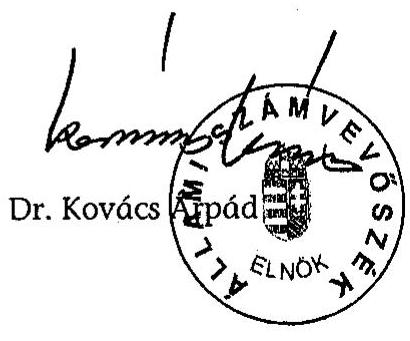
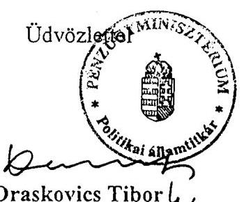
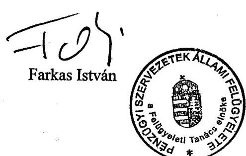
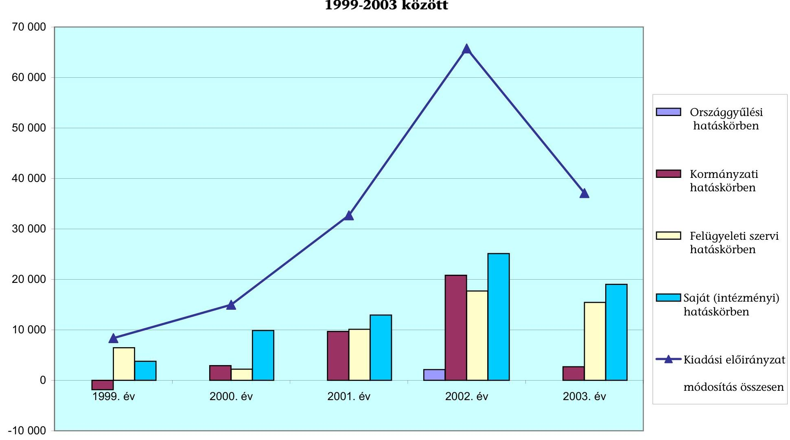
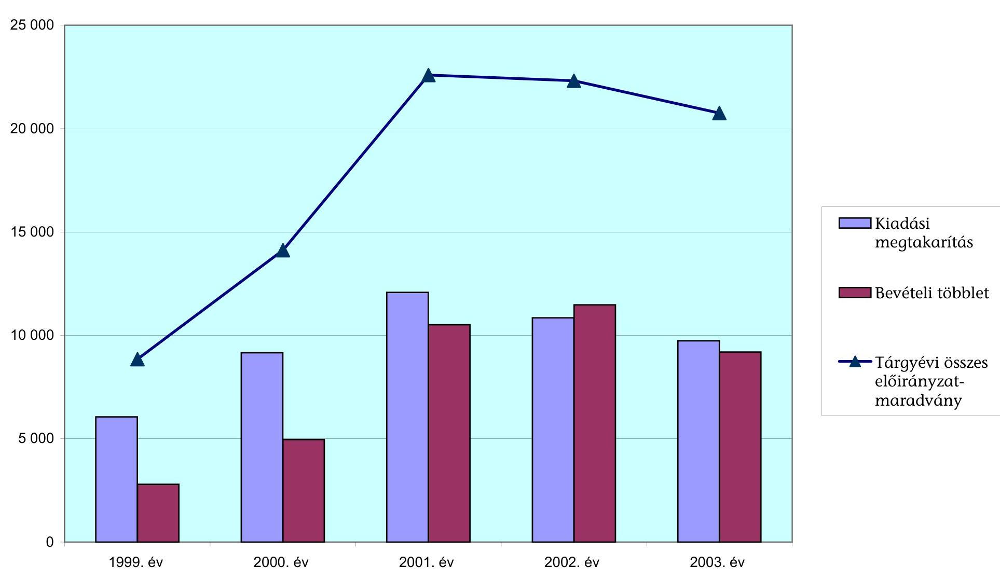

# JELENTÉS 

## a Pénzügyminisztérium fejezet működésének ellenőrzéséről

---

# 2. Államháztartás Központi Szintjét Ellenőrző Igazgatóság 2.3. Átfogó Ellenőrzési Főcsoport 

Iktatószám: V-25-134/2003-2004.
Témaszám: 671.

## Az ellenőrzést felügyelte:

## Bihary Zsigmond

főigazgató
Az ellenőrzés végrehajtásáért felelős:
Hegedűsné dr. Müllern Veronika
főcsoportfőnök

## Az ellenőrzést vezette:

## dr. Horváth Margit

osztályvezető főtanácsos

## Az ellenőrzést végezték:

| dr. Béhm Imre számvevő tanácsos, tanácsadó | dr. Burján Margit számvevő tanácsos, főtanácsadó | Dede Katalin számvevő |
| :--: | :--: | :--: |
| Farkas Ildikó számvevő gyakornok | Fodor Edit számvevő | Jiling Sámuel számvevő gyakornok |
| dr. Juhászné Szima Mária számvevő tanácsos | Kocsis Ferencné számvevő | Krüzselyi Attila számvevő |
| Lödiné Cser Zsuzsanna számvevő | Magyar Sára számvevő gyakornok | Méhes Áron József számvevő gyakornok |
| Séra Andrásné számvevő tanácsos, főtanácsadó | Szilas István számvevő tanácsos | Szöllősiné Hrabóczky Etelka számvevő tanácsos, főtanácsadó |
| dr. Zsombori Beáta számvevő | Jakab Péter külső munkatárs |  |

---

# A témához kapcsolódó eddig készített számvevőszéki jelentések: 

## címe

sorszáma
A Pénzügyminisztérium fejezet pénzügyi-gazdasági ellenőrzése 177 (1993.)

Az Adó- és Pénzügyi Ellenőrzési Hivatal működésének és ..... 168
gazdálkodásának ellenőrzése (1993.)
Az Állami Vagyonügynökség költségvetési cím pénzügyi-gazdasági ..... 239
ellenőrzése (1995.)
A Gépjármű Felelősségbiztosítási Kárrendezési Alap működésének ..... 309
ellenőrzése (1996.)
A Magyar Államkincstár létrehozásának és működésének ..... 386
pénzügyi-gazdasági ellenőrzése (1997.)
Az államadóság pénzügyi-gazdasági ellenőrzése (1997.) ..... 406
A költségvetési fejezetek jóléti célú kiadásainak és jóléti ..... 9925
intézményei működésének pénzügyi-gazdasági ellenőrzése (1995. és 1999.)
A központi költségvetési vám és egyes adóbevételei realizálásának ..... 9914
pénzügyi-gazdasági ellenőrzése (1999.)
A Pénzügyminisztérium fejezet működésének pénzügyi-gazdasági ..... 9935
ellenőrzése (1998.)
Jelentés a központi költségvetés adóbevételei, illetve a ..... 0028
társadalombiztosítást illető adó- és járulékbevételek realizálásának ellenőrzéséről (2000.)
Jelentés a központi költségvetés területén működő belső kontroll ..... 0115
mechanizmusok ellenőrzéséről (2001.)
Jelentés az áfa visszaigénylési rendszer ellenőrzéséről (2003.) ..... 0310
Jelentés a Kincstári Vagyoni Igazgatóság vagyonkezelő és ..... 404
hasznosító tevékenységének vizsgálatáról (1997)
Jelentés a Phare támogatások felhasználásának vizsgálatáról ..... 0042
(2000)
Jelentés a kizárólagos állami tulajdon nyilvántartása helyzetéről ..... 0003
(2000)
Jelentés az állami tulajdonú földterület-ingatlanok ..... 0035
nyilvántartásának ellenőrzéséről (2000)
Jelentés az Állami Privatizációs és Vagyonkezelő Rt. 2002. évi ..... 0330
működésének és a központi költségvetés végrehajtásához kapcsolódó tevékenységének ellenőrzéséről (2003)

---

# TARTALOMJEGYZÉK 

BEVEZETÉS ..... 5
I. ÖSSZEGZŐ MEGÁLLAPÍTÁSOK, KÖVETKEZTETÉSEK, JAVASLATOK ..... 8
II RÉSZLETES MEGÁLLAPÍTÁSOK ..... 17

1. A PÉNZÜGYMINISZTÉRIUMNAK AZ ÁLLAMHÁZTARTÁSSAL KAPCSOLATOS FELADATELLÁTÁSA ..... 17
1.1. A szakmai feladatok és a szervezeti rendszer összhangja ..... 17
1.2. Az EU-csatlakozással kapcsolatos feladatok ellátása ..... 19
1.3. Az államháztartási reform végrehajtása ..... 22
1.4. Az államháztartás pénzügyi információs rendszere, a kincstári finanszírozás továbbfejlesztése ..... 26
1.4.1. Az államháztartás pénzügyi információs rendszere ..... 26
1.4.2. A központosított illetményszámfejtés bevezetése ..... 28
1.4.3. A kincstári finanszírozási rendszer továbbfejlesztése ..... 30
1.4.4. Államháztartáson kívüli szervezetek közpénzekből történő támogatásának nyilvántartási és finanszírozási rendje ..... 32
1.5. Az állami költségvetés tervezésével és végrehajtásával kapcsolatos feladatok ellátása ..... 34
1.6. Az államháztartás belső pénzügyi ellenőrzési rendszere ..... 40
1.7. A tulajdonosi jogok gyakorlása ..... 44
2. A FEJEZET IRÁNYÍTÓ ÉS FELÜGYELETI TEVÉKENYSÉGE ..... 46
2.1. A fejezetirányító tevékenység ..... 46
2.2. Az informatikai rendszerek fejezeti irányítása, szabályozása, működtetése ..... 52
2.3. A kincstári vagyon kezelése, felügyelete, a vagyonnyilvántartás ..... 56
2.4. Gazdasági társaságokban való részvétel ..... 60
2.5. A felügyeleti költségvetési ellenőrzés rendszere ..... 63
3. A KÖLTSÉGVETÉS VÉGREHAJTÁSA A FEJEZET INTÉZMÉNYEINÉL ..... 64
3.1. A belső kontroll rendszerek működése ..... 64
3.1.1. Az intézmények működésének, gazdálkodásának szabályozottsága ..... 65

---

3.1.2. A gazdálkodás pénzügyi, számviteli tevékenységének szabályozottsága, működése, a belső ellenőrzési rendszer működése ..... 66
3.2. Az intézményi költségvetések végrehajtása ..... 68
3.3. A létszámmal és a személyi juttatásokkal való gazdálkodás ..... 70
3.3.1. A létszámmal való gazdálkodás ..... 70
3.3.2. Személyi juttatással való gazdálkodás ..... 72
3.4. A dologi és egyéb folyó kiadások alakulása ..... 75
3.5. Felhalmozási kiadások ..... 77
3.5.1. A közbeszerzési tevékenység értékelése ..... 79
4. A FEJEZETI KEZELÉSŰ ELŐÍRÁNYZATOK ..... 80
4.1. A fejezeti kezelésű előirányzatok szabályozottsága ..... 80
4.2. Fejezeti kezelésű célelőirányzatok ..... 82
4.3. Feladatfinanszírozás körébe vont fejezeti kezelésű előirányzatok ..... 83
4.4. A Fejezeti tartalék felhasználása ..... 86
MELLÉKLETEK
1/a. számú a Pénzügyminisztérium észrevétele
1/b. számú a PSZÁF Felügyeleti Tanácsa elnökének észrevétele
2. számú táblázatok
3. számú diagramok
FÜGGELÉKEK

1. számú A Pénzügyi Szervezetek Állami Felügyeletének ellenőrzése
2. számú A központosított illetményszámfejtés kialakítása
3. számú A tartósan állami tulajdonban maradó műemlékek helyreállítása
4. számú A korábbi számvevőszéki vizsgálatok utóellenőrzése

---

# RÖVIDÍTÉSEK JEGYZÉKE 

| ÁBF | Állami Biztosításfelügyelet |
| :--: | :--: |
| ÁHH | Államháztartási Hivatal |
| Áht. | az államháztartásról szóló, többször módosított 1992. évi XXXVIII. törvény |
| ÁHT-azonosító | államháztartási egyedi azonosítószám |
| ÁKK | Államadósság Kezelő Központ (költségvetési intézmény) |
| ÁKK Rt. | Államadósság Kezelő Központ Részvénytársaság |
| Ámr. | az államháztartás működési rendjéről szóló, többször módosított 217/1998. (XII. 30.) Kormány rendelet |
| APEH | Adó- és Pénzügyi Ellenőrzési Hivatal |
| ÁPTF | Állami Tőkepiaci Felügyelet |
| ÁPV Rt. | Állami Privatizációs és Vagyonkezelő Részvénytársaság |
| DHK Rt. | Diákhitel Központ Részvénytársaság |
| Er. | a központi, a társadalombiztosítási és a köztestületi költségvetési szervek kormányzati, felügyeleti, valamint belső költségvetési ellenőrzéséről szóló 15/1999. (II. 5.) Korm. rendelet |
| FEUVE | folyamatba épített, előzetes és utólagos vezetői ellenőrzés |
| FKO | PM Fejezeti költségvetési osztály |
| GM | Gazdasági Minisztérium |
| HÖR | BM Határőrség |
| Hszt. | A fegyveres szervek hivatásos állományú tagjainak szolgálati viszonyáról szóló 1996. évi XLIII. törvény |
| IAS | Nemzetközi Számviteli Standard |
| ITB | Informatikai Tárcaközi Bizottság |
| Kbt. | a közbeszerzésről szóló 1995. évi XL. törvény |
| Kincstár | Magyar Államkincstár, illetve MÁK Rt. és/vagy ÁHH |
| KIR | Központosított Illetményszámfejtési Rendszer |
| Kjt. | a közalkalmazottak jogállásáról szóló, többször módosított 1992. évi XXXIII. törvény |
| KPF | PM Költségvetési és Pénzügypolitikai Főcsoport |
| KPSZE (CFCU) | Központi Pénzügyi és Szerződéskötő Egység (Central Finance and Contracting Unit) |
| Ktv. | a köztisztviselők jogállásáról szóló, többször módosított 1992. évi XXIII. törvény |
| KüM | Külügyminisztérium |
| KVI | Kincstári Vagyoni Igazgatóság |
| KVK | Kincstári Vagyonkataszter |
| Kvtv. | A Magyar Köztársaság költségvetési törvénye |
| MÁK Rt. | Magyar Államkincstár Részvénytársaság |
| MeH | Miniszterelnöki Hivatal |
| MeHIB Rt. | Magyar Exporthitel Biztosító Részvénytársaság |
| MFB Rt. | Magyar Fejlesztési Bank Részvénytársaság |

---

| MK | Magyar Köztársaság |
| :--: | :--: |
| MNB | Magyar Nemzeti Bank |
| Mt. | a Munkatörvénykönyvéről szóló, többször módosított 1992. évi XXII. törvény |
| NA | Nemzeti Alap |
| NAO | PM Nemzeti Programengedélyező Iroda |
| OEP | Országos Egészségbiztosítási Pénztár |
| OLAF | EU Csalásellenes Irodája |
| OP | operatív program |
| PEA | Projekt Előkészítő Alap |
| PEF | Pénzügyi Ellenőrzések Főosztálya |
| PGF | Pénzügyi és Gazdasági Főosztály |
| PM | Pénzügyminisztérium |
| PM ÜZIG | PM Üzemeltetési Igazgatósága |
| Priv.tv. | az állam tulajdonában lévő vállalkozói vagyon értékesítéséről szóló, többször módosított 1995. évi XXXIX. törvény |
| PSZÁF | Pénzügyi Szervezetek Állami Felügyelete |
| RJGY | Részvényesi jogok gyakorlója |
| SZF | Szerencsejáték Felügyelet |
| SZHKP | Szerver- és Háttértár - Koordinációs projekt |
| SzMSz | Szervezeti és Működési Szabályzat |
| Psztv. | a Pénzügyi Szervezetek Állami Felügyeletéről szóló, többször módosított 1999. évi CXXIV. törvény |
| PGF | Pénzügyi és Gazdasági Főosztály |
| TÁH | Területi Államháztartási Hivatal |
| TÁKISZ | Területi Államháztartási és Közigazgatási Információs Szolgálat |
| TJKSZ | Támogatásokat és Járadékokat Kezelő Szervezet |
| Tpt. | Tőkepiacról szóló 2001. évi CXX. törvény |
| TVF | Tulajdonosi Vagyonfelügyeleti Főosztály (KVI) |
| „Üvegzseb törvény" | a közpénzek felhasználásával, a köztulajdon használatának nyilvánosságával, átláthatóbbá tételével és ellenőrzésének bővítésével összefüggő egyes törvények módosításáról szóló 2003. évi XXIV. törvény |
| vámtörvény | a vámjogról, a vámeljárásról, valamint a vámigazgatásról szóló, többször módosított 1995. évi C. törvény |
| VP | Vám- és Pénzügyőrség |

---

# JELENTÉS 

## a Pénzügyminisztérium fejezet működésének ellenőrzéséről

## BEVEZETÉS

A Pénzügyminisztérium (PM) fejezet feladatellátását széles körben meghatározták a fejezetet felügyelő pénzügyminiszter és a fejezethez sorolt intézmények feladat- és hatáskörét érintő szabályozások. A PM közreműködött a gazdaságpolitikai programok kialakításában, összehangolta a Kormány pénzügypolitikáját, feladata volt az államháztartás egészét érintő kiemelt területek (az adók és adózás rendjének, a vámok és vámigazgatás, a költségvetés-, jövedelem-, ár-, árfolyam- és devizapolitika) szabályozása, azok előkészítése. Az állami költségvetésre és zárszámadásra vonatkozó törvényjavaslat előkészítéséért, koordinálásáért, a végrehajtás felügyeletéért is a pénzügyminiszter volt a felelős. A feladatok ellátásához a költségvetés a fejezet 1-13. címein biztosított fedezetet, a címek szerkezete - a feladatrendszer és az intézményi struktúra módosulásai miatt - a vizsgált időszakban többször átalakult.

Az integrált pénzügyi felügyeleti rendszer kialakítása érdekében 2000. IV. 1-jétől - az Állami Pénz- és Tőkepiaci Felügyelet, az Állami Biztosításfelügyelet és az Állami Pénztárfelügyelet összevonásával - megalakult a Pénzügyi Szervezetek Állami Felügyelete (PSZÁF). A PM 2001. I. 1-jétől átvette a Belügyminisztériumtól a Területi Államháztartási és Közigazgatási Információs Szolgálatok felügyeletét. A Magyar Államkincstár 2001-ben feladatmegosztás következtében három szervezetté alakult át: az Államadósság Kezelő Központ Rt. 2001. III. 1-jétől, az Államháztartási Hivatal 2001. X. 1-jétől, a Magyar Államkincstár Rt. 2002. I. 1-jétől működött. Ez utóbbi 2003. VI. 30-ával megszűnt, a jogszabályokban foglalt feladatait az Államháztartási Hivatal látta el, melynek elnevezése újra Magyar Államkincstár lett. A Kincstári Vagyoni Igazgatóság 1999-től a Miniszterelnökség fejezethez került, 2003-tól ismét a Pénzügyminisztérium fejezethez tartozott.

A Magyar Köztársaság 2003. évi költségvetéséről szóló 2002. évi LXII. törvény a PM fejezet 2003. évi kiadási előirányzatát 980 206,9 M Ft-ban határozta meg. A fejezet 1-13. címeinek a kiadási előirányzata - amely tartalmazza a fejezeti jogosítvánnyal rendelkező PSZÁF 8400 M Ft előirányzatát is - 2003-ban 156 029,9 M Ft, támogatási előirányzata 136 034,0 M Ft volt.

Az ellenőrzés jogi alapját az államháztartásról szóló - többször módosított 1992. évi XXXVIII. törvény 120/A. § (1) bekezdése képezte. A vizsgálat végrehajtására az ÁSZ-ról szóló 1989. évi XXXVIII. törvény 2. § (3) és 17. § (3) bekezdése alapján került sor.

---

Ellenőrzésünk célja annak értékelése volt, hogy a PM fejezet:

- az államháztartással, annak alrendszereivel, az állami költségvetéssel és zárszámadással kapcsolatos feladatait a jogszabályok szerint látta-e el;
- az államháztartás belső pénzügyi ellenőrzési rendszerét megfelelően alakította-e ki;
- költségvetési előirányzatai összhangban voltak-e a szakmai feladatokkal, illetve előirányzatai felhasználása során a költségvetési gazdálkodási feladatokat a jogszabályi előírásoknak megfelelően, célszerűen látta-e el;
- fejezeti kezelésű előirányzatainak felhasználása összhangban volt-e a szakmai célokkal, a felhasználás szabály- és célszerűen történt-e;
- a korábbi számvevőszéki ellenőrzések megállapításait, javaslatait megfelelően hasznosította-e.

Az átfogó ellenőrzés a fejezet 1-13. címeinek 1999-2003. I. félév közötti gazdálkodási folyamataira, a helyszíni ellenőrzés a vizsgált időszakban a pénzügyminiszter
 felügyelete alá tartozó címek közül a PM igazgatásra, a Kincstári Vagyoni Igazgatóságra, a Szerencsejáték Felügyeletre, az Adó- és Pénzügyi Ellenőrzési Hivatalra, a Vám- és Pénzügyőrségre, a Magyar Államkincstárra, valamint a fejezeti kezelésű előirányzatokra terjedt ki.

A PM fejezet 1998. évi átfogó ellenőrzése óta évente végzett számvevőszéki ellenőrzések érintették az éves költségvetések tervezését, zárszámadását. A PM igazgatása és a Fejezeti kezelésű előirányzatok címek beszámolóinak financial audit típusú ellenőrzését 2001-ben és 2002-ben végeztük el.

Az ellenőrzés keretében értékeltük a PSZÁF költségvetési cím működését is. A Felügyelet 2002. I. 1-jétől fejezeti jogosítvánnyal felhatalmazott költségvetési cím, ezért jelen ellenőrzésünk keretében elvégeztük a 2002. évi költségvetési beszámolójának financial audit típusú ellenőrzését. A Felügyelettel kapcsolatos megállapításainkat az 1. sz. függelék tartalmazza.

A 2003. évi zárszámadás ellenőrzése - amit külön program alapján hajt végre az ÁSZ - előkészítése részeként elvégeztük a PM igazgatás, a Fejezeti kezelésű előirányzatok, valamint a PSZÁF fejezeti jogosítvánnyal rendelkező költségvetési cím 2003. év I. félévi kiadási és bevételi forgalmi adataiból kiválasztott tételek szabályszerűségi ellenőrzését. A 2003. évre vonatkozó megbízhatósági ellenőrzések eredményét a Magyar Köztársaság 2003. évi költségvetése végrehajtásának ellenőrzéséről szóló jelentésünk fogja tartalmazni.

Az ellenőrzés keretében az információs rendszeren belül külön megvizsgáltuk a központosított illetményszámfejtés bevezetését és működését. Részletes megállapításainkat a 2. számú függelékben mutatjuk be. A teljesítményellenőrzés módszerével ellenőriztük a fejezeti kezelésű előirányzatok közül a kincstári vagyon részét képező várak, műemlék jellegű épületek rekonstrukciójának eredményességét. Részletes megállapításainkat a 3. sz. függelékben rögzítettük. Az utóellenőrzés témakörei sokrétűek voltak. A megtett intézkedéseket a 4. számú függelékben részleteztük.

---

A jelentést az Állami Számvevőszékről szóló 1989. évi XXXVIII. törvény 25. § (1) bekezdésének megfelelően észrevételezésre megküldtük a pénzügyminiszternek és a PSZÁF Felügyeleti Tanácsa elnökének. Az érintettek részéről észrevétel nem merült fel. A levelek másolatát a jelentés 1. sz. melléklete tartalmazza.

---

# I. ÖSSZEGZŐ MEGÁLLAPÍTÁSOK, KÖVETKEZTETÉSEK, JAVASLATOK 

A PM fejezet tevékenységében kiemelt jelentősége volt a pénzügyminiszter által az államháztartással kapcsolatban ellátott feladatoknak. Feladatköre kiterjedt a költségvetési, jövedelmi, ár-, árfolyam- és devizapolitikai döntések összehangolására, az adók és az adózás rendjének, továbbá a vámok és a vámigazgatás szabályozására, ezek érvényesítéseként a központi költségvetés részére az adók és vámbevételek beszedésére - az Adó- és Pénzügyi Ellenőrzési Hivatal (APEH) és a Vám- és Pénzügyőrség (VP) illetékességébe tartozó adó- és vámbevételek 1999-ben a központi költségvetés összes bevételének 76,6\%-át adták, 2004-ben várhatóan 82,6\%-át -, az információs és a finanszírozási rendszer működtetésére, a központi költségvetés és zárszámadás elkészítésére, a költségvetési gazdálkodás (az ellenőrzést is beleértve) részletes szabályainak kidolgozására.

A PM az államháztartással összefüggő feladatai közül a költségvetés tervezésével és a zárszámadással kapcsolatos tevékenységét összességében ellátta. A hatályos jogszabályi keretek között, a korábban kialakított gyakorlat szerint végezte a költségvetési és zárszámadási törvényjavaslatok előkészítését.

A tervezés megalapozottságát rendszerbeli hiányosságként kedvezőtlenül befolyásolta, hogy az ágazati törvényjavaslatokat jellemzően a szabályozás indokoltságát és szükségességét, a várható hatásokat bemutató tanulmányok nélkül fogadták el.

A PM az általános koordinátori feladatát a fejezetekkel kapcsolatban nem tudta következetesen érvényesíteni, ugyanakkor a Kormánynál nem kezdeményezte a feladatok maradéktalan végrehajtását biztosító intézkedéseket, így a központi intézményrendszer felülvizsgálatát, a tervezést megalapozó, a feladatokkal összhangban lévő létszámszükséglet, feladatmutatók, normatívák kidolgozását, érvényesítését. A PM az előirányzat-maradványok megállapításához, felülvizsgálatához szükséges, évenként bővített adatszolgáltatásból levonható következtetéseket sem hasznosította a költségvetési, a zárszámadási törvények előkészítésében. A PM a fejezetek előirányzat-maradványaival kapcsolatos felülvizsgálati kötelezettségének a jogszabályban meghatározott határidő után tett csak eleget.

Az államháztartási reform munkálatait az "üvegzseb törvény" felgyorsította, a feladatokhoz rendelt végrehajtási határidőket azonban nem tartották be. A reform jegyében szigorították, racionalizálták a költségvetési szervek működésére, gazdálkodására vonatkozó jogszabályi előírásokat (szakmai-gazdasági feladatellátás elkülönítése; az általuk alapított társaságok folyamatos értékelése), ugyanakkor az államháztartás pénzügyi rendszerének, valamint a közigazgatás továbbfejlesztésének feladatait előíró kormányhatározatok csak részleges eredményeket hoztak, megvalósításuk továbbra is időszerű. Így például nem zárult le kormányzati szintű döntéssel a fejezetek háttérintézményi struktúrájának áttekintése annak ellenére, hogy a PM a szükséges előterjesztés tervezetet

---

elkészítette. A költségvetési szervek száma 1998-tól 2003 végére ugyan több mint harmadával csökkent (1422-ről 919-re) - elsősorban a részben önállóan gazdálkodó szervezetek kétharmadának megszűnése miatt (817-ről 285-re) - de továbbra is jellemzőek maradtak a viszonylag kis létszámú költségvetési szervek (2001. évi adatok szerint az intézmények 2/3-ánál a létszám 200 fő alatti, ezek közel felénél 100 fő alatti). A létszámgazdálkodás sem lett racionálisabb, a csökkentési követelmények nem kapcsolódtak össze a feladatellátás felülvizsgálatával.

Az Európai Unióhoz (EU) való csatlakozás követelmény-rendszerének teljesítése a fejezetnél is többletfeladatokkal járt, a PM az EU csatlakozási tárgyalási fejezetek egyharmadának főfelelőse volt (állami támogatás, pénzügyi és költségvetési rendelkezések, gazdasági-, monetáris-, vámunió, pénzügyi ellenőrzés). Az EU-nak az évenkénti országjelentésekben megfogalmazott észrevételei szerint késedelmesen hozták meg a megfelelő stratégián alapuló jogharmonizáció keretében szükséges jogszabályokat (ellenőrzés, pénzügyi irányítás), illetve építették ki az előcsatlakozáshoz, valamint a majdani EU-s támogatások fogadásához szükséges stabil intézményrendszert, a Központi Pénzügyi és Szerződéskötő Egységet (KPSZE), Nemzeti Alapot (NA), PM Nemzeti Programengedélyező Irodát (NAO). Ugyanakkor a pénzügyminiszter feladat- és hatáskörét szabályozó kormányrendeletnek (2002-ig), valamint 2003-ig a PM Szervezeti és Működési Szabályzatának (SzMSz) aktualizálása elmaradt, azok nem fedték le teljes körűen az ellátott feladatokat.

Az államháztartás belső pénzügyi ellenőrzési rendszerével kapcsolatban több éve halogatott jogi szabályozás 2003. végére született meg. A PM 2004. évi tervezési körirata prioritásként kezelte az ellenőrzési létszám és költségvetési előirányzat biztosítását, ugyanakkor a fejezetek az e célra biztosított többletforrások hiányára hivatkozva nem kezdték meg az új szabályozásnak megfelelő képzettségű és gyakorlatú ellenőri kapacitás kialakítását.

Az államháztartás információs rendszere párhuzamos adattartalmakat (törzskönyvi nyilvántartás és az államháztartási egyedi azonosítószám nyilvántartása), ismétlődő elemeket (költségvetési előirányzatok és azok teljesülésére kincstári, fejezeti és költségvetési intézményi kimutatások) tartalmazott, a feladatokhoz kapcsolódó ráfordítások összemérhetőségét (pénzforgalmi szemléletben kezelt tranzakciós kódok a könyvelésben, naturális mutatók hiánya) korlátozta. A központosított illetményszámfejtés (KIR) előkészítését és bevezetését szakmailag hibás döntések jellemezték, így az irreálisan rövid fejlesztési időtartam meghatározása, a rendszerfejlesztési lépések kihagyása, a párhuzamosan történő fejlesztés és bevezetés. A fejlesztők (a felhasználók javaslatait is figyelembe vevő) folyamatos korrekciói tették csak lehetővé, hogy a KIR nem egységes rendszerként, hanem feldolgozási egységekre töredezetten működhessen.

A vizsgált időszakban többféle szervezeti formában működő Kincstár - Magyar Államkincstár, illetve Magyar Államkincstár Rt. (MÁK Rt.) és Államháztartási Hivatal (ÁHH) - megfelelően látta el az államháztartás alrendszerei költségvetése végrehajtásának pénzügyi lebonyolítását, az intézményi költségvetések ügyviteli, nyilvántartási, információgyűjtési és -szolgáltatási, valamint az előirányzat fedezet vizsgálati, alaki-formai ellenőrzési feladatait. Alapfela-

---

datként végezte a költségvetési előirányzatok, kötelezettségvállalások folyamatos nyilvántartását, a nemzetgazdasági elszámolások kettős könyvvezetését és beszámoló készítését, a zárszámadás előkészítésével kapcsolatos feladatok koordinálását. A folyamatos feladatbővüléséhez azonban nem biztosították a stabil szervezeti hátteret. Nem támasztották alá megfelelő elemzésekkel és hatástanulmányokkal a szervezet szétválasztását egy költségvetési intézményre és két részvénytársaságra, majd másfél éves működés után a bankszerű működés és a költségvetési funkció ismételt egyesítését a területi szervek - Területi Államháztartási Hivatalok (TÁH-ok) - beépítésével sem.

A fejezet irányító tevékenységének gyenge pontja volt az informatikai szakmai irányítás területe. A fejezet intézményeinél (APEH, VP) kezelt államháztartási szintű adatbázisok informatikai környezete, fejlettségi és biztonsági színvonala rendkívül eltérő volt. A megalapozott fejezeti szakmai irányítás, a fejezeti, illetve intézményi szintű informatikai stratégiák, a szükséges koordináció hiánya hátráltatta az összehangolt fejlesztéseket, valamint hozzájárult ahhoz, hogy az államháztartási tevékenységet támogató informatikai rendszerek összekapcsolhatósága a technológiai lehetőségek alatt maradt, nem segítette az intézményeknél meglévő biztonsági kockázatok csökkentését.

Az irányítás összességében működött a költségvetési gazdálkodás területén, ugyanakkor hiányosságok is mutatkoztak (tervezés, határátkelőhelyek bérleti dijának megoldatlansága). A PM - Kincstári Vagyoni Igazgatóság (KVI) közötti felső szintű vezetői koordináció 2003-ban nem működött elég hatékonyan (elhúzódó alapító okirat módosítás, SzMSz jóváhagyásának elmaradása).

A tulajdonosi joggyakorlás eszközeit a külön jogszabályok figyelembe vételével alkalmazták. A KVI által működtetett tulajdonosi ellenőrzés hatékonyságát az ellenőrzési kapacitás szűkössége hátráltatta (kb. 80 évig tartana a kincstári vagyon teljes körű ellenőrzése), és bár a KVI a kincstári vagyon nyilvántartása érdekében több, egymásra épülő intézkedést tett, a vagyonkataszternyilvántartás továbbra sem tartalmazza a kizárólagos állami tulajdonú vagyonelemek közül a geotermikus energiákat, az ország területe feletti légteret.

A felügyeleti költségvetési ellenőrzések során kiemelt figyelmet fordítottak az intézményi belső ellenőrzés működésére, annak értékelésére, ezzel hozzájárultak a felügyelt intézmények esetében a belső kontroll kockázatok csökkentéséhez. A felügyeleti költségvetési ellenőrzés hatékonyságát rontotta, hogy az ellenőrzött intézmények vezetői nem minden esetben, illetve késedelmesen hozták meg a hiányosságok rendezéséhez szükséges döntéseket.

A vizsgált időszakban a fejezet intézményeinél a gazdálkodás szabályozási, szervezeti feltételei biztosították a feladatok ellátását. A belső kontroll rendszerek javulást mutattak, a működésük szervezettebb lett. Továbbra is hiányosságokat tapasztaltunk az intézményi tevékenységek szabályozottságában, a feladatrendszer változását, a jogi szabályozási környezet módosulását nem minden esetben követte a szabályzatok aktualizálása (Igazgatás, Szerencsejáték Felügyelet), ugyanakkor túlszabályozottság is előfordult (KVI).

Az intézmények kiadási előirányzatának teljesítése az ellenőrzött időszak alatt minden évben emelkedett, 1999-ről 2003-ra közel kétszeresére nőtt. Ebben

---

szerepet játszottak a feladat- és intézményi változások is. A feladatok finanszírozásához a saját bevételek a vizsgált időszakban közel azonos mértékben (mintegy egynyolcad arányban) járultak hozzá.

Az előirányzat-módosítások, -átcsoportosítások indokoltak voltak, a tervezés időszakában még nem ismert vagy nem számszerűsíthető feladatok ellátását biztosították, illetve azokat az előző évi előirányzat-maradványok felhasználása indokolta. Előfordult azonban tervezési hiányosságok miatti átcsoportosítás, módosítás, pl. a PM Igazgatásnál is. Az előirányzatmaradványokon belül nőtt a bevételi többletből keletkezett maradványok aránya, elsősorban egy-egy intézmény tervezettet jelentősen meghaladó saját bevételi többlete miatt (Szerencsejáték Felügyelet (SZF), Kincstár). Az intézmények a részükre előírt befizetési kötelezettségeket teljesítették. Az előirányzatmaradványokat növekvő összegben használták fel jutalmazásra, beruházásra és felújításokra.

A fejezet intézményeinél a létszámmal és a személyi juttatásokkal való gazdálkodás megfelelt a jogszabályi előírásoknak. A fejezet engedélyezett létszáma a feladatok és intézményi struktúra változásával összhangban 2003-ra mintegy négyezer fővel nőtt. Az intézményeknél a létszámcsökkentésre vonatkozó kormányzati döntéseket végrehajtották. A személyi összetétel a képzettségi szintet tekintve kedvezően alakult.

A foglalkoztatottak juttatásait szabályzatokban rögzítették. A létszámkeretek és a személyi juttatás előirányzatai biztosították a megnövekedett, megváltozott feladatok ellátásának feltételeit. Az illetményrendszer változásának eredményeként megnőtt a rendszeres személyi juttatások aránya. Évről évre emelkedtek a megbízási díjra kifizetett összegek részben a feladatok növekedése, illetve a létszámcsökkentések miatt. Az ellenőrzött szerződések - az APEH kivételével - szabályszerűek voltak, az APEH gyakorlatában ellenjegyzés előtti, illetve késedelmesen (munkavégzés megkezdése után) kötött szerződések is voltak.

A dologi kiadások több mint másfélszeresére emelkedtek. Ehhez hozzájárult az intézményi kör változása, a feladatok bővülése mellett a fejezeti kezelésű előirányzatokból felhasznált összegek emelkedése is. A dologi kiadások közel egyharmadát a szolgáltatási (üzemeltetési) kiadások képviselték, növekedésük
 nem lépte túl az éves inflációs hatást. A dologi kiadások 2000-ben és 2001-ben az eredeti előirányzat alatt maradtak a takarékossági intézkedések hatására.

Az intézmények tárgyi eszköz-ellátottsága összességében megfelelő volt. A tárgyi eszközök nettó állománya a vizsgált időszakban több mint tízszeresére emelkedett, főleg az ingatlanok állományában bekövetkezett jelentős növekedés miatt, amely feladatnövekedéshez kapcsolódott (pl. az APEH átvette az Országos Egészségbiztosítási Pénztár és Országos Nyugdíjbiztosítási Főigazgatóság ingatlanait). A Kincstár által használt ingatlanok közül a területi irodáknál több helyen alapvető infrastrukturális hiányosságok voltak. A Kincstár közpon-

---

ti elhelyezést biztosító épülete fizikailag elavult, kihasználtsága teljes körű, időszakonként túlzsúfolt volt. ${ }^{1}$

A számítógépek számának közel másfélszeresre növelésével biztosított volt a munkavégzéshez szükséges eszközellátottság. A feladat- és létszámbővülés miatt a gépkocsik száma közel egyharmadával emelkedett. A tárgyi eszköz- és készletbeszerzéseknél a közbeszerzésekről szóló törvény előírásait néhány rendelkezés kivételével (egy-egy esetben a megadott értékelési szemponttól eltérés, egybeszámítási szabály figyelmen kívül hagyása, összeférhetetlenségi nyilatkozat mellőzése) betartották.

A fejezeti kezelésű előirányzatok összege évenként emelkedett, a fejezeti kiadásokon belüli súlya azonban csökkent. A szabályszerű felhasználáshoz hozzájárult az előirányzatok felhasználásának szabályozottsága, a tervezés, beszámolás, ellenőrzés rendszere, de előfordult, hogy a szakmai célkitűzés, a részletes feladat-meghatározás elmaradt (a pénzügyi információs rendszer fejezeti kezelésű előirányzata). A felhasználás nem felelt meg teljes körűen az eredeti célkitűzéseknek (az egészségügy társfinanszírozási rendszerének előirányzata). Az előirányzat-maradványok nagyarányú növekedése néhány esetben megalapozatlan tervezésre, késedelmes adatszolgáltatásra, a program beindításának elhúzódására (közbeszerzések, illetve a pénzügyi ellenőrzés programja keretében tervezett oktatások) volt visszavezethető.

A tartósan állami tulajdonban maradó műemlékek (várak) helyreállítását állami támogatással megvalósító beruházási célprogramot a teljesítményellenőrzés módszerével vizsgáltuk. Megállapítottuk, hogy bár a kivitelezés műszaki-pénzügyi szempontból alapvetően szabályosan történt, mégis a befejezett beruházások összességében a tervezett kiadásokhoz képest magasabb költségen valósultak meg, esetenként egy éves késéssel.

A beruházások hozzájárultak az állagmegóvási célok megvalósításához, de az a célkitűzés, hogy a rekonstrukciót követően a várak vagyonkezelésbe adása eredményes legyen, a helyszíni ellenőrzés befejezéséig - a korábbinál magasabb üzemeltetési költségek miatt - nem érvényesült.

Az ellenőrzés során vizsgáltuk az ÁSZ korábbi átfogó- és témaellenőrzéseinek megállapításai alapján tett javaslatok teljesítését, az intézkedési tervekben foglaltak végrehajtását. Megállapítottuk, hogy a javaslatok realizálása rendkívül egyenetlen színvonalon történt. Az államháztartás számvitelét érintő egyes javaslatok, az adó- és járulékbehajtási tevékenység eredményességének javítása érdekében a szükséges intézkedések megtörténtek. A kincstári vagyonnal történő gazdálkodást érintően a feladatokat csak részben vagy késedelmesen hajtották végre.

A PSZÁF - mint a PM fejezet önálló költségvetési címe - 2002. I. 1-jétől fejezeti jogkörrel rendelkezik.

[^0]
[^0]:    ${ }^{1}$ A Kincstár a helyszíni ellenőrzést követően átköltözött az új székházába (Bp., V. ker., Hold utca 4.).

---

Az integrált pénzügyi felügyeleti rendszer - az Állami Pénz- és Tőkepiaci Felügyelet (ÁPTF), az Állami Biztosításfelügyelet és az Állami Pénztárfelügyelet összevonásával - 2000. IV. 1-jétől jött létre.

A szervezet feladatellátásának középpontjában a pénz- és tőkepiac, a különböző pénzügyi szervezetek zavartalan, eredményes, prudens működése biztosításának, a törvények és a kapcsolódó egyéb jogszabályi rendelkezések betartásának ellenőrzése, az engedélykérelmek és beadványok elbírálása, nyilvántartása és értékelése állt. A Felügyelet részt vett az EU munkacsoportjaiban, bekapcsolódott a sokoldalú és az EU különböző szintjein zajló felügyeletközi együttműködésbe.

Az integrált felügyeleti rendszer létrejöttét követően a szervezeti struktúra folyamatosan változott. A Felügyelet szervezeti és irányítási rendszerét célszerűen alakították ki. Az intézmény a tevékenységét éves, aktualizált és kibővített féléves munkatervek alapján végezte. A Felügyelet minden évben elkészítette az éves tevékenységéről szóló beszámolójelentését, amelyet megküldött a pénzügyminiszternek, ezzel törvényi kötelezettségének maradéktalanul eleget tett.

Az intézmény működésével és gazdálkodásával kapcsolatos szabályozási tevékenységet folyamatosan az intézmény szakmai feladatai és sajátosságai figyelembevételével végezték. A Felügyelet a saját belső szabályzatának elfogadásáig a jogelőd ÁPTF szabályzatait alkalmazta.

Az intézmény gazdálkodási szabályzatai közül az előirányzatok felhasználásának intézményi sajátosságait tükröző elszámolási rendet tartalmazó számviteli politikát a számviteli törvényben rögzített 90 napos határidőhöz képest kétéves késéssel készítették el. Nem kielégítően szabályozták a követelések értékelésének sajátosságait, az elismert követelések nyilvántartási rendjét és a bírságbevételek főkönyvi számlájának tartalmát. (Ezen szabályozási kötelezettségüknek időközben, a 2004. II. 26-án hatályba lépett elnöki utasítással eleget tettek). A követelésállomány esetében a bevallás elmaradásának szankcionálása jogszabályi szinten nem rendezett. A leltárkészítési és az eszközgazdálkodási szabályzat aktualizálása elmaradt. Mindez hozzájárult a Felügyelet 2002. évi beszámolójában tapasztalt hibákhoz.

A költségvetési gazdálkodás, a pénzügyi elszámolások számvitelben való folyamatos rögzítése, valamint az ebből összeállított éves beszámoló megbízhatósági és szabályszerűségi követelményeinek biztosítása érdekében a Felügyeletnél szabályozási szinten kialakították a belső ellenőrzés rendszerét. A függetlenített belső ellenőrzés szervezeti struktúrában elfoglalt helye megfelelő volt. A vezetői és a munkafolyamatba épített ellenőrzés eszközét a munkafolyamat valamennyi szakaszára azonban nem terjesztették ki.

A Felügyelet informatikai rendszerkörnyezete alapvetően szabályozott volt. A szabályzatok döntő része egységes szerkezetű, helyenként azonban pontatlan volt, kiegészítésre, aktualizálásra szorul. A Gazdasági Főosztályon 2002-ben bevezetett új informatikai rendszerre való átálláskor keletkezett - az egyéb aktív elszámolások között kimutatott - eltérés rendezése nem történt meg. A Felügyelet szakmai- és gazdasági területének informatikai zártsága 2002-ben még nem állt fenn. Az informatikai rendszer mintegy három éves fejlesztésének

---

eredményeként 2004. évre létrejött egy stabil, homogén és felügyelt informatikai infrastruktúra.

A Felügyelet, illetve a jogelőd intézmények kiadásait a felügyeleti díjak, a bírságbevételek és az eljárási díjak finanszírozták. A Felügyelet 2000-ben és 2001-ben fokozatosan csökkenő mértékben költségvetési támogatásban is részesült.

Az éves költségvetési törvényekben meghatározott előirányzatok összhangban voltak a szakmai feladatokkal, biztosították az intézmény kiegyensúlyozott, zavartalan működését. Az intézmény költségvetési főösszege az ellenőrzött időszakban 37%-kal emelkedett. A kiadási és bevételi előirányzatokat részletes számításokkal támasztották alá.

Az előirányzat-módosítások szabályosak voltak és azok az előző évi előirányzat-maradványok igénybevételével, illetve többletbevételek realizálásával voltak összefüggésben.

Az intézmény költségvetési létszáma a 2000. IV. 1-jei 404 főről 2003. évre 541 főre emelkedett. A feladatokat a tervezett, illetve engedélyezett létszámnál kevesebb alkalmazottal látták el. A létszám alakulását magas fluktuáció jellemezte. A köztisztviselői törvény alapján az illetményen felül meghatározott különböző juttatások mértékét az államigazgatási szféra lehetőségeihez képest magasan határozták meg, amit a finanszírozási rendszerből adódó kedvező pénzügyi helyzet tett lehetővé. Ezen juttatási rendszerrel tudtak piacképes jövedelmet biztosítani dolgozóiknak.

A Felügyelet kedvező pénzügyi helyzetének köszönhetően a dolgozók munkahelyi körülményeit jó színvonalon biztosította (2004. I. 1-jétől a pénzügyi intézmények által fizetendő felügyeleti díjat fél ezrelékponttal csökkentette a 2004. évi költségvetési törvény). Ugyanakkor pazarlásra utaló gazdálkodási gyakorlattal nem találkoztunk.

A Felügyelet működésének és gazdálkodásának értékelésén kívül minősítettük a 2002. évi költségvetési beszámoló megbízhatóságát is. Az ÁSZ által 2002-ben alkalmazott lényegességi küszöbérték alapján (kiadási főösszeg 3%-a: 238131 E Ft) megállapítottuk, hogy a PSZÁF költségvetési beszámolója számviteli elszámolási szempontból teljes körűen nem felel meg a számviteli törvény és a költségvetési szervek számvitelére vonatkozó kormányrendeleteknek, ezért a beszámolót elutasító véleménnyel ${ }^{1}$ láttuk el. Az eltérések nem gazdálkodási problémák miatt keletkeztek. A 2002. évi előirányzatok felhasználásának ellenőrzése során rendeltetéstől eltérő pénzfelhasználással nem találkoztunk, anyagi veszteséget nem mutattunk ki.

[^0]
[^0]:    ${ }^{1}$ A Magyar Köztársaság 2002. évi költségvetése végrehajtásának ellenőrzése kapcsán a Közbeszerzések Tanácsa fejezeti jogosítvánnyal rendelkező költségvetési cím, az Oktatási Minisztérium Alapkezelő Igazgatósága, az Informatikai és Hírközlési Minisztérium igazgatási cím, a fejezeti kezelésű előirányzatok vonatkozásában a Gyermek-, Ifjúsági és Sportminisztérium, az Informatikai és Hírközlési Minisztérium, és a Nemzeti Kulturális Örökség Minisztérium beszámoló jelentését láttuk el elutasító véleménnyel.

---

A Felügyelet beszámoló jelentésének áttekintése során úgy ítéltük meg, hogy a szervezetnél a különböző szintű kontrollok nem működtek folyamatosan, nem voltak képesek kiszűrni a rendszerben lévő hibákat. A függetlenített belső ellenőrzés személyi feltételrendszerét nem tartjuk elégségesnek.

Kedvezőtlen hatással volt az elszámolási rendszer működésére továbbá, hogy a 2003. év végéig nem rendelkeztek olyan belső, zárt informatikai rendszerrel, amely a gazdasági területnek a beszámoló készítéshez az adatokat integráltan szolgáltatta volna.

A Felügyelet gazdasági vezetésében bekövetkezett többszöri személycserék hatásaként a 2002. évben megkezdett, a szervezet pénzügyi, vagyoni helyzetére, valamint a gazdasági események elszámolási gyakorlata szabályozásának rendezésére tett jelentős intézkedések még nem hozták meg 2002. évre az elvárható eredményt.

# Az ellenőrzés részletes megállapításainak hasznosítása mellett javasoljuk: 

## a Kormánynak:

1. tekintse át és értékelje az államháztartási reform kapcsán a 2064/2000. (III. 29.) Korm. határozatban, továbbá a közigazgatás továbbfejlesztése terén az 1052/1999. (V. 21.) Korm. határozatban előírt feladatok teljesítését, tárja fel az egyes feladatok elmaradásának, vagy részleges megvalósulásának okait és intézkedjen azok szükség szerinti pótlásáról;
2. gondoskodjon a költségvetési előirányzatok szakmai megalapozottságának növelését biztosító jogszabályi környezet kialakításáról;
3. intézkedjen az államháztartás belső pénzügyi ellenőrzési rendszerének hatékony működtetése érdekében a megfelelő képzettségű és gyakorlatú ellenőrzési kapacitás biztosításának feltételeiről;
4. tekintse át a központosított illetményszámfejtés bevezetésének, működtetésének tapasztalatait, és azok értékelésével teremtse meg a célszerű és hatékony működtetés feltételeit;

## a pénzügyminiszternek :

1. vizsgálja felül az államháztartás információs rendszerét az államháztartási tevékenységet támogató informatikai rendszerek összekapcsolhatósági szintje növelése érdekében, kezdeményezze a szükséges jogszabályi módosításokat;
2. gondoskodjon a fejezetek előirányzat-maradványaival kapcsolatos felülvizsgálati kötelezettség előírt határidőre történő elvégzéséről a tervezés, a kötelezettségvállalások és a teljesítések összehangolása érdekében;

---

3. fordítson kiemelt figyelmet a közbeszerzés (szabadkézi vételi) jogszabályi előírásai betartásának ellenőrzésére;
4. gondoskodjon a fejezeti kezelésű előirányzatok pénzeszközeinek célszerű felhasználásáról;
5. intézkedjen a fejezeti és azzal összhangban az intézményi informatikai stratégiák kidolgozására, az informatikai szakmai irányítás koordinációjának javítására, az informatikai rendszerek magasabb szintű összekapcsolása biztonsági követelményeinek hatékonyabb érvényesítése érdekében;
6. tegye meg a szükséges intézkedéseket annak érdekében, hogy a KVI a kincstári vagyonkezelés tulajdonosi ellenőrzésével, nyilvántartásával kapcsolatos feladatait maradéktalanul és hatékonyan láthassa el.

# a Pénzügyi Szervezetek Állami Felügyelete Felügyeleti Tanácsa elnöké-

nek:

1. dolgoztassa ki a Felügyelet sajátosságainak jobban megfelelő számlarendet, és ezzel egyidejűleg végezzék el a számviteli politikának a Sztv.-ben előírt további pontosítását;
2. készíttesse el a felelősök megjelölésével a lejárt követelések kezelésének belső szabályozását, továbbá gondoskodjon a valós - behajtható és behajthatatlan követelésállomány mielőbbi elkülönítéséről;
3. tegye meg a szükséges intézkedéseket a munkafolyamatba épített és a vezetői ellenőrzés hatékonyabb működtetésére, különös tekintettel a gazdálkodási jogkörök gyakorlásának ellenőrzésére, erősítse meg továbbá a Gazdasági Főosztályon a számviteli feladatokat, valamint a követelésállomány kezelését ellátó terület létszámát;
4. gondoskodjon a függetlenített belső ellenőrzés eredményes működéséhez szükséges létszámszükségletről, biztosítsa továbbá a pénzügyi elszámolások kritikus pontjainak folyamatos ellenőrzését;
5. kezdeményezzen jogszabály kiegészítést a felügyeleti díjbevételek bevallásának elmaradásához kapcsolódó anyagi konzekvenciák kialakítására;
6. intézkedjen az aktív pénzügyi elszámolások között kimutatott informatikai átállással kapcsolatos eltérés mielőbbi tisztázásáról;
7. fordítson nagyobb figyelmet a fokozottan érzékeny informatikai adatok védelme érdekében az informatikai rendszer zártságára, biztonságára.

---

# II. RÉSZLETES MEGÁLLAPÍTÁSOK 

## 1. A PÉNZÜGYMINISZTÉRIUMNAK AZ ÁLLAMHÁZTARTÁSSAL KAPCSOLATOS FELADATELLÁTÁSA

### 1.1. A szakmai feladatok és a szervezeti rendszer összhangja

A pénzügyminiszter és a PM fejezet
 feladatai a vizsgált időszakban főként az EU csatlakozás miatt bővültek, ezek kapcsán egyes feladatok hangsúlyosabbá váltak (pénzügyi ellenőrzés, államháztartási reform, kincstári finanszírozás továbbfejlesztése).

A pénzügyminiszter feladatát képezte a gazdaságpolitika alakítása, koordinálása, így különösen a költségvetési, jövedelmi, ár-, árfolyam- és devizapolitikai döntések összehangolása, ezen belül az adók és az adózás rendjének, továbbá a vámok és a vámigazgatás szabályozása, valamint ezek érvényesítéseként a központi költségvetés részére az adók és vámok beszedése, az EU integrációs feladatok (a jogharmonizáció, az intézményfejlesztés és az uniós támogatásokhoz kapcsolódó feladatok), a központi költségvetés és zárszámadás elkészítése; gondoskodás a költségvetési gazdálkodás (az ellenőrzést is beleértve) részletes szabályainak kidolgozásáról.

A központi költségvetés összes bevételének növekvő részét az APEH és a VP illetékességébe tartozó adó- és vámbevételek adták (1999-ben 76,6%, 2002-ben 78,8%, míg a 2004. évi költségvetési törvényben már 82,6%).

A PM fejezet 1-13. cím szerkezete a feladatrendszer és az intézményi struktúra módosulásai miatt a vizsgált időszakban többször átalakult. A fejezethez tartozó intézmények száma az 1999. évi 10-ről 2003-ra 7-re csökkent.

Az intézmények körének szűkítése - összhangban a tervezési köriratok előírásaival - alapvetően pozitív irányú módosítást jelentett, előfordultak azonban át nem gondolt döntések is, pl. SZF átadása a Gazdasági Minisztérium (GM) fejezethez, majd ismét a PM-hez sorolása, a kincstári rendszer átalakításának egyes elemei.

A feladatok átadása miatt került el a PM fejezettől a Nemesfémvizsgáló és Hitelesítő Intézet, a Lánchíd Irodaház Gazdasági Igazgatósága.

A SZF-t az 1999. évi költségvetési törvény a PM fejezetből a GM fejezetbe sorolta át. Az intézmény visszahelyezése a PM fejezetbe - a Felügyeletek cím alcímeként - azt jelzi, hogy a korábbi döntés szakmailag nem volt átgondolt, mert a szerencsejáték piaccal kapcsolatos feladatokat megosztotta a két fejezet között. (A pénzügyminiszter és a gazdasági miniszter között 1998-ban létrejött megállapodás alapján ugyanis a szerencsejáték ágazat szakmai irányítása és a jogalkotás a PM feladata maradt, az intézmény feletti felügyeletet a GM látta el.)

---

A fejezethez visszakerült 2002-től az Állami Privatizációs és Vagyonkezelő Részvénytársaság (ÁPV Rt.) és a KVI felügyelete.

# Alapvetően összhangban volt az intézménykorszerűsítési törekvé-

sekkel a felügyeletek összevonása, illetve az államháztartás pénzügyi rendszerének átalakításával a TÁH-ok kincstári rendszerbe történő integrálása.

Sajátos jogállású a PSZÁF, melyet a Pénzügyi Szervezetek Állami Felügyeletéről szóló 1999. évi CXXIV. törvény (Psztv.) három szervezet jogutódjaként hozott létre.

Alapfeladata a pénz- és tőkepiac zavartalan, illetve eredményes működésének, a pénzügyi szervezetekkel kapcsolatba kerülő ügyfelek érdekvédelmének, a piaci viszonyok átláthatóságának, továbbá a tisztességes és szabályozott piaci verseny fenntartásának elősegítése, a pénzügyi és befektetési, illetve a biztosítási tevékenységeket végzők prudens ${ }^{1}$ működésének, tulajdonosaik gondos joggyakorlásának folyamatos felügyelete.

A PSZÁF függetlensége - a tőkepiacról szóló 2001. évi CXX. tv. (Tpt.) 434. §-a alapján - 2002. I. 1-jétől megerősödött, fejezeti jogosítvánnyal felhatalmazott költségvetési szerv lett. Az intézmény költségvetése a PM fejezeten belül (a Psztv. 2. §-a szerint) elkülönítetten szerepel.

Az Áht. 49. §-ában meghatározott feladatok és jogosítványok a PSZÁF tekintetében a pénzügyminisztertől átkerültek a PSZÁF elnökéhez, melynek értelmében ő látta el, illetve gyakorolta a felügyeleti szerv vezetőjének tervezési-, előirányzatmódosítási-, felhasználási-, beszámolási-, információszolgáltatási és ellenőrzési kötelezettségét, illetve jogát.

Az Igazgatás szervezeti felépítésének változása nemcsak a pénzügyminiszter feladatkörének módosulásait követte, hanem tükrözte a vezetésnek a munka szervezésére vonatkozó elgondolásai változását is, pl. Sajtó- és Kommunikációs Főosztály vagy a kutatómunka szervezéséért, a kutatási eredmények hozzáférhetővé tételéért felelős Stratégiai Elemző Önálló Osztály létrehozásával. A kincstári vagyonnal kapcsolatos feladatok visszakerülése miatt 2002-ben a korábbi négy helyettes államtitkár mellé új, a vagyongazdálkodásért felelős államtitkár kinevezésére és a felügyelete alá tartozó két önálló osztály létrehozására került sor.

Sor került szervezeti egységek differenciálására és integrációjára is. A meglévő feladatok bővülése miatt a Forgalmiadó és vámfőosztályból Vám és jövedéki főosztály, valamint Forgalmiadók és fogyasztói árkiegészítések főosztálya (2001. II. 1.) lett.

A Pénzügyi és humánpolitikai főosztályból 2000. II. 1-jével önállósult a fejezethez tartozó intézmények tervezési, gazdálkodási, beszámoltatási feladataiért, illetve a minisztérium működési feltételeinek biztosításáért felelős Pénzügyi és Gazdasági Főosztály (PGF).

Új - részben a csatlakozással összefüggő - feladatok indokolták a Költségvetéspolitikai főosztály Költségvetési- és pénzügypolitikai főcsoporttá (KPF) alakítását.

[^0]
[^0]:    ${ }^{1}$ Prudens: óvatos, körültekintő és megbízható

---

Az EU pénzügyi érdekeinek védelmében működő OLAF-fal való kapcsolat koordinációs feladatainak ellátására - amelyre a 2255/2001. (IX. 14.) Korm. határozat jelölte ki a PM-et - a Jogi- és Koordinációs Főosztályon belül alakult meg 2001-ben az OLAF Koordinációs iroda.

A pénzügyminiszter feladat- és hatáskörét a vizsgált időszakban a többször módosított - 50/1990. (IX. 15.), majd az ezt hatálytalanító 140/2002. (VI. 28.) Korm. rendeletek rögzítették.

Egyes feladatok esetében törvények határozták meg a pénzügyminiszter feladatait, így például az államháztartásról szóló - többször módosított - 1992. évi XXXVIII. törvény (Áht.), a vámjogról, a vámeljárásról, valamint a vámigazgatásról szóló 1995. évi C. törvény (vámtörvény), az Adó- és Pénzügyi Ellenőrzési Hivatalról szóló 2002. évi LXV. törvény, az árak megállapításáról szóló 1990. évi LXXXVII. törvény.

A kormányrendeletekben meghatározott feladatok tükrözték az uniós csatlakozásra való felkészülés eltérő fokát és a változó kormányzati koncepciókat, hangsúlyváltozásokat is.

Az 50/1990. (IX. 15.) Korm. rendelet 2002. közepe előtt nem rendelkezett a pénzügyminiszter (Kincstár) uniós támogatások felhasználásában betöltött szerepéről, a miniszter pénzügyi ellenőrzéssel kapcsolatos feladatáról ${ }^{1}$, holott a pénzügyi ellenőrzés EU tárgyalási fejezet főfelelőse is a PM volt.

A pénzügyminiszter gazdaságpolitikával kapcsolatos feladatait a 140/2002. (VI. 28.) Korm. rendelet kiterjesztette, részletezte.

Ezzel összhangban, a Kormány kabinetjeiről szóló 1107/2002. (VI. 18.) Korm. határozat szerint a kibővített összetételű Gazdasági Kabinet vezetője - a korábbi szabályozástól eltérően - a gazdasági miniszter helyett a pénzügyminiszter lett.

# 1.2. Az EU-csatlakozással kapcsolatos feladatok ellátása

A PM EU-csatlakozással összefüggő feladatainak egy részét a tagállami működésre való felkészülés képezte, amely főleg a jogharmonizáció, intézményfejlesztés területére terjedt ki, a fejezetek közötti koordinációval együtt. Az EU tárgyalási fejezetek (összesen 31 db) közül 9 esetében volt a PM főfelelős, de több területet érintően társfelelősként is voltak feladatai.

A PM főfelelősségű fejezetek: 3. szolgáltatások szabad áramlása; pénzügyi szolgáltatások és a biztosítások alfejezet; 4. tőke szabad áramlása; 5. vállalati jog, számvitel alfejezet; 6. versenypolitika, állami támogatás alfejezet; 10. adózás; 11. gazdasági és monetáris unió; 25. vámunió; 28. pénzügyi ellenőrzés; 29. pénzügyi és költségvetési rendelkezések. A 21. regionális politika és strukturális eszközök koordinációja fejezet pedig kiemelt jelentőséggel bírt a PM számára.

A PM-ben az uniós feladatok általános koordinációjára a vizsgált időszakban az SzMSz-ben is rögzítetten - az Európai Integrációs Titkárságot jelölték ki. A

[^0]
[^0]:    ${ }^{1}$ Az erre vonatkozó jogszabály-tervezet kidolgozása a helyszíni ellenőrzés idején folyamatban volt.

---

szakmai munkát az illetékes szakfőosztályok végezték, amelybe bevonták az általuk szakmailag felügyelt intézmények megfelelő szintű nyelvtudással rendelkező dolgozóit is.

A csatlakozásig tartó időszakban az EU döntés-előkészítő tevékenységébe való bekapcsolódás információs és konzultációs mechanizmust tartalmazó, ún. interim (átmeneti) megállapodás végrehajtásának alkalmazásához a Külügyminisztérium (KüM) által elkészített ideiglenes tárcaközi eljárási rendhez igazodva a PM is kidolgozta a saját belső ideiglenes eljárási rendjét, amely a helyszíni ellenőrzés ideje alatt csak tervezetként létezett.

Az interim szakasz a PM fejezet intézményeire nagy munkaterhet rótt. Munkatársai részt vettek a heti gyakorisággal ülésező - a KüM vezette - Európai Integrációs Tárcaközi Bizottság, illetve annak 31 szakértői munkacsoport, a különböző uniós bizottságok (ezek száma százas nagyságrendű) ülésein, továbbá az Állandó Képviselet számára kialakították a nemzeti álláspontot és véleményezték a PM-hez naponta beérkezett 60-80 egyéb munkaanyagot is.

Az EU-ból érkező dokumentumok fogadásához, kezeléséhez szükséges megfelelő informatikai háttér kialakításához a PM által bevezetett rendszer lehetővé tette a tanácsi dokumentumok központi, strukturált tárolását és az egyeztetési folyamat nyomon követését, biztosította az uniós döntés-előkészítő és döntéshozó fórumok napirendjéről, az ott szereplő dokumentumokról és az egyes üléseken hozott döntésekről való tájékozódást.

A feladat végrehajtásáról összkormányzati szinten csak az EU döntéshozatali tevékenységéhez kapcsolódó kormányzati koordináció informatikai és adatkezelési hátterének kialakításáról szóló 2329/2003. (XII. 16.) Korm. határozatban intézkedtek.

A PM - és intézményei - uniós felkészülését intézményesített formában (évenkénti országjelentések) mind az EU, mind a Kormány illetékes szervei folyamatosan figyelemmel kísérték.

Az EU által - utolsó országjelentésként - 2003. XI. 5-én nyilvánosságra hozott Átfogó Monitoring Jelentés fokozott erőfeszítéseket tartott szükségesnek a felkészülési folyamat befejezéséhez a pénzügyi irányítás és ellenőrzés terén, valamint az EU pénzügyi érdekeinek védelmét illetően.

Az Európai Bizottság 2003-ban elvégezte az EU pénzügyi érdekeinek védelmét biztosító magyar intézményrendszer helyszíni áttekintését. Megállapította, hogy a megfelelő stratégia és szervezeti rendszer hiányában a jogalkotási folyamat késedelmes volt.

Az EU pénzügyi érdekeinek védelme érdekében egyes jogszabályok módosítása mellett (például a Büntető Törvénykönyvről szóló 1978. évi IV. törvényben új tényállás lett „az Európai Közösségek pénzügyi érdekeinek megsértése"), újak is kiadásra kerültek, így az EU-s előcsatlakozási eszközök támogatásai felhasználásának pénzügyi tervezési, lebonyolítási és ellenőrzési rendjéről szóló 80/2003. (VI. 7.) Korm. rendelet, illetve az EU Strukturális Alapjai és a Kohéziós Alap támogatásának fogadáshoz kapcsolódó pénzügyi lebonyolítási, számviteli és ellenőrzési rendszerek kialakításáról szóló 233/2003. (XII. 16.) Korm. rendelet, melyek részletesen rendelkeztek a szabálytalanságok kezeléséről és az EU által meg-

---

követelt, a támogatások 5%-ának (Phare programok és Strukturális Alapok), illetve 15%-ának (ISPA projektek és Kohéziós Alap) megfelelő ellenőrzési kötelezettségről.

A PM felelősségi körébe tartozó másik nagy feladat-csoport az előcsatlakozási eszközökhöz (Phare, ISPA és SAPARD támogatások), illetve a csatlakozást követően az EU költségvetéséből nyújtott támogatások, elsősorban az EU strukturális támogatásainak (a Strukturális Alapokból ${ }^{1}$ és a Kohéziós Alapból ${ }^{2}$ származó források) fogadásával, illetve az uniót megillető befizetésekkel kapcsolatos felkészülés volt.

Emellett 2001-től - változó kormányzati koncepciókkal - megkezdődött a strukturális támogatások fogadásához - a PM részéről - szükséges intézményrendszer jogszabályi feltételeinek kialakítása, amely 2003. év során teljesült.

Az uniós tagságra való felkészülés átfogó jellegéből következően a vizsgált időszakban a (középtávú) magyar gazdaságpolitikának nem volt más, önálló dokumentuma, mint a 1997-től az EU-val közösen, 2001-től pedig a PM által önállóan elkészített „Előcsatlakozási gazdasági program" (Pre-Accession Economic Programme - PEP).

A programok - gördülő tervezéssel - évente készültek hároméves időtávra, azokban a makrogazdasági keretek bemutatása után elemezték az államháztartás és a strukturális reformok terén elért eredményeket, számba vették a további feladatokat. A PM ebben szintetizálta a kormányzati tényezőkön kívüli releváns szereplők (pl. az MNB) véleményét is, figyelembe véve az EU szakértőinek észrevételeit.

A „Magyarország középtávú gazdaságpolitikai programja az uniós csatlakozás megalapozásához" című, 2006-ig előretekintő dokumentumot a Gazdasági és Pénzügyminiszterek Tanácsa (ECOFIN) 2003. XI. 4-ei ülésén fogadta el azzal, hogy a dokumentumban az államháztartással kapcsolatban megfogalmazottakhoz képest a Magyar Köztársaság (MK) 2004. évi költségvetéséről szóló 2003. évi CXVI. törvényben a kormányzat részéről
 erősebb elkötelezettség mutatkozott, a fő számok változatlansága mellett a kiadási és bevételi előirányzatok szerkezete kedvező irányban változott (létszámleépítések, bérköltségek csökkentése stb.).

Az előcsatlakozási eszközök igénybevételének teljes folyamatába a hazai intézmények fokozott bevonása szükségessé tette, egyúttal nemzetközi szerződés is előírta új szervezetek létrehozását.

Az EU Phare programja és az $\mathrm{OECD}^{3}$-országok által Magyarországnak juttatott segélyek kormányzati irányításának és koordinációjának új rendjével összefüggő feladatokról szóló 1108/1997. (X. 11.) Korm. határozat szerint a programok technikai lebonyolítására (pályázatokkal kapcsolatos adminisztráció, a szerződéskötések és azok kiértékelésének adminisztratív felügyelete, a kifizetések nyil-

[^0]
[^0]:    ${ }^{1}$ Ezek az Európai Regionális Fejlesztési Alap, az Európai Mezőgazdasági Orientációs és Garancia Alap Orientációs részlege, az Európai Szociális Alap, valamint a Halászati Orientációs és Pénzügyi Eszköz.
    ${ }^{2}$ A Kohéziós Alapból az EU nagy egyedi infrastrukturális és környezetvédelmi projekteket támogat.
    ${ }^{3}$ Gazdasági Együttműködési és Fejlesztési Szervezet

---

vántartása és jelentéskészítés a programok pénzügyi helyzetéről) KPSZE-t (Central Finance and Contracting Unit, CFCU) állítottak fel. Az EU-segélyforrásoknak a minisztériumok részére történő eljuttatásáért, a kapcsolódó pénzügyi és statisztikai adatszolgáltatásért, valamint az uniós közbeszerzési és pénzügyi szabályok betartásáért a Kincstárban az 1026/1999. (III. 3.) Korm. határozat szerint NA került felállításra, amelyet a Kincstár elnöke irányított, mint a Phare programok Nemzeti Programengedélyezője.

A 2292/2003. (XI. 28.) Korm. határozat alapján - összhangban az uniós forrásokkal kapcsolatban a MeH-nek kiemelt szerepet biztosító kormányzati elgondolásokkal - a KPSZE 2004. I. 1-jével a MeH szervezetébe került.

Több változás után 2002. I. 1-jei hatállyal a Programengedélyező az egyéb előcsatlakozási eszközök vonatkozásában is a PM helyettes államtitkára lett, a NA pedig a PM szervezetébe került (310/2001. (XII. 28.) Korm. rendelet). A feladatok ellátására ugyanazzal az időponttal létrehozták a NAO-t. A NAO feladatellátásának jogszabályi hátterét kormányrendeletekkel teremtették meg.

Az Európai Uniós előcsatlakozási eszközök támogatásai felhasználásának pénzügyi tervezési, lebonyolítási és ellenőrzési rendjéről a 80/2003. (VI. 7.) Korm. rendelet; az EU által nyújtott egyes pénzügyi támogatások felhasználásával megvalósuló programok monitoring rendszerének kialakításáról a 124/2003. (VIII. 15.) Korm. rendelet, az EU Strukturális Alapjai és a Kohéziós Alap támogatásának fogadásához kapcsolódó pénzügyi lebonyolítási, számviteli és ellenőrzési rendszerek kialakításáról a 233/2003. (XII. 16.) Korm. rendelet, valamint az EU strukturális alapjaiból és a Kohéziós Alapjából származó támogatások hazai felhasználásáért felelős intézményekről az 1/2004. (I. 5.) Korm. rendelet rendelkezett.

Szabályozták a strukturális támogatások igénybevételével megvalósuló projektek esetében - mivel azok nyilvántartása, elszámolása az uniós előírások miatt eredményszemléletű kettős könyveléssel történik - a párhuzamos pénzforgalmi szemléletű rendszerrel való egyeztetési kötelezettséget. (Az államháztartás szervezetei beszámolási és könyvvezetési kötelezettségének sajátosságairól szóló 249/2000. (XII. 24.) Korm. rendeletet módosító 278/2003. (XII. 24.) Korm. rendelet.)

A NAO feladatai tovább bővültek az EU strukturális és kohéziós alapjainak fogadására alkalmas Kifizető Hatósági teendőkkel (2187/2002. (VI. 14.) Korm. határozat).

A Kifizető Hatóság feladata a strukturális támogatásokból megvalósított projektek költségkimutatásainak számszaki és tartalmi igazolása az Európai Bizottság számára a szükséges ellenőrzési tevékenység elvégzése mellett, az igazolás alapján a támogatások lehívása és továbbítása a végső kedvezményezetthez.

# 1.3. Az államháztartási reform végrehajtása 

Az államháztartási reform feladata - eltérő intenzitással és súllyal - a vizsgált időszak egészében megjelent a PM működésében. A pénzügyminiszter a 140/2002. (VI. 28.) Korm. rendelet 2. § (2) bekezdése szerint 2002-től felelős az államháztartási reform koncepcionális kialakításáért, átfogó irányításáért. Korábban a gazdasági miniszter által vezetett Gazdasági Kabinet felelősségi körébe tartozott.

---

A 140/2002. (VI. 28.) Korm. rendelet megjelenése után kiadott új SzMSz egyértelműen rögzíti a KPF feladatai között az államháztartási reformmal kapcsolatos feladatok koordinálását.

Az államháztartási reform alapvető kérdéseinek, feladatainak rendszer-szemléletű szakmai megközelítését a PM az államháztartás pénzügyi rendszerének továbbfejlesztési irányairól és a kincstári rendszer új szervezeti rendjének kialakításáról szóló 2064/2000. (III. 29.) Korm. határozat-tervezet előterjesztésében foglalta össze. Az előterjesztés elkészítését a kincstári rendszer továbbfejlesztéséről szóló 2006/2000. (I. 25.) Korm. határozat rendelte el. Megelőzően nem készült olyan kormányzati dokumentum, amely a reformot szisztematikusan és átfogóan elemezve meghatározza az elérendő célokat, de a Kormány elfogadott a PM által készített előterjesztéseket, más dokumentumokat, amelyek az államháztartási reform átfogó kereteibe illeszkedtek. A dokumentumok alapján a reform kiterjedt pl. az egészség- és nyugdíjrendszerre, az önkormányzatokra, a regionális fejlesztésre, 2003-tól az „üvegzseb" programra, a belső pénzügyi ellenőrzésre, stb.

Az előterjesztés szerint a cél „az állami feladatok, valamint a feladatellátás terjedelmének, számon kérhető követelményrendszerének, módjának, szervezetrendszerének meghatározása", továbbá „a tervezési-végrehajtási és ellenőrzési feladatok racionális megvalósítása érdekében újra kell szabályozni a költségvetés készítésének és végrehajtásának, valamint az arról történő beszámolásnak az eljárási rendszerét."

A 2064/2000. (III. 29.) Korm. határozatban nevesített feladatok közül több megvalósult, általában nem az ott meghatározott határidőkkel.

A kincstári rendszer átalakítását végrehajtották, a változások miatt szükséges módosításokat az Áht.-ban átvezették. Egy kincstári szervezetből három szervezetet hoztak létre, majd mielőtt az átszervezés hozadékát mérhették volna, egyesítették a szervezeteket.

Jelentős és átfogó volt az államháztartás működési rendjéről szóló, többször módosított 217/1998. (XII. 30.) Kormány rendeletnek (Ámr.) a 280/2001. (XII. 26.) Korm. rendelettel történt módosítása, mellyel a létszám- és illetmény (személyi juttatásokkal való-) gazdálkodásra vonatkozó előírásokat racionalizálták, szigorították, a költségvetési szervek gazdasági/közhasznú társaságok alapítása feltételeit egyértelműbbé tették, azok működését az alapítónak folyamatosan értékelnie kell.

A költségvetési szervek szervezeti-működési racionalizálása érdekében rögzítették a szakmai és a gazdasági feladatellátás, az irányítás elkülönítését, előírták a feladatellátás és a végrehajtás, a teljesítés követelményrendszerének belső szabályozásban való megfogalmazását, pontosították a részben önállóan gazdálkodó költségvetési szervként való besorolás ismérveit és létrehozták a középirányító szerv intézményét.

Az Ámr. 10. § (5) bekezdése szerint „a szervezeti és működési szabályzatban vagy annak mellékletében szabályozni kell a feladatellátásnak a költségvetési szerv kiadásait, bevételeit befolyásoló, a gazdálkodási előirányzatok keretei között tartását biztosító a) feltétel- és követelményrendszerét, b) folyamatát, kapcsolatrendszerét, továbbá c) a kötelezettségvállalások célszerűségét megalapozó eljárást és dokumentumai tartalmát."

---

A fejezeti kezelésű előirányzatok tervezésénél szabályozási szinten egyértelműbbek lettek a szakmai, illetve a támogatási célelőirányzatok közötti különbségek. A 2000. évi költségvetésben a korábbi 471 fejezeti kezelésű előirányzatból kevesebb mint kétharmad (298) maradt meg, a többi beolvadt az intézményi címbe, illetve megszűnt.

A fejezeti kezelésű előirányzatoknál alkalmazott tervezési űrlap bevezetése információkat biztosít(hat) a feladatmegoldás módját, folyamatát, a teljesítmény és a ráfordítások értékelhetőségét illetően. A fejezetek közötti előirányzatmozgásokra vonatkozóan előírták, hogy azokat nem átadott-átvett pénzeszközként, hanem (támogatási) előirányzat átcsoportosításként kell kezelni. Ezáltal a halmozódások egyrészt jelentősen csökkentek, másrészt azonban továbbra is fennmaradtak, mivel a szabályozás nem terjedt ki a fejezeten belüli, címek, intézmények közötti átadás-átvételre.

Integrálták az államháztartás alrendszereit, a MK 2001-2002. évi költségvetéséről szóló törvény már tartalmazta a társadalombiztosítási alapok költségvetését is.

Az államháztartási információs rendszer részét képező naturális mutatószámok rendszerének kialakítása nem történt meg, annak ellenére, hogy arról külön törvényi felhatalmazás rendelkezett.

A MK 2000. évi költségvetésről szóló 1999. évi CXXV. törvénnyel módosított Áht. 124. § (4) bekezdés i) pontjában a pénzügyminiszter felhatalmazást kapott, hogy a központi költségvetési szervekre vonatkozóan a fejezet felügyeletét ellátó szervekkel közösen feladat- és teljesítménymutatókat, költségnormákat dolgozzon ki, és azokat együttes rendeletben szabályozza.

Részleges eredményeket hozott a fejezetek háttérintézményi struktúrájának áttekintése. A közszféra foglalkoztatottjaira vonatkozó szabályozás nem egyszerűsödött, a létszámgazdálkodás nem lett racionálisabb.

A közigazgatás továbbfejlesztésének 1999-2000. évekre szóló kormányzati feladattervéről szóló 1052/1999. (V. 21.) Korm. határozat a minisztériumok által ellátott feladatok és hatáskörök felülvizsgálatával összhangban elrendelte a minisztériumok munkáját segítő háttérintézményi struktúra áttekintését is, melynek koordinációját a pénzügyminiszter feladatává tette.

A határozat szerint az „áttekintés" eredményeként javaslatot kellett tenni az intézmények, illetve az általuk ellátott feladatok racionalizálására, a változatlanul szükségesnek ítélt háttérintézmények fenntartását költség-haszon elemzéssel kellett alátámasztani.

A PM által koordinált felmérés alátámasztotta, hogy törekedni kell a kis létszámú költségvetési intézmények összevonására, amely lehetővé teszi a gazdálkodási apparátusok egyesítését, az informatikai hálózatok összehangolását. Az 1998. évi állapothoz képest a költségvetési szervek száma 2003. XI. 30-áig több mint harmadával csökkent (1422, illetve 919), elsősorban a részben önállóan gazdálkodók számának kétharmados csökkenése miatt (817, illetve 285). Ugyanakkor továbbra is jellemzőek maradtak a viszonylag kis létszámú költségvetési szervezetek. Az 1052/1999. (V. 21.) Korm. határozatban

---

foglaltakkal ellentétben a Kormány nem döntött sem az ott megjelölt határidőben, sem később a háttérintézményekről.

A feladatot - a 1052/1999. (V. 21.) Korm. határozat hatályon kívül helyezése mellett - a közigazgatás továbbfejlesztésének 2001-2002. évekre szóló kormányzati feladattervéről rendelkező 1057/2001. (VI. 21.) Korm. határozat megismételte. Az utóbb említett kormányhatározatot hatályon kívül helyező, a közigazgatási szolgáltatások korszerűsítési programjáról szóló 1113/2003. (XI. 11.) Korm. határozat ugyanakkor már nem nevesítette a feladatot, holott az államháztartási reform célkitűzései megvalósulása szempontjából az továbbra is időszerű.

A 2001. évi adatok alapján - a HM fejezethez tartozó intézmények nélkül - az intézmények kétharmadánál a létszám 200 fő, ezek 46%-ánál 100 fő alatti volt.

A közszféra munkavállalóira 2003-ban is nyolc, többször módosított törvény vonatkozott végrehajtási rendeletekkel, miniszteri utasításokkal. A szabályozás nem egyszerűsödött, nem lett áttekinthetőbb, ezért a feladatot újra megfogalmazta a közszolgálati reform irányairól, az egységes közszolgálati törvény megvalósításának programjáról szóló 2317/2003. (XII. 10.) Korm. határozat.

A fontosabb törvények: a közalkalmazottak jogállásáról szóló 1992. évi XXXIII. (Kjt.), a köztisztviselők jogállásáról szóló 1992. XXIII. (Ktv.), a fegyveres szervek hivatásos állományú tagjainak szolgálati viszonyáról szóló 1996. évi XLIII. (Hszt.), a Magyar Honvédség hivatásos és szerződéses állományú katonáinak jogállásáról szóló 2001. XCV. évi, a bírák jogállásáról és javadalmazásáról szóló 1997. évi LXVII., az igazságügyi alkalmazottak szolgálati jogviszonyáról szóló 1997. évi LXVIII., az ügyészségi szolgálati viszonyról és az ügyészségi adatkezelésről szóló 1997. évi LXXI., valamint a Munka Törvénykönyvéről szóló 1992. évi XXII. törvény (Mt.).

A létszámgazdálkodás sem lett racionálisabb, mivel a létszámra vonatkozó csökkentési követelmények nem kapcsolódtak össze a feladatellátás körének felülvizsgálatával, ezáltal nem valósult meg intézménycsoportonkénti egységes szabályozás, továbbá olyan támogatási, gazdálkodási és elszámolási modell kidolgozása sem, amely az intézmények fenntartási és szakmai feladatait, az általános és céltámogatások előirányzatait, a rendszeres és programhoz kapcsolódó finanszírozást külön kezeli.

A végrehajtás elégtelensége miatt a tervezési köriratokban 2000. után is ismétlődtek a fejezetek részére előírt feladatok, így például a bevételek mértékének, az azokat szabályozó jogszabályoknak a felülvizsgálata, továbbá a központi költségvetési intézményrendszer szűkítése, illetve a feladat- és teljesítménymutatók, normák, normatívák kidolgozása és alkalmazása. A PM a fejezetek irányában nem tudta következetesen érvényesíteni ezeket az előírásokat, ugyanakkor a Kormánynál nem kezdeményezte a feladatok maradéktalan végrehajtását biztosító intézkedéseket.

---

# 1.4. Az államháztartás pénzügyi információs rendszere, a kincstári finanszírozás továbbfejlesztése 

### 1.4.1. Az államháztartás pénzügyi információs rendszere

Az államháztartás pénzügyi információs rendszere az államháztartáson belüli szervezetek, előirányzatok egyedi azonosítására vonatkozó adatokból, a költségvetési gazdálkodás folyamatát követő (tervezés,
 végrehajtás) információkból és az azokhoz kapcsolódó mutatószámok rendszeréből, valamint az államháztartáson kívüli szervezetek államháztartási kapcsolatainak nyilvántartási rendszeréből épül fel, szabályozásáért és működtetéséért az Áht. 48. §-a szerint a pénzügyminiszter felel.

Az ÁHH a finanszírozási mérleget, a központi költségvetés közvetlen bevételeinek és kiadásainak mérlegét, a nemzetgazdasági elszámolások könyvviteli mérlegét és a kiegészítő mellékletet állítja össze. A költségvetési intézmények az általuk kezelt vagyont mutatják ki a beszámolójukban, a KVI a kezelt vagyonról külön költségvetési beszámolót készít, amely része a felügyeletét ellátó szerv fejezeti beszámolójának. Az ÁPV Rt. az állam tulajdonában lévő vállalkozói vagyon értékesítéséről szóló, többször módosított 1995. évi XXXIX. törvény (Priv.tv.) előírásai szerint a hozzárendelt vagyon alakulásáról az Országgyűlésnek külön beszámolót készít. Rendszertani szempontból megállapítható, hogy az információs rendszerre vonatkozó jogszabályi előírások nem rendelkeznek a forrásoldalt is bemutató egységes államháztartási vagyonmérlegről, az a kincstári beszámolónak nem része.

Az információs rendszer egyéb elemeiről az Áht. és az Ámr. rendelkezett, amelyeket rendeleti és kormányhatározat szintű szabályozás egészített ki.

Az adminisztrációs nyilvántartást az Áht. és az Ámr, illetve a 3/1997. (II. 7) PM rendelet, az előirányzatokat az Ámr., a költségvetés végrehajtására vonatkozó számviteli nyilvántartást a 249/2000. (XII. 24.) és a 253/2000. (XII. 24.) Korm. rendelet szabályozza.

A költségvetéshez kapcsolódó mutatószámok kidolgozását és összehasonlíthatóságát nehezítette a költségvetés végrehajtásának pénzforgalmi szemléletű elszámolása, továbbá a költségvetési szerveknek a fordulónapra vonatkozó nem egységes eljárási gyakorlata.

A költségvetési szervnek a feladatok adott évben felmerülő költségeinek kimutatásához ki kell alakítania egy másik nyilvántartást. Jelenleg, ha az intézmény valamely tárgyévi kötelezettségét csak a következő évben rendezi pénzügyileg, az nem jelenik meg ráfordításként az adott évben.

A pénzügyi információs rendszer párhuzamos adattartalmakat, ismétlődő elemeket tartalmazott, a feladatokhoz kapcsolódó ráfordítások összemérhetőségét pénzforgalmi szempontból korlátozta.

Az adminisztratív nyilvántartás rendszerébe tartozik a törzskönyvi nyilvántartás és az államháztartási egyedi azonosítószám (ÁHT-azonosító) nyilvántartási rendszere. A két nyilvántartás az alanyi kört és az adattartalmat illető kisebb eltéréseket leszámítva azonos.

---

A törzskönyvi nyilvántartási rendszer a költségvetési szervek közhiteles nyilvántartására szolgál. Az ÁHT-azonosító a PM által vezetett regiszterbe való bekerülés sorszáma, mely kizárólag államháztartási nyilvántartási, adat- és információszolgáltatási és feldolgozási célból azonosít.

A két azonosításra szolgáló rendszer közül a törzskönyvi nyilvántartás a költségvetési intézményekre vonatkozóan részletesebb, nagyobb adattartalommal rendelkezik. A két nyilvántartás alanyai kis mértékben térnek el.

A törzskönyvi nyilvántartási rendszernek nem alanyai - bár a felügyeletüket ellátó költségvetési szerv adatai között kimutatják azokat - az ÁHT-azonosítóval rendelkező fejezeti kezelésű előirányzatok és a nem önálló költségvetési intézmények. Ugyanakkor az ÁHT-azonosító nyilvántartási rendszere nem tartalmazza az államháztartás alrendszereibe tartozók közül a helyi és helyi kisebbségi önkormányzatokat és azok költségvetési szerveit.

Az államháztartás információs rendszerében a költségvetési előirányzatok és az előirányzatok teljesülésére vonatkozóan a Kincstár, a költségvetési intézmény, illetve a fejezet a beszámoló készítéshez kimutatja mind a költségvetési előirányzatot, mind az előirányzat teljesítését. A fejezetek beszámolói rendszeresen nem egyeznek meg a kincstári beszámolóval, az intézményeknek az eltérések okait meg kell indokolni. A zárszámadási törvény a költségvetési intézmények beszámolóin alapul, abba a kincstári beszámolóból a nemzetgazdasági számlákra vonatkozó kimutatásokat építik be.

A számviteli-, valamint a kincstári tranzakciós kódok alapján vezetett nyilvántartások a hatályos szabályozásokban foglaltak szerint pénzforgalmi szemléletűek, ezáltal a kormányhatározatokban, továbbá a PM tervezési körirataiban előírt feladatmutatók kialakítását csak a ráfordítások külön kimutatásával lehet biztosítani.

A költségvetési szervek törzskönyvi nyilvántartásának az államháztartás pénzügyi információs rendszerében meghatározó szerepe van, ugyanis az Áht. értelmében a költségvetési szerv a törzskönyvi nyilvántartásba való bejegyzéssel (konstitutív hatály) jön létre. A költségvetési szervek törzskönyvi nyilvántartása közhitelessé tételének igényét a közpénzek felhasználásával, a köztulajdon használatának nyilvánosságával, átláthatóbbá tételével és ellenőrzésének bővítésével összefüggő egyes törvények módosításáról szóló 2003. évi XXIV. törvény („Üvegzseb" törvény) 8. § (3) bekezdésével módosított Áht. 88./A-B §-ai írták elő, egyben felerősítették a szabályozási kötelezettséget, amelynek azonban csak részlegesen tettek eleget. Nem került sor az Áht.-ben előírt a honvédelmi miniszter által alapított költségvetési szervek nyilvántartási körének, valamint a belügyminiszter és a honvédelmi miniszter felügyelete alá tartozó költségvetési szervekről és a nemzetbiztonsági szolgálatokról nyilvántartásba vehető adatok körének kormányrendeletben történő szabályozására, továbbá a szükséges nyilvántartásba veendő adatok körének és az adatszolgáltatás díjának PM rendeletben történő megállapítására.

A törzskönyvi nyilvántartás vezetése így lényegében az 1991-ben hatályon kívül helyezett 19/1980. (IX. 27.) PM rendelet alapján kialakított gyakorlat szerint történik. Az MK 1992. évi költségvetéséről és az államháztartás vitelének 1992. évi szabályairól szóló 1991. évi XCI. törvény 70. § (2) bekezdésében, va-

---

lamint az Ámr. 158. § (2) bekezdésében kapott felhatalmazás ellenére nem került sor pénzügyminiszteri rendelet kiadására.

A nyilvántartási rendszert az APEH-SZTADI 1991-ben alakította ki. Az Áht. 2001. X. 1-jétől hatályos módosítása - a 18/B. § (1) bekezdés 1) pontja - alapján az ÁHH átvette a feladatot, és megkezdte a nyilvántartási rendszer adatbázis-kezelő rendszerré történő átalakítását.

A közhiteles törzskönyvi nyilvántartás ${ }^{1}$ alanyi körébe nem tartoznak bele a költségvetési támogatásból gazdálkodó egyéb szervezetek, (pl. a megyei területfejlesztési, térségi és regionális fejlesztési tanácsok és munkaszervezeteik, az országos kisebbségi önkormányzatok gazdálkodásának végrehajtó szervei), holott az államháztartás részét képezi ezen szervezetek költségvetése, vagyona is. Ez megnehezíti a közpénzek felhasználásának átláthatósága ellenőrzését.

A költségvetési szervek közhiteles törzskönyvi nyilvántartása a pénzügyminiszter felügyelete alatt álló Kincstárnál lévő nyilvántartás továbbfejlesztését jelenti. Ennek keretében az egymásra épülő szabályozási és informatikai feladatok megvalósításával egyaránt késtek.

A Kincstár a szabályozásra több változatot dolgozott ki. A 2003. novemberi rendelettervezetben a jogi személyek nyilvántartására (elsősorban a cégnyilvántartásra) vonatkozó elveket adaptálták, azaz a nyilvántartásba történő bejegyzés, törlés, az adatok módosítása okiratok alapján történne, a számítógépes nyilvántartás az Áht.-ban előírt alapadatokat és egyéb (kiegészítő) adatokat tartalmazna, a közzététel, az ún. „egyablakos" rendszer, az adatok nyilvánossága, az adatszolgáltatás, a költségtérítés meghatározása a jogi személyekre vonatkozó általános szabályoknak felelne meg.

A költségvetési intézményeket 2003. decemberében a Kincstár felkérte az Áht.-ban előírt adatok megküldésére. Az adatoknak a jelenlegi nyilvántartásokkal való egyeztetése vizsgálatunk ideje alatt folyamatban volt.

Az új törzskönyvi nyilvántartás informatikai rendszerének kialakításához, - tekintettel a javasolt szélesebb alanyi körre - a rendeleti szabályozás elfogadását megelőzően elkészült a nyilvántartandó adatok csoportosítása, leírása, és az alkalmazandó kódokra vonatkozó munkaanyag. Az „egyablakos" rendszer kialakításához szükséges jogszabály módosítások egyeztetése vizsgálatunk ideje alatt folyamatban volt.

# 1.4.2. A központosított illetményszámfejtés bevezetése 

A központosított illetményszámfejtés, mint egységes munkaügyi, ügyviteli, eljárási és információs rendszer kialakítását a központosított illetményszámfejtésről szóló 172/2000. (X. 18.) Korm. rendelet, valamint a központosított illetményszámfejtés bevezetésének feladatairól, ütemezéséről szóló 2249/2000. (X. 18.) Korm. határozat szabályozta.

[^0]
[^0]:    ${ }^{1}$ Az Áht. 88/A § (1) bekezdés értelmében a költségvetési szervek törzskönyvi nyilvántartása közhiteles, ellenkező bizonyításig vélelmezni kell annak jóhiszeműségét, aki a nyilvántartásban szereplő adatban bízva, ellenérték fejében szerez jogot.

---

A rendszer kialakításának céljait, előnyeit a bevezetését, működését előíró jogszabályok nem jelölték meg. A kormányhatározatban meghatározott 2000. XII. 15-i határidő - a pénzügyminiszter feladatra való felhatalmazásának időpontját (X. 18.) figyelembe véve - nem volt reális. A központosított illetmény-számfejtési feladatokról, valamint a bér- és munkaügyi adatszolgáltatás rendjéről szóló 37/2001. (X. 25.) PM rendeletet az előírt határidőhöz képest csaknem egy éves késéssel, 2001. X. 25-én hirdették ki. A kihirdetés és a részletes szabályok megismerése, valamint a rendszer bevezetésére eredetileg előírt határidő (2002. I. 1.) között mindössze irreálisan rövid határidő, két hónap állt rendelkezésre.

Az előkészítés feladatait a Kincstár, illetve az ÁHH látta el. A kincstári szervezet ismételt átalakítása után az informatikai és szakmai feladatok korábbi egységes irányítását szétválasztva két főosztály látja el. A KIR kiépítettsége és működése - a projektként való kezelését és az annak megfelelő irányítási mechanizmust tekintve - elmarad az előírtaktól.

A rendszer fejlesztése során számos, egy ilyen méretű informatikai projekt kapcsán nem nélkülözhető rendszerfejlesztési lépés kimaradt. Így nem készült átfogó igényfelmérés, megvalósíthatósági tanulmány, beleértve a lehetséges kockázatok értékelését. Nem készült olyan átfogó rendszerspecifikáció, melyben a felhasználói igények megjelentek volna. A fejlesztés során formálisan volt ugyan egyeztetés a felhasználókkal, ezen egyeztetéseken felvetett felhasználói igények azonban jellemzően nem kerültek be a rendszerbe. A fejlesztés nem projektszerűen került lebonyolításra, a fejlesztésnek nem volt külső, független minőségbiztosítója. A fejlesztés koordinációjában a PM érdemi szerepet nem vállalt.

Szakmai hiba, hogy a rendszerfejlesztés és a bevezetés egy időben zajlott, a bevezetés az előkészítés befejezését megelőzően indult meg, így csak a fejlesztők folyamatos hibajavításának és a felhasználók és/vagy üzemeltetők kényszerű fejlesztései eredményeképpen tud a rendszer egyáltalán működni.

A vonatkozó kormány szintű szabályozások egyes feladatokat a fejezetek felügyeleti szerveinek hatáskörébe utaltak. A PM fejezetnél az intézmények számfejtési feladatai ellátására az APEH-et illetményszámfejtő helynek jelölték ki. Az intézmény kijelölése megalapozott volt, mivel már korábban is problémamentesen működtetett centralizált bérszámfejtési rendszert.

A központosított illetményszámfejtés bevezetésére történő felkészülés helyzetéről szóló 2156/2002. (V. 15.) Korm. határozat szerint a PM a választható korábbi időpontban történő, azaz 2002. VII. 1-jei bevezetés mellett döntött. A hivatkozott kormányhatározat szerint ebben az időpontban a bevezetés azon költségvetési szerveknél történik meg, amelyeknél a bevezetés feltételei rendelkezésre állnak és az előkészítés feltételei biztosíthatók. Mind a VP, mind az APEH tájékoztatása szerint a PM fejezetnél a bevezetést megelőzően e feltételek nem álltak fenn teljes körűen (a bevezetéskor - az üzemszerű működést, így például a megbízhatóságot negatívan befolyásoló - száz darabos nagyságrendű ismert, a felhasználók által bejelentett és javításra váró hiba volt a rendszerben) ${ }^{1}$.

A helyszíni ellenőrzés idején is tapasztalható volt, hogy hetente érkeztek a rendszerhez újabb és újabb módosítások, melyek nem egy esetben a korábbi hiba javításával egyidejűleg újabbakat generáltak. Havonta legalább egyszer érkeztek a számfejtést közvetlenül érintő módosítások. Emiatt azonosnak tekinthető számítástechnikai környezetben is eltérő verziójú programok futottak. A módosítások elenyésző hányada köthető csak jogszabályváltozásból levezethető igényhez.

Tekintettel arra, hogy a futtató környezetek nem egységesek, és többé vagy kevésbé eltérnek a központilag letesztelt állományok tesztkörnyezetétől, a terített fejlesztések, javítások működőképességére az egyes felhasználói központokban semmilyen garancia nem volt.

A rendszernek a felhasználók részére nincs megfelelő felhasználói és üzemeltetői támogatása, ugyanakkor a rendszer üzemeltetése folyamatosan rendszergazdai felügyeletet és beavatkozást igényelt (menü szekvenciák kezelése). A futtatás automatizálható és időzíthető, így programozással kiváltható manuális beavatkozásokat igényelt. A rendszer dokumentációja nem tartalmazott Működésfolytonossági és Katasztrófaelhárítási tervet. A korszerűtlen architektúrának köszönhetően a rendszer nehézkes, az intézményi gazdálkodást off-line működési módja miatt gyakorlatilag nem támogatta. A feldolgozás nem volt szakaszolható, a hóközi kifizetések kezelése nehézkes, adott esetben egy személy hóközi kifizetése miatt a teljes bérszámfejtést el kellett készíteni.

Az eredetileg elképzelt központosítás nem történt meg. A rendszerrel működő feldolgozási centrumok működnek anélkül, hogy az integráció
 a Kincstár szintjén érdemben létrejött volna. A rendszert - mint számukra alkalmatlant (a változó béreket nem kezeli a rendszer megfelelően) - gyakorlatilag nem használták az oktatási és egészségügyi intézmények.

A nagy tömegű, számfejtéssel kapcsolatos felvetés, adatrögzítési-, konvertálási-, üzemeltetési probléma, hiba megoldása a rendszerfejlesztők, az illetményszámfejtő hely és az intézmények szoros együttműködését igényelte volna, ez azonban - az ellenőrzés rendelkezésére bocsátott 2001-2003. évi levelezési anyagból kitűnően - nem valósult meg.

# 1.4.3. A kincstári finanszírozási rendszer továbbfejlesztése 

Az Áht. 18/A. §-a 1996. I. 1-től a Kincstár feladataként írta elő a Magyar Állam nevében eljárva - a költségvetések végrehajtása során a bevételek fogadásával, a kiadások teljesítésével, a pénzforgalmi műveletek és az átvezetések előkészítésével, lebonyolításával, a zárszámadás előkészítésével kapcsolatos

[^0]
[^0]:    ${ }^{1}$ A rendszerre vonatkozó - az APEH-nél és a VP-nél tett - megállapításokat az ÁSZ egyéb fejezetek (Belügyminisztérium, Igazságügy Minisztérium, Közlekedési- és Vízügyi Minisztérium, Nemzeti Kulturális Örökség Minisztériuma, Központi Statisztikai Hivatal) működésének ellenőrzése során szerzett tapasztalatai is megerősítették.

---

ügyviteli, nyilvántartási, információgyűjtési és információszolgáltatási, előirányzati fedezetvizsgálati és alaki-formai ellenőrzési tevékenység ellátását.

A Kincstár a felsoroltakon kívül a Magyar Állam nevében gondoskodott a finanszírozási műveletek, a készpénzgazdálkodás, az államadósság kezelése és az azzal való gazdálkodás, az államadósság törlesztése és megújítása, az állam által vállalt kezességek és nyújtott hitelek nyilvántartása, a kötelezettségek teljesítése, illetve a követelések érvényesítése jogszabályban meghatározott feladatainak ellátásáról.

A Kincstár feladata az Áht. módosításával folyamatosan bővült 2001-től a családtámogatási és fogyatékossági ellátások megállapításával és utalásával, valamint az előcsatlakozási alapokkal és egyéb Uniós pénzeszközökkel kapcsolatosan jogszabályokban, nemzetközi szerződésekben meghatározott végrehajtási, ellenőrzési feladatokkal.

A kincstári szervezet létrejöttével előrelépés történt a költségvetés végrehajtásának figyelemmel kísérésében, a gyorsabb, pontosabb információ szolgáltatásában, de az elért eredmények még nem feleltek meg a szigorú, átlátható közpénz-felhasználás követelményeinek. A kincstári rendszer bevezetését követően a tapasztalatok folyamatos figyelemmel kísérésére külön monitoring-rendszert nem vezettek be, azokat a fejezeti beszámolókon keresztül követték nyomon, amelyek viszont nem voltak teljes körűek és tartalmilag sem adtak egységes képet. ${ }^{1}$

A Kincstárt a 2064/2000. (III. 29.) Korm. határozat alapján három, egymástól elkülönült szervezetre választották szét.

A Kincstár Államadósság Kezelő Központ (ÁKK) részjogkörű költségvetési szerv alaptevékenységének folytatója, jogutódja a jogok és kötelezettségek vonatkozásában - a 2001. II. 28-án kelt megszüntető okirat szerint - az ÁKK Rt., amely működését 2001. III. 1-jével kezdte meg.

Az ÁHH-t, mint önálló jogi személyiséggel rendelkező, országos hatáskörű, önállóan gazdálkodó központi költségvetési szervet 2001. VI. 27-én kelt alapító okirattal hozta létre a pénzügyminiszter, tevékenységét 2001. X. 1-jén kezdte meg. Az ÁHH tevékenysége a költségvetés végrehajtása mellett hatósági és finanszírozási feladatok ellátása a költségvetésből finanszírozott családtámogatási és fogyatékossági ellátások témakörben, az Országos Támogatási Monitoring rendszer működtetése, a költségvetési szervek tartozásállományának nyilvántartása, azok megszüntetésére intézkedések kezdeményezése.

Az Áht. 18/H. § (1) bekezdése alapján a pénzügyminiszter, mint alapító 2001. XI. 14-én aláírta az egyszemélyes, zártkörűen működő MÁK Rt. Alapító Okiratát. A társaság feladata volt a kincstári ügyfelek részére pénzügyi típusú feladatok végzése, a különböző pénzforgalmi eszközök működtetése, az állampapírok forgalmazása a másodlagos értékpapírpiacon.

[^0]
[^0]:    ${ }^{1}$ Az MK 2002. évi költségvetése végrehajtásának ellenőrzéséről szóló ÁSZ jelentés megállapította, hogy a kincstári finanszírozás tapasztalatairól a fejezeti beszámolók kevesebb, mint fele adott számot.

---

Az átszervezést követően a számviteli előírásokat a társaságokat megillető bevételek esetében nem alkalmazták egységesen, nem biztosították az összhangot a társaságokat megillető bevételek elszámolásánál.

Az ÁKK Rt.-nél és a MÁK Rt.-nél szabályosan, számla kibocsátásával, az alaptevékenység nettó árbevételeként könyvelték az Áht.-ben meghatározott költségvetési forrásból származó díjbevételt, a PM-ben viszont ugyanezen összegeket a fejezeti kezelésű előirányzatok terhére, működési támogatások jogcímen számolták el. Ezen elszámolási módot rögzítette a fejezetnél a 2003. évi költségvetési törvényben elfogadott előirányzati jogcím is.

A szervezeti állandóság csak viszonylagosan valósult meg. A MÁK Rt. 2002. I. 1.-2003. VI. 30. között látta el feladatait. Az MK 2003. évi költségvetéséről szóló 2002. évi LXII. törvény 117. § (1) bekezdése szerint a MÁK Rt. 2003. VI. 30. napjával jogutód nélkül megszűnt. Az Rt. megszűnését követően a korábban szétválasztott bankszerű működés és a költségvetési funkció ismét egy szervezetben koncentrálódott. A szervezeti módosulást, vagyonátadást követően az ÁHH újra Magyar Államkincstár néven látta el az egyesített tevékenységet.

A PM fejezetnél 2002-ben egy szakértői tanulmány javaslatát figyelembe véve koncepcióváltás következett be, a kialakított kincstári szervezeti forma tapasztalatainak elemzése nélkül döntöttek a MÁK Rt. 2003. VI. 30-ával végelszámolással történő megszűntetéséről.

# 1.4.4. Államháztartáson kívüli szervezetek közpénzekből történő támogatásának nyilvántartási és finanszírozási rendje 

A 2002. évi költségvetést érintő pénzeszközökkel folytatott értékpapír ügyletek ráirányították a figyelmet az államháztartásból kikerülő pénzeszközfelhasználás ellenőrzésének fontosságára. A szabályozás szükségességét a külső és belső pénzügyi ellenőrzési tapasztalatok alátámasztották.

A fejezetek által alapított gazdasági társaságoknál az állami garanciával felvett hitelekből származó bevételek és a költségvetésből származó tőkejuttatás felhasználásának elszámolását, ellenőrzését szabályozás nem rögzítette, így az állami tulajdonú társaságok esetében nem volt megkötés, hogy szabad pénzeszközeiket milyen pénzügyi konstrukciókban használhatják fel, hol tarthatják, milyen pénzügyi műveleteket végezhetnek velük.

Ezt a lehetőséget zárta ki az „Üvegzseb törvény" azzal, hogy az állami feladatokat ellátó társaságok pénzforgalmát, a feladatok megvalósításához biztosított állami támogatások kezelését, az átláthatóság, az ellenőrizhetőség, a kockázatok minimalizálása biztosítása céljából a Kincstárba terelte a közhasznú társaságok vonatkozásában. Ezzel átláthatóbbá válik az állami, átmenetileg szabad pénzeszközök felhasználása és a pénzeszközök utáni kamatbevétel is a központi költségvetésben jelentkezik.

Az Áht. 18/C. § (7) bekezdésében foglaltak szerint az érintett közhasznú társaságok más hitelintézetnél pénzforgalmi számlával nem rendelkezhetnek, átmenetileg szabad pénzeszközeiket a Kincstár hálózatában értékesített állampapírok vásárlásával hasznosíthatják. Az érintett kör részére a PM által átadott nyilvántar-

---

tás alapján a törvényi kötelezettség betartása céljából tájékoztató levelet készítettek.

A központi költségvetés, központi költségvetési szervek, alapok által támogatásban részesített államháztartáson kívüli szervezetek nyilvántartására és az államháztartás alrendszereiből támogatásban részesülő államháztartáson kívüli szervezetek esetében a támogatás elszámolásának számviteli rendjére vonatkozó, az Áht. 2002. I. 1-jétől hatályos módosítása által a pénzügyminiszter számára előírt szabályozási kötelezettségnek eleget tettek.

A számviteli rend az államháztartás szervezetei beszámolási és könyvvezetési kötelezettségének sajátosságairól szóló 249/2000. (XII. 24.) Korm. rendelet hatálya kiterjedt az államháztartás szervezeteinek beszámolási kötelezettségére, a költségvetési előirányzatok alakulásának és azok teljesítésének, a vagyoni, a pénzügyi és létszámhelyzetének, a költségvetési feladatmutatóknak és normatívák alakulásának bemutatására, továbbá a költségvetési támogatások elszámolására. A kormányrendelethez kiadott számlatükör megjelenítette, illetve elkülönítette a tartósan adott kölcsönöknél, átadott pénzeszközöknél az államháztartáson belül, illetve kívülre juttatott működési és felhalmozási célú támogatási kölcsönök állományát.

Az elszámolások számviteli rendjének szabályozása nem ellentétes a számvitelről szóló 2000. évi C. törvény rendelkezéseivel, az elszámolások, a teljesítésigazolások, a kifizetések módját, határidejét rögzíti. A feltételek betartását az ÁHH a kincstári ellenőrzési rendszer működtetése keretében megvizsgálta.

A feladatellátásra kötött finanszírozási szerződések szabályszerűségével, alaki és tartalmi követelményeivel, ellenőrzésével kapcsolatos Ámr. előírások (71-73. §) nem érvényesültek a beruházási, illetve feladatfinanszírozási rendszerben 1999-2000-ben megkötött szerződéseknél. A központi beruházási előirányzatok felhasználására kötött finanszírozási szerződések nem voltak egybevethetők a Beruházási ismertetővel, Program/Részprogram engedély okirattal, azokban konkrétan nem határozták meg a feladatot.

Az általános tartalmú finanszírozási szerződéseket a finanszírozási rendszerből 2001-től kiiktatták.

A MÁK Rt. a pénzügyi folyamatok kezelésére - megbízás alapján a pályázatos támogatásoknál - informatikai rendszert alakított ki és működtetett. A nyilvántartásban a támogatási szerződések adatait, a különféle, a támogatással kapcsolatos intézkedéseket rögzítették. Az alapnyilvántartás tartalmazta a szerződésben rögzített alapadatokat, határidőket, a folyósítás, elszámolás, ellenőrzés információit.

Az Országos Támogatási Monitoring Rendszer a 1045/1997. (IV. 29.) Korm. határozat alapján 1998. I. 1-jétől működött. A Kincstár Monitoring Osztálya az Országos Támogatási Monitoring Rendszeren keresztül figyelte a rendszert, probléma, köztartozás esetén jelzett.

A Kincstár ellenőrzési tevékenysége a támogatás kifizetése szempontjából előzetes vizsgálatnak minősült, melynek működése a folyamatba épített ellenőrzési rendszerre épült, nem végzett azonban tartalmi, célszerűségi vizsgálatot, ellen-

---

őrzései alapvetően a benyújtott bizonylatok alaki és formai vizsgálatra irányultak.

A Kincstár az előzetes ellenőrzés keretében minden kifizetést megelőzően fedezetvizsgálatot is végzett, a likviditási és az előirányzati fedezetek vonatkozásában. Fedezethiány esetén a Kincstár a kifizetést kezdeményező bizonylatot visszautasította. Az ellenőrzési rendszert az ellenőrzési pontok megfelelő helyeken történt beiktatásával kialakították és működtették, ezzel több esetben szabálytalan kifizetést hiúsítottak meg.

A monitoring rendszer jelzése alapján 2003-ban egyes adategyeztetéseket visszautasítottak, mert az egy összegben kezdeményezett átutalás nem volt összhangban a megvalósuló beruházás kivitelezési ütemével, pl. a Büntetés-végrehajtás Országos Parancsnoksága által kezdeményezett 66,6 M Ft, az Útgazdálkodási és Koordinációs Igazgatóság által kezdeményezett 15,2 M Ft átutalása esetében. Köztartozás miatt elutasítottak, illetve nem egyenlítettek ki a Református Zsinati Iroda 3 db szerződés bejelentése alapján összesen 1,0 M Ft-ot. A leadott számlát már kiegyenlítették korábban, ezért 75,0 M Ft kifizetését a benyújtó Pest Megyei Múzeumok Igazgatósága (Szentendre) esetében teljesítés nélkül visszautasították.

# 1.5. Az állami költségvetés tervezésével és végrehajtásával kapcsolatos feladatok ellátása 

A tervezés megalapozottsága érdekében - az államháztartási reform késlekedése, valamint a parlamenti és kormányzati döntéshozatali mechanizmus következetlenségei (a törvényjavaslatok mellől a szabályozás indokoltságát és szükségességét, a várható hatásokat bemutató tanulmányok hiánya, a szakmai és a költségvetési törvényjavaslatok benyújtásának összehangolatlansága) miatt - nem sikerült jelentős előrehaladást mutató lépéseket tenni, továbbra is jellemző az előirányzat-maradványok képződése.

A PM a hatályos jogszabályi keretek között, a kialakított gyakorlat szerint végezte a költségvetési és zárszámadási törvényjavaslatok előkészítését.

A belső szabályozás - az SzMSz, a munkaköri leírások és a közigazgatási államtitkár által jóváhagyott, évente kiadott munkaprogramok - az alapvető feladatokra vonatkozó határidőket, felelősöket kijelölte, ezen túlmenően nem határozott meg külön eljárásrendet, így kevésbé dokumentálható a tervezési, végrehajtási folyamat.

A tervezés a PM-ben és a fejezeteknél párhuzamosan történt - már a tervezési körirat alapján elkészült fejezeti javaslatokat megelőzően -, szakértői szinten informális, de folyamatos egyeztetés mellett. A költségvetési tervjavaslat közvetlen összeállításáért a KPF a felelős, abban a PM szakmai főosztályai is részt vettek egyes előirányzatok kialakításával, illetve az adópolitika megalapozása, a szükséges jogszabályi módosítások, belső anyagok, koncepciók véleményezésével.

A költségvetési összhang megteremtéséhez képviselői/bizottsági módosító javaslatok benyújtására is szükség volt.

A központi költségvetésre vonatkozó tervjavaslat elkészítése a PM egyik legátfogóbb, legnagyobb szakmai többletmunkát jelentő rutinfeladata, tartalmilag azonban ezen túlmutatva magába foglalja a kormányzati szakpolitikák és a

---

Kormány által meghatározott általános (gazdaság)politikai követelmények számszakilag koherens megjelenítését.

A tervező munkát, így az előirányzatok megalapozottságát hátrányosan befolyásolta - mint ezt az ÁSZ minden költségvetési és zárszámadási jelentésében észrevételezi -, hogy a különböző szakmai ágazati törvényi előírások változtatásáról az OGY nem a tervező munka megkezdése előtt dönt. Sok esetben az előirányzatok megalapozását szolgáló jogszabály-módosítások országgyűlési jóváhagyása párhuzamosan történik a költségvetési törvényjavaslattal.

A tervezés által átfogott
 időszakban a tervezés technikai-tartalmi kereteire vonatkozó (jogszabályi) előírások a vizsgált időszakban többször változtak.

A 2230/1999. (IX. 8.) Korm. határozat - a MK 2000-2002. évi költségvetési irányelveiről szóló 68/1999. (VI. 25.) OGY határozatra figyelemmel - meghatározta az illetményalapok, illetve a személyi juttatások mértékének növekedését, a melléklet pedig a fejezeti főszámokat is.

A 2001. és 2002. évre vonatkozóan - a Kormány döntése alapján - egyetlen költségvetési tervjavaslat készült, amit az OGY is elfogadott.

Az MK 2004. költségvetéséről és az államháztartás hároméves keretéről szóló 2003. évi CXVI. törvény 2004-2006. közötti időszakra vonatkozóan évente meghatározza, hogy a kormányzati szektor hiányának - ESA95 metodika szerint számított ${ }^{1}$ - mutatója a bruttó hazai termék (GDP) legfeljebb hány százaléka lehet. (Az így meghatározott mérték megegyezik a PM által a tervező munka kereteként meghatározott, illetve a 2003. évi Előcsatlakozási gazdasági programban (PEP) is jelzett mértékkel.)

A PM által kiadott tervezési köriratok megfeleltek az Ámr. 22. § (2) bekezdésében meghatározott tervezési tájékoztató előírásainak. Ezek struktúrája, tartalma jogszabály-módosítások, illetve a csatlakozással összefüggő feladatok a PM, illetve a kormányzat eltérő prioritásai miatt változott.

A fejezetek a PM által kidolgozott irányszámokat minden évben előzetesen megkapták külön levélben, az 1999. évi tervezési körirat a központi költségvetési szervek működési előirányzataira, a fejezetek támogatási célprogramjaira és központi beruházási előirányzataira vonatkozóan is közölt irányszámokat.

A fejezeti tervjavaslatok egyeztetése kialakult gyakorlat szerint történt a vizsgált időszakban. Változtatást jelentett - először a 2002. évi tervtárgyalások során - a „pozíciópapír" bevezetése, amellyel a fejezet felügyeletét ellátó szerv és a PM tárgyalásainak eredményét olyan módon rögzítették, hogy csak az esetlegesen fennmaradt véleménykülönbségeket kellett a magasabb szintű egyeztetések során tisztázni.

A költségvetési tervjavaslatot a PM minden évben a jogszabályi előírásoknak megfelelő határidőben terjesztette a Kormány elé. A beterjesztést megelőzően és azt követően a Kormány, a Gazdasági Kabinet vagy a miniszterelnök minden-

[^0]
[^0]:    ${ }^{1}$ Az Áht. 8. § (4) bekezdése szerint meghatározott, az Európai Unió Túlzott Hiány Eljárása keretében előírt és jelentendő mutató: a kormányzati szektor hiánya (maastrichti deficitmutató).

---

kori igényének megfelelően készített a PM tájékoztatót a költségvetési egyeztetések aktuális helyzetéről, illetve a gazdaságpolitikai környezetben időközben bekövetkezett jelentősebb változások költségvetési tervjavaslatra kiható determinációiról.

A Kormány részére 1999. augusztusában elkészült Jelentés a 2000. évi törvényjavaslat összeállításának főbb problematikus kérdéseiről az adó- és járulékrendszer átalakításának függvényében mutatta be a determinációkat, a fejezeti többletigényeket a PM szakértői észrevételeivel.

A Kormány részére rendszeresen készültek előterjesztések a költségvetési tervezés aktuális kérdéseiről (1998. október, 1999. szeptember, 2002. és 2003. október), a még eldöntendő kérdésekben (általában fejezeti többletigények) szükséges döntések előkészítése érdekében.

A PM a törvényjavaslat általános vitára való alkalmasságáról határozó országgyűlési bizottsági vitákra Segédanyagot állított össze, amelyben tömör formában áttekintést adott a makrogazdasági keretek mellett a hiány alakulásáról, a változását okozó tényezőkről, a költségvetési prioritásokról, az ÁSZ-nak a törvényjavaslattal kapcsolatban megfogalmazott megállapításairól a PM magyarázatával együtt. A PM a bizottsági vitákban rendszeresen szakértői segítséget is nyújtott.

A törvényjavaslathoz benyújtott módosító indítványokról a Kormány részére előterjesztés készült, indokolva a javaslat elfogadását, illetve elutasítását. A prezentáció változását a vizsgált időszakban az uniós csatlakozással összefüggő követelmények is befolyásolták. A 2002. évi költségvetési törvényjavaslat általános indokolásában mutatták be először a maastrichti adósság- és hiánymutatók tagállamok közötti összehasonlíthatóságát szolgáló adatokat ESA95 módszertan szerint.

Az uniós statisztikai szabványok által definiált kormányzati szektor nagyobb szervezeti kört foglal magába, mint a magyar államháztartás. Ezen kívül eltérés van a számbavétel időpontja, értéke és az elszámolásba bevont tranzakciók körében.

A 2004. évi költségvetési törvényjavaslatban az előcsatlakozási eszközök mellett már tervezni kellett az egyéb uniós forrásokat, illetve a hozzájárulásokat az EU számára.

A 2002. decemberi Európa Tanácsi ülésen elfogadott „koppenhágai csomag" tartalmazta az összes EU támogatásra vonatkozó kötelezettségvállalási és a feltételezett kifizetési összegeket évenkénti bontásban, euróban, 1999. évi árszinten. (Ezek aktuális forint-értékre való átszámítása az uniós deflátorok alkalmazásával történt.)

A kormány az EU-val történő egyeztetést követően a közösségi támogatási keret tárgyalásával összefüggő egyes kérdésekről szóló 2228/2003. (IX. 26.) Korm. határozatban véglegesítette a közösségi támogatási keret folyóáras forrásfelosztását az egyes OP-kra vonatkozóan. Az OP-ok előirányzataihoz az esetleges visszafizetési kötelezettség vagy utólag nem elismertethető költségek fedezetére tartalékelőirányzatok kerültek beállításra.

---

Az előcsatlakozási eszközök tervezése már a kialakult gyakorlatot követte (az érintett fejezetek költségvetésében jelent meg), a kötelezettségvállalási összegeket a vonatkozó - az EU és Magyarország közötti - pénzügyi megállapodások tartalmazták, amelyek alapján került sor a költségvetési előirányzatok kialakítására.

Az Unió költségvetését megillető forrásokkal kapcsolatos feladatok döntő részét a PM látta el. A hozzájárulások kapcsán az áfa-alap és a számítások alapján képező bruttó nemzeti jövedelem (GNI) előrejelzéséről a PM az EU illetékes bizottságában 2003. áprilisban egyeztetett. A hozzájárulásokat a PM fejezet 2004. évi költségvetésében a 29. cím Uniós elszámolások 1. alcím Hozzájárulások az EU költségvetéséhez tartalmazza 122000 M Ft összegben.

A cím 2. alcím (EU visszatérítés) 43 900,0 M Ft bevétele az Uniótól várható visszatérítés. Mivel az uniós költségvetési év a mezőgazdasági támogatások tekintetében nem egyezik meg a naptári évvel, az új tagállamoknak nem kell hozzájárulniuk ehhez az uniós támogatáshoz. Ezt technikailag visszatérítés formájában rendezték.

A költségvetésben az uniós források számszakilag pontosan, a fejezetrendet és a jogszabályi előírásokat tekintve helyesen kerültek megjelenítésre. Ugyanakkor még hiányoztak az áttekintést megkönnyítő, részletes magyarázatokkal ellátott, az összefüggéseket bemutató táblázatok.

A 2004. évi Kvtv. 17. sz. mellékletében a Kohéziós Alap forrásaiból rendelkezésre álló kötelezettségvállalási keretösszegek - a „koppenhágai csomagban" szereplő összegtől eltérően - nem tartalmazzák a pénzügyi kötelezettségvállalással már lekötött ISPA projektek összegeit (a MeH fejezet tartalmaz ISPA/Kohéziós Alapból megvalósuló közlekedési, illetve környezetvédelmi projektek elnevezésű fejezeti kezelésű előirányzatokat), valamint az FVM költségvetésében a fejezeti kezelésű szakmai előirányzatok között szereplő Nemzeti Vidékfejlesztési Terv és Technikai segítségnyújtás forrása egyaránt az Európai Mezőgazdasági Orientációs- és Garanciaalap Garancia részlege, de a törvény melléklete egyik esetben sem jelzi ezt az összefüggést az áttekintést megkönnyítő módon.

A költségvetés tervezése során nem vették figyelembe, hogy a központi költségvetési szerveknél és a különböző fejezeti kezelésű előirányzatoknál (szakmai célfeladatok, tárgyévi célprogramok, beruházások) évről-évre növekvő összegű előirányzat-maradvány keletkezett (1999-ben 187 Mrd Ft, 2000-ben 204 Mrd Ft, 2001-ben 370 Mrd Ft, 2002-ben 426 Mrd Ft). A növekedés 1999-ről 2000-re nem volt számottevő (9,1%), kiugróan magas volt 2000-ről 2001-re (81,4%), 2001-ről 2002-re 15,1%-kal emelkedett az előirányzat-maradvány, 1999-ről 2002-re összesen 127,8%-os volt az emelkedés.

Az előirányzat-maradvány eredeti előirányzathoz mért összege a 2000. évi (13,8%) kivételével rendre emelkedett, 1999-ben 14,4%-a, 2001-ben 19,8%-a, 2002-ben 20%-a volt.

Jelentősebb volumenű előirányzat-maradvány minden évben a kiterjedt intézményhálózattal, illetve szakmai programok, célfeladatok, támogatási célelőirányzatok finanszírozásával megbízott fejezeteknél képződött. (2001. évben például a GM-nél 78,4 Mrd Ft, az OM-nél 44,1 Mrd Ft, az FVM-nél 40,6 Mrd Ft volt a tárgyévben keletkezett előirányzat-maradvány.) A maradvány összeté-

---

telében módosulások következtek be. Évről-évre nőtt a kiadási megtakarításból keletkezett maradvány, csökkent a bevételi többlet maradványa.

A bevételek 1999-ben kb. 22 Mrd Ft-tal, 2000-ben 115 Mrd Ft-tal 2001-ben 86 Mrd Ft-tal maradtak el a tervezettől.

A bevételi elmaradás rendszerint a nagyobb költségvetési összeggel gazdálkodó tárcáknál keletkezett (2001-ben pl. az FVM-nél kb. 40 Mrd Ft, a KöViM-nél 7 Mrd Ft, az OM-nél közel 10 Mrd Ft), mivel az előző években keletkezett maradvány előirányzatként jelent meg a beszámolóban, a fel nem használt összeg ezért bevételi elmaradást jelentett (2001-ben például közel 30 Mrd Ft), melyek döntő része a fejezeti előirányzatok felhasználatlan maradványa volt, a betervezett ISPA, SAPARD, Phare, uniós segély bevételek sem realizálódtak.

Az intézmények önrevízió keretében felülvizsgálták az előirányzatmaradványaikat. A jogszabályi előírásoknak megfelelően kimutatott, az önrevízió keretében elvonandó maradvány nem érte el a keletkezett előirányzatmaradványnak a 3%-át (összege 1999-2000-ben 4,8 Mrd Ft, 2001-ben 5,2 Mrd Ft, 2002-ben 3 Mrd Ft). A keletkezett maradvány az intézmények kimutatásai szerint szinte teljes egészében (2001-ben 97,5%, 2002-ben 96%) kötelezettségvállalással terhelt volt.

A PM a fejezetek előirányzat-maradványaival kapcsolatos felülvizsgálati kötelezettségének a jogszabályban meghatározott határidő után tett csak eleget.

A fejezetek összesített előirányzat-maradványát - a fejezet felügyeletét ellátó szerv április 15-éig a PM-nek benyújtott adatszolgáltatása alapján - a pénzügyminiszter a tárgyévet követő év május 15-éig hagyja jóvá az Ámr. 66. § előírásai alapján.

A PM az előirányzat-maradványok megállapításához, felülvizsgálatához szükséges adatszolgáltatást évenként szabályozta, bővítette (felhasználások ütemezése, jogcímek szerinti bontások) a zárszámadási köriratokban. Az évről-évre bővülő adatszolgáltatási igény elősegítette, hogy a PM-nek több ismerete legyen a költségvetési fejezetek, szervezetek növekvő összegű, arányú előirányzat-maradványának összetételéről, megalapozva ezzel is a szükséges intézkedéseket. A többlet-adatszolgáltatásból levonható következtetéseket, megállapításokat, intézkedési terveket azonban nem hasznosították a tervezési folyamatban.

Az 1999. évi előirányzat-maradványok elszámolásához a beszámoló űrlap a kötelezettségvállalással terhelt, illetve nem terhelt maradvány levezetését az 1051 és 1091 szektorban, továbbá a központi beruházásoknál kérte.

A 2001. évről készülő beszámolóban ismertetni kellett - többek között - az 1091 szektorban a kiadási megtakarítást, bevételi többletet, az előirányzatmaradványból az önrevízió által felajánlott, a kötelezettségvállalással terhelt, illetve nem terhelt összegeket, a felhasználások várható ütemezését.

A 2002. évi beszámoló űrlapja tovább bővült, tartalmazta pl. az önrevízió alapján elvonásra felajánlott előirányzat-maradvány jogcímeit; a kötelezettségvállalással nem terhelt maradványból a felhasználásra és az elvonásra javasolt maradványt jogcímek szerint. A táblázatok bővültek, pl. az 1091 szektor kötelezett-

---

ségvállalással terhelt maradvány dokumentálásával, amely tartalmazta többek között a közbeszerzési eljárási felhívást, a pályázati kiírásokat, a szerződéseket, a visszaigazolt megrendelést, a fedezetigazolással lekötött összeget, a ki nem fizetett számlát, a pénzügyi teljesítés várható időpontja megjelölését; kimutatást azon kötelezettségvállalással terhelt előirányzat-maradványokról, amelyek szakmai, műszaki teljesítése nem történt meg 2003. VI. 30-ig.

# Az előirányzat-maradványok összegének növekedése indokolta a 

2003. évi - 2002. évi maradványokra vonatkozó - szigorú felülvizsgálatot, a megtett intézkedéseket.

A PM a fejezetektől a zárszámadáshoz bekért táblázatok, továbbá egy június havi rendkívüli felmérés összegzése alapján készített előterjesztés-tervezetet. Bemutatta a 2002-ben és az előző években keletkezett maradványt (összesen 426 Mrd Ft), amelyből a fejezetek kimutatásai szerint 409 Mrd Ft a kötelezettségvállalással terhelt, 17 Mrd Ft a nem terhelt összeg volt. A fejezetek az önrevízió szerinti 3 Mrd Ft összegen túl 2 Mrd Ft-ot javasoltak elvonásra a júniusi felmérés szerint.

Az előterjesztés-tervezetben a PM javasolta, hogy a Kormány felülvizsgálati hatáskörébe sorolt - Ámr. 66. § (6) bekezdése c) pontjának ca) alpontja alá tartozó - a felmérés szerint kb. 54 Mrd Ft, 2003. XI. 30-a utáni felhasználásra ütemezett maradvány összegeket zárolni kell.

Az előterjesztés-tervezetet a Gazdasági Kabinet 2003. augusztusában megvitatta, s felkérte a PM-et, hogy az érintett tárcákkal folytasson szakértői tárgyalásokat. Az egyeztetések után a tárcák a PM által javasolt 53,9
 Mrd Ft helyett 14,2 Mrd Ft zárolását tartották elfogadhatónak.

A szakértői tárgyalásokon igazolódtak az ÁSZ ellenőrzése során visszatérően jelzett hiányosságok. A kötelezettségek tételes felülvizsgálata nem vagy nem megfelelően történt meg minden intézménynél, tárcánál, az adatszolgáltatás nem volt pontos, az analitikus nyilvántartások hiányosak voltak, nem volt megállapítható a kötelezettségvállalások évenkénti összege, a kifizetési ütem, a szerződések nem rögzítették a szakmai és pénzügyi teljesítés ütemét; a tárcák egy része a támogatásokat nem a pénzügyi ütemezéshez igazodóan, hanem a támogatott célok teljes megvalósításának időtartamára igényelte, elvonva más feladatoktól a forrást; az éven túli kötelezettségvállalás rendjét rosszul értelmezték, illetve alkalmazták.

A felmérések, egyeztetések, az ÁSZ vizsgálatok tapasztalatai alapján is megállapítható, hogy a tervezés, a kötelezettségvállalások, a teljesítések nem voltak összehangoltak, egyúttal az előirányzat-maradványok növekedését, felhalmozódását okozták. ${ }^{1}$

A Kormány a központi költségvetési fejezetek és a társadalombiztosítási költségvetési szervek 2002. évi előirányzat-maradványáról szóló 2253/2003. (X.

[^0]
[^0]:    ${ }^{1} 0232$ Jelentés az MK 2001. évi költségvetése végrehajtásának ellenőrzéséről megállapította, hogy változatlanul jelentős (egyes fejezeteknél 40\%-ot meghaladó) a fejezeti kezelésű előirányzatok maradványa, ami a felhasználással kapcsolatos döntési mechanizmusokra, az eljárások elhúzódására, a nem kellően megalapozott előkészítésre, a tervszerűség hiányára vezethető vissza.

---

15.) Korm. határozatban a hatáskörébe tartozó maradványokból zárolt 14,2 Mrd Ft-ot (a Társadalombiztosítási Költségvetési Szerveknél ezen túlmenően 1,6 Mrd Ft-ot), továbbá nem engedélyezte (zárolta) a kötelezettségvállalással nem terhelt személyi juttatások felhasználását. A Kormány tudomásul vette, hogy a pénzügyminiszter a központi költségvetési szervek kötelezettségvállalással nem terhelt előirányzat-maradványaiból 9,5 Mrd Ft-ot jóváhagy, a fennmaradó 7,5 Mrd Ft-ot zárolja. Elrendelte továbbá, hogy a KEHI ellenőrizze a kötelezettségvállalásokat és a maradványok felhasználásának jogszerűségét. (A KEHI a helyszíni ellenőrzésünk ideje alatt kezdte meg a vizsgálatát.)

A PM a jogszabályok által elrendelt előirányzat-maradvány felülvizsgálati kötelezettséget minden évben késve teljesítette. ${ }^{1}$ Tájékoztatásuk szerint ennek alapvető oka a tárcák nem megfelelő, hibás, késedelmes adatszolgáltatása. Az ellenőrzés során azonban nem tudtak bemutatni felülvizsgálati ütemtervet a fejezeti késedelmes, hibás adatszolgáltatás megelőzésére, megakadályozására tett intézkedéseket, amelyek elősegítették volna a hibák kijavítását, az évről-évre visszatérő hiányosságok megelőzését. A fejezetekkel szóban egyeztetnek, írásbeli emlékeztetők nem készülnek. Véleményük szerint nem létszámhiány akadályozta a határidők betartását.

A PM véleménye szerint a késedelmes felülvizsgálat - amely természetesen a fejezetek előirányzat-maradvány jóváhagyási határidőinek betartását is megakadályozta - a pénzügyi teljesítést nem hátráltatta, ugyanis a kötelezettségvállalással terhelt maradvány terhére a kifizetés engedélyezett.

Az Ámr. előírásai alapján a költségvetési szervet meg nem illető összeget az előirányzat-maradvány jóváhagyását követő 30 napon belül be kell fizetni, így a késedelmes jóváhagyás miatt a központi költségvetést megillető befizetés teljesítése is elhúzódott.

# 1.6. Az államháztartás belső pénzügyi ellenőrzési rendszere 

Az államháztartási pénzügyi ellenőrzési rendszer alapvető célja számot adni arról, hogy az államháztartási pénzeszközökkel, vagyonnal szabályszerűen, szabályozottan, gazdaságosan, hatékonyan és eredményesen gazdálkodnak-e. Az államháztartás pénzügyi ellenőrzése - amely kiterjed az államháztartás valamennyi alrendszerére - külső pénzügyi ellenőrzés és államháztartási belső pénzügyi ellenőrzés keretében történik.

Az EU folyamatosan ellenőrizte, majd javaslatokat tett a belső pénzügyi ellenőrzési rendszerek továbbfejlesztésére, különös tekintettel a pénzügyi ellenőrzésben résztvevő intézmények funkcionális önállóságának fokozására, az ellenőrzési és könyvvizsgálati szabványok harmonizálására, betartására, a szűk-

[^0]
[^0]:    ${ }^{1} 0232$ Jelentés az MK 2001. évi költségvetése végrehajtásának ellenőrzéséről: Az előző évekhez hasonlóan a PM késett a fejezetek 2001. évi előirányzatmaradványának jóváhagyásával, így nem tett eleget az Ámr. 66.§ (1) bekezdésében foglalt követelményeknek. A PM késedelme miatt a felügyeleti szervek nem tudták a hivatkozott kormányrendelet 66. § (2) bekezdésében foglalt határidőt betartani.

---

séges személyi és tárgyi feltételek biztosítására, megkülönböztetve az államháztartás külső és belső pénzügyi ellenőrzési feladatait.

Az államháztartás belső pénzügyi ellenőrzési feladatait alapvetően a központi, a társadalombiztosítási és a köztestületi költségvetési szervek kormányzati, felügyeleti, valamint belső költségvetési ellenőrzéséről szóló 15/1999. (II. 5.) Korm. rendelet szervezet-centrikusan szabályozta. A kormányzati ellenőrzést végző szervezet a KEHI. A fejezet felügyeletét ellátó szerv a felügyeleti, a költségvetési szerv a belső ellenőrzést - a helyszíni ellenőrzéseink tapasztalatai alapján - elsősorban szabályszerűségi szempontok szerint végezte.

A Kormány az államháztartás pénzügyi rendszerének továbbfejlesztési irányairól és a kincstári rendszer új szervezeti rendjének kialakításáról szóló 2064/2000. (III. 29.) Korm. határozatában kijelölte a PM-et az Európai Bizottsággal és annak illetékes szerveivel a pénzügyi ellenőrzés kérdéseit érintő összefogó, szakmai kapcsolattartó és koordináló feladatainak ellátására, beleértve a Kincstár ellenőrző funkciójának erősítését, az államháztartás ellenőrzési feladatai újraszabályozási koncepciójának kialakítását.

A szabályozási, koordinációs tevékenységek ellátása döntően a PM 2000. májusában megalakított, a közigazgatási államtitkár közvetlen felügyelete alatt működő Pénzügyi ellenőrzések főosztályának (PEF) feladata lett. A főosztály részt vett az államháztartás ellenőrzéséhez kapcsolódó jogszabály-módosítási és előkészítési feladatokban; végezte a 28. Pénzügyi ellenőrzés csatlakozási tárgyalási fejezet irányításával kapcsolatos teendőket; tájékoztatást adott az Európai Bizottság Éves Értékelő Jelentéséhez; szakmai kapcsolatot épített ki az államháztartási pénzügyi ellenőrzési tevékenység fejlesztésében érintett hazai és Uniós szervezetekkel.

# A pénzügyi ellenőrzés továbbfejlesztéséhez szükséges szabályozási javaslatok kidolgozása a kormányhatározatban előírt határidőre nem teljesült. 

Az EU éves országjelentései megállapították az előrelépéseket, így a kincstári rendszer továbbfejlesztésében (TÁH-ok létrehozása), a strukturális alapok által finanszírozott támogatások pénzügyi ellenőrzési rendszerében, (az EU előcsatlakozási eszközök támogatási felhasználásának pénzügyi tervezési, lebonyolítási és ellenőrzési rendjéről szóló 255/2000. (XII. 25.) Korm. rendelet) korlátozott mértékben a SAPARD alapok ellenőrzésében és auditálásában, ugyanakkor az elmaradt intézkedések miatt mind a 2002. évi Csatlakozási Partnerség (2002/87/EC Tanácsi határozat), mind a 2002. évi országjelentés megállapításai változatlanul fennálló hiányosságokat is jeleztek. Így rögzítették, hogy nem került sor az ellenőrzési feladatok kormányzati szintű szabályozására, nem alakítottak ki egységes fogalmi meghatározásokat, nem vezettek be egységes eljárási rendeket, nem igazították a hazai szabályozást az EU gyakorlathoz.

Az államháztartás belső pénzügyi ellenőrzési rendszere átalakításának lendületet adott a külön erre a feladatra kinevezett miniszteri biztos tevékenysége.

A 2002. évi elmarasztaló országjelentés után közel fél évig alig történt érdemi változás, ezért a kialakult helyzetet értékelve a pénzügyminiszter 2003. április végén kinevezte az ellenőrzési rendszer EU-konform átalakításáért felelős minisz-

---

teri biztost. Vezetésével felgyorsult a szabályozási folyamat, a belső ellenőrzési rendszer átalakítása.
„Az államháztartási belső pénzügyi ellenőrzési rendszer fejlesztésének stratégiája Magyarországon" (Stratégia ${ }^{1}$ ) című előterjesztést a Kormány megtárgyalta, a 2179/2003. (VII. 29.) Korm. határozatban jóváhagyta. A fejlesztési stratégia kidolgozásánál fontos alapelv volt, hogy a hazai és az EU-s források tekintetében egységes belső ellenőrzési rendszer jöjjön létre.

A Stratégia szerint az államháztartás belső pénzügyi ellenőrzési rendszere az államháztartás egészére irányul. Három eleme a pénzügyi irányítási és ellenőrzési rendszer (folyamatba épített, előzetes és utólagos vezetői ellenőrzés: FEUVE), a belső ellenőrzés és a központi harmonizációs egység. A Stratégia alapján kerültek - bizonyos pontosításokkal - a jogszabályok kialakításra.

A FEUVE a szervezeten belül az első szintű ellenőrzést jelenti, amelynek működtetése a vezetés felelősségi körébe tartozik. A legfontosabb alapelv a FEUVE-ben a vezetői elszámoltathatóság, amely szerint a vezető felelős a feladatok megfelelő módon történő ellátásáért, a gazdasági eseményekre vonatkozó döntésekért, a FEUVE rendszerekről történő beszámolásért.

A belső ellenőrzés független tárgyilagos bizonyosságot adó tanácsadó tevékenység, amelynek célja, hogy az ellenőrzött szervezet működését fejlessze és eredményességét növelje. A belső ellenőrzés tevékenysége során szabályszerűségi, pénzügyi, rendszer- és teljesítményellenőrzéseket, illetve informatikai rendszerellenőrzéseket kell végezni, valamint az éves elemi költségvetési beszámolókról megbízhatósági ellenőrzés keretében igazolásokat kell kibocsátani. A költségvetési szervek vezetői kötelesek biztosítani a belső ellenőrzés - és ezen belül a belső ellenőrök - funkcionális függetlenségét.

A központi harmonizációs egység felelős az államháztartási belső pénzügyi ellenőrzési rendszer fejlesztéséért, szabályozásáért, koordinációjáért és harmonizációjáért. A PM-ben államháztartási belső pénzügyi ellenőrzési rendszer fejlesztéséért felelős harmonizációs egység létszámát bővítették, a módszertanok kidolgozásához külső szakértőket is felkértek.

Az Áht. módosításával az államháztartási belső pénzügyi ellenőrzési rendszert és annak elemeit törvényi szinten szabályozták a Stratégiában foglaltaknak megfelelően. A rendszer elemeihez tartozó számos fontos előírás a 2001. és 2002. évi költségvetés 2002. évi végrehajtásáról szóló 2003. évi XCV. törvény elfogadását követően lépett hatályba.

A belső pénzügyi ellenőrzési rendszer fontos elemei: a döntések, az előzetes és utólagos pénzügyi ellenőrzés, a gazdasági események ellátásának feladatköri elkülönítése; a belső ellenőrzés a jogszabályoknak és a belső szabályzatoknak való megfelelést, valamint gazdaságosságot, hatékonyságot és eredményességet vizsgálva megállapításokat tesz és ajánlásokat fogalmaz meg a költségvetési szerv vezetője részére; a fejezeti jogosítványokkal rendelkező szerv belső ellenőrzési egysége ellenőrzést végezhet a felügyelete alá tartozó bármely költségvetési szervnél; a költségvetési szervek vezetői kötelesek biztosítani a belső ellenőrzés/ellenőrök

[^0]
[^0]:    ${ }^{1}$ A Stratégia ismertette az ellenőrzési rendszer hiányosságait, erősségeit, a 2003. I. félévében megtett intézkedéseket, majd felvázolta az elvégzendő szabályozási, intézményi, képzési, módszertani feladatokat az ellenőrzés minden területén.

---

funkcionális függetlenségét; a belső ellenőrzési tevékenység során az éves beszámolókról megbízhatósági igazolásokat és az európai uniós források tekintetében zárónyilatkozatokat kell kibocsátani; a költségvetési és európai uniós forrásokból támogatást nyújtó szervnek kötelessége a kedvezményezettekkel kötött szerződésben kikötni azok kötelezettségeit az ellenőrzés során, az alkalmazandó szankciókat (Ezt korábban a költségvetési pénzeszközök felhasználásának ellenőrzéséről szóló 2190/2002. (VI. 21.) Korm. határozat is lehetővé tette.)

A pénzügyi irányítás és ellenőrzés tekintetében 2003. végén módosult az Ámr., melyben rögzítésre kerültek a FEUVE alapelvei, főbb szabályai, követelményei.

Az államháztartási belső pénzügyi ellenőrzési rendszer fejlesztésének fő iránya a belső ellenőrzés elemeinek megfelelő kiépítése, működőképességének és megelőző szerepének biztosítása. A rendelet hatálya kiterjed a helyi önkormányzati és a helyi kisebbségi önkormányzati költségvetési szervekre is. Több év óta halogatott, az EU által többször sürgetett jogszabály-módosításokat sikerült elfogadtatni, jogerőre emelni 2003. végén, a költségvetési szervek belső ellenőrzéséről szóló 193/2003. (XI. 26.) Korm. rendeletben.

A rendelet az EU-ban alkalmazott elveknek és a nemzetközi standardoknak megfelelően működő belső ellenőrzési rendszer szabályozását teremti meg.

Új rendelet alkotását indokolta, hogy az EU belső ellenőrzéssel kapcsolatos elvárásai olyan új megközelítéseket tartalmaznak, amelyek a korábbi rendelet átfogó és jelentős módosítását igényelték, így pl. míg a korábbi rendelet szervezetcentrikusan, az új tevékenység-centrikusan szabályozza a belső ellenőrzést az uniós követelményeknek is megfelelő elemekkel (nemzetközi belső ellenőrzési standardok alkalmazása; megfelelő módszertani ismeretekkel és gyakorlattal rendelkező ellenőrök alkalmazása; koordináció és harmonizáció az államháztartási belső pénzügyi ellenőrzési rendszer területén; költségvetési szervek vezetőinek beszámoltathatósága; pénzügyi, irányítási és ellenőrzési rendszerek, folyamatok átláthatósága; ellenőri létszám növelése; jelentési kötelezettségek rendszerének kialakítása.)

A rendelkezéseket a 2004. I. 1-jét követően megkezdett ellenőrzések során kell alkalmazni. A megbízhatósági ellenőrzések évenkénti és teljes körű végrehajtását fokozatosan, 2010-re kell biztosítani.

A Strukturális Alapokból és a Kohéziós Alapból származó támogatások hatékony felhasználása érdekében a 233/2003. (XII. 16.) Korm. rendelet rendelkezett a támogatások fogadásához kapcsolódó pénzügyi lebonyolítási, számviteli és ellenőrzési rendszerek kialakításáról.

Meghatározta - többek között - a
 folyamatba épített és a belső ellenőrzés feladatait az Áht. és a költségvetési szervek belső ellenőrzéséről szóló kormányrendelet előírásaival összhangban.

A rendeletek előírásainak alkalmazását a kívánt, szükséges eredmény elérését jelentősen befolyásolja, hogy az előírt ellenőrzésekhez szükséges, megfelelő képzettségű, gyakorlatú ellenőri létszám rendelkezésre áll-e. A belső ellenőri létszám és képzettség jelenlegi helyzetét, a fejlesztés irányait a PM a tárcáktól beérkezett fejlesztési tervek, felmérések alapján vizsgálta. Magyarországon nemzetközi összehasonlításban - a közszférában foglalkoztatottak számához viszonyítva - alacsony az ellenőri létszám.

---

Az EU tagországaiban az ellenőrzési létszám a közszférában foglalkoztatottak 5-9%-a között mozog, lényegesen meghaladva a hazai arányokat. A PM felmérése szerint 2003. szeptemberében a minisztériumok 180 fő felügyeleti és belső ellenőrt alkalmaztak, míg a felügyeletük alá tartozó intézmények 1410 fő belső ellenőrt foglalkoztattak.

Az EU illetékesei a 2003. évi országjelentésben megállapították, hogy a belső pénzügyi ellenőrzés, a strukturális intézkedések területén különös figyelmet kell fordítani a jogalkotásra, különösen a strukturális tevékenység átlátható pénzügyi ellenőrzése eljárási rendjének kidolgozására, a szükséges intézményi változtatásokra, az ellenőri létszámra és szakképzésre.

Az ellenőri létszám és költségvetési előirányzat biztosítását prioritásként kezelte a PM 2004. évi tervezési körirata. A költségvetési tárgyalások során a fejezetek nem a köriratban foglaltak szerint - a meglévő létszámkereten belül - kívánták megoldani az ellenőri létszám növelését, hanem többletforrásokat igényeltek volna, azt azonban a 2004. évi szűkös költségvetési előirányzatok nem tették lehetővé.

A PM már szervezett képzéseket az államháztartási belső pénzügyi ellenőrzési rendszer fejlesztésében, az ellenőrzési rendszer Strukturális alapok és Kohéziós alap fogadására való felkészítésében segítséget nyújtó Phare Twinning program keretében, továbbá még 2003-ban elindították az 500 ezer euró értékben támogatott képzést, amelynek keretében kb. 500 szakember képzése indult meg a PM által szervezett keretekben.

# 1.7. A tulajdonosi jogok gyakorlása 

A tulajdonosi joggyakorlás jogszabályi hátterét törvények, kormányrendeletek biztosították. A tulajdonosi joggyakorlás eszközeit a jogszabályok figyelembe vételével alkalmazták.

A pénzügyminiszter az állam nevében gyakorolta a MNB Rt. feletti tulajdonosi jogokat, képviselte a Kormányt a Monetáris Tanács és az MNB igazgatósági ülésein. A kincstári vagyonnal összefüggő tulajdonosi jogok gyakorlását a kormányzati struktúraváltozás következtében 2002. VII. 1-jétől ismét a pénzügyminiszter látta el, valamint az állam képviseletében - a Kormány kijelölt tagjaként - gyakorolta a részvényesi jogokat az ÁPV Rt.-ben.

Az állami tulajdonosi jogkör gyakorlásával kapcsolatos feladatok megosztását, illetve azoknak a minisztériumon belüli gyakorlási rendjét a hatályos SzMSz a vizsgált időszak egy részében egyáltalán nem, azt követően sem teljes körűen szabályozta. Az MNB-vel összefüggő tulajdonosi joggyakorlás nem teljes körű szabályozásáról csak a 2003. VII. 1-jétől hatályos SzMSz, a kincstári vagyonnal, valamint az ÁPV Rt.-vel összefüggő tulajdonosi jogok gyakorlásáról a 3/1998. sz. SzMSz módosításáról szóló 6/2002. sz. PM utasítás, valamint a 2003. VII. 1-jétől hatályos SzMSz rendelkezett.

Az SzMSz értelmében a pénzügyminiszter - ÁPV Rt. vonatkozásában az alapítónak fenntartott jogok kivételével - a tulajdonosi jogokat az illetékes helyettes államtitkárok útján gyakorolta, valamint a Monetáris Tanács és az MNB igazgató-

---

sági ülésein a Kormányt szavazati jog nélkül az illetékes helyettes államtitkár útján képviselte.

# Az MNB-vel összefüggő tulajdonosi joggyakorlás eszközrendszere megfelelően működött. 

Az MNB Felügyelő Bizottsági (FB) ülésein a pénzügyminisztert 2002. augusztusától a költségvetésért felelős helyettes államtitkár képviseli.

A tulajdonosi irányítást az FB nélküli időszak alatt a pénzügyminiszter az MNB igazgatósági ülésein résztvevő képviselőjének véleménynyilvánítása útján gyakorolta.

Az MNB-vel kapcsolatos egyéb pénzügyminiszteri feladatok ellátása témakörtől függően más-más szervezeti egységek feladata volt, a feladatok koordinálását, szakértői szintű képviseletét a hatályos SzMSz-nek megfelelően a Gazdaságpolitikai Főosztály látta el.

A pénzügyminiszter az ÁPV Rt. esetében a tulajdonost megillető, a közgyűlés hatáskörébe tartozó döntéseit, illetve a kormány döntéseiből adódó, az állam vállalkozói vagyonát érintő feladatokat a részvényesi jogok gyakorlójaként, RJGY határozatban továbbította az ÁPV Rt. felé.

A részvényesi jogok gyakorlója a határozataiban egyrészt jóváhagyta az Rt. 2002. éves beszámolóit, az FB Ügyrendjét, másrészt a vonatkozó kormányhatározatokban meghatározott feladatok végrehajtásáról rendelkezett.

Az alapvető szervezeti, működési és gazdálkodási kérdéseket meghatározó dokumentumok módosítására a vizsgált időszakban sor került, a pénzügyminiszter módosította az MNB alapszabályát. Az ÁPV Rt. esetében az Alapító Okirat és az SzMSz módosítása kormányhatározattal történt meg.

Az MNB Alapszabályának módosítására a jegybank törvény felügyelő bizottságra vonatkozó változásával összhangban került sor 2002. szeptemberében.

Az ÁPV Rt. Alapító Okiratát a 1209/2002. (XII. 22.) Korm. határozat, az SzMSz-ét a 1208/2002. (XII. 21.) Korm. határozat módosította a pénzügyminiszter előterjesztése alapján. A módosításokat részben a részvényesi jogok gyakorlójának személyében bekövetkezett változás, részben szervezeti változások indokolták.

A kinevezési jogosítványok meghatározott tisztségviselőkhöz kötődnek, gyakorlásuk az előírások szerint történt. Az MNB Rt.-nél mind a könyvvizsgáló személyében, mind az FB tag pénzügyminiszteri képviseletében 2002-ben változás történt. Az ÁPV Rt.-nél az elnöki és vezérigazgatói tisztséget a kormányváltást követően szétválasztották, és változás történt az igazgatóság tagjai, elnöke személyében.

Az MNB FB összetételét a jegybank törvény határozza meg, a tulajdonosi jogkör gyakorlója képviseletében felügyelő bizottsági tag a pénzügyminiszter képviselője és a pénzügyminiszter által megbízott szakértő.

Az ÁPV Rt.-nél 2002. V. 28-ától a pénzügyminiszter javaslata alapján a Kormány új Igazgatóságot és vezérigazgatót nevezett ki.

---

# 2. A FEJEZET IRÁNYÍTÓ ÉS FELÚGYELETI TEVÉKENYSÉGE 

### 2.1. A fejezetirányító tevékenység

## Az intézményi feladatok ellátásához és a fejezeti kezelésű előirányzatokhoz a költségvetés a fejezet 1-13. címén biztosított fedezetet.

Az éves költségvetési törvények a fejezet további címein, pl. a vállalkozások folyó támogatásait, a fogyasztói árkiegészítést, a lakástámogatásokat, az egyéb költségvetési kiadásokat, az állam által vállalt kezesség és viszontgarancia érvényesítését, a vállalkozások, a lakosság, az államháztartás alrendszerei, a pénzintézetek költségvetést megillető befizetéseit, egyes támogatások, hozzájárulások kiadásait, a fogyasztáshoz kapcsolt adókat, a nemzetközi elszámolások kiadásait, illetve ezek előirányzatait hagyták jóvá.

A teljes PM fejezet 2003. évi eredeti kiadási előirányzata 980 206,9 M Ft, az ellenőrzött 1-13. címek eredeti kiadási előirányzata 156 029,9 M Ft volt, az összes kiadási előirányzat 16%-a. Az előirányzat tartalmazta a 2002. 1. 1-jétől önálló fejezeti jogosítvánnyal rendelkező PSZÁF kiadási-bevételi előirányzatát is.

A fejezet teljes kiadási előirányzata az 1999. évi Kvtv. szerint 455 827,5 M Ft, az 1-13. címé 102 045,1 M Ft volt, ami az összes kiadási előirányzat 22,4%-a. A teljes fejezet összes kiadási előirányzatán belül 1999-ről 2003-ra csökkent az 1-13. cím részaránya.

A jogszabályi előkészítetlenségek, a rendelkezések nem határidőben történő végrehajtása is hozzájárult ahhoz, hogy az előirányzatok kialakítása, fejezetek közötti átadás-átvétele több esetben nem volt megalapozott, késve történt.

A kincstári szervezeti struktúra átalakítására vonatkozó rendelkezések költségvetés vonzata a fejezet 2001-2002. évi cím és előirányzatrendjében nem jelent meg teljes körűen. Ennek oka részben az volt, hogy a szervezet-, feladat-, hatáskör változására vonatkozó részletes koncepció, átfogó, feladatokra lebontott megvalósítási ütemterv nem készült, azt csak egy-egy részfeladatra vonatkozóan dolgozták ki. Egyes döntések a tervezés bezárásáig nem születtek meg, a nagy horderejű változtatások kidolgozására kevés idő állt rendelkezésre. A 2002. évi költségvetési javaslat - részletes feladatmegosztás hiányában - nem tartalmazta elkülönítetten a MÁK Rt. és az ÁKK Rt. alapításának forrásszükségletét. A 100 fős ÁHH központ felállításához a céltartalékban - részletes számítások nélkül - számszerűsítettek 840,4 M Ft-ot.

A fejezeti és intézményi költségvetés tervezési feladatait a Fejezeti Költségvetési Osztály (FKO) ügyrendje szabályozza.

A részletes ügyrend 2001. III. 1-jétől érvényes, korábban a PM SzMSz-e tartalmazta feladataikat. Az osztály, mint felügyeleti szerv részben felelős a fejezet meghatározott előirányzatainak tervezéséért, végrehajtásáért, a felhasználásról való elszámolásáért, a kiadott intézkedések végrehajtásának ellenőrzéséért, illetve mindezek szabályozásáért.

A fejezet felügyeletét ellátó szerv a költségvetési tervezéshez a tervezési körirat megküldésével együtt körlevelekben tájékoztatta az intézményeket a tervezés feltételrendszeréről. A tervezési köriratban meghatározott felügyeleti szervi fe-

---

ladatok teljesítése érdekében körültekintően és részletesen meghatározta az intézmények tervezési dokumentációjának tartalmára vonatkozó követelményeket.

A főosztály évről évre bővebb adatszolgáltatást kért (pl. a kiadáscsökkentő intézkedésekről) az intézményektől, összehasonlító táblázatokat, mutatószámokat készített (készíttetett), azokat értékelte.

Az intézményi költségvetési előirányzatoknál a tervezés módszere a korábbi évekhez képest lényegében nem változott. Az ügyrend szerint az FKO az intézményi költségvetési javaslatokat felülvizsgálja, alternatívákat dolgoz ki. A felülvizsgálatra nem dolgoztak ki egységes szempontokat, dokumentálása sem volt nyomon követhető. Esetenként, egy-egy részkérdésben vonták csak be a szakmai főosztályokat az előirányzatok megalapozottságának elbírálására.

A 2001. és 2002. évi költségvetéshez a szakmai főosztályokkal együttműködve normaszöveg javaslat készült az APEH és a VP érdekeltségi rendszeréről, illetve a VP saját bevételeit érintő jogszabály módosításokra vonatkozóan.

Az intézmények nem kezdeményezték - a tervezési köriratok javaslatának alapján - az intézményrendszer átalakítását, ezt a fejezet felügyeletét ellátó szerv sem javasolta. Nem valósult meg az ún. gördülő tervezés sem, az intézmények a hároméves időszakra vonatkozóan külön számításokat nem végeztek, mechanikusan, bázisszemlélettel alakították ki költségvetésüket, amit a fejezet felügyeletét ellátó szerv jóváhagyott. A 2003. évi tervezésnél előrelépést jelentett, hogy a tervtárgyalások egy részénél az FKO emlékeztetőt készített, a tárgyalásokon meghívás alapján a szakmai főosztályok is részt vettek.

A költségvetés végrehajtása során szükséges előirányzat-átcsoportosítások vizsgálata alapján megállapítható, hogy a módosítások, átcsoportosítások a hatásköri előírásoknak és a kiemelt előirányzatokra vonatkozó jogszabályi előírásoknak (Áht. 24 § (2)-(3) bekezdés, 24/A. §) megfeleltek. A felügyeleti szerv az intézményi és fejezeti kezelésű előirányzatok módosításáról a jogszabályi előírásoknak megfelelő analitikus nyilvántartást vezetett.

Az átcsoportosítások alapvetően indokoltak voltak, a tervezés időszakában még nem látható, vagy nem számszerűsíthető feladatok ellátását biztosították, pl. ÁHH működését biztosító, a MÁK Rt. finanszírozását szolgáló előirányzat-átcsoportosítások. Előfordult azonban, hogy az átcsoportosítást, módosítást tervezési hiányosságok okozták, vagy pl. 1999-ben a központi költségvetés általános tartalékából év közben átcsoportosított előirányzatokat tárgyévben nem használták fel.

Az Igazgatás 2002-ben pótelőirányzatokat utólag kért a felügyeleti szervtől a korábban már elszámolt kiadásokra. Az intézményi beruházási kiadások előirányzatát megemelték, de az előirányzat egy részét az adott évben nem fizették ki.

A vizsgált időszakban országgyűlési hatáskörben 2002-ben történt kiadási előirányzat módosítás 2,1 Mrd Ft értékben, a Diákhitel Központ Rt. (DHK Rt.) működési támogatására. A kormány-hatáskörű módosítások 1999-ben

---

csökkentették, 2000-től emelték a kiadási előirányzatokat, az emelés a 2000. évi 2,9 Mrd Ft-ról 2002-re 20,8 Mrd Ft-ra nőtt, elsősorban az új közszolgálati illetményrendszer miatti többlettámogatás biztosítása miatt.

A felügyeleti szervi hatáskörű módosítás összege csökkent 1999-ről 2000-re, utána dinamikusan emelkedett. A saját hatáskörű kiadási előirányzatmódosítás 2003-ig, 3,8 Mrd Ft-ról 19,0 Mrd Ft-ra emelkedett, többek között az előző évi előirányzat-maradványok miatti módosítások következtében. A különböző hatáskörű módosítások 1999-ben 8%-kal, 2002-ben 48,5%-kal és 2003-ban 25,1%-kal emelték az eredeti kiadási előirányzatokat.

A fejezet - 1-13. cím - eredeti kiadási előirányzata a vizsgált időszakban - 1999-2003. között - 53,5%-kal emelkedett, 102 Mrd Ft-ról 156,6 Mrd Ft-ra nőtt.

Az eredeti támogatási előirányzat ugyancsak 53,5%-kal nőtt.
A bevételek aránya az eredeti előirányzaton belül alig változott, 1999-ben 13,3%, 2003-ban 12,8% volt.

A fejezeti kezelésű
 előirányzatok eredeti kiadási előirányzata 1999-ben 13,3 Mrd Ft, 2003-ban 17,6 Mrd Ft volt, 32,3%-kal emelkedett, kiadási előirányzaton belüli aránya azonban 13%-ról 11,2%-ra csökkent. (Az előirányzat összegének emelkedése a Phare támogatásból megvalósuló beruházások, továbbá az államháztartási belső pénzügyi rendszer fejlesztését biztosította.)

A fejezetnél a költségvetési kiadások 1999. és 2003. között összesen 750 696,6 M Ft-ra teljesültek, ennek közel fele az APEH-nál (345 653,1 M Ft), több mint negyede a VP-nél (189 618,2 M Ft). A költségvetési kiadások 1999. és 2003. között 64,6%-kal (106 330,6 M Ft-ról 174 999,0 M Ft-ra) növekedtek.

1999-ben 106,3 Mrd Ft, 2000-ben 123,6 Mrd Ft, 2001-ben 154,6 Mrd Ft, 2002-ben 191,2 Mrd Ft és 2003-ban 175,0 Mrd Ft kiadást teljesített a fejezet. A növekedés 1999-ről 2000-re 16,2%, 2000-ről 2001-re 25,1%, 2001-ről 2002-re 23,7% volt, 2002-ről 2003-ra a kiadás 8,5%-kal csökkent.

A fejezet intézményei közül az SZF a tényleges kiadásának több mint felét jogszabályok alapján a költségvetésbe fizette be, egyrészt a Kvtv.-ekben évente előírt befizetési kötelezettség alapján, másrészt a bevételek alultervezése miatt.

A fejezet előirányzatainak, kiadásainak a vizsgált időszak alatti eltérését, növekedését, az évről-évre bekövetkező változásokat - a tervezési automatizmusokon túlmenően - befolyásolták a feladat- és intézményi változások is, pl. a TÁH-ok fejezethez sorolása, APEH feladatainak növekedése miatti létszámemelkedés, VP zárjegy, adójegy előállítási költségei, stb. A kiadások teljesítése 2002-ig évről-évre növekvő arányban haladta meg az eredeti előirányzatot (1999-ben 2,2%, 2000-ben 5%, 2001-ben 15,4%, 2002-ben 40,4% és 2003-ban 18,5%). A többletteljesítést pl. a tervezéskor nem ismert feladatok finanszírozása, fejezetek közötti átcsoportosítás, előző évi előirányzatmaradványok felhasználása tette lehetővé.

Az APEH járulékbeszedése többletfeladataira az APEH járulékigazgatási feladatai pénzügyi tárgyi feltételeinek biztosításáról szóló 2228/1999. (IX. 31.) Korm. határozat összesen 2637,0 M Ft többletforrást biztosított.

---

A fejezet 2001-ben a központi költségvetés általános tartalékából a 2378/2001. (XII. 18.) Korm. határozat alapján 3 Mrd Ft pótelőirányzatban részesült.

A központi költségvetés általános tartalékának 2002. évi felhasználására vonatkozó, az egyes fejezetek feladataival összefüggő költségvetési többletkiadások támogatásáról szóló 2243/2002. (VIII. 12.) Korm. határozat a PM fejezeti kezelésű előirányzatait megemelte 2050 M Ft-tal. A költségvetés céltartalékából a VP (1072,6 M Ft) többlet előirányzatot kapott. A fejezeti tartalékot a MÁK Rt. megszűnésével kapcsolatos kiadások fedezésére 1961,8 M Ft-tal módosították.

A saját bevételek eredeti előirányzata változóan alakult, 1999-ről 2000-re emelkedett (13,6 Mrd Ft-ról 17 Mrd Ft-ra), majd 2002-re jelentősen csökkent (2001-re 15,9 Mrd Ft-ot, 2002-re 14,3 Mrd Ft-ot terveztek). Az eredeti előirányzat és a teljesítés eltérése évről-évre jelentősen módosult, 2000-ben a teljesítés elmaradt, 2002-ben több mint kétszerese volt az eredeti előirányzatnak. A saját bevételek a tényleges kiadások 5-15%-át fedezték. Az adott évben felhasználható forrásokat jelentősen növelte az előző évi előirányzat-maradványok igénybevétele is.

Az Igazgatás intézményi működési bevétele meghatározóan (kb. 90%) hatósági, engedélyezési, felügyeleti, ellenőrzési feladatok bevételéből (adószakértői kérelmek elbírálási díjbevétele, a feltételes adó megállapítás eljárási díja, a könyvviteli szolgáltatást végzők regisztrálási díja) és bérleti díjból származnak. A bérleti díjbevételen felüli bevételek eredeti előirányzata becslésen alapult (az összes saját bevételi előirányzat mintegy 80%-a).

Az SZF 2001. évi tervezett előirányzatát kb. 30%-kal meghaladta a tényleges bevétel, a bírságok, az ellenőrzési- és engedélyezési díjbevételek növekedése miatt.

A Kincstár alaptevékenységből származó többletbevétele 2001-ben 33,2%-kal emelkedett.

Az APEH 2002. évi tervezett 209,9 M Ft-os működési bevétele 1684,8 M Ft-ra teljesült, részben az alaptevékenységből származó tervezettnél magasabb bevételekből, részben 1339 M Ft működési célra átvett pénzeszközből.

A PM - felügyeleti hatáskörében eljárva - nem tudta a helyszíni ellenőrzés befejezéséig megoldani a határátkelőhelyek bérleti díjának problémáját. A BM Határőrség (HÖR) - jogszabályi ellentmondásokra hivatkozva 1998. óta nem fizetett bérleti díjat a VP üzemeltetésében lévő, a HÖR által használt helyiségek után. (Az elmaradt bérleti díj több mint 11 M Ft kinnlevőséget és - 2003. III. 31-éig bezárólag - 129,6 M Ft bevétel-kiesést okozott a testületnek). A VP több évig sikertelenül próbálta a fennálló vitát közvetlen tárgyalások során megoldani. Ezek sikertelensége miatt kérték 2002-ben a felügyeleti szerv segítségét. A PM azonban közigazgatási államtitkári szinten sem tudott eredményt elérni.

A felügyeleti tevékenységet a KVI esetében nem sikerült maradéktalanul ellátni.

A PM felsőszintű vezetői, valamint szakfőosztályai és a KVI vezetői közötti koordinációs problémák is közrehatottak abban, hogy a KVI Alapító Okirata a

---

2003. XI. 20-ai módosításig elavult volt, továbbá nem került sor a KVI SzMSzének jóváhagyására.

A KVI Alapító Okiratban meghatározott tevékenységi köre nem volt szinkronban az Áht. 109/C. §-ban meghatározott feladatokkal, a KVI tényleges gazdálkodási jogkörével, valamint nem teljes körűen tartalmazta az Ámr. 10. § (4) bekezdésében előírt adattartalmat.

A KVI az SzMSz módosításának tervezetét 2003. V. 27-én megküldte a felügyeletnek jóváhagyásra. Elfogadására - a PM tájékoztatása szerint a bekövetkezett felső szintű vezetőváltások miatti koncepcióváltozások következtében - helyszíni ellenőrzés lezárásáig nem került sor, így az SzMSz nem volt teljes körűen összhangban a hatályos jogszabályokkal, valamint nem tartalmazta a KVI hatályos szervezeti rendjét.

A KVI szakmai döntéselőkészítő, javaslattevő testületi ülésein (Fenntartási Bizottság, Hasznosítási Tanács), az illetékes minisztériumi szakfőosztály állandó képviselete nem biztosított, azokon meghívás alapján vehet részt, az ülések jegyzőkönyvéből másolatot nem kap.

A Hasznosítási Tanács tesz döntési javaslatot többek között a KVI vagy külső vagyonkezelő 50-100 M Ft értékhatár közötti vagyonelem kincstári vagyoni körből történő kikerülésének engedélyezésére, a kincstári vagyon értékesítésére, valamint a vagyonkezelés adásba vonatkozó pályázatok elbírálására. A Hasznosítási Tanács 2002. és 2003. évi üléseire egyszer kapott meghívást a Kincstári Vagyongazdálkodási Főosztály vezetője, amelynek eleget tett.

A felügyeleti szerv és intézményei az Áht. 102. § (1)-(3) és az Ámr. 139. §-ában foglaltak szerint készítették el a Kincstár részére a negyedéves előirányzatfelhasználási terveiket. A keret jellemzően elegendő volt a feladatok folyamatos ellátására, esetenként azonban szükség volt az Ámr. 109. § (7) bekezdése alapján időarányostól eltérő keret előrehozásra, amelyek PM engedéllyel, visszapótlás mellett történtek.

Az APEH több alkalommal élt az előrehozás lehetőségével a szükséges engedélyek alapján, pl. 1999-ben a társadalombiztosítási járulék beszedésével kapcsolatos feladatok miatt 430 M Ft, dologi előirányzatból 292 M Ft keret előrehozásra kapott engedélyt.

A VP céljutalom és járulékaik fedezetére 2002. január és február hónapra 300 M Ft, illetve 360 M Ft előirányzat-felhasználási keret előrehozását kérte.

A KVI-nál a kezelt vagyoni költségvetésben likviditási feszültséget okozott a pályázatokon elnyert támogatások utólagos finanszírozása. A KVI a műemléki ingatlanok felújítására, helyreállítására pályázati pénzeket is elnyert, melynek finanszírozása utólagosan történt. Ugyanakkor a támogatási szerződésben foglalt kötelezettségeket teljesítenie kellett, amelyet saját pénzeszközeivel tudott finanszírozni, jelentősen növelve a függő tételek forgalmát.

Az Igazgatásnál 2002-ben a keret előrehozások előirányzat-módosításokhoz kapcsolódtak, pl. kormányzati struktúra változása miatti feladatátvételekhez.

Az intézmények az előírt befizetési kötelezettségüket teljesítették. A fejezet felügyeletét ellátó szerv az intézményi beszámolók, az intézményektől bekér, a befizetéseket részletező táblázatok, és a fejezeti befizetési számla összevetésével ellenőrizte a teljesítést.

A fejezet előirányzat-maradványa 1999-ben 9017,7 M Ft, 2003-ban 20 750,9 M Ft volt, 130,1%-kal emelkedett. Csökkent a tárgyévben képződött maradványon belül a kiadási megtakarításból keletkezett maradványok aránya, ennek oka többek között egy-egy intézmény, (pl. APEH, SZF) tervezettet jelentősen meghaladó bevételi többlete volt.

A kiadási megtakarítás aránya 1999-ben 68,4%, 2000-ben 64,8%, 2001-ben 53,4%, 2002-ben 48,6% és 2003-ban 46,9% volt.

Magas volt a központi beruházások - döntően kötelezettségvállalással terhelt - maradványa, 2000-ben 1383,7 M Ft, 2001-ben 5046,3 M Ft volt, oka többek között a közbeszerzési eljárások elhúzódása volt.

A fejezeti kezelésű előirányzatok maradványa 2000-ben 1825,2 M Ft, 2001-ben 5835,8 M Ft, 2002-ben 5522,6 M Ft volt, aránya emelkedett az összes előirányzat-maradványon belül. A maradványok növekedését részben a Phare támogatásból megvalósuló beruházások elhúzódása, késedelmes jóváhagyása okozta.

Növekedett a jóváhagyandó maradványon belül az előző évek maradványa, 2000-ben 535,7 M Ft, 2001-ben 816,6 M Ft, 2002-ben 2206,5 M Ft és 2003-ban 1820,1 M Ft volt.

Az APEH-nél az előirányzat-megtakarításnak elsősorban bevételi többlet volt a forrása. A bevételi többletek jelentős részét a tárgyév decemberében a Kvtv. 47. § (2) bekezdése, valamint a 77. § (1) és (2) bekezdése alapján engedélyezett, előirányzat-módosítás nélkül kapott személyi juttatások következő évet terhelő közterhei tették ki. Az 1999-2001. években további előirányzatmaradványt növelő tétel volt az APEH-SZTADI vállalkozási tevékenységének eredményéből az alaptevékenység ellátására felhasznált (visszaforgatott) összeg. A vállalkozási tevékenység 2001. I. 1-jével megszűnt.

# Az előirányzat-maradványokat növekvő összegben használták fel jutalmazásra, illetve járulékaira, továbbá beruházásra, felújításokra.

Jutalmazásra 1999-ben 37,3 M Ft-ot, 2002-ben 5165,8 M Ft-ot, beruházásra, felújításra 1999-ben 222,6 M Ft-ot, 2002-ben 10 202,1 M Ft-ot használtak fel a fejezet intézményei.

Az intézmények maradványát a felügyeleti szerv minden évben felülvizsgálta. A maradványok elszámolása megfelelt az Áht. 93. § (1)-(3) bekezdései előírásainak, a maradványok a kimutatásokban jogcímenként elkülönültek, abból megállapítható volt a központi költségvetést megillető bevétel, az elvonásra felajánlott maradvány.

A korábbi ÁSZ ellenőrzések az Igazgatás, az SZF és a TJKSZ (Támogatásokat és Járadékokat Kezelő Szervezet) 1999. évi maradvány-elszámolását nem találták szabályszerűnek. Az intézmények a kötelezettségvállalással terhelt előirányzat-maradványon olyan tételeket (XII. havi jutalom és járulékai) is kimutattak, amelyek az Ámr. 66. §-a alapján nem minősültek kötelezettségvállalással terhelt maradványnak.

---

A PM késedelme miatt a fejezet felügyeletét ellátó szerv minden évben késve hagyta jóvá az intézmények előirányzat-maradványát.

# 2.2. Az informatikai rendszerek fejezeti irányítása, szabályozása, működtetése

A PM megalapozott informatikai szakmai irányítást a fejezetre, annak intézményeire vonatkozóan - a kormányzati szakmai standardként elfogadott Informatikai Tárcaközi Bizottság (ITB) 2-3. sz. ajánlása követelményeit kielégítő Informatikai Stratégia hiányában - nem végzett. A fejezet intézményei vagy nem rendelkeztek Informatikai Stratégiával, vagy az aktualizált intézményi stratégiák hiányában technológiai fejlesztési elképzelések gyűjteménye volt.

Az ITB ajánlások és a magyar szabvány (MSZ ISO/IEC 17799) szakmailag jó alapot teremtenek a konzisztens és biztonságos informatikai rendszerek kialakítására, illetve üzemeltetésére, ugyanakkor alkalmazásuk nem kötelező.

A korábbi átfogó ÁSZ vizsgálat is a minisztérium súlyos hiányosságaként említette meg, hogy a felügyelt szervek informatikai fejlesztéseiben a minisztérium nem látja el koordinátori és felügyelői feladatait.

Az összehangolt fejlesztések biztosításához szükséges lett volna a felügyelt szervek bevonására a fejezet átfogó informatikai stratégiájának kialakításához. E területen érdemi pozitív változás nem történt.

A PM fejezet intézményeinek informatikai rendszerei, azok struktúrája, hardver-szoftver környezete heterogén, fejlettségi és biztonsági színvonala eltérő volt, az egyes intézmények informatikai apparátusának felkészültségétől, szervezeti hierarchiában elfoglalt helyétől, az ezzel szorosan összefüggő érdekérvényesítési lehetőségektől és nem utolsó sorban a rendelkezésre álló humán és anyagi erőforrásoktól függően.

Informatikai szakmai irányító feladatot a PM informatikai apparátusa a PM-n belül sem látott el, erre létszáma, hatásköre, jogosítványai nem is tették alkalmassá. Tevékenysége gyakorlatilag az informatikai eszközpark üzemeltetésére korlátozódott, koncepcionális fejlesztési tevékenységet nem folytatott, ennél szélesebb feladatkört az SzMSz sem biztosított.
 az Informatikai Osztálynak. A fejezet intézményeinél az informatikai fejlesztések módszertani, szakmai megalapozottsága alacsony színvonalú volt, a fejlesztésekhez nem készültek biztonsági, illetve költség-haszon elemzések, azok dokumentált hasznosulása nem volt megállapítható.

A PM informatikai koordináló tevékenységének hiánya hozzájárult ahhoz, hogy az államháztartási tevékenységet támogató informatikai rendszerek összekapcsolhatósága (adatáramlás, szinergiák kihasználása stb.) a technológiai lehetőségekhez képest alacsony színvonalú volt, holott az APEH, VP, Kincstár, TÁKISZ (Területi Államiháztartási és Közigazgatási Információs Szolgálat)/TÁH-ok adatbázisaiban rendkívüli mennyiségű hasznos adat halmozódott fel az államháztartás mindenkori alakulásáról.

A központosított illetményszámfejtő rendszernél a feldolgozáshoz szükséges adatokat floppy lemezen kapják az érintett szervezetektől és a feldolgozás eredményét papíralapon szolgáltatják, az online adatátvitel lehetőségeinek kihasználása elmarad.

Az informatikai projektek, fejlesztések kapcsán külön minőségbiztosítást jellemzően nem alkalmaztak, rendszerfejlesztési és projektkezelési módszertanként az ITB ajánlásokban foglaltak jelentek meg a hivatkozások szintjén, a PRINCE és SSADM módszertanok alkalmazása nem jellemző. Ugyanakkor e módszertanokkal összemérhető professzionális eljárásrendet, rendszerbevezetési és integrációs kultúrát, gyakorlatot a külsős szállítók teljesítésük során rendszerint megvalósítottak.

A PM fejezet intézményeinek - az APEH és PSZÁF szervezetét kivéve - nem volt sem általános, sem az informatikai területre vonatkozó, dokumentált biztonságpolitikája. Ez egyben akadályozta a napi gyakorlat számára jól számon kérhető és ellenőrizhető konzisztens szabályozási környezet kialakítását.

A fejezet és intézményei informatikai rendszereinek dokumentáltsága (technikai környezet, rendszerfunkciók és tulajdonságok, fizikai és logikai adatmodellek, felhasználói és külső interface leírások, üzemeltetési és biztonsági szabályozások stb.) jellemzően hiányos volt, kivéve az APEH-et és PSZÁFot.

A PSZÁF lényeges szabályzatainak elkészítése a vizsgálat által átfogott időszak utolsó negyedére tehető.

Az intézmények az informatikai rendszer szabályozott környezetét alapvetően meghatározó szabályzatokkal, dokumentumokkal rendelkeztek (pl. Informatikai Biztonsági Szabályzat, Közszolgálati Adatvédelmi Szabályzat, Belső Ellenőrzési Szabályzat) ugyanakkor a szabályzatok rendkívül eltérő színvonalúak voltak, a bennük megfogalmazott elvárások eltértek egymástól (pl. APEH, SZF), ami visszavezethető a fejezeti koordináció hiányosságaira is.

A PM fejezet intézményeinek központi informatikai rendszerei hardver elemeinek, aktív hálózati elemeinek, adatátviteli vonalainak fizikai-logikai védettsége rendkívül eltérő színvonalon valósult meg annak ellenére, hogy az általuk kezelt adatok érzékenysége titokvédelmi, adatvédelmi, rendelkezésre állási igényeket illetően hasonló. A vizsgált szervezetek informatikai rendszerei központi hardver elemeit befogadó számítógéptermek mechanikai védelme, túláram elleni védelme megoldott, túlfeszültség valamint sugárzott, rádiófrekvenciás zavarok elleni védelem viszont jellemzően nincsen. Elektronikus behatolásvédelmi rendszerrel, tűzvédelmi jelző rendszerrel a központi gépeket befogadó épületek alapvetően ellátottak. Automatikus tűzoltó rendszerrel azon géptermek, ahol ezt a kockázatok indokolják, felszereltek.

Az informatikai rendszer kritikus elemeit általában szünetmentes áramforrásokról üzemeltették, ezek jellemzően online üzemű tápegységek, de volt ahol Diesel aggregát is beépítésre került az energiaellátási láncba.

A központi számítógépeket ellátó szünetmentes tápegységeknek általában nincsen kettős betáplálása, ami a rendszer rendelkezésre állási paramétereit kedvezőtlenül befolyásolja. A szünetmentes tápegységek méretezésénél az áramszünet esetén történő adatvesztések nélküli rendszerleállítás lehetőségének megteremtése volt általában a minimális cél, ugyanakkor előfordul az is (pl. APEH) ahol a folyamatos üzem fenntartását is biztosító megoldásokat alkalmaznak.

Az informatikai rendszerek felhasználóinak azonosítására jellemzően jelszavas azonosítást alkalmaztak, elvétve voltak példák ennél szigorúbb megoldásokra. Jelentős különbségek voltak azonban a jelszavas azonosítás biztonságát alapvetően meghatározó, a jelszavakra vonatkozó korlátozásokat (pl. hossza, csereperiódusa, lejáratuk után cseréjük kikényszerítése, szerkezeti előírások, próbálkozásokkal szembeni védelem, egyediségük stb.) illetően.

A KVI-nél például a jelszópolitika írásban nem rögzített, nem szabályozott. Operációs rendszer szinten a felhasználói jelszavak minimális hossza, szerkezete és csereperiódusa meghatározott csak, de ezt a rendszer nem kényszeríti ki, így egyes felhasználók gyakorlatilag sohasem cserélnek jelszót, ami kifejezetten kockázatos gyakorlatot jelent, mivel ezen korlátozások nélkül a jelszavas azonosítás biztonsági szempontból igen gyenge védelmi megoldásnak tekinthető csak.

Az informatikai rendszerekhez való hozzáférés engedélyezési eljárást általában jól definiálták és kontrollálták. Adott személy rendszer-hozzáférési jogosultságait rendszerint szervezeti egységének vezetője írásban kérhette, illetve rendelhette el, ugyanakkor a hozzáférési jogosultságok egységes, központi nyilvántartása és karbantartása nem jellemző gyakorlat még. A kiemelt felhasználók (root, supervisor, administrator, stb.) nyilvántartása, tevékenységük ellenőrzése, főleg a kis létszámú informatikai apparátussal rendelkező szervezetekben - az üzemeltetés személyi feltételeinek folyamatos biztosítására és a felelősségi körök megfelelő szétválasztására tekintettel - problematikus volt. Ezen kockázatokat vezetői- és munkafolyamatba épített kontrollokkal általában csökkentették.

A PM és intézményei informatikai rendszereiben a legfontosabb operációs és applikációs rendszer szintű események (ki-be jelentkezés, módosítások) naplózását illetően rendkívül eltérő gyakorlatok tapasztalhatóak. Az informatikai rendszerekbe történő ki- és bejelentkezések naplózása még általános volt, a módosítások, az adatbetekintések naplózása azonban nem volt jellemző - kivéve APEH, PSZÁF. Az informatikai rendszerek biztonságos működésére vonatkozó naplófile-ok részletes tartalmát, valamint azok rendszeres feldolgozását, elemzését - az APEH informatikai rendszerét kivéve - nem szabályozták, megnehezítve ezzel a biztonsági események rekonstruálásának, a személyi felelősség megállapításának lehetőségét.

A fejezet intézményei informatikai rendszerében a személyiségi jogokat érintő adatok általában a Közszolgálati Adatvédelmi Szabályzat rendelkezései szerint, kockázatarányosan védettek voltak. A törvényekben és egyéb belső szabályzatokban foglalt előírások teljesítését rendszeresen ellenőrizték.

Az informatikai rendszerek biztonságát fenyegető eseményeket néhány kivételtől eltekintve jellemzően nem dokumentálták.

A hardver és szoftver eszközök rendszerbeállítása esetére írásos átadásátvételi tesztkövetelmény rendszer elvétve található, így nem voltak szabályozva a megbízható, üzemszerű működésre való alkalmasság követelményei. Ugyanakkor a hardver és szoftver eszközök cseréjét, éles környezetbe történő alkalmazásukat megfelelő tesztek előzték meg, azok dokumentálása azonban nem volt teljeskörű. A változáskezelésre (verziókontroll és menedzsment) és konfiguráció menedzsmentre vonatkozóan önálló szabályozás nem volt jellemző.

Az informatikai rendszerben kezelt adatok minősítését, érzékenységi szintjükhöz igazodó besorolását általában elvégezték.

Az informatikai rendszerek vírusvédelme jellemzően megoldott volt, azon központi gépeknél ahol a vírusfenyegetettség reális kockázatot (PC alapú szerverek) jelentett a rendszerek vírusdefiníciós file-jainak frissítése is jellemző volt.

A fejlesztői, teszt és éles rendszerkörnyezetek néhány esetben (pl. a KIR egyes üzemeltetési környezetei) nem elválasztottak sem logikailag, sem fizikailag. Ehhez hozzájárult az a fejlesztési, biztonsági koncepció és a szükséges erőforrások hiánya is.

Az elektronikus adatcsere (levelezés) és az internet-használat biztonsági követelményei és szabályai rendkívül eltérő módon szabályozottak. Előfordult az internet használat fizikai kapcsolat hiányával is megvalósított teljes tiltása és a gyakorlatilag sem szolgáltatásaiban (levelezés, WEB használat) sem más módon (pl. kapcsolt file korlátozások: méret, darabszám, típus, tartalom, méretkorlátozás, tartalomkorlátozás, stb.) nem korlátozott felhasználás, amely a rendszer biztonságát a külső behatolásokkal szemben negatívan befolyásolta.

A PM fejezet intézményei a szervezet valamennyi lényeges működési folyamatára kiterjedő Működésfolytonossági Tervvel és Katasztrófaelhárítási Tervvel általában nem rendelkeztek (kivéve pl. APEH), illetve a meglévők aktualizálása és tesztelése nem, vagy csak részlegesen történt, ami miatt nem lehetett bizonyosságot szerezni a tervekben előírt intézkedések - az adott esetben szükséges - magas szintű megbízhatóságáról, eredményességéről. Részmegoldások egyes szervezetekben léteztek, ezek többnyire az informatikai rendszerre koncentráltak, de nem vizsgálták az IT rendszerek és az általuk támogatott szervezeti folyamatok kapcsolatait és kölcsönhatását. A létező tervek alapvetően a katasztrófa elhárításra koncentráltak. Az informatikai rendszereket illetően a kritikus helyreállítási idők nem voltak meghatározottak, így nem volt eldönthető, hogy az alkalmazott hibatűrő eljárás vagy mentési rend megfelelőe az adott szervezet számára.

A fejezet intézményei informatikai rendszereikre - az APEH kivételével - nem rendelkeztek olyan katasztrófatűrő háttér (backup) rendszerrel, amely a központi számítógéptermek megsemmisülésekor vagy jelentős sérülése esetén a szervezet IT támogatását, az adatok mentését, rendelkezésre állását, helyreállíthatóságát, stb. biztosítaná.

Az intézmények informatikai rendszereiről általában készültek mentések, illetve archív adatállományok. A mentések rendje sok esetben nem vagy nagyon felületesen volt szabályozott (pl. KVI, VP). Az informatikai rendszerből származó mentésekkel visszatöltési tesztek nem vagy csak részben történnek, így nem ellenőrzöttek a mentések abból a szempontból, hogy az elmentett ál-lományokból egy esetleges rendszerösszeomlás esetén valóban helyreállítható-e a megsérült rendszer vagy adatállomány.

E helyzet sok esetben alapvetően arra vezethető vissza, hogy nincsenek meg azok a szükséges eszközök (teszt környezet), ahol ezek a tesztek az éles rendszertől függetlenül, kockázatmentesen elvégezhetőek lennének. A mentések és egyéb védendő adatot tartalmazó adathordozók műszaki paramétereik által meghatározott módon történő tárolása (fizikailag elkülönített, többpéldányos, tűzbiztos és zavarvédett tárolás, stb.) teljeskörűen nem megoldott, így az adatok rendkívüli események következtében szükségessé váló rekonstruálhatósága nem biztosított.

Az alkalmazottak felvétel előtti előzetes biztonsági ellenőrzése jellemzően a Ktv., valamint a nemzetbiztonsági szolgálatokról szóló 1995. évi CXXV. törvény alapján történt.

Az intézményeknél alkalmazott hardver-szoftver környezet rendkívül heterogén volt. A felhasznált operációs rendszerek sokszínűsége önmagában is biztonsági kockázatokat hordoz a fejlesztések, a biztonsági menedzsment, a képzett személyzet biztosíthatóságát illetően, nehezíti továbbá a működésfolytonosság szempontjából lényeges biztonsági háttérmegoldások kialakítását. Az egyes intézményeknél (pl. KVI) érzékelhető volt a törekvés az egységesítésre, a szükséges erőforrások szűkössége és a korábban kifejlesztett és üzembe helyezett rendszerek migrációs nehézségei miatt (erőforrás hiány, képzett személyzet) ez nehezen volt megvalósítható.

# 2.3. A kincstári vagyon kezelése, felügyelete, a vagyonnyilvántartás 

A kincstári vagyon kezelését, ezen belül az értékhatár alatti ( 100 M Ft egyedi forgalmi érték) vagyongazdálkodással kapcsolatos feladatokat, a kincstári vagyon tulajdonosi ellenőrzését, a kincstári vagyon nyilvántartását a pénzügyminiszter a KVI útján látta el.

A pénzügyminiszter hatáskörében maradt a kincstári vagyon koncesszióba adása, illetőleg a koncessziós szerződések megkötésének jóváhagyása (Áht. 109/E. § (2)), a kincstári vagyonkörből történő 100 M Ft egyedi forgalmiérték-határ feletti kikerülés jóváhagyása (Áht. 109/K. § (1), (2)), valamint a kincstári vagyon nem pénzbeli hozzájárulásként való szolgáltatásának, vagy egyéb módon történő társasági tulajdonba adásának előzetes jóváhagyása (Áht. 109/K. § (4)).

A kormányzati struktúraváltozást követően a PM felkérésére alapján a KVI vázlattervet dolgozott ki a középtávú vagyonhasznosítási koncepció korszerűsítésére, amelyet a PM és a KVI illetékes szakértői személyes konzultáció keretében vitattak meg azzal, hogy a PM vezetésének megfelelő iránymutatást szükséges adnia a KVI-nek a középtávú koncepció kidolgozásához. Erre azonban helyszíni ellenőrzés lezárásáig - a PM tájékoztatása szerint a vezetőváltások miatti új szempontokra tekintettel - nem került sor.

A szakmai feladatok ellátásának szabályozására a kincstári vagyon kezeléséről, értékesítéséről és az e vagyonnal kapcsolatos egyéb kötelezettségekről szóló 183/1996. (XII. 11.) Korm. rendelet előírásai szerinti vezérigazgatói utasításokat összességében megfelelően előkészítették, azok szabályozták a szakmai munka ellátását.

A munkaterv szerint végzett tulajdonosi ellenőrzésnek a kincstári vagyonnal való gazdálkodás folyamatosan figyelemmel kísérésére irányuló funkcióját részben tudták végrehajtani.

A vagyonkezelők száma a helyszíni vizsgálat idején 783, melyből 1999-ben 9, 2000-ben 8, 2001-ben 6, 2002-ben 7, a helyszíni ellenőrzés befejezéséig összesen csak 30 vagyonkezelő (4\%) egyedi átfogó vizsgálatára került sor, a főosztály 5 fős ellenőri létszámának eredményeképpen. Ezzel az ellenőri kapacitással kb. 75-80 évenkénti vizsgálati gyakoriságot lehet elérni.

A KVI ellenőrzési kompetenciájába tartozott a teljes kincstári vagyon, amelynek egy része közvetlenül a KVI kezelésében, illetve hasznosításában, a másik, a teljes vagyoni kör meghatározó része különböző vagyonkezelők kezelésében, használatában volt.

A KVI által 2002. októberében megbízott ügyvédi iroda a KVI kezelésében lévő, ingyenesen használatba adott, kb. 200 ingatlan műszaki és jogi
 állapotának felülvizsgálata, valamint az ingatlanokat használók kötelezettségei teljesítésének ellenőrzése megállapításai nyomán a szerződések korszerűsítése megkezdődött, a használókat felszólították kötelezettségeik teljesítésére.

A megállapítások szerint az ingatlanok listája nem volt naprakész, esetenként több olyan ingatlant találtak, melyek nem szerepeltek az átadott listában, illetve amelyek már kikerültek a KVI vagyonkezeléséből.

A KVI és az ingyenesen használó között írásos megállapodás sok esetben nem jött létre, de a KVI-nek - a peres eljárást kivéve - nem állt módjában a szerződés kikényszerítésére, ha a használó nem volt hajlandó azt megkötni. Több esetben nem állt rendelkezésre dokumentáció a használati jogosultság megszűnéséről.

A szerződések formai kellékei sem minden esetben voltak megfelelőek. A kárveszély viselésének kikötése a szerződések nagy részéből kimaradt. A szerződés tárgya sok esetben csak helyrajzi számra utalással került feltüntetésre, az ingatlanok speciális jellegének (műemlék, természetvédelmi földterület), valamint az ingatlanok egyéb terheinek meghatározására nem került sor.

# Az ellenőrizendő vagyonkezelők kiválasztásának rendjét célszerűen alakították ki. 

A vizsgálandó vagyonkezelők között minden évben szerepeltek felügyeleti szerv nélküli, egyéb vagyonkezelők, költségvetési szervek, kisebb és nagyobb vagyonértékkel rendelkezők, valamint Budapesten és vidéken lévő vagyonkezelők.

Az ellenőrzés által kiválasztott vizsgálati jelentések jól dokumentáltak, az azokban megfogalmazott megállapításokat és javaslatokat alátámasztották.

---

A KVI 2002. októberében elkészítette a tulajdonosi ellenőrzési funkciója további megerősítése érdekében a fejlesztési koncepcióját ${ }^{1}$, amelyben az ellenőrzésre fordított erőforrások növelésével, a módszerek folyamatos fejlesztésével érik el az EU normáknak megfelelő vizsgálatok végzését a kincstári vagyon fokozott védelme érdekében.

A tulajdonosi ellenőrzések nyilvántartása megfelelő volt. A kiválasztott jelentéseknél a munkalapok hiánytalanul rendelkezésre álltak.

A KVI a jelentésekről munkalapot vezetett, amely tartalmazta az ellenőrzési feladat elnevezését, leírását, a feladat előzményeit, a kezdés időpontját, a vizsgálatvezető személyét, a feladat megoldására vonatkozó adatokat, a zárójelentés elkészítésének időpontját és javaslat esetén annak címzettjét is.

A kincstári vagyonnal történő gazdálkodás tulajdonosi ellenőrzéséről szóló Szabályzat előírásai szerint a KVI 2003. januárjában elkészítette összefoglaló jelentését a 2002. évi tulajdonosi ellenőrzésekről². A beszámolóban összegzett főbb megállapításokkal, valamint jogszabály-módosító javaslataikkal a jelen ellenőrzés tapasztalatai is összhangban voltak.

A KVI az általános vagyonkezelési feladatain túl (zömében 2001-ben) intézkedett a kincstári vagyon elbirtoklásának megakadályozása érdekében, a megtett intézkedések végrehajtását ellenőrizte (2003. évben).

A kincstári vagyon elbirtoklásának megakadályozásával kapcsolatos feladatokat a KVI 2001. júniusában elvégezte, az állami tulajdonú kezelő nélküli ingatlanok 68%-át vagyonkezelésbe adta egy a tulajdonában lévő kft-nek, 30%-át a kirendeltségek saját vagyonkezelésben tartották, 2%-a forgalomképtelen - nem elbirtokolható - ingatlan volt.

Az intézmény az Áht. 109/K. § (2) bekezdés szerinti utólagos tájékoztatási kötelezettségét félévente teljesítette.

2003-ban 540 db értékhatár alatti értékesítés történt, összesen 1259 M Ft értékben, az értékesítés 89%-át a KVI, 11%-át pedig külső vagyonkezelők végezték.

A KVI feladata volt a kezelésébe utalt kizárólagos állami tulajdonú kincstári vagyonelemek, a koncesszióba adott vagyon, a vagyoni értékű jogok vagyonkataszteri számbavétel módjának és vagyonkataszterbe illesztésének kidolgozása, az országos hatáskörű szakmai szervezeteknél alkalmazott naturáliákban és értékben kifejezett nyilvántartásokkal összhangban.

A kincstári vagyon egységes nyilvántartását és kezelését nehezítette, hogy a központi költségvetési szervek, illetve a KVI-vel vagyonkezelési szerződést kötő szervezetek nem minden esetben fedték egymást.

[^0]
[^0]:    ${ }^{1}$ Az ÁSZ által a MeH fejezet 1998-2001. évek közötti működésének pénzügyi-gazdasági átfogó ellenőrzéséről készített jelentésben foglalt javaslat.
    ${ }^{2}$ A kincstári vagyont felügyelő miniszteren kívül az ÁSZ és a KEHI elnökének küldték meg.

---

Egyes fejezetek esetében előfordult, hogy szervezeti egységeik jelentkeztek be vagyonkezelőként a KVI-hez, illetve fejezeti szinten egyáltalán nem jelent meg kezelt kincstári vagyon.

Az ingatlanok jogi helyzetének rendezése hiányában az állami költségvetésből megvalósult beruházások vagyonkezelésbe adása is késett, az üzemeltető nem tudott amortizációt elszámolni.

A KVI a kincstári vagyon kezeléséről, értékesítéséről és az e vagyonnal kapcsolatos egyéb kötelezettségekről szóló 183/1996. (XII. 11.) Korm. rendelet előírása szerint a kincstári vagyon Nyilvántartási Szabályzatában meghatározta a vagyonkataszter összeállítása érdekében szolgáltatandó adatok körét, valamint a kincstári vagyon nyilvántartását elkülönítette a költségvetését megalapozó nyilvántartástól. A KVI nyilvántartásába bekerülő adatokra vonatkozóan formai és belső összefüggés vizsgálatot végeztek. A tartalmi ellenőrzés a tulajdoni ellenőrzés keretében történt. A feladat teljesítése érdekében több, egymásra épülő intézkedést tett, ugyanakkor a Vagyonkataszter nyilvántartása még nem teljes körű, a kizárólagos állami tulajdonú vagyonelemeket sem tartalmazta maradéktalanul, az állam kincstári vagyonának egészéről nem állnak rendelkezésre teljes körűen megbízható információk, nem volt összevont nyilvántartás a kincstári vagyon műszaki állapotáról, valamint a tervezhető fenntartási, felújítási kiadásokról ${ }^{1}$, továbbá főleg az ingyenes használattal terhelt ingatlanoknál nem tükrözte a naprakész állapotot².

A kizárólagos állami tulajdon nyilvántartásának helyzetéről szóló jelentésünk javaslatai alapján kidolgozott intézkedési tervben a kincstári vagyon teljes körű nyilvántartásának elérésére, a vagyonkataszter 2002. XII. 31-ei állapotnak megfelelő feltöltésére kitűzött 2003. XII. 31-ei határidőt nem tartották be, mivel a KVI szakmai egyeztetései során a kizárólagos állami vagyonra vonatkozó adattartalmaknál egyes vagyonelemek - részben szabályozási bizonytalanságok miatt - beazonosíthatatlanok voltak, illetve csúszott a nyilvántartási rendszer fejlesztése is.

Hiányoztak a nyilvántartásból a föld méhének kincsei, a felszín alatti vizek és azok természetes víztartó képződményei, a folyóvíz elhagyott medre és a folyóvízben újonnan keletkezett sziget, az ország területe feletti légtér, a távközlésre használható frekvenciák, a hírközlő hálózatok működéséhez, hírközlési szolgáltatások nyújtásához, illetőleg hírközlő hálózatok és szolgáltatások együttműködéséhez szükséges azonosítók és ezek tartományai, a barlangok, valamint a koncesszióba adott kincstári vagyonelemek.

A kizárólagos állami tulajdonú vagyonelemek nyilvántartásának fejlesztése a közbeszerzési eljárás keretében kötött vállalkozási szerződésben vállalt 2002. XII. 31-ei határidőre nem történt meg, az informatikai nyilvántartásra vonatkozó szerződések átdolgozása a helyszíni vizsgálat ideje alatt folyamatban volt.

[^0]
[^0]:    ${ }^{1}$ Az ÁSZ kincstári vagyonnal kapcsolatos ellenőrzései (1997. évi ÁSZ jelentés a KVI vagyonkezelő és hasznosító tevékenységének vizsgálatáról, 2000. évi ÁSZ Jelentés a kizárólagos állami tulajdon nyilvántartása helyzetéről, 2000. évi ÁSZ jelentés az állami tulajdonú földterületek nyilvántartásának ellenőrzéséről).
    ${ }^{2}$ A KVI által megbízott ügyvédi iroda által elkészített tanulmány, amelyben az ingyenes használatba adott ingatlanok műszaki és jogi állapotát vizsgálták felül.

---

A KVI a kincstári vagyon műszaki állapota, valamint a tervezhető fenntartási és felújítási kiadások adatainak rendszerbe építésére - a tájékoztatása szerint - térinformatikai és ingatlandiagnosztikai rendszert tervez.

# 2.4. Gazdasági társaságokban való részvétel 

A PM a jogszabályokban meghatározott feladatainak egy részét állam, Kormány, a minisztérium, illetve intézményei által alapított gazdasági társaságok működtetésével látta el. A tulajdonosi jogok gyakorlása, a szakmai irányítás, a gazdasági társaságok működési formája a vizsgált időszakban jelentősen módosult.

A fejezet 2002. végén 123 társaságban rendelkezett tartós állami részesedéssel. A PM fejezet feladatellátásához illeszkedő hat saját alapítású gazdasági társaságban a részesedés könyv szerinti értéke 2903,6 M Ft volt.

A pénzügyminiszter a vizsgált időszakban három társaságban gyakorolta a tulajdonosi jogokat. A gazdasági társaságokat a fejezet feladatainak ellátására - államadósság kezelésére, a kincstári tevékenységek folytatására és diákhitel-rendszer működtetésére - alapították. A MÁK Rt. és az ÁKK Rt., az 1996-ban alapított Kincstár feladatainak elkülönült szervezeti egységekbe történő szétválasztásával jött létre 2001-ben. A DHK Rt. tulajdonosi jogainak gyakorlására a PM 2003. januárjától kapott felhatalmazást. (Az Rt.-t 2001-ben kormányhatározat alapján az OM alapította, több tulajdonos-váltás után került a KVI-hez.)

A társaságok alapításának, a tulajdonosi jog gyakorlásának jogszabályi háttere rendezett volt, a Kincstár szétválasztása - Rt. alapítása, majd megszüntetése - azonban nem volt megfelelően előkészítve a feladatok és a hatáskörök tekintetében.

A megszüntetett Kincstár a 2001. és 2002. évi költségvetési törvényben 2002-re elfogadott 6515,9 M Ft eredeti előirányzatához képest a három jogutód szervezet (ÁHH, ÁKK Rt. és MÁK Rt.) állami feladatainak ellátására összesen 8833,0 M Ft-ot fordítottak, ami 35,6% növekedést jelentett.

Az államadósság kezelés gazdasági társasági formában történő ellátása megfelel a nemzetközi gyakorlatnak. A hallgatói hitelrendszer állami tulajdonú társasági formában történő működtetése is szükséges, magántulajdonú kereskedelmi bankok a magas hitelállományt nem vállalják, ezért vált szükségessé, hogy az állam a Postabanktól és a Magyar Fejlesztési Bank Rt.-től (MFB Rt.) - a korábbi tulajdonosoktól - visszavásárolta a részesedéseket.

A MÁK Rt. végelszámolásáig, az ÁKK Rt. és a DHK Rt. részvényei névre szólóak és forgalomképtelenek. Az alaptőke juttatás a MÁK Rt. és az ÁKK Rt. esetében jogszabályoknak megfelelő volt.

A DHK Rt. MFB Rt.-ben lévő részesedésének megvásárlására a pénzügyminiszter felhatalmazása alapján, a 2003. évi költségvetésről szóló 2002. évi LXII. törvénynyel módosított 2002. évi költségvetési törvény 122. § (21) bekezdésének végrehajtására a KVI adásvételi szerződést kötött az MFB Rt.-vel.

---

A KVI portfoliójában a DHK Rt. részesedést nem a Számviteli törvény és az államháztartás szervezeti beszámolási és könyvvezetési kötelezettségének sajátosságairól szóló 249/2000. (XII. 24.) számú Korm. rendelet 29. § (1) bekezdésében és a 32. § (5) bekezdésében előírt beszerzési, illetve piaci, forgalmi értéken, hanem az alaptőke névértéken mutatták ki. A részesedés vételárát nem a KVI egyenlítette ki, hanem az ÁHH a nemzetgazdasági számláról. Ugyanakkor nincs olyan jogszabályhely, amely a nemzetgazdasági számla vagyonváltozással járó pénzmozgásának eljárási rendjét szabályozná.

Az ÁKK Rt., a MÁK Rt. létrehozásáról döntő törvény benyújtásakor nem került sor a társaságokat megillető díjbevételek forrásának meghatározására. Ezért 2002-ben a MÁK Rt.-t az Áht. alapján megillető díjbevétel forrása a 2001. és 2002. évi költségvetési törvényben nem volt biztosítva, amiről az Áht. módosításakor sem rendelkeztek.

Az Áht. 18/I.§ (1) bekezdés a) pontja alapján 2002-ben a MÁK Rt.-t megillető díjbevétel 6443,4 M Ft lett volna, melynek a PM döntése alapján azonban csak az 53%-a (3411,8 M Ft) került folyósításra.

Nem volt biztosítva az összhang a társaságokat megillető bevételek elszámolásánál, mert mind az ÁKK Rt.-nél, mind a MÁK Rt.-nél a jogszabályi előírásoknak megfelelően, számla kibocsátásával, az alaptevékenység nettó árbevételeként könyvelték az Áht.-ban meghatározott költségvetési forrásból származó bevételt, a PM-ben pedig a fejezeti kezelésű előirányzatok terhére, működési támogatások jogcímen számolták el. Ennek ellenére ezt az elszámolási módot a fejezetnél a 2003. évi költségvetési törvényben elfogadott előirányzati jogcím megerősítette.

A társaságok közül a DHK Rt. a 2003. évi költségvetésről szóló LXII. törvény 101. § (11) bekezdése alapján - megalapozottan - 2120 M Ft működési támogatást kapott elszámolási kötelezettséggel. A támogatás felhasználásáról elkészítették a beszámolót.

A fejezet intézményeinek állami feladatok ellátására három gazdasági társaságban volt érdekeltsége. A társaságok felügyelete megfelelő, a tulajdonosok rendszeresen beszámoltatták az ügyvezetőket, a fontosabb döntések esetében előzetes tájékoztatást kaptak, azokat véleményezték, a beszámolókat könyvvizsgálói hitelesítéssel fogadták el.

A KVI a saját, állami feladatainak költségvetési körön kívülre szervezéseként alapított KIVING Kft.-t, illetve a megvásárolt XTERRUM IMMOBILIA Kft.-t nem a kincstári vagyon kezeléséről, értékesítéséről és az e vagyonnal kapcsolatos egyéb kötelezettségekről szóló 183/1996. (XII. 11.) Korm. rendelet előírásainak megfelelően az intézményi beszámolóban, a saját
 eszközei között, hanem a kezelt vagyon portfoliójában mutatja ki.

A Kiving Kft. és a Xterrum Immobilia Kft. ingatlanok kezelését, üzemeltetését, hasznosítását végzi. A KIVING Kft. az ellenőrzött időszakban nyereségesen működött.

Az APEH-nek két társaságban volt részesedése, a Pillér Kft.-ben, és a 2001-ben értékesített Hotel Agro Kft.-ben.

---

Az APEH a költségvetési beszámolóiban a részesedések értékét 2000-től helytelenül mutatta ki, a Pillér Kft. - melynek feladata az APEH informatikai tevékenységének segítése - értékelésekor a jogszabályi előírástól eltérve, nagyobb összegű értékvesztést állapítottak meg. A társaság a vizsgált időszakban egy év kivételével eredményes volt.

Az állami feladatok gazdasági társasági formában történő ellátása indokolt, a magas tulajdoni hányad (KVI-é 100% illetve, 96,67%, APEH-é 100%) lehetővé teszi a működés hatékony alapítói kontrollját, az elvárások érvényesítését.

A PM-től az ÁPV Rt. tulajdonosi jogkörébe átadott gazdasági társaságok ${ }^{1}$ állami tulajdonú, - Hitelgarancia Rt.-t kivéve - egyszemélyes részvénytársaságként működnek, az általuk ellátott feladatok a nemzetközi gyakorlatban is állami szerepvállalással valósulnak meg. A feladatok államháztartáson kívülre szervezése az EU elvárásoknak megfelelő támogatási rendszer működtetése részeként, továbbá egyes állami monopóliumok gyakorlása feltételeként szükséges és indokolt volt.

A társaságok működésükhöz nem kaptak állami támogatást, állami feladataik ellátásakor vesznek igénybe állami forrásokat.

Az Eximbank és a MEHIB Rt. alapítását és működését az 1994. évi XLII. törvény szabályozza. A társaságok feladata az export finanszírozás nemzetközi normáknak megfelelő támogatása kedvezményes kamatozású hitelnyújtással, nem piacképes kockázatú biztosítással.

A Hitelgarancia Rt.-t a pénzügyminisztérium és az MFB Rt. a pénzintézeti szektor bevonásával alapította a piaci viszonyok erősítése, a kis- és középvállalkozások hitelhez juttatása állami viszontgarancia biztosítása érdekében. Fontos szempont volt az alapításnál, hogy a társaságban részesedéssel rendelkező pénzintézetek felvállalják a garancianyújtás kockázatának egy részét.

A Szerencsejáték Rt.-t a szerencsejáték szervezés állami monopóliumának gyakorlása érdekében alapították. Az állami tulajdon fenntartását a szerencsejáték szervezésében a szorosabb ellenőrzés, a biztonságos játék követelménye indokolja.

A REORG Rt. tőkeellátottsága rendkívül kedvező, több gazdasági társaság alapításában is részt vett. A társaság feladatellátásából az állami feladatok kikerültek, így az állami részesedés fenntartása sem indokolt.

A tulajdonosi jogok ÁPV Rt. részére történő átadása után fennmaradt a PM szakmai irányítása, amit alapvetően jogszabályokon keresztül gyakorolt.

[^0]
[^0]:    ${ }^{1}$ Magyar Export-Import Bank Részvénytársaság (Eximbank Rt.), Magyar Exporthitel Biztosító Részvénytársaság (MEHIB Rt.), Hitelgarancia Rt., MFB Rt., melynél a helyszíni vizsgálat idején a gazdasági és közlekedési miniszter volt a tulajdonosi jogok gyakorlója, Szerencsejáték Rt., REORG Rt.

---

# 2.5. A felügyeleti költségvetési ellenőrzés rendszere 

A PM-nél a központi, a társadalombiztosítási és a köztestületi költségvetési szervek kormányzati, felügyeleti, valamint belső költségvetési ellenőrzéséről szóló 15/1999. (II. 5.) Korm. rendelet (Er.) szerinti ellenőrzési kötelezettséget, az ellenőrzési szervezet jogállását, feladatait és eljárási szabályait az SzMSz-ben előírták.

Az Ellenőrzési főosztály ügyrenddel 2003. augusztus óta rendelkezett. A főosztály dolgozóinak munkaköri leírásai részletesen tartalmazták a feladatokat, a munkakör ellátásához biztosított hatásköröket, felelősséget.

Az Ellenőrzési Szabályzat az Er. előírásaival összhangban volt. A személyi feltételek a feladatok növekedése ellenére az ellenőrzött időszakban nem változtak, végig 6 fő maradt. A financial audit típusú ellenőrzést 2003-ban az SZF-nél lefolytatott vizsgálattal a főosztály megkezdte. A humánerőforrás képzettsége, szakmai gyakorlati ideje megfelelt a jogszabály előírásának.

Az ellenőrzési programok alapvetően megfeleltek a kormányrendelet 12. § (4) bekezdésében foglaltaknak, bár nem tartalmazták az ellenőrzésre vonatkozó jogszabályi felhatalmazást.

A fejezetnél nincs olyan költségvetési intézmény, amelyet három éve nem ellenőriztek. Az átfogó ellenőrzések végrehajtása megfelelt az Er.-ben foglaltaknak, és pozitívan hatottak a belső kontroll mechanizmusok működésére.

A főosztály féléves munkatervek alapján hajtja végre feladatait, 2000. év kivételével a munkatervekben előirányzott ellenőrzéseket szám szerint teljesítették.

Az ÁSZ javaslatára az ellenőrzési feladatokat kibővítették a fejezeti kezelésű előirányzatok felhasználásának szabályszerűségére vonatkozó ellenőrzésekkel (pl. az államháztartási reformmunkák és a kapcsolódó információs rendszerek, a fejezeti céltartalékból az ÁHH felállításával kapcsolatos kiadások ellenőrzése).

Kiemelendő az Igazgatás átfogó felügyeleti ellenőrzése, majd utóvizsgálata valamint a VP felügyeleti ellenőrzése, az SZF financial audit ellenőrzése, a 2002-2003. években végzett vizsgálatok hasznosulásaira (Intézkedési tervek végrehajtására) vonatkozó ellenőrzések.

A felügyeleti jellegű költségvetési ellenőrzések során kiemelt figyelmet fordítottak az intézményi belső ellenőrzés működésére, annak értékelésére. Ezzel a felügyelt intézmények esetében a belső kontroll kockázatok csökkentéséhez hozzájárultak.

Pl. 2000. évben az intézményektől a 2000. évi belső ellenőrzési tevékenységet értékelő beszámoló készítését kérték, amihez szempontokat is megadtak. Témavizsgálat keretében ellenőrizték az SZF és a VP belső ellenőrzésének a kormányrendelet szerinti felépítését és működését. Mindkét intézménynél megtörtént az ellenőrzések hasznosítása, a VP-nél 2 fő fegyelemi felelősségre vonására került sor.

Az átfogó felügyeleti ellenőrzések teljes körűen lefedték az Er.-ben foglalt feladatokat, az intézményi elemi beszámoló megbízhatóságát minden átfogó ellenőrzés keretében vizsgálták.

---

Az ellenőrzések megállapításai alapján a hasznosítási módokat (realizáló levél, intézkedési tervkészítési kötelezettség) megfelelően alkalmazták. A 2002-2003. években végzett ellenőrzések alapján készített intézkedési tervekben foglaltak végrehajtásának ellenőrzése - részben az intézményi beszámolók, részben az utóellenőrzés alapján - a helyszíni ellenőrzésünk lezárásakor még folyamatban volt. A főosztály által végzett realizálási tevékenység jónak minősíthető. Az ellenőrzött intézmények vezetői azonban nem minden esetben, illetve késedelmesen hozták meg a hiányosság rendezéséhez szükséges döntést.

A PM átfogó ellenőrzésének utóvizsgálata többek között megállapította, hogy az ellenőrzés alapján Intézkedési tervet nem készítettek, a szabályozási hiányosságokat csak részben pótolták (alapító okirat, SzMSz aktualizálása nem történt meg, informatikai stratégiai terv nem készült), a tervezési hiányosságokra vonatkozó javaslatokat csak részben realizálták, a köztisztviselőkkel kapcsolatos nyilvántartások vezetésénél a munkafolyamatba épített ellenőrzési feladatok megjelölése továbbra is hiányos stb.).

# 3. A KÖLTSÉGVETÉS VÉGREHAJTÁSA A FEJEZET INTÉZMÉNYEINÉL 

### 3.1. A belső kontroll rendszerek működése

A jelen ellenőrzésünk keretében a belső kontroll mechanizmusok vizsgálata során a korábbi ellenőrzéshez képest javulás állapítható meg a fejezet intézményeinél, elsősorban az informatikai környezet szabályozottságánál és működtetésénél, a függetlenített belső ellenőrzés területén és a számviteli tevékenység informatikai támogatottságánál.

A munkalapok adatai alapján az intézményeknél a Kincstár munkafolyamatba épített ellenőrzési funkciója, továbbá - a feladatrendszer változásának, a felsővezetői személyi változásoknak, a jogi szabályozási környezet minden területet érintő módosulásának és e változásokat nem minden tekintetben követő szabályozottság következményeként - az intézmény tevékenysége, szabályozottsága kapott közepes kockázati minősítést.

Az évente elvégzett ellenőrzések alapján összefoglalóan megállapítható volt, hogy az Igazgatásnál az éves elemi beszámolók megbízhatósága szempontjából a belső kontroll mechanizmusok kiépítettsége és működése az egyes területeken három év alatt az informatikai környezet szabályozottsága és az informatikai rendszer működése területek kivételével nem, vagy alig változott. A 2000. évhez képest 2002-ben javulást „Az informatikai rendszer működése", 2003-ban „Az informatikai környezet szabályozottsága" területen tapasztaltunk, a korábbi magas kockázati szintről a kockázat mértéke közepes szintűre mérséklődött mindkét területen.

A belső kontroll rendszer további elemei (a függetlenített belső ellenőrzés, a számviteli rendszer szabályozottsága, a számviteli tevékenység informatikai támogatottsága, az informatikai környezet szabályozottsága és az informatikai rendszer működése) kiegyensúlyozott volt.

---

# 3.1.1. Az intézmények működésének, gazdálkodásának szabályozottsága 

A fejezet intézményeinek tevékenysége az ellenőrzött időszakban nem volt teljes körűen szabályozott, ugyanakkor előfordult egyes intézményeknél a túlszabályozottság is.

A KVI szabályzatainak száma meghaladta a kétszázat - köztük a jogelőd szervezet nem deregulált szabályzatai -, a részletfeladatokat is külön szabályozták, jellemző volt az egyes munkatársak tájékozatlansága a követendő eljárási rendről. Ugyanakkor a gazdasági szervezet nem rendelkezett az Ámr. 17. § (4) bekezdésében előírt ügyrenddel.

Az intézmények a 2003. év végére rendelkeztek alapító okirattal, hiányosságokat az aktualizálás, egyes esetekben a jogszabályi megfelelés területén tapasztaltunk.

Az ellenőrzött alapító okiratok közül az Igazgatás és az SZF Alapító Okiratában késve történtek a feladatban, a címrendben bekövetkezett változások miatt szükséges módosítások.

Az intézmények szervezetüket jellemzően a feladatok változásával összhangban alakították ki, a változást azonban nem minden esetben követte az SzMSz aktualizálása. Az SzMSz-ek nem feleltek meg mindenben az Ámr. előírásainak, illetve előfordult a többi belső szabályzattal való konzisztencia hiánya is.

Az Igazgatás feladataiban és szervezetében a 2000-2003. években történt változások az 1998-ban kiadott szabályzat folyamatos aktualizálását igényelték volna, az SzMSz azonban csak három és féléves késéssel, a 2003. VII. 1. napján hatályba léptetett új kiadásával valósult meg (a korábbi SzMSz időszakonkénti módosításai nem fedték le teljes körűen a szabályozandó változásokat).

Az SzMSz 1. §-a szerint a minisztérium kisegítő, kiegészítő és vállalkozási tevékenységet nem folytat, ennek ellentmond a 2003. évi Számviteli Politika és a ténylegesen folytatott gyakorlat, mivel a PM ÜZIG Nyomdája központi-, elsősorban társintézmények számára kiegészítő tevékenység keretében nyomdai feladatokat is ellát.

Az SZF hatályos SzMSz-e nem tartalmazta az Ámr. 10. § (4) a), e), f) és (5) pontokban előírtaknak megfelelően az Alapító Okirat számát és keltét, a feladatmutatók megnevezését és körét, a telephelyek megnevezését, a költségvetési szerv bevételeit és kiadásait befolyásoló tényezőket.

Az intézményeknél a szakmai, illetve funkcionális szervezeti egységek folyamatosan aktualizált ügyrenddel általában rendelkeztek. Az Igazgatásnál azonban csak néhány szervezeti egység tett eleget az ügyrendkészítési kötelezettségének az SzMSz-ben megjelölt határidőig.

Az intézmények gazdálkodási tevékenységének szabályozottsága az ellenőrzött időszak második felében jelentősen javult. A gazdasági szervezetek általában az ellenőrzött időszak végére rendelkeztek az Ámr. 17. § (4) bekezdésében előírt tartalmi követelményeknek megfelelő ügyrenddel.

---

Az SZF gazdasági szervezete rendelkezett ügyrenddel, amiben azonban nem bontották meg a feladatokat a Gazdasági Önálló Osztály szervezeti egységei között. A KVI a gazdasági szervezet tevékenységét csak az SzMSz-ben szabályozta, nem rendelkezett ügyrenddel.

Az intézmények és a hozzájuk kapcsolt részben önállóan gazdálkodó szervezetek közötti, az Ámr. 14. § (5) bekezdés b) pontjában előírt munkamegosztás és felelősségvállalás rendjére vonatkozó, a felügyeleti szerv által jóváhagyott megállapodások az ellenőrzött időszak második felétől rendelkezésre álltak.

Az ÁHH és a hozzá tartozó részben önállóan gazdálkodó, részjogkörű költségvetési szervként működő Fővárosi és 19 Megyei TÁH-ok együttműködését külön megállapodásban nem rögzítették. Ennek kereteit az SzMSz-ben és a gazdálkodási szabályzatokban határozták meg.

Az intézmények az ellenőrzött időszakban minden évben elkészítették az Ámr. alapján a költségvetési alapokmányt. Az Igazgatás 2003. évi alapokmánya tartalma nem felelt meg teljes körűen a jogszabályi előírásoknak.

A minisztériumban a 2002. és a 2003. évi alapokmány nem tartalmazza az alapító okirat számát, keltét, az állami feladatként ellátott alaptevékenységet, benne elhatároltan a kisegítő, kiegészítő tevékenységeket meghatározó jogszabályok megjelölését, az általános forgalmi adó alanyiság tényét. Az alapokmány nem tartalmazza továbbá - a 2003. I. 1-jétől hatályos Ámr. módosítással előírt - a költségvetési szerv szervezeti felépítését és működésének rendszerét, a szervezeti egységek (ezen belül a gazdasági szervezet), telephelyek megnevezését, a költségvetési szervhez rendelt részben önállóan gazdálkodó költségvetési szervek (PM ÜZIG, NAO) felsorolását, valamint e szerveknél, illetve saját szervezeti egységeinél a pénzügyi-gazdasági tevékenységet ellátó személyek feladatkörének, munkakörének meghatározását, a szervezeti egységek vezetőjének azon jogosítványait, amelyek körében a költségvetési szerv képviselőjeként járhat el.

A dolgozók munkaköri leírásai rendelkezésre álltak, 2002-ig
 tartalmi hiányosságuk volt, hogy a munkafolyamatba épített ellenőrzési kötelezettséget csak általánosságban rögzítették. A 2003. évben e hiányosság korrekciója megtörtént.

# 3.1.2. A gazdálkodás pénzügyi, számviteli tevékenységének szabályozottsága, működése, a belső ellenőrzési rendszer működése 

Az intézmények gazdálkodását, pénzügyi, számviteli tevékenységét az ellenőrzött időszakban megfelelően szabályozták. A számviteli politikájukat alapvetően a hatályos számviteli törvényben és a költségvetés alapján gazdálkodó szervek beszámolási és költségvetési kötelezettségét szabályozó kormányrendeletekben meghatározott alapelvekhez és a szakmai sajátosságokhoz igazodva alakították ki, amelyhez kapcsolódott számlarend, számlakeret, eszközök és források értékelési szabályzata, leltárkészítési, leltározási és selejtezési szabályzat, önköltségszámítási és pénzkezelési szabályzat.

A KVI-nél a költségvetési alcímek szerinti bontásban - a számlatükör kivételével - nem készítettek gazdálkodási szabályzatokat és nem rendelkezett önköltség-

---

számítási szabályzattal, 2001. évben hatályba léptetett leltározási szabályzatát nem aktualizálták.

A Kincstárnál nem aktualizálták a szervezeti változásokhoz igazodóan az önköltségi szabályzatot, a leltározási szabályzatánál hiányzott a felügyeleti szerv jóváhagyása.

A bizonylati rend és okmányfegyelem szabályozása, a kötelezettségvállalás, ellenjegyzés, utalványozás és érvényesítés rendje összességében megfelelő volt. A szabályzatok hatálya - Ámr. 4. § (8) bekezdésében foglaltak szerint - kiterjedt a részben önállóan gazdálkodó költségvetési szervekre. A pénzügyi jogkörök gyakorlására vonatkozó szabályzat biztosította a jogkörök szabályszerű gyakorlását.

A fejezet intézményeinél a pénzügyi, gazdálkodási folyamatokat jellemzően integrált pénzügyi és számviteli informatikai rendszer támogatta, ezek moduljai lefedték a pénzügyi és számviteli tevékenység jelentős részét és kezelték a kapcsolódó nyilvántartásokat.

Az intézményeknél a belső ellenőrzési rendszer szabályozottsága, működése a belső kontroll rendszer 2000. évi ellenőrzése óta javult. Az intézmények belső ellenőrzési rendszere magába foglalta a gazdálkodási tevékenységgel kapcsolatos ellenőrzési feladatokat, melyeket vezetői, munkafolyamatba épített és függetlenített belső ellenőrzéssel hajtottak végre.

A VP tágabb értelemben vett intézményi belső ellenőrzése a pénzügyi-gazdasági ellenőrzés mellett magába foglalja a szakmai feladatok ellátásához kapcsolódó jogszabályi előírásokon alapuló - utólagos ellenőrzési rendszert. A vámtörvény meghatározza az utólagos ellenőrzés feladatát általánosan és konkretizálva, elrendelésének kötelező eseteit, az eljárás módját, az ellenőrző szerv és az ellenőrzött jogait és kötelezettségeit, illetve az utólagos ellenőrzést követő intézkedéseket.

Az intézmények jellemzően az Er. 5. §-ának megfelelően határozták meg az ellenőrzési kötelezettséget, az ellenőrzési szervezet jogállását, feladatait és eljárási szabályait az SzMSz-ben, belső ellenőrzési szabályzatban és ügyrendben.

Az intézmények belső ellenőrzési szabályzatai megfelelően határozták meg a belső ellenőrzés célját, a szakmai, valamint a gazdálkodási tevékenységgel összefüggő ellenőrzési feladatokat, a belső ellenőrzés részterületeit, végrehajtásának szabályait, a megszervezéséért való felelősséget.

A vezetői és a munkafolyamatba épített ellenőrzésre vonatkozó előírásokat az SzMSz-ek, a belső ellenőrzési szabályzatok és a munkaköri leírások tartalmazták, hozzájárulva a hibák és szabálytalanságok megelőzéséhez, feltárásához.

A KVI és a Kincstár dolgozóinak munkaköri leírásai nem tartalmazták teljes körűen a munkafolyamatba épített ellenőrzési feladatot.

A függetlenített belső ellenőrzés a hibák, szabálytalanságok feltárásával, intézkedési javaslatokkal, működésével elősegítette az intézmények megbízható, szabályszerű működését. A kormányrendelet előírásainak eleget téve az intézményeknél működött belső ellenőr, illetve belső ellenőrzési szerv. A belső el-

---

lenőrzési szervezet, ill. a függetlenített belső ellenőr felügyelete, függetlensége a VP kivételével - biztosított volt. Az Igazgatásnál, a KVI-nél és a Kincstárnál nem tartották be a rendelet előírását, a belső ellenőrzési szervezet vezetője a vezetői értekezleteken meghívottként, azaz csak esetenként vehetett részt.

A belső ellenőrök képzettsége, szakmai gyakorlati ideje - kevés kivétellel - megfelelt a jogszabályi előírásoknak. A belső ellenőrzések számát, hatékonyságát a személyi kapacitás hiánya korlátozta.

Az SZF két fő belső ellenőre közül csak az egyik rendelkezik 5 évnél hosszabb ellenőrzési gyakorlattal. A KVI-nél két belső ellenőr nem felel meg a képesítési előírásoknak. Az intézmény tájékoztatása szerint az Er. 39. §. (2) bekezdés szerinti felmentést megkapták, erről azonban nem tudtak dokumentumot felmutatni. A VP-nél az ellenőrzési létszám nincs arányban az ellátandó feladatokkal, nem biztosítható az előírt gyakoriságú ellenőrzés.

Az ellenőrzések során betartották a jogszabályi előírásokat: az ellenőrzéseket jóváhagyott munkatervek, ellenőrzési programok, megbízó levelek alapján tervszerűen és szabályosan hajtották végre, kivétel az SZF volt, ahol a tervezett ellenőrzések egyik évben sem valósultak meg maradéktalanul. Az ellenőrzésről készült jelentések tartalma megfelelt a jogszabályi követelményeknek, azokat egyeztették az ellenőrzött szervvel. Az éves ellenőrzési tevékenységről készített jelentésekben értékelték a munkatervek végrehajtását, az azoktól történt eltéréseket, indokoltságát, az ellenőrzés feltételeit és körülményeit, az ellenőrzési megállapítások és a javaslatok alapján megtett intézkedéseket, azok hatását a gazdálkodás színvonalára. Ezeket a jelentéseket a vezetői értekezlet megtárgyalta, szükség szerint intézkedési terv készült, melynek végrehajtását beszámoltatás, utóvizsgálat keretében ellenőrizték. Az ellenőrzés megállapításait hasznosították.

Az elvégzett ellenőrzésekről vezetett nyilvántartások szabályszerűek, áttekinthetőek, a munkaterv végrehajtása követhető, ellenőrizhető volt.

# 3.2. Az intézményi költségvetések végrehajtása 

A fejezet és a felügyelete alá tartozó költségvetési intézmények az éves intézményi költségvetési beszámolókat az 54/1996. (IV. 12.) Korm. rendelet, illetve a 249/2000. (XII. 24.) Korm. rendelet előírásai alapján, a központilag előírt tartalmú nyomtatványokon készítették el. A beszámolókat a főkönyvi kivonatok és a leltárak alátámasztották ${ }^{1}$, a mérlegvalódiság elve érvényesült. A mérleget minden évben leltárral egyező főkönyvi kivonattal támasztották alá. A mérlegvalódiságot nem befolyásoló hiányosságokat tapasztaltunk az SZF-nél a követelések és kötelezettségek kimutatásában és a PM igazgatása cím két intézményének a 1999-2000. évi, valamint a 2002. évi leltározás végrehajtásában.

Az SZF-nél a beszámolókban nem mutattak ki követelést és kötelezettséget, holott az analitikus nyilvántartások szerint az intézménynek a fordulónapokon volt ve-

[^0]
[^0]:    ${ }^{1}$ Az ÁSZ 0024, 0126, 0232 és 0329sz. jelentései az MK 1999., 2000., 2001., illetve 2002. évi költségvetése végrehajtásának ellenőrzéséről is hasonló megállapításokat tettek.

---

vői követelésük és szállítói tartozásuk. (A követelések és kötelezettségek analitikában kimutatott fordulónapi állománya nem érte el a lényegességi küszöbértéket.)

Az Igazgatás intézményeinél 1999-ben jóváhagyott leltározási szabályzat hiányában nem volt megállapítható, hogy a fordulónapon mely eszközök és források körét kellett volna tényleges fizikai leltárral alátámasztani, és melyeknél lehetett azt összesítő kimutatással helyettesíteni. Az üdülőknél 2000-ben a MeHnek történő átadáshoz kapcsolódó leltározás kiértékeléséről jegyzőkönyvet nem vettek fel. Nem készült leltározási utasítás 2002-ben, a leltározási ütemterv tartalmilag hiányos volt.

Az Igazgatásnál a tárgyi eszközökön belül az ingatlanok mérlegsor esetében (1999. évi) a nyitó állomány nem tartalmazta az 1999. júliusában értékesített balatonmáriafürdői volt gyermeküdülő telekrészeinek és ingatlanának értékét, amire nem is számoltak el az értékesítésig értékcsökkenést.

A felügyeleti szerv a vizsgált években az Ámr. 149. § (1)-(2) bekezdésében meghatározottak és a PM zárszámadási köriratában foglaltak szerint az intézményei részére előírta a beszámoló és az adatszolgáltatás alaki és tartalmi követelményeit, formáját és meghatározta a határidőket és az Ámr. 149. § (3)-(5) bekezdésének megfelelően ellenőrizte az intézményi beszámolókat. Az ellenőrzés kiterjedt a pénzügyi teljesítés összhangjának és számszaki egyezőségének értékelésére, a beszámolók dokumentáltságára, és a Kincstár által közölt adatokkal való egyezőségére. Az intézmények az eltéréseket írásban indokolták, - rendezésük megtörtént - az alaptevékenységükbe tartozó szakmai feladatok elvégzéséről szöveges beszámolót készítettek, melyet a felügyeleti szerv a szakmai főosztályok számára hivatalból megküldött.

A bizonylati fegyelem, a vagyonvédelem az ellenőrzött időszakban - eseti hiányosság - mellett biztosított volt.

Az Igazgatásnál a szigorú számadású nyomtatványnak minősülő étkezési jegyekről nyilvántartást az ÁSZ 2001. évi zárszámadásra vonatkozó megállapítása alapján 2002. augusztus hónaptól vezettek. A jegyekről vezetett raktári nyilvántartásban azonban a bevételezett és kiadott jegyek sorszámát nem minden esetben tüntették fel, az átvétel igazolása sem történt meg.

Az ellenőrzött időszakban az intézmények elemi beszámolói és a kincstári beszámolók közötti - alapvetően rendszerbeli hibára visszavezethető - eltérések nem voltak jelentősek. Az eltéréseket - az Igazgatás 2001. évi beszámolójára vonatkozó indoklás kivételével - az Ámr. 146. §-ában foglaltaknak megfelelően tételesen indokolták.

Rendszerbeli hibának tekinthető, hogy a kincstári zárási időpont és az intézményi beszámoló készítésére előírt időpont között eltérés van, (az intézmények a zárlati munkák során még módosíthatják az elszámolásokat, a kincstári nyilvántartáson e módosítások ugyanakkor már nem vezethetők keresztül); a kincstári elszámolás nem kezeli az előirányzat-maradványok felhasználását, a házi pénztár előző évi és tárgyévi záró pénzkészletének különbségét, valamint az úton lévő befizetéseket; előfordulhat kincstári körön kívüli számlavezetés (OTP Rt. lakásalapszámla).

---

# 3.3. A létszámmal és a személyi juttatásokkal való gazdálkodás 

### 3.3.1. A létszámmal való gazdálkodás

A fejezet engedélyezett létszámkerete az 1999. és 2003. évek között 17,8%-kal növekedett (az engedélyezett létszámkeret 1999-ben 22887 fő, 2000-ben 23793 fő, 2001-ben 26875 fő, 2002-ben 26713 fő, 2003-ban 26813 fő volt).

A fejezet intézményei közül az engedélyezett létszám a Kincstárnál a vizsgált időszakban a szervezeti átalakulások, illetve a jogszabályi változások miatt folyamatosan változott, összességében az 1999. évi 856 főről 2003. évben 4720 főre, több mint ötszörösére növekedett.

A Kincstár 2001. évi záró létszáma a nyitó 856 főről az 1999. évi törvényi előírással elrendelt és végrehajtott 3%-os létszámcsökkentés, a 2000-ben a többletfeladatokhoz engedélyezett létszámbővítés, a 2001-ben az ÁKK gazdasági társasággá szervezése és az ÁHH megalapítása miatt, illetve a többletfeladatokra jóváhagyott létszámbővítés miatt 669 főre változott. A 2001. XII. 31-én a gazdasági társasággá szervezett Kincstár személyi állományát - aki elfogadta a felajánlott lehetőséget - 2002. I. 1-től a MÁK Rt.-nél foglalkoztatták tovább.

Előfordult a költségvetési létszám csökkenése is, így a KVI-nél az ellenőrzött időszakban a költségvetési létszám a 2002. évi 378 főről 2003. évre 12%-kal, 333 főre csökkent.

A fejezet intézményeinek személyi állományára többféle törvényi előírást kellett alkalmazni.

A fejezet állományi létszámán belül 2003. év végén - a jogszabályi előírásoknak megfelelően - 17656 fő köztisztviselőt, 1986 fő közalkalmazottat, 6149 fő hivatásos állományú dolgozót és 244 fő munkaszerződésest alkalmaztak.

Az Igazgatás, az SZF, az APEH dolgozói a Ktv. és az Mt. hatálya alá, a PM ÜZIG, a KVI, a TJKSZ és a KPSZE dolgozói a Kjt. hatálya alá, a VP dolgozói a Kjt. és a Hszt. hatálya alá tartoztak. A Kincstár dolgozóira a különböző időszakokban más-más jogszabály vonatkozott, 2001. december 31-ig közalkalmazottak voltak, az ÁHH megalakulásától, országos határkörű szervként a Ktv. és az Mt. hatálya alá kerültek.

Év közben az engedélyezett létszám jogszabályban, vagy kormányhatározatban előírt új feladat, más fejezettől való feladatátvétel miatt növekedett, illetve feladatátadás miatt csökkent.

Jelentősebb feladat-, illetve létszámváltozás a TÁKISZ-ok 2006/2000. (I. 25) Korm. határozat alapján a fejezethez helyezése, mely az engedélyezett létszámot 3030 fővel növelte.

Az intézményekre jellemző volt, hogy a feladatot a tervezett, illetve az engedélyezett létszámnál kevesebb alkalmazottal látták el.

Az APEH-nél a betöltetlen álláshelyek aránya az engedélyezett létszámhoz viszonyítva a vizsgált négy évben 0,5-1,6% között változott.

---

A VP engedélyezett létszáma 1999-ben 7928 fő, míg 2003-ban 7850 fő volt. Az üres álláshelyek száma 87-240 fő között alakult.

A fejezet intézményeinél a fluktuáció általában jellemző volt, az APEH-nél évről évre csökkent.

Az Igazgatásnál a nyitó létszámhoz viszonyítva a belépők aránya 12,85-27,4% között mozgott, a kilépők aránya a 2001. kivételével
 (19,9\%) minden évben meghaladta a belépők arányát. (18,7\%-20,8\%). A létszám alakulását folyamatosan figyelemmel kísérték, hogy az egyes szervezeti egységek engedélyezett létszámkeretüket ne lépjék túl.

Az APEH engedélyezett létszáma 1999-ről (12 879 fő) a 2002. évre (13 642 fő) 5,9\%-kal nőtt. A fluktuáció évről évre csökkent: 1999-ben 9,00\%, 2000-ben 8,01\%, 2001-ben 6,67\%, 2002-ben 4,91\%, 2003. I. félévében 2,54\%, 2003-ban 5,07\% volt, amely adat az év végi leépítéseket is tartalmazza.

A fejezet intézményeinél a személyi összetétel, iskolai végzettség kedvezően változott.

Az APEH-nél felsőfokú végzettségű dolgozók aránya az 1999. évben 45,3\%, a 2002. évben 50,7\% volt.

A VP-nél a hivatásos állományon belül a tisztek aránya az 1998. évi 22,6\%-ról, folyamatos emelkedés mellett (1999. év 25,1\%; 2000. év 26,1\%, 2001. év 28,2\%) 2002. évre 31,8\%-ot ért el.

A fejezet intézményei az ellenőrzött időszakban a létszámra vonatkozó kormánydöntéseket (pl. létszámcsökkentés, létszám kormányhatározatban történt megállapítása) betartották.

A fejezetnél az 1106/2003. (X. 31.) Korm. határozatban előírt létszámcsökkentésre vonatkozó intézkedéseket végrehajtották.

A VP-nél a 2263/2003. (X. 27.), illetve az 1106/2003. (X. 31.) Korm. határozat alapján összesen 808 fő létszámcsökkentést kellett végrehajtani. Az EU-hoz való csatlakozás szükségessé tette a VP átszervezését a tagállami státusszal járó feladatok ellátására képes szervezet kialakítása érdekében.

A 9/2003. sz. Országos Parancsnoki Parancs 2003. XI. 5-ei hatállyal Átszervezési Munkacsoportok (Jogi, Informatikai, Szakmai Válságkezelő, illetve Foglalkoztatást Elősegítő Munkacsoport) megalakítását rendelte el az uniós csatlakozásból eredő testületi átszervezésre és a Kormány döntése alapján, a VP-nél végrehajtásra kerülő létszámcsökkentésre való eredményes felkészülés segítésére. A munkabizottság kidolgozta az EU-hoz való csatlakozás utáni elvi testületi munkaerőszükségletet és javasolta a már előre látható létszám-átcsoportosítási, oktatási feladatok stratégiai szempontú részletes kidolgozását.

A miniszteri döntés után elfogadott 808 fős létszámcsökkentési javaslat „egyenlegként" mutatkozik, mivel előzetes felmérések szerint várhatóan 400 fő nem vállalja a nyugati határszakaszról az átköltözést a keleti határszakaszra, így többlet kiadással járó - kiképzés és felszerelés miatt - új felvételre lesz szükség.

---

A Korm. határozat a Kincstár tekintetében a Területi Igazgatóságokkal, a TJKSZ-szel, a KPSZE-vel együtt összesen 472 főt érintett.

# 3.3.2. Személyi juttatással való gazdálkodás 

A fejezet intézményeinél az ellenőrzött időszakban a személyi juttatással való gazdálkodás szabályozottsága megfelelő volt. A Közszolgálati Szabályzatot folyamatosan aktualizálták, részletesen szabályozták a köztisztviselők, a közalkalmazottak, a Mt. hatálya alá tartozók juttatásait.

Az Igazgatásnál a 2002-2003. évekre létszám és juttatáspolitikai koncepciót dolgoztak ki, de az abban foglaltakat teljes körűen nem valósították meg. A koncepcióból a helyszíni ellenőrzés lezárásáig nem kezdték meg a munkakör tervezési, munkakör elemzési tevékenység szempontrendszerének kialakítását. Az elképzelésektől eltérően nem alakították ki a munkaerő kiválasztás szempontjait, a belső állomány képzését, a karriertervezést, a szakember utánpótlás tervezést, a fluktuáció-elemzést és nyugdíjtervezést rendszerbe foglaló komplex adatbázist.

Az APEH Közszolgálati Szabályzatát az ellenőrzött időszakban ötször módosították, részben a jogszabályi változások, részben a gyakorlati tapasztalatok figyelembevétele miatt. A dolgozók értékelési, jutalmazási, ösztönzési rendszerét az APEH elnökének az évente kiadott, tárgyév január 1-jétől hatályos utasítása szabályozta. Az utasítás rendelkezett a jutalomalap felosztásáról.

A Kincstárnál 2002-től a jogszabályi változásokat is figyelembe véve szabályozták a jutalmazás rendszerét, melyet a 2003. VIII. 1-jén hatályba lépett Közszolgálati Szabályzatban rögzítettek.

Meghatározó szerepet töltött be a személyi juttatások és a munkaadókat terhelő járulékok összege, mely a költségvetési kiadások között átlagosan 55,5\%-os részarányt képviselt. A folyamatosan emelkedő személyi juttatásokra 1999 és 2003 között összesen 309 884,7 M Ft-ot, a járulékokra 106 293,7 M Ft-ot fordítottak. A kiadások együttesen 1999-2003 között 96,2\%-kal emelkedtek (az 1999. évi 54 775,2 M Ft-ról 2003. évi 107 464,7 M Ft-ra). Az ellenőrzött időszakban a személyi juttatások kiadási előirányzatainak teljesítése minden évben meghaladta az eredeti és a módosított előirányzatot, a költségvetési törvényekben az APEH és a VP részére biztosított előirányzat-módosítás nélkül teljesíthető személyi juttatás- és járuléktöbblet előirányzatok miatt.

Az APEH-nél a vizsgált időszakban személyi juttatások előirányzata összesen 166 632,7 M Ft-ra, a járulékoké 52 638,6 M Ft-ra teljesült, ami együttesen az összes kiadás 65,8\%-a volt. A folyamatosan növekvő eredeti és módosított személyi juttatás előirányzatot minden évben 7,4-16,8\%-kal meghaladta a teljesítés a nem rendszeres személyi juttatások jogcímen történt kifizetések miatt.

A VP személyi juttatások előirányzatának teljesülése az 1999-2003. években összesen 75 050,3 M Ft, a járulékoké 25 329,8 M Ft volt, ami az összes kiadás 54,5\%-át jelentette. A személyi juttatások módosított előirányzatát - a jutalmak a módosított előirányzatot meghaladó kifizetései miatt - rendre 5-22\%-kal meghaladta a teljesítés.

A Kincstár az ellenőrzött időszakban személyi juttatásokra összesen 26 186,9 M Ft-ot, (az összes kiadás 42,1\%-a) fordított. A kifizetések minden évben meghaladták az eredeti előirányzatot, de nem érték el a módosítottat. A személyi

---

juttatások és a munkaadókat terhelő járulékok előirányzata főként a szervezeti átalakulások, a létszám- és feladatbővülés miatt folyamatosan, több mint négyszeresére növekedtek.

A rendszeres személyi juttatások a fejezetnél 1999-2003 között több mint kétszeresére, 22 281,9 M Ft-ról 52 285,8 M Ft-ra (234,7\%) emelkedtek. Az ellenőrzött években a személyi juttatásokon belül megnőtt a rendszeres személyi juttatások aránya (az 1999. évi 55,2\%-ról 2003. évben 64,3\%-ra emelkedett) többek között a Ktv. 2001. II. félévétől hatályos, és a Kjt. 2002. IX. 1-jétől hatályos módosítása miatt. A jogcím módosított előirányzata az ellenőrzött időszakban fedezetet nyújtott az illetmények előírt növelésére, az illetményrendszer változásával összefüggő személyi juttatásokra. Az illetménypótlékok (vezetői, nyelvpótlék, képzettségi pótlék) megállapítása és kifizetése jogszerűen történt, fedezetük biztosított volt (az összes kifizetés 25 798,4 M Ft).

A nem rendszeres személyi juttatásokként elszámolt végkielégítések-, jubileumi jutalmak kifizetései, a továbbtanulás támogatása, az önkéntes- és a kötelező nyugdíjpénztári tagok munkáltatói támogatása, külföldi kiküldetések napidíja a jogszabályi előírásoknak, valamint a belső szabályozásnak megfeleltek.

A nem rendszeres juttatásokon belül a legjelentősebb összegű kifizetéseket (átlagosan 71,5\%-ot) jutalom címen teljesítették. A személyi juttatások előirányzat-módosításai közül kiemelkedett a jutalom eredeti előirányzat növelésének mértéke.

A 2003. évi költségvetési törvényjavaslatok elkészítésével, az adótörvények módosításának előkészítésével kapcsolatos feladatok jutalmazására a felügyeleti szervtől a fejezeti tartalék terhére 251,5 M Ft előirányzat-módosítására kaptak lehetőséget. Intézményi hatáskörben az előző évi maradvánnyal nőtt az előirányzat. Többletbevétel volt a forrása a 2002. évi előirányzat-módosítás 40,5\%-ának, míg a fennmaradónak a létszámnövekedésekhez kapcsolódó jutalom előirányzat átcsoportosítása.

Az APEH dolgozói részére jutalomként az 1999-2003. évek között összesen 54 149,4 M Ft-ot fizettek ki.

1999-ben 7859,9 M Ft, 2000-ben 10 832,6 M Ft, 2001-ben 12 054,7 M Ft, 2002-ben 12 838,6 M Ft és a 2003. évben 10 564,2 M Ft.) A jutalom mértékét az APEH Közszolgálati Szabályzata határozta meg. A 2001. és 2002. évi Kvtv. 5. §-ának (7) bekezdése szerint a Kvtv. 49/N. §-ának (3) bekezdésében foglalt jutalmazási korlát - miszerint a köztisztviselő részére megállapítható jutalom évente nem haladhatja meg a köztisztviselő hat havi illetményének összegét - az APEH-re és szerveire 2001. VII. 1-jétől, és az Áht. 93. § (1) bekezdése szerinti jutalmazási korlát - a személyi juttatásokon belül jutalmazásra fordítható előirányzat, valamint az év közben keletkezett megtakarítás tárgyévi jutalmazási célú felhasználásának mértéke nem haladhatja meg az eredeti rendszeres személyi juttatási előirányzat 50\%-át - az APEH-re és szerveire 2003. I. 1-jétől nem terjed ki.

A VP-nél a vizsgált időszakban az adó- és járulék behajtási tevékenységet ösztönző érdekeltségi rendszer működött a Kvtv.-k előírásainak figyelembe vételével, melyek lehetővé tették meghatározott eredményességi mutatók teljesítésekor a személyi juttatások és a kapcsolódó járulékok előirányzatának túllépését.

---

A 2000. évtől a Kvtv.-k tartalmazták a teljesítendő alapvető feltételeket, továbbá nem százalékosan (addig 6\% volt), hanem összegben határozták meg az engedélyezett túllépést. A szakmai főosztályok javaslata alapján a pénzügyminiszter minden évben engedélyezte a jutalom teljes összegének kifizetését. ${ }^{1}$

KVI-nél jutalmazásra a szabályozás szerint 8\%-os összeget terveztek be amellett, hogy a magasabb vezetők jutalmazási kritériumai 2003. évben a pénzügyminiszter levele alapján teljesítménykövetelményhez kötöttek.

A jutalom 2002. évi 16,6 M Ft eredeti előirányzata 2003-ban 322\%-kal 70,1 M Ft-ra emelkedett (a 2002. évi jutalomra fordított összeg 62,8 M Ft volt.). A vizsgált időszakban kifizetett jutalom az Ámr. 59. § (2) bekezdésének megfelelően nem lépte túl a rendszeres személyi juttatás előirányzat 10\%-át.

A személyhez kapcsolódó költségtérítéseket és juttatásokat - ruházati költségtérítés, üdülési hozzájárulás, utazási költségtérítés, étkezési hozzájárulás, szociális juttatások, 2002-től szemüveg költségtérítés - a jogszabályi előírásokon alapuló belső szabályzatok szerint állapították meg és fizették ki.

Külső személyi juttatásokra összesen 4100,3 M Ft-ot fordítottak, melyből a nyugdíjas foglalkoztatottak juttatásai 341,5 M Ft-ot és az állományba nem tartozók juttatásai 2811,6 M Ft-ot képviseltek. Az állományba nem tartozók juttatásaira kifizetett összegek a személyi juttatások 0,8-1,2\%-át jelentették, a jogcímen elszámolt kifizetésekből a megbízási díjak voltak a meghatározóak.

A fejezet intézményeinél a megbízási szerződésekre vonatkozóan az Ámr.-t módosító 20/2002. (II. 27.) Korm. rendelet előírásai szerint a szabályzat elkészült, azt 2003-ban aktualizálták.

Az APEH-nál a megbízási szerződések száma igen magas, évente átlag 950 db volt.

A szerződéseket általában szabályosan kötötték, az APEH-nál azonban előfordult, hogy a szerződéseket az ellenjegyzés előtt, illetve késedelmesen, a munkavégzés megkezdése után kötötték. A szerződésekről vezettek analitikákat, melyekben a belsős és külsős megbízások nem különültek el.

A saját dolgozóval (belsős) - munkakörön kívüli feladatokra - megbízási szerződés kötése az APEH-ra volt jellemző, ott a szerződések közel háromnegyedét az APEH dolgozóival kötötték. Az Igazgatásnál bár nem jellemző, alkalmanként előfordul belsős megbízás is. A Kincstárnál, a KVI-nél és az SZF-nél csak külsős megbízási szerződést kötöttek.

[^0]
[^0]:    ${ }^{1}$ Az ÁSZ - a költségvetési törvényjavaslatok normaszövegével összefüggésben - már többször felhívta a figyelmet, hogy a költségvetés bevételeinek teljesítése érdekében csak az előirányzatok éves túlteljesítésének értékelésén alapuló jutalmazási rendszer lenne elismerhető. A pénzügyminiszternek tett javaslatok között szerepelt, hogy dolgoztasson ki az APEH és a VP számára az adó- és járulék behajtási tevékenységet ösztönző érdekeltségi rendszert, amely nem egyes költségvetési előirányzatok teljesítéséhez, hanem a tényleges behajtási tevékenység javulásához köti a jutalmazást.

---

Az Igazgatásnál előfordult, hogy a szerződések a megbízás tárgyát nem határozták meg kellő részletezettséggel, ezzel nehezítették a feladat tényleges ellenőrzésének lehetőségét.

Az APEH szinte valamennyi egységénél sor került megbízási szerződés kötésére. A vizsgált időszakban a szerződések száma 4684 volt, melynek 70\%-a saját dolgozóval kötött szerződés volt. A megbízási szerződésekkel ellátott feladatok: oktatási tevékenység, APEH ingatlanok számítógépes adatrögzítése; gondnoki, takarítási, munkavédelmi, postázási feladatok ellátása; személygépkocsik karbantartása.

A KVI-nél a megbízási szerződésekkel az informatikai feladatokat kívánták ellátni.

# 3.4. A dologi és egyéb folyó kiadások alakulása 

A pénzügyminiszter felügyelete alá tartozó címek dologi kiadásai 1999-ről 2003-ra másfélszeresére (22 373,3 M Ft-ról 33 746,6 M Ft-ra) emelkedtek.

A dologi kiadások mintegy kétharmada a vizsgált időszakban az APEH-nél teljesült.

A KVI belső keretgazdálkodási rendszerének megfelelően az előirányzatok felett
 rendelkezési jogosultsággal bíró szervezeti egységek bonyolították a kiadások felhasználását az értékhatárok figyelembe vételével. A rendelkezésre álló keretekről havi rendszerességgel a Közgazdasági Főosztály adott tájékoztatást.

A kiadások növekedéséhez hozzájárult a fejezethez tartozó intézményi kör változása, a feladatok növekedése, de elősegítette a fejezeti kezelésű előirányzatokból felhasznált összegek növekedése is.

A dologi kiadások a vizsgált időszakban a 2002. év kivételével az eredeti előirányzat alatt maradtak. A 2002. évi eredeti előirányzat tervezésénél az inflációt követő automatizmust figyelmen kívül hagyták, így a teljesítés magasabb lett.

Az APEH-nél a takarékosság érdekében a dologi kiadások egy részét normatívák alapján tervezték, külön elnöki utasítás szabályozta a reprezentációs kiadásokat, a telefonközpontokat tarifaszámláló berendezéssel szerelték fel.

A KVI-nél a takarékossági intézkedések keretében a belső információs rendszer működését intranet hálózaton bonyolították, amely jelentős irodai papír megtakarítást eredményezett. A kis értékű eszközöket a felhasználás mértékében szerezték be.

A dologi kiadások közel egyharmadát, összesen 53 446,2 M Ft-ot a szolgáltatás (üzemeltetési) kiadások képviselték, amelyek növekedése nem lépte túl az éves inflációs hatást.

A KVI kezelt vagyon alcím költségvetés dologi kiadásai közel negyedét fordították üzemeltetési és fenntartási kiadásokra. A vizsgált időszakban üzemeltetési és fenntartási kiadásokra 243 M Ft-ot, - a módosított előirányzat 36,8%-át - fordítottak. A KVI-nál az elhelyezési feladatok alcím költségvetés dologi kiadásainak több mint háromnegyedét, összesen 122,6 M Ft-ot fordították üzemeltetési és fenntartási kiadásokra.

---

A készletbeszerzés kiadásainak növekedése 1999-2001. között átlagos volt, a dologi kiadásokon belüli aránya 19-22% között alakult. A takarékossági intézkedések 2002. évtől erőteljesebben érvényesültek, így az előző évhez képest a teljesítés 10,5%-kal csökkent.

A vizsgált időszakban a dologi kiadásokon belül a kommunikációs szolgáltatások aránya 15% körül alakult.

Az Igazgatásnál a mobil telefon használatot nem szabályozták, a beszélgetések díját annak jellegétől függetlenül (hivatalos, illetve magánbeszélgetés) a minisztérium előirányzatából teljesítették. A gazdasági szervezet vezetője 2001-ben elkészítette a szabályzat-tervezetet, jóváhagyása a helyszíni ellenőrzés lezárásáig nem történt meg (a 2001. évi teljesítés az 1999. évit 53,7%-kal haladta meg). A 2002. X. 1-jei kimutatás szerint 62 fő, 2003. IX. 10-ei kimutatás szerint 73 fő rendelkezett a minisztérium által biztosított mobiltelefonnal.

A fejezet intézményeinél reprezentációra a vizsgált időszakban összesen 618,3 M Ft-ot fordítottak, az előirányzat felhasználását az intézmények szabályozták.

Az Igazgatásnál az előirányzat szabályait közigazgatási államtitkári szabályzat állapította meg. A szabályzat előírásaival ellentétes gyakorlat volt jellemző 2001-ben.

1999-2000. években meghatározták vendéglátás esetén a létszámot, az egy főre jutó kiadást maximálták.

A 2001. évben a bizonylatok nem minden esetben tartalmazták a résztvevők számát. Az ellentétes gyakorlat jelzi, hogy a munkafolyamatba épített és a vezetői ellenőrzés ebben az időszakban, ezen a területen nem működött konzekvensen. A 2002. évben a hiányosságot kijavították.

A KVI reprezentációra felhasználható elkülönített keretének felhasználásáról a vezérigazgató és helyettesei döntöttek.

A vizsgált időszakban belföldi és ideiglenes külföldi kiküldetésekre összesen 1441,1 M Ft-ot (1999-ben 303,9 M Ft, 2000-ben 322,3 M Ft, 2001-ben 307,6 M Ft, 2002-ben 238,8 M Ft és 2003. évben 268,5 M Ft voltak a kiküldetési költségek) fordítottak. A belföldi és az ideiglenes külföldi kiküldetést megfelelően szabályozták.

Az Igazgatásnál a kiküldetésekre negyedéves terveket készítettek, és a felső vezetést negyedévente tájékoztatták a tényleges felhasználásról, melyhez a kiküldetésben részt vett dolgozók név szerinti, kiutazási cél, ország, felmerült költségeket megbontó analitikus nyilvántartást vezettek. A kiküldetésben eltöltött idő szükségességét és a feladat teljesítését a kiküldetést engedélyező igazolta. A kiküldetési rendelvényt minden esetben alkalmazták, a kiküldetésekről úti jelentést készítettek. A külföldiek vendéglátását 2002-ben (6,1 M Ft) reprezentációs kiadás helyett külföldi kiküldetés kiadásai között vették számba. A szabálytalan elszámolás a két pénzforgalmi jogcím valódiságát sérti. A 2003. évben a szabálytalanságot mind a szabályozásban, mind a gyakorlatban megszüntették.

A KVI vezérigazgatói utasításban szabályozta mind a belföldi mind a külföldi kiküldetés elrendelésének és a költségek elszámolásának és a gépjárműhasználat

---

rendjét. A kiküldetési kiadások elszámolása, bizonylatokkal való alátámasztása az ellenőrzött minta alapján - megfelel a jogszabályoknak és belső szabályozásnak.

A Kincstárnál az utazásokról negyedéves/féléves/éves tervek nem készültek. A külföldi kiküldetések elszámolása az úti jelentés készítését kivéve a belső szabályozásnak megfelelően történt. (A vizsgált időszakban a 82 külföldi kiutazásról összesen 2 db (2,3%) úti jelentés készült.)

Az egyéb folyó kiadások meghatározó hányadát az eredeti előirányzatot meghaladó bevétel utáni befizetési kötelezettség és a munkáltató által fizetett személyi jövedelemadó tette ki.

Az Igazgatásnál 1999-ben az államháztartáson kívüli szervezeteknek bérbe adott irodahelyiségekből származó bevételt működési célú átvett pénzeszközként kezelte bérleti díj helyett. Ennek következtében a beszámolóban az intézményi működési bevételeket (ezen belül a bérleti díjbevételt) 13,4 M Ft-tal alacsonyabban mutatták ki a valóságosnál, ennek következményeként a központi költségvetés bevételét képező 0,7 M Ft befizetési kötelezettség teljesítését elmulasztották.

# 3.5. Felhalmozási kiadások 

A fejezetnél 1999-től 2003. évéig a felhalmozási kiadások (felújítási, beruházási kiadások) összes eredeti előirányzata 123370,3 M Ft volt, melyet 167 276,8 M Ft-ra módosítottak a többletbevételek, a fejezeti kezelésű előirányzatnál tervezett felhalmozási előirányzat átcsoportosításával és előirányzatmaradványok igénybevételével. A felhalmozási kiadások 1999-2002. között több mint kétszeresére, az 1999. évi 14 765,0 M Ft-ról 32 261,3 M Ft-ra (218,5%) emelkedtek. 2003-ban a felhalmozási kiadások 19 890,4 M Ft-ra, a módosított előirányzat 67,4%-ára teljesültek. A felhalmozási kiadások teljesítése 2001-ig az eredeti előirányzat alatt maradt, 2002-ben és 2003-ban pedig meghaladta az eredeti előirányzatot, de nem érte el a módosítottat.

A megvalósított beruházások és felújítások az állami feladatellátást szolgálták, azonban a források nem teremtettek fedezetet minden szükséges feladatra.

Az Igazgatásnál pl. kiemelt fontosságú az integrált pénzügyi, számviteli információs rendszer megvalósítása.

A KVI Belső Ellenőrzési Önálló Osztályát a Nádor utcában, saját helyiségekben helyezték el, az épület felújítására forráshiány miatt nem került sor. A beruházási, felújítási előirányzat az éppen szükséges munkák elvégzésére nyújtott fedezetet.

A fejezet intézményei minden évben elkészítették az Ámr. 63/A. § (2)-(3) bekezdéseiben foglalt előírásoknak megfelelően az éves vagyongazdálkodási terveiket, melyekben szerepelt a beruházások, felújítások műszaki tartalmának leírása és indokoltsága. A célok általában a terveknek megfelelően valósultak meg, bár előfordult - az előirányzat késői megnyitása miatt - a tervezett beruházás következő évre halasztása.

Az Igazgatásnál a székház homlokzatának 1999-ben tervezett rekonstrukciója csak 2001. évben indult meg. A TÁKISZ számítóközpont és számítógép-hálózat

---

kialakítására 1999-ben a fejezeti hatáskörű módosítás év végén biztosított 100,0 M Ft keretet, amelyet 2000-ben használtak fel.

A fejezet tárgyi eszközeinek a mérleg szerinti nyitó értéke 1999. évben 44 116,1 M Ft volt, amelyből az ingatlanok állománya 20 921,5 M Ft-ot, a gépek, berendezések, felszerelések állománya 5 806,5 M Ft-ot, a befejezetlen beruházások pedig 15 527,6 M Ft-ot képviselt. A tárgyi eszközök állománya 2003. év végére 493 012,6 M Ft-ra növekedett. Az ingatlanok nettó állománya közel huszonháromszorosára (2282,7%), a gépek, berendezések és felszereléseké közel kétszeresére (172,4%) növekedett.

A minisztérium ingatlanvagyonának csökkenését eredményezte 1999-ben a balatonmáriafürdői telkek közül 3 értékesítése (egyet a rajta lévő ingatlannal együtt), 2000. évben az üdülőinek átadása a MeH Kulturális és Üdültetési Igazgatóságának, a Lánchíd Irodaház 50%-os vagyonkezelői jogának átadása a Szociális és Családügyi Minisztériumnak, valamint a római parti ingatlan (óvoda) értékesítése.

Az APEH ingatlanainak száma az 1999. évi 108 db-ról 2002-re - 12 db vásárlás, 2 db építés, 1 db csere, 9 db átvétel, 1 db értékesítés, 3 db csere, 4 db térítésmentes átadás egyenlegeként - 124 db-ra nőtt. Az ingatlanállomány jelentős növekedése feladatnövekedéshez kapcsolódott (pl. Országos Egészségbiztosítási Pénztár és Országos Nyugdíjfolyósító Főigazgatóság ingatlanok átvétele). Az ingatlanok elhasználódását kifejező nettó érték és a bruttó érték aránya a vizsgált időszakban javult, az 1999. év végi 90,6%-ról 92,6%-ra emelkedett. Az APEH országos ingatlanállománya azonosító adatainak, főbb műszaki paramétereinek számítógépes program által történő rögzítésére 2001-ben vezetői döntés született. A teljes országos adatállomány felvitele folyamatosan történik, a helyszíni vizsgálatunk befejezésekor az adatfelvitel 80%-os készültségi állapotú volt. Az APEH a tulajdonában álló 9 db ingatlana esetében kezdeményezte a KVI-nél a Magyar Állam tulajdonjogának bejegyzését az Áht. 109/B. §-ának c) pontjának megfelelően. Szintén intézkedés történt a KVI bevonásával az APEH vagyonkezelői jogának a földhivatali ingatlan nyilvántartásba történő bejegyzésére.

A KVI kezelt vagyon alcímen az ingatlanok felújítására 168,9 M Ft fordítottak. Az intézményi beruházási kiadások összege 223,6 M Ft volt, melyet ingatlanok vásárlására fordítottak. Az elhelyezési feladatok alcímen az intézményi beruházási kiadások összege 355,5 M Ft volt, melyet ingatlanok vásárlására fordítottak.

A Kincstár, illetve az ÁHH által használt ingatlanok közül a Csalogány u. 9-11. és a Váci út 71. szám alatti épületek állapota jónak mondható, azok karbantartása folyamatos, kihasználtságuk - létszámtól függően - 95-100%-os.

A számítógépek száma a vizsgált években közel másfélszeresére, az 1999. évi 14960 db-ról 2003. év végére 21422 db-ra emelkedett, ezzel minden dolgozó részére biztosított volt a munkavégzéshez a mai követelmények mellett nélkülözhetetlen eszközellátottság. Az eszközök számának növekedése mellett a minőségi cseréket is folyamatosan biztosították.

Az Igazgatásnál felújították a központi szerverszobát biztonsági és tűzvédelmi berendezéssel ellátva, sajtófigyelő- és archiváló rendszert alakítottak ki, a lokális hálózat teljesítményét növelték, Internet szervert helyeztek üzembe, korszerűsítették a hálózatot, a szerver operációs rendszereket, a mentéseket.

---

A Kincstár tevékenységének specifikumával összefüggő, nagy volumenű számítástechnikai adatfeldolgozáshoz kapcsolódó rendszerek működtetési, üzemeltetési költségeire, kommunikációs szolgáltatásokra évről-évre nagyobb összegekben történt előirányzat teljesítés. Jelentős beruházást igényelt 2001. évben az ÁHH önálló informatikai központjának létrehozása, a biztonságos, megbízható működés feltételeinek megteremtése érdekében. A különböző szervezeti átalakulások mellett a számítástechnikai eszközök a szakmai feladatok ellátását biztosították.

A járművek nettó értéke az 1999. évi nyitó 1369,3 M Ft-ról (bruttó 2521,2 M Ft) a járműpark folyamatos cseréjével 2003. XII. 31-ére 1687,1 M Ft-ra (bruttó 5454,8 M Ft) emelkedett. A vizsgált időszakban 10 293,5 M Ft-ot fordítottak új gépjárművek beszerzésére, és a nettó értéken 39,7 M Ft-on nyilvántartott járművek értékesítéséből származó bevétel 203,3 M Ft volt.

Az Igazgatásnál a gépjárművek száma 2003. év végére 6 db-bal csökkent, a megmaradt gépkocsipark a feladatok ellátására elegendő volt.

Az APEH saját tulajdonú gépjárműveinek száma az 1999. I. 1-jei 240 db-ról a 2003. év végére 398-ra emelkedett (372 személygépkocsi, 6 tehergépkocsi, 20 autóbusz). A járművek avulása nőtt (nettó és a bruttó érték aránya), 2003. évben a személygépkocsiknál 38,8%, a tehergépkocsiknál 22,9%, az autóbuszoknál 21,8% volt. Az elnök részére készített előterjesztésben 2003-ban a 175 ezer km futásteljesítményű és/vagy 6 éve vagy annál régebben üzemelő gépkocsik cseréjét javasolták. Az előirányzat mintegy 65 db gépjármű beszerzését tette lehetővé, amely a teljes gépkocsiállomány egyhatodának felelt meg.

A Kincstár gépjármű állománya az 1999. évi 40 db-ról 2003. évre 145 db-ra növekedett, a növekedéshez hozzájárult a 2002-ben az ÁHH-ba integrálódott TÁKISZ-októl átkerült 84 db gépjármű is.

# 3.5.1.
 A közbeszerzési tevékenység értékelése 

A közbeszerzési tevékenységet a fejezet intézményeinél kisebb hiányosságoktól eltekintve (APEH), megfelelően szabályozták.

Az APEH-nél a Közbeszerzési szabályzat és az APEH Pénzkezelési Szabályzata nem rögzítette a közbeszerzésekhez kapcsolódó pénzkezelés rendjét. A pénzkezelés, mint munkaköri feladat a Közbeszerzési Iroda feladatellátást végző dolgozóinak munkaköri leírásában sem szerepelt. Azóta a munkaköri leírásokat ezzel a feladattal kiegészítették.

A fejezet intézményei a vizsgált időszakban - az Igazgatás, a KVI és az APEH kivételével - betartották a közbeszerzésről szóló 1995. évi XL. törvény (Kbt.), a végrehajtási rendeletek és a belső szabályzatok előírásait.

A Kbt. előírásai közül megsértették az Igazgatásnál egy esetben az elbírálásra vonatkozó előírásokat, a KVI-nél pedig az értékhatárra vonatkozó egybeszámítási szabályt, továbbá a szabadkézi vétel szabályait.

A PM ÚZIG által 1999-ben lefolytatott nyílt közbeszerzési eljárást - a központi épületek takarítása tárgyában 2000. I. 1-jétől - 2002. XII. 31-éig terjedő időszakra - a Közbeszerzések Tanácsa Közbeszerzési Döntőbizottság 1999. X. 4-én kelt határozatában megsemmisítette, mivel az ajánlatkérő PM ÚZIG megsértette a Kbt. 56. § (1) bekezdésében (az ajánlatok értékelése során az általa megadott elbírálási

---

szempontoktól eltért) és 59. § (1) bekezdésében (nem az összességében legelőnyösebb ajánlatot hirdette ki nyertesnek) foglaltakat. A minisztérium, mivel más pályázót nem tartott alkalmasnak az eljárást eredménytelenül lezárta. (A 2000. évben ismételten, szabályszerűen lefolytatták a takarítási szolgáltatásra vonatkozóan a közbeszerzési eljárást.)

A KVI az Ózd Városi Polgármesteri Hivatal Műszaki Osztály határozata alapján 2003. májusában három napos eltéréssel két szerződést kötött összesen 16 M Ft + áfa értékben az Ózd Oxigéngyár területén lévő ipari hulladék elszállításáról és lerakásáról a központi költségvetési szervek szabadkézi vétellel történő beszerzéseinek szabályairól szóló 126/1996. Korm. rendeletre való hivatkozással. A szerződött összeg meghaladja a közbeszerzés 2003. évi 10 M Ft-os értékhatárát. A szerződéseket előkészítő Vagyonvédelmi Csoport osztályvezetője szerint a hulladék elszállítására a Katasztrófák elleni védekezésről szóló törvény előírásait kell alkalmazni, mely alapján a tevékenység mentesül a Kbt. alól. A Műszaki Osztály határozatában viszont hivatkoztak a Környezetvédelmi Főfelügyelőség munkatársának arra a megállapítására, hogy a területen lévő hulladék nem minősül veszélyes hulladéknak. Intézkedése során a KVI a tekintetben sem járt el kellő gondossággal, hogy az elszállítandó hulladék mennyiségét nem megalapozottan mérte fel, ugyanis a 2003. V. 13-ai szerződést követően ugyanarra a tevékenységre és helyszínre vonatkozóan egy újabb szerződést kötött 2003. V. 16-án.

A KVI az Ózd 4976/6 hrsz-ú terület keleti részén lévő veszélyes hulladék elszállítására és lerakására vonatkozó 2003. V. 16-ai szerződés megkötése során nem alkalmazta a hivatkozott Korm. rendelet 3. § (1) és (4) bekezdéseiben előírt követelményeket, valamint a környezetszennyezés felszámolásáról jelentést író, a KVI által megbízott alvállalkozóra vonatkozó hivatkozást a tárgyban kötött szerződés nem tartalmazta.

Az APEH-nél a vizsgált időszakban a hatályos Közbeszerzési Szabályzat szerinti összeférhetetlenségi nyilatkozatokat a Bíráló Bizottság tagjai az eljárások döntő többségében mellőzték. A bizottság üléseinek összehívása dokumentált formában nem áll teljes körűen rendelkezésre; a pályázatok elbírálását végző bizottsági tagok egyénileg és írásban nem értékeltek, részben elmaradt a bizottsági javaslatokról külön jegyzőkönyv készítése is.

# 4. A fejezeti kezelésű előirányzatok 

### 4.1. A fejezeti kezelésű előirányzatok szabályozottsága

Az Áht. 20. § (3) bekezdése alapján a költségvetési fejezet saját kezelésű, nem a központi költségvetési szervekhez rendelt előirányzatai egy költségvetési címet, fejezeti kezelésű előirányzatok címet alkotnak. A PM fejezet a vizsgált időszakban minden évben rendelkezett fejezeti kezelésű előirányzattal. Az OGY a Kvtv.-ekben 1999-2003. évekre 75 709,2 M Ft fejezeti kezelésű eredeti kiadási előirányzatot hagyott jóvá.

Az OGY döntése alapján 1999. évben 13 334,4 M Ft, 2000. évben 13 546,0 M Ft, 2001. évben 16 169,2 M Ft, 2002. évben 15 098,8 M Ft, 2003. évben 17 560,8 M Ft eredeti kiadási előirányzat állt rendelkezésre.

A módosított kiadási előirányzat 1999 - 2003. I. félévben 68 828,4 M Ft volt, amelyet 94,44%-ban költségvetési támogatás, 5,56%-ban bevétel ellentételezett. 1999-2002. évben a módosított kiadási előirányzat (előjeltől független) 4,2%-ának átcsoportosítását az OGY, 12,4%-ának átcsoportosítását a Kormány, 28,2%-ának átcsoportosítását felügyeleti hatáskörben rendelték el. Az 1999-2003. évi módosított előirányzat 67371 M Ft volt, melynek 3,1 %-át az OGY, 8,9 %-át a Kormány és 19,6 %-át a Felügyelet módosította. A fejezeti kezelésű előirányzatok tervezésének a szükséges dokumentumokkal való alátámasztottsága megfelelő volt.

Nem állt azonban rendelkezésre tervezési adat: pl. a 2064/2000. (III. 29.) Korm. határozatban előírt feladat végrehajtásához. 2002. évben, a Kvtv. 49. §-ának felhatalmazása alapján a pénzügyminiszter az Állami beruházási intervenció fejezeti kezelésű előirányzat terhére végzett előirányzat-átcsoportosításai esetében költségkalkuláció az előirányzat-módosítások 75%-ához nem volt csatolva.

A rendelkezésre álló dokumentumok alapján megállapítható, hogy pénzügyi fedezet hiánya miatt a fejezeti kezelésű előirányzatok körében feladatelmaradás nem volt. A pénzügyi források ütemezése és rendelkezésre bocsátása 1/12ed, havi bontásban, időarányosan történt.

Nem időarányos felhasználásról született döntés az Állami beruházási intervenció fejezeti kezelésű előirányzat vonatkozásában 2002. évben, mivel a rendelkezésre álló előirányzat közel 97%-a az első félévben átcsoportosításra került. A DHK Rt. működési támogatására a Kvtv. 101. § (11.) bekezdése alapján az OGY 2002. évben 2120 M Ft-ot biztosított, amelyet az előirányzat megnyitásával egyidejűleg, 2002. decemberében egy összegben átutaltak az Rt. számlájára.

A vizsgált időszakban a fejezeti kezelésű előirányzatok szabályozottsága javult.

Az SzMSz-k alapján az FKO kezelte a fejezeti kezelésű előirányzatokat, feladata többek között a cím tervezése, felhasználása és elszámolása volt.

Az FKO Ügyrendjének mellékletét képezi az évenként módosított Fejezeti kezelésű előirányzatok felhasználási rendje, amely az előirányzatok felhasználására vonatkozó általános szabályokat és az előirányzatok körét részletesen tartalmazza.

A fejezeti kezelésű előirányzatokat jellemzően a Kvtv.-ben, az egyéb jogszabályokban, a döntésre jogosultak által meghatározott célra használták fel.

Nem teljes mértékben az eredeti célkitűzés valósult meg a Pénzügyi információs rendszer fejlesztése program esetében, mivel a Kormány a Dunán és mellékfolyóin 2002. augusztusban kialakult árhullám által okozott, még nem rendezett károk enyhítését szolgáló pénzügyi feltételek megteremtéséről szóló 1192/2002. (XI. 7.) határozatával annak 31%-át átcsoportosította az árvíz még nem rendezett kárainak enyhítésére. Nem valósult meg az eredeti célkitűzés az Egészségügy társfinanszírozási rendszerének fejlesztése fejezeti kezelésű előirányzat vonatkozásában, a program meghiúsulása miatt.

A fejezeti kezelésű előirányzatokról az FKO évente, a jogszabályi előírásoknak megfelelően, december 31-ei mérleg-fordulónappal határidőre eleget tett intézményi elemi költségvetési beszámoló-készítési kötelezettségének.

---

Az FKO hatáskörében eljárva ellenőrizte a fejezethez tartozó intézmények éves beszámolóit, így a fejezethez tartozó intézményekhez átcsoportosított, a PM fejezeten belül megvalósuló fejezeti kezelésű előirányzatok ellenőrzését is elvégezte. A FKO által közvetlenül nem valósult meg azoknak a fejezeti kezelésű előirányzatoknak az ellenőrzése, amelyek más fejezethez kerültek átcsoportosításra.

A rendelkezésre bocsátott iratanyagok alapján az Ellenőrzési Főosztály kiemelten vizsgálta a Céltartalék, a Fejezeti tartalék egyes tételeit, Az államháztartási korszerűsítési program fejezeti kezelésű előirányzatokat. A főosztályi dokumentumok alapján, a megállapítások nem tették szükségessé intézkedési terv készítését.

# 4.2. Fejezeti kezelésű célelőirányzatok 

A Járadékok kifizetése célelőirányzat a központi költségvetés előirányzatmódosítási kötelezettség nélkül teljesülő kiadásai körébe tartozik, a teljesülés külön szabályozott módosítás nélkül is eltérhet az előirányzattól. A Járadékok kifizetése célelőirányzatot a TJKSZ kezeli.

A Járadékok kifizetése előirányzat a gépjárműbalesetek közül az 1971. előttieknél a gépjármű szavatossága miatti, és az 1971-1991. közöttieknél a kötelező felelősségbiztosítás miatti kárrendezést szolgálja. A Járadékok kifizetése előirányzat rendszeres havi juttatás, amely akkor került megállapításra, ha a károsult munkaképessége baleset folytán csökkent, a károsultnak a balesete miatt rendszeresen visszatérő költsége merült fel, a kártérítés a károsultnak, vagy vele szemben tartásra jogosult hozzátartozójának tartását, illetőleg tartásának kiegészítését szolgálja. A folyósítás alapja a szabályozásnak megfelelően bírósági határozat, vagy peren kívüli megállapodás volt, amely a folyósítás időtartama szerint lehet végleges, vagy határidőhöz kötött.

A Járadékok kifizetése célelőirányzat 1999. évi eredeti kiadási előirányzata 1350 M Ft, amely 2000. évben 1810,4 M Ft-ra, 2001. évtől évente azonos mértékben, 2000 M Ft-ra módosult. Az eredeti kiadási előirányzat teljesítése a vizsgált időszakban 82%-116%-os mértékű volt. A célelőirányzat felhasználás 44%-a a keresetpótló járadék, 56%-a költségpótló járadék volt. A járadékosok létszámát tekintve a jogosultak 21%-a részesült keresetpótló, 79%-a költségpótló támogatásban. A járadékosok száma az 1999. évi 9963 főről, évente fokozatosan csökkenő mértékben 2003. júniusban 8233 főre változott, melynek oka a járadék tőkésítése, a jogosultság megszűnése, illetve a járadékos halála volt.

Az egy járadékos részére 1999. évben kifizetett 124,8 E Ft átlagjáradék 2002. évre, fokozatosan növekvő mértékben 46%-kal, 182,8 E Ft-ra növekedett. A kifizetett járadékok reálértéke az 1999-2002. évi inflációs ráta és az egy főre kifizetett járadékok átlagos értékének, a növekedés-mértékének, ütemének összehasonlítása alapján, - a pénzügyminiszter által évente történő, az infláció mértékéhez közelítő, vagy azt meghaladó mértékű automatikus emelésének hatására is - reálértékét megtartotta.

A járadékok jogosultságának ellenőrzését a TJKSZ évente átlagosan 8053 esetben végezte el.

A PM fejezeten belül az Áht. és annak végrehajtási rendeletei alapján 1997. évtől kialakításra került és folyamatosan működik a kincstári biztosi intézménye a központi költségvetési intézmények adósságállományának kezelésére. A működésért felelős szervezet a Kincstári Biztosi Iroda, melynek fedezetét a Kincstári biztosok alkalmazásával kapcsolatos kiadások fejezeti kezelésű célelőirányzat biztosítja.

A kincstári biztosokkal a megbízási szerződéseket, illetve vállalkozási szerződéseket szakszerűen kötötték meg, részükre a megbízólevél átadásra került. A vizsgált esetek alapján megállapítható, hogy a kincstári biztosok tevékenységükről beszámoltak.

A célelőirányzat eredeti kiadási előirányzat a 1999. évben 80 M Ft volt, amely 2000. évben 37,5%-kal csökkent és a következő években változatlan nagyságú, 50 M Ft volt. A módosított kiadási előirányzat 22-43% között teljesült, mert a tervezettnél kevesebb kincstári biztos kirendelésre volt szükség.

Kincstári biztos kirendelésére 1999. évben 4, 2003. évben a helyszíni vizsgálat idejéig 2 alkalommal került sor. A kincstári biztosok kirendelésük esetén a szervezeteknél átlagosan 5,4 hónapig tevékenykedtek.

A Kincstári biztosok alkalmazásával kapcsolatos kiadások című előirányzat jól szolgálja az Áht.-ban és végrehajtására kiadott rendeletekben megfogalmazott szakmai célkitűzéseket. Az előirányzat-felhasználás szabályozottan, a szabályozásnak megfelelően, célszerűen valósult meg.

A TÁH ingatlanok tulajdonjogának rendezésére 2001. évben 400 M Ft kiadási előirányzatot biztosított a fejezet. Az ingatlanvásárlást a TÁH-ok feladatbővülése miatt fokozottan jelentkező elhelyezési gondok megoldása indokolta. Az ingatlanvásárlásokról egyedi döntések születtek.

Az előirányzat terhére 2001. évben Heves, Jász-Nagykun-Szolnok és Veszprém megye TÁH számára irodaépületek és a hozzájuk tartozó földterület került megvásárlásra, 85 M Ft előirányzat felhasználásával, míg 2002. évben Győr-Moson-Sopron és Fejér megye TÁH részére 148,4 M Ft előirányzat felhasználásával.

Az ingatlanokat a PM fejezet térítésmentesen átadta a TÁH-ok részére. A PM által rendelkezésre bocsátott Állományba vételi bizonylat épületekről és egyéb építményekről bizonylat alapján megállapítottuk, hogy a megyei TÁH-ok a térítésmentesen átvett eszközöket nyilvántartásba vették.

# 4.3. Feladatfinanszírozás körébe vont fejezeti kezelésű előirányzatok 

A feladatfinanszírozás körébe vont előirányzatok felhasználásának megkezdése
 előtt az Ámr. 71. §-ának előírása alapján meghatározásra került a finanszírozott feladat megvalósításának időtartama, határideje, a bekerülési költség, a pénzügyi forrás összetétele, évenkénti bontásban. A feladatfinanszírozási okiratot a FKO szakszerűen elkészítette, a Kincstárhoz benyújtotta.

Az Ámr. 72. §-ának megfelelően a Beruházásismertetőt és a Beruházási Finanszírozási Alapokmányt az FKO szakszerűen elkészítette. A Feladatismertetőt és a Feladatfinanszírozási engedélyokiratot az Ámr. 72. §-ával összhangban részfeladatonként, több évet átölelő feladat esetében évenként állította ki az FKO. A Kincstár a feladatismertetőket visszaigazolta. Az Engedélyokiratban és az Alap-

---

okmányban megnevezett rendelkezési, utalványozási joggyakorlást a Kincstár folyamatba épített ellenőrzés keretében esetenként vizsgálta és vizsgálja.

Előfordult, hogy a feladatismertető és a feladatfinanszírozási engedélyokirat a program indítását követően késve kerültek kiállításra (pl. az Adójegyek előállítása, a Vámmodernizációs feladatok fejezeti kezelésű előirányzatok vonatkozásában).

Az FKO tájékoztatása alapján a vizsgált időszakban a PM fejezetnél a feladatfinanszírozás körébe vont fejezeti kezelésű előirányzatok körében a támogatási céltól eltérő felhasználás miatt intézkedésre nem volt szükség.

A 2001. évi általános tartalék felhasználásáról szóló 2378/2001. (XII. 18.) Korm. határozat a PM fejezet Fejezeti kezelésű előirányzatok cím 13. Nyugdíjas nyilvántartás informatikai fejlesztése alcímen 500 M Ft központi beruházási célra kiadási előirányzatot hagyott jóvá.

Az előirányzat módosítása az Áht. 38. § (1) bekezdése alapján 2001. évben megtörtént, beruházásismertető, beruházási finanszírozási alapokmány 2001. évben nem készült. Az előirányzat 2002. évben az APEH részére átcsoportosításra került.

A rendelkezésre bocsátott iratanyagok alapján a Szerver- és Háttértár-Koordinációs projekt (SZHKP) előkészítő tanulmánytervezete 2002. I. 21-én elkészült. Az előtanulmány nem tartalmazta a nyugdíjas nyilvántartás fejlesztés konkrét feladatrendszerét. Az SZHKP 2002. V. 7-én keltezett alapító okiratát a projekt tanács elnöke jóváhagyta.

Az APEH 2002. évi költségvetési beszámolójában nem tért ki a Nyugdíjas nyilvántartás informatikai fejlesztése fejezeti kezelésű előirányzat felhasználására. Az FKO felhívására az APEH szöveges beszámolóját, nem kellő részletezettséggel, 2003. IV. 3-án kelt irata alapján kiegészítette. A kiegészítés szerint az előirányzatot 1 db HP 9000 Super Dome szerver beszerzésére fordították. A tárgyi eszköz állományba vétele és leltározása - a 2002. évi leltározási bizonylatok alapján - 2002. évben megtörtént. A helyszíni vizsgálat során projektzárási dokumentum nem állt rendelkezésre.

A Kincstár központi beruházási forrásból megvalósuló informatikai jellegű beruházásai körébe az államháztartás korszerűsítése, a nagy megbízhatóságú informatikai és archiváló rendszer, a kincstári rendszer fejlesztése és a pénzügyi és költségvetési tevékenységek és szolgáltatások tartoznak, valamint a 4113 HU világbanki hitelből megvalósuló beruházás befejezése. A Kvtv.-ek 1998-2001. között 1082,5 M Ft-ot biztosítottak az Államháztartás korszerűsítési program végrehajtásának fedezetére, melynek felhasználása 92,9%-ban teljesült.

A program a Kincstár részére biztosított forrást, kiemelten informatikai fejlesztésre, pl. vírusellenőrző program beszerzésére, mentőegység bővítésére.

A program indítása előtt nem állt rendelkezésre a szakmai célkitűzés és a szakmai értékelés módjának meghatározása, amely ellentétes az Ámr. 71. §-ában előírtakkal. Az analitikus nyilvántartások vezetését és a kötelező egyeztetések elvégzését az Ellenőrzési Főosztály megfelelőnek tartotta. A Világbank Fel-

---

ülvizsgálati Missziója által 2000. évben végzett ellenőrzés a Kincstár vonatkozásában a rendszer eredményes működését állapította meg. A Kincstár 1999. évi költségvetési beszámolójában az Egyéb központi beruházások között, nem kellő részletességgel érintette a program területeit, 2000. évi beszámolójában az előirányzat felhasználásáról rövid értékelést adott.

A Kincstár 2000. évi beszámolója szerint az előirányzat felhasználásával a Deák Ferenc utcai székház és a Váci úti épület „katasztrófatűrő" számítógépközpontjait és archiváló rendszert alakították ki, hálózat és kapacitás-bővítést végeztek.

A közbeszerzési rendszer korszerűsítését szolgáló, 1997-ben aláírt IBRD ${ }^{1}$ segélyről szóló egyezmény volt a forrása a Közbeszerzések fejlesztése fejezeti kezelésű előirányzatnak. A 2155/1997. (VI. 11.) Korm. határozatban közzétett (212 000 USD összegű) segély célja a Kbt. egységes, hatékony és átlátható módon történő végrehajtását elősegítő oktatási program kidolgozása és megvalósításának biztosítása volt. Az elhúzódó engedélyezési eljárás miatt 1998. évben készült el az oktatási tananyag.

Az oktatásban 29 fő diplomás köztisztviselő vett részt és tett eredményes vizsgát 7,4 M Ft költség felhasználásával, továbbá beszerzésre és üzembe helyezésre került 4 db MTC 6572 típusú számítógép, 1 db scanner, összesen 2,1 M Ft értékben.

A PM 1998. évi zárszámadásának szöveges indoklása szerint a szabad forrás további felhasználására szóbeli megállapodást kötöttek a Világbankkal.

Ennek alapján 1999. évben 12 megyeszékhelyen, konzultáció biztosításával kétnapos közbeszerzési szemináriumot tartottak a közbeszerzési eljárással kapcsolatban lévő, közel 500 fő önkormányzati tisztségviselő számára.
2000. évben elkészült a 21 egységből álló, CD-ROM formában, az Interneten is hozzáférhető tananyag, amelyet a Közbeszerzések Tanácsa elfogadott, és 2000. évben elkészítette a program felhasználásáról az összefoglaló jelentését. A PM a zárszámadás során a felhasználásról évenként, számszakilag és szövegesen beszámolt.

A PM feladatkörébe tartozó Pénzügyi ellenőrzési program megvalósítására az EU-hoz történő csatlakozás feladatának ellátásához a Pénzügyi ellenőrzés - Twinning program keretében 1700 E euró Phare támogatást biztosítottak. Az előirányzat Feladatismertetőt és Feladatfinanszírozási engedélyokiratot a PGF elkészítette. A program az EU strukturális támogatásainak pénzügyi lebonyolításához és ellenőrzéséhez szükséges szervezeti, szabályozási, módszertani keretek meghatározására, a résztvevők képzésére irányul, az elfogadott nemzetközi szabványokon alapszik. A Twinning HU 2001/Component 3 Fourth Quarterly Report tréningek szervezését, szemináriumok, szakmai gyakorlatok tartását, tanulmányút szervezését, a munkafolyamatba épített ellenőrzés és a belső audit regionális szintű kiépítését, ellenőrzési nyomvonal kialakítását, új kockázatelemzési kézikönyv kidolgozását tűzte ki célul. Speciális képzési program a Belső Ellenőrök Chartájának, Etikai kódexének, az IIA standardok megismertetése.

[^0]
[^0]:    ${ }^{1}$ Nemzetközi Újjáépítési és Fejlesztési Bank (Világbank)

---

A program 1. része (1 200 E euró) a pénzügyi ellenőrzéssel kapcsolatos szabályozás átvételét és gyakorlati bevezetését szolgálja, tervezett befejezése 2004. szeptember hónap. Kiadásként jellemzően szakértő díjazását, tolmácsolást, asszisztens díjazását számoltak el. A program 2. része (500 E euró) a pénzügyi ellenőrzés képzési programja, melyet 2003. októberében fogadták el a Twinning partnerek. Az elszámolásra irányadó volt a megnyitáskori MNB árfolyam.

A programok szakmai megvalósítása érdekében 2002. évben 80,7 M Ft Phare forrás került megnyitásra, amelyből 14,8 M Ft felhasználása valósult meg. 2003-ban a tervezett forrás 288,3 M Ft volt, mely 65,9 M Ft módosítással 354,2 M Ft összegben került megnyitásra. 2003. év végéig 151,2 M Ft-ot használtak fel, ebből 121,7 M Ft-ot az EU (francia) szakértők részére fizettek ki.

A felhasználási ütem lassulását eredményezték a vonatkozó stratégiai jogszabályok előkészítésében mutatkozó elmaradások, a képzési program beindításának elhúzódása, a szakmai-, illetve a projektfelelős személyében történt változások is.

# 4.4. A Fejezeti tartalék felhasználása 

A PM fejezet 1999-2000. évben fejezeti tartalékkal, 2001-2003. évben fejezeti általános tartalékkal és céltartalékkal rendelkezett. A fejezeti tartalék 1999. évi 259,7 M Ft eredeti kiadási előirányzatát 59,1 M Ft, a 2000. évi 554,8 M Ft eredeti kiadási előirányzatát 34,3 M Ft előirányzat-módosítás növelte. A 2001. évi 84,5 M Ft fejezeti általános tartalék eredeti kiadási előirányzatot 2573,8 M Ft, a 2932,5 M Ft céltartalék tervezett kiadási előirányzatot 987 M Ft előirányzatmódosítás növelte. A 2002. évi 842,3 M Ft fejezeti általános tartalékot 2152,7 M Ft kiadási előirányzat növelte, míg a céltartalék tervezett kiadási előirányzata 3017,0 M Ft volt. A 2003. évi fejezeti általános tartalék 1820,0 M Ft, a céltartalék tervezett kiadási előirányzata 2246,2 M Ft volt.

A módosított kiadási előirányzatokat a tárgyidőszakban teljes mértékben átcsoportosították, kivéve a 2003. évi fejezeti általános tartalékot, melynek 1%-a került átcsoportosításra az első félévben, a 13604/2003/6. számú bizonylat alapján, a SAPARD programok nemzeti akkreditációs vizsgálatának fedezetére, illetve az első félévben nem került felhasználásra ugyanezen év céltartaléka, amely a Kincstár szervezeti átalakításának fedezetét szolgálja. A fejezeti kezelésű előirányzatok vonatkozásában az előirányzat-átcsoportosítások a hatásköri előírásoknak és a kiemelt előirányzatokra vonatkozó Ámr. 24. §-ának és a 24/A. §-ának megfeleltek. A 2003. évi fejezeti általános tartalékot és céltartalékot a jogszabályi előírásoknak megfelelően használták fel.

Az 1999. évi fejezeti tartalék ellenőrzése során kiválasztott tételek (a kiadási előirányzat 44,2%-a) a költségvetés-tervezéssel, az új adókoncepció kidolgozásával, az integrációs felkészüléssel, a jogi képviselettel kapcsolatos feladatok ellátására az Igazgatás részére került átcsoportosításra. Az Áht. 24. §-ának felhatalmazása alapján a PGF vezetője felügyeleti hatáskörben engedélyezte a kiadási és támogatási előirányzat egyszeri jelleggel történő módosítását.

A dologi kiadások között elszámolt külföldi kiküldetések esetében az érvényesítést, utalványozást, ellenjegyzést az arra jogosultak elvégezték, a számlákat szabályszerűen érvénytelenítették. A feladat elvégzését a vizsgált tételek mindegyikénél igazolták, az úti beszámolók rendelkezésre álltak. A külföldi kiküldetések analitikus nyilvántartása szakszerűen vezetett, lehetőséget biztosít az utazások főosztályonként, személyenként, országonként, időtartam és időszakonként, úticélonként történő összesítésére is.

A 2000. évi fejezeti tartalék felhasználás kiválasztott tétele, a 20226/2000/1. számú ügyirat alapján az Ámr. 48. §-ának felhatalmazása alapján Igazgatás működési költségvetés kiadását és támogatását emelte meg 44,0 M Ft-tal. A többletmunkát a TÁKISZ-ok átvétele a BM fejezettől és a kincstári rendszer továbbfejlesztésének feladatai, koordinációs tevékenység okozták. Az előirányzat módosítást szakszerűen elvégezték.

A 2002. évi Fejezeti általános tartalék kijelölt tétele a 18776/2002. számú ügyirat alapján a PM munkatársainak a kormányváltást követő időszakban végzett többletfeladatainak elismerésére szolgáló jutalom kifizetésének pénzügyi forrását biztosította. Az előirányzat átcsoportosítására a szabályozásnak megfelelően került sor, a vizsgált tételek esetében a levonások és a munkaadókat terhelő járulékok megállapítása helyesen történt. Az érvényesítés, utalványozás, ellenjegyzés a szabályozásnak megfelelő volt.

A biztosított keretet (374,6 M Ft) mintegy 600 fő jutalmazására fordították. A tételesen vizsgált bizonylatok alapján megállapítottuk, hogy a munkaadót terhelő és a munkavállalót terhelő befizetési kötelezettségeket helyesen állapították meg.

Budapest, 2004. június 28.

| Melléklet: | 3 db | 10 lap |
| :-- | :-- | :-- |
| Függelék: | 4 db | 36 lap |

---

# 1/a sz. melléklet 

V-25-134/2003-2004 sz. jelentéshez

H-1051 BUDAPEST V., JÓZSEF NÁDOR TÉR 2-4, POSTACIM: 1369 BUDAPEST, POSTAFIÓK 481.

TELEFON: 327-2111 FAX: 318-0738
E-MAIL: tibor.draskovics@pm.gov.hu

PÉNZÜGYMINISZTER
$11536/18/2004$

ÁLLAMI SZÁMVEVŐSZÉK
Dr. Kovács Árpád Úr
elnök

## Budapest

Tisztelt Elnök Úr!
A Pénzügyminisztérium fejezet működésének ellenőrzéséről készített jelentés tervezetben foglaltakkal egyetértünk, ahhoz észrevételt nem teszünk.

Budapest, 2004. június 23.

---

# Dr. Kovács Árpád   Elnök úr részére 

## Állami Számvevőszék

## Budapest

Tisztelt Elnök Úr!

A 2004. május 27-ei keltezésű, V-25-131/2003-2004 számú leveléhez mellékelt „az Állami Számvevőszék jelentése a Pénzügyminisztérium fejezet működésének ellenőrzéséről" című anyaghoz észrevételt nem kívánok tenni.

Az ellenőrzés alapján elrendelt intézkedéseimről a kért határidőn belül tájékoztatni fogom elnök urat.

Budapest, 2004. június 16.

Tisztelettel:

---

# A KIADÁSI ÉS A BEVÉTELI ELŐIRÁNYZATOK MÓDOSÍTÁSA

|  Megnevezés | 1999. év* | 2000. év | 2001. év | 2002. év** | 2003. 1. félév** | 2003. év**  |
| --- | --- | --- | --- | --- | --- | --- |
|  Eredeti kiadási előirányzat | 104045100 | 117731900 | 133994400 | 136263900 | 147629900 | 147629900  |
|  Módosítás összesen |

 8352092 | 14966107 | 32701026 | 65742598 | 19407999 | 37105468  |
|  Hatáskörök szerint: |  |  |  |  |  |   |
|  OGY |  |  |  | 2120000 |  |   |
|  Kormány | $-1860169$ | 2893137 | 9671022 | 20819172 |  | 2684350  |
|  Felügyeleti szervi | 6444345 | 2214752 | 10107164 | 17693807 |  | 15419159  |
|  Saját | 3767916 | 9858218 | 12922840 | 25109619 |  | 19001959  |
|  - előír. maradványból |  |  |  |  |  |   |
|  - többletbevételből |  |  |  |  |  |   |
|  - egyéb forrásból |  |  |  |  |  |   |
|  Módosított kiad. előir. | 112397192 | 132698007 | 166695426 | 202006498 | 167037899 | 184735368  |
|  Eredeti bevételi előirányzat | 104045100 | 117731900 | 133994400 | 136263900 | 147629900 | 147629900  |
|  Módosítás összesen | 8352092 | 14966107 | 32701026 | 65742598 | 19407999 | 37105468  |
|  Ebből: saját bevétel átvett pénzeszköz költségvetési tám. pénzforg. nélküli bev. | 6295003 | 3677504 | 8771632 | 11250985 |  | 3301679  |
|   |  | 125915 | 13090 |  |  | 6819449  |
|   | $-3441189$ | 1984189 | 9217798 | 22981732 |  | 2459750  |
|   | 5498278 | 9178499 | 14698506 | 31509881 |  | 24524590  |
|  Módosított bevételi előir. | 112397192 | 132698007 | 166695426 | 202006498 | 167037899 | 184735368  |

- Az adatok tartalmazzák az év folyamán a fejezethez visszakerült Szerencsejáték felügyelet adatait is, amit az 1999. évi költségvetésről szóló 1998. évi CX. törvény nem **Az adatok nem tartalmazzák a 2002. január 1-től fejezeti jogosítványokkal rendelkező PSZÁF adatait**

Budapest, 2004.

---

# A KIADÁSOK ALAKULÁSA KIEMELT ELŐIRÁNYZATONKÉNT

|  Megnevezés | 1999. év |  |  | 2000. év |  |  | 2001. év |  |   |
| --- | --- | --- | --- | --- | --- | --- | --- | --- | --- |
|   | Eredeti | Mód. | Teljesítés | Eredeti | Mód. | Teljesítés | Eredeti | Mód. | Teljesítés  |
|   | előirányzat |  |  | előirányzat |  |  | előirányzat |  |   |
|  Személyi juttatások | 34717900 | 36666024 | 40374524 | 39620100 | 44915399 | 48945303 | 48132300 | 59001005 | 64002800  |
|  Munkaadókat terhelő járulékok | 13197700 | 13801263 | 14400640 | 14680400 | 17852693 | 17818553 | 16781200 | 22117282 | 23275886  |
|  Dologi kiadások | 22894235 | 23550595 | 22373288 | 28487697 | 29234177 | 26695591 | 32965843 | 35830119 | 32100995  |
|  Egyéb folyó kiadások | 2638665 | 5622577 | 5362258 | 2399803 | 3024168 | 2605761 | 2455557 | 5284638 | 3729124  |
|  Mük. és felhalm. célú pénzeszköz átadás | 2964700 | 8845113 | 8614391 | 4372100 | 6117127 | 5880152 | 7625200 | 5222746 | 6225639  |
|  Felújítás | 1762900 | 1119309 | 898266 | 2027900 | 2425507 | 1581525 | 2099300 | 3817026 | 3276705  |
|  Beruházási kiadások | 25793500 | 22610274 | 13866723 | 26098900 | 28963456 | 19856191 | 23779800 | 34651542 | 21276988  |
|  Pénzügyi befektetések |  |  | 253000 | 0 |  |  |  | 401500 | 401500  |
|  Kölcsönök nyújtása és törlesztése | 75500 | 182037 | 183019 | 45000 | 165480 | 215717 | 155200 | 369568 | 316872  |
|  Pénzforgalom nélküli kiadások |  |  | 4514 |  |  |  |  |  |   |
|  Költségvetési kiadások összesen | 104045100 | 112397192 | 106330623 | 117731900 | 132698007 | 123598793 | 133994400 | 166695426 | 154606509  |
|  Függő, átfutó, kiegyenlítő kiadások |  |  | $-57127$ |  |  |  |  |  | 2805635  |

Budapest, 2004.

---

# A KIADÁSOK ALAKULÁSA KIEMELT ELŐIRÁNYZATONKÉNT

|  Megnevezés | 2002.év* |  |  | 2003. I. félév* |  |  | 2003. év* |  |   |
| --- | --- | --- | --- | --- | --- | --- | --- | --- | --- |
|   | Eredeti | Mód. | Teljesítés | Eredeti | Mód. | Teljesítés | Eredeti | Mód. | Teljesítés  |
|   | előirányzat |  |  | előirányzat |  |  | előirányzat |  |   |
|  Személyi juttatások | 49298100 | 69892045 | 75300445 | 64355900 | 64847487 | 36036423 | 64355900 | 75789436 | 81261595  |
|  Munkaadókat terhelő járulékok | 15805500 | 23496628 | 24595415 | 20744000 | 20929300 | 12993151 | 20744000 | 25520015 | 26203184  |
|  Dologi kiadások | 33554925 | 37424046 | 35313818 | 34482478 | 36323348 | 16923978 | 34482478 | 37393561 | 33746602  |
|  Egyéb folyó kiadások | 2405675 | 5389537 | 4956007 | 2223922 | 2348272 | 1367802 | 2223922 | 5578399 | 5460087  |
|  Mük. és felhalm. célú pénzeszköz átadás | 9125000 | 21161244 | 18284463 | 9911600 | 15923996 | 5196754 | 5845400 | 10699546 | 8265664  |
|  Felújítás | 2846100 | 5644459 | 3937555 | 2058700 | 3545726 | 1030513 | 2058700 | 4729629 | 2602944  |
|  Beruházási kiadások | 23189400 | 38517666 | 28324076 | 13713800 | 22957756 | 5561784 | 13713800 | 24797908 | 17287458  |
|  Pénzügyi befektetések |  | 300000 | 300000 |  |  |  | 4066200 |  |   |
|  Kölcsönök nyújtása és törlesztése | 39200 | 180873 | 149924 | 139500 | 162014 | 73224 | 139500 | 226874 | 171450  |
|  Pénzforgalom nélküli kiadások |  |  |  |  |  |  |  |  |   |
|  Költségvetési kiadások összesen | 136263900 | 202006498 | 191161703 | 147629900 | 167037899 | 79183629 | 147629900 | 184735368 | 174998984  |
|  Függő, átfutó, kiegyenlítő kiadások |  |  | $-598415$ |  |  |  |  |  |   |

*Az adatok nem tartalmazzák a 2002. január 1-től fejezeti jogosítványokkal rendelkező PSZÁF adatait Budapest, 2004.

---

# A BEVÉTELEK ALAKULÁSA KIEMELT ELŐIRÁNYZATONKÉNT

|  Megnevezés | 1999. év |  |  | 2000. év |  |  | 2001. év |  |   |
| --- | --- | --- | --- | --- | --- | --- | --- | --- | --- |
|   | Eredeti előirányzat | Mód. Teljesítés |  | Eredeti előirányzat | Mód. Teljesítés |  | Eredeti előirányzat | Mód. Teljesítés | Teljesítés  |
|  1. Intézményi működési bevételek | 11133800 | 12154514 | 11090286 | 11946900 | 14369195 | 13445393 | 13696600 | 15284862 | 15690742  |
|  2. Felhalmozási és tőke jellegű bevételek | 70000 | 180741 | 233076 | 37000 | 104495 | 178415 | 47800 | 205809 | 348433  |
|  3. Felügyeleti szervtől kapott támogatás - működésre - felhalmozásra | 88481000 65141900 | 85039811 65099321 | 91427611 71487121 | 101572100 77758300 | 103556289 80670687 | 113506550 90838865 | 117999400 94155800 | 127217198 99680310 | 140247397 112672345  |
|  4. Átvett pénzeszközök - működésre - felhalmozásra | 4360300 1037300 | 9444528 4629308 | 7024005 5506500 | 4175900 769900 | 5363614 1119656 | 1837638 1189537 | 2250600 785000 | 9119648 2374313 | 5534153 2828743  |
|  5. Kölcsönök igénybevétele és visszatérülése |  | 79320 | 89967 |  | 107138 | 119361 |  | 156313 | 158065  |
|  6. Pénzforgalom nélküli bevétel (előír. maradvány igénybevétele) |  | 5498278 | 5338436 |  | 9197276 | 8874184 |  | 14711596 | 13908107  |
|  Költségvetési bevételek összesen | 104045100 | 112397192 | 115203381 | 117731900 | 132698007 | 137961541 | 133994400 | 166695426 | 175886897  |
|  függő, átfutó, kiegyenlítő bevételek |  |  | $-284360$ |  |  | 976042 |  |  | $-738640$  |

Budapest, 2004.

---

# A BEVÉTELEK ALAKULÁSA KIEMELT ELŐIRÁNYZATONKÉNT

|  Megnevezés | 2002. év* |  |  | 2003. 1. félév* |  |  | 2003. év* |  |   |
| --- | --- | --- | --- | --- | --- | --- | --- | --- | --- |
|   | Eredeti előirányzat | Mód. Teljesítés |  | Eredeti előirányzat | Mód. Teljesítés |  | Eredeti előirányzat | Mód. Teljesítés | Teljesítés  |
|  1. Intézményi működési bevételek | 9521500 | 11023211 | 11185389 | 8922500 | 8922500 | 5498522 | 8922500 | 11562884 | 11741081  |
|  2. Felhalmozási és tőke jellegű bevételek | 47800 | 2281214 | 2238374 | 38500 | 185673 | 207564 | 38500 | 580021 | 243030  |
|  3. Felügyeleti szervtől kapott támogatás - működésre - felhalmozásra | $\begin{aligned} & 126289600 \\ & 102632600 \\ & 23657000 \end{aligned}$ | $\begin{aligned} & 149271332 \\ & 123630258 \\ & 25641074 \end{aligned}$ | $\begin{aligned} & 162498530 \\ & 135345977 \\ & 27152553 \end{aligned}$ | $\begin{aligned} & 136034000 \\ & 123218800 \\ & 12815200 \end{aligned}$ | $\begin{aligned} & 135791267 \\ & 123406067 \\ & 12385200 \end{aligned}$ | $\begin{aligned} & 76271451 \\ & 71800600 \\ & 4470851 \end{aligned}$ | $\begin{aligned} & 136034000 \\ & 123218800 \\ & 12815200 \end{aligned}$ | $\begin{aligned} & 157377700 \\ & 139745000 \\ & 17632700 \end{aligned}$ | $\begin{aligned} & 162498530 \\ & 135345977 \\ & 27152553 \end{aligned}$ |

 123218800 \ & 12815200 \end{aligned}$ | $\begin{aligned} & 138493750 \ & 9404049 \ & 6579285 \end{aligned}$ | $\begin{aligned} & 151296484 \ & 138619367 \ & 7218867 \end{aligned}$  |
|  4. Átvett pénzeszközök
- működésre
- felhalmozásra | $\begin{aligned} & 405000 \ & 172000 \ & 233000 \end{aligned}$ | $\begin{aligned} & 7835529 \ & 880048 \ & 6955481 \end{aligned}$ | $\begin{aligned} & 3828131 \ & 1895894 \ & 1932237 \end{aligned}$ | $\begin{aligned} & 2584600 \ & 630600 \ & 1954000 \end{aligned}$ | $\begin{aligned} & 8190988 \ & 1014313 \ & 7176675 \end{aligned}$ | $\begin{aligned} & 1934935 \ & 267320 \ & 1667615 \end{aligned}$ | $\begin{aligned} & 2584600 \ & 630600 \ & 1954000 \end{aligned}$ | $\begin{aligned} & 9404049 \ & 2064825 \ & 7339224 \end{aligned}$ | $\begin{aligned} & 7801537 \ & 1561184 \ & 6240353 \end{aligned}$  |
|  5. Kölcsönök igénybevétele és visszatérülése |  | 85331 | 70281 | 50300 | 66214 | 38304 | 50300 | 170074 | 142668  |
|  6. Pénzforgalom nélküli bevétel (előír. maradvány igénybevétele) |  | 31509881 |  |  | 13881257 | 4506794 |  | 24524590 | 22704944  |
|  Költségvetési bevételek összesen | 136263900 | 202006498 | 179820705 | 147629900 | 167037899 | 88457570 | 147629900 | 184735368 | 193929744  |
|  Függő, átfutó, kiegyenlítő bevételek |  |  | 1359360 |  |  | $-1287985$ |  |  | 643359  |

*Az adatok nem tartalmazzák a 2002. január 1-től fejezeti jogosítványokkal rendelkező PSZÁF adatait Budapest, 2004.

---

# A SZEMÉLYI JUTTATÁSOK ALAKULÁSA

|  Megnevezés | 1999. év |  |  | 2000. év |  |  | 2001. év |  |   |
| --- | --- | --- | --- | --- | --- | --- | --- | --- | --- |
|   | Eredeti | Mód. | Telj. | Eredeti | Mód. | Telj. | Eredeti | Mód. | Telj.  |
|   | előirányzat |  |  | előirányzat |  |  | előirányzat |  |   |
|  1. Rendszeres személyi juttatások | 24287265 | 24130388 | 22281944 | 27135192 | 28192591 | 26784324 | 34389947 | 38279290 | 35890149  |
|  ebből: - alapilletmény | 20591646 | 21029379 | 19134494 | 22991976 | 23788966 | 22852337 | 29229618 | 32180445 | 30270840  |
|  - illetmény kiegészítés | 2805107 | 2282340 | 2316649 | 3135941 | 3400421 | 2906634 | 3837828 | 4607980 | 3981943  |
|  - pótlékok | 826061 | 818669 | 830801 | 1007275 | 1003204 | 1025353 | 1270963 | 1428938 | 1495756  |
|  2. Nem rendszeres személyi juttatások | 9985951 | 11993849 | 17532142 | 12116658 | 16270571 | 21608138 | 13366097 | 20161505 | 27346172  |
|  ebből: - jutalom | 6029999 | 7791709 | 11980276 | 7590507 | 10895962 | 15740683 | 8760691 | 13466755 | 20205398  |
|  - túlóra, helyettesítés | 46707 | 46280 | 102742 | 44532 | 67658 | 155358 | 267354 | 45871 | 152072  |
|  - végkielégítés | 92600 | 67096 | 67219 | 23201 | 51189 | 48194 | 56050 | 106590 | 50678  |
|  - jubileumi jutalom | 299029 | 310243 | 420046 | 443306 | 499041 | 533845 | 482684 | 729775 | 800186  |
|  - napidíj | 578931 | 592275 | 450255 | 163514 | 143090 | 143463 | 165452 | 161587 | 138285  |
|  - ruházati költségtérítés | 905938 | 900866 | 875201 | 939718 | 1011545 | 1036307 | 1119983 | 1154302 | 1229194  |
|  - étkezési hozzájárulás | 431399 | 493864 | 510070 | 435740 | 478047 | 465682 | 505614 | 439903 | 455166  |
|  - részmunkaidős fogl. jutt. | 45000 | 55976 | 73557 | 43698 | 64968 | 88089 | 8306 | 2184 | 2943  |
|  - áll-ba tart. nem rendsz. jutt. | 36050 | 42615 | 61290 | 41890 | 90949 | 116332 | 48878 | 35219 | 41177  |
|  3. Külső személyi juttatások | 444684 | 541787 | 560438 | 368250 | 452237 | 552841 | 376256 | 560210 | 766479  |
|  ebből: - nyugdíjas fogl. juttatásai | 85700 | 119834 | 174936 | 74072 | 126409 | 166567 |  |  |   |
|  - állományba nem tart. jutt. | 358984 | 421953 | 385502 | 294178 | 325811 | 385484 | 376256 | 559598 | 765659  |
|  4. Személyi juttatások összesen | 34717900 | 36666024 | 40374524 | 39620100 | 44915399 | 48945303 | 48132300 | 59001005 | 64002800  |

Budapest, 2004.

---

# A SZEMÉLYI JUTTATÁSOK ALAKULÁSA

|  Megnevezés | 2002. év* |  |  | 2003. I. félév* |  |  | 2003. év* |  |   |
| --- | --- | --- | --- | --- | --- | --- | --- | --- | --- |
|   | Eredeti | Mód. | Telj. | Eredeti | Mód. | Telj. | Eredeti | Mód. | Telj.  |
|   | előirányzat |  |  | előirányzat |  |  | előirányzat |  |   |
|  1. Rendszeres személyi juttatások | 36266752 | 47463285 | 46166274 | 50356410 | 50449296 | 24631368 | 50356410 | 52667080 | 52285844  |
|  ebből: - alapilletmény | 30730352 | 40956952 | 37475413 | 43633420 | 43715947 | 20368267 | 43633420 | 45287497 | 42754158  |
|  - illetmény kiegészítés | 4099610 | 4702005 | 6467486 | 4954684 | 4959360 | 3102778 | 4954684 | 5444642 | 7022935  |
|  - pótlékok | 1363205 | 1672605 | 2020258 | 1619096 | 1620306 | 1023229 | 1619096 | 2255710 | 2221508  |
|  2. Nem rendszeres személyi juttatások | 12522060 | 21997622 | 28290326 | 13592978 | 13936592 | 10972088 | 13592978 | 21846336 | 28031978  |
|  ebből: - jutalom | 7970599 | 14652106 | 20014566 |  | 8123333 | 7288721 | 7847920 | 13579495 | 18123998  |
|  - túlóra, helyettesítés | 80363 | 105520 | 169791 | 53138 | 76287 | 321996 | 53138 | 109923 | 203720  |
|  - végkielégítés | 24274 | 24063 | 39762 | 33000 | 34323 | 17305 | 33000 | 148377 | 158026  |
|  - jubileumi jutalom | 468283 | 858433 | 1139548 | 866852 | 866852 | 482603 | 866852 | 1261797 | 1534326  |
|  - napidíj | 121396 | 122503 | 118890 | 130157 | 128621 | 58111 | 130157 | 133370 | 132277  |
|  - ruházati költségtérítés | 1061852 | 1447261 | 1440928 | 1406934 | 1435039 | 585570 | 1406934 | 1490832 | 1765623  |
|  - étkezési hozzájárulás | 509723 | 494794 | 494305 | 651183 | 651362 | 353408 | 651183 | 949906 | 1027536  |
|  - részmunkaidős fogl. jutt. | 3511 | 5461 | 6787 | 5648 | 7102 | 3729 | 5648 | 7786 | 13388  |
|  - áll-ba tart. nem rendsz. jutt. | 317 | 8116 | 17018 | 431 | 706 | 3090 | 405456 | 1273900 | 941371  |
|  3. Külső személyi juttatások | 509288 | 431138 | 843845 | 406512 | 461599 | 432967 | 406512 | 1276020 | 943773  |
|  ebből: - nyugdíjas fogl. juttatásai |  |  |  |  |  |  |  |  |   |
|  - állományba nem tart. jutt. | 509288 | 430492 | 843164 | 405456 | 460315 | 431787 | 405456 |  |   |
|  4. Személyi juttatások összesen | 49298100 | 69892045 | 75300445 | 64355900 | 64847487 | 36036423 | 64355900 | 75789436 | 81261595  |

*Az adatok nem tartalmazzák a 2002. január 1-től fejezeti jogosítványokkal rendelkező PSZÁF adatait

Budapest, 2004.

---

# A DOLOGI KIADÁSOK ALAKULÁSA

|  Megnevezés | 1999. év |  |  | 2000. év |  |  | 2001. év |  |   |
| --- | --- | --- | --- | --- | --- | --- | --- | --- | --- |
|   | Eredeti | Mód. | Telj. | Eredeti | Mód. | Telj. | Eredeti | Mód. | Telj.  |
|   | előirányzat |  |  | előirányzat |  |  | előirányzat |  |   |
|  Hajtó- és kenőanyag beszerzése | 456429 | 438994 | 436323 | 530911 | 570627 | 578098 | 713681 | 670926 | 606578  |
|  Készletbeszerzés | 5626342 | 5248527 | 5035856 | 5935858 | 6005626 | 5959041 | 7474083 | 7574848 | 7741836  |
|  Nem adatátviteli célú távközlési díja | 1324691 | 1348905 | 1433567 | 1425906 | 1553543 | 1606801 | 1720695 | 1784071 | 1781655  |
|  Adatátviteli célú távközlési díjak | 800040 | 653921 | 641443 | 799762 | 710962 | 724335 | 737688 | 702720 | 664735  |
|  Kommunikációs szolgáltatások | 3333110 | 3796798 | 3946293 | 4364371 | 4533013 | 4753217 | 4909438 | 5107426 | 5331467  |
|  Bérleti és lízing díjak | 1486549 | 1554572 | 1521553 | 1759549 | 1998080 | 1877811 | 2376182 | 2385759 | 2354815  |
|  Szállítási szolgáltatások | 167397 | 91240 | 77012 | 97351 | 89474 | 99542 | 106624 | 118925 | 157065  |

  Gázenergia szolgáltatás | 203938 | 205095 | 172307 | 236298 | 221303 | 199015 | 300868 | 278606 | 240845  |
|  Villamosenergia | 589018 | 617747 | 585208 | 654867 | 667250 | 653776 | 772798 | 762874 | 688182  |
|  Távhó- és melegvíz szolgáltatás | 217619 | 220545 | 200200 | 232442 | 238845 | 219207 | 255109 | 257968 | 238713  |
|  Víz- és csatoradíjak | 107672 | 112407 | 85950 | 107652 | 104756 | 100937 | 120210 | 116205 | 108612  |
|  Karbantartási, kisjavítási szolgáltatás | 1498188 | 1581361 | 1399732 | 1897717 | 1813736 | 1548817 | 2132125 | 1987358 | 1788418  |
|  Egyéb üzemeltetési szolgáltatások | 3523031 | 3885139 | 3858350 | 4712523 | 4939702 | 4497900 | 5535745 | 5817357 | 5668774  |
|  Szolgáltatási kiadások (Üzemelteté | 7803495 | 8282189 | 7913123 | 9698399 | 10073146 | 9197005 | 11599661 | 11725052 | 11245424  |
|  Vásárolt közszolgáltatások | 1212585 | 886952 | 176821 | 846423 | 606387 | 258422 | 386810 | 386424 | 229336  |
|  ÁFA összesen | 3423119 | 3904865 | 3848384 | 4657492 | 5005268 | 4808566 | 5859237 | 5955151 | 5793008  |
|  Belföldi kiküldetés | 124585 | 121298 | 89688 | 104831 | 105509 | 110759 | 121970 | 119211 | 98133  |
|  Külföldi kiküldetés | 379426 | 290401 | 214218 | 240640 | 210831 | 211464 | 218978 | 212604 | 209488  |
|  Reprezentáció | 57254 | 50801 | 48895 | 56769 | 71350 | 99766 | 82834 | 105233 | 146372  |
|  Reklám, propaganda | 100155 | 100198 | 53632 | 90360 | 79132 | 79882 | 185876 | 152004 | 110717  |
|  Kiküldetés, reprezentáció reklámkiadások | 661420 | 562698 | 406433 | 492600 | 466822 | 501871 | 609658 | 589052 | 564710  |
|  Egyéb dologi kiadások | 834164 | 868566 | 1046378 | 2475151 | 2524299 | 1197942 | 2112541 | 2798588 | 1167432  |
|  Dologi kiadások összesen | 22894235 | 23550595 | 22373288 | 28470294 | 29214561 | 26676064 | 32951428 | 34136541 | 32073213  |
|  Előző évi maradvány visszafizetése |  | 2152475 | 2152475 |  | 296320 | 296251 |  | 1064175 | 1064175  |
|  Bevételek meghatározott köre utáni bevétel | 86041 | 2152475 | 2152475 | 100425 | 161418 | 158992 | 146383 | 169663 | 173375  |
|  Egyéb befizetési kötelezettség | 1902818 | 2598492 | 2385232 | 1227040 | 1318307 | 1188398 | 1175827 | 1165709 | 1171414  |
|  Különféle költségvetési befizetések | 1988859 | 4750967 | 4537707 | 1327465 | 1479725 | 1347390 | 1522210 | 1555372 | 1344789  |
|  Adók, díjak, egyéb befizetések | 649806 | 871610 | 824551 | 665172 | 498814 | 498990 | 687674 | 653249 | 529474  |
|  Egyéb folyó kiadások | 2638665 | 5622577 | 5362258 | 1992637 | 1978539 | 1846380 | 2009884 | 1988621 | 1874263  |
|  Dologi kiadások és egyéb folyó kiadások | 25532900 | 29173172 | 27735546 | 30462931 | 31193100 | 28522444 | 34961312 | 36125162 | 33947476  |

Budapest, 2004.

---

# A DOLOGI KIADÁSOK ALAKULÁSA

|  Megnevezés | 2002. év* |  |  | 2003. f. félév* |  |  | 2003. év* |  |   |
| --- | --- | --- | --- | --- | --- | --- | --- | --- | --- |
|   | Eredeti | Mód. | Telj. | Eredeti | Mód. | Telj. | Eredeti | Mód. | Telj.  |
|   | előirányzat |  |  | előirányzat |  |  | előirányzat |  |   |
|  Hajtó- és kenőanyag beszerzése | 700990 | 627402 | 554043 | 612236 | 614521 | 257368 | 612236 | 565277 | 525583  |
|  Készletbeszerzés | 7545336 | 8036211 | 7842030 | 6991635 | 7355834 | 3768677 | 6991635 | 7637902 | 7020920  |
|  Nem adatátviteli célú távközlési díja | 1764371 | 1753422 | 1755912 | 1680318 | 1707345 | 815239 | 1680318 | 1710715 | 1633795  |
|  Adatátviteli célú távközlési díjak | 799112 |  |  | 717537 | 711881 | 398135 | 717537 | 691459 | 835139  |
|  Kommunikációs szolgáltatások | 5247166 | 5014057 | 5546365 | 4903937 | 5014936 | 2602842 | 4903937 | 5806145 | 5433502  |
|  Bérleti és lízing díjak | 2198116 | 2640832 | 2756264 | 2278366 | 2400290 | 1202758 | 2278366 | 2433983 | 2317911  |
|  Szállítási szolgáltatások | 186322 | 208449 | 209771 | 179532 | 183418 | 88056 | 179532 | 188350 | 160117  |
|  Gázenergia szolgáltatás | 313268 | 307576 | 286711 | 367012 | 369823 | 222746 | 367012 | 375266 | 325084  |
|  Villamosenergia | 785763 | 772175 | 756713 | 791916 | 799859 | 416927 | 791916 | 856086 | 881981  |
|  Távhó- és melegvíz szolgáltatás | 281883 | 265747 | 259648 | 259235 | 261536 | 160849 | 259235 | 300763 | 283325  |
|  Víz- és csatoradíjak | 123541 | 134671 | 124181 | 143010 | 139430 | 55989 | 143010 | 137405 | 124441  |
|  Karbantartási, kisjavítási szolgáltató | 2302018 | 2456836 | 2121376 | 2131042 | 2496917 | 950586 | 2131042 | 2390202 | 2063384  |
|  Egyéb üzemeltetési szolgáltatások | 5612127 | 6230406 | 6008624 | 5740122 | 5891030 | 3126738 | 5740122 | 6451818 | 6172074  |
|  Szolgáltatási kiadások (Üzemelteté | 11803038 | 13016692 | 12523288 | 12053985 | 12709607 | 6318757 | 12053985 | 13357340 | 12567351  |
|  Vásárolt kiszolgáltatások | 94539 | 97025 | 81646 | 93592 | 101074 | 51303 | 93592 | 95638 | 94132  |
|  ÁFA összesen | 5644246 | 6627321 | 6515948 | 5674238 | 5963852 | 2902081 | 5674238 | 6077063 | 5577789  |
|  Belföldi kiküldetés | 54398 | 58172 | 48604 | 63565 | 64216 | 21486 | 63565 | 53666 | 45080  |
|  Külföldi kiküldetés | 191784 | 192468 | 190178 | 225983 | 294429 | 118237 | 225983 | 249069 | 223421  |
|  Reprezentáció | 87639 | 113214 | 177204 | 114291 | 116231 | 67546 | 114291 | 123102 | 146061  |
|  Reklám, propaganda | 162172 | 234837 | 219648 | 201172 | 213635 | 76721 | 201172 | 248589 | 207328  |
|  Kiküldetés, reprezentáció reklámkiadások | 495993 | 598691 | 635634 | 605011 | 688511 | 283990 | 605011 | 674426 | 621890  |
|  Egyéb dologi kiadások | 2699627 | 4004016 | 2146969 | 4160080 | 4489534 | 996328 | 4160080 | 3439533 | 2119253  |
|  Dologi kiadások összesen | 33529945 | 37394013 | 35291880 | 34482478 | 36323348 | 16923978 | 34482478 | 37393561 | 33746602  |
|  Előző évi maradvány visszafizetése |  | 2012806 | 2012956 |  | 11264 |  |  | 1634789 | 1645536  |
|  Bevételek meghatározott köre utáni bevétel | 122397 | 147263 | 135307 | 88383 | 94164 | 48295 | 88383 | 152745 | 145764  |
|  Egyéb befizetési kötelezettség | 1161725 | 1255662 | 1268440 | 1028052 | 1028369 | 437903 | 1028052 | 1240206 | 1194841  |
|  Különféle költségvetési befizetések | 1284122 | 1402925 | 1403747 | 1117127 | 1174684 | 486350 | 1117127 | 3396890 | 3031534  |
|  Adók, díjak, egyéb befizetések | 562394 | 637540 | 653795 | 451878 | 564777 | 374472 | 451878 | 1568809 | 1731392  |
|  Egyéb folyó kiadások | 1846516 | 2040465 | 2057542 | 2223922 | 2348272 | 1367802 | 2223922 | 5578399 | 5460087  |
|  Dologi kiadások és egyéb folyó kiadások | 35376461 | 39434478 | 37349422 | 36706400 | 38671620 | 18291780 | 36706400 | 42971960 | 39206689  |

*Az adatok nem tartalmazzák a 2002. január 1-től fejezeti jogosítványokkal rendelkező PSZÁF adatait Budapest, 2004.

---

A TÁRGYI ESZKÖZÖKRE ÉS AZ IMMATERIÁLIS JAVAKRA VONATKOZÓ ADATOK adatok: E Ft-ban

|  Megnevezés | Bruttó érték nyitó | Összes növekedés | Összes csökkenés | Bruttó érték záró | Értékcsökk. záró | Nettó érték | Nettó ért záró bruttó ért. %ában | Teljesen (0-10) leírt állóeszk.  |
| --- | --- | --- | --- | --- | --- | --- | --- | --- |
|  1999. év |  |  |  |  |  |  |  |   |
|  Immateriális javak | 2244319 | 2851541 | 849858 | 4246002 | 2722428 | 1523574 | 36% | 620432  |
|  Ingatlanok | 22272527 | 34242139 | 19617750 | 36896916 | 3126292 | 33770624 | 92% | 27192  |
|  Gépek, berendezések, felszerelések | 14591839 | 20125691 | 11574306 | 23143224 | 13671013 | 9472211 | 41% | 4015943  |
|  Járművek | 2521152 | 1829760 | 1047724 | 3303188 | 1677738 | 1625450 | 49% | 329254  |
|  Üzemeltetésre, kezelésre átvett, átadott eszközök | 8517 | 4301 | 2803 | 10015 | 9596 | 419 | 4% | 0  |
|  Összesen | 41638354 | 59053432 | 33092441 | 67599345 | 21207067 | 46392278 | 69% | 4992821  |
|  2000. év |

  |  |  |  |  |  |  |   |
|  Immateriális javak | 4255696 | 2591280 | 1610441 | 5236535 | 3774186 | 1462349 | $28 \%$ | 1358399  |
|  Ingatlanok | 36896916 | 48421301 | 35260559 | 50057568 | 3901763 | 46155895 | $92 \%$ | 16284  |
|  Gépek, berendezések, felsz. | 23188994 | 15230774 | 11458278 | 26961460 | 18642337 | 8319123 | $31 \%$ | 5897389  |
|  Járművek | 3310856 | 2590776 | 1833979 | 4067653 | 2323182 | 1744471 | $43 \%$ | 481721  |
|  Üzemeltetésre, kezelésre átvett, átadott | 10015 | 0 | 10015 | 0 | 0 | 0 |  | 0  |
|  Összesen | 67662477 | 68834131 | 50173272 | 86323306 | 28641468 | 57681838 | $67 \%$ | 7753793  |
|  2001. év |  |  |  |  |  |  |  |   |
|  Immateriális javak | 5236535 | 4065912 | 2884637 | 6417810 | 4061825 | 2355985 | 2 | 1475230  |
|  Ingatlanok | 50057658 | 35348620 | 28454193 | 56952085 | 4565742 | 52386343 | $92 \%$ | 18700  |
|  Gépek, berendezések, felsz. | 26961460 | 11677188 | 11032993 | 27605655 | 20052692 | 7552963 | $27 \%$ | 7654098  |
|  Járművek | 4067653 | 1808184 | 1365174 | 4510663 | 2821705 | 1688958 | $37 \%$ | 909392  |
|  Üzemeltetésre, kezelésre átvett, átadott | 0 | 13334 | 376 | 12958 | 9223 | 3735 | $29 \%$ | 376  |
|  Összesen | 86323306 | 52913238 | 43737373 | 95499171 | 31511187 | 63987984 | $67 \%$ | 10057796  |

Budapest, 2004.

---

# A TÁRGYI ESZKÖZÖKRE ÉS AZ IMMATERIÁLIS JAVAKRA VONATKOZÓ ADATOK

|  Megnevezés | Bruttó érték nyitó | Összes növekedés | Összes csökkenés | Bruttó érték záró | Érték-csökk. záró | Nettó érték | Nettó ért záró bruttó ért. \%ában | Teljesen (0-ra) leírt állóeszk.  |
| --- | --- | --- | --- | --- | --- | --- | --- | --- |
|  2002. év* |  |  |  |  |  |  |  |   |
|  Immateriális javak | 7100363 | 3644478 | 779760 | 9965081 | 5824792 | 4140289 | $42 \%$ | 3649492  |
|  Ingatlanok | 464020803 | 74397835 | 60795891 | 477622747 | 9522903 | 468099844 | $98 \%$ | 54332  |
|  Gépek, berendezések, felsz. | 31683766 | 13366739 | 7730624 | 37319881 | 26581275 | 10738606 | $29 \%$ | 17563991  |
|  Járművek | 4849598 | 2325206 | 1771125 | 5403679 | 3524659 | 1879020 | $35 \%$ | 1543950  |
|  Üzemeltetésre, kezelésre átvett, átadott | 12958 | 0 | 72 | 12886 | 10403 | 2483 | $19 \%$ | 0  |
|  Összesen | 507667488 | 93734258 | 71077472 | 530324274 | 45464032 | 484860242 | $91 \%$ | 22811765  |
|  2003. I. félév* |  |  |  |  |  |  |  |   |
|  Immateriális javak | 9965081 | 755253 | 484182 | 10216151 | 6423601 | 3792550 | $37 \%$ | 4347258  |
|  Ingatlanok | 477622747 | 11301549 | 5805489 | 481536219 | 10163292 | 471372927 | $98 \%$ | 20934  |
|  Gépek, berendezések, felsz. | 37319881 | 6002931 | 4473771 | 38848920 | 28159138 | 10688962 | $28 \%$ | 18440786  |
|  Járművek | 5403679 | 957583 | 599307 | 5761958 | 3589836 | 2172122 | $38 \%$ | 1875779  |
|  Üzemeltetésre, kezelésre átvett, átadott | 12886 | 171 | 0 | 13057 | 11195 | 1862 | $14 \%$ | 4418  |
|  Összesen | 530324274 | 19017447 | 11362749 | 536376305 | 48347082 | 488028123 | $91 \%$ | 24689175  |
|  2003. év* |  |  |  |  |  |  |  |   |
|  Immateriális javak | 9965081 | 4226136 | 3206704 | 10984513 | 7248825 | 3735688 | $34 \%$ | 4419901  |
|  Ingatlanok | 477622747 | 32736316 | 21391362 | 488967701 | 11391669 | 477576032 | $98 \%$ | 359484  |
|  Gépek, berendezések, felsz. | 37319881 | 13005521 | 11066368 | 39259034 | 29246680 | 10012354 | $26 \%$ | 18769769  |
|  Járművek | 5403679 | 1739595 | 1688501 | 5454773 | 3767630 | 1687143 | $31 \%$ | 1968283  |
|  Üzemeltetésre, kezelésre átvett, átadott | 12886 | 408 | 0 | 13294 | 11874 | 1420 | $11 \%$ | 5414  |
|  Összesen | 530324274 | 51707976 | 37352935 | 544679315 | 51666678 | 493012637 | $91 \%$ | 25522851  |

*Az adatok nem tartalmazzák a 2002. január 1-től fejezeti jogosítványokkal rendelkező PSZÁF adatait Budapest, 2004.

---

# 1999. év

|  Objektumok megnevezése | Épület | Épít- mény, egyéb | Föld, telek, ültetvény, erdő | Épület, építmény értéke |  | Föld, telek, ültetvény, erdő értéke | Ingatlanok értéke összesen |   |
| --- | --- | --- | --- | --- | --- | --- | --- | --- |
|   | száma (db) |  | ha | bruttó | nettó |  | bruttó | nettó  |
|  1. | 2. | 3. | 4. | 5. | 6. | 7. | $8 \times 5+7$ | $9 \times 6+7$  |
|  1. Használatban állók összesen | 679 | 537 | 1375 | 33024482 | 30163987 | 1784565 | 34809047 | 31948552  |
|  Szakmai rendeltetésű | 347 | 496 | 15 | 30984790 | 28372096 | 1781853 | 32766643 | 30153949  |
|  Jóléti, szoc., eü., kult. objektumok össz. | 165 | 10 | 2 | 962253 | 859740 |  | 962253 | 859740  |
|  ebből: Egészségügyi intézmények |  |  |  |  |  |  |  |   |
|  Gyermek intézmények | 1 |  |  | 45304 | 35139 |  | 45304 | 35139  |
|  Üdülők és külön telkű pihenők | 33 | 4 | 2 | 527841 | 428843 |  | 527841 | 428843  |
|  Lakások | 131 |  |  | 432746 | 406820 |  | 432746 | 406820  |
|  Garázsok | 1 | 10 |  | 7331 | 5892 |  | 7331 | 5892  |
|  Vegyes és egyéb rendeltetésű objektumok | 1 | 17 | 1356 | 64217 | 55457 | 2712 | 66929 | 58169  |
|  2.Használaton kivüliek összesen | 3 |  |  | 12181 | 10553 | 6859 | 19040 | 17412  |
|  ebből: Szakmai rendeltetésű | 3 |  |  | 12181 | 10553 | 2339 | 14520 | 12892  |
|  Jóléti, szoc., eü., kult. rendeltetésű |  |  |  |  |  |  |  |   |
|  Vegyes és egyéb rendeltetésű |  |  |  |  |  | 4520 | 4520 | 4520  |
|  Mindösszesen | 682 | 537 | 1376 | 33036663 | 30174540 | 1791424 | 34828087 | 31965964  |

Budapest, 2004....

---

# 2. számú melléklet

a V-25-134/2003-2004. sz.jelentéshez 7/b. számú tábla Intézményi kezelésben lévő ingatlanok záró állománya rendeltetés szerint 2003. I. félév adatok: E Ft-ban

|  Objektumok megnevezése | Épület | Épít-
mény,
egyéb | Föld, telek,
ültetvény,
erdő | Épület, építmény
értéke |  | Föld, telek,
ültetvény, erdő
értéke | Ingatlanok értéke
összesen |   |
| --- | --- | --- | --- | --- | --- | --- | --- | --- |
|   | száma (db) |  | ha | bruttó | nettó |  | bruttó | nettó  |
|  1. | 2. | 3. | 4. | 5. | 6. | 7. | $8=5+7$ | $9=6+7$  |
|  1. Használatban állók összesen | 944 | 507 | 1360.047 | 101309668 | 90905623 | 379564739 | 480874407 | 470470362  |
|  Szakmai rendeltetésű | 505 | 462 | 0 | 98282952 | 88197241 | 379558941 | 477841893 | 467756182  |
|  Jóléti, szoc., eü., kult. objektumok össz. | 224 | 10 | 2 | 1577226 | 1432380 | 1543 | 1578769 | 1433923  |
|  ebből: Egészségügyi intézmények | 0 | 0 | 0 | 0 | 0 | 0 | 0 | 0  |
|  Gyermek intézmények | 0 | 0 | 0 | 0 | 0 | 0 | 0 | 0  |
|  Üdülők és külön telkű pihenők | 33 | 1 | 2 | 440933 | 363655 | 1543 | 442476 | 365198  |
|  Lakások | 180 | 0 | 0 | 873229 | 798102 | 0 | 873229 | 798102  |
|  Garázsok | 1 | 10 | 0 | 9902 | 7811 | 0 | 9902 | 7811  |
|  Vegyes és egyéb rendeltetésű objektumok | 1 | 24 | 1356 | 125426 | 106435 | 2712 | 128138 | 109147  |
|  2.Használaton kívüliek összesen | 0 | 0 | 0 | 0 | 0 | 0 | 0 | 0  |
|  ebből: Szakmai rendeltetésű |  |  |  |  |  |  |  | 0  |

  Jóléti, szoc., eú., kult. rendeltetésű |  |  |  |  |  |  |  | 0  |
|  Vegyes és egyéb rendeltetésű |  |  |  |  |  |  |  | 0  |
|  Mindösszesen | 944 | 507 | 1360.047 | 101309668 | 90905623 | 379564739 | 480874407 | 470470362  |

*Az adatok nem tartalmazzák a 2002. január 1-től fejezeti jogosítványokkal rendelkező PSZÁF adatait Budapest, 2004....

---

# 2. számú melléklet

a V-25-134/2003-2004. sz.jelentéshez 7/c. számú tábla Intézményi kezelésben lévő ingatlanok záró állománya rendeltetés szerint 2003.év adatok: E Ft-ban

|  Objektumok megnevezése | Épület | Épít-
mény,
egyéb | Föld, telek,
ültetvény,
erdő | Épület, építmény
értéke |  | Föld, telek,
ültetvény, erdő
értéke | Ingatlanok értéke
összesen |   |
| --- | --- | --- | --- | --- | --- | --- | --- | --- |
|   | száma (db) |  | ha | bruttó | nettó |  | bruttó | nettó  |
|  1. | 2. | 3. | 4. | 5. | 6. | 7. | $8=5+7$ | $9=6+7$  |
|  1. Használatban állók összesen | 944 | 507 | 1360.047 | 109402962 | 98011293 | 379564739 | 488967701 | 477576032  |
|  Szakmai rendeltetésű | 506 | 462 | 0 | 106376246 | 95302911 | 379558941 | 485935187 | 474861852  |
|  Jóléti, szoc., eú., kult. objektumok össz. | 224 | 10 | 2 | 1577226 | 1432380 | 1543 | 1578769 | 1433923  |
|  ebből: Egészségügyi intézmények | 0 | 0 | 0 | 0 | 0 | 0 | 0 | 0  |
|  Gyermek intézmények | 0 | 0 | 0 | 0 | 0 | 0 | 0 | 0  |
|  Udúlók és külön telkű pihenők | 33 | 1 | 2 | 440933 | 363655 | 1543 | 442476 | 365198  |
|  Lakások | 180 | 0 | 0 | 873229 | 798102 | 0 | 873229 | 798102  |
|  Garázsok | 1 | 10 | 0 | 9902 | 7811 | 0 | 9902 | 7811  |
|  Vegyes és egyéb rendeltetésű objektumok | 1 | 24 | 1356 | 125426 | 106435 | 2712 | 128138 | 109147  |
|  2.Használaton kívüliek összesen | 0 | 0 | 0 | 0 | 0 | 0 | 0 | 0  |
|  ebből: Szakmai rendeltetésű |  |  |  |  |  |  | 0 | 0  |
|  Jóléti, szoc., eú., kult. rendeltetésű |  |  |  |  |  |  | 0 | 0  |
|  Vegyes és egyéb rendeltetésű |  |  |  |  |  |  | 0 | 0  |
|  Mindösszesen | 944 | 507 | 1360.047 | 109402962 | 98011293 | 379564739 | 488967701 | 477576032  |

*Az adatok nem tartalmazzák a 2002. január 1-től fejezeti jogosítványokkal rendelkező PSZÁF adatait Budapest, 2004....

---

# 2. számú melléklet

a V-25-134/2003-2004. sz.jelentéshez

## SZÁMÍTÁSTECHNIKAI ELLÁTOTTSÁG

|  Megnevezés | 1999. év |  | 2000. év |  | 2001. év |  | 2002. év* |  | 2003. I. félév* |  | 2003. év* |   |
| --- | --- | --- | --- | --- | --- | --- | --- | --- | --- | --- | --- | --- |
|   | db | Nettó
érték | db | Nettó
érték | db | Nettó
érték | db | Nettó
érték | db | Nettó
érték | db | Nettó
érték  |
|  Számítógép állom. összesen | 14960 | 6501748 | 16693 | 7446746 | 19408 | 9903213 | 21106 | 11552099 | 21422 | 11073627 | 21422 | 11073627  |
|  Ebből:
Gazdasági feladatokat támogat | 3312 | 911734 | 3443 | 1607454 | 4580 | 2625464 | 4652 | 2110738 | 4885 | 2019679 | 4885 | 2019679  |
|  Ebből:
Egyedi gép | 128 | 91904 | 161 | 114310 | 197 | 127262 | 197 | 145386 | 194 | 145112 | 194 | 145112  |
|  Hálózaton működő gép | 3184 | 819830 | 3282 | 1493144 | 4383 | 2498208 | 4813 | 2082656 | 5049 | 1991871 | 5049 | 1991871  |
|  Szakmai feladatokat támogat | 6463 | 4650558 | 7659 | 5247860 | 8897 | 6676338 | 9422 | 8394586 | 9445 | 8074111 | 9445 | 8074111  |
|  Ebből
Egyedi gép | 231 | 151868 | 443 | 304679 | 478 | 305067 | 489 | 354285 | 445 | 321511 | 445 | 321511  |
|  Hálózaton működő gép | 6232 | 4498690 | 7216 | 4943181 | 8419 | 6371271 | 8594 | 7928379 | 8661 | 7640678 | 8661 | 7640678  |
|  Hálózaton üzemelő számítógépek száma és értéke összesen: | 14601 | 6257976 | 16089 | 7027757 | 18709 | 9598146 | 20358 | 11036980 | 20716 | 10590601 | 20716 | 10590601  |
|  Ebből:
Csak belső hálózaton működő | 9108 | 5295694 | 10280 | 6378839 | 12633 | 8819512 | 12952 | 9870711 | 13262 | 9496088 | 13262 | 9496088  |
|  Internetes hozzáférésű | 322 | 22916 | 997 | 177379 | 1061 | 165959 | 1115 | 183285 | 1039 | 159206 | 1039 | 159206  |
|  Egy foglalkoztatottra jutó számítógépek száma | 3,2 |  | 4,6 |  | 4,3 |  | 4,3 |  | 2,1 |  | 2,1 |   |

*Az adatok nem tartalmazzák a 2002. január 1-től fejezeti jogosítványokkal rendelkező PSZÁF adatait Budapest, 2004.

---

# ELŐÍRÁNYZAT-MARADVÁNY ALAKULÁSA 

adatok: E Ft-ban

| Megnevezés | 1999. év | 2000. év | 2001. év | 2002. év* | 2003. év* |
| :--: | :--: | :--: | :--: | :--: | :--: |
| Előző évek előir. maradványa | 164418 | 535721 | 816581 | 2206447 | 1820109 |
| Tárgyévben képződött előir. Maradv. Ebből:   - kiadási megtakarítás   - bevételi többlet   - vállalkozási tev. Eredményéből felhasznált | 8848788 6058879 2789909 4514 | 14117453 9156451 4961002 45337 | 22588390 12075773 10512617 13090 | 22318606 10844666 11473940 | 18930760 9736384 9194376 |
| Jóváhagyandó előirányzat maradvány | 9017720 | 14698511 | 23418061 | 24525053 | 20750869 |
| Elvonásra felajánlott előir. maradvány | 290169 | 508918 | 595466 | 586410 | 493188 |
| Felhasználásra javasolt előir. maradvány | 8727551 | 14189593 | 22822595 | 23938643 | 20257681 |
| Felülvizsgálat alapján előir. maradv. elvons | 290169 | 508918 | 595466 | 586410 |  |
| Beszámolási időszakban felhasznált előirányzat maradvány összesen:   Ebből:   - jutalmazás   - egyéb személyi juttatás   - munkaadókat terhelő járulékok   - dologi kiadások   - egyéb. műk. célú támogatások, kiadások   - intézményi beruházási kiadások   - felújítás   - egyéb felhalm. célát | 5338436 | 8828848 | 13895017 | 29303657 | 22704944 |

*Az adatok nem tartalmazzák a 2002. január 1-től fejezeti jogosítványokkal rendelkező PSZÁF adatait
Budapest, 2004.

---

**3. számú melléklet**

a V-25-134/2003-2004. sz. jelentéshez

1. számú diagram

# **A PM fejezet eredeti kiadási előirányzatainak módosítása hatásközök szerinti**

|  M Ft | bontásban  |
| --- | --- |
|   | 1999-2003 között  |

---

**Pénzügyminisztérium fejezet**

**3. számú melléklet**
a V-25-134/2003-2004. sz. jelentéshez
2. számú diagram

A fejezet előirányzat-maradványainak alakulása
**M Ft**

1999-2002 között

---

1. számú függelék a V-25-134/2003-2004. sz. jelentéshez

# A PÉNZÜGYI SZERVEZETEK ÁLLAMI FELÜGYELETÉNEK ELLENŐRZÉSE 

A Pénzügyi Szervezetek Állami Felügyelete - mint a Pénzügyminisztérium fejezet önálló költségvetési címe - 2002. január 1-től fejezeti jogkörrel rendelkezik. Ezért a PM fejezet működésének ellenőrzése keretében kiemelten értékeltük a költségvetési cím gazdálkodását. Ezen belül a 2002. és 2003. évi költségvetési beszámoló megbízhatóságát a financial audit módszerével minősítettük. A 2003. évi beszámolóra irányuló ellenőrzés eredményét a Magyar Köztársaság 2003. évi költségvetésének végrehajtásáról szóló számvevőszéki jelentés fogja tartalmazni.

## 1. A FELÜGYELET SZAKMAI FELADAT-ELLÁTÁSÁNAK ALAKULÁSA, A SZERVEZETI, MŰKÖDÉSI ÉS GAZDÁLKODÁSI FELTÉTELEKKEL VALÓ ÖSSZHANGJA

### 1.1. A Felügyelet létrehozása, jogállása

Az Országgyűlés - az 1999. december 23-án kihirdetett és 2000. április 1-jén hatályba lépett - a Pénzügyi Szervezetek Állami Felügyeletéről szóló 1999. évi CXXIV. törvényével (Psztv.) három szervezet jogutódjaként hozta létre a Pénzügyi Szervezetek Állami Felügyeletét (Felügyelet). Az intézmények összevonásával kapcsolatos pénzügyi-gazdasági feladatokat ütemterv szerint végezték el.

A felügyeleti munka továbbfejlesztésének szükségessége a Pénzügyminisztériumban (PM) már 1998-ban felmerült, a felügyeletek probléma-felismerésének és reagáló képességének javítását célzó szervezeti felülvizsgálatot követően. A négy, különböző szektort felügyelő intézmény közül a korábbi Állami Értékpapír Felügyeletből és az Állami Bankfelügyeletből 1997. január 1-jével létrejött az Állami Pénz- és Tőkepiaci Felügyelet (ÁPTF). Az átalakítási munka befejező részeként az Országgyűlés - a Psztv. 12. §-ában foglaltak alapján - az ÁPTF-t, az Állami Biztosítási Felügyeletet (ÁBF) és az Állami Pénztárfelügyeletet (ÁPF) 2000. április 1-jei hatállyal összevonta.

Az összevont intézmények közül az ÁPTF önálló gazdálkodási, a másik két intézmény részben önálló gazdálkodási jogkörrel rendelkezett, a létrehozott Felügyelet részére a Psztv. önálló gazdálkodási jogkört biztosított.

A felügyeleti szerv vezetője - a pénzügyminiszter - a Felügyelet (Ámr. 88. § (3) bekezdés szerint elkészített) Alapító Okiratát 2000. április 1-jén, a Szervezeti és Működési Szabályzatát (SzMSz) 2000. decemberében írta alá. Az SzMSz jóváhagyására a felügyeleti szerv részéről a megalapítástól számított 8 hónapos késéssel került sor, mivel addigra alakult ki az összevonás utáni szervezet.

---

A Felügyelet a Kormány irányítása alatt működő országos hatáskörű közigazgatási szerv, jogi személy, amely budapesti székhellyel önállóan gazdálkodó központi költségvetési szervként végezte a törvények által meghatározott feladatokat a pénzügyminiszter felügyelete mellett. Ugyanakkor a költségvetés irányításáért és végrehajtásáért 2002. január 1-től a Felügyelet elnöke a felelős.

A Felügyelet 2001-ben új székházba költözött, a volt székház (Csalogány út 9 11. sz.) vagyonkezelői joga átadásra került a Magyar Államkincstár Rt. részére. A pénzügyminiszter a Felügyelet székhelyének változása miatt
 az Alapító Okiratot 2001. szeptember 11-én módosította.

Az integrált pénzügyi felügyelet szervezeti, személyi feltételeit fokozatosan alakították ki, a felügyelt szektorok felügyeleti- és munkamódszerét egységesítették.

A Felügyelet szervezeti, személyi függetlensége - a tőkepiacról szóló 2001. évi CXX. tv. (Tpt.) 434. §-a alapján - 2002. január 1-jétől megerősödött, fejezeti jogosítvánnyal felhatalmazott költségvetési szerv lett. Az intézmény költségvetése a Pénzügyminisztérium fejezeten belül (a Psztv. 2. §-a szerint) elkülönítetten szerepel.

Az Ámr. 2002. január 1-jétől hatályos 2. § (3) bekezdése értelmében „... a XXII. fejezetnél a Pénzügyi Szervezetek Állami Felügyelete tekintetében a Pénzügyi Szervezetek Állami Felügyelete..." a felügyeleti szerv, továbbá a 2. § (4) bekezdése szerint a felügyeleti szerv vezetője „... a Pénzügyi Szervezetek Állami Felügyelete tekintetében a Felügyelet elnöke...". Az Áht. 49. §-ában meghatározott feladatok és jogosítványok a Felügyelet tekintetében a pénzügyminisztertől átkerültek a Felügyelet elnökéhez, melynek értelmében gyakorolta a felügyeleti szerv vezetőjének tervezési-, előirányzat-módosítási-, felhasználási-, beszámolási-, információszolgáltatási és ellenőrzési kötelezettségét, illetve jogát.

A 2000. évi intézmény-összevonást a PM Ellenőrzési Főosztálya és a Felügyelet belső ellenőre 2000. augusztus hónapban ellenőrizte. Az ellenőrzésről 2000. szeptember 4-én készült jelentésben hiányosságokat állapítottak meg és javaslatokat tettek azok megszüntetésére. Ezek a kincstári és intézményi nyilvántartások eltéréseire, a vevőleltárak tételes egyeztetésére, a kinnlévőségek behajtására, a kétes követelések leírására, a közhasznú társaságok törzstőkéjének mérlegben való szerepeltetésére vonatkoztak. Az intézménnyel egyeztetett javaslatok alapján intézkedési tervet készítettek, az abban foglaltak végrehajtását a belső ellenőrzés megfelelőnek találta.

A PM a Felügyeletnél cél- és témavizsgálatot végzett, átfogó felügyeleti ellenőrzésre nem került sor. Témavizsgálat keretében az éves beszámolót alátámasztó leltárakat és a leltározás végrehajtását 1999-ben, 2000-ben és 2001-ben ellenőrizték. Célvizsgálat keretében az intézmény-összevonást 2000-ben, a közpénzek felhasználását 2003-ban ellenőrizték.

A felügyeleti szakmai függetlenség erősítését szolgálta, hogy a Psztv. 4. § (3) bekezdése szerint (2001. január 1-jétől) a Felügyelet határozatát felügyeleti jogkörben megváltoztatni, módosítani vagy megsemmisíteni nem lehet, és ellene - a közigazgatási eljárás keretében - fellebbezésnek nincs helye.

---

A Felügyelet jogállását meghatározó Psztv. nem tartalmazta a rendelkezések kiadásának jogát, bár az intézmény részéről volt törekvés a szabályozási függetlenség megszerzésére. Jogszabály-alkotási jogkörrel a pénzügyminiszter rendelkezett, melynek előkészítése során kötelező volt az intézménnyel való egyeztetés.

A gazdasági függetlenség 2002-től a fejezeti jogosítvány megadásával a felügyeleti bevételekre vonatkozó szabályrendszer alapján megerősítésre került.

A tőkepiaci törvény 2001. évi módosítása alapján (434. § (17) pontja) 2002. január 1-től a Psztv. IV. fejezet 11/A-B. pontja a Felügyelet bevételeiről és gazdálkodásáról külön rendelkezett. A Felügyelet - a bevételek hatékonyabb beszedése érdekében - 2002. január 1-től a Hpt. 139. § új (9), (10) bekezdésével törvényi felhatalmazást kapott hátralékos adósaival szemben késedelmi kamat felszámítására, mellyel nem tudott élni, mivel az E-start rendszer kintlévőség modul paraméterezése ezt nem tette lehetővé.

A gazdasági szervezet - Gazdasági Főosztály (GF) vezetője az Ámr. 18. §-ának (3) bekezdése alapján - a működéssel összefüggő gazdasági és pénzügyi feladatok tekintetében a költségvetési szerv vezetőjének a helyettese, feladatait a költségvetési szerv vezetőjének, a Felügyelet elnökének közvetlen irányítása és ellenőrzése mellett látja el. A pénzügyi-gazdasági feladatellátást 2002-ig nehezítette a főosztályon a vezetőket érintő magas fluktuáció, mely a pénzügyi folyamatok számviteli leképezését - különösen a vezetői és a munkafolyamatba épített ellenőrzés hiányosságain keresztül - kedvezőtlenül befolyásolta.

Az ellenőrzött időszakban a GF-en a vezetők (főosztályvezetők, főosztályvezető-helyettesek és osztályvezetők) személyi változásában 10 fő volt érintett. A változások felmentés vezetői megbízás alól, közös megegyezéssel, átszervezés jogcímen történtek. A vezetői munkakörök változásakor átadás-átvételi jegyzőkönyvet készítettek. A gazdasági vezetőkkel kapcsolatos kinevezést érintő munkáltatói jogokat - 2001. december 31-éig - a pénzügyminiszter gyakorolta, 2002. január 1-jétől a Felügyelet elnöke. A gazdasági vezetői kinevezéseket 2002-ig - az Ámr. 18. § (1) bekezdése alapján - a költségvetési szerv vezetőjének javaslata alapján a pénzügyminiszter írásban megerősítette.

A Felügyelet 2003. január 1-jétől önálló fejezetként való megjelenéséről a Tpt. 435. §-a döntött. Ezt azonban a Magyar Köztársaság 2003. évi költségvetéséről szóló törvény hatályon kívül helyezte.

# 1.2. A Felügyelet szakmai feladat-ellátásának alakulása 

Az intézmény feladat-ellátásának középpontjában a Psztv. 2. §-a alapján a pénz- és tőkepiac, a különböző pénzügyi szervezetek zavartalan, eredményes, prudens működése biztosításának, a törvények és a kapcsolódó egyéb jogszabályi rendelkezések betartásának ellenőrzése, az engedélykérelmek és beadványok elbírálása, nyilvántartása és értékelése áll.

A Felügyelet szakmai feladatait az Alapító Okirat a jogelőd szervezetek feladatait összevonva, az ágazati szakmai törvényeknek megfelelően határozta meg.

A pénzügyminiszter által jóváhagyott Alapító Okirat szerint a Felügyelet hatásköre és illetékessége kiterjed a pénz- és tőkepiac zavartalan, illetve eredményes működésének, a pénzügyi szervezetek ügyfelei érdekei védelmének, a piaci viszonyok átláthatóságának, továbbá a tisztességes és szabályozott piaci verseny fenntartásának elősegítésére, a pénzügyi szolgáltatási, a kiegészítő pénzügyi szolgáltatási, a befektetési szolgáltatási, az árutőzsdei, a biztosítási, biztosításközvetítői, a biztosítási szaktanácsadói tevékenységet végző szervezet, illetve személy, az önkéntes kölcsönös biztosító pénztárak, a magán-nyugdíjpénztárak, közraktárak, kockázati tőketársaságok, kockázati tőkelapok, kockázati tőkealap kezelők, valamint a tőzsdék és tagjaik prudens működésének, tulajdonosaik gondos joggyakorlásának folyamatos felügyeletére, a pénzügyi rendszert, illetőleg a felügyelt intézményeket és személyeket érintő szabályozások kezdeményezésére, előkészítésére, a pénzügyi szervezetek felszámolására, illetve a felügyeleti munka elősegítésére létrehozott társaságok működtetésére.

A felügyelt szektorok intézményeinek száma - egyéb piaci szereplők (kibocsátók) nélkül - az ellenőrzött időszakban 73-mal csökkent (az 1999. évi 875-ről 2003. I. félévében 802-re, 8,3%). A pénz- és biztosítási piac szektornál növekedés, a tőke- és pénztári piac szektornál - a megszűnések és összevonások következtében - csökkenés mutatkozott.

A felügyelt egyéb piaci szereplők száma közel háromszorosára növekedett (1999-ben 269 fő, 2003. I. félévében 766 fő volt, 284%), melynek oka az engedély alapján tevékenykedő (pénzpiaci és tőkepiaci ügynökök, a befektetési tanácsadók, a biztosítási alkuszok, biztosítási szaktanácsadók és többes biztosítási) ügynökök számának növekedése.

A szakmai törvényekben meghatározott feladatbővítések és a felügyelt piaci szereplők számának növekedése következtében a Felügyelet engedélyezési és jogérvényesítési határozatai megkétszereződtek, 2000. és 2003. I. félév között összesen 15453 db határozatot adtak ki (2000-ben 2825 db-ot, 2001-ben 5308 db-ot, 2002-ben 5661 db-ot és 2003. I. félévben 1659 db-ot).

Az összes engedélyezési és jogérvényesítési határozat 65%-a a pénzpiaci, 19%-a a tőkepiaci, 9%-a a biztosításpiaci szektorra és 7% a pénztári szereplőkre vonatkozott. Az engedélyezések felügyeleti intézkedéshez, alapítási engedélyhez, a tevékenységi kör bővüléséhez, illetve tevékenységi engedély visszavonásához, pénztárak egyesülését engedélyező határozatokhoz, személyi változásokhoz és bírság kiszabásához kapcsolódtak.

A szektorokat jelentős mértékben befolyásoló, kiemelt határozatok száma az összes határozat 5,1%-át tette ki (2001-2002 években összesen 793 db). A határozatok többsége alapítási tevékenységi engedélyt (335 esetben), engedély-visszavonást (161 esetben), egyesülést (52 esetben) tartalmazott.

A szektoronként elvégzett ellenőrzések száma a vizsgált időszakban csökkent, melynek oka a Felügyelet ellenőrzési munkájában bekövetkezett módszertani változás volt, a helyszíni ellenőrzés helyett a kockázati alapon történő „felügyelet” került előtérbe.

Az összesen 2175 helyszíni ellenőrzésből 1999. évben 663-at, 2000-ben 537-et, 2001-ben 529-et, 2002-ben 446-ot végeztek, melyek fele a felügyelt intézményekről teljes képet adó átfogó ellenőrzés volt. Az átfogó ellenőrzések 36%-át (388) a szövetkezeti hitelintézeteknél, 26%-át (280) különböző pénztáraknál, 6%-át (65) bankoknál végezték.

---

A célvizsgálatok száma 342-ről 161-re, a témavizsgálatok száma 14-ről 1-re csökkent. A célvizsgálatok többségében a pénzmosás elleni fellépés gyakorlatára irányultak. A pénztáraknál 1999-ben 213, 2002-ben 56 célvizsgálatot végeztek. A cél- és témavizsgálatok jelentős része helyszínen kívül, dokumentumok beszerzésével, azok elemzésével, értékelésével történt.

Az utóvizsgálatok száma az összes vizsgálathoz képest alacsony volt, 1999. és 2002. között 88 utóvizsgálatot végeztek. A legtöbb utóvizsgálatot (31-et) a szövetkezeti hitelintézeteknél végezték. A pénzügyi vállalkozásoknál 48 átfogó és 251 célvizsgálatot tartottak.

Az adatracionalizálási projekt lezárásával 2002-ben új adatszolgáltatási struktúrát határoztak meg. Az adatszolgáltatásban a 2000. évben meglévő, indokolatlan különbséget a Felügyelet által kezdeményezett módosítások jelentős mértékben csökkentették. A napi, heti és havi adatszolgáltatási rendszer 2000. októberében indult el. Az adatracionalizálás jegyében 2001-ben a Felügyelet az új adatszolgáltatások szükségszerű bevezetése mellett, hozzájárult javaslataival az adatszolgáltatási kötelezettségek csökkentéséhez.

A Felügyelethez a felügyelt intézmények ügyfeleitől érkezett panaszok száma 2000-ben 2436 db, 2001-ben 2451 db volt. Jelentősen, több mint 60%-kal csökkent a pénztári tevékenységgel kapcsolatos panaszok száma (1254-ről 470-re), kisebb mértékben, közel 30%-kal pedig a pénz- és tőkepiaci tevékenységgel kapcsolatos panaszoké (1331-ről 961-re).

A fogyasztóvédelmi tevékenység 2002. évi átszervezésekor (panaszügyek leválasztása, távlatos és tudatos fogyasztóvédelmi tevékenység) a Felügyelet megkezdte a fogyasztóvédelmi stratégia kidolgozását, amelyben hosszabb távra jelölte ki a Felügyelet pénzügyi piacokon betöltendő fogyasztóvédelmi szerepének prioritásait, különös tekintettel az EU csatlakozás által támasztott elvárásokra és követelményekre.

A Psztv-ben meghatározott feladatok hatékony megvalósítása céljából a Felügyelet elnöke együttműködési megállapodást kötött az MNB, az Adó- és Pénzügyi Ellenőrzési Hivatal, a Gazdasági Versenyhivatal, a KSH elnökével továbbá a Fogyasztóvédelmi Főfelügyelőség főigazgatójával. Az aláírt megállapodásokban a jogszabályokban előírt engedélyezési, egyeztetési és adatszolgáltatási feladatokat részletesen meghatározták, a határidőket rögzítették. A megállapodásokban foglaltakat szükség szerint módosították, az előírásokat betartották.

A Felügyelet részt vett az EU munkacsoportjaiban, bekapcsolódott az EU sokoldalú és az EU különböző szintjein zajló felügyeletközi együttműködésbe.

A magyar pénzügyi rendszer sajátos jellemzője a jelentős külföldi tulajdonosi jelenlét és háttér, ezért meg kellett teremteni a magyarországi intézmények központját felügyelő külföldi felügyeletekkel való szakmai együttműködés - kooperáció, jogszerű információ és adatcsere, stb. - feltételeit is. Az együttműködési megállapodások (2003-ban 16 országgal) értelmében a felügyeletek a munkatársaikat kölcsönösen fogadják, az itteni fiókintézményeknél helyszíni ellenőrzést tesznek lehetővé, kölcsönösen információt nyújtanak egymásnak.

---

A Felügyelet részt vett a Bázeli Bankfelügyeleti Bizottságban (BCBS), a Biztosítási Felügyeletek Nemzetközi Szövetségében (IAIS) és a Nemzetközi Értékpapírfelügyeleti Szervezet (IOSCO) munkájában.

A nemzetközi összehasonlítás nehéz a felügyeletek eltérő szervezeti és működési sajátosságai, vezetési kultúrája, stb. miatt. Az EU tagországaiban az egyes területek felügyeleti ellenőrzési módszertana függ a felügyelt intézmények számától, valamint az adott ország közjogi struktúrájától, jogi berendezkedésétől. Az EU tagországokhoz viszonyítva Magyarországon negyedikként jött létre integrált felügyeleti hatóság.

Az EU 15 tagállama közül nyolc országban működik integrált felügyelet (Dánia 1988, Svédország 1990, Nagy-Britannia 1999, Ausztria 2002, Németország 2002, Hollandia 2003, Írország 2003, Belgium 2003). Nagy-Britanniában minőségirányítási rendszert alkalmaznak. Két országban (Finnországban 1993, Luxemburgban 1999) részben integrált felügyelet jött létre. Nem integrált felügyelet működik öt országban (Franciaország, Görögország, Olaszország, Portugália, Spanyolország).

A nyugdíjpénztárak felügyelete több EU országban minisztériumon keresztül történik (ez legtöbb esetben a pénzügy- illetve a gazdasági-, de két esetben a szociális területért felelős minisztérium). Ahol külön felügyeleti szerv működik, ott általában a biztosítás-felügyelet hatálya alá tartoznak a nyugdíjpénztárak.

Az EU-ban jellemző éves biztosítási díjbevétel/GDP mutató 2000. évi értékei szerint (meghatározott sorrendben) az EU 14 tagállama (a kivétel Görögország) megelőzi Magyarországot. A szomszédos csatlakozó országok közül egyedül Csehországé haladja meg
 a magyarországi mutató adatait. Magyarország díjbevétel/GDP mutatójának értéke 2,9%, a 9,7% uniós átlaghoz hasonlítva annak kevesebb, mint harmadát tette ki 2000-ben. Az egy főre jutó díjbevétel uniós átlaga 2000-ben 2573 USD volt, Magyarországon ez 133 USD volt, ami az EU átlag 5%-át jelentette.

Nagy-Britannia felügyeleti szervezetében szektorokon „átnyúló" igazgatóságok működnek, mint Magyarországon. Franciaországban a felügyelő testületek szervezete a francia jegybank struktúráján alapul, Németországban két központ van (Bonn és Frankfurt), 3 területi szint és különálló szervezeti egységben történik a bankfelügyelet, a biztosítás-felügyelet és az értékpapír-felügyelet, de szektoronként átnyúló osztályok is működnek.

Az uniós csatlakozásig előírt, a pénzügyi szektorok felzárkóztatását szolgáló feladatokat teljesítették, a módszertani fejlesztéseket és jogharmonizációs tevékenységet elvégezték, ez utóbbi keretében a szakmai törvényeket módosították, az egyes törvények közötti összhangot megteremtették. 2002-ben megtörtént a tőkepiaci és hitelintézeti törvény módosítása, valamint új biztosítási törvény került elfogadásra. A csatlakozási tárgyalások során tett vállalásokkal összhangban sor került a szövetkezeti hitelintézetek tőkekövetelményének rendezésére. Az uniós irányelvekhez igazodva változtatták többek között az értékpapírok tőzsdei bevezetésének eljárási rendjét.

A Felügyelet ISO 9001:2000 szabvánnyal és QM 9004 Performance Management tanúsítvánnyal rendelkezik.

---

# 1.3. A belső kontroll rendszerek kialakítása és működtetése 

### 1.3.1. Szervezet, működés, szabályozottság

A szervezeti struktúra az ellenőrzött időszakban folyamatosan változott, szervezeti egységek jöttek létre (új elnökhelyettesi státusz engedélyezése), szűntek meg, változott a feladatuk (pl. ügyfélszolgálati iroda). A szervezet átalakítása a feladatok hatékonyabb ellátása céljából, a törvényi módosítások és a feladatok racionalizálása jegyében történt, igazodott a gazdálkodási jogosítványok megváltozásához, az EU csatlakozás által megszabott követelményekhez, a fogyasztóvédelem újszerű követelményeihez, szabályozási oldalról alátámasztott volt. A Felügyelet szervezeti struktúráját, az SzMSz-t célszerűen alakították ki.

A Felügyelet 2000. decemberében elfogadott SzMSz-ét 2003. szeptember 30-ig öt alkalommal módosították. Az SzMSz-ben 2002. nyaráig nem jelent meg az adósok lejárt követelésállományának kezelése feladatként, de a GF-en az ügyrend előírta annak elvégzését. A 2002. évi beszámoló az elmúlt 4 év behajtási tevékenységének elmaradása miatt 91,5 M Ft-os éven túli lejárt követelésállományt tartalmaz.

A Felügyelet szervezete közvetlenül az elnök alá rendelt szervezeti egységekre, ügyvezető igazgatóságokra, főosztályokra, valamint elnökhelyettesek irányítása alatt álló ügyvezető igazgatóságokra, főosztályokra és osztályokra tagozódott. Az intézményi belső átalakítások eredményeként a főosztály szintű szervezeti egységek száma lényegében nem változott, a vizsgált időszak végén 33 volt.

A jóváhagyott SzMSz megfelelő részletezettséggel rendelkezett a Felügyelet szervezeti rendszeréről, képviseletéről, a gazdálkodás feltételrendszeréről, a közhasznú és gazdasági társaságban való részvételről, a munkaterv-készítési kötelezettségről, a Felügyeleten belüli döntési és kiadmányozási jogok gyakorlásáról.

A fejezeti jogosítvány biztosítását követően, 2002. január 1-jétől (a Tpt. 434. §-a alapján, mely a Psztv-t módosította) a korábbi egy elnökhelyettes mellett még egy elnökhelyettes kinevezése történt meg. A Psztv. 7. §-ának (2) bekezdése alapján a Felügyelet elnökhelyettesét a pénzügyminiszter előterjesztésére a 14/2002. (III. 21.) ME határozattal nevezték ki 2002. február 20-i hatállyal, hatévi időtartamra.

Az intézmény a tevékenységét éves, aktualizált és kibővített féléves munkatervek alapján végezte. A Felügyelet a Psztv. 34. §-a szerint a tevékenységéről a beszámolót minden év március 31-ig elkészítette és megküldte a pénzügyminiszternek a Kormánynak történő benyújtás céljából.

Az SzMSz szerint a döntési mechanizmus fontos fóruma a vezetők részvételével rendszeresen - hetente - megtartott vezetői értekezlet, amelyről minden esetben emlékeztető készült.

Az intézmény működésével és gazdálkodásával kapcsolatos szabályozási tevékenységet az intézmény szakmai feladatai és sajátosságai figyelembevételével végezték. A belső kontrollok kiépítése és működtetése folyamatosan valósult meg. A Felügyelet a saját belső szabályzatainak elfogadásáig a jogelőd ÁPTF szabályzatait alkalmazta.

---

2000-ben 54 db elnöki utasítást adtak ki, 2001-től évente csökkent a belső utasítások száma (2003-ban 22 belső utasítás lépett hatályba). A nemzetközi tapasztalatokra épülő eljárásrendeket 2000-ben kidolgozták.

Az intézmény számviteli politikáját a számviteli törvényben rögzített - a megalakulástól számított 90 napos - határidőhöz képest két éves késéssel, 2002. július 11-én készítették el.

A Felügyelet 2002. júliusáig nem rendelkezett a szervezetre vonatkozó számviteli politikával, munkavégzése során az ÁPTF 1999. október 11-én közzétett számviteli politikája volt hatályos. Így nem tett eleget az újonnan alakuló gazdálkodó szervezetekre vonatkozó kötelező számviteli szabályzatkészítési kötelezettségének (Sztv. 14. § (8) bekezdés).

A számviteli politika, számlarend és számlatükör nem tartalmazza teljes körűen (pl.: 511252.) az alkalmazott számlaszámokkal kapcsolatos könyvelési utasításokat, így nem tesz eleget a számvitelről szóló 2000. évi C. tv. 161. § (2) b. pontjában előírtaknak, mely szerint: „A számlarend a következőket tartalmazza: b) a számla tartalmát, ha az a számla megnevezéséből egyértelműen nem következik, továbbá a számla értéke növekedésének, csökkenésének jogcímeit, a számlát érintő gazdasági eseményeket, azok más számlákkal való kapcsolatát".

Az intézmény számviteli politikájában a 249/2000. (XII. 24.) Korm. rendelet 8. § (3), (4 b), és (6) bekezdése szerint a szakmai feladatok sajátosságait rögzíteni kell. A Felügyelet 2002-ben elkészített számviteli politikájában a követelések mérlegsor értékelési sajátosságait nem rögzítették. A felügyelt intézmények „felügyeleti díj" fizetésénél a bevallások és a díjfizetés időpontja a gyakorlatban jelentős számban elválik egymástól az alábbiak szerint:
A) a fizetési kötelezettséget teljesíti az intézmény, de bevallást nem küld;
B) a bevallást teljesíti, de a befizetési kötelezettséget nem;
C) a bevallás és a befizetés összege eltérő.

A beszámolóban csak a hátralékos adósokkal szembeni követelést mutatták ki, az „A)" és „C)" pontokkal kapcsolatos befizetéseket egyeztetés nélkül végleges bevételként számolták el, és használták fel.

A számviteli politika további hiányosságai vezettek oda, hogy pl. a bírságbevételeket - a főkönyvi számlatartalom meghatározatlansága következtében - év közben új főkönyvi számlára vezették át, a behajthatatlan követelés és értékvesztés fogalma keveredik (a behajthatatlan követelést értékvesztésként nem lehet elszámolni), az elismert követelések nyilvántartása pedig szabályozatlan maradt.

A Felügyelet elnöke a 7/2004. számú 2004. február 26-án hatályba lépett Elnöki utasításával szabályozta az előírás nélküli, és az előírást meghaladó mértékű díjbevételek elszámolási rendjét.

A leltárkészítési és eszközgazdálkodási szabályzat aktualizálása nem történt meg, jogszabályi hivatkozásaiban elavult és (a Budaglobál Kft. leltározásban

---

való közreműködésére vonatkozóan) nem felel meg az alkalmazott gyakorlatnak sem.

A Felügyelet gazdálkodásának egyes kérdéseiről a 10/2002. elnöki utasítást adták ki, amely a 2000-től hatályos (43/2000 sz.) elnöki utasítás helyébe lépett. Az utasításban - az érvényben lévő jogszabályoknak megfelelően - rendelkeztek a gazdálkodás szervezeti rendjéről, a költségvetési tervezéssel, az előirányzatokkal való keret-gazdálkodás rendjéről. A szabályzat nem tartalmazta részletesen a bevételek beszedésének és felhasználásának rendjét, azt külön elnöki utasításban szabályozták. A kötelezettségvállalási, utalványozási, ellenjegyzési jogkörökről - az Áht. és az Ámr. előírása szerint - a 11/2002. sz. utasítás rendelkezett.

# 1.3.2. A belső ellenőrzési rendszer kialakítása és működtetése 

A Felügyelet belső ellenőrzési rendszerét befolyásolta az a körülmény, hogy 2000. áprilisában egy önálló (ÁPTF) és két - PM fejezet - részben önálló költségvetési intézménye (ÁBF, ÁPF) összevonásával jött létre. A jogelőd ÁPTF rendelkezett egyedül a 15/1999. (II. 5.) Korm. rendelet és az Áht. előírásai szerint kialakított függetlenített belső ellenőrzési rendszerrel, a másik két intézménynél a vezetői és a munkafolyamatba épített ellenőrzésen kívüli ellenőrzést a PM fejezet Ellenőrzési Főosztálya látta el.

A felügyeletek összevonásakor - a feladatok jelentős növekedése ellenére - továbbra is csak az ÁPTF-nél foglalkoztatott egy belső ellenőrt alkalmazták. Az ellenőri létszám csak 2001. február és 2002. március között volt két fő. A 2002. évben foglalkoztatott két fő belső ellenőr közszolgálati jogviszonya (2002. március 1. ill. március 31-ei hatállyal) megszűnt, 2002. február 14-től egy fő belső ellenőr látja el a teendőket.

A Felügyelet SzMSz-e rendelkezett a központi, a társadalombiztosítási és a köztestületi költségvetési szervek kormányzati, felügyeleti, valamint belső költségvetési ellenőrzéséről szóló Korm. rendeletben előírt ellenőrzési kötelezettségről.

A Belső Ellenőrzési Szabályzat - a 2000. június 22-én kiadott 23/2000. sz. elnöki utasítás - megfelelően tartalmazta a belső ellenőrzési szerv jogállását, feladatait, a munkafolyamatba épített ellenőrzés követelmény-rendszerét és a vezetői ellenőrzés eszközeit.

A függetlenített belső ellenőrzési rendszert az Áht. és az Er. előírásai szerint alakították ki. A szervezeti struktúrában elfoglalt helye megfelelő volt, a Belső Ellenőrzési Osztály az elnök közvetlen felügyelete és irányítása alatt működött. A belső szabályozásnak megfelelően az éves ellenőrzési munkaterveket, a terven felüli ellenőrzéseket és az azokról készült beszámoló-jelentéseket a Felügyelet elnöke hagyta jóvá. Az ellenőrzési feladatokat az ellenőrzött időszakban (2000 - 2003. évek) vizsgálati program és megbízólevél alapján végezték.

Az ellenőrzött időszakban feladatuk egy részét a Felügyelet 100%-os tulajdonában lévő GT-k ellenőrzése kötötte le. A függetlenített belső ellenőr visszatérő gyakorisággal ellenőrizte a Felügyelet gazdálkodásának szabályozottságát. Ezen kívül ellenőrizték pl. a felügyeleti bírságok beszedésének, a házipénztár működésének és a panaszügyintézések szabályosságát.

A munkatervekben meghatározott feladatok a 2001. évben csak részben teljesültek, valamint elmaradt a 2002. évi költségvetési beszámoló ellenőrzése is.

A 2001. évi beszámoló ellenőrzésénél a belső ellenőr által alkalmazott módszer nem felelt meg sem a könyvvizsgálati, sem a pénzügyi szabályszerűségi ellenőrzés kritériumainak. Ennek ellenére - bár az ellenőrzés rámutatott olyan kockázati tényezőkre (informatikai terület, leltár, szabályozás), amelyek jelentős mértékben befolyásolták a beszámoló jelentés megbízhatóságát - mégis a 185333/02. számú belső ellenőri jelentés minősítése szerint a költségvetési beszámoló valós és hiteles képet ad a Felügyelet 2001. évi gazdálkodásáról. E téves minősítés a további évek beszámoló jelentéseinek megbízhatóságát is érintette.

A függetlenített belső ellenőr javaslatai segítették a vezetést a döntések meghozatalában, részben azáltal, hogy a belső ellenőr tagja a Vezetői Értekezletnek, részben pedig aktívan részt vesz a belső szabályozási tevékenységben.

A belső ellenőrzés keretében működtetett vezetői és a munkafolyamatba épített ellenőrzés eszközét a munkafolyamat valamennyi szakaszára nem terjesztették ki, és a vezetői valamint a munkafolyamatba épített ellenőrzés - ezen belül különösen az Áht. 98. § (2) és az Ámr. 134. § (2) és (9) bekezdésében előírt, a kötelezettségvállalás ellenjegyzésére vonatkozó előírások - nem minden esetben funkcionált megfelelően - a 2.3.1. A kiadási előirányzatok alakulása fejezetben részletesen felsoroltak szerint -, amit a belső ellenőri jelentések is megerősítettek.

A pénzügyi jogkörök gyakorlásánál nem végezték el teljes körűen a belső szabályzatban meghatározott vezetői, illetve munkafolyamatba épített ellenőrzési feladatokat.

A helyszíni ellenőrzést követően rendelkezésünkre bocsátott gazdasági vezetői körlevél (hatályos 2002. július 10-től) intézkedik a belső kötelezettségvállalási bizonylat használatáról. Erről azonban a helyszíni ellenőrzés idején nem volt tudomásunk, ezért a kötelezettségvállalás ellenjegyzésének hiányát állapítottuk meg azokban az esetekben, amikor az aláírás nem a kötelezettségvállalási okmányon történt. Az egyeztetés alapján elfogadjuk, hogy a gazdasági vezető tudomásával történtek a kötelezettségvállalások azokban az esetekben, amikor a vizsgált tételekhez az említett belső bizonylatot is hozzá csatolták. A számvevői jelentés egyeztetésének időszakában megismert körülményeket figyelembe véve elfogadjuk, hogy az ellenjegyzés a kötelezettségvállalást megelőzően, a belső okmányokkal bizonyított esetekben megtörtént, ezeket a függelék nem tartalmazza.

A belső ellenőr által jelzett kritikus ellenőrzési területek bemutatása ellenére a
 2002. évi beszámoló megbízhatóságát érintő szabályszerűségi ellenőrzést nem végeztek. A szervezet belső ellenőrzési rendszerének előzőekben említett hiányosságai jelentős mértékben hozzájárultak ahhoz, hogy a 2002. évi beszámoló megbízhatósága elutasító véleménnyel zárult (lásd 3. pont).

---

# 1.3.3. Az informatikai rendszer működtetése, a biztonsági követelmények érvényesülése 

A Felügyelet informatikai rendszerkörnyezete alapvetően szabályozott volt, új szabályzatok készültek a hiányosságok pótlására, illetve az új informatikai infrastruktúrához történő igazodás jegyében. A szabályzatok döntő része egységes szerkezetű, azonban - vélhetően a szabályozási környezet konszolidációjának kényszerűen erőltetett ütemére - helyenként e szabályzatok pontatlanok voltak, nem egyensúlyúak, kiegészítésre, aktualizálásra szorulnak.

Egységes szerkezetű Adatvédelmi Szabályzata a Felügyeletnek nincs, viszont a szabályzat tartalmát részben lefedő szabályok a Felügyelet egyéb szabályzataiban (informatikai-, Pénztárak Központi Nyilvántartása (PKN) adatvédelmi-, iratkezelési és titokvédelmi szabályzat) megtalálhatók. Az Adatvédelmi Szabályzat tervezet szinten állt rendelkezésére.

A Titokvédelmi Szabályzatról szóló 54/2000. sz. Elnöki utasítás rendelkezett a Felügyelet titokvédelmi előírásairól. A szabályzat kizárólag a papíralapú adatok kezelésének szabályait rögzítette és nem tárgyalta az elektronikus módon kezelt adatok esetében érvényesítendő speciális kezelési szabályokat, mert 2003. közepéig kizárólag papír alapú minősített iratok készültek. A 26/2003. sz. utasítás már tartalmazza az elektronikus módon kezelt adatokra vonatkozó rendelkezéseket.

A felhasználók és a szolgáltatók közötti kapcsolatot a Help Desk szolgálat, az egyes alkalmazások stabil üzemét pedig szabályozott rendszertámogatási megállapodások biztosítják. A mintegy hároméves fejlesztő munka eredményeképpen 2004. évre létrejött egy stabil, homogén és felügyelt informatikai infrastruktúra.

Az Informatika Szolgáltatási Igazgatóság (ISZI) közvetlen elnöki irányítás alatt állt. Az informatikai szakterület vezetője - megfelelően az IT Felügyelet szervezetben elfoglalt kiemelt fontosságú szerepének - tagja volt a Vezetői értekezletnek, valamint kiemelt informatikai vonatkozású projektek esetén felügyelő bizottsági tag szerepet is betöltött. Az ISZI a legfontosabb funkcióit 4 főosztály és 1 önálló osztály keretében látta el 2003-ban.

Az informatikai biztonságért az ISZI IT-Alkalmazások Főosztálya, mint üzemeltető és az Információs és Minőségirányítási Főosztály (IMFO), mint az informatikai biztonságot felügyelő szervezeti egység felelt.

Az intézmény létrehozásakor rendelkezésre álló hardver-infrastruktúra rendkívül heterogén, esetenként - különösen az adatbiztonság szempontjából - kifejezetten alacsony színvonalú volt. 2001 elejére sikerült olyan színvonalra fejleszteni a hardver-infrastruktúrát, hogy az a napi informatikai munkát ne veszélyeztesse.

2002-ben a diszk-alrendszer üzembe helyezésével átfogó és hatékony mentési rendszert építettek ki; egységes operációs rendszert vezettek be (Windows 2000); áttértek a magyar nyelvű szoftver-verziók használatára; a PC munkaállomásokon egységes beállításokkal egységes konfigurációs környezetet alakítottak ki, megerősítették az összes notebook titkosítását és hozzáférés-kontrollját. A megújult informatikai környezet legfontosabb applikációs eleme a három év alatt megvalósított beruházás, a Komplex Informatikai Rendszer (KIR).

---

A korábbi felügyeletek összevonásakor a jogelőd intézményeknél informatikai rendszerrel támogatott teljes körű felügyeleti díjnyilvántartás nem létezett, ami hozzájárult a 2002. évi díjnyilvántartás pontatlanságaihoz, és ebből következően a 2002. évi beszámoló bizonytalanságához.

A bankfelügyeleti területen működött a KNHE (kihelyezett nem helyszíni ellenőrző rendszer) program, mely kész volt fogadni a pénzpiaci jelentéseket floppyról. A rendszer problémája, hogy az egyes időszakokra utólag beadott önrevíziós bevallásokat követően az adatok felülírásra kerültek, így az utólagos ellenőrzés a rendszerből nem lehetséges. A díjszámítás a rendszer adataiból excel táblába átemelve történt, amiből papír alapú feladás készült a főkönyv felé. Ez a rendszer működött 2002. december 31-ig.

A befektetési szolgáltatók felügyelt intézményeinél a 2000. I-III. negyedév adatszolgáltatásai csak papír alapon állnak rendelkezésre. A díjszámítás utólag informatikai módszerrel nem kontrollálható. 2000. szeptembertől 2002. IV. negyedévig a „DISCOVERER" (DSS fejlesztés) adatfogadó, adatfeldolgozó on-line rendszert alkalmazták.

Az alapok és alapkezelők felügyelt intézményeinél adatbázis az összevonáskor nem volt, az adatszolgáltatást a felügyelők fogadták. Az ÁBF intézményei a „BATÁR" rendszerben tárolták 2002. IV. negyedév végéig az adatokat. A rendszer vagy floppyról, vagy papír alapú adatszolgáltatásból dolgozott. Az ÁPF adatszolgáltatása csak excel táblázatokban került feldolgozásra, ahol matematikai kontrollok ellenőrizték az adatok összefüggéseit. E két szektornál az előírás és a pénzügyi teljesítés nem egy helyen jelentkezett.

A Felügyeletnél az átalakulást követően 2000 őszén informatikai helyzetfelmérés történt, melyet 2001-ben a KIR kiépítéséről szóló döntés követett. Nyílt közbeszerzési eljárás lefolytatását követően a nyertes pályázó kivitelezésében a fejlesztés elindult, a követelményspecifikációk elkészültek.

A KIR bevezetéséig egy ideiglenes „Díttár" analitika rendszert működtettek, mely valamennyi pénzügyi piaci szektor adatát tartalmazta, de a felügyeleti díjszámítóval még 2003. decemberben sem volt zárt rendszerű adatátvételi kapcsolata.

A Felügyelet a KIR-hez kapcsolódóan megújította dokumentum-kezelő rendszerét is. A Felügyeleten keletkező összes dokumentum 'életciklusa' is követhetővé vált. Az ehhez a rendszerhez kialakított és bevezetett jogosultsági rendszer nagymértékben javítja a Felügyeleten belüli irat- és dokumentum-kezelés adatvédelmét is. A 2002-ben üzembe állított Irattár-rendszer az archív elektronikus iratok tárolását, visszakereshetőségét oldja meg. Ezzel együtt a 7 különböző előd-iratkezelő rendszerből az 1990-ig visszanyúló 'e-iratok' átmentése is megoldódott.

A Help Desk-hez érkező bejelentéseket intranetes alkalmazással tartják nyilván, ez támogatja a feladatok kiosztását, adminisztrálását. A korszerű rendszer segítségével dokumentálható, követhető és elemezhető a Help Desk terhelése, hatékonysága is. A szoftverek nyilvántartása elektronikus, a rendszer automatikus legyűjtő funkciója jelzi a nem engedélyezett telepítéseket, de jelzi a Help Desk által végzett módosításokat is, és verziókövetésre is alkalmas.

Az IT rendszerek fizikai védelme - a központi gépek vezetett zavarvédelme kivételével - teljes körűen megoldott. Csak a jogosult személyek léphetnek be

---

az IT rendszer központi számítógépeit befogadó helyiségekbe, illetve épületbe. A beléptetés proximity kártyás beléptető rendszerrel megoldott.

A központi épületet 24 órás őrző-védő szolgálat felügyeli. Az épület elektronikus tűzjelző, behatolás-védelmi és zártláncú videó megfigyelő rendszerrel védett. Az elektronikus behatolás-védelmi rendszer riasztásai rendőrségre vagy egyéb biztonsági szolgálathoz nem bekötöttek. A szünetmentes tápegységek áthidalási ideje kb. 1,5 óra. Ez az időtartam a szerverek és a központi gépterem esetében nem csak az adatvesztések nélküli leállítás lehetőségét teremti meg, hanem gyakorlatilag a folyamatos üzemét is. A rendszer központi gépei és szünetmentes tápegységek között intelligens kapcsolat (automatikus shut down) van.

A Felügyelet szerverállománya és munkaállomásai homogének, ez nagyban egyszerűsíti, és megbízhatóvá teszi a rendszer üzemeltetését. A központi szerverek jellemzően intelligens háttértárakra (storage) dolgoznak, melyek növelik a rendszer megbízhatóságát, javítják rendelkezésre állási paramétereit.

Az IT rendszerek logikai védelme biztosított volt, bár a biztonsági tesztek rendszertelensége növelte az IT rendszer működési kockázatait. A rendszerhozzáférések jellemzően jelszó alapú személyazonosítás alapján kontrolláltak. A felhasználói jelszavak minimális hossza, szerkezete, kikényszerített csereperiódusa meghatározott, egyediségük megkövetelt. Egy-egy jelszó újrafelhasználása korlátozott, próbálgatások ellen védett. Egy felhasználó egyszerre csak egy helyről jelentkezhet be.

A Felügyelet lokális hálózata szabványos protokoll (SNMP) alapú hálózatmenedzsment eszköz felügyelete alatt áll (3Com Network Supervisor). A lokális hálózat működését folyamatosan e szoftver monitorozza, alapvetően ennek hibajelzései alapján történik a hálózat működési zavarainak felderítése és elhárítása. A lokális hálózatban használt aktív elemek a virtuális hálózatok kezelésére kevésbé használhatóak, az ezeket monitorozó rendszer is fejlesztésre szorul.

A belső védett hálózatot tűzfalrendszer választja el a külső, elsősorban Internetes hálózattól. E védelem kiegészül behatolás kísérletek regisztrálásával és ezek feldolgozásával. A tűzfalrendszert rendszeres penetration tesztnek vetik alá. A rendszer vírusvédelme - beleértve a levelezőrendszert is - szerver és kliens oldalon egyaránt megoldott, valós idejű, a kliens oldalon nem kikapcsolható vírus ellenőrzés van. A vírusinformációk rendszeresen frissítettek, az elektronikus levelező rendszerhez tartalomszűrő is telepítésre került.

A távoli hálózati hozzáférés (a lokális hálózat épületen kívülről történő elérése hordozható számítógépekkel) titkosított adatforgalommal zajlik. A hordozható eszközök teljes körű titkosítással vannak védve az illetéktelen felhasználóktól (Infosys PC Card). Az üzembe helyezett dokumentumkezelő rendszer már a KIR-hez kifejlesztett kifinomult jogosultság kezelő rendszerre épül. A bevezetett jogosultsági rendszer nagymértékben fejleszti a Felügyeleten belüli irat és dokumentum-kezelés adatvédelmét is.

Hardver eszközök cseréjét, éles környezetbe történő alkalmazásukat általában tesztek előzik meg, ezen esetekben jellemzően a gyártó diagnosztikai eszközeit alkalmazzák, de ezen teszteket nem dokumentálják, így megtörténtük nem ellenőrizhető. Szoftver esetén csak a teszt környezetben letesztelt (munkalapon dokumentált) változtatás kerülhet az éles környezetbe. Projektszerűen lebonyolított fejlesztéseknél az átadás-átvételi tesztkövetelmény rendszere a projekt indító dokumentumban kerül meghatározásra.

A Felügyelet nem rendelkezett a szervezet egészét átfogó, rendszerezett módszertanon alapuló Működésfolytonossági Tervvel. Ugyanakkor 2001. december 19-én katasztrófavédelmi tervet készítettek, melyben a feladatokat és a felelősöket pontosan meghatározták.

Az IT rendszer mentéseit korszerű, automata szalagkezelővel működtetett mentő/archiváló rendszerekkel oldják meg. Tekintettel arra, hogy valamennyi rendszerre a kritikus helyreállítási időt (CRT) nem határozták meg, így a mentési rendszert abból a szempontból megítélni nem lehet, hogy képes-e ezen időkön belül az adat-helyreállításra. A mentési állományok földrajzilag elkülönülő és tűzbiztos tárolása nem megoldott, de a mentéseket tartalmazó adathordozókat a központi gépteremtől elkülönített helyiségben, páncélszekrényben őrzik.

Az IT rendszerek humán védelmét biztosították.
A köztisztviselők jogállásáról szóló, többször módosított 1992. évi XXIII. törvény 7. §-ában és 64. §-ában meghatározott szempontok, valamint a Közszolgálati és a Közszolgálati Adatvédelmi Szabályzat és az 1995. évi CXXV. törvény rendelkezései szerint ellenőrizték az alkalmazottakat alkalmazásuk előtt. Az összeférhetetlenséget az alkalmazottak áthelyezése kapcsán is ellenőrizték.

A 2000. áprilisától 2003. végéig terjedő időszakban az egyesített Felügyelet informatikai környezete teljes mértékben újjáépült, a mai és középtávú feladatainak kiszolgálására alapvetően alkalmas.

# 2. A KÖLTSÉGVETÉS TERVEZÉSE ÉS VÉGREHAJTÁSA 

### 2.1. A költségvetés tervezése

A Felügyelet, illetve a jogelőd intézmények működési kiadásainak eredeti előirányzata az ellenőrzött időszakban az éves költségvetési törvények szerint 34 646,2 M Ft volt összesen. (1999-ben 6131,3 M Ft; 2000-ben 6258 M Ft; 2001-ben 6744,8 M Ft; 2002-ben 7112,1 M Ft; 2003-ban 8400 M Ft). Az éves költségvetési törvényekben meghatározott előirányzatok összhangban voltak a szakmai feladatokkal, biztosították az intézmény kiegyensúlyozott, zavartalan működését. Az intézmény költségvetési főösszege 37%-kal emelkedett, az 1999 évi 6131,3 M Ft-ról, 2003 évben 8400 M Ft-ra.

Az eredeti előirányzatokon belül - 1999-2003 évek között - a személyi juttatások részaránya 37%-ot, (12 862,6 M Ft-ot), a dologi kiadások 35%-ot (12 162,4 M Ft-ot), a felhalmozási kiadások 12%-ot (3968,8 M Ft-ot) és a pénzeszközök átadása kiemelt előirányzat 2%-ot ( 760 M Ft ) jelentett.

Az évenként növekvő mértékű személyi juttatások előirányzatának tervezését a köztisztviselői törvény előírásai determinálták. (1999-ben 1874,9 M Ft-ot; 2000-ben 2009,9 M Ft-ot; 2001-ben 2423,7 M Ft-ot, 2002-ben 2557,4 M Ft-ot; 2003-ban 3996,7 M Ft-ot terveztek eredetileg személyi juttatások címén). Az előirányzatok

---

fedezetet biztosítottak - a Ktv. alapján, a Psztv-ben meghatározott eltérésekkel - a Felügyelet köztisztviselői, alkalmazottai járandóságaira.

Az éves eredeti előirányzatok dologi kiadásokra 12 162,4 M Ft-ot, felhalmozási kiadásokra 3968,8 M Ft-ot biztosítottak.

Az eredeti intézményi működési bevételi előirányzatok tervezésekor 48%-os növekedéssel, összesen 33158 M Ft - évente növekvő mértékű - bevétellel számoltak a felügyelt szektorok eltérő teljesítményének (mérleg-főösszegének) függvényében. Az eredetileg tervezett növekedési ütem - az előző évi előirányzathoz viszonyítva - 2000-ben 2%, 2001-ben 7%, 2002-ben 14%, 2003-ban 17% volt.

A
 Felügyelet 2004. évi költségvetése nem tartalmaz költségvetési támogatást, a kiadásokat 100%-ban saját bevételeiből finanszírozza, az előző évi előirányzathoz viszonyítva 9,5%-os, (a módosított előirányzathoz viszonyítva 2,2%-os) növekedéssel számoltak. A bevételek megalapozott tervezésekor eredetileg összesen 9271,2 M Ft bevétellel számoltak, mely 8946 M Ft felügyeleti díj bevételt, 110 M Ft eljárási díjbevételt, 150 M Ft bírságbevételt, valamint a lakáskölcsön visszatérüléséből származó 65,2 M Ft bevételt jelentett. A benyújtott törvénymódosítás következtében (a makrogazdasági paraméterek tartásához szükséges előirányzat csökkentés miatt, a PM kezdeményezésére 1000 M Ft-tal kevesebb) 8271,2 M Ft előirányzatot hagyott jóvá az Országgyűlés.

A 2003. júliusban kiadott tervezési körirat a működési bevételek 5%-os növekedését írta elő. A Felügyelet - a PM javaslata alapján - saját felügyeleti díjbevétele vonatkozásában díjtételcsökkentéssel számolt. A pénztárak által fizetendő felügyeleti díjat 5-ről 2,5 ezrelékre, a pénzügyi intézmények által fizetendő díjat 3-ról 2,5 ezrelékre változtatta a Magyar Köztársaság 2004. évi költségvetéséről szóló 2003. évi CXVI. törvény.

Az önkéntes kölcsönös biztosítópénztárakról szóló 1993. évi XCVI. törvény 9/A § (2) bekezdését, valamint a magánnyugdíjról és a magánnyugdíj-pénztárakról szóló 1997. évi LXXXII. törvény 117. § (2) bekezdését módosították. A felügyeleti díj a tagdíjbevétel 2000. december 31-éig 2 ezrelék, 2001. január 1. és december 31. között 3,5 ezrelék és 2001. december 31-e után 5 ezrelék volt. Az adókra, járulékokra és egyéb költségvetési befizetésekre vonatkozó egyes törvények módosításáról szóló 2000. évi CXIII. tv. 188. § alapján, a felügyelet növekvő feladatai és támogatási rendszerének megváltozása miatt, a felügyeleti díj mértékét fokozatos emeléssel módosították.

A kiadási előirányzatokat részletes számítási anyaggal támasztották alá. A PM az intézményre feladat- és teljesítmény- illetve létszámmutatókat, normatívákat nem határozott meg. Költség-haszon, ill. költséghatékonyság elemzést nem végeztek.

A kiemelt előirányzatok közötti szerkezeti változások - Felügyelet által alapított a Budaglobál Üzemeltető Kft. tervezett megszűntetésével és 19 dolgozó átvételével kapcsolatosak, így a dologi előirányzat 105,9 M Ft-tal csökkent, melynek terhére növelték a személyi juttatások előirányzatát 79,6 M Ft-tal, a munkaadókat terhelő járulék kiemelt előirányzatot 26,3 M Ft-tal. Az intézmény - feladat felülvizsgálat eredményeként a Kft. megszűntetéséről készítettek előterjesztést, ami nem a Felügyeleti tevékenység szűkítését, hanem bővítését jelentette. A vizsgálat lezár-

---

táig a végelszámoláshoz kapcsolódó kormánydöntés még nem született meg, a végelszámolás kezdő időpontja bizonytalan.

A Felügyelet az Áht. 95. § (4) bekezdésében foglaltak figyelembevételével 2003. október 31-én a pénzügyminiszternél kezdeményezte a Budaglobál Kft. végelszámolását, mely a Felügyelet számítása szerint évi kb. 12 M Ft megtakarítást eredményez. (A kiadásokat növelte, hogy a kft-nek áfa és iparűzési adó, szakképzési hozzájárulás fizetési kötelezettsége volt). A kezdeményezésről a helyszíni ellenőrzés lezárásáig a Kormány még nem döntött.

Az ún. üvegzseb-törvény megalkotásával is előmozdítani kívánt átláthatóbb közpénz-gazdálkodás követelménye és a 2396/2002. (XII. 27.) Korm. határozat 3. pontjában előírt kötelezettség keretében a Felügyelet felülvizsgálta a társaság működését. Megállapították, hogy nem indokolt a társaság tevékenysége, a 2003-ban még ellátott logisztikai-üzemeltetési tevékenység az intézmény szervezeti keretein belül is megoldható.

Az intézményi létszámkeret kiszámítását az előző év 541 fő engedélyezett létszámából kiindulva 19 fő átvételével összesen 560 főre tervezték. Az EU követelményeknek és az ellenőrzési rendszer megváltoztatása miatti létszámtöbbletek biztosításához 2004-2006 évekre ellenőri létszámfejlesztést nem terveztek.

# 2.2. Az előirányzatok módosítása, az előirányzat-maradványok alakulása 

Az intézményi előirányzatok módosításaira az előző évi maradványok igénybevétele, az átvett pénzeszközök többlete, 2000-ben és 2001-ben a költségvetési támogatási előirányzatok és a saját többletbevételek nyújtottak lehetőséget. A rendelkezésre álló előirányzatok biztosították az intézmény zavartalan működését, lehetőséget teremtettek a megnövekedett feladatok ellátására.

A végrehajtott előirányzat-módosítások következtében az intézmény költségvetése az eredeti kiadási előirányzathoz viszonyítva évente 7-20%-kal növekedett. (2001-ben 870,7 M Ft-tal, 13%-kal, 2002-ben 1410,5 M Ft-tal, 20%-kal és 2003. I. félévben 633,5 M Ft-tal, 6%-kal). Az előirányzat-módosítások szabályosak és egy-két tétel kivételével, megfelelően dokumentáltak voltak. Az intézménynél az előirányzat-módosításokról a nyilvántartást folyamatosan, tételesen és naprakészen vezették.

Az előirányzat-módosítások megfeleltek a hatásköri előírásoknak, figyelemmel az Áht. 24. § (2) - (3) bekezdésének a kiemelt előirányzatok túllépését tiltó törvényi előírásaira. Az előirányzat-módosításokkal kapcsolatos - az intézkedést követő 5 munkanapon belüli - adatszolgáltatási kötelezettségnek eleget tettek.

Az előirányzat-maradványok összegét az éves beszámoló készítésekor állapították meg a beszámoló készítési és a könyvvezetési kötelezettségről szóló jogszabályoknak megfelelően. A maradvány összegének 99%-a kiadási megtakarításból és bevételi többletből keletkezett, kivéve a 2000. évet, amikor a bevételi lemaradás 162,5 M Ft volt. Az intézmény(ek)nél keletkezett előirányzatmaradvány összege az ellenőrzött időszakban 2205,8 M Ft volt, az évenkénti módosított előirányzat 7-10%-át jelentette. (1999-ben 442 M Ft; 2000-ben 524,8 M Ft; 2001-ben 630,7 M Ft; 2002-ben 608,3 M Ft) volt.

---

A kötelezettségvállalással nem terhelt előirányzat maradványok összegét, 274 E Ft-ot (2000-ben 82 E Ft, 2001-ben 94 E Ft, 2002-ben 98 E Ft) elvonásra felajánlották, jogszabályon alapuló befizetési kötelezettség teljesítéseként.

Az 1999. évi 442 M Ft maradványból 256 M Ft igénybevétele történt meg, mivel 186 M Ft-ot az összevonást megelőzően használtak fel (az ÁPTF 125 M Ft-ot, az ÁPF 61 M Ft-ot).

# 2.3. A költségvetés végrehajtása, a beszámoló jelentés megbízhatósága 

### 2.3.1. A bevételi előirányzatok alakulása

A saját bevételek teljesített összege 28 812,2 M Ft volt, az intézmény összes bevételeinek 85%-át jelentette. (1999-ben 4960,9 M Ft, 2000-ben 5428,9 M Ft, 2001-ben 6241,9 M Ft, 2002-ben 7731,9 M Ft, 2003. I. félévben 4453,2 M Ft). A növekedési ütem - 1999. és 2000. évek között - 47,8% volt, melynek oka a jogszabályok módosítása, illetve a piaci folyamatokból adódó változás.

Az intézmény működési bevételei között a felügyeleti díjak 90-96%-os, a bírságbevételek 2-3%-os és az eljárási díjak 1%-os részarányt képviseltek. A Felügyelet 2000-ben és 2001-ben költségvetési támogatásban is részesült, amely a bevételek 3%-át jelentette.

Felügyeletidíj-bevétel a pénzpiaci szereplőktől 13726 M Ft, a tőkepiaci szereplőktől 7698 M Ft, a biztosítási piac szereplőitől 3642 M Ft, és a pénztáraktól 2583 M Ft összegben realizálódott. A díj fizetése közvetlenül összefüggésben van az adott szektor aktivitásának bővülésével, vagy szűkülésével. Az ellenőrzött időszakban a díjbevételek összesen 76%-kal (3685 M Ft-ról 6479 M Ft-ra) növekedtek. Ezen belül legjelentősebben (közel hatszorosára) a pénztárak befizetései növekedtek (az 1999 évi 150 M Ft-ról 872 M Ft-ra). A pénzpiaci, a biztosításpiaci szereplőknél a növekedési ütem 87-88%-os, míg a tőkepiaci szektornál mindössze 10,5%-os volt (1328 M Ft-ról 1468 M Ft-ra növekedett a díjbevétel).

A Felügyelet által előírt és beszedett bírságbevétel a jogszabályok szerint nem használható fel a folyó működés finanszírozására, felhasználási rendjét és céljait az ágazati jogszabályok alapján elnöki utasítások szabályozták. Az ellenőrzött időszakban bírságbevételekből 587,7 M Ft bevétel realizálódott, melyből 341,3 M Ft-ot a jogszabályokban meghatározott alapoknak utaltak át. A pályázati díjakra felhasználható 246,4 M Ft keret összegből 186,8 M Ft kiadást teljesítettek. A bírságbevételek 45%-a (286 M Ft) a pénzpiaci szektort, 40%-a (250 M Ft) a tőkepiaci szektort, 11%-a a biztosítási szektort (72,2 M Ft) és 4%-a pénztári szektort (24,1 M Ft) érintette.

A működési bevételből származó követelésállomány 46,6%-a - a 2002. évi beszámoló 58. úrlapjának tanúsága szerint is - éven túli. A 2001. évi záró 303,8 M Ft követelésállományt a 2002. évi zárásig mintegy 74%-kal, 79 M Ft-ra csökkentették.

A felügyeleti bevételek nem azonosított tételként jelennek meg a Kincstárban. Ennek oka, hogy a Felügyelet a KTK számok használatát nem követelte meg folyamatosan a felügyelt intézményi körben, a 2000. áprilisában írt tájé-

---

koztatót csak 2003. évben követte ismételt felszólítás. A költségvetési bevételek végleges bevételként történő kezelése - a bizonylat hiányosságai esetén is - „elfogadott" gyakorlat, és ezzel az indokoltnál nagyobb (97,5%) volt a nem azonosított bevételek forgalma, mely így nincs összhangban „A kincstári rendszer működésével kapcsolatos pénzügyi szolgáltatások teljesítésének rendjéről" szóló 36/1999. (XII. 27.) PM rendelet 12. § (4) bekezdésével.

A befizetésre kötelezettek a KTK-t az átutalásaikon nem tüntették fel, emiatt a Kincstár a bevételeket nem azonosított tételként könyvelte. A GF - ismerve az átutalt összegek jogcímét - a tételeket egy eset kivételével a 310 KTK-ra való hivatkozással, bevételként könyvelte le. A KTK-k Kincstárral történő egyeztetésére utólag sor került.

A Felügyeleti bevételeket helyesen a MÁK jóváírási értesítője alapján könyvelték. A bevallásra kötelezett intézmények esetében a bevételi előírásokat azok adatszolgáltatása alapján tartották nyilván.

Az ellenőrzés során tapasztaltuk, hogy a bírságot előíró határozatokban a fizetési határidőt a Felügyelet minden esetben előírta, de - ellentétben saját belső szabályaival - a késedelmesen fizetőkkel szemben nem az eljárási rend szerint járt el.
„A 10/2002. Elnöki Utasítással kiadott Gazdálkodási Szabályzat 53. § (3) bekezdése értelmében „a lejáratot követő munkanapon írásos felszólítást, majd ha szükséges, a megjelölt határidő lejáratát követő munkanapon második írásos felszólítást kell adni."

Az ellenőrzött 2002. évi bírsághatározatok felénél fordult elő, hogy a megbírságolt ügyfelek a fizetési határidőt 20-25 nappal meghaladóan fizettek, de felszólítást egyikük sem kapott. Egy esetben történt felszólítás, a határidőt követő 25-ik napon.

# 2.3.2. A kiadási előirányzatok alakulása 

Az intézmény összes kiadása 30 544,4 M Ft volt, ami a módosított előirányzat (39 339,8 M Ft) 78%-át jelentette. (1999-ben 6065,8 M Ft, 2000-ben 6170,9 M Ft, 2001-ben 7005,2 M Ft, 2002-ben 7937,7 M Ft és 2003. I. félévben 3364,8 M Ft kiadást teljesítettek.) A rendelkezésre álló kiadási előirányzatok fedezetet biztosítottak a szakmai feladatok ellátására.

A teljesített kiadásoknál csökkenés egy évben mutatkozott, 1999-ben az ÁPTF által előírt 750 M Ft - havi részletekben történt - befizetési kötelezettség megszűnése miatt. Az 1998. évi XC. tv. 12. § (3) bekezdés szerint befizetési kötelezettséget írt elő, melyet az ÁPTF egyéb költségvetési befizetés jogcímen teljesített.

Az intézmény költségvetési létszáma a 2000. április 1-jei 404 főről, 2003. évre 541 főre (137 fővel) emelkedett. 2003-ban a létszámbővítés a többletfeladatok ellátását szolgálta, a PM engedélyével a Budaglobál Kft-től átvett személyek miatt történt. A feladatokat a tervezett, illetve engedélyezett létszámnál kevesebb alkalmazottal látták el. Az átlaglétszám 2000-ben és 2001-ben 394 fő, 2002-ben 379 fő volt. A 2003. június 30-ai záró létszám 525 fő volt, a költségvetésben engedélyezettnél (541 fő) 16 fővel kevesebb.

---

A betöltetlen létszámok (2000-ben 17 fő, 2001-ben 40 fő, 2002-ben 46 fő, 2003-ban 16 fő) személyi juttatás előirányzatait a köztisztviselők juttatásaira, jutalmazására fordították. Az intézmény év végi záró létszáma változó volt (2000. december 31-én 404 fő, 2001. december 31-én 417 fő, 2002. december 31-én 378 fő és 2003. június 30-án 525 fő).

Feladatváltozások miatt legdinamikusabban, 53 fővel a Felügyeleti Ellenőrzési Igazgatóság létszáma növekedett, az Engedélyezési és Jogérvényesítési Igazgatóság 27
 fővel, az Informatikai és Szolgáltatási Igazgatóság 20 fővel, a Módszertani, Elemzési és Nemzetközi Igazgatóság létszáma 10 fővel növekedett. Emelkedett az elnök közvetlen irányítása alá tartozó szervezeti egységek létszáma is, a Kommunikációs Főosztályon 5 fővel, a Humánpolitikai főosztályon 3 fővel, a GF-en 5 fővel. Legjelentősebben (34 fővel) az Információs és Minőségirányítási főosztály létszáma emelkedett.

Növekedett a felsőfokú végzettségűek (I. besorolási osztály) létszáma, a 2000. évi 231-ről, 2003. évre 260 főre. A több főosztály vezetésével megbízott ügyvezető igazgatók főosztályvezetői besorolással rendelkeztek.

A vezetők aránya az intézményi összlétszámon belül 19 és 20% között alakult, 2000-ben 90 fő, 2003-ban 100 fő rendelkezett vezetői (főosztályvezetői, főosztály-vezető-helyettesi, osztályvezetői) megbízatással. Az osztályszintű tagozódás változása miatt, az osztályvezetők száma a 2000. évi 22 főről, 2003-ban 26 főre növekedett.

A létszám alakulását a magas fluktuáció jellemezte, évente 38-61 fő között alakult a kilépő és 33-61 fő között alakult a belépők száma. Emellett jelentős volt a belső létszám átcsoportosítás is, mely a szervezeten belül 2000-ben és 2001-ben egyaránt 31 főt, 2002-ben 41 főt, 2003. I. félévében 14 főt érintett.

A besorolás és illetmény megállapítás, valamint az illetmény számfejtés helyességét a kiválasztott dolgozók személyi anyagainak, 2002. éves bérkartonjának ellenőrzésével végeztük, hibás tételt, jogszabálynak nem megfelelő besorolást nem tapasztaltunk. A Felügyelet betartotta a Ktv. hatályos rendelkezéseit. A Psztv. 7. § (6) bekezdése a személyi illetményre jogosultak arányát az általános 40%-os mértéknél magasabban, 2001. évre 48%-ban határozta meg.

A Felügyeletnél jelentős nagyságrendű volt a 120%-ot meghaladó alapilletménynyel rendelkező dolgozó (előfordult 200%-ot meghaladó nagyságrend is). 2001. június 30-án 169 főnek, a 2001. évi 434 fős engedélyezett létszám 39%-ának személyi illetménye volt, amelyet a személyi illetmény (2001. július 1-jével történt) hatályon kívül helyezésekor sem lehetett csökkenteni. Ezekben az esetekben 2002-ben is végrehajtottak illetményemelést, a Ktv. 104. §-a alapján (az előző évi infláció mértékével és a bruttó hazai össztermék együttes százalékos növekedés felével emelhető az illetmény). A Felügyelet éves szakmai beszámolója szerint a 2002. június 15-ével végrehajtott, átlagosan 6,5%-os differenciált illetményfejlesztésben 266 fő részesült.

Az illetmények megállapításánál a Ktv. gyorsított előmenetelre és címadományozásra vonatkozó szabályait alkalmazta a Felügyelet. A címhasználatra jogosultak száma 2002. évben 134 fő (Ktv. 30/A. § (1) bekezdés szerinti szakmai főtanácsadói címmel rendelkező 48 fő, szakmai tanácsadó címmel rendelkező 10 fő; a Ktv. 30. § (1) bekezdésében szabályozott címekkel rendelkezők száma 76 fő) volt. A Ktv. 30/A. § (1) bekezdés szerinti címhasználatra jogosultak arányát a Psztv. az általános 10%-os mértéktől magasabban, 35%-ban határozta meg

---

(7. § (11) bekezdés b) pont). 2002. első félévében a 19 fő "Kiválóan alkalmas" minősítésű dolgozóból 13 főnek volt gyorsított előmenetele.

A Felügyelet az illetmények megállapításánál élt mindazokkal a kedvező lehetőségekkel, amelyeket a Psztv. (a Ktv. előírásait lényegesen meghaladó mértékben) biztosított, eleget téve a szervezet azon célkitűzésének, mely szerint a Felügyelet dolgozóinak anyagi megbecsülése a felügyelt szervezetek alkalmazottainak díjazásához igazodjon.

A Felügyelet 2001. októberében a humán stratégia kialakításának keretében elvégzett munkakör-elemzést, munkakör-tervezést követően 2002. február 1-jével hajtotta végre a köztisztviselő besorolású, ügykezelői feladatokat ellátó dolgozók köztisztviselői jogviszonyának munkaviszonnyá való alakítását, amely 44 főt érintett. A Felügyeletnek 2001. július 1-jén átsorolási kötelezettsége nem volt, mert a Ktv. szerinti III. és IV. besorolási osztályba besorolt dolgozója nem volt.

A nyelvvizsgával rendelkezők száma az 1999. évi 138-ról 2003-ban 254-re növekedett, 2003-ban a ténylegesen foglalkoztatottak 48%-át teszi ki.

A 2002. évi beszámoló kiegészítő melléklete helytelen létszámadatokat tartalmazott, mert az Mtv. hatálya alá tartozó 40 fő dolgozót a Felügyelet továbbra is a köztisztviselők között mutatta ki.

A Felügyelet feladatainak ellátása érdekében munkaerő kölcsönzést és 2001-től munkaerő kirendelést alkalmazott, melyre 1795,4 M Ft kiadást teljesítettek. A kirendelés 2003. január 1-jétől megszűnt, a dolgozók a Felügyelethez kerültek áthelyezésre. A kirendeléssel történt foglalkoztatás megfelelt az Mtv. 106. § előírásainak.

A jogelőd ÁPTF 1999. október 31-én a Gyulaépszolg Építő-, Szakipari és Szolgáltató Kft-vel kötött szerződés alapján 10 munkakörben (telefonközpont-kezelő, portás, gépkocsivezető, titkárnő, kézbesítő, számítógép kezelő, informatikai asszisztens, ügyfél tájékoztató, gazdasági és előkészítő ügyintéző) összesen 24 főt alkalmazott.

A pénzügyminiszter 2001. szeptember 12-i (20 806/1/2001. sz.) levelében hozzájárult a kirendelés alkalmazásához. "Támogatom azon javaslatát, hogy a felügyelet státuszát újraszabályozandó törvénnyel egyidejűleg a jelenlegi 434 fős létszámkeret 550 főre emelkedjen, s így a Kft. által történő foglalkoztatás megszűnjön....a 2003. évi költségvetés tervezése során kell a szükséges létszámbővítést és az ahhoz kapcsolódó költségvetési előirányzatokat megtervezni. Átmeneti megoldásként hozzájárulok ahhoz, hogy a Felügyelet saját Kft-je részéről nyújtott munkaerő kölcsönzést költségtakarékosabb módon kirendeléssel helyettesítve oldják meg."

A kirendelés intézménye vezetői státuszokat is érintett (pl. az Informatikai Szolgáltatási Igazgatóságon a Folyamatszervezési főosztályvezetője), mely ellentétes a Ktv. 1. § (8) bekezdés előírásával, ugyanis az irányítási és ellenőrzési feladatokat köztisztviselői besorolású dolgozók láthatják el. A PSZÁF ellenőrzési feladatokat lát el, amely a Ktv. 1. § (8) bekezdése szerint kizárólag közszolgálati jogviszony keretében végezhető. Ezzel szemben 2002. évben a mintavétellel kiválasztott és ellenőrzött tranzakciók közül egy felügyelt pénzügyi szervezet átfogó vizsgálatának informatikai ellenőrzési feladatait a Budaglobál Kft-től kirendeléssel foglalkoztatott informatikai főfelügyelő végezte. Az informatikai főfelügyelőket 2003. január 1-től a Felügyelet köztisztviselőnek minősítette át. A kirendelés to-

---

vábbá biztonsági őrök, portások, titkárnő, gépkocsivezető, könyvelő, stb. munkakörökben fordult elő.

A Felügyelet véleménye szerint az informatikai tevékenység nem minősül a Psztv.-ben meghatározott alapfeladatokat közvetlenül ellátó tevékenységnek.

A személyi juttatásokra fordított kiadások az 1999-2003. évek között 48%-kal, az 1999. évi 1985,4 M Ft-ról 2002-ben 2941,3 M Ft-ra emelkedtek. Az összkiadáson belüli részaránya az 1999. évi 32%-ról 2002-ben 37%-ra bővült. Személyi juttatásokra összesen 11377,1 M Ft kiadást (1999-ben 1985,4 M Ft-ot, 2000-ben 2274,0 M Ft-ot, 2001-ben 2488,9 M Ft-ot, 2002-ben 2941,3 M Ft-ot és 2003. I. félévben 1687,5 M Ft-ot) teljesítettek, mely a dolgozók részére egységesített juttatási rendszert és piacképes jövedelmet biztosított. A szakmai törvényekben előírt bevételei - a felügyelt pénzügyi szervezetek befizetései - biztosítottak lehetőséget erre, mert a Felügyelet bevételei jogszabály szerint nem vonhatók el.

2002-ben a Felügyelet dolgozói részére biztosította a Ktv.-ben rögzített, illetve adható juttatásokat, melyek mértékét az alábbiakban határozta meg:

- Családsegítési támogatás, szociális támogatás, eseti segély házasságkötéskor 50 E Ft, (2003. évben 100 E Ft), gyermek születésekor 100 E Ft, (2003. évben 500 E Ft), sorkatonai szolgálat megkezdésekor 50 E Ft, 3 vagy több gyerek üdülési támogatása 50 E Ft, méltányossági esetekben max. 100 E Ft segély, közeli hozzátartozó halálakor 100 E Ft;
- sportcélú támogatás a köztisztviselői illetményalap 100%-a;
- önkéntes kölcsönös biztosító pénztári támogatás a dolgozók bruttó személyi alapbérének 4,3%-a, de minimum 18,5 E Ft/hó, Nyugállományú köztisztviselő támogatása (eseti szociális segély, jövedelem-kiegészítés, kedvezményes étkeztetés és üdültetés);
- lakhatási, lakásépítési-vásárlási támogatás 4 MFt/fő (2003. évben 6 MFt/fő), a kölcsön max. 25%-a, max. 500 E Ft elengedhető);
- albérleti díj hozzájárulás az albérleti díj 50%-a, max. 20 E Ft/fő;
- nyelvi képzés támogatása tanulmányi szerződéshez kötötten, a támogatás mértéke 100 E Ft/fő/év (2003. évben 125 E Ft/fő/év);
- szinten tartó nyelvtanfolyami képzés támogatása tanulmányi szerződéshez kötötten 3 évente 100 E Ft/fő (2003. évtől 125 E Ft/fő);
- tudományos fokozat megszerzésének támogatása a költségek 75%-ig;
- betegszabadság (évenként 15 munkanap) kezelőorvos által igazolt tartamára a munkavállalót havi illetménye 100%-a illeti meg;
- 90 napot meghaladó betegség esetén a bruttó kereset-veszteség, de legfeljebb 100 E Ft;
- Családi Mobil Akció: max. 3 előfizetés/dolgozó (díj és járulékos költségek a dolgozót terhelik, tarifák kedvezőbbek az általánosnál).

---

A teljesített kiadások egyéb munkavégzéshez kapcsolódó juttatás címén 73 M Ft-ot és a külső személyi juttatások (a hiányzó létszám, a be nem töltött álláshelyek miatt) kifizetése címén 212,1 M Ft kiadást tartalmaztak.
2002. január hóban 35 megbízási szerződéssel foglalkoztatott volt, melyből 32 esetben saját dolgozót bíztak meg a munkavégzéssel. A megbízási díjakat teljesítésigazolás alapján számolták el. A saját dolgozókkal kötött megbízási szerződéseket 2002. év folyamán fokozatosan megszüntették.

A 2002. január havi illetmény-számfejtési listában, több esetben is tapasztaltuk, hogy saját dolgozók részére megbízási díjat számfejtettek. A megbízási szerződéseket 2001. IV. negyedévében kötötték, az elvégzendő feladat véleményünk szerint 23 esetben (28%) nem volt egyértelmű. (A 2001. november havi bérjegyzék 81 fő saját dolgozó megbízási díját tartalmazta.) A 23 eset közül 10 fő feladata „szabályzatok előkészítésével kapcsolatos adatgyűjtés”-ről szólt október 1. és november 25. között, 4 fő esetében „KIR informatikai feladatok végrehajtásában való közreműködés” szerepelt ugyanezen időszakban.

A Felügyelet álláspontja szerint a megbízási szerződésekben nevesített feladatok meghatározása egyértelmű volt.

A megbízottak közül 6 fő vezető beosztású dolgozót megbízási jogviszonyban nem a Ktv. 21. § (3) bekezdésében előírt korlátok figyelembevételével foglalkoztattak. Ezen megállapításunkat a Felügyelet részéről a 2001. évre vonatkozóan kiadott adóigazolás - mely ezen összegeket nem a szellemi tevékenységek sorba rögzítette - is alátámasztja. Egy fő teljesítésigazolása az átadott dokumentumon nem szerepelt.

A Felügyelet egyik dolgozója megbízási szerződésének 2002. augusztus havi teljesítés igazolását 2003. szeptember hónapban a BRFK elvitte.

A személyi juttatásokon belül a nem rendszeres személyi juttatások teljesített kiadásai közel kétszeresére növekedtek, az 1999. évi 854,6 M Ft-ról 2002-ben 1261,5 M Ft-ra. Az ellenőrzött időszakban összesen 5047,4 M Ft kifizetés történt (2000-ben 1064,7 M Ft, 2001-ben 1006,4 M Ft és 2003. I. félévben 853,9 M Ft).

Az illetménykiegészítésre teljesített kiadások másfélszeresére (79,3 M Ft-ról 436,6 M Ft-ra), a pótlékok kiadásai közel tízszeresére (12,1 M Ft-ról 115,6 M Ft-ra) emelkedtek elsősorban a Ktv. módosítása miatt. 2001. július 17-ig kedvező szabály alapján állapíthatták meg a középfokú végzettségű köztisztviselők illetmény-kiegészítését, 15% helyett 45%-os mértékben (Psztv. 7. § (6) bekezdés).

A jutalmazás a Közszolgálati szabályzatban és a Kollektív Szerződésben rögzített módon történt. A rendszeres jutalom keret megállapításának alapja a köztisztviselő havi illetménye, az éves jutalom ennek hatszorosa.

Az ellenőrzött időszakban jutalmazásra - évente növekvő mértékben - összesen 2991,2 M Ft-ot használtak fel (2000-ben 646,7 M Ft-ot; 2001-ben 761,9 M Ft-ot, 2002-ben 917,6 M Ft-ot és 2003. I. félévben 665 M Ft-ot).

Egy átlaglétszámra ez 2000-ben 1,6 M Ft, 2001-ben 1,9 M Ft, 2002-ben 2,4 M Ft és 2003. I-III. negyedévben 1,3 M Ft jutalom kifizetést jelentett. A teljesített kiadásokat a költségvetésben tervezett előirányzat terhére és az üres álláshelyekre tervezett személyi juttatások előirányzataiból biztosították.

---

A kiemelkedő jutalmazás a Felügyelet eddigi működése során, és a jogelőd ÁPTF-nél is jellemző volt. A Felügyeletre 2002. évben nem vonatkozott a Ktv. által előírt jutalmazási korlát, a 7. § (11) bekezdés c) pontja szerint: „a Felügyelet alkalmazottai vonatkozásában a Ktv. 49/N.
 § (3) bekezdése szerinti korlátozást nem kell alkalmazni.

A rendszeres jutalom részben „garantált”, részben „nem garantált” jutalomrészből tevődik össze, melynek aránya 2002 elején 50-50% volt, majd márciustól 20-80%-ra változott. A garantált jutalomrész megállapítható csökkentett mértékben is, de erről a köztisztviselőnek írásban indokolt tájékoztatást kell kapnia. 2003. februártól a rendszeres jutalom keret megállapításának alapja a jutalomegység, amelyet vezetői szintenként és munkaköri csoportonként differenciált mértékű szorzótényezővel korrigálnak (6-59 közötti tényezővel), kiküszöbölve a Ktv. illetményrendszerének rugalmatlanságát. Ezzel biztosítják, hogy az életkortól függetlenül az elismerés alapja a végzett munka legyen. A rendszeres jutalomra való jogosultság elbírálása negyedévenként történik a tárgyidőszakban nyújtott teljesítmény alapján. A 2002. március 18. – 2003. február 17. közötti időszakban minden üres státusz 200 E Ft-tal növelte az érintett szervezeti egység (főosztály) negyedéves jutalomkeretét (6/2002. és 10/2003. sz. módosítás).

A nem rendszeres jutalom keret az elemi költségvetés jutalom előirányzatának 10%-a, amely előzetesen írásban megjelölt célfeladatok teljesítésére, vagy kiemelkedő jelentőségű feladat, illetve teljesítmény elismerésére használható fel, utalványozását a felügyelet elnöke, vagy ezzel írásban felhatalmazott munkatársa végzi.

A dolgozók 2002-ben rendszerint megkapták a belső szabályzatokban rögzített hat havi jutalmat, a differenciálás nem volt jelentős, módosítást csak a dolgozó távolléte miatt hajtottak végre. A negyedéves jutalmazások dokumentálása nem volt megfelelő, áthúzásokat, szignálás nélküli javításokat tartalmazott. Az I., II., IV. negyedév jutalmazási listáinak 138 oldalából 21 oldalon (15%) történt javítás, áthúzás, ezért nem lehetett egyértelműen megállapítani a kifizetendő összegeket. A III. negyedév jutalmazási javaslatai szabálytalan javítást nem tartalmaztak, de a vezetői aláírás hiányzott róla.

A bérszámfejtésben tapasztalt hibák szükségessé teszik a munkafolyamatba épített ellenőrzés kiépítése mellett a gyakoribb vezetői ellenőrzést is.

A vizsgálatban érintett időszak jövedelem elemeinek alakulását az alábbi táblázat szemlélteti:

| Megnevezés | 2000.   II - IV. n. év | 2001. | 2002. | 2003.   I - III. n. év |
| :-- | :--: | :--: | :--: | :--: |
| Teljes m. átlagkeresete   (illetmény + jutalom)   Ft/fő/hó | 426473 | 469925 | 554314 | 534822 |
| Egyéb juttatások ${ }^{\text {a }} \mathrm{Ft} /$ fő/hó | 43156 | 47436 | 61717${ }^{\mathrm{xx}}$ | 57128 |
| Jutalom Ft/fő/év | 1641459 | 1933700 | 2421182 | 1316766 |

a végkielégítés, jubileumi jutalom, napidíj, biztosítási díj, egyéb sajátos juttatás, ruházati költségtérítés, üdülési hozzájárulás, közlekedési költségtérítés, étkezési hozzájárulás, eseti szociális segély, beiskolázási segély stb.
xx végkielégítés nélkül

---

A mintavételezéssel kiválasztott dolgozók 2002. évi járulék számfejtése a jogszabályi előírásoknak megfelelt.

Az ellenőrzött időszakban dologi kiadásokra összesen 9968,2 M Ft-ot fordítottak, amely az összes kiadás 30%-át jelentette, a 2000. évi 1816,0 M Ft-ról 2002. évre 2035,9 M Ft-ra, 24%-kal emelkedtek. A kiadásokon belül meghatározó volt a bérleti és lízingdíj, az adatátviteli célú távközlési díjak, valamint az egyéb üzemeltetési, továbbá a szolgáltatások igénybevételére fordított összegek aránya.

Az intézmény sajátos szakmai feladatellátása miatt a szolgáltatási kiadások több mint kétszeresére (396 M Ft-ról 886,7 M Ft-ra) növekedtek 2001 és 2002 között. A Magyar Tőkepiac lapban jogszabály alapján a felügyeleti határozatok közzétételére 2000-2003. I. félévben mindösszesen 330,5 M Ft-ot fordítottak.

A dologi kiadáson belül a bérleti díjakkal kapcsolatos kiadások összege 1083,6 M Ft volt (1999-ben 92 M Ft, 2000-ben 169,9 M Ft, 2001-ben 296,7 M Ft, 2002-ben 592,5 M Ft és 2003. I. félévben 73,4 M Ft).

A Felügyelet a jogelőd intézmények összevonása után egymástól elkülönült irodaházakban (Csalogány u. 9-11. és 23. sz., Medve u. 22. és 26/B. sz., Roosevelt tér 7-8. sz., Nádor u. 15. sz.) helyezkedett el. A Felügyelet a Csalogány u. 9-11. sz. alatt található 6388 négyzetméter irodaépület vagyonkezelői jogát 2001. július 1. napján, a pénzügyminiszter jóváhagyásával térítésmentesen átruházta a Magyar Államkincstárra.

A hatékony munkavégzés feltételeinek megteremtése, illetve a biztonságos adatkezelés szempontjából tarthatatlan állapot megszüntetése érdekében közbeszerzési eljárást indítottak 2000. június 6-án. A Felügyelet a közbeszerzési eljárás nyertesével, egy kft-vel kötött helyiségbérleti szerződést 2000. október 25-én. A bútorozási terv elkészítésekor derült ki, hogy mintegy 1200 m² közlekedő területet irodának állított be az ajánlatában a kft., így a tervezett számítógépes munkahely kialakítása lehetetlenné vált. A Felügyelet a szerződéstől 2000. november 13-án – a Ptk. 306. § (3) bekezdésére hivatkozással – részletes indokolás mellett elállt. A szerződés megszűnésére irányuló elálló nyilatkozattal a kft. nem értett egyet, ezért a Fővárosi Bíróság Gazdasági Kollégiumánál keresettel élt. A helyszíni ellenőrzés időtartama alatt, a polgári peres eljárást a Felügyelet első fokon megnyerte.

Az elhelyezési gondok megoldására a Felügyelet ismételt közbeszerzési eljárást folytatott le, ugyanolyan követelményrendszert támasztva. A közbeszerzési eljárás eredménye (Közbeszerzési Értesítő VII. évfolyam 2. száma) nyertesével az eljárás során kikalkultált feltételek és szempontrendszer szerint kötötték meg a szerződést 2000. december 27-én, 10 éves időtartamra. A helyiségbérleti szerződés 9606 m² alapterület és 85 db parkoló igénybevétele miatt – havi 41,9 M Ft bérleti díjat tartalmazott. Az üzemeltetési feladatokra havi 7,1 M Ft-os szerződést kötöttek.

A bérbeadó kft. az általános üzemeltetési feladatokat szerződés alapján havi 7,1 M Ft-ért, az épület- és épületgépészet karbantartási és szemétszállítási feladatokat havi 2,23 M Ft ellenértékért végezte. A szerződések 2002. évi módosításakor a havi bérleti díj összege – a parkolóhelyek számának 85-ről 40-re történt módosítása miatt – 40,8 M Ft-ra csökkent, az üzemeltetési költség 10,3 M Ft-ra növekedett.

---

A hivatali célú mobiltelefon használattal összefüggő 2002. augusztusi dokumentáció, havi elszámolás szúrópróbaszerű vizsgálata során olyan hibát találtunk, amely a munkafolyamatba épített ellenőrzés nem megfelelő működésére enged következtetni.

#### Abstract

A 2002-ben hatályos Közszolgálati Szabályzat előírásai értelmében a meghatározott vezetői munkakörökben, illetve egyedileg indokolt esetben a Felügyelet dolgozói hivatali mobiltelefon használatára jogosultak. Az elszámolási szabályok szerint a limiten felüli beszélgetési díjakat havonta kellett rendezni. A túllépésről az ISZI adott kimutatást a bérszámfejtés számára. A bérszámfejtők a bérből történő levonás mellett – az áfa kötelezettség miatt – előírásszerűen, a belső számlát is kiállították dolgozónként. A vizsgált havi elszámolás során a bérszámfejtés egy dolgozó kerettúllépését (16,8 E Ft összegben) nem vonta le. A lista egyeztetése a számfejtett adatokkal nem történt meg. A túllépés összegéről kiállított számlát az érintett dolgozó később megkapta, így októberben a tartozását átutalási postautalvánnyal rendezte. Az ISZI az augusztusi bérszámfejtéshez külön levélben kérte a számfejtőket, hogy egy dolgozó májusi kerettúllépését (65 E Ft összegben) utólag vegyék figyelembe a levonásoknál.

A belföldi kiküldetés 2002. évi elszámolásához csatolt engedélyokmányt (saját gépjármű hivatalos célú igénybevételéhez) 2 esetben az engedélyező nem írta alá, 3 esetben pedig csak a kiküldetés befejezését követően került aláírásra (a teljesítésigazolás ennek ellenére megtörtént). A kötelezettségvállalás ellenjegyzése a GF részéről az esetek 95%-ában a kiküldetésről való visszaérkezés utáni.

A külföldi kiküldetés ellenőrzés során megállapítottuk, hogy a „külföldi kiküldetés analitikus nyilvántartása” 2002-ben nem felel meg a részletező nyilvántartásokkal szemben támasztott számviteli követelményeknek, nem alkalmas a főkönyvvel történő egyeztetésre, mivel nem rögzíti a kiküldetési előleg felvételének és visszafizetésének időpontját, havonta nincs lezárva és összesítve, így a kintlévőség nem állapítható meg.

A reprezentációs szolgáltatásokra (fotózás, üzleti ebéd, vezetői értekezlethez étel és ital) szóló megrendeléseken a Felügyelet részéről a pénzügyi ellenjegyzés 2002-ben az ellenőrzött tételeknél hiányzott. A Gazdasági Főosztály vezetője arról tájékoztatott, hogy az ellenjegyzés a kötelezettségvállaláshoz kitöltött belső bizonylaton történt. A tapasztalt gyakorlat nem felel meg a jogszabályi előírásoknak (Ámr. 134-138. §-ok).

Továbbképzésen 2002-ben 191 fő, a dolgozók 37%-a vett részt. A továbbképzések szervezeten belüli aránya 25%. A tanfolyami díjak kiválasztott tétel négy tanfolyami engedélyokmányt, és a tanfolyamokhoz tartozó kiadások elszámolási okmányait tartalmazta. Az engedélyezéshez használt belső bizonylatok kitöltése hiányos volt, egy esetben az engedélyező aláírása is hiányzott.

A szolgáltatások ellenőrzött tétele a PSZÁF – Budaglobál Kft. között 2001. március 2-án létrejött szerződés teljesítésének okmányait tartalmazta. A szerződés pénzügyi ellenjegyzés nélküli.

Az ellenérték kifizetése a Budaglobál Kft. részére számlázás alapján történt, kivéve a 2001. IV. negyedévétől a – munkaerő kölcsönzés helyett alkalmazott – kirendelés finanszírozását, amely utólagos elszámolási kötelezettséggel pénzeszköz átadás formájában valósult meg. A Kft. részére a 2000. évben 269139 E Ft került

---

átutalásra (ebből: munkaerő kölcsönzésre 216858 E Ft, logisztika és üzemeltetés címén 27080 E Ft, egyéb szolgáltatásokra 25201 E Ft).

A 2000. év végén a Felügyelet közbeszerzési eljárást folytatott le, „hirdetmény közzététele nélküli tárgyalásos közbeszerzési eljárás” formájában, a Kbt. 70. § (1) bekezdés b) pontja alapján. A beszerzés tárgya „humán erőforrás biztosítását célzó szolgáltatás végzése és logisztikai jellegű szolgáltatások ellátása határozatlan időtartamig” volt. Ajánlattételre felkért és nyertes ajánlattevő a Budaglobál Kft. volt. A Felügyelet tájékoztatója az eljárás eredményéről 2001. március 14-én jelent meg (1740/2001).

A Felügyelet és a Budaglobál Kft. 2001. március hónapban Vállalkozási keretszerződést kötött, melyet a helyszíni vizsgálat időpontjáig több esetben módosítottak. A Budaglobál Kft. részére a Vállalkozói keretszerződés alapján leszámlázott szolgáltatásokra 2001-ben 747 M Ft, 2002-ben 73,6 M Ft, 2003-ban október hónapig 40 M Ft került kifizetésre.

Egy tranzakció számítógép tartozék megrendeléséről szól, melynek szállítója központosított közbeszerzéssel került kiválasztásra. A megrendelést pénzügyileg nem ellenjegyezték. Egy 2000 E Ft értékű szolgáltatást, melynek megrendelése 2001. december 12-ei dátumú (ellenjegyzés nélküli), a közbeszerzési referens szabadkézi vételként értékhatár alulinak minősített tévesen, így a három árajánlat-kérés elmaradt.

A PSZÁF vezetője ellenjegyzés nélkül írta alá 2000-ben az irodaépület bútorozási munkáival kapcsolatos 250 M Ft-os előszövegzödést, a 2000. évi helyiségbérleti szerződést, az internetes szolgáltatóval 2001. április 1-jén kötött szerződést. Ez is közrejátszott abban, hogy a 2000. és 2001. évre vonatkozó kötelezettségvállalások nyilvántartása nem volt teljes körű, nem tartalmazott minden pénzügyi kötelezettségvállalást, illetve kifizetést.

A különféle dologi kiadásoknál 2002-ben a vizsgálatunk 144985 E Ft összegű tranzakcióra terjedt ki, ebből 21800 E Ft esetében a kötelezettségvállalási dokumentumon a pénzügyi ellenjegyzés elmaradt.

A 2002. február 13-án kelt 10431 E Ft összegű kifizetéshez tartozó megállapodás kötelezettségvállalója elnöki felhatalmazás alapján egy ügyvéd, aki nem a Felügyelet dolgozója (a kötelezettségvállalás témája pervesztés miatti tőke és kamatfizetés). A dokumentumot a gazdasági vezető nem látta el ellenjegyzéssel, bár a kamatszámítást a GF készítette el.

Az ellenőrzött tétel (10 291 E Ft) a központosított közbeszerzés alapján nyertes szállítóval kötött megrendelés okmányait tartalmazta. Egy megrendelésen a kötelezettségvállaló, mindhárom megrendelésen az ellenjegyző aláírása hiányzik. Az egy eseti megrendelés is pénzügyi ellenjegyzés nélküli.

A kirendeléssel foglalkoztatott dolgozók díjazására – pénzeszköz átadással 2001. évben 267,5 M Ft, 2002. évben 643 M Ft került Alapítói Határozattal a Budaglobál Kft. részére átutalásra, negyedévenkénti, illetve havi utólagos elszámolási kötelezettséggel. A 15,7 M Ft nagyságrendű 2002. évi maradvány felhasználásáról a 4/2003. számú (2003. április 22.) Alapítói Határozat rendelkezett.

Az ellenőrzés
 megállapította, hogy 2002-ben a pénzeszköz átadás elszámolásához csatolt dokumentumok nem tartalmazták a kirendelt dolgozók egyén-

---

kénti számfejtési listáját. Az összesített adatok nem tették lehetővé a tételes ellenőrzést. A Felügyelet részéről az előzetes ellenőrzés oly módon történt, hogy a banki átutalási jegyzéken az átutalást a GF vezetője engedélyezte.

A 2002. évi mintában 8 tétel szerepelt 474400 E Ft értékben. 6 tétel a PSZÁF-Budaglobál Kft. közötti szerződés részteljesítésének, 2 tétel a Hitelintézeti Felszámoló Kht. veszteségrendezésének dokumentációját tartalmazta. Az okmányokat és a gazdasági esemény könyvelését rendben találtuk, kivéve az alapítói határozatot, amely kötelezettségvállalási okmány, de pénzügyi ellenjegyzéssel nem látták el.

Beruházásokra az ellenőrzött időszakban összesen 3002,8 M Ft-ot, a teljesített kiadások 9,6%-át fordították, elsősorban informatikai hálózatfejlesztési feladatokra, szellemi termékek, szoftver beszerzésre.

1999-ben 352,8 M Ft, 2000-ben 769,2 M Ft, 2001-ben 741,7 M Ft, 2002-ben 936,8 M Ft és 2003. I. félévben 202,3 M Ft beruházási kiadást teljesítettek.

A beruházásokat éves informatikai tervek alapján végezték, ezek közül a KIR és a PKN rendszer kialakítása volt a legjelentősebb a Felügyeletnél.

Az intézmény a „Felügyeleti munkát támogató, integrált adatnyilvántartó és adatfeldolgozó rendszer kifejlesztésére és üzembe helyezésére" vonatkozó vállalkozási szerződést, tárgyalásos közbeszerzési eljárást követően, 2001. május 14-én kötötte meg - éves ütemezéssel - 760,2 M Ft összegben. A szerződést hatszor módosították, 215 M Ft-tal növelték az összeget.

A Felügyelet szakértői megállapították, hogy a szerződéskötéskor még nem látható körülmények (pl. a jogszabályi változások, a hatékony használathoz szükséges adatfeldolgozási mutatószámok mennyiségének, valamint a központi törzsadattár lekérdezési számának alábecsülése) miatt új igényeket fogalmaztak meg a megrendelő felé.

A rendelkezésre álló előirányzatot növelte a PM fejezeti kezelésű előirányzataiból a PKN kialakítására átvett pénzeszköz, melyre 2000-2003. I. féléve között 296,2 M Ft-ot fordítottak. A kiadások az informatikai továbbfejlesztés kiadásai mellett tartalmazzák a minőségbiztosítási díjakat, valamint az üzembe helyezés és telepítés kiadásait is.

A PKN rendszerét megvalósító fejlesztés 2000 augusztusában indult, a közbeszerzési eljárás keretében kiválasztott vállalkozók bevonásával. A fejlesztés - az időközben bekövetkezett jogszabály módosítások miatt is szükséges többszöri határidő módosítást követően - 2003 februárjában zárult. A kialakított központi nyilvántartás kommunikációs összeköttetést biztosít a magánnyugdíj pénztárak és a PKN között, melyen keresztül a pénztárak titkosított, tömörített formátumban teljesítik adatszolgáltatási kötelezettségüket.

A 2002. évi ellenőrzött felhalmozási kiadások finanszírozási okmányait és a pénzügyi elszámolásokat rendben találtuk, a tárgyi eszköz állományba vétel megtörtént. Két tételnél a megrendelésen a pénzügyi ellenjegyzés hiányzott.

A befektetett eszközök állományának értéke a 2000. évi 1959,8 M Ft-ról 2002. december 31-re 1840 M Ft-ra (7%-kal) csökkent. Az állománycsoporton belül az informatikai fejlesztések és beruházások eredményeként a 2000. évi 274 M Ft-

---

ról 2002-ben 380,2 M Ft-ra növekedett a gépek, berendezések és felszerelések eszközeinek értéke. Jelentős mértékű ( $834,5 \mathrm{M} \mathrm{Ft}$ ) csökkenés az ingatlanállománynál mutatkozott, a volt székház MÁK Rt részére történő átadás következtében. A tárgyi eszköz ellátottság összességében jónak minősíthető, pl. az 1 főre jutó számítógépek száma $1,4 \mathrm{db}$ átlagosan.

A kiválasztott 2002. évi függő, átfutó, kiegyenlítő kiadások tételeinek értéke 46464 E Ft, mely a 2001. december havi illetménnyel kapcsolatos nettó illetmények átutalása, amelyet rendben találtunk.

# 2.3.3. A mérleg valódisága 

A 2002. évi beszámoló mérleg főösszege 2677528 E Ft. A mérleg eszköz - forrás oldal egyezősége biztosított. 2002. január 1-jével új főkönyvi rendszer került bevezetésre, így a nyitás nem automatikusan valósult meg a zárással egyidejűleg.

Ez okozta, hogy a nyitónaplón nem minden esetben a záró főkönyvi kivonattal egyező tételek kerültek könyvelésre, hanem a 2002. évre módosított számlaszámok, melyeket nyitást követő rendező tételként kellett volna könyvelni. Ezzel az alkalmazott gyakorlattal sérült a Sztv. 15. § (6) és 177. § (2) bekezdése. A beszámolót az intézmény - az egyes mérlegtételeknél felsorolt hiányosságok kivételével - leltárakkal alátámasztotta.

Az immateriális javak, tárgyi eszközök és beruházások 2002. évi leltározásának lebonyolítására a leltározási ütemtervet 2002. május 31-én adták ki. Előírták, hogy a leltározást 2002. december 2-20. között kell lebonyolítani, melyet 2002. november 29-ig az analitika - főkönyv egyeztetésével és selejtezéssel készítenek elő.

A leltározás a tervezett határidőben nem valósult meg, de a 2003. január 9-én készült új leltározási ütemterv alapján 2003. februárban megtörtént. A leltár kiértékelés azonban a módosításhoz képest is késedelmesen történt, mely így nem képez leltárral alátámasztott mérleg mellékletet. A leltározó cég kiválasztására az immateriális javak és a tárgyi eszközök leltárfelvételéhez - ajánlati felhívás alapján került sor, a biztonsági és titoktartási szabályok előírásával. A 2003. január 9-én kelt ajánlati felhívást 2003. január 20-án értékelték, kiválasztották a leltárfelvételt bonyolító céget (CAFM leltározási módszer). A leltárfelvétel kezdete 2003. február 10-e volt. Nyilvántartásoktól független mennyiségi leltárfelvétel történt, a kiértékelés első eredményeként 1895 db hiány és 1233 db többlet került megállapításra.

A leltár kiértékelés a beszámoló elkészítéséig (2003. február 28-ig) nem fejeződött be. Így a mérlegben az immateriális javak és tárgyi eszközök mérlegsorok valós, tételes leltárral nem alátámasztottak, mert bruttó értékben 285559 E Ft leltárhiányt kivezettek az állományból, melynek könyvelési bizonylata a tételes hiánylista volt. A főkönyvi állományt az egyeztetés során bemutatott 2003. február 27-i engedélyező jegyzőkönyv alapján csökkentették a hiány összegével.

A leltár eltéréseket a beszámoló jelentés benyújtását megelőzően kellett volna tisztázni. A Felügyelet beszámolójának a 01. mérleg lap csak egy része, és a hiányosságot a 38. űrlap (immateriális javak, tárgyi eszközök, tartós tulajdoni részesedést jelentő befektetések, és üzemeltetésre, kezelésre átadott, koncesszióba

---

adott, vagyonkezelésbe vett eszközök értékhelyesbítésének alakulása) adataival kapcsolatban állapítottuk meg, ahol a bruttó érték módosítása nem leltárral alátámasztottan történt. A 38. űrlapon a bruttó érték növekedésének és csökkentésének részletezését kell az intézménynek bemutatni, ahol a leltár hiányosságai nem támasztják alá a beszámolót.

A leltár kiértékelés befejezését követően 1346 db eszköz hiányt (320686 E Ft bruttó és 1713 E Ft nettó érték) és 776 db (0 Ft) eszköz többletet állapítottak meg, melyről a Felügyelet elnökét 2003. szeptember 5-én tájékoztatták. A leltározás során megállapított eltérések a korábbi évek nem megfelelő leltározási és eszköz nyilvántartási tevékenységének következményei, de emiatt a vezetői felelősség megállapítása a korábbi években elmaradt, közben a felelősök közszolgálati jogviszonya megszűnt. Nem vetődött fel a korábbi leltározást végző kft. felelőssége sem.

A Felügyelet a 2002. évi beszámolót érintően a könyvekből kivezetett eszközérték módosításaként 2003-ban 1492 E Ft összegben könyvelt vissza tárgyi eszközöket. Ezt követően 2003-ban bruttó értékben - a 2002. évi leltár egyeztetési folyamat során - 16986 E Ft értékben ismételten kivezetett, majd 8329 E Ft értékben visszavezetett eszközöket. Ezen 2003. évben kivezetett, illetve visszakönyvelt tárgyi eszközöknek könyv szerinti nettó értéke nem volt, így az mérlegadatot nem befolyásolta.

A részesedések 2002. december 31-i állománya a két 100%-os tulajdonú gazdasági társaság (továbbiakban: GT) alapítói betétjét (Hitelintézeti Felszámoló Kht. 50 M Ft és a Budaglobál Kft. 3 M Ft) tartalmazza, amely leltárral alátámasztott.

Az ellenőrzött időszakban a Felügyelet összesen 62,5 M Ft alaptőkével, 4 GT-ben - ebből 3 társaságban 100%-os - tulajdonos volt, melyek Alapító Okirattal rendelkeztek. A társaságok működése során felmerülő veszteség teljes körű fedezésére az alapító pótbefizetés teljesítésére vállalt kötelezettséget.

A Hitelintézeti Felszámoló Kht-ban, a Budaglobál Üzemeltető Kft-ben és a Kontakt Szolgáltató- és Szervező Kht-ban 100%-os, a Magyar Biztosítási Szakkönyv-tár- és Archívum Kht-ban az alaptőkén belül 48%-os részarányú volt az intézményi tulajdon. Az ÁPF által 1997-ben 8 M Ft törzstőkével létrehozott Szolgáltató Szervező Kht. 2001-től gazdasági tevékenységet már nem folytatott, az alapító döntése alapján végelszámolás formájában megszűnt.

A Hitelintézeti Felszámoló Kht.-t az ÁPTF alapította a Hpt. 177. § (3) bekezdésben foglaltak végrehajtása érdekében, abból a célból, hogy a hitelintézetek felszámolása a hatályos jogszabályi rendelkezéseknek megfelelően történjen. Működési célú támogatásként - a 4/2000. sz. alapítói határozat alapján - 75 M Ft-ot biztosítottak a kht. részére (ebből 50 M Ft veszteségpótlás és 25 M Ft működési támogatás címén). Feladatnövekedések miatt jelentősen növekedett a 2001. és 2002. évi támogatás összege, évi 130 M Ft átutalására és felhasználására került sor. A kht-val külön együttműködési megállapodást nem kötöttek, a tulajdonosi ellenőrzés a megalakulásától folyamatosan a Felügyelő Bizottságon keresztül valósult meg.

A Magyar Biztosítási Szakkönyvtár és Archívum Kht-t 2001-ben 3 M Ft alaptőkével, a pénzügyminiszter hozzájárulásával hozták létre, a cégbírósági bejegyzése az alapítók döntése alapján - nem történt meg. A 2001. október 3-ai taggyűlésen a társaság végelszámolás formájában történő megszűntetéséről döntöttek. A Fel-

---

ügyelet 48% tulajdonának megfelelő 1,5 M Ft visszautalása 2002. március 6-án megtörtént.

A Budaglobál Kft-nél 2001-ig Felügyelő Bizottság (FB) nem működött.
A Felügyelet 2000. évi nyitó mérlegében a társaságokban való részesedés nem teljes körűen szerepelt, emiatt 2001-ben a Kincstári Vagyoni Igazgatósággal (KVI) kötött szerződést is módosították, illetve kiegészítették.

A jogelőd ÁPTF által 1997-ben alapított Hitelintézeti Felszámoló Kht. 50 M Ft-os alapítói részesedése a jogelőd 2000. március 31-i zárómérlegében nem szerepel.

A Hitelintézeti Felszámoló Kht. Alapító Okiratát 2002. május 17-én kiegészítették „a társaság tulajdonosi helyzete" külön ponttal, melynek alapján: „A társaság kincstári vagyon, a Magyar Állam tulajdona. A KVI a 430388/2001. számú vagyonkezelési szerződéssel a tulajdonosi jogokat és kötelezettségeket a PSZÁF-re ruházta. Az alapítói jogokat és kötelezettségeket a Felügyelet gyakorolja."

Az adott kölcsönök 2002. december 31-én két főkönyvi számla egyenlegét mutatja:

- Dolgozóknak adott kölcsönök 313861 E Ft
- Egyéb felhalmozási célú támogatási kölcsönök 53826 E Ft

A dolgozóknak adott kölcsönök leltára 240 fő tartozását mutatja. Az éven belüli törlesztések összegét (50281 E Ft) a Felügyelet a havi törlesztés összegéből előírásszerűen számította ki, és sorolta át a befektetett eszközök mérlegsorról a forgóeszközök közé.

Az egyéb felhalmozási célú támogatási kölcsönök mérlegsoron a Budaglobál Kft. részére, dolgozóik lakástámogatására meghatározott céllal, a Felügyelet lakásbizottságának döntése alapján pénzeszköz átadás történt. Az átadásról szóló szerződésben nem kötötték ki, hogy a Kft. a törlesztéseket a realizálást követően mikor köteles a Felügyelet lakásalap számlájára átutalni. Így a Felügyelet lakásalap számlájára késedelmesen került visszavezetésre a kölcsönként ismételten folyósítható forrás. Nem tartjuk megfelelőnek azt a gyakorlatot, hogy a Kft. az átadott pénzeszközből befolyt törlesztő részletet csak évente egyszer utalta a Felügyelet részére (2002. november 15-én 2024 E Ft), nem a törlesztés megtörténtekor, a banki értesítést követően.

A Budaglobál Kft. 18 fő részére 53826 E Ft munkáltatói lakáskölcsönt tart nyilván. A 2003. év esedékes törlesztő részleteinek összege 4372 E Ft, melyet nem vezettek át a Felügyelet mérlegében az egyéb követelések mérlegsorra, mivel nem szabályozott a Felügyelet és a GT közötti információ átadás. Ennek eredményeként sérült a Sztv. 29. § (8) bekezdés előírása, mely szerint: „(8) Egyéb követelés mérlegtételnél kell kimutatni... a tartósan adott
 kölcsönből a mérleg fordulónapot követő egy éven belül esedékes részletek."

A helyszíni vizsgálat idején ezen munkáltatói kölcsönök átszerződése még nem történt meg, mert a Felügyelet a Kft. végelszámolásával egyidejűleg tervezte a lakásalap számla megszüntetését.

Az adósok 2002. december 31-i mérlegértékének leltárral való alátámasztása nem kielégítő, mivel nem készült valamennyi piaci szektorra tételes leltár ki-

---

írás. A követeléseknél mutatkozó túlfizetést a leltár nem tartalmazza, ill. nem állapítható meg, hogy az ellentétes előjelű követelés milyen mértékben ered bevallási elmaradásból - mely esetet a hatályos joggyakorlat nem nevesít kötelezettségként - vagy a bevallástól eltérő összegű pénzügyi teljesítésből, mely esetben a kötelezettségként történő kimutatással lesz valós a beszámoló mérlegértéke. A helyszíni ellenőrzés időszakában a felügyelt intézmények közül 669 esetében (az intézmények 37%-ánál) 422 M Ft követel egyenlegű tétel (túlfizetés) nem szerepelt az adósok mérlegsoron.

A Felügyelet által 2004. januárban az ellenőrzés részére átadott dokumentumok alapján a 2003. évben - a 2002. évre vonatkozóan kiküldött egyenlegértesítők egyeztetése következtében - a végrehajtott módosításokkal a „túlfizetések" összege még mindig 237 M Ft volt.

Nem tartjuk elfogadhatónak azt a gyakorlatot, hogy az egyenlegközlők kiküldése a felügyelt szektorok mérlegzárási időpontjaihoz igazodik, így a Felügyelet pénzforgalmi szemléletben összeállított beszámolójának követelés mérlegsora nem bizonyítottan elismert követelésállományt tükröz. Nem felel meg a 249/2000. (XII. 24.) Korm. rendelet 22. § előírásainak az a gyakorlat sem, hogy év végével a követelések analitikus nyilvántartását nem zárják le, és ennek adatait nem mutatják ki a mérlegben.

Ennek oka, hogy a 2002. év utolsó időszaki (általában III. negyedév) bevallása és a december 31. közötti időszak bevallásai (önrevízió, pótlás) nem kerültek a főkönyvi könyvelésben kimutatásra. A követelésállomány jogszabályi előírása nem minden esetben egységes, ill. nem szabályozott a bevallás elmaradás, de pénzügyi teljesítés esetén megvalósult „látszólagos" túlfizetés kezelése. A Felügyelet belső szabályzatai, analitikája nem különíti el ezen eseteket, így a valós mérlegérték meghatározása a vizsgálat ideje alatt nem volt lehetséges.

2000-ben a korábbi felügyeletek összevonásakor a jogelőd intézményeknél informatikai rendszerrel támogatott teljes körű felügyeleti díjnyilvántartás nem létezett.

A részleges szabályozatlanság következtében a tényleges, valós követelés kötelezettség állományt 2002. december 31-re visszamenőleg a rendszer korábban ismertetett hiányosságai miatt megállapítani nem lehetett. Ezen kívül 2002-ben a felügyeleti díjszámításra vonatkozó jogszabályi változások, és értelmezésbeli különbözőségek is eltérést okoztak.

A problémával a 2002. évre vonatkozó egyenlegközlők egy részének kiküldésekor szembesült a Felügyelet, amikor a reklamációk jelentkeztek. A módosítások hatására a tőkepiaci szektornál 108466 E Ft előírás korrekció történt 2003-ban az ellenőrzés lezárásáig. A 2002. évre kiküldött egyenlegközlők száma 1542 db volt, melyből 128 db kézbesíthetetlenség miatt visszaérkezett. Az egyenlegértesítők következtében derült ki a pénztárak szektornál a jogszabályi kétértelműségből eredő probléma. Fentiek alapján mind a követelés, mind a kötelezettség állomány mérlegértéke pontosan nem számszerűsíthető eltérést tartalmaz. Eltérés van a bevallás alapján történő díjalap meghatározás és a pénztár pénzügyi teljesítése (saját díjalap meghatározása) között, mivel az Önkéntes Kölcsönös Biztosító Pénztárakról szóló 1993. évi XCVI. tv. szerint: „2. § (3) b) tagdíj: .... a pénztártagok által vállalt kötelezettségként, rendszeresen fizetett pénzbeli hozzájárulás .... 9/A. § (2) A pénztár által fizetett felügyeleti díj mértéke a pénztárba a tagok által fizetett tagdíjak, a munkáltatói tag által fizetett munkáltatói hozzájárulások és a támo-

---

gatótól befolyt összegek együttes összegének (a továbbiakban: pénztári befizetés) c) 2001. december 31. után öt ezreléke." A magánnyugdíjakról és a magánnyugdíj-pénztárakról szóló 1997. évi LXXXII. tv. 117. § „(1) A pénztár a működési költsége terhére felügyeleti díjat (a továbbiakban: felügyeleti díj) köteles fizetni. (2) A felügyeleti díj a tagdíjbevétel ...c) 2001. december 31. után öt ezreléke."

Így nem egységes a nem rendszeres befizetések utáni felügyeleti díjfizetés kötelezettsége.

Főosztályvezetői engedéllyel 2003. február 20-án az 1998-2000. évek lejárt, behajthatatlan bírság követeléseiből értékvesztésként számoltak el 12550 E Ft-ot, az alábbiak szerint:

| 1998. évi határozatokból | 4650 E Ft | 29 tétel |
| :-- | :-- | :-- |
| 1999. évi határozatokból | 6900 E Ft | 19 tétel |
| 2000. évi határozatokból | 1000 E Ft | 1 tétel |

A leírt, 1998-ban keletkezett követeléseknél 10 tétel (850 E Ft) esetében az első felszólító levelet 2002. július 3-án postázta a Felügyelet, 1999. október, valamint 2002. július hónap között a behajtással kapcsolatban írásos intézkedés nem történt. A leírt, 1999. évben keletkezett bírság határozatoknál csak két esetben (1000 E Ft) éltek abban az évben a fizetési felszólítással, a többi 17 tételnél az első felszólító levelet 2002. július 3-án postázták.

Értékvesztésként 2002-ben elszámoltak olyan tételeket, melyek ténylegesen el nem ismert követelések voltak. A „behajthatatlan" követelésekkel szembeni ügyintézési módnak nem felel meg a 100% értékvesztés elszámolása, mivel a „behajthatatlan" követelés behajtása érdekében a Felügyelet az elmúlt években nem tette meg a szükséges és elvárható, valamint a saját gazdálkodási szabályzatukban (2000. évi 62. §) előírt intézkedéseket.

Gazdálkodási Szabályzat (2000) 62. § „A határidőre ki nem egyenlített követelések behajtásáról a Gazdasági osztály ezzel megbízott dolgozójának kell gondoskodni. A ki nem egyenlített követelésekből típusok szerint napra kész nyilvántartást kell vezetni, feltüntetve a követelés típusát, összegét, keletkezésének időpontját, az érintett szervezetet vagy magánszemélyt, a követelés lejáratát. A lejáratot követő munkanapon írásos felszólítást, majd ha szükséges a megjelölt határidő lejáratát követő munkanapon második írásos felszólítást kell adni. Amennyiben a kinnlevőség behajtására irányuló második írásos felszólító levél is eredménytelen marad, a követelést az Engedélyezési és Jogérvényesítési Igazgatóság közreműködésével peres úton kell érvényesíteni. A behajtást folyamatosan, a hátralékok felhalmozódásának megelőzésével kell végezni. A megbízott dolgozónak folyamatosan figyelnie kell, hogy a követeléssel érintett szervezet státuszában bekövetkezett-e olyan változás, amely ellehetetleníti a behajtást (csőd, felszámolás, törlés stb.). Mindezen változást haladéktalanul jelezni kell az Engedélyezési és Jogérvényesítési Igazgatóságnak, a szükséges jogi lépések megtétele céljából. A behajthatatlan követelések leírásánál figyelembe kell venni az államháztartásról szóló, módosított 1992. évi XXXVIII. törvény 108. § (4) bekezdésében foglaltakat."

Ezzel az elszámolási gyakorlattal sérültek az Áht. 108. § (2) bek., a Sztv. 3. § (4) és a 249/2000. (XII. 24.) Korm. rendelet 5. § előírásai, mivel ha behajthatatlan a követelés, akkor nem szerepelhet a mérlegben, akkor nem értékvesztés. Amennyiben értékvesztés, akkor az elismert követelésből kerülhet csak leírásra, ez pedig nem volt dokumentált.

---

Az előző évek hasonló gyakorlata miatt a 2002. évi mérleg nyitó adata sem tekinthető valós nyitó értéknek.

A 2000. január 10-én a jogelőd ÁBF határozattal megállapított 1000 E Ft-os bírság követelése (mellyel szemben 100% értékvesztést számoltak el 2002-ben) a jogelőd 2000. március 31-i zárómérlegében nem szerepel.

A pénzeszközök 2002. december 31-i mérlegértékének a bankkivonatokkal való egyezősége dokumentált volt. A pénztár év végi leltárában 165 E Ft forgalomképes érme állomány szerepel, amelyet - a függetlenített belső ellenőr helytelen javaslatára a 28/2002. (XII. 20.) elnöki utasítás nem megfelelő szabályozása alapján - a pénztár számlán mutatnak ki.

Ezen érméket a Felügyelet reprezentációs ajándékozás, nem pedig fizetőeszköz céllal szerezte be, így év végi készletértékkel leltár alapján beszerzési áron kell nyilvántartásba venni. Az értékelés a pénztárban címletértéken történt, mely a beszerzési árnál alacsonyabb. Ezzel sérült a Sztv. 16. § (3) bekezdésében foglalt a tartalom elsődlegessége a formával szembeni számviteli alapelv.

A forgalomképes érmék beszerzésekor az ellenérték névértékkel csökkentett részét dologi kiadásként könyvelték, és az érmék névértéke szerepelt a pénzeszközök között. Reprezentációs költségként így csak a névérték összege jelent meg. A pénzeszközök között névértékben kimutatott érmekészlet lehetőséget teremt a fizetési forgalmat szolgáló pénzek és az érmék esetleges felcserélésére.

Az egyéb aktív elszámolások 2002. december 31-i függő kiadások között 2 db jellegétől eltérő előjelű tétel szerepel.

A 7 db mérleg tételből 4 db éven túli rendezetlen tétel, és 2 db rendezése történt meg határidőben. A helyszíni ellenőrzés befejezéséig - 7 E Ft kivételével - a többi rendezése megtörtént. A leltárakból a tételek keletkezési dátuma nem volt megállapítható.

Az átfutó és kiegyenlítő számlákon is 50%-ban éven túli rendezetlen tételek szerepeltek, 3 esetben jellegüknek nem megfelelő oldalon. A nyugdípénztári eltérések fele az átfutó, fele a 3931. Munkavállalókkal kapcsolatos kiegyenlítő elszámolások számlán található. A nyugdípénztári elszámolások rendezése a munkafolyamatban csak 2003-ban megfogalmazott feladat, az ügyrendben még nem szerepelték.

A 2002. évi főkönyvi informatikai szoftverváltás miatt 5532 E Ft rendezetlen tétel is szerepel, melynek keletkezési időpontját megállapítani nem lehetett, a helyszíni ellenőrzés befejezéséig ez az összeg nem rendeződött.

A rendezés érdekében intézkedések csak a vizsgálat idején történtek, ezzel sérült a 249/2000. (XII. 24.) Korm. rendelet 9. sz. mellékletének 3. g) pontjában megfogalmazott előírás, mely szerint: „g) „A számlacsoport számláihoz kapcsolódóan analitikus nyilvántartást kell vezetni, amelyben az elszámolásra jellemző adatokat és az elszámolás érdekében tett intézkedéseket rögzíteni kell. A függő elszámolások rendezése érdekében szükséges intézkedéseket haladéktalanul végre kell hajtani."

A Felügyelet a 2002. évi beszámolóban rövid lejáratú kötelezettségek között a 249/2000. (XII. 24.) Korm. rendelet 26. §-a szerint nem mutatta ki a bevételeihez kapcsolódó túlfizetések összegét. A mérlegérték 421531 E Ft-tal nem

---

egyezik meg az analitikus nyilvántartások adataival a rövid lejáratú követeléseknél leírtak miatt.

# 3. VÉLEMÉNY A 2002. ÉVI BESZÁMOLÓJELENTÉS MEGBÍZHATÓSÁGÁRÓL 

A Felügyelet 2002. december 31-i beszámolójában az eszközök és források egyező végösszege 2677528 E Ft, a pénzforgalmi jelentésben a bevételek összege 8546031 E Ft, a kiadások összege 7937684 E Ft, az előirányzat-maradvány összege 608347 E Ft.

A költségvetési beszámoló alapjául szolgáló bizonylatok, nyilvántartások, valamint a belső szabályzatok ellenőrzése során megállapítottuk, hogy nem teljes körűen érvényesültek a számvitelről szóló 2000. évi C. törvény, valamint a költségvetési szerveknél a végrehajtásra kiadott, többször módosított 249/2000. (XII. 24.) Korm. rendelet előírásai, a teljesség, a valódiság, a világosság, a következetesség, az összemérés, a bruttó elszámolás, az egyedi értékelés és a tartalom elsődlegessége a formával szemben számviteli alapelvek.

Az ellenőrzés során megállapítottuk, hogy a beszámoló mérlege az alábbi eltéréseket mutatja:

| Mérlegsor | Mérlegsor   E Ft | Eltérés   E Ft | % eltérés/mérleg |
| :--: | :--: | :--: | :--: |
| A/III./3. Tartósan adott kölcsönök | 367687 | -4372 | 1,2 |
| B/II./4. Egyéb követelések | 50281 | +4372 | 8,7 |
| B/IV./1.Pénztárak, csekkek betétkönyvek | 641 | -165 | 25,7 |
| D/2. Tőkeváltozás | -296737 | Pontosan nem számszerűsíthető |  |
| F/II/4. Egyéb rövidlejáratú kötelezettség | 243574 | Pontosan nem számszerűsíthető |  |

A Sztv. és a 249/2000. (XII. 24.) Korm. rendelet előírásainak a PSZÁF költségvetési cím 2002. évi beszámolója - az ÁSZ által 2002-ben alkalmazott lényegességi küszöb érték alapján (kiadási főösszeg 3%-a: 238131 E
 Ft) - nem felel meg a törvény előírásainak, a szervezet pénzügyi és vagyoni helyzetét nem a valóságnak megfelelően tükrözi, mivel:

- az adósoknál mutatkozó túlfizetés összege - melyet rövid lejáratú kötelezettségként kell kimutatni - nem számszerűsíthető (ennek összege a helyszíni ellenőrzés során a vizsgált szerv részéről átadott kimutatás szerint 422 M Ft volt), a vizsgálat idején (2004. január 16-ig) a nyilvántartásokból feltárható korrekciókat követően is 237 M Ft. A követeléseknél mutatkozó túlfizetést a leltár nem tartalmazza, ill. nem állapítható meg, hogy az ellentétes előjelű követelés milyen mértékben ered bevallási elmaradásból, vagy a bevallástól eltérő összegű pénzügyi teljesítésből, mely esetben kötelezettségként történő kimutatással lesz valós a beszámoló mérlegértéke (részletesen az 1.3.1. és 2.3.3. pontban);

---

- az immateriális javak és tárgyi eszközök leltár eltérése a leltárkiértékelés befejezése előtt - arról az elnök egyidejű tájékoztatása nélkül - került könyvelési tételként a 2002. évi beszámolóba. Ennek ellenére 285 559 E Ft leltárhiányt kivezettek az állományból, melynek könyvelési bizonylata a tételes hiánylista volt (részletesen a 2.3.3. pontban);
- a forgalomképes, de reprezentációs célból beszerzett érmék névértéke a pénzeszközök év végi állományában tévesen szerepel (165 E Ft), mivel a valóságos tartalom szerint azok nem a pénzforgalmat szolgálják (részletesen a 2.3.3. pontban);
- a tartósan adott kölcsönök mérlegsoron a Budaglobál Kft. részére adott kölcsön éven belüli törlesztése (4372 E Ft) nem került átvezetésre az egyéb követelések közé (részletesen a 2.3.3. pontban).

# A 2002. évi beszámoló elutasítása számviteli elszámolási szempontból történt, az előzőekben részletezett megállapítások között pontosan hivatkozott tételek miatt. A 2002. évi előirányzatok felhasználásának ellenőrzése során rendeltetéstől eltérő pénzfelhasználással nem találkoztunk, anyagi veszteséget nem mutattunk ki. ${ }^{1}$ 

A Felügyelet beszámoló jelentésének kiadási főösszegére számított lényegességi küszöböt meghaladó eltérés abból adódott, hogy a 2002. december 31-i fordulónapra vonatkozóan, a Felügyelet számviteli politikájában rögzített 2003. február 15-i mérleg készítési időpontig, az adósok mérlegsorban szereplő érték nem volt leltárral teljes körűen alátámasztott, „nem készült valamennyi piaci szektorra tételes leltár kiírás". A 2003. évben - a 2002. évre vonatkozóan kiküldött egyenlegértesítők egyeztetése következtében - a végrehajtott módosításokkal a 421 531 E Ft „túlfizetés" összege a helyszíni ellenőrzés idején a tisztázások eredményeként 237 023 E Ft-ra csökkent. A Felügyelet a beszámoló készítési időszakban (2002. július 11-től érvényes a 16/2002. Elnöki utasítás mellékletének 7. f. pontjában meghatározott 2003. január 1. - február 15.) az adósok mérlegértékére vonatkozóan nem tett eleget egyeztetési kötelezettségének, csak a 2003. év során végezte el a felügyelt intézményekkel a nyilvántartott tartozások/követelések egyeztetését. Az egyeztetés során az egyenlegközlők kiküldése a felügyelt szektorok mérlegzárási időpontjaihoz igazodott, azok beszámolóit támasztotta alá, így a Felügyelet pénzforgalmi szemléletben összeállított beszámolójának követelés mérlegsora nem bizonyítottan alátámasztott.

A szervezet pénzügyi és vagyoni helyzetének bemutatását hivatott 2002. évi beszámoló jelentés megbízhatatlansága több tényező együttes hatására vezethető vissza.
A) A GF 2002. január 1-i hatállyal kinevezett vezetője az átalakulástól (2000. április hó) a harmadik kinevezett főosztályvezető, aki a 2,5 hónapig megbízott főosztályvezető helyettestől vette át a feladatokat. A megalakulástól - 2001. január 31-ig, majd 2001. február 1. - október 12-ig volt a szervezetnek kinevezett főosztályvezetője, ezt követően 2001. december 31-ig a

[^0]
[^0]:    ${ }^{1}$ A függelékhez csatoltuk a Pénzügyi Szervezetek Állami Felügyelete 2002. évi pénzügyi szabályszerűségi ellenőrzése tárgyában készült szakértői egyeztetésről szóló jegyzőkönyvet.

---

főosztályvezető helyettes rendelkezett megbízással. A személycserék vagy a beszámoló készítés, vagy az azt előkészítő időszakban történtek. A munkakör átadások jegyzőkönyvei csak a folyamatban lévő feladatok felsorolását tartalmazták. A követelményeknek nem megfelelő vezetők megbízásának visszavonásait felelősség megállapítása nem követte.
B) A vezetői és a munkafolyamatba épített belső ellenőrzés sem működött folyamatosan és eredményesen. Az ellenőrzött tételeknél is találkoztunk a munkafolyamatba épített ellenőrzés elmaradásával. Így pl.: a kötelezettségvállalás előzetes pénzügyi ellenjegyzésének hiányával, a hibás számlakijelölések hónapokkal későbbi korrigálásával és emiatt az időszaki beszámolók pénzforgalmi jelentéseinek eltérésével a valós adatoktól, az analitikus nyilvántartások adattartalmának hiányosságaival, melyek a főkönyvvel történő egyeztetést és a naprakész pénzügyi helyzet kimutatását nehezítették.
C) A korábbi felügyeletek összevonásakor a PM által végzett ellenőrzés szerint a követelésállomány, kinnlevőségek egyeztetése, fizetési felszólítások cégenkénti kiküldése folyamatos. Ugyanekkor javaslatot tettek a vevőleltár tételes egyeztetésére, a kinnlévőségek behajtására, a kétes követelések leírására. Az új gazdasági vezetés a 2003. évben kiküldött egyenlegközlőkre érkezett válaszok alapján szembesült azzal, hogy az általuk nyilvántartott követelések/kötelezettségek nem egyeznek az ügyfelek nyilvántartásaiban szereplő adatokkal.
D) A 2002. évi beszámoló valódiságát alátámasztani hivatott tárgyi eszköz leltár kiértékelése a beszámoló jelentés elkészítéséig nem fejeződött be, ennek ellenére az eltéréseket a főkönyvi számlákon átvezették, és ennek megfelelő helyzet tükröződik a 2002. évi beszámolóban is. A Felügyelet elnökét 2003. szeptember 5-én tájékoztatták a leltározás befejezéséről, és az eltérés mértékéről.
E) A 2002. évben kiadott gazdálkodási szabályzat és számviteli politika mellett a gazdálkodási folyamatok szabályozása nem minden tevékenységre vonatkozóan történt meg teljes körűen. A belső utasítások még nem minden esetben vannak összhangban a jogszabályokkal és a gyakorlattal. (1.3.1. pont)
F) A szektoronkénti felügyelők ellenőrzési programjában a felügyeleti bevételek bevallásának és pénzügyi teljesítésének vizsgálata szerepel, de ezek eredményei nem jelennek meg a felügyeleti díjszámító rendszer, valamint a főkönyvi pénzforgalmi bevételek egyeztetésében, csupán a helyszínen kontrollálják a Felügyeletnek adott bevallások adatait.
G) A GF vezetésében bekövetkezett többszöri személycserék hatásaként a 2002. évben megkezdett, a szervezet pénzügyi, vagyoni helyzetét, valamint a gazdasági események elszámolási gyakorlata szabályozásának rendezésére tett intézkedések - a 2002. évi beszámolójelentés megbízhatósága vonatkozásában - még nem hozták meg az elvárható eredményt.

---

H) A Felügyelet - amelynek feladata a gazdaságban jelentős szerepet betöltő pénzügyi intézményrendszer ellenőrzése - a 2000-2002. években nem rendelkezett olyan belső zárt informatikai rendszerrel, amely a felügyelt szektorok bevallásait egységesen feldolgozza, a gazdasági területnek a beszámoló készítéshez, az ellenőrzési területnek a helyszíni ellenőrzéshez, a jogi területnek a hátralékos adósokkal szembeni fellépéshez adatot szolgáltatna. A folyamatban lévő új rendszer kiépítéséig 2001-től alkalmazott informatikai támogatottság (egyedi programok) nem segítette a Felügyeletet alaptevékenységének ellátásában, továbbá a valós, megbízható beszámoló készítéshez sem nyújtott alapot (E-start rendszer).

Az előzőekben részletezett - a beszámoló megbízhatóságát elutasító minősítéshez vezető - helyzet annak ellenére következett be, hogy a PSZÁF 2002. év során az előző időszakhoz képest több területen javított korábbi tevékenységén. Így például a bevételek teljesítésére vonatkozó vezetői információs táblák készítése, dokumentált likviditás figyelés, kötelezettségvállalási nyilvántartás korszerűsítése, új keretgazdálkodási rendszer bevezetése, a szabályzatok felülvizsgálata. Ezen évközi intézkedéseknek a 2002. évi beszámoló megbízhatóságára hatása még nem mutatkozott.

A Felügyelet SzMSz-ének a szervezeti egységek feladatairól szóló melléklete 1.2. pontjában a jogszabályok által meghatározottak szerinti költségvetési beszámoló összeállítása és a mérlegbeszámoló elkészítése a GF feladata. Az SzMSz 4.6. pontja értelmében - a gazdasági vezetői feladatkört is ellátó - főosztályvezető a felelős. A GF elnök által jóváhagyott ügyrendje III. fejezet előírásai szerint a főosztály vezetőjének feladatkörébe és felelősségébe tartozik a költségvetési beszámoló jelentések elnöki aláírásra történő előterjesztése. A Felügyelet hivatkozott belső szabályai szerint a beszámolójelentés megbízhatóságáért első helyen a gazdasági főosztályvezető felelős, akinek 2003. február 29-én munkaviszonya a Felügyeletnél megszűnt. Ugyanakkor a belső ellenőrzési rendszer működtetéséért a szervezet vezetője tartozik felelősséggel.

Budapest, 2004. június

---

# 2. sz. függelék 

V-25-134/2003-2004 sz. jelentéshez

## A KÖZPONTOSÍTOTT ILLETMÉNYSZÁMFEJTÉS KIALAKÍTÁSA

A központosított illetményszámfejtés rendszerének kialakítását az államháztartás pénzügyi rendszerének továbbfejlesztési irányairól és a kincstári rendszer új szervezeti rendjének kialakításáról szóló 2064/2000. (III. 29.) Korm. határozat 5.2 pontja határozta meg.

A határozat szerint „a TÁKISZ-ok bázisán kezdődjék meg a központi költségvetési intézmények - a fegyveres erők és rendvédelmi szervek sajátosságainak figyelembevételével - munkavállalóinak teljes körű, központosított bérszámfejtése, a közterhek és a nettó bérek, valamint a társadalombiztosítási ellátások kifizetésének utalási rendszere."

A kormányhatározat alapján a rendszer bevezetése a központosított illetményszámfejtésről szóló 172/2000. (X. 18.) Korm. rendelet, valamint a központosított illetményszámfejtés bevezetésének feladatairól, ütemezéséről szóló 2249/2000. (X. 18.) Korm. határozat szabályozta.

A központosított illetményszámfejtésről szóló 172/2000. (X. 18.) Korm. rendelet 3. §-a szerint a központosított illetményszámfejtés egységes munkaügyi, ügyviteli, eljárási és információs rendszer. Magában foglalja pl. a személyi juttatások számfejtésével és elszámolásával kapcsolatos feladatokat, a társadalombiztosítási és családtámogatási kifizetőhelyi feladatok ellátását, a foglalkoztatót terhelő TB feladatok körében az előírt nyilvántartási, adatszolgáltatási, bejelentési kötelezettséget, a személyi jövedelemadózással összefüggő munkáltatói, kifizetői feladatokat, a nettó finanszírozáshoz szükséges információszolgáltatást, a bér és munkaügyi statisztikai adatszolgáltatást, a kincstári körbe tartozó szervek esetében az utalás teljesítéséhez szükséges adatszolgáltatást.

A rendszer kialakításának céljait, előnyeit a bevezetését, működését előíró jogszabályok nem jelölik meg.

A központosított illetményszámfejtés bevezetésének feladatairól, ütemezéséről szóló 2249/2000. (X. 18.) Korm. határozat 1. pontja felhatalmazta a pénzügyminisztert, hogy a központosított illetményszámfejtés végrehajtásának részletes szabályozásáról gondoskodjon. A kormányhatározatban megjelölt 2000. XII. 15-ei határidő - a feladatra való felhatalmazás időpontját (X. 18.) figyelembe véve - nem volt reális. A központosított illetmény-számfejtési feladatokról, valamint a bér- és munkaügyi adatszolgáltatás rendjéről szóló 37/2001. (X. 25.) PM rendeletet az előírt határidőhöz képest csaknem egy éves késéssel, 2001. X. 25-én hirdették ki. A kihirdetés és a részletes szabályok megismerése, valamint a rendszer bevezetésére eredetileg előírt határidő (2002. I. 1.) között mindössze két hónap állt rendelkezésre.

Az előkészítés feladatainak ellátására a Kincstár szervezetén belül 2000. VII. 1-jétől létrehozták a Területi Államháztartási Szervezetek Igazgatóságát.

---

Az Igazgatóság feladatkörébe tartozott az illetményszámfejtéssel, a jogi szabályozással kapcsolatos feladatok előkészítése, a fejlesztés koordinálása.

A kincstári szervezet átalakításával összefüggésben 2001. X. 1-jétől az előkészítő munkát az ÁHH-n belül a Területi Informatikai Igazgatóság látta el.

A központosított illetményszámfejtés előkészítő munkálataira 2001. januárjában projektszervezetet hoztak létre, amely ekkor szakmai és informatikai munkaszervezetekből állt. A projektszervezet feladatait irányító Központi Döntőbizottság 2002. március-október között működött, ezt követően a helyszíni ellenőrzés lezárásáig a munkaszervezetek (szakértői munkacsoportok) funkcionáltak tovább.

A kincstári szervezet ismételt átalakítása után a 2003. VII. 1-jével létrejött Magyar Államkincstárban KIR rendszer kiépítését és működtetését továbbra sem kezelték projektszerűen, nem alakították ki az informatikai és szakmai feladatok egységes mechanizmusát.

A Kincstárban a szakmai feladatokkal kapcsolatos irányítási és koordinálási tevékenységet a Humán és Pénzügyi Rendszerek Szakmai Főosztálya, az informatikai fejlesztések és üzemeltetés koordinálását a Központi Illetményszámfejtési és Ügyfélszolgálati Főosztály látta el.

A rendszer előkészítése során több szakmai, fejlesztési hiányosság tapasztalható. Az előkészítés hiányossága volt, hogy nem mérték fel és ennek alapján nem határozták meg reálisan a kiterjedt programrendszer fejlesztésének időszükségletét.

Az eredeti elképzelések szerint a programrendszer fejlesztése 2001. II. 1-jétől elindítható és folyamatos szakmai kontroll mellett 2001. X. 31-ére befejezhető lett volna. A fejlesztésre kidolgozott ütemterv a programrendszer moduljainak az illetményszámfejtő helyekre történő telepítésének határidejét - megfelelő minősítés esetén - 2001.
 XI. 15. és XII. 20. közötti időpontra állapította meg.

A rendszer méretéhez és a rendelkezésre álló kapacitásokhoz képest irreálisan rövid bevezetési határidő került meghatározásra a szakmailag hibás előkészítési folyamat miatt.

A rendszer a fejlesztők folyamatos hibajavításának és a felhasználók és/vagy üzemeltetők kényszerű fejlesztéseinek köszönhetően tulajdonképpen működik, de a rendszer fejlesztése során annak méretét, bonyolultságát tekintve - alapvető - szakmai hibákat követtek el.

Ezen informatikai rendszer kialakításakor fel sem merült annak a lehetősége, hogy e kifejlesztés egy ilyen méretű rendszerfejlesztésben és integrációban jártas, a korszerű rendszerszervezési és bevezetési módszertanokat bizonyítottan professzionális módon alkalmazó, rendszerintegrációban megfelelő referenciákkal rendelkező külső informatikai céggel - közbeszerzési pályázat útján - kerüljön lebonyolításra.

A rendszer fejlesztését - más TÁH-ok/TÁKISZ-ok bevonásával - alapvetően a Hajdú-Bihar Megyei TÁH/TÁKISZ informatikai fejlesztési kapacitására, gyakorlatára, képességeire és ismereteire bízták. A fejlesztők bérszámfejtési ismeretei

---

alapvetően a TÁH-ok által addig kiszolgált intézményrendszerre, informatikai, adatbázis-kezelési ismereteik pedig jellemzően PC-s illetve TPA miniszámítógépes környezetből származtak.

Kevés tapasztalattal rendelkeztek önálló, esetenként speciális bérszámfejtési igényekkel rendelkező szervezetekről ugyanúgy, mint a korszerű rendszertervezési eljárások és eszközök tekintetében, így ezek előnyeit csak korlátozottan tudták kihasználni a fejlesztések során. Ennek eredményeképpen a KIR egy elavult, évtizedekkel ezelőtti, batch jellegű, off-line feldolgozásokra emlékeztető rendszerarchitektúrát valósított meg, még akkor is, ha fejlesztő eszközök korszerűek voltak.

A rendszer fejlesztése során számos, egy ilyen méretű informatikai projekt kapcsán nem nélkülözhető rendszerfejlesztési lépés kimaradt. Így nem készült átfogó igényfelmérés, megvalósíthatósági tanulmány, beleértve a lehetséges kockázatok értékelését. Nem készült olyan átfogó rendszerspecifikáció, melyben a felhasználói igények megjelentek volna. A fejlesztés során formálisan volt ugyan egyeztetés a felhasználókkal, ezen egyeztetéseken felvetett felhasználói igények azonban jellemzően nem kerültek be a rendszerbe. A fejlesztés nem projektszerűen került lebonyolításra, a fejlesztésnek nem volt külső, független minőségbiztosítója. A fejlesztés koordinációjában a PM érdemi szerepet nem vállalt.

Szakmai hiba, hogy a rendszerfejlesztés és a bevezetés egy időben zajlott, a bevezetés az előkészítés befejezését megelőzően indult meg.

Az a sajátos helyzet alakult ki, hogy az előkészítés még a bevezetéskor, sőt ezt követően sem ért véget (pl. 2002. XI. 21-étől 2003. XI. 21-éig az APEH-nél 140 dokumentált programmódosítás történt). Még mindig maradtak olyan alapvető számfejtési elemek, amiket a program nem tudott kezelni (pl. a táppénzalapot kézzel számították, a nyugdíjpénztárakkal kapcsolatos számfejtési, adatszolgáltatási feladatok igen nagy nehézségekkel történnek meg).

A kormányrendelet és a korm. határozatok egyes feladatokat a fejezetek felügyeleti szerveinek hatáskörébe utaltak, anélkül, hogy a központi koordinációra vonatkozóan intézkedtek volna.

A 172/2000. (X. 18.) Korm. rendelet 4. § b) pontja szerint a fejezet felügyeletét ellátó szerv vezetője által kijelölt költségvetési szerv, költségvetési szerven belül kijelölt szervezeti egység központosított illetményszámfejtést lát el.

A PM fejezetnél az APEH-et illetményszámfejtő helynek jelölték ki, amit az APEH elnöke is kért. Az intézmény kijelölése megalapozott volt, mivel már korábban is kialakított és problémamentesen működtetett centralizált bérszámfejtési rendszert. A kijelölés alapján az APEH látja el az Igazgatás intézményeinek, az SZF, a Kincstár és a KVI számfejtését és a kapcsolódó feladatokat.

Önálló illetményszámfejtő helynek jelölték ki a VP-t is, amit a szervezet mintegy 8000 fős létszáma, másrészt hivatásos állománya illetményszámfejtésének sajátosságai indokoltak.

A 172/2000. (X. 18.) Korm. rendelet 11. § (2) bekezdése alapján a felügyeleti szerv feladata volt a feladatellátáshoz szükséges személyi és tárgyi feltételek biztosítása. Továbbá a cím 2249/2000. (X. 18.) Korm. határozat 3. pontja sze-

---

rint 2001. VI. 30-áig kellett gondoskodni a KIR fejezeti szinten történő előkészítéséről. Az ellenőrzés e tekintetben nem tapasztalt olyan hiányosságot, ami a teljes körű bevezetés kétszeri módosításában szerepet játszott volna.

A fejezeti előkészítés egyik fázisa az illetményszámfejtő helyek kialakításának, működtetési feltételeinek biztosítását szolgáló, a határozat mellékletét képező, tehát egységes adattartalmú adatszolgáltatás (felmérés) volt, amit az előírt határidőre végrehajtottak. Az előkészítés következő fázisa az illetményszámfejtő helyek kialakításának, működtetése feltételeinek a felmérés alapján történő meghatározása volt, amelyek biztosításáról gondoskodtak. Ennek keretében adatbekéréssel felmérték a szervezeti, személyi és információtechnológiai feltételeket az illetményszámfejtő helyeknél és a hozzájuk kapcsolódó költségvetési szerveknél. Az ellenőrzés megítélése szerint a felmérés megfelelt a céljának.

Az előkészítés további fázisaként a 2249/2000. (X. 18.) Korm. határozat 4. pontja alapján a fejezetek felügyeletét ellátó szervek vezetőivel egyeztetve részletes ütemtervet kellett készíteni a központosított illetményszámfejtés megvalósításáról. Egyes feladatok végrehajtásának csúszása, valamint a rendszer teljes körű bevezetésének halasztásai miatt több ütem-, illetve feladatterv készült, amelyben módosultak az egyes határidők. Az ellenőrzés a rendelkezésére bocsátott dokumentumok alapján három ütemtervről szerzett tudomást (2001. IX. 13-ai, 2002. februári, 2002. áprilisi).

A központosított illetményszámfejtés bevezetésére történő felkészülés helyzetéről szóló 2156/2002. (V. 15.) Korm. határozat 1. pontja alapján a fejezet felügyeletét ellátó szerv vezetője a PM-mel egyeztetve határozta meg, hogy a bevezetés mely intézmények körében valósul meg 2002. VII. 1-jétől, illetve 2003. I. 1-jétől. A PM fejezet esetében a 2002. VII. 1-jei bevezetés mellett döntöttek. A hivatkozott kormányhatározat szerint ez időpontban a bevezetés azon költségvetési szerveknél történjen meg, amelyeknél a bevezetés feltételei rendelkezésre állnak és az előkészítés feltételei biztosíthatók. A PM fejezetnél a bevezetést megelőzően mind a VP, mind az APEH tájékoztatása szerint e feltételek nem álltak fenn teljes körűen.

A programrendszer bevezetését fejlesztési hiányosságok gátolták, a KIR megítélésük szerint nem jutott el arra a készültségi fokra, hogy 2002. VII. 1-jétől az üzemszerű működés bevezethető legyen.

A nagyfokú és alapvető funkciókat érintő programfejlesztés teljes körűen nem zárult le, az egyes elemek hibái miatt egy teljes számfejtési folyamatot teljes körűen nem tudtak letesztelni. Problémát jelentett egyes jogcímek hiánya (pl. a PM esetében a 10 évvel nyugdíj előtt állók kiegészítő járandósága, a jogszabályokban meghatározott többféle jutalom jogcím, az APEH esetében az önkéntes magánnyugdíjpénztári adomány, valamint az egészségpénztári hozzájárulás kezelésének megoldatlansága). További problémák pl. az adó levonások kezelése, a táppénzalap csak kézzel számítható ki. A tesztelés további folytatását indokolta a PM fejezethez tartozó intézmények sajátosságainak vizsgálata (pl. sajátos bérelemek), a havi adatszolgáltatási kötelezettségek kezelése.

A VP tapasztalatai szerint a rendelkezésre álló programverzióval nem lehetett pl. a távollétekre jutó kifizetéseket számfejteni, a levont adókat, járulékokat utalni. Nem adott támogatást a program a bevallások és könyvelési feladatok elkészíté-

---

séhez. Ez időpontban még csak a januári hónap tesztelése történt meg. A korábbi számfejtő programból történő adatkonvertáláshoz szükséges átadó és fogadó program elkészült, de ennek tesztelésére még nem volt idő (programtelepítés V. 21-22.). A program futtatás után még jelentős manuális adatrögzítésre van szükség a két program eltérő adatigénye miatt. (A konvertálásra vonatkozóan leírt problémát az APEH is jelezte.)

A KIR fejlesztésének, működésének informatikai területen jelentkező főbb hiányosságai:

- A rendszer 2002. júliusában került bevezetésre fél éves csúszással úgy, hogy a bevezetéskor száz darabos nagyságrendű ismert, a felhasználók által bejelentett és javításra váró hiba volt a rendszerben.
- Hetente érkeztek a rendszerhez újabb és újabb módosítások, melyek nem egy esetben a korábbi hiba javításával egyidőben újabbakat generáltak. Havonta legalább egyszer érkeztek a számfejtést közvetlenül érintő módosítások. Ez annál is inkább probléma, mert a helyi üzemeltetők felelőssége ezen újabb verziók használata, ugyanakkor ezek hibátlanságáról a rövid határidők és sokszor tesztkörnyezetek híján nincs módjuk meggyőződni. A helyszíni vizsgálat lezártának időpontjáig (2003. XII. 19.) 181 javító verzió született a rendszerhez. Ilyen módon kockázatos gyakorlatként tulajdonképpen folyamatos tesztüzem folyik éles környezetben.
- A rendszer egységességéről csak elvileg lehet beszélni, hiszen a rendszert egyaránt üzemeltették például PC-s WINDOWS-os és DEC ALPHA VMS környezetben. Sok esetben azonos hardver és operációs rendszer platformon is eltérő verziójú programok futnak köszönhetően a folyamatosnak tekinthető hibajavításnak. A módosítások elenyésző hányada volt köthető csak jogszabályváltozásból levezethető igényhez.
- Az eredetileg elképzelt központosítás nem történt meg. A rendszer feldolgozási centrumai anélkül működnek, hogy a Kincstár szintjén érdemben létrejött volna az integráció. A rendszert - mint számukra alkalmatlant (a változó béreket nem kezeli a rendszer megfelelően) - gyakorlatilag nem használták az oktatási és egészségügyi intézmények.
- A korszerűtlen architektúrának köszönhetően a rendszer nehézkes, az intézményi gazdálkodást off-line működési módja miatt gyakorlatilag nem támogatta. A feldolgozás nem szakaszolható, a hóközi kifizetések kezelése nehézkes, adott esetben egy személy hóközi kifizetése miatt a teljes bérszámfejtést el kellett készíteni.
- Anakronisztikus helyzet, hogy a rendelkezésre álló és biztonságos infrastruktúrává tehető elektronikus adatátviteli lehetőségek alkalmazása helyett az alapadatokat és a bérszámfejtés eredményeit papíron, esetleg floppyn közlik.
- A rendszernek a felhasználók felé nincs megfelelő felhasználói és üzemeltető támogatása.
- A rendszer dokumentációja nem tartalmazott Működésfolytonossági és Katasztrófaelhárítási tervet.

---

- A rendszer üzemeltetése folyamatosan rendszergazdai felügyeletet és beavatkozást igényelt (menü szekvenciák kezelése), a futtatás egyébként automatizálható és időzíthető, így programozással kiváltható manuális beavatkozásokat igényelt. Ez a helyzet biztonsági oldalról is erősen kifogásolható ugyanúgy, mint az, hogy a rendszer a felhasználók kulcsszavait kódolatlan szövegfile-okban tárolták.
- Tekintettel arra, hogy a futtató környezetek nem egységesek, és többé vagy kevésbé eltértek a központilag letesztelt állományok tesztkörnyezetétől, a terített fejlesztések, javítások működőképességére az egyes felhasználói központokban semmilyen garancia nincs.

A jelen ellenőrzés tapasztalatait, az APEH és a VP helyzetértékelését tükrözik, megerősítik a KIR-ben résztvevő egyéb fejezetek véleménye is.

Belügyminisztérium: „A központosított illetményszámfejtés bevezetésére 2002-ben került sor a fejezetnél, ahol a folyamatos programfejlesztés helyszíni ellenőrzésünk lezárásakor is folyt. A rendszerrel foglalkozó szakmai vezetés véleménye szerint a rendszer biztonságos és megbízható működése az elmúlt években nem alakult ki, ezért a fejlesztői csapat megerősítésére van szükség."

Igazságügy Minisztérium: „A rendelkezésre álló program nem alkalmas arra, hogy azzal a jogszabályi előírásoknak megfelelő, felelősségteljes bérszámfejtési, adó-és társadalombiztosítási bevallási- és könyvelési feladatokat az intézmények végrehajtsák az Áht., a 172/2000. (X. 18.) Korm. rendelet, és az Ámr.-nek megfelelően."

Közlekedési- és Vízügyi Minisztérium: „A központosított illetményszámfejtés bevezetésének és szabályszerű működésének feltételeit a fejezet megteremtette. A Fejezeti Illetményszámfejtő Főosztályon jelenleg párhuzamos futtatás folyik, az illetményszámfejtést továbbra is az intézmények végzik. A KIR-t 2002. októberében telepítették. 2003. év folyamán a programjavítások száma több mint 70 volt."

Nemzeti Kulturális Örökség Minisztériuma: „A minisztérium információi szerint a rendszer bevezetése, alkalmazása nagy megterhelést jelent az intézmények számára, mert a biztonságos működtetés csak a végrehajtás folyamatos ellenőrzésével valósítható meg, a nagyszámú hiba jelentős többletmunkát igényel és többletköltséggel jár. A számos általános jellegű gyakorlati problémát, a számfejtő rendszer (KIR) hibáit és hiányosságait, az IMI rendszer problémáit több ízben jelezték, a hibák kijavítására azonban nem került sor."

Központi Statisztikai Hivatal: „Mivel a jelzett hibák kijavítása nem történt meg, 2003. januárjától a KIR alkalmazását a KSH továbbra is csak párhuzamos (a régi BERENC program alkalmazásával) számfejtés mellett tudta felvállalni. A program nem felel meg annak a követelménynek, hogy felhasználó-barát, könnyen kezelhető
 legyen. Emiatt 3 fő számítástechnikust kell alkalmazni (erre eddig nem volt szükség)."

A fejlesztés befejezésére vonatkozó, a 2249/2000. (X. 18.) Korm. határozatban 2002. I. 1-jére megállapított bevezetési időponthoz igazodó határidőt nem tudták tartani. A 2391/2001. (XII. 27.) Korm. határozat 1. pontja szerint a Kormány egyetértett azzal, hogy a KIR teljes körű bevezetése 2002. VII. 1-jétől történjen.

---

Az évközi bevezetésből adódó problémákat nem mérték fel előre, a döntésnek nem volt szakmai alapja, a további késlekedés elkerülése volt a motiváció.

A bevezetés módosított, évközi időpontjára vonatkozó döntés hibás volt. Egyrészt az évközi bevezetés problémákat okozott (pl. az információs rendszer, adatszolgáltatás ebből is következő anomáliái miatt, az APEH esetében a havi adatszolgáltatás a bevezetéstől 2002. év végéig „meghalt”, az éves beszámolók elkészítésének problémái a beszámoló részét képező 34, 35, 53-as űrlapoknak az új rendszerben történt hibás előállítása miatt).

Az ellenőrzés tapasztalatai alapján a felkészülés helyzete a 2002. VII. 1-jei részleges bevezetésre sem adott reális alapot. A VII. 1-jei részleges körre kiterjedő bevezetéskor sem valósult meg a hibák teljes körű kijavítása, valamint a végleges programverzió kiadása.

A 2001. őszén megkezdett oktatás központi tematika alapján mind a jogszabályok megismertetésére, mind a programrendszer alkalmazására kiterjedt.

A programrendszer alkalmazása elsajátítását hátráltatta, hogy az oktatás és a rendszer fejlesztése egyidőben folyt.

A nagy tömegű számfejtéssel kapcsolatos felvetések, adatrögzítési-, konvertálási-, üzemeltetési problémák, hibák stb. megoldása a rendszerfejlesztők, az illetményszámfejtő hely, és az intézmények szoros együttműködését igényelte volna, ez azonban - az ellenőrzés rendelkezésére bocsátott 2001-2003. évi levelezési anyagból és az érintettekkel folytatott szóbeli konzultációkból kitűnően - nem valósult meg.

Budapest, 2004. június

---

# 3. sz. függelék 

V-25-134/2003-2004 sz. jelentéshez

## A TARTÓSAN ÁLLAMI TULAJDONBAN MARADÓ MŰEMLÉKEK HELYREÁLLÍTÁSA

## 1. A TARTÓSAN ÁLLAMI TULAJDONBAN MARADÓ MŰEMLÉKEK HELYREÁLLÍTÁSÁT CÉLZÓ BERUHÁZÁSI CÉLPROGRAM

A KVI a kezelt műemlék vagyon veszélyelhárítási és állagmegóvási munkáihoz szűkösen elegendő forrásellátás miatt 1997-ben kidolgozta a tartósan állami tulajdonban maradó műemlékek helyreállítását célzó beruházási célprogramot "Műemlék 2000" néven. A program célja a nemzeti, történelmi örökséget jelentő idegenforgalmi és turisztikai szempontból is kiemelt jelentőségű ingatlanok folyamatos és fokozatos felújítása volt. A program az országos helyzetet reprezentáló, különböző történelmi korokban épült 28 leromlott, rossz állapotú, idegenforgalmi szempontból kiemelt műemlék felújítására készült. A beruházási célprogram nem került jóváhagyásra, ugyanakkor az 1998-2002. évek költségvetése 869,3 M Ft-ot biztosított erre a célra egyéb központi beruházásként. Ezekből az összegekből csak a műemlékek egy részén jelentősen leszűkített műszaki tartalommal tudták megkezdeni a tervezett munkákat.

A KVI 2000. novemberében újabb várprogram megvalósítási tanulmányt készített, amely 17 várra vonatkozott. 2001-ben jelent meg a Széchenyi Terv pályázati felhívása, mely a magyarországi várak turisztikai fejlesztését szolgáló beruházások támogatását célozta. A beadott pályázatoknak több feltételnek is meg kellett felelnie. A pályázóknak érvényes építési engedéllyel kellett rendelkezniük, nem lehetett köztartozásuk, megvalósíthatósági és megtérülési számításokkal kellett alátámasztani a tervezett beruházást.

A kiírás alapján a KVI, illetve a KVI támogatásával négy önkormányzat 2001-2002. évekre szóló 2 éves programmal pályázott 12 vár esetén, melynek mindegyike elnyerte az igényelt állami támogatást. A KVI a támogatási szerződéseket megkötötte a pályázatot kiíró GM-mel.

A várprogram keretében nyertes pályázatok:

|  | tervezett   költség | támogatás | KVI ön-   erő | egyéb   forrás |
| :-- | :--: | :--: | :--: | :--: |
| Boldogkőváralja * | 148,8 | 89,4 | 29,7 | 29,7 |
| Cseszneki vár | 106,5 | 63,9 | 42,6 | 0,0 |
| Egri vár | 240,0 | 120,0 | 30,0 | 90,0 |
| Füzéri Vár | 80,0 | 48,0 | 32,0 | 0,0 |

---

| Miskolc, Diósgyőr vár * | 266,5 | 133,3 | 53,4 | 79,9 |
| :-- | --: | --: | --: | --: |
| Ozora, Pipó vára | 180,0 | 108,0 | 72,0 | 0,0 |
| Siroki vár | 102,0 | 51,0 | 44,0 | 7,0 |
| Szigetvári vár | 288,0 | 172,8 | 95,2 | 20,0 |
| Szigligeti vár | 80,0 | 40,0 | 40,0 | 0,0 |
| Vaja, Vay kastély | 73,0 | 43,8 | 14,6 | 14,6 |
| Várpalota, Thury Gy. Vára   * | 200,0 | 100,0 | 50,0 | 50,0 |
| Összesen | 1764,8 | 970,2 | 503,5 | 291,2 |

Megjegyzés: A pályázaton támogatást nyert Gyula Város Önkormányzata is a Gyulai vár rekonstrukciójára, ahol a tervezett beruházási összeg 600 M Ft, a támogatás 50 %. A Gyulai vár felújítási munkálatai a vizsgált időszakra vonatkozóan nem kezdődött el, ezért erre a várra az ellenőrzés nem terjedt ki.

A *-gal jelölt várrekonstrukciókra a vizsgálat nem terjed ki.
A támogatások 50, illetve 60 %-os forrást biztosítottak a rekonstrukciókhoz. A fennmaradó összeget részben a KVI - a Széchenyi-terv várprogram önerős részévé alakuló EXPO '96 programból, illetve a kezelt vagyoni költségvetéséből részben a pályázó önkormányzat biztosította.

A várprogram keretében 4 önkormányzat pályázott, Boldogkőváralja Község Önkormányzata, Miskolc Megyei Jogú Város Önkormányzata, Gyula Város Önkormányzata, valamint Várpalota Város Önkormányzata. A várrekonstrukciós munkálatokat e várak esetében nem a KVI bonyolította le, ezért ezen rekonstrukciók vizsgálata nem képezi jelen ellenőrzés tárgyát.

A KVI az önkormányzatokkal együttműködési megállapodást kötött, a KVI a lebonyolítás során folyamatos véleményezésre jogosult, a bejárásokon, valamint a közbeszerzési pályázatokat bíráló bizottságban kijelölt képviselője útján vesz részt.

A rekonstrukciós feladatok ellátására az ellenőrzött időszakban összesen 1764,8 M Ft állt a KVI rendelkezésére, melyből 503,5 M Ft-ot a Kincstári vagyonnal összefüggő egyéb ingatlanfejlesztési feladatok fejezeti kezelésű előirányzatból terveztek biztosítani.

# 2. A VÁRREKONSTRUKCIÓK ELŐKÉSZÍTÉSE 

A várrekonstrukciók céljának, illetve a végrehajtásához szükséges feltételek meghatározására a KVI a Szigligeti vár kivételével középtávú fejlesztési tervet készített.

---

A Szigligeti vár régészeti feltárását és részbeni felújítását a Váralapítvány és a KVI a vizsgálati időszakot megelőző években folyamatosan végezte. A pályázati programra kiegészítő, helyreállítási munkálatokkal pályáztak.

A rekonstrukciós munkák programjának a célja elsősorban a nemzeti, történelmi örökséget jelentő, idegenforgalmi és turisztikai szempontból is kiemelt jelentőségű ingatlanok folyamatos és fokozatos felújítása, másrészt a jelentős turisztikai látványosságok környezetének kulturált kialakítása volt.

A Cseszneki vár projekt célja a balesetveszélyes állapot megszűntetése, a vár megjelenésének markánsabbá tétele és a közművek bekötése volt.

Az Egri Vár és Erődrendszer projektjében elsődleges feladat a műemlék pusztulásának megakadályozása, állagának megőrzése volt, további célkitűzés a vár látogatottságának, hasznosíthatóságának növelése volt, melynek érdekében funkcióbővítéssel járó konferencia központ kialakítását tervezték.

A Füzéri vár projektben a műemlék további pusztulásának megakadályozása, állagának megőrzése volt az elsődleges feladat.

Az Ozorai vár projektben a teljes belső vár (kastély) helyreállítása volt az elsődleges feladat, valamint az Illyés emlékkiállítás és Bazsonyi Arany festőművész tárlata mellett további múzeumi terek és munkahelyek, konferenciaterem és kiszolgáló létesítményeinek létrehozása, ezzel a várnak turisztikai és konferencia központtá történő fejlesztése.

A Siroki vár projektben elsődleges feladatként a vár kultúrált megközelíthetőségét, a faluból a várig felvezető utat, a vár vízellátását, szennyvízelvezetését és elektromos energiaellátását határozták meg, a beruházás eredményeként 40 % os látogatottság növekedést prognosztizáltak.

A Szigetvári vár projektben elsődleges feladat a lepusztult állapotú vár falainak, a pincének és a múzeum épületének teljes rekonstrukciója volt, a vár jó állagának biztosítása és a látogatottság növelése céljából.

A Szigligeti vár projekt célja zárt terek létrehozása, a vár megjelenésének markánsabbá tétele és a közművek bekötése volt.

A Vajai várkastély projektben a műemlék állagának megőrzésén túl, a műemléki épület teljes rehabilitációja volt az elsődleges feladat, melyet a falak megerősítésével, felületi felújításával, a födém-megerősítések és egyéb statikai problémák megoldásával és a belső terek korszerűsítésével céloztak megoldani.

A vár- és infrastruktúra fejlesztések megvalósulásával a turizmus fellendülésére, új munkalehetőségek megteremtésére számítanak.

A KVI feladata a műemlékek műszaki megújításával a méltó hasznosítás. A rekonstrukciót követően a projektben szereplő műemlékek vagyonkezelői pályázat útján hasznosítandók.

A Füzéri vár esetében rendelkeznek a rekonstrukciót követő vagyonkezelői szándéknyilatkozattal.

---

# 3. A VÁRREKONSTRUKCIÓK MEGVALÓSÍTÁSA 

A várrekonstrukciós munkálatokat több ütemben, illetve az Egri vár esetében objektumokra bontva valósították meg.

A Cseszneki vár esetében előkészítési munkálatokat folytattak a sziklafal megerősítésére, I.-II. ütemben romkonzerválási munkákat végeztek a felső várban 4500 m² területen, valamint támfalat építettek 172 m hosszon. A III. ütemben közműfektetés történt.

Az Egri vár beruházása esetében az egri vár 29 objektumából 5 objektum, a délkeleti fülesbástya, a nyugati várfal, az északi külső várfal, a székesegyház romterület, román kori templomrész helyreállítása, valamint a Dobó bástya belső hasznosításának I. üteme a konferenciaterem és helyiségeinek kiépítése valósult meg.

A Füzéri vár felújítása során sor került a kaputorony és bástya helyreállítására, a teherfelvonó felújítására. A palotaszárny helyreállítása 2003. évben folytatódott.

Az Ozorai vár beruházása során megvalósult a földszinti és emeleti helyiségek teljes építészeti-gépészeti és elektromos felújítása, belső homlokzatok és udvartér felújítása.

A Siroki vár projektben a vár régészetileg még nincs teljes körűen feltárva, ezért a beruházás során a külső közművek, feljáró út és parkoló építése történt.

A Szigetvári vár beruházása esetében az észak-nyugati bástya és Barokk torony alapozás megerősítésére, a keleti várfal pince-borozó kialakítására, valamint a múzeumépület és a dzsámi felújítására került sor.

A Szigligeti vár alsóvárában védőtető került az istállóépületre, a felsővárban lefedték a ciszternát és a boltozatos helyiséget. Sor került a közművek bekötésére és vizesblokk építésére.

A Vajai várkastély beruházása során elkészült a várkastély épületének teljes rekonstrukciója, külső-belső helyreállítással, épület-gépészeti fejlesztésekkel, műemléki restaurálásokkal.

A beruházások előkészítésének, lebonyolításának koordinálása a Beruházási és Fenntartási osztály (BFO), a beszerzési eljárás lefolytatása a kirendeltség feladata. A beruházások előkészítése és lebonyolítása szabályozott módon történt.

A beruházásokat 4 várprojekt esetében, Eger, Ozora, Sirok és Vay esetében lebonyolító bevonásával, Csesznek, Füzér, Szigetvár és Szigliget esetében pedig a belső munkamegosztási rend szerint folytatták le. Az Ozorai várprojekt kivételével megbízott műszaki ellenőr bevonásával történtek a kivitelezések.

A megbízott lebonyolítók az előkészítés kezdetétől részt vettek a folyamatokban, a kivitelezői pályázatok KVI megbízásából történt kiírásában, a szerződéskötési folyamatban, a műszaki ellenőrzésben, benyújtott számlák ellenőrzésében, a műszaki átadás-átvételben és a használatba vételi eljárásban. A KVI a területi referensei útján kontrollálta a megbízott lebonyolítókat.

A beruházások lebonyolítása a Közbeszerzési, illetve a Versenyezetési szabályzat figyelembe vételével történt. Közbeszerzési eljárás lefolytatására minden projekt esetében sor került. A közbeszerzésre vonatkozó előírásokat be-

---

tartották. A közbeszerzési eljárásokat többségében, 19 esetben nyílt közbeszerzési eljárással, 1 esetben tárgyalásos eljárással bonyolították, a közbeszerzési eljárások módját a Kbt. előírásai alapján határozták meg, az eljárásokat szabályszerűen és dokumentáltan hajtották végre.

A Cseszneki várhegy sziklafalainak hegymászótechnikával történő munkavégzése során alkalmazták a tárgyalásos eljárást.

A közbeszerzési eljárásokról készített összegzést a Közbeszerzések Tanácsa Hivatalos Lapjában megjelentették. A beérkezett ajánlatokat 3-5 tagú bizottságok értékelték, a tárgyalásokról és eredményhirdetésekről jegyzőkönyvet elkészítették.

A közbeszerzési eljárások lebonyolítása során
 egy esetben, a Szigetvár múzeum épület felújítása tárgyában volt eredménytelen az eljárás, a pályázat újbóli kiírása eredményre vezetett. A vizsgálatra vonatkozó közbeszerzési eljárások között nem volt olyan, amelynek eredményeit a Közbeszerzési Döntőbizottságnál megtámadták volna.

A szerződéseket a nyertes ajánlattevővel kötötték, biztosítékokat minden szerződésben kikötöttek. Ugyanakkor az Egri és a Siroki vár beruházások esetében a belső szabályozással is ellentétben a vállalkozó nem rendelkezett felelősségbiztosítással.

Mind a Kbt. 74. § (3) bekezdés, mind a Beruházási, felújítási és karbantartási szabályzat előírja, hogy építési beruházás esetén az ajánlattevőként szerződést kötő fél köteles megfelelő felelősségbiztosítási szerződést kötni. Kötbér kikötésére minden szerződés esetében sor került, jót teljesítési garancia kikötésére 7 esetben került sor.

A beruházások kivitelezése során a szerződések 75%-ában szükség volt szerződésmódosításra, s ez 55%-ban pótlólagos források bevonásával is járt. A pótlólagos források bevonása összesen 22%-kal emelte meg a szerződött összeget. A szerződésmódosítás követően minden esetben módosították a GM-mel kötött támogatási szerződéseket is.

A szerződés módosítások indoka részben műszaki szükségesség volt, részben a finanszírozási konstrukció problémái. A pályázatokon elnyert támogatás utólagos folyósítása miatt a KVI a függő tételekről finanszírozta az előirányzataiban nem szereplő kiadásokat. A támogatások visszaigénylése 3-6 hónap alatt realizálódott, de a tényleges munkavégzést finanszírozási nehézség nem akadályozta.

A kivitelezés kezdete előtt a munkaterületek átadása dokumentáltan, azonban néhány esetben szabálytalanul történt.

A munkaterület átadás-átvételi jegyzőkönyv felvétele, illetve a kivitelezés kezdete 6 esetben, - Eger nyugati várfal, északi külső várfal, a székesegyház romterület, Dobó bástya, az Ozorai beruházás, valamint a Szigligeti vár II. üteme - megelőzte a vállalkozási szerződés aláírását.

Az egyes kivitelezések során a műszaki ellenőrzési tevékenységet folyamatosan, dokumentáltan végezték.

---

A teljes műszaki ellenőrzési dokumentáció, az építési napló és felmérési napló, műszaki átadási jegyzőkönyv, valamint a műszaki ellenőri tevékenységet megfelelően dokumentálták.

A beruházási szakaszok időpontjait az alábbi táblázat szemlélteti:

---

|  Megnevezés |  | szerződés dátuma | munka-terület átadása jkv. | kivitelezés kezdete | teljesítés határ-ideje | beruházás átadása jkv. | beruházás teljesülése | pénzügyi teljesítés  |
| --- | --- | --- | --- | --- | --- | --- | --- | --- |
|  Csesznek | 0. ütem | 2002.05.14 | 2002.05.14 | 2002.05.17 | 2002.06.20 | 2002.06.20 | 2002.06.20 | 2002.10.30  |
|  Csesznek | I-II. ütem | 2002.05.30 | 2002.05.30 | 2002.06.10 | 2002.08.23 | 2003.10.30 | 2003.10.30 | -  |
|  Csesznek | III. ütem | 2002.10.11 | 2002.10.15 | 2002.10.16 | 2002.11.12 | 2003.07.29 | 2003.07.29 | 2003.10.15  |
|  Eger Dobó bástya | I. ütem | 2002.12.11 | 2002.12.04 | 2002.12.04 | 2003.03.31 | 2003.08.05 | 2003.08.06 | 2003.08.24  |
|  Füles bástya | I. ütem | 2002.06.01 | 2002.06.03 | 2002.06.03 | 2002.08.23 | 2002.09.11 | 2002.08.23 | 2002.09.11  |
|  Külső várfal | I. ütem | 2002.08.08 | 2002.08.07 | 2002.08.07 | 2002.08.27 | 2002.10.09 | 2002.09.27 | 2002.10.15  |
|  Székes-egyház | I. ütem | 2002.11.27 | 2002.11.13 | 2002.11.11 | 2002.12.16 | 2003.08.19 | 2003.05.31 | 2003.09.05  |
|  Nyugati várfal | I. ütem | 2002.09.11 | 2002.06.26 | 2002.06.24 | 2002.09.30 | 2002.11.06 | 2002.09.30 | 2002.11.14  |
|  Füzér | I. ütem | 2002.03.01 | 2002.03.04 | 2002.03.04 | 2003.06.30 | 2003.06.30 | 2003.06.30 | 2003.10.02  |
|  Ozora | I. ütem | 2002.04.10 | 2002.03.04 | 2002.03.04 | 2002.11.30 | 2002.11.22 | 2002.11.22 | 2002.10.30  |
|  Sirok | I. ütem | 2003.03.24 | 2003.04.01 | 2003.04.01 | 2003.06.30 | még nincs | - | -  |
|  Szigetvár | I. ütem | 2002.11.28 | 2002.12.02 | 2002.12.02 | 2003.03.31 | 2003.04.30 | 2003.04.30 | 2003.06.30  |
|  Szigetvár | II. ütem | 2002.12.16 | 2002.12.18 | 2002.12.18 | 2003.01.15 | 2003.04.30 | 2003.04.30 | 2003.06.30  |
|  Szigetvár | III. ütem | 2002.12.16 | 2002.12.18 | 2002.12.18 | 2003.01.15 | 2003.04.30 | 2003.04.30 | 2003.05.30  |
|  Szigetvár | IV. ütem | 2003.01.22 | 2003.01.23 | 2003.01.23 | 2003.03.31 |  |  |   |
|  Szigetvár | V. ütem | 2003.01.22 | 2003.01.31 | 2003.01.31 | 2003.05.31 |  |  |   |
|  Szigetvár | VI. ütem | 2003.07.01 | 2003.07.10 | 2003.07.10 | 2003.11.03 |  |  |   |
|  Szigliget | I. ütem | 2002.02.04 | 2002.04.24 | 2002.04.24 | 2002.05.03 | 2002.10.28 | 2002.10.28 | 2002.10.29  |
|  Szigliget | II. ütem | 2003.09.02 | 2003.09.08 | 2003.03.08 | 2003.10.06 | 2003.11.10 | 2003.11.10 |   |
|  Vay | I. ütem | 2002.02.07 | 2002.02.07 | 2002.02.07 | 2002.11.30 | 2002.12.18 | 2002.12.18 |   |

---

A befejeződött beruházások üzembe helyezése a műszaki átadás-átvételi, egyben üzembe helyezési eljárásokon jegyzőkönyvileg történő használatba adással realizálódott. Ezek alapján az üzembe helyezési okmányok kiállítása megtörtént. A beruházás átadás-átvétele kapcsán hibajegyzék felvételére 6 esetben került sor. A hibák kijavíttatása mindegyik esetben megtörtént.

# 4. A VÁRREKONSTRUKCIÓK PÉNZÜGYI-GAZDASÁGI LEBONYOLÍTÁSA 

A beruházások pénzügyi lebonyolítását programfinanszírozás keretében a Magyar Államkincstárnál elkülönített számlán végezték. A rendelkezésre álló források biztosították a munkák megvalósítását, azonban a feladat végrehajtásának finanszírozásához forrásként bevonható pénzeszközök hozzáférhetőségét nehezítette, hogy az állami költségvetés nehezen tudta kezelni az előfinanszírozásból adódó ügymenetet és a függő tételekből adódó átcsoportosításokat.

A KVI az év elején, valamint módosítás esetén évközben a Fenntartási Bizottság ügyrendjében meghatározott hatásköri rend szerint osztotta fel az egyes beruházásokhoz szükséges előirányzatokat.

A beruházások gazdasági ellenőrzése az SzMSz-ben és a munkaköri leírásokban foglaltak szerint szabályozott. Az előkészítéssel kapcsolatos dokumentációk előkészítését a BFO végezte, míg a megvalósításra vonatkozó engedélyokiratok, illetve alapokmányok a Költségvetési Főosztály (KFO) ellenőrzése és ellenjegyzése után kerültek benyújtásra a Kincstárhoz. A visszaigazolások a KFO részére megtörténtek, az egyeztetést a Kincstár és a KFO rendszeresen elvégezte.

A gazdasági vezérigazgató-helyettes utasításban szabályozta a beruházási és fenntartási munkákra benyújtandó pályázatok és az azokon nyert pénzeszközök felhasználásának rendjét, a beruházások teljesítéséről szöveges és számszaki értékelés az éves beszámolóhoz kapcsolódóan elkészült.

Az előirányzatok felhasználása szabályozottan, de nem minden esetben szabályosan történt.

A dokumentációk vizsgálata során a helyszíni ellenőrzés 2 esetben talált jogosulatlan kötelezettségvállalással kötött vállalkozási szerződést.

A KVI a Cseszneki vár romkonzerválási munkálataira kötött szerződést több mint 50 M Ft + áfa értékben, a KVI részéről a szerződést a vezérigazgató egyik helyettese írta alá, akinek a kötelezettségvállalási rend szerint csak 50 M Ft-ig volt kötelezettségvállalási jogosultsága. A szerződésen két különböző dátum is szerepel.

A Heves Megyei Kirendeltség a Siroki vár környezetében lévő értékmegállapító szakvélemény készítésére kötött vállalkozási szerződést. A kirendeltség részéről a szerződést a kirendeltségvezető helyettes kötötte, akinek a kötelezettségvállalási rend szerint nincs kötelezettségvállalási jogosultsága.

A rendelkezésre álló források szűkössége kezelésére, valamint a költségkeretek felhasználásának ellenőrzésére a KVI kidolgozta a beruházási és fenntartási munkákkal kapcsolatos kontrolling rendszert, melynek elsődleges

---

célja a szükséges beavatkozások időben történő kezdeményezése volt. A rendszer üzemeltetése elsősorban az Elemző, Pályáztatási, Szerződés-előkészítési Osztály feladata. Az osztály nyilvántartotta a beruházásra és fenntartásra fordítható kereteket, átcsoportosítás esetén módosította azokat, ellenőrizte és nyilvántartotta a kifizetésre beküldött számlákat, folyamatos egyeztetést végzett a Számviteli Osztállyal a nyilvántartott adatok egyezőségéről. A szükséges beavatkozásokat - amely lehet intézkedésre felhívás, keret átcsoportosítás, keret csökkentés - a Vagyongazdálkodási Főosztály vezetője tette meg.

A vizsgált várrekonstrukciók terv-tény adatait az alábbi táblázat foglalja össze:

|  | Beruházási költség   (M Ft) |  | Befejezési határidő |  |
| :-- | --: | --: | :--: | :--: |
|  | Tervezett | Tényleges | Tervezett | Tényleges |
| Cseszneki vár | 106,5 | 196,5 | 2002.12.31 | 2003.10.30 |
| Egri vár | 240,0 | 270,2 | 2003.03.31 | 2003.08.06 |
| Füzéri Vár | 80,0 | 78,7 | 2003.08.30 | 2003.08.30 |
| Ozora, Pipó vára | 180,0 | 176,2 | 2002.11.30 | 2002.11.22 |
| Siroki vár | 102,0 | 91,4 | 2002.12.31 | 2003.11.30 |
| Szigetvári vár | 288,0 | 289,0 | 2003.11.30 | 2003.11.30 |
| Szigligeti vár | 80,0 | 83,0 | 2002.12.31 | 2003.10.30 |
| Vaja, Vay kastély | 73,0 | 103,0 | 2002.05.31 | 2002.11.30 |

A befejezett beruházások összességében a tervezett kiadásokhoz képest 20%-kal magasabb költségen valósultak meg. Jelentős volt a költségnövekedés a Cseszneki vár (85%) és a Vajai kastély (41%) esetében, az Egri vár beruházási költsége 13%-kal, a Szigligeti vár beruházási költsége 4%-kal növekedett. A Füzéri és az Ozorai vár esetében a felhasználás 98%-os volt.

A KVI a többlet költségeket saját, kezelt vagyoni költségvetéséből finanszírozta.
Jelentős határidő csúszás volt a Cseszneki, a Siroki és a Szigligeti várprojekt esetén, melynek okai a régészeti feltárás elhúzódása és műszaki problémák voltak.

# 5. A MEGVALÓSÍTOTT VÁRREKONSTRUKCIÓK HASZNOSULÁSA 

A rekonstrukciók eredményességéről átfogó értékelés még nem készült, a megvalósult beruházások többsége - az Ozorai vár projekt kivételével - a helyszíni vizsgálat ideje alatt került lezárásra.

A befejezett beruházások egyértelműen hozzájárultak az állagmegóvási célok megvalósításához.

---

A turisztikai, illetve idegenforgalmi élénkülés nehezen értékelhető. A várak egyrészt múemlékvédelmi szempontból, másrészt turisztikai szempontból is speciális létesítmények, amely indokok miatt hasznosítási-megtérülési mutatókat sem tudtak számítani. A várak egy része belépőjegy nélkül volt a rekonstrukciót megelőzően látogatható, így ennek a szempontnak nincs viszonyítási alapja.

A beruházást követő üzemeltetési költségek alakulását csak a Cseszneki, az Egri és az Ozorai várra vonatkozóan vizsgálták. Mindegyik esetben a várható üzemeltetési költség jóval meghaladja a beruházást megelőző költségeket, melynek oka az új funkciókra jutó költségnövekedés.

Az üzemeltetési költségek alakulásáról, valamint ingatlanonkénti kimutatásáról a Műszaki modul szolgáltatott információt.

A rekonstruált épületek funkciói a beruházások során bővültek, a Vajai vár esetében az épület korszerűsítése (fütési rendszer) várhatóan megnöveli a nyitvatartási napok számát. Konferencia központ kialakítása történt az Egri Dobó Bástya, valamint a Szigetvári vár beruházása esetében.

A viszonylag magas üzemeltetési költségek az egyik fő oka a vagyonkezelésbe adás problémájának.

A KVI szándéka az elkészült beruházásokat használatba adni önkormányzatoknak, váralapítványoknak, vagy egyéb üzemeltetőknek. Azonban a magas fenntartási költségek, valamint a lehetséges vagyonkezelők pénzügyi forrásai szűkülése miatt a vagyonkezelési pályázatok eredménytelenül zárultak.

Az Ozorai várat a beruházást megelőzően ingyenesen használó önkormányzat nem akarta/tudta vagyonkezelésbe venni, a vár a rekonstrukció befejezését követően látogatókat nem fogad.

A KVI célkitűzése, a tartósan
 állami tulajdonban maradó műemlékek olyan műszaki állapotba hozása, hogy vagyonkezelésbe adásuk eredményes legyen, jelen időpontig nem valósult meg

Budapest, 2004. június

---

# 4. sz. függelék 

V-25-134/2003-2004 sz. jelentéshez

## A KORÁBBI SZÁMVEVŐSZÉKI VIZSGÁLATOK UTÓELLENŐRZÉSE

## 1. A KORÁBBI ÁTFOGÓ ÉS TÉMAELLENŐRZÉS MEGÁLLAPÍTÁSAI ALAPJÁN TETT JAVASLATOK MEGVALÓSÍTÁSA, AZ INTÉZKEDÉSI TERVEKBEN FOGLALTAK VÉGREHAJTÁSA

### 1.1. A Magyar Államkincstár létrehozásának és működésének pénzügyi-gazdasági ellenőrzése (1997)

A Magyar Államkincstár létrehozásának és működésének pénzügyigazdasági ellenőrzéséről szóló, 1997-ben készült ÁSZ jelentésben a Kormánynak javaslatot tettünk, hogy vizsgáltassa felül a Budapest V. Deák Ferenc u. 5. sz. alatti volt ÁFI Rt. székház elidegenítésének jog- és célszerűségét, a kincstári ingatlanvagyon áttekintésével keressen megoldást a Kincstár központjának végleges elhelyezésére.

A végleges elhelyezés problémája az ellenőrzés időpontjáig nem oldódott meg. A Magyar Államkincstár Központ feladatait három helyen - Deák Ferenc utca 5., Csalogány u. 9-11., Váci út 71. - látta el, amelyek közül egyet bérlemény címén, kettőt vagyonkezelő címén használt. A Kincstár, majd ÁHH központi szervezete Deák Ferenc utcai bérelt ingatlanban való elhelyezése évről évre egyre nagyobb bérleti díj kiadást eredményezett.

A bérleti díj összege 1999. évben még 25 millió Ft/hó volt, de 2003. évben már 34 millió Ft/hó összeget tett ki. A Deák Ferenc utcai központi elhelyezést biztosító épület a végzett tevékenység céljára csak részben megfelelő, az épület struktúrája, a széttagolt területek, áttekinthetetlen közlekedési rendszer, kiszolgáló és egészségügyi helyiségek elégtelensége érdemi változtatásokat a jelenlegi körülmények között nem tesz lehetővé. A Deák Ferenc u. 5. szám alatti központi elhelyezést biztosító épület fizikailag elavult, műszakilag a kor követelményeitől elmaradt, kihasználtsága 100%-os, időszakonként túlzsúfolt volt.

A helyszíni ellenőrzés időtartama alatt a Magyar Államkincstár Központ megkezdte az előkészületeket a Budapest, V. Hold utca 4. szám alatt lévő irodaház, és a Budapest, V. Szabadság tér 10.-11. szám alatt lévő lakóház megjelölésű ingatlanba való áthelyezés lebonyolításával kapcsolatban. Az új elhelyezést követően a Kincstár a működését a tervek szerint 2004. I. félévében kezdi meg.

Az MNB Rt. volt tulajdonában lévő fentiekben megnevezett ingatlanok, a 2003. VI. 30. napjával létrejött Magyar Államkincstár elhelyezésére szolgáló ingatlanok biztosításáról szóló 2096/2003. (V. 29.) Korm. határozat 3. pontjában foglaltakra figyelemmel - az MNB-vel egyetértésben - pénzügyminiszteri határozatban a kizárólagos tulajdonjogot - ellenérték nélkül - átruházták és az ingatlanokat

---

kizárólagos tulajdonjogot - ellenérték nélkül - átruházták és az ingatlanokat 2003. X. 1-jei hatállyal átadták a Magyar Állam részére. Az ingatlanok átvétele során a Magyar Állam nevében a KVI járt el, és vette fel könyveibe a térítésmentesen átvett ingatlanokat könyv szerinti értéken.

Javasoltuk a Kormánynak, hogy a 210/1996. (XII. 23.) Korm. rendelet módosításával szerezzen érvényt az Áht. azon előírásának, hogy a Magyar Tudományos Akadémia (MTA), mint köztestület nem gazdasági társasági formában működtetett szervei kincstári körbe tartozzanak.

Az államháztartás pénzügyi információs rendszeréről, az államháztartás alrendszereinek tervezési, beszámolási és adatszolgáltatási kötelezettségéről, valamint a központi költségvetés végrehajtásával kapcsolatos egyes kérdésekről szóló 158/1995. (XII. 26.) Korm. rendelet módosításáról szóló 210/1996. (XII. 23.) Korm. rendelet módosításával az intézkedés megtörtént. Az államháztartásról szóló 1992. évi XXXVIII. törvény és az ahhoz kapcsolódó egyes törvényi rendelkezések módosításáról szóló 1996. évi CXXI. törvény 8. § (2) bekezdése alapján, a hatályos rendelkezés szerint az MTA, mint köztestület nem gazdasági társasági formában működtetett szervei 1997. I. 1-jétől kincstári körbe tartoztak.

Javasoltuk, hogy a Kormány kérje fel a PM-t a feltárt hiányosságok felszámolása érdekében feladatterv készítésére és a jogi szabályozás ellentmondásainak (a vállalkozói szférából a költségvetési körbe kerülő, illetve fordított irányú vagyonmozgás értékcsökkenési leírása elszámolása, a közbeszerzés és a költségvetési gazdálkodás stb.) feloldását célzó javaslatok kidolgozására.

A javaslatokra vonatkozóan intézkedési terv készült. Az intézkedési tervben rögzítették a feladatokat, a határidőket és a felelősök megnevezését. Az intézkedési terv végrehajtását a Kincstár belső ellenőrzési szervezete és a PM Ellenőrzési Főosztálya folyamatosan ellenőrizte. Az intézkedési terv végrehajtása során az ÁSZ által tett javaslatokra a szükséges intézkedéseket megtették, a végrehajtást jelentették.

Javasoltuk a PM-nek, hogy kezdeményezzék az 54/1996. (IV. 12.) Korm. rendelet módosítását a térítésmentes eszközátadások értékcsökkenésének elszámolása érdekében.

Az intézkedés megtörtént, a hatályos kormányrendelet vonatkozó előírásai szerint már időarányosan történik a terv szerinti értékcsökkenés elszámolása, sőt az értékcsökkenés megállapítása során korlátozott keretek között mód van a tényleges használati idő figyelembevételére is.

A számvitelről szóló 2000. évi C. törvény újrakodifikálását követően, az államháztartás szervezeti beszámolási és könyvvezetési kötelezettségének sajátosságairól szóló 249/2000. (XII. 24.) Korm. rendelet 2001. I. 1-jével hatályon kívül helyezte az 54/1996. (IV. 12.) Korm. rendeletet.

---

Javaslatunk, hogy terjesszék ki a 17/1993. (VI. 18.) PM rendelet hatályát a Kincstárra részben teljesült, miután a közalkalmazottak jogállásáról szóló 1992. évi XXXIII. törvénynek a pénzügyminiszter ágazati irányítása alá tartozó szerveknél történő végrehajtásáról szóló 17/1993. (VI. 18.) PM rendelet 1. számú melléklete alapján a rendelet hatálya kiterjedt a KPSZE-re és a TJKSZ-re, mint a Kincstárhoz kapcsolódó részben önállóan gazdálkodó költségvetési szervek munkavállalóira.

A Kincstár személyi állományára 2001. XII. 31-éig a Kjt. vonatkozott. A 2001. X. 1-jétől működő ÁHH, majd - 2003. VI. 30-ától új elnevezéssel - Kincstár munkavállalói Ktv., valamint az Mt. hatálya alá tartoztak.

A PM-nek tett javaslatot, hogy gondoskodjanak az államháztartás és alrendszereinek fő bevételi és kiadási jogcímeit tartalmazó pénzforgalmi mérleg adattartalmának egyértelmű, pontos meghatározásáról (a központi beruházások pénzmaradványának számbavétele, a pénzforgalmi műveletek pontos megfogalmazása stb.), teljesítették.

Az egységes értelmezés céljából, a módosításokat követően a számviteli rend az államháztartás szervezetei beszámolási és könyvvezetési kötelezettségének sajátosságairól szóló 249/2000. (XII. 24.) Korm. rendeletben került szabályozásra. A szabályozás hatálya kiterjedt az államháztartás szervezeteinek beszámolási kötelezettségére, a költségvetési előirányzatok alakulásának és azok teljesítésének, a vagyoni, a pénzügyi és létszámhelyzetének, a költségvetési feladatmutatóknak és normatívák alakulásának bemutatására, továbbá a költségvetési támogatások elszámolására. A kormányrendelethez kiadott számlatükör megjelenítette, illetve elkülönítette a tartósan adott kölcsönöknél, átadott pénzeszközöknél az államháztartáson belülre, illetve kívülre juttatott működési és felhalmozáscélú támogatási kölcsönök állományát.

Javasoltuk a Kincstár Alapító okiratának módosítását, nevesítse benne a vállalkozási tevékenységként szereplő, alaptevékenységet kiegészítő tevékenységeket.

A Kincstár alapító okiratát pontosították, a jogszabály által ellátandó feladatok teljeskörű nevesítése megtörtént.

Az előző évi előirányzat-maradványok (így a beruházási előirányzat-maradványok) jogszabály által rögzített időpontban való jóváhagyására vonatkozó javaslatunk nem realizálódott, az előirányzat-maradványok jóváhagyása a jogszabály által rögzített időponthoz képest évente későbbi időpontban történt meg.

# 1.2. A MeH fejezet működésének pénzügyi-gazdasági ellenőrzéséről készített jelentés (2002) 

Az Állami Számvevőszék által a MeH fejezet működésének pénzügyigazdasági ellenőrzéséről készített jelentés (2002. május) javaslatainak megvalósítása érdekében, 2002. júliusában a MeH-et vezető miniszter aláírásával intézkedési terv készült.

---

Az intézkedési terv 1. pontjában foglaltak szerint intézkedni szükséges az ÁPV Rt. hozzárendelt vagyonában, illetve az általa alapított gazdasági társaságok vagyonában lévő műemlékek (műemlék-együttesek) átadásáról a Kincstári Vagyoni Igazgatóságnak.

2002-2003-ban tovább folytatódott az ÁPV Rt. hozzárendelt vagyonába tartozó műemlék ingatlanok átadása.

Átadásra került a soproni Esterházy palota (Bányászati Múzeum), a ráckevei Savoyai kastély tulajdonrésze és a Mezőhegyesi Ménesbirtok műemléki épületállománya. A KVI átvett egy nem kiemelt műemléket is (Sopronhorpács, Széchenyi kastély), mivel természetvédelmi területen áll.

Vontatottabban haladt az ÁPV Rt. által alapított mező- és erdőgazdasági részvénytársaságoktól az átvétel. Konkrét eredmény csak néhány esetben született, még sok a további teendő.

Fehérvárcsurgón kiegészült a Károlyi kastély parkja, a dobai (Somló)-, zalaszántói (Táika)- és rezi várat választották le az erdőterületekről, és a KVI vagyonkezelésébe kerültek.

Az intézkedési terv 2. pontja: meg kell vizsgálni, hogy a nem a Magyar Állam tulajdonában lévő műemlékek megszerzése milyen nagyságrendű forrást igényelne és állami tulajdonba vétele milyen ütemben történjen. Ennek érdekében javaslatot kell kidolgozni a Kormány részére.

Az intézkedési tervben foglalt 2002. XII. 31-ei határidőn belül, 2002. XII. 27-én küldték meg a MeH-et vezető miniszternek a Kulturális örökség védelméről szóló 2001. évi LXIV. törvény mellékletében egyedileg meghatározott, kizárólagos állami tulajdonban tartandó műemlékek listájáról, a más tulajdonában lévő, de az állam javára megszerzendő ingatlanok előzetes, munkaközi listáját. A végleges listát tartalmazó levelet 2003. II. 6-án küldték el, mely tartalmazza a műemlék ingatlanok tulajdonjog megszerzésének becsült költségigényét és tervezett ütemét is.

A Kulturális Örökségvédelmi Hivatal elnöke Kastély Bizottságot hozott létre, azzal a céllal, hogy e bizottság vizsgálja meg, és ha indokolt bírálja felül az állami tulajdonban tartandó ingatlanok listáját. A Kormány részére előterjesztést még nem készített a KVI, mivel a bizottság még nem fejezte be a kincstári vagyonkörbe tartozó műemlékek rangsorolását, melynek eredményeként a törvény melléklete nagymértékben változhat, ezzel módosulhat a megszerzendő műemlékingatlanok listája is.

Az intézkedési terv 3. pontjában foglaltakat, mely szerint a KVI tulajdonosi ellenőrzési funkciójának további megerősítése érdekében a feltételek megteremtésére javaslatot kellett kidolgozni, határidőre (2002. X. 31.) teljesítették és a fejlesztési koncepciót megküldték a MeH-et vezető miniszternek és az illetékes helyettes államtitkárnak 2002. X. 29-én.

Az ÁSZ 4. javaslatát, mely szerint jogi értelmezési problémák miatt jogi felülvizsgálat szükséges annak tekintetében, hogy a kincstári vagyonelemek KVI saját Kft-jébe történő vagyonkezelésbe adása megszakítja-e az elbirtoklást végrehajtották.

Ennek eredményeképpen megállapították, hogy a Ptk. 121. §-a szerinti esetleges elbirtoklási szándékot egyértelműen megszakítja a Magyar Állam nevében, a kincstári vagyonért felelős miniszter által, a tulajdonosi jogok gyakorlásával felruházott KVI-vel megkötött szerződésen alapuló vagyonkezelői jog gyakorlása, amely az ingatlan tulajdoni lapján is feltüntetésre kerül.

A vagyonkezelő a vele megkötött vagyonkezelői szerződésben biztosított jogosultság alapján a kincstári vagyonra vonatkozó jogszabályok értelmében jogosult a vagyon birtoklására, használatára, hasznosítására és a vagyonnal való ésszerű gazdálkodásra, ezzel megvalósítva a dolog (kincstári vagyon) felett tulajdonos (Magyar Állam) általi rendelkezési jogot.

A KIVING Kft. bármely más egyéb vagyonkezelőhöz hasonlóan a vele megkötött vagyonkezelési szerződésben foglalt feltételekkel gyakorolhatja a kincstári vagyonra vonatkozó vagyonkezelői jogait függetlenül attól, hogy ki a gazdasági társaság alapítója és üzletrészeinek a tulajdonosa.

# 1.3. A KVI vagyonkezelő és hasznosító tevékenységének vizsgálatáról szóló 1997. évi ÁSZ jelentés 

A KVI vagyonkezelő és hasznosító tevékenységének vizsgálatáról szóló 1997. évi ÁSZ jelentésben 6 pontban fogalmaztuk meg javaslatainkat a pénzügyminiszternek, 7 pontban a KVI-nek.

Az ÁSZ jelentés megállapításainak, javaslatainak a realizálása érdekében a PM-ben intézkedési terv nem készült, ugyanakkor a Vagyonpolitikai és Privatizációs Önálló Osztály vezetője 1998. február 26-án az illetékes államtitkár részére feljegyzést készített az ÁSZ jelentésben foglaltak tágabb körű értelmezése alapján. A feladatokat csak részben hajtották végre.

Az 1. pontban foglalt javaslatunk, mely a 183/1996. (XII. 11.) Korm. rendelet és az azt módosító 78/1997. (V. 13.) Korm. rendelet kiegészítésére vonatkozott, annak érdekében, hogy a közfunkciót szolgáló műemlékek ne legyenek elválaszthatók a közfunkciót ellátó intézménytől, nem került végrehajtásra.

A közfunkciót szolgáló műemlékek tekintetében szükséges intézkedések a PM álláspontja szerint nem igénylik a 183/1996. (XII. 11.) Korm. rendelet és az azt módosító 78/1997. (V. 13.)
 Korm. rendelet kiegészítését, véleményük szerint amennyiben szükséges erre vonatkozóan kormányzati szintű döntést hozni, akkor ezt egy általános vagyonkezelési koncepció keretében kell megvizsgálni.

A 2. pontban javasoltuk a pénzügyminiszternek, hogy vizsgálja felül a kincstári vagyoni körből való kikerülés ügyviteli folyamat szabályozását és az Áht.-val összhangban, a piaci értékesítési viszonyok figyelembe vételével racionalizálja a PM-KVI közötti eljárási rendet. Fontolja meg, hogy a mindenkori költségvetési törvényben megszabott értékhatárig a KVI saját hatáskörében értékesíthesse a kezelésébe utalt vagyonelemeket.

---

A javaslat realizálódott. Az MK 1999. évi költségvetéséről szóló XC. törvény keretében jelentősen módosultak az államháztartásról szóló 1992. évi XXXVIII. törvénynek a kincstári vagyongazdálkodást érintő rendelkezései. Az Áht. 109/K. § (2) bekezdésének módosításával - az ÁSZ javaslat végrehajtásaként a 100 M Ft egyedi bruttó forgalmi értékhatárig a KVI vezérigazgatója hatáskörébe utalta, a 109/I. § (1) és (4) bekezdésében foglaltak kivételével, a kincstári vagyon elidegenítésével kapcsolatos döntési jogkört. Ugyancsak növelte a KVI mozgásterét az Áht. 109/K. § (5)-(6) bekezdéssel való kiegészítése.

A 3. pontban azt javasoltuk a pénzügyminiszternek, hogy dolgozza ki és terjessze az OGY elé a kincstári vagyonpolitikai irányelveket, a mindenkori költségvetési törvényjavaslat tárgyalásával egyidejűleg. A javaslatban határozza meg a KVI-hez utalt kincstári vagyon kezelésére és hasznosítására korlátozottan rendelkezésre álló források hatékony felhasználását segítő prioritásokat.

E javaslat részbeni megvalósítása 2000-ben megkezdődött, azonban a feladat végrehajtása megszakadt.
2000. XI. 24-én a MEH közigazgatási államtitkára által aláírt, a KVI vezérigazgatójának szóló levélben kezdeményezés történt arra, hogy készüljön a kincstári vagyon főbb csoportjaira középtávú célokat megjelölő vagyonhasznosítási koncepció, melyet a KVI a saját hatáskörben kezelt vagyoni körben és a költségvetési szervek, valamint az egyéb vagyonkezelők körében is indokoltnak lát megvalósítani.

A KVI megküldte a MeH közigazgatási államtitkárának a középtávú vagyongazdálkodási koncepció első változatát 2001. III. 12-én, amelyet a MEH szakterülete véleményezett, és több területen a hatályos kormányprogram tekintetében kifogásolt.

A 2002. évi választásokat követő kormányváltás után az állami vagyonnal kapcsolatos ügyek ismételten a PM hatáskörébe kerültek. A szakterületért felelős helyettes államtitkár 2002. IX. 30-án kelt, a KVI vezérigazgatójának címzett levélben - megfelelő szempontok megjelölése mellett - felkérte a KVI vezérigazgatóját, hogy 2002. XI. 30-áig dolgozza át a korábbi vagyonhasznosítási koncepciót. A megküldött vázlattervet 2002. XI. 20-án a KVI és a PM illetékes szakértői személyes konzultáció keretében vitatták meg. Olyan álláspont született, hogy a PM vezetésének megfelelő iránymutatást szükséges adni a középtávú koncepció tényleges kimunkálásához. Erre a helyszíni vizsgálat végéig nem került sor.
A 4. pontban javasoltuk a pénzügyminiszternek, hogy tegyen javaslatot a Kormány részére a köztartozással rendelkező költségvetési szervek vagyonkezelési kötelezettségeinek és jogainak összehangolására.

A javaslat részben teljesült. Az államháztartás működési rendjéről szóló 217/1998. (XII. 30.) Korm. rendelet szabályozza jelenleg a kincstári körbe tartozó költségvetési szervek tartozásállományára vonatkozó adatszolgáltatás rendjét és ugyanezen rendelet tartalmazza a „Kincstári Biztos”-ra vonatkozó rendelkezéseket is, amely intézményes bevezetésére 1997-ben került sor éppen a felhalmozódott tartozásállományok kezelése és megszüntetése érdekében.

Az 5. pont, mely intézkedési terv készítésére tett javaslatot a PM és a KVI közötti információáramlás javítására és az ügyviteli folyamatok ésszerűsítésére, nem került végrehajtásra.

---

A 6. pontban foglalt javaslatot teljesítették: a 183/1996. (XII. 11.) Korm. rendeletben előírt szabályzatokat (A kincstári vagyon vagyonkezelési jogának megszerzésére vonatkozó versenyeztetési szabályzat, Szabályzat a kincstári vagyonnal történő gazdálkodás tulajdonosi ellenőrzéséről, A kincstári vagyon nyilvántartási szabályzata) az 1997. XI. 15-ei Pénzügyi Közlönyben megjelentették.

A KVI vezérigazgatója az ÁSZ jelentés javaslatainak a megvalósítására 1998. II. 9-én intézkedési tervet adott ki, melyben meghatározták a hiányosságok megoldásának módjait, a felelős, közreműködő személyeket, szervezeti egységeket, illetve a határidőket.

Az ÁSZ jelentés megállapításainak, javaslatainak a realizálása során az intézkedési tervben foglalt határidőket többnyire túllépve és csak részben számolták fel a hiányosságokat.

Az 1. pontban javasoltuk a KVI-nek, hogy javítsa a belső munkamegosztást, a szervezeti egységek közötti információáramlást és ügyviteli folyamatszabályozást.

Az intézkedési tervben megoldási módként a hatályos SzMSz felülvizsgálatát határozták meg 1998. XII. 31-ei határidővel, illetve az informatikai fejlesztéskor ennek figyelembe vételét. A SzMSz-t határidőn túl 1999-ben - az 1998. év végén történt felsővezető váltást követően - vizsgálták felül és 2000. I. 1-jén léptették hatályba, mely SzMSz a jelen vizsgálat idején ismét aktualizálásra szorult, folyamatban volt a felülvizsgálata. Az SzMSz-ben a belső és külső kapcsolattartást szervezeti egységenként határozták meg.

Az információs rendszer centralizáltan, illetve decentralizáltan került kialakításra a feladat jellegétől függően. Az engedélyekhez kötött feladatoknál centralizált a kapcsolat, együttműködés esetén pedig decentralizált. Ugyanakkor jelen ellenőrzés azt tapasztalta, hogy az egyes szervezeti egységeknek a részfolyamatokba betekintési jogosultságuk nincs, így információjuk sincs. Továbbra is javasoljuk az egyes szervezeti egységek közötti információáramlás javítását.

A 2. pontban a kincstári vagyonhasznosítás elszámolási rendjének oly módon való kialakítását javasoltuk, hogy a nyilvántartott adatok a vagyonhasznosítás gazdaságosságának közgazdasági megítélésére és hatékonyságának elemzésére alkalmasak legyenek. Az intézkedési tervben is foglalt feladat nem került végrehajtásra, amelyet a Belső Ellenőrzési Önálló Osztály 2002. februárjában készített BV-25/BEÖO-10/2002. sz. jelentése is alátámasztott.

A feladat végrehajtása különösen sok gondot okozott a KVI-nek, az egyes területek eltérően értelmezték a gazdaságossági, hatékonysági fogalmakat, illetve ennek mérési lehetőségeit. Az egyeztetéseket követően először manuális nyilvántartásokat vezettek be, amelyek elsősorban a bevételi adatokat tartalmazták tételesen. Ezek után az informatikai fejlesztés keretén belül kialakításra került jelenlegi rendszer alkalmas a bevételek és kiadások egy részének (közvetlen költségek) vagyonelemenkénti nyilvántartására.

A 3. pontban javasoltuk a KVI-nek, hogy kezdeményezze a korábbi kincstári vagyonátadási megállapodások felülvizsgálatát és érvényesítsen olyan előírá-

---

sokat, amelyek alapján a KVI részére átadott kincstári vagyon teljes körűsége megállapítható.

Az intézkedési terv előírta, hogy az érintett vagyonátadókat az Áht.-ra való hivatkozással fel kell szólítani, hogy a náluk maradt kincstári vagyoni körbe tartozó vagyonelemeket pótlólag, illetőleg a jövőben teljes körűen adják át a KVI-nek. A teljesítés folyamatos.

Az intézkedési terv 4. pontja szerint a Belső Ellenőrzési Osztály tevékenységét és munkamódszerét 1998. XII. 31-éig felül kellett volna vizsgálni. Ennek nem tettek eleget, ugyanakkor az ellenőrzés szakmai színvonalának javítása érdekében az ellenőrök továbbképzéseken vettek részt.

Az 5. pontban javasoltuk, hogy kezdeményezzék az állami örökléssel kapcsolatos munkafázisok (eljárás, ügyintézés) kirendeltségenkénti összevonását.

A KVI a vonatkozó eljárási rendet, ügymenetet felülvizsgálta és úgy ítélték meg, hogy azon változtatni nem célszerű. Így e feladatokat a kirendeltségek továbbra is az illetékességi területükön belül külön-külön önállóan látják el. Ugyanakkor jelen ellenőrzés álláspontja szerint a decentralizálásból továbbra is adódnak problémák.

Az ékszerek értékesítésére a Komárom-Esztergom megyei kirendeltségen azért nem került sor, mert az értékesítés megszervezésének és bonyolításának költsége nem áll arányban az elérhető bevétellel, amelyre összevont ügyintézés során nem került volna sor.

A 6. pontban azt javasoltuk a KVI-nek, hogy szorgalmazza, hogy az állami erdővagyon átadása, illetve átvétele véglegesen megtörténjen az ÁPV Rt.-KVI között a volt ÁVÜ-höz tartozó vagyon esetében is.

A feladatot az intézkedési tervben foglalt (1998. V. 31.) határidőn túl kezdték meg.

Belső Ellenőrzési Önálló Osztály Beo-7/1/1999. számú, az ÁSZ által 1997-ben tartott vizsgálat alapján elrendelt intézkedési tervben meghatározott feladatok végrehajtásáról szóló utóvizsgálati jelentésében foglaltak szerint a KVI a vagyonelemek átadását 1998. VI. 24-én és 29-én írásban kezdeményezte az ÁPV Rt-nél. 1998. VII. 14-én emlékeztető készült a KVI és az ÁPV Rt. közötti tárgyalásról. Az emlékeztető szerint a felek több ingatlant érintő kérdésben nem tudtak egyezséget kötni a különböző jogszabályi feltételek teljesülésének hiánya miatt. A dokumentációk átvétele 2001. végére befejeződött. A Nemzeti Földalap (NFA) létrehozásával az állami erdővagyon az NFA vagyonkezelésébe került.

A 7. pontban javasoltuk: Aktualizálja a vagyonleltárát a kezelésébe utalt vagyonelemek naturáliákban történő kimutatásával. A vagyonmozgás ellenőrizhetősége érdekében intézkedjen a vagyonnyilvántartás folyamatos vezetéséről, felelős szakmai hitelesítéséről.

A Befektetett eszközök nyilvántartása program kidolgozásával és 1997. évi bevezetésével a feladatot határidőre teljesítették.

---

# 1.4. Jelentés a PM fejezet működésének pénzügyi-gazdasági ellenőrzéséről (1999) 

A PM fejezet korábbi átfogó ellenőrzéséről készült, Jelentés a PM fejezet működésének pénzügyi-gazdasági ellenőrzéséről című, 1999. októberében kelt ÁSZ jelentés javaslatokat fogalmazott meg a pénzügyminiszter számára, melyek megvalósítása érdekében a minisztérium Intézkedési tervet készített. Az abban foglaltakat részben késedelmesen hajtotta végre.

Javasoltuk a pénzügyminiszternek, hogy kezdeményezze a PM alapító okiratának kiadását. Rendezze a PM Gazdálkodó Szervezete (GSZ) jogi helyzetét, ezzel összefüggésben a részben önálló intézmények alapító okiratának megfelelő módosítását.

A PM alapító okiratát időben elkészítették és 1999. IX. 7-én hatályba léptették, a PM ÜZIG - Áht-nak megfelelő - alapító okiratát is jóváhagyták.

A hiányzó szabályzatok kiadására (ingatlanhasznosítási tevékenység), módosítására (fejezeti kezelésű előírányzatok felhasználásának rendje; gépkocsik értékesítése) és a folyamatos karbantartásra, az ügyrendek és a munkaköri leírások megkövetelésére vonatkozó javaslatunk csak részben realizálódott.

A minisztérium szervezeti egységeinek ügyrendjei az 1999. XII. 30-ai határidőre nem készültek el, teljes körűen 1999-2003. években sem álltak rendelkezésre. A PM GSZ ügyrendjét csak 2001-ben hagyták jóvá. Egységes formátumú és tartalmú munkaköri leírások készültek 2000-ben. Elkészítették a Fejezeti kezelésű előirányzatok felhasználási rendjét. A gépkocsik értékesítésének korábbi gyakorlatát miniszteri utasításra megszüntették, az erre vonatkozó szabályzatot hatályon kívül helyezték. Az értékesítésre vonatkozóan azonban új szabályzatot nem készítettek.

Javasoltuk a pénzügyminiszternek, hogy vizsgáltassa felül a PM GSZ-nél a saját bevételek kimutatását, ehhez kapcsolódóan a bevételek utáni befizetési kötelezettséget. Ennek alapján intézkedjen az elmaradt befizetési kötelezettségek teljesítéséről.

A saját bevételek kimutatását felülvizsgálták, a befizetési kötelezettséget teljesítették. Ugyanakkor 1999-ben ismételten helytelen volt a saját bevétel jogcím szerinti kimutatása, aminek vonzataként az ellenőrzés befizetési kötelezettséget állapított meg. A 2000. évtől a bevételi jogcímeket már helyesen mutatták ki.

Javaslatunkat, hogy a programfinanszírozás körébe vont fejezeti kezelésű előirányzatok esetében dolgozzák ki a szakmai értékelés módját, s ennek alapján végezzék a teljesítés értékelését nem teljesítették.

Javaslatunkat, hogy „gondoskodjanak a minisztérium Informatikai Stratégiájának az ITB ajánlásának megfelelő átdolgozásáról, valamint az Informatikai Biztonsági Szabályzat kiadásáról, intézkedjenek az informatikai fejlesztések koordinálásáról ágazati és minisztériumi szinten, ennek érdekében vizsgálják felül az Informatikai Szervezet feladatkörét és irányítását” csak részben teljesítették.

---

Nem vizsgálták felül az Informatikai Szervezet feladatkörét és irányítását. A szabályzatok közül 1999-ben csak a szoftver szabályzat készült el, a többi szabályzatot 2003-ban adták ki.

# 1.5. Jelentés a Phare támogatások felhasználásának vizsgálatáról (2000) 

A Phare támogatások felhasználásának vizsgálatáról szóló 2000. évi jelentésünkben javasoltuk a pénzügyminiszternek, hogy vizsgálják meg a jó teljesítési garanciára vonatkozó APEH iránymutatást és gondoskodjanak az egységes eljárás kialakításáról, az érvényben lévő törvényi szintű szabályozással összhangban.

A javaslat realizálódott, a jó teljesítési garanciára vonatkozó 1996-os iránymutatást a 2001/28. APEH iránymutatás kiegészítette. A 2001-es iránymutatás felülvizsgálata és változatlan formában történő alkalmazásának jóváhagyása 2003-ban megtörtént.

### 1.6. Jelentés a központi költségvetés adóbevételei, illetve a társadalombiztosítást illető adó- és járulékbevételek realizálásának ellenőrzéséről (2000)

A központi költségvetés adóbevételei, illetve a társadalombiztosítást illető adó- és járulékbevételek realizálásának ellenőrzéséről
 szóló 2000. évi ÁSZ jelentésben javasoltuk a Kormánynak, hogy gyorsítsa fel az elektronikus aláírás hitelesítéssel kapcsolatos jogszabályalkotó munkát a MeH-nél és az Igazságügyi Minisztériumnál annak érdekében, hogy az adó- és járulékbevallások elektronikus úton történő benyújtása is megvalósulhasson.

A javaslatot teljesítették.
A hatályos szabályok alapján a papíralapú nyomtatványok teljes mellőzésével, elektronikus aláírás alkalmazásával - melyhez a hitelesítés-szolgáltatást az adóhatóság biztosítja - jelenleg az APEH Kiemelt Adózók Igazgatóságához tartozó, jelentős költségvetési kapcsolatokkal rendelkező mintegy 450 adózó teljesíti bevallását, illetve adatszolgáltatását.

Határozott célkitűzés, hogy az elektronikus adóigazgatás fejlődésének eredményeként 2006-ra valamennyi adózó, ideértve a magánszemélyeket is, bevallását elektronikus úton teljesíthesse. A fokozatosság követelményének megfelelően a parlamenti vitára benyújtott adózás rendjéről szóló törvényjavaslat alapján 2004-ben a 3000, 2005-ben pedig a 10000 legnagyobb adózó lesz köteles bevallását és adatszolgáltatását elektronikus úton benyújtani az APEH-hoz, de 2005-ben már a többi adózó is szabad választás alapján elektronikusan nyújthatja be adóbevallását.

Az a pénzügyminiszternek szóló javaslatunk, mely az adó- és járulékbeszedési tevékenység fejlesztésének közép- és hosszú távú koncepciójának kidolgozására vonatkozott, realizálódott.

---

A Forgalmi adók és fogyasztói árkiegészítések főosztályának tájékoztatása alapján a miniszter 2003. IV. 18-án kelt levelében az APEH elnökének 2003. IX. 30-ai határidővel írta elő az adó- és járulékbeszedési tevékenység fejlesztését, valamint ellenőrzési stratégiájának rövid- és hosszú távú koncepciójának kidolgozását. A koncepció kidolgozása megtörtént.

A PM fejezetet érintő témavizsgálatok közül két ÁSZ jelentés - a Jelentés a központi költségvetés adóbevételei, illetve a társadalombiztosítást illető adó- és járulékbevételek realizálásának ellenőrzéséről 2000-ben és a Jelentés az áfa visszaigénylési rendszer ellenőrzéséről 2003-ban - fogalmazott meg ugyanazon javaslatokat az APEH elnöke számára. Ezek a javaslatok szakmai jellegűek, nem az intézményi működéssel kapcsolatosak. A jelentésekben lévő javaslatok minden esetben a szakmai feladatok olyan irányú szakmai teljesítésére hatnak vissza, amelyek a központi költségvetés meghatározott számláira teljesülnek. Így közvetetten kapcsolódnak a gazdálkodáshoz.

A témavizsgálatok megállapításainak, javaslatainak hasznosítására, a feltárt hiányosságok megszüntetésére a következő intézkedések születtek.

Az 1. pontban javasoltuk az APEH elnökének, fordítson kiemelt figyelmet arra, hogy a tevékenységüket megszüntető adózókkal kapcsolatos teendők az érintett szervezetek rendszeres feladatát képezzék, az érdekeltségi rendszer megvalósulását is segítse elő, feloldva a jelenlegi belső ellentmondást.

A tevékenységüket megszüntető adózókkal kapcsolatos teendők elnöki utasítással szabályozásra kerültek. A feladat végrehajtásának figyelemmel kísérése beépült az igazgatóságok tevékenységét értékelő rendszerbe, ahol külön szervezeti egységek alakultak azzal a feladattal, hogy az ún. technikai megszűnt adózók végleges megszüntetése érdekében a szükséges intézkedéseket megtegyék. A szabályozás eredményeként a technikai megszűnt adózók száma és a működő adóalanyokhoz viszonyított aránya az 1997. évi 640 896-ról (61,6%) a 2002. év végére 91 079-re (7,5%) csökkent.

Második javaslatunk a belső érdekeltségi rendszer szabályozásának módosítására vonatkozott oly módon, hogy az ösztönözzön egyfelől a 6 hónapnál régebbi keletű, másfelől az 50 M Ft alatti hátralékok mielőbbi végrehajtására annak érdekében, hogy a fizetési kötelezettségüket elmulasztó adózók azonnal érzékeljék jogsértő magatartásuk következményeit, közvetett és egyúttal preventív hatásként pedig elősegítve ezzel az adózási fegyelem erősítését.

# A 6 hónapnál régebbi keletű, másfelől az 50 M Ft alatti hátralékok 

mielőbbi végrehajtását is segíti a 2002-től bevezetésre került Hátralékkezelési és Végrehajtási Rendszer (HVR). A HVR-ben összeghatár szerint leválogatható a hátralékos adózók folyószámlája. A kisösszegű tartozások esetén a végrehajtás kezdeményezése helyett fizetési felszólítás útján kísérlik meg a tartozás beszedését. 2001-ről 2002-re több mint 4%-kal csökkent a hátralékos adózók száma, ezen belül a kisösszegű (50 E Ft és 100 E Ft alatti) tartozásoké 7%-kal, mintegy 30 ezerrel.

---

A 3. pontban javasoltuk az APEH elnökének, hogy fordítson kiemelt figyelmet a záró adóbevallások feldolgozásának elsőbbségére, az adózás rendjéről szóló 1990. évi XCI. törvényben (Art.) előírt 30 napon belüli ellenőrzési kötelezettség betartására.

A záró adóbevallások feldolgozása folyamatos, abból eredően, hogy megszűnések az év során bármikor előfordulhatnak. Az ellenőrzési feladatok 2001. évi ellátásához kiadott ellenőrzési irányelvben rögzítésre került, hogy a záró adóbevallások feldolgozását követően törekedni kell az Art.-ben előírt 30 napon belüli ellenőrzési kötelezettség betartására. Jelenleg a 2003-as adóévben tevékenységüket megszüntető és átalakulással megszűnő adózók bevallás-feldolgozásának ügyviteli szabályozásáról szóló 2011/B/2003. APEH irányelv a hatályos, amely előírja az Art.-ben előírt feldolgozási menetrendet, amelynek az igazgatóságok által történő betartása biztosítja a záró bevallások 30 napon belüli feldolgozását.

Az a javaslatunk, amely az ingatlan végrehajtási jog bejegyzésére irányuló kérelmek nyilvántartására vonatkozott, realizálódott.

Az igazgatóságok az ingatlan végrehajtási jog bejegyzésére irányuló kérelmek tekintetében a VIR rendszerben naprakész nyilvántartást vezetnek a foglalási cselekmények számáról, a foglalt ingatlanok becsértékéről.

Az 5. pontban javasoltuk az APEH elnökének, intézkedjen úgy, hogy az igazgatóságok, illetve a Hivatal az ellenőrzés során feltárt jelentősebb összegű adóhiány esetén soron kívül hozzanak határozatot és az esedékességet követően azonnal kezdődjön meg a végrehajtási eljárás, vagy foganatosítsák a biztosítási intézkedéseket.

Az adótartozás behajtásával kapcsolatos feladatok ellátásáról szóló 2003/B/2003. sz. APEH irányelv részletesen szabályozza a végrehajtási cselekmények és biztosítási intézkedések foganatosítását. Ez magában foglalja azt is, hogy az igazgatóságok, illetve a Hivatal az ellenőrzés során feltárt jelentősebb összegű adóhiány esetén soron kívül hozzanak határozatot és az esedékességet követően azonnal kezdődjön meg a végrehajtási eljárás, vagy foganatosítsák a biztosítási intézkedéseket.

Azt a javaslatunkat, hogy fordítsanak figyelmet a magas összegű általános forgalmi adó és támogatás igénylések megkülönböztetett kezelésére, a késedelmi kamat csökkentésére, teljesítették.

A 2002. évben, annak érdekében is, hogy a magas összegű általános forgalmi adó és a támogatások késedelmes kiutalása miatt keletkezett késedelmi kamat összegében csökkenés következzen be, kiadásra került az adózónak járó költségvetési támogatás, adó-visszatérítés, adóvisszaigénylés késedelmes kiutalásából eredő késedelmi kamat számításáról szóló 1/2000. (AEÉ. 6.) sz., illetőleg az azt módosító 7/2000. (AEÉ. 13.) sz. APEH utasítás. Annak érdekében, hogy az adózók részére járó visszatérítés ne szenvedjen késedelmet az APEH dolgozói hibájából, 2002. I. 1-jétől az adóügyi szakterület érdekeltségi mutatói között objektív mutatóként mérésre kerül a kiutalt összegek és a késedelmi kamat viszonyának alakulása.

---

A 7. pontban javasoltuk a VIR továbbfejlesztését oly módon, hogy az adóztatás valamennyi részterületén alkalmas legyen információszolgáltatásra, beleértve az új törvényi rendelkezések nyomon követését is.

A VIR alapvetően a központi rendszerekből történő információszolgáltatást biztosítja. E mellett a bevallás-feldolgozás adataiból biztosít információszolgáltatást. A terület egészét átfogó komplett informatikai megoldásra - oly módon, hogy az adóztatás valamennyi részterületén alkalmas legyen információszolgáltatásra, beleértve az új törvényi rendelkezések nyomon követését is - csak a központosított alkalmazások fejlesztésének előrehaladásával párhuzamosan lehet végrehajtani. Az APEH informatikai stratégiája alapján a közeljövőben kezdődik az alaprendszerek Oracle-re történő átállítása. Az igazgatósági rendszerek központi Oracle alapú rendszerekké történő átállításával párhuzamosan az adóztatás valamennyi részterületével kapcsolatos információszolgáltatás integrálható lesz a VIR-be.

A 8. pontban javasoltuk, hogy vizsgálják meg az egészségbiztosítási-, a nyugdíjbiztosítási járulékok, a táppénz-hozzájárulás és az egészségbiztosítási hozzájárulás jelenlegi rendszerének módosításának lehetőségét annak érdekében, hogy a folyószámlák a valós hátralékot mutassák.

Az egészségbiztosítási-, a nyugdíjbiztosítási járulékok, a táppénz- és az egészségügyi hozzájárulás kötelezettségek, illetve pénzforgalmuk vezetése külön-külön adónemeken történik. Biztosított az adónemeken fennálló egyenlegek helyessége, a folyószámlák a valós hátralékot mutatják. A folyószámlára történő könyvelés és rendezés elveiről, szabályairól szóló 1025/B/2002. sz. APEH elnöki utasítás részletesen tartalmazza az 1999. évre vonatkozó járulék nyitóegyenleg megállapítására és a járulékok könyvelésére vonatkozó eljárási szabályokat.

# 1.7. A központi költségvetés területén működő belső kontroll mechanizmusok ellenőrzéséről készült jelentés (2001) 

A központi költségvetés területén működő belső kontroll mechanizmusok ellenőrzéséről készült ÁSZ jelentésben (2001) javasoltuk a fejezetek felügyeletét ellátó szerv vezetőinek, intézkedjenek annak érdekében, hogy a felügyeleti költségvetési ellenőrzés minden évben vizsgálja felül - az ÁSZ által rendelkezésre bocsátott módszertan szerint - a fejezethez tartozó intézmények költségvetési beszámolóinak megbízhatóságát, szabályszerűségét és ehhez kapcsolódóan az intézményi belső kontroll mechanizmusok kiépítettségét és működését. Intézkedjenek az informatikai környezet - ITB ajánlásoknak és szabványoknak megfelelő - belső szabályozottsága érdekében a szabályzatok felülvizsgálata alapján azok kiegészítésére, a hiányosságok pótlására. Az informatikai rendszer megfelelő működése érdekében adott esetben mérlegeljék az informatikai szervezet megerősítését, kiemelt figyelemmel az informatikai biztonság és védelem szempontjaira. A felügyeleti költségvetési ellenőrzés keretében fordítsanak figyelmet az informatikai kontrollok működése eredményességére.

---

A Pénzügyminisztériumban az informatikai környezet - ITB ajánlásoknak és szabványoknak megfelelő - belső szabályozottsága érdekében a hiányzó szabályzatok kiadására csak 2003-ban intézkedtek.

A felügyeleti ellenőrzés az informatikai kontrollok működésére figyelmet fordított (pl. a minisztérium 2002-ben végzett felügyeleti ellenőrzése keretében, valamint a 2003-ban lefolytatott, a PM informatikai tevékenységére vonatkozó célvizsgálattal). A felügyeleti ellenőrzés 2003-ban az SzF-nél financial audit ellenőrzést végzett.

# 2. A FEJEZETET, ILLETVE INTÉZMÉNYEIT ÉRINTŐ KÖLTSÉGVETÉSI ÉS ZÁRSZÁMADÁSI ELLENŐRZÉSEK MEGÁLLAPÍTÁSAINAK, JAVASLATAINAK HASZNOSÍTÁSA 

### 2.1. Vélemény a MK 2000. évi költségvetési törvényjavaslatáról

A fejezeteket felügyelő szervek vezetőinek javasoltuk, hogy intézkedjenek az intézményi szolgáltatások, ellátások díjtételeinek a valós kiadásokhoz igazítására, a térítésmentes szolgáltatások és ellátások körének szűkítésére, valamint a hatósági engedélyezési, felügyeleti, ellenőrzési feladatok díjtételeinek növelésére, a fizetésre kötelezettek körének szélesítésére, valamint a vonatkozó jogszabályok kidolgozásának felgyorsítására.

Az SZF igazgatási szolgáltatási díjtételeit az egyes szerencsejátékok engedélyezésével, lebonyolításával és ellenőrzésével kapcsolatos feladatok végrehajtásáról szóló 25/1991. (X. 16.) PM rendelet módosításáról szóló 30/2003. (XII. 2.) PM rendelettel valorizálták. Ezzel 5-8 éve hatályban levő díjtételeket váltottak ki.

### 2.2. Vélemény a MK 2001. és 2002. évi költségvetési törvényjavaslatáról

A MK 2001. és 2002. évi költségvetési törvényjavaslatáról szóló ÁSZ jelentésben javasoltuk a fejezeteket felügyelő szervek vezetőinek, hogy gondoskodjanak a hiányzó intézményi alapító okiratok elkészítéséről és kiadásáról, a meglévő alapító okiratok jogszabályokhoz igazításáról.

A pénzügyminiszter az SZF jogszabályokkal már nem harmonizáló alapító okiratát a vizsgálat ideje alatt (2003. XI. 20-án) megújította, amely ebben a formájában, teljes mértékben megfelel a jogszabályi előírásoknak.

### 2.3. Jelentés a MK 2000. évi költségvetése végrehajtásának ellenőrzéséről

A MK 2000. évi költségvetése végrehajtásának ellenőrzéséről készített ÁSZ jelentésben javasoltuk a pénzügyminiszternek, hogy fordítson figyelmet - a teljesítési adatok eltéréseinek csökkentése érdekében - a Kincstár és a költségvetési szervek közötti hatékonyabb, gyorsabb egyeztetésre, a határidők betartására. Ezúton biztosítsa a 217/1998. (XII. 30.) Korm. rendelet 146. §-ában a kincstári beszámoló készítésére előírtak teljesítését és - a lehetőségek keretein belül - az elszámolás rendszerbeli azonosságát.

A MK költségvetésének végrehajtásáról szóló évenkénti zárszámadási törvényjavaslat összeállításához az egyeztetésekre vonatkozóan a PM, illetve a Kincstár zárlati körlevelet bocsátott ki. A zárlati körlevél a központi költségvetési szervek vonatkozásában évről-évre felhívja a figyelmet a központi költségvetési szervek és a kincstári beszámoló közötti eltérésekre. A két beszámoló között az elmúlt évekhez hasonlóan úgy a bevételek, mint a kiadások vonatkozásában évről évre eltérés mutatkozott. Az elemi beszámoló és a kincstári nyilvántartás adataihoz viszonyított eltérést az Ámr. 146. §. (3) bekezdés szerint ugyan indokolni kellett, de a problémát ez sem oldotta meg.
 meg. A Kincstár minden évben az egyeztetésekre vonatkozóan módszertani útmutatást tartalmazó körlevelekkel, tájékoztatókkal segítette a költségvetési szervek munkáját. Az eltérések az egyeztetések során sem szűntek meg, csak csökkentek, a rendszerbeli eltérések miatt a teljes egyezőség a jövőben sem várható. Az egyeztetési rendszer továbbra is átgondolást igényel.

Budapest, 2004. június
