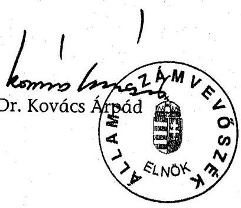
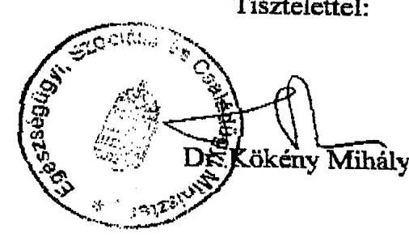
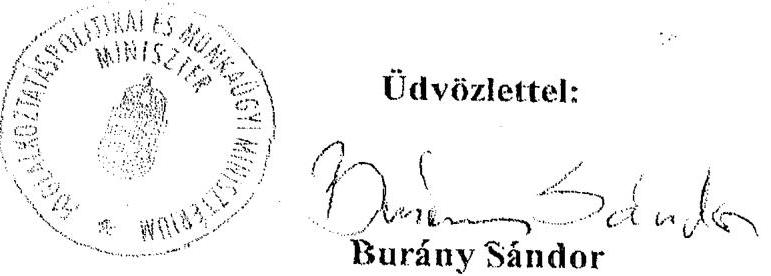
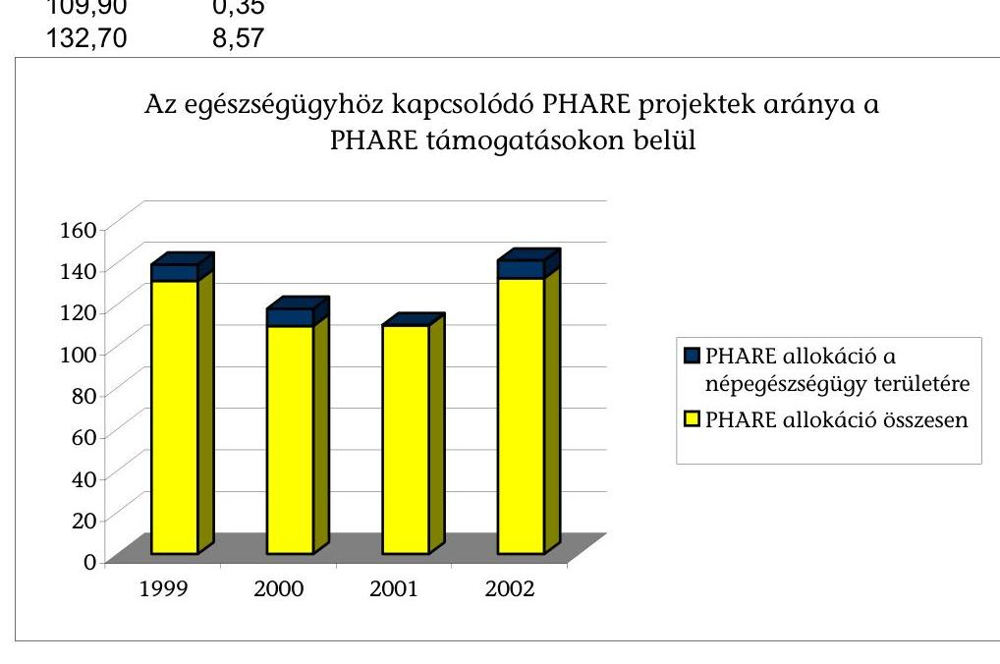
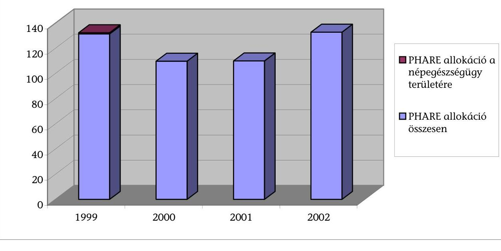
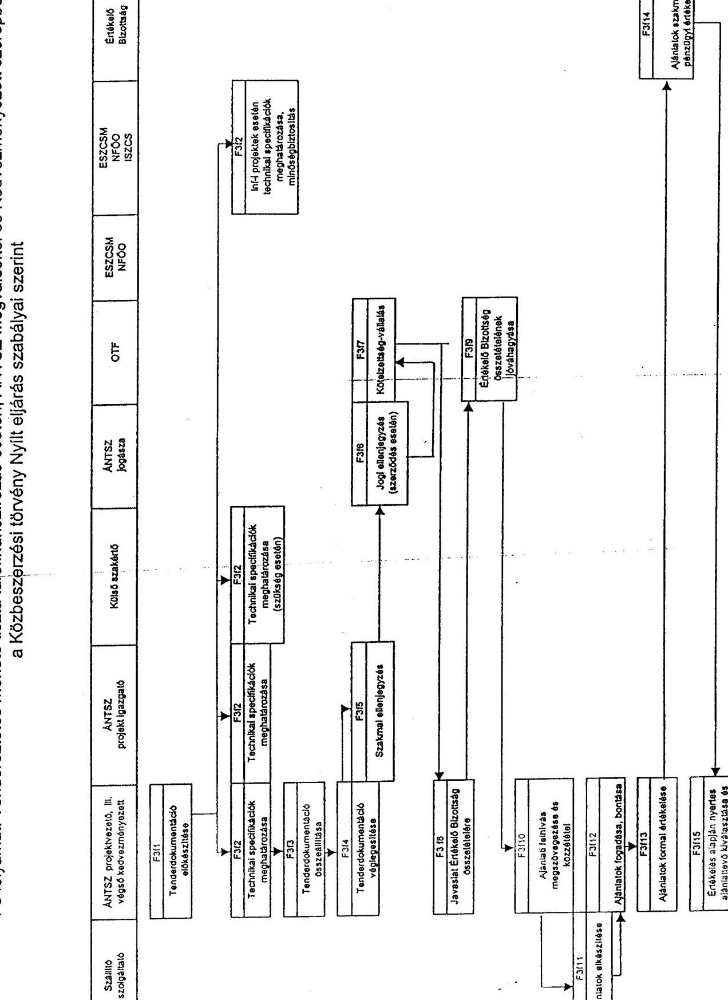

# JELENTÉS 

## az egészségügy területén megvalósult PHARE programok ellenőrzéséről

---

2. Államháztartás Központi Szintjét Ellenőrző Igazgatóság
2.1. Teljesítmény Ellenőrzési Főcsoport
Iktatószám: V-28-090/2003-2004.
Témaszám: 674
Vizsgálat-azonosító szám: V-0106
Az ellenőrzést felügyelte:
Bihary Zsigmond
főigazgató
Az ellenőrzés végrehajtásáért felelős:
Kemény Emil
főcsoportfőnök
Az ellenőrzést vezette:
Karsainé Dömsödi Éva
számvevő igazgatóhelyettes
Az ellenőrzést végezték:

| Dr. Mohácsi Istvánné | Kalmár István | Klimkó Gábor |
| :-- | :-- | :-- |
| számvevő tanácsadó | számvevő tanácsos | külső szakértő |
| Fekete Gábor | Dr. Klapcsik László | Kányáné Murvai Tünde |
| számvevő tanácsos | számvevő tanácsos |  |
| Tóthné Kiss Katalin | Komlósiné Bogár Éva | számvevő |
| számvevő tanácsadó | számvevő tanácsos | Pappné Dr. Szamosi Éva |
| Harsányi Imréné | Laki Dóra | számvevő |
| számvevő | számvevő tanácsos |  |
| Hegyes Mária | Dr. Székely Edit |  |
| számvevő | számvevő gyakornok |  |
| Dr. Zöldréti Attila | Wirth Eszter |  |
| számvevő | számvevő gyakornok |  |

A témához kapcsolódó eddig készített számvevőszéki jelentések:
címe
sorszáma
Jelentés a Phare támogatások felhasználásának vizsgálatáról 0042
Jelentés az Egészségügyi Minisztérium fejezet működésének 0222 ellenőrzéséről
Jelentés a nemzetközi támogatások monitoring rendszerének 0247 ellenőrzéséről

---

# TARTALOMJEGYZÉK 

BEVEZETÉS ..... 7
I. ÖSSZEGZŐ MEGÁLLAPÍTÁSOK, KÖVETKEZTETÉSEK, JAVASLATOK ..... 9
II. RÉSZLETES MEGÁLLAPÍTÁSOK ..... 15

1. A stratégiai célok és a PHARE projektek összhangja ..... 15
1.1. Az EU csatlakozás stratégiai kerete ..... 15
1.2. Népegészségügy stratégiai kerete Magyarországon ..... 15
1.2.1. Nemzeti Egészségfejlesztési Program ..... 16
1.2.2. Az ÁNTSZ korszerűsítése ..... 17
1.2.3. Kábítószer elleni küzdelem stratégiája ..... 17
1.2.4. Munkavédelem országos programja ..... 17
1.2.5. A stratégiai háttér hiánya ..... 17
1.3. A népegészségügy területére irányuló PHARE projektek céljainak illeszkedése a stratégiai keretbe ..... 19
2. A projektek pénzügyi lebonyolításának értékelése ..... 21
2.1. A kifizetések szabályossága ..... 21
2.2. A társfinanszírozás rendelkezésre állása és felhasználása ..... 25
2.3. A fejlesztések fenntartásának finanszírozása ..... 28
2.4. A beszerzett PHARE eszközök vagyongazdálkodási kérdései ..... 29
3. A PHARE projektek értékelése ..... 32
3.1. Az intézményfejlesztéshez kapcsolódó szakértői segítség (Twinning) ..... 32
3.2. Közegészségügy ..... 32
3.3. Járványügyi biztonság és a kábítószer elleni küzdelem ..... 34
3.3.1. A járványügy informatikai hátterének fejlesztése ..... 34
3.3.2. Mikrobiológiai laboratóriumfejlesztés ..... 35
3.3.3. A kábítószer-ellenes küzdelem ..... 36
3.4. A munkahelyi egészség és biztonság ..... 37
3.4.1. A HU0006-01 projekt értékelése ..... 37
3.4.2. A HU0202-01 projektben elért eredmények értékelése ..... 38
4. A projektek szakmai bonyolításának értékelése ..... 40
4.1. Az ESZCSM irányításával bonyolított projektek értékelése ..... 40
4.1.1. Az ESZCSM szervezeti felkészültsége ..... 40
4.1.2. A projektek tervezése ..... 41
4.1.3. Az előírt eljárásrend alkalmazása ..... 42
4.1.4. A megvalósítás részletes ütemterve ..... 44

---

4.1.5. A megvalósításban részt vevő szervezetek együttműködése ..... 45
4.1.6. Ellenőrzés, monitoring tevékenységek ..... 46
4.2. Az FMM irányításával megvalósuló projektek szakmai lebonyolításának értékelése ..... 47
4.2.1. HU0006-01 projekt szakmai lebonyolításának értékelése ..... 47
4.2.2. HU0202-01 projekt szakmai lebonyolításának értékelése ..... 48
MELLÉKLETEK

1. Észrevételek
2. Projektek pénzügyi összefoglaló táblái (a-i.)
3. Az akkreditált laboratóriumok listája
4. Az egészségügyhöz kapcsolódó PHARE projektek aránya a PHARE támogatásokon belül
5. Az egészségügy területén megvalósuló PHARE projektek által érintett szervezetek
6. Az ESZCSM szakértői által kidolgozott folyamatábrák a PHARE projektek tender eljárásaihoz
7. Eredményességi mutatók az egészségügy területén megvalósuló PHARE projektek tervezési mátrixából
8. Kérdésfa az egészségügy területén megvalósuló PHARE projektek ellenőrzéséhez

---

# RÖVIDÍTÉSEK JEGYZÉKE 

| ANP | Közösségi Vívmányok Átvételének Nemzeti Programja |
| :--: | :--: |
| ÁNTSZ | Állami Népegészségügyi és Tisztiorvosi Szolgálat |
| ÁSZ | Állami Számvevőszék |
| KPSZE/CFCU | Központi Pénzügyi és Szerződéskötő Egység |
| CSP | Csatlakozási Partnerség |
| DIS | Decentralizált Végrehajtási Rendszer |
| EFR | Epidemiológiai Felügyeleti Rendszer |
| EFRIR | Epidemiológiai Felügyeleti Rendszert Támogató Információs Rendszer |
| EMCDDA | Kábítószerek és Kábítószer-függőség Európai Megfigyelő Központja |
| EKG | Egységes Kormányzati Gerinchálózat |
| ESZCSM | Egészségügyi, Szociális és Családügyi Minisztérium |
| EU | Európai Unió |
| EüM | Egészségügyi Minisztérium (az ESZCSM jogelődje) |
| FMM | Foglalkoztatáspolitikai és Munkaügyi Minisztérium |
| GKM | Gazdasági és Közlekedési Minisztérium |
| GYISM | Gyermek Ifjúsági és Sportminisztérium |
| IT | Információs Technológia |
| KBIR | Kémiai Biztonság Informatikai Rendszere |
| KKB | Kábítószerügyi Koordinációs Bizottság |
| LOT | Részteljesítés meghatározása a tender eljárásban (tételegység) |
| KöM | Környezetvédelmi Minisztérium |
| MÁK | Magyar Államkincstár |
| MBH | Magyar Bányászati Hivatal |
| MCDS | Minimális közös adatbázis |
| MEDINFO | Országos Egészségügyi Információs Központ és Könyvtár |
| MEMOR | Magyar Egységes Monitoring Rendszer |
| MeH | Miniszterelnöki Hivatal |
| NAT | Nemzeti Akkreditációs Testület |
| NFP | Nemzeti Fókuszpont |
| OEK | Országos Epidemiológiai Központ |
| OEP | Országos Egészségbiztosítási Pénztár |
| OKBI | Országos Kémiai Biztonsági Intézet |
| OKK | „Fodor József" Országos Közegészségügyi Központ |
| OKK-KKL | OKK Központi Kémiai Laboratórium |
| OMMF | Országos Munkabiztonsági és Munkaügyi Főfelügyelőség |
| OTH | Országos Tisztifőorvosi Hivatal |
| OTMR | Országos Támogatási Monitoring rendszer |
| PAA | Előcsatlakozási Szakértő |
| PAD | Projekt Alapító Dokumentum |

---

| PAO | Programengedélyező, a nemzeti adminisztráció képviselő-   je |
| :-- | :-- |
| PERSEUS | PHARE projektekre vonatkozó regisztrációs és nyilvántar-   tási rendszer |
| PHARE | Közép- és Kelet-Európa országainak nyújtott EU támoga-   tások programja |
| PM | Pénzügyminisztérium |
| PRAG | Gyakorlati útmutató a PHARE, ISPA és SAPARD eljárá-   sokhoz |
| SPO | Projektek szakmai megvalósításának felelőse |
| SZMSZ | Szervezeti és Működési Szabályzat |

---

# ÉRTELMEZŐ SZÓTÁR 

Financing Memorandum
Final Report
Immissziós mérőhálózat
Logframe mátrix
PERSEUS nyilvántartás
Projekt fiche
Surveillance
Twinning
PHARE végrehajtó szervezetek

Hatás

Mutatók

Input mutatók
Output mutatók

Eredménymutatók
Hatásmutatók

A PHARE előcsatlakozási alap éves Pénzügyi Megállapodása
Partnerkapcsolati segítségnyújtást lezáró jelentés
Légszennyezettséget mérő hálózat
Projekttervezési összefoglaló táblázat
Az Európai Bizottság pénzügyi jelentési rendszere
Projekt tervezés alapdokumentuma
Felügyelet
Partnerkapcsolati segítségnyújtás
A decentralizált végrehajtási rendszernek a nemzeti adminisztráció keretei között működő végrehajtó egységei, amelyek felelősek a projektek pályáztatásáért, a szerződések megkötéséért és a kifizetésekért, valamint a projektek szakmai megvalósításáért.
A beruházási projektek és - a vonatkozó konkrét rendelkezések alapján - egyéb projektek pályáztatását, a szerződések megkötését és a kifizetéseket, valamint a projektek szakmai megvalósítását a Pénzügyi Megállapodásokban meghatározott intézmények (minisztériumok, az általuk átruházott hatáskörben eljáró szervezetek) látják el.
Az intézményfejlesztési projektek és - erre vonatkozó konkrét rendelkezések alapján - egyéb projektek meghirdetését, a szerződések megkötését és a kifizetését a Központi Pénzügyi és Szerződéskötő Egység látja el. Ezekben az esetekben a szakmai megvalósítás a Szakmai Programfelelős (ágazati minisztérium/intézmény tisztviselője) feladata.
A projekt végső következménye, amely a projekt által meghatározott eredményekből következik a külső körülmények által befolyásoltan.
Azon gazdasági mennyiségek vagy jellemzők, amelyeket a projektek és programok tervezéséhez, nyomon követéséhez és értékeléséhez használnak.
A projekt megvalósításához szükséges pénzügyi, humán és tárgyi erőforrások (pl. juttatások és társfinanszírozás).
Az input források felhasználásával megvalósuló projekt tevékenységekre vonatkoznak. Gyakran tárgyi vagy monetáris egységekben határozzák meg.
A projektből származó közvetlen előnyök a kedvezményezettek számára
A projekt hosszabb távú hatásai (5-15 év).

---

| Program | A tágabb ágazati vagy térségi fejlesztési célrendszert   megvalósító fejlesztési terv, amely több egymással össze-   függő projekt útján, egységes, koordinált szervezeti   rendszerben, az érintettek együttműködése alapján va-   lósul meg. |
| :-- | :-- |
| Projekt | Tartalmilag és formailag részletesen kidolgozott, megfelelő pénzügyi háttérrel és végrehajtási ütemezéssel rendelkező fejlesztési elképzelés. |
| Framework contractor | Keretszerződő Partner |

---

# JELENTÉS 

## az egészségügy területén megvalósult PHARE programok ellenőrzéséről

## BEVEZETÉS

Az egészségügy, azon belül a népegészségügy területére irányuló PHARE támogatás 1998-2002 között az európai uniós és a hazai előírások, valamint a népegészségügyi stratégiai célok teljesítésére alkalmas intézményfejlesztésre összpontosított. A támogatásokat a népegészségügy különböző területén a hatósági és az ellenőrzési funkció erősítésére, a dolgozók szakmai továbbképzésére, a laboratóriumi vizsgáló kapacitások korszerűsítésére, az egyes szakterületek informatikai hátterének megteremtésére használták fel.

A PHARE támogatással megvalósuló népegészségügyi intézményfejlesztés és beruházás a vizsgált hat projekt keretében az alábbi három területre irányult:

- a közegészségügy területére, azon belül a közegészségügyi laboratóriumok fejlesztésére és a kémiai biztonság megerősítésére (HU9910-01 projekt);
- a járványügyi biztonság fejlesztésére - azon belül informatika és laboratóriumfejlesztésre -, és ezen kívül a Kábítószer Információs Rendszer Nemzeti Kapcsolattartó Pontjának intézményesítésére, mivel az EU a járványügyi területhez sorolja a kábítószer elleni küzdelmet is (HU0011-01, a HU0202-03 és a HU0006-02 projektek);
- a munkahelyi egészség és biztonságra vonatkozó EU direktívák összehangolt alkalmazására (HU0006-01 és a HU0202-01 projektek).

A közegészségügy és a járványügy fejlesztését célzó PHARE projektek esetében az ESZCSM szakmai irányítása alatt az ÁNTSZ volt a kedvezményezett. A Kábítószer Információs Rendszer Nemzeti Kapcsolattartó Pontjának intézményesítése az ÁNTSZ OEK intézetéhez került. A projekt megvalósításában a kábítószer elleni küzdelemben részt vevő társtárcák és intézmények vettek részt.

A munkahelyi egészség és biztonság EU direktíváinak alkalmazását előmozdító PHARE projektek az FMM irányításával valósultak meg. A magyarországi szervezetek közötti munkamegosztásban a munkahelyi biztonság és egészségvédelem feladatai nem egy szervezetben összpontosulnak, ezért az ennek a területnek nyújtott PHARE támogatás kedvezményezettjei az ESZCSM-hez tartozó ÁNTSZ mellett az FMM-hez tartozó OMMF és a GKM-hez tartozó Bányászati Hivatal voltak.

Az ellenőrzés célja annak értékelése volt, hogy az EU csatlakozás időpontjára a magyar népegészségügyi intézményrendszer felkészült-e arra, hogy bekapcsolódjon az Európai Unió által felállított szakmai szervezetek munkájába, a PHARE programokra jóváhagyott támogatások és a hazai források felhasználásával. Ennek keretében értékelni kellett, hogy:

- a PHARE projektek illeszkedtek-e az egészségügy területére kidolgozott hazai stratégiába és rendelkezésre álltak-e a projektek eredményes megvalósításához szükséges szabályozási feltételek;
- a PHARE projektek megvalósítása során betartották-e a pénzügyi, számviteli és vagyongazdálkodási szabályokat;
- a PHARE projektek által kitűzött célok teljesülését a ténylegesen teljesített feladatokkal való összevetés alapján, valamint az eredményesség mérésére a projekttervezés során a kedvezményezett által kidolgozott mutatók értékelése alapján;
- a PHARE projektek megvalósítása megfelelt-e az EU és a hazai jogszabályok által megkövetelt eljárási rendnek.

Az ellenőrzés végrehajtására az Állami Számvevőszékről szóló 1989. évi XXXVIII. törvény 2. § (1), (5), (6) és (9) bekezdése alapján került sor. Az ellenőrzés elvégzését előtanulmánnyal alapoztuk meg.

A népegészségügy különböző területeinek fejlesztését célzó PHARE programokat az 1998-ban elindult tervezéstől követtük végig 2004 februárjáig, a helyszíni vizsgálat végéig. Ez idő alatt a vizsgált 6 projektből 5 projekt a jóváhagyott kötelezettségvállalási és kifizetési ütemezés szerint lezárult, ebből egy projektnél a hazai társfinanszírozásból még vannak hátra kifizetések. A mikrobiológiai laborok fejlesztése a tervek szerint 2005 novemberében zárul, a kötelezettségvállalásokat megalapozó tendereket még nem írták ki. Az EU csatlakozást követően a megkezdett, illetve jóváhagyott PHARE programok az előcsatlakozási eszközökre vonatkozó EU és hazai szabályok szerint fejeződnek be. Az előcsatlakozási szabályok szerint kell felhasználni a csatlakozásig befogadott PHARE projektek támogatásait a tagországgá válást követő időszakban is. Magyarország EU tagállamként a Strukturális Alapokból nyerhet támogatásokat a későbbiekben az egészségügy,
 illetve azon belül a népegészségügy további fejlesztésére.

A PHARE projekteket a vizsgálat annak alapján ítélte meg, hogy a projektek előirányzott költségvetési keretéből a tervezett ütemezésben megvalósultak-e a projekt közvetlen célkitűzéseiben szereplő fejlesztések, beruházások, működőképesek-e a fejlesztések, aktiválták-e a beruházásokat. A teljesítmények minősítéséhez az ellenőrzés eredményességi mutatóit a 7. sz. melléklet tartalmazza, az értékeléshez használt kérdésfát a 8. sz. mellékletben mutattuk be. Értékeltük az EU és a nemzeti népegészségügyi stratégia összhangját, az EU prioritások érvényesülését, az EU támogatási keret és a hozzá kapcsolódó hazai társfinanszírozás rendelkezésre állását, a felhasználás szabályosságát a kiválasztott három területen. Nyomon követtük a korábbi ÁSZ ellenőrzések tapasztalatainak hasznosulását.

A jelentést 8 napos egyeztetésre megküldtük az egészségügyi, szociális és családügyi miniszternek, továbbá a foglalkoztatáspolitikai és munkaügyi miniszternek. Válaszlevelük másolatát az 1. sz. melléklet tartalmazza.

---

# I. ÖSSZEGZŐ MEGÁLLAPÍTÁSOK, KÖVETKEZTETÉSEK, JAVASLATOK 

A PHARE előcsatlakozási alapból 1998-2002 között megvalósult projektek megteremtették a feltételét a magyar népegészségügy és az EU szakmai szervezeteinek együttműködéséhez, elősegítették a közösségi jogszabályok végrehajtásában részt vevő intézmények felállítását, felkészítését és megerősítését. A hat támogatott projekt céljainak megvalósítása - figyelembe véve a 2005-ben lezáruló mikrobiológiai laborfejlesztésekre irányuló projekt céljait is - javították a közegészségügyi laboratóriumok mérőeszköz-ellátottságát, a megvalósulás szakaszába került a járványügyi laboratóriumok fejlesztése; az uniós követelmények kielégítésére alkalmassá tette az adatok feldolgozását támogató információtechnológiai eszközöket a szoftver és hardver fejlesztések révén. Az intézményfejlesztés, a munkatársak korszerű képzése megerősítette a hatósági és az ellenőrzési funkciók gyakorlását. A PHARE támogatások felhasználása hozzájárult a magyar népegészségügy feltételeinek javításához a kémiai biztonság és a járványügyi biztonság megőrzéséhez, a kábítószerek elleni küzdelem, továbbá a munkahelyi egészség és biztonság fejlesztéséhez. Mindezek elősegítették, hogy a magyar népegészségügyi intézményrendszer alkalmassá váljon, illetve bekapcsolódjon az Európai Unió által felállított szakmai szervezetek munkájába a közegészségügy, a járványügy, valamint a munkahelyi egészség és biztonság területein. ${ }^{1}$ A vizsgálat lezárásáig a PHARE támogatással megteremtették az eszköz és az informatikai feltételeket a kábítószerek elleni küzdelem fejlesztéséhez, folyamatban volt, illetve befejezés előtt állt a Nemzeti Drog Információs Pont intézményi fejlesztését teljessé tevő jogi és technikai feltételek kialakítása. Az uniós intézményi együttműködés teljessé tétele megkívánja a vizsgálat lezárásakor még folyamatban lévő PHARE projektek befejezése mellett a fejlesztő munka folyamatos fenntartását és az üzemeltetés forrásainak biztosítását.
A magyar népegészségügy PHARE támogatásban részesült projektjei, azok céljai és a megvalósult fejlesztések megfeleltek az európai uniós csatlakozási felkészülés stratégiai keretét adó dokumentumokban - az ANP-ben és a Csatlakozási Partnerségben - megfogalmazott célkitűzéseknek, prioritásoknak.
A PHARE támogatási igény elbírálásakor a projekttervezés alapját az EU stratégiája határozta meg, ennek alapján minősítették, illetve ítélték meg a támogatást. A PHARE projektek megvalósításának időszakában nem volt olyan kidolgozott magyar népegészségügyi stratégia, amely a projekttervezés alapját jelenthette volna. Az egészségügyről szóló törvény 1997-ben előírta a Nemzeti

[^0]
[^0]:    ${ }^{1}$ Elősegítette ezt, hogy a vizsgált PHARE programok céljai összhangban voltak az EU szerint kulcs-eredményterületeknek definiált irányokkal. További fejlesztések szükségesek a későbbiekben az egészségfejlesztésben, az egészségügyi szolgáltatások preventív tevékenységeinél, amelyek nem tartoztak a most vizsgált projektek által támogatott területekhez, valamint kimaradt a PHARE támogatásból, és így hazai forrásokból fejlesztendő az ionizáló és nem ionizáló sugárzásmérés. Az Európai Unió szakmai szervezeteivel való együttműködés tényleges eredményessége az EU előírásaival összhangban két évvel a projektek befejezését követően értékelhető.

---

Egészségfejlesztési Program kidolgozását, azonban az „Egészség Évtizedének Johan Béla Nemzeti Programja" csak hat évvel később készült el, az Országgyúlés 2003-ban hagyta jóvá. Ez meghatározta a népegészségügyre vonatkozó hosszú távú célokat, feladatokat, megvalósítása az OTH-ra, az ÁNTSZ-re, a társtárcákra és intézményekre támaszkodik. A végrehajtható program követelménye teljesült, mivel a meghatározott feladatokhoz erőforrásokat is rendeltek hozzá az egészségügyi tárca, az OEP és az egészség megóvásában érintett társtárcák költségvetésében ${ }^{2}$.
1987-től összesen öt egészségfejlesztési illetve népegészségügyi program tervezete készült el kormányzati kezdeményezésére, az ÁNTSZ közreműködésével. A tervezetek nem elégítették ki a nemzeti stratégiával szemben támasztott követelményeket, mivel nem tisztázták a fejlesztési irányokat, prioritásokat, a feladatokhoz nem rendeltek erőforrásokat. Egy hosszú távú program kidolgozásának nem kedveztek az ezen időszak alatt bekövetkezett minisztériumi és intézményi szervezeti, vezetői változtatások. ${ }^{3}$ Emiatt az 1998-2002 közötti időszakban a népegészségügy magyar stratégiai kerete kevésbé volt kidolgozott, mint az EU csatlakozásra való felkészülés stratégiája. A népegészségügy területeit támogató PHARE projektek tervezésekor a célok meghatározását nem befolyásolta a hazai stratégia hiánya, miután a projektcélokat az EU stratégiai keretdokumentumaival összhangban alakították ki.
Az EU bizottsági döntés alapján elfogadott PHARE projektek ütemezés szerinti megvalósítását három esetben befolyásolták a lebonyolítás alatt bekövetkezett szervezeti, intézményi változások. A „Johan Béla" program több helyen kiemelte az ÁNTSZ korszerűsítésének szükségességét. Az ESZCSM és az ÁNTSZ nem készítette el a szervezeti átalakítás, korszerűsítés jóváhagyott koncepcióját, nem mutatták be az átalakításból várható megtakarítások kalkulált számításait a helyszíni vizsgálat lezárásáig. A munkahelyi biztonság és egészségvédelem kezelé-

[^0]
[^0]:    ${ }^{2}$ Az ÁSZ 2002. évi az Egészségügyi Minisztérium fejezet működésének ellenőrzéséről szóló jelentésében megállapította a Johan Béla programot megelőző Egészséges Nemzetért Népegészségügyi programról, hogy: „A Kormány 2001-ben elfogadta a 2001-2010 közötti évekre szóló Egészséges Nemzetért Népegészségügyi Programot, amely az Egészségfejlesztési Programban meghatározott tartalmi követelmények egy részét lefedi, de nem tartalmazza a közfinanszirozott egészségügyi ellátásokra (beleértve a gyógyszer-, gyógyászati segédeszköz ellátást is), az ellátórendszerre és a társadalombiztosítási finanszírozás módjára vonatkozó koncepciót. Ezek kidolgozása a Nemzeti Fejlesztési Terv egészségügyi ágazatra vonatkozó részeként folyamatban van. Az Egészséges Nemzetért Népegészségügyi Program nem került az Országgyülés elé, többletforrást a 2001-2002 évi költségvetésben nem rendeltek hozzá. A parlamenti legitimáció a szükséges fedezet biztosítása szempontjából is fontos lenne....A modernizációs program és az európai uniós integrációra való felkészülés egyes szakmai feladatainak végrehajtásáról szóló 2159/1996. (VI. 28.) Korm. határozat rögzítette az egészségügy működésére vonatkozóan; a modernizációs program megvalósításával és az EU csatlakozásra való felkészüléssel összefüggő célokat; a szolidaritás elvén működő kötelező biztosítási rendszer fenntartását; az esélyegyenlőség biztosítását; a valós szükségletekhez alkalmazkodó, rugalmas szolgáltatási struktúra kialakítását; az egészségügyben elköltött közpénzek átláthatóságát; az egészségügy finanszírozhatóságát; a ráfordítások hatékonyságának növelését."
    ${ }^{3}$ Az ÁSZ 2002. évi az Egészségügyi Minisztérium fejezet működésének ellenőrzéséről szóló jelentésében megállapította, hogy: „A minisztérium szervezete, működési rendszere többször módosult. A minisztérium vezetésének változásai befolyásolták a tárca szakmai céljainak sorrendiségét."

---

sében az ESZCSM és az FMM egyaránt szerepet kapott. A végrehajtásban érintett szervezetek közötti feladatmegosztás is változott. Az emisszió mérési feladat elvégzése a laboreszközök beszerzését követően a környezetvédelmi tárcához került, a kábítószer elleni küzdelmet támogató projekt megvalósításának ágazati irányítása megosztott volt az ESZCSM és a GYISM között a vizsgálat végéig.

A PHARE támogatás felhasználással megvalósuló népegészségügyi intézményfejlesztést és beruházást szolgáló hat projekt tervezett összköltsége a kötelező hazai ráfordításokkal 37,669 millió euro volt, amelyből 24,87 millió euro összegű volt a PHARE támogatás. A közegészségügy és a járványügy fejlesztése kapta a támogatási keret négyötödét, három projektre. Ezek közül a 2002. évi keretre jóváhagyott mikrobiológiai laboratóriumhálózat fejlesztési PHARE projekt a legnagyobb összegű, 12,260 millió euro értékű, amelynek megvalósítása nem jutott a tenderkiírási szakaszba az ÁSZ vizsgálat időtartama alatt, a projektütemtervnek megfelelően. A PHARE keret maradék egyötödét, három projektben használták fel a munkahelyi egészség és biztonság fejlesztésére és a kábítószer elleni küzdelemre.
A PHARE támogatásokat a nyilvántartásra és elszámolásra előírt szabályok betartásával használták fel az ütemezés szerint lezárult öt projektben, jogosulatlan kifizetés nem volt. A jóváhagyott PHARE keretből mindössze 1,263 millió euro-t (7,3%) nem használtak fel. A maradvány keletkezésének okai: a Nemzeti Drog Információs Pont intézményi kiépülésének elmaradása; néhány darab közegészségügyi műszerbeszerzés technikai okok miatt történt meghiúsulása; a tervezett összeghez képest alacsonyabb beszerzési ár, valamint beszállítói teljesítés elmaradása voltak. A fel nem használt összegek átcsoportosításához az EU delegáció nem járult hozzá, így ezek az összegek nem hasznosíthatók az ország számára. A hatodik projekt esetében a kifizetések végső határideje 2005. november 30. Az eredeti ütemezésnek megfelelően pénzügyi részteljesítés a helyszíni vizsgálat lezárásáig még nem volt, ezért ez a projekt nem volt értékelhető.
A hazai társfinanszírozás 12,799 millió euro értékben a fejezeti költségvetésből rendelkezésre állt, forráshiány nem gátolta a megvalósítást. A kötelező társfinanszírozás kifizetése a jóváhagyott ütemezés szerint folyt a lezárult 5 projekt esetében, 2000-2004. február között. A kizárólag hazai forrásból finanszírozható komponenseknél - képzések, felkészítések - a kötelezettségvállalások lezárultak, a szerződéseket megkötötték, a kifizetések az ütemezés szerint folynak. A kötelező társfinanszírozáson felül, további 5,264 millió euronak megfelelő forint kiadás (260 Ft/euro árfolyamon) merült fel, amelyet a pályáztatás sikeres előkészítésére, szakértők igénybevételére indokoltan használtak fel. A kötelező társfinanszírozást meghaladó kiadások a jóváhagyott támogatási keret egyötödét tették ki, amelyekre a szükséges fedezet rendelkezésre állt. Ez jelzi, hogy az EU támogatások felhasználásának tervezésekor a mindenkori költségvetésében a projektek költségvetéseinek kötelező hazai részén felül további, szükségszerű, járulékos kiadások finanszírozására is kell fedezetet biztosítani.
A projektek pénzügyi elszámolásánál eltérő eljárási és nyilvántartási rend volt jellemző az EU-tól átvett pénzeszközökre és a hazai társfinanszírozásra is. Az eredetileg az előcsatlakozási alapok és a hazai források felhasználásának követésére kialakított MEMOR informatikai rendszer nem érte el a fejlesztésekor kitűzött célokat. A MEMOR adatbázisban nem volt követhető PHARE projektek

---

előrehaladása. ${ }^{4}$ A rendszert nem töltötték fel adatokkal az előírt 2002 júniusi határidőre, alkalmazása nehézkes a felhasználói felületek kifogásolt kialakítása miatt, ezért a MEMOR nem alkalmas a PHARE projektek pénzügyi mutatóinak követésére, az előírt adatszolgáltatási kötelezettségek informatikai támogatására. Ennek következtében az egyes szervezetek továbbra is egyedi nyilvántartásaikat alkalmazzák, amelyek között esetleges az adategyeztetés. A minisztériumi és kincstári adatszolgáltatást papíron teljesítették, miután a MEMOR adatfeltöltési hiányosságai miatt nem volt alkalmas az adatszolgáltatásra. A rendszer kizárólagossága nem volt biztosított, a kincstári OTMR rendszerrel nem volt kapcsolata. A PHARE projektek előkészítésére, kezelésére, működtetésére előirányzott költségvetési kiadások, illetve teljesített zárszámadási adatok között számolták el a minisztérium intézményi működési kiadásainak egy részét is. Ezeket nem különítették el a PHARE projektek hazai kifizetéseitől, ami átláthatatlanná tette a felhasználást. A PHARE projektek hazai kifizetéseit el kell különíteni a minisztérium intézményi működési kiadásaitól, mind a költségvetés tervezésekor, mind a zárszámadási adatok elszámolásakor.
A közreműködő intézmények közötti adatszolgáltatás, a tájékoztatási kötelezettség teljesítése nem volt kielégítő. A CFCU-nál nem használják a hazai társfinanszírozás nyilvántartására a PERSEUS ${ }^{5}$ rendszer e célra kifejlesztett, euro alapú modulját. A CFCU és ezen keresztül a Nemzeti Alap rendelkezésére álló társfinanszírozási adatok nem egyeztek a minisztérium és a MÁK adataival,
 ami a nyilvántartási hiányosságokra és az eltérő időpontban alkalmazott, szükségszerűen eltérő euro/Ft átváltási árfolyam különbségekre vezethető vissza. Ennek alapján nem garantált, hogy az EU megbízható, pontos elszámolást kap a PHARE projektek hazai társfinanszírozásáról. A vizsgált kimutatások szerint a minisztérium és a MÁK adatai megegyeztek. A PHARE projektek hazai ráfordításainak pontos elszámolásához szükséges a CFCU, a MÁK és a minisztériumok adatainak kölcsönös és rendszeres egyeztetése, az adategyezőség megteremtése, továbbá a vizsgálat idején tapasztalt eltérések rendezése. A PHARE támogatásról a CFCU az előírásoknak megfelelően vezette a PERSEUS nyilvántartást.

A monitoring jelentésekben követhető a PHARE projektek szakmai megvalósításának folyamata, de ezek elkészítését a MEMOR rendszer nem támogatta. A MEMOR rendszerből hiányzott a teljes mértékben hazai finanszírozású projektkomponensek nyilvántartására alkalmas modul, továbbá a vegyes finanszírozású projektkomponensek adatainak feltöltöttsége sem volt teljes körűen biztosított.
A PHARE projektek szakmai lebonyolítása a jóváhagyott projektcélokkal összhangban volt, azonban a megvalósítás során esetenként átmeneti csúszá-

[^0]
[^0]:    ${ }^{4}$ A kincstári kifizetéseket nyilvántartó OTMR rendszer nem kapcsolódik az előcsatlakozási eszközök nyilvántartására - az 1998. évi twinning program keretében 1,9 millió euro támogatás felhasználásával - kifejlesztett MEMOR rendszerhez. Ezt az ÁSZ megállapította a nemzetközi támogatások monitoring rendszerének ellenőrzéséről 2002-ben nyilvánosságra hozott jelentésében.
    ${ }^{5}$ Az Európai Bizottság PHARE segélyekkel kapcsolatos pénzügyi jelentési rendszere, a támogatási keretek és felhasználások euro alapú nyilvántartására. Minden tagjelölt országban működött/működik, a PHARE, a Transitional Facility nyilvántartására.

---

sokat okozott a jóváhagyott korszerűsítési koncepció, a regionális intézményi, szervezeti struktúra kialakításának hiánya. Az ESZCSM és az FMM által felügyelt komponensek megvalósítási folyamata megfelelt a PRAG munkavégzési, beszállítási és szolgáltatási szerződéseire vonatkozó előírásainak. A lezárult projektben beszerzett laboratóriumi eszközöket üzembe helyezték, használatba vették a kedvezményezettek. Az eszközök hosszú távú üzemeltetését, fenntartásának finanszírozását ${ }^{6}$ kockázatossá teszi a források szűkössége, vagy hiánya. Az ÁNTSZ költségvetése a 2003. évi 30,858 Mrd Ft-ról 2004-ben lecsökkent 27,910 Mrd Ft-ra. Ezek pótlását a vizsgálat lezárásakor a szervezet-átalakításból várható megtakarításból tervezték. Jóváhagyott korszerűsítési koncepció még nem volt, ezért nem volt megítélhető, hogy a megtakarítás elegendő fedezetet ad-e majd a megvalósult projektekben beszerzett eszközök üzemeltetési, működtetési kiadásaira. Az informatikai rendszerfejlesztések részben lezárultak. Elkészült a kémiai biztonság fejlesztését támogató információs rendszer, a minimális közös adatbázis rendszer kiépítése. A kedvezményezett szempontjából kockázatos, hogy a járványügyi adatkezelő rendszer teljes körű átadása nem fejeződött be a vizsgálat lezárásáig. Folyamatban volt a fertőző beteg alrendszer, az oltóanyag logisztikai modul átvétele, az iktatási modul befejezése, de a kifizetések megtörténtek. A Nemzeti Kábítószer Könyvtár rendszer technikai modernizációja megfelelő volt, elmaradt viszont a központi adatgyűjtő rendszer kifejlesztése. A hátralévő alkalmazásfejlesztéssel összefüggő feladatokat kizárólag a hazai források terhére lehet és kell megvalósítani. Az informatikai rendszerek használatára előírt oktatásokat elvégezték, a munkatársak felkészültek az alkalmazásokra. A felhasználó intézmények nem készítették el a rendszerek további alkalmazásfejlesztési stratégiáját a vizsgálat lezárásáig. Ennek hiánya a hosszú távon fenntartható üzemeltetés szempontjából kockázatos.

A helyszíni ellenőrzés megállapításainak hasznosítása mellett javasoljuk:

# A Kormánynak 

1. Vizsgálja felül a meglévő rendszereket és koordinálja, hogy az EU támogatások felhasználásáért felelős minisztériumok egységes informatikai támogatással alakítsák ki az EU támogatások és a magyar társfinanszírozás egységes adattartalmú, átlátható nyilvántartási, elszámolási rendjét, amely alkalmas a projektek pénzügyi, szakmai előrehaladásának követésére.
2. Gondoskodjon az EU támogatással megvalósított beruházások, beszerzett eszközök hosszú távú üzemeltetési, fenntartási feltételeinek megteremtéséről.

## Az egészségügyi, szociális és családügyi miniszternek

3. Gondoskodjon a minisztérium irányításával megvalósuló projekteknél az EU támogatások, a hozzá kapcsolódó hazai társfinanszírozás és a társfinanszírozáson felül felme-
[^0]
[^0]:    ${ }^{6}$ Bérleti díjak, licence költségek, működtető személyzet költségek, általános költségek eszközökre eső része stb. fedezete.

---

rült költségek projektenkénti átlátható, követhető, egyidejű forint és euro alapú nyilvántartásáról.
4. Intézkedjen a megvalósult informatikai fejlesztések hosszú távú alkalmazásfejlesztési stratégiájának elkészíttetéséről.
5. Kísérje figyelemmel a járványügyi adatkezelő rendszer teljes körű alkalmazásba vételét.

# A Központi Szerződéskötő Egységnek 

6. Vizsgálja felül a PHARE programok adatainak nyilvántartását, töltse fel a hazai társfinanszírozási adatokkal az informatikai rendszerét és időszakos, rendszeres egyeztetésekkel gondoskodjon az adattartalom valódiságának ellenőrzéséről.

---

# II. RÉSZLETES MEGÁLLAPÍTÁSOK 

## 1. A stratégiai célok és a PHARE projektek összhangja

### 1.1. Az EU csatlakozás stratégiai kerete

Magyarországnak 2004. május elsejei Európai Unióhoz történő csatlakozásáig a tagságra való felkészülésre megfogalmazott célkitűzéseit és a jogharmonizációból adódó feladatait a Közösségi Vívmányok Átvételének Nemzeti Programja (ANP), a feladatok prioritásait a Csatlakozási Partnerség (CSP) dokumentum foglalta össze. Ezt a két dokumentumot a magyar kormány és az EU Bizottság 1998 óta egyeztette, 2002-ig folyamatosan felülvizsgálta és értékelte a dokumentumokban vállalt kötelezettségek megvalósításának előrehaladását. Az ANP tartalmazza az egyes szakterületek intézményfejlesztéséhez szükséges forrásigényt, megbontva magyar költségvetési hozzájárulásra és egyéb finanszírozási forrásra, így az EU forrásból várt támogatásra. A stratégiai dokumentumban meghatározott feladatok és az azokhoz rendelt, tervezett források megfeleltek az EU stratégiai követelményeinek.

Az integrációval kapcsolatos egészségügyi feladatok az egységes belső piac működését biztosítják a négy mozgásszabadsághoz kapcsolódva. Az EU szabályozás szerinti logikai szerkezetbe foglalt ANP-ben az egészségügyi - azon belül a népegészségügyi - feladatok több fejezetben találhatók: az áruk szabad áramlása, foglalkoztatás és szociális ügyek, környezetvédelem és népegészségügy fejezetekben. Az egészségügyhöz kapcsolódó PHARE projektek arányát szemlélteti a PHARE támogatásokon belül a 4. sz. melléklet.

### 1.2. Népegészségügy stratégiai kerete Magyarországon

Felmérések szerint a magyar lakosság egészségi állapota nemzetközi összehasonlításban rendkívül kedvezőtlen, elmarad attól, amit az ország társadalmi-gazdasági fejlettsége lehetővé tenne, ezért a csatlakozást megelőző években folyamatosan napirenden volt egy olyan népegészségügyi stratégia illetve program kidolgozása, amely a hozzá rendelt források segítségével hosszú távon hozzájárul a lakosság egészségének megőrzéséhez, javításához.

Magyarországon a népegészségügyi feladatok ellátásának az Állami Népegészségügyi és Tisztiorvosi Szolgálat (ÁNTSZ), az emberi egészséget befolyásoló egyes tényezők, mint pl. a levegő-, víztisztaság stb. mérésének a Környezetvédelmi Felügyelőségek, míg a munkahelyi biztonsággal összefüggő feladatoknak az OMMF és a MBH az intézményi bázisai.

Az ÁNTSZ rendelkezik egy, az egész országot hierarchikus rendszerben lefedő intézményhálózattal. Az Állami Népegészségügyi és Tisztiorvosi Szolgálatról szóló 1991. évi XI. törvény, illetve az ezt módosító 1999. évi XCVI. törvény határozza meg az ÁNTSZ feladatát. Ezek: a közegészségügyi (különösen a környezet- és település-, élelmezés- és táplálkozás-, gyermek- és ifjúság-, munka- és sugáregészségügyi, kémiai biztonsági feladatok), a járványügyi, az egészségfejlesztési

---

(egészségvédelmi, egészségnevelési és egészség-megőrzési), az egészségügyi igazgatási tevékenységek irányítása, koordinálása és felügyelete, valamint az egészségügyi ellátás, a gyógyszerellátás felügyelete. Az egészségügy területén megvalósult PHARE projektek által érintett szervezeteket az 5. sz. mellékletben mutatjuk be.

# 1.2.1. Nemzeti Egészségfejlesztési Program 

Az egészségügyről szóló 1997. évi CLIV. törvény kimondja, hogy a népegészségügy állami feladat és előírja a Nemzeti Egészségfejlesztési Program kidolgozását, amely a törvény 146. § szerint az egészségügyi tervezés alapja. ${ }^{7}$

Öt eltérő részletességű egészségfejlesztési, népegészségügyi programot dolgoztak ki 1987. óta részben a kormány, vagy a szaktárca kezdeményezésére, részben az ÁNTSZ-en belül. Ezekhez a programokhoz nem rendeltek költségvetést, nem voltak tisztázottak a programok prioritásai, a megvalósítás felelőse az ÁNTSZ volt, amelynek költségvetésében nem álltak rendelkezésre a végrehajtáshoz szükséges erőforrások.

Az egészségügyi tárca élén 1997. óta az ötödik miniszter áll és ugyanezen időszak alatt az ötödik országos tisztifőorvos került az ÁNTSZ élére, ami további változásokat vont maga után a minisztérium és az ÁNTSZ felső vezetésében is. A gyakori vezetői változások nem kedveztek egy hosszú távú népegészségügyi program kidolgozásának, megvalósításának ${ }^{8}$.

Az Országgyűlés 46/2003. (IV. 16.) OGY határozatában elfogadta az „Egészség Évtizedének Johan Béla Nemzeti Programját". A Program tartalmazza a népegészségügyre vonatkozó hosszú távú célokat, feladatokat, megvalósítása nemcsak az ANTSZ-re, hanem egy szélesebb társadalmi bázisra, társtárcákra, intézményekre támaszkodik. Az ESZCSM fejezeti költségvetése a Programra 2003-ban 2000 millió Ft-ot, 2004-ben 1100 millió Ft-ot irányozott elő. A Program megvalósításában résztvevő társtárcák és az OEP költségvetésükben 2004-re összesen 18 milliárd forintot terveztek egészségfejlesztési feladatokra az ESZCSM kimutatása szerint.

Az egészségügy területén megvalósult PHARE projektek illeszkedtek a Program népegészségügyi céljaihoz, az 1999-2003. között megvalósult projektek a 2.a. sz. mellékletben találhatók.

[^0]
[^0]:    ${ }^{7}$ Az ÁSZ 2002. évi jelentése az EüM fejezet működésének ellenőrzéséről javasolta a kormánynak, hogy intézkedjen a Nemzeti Egészségfejlesztési Program elkészítéséről, illetve annak Országgyűlés elé terjesztéséről.
    ${ }^{8}$ A minisztériumban valamint a felügyelete alá tartozó intézményekben bekövetkezett szervezeti és személyi változások okait és hatásait, az ÁNTSZ szervezeti koncepció alakulását az Egészségügyi Minisztérium fejezet működésének ellenőrzéséről szóló 2002. évi ÁSZ jelentés részletes megállapítások első fejezete bemutatta.

---

# 1.2.2. Az ÁNTSZ korszerűsítése 

Az „Egészség Évtizedének Johan Béla Nemzeti Programja" kiemeli az ÁNTSZ korszerűsítésének szükségességét.

A Program Függelékében felsorolt 2003-2004-ben megvalósítandó akciók keretében a „Közegészségügyi és járványügyi biztonság" fejezetnél kiemeli az ÁNTSZ szerkezetének korszerűsítését (OTH, illetőleg városi intézetek megerősítése, megyei intézetek és országos központok racionális működtetése), az „Erőforrás-fejlesztés" fejezetnél első feladatként említi egy átfogó tanulmány készítését a népegészségügy jelen szervezeti felépítéséről és lehetséges fejlesztési irányairól.

Az ÁSZ helyszíni ellenőrzésének lezárásáig nem készült el az ÁNTSZ korszerűsítésének jóváhagyott koncepciója, csak előzetes, előkészítő anyagok voltak fellelhetők.

### 1.2.3. Kábítószer elleni küzdelem stratégiája

A kábítószer-probléma visszaszorítása érdekében készített nemzeti stratégiát az Országgyűlés a 96/2000. (XII. 11.) OGY számú határozatában fogadta el. A nemzeti stratégia konkrétan nevesíti az uniós intézményi együttműködés elősegítése érdekében felállítandó nemzeti kapcsolattartó központot, az úgynevezett Nemzeti Fókuszpontot (NFP). A fókuszpont felállítása a Kábítószerek és Kábító-szer-függőség Európai Megfigyelő Központjához (EMCDDA) való intézményi csatlakozást jelenti. Az 1091/2003. (IX. 9.) Korm. határozat átnevezte a felállítandó intézményt változatlan funkcióval Nemzeti Kábítószer Adatszolgáltató és Kapcsolattartó Központra, amely a vizsgálat lezárásáig nem jött létre. A tervezett intézmény működési kereteit a „magyar Nemzeti Adatgyűjtő és Kapcsolattartó Központ feladatainak ellátásával kapcsolatos egyes kérdésekről" szóló 28./2004. (II.28.) Kormány rendelet határozta meg 2004 januártól.

### 1.2.4. Munkavédelem országos programja

Az Európai Tanács 2062/1994. határozata szól az Európai Munkaegészségügyi és Munkabiztonsági Ügynökség létrehozásáról és az uniós intézményhez kapcsolódó Nemzeti Fókuszpont kiépítéséről. A nemzeti ügynökség (Fókuszpont) feladata az, hogy a közösségi testületeket és a tagállamokat a munkahelyi egészség és biztonság kérdéseivel kapcsolatos műszaki, tudományos és gazdasági információkkal lássa el. A közösségi előírásra épülve a Munkavédelem Országos Programját az Országgyűlés a 20/2001. (III.30.) OGY határozatban fogadta el. A Program megköveteli a munkaegészségügyi és munkavédelmi felügyeleti képességek megerősítését és az ellenőrzések hatékonyságának javítását. A Nemzeti Fókuszpont működik, de az intézményesülési folyamat nem fejeződött be.

### 1.2.5. A stratégiai háttér hiánya

A hosszú távú népegészségügyi program késedelmes elkészítése és az ÁNTSZ korszerűsítési koncepciójának hiánya miatt nem volt, és részben jelenleg sem biztosított a népegészségügy területén megvalósult és megvalósítás előtt álló
 fejlesztések megfelelő hazai stratégiai háttere.

---

A stratégia hiánya befolyásolta például: az ÁNTSZ-nél a létszámfejlesztés illetve a létszámcsökkentés átgondolt megvalósítását, a járványügyi laborhálózat fejlesztését, továbbá a PHARE támogatással megvalósult fejlesztések fenntartásához szükséges többletforrások biztosítását. Az EüM fejezet az ÁNTSZ-nek a feladatai ellátásához szükséges létszámfejlesztésre 2000-ben 300 millió Ft-t, 2001-ben 720 millió Ft-ot, 2002-ben 540 millió Ft-ot irányzott elő, ezek a létszámfejlesztésre előirányzott összegek megjelentek az ANP-ben. A kormány által 2001-ben elrendelt létszámzárlat, illetve az ÁNTSZ immisszió mérő hálózatával együtt a KöM-nek átadott létszám figyelembevételével 2002 végéig 819 fős létszámfejlesztés történt az ÁNTSZ-nél 1,5 milliárd forint költséggel. Az ÁNTSZ nem átgondolt humán erőforrás fejlesztési elképzelését alátámasztja, hogy 2000-2002. között 1,5 milliárd Ft ráfordítással 819 fős létszámfejlesztést hajtott végre, majd 2003-ban - kormányzati intézkedések következtében - 554 fő elbocsátására került sor, amit tovább növelhet a laboratóriumi kiszervezésekhez kapcsolódó további tervezett létszámcsökkentés. Ennek mértéke a helyszíni vizsgálat lezárásakor még nem volt megítélhető.

A hazai stratégiai, korszerűsítési irányok késedelmes elfogadása kockázati tényező a HU0202-03 mikrobiológiai laborfejlesztési projekt ütemezett megvalósulása szempontjából, mert a vizsgálat lezárásának időpontjában még nem volt végleges az EU és a magyar fél által elfogadott koncepció, amely kijelölte volna a laboratóriumok fejlesztésének szintjeit, miközben a szerződéskötések határideje 2004. november 30.

A járványügyi biztonság fejlesztése projekt tervezési fázisában háromszintű mikrobiológiai laborfejlesztési koncepció jelent meg. Az elképzelés egy, az Országos Epidemiológiai Központban kialakítandó központi laboratóriumból, hét regionális és 13 megyei laboratórium fejlesztéséből állt. A tervezetet módosították az Európai Unió delegációjának javaslatára (2002.11.08.). A delegáció által megbízott szakértő Magyarországon megtekintette a fejleszteni kívánt laboratóriumokat, és részletes szükséglet feltárást végzett az ÁNTSZ laboratóriumairól.

A laboratóriumok fejlesztését az új regionalizációs stratégia alapján a feltárt körülmények értékelésével a következőképpen határozták meg: 1 csúcslaboratórium az Országos Epidemiológiai Központban, 5 regionális laboratórium és 6 támogató laboratórium, úgy, hogy az Országos Epidemiológiai központ laboratóriuma egyben a hetedik (e funkcióban nem PHARE támogatott) támogató laboratórium. Emellett az ÁNTSZ kötelezettséget vállalt arra, hogy a csúcs- és regionális laborok kivételével laboratóriumait a továbbiakban nem fejleszti. A koncepciót a kedvezményezett az Európai Delegáció által felkért szakértővel egyeztetve alakította ki. Az ÁSZ helyszíni vizsgálat időszakában készült el, és terjesztették fel miniszteri jóváhagyásra (2004. január) a legújabb projekt terv módosítási javaslatot, amelynek értelmében az OEK laboratóriuma tölti be a csúcslaboratóriumi és regionális laboratóriumi funkciót is Budapesten és környékén, és ezen felül négy regionális mikrobiológiai laboratórium kap támogatást. A módosítás annak a tervezett ÁNTSZ korszerűsítési koncepciónak a része, amelynek során az ÁNTSZ „kiszervezéssel" válik meg a PHARE által nem támogatott laboratóriumoktól.

Az ÁNTSZ fejlesztési koncepciójának változásával együtt változott a mikrobiológiai laboratóriumok regionalizációs stratégiája. A projekt megvalósítását veszélyezteti, hogy miközben a projekt szerződéskötéseinek határideje 2004. november 30., 2004. januárban még nincs a kedvezményezettnek végleges és az EU által jóváhagyott koncepciója a laboratóriumok regionalizációjával kapcsolatban.

---

A hazai népegészségügyi stratégia, koncepció hiánya fennakadást okozott a 2002-ben befejeződött HU9910-01 projekt megvalósítása során. A HU9910-01 projekt keretében beszerzett 8 immissziós monitor állomást a beérkezést követően adták át a KöM-nek, miután 2001-ben kormányrendelet a KöM-höz tette át az immisszió mérési feladatot. Emiatt az ÁNTSZ-től átkerült a KöM-höz az immisszió mérőhálózat működtetésének feladata, felelőssége és a meglévő régi eszközállomány az újonnan beérkező eszközökkel együtt. Az EU Delegáció határozott fellépése hatására rendezte a két minisztérium az átadás-átvételt a szállító cég folyamatos sürgetése mellett.

# 1.3. A népegészségügy területére irányuló PHARE projektek céljainak illeszkedése a stratégiai keretbe 

Az ESZCSM az ÁNTSZ-szel közösen - az egyes szakterületek ANP-ben rögzített fejlesztési irányainak megfelelően - dolgozta ki a PHARE támogatás iránti kérelmeket, az ÁNTSZ feladatainak az EU elvárásoknak megfelelő ellátásához szükséges intézményfejlesztésekre és eszközberuházásokra (Project fiche) 1998-2003. között. Az EU Bizottsága az adott év PHARE támogatási keretéből többszöri pályázás ellenére sem járult hozzá PHARE támogatással az ionizáló sugárzás terén még hátralévő, illetve a nem ionizáló sugárzás terén szükséges fejlesztésekhez. Ezeknek a fejlesztéseknek a megvalósítása elmaradt, mivel hazai forrás nem állt rendelkezésre megvalósításukhoz.

A pályázatokon kívül hazai forrásból az ÁNTSZ létszámfejlesztése, a PHARE projektek keretén felüli szakmai továbbképzés és a PHARE támogatás fogadására való előkészítés valósult meg.

A PHARE támogatásban részesült fejlesztések megfeleltek a csatlakozási felkészülés stratégiai keretét adó dokumentumokban, az ANP-ben és a Csatlakozási Partnerségben megfogalmazott célkitűzéseknek, prioritásoknak.

A vizsgált időszakban hat projekt keretében kapott PHARE támogatást a népegészségügy, a fejlesztések közvetlen célkitűzései az egyes népegészségügyi területeken az alábbiak voltak:

1) a HU9910-01 projekt keretében: a központi és regionális közegészségügyi laboratóriumok korszerűsítése, a kémiai biztonság megerősítése és információs rendszerének kiépítése (KBIR), twinning szakértő bevonásával a hatósági és felügyeleti munka támogatása. A projekt összértéke 11,995 millió euro;

A projekt az ÁNTSZ kémiai, zaj, por és rost, imissziós és ionizáló sugárzás laboratóriumi vizsgáló kapacitásának fejlesztését tűzte ki céljául. A harmonizált jog betartatásához szükséges tevékenységek keretében kiemelt jelentősége van az egészségügyi határértékek kontrollját biztosító kémiai, fizikai kóroki tényezők vizsgálatát végző laboratóriumok fejlesztésének; a laboratóriumi mintavételi és analitikai infrastruktúra megerősítésének és a kémiai biztonság intézményi továbbfejlesztésének. A közegészségügy és a kémiai biztonság területén jogszabályban előírt határértékek betartását az ÁNTSZ ellenőrzi, ezért a jogszabályokban előírt határértékek mérésére meghatározott vizsgálatok végzésére az ÁNTSZ intézményeinek mennyiségi és minőségi értelemben alkalmasnak, akkreditáltnak kell lennie.

---

2) a HU0006-01 projekt keretében: a „Munkahelyi egészség és biztonság" EU direktíváinak összehangolt alkalmazása, twinning szakértő bevonásával. A projekt a munkahigénikusok képzését és az adott terület felügyeletében részt vevő három hatóság (ÁNTSZ, OMMF, MBH) együttműködésének fejlesztését irányozta elő. A projekt összértéke 3,694 millió euro;

Olyan közös nyilvántartási rendszert terveztek (minimális közös adatbázis, angolul Minimal Common Data Set, MCDS), amely lehetővé teszi a felügyeleti vizsgálatok során észlelt eredmények összetett értékelését és az esetleg szükséges következő lépések összehangolását, koordinációját. A második komponens az MCDS rendszert működtető kedvezményezettek IT rendszereinek technikai fejlesztését és azok összehangolását is tartalmazta.
3) a HU0006-02 projekt keretében: a Kábítószer Információs Rendszer Nemzeti Kapcsolattartó Pontjának intézményesítése, twinning szakértő bevonásával. A projekt összértéke 1,0 millió euro.

A projekt közvetlen célkitűzései közül kiemelkedik a kábítószer elleni küzdelemben való uniós együttműködés intézményi kereteinek kialakítása. A projekt intézményfejlesztési célkitűzése az Országos Kábítószer Információs Rendszer Nemzeti Központjának, az úgynevezett Nemzeti Fókuszpontnak (NFP) a létrehozása volt. A projekt támogatást kívánt biztosítani a tervezett nemzeti intézmény adat- és információszolgáltatását megalapozó hazai adatszolgáltatási rendszer átalakításához.
4) a HU0011-01 projekt keretében: az Epidemiológiai Felügyeleti Rendszer és a támogató információs rendszer EFRIR kiépítése. A projekt összértéke 7,55 millió euro;

A projekt stratégiai célkitűzése az epidemiológiai felügyeleti rendszer (EFR) és a támogató információs rendszer (EFRIR) kifejlesztése, az Állami Népegészségügyi és Tisztiorvosi Szolgálat minden szintjén; az alkalmazásokhoz megfelelő felkészültségű szakemberek képzése; az áruk, szolgáltatások és emberek szabad mozgásának alapelvében a biztonsági státusz javítása és a megfelelő direktívák jobb végrehajtása. A projekt közvetlen célja a gyors reagálási képesség megteremtése az járványügyi biztonság fenntartásához és a biztonsági szint emeléséhez, hozzáférés és kapcsolódás az európai uniós adatbázisokhoz és megfelelés a jelentési kötelezettségeknek.
5) a HU0202-01 projekt keretében: a humán erőforrás fejlesztése a munkahelyi egészség és biztonság területén. A projekt összértéke 1,170 millió euro;

A projekt célkitűzése az Európai Unió szabályozásának átvétele és alkalmazása a munkahelyi egészség és biztonság, a munkajog, a férfiak és nők esélyegyenlősége területén, valamint a szükséges adminisztratív struktúrák megerősítése. Ennek keretében történt az ÁNTSZ tisztiorvosainak és közegészségügyi-járványügyi felügyelőinek, az MBH felügyelőinek és az OMMF munkaügyi és munkabiztonsági felügyelőinek képzése. Az Európai Munkaegészségügyi és Munkabiztonsági Ügynökség Magyarországi Fókuszpontja felállításának elősegítése az Országos Munkabiztonsági és Munkaügyi Főfelügyelőségnél.
6) a HU0202-03 projekt keretében: a járványügyi biztonság fejlesztése a mikrobiológiai laborhálózat korszerűsítésével, twinning szakértő bevonásával. A projekt összértéke 12,260 millió euro.

---

A projekt célkitűzése az egész Európai Uniót szolgáló kapuőr funkció támogatása a járványügyi biztonság fejlesztésével. A közvetlen célkitűzés a gyors rutin-, valamint a magas minőségi színvonalú diagnosztikai kapacitások fejlesztése a gyakori fertőző betegségekre az ÁNTSZ regionális laboratóriumaiban. Ezen túlmenően a fertőző betegségekkel kapcsolatos járványügyi biztonság fokozása a ritka és újonnan jelentkező kórokozók megfelelő munkabiztonsági körülmények között történő gyors diagnosztizálásának lehetővé tételével.

# 2. A PROJEKTEK PÉNZÜGYI LEBONYOLÍTÁSÁNAK ÉRTÉKELÉSE 

A projektek pénzügyi elszámolásának szabályait az EU-tól átvett pénzeszközök tekintetében a Kormány és az Európai Bizottság közötti Megállapodások, az Európai Bizottság által kiadott „Decentralizált Végrehajtási Rendszer" (DIS) és annak beszerzési részét felváltó PRAG${ }^{9}$ tartalmazza. A hazai társfinanszírozás keretében nyújtott központi költségvetési pénzügyi forrás igénybevételére a hazai költségvetési szabályok érvényesek. a pénzfelhasználás, a tendereljárás lebonyolításának folyamatábráját a vegyes és a hazai társfinanszírozásból megvalósuló projektekre mutatja be a 6. sz. melléklet, amely az ellenőrzés alapjául is szolgált, összhangban az EU előírásaival

A projektek hazai társfinanszírozási kerete rendelkezésre állt. A projektek megvalósításának előkészítési, kezelési, működtetési kiadásainak fedezetére a társfinanszírozás keretén felül további pénzeszközöket is felhasználtak „PHARE programokhoz való hozzájárulás"-ként. A felhasznált hazai társfinanszírozás európai pontos meghatározását nem tette lehetővé, hogy a MÁK, az ESZCSM és a CFCU a nyilvántartásaikban alkalmazott euro-forint átszámítási árfolyamát nem egyeztette. Emiatt a különböző időszakokban végzett átszámítások euro összegei eltérőek voltak a felhasznált hazai társfinanszírozás fix forint összege ellenére. Ennek következménye, hogy az ESZCSM intézményi működési kiadásainak adatai is különböző időpontokban eltérőek, az intézményeknek kifizetett PHARE költségvetési sor terhére elszámolt hazai társfinanszírozás időpontjában alkalmazott átszámítási árfolyam forint/euro árfolyam változásai miatt. Így a minisztérium intézményi működési kiadásainak nyilvántartásai nem átláthatóak.

### 2.1. A kifizetések szabályossága

A PHARE támogatással megvalósuló népegészségügyi intézményfejlesztést és beruházást szolgáló hat projekt tervezett összköltsége 37,669 millió euro, amelynek forrása 24,87 millió euro értékben PHARE támogatás és 12,799 millió euro értékben fejezeti költségvetésből biztosított hazai társfinanszírozás.

Három projekt keretében a közegészségügy és a járványügy fejlesztése kapta a projektek (37,669 millió euro) tervezett összköltségének a 84%-át, 31,805 millió euro-t. Ezen belül a kötelező hazai társfinanszírozás 89%-a (11,355 millió euro) és a PHARE támogatás 82%-a (20,45 millió euro) kapcsolódik ehhez a három

[^0]
[^0]: ${ }^{9}$ Gyakorlati Útmutató a PHARE, ISPA és SAPARD szerződéses eljárásokhoz (hatályos 2001. január 1-től)

---

projekthez. A mikrobiológiai laboratóriumhálózat fejlesztésére irányuló legnagyobb összegű, 12,260 millió euro értékű 2002. évi PHARE projekt megvalósítására PHARE támogatásra szerződéskötés még nem történt, amelynek a kockázata magas.

A projektek pénzügyi elszámolási gyakorlatát az EU-tól átvett pénzeszközök és a hazai társfinanszírozás tekintetében eltérő eljárási és nyilvántartási rend jellemzi. Az EU pénzeszközök lehívásának, elszámolásának és nyilvántartásának rendjét az EU és Magyarország által megkötött Megállapodások rögzítik, amelyeket Kormányrendeletekben${ }^{10}$ 2002. évben hirdettek
 ki. A Megállapodások megkötéséhez képest a kihirdetés időpontja 11, illetve 4 évet késett. A Megállapodások csak késedelemmel váltak a magyar jogrend részévé. Ettől függetlenül a Megállapodásokat a mindenkori Magyar Kormány végrehajtotta.

A Nemzeti Alap az EU pénzeszközök kezeléséért, a Központi Pénzügyi és Szerződéskötő Egység (CFCU) pedig a projektek adminisztratív és pénzügyi lebonyolításért volt felelős.

A CFCU vezeti a PERSEUS nyilvántartást, ami az Európai Bizottság PHARE segélyekkel kapcsolatos pénzügyi jelentési rendszere és tartalmazza a pénzügyi kereteket, a kifizetéseket (utalás napja és összege euróban). A 2002. év decembere óta a PERSEUS programban adott a lehetőség a társfinanszírozás adatainak euróban történő rögzítésére, de ezt a CFCU-nál nem vezetik.

A hazai társfinanszírozás keretében megvalósuló központi költségvetési pénzügyi forrás igénybevételére a költségvetési törvények és a hazai költségvetési szabályok ${ }^{11}$ érvényesek. A projekteket a feladatfinanszírozás rendszerében finanszírozták, amelynek alapbizonylata a feladatfinanszírozási engedélyokirat ${ }^{12}$, amelyet a Magyar Államkincstárhoz minden évben be kellett nyújtani. A minisztérium az adott projekttel (azon belül programokkal) kapcsolatos kifizetéseket forintban tartotta nyilván.

A PHARE támogatás felhasználására a CFCU-nál euróban vezetett PERSEUS nyilvántartás megbízható.
${ }^{10}$ 83/2002. (IV. 19. Korm. rendelet a Központi Pénzügyi és Szerződéskötő Egység felállításáról szóló Megállapodás kihirdetéséről (1998. 12. 17.)
84/2002. (IV. 19. Korm. rendelet a Nemzeti Alap felállításáról szóló Megállapodás kihirdetéséről (1998. 12. 17.)
85/2002. (IV. 29.) Korm. rendelet a PHARE segélyprogram igénybevételéről szóló Keretmegállapodás kihirdetéséről (1990. 09. 03.)
${ }^{11}$ a Számvitelről szóló 2000. évi C. törvény,
Az államháztartásról szóló 1992. évi XXXVIII. törvény,
Az államháztartás szervezeti beszámolási és könyvvezetési kötelezettségének sajátosságairól szóló 249/2000. (XII.24.) Korm. rendelet,
Az államháztartás működési rendjéről szóló 217/1998. Korm. rendelet.
${ }^{12}$ Az államháztartás működési rendjéről szóló 217/1998. Korm. rendelet 70-77. §-a.

---

A nyilvántartások adateltérései megerősítik, hogy a PHARE projektek megvalósításában közreműködő intézmények adatszolgáltatási, tájékoztatási kötelezettségüket nem kielégítően teljesítették.

A projekt társfinanszírozási adatait, és az azon felül felmerült, a megvalósítást szolgáló menedzsment költségeket az ESZCSM a 2000. és 2003. közötti évekre utólag gyűjtötte ki, a fejezet PHARE projektek költségvetési előirányzatának felhasználása alapján. A projektre bontott utólagos, évekre visszamenő költségkigyűjtés nem megbízható adatforrás, mivel a költségeket eredetileg nem bontották meg projektek szerint a nyilvántartásban. Nem állapítható meg, hogy az egyes projektek esetében ténylegesen milyen kifizetések történtek, akár a hazai társfinanszírozási kötelezettségből, akár azon felül.

2003-tól kell a költségvetési törvénynek megfelelően a hazai társfinanszírozást és az egyéb költségeket projektekre megbontva nyilvántartani. 2003. előtt a kifizetéseket teljesítő MÁK is csak a beadott általános feladatfinanszírozási adatlap alapján vezette a kifizetéseket és a MÁK nyilvántartása sem tüntette fel, hogy mely projektekre milyen értékben történt kifizetés.

Az ESZCSM nyilvántartásában minden adat forintban szerepelt, még a CFCU által euróban kifizetett számlákat is forintban rögzítették. Nem követhető az adatok utólagos, évekre visszamenő kigyűjtése alapján, hogy mikor, milyen árfolyamon - kifizetéskori, vagy későbbi időpontban érvényes árfolyamon - történt az euro számla forint értékének rögzítése.

Az Európai Unió a PHARE előcsatlakozási alapból 1999-2003. években a 2.b. sz. mellékletben felsorolt hat fejlesztést támogatta a közegészségügy, a járványügy, a munkahelyi egészség és biztonság területén. A táblázat bemutatja a projektek költségvetését, szerződéskötési és kifizetési határidőit és a projektek költségvetéséből teljesített kifizetéseket. A tervezett és a tényleges kifizetéseket a 2.i. sz. melléklet tartalmazza.

A HU9910-01 „Központi és regionális közegészségügyi laboratóriumok fejlesztése, a kémiai biztonság megerősítése" projekt megvalósítása során a költségvetést kétszer módosították, a végleges adatokat és a források felhasználását a 2.c. sz. melléklet mutatja be. A projekt összértéke 11,995 millió euro. A PHARE támogatási részére a szerződéskötés határideje 2001. szeptember 30., a kifizetések végső határideje 2002. szeptember 30. volt. A hazai kifizetésekre vonatkozó szabályokat betartották, 2003. végéig ezek lezárultak, részben a hazai társfinanszírozás terhére, részben azon felül, mint projekt menedzsment költségek.

Az ESZCSM 2004. januárjában kitöltött tanúsítványa a PHARE támogatásból történt kifizetésre a MÁK nyilvántartásával egyezően 1,906 millió Ft összegű kifizetést tartalmazott a HU 9910-01 projektre vonatkozóan. Ezt a 1,906 millió Ft összeget az ESZCSM a tanúsítvány szerint 260 Ft/euró árfolyamon számolta át euróra, ami 7,33 millió euronak felel meg. A kifizetések 2001. és 2002. években történtek és 2001. év közepétől 2002. év végéig az euró árfolyama a 235-250 Ft/euró közötti sávban mozgott. A tanúsítványban a minden projektre egységesen alkalmazott $260 \mathrm{Ft} /$ euro árfolyam a HU9910-es projekt esetében torzítja a

---

PHARE támogatás, a hazai társfinanszírozás és a hazai társfinanszírozáson felüli forint összegek átszámítását euróra.

A HU9910-01 PHARE projekt sikeresen lezárult fejlesztés, azonban nincs olyan adatbázis, amelyben a teljes projektre vonatkozó végleges pénzügyi adatok rendelkezésre állnak. Eredetileg a hazai fejlesztésű MEMOR monitoring rendszer szolgálta volna ezt a célt, de a 100\% hazai finanszírozású komponensek esetében a teljes körű adatbevitel nyilvántartására alkalmas modul hiányzik, csak a vegyes finanszírozású komponensek adatait lehetett rögzíteni.

Az ESZCSM kimutatása szerint a minisztérium 5,042 millió euro (1.311 millió Ft) értékben járult hozzá a PHARE projektek előirányzatából, a kötelező hazai társfinanszírozási részen felül, a HU 9910-01 projekt megvalósításához. Ez az összeg nem csak a HU9910-01 projektre terhelhető költségeket tartalmazta, hanem a minisztérium felügyelete alatt megvalósuló többi projektre alkalmazott szakértők és egyéb előkészítési feladatok költségeit is (pl. Kaposvári Egyetem 100 millió Ft). A szakértői díjakat nem osztották meg az egyes projektek között, a szakértők egyidejűleg az ESZCSM több PHARE projektjében is dolgoztak és a szakértőkkel kötött szerződések sem tartalmazták a projektenkénti munkamegosztást. Az elsőként induló PHARE HU9910-01 projektre a többi projekthez viszonyítva azért jutott magas szakértői költség (98\%), mert a minisztérium tájékoztatása szerint itt nyílt meg először költségvetési forrás az ESZCSM-nél a PHARE projektek előkészítésére, menedzselésére. Ezt igénybe vették a következő PHARE pályázatok, projektek előkészítésére is.

A projekt kötelező hazai társfinanszírozásán felül, a PHARE HU9910-01 projekt megvalósításához ténylegesen felhasznált pénzeszközök nagyságának ismerete nélkül nem állapítható meg, hogy a megvalósításhoz az ESZCSM a projekt összértékéhez viszonyítva milyen mértékű további költségvetési forrást nyújtott.

A vizsgált 6 PHARE projekt esetében az ESZCSM a társfinanszírozási kötelezettségen felül a sikeres PHARE pályázatok előkészítéséhez, a projektek megvalósítására 2000-2003. között további 5,264 millió euro kiadást teljesített, a pályáztatás sikeres lebonyolítása érdekében szakértőket alkalmazott, elemzéseket, tanulmányokat készíttetett, amelyeket hasznosítottak a megvalósítás során.

A HU0006-01 Munkahelyi egészség és biztonság közös projekt az FMM irányításával az FMM, az ESZCSM és a GKM társfinanszírozásával valósult meg. Közvetlen célja volt az ÁNTSZ helyi hatósági tevékenységének megerősítése a tisztiorvosok és a közegészségügyi felügyelők képzésével, valamint a megfelelő informatikai háttér kiépítése, amelyre a projekt költségvetését és a kifizetéseket a 2.d. melléklet mutatja be.

A HU0006-01 projekt esetében a vállalt hazai társfinanszírozás teljesült, a twinning hazai társfinanszírozására 0,043 millió euroval (11,2 millió Ft) kevesebbet, az IT fejlesztés és adatbázis kialakítására ugyanannyival többet fordítottak a tervezetthez képest.

A HU0006-02 Nemzeti Drog Információs rendszer, Nemzeti Kapcsolattartó Pont kialakítása projekt költségvetését és a kifizetéseket a 2.e. sz. melléklet mutatja be.

---

A projektnél előírt hazai társfinanszírozás nem volt, de a közreműködő külföldi technikai segítségnyújtással foglalkozó személy (twinning szakértő) hazai tartózkodásának költségeit a magyar fél biztosította.

A HU0011-01 az ÁNTSZ járványügyi felügyelet és támogató rendszer fejlesztése projekt az ESZCSM felügyeletével valósult meg. A 2.f. sz. melléklet mutatja be a projekt költségvetését és a kifizetéseket. A tényleges kifizetés - a helyszíni vizsgálat végéig (2004.02.05.) - a költségvetésben előirányzott 7,55 millió euro-hoz képest 7,36 millió euro volt. A projekt megvalósult, a rendelkezésre álló pénzügyi kereteket 97,5\%-ban felhasználták. A projekt tervezés során előirányzott összeg és a tényleges felhasználás különbsége a helyszíni vizsgálat végéig 0,195 millió euro volt. Az árfolyam különbözetek elszámolása és a hosszú távú epidemiológiai oktatás (1-6 hónapos képzés és az MSC tréning) projektelem befejezése után még változhat ez az összeg.

A HU0011-01 projektnél a hazai társfinanszírozás csak részben teljesült a helyszíni vizsgálat végéig, mert a hosszú távú epidemiológiai oktatás még nem zárult le. Az ESZCSM-ben erre a célra 115 millió Ft-ot különítettek el a 2741/18 költségvetési soron, amelyből a vizsgálat lezárásáig 24,7 millió Ft-ot költöttek el. A fennmaradó 90,3 millió Ft kifizetése 2004. évre húzódik át. A hazai társfinanszírozás akkor fog teljesülni, ha az ESZCSM az „Oktatás az ÁNTSZ munkatársai részére" című részprogramból fennmaradó 90,3 millió Ft pénzmaradvány 2004. évi felhasználásáról gondoskodik.

A HU0202-01 Humán erőforrás-fejlesztés a munkahelyi egészség és biztonság területén projekt twinning program keretében valósult meg, a projekt költségvetését a 2.g. sz. melléklet mutatja be.

A projekt lezárulásakor a záródokumentumokat az EU magyarországi Delegációjának beterjesztették. A hazai társfinanszírozás teljesült, a PHARE támogatást 60%-ban vették igénybe, mivel a tervezetthez képest alacsonyabb összegért teljesítette a szolgáltató az oktatásokat és képzéseket.

A HU0202-03 Magyarország járványügyi biztonságának megőrzése és fejlesztése projekt kifizetései 2003. évben - a helyszíni vizsgálattal egy időben - kezdődtek meg. Hazai forrásból 0,038 millió eurot (9,8 millió Ft-ot) költöttek el a helyszíni vizsgálat végéig, amely a központi mikrobiológiai laboratórium kialakítását szolgálta. Ez a teljes projekt 12,260 millió euros tervezett költségvetésében meghatározott 4,610 millió euro a hazai forrás alig 1%-a.

# 2.2. A társfinanszírozás rendelkezésre állása és felhasználása 

A vizsgált ESZCSM és FMM PHARE projektek hazai társfinanszírozási kerete rendelkezésre állt. Az előirányzatokat évenkénti bontásban jóváhagyta az Országgyűlés a mindenkori költségvetési törvényekben.

Az ESZCSM és az FMM - kimutatásaik szerint - a jóváhagyott költségvetési támogatással az előírt társfinanszírozási arányban egészítették ki a PHARE támogatást. A CFCU nyilvántartása szerint azonban a tényleges kifizetések finanszírozási aránya elmaradt az előírt finanszírozási aránytól a 2003. december 31-i állapot szerint. Ennek oka, hogy a CFCU és a minisztériumok kifizetési adatai el-

---

tértek mind a PHARE, mind a hazai támogatásoknál, a Ft/euro átszámítás és a nyilvántartások eltérő adattartalma miatt.

A CFCU nyilvántartása és a Nemzeti Alap adatai alapján - a MÁK-kal és a minisztériumi adatokkal való egyezőség hiányában - nem állapítható meg, hogy az EU megbízható, pontos elszámolást kap a PHARE projektek hazai társfinanszírozásáról. A társfinanszírozás nyomon követhetőségét kifogásolta az EU megbízásából közbenső értékelést végző konzorcium is.

A vonatkozó hazai jogszabályok előírták az adatcserét, a CFCU 2002. december végétől folyamatosan meg is kapta a hazai társfinanszírozási adatokat a minisztériumoktól, majd 2003. novemberétől a MÁK Feladatfinanszírozási Főosztályától is. ${ }^{13}$

A CFCU a minisztériumok társfinanszírozási adatainak megbízhatóságát nem ellenőrizte, a vállalt társfinanszírozási arányok betartását nem követte. Az eltérő értelmezések, kitöltési hiányosságok miatt az ESZCSM és az FMM által a CFCU-nak megküldött társfinanszírozási adatszolgáltatás nem volt teljes. A minisztériumok tanúsítványainak adatai a MÁK adataival egyezőek, mivel saját nyilvántartása a MÁK adataira épül.

A minisztériumok a projektek megvalósításának előkészítési, kezelési,
 működtetési kiadásait a „PHARE programokhoz való hozzájárulás" soron tervezték és számolták el, a PHARE társfinanszírozások költségvetés tervezési, felhasználási és elszámolási rendjének megfelelően.

A PHARE támogatás pénzügyi folyamatában vezetett társfinanszírozási adatok eltérésének fő oka, hogy az ESZCSM, az FMM és a MÁK az egyes projektek kiadásaként számolta el a projektek megvalósításának előkészítési, kezelési, működtetési kiadásait. Ezeket a CFCU nyilvántartásában nem kell rögzíteni, mivel a kötelező hazai társfinanszírozáson felüliek és az EU-val kötött megállapodáson kívüliek. A projektek megvalósításának előkészítési, kezelési, működtetési kiadásainak fedezete és elszámolása az ESZCSM, FMM költségvetésében, illetve zárszámadásában a „PHARE programokhoz való hozzájárulás" törvényi soron történt a vizsgált időszakban. E gyakorlat szerint a minisztérium intézményi működési kiadásainak egy része a PHARE projektek kiadásai között elszámolva jelent meg. Ez az ESZCSM esetében - tanúsítványa szerint az összes projekthez kapcsolódóan - 2000-2003 között 1,4 Mrd Ft-ot, az FMM esetében 22,5 millió Ft-ot, összesen 1,42 Mrd Ft-ot tett ki. Ezek a kezelési, működtetési célú kiadások kapcsolódtak a PHARE projektek megvalósításához, azonban a projektekre történő elszámolás-

[^0]
[^0]:    ${ }^{13}$ A Kormány az Európai Uniós előcsatlakozási eszközök támogatásai felhasználásának pénzügyi tervezési, lebonyolítási és ellenőrzési rendjéről szóló 255/2000. (XII. 25.) rendeletét a 178/2001. (X. 4.) rendelettel módosította, majd a módosított rendelet hatályon kívül helyezésével az Európai Uniós előcsatlakozási eszközök támogatásai felhasználásának pénzügyi tervezési, lebonyolítási és ellenőrzési rendjéről a 80/2003.(VI.7.) Korm. rendelet lépett hatályba. A 2003. július 1-től hatályba lépett Korm. rendelet lényeges eleme éppen a nyilvántartási és adatszolgáltatási kötelezettségeknek az előző szabályozáshoz képest pontosabb meghatározása volt.

---

suk következtében csak egyedi kigyűjtés alapján vált lehetővé a projektek tényleges bekerülési értékének meghatározása.

Az FMM a kötelező hazai társfinanszírozás tervezett és tényleges kifizetése közötti különbözetéből, a maradványból, az ESZCSM pedig, ezen felül a törvényi soron meglévő szabad előirányzat keretből teljesített a működési és egyéb, a megvalósuló projektek szakmai céljához nem kapcsolódó kiadásokat. Ez utóbbiak közé tartozott például a kaposvári Pannon Agrártudományi Egyetem Onkológiai Decentrumának nyújtott vissza nem térítendő támogatás 100 millió Ft összegben, a Hungarotransplant Kht-nak átadott számítástechnikai eszközök és berendezések 9,7 millió Ft-os kiadása. Ezek a kötelező hazai társfinanszírozáson felüli működtetési és beruházási kiadások a projekttervtől (projekt fiche-től) eltérő felhasználásnak minősülnek. Ezt a gyakorlatot nem változtatta meg az sem, hogy 2003-tól a költségvetési törvény „PHARE programokhoz való hozzájárulás" sorát projektenként alábontották. A projektek előkészítési, működtetési kiadásainak továbbra sem volt előirányzata más költségvetési soron, ezeket a kiadásokat 2003-ban is projektre számolták el, ezáltal a hazai társfinanszírozás nehezen átlátható.

A kötelező hazai társfinanszírozáson felüli költségvetési kiadások megbízható módon csak a kiadások tételes kigyűjtésével, felülvizsgálatával mutathatók ki, de ilyen szempontú lekérdezést sem a kedvezményezettek, sem a MÁK nyilvántartása nem tett lehetővé. E kiadásokat az ESZCSM, illetve az FMM jelen ellenőrzés számára tanúsítványban mutatta ki.

A hazai társfinanszírozás átláthatóságát tovább rontotta, hogy a különféle PHARE projektek kezelési, működtetési kiadásait főként egy a legkorábban induló projektre számolták el, az ESZCSM esetében ez a HU9910-01 projekt volt.

A minisztériumok és a MÁK Feladatfinanszírozási Főosztálya az előírt adatszolgáltatási kötelezettséget papíros alapon, a MEMOR használata nélkül teljesítette. A MEMOR-nak a vonatkozó jogszabályban megfogalmazott kizárólagossága nem volt biztosított, a kincstári OTMR rendszerrel nem kapcsolták össze. Az ellenőrzés számára nem tudtak adatot szolgáltatni a rendszerből. A MEMOR kifejlesztett moduljait is csak részlegesen töltötték fel adatokkal, annak ellenére, hogy a rendszer adatfeltöltésére 2002. június 15-i határidőt tűzték ki. A vizsgált időszakban hatályos 166/2001. (IX. 14.) Korm. rendelet 20. § (1) pontja szerint: „a monitoring bizottságoknak szükséges adatokat a programok végrehajtásáért felelős szervezeti egység köteles az adatok hozzá történő beérkezését követő napon a számítógépes rendszerbe betáplálni".

A kormányrendelet hatályon kívül helyezésével egyidejűleg életbe lépett 124/2003. (VIII. 15.) Korm. rendelet 15. §-a előírta és ezzel megerősítette az egységes monitoring informatikai rendszer használatát, a kifutó PHARE támogatások pénzügyi nyilvántartására.

A NFH nyilatkozata szerint a MEMOR-t 2006-ig kívánják aktívan üzemeltetni, és a rendszer hatékony működtetése, illetve a felhasználói felületek egyszerűbb kezelése érdekében további fejlesztéseket helyezett kilátásba. Az NFTH 2003. folyamán képzéseket szervezett, oktatást tartott és Help Desk szolgáltatást nyújtott az adatfeltöltők részére. Ennek ellenére a helyszíni vizsgálat lezárásakor a

---

MEMOR csak részlegesen működött, nem támogatta a monitoring feladatok ellátását.

A papíros alapú adatszolgáltatások feldolgozásán túlmenően az egyeztetést nehezítette, hogy a MÁK éves költségvetési, kincstári szemléletű nyilvántartást a CFCU projektszemléletű nyilvántartást vezetett.

# 2.3. A fejlesztések fenntartásának finanszírozása 

A PHARE támogatással megvalósult fejlesztések működtetése, fenntartása a kedvezményezettől működési többletforrást igényel, amelyek rendelkezésre állása az egyes projekteknél nem, vagy részlegesen biztosított. Az ÁNTSZ - mint a PHARE támogatással megvalósult fejlesztések legnagyobb kedvezményezettje -2003-ban megtervezte a működtetéshez és fenntarthatósághoz szükséges többlet forrásigényét, amit az ESZCSM megalapozottnak talált. Az igényelt többletforrást a minisztérium nem adta át, hanem javasolta az ÁNTSZ feladatkörének és szervezeti rendjének felülvizsgálatát, és az ezt követő megtakarításból az új fejlesztések működtetésének finanszírozását.

Az EU Bizottság által felkért konzorcium 2003. áprilisában megállapította a 1997-2001. PHARE programokat értékelő jelentésében, hogy a „PHARE által finanszírozott fejlesztési projektek fenntarthatósága nő, ha a projekt egy szélesebb nemzeti ágazati stratégia részét képezi, ami hosszú távú nemzeti kötelezettségvállalásokkal jár."

Az ESZCSM javaslatát is figyelembe véve 2003. év végén a kormányzati létszámcsökkentés hatására az ÁNTSZ-nél 554 főtől váltak meg, ami megtakarításokat eredményezhet a 2004. évre. Ezzel párhuzamosan az ÁNTSZ költségvetési támogatását 2004-ben az előző évhez képest 3,1 milliárd forinttal csökkentették, az ÁNTSZ működési (dologi) költségvetése terhére. Az általános költségvetési takarékossági intézkedések miatt bizonytalan a fejlesztések fenntartásának fedezete. Az ÁNTSZ 2004-re olyan intézkedési és költségvetési tervet dolgozott ki, amely első sorban az intézmény alapvető működését biztosítja a létszámcsökkenés mellett. A PHARE fejlesztésű laboratóriumi és informatikai rendszerek működésének finanszírozására alkalmas egyéb forrásokat a helyszíni vizsgálat végéig nem mutattak ki.

A HU0011-01 projekt keretében kiépült Epidemiológiai Felügyeleti Információs Rendszer működtetésének többletköltség igényét az ÁNTSZ-nél felmérték, ami 602,5 millió Ft-ot tett ki 2004-re. Ennek az összegnek az előteremtését az ESZCSM álláspontja szerint az ÁNTSZ-nek kell viselnie, mivel a kibővített informatikai infrastruktúra az alapműködés eszközévé vált. Az alkalmazásfejlesztés eredményeképpen, létrejött komplex járványügyi felügyeleti szoftverre kétéves, a törvényi változásokat is követő támogatási szerződést kötöttek a szolgáltatóval, amelynek díja részét képezte az alkalmazásfejlesztés árának.

A HU006-01 Munkahelyi egészség és biztonság projekt keretében megvalósult informatikai fejlesztések és eszközberuházások üzemeltetési költségére a MBH a 2003. évi költségvetésében 13,6 millió Ft támogatást kapott. Az MBH a 2004. évi költségvetési tervezés során hasonló nagyságú támogatási igényt jelentett be a GKM-nek. A kormányzati létszámcsökkentésről szóló 1106/2003. (X.31.) Korm.

---

határozat alapján a bányafelügyelet létszáma 2003-ban 10 fővel csökkent. A 2004. évi költségvetésről szóló 2003. évi CXVI. törvény a MBH részére dologi kiadásként 56 millió Ft-ot irányzott elő, szemben az előző évi 132,7 millió Ft-tal, ezért az MBH szerint a PHARE projekt eredményének a fenntartása csak a bányafelügyelet egyéb, jogszabályban előírt kötelezettségeinek a terhére biztosítható. Az FMM, az OMMF-fel kötött megállapodása értelmében a projekt 2004. évi fenntarthatóságának finanszírozására az OMMF részére 9 millió Ft fejezeti kezelésű előirányzatot adott át, ami az előzetes számítások szerint nem fedezi a várható kiadásokat.

A HU0006-02 projektnél kábítószerközpont működtetését 2004. május 1. után az EU és a magyar állam biztosítja 50%-50% arányban, a szerződés előkészítés alatt volt. Az ÁNTSZ-t terheli a magyar hozzájárulás, évente 0,110 millió euro értékben. Az ESZCSM a 2003. évi tagállami működés programja fejezeti kezelésű előirányzat terhére 40 millió Ft támogatást adott az ÁNTSZ-nek 2004. év első félévére: beruházásra és a működtetés elősegítésére, azonban ezen az összegen belül nem bontották meg a két cél közötti felhasználási arányt. A 40 millió Ft-ból az ÁNTSZ 36,1 millió Ft-ot beruházásra már elköltött, így a beruházások fenntartásához szükséges forrás nem áll rendelkezésre.

# 2.4. A beszerzett PHARE eszközök vagyongazdálkodási kérdései 

Eszközbeszerzés négy PHARE projekt keretében történt, amelyekre a projekttervezési adatlapok szerint az összes kiadás 70%-át fordították. Az eszközök a laboratóriumi, az informatikai infrastruktúra fejlesztését szolgálták.

A PHARE támogatással beszerzett eszközök meglétét, nyilvántartásba vételét, használatát ellenőriztük - az ESZCSM és az OTH által rendelkezésünkre bocsátott eszközlisták alapján - az ESZCSM-ben és az ÁNTSZ intézeteinél

A vizsgált projektek keretében beszerzett eszközök megtalálhatók voltak a kedvezményezett ÁNTSZ-nél, a projektkoordinátorok eszközlistájával (eszközleltárával) megegyezően. A számítógépeken megtalálhatók voltak az azokra telepített szoftverek, és a HU 0011-01 PHARE projekt keretében kifejlesztett EFRIR rendszer.

A vizsgált öt projekt keretében beszerzett eszközök a kedvezményezetteknél azonosíthatóak, illetve gyártási számmal ellátottak, a helyszíni szemrevételezés alapján, kivéve a HU0006-02 projekt keretében, ahol a beszerzett eszközök állományba vételi bizonylatán nyolc esetből egy esetben szerepelt gyártási szám. A gyári szám feltüntetésének hiánya kockázatos, az egyértelmű azonosítást nem teszi lehetővé.

A Pénzügyi Megállapodás mellékletében foglalt ajánlás szerint az eszközök PHARE támogatással történő beszerzésének feltüntetése, láthatóvá tétele szükséges, ez azonban az egyes projekteknél eltérő és esetleges volt. A Megállapodás szerint az EU támogatás láthatóvá tétele az eszközökön a PAO felelőssége. Az ESZCSM értesült a PAO-n keresztül arról, hogy melyek a megfelelő táblák, címkék a PHARE támogatás láthatóvá tételéhez, azonban a kedvezményezett ÁNTSZ-nek nem volt tudomása erről. Az ellenőrzés tapasztalatai szerint a gyakorlatban nem volt egyértelmű, hogy a 20 megyei és 136 városi, fővárosi kerületi intézetben az informatikai rendszerfejlesztéseknél hogyan jelezzék a PHARE

---

támogatást. A tájékoztatás akadozása és a következetes jelölésmód hiánya miatt az ÁNTSZ intézetek felénél jelölték meg a HU9910-01 projekt keretében kapott eszközökön, és egyáltalán nem jelölték meg a HU0011 projekt keretében beszerzett eszközökön, hogy azokat PHARE támogatással szerezték be. A HU0006-02 projekt keretében beszerzett eszközöknél az ESZCSM esetlegesen, a 0006-01 projekt eszközeinél nem tüntették fel a PHARE támogatást. Ennek jelzése nyilvánvalóvá teszi az EU támogatás tényét, mivel ezekre az eszközökre 5 éves elidegenítési tilalom érvényes. Az elidegenítési tilalom ugyanakkor szerepel és azonosítható a leltári dokumentumok, a szerződések és az átadási jegyzőkönyvek alapján.

Az eszközöket - a HU0006-02 projekt kivételével - üzembe helyezték, használatba vették. Az ÁNTSZ intézetei a beszerzett, illetve a minisztériumtól átvett eszközöket, a beszerzést, illetve az átvételt követően átlagosan egy hónap múlva használatba vették. Az időkülönbséget a beüzemeléshez szükséges időtartam indokolt. Az eszközök nyilvántartásba vétele mind a HU9910-01, mind a HU001101 projekt esetében késedelmesen történt meg az ÁNTSZ intézeteinél. A HU001101 projekt eszközeit nyolc hónapos késedelemmel vették nyilvántartásba, a HU9910-01 projekt esetében az eszközök használatba vételének és nyilvántartásba vételének időpontja közötti minimális különbség 6 hó, maximális eltérés 21 hónap volt, a minisztériumtól
 az értékbeni átadás-átvételt rögzítő bizonylat késedelmes megérkezése miatt.

A PHARE eszközök bekerülési értékét - a számviteli törvénytől és annak a költségvetési szervekre vonatkozó végrehajtási rendeletében, a 28. § (5) bekezdésében foglaltaktól eltérően - rendszeresen a végszámla megérkezését követően és nem az eszköz használatba vételekor állapította meg. Ezzel az eljárással az ESZCSM, illetve az ÁNTSZ 2001. és 2002. évi vagyona nem volt teljes körű, az értékcsökkenés elszámolása sem történt meg az előírásoknak megfelelően a használatba vétel és a nyilvántartás közötti időtartamban.

A bekerülési érték meghatározása a 249/2000. (XII. 24.) Korm. rendelet 28. § (5) bekezdésében foglaltak szerint: „amennyiben az üzembe helyezés, a raktárba történő beszállítás megtörtént, de a számla, a megfelelő bizonylat nem érkezett meg, akkor az adott eszköz értékét a rendelkezésre álló dokumentumok alapján kell meghatározni és a negyedév végén állományba venni. Az így meghatározott érték és a későbbiekben ténylegesen fizetett összeg közötti különbözettel a bekerülési értéket módosítani kell."

Az ESZCSM Ellenőrzési Főosztálya 2002. évi belső ellenőrzési jelentésében súlyos hiányosságként állapította meg, hogy „mind a PHARE forrásból, mind a hazai finanszírozásból beszerzett eszközök állományba vétele nem történt meg, ezzel az EüM fejezet 2000-2001. évi mérlegének valódisága megkérdőjelezhető".

A Nemzetközi Forráskezelési Főosztály vezetője és munkatársai 2000. augusztusától kezdődően tettek ugyan kísérletet arra, hogy a bevételezéssel kapcsolatosan megoldás szülessen, felvették a kapcsolatot a Pénzügyminisztériummal, egyeztetéseket folytattak az Államháztartási Hivatal és a Magyar Államkincstár képviselőivel, szakértőket alkalmaztak a PHARE keretében beszerzett eszközök tulajdonviszonyait érintő PHARE kérdések megválaszolásához, de 2002 végéig nem történt előrelépés abban a tekintetben, hogy az ESZCSM a PHARE eszközöket vagyonnyilvántartásába bevegye. 2003-tól a minisztériumnál használatban lévő eszközöket már állományba vettek, de nem a teljes 2003. évi PHARE eszközbeszerzést.

---

Az ESZCSM Ellenőrzési Főosztály megállapításait alátámasztották jelen ellenőrzésünk tapasztalatai is. Az eszközök beszerzésére fordított pénzeszköz az ESZCSM-ben a pénzforgalomban kiadásként jelent meg, de a tárgyi eszközök között nem mutatták ki a beérkezett eszközöket, amely nem felelt meg a Számviteli törvény 26. § (7) bekezdésében foglaltaknak. A támogatásból az ESZCSM mint vevő által beszerzett eszközök állományba vételének elmaradása nincs összhangban a 217/1998. (XII. 30.) Korm. rendelet beruházásokra és vagyonnyilvántartásra vonatkozó szabályaival, miután az eszközökre szabályosan elszámolt kiadások ellentételezéseként nem jelent meg a ráfordítás eredményeként beszerzett eszköz (vagyon). A 2000-2001. és ezen túlmenően a 2002-2003. között az ESZCSM a projektek keretében beszerzett eszközöket úgy adta át formailag könyvjóváírással az ÁNTSZ intézeteinek, hogy azok nem szerepeltek a minisztérium könyveiben, vagyonában, mivel az azonnali átadásra hivatkozva nem vették állományba. Emiatt az ESZCSM által (vevőként) beszerzett és a kedvezményezett ÁNTSZ intézeteknek átadott eszközök teljes körűsége a minisztérium vagyonnyilvántartásából nem ítélhető meg. A minisztérium az eszközöket ingyenes vagyonátadással átadta az ÁNTSZ-nek. Így az állományba vétel elmaradása a hivatkozott számviteli szabályok megsértése miatt, a minisztérium mérlegének valódisága nem teljesült, ennek mértéke azonban a minisztérium teljes vagyonának ellenőrzése alapján állapítható meg. Az eszközök meglétét a projektgazdák által átadott eszközlisták (eszközleltár) alapján végeztük el, amelyek megfelelő kiindulási alapot képeztek a helyszíni szemléhez, mivel a ténylegesen teljesített szállítási szerződések alapján állították össze.

Az eszközlistákat az ESZCSM-ben, más felelős személy hiányában az adott projekt (HU9910-01, HU0011) koordinátora (orvos, informatikus szakértő) állította össze, és számolta el a bekerülési értéket. Értékcsökkenést nem számoltak el az eszközök átadásáig, függetlenül attól, hogy hány negyedéves késedelemmel történtek meg az átadások, könyvjóváírások. Az ESZCSM Pénzügyi Főosztálya 2003-tól már vezette a folyamatban lévő beruházásokat a számviteli nyilvántartásban, de a beszerzésekhez tartozó kifizetéseket továbbra sem a Számvitelről szóló 2000. évi C. törvény 26. §-a szerinti eszközcsoportosítás szerint, hanem szállítónként vette nyilvántartásba.

Az ÁNTSZ megyei, városi intézeteinél a projektek megvalósításához tartozó számviteli nyilvántartásokat áttekintve megállapítható, hogy nincs egységes számviteli szabályozás arra vonatkozóan, hogy egy eszköz részei mikor tartozékok és mikor kis értékű tárgyi eszközök. Előfordult, hogy készletet (3, 6 hónapos tesztminta) tartozékként vettek nyilvántartásba. Az eszközöket nem sorolták be megfelelően befektetett, forgó, kis értékű, egyedi eszközök vagy tartozékok közé.

Nyilvántartási problémákhoz vezet az is, hogy a laborok és az eszköznyilvántartás között nincs információ-áramlás. A kialakult gyakorlat szerint a szállítótól történő átadás-átvétel dokumentuma nem jut el az eszközgazdálkodóhoz, így ő csak az ESZCSM, OTH könyvjóváírási ügyiratainak információira hagyatkozhat, annak ellenére, hogy az intézetek laboratóriumai ennél bővebb, a beazonosíthatóságot pontosan bizonyító információval rendelkeznek.

---

# 3. A PHARE PROJEKTEK ÉRTÉKELÉSE 

A PHARE projektek dokumentumaiban leírt projektcélok teljesültek, az eszközöket beszerezték, az oktatásokat elvégezték. Az egyes projektek tervezési dokumentumához mellékelt tervezési adatlapon (a projekt fiche, logframe mátrix) meghatározott indikátorok nem alkalmasak mérhető, rövid- és hosszú távú hatásokat elemző eredményességi értékelésre. Az indikátorok nem specifikus, nem mérhető mutatók, hanem a projektben megfogalmazott igényeket tükrözik így például:, akkreditált laboratóriumok száma, képzendő szakemberek száma, népegészségügyi mutatók javulása, pozitív visszajelzés az EU részéről.

Az EU Bizottság megbízásából a projekteket értékelő konzorcium állapította meg elsőként 2002 márciusában, hogy az eredményességi mutatók elfogadhatatlanok, javaslatukra egyes projektek esetében kidolgoztak új eredményességi mutatókat.

A projektek általános céljainak megvalósulását, vagyis a hosszú távú jogi-intézményi és gazdasági-társadalmi hatás értékelését, a projektek befejezése után két évvel lehet és érdemes vizsgálni, ezt írja elő az EU Bizottság. A vizsgált projektek egyike sem lépett abba az időszakba, amikor a hosszú távú hatásokat is lehetne vizsgálni.

Ezért a PHARE projekteket aszerint értékeltük, hogy a projektek előirányzott költségvetési keretéből időben megvalósultak-e a projekt közvetlen célkitűzéseiben szereplő fejlesztések, beruházások, működőképesek-e a fejlesztések, aktiválták-e a beruházásokat. Az értékeléshez alkalmazott szempontokat a 7. sz. mellékletben foglaltuk össze, továbbá felhasználtuk a 8. sz. mellékletben bemutatott, strukturált ellenőrzési kérdésfát is.

### 3.1. Az intézményfejlesztéshez kapcsolódó szakértői segítség (Twinning)

A vizsgált hat PHARE projektből háromban vették igénybe EU tagországból érkező szakértőt (PAA) azért, hogy a fogadó intézménynél elősegítse az uniós tagországok gyakorlatának megismerését, és a hazai intézmény felkészülését a tagságból eredő kötelezettségek teljesítésére. A negyedik partnerkapcsolati megállapodás megkötése a helyszíni vizsgálat lezárásakor folyamatban volt a mikrobiológiai laboratóriumok korszerűsítési projektnél. A három projekt (HU9910-01, HU0006-01, HU0006-02) esetében lezáráskor készült a Final Report-ot az EU Delegáció elfogadta. Az egyes projektek eredményességének értékelésénél a jelentés kitér a twinning komponensre is.

### 3.2. Közegészségügy

A HU9910 projekt a közegészségügyi terület fejlesztésére irányult, célja: a központi és regionális közegészségügyi laboratóriumok korszerűsítése, a kémiai biztonság megerősítése és a kémiai biztonság információs rendszerének kiépítése (KBIR), a hatósági és felügyeleti munka támogatása volt twinning szakértő bevonásával. A 2.c. sz. melléklet bemutatja a HU9910-01 projekt komponenseit és a megvalósítására allokált PHARE forrást és a hazai társfinanszírozást.

---

A HU9910-01 projekt 8 komponenséből 7 eredményesen megvalósult, egy komponens (Technikai segítség humán és környezeti kockázat felméréshez) a szállító nem teljesítése miatt meghiúsult, illetve az immissziós mérési feladat a projekt megvalósítása alatt került át az ÁNTSZ-től a KöM-höz. A projekt értékelése komponensek szerinti bontásban a következő:

1) a központi és a regionális közegészségügyi laboratóriumok fejlesztése révén a laboratóriumok öt évig korszerű, magas szakmai szinten, az ezt követő 78 évben pedig megfelelő szinten képesek a szükséges mérések elvégzésére;
2) a laboratóriumok akkreditációja a MSZ EN ISO/IEC 17 025-2001 szabvány alapján elkészített minőségügyi kézikönyvek Nemzeti Akkreditációs Testülethez (NAT) történő benyújtásával, majd a NAT helyszíni ellenőrzése alapján megtörtént. Valamennyi támogatott laboratórium elnyerte az akkreditált státuszt;

Az ÁNTSZ laboratóriumai ezt megelőzően is akkreditált rendszerben működtek, de az új szabványra való áttérés és az újonnan PHARE támogatásból beszerzett berendezések, műszerek miatt a laboratóriumoknak kérniük kellett az akkreditációs eljárás lefolytatását. A akkreditált laboratóriumok listáját a 3. sz. melléklet tartalmazza.
3) a laboratóriumi szakemberek képzésében az új eszközöket a jövőben használó, az új módszereket alkalmazó felsőfokú végzettségű szakemberek vettek részt, akiket az OKK-KKL vezetői, illetve a megyei tisztifőorvosok jelöltek ki, összesen 13 fő. A képzéshez a tananyagot és a rendezvényszervezési feladatok ellátását is a pályázati úton nyertes intézmény biztosította;
4) a kémiai biztonság intézményi fejlesztése révén létrejött adatfeldolgozási és kommunikációs információs rendszer lehetővé teszi az OKK-nál és a regionális intézeteknél a kémiai biztonsággal kapcsolatos információk gyűjtését, feldolgozását, elemzését. A rendszer összeköttetést teremt a Toxikológiai Információs Szolgálat és meghatározott kórházak toxikológiai részlege, valamint az OKBI és az ÁNTSZ megyei intézeteinek kémiai biztonsági osztályai között, bővítve a konzultációs lehetőséget a veszélyes vegyi anyagokkal kapcsolatos mérgezések egészségügyi ellátásának területén. A KBIR fejlesztése eredményesen zárult, de egyes városi intézetekben nem használják még üzemszerűen;
5) „a technikai segítség a humán és környezeti kockázatok felmérésére" komponens a szerződő partner nem teljesítése miatt meghiúsult;
6) a mintavételezésre, mintaszállításra beszerzett 27 speciális jármű az ÁNTSZ intézeteinél üzemel;
7) a kémiai biztonsági felügyelők képzésében az ÁNTSZ városi és megyei intézeteinek kémiai biztonsági felügyelői, illetve tisztiorvosai vettek részt, összesen 154 fő. A képzés befejezésekor vizsgát tettek. A képzést biztosító céget az ESZCSM nyílt közbeszerzési eljárás alapján választotta ki;
8) a kémiai biztonság magyarországi intézményfejlesztéséhez kiválasztott svéd-angol konzorcium svéd szakértője (PAA) eredményes együttműködést

---

alakított ki a fogadó intézménnyel az OKBI-val és az OTH-val. Megbízatása végén Final Reportban foglalta össze javaslatait, amire az ÁNTSZ intézkedési tervet dolgozott ki. Hat magyar kémiai biztonsági felügyelő vett részt szakmai látogatáson Svédországban és az Egyesült Királyságban az ottani kémiai biztonsági rendszerek működését tanulmányozni.

# 3.3. Járványügyi biztonság és a kábítószer elleni küzdelem 

A járványügyi terület fejlesztését két, a kábítószer ellenes küzdelmet egy projekt támogatta. A „HU0011-01 a Járványügyi Felügyelet és az azt támogató informatikai struktúra fejlesztése" és a „2002/000-180-02-03 Magyarország járványügyi biztonságának megőrzése és fejlesztése" projektek célja Magyarország járványügyi biztonságának fejlesztése. Ezen belül az informatika fejlesztése a gyors reagáló képességet, a mikrobiológiai laboratóriumhálózat kiépítése a technikai hátteret, a megvalósult képzések az emberi erőforrás fejlesztését szolgálták a járványügy területén. A HU0011-01 projekt fő komponense a járványügy informatikai hátterének fejlesztése, a 2002/000-180-02-03 projekt fő komponense a mikrobiológia laboratóriumok korszerűsítése, és mindkét projekt fontos eleme az epidemiológiai képzés.

A kábítószer elleni küzdelem fejlesztését a HU0006-02 projekt támogatta. A projekt célja a Kábítószer Információs Rendszer Nemzeti Kapcsolattartó Pontjának intézményesítése volt, twinning szakértő bevonásával.

### 3.3.1. A járványügy informatikai hátterének fejlesztése

A HU0011-01 „A Járványügyi Felügyelet és az azt támogató informatikai struktúra fejlesztése" projekt komponenseket és azok keretszámait a 2.f. sz. melléklet mutatja be.

A projekt beruházási komponense (IT fejlesztés) és intézményfejlesztési komponense (gyors reagálású epidemiológiai rendszerfejlesztés, epidemiológiai képzés, IT képzés) kiegészítik egymást. A projekt értékelése komponensek szerinti bontásban a következő:

1) a gyors járványügyi figyelőszolgálat metodikáját az ÁNTSZ-en belül kidolgozták. Erre a forrást az ÁNTSZ saját költségvetéséből biztosította a PHARE projekt költségvetésén kívül;
2) a rövid távú epidemiológiai képzési komponens keretében
 3 hetes alap epidemiológiai képzés zajlott, 195 fő részvételével (sikeres vizsgát tett: 175 fő), és a specializált epidemiológiai kurzust tartottak, 62 fő részvételével (sikeres vizsgát tett: 58 fő). A képzést az EU megbízásából egy tanácsadó cég 2003. novemberében felülvizsgálta és minősítette, megállapítása szerint a megvalósult képzés a pályázatban megfogalmazott célkitűzéseket elérte. A kedvezményezett ÁNTSZ Projekt Irányító Bizottsága 2003. november 14-i ülésén a szolgáltató egyetem teljesítését elfogadta;

---

A rövid távú epidemiológiai képzés megvalósításához az ÁNTSZ oktatótermet rendezett be a szolgáltatási tender nyertes egyetemen, az oktatóteremben 15 darab számítógépes munkaállomás volt hálózatba kapcsolva. Az IT eszközöket az Epidemiológiai Felügyeleti rendszer és azt támogató Információs Rendszer (EFRIR) fejlesztésének keretében szerezte be az OTH. Az oktatás 2003. október 31-vel lezárult. Az informatikai eszközökkel kapcsolatban 2003. február 5-én megállapodás született a szolgáltató és az OTH között, ennek értelmében az OTH a tulajdonában lévő eszközöket a „meghatározott epidemiológiai oktatás céljára" a szolgáltató használatába adja, a helyszíni vizsgálat alatt az eszközök a szolgáltatónál fellelhetők voltak. A megállapodás nem tért ki arra, hogy mi történjen az informatikai eszközökkel az oktatás befejezését követően.

A Projekt Értékelő Bizottság feladata, hogy megtervezze az oktatási eszközök oktatás lezajlása utáni felhasználását. Az OTH-nak gondoskodnia kell az eszközök átszállításáról a végleges felhasználás helyére. A vizsgálat lezárásáig ez nem történt meg.
3) a projekt hosszú távú képzési komponensének megvalósítása során kiválasztottak 20 főt 1-6 hónapos külföldi tanulmányútra és 2 főt egy éves „Master of Science" képzésre. 2003-ban megkezdődtek a kiutazások, de a tanulmányutak és a képzések 2004 folyamán zárulnak le;
4) az EFRIR keretében megkötött rendszertervezési szolgáltatási szerződés teljesítésének hat mérföldkövét a Projekt Irányító Bizottság elfogadta. Az Európai Unió 2003. novemberében lezajlott helyszíni értékelése során a projekt előrehaladását megfelelőnek minősítette. A tesztidőszak elhúzódott, az eredeti 2003. november 15-i határidőhöz képest. A határidőcsúszást az informatikai szolgáltató bankgarancia nyújtásával hidalta át 2004. február 16-ig. Az ÁSZ helyszíni vizsgálatának ideje alatt az EFRIR-nek egyetlen alrendszerét használták üzemszerűen, a további alrendszerek éles üzembevétele a tervek szerint 2005-ig elhúzódik. Az EFRIR-rel kapcsolatos követési feladatokra kötött rendszertámogatási szerződés a szállítót további két évig ellentételezés nélkül kötelezi a felmerülő garanciális munkálatok ellátására, (pl. jogszabályi változások követése). A bankgarancia érvényességének lejárata után nincs a kedvezményezettnek lehetősége a szolgáltató esetleges nem teljesítésének szankcionálására, illetve a szoftverfejlesztés befejezésének követelésére, ami a projekt teljes lezárása szempontjából jelentős kockázatúnak minősíthető;
5) az IT eszközöket leszállították. Az új informatikai infrastruktúra alkalmazása átformálta a munkavégzés és kapcsolattartás módját az ÁNTSZ-ben. A rendelkezésre álló számítógépek használata a mindennapok része lett, az egységes elektronikus levelező rendszer felgyorsította a belső kapcsolattartást. Az alkalmazások központosítása egységesíti a szakmai területek munkavégzését és a mögöttes adattartalom egységessé vált.

# 3.3.2. Mikrobiológiai laboratóriumfejlesztés 

A 2002/000-180-02-03 Magyarország járványügyi biztonságának megőrzése és fejlesztése projekt alapdokumentációjában meghatározott komponenseket és azok keretszámait a 2.h. sz. melléklet mutatja be.

---

A projekt az ÁSZ helyszíni vizsgálatakor a tervekhez képest fél éves csúszásban volt, a megvalósítást tovább késlelteti az ÁSZ vizsgálattal egy időben zajló módosítási kérelem technikai specifikáció változtatást igényel, és a tendereljárás lefolytatását lassítja.

# 3.3.3. A kábítószer-ellenes küzdelem 

A HU0006-02 PHARE projektben a Nemzeti Fókuszpont intézményesítésére, kábítószer keresletcsökkentő modellek kidolgozására, alkalmazására és hatásaik kiértékelésére, és partnerkapcsolati segítségnyújtásra 0,85 millió euro, eszközbeszerzésre 0,15 millió euro (együttesen 1 millió euró) forrás állt rendelkezésre. A források komponensek szerinti megoszlását a 1.e. sz. mutatja be.

A projektben kitűzött célok elérésére a Twinning partnerkapcsolati megállapodás jött létre a spanyol tagállami partnerkapcsolati intézménnyel. Az együttműködési tevékenységet Final Report elkészítése zárta le. A jelentés összefoglalta a célokat, az elért eredményeket és az elmaradt tevékenységeket. A jelentést az EU Delegáció elfogadta. A twinning szerződés tervezett költségvetésén belül a hosszú távú szakértői tevékenységhez kapcsolódó, illetve a megvalósult szakmai képzések költségeit fizették ki, az előirányzott összeg 60%-át. A projektben megfogalmazott célok alapján az alábbiak szerint alakultak az eredmények:

- A projekt időszaka alatt nem jött létre a Kábítószerek és Kábítószer-függőség Európai Központja (EMCDDA) hazai kapcsolattartó központja, így a megkezdett szakmai együttműködés nem intézményesült a szakterület uniós intézményével. Az elvégzendő feladatokat, és a hozzájuk tartozó ütemtervet a 1091/2003. (IX. 9.) Korm. határozat írta elő. Az intézményfejlesztés keretében a 28/2004. (II. 28.) Korm. rendelet a Nemzeti Kábítószer Adatgyűjtési és Kapcsolattartó Központ feladatainak ellátásával kapcsolatos kérdésekről, míg a 11/2004. (II. 28.) ESZCSM rendelet a fenti központ működéséről, feladat-, és hatásköréről rendelkezik. A helyszíni vizsgálat lezárásáig az ÁNTSZ nem mutatta be az intézményesülés kritériumát képező ÁNTSZ-OEK alapító okiratának és az SZMSZ-nek a fókuszpontra vonatkozó módosításait.
- A kapcsolattartó intézmény és a Nemzeti Kábítószer Könyvtár működését támogató iroda- és kommunikációtechnikai eszközök beszerzése megtörtént. Az eszközök átvételét követő nyilvántartásba vétel és a végső kedvezményezettnek való teljes átadása a vizsgálat időszakában még nem fejeződött be annak ellenére, hogy a szállítás 2002-ben megtörtént.
- Az intézményrendszer, projektben tervezett felállításának késedelme, nem tette lehetővé - az unió által előírt - az adat- és információszolgáltatást megalapozó, azt alátámasztó hazai adatszolgáltatási rendszer átalakítását, fejlesztését, így a projektben tervezett új adatgyűjtési rendszer kialakítása a projekt időszaka alatt nem valósult meg.
- A tervezett kábítószer-keresletcsökkentési modelleket a projekt időszaka alatt kialakították, de kipróbálásuk és kiértékelésük elmaradt.
- A Nemzeti Kábítószer Könyvtár létrejött, a működéséhez szükséges informatikai, könyvtártechnikai eszközöket leszállították és beüzemelték.

---

A projekt részleges eredményessége visszavezethető az előkészítés hiányosságaira. A projekt kedvezményezettje háromszor változott a tervezés és a megvalósítás során, továbbá projektinputok nem álltak, vagy nem megfelelő minőségben álltak rendelkezésre, melyek az alábbi területeken jelentkeztek:

- nem állt rendelkezésre a stratégiailag kiválasztott és támogatott nemzeti partnerkapcsolati intézmény, amely szakmai bázisa lehetett volna az intézményfejlesztésnek;
- nem állt rendelkezésre a feladat ellátásához szükséges számú és összetételű - köztisztviselői állományú - szakértő;
- nem működött a nemzeti kábítószer-megelőzési stratégia végrehajtásában érintett intézmények operatív együttműködése.

A projektcélok megvalósítását kedvezőtlenül befolyásolta, hogy az inputok hiányosságait a folyamat előrehaladása során nem szüntették meg, a projektmenedzsment nem hozta meg azokat a vezetői döntéseket, amelyek a projekttől várt outputok teljesítését garantálták volna.

# 3.4. A munkahelyi egészség és biztonság 

A HU0006-01 „Munkahelyi egészség és biztonság" és a HU0202-01 „Humán erőforrás-fejlesztés a munkahelyi egészség és biztonság terén" projektek elősegítették a területre vonatkozó EU direktívák teljesítését. A projektek humánerőforrás-fejlesztési komponensei a különböző hatósági ellenőrzéseket végző szakemberek szakmai felkészültségét és az ellenőrzések hatékonyságát javította, mivel a hatósági funkciók egységes végrehajtása megköveteli az egymással összekapcsolódó információs rendszerek kialakítását a különböző hatóságoknál. A HU0006-01 projekt informatikai komponense ennek a célkitűzésnek az érvényesítése érdekében nyújtott támogatást az egységes infrastruktúra és a hatóságok által használt minimális közös adatbázis kialakításához.

### 3.4.1. A HU0006-01 projekt értékelése

A HU0006-01 projekt célkitűzéseiben szereplő képzéshez és informatikai fejlesztésekhez rendelt források alakulását komponensenkénti bontásban a 2.d. sz. melléklet foglalja össze.

A projekt első komponensének keretében a munkahigiénés képzés sikeresen megvalósult. A projektcélokban rögzített 100 fő szakember képzése megtörtént (összesen 108 fő végezte el a tanfolyamot). A kurzus bekerült az állam által akkreditált képzések körébe, ami elősegítette ezen eredmény fenntarthatóságát, a tematika és a tananyag bármikor újra oktatható. Ennek következményeként az ÁNTSZ további képzést tervez a későbbiekben is, amelynek feltétele a költségvetési fedezet rendelkezésre állása.

A projekt második komponensének szoftver-fejlesztés eleme eredményesen valósult meg, kitűzött outputjai létrejöttek, üzemszerű működése és használata az ellenőrzés lezárásakor nem megoldott. A szoftverfejlesztés komponensben a pro-

---

jekt az adott terület felügyeletében részt vevő három hatóság (ÁNTSZ, OMMF, MBH) együttműködésének fejlesztését irányozta elő. Ennek keretében olyan közös nyilvántartási rendszert terveztek (MCDS), amely lehetővé teszi a felügyeleti vizsgálatok során észlelt eredmények összetett értékelését és az esetleg szükséges következő lépések összehangolását és koordinációját.

Az egyes intézmények saját informatikai rendszerekkel rendelkeztek. A fejlesztés eredményeként létrehozott MCDS az egyes intézményi informatikai rendszerek adattartalmának átadandó részét kölcsönösen elérhetővé teszi. Az MCDS műszaki koncepciója arra épült, hogy mindegyik kedvezményezettnek külön példánya (külön hardveren) van az alkalmazásból, azaz saját adatbázissal rendelkezik. Mivel a közös adattartalom felvitel után nem változik, ezért adateltérés nem lehetséges. A projekt második komponensén belül fejlesztett MCDS számára szolgáltatandó intézményi adatbázisok között az adatok replikálása az ellenőrzés lezárásakor szünetelt. A rendszer átadásakor a tesztüzem még működött, amit jegyzőkönyvvel tanúsítottak. Az üzemszünetnek hálózati oka volt, mivel az ÁNTSZ hálózatának az egységes Kormányzati Gerinchálózatra kötése miatt a szolgáltató tűzfal mögé rejtette a bekötött gépek egyes azonosító IP címét. Így a külső gépek számára nem azonosítható az ÁNTSZ MCDS rendszere. A rendszer eredeti rendeltetése szerint nem használható a replikálás hiánya miatt. Egyetlen intézményben sem használják üzemszerűen, bár éles adatokat az egyes adatbázisok tartalmaznak. Az MCDS rendszer adattartalma szűkebb, mint amit az egyes szakterületek (munkabiztonság és munkavédelem, munkaegészségügy) igényelnek. Mind az ÁNTSZ, mind OMMF saját rendszert üzemeltet, ahol feladataiknak megfelelő, primer számítógépes rendszert üzemeltetnek. Az MCDS helyi adatbázisaiba a primer rendszerek szűkített adattartalmát töltik át, ami átmeneti megoldásnak minősíthető, a hardver-hálózati problémák végleges technikai megoldásáig az alkalmazás teljes körűvé válásáig.

A projekt második komponensének informatikai beszerzés eleménél beszerzett infrastruktúra adatait a három kedvezményezett képviselői egyeztették és külső szakértő ellenőrzése mellett véglegesítették. Az infrastruktúra fejlesztése kiterjedt az adatrögzítésre és a helyszíni ellenőrzéseken történő használatra alkalmas berendezésekre is (hordozható személyi számítógépek, zsebszámítógépek, videokamera). A beszerzés a kedvezményezett intézmények számítástechnikai és telekommunikációs infrastruktúrájának általában vett fejlesztését is szolgálta az MCDS műszaki hátterének megalapozása mellett. A beszerzési tender az öt tételből négyre valósult meg, az ötödik tétel beszerzése (digitális videokamera), a megfelelő származásigazolású termék hiányában elmaradt.

A projekt informatikai céljainak elérését finn-német konzorciummal kötött partnerkapcsolati megállapodás is segítette.

# 3.4.2. A HU0202-01 projektben elért eredmények értékelése 

A HU0202-01 projekt célkitűzéseiben szereplő humán erőforrás fejlesztéshez, valamint az Európai Munkaegészségügyi és Munkabiztonsági Ügynökség nemzeti fókuszpontjának működési optimalizálásához rendelt források alakulását összetétel szerinti bontásban a 2.g melléklet mutatja be. A HU0202-01 projekt fő célkitűzései megvalósultak.

---

A projekt keretében, a szükséges előkészítést követően, twinning partnerkapcsolati megállapodás jött létre Hollandia, Szociális és Munkaügyi Minisztériuma és Magyarország, Foglalkoztatáspolitikai és Munkaügyi Minisztériuma között. A partnerkapcsolati megállapodás célkitűzései és eredményei nem tértek el a projektet előkészítő tervezési mátrixban foglaltaktól.

A partnerkapcsolati együttműködést a végső projekt jelentés elkészítése zárta le, amelyet megküldtek az EU Delegáció részére. A HU0202-01 projektnél a jelentésben a következők szerint értékelték a megvalósulást:
„A projektben a munka két komponensben folyt. Az egyik komponens a humánerőforrás-fejlesztés, a munkahelyi egészség és biztonság területére terjedt ki. A komponens keretében elkészült a felügyelői hatékonyságot növelő gyakorlati képzés tanrendje és oktatási anyagai. A
 moduláris szerkezetű készségfejlesztő tananyag CD-n osztották ki az oktatásban résztvevőknek. A projekt időszaka alatt a garantált eredményként tervezett 681 fő képzése megtörtént.

A humán erőforrás fejlesztés keretében az ÁNTSZ városi és megyei intézetei tisztiorvosainak és felügyelőinek, az OMMF és megyei kirendeltségei felügyelőinek, továbbá az MBH és regionális központjai felügyelőinek képzése valósult meg. A képzésben résztvevők teljes létszáma megegyezett az eredetileg tervezett 681 fővel, amely magában foglalt 320-320 fő résztvevőt az OMMF és ÁNTSZ részéről és 41 főt az MBH részéről. A képzés lebonyolítása a nagy létszám miatt csak több lépésben volt lehetséges. A képzések meghatározott ütemterv szerint májustól szeptember végéig tartottak. A képzésen résztvevők a tananyag elsajátításának igazolására oktatási bizonyítványt kaptak.

A másik komponens az Európai Munkaegészségügyi és Munkabiztonsági Ügynökség magyarországi fókuszpontjának intézményépítésének és működtetésének támogatására irányult.

A munka a nemzeti fókuszpont működésének optimalizálására irányult, összhangban az Európai Tanács 2062/1994. határozatával. A komponens keretében a holland szakértők támogatást nyújtottak az Országos Munkabiztonsági és Munkaügyi Főfelügyelőséghez utalt Európai Munkaegészségügyi és Munkabiztonsági Ügynökség magyarországi fókuszpontja munkájának tervezéséhez és támogatást nyújtottak a működtetés rendszerének kialakításához. Kidolgozták a fókuszpont többéves stratégiáját és kétéves munkaprogramját, valamint elkészült a fókuszpont Kommunikációs Stratégiája.

Az Európai Munkaegészségügyi és Munkabiztonsági Ügynökség nemzeti fókuszpontjának feladatait - az erre a feladatra kijelölt és a projekt segítségével felkészült - Országos Munkabiztonsági és Munkaügyi Felügyelőség (OMMF) ellátta, de az ellátott feladat és funkció nem intézményesült az OMMF-n belül. Nem módosították az OMMF alapító rendeletét és Alapító Okiratát a fókuszpont feladatainak ellátásából fakadó jogokkal és kötelezettségekkel. A vizsgálat lezárásának időpontjáig nem került sor az OMMF Szervezeti és Működési Szabályzatának a fókuszponthoz kapcsolódó módosítására. A fókuszpont munkájához kapcsolódó köztisztviselők munkaköri leírásait nem egészítették ki a fókuszponttal összefüggő feladatokkal.

---

A twinning partnerszerződés hozzájárult a fókuszpont internetes honlapjának tervezéséhez is. A honlap működik, az Európai Munkaegészségügyi és Munkabiztonsági Ügynökség által használt, előírt formában alakították ki (a honlap szerkezete, menüpontjai minden tagállamban és csatlakozó országban teljesen azonosak, eltérés a honlap nyelvén kívül csak a logóban lehet). A honlap lehetőséget ad az interaktív információcserére az uniós és a hazai partnerek, valamint bármely érdeklődő számára. Az adatokat havi rendszerességgel az Európai Munkaegészségügyi és Munkabiztonsági Ügynökségnek is megküldik.

# 4. A PROJEKTEK SZAKMAI BONYOLÍTÁSÁNAK ÉRTÉKELÉSE 

A vizsgálatba bevont hat projektből négynél (közegészségügy HU9910-01; járványügy HU0011-01 és HU0203-03; és a kábítószerek elleni küzdelem HU0006-02) az ESZCSM, kettőnél (munkahelyi egészség, biztonság HU0006-01, HU0202-01) FMM volt a szakmai felügyeletet ellátó minisztérium.

### 4.1. Az ESZCSM irányításával bonyolított projektek értékelése

A projektek szakmai lebonyolításának értékelését az ESZCSM szervezeti felkészültségének, a projekt előkészítettségének, az előírt eljárásrendek és a megvalósítási ütemterv betartásának, és a közreműködő szervezetek koordinációjának értékelésével végeztük el.

### 4.1.1. Az ESZCSM szervezeti felkészültsége

„A stratégiai, szervezeti, vezetési felkészültség egy meghatározott minimuma előfeltétele a jelentősebb PHARE projektek indításának, a kisebb projektek felhasználhatók arra, hogy éppen az ilyen felkészültséget ösztönözzék.” Ezt az EU Bizottság által felkért konzorcium állapította meg a 1997-2001 közötti PHARE programok végrehajtását értékelő jelentésben, 2003 áprilisában.

Az ESZCSM által irányított projektek célkitűzései szerteágazóak (laboratóriumfejlesztés, járványügyi fejlesztés, informatikai fejlesztés, képzés stb.). Korlátozott az ilyen nagyságrendű, különböző szakterületeket átfogó fejlesztések tervezéséhez, megvalósításához szükséges projekttervezésben jártas, menedzselési és nemzetközi tapasztalatokkal rendelkező szakemberek száma. Ezen túlmenően a minisztériumi létszámstop és a leépítések miatt a köztisztviselői állományának csökkenése nehezítette a megfelelő felkészültségű és létszámú szakemberek összegyűjtését. A projektek megvalósításához az ESZCSM-nél nem állt rendelkezésre megfelelő számú szakember, ezért külső szakértők bevonásával oldotta meg a felmerülő feladatokat, ami hozzájárult a gördülékeny megvalósításhoz.

Magyar részről a projektek ideje alatt a vezető projekt-tisztviselő személye háromszor változott. Ugyanezen időszak alatt a tárcánál négyszer történt miniszterváltás és öt alkalommal változott a közigazgatási államtitkár személye. Ez a stratégiai kérdések eldöntését, a tervezést és végrehajtást nehezítette.

A HU9910-01 projektben közreműködő szakértők az 1997-ben Világbanki projekt keretében a közbeszerzési törvény szerint nyílt eljárással kiválasztott szakértők közül kerültek ki. A Világbanki projekt 1998-ban lezárult, de a tárca a már kiválasztott szakembergárdát tovább alkalmazta a PHARE pályázatok kidolgozására. Az első sikeres PHARE pályázat a HU9910-01 projekt, amelynek egyes szakmai területeit az ESZCSM és az ÁNTSZ megbízásából és koordinációja mellett ezek a szakértők menedzselték. A HU0011-01-es projekt indulásakor már mindkét projekt tervezésén és megvalósításán egyidejűleg dolgoztak a szakértők, ami lehetőséget adott meglévő tapasztalataik hasznosítására.

A HU0006-02 projekt esetében az ESZCSM nem biztosított intézményi keretet a twinning programhoz. Az 1-1 fő szakmai kérdésekért felelős köztisztviselő mellett külső szakértők vettek részt a projekt bonyolításában. Az ESZCSM-ben 2002-ben lefolytatott belső ellenőrzési vizsgálatot követő átszervezés eredményeként, a külső szakértők számát lecsökkentették. A kábítószer szakmai kérdésekért felelős vezető-szakember személye a projekt időtartama alatt háromszor változott. A projekt zárását követően ismét új személy kapta meg a feladatot. Ezek a változások nem voltak kedvezőek, mivel köztisztviselő állományú szakértők hiányában nem intézményesült a projekt működése során megszerzett és létrehozott tudás.

# 4.1.2. A projektek tervezése 

A Pénzügyi Megállapodás része a projekttervezés alapdokumentum, amelyet az ESZCSM szakértői a kedvezményezett ÁNTSZ-el egyeztetve készítették el.

A HU9910-01 projekt (közegészségügy) esetében Pénzügyi Megállapodáshoz beadott projekttervezési alapdokumentum módosítását az ESZCSM kétszer kérte, amelyet az EU Delegáció mindkét esetben elfogadott. A módosítások mindkét esetben a képzések és az akkreditáció költségeinek teljes mértékben hazai forrásból való finanszírozására vonatkoztak. Ezeket a feladatokat csak a beérkezett eszközök installálása után a projekt utolsó fázisában lehetett elvégezni, és ezt követően a szabályok szerint hazai forrásból finanszírozni - akár a Pénzügyi Megállapodásban meghatározott PHARE forrás (euro) kifizetési határideje után is.

A HU0011-01 projekt esetében, bár az ÁNTSZ-nek nincs naprakész, a felső vezetés által elfogadott írásos stratégiája, a felmerült kérdések egy részében az ÁNTSZ vezetése a projekt kapcsán meghozta a stratégiai döntéseket (központosított informatikai szolgáltatások kialakítása, közös adatbázisok és egységesen alkalmazandó műszaki előírások alkalmazása). A tenderkiírások a projekt alapdokumentumával teljes összhangban voltak, mivel az EFRIR előkészítését, a dokumentációkban a szakmai követelmények meghatározását az ÁNTSZ-en belül hozzáértő, epidemiológiai szakemberekből álló munkacsoport végezte. Az informatikai rendszerfejlesztés tenderkiírását az ESZCSM informatikai szakértő csoportja készítette elő, az informatikai eszközök beszerzését pedig a szolgáltatási tender során elkészült rendszertervben definiálták. A rövidtávú epidemiológiai képzés oktatási anyagára vonatkozó követelményeket az Országos Epidemiológiai Központ munkatársai határozták meg, és szakvéleményt adtak a szolgáltató által készített részletes képzési dokumentációról.

A HU0006-02 projektnél, a Kábítószerek elleni küzdelem esetében az előkészítés hiányosságai miatt nem állt rendelkezésre a stratégiailag kiválasztott hazai partnerkapcsolati intézmény. A nemzeti kábítószer-megelőzési stratégia végre-

---

hajtásában érintett intézmények együttműködése nem volt kielégítő. A partnerkapcsolati intézmény kijelölésében az előkészítés alatt háromszor történt változás, ami a magyar fél koncepcióváltásainak következménye. A projekttervezési alapdokumentum a partnerkapcsolati szerződés kedvezményezett intézményeként nevezte meg az Egészségügyi Minisztérium Egészségfejlesztési Kutató Intézetét, ezt követően a MEDINFÖ-t, majd végül az ESZCSM PHARE támogatásokat menedzselő szervezeti egységét, a XIX. Nemzetközi Forráskezelési Önálló Osztályt (tényleges szakmai intézményi háttér nélkül). A hatályos 1091/2003. (IX.9.) Korm. határozat, ismét új helyen, az OTH-hoz tartozó Johan Béla Országos Epidemiológiai Központban határozta meg a Nemzeti Kábítószer Adatszolgáltató és Kapcsolattartó Központ felállításának helyét.

A HU0203-03 projektnél a járványügy-labor tervezési fázisában a projekt tervezés alapdokumentumát kétszer módosították - a harmadik javaslatot a helyszíni vizsgálat után bírálják el. A módosítások oka, hogy az ÁNTSZ fejlesztési koncepciójának változásával együtt változott a regionális mikrobiológiai laboratóriumok kiválasztása. A projekt megvalósítását veszélyezteti, hogy az ÁNTSZ-nek helyszíni vizsgálat lezárásakor még nem volt végleges koncepciója arról, hogy mely megyei laboratóriumokat jelölik ki regionális laborközpontokká. A projekt szerződéskötéseinek határideje 2004. november 30., ami a hátralévő rövid idő miatt, kockázatos a sikeres megvalósítás szempontjából.

# 4.1.3. Az előírt eljárásrend alkalmazása 

A PHARE támogatással megvalósuló projekt komponensek és alkomponensek a munkavégzési, beszállítási és szolgáltatási szerződéseinek odaítélése során a beszerzési folyamatokat a PRAG előírásai határozták meg, pénzügyi lebonyolításuk a CFCU-n keresztül történt, az előírt követelményeket teljesítették a vizsgált projekteknél.

A CFCU nyilvántartásában követhető a projektek megvalósításának folyamata, a kedvezményezett műszaki specifikációjának felülvizsgálatától a tender kiértékelésig. A menetközben felmerült problémák rendezése érdekében a kedvezményezettel és a Delegációval folytatott levelezések hozzáférhetők.

A HU9910-01 projekt keretében lebonyolított eljárások a projekt tervezés alapdokumentumában meghatározott komponensenként a következők:

A laboratóriumok valamennyi berendezésének, eszközének szállítását a CFCU egy tenderben pályáztatta meg, a tenderdosszié 100 tételt tartalmazott 27 árucsoportban. Az EU Delegációval történt egyeztetés alapján két ütemben történt a szerződések aláírása, egyes esetekben (ha ezt a laboratóriumi igények indokolták) az eredetileg tervezetthez képest növelték a szerződött mennyiségeket, a 25% mennyiségi eltérés szabályát alkalmazva és betartva. Öt árucsoportban volt sikertelen a pályázati eljárás, ebből egy árucsoportra a CFCU a Delegáció jóváhagyása alapján új pályázatot írt ki. A szerződések előírják a számlák összegének megosztását a finanszírozás forrása szerint (hazai/PHARE arány).

A PHARE támogatási keretből az allokáltnál alacsonyabb értékben szerződött laboratóriumi műszerbeszerzésre fel nem használt összeg megtakarítás, amelynek

---

átcsoportosítását más komponensre vagy hazai társfinanszírozás kiváltására az Európai Unió magyarországi delegációja 2001. tavaszától nem engedte.

A kémiai biztonság információs rendszerére kiírt - PHARE és hazai vegyes finanszírozású szolgáltatási - tender tartalmazta a tervezésre, a szoftverfejlesztésre, a hardverbeszerzés lebonyolítására, a tesztelésre, az installálásra, a rendszer integrálására és a képzésre vonatkozó feladatokat és minden elemre vonatkozó rendszergaranciát kért. A szerződést 2001. szeptember 21-én írták alá, a kért feltételekkel.

A kémiai biztonsági felügyelő képzés tenderezésére nyílt közbeszerzési eljárást alkalmaztak, amelynek lebonyolítása megfelelt az előírásoknak.

A humán és környezeti kockázat felmérés elősegítésére allokált 0,073 millió eurot keretszerződő partner bevonásával kötötték le, de a szállító nem teljesített, ezért a szerződés meghiúsult. Az előirányzott keretösszeg átcsoportosítása nem volt lehetséges, ezért a keretfelhasználás elmaradása veszteség.

A speciális szállítójárművek beszerzése PHARE tendereljárásban (PHARE hazai vegyes finanszírozás) történt, és területi ellenőrzés, mintavételezés, és szállítás céljából volt szükség. A tervezettnél lényegesen alacsonyabb ajánlati árnak köszönhetően a 25% mennyiségi eltérés szabályát alkalmazva 22 helyett 27 járművet rendeltek. Ez növelte a keretfelhasználás mértékét.

A kémiai biztonsági rendszer intézményesítésére és működési gyakorlatának javítására a 0,3 millió euro értékben a svéd-angol konzorciummal megkötött Partnerkapcsolati Szerződésre 0,264 millió euro-t fizettek ki. A Partnerkapcsolati Szerződés befejezésekor készített Végső Jelentésben a szakértő kifogásolta a magyarországi tartózkodása alatt a szakértői díjának a késedelmes kifizetéseit, amely CFCU utalások késése átmeneti forráshiányra volt visszavezethető.

A HU0011-01 projekt keretében megvalósított tendereljárások végrehajtása során két szolgáltatási, és egy IT eszközbeszerzési tendert írtak ki. A pályáztatás folyamata a PRAG előírásainak megfelelően zajlott. A tenderkiírások a projekt alapdokumentumával összhangban voltak.

A rövidtávú epidemiológiai oktatásra kiírt PHARE és hazai vegyes finanszírozású szolgáltatási tender
 teljesítése során 0,188 millió euro PHARE támogatás kifizetése történt meg.

Az epidemiológiai képzés hosszú távú komponensének (1-6 hónapos-20 fő, és MSc 2 fő), megvalósítására a projekt tervezés alapdokumentuma 2 szolgáltatási tender kiírását tartalmazta. A tender előkészítési folyamata során nyilvánvalóvá vált, hogy sem a PRAG, sem a magyar közbeszerzési törvény előírásai szerint nem pályáztatható meg a képzés, ha a kiutazók személye és az utazás célállomása a kiírás időpontjában nem ismert. Ezért a minisztérium és az ÁNTSZ között - 115 millió forint értékben - a 274118 sz. feladatfinanszírozási engedélyokiraton előirányzat átadás történt 2002.11.25-én. Az utazások pályáztatását, lebonyolítását az Országos Tisztifőorvosi Hivatal Európai Integrációs Főosztálya végezte. Az engedélyokirat szerint a feladat befejezésének, és a pénzügyi elszámolásnak a határideje 2003 decembere. Az ESZCSM tanúsítványa értelmében 17,269 millió Ft kifizetés történt. A maradvány kötelezettségvállalással terhelt része 2004-ben még felhasználható.

EFRIR informatikai rendszertervezése keretében megkötött PHARE és hazai vegyes finanszírozású szolgáltatási szerződés célja, a járványügyi jelentő rendszer kiépítése az ÁNTSZ minden szintjén, amelynek részét képezte rendszerfejlesztés, alkalmazásfejlesztés, rendszerintegráció, többszintű felhasználói képzés. EFRIR IT eszközbeszerzési tender során hardvert, standard szoftvert és hálózati eszközt szereztek be PHARE és hazai vegyes finanszírozásban.

A HU0006-02 projekt keretében egy partnerkapcsolati és egy szállítási tendert bonyolítottak le, amelyhez nem kapcsolódott magyar társfinanszírozás. Hazai forrásból a minisztérium az előcsatlakozási tanácsadó költségeit fedezte.

A twinning partnerkapcsolati megállapodás keretében a spanyolországi drogügyekkel foglalkozó kormányszervezet volt az ESZCSM partnere. Az együttműködési tevékenységet a Végső Jelentés elkészítése zárta le. A partnerkapcsolati megállapodás során 0,521 millió eurot használtak fel.

Az irodai és kommunikációs tevékenység fejlesztésére egy eszközbeszerzési tendert folytattak le a Nemzeti Fókuszpont és a Nemzeti Kábítószer Könyvtár létrehozása érdekében. A tervezett felhasználás forrásai a technikai specifikáció EU Delegációval történt egyeztetése során szűkültek. A kiírt tender sikeres volt. A tényleges felhasználás 0,065 millió euro az eredetileg rendelkezésre bocsátott keret alatt maradt.

A HU0203-03 projekt tervdokumentuma hazai finanszírozást írt elő a biztonsági laboratórium átépítésére, ami a projekt megkezdésének egyben előfeltétele is. Ennek megvalósításához az ESZCSM 400 millió forint előirányzatot adott át az ÁNTSZ-nek, a 4480001 sz. feladatfinanszírozási engedélyokiraton, 2003. szeptember 25-én. A biztonsági labor átépítésére a műszaki tervdokumentációja alapján előminősítéses közbeszerzési eljárásra került sor az ÁNTSZ-nél. Az eljárás a hazai közbeszerzési törvényeknek megfelelően zajlott le.

# 4.1.4. A megvalósítás részletes ütemterve 

A projekt tervezés alapdokumentuma tartalmazta a projektek megvalósításának részletes ütemtervét. A Pénzügyi Megállapodás rögzítette a szerződéskötésekre, és a kifizetésekre rendelkezésre álló időtartamot.

A HU9910-01 projekt megvalósítása során időbeni fennakadást okozott az ÁNTSZ imissziós hálózatának a KöM-nek történő átadása. A HU9910-01 projekt elfogadása után kezdődött el a Környezetvédelmi Felügyelőségek fejlesztésére irányuló HU0004-01 projekt előkészítése. A 21/2001. (II. 14.) Korm. rendelet szabályozta az immissziós (légszennyezettség) mérési feladatot. Ennek értelmében az ÁNTSZ-nél meglévő imissziós mérőeszközök, a PHARE támogatásból beszerzett új eszközökkel és az imissziós hálózat működtetésének felelősségével együtt átkerült a KöM hatáskörébe. A két minisztérium 2002. január 1-én, írásban állapodott meg az átadás-átvételről. Az átadás 0,8 millió euro értékű eszközt érintett. 2002. május 8-án az EU Delegáció összehívta az érintett minisztériumok képviselőit, a monitorállomások átadásával összefüggő feladatok mielőbbi tisztázására. A megbeszélésről készített emlékeztető rögzítette, hogy a Delegáció a probléma rendezése érdekében még a szerződés PHARE támogatásának felfüggesztését is kilátásba helyezte. Az immissziós mérőhálózat működtetése, az adatok értékelése jól működő intézményi hátteret igényelt. A hálózat sürgős átszervezését alátámasztó dokumentum nem volt fellelhető. A megfelelő ágazati koordináció hiányát tükrözi, hogy az átszervezést megelőzően ismert és elfogadott

volt az ÁNTSZ imissziós mérőhálózat fejlesztési igénye a HU9910-01-es PHARE projektben.

A HU0011-01 projekt esetében a rendszertervezési, és alkalmazásfejlesztési szolgáltatási tender nyertese, a szerződéses kötelezettségek megvalósítását két hónapos csúszással teljesítette. A PHARE források ütemezés szerinti lehívása érdekében bankgaranciát nyújtott az OTH-nak, az általa kiépített EFRIR rendszer a szerződési határidőig (2003. november 15.) nem teljesített komponenseire, amelynek lejárata 2004. február 16. A HU0011-01-es projekt esetében mindhárom társfinanszírozással megvalósuló alkomponens szerződésének aláírására sor került a Pénzügyi Megállapodásban rögzített szerződéskötési határidőig, 2002. december 15-ig. A PHARE források lehívására a PERSEUS nyilvántartása szerint 2003. december 15-ig, a Pénzügyi Megállapodásban rögzített végső kifizetési határidőig megtörtént.

A HU0006-02 projekt időszaka alatt nem jött létre a hazai kapcsolattartó központ, így a megkezdett szakmai együttműködés nem intézményesült a szakterületre vonatkozó uniós intézménnyel. A szakmai felkészülési folyamat és magyar nemzeti adatszolgáltató és kapcsolattartó központ szervezetének létrehozása az ÁSZ vizsgálat lezárásáig nem fejeződött be. Az elvégzendő feladatokat és a hozzájuk tartozó ütemtervet a 1091/2003. (IX.9.) Korm. határozat tartalmazza.

A HU0203 projekt a megvalósítási tervdokumentációhoz képest fél éves csúszásban van, amelyet tovább késleltethet a folyamatban levő módosítási kérelem, és a hozzá kapcsolódó Technikai Specifikáció változása.

# 4.1.5. A megvalósításban részt vevő szervezetek együttműködése 

A projekttervezés alapdokumentumában előírt Operatív Bizottságot nem állították fel formálisan. A projektek megvalósulását felügyelte a projekt irányító-, felügyelő bizottság, amely a minisztérium vezetőségét folyamatosan tájékoztatta a szükséges döntések meghozatala érdekében. A Nemzetközi Forráskezelési Főosztályvezető projekt-tisztviselője (SPO) látta el a projektek általános felügyeletét és tájékoztatta a PHARE támogatás felhasználásában közreműködő hazai intézményeket és az EU Delegációt. Az ESZCSM SZMSZ-e és a Nemzetközi Forráskezelési Főosztály /NFKF/ működési szabályzata tartalmazta a PHARE projektekkel kapcsolatos feladatokat, a tárca szintű monitoring bizottság működött.

A HU9910-01 projekt irányítására az OTH létrehozta a Projekt Felügyelő Bizottságot, amelynek állandó és meghívott tagjai voltak, az ülésekről emlékeztető vagy jegyzőkönyv készült, amelyekben nyomon követhetők a döntések, a projekt megvalósításának folyamata. A projekt felügyelő bizottságában mind az ÁNTSZ, mind a szakértők, mind az ESZCSM részt vett. A HU9910-01 projekt megvalósítása során a minisztérium és az ÁNTSZ között kialakított együttműködés és koordináció hozzájárult a projektütemezésnek megfelelő megvalósításához.

A HU0011-01 projekt esetén a kedvezményezett oldali projektszervezetben az irányító funkciót a Projekt Irányító Bizottság töltötte be. A projekt informatikai alkomponensén dolgozó, az ESZCSM által megbízott szakembergárda (Informatikai Szakértő Csoport) mind az ESZCSM, mind a kedvezményezett ÁNTSZ oldalán és érdekében is tevékenykedett. A rövidtávú epidemiológiai oktatási alkomponens projektszervezete a kedvezményezett oldaláról a Projekt Értékelő Bizottság, a hosszú távú képzések elbírálását a Pályázat Értékelő Bizottság, a kiutazások szervezését az ÁNTSZ-ben működő Európai Integrációs Főosztály látta/látja el. A projekt megvalósításában szerepet játszó szervezetek együttműködése kielégítő volt, és hozzájárult a projekt sikeres megvalósításához.

A HU0006-02 a kábítószer-ellenes küzdelemben érintett intézmények operatív együttműködése a projekt időszakában nem volt megfelelő. A 1039/1998. (III.31.) Korm. határozat - a Kábítószerügyi Koordinációs Bizottság (KKB) létrehozásáról - 2.g. pontjában a KKB-t jelöli ki a Kormány nemzetközi szervezetek kábítószerügyben történő képviseletére. A projekt tervezés alapdokumentuma pedig a Nemzeti Fókuszpontot nevesíti az EMCDDA-val történő közvetlen kapcsolattartásra, a szakmai együttműködésre és jelentési rendszer kialakítására. A munkamegosztás hiányosságait, a projekt zárását követően, a KKB létrehozásáról szóló Korm. határozat módosítását tartalmazó 1097/2003. (IX.11.) Kormányhatározat rendezte azzal, hogy a KKB-n belül albizottságot hozott létre a Nemzeti Fókuszpont tevékenységének folyamatos figyelemmel kísérésére. A Kormányhatározat szabályozta az együttműködés módját.

Szakmai vita eredményeként elmaradt a kábítószer-fogyasztás tervezett keresletcsökkentő modelljeinek kipróbálása. A modellek részben a tervezett adaptáció révén, részben hazai fejlesztés eredményeként elkészültek, de kipróbálásuk és így értékelésük elmaradt.

A HU0203-03 projekt operatív bizottságát formálisan nem állították fel az ESZCSM-en belül. A projekt nincs megvalósítási fázisban, és a kedvezményezett oldali projektszervezet még nem állt fel.

# 4.1.6. Ellenőrzés, monitoring tevékenységek 

EU Bizottság felkérésére létrejött konzorcium vizsgálta az egészségügyi szektorban futó PHARE projekteket - köztük a HU0099-01, a HU0011-01 és a HU000602 projektet - 2002. január és március 4. között. Értékelő jelentésüket egyeztették az ESZCSM-mel. A jelentés vezetői összefoglalójában a projektekre vonatkozó főbb megállapításuk a következő: „A társfinanszírozás nyomon követhetősége, valamint az eszközök iránti igény indokoltságának megítélése nagyobb átláthatóságot kíván."

A konzorcium ajánlásai között szerepelt az eredménymutatók javítása, felkérték az ESZCSM-et, hogy gondoskodjon a projekt beruházásainak jövőbeni fenntartásához szükséges pénzügyi fedezetről, auditáltassa a társfinanszírozást, hogy világossá váljék egyes tételek kapcsolódása a projekthez. Az ÁNTSZ-nek tett ajánlásai között szerepelt, hogy a racionalizálás szándékával tekintse át a regionális laboratóriumok számát és funkcióit, illetve készítsen éves tervet, amiben meghatározza a laboratóriumok üzemeltetési költségeit, tervezze meg az analizálandó minták számát, valamint tesztelésüket. Az ajánlásokat az ESZCSM figyelembe vette, intézkedési tervet készített és megkezdte a kitűzött feladatok végrehajtását.

Az ESZCSM Ellenőrzési Főosztálya is áttekintette a minisztériumnál futó PHARE projekteket 2002. szeptember-november időszakban. A jelentés a PHARE projektek megvalósítását támogató fejezeti előirányzatból történt kifizetéseket és az eszközbeszerzéseket valamint azok aktiválását vizsgálta. Az ellenőrzési jelentés vizsgálja a konzorcium megállapításait és ajánlásait is. A Nemzetközi Forráskezelési Főosztály intézkedési tervet készített az Ellenőrzési Főosztály elfogadott ajánlásainak megvalósítására, amelyet végrehajtottak.

A Monitoring Jelentésekben jól követhető a projektek szakmai megvalósításának előrehaladása és a PHARE támogatás felhasználása.

A PHARE támogatás felhasználásában közreműködő intézmények - CFCU, ESZCSM, MÁK, ÁNTSZ, stb. - egyikében sem készült a HU9910-01-es projekteket lezáró pénzügyi összefoglaló, amely egyaránt tartalmazza a PHARE támogatásból és a hazai társfinanszírozásból történt kifizetéseket. A projektről az utolsó monitoring jelentés a hazai monitoring rendszernek 2002. december 15-i dátummal készült a PHARE támogatási kifizetési időszakának lezárulása után, a hazai társfinanszírozás terhére és azon felül is, azonban még 2003-ban is történtek kifizetések. Ezek már nem szerepeltek monitoring jelentésben.

# 4.2. Az FMM irányításával megvalósuló projektek szakmai lebonyolításának értékelése 

Az ellenőrzött projektek közül kettőt az FMM szakmai felügyeletével és koordinációjával valósítottak meg. Ez a két projekt a HU0006-01 „Munkahelyi egészség és biztonság-közös projekt" és a HU0202-01 „Humán erőforrás-fejlesztés a munkahelyi egészség és biztonság terén". A projektek a Szociális és Családügyi Minisztérium koordinációjával indultak, majd a 2002-ben végrehajtott átszervezések eredményeként a Foglalkoztatáspolitikai és Munkaügyi Minisztérium PHARE Önálló Osztályának koordinációjával valósultak meg.

### 4.2.1. HU0006-01 projekt szakmai lebonyolításának értékelése

A projekt esetében a tervezéshez kapcsolódó célmeghatározások, célok időszerűek és relevánsak voltak.

A szervezeti felkészültségük alapos és körültekintő volt, a projektmenedzsment ellátta a feladatok előrehaladásából fakadó és a döntéshozó feladatait. Megvalósult a munkahigiénikus képzés, az információtechnológiai beruházás, kifejlesztették a Minimális Közös Adatbázist, a twinning program céljai is megvalósultak.

A projekt MCDS elemének menedzsmentje kellően formalizált és dokumentált volt. A projekthez projektalapító dokumentum (PAD) készült, amely tartalmazta a projekt tevékenységeit és a kiinduló projekttervet, a leszállítandó termékek leírását, a projektirányítás szervezetét és a felelősségi köröket.

A projekt alapító dokumentumban rögzített és a valójában működtetett szervezet elnevezése eltérő, de funkciója azonos (projektigazgatás - irányító testület, projekt felügyelő bizottság - szakértői testület). Az Irányító Testület (IT) a HU0006-01 projekt szintjén működött, az MCDS szempontjából stratégiai felügyeletet látott el. A megrendelő oldalán a Szakértői
 Testület foglalkozott az

---

MCDS operatív teendőivel. Határozatai alapján állították ki a szállítónak a teljesítésigazolásokat. A projekt befejezésével megszűnt a külső szerződéses szakértők közreműködése, az MCDS rendszer üzemeltetését az OMMF, az MBH és az OTH munkatársai vették át.

A projekt első, munkahigiénikus képzés tárgyú komponensére nemzetközi, szolgáltatási PHARE-tendert írtak ki, amelynek eredményeképpen magyar-osztrák konzorciummal kötöttek szerződést. A komponens tárgya egy posztgraduális, intenzív munkaegészségügyi kurzus tantervének, tananyagának elkészítése, valamint az oktatás lebonyolítása volt, száz megyei illetve városi ÁNTSZ-munkatárs számára. A PHARE pályáztatási eljárás megfelelt a formai követelményeknek.

A második komponensen belül a felügyeleti hatóságok (OMMF, MBH, ÁNTSZ) informatikai fejlesztésének eszköz-beszerzésére nemzetközi, nyílt, szállítási PHARE tendert írtak ki. A PHARE pályáztatási eljárás ez esetben is megfelelt a formai követelményeknek. A szoftverfejlesztési elemre (Minimális közös adatbázis MCDS - kifejlesztésére) magyarországi - hirdetmény közzétételével induló, tárgyalásos - közbeszerzési eljárást folytattak le, a Közbeszerzési törvény előírásainak megfelelően. A projekt twinning eleméhez kapcsolódó partner-kiválasztási eljárás első köre eredménytelen volt. Az egyetlen beérkezett ajánlat nem volt elfogadható. A második meghirdetést követően egy finn-német konzorcium ajánlatát választották ki, az eljárás szabályos volt. A projektmenedzsment mind a képzési, mind az informatikai tárgyú komponens tekintetében gondoskodott az érintett szervezetek megfelelő együttműködéséről.

# 4.2.2. HU0202-01 projekt szakmai lebonyolításának értékelése 

Az ágazati stratégiai célok és a projekt által támogatni kívánt tervezett célok egybeestek. A 681 fő képzésével teljesült a projektcél. A második komponenshez tartozó fókuszpont megbízható működéséhez szükséges feltételek definiálása célszerű lett volna, de ez a tervezés során elmaradt. Kiválasztották a projekt fogadására alkalmas intézményi hátteret, és a kedvezményezettek köre (ÁNTSZ, OMMF, MBH) is egyértelműen meghatározott volt. Az Európai Munkaegészségügyi és Munkabiztonsági Ügynökség magyarországi fókuszpont feladatainak ellátására az OMMF-et jelölték ki és ez a projekt időszaka alatt nem változott.

A projekt döntési struktúrája megfelelt a PHARE előírásoknak, a projekt irányítását végző testület ellátta az ellenőrzéssel, monitoringgal és helyzetértékeléssel kapcsolatos feladatokat.

A twinning partnerkapcsolati megállapodás Hollandia Szociális és Munkaügyi Minisztériuma és Magyarország Foglalkoztatáspolitikai és Munkaügyi Minisztériuma között hozzájárult a projekt mindkét komponenséhez. A partnerkapcsolati megállapodás előkészítése, végrehajtása és zárása során betartották a vonatkozó előírásokat.

A feladatmegosztás előzetes meghatározása megfelelő volt, ezért a projekt mindkét komponensében résztvevő szervezetek együttműködése kielégítő volt. A humánerőforrás fejlesztés tervezett céljai megvalósultak, a kedvezményezettek gondoskodtak a képzésben résztvevők kijelöléséről.

---

Az Európai Munkaegészségügyi és Munkabiztonsági Ügynökség magyarországi fókuszpontjának intézményépítése és működtetése a fókuszpont helyének egyértelmű előzetes kijelölése szerint terv- és programszerű volt.

Budapest, 2004. június 28.

Melléklet:  8 db 18 lap

---

MELLÉKLETEK

---

# MELLÉKLETEK FELSOROLÁSA 

1.a. melléklet Egészségügyi, szociális és családügyi miniszter levele
2.b. melléklet Foglalkoztatáspolitikai és munkaügyi miniszter levele

---

# 23-JUN-2004 13:27 FROM EUM NFKF 

1.a. sz. melléklet
V-28-090/2003-2004. jelentéshez

EGÉSZSÉGÜGYI, SZOCIÁLIS ÉS CSALÁDÜGYI MINISZTÉRIUM MINISZTER

Ikt. szám: 24080-3/2004-0019SAP

## Dr. Kovács Árpád úrnak elnök   Állami Számvevőszék   Budapest

## Tisztelt Elnök Úr!

Köszönettel vettem az egészségügy területén megvalósult PHARE-programok ellenőrzéséről készült jelentéstervezetüket.

A jelentéstervezetre észrevételt nem teszek.

Budapest, 2004. június 20.

---

# Dr. Kovács Árpád úrnak   elnök   Állami Számvevőszék 

Budapest

## Tisztelt Elnök Úr!

Az egészségügy területén megvalósuló PHARE programok ellenőrzéséről készített jelentés megállapításaival egyetértek, arra észrevételt nem teszek.

Budapest, 2004. június 18.

## Üdvözlettel:

Burány Sándor

---

# MELLÉKLETEK FELSOROLÁSA 

2.a. melléklet Az egészségügy területén megvalósuló PHARE projektek adatai 1999-2003. között
2.b. melléklet Összefoglaló az egészségügy területén megvalósuló Phare projektekről
2.c. melléklet HU9910-01 projekt összefoglaló
2.d. melléklet HU0006-01 projekt összefoglaló
2.e. melléklet HU0006-02 projekt összefoglaló
2.f. melléklet HU0011-01 projekt összefoglaló
2.g. melléklet HU0202-01 projekt összefoglaló
2.h. melléklet HU/2002/000-180-02-03. projekt összefoglaló
2.i. melléklet Veszteségek az EU támogatás felhasználásánál

---

# Az egészségügy területén megvalósuló PHARE projektek adatai 1999-2003. között

|  Ssz. | Projektszáma | Projektmegnevezése | Végrehajtó
Szervezet | Szakmai
felelős | Végső kedvezményezett  |
| --- | --- | --- | --- | --- | --- |
|  1. | HU9910-01 | A központi és regionális köz-
egészségügyi laboratóriumok
fejlesztése | CFCU | ESZCSM | ÁNTSZ Országos Közegészségügyi Központja és
az ÁNTSZ intézetei  |
|  2. | HU0006-01 | Munkahelyi egészség és biztonság | CFCU | FMM-
ESZCSM-
GM* | ÁNTSZ  |
|  3. | HU0006-02 | Kábítószer Információs Rendszer Nemzeti Kapcsolattartó
Pontjának intézményesítése | CFCU | ESZCSM | ESZCSM és az érintett drog kereslet-csökkentési és
kínálat-csökkentési szervezetek  |
|  4. | HU0011 | Epidemiológiai Felügyeleti
Rendszer és támogató Informá-
ciós Rendszer | CFCU | ESZCSM | ÁNTSZ intézetei  |
|  5. | HU0202-01 | Humánerőforrás fejlesztés a
Munkahelyi Egészség és Biztonság terén | CFCU | FMM-
ESZCSM-
GM* | ÁNTSZ  |
|  6. | HU0202-03 | Magyarország Járványügyi Biztonságának Megőrzése és Fejlesztése | CFCU | ESZCSM | ÁNTSZ Országos Epidemiológiai Központja, 5
regionális és 6 támogató mikrobiológiai laboratórium megyei ÁNTSZ intézet  |

- Az ESZCSM és a GM társfinanszírozó, az FMM társfinanszírozó, és a projekt koordinátora

---

# Összefoglaló az egészségügy területén megvalósuló Phare projektekről

|  A projekt száma | A projekt megnevezése | A projekt költségvetése |  |  | A Phare támogatás |  | Tényleges kifizetés |  |   |
| --- | --- | --- | --- | --- | --- | --- | --- | --- | --- |
|   |  | EU | Hazai | Összesen | Szerződéskötési határideje | Kifizetések végső határideje | CFCU | Hazai |   |
|   |  | MEUR | MEUR |  |  |  | MEUR | MFt | MEUR*  |
|  $\begin{gathered} \text { HU } 9910-01 \end{gathered}$ | Központi és regionális közegészségügyi laboratóriumok fejlesztése. A kémiai biztonság megerősítése | 8,000 | 3,995 | 11,995 | 2001.
szeptember 30. | 2002.
szeptember 30. | 7,730 | 953,6 | 3,668  |
|  $\begin{gathered} \text { HU } 0006-01 \end{gathered}$ | Munkahelyi egészség és biztonság - közös projekt | 2,500 | 1,194 | 3,694 | 2002.
szeptember 30. | 2003.
szeptember 30. | 2,425 | 333,5 | 1,283  |
|  $\begin{gathered} \text { HU } 0006-02 \end{gathered}$ | Nemzeti Drog Információs Rendszer
Nemzeti Kapcsolattartó pont kialakítása | 1,000 | 0,000 | 1,000 | 2002.
szeptember 30. | 2003.
szeptember 30. | 0,586 | 0 | 0,000  |
|  $\begin{gathered} \text { HU } 0011 \end{gathered}$ | Az ÁNTSZ járványügyi felügyelet és támogató informatikai rendszer fejlesztése | 4,800 | 2,750 | 7,550 | 2002.
december 15. | 2003.
december 15. | 4,666 | 700,4 | 2,694  |
|  $\begin{gathered} \text { HU } 0202-01 \end{gathered}$ | Humán erőforrás fejlesztés a munkahelyi egészség és biztonság területén | 0,920 | 0,250 | 1,170 | 2004.
november 30. | 2005.
november 30. | 0,550 | 80,1 | 0,308  |
|   | Részösszesen: | 17,220 | 8,189 | 25,409 |  |  | 15,957 | 2068 | 7,952  |
|  $\begin{gathered} \text { HU } 0202-03 \end{gathered}$ | Magyarország járványügyi biztonságának megőrzése és fejlesztése | 7,650 | 4,610 | 12,260 | 2004.
november 30. | 2005.
november 30. | 0,000 | 9,8 | 0,038  |
|   | Összesen | 24,870 | 12,799 | 37,669 |  |  | 15,957 | 2077,4 | 7,990  |

Adatforrás: a CFCU, ESZCSM, FMM, OTH és az MBH tanúsítványai. *Megjegyzés: az ESZCSM által megadott 260 Ft/EUR árfolyamon számolva, a tényleges kifizetéseket projektenként nem összesítettük, mert a választott árfolyam torzító hatása miatt hibás összegekhez vezetnének.

---

# HU9910-01 projekt összefoglaló 

| Komponensek | A projekt költségvetése |  |  | Tényleges kifizetés |  |  |
| :--: | :--: | :--: | :--: | :--: | :--: | :--: |
|  | EU-Phare | Hazai | Összesen | CFCU | ESZCSM |  |
|  | MEUR | MEUR |  | MEUR | MFt | MEUR* |
| 1. Az ÁNTSZ laboratóriumainak fejlesztése | 6,888 | 2,682 | 9,570 | 6,782 | 713,1 | 2,743 |
| 1.1. Laboratóriumi létesítményekhez eszközbeszerzés | 6,888 | 2,032 | 8,920 | 6,782 | 582,0 | 2,238 |
| 1.2. Laboratóriumok akkreditációja | 0,000 | 0,500 | 0,500 | 0,000 | 119,0 | 0,458 |
| 1.3. Képzés | 0,000 | 0,150 | 0,150 | 0,000 | 12,1 | 0,047 |
| 2. Kémiai biztonság | 0,812 | 0,668 | 1,480 | 0,684 | 161,6 | 0,622 |
| 2.1. Kémiai biztonság információs rendszer fejlesztése | 0,343 | 0,258 | 0,601 | 0,289 | 42,6 | 0,164 |
| 2.2. Technikai segítség humán és környezeti kockázat felméréséhez | 0,073 | 0,000 | 0,073 | 0,000 | 0,0 | 0,000 |
| 2.3. Speciális szállító járművek | 0,396 | 0,000 | 0,396 | 0,395 | 0,0 | 0,000 |
| 2.4. Kémiai biztonsági felügyelők képzése | 0,000 | 0,410 | 0,410 | 0,000 | 199,0 | 0,458 |
| 3. Partnerkapcsolati segítségnyújtás (Twinning) | 0,300 | 0,645 | 0,945 | 0,264 | 78,9 | 0,303 |
| Mindösszesen: | 8,000 | 3,995 | 11,995 | 7,730 | 953,6 | 3,668 |

Adatforrás: a CFCU, ESZCSM és az OTH tanúsítványai
*Megjegyzés: az ESZCSM által megadott 260 Ft/EUR árfolyamon számolva, a tényleges kifizetéseket nem összesítettük, mert a választott árfolyam torzító hatása miatt az összegek hibás megállapításokhoz vezetnének.

Fiche-n felüli tételek
1311 MFt 5,042 MEUR

---

# HU0006-01 projekt összefoglaló 

| Komponensek | A projekt költségvetése |  |  | Tényleges kifizetés |  |  |
| :-- | :--: | :--: | :--: | :--: | :--: | :--: |
|  | EU-Phare | Hazai | Összesen | CFCU | FMM/ESZCSM/GKM |  |
|  | MEUR | MEUR |  | MEUR | MFt | MEUR* |
| 1. Munkahigiénikusok képzése | 0,400 | 0,200 | 0,600 | 3,395 | 53,8 | 0,207 |
| 2a. Munkahelyi biztonsági adatbázis   létrehozása | 1,500 | 0,356 | 1,856 | 1,480 | 246,6 | 0,948 |
| 2b. További IT fejlesztés és a rend-   szerek összehangolása | 0,000 | 0,468 | 0,468 | 0,000 |  | 0,000 |
| 3. Technikai segítségnyújtás   (twinning) | 0,600 | 0,170 | 0,770 | 0,550 | 33,1 | 0,127 |
| Mindösszesen: | 2,500 | 1,194 | 3,694 | 2,425 | 333,5 | 1,283 |

 3 3 , 5}$ | $\mathbf{1 , 2 8 3}$ |

Adatforrás: a CFCU, ESZCSM, FMM, OTH és az MBH tanúsítványai
*Megjegyzés: 260 Ft/EUR árfolyamon számolva a tényleges kifizetések összesítése nélkül
Fiche-n felüli tételek (Phare program koordinálása) 45,6 MFt 0,175 MEUR

---

# HU0006-02 projekt összefoglaló 

| Komponensek | A projekt költségvetése |  |  | Tényleges kifizetés |
| :--: | :--: | :--: | :--: | :--: |
|  | EU-Phare | Hazai | Összesen | CFCU |
|  | MEUR | MEUR |  | MEUR* |
| Technikai segítségnyújtás | 0,850 | 0,000 | 0,850 | 0,521 |
| Magyar Drog-információs „fókuszpont" lérehozása | 0,150 | 0,000 | 0,150 | 0,065 |
| Mindösszesen: | 1,000 | 0,000 | 1,000 | 0,586 |

Adatforrás: a CFCU és ESZCSM tanúsítványai
Megjegyzés: $260 \mathrm{Ft} /$ EUR árfolyamon számolva

---

# HU0011-01 projekt összefoglaló 

| Komponensek | A projekt költségvetése |  |  | Tényleges kifizetés |  |  |
| :--: | :--: | :--: | :--: | :--: | :--: | :--: |
|  | EU-Phare | Hazai | Összesen | CFCU | ESZCSM |  |
|  | MEUR | MEUR |  | MEUR | MFt | MEUR* |
| 1. Járványügyi felügyelet fejlesztése | 0,270 | 0,560 | 0,830 | 0,188 | 41,9 | 0,161 |
| a) gyors reagálású felügyeleti rendszer fejlesztése | 0,000 | 0,000 | 0,000 | 0,000 | 0,0 | 0,000 |
| b) Személyzeti oktatás | 0,270 | 0,560 | 0,830 | 0,188 | 41,9 | 0,161 |
| (i) rövidtávú járványtanioktatás | 0,270 | 0,090 | 0,360 | 0,188 | 17,2 | 0,066 |
| (ii) 1-6 hónapos folyamatos képzés | 0,000 | 0,400 | 0,400 | 0,000 | 24,7 | 0,095 |
| (iii) 1 éves MSC tréning | 0,000 | 0,070 | 0,070 | 0,000 |  |  |
| 2. Informatikai támogató rendszer fejlesztése EFRIR | 4,530 | 2,190 | 6,720 | 4,478 | 658,5 | 2,533 |
| a) tervezés, megfelelő szoftver kifejlesztése, integráció és oktatás | 0,979 | 0,971 | 1,950 | 0,978 | 309,2 | 1,189 |
| b) IT eszköz beszerzés | 3,551 | 1,219 | 4,770 | 3,500 | 349,3 | 1,343 |
| Mindösszesen: | 4,800 | 2,750 | 7,550 | 4,666 | 700,4 | 2,694 |

Adatforrás: a CFCU, ESZCSM tanúsítványai
*Megjegyzés: 260 Ft/EUR árfolyamon számolva a tényleges kifizetés összesítése nélkül.
Fiche-n felüli rész
12,6 MFt 0,048 MEUR

---

# HU0202-01 projekt összefoglaló 

| forrásbontás | A projekt költségvetése |  |  | Tényleges kifizetés |  |  |
| :-- | :--: | :--: | :--: | :--: | :--: | :--: |
|  | EU-Phare | Hazai | Összesen | CFCU | Hazai |  |
|  | MEUR | MEUR |  | MEUR | MFt | MEUR* |
| Technikai segítségnyújtás (twinning) | 0,920 | 0,250 | 1,170 | 0,550 |  |  |
| FMM |  |  |  |  | 52,1 | 0,200 |
| ESZCSM (OTH) |  |  |  |  | 28,0 | 0,108 |
| Mindösszesen | $\mathbf{0 , 9 2 0}$ | $\mathbf{0 , 2 5 0}$ | $\mathbf{1 , 1 7 0}$ | $\mathbf{0 , 5 5 0}$ | $\mathbf{8 0 , 1}$ | $\mathbf{0 , 3 0 8}$ |

Adatforrás: a CFCU, ESZCSM és az FMM tanúsítványai
*Megjegyzés: 260 Ft/EUR árfolyamon számolva

---

# HU/2002/000-180-02-03. projekt összefoglaló 

|  | Phare | Hazai   társfinanszíozás | Hazai   Paralell finan-   szírozása | Összesen |
| :-- | :--: | :--: | :--: | :--: |
| 1. komponens: központi és regionális   mikrobiológiai laboratóriumok   fejlesztése | 7.034 | 1.171 | 3.345 | 11.550 |
| 1a) labor eszközbeszerzés | 2.503 | 0.417 |  | 2.920 |
| 1b) labor eszközbeszerzés | 1.745 | 0.290 |  | 2.035 |
| 1c) labor eszközbeszerzés | 2.786 | 0.464 |  | 3.250 |
| 1d) laboreszközök beszerzése |  |  | 1.295 | 1.295 |
| 1e) épületfelújítás |  |  | 1.450 | 1.450 |
| 1f) laboratóriumok akkreditációja |  |  | 0.600 | 0.600 |
| 2. intézményfejlesztés | 0.616 |  | 0.094 | 0.710 |
| 2.a)Twinning light | 0.120 |  | 0.010 | 0.130 |
| 2.b) BSL4/3 képzés | 0.216 |  | 0.022 | 0.238 |
| 2c) molekular technológiai ismeretátadás | 0.280 |  | 0.062 | 0.342 |
| Összesen | $\mathbf{7 . 6 5 0}$ | $\mathbf{1 . 1 7 1}$ | $\mathbf{3 . 4 3 9}$ | $\mathbf{1 2 . 2 6 0}$ |

---

# Veszteségek az EU támogatás felhasználásánál 

| Azonosító | Projekt fiche szerint |  |  | Szerződéssel lekötött | Veszteség | Ténylegesen   kifizetett | Veszteség | $\%$   ban |
| :--: | :--: | :--: | :--: | :--: | :--: | :--: | :--: | :--: |
|  | EU | Hazai | Összesen |  |  |  |  |  |
|  | ezerEuro | ezerEuro | ezerEuro | ezerEuro | ezerEuro | ezerEuro | ezerEuro |  |
| HU9910-01 | 8000 | 3995 | 11995 | 7887 | 113 | 7730 | 270 | 3,38 |
| HU0006-01 | 2500 | 1194 | 3694 | 2475 | 25 | 2425 | 75 | 3,00 |
| HU0006-02 | 1000 | 0 | 1000 | 916 | 84 | 586 | 414 | 41,40 |
| HU0011 | 4800 | 2750 | 7550 | 4737 | 63 | 4666 | 134 | 2,79 |
| HU 0202-01 | 920 | 250 | 1170 | 920 | 0 | 550 | 370 | 40,22 |
| Részösszesen: | 17220 | 8189 | 25409 | 16935 | 285 | 15957 | 1263 | 7,33 |
| HU0202-03 | 7650 | 4610 | 12260 | - | - | - | - | - |
| Összesen: | 24870 | 12799 | 37669 | - | - | - | - | - |

---

# A PHARE HU9910-01 „A központi és regionális közegészségügyi laboratóriumok infrastruktúrájának fejlesztése" Projekt Laboratóriumok akkreditációját elősegítő komponens keretében akkreditált közegészségügyi laboratóriumok 

„Fodor József" Országos Közegészségügyi Központ (OKK) csúcslabor
Központi Kémiai laboratórium (KKL)
1096 Budapest, Nagyvárad tér 2.
/kémia/
„Fodor József" Országos Közegészségügyi Központ (OKK) csúcslabor
Központi Zaj és Rezgés Laboratórium
1096 Budapest, Nagyvárad tér 2.
„Fodor József" Országos Közegészségügyi Központ (OKK) csúcslabor
Azbeszt- és rostlaboratórium
1096 Budapest, Nagyvárad tér 2.
/por, rost/

## ÁNTSZ Baranya Megyei Intézete

Környezeti Analitikai Laboratóriumi Osztály
7623 Pécs, Szabadság u. 7.
/kémia, zaj, por/
ÁNTSZ Borsod-Abaúj-Zemplén Megyei Intézete
Kémiai Laboratóriumi Osztály
3532 Miskolc, Meggyesalja u.
/kémia, por/
ÁNTSZ Borsod-Abaúj-Zemplén Megyei Intézete
Regionális Zaj- és Vibrációmérő Központ
3532 Miskolc, Meggyesalja u. 12.
ÁNTSZ Csongrád Megyei Intézete
Közegészségügyi Fizikai és Kémiai
Laboratóriumi Osztály
6726 Szeged, Derkovits fasor 7-11.
ÁNTSZ Győr-Moson-Sopron Megyei Intézete
Laboratóriumi Osztály
9024 Győr, Jósika u. 16.
/kémia, por, zaj/

---

# ÁNTSZ Fővárosi Intézete 

Közegészségügyi kémiai laboratóriumi Osztály
1138 Budapest, Váci u. 172-176.
/kémia, por/

## ÁNTSZ Fővárosi Intézete

Zaj és rezgésvizsgáló Laboratóriumi Osztály
1138 Budapest, Váci u. 172-176.

## ÁNTSZ Veszprém Megyei Intézete

Kémiai Toxikológiai Osztály, Mikrobiológiai Laboratóriumi Osztály, Víz és élelmiszer mikrobiológiai Laboratórium 8200 Veszprém, József A. u. 36.

## ÁNTSZ Fejér Megyei Intézete

Laboratóriumi Osztály, Zaj Laboratórium
8000 Székesfehérvár, Mátyás király krt. 13.

## ÁNTSZ Hajdú-Bihar Megyei Intézete

Regionális Zaj-és Vibrációmérő Központ
4028 Debrecen, Rózsehegyi u. 4.
„Frederic Joliot-Curie" Országos Sugárbiológiai és Sugáregészségügyi Kutató Intézet (OKK-OSSKI)
1021 Budapest, Anna u. 5.

---

|   | PHARE allokáció összesen | PHARE allokáció a népegészségügy területére  |
| --- | --- | --- |
|   | PHARE allokáció összesen | PHARE allokáció a népegészségügy területére  |
|  1999 | 131,35 | 8  |
|  2000 | 109,71 | 8,30  |
|  2001 | 109,90 | 0,35  |
|  2002 | 132,70 | 8,57  |

---

- **PHARE allokáció a népegészségügy területére**
- **PHARE allokáció összesen**

---

# Az egészségügy területén megvalósuló PHARE projektek által érintett szervezetek 

| Szervezet megnevezése | $\begin{aligned} & \text { HU9910- } \\ & 01 \end{aligned}$ | $\begin{aligned} & \text { HU0006- } \\ & 01 \end{aligned}$ | $\begin{aligned} & \text { HU0006- } \\ & 02 \end{aligned}$ | HU0011 | $\begin{aligned} & \text { HU0202- } \\ & 01 \end{aligned}$ | $\begin{aligned} & \text { HU0202- } \\ & 03 \end{aligned}$ |
| :--: | :--: | :--: | :--: | :--: | :--: | :--: |
| ESZCSM | $x$ | $x$ | $x$ | $x$ | $x$ | $x$ |
| FMM |  | $x$ |  |  | $x$ |  |
| GYISM |  |  | $x$ |  |  |  |
| GM |  | $x$ |  |  |  |  |
| MÁK | $x$ | $x$ | $x$ | $x$ | $x$ | $x$ |
| KPSZE | $x$ | $x$ | $x$ | $x$ | $x$ | $x$ |
| Országos Tisztifőorvosi Hivatal | $x$ | $x$ |  | $x$ | $x$ | $x$ |
| Országos Közegézségügyi Központ (OKK) | $x$ |  |  | $x$ |  |  |
| Országos Egészségfejlesztési Központ |  |  |  |  |  |  |
| Országos Epidemiológiai Központ |  |  |  | $x$ |  | $x$ |
| Országos Munkahigiénés és Foglalkozásegészségügyi Intézet (OMFI) | $x$ |  |  | $x$ |  |  |
| Országos Kémiai Biztonsági Intézet (OKBI) | $x$ |  |  | $x$ |  |  |
| Országos Környezetegészségügyi Intézet (OKI) | $x$ |  |  | $x$ |  |  |
| Országos „Frederic Joliot Curie" Sugárbiológiai és Sugáregészségügyi Kutató Intézet (OSSKI) | $x$ |  |  |  |  |  |
| Országos Élelmezés- és Táplálkozástudományi Intézet (OÉTI) | $x$ |  |  | $x$ |  |  |
| ÁNTSZ megyei intézetei | $x$ | $x$ |  | $x$ | $x$ | $x$ |
| ÁNTSZ városi intézetei | $x$ | $x$ |  | $x$ | $x$ |  |
| Országos Közegészségügyi Központ

 Munkaügyi és Munkabiztonsági Felügyelet |  | $x$ |  |  |  |  |
| Magyar Bányászati Hivatal |  | $x$ |  |  |  |  |
| Non-profit szervezetek | $x$ |  | $x$ |  |  |  |

---

# Az ESZCSM szakértői által kidolgozott folyamatábrák a PHARE projektek tendereljárásaihoz

- F1 folyamat: Tenderezés menete PHARE és vegyes finanszírozás esetén (megvalósító ESZCSM)
- F2 folyamat: Tenderezés menete tisztán hazai társfinanszírozási keretből (megvalósító ESZCSM)
- F3 folyamat: Tenderezés menete tisztán hazai társfinanszírozási keretből (megvalósító és kedvezményezett az ÁNTSZ)

---

|  1 2 3 4 5 6 7 8 9 10 11 12 13 14 15 16 17 18 19 20 21 22 23 24 25 26 27 28 29 30 31 32 33 34 35 36 37 38 39 40 41 42 43 44 45 46 47 48 49 50 51 52 53 54 55 56 57 58 59 60 61 62 63 64 65 66 67 68 69 70 71 72 73 74 75 76 77 78 79 80 81 82 83 84 85 86 87 88 89 90 91 92 93 94 95 96 97 98 99 100 101 102 103 104 105 106 107 108 109 110 111 112 113 114 115 116 117 118 119 120 121 122 123 124 125 126 127 128 129 130 131 132 133 134 135 136 137 138 139 140 141 142 143 144 145 146 147 148 149 150 151 152 153 154 155 156 157 158 159 160 161 162 163 164 165 166 167 168 169 170 171 172 173 174 175 176 177 178 179 180 181 182 183 184 185 186 187 188 189 190 191 192 193 194 195 196 197 198 199 200 201 202 203 204 205 206 207 208 209 210 211 212 213 214 215 216 217 218 219 220 221 222 223 224 225 226 227 228 229 230 231 232 233 234 235 236 237 238 239 240 241 242 243 244 245 246 247 248 249 250 251 252 253 254 255 256 257 258 259 260 261 262 263 264 265 266 267 268 269 270 271 272 273 274 275 276 277 278 279 280 281 282 283 284 285 286 287 288 289 290 291 292 293 294 295 296 297 298 299 |

 225 226 227 228 229 230 231 232 233 234 235 236 237 238 239 240 241 242 243 244 245 246 247 248 249 250 251 252 253 254 255 256 257 258 259 260 261 262 263 264 265 266 267 268 269 270 271 272 273 274 275 276 277 278 279 280 281 282 283 284 285 286 287 288 289 290 291 292 293 294 295 296 297 298 299 300 301 302 303 304 305 306 307 308 309 310 311 312 313 314 315 316 317 318 319 320 321 322 323 324 225 226 227 228 229 230 231 232 233 234 235 236 237 238 239 240 241 242 243 244 245 246 247 248 249 250 251 252 253 254 255 256 257 258 259 260 261 262 263 264 265 266 267 268 269 270 271 272 273 274 275 276 277 278 279 280 281 282 283 284 285 286 287 288 289 290 291 292 293 294 295 296 297 298 299 300 301 302 303 304 305 306 307 308 309 310 311 312 313 314 315 316 317 318 319 320 321 322 323 324 225 226 227 228 229 230 231 232 233 234 235 236 237 238 239 240 241 242 243 244 245 246 247 248 249 250 251 252 253 254 255 256 257 258 259 260 261 262 263 264 265 266 267 268 269 270 271 272 273 274 275 276 277 278 279 280 281 282 283 284 285 286 287 288 289 290 291 292 293 294 295 296 297 298 299 300 301 302 303 304 305 306 307 308 309 310 311 312 313 314 315 316 317 318 319 320 321 322 323 324 225 226 227 228 229 230 231 232 233 234 235 236 237 238 239 240 241 242 243 244 245 246 247 248 249 250 251 252 253 254 255 256 257 258 259 260 261 262 263 264 265 266 267 268 269 270 271 272 273 274 275 276 277 278 279 280 281 282 283 284 285 286 287 288 289 290 291 292 293 294 295 296 297 298 299 300 301 302 303 304 305 306 307 308 309 310 311 312 313 314 315 316 317 318 319 320 321 322 323 324 225 226 227 228 229 230 231 232 233 234 235 236 237 238 239 240 241 242 243 244 245 246 247 248 249 250 251 252 253 254 255 256 257 258 259 260 261 262 263 264 265 266 267 268 269 270 271 272 273 274 275 276 277 278 279 280 281 282 283 284 285 286 287 288 289 290 291 292 293 294 295 296 297 298 299 300 301 302 303 304 305 306 307 308 309 310 311 312 313 314 315 316 317 318 319 320 321 322 323 324 210 211 212 213 214 215 216 217 218 219 220 221 222 223 224 225 226 227 228 229 230 231 232 233 234 235 236 237 238 239 240 241 242 243 244 245 246 247 248 249 250 251 252 253 254 255 256 257 258 259 260 261 262 263 264 265 266 267 268 269 270 271 272 273 274 275 276 277 278 279 280 281 282 283 284 285 286 287 288 289 290 291 292 293 294 295 296 297 298 299 210 211 212 213 214 215 216 217 218 219 220 221 222 223 224 225 226 227 228 229 230 231 232 233 234 235 236 237 238 239 240 241 242 243 244 245 246 247 248 249 250 251 252 253 254 255 256 257 258 259 260 261 262 263 264 265 266 267 268 269 270 271 272 273 274 275 276 277 278 279 280 281 282 283 284 285 286 287 288 289 290 291 292 293 294 295 296 297 298 299 210 211 212 213 214 215 216 217 218 219 220 221 222 223 224 225 226 227 228 229 230 231 232 233 234 235 236 237 238 239 240 241 242 243 244 245 246 247 248 249 250 251 252 253 254 255 256 257 258 259 260 261 262 263 264 265 266 267 268 269 270 271 272 273 274 275 276 277 278 279 280 281 282 283 284 285 286 287 288 289 290 291 292 293 294 295 296 297 298 299 210 211 212 213 214 215 216 217 218 219 220 221 222 223 224 225 226 227 228 229 230 231 232 233 234 235 236 237 238 239 240 241 242 243 244 245 246 247 248 249 250 251 252 253 254 255 256 257 258 259 260 261 262 263 264 265 266 267 268 269 270 271 272 273 274 275 276 277 278 279 280 281 282 283 284 285 286 287 288 289 290 291 292 293 294 295 296 297 298 299 210 211 212 213 214 215 216 217 218 219 220 221 222 223 224 225 226 227 228 229 230 231 232 233 234 235 236 237 238 239 240 241 242 243 244 245 246 247 248 249 250 251 252 253 254 255 256 257 258 259 260 261 262 263 264 265 266 267 268 269 270 271 272 273 274 275 276 277 278 279 280 281 282 283 284 285 286 287 288 289 290 291 292 293 294 295 296 297 298 299 210 211 212 213 214 215 216 217 218 219 220 221 222 223 224 225 226 227 228 229 230 231 232 233 234 235 236 237 238 239 240 241 242 243 244 245 246 247 248 249 250 251 252 253 254 255 256 257 258 259 260 261 262 263 264 265 266 267 268 269 270 271 272 273 274 275 276 277 278 279 280 281 282 283 284 285 286 287 288 289 290 291 292 293 294 295 296 297 298 299 210 211 212 213 214 215 216 217 218 219 220 221 222 223 224 225 226 227 228 229 230 231 232 233 234 235 236 237 238 239 240 241 242 243 244 245 246 247 248 249 250 251 252 253 254 255 256 257 258 259 260 261 262 263 264 265 266 267 268 269 270 271 272 273 274 275 276 277 278 279 280 281 282 283 284 285 286 287 288 289 290 291 292 293 294 295 296 297 298 299 210 211 212 213 214 215 216 217 218 219 220 221 222 223 224 225 226 227 228 229 230 231 232 233 234 235 236 237 238 239 240 241 242 243 244 245 246 247 248 249 250 251 252 253 254 255 256 257 258 259 260 261 262 263 264 265 266 267 268 269 270 271 272 273 274 275 276 277 278 279 280 281 282 283 284 285 286 287 288 289 290 291 292 293 294 295 296 297 298 299 210 211 212 213 214 215 216 217 218 219 220 221 222 223 224 225 226 227 228 229 230 231 232 233 234 235 236 237 238 239 240 241 242 243 244 245 246 247 248 249 250 251 252 253 254 255 256 257 258 259 260 261 262 263 264 265 266 267 268 269 270 271 272 273 274 275 276 277 278 279 280 281 282 283 284 285 286 287 288 289 290 291 292 293 294 295 296 297 298 299 210 211 212 213 214 215 216 217 218 219 220 221 222 223 224 225 226 227 228 229 230 231 232 233 234 235 236 237 238 239 240 241 242 243 244 245 246 247 248 249 250 251 252 253 254 255 256 257 258 259 260 261 262 263 264 265 266 267 268 269 270 271 272 273 274 275 276 277 278 279 280 281 282 283 284 285 286 287 288 289 290 291 292 293 294 295 296 297 298 299 210 211 212 213 214 215 216 217 218 219 220 221 222 223 224 225 226 227 228 229 230 231 232 233 234 235 236 237 238 239 240 241 242 243 244 245 246 247 248 249 250 251 252 253 254 255 256 257 258 259 260 261 262 263 264 265 266 267 268 269 270 271 272 273 274 275 276 277 278 279 280 281 282 283 284 285 286 287 288 289 290 291 292 293 294 295 296 297 298 299 230 231 232 233 234 235 236 237 238 239 240 241 242 243 244 245 246 247 248 249 250 251 252 253 254 255 256 257 258 259 260 261 262 263 264 265 266 267 268 269 270 271 272 273 274 275 276 277 278 279 280 281 282 283 284 285 286 287 288 289 290 291 292 293 294 295 296 297 298 299 230 231 232 233 234 235 236 237 238 239 240 241 242 243 244 245 246 247 248 249 250 251 252 253 254 255 256 257 258 259 260 261 262 263 264 265 266 267 268 269 270 271 272 273 274 275 276 277 278 279 280 281 282 283 284 285 286 287 288 289 290 291 292 293 294 295 296 297 298 299 230 231 232 233 234 235 236 237 238 239 240 241 242 243 244 245 246 247 248 249 250 251 252 253 254 255 256 257 258 259 260 261 262 263 264 265 266 267 268 269 270 271 272 273 274 275 276 277 278 279 280 281 282 283 284 285 286 287 288 289 290 291 292 293 294 295 296 297 298 299 23 23 23 23 23 23 23 23 23 23 23 23 23 23 23 23 23 23 23 23 23 23 23 23 23 23 23 23 23 23 23 23 23 23 23 23 23 23 23 23 23 23 23 23 23 23 23 23 23 23 23 23 23 23 23 23 23 23 23 23 23 23 23 23 23 23 23

---

|  Szállító, szolgáltató |  |  |  |  |  |  |  |  |  |  |  |  |  |  |  |  |  |  |  |  |  |  |  |  |  |  |  |  |  |  |  |  |  |  |  |  |  |  |  |  |  |  |  |  |  |  |  |  |  |  |  |  |  |  |  |  |  |  |  |  |  |  |  |  |  |  |  |  |  |  |  |  |  |  |  |  |  |  |  |  |  |  |  |  |  |  |  |  |  |  |  |  |  |  |  |  |  |  |  |  |  |  |  | 

---

# F3 folyamat: Tendereztetés menete tiszta társfinanszírozás esetén, ÁNTSZ Megvalósítói és Kedvezményezett szerepben a Közbeszerzési törvény Nyílt eljárás szabályai szerint

|  Szállító/szolgáltató | ÁNTSZ projektvezető/II. végző kedvezményezett | ÁNTSZ projekt igazgató | Külső szakértő | ÁNTSZ jogász | OTP | ESZCÉM NFOÓ | ESZCÉM NFOÓ ISZCÉ | Értékelő Bizottság  |
| --- | --- | --- | --- | --- | --- | --- | --- | --- |
|  F30 | Tenderdokumentáció előkészítése |  |  |  |  |  |  |   |
|  F30 |  |  |  |  |  |  |  |   |
|  F30 |  |  |  |  |  |  |  |   |
|  F30 |  |  |  |  |  |  |  |   |
|  F30 |  |  |  |  |  |  |  |   |
|  F30 |  |  |  |  |  |  |  |   |
|  F30 |  |  |  |  |  |  |  |   |
|  F30 |  |  |  |  |  |  |  |   |

 |  |  |  |   |
|  F30 |  |  |  |  |  |  |  |   |
|  F30 |  |  |  |  |  |  |  |   |
|  F30 |  |  |  |  |  |  |  |   |
|  F30 |  |  |  |  |  |  |  |   |
|  F30 |  |  |  |  |  |  |  |   |
|  F30 |  |  |  |  |  |  |  |   |
|  F30 |  |  |  |  |  |  |  |   |
|  F30 |  |  |  |  |  |  |  |   |
|  F30 |  |  |  |  |  |  |  |   |
|  F30 |  |  |  |  |  |  |  |   |
|  F30 |  |  |  |  |  |  |  |   |
|  F30 |  |  |  |  |  |  |  |   |
|  F30 |  |  |  |  |  |  |  |   |
|  F30 |  |  |  |  |  |  |  |   |
|  F30 |  |  |  |  |  |  |  |   |
|  F30 |  |  |  |  |  |  |  |   |
|  F30 |  |  |  |  |  |  |  |   |
|  F30 |  |  |  |  |  |  |  |   |
|  F30 |  |  |  |  |  |  |  |   |
|  F30 |  |  |  |  |  |  |  |   |
|  F30 |  |  |  |  |  |  |  |   |
|  F30 |  |  |  |  |  |  |  |   |
|  F30 |  |  |  |  |  |  |  |   |
|  F30 |  |  |  |  |  |  |  |   |
|  F

---

# Eredményességi mutatók az egészségügy területén megvalósuló PHARE projektek tervezési mátrixából 

| Vizsgálati kérdés projektenként |  | Eredményességi mutatók (mennyiségi, minőségi indikátorok) | Adatforrások |
| :--: | :--: | :--: | :--: |
|  | HU9910-01 | - Laboratóriumok infrastruktúrájának modernizálása központi és regionális szinteken: létesítmények létrehozva és berendezések beszerezve, működtetve a terveknek megfelelően;   - Közegészségügyi laboratóriumok akkreditálva;   - Kiterjesztett minőségbiztosítási gyakorlat bevezetve az érintett laboratóriumok analitikai feladataiban;   - Adatfeldolgozási rendszer a foglalkozás-egészségügyi és egyéb közegészségügyi adatok egységes nyilvántartásához, feldolgozásához és tárolásához;   - A kémiai biztonság információs központja felszerelve és működik;   - Tisztiorvosok kiképezve az EU-standardok és módszertan terén, beleértve a szakmai nyelvi jártasságot;   - Számítógép-kezelői jártasság az ÁNTSZ megfelelő szintjein;   - Közegészségügyi ellenőrök kiképezve a munkahigiéne terén, posztgraduális szinten. | - Szerződések, átadásátvételi feljegyzések;   - Az ÁNTSZ felülvizsgálati jelentései;   - Akkreditációs igazolások;   - A képzést végző alvállalkozók jelentései;   - Képzési igazolások;   - A Kémiai Biztonsági Információs Központ tanulmányai és statisztikái. |
|  | HU0006-01 | - Adatfeldolgozó rendszerek installálva és teljes működésben az Országos Munkaügyi Felügyelőségnél és a Magyar Bányászati Hivatalnál;   - Információcsere rendszerek kialakítva, installálva és teljes működésben valamennyi részt vevő intézménynél;   - Információs anyagok kidolgozva a munkáltatók, munkavállalók számára; | - Képzési beszámolók;   - Ellenőrzési jelentések;   - Jelentések a részt vevő intézmények előrehaladásáról. |

---

|  | HU0006-01 folytatása | - Munkáltatók és a munkavállalók nyílt hozzáférése az egészséggel és biztonsággal kapcsolatos információs bázishoz, amely az Országos Munkahelyi Biztonsági Kutatási Közalapítványnál van elhelyezve (az OMMF kutatási bázisa);
- Rendszer végfelhasználói képzés befejezve;
- Higiénikusok képzési tanfolyamának anyaga kidolgozva és a képzés működik. |  |
| :--: | :--: | :--: | :--: |
|  | HU0006-02 | - Átalakított adatgyűjtési rendszer bevezetve;
- Adatszolgáltatók kiképezve a forrásadat-gyűjtés új rendszerében;
- Öt kulcsindikátor bevezetve;
- A Nemzeti Központ munkatársai és egyéb kulcsfontosságú szakemberek kiképezve;
- A Nemzeti Központ teljesen felszerelve;
- A Nemzeti Kábítószer Könyvtár technikai infrastruktúrája és értékelése elvégezve;
- Keresletcsökkentési modellek kísérleti kipróbálása és értékelése elvégezve. | - EMCDDA visszacsatolás;   - EMCDDA visszacsatolás a beszámolási kötelezettségekről;   - Az Európai Virtuális Kábítószer Könyvtár jelentései;   - Képzési oklevelek és jelentések;   - Projekt beszámolók. |
|  | HU0011 | - Epidemiológiai Felügyeleti Rendszert Támogató Információs Rendszerhez projektterv és rendszerterv elkészítése;   - Hardver, standard szoftver és hálózati alkalmazások beszerzése;   - Termékleírások;   - Oktatáson részt vett szakemberek száma. | Az ÁNTSZ által folyamatosan végzett, külső fél által támogatott minőségbiztosítás, a következő dokumentumokra alapozva:   - Tervezési- és tervdokumentációk;   - Projekt előrehaladási jelentések;   - Termék átvételi eljárások;   - Projekt végrehajtási dokumentumok;   - Oktatási jegyzőkönyvek és oklevelek. |
|  | HU0202-01 | - Képzési tanterv és interaktív, önálló tanulásra alkalmas tananyag a munkavédelmi felügyelők ellenőrzési módszereinek fejlesztésére;   - ÁNTSZ-nél képzésben részt vett szakemberek száma;   - Az Európai Munkaegészségügyi | - Partner kapcsolati megállapodás;   - A projekt végrehajtását felügyelő nemzetközi testület (Szakértői Testület) üléseinek jegyzőkönyvei, határozatai;   - Oktatási bizonyítványok; |

---

|  | HU0202-01 folytatása | és Munkabiztonsági Ügynökség magyarországi fókuszpontjának többéves stratégiája és 2 éves munkaprogramja, valamint egy kommunikációs tervjavaslat;   - A tapasztalatátadáshoz Hollandia szakértői támogatása és tanulmányút;   - Az Európai Munkaegészségügyi és Munkabiztonsági Ügynökség magyarországi fókuszpontja teljeskörűen működik összhangban az Európai Tanács (EC) 2062/1994. határozatával. | - Képzési szerződések;   - Tanulmányi utak jelentései;   - A magyarországi Fókuszpont Kommunikációs Stratégiája és PR terv. |
| :--: | :--: | :--: | :--: |

Megjegyzés: A népegészségügy területére irányuló hat projekt közül a HU0202-03 számú, Magyarország Járványügyi Biztonságának Megőrzése és Fejlesztése projekt eredményessége helyszíni ellenőrzésünk idején még nem vizsgálható, mivel akkor még csak a szerződéskötési időszak kezdődik. A projekt várható befejezési ideje (kifizetési időszak vége) 2005. november 30.-a.

---

# KÉRDÉSFA 

## az egészségügy területén megvalósuló PHARE projektek ellenőrzéséhez

## Fő kérdés: Az egészségügy területén megvalósult PHARE programok eredményeként felkészült-e a magyar népegészségügy az EU szakmai szervezeteinek munkájához való csatlakozásra?

1. Az EU népegészségügyi stratégia és az ágazati stratégia céljainak megvalósítását elősegítik-e az egészségügyi PHARE programok?
1.1. Az EU és az ágazati stratégia összhangban van-e?

- az ágazati stratégia célkitűzései, a „Közösségi Vívmányok Átvétele Nemzeti Programjának" célkitűzései, a „Csatlakozási Partnerség" dokumentum prioritásai összhangban vannak-e a projekt célkitűzésekkel? A kiválasztott PHARE projektek egyértelműen kapcsolódnak-e az ország stratégiájában azonosított fejlesztendő területekhez?
- a PHARE támogatással megvalósuló intézményfejlesztés és a hozzákapcsolódó beruházás biztosítja-e az adott terület EU kompatibilitását a csatlakozás időpontjára, vagy csak hozzájárul ahhoz?
1.2. A PHARE projektek céljai megfeleltethetők-e az egyes népegészségügyi stratégiai céloknak?
1.3. A PHARE projektcélok meghatározása egymásra épülve és egymást kiegészítve elősegítheti-e a hazai népegészségügyi intézményi és erőforrás feltételrendszer fejlődését?
- Igénybe vették-e az intézményfejlesztési projekteknél a PHARE által lehetővé tett twinning eszközt az intézményfejlesztésre adott PHARE támogatások hatékonyságának fokozására? Az igénybe vett twinning megfelelt-e az elvárásoknak?
- A PHARE támogatás kedvezményezettjének stratégiai, szervezeti és vezetési felkészültsége, és a rendelkezésre álló humánerőforrás elégséges, megfelelő színvonalú volt-e a projektek időbeni, eredményes megvalósításához?

---

1.4. A járványügyi biztonsági rendszer fejlesztési projektcélok tervezése megalapozott volt-e?
1.5. A kémiai biztonság fejlesztési projekt céljai illeszkedtek-e az EU közegészségügyi laboratóriumi rendszer elvárásaihoz?
1.6. A kábítószer elleni küzdelemhez létrehozott adatnyilvántartó rendszer fejlesztési céljai illeszkedtek-e az EU drogmegelőzési stratégiájához?
1.7. A munkahelyi egészség és biztonság információs rendszer fejlesztési céljai megfeleltethetők-e teljes körűen az EU elvárásoknak?
2. A népegészségügy négy területen megvalósult PHARE programja alátámasztja-e az EU elvárásainak, szabályainak elsajátítását a projekt-végrehajtás folyamatában?
2.1. Betartották-e a PHARE eljárási rend előírásait szakterületenként, illetve projektenként? A projektek tervezése megalapozott volt-e? A tervezés során megfelelő eredményességi mutatókat dolgoztak-e ki? Minden kockázatot felmérték-e? Betervezték-e a projekt befejezését követő évek költségvetésébe a beruházás működtetését, fenntarthatóságát biztosító pénzeszközöket?
2.2. Rendelkezésre álltak-e a szükséges EU, társfinanszírozási és egyéb költségvetési pénzügyi források a megvalósításhoz?
2.3. A projekt keret terhére megvalósított szolgáltatási és eszközbeszerzési tendereljárások szabályosak voltak-e? A megkötött szerződésekben meghatározott feladatok, specifikációk összhangban voltak-e a Pénzügyi Megállapodásban foglaltakkal?
2.4. A projekt megvalósítása érdekében a PHARE támogatás és a hozzákapcsolódó hazai társfinanszírozáson túlmenően felhasznált költségvetési pénzeszközökből teljesített szolgáltatások és eszközbeszerzések megfeleltek-e a közbeszerzési törvény előírásainak?
2.5. A projektek - a projekt dokumentációban lefektetett - ütemterv szerint valósultak-e meg? A tendereljárások, a szerződéskötési és kifizetési folyamat összhangban volt-e a projekt alapdokumentumokban foglaltakkal?
2.6. Folyamatos volt-e az elvégzett munka vezetői felülvizsgálata és azt dokumentálták-e? Az esetlegesen szükséges intézkedéseket megtették-e?
2.7. Az EU előírásoknak megfelelően működött-e a monitoring rendszer?

---

3. A projektek eredményeként előállított eszközök és szolgáltatások hozzájárulnak-e a népegészségügy EU konform intézési és információs rendszerének kiépítéséhez?
3.1. A projektek hazai társfinanszírozásának rendelkezésre állása, nyilvántartása, felhasználása és elszámolása megbízható, pontos-e? A projekt megvalósítása érdekében a kötelező hazai társfinanszírozáson túlmenően a költségvetési forrásból szakértői feladatokra felhasznált pénzeszközök nyilvántartása megfelelő volt-e?
3.2. A szolgáltatási, illetve beszerzési szerződésekben vállalt pénzügyi kötelezettség és a számlázás, az elszámolt szolgáltatások, beszerzések összhangban voltak-e?
3.3. A projektek kifizetése szabályos, dokumentált volt-e? A projektek lezárását követő pénzügyi rendezés, elszámolás az Európai Bizottsággal megtörtént-e?
3.4. Az egyes projekteknél a beszerzett eszközök nyilvántartásba vétele, aktiválása megtörtént-e?
3.5. Az intézményfejlesztések és beruházások, a laboratóriumi fejlesztések kielégítik-e a járványügyi biztonsági

 követelményeket és a „kapuőr” szerepet?
3.6. A kémiai biztonságot megfelelő mértékben szolgálja-e a közegészségügyi laboratóriumi infrastruktúra és informatikai rendszer?
3.7. A kábítószer-elleni küzdelemhez létrehozott intézményi és adatszolgáltatási rendszer kielégíti-e az EU igényeit?
3.8. A munkahelyi egészség és biztonság keretdirektíva alkalmazásához elegendő-e a munkahelyi információs rendszer kifejlesztése?
3.9. Az informatikai rendszerek adatgyűjtő/szolgáltató jellemzői megfelelnek-e az EU informatikai rendszeréhez való csatlakozáshoz?
4. A projektek mérhető, illetve prognosztizált hatásai elegendő feltételeket jelentenek-e a csatlakozás időpontjára, avagy biztosított-e a továbbépítés az eddigi programok eredményeinek bázisán?
4.1. Feltétele volt-e az intézményfejlesztések és a beruházások megvalósításának a PHARE szakmai és pénzügyi támogatása?
4.2. A hazai szabályozási feltételek teljes körűen kidolgozottak-e az EU népegészségügyi stratégiai megvalósításához?

---

4.3. Az intézményi rendszer alkalmas-e az EU elvárások hazai teljesítéséhez, a „kapuőr” szerep ellátásához?
4.4. A hazai pénzügyi és szakmai humánerőforrások lehetőséget adnak-e a csatlakozást követő EU rendszerekhez való integrálódáshoz?
4.5. Biztosítottak-e a megvalósult PHARE projektek közép- és hosszú távú üzemeltetési feltételei?
