# JELENTÉS 

a felsőoktatás normatív finanszírozási rendszere múködésének ellenőrzéséről

---

# 2. Államháztartás Központi Szintjét Ellenőrző Igazgatóság 2.3 Átfogó Ellenőrzési Főcsoport 

Iktatószám: V-31-93/2003-04.
Témaszám: 680
Vizsgálat-azonosító szám: V0094

## Az ellenőrzést felügyelte:

Bihary Zsigmond
föigazgató
Az ellenőrzés végrehajtásáért felelős:
Hegedüsné dr. Müllern Veronika
főcsoportfőnök

## Az ellenőrzést vezette:

## Matusek István

főcsoportfőnök-helyettes

## Az ellenőrzést végezték:

| dr. Beregi Anna | dr. Fátrainé | Maklári Ferencné |
| :-- | :-- | :-- |
| számvevő | Zebedics Katalin | számvevő tanácsos, |
|  | számvevő tanácsos | főtanácsadó |
| Csiszárné | dr. Fónyad Erzsébet | Vécsey László |
| dr. Kosik Mária | számvevő tanácsos | számvevő tanácsos, |
| számvevő tanácsos |  | irodavezető |
| Dankó Géza | Kéri Péter | Zagyi Judit |
| számvevő tanácsos, | számvevő | számvevő |
| irodavezető |  |  |
| Dobos András | Kozák György | Záhonyiné |
| számvevő | számvevő tanácsos, | Horváth Ildikó |
|  | irodavezető | számvevő |

## A témához kapcsolódó eddig készített számvevőszéki jelentések:

## címe

sorszáma
Jelentés a magyar egyetemi felsőoktatás ellenőrzéséről (1994. 218 augusztus)
Jelentés a főiskolák és az egyetemek főiskolai karai állami 318 támogatásának ellenőrzéséről (1996. szeptember)
Jelentés az esztergomi Vitéz János Római Katolikus Tanítóképző 439
Főiskola, a Zsámbéki Katolikus Tanítóképző Főiskola költségvetési támogatásának, illetve ezen főiskolák gazdálkodásának ellenőrzéséről (1998. október)
Jelentés az Oktatási Minisztérium fejezet múködésének 0016 ellenőrzéséről (2000. június)

---

Jelentés a Pázmány Péter Katolikus Egyetem, a Károli Gáspár Református Egyetem és Budapesti Evangélikus Gimnázium (Fasor) ellenőrzéséről (2000. október)

Jelentés a Budapesti Közgazdaságtudományi és Államigazgatási Egyetem múködésének ellenőrzéséről (2001. szeptember)

---

# TARTALOMJEGYZÉK 

BEVEZETÉS ..... 7
I. ÖSSZEGZŐ MEGÁLLAPÍTÁSOK, KÖVETKEZTETÉSEK, JAVASLATOK ..... 11
II. RÉSZLETES MEGÁLLAPÍTÁSOK ..... 17
A) A FELSŐOKTATÁS NORMATÍV FINANSZÍROZÁSÁNAK ELLENŐRZÉSE AZ OKTATÁSI MINISZTÉRIUMBAN ..... 17

1. A normatív finanszírozási rendszer bevezetése és változásai ..... 17
2. A minisztérium felügyeleti és irányító tevékenységének értékelése ..... 19
2.1. A normatív finanszírozás hatályos jogi szabályozása ..... 19
2.2. A normatív finanszírozás paraméterrendszerének elvei ..... 21
2.2.1. Az egyenértékű hallgatói létszám alapján meghatározott finanszírozási normatíva ..... 23
2.2.2. Az oktatói létszám alapján meghatározott támogatás normatívája ..... 23
2.2.3. A gyakorlati képzés normatívája ..... 25
2.2.4. A fogyatékossággal élő hallgatók normatívája ..... 25
2.3. A normatív finanszírozás lebonyolítása ..... 26
2.3.1. A norma szerinti szükségletek megtervezése ..... 26
2.3.2. A normatíva alapján történő finanszírozásra fordítható források összege ..... 28
2.4. A normatív finanszírozás lebonyolítására rendelkezésre álló szervezeti és személyi feltételek ..... 30
2.5. Az OM értékelő beszámolói a normatív finanszírozásról ..... 31
2.6. A normatív támogatás jelenlegi formájának hatása az oktatáspolitikára ..... 33
2.7. A normatív támogatási rendszer értékelése ..... 33
2.8. A felsőoktatás finanszírozásának átalakítására vonatkozó OM elképzelések ..... 35
B) A FELSŐOKTATÁS NORMATÍV FINANSZÍROZÁSÁNAK ELLENŐRZÉSE A FELSŐOKTATÁSI INTÉZMÉNYEKBEN ..... 37
3. a képzési és fenntartási normatíva kezelésének belső szabályozása ..... 37
4. a képzési és fenntartási normatíva intézményen belüli tervezése és felosztása ..... 38

---

2.1. A tervezés ..... 38
2.2. A normatíva intézményen belüli felosztása ..... 39
3. a képzési és fenntartási normatíva felhasználásának gyakorlati tapasztalatai ..... 42
3.1. A normatív támogatás címén kifizetett összegek ..... 42
3.2. A normatív finanszírozás hatása az oktatás minőségére ..... 45
3.3. A normatíva felhasználásának belső és külső ellenőrzése ..... 50
4. a normatíva alapján történő intézményi finanszírozás hatékonysága ..... 50
4.1. A képzési és fenntartási normatívához kapcsolódó hatékonysági mutatók alkalmazása ..... 50
4.2. A hatékonysággal kapcsolatos gyakorlati tapasztalatok ..... 52
5. a képzési és fenntartási normatíva hatása az esélyegyenlőség megteremtésére ..... 55
MELLÉKLETEK

1. Jelentéstervezetre tett észrevételek és a szükség szerinti válasz
2. Tanúsítványok 1-6-ig
3. Tanúsítványok értékelése
4. Felsőoktatási intézmények listája és azok rövidítése
5. Táblázat a minősített oktatók kiemelt hatékonysági mutatói; Táblázat a normatív képzési és fenntartási támogatás alakulása 2001-2003 között
6. Grafikon a felsőoktatás költségvetési támogatása 2001-2003 között (Ft); Grafikon a felsőoktatás költségvetési támogatása 2001. (\%); Grafikon a felsőoktatás költségvetési támogatása 2002. (\%); Grafikon a felsőoktatás költségvetési támogatása 2003. (\%)

# FÜGGELÉK 

1. Az előző számvevőszéki ellenőrzések javaslataira tett intézkedések ellenőrzése az Oktatási Minisztériumnál

---

# RÖVIDÍTÉSEK JEGYZÉKE 

| Állami szervezetek |  |
| :--: | :--: |
| ÁSZ | Állami Számvevőszék |
| PM | Pénzügyminisztérium |
| OGY | Országgyúlés |
| OM | Oktatási Minisztérium |
| OEP | Országos Egészségbiztosítási Pénztár |
| Oktatási intézmények |  |
| BKÁE | Budapesti Közgazdaságtudományi és Államigazgatási Egyetem |
| DE | Debreceni Egyetem |
| ELTE | Eötvös Loránd Tudományegyetem |
| ME | Miskolci Egyetem |
| NYME | Nyugat-Magyarországi Egyetem |
| PTE | Pécsi Tudományegyetem |
| SE | Semmelweis Egyetem |
| SZTE | Szegedi Tudományegyetem |
| VE | Veszprémi Egyetem |
| BGF | Budapesti Gazdasági Főiskola |
| Jogszabályok |  |
| kormányrendelet | a felsőoktatási intézmények képzési és fenntartási normatíva alapján történő finanszírozásáról szóló 120/2000. (VII. 7.) Korm. rendelet |
| OGY h. | a felsőoktatás fejlesztésének kiemelt céljairól szóló 101/2001. (XII. 21.) OGY határozat |
| Áht. | az államháztartásról szóló 1992. évi XXXVIII. törvény (módosításaival) |
| Ftv. | a felsőoktatásról szóló 1993. évi LXXX. törvény (módosításaival) |
| Kjt. | a közalkalmazottak jogállásáról szóló 1992. évi XXXIII. törvény (módosításaival) |
| Egyéb rövidítések |  |
| ET | Egyetemi Tanács |
| EU | Európai Unió |
| FTT | Felsőoktatási és Tudományos Tanács |
| HÖK | Hallgatói Önkormányzat |
| MAB | Magyar Akkreditációs Bizottság |
| CSEFT | Csatlakozás az Európai Felsőoktatási Térséghez |

---

.

---

# ÉRTELMEZŐ SZÓTÁR 

A képzési és fenntartási előirányzat: a felsőoktatási intézmény kiadásainak az a része, amely az államilag finanszírozott, valamint költségtérítéses, illetve vállalkozási tevékenység keretében folytatott oktatási tevékenység ellátásához közvetlenül kapcsolódó feltételekről, továbbá az ettől el nem különíthető kutatási feltételekről való gondoskodást szolgálja. Ennek része a felsőoktatási tevékenység infrastrukturális hátterének üzemeltetési feltételeit biztosító előirányzat, ezen belül az elkülönítetten megtervezett, a képzéshez szükséges gyakorlóiskola, klinika, tangazdaság, művészeti gyakorlóhely, gyakorló óvoda működési költségeihez való hozzájárulás.
A képzési és fenntartási normatíva: a képzési és fenntartási előirányzat alapja, meghatározása az egyes szakterületek fajlagos ráfordításának értékelésével, a teljesítmény mutatók megállapításával és az államilag finanszírozott hallgató létszám alapulvételével történik. A képzési fenntartási normatíva alapján történő finanszírozás részletes szabályait kormányrendelet 120/2000. (VII. 7.) határozza meg, utólagos finanszírozásként.

A Kormány az éves költségvetési törvény alapján rendeletben határozza meg, megteremtve ezzel a költségvetési támogatás, a hallgatói létszámnövekedés, az egyes költségelemek eltérő alakulása és a költségvetési támogatással kapcsolatos követelmények összhangját.

## A képzési és fenntartási normatívából a felsőoktatási intézmények által finanszírozott feladatok köre:

- a felsőoktatási törvényben a felsőoktatási intézmények számára meghatározott feladatok és a képesítési követelmények szerinti oktatási tevékenység ellátása;
- az oktatástól el nem különíthető kutatási tevékenység;
- a doktori képzés kutatási előirányzatból nem finanszírozott feladatai;
- a képzés és a kutatás alapfeltételét biztosító könyvtári (dokumentum- és szakirodalmi információ) szolgáltatás;
- a felsőoktatási intézmények egyéb központi, illetve karhoz tartozó általános oktatási, illetve nem oktatási egységeinek feladatai.

Az egyenértékú hallgatói létszám alapján meghatározott támogatás: ennek kiszámítása az egyes finanszírozási csoportokba tartozó szakokra felvett egyenértékű hallgatói létszám és az adott finanszírozási csoporthoz tartozó normatíva értékek szorzata.

- Egyenértékú hallgatói létszám meghatározása: a számított hallgatói létszám és a Kormányrendelet szerint meghatározott képzési formákhoz és szakokhoz tartozó szorzószámok alapján történik.
- A maximális hallgatói összlétszám: a munkaerő-piaci igények és a felsőoktatás fejlesztési stratégiájának figyelembevételével az oktatási miniszter előterjesztése alapján a Kormány határozza meg a következő tanévre. Ezen belül kerül meghatározásra az újonnan felvehető államilag finanszírozott

---

hallgatói összlétszám, képzési szintenként és felsőoktatási intézményenként.

- A számított finanszírozott hallgatói létszám: statisztikai módszerrel évfolyamonként számított létszám összege, ami a Kormányrendeletben meghatározott országos lemorzsolódási adatokkal kerül korrigálásra.
- Az adott finanszírozási csoportokhoz tartozó normatíva értékek: a Kormányrendelet 1. számú melléklete 1. bekezdése határozza meg explicit módon a költségvetés pénzügyi feltételei alapján a költségvetési irányelvek figyelembevételével.

Az oktatói létszám alapján meghatározott támogatás: számítása a felsőoktatási intézmény teljes munkaidőben foglalkoztatott minősített oktatói, az államilag finanszírozott képzésben résztvevő doktoranduszok létszáma, valamint a rendelet alapján meghatározott normatíva értéke alapján történik.

- Minősített oktatók létszáma: az adott költségvetési évet megelőző év március 1-jén az intézményben foglalkoztatott minősített oktatók létszáma.
- A doktorandusz létszám: az adott költségvetési évet megelőző év március 1-jén az intézményben államilag finanszírozott képzésben részt vevő doktoranduszok létszáma.
- A teljes munkaidőben foglalkoztatott minősített oktatók és az államilag finanszírozott képzésben résztvevő doktoranduszok létszáma alapján meghatározott normatív támogatás értéke: a Kormányrendelet 1. számú melléklete 2. bekezdése határozza meg összegszerűen.

A gyakorlati képzés normatív finanszírozása: a gyakorlati képzés költségvetési támogatására szolgál. Meghatározása az ilyen szakokon lévő hallgatók egyenértékű létszáma és a rendeletben meghatározott egyes szakokra érvényes normatívák alapján történik.

- A gyakorlati képzések normatíváinak értéke: a kormányrendelet 5. számú melléklete határozza meg összegszerűen.

A fogyatékossággal élő hallgatók után adott normatív támogatás: meghatározása a fogyatékkal élő hallgatók létszáma és a rendeletben meghatározott normatíva alapján történik. Kiterjed az államilag finanszírozott, költségtérítéses és távoktatásos képzésben részt vevő hallgatókra is. Az így kapott támogatás kizárólag a fogyatékossággal élő hallgatók képzését támogató tevékenységekre, vagy eszközök beszerzésére használható fel.

- A fogyatékossággal élő hallgatók létszáma alapján adott kiegészítő támogatás normatívája: a Kormányrendelet 1. számú melléklete 3. bekezdése határozza meg összegszerűen.

---

# JELENTÉS   a felsőoktatás normatív finanszírozási rendszere múködésének ellenőrzéséről 

## BEVEZETÉS

A felsőoktatás múködését, finanszírozását, jogszabályi keretét a felsőoktatásról szóló többször módosított 1993. évi LXXX. törvény (továbbiakban: Ftv.), a mindenkori költségvetési törvények, valamint a képzési, majd a fenntartási normatívákat is meghatározó kormányrendeletek alkotják.

A jelenleg hatályos Ftv. meghatározza a felsőoktatási intézmények feladatait, a finanszírozási forrásokat, kimondja, hogy az állami felsőoktatási intézményekben, a törvényben meghatározott feladatok ellátásának, a felsőoktatás fejlesztésének alapvető anyagi feltételeit az állam biztosítja.

Nem új keletű az igény és törekvés, hogy a költségvetés az adófizetők befizetéseiből adott támogatásokat hatékonysági feltételekhez, bizonyos követelmények teljesítéséhez kösse, ellentétben az ún. bázis alapú finanszírozással, amely a költségvetésből az adott célra fordítható összegtől, illetve annak az előző évhez viszonyított változásától függ.

A felsőoktatásban a normatív finanszírozás iránti igény az 1990-es évek elején erősödött fel, a közelebbről megismert nyugati gyakorlat is ezt a finanszírozási módot tette az érdeklődés középpontjává. A témában ebben az időszakban több szaktanulmány is megjelent.

A felsőoktatás normatív finanszírozása az Ftv. módosításaként, az 1996. évi költségvetési törvényben fogalmazódott meg, gyakorlati alkalmazását pedig az 1996. szeptember 1-jét követően felvett hallgatókra kormányrendelet írta elő.

A normatív finanszírozás alapelve az, hogy támogassa a felsőoktatási intézmény működtetési és fenntartási költségeit (kiadásait), amelyek az államilag finanszírozott felsőoktatásban részt vevő hallgatók kiképzésével kapcsolatban felmerültek és a támogatás módja és mértéke tükrözze a képzéshez szükséges munka mennyiségét, minőségét és hatékonyságát. Az eddig alkalmazott metodika nagy súllyal vette figyelembe a hallgatói létszámot, az oktatók alkalmazásával együtt járó költségeket, újabban az oktatók (doktoranduszok) szakmai minősítését és csökkenő súllyal az intézmény fenntartási költségeit.

---

A külföldi tapasztalatok átvételén és a hazai ráfordítások elemzésén, közgazdasági számításokon alapuló és széles körű szakmai konszenzus alapján kimunkált normatívákat először 1996-1997-ben ${ }^{1}$ alkalmazták.

A két évig alkalmazott normatív rendszert az észlelt hibák korrigálásának szándékával 1998-ban ${ }^{2}$ felváltotta a képzési és fenntartási normatíva, amely módosította az egyes szakcsoportokra megállapított összegeket. A gyakorlati tapasztalatok alapján jogosnak ítélt problémák megoldása érdekében 1999ben csökkentették a szakcsoportok számát és módosították az azoknak járó normatívák összegét, aminek következményeként a feszültségpontok átrendeződtek.

A kezdetben tényadatokon és elvi megalapozottsággal kialakított normatívák szinte évenkénti módosulásai nem a rendszer folyamatos javulását, és az ellentmondások csökkenését eredményezték, hanem újabb feszültségeket idéztek elő.

A normatívák alapját képező feltételek évente bekövetkezett kisebb-nagyobb módosulásának okai a mindenkori éves központi költségvetés lehetőségei és korlátai, az évközi költségvetési megszorítások és elvonások. Valamint a nagyobb konfliktusok kockázata nélkül, különböző lobbycsoportok befolyásának érvényesülése a többi szakmacsoport érdekeinek rovására, a korábban észlelt ellentmondások feloldásának szándéka (hatáselemzések nélkül), egyéb gazdaságpolitikai (pl. bérpolitikai) intézkedések hatása volt. A vizsgált időszakban nem volt törvényi garanciája a normatív finanszírozás rendszerének. Az évenkénti változások az intézmények szempontjából bizonytalanná tették a normatívától várható bevételeket, az évközi elvonások pedig az intézményi gazdálkodásban belső rögtönzéseket kényszerítettek ki.

A rendszerváltást követő időszakban a felsőoktatásban továbbtanuló hallgatók száma közel négyszeresére az 1990 évi 101 ezerről 2002-re 382 ezer főre növekedett. A továbbtanulás iránti fokozott, életkortól függetlenül jelentkező érdeklődést jelzi, hogy 2001-ben 149 ezren, 2002-ben 165 ezren jelentkeztek felsőoktatási intézményekbe, ugyanekkor a 18 éves korosztály 127 ezer főt tett ki.

A felsőoktatásban továbbtanuló hallgatók létszámának növekedése, a munkaerőpiac szükségletei, az EU-hoz való csatlakozás, a Csatlakozás az Európai Felsőoktatási Térséghez (továbbiakban: CSEFT) program kialakításával összefüggő feladatok rugalmas, gazdaságos, hatékony támogatási gyakorlat kialakítását indokolják, amely lehetővé teszi, hogy kiterjeszthető legyen a felsőoktatás állami finanszírozásának rendszere új képzési formákra, tagozatokra, hallgatói körökre.

[^0]
[^0]:    ${ }^{1}$ 154/1996. (X. 16.) Korm. rendelet a képzési normatívák bevezetéséről a felsőoktatásban
    ${ }^{2}$ 72/1998. (IV. 10.) Korm. rendelet a felsőoktatás képzési és fenntartási normatívák alapján történő finanszírozásáról

---

Az ellenőrzés célja annak értékelése volt, hogy:

- a normatív finanszírozás rendszere milyen eredményességgel járult hozzá a felsőoktatás céljainak megvalósításához, mennyiben segítette elő a hallgatók esélyegyenlőségének megteremtését;
- a felsőoktatási intézmények időben és a jogszabályok alapján meghatározott mértékben jutottak-e az őket megillető támogatási összegekhez;
- az intézmények belső szabályozásai és gyakorlata biztosította-e a törvényesség, célszerűség, hatékonyság és eredményesség érvényesülését a források felhasználása során;
- a korábbi ÁSZ ellenőrzések realizálására készített intézkedési tervekben foglaltakat hogyan hajtották végre.

Az ellenőrzési program összeállítását előtanulmány alapozta meg. Az ellenőrzés a teljesítmény-ellenőrzés módszerével történt, ilyen típusú ellenőrzés a felsőoktatás finanszírozásával kapcsolatban korábban nem készült.

A teljesítmény-ellenőrzéssel arra kerestünk választ, hogy a felsőoktatás képzési és fenntartási normatíva alapján történő finanszírozása megfelelően ösztönöze a források gazdaságos, hatékony és eredményes felhasználására. Ezen belül: a finanszírozás rendszere mennyire hatékonyan képes elősegíteni az oktatáspolitikai célok megvalósítását; a jelenlegi finanszírozási és gazdálkodási gyakorlat milyen mértékben takarékos, vagy pazarló; a normatív finanszírozás eredményesen segítette-e az állami támogatás ésszerűbb felhasználását, a múködési feltételek javítását, ezen keresztül az intézmények kiegyensúlyozott múködését.

A felsőoktatási intézményhálózat átalakításáról, továbbá a felsőoktatásról szóló 1993. évi LXXX. törvény módosításáról szóló 1999. évi LII. törvény 2000. január 1-jei hatállyal előírta az állami felsőoktatási intézményhálózat átalakítását. Az integrációval beállott szervezeti változások hatásának kiküszöbölése céljából az ellenőrzés a 2001-2003 közötti időszakot fogta át, de szükség szerint a helyszíni ellenőrzés befejezéséig terjedő időszak pénzügyi feladataira is kiterjedt.

Ellenőrzésünk időszakában 18 állami, 5 egyházi, 1 magán egyetem, és 13 állami, 21 egyházi és 10 magán, illetve alapítványi főiskola, összesen 68 felsőoktatási intézmény múködött.

A vizsgálatba bevonandó intézmények kiválasztására az Oktatási Minisztérium által felügyelt állami felsőoktatási intézmények közül került sor. A kiválasztás során figyelemmel voltunk arra, hogy a kiválasztott intézmények felöleljék a normatív finanszírozás keretében a karok és szakok, valamint ezek finanszírozás szempontjából teljes variációs lehetőségeit és egyaránt képviselve legyenek a fővárosi, vidéki, valamint a nagyobb és régebbi, nagyobb hagyományokkal rendelkező és a kisebb, később alakult intézmények egyaránt.

---

A Számvevőszék a maga eszközeivel hozzá kíván járulni az államháztartás reformjával összefüggő munkálatok felgyorsításához, eredményes megvalósításához és ez a törekvése konkrét, gyakorlati lépésekben ölt testet.

A felsőoktatás normatív finanszírozási rendszerének ellenőrzése részét képezi az államháztartás - ezen belül a felsőoktatás - korszerűsítésére irányuló tevékenység ellenőrzési eszközökkel való elősegítését célzó törekvéseinknek. A felsőoktatásban végzett ellenőrzéseink tapasztalatait hasznosítva a Fejlesztési és Módszertani Intézet (ÁSZ-FEMI) készülő tanulmányában összegezni fogja a felsőoktatás szervezetéről, múködéséről és finanszírozásáról kialakított véleményünket és javaslatainkat, figyelembe véve az Európai Felsőoktatási Térséghez való csatlakozásból, valamint a Bolognai nyilatkozatban foglaltakból származó követelményeket.

A jelentéstervezetet egyeztetésre megküldtük az Oktatási Minisztérium közigazgatási államtitkárának és a helyszíni ellenőrzésbe bevont felsőoktatási intézmények rektorainak. Észrevételeiket és az arra adott választ az 1. sz. melléklet tartalmazza.

---

# I. ÖSSZEGZŐ MEGÁLLAPÍTÁSOK, KÖVETKEZTETÉSEK, JAVASLATOK 

Az ellenőrzött időszakban hatályos kormányrendeletben a normatívák három elemre épültek: a képzési és fenntartási normatívára, a gyakorlati képzés és a minőségi oktatás támogatására. Természetesen ezek a változások újból „átrendezték" a korábbi arányokat. 2000-től kezdődően a számított létszám a normatíva alapja, amely egy bizonyos központilag tervezett lemorzsolódási hányaddal csökkentve veszi figyelembe az államilag finanszírozott hallgatói létszámot.

A Pénzügyminisztérium a 2001-2003. évekre vonatkozó köriratában a felsőoktatásban foglalkoztatott oktatók és alkalmazottak bérének rendezését tűzte ki célul, ehhez feladat- és teljesítménymutatók, normák, normatívák kidolgozását és alkalmazását írta elő. Az OM ennek a követelménynek a normatív finanszírozási rendszer átdolgozásával tett eleget, amelynek alkalmazását a 2000 nyarán elfogadott és 2003-ban módosított kormányrendeletben szabályozta. Kétségtelenül előrelépést jelentett az eddig alkalmazott normatívákhoz képest abban, hogy a norma alkotótényezője lett a minősített oktatók preferált figyelembevétele, a gyakorlóhelyi többletköltségek beépítése, de minőségi változás mégsem következett be. A költségvetés és a normatív finanszírozás tervezése továbbra sem kapcsolódott össze.

2001-ben a szabályozás és a normatív támogatás összege azonos volt a 2000. évi támogatással, így a támogatás relatív értéke számos szakon nem érte el a fogyasztói árnövekedés indexét sem (pl. a TTK szakok és a mérnökszakok támogatása az 1996. évi normatív támogatás összegét mindössze $25 \%$-kal haladta meg, ezen időszak alatt az árindex változása $75 \%$ volt), mint ahogy ezt az OM értékelése is megállapította.

A 2000-ben megjelent normatív szabályozást 2003. évre vonatkozóan csak arra az évre hatályos kormányrendelet váltotta fel. ${ }^{3}$ A módosítást nem előzte meg részletes elemzés. Annak célja volt a bekövetkezett béremelésekkel összhangba hozni a normatív alapon számított intézményi támogatást. Az egy éves hatályt az is indokolta, hogy már 2004-ben meg kell kezdeni a finanszírozási rendszer hozzáigazítását a tervezett felsőoktatási reformokhoz.

A hallgatói létszám gyors emelkedését egyértelműen ösztönözte a bevezetésre került felsőoktatás normatív finanszírozás rendszere. A norma egyik meghatározó eleme az államilag finanszírozott hallgatói létszám, amely körébe

[^0]
[^0]:    ${ }^{3}$ 67/2003. (V. 15.) Korm. rendelet a felsőoktatási intézmények képzési és fenntartási normatíva alapján történő finanszírozásáról szóló 120/2000. (VII. 7.) Korm. rendelet módosításáról

---

2000/2001. tanévtől kezdődően bekerültek a továbbképzésben, és a kiegészítő alapképzésben részt vevő hallgatókból képzett ún. számított létszámba, illetve a képzési formától függő differenciálással módosított egyenértékű létszámba tartozók. A felsőoktatási intézmények között verseny alakult ki a minél több hallgató felvételéért, mert az állami támogatás mértéke ettől függött. Az intézmények ugyancsak lehetőségeik maximumáig törekedtek feltölteni a költségtérítéses hallgatói létszámot.

A felsőoktatásban részt vevők számának megtöbbszöröződése megfelelt a kormányzati szándékoknak, mivel a felsőfokú végzettséggel rendelkező népesség aránya korábban elmaradt a fejlett országokéhoz képest, továbbá a nemzetgazdaság fejlődésének újabb irányai fokozott igényt mutattak a magasabb képzettségű munkavállalók iránt. A trend egybeesett a felsőoktatásban továbbtanulni szándékozók törekvéseivel is.

Egyre több adat és jelzés utal arra, hogy az oktatott létszám további gyors növelése beleütközik a felsőoktatási infrastruktúra korlátaiba (ezt a helyszín tapasztalatai is megerősítik). Az oktatási infrastruktúra arányos fejlesztéséhez nincs elegendő erőforrás, a végzettek létszáma és képzettségi struktúrája egyre kevésbé esik egybe a munkaerő piaci kereslettel.

Jó irányú kezdeményezés volt a 2000-ben megindított fiatal diplomások életpálya vizsgálata, amelynek nem volt folytatása. A múködtetett karrierirodák, a rendszeres állásbörzék mind a munkaerő piaci párbeszéd fontos kezdeményezései, de nem adnak kellő támpontot az OM részére a munkaerő piac és a képzés kapcsolatában. A normatív finanszírozás hatásának is betudható a minősített oktatók arányszámának 48\%-ról 55\%-ra emelkedése, ami az oktatás színvonalára nyilvánvalóan kedvezően hat.

A felsőoktatási intézményeket megillető, 2001-2002. évekre érvényes költségvetési előirányzatokat a képzési fenntartási normatívához kapcsolódó többleteket az OM központilag állapította meg, az intézmények egyedi érdekeinek érvényesítésére nem volt lehetőség.

A többletigény az államilag finanszírozott hallgatói létszám, másrészt az oktatói átlagkeresetek növekményéből állt össze. A többletigényt az OGY a költségvetési törvény elfogadásával jóváhagyta. A ténylegesen utalt összegek 2001-2002-ben a normatívához képest magasabbak, 2003-ban attól elmaradtak a központi elvonások miatt, ennek kihatásaként az intézmények 57\%-a hátrányt szenvedett.

Az utóbbi években az oktatói bérek számottevő növekedése következtében a képzési és fenntartási normatíva összegén belül egyre nagyobb hányadot tesz ki az oktatók, illetve egyéb alkalmazottak bére (van egyetem, ahol ennek aránya 95\%). A normatíván belül a bérek ilyen túlnyomó aránya, mint determináció, teljesen ki is zárja egyéb, minőségi tényezők érvényesítését.

Szakmai körökben vitát váltott ki a fenntartási költségek beemelése a normatívába. A fenntartási költségeket normaalapként kezelni - elvileg - feltétlenül helyes. Gyakorlati alkalmazása folytatólagosan problémás volt, mivel

---

arányánál és összegénél fogva meg sem közelítette a valós költségeket, végül eljelentéktelenedett.

Ellenőrzési szempontból nem volt egyértelműen értelmezhető az esélyegyenlőség értékelése a képzési és fenntartási normatíván belül, mivel a jogszabályok is eltérően határozzák meg a fogalmat. A 2001-ben elfogadott OGY határozat a szociálisan hátrányos helyzetű fiatalok továbbtanulásának elősegítésére vonatkozott, a kormányrendelet és a miniszteri rendelet ${ }^{4}$ a meghatározott fogyatékossággal élő hallgatók után biztosít normatív támogatást.

A 2001-2002 közötti években egy fogyatékos hallgató után 84 ezer Ft volt a támogatás évente, 2003-tól 100 ezer Ft/év, amely ettől az évtől megillette a költségtérítéses és a távoktatásban részt vevő hallgatókat is. A támogatás 2003ban mindösszesen 44 millió Ft volt. Arra nézve nincs adat, hogy az esélyegyenlőség tágabb értelmű eléréséhez hozzávetőlegesen mekkora összegre volna szükség.

Folyamatos tervezési nehézségeket okoz az OM számára, hogy a költségvetés tervezésének határidői és a normatív finanszírozás határidőinek eltérései miatt a tervezés tényadatok helyett bázis adatokra épül, így a fejezet költségvetése nem veszi figyelembe a normatíva létszám elemeit.

A normatív finanszírozás rendszerében kapott támogatások felhasználásáról az OM a zárszámadás keretében számoltatja el az intézményeket. A vonatkozó kormányrendeletben előírt felosztási tervnek a formáját a tárca nem határozta meg.

A felsőoktatás normatív finanszírozását nem sikerült a költségvetés hatékonysági tényezőjévé tenni, ennek ellenkezője ment végbe: a kezdeti hatékonysági tényezők fokozatosan háttérbe szorultak és végül a központi költségvetési juttatás elosztásának technikai eszközévé váltak. Alkotóelemei központi elhatározások szerint alakultak, a normatívákat tényleges intézményi teljesítmények nem befolyásolták. A képzés költségeinek csökkentésére, optimalizálására külső ösztönzés hiányában az intézmények nem voltak érdekeltek, kivételesen fordult elő a költségérzékenységre való törekvés.

Az oktatáspolitika és a normatíva csak a hallgatói létszámnövekedés terén kapcsolódott össze. A kormányrendelet előírása ellenére a felsőoktatási intézmények egy része nem állapított meg teljesítmény követelményeket, nem értékelték ki a finanszírozás szakmai-gazdasági hatásmechanizmusát, nem ellenőrizték a normatív alapú támogatás pénzeszközeinek elköltését szabályszerűségi, célszerűségi vagy eredményességi szempontból. Sem fejezeti, sem intézményi szinten nem állnak rendelkezésre mutatószámok (indikátorok), amelyekből a ráfordítás/eredmény arányaira, vagy a hasonló képzési ágak intézményenként

[^0]
[^0]:    ${ }^{4}$ A fogyatékossággal élő hallgatók tanulmányainak folytatásához szükséges esélyegyenlőséget biztosító feltételekről rendelkezik a 29/2002. (V. 17.) OM rendelet

---

eltérő fajlagos költségviszonyaira és azok összetevőire, okaira következtetni lehetne. Azaz, a finanszírozás rendszere nem alkot zárt egységet.

A normatív finanszírozás jelenlegi rendszere elszakadt a valós költségigényektől és a mindenkori éves (több éves) költségvetés lehetőségei által meghatározott bázis alapú finanszírozás érvényesült. A normativitás fellazult, csökkent ösztönző jellege, fokozódott a rendszer alulfinanszírozottsága. A felsőoktatás továbbfejlesztésével kapcsolatos döntések az ellenőrzés befejezéséig még nem történtek meg.

Az OM maga is felismerte, hogy a rendszerben nagy feszültségek halmozódtak fel, megállapítva, hogy konfliktus észlelhető az elvek és a gyakorlat között.

Új elképzelések alakultak ki 2004. évre és a további évekre, az eddigieknél jobb finanszírozási rendszer bevezetésére, amely a Bolognai Egyezményt figyelembe véve nemzetközi összefüggésekre is tekintettel kíván lenni. Az elképzelések jogerővel bíró határozattá az ellenőrzés befejeződéséig még nem emelkedtek.

Több változatban készült 2003-ban fejlesztési koncepció, amely az intézményrendszer struktúrájának és feltételrendszerének átalakítását vázolja fel. A koncepcióról a helyszíni vizsgálat befejezéséig az OM vezetői szintjén még nem született döntés. A helyszíni ellenőrzésbe bevont felsőoktatási intézmények többsége készített intézményi fejlesztési tervet, de tisztázatlan, hogy azok a távlatos elképzelésekkel összeegyeztethetők lesznek-e.

A képzési és fenntartási normatíva nem minden összetevője ismert a felsőoktatási intézmények előtt az éves költségvetés tervezésének időszakában, legfeljebb az OM általános tájékoztatójának mértékéig. A gazdálkodási lehetőségeket befolyásoló előzetes ismeretek hiánya ellenére kevés kritikai észrevételt tettek. Kivétel nélkül mindenütt felvetődött, hogy a normatíva reálértéke csökken, és a tényleges költségeknek kb. 2/3-részére nyújt fedezetet. A fenntartási normatíva végképpen nem nyújt fedezetet olyan speciális feltételek biztosítására, mint a múemlék épületek, botanikus kertek, új épületek fenntartása, kollégiumok karbantartása, felújítása, bővítése, többfunkciós könyvtárak múködtetése.

A fenntartásra költhető erőforrások elégtelensége azért is súlyos probléma, mert évtizedekig nem fordítottak elegendő összegeket az állami fenntartású épületállományra és a kapacitásokat végsőkig kihasználásra késztető hallgatói létszám növekedés a romlás ütemét tovább fokozta.

Egy-két kivételtől eltekintve a kormányrendeletben foglaltak ellenére nem készítettek a képzési fenntartási normatíva felhasználására belső szabályzatot, nem alakították ki annak elkülönített nyilvántartását, nem dolgozták ki a belső hatékonysági mutatókat. Az intézmények vagy mechanikusan továbbosztják karonként a szakterületre országosan megállapított normatívák alapján járó összegeket, vagy kari felosztását az Egyetemi Tanács (ET) állapítja meg.

Abban az esetben, ha a kari normatíva elégtelen (vagy a gazdálkodás nem megfelelő) „belső adósság" terhére kisegítik a veszteséges kart. A gazdálkodás fogalomkörén belül jellemzően a gazdálkodási jogkörrel felruházott szervezeti egységek a rendelkezésükre álló keret mértékéig költekeznek. Önköltségszámi-

---

tás, költségelemzés, a veszteségforrások feltárása egészen kivételes gyakorlatnak számít, nincs elegendő motiváció a költségek csökkentésére. A helyszíni ellenőrzésbe bevont intézmények többségénél (10-ből 8-nál) nem állapíthatók meg a rendelkezésre álló nyilvántartásokból, számviteli adatokból az államilag finanszírozott és a költségtérítéses oktatásban részt vevő hallgatók képzésére fordított tényleges költségek, és az sem, hogy a költségeltéréseknek milyen okai vannak, nem tudni melyik képzési ág „tartja el" a másikat.

A felsőoktatási intézmények többségénél még nincsenek kialakítva belső minőségbiztosítási rendszerek. A vizsgált körön belül a felénél kevesebb intézmény alkalmaz oktatói követelményrendszert. A legáttekinthetetlenebb az orvosi (fogorvosi) fakultások gazdálkodása. Az oktatási tárca támogatásán kívül a gyógyító tevékenység ellátásáért az OEP térít a maga szabályai szerint. Az orvosi karok annak ellenére, hogy a képzési és fenntartási normatív támogatáson belül - tekintettel költségeik magas szintjére - kiemelt ellátásban részesülnek, folyamatosan finanszírozási nehézségekkel küszködnek.

Az adott viszonyok között két egyetem gazdasági célkitűzései emelhetők ki. A Nyugat-Magyarországi Egyetem 2003-tól radikálisan átalakította belső gazdálkodását, funkcionális alapon és kiemelt előirányzatonként „alulról felfelé építkezve" tervezi meg a karok és az egyéb szervezeti egységek költségigényét (erő-forrás-allokációját), amelyet azután a kapott normatíva mértékéig annak arányában osztanak fel, figyelembe véve egyéb bevételeiket is. A kialakított rendszert 2004-ben a tapasztalatok alapján fejlesztik tovább.

A Pécsi Tudományegyetem 2004. január 1-jétől belső érdekeltségi rendszerét oktatási és kutatási mutatószámrendszerre alapozva alakította ki, ezáltal mérhető, értékelhető belső teljesítmény követelményrendszert alkalmaz.

A költség-alapú tervezés, gazdálkodás előremutató elgondolásai - amennyiben nem jelennek meg az OM finanszírozási feltételeiben - nagyon szűk körű hatást fognak kifejteni, esetleg eredménytelenül el is halhatnak.

A helyszíni ellenőrzés megállapításainak hasznosítása mellett javasoljuk:

# az oktatási miniszter részére 

a felsőoktatás reform előkészületeivel szoros összhangban
a) dolgoztassa ki a változó szerkezetben múködő felsőoktatás új normatív alapú finanszírozása zárt rendszerét, amely figyelembe veszi az eddigi finanszírozás tapasztalatait, a felsőoktatás változó igényeit;

---

b) ösztönözzön hatékonyabb müködésre, minőségi fejlesztésre, az új feltételekhez igazított normatív alapú finanszírozás alkalmazzon átfogó értékelést biztosító mutatószámrendszert, a kapcsolódó adatbázis tegye lehetővé a teljesítések folyamatos követését;
c) kötelezze a támogatott intézményeket a kormányrendeletben előírt nyilvántartások vezetésére;
d) gondoskodjon arról, hogy a norma mutatóinak alakulása gyakoroljon befolyást az egyes felsőoktatási intézmények további támogatásának mértékére.

---

# II. RÉSZLETES MEGÁLLAPÍTÁSOK 

## A) A FELSŐOKTATÁS NORMATÍV FINANSZÍROZÁSÁNAK ELLENŐRZÉSE AZ OKTATÁSI MINISZTÉRIUMBAN

## 1. A normatív finanszírozási rendszer bevezetése és váltoZÁSAI

A felsőoktatásról szóló 1993. évi LXXX. tv. elfogadását követően kezdődtek meg az OM-ben a képzési és létesítmény-fenntartási normatív támogatási rendszer bevezetésének előkészítő munkái.

Az OM-ben 1995. évben kerültek elfogadásra a képzés normatív finanszírozásának és a normatívák meghatározásának elvei. Hivatalosan a 154/1996. (X. 16.) Korm. rendelet szabályozta a képzési normatívák bevezetését a felsőoktatásban.

A fenti kormányrendelet 1996-ban és 1997 évben képezte a felsőoktatási intézmények finanszírozásának alapját. A normák kiszámításánál az oktatók és a hallgatók arányát vették alapul. Az oktatás jellege alapján határozták meg a 12 szakcsoportot és szakcsoportonként került meghatározásra az oktatói igény, aminek mértéke 100 hallgatóra vetítve 7-23 fő volt. A normatív támogatás mind az egyetemi, mind a főiskolai képzésben kiegészült az ún. kiegészítő normával.
1998. évben változott a finanszírozás rendszere. A képzési normatívát felváltotta az ún. képzési és fenntartási normatív támogatás. A változás lényege az volt, hogy a létesítmény fenntartás költségét is beépítették a normába. Általános vélemény volt, hogy az infrastruktúra, illetve az épületállomány intézményenként eltérő, amely különbözőségük miatt eltérő fenntartási költségeket indokol, amely már önmagában a normatív finanszírozást nem teszi lehetővé. Ugyancsak ellenérv volt, hogy a fenntartási költség nem kapcsolható a hallgató létszám változásához sem. Az ellenérvek ellenére az OM elképzelése bevezetésre került. (A PM is csak részben támogatta az elképzelést.) Ez az új finanszírozás a 72/1998. (IV. 10.) Korm. rendelettel lépett hatályba.

Az OM az új képzési és fenntartási normatív támogatási rendszer bevezetésével az alábbi célt tűzte ki:

- az állami támogatások olyan rendszere jöjjön létre, amely ösztönzi a társadalom által a felsőoktatásra bízott feladatok jobb ellátását, s a felhasználók igényeinek megjelenítését és kielégítését;
- az intézményeknek legyen lehetőségük a saját stratégia kialakítására;

---

- az állami támogatási rendszer egyszerre biztosítsa az intézmények számára a kiszámíthatóságot, a finanszírozó és a társadalom számára pedig az átláthatóságot, a rugalmasságot és a fejlesztés lehetőségét;
- az állami támogatás elosztásának világosan tervezhető rendszere jöjjön létre;
- a korlátozott állami források olyan elosztása valósuljon meg, amely a források hatékony, takarékos felhasználására ösztönöz;
- olyan elosztási rendszer múködjön, amely elősegíti a képzési struktúra reformját;
- támogassa a képzés minőségének megőrzését.

A rendszer bevezetésekor a normák megalapozása széles körű elemzésen alapult, ennek megfelelően 7 szakcsoportot alakítottak ki és ebbe sorolták be - a szakcsoporti jellemzők alapján - az egyes szakokat. Megfelelő modellezésének hiányában túlpreferálások, illetve alulfinanszírozások - így aránytalanságok keletkeztek a rendszerben. Az előző képzési normákhoz képest, az agrár főiskolai képzés, a művészeti képzés, az egészségügyi főiskolai képzés és a jogászképzés normatívái az új besorolás alapján több mint 2-szeresre növekedtek. Érzékelhetően romlott a támogatása és alulfinanszírozottá vált a TTK, a mérnöki, a közgazdász hallgatói, a tanítóképzés és az óvó képzés.

A fenti tényezők miatt már a következő évben, 1999-ben módosítani kellett normatív rendszert.

Az 1999. évi normák kidolgozását a felsőoktatási szakmai terület vette át. Lényeges eleme volt, hogy a hét szakcsoportot ötre csökkentették, valamint a múszaki és természettudományi ágaknak nagyobb anyagi megbecsülést szántak. (Pénz hiányában a javaslat nem volt megvalósítható.) Az új besorolás most más szakoknál okozott rendkívül komoly feszültséget. Így az orvos, állatorvos, művész szakok támogatása 805 ezer Ft-ról 951 ezer Ft-ra emelkedett, míg a gyógyszerész szak besorolása 805 ezer Ft-ról 648 ezer Ft-ra csökkent. A különböző mérnöki szakok is megalapozatlanul eltérő kategóriába kerültek. Pl. a mérnökök döntő része a 3. kategóriában 481 ezer Ft támogatottságú, míg az MG gépészmérnök 648 ezer Ft-os támogatottságú lett a korábbi 385 ezer Ft-tal szemben. További komoly problémát okozott, hogy a TTK szakok támogatottsága is ketté vált. (Kellő gazdasági megalapozottság nélkül különböző kategóriákba sorolták be a szakokat más-más támogatottsággal.) Ez jellemezte a főiskolai üzemmérnöki képzést is. Átláthatatlanná kezdett válni a rendszer. A fenti aránytalanságok kiküszöbölésére 2000. évtől újabb normatív támogatási rendszer bevezetése vált szükségessé. (Ezt az előkészítést is a szakmai terület végezte el.)

A 2000. évi változtatást a 120/2000. (VII. 7.) Korm. rendelet szabályozta, amely visszamenőleg 2000. január 1-jei hatállyal lépett életbe és többszöri módosítás után 2003. december 31-jén hatályát vesztette. A 2000. évi változtatás lényege, hogy a képzési fenntartási támogatás három elemből tevődik össze: a normatív, a gyakorlati és a minőségi támogatásból.

---

A 2000. évben bevezetett új támogatási rendszer harmadik eleme a minőségi normatív támogatás volt, amit a minősített oktatók, illetve a doktoranduszok létszáma szerint ( 260 ezer Ft/fő) preferált a rendszer. Ez az összes képzési fenntartási támogatás csupán $4 \%$-át tette ki.

Ezen túlmenően a képzési és fenntartási támogatás rendszere négy szakcsoportot különböztet meg, amelyhez az egyes szakok újabb besorolása tartozott. (Ez 2001-2002. évben is hasonló módon történt.) Ennek eredményeként a korábbi évektől eltérően más és más szakon jelentkezett többlet, illetve alulfinanszírozottság. Az OM az alulfinanszírozást gyakorlati normák bevezetésével kívánta ellensúlyozni, mely az intézmények működőképessége fenntartását célozta, azonban ez tovább bonyolította a rendszert.

Pl. az I. finanszírozási csoportba az orvos, állatorvos, művészképzés mellé visszavették a gyógyszerész szakot, amelynek alapnormája 992 ezer Ft volt + 98 ezer Ftos gyakorlati norma, amely összességében $15 \%$-os többletet jelentett az előző évhez viszonyítva. A II. kategóriába került besorolásra az egyetemi szintű agrár, a TTK és a mérnök szak. Ebben a kategóriában az alapnorma 648 ezer Ft-ról 489 ezer Ft-ra csökkent stb.

Lényegi változása volt a rendszernek, hogy a felsőoktatási statisztikai adatok helyett a finanszírozás alapját az államilag finanszírozott felvételi adatok képezik, amelyet a jogszabályban meghatározott lemorzsolódási adatokkal korrigálnak. A 2001. évi normatív támogatás mértéke megegyezett a 2000. évi támogatással. A norma mértékének változatlansága önmagában is relatív mértékű csökkenést eredményezett a támogatás összegében, pl. az agrár, a mérnök, a TTK, a bölcsész és a művészeti szakokon. Az OM felmérése alapján a TTK és a mérnök szakok 2001. évi képzési és fenntartási támogatása - abszolút összegben - mindössze $25 \%$-kal növekedett az 1996. évi csak képzési normatív támogatáshoz képest. (Az árindex összességében 75\%-os volt.)
2003. évben a képzési támogatási rendszer feltételei újra módosultak, négy szakcsoport helyett ötöt vezettek be. Ezért újra átrendezték a szakokat, a gyakorlati normák számát kiterjesztették 27-re. A gyakorlati norma sokszínűségének nincs objektív magyarázata, csak a támogatási rendszert még inkább átláthatatlanná és bonyolulttá teszi.

# 2. A MINISZTÉRIUM FELÜGYELETI ÉS IRÁNYÍTÓ TEVÉKENYSÉGÉNEK ÉRTÉKELÉSE 

### 2.1. A normatív finanszírozás hatályos jogi szabályozása

A felsőoktatásról szóló 1993. évi - többször módosított törvény - rendelkezik a felsőoktatási intézmények feladatairól, szervezetéről és vezetéséről, valamint finanszírozásáról. A felsőoktatás támogatását a Kormány előterjesztése alapján az Országgyűlés az éves központi költségvetésben hagyja jóvá az Oktatási Minisztérium fejezetében az általunk ellenőrzött intézményekre vonatkozóan. Ugyanitt tervezik meg az egyházi felsőoktatási intézmények hallgatóinak képzésére felhasználható támogatást fejezeti kezelésű előirányzatként.

---

A költségvetési törvény a katonai felsőoktatásra fordítható összeget a Honvédelmi Minisztérium, a rendvédelmi felsőoktatás vonatkozásában a Belügyminisztérium fejezetében irányozza elő.

A költségvetési támogatás ismeretében a felsőoktatási intézmények képzési és fenntartási normatíva alapján történő finanszírozásáról a 120/2000. (VII. 7.) Korm. rendeletben foglaltak az irányadóak. A kormányrendelet a felsőoktatásról szóló - többször módosított - 1993. évi LXXX. törvény 9/B §. (3) bekezdésének felhatalmazása alapján jött létre.

Az intézmények a támogatást meghatározott mutatók alapján kapják meg:

- egyenértékű hallgatói létszám;
- minősített oktatók és az államilag finanszírozott képzésben részt vevő doktoranduszok száma alapján.

A képzési és fenntartási támogatás az intézmények alábbi tevékenységi körébe tartozó működtetési és fenntartási feladatai ellátásának költségvetési támogatására szolgál:
a) Ftv. 7 §-a (1)-(2) bekezdésben foglaltak alapján oktatói tevékenységre, nyelvi követelmények teljesítésére, a Ftv. 9/B. §. (5) bekezdése alapján a doktori képzésben részt vevők oktatói tevékenységére,
b) az oktatástól el nem különíthető kutatói tevékenységre,
c) doktori képzés kutatásból nem finanszírozható feladataira,
d) könyvtári szolgáltatásra,
e) általános oktatási, illetve nem oktatási egységek feladataira.

A jogszabály meghatározza az államilag finanszírozható hallgatók körét, valamint a támogatás kiszámításához szükséges mutatók kialakításának szabályait és módszerét.

A kormányrendeletet hatályba lépése óta több alkalommal módosították, melyek közül a legutóbbi (2003. május 23.) tartalmazott a normatíva összegekre vonatkozó nagymértékű változtatásokat.

Az éves költségvetési terv és a felsőoktatás normatív finanszírozása között nincs maradéktalan összhang:

- a költségvetési törvényjavaslat összeállításakor a normatív finanszírozás nem minden eleme ismert, pl. a hallgatói létszámra vonatkozóan csak a felvételi keretszámok és nem a tényadatok állnak rendelkezésre, a tervezést pedig ugyanaz év szeptemberében már be kell fejezni;

A felvételi eljárás sajátosságait figyelembe véve (felvételik júniusban, pótfelvételik augusztusban, fellebbezések elbírálása szeptemberben, adatok ellenőrzése, véglegesítése, egyeztetése az intézményekkel októberben fejeződik be) az Országos Felsőoktatási Felvételi Iroda október végén, november elején tudott megbízható adatokat szolgáltatni az OM felé.

---

- az éves költségvetési törvények nem veszik figyelembe az Ftv-t, illetve a hatályos kormányrendeletet, ugyanis gyakorlatilag a költségvetési törvényben jóváhagyott támogatási összegek elosztása történik a normatív szabályozás rendje szerint. Előtérbe kerülnek a normatív finanszírozás azon elemei (hallgatói normatíva, Széchenyi professzori ösztöndíj, normatív kutatás, stb.), melyek közvetlenül konkrét személyhez, illetve feladathoz kapcsolódnak és kifizetésüket a törvény írja elő. E meghatározott feladatokhoz és az egyértelműen számítható normatívákhoz rendelt támogatási összeg levonása után fennmaradó előirányzat szolgál csak a normatív képzési és fenntartási támogatás további céljainak fedezetére.

A normatív finanszírozás rendszerében kapott támogatások felhasználásáról az OM a zárszámadás keretében számoltatja el az intézményeket. A vonatkozó kormányrendeletben előírt felosztási tervnek a formáját a tárca nem határozta meg, így azt az intézmények többsége nem készített.

# 2.2. A normatív finanszírozás paraméterrendszerének elvei 

A képzési és fenntartási normatíva kialakításánál megkövetelt feltétel volt a rugalmasság és áttekinthetőség, valamint hogy a finanszírozás tervezhető legyen és tükrözze a képzéshez szükséges munka mennyiségét, minőségét, hatékonyságát. Ennek alapján a képzési és fenntartási normatíva az egységes felsőoktatási bérrendszerre és a 2002-2003 évben bevezetésre került kreditrendszerú képzés alapjaira épült. A kreditrendszer lehetővé teszi, hogy az e rendszerben tanuló hallgatók esetén akkor se történjen túlfinanszírozás, ha a hallgató a képesítési követelményekben meghatározott időnél hosszabb ideig végzi el a szakot. Az intézmény a képesítési követelményekben előírt ideig megkapja a teljes képzési és fenntartási normatívát függetlenül attól, hogy a hallgató az adott évben milyen mértékben terhelte az intézmény kapacitását.

Egy tanév teljesítése átlagosan 60 kredittel egyenértékű. Főiskolai szintű képzés esetén legalább 180, egyetemi végzettség esetén legalább 240 kreditet kell teljesíteni. A tanári képesítési követelmények teljesítéséhez további kreditpontok megszerzése szükséges. A MAB az intézményi kreditrendszer alapján megszervezett oktatás minőségi feltételeit értékeli.

A képzési normatíva finanszírozási paramétereit az egyes oktatási formák által igényelt minőségi és mennyiségi követelmények határozták meg. A paraméterek részben oktatási, részben költségvetési jellegűek.

Oktatási jellegűek például: egyenértékű hallgatói létszám, oktatók heti óraterhelése, az előadások, gyakorlatok heti óraszáma, csoportlétszám a gyakorlatokon, az egyéb alkalmazottak 10 fő oktatóra jutó száma. Az oktatási paraméterek általában intézmény-függők.

Költségvetési jellegű paraméterek például: oktatók és alkalmazottak bére és TB járuléka, a képzés dologi költségeinek aránya, a képzéshez tartozó létesítményfenntartási, valamint az oktatáshoz közvetlenül kapcsolódó kutatási költségek aránya. A költségvetési paraméterek általában központilag meghatározottak.

---

A képzés normatív alapú finanszírozási rendszerének kidolgozása az FTT által létrehozott eseti bizottságok szakmai állásfoglalása alapján történt, például az agrár és egészségügyi szakterületen készültek döntés-előkészítő szakmai előterjesztések.

A képzés normatív finanszírozása az államilag finanszírozott hallgatói létszám alapján az adott szak képesítési követelményeiben meghatározott képzési időtartam alatt illeti meg a felsőoktatási intézményt.

A kormányrendelet 2003. évi módosításakor a szakcsoportok számát hatra emelték, elsősorban az intézmények kezdeményezései alapján. A szakcsoportokhoz tartozó normatíva összegeket jelentősen megemelték.

Az egészségügyi szakcsoport normatívája 98 ezer Ft/év/főről 461 ezer Ft/év/főre, az agrár I. szakcsoport normatíva összege 160ezer Ft/év/főről 461ezer Ft/év/főre emelkedett.

Az újonnan létrehozott természettudományos és műszaki szakcsoport normatívája 110 ezer Ft/év/fő, az egyetemi és főiskolai szintű testnevelő tanár 170 ezer Ft /év/fő, a nemzetiségi pedagógusképzési szakcsoport normatívája 120 ezer Ft /év/fő összegben került meghatározásra.

A tanári és szaktanári képesítések megszerzéséhez a többlet követelményt többlettámogatással preferálja a rendszer. A támogatási összeg kiszámítása a gyakorlati normatíva alapján történik.

A kormányrendelet csak a főiskolai tanárképzésben és tanítóképzésben részt vevők után járó kiegészítő gyakorlati normatíváról rendelkezett, a 129/2001. (VII. 13.) Korm. rendelet határozta meg a bölcsésztudományi és egyes társadalomtudományi szakok képesítési követelményeit.
Egyetemi szinten általában 280-300 kredit teljesítése kötelező, a tanári oklevél megszerzéséhez bizonyos szakok csoportosításánál magasabb kreditet kell a hallgatóknak megszerezni.

Például bölcsész szakcsoport esetében két tanárképes (tanári) szak, illetve egy tanárképes (tanári) és egy bölcsész szak társítása esetén (a tanári képesítés megszerzésével együtt) a 10 féléves képzésben 330 kredit teljesítése a követelmény.
Agrár és műszaki szakcsoportnál a tanári képesítés (mérnöktanár) megszerzéséhez is külön normatíva összeget rendeltek.
A képzési és fenntartási támogatás három elemből tevődik össze. Az első elem a képzési és fenntartási támogatás $90 \%$-át kitevő, a finanszírozási csoportok alapján számított normatív támogatás, amelynek része a fenntartás támogatása második elem a minőség támogatása (minősített oktatók és doktorandusok létszáma alapján számított támogatási összeg), harmadik elem a kiegészítő gyakorlóhely, klinika, tangazdaság támogatása (gyakorlati képzés támogatása).

A normák megtervezése széles körű elemzésen alapult. Bevezetésekor általános vélemény volt, hogy az eltérő infrastruktúra, illetve az épületállomány különbözősége más-más fenntartási költséget indokolna, ami a normatív finanszírozás ellen szólt. Ehhez járult még az a tény is, hogy a fenntartási költség nem kapcsolható a hallgatói létszámváltozáshoz, ami a normatív finanszírozás alapja.

---

# 2.2.1. Az egyenértékú hallgatói létszám alapján meghatározott finanszírozási normatíva 

A képzésre vonatkozó normatív támogatás alapvető eleme a hallgatói létszám. A hallgatók választása tehát döntően befolyásolja az intézmények múködési feltételeit, amely az oktatási színvonal emelését és a piacképes tudást adó képzés előtérbe helyezését indukálja. A hallgatói létszámon alapuló finanszírozás a képzés teljes időtartamára vonatkozik, figyelembe véve a képzési formához tartozó lemorzsolódási indexet.

Minden év májusában dönt a Kormány arról, hogy hány államilag finanszírozott új hallgató vehető fel a következő tanévtől. Az államilag finanszírozott új hallgatók száma 2001-ben 55000 fő, 2002-ben 58500 fő, 2003-ban 62000 fő volt.

A kormányrendelet hatálybalépésekor az állami felsőoktatási intézményekben a létszám meghatározása az OM statisztikai adatszolgáltatásához igazodó október 15-i létszámjelentés alapján történt. A 2000 decemberében történt módosítása a jóváhagyott felvehető létszámot az Országos Felsőoktatási Felvételi Iroda létszámadata alapján határozta meg, ami a korábbinál pontosabb adatot biztosított.

A felsőoktatási intézmények a képzési és fenntartási normatív támogatást utólagos finanszírozással, az egyenértékű államilag finanszírozott hallgatói létszám után kapják. Az egyenértékű hallgatói létszámot három tényező szorzata alapján kell meghatározni:

- számított hallgatói létszám (évfolyamonként számított létszám, lemorzsolódási hányaddal csökkentve),
- a képzési formához tartozó szorzószám: nappali 1, esti $1 / 3$, levelező $1 / 4$
- szakhoz tartozó szorzószám (szakszámok lehetséges variációjából számított szorzószám).

A normatíva kategóriák száma fokozatosan csökkent, a kezdeti 14 kategóriát (1996) a kormányrendeletben már csupán 4 finanszírozási csoportba tömörítették. A finanszírozási csoportokat az intézmények visszajelzése alapján a 2003. évi módosítás alkalmával eggyel megnövelték, mert így lehetőség nyílt a gyakorlati támogatási elemmel nem rendelkező jogász, egyetemi szintű gazdasági szakok és a tudományegyetemek úgynevezett kis szakjainak magasabb normatívával történő finanszírozására.

### 2.2.2. Az oktatói létszám alapján meghatározott támogatás normatívája

A képzési és fenntartási normatíva részét képezi az oktatók és egyéb alkalmazottak bére, amely a 2003. évi bérintézkedések hatására a normatíván belül a legnagyobb arányt érte el.

Az oktatói kar átlagos életkorának emelkedése, a pályát elhagyó fiatal oktatók nagy száma miatt és az oktatás színvonalának emelése érdekében kormányren-

---

delet egységes bérrendszer bevezetéséről rendelkezett a felsőoktatás személyi állományának stabilitása, a fiatal tehetségek megtartása és a legkiválóbbak előrejutási lehetőségeinek biztosítására. A bérintézkedés része volt a minősített oktatók és doktoranduszok utáni normatíva képzése is, amelyet az induló 260 ezer $\mathrm{Ft} /$ fő/év összegről 2003-ban 715 ezer $\mathrm{Ft} /$ fő/évre emeltek.

A normatíva létrehozásának célja az volt, hogy ösztönözze az oktatókat a minősítési fokozatok elérésére, mert ezzel nem csak illetményük, hanem az őket foglalkoztató intézmények támogatásból származó bevételei is nőnek.

2002-ben zárult le a doktoranduszok képzésére kialakított doktori iskolák akkreditációja, jelenleg 145 doktori iskola múködik a felsőoktatási intézményekben.

Az OM fenntartású intézményekben a minősített oktatók száma 40\%-kal nőtt a vizsgált időszakban, ami a teljes oktatói létszámon belüli 48\%-os arányt 55\%ra növelte.

A Magyar akkreditációs Bizottság az intézményi akkreditációs eljárás keretében abból a szempontból vizsgálja a felsőoktatási intézmények szervezeti és személyi feltételeit, hogy azok megfelelnek-e az akkreditációs követelményeknek. Az akkreditáció követelményei közé tartozik az a feltétel is, hogy a felsőoktatási intézmény rendelkezzék megfelelő létszámú teljes munkaidejú közalkalmazotti jogviszonnyal rendelkező minősített oktatóval.

A képesítési követelményekben meghatározzák a képzési célt, a végzettség szintjét, a főbb tanulmányi területeket, ezek arányait, a vizsgára bocsátás feltételeit, továbbá a szakok elméleti és gyakorlati képzési igényét is.

A normatív finanszírozás szempontjából folyamatos problémát okozott a finanszírozó szerveknek (OM, PM), hogy az oktatók közül többen két, vagy több felsőfokú intézménynél oktattak teljes munkaidős jogviszonyt létesítve (többes foglalkoztatás).

A közalkalmazott közalkalmazotti jogviszonya mellett további munkavégzésre irányuló jogviszonyt létesíthet. A hatályos jogszabályok alapján a további foglalkoztatás munkáltatói hozzájárulással lehetséges.

A minősített oktatók kiemelt normatívája ugyanis az intézményben teljes munkaidőben foglalkoztatott oktatóként járt. Mindeddig megállapíthatatlan volt, hogy a többes foglalkoztatottságú oktatók közül azoknál, akiknek több teljes munkaidejú munkaszerződése volt, melyik felsőoktatási intézmény igényelhette a normatívában megállapított összeget. A gyakorlatban több intézmény is igénybe vette a minősített oktatók után a normatív támogatást, ezáltal a támogatásban részesített létszám nagyobb volt a ténylegesnél.

Az OM több kísérletet tett a többes finanszírozás megszűntetésére, körleveleket, útmutatókat bocsátott ki, törvénymódosítást kezdeményezett, azonban a helyszíni ellenőrzés befejezéséig megnyugtató megoldás nem született.
2002. nyarán sikertelen egyeztetés folyt a Pénzügyminisztérium a Foglalkoztatási és Munkaügyi Minisztérium és az OM között a foglalkoztatás kérdéseiről. A töb-

---

bes foglalkoztatás egyértelmű, törvényi rendezésére az Igazságügyi Minisztérium sem talált akkor megfelelő lehetőséget.

A felsőoktatási intézmények képzési és fenntartási normatíva alapján történő 2004. évi finanszírozásról szóló 80/2004. (IV. 19.) Korm. rendelet 10. § (2); (3) és (4) bekezdései 2004. szeptember 1-jén fennálló helyzet alapján már egyértelműen rendezni fogják, hogy melyik az az intézmény, amelyik a teljes munkaidőben foglalkoztatott minősített oktató utáni támogatásra jogosult.

# 2.2.3. A gyakorlati képzés normatívája 

A gyakorlati képzési normatívák kialakítása a képesítési követelményekben meghatározott képzést hivatott finanszírozni.

A különböző szakcsoportoknak nagyon eltérő a gyakorlati képzés igénye. Az egyenértékű hallgatói létszám szerint meghatározott normatíva értékek - amelyeknek szintén van gyakorlati képzési eleme - mellett a kiemelkedően magas gyakorlati képzést igénylő szakcsoportoknál kiegészítő norma került meghatározásra.

A normatív finanszírozás a képzési feltételek különbözőségéből kiindulva az egyes tudományágakat szakcsoportokba szervezve eltérő összeggel veszi figyelembe. Az egyes szakok tudományági besorolásának kialakításában a MAB is véleményt nyilvánít.

A gyakorlati oktatás célja az egyetemi, főiskolai elméleti képzéshez kapcsolódó gyakorlati ismeretek megszerzése. Egyes szakterületen különösen magas a gyakorlati képzés iránti igény, mely az elméleti szaktudást megalapozza. A gyakorlati képzésnek számos formája van, (tangazdaság, klinika, gyakorlóiskola stb.) ezek többletköltségeit finanszírozza meg az idesorolt szakcsoportoknál a normatíva.

A gyakorlati képzés normatíva összegeinek meghatározására, kialakítására vonatkozó számítások, dokumentumok nem álltak a vizsgálat rendelkezésére. Ez a tény megerősíti véleményünket arra vonatkozóan, hogy a normatív finanszírozás jelenlegi rendszere nem alulról, a valós költség-igények meghatározásával építkező finanszírozási rendszer, hanem a mindenkori költségvetési lehetőségek által, az elfogadott éves költségvetéshez igazított, utólagosan megállapított, kikalkulált „kvázi" normatív finanszírozási rendszer.

### 2.2.4. A fogyatékossággal élő hallgatók normatívája

A képzési és fenntartási normatív támogatás keretén belül a felsőoktatási intézmények a mozgáskorlátozott és egyéb fogyatékos hallgatói létszám alapján - a felsőoktatási programfinanszírozási előirányzatokból - kiegészítő támogatást kapnak. A folyósítás az évenkénti létszámfelmérés alapján, támogatási szerződés megkötése után történik.

---

A támogatás mértéke 2001-2002 között 84 ezer Ft/fő/ év az államilag finanszírozott képzésben részt vevők után, ami 2003-tól 100 ezer Ft/fő/év összegre emelkedett.

A fogyatékkal élő hallgatók támogatására 2001-ben összesen 30, 2002-ben 25, 2003-ban 44 millió Ft-ot fordítottak.

A támogatást kiterjesztették a költségtérítéses és távoktatásban részt vevő, fogyatékosságot igazoló hallgatókra is. Az adott támogatás kizárólag a fogyatékos hallgatók képzését közvetlenül segítő eszközök és támogató tevékenység, szolgáltatás (például: jeltolmács) vásárlására fordítható. A felhasználásról a támogatott intézményeknek beszámolási kötelezettsége van, amelynek eleget tettek.

# 2.3. A normatív finanszírozás lebonyolítása 

### 2.3.1. A norma szerinti szükségletek megtervezése

A Pénzügyminisztérium 2000 májusában kiadott tervezési köziratában a 2001-2003-ig terjedő költségvetési évek előirányzatainak és azok áthúzódó hatásainak megállapítását írja elő. Kiemelte, hogy a fejezetgazdák önállóan osztják el a bevételi, kiadási és támogatási előirányzatokat, valamint a létszámkeretszámokat.

A feladatokhoz tartozó létszám meghatározása mellett a felsőoktatásban foglalkoztatott közalkalmazottak - oktatók és egyéb alkalmazottak - bérének rendezését is célul tűzte ki a körirat. A PM tervezési körirata a feladat- és teljesítménymutatók, normák, normatívák kidolgozását és alkalmazását írta elő. A teljesítményértékelési rendszer kialakításának speciális mutatók képezték az alapját, melyeket intézménycsoportok, illetve intézmények szintjén kellett meghatározni.

A teljesítményértékelési rendszer kidolgozására 2000. november 30-i határidőt adott a PM, melynek a felsőoktatás területén a normatív finanszírozás rendszerének kidolgozásával az OM eleget tett. Több variációban készített előterjesztést a 2000 nyarán elfogadott kormányrendeletre, ami a felsőoktatási intézmények képzési és fenntartási normatíva alapján történő finanszírozásáról intézkedik. A kormányrendelet visszamenőleges hatállyal 2000. január 1-jétől lépett hatályba.

Tekintettel arra, hogy a 2001-2002. évekre érvényes költségvetési előirányzatok kialakításának idején a felsőoktatási intézményeket érintően a képzési és fenntartási normatívákhoz kapcsolódó többleteket központilag határozta meg az OM, az intézmények egyedi érdekeinek érvényesítése a tervezés időszakában nem érvényesülhetett.

Az OM a költségvetési többletigények meghatározása során figyelembe vette

- egyrészt azt, hogy az állami intézmények államilag finanszírozott létszáma a 2000. évi 170837 fő́ről 2001-ben 174897 főre, vagyis 4060 fővel, majd 2002-ben 179883 főre, azaz újabb 4986 fővel emelkedett;

---

- másrészt a 2001. évi 8,8\%-os és a 2002. évi 7,8\%-os átlagkereset növekmény támogatási igényét.

A 2001. évi hallgatói létszám-növekedéshez kapcsolódóan 3830,2 millió Ft többletigényt mutattak ki. 2002-re a 3830,2 millió Ft szintre hozásán túl a további létszámemelkedéshez kapcsolódóan 6694,7 millió Ft többletigényt nyújtottak be a PM felé. Fentiek az intézményeknek az összes normatíva alapján járó támogatási többletén túl tartalmazták a nem oktatói létszám béremelésére fordítható kereteket is. A többletekből nem különíthető el a képzési és fenntartási normatíva alapján járó részösszeg.

A képzési és fenntartási támogatás alakulásáról a 2001-2003. évekre összeállított 3/a-c tanúsítványtáblák mutatják a Felsőoktatási Fejlesztési és Értékelési Főosztály által a „Normatíva szerinti támogatás" és a Költségvetési Főosztály által „Ténylegesen utalt normatív támogatás" felsőoktatási intézményenként szétosztott összegeit. A ténylegesen utalt összeg a magasabb 2001-ben 4546,3 millió Ft-tal (6,9\%) és 2002-ben 14026,9 millió Ft-tal (20,4\%). A 2003ban a kiutalt összeg 1106,8 millió Ft-tal ( $1,1 \%$-kal) elmaradt a normatíva szerint számított összegtől. Ennek oka az, hogy a 2003. évi gazdasági és pénzügyi folyamatok várható alakulásához kapcsolódó intézkedésekről szóló 2133/2003 (VI.19.) korm. határozat alapján a fejezettől elvont 5565,3 millió Ft-ból a Költségvetési Főosztály 3308,1 millió Ft elvonást csak itt tudta realizálni, mert az egyéb normatívák alapján az intézményeknek járó összegek konkrét személyekhez és feladatokhoz rendeltek, ahol elvonást eszközölni nem lehetett. Amennyiben elvonásra nem került volna sor, akkor a 2003. évi ténylegesen utalt összeg is magasabb lett volna a normatíva alapján számítottnál 2201,3 millió Ft-tal ( $2,1 \%$-kal).

A tanúsítvány adatait intézményenként elemezve 2001-2002-ben mindegyik többlettámogatásban részesült, 2003-ban a 28 intézmény 42,9\%-a többet kapott, $57,1 \%$-a pedig hátrányos helyzetbe került (12, illetve 16 intézmény).

A kormányrendelet képzési és fenntartási normatívákra vonatkozó előírásait a fejezetnek és az intézményeknek nincs módjuk betartani, mert a fejezeti és intézményi tervezés határidői, valamint a kormányrendelet által meghatározott eltérő időszak figyelembeveendő paraméterei nem teszik lehetővé. A normatív finanszírozás rendszere nem múködik az elrendelt módon.

A fejezeti költségvetés tervezése tárgyévet megelőző évben, szeptemberben történik, az intézményi költségvetések véglegesítésére pedig a tárgyévi költségvetési törvény jóváhagyása után került sor. A kormányrendelet az oktatók és a hallgatók létszámát a tárgyévet megelőző év adatgyűjtéséhez köti, a fejezeti előirányzatok kialakítását követően. Az intézményi költségvetések kialakításának időszakában - novemberben - a Felsőoktatási Fejlesztési és Értékelési Főosztály már rendelkezik intézményi számított létszámadatokkal, melyeket a finanszírozás céljaira még alkalmassá kell tennie. Ezután továbbítja azokat a Költségvetési Főosztály felé az elemi költségvetés képzési és fenntartási normatíva összegeinek meghatározásához. A ténylegesen felvett hallgatói létszámadatok hiányában kerül sor a bázisszemléletű tervezésre.

---

A 2003. évi költségvetés tervezése módszerében az előző évekhez hasonlóan történt. Sem a PM tervezési köriratában, sem a fejezet felügyelete alá tartozó központi költségvetési szervek vezetőinek - a 2003. évi költségvetés tervezéséről küldött levélben nincs említés a normatívák elemeinek figyelembevételéről.

A hallgatói létszámváltozás (növekedés) miatti többletek jelentek meg az egyházi és alapítványi képzés támogatási többletigényében is.

Az OM Gazdasági Helyettes Államtitkára az elemi költségvetés összeállításához információkat adott a felsőoktatási intézmények részére is, melyben felsorolta a képzési fenntartási normatívák fajtáit, s egyben jelezte a kormányrendelet várható módosulását. A következő évben tájékoztatta az intézményeket, hogy a tervezés első menetében az OGY által a költségvetési törvényben elfogadott előirányzatokat kell a felsőoktatási intézményeknek „visszatervezni", ugyanis 2002-re ezek a „sarokszámok" képezik az intézmények eredeti előirányzatait. A képzési és fenntartási előirányzatot érintő többletekre a tárca pótlólagos forrást igényelt.

Az OM 2001-2002. évi többletigényeit a PM, illetve az OGY a költségvetési törvény elfogadásával jóváhagyta.

Az egyetemek és főiskolák részére (2. cím alatt) jóváhagyott támogatás összegének intézményekre történő szétosztása a tárcán belül két főosztályon történik tervezési szinten, illetve a kormányrendeletben foglalt normatívák alapján.

A Felsőoktatási Fejlesztési és Értékelési Főosztály 2000-ben javaslatot készített a 2001-es felsőoktatási bérrendezés normatív alapon történő végrehajtására. A 130-nál több modellszámítás közül hármat emeltek ki. A variációk kidolgozásakor figyelembe vették a kormányrendeletben jóváhagyott normatívákat, azok összegeit, az egyenérték hallgatói létszámot, azonban bizonyos tételeknél eltértek az érvényben lévő keresetelemektől (pl. alapilletmény, oktatói-, vezetői-, kutatói pótlék, nyelvpótlék, stb.).

A Felsőoktatási Fejlesztési és Értékelési Főosztály által az intézmények részére fentiek alapján kiszámított támogatás összegei eltértek a gazdasági helyettes államtitkár által kimunkált összegektől (ez utóbbi volt a magasabb).

# 2.3.2. A normatíva alapján történő finanszírozásra fordítható források összege 

Az OM költségvetésében az egyetemek és főiskolák támogatási előirányzata 2001-ben 99 339,5 millió Ft, 2002-ben 103 791,9 millió Ft, 2003-ban 155 222,7 millió Ft volt, ami (2002/2001) 104,5\%-os, illetve (2003/2002) 149,6\%-os forrás-növekedést jelentett. A támogatási előirányzaton belül a képzési és fenntartási normatíva eredeti előirányzata 2001-ben 66 150,2 millió Ft, 2002-ben 69 167,4 millió Ft, 2003-ban 107 967,2 millió Ft volt, melyből a képzési és fenntartási norma szerinti támogatás az első két évben 66,6\%-ot képviselt, 2003-ra 69,6\%-ra emelkedett.
A normatív támogatásra ténylegesen felhasználható összeg támogatáson belüli aránya azonban 2001-ben 58,3\%-ra, 2002-ben 56,0\%-ra módosult, majd

---

2003-ban 58,5\%-ra emelkedett. (Az adatokat a 2. számú táblázatban foglaltuk össze.)
A vizsgálatba bevont alapítványi és egyházi fenntartású intézmények - melyek külön megállapodás alapján jutnak költségvetési támogatáshoz - 2001-ben 2486 millió Ft, 2002-ben 2710 millió Ft, 2003-ban 4330 millió Ft támogatásban részesültek. A növekedés mértéke 2002-ről 2003-ra mintegy 60\%-os volt.

# Képzési és fenntartási támogatás évenkénti alakulása 

millió Ft-ban

| Időszak | Eredeti   előirányzat | Normatíva   szerint számított | N/E \% | Tényleges   utalás | T/N \% |
| :-- | :--: | :--: | :--: | :--: | :--: |
| 2001. | 66150 | 66239 | 100,1 | 70785 | 106,9 |
| 2002. | 69167 | 68650 | 99,3 | 82677 | 120,4 |
| 2003. | 107967 | 105766 | 98,0 | 104752 | 99,0 |

2001-2002-ben a képzési és fenntartási normatíva összegek nem változtak. A képzés és fenntartás tényleges költségvetési támogatása 2001-ben 70785 millió Ft, 2002-ben 82677 millió Ft, 2003-ban 104752 millió Ft volt. A tényleges költségvetési támogatás összegét 2001-ben 6,9\%-kal, 2002-ben 20,4\%-kal növelte meg az OM, majd 2003-ban 1,0\%-os csökkenés következett be.

A növekedés oka 2001-ben a minimálbér bevezetése, a közalkalmazottak egyszeri kereset-kiegészítése, valamint a garantált egyetemi tanári illetmény bevezetése volt.

Az egyetemi, főiskolai docensek, adjunktusok, kutatók illetménye a garantált egyetemi tanári illetmény meghatározott százalékában kerültek megállapításra. Az egyéb oktatói munkakörben alkalmazottak illetménypótlékban részesültek szakmai szorzó alkalmazásával.

2002-ben a közalkalmazotti 50\%-os béremelés igényelte a nagymértékű forrásnövekedést. Az intézmények a bérrendezésre költségvetési többlettámogatást kaptak.

2003-ban az intézmények nem jutottak a norma szerinti költségvetési támogatás teljes összegéhez, mert a Kormány a takarékos költségvetési gazdálkodás érdekében 3308,1 millió Ft-ot zárolt az OM-nél. Ezt az összeget az OM a képzési és fenntartási normatív támogatásból vonta el, így a norma szerint számított költségvetési támogatás 2,0\%-kal alatta maradt az eredeti előirányzatnak, a tényleges utalás pedig 1,0\%-kal maradt el a normatíva szerint számított öszszegtől. A különbözet "kigazdálkodása" a felsőoktatási intézmények feladata volt.

---

A vizsgált időszakban az egyetemek és főiskolák részére nyújtott képzési és fenntartási támogatás minden évben nőtt, elsődlegesen a képzési és fenntartási normatíva legnagyobb elemét képező bérek és járulékaik emelése miatt. A források növekedése nem függ a teljesítménytől, annak ellenére, hogy a normatívák elvileg teljesítményarányosak, mert azonos feladatok ellátásához azonos erőforrásokat rendelnek. A normatíva nem képes kezelni például az oktatási színvonalban megmutatkozó különbségeket, vagy az épületállományban meglévő eltéréseket.

# 2.4. A normatív finanszírozás lebonyolítására rendelkezésre álló szervezeti és személyi feltételek 

A normatív finanszírozáshoz kapcsolódó feladatok az OM fejezetén belül három főosztály feladatkörébe tartoztak a 2001 - 2003 közötti időszakban.

A Felsőoktatási Főosztály elkészíti az állami felsőoktatási intézmények és karok alapításával, megszüntetésével és átalakításával kapcsolatos javaslatait a jogszabálytervezethez. Kapcsolatot tart az állami és az állam által elismert felsőoktatási intézményekkel. Közreműködik az új képzési formák kialakításában, kidolgozza és irányítja a kreditrendszer bevezetését.

Együttműködik a fogyatékkal élő hallgatók tanulási esélyeit biztosító szabályozási és fejlesztési feladatok végrehajtásában. Elkészíti a gyakorlóiskolák normatív támogatásához szükséges adatfelmérést.

Előkészíti az intézményi felvételi keretszámokkal kapcsolatos döntéseket és a hallgatói létszámról szóló kormányhatározatokat.

Értékeli az intézményi szakmai beszámolókat.
A Felsőoktatási Fejlesztési és Értékelési Főosztály dolgozza ki az új szakmai fejlesztési javaslatokat, tartalmi, szakmai kérdésekben véleményt nyilvánít.

A Felsőoktatási Főosztállyal együttműködésben irányítja a képzési rendszer fejlesztését, valamint a felsőoktatás minőségpolitikai koncepcióját. Egyben felügyeli a felsőoktatási intézmények minőségbiztosításának bevezetését.

Részt vett a felsőoktatás Európai Felsőoktatási Térséghez történő csatlakozásának előkészítésében, a koncepció kialakításában, különös tekintettel a Bolognai Folyamatra ${ }^{5}$.

A Főosztály adatszolgáltatási és adatfeldolgozási rendszereket fejleszt és múködtet.

[^0]
[^0]:    ${ }^{5}$ Európa oktatási minisztereinek közös nyilatkozata az oktatás és az oktatásban történő együttműködés fontosságáról, a „Tudás Európájának" megteremtéséről, a közös érdekek vállalásáról. Bologna 1999. június 19.

---

Jogszabályalkotás területén feladata a képzés normatív támogatásának tervezeti szintű előkészítése, a felvehető államilag finanszírozott hallgatói létszámra vonatkozó kormányhatározat előkészítése.

Feladatai közé tartozik, hogy együttmúködjön a Költségvetési Főosztállyal a felsőoktatási intézmények költségvetésének tervezésével és felhasználásával kapcsolatos feladatok elvégzésében. A költségvetés intézményi szintű tervezésekor meghatározza a képzési és fenntartási normatíva alapján járó összegeket. Közreműködik - az SZMSZ-ben leírt feladatai alapján - az intézmények beszámoltatásában.

A Költségvetési Főosztály látja el az állami fenntartású felsőoktatási intézmények költségvetési tervezési, gazdálkodási és beszámolási rendszerével kapcsolatos teendőket. Intézményi referensi hálózatot múködtet. Az SZMSZ szerint a szakfőosztályokkal egyeztetve előkészíti, egyezteti és összesíti az éves költségvetéseket. Feladata a Kormány irányelveinek megfelelően javaslatok, háttérszámítások készítése, a keretszámok intézményekre történő lebontása.

Az előzőekben ismertetett három főosztály felsőoktatással, azon belül a normatív finanszírozással kapcsolatos feladatait eltérő mértékben teljesítette.

A Felsőoktatási Fejlesztési és Értékelési Főosztály adatszolgáltatása a Költségvetési Főosztály felé késedelmesen történt, annak ellenére, hogy az intézményi létszámadatok a fejezet előirányzatainak intézményekre történő lebontása előtt mintegy két hónappal rendelkezésére álltak. A Felsőoktatási Főosztály és a Felsőoktatási Fejlesztési és Értékelési Főosztály szakmai feladatait ellátta, azonban az intézményi költségvetés tervezési beszámolási folyamataiból nem kellő mértékben vették ki részüket, megoldásában a Költségvetési Főosztály egyedül maradt.

A képzési és fenntartási normatívák intézményi támogatási összegeinek meghatározására főosztályi szinten egy-egy fő van kijelölve, ami megítélésünk szerint nem elegendő a feladat mindenkori ellátásához.

# 2.5. Az OM értékelő beszámolói a normatív finanszírozásról 

A költségvetés végrehajtásáról szóló éves beszámolókban az OM tárgyalta a képzési és fenntartási normatív finanszírozás tapasztalatait. Megállapították, hogy a támogatási rendszerre továbbra is a bázis-finanszírozás jellemző. Az integrációt követően a támogatás intézményen belüli elosztása gyakran feszültséget okoz a karok között. Már 2001-ben felmerült az a probléma, hogy a normatíva összegében nem különül el a fenntartásra fordítható rész. A rendszer összintézményi szinten finanszírozza a hallgatói létszámnövekedést és nem kezeli az egymástól távoli telephelyeken, esetenként korszerűtlen, régi épületállományban múködő intézmények sajátosságait. Belső feszültséget okoz a klinikák, tangazdaságok és egyéb gyakorlóhelyek fenntartása.

A normatív finanszírozás jelenlegi formájában rendkívül bonyolult. A rendszer fő elemét jelentő egyenértékű finanszírozott hallgatói létszám kiszámítása nagyon körülményes, nehezen ellenőrizhető. Az intézmények többsége nem is ki-

---

sérletezik annak megállapításával, hogy a valóságban mennyi támogatás illetné meg. A finanszírozásban nem jelennek meg teljesítmény elemek a minősített oktatói normatíva kivételével. A finanszírozásnak jelenlegi formájában nincs ösztönző hatása, hiszen nem a hallgató teljesítménye, hanem létszáma után preferálják az intézményt. A normatíva alapján kiszámított támogatási összeg - amely a költségvetés elkészítése után kerül kiszámításra - eltér az eredeti költségvetéstől. A költségvetés végrehajtása során azoktól az intézményektől, amelyek a normatíva alapján kiszámított támogatáshoz viszonyítva több támogatásban részesültek a többletet nem vonják vissza, mert ehhez a felügyeleti szervnek nincs jogalapja.

A számszaki beszámolókban nem különül el a képzési és fenntartási normatívák összege. Az intézmények a legtöbb esetben nem számítják ki, nem kontrolálják „elvileg" a kormányrendelet előírásainak alapján kapott összegeket, azokat nem mindenütt különítik el nyilvántartásaikban.

A felsőoktatási intézmények képzési-fenntartási támogatásuk belső felosztását az intézményi autonómia keretében - a múködőképesség fenntartása érdekében saját hatáskörben végzik.

A fejezet 2001 és 2002 évi költségvetésének végrehajtásáról készített szöveges beszámolóiban a kormányrendelet előírásait kedvezőtlennek tartják. A hallgatói létszámra, a normatívára és a minőségi oktatók számának szorzatára épülő finanszírozás megítélésük szerint nem fedezi az intézmények megalapozott igényeit.

2001-2002-ben például nem emelkedtek a képzési és fenntartási normatívák, ezáltal még az átlagkereset-növekmény hatását sem fedezték.

Az intézmények sajátosságait nem veszi figyelembe a rendszer, az eltérő infrastrukturális adottságok, szervezeti, személyi struktúrák költségszükséglete további problémákat vet fel.

A normatív támogatás felhasználásáról készített szakmai beszámolókat az érintett főosztályok nem bocsátották rendelkezésünkre.
„A magyar felsőoktatás 1998. és 2002. közötti átalakulásá"ról kiadott OM MF plusz kiadvány (2002. május) foglalta össze az elmúlt négy év felsőoktatási eredményeit.

Jó irányú kezdeményezés volt az a 2000-ben megindított fiatal diplomások életpálya vizsgálata, amelynek nem volt folytatása. A múködtetett karrierirodák, a rendszeres állásbörzék mind a munkaerő piaci párbeszéd fontos kezdeményezései, de nem adnak kellő támpontot az OM részére a munkaerő piac és a képzés kapcsolatában.

Megítélésünk szerint az OM kiadvány összeállításakor még nem állt rendelkezésre kellő tapasztalat a normatívák megvalósulását illetően. A kormányrendelet hatálybalépése visszamenőleges volt, 2000. január 1-jétől lépett életbe, a 2000. évben történt költségvetés tervezése 2001-2002. évekre vonatkozott. A kiadvány összeállításakor csak a 2001. évi teljesítési adatok voltak ismertek az alkotók előtt, akik szerint az intézmények támogatásának normatív finanszíro-

---

zása a meglévő költségvetési támogatás elosztás új, átlátható, teljesítményorientált és kiszámítható rendszerét alapozta meg. A normatív finanszírozás paraméterei oktatáspolitikai célokat szolgáltak. A rendszer ösztönözte a hallgatói létszám növelését, a tehetséggondozást és az intézményi gazdálkodás racionalizálását.

# 2.6. A normatív támogatás jelenlegi formájának hatása az oktatáspolitikára 

A hatályos kormányrendeletben megfogalmazott képzési és fenntartási normatíva paraméterei az oktatáspolitika céljait hivatottak szolgálni, mely célokat a következőkben rögzítette a jogszabály:

- az állami támogatások olyan rendszere jöjjön létre, amely ösztönzi a felsőoktatásra bízott feladatok jobb ellátását;
- lehetőséget ad az intézményeknek a saját stratégia kialakítására;
- az állami támogatás elosztásának világosan tervezhető, átlátható, rugalmas, fejlesztés lehetőségét biztosító rendszere jöjjön létre,
- a források olyan elosztása valósuljon meg, amely hatékony és takarékos felhasználásra ösztönöz, elősegíti a képzési struktúra reformját és támogatja, illetve növelően hat a képzés minőségére.

Fenti oktatáspolitikai célkitűzések és a normatív finanszírozása összefüggéseinek elemzéséről nem állt rendelkezésünkre ismeret- anyag. Az tény, hogy a hallgatói létszám növekedésével együtt járó intézményválasztás pozitívan befolyásolja az intézmény működési feltételeit, amivel egyben elősegíti az intézmények által a hallgatóknak nyújtott szolgáltatások színvonalának javítását, a felhasználói igények figyelembevételét, ezáltal a piacképes tudást adó képzések továbbfejlődését. Ezen keresztül hat az oktatás minőségének javulására. Az oktatói béremelés ösztönzi az oktatókat a magasabb minősítési, tudományos fokozat elérésére, az államilag finanszírozott doktoranduszok számának növekedésére.

A kitűzött oktatáspolitikai célok megvalósítását az állami költségvetésből viszszatervezéssel, vagy bázisalapon kapott intézményi támogatás biztosítja, nem a képzési és fenntartási normatíváról szóló kormányrendeletben megfogalmazottak (a felsőoktatási intézmények kapott támogatási összege meghaladja a normatíva értékei alapján számítottat).

### 2.7. A normatív támogatási rendszer értékelése

Az OM 2003. évben már felismerte, hogy a jelenlegi rendszerben nagy feszültségek halmozódtak fel. „konfliktus észlelhető az elvek és az alkalmazott gyakorlat között (még ez elvileg több csatornás, a finanszírozás - gyakorlatilag azonban egycsatornás: elvileg normatív - gyakorlatilag azonban nem objektív és nem normatív;...A rendszer alapvetően alulfinanszírozott, jelenleg a költségvetési támogatás reálértéke az 1991. évinek az 50\%-a, az egy nappali hallgatóra jutó támogatás az egy före jutó

---

GDP 55\%-a - szemben az 1990. évi 107\%-kal, miközben az egyenértékű hallgató/oktató arány kétszerese az 1990. évinek).

A normatív finanszírozás és a költségvetés pozíciója, illetve rendszere között is ellentmondás van. A normatívának fedeznie kellene a társadalmilag elismert költségeket, így azt folyamatosan karban is kellene tartani. Pénzszűke miatt a költségvetés soha nem rendelkezett azzal a többletforrással, amellyel a normatívát - a költségek alakulásával összhangban - karban lehetett volna tartani. A norma nem illeszthető a költségvetési rendhez sem. A norma nem képes kezelni a költségvetési rend, a KJT rendezés, az elvonások és a többletfinanszírozások rendszerét sem. Az ellenőrzés a rendszer hibájának rója fel, hogy bemenetét kizárólag a felvételire jelentkezők száma és felvételi tudományterület határozza meg. Nincs még végleges szakmapolitikai koncepció, amely hosszabb távra meghatározná, hogy az egyes tudományágak távlatokban hogyan változzanak - növekedjenek, vagy csökkenjenek, ennek megfelelően ne legyen túlképzés és hiány. Ugyanakkor minden intézmény törekszik a minősített oktatói létszám növelésére is, hiszen az a normatív támogatás egyik paramétere. Ezért a feltételrendszerben szabályozni kellene a minimum és maximum feltételeket is. Ez nem kevés anyagi forrást tenne szükségessé. Jelen formájában a felsőoktatási rendszert csak a felvételizők igényei és az intézményi autonómia határozza meg, így szabályozott, fékekkel beépített rendszerről nem beszélhetünk. Ebben a formában nem lehet elvárni, hogy a felsőoktatási intézményekből a társa-dalmi-gazdasági igényeknek megfelelő létszámú szakember kerüljön ki olyan költségekkel, amelyeket a költségvetés még képes megfinanszírozni.

A vizsgált időszakban több változatban készült vitaanyag ún. szakmai koncepció a felsőoktatás modernizációjáról. A 2003-ban készült Csatlakozás az Európai Felsőoktatási Térhez című szakértői tanulmány (külső szakértők készítették 62 millió Ft-ért) csupán helyzetelemzést, prognózist és lehetséges megoldásokat tartalmaz. Végleges döntés még nem született, a vitaanyag jelenleg a Kormány előtt van, lezárása a felsőoktatási törvény várható módosításához kapcsolódik.

Az OM-nek az általunk összeállított kérdőívekre adott válaszai alapján a következő konkrét következtetéseket lehet levonni:

- A képzési és fenntartási norma bevezetésekor az OM kitűzte a célokat, végzett költségelemzést és állítása szerint végzett hatásvizsgálatot.
- Az OM ösztönző szerepet szánt a normatív finanszírozásnak a rendszer bevezetésekor; a kérdőívre adott válasz szerint a többször módosított finanszírozási rendszer csak részben ösztönzi az intézményeket hatékony költséggazdálkodásra, illetve bérgazdálkodásra.
- Az OM válasza szerint az egyenértékű hallgató létszámmal, illetve az oktató létszámmal arányosan növekszik a normatív támogatás összege - de a bevezetett gyakorlati normák korrekciójával is - csak részben fedezik az intézmények indokolt kiadásait.
- A normatív támogatás mellett múködnek a bázisfinanszírozás elemei is (KJT módosulása, költségvetési jogszabályváltozások hatása).
- 2003-ban a központi elvonások hatására az intézmények csökkentett összegű normatív támogatásban részesültek. Az OM ezzel kapcsolatban nem végzett hatásvizsgálatot.

---

- Az OM nemleges választ adott arra, hogy beavatkozik-e közvetlenül az intézmény működőképességének fenntartásába. A kiegészítésként megjegyzésében leírja, hogy az intézmény feladatellátásában bekövetkező változások, az oktatáspolitikai célok megvalósítása érdekében többletforrást biztosít.
- Az OM igen választ adott arra, hogy van-e szakmapolitikai és fejlesztéspolitikai koncepciója.

A kapott válaszok - bizonyos korrekciókkal - megegyeznek az ellenőrzés megállapításaival.

Az ellenőrzés véleménye abban tér el az Oktatási Minisztérium álláspontjától, hogy a normatívák módosítását megelőzően sem, utána sem vizsgálták meg hatástanulmányokkal, elemzésekkel. Az intézmények költséggazdálkodására kimutatható ösztönző, fejlesztő hatást a normatívák alkalmazása nem tett, már csak azért sem, mert a normatívák részét alkotó bérelemek és azok járulékai a normatívák túlnyomó részévé váltak, a maradó hányad ösztönző hatást nem tudott kifejteni.

Hatályos szakmapolitikai és fejlesztési koncepciót az OM az ellenőrzésnek a -101/2001. (XII. 21.) OGY határozaton kívül - nem tudott bemutatni. Új szakok befogadását az OM a normatív finanszírozásba csak részben, vagy csak a következő évben képes megfinanszírozni.

- Az új szakok befogadását az OM a normatív finanszírozásban vagy csak részben, vagy csak a következő évben képes megfinanszírozni.

# 2.8. A felsőoktatás finanszírozásának átalakítására vonatkozó OM elképzelések 

A képzés normatív támogatására vonatkozó 2004-től bevezetni tervezett javaslat lényeges eleme a normatívitás értelmezése. A tervek szerint elkülönül a normatív képzési támogatás három funkciója (oktatási, tudományos és fenntartási támogatás). A kétszintú képzés helyébe két-fokozatú, lineáris képzést kívánnak állítani, melynek I. fokozata a felsőfokú szakmai alapképzés (ami magában foglalja a jelenlegi egyetemi képzés alsóbb évfolyamait és a főiskolai képzést). A II. fokozat a mesterképzés (a jelenlegi egyetemi képzés felső évfolyamai tartoznának ide).

A három elemből felépülő normarendszer (mesterképzés, szakmai alapképzés - főiskolai képzés és egyetemi képzés) célja az egyetemet, főiskolát megillető költségvetési támogatás meghatározása. A normarendszer alapján számított és folyósított támogatás intézményen belüli szétosztása továbbra is az intézményi vezetőtestület feladata lenne.

A Magyar Felsőoktatás Modernizációját, az Európai Felsőoktatási Térséghez történő csatlakozást célzó Felsőoktatás - Fejlesztés Koncepciójának kidolgozásához sor került a finanszírozási csatornák meghatározására is.

Az oktatási miniszter 2002. szeptemberében bízta meg az általa kiválasztott felsőoktatási szakértőkből álló Operatív Csoportot, hogy a Felsőoktatási és Tudo-

---

mányos Tanáccsal együttműködve szervezze meg az erősödő felsőoktatási kihívásokra választ adó stratégia elkészítését. A 2002. november és 2003. április között elkészült (szakértői anyagok, elemzések szintézisére, opponensi véleményekre támaszkodó) átfogó koncepciót az FTT Finanszírozási Bizottsága, illetve Képzési és Stratégiai Bizottsága 2003. nyarán tárgyalta meg.

A CSEFT (Csatlakozás az Európai Felsőoktatási Térséghez) Program keretében az állami költségvetési források struktúrája is elemzés tárgyát képezte. E szerint a képzési és fenntartási támogatás - ami el nem különíthető kutatási támogatást is magában foglal -2003. évi aránya 100 egységet alapul véve a képzés $95,5 \%$., a kutatás $4,5 \%$, a fenntartás „ $0 " \%$.

A CSEFT Program 2003. őszi tervezete szerint a képzési támogatás rendszere helyett (kormányrendelet 2003. december 31-ig volt hatályban) a hallgatók által elnyerhető, személyhez kötött állami képzési ösztöndíj bevezetése a cél. A hallgatók kreditben mérhető teljesítménye alapján, képzési ciklusonként és területenként differenciált, elismert költségeken alapuló támogatás jutna el a költségvetéstől, a hallgatók képzési ösztöndíjain keresztül az intézményekhez.

A tervezet szerint az új finanszírozási rendszer bevezetése fokozatosan történhetne, egyetlen intézményt sem érhet váratlan támogatási hiány.

Az előterjesztés helyzetképet ad a magyar felsőoktatás erősségeiről, bizonyos területen meglévő korszerűtlenségéről, valamint a finanszírozás problémáiról. Rámutat a költségvetési támogatás jelenlegi rendszerében jelen lévő feszültségekre, melyek feloldása nélkül az intézmények versenyképessége érdemben nem javítható. Megállapítja, hogy konfliktus van az elvek és az alkalmazott gyakorlat között.

A fejlesztési koncepció, a hozzá kapcsolódó finanszírozási rendszer a helyszíni ellenőrzés időszakában még véglegesen nem alakult ki, szakmai véleményeltérések miatt.

---

# B) A FELSŐOKTATÁS NORMATÍV FINANSZÍROZÁSÁNAK ELLENŐRZÉSE A FELSŐOKTATÁSI INTÉZMÉNYEKBEN 

## 1. A KÉPZÉSI ÉS FENNTARTÁSI NORMATÍVA KEZELÉSÉNEK BELSŐ SZABÁLYOZÁSA

A kormányrendelet 2. § 4. bekezdése értelmében, a felsőoktatási intézményeknek, - az államilag finanszírozott és meghirdetett szakok, az intézményi szintű szervezeti egységek működőképességének fenntartása érdekében - gazdálkodási szabályzatukban rögzíteniük kellett a normatívan megkapott támogatás belső elosztási rendjét. A felosztásról - a szerint - az OM által meghatározott formában évente tervet kellett készíteniük, és azt megküldeniük február 28 - ig az OM-nek, majd a terv teljesüléséről a zárszámadás keretében kellett beszámolniuk.

A helyszíni vizsgálat során - melyet 10 intézménynél hajtottunk végre - azt tapasztaltuk, hogy az OM a költségvetés tervezése során az intézmények részére nem írt elő külön a képzési és fenntartási normatíva felosztására, nyilvántartására, a felhasználás beszámolására vonatkozó követelményeket.

Az intézmények a kapott támogatások felosztásáról és a felhasználás beszámoltatásáról az SZMSZ-ben, a Gazdálkodási szabályzatban és rektori utasításokban rendelkeztek.

Az Egyetemi Tanácsok által elfogadott szabályzatok rendelkeztek a múködés és a gazdálkodás általános feltételeiről és szabályairól, a bevételek felosztásáról, valamint a kiadások esetében a rendelkezési és engedélyezési jogosultságokról, a beszámolás és beszámoltatás szabályairól. Ezek a belső szabályzatok azonban a költségvetés tervezésére vonatkozóan a 217/1998. (XII. 30.) Korm. rendelet (az államháztartás múködési rendjéről) és az egyes évekre kiadott PM tervezési köriratokra épültek. Ennek megfelelően a belső szabályozásaik a hagyományos bázisszemléletű költségvetési tervezést tükrözték és kevéssé, vagy egyáltalán nem tértek ki a normatív finanszírozás alapján megvalósuló tervezés sajátságaira. Ugyanez állapítható meg a beszámoltatás vonatkozásában, ahol az egyes intézmények beszámolói a 249/2000. (XII.24.) Korm. rendelet, a költségvetési intézmények beszámoló készítési kötelezettségeinek megfelelően készültek el az általános költségvetési szabályok szerint. Ez a kapott költségvetési támogatásokat a felsőoktatási tevékenység vonatkozásában egységesen kezelte.

A felosztásra vonatkozóan kialakítottak belső felosztási módszereket, amelyek többnyire a kormányrendelet előírásaival azonosak. Az elosztás módszereit az ET állapította meg, egyes évek intézményi költségvetési támogatásának felosztása és az egyes gazdálkodási egységek éves költségvetéseinek elfogadása

---

során. Egyes oktatási intézményeknél a karok, szakok esetében a költségek a normatíva alatt maradtak, míg más szakok, karok esetében meghaladták azokat, (az ELTE, ME, SZE, DE, NYME), ami a tervezés nem megfelelő szabályozása miatt már ebben a fázisban egyes szakok ellehetetlenüléséhez, belső adósság állomány keletkezéséhez vezetett.

Az intézmények az ET által az intézmény gazdálkodási jogú szervezetei részére jóváhagyott keretek felhasználását követték figyelemmel, a költségvetéstől kapott támogatásokat - benne a normatív alapú támogatásokat - és az egyéb bevételeket együtt osztották fel, túlnyomó többségüknél (10-ből nyolcnál) elkülönítés nélkül. A gazdálkodásnak ez a módja nem tette lehetővé az államilag finanszírozott és a költségtérítéses oktatásban résztvevőkre eső költségek elkülönített megállapítását, a normatíva hatékonyságának mérését.

# 2. A KÉPZÉSI ÉS FENNTARTÁSI NORMATÍVA INTÉZMÉNYEN BELÜLI TERVEZÉSE ÉS FELOSZTÁSA 

### 2.1. A tervezés

Az intézmények költségvetésének tervezéséhez a normatíva csak alapot képzett, összegében nem követte a tényleges költségeket.

A rendszer számítási módszeréből és bonyolultságából adódóan, az intézmények nehezen tudták ellenőrizni az év elején kapott képzési és fenntartási támogatás összegének helyességét. Az évközi változtatások, legyenek azok központi intézkedések hatására vagy egyedi kérelmek, előterjesztések alapján, nem voltak kapcsolatosak a normatív alapú finanszírozással. Ez arra ösztönözte az intézményeket, hogy egyre nagyobb hangsúlyt fordítsanak a különböző évközben elnyerhető támogatások, pályázati lehetőségek felkutatására, az ezen az úton elnyerhető források megszerzésére.

Megállapítható, hogy a 217/1998. (XII.30.) Korm. rendeletben szabályozott költségvetési tervezési feladatok nem tükrözték a képzési és fenntartási normatíva alapján történő finanszírozást. A hagyományos, bázis szemléletű bevételekre és költségekre, ezen belül a tevékenységekre, szakfeladatokra, ezek módosulásaira épített költségvetési tervezést szolgálta. Az elkészített éves költségvetésből nem volt megállapítható a képzési és fenntartási normatíva alapján meghatározott támogatás. Az évközi változtatások közlése során a módosító levelek, valamint a megküldött módosításokat tartalmazó „tématabló" sem tartalmazott utalást arra vonatkozóan, hogy az illető módosítás érinti vagy sem a képzési fenntartási normatíva alapján megvalósuló finanszírozást. A normatív finanszírozásnak a rendszere, ezen belül a legnagyobb súllyal bíró képzési és fenntartási normatív támogatás éppen a kiszámíthatóságot, a tervezhetőséget, a stabilitást lenne hivatott biztosítani. Ezzel szemben a normativítással összefüggésbe nem hozható gyakori évközi változások, a különböző jogcímek alapján megjelenő többlettámogatások vagy elvonások ezt nem tették lehetővé.

Az intézmények költségvetésében jóváhagyott képzési és fenntartási támogatás és a kormányrendelet szerint számított normatív támogatás közötti eltérés ese-

---

tén érvényesítette az OM azt az elvet, hogy intézménytől támogatást nem vont el a központilag elrendelt elvonások kivételével. Ha a normatív támogatás öszszege kevesebb volt, mint a bázisból számított támogatás, a különbözetet un. kiegészítő támogatásként biztosította.

# 2.2. A normatíva intézményen belüli felosztása 

A vizsgált időszakban az OM a tervezési köriratban tájékoztatta az intézményeket a jóváhagyott sarokszámokról, valamint, a költségvetés tervezési szabályairól. A jóváhagyott költségvetési támogatásokat - így a képzési és fenntartási támogatást is - ilyen formában kapták meg az intézmények. Ugyanakkor, elsősorban a költségvetési beszámoló jelentésekben, mindvégig vitatták a normatíva összegét.

A SE-en a Gazdálkodási szabályzatban foglaltak szerint lebontják, az elemi költségvetésben meghatározott bevételi és kiadási előirányzatokat, beleértve a képzési és fenntartási normatíva alapján kapott támogatásokat a gazdálkodó egységekre. A lebontás az ET által elfogadott költségvetési irányelveknek megfelelően kerül kidolgozásra. A finanszírozási normatívák és a hallgatói létszámadatok alapján kerül sor az egyes karokra jutó képzési és fenntartási támogatás meghatározására. A felosztás során az esetleges különbözőségeket, az egyes karok tevékenységi, múködési, elhelyezési, feltételrendszeri sajátosságait nem vizsgálják. A képzési és fenntartási normatíva alapján kapott támogatások felhasználását külön nem tartják nyilván.

A BKÁE a képzési és fenntartási támogatást az egyetemi karok között - a központi feladatok ellátását biztosító költségrész levonása után - az aktuális tanterv szerinti hallgató tanóra szorzataként értelmezett oktatási teljesítmény karonkénti arányai alapján osztja meg, míg az Államigazgatási Főiskolai Kar a hallgatói létszám alapján kapja meg a támogatást.

Az SZTE-en a karok közötti felosztásnál a normatíva és a redukált hallgatói létszám alapján számított adatokat vették figyelembe, a karok a tanszékek között ezt az elvet követték, de ettől el is térhettek.

A PTE a ET által meghatározott arányban osztja fel a képzési és fenntartási normatívát hallgatói keretre, (1,5\%) általános költségekre (fennmaradó keret $10 \%-a$ ), mely a központilag ellátandó feladatok fedezete, és kari keretre, mely a képzés közvetlen és közvetett költségeinek fedezetéül szolgál, a számításaival megegyező módon allokálják.

A DE-en a szervezeti egységek részére készítenek részletes költségvetést. A tervezett támogatásokból levonják a központi kiadások és a centrumok feladataihoz szükséges összegeket, a különbözet a kari önálló intézeti támogatási keret.

A BGF a hallgatói létszám alapján osztotta fel a normatíva teljes összegét a karok között.

Az ME-en a képzési és fenntartási normatíva egyetemen belüli elosztásához nem fogadtak el belső elosztási modellt. Az intézményen belüli elosztás a sze-

---

mélyi juttatások felhasználásának elsődlegességét biztosítja. A gazdálkodásában mutatkozó növekvő hiány elsősorban a dologi és felhalmozási kiadásokban jelenik meg. A karok költségvetési kereteinek kialakítása normatívák hiányában külön megállapodásokon alapult, a karok érdekeit az ET-ban részvevő képviselő tagok közvetlenül érvényesítették. A támogatások és saját bevételek intézményen belüli felosztásáról belső költségvetést, és beszámolót készítenek.

A VE-en a karok közötti felosztásnál előzetes számítások alapján, szigorúan a normatíva és a redukált hallgatói létszám alapján számított adatokat vették figyelembe. A karok a tanszékek között ugyanezt az elvet követték, de ettől eltérhettek, amiről a kari tanácsok dönthettek. Az elszámolási kötelezettséggel biztosított normatív támogatásokat (kutatás, doktorandus képzés, anyanyelvi lektorok, könyvtár stb.) külön témaszámokon nyilvántartották. A belső szabályozás hatékonysági mutatók meghatározásával és nyomon követésével a felhasználás során nem számolt. A számviteli rendszeren belül kialakított elkülönített - témaszám szerinti - nyilvántartásból megállapítható volt az egyes témákhoz kapcsolódó kiadások és bevételek jogcíme.

A NYME-en 2002. év végétől új belső allokációs rendszert vezettek be, ami a normatív támogatást gyakorlatilag teljesen figyelmen kívül hagyja, ún. „nulla bázisú" költségvetés bevezetését jelentette. Karonként és szervezeti egységenként külön, de azonos módon, funkcionálisan került tervezésre a személyi juttatás, működési kiadás, a felhalmozási kiadás, a szükséges eszközbeszerzés.

Az intézmények képzési előirányzatának növekedési ütemétől a fenntartási előirányzatuk növekedési üteme elmaradt. A képzési előirányzat szinte teljes előirányzata bér és járulék, ezért nagyobb a növekedési hányada. A fenntartási támogatás dologi és fenntartási keretet is tartalmaz, mely sem nominálisan, sem reálértékükben nem változott, ezért a karoknak a fenntartás költségeit minimalizálniuk kellett.

Az ELTE-n a támogatási összegből először meghatározták a fenntartási előirányzatot, amit bázis szemléletben terveztek és az egyetemi központi feladatokra elkülönítendő költségkereteket, közös kiadásokat, fejlesztéseket, amit az egyetem központilag kezelt. A fennmaradó hányadból finanszírozták a karok képzési feladatait, amit a normatív finanszírozási rendelet normatíva arányai, és a kari hallgatólétszám szorzata alapján osztották el a karok között. A képzési és fenntartási előirányzatot a költségvetés tervezésénél és beszámolásánál is kimutatták forrásonként és feladatonként.

Az ELTE BTK az éves költségvetésének saját bevételét az önköltségszámítás adatai alapján tervezi. Költségeiket pontosan ki tudják mutatni szakonként, oktatónként vagy hallgatónként az államilag finanszírozott és az önköltséges képzésre is. A BTK kimutatása - a 2001-2003. időszak államilag finanszírozott és költségtérítéses képzésekről - szemlélteti a hallgatói létszám és a képzési forma szerinti költségráfordításokat.

A kar a vizsgált években 59-62 szak képzési feladatait szervezte. Az önköltség szemléltetéséhez egy nagy,- és egy kis hallgatói létszámú szakot választottunk. (Az éves adatok két félév számtani átlaga.) A Germanisztikai Intézet német, bölcsész nyelvtanári kiegészítő képzésén három év átlagában nappali, államilag finanszírozott képzésén 746,68 számított hallgató, és költségtérítésesként 46,67 számított hallgató vett részt. Egy hall-

---

gató képzésének költsége 226,9 ezer Ft, míg az oktatásban részvett költségtérítéses hallgató befizetése 140-520 ezer Ft közé esett (a költségtérítés mértéke nem egységes). Ugyanez a képzés önköltséges, esti,- levelező tagozaton, három évi átlag esetén 129,3 számított hallgató létszámmal 107,3 ezer Ft/fő az önköltsége, a költségtérítése 315,1 ezer Ft/fő.

Kimutatás szerint azon képzésen lehetett nyereséget realizálni, ahol csak önköltséges hallgatókat képeztek. A nappali tagozatos költségtérítéses hallgatók befizetése kb. az önköltség szintjén volt.

A BTK filozófiai szak nappali tagozatos képzésének hallgatói létszáma ötöde, a német bölcsész nyelvtanárinak, átlag 149 számított hallgatója volt, akik közül 8,8 fő a költségtérítéses. A képzés önköltsége 670,6 ezer Ft volt, míg a költségtérítéses hallgatói befizetés 140 - 520 ezer Ft közé esett.

Kis létszámú oktatásnál a költségtérítés messze alatta marad az önköltségnek.
Az elméleti nyelvészet államilag finanszírozott nappali tagozatos képzése összesen 4,34 számított hallgató képzését biztositotta. A képzés költsége három év átlagában 1191,7 ezer Ft/év/ számított hallgató.

Minimális hallgatói létszám miatt az önköltség nagyon magas, amit a normatív finanszírozás nem vett figyelembe. Az intézménynek kellett kigazdálkodnia azt a költséget, amit azon kis szakok múködtetése okozott, aminek oktatását kötelezően vállalniuk kellett. A BTK-n indított szakok közül 23 olyan kis szakot kellett beindítaniuk, ahol a hallgatói létszám nem érte el a 10 fót.

A VE-en a képzési és fenntartási normatívát felosztották képzésre és fenntartásra és a költségek alakulásáról készítettek 2001. és 2002. évben számításokat. A képzési és fenntartási támogatás döntő hányadát (2001. évben 94,1, 2002. évben 93,9\%) az egyenértékű finanszírozott hallgatói létszám alapján biztosított támogatás jelentette. A képzési és fenntartási támogatáson belül a gyakorlati képzés normatívája szerinti és a szakok normatívája szerinti támogatás arányában a gyakorlati képzés támogatása nem jelentős, az 2001. és 2002. évben is mindössze 3,2\%-ot jelentett. A múködési és fenntartási költségeknél az egy hallgatóra jutó fenntartási - centralizáltan kezelt - költségeket a redukált hallgatói létszám alapján számították. Az egy hallgatóra jutó fenntartási költség 2001. évben 109,4 ezer Ft, 2002. évben 104,6 ezer Ft volt. A vizsgált időszakban a dologi kiadások csökkenése és a személyi juttatások arányának jelentős emelkedése volt tapasztalható, melyet a jogszabályi változások következménye okozott (minimálbér, közalkalmazotti garantált illetmény stb.).

A NYME-en bemutatásra került az egy - államilag finanszírozott egyenértékes - hallgatói létszámra jutó múködési költség, összes kiadás, múködési bevétel, költségvetési támogatás, valamint a saját bevételi fedezet (a múködési kiadás arányában). A Soproni Erdőmérnöki Kar egy hallgatóra jutó múködési kiadása pl. 1269 ezer Ft volt 2002. évben, míg a szintén Soproni Benedek Elek Pedagógiai Főiskoláé ugyanezen időszakban 484 ezer Ft-ot tett ki. A költségvetési támogatás egy hallgatóra jutó összege az Erdőmérnöki Karon 1077 ezer Ft volt, míg az utóbbi intézménynél 526 ezer Ft. Ezt azt jelentette, hogy az Erdőmérnöki Kar közel kétszer nagyobb összegű egy főre jutó támogatása ellenére is csak 84,9\%-át fedezte kiadásainak a költségvetési támogatás, míg a Pedagógiai Fő-

---

iskolai Kar 530 ezer Ft-os egy főre jutó támogatása 9,5\%-kal meghaladta tényleges kiadásait.
Az intézmények nagy részénél az önköltségszámítás, a képzési és fenntartási normatívának a teljesítményalapú elszámolási feladatai kidolgozatlanok voltak, a keretekkel szabadon gazdálkodhattak, tovább oszthatták a szervezeti egységeik között, de a gazdálkodási keretüket nem léphették túl.
Az egyes intézmények gazdálkodása informatikai rendszerekkel támogatott, mely segítségével naprakész információt kaptak, lekérdezhetőséget biztosítanak kiemelt előirányzatonként a gazdálkodó egységek előirányzatairól, és pénzforgalmi teljesüléséről, azonban az informatikai rendszerek egységesítésére nem volt központi törekvés.

# 3. A KÉPZÉSI ÉS FENNTARTÁSI NORMATÍVA FELHASZNÁLÁSÁNAK GYAKORLATI TAPASZTALATAI 

### 3.1. A normatív támogatás címén kifizetett összegek

A felsőoktatás állami finanszírozásának legfontosabb eszköze a képzési és fenntartási normatíva alapján történő finanszírozás, ami az összes állami támogatáson belül 2001, 2002, és 2003. években a helyszíni vizsgálat 10 intézményénél átlagosan $61,0 \%, 64,2 \%$, és $63,3 \%$-ot tett ki, mely összeg 2001-ről 2002-re 19,9\%-kal, és 2002-ről 2003-ra és $28,1 \%$-kal nőtt.

A költségvetési támogatáson belül a képzési és fenntartási normatíva évenkénti alakulását a következő ábra szemlélteti:
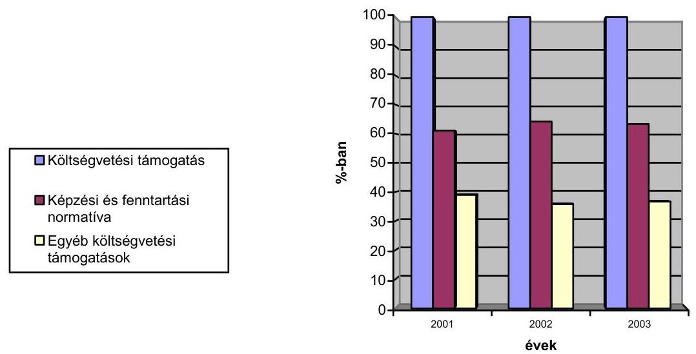

A képzési és fenntartási normatíva évenkénti aránya az állami támogatáson belül az ELTE-n 60,0\%-ot, $65,4 \%$-ot, és $61,9 \%$-ot, a SE-n $53,0 \%$-ot, $48,0 \%$-ot és $45,0 \%$-ot, a BGF-en 70,0\%-ot, 70,9\%-ot, és $72,7 \%$-ot, a BKÁE-en 58,0\%-ot, 60,0\%ot, és $83 \%$-ot, a SZTE-en $67,1 \%$-ot, $71,0 \%$-ot, és $72,2 \%$-ot, a PTE-en $64,9 \%$-ot, $55,8 \%$-ot, és $64,5 \%$-ot, a DE-en $57,6 \%$-ot, $54,2 \%$-ot és $59,4 \%$-ot, a ME-en 56,6\%-

---

ot, $44,9 \%$-ot-és $64,2 \%$-ot, a VE-en $66,0 \%$-ot, $64,9 \%$-ot, és $67,8 \%$-ot, a NYME-en $56,4 \%$-ot, $62,1 \%$-ot és $62,3 \%$-ot jelentett.

A képzési és fenntartási normatíva növekedési üteme a vizsgált időszakban az ELTE-n 17,4\%, és 33,0\%-al, a SE-n 10,0\%,és 23,0\%-al, a BGF-en 16,2\%, és 26,4\%al, a BKÁE-en 18,0\%, és 112,0\%-al, a SZTE-en 34,6\%, és 41,54\%-al, a PTE-en $16,9 \%$,és $29,4 \%$-al, a DE-en $27,6 \%$, és $21,4 \%$-al, a ME-en $16,8 \%$,és $27,5 \%$-al, a VE-en $14,7 \%$,és $29,0 \%$-al a NYME -en $26,2 \%$, és $21,6 \%$-al nőtt.

Az intézmények összességében 2001. és 2002. évben a kormány által képzési és fenntartási célra biztosított keretnél - a kormányrendelet által meghatározott felosztásban - többet, 2003. évben az elvonások miatt kevesebbet kaptak. Az intézmények forráshiányát az okozta, hogy a felsőoktatás képzésére és fenntartására biztosított keret nem igazodott a képzés és fenntartás ténylegesen szükséges költségeihez.

A normatív alapon történő finanszírozás ellentmondásokkal terhelt érdekeltségi viszonyokat teremtett, az anyagi-szellemi (humán) erőforrásokkal történő hatékony gazdálkodás követelménye nem érvényesülhetett kellőképpen. Az intézmények egyfelől a hallgatói létszám minél nagyobb ütemű növelésében voltak érdekeltek, hiszen ez által tudtak nagyobb összegű támogatáshoz jutni, miközben sem az intézmény, sem a fenntartó nem vizsgálta kellően a feltételeket, a hatékonyság kérdését. Nem került sor annak vizsgálatára, hogy a jelentkező reális igények mekkorák, s az intézmény erőforrásai lehetővé teszik-e az annak kielégítését biztosító tanulólétszám oktatását olyan szinten, amelyek a felsőoktatás elé tűzött kiemelt célok megvalósításához szükségesek. Másfelől az intézmények belső működési-finanszírozási viszonyai nem változtak meg lényegesen, továbbra is dominánsak maradtak az egyes karok megszerzett pozíciói és a javak bázis szemléletű elosztása.

A normatív alapon megállapított összegek évenkénti nagyságrendjének intézményi szintű ellenőrzési lehetőségét nehezítette, hogy az intézmények az OMtől a számított hallgatói létszámról csak részben kaptak információt. Ennek hiányában nem tudták megállapítani az intézmény és a minisztérium számításai közötti eltérést. Az intézményeknél az általuk nyilvántartott hallgatói létszám alapján - a kormányrendeletben meghatározott normatívák alapulvételével - a kapott támogatásnál nagyobb összeget kellett lebontaniuk a karok számára.

Az ELTE-n pl.: a vizsgált években a képzési és fenntartási normatíva 2001-ben + 217901 ezer Ft-tal, 2002-ben -154 154 ezer Ft-tal, 2003-ban -153 882 ezer Ft-tal tért el a kormányrendelet szerint számított (jogosult) normatív összegtől.

A BKÁE-et 2002-ben 69000 ezer Ft-tal, az SzTE-et 2002. évben 9295 ezer Ft-tal, a DE-et 2002-ben 218321 ezer Ft-tal, 2003-ban 163156 ezer Ft-tal alulfinanszírozta az OM.

A képzési és fenntartási támogatáson felüli költségvetési támogatás (feladatfinanszírozás) egyre nagyobb mértékben nőtt. Az OM azt a támogatási formát helyezte inkább előtérbe, mely odaítélése nem a képzési és fenntartási normatíva bonyolult számítási rendszerén alapult. A magasabb támogatás növek-

---

ményt a 2002. évi bérfejlesztés éves szintű kihatása befolyásolta, amely más előirányzat-csoportokban jelent meg (pl.: gyakorló iskolák, kollégiumok).

Az összes költségvetési támogatás növekedési üteme a helyszíni vizsgálat 10 intézményénél 2001-ről 2002-re és 2002-ről 2003-ra átlagban 24,5\%-al és 22,0\%kal nőtt.

A vizsgált években az intézmények szervezeti felépítésében a létszám struktúra megváltozott, így a normatíva csak bázis alapú elosztása az intézmények és a karok között egyenlőtlen elosztást eredményezett.

Pl. a hallgatói létszám tételes egyeztetésekor derült fény arra, hogy a BGF-en 2001-ben a Külkereskedelmi Főiskolai Kar és a Pénzügyi és Számviteli Főiskolai Kar Zalaegerszegi Intézete túlfinanszírozott volt, amely a 2002. évben tovább növekedett. A problémát két ütemben belső átcsoportosítással rendezték, 2002. évtől a képzési és fenntartási normatívát a tételes hallgatói létszám alapján osztják meg a karok között.

A képzési és fenntartási normatíva megoszlása személyi juttatásokra és járulékaira valamint dologi kiadásokra:
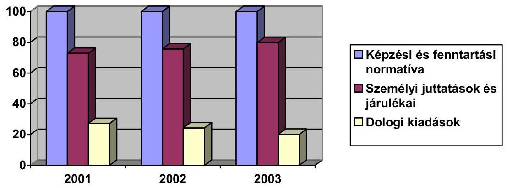

A költségtérítéses oktatás bevétele jelentős mértékben hozzájárult a képzési támogatás előirányzatának kiegészítéséhez.

A pályázati bevételek is dinamikusan nőttek, de főleg az OM-en kívüli pályázatokból volt az intézményeknek bevételük. Problémát jelentett a pályázatok egyre nagyobb mértékű utófinanszírozása, amikor meg kellett előlegezniük a teljes pályázati kiadást, és csak elszámolás után kapták meg a pályázott összeget. Az OM pályázatoknál az odaítélt támogatások több hónapos késéssel érkeztek az intézmények számlájára, és akkor is csak több hónapos ütemezésben, ami az intézményeket a támogatási összegek megelőlegezésére kényszeríttette.

A VE-en pl. problémát jelentett, hogy az elnyert pályázatoknál a pályáztatók előleget ritkán folyósítottak (területfejlesztési támogatások, FVM-től elnyert pályázatok). A VE-en 2003. év augusztusában a pályázati pénzekkel kapcsolatban 700 millió Ft - a költségvetés megközelítően 10\%-a - volt a megelőlegezett összeg.

---

A pályázati úton elnyert források felhasználása kötött, a gazdálkodásban nem biztosít mozgásteret, és problémát jelent a gép és műszerbeszerzéseknél a működtetés, mely csak a meglévő források terhére oldható meg.

A működőképesség csak a saját bevételek (tandíj, költségtérítéses képzés, bérleti díjak, szolgáltatási bevételek) kiegészítésével volt biztosítható. A dologi költségeik minimális fedezete mellett nem volt lehetőségük arra, hogy ösztönzőket építsenek a rendszerbe. A bérek kifizetéséhez nem rendeltek minőségi, vagy teljesítmény arányos követelményeket, azt csak a garantált oktatói béren felül lehetett volna megvalósítani.

A működőképesség fenntartása érdekében komoly takarékossági intézkedéseket kellett bevezetni a képzés és fenntartás tekintetében egyaránt.

Az ELTE-n az oktatók és kutatók kötelezettségeit, az ellátandó oktatói feladatokat, a kötelező óraterhelést szigorították. A karok szabályozása részletesen kifejti az ellátandó feladatokat. A munkaköri leírásokat, melyek a közalkalmazotti jogviszony létesítésének a feltétele, ez alapján készítik el. Az oktatói munkakört betöltő közalkalmazott a heti törvényes munkaidő, 40 óra harmadát, 13,3 órát, 2003 szept. 29-től felét, 20 órát köteles a munkahelyén tölteni. Szabályzatban rögzítették munkakörönként a heti átlagóraszámban kifejezett minimális oktatói tevékenységet.

A BGF oktatói követelményrendszerében meghatározott kötelező oktatói óraszám teljesítését folyamatosan figyelemmel kísérik, ellenőrzik. 2002. szeptember 1-jétől az államilag finanszírozott alapképzésben egységes óradíakat állapítottak meg, amelyre az oktatók csak akkor jogosultak, ha a besorolásukhoz tartozó kötelező óraterhelés felső határát éves szinten teljesítik.

A normatívához központilag nem rendeltek olyan arányszámot, amely meghatározhatta volna az oktatók heti óraszámát, a hallgató-oktató, a minősített és egyéb oktatók arányát.

A DE-n a veszteséges karok jelentős belső adósságot halmoztak fel, mely kerettúllépéseket a következő évek megtakarításaiból kellene törleszteniük, míg más karok megtakarításai a következő év előirányzatának a része. A gazdálkodási keretek betartása érdekében prémium rendszert vezettek be, melyet negyedévente, a gazdálkodási keretet betartó egységek vezetőinek fizettek.

A normatív finanszírozás a hallgatói létszám növelését, így a mennyiséget, és nem a minőséget preferálta. Csökkent a normatíva reálértéke, és az utóbbi évek árvíz problémája és takarékossági intézkedése nominálisan is csökkentette mértékét. Az ellátandó feladatok közül elsősorban a működtetés biztonsága és a felújítások elmaradása okozott gondot.

# 3.2. A normatív finanszírozás hatása az oktatás minőségére 

Intézmények szintjén oktatáspolitikai célok megfogalmazására nem került sor, a normatív finanszírozás azonban mindenütt elősegítette a hallgatói létszám növelését. Az oktatás minősége fejlesztése érdekében több intézmény dolgozott ki stratégiai tervet.

---

A PTE pl.: a hallgatói létszám emelését piacképes képzési portfolió kialakításával, és modern oktatás- módszertani eszközök alkalmazásával kívánja megvalósítani, az önköltséges, rövid, gyakorlatorientált szakirányú képzési programok arányának növelésével. Az oktatás- módszertani eszközök közül a hallgatók önálló munkaterhelésének növelését, illetve a „nyitott egyetem" megteremtését, a modern technika lehetőségeinek felhasználását (Internet, kábeltévé) tartja a legfontosabbnak.

A ME a képzési kínálat módosításával, új szakok indításához szükséges akkreditáció megszerzésével kívánt alkalmazkodni a változó igényekhez. Azonban a képzés szerkezetének változtatása az oktatás jellegéből adódóan időigényes folyamat, eredményei csak a megszűnő képzések kifutását követően érzékelhetőek. Elsősorban a költségtérítéses graduális és posztgraduális képzésben résztvevők számának növekedése volt jellemző. Az ebből származó saját bevételek viszont elsősorban a képzést szervező oktatási szervezeti egységek, az érintett oktatók érdekeltségét biztosították, az egyetem közös költségeinek viselésében nem játszottak meghatározó szerepet.

A képzési kínálat a piaci igényeknek megfelelően átalakult az ELTE-n, azonban a törvény előírása miatt olyan kis szakok oktatását is fel kellett vállalniuk, ahol az egy oktatóra eső hallgató arány nagyon alacsony. Ez a piaci kínálatot szélesítette, de ráfizetéses volt, mert a kis szakos képzés költségének fedezetét nem biztosították a képzéshez.

Az oktatás minőségének fejlesztése érdekében a normatív finanszírozás rendszere a minősített oktatók után járó külön normatív támogatással kívánta ösztönözni a képzés színvonalának javítását, aminek hatására kis mértékű elmozdulás volt tapasztalható 2001 és 2003 között. A vizsgált intézményeknél a minősített oktatók aránya átlagban az összes oktatókhoz viszonyítva 36,9\% volt. Ez a minőség javítását segítette, azonban a minősítések megszerzéséig tartó életpálya miatt az oktatók átlag életkora jelentősen megemelkedett. Jellemző volt a nyugdíj korhatár utáni foglalkoztatás. Viszont minél magasabb minősítésű egy oktató, annál kevesebb óraszámban kellett oktatnia, ami a minőség ellen hatott.

Azt hogy az intézmények milyen minősítésű oktatókat foglalkoztatnak, és hogy a hallgatói előadások, gyakorlatok megtartása kivel történjen, az intézmény saját hatásköre eldönteni, nincs rá előírás. A minősített oktatók számának emelésével a normatív finanszírozás összege emelhető volt, azonban a minősített oktatóknak kifizetett bértömeg is jelentősen emelkedett.

A vizsgálatba bevont intézményeknél a minősített oktatók kiemelt hatékonysági mutatóit elemezve megállapítható, hogy az egy számított oktatóra jutó egyenértékű hallgatók száma 2001-ről 2003-ra 30,0\%-kal nőtt. Az egy oktatóra jutó egyenértékű hallgatói létszám 6,0\%-kal nőtt.

Az egy számított oktatóra kifizetett bruttó munkabér a 2001-ről 2003-ra 47,0\%kal emelkedett. Az egy egyenértékű hallgatóra jutó bruttó oktatói bér 2001. évhez viszonyítva ennél alacsonyabb mértékben 31,0\%-kal nőtt.

Az oktatók összesen létszámába az egyéb oktatók is beletartoznak, míg a normatív finanszírozás az egyéb kategóriájú oktatókra nem számol normati-

---

vát. Az oktatók összesen létszámának 11,0\%-át alkotják az egyéb oktatók, nyelv,- és testnevelő tanár, mérnök,- és műszaki tanár, kollégiumi,- és gyakorlati oktatók.

A hallgatói keretszámokat a mindenkori hatályos kormányrendeletek határozták meg, azonban a keretszámok és a felvettek száma között 20,0-40,0\%os eltérés volt tapasztalható. A véglegesen betölthető hallgatói létszám az intézetek közötti versenyeztetés következtében dőlt el. Főiskolai alapképzésre a keretszámtól több, míg az egyetemi képzésre a keretszámtól kevesebb hallgatót vettek fel. A képzési formák és a vizsgált három év átlagában a keretszám és a felvettek száma kiegyenlítődött. A vizsgálatba bevont intézményeknél összességében az egyenértékű államilag finanszírozott hallgatói létszám 2001-ről 2002re 3,0\%-al, az oktatói létszám 2,0\%-kal nőtt, 2002-ről 2003-ra az egyenértékű államilag finanszírozott hallgatói létszám 8,0\%-kal, az oktatói létszám 2,0\%kal nőtt, ami az egy oktatóra jutó egyenértékű hallgatói létszám arányát javította. Ettől eltér a ME-en tapasztalt hallgatói létszám szerkezete, ahol a nem államilag finanszírozott hallgatói létszámban volt növekedés, és a főiskolai képzésben részvettek száma csökkent.

Az államilag finanszírozott képzésre felvett hallgatók keretszám meghatározása elméletileg munkaerő prognózison alapult, míg az intézmények a működési költségei finanszírozása érdekében a lehető legnagyobb számban vették fel a költségtérítéses képzésre jelentkezett hallgatókat. Képzésük költsége keveredett az államilag finanszírozott hallgatókéval. A fenntartási költséget a költségtérítéses képzés is befolyásolta. A végzett hallgatók elhelyezkedési lehetőségét a piaci kereslet befolyásolta, így a költségtérítéses képzésben végzett hallgató az állami finanszírozású hallgatói képzést teszi fölöslegessé, vagy a keresletét szűkíti.

Arról, hogy a végzettek közül hányan tudtak elhelyezkedni, vagy milyen életpályán haladtak tovább, az intézményeknek nincs visszajelzésük ${ }^{6}$ nem készítettek hallgatói elégedettségi méréseket sem, így a képzés társadalmi szükségessége és hallgatók véleménye nem visszaigazolható. Ezt az intézményeknek a minőségbiztosítási szabályzatukban kell szerepeltetniük, melyet még nem készítettek el (kidolgozásához az OM útmutató formájában segítséget is adott). Hasonló vizsgálatot végzett 2003-ban a „Shanghai Jiao Tong Univers" Egyetem nemzetközi viszonylatban kétezer felsőoktatási intézményre kiterjedően.

A felsőoktatási intézmények értékelésénél figyelembe vették a kiemelkedő tudományos és kutatási teljesítményt nyújtó oktatók számát, az elnyert Nobel-dijakat, a megjelent tudományos publikációkat a természet- és társadalomtudomány területén, valamint a cikkek idézettségét. A vizsgálatot végző kutatók az anyaghoz füzött előszavukban elismer-

[^0]
[^0]:    ${ }^{6}$ A PTE létrehozta a végzett hallgatókat tömörítő Pécsi Diplomások Körét. Folyamatos, aktív kapcsolatot kíván tartani a PTE valamennyi végzett hallgatójával.

---

ték, hogy nagyon nehéz pontosan mérni egyes intézmények hímevét, vagy az ott végzett munka minőségét.

A vizsgálat szempontjai szerint a Harvard Egyetem áll az első helyen, a magyar egyetemek közül az SZTE a leginnovatívabb, a 201. helyre értékelték és 401. helyre került az ELTE.

Az egy számított oktatóra jutó egyenértékű hallgató arány az ELTE-n mind a három évben 11 fő, de 2003-ban 2,8\%-al minimális növekedést mutat.

Egy számított és minősített oktatóra jutó egyenértékű hallgatók számának alakulása
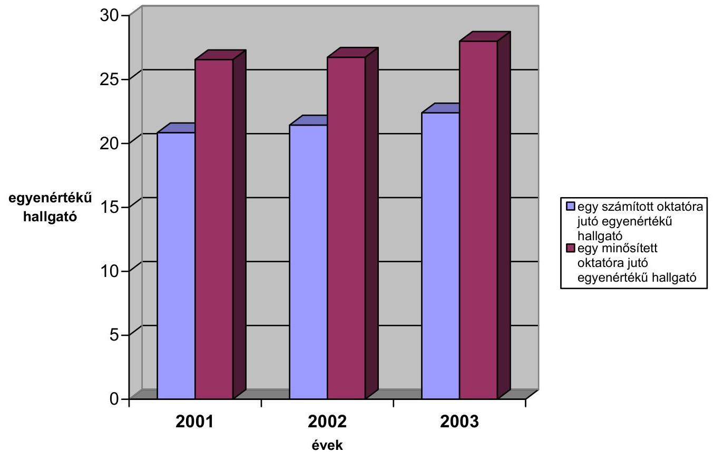

---

Az átlagos lemorzsolódási adatokat az intézményekben tanuló hallgatók számának súlyozásával határoztuk meg. Az adatok elemzése a kormányrendeletben meghatározott értékek és az intézményi tényleges lemorzsolódási adatok összevetésén keresztül azért lényeges, mert a ténylegesen finanszírozott hallgatói létszám és a számított hallgatói létszám összehasonlításából lehet meghatározni a finanszírozási többletet vagy az alulfinanszírozás mértékét.
Az ellenőrzött intézményeknél a tényleges lemorzsolódási adatok a nappali ok-

# Intézményi lemorzsolódási adatok alakulása 

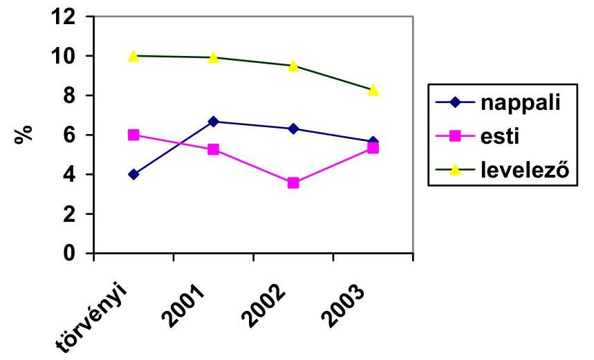
tatási formában meghaladták, míg a levelező és esti képzés esetében alatta maradtak a kormányrendelet szerinti mértéknek. A képzési és fenntartási támogatás ennek alapján meghatározott értéke, amit az intézmények az egyenértékű hallgatói létszám alapján megkapnak, a nappali oktatás esetében több, míg a másik két oktatási forma alapján kevesebb, mint amennyi a viszszaosztás alapján járna. A súlyozott lemorzsolódás három évi átlaga szerint, a nappali képzésben $6,2 \%$-os a lemorzsolódás, az estin $4,7 \%$-os, a levelező képzésben $9,2 \%$-os.

A rendszer finanszírozási oldalról jutalmazza azon intézményeket, ahol a lemorzsolódási arány nagyobb, mint a kormányrendeletben meghatározott. A magas lemorzsolódási arány - más mérhető mutatók hiányában - nem egyértelmű jelzőszáma az oktatás minőségének, színvonalának. A lemorzsolódási adatok elemzését ugyanakkor a kreditrendszer bevezetése miatt is célszerű kellő mértéktartással kezelni.

Az ELTE-n pl. lemorzsolódás ténylegesen minden évben és az oktatás minden formájában alacsonyabb volt a jogszabályban megállapított mértéknek.

A SE-n pl.: Kedvezőtlen hatással volt a kapott normatív támogatásra a lemorzsolódási százalékok alakulása. A tényleges lemorzsolódás a nappali képzésnél 2001 és 2002-ben 1,0\%-kal 2003-ban pedig 2,0\%-kal maradt el a kormányren-

---

deletben meghatározott 4,0\%-hoz képest. Figyelembe véve azt a tényt, hogy az Egyetemen folyó képzés esetében az államilag finanszírozott nappalira átszámított hallgatói létszámon belül a ténylegesen nappali képzésben résztvevő hallgatók aránya 95-96\% között volt, a normatív alapú támogatás összegére csökkentőleg hatott.
A ME-en a hallgatók lemorzsolódása az egyes karokon, szakokon, képzési formákban eltérő. Az intézményi szintű lemorzsolódási adatok a nappali képzésben csökkenő irányzatot mutatnak (a 2001. évi statisztika szerinti 21,0\%-ról 2003. évben $18,0 \%$-ra csökkent), azonban így is több mint négyszerese a finanszírozási rendeletben szereplő $4 \%$-os lemorzsolódási aránynak. Ugyanakkor a levelező oktatásban a hallgatók lemorzsolódása a 2001. évi 19,0\%-ról 2003. évre 31,0\%-ra nőtt, főként az e képzési formában meghatározó költségtérítéses képzésben résztvevők körében. Az eltérő adatok a hallgatók eltérő felkészültségét és a velük szemben támasztott követelmények következetes érvényesítését tükrözik.

# 3.3. A normatíva felhasználásának belső és külső ellenőrzése 

A felsőoktatás normatív finanszírozása ellenőrzésére a teljesítményellenőrzés módszerével korábban sem külső, sem belső ellenőrzés keretében nem került sor sem az intézmények, sem a rendszer egészének tekintetében.

## 4. A NORMATÍVA ALAPJÁN TÖRTÉNŐ INTÉZMÉNYI FINANSZÍROZÁS HATÉKONYSÁGA

A képzési és fenntartási normatíva alapján történő finanszírozás rendszere néhány extenzív mutatót használ a bázis alapon megtervezett költségvetési források felosztására. A kormányrendelet nem határozott meg a finanszírozásra vonatkozó minőségi elvárásokat, hatékonysági mutatókat, úgy ahogy azt az Ftv. előírta, és a felügyeleti szerv hatáskörébe utalta, aki ilyen elvárásokat nem fogalmazott meg. Az intézményeknél, de az egyes karok és szakok szintjén is, a felsőoktatási tevékenység értékelésére vonatkozóan rendelkezésre állnak, vagy kialakíthatók olyan adatbázisok, amelyekből levezethetők, meghatározhatók a minőségi elvárások, a rendelkezésre álló normatíva felhasználásának hatékonyságát, célszerűségét mérhetővé tevő mutatók. Ebbe a csoportba tartoznak a közalkalmazotti felméréshez, a hallgatói adatszolgáltatáshoz vagy az éves MAB jelentésekhez tartozó adatbázisok. A feladat megoldásához szükséges egy, a rendelkezésre álló belső adatbázisokat egységesen feldolgozó belső kontrolling rendszer kiépítése. Ennek keretében kialakítható egy olyan adatbázis, aminek megteremtésével és folyamatos karbantartásával mérhetővé válik az egyes intézményekben folyó oktatási tevékenység minősége, célszerűsége és hatékonysága, és lehetőség nyílna a teljes felsőoktatás vonatkozásában az összehasonlításra az intézmények, az egyes karok, vagy szakok területén is.

### 4.1. A képzési és fenntartási normatívához kapcsolódó hatékonysági mutatók alkalmazása

A helyszíni vizsgálatba bevont felsőoktatási intézmények nagy részénél nincs kidolgozva a felsőoktatás normatív finanszírozásához kapcsolódóan hatékonysági mutató, a tevékenység minőségére vonatkozó elvárás. Nem kerültek meghatározásra a decentralizáltan múködő karok és szervezeti egységek vonatko-

---

zásában az intézményeken belül sem hasonló mutatók. Néhány intézmény (VE, BGF, NYME, ELTE) esetében állapította meg a helyszíni vizsgálat, hogy részben belső elemzésekhez kapcsolódóan, részben a beszámolókban meghatározott és elemzett bizonyos, a normatív finanszírozáshoz kapcsolódó hatékonysági mutatókat.

A rendelkezésre bocsátott források szűkössége arra kényszeríti az intézményeket, hogy elsősorban ott, ahol jelentős belső és külső adósságállomány halmozódott fel, megkezdjék a tevékenység hatékonyságának, gazdaságosságának méréséhez szükséges mutatórendszer kidolgozását, nemcsak intézményi, hanem az önállóan gazdálkodó karok illetve szervezeti egységek szintjén is. Erre többnyire az egyes felsőoktatási intézmények szintjén kidolgozott Intézményfejlesztési tervkeretében, vagy a külső és belső adósságállomány csökkentését és felszámolását célzó intézkedési tervek keretében került sor. A ME az integrációs pályázat keretében kidolgozott Intézményfejlesztési tervhez kapcsolódó cselekvési tervben belső pénzügyi allokációs modell kidolgozását célozta meg. Ennek keretében kívánták megvalósítani az átoktatás figyelembevételével a normatívák belső allokációs modelljét a normatív finanszírozás hatékonysági mutatóinak való megfelelés mellett. A munka elkezdődött, de nem sikerült kialakítani egy egységesen elfogadott időtálló mutatórendszert. Hasonló tapasztalat volt a SZET esetében, ahol az intézmény fejlesztési terv keretében célul tűzték ki a minőségbiztosítás kialakítását, a hallgató oktató arányok javítását, belső erőforrás allokációs rendszer, költségcsökkentési stratégia kidolgozását. A PTE-en 2004-től kezdték meg a gazdálkodási célok megvalósításához igazodóan pénzügyi és oktatási mutatók kialakítását. A SE a külső és belső adósságállomány felszámolásához kapcsolódó intézkedési tervben határozta meg, az egyes tevékenységek költségeinek méréséhez szükséges szakmai elvek megfogalmazását, a tevékenység minőségi és mennyiségi mérésére használható mutatórendszer kialakítását. A BKÁE gazdálkodási szabályzatának 7. § (16) bekezdésében rögzítette az oktatási tevékenység mérésének elveit, amely szerint az oktatásra fordított időn és az oktatott létszámon túlmenően számos más tényezőt figyelembe vevő pontozásos rendszer alkalmazható.

A bemutatott felsőoktatási intézményeknél a teljesítmények minőségi és menynyiségi méréséhez szükséges mutatórendszer kialakítása elkezdődött, de még mérhető értékelhető eredményt nem hozott. Ennek oka többnyire az, hogy a kidolgozott intézményfejlesztési, a külső és belső adósságállomány csökkentésére készített intézkedési tervekben az intézmények az önmaguk számára kijelölt határidőket nem tudták tartani.

A tevékenység minőségének, hatékonyságának, gazdaságosságának, célszerűségének mérésében előbbre járó intézmények közül a BGF esetében a költségvetés tervezésénél elsősorban az egyes évek összehasonlításával képeztek a létszámra, a költségvetési támogatásra, a helyiségekkel, egyéb eszközökkel való gazdálkodásra vonatkozóan mutatókat (pl. egy államilag finanszírozott hallgatóra jutó költségvetési támogatás, egy költségtérítéses hallgatóra jutó múködési bevétel, egy hallgatóra jutó összes kiadás, egy oktatási funkciójú négyzetméterre jutó összes költség, egy hallgatóra jutó oktatási négyzetméter, egy könyvtári férőhelyre beiratkozott hallgatók száma stb.).

---

A VE-en egy szakra egy hallgatóra vetítetten határoztak meg költségeket, hallgatói közvetlen oktatási, kari, múködési költségeket.

A NYME-en részben a 2002. évi beszámolóhoz, részben már a 2004. évre vonatkozó tervezéshez kapcsolódóan alakítottak ki olyan mutatószámokat, mint a hallgatói létszámra jutó múködési költség, összes kiadás, múködési bevétel, költségvetési támogatás, saját bevételi fedezet, az egy hallgatóra jutó oktatói létszám finanszírozási csoportonként, oktatói teljesítmények stb.

Összességében megállapítható, hogy a vizsgált felsőoktatási intézmények mindegyikénél a kapott források szűkössége, az egyeseknél felhalmozódott külső és belső adósságállomány kikényszerítette a teljesítmények méréséhez kapcsolódó mutatórendszer kialakítási folyamatát, amely azonban még igen kezdetleges fázisban van. Megítélésünk szerint a folyamat sokkal hatékonyabbá válhat, ha a tapasztalatok alapján a szaktárca és az intézmények közösen kialakítanak egy egységes mutatórendszert, amely alkalmassá válhat részben a tevékenység hatékonyságának, célszerűségének, gazdaságosságának és minőségének időbeni mérésére, részben az egyes intézmények közötti összehasonlítások elvégzésére.

# 4.2. A hatékonysággal kapcsolatos gyakorlati tapasztalatok 

A felsőoktatási intézmények sokszínűségük, nagyságrendjük, tevékenységük volumene, az ott folyó oktatási és egyéb tevékenységek komplexitása miatt is igen nagy eltéréseket mutatnak. Ugyanakkor, egy átlátható, világos, belső gazdálkodásról alkotott kép kialakítása, a tevékenység teljesítményének mérése iránti igény jelenik meg. Ennek megvalósítása azonban szükségessé teszi az egyes tevékenységre felhasznált források elkülönítését, mérését a meglévő információs rendszerek és a jelenleg külön kezelt egyéb adatbázisok áttekintését, egységes rendszerbe szervezését. Ahhoz, hogy a hatékonysági mutatók segítségével mérhetővé váljon az intézmények, karok tevékenysége, szükséges megteremteni az egyes tevékenységekhez kapcsolódó költségek mérésének feltételeit intézményi, kari és szervezeti egységszintű költségfigyelését, valamint a hatékonyan gazdálkodó szervezetek érdekeltségének biztosítását.

A tevékenység sajátosságából adódóan, igen magas az élőmunka arány, emiatt a költségszerkezetben megjelenő, összességében a vizsgált időszakban átlagosan $65,2 \%$-ot kitevő de 2003 -ra $81,8 \%$-ot elérő személyi juttatások és járulékainak hatékony, célszerű és gazdaságos felhasználása a legfontosabb tényező. Ebből adódóan szükséges az egyes intézmények de ezen belül a karok és szervezeti egységek szintjén is meghatározni a feladat ellátásához szükséges kapacitásokat. Ezt támasztja alá, hogy a külső és belső adósságállománnyal küzdő intézmények intézkedési terveikben ez, valamint a létszámmal történő gazdálkodás vizsgálata elsődleges elemként jelenik meg.

Az intézmények kialakították belső szabályzataikat az oktatói követelményrendszer alkalmassági feltételeire vonatkozóan. A terhelési követelmények meghatározásakor már árnyaltabb a kép, itt a helyszíni vizsgálatba bevont intézmények közül a PTE, ME, SE, NYME, VE esetében ez nem került kialakításra. Más intézmények esetében, mint az ELTE, BKÁE, BGF kialakításra került. Ezeknél az intézményeknél is változó a kialakított rendszer ada-

---

tainak figyelése és kiértékelése. Alkalomszerűen belső vizsgálat keretében valósult meg pl. a BKÁE esetében 2000 - 2001. évek vonatkozásában, máshol a nyomon követés folyamatos pl. a BGF-en. Az oktatói kapacitás sehol nem került megállapításra. Ennek alapján nem mérlegelték vagy értékelték ki az esetleges kapacitás - felesleg vagy - hiány levezetésének módjait. A humánerőforrás gazdálkodás hiányosságaira utal az átoktatás és áthallgatás kérdéskörének részbeni rendezése vagy rendezetlensége is. A SZTE esetében az erre vonatkozó belső szabályzat elfogadására 2003-ban került csak sor, az eredmények vonatkozásában még következtetést levonni korai lenne.

A személyi juttatások vonatkozásában szükséges a nem oktatói létszámok áttekintése és az adminisztratív költségek elemzése, az elvégzett feladatok vizsgálata, a felesleges munkakörök megszüntetése, és a gazdaságos múködtetés feltételeinek megteremtése. Összehasonlítási lehetőséget biztosító mutatókat kell kialakítani, ami segítség lenne az egyes intézményeknek.

Az anyagi erőforrások hatékony felhasználása vonatkozásában még kedvezőtlenebb a helyzet. Ez adódik részben abból, hogy az erre a célra fordítható források a maradék elv alapján kerültek meghatározásra tekintettel arra, hogy az intézmények a közalkalmazotti garantált illetmény miatt igen kis mozgástérrel rendelkeztek, és a kapott támogatásból először a béreket biztosították, ezt követték a közüzemi díjak, általános költségek. Az intézmények eltérő infrastruktúrájú, életkorú épületekben tevékenykedtek. Hasonlóképpen nagyon eltérő adottságokkal rendelkeztek a szükséges laboratóriumi és egyéb gépek berendezések műszaki állapotára, életkorára és fejlettségi színvonalára vonatkozóan. Ennek megfelelően a fenntartási költségek vonatkozásában még kevésbé álltak rendelkezésre akár hatékonysági mutatók, akár a felhasználás gazdaságosságára vonatkozó tapasztalatok. Ezekkel a kiadásokkal kapcsolatban elmondható, hogy a normatív támogatás egyre kisebb mértékben nyújtott rá fedezetet. Az ingatlanok állapota egyre inkább romlik, a laboratóriumi berendezések, műszerek gépek egyre elavultabbak, elhasználtabbak lesznek. Rontja a helyzetet az is, hogy erre a célra közvetlen pályázati pénzek sem igazán vehetők igénybe. Ugyanakkor a működés biztosításához az intézményeknek egyre nagyobb sajátbevételt kellett elérniük. Ezek a bevételek a költségtérítéses oktatásból, eszközhasznosításból valósulhattak meg. Az elérhető bevételek mértékét jelentősen befolyásolta a nyújtott szolgáltatás színvonala és a fizetőképes kereslet megléte. Ez utóbbi különösen igaz a költségtérítéses oktatás vonatkozásában. E miatt az itt keletkező bevételek sem tudnak kellő mértékben hozzájárulni az anyagi műszaki feltételek megújulásához. Ugyanakkor ezek a bevételszerző tevékenységek maguk is használják az infrastruktúrát, és hozzájárulnak elhasználódásukhoz. E miatt a felújítások, karbantartások, a fenntartás területén folyamatos leépülés volt tapasztalható, ahol nagyon nehéz bármilyen hatékonysági rendszer kialakítása.

A normatív finanszírozás jelenlegi rendszere azáltal, hogy nem rendelt a normatívákhoz egyértelmű mutatórendszert, ami a lehetővé tette volna, az oktatási tevékenységekhez kapcsolódó költségek, a nyújtott teljesítmény eredményeinek mérését, egy nehezen átlátható helyzetet eredményezett, ahol az egyes intézmények a források elégtelenségére hivatkoznak. A támogatás nyújtója pedig a költségvetési források szűkösségét hangoztatja. A helyzet feloldására a kitöré-

---

si pont a saját bevételek jelentős növelésében látszott. Ez viszont azt eredményezte, hogy a vizsgált időszakban 11\%-kal megnövekedett egyenértékű államilag finanszírozott hallgatói létszám mellett elsősorban a kurrens, piacon keresett szakoknál bekövetkezett költségtérítéses hallgatói létszámok növekedése miatt, a költségtérítéses képzésben részt vevő hallgatók aránya elérte az összes felsőoktatásban részt vevő hallgatók több mint 34,7\%-át. (OM Indikátor alapján) A Felsőoktatásról szóló 1993. évi LXXX. törvény 9/G §-a értelmében a költségtérítéses oktatás díjainak legalább a ráfordításokat kell biztosítania, beleértve a kincstári vagyon hasznosításáért járó díjakat is.

Az intézmények döntő része nem rendelkezik önköltség-számítási szabályzattal, és nem végez ilyen típusú költségfigyelést.

A helyszíni vizsgálatba bevont intézmények közül ez a helyzet a VE, SZTE, ME, SE, NYME, PTE, DE, BKÁE, esetében. A BGF erre vonatkozó szabályzatát 2003-ban fogadta el. Az ELTE rendelkezik ilyen szabályzattal és végez is ilyen számításokat.

Az önköltségszámítás hiánya miatt nem határozható meg az egyes intézményekben, karokon szerzett diplomák költsége, ára. Ez kedvezőtlen részben azért, mert az állami finanszírozás esetében sem mondható ki egyértelműen, mi hol mennyibe kerül, másrészről nem határozható meg az sem, hogy a költségtérítéses képzések valóban mit hoznak az intézmények és egyes karok számára. Ennek egyik oka a költségek nem pontos elhatárolása, egyrészt a dologi költségeknél, másrészt az oktatói követelményrendszer terhelési részének kidolgozatlansága miatt, a személyi juttatások, az élőmunka költségeinél. Előfordulhat, hogy az a költségtérítéses oktatás, amelyen az intézmény abszolút értékben jelentős bevételt realizál, a fölös kapacitások levezetését szolgálja, ami alapjában nem javítja, esetenként akár rontja a gazdasági helyzetet.

Az élet azonban e téren is kezdte kitermelni az első pozitív példákat. A BKÁE és BGF esetében az oktatói követelményrendszer terhelési oldalának kidolgozását követően végeztek erre vonatkozó ellenőrzéseket és elemzéseket, aminek eredményeként figyelték, és számon kérték a követelmények teljesítését (a túlteljesítés elismerésével és az alulteljesítés szankcionálásával).

Általában elmondható, hogy az önköltségszámítás helyett az intézmények nagyobb része egy, a leosztott költségvetési keretek figyelésére alkalmas „keretnyilvántartási, kontrolling" rendszert vezetett be, mint SE, DE, ME, VE, DE, SZTE, PTE, míg mások, mint az ELTE és a ME nem vezetett be ilyen vagy hasonló rendszert. Azok az intézmények, amelyek az egyes gazdálkodó egységekre leosztott költségvetési keretek alakulását figyelemmel kísérik, többnyire a tények regisztrálására törekedtek csak és nem rendeltek hozzá érdekeltségi rendszert, illetve hatékonyság és gazdaságosság mérésére alkalmas mutatókat. Ezeknél a keret betartása vagy túllépése került regisztrálásra, és csak esetleges jelleggel elemezték mélyebben azokat az okokat, amelyek a keretek betartását vagy túllépését eredményezték, valamint túllépés esetén sem igazán került sor szankcionálásra. Ez hozzájárult a belső és külső adósságállomány kialakulásához. Ennek eredményeként a gyakorlat kényszerített ki megoldásokat, mint a DE, vagy BKÁE esetében.

A DE a költségvetési egyensúly biztosítása, a gazdálkodási keretek betartása érdekében a felelős vezetők (rektor, gazdasági főigazgató, centrumok elnöke,

---

gazdasági főigazgató helyettesek, karok, önálló intézetek, kutatóintézetek vezetői, önállóan gazdálkodó központi egységek, szervezeti egységek vezetői, gyakorló iskolák igazgatói) részére 2002. január 1-jétől érdekeltségi rendszert vezetett be. Negyedévente a vezetői szinttől függően változó ( 230 ezer Ft-tól 465 ezer Ft-ig terjedő) összegű prémiumot fizettek abban az esetben, ha a vezetői szinthez tartozó egységnél a gazdálkodási keretet minden hónapban betartották. A megtakarítást - a százalékosan meghatározott nagyságrendtől függő - kiegészítő prémiummal ösztönözték. A vezetők részére ilyen címen 2002. évben járulékaival együtt 76,8 millió Ft-ot fizettek ki. A prémiumra jogosító munkakörök száma 37 volt, ebből egy központi egység, két kar és egy gyakorlóiskola vezetője nem részesülhetett díjazásban. További érdekeltségi szabályzatokat dolgoztak ki az alsóbb szintű vezetők és beosztott közalkalmazottak részére a centrumok és azon belül az egyes karok szintjén is. A BKÁE-n, 2003. júliusától úgy módosították az oktatói követelményrendszer terhelésre vonatkozó részének szabályozását, hogy a követelmények éves szinten történő túlteljesítése elismerhető, míg a nem teljesítés szankcionálható.

# 5. A KÉPZÉSI ÉS FENNTARTÁSI NORMATÍVA HATÁSA AZ ESÉLYEGYENLŐSÉG MEGTEREMTÉSÉRE 

A 101/2001. (XII. 21.) OGY határozat szerint a Kormánynak kiemelt feladata a felsőoktatás fejlesztése terén a hallgatók részére nyújtott szolgáltatások bővítése, minőségének, színvonalának emelése, a tehetséggondozás elsősorban a tudományos diákkörök, szakkollégiumok, doktori iskolák támogatása, a minőségi oktatók megtartása és utánpótlása. Ugyanakkor a kormányrendelet rendelkezik a fogyatékkal élő hallgatók támogatásáról, hogy tanulmányaik folytatásában csökkenjen egészséges társaikkal szembeni hátrányuk.

A leírtak alapján a képzési és fenntartási normatíva esélyegyenlőségre gyakorolt hatása egyrészt a különböző felsőoktatási intézményekben tanuló hallgatók, másrészt a fogyatékkal élő hallgatók részére biztosított segítségként, esélyegyenlőségként értelmezhető.

A fogyatékkal élő hallgatók részére járó támogatás egy hallgatóra jutó összege 84 ezer Ft/fő/év, 2003. 1. 1-jétől 100 ezer Ft/fő/év, amit az intézmények a célnak megfelelően használtak fel. Összegszerűségében ez nem jelentős nagyságrend. (Nem megoldott a felsőoktatási intézmények legnagyobb részénél a fogyatékkal élő hallgatók közlekedési lehetősége, oktatótermekben való elhelyezése stb.)

Az esélyegyenlőség növeléséhez tartozik az oktatás minőségének emelése a minősített oktatók fokozott támogatása útján. A hagyományos, bázis alapú költségvetési tervezéstől eltérően, a normatív finanszírozás rendszere a hallgatói létszámhoz kötötte a kapott támogatást, ezáltal egyrészt preferálta a hallgatói létszámnövekedést, másrészt azonos szakok mellett, azonos létszámhoz azonos támogatást rendelt. Vagyis egy ugyanazon szakon tanuló hallgató képzési és fenntartási normatívája azonos, teljesen függetlenül attól, hogy tanulmányait az ország mely felsőoktatási intézményében végzi. A rendszer ezáltal kívánta kiegyenlíteni a korábbi időszakok esetleges különbségeit, illetve azonos anyagi lehetőségek hozzárendelésével azonos feltételek kialakítását teszi lehetővé az infrastrukturális háttér, a könyvtári szolgáltatások, számítógép és Internet hoz-

---

záférés, tantermi, kollégiumi bútorok, kollégiumi adottságok, demonstrációs eszközök, laboratóriumi felszerelések, sportolási lehetőségek stb. tekintetében, a rendelkezésre álló költségvetési források mértékéig.
A rendelkezésre álló pénzügyi források szűkössége, valamint a személyi juttatások kiegyenlítésének elsődlegessége miatt ezekre a területekre egyre csökkenő mértékű összeg jutott, így a finanszírozási rendszer kínálta esélyegyenlőségi előnyök kihasználatlanul maradtak.
Összességében megállapítható, hogy a normatív finanszírozás rendszere elvileg a hallgatói esélyegyenlőség megteremtése szempontjából kedvezőbb feltételeket teremtett, mint egy hagyományos bázisszemléletű támogatási felosztás. Ez részben érezhető a minősített oktatók és államilag finanszírozott doktoranduszok számának növekedésében, ami az oktatás színvonalának emelésére és az oktatói utánpótlás biztosítására hatott kedvezően. Ugyanakkor a rendelkezésre bocsátott forrásokon belül elsősorban a központilag elrendelt béremelések miatt az intézmények reálértéken egyre kisebb összegeket tudtak fordítani az oktatás anyagi feltételeinek biztosítására. Ennek eredményeként tovább romlott a kollégiumi ellátás helyzete, a laboratóriumok felszereltsége elmaradt a szükséges színvonaltól, nem megfelelő a könyvtárak fejlettsége, a hallgatók számítógépes hozzáférési lehetősége, romlott az oktatási épületek állaga, a megnövekedett hallgatói létszám miatt egyre zsúfoltabbá váltak a tantermek. A gyakorlatban a normatív finanszírozásnak a hallgatói esélyegyenlőség megvalósulásához való hozzájárulása csak igen korlátozottan érvényesülhetett.
A 101/2001 (XII. 21.) számú OGY határozat előírta a Kormány számára, hogy kétévenként számoljon be a határozatban foglaltak megvalósulásáról. Erre első ízben 2003. december 31-ig kellett volna sort keríteni, elmaradása sérti az OGY. határozatban foglaltak végrehajtását.
Budapest, 2004. július " $8^{\prime \prime}$

| Mellékletek | 6 db | 34 lap |
| :-- | :-- | :-- |
| Függelék | 1 db | 9 lap |

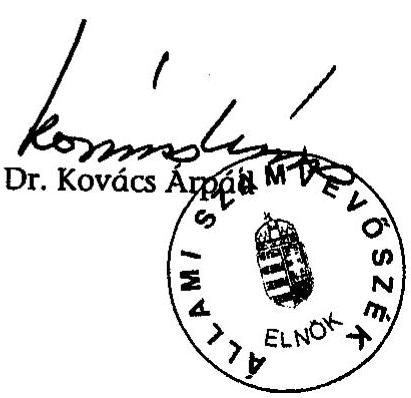

---

# 1. sz. melléklet 

a V-31-93/2003-04. jelentéshez

## ÉSZREVÉTELEK

---

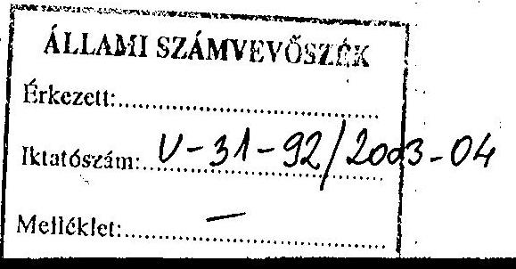

Ügyiratszám: 13252-6/2004.

Dr. Kovács Árpád
elnök
Állami Számvevöszék
Budapest

# Tisztelt Elnök Úr1 

Megköszönöm az Állami Számvevôszék körültekintô és érdemi vizsgálatát a felsőoktatás normatív finanszírozási rendszeréröl.

A megküldött jelentéshez észrevételt nem teszünk és jeizem, hogy a javaslatuk alapján elkészített intézkedési tervet július 21-ig megküldjük.

Budapest, 2004. július 2.
Tisztelettel:
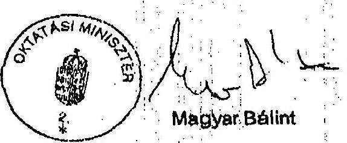

---

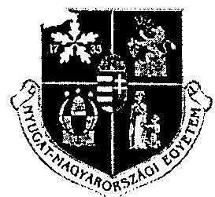

# Nyugat-Magyarországi Egyetem Rektora 

9400 Sopron, Bajcsy-Zsilinszky u. 4. 9401 Sopron, Pf.:132

Tel: 99/518-142, Fax/tel: 99/312-240
e-mail: rectoro@nyme.hu

Iktatószám: R-442-1/2004.
Tárgy: tájékoztatás

Állami Számvevőszék
Bihary Zsigmond
föigazgató
Budapest
Pf.: 54
1364
fax: 06-1/484-9200
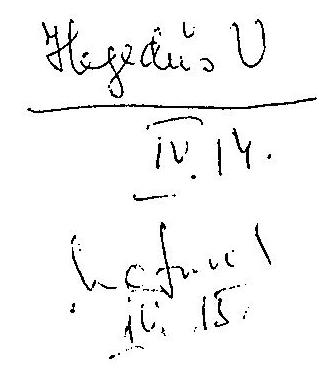

ÁLLAMI SZÁMVEVÓSZÉK ÜGYVITTII IRODA
Erkeze1t 2004 A20 13.
Iktatószám: 974 2005/04
Melléklet: 974 10 103-04

Tisztelt Föigazgató Úr!

Hivatkozva a 2004. március 22-én kelt V-31-74/2004. iktatószámú levelükre tájékoztatjuk, hogy a felsőoktatás normatív finanszírozási rendszere müködésének ellenőrzéséről készített Állami Számvevőszéki jelentésben foglaltakkal egyetértünk.

A késedelmes válaszunkért szíves elnézésüket kérve, további eredményes munkát kívánva, üdvözlettel:

Prof. dr. Faragó Sándor rektor

Sopron, 2004. április 07.

---

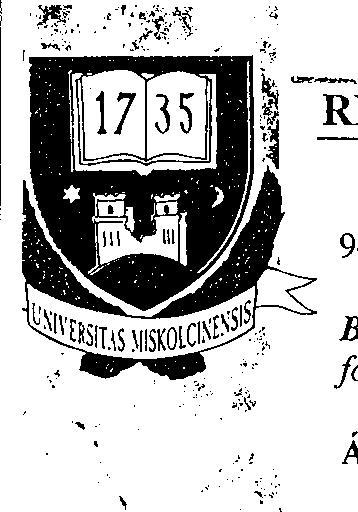

Rektor:
Prof. Dr. Besenyei Lajos

Rektorhelyettesek:
Prof. Dr. Páczelt István Shatanos

Prof. Dr. Nagy Aladár nemzetközi kapcsolatok

Prof. Dr. Patkó Gyula tudományos

Prof. Dr. Bíró György tanulmányi

Vállalkozási és befektetési igazgató:
Dr. Szakály Dezső

Humánpolitikai igazgató: Prof. Dr. Lukács János

Gazdasági - mászaki
Főigazgató:
Dr. Magyar György

Föritkár:
Kovács Viktor

## REKTOR

949-R/2004.BK
Bihary Zsigmond úrnak
föigazgató
Állami Számvevőszék
Budapest
Apáczai Csere János u. 10.
1052

Tisztelt Föigazgató Úr!

A felsőoktatás normatív finanszírozási rendszere működésének ellenőrzéséről készített jelentés-tervezetet áttanulmányoztuk. Az abban foglaltakat az intézményünk gazdasági érdekei előmozdítása szempontjából is tárgyszerűnek, tényszerűnek, szakszerűnek és jogszerűnek tartom.

Miskolc, 2004. április 7.

Tisztelettel:
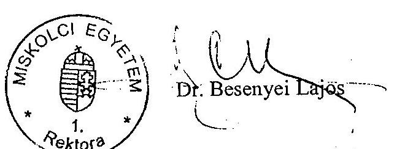

# MISKOLCI EGYETEM 

3515 Miskolc - Egyetemváros, Pf.: 1.
Tel.: (46) 565-010 Fax: (46) 565-014, 563-429
E-mail: stbes@uni-miskolc.hu, http://www.uni-miskolc.hu

---

Budapesti
Közgazdaságtudományi és Allamigazgatási Egyetem

Rektor A V-31-9/2003-04.sz.jelentéshez
1093 Budapest, Fővám tér 8.
E-mail: tamas.meszaros@bkae.hu Telefon: 217-6268 Telefax: 217-8883
Internet: www.bkae.hu
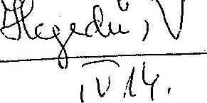

Bihary Zsigmond
Főigazgató úr részére
Állami Számvevőszék
Budapest
Apáczai Csere J. u. 10.
1055
$922 / 04$
R-530/1/2004
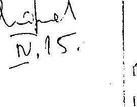

ÁLLAMI SZÁNIVEVŐSZÉK
ÜGYVITEL: RODA
Erkerelt: 2006 APR 13.
Iktatószám: A574 2013/54
Melléklet: 217-6268
- Anell

Tisztelt Főigazgató Úr!

Mellékelten küldöm az Állami Számvevőszéki Jelentéshez füzött észrevételeimet.

Budapest, 2004. április 5.

Tisztelettel:
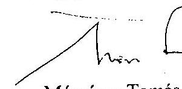

Mészáros Tamás
rektor
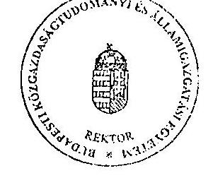

---

# . argy: Észrevételek az ÁSZ-jelentéshez 

Észrevételek "a felsőoktatás normatív finanszírozási rendszere müködésének ellenőrzéséről" szóló ÁSZ-jelentéshez (2004. március)

A jelentés mind az összefoglaló részben, mind a részletes fejezetekben lényegre törő és reális megállapításokat tesz a normatív finanszírozás elvi kérdéseiről és gyakorlatáról egyaránt. Intézményi szinten is és a normatív finanszírozással hosszú évek óta szakértői szinten is foglalkozva (képviselőink az FTT-ben, annak pénzügyi albizottságában, illetve a CSEFT kidolgozásában vettek részt, véleményünket különböző értekezleteken, munkaanyagokban fejtettük ki) teljes mértékben egyetértünk azokkal a megállapításokkal, amelyek szerint

- "... a kezdetben tényadatokon és elvi megalapozottsággal kialakított normatívák szinte minden évben módosultak, de a változások nem a rendszer folyamatos javulását és az ellentmondások csökkenését, hanem újabb feszültségeket eredményeztek" (10. oldal)
- a normatívák módosulásának egyik oka "... különböző lobbycsoportok befolyásának érvényesülése (volt) a többi szakmacsoport érdekeinek rovására..." (11. oldal)
- a módosításokat megelőzően nem történetek hatáselemzések (11. oldal)
- a normatív finanszírozás rendszere egyértelműen ösztönözte a hallgatói létszám gyors emelkedését (11. oldal)
- "A normatíván belül a bérek ... túlnyomó aránya, mint determináció teljesen kizárja egyéb, minőségi tényezők érvényesítését" (12. oldal)
- A felsőoktatás normatív finanszírozását nem sikerült a költségvetés hatékonysági tényezőjévé tenni, ennek ellenkezője ment végbe: a kezdeti hatékonysági tényezők fokozatosan háttérbe szorultak és végül a központi költségvetési juttatás elosztásának technikai eszközévé váltak" (12. oldal)
"A normatív finanszírozás jelenlegi rendszere elszakadt a valós költségigényektől és a mindenkori éves (több éves) költségvetés lehetőségei által meghatározott bázis alapú finanszírozás (!) érvényesült" (13. oldal)

Az intézményi vizsgálatok és a függelék adatai a fentieket jól alátámasztják.
A jelentésben a BKÁE -re vonatkozó megállapítások korrektek.
Sajnos a javaslati rész nem tudja megoldani a felvetett problémákat (pedig milyen jó lenne, ha erre képes volna!), ezért a miniszternek "csak" a változó szerkezetű felsőoktatás új normatív alapú finanszírozásának zárt rendszerét javasolja előírni, s ehhez ad némi támpontokat. Az elmúlt 10 év gyakorlatának ismeretében szkeptikusak vagyunk abban, hogy ezt a feladatot a tárca meg fogja oldani.

Gyökeresen új szemléletű finanszírozási rendszerre, a megfelelő hatástanulmányokkal alátámasztott modellre és hatékonyan müködő, motivált intézményekre lenne szükség.

Budapest, 2004. április 5.

Mészáros Tamás
rektor

---

# A V-31-93/2003-04.sz.jelentéshez 

## SEMMELWEIS EGYETEM Rektor

Dr. Tulassay Tivadar
egyetemi tanár

R-442/R
Hiv.szám: V-31-74/2004.

## Bihary Zsigmond

föigazgató
Állami Számvevőszék
Budapest

Tisztelt Föigazgató Úr!

A felsőoktatás normatív finanszírozási rendszere müködésének ellenôrzéséről készített jelentés-tervezetüket köszönettel megkaptam, azt munkatársaimmal áttanulmányoztuk. Meglisztelö, hogy kikérik Egyetemünk véleményéi, észrevételeinket megtehetjük.
A jelentésről általánosságban elmondható, hogy korrekt anyag, amely az egyetemek finanszírozásának rendszerét, helyzetét jól tükrözi, a benne rejlő problémákat valós módon jeleníti meg.
Az Egyetemre vonatkozó megállapítások megegyeznek a korábban megküldött Számvevői Jelentés tartalmával, engedje meg mégis, hogy felhívjam figyelmét az alábbiakra:

1. A felügyeletet gyakorló Oktatási Minisztérium és egyéb más jogszabály nem írja elő a képzési és fenntartási normatíva alapján kapott támogatások felhasználásának külön nyilvántartását.
2. A 2003. évi beszámoló és 2004. évi új tervezési szempontok szerint kialakított költségvetésben az Egyetem új felsőszintủ vezetése a külső és belső adósságállomány csökkentésére a gazdálkodás egyensúlyának helyreállítása érdekében olyan intézkedéseket hozott, melyek remélhetőleg eredménnyel fognak járni.
3. Az oktatói követelményrendszer Egyetemen belüli kialakítására az oktatási rektorhelyettes vezetésével szakértői csoportot hoztunk létre.

---

2004. évben új Gazdasági Informatikai Rendszer megvásárlását tervezzük, amellyel a keret nyilvántartási és kontrolling rendszeren túlmenően az önköltségszámításhoz nélkülözhetetlen adatok biztosítása is megoldottá válik.

Tisztelt Föigazgató Úr! További észrevételeinket - dr. Szollár Lajos professzor úr, az ÁOK dékánjának egyetértésünket bíró megfogalmazásában - csatoltan küldöm azzal, hogy megköszönöm Főigazgató Úr tájékoztatását a tervezetről, és kérem, hogy a Semmelweis Egyetem észrevételeit - lehetőség szerint - figyelembe venni szíveskedjék.

Tisztelettel:
Budapest, 2004. április 7.
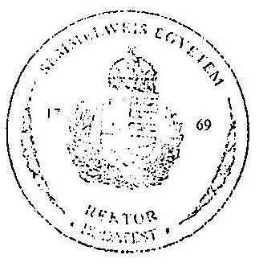

Dr. Tulassay Tivadar

---

# ÉSZREVÉTELEK AZ ÁLLAMI SZÁMVEVŐSZÉK ÁLTAL .ÉSZÍTETT, A FELSŐOKTATÁS NORMATÍV FINANSZÍROZÁSI RENDSZERÉNEK ELLENŐRZÉSÉRŐL SZÓLÓ JELENTÉSTERVEZETHEZ 

## Általános megállapítások

Az Állami Számvevőszék a felsőoktatás egészére vonatkozóan, átfogóan és sokoldalúan elemzi a normatív finanszírozás rendszerét, rámutatva a finanszírozási rendszerben rejlő feszültségekre. A jelentéstervezet megállapításai szerint az évenkénti változások az intézmények számára bizonytalanná tették a normatív bevételeket/A költségvetési elvonások is sújtották ezt a támogatást. A normatív finanszírozási jelenlegi rendje elszakad a valós költségigényektől, a normatíva reálértéke csökken, nem veszi figyelembe az intézmények sajátosságait, nem nyújt fedezetet a fenntartási költségekre, és nem fedezi a felsőoktatásban jelentkező sajátos költségeket (pl. múemlék épületek, kollégiumok karbantartása, felújítása, többfunkciós könyvtárak müködtetése, a gyakorlati oktatás igényei, stb.).

Az észrevételek között szerepel, hogy az OM nem számoltatja el az intézményeket a normatív finanszírozás rendszerében való támogatásról, holott ezekről az összegekről elkülönített nyilvántartás vezetését írja elő a vonatkozó jogszabály. Az intézmények többsége nem értékeli önköltség-számítási, költségelemzési módszerekkel a normatívákkal való gazdálkodást, és nem végzi el a veszteségforrások feltárását.
Rögzítésre került, hogy az orvosi karok a magasabb normatívák ellenére, tekintettel költségeik magas szintjére, folyamatosan finanszírozási nehézségekkel küzdenek.

A megállapítások szerint a fenntartási és képzési normatíva legnagyobb hányadát az oktatók és egyéb alkalmazottak bére és járulékai képezik, így az az egyéb költségekre nem nyújt fedezetet.

A tervezet szerint 2003-ban a költségvetési zárolások miatt az intézmények nem jutottak a norma szerinti támogatás teljes összegéhez. A 3/c tanúsítvány szerint a tényleges finanszírozás átlagos elmaradása $0,96 \%$, a Semmelweis Egyetem esetében ez az arány $3,11 \%$, tehát lényegesen magasabb az átlagnál.

Megállapítja a jelentés, hogy a rendszer bonyolultsága miatt az intézmények többsége „nem is kísérletezik annak megállapításával, hogy a valóságban mennyi támogatás illetné meg". Az

---

elek szerint a normatív finanszírozási jelenlegi rendszere nem a valós költségigények ghatározásával építkezik, hanem a mindenkori költségvetési lehetőségek által, az elfogadott éves költségvetéshez igazított, utólagosan megállapított, kikalkulált, „kvázi" normatív finanszírozási rendszer.

# A Semmelweis Egyetemre vonatkozó megállapítások 

## 38. oldal, 2.2 pont. 2. bekezdés :

- A tervezet szerint a Semmelweis Egyetemen a képzési és fenntartási normatíva alapján kapott támogatás belső felosztása a Gazdálkodási Szabályzat és a költségvetési irányelvekben foglaltak szerint, a hallgatói létszám függvényében történik. Megemlíti a jelentés-tervezet, hogy a felosztás során az Egyetemen nem vizsgálják az egyes karok tevékenységi, müködési, elhelyezési, feltételrendszeri sajátosságait. E sajátosságok figyelmen kívül hagyását a jelentés-tervezet a 30. oldalon a finanszírozási rendszer egészének rótta fel, tehát ez nem kiemelten a Semmelweis Egyetem mulasztása.
- Rögzítésre került rögzítésre, hogy a Semmelweis Egyetem nem tartja külön nyilván a képzési és fenntartási normatíva alapján kapott támogatások felhasználását.

## 41-42. oldal 3.1 pont

Az intézményi átlagadatok alapján a normatív támogatás 2003. évben az állami támogatás összegéből $63,3 \%$-ot tett ki, míg ez az arány a Semmelweis Egyetem esetében $45 \%$, tehát az átlagos szintnél alacsonyabb volt. Ebből eredően az Egyetem esetében az egyéb támogatási formák (pályázati bevételek stb.) nagyobb szerepet kaptak. (A jelentés-tervezet 44. oldalán foglaltak rámutatnak arra, hogy a pályázati rendszer nem biztosit elég mozgásteret a gazdálkodásban, és probléma az ily módon beszerzett eszközök müködtetési kiadásainak fedezése. A jelentés-tervezet ajánlásként rögziti a normatív finanszírozás javitását a pályázati források terhére.)

## 49. oldal

A tervezet említi a Semmelweis Egyetemre kinevezett kincstári biztos, valamint a rektori biztos tevékenységét, a megállapítások szerint azonban az Egyetem gazdálkodása nem tudott stabilizálódni.

---

Képzési és fenntartási normatívához kapcsolódó hatékonysági mutatók alkalmazásával kapcsolatos megállapítások között került rögzítésre, hogy „A Semmelweis Egyetem a külső és belső adósságállomány felszámolásához kapcsolódó intézkedési tervben határozta meg az egyes tevékenységek költségeinek méréséhez szükséges szakmai elvek megfogalmazását, a tevékenység minőségi és mennyiségi mérésére használható mutatórendszer kialakítását". A megállapítás az Egyetemre nézve kedvező.

# 52. oldal, 4.2. pont 

Hiányosságként rögzíti a jelentés-tervezet, hogy többek között a Semmelweis Egyetem sem alakította ki az oktatói követelményrendszeren belül a „terhelési követelményeket", továbbá az oktatói kapacitás sehol nem került megállapításra.

## 53-54. oldal

Az intézmények döntő része nem rendelkezik önköltség-számítási szabályzattal és nem végez ilyen jellegű költségfigyelést, önköltségszámítás helyett keret-nyilvántartási rendszer müködik. A példák között szerepel a Semmelweis Egyetem is.

## Függelék, 8. oldal

A függelék tartalmazza az előző számvevőszéki vizsgálat javaslatai alapján tett intézkedéseket.

A Semmelweis Egyetem esetében a megállapítások szerint a javaslatok bekerültek az intézkedési tervekbe, ezek végrehajtása megkezdődött, azonban a bekövetkezett személyi változások miatt szükséges az intézkedési tervek áttekintése.

Budapest, 2004. április 06.

---

# Dr. Tulassay Tivadar 

rektor
Semmelweis Egyetem
Budapest

## Tisztelt Rektor Úr!

Köszönettel vettem a Felsőoktatás Normatív Finanszírozási Rendszere müködésének ellenőrzéséről készített Állami Számvevőszéki jelentéstervezethez megküldött észrevételeit, illetve az intézkedésekről adott tájékoztatását.

Örömmel nyugtázom, hogy a Jelentéstervezetet korrektnek, az egyetemek finanszírozásának rendszerét jól tükrözönek, a problémákat valós módon megjelenítőnek tartja, és a levelében foglaltak, valamint dr. Szollár Lajos professzor úr csatolt észrevételei is megerősítik a jelentéstervezet megállapításait.

Levele 1. pontjával kapcsolatban a következőkről tájékoztatom Rektor urat.
A felsőoktatási intézmények képzési és fenntartási normatíva alapján történő finanszírozásáról szóló 120/2000. Kormányrendelet 2.§ (4) bekezdése értelmében „A felsőoktatási intézmények - az államilag finanszírozott és meghirdetett szakok, az intézményi szintű szervezeti egységek működőképességének fenntartása érdekében - gazdálkodási szabályzatukban rögzítik a normatívan megkapott támogatás belső elosztási rendjét. A felosztásról - az Oktatási Minisztérium által meghatározott formában - évente tervet készítenek és azt minden év február 28.-áig megküldik az Oktatási Minisztériumnak, majd a terv teljesüléséről a zárszámadás keretében beszámolnak." A képzési és fenntartási normatíva alapján kapott támogatások felhasználásáról tehát nyilvántartást kell vezetniük az intézménynek. Ennek hiányában nem tudják teljesíteni ezen előírás szerinti beszámolási kötelezettségüket. Ugyanakkor a terv és beszámoló formáját az Oktatási Minisztérium nem határozta meg, amit a jelentéstervezetben rögzítettünk.

A levélhez csatolt észrevételből, az Egyetemet érintő kiegészítő információkat jelen-tés-tervezetünk tartalmazza.

Megköszönve észrevételeit, kérem válaszom szíves tudomásulvételét.
Budapest, 2004. április "2y "
Tisztelettel:
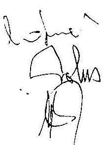

---

# 2. sz. melléklet 

a V- 31-93/2003-04. sz. jelentéshez

## TANÚSÍTVÁNYOK

---

# 1. OM TANÚSÍTVÁNYOK JEGYZÉKE 

| 1. sz. tanúsítvány | A képzési és fenntartási normatív támogatás (eredeti előirányzat) évenkénti alakulása |
| :--: | :--: |
| 2. sz. tanúsítvány | Képzési és fenntartási támogatás elemei |
| 3/a. sz. tanúsítvány | A képzési és fenntartási támogatás alakulása 2001. év |
| 3/b. sz. tanúsítvány | A képzési és fenntartási támogatás alakulása 2002. év |
| 3/c. sz. tanúsítvány | A képzési és fenntartási támogatás alakulása 2003. év |
| Megjegyzés | Megjegyzés a 2,-3/a,-3/b,-3/c. számú tanúsítványokhoz |
| 3/d. sz. tanúsítvány | A képzési és fenntartási támogatás alakulása 2001. év |
| 3/e. sz. tanúsítvány | A képzési és fenntartási támogatás alakulása 2002. év |
| 3/f. sz. tanúsítvány | A képzési és fenntartási támogatás alakulása 2003. év |
| 4/a. sz. tanúsítvány | A képzési és fenntartási normatív támogatás mutatóinak évenkénti alakulása |
| 4/b/1. sz. tanúsítvány | A képzési és fenntartási normatív támogatás mutatóinak évenkénti alakulása Egyházi és alapítványi intézmények: KRE |
| 4/b/2. sz. tanúsítvány | A képzési és fenntartási normatív támogatás mutatóinak évenkénti alakulása Egyházi és alapítványi intézmények: PPKE |
| 4/b/3. sz. tanúsítvány | A képzési és fenntartási normatív támogatás mutatóinak évenkénti alakulása Egyházi és alapítványi intézmények: GDF |
| 4/b/4. sz. tanúsítvány | A képzési és fenntartási normatív támogatás mutatóinak évenkénti alakulása Egyházi és alapítványi intézmények: KJF |
| 5. sz. tanúsítvány | A képzési és fenntartási normatív támogatás összegének megállapításához szükséges normatívák értékei |
| 6/a. sz. tanúsítvány | OM fenntartású intézmények A felsőoktatási intézmények államilag finanszírozott hallgatóinak megoszlása (októberi statisztika alapján) |
| 6/b. sz. tanúsítvány | KRE+PPKE+GDF+KJF A felsőoktatási intézmények államilag finanszírozott hallgatóinak megoszlása (októberi statisztika alapján) |

---

A képzési és fenntartási normatív támogatás (eredeti előirányzat) évenkénti alakulása

|  Intézmény megnevezése | 2001 | 2002 | Index \%
2002/2001 | 2003 | Index \%
2003/2002  |
| --- | --- | --- | --- | --- | --- |
|  Budapesti Közgazdaságtudományi és Alig Egyetem | 1703320 | 1744929 | 102,44 | 2871544 | 164,57  |
|  Budapesti Múszaki és Gazdaságtudományi Egyetem | 6323653 | 6674100 | 105,54 | 9994157 | 149,75  |
|  Debreceni Egyetem | 6746270 | 7231855 | 107,20 | 11699015 | 161,77  |
|  Eötvös Loránd Tudományegyetem | 6673027 | 6921449 | 103,72 | 11601971 | 167,62  |
|  Szent István Egyetem | 4588530 | 4678406 | 101,96 | 6999450 | 149,61  |
|  Kaposvári Egyetem | 772687 | 791713 | 102,46 | 1441828 | 182,11  |
|  Miskolci Egyetem | 2973970 | 3083557 | 103,68 | 4887964 | 158,52  |
|  Nyugat-Magyarországi Egyetem | 2201514 | 2338712 | 106,23 | 3567520 | 152,54  |
|  Pécsi Tudományegyetem | 5894765 | 6219380 | 105,51 | 9868801 | 158,68  |
|  Semmelweis Egyetem | 4106534 | 4335396 | 105,57 | 6391309 | 147,42  |
|  Szegedi Tudományegyetem | 6607326 | 7063403 | 106,90 | 11031926 | 156,18  |
|  Veszprémi Egyetem | 2447575 | 2505863 | 102,38 | 3984617 | 159,01  |
|  Liszt Ferenc Zenemüvészeti Egyetem | 517845 | 540593 | 104,39 | 859093 | 158,92  |
|  Magyar Iparmüvészeti Egyetem | 531924 | 546977 | 102,83 | 800026 | 146,26  |
|  Magyar Képzőmüvészeti Egyetem | 443068 | 451623 | 101,93 | 598428 | 132,51  |
|  Színház- és Filmmüvészeti Egyetem | 216401 | 216920 | 100,24 | 318466 | 146,81  |
|  Budapesti Gazdasági Főiskola | 2201098 | 2254790 | 102,44 | 3579179 | 158,74  |
|  Budapesti Múszaki Főiskola | 1996665 | 2039705 | 102,16 | 3378410 | 165,63  |
|  Dunaújvárosi Főiskola | 773354 | 792147 | 102,43 | 1112755 | 140,47  |
|  Kecskeméti Főiskola | 1029615 | 1060850 | 103,03 | 1626970 | 153,36  |
|  Nyíregyházi Főiskola | 1581987 | 1651189 | 104,37 | 2465340 | 149,31  |
|  Tessedik Sámuel Főiskola | 1266121 | 1299521 | 102,64 | 1803068 | 138,75  |
|  Eötvös József Főiskola | 352777 | 360633 | 102,23 | 520162 | 144,24  |
|  Eszterházy Károly Főiskola | 1042837 | 1067594 | 102,37 | 1739290 | 162,92  |
|  Széchenyi István Egyetem | 1703694 | 1798444 | 105,55 | 2487751 | 138,33  |
|  Szolnoki Főiskola | 419030 | 434030 | 103,58 | 634408 | 146,17  |
|  Berzsenyi Dániel Főiskola | 918205 | 922159 | 100,43 | 1457336 | 158,04  |
|  Magyar Táncmüvészeti Főiskola | 116371 | 141472 | 121,57 | 246372 | 174,15  |
|  Összes normatív támogatás | 66150163 | 69167410 | 104,56 | 107967156 | 156,10  |

OM szintű adatszolgáltatás Igazolom, hogy a tanúsítványban szereplő adatok az intézményi díjjaival megegyeznek. Budapest, 2003.november 28.

---

Intézmény neve: 2. sz. tanúsítvány

Oktatási Minisztérium a V-31- 93 / 2003-04.sz.jelentéshez

A képzési és fenntartási támogatás elemei

|   |  |  | adatok: eFt  |
| --- | --- | --- | --- |
|  Megnevezés | 2001. | 2002. | 2003.  |
|  Norma szerinti (eredeti) költségvetési támogatás | 66 150 163,0 | 69 167 410,0 | 107 967 156,0  |
|  Kjt. alapján többletutalás | 1 100 970,0 | 8 747 847,0 |   |
|  Költségvetési automatizmus alapján többletutalás | 3 534 290,0 | 4 761 264,0 | -3 214 783,0  |
|  Költségvetési szintezési többletutalás |  |  |   |
|  Összesen: | 70 785 423,0 | 82 676 521,0 | 104 752 373,0  |

Intézményi szintű adatszolgáltatás Igazolom, hogy a tanúsítványban szereplő adatok az intézmény nyilvántartásaival megegyeznek.

Budapest, 2004. február 20.

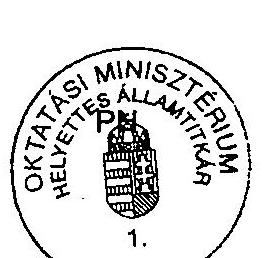

aláírás

---

# A képzési és fenntartási támogatás alakulása 

2001. év
adatok: eFt

| Intézmény megnevezése | Normativa szerint számított támogatás (éves) | Ténylegesen utalt normativ támogatás (éves) | Eltérés összege | Eltérés \%-s |
| :--: | :--: | :--: | :--: | :--: |
| Budapesti Közgazd. és Államig. Egyetem | 1693690 | 1793532 | 99842 | 5,89 |
| Budapesti Müszaki és Gazd.tud. Egyetem | 6383189 | 6628979 | 245790 | 3,85 |
| Debreceni Egyetem | 6785821 | 7346778 | 560957 | 8,27 |
| Eötvös Loránd Tudományegyetem | 6666380 | 7112769 | 446389 | 6,70 |
| Szent István Egyetem | 4403956 | 4892232 | 488276 | 11,09 |
| Kaposvált Egyetem | 716960 | 832463 | 115503 | 16,11 |
| Miskolci Egyetem | 2921438 | 3178146 | 254708 | 8,72 |
| Nyugat-Magyarországi Egyetem | 2237588 | 2332908 | 95342 | 4,26 |
| Pécsi Tudományegyetem | 5833402 | 6387462 | 554060 | 9,50 |
| Semmelweis Egyetem | 4049896 | 4379746 | 329850 | 8,14 |
| Szegedi Tudományegyetem | 6555748 | 7041990 | 466242 | 7,42 |
| Veszprémi Egyetem | 2485779 | 2616957 | 131178 | 5,28 |
| Liszt Ferenc Zenemüvészeti Egyetem | 515565 | 580780 | 65215 | 12,65 |
| Magyar Iparmüvészeti Egyetem | 544914 | 566556 | 21642 | 3,97 |
| Magyar Képzőmüvészeti Egyetem | 441838 | 458924 | 17086 | 3,87 |
| Színház- és Filmmüvészeti Egyetem | 215141 | 240538 | 25397 | 11,80 |
| Budapesti Gazdasági Fóliskola | 2302478 | 2379360 | 76882 | 3,34 |
| Budapesti Müszaki Fóliskola | 2332428 | 2405837 | 73409 | 3,15 |
| Dunaújvárosi Fóliskola | 799647 | 826633 | 26986 | 3,37 |
| Kecskeméti Fóliskola | 1051529 | 1083870 | 32341 | 3,08 |
| Nyíregyházi Fóliskola | 1562300 | 1654576 | 92276 | 5,91 |
| Tessedik Sámuel Fóliskola | 1265428 | 1316547 | 51119 | 4,04 |
| Eötvös József Fóliskola | 326947 | 369192 | 42245 | 12,92 |
| Eszterházy Károly Fóliskola | 1022618 | 1084203 | 61385 | 6,00 |
| Széchenyi István Egyetem | 1707194 | 1754751 | 47557 | 2,79 |
| Szolnoki Fóliskola | 418880 | 432541 | 13661 | 3,26 |
| Berzsenyi Dániel Fóliskola | 881860 | 955795 | 73935 | 8,38 |
| Magyar Táncmüvészti Fóliskola | 116371 | 133358 | 16987 | 14,60 |
| Összesen | 66239163 | 70785423 | 4546260 | 6,86 |

OM szintü.adatszolgáltatás
Igazolom, hogy a tanúsítványban szereplő adatok az intézmény nyilvántartásaival megegyeznek.
Budapest, 2003. december 12.
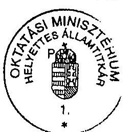
alálrás

---

# A képzési és fenntartási támogatás alakulása

## 2002. év

|  Intézmény megnevezése | Normativa szerint számított támogatás (éves) | Ténylegesen utalt normatív támogatás (éves) | Eltérés összege | Eltérés %:e  |
| --- | --- | --- | --- | --- |
|  Budapesti Közgazd. és Államig. Egyetem | 1 736 149 | 2 091 804 | 355 655 | 20,49  |
|  Budapesti Műszaki és Gazd. tud. Egyetem | 6 584 224 | 7 790 024 | 1 205 800 | 18,31  |
|  Debreceni Egyetem | 7 039 156 | 8 655 902 | 1 616 746 | 22,97  |
|  Eötvös Loránd Tudományegyetem | 7 174 574 | 8 498 186 | 1 323 612 | 18,45  |
|  Szent István Egyetem | 4 362 414 | 5 487 657 | 1 125 243 | 25,79  |
|  Kaposván Egyetem | 790 774 | 1 065 850 | 275 076 | 34,79  |
|  Miskolc Egyetem | 3 030 303 | 3 656 614 | 626 311 | 20,67  |
|  Nyugat-Magyarországi Egyetem | 2 275 737 | 2 883 666 | 607 929 | 26,71  |
|  Pécsi Tudományegyetem | 6 116 444 | 7 262 441 | 1 145 997 | 18,74  |
|  Semmelweis Egyetem | 4 016 276 | 5 269 507 | 1 253 231 | 31,20  |
|  Szegedi Tudományegyetem | 6 792 749 | 8 347 657 | 1 555 108 | 22,89  |
|  Veszprémi Egyetem | 2 569 995 | 2 951 695 | 381 700 | 14,85  |
|  Liszt Ferenc Zeneművészeti Egyetem | 537 530 | 670 430 | 132 900 | 24,72  |
|  Magyar Iparművészeti Egyetem | 596 098 | 657 701 | 61 603 | 10,33  |
|  Magyar Képzőművészeti Egyetem | 466 500 | 549 202 | 82 702 | 17,73  |
|  Színház- és Filmművészeti Egyetem | 183 907 | 317 153 | 133 246 | 72,45  |
|  Budapesti Gazdasági Főiskola | 2 413 750 | 2 654 456 | 240 706 | 9,97  |
|  Budapesti Műszaki Főiskola | 2 340 469 | 2 649 690 | 309 221 | 13,21  |
|  Dunaújvárosi Főiskola | 828 436 | 919 330 | 90 894 | 10,97  |
|  Kecskemeti Főiskola | 1 110 942 | 1 287 916 | 176 974 | 15,93  |
|  Nyíregyházi Főiskola | 1 626 377 | 1 940 723 | 314 346 | 19,33  |
|  Tessedik Sámuel Főiskola | 1 253 008 | 1 452 079 | 199 071 | 15,89  |
|  Eötvös József Főiskola | 326 998 | 439 865 | 112 867 | 34,52  |
|  Eszterházy Károly Főiskola | 1 158 050 | 1 341 128 | 183 078 | 15,81  |
|  Széchenyi István Egyetem | 1 810 557 | 2 031 919 | 221 362 | 12,23  |
|  Szolnoki Főiskola | 427 886 | 492 006 | 64 120 | 14,99  |
|  Berzsenyi Dániel Főiskola | 920 208 | 1 089 528 | 169 320 | 18,40  |
|  Magyar Táncművészti Főiskola | 160 070 | 222 192 | 62 122 | 38,81  |
|  **Összesen** | **68 649 581** | **82 676 521** | **14 026 940** | **20,43**  |

OM szintű adatszolgáltatás

Igazolom, hogy a tanúsítványban szereplő adatok az intézmény nyilvántartásaival megegyeznek.

Budapest, 2003. december 12.

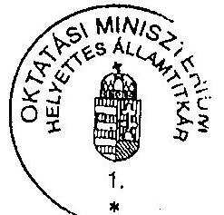

alárás

---

# A képzési és fenntartási támogatás alakulása

2003. év

|  Intézmény megnevezése | Normativa szerint számított támogatás (éves) | Ténylegesen utalt normatív támogatás (éves) | Eltérés összege | Eltérés %-a  |
| --- | --- | --- | --- | --- |
|  Budapesti Közgazd. és Államig. Egyetem | 2 566 450 | 2 786 044 | 219 594 | 8,56  |
|  Budapesti Müszaki és Gazd.tud. Egyetem | 9 700 847 | 9 702 550 | 1 703 | 0,02  |
|  Debreceni Egyetem | 11 177 872 | 11 325 815 | 147 943 | 1,32  |
|  Eötvös Loránd Tudományegyetem | 11 601 787 | 11 276 607 | -325 180 | -2,80  |
|  Szent István Egyetem | 6 814 814 | 6 768 850 | -45 964 | -0,67  |
|  Kaposvári Egyetem | 1 440 074 | 1 370 128 | -69 946 | -4,86  |
|  Miskolc Egyetem | 4 774 090 | 4 743 890 | -30 200 | -0,63  |
|  Nyugat-Magyarországi Egyetem | 3 567 011 | 3 455 150 | -111 861 | -3,14  |
|  Pécsi Tudományegyetem | 9 728 049 | 9 575 701 | -152 348 | -1,57  |
|  Semmelweis Egyetem | 6 367 741 | 6 170 009 | -197 732 | -3,11  |
|  Szegedi Tudományegyetem | 10 819 441 | 10 713 126 | -106 315 | -0,98  |
|  Veszprém Egyetem | 3 984 277 | 3 904 982 | -79 295 | -1,99  |
|  Liszt Ferenc Zenemüvészeti Egyetem | 821 354 | 820 828 | -526 | -0,06  |
|  Magyar Iparmüvészeti Egyetem | 734 834 | 784 526 | 49 692 | 6,76  |
|  Magyar Képzőmüvészeti Egyetem | 570 321 | 569 328 | -993 | -0,17  |
|  Színház- és Filmmüvészeti Egyetem | 287 196 | 301 166 | 13 970 | 4,86  |
|  Budapesti Gazdasági Főiskola | 3 269 434 | 3 484 979 | 215 545 | 6,59  |
|  Budapesti Müszaki Főiskola | 3 239 084 | 3 289 510 | 50 426 | 1,56  |
|  Dunaújvárosi Főiskola | 1 034 210 | 1 107 152 | 72 942 | 7,05  |
|  Kecskeméti Főiskola | 1 542 878 | 1 578 805 | 35 927 | 2,33  |
|  Nyíregyházi Főiskola | 2 483 900 | 2 380 940 | -102 960 | -4,15  |
|  Tessedik Sámuel Főiskola | 1 881 710 | 1 752 568 | -129 142 | -6,86  |
|  Eötvös József Főiskola | 497 783 | 512 262 | 14 479 | 2,91  |
|  Eszterházy Károly Főiskola | 1 869 916 | 1 677 590 | -192 326 | -10,29  |
|  Széchenyi István Egyetem | 2 719 555 | 2 422 251 | -297 304 | -10,93  |
|  Szolnoki Főiskola | 603 181 | 616 908 | 13 727 | 2,28  |
|  Berzsenyi Dániel Főiskola | 1 457 874 | 1 423 936 | -33 938 | -2,33  |
|  Magyar Táncmüvészti Főiskola | 210 192 | 236 772 | 26 580 | 12,65  |
|  Összesen | 105 765 875 | 104 752 373 | -1 013 502 | -0,96  |

OM szintű adatszolgáltatás

Igazolom,hogy a tanúsítványban szereplő adatok az intézmény nyilvánartásaival megegyeznek.

Budapest, 2004. február 20.

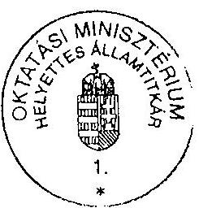

alárás

---

# Megjegyzés a 2., sz., 3/a., 3/b., 3/c. sz. tanúsítványokhoz 

## 2. sz. tanúsítványhoz:

A képzési- és fenntartási előirányzatok évközi módosításával kapcsolatban a Kjt. jogcímen feltüntetett összeg a teljes intézményre vonatkozó adatokat tartalmazza. Fejezeti szinten nem állapítható meg az, hogy a módosítás milyen mértékben érintette a képzési-
és fenntartási normatív támogatáshoz kapcsolódó bérelemeket, ugyanis az intézmények nemcsak képzési feladatokat, hanem közoktatási-, kutatási- és egyéb speciális feladatokat, programokat látnak el, s az ott foglalkoztatottak bérváltozása is megjelenik az intézményi szintű adatokban.
A 2003. évre vonatkozó támogatásnál is az intézményi szintű zárolást vettük figyelembe, amely szintén torzítja az összehasonlíthatóságot.
Az egyes támogatási többletekkel kapcsolatban az intézmények rendelkeznek pontosabb információkkal, ezért javasoljuk, hogy az összehasonlítás alapjául az intézményi adatszolgáltatást használja a vizsgálat az elemzések vonatkozásában.

## 3/a., 3/b., 3/c. sz. tanúsítványokhoz:

Értelemszerűen a 2. sz. tanúsítványoknál leírtak figyelembevételével lehet csak a torzítást kezelni az összehasonlíthatóság kérdésében.

Budapest, 2003. december 12.
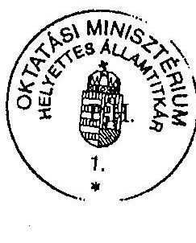
aláírás

---

# A képzési és fenntartási támogatás alakulása 

2001. év

| Intézmény   megnevezése | Normativ   alapon   számított   támogatás   $[$ E Ft] | Ténylegesen   utalt   normatív   támogatás   (éves) | Eltérés   összege | Eltérés   $\%$ -a |
| :-- | --: | --: | --: | --: |
| KRE | 417006 | 517304 | 100268 | 24,04 |
| PPKE | 1261712 | 1631584 | 369872 | 29,32 |
| GDF | 545376 | 546199 | 823 | 0,15 |
| KJF | 261947 | 268923 | 6976 | 2,66 |
| Összesen: | 2486041 | 2964010 | 477939 |  |

OM szintű adatszolgáltatás.
Igazolom, hogy a tanúsítványban szereplő adatok az OM nyilvántartásaival megegyeznek. Kérjük, hogy a szerkezeti változásokat külön lapon jelezzék!

## Megjegyzés:

Az adatok az egyházi és alapítványi fenntartású intézmények közül a KRE, PPKE, GDF és KJF-re vonatkoznak és a jogszabály alapján számított normatív támogatást tartalmazzák. Az év pénzügyi év (jan. 1. - dec. 31.) és nem tanév.

Budapest, 2003. december 12.
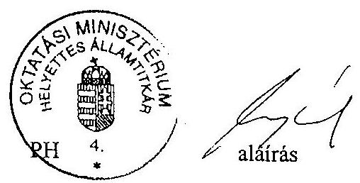

---

# A képzési és fenntartási támogatás alakulása 2002. év 

| intézmény   megnevezése | Normatív   alapon   számított   támogatás   $[$ E Ft] | Ténylegesen   utalt   normatív   támogatás   (éves) | Eltérés   összege | Eltérés   $\%-\mathrm{a}$ |
| :-- | --: | --: | --: | --: |
| KRE | 455500 | 599009 | 233622 | 51,29 |
| PPKE | 1434516 | 2090966 | 656450 | 45,76 |
| GDF | 547326 | 578575 | 31249 | 5,71 |
| KJF | 273288 | 371053 | 97765 | 35,77 |
| Összesen: | 2710630 | 3639603 | 1019086 |  |

OM szintű adatszolgáltatás.
Igazolom, hogy a tanúsítványban szereplő adatok az OM nyilvántartásaival megegyeznek. Kérjük, hogy a szerkezeti változásokat külön lapon jelezzék!

## Megjegyzés:

Az adatok az egyházi és alapítványi fenntartású intézmények közül a KRE, PPKE, GDF és KJF-re vonatkoznak és a jogszabály alapján számított normatív támogatást tartalmazzák. Az év pénzügyi év (jan. 1. - dec. 31.) és nem tanév.

Budapest, 2003. december 12.
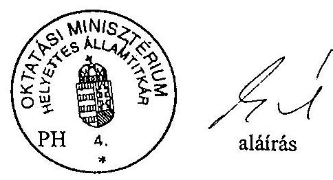

---

# A képzési és fenntartási támogatás alakulása 2003. év 

|  |  | adatok: E Ft |  |  |
| :--: | :--: | :--: | :--: | :--: |
| Intézmény megnevezése | Normativ   alapon   számított   támogatás*   (E Ft) | Ténylegesen utalt normativ támogatás (éves) | Eltérés   összege | Eltérés $\%-a$ |
| KRE | 858993 | 869766 | 10773 | 1,25 |
| PPKE | 2397605 | 2497082 | 99477 | 4,15 |
| GDF | 541300 | 563515 | 22215 | 4,1 |
| KJF | 551192 | 533234 | $-17958$ | 3,26 |
| Összesen: | 4349090 | 4463597 | 114507 | 2,63 |

OM szintű adatszolgáltatás.

* Az elszámolások alapján, az eltérések rendezése a zárszámadás keretében történik majd. Igazolom, hogy a tanúsítványban szereplő adatok az OM nyilvántartásaival megegyeznek. Kérjük, hogy a szerkezeti változásokat külön lapon jelezzék!

## Megjegyzés:

Az adatok az egyházi és alapítványi fenntartású intézmények közül a KRE, PPKE, GDF és KJF-re vonatkoznak és a jogszabály alapján számított normatív támogatást tartalmazzák. Az év pénzügyi év (jan. 1. - dec. 31.) és nem tanév.

Budapest, 2004. március 10.
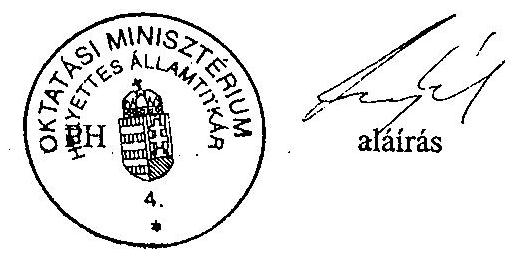

---

# A képzési és fenntartási normatív támogatás mutatóinak évenkénti alakulása 

adatok: fö

| Megnevezés | 2001. év | 2002. év | 2003. év | $\begin{gathered} \text { Index } \% \\ 2002 / 2001 \end{gathered}$ | $\begin{gathered} \text { Index } \% \\ 2003 / 2002 \end{gathered}$ |
| :--: | :--: | :--: | :--: | :--: | :--: |
| Egyenértékủ államilag finanszirozott hallgatói létszám | 149823 | 156624 | 163361 | 104,5 | 104,3 |
| Minősített oktatók létszáma (előző évi munkavállalói felmérés alapján) | 5236 | 7101 | 7414 | 135,6 | 104,4 |
| Államilag finanszírozott képzésben résztvevő doktoranduszok létszáma | 2379 | 2530 | 2446 | 106,3 | 96,7 |
| Fogyatékossággal élő hallgatói létszám | 255 | 281 | 414 | 110,2 | 147,3 |

## Megjegyzés:

Az adatok az OM fenntartású intézményekre vonatkoznak, kivéve a "Fogyatékossággal élő hallgatói létszám"-okat, mely az OM fenntartású intézményekre és a KRE, PPKE, GDF és KJF-re vonatkoznak.
Az évek pénzügyi évek (jan. 1. - dec. 31.) és nem tanévek.
Az egyes évekre vonatkozó adatok az aktuális pénzügyi évet megelőző év adatgyűjtéseiből származnak.
Az egyes évekre vonatkozó "Fogyatékos hallgatói létszám"-ok az aktuális évet megelőző évre vonatkozó adatgyűjtésekből származnak.
A 2003. évi "Minősített oktatók létszáma" a 2002. nov. 1-jei korrigált létszám.
A 2003. évre vonatkozó fogyatékossággal élő hallgatói létszám jogszabályváltozás miatt már tartalmazza a költségtérítéses képzésben résztvevőket is, míg a korábbi években csak az államilag finanszírozott hallgatók szerepelnek.

Igazolom, hogy a tanúsítványban szereplő adatok az OM nyilvántartásaival megegyeznek.
Budapest, 2004. február 18.
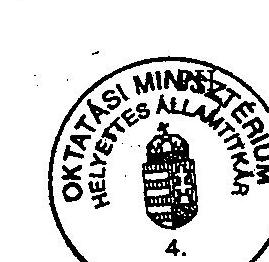

---

# A képzési és fenntartási normatív támogatás mutatóinak évenkénti alakulása

## Egyházi és alapítványi intézmények: KRE

**adatok: fő**

|  Megnevezés | 2001. év | 2002. év | 2003. év | Index % 2002/2001 | Index % 2003/2002  |
| --- | --- | --- | --- | --- | --- |
|  Egyenértékű államilag finanszírozott hallgatói létszám | 1 755 | 1 801 | 1 527 | 102,6 | 84,8  |
|  Minősített oktatók létszáma (előző évi munkavállalói felmérés alapján) | 80 | 79 | 86 | 98,8 | 108,9  |
|  Államilag finanszírozott képzésben résztvevő doktoranduszok létszáma | 11 | 7 | 4 | 63,6 | 57,1  |
|  Fogyatékossággal élő hallgatói létszám | 3 | 1 | 4 | 33,3 | 400,0  |

## Megjegyzés:

Az adatok az egyházi és alapítványi fenntartású intézmények közül a KRE-re vonatkoznak. Az évek pénzügyi évek (jan. 1. – dec. 31.) és nem tanévek. Az egyes évekre vonatkozó adatok az aktuális pénzügyi évet megelőző év adatgyűjtéseiből származnak. Az egyes évekre vonatkozó "Fogyatékos hallgatói létszám"-ok az aktuális évet megelőző évre vonatkozó adatgyűjtésekből származnak. A 2003. évi "Minősített oktatók létszáma" a 2002. nov. 1-jei korrigált létszám. A 2003. évre vonatkozó fogyatékossággal élő hallgatói létszám jogszabályváltozás miatt már tartalmazza a költségtérítéses képzésben résztvevőket is, míg a korábbi években csak az államilag finanszírozott hallgatók szerepelnek.

Igazolom, hogy a tanúsítványban szereplő adatok az OM nyilvántartásaival megegyeznek.

Budapest, 2004. február 18.

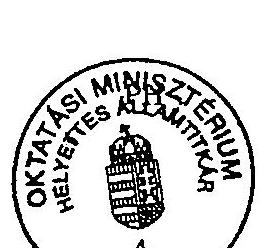

---

# A képzési és fenntartási normatív támogatás mutatóinak évenkénti alakulása

## Egyházi és alapítványi intézmények: PPKE

adatok: fő

|  Megnevezés | 2001. év | 2002. év | 2003. év | Index%
2002/2001 | Index%
2003/2002  |
| --- | --- | --- | --- | --- | --- |
|  Egyenértékű államilag finanszírozott hallgatói létszám | 4 205 | 4 657 | 4 460 | 110,7 | 95,8  |
|  Minősített oktatók létszáma
(előző évi munkavállalói felmérés alapján) | 84 | 115 | 116 | 136,9 | 100,9  |
|  Államilag finanszírozott képzésben résztvevő doktoranduszok
létszáma | 12 | 13 | 19 | 108,3 | 146,2  |
|  Fogyatékossággal élő hallgatói létszám | 14 | 32 | 18 | 228,6 | 56,3  |

## Megjegyzés:

Az adatok az egyházi és alapítványi fenntartású intézmények közül a PPKE-re vonatkoznak. Az évek pénzügyi évek (jan. 1. – dec. 31.) és nem tanévek. Az egyes évekre vonatkozó adatok az aktuális pénzügyi évet megelőző év adatgyűjtéseiből származnak. Az egyes évekre vonatkozó "Fogyatékos hallgatói létszám"-ok az aktuális évet megelőző évre vonatkozó adatgyűjtésekből származnak. A 2003. évi "Minősített oktatók létszáma" a 2002. nov. 1-jei korrigált létszám. A 2003. évre vonatkozó fogyatékossággal élő hallgatói létszám jogszabályváltozás miatt már tartalmazza a költségtérítéses képzésben résztvevőket is, míg a korábbi években csak az államilag finanszírozott hallgatók szerepelnek.

Igazolom, hogy a tanúsítványban szereplő adatok az OM nyilvántartásaival megegyeznek.

Budapest, 2004. február 18.

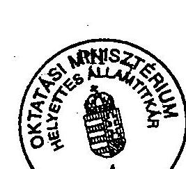

---

# A képzési és fenntartási normatív támogatás mutatóinak évenkénti alakulása

## Egyházi és alapítványi intézmények: GDF

adatok: fó

|  Megnevezés | 2001. év | 2002. év | 2003. év | $\begin{gathered} \text { Index } \% \ 2002 / 2001 \end{gathered}$ | $\begin{gathered} \text { Index } \% \ 2003 / 2002 \end{gathered}$  |
| --- | --- | --- | --- | --- | --- |
|  Egyenértékủ államilag finanszírozott hallgatói létszám | 1602 | 1607 | 1592 | 100,3 | 99,1  |
|  Minősített oktatók létszáma (előző évi munkavállalói felmérés alapján) | 15 | 16 | 17 | 106,7 | 106,3  |
|  Államilag finanszírozott képzésben résztvevő doktoranduszok létszáma | 0 | 0 | 0 | --- | ---  |
|  Fogyatékossággal élő hallgatói létszám | 3 | 2 | 13 | 66,7 | 650,0  |

## Megjegyzés:

Az adatok az egyházi és alapítványi fenntartású intézmények közül a GDF-re vonatkoznak. Az évek pénzügyi évek (jan. 1. - dec. 31.) és nem tanévek. Az egyes évekre vonatkozó adatok az aktuális pénzügyi évet megelőző év adatgyűjtéseiből származnak. Az egyes évekre vonatkozó "Fogyatékos hallgatói létszám"-ok az aktuális évet megelőző évre vonatkozó adatgyűjtésekből származnak. A 2003. évi "Minősített oktatók létszáma" a 2002. nov. 1-jei korrigált létszám. A 2003. évre vonatkozó fogyatékossággal élő hallgatói létszám jogszabályváltozás miatt már tartalmazza a költségtérítéses képzésben résztvevőket is, míg a korábbi években csak az államilag finanszírozott hallgatók szerepelnek.

Igazolom, hogy a tanúsítványban szereplő adatok az OM nyilvántartásaival megegyeznek. Budapest, 2004. február 18.

---

# A képzési és fenntartási normatív támogatás mutatóinak évenkénti alakulása

## Egyházi és alapítványi intézmények: KJF

adatok: fö

|  Megnevezés | 2001. év | 2002. év | 2003. év | $\begin{gathered} \text { Index \% } \ 2002 / 2001 \end{gathered}$ | $\begin{gathered} \text { Index \% } \ 2003 / 2002 \end{gathered}$  |
| --- | --- | --- | --- | --- | --- |
|  Egyenértékủ államilag finanszírozott hallgatói létszám | 1018 | 1062 | 1458 | 104,3 | 137,3  |
|  Minősített oktatók létszáma
(előző évi munkavállalói felmérés alapján) | 34 | 33 | 39 | 97,1 | 118,2  |
|  Államilag finanszírozott képzésben résztvevő doktoranduszok létszáma | 0 | 0 | 0 | --- | ---  |
|  Fogyatékossággal élő hallgatói létszám | 1 | 0 | 7 | 0,0 | ---  |

## Megjegyzés:

Az adatok az egyházi és alapítványi fenntartású intézmények közül a KJF-re vonatkoznak. Az évek pénzügyi évek (jan. 1. - dec. 31.) és nem tanévek. Az egyes évekre vonatkozó adatok az aktuális pénzügyi évet megelőző év adatgyűjtéseiből származnak. Az egyes évekre vonatkozó "Fogyatékos hallgatói létszám"-ok az aktuális évet megelőző évre vonatkozó adatgyűjtésekből származnak. A 2003. évi "Minősített oktatók létszáma" a 2002. nov. 1-jei korrigált létszám. A 2003. évre vonatkozó fogyatékossággal élő hallgatói létszám jogszabályváltozás miatt már tartalmazza a költségtérítéses képzésben résztvevőket is, míg a korábbi években csak az államilag finanszírozott hallgatók szerepelnek.

Igazolom, hogy a tanúsítványban szereplő adatok az OM nyilvántartásaival megegyeznek. Budapest, 2004. február 18.

---

# A képzési és fenntartási normatív támogatás összegének megállapításához szükséges normatívák értékei 

1. Az egyenértékủ hallgatói létszám alapján meghatározott támogatás normatíva értékei finanszírozási csoportonként

| Finanszírozási csoport | Normativa (H/fő/év) |  |  | Index\% 2002/2001 | Index\% 2003/2002 | Index? 2003/200.   Oszetar.   tozi   123,0 |
| :--: | :--: | :--: | :--: | :--: | :--: | :--: |
|  | 2001. | 2002. | 2003. |  |  |  |
| 1. | 992 | 992 | 1220 | 100,0 | 123,0 |  |
| 2. | 489 | 489 | 585 | 100,0 | 119,6 | 119,6 |
| 3. | 338 | 338 | 422 | 100,0 | 124,9 | - |
| 4. | 234 | 234 | 355 | 100,0 | 151,7 | 105,0 |
| 5. | - | - | 295 | - | - | 126,1 |

2. A teljes munkaidőben foglalkoztatott minősített oktatók és az államilag finanszírozott képzésben részt vevő doktoranduszok létszáma alapján meghatározott támogatás normatívája

|  | EFt |
| :--: | :--: |
| Normatíva (H/fő/év) |  |
| 2001. | 260 |
| 2002. | 260 |
| 2003. | 715 |

3. A fogyatékossággal élő hallgatók létszáma alapján adott kiegészítő támogatás normatívája

|  | EFt |
| :--: | :--: |
| Normatíva (H/fő/év) |  |
| 2003. | 100 |

OM szintű adatszolgáltatás
Igazolom, hogy a tanúsítványban szereplő adatok az intézmény nyilvántartásaival megegyeznek.

Budapest, 2003. 4 es. em.ber. 12 .
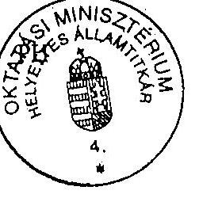
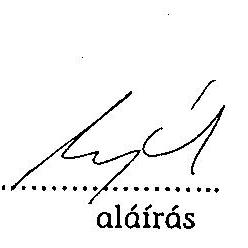

---

# OM fenntartású intézmények

A felsőoktatási intézmények államilag finanszírozott hallgatóinak megoszlása (októberi statisztika alapján)

|  Év | nappali, esti, levelezói
első akkreditált (fő) | nappali, esti, levelezói első
alapképzés (fő) | nappali, esti, levelezói
szakirányú továbbképzés
(fő) | nappali első kiegészítő
alapképzés (fő)*  |
| --- | --- | --- | --- | --- |
|  2001. | 2249 | 142567 | n. a. |   |
|  2002. | 3235 | 165811 | 210 |   |
|  2003. | 4541 | 168723 | 216 |   |

OM és Intézményi szintű adatszolgáltatás Igazolom, hogy a tanúsítványban szereplő adatok az intézmény nyilvántartásaival megegyeznek.

## Megjegyzés:

Az adatok az összes OM fenntartású felsőoktatási intézményre vonatkoznak. Az évek pénzügyi évek (jan. 1. - dec. 31.) és nem tanévek. Az egyes évekre vonatkozó létszámadatok az aktuális pénzügyi évet megelőző év adatgyűjtéseiből származnak.

- Az első alapképzés adata tartalmazza az első kiegészítő nappali alapképzés adatát is (a kiegészítő alapképzés csak nappali tagozaton lehet államilag finanszírozott.) Az adatok nem tartalmazzák a PhD és DLA hallgatókat. Budapest, 2003. december 12.

---

# A felsőoktatási intézmények államilag finanszírozott hallgatóinak megoszlása (októberi statisztika alapján) 

| Év | nappali, esti, levelezõi   első akkreditált (fő) | nappali, esti, levelezõi elsõ   alapképzés (fő) | nappali, esti, levelezõi   szakirányú továbbképzés   (fő) | nappali első kiegészitő   alapképzés (fő)* |
| :--: | :--: | :--: | :--: | :--: |
| 2001. | 49 | 7149 | n. a. |  |
| 2002. | 217 | 8490 | 0 |  |
| 2003. | 525 | 8894 | 0 |  |

OM és Intézményi szintű adatszolgáltatás
Igazolom, hogy a tanúsítványban szereplő adatok az intézmény nyilvántartásaival megegyeznek.

## Megjegyzés:

Az adatok a négy vizsgált, nem állami felsőoktatási intézmény együttes adatai.
Az évek pénzügyi évek (jan. 1. - dec. 31.) és nem tanévek.
Az egyes évekre vonatkozó létszámadatok az aktuális pénzügyi évet megelőző év adatgyűjtéseiből származnak.

* Az első alapképzés adata tartalmazza az első kiegészítő nappali alapképzés adatát is (a kiegészítő alapképzés csak nappali tagozaton lehet államilag finanszírozott.)
Az adatok nem tartalmazzák a PhD és DLA hallgatókat.
Budapest, 2003. december 12.

---

# 3. sz. melléklet 

a V-31-93/2003-04. sz. jelentéshez

## TANÚSÍTVÁNYOK ÉRTÉKELÉSE

---

.

---

# Tanúsítványok értékelése 

## 1-es tanúsítvány

A képzés és fenntartási támogatás (eredeti előirányzat alapján 2001. évről 2002. évre mindössze 4,6 \%-a, abszolút értékben 3017 millió Ft-tal növekedett. Az intézmények jelentős része a 100,2-107,2\% között szóródott. A támogatás mértékének legalacsonyabb növekedése a Színház és Filmművészeti Egyetemnél 100,2\%-os volt, a Berzsenyi Dániel Főiskolánál 100,4\%-os volt, illetve a legmagasabb a 107,2\% a Debreceni Egyetemnél. Kiemelkedő többlettámogatást csak a Magyar Táncmúvészeti Főiskola kapott (121,6\%), amely 17,0\%-kal volt magasabb az országos átlagnál.

2002-ról 2003. évre az országos átlag 156,1\%-os növekedést mutat, amely elsősorban az 50\%-os bérrendezésből adódik (abszolút értékben a 38799,7 millió Ft).

Jól követhető, hogy a munkaerő feltételek következtében 6 felsőoktatási intézmény: BKKE (164,6\%), a DE (161,8\%), a ELTE (167,6\%), a KE (182,1\%), az EKTF (162,9\%), valamint az MTMF (174,2\%) az országos átlagnál magasabb támogatási összeget kapott. 12 felsőoktatási intézmény pedig: a BME (149,8\%), SE (147,4\%), a DF (140, 5\%), az NYF (149,3\%), a TSF (138,8\%), az EJF (144,2\%), az SZE (138,3\%), az SZF (146,2\%), a SZIE (149,6\%), a MIE (146,3\%), az MKE (132,5\%), az SZFE (146,8\%) az országos átlagnál relatíve alacsonyabb összegű támogatásban részesült.

10 felsőoktatási intézmény normatív támogatása az intézmények országos növekedésének megfelelő volt.

## 2-es tanúsítvány

A 2001. és 2002. évben a normatíva kiegészült a költségvetési elemek külön utalásával a KJT és az automatizmusok miatt többlettámogatással. 2003. évben bár a fenti elemek beépültek a normatívába, de a felsőoktatásból történő elvonás módosította a normatív támogatás összegét. Így mindhárom évre vonatkozóan következtethető, hogy a normatív támogatásként megjelenő összeg valójában nem felel meg a norma szerinti finanszírozásnak. Ebben a formájában "nem norma a norma".

---

# 3-as tanúsítvány 

A képzési és fenntartási támogatások alakulásánál az ellenőrzés azt vizsgálni, hogy a normatíva szerinti számított támogatások és a ténylegesen utalt normatív támogatás között milyen eltérés van.

| Évek | Norma szerinti eredeti költségvetési támogatás (M Ft) | Norma szerinti számított támogatás (M Ft) | Számított norma szerinti/eredeti költségvetési támogatás   (\%) | Ténylegesen utalt normatív támogatás   (M Ft) | Ténylegesen utalt/norma szerinti számított támogatás   (\%) |
| :--: | :--: | :--: | :--: | :--: | :--: |
| 2001 | 66 150,2 | 66239,2 | 101,3 | 70785,4 | 106,9 |
| 2002 | 69 167,4 | 68649,6 | 99,2 | 82676,5 | 120,4 |
| 2003 | 107967,2 | 105765,9 | 97,9 | 104752,4 | 99,0 |

A számított norma/ az eredeti költségvetési támogatás aránya átlagosan 2001ben $1,3 \%$-os többletet, 2002-ben $0,8 \%$-os és 2003-ban $2,1 \%$-os csökkenést jelentett az intézményeknek.

Az intézményeknek ténylegesen utalt képzési és fenntartási támogatás 2001ben $6,9 \%$-kal, 2002-ben $20,4 \%$-kal volt több mint a norma szerinti támogatás összege (2001-ben 4546,2 millió Ft-tal, 2002-ben 14026,9 millió Ft-tal). 2003ban a ténylegesen utalt norma alapján járó támogatás összege elmaradt a norma szerinti számított támogatástól 1106,9 millió Ft-tal (-1,1 \%). Oka az évközi központi elvonás, amiből 3308,1 millió Ft-ot az OM csak itt tudott érvényesíteni évközi elvonásként a normatív képzési és fenntartási támogatásoknál. Az elvonás a felsőoktatási intézményeket eltérően érintette pozitív és negatív irányban egyaránt.

Az eltérítés aránya: pl. többlet a MTF 12,7\%, BKKE 8,6\%, hiányt okozott a SZIE $10,9 \%$, EKF $-10,3 \%$.

Az intézményi elvonások mellett közel azonos volt a normatíva szerint számított és a ténylegesen utalt támogatás összege a BME-n, a SZIE-n, az ME-n, az LFZE-n és az MKE-n.

## 4-es tanúsítvány

Az egyenértékú államilag finanszírozott létszám 2001-ről 2002-re 4,5\%-kal, abszolút értékben - 149823 -ről 156524 -re - 6801 fővel növekedett. Ebben az időszakban az oktatói létszám 35,6\%-kal növekedett, abszolút értékben - 5236

---

főről 7101 főre - 1865 fővel növekedett. Az oktatói létszám 31,1\%-kal jobban emelkedett, mint az egyenértékű hallgatói létszám.

2002-ről 2003-ra az egyenértékű hallgatói létszám 4,3\%-kal, abszolút értékben - 156624 főről 163361 főre - 6737 fővel változott. Az oktatói létszám 4,4\%-kal növekedett, abszolút értékben - 7101 fơről 7414 főre - 313 fővel.

Az oktatói létszám bár 2002. évről 2003. évre 0,1\%-kal jobban növekedett, mint a hallgatói létszám, tendenciájában az oktatói létszám 2001. és 2003. év között lényegesen jobban emelkedett, mint azt az államilag finanszírozott hallgatói létszám indokolta volna.

A képzési és fenntartási normatív támogatás mutatóinak 2001-2003 közötti alakulásáról két egyházi egyetemtől, illetve két alapítványi főiskolától is kértünk be adatokat előzetes hozzájárulásuk birtokában.

A PPKE-n és a GDF-n az oktatói létszám növekedési aránya magasabb, mint a hallgatói létszámé. A KRE-n 2002/2001-re a hallgatói létszám növekedett, 2003/2002-re csökkent. Az oktatói létszám változása ellentétes volt a vizsgált időszakban (2002/2001-re csökkent, 2003/2002-re emelkedett).

A KJF-en a hallgatói létszám a vizsgált években 4,3, valamint 37,3 \%-kal emelkedett, az oktatói létszám 2,9 \%-kal csökkent, majd 18,2 \%-kal növekedett, lényegesen elmaradt a hallgatói létszám emelkedésétől.

# 5-ös tanúsítvány 

2001. és 2002. években 4 finanszírozási csoportba, változatlan összegekkel határozták meg a támogatási normatívákat. 2003-ban a finanszírozás változása kapcsán a négy csoportot ötre változtatták. Az OM által megadott összetartozó finanszírozási csoportok 2003/2002. év indexe 105,0\%, 126,1\% között növekedett. A minősített oktatók és doktoranduszok támogatási normatívája 2001. és 2002-ben azonos volt, 260 ezer Ft/fő/év. 2003-tól 715 ezer Ft/fő/év, amely az előző időszakhoz képest 2,75-szeresére növekedett.

## 6-os tanúsítvány

Az államilag finanszírozott hallgatók megoszlását a tanúsítvány fejléce a 120/2000. (VII. 7.) Korm. rendelet 3. §. (1) pontjának figyelembevételével készítette. Az OM az első kiegészítő nappali alapképzés adatát összevonta az első alapképzés adatával és a tanúsítványt így töltötte ki, mivel mindkét csoport finanszírozott hallgatói kört jelöl.

Az államilag finanszírozott hallgatói létszám 2001-ről (144 816 fő) 2002-re (169 256 fő) 116,9\%-kal növekedett, ami a Kormány oktatás politikájának a következménye. 2003. évre a hallgatói létszám 173480 fő volt, amely az előző évhez viszonyítva 2,5\%-os növekedést mutat. A hallgatók döntő többségét az első alapképzésben résztvevők aránya (évenként $98,5 \%, 98,1 \%, 97,4 \%$ ) teszi ki.

---

# 4. sz. melléklet 

a V-31-93/2003-04. sz. jelentéshez

## A FELSŐOKTATÁSI INTÉZMÉNYEK LISTÁJA ÉS AZOK RÖVIDÍTÉSE

---

# A felsőoktatási intézmények listája 

2003. dec. 10 .

| Állami (OM fenntartású) intézmények |  |
| :--: | :--: |
| Kód | Intézmény neve |
| BKAE | Budapesti Közgazdaságtudományi és Államigazgatási Egyetem, Budapest |
| BME | Budapesti Müszaki és Gazdaságtudományi Egyetem, Budapest |
| DE | Debreceni Egyetem, Debrecen |
| ELTE | Eötvös Loránd Tudományegyetem, Budapest |
| KE | Kaposvári Egyetem, Kaposvár |
| LFZE | Liszt Ferenc Zenemüvészeti Egyetem, Budapest |
| MIE | Magyar Iparmüvészeti Egyetem, Budapest |
| MKE | Magyar Képzőmüvészeti Egyetem, Budapest |
| ME | Miskolci Egyetem, Miskolc |
| NYME | Nyugat-Magyarországi Egyetem, Sopron |
| PTE | Pécsi Tudományegyetem, Pécs |
| SE | Semmelweis Egyetem, Budapest |
| SZTE | Szegedi Tudományegyetem, Szeged |
| SZIE | Szent István Egyetem, Gödöllő |
| SZE | Széchenyi István Egyetem, Győr |
| SZFE | Színház- és Filmmüvészeti Egyetem, Budapest |
| VE | Veszprémi Egyetem, Veszprém |
| BDF | Berzsenyi Dániel Főiskola, Szombathely |
| BGF | Budapesti Gazdasági Főiskola, Budapest |
| BMF | Budapesti Müszaki Főiskola, Budapest |
| DF | Dunaújvárosi Főiskola, Dunaújváros |
| EJF | Eötvös József Főiskola, Baja |
| EKF | Eszterházy Károly Főiskola, Eger |
| KRF | Károly Róbert Főiskola, Gyöngyös |
| KF | Kecskeméti Főiskola, Kecskemét |
| MTF | Magyar Táncmüvészeti Főiskola, Budapest |
| NYF | Nyíregyházi Főiskola, Nyíregyháza |
| SZF | Szolnoki Főiskola, Szolnok |
| TSF | Tessedik Sámuel Főiskola, Szarvas |

---

| Egyházi intézmények |  |
| :--: | :--: |
| Kód | Intézmény neve |
| DRHE | Debreceni Református Hittudományi Egyetem, Debrecen |
| EHE | Evangélikus Hittudományi Egyetem, Budapest |
| KRE | Károli Gáspár Református Egyetem, Budapest |
| ORZSE | Országos Rabbiképző - Zsidó Egyetem, Budapest |
| PPKE | Pázmány Péter Katolikus Egyetem, Budapest |
| TKBF | A Tan Kapuja Buddhista Főiskola, Budapest |
| ATF | Adventista Teológiai Főiskola, Budapest |
| AVKF | Apor Vilmos Katolikus Főiskola, Zsámbék |
| BTA | Baptista Teológiai Akadémia, Budapest |
| EGHF | Egri Hittudományi Főiskola, Eger |
| ESZHF | Esztergomi Hittudományi Főiskola, Esztergom |
| GYHF | Győri Hittudományi Főiskola, Győr |
| KTIF | Kölcsey Ferenc Református Tanítóképző Főiskola, Debrecen |
| PRTA | Pápai Református Teológiai Akadémia, Pápa |
| PHF | Pécsi Püspöki Hittudományi Főiskola, Pécs |
| PTF | Pünkösdi Teológiai Főiskola, Budapest |
| SSZHF | Sapientia Szerzetesi Hittudományi Főiskola, Budapest |
| SRTA | Sárospataki Református Teológiai Akadémia, Sárospatak |
| SSTF | Sola Scriptura Lelkészképző és Teológiai Főiskola, Budapest |
| SZHF | Szegedi Hittudományi Főiskola, Szeged |
| SZAGKHF | Szent Atanáz Görög Katolikus Hittudományi Főiskola, Nyíregyháza |
| SZBHF | Szent Bernát Hittudományi Főiskola, Zirc |
| SZPA | Szent Pál Akadémia, Budapest |
| VHF | Veszprémi Érseki Hittudományi Főiskola, Veszprém |
| VTIF | Vitéz János Római Katolikus Tanítóképző Főiskola, Esztergom |
| WJLF | Wesley János Lelkészképző Főiskola, Budapest |

| Alapítványi intézmények |  |
| :--: | :--: |
| Kód | Intézmény neve |
| ANNYE | Andrássy Gyula Budapesti Német Nyelvü Egyetem, Budapest |
| AVF | Általános Vállalkozási Főiskola, Budapest |
| BKF | Budapesti Kommunikációs Főiskola, Budapest |
| GDF | Gábor Dénes Főiskola, Budapest |
| HFF | Helier Farkas Gazdasági és Turisztikai Szolgáltatások Főiskolája, Budapest |
| KJF | Kodolányi János Főiskola, Székesfehérvár |
| MÜTF | Modern Üzleti Tudományok Főiskolája, Tatabánya |
| MPANNI | Mozgássérültek Pető András Nevelőképző és Nevelőintézete, Budapest |
| NÜF | Nemzetközi Üzleti Főiskola (IBS), Budapest |
| ZSKF | Zsigmond Király Főiskola, Budapest |

Dátum: 2003. december 10.
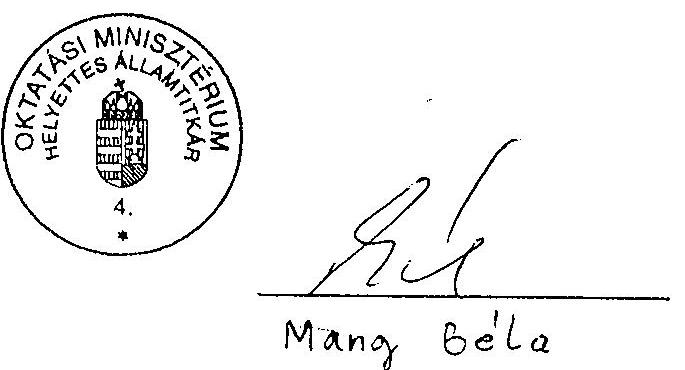

---

5. sz. melléklet
a V-31-93/2003-04. sz. jelentéshez

TÁBLÁZATOK

---

# A minősített oktatók kiemelt hatékonysági mutatói OM fenntartású intézmények (közalkalmazotti felmérés alapján)

## Összesítő adatok ${ }^{1}$

|  Évek | Számított
oktatói
létszám | Egyenértékü
hallgatói
létszám | Egy számított oktatóra
jutó egyenértékü
hallgató | Egy számított okti
tói létszámra kifize
tett havi bruttó bér
Ft/hó/fő | Egy egyenértékü
hallgatóra jutó havi
bruttó oktatói bér
Ft/hó  |
| --- | --- | --- | --- | --- | --- |
|  1. | 2. | 3. | 4. | 5. | 6.  |
|  2001 | 5234 | 149823 | 28,63 | 189094 | 6606  |
|  2002 | 5563 | 156624 | 28,15 | 194055 | 6893  |
|  2003 | 5589 | 163361 | 29,23 | 228221 | 7808  |

[^0] [^0]: ${ }^{1}$. A számított oktatói létszám az OM fenntartású intézmények létszámadata, amely nem tartalmazza a Dr.univ. és dr.cím létszámot, amelyek a finanszirozásban nem szerepelnek.

---

# 1.számú táblázat értékelése 

A tanúsítványokat az állami valamint a kijelölt egyházi és alapítványi intézményekre vonatkozóan az OM kitöltötte. A vizsgált évekre vonatkozó adatok az aktuális, az adott pénzügyi évet megelőző év adatgyűjtéseiből származnak. A kigyűjtés alapja a közalkalmazotti felmérés. A tanúsítványok a minősített oktatók kiemelt hatékonysági mutatóit foglalják össze. A táblázatok tartalmazzák a Dr. univ. és dr. címet elért minősített oktatók vonatkozó adatait is, azonban a képzési és fenntartási normatív finanszírozásnak ez a kiemelt csoport nem része. Ezért az OM fenntartású intézményekre vonatkozó adatokat korrigáltuk a csoportra vonatkozó számított oktatói létszám és bruttó bér adatokkal.

A számított oktatói létszám 2002-ben 6,3 \%-kal magasabb a bázis évhez képest, majd 2003ban közel azonos szinten maradt. Ezzel szemben az egyenértékủ hallgatói létszám 2002-re 4,5 $\%$-kal, majd 2003-ra további $4,3 \%$-kal emelkedett.

A számított oktatói létszám 2002. évi emelkedési ütemét az egyenértékủ hallgatói létszám változása kisebb mértékben követte, ennek eredményeképpen az egy számított oktatóra jutó egyenértékủ hallgatói létszám 1,7 \%-kal csökkent a 2001 évi bázishoz viszonyítva. Ez az arány 2003-ban 3,8 \%-kal emelkedett az előző évhez képest a hallgatói létszám további növekedése miatt.

A minősített oktatók havi átlagkeresete (bruttó bér) a vizsgált időszak bérpolitikai intézkedéseinek hatására 2002-ben $9,1 \%$-kal, majd 2003-ban további $18,2 \%$-kal emelkedett.

A hallgatói létszám 2003-ra történő növekedésének hatására az egyenértékủ hallgatóra jutó bruttó oktatói bér előző évhez viszonyított növekedése elmarad a számított oktatói létszámra kifizetett bruttó bér növekedésétől, indexe $13,3 \%$.

Az OM fenntartású intézményeknél 2003-ban 5589 minősített számított oktatót foglalkoztattak, az egyenértékủ hallgatók létszáma 163361 fő volt. Az egy számított oktatóra jutó egyenértékủ hallgatók száma 29 fő. A minősített oktatóknak kifizetett bruttó bér 2003-ban 1275 529 ezer Ft/hó, az 1 oktatóra jutó havi átlagos bruttó bér 228 ezer Ft.

---

# A normatív képzési és fenntartási támogatás (NKFT)alakulása az egyetemeken és föiskolákon (2. cím) 2001-2003. között 

|  | Eredeti elöirányzat | 2001. | 2002. | 2003. |
| :--: | :--: | :--: | :--: | :--: |
| 1. | Kiadás | 204939,3 | 213437,7 | 290281,3 |
| 2. | Bevétel | 105599,8 | 109645,8 | 135058,6 |
| 3. | Támogatás | 99339,5 | 103791,9 | 155222,7 |
| 4. | NKFT | 66150,2 | 69167,4 | 107967,2 |
| 5. | Index az előző évhez, \% | 100,0 | 104,6 | 156,1 |
| 6. | Index, \% (4/3) | 66,6 | 66,6 | 69,6 |
|  | Teljesítés |  |  |  |
| 7. | Kiadás | 242992,2 | 284930,7 | 330219,3 |
| 8. | Bevétel | 121558,7 | 137201,2 | 151237,1 |
| 9. | Támogatás | 121433,5 | 147729,5 | 178982,2 |
| 10. | NKFT | 70785,4 | 82676,5 | 104752,4 |
| 11. | Index előző évihez, \% | 100,0 | 116,8 | 126,6 |
| 12. | Index, \% (10/9) | 58,3 | 56,0 | 58,5 |
| 13. | Felsőoktatási, Fejl-i és Ért-i Főo. által számított | 66239,2 | 68649,6 | 105765,9 |
| 14. | Eltérés az eredeti elöirányzattól (13-4) | $+89,0$ | $-517,8$ | $-2201,3^{2}$ |
| 15. | Eltérés a teljesítéstől (1310) | $-454,2$ | $-14026,9^{3}$ | $+1013,5^{4}$ |

[^0]
[^0]:    ${ }^{2}$ Elvonásból adódik
    ${ }^{3}$ Béremelés többlete miatt
    ${ }^{4}$ elvonás és béremelés többletének egyenlege

---

6. sz. melléklet
a V-31- 93/2003-04. sz. jelentéshez

# GRAFIKONOK

---

1. sz. grafikon a V-31-55/2003-04. sz. jelentéshez

A felsőoktatás költségvetési támogatása 2001 - 2003 között (Ft)

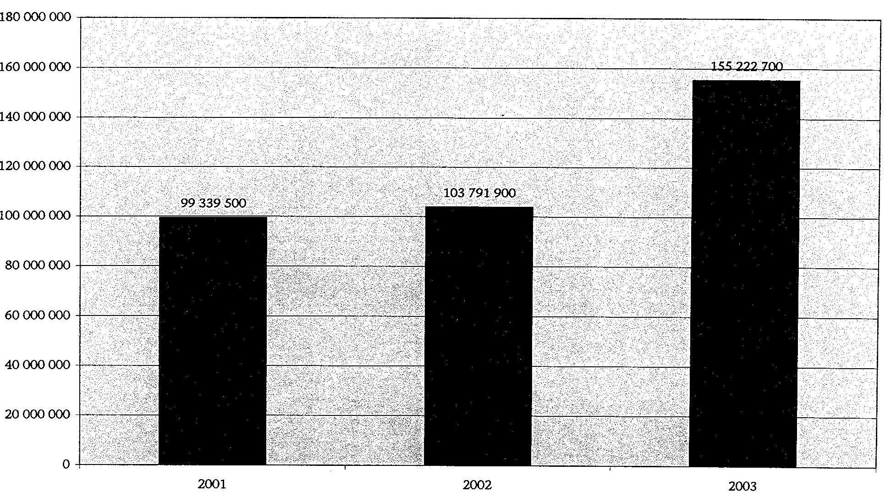

---

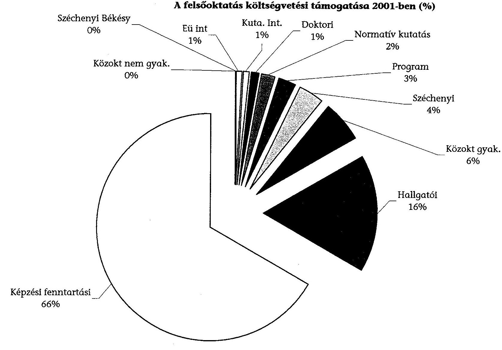

A felsőoktatás költségvetési támogatása 2001-ben (\%)
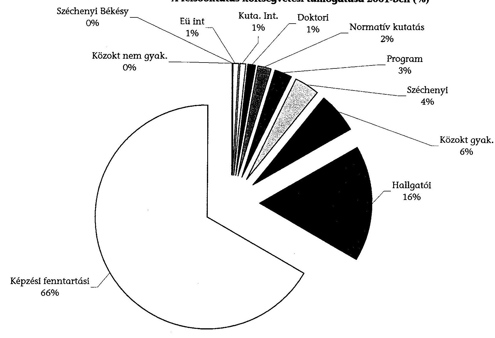

---

A felsőoktatás költségvetési támogatása 2002-ben (\%)
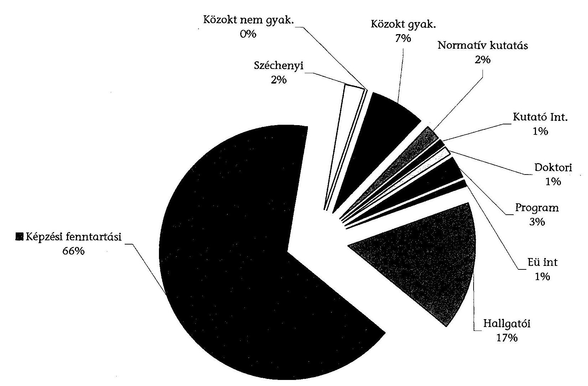

---

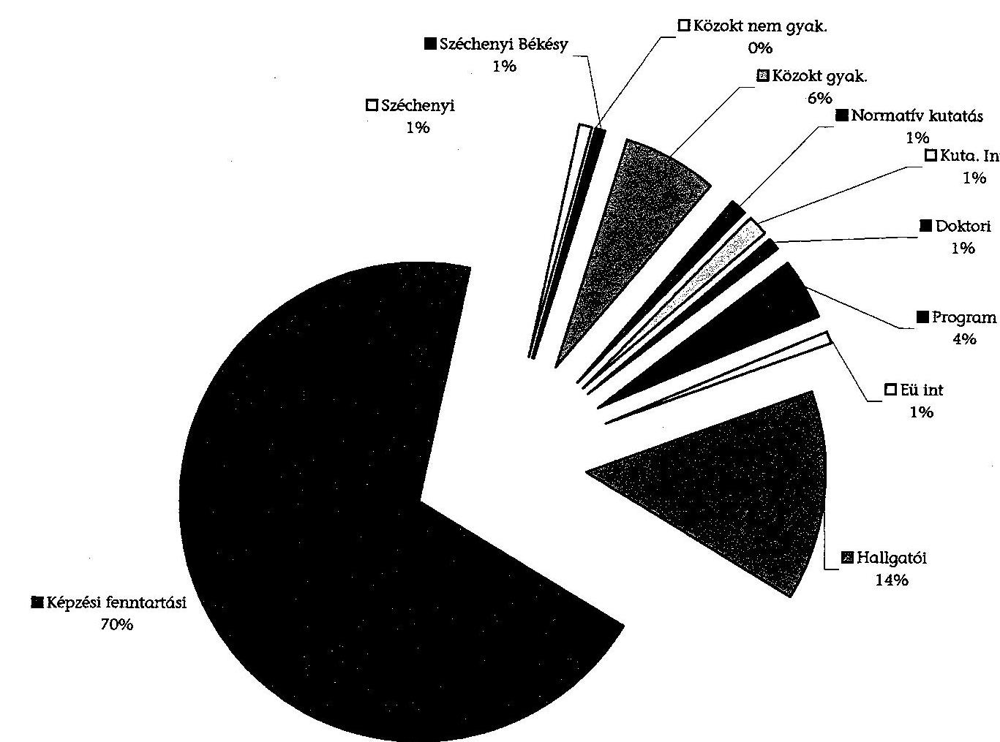

# A felsőoktatás költségvetési támogatása 2003-ban (\%)

|  Képzési fenntartási | Közöket nem gyakor  |
| --- | --- |
|  Széchenyi | 1%  |
|  Békény | 1%  |
|  Széchenyi | 1%  |
|  Széchenyi | 1%  |
|  Hállgatói | 14%  |
|  Széchenyi | 1%  |
|  Hállgatói | 70%  |

---

# 1. sz. függelék 

a V-31- 93/2003-04. sz. jelentéshez

## FÜGGELÉK

---

.

---

# Az előző számvevőszéki ellenőrzések javaslataira tett intézkedések ellenőrzése az Oktatási Minisztériumnál 

## 318 Jelentés a főiskolák és az egyetemek főiskolai karai állami támogatásának ellenőrzéséről

## Kormány részére

- A felsőoktatási törvény, illetve módosult változata sikeres végrehajtása érdekében a felsőoktatás szervezeti struktúrájának átalakítását jogi és pénzügyi ösztönzők egyidejű alkalmazásával, az autonómia és az önkéntesség elveinek fenntartásával indokolt elősegíteni.

Az 1993. évben a felsőoktatást szabályozó önálló törvény elfogadásával megteremtődtek az autonóm felsőoktatás alapjai és jogi szervezeti feltételei. Ennek ellenére megoldatlan probléma volt az intézményrendszer szervezeti átalakítása. Az 1993. évi Ftv. 1996. évi módosulása a szervezeti integráció két típusát szabályozta; a főként azonos településen működő állami felsőoktatási intézmények összeolvasztását és a felsőoktatási szövetségek létrehozását.
Az 1998. évben hivatalba lépett kormány kötelezettséget vállalt az intézményhálózat átalakítására. A kormány 1998. évben módosította az 1996. évi módosított Ftv. a felsőoktatási intézmények felsorolásának mellékletét. Ugyanakkor az 1998. évi kormányprogrammal összhangban a 1157/1998. (XII. 9.) Korm. határozatban döntést hozott az OM felügyelete alá tartozó állami felsőoktatásban végrehajtandó intézményi integrációs elvekről. Az 1999. évi LII. tv. alapján az átalakítást végrehajtották.

- A finanszírozási rendszer megváltoztatása igényli, egyben lehetővé is teszi a központi költségvetésben, ill. az egyesített intézmények költségvetésében a képzési szintek (egyetemi, főiskolai) finanszírozására fordított költségvetési előirányzatok elkülönítését. Ennek egységes rendszerét szabályozni szükséges.

A feladat továbbra is aktuális.

## Múvelődési és Közoktatási Minisztérium részére

- A bevezetésre kerülő mutatókon alapuló finanszírozás folyamatos működtetése nem nélkülözheti a megfelelő információs rendszert.

Az OM kifejlesztette azon számítógépes modellező programját, amelyek alapján a normatív támogatások meghatározása történik. (A Pénzügyi Főosztály nem ezen adatokat használja a finanszírozáskor.) Ezen információk modellezé-

---

se képezi az alapját a normatív finanszírozás jogi szabályozás változtatásának is.

- Kellő időben gondoskodni kell arról, hogy a felsőoktatás statisztikai rendszere kiterjedjen azoknak a tényezőknek a megfigyelésére, amelyek a finanszírozásban értékelésre kerülnek.

A 2000. évben életbe lépő normatív finanszírozási rendelet jelentős statisztikai adatbázis-háttér létrehozását, működtetését tette szükségessé. Az OM Statisztikai Osztálya rendszeresen gyűjti az egyházi és alapítványi felsőoktatási intézmények finanszírozási adatait, amelyeket speciális programmal feldolgoz az OSAP keretében. Ezen adatok különböző helyekre kerülnek átadásra; a KSH OECD, EURSTAT, valamint az OM szakmai területe számára is.

- Célszerű lehet a monitoring-rendszert a végzett hallgatók elhelyezkedésének nyomon követésére is kiterjeszteni.

Az OM kidolgozta a fiatal diplomások életpálya vizsgálatának (FIDEV) módszertanát. Az OM 1998. és 1999. évben diplomázottak 1999. és 2000. évi mun-kaerő- piaci helyzetére megbízásban végeztetett vizsgálatokat. 2000. szeptember óta ilyen felmérések az OM-ben nem voltak. A 2003. március 20. vezetői értekezleten készült előterjesztés, amely indítványozza a további felmérések továbbfolytatását.

- Hosszabb távon elemi feltételnek tekintjük, hogy az alkalmazásra kerülő teljesítményi mutatók a mennyiségi tényezőkön kívül az oktatás minőségét kifejező mérőszámokat is tartalmazzanak (pl.: az oktatók tudományos felkészültségét, az eredményesen végzettek arányát, a szakirányban elhelyezkedettek arányát stb.). A módosult hatáskörű Felsőoktatási és Tudományos Tanács a teljesítménymutatók kialakítása (továbbfejlesztése) során törekedjen a minőségi szempontok érvényesítésére is.

A Felsőoktatási és Tudományos Tanács készített ún. teljesítmény-mutatókra számításokat, de egységes rendszerét még nem dolgozta ki. A Felsőoktatási és Tudományos Tanács javaslatot tesz a miniszternek az államilag finanszírozott létszámra, a képzési szintek alakulására (egyetemi vagy főiskolai szintű alapképzés, akkreditált iskolai rendszerú felsőfokú szakképzés, nappali kiegészítő képzés) az egyes szakok, szakcsoportok, intézmények között hogyan legyenek felosztva.

- Új alapokra kellene helyezni a kollégiumi ellátás rendszerét. A kollégiumi térítési díjak nem fedezik a fenntartás költségeit, indokolatlan hátrányban vannak azok az elhelyezésre jogosultak, akik férőhely hiányában albérletbe, vagy más lakásmegoldásra kényszerülnek. A hallgatók érdekképviseleti szerveinek bevonásával igazságosabb és jobb hatékonyságú változatokat kellene kidolgozni és alkalmazásba venni.

Az OM az ÁSZ javaslatát figyelembe véve átdolgozta az egyetemi és főiskolai hallgatók által fizetendő díjakat és térítéseket, valamint a részükre nyújtandó egyes támogatásokat, amelyet az 51/2002. (III. 26.) Korm. rendeletben szabályozott. A fenti kormányrendelet módosítása folyamatban van. 2003. november 12. államtitkári értekezletre az előterjesztés elkészült. A felsőoktatásról szóló

---

1993. évi LXXX. 2003. június 1-től hatályba lépett módosítása a diákotthoni ellátás tekintetében is lehetővé teszi az államháztartáson kívüli befektetők bevonását. A módosítás során fontos szempont, hogy a hallgatók terhei ne növekedjenek elviselhetetlen mértékben, valamint, hogy növekedjék a lakkhatási esélyek egyenlősége. Az előterjesztés tárcaközi egyeztetése is megtörtént, valamint a gazdasági kabinet is jóváhagyta.

# 0016 Jelentés az Oktatási Minisztérium fejezet múködésének ellenőrzéséről 

## Oktatási miniszter részére

- Tekintse át és értékelje a felsőoktatási intézmények integrációjának szervezeti, szakmai és gazdasági tapasztalatait a 2000/2001. tanévet követően, ennek keretében vizsgáltassa felül a felsőoktatási intézményeknél alkalmazott normatívákat és az átalakult intézmények sajátosságaira figyelemmel kezdeményezze azok módosítását.

Az OM normatív támogatás rendszerét 2001. évben, illetve 2003. évben változtatta, amelyet a jelentés részletes megállapításainál ismertettünk.

## 0034 Vélemény a Magyar Köztársaság 2001. és 2002. évi költségvetési törvényjavaslatáról

## Oktatási miniszter részére

- Dolgozza ki az Oktatási Minisztérium a normatív hozzájárulásokhoz kapcsolódó mutatószámok dokumentálásához szükséges statisztikai jelentéseket és közoktatási nyilvántartásokat, hogy már a 2001. évi hozzájárulások igénybevételének jogszerűsége dokumentálható, ellenőrizhető legyen.

Tárca szinten előkészítő munkálatokat kezdett az OM; az intézményi szolgáltatások díjtételeinek felülvizsgálatára, ezen díjtételeknek a valós kiadásokhoz való változtatására, a térítésmentes szolgáltatások körének szűkítésére, valamint a hatósági engedélyezési feladatok díjtételeinek felülvizsgálatára.

## Jelentés a Budapesti Közgazdaságtudományi és Államigazgatási Egyetem múködésének ellenőrzéséről

## Oktatási miniszter részére

- Tekintse át és tegyen javaslatokat - a megalapozottabb finanszírozás érdekében - a felsőoktatás egészét érintően a költségvetési év és a tanév eltéréséből adódó pénzügyi források kiegyenlítési lehetőségeire, hangsúlyosan a normatív alapú finanszírozás továbbfejlesztésére.

Írja elő az Egyetem vezetésének, hogy

- dolgozza ki a vezetői döntést is megalapozó információs rendszerét, mérlegelve a használatba nem vett BKE VIR rendszer felélesztésének lehetőségét;

---

- tegyen intézkedéseket a hallgatói támogatások felhasználása és a térítések belső szabályzatának módosítására.

Az adósságállomány rendezésére az Egyetem az intézkedési tervet elkészítette, amelyet az OM jóváhagyott. A vezetői információs rendszer múködtetését az OM az állami felsőoktatás gazdasági információs rendszerével (OM-VIR) összekapcsoltan együtt kívánja megvalósítani és működtetni. A hallgatói támogatási rendszerben történt változásokat már a kollégiumi rendszer átalakítása kapcsán a 318. sz. ÁSZ jelentésnél ismertettük.

# 115 Jelentés a központi költségvetés területén múködő belső kontroll mechanizmusok ellenőrzéséről 

## Fejezetek felügyeletét ellátó szervek vezetői részére

- Intézkedjenek annak érdekében, hogy a felügyeleti költségvetési ellenőrzés minden évben vizsgálja felül - az Állami Számvevőszék által rendelkezésre bocsátott módszertan szerint - a fejezethez tartozó intézmények költségvetési beszámolóinak megbízhatóságát, szabályszerűségét és ehhez kapcsolódóan az intézményi belső kontroll mechanizmusok kiépítettségét és múködését.

Az OM felügyeleti ellenőrzése az ÁSZ munkatársaival egy közös vizsgálatban már részt vett. Az OM az ÁSZ által rendelkezésre bocsátott módszer szerint ún. audit típusú vizsgálatokat azért nem végzi, mert az intézmények számára a PM ezt másként szabályozta le.

- Intézkedjenek az informatikai környezet - ITB ajánlásoknak és szabványoknak megfelelő - belső szabályozottsága érdekében a szabályzatok felülvizsgálata alapján azok kiegészítésére, a hiányosságok pótlására. Az informatikai rendszer megfelelő múködése érdekében adott esetben mérlegeljék az informatikai szervezet megerősítését, kiemelt figyelemmel az informatikai biztonság és-védelem szempontjaira. A felügyeleti költségvetési ellenőrzés keretében fordítsanak figyelmet az informatikai kontrollok múködése eredményességére.

Az informatikai szabályzat az OM-ben 2003. évben elfogadásra került, hatályos 2004. január 1-jétől. Az OM belső informatikai rendszere is elkészült. Az ágazati stratégia kidolgozása folyamatban van az OM véleménye szerint 2004 első negyedévben elkészül.

## A helyszínen ellenőrzött intézmények vezetőinek:

- Tekintsék át az intézményi belső kontroll mechanizmusok múködését a kockázatok minimalizálása érdekében és tegyék meg a szükséges belső szabályozási intézkedéseket. Gondoskodjanak a belső kontroll rendszer folyamatos múködését biztosító szervezeti és személyi feltételek megteremtéséről.

Elkészült és hatályba lépett 2002-ben a belső ellenőrzésről szóló egyetemi szabályzat. A hatékony belső ellenőrzés rendszerének személyi és szabályozási feltételei is biztosításra kerültek.

---

# 232 Jelentés a Magyar Köztársaság 2001. évi költségvetése végrehajtásának ellenőrzéséről 

## Fejezetek felügyeletét ellátó szervek vezetői részére

- Vizsgálják felül az intézményeik és saját alapítású gazdasági társaságaik alapító okiratait, pótolják a hiányzókat, illetve a gazdálkodási gyakorlat, valamint az egyéb okok miatt szükségessé vált kiegészítéseket, módosításokat - a jogszabályi előírásokkal összhangban - tegyék meg. Adatmódosulás esetén azonnal kezdeményezzék annak cégbírósági bejegyzését.

Az OM 2002. évben két alkalommal vizsgálta felül és módosította - az oktatási miniszter kormányzati felelősségi körébe tartozó közalapítványok - alapító okiratait. Módosításra került a közalapítvány képviseletének, valamint a vagyon felhasználásának szabályai. Ahol az alapító okirat nem tartalmazta egyértelműen a kötelezettségeket, azt egyértelmúen rögzítették, továbbá a támogatás célját, a felhasználás rendjét, az elszámolás tartalmát, határidejét és bizonylatait az ellenőrzés módját és a szerződésszegés követelményeit is.

- Vizsgálják felül az intézmények múködésére, gazdálkodására és a pénzügyi, számviteli elszámolásokra vonatkozó szabályzatokat. Intézkedjenek a hiányzó szabályzatok pótlásáról, az elavultak hatályos jogszabályi előírásokkal összhangban lévő aktualizálásáról.

Az OM az 1999. évi LII. tv. a felsőoktatási intézményhálózat átalakításáról szóló törvény végrehajtása kapcsán felülvizsgálta az alapító okiratokat és aktualizáltatta azokat. Az alapító okiratok mellett az SZMSZ-ek is átdolgozásra kerültek. Az OM a gazdálkodás szabályzatához mintatervezeteket küldött az intézmények számára. Az OM átfogó ellenőrzés keretében külön vizsgálati szempontként szerepelt az alapító okirat a múködési rendre vonatkozó szabályzatok aktualizálásának ellenőrzése.

- Fordítsanak kiemelt figyelmet a központi költségvetési szervek és a fejezeti kezelésű előirányzatok beszámolójelentéseinek megbízhatóságát elősegítő vezetői és a munkafolyamatba épített ellenőrzések megvalósítására, hatékonyabbá tételére, a függetlenített belső és a felügyeleti ellenőrzés megállapításainak hasznosítására. Utóvizsgálatok keretében ellenőrizzék a vezetői intézkedési tervekben foglaltak teljesítését.

A javaslat alapján intézkedett az OM; a PM által jóváhagyott fejezeti kezelésű előirányzatok gazdálkodási, kötelezettségvállalási és utalványozási szabályzatban, mint a számszaki, mint a szöveges értékelés tartalmi szempontjai előírásra kerültek. A felügyeleti ellenőrzés - a számviteli törvény és a végrehajtási előírásai betartására tett - megállapításaira a közigazgatási államtitkár intézkedési tervben előírta az intézmények vezetőinek a feladat meghatározott határidőre való végrehajtását, egyben előírta a beszámolási kötelezettségét is.

## 311 Jelentés a felsőoktatási intézményhálózat integrációjának ellenőrzéséről

Az ÁSZ vizsgálat 2003. évben fejeződött be, így ezen javaslatokra tett észrevételek csak részben valósultak meg.

---

# Kormány részére tett javaslatok 

- Rendelje el a felsőoktatás 2010-ig szóló középtávú fejlesztési feladatainak meghatározására és azok ütemezésére vonatkozó felsőoktatási fejlesztési terv kidolgozását - a felsőoktatás fejlesztésének kiemelt céljairól szóló 101/2001. (XII.21.) OGY határozatban foglaltakra figyelemmel -, és a tervben rögzítse a felsőoktatás számára biztosítandó állami fejlesztési forrásokat.

Az OM több változatban vitaanyagot készített „a felsőoktatás modernizálásáról és az európai felsőoktatási térhez történő csatlakozás folyamatáról", végleges döntés még nincs.

Határozza meg a felsőoktatás minőségpolitikai követelményrendszerét.
Az Ftv. előírja, hogy a felsőoktatási intézményeknek 2001. december 31-ig be kell vezetniük a minőségbiztosítási rendszerüket. Az OM minőségbiztosítási kézikönyv közreadásával segítette az intézmények saját intézményi értékelésüket. Az OM a minőségpolitikai követelményrendszerét kormányhatározat szintjén nem dolgozta ki és nem szabályozta le.

- Dolgoztassa ki az egyes tudományterületekhez kapcsolódó, társadalmi szükségleten alapuló felsőoktatási intézménybe felvehető létszám megalapozását szolgáló munkaerő prognózisokat.

Az OM az intézménybe felvehető létszám megalapozását szolgáló munkaerő prognózisokat nem készít, ehhez adatokat, információkat más államigazgatási szervtől sem kap.

## Oktatási miniszter részére

- Végezze el a felsőoktatás stratégiai jellegű fejlesztési terve kidolgozását a magyar felsőoktatásban múködő hivatalos testületek és a felsőoktatási szakemberek széles körű bevonásával.

A helyszíni ellenőrzés időszakában a felsőoktatás stratégiai fejlesztési terve még kidolgozás alatt állt.

- Segítse elő iránymutatással és központi pénzügyi források biztosításával az intézmények egységes tanulmányi, gazdálkodási és vezetésirányítási rendszerének kialakítását, informatikai hátterének biztosítását.

Az informatikai háttérre vonatkozóan már a korábbi javaslatoknál a válasz megfogalmazásra került.

- Alapozza munkaerő prognózisokra az egyes tudományterületekhez kapcsolódó karokra felvehető, államilag finanszírozott hallgatói létszám meghatározását. A felsőoktatási intézményekre bízott költségtérítéses felvételi létszám felügyeleti egyeztetésekor legyen meghatározó szempont, hogy az oktatás személyi és tárgyi feltételei intézményen belül rendelkezésre álljanak.

Munkaerő prognózisra vonatkozóan az OM adatokkal nem rendelkezik.

---

- Tekintse át és ennek ismeretében szabályozza az intézmények költségtérítéses szolgáltatásként végzett oktatási tevékenységét, különös tekintettel a felmerülő kiadások fedezetére, valamint az intézményi és regionális munkaerőpiaci igények összhangjának megteremtésére.

Az OM külön szabályozást nem készített. A költségtérítéses szolgáltatásként végzett oktatási tevékenység. Az OM-nek továbbra is az a véleménye, hogy az intézmény saját autonóm hatáskörben határozza meg a költségtérítés nagyságát és köti meg a szerződést a hallgatóval

- Dolgozzon ki programot a kollégiumi ellátottsági szint növelésére.

A kollégiumi ellátottsági szint növelésére, a korábbi javaslatra tett intézkedés már ismertetésre került.

- Kérje fel a felügyelete alá tartozó felsőoktatási intézmények vezetőit, hogy:
- törekedjenek az oktatás-képzésben és az oktatási szervezeti egységek területén a meglevő párhuzamosságok megszüntetésére;
- alakítsák ki a karok közötti átoktatás szabályozását és pénzügyi rendjét;
- tekintsék át, értékeljék és a jelenlegi helyzetnek megfelelően módosítsák az intézményfejlesztési terveket;
- fordítsanak gondot a vezetői információs rendszer és a hiányzó kari adatszolgáltatás kiépítésére, az intézményi szintű szabályzatok és a kari szabályzatok teljes körű meglétére, összhangjára;

A felsőoktatási intézmények vezetőinek felkérése megtörtént. Részben a tanévet záró MRK, FZK, MERSZ konferencián és körlevélben.

- kísérjék figyelemmel a minőségbiztosítási előírásoknak megfelelően a diplomások elhelyezkedését - a képzési szaknak megfelelő pályán maradással - karonként, tudományterületenként. Az igényekhez igazodó képzésről alakítsanak ki közvetlen munkakapcsolatokat a régió munkaadói szervezeteivel;

A diplomások elhelyezkedésére vonatkozóan a FIDEV folytatása már a korábban tett javaslatnál leírásra került sor.

- szorgalmazzák a lezáratlan vagyonmegosztási és vagyonkezelési kérdések rendezését;

A lezáratlan vagyonmegosztási és vagyonkezelési kérdések rendezését az OM 2003. évben elvégezte.

---

# A korábbi ÁSZ ellenőrzésre tett intézkedések végrehajtása az intézményeknél 

A korábbi időszakban a felsőoktatás normatív finanszírozásának rendszerét az ÁSZ nem vizsgálta és ilyen vizsgálat a belső ellenőrzés vagy a felügyeleti ellenőrzés részéről sem valósult meg. A korábbi ÁSZ vizsgálatok, amelyek más megközelítésben vizsgálták az egyes intézmények gazdálkodását is, és valamilyen formában érintik a felsőoktatás normatív finanszírozását, négy felsőoktatási intézmény esetében tettek javaslatokat:

A NYME esetében a Felsőoktatás integrációjának vizsgálata eredményeként lehet értékelni a költségvetés „0" bázisú tervezésre épülő belső elosztási rendszer az egységes számviteli-információs rendszer kialakítását, az átoktatás és a belső adósságállomány rendezésének megkezdését.

A SE vonatkozásában a felhasználás során az OEP és OM támogatások szétválasztására, az önköltségszámítás bevezetésére tett javaslatok bekerültek az elkészített intézkedési tervekbe. Ezek végrehajtása megkezdődött, azonban a bekövetkezett személyi változások miatt is az egyes feladatok végrehajtására kitűzött határidőket nem sikerült tartani. Ezért szükséges lenne az intézkedési tervek áttekintése, a még meg nem valósított feladatok felelőseinek és határidőinek újbóli megállapításával.

A ME-n a Felsőoktatás integrációjának vizsgálata során megfogalmazott javaslatok a kari gazdálkodás átláthatóbbá tételét, az átoktatás szabályozását, több önelszámoló egység kialakítását, az intézményfejlesztési tervben is szereplő vezetői és döntéstámogatói rendszer, egységes gazdálkodási és kontroling rendszer kialakítását célozták. A javaslatok részben hasznosultak, az ET a karok gazdálkodási tevékenységét szabályozó intézkedés kidolgozását határozta el. Intézkedési terv azonban nem készült.

A SZTE-n az egyetem integrációjának vizsgálata során javaslatot tett az átoktatás, a hallgatók átjárási és áthallgatási feltételeinek szabályozására. Az egyetem ennek megfelelően 2003-ban szabályzatot fogadott el. Javasolta továbbá olyan információs bázis kialakítását, amely számon tartaná a diplomások elhelyezkedését, és segítséget nyújtana az esetleges túlképzés elkerülésére. Ugyanakkor az egyetem nem kíséri figyelemmel továbbra sem a végzős hallgatók elhelyezkedését.

A többi felsőoktatási intézmények DE; ELTE; PTE; VE; BKÁE; BGF esetében a korábbi ÁSZ vizsgálatok során nem kerültek megfogalmazásra olyan javaslatok, amelyekre az intézményeknek intézkedési terveket kellett volni készíteniük.

Összességében megállapítható, hogy akár külső vizsgálatok eredményeként, akár belső elemzések és javaslatok eredményeként került sor intézkedési tervek kidolgozására ezek végrehajtásában a határidők betartásában jelentős lemorzsolódások észlelhetők.

Budapest, 2004. július hó