# JELENTÉS 

a személyi jövedelemadó bevallási és visszaigénylési rendszerének ellenőrzéséről

---

# 2. Államháztartás Központi Szintjét Ellenőrző Igazgatóság 

2.1. Teljesítmény Ellenőrzési Főcsoport

Iktatószám: V-30-71/2003-2004.
Témaszám: 679
Vizsgálat-azonosító szám: V0097

## Az ellenőrzést felügyelte:

Bihary Zsigmond
főigazgató
Az ellenőrzés végrehajtásáért felelős:
Kemény Emil
főcsoportfőnök
Az ellenőrzést vezette:
Vörös Mária
osztályvezető főtanácsos
Az ellenőrzést végezték:

| Dr. Földvári Gábor | Józsa Ferencné | Kapronczai Gabriella |
| :-- | :-- | :-- |
| számvevő | számvevő | számvevő tanácsos |
| Kovács Cecília | Temesváry Miklós | Uram Ferenc |
| számvevő gyakornok | számvevő | számvevő tanácsos |

## A témához kapcsolódó eddig készített számvevőszéki jelentések:

Az Adó- és Pénzügyi Ellenőrzési Hivatal működésének és gazdálkodásának ellenőrzése
A központi költségvetés adóbevételei, illetve a társadalombiztosítást illető adó- és járulékbevételek realizálásának ellenőrzése (2000)

---

# TARTALOMJEGYZÉK 

BEVEZETÉS ..... 7
I. ÖSSZEGZŐ MEGÁLLAPÍTÁSOK, KÖVETKEZTETÉSEK, JAVASLATOK ..... 10
II. RÉSZLETES MEGÁLLAPÍTÁSOK ..... 15

1. A személyi jövedelemadó bevallási és visszaigénylési rendszerének eredményességét meghatározó főbb tényezők ..... 15
1.1. Az adóztatás törvényességi felügyelete, a PM felügyeleti jogkörének gyakorlása ..... 15
1.2. A szabályozottság értékelése ..... 16
1.3. Az ellenőrzések tervezése ..... 17
1.4. Az ellenőrzöttségi arány alakulása ..... 18
1.5. Az adatszolgáltatás és a bevallás-feldolgozás folyamatába épített közvetlen és közvetett ellenőrzések, célellenőrzések ..... 19
2. Az szja ellenőrzések folyamatának értékelése ..... 20
2.1. Az ellenőrzések eredményessége ..... 20
2.1.1. Az egyszerűsített és a kiutalás előtti ellenőrzések eredményessége ..... 20
2.1.2. Az utólagos ellenőrzések eredményessége ..... 21
2.1.3. Az adatszolgáltatók ellenőrzésének eredményessége ..... 23
2.2. Az ellenőrzésre kiválasztás rendszere, kockázatkezelés ..... 24
2.2.1. A kiutalás előtti és az egyszerűsített ellenőrzésre kiválasztás rendszere ..... 24
2.2.2. Az utólagos ellenőrzésre kiválasztás rendszere ..... 26
2.2.3. Az adatszolgáltatók ellenőrzésre kiválasztása ..... 27
3. Az szja bevételek alakulása ..... 31
4. Az APEH szja-t érintő hatósági tevékenysége ..... 32
4.1. Felügyeleti intézkedés ..... 32
4.2. Felülellenőrzés ..... 33
4.3. Perek ..... 33

---

# MELLÉKLETEK 

1/a-b. sz. melléklet: Észrevételek
2. számú melléklet Tanúsítványok (1-7), mutatók, kimutatások, táblázatok

1. sz. Tanúsítvány a hibás személyi jövedelemadó-bevallások javításáról 1998-2003.
2. sz. Tanúsítvány a személyi jövedelemadó bevallások kiutalás előtti ellenőrzéseinek alakulásáról 1998-2003.
3/1. sz. Tanúsítvány a személyi jövedelemadó ellenőrzések alakulásáról 2003. év
3/2. sz. Tanúsítvány a személyi jövedelemadó ellenőrzések alakulásáról 2002. év
3/3. sz. Tanúsítvány a személyi jövedelemadó ellenőrzések alakulásáról 2001. év
3/4. sz. Tanúsítvány a személyi jövedelemadó ellenőrzések alakulásáról 2000. év
3/5. sz. Tanúsítvány a személyi jövedelemadó ellenőrzések alakulásáról 1999. év
3/6. sz. Tanúsítvány a személyi jövedelemadó ellenőrzések alakulásáról 1998. év
4/1. sz. Tanúsítvány az adatszolgáltatások ellenőrzésének alakulásáról 2003. év
4/2. sz. Tanúsítvány az adatszolgáltatások ellenőrzésének alakulásáról 2002. év
4/3. sz. Tanúsítvány az adatszolgáltatások ellenőrzésének alakulásáról 2001. év
4/4. sz. Tanúsítvány az adatszolgáltatások ellenőrzésének alakulásáról 2000. év
4/5. sz. Tanúsítvány az adatszolgáltatások ellenőrzésének alakulásáról 1999. év
5/1. sz. Tanúsítvány az adatszolgáltatások ellenőrzésének alakulásáról 2003. év
5/2. sz. Tanúsítvány az adatszolgáltatások ellenőrzésének alakulásáról 2002. év
5/3. sz. Tanúsítvány az adatszolgáltatások ellenőrzésének alakulásáról 2001. év
5/4. sz. Tanúsítvány az adatszolgáltatások ellenőrzésének alakulásáról 2000. év
5/5. sz. Tanúsítvány az adatszolgáltatások ellenőrzésének alakulásáról 1999. év
6. sz. Tanúsítvány a bevallás elmulasztása miatt kiszabott mulasztási bírság alakulásáról 1998-2003.
7. sz. Tanúsítvány az APEH által kifizetett személyi jövedelem adónemet érintő késedelmi pótlékról 2003. év
8. sz. Mutató az utólagos személyi jövedelemadó ellenőrzési megállapításokból befolyt összeg 1998-2002.
9. sz. Mutató az utólagos személyi jövedelemadó ellenőrzési megállapításokból a jogerőssé vált adókülönbözet 1998-2002.
10. sz. Mutató a kiutalás előtti személyi jövedelemadó ellenőrzés során jogerősen visszatartott személyi jövedelemadó 1998-2002.
11. sz. Mutató adatszolgáltatók ellenőrzöttségi szintje 1998-2002.
1/1. sz. Kimutatás az szja vizsgálatok fajlagos feltárás adatai 2001. évben
1/2. sz. Kimutatás az szja vizsgálatok fajlagos feltárás adatai 2002. évben
12. sz. Táblázat az ellenőrzött adatszolgáltatók számának alakulása az operatív főosztályon 1998-2002.

---

2. sz. Táblázat az operatív főosztály által elrendelt vizsgálatok alakulása országosan 2001. évben
3. sz. Táblázat az operatív főosztály által elrendelt vizsgálatok alakulása igazgatóságonként 2001. évben
4. sz. Táblázat az operatív főosztály által elrendelt vizsgálatok alakulása igazgatóságonként 2002. évben
5. sz. Táblázat közigazgatási perek és ítéleteik 1998-2002.
6. sz. Diagramm ellenőrzési megállapítások alakulása a kiemelt adatszolgáltatási típusokban 1998-2002.
7. számú melléklet Az adatállományok felhasználása az egyes jövedelmek, valamint az adókedvezmények igénybevétele jogszerűségének ellenőrizhetősége szempontjából.

---

# RÖVIDÍTÉSEK JEGYZÉKE 

APEH
PM
KAIG
Szja
Szja tv.
Art. (régi)
Art. (új)
VAK

Adó- és Pénzügyi Ellenőrzési Hivatal
Pénzügyminisztérium
APEH Kiemelt Adózók Igazgatósága
Személyi jövedelemadó
1995. évi CXVII. törvény a személyi jövedelemadóról
1990. évi XCI. törvény az adózás rendjéről
2003. évi XCII. törvény az adózás rendjéről

Véletlenszerűségen alapuló kiválasztási rendszer

---

# ÉRTELMEZÉSEK 

Adatszolgáltató:

Adókülönbözet:

Ellenőrzöttségi szint:

Kifizető:

Köztartozás:

Munkáltató:

A kifizető, a munkáltató, a biztosítóintézet, a földhivatal, az illetékhivatal, a pénzintézet, a vámhivatal és a jegyző, a társadalombiztosítási szerv, az engedélyt kiadó hatóság, a Belügyminisztérium adatszolgáltatásra kijelölt szerve, az általános forgalmi adóról szóló törvényben meghatározott új közlekedési eszköz értékesítését üzletszerűen végző adózó, a megyei (fővárosi) munkaügyi központ, az adóigazgatási azonosításra alkalmas bizonylatot (nyomtatványt) forgalmazó, illetve alforgalmazó, az adókedvezmény (adómentesség) igénybevételére jogosító igazolást kiállító szerv, költségvetési támogatás igénybevételére jogosító igazolás kiállítója.
A bevallott (bejelentett), bevallani (bejelenteni) elmulasztott vagy a bevallás (bejelentés) alapján kivetett, kiszabott és az adóhatóság által utólag megállapított adó, költségvetési támogatás különbözete, vagy a büntető bíróság által jogerősen megállapított adóbevétel-csökkenés, illetőleg a jogosulatlanul igénybe vett költségvetési támogatás.
Az ellenőrzött adóalanyok és az összes adóalany számának aránya.
Az a belföldi illetőségű jogi személy, egyéb szervezet, egyéni vállalkozó, amely (aki) adókötelezettség alá eső jövedelmet juttat.
Törvényben meghatározott, az államháztartás alrendszereinek költségvetéseiből ellátandó feladatok fedezetére előírt fizetési kötelezettség, amelynek megállapítása, ellenőrzése, behajtása bíróság vagy közigazgatási szerv hatáskörébe tartozik, valamint a köztestület működésének fedezetére törvényben előírt fizetési kötelezettség, feltéve, hogy azt önkéntesen az esedékességkor nem teljesítették.
Belföldön székhellyel, telephellyel, képviselettel rendelkező jogi személy, bejegyzett cég, személyi egyesülés és egyéb szervezet, egyéni és társas vállalkozó, ideértve a belföldön lakóhellyel rendelkező magánszemélyt is.

---

# 6

---

# JELENTÉS <br> a személyi jövedelemadó bevallási és visszaigénylési rendszerének ellenőrzéséről 

## BEVEZETÉS

Az Állami Számvevőszék (továbbiakban: ÁSZ) a stratégiájában célul tűzte ki a költségvetés legnagyobb bevételeit kitevő adók beszedésére kialakított rendszerek működtetésének teljesítmény szemléletű ellenőrzését. Ennek keretében 2002-ben az áfa visszaigénylési rendszerét ${ }^{1}$, 2003-ban a jövedéki adóbevételek realizálását ${ }^{2}$ vizsgáltuk, 2005-re irányoztuk elő a társasági adó beszedésére kialakított rendszer ellenőrzését. Jelen ellenőrzésünk a személyi jövedelemadó (a továbbiakban: szja) bevallási és visszaigénylési rendszerének értékelésére irányult.

Az államháztartásnak az általános forgalmi adót követően a legnagyobb összegű bevétele az szja-ból származik. Az Adó- és Pénzügyi Ellenőrzési Hivatal (továbbiakban: APEH, Hivatal) az általa beszedett adót az államháztartás két alrendszere, azaz a központi költségvetés és az önkormányzatok között az adott évre vonatkozó költségvetési törvényben meghatározott arányban osztja meg. 2002-ben a központi költségvetés bevételeinek 24%-a, az APEH által realizált bevételek 29%-a származott az szja-ból.

A Hivatal az szja-ból a költségvetés részére 2001-ben 1117 Mrd Ft-ot, 2002-ben 1275 Mrd Ft-ot, 2003³-ban pedig 1371,6 Mrd Ft-ot szedett be. A Hivatal által visszautalt adó összege 2001-ben 33 Mrd Ft, 2002-ben 42 Mrd Ft, 2003-ban ${ }^{4}$ pedig 57,2 Mrd Ft volt. Az APEH az ellenőrzésekkel 2001-ben 53,6 Mrd Ft, 2002-ben 83,4 Mrd Ft adókülönbözetet tárt fel. Ennek mindkét évben mintegy 8%-a származott a személyi jövedelemadóból, ami az adott években az önadózásból befolyt szja-nak 0,5%-a volt.

[^0]
[^0]:    ${ }^{1}$ Az áfa visszaigénylési rendszerének ellenőrzéséről készített jelentésünket 2003 áprilisában terjesztettük az Országgyűlés elé.
    ${ }^{2}$ A költségvetési jövedéki adóbevételek realizálásának ellenőrzéséről készített jelentésünket 2004 januárjában terjesztettük az Országgyűlés elé.
    ${ }^{3}$ A 2003. évre vonatkozó adatok a Magyar Költségvetés 2003. évi végrehajtásának előzetes, tájékoztató adatai.
    ${ }^{4}$ A 2003. évi adatokat az APEH a jelentés-tervezet elkészítését követően összesítette, így értékelésükre a vizsgálat során nem kerülhetett sor, ezért egy részüket csak tájékoztatás céljából tüntetjük fel.

---

Az szja rendszer több mint 4,5 millió adóalanyt érint (ezen felül azon személyek ellenőrzése is szükségessé válik, akik rendelkeznek jövedelemmel, de nem vallják be). Az adót az adóalany önadózással állapítja meg, vallja be és fizeti meg, illetve igényli vissza, vagy munkáltatója által számol el a törvényben meghatározott feltételek szerint. Az adóbevallást és az ehhez kapcsolódó kontroll adatszolgáltatásokat évente kell teljesíteni, ebből adódóan annak feldolgozása és ellenőrzése az APEH részéről rövid idő alatt nagy mennyiségű feladat elvégzését teszi szükségessé. Az adatok feldolgozását kedvezőtlenül befolyásolja a bevallások bonyolultságából adódó számszaki, logikai, formai hibák nagy száma. Az adóhatóság 2001-ben az adóbevallások 75,3%-ánál, 2002-ben 56,6%-ánál, 2003-ban pedig 55,5%-ánál állapított meg hiányosságokat.

Az ellenőrzés célja annak értékelése volt, hogy az APEH ellenőrzési rendszere biztosítja-e az szja-ból származó költségvetési bevételek minél teljesebb körű realizálását, ezen belül figyelembe veszi-e a munkáltatói és önbevallást benyújtók ellenőrzésének különböző kockázatát, valamint eredményesek-e a jogosulatlan visszaigénylések felderítésére és a kifizetések megakadályozására tett intézkedései.

Ellenőrzésünk az szja bevallási és visszaigénylési rendszer vizsgálatára terjedt ki, aminek keretében a teljesítményellenőrzés módszerével kerestük a választ az ellenőrzés céljaként megfogalmazott kérdésekre. A vizsgálat szempontrendszerét előtanulmánnyal alapoztuk meg. A Hivatal által végrehajtott ellenőrzések eredményességének értékelésekor az alább felsorolt tényezők együttes alakulását vettük figyelembe:

- a PM felügyeleti jogkörének gyakorlása;
- az szja ellenőrzési rendszer szabályozottsága és ennek hatása az ellenőrzések végrehajtására;
- az ellenőrzések tervezése, az ellenőrzésre történő kiválasztás, kockázatkezelés alkalmazása;
- az ellenőrzöttségi arány alakulása;
- az adóbevallások feldolgozásának és ellenőrzésre történő kiválasztásának folyamata, beleértve az informatikai támogatottsága;
- az szja visszaigénylésére benyújtott bevallás-ellenőrzések számának, valamint az ellenőrzésekkel feltárt és jogszerűen visszatartott adóösszegek értékének alakulása;
- az adatszolgáltatók által megküldött adatok hasznosíthatósága, az adatszolgáltatások megbízhatósága.

Az szja bevallási és visszaigénylési rendszer értékelésének alapját képező tanúsítványokat a 2. számú melléklet tartalmazza.

Az ellenőrzésre az ÁSZ-ról szóló 1989. évi XXXVIII. tv. 2. § (4) bekezdése alapján került sor. Vizsgálatunk a 2001. január 1. - 2002. december 31. közötti időszakot foglalta magában, figyelembe véve az ezt megelőző három év (1998-2000.) adatait, valamint a helyszíni ellenőrzés lezárásáig az szja bevallási és

---

visszaigénylési rendszer folyamatában bekövetkezett változásokat. Jelentésünkben feltüntetjük a helyszíni ellenőrzést követő időszakban tett PM és APEH intézkedéseket.

A helyszíni ellenőrzésbe bevont szervezetek: a Pénzügyminisztérium, az APEH központja, valamint a bekért tanúsítványok adatai alapján a vizsgálati programban meghatározott kockázati tényezők figyelembevételével 11 területi igazgatóság. Ezek: KAIG, Észak-budapesti Igazgatóság, Kelet-budapesti Igazgatóság, Dél-budapesti Igazgatóság, Pest Megyei Igazgatóság, Fejér Megyei Igazgatóság, Borsod-Abaúj-Zemplén Megyei Igazgatóság, Komárom-Esztergom Megyei Igazgatóság, Győr-Moson-Sopron Megyei Igazgatóság, Heves Megyei Igazgatóság, Csongrád Megyei Igazgatóság.

A jelentés-tervezetet egyeztettük a PM közigazgatási államtitkárával és az APEH elnökével. Leveleik másolatát az 1. sz. melléklet tartalmazza.

---

# I. ÖSSZEGZŐ MEGÁLLAPÍTÁSOK, KÖVETKEZTETÉSEK, JAVASLATOK 

Az APEH az Art.-ban, illetve az Szja tv-ben meghatározott feladatainak ellátásához kialakította és folyamatosan fejleszti az szja bevételek beszedésének és az adóbevallások ellenőrzésének adminisztratív és informatikai rendszerét, ellenőrzési rendszere azonban nem segíti elő az szja-ból származó költségvetési bevételek teljes körű realizálását. Ennek oka többek között, hogy jogértelmezési különbségek vannak a PM és az APEH között, az ellenőrzésekhez felhasználható kontroll adatok struktúrája csak korlátozott mértékben teszi lehetővé az egyszerűsített ellenőrzések végrehajtását, nem megoldott az utólagos ellenőrzések informatikai támogatottsága, nem terjed ki az ellenőrzésre kiválasztás valamennyi adóalanyra, az adatfeldolgozás időbeni lemaradása veszélyezteti a további évek ellenőrzéseit.

A PM adóztatással kapcsolatos feladatai ellátása keretében figyelemmel kíséri az adóbevételek alakulását (törvényi előírások), folyamatosan bevonja az APEH-et a törvények módosításának előkészítésébe. Nem fogalmaz meg elvárásokat a Hivatallal szemben az szja adónem ellenőrzések eredményességére, illetve ellenőrzöttségi arányára, tehát nem használja fel eszközként az ellenőrzéssel való fenyegetettséget az adóalanyok jogkövető magatartásának kikényszerítésére.

A PM és az APEH jogértelmezése eltér a munkáltatói adó-megállapítások minősítése, valamint a hibás adatszolgáltatás, vagy az adatszolgáltatás be nem nyújtása miatt kiszabható mulasztási bírság alapjának meghatározása terén. A PM az ÁSZ jelentés-tervezetére tett észrevételében jelezte, hogy nem volt tudomása az APEH PM-től eltérő jogértelmezéséről. A PM a vizsgált időszakban hatályos törvények alapján adóbevallásnak minősíti a munkáltatói adó-megállapításokat, az APEH pedig - ugyancsak törvényi előírásra hivatkozva - nem. Az ÁSZ álláspontja szerint mind a PM, mind az APEH jogszabályi hivatkozása megalapozott. Ennek következtében, valamint az adatok összevethetőségének hiányában a vizsgált időszakban a Hivatal nem végezte el a munkáltatói adó-megállapítással elszámoló magánszemélyek egyszerűsített ellenőrzését. Az utólagos adónem-ellenőrzés keretében sem választanak ki ellenőrzésre ebből az adóalanyi körből, mivel az ellenőrzésre kiválasztás szempontjai között az egyszerűsített ellenőrzés elmaradása kockázati tényezőként nem szerepel. Ez az oka annak, hogy a mintegy 2,2 millió munkáltatón keresztül elszámoló adóalanyt, vagyis az adózók közel felét a Hivatal rendszerjellegűen nem ellenőrzi.

Mind a PM, mind az adóhatóság szerint az Art. egyértelműen meghatározza az adatszolgáltatókkal szemben kiszabható mulasztási bírság összegének alapját, azonban a PM azt az adatszolgáltatásokban érintett adóalanyok számára értelmezi, az APEH pedig az adatszolgáltatást hibásan, vagy be nem nyújtók számára vonatkoztatja. A Hivatal a saját jogértelmezése alapján alakította ki szankcionálási gyakorlatát. Ez azonban nem kellően visszatartó hatású az adatszolgáltatásokkal összefüggésben elkövetett mulasztások terén. Az adat-

---

szolgáltatás elmulasztása, vagy hibás adatszolgáltatás miatt I. fokú határozatban kivetett mulasztási bírság átlagos összege az 1998. évi 73,6 E Ft-ról 2002-ben 19,4 E Ft-ra csökkent. A Hivatal - a jogszabályi értelmezése alapján kialakított - mulasztási bírságolási gyakorlata nem készteti az adatszolgáltatókat a törvényben megfogalmazott kötelezettségeik pontos és időbeni teljesítésére.

A vizsgált években az szja ellenőrzések tervezésénél a Hivatal nem határozott meg ellenőrzöttségi szintet, hanem csak ellenőrzöttségi arányt számolt ellenőrzési típusonként, de azt is utólag, statisztikai céllal. A Hivatal elnöke a 2004. május 4-i levelében arról tájékoztatott, hogy a helyszíni ellenőrzés befejezését követően a 2004. évi ellenőrzések folyamatos értékeléséhez adózói kategóriánkénti ellenőrzési szintet határozott meg. A kiutalás előtti ellenőrzésekből realizálandó (visszatartandó) összegeket a Hivatal feladattervben írta elő az igazgatóságok részére. A tervszámok nem ösztönözték az igazgatóságokat az szja ellenőrzések arányának növelésére; a visszatartandó összeg meghatározása nem adónemenként történt, ezért bármely más adónem (elsősorban az áfa) ellenőrzésének előtérbe helyezésével biztosították a terv teljesítését. Az szja utólagos ellenőrzések tervezése az önbevallást benyújtó adóalanyokra, ezen belül elsősorban az egyéni vállalkozókra irányult. A Hivatal ellenőrzési keretszámot központilag nem határozott meg az adatszolgáltatók ellenőrzéseihez, mivel a jogszabály alapján kötelezően elvégzendő ellenőrzések száma az adott évben előre nem tervezhető és az adatszolgáltatók ellenőrzésére erőforrást az igazgatóságok csak a fennmaradó kapacitásuk erejéig tudnak biztosítani. 2002-t követően az APEH a feladattervében prioritásként fogalmazta meg az adókedvezmény igénybevételére jogosító igazolást kiállító szervezetek ellenőrzését és meghatározta az ellenőrzöttségi arányukat is.

Az APEH a bevallások feldolgozására, a visszaigénylések elbírálására, valamint az egyszerűsített ellenőrzések végrehajtására vonatkozó belső szabályzatait (utasítások, irányelvek, útmutatók) a törvényi előírásokkal összhangban fogalmazta meg. Kialakította a bevallások feldolgozásának és a kiutalás előtti ellenőrzések végrehajtásának egységes gyakorlatát. Részletes módszertani útmutatókat készített mind a kifizetők, mind az adókedvezményre jogosító igazolást kiállító szervezetek adatszolgáltatási kötelezettsége teljesítésének alaki, formai ellenőrzéséhez. Az adatszolgáltatók utólagos (átfogó, illetve adónem) ellenőrzéséhez azonban nincs egységes módszertan és nem alakította ki az ellenőrzések végrehajtásának egységes gyakorlatát.

Az ellenőrzések eredményessége a vizsgált időszakban valamennyi főbb ellenőrzési típus (egyszerűsített, kiutalás előtti, átfogó és adónem ellenőrzés) esetében folyamatosan javult.

A kiutalás előtti ellenőrzéseknél az APEH a visszaigénylést tartalmazó adóbevallások 1,2-2,0 \%-át ellenőrizte, ami az összes adóbevallásnak 0,6-$1,0 \%$-a. A megállapítással zárult ellenőrzések aránya az 1998-1999. évi 12-$13 \%$-ról a 2000-2002. évek mindegyikében $22 \%$-ra emelkedett, 2003-ban azonban $16 \%$-ra csökkent. Az informatikai alapú kiválasztás valamennyi viszszaigénylést tartalmazó adóbevallásra kiterjedt. Az igazgatóságok a kötelezőn felül használták a saját hatáskörben állítható kiválasztási paramétereket és a magas kockázatú visszaigényléseket minden esetben leellenőrizték. A Hivatal által fizetett késedelmi kamat összege 1998-2002 között fokozatosan csök-

---

kent, 2000-től egyik évben sem érte el a visszaigényelt adó összegének az 1 tízezrelékét. A vizsgált években a kontroll adatok az ellenőrzésekhez még nem álltak rendelkezésre, ami csökkentette a visszaigénylések jogszerűségének ellenőrizhetőségét. Az Art. 2004. évi módosítása megteremtette a kontroll adatok beérkezésére és a visszaigénylések elbírálására jogszabályban meghatározott határidők összhangját, amely a további években lehetővé teszi az ellenőrzöttségi arány növelését, az ellenőrzések eredményességének fokozását.

A Hivatal 2004. év elején fejezte be az adatszolgáltatók és az önbevallást benyújtók 1998. és 1999. évi kontroll adatainak, illetve adóbevallásainak egyszerűsített ellenőrzését. Az ellenőrzöttségi arány az 1998. évi 0,4 \%-ról 2002-re $4,0 \%$-ra nőtt. 2004. II. félévében tervezi megkezdeni és 2006-ra befejezni a 2000. és 2001. évi adóbevallások egyszerűsített ellenőrzéssel történő feldolgozását és vizsgálatát. A feldolgozás időbeni lemaradása veszélyezteti a további évek ellenőrzéseit azáltal, hogy az időkülönbség meghaladhatja az adóbevallások elévülési idejét.

Az utólagos ellenőrzéseket, illetve az ellenőrzésre kiválasztást a vizsgált időszakban nem támogatta egy kockázatkezelést is magában foglaló központi informatikai rendszer. A Hivatal elnöke a 2004. május 4-i levelében arról tájékoztatott, hogy a helyszíni ellenőrzés befejezését követően, 2004. márciusában országosan bevezette az adózók ellenőrzési szempontú kategorizálását szolgáló informatikai rendszer központi lekérdező modulját. A lekérdező modul célja kb. 2,3 millió adózó kockázati szempontok szerinti kombinált szűrése és sorbarendezése. Az ellenőrzések száma és ezért az ellenőrzöttségi arány is csökkent a vizsgált időszakban. A megállapítással zárult ellenőrzések aránya azonban az 1998. évi $18 \%$-ról 2002-ben $25 \%$-ra emelkedett. Az utólagos ellenőrzéseken belül a vagyongyarapodási vizsgálatok a legeredményesebbek, 2001-ben az ellenőrzések $58 \%$-a, 2002-ben $47 \%$-a zárult megállapítással. Az informatikai támogatottság, valamint az ellenőrzések végrehajtásának egységesítését célzó módszertan hiánya gátolja a célirányos, kockázat elemzésen alapuló ellenőrzések számának növelését, az ellenőrzöttségi arány javítását, ezáltal nem segíti elő az adóalanyok adózási fegyelmének pozitív irányú változását.

A Hivatal átfogó adóellenőrzéseket végez a vállalkozásokat terhelő szja-ra, ezen belül az szja előlegek levonásának gyakorlatára, az elszámolások szabályszerűségének vizsgálatára, valamint az esetleges adóelkerülési konstrukciók feltárására, de nem terjednek ki a magánszemélyek jövedelmének kontroll adatokkal történő egybevetésére, nyilatkozattételük jogszerűségének vizsgálatára, valamint a munkáltatón keresztül elszámoló adóalanyokra, illetve azon állandó tartózkodási hellyel nem rendelkező külföldi magánszemélyekre, akik Magyarországon adóztatható jövedelemmel rendelkeznek. Kimaradnak az utólagos ellenőrzésből azok a külföldi magánszemélyek is, akiknek ingatlanértékesítésből származott jövedelme. Az igazgatóságok nem végeztek vizsgálatokat arra vonatkozóan, hogy volt-e - és ha igen, hány - olyan adóalany, aki ugyanabban az évben adóbevallást is benyújtott és munkáltatóját is megbízta adója elszámolásával. Ezáltal nem tárta fel, ha az adót az adóalany kétszer fizette be, vagy igényelte vissza. A helyszíni ellenőrzésbe bevont egyik igazgatóságnál a Számvevőszék kezdeményezésére elvégzett vizsgálat kimutatta, hogy a mintaként kiválasztott 42 ezer adózóból 2002-ben 222 fő nyújtott be kétszer adóbevallást. A hiányolt ellenőrzések végrehajtásának jogszabályi akadálya nincs,

---

az adatszolgáltatások adatstruktúrája, illetve a rendelkezésre álló informatikai rendszer elvileg lehetővé tenné az ellenőrzések végrehajtását.

Az adatszolgáltatók (pl.: biztosítók, illetékhivatal, pénzintézetek, alapítványok), hogy eleget tegyenek jogszabályi kötelezettségeiknek, jelentős költségráfordítással szolgáltatnak adatokat a Hivatalnak. Az adatok struktúrája sok esetben nem, vagy csak korlátozottan teszi lehetővé a különböző adatállományok informatikai alapú összevetését, vagyis az egyszerűsített ellenőrzés elvégzését. Az adatszolgáltatások eltérő, vagy hiányos részletezettsége miatt nem állapítható meg informatikai módszerekkel, hogy mely jövedelmi, illetve kedvezményi elemnél melyik adatszolgáltató, vagy az adózó szolgáltatott hibás adatot. Nem állapítható meg, hogy az adóalany az egyes jövedelem-források után megfizette-e az adót (pl.: külföldről származó jövedelem, üzletrészértékesítés esetén). Nem veti össze a Hivatal a munkáltatói adó-megállapításokat és a kifizetői adatszolgáltatás adatait, így nem tárja fel, ha az adózó valótlan jövedelmi és más, adót érintő adatokkal számol el munkáltatójával. Számos adatszolgáltatói kontroll adat tehát csak az egyes adóalanyok utólagos ellenőrzése során és esetlegesen használható fel. Az adatstruktúrák megváltoztatásával, valamint az adóbevallások adataihoz történő megfeleltetésével az ellenőrzések informatikai támogatottsága növelhető lenne. Az APEH az egyes adatszolgáltatások tartalmát az Art., valamint a Szja tv. előírásának megfelelően határozta meg. A kifizetői, munkáltatói adatok, bevallások esetében a jogszabályi előírások lehetővé teszik részletesebb adatstruktúra kialakítását, de az APEH nem élt ezzel a lehetőséggel.

A Hivatal a vizsgált évek mindegyikében az adatszolgáltatóknak mindössze 0,25 \%-át ellenőrizte annak ellenére, hogy a 2001-2002. években az ellenőrzés informatikai támogatottsága kialakításának, valamint önálló szervezeti egységek létrehozásának hatására az ellenőrzések száma mintegy megtízszereződött. Az adatszolgáltatókon belül az adókedvezményre jogosító igazolást kiállító szervezetek ellenőrzését a Hivatal 2001. évi 126 db-ról 2002-re 544 db-ra emelte, azaz megnégyszerezte. 2001-ben az ellenőrzések $78 \%$-a, 2002-ben pedig $60 \%$-a zárult megállapítással, ezen belül adatszolgáltatás elmulasztását 2001-ben az ellenőrzések 59 \%-ánál, 2002-ben pedig $41 \%$-ánál állapították meg.

A hibásan kitöltött adóbevallások aránya az 1998-2003. évek között 51-57 \% között alakult, 2000. és 2001. években azonban meghaladta a $70 \%$-ot. A hibás adóbevallások magas arányának oka elsősorban az adótörvény és az adóbevallási nyomtatványok évenkénti változása, illetve bonyolultsága, de hozzájárult ehhez az adóalanyok figyelmetlensége is. A Hivatal az adóbevallások feldolgozásának gyorsítása érdekében 2002-ben továbbfejlesztette a 2001-től bevezetett adóbevallási nyomtatvány kitöltését segítő, Internetről is letölthető programját. Az igazgatóságok 2002-ben az adóbevallások $21 \%$-át, 2003-ban pedig $30 \%$-át dolgozták fel ezzel a módszerrel.

---

A helyszíni ellenőrzés megállapításainak hasznosítása mellett javasoljuk:

# a pénzügyminiszternek

1.  Azonnal kezdeményezze az Art., illetve az Szja tv. összehangolását annak érdekében, hogy a munkáltatón keresztül elszámoló adóalanyok egyszerűsített ellenőrzése elvégezhető legyen.
2.  Kezdeményezze az adatszolgáltatásokkal összefüggésben az Art. módosítását a mulasztási bírság felső összeghatárának emelésére, valamint a bírság kiszabásának differenciált megállapíthatóságára és egységes jogértelmezésére.
3.  Vizsgáltassa felül az Art-ban meghatározott adatszolgáltatások körét, struktúráját, tartalmát az egyszerűsített ellenőrzések rendszerjellegű lefolytathatósága érdekében és tegyen javaslatot az Art. módosítására figyelembe véve az adatvédelmi törvényt is.
4.  Kérje fel az APEH elnökét saját hatáskörben ellenőrzés lefolytatására valamennyi igazgatóságnál a 2000-2002. adóévekre vonatkozóan abból a célból, hogy
 állapítsa meg az adóbevallást benyújtó és munkáltatón keresztül is elszámoló adóalanyok számát, az általuk visszaigényelt és a részükre visszautalt adó összegét, intézkedjen az adóigazgatási eljárás lefolytatásáról, a jogosulatlanul kiutalt adó összegének beszedéséről, továbbá az ellenőrzések elmaradása miatti személyi felelősség megállapításáról és minderről adjon tájékoztatást.
5. Fogalmazzon meg elvárásokat az APEH felé az ellenőrzöttségi szintre, azaz adóteljesítményi kategóriák szerinti követelményekre vonatkozóan (vizsgálandó adóteljesítmény összege, illetve adózók száma) fontosabb adónemenkénti bontásban.
6. Kérje fel az APEH elnökét, hogy tegyen intézkedéseket:
a) az ugyanabban az évben adóbevallást benyújtó és munkáltatón keresztül is elszámoló adóalanyok kiszűrésére és azok ellenőrzésének kötelező lefolytatására;
b) az egyszerűsített ellenőrzések és ezen belül az adatszolgáltatói ellenőrzések felgyorsítására;
c) az adatszolgáltatás tartalmának és struktúrájának oly módon történő kialakítására, hogy a munkáltatón keresztül elszámoló adóalanyok utólagos ellenőrzése informatikai eszközökkel elvégezhető legyen;
d) az utólagos ellenőrzésekre a kiválasztásához a kockázatkezelést is magában foglaló informatikai rendszer fejlesztésének felgyorsítására.

---

# II. RÉSZLETES MEGÁLLAPÍTÁSOK 

## 1. A SZEMÉLYI JÖVEDELEMADÓ BEVALLÁSI ÉS VISSZAIGÉNYLÉSI RENDSZERÉNEK EREDMÉNYESSÉGÉT MEGHATÁROZÓ FŐBB TÉNYEZŐK

### 1.1. Az adóztatás törvényességi felügyelete, a PM felügyeleti jogkörének gyakorlása

A pénzügyminiszter a személyi jövedelemadóztatással kapcsolatos feladatát a vonatkozó jogszabályok betartásával látta el.

Az adóztatással kapcsolatos feladatait a vizsgált időszakban hatályos, adózás rendjéről szóló 1990. évi XCI. törvény és a pénzügyminiszter feladat és hatásköréről szóló, többször módosított 50/1990 (IX.15) Korm. rendelet, majd az ezt hatályon kívül helyező 140/2002 (VI.28) Korm. rendelet határozta meg. A jövedelemadóztatással összefüggő teendőit a Költségvetési bevételekért és a számvitelért felelős helyettes államtitkár felügyelete alá tartozó szervezeti egységek gyakorolják.

A PM a felügyeleti jogkörének gyakorlása keretében figyelemmel kíséri az adóbevételek alakulását (törvényi előirányzatok), de nem fogalmaz meg elvárásokat a Hivatallal szemben az szja adónem ellenőrzések eredményességére, illetve hatékonyságára, valamint az ellenőrzöttségi szintre vonatkozóan.

A PM a törvényesség és a szakszerűség ellenőrzése során saját hatáskörben kivizsgálja az APEH tevékenységével kapcsolatos bejelentéseket, feljelentéseket. A Hivatalnak az szja ellenőrzésekre kialakított gyakorlatával kapcsolatban egy bejelentés érkezett a PM-hez, amelyet a PM kivizsgált, azt nem találta megalapozottnak, az APEH eljárását ítélte jogszerűnek.

A PM felkérte az APEH-et, hogy az Önsegélyező Pénztáraknál végezzen ellenőrzéseket, amelyekkel kapcsolatban az ellenőrzöttek részéről kifogás merült fel. Az állásfoglalása szerint az APEH helyesen járt el, amikor feltárta, hogy az adott önsegélyező pénztár által a munkáltatók számára ajánlott eljárás adó-kikerülés. Az ellenőrzés során az APEH megvizsgálta az ezen eljárást alkalmazó 80 céget és összesen 218 M Ft adókülönbözetet állapított meg.

A PM és az APEH kapcsolatát folyamatos együttműködés jellemzi mind az Art., mind pedig az Szja törvény módosításának előkészítésében, előfordul azonban közöttük eltérő jogértelmezés is. Ilyen pl.: a munkáltatói adó-megállapítással elszámoló magánszemélyek esetében az egyszerűsített ellenőrzés elvégezhetőségének kérdése (lsd. 2.2.3 fejezet), a hibás adatszolgáltatások miatt kiszabható mulasztási bírság alapja (lsd. 2.1.3 fejezet). Ennek következtében a Hivatal az érintett kérdésben kifogásolható ellenőrzési illetve nem kellően visszatartó szankcionálási gyakorlatot alakított ki (lsd. 2.1.3 fejezet). A PM az ÁSZ jelentés-tervezetére tett észrevételében jelezte, hogy nincs tudomása az APEH PM-től eltérő jogértelmezéséről.

---

Az APEH évente megküldi javaslatait az Art. és Szja törvény módosításához, a PM pedig a törvényjavaslatokhoz kér véleményt a Hivataltól. A PM az APEH törvénymódosításra tett javaslatai közül a vagyonnyilatkozattal összefüggőt az Alkotmánybíróság állásfoglalására tekintettel - nem fogadta el, a családi adókedvezmények igénybevételéhez kapcsolódót pedig szakmailag nem tartotta megalapozottnak.

A vagyongyarapodási vizsgálatok számának és eredményességének növelése érdekében az igazgatóságok 95,5 %-a szükségesnek tartaná a vagyonnyilatkozatok általánossá tételét, illetve a bizonyítási teher megfordítását. A vagyonnyilatkozattal összefüggő jogszabályi előírásokat az Alkotmánybíróság 21/1993. (IV.2.) AB határozatában alkotmányellenesnek minősítette. Az Alkotmánybíróság megítélése szerint a vagyonnyilatkozat nem alkalmas a tényleges jövedelmek feltárására, álláspontja szerint a jövedelem elhallgatása, a jövedelembevallási kötelezettség pontatlan, hibás teljesítése, az egyéb adójogi kötelezettségek megsértése más eszközök (pl. becslés, ellenőrzés) alkalmazását alapozhatja meg.

Véleménykülönbségek voltak továbbá a vizsgált időszakra vonatkozóan például a családi kedvezménnyel kapcsolatos törvény módosítás tekintetében (minden gyerek rendelkezne adóazonosító jellel), amely lehetővé tette volna a mintegy 90 Mrd Ft összegű adókedvezmény számítástechnikai alapú ellenőrzését.

A pénzügyminiszter 1997-től irányelvben határozta meg az önálló tevékenységet folytató magánszemélyek esetében szakmánként és évenként az „elvárható" jövedelem-minimumok összegét, mint küszöbértékeket. Az adózói magatartás megváltozása tette indokolttá a küszöbérték megállapításának 2002. évi megszüntetését.

A jövedelem-minimumok 1996. évi bevezetésével a nyereséges vállalkozók aránya jelentősen nőtt 1997-ben és 1998-ban. Az átlagos nyereség 209 E Ft-ról 361 E Ft-ra emelkedett, miközben a veszteséget kimutatók átlagos vesztesége alig változott. A pozitív hatás 1998-tól 2001-ig mérséklődött, mivel a nyereséges egyéni vállalkozók átlagjövedelme 4 év alatt mindössze 60 E Ft-tal emelkedett. A küszöbérték meghatározása a korábban a szakmai átlag felett adózó egyéni vállalkozókat is arra ösztönözte, hogy a szakmai minimumhoz közelítsék bevallott jövedelmeiket, ami a továbbiakban a bevallott jövedelmek csökkenését eredményezte.

# 1.2. A szabályozottság értékelése 

Az APEH a bevallások feldolgozására, a visszaigénylések elbírálására (kiutalás előtti ellenőrzések), valamint az egyszerűsített ellenőrzések végrehajtására a belső szabályzatait (utasítások, irányelvek, útmutatók) a törvényi előírásokkal összhangban fogalmazta meg. A fenti területekre vonatkozó belső iránymutatásait - beleértve az szja bevallások feldolgozásának és ellenőrzésének rendjét - elnöki utasítás formájában adta ki, biztosítva a bevallások egységes elvek szerinti feldolgozását és az ellenőrzésre történő kijelölését. A Hivatal Központja az utasítások előkészítésénél figyelembe vette az igazgatóságok gyakorlati tapasztalatait és javaslatait. Az igazgatóságok a belső szabályzatoknak megfelelően hajtották végre az ellenőrzéseket.

A Hivatal mind a kifizetők, mind az adókedvezményre jogosító igazolást kiállító szervezetek adatszolgáltatási kötelezettsége teljesítésének alaki, formai ellen-

---

őrzéséhez részletes módszertani útmutatókat készített. Az utólagos (átfogó, illetve adónem) ellenőrzések keretében maguknak, az adatszolgáltatóknak az ellenőrzéséhez nem dolgozott ki módszertant és nem alakította ki az ellenőrzések végrehajtásának egységes gyakorlatát.

# 1.3. Az ellenőrzések tervezése 

A Hivatal utasításban szabályozza az egyszerűsített és a kiutalás előtti ellenőrzések tervezésének és az ellenőrzésre kiválasztásnak általános alapelveit, módszereit. Az APEH Központja minden évben figyelembe vette az igazgatóságok javaslatait, valamint a rendelkezésükre álló ellenőri kapacitást az ellenőrzési irányelvek, illetve a kötelezően alkalmazandó kiválasztási szempontok meghatározásánál.

Az APEH Központja feladattervben írta elő az igazgatóságok részére a kiutalás előtti ellenőrzésekből realizálandó (visszatartandó) összegeket. A tervezés során nem különíti el egymástól az egyes adónemeket (áfa, szja, társasági adó).

Az szja utólagos ellenőrzések tervezése az önbevallást benyújtó adóalanyokra, ezen belül elsősorban az egyéni vállalkozókra irányult, de nem terjedt ki a munkáltatóval elszámoló adóalanyok utólagos ellenőrzésére. Az éves ellenőrzési irányelvében a Hivatal prioritásokat fogalmaz meg arra vonatkozóan, hogy mely szakmák körében kell elsődlegesen az ellenőrzéseket elvégezni. A gazdálkodók esetében a tervezett átfogó ellenőrzések minden esetben kiterjedtek az szja ellenőrzésére is.

Az erőforrások elosztását alapvetően az határozza meg, hogy mekkora ellenőri kapacitást kötnek le a jogszabály alapján kötelezően elvégzendő ellenőrzések (megkeresés, bejelentés), valamint a véletlenszerűségen alapuló kiválasztással megindított ellenőrzések. Az igazgatóságok csak a fennmaradó kapacitást tudják a célirányos kiválasztással kijelölt ellenőrzésre fordítani.

Az utólagos ellenőrzések esetében a Hivatal ellenőrzési arányt csak az összes adónemre összevontan tud számolni, ezért annak központi meghatározására nem is kerülhetett sor. Az APEH az ellenőrzések tervezése során, illetve ezt követően az ellenőrzésre kiválasztáskor a korábbi, illetve a társigazgatóságok ellenőrzési tapasztalatait veszi figyelembe, különösen azokban az ügyekben, ahol egy konkrét jogsértéstípus halmozottan, több adóalanyra vonatkozóan is előfordult.

A Hivatal az adatszolgáltatók önálló ellenőrzésének számát és arányait az ellenőrzési irányelvében, illetve feladattervében nem határozta meg, hanem azokat az APEH Operatív Főosztálya által készített módszertani útmutatók mellékletei, valamint körlevelek tartalmazták.

Az adatszolgáltatók ellenőrzésének számát az APEH az egyszerűsített ellenőrzések központi rendszerének 2000. évi bevezetésével összefüggésben országos szinten 155 db-ban állapította meg, amely igazgatóságonként 5-10 db ellenőrzést jelentett. Az APEH központja - a program beüzemelését követően - az éves ellenőrzések számát 2001-ben 1200 db-ra, 2002-ben pedig 2000 db-ra emelte, amely az igaz-

---

gatóságoknak évente már 30-70 db, illetve 50-130 db ellenőrzést jelentett. A tervezett ellenőrzéseket az Igazgatóságok mindkét évben túlteljesítették: 2001-ben $75 \%$-kal, 2002-ben pedig $12 \%$-kal (1. számú táblázat).

2002-ben az APEH ellenőrzési irányelve meghatározta, hogy az adatszolgáltatók $10 \%$-át az adókedvezményre jogosító igazolást kiállítók köréből kell kiválasztani.

# 1.4. Az ellenőrzöttségi arány alakulása 

Az APEH nem határoz meg ellenőrzöttségi szintet az szja-ra vonatkozóan, hanem utólag számítja ki ellenőrzési típusonként az ellenőrzöttségi arányt adóalanyi kör szerinti bontásban és csak belső információként statisztikai célra használja.

A Hivatal elnöke a 2004. május 4-i levelében arról tájékoztatott, hogy a helyszíni ellenőrzés befejezését követően a 2004. évi ellenőrzések folyamatos értékeléséhez adózói kategóriánkénti ellenőrzési szintet határozott meg az igazgatóságok részére.

A kiutalás előtti ellenőrzések tervszáma nem ösztönözte az igazgatóságokat az szja ellenőrzések arányának növelésére. A visszatartandó összeg meghatározása nem adónemenként történik, ezért bármely más adónem (elsősorban az áfa) ellenőrzéseinek előtérbe helyezésével biztosítják a terv teljesítését. Az APEH a visszaigénylést tartalmazó adóbevallások 1,2-2,0 \%-át, a magas kockázatú adóbevallásokat ellenőrizte a vizsgált időszakban, ami a benyújtott adóbevallások 0,6-1,0 \%-át jelentette (2. számú melléklet 2. és 3. számú tanúsítvány).

A benyújtott adóbevallásokat alapul véve az egyszerűsített ellenőrzések aránya a tízszeresére nőtt, az 1998. évi 0,4 \%-ról 2002-re 4,0 \%-ra (2. számú melléklet 3. számú tanúsítvány). A fenti időszakon belül 2000-ről 2001-re ez az arány megháromszorozódott az ellenőrzésre kiválasztást segítő központi számítógépes rendszer bevezetésével.

Az utólagos átfogó és adónem ellenőrzések ellenőrzöttségi aránya az ellenőrzések számának csökkenése következtében a vizsgált időszakban csökkenő tendenciát mutatott.

Az ellenőrzöttségi arány számításánál problémaként jelentkezik a kifizetőknél, munkáltatóknál végzett szja ellenőrzés során az adóalanyok számának meghatározása, illetve hogy miként vehető figyelembe egy utólagos, több évet magába foglaló ellenőrzés.

Az adatszolgáltatók ellenőrzöttségi aránya a vizsgált év mindegyikében 0,25 \% körül alakult annak ellenére, hogy 2001-2002 években az ellenőrzés informatikai támogatottság kialakításának, valamint önálló szervezeti egységek létrehozásának hatására a vizsgálatok száma mintegy megtízszereződött (2. számú melléklet 4. számú mutató). APEH a vizsgált éveket megelőzően nem fektetett hangsúlyt az adatszolgáltatások ellenőrzésére, az egyes adatszolgáltatók vizsgálatára csak konkrét indokok alapján került sor (2. számú melléklet 4. számú tanúsítvány).

---

2001-ben az adókedvezmény igénybevételére jogosító igazolást kiállító szervezetek ellenőrzésére, ellenőrzöttségi arányára központi előírást nem volt. Az igazgatóságok az ellenőrzésre történő kiválasztás során azokat a szervezeteket jelölték ki ellenőrzésre, amelyek nagy összegű, illetve az adózók széles körét érintően adtak ki ilyen igazolásokat. A 2002. évi ellenőrzési irányelvben meghatározottaknak az igazgatóságok eleget tettek, országos szinten az ellenőrzések $24 \%$-a irányult az adókedvezményre jogosító igazolást kiállítók körére (2. számú melléklet 1. számú táblázat).

# 1.5. Az adatszolgáltatás és a bevallás-feldolgozás folyamatába épített közvetlen és közvetett ellenőrzések, célellenőrzések 

Az szja bevallások száma 1998-2002. között összesen 8,4 \%-kal nőtt (1998-ban 2188935 db, 2002-ben
 2372930 db $^{5}$ ). Az összes bevalláson belül a visszaigénylő pozícióban lévő bevallások száma az 1998. évi 1008556 db-ról 2002-ben 1152454 db -ra emelkedett, aránya a vizsgált években $46-48,5 \%$ között alakult. Az adóalanyok 1998. és 2001. között 21,8-31,8 Mrd Ft között igényeltek vissza szja-t.

A bevallások feldolgozási folyamatába épített ellenőrzési pontok megfeleltek az APEH Központja által kiadott utasításokban meghatározott ellenőrzési kritériumoknak. A bevallás feldolgozó programban olyan összetett tartalmi és logikai vizsgálati szempontok kerültek beépítésre, amelyek biztosították, hogy csak formailag hibátlan bevallások kerülhessenek további feldolgozásra. A vizsgált időszakban a hibásan kitöltött adóbevallások aránya az 1998-2003. között 51-57 \% között alakult, 2000. és 2001. években azonban ez az arány meghaladta a $70 \%$-ot (2. számú melléklet 1. számú tanúsítvány). A hibás adóbevallások magas arányának oka elsősorban az adótörvény és az adóbevallási nyomtatványok évenkénti változása, illetve bonyolultsága, de hozzájárult ehhez az adóalanyok figyelmetlensége is (pl.: az aláírás elmaradása, sortévesztés). Az adóbevallások benyújtásánál előforduló típushibák (összeadási és számolási hiba, aláírás hiánya, sortévesztés és sorkihagyás, mellékletek hiánya, adóazonosító jel hibásan történő feltüntetése) közül a formai hibákat az igazgatóságok saját hatáskörben, jogszabályi felhatalmazás alapján az adózó bevonása nélkül kijavíthatják (arányuk minden évben megközelítette a formai hibák $90 \%$-át, 2003-ban $83 \%$-ra csökkent).

A Hivatal az adóbevallások feldolgozásának gyorsítása érdekében 2002-ben tovább fejlesztette a 2001-től bevezetett adóbevallási nyomtatvány kitöltését segítő, Internetről is letölthető programját. Az igazgatóságok 2002-ben az adóbevallások $21 \%$-át, 2003-ban pedig $30 \%$-át dolgozták fel ezzel a módszerrel.

## Az adóbevallások feldolgozását és ellenőrzésre kiválasztását segítő informatikai rendszer - a tranzakciók naplózásával - lehetőséget

[^0]
[^0]:    ${ }^{5}$ A bevallások száma 2003-ben 2378726 db, az összes bevalláson belül a visszaigénylő pozícióban lévő bevallások aránya $51,1 \%$, az adóalanyok által visszaigényelt adó összege pedig $42,7 \mathrm{Mrd}$ Ft volt.

---

# biztosít valamennyi végrehajtott művelet nyomon követésére, adatbiztonsági vizsgálatára. 

A felhasználói rendszer logikai védelméhez tartozik, hogy a számítógépes alapszoftver valamennyi beavatkozásról gépi nyomkövetést végez. Ennek függvényében kimutatható, ha valaki nem a számára meghatározott feladatot látja el, vagy az adatokat illegálisan meg kívánja változtatni. Az igazgatóságok nem tapasztaltak jogtalan műveletet a vizsgált időszakban, ezért külön ellenőrzést a naplózási adatokra vonatkozóan nem végeztek.

A Hivatal elnöke évente utasításban szabályozza az adatszolgáltatás keretében benyújtott adathordozók fogadásának, feldolgozásának rendjét. Az utasításban rögzítettek alapján minden igazgatóságon egységes, azonos módon működtetett számítástechnikai rendszer működik. A rendszer funkciói biztosítják a különböző típusú adatszolgáltatási bizonylatok, mágneslemezek nyilvántartásba vételét, a bizonylatok rögzítését, a mágneses adathordozók beolvasását, valamennyi adatszolgáltatás formai számszaki ellenőrzésének algoritmusát, a hibás adatok javításának lehetőségét, az állományok leválogatását.

A Hivatal az igazgatóságok félévenkénti rendszeres beszámoltatása keretében törvényességi vizsgálatokat végzett, amelyek során többek között áttekintette az adott igazgatóság teljes ellenőrzési folyamatát és annak belső szabályozását is. E törvényességi vizsgálatokkal egyik igazgatóságnál sem tártak fel visszaélést.

A Hivatal Központja - szúrópróbaszerűen - a kisebb igazgatóságoknál 32 db, a nagyobbaknál pedig 64 db dokumentumot választott ki részletes ellenőrzésre. Ezekben az esetekben a központi vizsgálat nyomon követte a kiválasztott ellenőrzés és adóigazgatási eljárás teljes folyamatát a megbízólevél kiállításától a határozat jogerőre emelkedéséig. A dokumentációs ellenőrzés kiterjedt a törvényességi feltételeknek való megfelelés mellett az ellenőrzésben alkalmazott módszerek (kiválasztás, becslés, számítástechnikai eszközök használata, stb.) feltárására is.

## 2. AZ SZJA ELLENŐRZÉSEK FOLYAMATÁNAK ÉRTÉKELÉSE

### 2.1. Az ellenőrzések eredményessége

Az ellenőrzések eredményessége a vizsgált időszakban valamennyi főbb ellenőrzési típus (egyszerűsített, kiutalás előtti, átfogó és adónem ellenőrzés) esetében folyamatosan javult.

### 2.1.1. Az egyszerűsített és a kiutalás előtti ellenőrzések eredményessége

A kiutalás előtti ellenőrzéseknél a megállapítással zárult ellenőrzések aránya az 1998.-1999. évi 12-13 \%, a 2000-2002. évek mindegyikében 22-23 \%-ra emelkedett (2. számú melléklet 2. számú tanúsítvány). Ennek oka, hogy 2000-től a kockázati tényezőket beépíttették az ellenőrzésre kiválasztás kötelező paraméterei közé.

---

A visszaigényelt szja-nak 1999-2002 között minden évben 1-2 \%-át tette ki a jogerősen visszatartott adó összege (2. számú melléklet 3. számú mutató). A Hivatal határozataival szemben az adóalanyok jogorvoslati kérelmet nem nyújtottak be.

A jövedelemmel rendelkező, de adóbevallást be nem nyújtó magánszemélyek kiszűrése teljességvizsgálattal, illetve a munkáltatói, kifizetői adatszolgáltatások adatai alapján 2002-től egyszerűsített ellenőrzéssel történik. Amennyiben az adóbevallás adattartalma eltér a kontroll adatoktól és a rendelkezésre álló adatok hiányossága miatt az egyszerűsített ellenőrzés nem folytatható le, az adott adóbevallást átsorolják az utólagos ellenőrzésre történő kiválasztás alapját képező adatállományba. Az így utólagos ellenőrzésre átadott adóbevallások és azt ezt követően elvégzett ellenőrzések számáról sem a Hivatal, sem az igazgatóságok kimutatást nem vezetnek, az így feltárt adóhiány nagyságáról adatok nem állnak rendelkezésre. Csökkent azonban annak a valószínűsége, hogy ebből az adatállományból az igazgatóságok kiválasztanak adóalanyt utólagos ellenőrzésre, mivel a vizsgált időszakban ezen ellenőrzések száma csökkent (lsd. 2.1.2. fejezet).

A bevallás benyújtásának elmulasztása miatt kivetett mulasztási bírság esetszáma - az egyszerűsített ellenőrzések bevezetésének eredményeként - az 1998. évi 22 és az 1999. évi 610 db-ról 2000-ben 3947 db-ra, majd 2002-re 6977 db-ra, azaz 76 \%-kal nőtt. ${ }^{6}$ Az ellenőrzés alapján kivetett mulasztási bírság összege 1998. évről (1,62 M Ft) 2002-re (135,12 M Ft) a 83-szorosára növekedett (2. számú melléklet 6. számú tanúsítvány).

# 2.1.2. Az utólagos ellenőrzések eredményessége 

Az ellenőrzések száma az 1998. és 2002. évek között 16 \%-kal, 2002-ről 2003-ra azonban további $23 \%$-kal csökkent, a megállapítással zárult ellenőrzések aránya viszont ugyanezen időszakban $18 \%$-ról $25 \%$-ra emelkedett (1. számú tábla eredményességi mutatója). Az egyes igazgatóságok szja ellenőrzésének eredményességi mutatói nagyban eltérnek az országos átlagtól mind pozitív, mind negatív irányban. A legalacsonyabb eredményességi mutató 2001-ben $9,5 \%$, 2002-ben $10,6 \%$, míg a legmagasabb 2001-ben $71,9 \%$, 2002-ben $61,8 \%$ volt. A megállapítással zárult ellenőrzések aránya 2001-ben az igazgatóságok $48 \%$-ánál, 2002-ben $61 \%$-ánál nem érte el a hivatali átlagot.

A KAIG a többi igazgatósághoz viszonyítva kevés számú (185-217 db) ellenőrzést végzett, de azok $72 \%$-a, illetve $62 \%$-a zárult megállapítással. Az APEH a jelentős gazdasági potenciállal rendelkező adóalanyok minden gazdasági évét vizsgálta, ennek ellenére az ellenőrzés $67 \%$-ban tárt fel hiányosságot ezen adózói körben. Az ellenőrzéssel való fenyegetettség ezeknél a cégeknél $100 \%$-os, mégis nagyobb valószínűséggel zárul az ellenőrzés megállapítással, mint az ellenőrzéssel kevésbé fenyegetett adóalanyok esetében. A KAIG esetében a megszűnt és felszámolás

[^0]
[^0]:    ${ }^{6}$ 2003-ban a bevallás benyújtásának elmulasztása miatt kivetett mulasztási bírság esetszáma a 2002. évivel közel azonosan alakult, ugyanakkor a bírság összege $40 \%$-kal nőtt.

---

alatt lévő adóalanyok ellenőrzése nem jellemző, így azok nem ronthatják az ellenőrzés eredményességét.

A személyi jövedelemadó ellenőrzésének eredményessége

| Év | Összes szja <br> ellenőrzés <br> db | $\%$ | Megállapí- <br> tással zárult <br> db | $\%$ | Eredményes- <br> ségi mutató <br> $\%$ | $\%$ |
| :--: | :--: | :--: | :--: | :--: | :--: | :--: |
| 1998 | 44.675 | 100 | 7852 | 100 | 17,58 | 100 |
| 1999 | 38.849 | 87,0 | 7045 | 89,7 | 18,13 | 103,1 |
| 2000 | 46.525 | 104,1 | 6960 | 88,6 | 14,96 | 85,1 |
| 2001 | 43.921 | 98,3 | 9726 | 123,9 | 22,14 | 125,9 |
| 2002 | 37.528 | 84,0 | 9473 | 120,6 | 25,24 | 143,6 |

Az utólagos ellenőrzések megállapításainak megalapozottsága az szja adónemre vonatkozóan nem értékelhető, mivel a jogorvoslati kérelmek - az ellenőrzések során tett megállapítások alapján - általában több adónemet is érintenek és az APEH a jogorvoslatokat adónemenként nem különíti el.

Az igazgatóságok utólagos ellenőrzéseinek eredményességét befolyásolja, hogy ellenőrzési portfoliójuk hogyan alakul. Az Art. alapján kötelezően elvégzendő ellenőrzések (pl.: bejelentések és feljelentések alapján, illetve a véletlenszerűségen alapuló kiválasztással végrehajtott és záró ellenőrzések) eredményessége alacsonyabb, mint a célirányos kiválasztású ellenőrzéseké, ezért a portfolión belüli részarányuk növekedése negatívan befolyásolja az utólagos ellenőrzések eredményességét.

Az utólagos ellenőrzések eredményessége a B.A.Z. Megyei Igazgatóságon a következőképpen alakult: 2001-ben az 1574 db ellenőrzés 22,1 \%-a, 2002-ben az 1410 db ellenőrzés $26,6 \%$-a zárult megállapítással. Ebből az átfogó ellenőrzések $99 \%$-a (210 db), illetve $99,5 \%$-a (208 db), míg a záró ellenőrzések $13,5 \%$-a (1031 db), illetve $14 \%$-a (1202 db) zárult megállapítással.

A véletlenszerűségen alapuló kiválasztási (továbbiakban: VAK) rendszerrel kiválasztott adóalanyok ellenőrzésének eredményessége és hatékonysága alacsony, de biztosítja az ellenőrzésre történő kiválasztás objektivitását, ezáltal pozitívan befolyásolhatja az adómorált.

A VAK rendszerrel kiválasztott adóalanyok utólagos szja ellenőrzése során 2001-ben 187 db vizsgálatból 1961 E Ft, 2002. évben 231 db vizsgálatból 3343 E Ft adókülönbözetet tártak fel (2. számú melléklet $1 / 1$. számú és $1 / 2$. számú kimutatás). A vizsgálatok fajlagos mutatóit összehasonlítva, a VAK rendszerrel megállapított adókülönbözet a célirányos kiválasztással megállapított adókülönbözet $3 \%$-a (2001-ben), illetve $4 \%$-a (2002-ben) volt, azaz 2001-ben 54,8 M Ft, 2002-ben 71,4 M Ft elmaradt adókülönbözet keletkezett.

A vagyongyarapodási vizsgálatok eredményesek. 2001-ben az ellenőrzések $58 \%$-a, 2002-ben pedig $47 \%$-a zárult megállapítással. Ez az arány mintegy kétszerese az szja utólagos ellenőrzések átlagos eredményességének, ami

---

2001-ben 22,14 \%, 2002-ben 25,24 \% volt (1. számú tábla). A vagyongyarapodási vizsgálatok során az egy ellenőrzésre jutó megállapított és jogerőssé vált adókülönbözet 2001-ben a 40-szerese, 2002-ben pedig a 10-szerese volt a célzott kiválasztással egy ellenőrzésre jutó adókülönbözetnek (2. számú tábla).

Az utólagos ellenőrzések eredményességének alakulása
2. sz. tábla

| Évek | Célzott kiválasztás |  | Ezen belül a vagyongyarapodási vizsgálat |  | Véletlenszerűségen alapuló kiválasztás |  |
| :--: | :--: | :--: | :--: | :--: | :--: | :--: |
|  | Szja adónemet érintő ellenőrzések száma (db) | Egy ellenőrzésre jutó nettó szja adókülönbözet (E Ft/db) | Ellenőrzések száma (db) | Egy ellenőrzésre jutó nettó szja adókülönbözet (E Ft/db) | Szja adónemet érintő ellenőrzések száma (db) | Egy ellenőrzésre jutó nettó szja adókülönbözet (E Ft/db) |
| 2001 | 5.589 | 303 | 130 | 12.182 | 187 | 10 |
| 2002 | 10.848 | 323 | 203 | 3.180 | 231 | 14 |

A vagyongyarapodási vizsgálatok eredményességének javulásához hozzájárult, hogy a vizsgálatokat a Hivatal az esetek több mint $50 \%$-ában a gazdasági társaságok adóellenőrzései alapján indította el. A 2001-ben elvégzett 130 vizsgálatból 76 esetben, 2002-ben pedig a 203 ellenőrzésből 96 esetben tettek megállapítást. Ezek közül 2001-ben 66, 2002-ben pedig 83 esetben vált a megállapítás jogerőssé.

# 2.1.3. Az adatszolgáltatók ellenőrzésének eredményessége 

Az igazgatóságok az ellenőrzéseik során gyakrabban az adatszolgáltatás elmulasztását, illetve valótlan adatokat tartalmazó adatszolgáltatás közlését állapították meg. Hibás és hiányos adatszolgáltatások ritkábban fordultak elő.

2001-ben a kifizetők ellenőrzéseinek 49 \%-a zárult megállapítással, ezen belül az adatszolgáltatók $26 \%$-a be sem nyújtott adatszolgáltatást. A munkáltatói adatszolgáltatások ellenőrzésének $55 \%$-a zárult megállapítással, $45 \%$-ában az adatszolgáltatás elmulasztását állapították meg. Az adókedvezményre jogosító igazolást kiállító szervezetek ellenőrzésének $78 \%$-a zárult megállapítással, ezen belül $59 \%$ volt az adatszolgáltatást be sem nyújtók aránya (2. számú melléklet 2 . számú táblázat).

2002-ben a kifizetői adatszolgáltatásra kötelezettek ellenőrzésének $55 \%$-a, a munkáltatói adatszolgáltatásra kötelezettek ellenőrzésének $63 \%$-a zárult megállapítással. A kifizetők esetében a megállapítások $26 \%$-ában, a munkáltatók esetében $60 \%$-ában az adatszolgáltatás elmulasztását rögzítették. Az adókedvezményre jogosító igazolást kiállító szervezetek ellenőrzése során az adóhivatal az előző évhez képest megnégyszerezte ellenőrzések számát. A nagyobb vizsgálati arány mellett is az ellenőrzések $60 \%$-a zárult megállapítással, $41 \%$-ában állapították meg az adatszolgáltatás elmulasztását (2. számú melléklet 1. számú diagram).

Sem az Art., sem a Hivatal mulasztási bírságolási gyakorlata nem ösztönzi az adatszolgáltatókat az adatszolgáltatások pontos

---

elkészítésére és a Hivatalhoz történő időbeni benyújtására. Az elsőfokú határozatban kiszabott mulasztási bírság összege 1998-ban átlagosan 73,6 E Ft/db, 2002-ben 19,4 E Ft/db volt.

A PM szerint a Hivatal helytelenül értelmezi az Art. mulasztási bírságra vonatkozó rendelkezéseit. Álláspontja, hogy az adatszolgáltatókkal szemben kiszabható mulasztási bírság összegének alapja az adatszolgáltatással érintett adóalanyok száma.

Az Art. 74.§ (8) bekezdése alapján az adatszolgáltatást késedelmesen benyújtó magánszemély 50 E Ft-ig, más adózó 100 E Ft-ig terjedő mulasztási bírsággal sújtható. Amennyiben az adózó adatszolgáltatási, illetve bevallási kötelezettségének nem tesz eleget, vagy azt hibásan, hiányosan teszi, a mulasztási bírság maximális összege 200 E Ft , illetve magánszemély esetében 100 E Ft lehet.

Az Art. 2004. január 1-től a szankciók összegeit módosította. Kétféle szankciót alkalmaz attól függően, hogy az adatszolgáltatások hivatali adó-megállapításhoz kapcsolódnak-e, vagy sem. Nem részletezi azonban, hogy melyek azok az adatszolgáltatások, amelyek ide sorolandók, azok csak az adatszolgáltatási határidőkből következtethetők.

Az Art. 172. § (1) bekezdése alapján, ha az adózó az adatszolgáltatási kötelezettségét nem, vagy késedelmesen, hibásan, valótlan adattartalommal, vagy hiányosan teljesíti, magánszemély esetében 100 E Ft-ig, más adózó esetében 200 E Ft-ig terjedő mulasztási bírsággal sújtható. A (13) bekezdés a Hivatali adómegállapításhoz szükséges adatszolgáltatások nem teljesítése esetén, késedelmes, hibás, valótlan adattartalmú, vagy hiányos adatszolgáltatás esetén 300 E Ft-ig terjedő mulasztási bírság kiszabására ad lehetőséget.

Az Art. a 2004. évi módosítását követően sem differenciálja a mulasztási bírság összegét annak megfelelően, hogy az adott adatszolgáltatás elmulasztása, hiányos vagy hibás kitöltése mennyi adóalany ellenőrzését (2005-től hivatali adómegállapítását) akadályozza meg és milyen összegben tér el az a valós adatoktól. Nem differenciálja továbbá, hogy a bírság az adatszolgáltató forgalmi adataihoz miként viszonyul. Mind az Szja tv., mind az Art. a Hivatal jogkörébe utalja a bírság megállapítása során a körülmények mérlegelését. A bírságolási gyakorlat egységesítése érdekében az APEH elnöke irányelveket adott ki. Az irányelvek értelmében az adatszolgáltatást először elmulasztók esetében alapesetben a bírság maximum összegének $30 \%$-a a javasolt szankció.

# 2.2. Az ellenőrzésre kiválasztás rendszere, kockázatkezelés 

### 2.2.1. A kiutalás előtti és az egyszerűsített ellenőrzésre kiválasztás rendszere

Az APEH a kiutalás előtti és 2001-től az egyszerűsített ellenőrzésre történő kiválasztásnál a kockázatkezelést - folyamatosan fejlesztett - informatikai rendszer működtetésével valósítja meg. A bevallások ellenőrzésre kiválasztásakor részben kötelező ( 54 db ), részben szabadon választható paraméterek ( 57 db ) beállítására van lehetőség. A kötelező paramétereket a Hivatal központilag határozza meg, azok alkalmazásától az igazgatóságok nem térhetnek el. Az igazgatóságok hatáskörébe tartozik annak eldöntése,

---

hogy a kötelező paramétereken túlmenően milyen szabadon beállítható további szempontokat alkalmaznak és ezekhez milyen értékeket rendelnek. A választható paraméterek meghatározásánál figyelembe vették a helyi sajátosságokat, de elsősorban a rendelkezésükre álló revizori kapacitást.

A kiutalás előtti ellenőrzések kötelező kiválasztási feltételei elsősorban a köztartozásokhoz, az illetékesség-váltásokhoz, illetve a kapcsolt vállalkozások folyószámla tartozásainak nyilvántartásához kapcsolódnak. A többi kiválasztási feltétel beállítását, illetve az állítható paraméterek értékeinek meghatározását az igazgatóságok a saját tapasztalataik, a helyi sajátosságok figyelembevételével végzik. Ezek a feltételek elsősorban a visszaigényelt összegek nagyságára és az adókedvezményekre vonatkoznak. A paraméterek aktualizálása, illetve új feltételek meghatározása a jogszabályváltozásoknak megfelelően minden évben megtörténik.

Az egyszerűsített ellenőrzések esetében az igazgatóságok kiválasztási feltételként állítják be, hogy milyen kontroll adatokkal történjen az adóbevallások egybevetése. Ilyenek pl.: az alapítványi igazolások, a biztosítási igazolások, a végkielégítést felvevő magánszemélyekről rendelkezésre álló kontroll adatok, befektetési adóhitel.

# A kiutalás előtti ellenőrzések végrehajtásának időszakában - a jogszabályban meghatározott határidők különbözősége miatt - még nem álltak a Hivatal rendelkezésére az adatszolgáltatók által benyújtott kontroll adatok. Az egyszerűsített ellenőrzések lefolytatásához tekintettel arra, hogy erre az ellenőrzéstípusra jóval később (több év múlva) kerül sor - az adatszolgáltatói kontroll adatok megléte már biztosított. Az Art. 2004. évi módosítása megteremtette az adatszolgáltatási határidők összhangját, amelynek hatása majd először a 2004. évi adóbevallások feldolgozásánál jelentkezik. 

Az Art. rendelkezik az adatszolgáltatási kötelezettség módjáról és határidejéről. A törvény 2004. évet megelőzően az adóbevallások benyújtására a tárgyévet követő március 20-i határidőt határozta meg. Az adatszolgáltatók számára a kontroll információk benyújtási határideje március 31., illetve adathordozón történő teljesítés esetén a határidő április 20. volt. Az adóbevallásokban szereplő visszaigénylés kiutalására a törvény a benyújtástól (ami már január folyamán elkezdődik) számított 30 napos határidőt határozta meg, amely időpontban a kontroll adatok nem álltak a Hivatal rendelkezésére, ezért azok feldolgozására még nem kerülhetett sor. Az Art. 2004-es módosításával megteremtődött a határidők összhangja: egyrészt a visszaigényelt összeg kiutalásának határideje a bevallás beérkezésének napjától, de legkorábban az esedékességtől számított 30 napra módosult, másrészt az Art. 3. számú melléklete értelmében az adatszolgáltatók a kontroll adatokat a tárgyévet követő év január 31-ig kötelesek gépi adathordozón átadni az illetékes Hivatalnak.

Zárt informatikai rend biztosítja a visszaigénylést tartalmazó adóbevallások kontroll információkkal, a törzsadat állománnyal és a folyószámlával való egyeztetését, valamint a Hivatalnál nyilvántartott, illetve a társhatóságoktól (Vám- és Pénzügyőrség, illetékhivatal, önkormányzatok) érkezett adatok alapján az adóalanyok köztartozásainak figyelését.

---

# A Hivatal betartotta a kiutalás előtti ellenőrzések törvényben előírt határidejét, az általa kifizetett késedelmi kamatok összege csökkent. 

A visszaigényelt adó összegéhez viszonyítva a késedelmi kamat összege 1998-ban $0,2 \%, 1999$-ben $0,03 \%$ volt, a további években (2003. évet is beleértve) az 1 tízezreléket sem érte el (2. számú melléklet 7. számú tanúsítvány).

Az egyszerűsített ellenőrzések támogatására a Hivatal 2001. évet megelőzően nem rendelkezett egységes központi informatikai rendszerrel, ezért az igazgatóságok saját hatáskörben kialakított programokat működtettek. 2001-ben a központi informatikai rendszer alkalmazásával először az 1998. évi bevallásait dolgozták fel. A Hivatal központi utasítást és részletes eljárási szabályozást először 2002-ben készített az 1999. évi bevallások ellenőrzéséhez. A 2000. és 2001. évi adóbevallások és adatszolgáltatások egyszerűsített ellenőrzéssel történő feldolgozása a helyszíni vizsgálat befejezéséig még nem kezdődött meg, az adóbevallások ellenőrzését a Hivatal 2004. II. negyedévében tervezi megkezdeni és 2006. év végéig befejezni.

### 2.2.2. Az utólagos ellenőrzésre kiválasztás rendszere

A Hivatalban a vizsgált években az utólagos ellenőrzéseket, illetve a kiválasztást nem támogatta kockázatkezelést is magában foglaló központi informatikai rendszer.

A Hivatal elnöke a 2004. május 4-i levelében arról tájékoztatott, hogy a helyszíni ellenőrzés befejezését követően, 2004. márciusában országosan bevezette az adózók ellenőrzési szempontú kategorizálását szolgáló informatikai rendszer központi lekérdező modulját. A lekérdező modul célja kb. 2,3 millió adózó kockázati szempontok szerinti kombinált szűrése és sorba-rendezése.

A Hivatal átfogó adóellenőrzéseket végez a vállalkozásokat terhelő szja-ra, amely vizsgálatok kiterjednek az szja előlegek levonására kialakított gyakorlatra, az elszámolások szabályszerűségének vizsgálatára, valamint az esetleges adóelkerülési konstrukciók feltárására, továbbá a gazdálkodók költségvetési kapcsolataira. Nem terjednek ki azonban a magánszemélyek jövedelmének kontroll adatokkal történő egybevetésére, illetve nyilatkozattételük jogszerűségének vizsgálatára, valamint a munkáltatóval elszámoló adóalanyokra, továbbá azon állandó tartózkodási hellyel nem rendelkező külföldi magánszemélyekre sem, akik Magyarországon adóztatható jövedelemmel rendelkeznek. Kimaradnak az utólagos ellenőrzésből azok a külföldi magánszemélyek is, akiknek ingatlanértékesítésből származott jövedelme. Az ellenőrzések végrehajtásának nincs jogszabályi akadálya, az adatszolgáltatások adatstruktúrája, illetve a rendelkezésre álló informatikai rendszer az ellenőrzések végrehajtását elvileg lehetővé tenné.

2001-ben az szja adóalanyok 49,4 \%-a, 2002-ben pedig 47,5 \%-a számolt el munkáltatójukon keresztül.

Az szja utólagos ellenőrzésre jogszabály alapján kötelezően, illetve egyedi, vagy véletlenszerűségen alapuló kiválasztás eredményeként kerülhet sor.

---

A Hivatal a VAK rendszert 2001. májusától vezette be, az Art. csak 2003-tól írja elő annak kötelező alkalmazását az utólagos ellenőrzések 5 \%-ára.

A vagyongyarapodási ellenőrzések aránya a vizsgált években az összes utólagos adónem ellenőrzésen belül még az $1 \%$-ot sem érte el annak ellenére, hogy 2000. évtől az éves ellenőrzési irányelvekben kiemelt feladatként szerepelt.

Az adózás rendjéről szóló 1990. évi XCI. tv. 1997 óta teszi lehetővé a vagyongyarapodási vizsgálatok elvégzését az APEH számára, de gyakorlati alkalmazása csak 2000-től került előtérbe. Az Art. 60/A § (1) bekezdése alapján, ha a Hivatal megállapítása szerint az adózó vagyongyarapodásával és az életvitelére fordított kiadásokkal nincs arányban az adómentes, a bevallott és a bevallási kötelezettség alá nem eső, de megszerzett jövedelmének együttes összege, a Hivatal az adó alapját becsléssel is megállapítja.

# 2.2.3. Az adatszolgáltatók ellenőrzésre kiválasztása 

A Hivatal az adatszolgáltatók ellenőrzésre kiválasztásához nem rendelkezett központi informatikai rendszerrel. Az igazgatóságok saját fejlesztésű programokat használtak. Nem elemzik és ezért nem is kiválasztási szempont, hogy a bevallásokkal nem egyező adatállományban a leggyakoribb, illetve legnagyobb eltérést mely adatszolgáltatók és milyen adatszolgáltatási típusok, ezen belül adatsorok okozzák. A kiválasztásnál az igazgatóságok elsősorban a korábbi időszak tapasztalatait vették figyelembe, illetve olyan adatszolgáltatókat jelöltek ki ellenőrzésre, amelyekre vonatkozóan bejelentés érkezett adatszolgáltatási kötelezettség elmulasztása miatt. E kiválasztási eljárással az ellenőrzés 49, illetve $55 \%$-a zárult megállapítással (2. számú melléklet 4. sz. tanúsítvány).

Mind a kifizetők, mind az adókedvezményre jogosító igazolást kiállító szervezetek ellenőrzését gátolta, hogy az adóalany illetékessége szerinti megyei igazgatóságok nem vonták ellenőrzés alá azt az adatszolgáltatót, amelyik más igazgatóság illetékességi körébe tartozott. Ez esetben vagy nem ellenőrizték le, vagy megkeresték a társigazgatóságot, amely saját ellenőri kapacitása függvényében tervezte be az adatszolgáltató ellenőrzését.

Az adatszolgáltatói kontroll adatok csak egy része alkalmas az adóbevallásban szereplő adatokkal történő összevetésre. Az adatszolgáltatások eltérő, vagy hiányos részletezettsége miatt nem állapítható meg informatikai módszerekkel, hogy mely jövedelmi, illetve kedvezményi elemnél melyik adatszolgáltató, vagy az adózó szolgáltatott hibás adatot. A kontroll adatállományok egyike sem vethető össze egymással, így az egyezőség, vagy eltérés informatikai eszközökkel szintén nem ellenőrizhető. Az adatszolgáltatások (adatállományok) nem minden esetben alkalmasak a bevallásban szereplő jövedelmek nagyságának összevetésére, mert az az adatokat az adóbevallástól eltérően összevontan tartalmazza.

Például a K30 sz. kifizetői adatszolgáltatás bérnek és nem bérnek minősülő bruttó kifizetésként tartalmaz adatokat a bevallási adatsoroktól eltérően és a külön adózó jövedelmeket is eltérően részletezi. K30-as adatszolgáltatást tölt ki az a munkáltató is, amelynek alkalmazottja tartósan külföldön dolgozik és ott adózik,

---

ugyanakkor amennyiben ezen alkalmazottaknak Magyarországon adóköteles jövedelme nincs, adóbevallást sem kell benyújtania. A K30-as nyomtatványon az osztalék- és árfolyamnyereség jövedelmekre vonatkozó adatok összesítettek, így nem lehet a bevallással azonosítani például az osztalékból származó jövedelem utáni adót annak mértéke szerint (csak a bevallás összesen adatai alkalmasak az összehasonlításra). Az árfolyamnyereségből származó jövedelem esetében szintén összesített adatközlés van, de a bevallás is csak egy soron hozza ezt a jogcímet. A személyi jövedelemadóról szóló törvény különféle jogcímen megszerzett jövedelmekre alkalmazza az árfolyamnyereségre vonatkozó szabályokat. E jogcímek az előbbiek szerint nem jelennek meg külön sorokban. Van olyan jogcímen megszerzett jövedelem, mint például a vállalkozásból történő vagyon kivonása, melyre nézve csak 2004-től kezdődően lesz adatszolgáltatás.

# Az APEH az egyes adatszolgáltatások tartalmát az Art., valamint a

Szja tv. előírásának megfelelően alakította ki. A kifizetői, munkáltatói adatok, bevallások vonatkozásában azonban a jogszabályi előírások lehetővé tennék részletesebb adatstruktúra kialakítását (pl. a K30-as számú kifizetői adatszolgáltatás részletezettségénél). Az APEH azonban nem élt ezzel a lehetőséggel.

Az adatszolgáltatások tartalmát az Art. az említett esetekben konkrétan és tételesen, míg más adatszolgáltatás vonatkozásában általános jellegűen (munkáltatói, kifizető adatszolgáltatás) határozza meg. Az ebbe a körbe tartozó jövedelmi, adózási, stb. kategóriák további bontása a Hivatal feladata és felelőssége. Az Art. az adózási szempontból kockázatos adókedvezmények egy körére kontroll adatként mindössze a kedvezmény érvényesítésére az adózóknak kiadott igazolások felsorolását írja elő (Art. 3 sz. melléklet J. pont).

A Pénzügyminisztérium álláspontja szerint az Art. nem engedélyezhet a fentieknél részletesebb vagy eltérő részletezettségű adatszolgáltatást, mivel az adatvédelmi szempontból már kifogásolható lenne. Az ellenőrzés eredményességét növelné és ezen keresztül az adómorált javítaná, ha a Hivatal az adatszolgáltatóktól több adatot kérhetne. Ehhez a jogalkotónak szükséges tisztázni egyrészt, hogy az adatvédelmi előírások, ezen belül az adatok célhoz kötöttségének elve az adózást érintő adatok milyen részletezettsége mellett sérülhet, másrészt, hogy az adatkezelés célhoz kötöttsége nem valósul-e meg azzal, hogy az így bekért adatokat a Hivatal az egyszerűsített adóellenőrzések lefolytatásához felhasználná.

Az adatszolgáltatók ellenőrzéséhez a Hivatal egységes, a különböző feladatokhoz rugalmasan alkalmazkodó adatszolgáltatási struktúrát alakított ki, amely az adóazonosító jelre, illetve adószámra épül. A kialakított rendszer hiányosságai abból adódnak, hogy az APEH csak kérelemre látja el az adózókat adóazonosítóval. Ez az eljárás az időszakonként változó útlevélszámon nyilvántartott külföldi állampolgárok esetében megnehezíti az adóalanyok beazonosítását.

A Hivatal kérelemre egységes rendszerű, un. közösségi adószámot ad a magánvállalkozók, illetve gazdasági társaságok részére, ez azonban csak az áfa befizetési kötelezettség teljesítésének nyomon követhetőségében nyújt segítséget, a jövedelemadó vonatkozásában nem.

Adatszolgáltatás hiányában általában nem ellenőrizhetők azok a külön adózói jövedelmek, amelyekből az adót a kifizető már levonta. Az árfolyamnyereségből, illetve az osztalékból származó jövedelem kivételével ezekről bevallást sem kell benyújtani.

---

# Informatikai módszerekkel történő ellenőrzéssel egyáltalán nem, csak az egyes adóalanyok utólagos ellenőrzése során és esetlegesen használható fel számos adatszolgáltatói kontroll-adat.

#### Abstract

Ilyenek pl.: az ingatlan bérbeadásból származó jövedelmekre, az egészségbiztosítási járulékokra, társasházaknak kifizetett jövedelmekre, adómentes iskolai támogatásra, az értékpapír formájában adott természetbeni juttatásokra, az őstermelők részére kifizetett összegekre, az értékesített ingatlanok szerződés szerinti értékére, a vissza nem térítendő munkáltatói támogatásokra, az ellenérték nélkül vagy kedvezménnyel adott üdülési támogatásokra, alkalmi munkavállalói könyv kiadására, a külföldi szervezetnek teljesített társasági adóköteles kifizetésre, a külföldi illetékességű osztalékban részesülőkre vonatkozóan tartalmaznak információkat.

A Hivatal - az eltérő jogértelmezés miatt, valamint az adatok összevethetőségének hiányában - nem tudja elvégezni az egyszerűsített ellenőrzést a munkáltatói adó-megállapításokra. A PM az Szja tv. alapján adóbevallásnak minősíti a munkáltatói adó-megállapításokat, az APEH az Art.-ra való hivatkozással, illetve az adatok összevethetőségének hiányában a vizsgált időszakban nem végezte el a munkáltatói adó-megállapítással elszámoló magánszemélyek egyszerűsített ellenőrzését. Az utólagos adónem-ellenőrzés keretében sem választanak ebből az adóalanyi körből, mivel az ellenőrzésre kiválasztás szempontjai között az egyszerűsített ellenőrzés elmaradása kockázati tényezőként nem szerepel. Ez az oka annak, hogy a mintegy 2,2 millió munkáltatón keresztül elszámoló adóalanyt, vagyis az adózók felét a Hivatal rendszerjellegűen nem ellenőrzi.

Nem egyértelmű a jogszabályi megfogalmazás arra vonatkozóan, hogy a munkáltatói adó-megállapítások adóbevallásnak minősíthetők-e. A Hivatal nem tekinti a munkáltatói adó-megállapítások adóbevallásnak az Art.-ra való hivatkozással, ezért nem is végzi el azok tartalmi ellenőrzését. A PM ezzel ellentétes álláspontot képvisel az Szja tv. 12. §-ában megfogalmazottakra hivatkozva.

Az Art. 65. § szerint az egyszerűsített ellenőrzés keretében a Hivatal az önadózási kötelezettség teljesítését a rendelkezésére álló adatok és a benyújtott adóbevallás egybevetésével ellenőrizheti. Az APEH jogértelmezése szerint az egyszerűsített ellenőrzés a fentiek alapján csak az adóbevallásokra terjedhet ki. Az Szja tv. 12. § értelmében a munkáltatói adó-megállapítás a magánszemély adóbevallásával egyenértékű nyilatkozat alapján készül, de pontos megfogalmazás hiányában nem egyértelmű, hogy a munkáltatói adó-megállapítás adóbevallásnak minősül-e.

Az adatfeldolgozási rendszer az adatszolgáltatásra előírt határidő és a tényleges teljesítés idejének összevetésével biztosítja az adatszolgáltatást elmulasztók, illetve a késedelmesen teljesítők kiszűrését. A 2002-ben bevezetett informatikai rendszer ezen felül már automatikusan kiállítja a határozatot a mulasztási bírságról.

A Hivatal az országos adatállomány létrehozását követően végez „duplaságvizsgálatot". Ha egy feldolgozási időszak alatt több adatszolgáltatás érkezik egy adatszolgáltatótól (pl.: az adatszolgáltató az adatszolgáltatását elrontotta és annak javítására módosítást vagy kiegészítést nyújtott be), az

---

informatikai rendszer nem különbözteti meg az eredetit a kiegészítéstől, illetve a javítástól, az adatok összegződnek. A feldolgozási időszakot követően beérkező kontroll adatokat a rendszer nem kezeli.

A Hivatal a 2002. évet megelőzően a rendelkezésére álló adatállományok közül csak a kifizetői adatszolgáltatás és az szja adóbevallás adataira vonatkozóan végezte el az adatok egybevetését. Az eltérő adatállomány alapján 2002. évet megelőzően informatikai alapú további ellenőrzést nem végzett. Az informatikai rendszer tehát nem volt alkalmas az adóbevallást be nem nyújtó, de bérjövedelemmel rendelkező, illetőleg a bevallást benyújtó és jogosulatlanul adót visszaigénylő, de valójában bérjövedelemmel nem rendelkező adóalanyok kiszűrésére.

Az igazgatóságok nem végeztek vizsgálatokat arra vonatkozóan, hogy volt-e - és ha igen, hány - olyan adóalany, aki ugyanabban az évben adóbevallást is benyújtott és munkáltatóját is megbízta adója elszámolásával. Ezáltal nem tárta fel, ha az adót az adóalany kétszer fizette be, vagy igényelte vissza.

A helyszíni ellenőrzés során egy igazgatóságnál mintavételezett adózói kör (42 ezer fő) $0,5 \%$-a, 222 fő 2002. évre vonatkozóan 53-as bevallást adott be amellett, hogy munkáltatóját is megbízta adójának elszámolásával.

Nem veti össze a munkáltatói adó-megállapításokat és a kifizetői adatszolgáltatás adatait sem, így az adózó valótlan jövedelmi és adót érintő adatokkal számolhat el a munkáltatójával.

Munkáltatóváltozás esetén a munkavállaló köteles átadni korábbi munkáltatója által kiállított adóigazolását. Az adatok valóságtartalmát, illetve az adóigazolás meglétét az új munkáltató azonban ellenőrizni nem tudja, ugyanakkor annak figyelembevételével állapítja meg a munkavállaló adóelőlegét. A munkavállaló ellenőrzését - amennyiben korábbi munkaviszonyát az új munkáltatójánál elhallgatja és ezt követően megbízza munkáltatóját, hogy adójával számoljon el -, illetve adócsalásának kiszűrését a Hivatal informatikai eszközök felhasználásával, azok hiányában nem tudja elvégezni.

A kontroll adatok struktúrája nem alkalmas arra, hogy a Hivatal ezek alapján ellenőrizze az Szja törvényben biztosított adókedvezmények igénybevételének jogszerűségét. Az Art. a mellékletében felsorolt adatszolgáltatásokon túlmenően csak konkrét, egyedi megkeresések esetére biztosít a Hivatal részére további adatkérési lehetőséget a jogosultság ellenőrzése céljából (Art. 45.§ (2) bekezdés).

Az egyes adatszolgáltatások hiányos adattartalma, vagy magának az adatszolgáltatásnak a hiánya miatt az APEH nem ellenőrizhette, hogy az adóalany az egyes jövedelem-források után megfizette-e az adót (pl.: külföldről származó jövedelem esetén).

A helyszíni ellenőrzésünk nem terjedt ki valamennyi jövedelem-forrás, illetve adókedvezmény kontroll adatok alapján történő ellenőrizhetőségének értékelésére. Megállapításaink a problémákat és azok okait rögzítik, arra megoldási

---

javaslatokat nem tartalmaznak, mivel azok adatvédelmi kérdések tisztázását igénylik. A jelentés 3. számú melléklete részletesen felsorol ezek közül néhányat.

# 3. Az szja bevételek alakulása

Az szja bevételi előirányzatát a költségvetési törvényben határozzák meg. A Hivatal az adóbeszedéssel, az adóellenőrzésekkel, a szankciókkal, valamint a jogosulatlan visszaigénylések feltárásával, illetve a végrehajtási és a felszámolási eljárások terén tett intézkedésekkel járul hozzá az előirányzatok teljesítéséhez.

A személyi jövedelemadóból származó bevételek az éves előirányzathoz képest 2001-ben 2,2 \%-kal alacsonyabb összegben (27 Mrd Ft-tal), 2002-ben 1,7 \%-kal magasabb összegben (21 Mrd Ft-tal) teljesültek.

A tervezés pontatlanságát a PM részben a gazdaságban végbement folyamatokkal indokolja.

Az szja-ból a Magyar Államkincstár számlájára befolyt nettó összeg 2001-ről 2002-re $14 \%$-kal nőtt, 2001-ben a módosított előirányzat $97,8 \%$-ában (1117 Mrd Ft), 2002-ben pedig 101,7 \%-ában (1275 Mrd Ft) teljesült. E bevételnövekedést részben az összevont jövedelmek $11,1 \%$-os növekedése, részben pedig az adóterhelés $0,2 \%$-os emelkedése eredményezte.

A Hivatal által visszautalt adó összege 2001-ről 2002-re 27,4 \%-kal nőtt (33 Mrd Ft-ról 42 Mrd Ft-ra), nagyobb ütemben, mint az adóbevételek növekedési üteme. Ennek oka elsősorban, hogy az Szja tv. megteremtette a lakáshitelek utáni adókedvezmény igénybevételének lehetőségét.

Az APEH az ellenőrzésekkel 2001-ben 53,6 Mrd Ft, 2002-ben 83,4 Mrd Ft adókülönbözetet tárt fel. Ennek mintegy $8 \%$-a származott a személyi jövedelemadóból, ami az önadózásból befolyt szja-nak 0,5 \%-a volt.

2001-ről 2002-re a szja-ból származó összes bevétel $14 \%$-kal (1117 Mrd Ft-ról 1275 Mrd Ft-ra), az ellenőrzésekkel feltárt és megállapított adókülönbözet pedig mindössze $8,3 \%$-kal növekedett (7584 M Ft-ról 8215 M Ft-ra). A revízióból származó adókülönbözet növekedése elsősorban a nominál jövedelmek növekedésének következménye.

Az APEH által megállapított adókülönbözetek realizálása (beszedése) az igazgatóságok között eltérően alakult (2001 és 2002-ben 4,3 \% és 182,5 \% között), összességében azonban javuló tendenciát mutat. A Hivatal a nyilvántartott adókülönbözetből 2000-ben 7,3 Mrd Ft-ot (29,5 \%), 2001-ben 7,6 Mrd Ft-ot (27,7 \%), 2002-ben 8,2 Mrd Ft-ot (47,8 \%) szedett be. A bevételek növelése érdekében 2002-ben az ellenőrzési irányelvben előírták, hogy a jelentősebb összegű adókülönbözetet megállapító jegyzőkönyvekre soron kívül kell határozatot hozni, biztosítási intézkedéseket tenni és a fizetési esedékességet követően azonnali végrehajtási eljárást elrendelni.

Az igazgatóságoknál a pénzügyi teljesítés részét képezik az előző évi megállapítások alapján befizetett összegek is, de adókülönbözetként a megállapítás évében

---

jelentkeznek. Az igazgatóságokat az érdekeltségi rendszer arra ösztönzi, hogy a megállapításaikból és a kintlévőségükből minél nagyobb összeg realizálódjon a letéti számlán. A KAIG érte el a legnagyobb összegű és arányú befizetést a megállapított adókülönbözetből (2001-ben 76,8 \%, 2002-ben 111,27 \%), amely 2001-ben a letéti számlára befolyt összeg 22,4 \%-át (470,7 Mrd Ft), 2002-ben 25,4 \%-át (995,5 Mrd Ft) jelentette (2. számú melléklet 1. számú mutató).

A revíziós rendszerben az utólagos ellenőrzések során kimutatott összes adókülönbözetből befolyt összeg mintegy 13,2 \%-a teljesült a Kelet-budapesti Igazgatóságon 2001-ben, ugyanakkor Fejér megyében 344,2 \%-a, figyelembe véve az előző évi megállapítások behajtását is (2. számú melléklet 2. számú mutató).

# 4. Az APEH SZJA-t ÉRINTŐ HATÓSÁGI TEVÉKENYSÉGE 

Az APEH az szja-ra vonatkozóan nem adónemenként vezet statisztikát a fellebbezésekről, a felügyeleti intézkedésekről, a felülellenőrzésekről és a perek alakulásáról és ezt jogszabály nem is írja elő számára. Az ellenőrzésekhez kapcsolódó határozatok tehát csak közvetett módon értékelhetők. A határozatok megalapozottsága - az ellenőrzésre kiválasztott konkrét esetek értékelése alapján - a vizsgált időszakban javuló tendenciát mutatott.

A határozatokkal szemben benyújtott fellebbezések száma a 2001. évi 8781 db-ról 2002-re 8471 db-ra, azaz 3,5 \%-kal csökkent. A benyújtott fellebbezések $47 \%$-a, illetve $45 \%$-a az adóellenőrzésekhez kapcsolódott, ezeket több mint $90 \%$-ban az általános forgalmi adónem tárgyában nyújtották be.

Az adóellenőrzések körében a másodfokú határozatok helybenhagyási aránya $71 \%$-ról $74 \%$-ra javult, de nem éri el az adóeljárási ügyek ( $99 \%$ ) és az operatív ellenőrzések ( $97 \%$ ) helybenhagyási arányát.

### 4.1. Felügyeleti intézkedés

## A felügyeleti intézkedések iránti kérelmek számának és arányának alakulása az APEH határozatok szakmai megalapozottságának javulását mutatja.

Az első fokon jogerőre emelkedett határozat ellen 2001-ben 977 db, 2002-ben 1086 db felügyeleti intézkedés iránti kérelmet bíráltak el. Ebből 2001-ben 95, 2002-ben pedig 123 esetben került sor intézkedésre. A Hivatal jogerős, másodfokú határozatai ellen a benyújtott felügyeleti intézkedés iránti kérelmek száma 2002-ben az előző évhez képest $50 \%$-kal ( 215 db -ról 323 db-ra) emelkedett. A kérelmek $88 \%$-ában ( 283 esetben) elnöki jogkörben hozott felügyeleti intézkedés nem történt. A kérelmek kevesebb, mint $6 \%$-ában (18 esetben) semmisítették meg a korábbi határozatot.

Az ellenőrzés rendelkezésére bocsátott szja adónemre vonatkozó esetek közül a 7 db megváltoztató és 3 db megsemmisítő elnöki határozat elrendelését a költségek helytelen elszámolása, az Art. értelmezése, az adóhiányból a pénzügyileg rendezendő adóhiány módosítása, illetve a Legfelsőbb Bíróság eseti döntésével ellentétes jogszabály értelmezése indokolta.

---

A PM-hez benyújtott felügyeleti intézkedés iránti kérelmek száma 2001-ben 19 db, 2002-ben pedig 38 db volt. A PM által megsemmisített és a Hivatalt új eljárásra utasító esetek aránya változatlan maradt.

Az elbírálásra került 18 esetből (2001-ben), illetve 31 esetből (2002-ben) 1, illetve 4 határozatot semmisítettek meg, 6 , illetve 8 esetben a határozat megsemmisítése mellett új eljárásra utasították a Hivatalt, 11, illetve 19 esetben pedig nem volt szükség felügyeleti intézkedés megtételére.

# 4.2. Felülellenőrzés 

A vizsgált esetekben felülellenőrzésre bírósági ítélet alapján került sor, az eljárással a Hivatal a költségvetés javára állapított meg adókülönbözetet.

Egy szövetkezet szabályszerűen megképzett üzlettőkével nem rendelkezett, ebből következően adókedvezmény igénybevételére jogosító üzletrészt nem értékesíthetett. A jogi helyzet tisztázását követően 26 ügyben hajtottak végre felülellenőrzést, és 5177 E Ft értékben tettek megállapítást.

Egy Rt-nél adókímélő konstrukció keretében munkabérnek minősülő jövedelmet árfolyamnyereségként fizettek ki, amellyel kapcsolatban az érintettek körében az ellenőrzést elvégezték.

### 4.3. Perek

Az APEH 2001. és 2003. között a személyi jövedelemadóval kapcsolatos legnagyobb értékű pereit egy kivételével megnyerte.

A Hivatal által megnyert perek aránya - bár a peres ügyeket nem adónemenként tartja nyilván - a vizsgált időszakban nőtt, ami a határozatok megalapozottságát igazolja (2. számú melléklet 5. számú táblázat). A személyi jövedelemadóval kapcsolatos perérték (3. számú tábla) 2000-ről 2003-ra több mint 5 -szörösére növekedett.

Az szja-val kapcsolatos legnagyobb perértékű ügyek alakulása (Adatok M Ft-ban)
3. sz. tábla

| Megnevezés | 2000. év | 2001. év | 2002. év | 2003. év |
| :-- | --: | --: | --: | --: |
| Adókülönbözet | 59,2 | 93,8 | 195,0 | 318,0 |
| Új eljárás | 1,7 |  | 33,0 | 31,0 |
| Megváltoztató döntés | 6,0 |  | 10,0 |  |
| Folyamatban lévő per | 2,0 | 7,6 |  | 78,0 |
| Felülvizsgálat | 14,5 |  |  |  |
| Per megszüntetés |  | 26,9 | 12,0 |  |
| Hatályon kívül helyezés |  |  | 10,0 |  |
| Szünetelés |  |  | 7,0 |  |
| Nyert per | 35,0 | 59,3 | 157,0 | 209,0 |

---

A 2000-2003 között időszakra vonatkozóan, az adott évben a 10 legnagyobb összegű szja kötelezettséget megállapító iratanyagot kértük be az ellenőrzés részére. A vizsgált esetek közül az APEH egy pert veszített el, amelyben a megyei bíróság bizonyítottság hiányában 2002-ben egy 10 M Ft perértékű ügyet helyezett hatályon kívül (3. számú tábla).

Budapest, 2004. július $\boldsymbol{S}$

Melléklet: $\quad 3 \mathrm{db} \quad 33$ lap
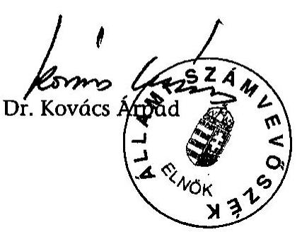

---

# 1/A-B. SZÁMÚ MELLÉKLET (észrevételek) 

a V-30-71/2003-2004. sz. jelentéshez

---

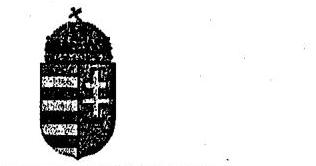
a V-30-71/2003-2004. sz. jelentéshez

# Adó- és PÉNZÜGYI ELLENŐRZÉSI HIVATAL <br> Elnök 

$1228365713 / 2004$

## Bihari Zsigmond Úr

főigazgató
részére

Állami Számvevőszék

Tisztelt Főigazgató Úr!

ÁLLAMI SZÁMVEVŐSZÉK OGYVITELI IRODA
AFT-2658/04-2004-MAJ 10. Iktatószám: $V-30-62 / 2003-2004$. Melléklet:

Magam és munkatársaim nevében is köszönöm, hogy a személyi jövedelemadó bevallási és visszaigénylési rendszerének ellenőrzéséről készített jelentéstervezetükre tett szakmai észrevételeinket elfogadták. Egyetértek azzal, hogy a jelentés-tervezet megfelelő részeit a levelében leírtak szerint módosítsák.

Budapest, 2004. május „q„,
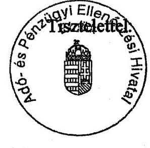

Dr. Király László György

Budapest, 2004. május „q„,

---

H-1051 BUDAPEST V., JÓZSEF NÁDOR TÉR 2-4, POSTACÍM: 1369 BUDAPEST, POSTAFIÓK 481.

TELEFON: 327-2111 FAX: 318-0738
PÉNZÜGYMINISZTER

# Állami Számvevőszék 

Dr. Kovács Árpád elnök úr,

Ikt.sz.: 7807/13/04.

## Budapest

## Tisztelt Elnök Úr !

Az Állami Számvevőszék a személyi jövedelemadó bevallási és visszaigénylési rendszerének tárgyában végzett ellenőrzésről, a Pénzügyminisztérium részére 2004. június 17 -én érkezett jelentéséhez a Pénzügyminisztérium észrevételt nem tesz.

Budapest, 2004. július $7$.
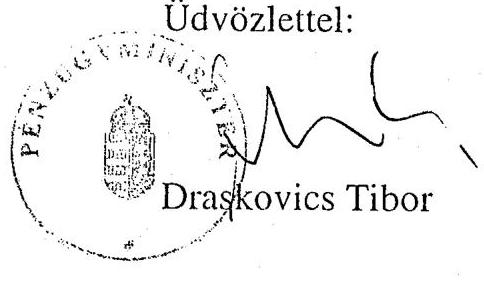

---

# 2. SZÁMÚ MELLÉKLET 

(tanúsítványok, mutatók, kimutatások, táblázatok, diagramm)
a V-30-71/2003-2004. sz. jelentéshez

---

TANÚSÍTVÁNYOK

---

Tanúsítvány-1

# Tanúsítvány a hibás személyi jövedelemadó-bevallások javításáról 1998-2003.

|  Évek | Benyújtott bevallások száma | Hibás bevallások |  | Az adózó bevonása nélkül javított hibás bevallások bevallások |  |  | Az adózó bevonásával |  | A hibás bevallásokból nem javított bevallások |   |
| --- | --- | --- | --- | --- | --- | --- | --- | --- | --- | --- |
|   |  |  |  |  |  |  |  |  |  |   |
|   |  | száma | aránya | száma | aránya | száma | aránya | száma | aránya |   |
|   | db | db | % | db | % | db | % | db | % |   |
|  1998. | 2188935 | 1110419 | 50,7% | n.a. | n.a. | n.a. | n.a. | 27210 | 2,5% |   |
|  1999. | 2142437 | 1142024 | 53,3% | n.a. | n.a. | n.a. | n.a. | 10646 | 0,9% |   |
|  2000. | 2192307 | 1547183 | 70,6% | 1350778 | 87,3% | 176333 | 11,4% | 20072 | 1,3% |   |
|  2001. | 2247564 | 1685169 | 75,0% | 1526056 | 90,6% | 148794 | 8,8% | 10319 | 0,6% |   |
|  2002. | 2372930 | 1339337 | 56,4% | 1156690 | 86,4% | 171030 | 12,8% | 11617 | 0,9% |   |
|  2003. | 2378726 | 1320117 | 55,5% | 1097625 | 83,1% | 210870 | 16,0% | 11622 | 0,9% |   |

Fenti adatok hitelességét igazolom.

Kelt: Budapest, 2004.

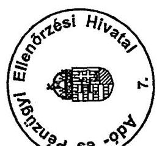

aláírás

---

# Tanúsítvány a személyi jövedelemadó bevallások kiutalás előtti ellenőrzéseinek alakulásáról 1998-2003.

Országos összesen

|  Év | Bevallások száma | Visszaigénylést tartalmazó bevallások | Visszaigénylés összege | A visszaigénylést tartalmazó bevallásokból az ellenőrzött bevallások | Ellenőrzési megállapítások | Megállapított nettó adókülönbözet összege | Megállapítással zárult ellenőrzésekből jogerőssé vált | A visszatérített adó összege  |
| --- | --- | --- | --- | --- | --- | --- | --- | --- |
|   |  | száma | aránya | száma* | aránya | összege | száma | aránya  |
|   | (db) | (db) | (%) | (E Ft) | (db) | (%) | (E Ft) | (db)  |
|   | 1 | 2 | 3 | 4 | 5 | 6 | 7 | 8  |
|  1998 | 2 188 935 | 1 008 556 | 46,08 | 21 845 512 | 11 967 | 1,19 | 4 200 970 | 1 440  |
|  1999 | 2 142 437 | 993 207 | 46,36 | 26 342 264 | 13 227 | 1,33 | 5 020 840 | 1 778  |
|  2000 | 2 192 307 | 1 059 299 | 48,32 | 22 422 761 | 12 570 | 1,19 | 1 712 469 | 2 876  |
|  2001 | 2 247 564 | 1 053 925 | 46,89 | 23 545 423 | 16 739 | 1,59 | 2 070 777 | 3 818  |
|  2002 | 2 372 930 | 1 152 454 | 48,57 | 31 858 031 | 23 409 | 2,03 | 2 674 989 | 5 256  |
|  2003 | 2 378 726 | 1 216 064 | 51,12 | 42 707 975 | 23 267 | 1,91 | 3 220 847 | 3 695  |

- bizonylatok és nyilvántartások ellenőrzésével együtt ** 1998.: 1/1998, 2/1998. Közigazgatási jogegységi határozat alapján (belföldi alapítvány, szövetkezeti üzletrész) előző években indított vizsgálatok határozatainak szükséges módosítása

Fenti adatok hitelességét igazolom.

Kelt: Budapest, 2004. június 3.

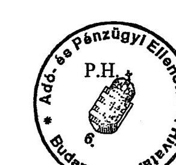

Aláírás

---

# Tanúsítvány a személyi jövedelemadó ellenőrzések alakulásáról 2003. év

|  Országos összesen | Adóbevallások száma | Kiutalás előtti ellenőrzések |  | Egyszerűsített ellenőrzések |  | Utólagos átfogó és szja adónem ellenőrzések |  | Ellenőrzések számából |  |   |
| --- | --- | --- | --- | --- | --- | --- | --- | --- | --- | --- |
|   |  | száma* | ellenőrzött bevallások aránya | száma | ellenőrzött bevallások aránya | száma** | ellenőrzéssel lezárt időszakot keletkeztető ell. |  | ellenőrzéssel lezárt időszakot nem keletkeztető ell. |   |
|   |  |  |  |  |  |  | száma | aránya | száma | aránya  |
|   | (db) | (db) | (%) | (db) | (%) | (db) | (db) | (%) | (db) | (%)  |
|   | 1 | 2 | 3 | 4 | 5 | 6 | 7 | 8 | 9 | 10  |
|  Bevallások száma | 2 378 726 | 23 267 | 0,98 | 97 157 | 4,08 | 11 687 | 113 138 | 85,64 | 18 973 | 14,36  |
|  ebből egyéni vállalkozó által benyújtott | 443 888 | 3 126 | 0,70 | 0 | 0,00 | 7 710 | 8 432 | 77,81 | 2 404 | 22,19  |
|  Munkáltatóval elszámolók száma | 2 200 083 | - | - | - | - | - | - | - | - | -  |
|  Összesen | 4 578 809 | - | - | - | - | - | - | - | - | -  |

- bizonylatok és nyilvántartások ellenőrzésével együtt ** egyszerűsített ellenőrzések nélkül

Fenti adatok hitelességét igazolom.

Kelt: Budapest, 2004. június 3.

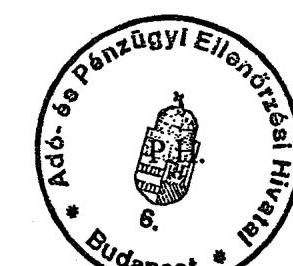

Pabiskás Frecup kk

aláírás

---

# Tanúsítvány a személyi jövedelemadó ellenőrzések alakulásáról 2002. év

|  Országos összesen | Adóbevallások száma | Kiutalás előtti ellenőrzések |  | Egyszerűsített ellenőrzések |  | Utólagos átfogó és szja adónem ellenőrzések |  | Ellenőrzések számából |  |  |   |
| --- | --- | --- | --- | --- | --- | --- | --- | --- | --- | --- | --- |
|   |  | száma* | ellenőrzött bevallások aránya | száma | ellenőrzött bevallások aránya | száma** |  | ellenőrzéssel lezárt időszakot keletkeztető ell. |  | ellenőrzéssel lezárt időszakot nem keletkeztető ell. |   |
|  Megnevezés | (db) | (db) | (%) | (db) | (%) | (db) | (db) | (%) | (db) | (%) |   |
|   | 1 | 2 | 3 | 4 | 5 | 6 | 7 | 8 | 9 | 10 |   |
|  Bevallások száma | 2 372 930 | 23 409 | 0,99 | 93 754 | 3,95 | 15 206 | 116 256 | 87,83 | 16 113 | 12,17 |   |
|  ebből egyéni vállalkozók által benyújtott | 439 794 | 1 796 | 0,41 | 0 | 0,00 | 9 142 | 9 673 | 88,43 | 1 265 | 11,57 |   |
|  Munkáltatóval elszámolók száma | 2 149 386 | - | - | - | - | - | - | - | - | - |   |
|  Összesen | 4 522 316 | - | - | - | - | - | - | - | - | - |   |

- bizonylatok és nyilvántartások ellenőrzésével együtt ** egyszerűsített ellenőrzések nélkül

Fenti adatok hitelességét igazolom.

Kelt: Budapest, 2003. november 4.

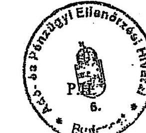

---

# Tanúsítvány a személyi jövedelemadó ellenőrzések alakulásáról 2001. év

|  Országos összesen | Adóbevallások száma | Kiutalás előtti ellenőrzések |  | Egyszerűsített ellenőrzések |  | Utólagos átfogó és szja adónem ellenőrzések | Ellenőrzések számából |  |  |   |
| --- | --- | --- | --- | --- | --- | --- | --- | --- | --- | --- |
|   |  | száma* | ellenőrzött bevallások aránya | száma | ellenőrzött bevallások aránya | száma** | ellenőrzéssel lezárt időszakot keletkeztető ell. száma |  | ellenőrzéssel lezárt időszakot nem keletkeztető ell. száma |   |
|  Megnevezés | (db) | (db) | (%) | (db) | (%) | (db) | (db) | (%) | (db) | (%)  |
|   | 1 | 2 | 3 | 4 | 5 | 6 | 7 | 8 | 9 | 10  |
|  Bevallások száma | 2 247 564 | 16 739 | 0,74 | 89 615 | 3,99 | 17 425 | 111 638 | 90,19 | 12 141 | 9,81  |
|  ebből egyéni vállalkozók által benyújtott | 436 832 | 1 340 | 0,31 | 0 | 0,00 | 10 315 | 10 649 | 91,37 | 1 006 | 8,63  |
|  Munkáltatóval elszámolók száma | 2 196 206 | - | - | - | - | - | - | - | - | -  |
|  Összesen | 4 443 770 | - | - | - | - | - | - | - | - | -  |

- bizonylatok és nyilvántartások ellenőrzésével együtt ** egyszerűsített ellenőrzések nélkül

Fenti adatok hitelességét igazolom.

Kelt: Budapest, 2003. november 4.

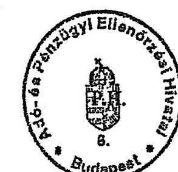

Pakinabizet Tercu P. 621 aláírás

---

# Tanúsítvány

a személyi jövedelemadó ellenőrzések alakulásáról 2000. év

|  Országos összesen | Adóbevallások száma |  |  |  |  |  |  |  |  |   |
| --- | --- | --- | --- | --- | --- | --- | --- | --- | --- | --- |
|   |  |  |  | Egyszerűsített ellenőrzések |  |  |  |  | Ellenőrzések számából |   |
|   |  |  |  |  |  |  |  |  |  |   |
|  Megnevezés |  |  |  |  |  |  |  |  |  |   |
|   |  |  |  |  |  |  |  | ellenőrzéssel lezárt időszakot keletkeztető ell. |  | ellenőrzéssel lezárt időszakot nem keletkeztető ell.  |
|   |  |  |  |  |  |  |  | száma |  | száma  |
|   | (db) | (db) | (%) | (db) | (%) | (db) | (db) | (%) | (db) | (%)  |
|   | 1 | 2 | 3 | 4 | 5 | 6 | 7 | 8 | 9 | 10  |
|  Bevallások száma | 2192307 | 12570 | 0,57 | 24841 | 1,13 | 15850 | 43875 | 82,38 | 9386 | 17,62  |
|  ebből egyéni vállalkozók által benyújtott | 412802 | 689 | 0,17 | 0 | 0,00 | 9259 | 9398 | 94,47 | 550 | 5,53  |
|  Munkáltatóval elszámolók száma | 2194269 | - | - | - | - | - | - | - | - | -  |
|  Összesen | 4386576 | - | - | - | - | - | - | - | - | -  |

- bizonylatok és nyilvántartások ellenőrzésével együtt ** egyszerűsített ellenőrzések nélkül

Fenti adatok hitelességét igazolom. Kelt: Budapest, 2003. november 4.

---

# Tanúsítvány a személyi jövedelemadó ellenőrzések alakulásáról 1999. év

|  Országos összesen | Adóbevallások száma |  |  |  |  |  |  |  |  |  |   |
| --- | --- | --- | --- | --- | --- | --- | --- | --- | --- | --- | --- |
|   |  |  |  | Egyszerűsített ellenőrzések |  |  |  |  | Ellenőrzések számából |  |   |
|   |  |  |  |  |  |  |  |  |  |  |   |
|  Megnevezés |  |  |  |  |  |  |  |  |  |  |   |
|   |  |  |  | Ellenőrzött bevallások aránya | száma | Ellenőrzött bevallások aránya |  |  | Ellenőrzéssel lezárt időszakot keletkeztető ell. |  | ellenőrzéssel lezárt időszakot nem keletkeztető ell.  |
|   | (db) | (db) | (1/4) | (db) | (1/4) | (db) | (db) | (1/4) | (db) | (1/4) |   |
|   | 1 | 2 | 3 | 4 | 5 | 6 | 7 | 8 | 9 | 10 |   |
|  Bevallások száma | 2142437 | 13227 | 0,62 | 8820 | 0,41 | 23122 | 34184 | 75,68 | 10985 | 24,32 |   |
|  ebből egyéni vállalkozók által benyújtott | 401562 | 676 | 0,17 | 0 | 0,00 | 14810 | 14910 | 96,28 | 576 | 3,72 |   |
|  Munkáltatóval elszámolók száma | 2197822 | - | - | - | - | - | - | - | - | - |   |
|  Összesen | 4340259 | - | - | - | - | - | - | - | - | - |   |

- bizonylatok és nyilvántartások ellenőrzésével együtt ** egyszerűsített ellenőrzések nélkül

Fenti adatok hitelességét igazolom.

Kelt: Budapest, 2003. november 4.

---

# Tanúsítvány a személyi jövedelemadó ellenőrzések alakulásáról 1998. év

|  Országos összesen | Adóbevallások száma | Kiutalás előtti ellenőrzések |  | Egyszerűsített ellenőrzések |  | Utólagos átfogó és szja adónem ellenőrzések |  | Ellenőrzések számából |  |   |
| --- | --- | --- | --- | --- | --- | --- | --- | --- | --- | --- |
|   |  | száma* | ellenőrzött bevallások aránya | száma | ellenőrzött bevallások aránya |  | száma** | ellenőrzéssel lezárt időszakot keletkeztető ell. |  | ellenőrzéssel lezárt időszakot nem keletkeztető ell.  |
|   | (db) | (db) | (%) | (db) | (%) | (db) | (db) | (%) | (db) | (%)  |
|   | 1 | 2 | 3 | 4 | 5 | 6 | 7 | 8 | 9 | 10  |
|  Bevallások száma | 2 188 935 | 11 967 | 0,55 | 7 843 | 0,36 | 28 789 | 38 523 | 79,27 | 10 076 | 20,73  |
|  ebből egyéni vállalkozó által benyújtott | 415 823 | 777 | 0,19 | 0 | 0,00 | 7 958 | 8 076 | 92,46 | 659 | 7,54  |
|  Munkáltatóval elszámolók száma | 2 198 174 | - | - | - | - | - | - | - | - | -  |
|  Összesen | 4 387 109 | - | - | - | - | - | - | - | - | -  |

- bizonylatok és nyilvántartások ellenőrzésével együtt ** egyszerűsített ellenőrzések nélkül

Fenti adatok hitelességét igazolom.

Kelt: Budapest, 2003. november 4.

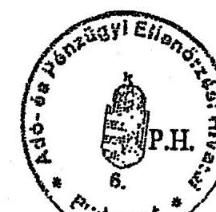

Pátiuralind

Megap (G)

aláírás

---

# Tanúsítvány

az adatszolgáltatások ellenőrzésének alakulásáról 2003. év

## ORSZÁGOS ÖSSZESEN

|  |   |   |   |   |   |   |
| --- | --- | --- | --- | --- | --- | --- |
|  |   |   |   |   |   |   |
|  K30 | 301662 | 3480320 | 1402 | 0,4648 | 765 | 54,5649  |
|  K31 | 131360 | 1165706 | 0 | 0,0000 | 0 | 0,0000  |
|  K32 | 261389 | 3920223 | 0 | 0,0000 | 0 | 0,0000  |
|  K33 | 2262 | 4200 | 0 | 0,0000 | 0 | 0,0000  |
|  K34 | 2872 | 74390 | 0 | 0,0000 | 0 | 0,0000  |
|  K35 | 3390 | 80921 | 0 | 0,0000 | 0 | 0,0000  |
|  K36 | 26 | 2588 | 0 | 0,0000 | 0 | 0,0000  |
|  K43 | 12748 | 699527 | 0 | 0,0000 | 0 | 0,0000  |
|  K44 | 18 | 196089 | 1 | 5,5556 | 0 | 0,0000  |
|  K46 | 138 | 3881 | 14 | 10,1449 | 7 | 50,0000  |
|  K47 | 29 | 112794 | 0 | 0,0000 | 0 | 0,0000  |
|  K48 | 18 | 123760 | 2 | 11,1111 | 2 | 100,0000  |
|  K50 | 56 | 5084 | 0 | 0,0000 | 0 | 0,0000  |
|  K51 | 4580 | 2694179 | 544 | 11,8777 | 329 | 60,4779  |
|  K52 | 40 | 151 | 0 | 0,0000 | 0 | 0,0000  |
|  K53 | 827 | 78068 | 0 | 0,0000 | 0 | 0,0000  |
|  K54 | 49 | 22230 | 0 | 0,0000 | 0 | 0,0000  |
|  K55 | 0 | 0 | 0 | 0,0000 | 0 | 0,0000  |
|  K60 | 65 | 0 | 0 | 0,0000 | 0 | 0,0000  |
|  K61 | 213 | 0 | 0 | 0,0000 | 0 | 0,0000  |
|  M29 | 137913 | 2106347 | 270 | 0,1958 | 171 | 63,3333  |
|  M63 | 549 | 3960 | 0 | 0,0000 | 0 | 0,0000  |
|  Összesen: | 860204 | 14774418 | 2233 | 0,2596 | 1274 | 57,0533  |

Fenti adatok hitelességét igazolom.

Budapest, 2003.

---

# Tanúsítvány

az adatszolgáltatások ellenőrzésének alakulásáról 2002. év

## ORSZÁGOS ÖSSZESEN

|  K30 | 294343 | 3441856 | 1812 | 0,6156 | 883 | 48,7307  |
| --- | --- | --- | --- | --- | --- | --- |
|  K31 | 119389 | 1196883 | 0 | 0,0000 | 0 | 0,0000  |
|  K32 | 256574 | 3911645 | 0 | 0,0000 | 0 | 0,0000  |
|  K33 | 1664 | 3589 | 0 | 0,0000 | 0 | 0,0000  |
|  K43 | 13009 | 779891 | 0 | 0,0000 | 0 | 0,0000  |
|  K44 | 18 | 142761 | 0 | 0,0000 | 0 | 0,0000  |
|  K45 | 178 | 23340 | 7 | 3,9326 | 3 | 42,8571  |
|  K46 | 147 | 8342 | 7 | 4,7619 | 3 | 42,8571  |
|  K47 | 43 | 256079 | 0 | 0,0000 | 0 | 0,0000  |
|  K48 | 20 | 167299 | 1 | 5,0000 | 0 | 0,0000  |
|  K50 | 54 | 5286 | 0 | 0,0000 | 0 | 0,0000  |
|  K51 | 4416 | 2617240 | 126 | 2,8533 | 99 | 78,5714  |
|  K52 | 36 | 111 | 0 | 0,0000 | 0 | 0,0000  |
|  K53 | 815 | 63159 | 0 | 0,0000 | 0 | 0,0000  |
|  K54 | 32 | 20334 | 0 | 0,0000 | 0 | 0,0000  |
|  K60 | 63 | 0 | 0 | 0,0000 | 0 | 0,0000  |
|  K61 | 199 | 0 | 0 | 0,0000 | 0 | 0,0000  |
|  M29 | 140662 | 2135146 | 149 | 0,1059 | 82 | 55,0336  |
|  M63 | 566 | 4068 | 0 | 0,0000 | 0 | 0,0000  |
|  Összesen: | 832228 | 14777029 | 2102 | 0,2526 | 1070 | 50,9039  |

Fenti adatok hitelességét igazolom.

Budapest, 2003.

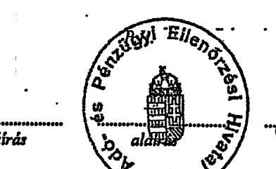

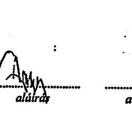

---

# Tanúsítvány 

az adatszolgáltatások ellenőrzésének alakulásáról 2001. év

ORSZÁGOS ÖSSZESEN
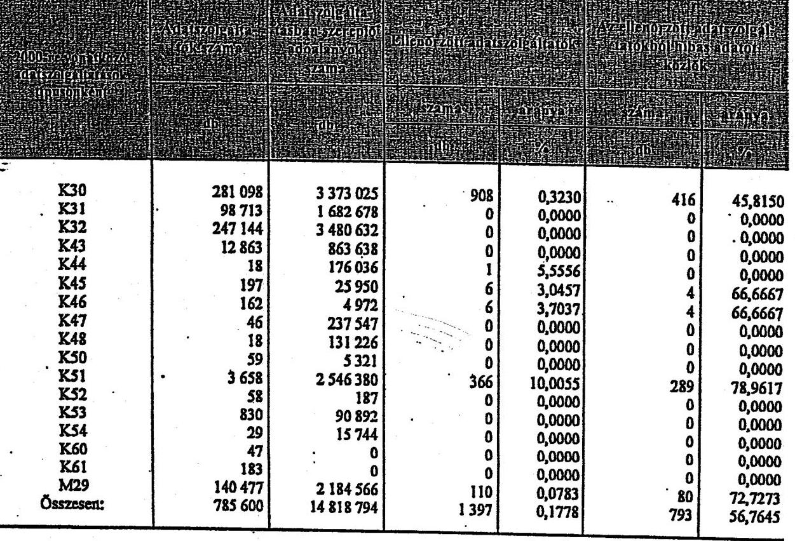

Fenti adatok hitelességét igazolom.
Budapest, 2003.
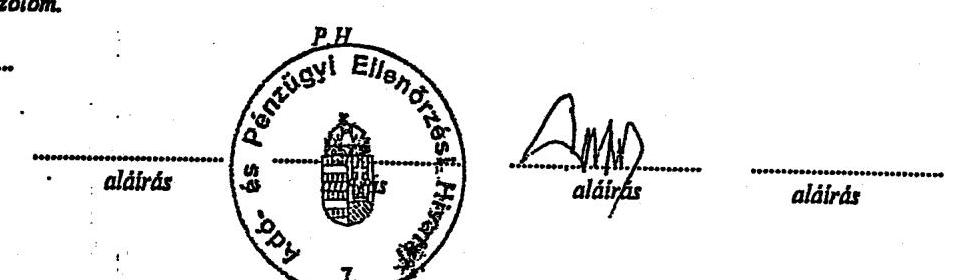

---

# Tanúsítvány

az adatszolgáltatások ellenőrzésének alakulásáról 2000. év

## ORSZÁGOS ÖSSZESEN

|  Ér |  |  |  |  |  |  |  |  |  |  |  |  |  |  |  |  |  |  |  |  |   |
| --- | --- | --- | --- | --- | --- | --- | --- | --- | --- | --- | --- | --- | --- | --- | --- | --- | --- | --- | --- | --- | --- |
|   |  |  |  |  |  |  |  |  |  |  |  |  |  |  |  |  |  |  |  |  |   |
|  |   |   |   |   |   |   |   |   |   |   |   |   |   |   |   |   |   |   |   |   |   |
|  |   |   |   |   |   |   |   |   |   |   |   |   |   |   |   |   |   |   |   |   |   |
|  |   |   |   |   |   |   |   |   |   |   |   |   |   |   |   |   |   |   |   |   |   |
|  |   |   |   |   |   |   |   |   |   |   |   |   |   |   |   |   |   |   |   |   |   |
|  |   |   |   |   |   |   |   |   |   |   |   |   |   |   |   |   |   |   |   |   |   |
|  |   |   |   |   |   |   |   |   |   |   |   |   |   |   |   |   |   |   |   |   |   | |   |   |   |
|---|---|---|
|   |   |   |   |   |   |   |   |   |   |   |   |   |   |   |   |   |   |   |   |   |   |
|   |   |   |   |   |   |   |   |   |   |   |   |   |   |   |   |   |   |   |   |   |   |
|   |   |   |   |   |   |   |   |   |   |   |   |   |   |   |   |   |   |   |   |   |   |
|   |   |   |   |   |   |   |   |   |   |   |   |   |   |   |   |   |   |   |   |   |   |
|   |   |   |   |   |   |   |   |   |   |   |   |   |   |   |   |   |   |   |   |   |   |
|   |   |   |   |   |   |   |   |   |   |   |   |   |   |   |   |   |   |   |   |   |   |
|   |   |   |   |   |   |   |   |   |   |   |   |   |   |   |   |   |   |   |   |   |   |
|   |   |   |   |   |   |   |   |   |   |   |   |   |   |   |   |   |   |   |   |   |   |
|   |   |   |   |   |   |   |   |   |   |   |   |   |   |   |   |   |   |   |   |   |   |
|   |   |   |   |   |   |   |   |   |   |   |   |   |   |   |   |   |   |   |   |   |   |
|   |   |   |   |   |   |   |   |   |   |   |   |   |   |   |   |   |   |   |   |   |   |
|   |   |   |   |   |   |   |   |   |   |   |   |   |   |   |   |   |   |   |   |   |   |
|   |   |   |   |   |   |   |   |   |   |   |   |   |   |   |   |   |   |   |   |   |   |
|   |   |   |   |   |   |   |   |   |   |   |   |   |   |   |   |   |   |   |   |   |   |
|   |   |   |   |   |   |   |   |   |   |   |   |   |   |   |   |   |   |   |   |   |   |
|   |   |   |   |   |   |   |   |   |   |   |   |   |   |   |   |   |   |   |   |   |   |
|   |   |   |   |   |   |   |   |   |   |   |   |   |   |   |   |   |   |   |   |   |   |
|   |   |   |   |   |   |   |   |   |   |   |   |   |   |   |   |   |   |   |   |   |   |
|   |   |   |   |   |   |   |   |   |   |   |   |   |   |   |   |   |   |   |   |   |   |
|   |   |   |   |   |   |   |   |   |   |   |   |   |   |   |   |   |   |   |   |   |   |
|   |   |   |   |   |   |   |   |   |   |   |   |   |   |   |   |   |   |   |   |   |   |
|   |   |   |   |   |   |   |   |   |   |   |   |   |   |   |   |   |   |   |   |   |   |
|   |   |   |   |   |   |   |   |   |   |   |   |   |   |   |   |   |   |   |   |   |   |
|   |   |   |   |   |   |   |   |   |   |   |   |   |   |   |   |   |   |   |   |   |   |
|   |   |   |  

---

4/5. számú tanúsítvány a V-30-71/2003-2004. sz. jelentéshez

# Tanúsítvány

az adatszolgáltatások ellenőrzésének alakulásáról 1999. év

## ORSZÁGOS ÖSSZESEN

| Év |
 |  |  |  |  |  |  |  |  |  |  |  |  |  |  |  |  |  |  |   |
| --- | --- | --- | --- | --- | --- | --- | --- | --- | --- | --- | --- | --- | --- | --- | --- | --- | --- | --- | --- | --- |
|   |  |  |  |  |  |  |  |  |  |  |  |  |  |  |  |  |  |  |  |   |
|   |  |  |  |  |  |  |  |  |  |  |  |  |  |  |  |  |  |  |  |   |
|   |  |  |  |  |  |  |  |  |  |  |  |  |  |  |  |  |  |  |  |   |
|  K30 |  |  |  |  |  |  |  |  |  |  |  |  |  |  |  |  |  |  |  |   |
|  K43 |  |  |  |  |  |  |  |  |  |  |  |  |  |  |  |  |  |  |  |   |
|  K44 |  |  |  |  |  |  |  |  |  |  |  |  |  |  |  |  |  |  |  |   |
|  K46 |  |  |  |  |  |  |  |  |  |  |  |  |  |  |  |  |  |  |  |   |
|  K47 |  |  |  |  |  |  |  |  |  |  |  |  |  |  |  |  |  |  |  |   |
|  K48 |  |  |  |  |  |  |  |  |  |  |  |  |  |  |  |  |  |  |  |   |
|  K49 |  |  |  |  |  |  |  |  |  |  |  |  |  |  |  |  |  |  |  |   |
|  K50 |  |  |  |  |  |  |  |  |  |  |  |  |  |  |  |  |  |  |  |   |
|  K51 |  |  |  |  |  |  |  |  |  |  |  |  |  |  |  |  |  |  |  |   |
|  K52 |  |  |  |  |  |  |  |  |  |  |  |  |  |  |  |  |  |  |  |   |
|  K53 |  |  |  |  |  |  |  |  |  |  |  |  |  |  |  |  |  |  |  |   |
|  K60 |  |  |  |  |  |  |  |  |  |  |  |  |  |  |  |  |  |  |  |   |
|  K61 |  |  |  |  |  |  |  |  |  |  |  |  |  |  |  |  |  |  |  |   |
|  M29 |  |  |  |  |  |  |  |  |  |  |  |  |  |  |  |  |  |  |  |   |
|  Összesen: |  |  |  |  |  |  |  |  |  |  |  |  |  |  |  |  |  |  |  |   |

Fenti adatok hitelességét igazolom.

Budapest, 2005.

---

# Tanúsítvány

az adatszolgáltatások ellenőrzésének alakulásáról 2003. év

## ORSZÁGOS ÖSSZESEN

|  KNOX | 2003. év | 2004. év | 2005. év | 2006. év | 2007. év  |
| --- | --- | --- | --- | --- | --- |
|  K30 | 301 662 | 3 480 320 | 141 997 | 4,0800 | 39 190  |
|  K31 | 131 360 | 1 165 706 | 0 | 0,0000 | 0  |
|  K32 | 261 389 | 3 920 223 | 0 | 0,0000 | 0  |
|  K33 | 2 262 | 4 200 | 0 | 0,0000 | 0  |
|  K34 | 2 872 | 74 390 | 0 | 0,0000 | 0  |
|  K35 | 3 390 | 80 921 | 0 | 0,0000 | 0  |
|  K36 | 26 | 2 588 | 0 | 0,0000 | 0  |
|  K43 | 12 748 | 699 527 | 0 | 0,0000 | 0  |
|  K44 | 18 | 196 089 | 0 | 0,0000 | 0  |
|  K46 | 138 | 3 881 | 171 | 4,4061 | 98  |
|  K47 | 29 | 112 794 | 0 | 0,0000 | 0  |
|  K48 | 18 | 123 760 | 6 063 | 4,8990 | 6 063  |
|  K50 | 56 | 5 084 | 0 | 0,0000 | 0  |
|  K51 | 4 580 | 2 694 179 | 1 113 145 | 41,3167 | 848 958  |
|  K52 | 40 | 151 | 0 | 0,0000 | 0  |
|  K53 | 827 | 78 068 | 0 | 0,0000 | 0  |
|  K54 | 49 | 22 230 | 0 | 0,0000 | 0  |
|  K55 | 0 | 0 | 0 | 0,0000 | 0  |
|  K60 | 65 | 0 | 0 | 0,0000 | 0  |
|  K61 | 213 | 0 | 0 | 0,0000 | 0  |
|  M29 | 137 913 | 2 106 347 | 9 239 | 0,4386 | 1 943  |
|  M63 | 549 | 3 560 | 0 | 0,0000 | 0  |
|  Összesen: | 860 204 | 14 774 418 | 1 270 615 | 8,6001 | 896 252  |

Fenti adatok hitelességét igazolom.

Budapest, 2003.

P.H.

---

# Tanúsítvány

az adatszolgáltatások ellenőrzésének alakulásáról 2002. év

## ORSZÁGOS ÖSSZESEN

|  |   |   |   |   |   |
| --- | --- | --- | --- | --- | --- |
|  K30 | 294 343 | 3 441 856 | 68 000 | 1,9757 | 24 823  |
|  K31 | 119 389 | 1 196 883 | 0 | 0,0000 | 0  |
|  K32 | 256 574 | 3 911 645 | 0 | 0,0000 | 0  |
|  K33 | 1 664 | 3 589 | 0 | 0,0000 | 0  |
|  K43 | 13 009 | 779 891 | 0 | 0,0000 | 0  |
|  K44 | 18 | 142 761 | 0 | 0,0000 | 0  |
|  K45 | 178 | 23 340 | 16 795 | 71,9580 | 208  |
|  K46 | 147 | 8 342 | 7 418 | 88,9235 | 60  |
|  K47 | 43 | 256 079 | 0 | 0,0000 | 0  |
|  K48 | 20 | 167 299 | 2 420 | 1,4465 | 0  |
|  K50 | 54 | 5 286 | 0 | 0,0000 | 0  |
|  K51 | 4 416 | 2 617 240 | 105 782 | 4,0417 | 21 495  |
|  K52 | 36 | 111 | 0 | 0,0000 | 0  |
|  K53 | 815 | 63 159 | 0 | 0,0000 | 0  |
|  K54 | 32 | 20 334 | 0 | 0,0000 | 0  |
|  K60 | 63 | 0 | 0 | 0,0000 | 0  |
|  K61 | 199 | 0 | 0 | 0,0000 | 0  |
|  M29 | 140 662 | 2 135 146 | 2 546 | 0,1192 | 1 779 |
| M63 | 566 | 4 068 | 0 | 0,0000 | 0 |
| Összesen: | 832 228 | 14 777 029 | 202 961 | 1,3735 | 48 365 |

Fenti adatok hitelességét igazolom.

Budapest, 2003.

P.H.!

Paliukalme!

aláírás

aláírás

aláírás

Aláírás

---

# Tanúsítvány

## az adatszolgáltatások ellenőrzésének alakulásáról

2001. év

## ORSZÁGOS ÖSSZESEN

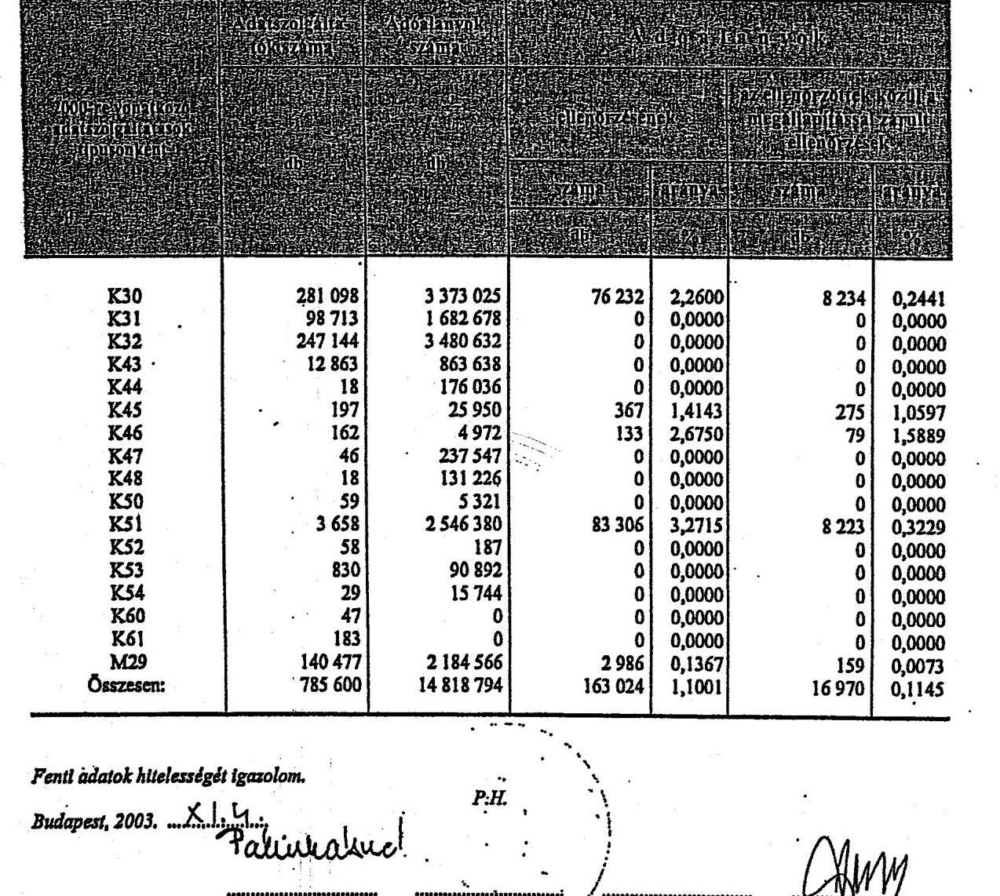

Fenti adatok hitelességét igazolom.
Budapest, 2003. ..

---

# Tanúsítvány

az adatszolgáltatások ellenőrzésének alakulásáról 2000. év

## ORSZÁGOS ÖSSZESEN

| KNOX | 260 724 | 3 425 729 | 5 146 | 0,1502 | 3 616 | 0,1056 |
| --- | --- | --- | --- | --- | --- | --- |
| K43 | 12 017 | 856 585 | 0 | 0,0000 | 0 | 0,0000 |
| K44 | 13 | 25 652 | 0 | 0,0000 | 0 | 0,0000 |
| K46 | 166 | 2 769 | 37 | 1,3362 | 8 | 0,2889 |
| K47 | 30 | 171 264 | 0 | 0,0000 | 0 | 0,0000 |
| K48 | 16 | 108 901 | 0 | 0,0000 | 0 | 0,0000 |
| K50 | 53 | 4 767 | 0 | 0,0000 | 0 | 0,0000 |
| K51 | 3 234 | 2 606 209 | 187 104 | 7,1792 | 5 169 | 0,1983 |
| K52 | 81 | 237 | 0 | 0,0000 | 0 | 0,0000 |
| K53 | 903 | 150 761 | 0 | 0,0000 | 0 | 0,0000 |
| K60 | 46 | 0 | 0 | 0,0000 | 0 | 0,0000 |
| K61 | 151 | 0 | 0 | 0,0000 | 0 | 0,0000 |
| M29 | 133 549 | 2 178 598 | 294 | 0,0135 | 129 | 0,0059 |
| Összesen: | 411 172 | 9 558 373 | 192 686 | 2,0159 | 8 945 | 0,0936 |

Fenti adatok hitelességét igazolom.

Budapest, 2003. 2005. 2006. 2007. 2008. 2009. 2010. 2011. 2012. 2013. 2014. 2015. 2016. 2017. 2018. 2019. 2020. 2021. 2022. 2023. 2024. 2025. 2026. 2027. 2028. 2029. 2030. 2031. 2032. 2033. 2034. 2035. 2036. 2037. 2038. 2039. 2040. 2041. 2042. 2043. 2044. 2045. 2046. 2047. 2048. 2049. 2050. 2051. 2052. 2053. 2054. 2055. 2056. 2057. 2058. 2059. 2060. 2061. 2062. 2063. 2064. 2065. 2066. 2067. 2068. 2069. 2070. 2071. 2072. 2073. 2074. 2075. 2076. 2077. 2078. 2079. 2080. 2081. 2082. 2083. 2084. 2085. 2086. 2087. 2088. 2089. 2090. 2091. 2092. 2093. 2094. 2095. 2096. 2097. 2098. 2099. 2010. 2011. 2012. 2013. 2014. 2015. 2016. 2017. 2018. 2019. 2020. 2021. 2022. 2023. 2024. 2025. 2026. 2027. 2028. 2029. 2030. 2031. 2032. 2033. 2034. 2035. 2036. 2037. 2038. 2039. 2040. 2041. 2042. 2043. 2044. 2045. 2046. 2047. 2048. 2049. 2050. 2051. 2052. 2053. 2054. 2055. 2056. 2057. 2058. 2059. 2060. 2061. 2062. 2063. 2064. 2065. 2066. 2067. 2068. 2069. 2070. 2071. 2072. 2073. 2074. 2075. 2076. 2077. 2078. 2079. 2080. 2081. 2082. 2083. 2084. 2085. 2086. 2087. 2088. 2089. 2090. 2091. 2092. 2093. 2094. 2095. 2096. 2097. 2098. 2099. 2010. 2011. 2012. 2013. 2014. 2015. 2016. 2017. 2018. 2019. 2020. 2021. 2022. 2023. 2024. 2025. 2026. 2027. 2028. 2029. 2030. 2031. 2032. 2033. 2034. 2035. 2036. 2037. 2038. 2039. 2040. 2041. 2042. 2043. 2044. 2045. 2046. 2047. 2048. 2049. 2050. 2051. 2052. 2053. 2054. 2055. 2056. 2057. 2058. 2059. 2060. 2061. 2062. 2063. 2064. 2065. 2066. 2067. 2068. 2069. 2070. 2071. 2072. 2073. 2074. 2075. 2076. 2077. 2078. 2079. 2080. 2081. 2082. 2083. 2084. 2085. 2086. 2087. 2088. 2089. 2090. 2091. 2092. 2093. 2094. 2095. 2096. 2097. 2098. 2099. 2010. 2011. 2012. 2013. 2014. 2015. 2016. 2017. 2018. 2019. 2020. 2021. 2022. 2023. 2024. 2025. 2026. 2027. 2028. 2029. 2030. 2031. 2032. 2033. 2034. 2035. 2036. 2037. 2038. 2039. 2040. 2041. 2042. 2043. 2044. 2045. 2046. 2047. 2048. 2049. 2050. 2051. 2052. 2053. 2054. 2055. 2056. 2057. 2058. 2059. 2060. 2061. 2062. 2063. 2064. 2065. 2066. 2067. 2068. 2069. 2070. 2071. 2072. 2073. 2074. 2075. 2076. 2077. 2078. 2079. 2080. 2081. 2082. 2083. 2084. 2085. 2086. 2087. 2088. 2089. 2090. 2091. 2092. 2093. 2094. 2095. 2096. 2097. 2098. 2099. 2010. 2011. 2012. 2013. 2014. 2015. 2016. 2017. 2018. 2019. 2020. 2021. 2022. 2023. 2024. 2025. 2026. 2027. 2028. 2029. 2030. 2031. 2032. 2033. 2034. 2035. 2036. 2037. 2038. 2039. 2040. 2041. 2042. 2043. 2044. 2045. 2046. 2047. 2048. 2049. 2050. 2051. 2052. 2053. 2054. 2055. 2056. 2057. 2058. 2059. 2060. 2061. 2062. 2063. 2064. 2065. 2066. 2067. 2068. 2069. 2070. 2071. 2072. 2073. 2074. 2075. 2076. 2077. 2078. 2079. 2080. 2081. 2082. 2083. 2084. 2085. 2086. 2087. 2088. 2089. 2090. 2091. 2092. 2093. 2094. 2095. 2096. 2097. 2098. 2099. 2010. 2011. 2012. 2013. 2014. 2015. 2016. 2017. 2018. 2019. 2020. 2021. 2022. 2023. 2024. 2025. 2026. 2027. 2028. 2029. 2030. 2031. 2032. 2033. 2034. 2035. 2036. 2037. 2038. 2039. 2040. 2041. 2042. 2043. 2044. 2045. 2046. 2047. 2048. 2049. 2050. 2051. 2052. 2053. 2054. 2055. 2056. 2057. 2058. 2059. 2060. 2061. 2062. 2063. 2064. 2065. 2066. 2067. 2068. 2069. 2070. 2071. 2072. 2073. 2074. 2075. 2076. 2077. 2078. 2079. 2080. 2081. 2082. 2083. 2084. 2085. 2086. 2087. 2088. 2089. 2090. 2091. 2092. 2093. 2094. 2095. 2096. 2097. 2098. 2099. 2010. 2011. 2012. 2013. 2014. 2015. 2016. 2017. 2018. 2019. 2020. 2021. 2022. 2023. 2024. 2025. 2026. 2027. 2028. 2029. 2030. 2031. 2032. 2033. 2034. 2035. 2036. 2037. 2038. 2039. 2040. 2041. 2042. 2043. 2044. 2045. 2046. 2047. 2048. 2049. 2050. 2051. 2052. 2053. 2054. 2055. 2056. 2057. 2058. 2059. 2060. 2061. 2062. 2063. 2064. 2065. 2066. 2067. 2068. 2069. 2070. 2071. 2072. 2073. 2074. 2075. 2076. 2077. 2078. 2079. 2080. 2081. 2082. 2083. 2084. 2085. 2086. 2087. 2088. 2089. 2090. 2091. 2092. 2093. 2094. 2095. 2096. 2097. 2098. 2099.
 2010. 2011. 2012. 2013. 2014. 2015. 2016. 2017. 2018. 2019. 2010. 2011. 2012. 2013. 2014. 2015. 2016. 2017. 2018. 2019. 2010. 2011. 2012. 2013. 2014. 2015. 2016. 2017. 2018. 2019. 2010. 2011. 2012. 2013. 2014. 2015. 2016. 2017. 2018. 2019. 2010. 2011. 2012. 2013. 2014. 2015. 2016. 2017. 2018. 2019. 2010. 2011. 2012. 2013. 2014. 2015. 2016. 2017. 2018. 2019. 2010. 2011. 2012. 2013. 2014. 2015. 2016. 2017. 2018. 2019. 2010. 2011. 2012. 2013. 2014. 2015. 2016. 2017. 2018. 2019. 2010. 2011. 2012. 2013. 2014. 2015. 2016. 2017. 2018. 2019. 2010. 2011. 2012. 2013. 2014. 2015. 2016. 2017. 2018. 2019. 2010. 2011. 2012. 2013. 2014. 2015. 2016. 2017. 2018. 2019. 2010. 2011. 2012. 2013. 2014. 2015. 2016. 2017. 2018. 2019. 2010. 2011. 2012. 2013. 2014. 2015. 2016. 2017. 2018. 2019. 2010. 2011. 2012. 2013. 2014. 2015. 2016. 2017. 2018. 2019. 2010. 2011. 2012. 2013. 2014. 2015. 2016. 2017. 2018. 2019. 2010. 2011. 2012. 2013. 2014. 2015. 2016. 2017. 2018. 2019. 2010. 2011. 2012. 2013. 2014. 2015. 2016. 2017. 2018. 2019. 2010. 2011. 2012. 2013. 2014. 2015. 2016. 2017. 2018. 2019. 2010. 2011. 2012. 2013. 2014. 2015. 2016. 2017. 2018. 2019. 2010. 2011. 2012. 2013. 2014. 2015. 2016. 2017. 2018. 2019. 2010. 2011. 2012. 2013. 2014. 2015. 2016. 2017. 2018. 2019. 2010. 2011. 2012. 2013. 2014. 2015. 2016. 2017. 2018. 2019. 2010. 2011. 2012. 2013. 2014. 2015. 2016. 2017. 2018. 2019. 2010. 2011. 2012. 2013. 2014. 2015. 2016. 2017. 2018. 2019. 2010. 2011. 2012. 2013. 2014. 2015. 2016. 2017. 2018. 2019.
 2012. 2012. 2012. 2012. 2012. 2012. 2012. 2012. 2012. 2012. 2012. 2012. 2012. 2012. 2012. 2012. 2012. 2012. 2012. 2012. 2012. 2012. 2012. 2012. 2012. 2012. 2012. 2012. 2012. 2012. 2012. 2012. 2012. 2012. 2012. 2012. 2012. 2012. 2012. 2012. 2012. 2012. 2012. 2012. 2012. 2012. 2012. 2012. 2012. 2012. 2012. 2012. 2012. 2012. 2012. 2012.

---

# Tanúsítvány 

az adatszolgáltatások ellenőrzésének alakulásáról
1999. év

## ORSZÁGOS ÖSSZESEN

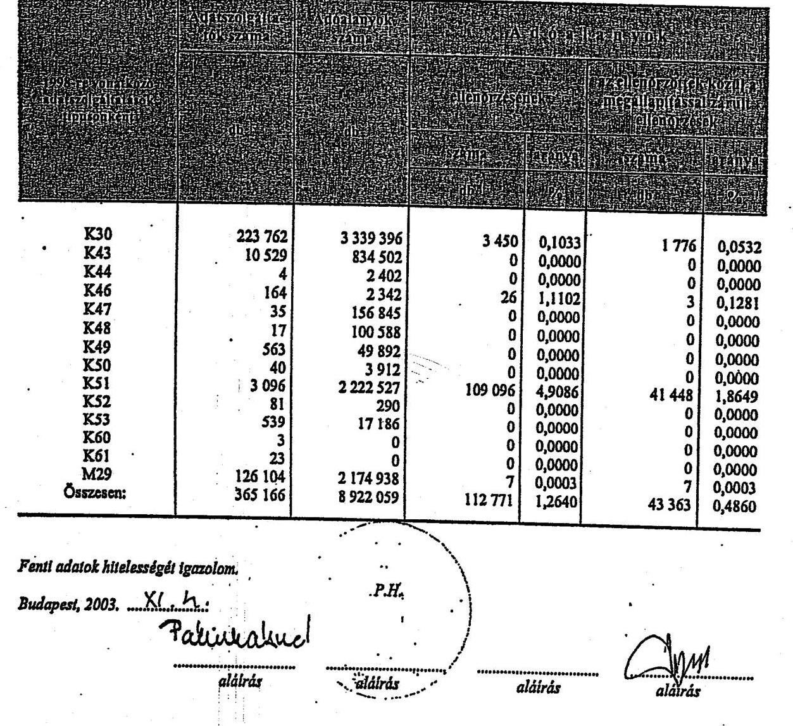

---

# Tanúsítvány

a bevallás elmulasztása miatt kiszabott mulasztási bírság alakulásáról 1998-2003.

Országos összesen

|  Megnevezés | 1998. |  | 1999. |  | 2000. |  | 2001. |  | 2002. |  | 2003. |   |
| --- | --- | --- | --- | --- | --- | --- | --- | --- | --- | --- | --- | --- |
|   | (db) | (eFt) | (db) | (eFt) | (db) | (eFt) | (db) | (eFt) | (db) | (eFt) | (db) | (eFt)  |
|  Az adózók jövedelmet nem vallottak be, pedig az adat-
szolgáltatás alapján ren-
delkeztek jövedelemmel | n.a. | n.a. | n.a. | n.a. | n.a. | n.a. | n.a. | n.a. | n.a. | n.a. | n.a. | n.a.  |
|  Bevallás elmulasztása miatt kivetett mulasztási bírság | 22 | 1625 | 610 | 10545 | 3947 | 63863 | 2785 | 61569 | 6977 | 135116 | 6489 | 189804  |
|  Törölt mulasztási bírság | 6 | 320 | 79 | 2060 | 412 | 6479 | 260 | 5026 | 475 | 8932 | 399 | 11097  |
|  Megfizetett mulasztási bírság | n.a. | n.a. | n.a. | n.a. | n.a. | n.a. | n.a. | n.a. | n.a. | n.a. | n.a. | n.a.  |
|  Meg nem fizetett mul. bírság | n.a. | n.a. | n.a. | n.a. | n.a. | n.a. | n.a. | n.a. | n.a. | n.a. | n.a. | n.a.  |

Fenti adatok hitelességét igazolom. Kelt: Budapest, 2004.

---

Tanúsítvány

# Tanúsítvány

az APEH által kifizetett szja adónemet érintő késedelmi pótlékról' 2003.

ORSZÁGOS ÖSSZESEN

|  Az adózók részére kifizetett késedelmi kamat | összege (E Ft)
esetszám (db) | 8 659
5 570  |
| --- | --- | --- |
|  Ebből bírósági ítélet alapján kifizetett késedelmi kamat | összege (E Ft)
esetszám (db) | 638
1  |
|  Egyéb okból kifizetett késedelmi kamat | összege (E Ft)
esetszám (db) | 8 022
5 569  |

Fenti adatok hitelességét igazolom.

Budapest, 2004. 06. 03.

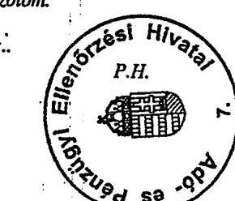

Páléizdetéser' Uthuk alátrás

---

MUTATÓK

---

1. számú mutató a V-30-71/2003-2004. sz. jelentéshez

# Az utólagos személyi jövedelemadó ellenőrzési megállapításokból befolyt összeg

|  Igazgatóságok | A letéti számlára befolyt összeg | a revíziós előírásokból megállapított adóbevétel | A letéti számlára befolyt összeg | a revíziós előírásokból megállapított adóbevétel | A letéti számlára befolyt összeg | a revíziós előírásokból megállapított adóbevétel | A letéti számlára befolyt összeg | a revíziós előírásokból megállapított adóbevétel | A letéti számlára befolyt összeg | a revíziós előírásokból megállapított adóbevétel | A letéti számlára befolyt összeg | a revíziós előírásokból megállapított adóbevétel | A revíziós előírásokból megállapított adóbevétel  |
| --- | --- | --- | --- | --- | --- | --- | --- | --- | --- | --- | --- | --- | --- |
|   | (E Ft) | (E Ft) | (E Ft) | (E Ft) | (E Ft) | (E Ft) | (E Ft) | (E Ft) | (E Ft) | (E Ft) | (E Ft) | (E Ft) | (E Ft)  |
|  Észak-Budapest | 112 435 | 109 182 | 102,98 | 89 404 | 393 274 | 22,73 | 199 427 | 1 601 804 | 12,45 | 218 516 | 669 239 | 32,65 | 326 348  |
|  Kelet-Budapest | 184 178 | 227 489 | 80,96 | 89 186 | 429 217 | 20,78 | 187 224 | 967 364 | 19,36 | 74 199 | 1 721 074 | 4,31 | 381 152  |
|  Dél-Budapest | 67 793 | 233 239 | 29,07 | 119 879 | 331 276 | 36,19 | 127 191 | 336 139 | 37,84 | 189 583 | 356 174 | 53,23 | 167 772  |
|  KAJD | 91 610 | 182 523 | 50,19 | 208 954 | 467 806 | 44,67 | 420 321 | 608 768 | 69,04 | 470 744 | 612 886 | 76,81 | 995 502  |
|  Baranya m. | 30 491 | 110 774 | 27,53 | 93 043 | 124 698 | 74,61 | 38 739 | 212 795 | 18,20 | 96 163 | 415 101 | 23,17 | 94 178  |
|  Bács-Kiskun m. | 60 744 | 285 548 | 21,27 | 38 830 | 92 068 | 42,18 | 45 153 | 169 912 | 26,57 | 49 135 | 179 403 | 27,39 | 112 107  |
|  Békés m. | 53 614 | 157 668 | 34,00 | 119 400 | 214 017 | 55,79 | 54 202 | 138 449 | 39,15 | 33 246 | 170 420 | 19,51 | 114 576  |
|  Borzod-Abaúj-Z. m. | 46 735 | 98 925 | 47,24 | 23 579 | 138 918 | 16,97 | 49 145 | 140 644 | 34,94 | 47 098 | 196 174 | 23,98 | 100 645  |
|  Csongrád m. | 17 922 | 79 351 | 22,60 | 55 197 | 146 681 | 37,63 | 32 723 | 221 946 | 14,74 | 104 008 | 208 020 | 80,00 | 84 348  |
|  Fejér m. | 79 312 | 270 317 | 29,34 | 254 480 | 681 108 | 37,36 | 95 199 | 636 918 | 14,95 | 96 310 | 149 103 | 64,59 | 409 243  |
|  Győr-Moson-S. m. | 53 910 | 219 586 | 24,55 | 182 492 | 99 992 | 182,51 | 105 373 | 162 703 | 64,76 | 115 147 | 331 879 | 34,79 | 97 990  |
|  Hajdú-Bihar m. | 52 334 | 171 376 | 30,54 | 48 409 | 98 108 | 49,34 | 165 872 | 204 168 | 81,24 | 64 602 | 124 455 | 51,91 | 250 271  |
|  Heves m. | 30 192 | 75 707 | 39,88 | 35 359 | 90 295 | 39,16 | 73 499 | 169 919 | 43,26 | 50 661 | 217 456 | 23,30 | 113 760  |
|  Komárom-E. m. | 34 049 | 100 095 | 34,02 | 49 976 | 75 253 | 66,41 | 32 991 | 220 179 | 14,98 | 60 748 | 284 775 | 21,33 | 112 371  |
|  Nógrád m. | 20 665 | 40 820 | 50,62 | 9 875 | 72 575 | 13,61 | 24 330 | 83 993 | 28,97 | 40 413 | 251 621 | 16,06 | 30 904  |
|  Pest m. | 87 860 | 141 062 | 62,29 | 206 176 | 306 534 | 67,26 | 118 194 | 734 286 | 16,10 | 92 831 | 387 054 | 23,98 | 86 021  |
|  Somogy m. | 28 658 | 63 381 | 45,23 | 51 858 | 143 577 | 36,12 | 38 830 | 89 139 | 43,56 | 53 878 | 157 594 | 34,19 | 54 799  |
|  Szabolcs-Sz.-B. m. | 32 667 | 85 086 | 38,39 | 39 068 | 65 239 | 59,88 | 56 788 | 132 252 | 42,94 | 50 919 | 140 967 | 36,12 | 64 110  |
|  Jász-N.-Sz. m. | 30 739 | 113 534 | 27,07 | 58 803 | 69 304 | 84,98 | 36 269 | 62 450 | 58,08 | 40 276 | 126 751 | 31,78 | 55 695  |
|  Tolna m. | 9 445 | 121 202 | 7,79 | 49 534 | 106 248 | 46,62 | 36 519 | 62 584 | 58,35 | 15 978 | 391 557 | 4,08 | 51 884  |
|  Vas m. | 4 118 | 25 526 | 16,13 | 14 877 | 29 001 | 51,30 | 11 376 | -39 731 | -28,63 | 35 021 | -116 182 | 30,14 | 44 109  |
|  Veszprém m. | 43 093 | 146 885 | 29,34 | 100 490 | 328 798 | 30,56 | 90 782 | 170 568 | 53,22 | 75 342 | 227 600 | 33,10 | 130 115  |
|  Zala m. | 36 511 | 61 500 | 59,37 | 48 828 | 91 086 | 53,61 | 120 649 | 251 156 | 48,04 | 26 530 | 148 631 | 17,85 | 74 850  |
|  Országos összesen | 1 209 085 | 3 120 776 | 38,74 | 1 987 785 | 4 595 075 | 43,26 | 2 160 795 | 7 338 126 | 29,45 | 3 101 300 | 7 584 116 | 27,20 | 3 922 558  |

Budapest, 2003, november

---

2. számú mutató a V-30-71/2003-2004. sz. jelentéshez

Az utólagos személyi jövedelemadó ellenőrzési megállapításokból a jogerőssé vált adókülönbözet

|   | 1998 |  |  | 1999 |  |  | 2000 |  |  | 2001 |  |  | 2002 |  |   |
| --- | --- | --- | --- | --- | --- | --- | --- | --- | --- | --- | --- | --- | --- | --- | --- | --- | --- | --- | --- | --- | --- | --- | --- | --- | --- |
|   | Az adózó
terhére
jogerős
adóhiány
összege | REV rend-
szerben az
utólagos
ellenőrzések
során
kimutatott
összes adó-
különbözet | mutató
1:2 x 100 | Az adózó
terhére
jogerős
adóhiány
összege | REV rend-
szerben az
utólagos
ellenőrzések
során
kimutatott
összes adó-
különbözet | mutató
4:5 x 100 | Az adózó
terhére
jogerős
adóhiány
összege | REV rend-
szerben az
utólagos
ellenőrzések
során
kimutatott
összes adó-
különbözet | mutató
7:8 x 100 | Az adózó
terhére
jogerős
adóhiány
összege | REV rend-
szerben az
utólagos
ellenőrzések
során
kimutatott
összes adó-
különbözet | mutató
10:11x100 | Az adózó
terhére
jogerős
adóhiány
összege | REV rend-
szerben az
utólagos
ellenőrzések
során
kimutatott
összes adó-
különbözet | mutató
13:14x100  |
|   | (E Ft) | (E Ft) | (%) | (E Ft) | (E Ft) | (%) | (E Ft) | (E Ft) | (%) | (E Ft) | (E Ft) | (%) | (E Ft) | (E Ft) | (%)  |
|  Észak-Budapest | 76 710 | 109 182 | 70,26 | 298 963 | 393 274 | 76,02 | 1 126 950 | 1 601 604 | 70,36 | 570 075 | 669 239 | 85,18 | 311 933 | 617 718 | 50,50  |
|  Kelet-Budapest | 99 423 | 227 489 | 43,70 | 159 193 | 429 217 | 37,09 | 967 429 | 967 264 | 100,02 | 226 258 | 1 721 074 | 13,15 | 491 906 | 983 346 | 50,02  |
|  Dél-Budapest | 98 503 | 233 239 | 42,23 | 160 528 | 331 276 | 48,46 | 188 963 | 236 159 | 56,21 | 280 488 | 356 174 | 78,75 | 581 938 | 710 147 | 81,95  |
|  KAJÓ | 83 535 | 182 523 | 43,77 | 201 293 | 467 806 | 43,03 | 598 770 | 608 768 | 98,36 | 588 918 | 612 886 | 96,09 | 896 046 | 894 638 | 100,16  |
|  Baranya m. | 56 895 | 110 774 | 51,36 | 113 354 | 124 698 | 90,90 | 125 844 | 212 795 | 59,14 | 222 612 | 415 101 | 53,63 | 390 196 | 428 985 | 90,96  |
|  Bács-Kiskus m. | 240 912 | 285 548 | 84,37 | 65 915 | 92 068 | 71,59 | 84 290 | 169 912 | 49,61 | 162 586 | 179 403 | 90,63 | 136 597 | 221 618 | 61,64  |
|  Békés m. | 119 331 | 157 668 | 75,68 | 232 816 | 214 017 | 108,78 | 105 641 | 138 449 | 76,30 | 116 687 | 170 420 | 68,47 | 237 506 | 351 502 | 67,57  |
|  Borsod-Abaúj-Z, m. | 73 225 | 98 925 | 74,02 | 115 840 | 138 918 | 83,39 | 102 047 | 140 644 | 72,56 | 135 975 | 196 174 | 69,31 | 247 326 | 276 736 | 89,37  |
|  Csongrád m. | 45 415 | 79 351 | 57,23 | 107 453 | 146 681 | 73,26 | 122 321 | 221 946 | 55,11 | 268 433 | 208 020 | 129,04 | 198 558 | 233 764 | 84,94  |
|  Fejér m. | 214 727 | 270 317 | 79,44 | 375 334 | 681 108 | 55,11 | 238 666 | 636 918 | 37,47 | 513 154 | 149 103 | 344,16 | 232 723 | 317 598 | 73,28  |
|  Győr-Moson-S, m. | 65 484 | 219 586 | 29,82 | 80 172 | 99 992 | 80,18 | 157 440 | 162 703 | 96,77 | 240 765 | 331 879 | 72,55 | 250 681 | 329 342 | 76,12  |
|  Hajdú-Bihar m. | 114 539 | 171 376 | 66,83 | 55 359 | 98 108 | 56,43 | 173 963 | 204 168 | 85,21 | 96 298 | 124 455 | 77,38 | 281 278 | 364 216 | 77,23  |
|  Heves m. | 42 606 | 75 707 | 56,28 | 63 652 | 90 205 | 70,49 | 97 002 | 169 919 | 57,09 | 78 499 | 217 456 | 36,10 | 151 782 | 198 036 | 76,64  |
|  Komárom-E, m. | 80 917 | 100 095 | 80,84 | 61 625 | 75 253 | 81,89 | 165 394 | 220 179 | 75,12 | 225 756 | 284 775 | 79,28 | 166 384 | 239 269 | 69,54  |
|  Nógrád m. | 35 382 | 40 820 | 86,68 | 27 679 | 72 575 | 38,14 | 94 639 | 83 995 | 112,68 | 114 592 | 251 621 | 45,54 | 146 657 | 179 013 | 81,93  |
|  Pest m. | 133 578 | 141 062 | 94,69 | 282 263 | 306 534 | 92,08 | 514 180 | 734 286 | 70,02 | 192 988 | 387 054 | 49,86 | 351 007 | 379 839 | 92,41  |
|  Somogy m. | 50 393 | 63 381 | 79,51 | 46 499 | 143 577 | 32,39 | 62 274 | 89 139 | 69,86 | 69 175 | 157 594 | 43,89 | 130 682 | 190 170 | 68,72  |
|  Szabolcs-Sz-B, m. | 66 504 | 85 086 | 78,16 | 65 642 | 65 239 | 100,62 | 59 356 | 122 252 | 44,88 | 141 423 | 140 967 | 100,32 | 184 043 | 232 948 | 79,01  |
|  Jász-N.-Sz, m. | 95 929 | 113 534 | 84,49 | 76 646 | 69 304 | 110,59 | 53 415 | 62 450 | 85,53 | 81 460 | 126 751 | 64,27 | 237 447 | 362 661 | 65,47  |
|  Tolna m. | 103 971 | 121 202 | 85,78 | 72 716 | 106 248 | 68,44 | 59 519 | 62 584 | 95,10 | 344 215 | 391 557 | 87,91 | 107 467 | 126 944 | 84,66  |
|  Vas m. | 7 500 | 25 526 | 29,38 | 28 535 | 29 001 | 98,39 | 24 539 | -39 731 | -61,76 | 47 405 | 116 182 | 40,80 | 64 630 | 75 023 | 86,15  |
|  Veszprém m. | 157 929 | 146 885 | 107,52 | 88 649 | 328 798 | 26,96 | 124 396 | 170 568 | 72,93 | 173 930 | 227 600 | 76,42 | 220 871 | 285 130 | 77,46  |
|  Zala m. | 53 560 | 61 500 | 87,09 | 49 066 | 91 086 | 53,87 | 184 697 | 251 156 | 73,54 | 53 891 | 148 631 | 36,55 | 194 303 | 216 073 | 48,27  |
|  Gazdaságos összesen | 2 116 967 | 3 120 776 | 67,83 | 2 829 191 | 4 595 073 | 61,57 | 5 431 734 | 7 338 126 | 74,02 | 4 945 582 | 7 584 116 | 50,31 | 6 129 006 | 8 214 715 | 74,52  |

Budapest, 2003. november'

---

# 3. sz. eredményesség értékelési mutató

A kiutalás előtti személyi jövedelemadó ellenőrzés során jogerősen visszatartott személyi jövedelemadó

| Igazgatóságok | 1998 | | | 1999 | | | 2000 | | | 2001 | | | 2002 | | | | :--: | :--: | :--: | :--: | :--: | :--: | :--: | :--: | :--: | :--: | :--: | :--: | :--: | :--: | :--: | :--: | :--: | :--: | :--: | :--: | :--: | | | A kiutalás előtti ellenőrzések eredményeként jogerősen visszatartott összeg | az igazgatóságtól visszajáró igényelt személyi jövedelemadó | mutató | A kiutalás előtti ellenőrzések eredményeként jogerősen visszatartott összeg | az igazgatóságtól visszajáró igényelt személyi jövedelemadó | mutató | A kiutalás előtti ellenőrzések eredményeként jogerősen visszatartott összeg | az igazgatóságtól visszajáró igényelt személyi jövedelemadó | mutató | A kiutalás előtti ellenőrzések eredményeként jogerősen visszatartott összeg | az igazgatóságtól visszajáró igényelt személyi jövedelemadó | mutató | A kiutalás előtti ellenőrzések eredményeként jogerősen visszatartott összeg | az igazgatóságtól visszajáró igényelt személyi jövedelemadó | mutató | | (E Ft) | (E Ft) | (%) | (E Ft) | (E Ft) | (%) | (E Ft) | (E Ft) | (%) | (E Ft) | (E Ft) | (%) | (E Ft) | (E Ft) | (%) |
| Észak-Budapest | 139107 | 3562592 | 3,9 | 63412 | 4486395 | 1,4 | 64827 | 2890849 | 2,2 | 50635 | 2851973 | 1,8 | 72265 | 3548396 | 2,0 |
| Kelet-Budapest | 16107 | 2250789 | 0,7 | 124175 | 2696838 | 4,6 | 21566 | 1963025 | 1,1 | 36391 | 1936440 | 1,9 | 48433 | 2413714 | 2,0 |
| Dél-Budapest | 56489 | 2901294 | 1,9 | 288166 | 3586361 | 8,0 | 63479 | 2476170 | 2,6 | 60329 | 2470877 | 2,4 | 57223 | 3022444 | 1,9 |
| KAIO | 0 | 0 | 0 | 0 | 0 | 0 | 0 | 0 | 0 | 0 | 0 | 0 | 0 | 0 | 0 | | 0 | 0 | 0 | 0 | 0 | 0 | 0 | 0 | 0 | 0 | 0 | 0 | 0 | 0 | 0 | 0 | 0 | 0 | 0 | 0 | 0 | 0 |

---

# Adatfeldolgozók ellenőrzöttségi szintje

| Igazgatóságok | 1998 | | | 1999 | | | 2000 | | | 2001 | | | 2002 | | |
| --- | --- | --- | --- | --- | --- | --- | --- | --- | --- | --- | --- | --- | --- | --- | --- |
| | Összes adatfeldolg. | Ellenőrzött adatfeldolg. | 2:1x100 % | Összes adatfeldolg. | Ellenőrzött adatfeldolg. | 5:4x100 % | Összes adatfeldolg. | Ellenőrzött adatfeldolg. | 8:7x100 % | Összes adatfeldolg. | Ellenőrzött adatfeldolg. | 11:10x100 % | Összes adatfeldolg. | Ellenőrzött adatfeldolg. | 14:13x100 % |
| | 1 | 2 | 3 | 4 | 5 | 6 | 7 | 8 | 9 | 10 | 11 | 12 | 13 | 14 | 15 |
| É-Budapest | 37 348 | 50 | 0,13388 | 41 690 | 29 | 0,0696 | 80 236 | 79 | 0,0985 | 86 316 | 93 | 0,1077 | 88 205 | 123 | 0,1394 |
| K-Budapest | 37 416 | 0 | 0 | 40 712 | 0 | 0,0000 | 77 845 | 12 | 0,0154 | 82 062 | 91 | 0,1109 | 83 536 | 125 | 0,1496 |
| D-Budapest | 35 815 | 15 | 0,04188 | 40 126 | 2 | 0,0050 | 76 983 | 79 | 0,1026 | 77 660 | 77 | 0,0992 | 84 159 | 121 | 0,1438 |
| KAIG | 993 | 6 | 0,60423 | 845 | 6 | 0,7101 | 2 054 | 24 | 1,1685 | 1 873 | 31 | 1,6551 | 1 903 | 19 | 0,9984 |
| Főváros összesen | 111 572 | 71 | 0,06364 | 123 373 | 37 | 0,0300 | 237 118 | 194 | 0,0815 | 247 911 | 292 | 0,1178 | 257 803 | 388 | 0,1505 |
| Baranya | 13 938 | 52 | 0,37308 | 15 772 | 11 | 0,0697 | 29 315 | 76 | 0,2593 | 30 226 | 158 | 0,5227 | 31 177 | 110 | 0,3528 |
| Bács | 20 125 | 2 | 0,00994 | 22 108 | 6 | 0,0271 | 40 721 | 73 | 0,1793 | 42 521 | 70 | 0,1646 | 43 185 | 115 | 0,2663 |
| Békés | 11 720 | 2 | 0,01706 | 12 938 | 47 | 0,3633 | 23 779 | 76 | 0,3196 | 24 458 | 98 | 0,4007 | 23 837 | 123 | 0,5180 |
| Borsod | 17 276 | 0 | 0 | 18 781 | 0 | 0,0000 | 35 437 | 15 | 0,0423 | 37 744 | 107 | 0,2835 | 37 949 | 119 | 0,3136 |
| Csongrád | 15 701 | 3 | 0,01911 | 16 432 | 27 | 0,1643 | 31 744 | 39 | 0,1229 | 32 329 | 141 | 0,4351 | 33 563 | 134 | 0,3992 |
| Fejér | 13 132 | 1 | 0,00761 | 13 036 | 19 | 0,1458 | 28 489 | 100 | 0,3510 | 30 856 | 77 | 0,2495 | 32 298 | 82 | 0,2539 |
| Győr | 16 692 | 4 | 0,02396 | 18 249 | 2 | 0,0110 | 34 518 | 26 | 0,0753 | 36 837 | 128 | 0,3475 | 38 120 | 155 | 0,4086 |
| Hajdú | 13 750 | 2 | 0,01455 | 18 685 | 17 | 0,0910 | 34 584 | 47 | 0,1359 | 37 597 | 115 | 0,3059 | 38 269 | 91 | 0,2377 |
| Heves | 9 417 | 1 | 0,01062 | 10 397 | 3 | 0,0289 | 19 197 | 58 | 0,3021 | 20 306 | 53 | 0,2610 | 21 091 | 84 | 0,3983 |
| Komárom | 9 954 | 9 | 0,09042 | 11 475 | 22 | 0,1917 | 22 045 | 24 | 0,1089 | 23 273 | 31 | 0,1332 | 23 253 | 78 | 0,3268 |
| Nógrád | 5 424 | 0 | 0 | 6 141 | 6 | 0,0977 | 11 094 | 48 | 0,4327 | 11 836 | 49 | 0,4140 | 11 753 | 66 | 0,5616 |
| Pest | 38 962 | 3 | 0,0077 | 43 000 | 6 | 0,0140 | 84 881 | 294 | 0,3464 | 93 216 | 237 | 0,2542 | 100 061 | 109 | 0,1089 |
| Somogy | 10 308 | 20 | 0,19402 | 11 731 | 35 | 0,2984 | 21 227 | 37 | 0,1743 | 22 369 | 70 | 0,3129 | 23 111 | 99 | 0,4284 |
| Szabolcs | 12 928 | 26 | 0,20111 | 13 952 | 22 | 0,1577 | 27 254 | 49 | 0,1798 | 28 759 | 76 | 0,2843 | 30 044 | 94 | 0,3129 |
| Szolnok | 10 286 | 9 | 0,0875 | 11 746 | 32 | 0,2724 | 22 512 | 101 | 0,4486 | 24 398 | 121 | 0,4959 | 24 991 | 113 | 0,4522 |
| Tolna | 3 256 | 0 | 0 | 8 604 | 3 | 0,0349 | 16 397 | 9 | 0,0549 | 17 238 | 35 | 0,2030 | 17 553 | 55 | 0,3133 |
| Vas | 8 255 | 7 | 0,0848 | 9 003 | 22 | 0,2444 | 16 588 | 25 | 0,1507 | 17 716 | 49 | 0,2766 | 18 008 | 73 | 0,4054 |
| Veszprém | 11 984 | 0 | 0 | 13 508 | 34 | 0,2517 | 25 277 | 82 | 0,3244 | 26 733 | 147 | 0,5499 | 27 354 | 98 | 0,3510 |
| Zala | 10 479 | 31 | 0,29583 | 12 234 | 5 | 0,0409 | 23 357 | 24 | 0,1028 | 24 469 | 48 | 0,1962 | 24 850 | 65 | 0,2616 |
| Országos összes | 365 166 | 243 | 0,06655 | 411 172 | 356 | 0,0866 | 785 600 | 1397 | 0,1778 | 832 228 | 2102 | 0,2526 | 860 204 | 2247 | 0,2612 |

Budapest, 2003. 8. 8. 8. 8.

---

# KIMUTATÁSOK

---

Az SZJA vizsgálatok fajlagos feltárás adatai 2001. évben

1/1. számú kimutatás a V-30-71/2003-2004. sz. jelentéshez

| Igazgatóság* | SZJA adónemet tartalmazó vizsgálatok száma db | nettó SZJA adókülönbözet eFt | 1 ellenőrzésre jutó nettó SZJA adókülönbözet eFt/db | SZJA adónemet tartalmazó vizsgálatok száma db | nettó SZJA adókülönbözet eFt | 1 ellenőrzésre jutó nettó SZJA adókülönbözet eFt/db |
| --- | --- | --- | --- | --- | --- | --- |
| Észak-Bp. | 669 | 90 405 | 131 | 34 | 63 | 2 |
| Kelet-Bp. | 139 | 1 035 521 | 7 450 | 4 | 34 | 9 |
| Dél-Bp. | 638 | 53 808 | 85 | 25 | -66 | -3 |
| Bp. össz.: | 1 464 | 1 179 734 | 806 | 63 | 61 | 1 |
| Baranya m. | 127 | 6 774 | 45 | 3 | 0 | 0 |
| Bács. m. | 266 | 7 524 | 28 | 8 | 45 | 6 |
| Békés m. | 151 | 26 629 | 176 | 4 | -64 | -8 |
| Borsod m. | 282 | 41 890 | 147 | 4 | 5 | 1 |
| Csongrád m. | 188 | 30 266 | 183 | 0 | 0 | 0 |
| Fejér m. | 243 | 35 358 | 146 | 0 | 1 604 | 175 |
| Győr m. | 357 | 131 899 | 369 | 15 | 129 | 9 |
| Hajdú m. | 198 | 19 564 | 99 | 7 | 15 | 2 |
| Heves m. | 115 | 6 568 | 57 | 3 | 20 | 7 |
| Komárom m. | 321 | 22 982 | 72 | 6 | 0 | 0 |
| Nógrád m. | 91 | 25 071 | 550 | 3 | 0 | 0 |
| Pest m. | 556 | 34 780 | 63 | 8 | 63 | 8 |
| Somogy m. | 180 | 28 847 | 149 | 5 | -1 | 0 |
| Szabolcs m. | 217 | 15 971 | 74 | 6 | 43 | 7 |
| Szolnok m. | 208 | 43 370 | 212 | 8 | 11 | 1 |
| Tolna m. | 97 | 68 587 | 707 | 2 | 0 | 0  |
|  Vas m. | 162 | 19 313 | 119 | 8 | 0 | 0  |
|  Veszprém m. | 175 | 20 657 | 118 | 4 | 0 | 0  |
|  Zala m. | 528 | 18 843 | 26 | 12 | 9 | 1  |
|  Megyei össz.: | 4 418 | 604 510 | 137 | 124 | 1 910 | 15  |
|  Orsz. össz.: | 5 079 | 1 761 244 | 359 | 197 | 1 081 | 16  |

- a véletlenkiválasztással érintett adóalanyi körben (kimaradnak a kiemelt adózók vizsgálatai, a záróvizsgálatok, és a magánnyugdíjpénztár megkeresésére kötelezően elvégzett vizsgálatok, illetve a KAIG-on végzett vizsgálatok)

---

Az SZJA vizsgálatok fajlagos feltárás adatai 2002. évben

| Igazgatóság* | CÉLZOTT KIVÁLASZTÁS* | | | VÉLETLENSZERŰ KIVÁLASZTÁS | | | | :--: | :--: | :--: | :--: | :--: | :--: | :--: | :--: | :--: | :--: | | | SZJA adónemet tartalmazó vizsgálatok száma db | nettó SZJA adókülönbözet eFt | 1 ellenőrzésre jutó nettó SZJA adókülönbözet eFt/db | SZJA adónemet tartalmazó vizsgálatok száma db | nettó SZJA adókülönbözet eFt | 1 ellenőrzésre jutó nettó SZJA adókülönbözet eFt/db | | Észak-Bp. | 638 | 197 560 | 310 | 18 | 2 | 0 | | Kelet-Bp. | 779 | 669 430 | 859 | 19 | 968 | 51 | | Dél-Bp. | 963 | 443 571 | 461 | 33 | 255 | 8 | | Bp. össz.: | 2 380 | 1 310 560 | 551 | 70 | 1 225 | 18 | | Baranya m. | 612 | 119 373 | 195 | 7 | 1 544 | 221 | | Bács. m. | 266 | 94 269 | 354 | 4 | 10 | 3 | | Békés m. | 289 | 172 801 | 598 | 6 | -2 | 0 | | Borsod m. | 424 | 123 172 | 291 | 10 | 29 | 3 | | Csongrád m. | 406 | 95 580 | 234 | 13 | 105 | 8 | | Fejér m. | 885 | 190 402 | 215 | 15 | -8 | -1 | | Győr m. | 564 | 190 728 | 338 | 9 | 0 | 0 | | Hajdú m. | 376 | 203 751 | 542 | 10 | 1 | 0 | | Heves m. | 347 | 55 930 | 161 | 6 | 141 | 24 | | Komárom m. | 358 | 86 088 | 242 | 9 | 5 | 1 | | Nógrád m. | 91 | 68 672 | 755 | 5 | 160 | 30 | | Pest m. | 1 091 | 150 454 | 138 | 5 | 144 | 29 | | Somogy m. | 293 | 128 615 | 432 | 4 | 4 | 1 | | Szabolcs m. | 418 | 82 832 | 198 | 5 | 52 | 10 | | Szolnok m. | 448 | 203 979 | 457 | 17 | -27 | -2 | | Tolna m. | 236 | 31 308 | 133 | 9 | 0 | 0 | | Vas m. | 406 | 14 528 | 38 | 11 | 24 | 2 | | Veszprém m. | 390 | 95 013 | 244 | 8 | 0 | 0 | | Zala m. | 572 | 83 932 | 147 | 10 | -54 | -5 | | Megyei össz.: | 6 468 | 2 188 925 | 258 | 181 | 2 117 | 13 | | Orsz. össz.: | 10 618 | 3 600 465 | 922 | 231 | 3 343 | 18 |

- a véletlenkiválasztással érintett adóalanyi körben (kimaradnak a kiemelt adózók vizsgálatai, a záróvizsgálatok, és a magánnyugdíjpénztár megkeresésére kötelezően elvégzett vizsgálatok, illetve a KAIG-on végzett vizsgálatok)

---

TÁBLÁZATOK

---

Az ellenőrzött adatszolgáltatók számának alakulása az Operatív főosztályon 1998-2002.

|  Adatszolgáltatás típusa | Ellenőrzött adatszolgáltatók száma (db) |  |  |  |   |
| --- | --- | --- | --- | --- | --- |
|   | 1998 | 1999 | 2000 | 2001 | 2002  |
|  ORSZÁGOS ÖSSZESEN |  |  |  |  |   |
|  K30 Kifizető 975 | 159 | 157 | 908 | 1812 | 1402  |
|  M29 Munkáltató 976 | 6 | 37 | 110 | 149 | 270  |
|  K48 Biztosítóintézet 977 | 0 | 0 | 0 | 1 | 2  |
|  K44 Illetékhivatal 978 | 0 | 0 | 1 | 0 | 1  |
|  K45-46 Pénzintézet 979 | 8 | 12 | 12 | 14 | 28  |
|  K47 Társadalombiztosítási szervezet 981. | 0 | 0 | 0 | 0 | 0  |
|  K30 Megyei (fővárosi) Munkaügyi Központ 973 | 1 | 1 | 0 | 0 | 0  |
|  K51 Adókedv. jog. ig. (kiállító 982-től 992-ig) | 69 | 149 | 366 | 126 | 544  |
|  Összesen: | 243 | 356 | 1397 | 2102 | 2247  |
|  ÉSZAK-BUDAPESTI IG. |  |  |  |  |   |
|  K30 Kifizető 975 | 30 | 17 | 71 | 86 | 94  |
|  M29 Munkáltató 976 | 0 | 0 | 0 | 0 | 0  |
|  K48 Biztosítóintézet 977 | 0 | 0 | 0 | 0 | 0  |
|  K44 Illetékhivatal 978 | 0 | 0 | 0 | 0 | 0  |
|  K45-46 Pénzintézet 979 | 0 | 0 | 0 | 0 | 0  |
|  K47 Társadalombiztosítási szervezet 981. | 0 | 0 | 0 | 0 | 0  |
|  K30 Megyei (fővárosi) Munkaügyi Központ 973 | 0 | 1 | 0 | 0 | 0  |
|  K51 Adókedv. jog. ig. (kiállító 982-től 992-ig) | 20 | 11 | 8 | 7 | 29  |
|  Összesen: | 50 | 29 | 79 | 93 | 123  |
|  KELET-BUDAPESTI IG. |  |  |  |  |   |
|  K30 Kifizető 975 | 0 | 0 | 12 | 80 | 73  |
|  M29 Munkáltató 976 | 0 | 0 | 0 | 11 | 41  |
|  K48 Biztosítóintézet 977 | 0 | 0 | 0 | 0 | 0  |
|  K44 Illetékhivatal 978 | 0 | 0 | 0 | 0 | 0  |
|  K45-46 Pénzintézet 979 | 0 | 0 | 0 | 0 | 0  |
|  K47 Társadalombiztosítási szervezet 981. | 0 | 0 | 0 | 0 | 0  |
|  K30 Megyei (fővárosi) Munkaügyi Központ 973 | 0 | 0 | 0 | 0 | 0  |
|  K51 Adókedv. jog. ig. (kiállító 982-től 992-ig) | 0 | 0 | 0 | 0 | 11  |
|  Összesen: | 0 | 0 | 12 | 91 | 125  |
|  DÉL-BUDAPESTI IG. |  |  |  |  |   |
|  K30 Kifizető 975 | 8 | 0 | 39 | 75 | 83  |
|  M29 Munkáltató 976 | 0 | 0 | 0 | 0 | 4  |
|  K48 Biztosítóintézet 977 | 0 | 0 | 0 | 0 | 0  |
|  K44 Illetékhivatal 978 | 0 | 0 | 0 | 0 | 1  |
|  K45-46 Pénzintézet 979 | 0 | 0 | 0 | 0 | 0  |
|  K47 Társadalombiztosítási szervezet 981. | 0 | 0 | 0 | 0 | 0  |
|  K30 Megyei (fővárosi) Munkaügyi Központ 973 | 0 | 0 | 0 | 0 | 0  |
|  K51 Adókedv. jog. ig. (kiállító 982-től 992-ig) | 7 | 2 | 40 | 2 | 33  |
|  Összesen: | 15 | 2 | 79 | 77 | 121  |
|  KIEMELT ADÓZÓK IG. |  |  |  |  |   |
|  K30 Kifizető 975 | 0 | 0 | 18 | 16 | 8  |
|  M29 Munkáltató 976 | 0 | 0 | 0 | 0 | 0  |

---

|  K48 Biztosítóintézet 977 | 0 | 0 | 0 | 1 | 2  |
| --- | --- | --- | --- | --- | --- |
|  K44 Illetékhivatal 978 | 0 | 0 | 0 | 0 | 0  |
|  K45-46 Pénzintézet 979 | 0 | 0 | 0 | 8 | 2  |
|  K47 Társadalombiztosítási szervezet 981. | 0 | 0 | 0 | 0 | 0  |
|  K30 Megyei (fővárosi) Munkaügyi Központ 973 | 0 | 0 | 0 | 0 | 0  |
|  K51 Adókedv. jog. ig. (kiállító 982-től 992-ig) | 6 | 6 | 6 | 6 | 7  |
|  Összesen: | 6 | 6 | 24 | 31 | 19  |
|  FŐVÁROS ÖSSZESEN |  |  |  |  |   |
|  K30 Kifizető 975 | 38 | 17 | 140 | 257 | 258  |
|  M29 Munkáltató 976 | 0 | 0 | 0 | 11 | 45 |
| K48 Biztosítóintézet 977 | 0 | 0 | 0 | 1 | 2 |
| K44 Illetékhivatal 978 | 0 | 0 | 0 | 0 | 1 |
| K45-46 Pénzintézet 979 | 0 | 0 | 0 | 8 | 2 |
| K47 Társadalombiztosítási szervezet 981. | 0 | 0 | 0 | 0 | 0 |
| K30 Megyei (fővárosi) Munkaügyi Központ 973 | 0 | 1 | 0 | 0 | 0 |
| K51 Adókedv. jog. ig. (kiállító 982-től 992-ig) | 33 | 19 | 54 | 15 | 80 |
| Összesen: | 71 | 37 | 194 | 292 | 388 |
| BARANYA MEGYE | | | | | |
| K30 Kifizető 975 | 41 | 0 | 53 | 144 | 84 |
| M29 Munkáltató 976 | 0 | 0 | 0 | 2 | 0 |
| K48 Biztosítóintézet 977 | 0 | 0 | 0 | 0 | 0 |
| K44 Illetékhivatal 978 | 0 | 0 | 0 | 0 | 0 |
| K45-46 Pénzintézet 979 | 0 | 0 | 0 | 0 | 0 |
| K47 Társadalombiztosítási szervezet 981. | 0 | 0 | 0 | 0 | 0 |
| K30 Megyei (fővárosi) Munkaügyi Központ 973 | 0 | 0 | 0 | 0 | 0 |
| K51 Adókedv. jog. ig. (kiállító 982-től 992-ig) | 11 | 11 | 23 | 12 | 26 |
| Összesen: | 52 | 11 | 76 | 158 | 110 |
| BÁCS-KISKUN MEGYE | | | | | |
| K30 Kifizető 975 | 0 | 4 | 47 | 67 | 91 |
| M29 Munkáltató 976 | 0 | 0 | 1 | 1 | 0 |
| K48 Biztosítóintézet 977 | 0 | 0 | 0 | 0 | 0 |
| K44 Illetékhivatal 978 | 0 | 0 | 0 | 0 | 0 |
| K45-46 Pénzintézet 979 | 0 | 0 | 0 | 0 | 0 |
| K47 Társadalombiztosítási szervezet 981. | 0 | 0 | 0 | 0 | 0 |
| K30 Megyei (fővárosi) Munkaügyi Központ 973 | 0 | 0 | 0 | 0 | 0 |
| K51 Adókedv. jog. ig. (kiállító 982-től 992-ig) | 2 | 2 | 25 | 2 | 24 |
| Összesen: | 2 | 6 | 73 | 70 | 115 |
| BÉKÉS MEGYE | | | | | |
| K30 Kifizető 975 | 2 | 22 | 35 | 65 | 47 |
| M29 Munkáltató 976 | 0 | 4 | 5 | 23 | 44 |
| K48 Biztosítóintézet 977 | 0 | 0 | 0 | 0 | 0 |
| K44 Illetékhivatal 978 | 0 | 0 | 0 | 0 | 0 |
| K45-46 Pénzintézet 979 | 0 | 0 | 0 | 0 | 4 |
| K47 Társadalombiztosítási szervezet 981. | 0 | 0 | 0 | 0 | 0 |
| K30 Megyei (fővárosi) Munkaügyi Központ 973 | 0 | 0 | 0 | 0 | 0 |
| K51 Adókedv. jog. ig. (kiállító 982-től 992-ig) | 0 | 21 | 36 | 10 | 28 |
| Összesen: | 2 | 47 | 76 | 98 | 123 |
| BORSOD-ABAÚJ-ZEMP.M. | | | | | |

---

| K30 | Kifizető 975 | 0 | 0 | 15 | 70 | 57 |
| --- | --- | --- | --- | --- | --- | --- |
| M29 | Munkáltató 976 | 0 | 0 | 0 | 35 | 41 |
| K48 | Biztosítóintézet 977 | 0 | 0 | 0 | 0 | 0 |
| K44 | Illetékhivatal 978 | 0 | 0 | 0 | 0 | 0 |
| K45-46 | Pénzintézet 979 | 0 | 0 | 0 | 0 | 0 |
| K47 | Társadalombiztosítási szervezet 981. | 0 | 0 | 0 | 0 | 0 |
| K30 | Megyei (fővárosi) Munkaügyi Központ 973 | 0 | 0 | 0 | 0 | 0 |
| K51 | Adókedv. jog. ig. (kiállító 982-től 992-ig) | 0 | 0 | 0 | 2 | 21 |
| | Összesen: | 0 | 0 | 15 | 107 | 119 |
| CSONGRÁD MEGYE | | | | | | |
| K30 | Kifizető 975 | 0 | 0 | 9 | 111 | 93 |
| M29 | Munkáltató 976 | 0 | 0 | 0 | 0 | 1 |
| K48 | Biztosítóintézet 977 | 0 | 0 | 0 | 0 | 0 |
| K44 | Illetékhivatal 978 | 0 | 0 | 0 | 0 | 0 |
| K45-46 | Pénzintézet 979 | 0 | 0 | 0 | 0 | 0 |
| K47 | Társadalombiztosítási szervezet 981. | 0 | 0 | 0 | 0 | 0 |
| K30 | Megyei (fővárosi) Munkaügyi Központ 973 | 1 | 0 | 0 | 0 | 0 |
| K51 | Adókedv. jog. ig. (kiállító 982-től 992-ig) | 2 | 27 | 30 | 30 | 40 |
| | Összesen: | 3 | 27 | 39 | 141 | 134 |
| FEJÉR MEGYE | | | | | | |
| K30 | Kifizető 975 | 0 | 18 | 55 | 77 | 70 |
| M29 | Munkáltató 976 | 0 | 0 | 0 | 0 | 0 |
| K48 | Biztosítóintézet 977 | 0 | 0 | 0 | 0 | 0 |
| K44 | Illetékhivatal 978 | 0 | 0 | 0 | 0 | 0 |
| K45-46 | Pénzintézet 979 | 0 | 0 | 0 | 0 | 0 |
| K47 | Társadalombiztosítási szervezet 981. | 0 | 0 | 0 | 0 | 0 |
| K30 | Megyei (fővárosi) Munkaügyi Központ 973 | 0 | 0 | 0 | 0 | 0 |
| K51 | Adókedv. jog. ig. (kiállító 982-től 992-ig) | 1 | 1 | 45 | 0 | 12 |
| | Összesen: | 1 | 19 | 100 | 77 | 82 |
| GYŐR-MOSON-SOPRON M. | | | | | | |
| K30 | Kifizető 975 | 4 | 0 | 16 | 124 | 133 |
| M29 | Munkáltató 976 | 0 | 0 | 4 | 2 | 0 |
| K48 | Biztosítóintézet 977 | 0 | 0 | 0 | 0 | 0 |
| K44 | Illetékhivatal 978 | 0 | 0 | 1 | 0 | 0 |
| K45-46 | Pénzintézet 979 | 0 | 2 | 2 | 2 | 0 |
| K47 | Társadalombiztosítási szervezet 981. | 0 | 0 | 0 | 0 | 0 |
| K30 | Megyei (fővárosi) Munkaügyi Központ 973 | 0 | 0 | 0 | 0 | 0 |
| K51 | Adókedv. jog. ig. (kiállító 982-től 992-ig) | 0 | 0 | 3 | 0 | 22 |
| | Összesen: | 4 | 2 | 26 | 128 | 155 |
| HAJDÚ-BIHAR MEGYE | | | | | | |
| K30 | Kifizető 975 | 1 | 15 | 33 | 100 | 67 |
| M29 | Munkáltató 976 | 0 | 0 | 0 | 0 | 0 |
| K48 | Biztosítóintézet 977 | 0 | 0 | 0 | 0 | 0 |
| K44 | Illetékhivatal 978 | 0 | 0 | 0 | 0 | 0 |
| K45-46 | Pénzintézet 979 | 0 | 0 | 0 | 0 | 0 |
| K47 | Társadalombiztosítási szervezet 981. | 0 | 0 | 0 | 0 | 0 |
| K30 | Megyei (fővárosi) Munkaügyi Központ 973 | 0 | 0 | 0 | 0 | 0 |
| K51 | Adókedv. jog. ig. (kiállító 982-től 992-ig) | 1 | 2 | 14 | 15 | 24 |

---

| Összesen: | 2 | 17 | 47 | 115 | 91 |
| --- | --- | --- | --- | --- | --- |
| HEVES MEGYE | | | | | |
| K30 Kifizető 975 | 1 | 0 | 34 | 53 | 45 |
| M29 Munkáltató 976 | 0 | 1 | 0 | 0 | 14 |
| K48 Biztosítóintézet 977 | 0 | 0 | 0 | 0 | 0 |
| K44 Illetékhivatal 978 | 0 | 0 | 0 | 0 | 0 |
| K45-46 Pénzintézet 979 | 0 | 0 | 0 | 0 | 0 |
| K47 Társadalombiztosítási szervezet 981. | 0 | 0 | 0 | 0 | 0 |
| K30 Megyei (fővárosi) Munkaügyi Központ 973 | 0 | 0 | 0 | 0 | 0 |
| K51 Adókedv. jog. ig. (kiállító 982-től 992-ig) | 0 | 2 | 24 | 0 | 25 |
| Összesen: | 1 | 3 | 58 | 53 | 84 |
| KOMÁROM-ESZTERGOM M. | | | | | |
| K30 Kifizető 975 | 1 | 10 | 20 | 9 | 0 |
| M29 Munkáltató 976 | 5 | 9 | 0 | 20 | 64 |
| K48 Biztosítóintézet 977 | 0 | 0 | 0 | 0 | 0 |
| K44 Illetékhivatal 978 | 0 | 0 | 0 | 0 | 0 |
| K45-46 Pénzintézet 979 | 0 | 0 | 0 | 0 | 0 |
| K47 Társadalombiztosítási szervezet 981. | 0 | 0 | 0 | 0 | 0 |
| K30 Megyei (fővárosi) Munkaügyi Központ 973 | 0 | 0 | 0 | 0 | 0 |
| K51 Adókedv. jog. ig. (kiállító 982-től 992-ig) | 3 | 3 | 4 | 2 | 12 |
| Összesen: | 9 | 22 | 24 | 31 | 76 |
| NÓGRÁD MEGYE | | | | | |
| K30 Kifizető 975 | 0 | 6 | 10 | 10 | 2 |
| M29 Munkáltató 976 | 0 | 0 | 27 | 39 | 49 |
| K48 Biztosítóintézet 977 | 0 | 0 | 0 | 0 | 0 |
| K44 Illetékhivatal 978 | 0 | 0 | 0 | 0 | 0 |
| K45-46 Pénzintézet 979 | 0 | 0 | 0 | 0 | 0 |
| K47 Társadalombiztosítási szervezet 981. | 0 | 0 | 0 | 0 | 0 |
| K30 Megyei (fővárosi) Munkaügyi Központ 973 | 0 | 0 | 0 | 0 | 0 |
| K51 Adókedv. jog. ig. (kiállító 982-től 992-ig) | 0 | 0 | 11 | 0 | 15 |
| Összesen: | 0 | 6 | 48 | 49 | 66 |
| PEST MEGYE | | | | | |
| K30 Kifizető 975 | 1 | 2 | 224 | 235 | 29 |
| M29 Munkáltató 976 | 0 | 0 | 63 | 0 | 1 |
| K48 Biztosítóintézet 977 | 0 | 0 | 0 | 0 | 0 |
| K44 Illetékhivatal 978 | 0 | 0 | 0 | 0 | 0 |
| K45-46 Pénzintézet 979 | 2 | 4 | 4 | 2 | 0 |
| K47 Társadalombiztosítási szervezet 981. | 0 | 0 | 0 | 0 | 0 |
| K30 Megyei (fővárosi) Munkaügyi Központ 973 | 0 | 0 | 0 | 0 | 0 |
| K51 Adókedv. jog. ig. (kiállító 982-től 992-ig) | 0 | 0 | 3 | 0 | 79 |
| Összesen: | 3 | 6 | 294 | 237 | 109 |
| SOMOGY MEGYE | | | | | |
| K30 Kifizető 975 | 13 | 18 | 16 | 61 | 79 |
| M29 Munkáltató 976 | 1 | 2 | 1 | 1 | 1 |
| K48 Biztosítóintézet 977 | 0 | 0 | 0 | 0 | 0 |
| K44 Illetékhivatal 978 | 0 | 0 | 0 | 0 | 0 |
| K45-46 Pénzintézet 979 | 2 | 2 | 2 | 0 | 8 |
| K47 Társadalombiztosítási szervezet 981. | 0 | 0 | 0 | 0 | 0 |

---

| K30 | Megyei (fővárosi) Munkaügyi Központ 973 | 0 | 0 | 0 | 0 | 0 |
| --- | --- | --- | --- | --- | --- | --- |
| K51 | Adókedv. jog. ig. (kiállító 982-től 992-ig) | 4 | 13 | 18 | 8 | 11 |
| | Összesen: | 20 | 35 | 37 | 70 | 99 |
| SZAB-SZATM-BEREG M. | | | | | | |
| K30 | Kifizető 975 | 23 | 22 | 33 | 71 | 85 |
| M29 | Munkáltató 976 | 0 | 0 | 5 | 5 | 0 |
| K48 | Biztosítóintézet 977 | 0 | 0 | 0 | 0 | 0 |
| K44 | Illetékhivatal 978 | 0 | 0 | 0 | 0 | 0 |
| K45-46 | Pénzintézet 979 | 0 | 0 | 0 | 0 | 0 |
| K47 | Társadalombiztosítási szervezet 981. | 0 | 0 | 0 | 0 | 0 |
| K30 | Megyei (fővárosi) Munkaügyi Központ 973 | 0 | 0 | 0 | 0 | 0 |
| K51 | Adókedv. jog. ig. (kiállító 982-től 992-ig) | 3 | 0 | 11 | 0 | 9 |
| | Összesen: | 26 | 22 | 49 | 76 | 94 |
| JÁSZ-NAGYK-SZOL. M. | | | | | | |
| K30 | Kifizető 975 | 1 | 2 | 71 | 93 | 44 |
| M29 | Munkáltató 976 | 0 | 0 | 0 | 0 | 0 |
| K48 | Biztosítóintézet 977 | 0 | 0 | 0 | 0 | 0 |
| K44 | Illetékhivatal 978 | 0 | 0 | 0 | 0 | 0 |
| K45-46 | Pénzintézet 979 | 4 | 4 | 4 | 2 | 12 |
| K47 | Társadalombiztosítási szervezet 981. | 0 | 0 | 0 | 0 | 0 |
| K30 | Megyei (fővárosi) Munkaügyi Központ 973 | 0 | 0 | 0 | 0 | 0 |
| K51 | Adókedv. jog. ig. (kiállító 982-től 992-ig) | 4 | 26 | 26 | 26 | 57 |
| | Összesen: | 9 | 32 | 101 | 121 | 113 |
| TOLNA MEGYE | | | | | | |
| K30 | Kifizető 975 | 0 | 0 | 8 | 35 | 41 |
| M29 | Munkáltató 976 | 0 | 3 | 0 | 0 | 0 |
| K48 | Biztosítóintézet 977 | 0 | 0 | 0 | 0 | 0 |
| K44 | Illetékhivatal 978 | 0 | 0 | 0 | 0 | 0 |
| K45-46 | Pénzintézet 979 | 0 | 0 | 0 | 0 | 0 |
| K47 | Társadalombiztosítási szervezet 981. | 0 | 0 | 0 | 0 | 0 |
| K30 | Megyei (fővárosi) Munkaügyi Központ 973 | 0 | 0 | 0 | 0 | 0 |
| K51 | Adókedv. jog. ig. (kiállító 982-től 992-ig) | 0 | 0 | 1 | 0 | 14 |
| | Összesen: | 0 | 3 | 9 | 35 | 55 |
| VAS MEGYE | | | | | | |
| K30 | Kifizető 975 | 7 | 6 | 7 | 47 | 61 |
| M29 | Munkáltató 976 | 0 | 0 | 0 | 1 | 0 |
| K48 | Biztosítóintézet 977 | 0 | 0 | 0 | 0 | 0 |
| K44 | Illetékhivatal 978 | 0 | 0 | 0 | 0 | 0 |
| K45-46 | Pénzintézet 979 | 0 | 0 | 0 | 0 | 0 |
| K47 | Társadalombiztosítási szervezet 981. | 0 | 0 | 0 | 0 | 0 |
| K30 | Megyei (fővárosi) Munkaügyi Központ 973 | 0 | 0 | 0 | 0 | 0 |
| K51 | Adókedv. jog. ig. (kiállító 982-től 992-ig) | 0 | 16 | 18 | 1 | 12 |
| | Összesen: | 7 | 22 | 25 | 49 | 73 |
| VESZPRÉM MEGYE | | | | | | |
| K30 | Kifizető 975 | 0 | 14 | 81 | 137 | 66 |
| M29 | Munkáltató 976 | 0 | 18 | 0 | 9 | 10 |
| K48 | Biztosítóintézet 977 | 0 | 0 | 0 | 0 | 0 |
| K44 | Illetékhivatal 978 | 0 | 0 | 0 | 0 | 0 |

---

| K45-46 Pénzintézet 979 | 0 | 0 | 0 | 0 | 2 |
| --- | --- | --- | --- | --- | --- |
| K47 Társadalombiztosítási szervezet 981. | 0 | 0 | ```
0 | 0 | 0  |
|  K30 Megyei (fővárosi) Munkaügyi Központ 973 | 0 | 0 | 0 | 0 | 0  |
|  K51 Adókedv. jog. ig. (kiállító 982-tól 992-ig) | 0 | 2 | 1 | 1 | 18  |
|  Összesen: | 0 | 34 | 82 | 147 | 96  |
|  ZALA MEGYE |  |  |  |  |   |
|  K30 Kifizető 975 | 26 | 1 | 1 | 46 | 50  |
|  M29 Munkáltató 976 | 0 | 0 | 4 | 0 | 0  |
|  K48 Biztosítóintézet 977 | 0 | 0 | 0 | 0 | 0  |
|  K44 Illetékhivatal 978 | 0 | 0 | 0 | 0 | 0  |
|  K45-46 Pénzintézet 979 | 0 | 0 | 0 | 0 | 0  |
|  K47 Társadalombiztosítási szervezet 981. | 0 | 0 | 0 | 0 | 0  |
|  K30 Megyei (fővárosi) Munkaügyi Központ 973 | 0 | 0 | 0 | 0 | 0  |
|  K51 Adókedv. jog. ig. (kiállító 982-tól 992-ig) | 5 | 4 | 19 | 2 | 15  |
|  Összesen: | 31 | 5 | 24 | 48 | 65  |

---

ADÓ- ÉS PÉNZÜGYI ELLENŐRZÉSI HIVATAL Operatív Főosztály

101. oldal

Készült: 2003. október 7-e

AZ OPERATÍV FŐOSZTÁLY ÁLTAL ELRENDELT VIZSGÁLATOK ALAKULÁSA Adatszolgáltatók ellenőrzése Cél-, témakód = 864

2001- évre végzett ellenőrzésekről,

ORSZÁGOS ÖSSZESEN

|  |   |   |   |   |   |   |   |   |   |
| --- | --- | --- | --- | --- | --- | --- | --- | --- | --- |
|  |   |   |   |   |   |   |   |   |   |
|  |   |   |   |   |   |   |   |   |   |
|  |   |   |   |   |   |   |   |   |   |
|  |   |   |   |   |   |   |   |   |   |
|  |   |   |   |   |   |   |   |   |   |
|  |   |   |   |   |   |   |   |   |   |
|  |   |   |   |   |   |   |   |   |   |
|  |   |   |   |   |   |   |   |   |   |
|  |   |   |   |   |   |   |   |   |   |
|  |   |   |   |   |   |   |   |   |   |
|  |   |   |   |   |   |   |   |   |   |
|  |   |   |   |   |   |   |   |   |   |
|  |   |   |   |   |   |   |   |   |   |
|  |   |   |   |   |   |   |   |   |   |
|  |   |   |   |   |   |   |   |   |   |
|  |   |   |   |   |   |   |   |   |   |
|  |   |   |   |   |   |   |   |   |   |
|  |   |   |   |   |   |   |   |   |   |
|  |   |   |   |   |   |   |   |   |   |
|  |   |   |   |   |   |   |   |   |   |
|  |   |   |   |   |   |   |   |   |   |
|  |   |   |   |   |   |   |   |   |   |
|  |   |   |   |   |   |   |   |   |   |
|  |   |   |   |   |   |   |   |   |   |
|  |   |   |   |   |   |   |   |   |   |
|  |   |   |   |   |   |   |   |   |   |
|  |   |   |   |   |   |   |   |   |   |
|  |   |   |   |   |   |   |   |   |   |
|  |   |   |   |   |   |   |   |   |   |
|  |   |   |   |   |   |   |   |   |   |
|  |   |   |   |   |   |   |   |   |   |
| 

---

### 3. számú táblázat a V-30-71/2003-2004. sz. jelentéshez

VIR01124-2001.12

Készült: 2001.12.28.

### VEZETŐI INFORMÁCIÓ AZ APEH TEVÉKENYSÉGÉRŐL

### AZ OPERATÍV FŐOSZTÁLY ÁLTAL ELRENDELT VIZSGÁLATOK ALAKULÁSA

### Adatszolgáltatók ellenőrzése

### Adatszolgáltatók ellenőrzése

Cél-, témakód = 884

|  Készítési idő | Típus | VIZSGÁLATOK SZÁMA | KIADOTT LPGKÓ HAT. | JOGERŐS LPGKÓ HAT. | FELLEBBZÉS | JOGERŐS HATÁROZAT  |
| --- | --- | --- | --- | --- | --- | --- |
|   |  | Szépezet | Megállított | Szépezet | Megállított | Szépezet  |
|   |  | Tőny | Össz. | Arány | Arány | Tőny  |
|   |  | (db) | (db) | (db) | (db) | (db)  |
|  Igazgatóság |  |  |  |  |  |   |
|  Összesen |  |  |  |  |  |   |
|  Észak-főp. | 70 | 89 | 10 | 11 | 10 | 705  |
|  Kélelőpp. | 70 | 93 | 28 | 30 | 28 | 865  |
|  Dál-főp. | 70 | 77 | 40 | 52 | 43 | 1780  |
|  Kismad. | 60 | 45 | 21 | 47 | 10 | 690  |
|  Ép. éjsz. | 220 | 100 | 90 | 33 | 33 | 4040  |
|  Seményi m. | 60 | 158 | 60 | 44 | 71 | 1079  |
|  Bácsi m. | 60 | 69 | 12 | 18 | 11 | 150  |
|  Sökés m. | 60 | 67 | 41 | 61 | 35 | 520  |
|  Borzsol m. | 60 | 107 | 100 | 93 | 91 | 2950  |
|  Csongrád m. | 60 | 71 | 34 | 48 | 31 | 685  |
|  Fejér m. | 60 | 79 | 40 | 81 | 43 | 810  |
|  Győr m. | 60 | 94 | 41 | 44 | 37 | 525  |
|  Hajdú m. | 60 | 88 | 61 | 71 | 60 | 765  |
|  Heves m. | 60 | 52 | 18 | 29 | 12 | 500  |
|  Komárom m. | 30 | 31 | 22 | 71 | 18 | 360  |
|  Nógrád m. | 30
``` | 33 | 11 | 33 | 7 | 70  |
|  Pest m. | 70 | 208 | 185 | 72 | 108 | 3240  |
|  Somogy m. | 60 | 81 | 18 | 30 | 18 | 332  |
|  Szabolcs m. | 60 | 85 | 38 | 55 | 36 | 1325  |
|  Szolnok m. | 60 | 93 | 84 | 90 | 70 | 1457  |
|  Tolna m. | 30 | 35 | 8 | 17 | 8 | 190  |
|  Vas m. | 40 | 81 | 44 | 72 | 44 | 850  |
|  Veszprém m. | 60 | 104 | 49 | 47 | 53 | 1155  |
|  Zala m. | 40 | 90 | 8 | 10 | 2 | 20  |
|  Vagyoni kárát | 230 | 107 | 97 | 52 | 109 | 2483  |

---

## VIR01123.sbl

Készült: 2001.12.28.

### VEZETŐI INFORMÁCIÓ AZ APEH TEVÉKENYSÉGÉRŐL

### AZ OPERATÍV FŐOSZTÁLY ÁLTAL ELRENDELT VIZSGÁLATOK ALAKULÁSA

### Adatszolgáltatók ellenőrzése

### Adatszolgáltatók ellenőrzése

### Cél-, témakód = 864

|  Adatszolgáltatók | SZÁMA
tény
(db) | Tényt
rev.
nap | Megállapít. |  | Kied./Jog.hat |  | Jogaj./Jog.hat |  | Fellebbeszések |  | Jogerős határ. |   |
| --- | --- | --- | --- | --- | --- | --- | --- | --- | --- | --- | --- | --- |
|   |  |  | zárt
(db) | arány
(%) | szám
(db) | Múl.bire
(eFt) | szám
(db) | Múl.bire
(eFt) | szám
(db) | Múl.bire
(eFt) | szám
(db) | Múl.bire
(eFt)  |
|  **ORSZÁGOS ÖSSZESEN** |  |  |  |  |  |  |  |  |  |  |  |   |
|  1. Kifizető 976. | 1 659 | 4 164,3 | 830 | 50,0 | 814 | 17 963 | 786 | 15 585 | 28 | 1 120 | 807 | 18 125  |
|  2. Munkáltató 976 | 128 | 357,3 | 80 | 62,5 | 66 | 1 585 | 49 | 1 110 | 3 | 145 | 52 | 1 195  |
|  3. Biztosítóintézet 977 | 1 | 5,0 | 0 | 0 | 0 | 0 | 0 | 0 | 0 | 0 | 0 | 0  |
|  4. Ilatáldóvatal 976 | 0 | 0,0 | 0 | 0 | 0 | 0 | 0 | 0 | 0 | 0 | 0 | 0  |
|  5. Pénzintézet 979 | 11 | 36,0 | 11 | 100,0 | 0 | 0 | 0 | 0 | 0 | 0 | 0 | 0  |
|  6. Kigy-i tám.igénybev. jog. ig.-i kiállító 980 | 0 | 0,0 | 0 | 0 | 0 | 0 | 0 | 0 | 0 | 0 | 0 | 0  |
|  7. Társadalombiztosítási szervezet 981 | 0 | 0,0 | 0 | 0 | 0 | 0 | 0 | 0 | 0 | 0 | 0 | 0  |
|  8. Megyei (fővárosi) Munkaügyi Központ 973 | 0 | 0,0 | 0 | 0 | 0 | 0 | 0 | 0 | 0 | 0 | 0 | 0  |
|  9. Súlyos fogyatékosság kedv.ig.-i kiállító 982 | 2 | 4,0 | 1 | 50,0 | 0 | 0 | 0 | 0 | 0 | 0 | 0 | 0  |
|  10. Önkénies kölcs.nyugd.p.kedv.ig.-i kiáll. 983 | 0 | 0,0 | 0 | 0 | 0 | 0 | 0 | 0 | 0 | 0 | 0 | 0  |
|  11. Önkénies kölcs.fina.v.egb.p.kedv.ig.-i k. 984 | 0 | 0,0 | 0 | 0 | 0 | 0 | 0 | 0 | 0 | 0 | 0 | 0  |
|  12. Lak.célú felh.felv.hit.kedv.ig.-i kiáll.985 | 0 | 0,0 | 0 | 0 | 0 | 0 | 0 | 0 | 0 | 0 | 0 | 0  |
|  13. Felsőokt. int.tancl.kapcs.kedv.ig.-i kiáll. 986 | 1 | 3,0 | 0 | 0 | 0 | 0 | 0 | 0 | 0 | 0 | 0 | 0  |
|  14. Közcélú adományok kedv.ig.-i kiáll. 987 | 14 | 44,8 | 11 | 78,5 | 11 | 110 | 11 | 110 | 0 | 0 | 11 | 110  |
|  15. Befektetési adóirétel kedv.ig.-i kiáll. 988 | 3 | 60,0 | 3 | 100,0 | 3 | 470 | 0 | 0 | 0 | 0 | 0 | 0  |
|  16. Biztosítási kedvezmény ig.-i kiállító 989 | 2 | 4,0 | 2 | 100,0 | 2 | 180 | 2 | 180 | 0 | 0 | 2 | 180  |
|  17. M.ny.p.saját kieg. kedv. ig.-i kiállító 990 | 0 | 0,0 | 0 | 0 | 0 | 0 | 0 | 0 | 0 | 0 | 0 | 0  |
|  18. M.ny.p.megáll.tagd.kedv. ig.-i kiállító 991 | 0 | 0,0 | 0 | 0 | 0 | 0 | 0 | 0 | 0 | 0 | 0 | 0  |
|  19. Tz.szev szokjt.nyugd.jöv.kedv. ig.-i k. 992 | 0 | 0,0 | 0 | 0 | 0 | 0 | 0 | 0 | 0 | 0 | 0 | 0  |
|  20. Szip. számadású biz. ért. 993 | 56 | 61,0 | 34 | 60,7 | 34 | 515 | 31 | 485 | 3 | 30 | 34 | 515  |
|  21. Utascsípje | 1 077 | 4 749,1 | 972 | 51,8 | 930 | 20 823 | 870 | 17 458 | 54 | 1 295 | 669 | 18 125  |

---

## VIR01124-2002.12

4. számú táblázat a V-30-71/2003-2004. sz. jelentéshez

Készült: 2002.12.28.

### VEZETŐI INFORMÁCIÓ AZ APEH TEVÉKENYSÉGÉRŐL

### AZ OPERATÍV FŐOSZTÁLY ÁLTAL ELRENDELT VIZSGÁLATOK ALAKULÁSA

### AZ OPERATÍV FŐOSZTÁLY ÁLTAL ELRENDELT VIZSGÁLATOK ALAKULÁSA

### Adatszolgáltatók ellenőrzése

### Cél-, témakód = 684

Feldolgozva:

2002.12.20-ig

|  Igazgatóság |  | VIZSGÁLATOK SZÁMA |  |  |  |  |  |  |  |  |  |  |  |  |  |  |  |  |  |  |  |  |  |  |  |  |  |  |  |  |  |  |  |  |  |  |  |  |  |  |  |  |  |  |  |  |  |  |  |  |  |  |  |  |  |  |  |  |  |  |  |  |  |  |  |  |  |  |  |  |  |  |  |  |  |  |  |  |  |  |  |  |  |  |  |  |  |  |  |  |  |  |  |  |  |  |  |  |  |  |  |  | 

---

## Vezetői információ az APEH TEVÉKENYSÉGÉRŐL

### AZ OPERATÍV FŐOSZTÁLY ÁLTAL ELRENDELT VIZSGÁLATOK ALAKULÁSA

#### Adatszolgáltatók ellenőrzése

#### Cél-, témakód = 884

#### Feldolgozva:

2002.12.26-ig

|  Adatszolgáltatók | Száma
tény
(db) | Tényt
rev.
nap | Megállapít |  | Kied. f. fok. hat |  | Jog. f. fok. hat |  | Fellebbszések |  | Jog. f. határ |   |
| --- | --- | --- | --- | --- | --- | --- | --- | --- | --- | --- | --- | --- |
|   |  |  | zárt
(db) | arány
(%) | szám
(db) | Múl. bír
(eFt) | szám
(db) | Múl. bír
(eFt) | szám
(db) | Múl. bír
(eFt) | szám
(db) | Múl. bír
(eFt)  |
|  ORSZÁGOS ÖSSZESEN |  |  |  |  |  |  |  |  |  |  |  |   |
|  1. Kifizető 975. | 1 418 | 3 634,9 | 799 | 58,4 | 795 | 17 055 | 735 | 15 252 | 19 | 853 | 759 | 16 170  |
|  2. Munkáltató 976 | 271 | 617,4 | 185 | 58,3 | 184 | 4 462 | 156 | 3 917 | 2 | 155 | 169 | 4 002  |
|  3. Biztosító intézet 977 | 2 | 16,0 | 2 | 100,0 | 2 | 250 | 2 | 250 | 0 | 0 | 2 | 250  |
|  4. Illetékkövetel 978 | 1 | 2,0 | 0 | 0 | 0 | 0 | 0 | 0 | 0 | 0 | 0 | 0  |
|  5. Pénzintézet 979 | 14 | 53,5 | 7 | 50,0 | 18 | 1 185 | 18 | 1 185 | 0 | 0 | 18 | 1 185  |
|  6. Kif. f. táv. igénybev. jog. ig. 4 kiállító 980 | 0 | 0,0 | 0 | 0 | 0 | 0 | 0 | 0 | 0 | 0 | 0 | 0  |
|  7. Társadalombiztosítási szervezet 981 | 0 | 0,0 | 0 | 0 | 0 | 0 | 0 | 0 | 0 | 0 | 0 | 0  |
|  8. Magyar (fővárosi) Munkaügyi Központ 973 | 0 | 0,0 | 0 | 0 | 0 | 0 | 0 | 0 | 0 | 0 | 0 | 0 |
| 9. Súlyos fogyatékosság kedv. ig. 4 kiállító 982 | 16 | 22,0 | 4 | 25,0 | 4 | 165 | 4 | 165 | 0 | 0 | 4 | 165 |
| 10. Önkánies kölcs. ny. ugd. p. kedv. ig. 4 kiáll. 983 | 18 | 95,5 | 11 | 61,1 | 11 | 638 | 8 | 223 | 2 | 150 | 8 | 373 |
| 11. Önkánies kölcs. öna. v. agb. p. kedv. ig. 4 kiáll. 984 | 0 | 0,0 | 0 | 0 | 0 | 0 | 0 | 0 | 0 | 0 | 0 | 0 |
| 12. Lak. célú felh. felv. hit. kedv. ig. 4 kiáll. 985 | 43 | 127,4 | 25 | 58,1 | 25 | 945 | 24 | 865 | 0 | 0 | 24 | 865 |
| 13. Felsok. hit. tend. kapos. kedv. ig. 4 kiáll. 986 | 9 | 30,3 | 7 | 77,8 | 7 | 360 | 5 | 270 | 0 | 0 | 5 | 270 |
| 14. Közcélú adományok kedv. ig. 4 kiáll. 987 | 381 | 1 007,5 | 235 | 61,7 | 215 | 4 245 | 168 | 3 147 | 8 | 230 | 174 | 3 277 |
| 15. Befektetési adóhitet kedv. ig. 4 kiáll. 988 | 14 | 100,5 | 9 | 64,3 | 9 | 965 | 12 | 1 435 | 0 | 0 | 12 | 1 435 |
| 16. Biztosítási kedvezmény ig. 4 kiállító 989 | 0 | 0,0 | 0 | 0 | 0 | 0 | 0 | 0 | 0 | 0 | 0 | 0 |
| 17. M. ny. p. saját kieg. kedv. ig. 4 kiállító 990 | 0 | 0,0 | 0 | 0 | 0 | 0 | 0 | 0 | 0 | 0 | 0 | 0 |
| 18. M. ny. p. megáll. tagd. kedv. ig. 4 kiáll. 991 | 1 | 6,0 | 0 | 0 | 0 | 0 | 0 | 0 | 0 | 0 | 0 | 0 |
| 19. Tb. szerv szolgi. ny. ugd. jöv. kedv. ig. 4 kiáll. 992 | 0 | 0,0 | 0 | 0 | 0 | 0 | 0 | 0 | 0 | 0 | 0 | 0 |
| 20. Szig. számadási bíz. ért. 993 | 42 | 58,3 | 22 | 52,4 | 20 | 390 | 20 | 390 | 0 | 0 | 20 | 390 |
| 21. Összesen | 2 229 | 6 681,1 | 1 268 | 68,6 | 1 259 | 20 050 | 1 169 | 27 109 | 31 | 1 268 | 1 169 | 26 262 |

---

# Közigazgatási perek és ítéleteik - Országos összesen

| Perek adatai | 1998. év | | 1999. év | | 2000. év | | 2001. év | | 2002. év | |
| --- | --- | --- | --- | --- | --- | --- | --- | --- | --- | --- |
| | db | ezer forint | db | ezer forint | db | ezer forint | db | ezer forint | db | ezer forint |
| Előző időszakról áthúzódó perek | 16 460 | | 16769* | | 6 729 | | 3 091 | | 1 858 | |
| Tárgyévben indult perek | 7 401 | | 2 291 | | 1 418 | 21 100 640 | 1 321 | 12 027 214 | 1 240 | 17 037 746 |
| Összes folyamatban lévő per | 23 861 | 0 | 19 060 | 0 | 8 147 | | 4 412 | | 3 098 | |
| Tárgyévben befejezett összes per | 8 261 | 0 | 12 331 | 0 | 5 056 | | 2 534 | | 1 677 | |
| Ebből - ítélettel zárult | 1 349 | 0 | 1 716 | 0 | 943 | 8 696 452 | 1 229 | 16 406 735 | 1 197 | 21 699 022 |
| = helybenhagyás | 815 | | 1 354 | | 650 | 4 646 280 | 916 | 12 177 164 | 933 | 10 777 397 |
| = megváltoztatás | 150 | | 89 | | 53 | 1 370 220 | 74 | 1 385 547 | 74 | 8 114 723 |
| = hatályon kívül helyezés | 384 | | 273 | | 240 | 2 679 952 | 239 | 2 844 024 | 190 | 2 806 902 |
| - per megszüntetés | 6 912 | | 10 615 | | 4 113 | | 1 305 | | 480 | |

- Járulékperek átvétele és egyéb korrekciók miatt eltér az előző évről áthúzódó perek számától

A fenti adatok hitelemességét igazolom.

Budapest, 2003. november

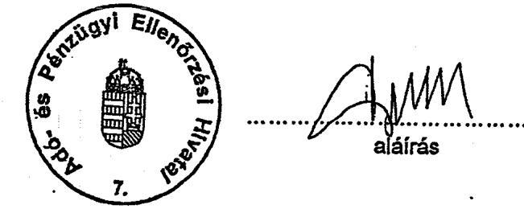

---

# DIAGRAMM

---

Ellenőrzési megállapítások alakulása a kiemelt adatszolgáltatási típusokban 1998-2002

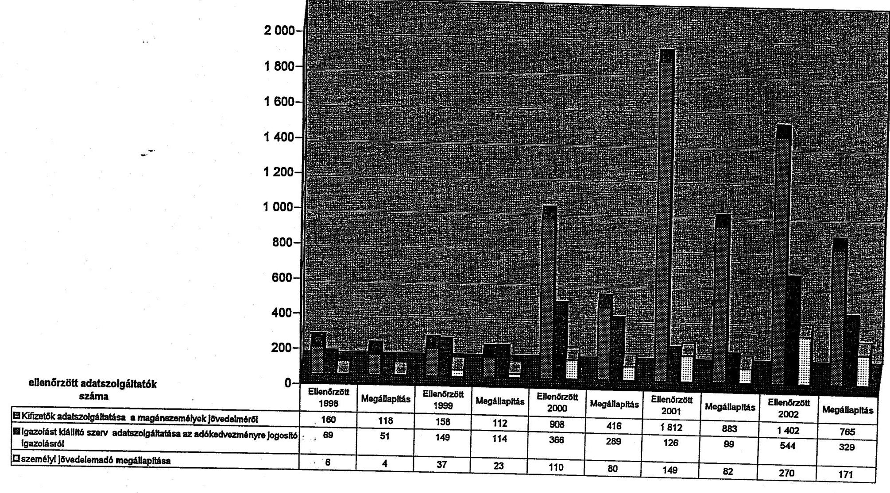

---

# 3. SZÁMÚ MELLÉKLET

a V-30-71/2003-2004. sz. jelentéshez

---

# Az adatállományok felhasználása az egyes jövedelmek, valamint az adókedvezmények igénybevétele jogszerűségének ellenőrizhetősége szempontjából

## 1. A KÜLFÖLDI ÁLLAMPOLGÁROK MAGYARORSZÁGI FOGLALKOZTATÁSÁBÓL SZÁRMAZÓ JÖVEDELMEK ELLENŐRIZHETŐSÉGE

A kiadott munkavállalási engedélyekről, a munkavállalási engedélyben feltüntetett adatokról a megyei munkaügyi központoknak az Art. adatszolgáltatási kötelezettséget nem ír elő, így az adóhatóság nem rendelkezik kontroll adatokkal arra vonatkozóan, hogy a foglalkoztató eleget tett-e adatszolgáltatási kötelezettségének, bejelentette-e a külföldi munkavállalót, illetve az sem ellenőrizhető, hogy a külföldi állampolgár, mint munkavállaló teljesítette-e adóbejelentési és adófizetési kötelezettségét.

Magyarországon a 1991. évi IV. tv. alapján munkavállalási engedéllyel vállalhat munkát külföldi állampolgár, amelynek mindenkori keretszámait a 8/1999 (XI.10.) SzCsM rendelet alapján számítják ki és teszik közzé. A fenti jogszabályok az egyidejűleg engedéllyel foglalkoztatottak számát 2001-ben nem korlátozták, 2002-ben pedig 81 ezer főben állapították meg, az ezt igénybevevők száma 47 ezer illetve 50 ezer volt.

Az adóhatóság álláspontja szerint nincs olyan kötelezettsége, hogy tudja, vagy nyilvántartsa azokat a külföldi állampolgárokat, akik magyarországi munkavállalási engedéllyel rendelkeznek.

Az adóhivatal mintegy 250 ezer külföldi állampolgárságú adóazonosítóval ellátott adóalanyt tart nyilván, azonban általában nincs információja arról, hogy az adóévben is volt-e adóköteles jövedelmük, magyarországi tartózkodási helyük megszűnt-e, vagy változott-e.

Pl. ha a külföldi illetékességű személynek az egyik adóévben olyan jövedelme keletkezett, amely bevallásához adóazonosítót igényelt, majd az azt követő években ilyen jövedelemmel nem rendelkezett (vagy elhagyta az országot, elhunyt stb.) az adóhatóság folyamatosan nyilvántartja.

Az Art. 5. sz. melléklete részletesen szabályozza a külföldi illetőségű magánszemélyek jövedelmének adózásával kapcsolatos feladatokat. Az adatközlések alapján évente mintegy 40 esetben állapította meg a Hivatal az állandó lakóhellyel nem rendelkező külföldi állampolgárok adóját határozattal.(Ezek többsége meghívott előadóművész.)

## 2. KÜLFÖLDRŐL SZÁRMAZÓ JÖVEDELMEK ELLENŐRIZHETŐSÉGE

Az adóhatóságnak általában nincs lehetősége a bevallásban fel nem tüntetett külföldön szerzett jövedelmek feltárására. Az ellenőrzés le-

---

folytatásához szükséges kontroll információ csak abban a különleges esetben áll az adóhatóság rendelkezésére, ha belföldi munkáltatótól származik az összes külföldön szerzett jövedelem.

A bevallási adatok alapján az illetékes külföldi hatóság nem azonosítható be. Kizárólag revízió esetén, az adózó által bemutatott iratok, igazolások alapján lehetséges az illetékes külföldi hatóság azonosítása, és a szükséges kontroll információk beszerzésének kezdeményezése.

Az adóhatóságnak nincs együttműködése a külföldi adóhatóságokkal automatikus adatközlésre, azonban spontán adatszolgáltatás keretében az APEH több országtól kap adatokat a magyar adóalanyokra vonatkozóan.

Amennyiben a külföldi adóhatóságoktól érkezik adat az ott szerzett jövedelemről, azt az APEH Nemzetközi Főosztálya megküldi az illetékes igazgatóságnak. Az EU országok közül Németországból rendszeresen, évente 20-25 alkalommal, míg Dániából, Finnországból és Angliából esetlegesen érkeznek adatok. Az USA-ból évente 1000 db fölött kap az adóhatóság magyar adóalanyokra vonatkozóan adatokat. Ezen kívül még érkeznek adatok Ausztráliából és Dél-Koreából is.

A vizsgált években a külföldi adóhatóságok részére történő adatszolgáltatás, illetve konkrét adózóval kapcsolatos kontroll információra vonatkozó megkeresés részletes eljárási szabályait az Art. nem szabályozta. Az un. kettős adóztatás elkerüléséről szóló egyezmények az információcsere, tájékoztatás kereteit, az ezzel kapcsolatos jogokat és kötelezettségeket rögzítik, azonban a végrehajtás módjára nem terjednek ki.

A jelenleg hatályos Art. az EU tagállamok közötti adatszolgáltatások körét szabályozza, azonban más államok közötti információcsere vonatkozásában nem tartalmaz az eljárási rendre vonatkozóan előírásokat. A Pénzügyminisztérium álláspontja szerint az Art. pontosítása, kiegészítése nem szükséges, mivel a 2004.től hatályos Art. 5.§ (2) bekezdése alapján a törvény szabályaitól nemzetközi szerződés (egyezmény) vagy viszonosság esetén el lehet térni.

Az adóhatóság a vizsgált években 28, illetve 49 esetben kért adatszolgáltatást a Pénzügyminisztériumon keresztül külföldi adóhatóságoktól. A külföldi megkeresések száma évenként mintegy 140 db volt.

# 3. INGATLANÉRTÉKESÍTÉSBŐL SZÁRMAZÓ JÖVEDELMEK ELLENŐRIZHETŐSÉGE

Az ingatlanértékesítésből származó bevétel ellenőrzéséhez az APEH nem rendelkezik megfelelő kontroll adatállománnyal, az Art. alapján előírt adatszolgáltatást az adatok összetétele, tartalma miatt nem tudja felhasználni.

Az Art. 13.§ (2) bekezdése alapján az ingatlan értékesítéséről a magánszemélynek a jogügyletet tartalmazó okirattal egyidejűleg be kell nyújtania a földhivatal részére az adóhatóság által rendszeresített nyomtatványt (400 sz. adatlap). Ez magyar állampolgár esetében az ingatlan visszterhes vagyonátruházása esetén az ingatlant értékesítő magánszemély adóazonosító jelét, ennek hiányában a

---

természetes azonosító adatait, nem magyar állampolgárságú magánszemély esetén a természetes azonosítókon kívül az útlevélszámát kell hogy tartalmazza.

Abban az esetben, ha a magyar állampolgárságú magánszemély nem rendelkezik adóazonosító jellel, az illetékhivatal nem tudná teljesíteni az Art. azon előírását, miszerint az adatszolgáltatásnak tartalmaznia kell a magánszemély adóazonosító jelét is. A 400-as adatlap szolgál arra a célra, hogy az illetékhivatal a természetes azonosítók közlésével megkeresse az
 állami adóhatóságot a magánszemély adóazonosító jelének megállapítása céljából.

Az adatlap adatait az ingatlanjogügylet lebonyolításával megbízott ügyvédnek nem kell ellenőriznie, hitelesítenie, így a szerződéssel történő egybevetés a földhivatalok feladata. A földhivatal nem rendelkezik az adóazonosító jeleket tartalmazó adatbázissal, az adóazonosító jelet tartalmazó igazolvány bemutatását az eljárási rend nem teszi lehetővé, így nem tudja ellenőrizni a feltüntetett adóazonosító jelek valódiságát. (A földhivatali nyilvántartási rendszer személyi azonosítóra épül, az adóazonosítókat nem használhatja, így az adóhatósági megkeresések teljesítése - ide értve az illetékhivatalokat is - csak természetes azonosítók alapján lehetséges.)

Az illetékhivatal adatközlése 2000. évet (az 1999. évi Art. módosítást) megelőzően nem tartalmazta az adóazonosító jelet, így az adóhatóság a természetes azonosítók (név, anyja neve, születési dátum) alapján azonosíthatta a jogügyletben résztvevő adóalanyt.

# Az illetékhivatalok a kontroll adatszolgáltatást a szerződések külön feldolgozását követően tudják csak teljesíteni, mivel a földhivatal adatszolgáltatása (400. számú adatlap) nem tartalmaz adatot a szerződés szerinti érték összegére, amelyet így a tulajdonostársak tulajdoni hányada alapján az illetékhivatal állapít meg. 

A helyszíni ellenőrzés során vizsgált K44. számú adatszolgáltatásokból a szerződések hiányában nem derült ki egyértelműen, hogy az illetékhivatalok rendszerjellegűen miként tesznek eleget ennek a feladatnak.

Az illetékhivatal adatszolgáltatásának felhasználását korlátozza, hogy az Art. alapján nem egyértelmű, hogy az adatszolgáltatás milyen időszakra vonatkozik: az adóévben a földhivataloktól beérkezett adatlapokról kell-e adatszolgáltatást teljesíteniük, vagy csak azokról, amelyekben az illetéket már határozatban kiszabták.

Az adatszolgáltatás nem tartalmaz az adóhatóság részére több olyan adatot, amelyet az ellenőrzései során hatékonyan hasznosíthatna. Ilyen pl. az ingatlan szerzésének éve, akkori vételár összege. Vagyonosodási vizsgálat során hasznosítható a forgalmi érték is, amelyet az illetékhivatal az illeték kiszabása során állapít meg. A forgalmi érték és a szerződésszerinti érték jelentős eltérése esetén az adóhatóság ellenőrzést folytathatna le. (A felsorolt adatok a földhivataloktól és az illetékhivataloktól csak konkrét megkeresésre szerezhetők be, tehát akkor, ha más szempontok alapján a vizsgálatot az adóhatóság már megindította.)

Az ingatlanértékesítéssel kapcsolatos adatszolgáltatások korlátozott adattartalma (amelyet az Art. tételesen meghatároz) mellett az 53. sz. be-

---

vallás (amelyet az adóhatóság alakít ki) sem nyújt arra vonatkozóan információt, hogy az adóalany az ingatlanértékesítést terhelő adót hogyan számolta ki, miként vette igénybe az adókedvezményt. A kialakított adatszolgáltatási rend még arra sem nyújt információt, hogy az adóalany a bevallási kötelezettségeinek eleget tett-e vagy sem, a bekért adatok egybevetésére semmilyen lehetőséget nem biztosít.

A K44. számú adatszolgáltatást minden magánszemély által történő ingatlanértékesítés során ki kell tölteni, ugyanakkor nem kell az adóbevallásban feltüntetni például azokat az értékesítéseket, amelyekből az eladónak nem származott jövedelme. (kitöltési útmutató 155. sor)

Pontos adatszolgáltatás esetén a beérkezett adatok alapján az adóhatóság az 53. számú adóbevallás ingatlanértékesítésre vonatkozó adatsoraiból a bevételként feltüntetett adatokat ellenőrizhetné, illetve azokat az adóalanyokat szűrhetnék ki, akik az ingatlanértékesítést elhallgatva jogtalanul a munkáltatót (illetve 2005-től akár az adóhatóságot) bízzák meg az adó elszámolásával.

Az adatszolgáltatás, illetve az adóbevallás részletezése sem ad lehetőséget az ingatlannal kapcsolatos jövedelem informatikai úton történő teljes ellenőrzésére, mivel az adókedvezmény felhasználásának jogszerűsége csak utólagos adónem ellenőrzés keretében vizsgálható.

Nem magyar állampolgárok, illetve kettős állampolgárok ingatlanértékesítéséről az adóhatóság nem rendelkezik rendszerjellegűen kontroll információval, mivel az illetékhivatal adatszolgáltatása (K44) - amennyiben az érintettek adóazonosító jel megállapítása végett nem jelentkeztek be az adóhatóságnál - nem közöl rájuk vonatkozóan információkat. Ezen személyeknél ezért az adó bevallását és megfizetését az adóhatóság ellenőrizni nem tudja.

Az adatlap alapján külföldi állampolgárok útlevéllel, tartózkodási engedéllyel vagy egyéb okmánnyal igazolhatják adataik valódiságát, megjelölve az állampolgárságot is. Az Art. 13.§ (2) bekezdése az adatlaptól eltérően az azonosításhoz a természetes azonosítókon kívül (az érvényesség, elvesztés, stb. miatt akár változó) útlevélszámot határozza meg, míg az illetékhivatal K44. számú adatszolgáltatása sem a természetes adatok feltüntetésére, sem az állampolgárság és az igazoló okmány megjelölésére, sorszámára nem tartalmaz adatközlési lehetőséget.

Az Art. 12. § (1) bekezdése szerint személyi jövedelemadó köteles bevétel megszerzése előtt adóazonosítót kell kérnie a külföldi állampolgárnak is, azonban az ingatlanszerzésre vonatkozóan a 13.§ (3) bekezdésben szabályozott adóazonosító jel megkérésére vonatkozó előírások kizárólag a magyar állampolgárságú magánszemélyekre korlátozódnak.

Az Art. 97. § x) pontja szerint adóazonosító számnak minősül a magyar állampolgársággal nem rendelkező magánszemély esetében az útlevélszám, így további adóazonosító megképzése e rendelkezés alapján indokolatlan lenne.

A kialakult gyakorlat alapján, amennyiben az ingatlanértékesítésről a külföldi állampolgár külön (alakszerűtlen) bejelentést tesz az adóhatóságnak, az adó-

---

hatóság adóazonosító jelet képez és értesíti arról a bejelentőt. Ez alapján nincs akadálya annak, hogy a külföldi az önbevallással eleget tegyen az adóbejelentési és adófizetési kötelezettségének. (Pl. állandó külföldi tartózkodás esetén Internetről letöltheti a bevallásnyomtatványt és kezdeményezheti bankjánál az adó átutalását.)

Magyarországon állandó tartózkodási hellyel nem rendelkező külföldi magánszemélyek ingatlanértékesítéséből származó jövedelmének utólagos ellenőrzésére az adóhatóság vizsgálatot nem folytatott, így a fenti gyakorlat célszerűségéről az adóhatóság információval nem rendelkezik.

Az állandó magyarországi tartózkodási hellyel és adóazonosító jellel rendelkező külföldi állampolgárok vonatkozásában az adatszolgáltatások nem tesznek különbséget külföldi és belföldi értékesítők között, így az adóhatóság nem rendelkezik csak a külföldiekre vonatkozó nyilvántartással. Amennyiben az ingatlan értékesítője nem teljesíti bevallási és adófizetési kötelezettségét, az általános szabályok szerint helye van vele szemben mind az ellenőrzés, mind a végrehajtási eljárás lefolytatásának, amelynek során a nemzetközi egyezményekben foglaltak szerint lehetőség van információt kérni az illetőség szerinti állam hatóságaitól. (Az illetékes állam megállapítása az adóalany nyilatkozata alapján történik, ez pl. a kettősállampolgárok vonatkozásában nem egyértelmű.) A kettős adóztatás elkerüléséről szóló nemzetközi egyezmények ugyanakkor nem szabályozzák az adótartozás viszonosságon alapuló behajtását.

# 4. ÜZLETRÉSZ-ÉRTÉKESÍTÉS ELLENŐRIZHETŐSÉGE 

Az APEH az üzletrész-értékesítésről csak akkor rendelkezik információval, ha az üzletrész értékesítő kifizetőnek minősül (Art.97.§ j. pont), és mint árfolyam nyereségből származó jövedelemről az adatszolgáltatási kötelezettségét teljesíti. Magánszemélyek üzletrészértékesítéséről nincs kontroll információ, annak ellenére, hogy azokról az állam közhiteles nyilvántartást (1997. évi CXLV. tv. 3. §) vezettet a cégbíróságokkal. A cégbíróságok részére az Art. adatszolgáltatási kötelezettséget nem ír elő, ennek hiányában nem ellenőrizhető, hogy az üzletrész értékesítő magánszemély az SZJA tv. 67. §-ban előírt adófizetési kötelezettségének eleget tett-e.

A cégnyilvántartásba történő bejegyzést követően az adóhatóság az egyablakos rendszeren keresztül kap adatokat a bejegyzett cég tulajdonosairól, de ez nem tartalmazza a tulajdonosok adóazonosítóját. A cégbejegyzést követő 15 napon belül kell a bejegyzett cégnek a tulajdonosok adóazonosítóját az adóhatósághoz bejelentenie. Az adóhatóság a vállalkozás bejelentésekor nyilatkoztatja a bejelentetőt egyéb üzletrészéről, ez alapján un. tulajdonosi hierarchiát mutató adatbázist állít fel a vállalkozásokról. Az üzletrész-értékesítésről azonban adatszolgáltatás hiányában nem rendelkezik információval, ezért adatbázisát karbantartani nem tudja. Az adónem ellenőrzések során, amennyiben az adózó üzletrésztulajdonait érintően kétséget kizáróan (adóazonosítóval egyeztethető, illetve külföldi illetékességű adóalany esetében természetes azonosítók, lakhely) információ szükséges, az érintett igazgatóságnak a cégbíróságokat levélben kell

---

megkeresnie. (Hasonló megkereséseket kell végezni a földhivatalokba akkor is, ha az adóalany ingatlantulajdonai után érdeklődik az adóhatóság)

# 5. CSALÁDI ADÓKEDVEZMÉNYT IGÉNYBEVEVŐK ELLENŐRIZHETŐSÉGE 

Az adóhatóság a családi adókedvezmény igénybevételének jogszerűségét informatikai módszerekkel ellenőrizni nem képes, mivel a kedvezmény alapjául szolgáló gyermekek létéről nincs információja. Adóazonosító jellel ugyanis általában csak kérelemre látja el az adóhatóság a magánszemélyt, így adóazonosító jel, személyi szám hiányában nem ellenőrizhető, hogy létező gyermek alapján igényli-e az adózó a kedvezményt.

A családi adókedvezményre jogosultak körére is csak konkrét vizsgálat során, bizonyítási eljárás keretében kérhető információ az adatkezelő szervektől. Az érvényben lévő adatvédelmi szabályok alapján csoportos adatkérésre nincs lehetőség.

Természetes azonosítók alapján megfelelő informatikai kapacitással ellenőrizhető lenne, hogy az adott gyermek után többen veszik-e igénybe a kedvezményt, azonban a nem létező gyermekek kiszűrésére egyáltalán nincs informatikai lehetőség. A jogosultság egyéb feltételeit sem tudja ellenőrizni az adóhatóság, mivel az adóazonosítók alapján nem lehet családi közösségeket azonosítani, amelyen belül ellenőrizni lehetne, hogy a családi közösségen belül ki(k) veszi(k) igénybe a kedvezményt, és ki után jár a családon belül a kedvezmény. Különösen problematikus az elvált, vagy különélő házastársak esetében a jogosultság és a közös háztartás vitelének ellenőrzése, továbbá az élettársi kapcsolat alapján a kedvezményt jogosulatlanul igénybevevők kiszűrése.

Az SZJA tv. a magzat után igénybevehető kedvezménnyel olyan további lehetőséget biztosít az adókedvezmény érvényesítésére, amely jogosultságának ellenőrzése csak a terhes gondozási könyv, orvosi igazolás bemutatásával lehetséges.

## 6. TANDÍJKEDVEZMÉNY ELLENŐRIZHETŐSÉGE

Az adóhatóság a tandíkkedvezmény elszámolására vonatkozó jogosultságot kontroll adatokkal nem tudja ellenőrizni. Sem az oktatási intézmény adatszolgáltatása, sem az adóbevallás nem alkalmas az egyezőségek vizsgálatára. A tandíkkedvezmény összetett és feltételes szabályok alapján érvényesíthető, az elszámolásra jogosultak köre tanévenként változó lehet, a rokonsági fok, továbbá az elszámolható adó összege nem követhető nyomon.

Az SZJA-ról szóló tv. 36.§-a szerint az adóalap adóját csökkenti a felsőoktatási intézmény hallgatójának tandíja és/vagy költségtérítése címén megállapított összegnek 30\%-a, de legfeljebb hallgatónként 60 ezer Ft (tanulmányi hónaponként 6 ezer Ft) a befizető nevére kiállított igazolás alapján. Az igazolást a felsőoktatású intézmény állítja ki a hallgató részére a hallgató által megjelölt személyt feltüntetve. Az adókedvezményt igénybe veheti a szülő, örökbefogadó-, nevelő-, mostohaszülő, nagyszülő, testvér, házastárs, de lehetőséget biztosít a jogszabály

---

arra is, hogy amennyiben azt az arra jogosultak nem használják fel a hallgató a hallgatói jogviszonyának első alkalommal történő megszűnése évét követően a tandíjfizetés évére vonatkozó rendelkezések szerint egyébként igénybevehető adókedvezményt legfeljebb öt egymást követő évben tetszőleges elosztásban (akár 60 ezer Ft-nál magasabb összegben) érvényesítse.

Az oktatási intézmény adatszolgáltatásában csak a kedvezményt igénybevevőről ad adatszolgáltatást, nem jelöli meg a hallgatót, amely után a kedvezmény érvényesíthető.(Ha a hallgató ösztöndíj folyósítása miatt, vagy egyéb okból nem kérte korábban az adóazonosító jelét, akkor még nem is rendelkezik azzal.) Az adóbevallás szintén nem tartalmaz a hallgató azonosítására vonatkozó adatot, és nem biztosítja az oktatási intézmény azonosításához szükséges adatokat sem. A kedvezmény igénybevételének halaszthatósága, valamint több hallgató után igénybevehető kedvezmény - amely összevontan jelenik meg az adóbevallásban - az igénybevett kedvezmény összege és az elszámolható összeg maximuma nem ellenőrizhető.

Az oktatási intézményt az adóbevallásban nem kell megjelölni, ezért nem vizsgálható, hogy jogosult volt-e az oktatási intézmény az adókedvezmény igénybevételére jogosító igazolás kiállítására.

A felsőfokú tanintézetek felvételi tájékoztatójának elemzése alapján tudta konkrét esetben kiszűrni az adóhatóság az igazolás jogosulatlan kiadását, mivel az oktatási intézmény adatszolgáltatást nem közölt, de a hallgatók felé az adókedvezmény igénybevételére jogosító igazolásokat kiadta.

# 7. BIZTOSÍTÁSI KEDVEZMÉNYEK ELLENŐRIZHETŐSÉGE 

Ha a magánszemélynek ugyanazon biztosítónál több biztosítási szerződése van, amely után biztosítási kedvezményt vett igénybe és azt lejárat előtt megszünteti, az adóhatóságnak közölt adatokból (K48) nem állapítható meg, hogy melyik szerződése szűnt meg, és milyen összeget kell visszafizetnie.

Az adózó az SZJA tv.42.§ alapján az adóalap adóját csökkentheti a
 jogszabály által meghatározott módon és feltételekkel belföldi székhelyű biztosítóval kötött élet- és nyugdíjbiztosítás adóévben megfizetett díjának 20%-ával, de több szerződés esetén is legfeljebb együttesen 50 ezer forinttal. A levont összeget 20%-kal növelten kell az adóévre vonatkozó bevallásban bevallani és az adóbevallás benyújtására előírt határidőig megfizetni, ha a rendelkezési jogát 10 éven belül gyakorolja.

Az adatszolgáltatás összevontan tartalmazza az adózóra vonatkozóan a szerződéskötés időpontját és a szerződés feletti rendelkezés időpontját, valamint a szolgáltatás összegét, ezen adatok azonban nem alkalmasak arra, hogy a visszafizetendő összeg ellenőrizhető legyen. Ennek oka egyrészt, hogy nem szerződésenként vannak feltüntetve az adatok, másrészt az SZJA tv. bonyolult rendelkezései nem teszik lehetővé az összeg figyelését. A tv. 7. sz. melléklete 7. pontja b) bekezdése ugyanis a 10 éven belüli érvényesítésre vonatkozó megkötés alól is tartalmaz kivételt. (Az adóbevallás kitöltési útmutatója erre nem hívja fel az adózó figyelmét)

---

# 8. SÚLYOSAN FOGYATÉKOSOK KEDVEZMÉNYÉNEK ELLENŐRIZHETŐSÉGE

A 15/1990 (IV.23.) SZEM rendelet alapján a háziorvosok, illetve szakorvosok csak a megállapítás évében közölnek adatot a súlyosan fogyatékos személyről, így az adatszolgáltatások nem vethetők össze a bevallásban szereplő összegekkel.

A vizsgált években az 1-1,2 ezer adóalanyra vonatkozó adatszolgáltatás mellett mintegy 85 ezer adóalany vette igénybe a kedvezményt, amely $1,5 \mathrm{Mrd} \mathrm{Ft}$ kontroll adat nélküli kifizetést (kedvezmény érvényesítést) jelentett évente.

Az Art. az adatszolgáltatási kötelezettségre vonatkozóan külön nem rendelkezik, ezért az orvosok adatszolgáltatási kötelezettségüknek elsősorban tájékozatlanságuk miatt gyakran nem tesznek eleget. Kontroll adatok hiányában azonban nem szűrhető ki, hogy az adatszolgáltatást mely orvosok nem teljesítették, illetve - mivel csak a megállapítás évében kell adatszolgáltatást tenni - mely esetekben nem is kellett, hogy közöljenek adatot, illetve mikor szűnik meg a jogosultsági feltétel.

A 141/2000 (VIII.9.) Kormányrendelet alapján a fogyatékossági támogatásra való jogosultságot a Magyar Államkincstár Területi Igazgatóságai állapítják meg a feltételek megléte esetén, így azok adatszolgáltatóként való megjelölése esetén a kontroll információk többsége rendelkezésre állna. Az eltérést az okozza, hogy nem jogosultak az 1998. évi XXVI. tv. 23. § (2) bekezdése szerint támogatásra azok a személyek, akik vakok személyi járadékában, illetve magasabb összegű családi pótlékban részesülnek, ezért az adókedvezmény igénybevételére jogosultak köre a támogatásban részesülteknél ennyivel nagyobb.

## 9. SULINET PROGRAM KERETÉBEN ÉRVÉNYESÍTETT ADÓKEDVEZMÉNY ELLENŐRIZHETŐSÉGE

Az adóhatóság a megvásárolt informatikai termékek esetében a jogszabályban előírt jogosultsági feltételek meglétét informatikai módszerekkel ellenőrizni nem tudja.

Külön adatszolgáltatási nyomtatvány hiányában a vásárlásról az eladóhelyeknek K51 típusú nyomtatványt kell kiállítaniuk, ez azonban nem tartalmazza az igényjogosultság alapját, a tanuló gyermek adóazonosítóját (diákigazolvány számát), családjogi helyzetét. Ennek hiányában csak a vásárlás ténye feltételezhető az eladóhely adatközlése alapján. Nem ellenőrizhető továbbá a kedvezmény igénybevételének azon feltétele sem, hogy azonos termékre csak egy adóalany veheti igénybe a kedvezményt (a termékértékesítés ténylegesen megtörtént, nem csak az igazolás kiállítására került sor), illetve a kedvezmény mértéke szülők esetében nem vonható össze.

Budapest, 2004. július
