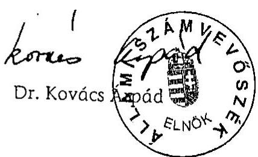

# JELENTÉS 

az Összefogás Magyarországért Centrum 2002-2003. évi gazdálkodása törvényességének ellenőrzéséről

---

3. Önkormányzati és Területi Ellenőrzési Igazgatóság
3.1. Szabályszerüségi Ellenőrzési Főcsoport
Iktatószám: V-1004-030/2004.
Témaszám: 698
Vizsgálat-azonosító szám: V0133
Az ellenőrzést felügyelte:
Dr. Lóránt Zoltán
föigazgató
Az ellenőrzés végrehajtásáért felelős:
Dr. Elek János
általános főigazgató helyettes
Az ellenőrzést vezette:
Horváth Balázs
osztályvezető főtanácsos
Az összefoglaló jelentést készítette:
Dr. Dotterweich Antal
tanácsadó
Az ellenőrzést végezték:
Dr. Dotterweich Antal Tóth István
tanácsadó
tanácsadó

A témához kapcsolódó eddig készített számvevőszéki jelentések:
címe
sorszáma
Az Összefogás Magyarországért Centrumnál korábbi ellenőrzés
nem volt.

---

# TARTALOMJEGYZÉK 

BEVEZETÉS ..... 5
I. ÖSSZEGZŐ MEGÁLLAPÍTÁSOK, KÖVETKEZTETÉSEK, JAVASLATOK ..... 6
II. RÉSZLETES MEGÁLLAPÍTÁSOK ..... 9

1. A Párt gazdálkodásáról szóló 2002-2003. évi beszámolók ..... 9
1.1. A teljes vizsgálati időszakra érvényes megállapítások ..... 9
1.2. A 2002-2003. évi beszámolók ..... 9
1.2.1. Bevételek ..... 9
1.2.2. Kiadások ..... 10
2. A Pártnak a beszámoló összeállítására és az azt alátámasztó könyvvezetésre vonatkozó belső szabályozása és gyakorlata ..... 12
2.1. A belső szabályozás rendszere ..... 12
2.2. A könyvvezetés gyakorlata, összhangja a törvényi és a belső előírásokkal ..... 13
2.3. Analitikus nyilvántartások ..... 14
2.4. A bizonylati elv és a bizonylati fegyelem érvényesülése ..... 14
3. A Párt bevételszerző gazdálkodó tevékenysége ..... 16
4. A gazdálkodással összefüggő egyéb jogszabályokban foglalt előírások betartása ..... 16
4.1. Személyi jellegű kifizetések ..... 16
4.2. A társadalombiztosítási és egyéb jogszabályok rendelkezéseinek érvényesítése ..... 17
5. A Párt belső ellenőrzési rendszere ..... 17

## MELLÉKLETEK

1. számú A Párt 2002. évi gazdálkodásáról készített beszámoló
2. számú A Párt 2002. évi módosított pénzügyi beszámolója
3. számú A Párt 2003. évi pénzügyi beszámolója

---

.

---

# RÖVIDÍTÉSEK JEGYZÉKE 

| ÁSZ | Állami Számvevőszék |
| :-- | :-- |
| Párt | Összefogás Magyarországért Centrum |
| Párttörvény | A pártok múködéséről és gazdálkodásáról szóló - többször   módosított - 1989. évi XXXIII. törvény |
| Számviteli törvény | A számvitelről szóló - többször módosított - 2000. évi C.   törvény |
| Szja tv. | A személyi jövedelemadóról szóló - többször módosított -   1995. évi CXVII. törvény |

---

.

---

# JELENTÉS 

## az Összefogás Magyarországért CENTRUM 2002-2003. évi gazdálkodása törvényességének ellenőrzéséről

## BEVEZETÉS

A pártok múködéséről és gazdálkodásáról szóló - többször módosított - 1989. évi XXXIII. törvény (továbbiakban: párttörvény) 10. § (1) bekezdése, valamint az Állami Számvevőszékről szóló 1989. évi XXXVIII. törvény 5. §-a és a 16. § (2) bekezdése alapján a pártok gazdálkodása törvényességének ellenőrzésére az Állami Számvevőszék (továbbiakban: ÁSZ) jogosult. Az ÁSZ 2004. évi ellenőrzési tervének megfelelően vizsgálta a 2001. december 20-án alakult Összefogás Magyarországért Centrum (továbbiakban: Párt) 2002-2003. évi gazdálkodása törvényességét.

Az ellenőrzés célja annak megállapítása volt, hogy:

- a Párt által készített és a Magyar Közlönyben közzétett éves beszámolók a törvényi előírásoknak megfelelnek-e, a könyvvezetéssel és a valósággal megegyező adatokat tartalmaznak-e;
- a könyvvezetés és a gazdálkodás során betartották-e a számvitelről szóló többször módosított - 2000. évi C. tv. (továbbiakban: számviteli törvény) és az egyéb jogszabályi rendelkezéseket és belső előírásokat;
- a Párt a múködéséhez szabályszerűen igénybe vehető forrásokat használt-e fel, nem folytatott-e a párttörvény által tiltott gazdálkodó tevékenységet, nem fogadott-e el tiltott vagyoni hozzájárulást, illetőleg adományt.

Az ellenőrzés körülményeit illetően rögzíteni szükséges, hogy az ÁSZ évek óta folyamatosan javasolja a Kormánynak a pártok ellenőrzéséről készített jelentéseiben a párttörvény módosítását, tekintettel arra, hogy

- a párttörvény 1. sz. melléklete szerinti beszámoló-mintához magyarázatot, kitöltési útmutatót nem készítettek a jogalkotók, így ennek kitöltése pártonként - kialakított számviteli politikájuknak megfelelően - eltérő lehet;
- a beszámoló-minta a számviteli törvény rendelkezéseivel nem harmonizál, nem felel meg sem a mérleg, sem az eredmény-kimutatás követelményeinek.
Az ellenőrzést az ÁSZ elnöke 13/2003. számú utasításával kiadott "Módszertan a pártok gazdálkodása törvényességének ellenőrzéséhez" c. kiadvány (továbbiakban: Módszertan) alapján készítettük elő és hajtottuk végre.

A helyszíni ellenőrzés: 2004. március 22-április 23. között a Párt budapesti irodájában történt.

---

# I. ÖSSZEGZŐ MEGÁLLAPÍTÁSOK, KÖVETKEZTETÉSEK, JAVASLATOK 

A Párt 2002. és 2003. évi pénzügyi beszámolóját a párttörvényben előírt határidőben és formában közzétette. A 2002. évi gazdálkodásáról összeállított beszámoló a Magyar Közlöny 2003. április 30-i, 45. számában jelent meg. A 2003. évi pénzügyi beszámolót - az ellenőrzés észrevételei alapján helyesbítve - a Magyar Közlöny 2004. április 28-i, 58. számában hozta nyilvánosságra.

A Párt 2002. évi beszámolója nem érvényesítette a valódiság, a teljesség, az összemérés, a következetesség számviteli alapelvét. Az összes bevételt 28,3\%kal magasabb összeggel közölte, ugyanakkor az összes kiadásban nem szerepeltetett 26600 ezer Ft politikai kiadást. A Párt a lényeges hibákra tekintettel 2002. évi módosított beszámolóját - a 2003. évi beszámolójával egyidejűleg ismételten közzétette.

A 2003. évi beszámoló közzétett adatai - az ellenőrzés hibafeltárása nyomán korrigált kiadási adatokkal - a könyveléssel összhangban álló pénzforgalomról tájékoztattak.

Az ellenőrzés által feltárt hibák a Párt számviteli szabályozásának ellentmondásaiból, hiányosságaiból fakadtak. A hatályos számviteli politika nem igazodott a párttörvényben előírtakhoz, a Pártot jellemző gazdálkodási sajátosságokhoz. Nem tartalmazott előírást több - a számviteli törvényben tételesen megjelölt - szabályozási területről. A számviteli politika keretében nem szabályozták az eszközök és források értékelését.

Az éves beszámoló alapjául szolgáló könyvvezetéshez nem állítottak össze számlarendet, s ennek hiányában nem határozták meg a beszámoló sorokhoz rendelt főkönyvi számlákat, a főkönyvi számlák és analitikus nyilvántartások kapcsolatát, a számviteli tevékenység bizonylati rendjét.

A számviteli törvény előírásának megfelelően elkészítették a számviteli politika keretében az eszközök és a források leltárkészítési és leltározási szabályzatát. A hatályba helyezett házipénztár kezelési szabályzat kiegészítésre szorult, mivel nem rögzítette a házipénztár létesítésének és kialakításának feltételeit, továbbá hiányosak voltak az utalványozással kapcsolatos rendelkezések. A Párt időközben módosította szabályzatát, s a megállapított hiányosságok megszüntetéséről adott számot.

A könyvvezetés a vizsgált időszakban a kettős könyvvitel rendszerében az alapbizonylatok számítógépes feldolgozásával történt azonos számítógépes program alapján. A kialakított számítógépes könyvelési rendszerből minden, az ellenőrzés részére szükséges adat biztosítható volt, a gazdasági eseményeket idősorrendben rögzítették.

A számlakijelölés gyakorlata a könyvelt tételek egy részében nem volt összhangban a jogszabályi előírásokkal. A helytelen kontírozás a beszámolókban

---

lényeges hibákat eredményezett. Az ellenőrzés több főkönyvi számla esetében megállapította, hogy nem csak a számlán jogszerűen elszámolható tételek találhatók. A főkönyvi és analitikai egyeztetések elmulasztása miatt a zárlati munkálatokat mindkét évben hiányosan hajtották végre.

Az analitikus nyilvántartások vezetésére vonatkozó előírások hiányában a tárgyi eszközök nyilvántartásában nem szerepeltették a kis értékű és bérelt eszközöket; az elszámolási előlegek nyilvántartása nem tartalmazta a felvétel jogcímét, az elszámolás határidejét. A készpénzforgalom nyilvántartását nem kezelték a szigorú számadás szabályai szerint. A leltározás mindkét évben a leltározási szabályzat előírásainak megfelelően történt.

A Pártnál a kötelezettségvállalás és utalványozás rendjét hiányosan szabályozták. A kötelezettségvállalási jogot az ellenőrzött időszakban - egyetlen eset kivételével - jogszerűen gyakorolták. A pénzforgalom mintegy 80\%-át kitevő banki átutalások és kapcsolódó alapbizonylatok utalványozása szabályszerűen történt. A készpénzes bevételek és kifizetések esetében az alapbizonylatok $60 \%$-áról hiányzott az utalványozás.

A bizonylatolás a tranzakciók több mint felénél alaki és tartalmi szempontból nem felelt meg a számviteli törvény előírásainak. A bizonylati fegyelmet sértő szabálytalanságok között jellemzően az alapbizonylatok utalványozásának; az előleg felvétel jogcíme és elszámolási határideje meghatározásának; a befizető, illetve pénzfelvevő aláírásának; a könyvelésben történt rögzítés aláírással való igazolásának és időpontjának hiánya fordult elő.

A Párt könyvviteli nyilvántartásai szerint a vizsgált időszakban a párttörvényben tiltott forrásból származó vagyoni hozzájárulást nem fogadott el, kizárólag engedélyezett gazdálkodó tevékenységet folytatott. Gazdasági társaságban részesedést nem szerzett.

Az adózási és társadalombiztosítási jogszabályokban előírt bejelentési kötelezettségének a Párt eleget tett, éves bevallásait határidőben teljesítette. A kötelező nyilvántartásokat vezették, a kifizetett munkabérekből és bérjellegű jövedelmekből az adóelőlegeket és a járulékokat levonták. A költségvetést megillető befizetési kötelezettségeit likviditási helyzetétől függően teljesítette, melyből eredően év végi hátralékai keletkeztek.

A Párt gazdálkodásának, pénzügyi és számviteli tevékenységének egységes belső ellenőrzési rendszerét nem építették ki, nem szabályozták.

A vizsgált időszakban a Számvizsgáló Bizottság az Alapszabályban előírt múködési rendjét nem határozta meg, szabályos ellenőrzést nem végzett. A vezetői és munkafolyamatba épített ellenőrzés hiányosan funkcionált.

A beszámolási és könyvvezetési, illetve a gazdálkodási és pénzkezelési hibák, szabályozási mulasztások a belső ellenőrzési feladatok hiányos elvégzéséből is fakadtak.

---

A helyszíni ellenőrzés megállapításainak hasznosítása mellett az Állami Számvevőszék elnöke felhívja

# a Párt elnökét 

1. Gondoskodjon a számviteli politika átdolgozásáról, hogy az feleljen meg a számviteli törvény követelményeinek, a Párt működési és gazdálkodási sajátosságainak.
2. Készíttesse el a számviteli politikához igazodó számlarendet, valamint a keretébe tartozó eszközök és források értékelési szabályzatát.
3. Szüntessék meg a könyvviteli zárlati munkálatoknál lényeges hibát okozó hiányosságokat.
4. Gondoskodjon a számviteli törvény bizonylatok alaki és tartalmi követelményeire vonatkozó előírásainak betartásáról.
5. Rendszeres ellenőrzéssel és hatékony szabályozással biztosítsa az elszámolásra kiadott előlegek szabályszerű folyósítását és elszámolását.
6. Szabályozzák teljes körűen a Párt gazdálkodásának belső ellenőrzési rendjét és gondoskodjon a belső ellenőrzési rendszer szabályozásnak megfelelő, folyamatos müködéséről.

A helyszíni ellenőrzés megállapításainak hasznosítása mellett javasoljuk:

## a Kormánynak

Kezdeményezze a párttörvény következők szerinti módosítását:
A korábbi pártellenőrzések alapján tett jelzésekre is figyelemmel azon, a pártok számviteli nyilvántartási és beszámolási rendszerét érintő ellentmondások feloldását, amelyek a pártok működéséről és gazdálkodásáról szóló - többször módosított1989. évi XXXIII. törvény, valamint a 2001. január 1. napjától hatályos új számviteli törvény között továbbra is fennállnak.

---

# II. RÉSZLETES MEGÁLLAPÍTÁSOK 

## 1. A PÁrt GAZDÁlKODÁsÁról SZÓLÓ 2002-2003. ÉVI BESZÁMOLÓK

### 1.1. A teljes vizsgálati időszakra érvényes megállapítások

A Párt a 2002. évi beszámolóját 2003. április 30-án, a Magyar Közlöny 45. számában, a törvényben előírt határidőben tette közzé (1. sz. melléklet). A nyilvánosságra hozott beszámoló lényeges hibák miatt nem felelt meg a valódiság, a teljesség, az összemérés és a következetesség elvének.

- Az összes bevétel közzétett 204959 ezer Ft összege az ellenőrzés által feltárt 58095 ezer Ft hibával korrigálva helyesen 132648 ezer Ft. A hiba lényeges, mivel a közzétett bevételi főösszegre gyakorolt hatása $28,3 \%$.
- A beszámoló nem tartalmazott 26600 ezer Ft politikai tevékenység kiadásának minősülő összeget. A hiba mértéke lényeges, 13\%-os a közzétett kiadási főösszegre vetítve.

A Párt a számvevői jelentés megállapításaira figyelemmel időközben módosította a 2002. évi pénzügyi beszámolóját (2. sz. melléklet).

A Párt jelen ellenőrzés megállapításait hasznosítva véglegesítette 2003. évi pénzügyi beszámolóját, amely a Magyar Közlöny 2004. április 28-i, 58. számában határidőn belül, a számviteli alapelveket érvényesítve jelent meg (3. sz. melléklet).

### 1.2. A 2002-2003. évi beszámolók

A Párt a 2002. évi beszámoló közzétételét követően önellenőrzést hajtott végre, amelyről jegyzőkönyv készült. A jegyzőkönyvben foglaltak szerint a Párt lényeges hibát nem állapított meg, érdemi felülvizsgálat nem történt.

### 1.2.1. Bevételek

Az állami költségvetésből származó támogatás összege mindkét évben egyezett a Magyar Államkincstártól kapott adatokkal. A beszámolósor adata a vizsgált években egyeztethető volt a Párt által készített kigyűjtésekkel és a kapcsolódó bankbizonylatokkal.

A 2002. évi adat két részből tevődik össze:

- 40500 ezer Ft a párttörvényben meghatározottak alapján kapott összeg,
- 11648 ezer Ft a 2002. évi általános országgyűlési képviselőválasztáson indított 303 jelölt arányában átutalt összeg.

---

Az egyéb hozzájárulások, adományok beszámolósort 2002. évben tovább részletezték a párttörvény 1. sz. mellékletében meghatározott minta szerint.

Az egyéb hozzájárulások jogi személyektől beszámoló soron közölt 25000 ezer Ft összeg nem a valós helyzetet tükrözi, miután nem ezen a beszámoló soron szerepel három jogi személytől kapott összesen 1856 ezer Ft hozzájárulás. A hiba következtében sérült a valódiság számviteli alapelve.

Az egyéb hozzájárulások magánszemélyektől beszámolósoron 10466 ezer Ft-ot jelentetett meg a Párt, melynek - előző bekezdésben jelzett hiba hatásával - módosított adata helyesen 8610 ezer Ft.

Az egy adományozótól származó befizetéseket összesítették, a párttörvényben meghatározott összeghatáron felüli adományokat a 2002. évi beszámolóban nevesítették. A jogi személyektől származó hozzájárulások nevesített felsorolásában a „Szerencsejáték Rt." megnevezés nem a tényleges befizetőt jelölte, mivel az 5000 ezer Ft összeget a Magyar Szerencsejáték Szövetség utalta át a Párt részére. A módosított beszámolót ennek megfelelően jelentették meg.

A egyéb bevétel jogcímeket nem rögzítik a Párt belső szabályzatai. A gyakorlatban: hitelfelvétel, kölcsönfelvétel, kapott bankkamat jogcímeket sorolták az egyéb bevételek körébe.

A 2002. évről közzétett beszámolóban kölcsön felvétel címén 58095 ezer Ft-ot jelölt meg a Párt. A beszámolósorhoz kapcsolódó magyarázat és mellékszámítás szerint az összeg egy kft felé fennállt számlatartozás volt, mely a belföldi szállítók főkönyvi számla analitikája alapján két részösszegből tevődött össze. A kifizetetlen szállítói számlák miatti tartozást kölcsönfelvételnek minősítették, de ennek tényét dokumentummal nem tudták igazolni. Az együttesen 58095 ezer Ft összeg bevételként történt feltüntetésével sérült a számviteli törvény 15. § (3) bekezdésében meghatározott valódiság alapelve.

A 2002. évi beszámolóból kimaradt - önellenőrzési megállapítás szerint is - a pénzügyi műveletek bevételei számlacsoportban megtalálható 33772 Ft kapott kamat összege, ezáltal sérült a számviteli törvény 15. § (2) bekezdésében rögzített teljesség alapelve.

Összességében az egyéb bevételek soron elkövetett hiba lényeges, a beszámolóban közölt bevételi főösszegre vetített mértéke 28,3\%.

A 2003. évi beszámoló bevételi sorait a vonatkozó főkönyvi számlák alátámasztották, az ezeken szereplő összegek egyeztek a közzétett beszámoló adatával.

# 1.2.2. Kiadások 

A 2002. évről közzétett beszámoló támogatás egyéb szervezeteknek összege nem a valós helyzetet tükrözi.

---

- A beszámolóban feltüntetett 100 ezer Ft nem egyéb szervezetnek nyújtott támogatás, hanem egy bejegyeztetni szándékozott Alapítvány alapítói vagyonának az alapítók részére történt rendelkezésre bocsátása. Az öszszeget a párttörvény 1. sz. melléklete szerint nem ezen a beszámoló soron kellett volna feltüntetni.
- Múködési kiadások között könyveltek 279500 Ft-ot. A könyvelési tételhez kapcsolódó bizonylatok alapján a Párt ténylegesen más társadalmi szervezetnek nyújtott támogatást.

A múködési kiadások beszámolósor adata 2002. évben 22666 ezer Ft helyett helyesen 22236 ezer Ft, mivel az egyéb szervezeteknek nyújtott támogatás szabálytalan könyvelésén kívül is tartalmazott más kontírozási pontatlanságokat. Az elkövetett hibák miatt nem érvényesült a valódiság és a következetesség számviteli alapelve.

Az eszközbeszerzés beszámolósor tartalmát belső előírás nem rögzíti. Az összeg egyezett a vonatkozó főkönyvi számlák ezer forintra kerekített egyenlegével.

A Pártnál hasonlóan nem rögzítették a politikai tevékenység kiadása jogcímeit. A rendelkezésre bocsátott, a kiadásokat részletező számítási anyag alapján a Párt:

- a beszámoló összeállításánál „kölcsön" címen 58095 ezer Ft-tal csökkentette a politikai tevékenység - főkönyvi számlák alapján megállapított - költségeit;
- hasonlóan nem teljesített szállítói számlákkal összefüggésben hajtott végre 26600 ezer Ft költségcsökkentést, melyet az előzővel ellentétben nem minősített kölcsöntartozásnak. A könyvelt összeget a beszámoló nem tartalmazta.

A politikai tevékenység kiadása beszámolósor esetében az elkövetett hibák következtében sérült az összemérés és a teljesség számviteli alapelve. A megállapított hibák mértéke lényeges, a közzétett kiadási főöszszeghez képest $41,6 \%$-os mértékú.

Egyéb kiadásként a 2002. évről közzétett beszámoló 80595 ezer Ft-ot rögzít, melyből 58095 ezer Ft kölcsönállomány. Az elkövetett hiba mértéke a beszámoló kiadási főösszegére vetítve lényeges.

A 2003. évről szóló, az ellenőrzés részére átadott beszámoló-tervezet kiadási sorait korrigálták a számvevői jelentés megállapításainak megfelelően. Így a közzétett beszámoló adatai a főkönyvi könyveléssel összhangban álló éves pénzforgalomról tájékoztattak.

---

# 2. A PÁrtnaK a beSzÁmoló ÖSSZEÁLlítÁsÁra És az azT alÁtÁMASZTÓ KÖNYVVEZETÉSRE VONATKOZÓ BELSŐ SZABÁLYOZÁSA ÉS GYAKORLATA 

### 2.1. A belső szabályozás rendszere

A Párt a számviteli törvényben meghatározott határidőn belül elkészítette számviteli politikáját. A hivatkozott törvény 14. § (5) bekezdése előírásának megfelelően összeállította - a számviteli politika keretében - az eszközök és a források leltárkészítési és leltározási szabályzatát, a pénzkezelési szabályzatot, de elmulaszotta szabályozni az eszközök és források értékelését.

Az összeállított szabályzatok közül a leltározási szabályzat megfelelő, meghatározza a szabályzat tárgyával kapcsolatos fogalmakat, feladatokat; rögzíti a feladatok végrehajtásának módszereit; tartalmazza a végrehajtás bizonylatait, dokumentációját és leírja a kapcsolatot az analitikus nyilvántartásokkal.

A házipénztár kezelési szabályzat kiegészítésre és módosításra szorult, mivel nem rögzítette a házipénztár létesítésének, kialakításának feltételeit; az utalványozással kapcsolatos rendelkezések hiányosak voltak a számviteli törvény 167.§ (1) bekezdése c) pontjában meghatározott követelményekhez képest. Az ellenőrzés megállapításaira figyelemmel a Párt időközben módosította szabályzatát, s a felvetett hiányosságok megszüntetéséről adott számot.

A számviteli politika nem igazodik a párttörvényben elöírtakhoz, a Párt gazdálkodási sajátosságaihoz. A jogszabályi követelményeknek is csak kisebb részben felel meg. Így nem megfelelően rögzíti, hogy „Az Szt. szerint a társaság beszámolóját letétbe kell helyezni, és közzé kell tenni. Társaságunk egyszerúsített éves beszámolóját az adott üzleti év mérleg fordulónapjától számított 150 napon belül a cégbíróságnál letétbe helyezi." A pártok a párttörvény rendelkezése alapján, annak 1. számú mellékletében meghatározott minta szerinti beszámoló tárgyévet követő április 30-ig, a Magyar Közlönyben történő közzétételével tesznek eleget beszámoló készítési és nyilvánosságra hozatali kötelezettségüknek.

## A számviteli politika nem tartalmazza:

- az éves beszámoló készítésének rendjét, a feladatok ütemezését (számviteli törvény III. fejezet, párttörvény 9. §);
- az egyes eszköz és forráscsoportok választott értékelési előírásait (számviteli törvény 57-68. §-ai);
- a megbízható és valós képet lényegesen befolyásoló hiba minősítését (számviteli törvény 154. § (5) bekezdés);
- az amortizációs politikát (számviteli törvény 52. §);
- az egyéb bevételek fogalomkörét, ismérveit (párttörvény 1. sz. melléklete);
- a múködési, a politikai tevékenység és az egyéb kiadások körét, ismérveit (párttörvény 1. sz. melléklet).

---

A Párt számviteli politikája a felsoroltak közül több kérdéskör szabályozását a hiányzó eszközök és források értékelési szabályzata tárgykörébe utalja.

A számviteli politikához a törvényi előírás ellenére nem kapcsolódik számlarend, holott a számviteli politika szerint „A könyvvezetés alapjául szolgáló számlarend számlatükörből és szöveges számlamagyarázatokból áll, amelyek együttesen foglalják magukba a számviteli törvény. 159-161. §-okban meghatározott követelményeket."

# 2.2. A könyvvezetés gyakorlata, összhangja a törvényi és a belső előírásokkal 

A Párt előző évi gazdálkodásáról szóló beszámolóját mindkét ellenőrzött évben a kettős könyvvitel rendszerében központilag könyvelt gazdálkodási adatok alapján készített főkönyvi kivonatból és számítási anyagokból állították össze. Az ellenőrzött években a bevételi adatokat rögzítő főkönyvi számlákat ugyanis nem tagolták a beszámoló sorok szerint, ezért 2002. évet illetően kigyűjtéssel határozták meg az egyes sorok tartalmát. A kiadási sorok esetében nem rögzítették belső szabályozásban, hogy mely főkönyvi számlák adatai kapcsolódnak az egyes beszámolósorokhoz, így elsődlegesen mellékszámítások, kigyűjtések képezték a beszámoló sorok évenkénti dokumentációját.

A könyvvezetést és a beszámoló összeállítását mindkét évben egyazon Kft végezte a 2002. január 2-án kelt, határozatlan idejű megbízási szerződés alapján. A szerződés a könyvelési feladatokon túlmenően a megbízott feladatául jelöli meg a társadalombiztosítási és bérszámfejtési feladatok ellátását, továbbá az adóbevallás elkészítését. A szerződés a számviteli törvényben előírt beszámoló elkészítését írja elő, a gyakorlatban azonban a párttörvény szerinti beszámolót is a megbízott készítette el mindkét ellenőrzött évben.

A könyvvezetés a vizsgált időszakban a kettős könyvvitel rendszerében az alapbizonylatok számítógépes feldolgozásával történt, mindkét vizsgált évben azonos számítógépes program alapján. A bizonylatokat a Párt tárgyhót követő 5. napjáig adta át a megbízott részére.

A kialakított számítógépes könyvelési rendszerből minden, az ellenőrzés részére szükséges adat biztosítható volt. A Párt kinyomtatva átadta mindkét év főkönyvi kivonatát és valamennyi főkönyvi számlát, amelyen gazdasági műveletet rögzítettek, a kapcsolódó bizonylatokkal együtt.

A könyvvezetés szabályszerűségének ellenőrzése a bevételi könyvelési tételek tételes és a kiadási tételek véletlen mintavételes - mindkét évben összesen 50 dbos minta - kiválasztása alapján történt. Az egyes tételek ellenőrzése során nyolc esetben állapított meg az ellenőrzés a Párt által időközben kijavított kontírozási hibát.

A kontírozási hibák miatt a főkönyvi számlák és az analitikus nyilvántartások kapcsolata nem megfelelő.

---

A zárlati munkálatokkal kapcsolatos feladatokat mindkét évben hiányosan hajtották végre. A 2002. évi hibák javításának elmulasztása miatt a 2003. évi adatok is pontatlanok voltak.

# 2.3. Analitikus nyilvántartások 

A Párt belső szabályzatban átfogóan nem határozta meg a főkönyvi könyveléshez kapcsolódó analitikus nyilvántartások körét és tartalmát. A pénzkezeléssel és a szigorú számadási kötelezettség alá tartozó nyomtatványok nyilvántartásával kapcsolatosan a házipénztár kezelési szabályzat tartalmazott előírásokat.

A tárgyi eszközök nyilvántartása az „Irodai, igazgatási berendezések és felszerelések" főkönyvi számlán könyvelt tárgyi eszközöket összevontan tartalmazta. A nyilvántartásból hiányoztak a kis értékű eszközök és a Párt által bérelt számítástechnikai eszközök. A tárgyi eszközök leltározását a Párt mindkét évben a leltározási szabályzatnak megfelelően végrehajtotta. A leltározás során hiányt, illetve többletet nem tártak fel.

A szállítói tartozások nyilvántartását a könyvelő program a „Szállítók" főkönyvi számlán történő könyveléssel egy időben automatikusan vezette, ezért az analitikus nyilvántartás és a főkönyvi könyvelés egyezősége biztosított volt.

Az elszámolási előlegek nyilvántartását a szállítók analitikájához hasonlóan a könyvelőprogram az „Elszámolásra adott előlegek" főkönyvi számlán történő könyveléssel egy időben, automatikusan biztosította. A nyilvántartás a házipénztár kezelési szabályzatban előírtak ellenére nem tartalmazta az előlegfelvétel jogcímét és elszámolásának határidejét.

A készpénzforgalom nyilvántartására a házipénztár kezelési szabályzatban előírt nyomtatványtömb helyett számítógépes pénztárjelentést vezettek, melyet szigorú számadási azonosítással nem láttak el. A kialakult gyakorlat nem felel meg a számviteli törvény 168. § (1) bekezdése, valamint a házipénztár kezelési szabályzat előírásainak.

A Pártnál a szigorú számadású nyomtatványok nyilvántartását csak a pénztárbizonylatokról és a készpénzcsekk tömbökről vezették. A kiadási és a bevételi pénztárbizonylatok szigorú számadású nyilvántartását a számítógépes bizonylat-kiállító program automatikusan, a bizonylat kiállításával egy időben vezette. A készpénzcsekk tömbökről a pénztáros a számviteli törvény 168. §-ban előírt tartalmú nyilvántartást vezetett. Hiányosság, hogy a pénztárjelentést a belső előírás ellenére nem a szigorú számadású nyomtatványok szabályai szerint kezelték.

### 2.4. A bizonylati elv és a bizonylati fegyelem érvényesülése

A Pártnál a kötelezettségvállalás és utalványozás rendjét hiányosan szabályozták. A Párt Alapszabálya a kötelezettségvállalási jogról nem rendelkezett. Azt határozta meg, hogy a Párt képviseletére az elnök jogosult. A Párt elnöke a Budapest Aradi u. 64. fszt. 2. szám alatt bérelt iroda múködéséhez szükséges kötelezettségvállalási jogot - a 2002. január 8-án kelt meghatalma-

---

zás alapján, jogszerűen - a munkaviszonyban álló irodavezetőre ruházta át. Az utalványozási joggal kapcsolatban az Alapszabály csak annyit rögzített, hogy a bankszámla feletti rendelkezéshez az elnök és bármelyik alelnök együttes aláírása szükséges. A készpénzes kifizetések utalványozásával kapcsolatban a házipénztár kezelési szabályzat tartalmazott előírásokat. A szabályzat meghatározta az utalványozási jog gyakorlásának tartalmát, az utalványozásra jogosultak körét, de nem írt elő az utalványozók részére ellenőrzési kötelezettséget. A szabályzat értelmében az utalványozó feladata a kiadások, kifizetések, valamint a bevételek beszedésének elrendelése.

A kötelezettségvállalási jogot az ellenőrzött időszakban - egyetlen eset kivételével - arra jogosult két személy gyakorolta.

A pénztári forgalomnál a Párt elnöke személyesen gyakorolta az utalványozási jogot. A készpénzes bevételek és kifizetések esetében az alapbizonylatok $60 \%$-áról hiányzott az utalványozás. A pénztári forgalom utalványozása során a Párt elnöke nem tartotta be maradéktalanul a számviteli törvény167. § (1) bekezdése c.) pontjának, valamint a házipénztár kezelési szabályzat vonatkozó előírásait.

A pénzforgalom mintegy $80 \%$-át kitevő banki átutalások és kapcsolódó alapbizonylatok esetében a számviteli törvény, valamint a Párt Alapszabálya előírásainak megfelelően történt az utalványozás.

A pénztári bevételezések és kifizetések bizonylatainak tételes átvizsgálása alapján számos bizonylati fegyelmet sértő szabálytalanság fordult elő.

- 2002. évben, 11 alkalommal, összesen 1650000 Ft , 2003. évben, 18 alkalommal összesen 1210000 Ft összegű elszámolási előleget fizettek ki a pénztárból úgy, hogy sem a kiadási pénztárbizonylaton, sem az ahhoz csatolt alapbizonylaton nem határozták meg az előlegfelvétel jogcímét, az elszámolás határidejét. Hasonlóan szabálytalan módon került átutalásra egy személy lakossági folyószámlájára 2003. évben, 11 részletben, összesen 1745000 Ft elszámolásra kiadott előleg.
- 2002. évben 16 alkalommal, összesen 6364448 Ft , 2003. évben 12 alkalommal, összesen 3866913 Ft értékben a vonatkozó bankkivonatokkal egyezően vételezték be a pénztárba a pénzt „készpénzfelvétel bankból" jogcímen. A bevételi pénztárbizonylatot a befizető egyetlen esetben sem írta alá. A befizetéshez jogcímet igazoló alapbizonylatot nem csatoltak.
- 2002. évben 37 kifizetésből 3 esetben, összesen 1500000 Ft felvételéről, 2003. évben 26 kifizetésből 10 esetben, összesen 2904812 Ft felvételéről hiányzik a pénzfelvevő aláírása.
- 2002. évben 2 alkalommal, összesen 45319 Ft-ot, 2003. évben 4 alkalommal, összesen 1889972 Ft-ot fizettek ki úgy, hogy több alapbizonylaton szereplő értéket a pénztárbizonylaton összesítve szerepeltették, de a számviteli törvény 167§ (1) bekezdés g) pontja, illetve a házipénztár kezelési szabályzat előírásainak megfelelő összesítő bizonylat nem készült.

---

- Minden olyan kifizetésnél, ahol több számla került elszámolásra, a pénztárbizonylaton hiányzik olyan azonosító adat jelölése, amely a kapcsolódó bizonylathoz tartozást egyértelművé teszi.
- A számítógéppel kiállított bevételi és kiadási pénztárbizonylatokról minden esetben hiányzik a befizető, illetve a felvételre jogosult nevének feltüntetése, így a pénztári bizonylatok kiállítása nem csak formailag, hanem tartalmilag is eltér a házipénztár kezelési szabályzatban előírtaktól.

# 3. A PÁRT BEVÉTELSZERZŐ GAZDÁLKODÓ TEVÉKENYSÉGE 

A Párt 2002. és 2003. évi költségeit központi költségvetési támogatásból, természetes és jogi személyek pénzbeli vagyoni hozzájárulásaiból, kamat bevételből, valamint bankhitelből fedezte.

A Párt könyvviteli nyilvántartásai szerint a vizsgált időszakban a párttörvény 4. §-ában tiltott forrásból származó vagyoni hozzájárulást nem fogadott el. A Párt a párttörvény 6. §-ában nem engedélyezett gazdálkodó tevékenységet nem folytatott, gazdasági társaságban részesedést nem szerzett.

## 4. A GAZDÁLKODÁSSAL ÖSSZEFÜGGŐ EGYÉB JOGSZABÁLYOKBAN FOGLALT ELŐÍRÁSOK BETARTÁSA

### 4.1. Személyi jellegú kifizetések

A Párt elnöke 2003-ban egy személy részére engedélyezte saját tulajdonú gépkocsi hivatali célú használatát. Az engedély alapján havi 3000 km költségátalány számolható el útnyilvántartás vezetési kötelezettség mellett. Az engedély azt is tartalmazza, hogy azokban a hónapokban, amikor a tényleges hivatali célú gépkocsi használat a 3000 km -t nem éri el, a futásteljesítménnyel nem fedezett összegből a kifizetőnek adóelőleget kell levonnia. A feltételek összhangban álltak a Szja tv. előírásaival.

A kifizetés gyakorlata eltért a szabályozásban leírtaktól. A felhasználás nem havi átalány kifizetés formájában valósult meg, hanem az érintett személy 2003. december 30-án nyújtott be elszámolást az egész évben teljesített utazásairól, 649601 Ft értékben. Az elszámolás szabálytalanul a „kiküldetési rendelke̋ny" nevet viseli. A benyújtott kimutatások a törvény előírásaitól eltérően nem tartalmazták a felkeresett partner megnevezését, így az utazások hivatalos célja, a kifizetés jogossága utólag nem ellenőrizhető. Az elszámolások formai és tartalmi okok miatt nem feleltek meg a személyi jövedelemadóról szóló törvény 5. számú melléklete II. 7. pontjában előírt követelményeknek. A Párt a szükséges kifizetői igazolás kiadását az érintett személy részére elmulasztotta.

A Párt a jelentés-tervezetre tett észrevételében jelezte, hogy a saját gépjármú hivatalos célú használatának költségtérítéséről szóló igazolást kiadta, a személyi jellegű kifizetés tényét az adóhatóság felé közölte.

---

# 4.2. A társadalombiztosítási és egyéb jogszabályok rendelkezéseinek érvényesítése 

Az adózási és társadalombiztosítási jogszabályokban előírt bejelentési kötelezettségének a Párt eleget tett.

A Párt mindkét évben, határidőben teljesítette éves bevallási kötelezettségét. A bevallások adatai egyeztek az analitikus nyilvántartásokkal. A kötelező nyilvántartásokat vezették, a kifizetett munkabérekből és bér jellegű jövedelmekből az adóelőlegeket és a járulékokat levonták. Az érintett személyek részére az adóévet követően a jövedelemigazolást kiadták.

A Párt a költségvetési és befizetési kötelezettségét könyvviteli nyilvántartásaiban előírta. Az adó- és társadalombiztosítási befizetési kötelezettségeit a likviditási helyzetének függvényében teljesítette, melyből eredően nyilvántartott év végi hátralékai keletkeztek.

A Pártnál a vizsgált időszakban adó- és társadalombiztosítási hatóság ellenőrzést nem végzett.

## 5. A PÁRT BELSŐ ELLENŐRZÉSI RENDSZERE

A Párt gazdálkodásának, pénzügyi és számviteli tevékenységének egységes belső ellenőrzési rendszerét nem építették ki, nem szabályozták.

A Párt Alapszabálya három tagú Számvizsgáló Bizottság múködését írja elő. A vizsgált időszakban a Pártnak volt Számvizsgáló Bizottsága, de múködési rendjét nem határozta meg, szabályos ellenőrzést nem végzett. A Párt 2003. decemberében új Számvizsgáló Bizottságot választott. A testület a helyszíni ellenőrzés idején kezdte meg a Párt 2003. évi gazdálkodásának ellenőrzését.

A Pártnál a vezetői és munkafolyamatba épített ellenőrzés az utalványozás kivételével nem működött. A belső előírás ellenére pénztárellenőrt nem bíztak meg, a pénztár működésének szabályszerűségét a vizsgált időszakban nem ellenőrizték.

A belső ellenőrzési feladatok hiányos elvégzése hozzájárult a feltárt hibák kialakulásához.

Budapest, 2004. július 19.

Melléklet 3 db

---

# Az Összefogás Magyarországért CENTRUM beszámolója 

2002. év
Bevételek: ezer Fl-ban

1. Tagdijak
2. Állami költségvetésböl származó támogatás: ..... 52.148
3. Képviselöi csoportnak nyújtott állami támogatás
4. Egyéb hozzájárulások, adományok
4.1. Jogi személyektöl: ..... 25.000
4.1.1. Belföldiektöl: PTEROPUS RT: ..... 20.000
Szerencsejáték Rt: ..... 5.000
4.1.2. Külföldiektöl. :-
4.2. Jogi személynek nem minősülő gazdasági társaságtól
4.2.2. Külföldiektöl
4.3. Magánszemélyektöl
4.3.1. Belföldiektöl: ..... 10.466
MDNP: ..... 850
Dr. Raskó György: ..... 1000
Nagy Tamás Gábor: ..... 1000
Takács László: ..... 1000
Dr. Kupa Mihály: ..... 3.398
Özv. Dr. Kupa Mihályné: ..... 1.400
KDNP: ..... 1000
4.3.2. Külföldiektöl
5.A párt által alapított vállalat és korlátolt felelősségủ társaság nyereségéből származó bevétel
5. Egyéb bevétel
Hitel felvétel: ..... 45.000
Kölcsön felvétel: ..... 58.095
Összes bevétel a gazdasági évben: ..... 204.959
Kiadások:
6. Támogatás a párt országgyülési csoportja számára
7. Támogatás Egyéb szervezetnek : ..... 100
8. Vállalkozások alapítására fordított összegek
9. Müködési kiadások: ..... 22.666
10. Eszközbeszerzés: ..... 2.696
11. Politikai tevékenység kiadása: ..... 97.414
12. Egyéb kiadások
Hitel visszafizetés: ..... 22.500
Kölcsön állomány: ..... 58.095
Összes kiadás a gazdasági évben: ..... 203.471
Melléklet a Centrum pénzügyi beszámolójához:
ZEUSZ Tanácsadó és Kiadó Kft.-vel szemben fennálló tartozás:
0694473 sz. számla: $20.350 .000-\mathrm{Fl}$
0694802 sz. számla : $6.250 .000-\mathrm{Fl}$

---

# Az Összefogás Magvarországért Centrum Párt 2002. évi módosított pénzügyi beszámolója 

## Bevételek   Ezer forintban

1. Tagdijak
2. Állami költségvetésböl származó támogatás ..... 52.148
3. Képviselöi csoportnak nyújtott állami támogatás
4. Egyéb hozzájárulások, adományok
4.1 Jogi személyektől: ..... 26.856
4.1.1 Belföldiektöl: PTEROPUS RT: ..... 20.000
Szerencsejáték Szövetség ..... 5.000
MDNP: ..... 850
KDNP: ..... 1.000
4.1.2. Külföldiektől: -
4.2. Jogi személynek nem minősülő gazdasági társaságtól
4.2.2. Külföldiektől: -
4.3. Magánszemélyektől:
4.3.1 Belföldiektől: ..... 8.610
Dr. Raskó György: ..... 1.000
Nagy Tamás Gábor: ..... 1.000
Takács László: ..... 1.000
Dr. Kupa Mihály ..... 3.398
Özv. Dr. Kupa Mihályné ..... 1.400
4.3.2. Külföldiektől: -
5. A párt által alapított vállalat és korlátolt felelősségủ társaság nyereségéből származó bevétel
6. Egyéb bevétel
Hitel felvétel: ..... 45.000
Egyéb: ..... 34
Összes bevétel a gazdasági évben: ..... 132.648
Kiadások
7. Támogatás a párt országgyűlési csoportja számára
8. Támogatás egyéb szervezetnek: ..... 278
9. Vállalkozások alapítására fordított összegek
10. Müködési kiadások: ..... 22.236
11. Eszközbeszerzés: ..... 2.696
12. Politikai tevékenység kiadása: ..... 168.187
13. Egyéb kiadások
Hitel visszafizetés: ..... 22.500
Összes kiadás a gazdasági évben: ..... 215.897
2004. április 29. Dr Kupa Mihály sk. ..... 2005. elnök

[^0]
[^0]:    * A módosított tételek az Állami Számvevőszék jelentése alapján készültek.

---

Az Összefogás Magvarországért Centrum Párt 2003. évi pénzügyi beszámolója

|  | Bevételek | Ezer forintban |
| :--: | :--: | :--: |
| 1. | Tagdijak |  |
| 2. | Állami költségvetésböl származó támogatás | 69.400 |
| 3. | Képviselöi csoportnak nyújtott állami támogatás |  |
| 4. | Egyéb hozzájárulások, adományok |  |
| 5. | A párt által alapított vállalat és korlátolt felelősségủ társaság nyereségéből   származó bevétel |  |
| 6. | Egyéb bevétel |  |
|  | Hitel felvétel: | 45.000 |
|  | Egyéb: | 31 |
| Összes | bevétel a gazdasági évben: | 114.431 |

# Kiadások 

1. Támogatás a párt országgyülési csoportja számára
2. Támogatás egyéb szervezetnek: 3.321
3. Vállalkozások alapítására fordított összegek
4. Müködési kiadások: 24.668
5. Eszközbeszerzés: 506
6. Politikai tevékenység kiadása: 10.084
7. Egyéb kiadások

Hitel visszafizetés: 28.928
Összes kiadás a gazdasági évben: 67.507.

Budapest, 2004. április 29.