# JELENTÉS 

a helyi és a helyi kisebbségi önkormányzatok gazdálkodásának átfogó ellenőrzéséről

---

# 3. Önkormányzati és Területi Ellenőrzési Igazgatóság 

3.3. Átfogó Ellenőrzések Főcsoport

Iktatószám: V-1002-91/2003.
Témaszám: 635
Vizsgálat-azonosító szám: V0102

## Az ellenőrzést felügyelte:

Dr. Lóránt Zoltán
föigazgató
Az ellenőrzés végrehajtásáért felelős:
Dr. Sepsey Tamás
föigazgató-helyettes
Az ellenőrzést vezette:
Csecserits Imréné
főcsoportfőnök-helyettes
A számvevői jelentések feldolgozásában és a jelentés összeállításában
közremüködtek:
Cséffai János
tanácsadó
Kántor Ilona
tanácsadó
Koltayné Szepesi M Zsuzsanna
főtanácsadó
Castro Hurtadoné Juhász Erika
számvevő
Köcse Istvánné
főtanácsadó
Puchy Márta
számvevő tanácsos
Renkó Zsuzsanna
számvevő tanácsos
Az ellenőrzést végezték:

| Alexovics Ágota | Horváth Mária | Nagy Attila |
| :-- | :-- | :-- |
| számvevő tanácsos | számvevő | számvevő tanácsos |
| Ambrus Lajos | Horváth Zoltán | Nagy Ervin Barnabás |
| tanácsadó | György | számvevő |
|  | számvevő |  |
| Balogné Dakó Eszter | Huberné Kuncsik | Nagy Istvánné Dr. |
| számvevő | Zsuzsanna | számvevő tanácsos |
|  | tanácsadó |  |

Jelentéseink az Országgyűlés számítógépes hálózatán és az Interneten a www.asz.hu címen is olvashatók.

---

| Bauer Lajosné főtanácsadó | Humli Tamásné számvevő | Nagy János számvevő tanácsos |
| :--: | :--: | :--: |
| Benczik Lászlóné számvevő tanácsos | Huszár Sándorné számvevő tanácsos | Nagy László Csaba számvevő |
| Benkéné Dr. Lavner   Klára   számvevő tanácsos | Hütter Erzsébet számvevő | Nagy Sándorné számvevő tanácsos |
| Benn Imréné számvevő tanácsos | Iszakné Dóczé Katalin számvevő | Nyikon Zsigmondné számvevő |
| Berényi Magdolna főtanácsadó | Jakubcsák Jenő számvevő | Dr. Pál Lehelné főtanácsadó |
| Bialkó Zsolt Gyula számvevő tanácsos | Kalmár István számvevő tanácsos | Pálfi András számvevő tanácsos |
| Bíró Zsolt számvevő | Kántor Ilona tanácsadó | Papp József számvevő |
| Bocsi Sándor főtanácsadó | Kányáné Murvai   Tünde   számvevő | Pappné Dr. Szamosi Éva számvevő tanácsos |
| Dr. Boda Sándor számvevő tanácsos | Dr. Karáné Kőszegi Zsuzsanna számvevő tanácsos | Péntek László   főtanácsadó |
| Boros Attila számvevő gyakornok | Kenéz Sándor   főtanácsadó | Preller Zsuzsanna számvevő tanácsos |
| Dr. Botta Tibor számvevő tanácsos | Kerezsi Pál számvevő tanácsos | Puchy Márta számvevő tanácsos |
| Böröcz Imre tanácsadó | Kéri Péter számvevő | Puskás Balázs számvevő |
| Castro Hurtadoné Juhász Erika számvevő | Kersmájer Ágota számvevő tanácsos | Reichert Margit számvevő |
| Dr. Csapó Anna tanácsadó | Keszthelyi Zoltán számvevő | Remeczki László számvevő tanácsos |
| Cséffai János tanácsadó | Kispálné Wiedemann Györgyi tanácsadó | Renkó Zsuzsanna számvevő tanácsos |
| Csényi István számvevő | Dr. Kiss Károly számvevő tanácsos | Ritecz Tibor számvevő |

---

| Csepreginé Tancsik Erzsébet számvevő | Kiss Rita Teréz számvevő | Schósz Attila Ferencné számvevő |
| :--: | :--: | :--: |
| Dr. Csikai Zsolt főtanácsadó | Dr. Klapcsik László főtanácsadó | Somodiné Fehér Julianna számvevő tanácsos |
| Csiszárné Dr. Kosik Mária számvevő tanácsos | Klinga László számvevő tanácsos | Szabó Tamás számvevő tanácsos |
| Csomán Mihály   főtanácsadó | Koczor László számvevő | Szabó Zoltán számvevő tanácsos |
| Csuti Lajos számvevő tanácsos | Koltay Zsoltné számvevő | Szalontai Miklós számvevő |
| Csutora Erzsébet külső munkatárs | Koltayné Szepesi M   Zsuzsanna   főtanácsadó | Szenténé Tubak Klára számvevő |
| Czifra Erzsébet tanácsadó | Komlósiné Bogár Éva számvevő tanácsos | Szihalminé Kovács Zsuzsanna számvevő |
| Dankó Géza   főtanácsadó | Kopaczné Horváth   Zsuzsanna   számvevő tanácsos | Dr. Szikszai Bertalan számvevő tanácsos |
| Dér Géza számvevő | Koronczai Sándorné számvevő tanácsos | Szikszainé Király Mária számvevő tanácsos |
| Dér Livia számvevő tanácsos | Kóródi József   főtanácsadó | Dr. Szücs Zoltán számvevő tanácsos |
| Dömötör Gyula   külső munkatárs | Dr. Koronics Károlyné külső munkatárs | Dr. Takács András számvevő tanácsos |
| Ébner Vilmosné   főtanácsadó | Korsósné Vígh Andrea számvevő tanácsos | Dr. Telkes Imre számvevő tanácsos |
| Endrődy Péterné számvevő | Kozák György   főtanácsadó | Dr. Tompa Gábor külső munkatárs |
| Dr. Fátrainé Zsebedics Katalin tanácsadó | Kozma Gábor számvevő | Tormáné Ivánfi Irén számvevő tanácsos |
| Fejszák Tamás számvevő gyakornok | Köcse Istvánné   főtanácsadó | Tótfalusi Zoltán számvevő |
| Fercsik Gyula   főtanácsadó | Dr. Körös István számvevő tanácsos | Dr. Tóth András   főtanácsadó |
| Fodor Tivadarné számvevő tanácsos | Dr. Lacó Bálintné   főtanácsadó | Tóth Péter számvevő |

---

| Fórián Erika   számvevő tanácsos | Laki Dóra   számvevő tanácsos | Tóthné Salamon Ildikó   számvevő tanácsos |
| :--: | :--: | :--: |
| Dr. Fülöp László   számvevő tanácsos | Luhály Matild   számvevő | Ujvári Józsefné   számvevő |
| Gaál László   számvevő | Maczekó Károly   főtanácsadó | Valu Tibor   tanácsadó |
| Groholy Andrásné   Hangyál Márta   számvevő | Major Lászlóné   számvevő tanácsos | Varga József   számvevő tanácsos |
| György Árpád   számvevő tanácsos | Dr. Marosi Gyöngyi   számvevő tanácsos | Dr. Vasváriné Dr.   Rózsa Anikó   főtanácsadó |
| Hadházy Sándor   György   számvevő tanácsos | Maróti Sándor   számvevő tanácsos | Vécsey László   főtanácsadó |
| Harsányi Imréné   számvevő | Dr. Mezei Imréné   főtanácsadó | Vida László   számvevő tanácsos |
| Hegyes Mária   számvevő | Mohl Anna   számvevő | Vojcsekné Szabó   Ágnes   számvevő tanácsos |
| Hirka Mihály   főtanácsadó | Molnár Gyula Mihály   főtanácsadó | Zeke József   számvevő tanácsos |
| Holman Magdolna   Julianna   számvevő |  |  |

# A témához kapcsolódó - az elmúlt öt évben készített - számvevőszéki jelentések: 

címe
sorszáma
Jelentés az egyes települési és helyi kisebbségi önkormányzatok 9908 pénzügyi-gazdasági tevékenységének 1998. évi ellenőrzési tapasztalatairól
Jelentés a helyi és a helyi kisebbségi önkormányzatok pénzügyi- 0010 gazdasági tevékenységének 1999. évi ellenőrzési tapasztalatairól
Jelentés a helyi és a helyi kisebbségi önkormányzatok átfogó 0113 ellenőrzéséről
Jelentés a helyi és a helyi kisebbségi önkormányzatok 0220 gazdálkodásának átfogó ellenőrzéséről
Jelentés a helyi és a helyi kisebbségi önkormányzatok 0319
gazdálkodásának átfogó ellenőrzéséről

---

# TARTALOMJEGYZÉK 

BEVEZETÉS ..... 5
I. ÖSSZEGZŐ MEGÁLLAPÍTÁSOK, KÖVETKEZTETÉSEK, JAVASLATOK ..... 7
II. RÉSZLETES MEGÁLLAPÍTÁSOK ..... 18
1.A költségvetés tervezésének, végrehajtásának és a zárszámadás elkészítésének szabályszerűsége ..... 18
1.1.A költségvetés tervezésének, a költségvetési rendeletek megalkotásának és elfogadásának szabályszerűsége ..... 18
1.2.A költségvetési előirányzatok módosításának szabályszerűsége ..... 22
1.3.A gazdálkodás szabályozottsága, szabályszerűsége ..... 23
1.4.A munkafolyamatba épített ellenőrzések szabályozottsága és gyakorlati múködése a pénzügyi, gazdasági és számviteli feladatellátás területén ..... 26
1.5.A könyvviteli mérlegben kimutatott vagyon alakulása, a vagyonváltozást előidéző intézkedések szabályszerűsége, célszerűsége ..... 32
1.6.A vagyon nyilvántartásának, leltározásának, a követelések, részesedések, értékpapírok év végi értékelésének szabályszerűsége ..... 38
1.7.A céljelleggel - nem szociális ellátásként - juttatott támogatások szabályszerűsége ..... 41
1.8.A múködési és felhalmozási bevételek, kiadások alakulása ..... 45
1.9.A költségvetés egyensúlyi helyzete ..... 48
1.10.A közbeszerzési eljárások szabályszerűsége ..... 51
1.11.A zárszámadási kötelezettség teljesítésének szabályszerűsége ..... 54
1.12.Az informatikai rendszer szabályozottsága, múködtetése ..... 56
2.Az önkormányzati feladatok és a rendelkezésre álló források összhangja ..... 59
2.1.A feladatok szervezeti megoldása ..... 59
2.2.Egyes naturális mutatókkal mérhető feladatok finanszírozása ..... 62
2.3.Az önként vállalt feladatok ellátására fordított kiadások ..... 68
3.A belső irányítási, ellenőrzési rendszer múködésének értékelése ..... 70
3.1.Az ellenőrzési rendszer kialakítása, múködése ..... 70
3.2.A könyvvizsgálati kötelezettség teljesítése ..... 75
3.3.A korábbi számvevőszéki ellenőrzések javaslatainak hasznosulása ..... 76
4.A helyi kisebbségi önkormányzatok gazdálkodása ..... 78

---

# MELLÉKLETEK 

1. számú Ellenőrzött önkormányzatok jegyzéke (7 oldal)
2. számú Ellenőrzött helyi kisebbségi önkormányzatok jegyzéke (4 oldal)
3. számú Az ellenőrzött önkormányzatok településtípus és lakosságszám szerinti bontásban ( 1 oldal)
4. számú Tájékoztató a helyi önkormányzatok vagyonának alakulása a könyvviteli mérlegek adatai alapján (1 oldal)
5. számú Tájékoztató az ellenőrzött helyi önkormányzatok eszközeiről és azok forrásairól (1 oldal)
6. számú Az ellenőrzött helyi önkormányzatok 2002. évi kiadásai (1 oldal)
7. számú 2002. évi bruttó bevételi és kiadási előirányzatok és a teljesítés alakulása önkormányzati típusként (ellenőrzött önkormányzatok) (1 oldal)
8. számú Az önkormányzatok 2002. évi bruttó bevételeinek és kiadásainak alakulása (1 oldal)
9. számú Az ellenőrzött önkormányzatok 2002. évi bruttó bevételeinek és kiadásainak alakulása (1 oldal)
10. számú Draskovics Tibor pénzügyminiszter úr észrevétele (2 oldal)
11. számú Dr. Lamperth Mónika belügyminiszter úrhölgy észrevétele (2 oldal)

---

# RÖVIDÍTÉSEK JEGYZÉKE 

Ötv.
Htv.

Áht.
Áfa. tv.

Kjt.

Ktv.
Nek. tv.

Szoctv.

Kbt.
Vt.
Gyvt.

Ksztv.
Társ. tv.

Számv. tv.
Ámr.

Vhr.

Ber.
ÁSZ
szja
a helyi önkormányzatokról szóló 1990. évi LXV. törvény a helyi önkormányzatok és szerveik, a köztársasági megbízottak, valamint egyes centrális alárendeltségű szervek feladat- és hatásköreiről szóló 1991. évi XX. törvény az államháztartásról szóló 1992. évi XXXVIII. törvény az általános forgalmi adóról szóló 1992. évi LXXIV. törvény
a közalkalmazottak jogállásáról szóló 1992. évi XXXIII. törvény
a köztisztviselők jogállásáról szóló 1992. évi XXIII. törvény a nemzeti és etnikai kisebbségek jogairól szóló 1993. évi LXXVII. törvény
a szociális igazgatásról és szociális ellátásról szóló 1993. évi III. törvény
a közbeszerzésekről szóló 1995. évi XL. törvény
a vízgazdálkodásról szóló 1995. évi LVII. törvény
a gyermekek vélelméről és a gyámügyi igazgatásról szóló 1997. évi XXXI. törvény
a közhasznú szervezetekről szóló 1997. évi CLVI. törvény
a helyi önkormányzatok társulásairól és együttmúködéséről szóló 1997. évi CXXXV. törvény
a számvitelről szóló 2000. évi C. törvény
az államháztartás múködési rendjéről szóló 217/1998. (XII. 30.) Korm. rendelet
az államháztartás szervezetei beszámolási és könyvvezetési kötelezettségének sajátosságairól szóló 249/2000. (XII. 24.) Korm. rendelet
a költségvetési szervek belső ellenőrzéséről szóló 193/2003. (XI. 26.) Korm. rendelet

Állami Számvevőszék
személyi jövedelemadó

---

.

---

# JELENTÉS 

## a helyi és a helyi kisebbségi önkormányzatok gazdálkodásának átfogó ellenőrzéséről

## BEVEZETÉS

Az államháztartás önkormányzati alrendszerét a 2003. évben 3187 helyi önkormányzat és 1841 helyi kisebbségi önkormányzat alkotta. A helyi önkormányzatok könyvviteli mérlegben kimutatott vagyona a 2002. évben 6423 milliárd Ft volt, ami a 2003. évben 9235 milliárd Ft-ra nőtt, elsősorban a korábban nem, vagy érték nélkül nyilvántartott ingatlanok értékének megállapítása és nyilvántartásba vétele miatt. Az önkormányzatok a 2002. évben 2432, a 2003. évben 2700 milliárd Ft költségvetési kiadást teljesítettek. Az önkormányzati feladatok ellátásában 42 ezer köztisztviselő és 421 ezer teljes munkaidőben foglalkoztatott közalkalmazott vett részt.

Az Állami Számvevőszék a helyi önkormányzatok gazdálkodását átfogó jelleggel az Ötv. 92. § (1) bekezdése, valamint az Áht. 120/A. § (1) bekezdése alapján ellenőrzi, kiemelt hangsúlyt helyezve a 298 megyei/fővárosi, megyei jogú városi, fővárosi kerületi és városi önkormányzatra.

Az Állami Számvevőszék az Országgyűlés 35/2003. (VI. 9.) számú határozatában kifejezett egyetértésével a legjelentősebb anyagi eszközökkel rendelkező fővárosi, megyei, megyei jogú városi és fővárosi kerületi önkormányzatok gazdálkodásának átfogó ellenőrzéséről készült számvevőszéki jelentéseket a 2003. évtől kezdődően nyilvánosságra hozta. A Budapest Fővárosi Önkormányzat több évre ütemezett átfogó ellenőrzése I. ütemeként az Állami Számvevőszék a 2003. évben a beruházási rendszer múködését ellenőrizte. A kiemelt körbe tartozó önkormányzatok ellenőrzési tapasztalatait az országos összegzés során figyelembe vettük.

Az önkormányzati gazdálkodás átfogó ellenőrzésének célja annak értékelése volt, hogy:

- az önkormányzati gazdálkodás törvényességét, szabályszerűségét biztosítot-ták-e a tervezés, a költségvetés végrehajtása és a zárszámadás során; a gazdálkodás szabályszerűségét biztosító kontrollok ${ }^{1}$ megfelelően segítették-e a végrehajtást;

[^0]
[^0]:    ${ }^{1}$ A gazdálkodás szabályszerűségét biztosító kontroll alatt értjük a kiépített és működő belső irányítási rendszert, valamint a belső ellenőrzési funkciók ellátását.

---

- az önkormányzat által ellátott feladatok és az azokhoz rendelkezésre álló pénzforrások összhangja biztosított volt-e, különös tekintettel egyes kiemelt feladatokra;
- a helyi kisebbségi önkormányzat gazdálkodása során érvényesültek-e az Áht. és a vonatkozó kormányrendeletek előírásai.

Az Állami Számvevőszék a 2003. évben 350 helyi önkormányzat (az önkormányzatok 9,8\%-a) és 123 helyi kisebbségi önkormányzat gazdálkodásának ellenőrzését végezte el. Az ellenőrzött önkormányzatok rendelkeztek az önkormányzati vagyon 45,3\%-ával, teljesítették az önkormányzati összes kiadás 33,7\%-át.

Az önkormányzati típusonként - rétegezett mintavétel alapján - a Budapest Fővárosi Önkormányzat mellett négy megyei, hat megyei jogú városi, hat fővárosi kerületi, 54 városi, 27 nagyközségi és 252 községi önkormányzatot ellenőriztünk. A vizsgált önkormányzatok jegyzékét, településtípus és lakosságszám szerinti bontásban az 1., 2. és a 3. számú mellékletek tartalmazzák.

Az ellenőrzött 17 fővárosi, megyei, megyei jogú városi, fővárosi kerületi önkormányzat tulajdonában volt az összes önkormányzati vagyon 39,2\%-a, ebből a Budapest Fővárosi Önkormányzat 29\%-kal részesedett. Ezek az önkormányzatok teljesítették a 2002. évben az összes önkormányzati kiadás 27\%-át, a fővárosi adatok nélkül 9,3\%-át. A 17 önkormányzat összesen 585 önállóan és 443 részben önállóan gazdálkodó költségvetési szervet múködtetett, valamint összesen 4804 fő köztisztviselőt és 101506 közalkalmazottat foglalkoztatott. Ebből a Budapest Fővárosi Önkormányzat intézményeiben 43659 közalkalmazott, a Főpolgármesteri hivatalban 967 köztisztviselő dolgozott.

Az ellenőrzésnél alapvetően a 2002. évi gazdálkodásra koncentráltunk, de a helyszíni vizsgálat befejezéséig figyelemmel kísértük a pénzügyi-gazdasági folyamatokat és egyes gazdasági tendenciák megítélésénél a megelőző három év adatait is értékeltük.

A helyszíni ellenőrzést 2003. január 6. és december 10. közötti időszakban végeztük, amelyhez részletes segédlet készült.

---

# I. ÖSSZEGZŐ MEGÁLLAPÍTÁSOK, KÖVETKEZTETÉSEK, JAVASLATOK 

Az önkormányzatok kétharmad része a korábbi évekhez hasonlóan nem rendelkezett hosszabb időtávra szóló gazdasági programmal a jogszabályi előírás ellenére. A mulasztásban szerepet játszott, hogy a gazdasági program tartalmára, elkészítési határidejére, időtartamára vonatkozóan nincs kötelező előírás, módszertani ajánlás sem. A választásokat követően az előző választási ciklus ideje alatt elkészített gazdasági programot nem vizsgálták felül, nem aktualizálták. A gazdasági program hiányában az önkormányzatok 68\%-ánál a gazdasági döntéseket nem hosszabb távú programban megfogalmazott célkitűzések figyelembevételével, hanem az adott időpontban ismert szükségletek és lehetőségek számbavételével hozták meg. Hiányzott az éves költségvetési célkitűzéseket megalapozó hosszabb távú feladatok rangsorolása, és azok teljesítésének számonkérési lehetősége is. Az elvégzendő feladatokat és az ezekhez várhatóan rendelkezésre álló forrásokat több év viszonylatában is áttekintő gazdasági programnak az éves költségvetés tervezésében meglévő szerepét részben betöltötték az egyes szakterületekre vonatkozó ágazati koncepciók. Az önkormányzatok $96 \%$-a az előírt határidőben elkészítette a költségvetési koncepcióját. Az önkormányzatok 13\%-ánál nem biztosították a koncepció megalapozottságát részletes számításokkal az éves költségvetés fő céljait nem támasztották alá, 76\%-nál nem csatolták a helyi kisebbségi önkormányzatok és a pénzügyi bizottság véleményét az előterjesztéshez, így azok ismerete nem segítette a döntéshozatalra történő felkészülést.

Minden ötödik önkormányzatnál a polgármester a törvényben rögzített határidő után terjesztette elő a költségvetési rendelettervezetet. Az önkormányzatok a költségvetési előterjesztések szerkezetére, tartalmára vonatkozó előírásokat nem tartották be, $30 \%$-a nem határozta meg a költségvetés címrendjét és a címrend felépítésének elvét, $61 \%$-a nem mutatta be e jogszabályban előírt mérlegeket, kimutatásokat. Az önkormányzatok $87 \%$-ánál elmaradt az Áhtban előírt, a költségvetés és a zárszámadás előterjesztésekor tájékoztatásul bemutatandó mérlegek, kimutatások tartalmi követelményeinek meghatározása. A költségvetési rendeletek $32 \%$-a az ellátottak pénzbeli juttatásait, $25 \%$-a a speciális célú támogatásokat, $19 \%$-a a létszámkereteket, $40 \%$-a a céltartalékokat nem tartalmazta. A költségvetés végrehajtásával kapcsolatos szabályokat az előző évinél nagyobb arányban nem, vagy hiányosan rögzítették rendeletben az önkormányzatok. Az előirányzat-átcsoportosítás rendjét 44\%-a, az elői-rányzat-módosítás kérdéseit 50\%-a, a többletbevétel felhasználás előírásait $68 \%$-a, a pénzmaradvány elszámolásának rendjét $77 \%$-a nem szabályozta.

Az önkormányzatok 46\%-a nem a jóváhagyott költségvetési előirányzaton belül gazdálkodott, megsértette azt a törvényi előírást, amely szerint tárgyévi fizetési kötelezettség előirányzat nélkül nem vállalható. Az arány az előző évben ellenőrzött önkormányzatok esetében $41 \%$ volt. Az előirányzat-túllépés öszszefügg azzal, hogy az önkormányzatok egyáltalán nem, vagy utólag módosították költségvetési előirányzataikat. Az önkormányzatok egyharmada nem

---

dokumentálta az előirányzat-módosításokat, 57\%-a nem vezetett naprakész nyilvántartást az előirányzatokról és azok változásáról.

Az önkormányzatok 36\%-a nem a jogszabályi előírásoknak megfelelően alakította ki az operatív gazdálkodással összefüggő döntési és felelősségi szinteket, 7\%-a egyáltalán nem szabályozta ezeket a kérdéseket. Az önkormányzati gazdálkodás helyi szabályozottsága az évek óta tartó folyamatos javulás ellenére, még mindig kritikus terület. A gazdálkodás szabályozottságának alacsony színvonalát mutatta, hogy a számviteli politikák 30\%-a, a pénzkezelési szabályzatok $41 \%$-a, a leltározási szabályzatok $49 \%$-a felelt meg az előírásoknak. A pénzügyi-számviteli feladatok elvégzésének folyamatát az önkormányzatok egyharmada szabályozta a jogszabályi követelményeknek és a gazdálkodási sajátosságoknak megfelelően. Legkisebb arányban a követelményektől való eltérés megállapításának és dokumentálásának módját, az ellenőrzés viszonyítási alapját szabályozták. Az ellenőrzési feladatokat és az egyeztetési kötelezettségeket az önkormányzatok 53\%-ánál nem rögzítették a dolgozók munkaköri leírásában. A szabályozási hiányosságok is hozzájárultak ahhoz, hogy a munkafolyamatba épített ellenőrzés színvonala a korábbi évekhez viszonyítva nem javult. Jellemzően előfordult hiányosságok voltak a 2002. évben is, hogy nem minden gazdasági múveletről állítottak ki bizonylatot; a készpénz előleget nem a pénzkezelési szabályzatban foglaltaknak megfelelően kezelték, a kötelezettségvállalást, az utalványozást szabálytalanul végezték, az ellenjegyzés és az érvényesítés, a teljesítés szakmai igazolása elmaradt, illetve formális volt. A gazdálkodási fegyelem sorozatos megsértése miatt kilenc önkormányzatnál, összesen 24 fő felelősségét vetettük fel, bűncselekmény alapos gyanúja miatt három esetben tettünk feljelentést.

A helyi önkormányzatok könyvviteli mérlegben kimutatott vagyona a 2002. évben 2918 milliárd Ft-tal nőtt. ${ }^{2}$ Az immateriális javak és tárgyi eszközök értékének változását $88,1 \%$-ban az egyéb növekedés okozta, jellemzően a korábban térítésmentesen átvett, valamint az érték nélkül nyilvántartott ingatlanok értékének megállapítása és nyilvántartásba vétele miatt. A tárgyi eszközök tényleges gyarapodását jelentő tárgyévben aktivált beruházások értéke a 2002. évben 94,8 milliárd Ft-tal magasabb volt, mint az előző évben. A befejezetlen beruházások állománya a 2001. évi 19,5\%-kal szemben a 2002. évben 8,7\%kal növekedett.

Az önkormányzatok forrásai között a 2002. évben az előző évhez viszonyítva 151,6 milliárd Ft-tal nőtt a kötelezettségállomány, elérte a 490 milliárd Ftot. A rövid lejáratú kötelezettségek 119,2\%-kal, a hosszú lejáratúak kisebb mértékben, 90,5\%-kal nőttek a 2002. évben. A kötelezettségek és ezen belül elsősorban a rövid lejáratú kötelezettségek dinamikus növekedése kedvezőtlen folyamatot tükrözött, azt jelezte, hogy az önkormányzatok csak külső források bevonásával tudták a közszolgálati feladataikat ellátni. Az országos összesen adatokból számított likviditási mutatószámok alakulása a helyi önkormány-

[^0]
[^0]:    ${ }^{2}$ A helyi önkormányzatok könyvviteli mérlegben kimutatott vagyona a 2003. évben 2811,3 milliárd Ft-tal nőtt, ezen belül az ingatlanok értéke 2400,8 milliárd Ft-tal emelkedett, elsősorban a korábban érték nélkül nyilvántartott ingatlanok értékének megállapítása és nyilvántartásba vétele miatt.

---

zatok pénzügyi helyzetének folyamatos rosszabbodását jelzi. A likviditási mutatók azt fejezik ki, hogy az önkormányzatok rendelkezésére álló egyes forgóeszközök csökkenő mértékben nyújtanak fedezetet a rövid lejáratú kötelezettségek teljesítésére. Az önkormányzatoknál ebben szerepet játszott a reális gazdasági lehetőségeiket meghaladó mértékű fejlesztési és múködési kötelezettségek vállalása is.

Az önkormányzatok a vagyont érintő döntéseknél az értékesítéskor 90\%ban, a bérbeadáskor 95\%-ban, a követelések elengedésekor 88\%-ban a szabályoknak megfelelően jártak el. A portfolió vagyon hasznosításakor egy önkormányzat célszerűtlen megoldást választott, emiatt közel 500 millió Ft kár érte. Az önkormányzatok 69\%-a nem szabályozta rendeletben, hogy milyen módon és esetekben lehet a vagyon tulajdonjogát ingyenesen átruházni, illetve a követelésekről lemondani, 38\%-a rögzítette rendeletben azt az összeghatárt, amely felett vagyont értékesíteni, illetve a használat, hasznosítás jogát átadni csak nyilvános (indokolt esetben zárt körű) versenytárgyalás útján, a legjobb ajánlatot tevő részére lehet. A szabályozás elmaradása esetén a képviselő-testületek egyedi döntésekben rendelkeztek a feltételekről. A rendeletben meghatározott összeghatárok indokolatlanul magasnak bizonyultak, nem biztosították a verseny, illetve a nyilvánosság érvényesülését. Az önkormányzatok egyharmada adott át felhalmozási célra pénzeszközt a közműveket üzemeltető szervezetek részére. A megvalósult beruházásokat, felújításokat 39,6\%-ban az üzemeltető szervezet aktiválta. Ez a gyakorlat célszerűtlen és a víziközművek esetében jogszabálysértő volt.

A 2002. évi könyvviteli mérlegben szereplő adatokat az előző évi 58,4\%-kal szemben az önkormányzatok 72,9\%-a támasztotta alá leltárral, vagy a felügyeleti szerv egyetértése nélkül az azt helyettesítő összesítő kimutatással. Az önkormányzatok kétharmada a jogszabályi előírások figyelembevételével számolta el az értékcsökkenést. A legtöbb szabálytalanságot az üzemeltetésre, kezelésre átadott eszközök esetében tártuk fel, ahol az analitikus nyilvántartások hiányosságai miatt a különböző eszközcsoportokra összevontan számolták el az értékcsökkenést, amely a könyvviteli nyilvántartás szerinti nettó érték kimutatását torzította. A terven felüli értékcsökkenés elszámolásának szükségességét a tárgyi eszközöknél az önkormányzatok 29,7\%-a vizsgálta meg.

Az önkormányzatok 2002. évi GFS rendszerú bevétele 2181,8 milliárd Ft volt, amely a 2003. évben 14,1\%-kal emelkedett. A múködési bevételek részaránya a 2002. évben $86,4 \%$, a 2003. évben $88,6 \%$ volt az összes bevételen belül, ami a 2001. évi $84,9 \%$-os arányhoz viszonyítva fokozatos emelkedést jelent. A felhalmozási és tőke jellegű bevételek összes bevételen belüli arányának 20012003. év közötti csökkenése ellenére a 2001. évről a 2002. évre 24,8\%-kal emelkedett a felhalmozási és tőke jellegű kiadásokra fordított összeg. A bevételek növekedését a helyi adó, a gépjármúadó, az átengedett szja., az állami hozzájárulások és támogatások összegének folyamatos emelkedése eredményezte. A bevételek emelkedéséhez a tárgyi eszközök (ezen belül elsősorban az ingatlanok) értékesítési bevétele is hozzájárult. Az előző évhez viszonyítva a 2002. évben $1,9 \%$-kal, a 2003. évben $12,1 \%$-kal nőtt a tárgyi eszközök értékesítéséből származó bevétel. A felhalmozási kiadások emelkedése a 2003. évben megtorpant, a 2002. évihez viszonyítva 10,9\%-kal csökkent. A múködési bevételek, a kapott múködési célú támogatásokkal együtt összességében a múködési kiadá-

---

sokra 2001-2003. év között fedezetet nyújtottak, a múködési bevételi többlet a 2001. évben 100,9; a 2002. évben 79,4; a 2003. évben 11,5 milliárd Ft volt. A felhalmozási kiadások - a korábbi évekhez hasonlóan - meghaladták a felhalmozási bevételeket, a kiadási többlet a 2001. évben 98,1, a 2002. évben 183,5, a 2003. évben 144,2 milliárd Ft volt.

Az önkormányzatok 88,4\%-a nyújtott céljelleggel - nem szociális ellátásként támogatást közalapítványoknak, alapítványoknak, egyéb szervezeteknek, 64,3\%-a vállalkozásoknak, 44,9\%-a magánszemélyeknek. A jogszabályban rögzített számadási kötelezettséget a vállalkozásokat és az egyéb szervezeteket támogató önkormányzatok egyharmad része, közalapítványok, alapítványok esetében több mint fele ( $55,6 \%$ ) nem írta elő és nem ellenőrizte a felhasználást. Az önkormányzatok a közhasznú szervezetek felével nem kötöttek írásbeli szerződést, a támogatás célját konkrétan nem határozták meg. A kapott elszámolások ellenőrzési rendszerét az önkormányzatok nem alakították ki. A számadási kötelezettség és a felhasználás ellenőrzési módját sem az Áht., sem az önkormányzatok nem szabályozták. Az önkormányzatok elfogadtak az éves tevékenységről szóló olyan beszámolásokat, összesített elszámolásokat, számlamásolatokat, melyekkel nem volt biztosított a számadás hitelessége. Az önkormányzatok közül minden hatodik megsértette a döntéshozatal szabályait, mert a közalapítványok, alapítványok támogatásáról nem a képviselő-testület döntött, hanem önkormányzati bizottság, tisztségviselő, vagy képviselő, három helyen pedig az adófizetők.

Az önkormányzatok 23\%-a a Kbt. előírását megsértve az éves költségvetési törvényben rögzített értékhatárt meghaladó árú, szolgáltatás beszerzésekor, illetve beruházások megrendelésekor elmulasztotta a közbeszerzési eljárás lefolytatását. Figyelmen kívül hagyták az egybeszámításra vonatkozó előírásokat és a részekre bontás tilalmát. A közbeszerzési eljárást lezáró döntést az önkormányzatok 23,7\%-ánál a Kbt. előírását megsértve nem személy, hanem testület hozta. Az eljárás alapján megkötött szerződések közel felét (47,6\%-át) módosították, ami a nem megfelelő előkészítés következménye. Az polgármesteri hivatalokra és az intézményekre kiterjedő centrális közbeszerzési eljárás célszerűségét kettő önkormányzat vizsgálta.

Az államháztartás önkormányzati alrendszerében a 2002. évben a működési költségvetés egyensúlyát a központi költségvetési támogatások segítségével biztosították. A felhalmozási kiadásokat a felhalmozási bevételek nem fedezték, az előző évhez képest a deficit mértéke közel kétszeresére növekedett. Az adósságot keletkeztető kötelezettségvállalásoknál az önkormányzatok 41\%-a a felső korlátot túllépte. A határértéket túllépő önkormányzatok működőképességüket veszélyeztették. A jogszabály az adósságot keletkeztető kötelezettségvállalás éves felső határának megállapításakor nem rendelkezik a több éven keresztül fizetési kötelezettségként jelentkező váltótartozások, illetve a szállítóknak több év alatt részletekben fizetendő összegek beszámításáról.

A vizsgált önkormányzatok 47\%-a működési forráshiányos volt, amelynek kialakulásában elsősorban a kedvezőtlen adottságok, a túlzott mértékű kötelezettségvállalások és önként vállalt feladatok, valamint az intézményi kapacitás alacsony kihasználtsága és a feladatellátás célszerűtlen szervezeti struktúrája játszott szerepet. Az egyensúly megteremtése érdekében az önkormányzatok

---

felhalmozási kötelezettségvállalásaikat csökkentették, önként vállalt feladataikra fordított forrásaikat visszafogták, és takarékossági intézkedéseket vezettek be. A megtett intézkedések azonban a vizsgált önkormányzatok 40,3\%-ánál nem bizonyultak elegendőnek a forráshiány rendezésére, ők az önhibájukon kívül hátrányos helyzetben lévő múködési forráshiányos önkormányzatok támogatásában részesültek.

A helyi önkormányzatok éltek a jogszabályban részükre biztosított lehetőséggel, és illetékességi területükön helyi adót vezettek be, amelyből a központi mentességeken kívül a helyi sajátosságok figyelembevételével további - az adókötelezettség 100\%-át is elérő - engedményeket biztosítottak. Az ilyen jogcímen befolyt bevételek országos szinten a GFS rendszerú bevételek 13,6\%-át jelentették. A helyi adó bevételek $85,1 \%$-a az iparúzési adóból keletkezett.

A helyi kisebbségi önkormányzatok 79,2\%-a a települési önkormányzatokkal való együttmúködés szabályozását megállapodásban rögzítette. Az operatív gazdálkodással kapcsolatos jogosultságok közül a teljesítés szakmai igazolásának módja és az ezt végző személy megbízása a kisebbségi önkormányzatok egyharmadánál, a kötelezettségvállalás és annak nyilvántartása 23,3\%-nál, az érvényesítést végző kijelölése 18,3\%-nál elmaradt. A jogszabályok nem rögzítik, hogy a kisebbségi önkormányzatok esetében ki jogosult kijelölni a teljesítés szakmai igazolását végző személyt, ez egyharmad részük esetében nem történt meg. A kisebbségi önkormányzatok 92,5\%-a testületi határozattal állapította meg a 2002. évi költségvetését, amelyek $51,7 \%$-a esetében épültek be a jogszabályi előírásoknak megfelelően a települési önkormányzatok költségvetésébe. Az elfogadott költségvetéseket az esetek 55\%-ában a kisebbségi önkormányzat határozata nélkül módosították a települési önkormányzatok. A kisebbségi önkormányzatok 75\%-a a települési önkormányzat elszámolási számlájához kapcsolódó alszámlával, 20\%-a önálló bankszámlával rendelkezett, de a számlák 20,5\%-át nem használták. A kisebbségi önkormányzatok készpénzforgalmát az önkormányzatok 60,8\%-ánál nem különítették el, 46,7\%-nál nem érvényesült a számla feletti jogosultság hiányában meghatározó szerepük. A szabálytalanul összevont számla és pénztári forgalom az önkormányzatok 55,8\%-ánál nem biztosította a kisebbségi önkormányzatok bevételeinek és kiadásainak települési önkormányzaton belüli, elkülönített számviteli nyilvántartását. Konkrét előírásokat tartalmazó jogszabályi előírás hiánya gondot okozott a számviteli nyilvántartás rendszer és mód meghatározásánál. A belső szabályozás hiányosságait tükrözte a kisebbségi önkormányzatok operatív gazdálkodási gyakorlata, 39,2\%-a a kötelezettségvállalást, 39,7\%-a az ellenjegyzést, $28,8 \%$-a az utalványozást, $25,6 \%$-a az érvényesítést nem végezte el a jogszabályi előírásoknak megfelelően. Az előző évhez hasonlóan csak a kisebbségi önkormányzatok 75\%-a hagyta jóvá zárszámadását határozattal. A kisebbségi önkormányzatok $25 \%$-a esetében határozat nélkül építették be a jegyzők a zárszámadási rendelettervezetbe a gazdálkodás adatait. A mulasztásokhoz hozzájárult, valamint a követelmények elsajátítását és a gyakorlatban való alkalmazását nehezítette, hogy a helyi kisebbségi önkormányzatok feladataira, múködésére, gazdálkodására a törvények és kormányrendeletek nem összefoglaltan, hanem csak a települési önkormányzatoktól eltérő, alapvető gazdálkodási sajátosságaikra vonatkozóan határozták meg.

---

Az önkormányzatok eleget tettek a jogszabályban előírt költségvetési beszámoló készítési és adatszolgáltatási kötelezettségeiknek, 94\%-nál a polgármester az előírt határidőben nyújtotta be a zárszámadási rendelet-tervezetet a közgyúlés, illetve a képviselő-testület részére. A zárszámadási előterjesztések 37\%-át nem a költségvetéssel összehasonlítható módon készítették el, 22\%-nál az eredeti előirányzatok fő- és részösszegei, 36\%-nál a módosított előirányzatok öszszegei nem egyeztek. Megismétlődtek a korábbi években már jelzett hiányosságok, $61 \%$-ánál nem csatolták az előírt mérlegeket, kimutatásokat, 20\% nem megfelelően számolta ki és hagyta jóvá pénzmaradványát.

Az önkormányzatok a pénzügyi-gazdasági feladatok ellátását évek óta folyamatosan növekvő mértékben támogatják informatikai eszközökkel. Az informatikai rendszerek önkormányzati szabályozására kifejezett jogszabályi előirás nincs, ugyanakkor a Számv. tv-ben előírt követelmények megbízható teljesítéséhez szükséges az informatikai rendszer szabályozottságának kiépítése. A szabályozottság terén az önkormányzatok között jelentős különbségeket tapasztaltunk. A polgármesteri hivatalok 27,6\%-ánál a számítógépek hálózatban múködtek. A programok jelentős része nem integrált rendszerben múködött, nem használtak közös adatbázist, illetve nem voltak kompatibilisek egymással.

Az önkormányzatok 77,5\%-a a törvényekben és ágazati jogszabályokban meghatározott kötelező és önként vállalt feladatai elhatárolását az SzMSz-ében nem rögzítette. A feladatkörök egyértelmű meghatározásához nem volt egységes a jogi szabályozás. A jogszabályokban az önkormányzat típusától, a település nagyságától függő feladat-meghatározások mellett az ellátási kötelezettség mértékének megítélése, a feladat-meghatározások értelmezése okozott gondokat. Nem minősültek célszerűnek a jogszabályokban használt „gondoskodik", „biztositja" kifejezések, mivel a döntéshozó képviselők számára nem segítették a feladatok érdemi meghatározását, valamint az igények és a pénzügyi lehetőségek figyelembevételével történő rangsorolását. Az önkormányzati feladatok megvalósításában a saját alapítású intézményeknek volt meghatározó szerepe, emellett egyéni vállalkozások, gazdasági társaságok közalapítványok, alapítványok és közhasznú szervezetek is részt vettek a feladatok ellátásában. Az önkormányzatok 77\%-a módosította a feladatellátás szervezeti rendszerét a 2000-2002. év között valamilyen mértékben. A döntések 30,6\%-a költségvetési intézmények összevonására, megszüntetésére, létrehozására irányult, ezen túlmenően, közhasznú szervezetek létrehozásáról is határoztak. A települési önkormányzatok 14,3\%-a adott át körzeti feladatokat a megyei önkormányzatok részére, illetve kettő esetben sor került a települési önkormányzat kezdeményezésére a körzeti közszolgáltatást nyújtó intézmény megyei fenntartásból való átvételére is. A társulásokban való részvételt meghatározott feladat, vagy intézményfenntartásban való együttműködés hatékonysága motiválta.

A fogyatékos személyek esélyegyenlőségének biztosítása céljából, az ellenőrzött önkormányzatok $82 \%$-a felmérte a középületek akadálymentesítése érdekében a feltételek kialakításának költségeit, és megkezdte a törvényben előírt kötelezettség végrehajtását. Az önkormányzatoknál a mozgáskorlátozottak akadálymentes közlekedését elősegítő beruházásokkal kapcsolatosan eddig elvégzett átalakítások nem biztosítják a még hátralévő feladatok 2005. január 1-i határidőre történő elvégzését.

---

Az oktatási-nevelési és szociális intézményekben az egy ellátottra jutó kiadások növekedtek az elmúlt három évben, elsősorban a végrehajtott központi bérintézkedések hatására. A bölcsődei ellátás fajlagos kiadásainak emelkedése a múködési kiadások növekedésének és az ellátottak számának csökkenésének a következménye. A múködési kiadások fedezetében az önkormányzati támogatás meghatározó szerepe érvényesült. A nappali szociális ellátást nyújtó intézményekben az egy ellátottra jutó kiadások növekedését a múködési kiadások emelkedése okozta, míg a bentlakásos szociális intézményekben ehhez a gondozottak számának emelkedése is hozzájárult. A nappali ellátást nyújtó intézmények feladat ellátásához kapcsolódó bevétel összetételét az állami hozzájárulás részarányának emelkedése, az önkormányzati támogatás csökkenése, valamint a saját bevételek változatlan szinten való realizálása jellemezte. A bentlakásos szociális intézményeknél az állami hozzájárulás négy százalékpontos csökkenésével azonos arányban emelkedett az önkormányzati támogatás-. A közoktatás feladatcsoportban az óvodai és általános iskolai oktatás fajlagos kiadásai növekedtek, a múködési kiadások emelkedése és a nevelt, oktatott létszám csökkenése hatására. A közoktatási kiadások finanszírozásában a normatív és központosított állami hozzájárulások, támogatások aránya a 2000. évhez viszonyítva emelkedett, a 2002. évben átlagosan $68 \%$ volt. A szociális ellátások és a nevelési, oktatási feladatok kiadásait összevontan, szakfeladatonként tartalmazza a számviteli nyilvántartási rendszer. Az Állami Számvevőszék által évek óta visszatérően jelzett probléma, hogy az összevont elszámolás nem teszi lehetővé az egyes feladatok valamint a kötelező és önként vállalt feladatok ki-adásainak-bevételeinek pontos megismerését, amely szükséges a különböző szintű tervezéshez, a költségarányos finanszírozási rend és a teljesítménykövetelmények kialakításához, valamint ezek teljesítésének ellenőrzéséhez.

Az önként vállalt feladatokat SzMSz-ben vagy más rendeletben az önkormányzatok 29,6\%-a határozta meg. Az önként vállalt feladatok költségvetési részesedése a 2002. évben 1,7\%-kal csökkent, a nem kötelező feladatokhoz kapcsolódóan sportegyesületek, társadalmi és civil szervezetek, egyházak, közalapítványok, alapítványok támogatását szolgálta. Az államháztartáson kívülre felhalmozási célú pénzeszközt nonprofit szervezeteknek, valamint lakóépületek felújításához és az első lakáshoz jutók támogatására adtak át az önkormányzatok. Az önkormányzatoknál az önként vállalt feladatok finanszírozása nem veszélyeztette a kötelezően ellátandó feladatok végrehajtását.

Az önkormányzatok az ellenőrzési kötelezettséget a korábbi évekhez hasonlóan nem kezelték szakmai súlyának és a jogszabályban előírtaknak megfelelően. Az önállóan gazdálkodó intézmények ellenőrzését az önkormányzatok $52,4 \%$-a, a hivatali belső ellenőrzést $57 \%$-a szabályozta valamilyen formában. A hivatali belső ellenőrzés szervezeti kereteit a kiemelt körbe tartozó önkormányzatok közül egy megyei önkormányzat nem alakította ki. Az önkormányzatok eltérő módon szervezték meg ellenőrzési rendszerük irányítását, vezetését, mivel számukra nem volt egyértelmú, hogy a polgármesteri hivatal függetlenített belső ellenőrzési feladatainak megoldásáért az Ötv-ben előírt gazdálkodási felelősség alapján a polgármester, vagy a Htv-ben és az Áht-ban szerepelő kijelölés alapján a jegyző a felelős. A számvevőszéki ellenőrzés során a polgármesteri hivatal függetlenített belső ellenőrzési rendszerének kialakítása és múködtetése esetén mindkét megoldást elfogadtuk, észrevételt nem tettünk. Az elkészített ellenőrzési szabályzatok részletezettsége miatt azok 44,9\%-a nem adott a

---

gyakorlatban hasznosítható iránymutatást az ellenőrzési munkához. Az önállóan gazdálkodó intézmények ellenőrzésének feltételeit az önkormányzatok $64,4 \%$-a, a polgármesteri hivatal függetlenített belső ellenőrzési feladatainak ellátási feltételeit $48,1 \%$-a alakította ki. A belső ellenőrzést végző önkormányzatok $45 \%$-ánál a belső ellenőrzési feladatokat külső vállalkozók, szakértők megbízásával, $22,5 \%$-ánál társulás keretében, $32,5 \%$-nál a polgármesteri hivatalban foglalkoztatott dolgozóval látták el. A Ktv. szerint csak köztisztviselő jogosult a közigazgatási szerv ellenőrzési és felügyeleti hatáskörével összefüggő feladat ellátására, ugyanakkor a költségvetési szervek belső ellenőrzéséről szóló kormányrendelet lehetővé teszi külső erőforrások bevonását is. Az önkormányzatok $15,5 \%$-a biztosította a függetlenített belső ellenőrzés polgármesteri hivatalon belüli szervezeti függetlenségét. Az ellenőrzések megállapításait jelentésekben, jegyzőkönyvekben rögzítették, ezek $80 \%$-a megfelelő színvonalú volt, javaslatokat tett a hiányosságok megszüntetésére. Az ellenőrzött intézmények $32,8 \%$-a készített intézkedési tervet. Az ellenőrzések tapasztalatait a képviselőtestületek $62,8 \%$-a nem tekintette át az intézmények, $37,9 \%$-a a hivatali belső ellenőrzés vonatkozásában. Az elmúlt három évben a községi önkormányzatok 57,4\%-nál a belső ellenőrzési feladatokat sem a polgármesteri hivatalban, sem az intézményeknél nem végezték el. Az önkormányzatok és a költségvetési szervek magas létszámával létrehozott ellenőrzési társulások múködése nem biztosította az önkormányzati ellenőrzési feladatok ellátását valamennyi érdekelt önkormányzatnál.

A jogszabályban előírt esetekben az önkormányzatok teljesítették a könyvvizsgálati kötelezettséget. A költségvetési beszámolókat a könyvvizsgálók az önkormányzatok 95,4\%-ánál hitelesítő záradékkal, négy önkormányzatnál korlátozott záradékkal látták el. A könyvvizsgálók a könyvvizsgálatra kötelezett önkormányzatok 56\%-ánál megállapításokat, javaslatokat tettek a számviteli nyilvántartások, mérlegek, kimutatások megalapozása szabályszerűsége érdekében.

Az Állami Számvevőszék a jelenlegi vizsgálatot megelőző három évben valamennyi megyei, megyei jogú városi, fővárosi kerületi és - egy kivétellel - városi önkormányzatnál végzett ellenőrzést. Az ellenőrzések során megfogalmazott 1120 javaslat 59\%-át teljes mértékben, 17\%-át részben megvalósították az önkormányzatok. A megtett intézkedések hatására szabályszerűbbé és célszerűbbé vált a polgármesteri hivatalok működése, az önkormányzatok gazdálkodása, erősödtek a belső kontrollok. A számvevői jelentésekben megállapított hibák, hiányosságok megszűntetése érdekében önkormányzatonként átlagosan 20 javaslatot tettünk, amelyeket elfogadtak. A javaslatok kétharmad része a vonatkozó törvények, kormányrendeletek, önkormányzati rendeletek és szabályzatok betartása, egyharmad részük a célszerűbb, hatékonyabb feladatellátás feltételeinek a biztosítására irányult. Az önkormányzatok gazdálkodásáról készített jelentéseinkben foglaltakat az érintett testületek megtárgyalták és az önkormányzatok $56 \%$-a intézkedési tervet fogadott el az általunk tett javaslatok megvalósítása érdekében.

A helyi és helyi kisebbségi önkormányzatok gazdálkodásának átfogó ellenőrzéséről az elmúlt évben kiadott jelentésben szereplő - a belügyminiszternek és pénzügyminiszternek címzett - javaslatok közül a szakfeladatrend és a költségvetési címrend korszerűsítésére, valamint a kötelező és önként vállalt

---

feladatok kiadásainak-bevételeinek megismerését biztosító számviteli nyilvántartási rend kialakítására vonatkozó nem valósult meg. Elmaradt az önkormányzatok kötelező feladatainak egyértelmű meghatározására, a gazdasági program tartalmának, időbeli hatályának egységes kialakítása, valamint az önkormányzatok pénzügyi-számviteli feladatainak ellátásához szükséges hardver-szoftver ellátottság fejlesztés koordinálása, a szakmai követelmények egységesítése, rendszerszervezési eljárások elvégzése és ennek alapján integrált adatnyilvántartások, feldolgozások elterjesztése.

A költségvetési szervek ellenőrzéséhez kiadásra került kormányrendelet (Ber.) hatálya a helyi önkormányzati költségvetési szervekre is kiterjed. Ennek érvényesüléséről még ellenőrzési tapasztalattal nem rendelkezünk.

Nem történt intézkedés az Áht-ban foglalt felhatalmazás ellenére az Áht-ban meghatározott mérlegek, kimutatások tartalmi követelményeinek meghatározására, valamint nem került közzétételre a helyi kisebbségi önkormányzatok szabályszerű múködését elősegítő, a helyi kisebbségi önkormányzatok gazdálkodásának sajátos rendjét összefoglaló kézikönyv. Az ez évi ellenőrzési tapasztalatok alapján a javaslatok realizálását továbbra is indokoltnak tartjuk.

A helyszíni ellenőrzés megállapításai mellett a gazdálkodás szabályszerűségének és a munka színvonalának javítása érdekében javasoljuk:

# a belügyminiszternek 

1. kezdeményezze az önkormányzati törvény felülvizsgálata kapcsán az önkormányzatok kötelező feladatainak egyértelmű meghatározását;
2. kezdeményezze az önkormányzatok által kötelezően elkészítendő gazdasági program időbeli kiterjedésének, főbb tartalmi követelményeinek, elkészítési határidejének meghatározását, valamint az önkormányzati képviselő választásokat követően a felülvizsgálati kötelezettség előírását;
3. kezdeményezze a közigazgatás tervezett informatikai korszerűsítése keretében az önkormányzatok pénzügyi-számviteli feladatainak ellátásához szükséges hardverszoftver ellátottság fejlesztését, a szakmai követelmények egységesítését, rendszerszervezési eljárások elvégzését és ennek alapján az integrált adatnyilvántartások, feldolgozások elterjesztését;

## a pénzügyminiszternek

1. kezdeményezze a helyi önkormányzatok feladat- és hatásköri rendszerének felülvizsgálatához kapcsolódó önkormányzati finanszírozási rendszer korszerűsítése keretében a hatályos szakfeladat-rend átgondolását, szükséges mértékű módosítását, annak érdekében, hogy a főbb alapellátási formák kiadásai-bevételei, feladatmutatói, a különböző szintű tervezéshez, a költségarányos finanszírozási rend és a teljesítménykövetelmények kialakításához, valamint ezek teljesítésének ellenőrzéséhez megállapíthatók legyenek;

---

2. határozza meg
a) az Ötv. 1. § (4) bekezdés szerint a törvény által kötelezően előírt önkormányzati feladat- és hatáskörök veszélyeztetése nélkül önként vállalható feladatok, valamint
b) az Ötv. 1. § (5) bekezdése alapján a kötelező önkormányzati feladatokhoz biztosítandó költségvetési források
mértékének meghatározásához és a közpénzek felhasználásának átláthatóbbá tételéhez szükséges információk érdekében a helyi önkormányzatok kötelező feladatainak kiadásairól, bevételeiről vezetendő számviteli nyilvántartási rendszer követelményeit;
3. kezdeményezze, hogy az Áht. 124. § (2) bekezdés b) pontjában foglaltak alapján a Kormány határozza meg az Áht. 118. §-ában előírt, a költségvetés és a zárszámadás előterjesztésekor kötelezően bemutatandó mérlegek, kimutatások tartalmi követelményeit;
4. kezdeményezze az Ötv. 88. § (2) bekezdés előírásainak módosítását, amelynek értelmében az adósságot keletkeztető éves kötelezettségvállalások felső határának meghatározásakor vegyék figyelembe a több éven keresztül fizetési kötelezettségként jelentkező váltótartozások, illetve a szállítóknak több év alatt részletekben fizetendő összeget;
5. kezdeményezze az önkormányzati gazdálkodás átláthatóságának, nyilvánosságának fokozása érdekében az Áht. 108. § (1) bekezdésének kiegészítését, azon értékhatár konkrét meghatározásával, amely felett - a vagyont értékesíteni, a vagyon használatát, illetve a hasznosítás jogát átengedni csak nyilvános (indokolt esetben zárt körű) versenytárgyalás, pályáztatás útján a legjobb ajánlattevő részére lehet.
6. kezdeményezze az Áht. 13/A. § (2) bekezdésének kiegészítését a céljelleggel - nem szociális ellátásként - juttatott támogatások esetében a számadási kötelezettség és a felhasználás ellenőrzési módjára vonatkozó követelmények meghatározásával;
7. a helyi kisebbségi önkormányzatok esetében
a) kezdeményezze a teljesítés-igazolásra jogosultak körét kijelölő személy meghatározását;
b) kezdeményezze, hogy jogszabályban meghatározásra kerüljön a helyi kisebbségi önkormányzatok előirányzat-módosítási hatásköre, az előirányzat-módosítás végrehajtása abban az esetben, ha az Országgyűlés, vagy a Kormány a kisebbségi önkormányzatok számára pótelöirányzatot biztosít;
c) kezdeményezze a gazdálkodásával kapcsolatos számviteli nyilvántartási követelmények részletes meghatározását;
d) intézkedjen annak érdekében, hogy a szabályszerű múködés elősegítéseként a kisebbségi önkormányzatok gazdálkodásával összefüggő pénzügyi-számviteli nyilvántartási követelmények, valamint az operatív gazdálkodási és belső ellenőrzési feladatok sajátos rendjét összefoglaló kézikönyv megjelenjen;

---

8. kezdeményezze a belső ellenőrzési feladatok megoldásának elősegítése érdekében, hogy a 2005. évi költségvetésről szóló törvényben a helyi önkormányzatok által felhasználható központosított előirányzatok között a belső ellenőrzési társulások támogatására nyújtható összeg feltételrendszere - az érintett önkormányzatok és költségvetési szervek számának csökkentésével - segítse elő a társulások szákmának növekedését;
9. kezdeményezze az önkormányzati belső ellenőrzési feladatok ellátására, elvégzésére, irányítására vonatkozó jogszabályi előírások - a feladatellátásra vonatkozóan a Ktv. 1. § (8) bekezdésének és a Ber. 2. § m) pontjában foglaltaknak, a feladat irányítására, szervezeti hovatartozására vonatkozóan az Ötv. 90.§ (1) bekezdésének és a Htv. 140. § (1) bekezdés e) pontjának, az Áht. 97.§ (1) bekezdésének, az Áht 121/A. § (2) bekezdésének - összhangba hozatalát annak érdekében, hogy egyértelmű legyen ki jogosult az önkormányzatoknál a polgármesteri hivatal és az önkormányzat felügyelete alá tartozó intézményeknél belső ellenőrzés elvégzésére és a belső ellenőrzési feladatok felelős vezetésére, irányítására.

---

# II. RÉSZLETES MEGÁLLAPÍTÁSOK 

## 1. A KÖLTSÉGVETÉS TERVEZÉSÉNEK, VÉGREHAJTÁSÁNAK ÉS A ZÁRSZÁMADÁS ELKÉSZÍTÉSÉNEK SZABÁLYSZERŰSÉGE

### 1.1. A költségvetés tervezésének, a költségvetési rendeletek megalkotásának és elfogadásának szabályszerúsége

Az éves önkormányzati költségvetések megalapozásához szükséges az Ötv. 91. § (1) bekezdésében előírt gazdasági-program rendelkezésre állása. A jogalkotói szándék azonban - az előző évhez hasonlóan - a 2003. évben ellenőrzött önkormányzatok esetében is csak szűk körben érvényesült. E törvényi kötelezettségét összességében az önkormányzatoknak 32\%-a teljesítette (2002. évben 26\%).

A gazdasági-program készítési kötelezettség teljesítését - település típusonként a következő grafikon mutatja:
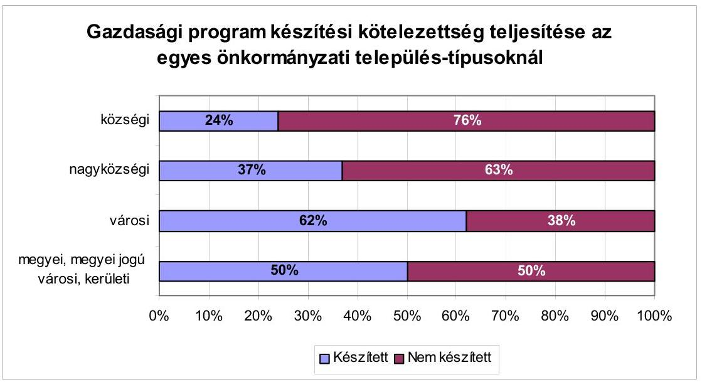

A városi önkormányzatok több mint fele készített gazdasági programot, azonban a községi, nagyközségi önkormányzatok ennél alacsonyabb arányban rendelkeztek ezzel.

A gazdasági program készítésének elmulasztása, valamint az, hogy a korábban elkészített gazdasági programot nem vizsgálják felül összefügg azzal, hogy annak tartalmára, elkészítési határidejére, időtartamára vonatkozóan nincs jogszabályi előírás.

---

A gazdasági programot nem helyettesítik, de a hosszabb távra szóló tervezés alapját biztosítják az elkészített ágazati koncepciók (egészségügy, oktatás, sport, területfejlesztés területein).

Az éves költségvetések megalapozottsága szempontjából fontos a költségvetési koncepció elkészítése melyet az önkormányzatok döntő többsége ( $96 \%$-a) az Áht. 70. §-ában rögzített határidőn belül meghatározott. Az önkormányzatok $83 \%$-ánál (az előző évi $75 \%$-kal szemben) a költségvetési koncepció készítésénél figyelemmel voltak a központi szabályozás főbb jellemzőire, azok önkormányzatot érintő bevételi és kiadási hatásaira. A költségvetési évre vonatkozó elképzeléseket a központi támogatásokon túl a helyben képződő bevételek, és az ismert kötelezettségek figyelembevételével állították össze. A testületek megalapozottan döntöttek a tervezés további munkáiról: a bevételek növelésének lehetőségeiről, a feladatok rangsorolásával a kiadási előirányzatok kidolgozásában követendő elvekről. A koncepciókban alapelvként fogalmazták meg a meglévő intézményhálózat, a múködtetés elsődlegességének, a közalkalmazotti bérek fedezetének biztosítását, a múködési bevételi források feltárását, a pályázati lehetőségek maximális kihasználását, az ezekhez szükséges saját források biztosítását.

Az önkormányzatok 13\%-ánál a képviselő-testület elé beterjesztett költségvetési koncepciók hiányossága, hogy azokban az éves költségvetés fő céljait, feladatait részletes számításokkal nem támasztották alá, azok megalapozottságát nem biztosították. A helyi kisebbségi önkormányzatok elnökeit a 2002. évi költségvetési koncepció helyi kisebbségi önkormányzatokra vonatkozó részéről az Ámr. 28. § (6) bekezdésében előírtak ellenére, az önkormányzatok $58 \%$-a nem tájékoztatta. Ennél is kisebb arányban, 24\%-ban csatolták a helyi kisebbségi önkormányzatok koncepció-tervezetről alkotott véleményét az előterjesztésekhez. A költségvetési javaslatok számszerú kimunkálását az önkormányzatok a költségvetési koncepcióban meghatározottak figyelembevételével készítették el. A kiadási és bevételi előirányzatok meghatározása a korábbi tényadatokból kiindulva, a változások hatásainak figyelembe vételével történt. A rendelkezésre álló források elosztásánál a múködtetés elsődlegességét biztosították. A költségvetési koncepció tervezetét a bizottságok megtárgyalták, azonban az Ámr. 28.§ (3) bekezdésében előírtak ellenére azok véleményét nem csatolták a polgármesterek a koncepcióhoz.

Az önkormányzatok 21\%-ánál az előző évivel közel azonos, 20\%-os arányban a 2002. évi költségvetési rendelet-tervezetet a polgármesterek az Áht. 71. § (1) bekezdésében foglalt február 15-i határidőn túl nyújtották be a képviselő-testületeknek.

A költségvetés elfogadását megelőzően az Áht. 71. § (2) bekezdésében foglaltaknak megfelelően az önkormányzatok 70\%-ánál terjesztették elő azokat a rendelet-tervezeteket, amelyek a javasolt előirányzatokat megalapozták (a helyi adókról, a személyes gondoskodást nyújtó ellátások intézményi térítési díjának és az ellátottak személyi térítési díjának megállapításáról, az élelmezési nyersanyagnormákról, az ivóvíz- és csatornadíjakról, a bérleti díjakról, stb.).

---

A költségvetési rendelet-tervezetek az önkormányzatok mintegy felénél (51\%) tartalmazták a többéves elkötelezettséggel járó kiadási tételek későbbi évekre vonatkozó kihatásait. A költségvetési évet követő két év várható előirányzatait az önkormányzatok 68\%-ánál mutatta be a polgármester a testületnek. Az önkormányzatok 87\%-nál elmaradt az Áht. 118. §-ában előírt, a költségvetés és a zárszámadás előterjesztésekor tájékoztatásul bemutatandó mérlegek, kimutatások tartalmi követelményeinek meghatározása. Az előző évi 50\%-kal szemben az önkormányzatok 61\%-ánál maradt el az Áht. 118. §-ában előírt mérlegek, kimutatások zárszámadás előterjesztésekor tájékoztatásként történő bemutatása. Ezen mérlegek, kimutatások tartalmi követelményeinek meghatározása megsértve az Áht. 124. § (2) bekezdés b) pontjában foglaltakat a Kormány részéről is elmaradt.

A körjegyző́égek költségvetéséről az érintett önkormányzatok döntő többsége (93\%-a) - az Ámr. 29. § (7) bekezdésében foglaltaknak megfelelően - a saját költségvetési rendeletüket tárgyaló képviselő-testületi ülésük előtt, együttes testületi ülésen döntöttek, költségvetési rendelet-alkotási kötelezettségüknek maradéktalanul eleget tettek.

A költségvetési előterjesztések és ennek következtében az elfogadott rendeletek az előző évekhez hasonlóan hiányosan tartalmazták a jogszabályi előírások szerinti adatokat, ezáltal nem biztosították a testületek megfelelő tájékoztatását. Az adathalmazok rendszere nem biztosította a döntéseket megalapozó, áttekinthető és világos információkat. A költségvetési rendeletekben az Áht. 67. §ában előírtakat megsértve az önkormányzatok 30\%-ánál nem határozták meg a költségvetés címrendjét. Ennek hiányában nem különítették el a részben önállóan gazdálkodó intézmények intézményenkénti előirányzatait, illetve egyes feladatokat intézményenként. Az önkormányzatok a költségvetési előterjesztések szerkezetére, tartalmára vonatkozó - az Ámr. 29. § (1) bekezdésében, illetve az Áht. 69. § (1) bekezdésében rögzített - előírásokat egy vagy több pontban a következők miatt sértették meg:

- a működési előirányzatoknak az önkormányzati szintű összegzése az önkormányzatok 4\%-ánál maradt el, ezen belül a kiemelt előirányzatok közül a költségvetési rendeletek 32\%-a az ellátottak pénzbeli juttatásait, 13\%-a a speciális célú támogatásokat, 9\%-a a létszámkeretet nem tartalmazta;
- működési előirányzatok költségvetési szervenkénti meghatározását az önkormányzatok 19\%-a mulasztotta el, ezen belül kiemelt előirányzatként az előterjesztések 27\%-a az ellátottak pénzbeli juttatásait, 25\%-a a speciális célú támogatásokat, 19\%-a a létszámkeretet nem tartalmazta;
- a polgármesteri hivatalok költségvetésének feladatonkénti, ezen belül külön tételben az általános tartalék és a céltartalékok bemutatása az önkormányzatok 15,31 , illetve $40 \%$-ánál maradt el;
- a felújítási előirányzatok célonkénti és a felhalmozási kiadások feladatonkénti meghatározása 27, illetve 24\%-nál hiányzott;
- a többéves kihatással járó feladatok előirányzatait éves bontásban az önkormányzatok több mint fele (53\%), a múködési és felhalmozási célú bevételi és kiadási előirányzatokat mérlegszerűen az önkormányzatok 33\%-a nem mutatta be;

---

- a költségvetési rendeletek nem tartalmazták elkülönítetten a helyi kisebbségi önkormányzatok költségvetését az érintett önkormányzatok 25\%-ánál;
- a bevételi és kiadási előirányzatok teljesüléséről az előirányzat-felhasználási ütemtervet az önkormányzatok 45\%-a mulasztotta el elkészíteni.

A körjegyzőség, mint önállóan gazdálkodó költségvetési szerv költségvetése az Ámr. 29. § (5) bekezdésében foglalt előírások ellenére a körjegyzőség székhelye szerinti önkormányzatok 7\%-ának költségvetésében nem szerepelt.

A költségvetési rendeletekben - az Áht. 8/A. § (1) bekezdésében és 75. §-ában foglaltakat megsértve - nem rendelkezett az önkormányzatok

- 63\%-a a bevételi többletek felhasználásáról;
- 42\%-a arról, hogy a hiányt milyen módon és milyen hatásköri szabályok szerint lehet fedezni a pénz-és tőkepiacon végzett hitelmúveletekkel;
- 51\%-a a hitelmúveletekkel kapcsolatos hatáskörökről.

A költségvetés végrehajtásával kapcsolatos szabályokat rendeletben (SzMSz-ben, költségvetési rendeletben) az előző évinél nagyobb arányban nem, vagy hiányosan rögzítették az önkormányzatok a következők miatt:

- az előirányzat-átcsoportosítások az Áht. 74. § (2) bekezdésében előírt hatásköri szabályait és Ámr. 53. § (4) bekezdésében előírt rendjét az önkormányzatok 33, illetve $44 \%$-ánál nem határozták meg;
- az önállóan gazdálkodó költségvetési szervek előirányzat-módosítási jogköréről az Ámr. 53. § (4) bekezdésében előírtak ellenére az önkormányzatok 50\%-a nem rendelkezett. Nem rögzítették az előirányzat-módosítások képviselőtestületi jóváhagyásának rendjét, az intézmények saját hatáskörben végrehajtott előirányzat-változtatásainak költségvetési rendeletekben történő átvezetésének szabályait;
- a többletbevételek intézményi hatáskörben felhasználható köre és mértéke az Áht. 93. § (4) bekezdésben előírtakat megsértve szabályozatlan maradt az önkormányzatok $68 \%$-ánál;
- a tárgyévi pénzmaradvány elszámolásának szabályait az Ámr 66.§ (6) bekezdés g) pontjában foglaltak ellenére nem határozta meg az önkormányzatok $77 \%$-a.

Az polgármesteri hivatalok a költségvetési intézmények tartalmi és formai szempontból ellenőrzött költségvetését az Ámr. 43. § (3) bekezdésében előírtaknak megfelelően továbbították a Kincstár Területi Igazgatóságának.

Két önkormányzat esetében a Kincstár Területi Igazgatóságához benyújtott adatszolgáltatás tartalma eltért a közgyűlés által elfogadott költségvetéstől. A Sza-bolcs-Szatmár-Bereg Megyei Önkormányzatnál a költségvetési szervenkénti alapokmányokban szereplő önkormányzati szintű és nettósított (intézményfinanszírozás nélküli) költségvetési főösszeg 914,5 millió Ft-tal volt több mint a költségvetési rendeletben jóváhagyott összeg. Az eltérés oka, hogy az OEP által finanszírozott három kórház a Közgyűlés által jóváhagyott előirányzatokat „saját hatáskörben" megváltoztatta. Székesfehérvár Megyei Jogú Város Önkormányzatánál a közgyűlési előterjesztés összeállításakor a központi tervezési előírások

---

ellenére az Országgyűlés által jóváhagyott előirányzatnál magasabb összegben mutatták ki a kapott céltámogatásokat. Az eltérés 2002. évben 621,9 millió Ft, 2003. évben 305,7 millió Ft.

# 1.2. A költségvetési előirányzatok módosításának szabályszerűsége 

Az önkormányzatok a 2002. évre vonatkozó költségvetési rendeletükben jóváhagyott bevételi és kiadási előirányzataikat összességében 614,6 milliárd Ft-tal módosították. A főösszeget érintő módosítások az eredeti előirányzat 28,3\%-át tették ki.

A költségvetési előirányzatok módosításának szabályszerűsége terén változatlanul kedvezőtlenek a tapasztalatok. A szükséges módosításokat - az előző évhez hasonlóan - nem a jogszabályi előírásoknak megfelelően, és nem teljes körűen végezték el az önkormányzatok felénél.

## Az előirányzatok módosítására vonatkozó jogszabályi előírásokat a következők miatt sértették meg az önkormányzatok:

- az előző évhez hasonlóan költségvetési rendeletét - annak indokoltsága ellenére - $11 \%$ egyetlen alkalommal sem módosította, ilyen tartalmú előterjesztést az Ámr. 53.§ (1) bekezdésében előírtak ellenére sem készítettek;
- az előterjesztett rendelet-tervezetek 36\%-a (az előző évben 29\% volt ez az arány) nem a költségvetéssel összehasonlítható módon tartalmazta a módosítási javaslatokat. Az előterjesztések csak az aktuális módosító tételeket tartalmazták, nem tüntették fel az eredeti előirányzatokat és a korábban már végrehajtott módosításokat, nem jelölték meg, hogy melyik bevételi és kiadási előirányzatot érintette a módosítás;
- a rendelet-módosítások határidejére vonatkozó központi előírásokat az önkormányzatok 50\%-a (előző évben 48\%-a) nem tartotta be. Az Ámr. 53. § (2) bekezdése a költségvetési rendelet módosítására negyedéves gyakoriságot ír elő. Ezzel ellentétesen a testületek a központi költségvetésből havonként kapott pótelőirányzatokkal költségvetésüket nem negyedévente, hanem félévente, évente egyszer, illetve a zárszámadással egyidejűleg módosították. Nem vették figyelembe az önkormányzatok az Ámr. 53. § (2) és (6) bekezdéseinek 2003. január 1-től érvényes, de már a 2002. évi beszámoló készítésénél is alkalmazandó módosítását, amely szerint az előirányzat-módosítás tárgyévet követő végső határideje a költségvetési beszámoló felügyeleti szervhez történő megküldésének határideje (február 28.) lett. Az önkormányzatok a jogszabályi előírásokat megsértve, visszamenőleges hatállyal pótelőirányzatokat engedélyeztek a többletbevételek terhére, továbbá a bevételi és kiadási előirányzatokon belül olyan átcsoportosításokat hajtottak végre, amelyet még a tárgyévben, az előirányzatok felhasználását megelőzően kellett volna végrehajtaniuk.

A 2002. évi előirányzat-módosításokat nem dokumentálta az önkormányzatok 32\%-a. Az előirányzatokról és azok változásáról pontos naprakész nyilvántartást az előző évi 28\%-kal szemben nem vezetett az önkormányzatok 57\%-a. Ezzel megsértették az Áht. 103. § (1) bekezdésének előírásait, amelyek szerint a költségvetés végrehajtásáért felelő szerv köteles a költségvetési címek, illetve

---

költségvetési szervek jóváhagyott előirányzatainak alakulásáról folyamatos nyilvántartást vezetni.

Az előirányzatokkal történő gazdálkodás szabályozása és megvalósítása során az önkormányzatok megsértették az Áht. 12/A. § (1) bekezdése előirását, mely szerint tárgyévi fizetési kötelezettség és kifizetés teljesítése csak a jóváhagyott előirányzatok mértékéig vállalható illetve rendelhető el. Az előirányzat-módosítások nem megfelelő gyakorlata és az előirányzat-nyilvántartások nem, vagy hiányos vezetése is hozzájárult ahhoz, hogy az önkormányzati költségvetési szervek 50\%-a, megsértve az Áht. 93. § (1) bekezdésében előírtakat, nem a jóváhagyott előirányzatokon belül gazdálkodott.

Az önkormányzatok a szabálytalan előirányzat-felhasználások okait nem vizsgálták, az előirányzat-túllépések miatt - az előző évhez hasonlóan - felelősségre vonást nem kezdeményeztek.

# 1.3. A gazdálkodás szabályozottsága, szabályszerűsége 

Az polgármesteri hivatalok gazdálkodására vonatkozó jogszabályok a főbb gazdálkodási és ellenőrzési feladatok ellátásának jogosultjait, illetve felelőseit nevesítik és lehetőséget biztosítanak arra, hogy jogosultságok gyakorlására a helyi sajátosságok érvényesíthetősége érdekében nevezettek felhatalmazzanak másokat. Az operatív gazdálkodással kapcsolatos döntési és felelősségi szintek a vizsgált önkormányzatok 64\%-ánál a jogszabályi követelményeknek megfelelően kerültek kialakításra. A tevékenységek végrehajtásának folyamatosságát, zártságát, teljes körűségét az önkormányzatok 29\%-ánál hiányosan biztosították, 7\%-uknál pedig a helyi szabályozás teljes hiányát állapítottuk meg.

A gazdálkodási és ellenőrzési jogkörök gyakorlásának rendjét az önkormányzatok 8\%-ánál nem határozták meg, a kötelezettségvállalás, utalványozás, ellenjegyzés és érvényesítés feladatait nem rögzítették.

A kötelezettségvállalás szabályozása elmaradt az önkormányzatok 5\%ánál, további 9\%-ánál részlegesen történt meg. A kötelezettségvállalás ellenjegyzésének szabályozása hiányos volt az önkormányzatok 17\%-nál (8\% nem, $9 \%$ részlegesen szabályozta). Nem történt meg az utalványozásra, valamint az utalványozás ellenjegyzésére jogosultak kijelölése az önkormányzatok 10, illetve 13\%-ánál. A polgármesterek 39\%-a kötelezettségvállalási, utalványozási jogkörrel felhatalmazott másokat is. A polgármesterek 32\%-a a felhatalmazottakat beszámoltatta tevékenységéről.

A jegyzők 46\%-a hatalmazott fel másokat az ellenjegyzési jogkör gyakorlásával. A jegyzők alig több mint egyharmada (35\%) fordított gondot arra, hogy a felhatalmazottakat beszámoltassa a jogkör gyakorlásáról.

Az érvényesítés rendjét a jegyzők az önkormányzatok 8\%-ánál nem szabályozták, valamint nem tartották be az érvényesítő személy kijelölésénél az Ámr. 135. § (2) bekezdésében és a 168. §-ban foglalt szakmai előírásokat (írásbeli megbízás, iskolai végzettség, szakképesítés) az önkormányzatok 24-\%-ánál. Az érvényesítés alapját képező szakmai teljesítés igazolásának módjáról az

---

Ámr. 135. § (3) bekezdésében foglaltak ellenére az önkormányzatok 66\%-ánál a jegyzők nem rendelkeztek. Nem szabályozták a jegyzők az önkormányzatok 80\%-ánál - az Ámr. 134. § (4) bekezdésében előírtak ellenére - az előzetes írásbeli kötelezettségvállalás nélküli, 50000 Ft-ot el nem érő kifizetések rendjét és nyilvántartási formáját sem.

Az önkormányzatok csupán 49\%-a határozta meg az Ámr. 135. § akkor hatályos (4) bekezdésében és a 138. § (1)-(3) bekezdésében foglaltaknak megfelelően az összeférhetetlenségi követelményeket. Az önkormányzatok 36\%-a egyáltalán nem, 15\%-a pedig csak egy-egy részterületre vonatkozóan szabályozta az összeférhetetlenség követelményeit. Ezeknél az önkormányzatoknál tisztázatlan maradt a jogkörök címzettjének távolléte, akadályoztatása esetén eljáró személy, a saját vagy hozzátartozó részére történő kifizetések esetén az eljárás módja.

A gazdálkodás szabályozottságát a következő grafikon szemlélteti:
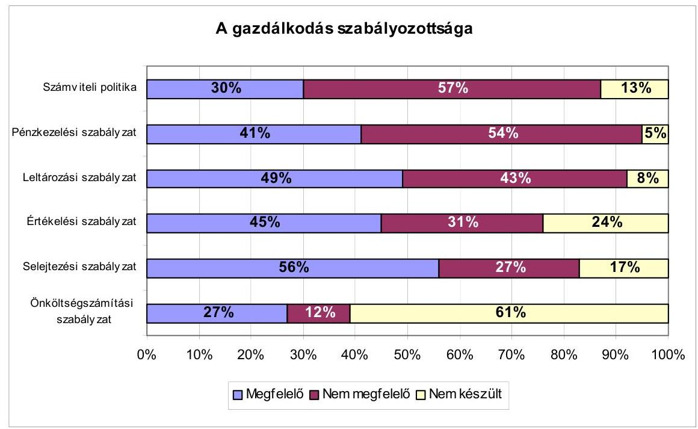

A számviteli politikával rendelkező polgármesteri hivatalok 75\%-a rögzítette a mérlegkészítés időpontját, 55\%-a rögzítette azt, hogy mit tekintenek a számviteli elszámolás szerint lényegesnek, illetve nem lényegesnek, valamint $52 \%$-a határozta meg a jelentős, illetve nem jelentős összeg mértékét. A megbízható és valós összkép kialakítását befolyásoló lényeges információk tekintetében a számviteli politikával rendelkezők 75\%-a szabályozta a kis értékű tárgyi eszközök, $61 \%$-a a vagyoni értékú jogok, $62 \%$-a pedig a szellemi termékek minősítését a Vhr. 8. § (5) bekezdésének megfelelően. A vállalkozási tevékenységet végző polgármesteri hivatalok 42\%-a határozta meg az értékcsökkenés összegének alap- és vállalkozási tevékenység közötti megosztását.

A számviteli politika keretében kötelezően elkészítendő és egyéb szabályzatokkal az önkormányzatok döntő többsége rendelkezett, a gazdálkodási tevékeny-

---

ség szabályozottsága mégsem megfelelő színvonalú a szabályzatok hiányosságai miatt, amelyek a következők:

- a leltározási szabályzatokban az önkormányzatok fele a leltározás részletes szabályait hiányosan rögzítette. Hiányzott a leltározási körzetek kijelölése, az időszakonkénti leltározás kezdő időpontja, a leltározást helyettesítő nyilvántartások alapján készítendő összesítő kimutatás tartalmi formai meghatározása, az ehhez szükséges felügyeleti szervi egyetértés előírása, az üzemeltetésre, kezelésre átadott eszközök leltározásával kapcsolatos feladatok rögzítése, a leltározás egyeztetésének, értékelésének, ellenőrzésének módja.
- Az eszközök és források értékelési szabályzata az önkormányzatok $60 \%$-ánál felelt meg a jogszabályi követelményeknek. A szabályzatokból a jogszabályi előírások 2001., 2002. évi módosításainak, a terven felüli értékcsökkenés és értékvesztés elszámolásának, visszaírásának eszközcsoportonként történő szabályozása, valamint piaci értékelés rendszerének alkalmazására vonatkozó döntés maradt el.
- Az önköltség-számítási szabályzat elkészítésére a vizsgált önkormányzatok 15\%-a volt kötelezett. A szabályzatok mintegy 30\%-át jellemezte, hogy az eszközök és a szolgáltatások bekerülési értékének megállapítására vonatkozó részletes előírásokat nem a helyi sajátosságoknak megfelelően rögzítették (mintaszabályzatot vásároltak és azt nem igazították a helyi körülményekhez), az önköltség számítás rendjét, a főkönyvi számlák, az analitikus nyilvántartások, és azok beszámolóval való kapcsolatát nem rögzítették.
- A pénzkezelési szabályzatoknak a jogszabályi előírásokkal való összhangját a vizsgált önkormányzatok 41\%-a biztosította. A többi önkormányzatnál a jegyzők a polgármesteri hivatalokban a pénzkezelés rendjét nem szabályozták. A szabályzatok nem tartalmazták az Ámr. 103. § (2), (6) és (7) bekezdése alapján megnyitható bankszámlák körét, rendeltetését, a bankszámlák és a pénztár kapcsolatrendszerét, a pénztár ellenőrzéséért felelős személyek megnevezését. Az aktualizálások elmaradásából eredő jellemző hiányosság, hogy nem része a szabályzatoknak a banki terminálon keresztül történő pénzügyi műveletek végzésére vonatkozó előírások meghatározása. Ebből adódóan a munkabérek kifizetését a jogszabályi előírásoktól és a gyakorlattól eltérően tartalmazzák a szabályzatok (nem a folyószámlára történő utalást, hanem házipénztárból történő készpénzkifizetést tartalmazzák). Szabályozatlan a házipénztáron kívüli pénzkezelés, a részben önállóan gazdálkodó költségvetési szervek készpénzellátásának, valamint az értékpapírok nyilvántartásának, őrzésének rendje is.
- A felesleges vagyontárgyak hasznosításának, selejtezésének szabályzata az önkormányzatok $44 \%$-ánál nem, vagy hiányosan tartalmazta a végrehajtás folyamatát. A szabályzatokban nem rögzítették a felesleges vagyontárgyak folyamatos feltárásainak, az üzemeltetésre átadott eszközök selejtezésének rendjét. Elmaradt a selejtezési bizottság tagjainak kijelölése, feladatuk meghatározása, a döntéshozatalra jogosultak körének megnevezése, a tevékenység ellenőrzésével megbízott személyek jogainak és kötelezettségeinek szabályozása.

---

A Vhr. 49. § (1) bekezdés szerinti számlarenddel a polgármesteri hivatalok $86 \%$-a rendelkezett. A számlarendek hiányossága volt, hogy azokban nem, vagy hiányosan rögzítették:

- az alkalmazott főkönyvi számlákat (23\%), a számlaosztályok főbb tartalmi elemeit (24\%), a főkönyvi számlák értékváltozásának jogcímeit (30\%), alapbizonylatait ( $26 \%$ );
- az analitikus nyilvántartások formáját, tartalmát (32\%), az analitikus nyilvántartások és a főkönyvi számlák egyeztetésének módját (47\%), gyakoriságát (45\%), dokumentálási formáját (61\%), a zárlati feladatok elvégzésének rendszerességét (28\%) és módját (39\%).

# 1.4. A munkafolyamatba épített ellenőrzések szabályozottsága és gyakorlati múködése a pénzügyi, gazdasági és számviteli feladatellátás területén 

A pénzügyi-számviteli feladatok elvégzésének folyamatát az önkormányzatok 32,1\%-nál (112-nél) szabályozták a jogszabályi követelményeknek és a gazdálkodási sajátosságoknak megfelelően. Az SzMSz, az ügyrend és a gazdasági tevékenység különböző területeire előírt szabályzatok hiányában nem készítették el az önkormányzatok 28,1\%-nál, egy-egy részterületre rögzítették az ellátandó feladatokat 39,8\%-nál. A pénzügyi-számviteli folyamatok szabályozottságának alakulását az alábbi ábra szemlélteti:
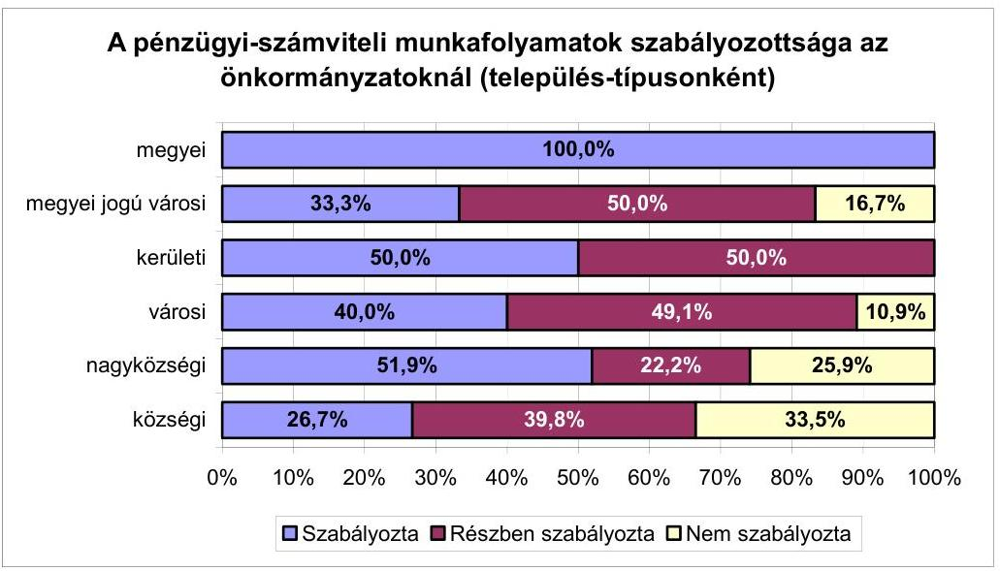

Valamennyi belső szabályzatot elkészítették a megyei önkormányzatoknál. A legnagyobb arányban (33,5\%) nem szabályozták a pénzügyi-számviteli folyamatokat a községi önkormányzatoknál.

Hiányzott a meglévő szabályozásokból:

- 21,8\%-nál minden egyes munkafázisban az előző elvégzésének ellenőrzése;
- 25,5\%-nál a pénzügyi-számviteli munkafolyamatok ellenőrzési pontjainak kijelölése;
- 34,4\%-nál az ellenőrzéskor elvégzendő műveletek meghatározása;

---

- 45,3\%-nál az ellenőrzés viszonyítási alapjának meghatározása;
- 50,1\%-nál a követelményektől való eltérések megállapításának és dokumentálásának módja;
- 44,4\%-nál az eltérés esetén szükséges teendők, jelzési kötelezettségek meghatározása.

A legkisebb arányban a tevékenységek ellenőrzésekor a követelményektől való eltérés megállapításának és dokumentálásának módját (11,5\%), valamint az ellenőrzés viszonyítási alapját (12,9\%) szabályozták. A pénz-ügyi-számviteli munkafolyamatokban elvégzendő ellenőrzési feladatokat, egyeztetési kötelezettséget nem rögzítették a dolgozók munkaköri leírásában az önkormányzatok 53\%-nál, hiányosan határozták meg 31,2\%nál.

A szabályozás és a gyakorlat közötti összhangot az önkormányzatok $12 \%$-nál, részleges érvényesítését $31 \%$-nál, annak teljes hiányát $4 \%$-ánál, állapítottuk meg. Ez utóbbiaknál nem történt meg a gazdálkodás egyes folyamataiban (pénzgazdálkodás, számvitel, pénzkezelés) az előző munkafázis elvégzésének ellenőrzése és nem működött olyan belső kontrollrendszer, amely biztosítja a hibák időbeni megállapítását és kijavítását.

A szabályozás hiánya, előírásainak be nem tartása miatt a Számv. tv. 165. § (4) bekezdésében foglaltakat megsértve az önkormányzatok 9,5\%-nál nem biztosították logikailag zárt rendszerrel az egyeztetés lehetőségét a bizonylatok, az analitikus nyilvántartások és a főkönyvi könyvelés adatai között, csak részben alakították ki ennek feltételeit a polgármesteri hivatal 32,4\%-nál. Ezekben az esetekben az analitikus nyilvántartásokat nem vezették valamennyi érintett főkönyvi számlához, valamint bizonylat hiányában, illetve hiányos tartalmú bizonylat alapján végezték az elszámolásokat a polgármesteri hivatalok.

Nem állítottak ki bizonylatot minden vagyon- és pénzeszköz-változást eredményező gazdasági műveletről, eseményről (pl. előlegek kiadásáról, bérleti díj, szemétszállítási díj, étkezési térítési díj, magán telefonbeszélgetési díj bevételekről), illetve az előírásoknak nem megfelelő bizonylatok alapján végeztek elszámolást.

- Tapolca Város Önkormányzatánál az uniós és nemzetközi tevékenységgel kapcsolatos projektek számviteli elszámolásához kapcsolódó bizonylatokat és az elszámolást szabályozó uniós dokumentumokat nem fordították le magyar nyelvre, ezzel megsértették a Számv. tv. 166. § (3) bekezdésében foglaltakat, amely szerint a számviteli bizonylatokat magyar nyelven kell kiállítani.
- Az elszámolt bizonylatok 16,5\%-ánál hiányzott a Számv. tv. 167. § (3) bekezdésében előírtak ellenére a számlán, egyszerűsített számlán, számlát helyettesítő okmányon a kibocsátó aláírása.
- Megsértette az Áfa tv. 43. § (1) bek ${ }^{3}$. szerinti számlaadási kötelezettséget, és a Számv. tv. 165. § (1) bekezdésben foglalt bizonylat kiállítási kötelezettséget

[^0]
[^0]:    ${ }^{3}$ Az Áfa tv. 43. § (1) bekezdése szerint az adóalany köteles az általa teljesített termékértékesítésről és szolgáltatásnyújtásról számlát; a teljesítéssel egyidejűleg készpénzzel

---

Gávavencsellő Nagyközség Önkormányzata a szemétszállítási és gondozási díj, ebédkihordási díj, Nyírgyulaj Község Önkormányzata az étkezési térítési díjak, Szálka Község Önkormányzata a továbbszámlázott szolgáltatási díjak (kábel tv, szemétszállítási díj) számlázásának elmulasztásával.

- Nem a polgármesteri hivatal nevére kiállított számla alapján számoltak el kiadást Érsekhalma, Kisbajcs, Tiszasziget községek önkormányzatai, valamint nem a vevő nevére szóló számla alapján bevételt Csongrád és Hajdúszoboszló városok önkormányzatainál.
- Alapbizonylat nélkül fizettek ki belföldi kiküldetési költséget Tác község, pontatlanul kitöltött bizonylatok alapján (cél, meglátogatott partner, megtett kilométer) Miklós Város Önkormányzatánál.

A munka folyamatába épített egyeztetési kötelezettségnek az önkormányzatok 24,1\%-nál tettek eleget rendszeresen, és részben teljesítették 27,5\%-nál. Az egyeztetéseket az előírásoknak megfelelően teljesítők aránya az egyes önkormányzati típusoknál eltérő volt ( $16,7 \%-75 \%$ ), amelynek adatait az alábbi grafikon szemlélteti:
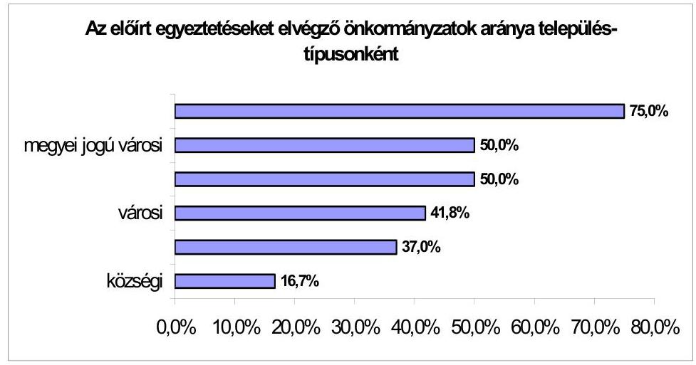

A pénztárellenőrzést nem a pénzkezelési szabályzatban rögzítettek szerint végezték az önkormányzatok több mint felénél (53,6\%). Nem a szabályozás szerint történt a pénzkezelés a kerületek 16,7\%-ánál, a városok 16,4\%-ánál, a nagyközségek 25,9\%-ánál és a községek 41,4\%-ánál. Részben alkalmazták a szabályozás előírásait a megyei önkormányzatok 25\%-nál, megyei jogú városok 50\%-ánál, a kerületek 66,7\%-ánál, a városok 14,5\%-ánál, a nagyközségek 7,4\%-ánál, a községek 19,1\%-ánál. A szabályozási és az ellenőrzési kötelezettség, valamint a szabályzatban előírtak elmulasztásának következménye, hogy:

- a készpénzkezeléshez kapcsolódó bizonylatokat, nyomtatványokat nem vonták szigorú számadás alá az önkormányzatok 19\%-ánál és azokról nem vezettek a Számv. tv. 168. § (3) bekezdésében előírt, az elszámoltatást is biztosító nyilvántartást. A pénztárost bízták meg a készpénzkezeléshez kapcsolódó bi-
vagy készpénz-helyettesítő eszközzel történő fizetés esetén, pedig kérésre - a kibocsátó döntésétől függően - egyszerűsített számlát vagy számlát kibocsátani.

---

zonylatok kezelésével, nyilvántartásával, aki így saját maga részére adta át felhasználásra a szigorú számadás alá vont bizonylatokat.

- Az önkormányzatok 6,3\%-nál fordult elő, hogy a pénztári bizonylatról hiányzott az összeg átvevőjének aláírása, illetve helyette olyan mellékletre hivatkoztak, amelyet nem csatoltak a pénztári bizonylathoz.
- A szabályzatban engedélyezettet meghaladó összegű záró pénzkészletet tároltak a pénztárban Budapest Főváros IV. kerületi, Kertéssziget, Kisdombegyház, Örménykút, Rátka községek önkormányzatánál.

A készpénz előlegek kezelésének gyakorlata az önkormányzatoknak 63,3\%-ánál (az előző évben 71,2\%-nál) felelt meg a pénzkezelési szabályzatban foglalt előírásoknak. A hiányosságok legfőbb oka, hogy a szabályozásokból hiányozott a kiadható maximum összeg, az elszámolás módja, határideje, a nyilvántartás követelménye, nem rögzítették az előlegek rendeltetését. Mindezek következménye, hogy elmulasztották a határidőben történő elszámolást, nem vezették a kifizetések és elszámolások áttekintését biztosító, szabályszerű nyilvántartást az előlegekről.

A gazdálkodás pénzforgalmát 55\%-ban bankszámla, 45\%-ban pénztári tételként bonyolították, számolták el a polgármesteri hivatalok. A folyamatba épített előzetes ellenőrzés működése és a gazdálkodási jogkörök gyakorlása a jogszabályi előírásoknak megfelelőbb volt a bankszámla nagyobb tételszámú forgalmánál, mint a kisebb forgalmú pénztárakban. A folyamatba épített ellenőrzés hiányosságait az alábbi ábra mutatja a bankszámlához kapcsolódó és a pénztári bizonylatok alapján:
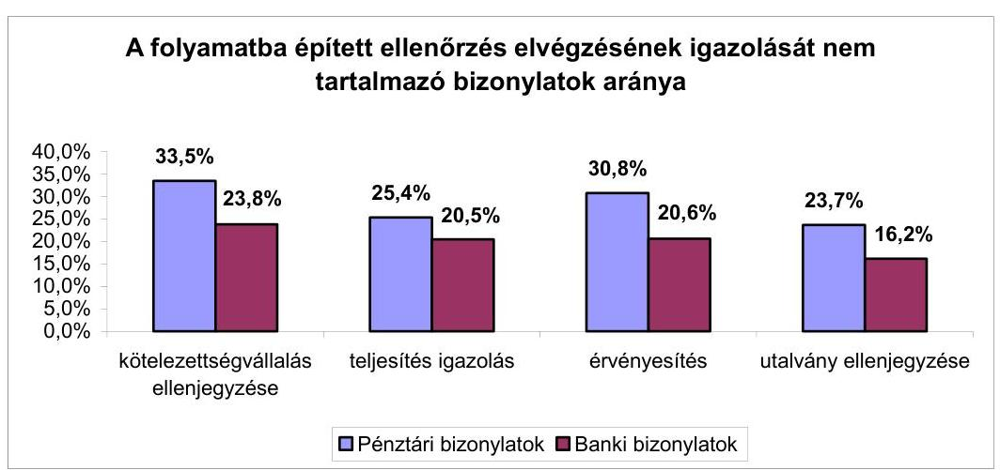

Az Ámr. 134. § (7) bekezdésében foglalt ellenőrzési feladatát a kötelezettségvállalás ellenjegyzöje hiányosan teljesítette az önkormányzatok 43,6\%nál. A hiányosság oka volt, hogy elmaradt a kötelezettségvállalás írásba foglalása, illetve a kötelezettségvállalás nem előirányzat-felhasználási terven alapult, továbbá nem szabályozták a célszerűségét megalapozó eljárást és dokumentumainak tartalmát ${ }^{4}$. Nem alakították ki a kötelezettségvállalások rendjét

[^0]
[^0]:    ${ }^{4}$ A szervezeti és működési szabályzatban, vagy annak mellékletében történő szabályozását az Ámr. 10. § (5) bekezdése írta elő 2003. január 1-től.

---

és nyilvántartásának formáját az 50 ezer Ft-ot el nem érő kifizetések esetére. A kötelezettségvállalások ellenjegyzését nem a belső szabályozásban foglaltak szerint végezték $14,3 \%$-nál, csak részben a szabályozás szerint $37,8 \%$-nál, mert nem tartották be a hatásköri előírásokat, illetve ellenjegyzés nélküli kötelezettségvállalások történtek. A szabályszerű ellenjegyzéshez nem gondoskodtak helyettes megbízásáról a jogosult átmeneti, vagy tartós távolléte, valamint a személyes érintettsége esetére. Teljesen hiányzott a feladatellátás szabályozása $14 \%$-nál.

Jóváhagyott előirányzat nélkül végeztek kötelezettség-vállalást az önkormányzatok 29,8\%-ánál. Az önkormányzatok 31,5\%-ánál biztosították annak feltételeit, hogy a kötelezettségvállalások kizárólag a jóváhagyott előirányzatokon belül történjenek.

A hiányosságok jellemző okozója volt az elmúlt évhez hasonlóan, hogy a jegyző́k nem gondoskodtak előirányzat-felhasználási ütemterv jóváhagyásáról ${ }^{5}$, valamint likviditási terv összeállításáról és aktualizálásáról ${ }^{6}$, továbbá a polgármesteri hivatalok elmulasztották a kötelezettségvállalás nyilvántartásának vezetését ${ }^{7}$. Mindezek miatt nem álltak rendelkezésre a pénzgazdálkodás folyamatában a szabályszerű kötelezettség-vállalásokhoz szükséges adatok, információk, amelyek alapján a jogszerűség, a megalapozottság, a gazdálkodás előirányzatok keretein belül tartása biztosítható.

Az érvényesítést végzők nem, illetve csak részben teljesítették az Ámr. 135. § (1) bekezdésében ${ }^{8}$ előírtakat a polgármesteri hivatalok 13,2\%-45\%-nál, a helyi szabályozásban foglaltakat $12 \%-35,8 \%$-ánál. A jegyző́k nem jelölték ki írásban az érvényesítési feladatokat végző dolgozót a polgármesteri hivatalok 10,9\%-nál. Az érvényesítés ellenőrzési feladatainak elvégzését nem biztosították $21,5 \%$-nál.

Az érvényesítés hiányosságai között tapasztaltuk, hogy az nem alapult a teljesítés szakmai igazolásán, nem tartalmazta az érvényesítve kifejezést, illetve elmaradt a megállapított összeg és a kijelölt főkönyvi számla rögzítése. Pénzügyi-számviteli szakképesítés nélkül is végeztek érvényesítést, illetve a képesítés hiánya miatt nem mindig volt része az érvényesítésnek a főkönyvi számla kijelölése. Mindezek által nem volt alkalmas az érvényesítés az összegszerűség, a fedezet meglétének, valamint az előírt alaki követelmények betartá-

[^0]
[^0]:    ${ }^{5}$ Ámr. 29. § (1) bekezdés j) pontja és a 134. § (1) bekezdése.
    ${ }^{6}$ Az Ámr. 139. §-a írta elő a jegyző likviditási terv készítési kötelezettségét.
    ${ }^{7}$ Az Áht. 103. § (2) bekezdésben foglalt rendelkezés szerint a nyilvántartási kötelezettség jogszabályban szabályozott módon kiterjed a kiadási előirányzatokat terhelő kötelezettségvállalások és a bevételi előirányzatok teljesítését előrejelző - a teljesülés várható időpontja szerint rögzített - bevételi előírások folyamatos nyilvántartására.
    ${ }^{8}$ Az érvényesítés tartalmi követelményeit az Ámr. 135. § (4) bekezdése tartalmazza 2003. január 1-től hatályosan.

---

sának megbízható ellenőrzésére, a hibák megelőzésére a pénzgazdálkodásban és a számviteli elszámolásokban.

Az érvényesítést megelőzően nem a jogszabály előírásainak megfelelően történt a teljesítés szakmai igazolása $25,4 \%$-ban a pénztárban, 20,5\%ban a bankszámlán elszámolt bizonylatokon. Az okmányok alapján nem ellenőrizték, hiányosan igazolták a bevételek és a kiadások jogosultságát, a megrendelés, a szerződés teljesítését, így nem támasztották alá szabályszerű igazolással az elszámolt bevételek és kifizetések indokoltságát. A teljesítés igazolás elmaradását állapítottuk meg a banki, illetve a pénztári bizonylatokon az önkormányzatok $12,6 \%$, illetve $9,5 \%$-nál, a szabálytalanság a bizonylatok több mint felénél előfordult $14,6 \%$, illetve $18,6 \%$ esetében. Szakmai teljesítés igazolása nélkül végeztek kifizetéseket jellemzően a közüzemi számlák esetében (pl. az áramdíj, gázszolgáltatás, posta-, telefonköltségek). A hiányosságok legfőbb oka, hogy a jegyző́k nem rendelkeztek a teljesítés szakmai igazolásának módjáról és elmulasztották kijelölni az azt végző személyt. A szabályozás elmaradásának következménye, hogy a bizonylatok nem tartalmaztak feljegyzést az igazolás tartalmára vonatkozóan, ezért nem volt megállapítható, hogy a teljesítés igazolására kijelölt, illetve azt aláíró személy elvégezte-e, és mely területeken végezte el a jogszabályban előírt feladatait.

Az utalványozás ellenjegyzésére jogosultak a polgármesteri hivatalok 38,1\%-ánál látták el ellenőrzési feladatukat Nem tettek eleget előírt kötelezettségeiknek 10,6\%-nál, csak részben teljesítették azt 50,7\%-nál. Nem felelt meg az előírásoknak az utalvány ellenjegyzése 23,7\%-ban a pénztári, 16,2\%ban a bankszámla forgalomban elszámolt bizonylatokon, rendszeresen elmaradt az ellenjegyzés az önkormányzatok 16,6\%-12,9\%-nál (az előző évben 15,3\%, illetve 13\%-nál). Az ellenjegyzés elmulasztása, hiányos teljesítése esetén nem ellenőrizték a kifizetést megelőzően, hogy a költségvetésben biztosí-tott-e a fedezet, szabályszerűen megtörtént-e a teljesítés szakmai igazolása és az érvényesítés, az utalványozás nem sérti-e a gazdálkodásra vonatkozó szabályokat. Az utalvány ellenjegyzésének hiányosságait a pénztári bizonylatok 23,7\%-nál, a banki bizonylatok 16-2\%-nál állapítottunk meg. Az utalványozást nem a központi és helyi előírásoknak megfelelően rögzítették 13,2\%-ban a pénztári, $12,3 \%$-ban a banki bizonylatokon. Nem tartotta be az utalványozás előírásait az önkormányzatok 6\%-a a pénztári és 7,4\%-a a banki tevékenységhez kapcsolódóan (az előző évben 5\%, illetve 7,8\%), az elszámolt bizonylatok több mint felénél nem az előírások szerint jártak el 3,2\%, illetve $4,6 \%$, esetében. Az utalványozás hiányossága volt, hogy a kiadások teljesítésének és a bevételek beszedésének elrendelését nem dokumentálták, illetve nem az arra jogosult engedélye alapján végezték, valamint nem szabályozták, nem oldották meg az összeférhetetlenségi esetek kizárását biztosító helyettesítéseket. Így a szabályszerű utalványozáshoz hiányzott a jogszabályban, illetve belső szabályzatban arra felhatalmazott vezető írásbeli engedélye, a jogosultak átmeneti és tartós távolléte esetén a szabályszerű helyettesítés feltételei.

A polgármester saját maga javára végzett utalványozást az önkormányzatok 12,3\%-nál, amellyel megsértették az Ámr. 138. § (3) bekezdés előírásait.

---

Az intézményvezető hatáskörének elvonásával, és így az Ámr. 134. § (1) bekezdésében foglalt előírások megsértésével végzett utalványozást a polgármester Benk, Gamás, Rezi és Túrje községi önkormányzatoknál.

A gazdálkodási jogkörök szabálytalan gyakorlásának adatait a következő grafikon szemlélteti.
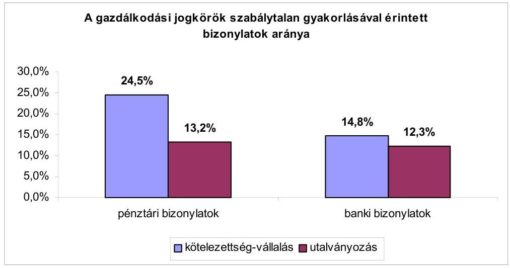

A gazdálkodásra vonatkozó szabályok betartásában hiányosságokat állapítottunk meg az önkormányzati tulajdonú gépjármúvek üzemeltetésénél, valamint a bel- és külföldi kiküldetések költségeinek elszámolásánál. Az önkormányzatok 4,9\%-nál a vonatkozó kormányrendelet ${ }^{9}$ előírásait nem tartották be a dokumentált teljesítményekkel nem, illetve nem megfelelően alátámasztott üzemanyag felhasználás kifizetésével, illetve helyi szabályozás hiányában végzett gépjármú üzemeltetéssel és üzemanyag költség elszámolással.

További hiányosságok a pénzgazdálkodási folyamat előző múveleteinek nem megfelelő teljesítéséből következtek, mert az utalványozást nem érvényesített okmányon, illetve nem az Ámr. 136. § akkor hatályos (3) bekezdésében előírt tartalmú utalványrendeleten végezték. Így hiányzott a bizonylatokról a költségvetési év, a befizető és a kedvezményezett adatai, az utalványozó és az ellenjegyző aláírása, a kötelezettségvállalás nyilvántartási száma.

# 1.5. A könyvviteli mérlegben kimutatott vagyon alakulása, a vagyonváltozást előidéző intézkedések szabályszerűsége, célszerűsége 

Az összes önkormányzat könyvviteli mérlegben kimutatott vagyona a 2000. évi 3089,9 milliárd Ft-ról 2002. december 31-re több mint kétszeresé-

[^0]
[^0]:    ${ }^{9}$ A közúti gépjárművek, az egyes mezőgazdasági, erdészeti és halászati erőgépek üzem-anyag- és kenőanyag fogyasztásának igazolás nélkül elszámolható mértékéről szóló 60/1992. (IV. 1.) Korm. rendelet.

---

re, 6423,3 milliárd Ft-ra nőtt. ${ }^{10}$ A 3333,4 milliárd Ft-os növekedésből 3228,8 milliárd Ft-ot, az összes növekedés 96,9\%-át a befektetett eszközök, 104,6 milliárd Ft-ot (a növekedés 3,1\%-át) a forgóeszközök állományának változása eredményezte. A 2003. évben 99,9\%-ban a befektetett eszközöknél bekövetkezett növekedés miatt nőtt 2811 milliárd Ft-tal az összes önkormányzat könyvviteli mérlegben kimutatott vagyona.

A befektetett eszközök között 2000-2002. évben 2663,2 milliárd Ft-tal a tárgyi eszközök, 530,5 milliárd Ft-tal az üzemeltetésre, kezelésre átadott eszközök, 31,5 milliárd Ft-tal a befektetett pénzügyi eszközök, 3,6 milliárd Ft-tal az immateriális javak könyvviteli mérlegben kimutatott értéke nőtt. A befektetett eszközök értékének növekedését 78,4\%-ban az ingatlanok, 16,4\%-ban az üzemeltetésre, kezelésre átadott eszközök értékének változása eredményezte.

Az immateriális javak, tárgyi eszközök, üzemeltetésre átadott eszközök növekedésének összetevőit a helyi önkormányzatok országosan összesített költségvetési beszámoló 38. űrlapja adatai felhasználásával vizsgáltuk a tartalmilag összefüggő sorok összegzésével és szembeállításával ${ }^{11}$.

|  | 2001. év |  | 2002. év |  |
| :--: | :--: | :--: | :--: | :--: |
|  | Bruttó érték milliárd Ft-ban | A növekedésen belüli arány \%-ban | Bruttó érték milliárd Ft-ban | A növekedésen belüli arány \%-ban |
| Aktivált beruházások és az értékesítések egyenlege | 212,7 | 64,0 | 309,8 | 10,9 |
| Térítésmentes átvétel-   átadás egyenlege | 4,0 | 1,2 | 28,5 | 1,0 |
| Egyéb növekedés-csökkenés, selejtezés egyenlege | 115,9 | 34,8 | 2495,9 | 88,1 |
| Összesen | 332,6 | 100,0 | 2834,2 | 100,0 |

Az immateriális javak és tárgyi eszközök értékének változását a 2002. évben $88,1 \%$ arányban az egyéb növekedés okozta, ez azonban csak a mérlegben kimutatott eszközérték növekedést jelentett, emiatt az önkormányzatok vagyona természetben nem nőtt. Jellemzően az önkormányzatok a korábban térítésmentesen átvett, valamint az érték nélkül nyilvántartott ingatlanok, földterületek, épületek, építmények értékét állapították meg és vezették be számviteli nyilvántartásukba, így azok egyéb növekedés címén megjelentek az önkormányzatok könyvviteli mérlegében is, ez az ingatlanoknál 2113,7 milliárd Ft az üzemeltetésre átadott eszközöknél 386,1 milliárd Ft értéknövekedést eredményezett. A 2003. évi növekedésben $88,7 \%$ volt az egyéb növekedés aránya.

A 2002. évi jelentős növekedésben szerepet játszott az is, hogy az önkormányzatok tulajdonában lévő ingatlanvagyon nyilvántartási és adatszolgáltatási rendjéről szóló 147/1992. (XI. 6.) Korm. rendeletet módosító 48/2001. (III. 27.) Korm. rendelet előírta, hogy a helyi önkormányzatok legkésőbb 2003. január

[^0]
[^0]:    ${ }^{10}$ A 2003. évi könyvviteli mérleg szerinti értéke 9235 milliárd Ft.
    ${ }^{11}$ Forrás: Államháztartási Hivatal Nyilvántartási és Adatfeldolgozási Főosztály 2001. és 2002. évek költségvetési beszámoló 38. számú űrlapja.

---

1-ig kötelesek ingatlanvagyon-kataszterüket felülvizsgálni és a mellékletek szerint módosítani.

A 2001. évben a tárgyi eszköz állomány növekedésének 52,6\%-át tette ki az egyéb növekedés. A tárgyi eszközállomány tényleges gyarapodását jelentő aktivált beruházások értéke a 2001. évben 36,4 milliárd Ft-tal (17,6\%-kal), a 2002. évben 94,8 milliárd Ft-tal ( $38,9 \%$-kal) nőtt. A tárgyi eszközállomány növekedéséhez hozzájárult a befejezetlen beruházások és a beruházásra adott előlegek könyvviteli mérlegben kimutatott összegének a 2001. évi 38 milliárd Ft-os (19,5\%-os) és a 2002. évi 20,2 milliárd Ft-os ( $8,7 \%$-os) növekedése.

A befektetett pénzügyi eszközökön belül az értékpapírok állománya 30,7 milliárd Ft-tal (53,6\%-kal), a hosszú lejáratú bankbetétek állománya 0,7 milliárd Ft-tal ( $46 \%$-kal) csökkent, ugyanakkor a részesedések értéke, 1,8 milliárd Fttal, a tartósan adott kölcsönök értéke 8,1 milliárd Ft-tal növekedett. A változás azt tükrözi, hogy az önkormányzatok a 2002. évben a tartós pénzügyi befektetéseikből 21,5 milliárd Ft-ot felhasználtak feladataik finanszírozására. A befektetett eszközök 2002. évi mérlegben kimutatott értékét befolyásolta, hogy a 2002. év január 1-től érvényes jogszabályi előírások alapján a tényleges forgalmi értéknél alacsonyabb értéken nyilvántartott eszközök esetében- az önkormányzatok egy része élt az értékhelyesbítés lehetőségével. Ez összegében 115 milliárd Ft-tal növelte a könyvviteli mérlegben kimutatott önkormányzati vagyon értékét.

A forgóeszközök közül a pénzeszközök könyvviteli mérlegben kimutatott év végi állománya a 2000. évről a 2002. évre 144,8 milliárd Ft-ról 218,2 milliárd Ft-ra, 50,7\%-kal növekedett. Ugyanakkor a forgatási célú értékpapírok év végi értéke $25,9 \%$-kal csökkent két év alatt, a 2002. év december 31 -én 84,2 milliárd Ft volt. Kedvező jelenség, hogy az önkormányzatok áruszállításból és szolgáltatásból adóból, rövid lejáratú kölcsönből és egyéb követelésekből származó követelés állományának mérlegben kimutatott értéke a 2001. évi 16,1\%os növekedéssel szemben a 2002. évben mindössze 1,8\%-kal emelkedett.

Az ellenőrzött önkormányzatok könyvviteli mérlegében kimutatott eszközök értéke az országos átlagot meghaladó mértékben átlagosan 139,3\%-kal nőtt 2000. évihez viszonyítva. A növekedés a Budapest Fővárosi Önkormányzatnál 859 milliárd Ft, Debrecen Megyei Jogú Város Önkormányzatánál 227 milliárd Ft, Budapest Főváros X. kerület Önkormányzatánál 89 milliárd Ft volt. Az ellenőrzött önkormányzatoknál az eszközök értékének 2002. évi növekedésében az országos adattal egyezően - 88\%-ban, az egyéb növekedés játszott szerepet. Ez az arányszám a legnagyobb eszköz érték növekedést elért három önkormányzatnál meghaladta a $96,6 \%$-ot. A könyvviteli mérlegben kimutatott eszköz érték, illetve vagyonnövekedés elsősorban a korábban nem, illetve nem értékkel nyilvántartott eszközök értékének megállapítása és számviteli nyilvántartásba vétele miatt következett be.
A könyvviteli mérlegben a beruházás és beruházásra adott előlegek 2002. december 31-én együttesen 43,3 milliárd Ft-ot tettek ki, 17 milliárd Ft-tal haladták meg a 2000. évi értéket. Az átlagos növekedés a fővárosi kerületeknél 158,3\%-os, a községeknél $158,2 \%$-os, a megyéknél $68,9 \%$-os volt. A beruházás állomány a 2000. évhez viszonyítva a nagyközségeknél 3,2 milliárd Ft-ról 1,5 milliárd Ft-ra 53,9\%-kal, a Budapest Fővárosi Önkormányzatnál 42,7 milliárd Ft-ról, 32,2 milliárd Ft-ra, $24,7 \%$-kal csökkent.
A befektetett pénzügyi eszközök 2002. évi könyvviteli mérlegben kimutatott érté-

---

ke a megyei önkormányzatoknál 20,5\%-kal, a Budapest Fővárosi Önkormányzatnál 3,9\%-kal csökkent a 2000. évihez viszonyítva. A könyvviteli mérlegben kimutatott forgóeszközök közül átlagos növekedés a 2000. évhez viszonyítva két év alatt a pénzeszközöknél 23,7\%-os, a forgatási célú értékpapíroknál 2\%-os volt. A Budapest Fővárosi Önkormányzat esetében a pénzeszközök állománya 43,6 milliárd Ft-tal, 198,6\%-kal nőtt, az értékpapírok állománya 20,7 milliárd Ft-tal, 32,9\%-kal csökkent.

Országosan a 2001. és 2002. évben jelentős mértékben, 93,8\%-kal 489,9 milliárd Ft-ra nőtt a kötelezettségek könyvviteli mérlegben kimutatott értéke. A növekedés mértéke a hosszú lejáratú kötelezettségeknél $90,5 \%$-os, a rövid lejáratú kötelezettségeknél $119,2 \%$-os, az egyéb passzív pénzügyi elszámolásoknál 70,7\%-os volt. A kötelezettségek és ezen belül elsősorban a (múködési költségek finanszírozásához felvett) rövid lejáratú kötelezettségek dinamikus növekedése kedvezőtlen folyamatot tükröz. Azt jelzi, hogy az önkormányzatok növekvő része csak külső források bevonásával tudta a vizsgált időszakban közszolgálati feladatait ellátni. Az önkormányzatok eladósodottságának mértékét mutatja a kötelezettségek mérleg főösszeghez viszonyított aránya:

Adatok: \%-ban

| Önkormányzat megnevezése | 2001. évi arány |  | 2002. évi arány |  | Korrigált változás ${ }^{12}$ |
| :--: | :--: | :--: | :--: | :--: | :--: |
|  | mérleg szerint | korrigált | mérleg szerint | korrigált |  |
| megyei | 14,7 | 15,4 | 14,5 | 16,8 | 1,4 |
| Budapest fővárosi | 7,5 | 7,6 | 7,0 | 12,4 | 4,8 |
| megyei jogú városi | 14,4 | 17,0 | 7,6 | 17,4 | 0,4 |
| fövárosi kerületi | 6,2 | 6,4 | 4,6 | 8,3 | 1,9 |
| városi | 11,1 | 11,8 | 8,8 | 15,0 | 3,2 |
| nagyközségi | 15,1 | 15,2 | 12,1 | 13,5 | $-1,7$ |
| községi | 8,5 | 9,0 | 6,4 | 8,2 | $-0,7$ |
| Országos összesen | 9,7 | 10,0 | 7,6 | 14,1 | 4,1 |

A mérleg szerinti adatok szerint a helyi önkormányzatok átlagos eladósodottsági szintje $2 \%$-kal csökkent. A mutató korrigált adatokkal számított értékei viszont azt mutatják, hogy az eladósodottság mértéke ennél nagyobb arányban, átlagosan $4,1 \%$-kal növekedett.

Az ellenőrzött önkormányzatok közül az eladósodottság szintjét jelző korrigált mutatószám átlagos értéke a Budapest Fővárosi Önkormányzatnál 4,8\%-

[^0]
[^0]:    ${ }^{12}$ A táblázat adatainak értékelésekor figyelembe vettük, hogy az önkormányzatok könyvviteli mérlegeiben szereplő főösszeg növekedését részben a korábban nem, vagy érték nélkül nyilvántartott eszközök értékének megállapítása és számviteli nyilvántartásba vétele okozta - különböző mértékben - a 2001. és a 2002. évben egyaránt, ezért a mérleg főösszegek értékét ezekkel csökkentettük. A módosított adatokkal számított mutató értékeit a táblázat „korrigált" oszlopai tartalmazták.

---

kal, a városi önkormányzatoknál 3,2\%-kal a fővárosi kerületi önkormányzatoknál 1,9\%-kal, a megyei önkormányzatoknál 1,4\%-kal nőtt. Az eladósodottság mértéke a nagyközségi, községi önkormányzatok esetében csökkent.

A kötelezettségek mérleg főösszeghez viszonyított aránya az ellenőrzött önkormányzatok $28,7 \%$-nál haladta meg 2000 . év december 31 -én a $10 \%$-ot, két év alatt ez az arány $35,2 \%$-ra nőtt.

A legnagyobb összegű 131,3 milliárd Ft-os kötelezettség állománnyal a Budapest Fővárosi Önkormányzat rendelkezett 2000-2002. év között. A 2000. évhez viszonyítva a növekedés 74,2 milliárd Ft, 130\%-os volt. A könyvvitelei mérlegben a megyei jogú városok közül Miskolc 9,1 milliárd Ft, Debrecen 7,9 milliárd Ft, Székesfehérvár 8 milliárd Ft, Várpalota város 3,9 milliárd Ft, Sza-bolcs-Szatmár-Bereg Megyei Önkormányzat 3,8 milliárd Ft, a Budapest Föváros IV. kerület 3,1 milliárd Ft kötelezettséget mutatott ki.

# Az országos átlagos adatok figyelembe vételével romlottak a települési önkormányzatok gazdálkodási feltételei. 

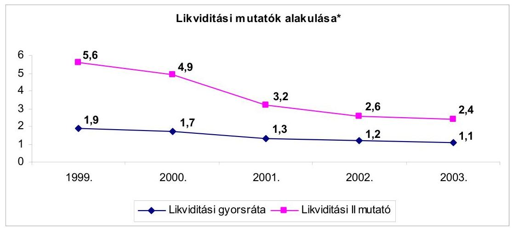

* Likviditási gyorsráta (pénzeszközök/rövid lejáratú kötelezettségek) Likviditási II. mutató (követelések + értékpapírok + pénzeszközök /rövid lejáratú kötelezettségek)
Az országos összesen adatokból számított likviditási mutatószámok alakulása a települési önkormányzatok pénzügyi helyzetének folyamatos rosszabbodását jelzi. A likviditási mutatók azt fejezik ki, hogy az önkormányzatok rendelkezésére álló egyes forgóeszközök csökkenő mértékben nyújtanak fedezetet a rövid lejáratú kötelezettségek teljesítésére. Az önkormányzatoknál ebben szerepet játszott a reális gazdasági lehetőségeiket meghaladó mértékű fejlesztési és múködési kötelezettségek vállalása is.

A 2003. évben ellenőrzött önkormányzatok 85,1\%-a rendeletben rögzítette a vagyongazdálkodás szabályait. A vagyongazdálkodási rendeletek $75 \%$-a a jogszabályi előírásoknak megfelelően határozta meg az önkormányzati feladatok ellátásához szükséges törzsvagyon körét. A rendeletek hatálya $76 \%$-a esetében a teljes vagyoni körre kiterjedt, $80 \%$-a tartalmazta a vagyon használatának, bérbeadásának a szabályait. Az önkormányzatok $86 \%$-a rögzítette rendeletben a vagyon értékesítésre, $81 \%$-a a bérbeadásra vonatkozó döntési, rendelkezési hatásköröket.

---

Az önkormányzatok 69\%-a nem szabályozta rendeletben, hogy milyen módon és esetekben lehet a vagyon tulajdonjogát és a vagyon kezelői jogát ingyenesen átruházni, illetve a követelésekről lemondani. Az ezekre irányuló döntések önkormányzati rendeleti szintű szabályozás hiányában történt - meghozatalával az Áht. 108. § (2) bekezdésének előírásait Debrecen megyei jogú város, Füzesgyarmat, Sárvár, Sümeg városok, Cigánd, Berhida nagyközségek és tíz község önkormányzata sértette meg. Az Áht. 108. § (1) bekezdései alapján az önkormányzatok $38 \%$-a rögzítette rendeletben azt az összeghatárt, amely felett vagyont értékesíteni, a kezelés jogát, illetve a használat, hasznosítás jogát átadni csak nyilvános, (indokolt esetben zárt körü) versenytárgyalás útján, a legjobb ajánlatot tevő részére lehet.

A megyei jogú városok közül Miskolc 500 millió Ft, a portfolió vagyon esetében 1000 millió Ft, Salgótarján 150 millió Ft a Budapest Főváros II. kerülete 200 millió Ft, Budapest Főváros IV. kerülete 100 millió Ft összegben rögzítette az összeghatárt, ami indokolatlanul nagy mozgásteret biztosított az önkormányzati döntéshozóknak, nem szolgálta a verseny, illetve a nyilvánosság érvényesülését.

A pályáztatási kötelezettségre vonatkozó rendeletben rögzített előírást az érintett önkormányzatok $74 \%$-a tartotta be.

# Az önkormányzatok 44\%-a osztotta meg értékhatárok rögzítésével a vagyont érintő kérdésekben a képviselő-testület, az önkormányzati bizottságok és tisztségviselők között a döntési jogosultságokat. 

Halásztelek Nagyközség Önkormányzata olyan portfoliókezelési szerződést kötött az egyik bank befektetési Rt-jével, amellyel az értékpapírokkal kapcsolatos döntési jogokat átruházta a gazdasági társaságra, vállalva az ügyletek minden kockázatát. Az önkormányzat az értékpapírok feletti döntési jog portfoliókezelőre való átruházásával megsértette az Ötv. 9. § (3) bekezdésének előírását, amely tételesen rögzíti a hatáskör átruházás lehetséges címzetteit. E szerint a képviselő-testületet megillető döntési hatáskör a polgármesterre, az önkormányzat bizottságaira, a részönkormányzat testületére és a helyi kisebbségi önkormányzat testületeire ruházható át, másra viszont nem. (Ezen megállapítással összhangban lévő döntést az Alkotmánybíróság is hozott ${ }^{13}$.)

Az egyes gazdasági eseményekben érintett önkormányzatok a vagyongazdálkodással kapcsolatos döntések meghozatalkor az értékesítéskor 9\%-ban, a bérbeadáskor 5\%-ban, a térítésmentes átadáskor 8\%-ban, a követelések elengedésekor 12\%-ban a szabályoknak nem megfelelően jártak el.

- Szekszárd megyei jogú város és Bóly város önkormányzatai a vagyongazdálkodási rendeleteiben rögzített értékhatárt meghaladó értékű ingatlanok értékesítésekor elmulasztották a nyilvános pályázat lefolytatását.
- Kecel, Sümeg városok és Szentistván nagyközség önkormányzatainál az önkormányzati rendelet előírását megsértve a képviselő-testület hozzájárulása

[^0]
[^0]:    ${ }^{13}$ Az Alkotmánybíróság önkormányzati rendeleti előírások felülvizsgálatára és megsemmisítésére irányuló kezdeményezései tárgyában meghozott 10/1995. (II. 22.) számú határozat.

---

nélkül értékesítettek berendezéseket, részesedéseket, vásároltak forgatási célú értékpapírokat.

- A Bács-Kiskun megyei, a Budapest Főváros XIX. kerület és Sümeg város önkormányzatai ingatlan értékesítésekor nem tartották be a vagyongazdálkodási rendeletben előírt forgalmi érték becslés készíttetésére vonatkozó előírást.
- A Budapest Főváros IV. kerület Önkormányzata a 2001-2003. években az önkormányzati beruházásként megvalósult 129 millió Ft értékű csatorna tulajdonjogát térítésmentesen átadta ${ }^{14}$ a közművet üzemeltető gazdasági társaságnak az önkormányzat e tárgyban elfogadott rendelete alapján. Ez az eljárás ellentétes volt az Ötv. 79. § (1)-(2) bekezdése és a vízgazdálkodásról szóló 1995. évi LVII. törvény 6. § (3) bekezdése előírásaival, mivel mindkét jogszabályhely szerint az önkormányzati törzsvagyon része a víziközmú.

Az önkormányzati portfolió-vagyon hasznosításakor előfordultak célszerútlen megoldások is:

- a Budapest Főváros X. kerület, Budapest Főváros II. kerület és Zalaegerszeg megyei jogú város önkormányzatai átmenetileg szabad pénzeszközei hasznosítását befektetési szolgáltató gazdasági társaság bevonásával végezték. Ennek során nem éltek a vagyonnal való felelős gazdálkodás követelményének érvényesülését fokozottabban elősegítő lehetőségekkel, a KELER Rtnél nevesített értékpapír alszámla nyitásával és a számla feletti együttes rendelkezés kikötésének a lehetőségével (erre a tőkepiacról szóló 2001. évi CXX. törvény és a KELER Rt. üzletszabályzata lehetőséget ad). Ez hozzájárult ahhoz, hogy a kőbányai önkormányzatnak közel három milliárd Ft-os követelése van a K \& H Equities Rt-vel szemben.
- A Budapest Főváros X. kerület Önkormányzata 2,1 milliárd Ft értékű portfolió vagyon kezelését célszerútlen módon a Vagyonkezelő Rt-je által alapított részvénytársaságra bízta. A vagyonkezelés költségeinek figyelembevételével a portfoliókezelés a 2000. november és a 2003. szeptember közötti időszakban 93 millió Ft veszteséget okozott. Az állampapír piaci referencia hozamok figyelembevételével további 400 millió Ft elmaradt hozam miatti kár érte az önkormányzatot.

# 1.6. A vagyon nyilvántartásának, leltározásának, a követelések, részesedések, értékpapírok év végi értékelésének szabályszerűsége 

A számviteli nyilvántartásokban az önkormányzatok 44,4\%-a gondoskodott a kötelező önkormányzati feladat- és hatáskör ellátását szolgáló törzsvagyon elkülönített nyilvántartásáról. A többiek a Vhr. 9. számú melléklete $1 / \mathrm{k}$ pontjának előírásában foglaltakat, mely szerint a nyilvántartásokat úgy kell megszervezni a főkönyvi számlák további bontásával, vagy részletező, analitikus nyilvántartás vezetésével, hogy abból kiderüljön a forgalomképtelen, illetve a

[^0]
[^0]:    ${ }^{14}$ Az Alkotmánybíróság önkormányzati rendeleti előírás felülvizsgálatára és megsemmisítésére irányuló kezdeményezés tárgyában hozott 10/2002. (III. 20.) és 11/2002. (III. 20.) számú határozatai, az önkormányzati törzsvagyonnal kapcsolatos gazdálkodási jogosítványok korlátait részletesen tartalmazzák.

---

korlátozottan forgalomképes törzsvagyon részét képező eszközök értéke - nem tartották be.

A Vhr. 49. § (1) bekezdésében előírja, hogy a költségvetési szervek a könyvviteli számlák további tagolásával, vagy a könyvviteli számlákhoz kapcsolódó analitikus nyilvántartások vezetésével kötelesek gondoskodni arról, hogy a költségvetési beszámoló adatait a valóságnak megfelelően, áttekinthetően alátámaszszák. Az ellenőrzött ingatlanok, értékpapírok, részesedések, üzemeltetésre, kezelésre átadott eszközök, követelések, kötelezettségek, a függő, átfutó és kiegyenlítő bevételek, kiadások mérlegsorokat alátámasztó főkönyvi számlákhoz kapcsolódó analitikus nyilvántartásokat az önkormányzatok 54,2\%-a teljes körüen, 29,2\%-a részben alakította ki, 16,6\%-uk nem tett eleget ennek a kötelezettségének. A könyvviteli mérleg, a főkönyvi számlák és az analitikus nyilvántartások értékadatai az önkormányzatok 67,5\%-ánál egyeztek meg. A 2003. évben ellenőrzött önkormányzatok a részletező, analitikus nyilvántartásokban nem rögzítették a vagyon értékében változást előidéző valamennyi gazdasági eseményt. A Vhr. 8. § (1) bekezdésében előírt nyilvántartás vezetési kötelezettségét a vevőköveteléseknél az önkormányzatok 15,3\%-a, a szállítói kötelezettségeknél 17,5\%-a, az ingatlanoknál 9,4\%-a nem teljesítette. A szállítói kötelezettségek, a vevőkövetelések és az ingatlanokat érintő gazdasági események rögzítését az önkormányzatok 3,7\%-a mulasztotta el a számviteli analitikus nyilvántartásban.

Az önkormányzatok 56,7\%-a mutatott ki könyvviteli mérlegében, összesen 108,6 milliárd Ft értékben üzemeltetésre, kezelésre átadott eszközöket. Az önkormányzatok jellemzően a tulajdonukban lévő közműveket, oktatási és egészségügyi célokat szolgáló ingatlanokat és berendezéseket adtak át üzemeltetésre, kezelésre gazdasági társaságoknak, vállalkozóknak, illetve másik önkormányzatnak. Az átadott eszközöket a polgármesteri hivatalok számviteli nyilvántartásaiban és könyvvitelei mérlegében Nyírbéltek és Simontornya nagyközségi önkormányzat esetében egyáltalán nem, az önkormányzatok 6,9\%-ánál hiányosan, az önkormányzatok 3,7\%-ánál pedig nem a Vhr. 20. § (1) bekezdésében előírt mérlegsoron mutatták ki.

Az önkormányzatok 31,8\%-a adott át felhalmozási célra pénzeszközt az átadott eszközöket kezelő szervezetek részére. A megvalósult beruházásokat, felújításokat 60,4\%-ban a polgármesteri hivatal, 39,6\%-ban az üzemeltető, kezelő szervezet aktiválta. Ez utóbbi gyakorlat célszerűtlen, mert az önkormányzati pénzeszközökből megvalósult fejlesztések nem az önkormányzat számviteli nyilvántartás szerinti vagyonát gyarapították. A víziközműveknél ezt a megoldást választó önkormányzatok megsértették az Ötv. 79. § (2) bekezdés b) pontjának, az egyes állami tulajdonban lévő vagyontárgyak önkormányzatok tulajdonába adásáról szóló 1991. évi XXXIII. törvény 20. §-ának és a vízgazdálkodásról szóló 1995. évi LVII. törvény 6. §-ának előírá-

---

sait, amelyek szerint a víziközművek az önkormányzati törzsvagyon körébe tartoznak, ezért tulajdonjoguk nem adható át. ${ }^{15}$

A 2002. évi könyvviteli mérlegben szereplő adatokat az előző évi 58,4\%-al ${ }^{16}$ szemben az önkormányzatok 72,9\%-a támasztotta alá a Vhr. 37. § (1) bekezdése előírásának megfelelően leltárral, vagy a leltárt helyettesítő összesítő kimutatással. Az arány a megyei, megyei jogú városi, fővárosi kerületi, városi és nagyközségi önkormányzatoknál magasabb, 88,3\%os volt. Leltározási kötelezettségüknek egy vagy több mérlegsor vonatkozásában nem tettek eleget és ezzel megsértették a Vhr. 37. § (1) bekezdésének előírását a polgármesteri hivatalok 6,6, \%-ánál. A korábbi évekhez hasonlóan a 2003. évben is az üzemeltetésre, kezelésre átadott eszközök nyilvántartásával és leltározásával összefüggésben követték el a legtöbb mulasztást az ellenőrzött önkormányzatok, mivel az üzemeltetők erre vonatkozó nyilvántartását nem ellenőrizték, valamint 33\%-uk az üzemeltetőnél végzett leltározást nem ellenőrizte.

Az ellenőrzött polgármesteri hivatalok 64,9\%-a a jogszabályi előírások figyelembevételével számolta el az immateriális javak, a tárgyi eszközök és az üzemeltetésre, kezelésre átadott eszközök értékcsökkenését. Az önkormányzatok 28,2\%-ánál részben, 6,9\%-ánál egyáltalán nem tettek eleget az értékcsökkenés elszámolási kötelezettségnek. A mulasztást jellemzően az okozta, hogy a polgármesteri hivatalok 16,6\%-a az ingatlanokról az üzemeltetésre, kezelésre átadott eszközökről és az ezekkel összefüggő aktivált felújításokról nem vezetett egyedi nyilvántartást. Az polgármesteri hivatalok 11,8\%-ánál a közművek, parkok, játszóterek esetében előfordult, hogy a részletező nyilvántartások hiánya miatt a különböző értékcsökkenési leírási kulcsok alá tartozó eszközök értékét tartották egy összegben nyilván. Ezekben az esetekben az értékcsökkenést összevontan számolták el, megsértve a Számv. törvény 16. § (1) bekezdésében rögzített egyedi értékelés elvét.

A Vhr. 30. § (2) bekezdésének előírását, hogy az értékcsökkenést az egyes eszközféleségek után milyen leírási kulcs alkalmazásával kell negyedévenként, a tényleges használatnak megfelelően, időarányosan elszámolni nem tartotta be:

- Túrkeve város az építményeknél 3\% helyett 2\%, Nyírbéltek nagyközség és Ömböly község 1,2\%, Simontornya város a számítástechnikai eszközöknél $33 \%$ helyett $14,5 \%$, Nyírbéltek a gépeknél beszerzésenként $14,5 \%$ helyett $12,9 \%$, a járműveknél $20 \%$ helyett $16,9 \%$ leírási kulcsot alkalmazott;
- Simontornya város és Szentistván nagyközség földterület, Siklós város beruházás után is számolt el értékcsökkenést;

[^0]
[^0]:    ${ }^{15}$ Ezt megerősítette az Alkotmánybíróság önkormányzati rendeleti előírás felülvizsgálatára és megsemmisítésére irányuló kezdeményezés tárgyában hozott 10/2002. (III. 20.) számú határozata és a 11/2002. (III. 20.) számú határozata.
    ${ }^{16}$ ÁSZ jelentés a helyi és a helyi kisebbségi önkormányzatok gazdálkodásának átfogó ellenőrzéséről (készült 2003. évben).

---

- Nem negyedévente, illetve nem a tényleges használat időtartalmát figyelembe véve tett eleget értékcsökkenés elszámolási kötelezettségének Budapest Főváros V. és XII. kerülete, Szerencs, Simontornya, Hatvan városok, Taktaharkány és Vaja nagyközségek polgármesteri hivatala.

A költségvetési szerveknek a Vhr. 30. § (12) bekezdése alapján a Számv. tv. 53. § (1)-(2) bekezdésben rögzített feltételek esetében terven felüli értékcsökkenést, a Vhr. 31. §-a alapján, figyelemmel a Számv. tv. 54-56. §-ban foglaltakra, értékvesztést kell elszámolniuk, illetve visszaírniuk. Az önkormányzatok fele szabályozta az immateriális javaknál, tárgyi eszközöknél a rendkívüli értékcsökkenés, a gazdasági társaságokban meglévő tulajdoni részesedéseknél, az egy évnél hosszabb lejáratú értékpapíroknál, készleteknél, követeléseknél az értékvesztés elszámolásának és visszaírásának rendjét. A szabályzatok 69,4\%-a felelt meg a jogszabályi előírásoknak. A terven felüli értékcsökkenés elszámolásának szükségességét az immateriális javak esetében az önkormányzatok $25,7 \%$-a a tárgyi eszközöknél $29,7 \%$-a vizsgálta meg. Ugyanaz az arány az értékvesztés elszámolás vonatkozásában a részesedéseknél $52,7 \%$, az értékpapíroknál $62,0 \%$, a készleteknél $20,3 \%$ a követeléseknél $40,5 \%$ volt, az ezt elmulasztó önkormányzatok nem tettek eleget a mérlegtételek értékelésével öszszefüggő jogszabályi kötelezettségüknek. Az önkormányzatok 11,7\%-a számolt el értékvesztést a részesedéseknél, amely összesen 599 millió Ft-tal ( $0,9 \%$-kal) csökkentette eszközeik könyviteli méregben kimutatott értékét.

A korábbi években elszámolt értékvesztés visszaírásának szükségességét az érintett önkormányzatok $\mathbf{2 6 , 2 \%}$-a vizsgálta meg, a három indokolt esetben megtörtént a visszaírás. Az elszámolt terven felüli értékcsökkenést, illetve a visszaírást a számviteli analitikus nyilvántartásokban a Vhr. 32. § (2) bekezdésében előírtaknak megfelelően rögzítették a polgármesteri hivatalok. Hat önkormányzat élt a vagyoni értékű jogok, szellemi termékek, tárgyi eszközök és a tulajdoni részesedést jelentő befektetések esetében a piaci értéken történő értékelés lehetőségével, közülük négy tett eleget a Számv. tv. 57-59. §-aiban és a Vhr. 32. § és 32/A. §-aiban rögzített eljárási és számviteli előírásoknak.

# 1.7. A céljelleggel - nem szociális ellátásként - juttatott támogatások szabályszerűsége 

Országosan a helyi önkormányzatok összesen 170027 millió Ft pénzeszközt adtak át a 2002. évben az önkormányzat saját intézményein kívüli költségvetési szerveknek, vállalkozásoknak, nonprofit szervezeteknek és magánszemélyeknek. Ez az összeg az önkormányzati költségvetési kiadások átlagosan 5,7\%-át tette ki. Az átadott pénzeszközökön belül 97659 millió Ft múködési, 72369 millió Ft felhalmozási célokat szolgált.

A 2003. évben ellenőrzött önkormányzatok 42501 millió Ft múködési és 34489 millió Ft felhalmozási célú pénzeszközt adtak át államháztartáson kívüli szervezeteknek, ami együttesen az összes költségvetési kiadás 7,6\%-át jelentette. A múködési célú pénzeszközátadás 58,1\%-át a Budapest Fővárosi Önkormányzat, 38,0\%-át a megyei, megyei jogú városi, fövárosi kerületi, városi és nagyközségi, 3,9\%-át a községi önkormányzatok teljesítették. A felhalmozási célú pénzeszközátadáson belül 77,2\%-ot a Budapest Fővárosi Önkormányzat, 2,7\%-ot a

---

községi önkormányzatok képviselnek, és 21,5\% a többi önkormányzat részesedési aránya.

# Az átadott pénzeszközök támogatott szervezetek közötti megoszlása az ellenőrzött önkormányzatoknál 

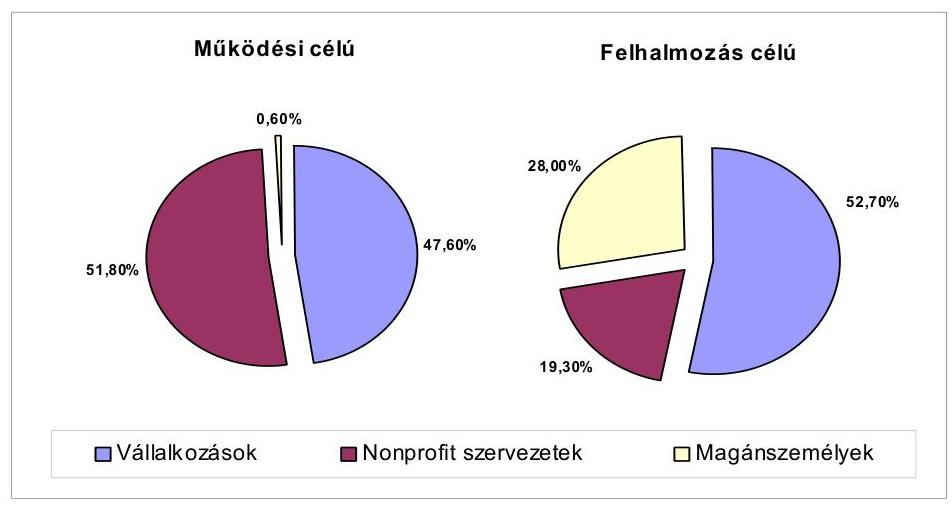

A nonprofit szervezetek és a háztartások alacsony részesedési arányát az okozta, hogy a Budapest Fővárosi Önkormányzat a 21807 millió Ft múködés célú pénzeszközátadás $86,8 \%$-át, a 20610 millió Ft felhalmozási célú pénzeszközátadás $95,3 \%$-át vállalkozások részére nyújtotta.

## Az átadott pénzeszközök támogatott szervezetek közötti megoszlása (Budapest Fővárosi Önkormányzat nélkül)

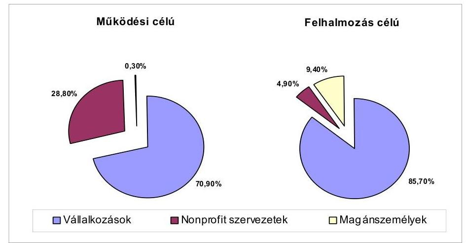

A Budapest Fővárosi Önkormányzat nélküli adatok alapján az átadott pénzeszközök 47,6\%-át, illetve 52,7\%-át kapták az önkormányzati tulajdonban lévő gazdasági társaságok, egyéb vállalkozások. Az önkormányzatok a 2002. évben a nonprofit szervezeteknek, alapítványoknak, közalapítványoknak, közhasznú társaságoknak, egyesületeknek, egyházaknak és egyéb szervezeteknek a múködési célú támogatás $51,8 \%$-át a felhalmozási célú támogatás $19,3 \%$-át adták

---

át. A magánszemélyek elsősorban a lakások korszerűsítéséhez és felújításához kaptak támogatás.

Az Áht. 13/A. § (2) bekezdése alapján az államháztartás alrendszereiből finanszírozott, vagy támogatott szervezetek, illetve magánszemélyek számára számadási kötelezettséget kell előírni a részükre céljelleggel - nem szociális ellátásként - juttatott összegek rendeltetésszerű felhasználásáról. Az előírás érvényesülését 98 megyei, megyei jogú városi, fővárosi kerületi, városi és nagyközségi önkormányzatnál ellenőriztük. Az önkormányzatok 88,4\%-a nyújtott támogatást az alapítványoknak, egyesületeknek, egyéb szervezeteknek, 64,3\%-a a vállalkozásoknak, $44,9 \%$-a a magánszemélyeknek.

A támogatások összegére és a támogatásban részesülő szervezetek, magánszemélyek kiválasztására irányuló döntést az önkormányzatok 69,4\%-ánál a képviselő-testületek hozták meg, általában az éves költségvetési rendelet elfogadásakor. A jelentősebb támogatási célú forrásokkal rendelkező önkormányzatok költségvetési rendeltükben a nagyobb összegű vagy a több évre szóló támogatásokat szerepeltették tételesen. Az ezen felüli pénzeszközöknél az egyes támogatási célokra fordítható kereteket rögzítették, pályáztatást írtak elő, megosztották a döntési hatásköröket:

- Az általános gyakorlattól eltérően az Ötv. 9.§ (3) bekezdésben rögzített hatáskör átruházásra vonatkozó előírást megsértve Székesfehérvár és Szekszárd önkormányzatai a képviselőknek is biztosítottak keretet, amelynek terhére támogatást nyújthattak. Ezen túlmenően ezek az önkormányzatok, valamint Celldömölk Város Önkormányzata az iparűzési adó esetében lehetővé tették, hogy az adófizetők meghatározott összegű befizetési kötelezettség esetén rendelkezhettek az adó 5-10\%-ának meghatározott célokra - egyesületek, alapítványok, egyházak támogatására - történő felhasználásáról. Az iparűzési adó egy részének felhasználására vonatkozó döntési jog átadása az adóalanynak sértette az Ötv. 10. § (1) bekezdés d) pontja előírását minden olyan esetben, amikor ezekből a pénzeszközökből alapítvány részesült, mert az alapítványi források átadása a képviselő-testület hatásköréből nem ruházható át, valamint a költségvetési bevétel részét képező iparűzési adó felhasználásáról át nem ruházható hatáskörben a képviselő-testület jogosult dönteni. A helyi adókról szóló 1990. évi C. törvény nem tartalmaz a helyi iparűzési adó meghatározott százalékáról való rendelkezés átengedésére vonatkozó felhatalmazást. Az önkormányzatok erre vonatkozó rendelete ezért nem csak az Ötv., hanem a helyi adókról szóló 1990. évi C. törvény rendelkezéseivel is - mint magasabb szintű jogszabállyal - ellentétes előírást tartalmazott. Az adózó rendelkezése alapján történő pénzeszközátadásoknál nem biztosították az Áht. 13/A. § (2) bekezdésében foglaltak alapján számadási kötelezettség előírását. Az iparűzési adó „címkézését" Székesfehérvár megyei jogú város és Celldömölk város önkormányzatai 2003. január 1-tőlmegszűntették.
- A Budapest Főváros IV. kerület Önkormányzata külön rendeletben rögzítette a támogatási célú pénzeszközök felhasználásának szabályait.

A támogatási célú pénzeszközök felhasználására vonatkozó döntések meghozatalakor az önkormányzatok 16,3\%-a megsértette az Ötv. 10. § (1) bekezdés d) pontja előírását, mely szerint a közösségi célú alapítvány és alapítványi forrás átadása és átvétele az önkormányzatoknál a képviselőtestület át nem ruházható hatáskörébe tartozik.

---

Bács-Kiskun megye, Jász-Nagykun-Szolnok megye, Miskolc, Székesfehérvár, Salgótarján, Zalaegerszeg megyei jogú városok, Budapest Főváros II., IV., XIX., XXII. kerületi, Szerencs, Kapuvár, Füzesgyarmat városi, Berhida, Nyírbéltek nagyközségi önkormányzatoknál alapítványnak nyújtott támogatásról önkormányzati bizottság, a közgyűlés elnöke, a polgármester, illetve önkormányzati képviselő hozott döntést.

A vállalkozásokat támogató önkormányzatok 34,9\%-a, az alapítványok esetében 55,6\%-a, az egyéb szervezetek esetében 30,6\%-a nem írt elő a támogatott szervezet részére számadási kötelezettséget, megsértve az Áht. 13/A. § (2) bekezdésének erre vonatkozó előírását. Az önkormányzatok $15,1 \%$-ánál a támogatott szervezetek nem tettek eleget az előírt módon és határidőben a számadási kötelezettségüknek. Az polgármesteri hivatalok egyharmad része a benyújtott elszámolásokat nem vizsgálta felül, ezzel megsértette az Áht. 13/A. § (2) bekezdés előírását, mely szerint a finanszírozó köteles ellenőrizni a felhasználást és a számadást. A kapott elszámolások ellenőrzési rendszerét az önkormányzatok nem alakították ki, a felhasználás helyszíni ellenőrzését - egy kivételével - nem szabályozták. A számadási kötelezettség és a felhasználás ellenőrzési módját sem az Áht. 13/A. § (2) bekezdése, sem az önkormányzatok nem szabályozták. Debrecen Megyei Jogú Város Önkormányzatánál a Hivatal Ellenőrzési osztálya munkatervben meghatározott célellenőrzés keretében az egymillió Ft feletti támogatások felhasználásának ellenőrzését a helyszínen folytatta le. Az polgármesteri hivatalok számadási kötelezettség teljesítéseként elfogadták az adott szervezet éves tevékenységéről szóló beszámolót, a múködéssel összefüggő kiadásokról készített összesített kimutatásokat, elszámolásokat, a bemutatott, vagy átadott számlamásolatokat. A kapott számadások számszaki ellenőrzése, valamint a beszámolók, elszámolások nem biztosították a számadás hitelességét.

A jogszabály előírja azt is, hogy amennyiben a finanszírozott vagy támogatott szervezet, illetve magánszemély az előírt számadási kötelezettségének határidőben nem tesz eleget, a kötelezettségének teljesítéséig a további finanszírozást, támogatást fel kell függeszteni. A támogatások jogszabálysértő, vagy nem rendeltetésszerű felhasználása esetén a felhasználót visszafizetési kötelezettség terheli. Az önkormányzatok közül az Áht. 13/A. § (2) bekezdésében foglalt előírásokat megsértette:

- Kerekegyháza Város Önkormányzata egy vállalkozónak adott 1,5 millió Ft támogatásnál, mivel a támogatás célja sem a vonatkozó képviselő-testületi határozatban, sem a támogatási szerződésben nem szerepelt. Az elszámolásként beküldött számlák dátuma megelőzte a támogatási szerződés keltét.
- Miskolc Megyei Jogú Város Önkormányzatánál a támogatott szervezetek közül 18 nem tett eleget a számadási kötelezettségnek, négy esetben nem a megállapodásban rögzített célok teljesültek, de nem függesztették fel a támogatás további folyósítását, nem követelték az összeg visszafizetését.
- Emőd Város Önkormányzata az egyik egyháznak adott felhalmozási célra támogatást, amit a céltól eltérően egy rendezvénnyel kapcsolatos kiadásra használtak fel.
- Tapolca Város Önkormányzatánál a támogatott szervezetek hiányosan számoltak el, de ennek ellenére nem függesztették fel a támogatást.

---

- A Csongrád Megyei Önkormányzat a 2002. évben a Polgárőrség szervezetének nyújtott 700 ezer Ft támogatást, amellyel nem számoltak el, ennek ellenére a 2003. évben is részesültek támogatásban.
- A Bács-Kiskun Megyei Közgyűlés elnöke négy szervezetnek engedélyezett támogatást, annak ellenére, hogy a korábban felvett támogatás összegével nem számolt el.

Elszámolási hiányosságok miatt a Székesfehérvár megyei jogú városi és a Tiszavasvári városi önkormányzatok függesztették fel a további támogatás nyújtását.

# 1.8. A múködési és felhalmozási bevételek, kiadások alakulása 

A helyi önkormányzatok a 2002. évben bruttó 3282,5 milliárd Ft bevételből gazdálkodtak, amelynek 36,3\%-a a vizsgált önkormányzatoknál keletkezett. (Az összes önkormányzat és a vizsgált önkormányzatok 2002. évi bruttó bevé-telének-kiadásainak alakulását a 8-9. számú, a vizsgált önkormányzatok önkormányzati típusonkénti bruttó bevételi-kiadási előirányzatainak alakulását a 7. számú melléklet részletezi.) Az ellenőrzött önkormányzatok konszolidált ${ }^{17}$ bevételeinek $\mathbf{9 0 , 1 \%}$-át a saját bevétel, a pénzmaradvány igénybevétel, és a költségvetési támogatás adta. Az összes önkormányzat és a vizsgált helyi önkormányzatok 2002. évi konszolidált bevételeinek megoszlását az alábbi diagram szemlélteti:
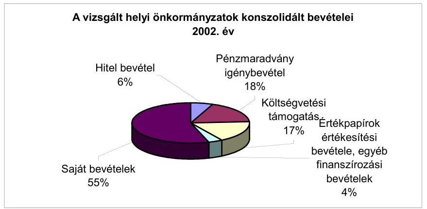

[^0]
[^0]:    ${ }^{17}$ A költségvetési szervek összevont, halmozódások kiszűrésével számított bevételeinek összege.

---

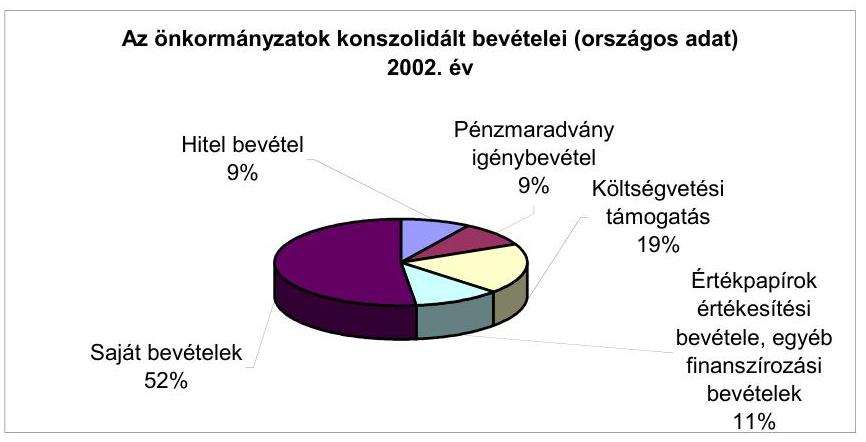

Az ellenőrzött önkormányzatok 2002. évi saját bevétele (484,9 milliárd Ft) a konszolidált kiadások 69\%-ára nyújtott fedezetet. A saját bevételen belül a legmagasabb a helyi adók részaránya volt (23,7\%), az Egészségbiztosítási alaptól átvett pénzeszközök 23,4\%-ot, az szja 16,2\%-ot, az intézményi bevételek 13,2\%-ot képviseltek. A konszolidált kiadások 22,1\%-ának forrását az előző évi pénzmaradvány 155,3 milliárd Ft-os igénybevétele teremtette meg.

Az önkormányzatok a költségvetési támogatás 88,9\%-át múködési, 11,1\%át felhalmozási célra kapták, amely a múködési kiadásoknak 24,7\%-ára, illetve a felhalmozási kiadásoknak 10,7\%-ára biztosított fedezetet. Az ellenőrzött önkormányzatok 2002. évi konszolidált kiadásainak kiadási célonkénti megoszlását a 6. számú melléklet szemlélteti. A bruttó kiadásokat bemutató 1. számú melléklet adataiból látható, hogy az önkormányzat típusa, a községek lakosságszám szerinti nagysága és a teljesített önkormányzati kiadások összege között szoros kapcsolat nincs. A kiadások nagysága szempontjából meghatározó az azonos típusú önkormányzatok különböző feladatvállalása és az ehhez kapcsolódóan elért többletbevételek mértéke. (Jellemzően a több önkormányzattal közös beruházás gesztorságának vállalása és a felhalmozási célú támogatások elnyerése eredményezte a bevételek átmeneti, kiugró arányú növekedését.)

Az önkormányzatok pénzügyi helyzetének romlását jelzi, hogy tartalékaik csökkentek, a 2002. évben kamatokból 24,2 milliárd Ft bevételt ezen belül a befektetett pénzügyi eszközök kamataiból 9,7 milliárd Ft -ot realizáltak, amely - a jegybanki alapkamat csökkenéséből adódó bevétel kiesést jóval meghaladva - 7,2\%-os csökkenést jelentett a 2001. évi kamatbevételhez képest ${ }^{18}$. A kamatoknak a GFS rendszerú bevételeken belüli részaránya 1,4\%-ról 1,1\%-ra csökkent. Az önkormányzatok 53\%-ánál a kamatbevétel az előző évhez képest csökkent, 21\%-ánál pedig egyik évben sem volt pénzeszközlekötés.

Az önkormányzatok egy főre jutó GFS rendszerú bevétele 213 ezer Ft, kiadása 224 ezer Ft volt. A kiadások 79\%-át múködésre, 21\%-át felhalmozásra fordítot-

[^0]
[^0]:    ${ }^{18}$ A jegybanki alapkamat 2001. I. 1-én 11\%, 2002. I. 1-én 9,75\%, 2002. XII. 31-én 8,5\% volt.

---

ták. A felhalmozási kiadások a bevételeket 183,5 milliárd Ft-tal lépték túl ${ }^{19}$. A felhalmozási bevételek és kiadások összes előirányzaton belüli aránya az előző évi arányhoz képest változatlan maradt (bevételek 13,6\%, kiadások 21\%). Az önkormányzati alrendszer teljesített múködési bevételei a múködési kiadásokra fedezetet nyújtottak, a múködési bevételek 79,4 milliárd Ft-tal haladták meg a múködési célú kiadásokat.

Az ellenőrzött önkormányzatok 63\%-ánál biztosították a múködési kiadásokbevételek egyensúlyát. A pénzügyi egyensúly megőrzése érdekében a jegyzők az önkormányzatok 46\%-ánál készítettek likviditási tervet, de azok 11\%ában nem reálisan mérték fel a bevételeket és a kiadásokat, valamint év közben nem aktualizálták, így azzal nem segítették a folyamatos fizetőképesség megőrzését. Az önkormányzatok 2002. évi konszolidált bevételének 5,8\%-a (149,6 milliárd Ft) hitel, illetve kölcsön felvételből, valamint értékpapírok értékesítéséből keletkezett. Az önkormányzatok kötelezettség állománya ${ }^{20}$ egy év alatt 43,6\%-kal növekedett, annak nagysága 2002. december 31-én 356,7 milliárd Ft volt. A feladatok finanszírozásában a hosszú lejáratú kötelezettségek szerepe kismértékben erősödött, az összes kötelezettségen belül arányuk hat százalékponttal változott (43\%-ról 49\%-ra).

Az önkormányzatoknál az egy fő́re jutó adósságállomány az előző évhez képest 10,6 ezer Ft-tal emelkedett, 2002. december 31-én 34,9 ezer Ft volt. Az önkormányzatok 30\%-a a 2002. évi költségvetésben meghatározott feladatok ellátásának biztosítása érdekében az Ötv. 88. § (2) bekezdésében meghatározott adósságot keletkeztető kötelezettségvállalásról döntött, amely az előző évhez képest 2,3\%-os emelkedést jelentett. ${ }^{21}$ A 2002. évben az ellenőrzöttek közül két önkormányzat kötvényt bocsátott ki, 14 líingszerződést kötött, 40 garanciát, illetve kezességet vállalt, 80 hitelt vett fel. Az adósságot keletkeztető éves kötelezettségvállalás felső korlátját az önkormányzatok 59\%-a tartotta be, a többi önkormányzat túllépte. Az Ötv. 88. § (2) bekezdésében meghatározott korlát megsértésével az önkormányzatok múködőképessége került veszélybe, a lehetőségeiken felül vállalt fizetési kötelezettségekkel a kötelező önkormányzati feladatok ellátását kockáztatták.

A jogszabály az adósságot keletkeztető kötelezettségvállalás éves felső határának meghatározásakor nem rendelkezik a több éven keresztül fizetési kötelezettségként jelentkező váltótartozások, illetve a szállítóknak több év alatt részletekben fizetendő összegek figyelembevételéről. Ezeknek a kötelezettségeknek a törlesztése az önkormányzatok költségvetéseit éveken keresztül terhelik, a fizetőképességet, az eladósodottságot a hitelekhez hasonlóan befolyásolják.

[^0]
[^0]:    ${ }^{19}$ A felhalmozási bevételek között a pénzforgalom nélküli bevételek felhalmozási része nem szerepel, mert a pénzmaradvány igénybevétel múködési és felhalmozási célra történő megosztásáról az éves költségvetési beszámoló információt nem tartalmaz.
    ${ }^{20}$ A függő, átfutó és kiegyenlítő tételek nélkül számított összeg alapján.
    ${ }^{21}$ Jelentés a helyi és a helyi kisebbségi önkormányzatok gazdálkodásának átfogó ellenőrzéséről (készült a 2003. évben).

---

Erdőhorváti Község Önkormányzata a település közvilágítását korszerűsítette. A beruházás megvalósításához elegendő forrással nem rendelkezett, ezért a kivitelező váltó formájában hitelt folyósított a részére, amelyet az önkormányzat havi részlettel törleszt.

Tát Nagyközség Önkormányzata a település közvilágítása korszerűsítésére a szolgáltatóval 33400 ezer Ft összegben szerződést kötött, amely összeget 10 éves, egyenlő részletekben egyenlít ki.

Az adósságot keletkeztető kötelezettségvállalásoknál a döntést a képviselőtestületek hozták meg, illetve a hitel felvételéről már a költségvetési rendelet megalkotásakor rendelkeztek, és ezzel egyidőben felhatalmazták a polgármestert az ezzel kapcsolatos eljárás lefolytatására. Hitel felvételekor a döntési jogkör átruházása és képviselő-testületi döntés nélkül vett fel hitelt Nagyoroszi és Becsvölgye községek önkormányzatai.

Az önkormányzatok háromnegyedénél nem szabályozták a kötelezettségvállalások analitikus nyilvántartásának rendjét, tartalmát, formáját az Ámr. 134. § (4) bekezdésében előírtak ellenére. Az önkormányzatok 83\%-ánál a 2002. évben az Áht. 103. § (2) bekezdésének előírásait megsértve nem vezették a kötelezettségvállalások nyilvántartását. Az elkészített nyilvántartások 78\%-a megfelelt a jogszabályi követelményeknek, abból megállapítható volt a 2002. évi kötelezettségvállalások összege.

# 1.9. A költségvetés egyensúlyi helyzete 

Az önkormányzatok 47\%-ának gazdálkodása múködési forráshiányos volt, amely arány az előző évivel megegyezett ${ }^{22}$. A működési forráshiány mindegyik településtípusnál előfordult, a nagyközségek 66\%-ánál, a megyei jogú városok 50\%-ánál, a városok 49\%-ánál, a községek 46\%-ánál és a Budapest fővárosi kerületek 33\%-ánál mutattak ki a működési költségvetésben egyensúlyhiányt.

A működési költségvetési hiány a városoknál és nagyközségeknél a körzeti feladatok ellátására vezethető vissza. A vizsgált múködési forráshiányos városok 23\%-ánál az önként vállalt feladatok finanszírozása, 22\%-ánál a túlzott mértékű kötelezettségvállalások játszottak szerepet a múködési hiány kialakulásában.

A községekben a kötelező önkormányzati feladatokat ellátó költségvetési szervek - elsősorban alapfokú oktatási-nevelési intézmények - fenntartásához nem rendelkeztek elegendő bevétellel. A múködési forráshiányos községek 49\%-ánál az intézményi kapacitás alacsony kihasználtsága, 19\%-ánál a feladatellátás célszerútlen szervezeti struktúrája idézte elő a forráshiányt.

A gazdasági szempontból hátrányos helyzetű, munkanélküliséggel sújtott települések, illetve az elöregedett lakosságú falvak esetében az alacsony jövedelemter-

[^0]
[^0]:    ${ }^{22}$ Jelentés a helyi és a helyi kisebbségi önkormányzatok gazdálkodásának átfogó ellenőrzéséről (készült a 2003. évben).

---

melő képesség okozott forráskiesést. Az önkormányzatoknak kisebb bevétele keletkezett a személyi jövedelemadóból, a saját bevételek nem voltak növelhetők a helyi adót fizető vállalkozói réteg hiánya, valamint a lakosság alacsony adó fizetési képessége miatt. Ezeken a településeken a lakosság szociális helyzete a munkanélküliség miatt kedvezőtlenebb, mint a gazdaságilag fejlettebb övezetekben, így az önkormányzatok szociális kiadásai is magasabbak. A jövedelem kieséssel együtt járó megnövekedett szociális terhek hozzájárultak a működési költségvetési hiány kialakulásához.

A múködési forráshiány kialakulásában a vizsgált önkormányzatok 8\%-ánál a költségvetési tervezési hiányosságok is szerepet játszottak, a bevételek felül-, illetve a kiadások alultervezése a gazdálkodás során a költségvetés egyensúlyának felborulását eredményezte.

A költségvetési egyensúly javítása érdekében a forráshiányos önkormányzatok $60 \%$-a takarékossági intézkedéseket vezetett be az előző évi 49\%-kal szemben ${ }^{23}$, 23\%-a csökkentette a felhalmozási célú kötelezettségvállalásait, és $18 \%$ az önként vállalt feladatokra fordított forrásait.

A költségek csökkentése érdekében intézményeket szüntettek meg, illetve alakítottak át:

- intézményeket szüntettek meg Hatvan város, Mosdós, Szálka, Babarc, Liptód Mersevát, Old, Mosdós községek önkormányzatai;
- intézményeket közös igazgatóság alá helyeztek, illetve önállóságukat megszüntette Csongrád, Hatvan, Celldömölk városok, Mersevát, Hobol községek önkormányzatai;
- intézményeiket gazdasági társasággá alakították át, illetve vállalkozásba adták Csongrád, Tótkomlós, Marcali városok, Királyhegyes község önkormányzatai;
- társulást alakítottak intézményi feladataik ellátására Old, Királyhegyes, Kövegy községek önkormányzatai.

A kiterjedt intézményhálózattal rendelkező önkormányzatok kiskincstár típusú ${ }^{24}$ gazdálkodást folytattak. A múködési forráshiány csökkentése érdekében három önkormányzat az önként vállalt feladatokat ellátó intézményeit a megyei önkormányzatok részére átadta.

Siklós Város Önkormányzata a Zeneiskolát és a Jókai Mór Kollégiumot a Baranya Megyei Önkormányzat, Pusztamérges Község Önkormányzata a középiskolát és a középiskolai kollégiumot a Csongrád Megyei Önkormányzat, Hatvan

[^0]
[^0]:    ${ }^{23}$ Jelentés a helyi és a helyi kisebbségi önkormányzatok gazdálkodásának átfogó ellenőrzéséről (készült a 2003. évben).
    ${ }^{24}$ A kiskincstári rendszer a koncentrált pénzkezelés következtében a likviditási gondokkal küzdő önkormányzatoknak alacsonyabb folyószámlahitel igénybevételt és így alacsonyabb hitelkamatot jelentett, az átmenetileg szabad pénzeszközeit forgatási célú értékpapírokban tartó önkormányzatoknak pedig magasabb kamatbevétel elérését biztosította.

---

Város Önkormányzata a logopédiai ellátást, a zeneiskolát, és három középfokú oktatási intézményt a Heves Megyei Önkormányzat részére felajánlotta.

Az önkormányzatok 40,3\%-a működési forráshiányának rendezésére az önhibájukon kívül hátrányos helyzetben lévő múködési forráshiányos önkormányzatok támogatásában (továbbiakban ÖNHIKI) részesült, összesen 16,7 milliárd Ft összegben. Ezen belül a vizsgált működési forráshiányos önkormányzatok $40 \%-a$ (előző évben $43,5 \%-a^{25}$ ) a működésképtelenné vált helyi önkormányzatok támogatásához tartozó jogcímeken összesen 2,6 milliárd Ft-ot kapott, amelynek $87 \%$-át az ÖNHIKI, $13 \%$-át a működésképtelen önkormányzatok egyéb támogatása jelentette.

Az önkormányzatok GFS rendszerú bevételei 13,6\%-át jelentő helyi adó bevétele a 2002. évben 296,8 milliárd Ft volt. Az összes helyi adó bevétel 85,1\% az iparúzési adóból, $11,1 \%$-a vagyoni típusú adóból, $3,8 \%$-a kommunális jellegű adóból származott. Az összes adóbevétel 49,4\%-a a Budapest Fővárosi Önkormányzatnál, 19,3\%-a a megyei jogú városoknál keletkezett. A kerületek és a városok részesedése $15 \%$ alatt maradt ( $14,9 \%, 13,6 \%$ ), míg a nagyközségek és községek részaránya a $2 \%$-ot sem érte le ( $1,3 \%, 1,5 \%$ ). Az egy főre jutó helyi adó bevétel a legmagasabb a Budapest fővárosi kerületekben (41,5 ezer Ft), a legalacsonyabb a községeknél ( 7,3 ezer Ft) volt.

Az ellenőrzött önkormányzatoknál átlagos adómérték a jogszabályban lehetővé tett felső határhoz viszonyítva az iparúzési adónál $77 \%$, a kommunális adóknál $49 \%$, a vagyoni típusú adóknál $40 \%$ volt. A törvényben biztosított maximális lehetőséggel az iparúzési adónál az önkormányzatok $35 \%$-a, míg a kommunális jellegű és a vagyoni típusú adóknál 16, illetve 7\%-a élt.

Az önkormányzatok 57\%-a az adófizetők részére a törvényben nevesítetten kívül további mentességeket is biztosított. A mentességek között a településen állandó lakóhellyel rendelkező magánszemélyek kedvezménye, illetve a vállalkozásoknál a kezdő vállalkozók és a kisvállalkozók kedvezménye szerepelt leggyakrabban. Ha ugyanazon adótárgy után több adónem miatt is fizetési kötelezettség keletkezett, általában csak az egyik fizetésére kötelezték az adózót. Két önkormányzat kedvezményt biztosított azon adózóknak, akik az önkormányzat által létrehozott alapítványt vagy közhasznú társaságot támogattak.

Szentkirály Község Önkormányzata a 2002. évtől a magánszemélyek kommunális adójából és iparúzési adóból mentességet adott azoknak a magánszemélyeknek, akik adójuknál nagyobb összeget, illetve azoknak a vállalkozóknak, akik adójuknak megfelelő mértékű támogatást fizettek be a "Szentkirályért" Alapítványnak.

Földeák Község Önkormányzatánál azok a magánszemélyek, akik bármely földeáki közhasznú alapítványba befizetést teljesítettek az adóévben, a befizetett

[^0]
[^0]:    ${ }^{25}$ Jelentés a helyi és a helyi kisebbségi önkormányzatok gazdálkodásának átfogó ellenőrzéséről (készült a 2003. évben).

---

összeg 30\%-ának megfelelő kedvezményt kaptak a kommunális adóból, legfeljebb a befizetés évében előírt éves adó összegéig.

Az ellenőrzött önkormányzatok a finanszírozási gondok, a forráshiányos gazdálkodás és a romló pénzügyi helyzet ellenére fizetési kötelezettségeiknek eleget tettek. Fizetésképtelenség miatt adósságrendezési eljárás lefolytatását a képviselő-testületek egy esetben kezdeményezték.

Dunafalva Község Önkormányzata adósságot keletkeztető kötelezettségvállalással nem rendelkezett, ennek ellenére a 2002. évre rövid lejáratú kötelezettségei 73,8 millió Ft-ot elérték. Az önkormányzat ingatlanokon kívül további értékesíthető befektetett eszközökkel nem rendelkezett, az értékesíthető ingatlanok értéke ingatlanbecslés alapján 43,5 millió Ft volt. A Képviselő-testület 2003. januárjában az önkormányzat fizetésképtelenségét megállapította, és kezdeményezte az adósságrendezési eljárás meginditását.

# 1.10. A közbeszerzési eljárások szabályszerűsége 

A Kbt. 96. § (2) bekezdése felhatalmazást adott a helyi önkormányzatoknak, hogy rendeletben szabályozzák az általuk alapított költségvetési szervek vonatkozásában az eljárás rendjét. Az önkormányzatok 55,1\%-a alkotta meg helyi rendeletét. A jelentősebb anyagi erőforrással és intézményhálózatot működtető városi önkormányzatok 54,5\%-a dolgozta ki a közbeszerzés helyi eljárás rendjét.

A képviselő testületek által elfogadott rendeletek 55,6\%-a nem felelt meg a Kbt. 96. § (2) bekezdésében foglalt követelményeknek az alábbiak miatt:

- a közbeszerzési rendelet hatálya nem terjedt ki az önkormányzat felügyelte alá tartozó költségvetési szervekre az önkormányzatok 18,4\%-nál.
- A közbeszerzési eljárás kiírásával és elbírálásával kapcsolatos tevékenységre és az abban eljáró személyekre vonatkozó rendelkezéseket a rendeletek 30\%a nem tartalmazott.
- Az éves költségvetési törvényben meghatározott értékhatár alatti beszerzésekre vonatkozó részletes szabályokat az önkormányzatok 30\%-a nem alkotta meg a Kbt. 24. §-ában biztosított felhatalmazás ellenére.
- A közbeszerzési rendelet alanyi hatályát az önkormányzatok 9,2\%-ánál a képviselő-testületek kiterjesztették az önkormányzatra, amely ellentétes a Kbt. 96. § (2) bekezdésében foglaltakkal. Az önkormányzatok csak az általuk alapított költségvetési szervek vonatkozásában kaptak felhatalmazást a közbeszerzési eljárás egyes kérdéseinek szabályozására. ${ }^{26}$ Budapest Főváros XIX. kerület Önkormányzata a rendelet alanyi hatályát az önkormányzaton kívül a gazdasági társaságára is kiterjesztette, amely a Kbt. 10. § b) pontja értelmében nem tartozik az önkormányzati költségvetési szervek körébe.

[^0]
[^0]:    ${ }^{26}$ Ehhez kapcsolódik az Alkotmánybíróság 35/2001. (VII. 11.) számú határozata.

---

A Kbt. 2. § (1) bekezdésben elöírt követelményeket az önkormányzatok 23,7\%-a megsértette ${ }^{27}$, mivel a törvény hatálya alá eső árubeszerzés, építési beruházás és szolgáltatás megrendelésekor nem folytatták le a közbeszerzési eljárást, annak ellenére, hogy a Magyar Köztársaság 2001-2002. évi költségvetéséről szóló 2000. évi CXXXIII. törvény 59. § (1) bekezdésében ${ }^{28}$ meghatározott értékhatárt elérték.

Budapest Fővárosi Önkormányzatnál a Béke Gyermekotthon (Hárshegyi u.) rekonstrukció keretében a berendezési és felszerelési tárgyak beszerzése során megsértették a közbeszerzések értékhatárára vonatkozóan a Kbt. 2. § (3) bekezdésében foglaltakat, valamint a Kbt. 5. § (2) bekezdésének - a részekre bontás tilalmára vonatkozó előírást. A jogszabálysértés miatt az Állami Számvevőszék - a Kbt. 79. § (4) bekezdés d) pontja és (7) bekezdése alapján - a Kbt. szabályait sértő esemény tudomásra jutásától számított 15 napon belül, és az esemény bekövetkezésétől számított 90 napon belül - jogorvoslati eljárást kezdeményezett a beszerzési eljárás ellen. Az eljárás során a Közbeszerzések Tanácsának Közbeszerzési Döntőbizottsága megállapította a Kbt. 5. § (1)-(2) bekezdésének megsértését és bírság megfizetésére kötelezte a Főpolgármesteri hivatalt. A határozat kézhezvételét követően a főjegyző munkajogi felelősségre vonást indított az eljárásban érintett köztisztviselők ellen.

Az önkormányzatok 48\%-a tartotta be a 2002. évi beszerzéseiknél a Kbt. 5. § (2) bekezdésében előírt egybeszámítás kritériumait a becsült érték meghatározásakor. Az áru és szolgáltatás beszerzése, beruházások megrendelése során az önkormányzatok 17,1\%-a megsértette a Kbt. 5. § (1) bekezdésének, a közbeszerzések részekre bontással történő megkerülésének tilalmára vonatkozó előírást.

Az ellenőrzött önkormányzatok a 2002. évben 255 közbeszerzési eljárást folytattak le árubeszerzés, szolgáltatás megrendelés, valamint építési beruházás céljából.

Az ellenőrzött közbeszerzési eljárásokban az ajánlatkérő nevében eljáró személyekkel szemben megfogalmazott szabályokat az önkormányzatok 19,7\%-a megsértette, mivel az eljárásban részt vevők körében az öszszeférhetetlenség fennállásáról írásbeli nyilatkozatot nem kért. Az eljárások során, az ajánlatok felbontására, - egy kivétellel - a Kbt. 51-54. §-ában foglaltak érvényre jutása mellett, határidőben került sor, az ajánlattevők alkalmasságának megállapításáról, a benyújtott ajánlatok ismertetéséről jegyzőkönyveket készítettek.

[^0]
[^0]:    ${ }^{27}$ A Kbt. 79.§ (7) bekezdésében szabályozott, jogorvoslati eljárás indítására vonatkozó 90 napos jogvesztő határidő - egy kivételével - az ellenőrzött valamennyi beszerzés vonatkozásában letelt, így az ÁSZ-nak a felsorolt ügyekben jogorvoslati eljárás kezdeményezésére nem volt lehetősége. A kivételt képező beszerzés esetében az ÁSZ kezdeményezte a jogorvoslati eljárást.
    ${ }^{28}$ Az árubeszerzés értékhatára: 18 millió Ft, a szolgáltatás megrendelése esetén: 9 millió Ft, az építési beruházás esetén: 36 millió Ft volt.

---

Kistarcsa Nagyközség Önkormányzata belterületén földutak aszfaltozására és felszíni vízelvezetésének kiépítésére kiírt nyílt közbeszerzési eljárás ajánlati dokumentációját az ajánlati felhívásban meghatározott határidőig a későbbi nyertes ajánlattevő nem vásárolta meg. Az ajánlatkérő önkormányzat nevében eljáró szerv megsértette a Kbt. 52. § (2) bekezdésének d) pontját, mivel nem minősítette érvénytelennek az ajánlatot.

A beérkezett ajánlatok elbírálása - egy esetben nem, 8 esetben részlegesen - az ajánlati felhívásban meghatározott időn belül, és közzétett értékelési szempontok alapján, bíráló bizottságok által dokumentáltan megtörtént.

Szigetszentmiklós Város Önkormányzatánál az útépítésre vonatkozó közbeszerzési eljárás lefolytatása során az értékelésről szóló jegyzőkönyv elkészülte után nem az ajánlattal kapcsolatos tartalmi kérdés tisztázásával összefüggő felvilágosításért fordult az egyik ajánlattevőhöz, ezzel megsértették a Kbt. 57. § (1) bekezdése előírását, valamint megsértették a Kbt. 55. § (6) bekezdésében előírt, az ajánlati felhívásban meghatározott értékelési szempontok alapján történő bírálati kötelezettséget.

A közbeszerzési eljárást lezáró döntést, az értékelést végző bizottságok szakvéleményei alapján, az önkormányzatok 23,7\%-a a Kbt. 31. § (3) bekezdésében foglalt személyi döntésre vonatkozó előírást ${ }^{29}$ megsértve hozta meg a képviselő-testületi, valamint a bizottsági döntéshozatal során.

Az eredményes közbeszerzési eljárás nyerteseivel a szerződések megkötésére a felhívás, a dokumentáció és az ajánlat tartalmának megfelelően - egy eset kivételével - Kbt. 62. § (1) bekezdésének előírásai alapján került sor.

Hajdúszoboszló Város Önkormányzata az ajánlati dokumentációban meghatározott határidőnél hét nappal később kötötte meg a szennyvíztisztító telep bővítésére vonatkozó kivitelezői szerződést, ezzel megsértette a Kbt. 62.§ (2) bekezdésében foglalt előírást.

A közbeszerzési eljárás alapján megkötött szerződések 47,6\%-át módosították a szerződő felek, melyek kettő kivétellel a Kbt. 73. § (1) bekezdésében meghatározott feltételek mellett valósultak meg. A szerződésmódosításokra a befejezési határidő, műszaki tartalom és díjtételek miatt került sor.

Debrecen Megyei Jogú Város Önkormányzata a Mester-Hunyadi utcai csomópont korszerűsítésére megkötött kivitelezésre szóló vállalkozási szerződését két alkalommal módosította. A befejezési határidőt módosították, valamint az eredeti bruttó vállalási árat módosították 37,6 millió Ft + áfa összeggel. A szerződésmódosítás összege meghaladta a Magyar Köztársaság 2001. és 2002. évi költségvetéséről szóló 2000. évi CXXXIII. törvény 59. § (1) bekezdés b) pontja szerinti 36 millió Ft építési beruházás értékhatárát, amely miatt új közbeszerzési eljárást kellett volna lefolytatnia az önkormányzatnak, ezért a szerződésmódosítás során megsértették a Kbt. 2. § (1) bekezdésének előírását.

[^0]
[^0]:    ${ }^{29}$ Ennek jogszabályi értelmezéséhez kapcsolódik az Alkotmánybíróság 20/2003. (IV. 18.) számú határozata.

---

Zalaegerszeg Megyei Jogú Város Önkormányzatánál a Platán sor 38. szám alatti szálló 38 lakásos bérlakóházzá történő átalakítására meghirdetett nyílt közbeszerzési eljárás során az elfogadott és kihirdetett kivitelezői árajánlat 250,1 millió Ft volt. A szerződésmódosításban a megrendelő kérésére - alacsonyabb árú építőipari termékek beépítése miatt - 227 millió Ft-ra módosították a vállalkozási szerződés összegét, mely indok nem felelt meg a Kbt. 73. § (1) bekezdésében előírt követelményeknek.

A jogorvoslati kérelemmel érintett közbeszerzési eljárások 57\%-ának - a Kbt-ben rögzített előírások megsértése - miatt a Közbeszerzési Döntőbizottság helyt adott.

Az polgármesteri hivatalokra és az intézményekre kiterjesztett közbeszerzési eljárás centrális megvalósításának lehetőségét, célszerűségét az önkormányzatok - kettő kivételével - nem vizsgálták.

Bács-Kiskun Megyei Önkormányzat közbeszerzési rendelete az önkormányzat hivatala és intézményei beruházásainak lebonyolítása során írta elő a centrális előkészítést és megvalósítást.

Zalaegerszeg Megyei Jogú Város Önkormányzata a gyermek és diákétkeztetés területén élt a közbeszerzési eljárás centrális megvalósításának feltételeivel. Nem tett intézkedéseket az intézményi épületek és egyéb ingatlanok felújításának, gép-berendezések karbantartása vonatkozásában az eljárások centrális megszervezése érdekében.

# 1.11. A zárszámadási kötelezettség teljesítésének szabályszerűsége 

A vizsgált önkormányzatok a Vhr. 7. §-ában foglaltak alapján teljes körűen teljesítették a 2002. évről - december 31-i fordulónappal - a költségvetési beszámoló készítési és adatszolgáltatási kötelezettségeiket. A zárszámadási rende-let-tervezetet - az Áht. 82. §-ában foglaltak szerint - az előírt határidőn belül (április 30-ig) az önkormányzatok 94\%-ánál nyújtották be a képviselő-testületek részére, amelyekről a testületek rendeleteket alkottak.

A zárszámadási előterjesztések 37\%-ánál megsértették az Áht. 18. §-ában foglaltakat, mivel azt az elfogadott költségvetéssel nem összehasonlítható módon készítették el. Ezen belül az önkormányzatok 22\%-ánál a zárszámadási rendeletben szereplő eredeti előirányzatok fő- és részösszegei nem egyeztek meg a költségvetési rendelet vonatkozó adataival, vagy a rendeletek nem is tartalmazták az eredeti előirányzatokat. A bevételek és kiadások módosított előirányzata az önkormányzatok 36\%-ánál nem egyezett meg a legutolsó költségvetési rendelet-módosítás alkalmával elfogadott módosított előirányzattal. A zárszámadási rendeletek szerkezetére, tartalmára, részletezettségére vonatkozó - az Áht. 69. § (1) bekezdésében, illetve az Ámr. 29. § (1) bekezdésében rögzített - kötelező előírásokat egy vagy több ponton be nem tartó önkormányzatoknál az évek óta ismétlődő típushibák a következők voltak:

## Az önkormányzatok zárszámadásai nem tartalmazták

---

- a működési, fenntartási előirányzatok önkormányzati szintű teljesítését (9\%), ezen belül az egyes kiemelt előirányzatok (11\%), a tényleges létszámok (37\%) bemutatása is elmaradt;
- a működési, fenntartási előirányzatok költségvetési szervenkénti teljesítését, elmaradt a részben önállóan gazdálkodó intézmények előirányzatainak (28\%), az intézményenkénti tényleges létszámoknak (40\%) a bemutatása;
- a hivatalok kiadásainak teljesítését feladatonként (23\%), a felújítási előirányzatok teljesítését célonként (32\%) és a felhalmozási kiadásokat feladatonként (30\%);
- a működési és felhalmozási célú bevételeket és kiadásokat mérlegszerűen ( $45 \%$, illetve $48 \%$ ).

Az önkormányzatok - az előző évekhez hasonlóan - a zárszámadási rendelettervezet előterjesztéséhez az Áht. 118. §-ában előírt kötelezettség ellenére nem csatolták az Áht. 116. § 6., 8., 9., 10. pontjaiban előírt mérlegeket és kimutatásokat, ezek tartalmi követelményeit az önkormányzatok $87 \%$-a nem határozta meg rendeletben.

# A zárszámadások előterjesztésekor elmaradt 

- 30\%-nál a helyi önkormányzat összevont mérlegének;
- 65\%-nál a vagyoni állapotot tükröző kimutatásnak az elkészítése;
- 75\%-nál a többéves kihatással járó döntések számszerűsített, évenkénti bontásban történő bemutatása és indokolása, valamint
- 78\%-nál a közvetett támogatások (adókedvezmények, adóelengedések) bemutatása, és annak szöveges indokolása.

A költségvetés végrehajtásáról készített beszámoló részét képezi a pénzmarad-vány-kimutatás, és vállalkozási tevékenység végzése esetén az eredménykimutatás is.

Az önkormányzatok 20\%-a (az előző évekkel azonos arányban) - a központi információs rendszerbe szolgáltatott adatok alapján - zárszámadási rendeletében nem az Ámr. 65-67. §-aiban foglaltak alapján készítette el és hagyta jóvá pénzmaradvány elszámolását.

## A 2002. évi pénzmaradványok ellenőrzése során megállapított főbb hiányosságok a következők voltak:

- a zárszámadási előterjesztés nem tartalmazta a pénzmaradvány-kimutatást, így azt a rendeletben nem hagyták jóvá az önkormányzatok 4\%-ánál;
- a pénzmaradvány felosztásáról a testületek nem döntöttek, illetve elmaradt a költségvetési szervek pénzmaradványának, elsősorban a részben önállóan gazdálkodó intézmények intézményenkénti pénzmaradványának a meghatározása az önkormányzatok 8\%-ánál;
- nem a valóságnak megfelelően állapították meg az éves pénzmaradványt az önkormányzatok további 8\%-ánál, mivel a pénzmaradvány elszámolása során a központi költségvetéssel kapcsolatos elszámolásokat nem vették figyelembe, az aktív és passzív elszámolásokat megfelelő analitikával nem támasztották alá. Az önkormányzati szintű pénzmaradvány jóváhagyásakor a körjegyzőség és a kisebbségi önkormányzatok pénzmaradványát nem állapították meg.

---

A költségvetési szervek 2002. évi pénzmaradványának felügyeleti szervi felülvizsgálatát - az Ámr. 149. § (3) bekezdésének megfelelően - az önkormányzatok 73\%-ánál végezték el. Ennek keretében az egyébként valós és tényadatokon alapuló pénzmaradványon belül két önkormányzatnál helytelenül határozták meg a szabad, illetve csak a meghatározott célra felhasználható összegeket.

Székesfehérvár Megyei Jogú Város Önkormányzatánál a 2002. évi költségvetési beszámolóban és a zárszámadási előterjesztésben a kötelezettségvállalással terhelt pénzmaradvány összege 884,2 millió Ft volt. Az polgármesteri hivatalnál rendelkezésre álló nyilvántartások, dokumentációk alapján - figyelembe véve az Ámr. 66. § (10)-(11) bekezdésben foglaltakat - a jóváhagyott pénzmaradványból 436,6 millió Ft összeg volt kötelezettséggel terhelt (49,3\%), a fennmaradó rész 447,6 millió Ft a polgármesteri hivatal szabad pénzmaradványa volt.

A Budapest Főváros V. kerület Önkormányzata az Ámr. 66. § (6) bekezdésének g) pontjának előirása ellenére nem szabályozta, hogy a képviselő-testület mely esetekben él a pénzmaradvány-elvonás lehetőségével. A képviselő-testület összesen 112,6 millió Ft pénzmaradványt vont el költségvetési szerveitől, azonban ennek okát a zárszámadási rendeletben nem rögzítették.

Vállalkozási tevékenységet az ellenőrzött önkormányzatok 11,3\%-ánál végeztek. Az érintett polgármesteri hivatalok és intézmények - hat kivételtől eltekintve - a vállalkozási tevékenység eredményének megállapításánál és felhasználásánál szabályszerűen jártak el. Az eredmény-kimutatások a mérleg megfelelő sorával, a főkönyvi könyvelés adataival megegyezőek voltak. A vállalkozási tevékenység eredményét az önkormányzatok visszaforgatták alaptevékenységükre, így befizetési kötelezettségük nem keletkezett.

Füzesgyarmat városi és Magyardombegyház, Berekfürdő, Ábrahámhegy, Balatonrendes és Gic községi önkormányzatok a zárszámadási rendeletben a vállalkozási tevékenységet nem mutatták be, eredmény-kimutatást nem készítettek.

Az önkormányzatok 51\%-ánál a jegyzők az Ámr. 149. § (5) bekezdésében előírtak alapján, az önállóan gazdálkodó intézményeket írásban értesítették az éves számszaki - szöveges indokolással alátámasztott - költségvetési beszámolóik elfogadásáról, illetve a képviselő-testületek által intézményi felhasználásra jóváhagyott és elvont pénzmaradványuk összegéről.

A helyi adó (építményadó, gépjárműadó, egyéb bevétlek, pótlék és bírság beszedési számlák) beszedési számlákon hó végén rendelkezésre álló összegeket havi rendszerességgel a tárgyhót követő hónap 10. napjáig a költségvetési elszámolási számlájára az önkormányzatok 75\%-a utalta át. Az érintett számlák félévi és év végi egyenlegeit az önkormányzatok 95\%-ánál vezették át a költségvetési elszámolási számlára, ezáltal betartották az Ámr. 125. § (1) bekezdésében előírtakat, és biztosították az előzőekben felsorolt tárgyévi helyi bevételeknek a költségvetési bevételek közötti pontos elszámolását, valós számbavételét.

# 1.12. Az informatikai rendszer szabályozottsága, múködtetése 

Az önkormányzatok a pénzügyi-gazdasági feladatok ellátását évek óta folyamatosan növekvő mértékben támogatják informatikai eszközökkel. A számítástechnika alkalmazása, az informatikai környezet szabályozottsága, az in-

---

formatikai rendszer múködése befolyásolja az önkormányzatoknál a pénzügyi folyamatokat, a számviteli nyilvántartások és adatok megbízhatóságát.

Az informatikai rendszerek önkormányzati szabályozására kifejezett jogszabályi előírás nincs, ugyanakkor a Számv. tv. 167. § (6) bekezdésében ${ }^{30}$ és 169. §-ában ${ }^{31}$ előírt követelmények megbízható teljesítéséhez szükséges az informatikai rendszer szabályozottságának kiépítése.

Az informatikai környezet szabályozottsága terén az önkormányzatoknál jelentős különbségek voltak, ezt szemlélteti az alábbi diagram:
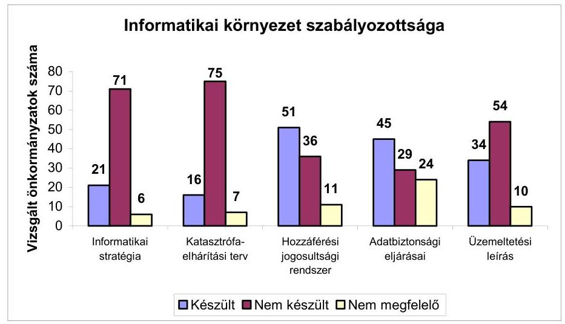

A megyei önkormányzatok, a megyei jogú városok, a kerületek fele, a városok $20 \%-a$, a nagyközségek $7 \%$-a rendelkezett informatikai stratégiával, amely a tárgyi és személyi feltételekre alapozva, tartalmazza az informatikai környezetével és az informatikai tevékenységekkel kapcsolatos terveket, elképzeléseket. Eltérő helyzetet mutatott a katasztrófa-elhárítási terv elkészítése, mivel az me-

[^0]
[^0]:    ${ }^{30}$ Számv. tv. 167. § (6) bekezdés: Ha a könyvviteli nyilvántartás, mint számviteli bizonylat technikai, optikai eljárás eredménye, biztosítani kell:
    a) az adatok vizuális megjelenítése érdekében azoknak - szükség esetén - a késedelem nélküli kiíratását,
    b) az egyértelmú azonosítás érdekében a kódjegyzéket.
    ${ }^{31}$ Számv. tv. 169. § (1) A gazdálkodó az üzleti évről készített beszámolót, valamint az azt alátámasztó leltárt, értékelést, főkönyvi kivonatot, továbbá a naplófőkönyvet vagy más, a törvény követelményeinek megfelelő nyilvántartást olvasható formában legalább 10 évig köteles megőrizni.
    (2) A könyvviteli elszámolást közvetlenül és közvetetten alátámasztó számviteli bizonylatot (ideértve a főkönyvi számlákat, az analitikus, illetve részletező nyilvántartásokat is), legalább nyolc évig kell olvasható formában, a könyvelési feljegyzések hivatkozása alapján visszakereshető módon megőrizni.
    (3) A szigorú számadású bizonylatok rontott példányaira is vonatkozik a (2) bekezdés szerinti megőrzési kötelezettség.
    (4) A megőrzési időn belüli szervezeti változás (ideértve a jogutód nélküli megszűnést is) nem hatálytalanítja e kötelezettséget, így az (1), illetve (2) bekezdés szerinti bizonylatok megőrzéséről a szervezeti változás végrehajtásakor intézkedni kell.

---

gyei önkormányzatoknál nem, a megyei jogú városok 17\%-ánál, a Budapest fővárosi kerületek 33\%-ánál, a városok 15\%-ánál, a nagyközségek 19\%-ánál készült el. Az informatikai rendszer üzemeltetési leírásaival a polgármesteri hivatalok $52 \%$-a rendelkezett.

A polgármesteri hivatalok a régi, elavult számítástechnikai eszközöket folyamatosan cserélték, annak ellenére, hogy az önkormányzatok 72\%ánál nem készült informatikai stratégia. Az önkormányzatok 46\%-a az informatikai rendszer fejlesztését különféle pályázati kiírásokhoz igazodva valósította meg. ${ }^{32}$

A polgármesteri hivatalok 27,6\%-ánál a számítógépek hálózatban múködtek, s ehhez megfelelő hardver infrastruktúra állt rendelkezésre. A számítógépeken viszont lokális programokat használtak, amelyek nem igényelték a hálózatos hozzáférést, a pénzügyi-gazdasági programok jelentős része nem integrált rendszerben múködött, nem használtak közös adatbázist.

A főkönyvi könyvelés és a beszámoló készítés számítógépes támogatottsága a polgármesteri hivataloknál megoldott volt, az analitikus nyilvántartások informatikai támogatottsága azonban még nem. Ezen kívül vásárolt, vagy fejlesztett programokkal is rendelkeztek, melyek egymástól függetlenül készültek, több esetben adatismétlődések is szerepeltek, mivel nem használtak közös adatbázist, illetve nem voltak kompatibilisek egymással. E probléma az informatikai rendszerre vonatkozó stratégia hiányának is következménye.

A hálózatos programrendszerek múködésének nagy előnye, hogy a hálózati rendszer programoknál már jól működik az illetéktelen behatolás elleni védelem (pl. jelszavas védelem), illetve az adatvédelem. A hálózati rendszer megfelelő használatához jogosultsági rendszert is ki kell alakítani, amelyet egyben a rendszer dokumentál is, továbbá a hálózati rendszerek a múködésükről folyamatos naplózást végeznek (feljegyzést készítenek).

Az önkormányzatok 56\%-a oldotta meg az informatikai folyamatok megfelelő múködésének biztosítását, üzemeltetési feladatok ellátását különböző formában, alkalmazottal (51,3\%), megbízási szerződéses informatikai szakemberrel $(6,6)$, illetve vállalkozási szerződéssel megbízott informatikai céggel ( $14,5 \%$ ). Az informatikai rendszergazda feladata többek között a belső munkavégzés informatikai támogatása, az informatikai rendszer múködésének felügyelete volt. Az informatikai eszközökről (hardver és szoftver) a polgármesteri hivatalok $85 \%$-a önálló nyilvántartási rendszert alakított ki, azonban a nyilvántartott adatok $9 \%$-a nem egyezett meg a számviteli nyilvántartásokkal.

A pénzügyi-számviteli területen dolgozók a számítógépes feladat ellátásához szükséges igazolt alapfokú informatikai képzettséggel az önkormányzatok közel 1/3-ánál rendelkeztek. Az informatikai képzettséggel nem rendelkező dolgozók az informatikai alkalmazás során sajátították el az általuk használt prog-

[^0]
[^0]:    ${ }^{32}$ Informatikai eszközök fejlesztésére pályázatokat az Informatikai és Hírközlési Minisztérium, a Miniszterelnöki Hivatal Informatikai Kormánybiztosa, megyei önkormányzatok és a Belügyminisztérium írtak ki.

---

ramok alkalmazáshoz szükséges ismereteket. A pénzügyi-számviteli területen számítógépen dolgozók munkaköri leírása a polgármesteri hivatalok 27\%-ánál nem tartalmazta, illetve 52\%-ánál részben tartalmazta az informatikai rendszer használatát, a használat során követendő feladatok, kötelezettségek leírását, a munkakörhöz kapcsolódó programkezelési ismeretek elsajátításának követelményét.

# 2. AZ ÖNKORMÁNYZATI FELADATOK ÉS A RENDELKEZÉSRE ÁLLÓ FORRÁSOK ÖSSZHANGJA 

### 2.1. A feladatok szervezeti megoldása

A helyi önkormányzatok vonatkozásában alkotmányos alapelv, hogy részére feladatot, hatáskört csak törvény állapíthat meg. Az önkormányzati önállóság kifejezésre jut abban, hogy az Ötv. 1. § (6) bekezdés a) pontjában foglaltak értelmében szervezetét és működési rendjét önállóan alakítja ki. Az önkormányzatok által nyújtott közszolgáltatások szervezeti keretei az elmúlt évtizedben kialakultak. A kötelező és önként vállalt feladatok ellátásában meghatározó volt a költségvetési szervek (önálló és részben önállóan gazdálkodó intézmény) szerepe.

Az önkormányzatok 77,5\%-a a törvényekben és ágazati jogszabályokban meghatározott kötelező és önként vállalt feladatai elhatárolását az SzMSz-ében nem rögzítette. A feladatkörök egyértelmű meghatározásához nem volt egységes a jogi szabályozás.

A képviselő-testületek által jóváhagyott SzMSz-ek konkrét feladat-meghatározást, az ellátandó feladatok teljes körű számbavételét nem tartalmazták.

A jogszabályokban az önkormányzat típusától, a település nagyságától függő feladat-meghatározások mellett az ellátási kötelezettség mértékének megítélése, a feladat-meghatározások értelmezése okozott gondokat. Nem minősültek célszerűnek a jogszabályokban használt „gondoskodik", „biztosítja" kifejezések, mivel a döntéshozó képviselők számára nem segítették a feladatok érdemi meghatározását, valamint az igények és a pénzügyi lehetőségek figyelembevételével történő rangsorolását. Csak a kötelező feladatokat határozta meg az Ötv. 8. § (4) bekezdésében foglaltakkal egyezően az önkormányzatok 7\%-a, 70,5\%-a a feladatok meghatározásáról, ellátás módjáról, annak szervezeti formáiról egy-egy módosítás során egyedileg döntött. A feladatok ellátási módját az SzMSz-ben a képviselő testületek nem hagyták jóvá, ezzel megsértették az Ötv. 8. § (2) bekezdésében foglaltakat.

A szociális, gyermekjóléti és családsegítő feladatokat, valamint a nevelési és oktatási feladatokat önálló illetve részben önállóan gazdálkodó költségvetési szerveivel oldották meg az önkormányzatok. Az egészségügyi alapellátás feltételei részben költségvetési szervek által részben feladatátadási megállapodással megalapozottan, vállalkozási szerződésekben meghatározott feltételek mellett valósult meg. A kommunális feladatok ellátását (az egészséges ivóvíz szolgáltatás és szennyvíztisztítás, köztisztasági és egyéb kommuná-

---

lis szolgáltatások) költségvetési szervek, gazdasági társaságok, (kht., kft., rt.) társulások, valamint vállalkozói szerződések által biztosították.

A képviselő testületek feladatellátást végző intézményi, szervezeti rendszer átfogó felülvizsgálatát - három önkormányzat kivételével - nem kezdeményezték, az ellátási alternatív módozatok elemzésével önálló előterjesztés keretében nem foglalkoztak. A szervezeti rendszer múködéséről az intézményvezetők beszámoltatása során az önkormányzatok 7\%-ánál kapott tájékoztatást önálló előterjesztésben a képviselő-testület, illetve az önkormányzatok 29\%-nál egy-egy részterület átszervezésre, a feladat módosulására szóló előterjesztések nyújtottak információkat. Az ellenőrzött önkormányzatok 77,6\%-a módosította a feladatellátás szervezeti rendszerét a 2000-2002. közötti időszakban. Az önkormányzatok 30,6\%-ánál a döntés az általuk alapított költségvetési szervek múködési, gazdálkodási formájának módosítására vonatkozott.

Önálló, vagy részben önálló költségvetési szervek létrehozására irányult a szervezeti módosítások 50\%-a, melyek 80\%-át a városi önkormányzatok kezdeményezték. Az ivóvíz szolgáltatás és szennytisztítás, köztisztasági és egyéb kommunális feladatok ellátása érdekében alapítottak költségvetési szerveket az önkormányzatok, megszüntetve a korábbi ellátás múködtetési formáját, (kft. kht., társulás). Az önálló, részben önálló költségvetési szervek átszervezését a szervezeti változást kezdeményező önkormányzatok 20\%-a hajtotta végre.

A költségvetési szervek összevonására, megszüntetésére a szervezeti módosítást végrehajtó önkormányzatok 30\%-ánál került sor.

A települési önkormányzatok és a megyei önkormányzatok között az Ötv-ben foglalt feltételek mellett az önkormányzatok 14,3\%-ánál történt körzeti feladat átadás-átvétel. Az Ötv. 70. § (1) bekezdése alapján a megyei önkormányzatok részükre kötelező feladataként meghatározott közszolgáltatást végző intézményeket vettek át a települési önkormányzatoktól.

A körzeti közszolgálati feladatok átadás-átvételét a szerződő felek megállapodásban rögzítették. A feladatátadás nem járt együtt a tulajdonjogok átadásával, továbbra is a városi önkormányzatok kötelezettsége maradt a fejlesztés és felújítás.

Hatvan Város Önkormányzata az intézményekhez kapcsolódó tulajdonjogát is felajánlotta, azonban annak átvételét a megyei önkormányzat nem támogatta.

A települési önkormányzat kezdeményezésére körzeti közszolgáltatást nyújtó intézményhálózat megyei fenntartásból való átvételére is sor került.

Zalaegerszeg Megyei Jogú Város Önkormányzata a Zala Megyei Önkormányzattal kötött megállapodás alapján 2002. július1-i időponttal átvette a színház fenntartói jogát, feladatellátással együtt. Rakamaz Város Önkormányzata a pedagógiai szakszolgálatot vette át a megyei önkormányzattól, amivel célja, hogy a helyben lakó gyermekek részére kényelmesebb, hatékonyabb szolgáltatást nyújtson. Szeghalom Város Önkormányzata a Sárréti Múzeum megyei önkormányzattól történő átvételéről döntött.

---

A Csongrád Megyei Önkormányzat 2001. július 1-től, megegyezés alapján a Földmúvelődésügyi és Vidékfejlesztési Minisztérium kezdeményezésére átadta az egyik szentesi szakképző intézmény fenntartói jogát.

A Budapest Fővárosi Önkormányzat részére Budapest Főváros II. és V. kerületei az önként vállalt közoktatási feladatot (felnőttoktatás, esti gimnáziumi oktatás) adták át.

Egyes igazgatási feladatokat - Budapest Főváros II. kerülete - más kerületi önkormányzatokkal létrehozott társulásokkal oldotta meg. (Szabálysértési hatósági feladatokat Budapest Főváros I. és III. kerület önkormányzataival, a mezőgazdasági feladatokat Budapest Főváros I., XI., XII. kerület önkormányzataival.)

Az Ötv. 63/B. § (2) bekezdésében foglaltak alapján Budapest főváros XXII. kerülete kilenc települési önkormányzattal és a főváros három kerületével (XI., XII., XXII.) megalakította Dél-Buda Környéki Területfejlesztési Önkormányzati Társulást, a térség területfejlesztési, építési és környezethasználati érdekeinek hatékonyabb érvényesítése céljából.

Az önkormányzatok 65\%-a élt az Ötv. 41-43. §-aiban, valamint a Társ. tv. által biztosított lehetőséggel.

- Az Ötv. és Társ. tv. alá tartozó társulási formákon belül 8,4\%-ot a hatósági igazgatási, $31,8 \%$-ot az intézményi, $37,4 \%$-ot a település és területfejlesztési, $22,4 \%$-ot az egyéb társulási formák képviseltek. Az intézményi társulási formán belül a közoktatás ellátására létrejött társulások aránya $32,3 \%$ volt. A megkötött megállapodások célja volt a szakmai munka színvonalának emelése, a szakos ellátottság biztosítása, az egy tanulóra eső fajlagos kiadások csökkentése. Az egyéb intézményi társulások a kötelező önkormányzati feladatok hatékonyabb ellátását segítették elő, a családi és gyermekjóléti feladatok, az egészségügyi alapellátás ügyeletei, és a szociális ellátások körében.
- A társulási formákon belül a területfejlesztési feladatok biztosítására létrejött társulásokban az önkormányzatok $43,5 \%$-a vett részt. A társulásokban való együttműködést a település és területfejlesztési programok összehangolása, kidolgozása, a fejlesztési forrásokat szolgáló pályázati lehetőségek kiaknázása, valamint a kapott támogatás hatékonyabb felhasználása motiválta.

A 2000-2002. közötti időszakban létrejött társulások 83,3\%-a a városokban alakult. A társulások 38,9\%-a a család, -gyermek és ifjúságvédelem, 27,8\%-a közoktatási, 11,1\%-a szociális, 22,2 \%-a egy-egy kötelező feladat - szennyvíztisztítás, köztisztasági és egyéb kommunális szolgáltatás - ellátására irányult.

A közhasznú szervezetek köre az ellenőrzött időszakban 36 szervezettel bővült, melynek $13,9 \%$-át megyei és megyei jogú városok, $25 \%$-át kerületi, $44,4 \%$-át a városi és $16,7 \%$-át a nagyközségi önkormányzatok hozták létre. Az alapított kht-k 50\%-a útkezelés, köztisztaság és egyéb kommunális szolgáltatási, 25\%-a közművelődési, 16,7\%-a ivóvíz- és szennyvíz-szolgáltatási 8,3\%-a gyermek-ifjúság és családvédelemi feladatot kívánt gazdaságosabban, célszerűbben ellátni.

A településüzemeltetés egyes területeit - ivóvíz-szolgáltatás, szennyvíztisztítás, köztisztasági feladatok - jellemző gazdasági társasági forma 2000-2002. év

---

között 17 társasággal bővült, 52,9\%-ban a kerületi és városi, 41,2\%-ban a megyei és megyei jogú városi és 5,9\%-ban a nagyközségi önkormányzatok alapításai által. A gazdasági társaságok létrehozásának célja alapvetően a köztisztasági és egyéb kommunális feladatok - ivóvíz-szolgáltatás és szennyvíztisztítás - gazdaságosabb ellátása volt.

Kötelező feladatokat 27 önkormányzat adott át megállapodásban rögzített ellátási kötelezettséggel vállalkozások részére a 2000-2002. években, ezek $60,6 \%$-a egészségügyi szak- és alapellátás, $27,2 \%$-a köztisztaság és egyéb kommunális feladat volt.

Az ellenőrzött önkormányzatok képviselő testületei - Budapest Főváros II. kerülete, Bács-Kiskun megye, Miskolc megyei jogú város, Csongrád város kivételével - nem értékelték a nonprofit szervezetek, egyéni és társas vállalkozások feladatellátásban betöltött szerepét, eredményességét.

A fogyatékos személyek jogairól és esélyegyenlőségük biztosításáról szóló 1998. évi XXVI. törvény 29. § (6) bekezdése előírja, hogy a jogszabály kihirdetésekor meglévő középületek akadálymentessé tételét fokozatosan, de legkésőbb 2005. január l-ig el kell végezni. Az ellenőrzött önkormányzatok 18\%-a nem foglalkozott az e törvényben előírt kötelezettségének teljesítéséhez szükséges feltételek felmérésével, kidolgozásával, és nem indította el annak megvalósítását.

A megyei, megyei jogú városok önkormányzatai az ellenőrzött időszakban felmérték a mozgáskorlátozott személyek akadálymentes közlekedését biztosító feladatokat és azok kialakításának becsült költségeit. A megvalósítások megkezdődtek, az időarányos teljesítések azt jelzik elő, hogy a rendelkezésre álló forrásaik szűkössége miatt a fedezet nem áll a rendelkezésükre, ezáltal törvényi határidőre a befejezés nem várható. A városi, kerületi és nagyközségi önkormányzatok $80 \%$-a felmérte az akadálymentesítésre szoruló építmények, épületek körét, pénzügyi szükségletét. A folyamatban lévő beruházások tervezése és kivitelezése során törvényi kötelezettség alapján gondoskodtak megvalósításukról.

# 2.2. Egyes naturális mutatókkal mérhető feladatok finanszírozása 

Az ellenőrzött önkormányzatok által ellátott kötelező feladatok közül - az előző évekkel egyezően - a szociális ellátás és a közoktatás egyes feladatainak kiadásait tekintettük át, az ellátási kötelezettséghez igazodóan a megyei, megyei jogú városi, főváros kerületi, a városi és a nagyközségi önkormányzatoknál.

Az oktatási-nevelési és szociális intézményekben a 2000-2002. években a fenntartási és működési kiadások növekedését tapasztaltuk, részben a központi és részben az önkormányzati döntések eredményeképpen. A központi intézkedések közül meghatározóak a személyi kiadások és járulékai körében végrehajtott változások, amelyek valamennyi ellátásban éreztették hatásukat:

---

- a közalkalmazottak garantált illetménye -2001. január l-től ${ }^{33}$ - minden fizetési fokozatban 8,7\%-kal nőtt. 2002. január l-től ${ }^{34}$ - a bértábla módosulása miatt ez a növekmény, a 2001. évihez viszonyítva, átlagosan 7,6\% volt. 2002. szeptember l-jétől ${ }^{35}$ a közalkalmazottak körében 50\%-os mértékű illetményemelésre került sor;
- a Kjt. módosításai következtében változott az illetménypótlék számítási alapja is. A pótlékalap összege 2000. évben 14600 Ft, 2001. évben 15900 Ft, 2002. évben 17100 Ft volt;
- a munkabérek kötelező legkisebb összege a 2000. évi 25000 Ft-ról 2001. január l-jétől ${ }^{36} 40000$ Ft-ra, 2002. január l-jétől ${ }^{37} 50000$ Ft-ra emelkedett.
- a személyi juttatások növekedésével arányosan emelkedtek a munkaadókat terhelő járulékok összegei is.

A fajlagos kiadások megfigyelése a szociális ellátás feladatköréből a bölcsődei, bentlakásos, valamint nappali szociális intézmények működtetési kiadásaira és azok forrásainak alakulására terjedt ki.

A 0-3 éves gyermekek napközbeni bölcsődei gondozását Salgótarján megyei jogú város, és a városi önkormányzatok 38,2\%-a (21 város) nem szervezte meg. A 2000-2002. években az egy ellátottra jutó kiadások 26,6\%-kal emelkedtek, a működési kiadások $25,3 \%$-os növekedése és az ellátottak számának 1,0\%-os csökkenésének eredményeképpen.

A főváros kerületi önkormányzatai az országos átlaghoz képest 12,9\%-kal többet - 1056763 Ft/fő -, míg a városok 16,3\%-kal kevesebb, - 783690 Ft/fő - kiadás mellett biztosították a bölcsődés korú lakosság ellátását 2002. évben.

A fajlagos kiadások legmagasabb mértéke Budapest föváros V. kerület önkormányzatánál volt, 1236500 Ft/fő összegben 2002. évben, ami a 2000. évhez képest 13,7\%-kal alacsonyabb. A mutatószám alakulása a működtetésre fordított kiadások 17,1\%-os, és az ellátottak számának 4\%-os csökkenésének hatására következett be, egy bölcsőde bezárásra került az ellenőrzött időszakban. Hajdászoboszló Város Önkormányzatánál az egy ellátottra jutó kiadások 43,3\%-kal emelkedtek ( 869381 Ft/főről 1246189 Ft/főre), a 26,3\%-os múködési kiadás emelkedése, intézménybővítéssel összefüggő üzemeltetési ráfordítás növekedése, valamint az ellátotti létszám 11,9\%-os csökkenése eredményeképpen.
${ }^{33}$ Megállapította a Magyar Köztársaság 2001. és 2002. évi költségvetéséről szóló 2000. évi CXXXIII. törvény 81. § (6) bekezdése és 16. számú melléklete.
${ }^{34}$ Megállapította a Magyar Köztársaság 2001. és 2002. évi költségvetéséről szóló 2000. évi CXXXIII. törvény 81. § (6) bekezdése és 16. számú melléklete
${ }^{35}$ Megállapította a Magyar Köztársaság 2001. és 2002. évi költségvetéséről szóló 2000. évi CXXXIII. törvény módosításáról szóló 2002. évi XXIII. törvény 17. § (4) bekezdés.
${ }^{36}$ A kötelező legkisebb munkabér (minimálbér) megállapításáról szóló 197/2000. (XI.27.) Korm. rendelet.
${ }^{37}$ A kötelező legkisebb munkabér (minimálbér) megállapításáról szóló 224/2001 (XI.21.) Korm. rendelet.

---

A legkisebb fajlagos ráfordítás mellett biztosították 10 fő bölcsődés korú ellátását Tét városban, átlag 284400 Ft/fő, valamint Szeghalom városban - 22 fő - 386591 Ft/fő összegben, ami a városok 2002. országos átlagához képest $33,2 \%$ illetve $45,1 \%$-nak felelt meg.

Az egy bölcsődés korú ellátottra jutó működtetési kiadás forrását 2002. évben az országos átlag adatai alapján $22 \%$-ban az állami hozzájárulás, $70 \%$-ban az önkormányzati támogatás, és $8 \%$-ban intézményi bevételek képezték. Az önkormányzatok körében 2000-2002. közötti időszakban az egy főre jutó állami hozzájárulás összege 51,6\%-kal emelkedett, az állami támogatás mértékének 50,0\%-os növekedése, és az ellátottak számának 1,0\%-os csökkenésének következtében. Egy bölcsődés gondozásához az önkormányzatok 2000. évhez képest 24,4\%-kal több forrás fordítottak 2002. évben, melyben az önkormányzati támogatás $23,2 \%$-os mértékű bővülése, valamint az ellátottak számának 1,0\%-os csökkenése éreztette hatását. Az ellenőrzöttek körében egy ellátott kiadásához átlag 594875 Ft/fő önkormányzati hozzájárulást biztosítottak, ezen belül a fővárosi kerületek 821578 Ft/fő, a városok 438936 Ft/fő átlagot jelentettek.

Marcali Város Önkormányzatánál az ellenőrzött időszakban egy ellátott kiadásának fedezéséhez az önkormányzati hozzájárulás a városok körében legmagasabb mértékú volt. Az önkormányzati támogatás az ellenőrzött időszakban - 281851 Ft/főről 749512 Ft/főre - 166\%-kal emelkedett, ami a bölcsődés korú ellátottak számának 43,6\%-kal csökkenése, az önkormányzati támogatás összege 50\%-os növekedésének volt a hatása.

Az önkormányzati hozzájárulás legalacsonyabb mértéke Szeghalom Város Önkormányzatánál volt látható. Az egy főre jutó támogatás $188276 \mathrm{Ft} /$ föről 177790 Ft/főre módosult, melyet az önkormányzati hozzájárulás összegének $1,1 \%$-os csökkenése és az ellátotti létszám 4,8\%-os emelkedése befolyásolt. Az önkormányzati hozzájárulás csökkenését az állami hozzájárulás mértékének $45,8 \%$-os emelkedése tette lehetővé, ami hatására a kiadások finanszírozási forrásainak összetételében jelentős módosulás történt. A működtetési kiadás finanszírozásában az állami támogatás $11 \%$-os növekedés mellett az önkormányzati hozzájárulás $11 \%$-kal kevesebb volt, ezáltal biztosítottá vált az egy ellátottra jutó kiadások $16,6 \%$-os emelkedésének fedezete.

A nappali szociális ellátást nyújtó intézmények típusai az idősek klubja, a fogyatékosak, a szenvedélybetegek, pszichiátriai betegek nappali intézményei, továbbá a nappali melegedő, melyek elsősorban a saját otthonukban élők részére biztosítanak lehetőséget a napközbeni tartózkodásra.

Az ellenőrzött önkormányzatok a nappali szociális ellátást nyújtó - intézményhálózat kialakításáról - három megyei, hét város és 13 nagyközségi önkormányzat kivételével - gondoskodtak. Az önkormányzatok által működtetett nappali szociális intézményekben a 2002. évben egy ellátottra jutó kiadás 280215 Ft/fő volt, mely 32,4\%-kal haladta meg a 2000. évi 211572 Ft/fő összegét, a múködésre fordított kiadások 32,2\%-os emelkedésével összefüggésben. Az önkormányzatoknál 2000-2002. év között az állami hozzájárulás aránya $41 \%$-ról $52 \%$-ra emelkedett, elsősorban a központi bérintézkedések hatására. Az önkormányzati források 2000. évi 43\%-os részaránya 2002. évre $31 \%$-ra csökkent. Az intézményi saját bevételek szerepe közel azonos szintű $16 \%$-os volt.

---

A legmagasabb önkormányzati támogatással - 526950 Ft/fő - működtette Újfehértó Város Önkormányzata 2002. évben a négy fő ellátását szolgáló nappali intézményt, mellyel a múködtetés kiadásainak 63,4\%-át finanszírozta, ezt egészítette ki 19,4\%-os mértékben az intézményi saját bevétel, valamint a 17,2\%os részaránnyal az állami hozzájárulás.

Önkormányzati támogatás nélkül nyújtotta az ellátást a Bács-Kiskun Megyei Önkormányzat által alapított intézmény, mely múködtetését 91,7\%ban normatív állami támogatás és $8,3 \%$ intézményi saját bevétel biztosított.

Az ellátottakra fordított kiadások fedezetében meghatározó szerepet, legnagyobb részarányt képviselt - 42,9\%-ot - az intézményi saját bevétel Marcali Város Önkormányzata intézményében, amit az állami támogatás $25,7 \%$-kal, önkormányzati forrás $31,4 \%$-kal egészített ki.

Az egy főre jutó kiadások jelentős eltéréseit befolyásolta az önkormányzat által alapított intézmények alapító okiratában meghatározott alaptevékenységek köre, a szakmai integráció foka. A költségvetés tervezés és beszámolás rendje az adott feladatcsoportba tartozó valamennyi kiadás egy közös szakfeladaton való elszámolását ${ }^{38}$ írta elő. Ezáltal együttesen került megtervezésre és elszámolásra a nappali gondozásra szoruló időskorúak, fogyatékosak, valamint a szenvedélybetegek részére fenntartott klubok és egyéb nappali intézmények tevékenységével kapcsolatban felmerülő összes bevétel és kiadás. Az egyes ellátási formák kiadásaiban tükröződik a szakmai követelményrendszer feltételeinek - személyi és tárgyi - eltérése.

Az önkormányzatok által fenntartott bentlakásos szociális intézmények az önmaguk ellátására nem, vagy csak folyamatos segítséggel képes idősek, pszichiátriai és szenvedélybetegek, fogyatékos személyek, valamint hajléktalanok részére otthoni ápolást és gondozást nyújtanak. Az intézmények fenntartási, múködtetési kiadása egy ellátottra 2000-2002. években 803176 Ft/fő - 887652 Ft/fő -1 129771 Ft/fő volt. A jelentős, $41 \%$-os növekedést a közalkalmazotti béremelés okozta. A működtetés ráfordításai 44,5\%-kal emelkedtek, az ellátottak köre 2,6\%-kal bővült. A kiadások finanszírozásban 2000-2002. évben az állami támogatás részaránya $45 \%-45 \%-41 \%$-os, az önkormányzati hozzájárulás aránya $28 \%-30 \%-32 \%$-ra emelkedett, az intézményi saját bevételek közel azonos $-27 \%-25 \%-27 \%$ - szintje mellett.

Az önkormányzatok a feladatellátást eltérő egységnyi ráfordítás mellett valósították meg, az ellátottak ápolási és gondozási igénye, az eltérő szakmai követelmények - élelmezés, elhelyezés, textília, gyógykezelési szükséglet, épületek üzemeltetési feltételei - biztosítása miatt. A kiadások finanszírozását szolgáló források arányában eltérések mutatkoztak az ellátottak összetétele, a saját hatáskörben megállapított térítési díjak, és a fenntartók általi hozzájárulással öszszefüggésben.

A legmagasabb egységnyi ráfordítás mellett nyújtotta az ellátást Budapest Főváros IV. kerületének Önkormányzata, 2000. évről 2002. évre a fajlagos

[^0]
[^0]:    ${ }^{38}$ PM tájékoztató a költségvetési szervek részletes költségvetési előirányzatainak összeállítására szolgáló nyomtatványgarnitúrák kitöltéséhez (2002. évi kiadvány).

---

és a teljes múködési kiadások egyaránt nőttek, 2,7, illetve 6,5-szeresükre. A megnövelt férőhelyi kapacitás nem került megfelelően kihasználásra, a 2002. évben 12 fő gondozását 2631417 Ft/fő mellett valósították meg. A kiadások fedezetében meghatározó volt az önkormányzat szerepe, 70,8\%-os támogatással, az állami hozzájárulás $20,4 \%$, intézményi saját bevétel $8,8 \%$ forrást képezett.

A legalacsonyabb egységnyi kiadás jellemezte a Makó város önkormányzatának fenntartásában múködő intézményt, a 2000. évben $272000 \mathrm{Ft} /$ fő, a 2002. évben $325722 \mathrm{Ft} /$ fő összeggel. Az elmúlt három évben a múködtetéshez z önkormányzat támogatást nem biztosított, az állami támogatás összegét sem fordította teljes egészében az ellátás finanszírozására, a 2000. évben 30\%-át, illetve 2002. évben $40,6 \%$-át más feladatra fordította.

A közoktatás feladatcsoportból az adatok megfigyelése az óvodai nevelésre, iskolai életmódra felkészítésre, valamint a nappali rendszerú, általános iskolai oktatásra terjedt ki.

Az óvodai nevelés fajlagos kiadása 2000-2002. év között 55,8\%-kal emelkedett, amely a múködési kiadások 43,6\%-os emelkedése, valamint az óvodai ellátás igénybevételének 7,8\%-os csökkenésének hatására következett be. A fajlagos mutatók átlagai 2000-2002. év között 202160 Ft/fő, - 249659 Ft/fő, - 315002 Ft/fő volt. Az óvodai nevelés kiadásainak finanszírozásban az önkormányzatoknál meghatározó szerepet a normatív és központosított állami támogatás jelentett, a 2000. évben $52 \%$ volt, ami a 2002. évre $48 \%$-ra csökkent, a támogatások átlag $30 \%$-os emelkedésének ellenére. Az önkormányzatok által nyújtott hozzájárulások részaránya a vizsgált időszak első évéhez képest $37 \%$-ról $49 \%$-ra emelkedett, az intézményi saját bevételek forrásképző szerepe $11 \%$-ról $5 \%$-ra csökkent.

Az önkormányzatok közül 2000-2002. években a legkisebb ellátotti létszám mellett (36, 20, 14 fő) a legmagasabb egy főre jutó múködési kiadással 1823278 Ft/fő - 1272150 Ft/fő - 1300429 Ft/fő - Szabolcs-Szatmár-Bereg Megyei Önkormányzat múködtette az óvodát. Az egy ellátottra jutó kiadás három év alatt 27,3\%-kal csökkent, elsősorban a múködési kiadás 72,3\%-os, valamint az ellátottak számának 61,1\%-os csökkenésének eredményeképpen. Az óvoda múködtetésének forrásai között az önkormányzati támogatás volt mindhárom évben a meghatározó, mértéke $83 \%$ felett volt.

Az óvodai nevelés, iskolai felkészítést a legkisebb (186 061 Ft/fő) egységnyi kiadással valósították meg Cigánd Nagyközség Önkormányzatánál 2002. évben, mely az ellenőrzött időszak első évéhez viszonyítva 64,9\%-os növekedést jelent, a múködési kiadások 79,4\% valamint az ellátotti létszám 8,8 \% emelkedésének hatására.

A múködtetés finanszírozásában a 2000-2002. években növekvő, az átlagot meghaladó szerepet vállaltak a Budapest fővárosi kerületek önkormányzatai, mert a 2000. évben az óvodai ellátás kiadásához 54\%, a 2002. évben $59 \%$ támogatást biztosítottak, az intézményi bevételek részarányának 2,6\%-ről $2,1 \%$-ra történő csökkenése mellett.

Makó Város Önkormányzata a vizsgált időszak valamennyi évében önkormányzati támogatás nélkül múködtette az óvodai intézményhálózatát, az egységnyi ráfordítás forrását a 2000. évben $81,6 \%$-os mértékben a normatív és központosított állami támogatások, $18,4 \%$-os részarányban az intézményi saját

---

bevételek biztosítottak. A 2002. évre belső arányeltolódást figyelhettünk meg, az intézményi saját bevételek részaránya $37,2 \%$-ra emelkedett, a normatív és központosított támogatás részaránya $62,8 \%$-ra mérséklődött.

Az általános iskolai oktatásban részesülők száma a 2000-2002. év között folyamatosan csökkent, melynek mértéke a 200l. évben az előző évhez viszonyítva $1,4 \%$, majd a 2002 . évben további $2,2 \%$ volt.

Az általános iskolai oktatásban részesülő egy gyermekre fordított kiadás 2002. évben 246988 Ft/fő volt, mely a 2000. évhez viszonyítva $42,8 \%$-kal növekedett, a működtetés kiadásainak $37,8 \%$ emelkedése, valamint a 3,6\%-os létszámcsökkentés hatására. Az önkormányzatoknál a fajlagos ráfordítások szélső értékei 2000. évben 107496 Ft/fő, - 300400 Ft/fő, a 2002. évben 155280 Ft/fő, - 454696 Ft/fő között alakultak. A 2002. évi országos átlagot nem érték el a megyei jogú városok és városok egységnyi ráfordításai.

Legkisebb ráfordítás mellett biztosította a feladatellátást 2002. évben Polgárdi Város Önkormányzata, 155280 Ft/fő összeggel, mely 2000. évhez képest $34,7 \%$-os emelkedést mutatott, amelyben a múködtetés kiadásának 30,9\%os emelkedése, valamint az oktatásban részesülők számának 2,8\%-os csökkenése éreztette hatását. A kiadások finanszírozásában meghatározó volt az állami támogatás $(99,1 \%)$.

Az országos átlagnál 12,3\%-kal alacsonyabb támogatási arány mellett múködtette a 2002. évben Székesfehérvár megyei jogú város önkormányzata alapfokú intézményhálózatát, annak ellenére, hogy a 2000. évhez képest 50\%kal emelkedett az egy gyermekre fordított oktatási kiadás. A növekedést a múködési kiadások $45,9 \%$-os emelkedése eredményezte, az oktatásban részvevők körének $2,8 \%$-os csökkenése mellett. A fajlagos kiadásokból a normatív állami hozzájárulás és a központi támogatás $62,8 \%$, az önkormányzati forrás $31,8 \%$, intézményi saját bevétel $5,4 \%$ részarányt fedezett.

Az alapfokú oktatást legnagyobb egységnyi ráfordítással a megyei és a Budapest fővárosi kerületi önkormányzatokat működtették.

Szabolcs-Szatmár-Bereg Megyei Önkormányzata a legmagasabb egy főre jutó kiadással biztosította az alapfokú oktatási ellátást. A 2002. évben 454696 Ft/fő egységnyi kiadás az országos átlagot 197364 Ft/fő összeggel, 130,4\%-kal haladta meg. A kiadások az ellenőrzött időszakban lineárisan növekedtek - a 200l. évre $26,4 \%$-kal, a 2002. évre $25,6 \%$-kal - az előző évihez viszonyítva, ugyanakkor a tanulói létszám hullámzása - a 200l. év 9,7\% növekedés, 2002. év 3,5\% csökkenés - volt megfigyelhető.

Budapest Főváros V. kerület Önkormányzata a 2002. évben 361855 Ft/fő az alapfokú oktatás egységnyi kiadása $40,6 \%$-kal volt magasabb az országos átlagnál. A 2000-2002. évek között a fajlagos kiadások emelkedése 26,4\% volt, a kiadások $18,1 \%$-os emelkedése és a létszám $6,5 \%$-os csökkenés hatására. Az általános iskolai oktatás finanszírozásában az önkormányzati támogatás közel 59\%-os részarány képviselt. Az állami szerepvállalás a hozzájárulás $29,7 \%$-os, a központi támogatás $6,5 \%$-os emelkedése ellenére $40 \%$-ban biztosította a kiadások finanszírozását. Az intézményi saját bevételek részaránya $0,5 \%$-os mértékủ emelkedés mellett a kiadások fedezetében $1 \%$-ot tett ki a vizsgált időszakban.

---

Az ellenőrzött önkormányzatok által működtetett általános iskolai intézményhálózat kiadásainak finanszírozásában az állami támogatások aránya a 2000. évi $66 \%$-ról a 2002. évre $68 \%$-ra emelkedett, az önkormányzati hozzájárulás csökkenésével - 30,2\%-ról 27,5\%-ra - egyidejúleg. Az intézményi saját bevételek a 2000. évben 3,7\%-kal, a 2002. évben 4,5\%-kal járultak hozzá a múködtetéshez.

Az alapfokú iskolai oktatás elkülönített számviteli nyilvántartási rendszere az önkormányzatoknál nem alakult ki, ezért nem biztosított az egyes feladatok, ellátási formák kiadásairól és bevételeiről a pontos információ. Az önkormányzatok, illetve intézményeik a „nappali rendszerü, általános múveltséget megalapozó iskolai oktatás," szakfeladatán tervezték meg, és számolták el a tevékenységgel összefüggő kiadásaikat és bevételeiket.

Ez a szakfeladat a hatályos előirás ${ }^{39}$ alapján, nappali rendszerú általános iskolai, gimnáziumi oktatásban, az oktatási törvény alapján múködő szakközépiskolai oktatásban, továbbá a közoktatási törvény szerinti nappali rendszerú iskolai oktatás általános műveltséget megalapozó pedagógiai szakaszának évfolyamain, a tanórai és tanórán kívüli foglalkozásokkal, az iskola pedagógiai irányításával, a szakmai feladat ellátásához kapcsolódó további tevékenységekkel, valamint a tanulókkal kapcsolatos bevételek és kiadások elszámolására szolgál.

Az intézményi vagyon működtetéséhez szükséges kiadások és felmerült bevételek elszámolása az oktatási ágazat egészére egy közös szakfeladaton jelent meg. Ezáltal az oktatás-szakmai feladatokhoz közvetlenül nem kapcsolódó, de annak lényeges feltételeit jelentő kiadások és egyéb bevételek (gondnoki tevékenység, gépjármú üzemeltetés, szállítás, portai és éjjeliőri szolgáltatás, karbantartás) nyilvántartásának, megállapításának feltételei hiányoznak.

# 2.3. Az önként vállalt feladatok ellátására fordított kiadások 

A jelentős ráfordítást igénylő önként vállalt feladatok kiadásai, költségvetésen belüli részesedése a megyei, megyei jogú városi, kerületi, városi, nagyközségi önkormányzatoknál számottevő, ezért az összegzésnél ezek adatait értékeltük.

Az önként vállalt feladatokat SzMSz-ben, vagy más rendeletben az önkormányzatok 29,6\%-a határozta meg. A kötelező és az önként vállalt feladatok meghatározását, elhatárolását a többi önkormányzat nem végezte el, elsősorban a törvényekben szereplő feladat-meghatározások egyértelműségének hiánya miatt. Az önkormányzatoknál az önként vállalt feladatok megoldására fordított kiadásokat külön kigyűjtés alapján vizsgáltuk, tekintettel, arra hogy a számviteli nyilvántartásokban az önként vállalt feladatokra fordított kiadások elkülönített vezetése nem jogszabályban előírt kötelezettség és a polgármesteri hivatalok saját hatáskörben sem alakították ki ennek nyilvántartási rendszerét.

[^0]
[^0]:    ${ }^{39}$ PM tájékoztató a költségvetési szervek 2001-2002. évi részletes költségvetési előirányzatainak összeállítására szolgáló nyomtatvány-garnitúrák kitöltéséhez

---

Az önkormányzatok költségvetésében az önként vállalt feladatok költségvetési részesedése a 2000. évi 14,3\%-ról a 2001. évben 1,7\%-kal csökkent, 2002. évben az előző évivel azonos (12,6\%) volt. Az önként vállalt feladatokhoz nyújtott források növekvő arányban - a 2000. évben 65,4\%, míg a 2002. évben 79,5\%-ban - a múködtetés fedezetét szolgálták. Az önként vállalt feladatok ellátására fordított kiadások a 2000-2002. év között 42,5\%-kal emelkedtek, a felhalmozási célú kiadások 17,2\%-kal bővültek. Az önként vállalt feladatok ellátásának szervezeti kereteiben meghatározóak voltak az önkormányzati alapítású költségvetési intézmények, amelyek alapvetően szociális, oktatási és egészségügyi szakellátásra irányultak.

A vizsgált Budapest fővárosi kerületi önkormányzatok önként vállalt feladatként a középiskolai oktatási intézmény fenntartásáról gondoskodtak, ezen túlmenően négy kerületben - Budapest főváros IV., X., XIX., XII. - az alapfokú művészeti oktatás, míg három kerületben - II., V., XIX., - az egészségügyi szakellátás szervezeti kereteiről és múködtetéséről határoztak..

A városi önkormányzatok 36,4\%-a középfokú oktatást, 18,2\%-a szociális ellátást biztosító intézmények fenntartását vállaltak, a múködtetés kiadásainak fedezetét normatív állami támogatás mellett az önkormányzat saját forrása nyújtotta. Egészségügyi szakellátás szolgáló intézményt a városi önkormányzatok 23,6\%-a tartott fenn, mely múködtetésének forrását az OEP általi finanszírozásból biztosította.

A nagyközségi önkormányzatok 22,2\%-a alapfokú művészeti oktatást, zeneiskolát és középfokú oktatási intézményt tartott fent, 29,6\%-a az idősek bentlakásos szociális ellátásáról gondoskodott, a múködtetés pénzügyi feltételeit elsősorban a normatív állami támogatás fedezte, amely az intézményi saját bevétellel és önkormányzati hozzájárulással egészült ki.

A megyei és megyei jogú városi önkormányzatok önként vállalt feladatellátásához költségvetési kiadásaik 1\%-a alatti mértékében járultak hozzá.

A megyei önkormányzatok a nemzetközi kapcsolatokra és az Európai Uniós együttműködésre, valamint a művészeti és sport tevékenységek támogatására helyezték a hangsúlyt.

A megyei jogú városok önkormányzatai színházak, szimfonikus zenekarok, rendezvények, kiadványok megjelentetését, társadalmi szervezetek támogatását vállalták önként.

A nem kötelező feladathoz kapcsolódó, múködési célú, államháztartáson kívülre történő pénzeszköz átadás mértéke a városi és nagyközségi önkormányzatok 64,5\%-ában nem érte el a költségvetési kiadások 1\%-át, melyeket sportegyesületek, társadalmi és civil szervezetek, egyházak, alapítványok támogatására fordítottak. A nem kötelező feladatok ellátásához az államháztartáson kívülre felhalmozási célú pénzeszközt vállalkozások, első lakáshoz jutók, nonprofit szervezetek támogatására adtak át az önkormányzatok. Az ellenőrzött önkormányzatoknál az önként vállalt feladatok finanszírozása 2000-2002. években nem veszélyeztette a kötelezően ellátandó feladatok végrehajtását.

---

Az önkormányzatok a feladataikhoz mérten szűkös bevételi lehetőségeik bővítése érdekében a 2000-2002. év között múködési és fejlesztési céljaik megvalósításához pénzátvételek és pályázatok útján is többletforrásokhoz jutottak. Az államháztartáson belülről átvett pénzeszközök fontosabb múködési célú jogcímei a közhasznú foglalkoztatás és a mozgáskorlátozottak közlekedési támogatási voltak. A központi költségvetés által, különböző pályázati rendszerek keretében elnyert támogatások a szennyvízhálózat kiépítését, a bérlakások építését, a szelektív hulladékgyűjtés tárgyi feltételeinek biztosítását, az oktatási és egészségügyi intézmények rekonstrukcióját, az oktatás taneszköz ellátását és a szakképzés gyakorlati feltételeinek javítását segítették elő.

# 3. A BELSŐ IRÁNYÍTÁSI, ELLENŐRZÉSI RENDSZER MŰKÖDÉSÉNEK ÉRTÉKELÉSE 

### 3.1. Az ellenőrzési rendszer kialakítása, múködése

Az önkormányzatok számára, gazdálkodásuk belső ellenőrzésére vonatkozóan az Ötv., az Áht. és a Htv. határoz meg kötelező feladatokat. Az Ötv. 92. § (2) bekezdése a saját intézmények pénzügyi ellenőrzését és az önkormányzat gazdálkodásának belső ellenőrzését írja elő. A Htv. 138. § (1) bekezdés g) pontja a képviselő-testület részére, a 140. § (1) bekezdés e) pontja pedig a jegyző számára határoz meg feladatokat a költségvetési szervek ellenőrzését illetően. Az önkormányzati gazdálkodás szabályszerűségéért az Ötv. 90. § (1) bekezdés alapján a polgármester a felelős. Az ellenőrzött önkormányzatok részére nem volt egyértelmú, hogy a polgármesteri hivatal függetlenített belső ellenőrzési feladatainak irányítását, vezetését a gazdálkodás szabályszerűségéért felelős polgármester, vagy a Htv. 140. § (1) bekezdés e) pontja alapján a jegyző biztosítsa. Az Áht. 97. § (1) bekezdése és az Áht. 121/A. § (2) bekezdése a költségvetési szerv vezetőjéhez kapcsolja a belső ellenőrzési feladatok ellátását. A polgármesteri hivatalok, mint költségvetési szervek vezetését az Ötv. 36. § (2) bekezdése alapján a jegyző, irányítását az Ötv. 35. § (2) bekezdése alapján a polgármester biztosítja. Az ellenőrzés során mindkét megoldást elfogadtuk a feladat szervezeti keretének kiépítése és ellátása esetén. Az önkormányzatok eltérő módon szervezték meg ellenőrzési rendszerüket.

Az Áht. 120. § (2) bekezdés b) pontja ${ }^{40}$ alapján az államháztartás belső pénzügyi ellenőrzését az előzetes ellenőrzések rendszere mellett a függetlenített (utólagos) belső ellenőrzési szervezet útján kell ellátni. Az Áht. 2003. november 26ig hatályos 121. § (1) bekezdése előírta, hogy az ellenőrzést elrendelő szerv vezetőjét az ellenőrzés megállapításairól, javaslatairól jelentésben kell tájékoztatni. A 2003. november 27-től hatályos Áht. 120/A. § (2) bekezdése, valamint a 121/A. § és a Ber. rendelkezései részletesen szabályozták a költségvetési szervek belső ellenőrzésének szervezeti és tartalmi követelményeit. A megállapításoknál a 2003. november 26-ig hatályos előírások teljesítését ellenőriztük.

[^0]
[^0]:    ${ }^{40}$ 2003. január 1-től 2003.november 26-ig hatályos.

---

Az önállóan gazdálkodó intézmények felügyeleti (pénzügyi) ellenőrzését az önkormányzatok 52,9\%-a szabályozta.

Az ellenőrzésre kötelezett megyei és a megye jogú városi önkormányzatok 100\%a, a kerületi önkormányzatok $83,3 \%$-a, a városok $69,4 \%$-a, a nagyközségek $20 \%$ a és a községek $12,5 \%$-a készítette el az önállóan gazdálkodó intézmények felügyeleti jellegú ellenőrzési szabályzatát.

Az önkormányzatok 57\%-a szabályozta valamilyen formában (rendeletben, SzMSz-ben, polgármesteri vagy jegyzői szabályzatban) a polgármesteri hivatal belső ellenőrzésének szervezeti feltételeit, módját. Az ellenőrzött megyei és megyei jogú városi és Budapest fővárosi kerületi önkormányzatok közül egy (Csongrád megye) nem alakította ki a polgármesteri hivatal belső ellenőrzésének rendjét. A városok $81,8 \%$-a, a nagyközségek $66,7 \%$-a, a községek $48,2 \%$-a készített szabályzatot.
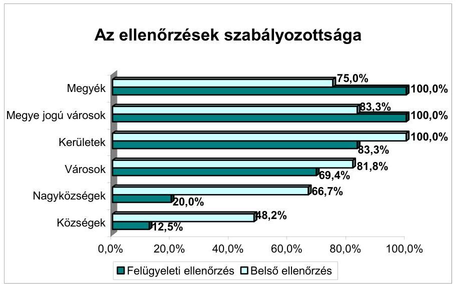

Az elkészített belső ellenőrzési szabályzatok 44,7\%-a általános megfogalmazásokat tartalmazott, azok szerkezete és részletezettsége nem volt alkalmas az ellenőrzési tevékenység megszervezésére és az ellenőrzési munka számára konkrét, a gyakorlatban is hasznosítható iránymutatásra. Jellemző volt a helyi viszonyokra való adaptáció hiánya, nem határozták meg a feladatellátás szervezeti formáját, a függetleníttett belső ellenőrzés módját, az elvégzendő feladatokat. A községeknél ez az arány az átlagosnál rosszabb (55,4\%), míg a városok, nagyközségek, kerületek esetében lényegesen jobb $(28,9 \%, 27,8 \%, 16,7 \%)$.

Zalaegerszeg Megyei Jogú Város önkormányzatánál a munkafolyamatba épített ellenőrzés leírásakor az általános szervezési, felelősségi szabályokat rögzítették, elmaradtak a konkrét feladat meghatározások. Miskolc megyei jogú város belső ellenőrzésének átfogó szabályozását fogadta el a Közgyűlés, a részletes szabályozás kidolgozása, melyre a Közgyűlés a polgármestert hatalmazta fel, elmaradt. Szekszárd megyei jogú város esetében az ellenőrzés célja és feladatai általános jelleggel kerültek megfogalmazásra.

---

Az önállóan gazdálkodó intézmények ellenőrzésének gyakoriságát az önkormányzatok 32,7\%-a határozta meg. A nagyközségek és községek egyike sem gondoskodott ennek meghatározásáról. Kedvezőbb a kép a nagyobb településeknél: a megyék, megyei jogú városok és a fővárosi kerületek $68,8 \%-a$, a városok $46,9 \%$-a rögzítette az intézmények ellenőrzések gyakoriságát. Az önkormányzatok 66\%-a kétévenkénti, 15\%-a háromévenkénti, 9,0\%-a négyévenkénti, $6 \%$-a évenkénti, egy önkormányzat pedig az intézmények 5 évenkénti ellenőrzési gyakoriságát határozta meg.

Miskolc Megyei Jogú Város Önkormányzata esetében az ötévenkénti ellenőrzések nem tették lehetővé, hogy az ellenőrzés tapasztalatait a vezetés kellő mértékben hasznosítsa akadályozta, hogy az ellenőrzés megfelelő időben tárja fel a hibákat és elősegítse azok gyors kijavítását.

Az önkormányzatok 27,2\%-a készített éves ellenőrzési tervet, melyben az adott évi feladatokat ütemezték. A megyék, megyei jogú városok, kerületek egy kivétellel (Miskolc megyei jogú város) készítettek éves ellenőrzési tervet. A városok esetében az átlagosnál jobb (69\%), a községek esetében az átlagosnál rosszabb $(13,9 \%)$ volt az arány.

Az önállóan gazdálkodó intézményeknél elvégzendő ellenőrzési feladatok ellátásának feltételeit az önkormányzatok 64,4\%-a alakította ki. A megyei, megyei jogú városi és fővárosi kerületi önkormányzatok mindegyike, a városok 79,6\%-a, a nagyközségek és községek 26.7\%-a, illetve 33,3\%-a gondoskodott a felügyeleti ellenőrzések feltételeinek biztosításáról. A felügyeleti ellenőrzést végzők átlaglétszáma a megyék és a megyei jogú városok esetében (4 fő illetve 4,7 fő) a felügyelt átlag 23, illetve 34 önállóan gazdálkodó intézményhez viszonyítva. A kerületeknél 1,5 fő biztosítja az átlagosan hét önállóan gazdálkodó intézmény rendszeres, terv szerinti ellenőrzését. A városoknál az átlagosan 0,8 fős felügyeleti ellenőri létszám az átlag öt önállóan gazdálkodó intézmény ellenőrzéséhez elegendő, azonban a gyakorlatban a felügyeleti ellenőrzéssel megbízott személyek más feladatokban is részt vettek, ezért a teljes ellenőri kapacitást nem csak az intézmények ellenőrzésére fordították. A nagyközségeknél a 0,25 fős, a községeknél a 0,13 fős átlaglétszám az átlagosan 2,14, és 1,43 önállóan gazdálkodó intézmény ellenőrzéséhez nem elegendő.

Az önkormányzatok 48,1\%-a alakította ki a polgármesteri hivatal függetlenített belső ellenőrzési feladatainak ellátási feltételeit. A megyei, megyei jogú városi, fővárosi kerületi önkormányzatok egy kivétellel (Csongrád Megyei Önkormányzat), a városok 81,8\%-a, a nagyközségek 59,3\%-a, a községek $34,7 \%$-a biztosította a belső ellenőrzés működési feltételeit.

A belső ellenőrzési feladatot ellátó önkormányzatok 44,3\%-nál külső vállalkozók, szakértők megbízásával, 22,2\%-ánál belső ellenőrzési társulás keretében 33,5\%-nál pedig a polgármesteri hivatalban foglalkoztatott dolgozó útján biztosították a belső ellenőrzést. A községek 11,5\%-a belső ellenőrt alkalmazott 53,3\%-a külső vállalkozót bízott meg, további 35,2-a pedig társulás keretében foglalkoztatott belső ellenőrt. A nagyközségek 38,9\%-a, a városok 62,5\%-a a polgármesteri hivatalban foglalkoztatottak, a nagyközségek 50\%-a, a városok 33,3\%-a külső vállalkozó által működtette belső ellenőrzését. A Ktv. 1.§ (8) bekezdése értelmében a polgármesteri hivatal, mint közigazgatási szerv ellenőrzé-

---

si feladatait csak köztisztviselő láthatja el. A Ber. 2. § m) pontja ugyanakkor lehetőséget ad a rendelet hatálya alá tartozó szervek esetében a belső ellenőr megbízási jogviszony keretében történő foglalkoztatására.

A megyék, megyei jogú városok, fővárosi kerületek három kivétellel foglalkoztattak belső ellenőrt. Az önkormányzatok 15,5\%-a biztosította a belső ellenőrzés polgármesteri hivatalon belüli szervezeti függetlenségét. A megyei, megyei jogú városi és a Budapest fővárosi kerületi önkormányzatok 62,5\%-a, a városi önkormányzatok $47,3 \%$-a, a nagyközségi önkormányzatok $25,9 \%$-a, a községi önkormányzatok $4,4 \%$-a szervezetileg függetlenített belső ellenőrzési rendszert alakított ki.

Az önkormányzatok nem fordítanak kellő figyelmet az ellenőrzési munka megszervezésére. Mindezek miatt az önkormányzatoknál kialakított belső ellenőrzési rendszerek csak korlátozott segítséget nyújtottak a vezetés számára. A múködő belső ellenőrzési rendszerek múködése mellett feltárt hiányosságok jelzik, hogy a belső ellenőrzések nem tudtak számottevően javítani a gazdálkodás szabályszerűségén.

Az ellenőrzéseknél a nagyobb súlyt az önkormányzatok a cél- és témavizsgálatokra helyezték, s ezzel szemben háttérbe szorult a gazdálkodás átfogó vizsgálata. Az elvégzett ellenőrzések ellenőrzési típusonkénti megoszlását a következő grafikon szemléleti:
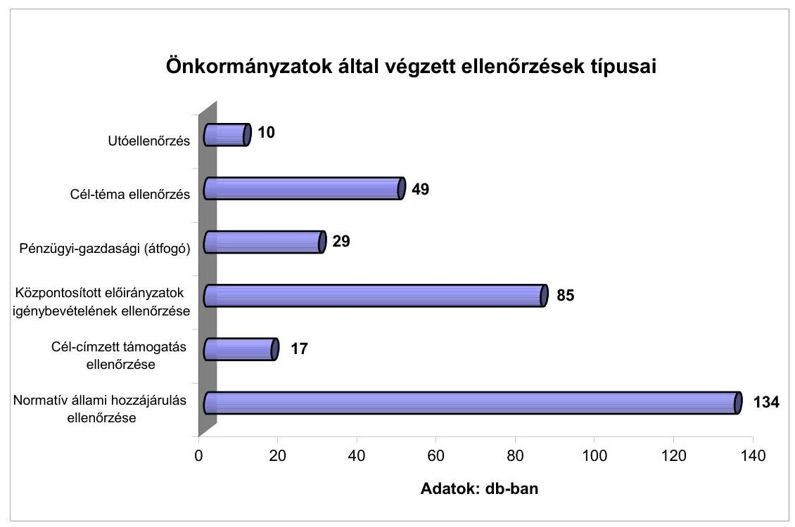

A városok 25,9\%-a gondoskodott a rendszeres belső ellenőrzési munka végzéséről, további $57,4 \%$-nál az elvégzett ellenőrzések esetiek voltak. A városok $16,7 \%$-ánál nem végeztek belső ellenőrzést a polgármesteri hivatalban.

---

Ezek közül három városi önkormányzatnál (Emőd, Kerekegyháza, Pécsvárad) az utóbbi három évben semmilyen (sem belső, sem intézményi) ellenőrzést nem végeztek.

A nagyközségeknél három önkormányzat (11,1\%) gondoskodott rendszeres ellenőrzésről, 51,9\%-nál rendszertelen, nem megfelelő színvonalú volt az ellenőrzési munka, $37 \%$-nál pedig nem végeztek belső ellenőrzést a polgármesteri hivatalban.

A községek 6\%-a végeztetett rendszeresen belső ellenőrzést, 36,6\%-nál eseti, az önkormányzati gazdálkodás egy-egy részterületére kiterjedő, ellenőrzés volt, 57,4\%-nál viszont az elmúlt három évben semmilyen (sem a polgármesteri hivatalban, sem az intézményeknél a képviselő-testület által elrendelten) ellenőrzés nem valósult meg. A tervezett ellenőrzési feladatok elmaradási okaként többlet feladatok felvállalását és azok elvégzését, illetve létszám problémákat tapasztaltunk.

A községi önkormányzatok ellenőrzési feladataihoz 2003. évtől az állam támogatást biztosít. A Magyar Köztársaság 2003. évi költségvetéséről szóló 2002. évi LXII. törvény 5. számú mellékletének 13. pontja alapján a helyi önkormányzatok belső ellenőrzési feladataik társulásban történő ellátásához - a 2003. évi I. ütemben (országos szinten) 8 önkormányzat 12636 ezer Ft, a 2003. évi II. ütemben 12 önkormányzat 5548 ezer Ft - támogatásban részesült. A belső ellenőrzési társulások elterjedése a községek ellenőrzési feladataihoz viszonyítva nem elegendő, nem biztosította a folyamatos függetlenített belső ellenőrzési feladatok elvégzését. A belső ellenőrzési társulások (melyek tagjai 90,2\%ban községek, 4,9-4,9\%-ban nagyközségek és városok) működése kapcsán a községek vonatkozásában az átlagosnál kedvezőbb tapasztalatokat szereztünk. A belső ellenőrzési társulásban részt vevő községek 46,9\%-ánál folytattak eseti, a gazdálkodás egyes részterületeire kiterjedő vizsgálatokat. Az önkormányzatok és a költségvetési szervek magas létszámával létrehozott ellenőrzési társulások múködése nem biztosította az önkormányzati ellenőrzési feladatok évenkénti ellátását valamennyi érdekelt önkormányzatnál.

Tompa nagyközség és Őcsény község önkormányzatainál az ellenőrzési társulás éves szinten 8-10 napot fordított az intézmény ellenőrzési feladatok ellátására.

A költségvetési támogatás igénybevételéhez szükséges feltételeket az önkormányzatok nehezen tudták biztosítani.

Az ellenőrzések megállapításairól ellenőrzési jelentések, jegyzőkönyvek készültek. Az elkészült jelentések 80\%-a részletes, jó színvonalú volt, konkrétumokat tartalmazott, rámutatott a gazdálkodás hiányosságaira. Ez az arány a községeknél 64,3\%-os, a nagyközségeknél és a városoknál ( $85,7 \%$, illetve $89,3 \%$ ) átlagon felüli volt. A megyéknél, megyei jogú városoknál, fővárosi kerületeknél egy önkormányzat, Székesfehérvár kivételével részletesek, jó színvonalúak voltak a jelentések. A jelentések 86,8\%-a tartalmazott javaslatokat, melyek segítették a vezetés munkáját, a hiányosságok megszüntetését.

A belső ellenőrzési rendszer múködésének általános hiányossága, hogy az önkormányzatok nem fordítottak kellő figyelmet az ellenőrzés javaslatainak rea-

---

lizálására. A jelentések nem tartalmaztak átvételi záradékot, mely a megállapítások ellenőrzött szervezettel való megismertetésének és az egyeztetés tényének bizonyítéka. Az ellenőrzést végző önkormányzatok 32,8\%-ánál készítettek az intézmények intézkedési tervet a feltárt hiányosságok megszüntetésére. A községi és a nagyközségi önkormányzatok 17,2\%-ánál, illetve 23,5\%-ánál készítettek intézkedési tervet. A városi önkormányzatok 51,15\%-ánál, a megyei, megyei jogú városi, fővárosi kerületi önkormányzatoknál - két kivétellel (Budapest fővárosi V. és II. kerületi önkormányzat) - gondoskodtak intézkedési terv készítéséről.

A képviselő-testületek 62,8\%-a a Htv. 138. § (1) bekezdés g) pontjában előírtak ellenére sem tekintette át az általa alapított és fenntartott költségvetési szervek ellenőrzésének tapasztalatait erre vonatkozó előterjesztés hiányában. Ahol végeztek ellenőrzést, ott az önkormányzat képi-v-selő-testületeinek 37,9\%-a értékelte a belső ellenőrzések tapasztalatait.

# 3.2. A könyvvizsgálati kötelezettség teljesítése 

A megyei, a megyei jogú városi, a fővárosi és a fővárosi kerületi önkormányzatok az Ötv. 92/A. § (1) bekezdésében előírt könyvvizsgálati kötelezettségüket teljesítették. A városok és a nagyközségi önkormányzatok 86,6\%-a az Ötv. 92/A. § (2) bekezdése szerint volt köteles könyvvizsgálót foglalkoztatni. Az önkormányzatok és intézményeik adatait összevontan tartalmazó beszámoló felülvizsgálata könyvvizsgáló megbízásával megtörtént.

A könyvvizsgálók kiválasztásakor az önkormányzatok betartották az Ötv. 92/B §-ben előírtakat. A könyvvizsgálók a Magyar Könyvvizsgálói Kamara által bejegyzett, regisztrált és költségvetési minősítéssel rendelkezők voltak - kettő kivétellel - írásban nyilatkoztak, hogy személyükkel szemben összeférhetetlenség nem áll fenn.

Hatvan és Tárkeve önkormányzatai esetében nem vizsgálták az összeférhetetlenséget, Tárkeve könyvvizsgálója az ellenőrzés ideje alatt nyilatkozott, hogy öszszeférhetetlenség nem áll fenn.

A könyvvizsgálók írásban véleményezték a 2001-2003. évi költségvetési rendelettervezeteket. Felülvizsgálták a 2001-2002. évi költségvetés végrehajtásáról szóló előterjesztéseket és a zárszámadási rendelettervezeteket, valamint az egyszerúsített tartalmú költségvetési beszámolókat. A költségvetési beszámolókat, az önkormányzatok 95,4\%-ánál hitelesítő záradékkal, négy önkormányzatnál korlátozott záradékkal látták el, mivel ezeknél az önkormányzatoknál az éves egyszerúsített beszámoló az önkormányzatok vagyoni, pénzügyi helyzetéről nem adott megbízható és valós képet.

Szekszárd megyei jogú városnál a könyvvizsgáló kifogásolta, hogy a vagyon kataszterben és a számviteli nyilvántartásban nem teljes körűen szerepeltették az önkormányzat vagyonát.

Miskolc megyei jogú város és Kistarcsa nagyközségi önkormányzatoknál auditálás eltérés miatt nem adott a könyvvizsgáló teljes körű hitelesítő záradékot a költségvetési beszámolóra.

---

Berhida Nagyközség Önkormányzata a könyvvizsgáló szerint nem teljes körűen mutatta ki az üzemeltetésre átadott eszközök értékét, illetve az analitikus nyilvántartás és a főkönyvi kivonat adataiban eltérés mutatkozott.

A könyvvizsgálók az önkormányzatok 56\%-a részére megállapításokat, javaslatot is tettek. A javaslatok megállapítások hasznosulását 41 önkormányzatnál biztosították a, öt önkormányzat esetében ez nem történt meg, három önkormányzatnál részben valósultak meg.

Nem valósult meg a realizálás Budapest főváros IV. kerület, Siklós, Kapuvár, Tárkeve városok, illetve Mándok nagyközség esetében.

Miskolc Megyei Jogú Város Önkormányzatánál a könyvvizsgálói jelentésben megfogalmazott javaslatok közül a gazdasági társaságoknak nyújtott működési és fejlesztési célú támogatások felhasználására vonatkozó megállapodásokkal, elszámolásokkal, illetve azok ellenőrzésével kapcsolatos észrevételekre nem történt intézkedés. Budapest Főváros XXII. kerületi Önkormányzatnál - a könyvvizsgáló által tett javaslatok egy része hasznosult, mivel a számviteli politikát és számlarendet teljes körűen aktualizálták, vagyonkataszter egyeztetése nem fejeződött be, az ellenőrzési rendszer nem múködött, az analitikus és a főkönyvi nyilvántartás egyezőségét biztosították,.

# 3.3. A korábbi számvevőszéki ellenőrzések javaslatainak hasznosulása 

Az önkormányzatoknál egy város (Jászárokszállás) kivételével valamennyi megyei, megyei jogú városi, fővárosi kerületi és városi önkormányzatnál, a nagyközségi önkormányzatok 78\%-ánál, a községek 26\%-ánál volt a jelenlegi ellenőrzést megelőző három évben ÁSZ vizsgálat.

Az ellenőrzések során az önkormányzatok tevékenységével kapcsolatban tapasztalt hiányosságok megszüntetésére, a célszerűséget, hatékonyságot szolgáló intézkedések megtételére vonatkozóan a vizsgálati jelentések 1120 javaslatot tartalmaztak.

A megfogalmazott javaslatokat az önkormányzatok elfogadták. Az ÁSZ javaslatainak 59\%-át teljes mértékben, 17\%-át részben megvalósították.

A teljes mértékben hasznosult javaslatok aránya a megyei önkormányzatoknál a legmagasabb (78\%), a megyei jogú városok, fővárosi kerületek, városok és nagyközségek esetében átlag fölötti ( $63 \%, 63 \%, 61 \%, 60 \%$ ), a községeknél az átlagosnál kedvezőtlenebb (49\%) volt.

A községek, nagyközségek és a fővárosi kerületek az átlagosnál (24\%) nagyobb arányban ( $33 \%, 26 \%, 28 \%$ ) mulasztottak el intézkedéseket tenni a feltárt hiányosságok megszüntetése érdekében, ez az arány a megyei, megyei jogú városi és városi önkormányzatoknál az átlagnál kedvezőbb volt (átlag 17\%-os).

A központi állami támogatásokhoz kapcsolódóan - a javaslatok nyomán megtett intézkedéseknek köszönhetően - jelentős előrelépés történt a támogatások elszámolásának dokumentálásában (a javaslatok 76\%-át teljes egészében, to-

---

vábbi 12\%-át részben megvalósították) és a szabályszerű felhasználásban (a javaslatok 79\%-a hasznosult). A jogtalanul igénybe vett támogatásokat az önkormányzatok visszafizették.
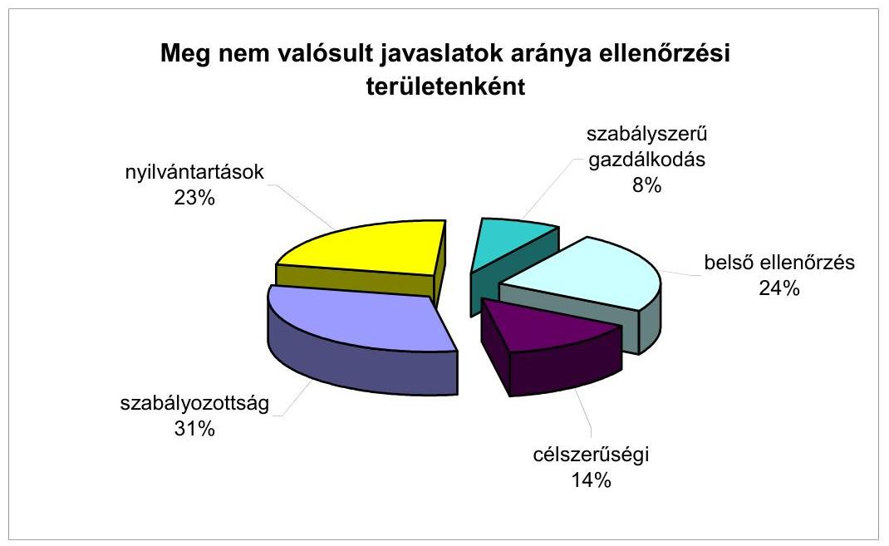

A fenti ábrából látható, hogy az önkormányzati gazdálkodás helyi szabályozottsága, az évek óta tartó folyamatos javulás ellenére, még mindig kritikus terület.

A meg nem valósult javaslatok az egyes gazdálkodási területek elszámolásaihoz szükséges számviteli nyilvántartások hiányos vezetéséhez, a gazdálkodás nem kellő mértékű dokumentálásához kapcsolódnak. Ebbe a körbe tartoznak a költségvetési, zárszámadási rendeletek jogszabályban előírt kimutatásainak, mellékleteinek elhagyása, a vagyontárgyak hiányos leltározása, az éves vagyonleltár elkészítésének elmulasztása, a vagyonkataszter és a vagyonleltár egyeztetésének hiánya, a könyvviteli mérleg nem megfelelő alátámasztása az analitikus nyilvántartások adataival.

A belső ellenőrzés területén a legtöbb (52\%) meg nem valósított javaslattal a központi támogatások felhasználásának ellenőrzése kapcsán találkoztunk.

Az egyes önkormányzati területek múködési hatékonyságának fokozását, a feladatellátás célszerúbbé tételét szolgáló javaslataink többségét pozitívan fogadták az önkormányzatok. Javaslataink realizálása eredményeként nőtt az operatív munka hatékonysága, erősödtek a belső kontrollok, valamint erősödött az önkormányzatok pénzügyi egyensúlyra való törekvése, az adóellenőrzések hatékonysága javult, nagyobb figyelmet fordítottak külső források megszerzésére, pályázatok figyelésére is.

A meg nem valósult célszerúségi javaslataink közé tartozott gazdaságossági számítások készítése az döntések eredményesebb megalapozásához, nagyobb szerepvállalás a kistérségi területfejlesztésben, pályázatok kialakításában, fejlesztési koncepció kialakítása, a tömegközlekedéssel kapcsolatban a

---

szolgáltatási teljesítményekhez jobban igazodó zóna-tarifa rendszer kialakítása, a szakképzés területén ösztönzési, érdekeltségi rendszer kialakítása az iskolák részére a többletforrások jobb kihasználása érdekében.

A gazdálkodás szabályszerűségét érintő meg nem valósított javaslatok jellemzően a gazdálkodási jogkörök (kötelezettségvállalás, utalványozás, ezek ellenjegyzése és az érvényesítés) működéséhez, az eszközök értékelésének hibáihoz, a költségvetési rendeletek nem megfelelő időben történő elfogadásához, a kisebbségi önkormányzatokkal való - jogszabályban előírt - megállapodás megkötésének elmulasztásához, a kisebbségi önkormányzatok pénzforgalmának el nem különítéséhez, a közbeszerzésekre vonatkozó értékhatárok be nem tartásához, a központi támogatások szabálytalan felhasználásaihoz kapcsolódtak.

A helyi és helyi kisebbségi önkormányzatok gazdálkodásának átfogó ellenőrzéséről a 2003. évben kiadott számvevőszéki jelentésben szereplő - a belügyminiszternek és pénzügyminiszternek címzett - javaslatok közül a szakfeladatrend és a költségvetési címrend korszerűsítésére, valamint a kötelező és önként vállalt feladatok kiadásainak-bevételeinek megismerését biztosító számviteli nyilvántartási rend kialakítására vonatkozó nem valósult meg. Elmaradt az önkormányzatok kötelező feladatainak egyértelmű meghatározására, a gazdasági program tartalmának, időbeli hatályának egységes kialakítására, valamint az önkormányzatok pénzügyi-számviteli feladatainak ellátásához szükséges hardver-szoftver ellátottság fejlesztés koordinálására, a szakmai követelmények egységesítése, rendszerszervezési eljárások elvégzése és ennek alapján integrált adatnyilvántartások, feldolgozások elterjesztésére vonatkozó javaslatok megvalósítása.

Az önkormányzati költségvetési szervek belső ellenőrzéséhez a kiadásra került kormányrendelet (Ber.), amelyről még ellenőrzési tapasztalattal nem rendelkezünk.

Nem történt intézkedés az Áht. 124. § (2) bekezdés b) pontjában foglalt felhatalmazás ellenére az Áht. 118. §-ban meghatározott mérlegek, kimutatások tartalmi követelményeinek meghatározására, valamint nem került közzétételre a helyi kisebbségi önkormányzatok szabályszerű működését elősegítő, a helyi kisebbségi önkormányzatok gazdálkodásának sajátos rendjét összefoglaló kézikönyv.

A megtett intézkedések hatása az önkormányzati gazdálkodás nagyobb fokú szabályozottságában, a számviteli múködés egyes területeinek szabályszerűbb működésében (nyilvántartások pontossága, kiegészítése, számviteli értékelés helyessége), a szabályszerűbb költségvetési gazdálkodásban (a költségvetésés zárszámadás-készítés jogszabályi követelményeinek való jobb megfelelés, előirányzatokon belüli gazdálkodás), valamint a célszerűbb, átláthatóbb feladatellátásban volt kimutatható.

# 4. A HELYI KISEBBSÉGI ÖNKORMÁNYZATOK GAZDÁLKODÁSA 

A kisebbségi önkormányzatok ellenőrzését a települési önkormányzatok gazdálkodásának átfogó ellenőrzésével együtt végeztük. Az ellenőrzött

---

időszak sajátossága volt, hogy jelentősen megváltozott év közben azon települések száma, amelyeknél kisebbségi önkormányzat múködött. A feladatellátás és a gazdálkodás részletes ellenőrzése az előző évekhez hasonlóan településenként egy-egy kisebbségi önkormányzatra irányult, az országban múködő helyi kisebbségi önkormányzatok 10,3\%-ára terjedtek ki. Az ellenőrzött kisebbségi önkormányzatok települések és nemzetiségek szerinti öszszetételét a jelentés 2 . számú melléklete tartalmazza.

Az önkormányzat szervezeti és múködési rendjét meghatározó szabályzatot nem hagyott jóvá $3,3 \%$, amellyel megsértették a Nek. tv. 27. § (2) bekezdés a) pontjának és az Ötv. 102/C. § (6) bekezdésének előírásait. A szervezeti és múködési szabályzata aktualizálását - amelyet a 2002. évet megelőzően múködő testületek hagytak jóvá - elmulasztotta a kisebbségi önkormányzatok 5\%-a.

A szabályzatok felülvizsgálatát és módosítását indokolták volna az önkormányzatok múködési feltételeiben bekövetkezett változások (jogszabályváltozások, az elnök megbízatási formájának változása, a testületi tagok számának és a település típusának változása).

Az ellátott feladatoknak megfelelően a kisebbségi önkormányzatok költségvetése $\mathbf{8 0 \%}$-ban a múködés pénzügyi feltételeit tartalmazta. A gazdálkodási feltételeket az állami költségvetési hozzájárulás, valamint a helyi önkormányzatok támogatása biztosította. Intézményfenntartás hiányában feladatmutatóhoz kötött normatív állami hozzájárulásban nem részesültek, és a saját bevételi lehetőségeik 2,5\%-ot képviseltek.

A kisebbségi óvodai neveléshez és az anyanyelvi iskolai oktatáshoz nyújtott állami támogatások nem jelentettek bevételt a költségvetésükben, mert azt az intézményt fenntartó települési önkormányzatok kapták meg a költségvetési törvényben ${ }^{41}$ foglalt feltételek alapján. Az országban múködő helyi kisebbségi önkormányzatok múködéséhez nyújtott állami támogatás alakulását az alábbi táblázat mutatja (2000-2002. év tény, 2003-2004. év terv adatai alapján):

| Megnevezés | 2000. év | 2001. év | 2002. év | 2003. év | 2004. év |
| :-- | :--: | :--: | :--: | :--: | :--: |
| A támogatás összege (millió Ft) | 778,6 | 829,3 | 900 | 1263,5 | 1317,3 |
| A növekedés aránya (\%) | - | 6,5 | 8,5 | 40,4 | 4,3 |

A kisebbségi önkormányzatok a 2002. évi költségvetési bevételei 6,8\%-kal haladták meg az előző évit, míg a kiadásaik 10,5\%-al voltak magasabbak. A feladatok ellátásához felhasználták a tárgyévi bevételek $94,5 \%$-át, amely $3,1 \%$-kal nagyobb felhasználási arányt jelentett a 2001. évinél. A kiadások között legnagyobb súlyt képviselő múködési kiadásoknál 9,9\%-os növekedés tör-

[^0]
[^0]:    ${ }^{41}$ A Magyar Köztársaság 2001. és 2002. évi költségvetéséről szóló 2000. évi CXXXIII. törvény, valamint a Magyar Köztársaság 2003. évi költségvetéséről szóló 2002. évi LXII. törvény. 3. számú melléklete.

---

tént. Ezen belül a személyi juttatásokra 13,4\%-kal fizettek ki többet, mint egy évvel korábban, a dologi kiadások összege 8,5\%-kal nőtt.

A költségvetési forrásokból a település kisebbségét érintő feladatokat, illetve a testületi múködéssel kapcsolatos kiadásokat finanszírozták. A személyi juttatások, a dologi kiadások és a pénzeszköz átadások között szerepeltek a történelmi hagyományaik, nemzetiségi nyelvük, kultúrájuk őrzésére, ápolására, a kisebbség érdekeinek érvényesítésére elszámolt ráfordítások.

A kisebbségi önkormányzatok feladat- és hatáskör átruházását az előző évhez hasonlóan ${ }^{42}$ a 2002-2003. években sem kezdeményezték a települési önkormányzatoknál és nem éltek az Ötv. 102/C. § (2) bekezdésének felhatalmazásával, nem vettek át tőlük feladatot, illetve hatáskört. Szintén nem vették át más által létesített intézmény fenntartói jogát a Nek. tv. 47. § (2) bekezdésben, illetve nem hoztak létre intézményt saját hatáskörükben a Nek. tv. 27. § (3) bekezdés a)-d) pontjaiban foglalt lehetőség alapján. A kisebbségi önkormányzatok nem éltek a Nek. tv. 27. § (4) bekezdés a) pontjában biztosított lehetőségekkel, nem alapítottak, nem múködtettek vállalatot vagy más gazdasági célú szervezetet.

Emellett az előző évinél nagyobb arányban láttak el és finanszíroztak olyan közszolgáltatásokat, amelyek a jogszabályi előírások értelmében nem a kisebbségi, hanem a települési önkormányzatok feladat- és hatáskörébe tartoztak.

A kisebbségi önkormányzatok 19,2\%-a nyújtott különféle szociális támogatást a kisebbséghez tartozók részére, amely az előző évben ellenőrzötteknél 10,4 százalékponttal nagyobb arányú előfordulást jelentett. A települési önkormányzatok hatósági jogkörébe tartozó segélyezési feladatokat finanszíroztak 91,4\%-ban a cigány (az előző évben 100\%-ban ${ }^{43}$ ), 4,3\%-4,3\%-ban a lengyel és a szlovák kisebbségi önkormányzatok. Ennek keretében különféle jogcímú pénzbeli támogatásokat nyújtottak (átmeneti-, temetési-, beiskolázási segély) és természetbeni juttatásokat (élelmiszer-csomag, iskolakezdéshez taneszközök) biztosítottak közvetlenül a költségvetésükből a nemzetiségükhöz tartozónak tekintett személyek részére.

A szabálytalan támogatások a cigány kisebbségi önkormányzatok 27,3\%ánál (az előző évben 18,8\%-ánál), a lengyel kisebbségi önkormányzatok 6,3\%ánál, valamint a szlovák kisebbségi önkormányzatok 12,5\%-ánál fordultak elő. Így az önkormányzat múködéséhez biztosított forrásokat egyes személyek, csoportok (óvodások, általános iskolások, időskorúak stb.) támogatására, szabályozatlan segélyezésére használta fel az ellenőrzött kisebbségi önkormányzatok 19,2\%-a. Ezzel megsértették az Áht. 62. § (2) bekezdésének előírásait, amelyek szerint a helyi kisebbségi önkormányzat a költségvetéséből finanszírozza és látja el a nemzeti és etnikai kisebbségek jogairól szóló és más törvény-

[^0]
[^0]:    ${ }^{42}$ Jelentés a helyi és a helyi kisebbségi önkormányzatok gazdálkodásának átfogó ellenőrzéséről (készült: 2003. évben).
    ${ }^{43}$ Jelentés a helyi és a helyi kisebbségi önkormányzatok gazdálkodásának átfogó ellenőrzéséről (készült: 2003. évben).

---

ben ${ }^{44}$ meghatározott feladatait. Ezen kisebbségi önkormányzatok olyan hatósági feladatokat végeztek az óvodai és az általános iskolai ellátottak, valamint az időskorúak szociális támogatásának különböző formáival, amelyek a helyi önkormányzati képviselő-testület és a jegyző́ hatáskörébe tartoztak a szociális igazgatásról és a szociális ellátásokról szóló 1993. évi III. törvény 3. § (3) ${ }^{45}$ bekezdése szerint. Olyan szociális támogatási feladat-, illetve hatáskört láttak el és finanszíroztak, amelyeket, mint hatósági feladatokat a települési önkormányzatok a helyi kisebbségi önkormányzatra annak kezdeményezése esetén sem ruházhatják át az Ötv. 102/C. § (2) bekezdésében foglalt előírások értelmében. A segélyek kifizetése nem jelenik meg kisebbségi önkormányzati feladatként a Nek. tv. 25-30. §-ában sem.

A hatósági feladatokat szabálytalanul ellátó kisebbségi önkormányzatok $\mathbf{6 5 , 2 \% - a}$ a tevékenységéhez a helyi önkormányzattól pénzügyi támogatást nem kapott, kizárólag központi támogatásból gazdálkodott. Így az általuk nyújtott szociális juttatások forrását a múködésükhöz kapott központi támogatás képezte. Gazdálkodásukban az előző évinél 87,5\%-kal nagyobb számban nem tartották be az akkor hatályos költségvetési törvény ${ }^{46} 47$. § (1) bekezdés cc.) pontjában, illetve az 5. számú melléklet 7. pontjában foglalt rendelkezéseket sem, amelyek szerint a helyi kisebbségi önkormányzat központi támogatása a helyi kisebbségi önkormányzat múködését szolgálja. A mulasztáshoz hozzájárult, valamint a követelmények elsajátítását és a gyakorlatban való alkalmazását nehezítette, hogy a helyi kisebbségi önkormányzatok feladataira, múködésére, gazdálkodására a törvények és kormányrendeletek nem összefoglaltan, hanem csak a települési önkormányzatoktól eltérő, alapvető gazdálkodási sajátosságaikra vonatozóan határozták meg.

A települési önkormányzatokkal való együttmúködés szabályozását megállapodásban rögzítette a kisebbségi önkormányzatok 79,2\%-a, az előző évben ellenőrzöttek 74,3\%-ához képest 4,9 százalékponttal nagyobb arány. A települési önkormányzattal kötött együttmúködési megállapodással nem rendelkezett a helyi kisebbségi önkormányzatok 18,3\%-a. Az egynél több kisebbségi önkormányzattal érintett településeken nem minden múködő kisebbségi önkormányzattal volt megállapodás 2,5\%-nál. Megállapodás hiányában elmaradt a gazdálkodás végrehajtásának az Áht. 66. §-ában foglalt, valamint a költségvetési tervezés Áht. 68. § (3) bekezdésében előírt feladatainak rögzítése. Hiányzott a települési önkormányzattal közös feladatok meghatározása és a végrehajtás összehangolt ütemezése a költségvetési tervezés, gazdálkodás, beszámolás és zárszámadás területén.

[^0]
[^0]:    ${ }^{44}$ A helyi önkormányzatokról szóló 1990. évi LXV. törvény.
    ${ }^{45}$ A bekezdés számozását módosította szociális igazgatásról és a szociális ellátásokról szóló 1993. évi III. törvény módosításáról szóló a 2001. évi LXXIX. törvény 1. § (2) bekezdése.
    ${ }^{46}$ A Magyar Köztársaság 2001. és 2002. évi költségvetéséről szóló 2000. évi CXXXIII. törvény.

---

A megalakuláshoz és a feladatellátáshoz viszonyítva késedelmesen (először a 2002-2003. években) kötött együttmúködési megállapodást a település önkormányzatával a kisebbségi önkormányzatok 9,2\%-a. Emiatt nem állt rendelkezésre a közös feladatellátást megalapozó megállapodás a 2002. és a 2003. évi gazdálkodáshoz sem 5\%-nál.

A megállapodások testületi jóváhagyásáról nem gondoskodtak a kisebbségi önkormányzatok 4,2\%-ánál. A települési önkormányzat képviselőtestületét, illetve a helyi kisebbségi önkormányzat testületét illetik meg az önkormányzati feladat-és hatáskörök, ezen belül döntés a más önkormányzattal való együttmúködésről az Ötv. 9. § (1), illetve 102/C. § (1) bekezdésében foglalt előirások szerint. Így a megállapodások érvényességét nem biztosították a települési önkormányzati, illetve kisebbségi önkormányzati testület jóváhagyásának hiánya esetén.

Az együttmúködési megállapodások évenkénti felülvizsgálatának az Ámr. 29. § (11) bekezdésében foglalt lehetőségével nem éltek a kisebbségi önkormányzatok 15\%-ánál. A 2002. évi választásokat követően megalakult testületek 10,8\%-a nem végezte el a korábbi időszakban kötött megállapodások felülvizsgálatát, módosítását a 2003. január 15-i határidőig.

Nem szabályozták az éves gazdálkodást megalapozó költségvetési tervezés Áht. 68. § (3) bekezdésében foglalt feladatait a megállapodások 25,8\%ában. Az együttmúködés részletes szabályainak és eljárási rendjének hiánya miatt szabályozatlan volt a költségvetési koncepció egyeztetésének, véleményezésének, a költségvetési határozat-tervezet összeállításának rendje, a határozat kisebbségi önkormányzati testületi jóváhagyásának a rendelet-alkotáshoz igazodó ütemezése és a települési önkormányzati rendeletbe történő beépítésének feltételei. Ennek következménye volt a koncepciók véleményezésének elmaradása, a költségvetési határozatok késedelmes benyújtása a testülethez, továbbítása a települési önkormányzatokhoz, illetve mindezek elmulasztása.

Az együttmúködési megállapodások hiányossága volt, hogy nem tartalmazták az ellenjegyzési jogosultságot 12,5\%-nál, az előirányzatok évközi módosításáról szóló testületi határozatok települési önkormányzat részére történő átadásának határidejét 42,5\%-nál, a zárszámadási határozat benyújtási határidejét 32,5\%-nál. Az egynél több kisebbségi önkormányzattal érintett településeken nem szerepelt valamennyi kisebbségi önkormányzati megállapodásban az ellenjegyzési jogosultság 2,5\%-nál. (A szabályozottság alakulását a következő grafikon szemlélteti.)

---

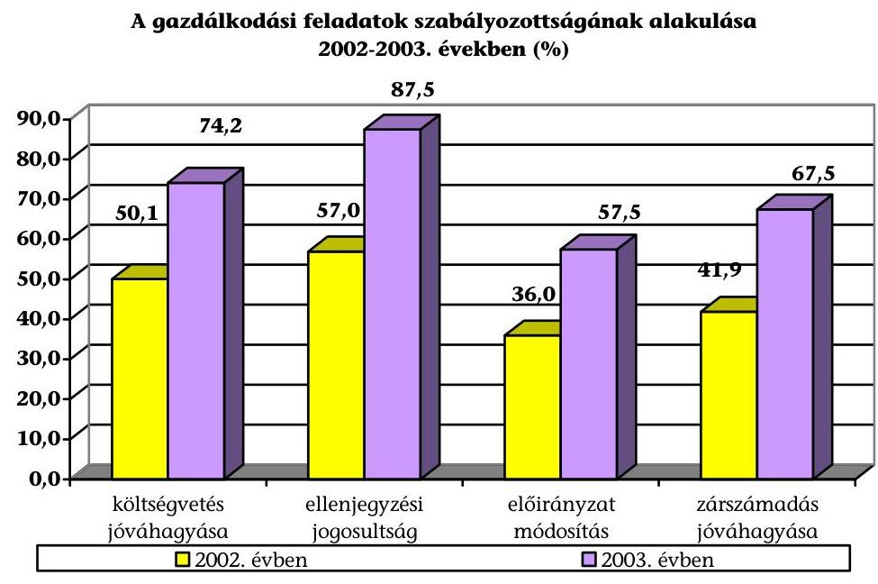

A gazdálkodás végrehajtásával kapcsolatos feladatokat a polgármesteri hivatalok végezték az együttműködési megállapodások és a Nek. tv. 28. § előírásai alapján. Kivételt képez a készpénzkezelés, amely a polgármesteri hivatalon kívül történt a kisebbségi önkormányzatok 5,8\%-ánál.

Az polgármesteri hivatalok gazdálkodást segitő tevékenysége nem, vagy nem megfelelően volt szabályozott a Nek. tv. 28. §-ában előírt szervezeti és múködési szabályzatban, az operatív gazdálkodás, illetve a számviteli politika szabályozásában.

Hiányzott a pénzkezelés Vhr. 8. § (4) bekezdés d) pontja szerinti szabályozása a kisebbségi önkormányzatok 14,2\%-ánál, a kötelezettségvállalás rendjének és nyilvántartásának az Ámr. 134. § (4), (6) bekezdésében előírt szabályozása 23,3\%-nál, az érvényesítést végző Ámr. 135. § (2) bekezdésének megfelelő (írásban) kijelölése 18,3\%-nál, a teljesítés szakmai igazolási módjának Ámr. 135. § (3) bekezdésében előírt szabályozása és az azt végző személy kijelölése 33,3\%-nál.

A jogszabályok nem rögzítik, hogy a kisebbségi önkormányzatok esetében ki jogosult kijelölni a szakmai teljesítés igazolását végző személyt. A kisebbségi önkormányzatok számviteli feladataira önálló szabályzatokat nem dolgoztak ki és azt a polgármesteri hivatali szabályzatokban sem határozták meg.

A kisebbségi önkormányzatok 92,5\%-a önkormányzati testületi határozatban állapította meg a 2002. évi költségvetését. Így az előző évben ellenőrzötteknél 2,8\%-al nagyobb arányban tettek eleget az Áht. 65. § (2) bekezdésében előírt kötelezettségüknek. A költségvetési határozat hiányában jóváhagyott előirányzatokat nem biztosítottak a gazdálkodás végrehajtásához,

---

ezen belül a kötelezettségvállalások és az utalványozások Áht. 12/A. § (1) bekezdésében foglaltaknak ${ }^{47}$ megfelelő végzéséhez $7,5 \%$ esetében.

A költségvetési határozatok tervezetét a kisebbségi önkormányzatok elnökei a megállapodásban foglalt határidőn belül benyújtották az önkormányzati testületeknek a kisebbségi önkormányzatok 39,2\%-ánál, a költségvetés benyújtási határidejét tartalmazó megállapodások 70\%-a esetében. A jóváhagyott költségvetési határozatok 70,2\%-át küldték meg a kisebbségi önkormányzatok elnökei a települési önkormányzatokhoz olyan időpontban, hogy a költségvetési rendeletbe beépíthetők, illetve a költségvetési rendelet benyújtására az Áht. 71. § (1) bekezdésében, és arról az információszolgáltatás teljesítésére az Áht. 72. §-ában előírt határidők betarthatók voltak.

A testület által jóváhagyott költségvetési határozatot a kisebbségi önkormányzatok 51,7\%-ánál (az előző évben 50\%-nál) építették be a települési önkormányzatok a költségvetési rendeletükbe. A kisebbségi önkormányzatok által továbbított határozatok 20,5\%-ának beépítését azonban elmulasztották.

Az önkormányzati testületek határozatának hiányában végezték el a települési önkormányzatok a kisebbségi önkormányzatok költségvetésének rendeleti szintű „meghatározását" 22,5\%-nál (az előző évben 10,3\%-nál). Ezen belül költségvetési határozatot egyáltalán nem hagyott jóvá 5\%, a jóváhagyott határozatot nem továbbította a települési önkormányzathoz 17,5\%. A költségvetési határozatot a jóváhagyottól eltérő tartalommal építették be a rendeletekbe $9,2 \%$-ánál (az előző évben 9,8\%-ánál).

A költségvetés jóváhagyásának, beépítésének jogszabálytól eltérő gyakorlata az önkormányzatok közötti együttmúködés, illetve a koncepció, a rendelet- és a ha-tározat-tervezet előkészítésének hiányosságaira vezethető vissza, amelyben a jegyzők tevékenysége kulcsfontosságú az együttmúködési megállapodások, illetve az Áht. 82. § és az Ámr. 28. § (2) bekezdése alapján.

Az előterjesztések hiányosságainak következménye, hogy a települési önkormányzatok a helyi kisebbségi önkormányzatok költségvetésének testületi határozata hiányában, illetve attól eltérő tartalommal történt rendeleti szintű megállapításával megsértették az Áht. 65. § (3) bekezdésében foglalt rendelkezéseket, mely szerint a helyi önkormányzat költségvetési rendeletébe a helyi kisebbségi önkormányzat költségvetése annak határozata alapján épülhet be, továbbá a települési önkormányzat képviselő testülete nem rendelkezik döntési jogosultsággal a kisebbségi önkormányzat költségvetésére vonatkozóan.

Az előkészítés hiányosságaira vezethető vissza, hogy a költségvetési határozatoknak csak 69,4\%-a felelt meg az Áht. 69. § (2) bekezdésében, illetve az Ámr. 29. §

[^0]
[^0]:    ${ }^{47}$ Áht. 12/A. § (1) bekezdése szerint: A költségvetés végrehajtása során tárgyévi fizetési kötelezettség a jóváhagyott előirányzatok mértékéig vállalható és kifizetések is ezen összeghatárig rendelhetők el (utalványozás).

---

(2) bekezdésében foglalt előírásoknak. Tartalmi, szerkezeti hiányosság így az előző évinél 4,6 százalékponttal nagyobb arányban fordult elő. A legtöbb esetben $(14,2 \%)$ a kiadások kiemelt előirányzatonkénti részletezése hiányzott a költségvetési határozatokból.

A költségvetési előirányzatokat év közben módosították a testületek a jóváhagyott költségvetési határozatok 38,7\%-ánál. Csak részben hoztak határozatot a módosításokról $6,3 \%$-nál, nem módosították határozattal az előirányzatokat $55 \%$ esetében. A többletbevétel, bevételkiesés, illetve a kiadási előirányzatokon belüli átcsoportosítás miatti előirányzat-módosítást az Ámr. 53. § (7) bekezdésének megfelelően végezték el 35,8\%-nál (az előző évben 38\%-nál).

A kisebbségi önkormányzat határozatával megváltoztathatja költségvetését, de az nem érintheti az Országgyúlés kizárólagos - költségvetési törvényben felsorolt - illetve a Kormány előirányzat-módosítási hatáskörébe tartozó előirányzatokat ${ }^{48}$. További jogszabályi előírás hiányában rendezetlen ${ }^{49}$ az előirányzatmódosítás hatásköre, végrehajtása arra az esetre, ha pótelőirányzatot biztosít év közben az Országgyúlés, a Kormány a kisebbségi önkormányzatok számára. Egységes összegű kiegészítő támogatásban részesültek a 2002. évben a kisebbségi önkormányzatok múködéséhez biztosított központosított előirányzatmaradványból azon helyi kisebbségi önkormányzatok, amelyek korábban is múködtek és a választásokat követően újonnan megalakultak. A jogszabályi előírás hiányára is visszavezethető, hogy a pótlólagos támogatással nem módosította a költségvetési előirányzatait év közben a kisebbségi önkormányzatok 64,2\%a. Így szabályosan nem végezhették el a települési önkormányzatok annak a költségvetési rendeleten történő, az Ámr. 53. § (8) bekezdésének megfelelő átvezetését.

Az előirányzat-módosítások elmulasztása miatt az Ámr. 53. § (7) bekezdésének előírásai ellenére nem szerepelt a költségvetési előirányzatok között az év közben elnyert pályázati támogatás $5,8 \%$-nál, a jóváhagyott pénzmaradvány $5 \%$-nál, az önkormányzati támogatás $4,2 \%$-nál.

A költségvetési előirányzatok módosításáról hozott testületi határozatok 97,7\%-át olyan időben továbbították a kisebbségi önkormányzatok elnökei a települési önkormányzat polgármesteréhez, hogy a költségvetési rendeleten az Ámr. 53. § (8) bekezdése szerint átvezethetők voltak. Így azt szabályszerűen végezték el 31,7\%-nál (az előző évben 13\%-nál), a határozatok átvezetése nem történt meg 9,3\%-nál. A kisebbségi önkormányzatok költségvetési előirányzatait a testület határozata hiányában módosították rendelettel a települési önkormányzatok 27,5\% (az előző évben 17\%) esetében,
${ }^{48}$ Az Ámr. 53. § (1) bekezdése.
${ }^{49}$ Az Ámr. 53. § (2) bekezdése csak a települési önkormányzat részére nyújtott pótelőirányzatokra írja elő, hogy a képviselő-testület a polgármester tájékoztatása alapján dönt a költségvetési rendeletének megfelelő módosításáról negyedévenként, de legkésőbb a költségvetési szerv számára a költségvetési beszámoló felügyeleti szervhez történő megküldésének külön jogszabályban meghatározott határidejéig, december 31-i hatállyal.

---

amellyel megsértették az Áht. 74. § (3) bekezdés előírásait ${ }^{50}$. A módosított előirányzat az eredeti előirányzattal megegyezett a beszámolóban a módosító határozatok meghozatalának elmulasztása, illetve a határozatok átvezetésének elmaradása miatt $17,5 \%$ esetében.

A kisebbségi önkormányzatok a pénzforgalom lebonyolítására a települési önkormányzatok költségvetési elszámolási számlájához kapcsolt alszámlával rendelkeztek 75\%-nál (az előző évben 78,4\%-nál). Erre a célra a települési önkormányzatétól elkülönült, önálló bankszámlát nyitottak 10\%-nál (az előző évben 12,5\%-ánál).

A települési önkormányzattól elkülönített pénzforgalomra az önálló számla, vagy alszámla nyitását a kisebbségi önkormányzatok 15\%-a elmulasztotta (az előző évben 8,8\%). A költségvetési gazdálkodással és a pénzellátással kapcsolatos pénzforgalomra a megnyitott számlák 20,5\%-át egyáltalán nem használták. A pénzforgalmat önálló számlán, vagy alszámlán bonyolító kisebbségi önkormányzatok egy költségvetési elszámolási számlával rendelkeztek az Ámr. 103. § (2) bekezdésének előírásaival összhangban. A költségvetési számlát - három (a 2002. évben ellenőrzötteknél egy) kivétellel a - székhelyük szerinti helyi önkormányzat számlavezető hitelintézeténél nyitották meg és vezették.

Érd város szerb, Bakonynána község német, Tállya község cigány kisebbségi önkormányzatok az Ámr. 103. § (1) bekezdésben foglaltak ellenére más hitelintézetnél nyitottak költségvetési számát.

A kisebbségi önkormányzat készpénzforgalmára házipénztárt nem múködtettek, a pénztári bevételeit és a kiadásait nem különítették el a települési önkormányzatétól 60,8\%-nál (az előző évben 41,2\%-ánál). Ezeknél a kisebbségi önkormányzatoknál a készpénzes bevételeket és kiadásokat szabálytalanul, a helyi önkormányzatéval összevontan kezelték, amellyel a pénzforgalom áttekintését megnehezítették.

A költségvetési gazdálkodás valamennyi pénzforgalmát a települési önkormányzatéval összevont pénztárban bonyolították a kisebbségi önkormányzatok 6,7\%ánál (az előző évben 4,4\%-ánál), amelyek nem rendelkeztek önálló, illetve a települési önkormányzatéhoz kapcsolt számlával sem.

Önálló pénztár múködtetése helyett, utólagos elszámolási kötelezettséggel, rendszeresen elóleget/ellátmányt biztosítottak a készpénzes kiadásokra a kisebbségi önkormányzatok 7,5\%-ánál (az előző évben ellenőrzöttek 3,7\%-ánál), amelyre szabályozást nem alakítottak ki.

Pénztáron kívüli pénzkezelést folytattak Bánréve, Gávavencsellő, Nagyfüged községek cigány kisebbségi önkormányzatainál, elmulasztották a bankszámláról felvett összegek pénztári bevételezését és pénztári elszámolását. A

[^0]
[^0]:    ${ }^{50}$ Áht. 74. § (3) bekezdése szerint a helyi önkormányzat rendeletébe beépült helyi kisebbségi önkormányzati előirányzatok kizárólag a helyi kisebbségi önkormányzat határozata alapján módosíthatók.

---

felvett összeggel a kisebbségi önkormányzatok elnökei év közben és év végén a beszámoló elkészítéséhez kapcsolódóan számoltak el.

A költségvetési gazdálkodással összefüggő számla feletti rendelkezési jogosultságot az együttmúködési megállapodásban rögzítették az önkormányzatok 56,7\%ánál (az előző évben 52,9\%-nál). A megállapodások 5,8\%-ában nem biztosították a számla feletti rendelkezési jogosultságot a kisebbségi önkormányzatoknak, hanem a polgármesteri hivatal munkatársai, a polgármester, vagy a jegyző részére biztosították azt.

A költségvetés végrehajtásában a kisebbségi önkormányzatok meghatározó szerepe nem érvényesült a számla feletti rendelkezési jogosultság hiányában 46,7\%-nál, mert a számlapénz forgalomról nem a kisebbségi, hanem a települési önkormányzatok tisztségviselői, illetve hivatalának dolgozói rendelkeztek.

A szabálytalanul összevont számla- és pénztári pénzforgalom következtében nem biztosították a kisebbségi önkormányzatok települési önkormányzatén belüli elkülönített számviteli nyilvántartását. A települési önkormányzatok gazdálkodásához kapcsolódó számviteli nyilvántartástól elkülönülő, a kisebbségi önkormányzat gazdálkodására vonatozó számviteli nyilvántartás rendszerének és módjának meghatározásához hiányzott a részletes előírásokat tartalmazó jogszabályi rendelkezés is, amely segítette volna a hivatalok kisebbségi önkormányzatok gazdálkodását végrehajtó tevékenységét. A pénzgazdálkodási folyamatok áttekintéséhez a kisebbségi önkormányzatok sem rendelkeztek egységes, egyértelmú jogszabályi előírással.

A helyi kisebbségi önkormányzatok gazdálkodásával kapcsolatos számviteli nyilvántartásoknak a települési önkormányzat nyilvántartásain belül elkülönítetten történő vezetését a 20/1995. (III. 3.) Korm. rendelet ${ }^{51} 15 . \S$ (1) bekezdésében az 1996. április 27 -től hatályon kívül helyezett, a költségvetés alapján gazdálkodó szervek beszámolási és könyvvezetési kötelezettségeiről szóló 179/1991. (XII. 30.) Korm. rendeletre hivatkozással írta elő. Sem ebben, sem a helyébe lépő jogszabályokban ${ }^{52}$ nem rögzítették részletesen a gazdasági események könyvviteli elszámolásának, valamint a nyilvántartások kialakításának, vezetésének, a kisebbségi önkormányzatok múködésének sajátosságaihoz igazodó szabályait. Az elkülönített elszámolást és nyilvántartási kötelezettséget megalapozó jogszabályi hivatkozást nem módosították az elmúlt években történt változások és az elszámolások tartalmi módosulása ellenére.

A bankszámla és a készpénzforgalom elkülönítése hiányában nem, vagy csak részben történt meg a kisebbségi önkormányzatot illető bevételek és a költségvetését terhelő kiadások elkülönítése a fókönyvi könyvelésben és az analitikus nyilvántartásokban. A szabálytalanul összevont számla

[^0]
[^0]:    ${ }^{51}$ A kisebbségi önkormányzatok költségvetésének, gazdálkodásának, vagyonjuttatásának egyes kérdéseiről szóló 20/1995. (III. 3.) Korm. rendelet.
    ${ }^{52}$ A költségvetés alapján gazdálkodó szervek beszámolási és könyvvezetési kötelezettségéről szóló 54/1996. (IV. 12.) Korm. rendelet, valamint a költségvetés alapján gazdálkodó szervek beszámolási és könyvvezetési kötelezettségének sajátosságairól szóló 249/2000. (XII. 24.) Korm. rendelet.

---

és pénztári forgalom az önkormányzatok 55,8\%-ánál nem biztosította a kisebbségi önkormányzatok bevételeinek és kiadásainak települési önkormányzaton belüli, elkülönített számviteli nyilvántartását. A költségvetés végrehajtásának, a pénzeszközök szabályszerű felhasználásának rendjét a kisebbségi önkormányzatok 64,2\%-ánál (a 2002. évben ellenőrzöttek 62\%ánál) szabályozták.

Az önkormányzatok 35,8\%-ánál a kötelezettségvállalások és 34,2\%-nál az utalványozások területén a szabályozásban nem biztosították a gazdálkodási jogosítványok gyakorlásának lehetőségét a kisebbségi önkormányzatoknak, így megsértették az Áht. 74/A. § (1) bekezdésében előírtakat. Hiányzott a szabályozásból az önkormányzatok 15,8\%-ánál a kötelezettségvállalás és az utalványozás ellenjegyzőjének meghatározása, továbbá a helyettesítések szabályozása. Nem történt meg a kötelezettségvállalási, utalványozási és ellenjegyzési jogkört gyakorlók kijelölése 20,8\%-nál az átmeneti és tartós távollétek, és a jogosultak érintettsége, illetve rokoni kapcsolata esetére. A pénzgazdálkodást 69,7\%ban a pénztárban és $30,3 \%$-ban a bankszámlán bonyolították a kisebbségi önkormányzatok. Általános tapasztalat, hogy a bankszámla-forgalomban nagyobb arányban érvényesítették a jogszabályi előírásokat, mint a pénztári kifizetéseknél.

A belső szabályozás hiányosságait tükrözte a kisebbségi önkormányzatok operatív gazdálkodási gyakorlata, amelyet a bankszámla és a pénztári bizonylatok vizsgálati tapasztalatai támasztottak alá. A kötelezettségvállalásokat hiányosan végezték el 39,2\%-ban a pénztári és 33,5\%-ban a banki bizonylatok esetében. A kötelezettségvállalás ellenjegyzési feladatainál megsértették az Áht. 74/A. § (2)-(3) bekezdésében foglalt előírásokat 39,7\%ban a pénztári és $35,2 \%$-ban a banki kifizetéseknél a kötelezettségvállalások írásba foglalásának, illetve az írásba foglalt kötelezettségvállalás ellenjegyzésének elmulasztásával. Emellett a szabályozásnál és a gyakorlatban nem vették figyelembe azt, hogy az ellenjegyzést a kisebbségi önkormányzat megbízása alapján végezheti a helyi kisebbségi önkormányzat testületének tagja. Így a testület felhatalmazása nélkül is végeztek ellenjegyzést kisebbségi önkormányzati testületi tagok, illetve jegyzők és hivatali dolgozók.

Az ellenjegyzésre jogosultak nem végezték el feladataikat a kisebbségi önkormányzatok 45,8\%-ánál. Az ellenjegyzést megelőzően nem győződtek meg arról, hogy a kiadási előirányzat biztosítja-e a fedezetet, a kötelezettségvállalás nem sérti-e a gazdálkodásra vonatkozó szabályokat, a kötelezettségvállalás célszerűségét megalapozó - az Ámr. 10. §-a (5) bekezdésének c) pontja szerinti eljárás megtörtént-e, nem észrevételezték, hogy a kisebbségi önkormányzat elnöke saját maga javára utalványozott kifizetést 17,5\%-nál (az előző évben 9\%-ánál) és végezte a készpénz kezelését, a kifizetések teljesítését is.

Az utalványozás során nem tartották be az Ámr. 136.§ (1)-(4) bekezdésében és a belső szabályozásban szereplő előírásokat a pénztári és a banki bizonylatok $28,8 \%$-ánál, mivel nem érvényesített okmányon, illetve jóváhagyott előirányzat hiányában vagy ellenjegyzés nélkül végezték az utalványozást.

---

Az utalvány ellenjegyzése rendszeresen elmaradt a helyi kisebbségi önkormányzatok 23,3\%-ánál. Nem az Ámr. 137.§ (3) bekezdésben foglaltaknak megfelelően végezték az ellenjegyzést 20\%-nál, mivel az utalvány ellenjegyzését végzők az ellenjegyzést megelőzően nem győződtek meg arról, hogy a jóváhagyott költségvetési előirányzat biztosítja-e a fedezetet, az utalványozás nem sér-ti-e a gazdálkodásra vonatkozó szabályokat.

A kötelezettségvállalás és az utalványozás szabálytalanságához vezetö hiányosság volt, hogy a polgármesteri hivatalok nem készítették el az Ámr. 134. § (1) bekezdésében előírt előirányzat-felhasználási tervet és az Ámr. 139. § alapján szükséges likviditási tervet, az Áht. 103. § (1) bekezdésében előírtakat megsértve nem vezettek nyilvántartást az előirányzatokról, az Áht. 103. § (2) bekezdésében előírt nyilvántartást a kötelezettségvállalásokról. Így hiányoztak azok az információk, amelyek a kötelezettségvállalási és az utalványozási intézkedéseket, továbbá ezek ellenjegyzését megalapozzák.

Az érvényesítést nem rögzítették 25,6\%-ban a pénztári és $25,2 \%$-ban a banki bizonylatokon. Így nem végeztek érvényesítést a kisebbségi önkormányzatok 20,8\%-ánál. Csak részben felelt meg az érvényesítés az Ámr. 135. § (3) ${ }^{53}$ bekezdésében foglalt követelményeknek 17,5\%-nál, illetve 14,2\%-nál, mert nem tartalmazta az „Érvényesítve" megjelölést, a megállapított összeget, a főkönyvi számla kijelölését.

Nem jelölték ki a teljesítés szakmai igazolását végző személyt, és nem rendelkezett az igazolás módjáról 33,3\%-nál. Ennek következménye, hogy nem ellenőrizték, szakmailag nem igazolták a teljesítést a kisebbségi önkormányzatok $25 \%$-ánál a pénztári és $21,7 \%$-ánál a bankszámlához kapcsolódó tevékenységben. Hiányosan végezték az igazolást $15,8 \%$-nál a pénztári és $5,8 \%$-nál a banki bizonylatokon. Nem rögzítették, hogy a teljesítés a megrendelt menynyiségnek, minőségnek megfelelően megtörtént-e, hiányzott a felhasználás helye, célja a bizonylatokról, így abból nem volt megállapítható a konkrét tartalom (mit igazolt) és az aláírás jogcíme (milyen minőségben írta alá), illetve a kifizetés indokoltsága.

A gazdasági eseményekről kiállított bizonylatok a kisebbségi önkormányzatok 60\%-ánál feleltek meg a Számv. tv. 166. § (2) bekezdésben előírt alaki és tartalmi követelményeknek. A többi kisebbségi önkormányzatnál a számviteli nyilvántartásokban elszámolt bevételek és kiadások bizonylattal történő alátámasztásában, a bizonylati fegyelem jogszabályban foglalt követelményeinek érvényesítésében a következő hiányosságok fordultak elő:

- az előlegekről nyilvántartást nem vezettek;
- a házipénztári kifizetés esetén az összeg átvételét a pénzt felvevő aláírásával nem igazolta és a pénztárbizonylathoz nem mellékelték, hogy kik vették át az összeget;

[^0]
[^0]:    ${ }^{53}$ Az érvényesítés tartalmi követelményeit az Ámr. 135. § (4) bekezdése rögzíti a 2003. január 1-től hatályosan.

---

- a kiküldetési költségtérítéseket hiányosan kitöltött bizonylatok alapján fizették ki.

A kisebbségi önkormányzatok éves beszámolóját az önkormányzati hivatalok a számviteli nyilvántartásokból (elkülönített nyilvántartás hiányában a települési önkormányzatokéból kigyűjtve) készítették el. A kisebbségi önkormányzatok 71,7\%-ának (a 2002. évben ellenőrzöttek 78,7\%-ának) beszámolóját beépítették elkülönítetten is saját beszámolójukba.

Az éves gazdálkodás adatai csak részben jelentek meg a Vhr. 7. § (4) bekezdésének megfelelően a helyi önkormányzatok ${ }^{54}$ központi információs rendszerbe továbbított költségvetési beszámolóiban a kisebbségi önkormányzatok 10,8\%ánál a számviteli elszámolások hiányosságai következtében. Kimaradtak az adatszolgáltatásból egyes bevételi források (főként az önkormányzati támogatás, az előző évi pénzmaradvány), valamint a települési önkormányzat költségvetése terhére elszámolt kiadások.

A települési önkormányzatéval összevont pénzforgalom nyilvántartás következtében nem volt biztosított valamennyi feltétel a kisebbségi önkormányzatok pénzmaradványának a Vhr. 38. § (1) bekezdésében foglalt tartalommal történő kimutatásához a beszámoló keretében. Hiányoztak ahhoz a záró pénzkészlet Vhr. 39. § (2) bekezdése szerinti adatai a költségvetési számla és a házipénztár esetében. Nem álltak rendelkezésre a pénzmaradvány bevételi többlet/hiány és a kiadási megtakarítás/túllépés öszszegeiből történő levezetéséhez a kisebbségi önkormányzati testületek által jóváhagyott módosított előirányzatok. Mindezekre és az egyértelmű helyi szabályozás, illetve az elkülönített számviteli nyilvántartások hiányára vezethető vissza, hogy az éves beszámolóban ${ }^{55}$ pontatlanul szerepeltették a kisebbségi önkormányzatok bevételeit és kiadásait, amely így országos szinten nem nyújtott megbízható, valós képet a kisebbségi önkormányzatok gazdálkodásáról.

- A kisebbségi önkormányzatok múködésükhöz a 2002. évben a költségvetési törvény ${ }^{56}$ 5. számú mellékletének 7. pontjában foglalt központosított támogatásban részesültek. Ennek összegét az éves gazdálkodásról szóló beszámolóban az egyéb állami támogatás, hozzájárulás jogcímen nem mutatták ki az önkormányzati hivatalok a kisebbségi önkormányzatok 40\%-ánál.
- Egyéb állami támogatás, hozzájárulás helyett az egyéb támogatások, kiegészítések, átvett pénzeszközök között szerepeltették a múködéshez nyújtott központi támogatást $19,2 \%$-ánál az eredeti előirányzat, $15 \%$-nál a módosított előirányzat és $13,3 \%$-nál a teljesített bevételek esetében.

[^0]
[^0]:    ${ }^{54}$ Vhr. 7. § (4) bekezdése szerint a helyi önkormányzat beszámolója tartalmazza a helyi kisebbségi önkormányzatok beszámolóit.
    ${ }^{55}$ Államháztartási Hivatal Költségvetési Nyilvántartási és Adatfeldolgozási Főosztály 2002. évi költségvetési beszámoló 17. űrlapjainak adatai.
    ${ }^{56}$ A Magyar Köztársaság 2001. és 2002. évi költségvetéséről szóló 2000. évi CXXXIII. törvény

---

- Intézményfenntartás hiányában nem voltak jogosultak normatív állami hozzájárulásra a kisebbségi önkormányzatok. Az éves beszámolóban normatív állami hozzájárulás bevételt mutattak ki az eredeti előirányzatok között 74,2\%-nál, a módosított előirányzatokban 77,5\%-nál, a teljesítési adatokban $76,7 \%$-nál.

A kisebbségi önkormányzatok Nek. tv. 27. § (1) bekezdés b) pontjában foglalt hatásköre érvényesítésének és a gazdálkodási jogosítványai Áht. 74/A. § (1) bekezdés szerinti gyakorlásának feltétele a pénzmaradvánnyal való önálló gazdálkodás. A pénzmaradvány megállapításához és kimutatásához azonban hiányoznak a jogszabályi feltételek, mert az azt megalapozó számviteli elszámolások nem megoldottak és a beszámolónak nem része a kisebbségi önkormányzati pénzmaradvány összegének bemutatása.

Az éves gazdálkodásáról szóló zárszámadását határozattal jóváhagyta a kisebbségi önkormányzatok 75,8\%-a (az előző évben 75\%). A határozat tervezetét a megállapodásban foglalt határidőben nyújtotta be az elnök a testületnek $34,2 \%$-nál (a határidőt megállapodásban szabályozó önkormányzatok $70,7 \%$-ánál).

A zárszámadási határozat Ámr. 36. (5) bekezdésben ${ }^{57}$ foglalt előírásnak nem megfelelő időben történő jóváhagyása, illetve a jóváhagyás elmulasztása miatt a kisebbségi önkormányzatok 24,2\%-a megsértette a Nek. tv. 27. § (1) bekezdés b) pontjában ${ }^{58}$ előírtakat és nem biztosította, hogy a helyi önkormányzatok szabályszerűen eleget tudjanak tenni az Áht. 82. §ában foglaltaknak. A jóváhagyott zárszámadási határozatot 55\%-nál (az előző évben $60,8 \%$ ) továbbította az elnök a települési önkormányzat polgármesteréhez. A határozatok zárszámadási rendeletbe történő beépítését csak 40,8\%-nál végezték el a települési önkormányzatok a határidőt követő beérkezése, illetve a zárszámadási rendelet-tervezet összeállításának hiányosságai következtében.

A kisebbségi önkormányzati testület által jóváhagyott határozat hiányában építették be a jegyzök a zárszámadási rendelet-tervezetbe a kisebbségi önkormányzatok gazdálkodásának adatait 25,8\% esetében. A rendeletbe történő beillesztés információs bázisát így kizárólag a polgármesteri hivatalokban vezetett számviteli nyilvántartások képezték.

A jóváhagyott zárszámadási határozatok tartalma 56,7\%-nál (a határozatok $74,7 \%$-a) volt összehasonlítható a költségvetéssel, és felelt meg az Áht. 18. §-ában foglalt követelményeknek. A továbbiak az Áht. 18. §-ában foglalta-

[^0]
[^0]:    ${ }^{57}$ Ámr. 36. § (5) bekezdése szerint a helyi kisebbségi önkormányzat költségvetési (zárszámadási) határozatát úgy fogadja el, és az ezekről szóló információját úgy készíti el, hogy a helyi önkormányzat az Áht. 72., 79. és 82. §-aiban foglalt határidőknek eleget tudjon tenni.
    ${ }^{58}$ Nek. tv. 27. § (1) bekezdés b) pontja szerint a helyi kisebbségi önkormányzat saját hatáskörében - a települési önkormányzat rendeletében foglalt keretek között - határozza meg költségvetését, zárszámadását, a települési önkormányzat által rendelkezésére bocsátott források felhasználását.

---

kat megsértve hiányosan tartalmazták a kisebbségi önkormányzatok bevételeit és kiadásait, illetve az összehasonlíthatóságot biztosító eredeti és módosított előirányzatokat. A nem megfelelőnek minősített zárszámadási határozatokból hiányzott a kiadások kiemelt előirányzatonkénti és a bevételek forrásonkénti részletezése, kimaradtak az állami és az önkormányzati támogatások adatai, az előző évi pénzmaradványok összegei.

A gazdálkodási szabályok súlyos megsértése miatt felvetettük a kisebbségi önkormányzat - 2002. évi választások előtti és utáni - elnökeinek személyes felelősségét egy kisebbségi önkormányzatnál.

Budapest, 2004. július „ 11 "

Melléklet: $\quad 11 \mathrm{db} \quad 22$ lap
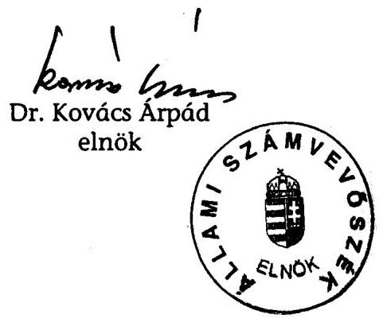

---

# Ellenőrzött önkormányzatok jegyzéke 

| Sorszám | Megye/főváros | Önkormányzat/ település neve | Megye/ főváros | Megyei jogú város | Város/ kerület | Nagy-   község | $\begin{gathered} \text { Község } \\ 1000 \text { fő } \\ \text { felett } \\ \hline \end{gathered}$ | $\begin{gathered} \text { Az önk-ok } \\ 2002 . \text { évi bruttó } \\ \text { kiadásai } \\ \text { (ezer Ft) } \end{gathered}$ |
| :--: | :--: | :--: | :--: | :--: | :--: | :--: | :--: | :--: |
| 1 | Főváros | Fővárosi önkormányzat | x |  |  |  |  | 514743822 |
| 2 |  | II.kerület |  |  | x |  |  | 13078489 |
| 3 |  | IV. kerület |  |  | x |  |  | 13438334 |
| 4 |  | V. kerület |  |  | x |  |  | 12339458 |
| 5 |  | X. kerület |  |  | x |  |  | 26471530 |
| 6 |  | XIX. kerület |  |  | x |  |  | 7679863 |
| 7 |  | XXII. kerület |  |  | x |  |  | 7683110 |
| 8 | Baranya | Alsómocsolád |  |  |  |  |  | 115145 |
| 9 |  | Apátvarasd |  |  |  |  |  | 14563 |
| 10 |  | Babarc |  |  |  |  |  | 135978 |
| 11 |  | Bogádmindszent |  |  |  |  |  | 159687 |
| 12 |  | Bogdása |  |  |  |  |  | 36295 |
| 13 |  | Bóly |  |  | x |  |  | 1013858 |
| 14 |  | Dencsháza |  |  |  |  |  | 152990 |
| 15 |  | Drávafok |  |  |  |  |  | 106818 |
| 16 |  | Dunaszekcső |  |  |  |  | x | 227313 |
| 17 |  | Egyházasharaszti |  |  |  |  |  | 72456 |
| 18 |  | Erdősmecske |  |  |  |  |  | 46781 |
| 19 |  | Görcsönydoboka |  |  |  |  |  | 54164 |
| 20 |  | Hegyszentmárton |  |  |  |  |  | 80042 |
| 21 |  | Hóból |  |  |  |  | x | 113135 |
| 22 |  | Kárász |  |  |  |  |  | 29644 |
| 23 |  | Kásád |  |  |  |  |  | 25635 |
| 24 |  | Liptód |  |  |  |  |  | 29141 |
| 25 |  | Lovászhetény |  |  |  |  |  | 32480 |
| 26 |  | Magyaregregy |  |  |  |  |  | 2287210 |
| 27 |  | Magyarlukafa |  |  |  |  |  | 28444 |
| 28 |  | Markóc |  |  |  |  |  | 8946 |
| 29 |  | Martonfa |  |  |  |  |  | 12300 |
| 30 |  | Nagynyárád |  |  |  |  |  | 123466 |
| 31 |  | Nagypall |  |  |  |  |  | 49216 |
| 32 |  | Old |  |  |  |  |  | 37724 |
| 33 |  | Özdfalu |  |  |  |  |  | 33828 |
| 34 |  | Palotabozsok |  |  |  |  | x | 136758 |
| 35 |  | Pécsvárad |  |  | x |  |  | 1019251 |
| 36 |  | Sátorhely |  |  |  |  |  | 76560 |
| 37 |  | Siklós |  |  | x |  |  | 2086437 |
| 38 |  | Somberek |  |  |  |  | x | 220422 |
| 39 |  | Somogyhárságy |  |  |  |  |  | 116301 |
| 40 |  | Szágy |  |  |  |  |  | 20478 |
| 41 |  | Szalatnak |  |  |  |  |  | 71939 |
| 42 |  | Szászvár |  |  |  | x |  | 301366 |
| 43 |  | Szebény |  |  |  |  |  | 55304 |
| 44 |  | Szentegát |  |  |  |  |  | 53204 |
| 45 |  | Törmás |  |  |  |  |  | 42499 |
| 46 |  | Tőttős |  |  |  |  |  | 55863 |
| 47 |  | Vékény |  |  |  |  |  | 15963 |
| 48 |  | Zengővárkony |  |  |  |  |  | 38201 |
| 49 | Bács-Kiskun | Bács | x |  |  |  |  | 18395516 |
| 50 |  | Dunafalva |  |  |  |  | x | 121909 |

---

| $\begin{aligned} & \text { Sor- } \ & \text { szám } \end{aligned}$ | Megye/főváros | Önkormányzat/ település neve | Megye/ főváros | Megyei jogú város | Város/ kerület | Nagy-   község | $\begin{gathered} \text { Község } \\ 1000 \text { fő } \end{gathered}$ |  | $\begin{gathered} \text { Az önk-ok } \\ 2002 . \text { évi bruttó } \\ \text { kiadásai } \\ \text { (ezer Ft) } \end{gathered}$ |
| :--: | :--: | :--: | :--: | :--: | :--: | :--: | :--: | :--: | :--: |
|  |  |  |  |  |  |  | felett | alatt |  |
| 51 |  | Dunatetétlen |  |  |  |  |  | x | 37942 |
| 52 |  | Dunavecse |  |  |  | x |  |  | 541692 |
| 53 |  | Érsekhalma |  |  |  |  |  | x | 103151 |
| 54 |  | Fülöpháza |  |  |  |  |  | x | 193206 |
| 55 |  | Kecel |  |  | x |  |  |  | 981563 |
| 56 |  | Kerekegyháza |  |  | x |  |  |  | 993859 |
| 57 |  | Kömpöc |  |  |  |  |  | x | 48996 |
| 58 |  | Kunbaracs |  |  |  |  |  | x | 107203 |
| 59 |  | Kunpeszér |  |  |  |  |  | x | 97868 |
| 60 |  | Páhi |  |  |  |  | x |  | 124768 |
| 61 |  | Rém |  |  |  |  | x |  | 156666 |
| 62 |  | Solt |  |  | x |  |  |  | 1252879 |
| 63 |  | Szentkirály |  |  |  |  | x |  | 267731 |
| 64 |  | Tompa |  |  |  | x |  |  | 580594 |
| 65 |  | Újsolt |  |  |  |  |  | x | 14432 |
| 66 | Békés | Békésszentandrás |  |  |  | x |  |  | 478639 |
| 67 |  | Dombegyház |  |  |  | x |  |  | 431794 |
| 68 |  | Füzesgyarmat |  |  | x |  |  |  | 906822 |
| 69 |  | Kertészsziget |  |  |  |  |  | x | 116499 |
| 70 |  | Kevermes |  |  |  | x |  |  | 450705 |
| 71 |  | Kisdombegyház |  |  |  |  |  | x | 130493 |
| 72 |  | Magyardombegyház |  |  |  |  |  | x | 52942 |
| 73 |  | Örménykút |  |  |  |  |  | x | 96528 |
| 74 |  | Szeghalom |  |  | x |  |  |  | 2127126 |
| 75 |  | Tötkomlós |  |  | x |  |  |  | 927562 |
| 76 |  | Vésztő |  |  | x |  |  |  | 1012072 |
| 77 |  | Zsadány |  |  |  |  | x |  | 370106 |
| 78 | Borsod-A.-Z. | Arnót |  |  |  |  | x |  | 421080 |
| 79 |  | Bánréve |  |  |  |  | x |  | 428319 |
| 80 |  | Becskeháza |  |  |  |  |  | x | 14382 |
| 81 |  | Bódvalenke |  |  |  |  |  | x | 26997 |
| 82 |  | Cigánd |  |  |  | x |  |  | 487417 |
| 83 |  | Emőd |  |  | x |  |  |  | 653651 |
| 84 |  | Erdőhorváti |  |  |  |  |  | x | 170875 |
| 85 |  | Gömörszőlős |  |  |  |  |  | x | 15758 |
| 86 |  | Gönc |  |  | x |  |  |  | 405374 |
| 87 |  | Háromhuta |  |  |  |  |  | x | 32885 |
| 88 |  | Hidvégardó |  |  |  |  |  | x | 163125 |
| 89 |  | Izsófalva |  |  |  | x |  |  | 281249 |
| 90 |  | Kelemér |  |  |  |  |  | x | 82644 |
| 91 |  | Királd |  |  |  |  |  | x | 110773 |
| 92 |  | Komlóska |  |  |  |  |  | x | 100274 |
| 93 |  | Mád |  |  |  |  | x |  | 351846 |
| 94 |  | Mályi |  |  |  |  | x |  | 369843 |
| 95 |  | Miskolc |  | x |  |  |  |  | 39306516 |
| 96 |  | Pamlény |  |  |  |  |  | x | 13776 |
| 97 |  | Rátka |  |  |  |  | x |  | 144403 |
| 98 |  | Révleányvár |  |  |  |  |  | x | 89708 |
| 99 |  | Sajógalgóc |  |  |  |  |  | x | 36191 |
| 100 |  | Sajóivánka |  |  |  |  |  | x | 49465 |
| 101 |  | Sajólád |  |  |  |  | x |  | 364386 |
| 102 |  | Sajópetri |  |  |  |  | x |  | 203497 |
| 103 |  | Sajópláspőki |  |  |  |  |  | x | 60057 |
| 104 |  | Sajóvelezd |  |  |  |  |  | x | 128025 |
| 105 |  | Szászfa |  |  |  |  |  | x | 36564 |
| 106 |  | Szentistván |  |  |  | x |  |  | 439912 |
| 107 |  | Szerencs |  |  | x |  |  |  | 2809464 |
| 108 |  | Taktaharkány |  |  |  | x |  |  | 457143 |

---

| $\begin{aligned} & \text { Sor- } \ & \text { szám } \end{aligned}$ | Megye/főváros | Önkormányzat/ település neve | Megye/ főváros | Megyei jogú város | Város/ kerület | Nagy-   község | $\begin{gathered} \text { Község } \\ 1000 \text { fő } \\ \hline \end{gathered}$ |  | $\begin{gathered} \text { Az önk-ok } \\ 2002 . \text { évi bruttó } \\ \text { kiadásai } \\ \text { (ezer Ft) } \end{gathered}$ |
| :--: | :--: | :--: | :--: | :--: | :--: | :--: | :--: | :--: | :--: |
|  |  |  |  |  |  |  |  |  |  |
| 109 |  | Tállya |  |  |  |  | x |  | 303305 |
| 110 |  | Tiszacsermely |  |  | x |  |  | x | 92072 |
| 111 |  | Tiszaújváros |  |  |  |  |  |  | 8472435 |
| 112 |  | Tornaszentjakab |  |  | x |  |  | x | 75276 |
| 113 |  | Tornyosnémeti |  |  |  |  |  | x | 92982 |
| 114 |  | Vadna |  |  |  |  |  | x | 86624 |
| 115 |  | Zemplénagárd |  |  |  |  |  | x | 136900 |
| 116 | Csongrád | Algyő |  |  |  |  | x |  | 820033 |
| 117 |  | Baks |  |  |  |  | x |  | 216628 |
| 118 |  | Balástya |  |  |  |  | x |  | 376529 |
| 119 |  | Csanádpalota |  |  |  | x |  |  | 426762 |
| 120 |  | Csongrád |  |  |  |  |  |  | 15402561 |
| 121 |  | Csongrád |  |  | x |  |  |  | 4846426 |
| 122 |  | Dóc |  |  |  |  |  | x | 127928 |
| 123 |  | Földeák |  |  |  |  | x |  | 558291 |
| 124 |  | Királyhegyes |  |  |  |  |  | x | 130812 |
| 125 |  | Kövegy |  |  |  |  |  | x | 84478 |
| 126 |  | Makó |  |  | x |  |  |  | 4473154 |
| 127 |  | Öföldeák |  |  |  |  |  | x | 54989 |
| 128 |  | Pitvaros |  |  |  |  | x |  | 220988 |
| 129 |  | Pusztamérges |  |  |  |  | x |  | 301361 |
| 130 |  | Szatymaz |  |  |  |  | x |  | 430490 |
| 131 |  | Tiszasziget |  |  |  |  | x |  | 164277 |
| 132 |  | Újszentiván |  |  |  |  | x |  | 195116 |
| 133 | Fejér | Fehérvárcsurgó |  |  |  |  | x |  | 145031 |
| 134 |  | Kajászó |  |  |  |  | x |  | 107621 |
| 135 |  | Köszárhegy |  |  |  |  | x |  | 71522 |
| 136 |  | Polgárdi |  |  | x |  |  |  | 569289 |
| 137 |  | Pusztavám |  |  |  |  | x |  | 324969 |
| 138 |  | Székesfehérvár |  | x |  |  |  |  | 24112174 |
| 139 |  | Tác |  |  |  |  | x |  | 196739 |
| 140 |  | Vereb |  |  |  |  | x |  | 81301 |
| 141 |  | Zámoly |  |  |  |  | x |  | 188168 |
| 142 | Győr-M.-S. | Agyagosszergény |  |  |  |  | x |  | 87702 |
| 143 |  | Dunakiliti |  |  |  |  | x |  | 339346 |
| 144 |  | Feketeerdő |  |  |  |  |  | x | 64601 |
| 145 |  | Gönyü |  |  |  |  | x |  | 249185 |
| 146 |  | Kapuvár |  |  | x |  |  |  | 2575389 |
| 147 |  | Kisbajcs |  |  |  |  |  | x | 151161 |
| 148 |  | Nagybajcs |  |  |  |  |  | x | 59304 |
| 149 |  | Pannonhalma |  |  | x |  |  |  | 342735 |
| 150 |  | Petőháza |  |  |  |  |  | x | 149107 |
| 151 |  | Tényő |  |  |  |  | x |  | 130146 |
| 152 |  | Tét |  |  | x |  |  |  | 556900 |
| 153 |  | Vének |  |  |  |  |  | x | 14387 |
| 154 | Hajdú-Bihar | Debrecen |  | x |  |  |  |  | 38038982 |
| 155 |  | Hajdúszoboszló |  |  | x |  |  |  | 5255303 |
| 156 |  | Komádi |  |  | x |  |  |  | 998158 |
| 157 |  | Létavértes |  |  | x |  |  |  | 1002523 |
| 158 |  | Nyírábrány |  |  |  | x |  |  | 572906 |
| 159 |  | Tiszacsege |  |  | x |  |  |  | 1026737 |
| 160 |  | Újtikos |  |  |  |  |  | x | 108978 |
| 161 |  | Vámospércs |  |  | x |  |  |  | 854907 |
| 162 | Heves | Bükkszenterzsébet |  |  |  |  | x |  | 145523 |
| 163 |  | Ecséd |  |  |  |  | x |  | 273283 |
| 164 |  | Egerfarmos |  |  |  |  |  | x | 62272 |
| 165 |  | Feldebrő |  |  |  |  | x |  | 135514 |
| 166 |  | Felsótárkány |  |  |  |  | x |  | 346014 |

---

| $\begin{aligned} & \text { Sor- } \ & \text { szám } \end{aligned}$ | Megye/főváros | Önkormányzat/ település neve | Megye/ főváros | Megyei jogú város | Város/ kerület | Nagy-   község | $\begin{gathered} \text { Község } \\ 1000 \text { fő } \\ \text { felett } \end{gathered}$ | $\begin{gathered} \text { Az önk-ok } \\ 2002 . \text { évi bruttó } \\ \text { kiadásai } \\ \text { (ezer Ft) } \end{gathered}$ |
| :--: | :--: | :--: | :--: | :--: | :--: | :--: | :--: | :--: |
| 167 |  | Hatvan |  |  | x |  |  |  |
| 168 |  | Heréd |  |  |  |  | x |  |
| 169 |  | Hevesaranyos |  |  |  |  |  | 89286 |
| 170 |  | Hevesvezekény |  |  |  |  |  | 80623 |
| 171 |  | Karácsond |  |  |  |  | x |  |
| 172 |  | Lörinci |  |  | x |  |  | 373305 |
| 173 |  | Nagyfüged |  |  |  |  | x |  |
| 174 |  | Novaj |  |  |  |  | x |  |
| 175 |  | Szajla |  |  |  |  |  | 91922 |
| 176 |  | Szihalom |  |  |  |  | x |  |
| 177 |  | Tarnaszentmiklós |  |  |  |  | x |  |
| 178 |  | Terpes |  |  |  |  |  | 25064 |
| 179 | Jász-N.-Szolnok | Berekfürdő |  |  |  |  |  | 565749 |
| 180 |  | Csataszög |  |  |  |  |  | 75148 |
| 181 |  | Hunyadfava |  |  |  |  |  | 46829 |
| 182 |  | Jászalsószentgyörgy |  |  |  |  | x |  |
| 183 |  | Jászárokszállás |  |  | x |  |  | 420688 |
| 184 |  | Jászivány |  |  |  |  |  | 1186496 |
| 185 |  | Jászjákóhalma |  |  |  |  | x |  |
| 186 |  | Jász-Nagykun-Szolnok | x |  |  |  |  | 217898 |
| 187 |  | Jásztelek |  |  |  |  |  | 14069891 |
| 188 |  | Kenderes |  |  |  | x |  | 224102 |
| 189 |  | Kengyel |  |  |  |  | x |  |
| 190 |  | Kötelek |  |  |  |  | x |  |
| 191 |  | Mezőhék |  |  |  |  |  | 230889 |
| 192 |  | Nagykörü |  |  |  |  | x |  |
| 193 |  | Túrkeve |  |  | x |  |  | 1805448 |
| 194 | Komárom-E. | Bábolna |  |  |  | x |  | 641101 |
| 195 |  | Dág |  |  |  |  |  | 150804 |
| 196 |  | Máriahalom |  |  |  |  |  | 73389 |
| 197 |  | Nyergesújfalu |  |  | x |  |  | 1130078 |
| 198 |  | Tát |  |  | x |  |  | 860491 |
| 199 |  | Tata |  |  | x |  |  | 4324734 |
| 200 |  | Úny |  |  |  |  | x | 54711 |
| 201 |  | Vértesszőlős |  |  |  |  |  | 243205 |
| 202 | Nógrád | Bárna |  |  |  |  | x | 112139 |
| 203 |  | Bér |  |  |  |  |  | 61339 |
| 204 |  | Egyházasgerge |  |  |  |  |  | 112072 |
| 205 |  | Hollókő |  |  |  |  |  | 78890 |
| 206 |  | Horpács |  |  |  |  |  | 24667 |
| 207 |  | Mátramindszent |  |  |  |  |  | 104982 |
| 208 |  | Nagyoroszi |  |  |  |  | x | 359994 |
| 209 |  | Nógrádszakál |  |  |  |  |  | 205530 |
| 210 |  | Salgótarján |  | x |  |  |  | 13234790 |
| 211 |  | Sámsonháza |  |  |  |  |  | 43799 |
| 212 |  | Varsány |  |  |  |  | x | 180613 |
| 213 | Pest | Abony |  |  | x |  |  | 7626718 |
| 214 |  | Albertirsa |  |  | x |  |  | 1222260 |
| 215 |  | Áporka |  |  |  |  | x | 422662 |
| 216 |  | Bernecebaráti |  |  |  |  |  | 189326 |
| 217 |  | Bugyi |  |  |  | x |  | 693512 |
| 218 |  | Cegléd |  |  | x |  |  | 11512997 |
| 219 |  | Csobánka |  |  |  |  | x | 272669 |
| 220 |  | Érd |  |  | x |  |  | 6977716 |
| 221 |  | Galgamácsa |  |  |  |  | x | 220712 |
| 222 |  | Gödöllő |  |  | x |  |  | 5784969 |
| 223 |  | Ipolydamásd |  |  |  |  |  | 47661 |
| 224 |  | Kartal |  |  |  | x |  | 935686 |

---

| $\begin{aligned} & \text { Sor- } \ & \text { szám } \end{aligned}$ | Megye/főváros | Önkormányzat/ település neve | Megye/ főváros | Megyei jogú város | Város/ kerület | Nagy- község | $\begin{gathered} \text { Község } \ 1000 \text { fő } \\ \text { felett } \end{gathered}$ | $\begin{gathered} \text { Az önk-ok } \\ 2002 . \text { évi bruttó } \\ \text { kiadásai } \\ \text { (ezer Ft) } \end{gathered}$ |
| :--: | :--: | :--: | :--: | :--: | :--: | :--: | :--: | :--: |
| 225 |  | Kismaros |  |  |  |  | x |  |
| 226 |  | Kisnémedi |  |  |  |  |  | 130513 |
| 227 |  | Kisoroszi |  |  |  |  |  | 167784 |
| 228 |  | Kistarcsa |  |  |  | x |  | 1201509 |
| 229 |  | Köspallag |  |  |  | x |  | 119291 |
| 230 |  | Maglód |  |  |  | x |  | 865957 |
| 231 |  | Márianosztra |  |  |  |  |  | 119944 |
| 232 |  | Péteri |  |  |  |  | x | 240450 |
| 233 |  | Püspökszilágy |  |  |  |  |  | 76860 |
| 234 |  | Szigetszentmiklós |  |  | x |  |  | 2594961 |
| 235 |  | Tatárszentgyörgy |  |  |  |  | x | 217046 |
| 236 |  | Tőkől |  |  | x |  |  | 989685 |
| 237 |  | Vácduka |  |  |  |  |  | 114600 |
| 238 |  | Vácegres |  |  |  |  |  | 64743 |
| 239 |  | Váckisújfalu |  |  |  |  |  | 40941 |
| 240 |  | Veresegyház |  |  | x |  |  | 4734290 |
| 241 | Somogy | Bélavár |  |  |  |  |  | 53967 |
| 242 |  | Bolhó |  |  |  |  |  | 126657 |
| 243 |  | Bonnya |  |  |  |  |  | 51462 |
| 244 |  | Fiad |  |  |  |  |  | 31860 |
| 245 |  | Gamás |  |  |  |  |  | 206505 |
| 246 |  | Kaposszerdahely |  |  |  |  | x | 96649 |
| 247 |  | Kisbárapáti |  |  |  |  |  | 117226 |
| 248 |  | Marcali |  |  | x |  |  | 4924374 |
| 249 |  | Mosdós |  |  |  |  | x | 72140 |
| 250 |  | Nagyatád |  |  | x |  |  | 4050436 |
| 251 |  | Siófok |  |  | x |  |  | 10456871 |
| 252 |  | Somogygeszti |  |  |  |  |  | 62773 |
| 253 |  | Somogysámson |  |  |  |  |  | 193530 |
| 254 | Szabolcs-Sz.-B. | Benk |  |  |  |  |  | 74696 |
| 255 |  | Dombrád |  |  | x |  |  | 594071 |
| 256 |  | Fülpösdaróc |  |  |  |  |  | 34557 |
| 257 |  | Gávavencsellő |  |  |  | x |  | 590305 |
| 258 |  | Géberjén |  |  |  |  |  | 133308 |
| 259 |  | Kölcse |  |  |  | x |  | 246671 |
| 260 |  | Mándok |  |  |  | x |  | 768230 |
| 261 |  | Nyírbéltek |  |  |  | x |  | 402081 |
| 262 |  | Nyírgyulaj |  |  |  |  | x | 223138 |
| 263 |  | Ömböly |  |  |  |  |  | 32941 |
| 264 |  | Porcsalma |  |  |  | x |  | 402332 |
| 265 |  | Rakamaz |  |  | x |  |  | 662886 |
| 266 |  | Szabolcs-Szatmár-Bereg | x |  |  |  |  | 26075686 |
| 267 |  | Tiszavasvári |  |  | x |  |  | 2506124 |
| 268 |  | Újfehértó |  |  | x |  |  | 2266646 |
| 269 |  | Vaja |  |  | x |  |  | 817084 |
| 270 |  | Vásárosnamény |  |  | x |  |  | 2532032 |
| 271 | Tolna | Bogyiszló |  |  |  |  | x | 325419 |
| 272 |  | Bölcske |  |  |  |  | x | 1255727 |
| 273 |  | Dunaszentgyörgy |  |  |  |  | x | 752706 |
| 274 |  | Felsőnána |  |  |  |  |  | 40395 |
| 275 |  | Gerjen |  |  |  |  | x | 464943 |
| 276 |  | Kéty |  |  |  |  |  | 79173 |
| 277 |  | Kisszékely |  |  |  |  |  | 48069 |
| 278 |  | Lápafő |  |  |  |  |  | 18499 |
| 279 |  | Miszla |  |  |  |  |  | 45816 |
| 280 |  | Murga |  |  |  |  |  | 19943 |
| 281 |  | Nagyszékely |  |  |  |  |  | 63561 |
| 282 |  | Öcsény |  |  |  |  | x | 284858 |

---

| $\begin{aligned} & \text { Sor- } \\ & \text { szám } \end{aligned}$ | Megye/főváros | Önkormányzat/ település neve | Megye/ főváros | Megyei jogú város | Város/ kerület | Nagy-   község | $\begin{gathered} \text { Község } \\ 1000 \text { fő } \\ \hline \text { felett } \end{gathered}$ | $\begin{gathered} \text { Az önk-ok } \\ 2002 . \text { évi bruttó } \\ \text { kiadásai } \\ \text { (ezer Ft) } \end{gathered}$ |
| :--: | :--: | :--: | :--: | :--: | :--: | :--: | :--: | :--: |
| 283 |  | Simontornya |  |  | x |  |  |  |
| 284 |  | Szakcs |  |  |  |  | x |  |
| 285 |  | Szálka |  |  |  |  |  | 68897 |
| 286 |  | Szekszárd |  | x |  |  |  | 8186390 |
| 287 |  | Várong |  |  |  |  | x | 27780 |
| 288 | Vas | Alsóújlak |  |  |  |  |  | 54135 |
| 289 |  | Cák |  |  |  |  | x | 23778 |
| 290 |  | Celldömölk |  |  | x |  |  | 3694667 |
| 291 |  | Csehi |  |  |  |  | x | 20272 |
| 292 |  | Csipkerek |  |  |  |  | x | 44589 |
| 293 |  | Felsőjánosfa |  |  |  |  | x | 19303 |
| 294 |  | Hegyfalu |  |  |  |  | x | 104939 |
| 295 |  | Hegyhátszentjakab |  |  |  |  | x | 62971 |
| 296 |  | Kondorfa |  |  |  |  | x | 58921 |
| 297 |  | Köszegdoroszló |  |  |  |  | x | 14538 |
| 298 |  | Köszegszerdahely |  |  |  |  | x | 96773 |
| 299 |  | Mersevát |  |  |  |  | x | 48861 |
| 300 |  | Meszlen |  |  |  |  | x | 13462 |
| 301 |  | Nick |  |  |  |  | x | 29544 |
| 302 |  | Ölbö |  |  |  |  | x | 45540 |
| 303 |  | Sárvár |  |  | x |  |  | 4008469 |
| 304 |  | Sitke |  |  |  |  | x | 45699 |
| 305 |  | Sorkikápolna |  |  |  |  | x | 12873 |
| 306 |  | Sótony |  |  |  |  | x | 70232 |
| 307 |  | Szaknyér |  |  |  |  | x | 6757 |
| 308 | Veszprém | Ábrahámhegy |  |  |  |  | x | 77785 |
| 309 |  | Bakonynána |  |  |  |  | x | 162555 |
| 310 |  | Bakonypölöske |  |  |  |  | x | 44760 |
| 311 |  | Bakonyszentiván |  |  |  |  | x | 35922 |
| 312 |  | Bakonytamási |  |  |  |  | x | 56538 |
| 313 |  | Balatonkenese |  |  |  | x |  | 898007 |
| 314 |  | Balatonrendes |  |  |  |  | x | 45335 |
| 315 |  | Bazsi |  |  |  |  | x | 42733 |
| 316 |  | Berhida |  |  |  | x |  | 656466 |
| 317 |  | Egyházaskesző |  |  |  |  | x | 67343 |
| 318 |  | Gic |  |  |  |  | x | 54770 |
| 319 |  | Jásd |  |  |  |  | x | 106792 |
| 320 |  | Küngös |  |  |  |  | x | 41327 |
| 321 |  | Salföld |  |  |  |  | x | 12814 |
| 322 |  | Sümeg |  |  | x |  |  | 3348418 |
| 323 |  | Sümegprága |  |  |  |  | x | 55897 |
| 324 |  | Tapolca |  |  | x |  |  | 4341319 |
| 325 |  | Vanyola |  |  |  |  | x | 80800 |
| 326 |  | Várkesző |  |  |  |  | x | 20174 |
| 327 |  | Várpalota |  |  | x |  |  | 3612282 |
| 328 | Zala | Almásháza |  |  |  |  | x | 6917 |
| 329 |  | Balatonmagyaród |  |  |  |  | x | 50626 |
| 330 |  | Becsvölgye |  |  |  |  | x | 170491 |
| 331 |  | Bocska |  |  |  |  | x | 19122 |
| 332 |  | Bókaháza |  |  |  |  | x | 28226 |
| 333 |  | Börzönce |  |  |  |  | x | 69590 |
| 334 |  | Esztergályhorváti |  |  |  |  | x | 36395 |
| 335 |  | Füzvölgy |  |  |  |  | x | 17278 |
| 336 |  | Hosszúvölgy |  |  |  |  | x | 14232 |
| 337 |  | Kacorlak |  |  |  |  | x | 13746 |
| 338 |  | Ligetfalva |  |  |  |  | x | 5862 |
| 339 |  | Molnári |  |  |  |  | x | 103789 |
| 340 |  | Petrivente |  |  |  |  | x | 36687 |

---

|  Sor-
szám | Megye/főváros | Önkormányzat/ település neve | Megye/ főváros | Megyei jogú város | Város/ kerület | Nagy-
község | $\begin{gathered} \text { Község } \ 1000 \text { fő } \ \text { felett } \end{gathered}$ | az önk-ok
2002. évi bruttó
kiadásai
(ezer Ft)  |
| --- | --- | --- | --- | --- | --- | --- | --- | --- |
|  341 |  | Rezi |  |  |  |  | x | 368767  |
|  342 |  | Semjénháza |  |  |  |  |  | 54406  |
|  343 |  | Tilaj |  |  |  |  |  | 17055  |
|  344 |  | Túrje |  |  |  |  | x | 298482  |
|  345 |  | Zalaapáti |  |  |  |  | x | 207992  |
|  346 |  | Zalaesány |  |  |  |  | x | 148767  |
|  347 |  | Zalaegerszeg |  | x |  |  |  | 15913522  |
|  348 |  | Zalaszentbalázs |  |  |  |  |  | 170406  |
|  349 |  | Zalaszentgrót |  |  | x |  |  | 2180367  |
|  350 |  | Zalavár |  |  |  |  |  | 128560  |
|   | Összesen: | 350 | 5 | 6 | 60 | 27 | 75 | 177  |

---

# Ellenőrzött helyi kisebbségi önkormányzatok jegyzéke

|  Sorszám | Megye/főváros | Település neve | Nemzetiség/etnikai kisebbség megnevezése |  |  |  |  |  |  |  |  |  |  |  |   |
| --- | --- | --- | --- | --- | --- | --- | --- | --- | --- | --- | --- | --- | --- | --- | --- |
|   |  |  | bolgár | cigány | görög | horvát | lengyel | német | örmény | román | ruszin | szerb | szlovák | szlovén | ukrán  |
|  1 | Főváros | II.kerület |  |  |  |  |  |  |  |  |  |  |  |  |   |
|  2 | Főváros | IV. kerület |  |  | x |  |  |  |  |  |  |  |  |  |   |
|  3 | Főváros | V. kerület |  |  | x |  |  |  |  |  | x |  |  |  |   |
|  4 | Főváros | X. kerület |  |  | x |  |  |  |  |  |  |  |  |  |   |
|  5 | Főváros | XIX. kerület |  |  | x |  |  |  |  |  |  |  |  |  |   |
|  6 | Főváros | XXII. kerület |  |  | x |  |  |  |  |  |  |  |  |  |   |
|  7 | Baranya | Babarc |  |  |  |  |  |  |  |  |  |  |  |  |   |
|  8 | Baranya | Beremend |  |  |  |  |  |  | x |  |  |  |  |  |   |
|  9 | Baranya | Bogádmindszent |  | x |  |  |  |  |  |  |  |  |  |  |   |
|  10 | Baranya | Bogdása |  | x |  |  |  |  |  |  |  |  |  |  |   |
|  11 | Baranya | Bóly |  |  |  |  |  |  | x |  |  |  |  |  |   |
|  12 | Baranya | Dencsháza |  | x |  |  |  |  |  |  |  |  |  |  |   |
|  13 | Baranya | Dunaszekcső |  | x |  |  |  |  |  |  |  |  |  |  |   |
|  14 | Baranya | Hegyszentmárton |  | x |  |  |  |  |  |  |  |  |  |  |   |
|  15 | Baranya | Kásád |  |  |  | x |  |  |  |  |  |  |  |  |   |
|  16 | Baranya | Liptód |  |  |  |  |  |  | x |  |  |  |  |  |   |
|  17 | Baranya | Nagynyárád |  |  |  |  |  |  | x |  |  |  |  |  |   |
|  18 | Baranya | Old |  | x |  |  |  |  |  |  |  |  |  |  |   |
|  19 | Baranya | Özdfalu |  | x |  |  |  |  |  |  |  |  |  |  |   |
|  20 | Baranya | Pécsvárad |  |  |  |  |  |  | x |  |  |  |  |  |   |
|  21 | Baranya | Siklós |  |  |  | x |  |  |  |  |  |  |  |  |   |
|  22 | Baranya | Somberek |  |  |  |  |  |  | x |  |  |  |  |  |   |
|  23 | Baranya | Szászvár |  |  |  |  |  |  | x |  |  |  |  |  |   |
|  24 | Baranya | Tormás |  |  |  |  |  |  | x |  |  |  |  |  |   |
|  25 | Baranya | Vásárosbéc |  | x |  |  |  |  |  |  |  |  |  |  |   |
|  26 | Bács | Dunafalva |  | x |  |  |  |  |  |  |  |  |  |  |   |
|  27 | Bács | Kecel |  | x |  |  |  |  | x |  |  |  |  |  |   |
|  28 | Bács | Kerekegyháza |  | x |  |  |  |  |  |  |  |  |  |  |   |
|  29 | Bács | Solt |  | x |  |  |  |  |  |  |  |  |  |  |   |
|  30 | Békés | Füzesgyarmat |  | x |  |  |  |  |  |  |  |  |  |  |   |

---

|  Sorszám | Megye/főváros | Település neve | Nemzetiség/etnikai kisebbség megnevezése |  |  |  |  |  |  |  |  |  |  |   |
| --- | --- | --- | --- | --- | --- | --- | --- | --- | --- | --- | --- | --- | --- | --- |
|   |  |  | bolgár | cigány | görög | horvát | lengyel | német | örmény | román | ruszin | szerb | szlovák | szlovén  |
|  31 | Békés | Örménykút |  |  |  |  |  |  |  |  |  |  |  |   |
|  32 | Békés | Tótkomlós |  |  |  |  |  |  |  |  |  |  | x |   |
|  33 | Békés | Vésztő |  | x |  |  |  |  |  |  |  |  | x |   |
|  34 | Borsod | Arnót |  | x |  |  |  |  |  |  |  |  |  |   |
|  35 | Borsod | Bánréve |  | x |  |  |  |  |  |  |  |  |  |   |
|  36 | Borsod | Cigánd |  | x |  |  |  |  |  |  |  |  |  |   |
|  37 | Borsod | Emőd |  |  |  |  | x |  |  |  |  |  |  |   |
|  38 | Borsod | Gönc |  | x |  |  |  |  |  |  |  |  |  |   |
|  39 | Borsod | Kelemér |  | x |  |  |  |  |  |  |  |  |  |   |
|  40 | Borsod | Komlóska |  |  |  |  |  |  |  |  | x |  |  |   |
|  41 | Borsod | Miskolc | x |  |  |  |  |  |  |  |  |  |  |   |
|  42 | Borsod | Sajóivánka |  | x |  |  |  |  |  |  |  |  |  |   |
|  43 | Borsod | Sajóvelezd |  | x |  |  |  |  |  |  |  |  |  |   |
|  44 | Borsod | Szerencs |  | x |  |  |  |  |  |  |  |  |  |   |
|  45 | Borsod | Szikszó |  | x |  |  |  |  |  |  |  |  |  |   |
|  46 | Borsod | Taktaharkány |  | x |  |  |  |  |  |  |  |  |  |   |
|  47 | Borsod | Tállya |  | x |  |  |  |  |  |  |  |  |  |   |
|  48 | Borsod | Tiszaújváros |  | x |  |  |  |  |  |  |  |  |  |   |
|  49 | Borsod | Zemplénagárd |  | x |  |  |  |  |  |  |  |  |  |   |
|  50 | Csongrád | Makó |  | x |  |  |  |  |  |  |  |  |  |   |
|  51 | Csongrád | Pitvaros |  |  |  |  |  |  |  |  |  |  | x |   |
|  52 | Csongrád | Újszentiván |  |  |  |  |  |  |  |  |  | x |  |   |
|  53 | Fejér | Polgárdi |  | x |  |  |  |  |  |  |  |  |  |   |
|  54 | Fejér | Pusztavám |  |  |  |  | x |  |  |  |  |  |  |   |
|  55 | Fejér | Székesfehérvár |  |  |  |  |  |  |  |  |  |  |  |   |
|  56 | Győr | Kapuvár |  | x |  |  |  |  |  |  |  |  |  |   |
|  57 | Győr | Tét |  | x |  |  |  |  |  |  |  |  |  |   |
|  58 | Hajdú | Debrecen |  |  |  |  |  |  | x |  |  |  |  |   |
|  59 | Hajdú | Hajdúszoboszló |  | x |  |  |  |  |  |  |  |  |  |   |
|  60 | Hajdú | Komádi |  | x |  |  |  |  |  |  |  |  |  |   |
|  61 | Hajdú | Létavértes |  | x |  |  |  |  |  |  |  |  |  |   |
|  62 | Hajdú | Nyírábrány |  | x |  |  |  |  |  |  |  |  |  |   |
|  63 | Hajdú | Tiszacsege |  | x |  |  |  |  |  |  |  |  |  |   |
|  64 | Hajdú | Vámospéres |  | x |  |  |  |  |  |  |  |  |  |   |
|  65 | Heves | Bükkszenterzsébet |  | x |  |  |  |  |  |  |  |  |  |   |
|  66 | Heves | Hatvan |  | x |  |  |  |  |  |  |  |  |  |   |

---

|  Sorszám | Megye/főváros | Település neve | Nemzetiség/etnikai kisebbség megnevezése |  |  |  |  |  |  |  |  |  |  |  |   |
| --- | --- | --- | --- | --- | --- | --- | --- | --- | --- | --- | --- | --- | --- | --- | --- |
|   |  |  | bolgár | cigány | görög | horvát | lengyel | német | örmény | román | ruszin | szerb | szlovák | szlovén | ukrán  |
|  67 | Heves | Hevesaranyos |  | x |  |  |  |  |  |  |  |  |  |  |   |
|  68 | Heves | Karácsond |  | x |  |  |  |  |  |  |  |  |  |  |   |
|  69 | Heves | Nagyfüged |  | x |  |  |  |  |  |  |  |  |  |  |   |
|  70 | Heves | Szajla |  | x |  |  |  |  |  |  |  |  |  |  |   |
|  71 | Jász-Nagykun-Szolnok | Jászjákóhalma |  | x |  |  |  |  |  |  |  |  |  |  |   |
|  72 | Jász-Nagykun-Szolnok | Jásztelek |  | x |  |  |  |  |  |  |  |  |  |  |   |
|  73 | Jász-Nagykun-Szolnok | Kenderes |  | x |  |  |  |  |  |  |  |  |  |  |   |
|  74 | Jász-Nagykun-Szolnok | Tűrkeve |  | x |  |  |  |  |  |  |  |  |  |  |   |
|  75 | Komárom | Tát |  |  |  |  |  | x |  |  |  |  |  |  |   |
|  76 | Komárom | Tata |  |  |  |  |  | x |  |  |  |  |  |  |   |
|  77 | Nógrád | Bárna |  | x |  |  |  |  |  |  |  |  |  |  |   |
|  78 | Nógrád | Mátramindszent |  | x |  |  |  |  |  |  |  |  |  |  |   |
|  79 | Nógrád | Salgótarján |  |  |  |  |  |  |  |  |  |  | x |  |   |
|  80 | Nógrád | Sámsonháza |  |  |  |  |  |  |  |  |  |  | x |  |   |
|  81 | Nógrád | Varsány |  | x |  |  |  |  |  |  |  |  |  |  |   |
|  82 | Pest | Abony |  | x |  |  |  |  |  |  |  |  |  |  |   |
|  83 | Pest | Albertirsa |  | x |  |  |  |  |  |  |  |  |  |  |   |
|  84 | Pest | Bugyi |  | x |  |  |  |  |  |  |  |  |  |  |   |
|  85 | Pest | Cegléd |  | x |  |  |  |  |  |  |  |  |  |  |   |
|  86 | Pest | Csobánka |  |  |  |  |  |  |  |  |  |  | x |  |   |
|  87 | Pest | Érd |  |  |  |  |  |  |  |  |  |  | x |  |   |
|  88 | Pest | Gődöllő |  |  |  |  | x |  |  |  |  |  |  |  |   |
|  89 | Pest | Halásztelek | x |  |  |  |  |  |  |  |  |  |  |  |   |
|  90 | Pest | Kiskunlacháza |  | x |  |  |  |  |  |  |  |  |  |  |   |
|  91 | Pest | Kistarcsa |  | x |  |  |  |  |  |  |  |  |  |  |   |
|  92 | Pest | Maglód |  |  |  |  |  |  |  |  |  |  |  | x |   |
|  93 | Pest | Péteri |  |  |  |  |  |  |  |  |  |  |  | x |   |
|  94 | Pest | Szigetszentmiklós | x |  |  |  |  |  |  |  |  |  |  |  |   |
|  95 | Pest | Tököl |  |  |  | x |  |  |  |  |  |  |  |  |   |
|  96 | Somogy | Bolhó |  | x |  |  |  |  |  |  |  |  |  |  |   |
|  97 | Somogy | Kaposszerdahely |  | x |  |  |  |  |  |  |  |  |  |  |   |
|  98 | Somogy | Marcali |  | x |  |  |  |  |  |  |  |  |  |  |   |
|  99 | Somogy | Nagyatád |  | x |  |  |  |  |  |  |  |  |  |  |   |
|  100 | Somogy | Siófok |  |  |  |  |  |  | x |  |  |  |  |  |   |
|  101 | Somogy | Somogysámson |  | x |  |  |  |  |  |  |  |  |  |  |   |
|  102 | Szabolcs-Szarmár-Bereg | Dombrád |  | x |  |  |  |  |  |  |  |  |  |  |   |

---

|  Sorszám | Megye/főváros | Település neve | Nemzetiség/etnikai kisebbség megnevezése |  |  |  |  |  |  |  |  |  |  |   |
| --- | --- | --- | --- | --- | --- | --- | --- | --- | --- | --- | --- | --- | --- | --- |
|   |  |  | bolgár | cigány | görög | horvát | lengyel | német | örmény | román | ruszin | szerb | szlovák | szlovén  |
|  103 | Szabolcs-Szarmár-Bereg | Gávavencsellő |  | x |  |  |  |  |  |  |  |  |  |   |
|  104 | Szabolcs-Szarmár-Bereg | Mándok |  | x |  |  |  |  |  |  |  |  |  |   |
|  105 | Szabolcs-Szarmár-Bereg | Nyírbéltek |  | x |  |  |  |  |  |  |  |  |  |   |
|  106 | Szabolcs-Szarmár-Bereg | Porcsalma |  | x |  |  |  |  |  |  |  |  |  |   |
|  107 | Szabolcs-Szarmár-Bereg | Rakamaz |  | x |  |  |  |  |  |  |  |  |  |   |
|  108 | Szabolcs-Szarmár-Bereg | Tiszavasvári |  | x |  |  |  |  |  |  |  |  |  |   |
|  109 | Szabolcs-Szarmár-Bereg | Vásárosnamény |  | x |  |  |  |  |  |  |  |  |  |   |
|  110 | Tolna | Bogyiszló |  | x |  |  |  |  |  |  |  |  |  |   |
|  111 | Tolna | Gerjen |  | x |  |  |  |  |  |  |  |  |  |   |
|  112 | Tolna | Szakcs |  | x |  |  |  |  |  |  |  |  |  |   |
|  113 | Tolna | Szálka |  |  |  |  |  | x |  |  |  |  |  |   |
|  114 | Tolna | Szekszárd |  |  |  |  |  |  |  |  |  |  | x |   |
|  115 | Vas | Sárvár |  | x |  |  |  |  |  |  |  |  |  |   |
|  116 | Veszprém | Bakonynána |  |  |  |  |  | x |  |  |  |  |  |   |
|  117 | Veszprém | Bakonyszentíván |  |  |  |  |  | x |  |  |  |  |  |   |
|  118 | Veszprém | Berhida |  |  |  |  |  | x |  |  |  |  |  |   |
|  119 | Veszprém | Sümeg |  | x |  |  |  |  |  |  |  |  |  |   |
|  120 | Veszprém | Várpalota |  | x |  |  |  |  |  |  |  |  |  |   |
|  121 | Zala | Zalaegerszeg |  | x |  |  |  |  |  |  |  |  |  |   |
|  122 | Zala | Zalaszentgrót |  | x |  |  |  |  |  |  |  |  |  |   |
|  123 | Zala | Zalavár |  | x |  |  |  |  |  |  |  |  |  |   |
|  Összesen: |  | 123 | 3 | 78 | 3 | 4 | 3 | 16 | 3 | 0 | 2 | 3 | 8 | 0  |

---

# Az ellenőrzött önkormányzatok település-típus és lakosságszám szerinti bontásban 

| Önkormányzat típusa |  | Ellenőrzött önkormányzatok száma | Ebből: körjegyzőségi |  | Kisebbségi önkormányzatok száma |
| :--: | :--: | :--: | :--: | :--: | :--: |
|  |  |  | székhely | társult község |  |
| Főváros/Megye |  | 5 |  |  |  |
| Megyei jogú város |  | 6 | 1 |  | 6 |
| Város/kerület |  |  |  |  |  |
|  | 1 ezer - 5 ezer fö között | 7 | 1 |  | 6 |
|  | 5 ezer - 10 ezer fö között | 20 |  |  | 22 |
|  | 10 ezer 50 ezer fö között | 27 | 2 |  | 20 |
|  | 50 ezer - 100 ezer fö között | 5 |  |  | 1 |
|  | 100 ezer fö felett | 1 |  |  | 1 |
|  | város/kerület összesen: | 60 | 3 | - | 50 |
| Nagyközség |  | 27 | 4 |  | 17 |
| Község |  |  |  |  |  |
|  | 200 fö alatt | 25 | 2 | 19 | 1 |
|  | 200 - 500 fö között | 66 | 6 | 42 | 11 |
|  | 500 - 1 ezer fö között | 87 | 24 | 20 | 15 |
|  | 1 ezer - 5 ezer fö között | 74 | 13 | - | 23 |
|  | község összesen: | 252 | 45 | 81 | 50 |
| Mindösszesen: |  | 350 | 53 | 81 | 123 |

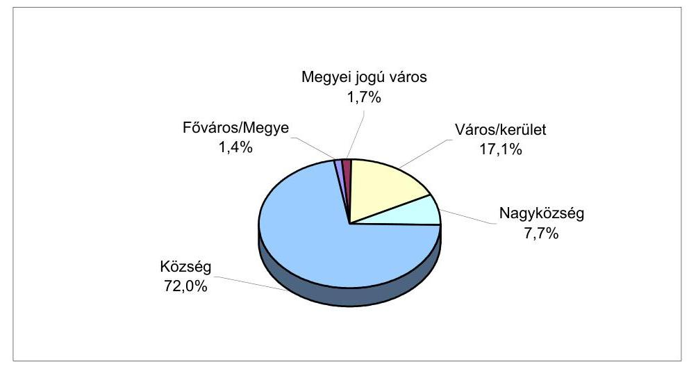

---

# Tájékoztató

## a helyi önkormányzatok vagyonának alakulása a könyvviteli mérleg adatai alapján

|  Megnevezés | 2000. év | 2001. év | 2002. év | Változás
2001/2000.
$\%$ | Változás
2002/2001.
$\%$ | Változás
2002/2000.
$\%$  |
| --- | --- | --- | --- | --- | --- | --- |
|  I. Immateriális javak | 5,3 | 6,2 | 8,9 | 117,0 | 143,5 | 167,9  |
|  II. Tárgyi eszközök | 1687,0 | 1897,5 | 4350,2 | 112,5 | 229,3 | 257,9  |
|  Ebből: ingatlanok | 1393,6 | 1558,6 | 3925,8 | 118,8 | 251,9 | 281,7  |
|  beruházások | 194,6 | 232,6 | 252,8 | 119,5 | 108,7 | 129,9  |
|  III. Befektetett pénzügyi eszközök | 533,2 | 586,3 | 564,7 | 110,0 | 96,3 | 105,9  |
|  IV. Üzemeltetésre átadott eszközök | 399,4 | 489,5 | 929,9 | 122,6 | 190,0 | 232,8  |
|  A) Befektett eszközök | 2624,9 | 2979,5 | 5853,7 | 113,5 | 196,5 | 223,0  |
|  I. Készletek | 13,5 | 13,2 | 15,8 | 97,8 | 119,7 | 117,0  |
|  II. Követelések | 145,6 | 169,0 | 172,1 | 116,1 | 101,8 | 118,2  |
|  III. Értékpapírok | 113,7 | 95,1 | 84,2 | 83,6 | 88,5 | 74,1  |
|  IV. Pénzeszközök | 144,8 | 192,1 | 218,2 | 132,7 | 113,6 | 150,7  |
|  V. Egyéb aktív pénzügyi elszámolások | 47,4 | 56,0 | 79,3 | 118,1 | 141,6 | 167,3  |
|  B) Forgóeszközök | 465,0 | 525,4 | 569,6 | 113,0 | 108,4 | 122,5  |
|  ESZKÖZÖK ÖSSZESEN | 3089,9 | 3504,9 | 6423,3 | 113,4 | 183,3 | 207,9  |
|  D) Saját tőke | 2723,7 | 3008,6 | 5770,2 | 110,5 | 191,8 | 211,9  |
|  E) Tartalékok | 113,4 | 157,9 | 163,2 | 139,2 | 103,4 | 143,9  |
|  I. Hosszú lejáratú kötelezettségek | 91,7 | 105,7 | 174,7 | 115,3 | 165,3 | 190,5  |
|  II. Rövid lejáratú kötelezettségek | 83,0 | 142,6 | 181,9 | 171,8 | 127,6 | 219,2  |
|  III. Egyéb passzív pénzügyi elszámolások | 78,1 | 90,1 | 133,3 | 115,4 | 147,9 | 170,7  |
|  F) Kötelezettségek | 252,8 | 338,4 | 489,9 | 133,9 | 144,8 | 193,8  |
|  FORRÁSOK ÖSSZESEN | 3089,9 | 3504,9 | 6423,3 | 113,4 | 183,3 | 207,9  |

Forrás: Államháztartási Hivatal Költségvetési Nyilvántartási és Adatfeldolgozási Főosztály éves költségvetési beszámoló 1. számú űrlap

---

# Tájékoztató

## az ellenőrzött helyi önkormányzatok eszközeiről és azok forrásairól

|  Megnevezés | 2000. év milliárd Ft | 2001. év | 2002. év | Változás
2001/2000.
$\%$ | Változás
2002/2001.
$\%$ | Változás
2002/2000.
$\%$  |
| --- | --- | --- | --- | --- | --- | --- |
|  I. Immateriális javak | 0,8 | 1,0 | 1,7 | 125,0 | 170,0 | 212,5  |
|  II. Tárgyi eszközök | 246,7 | 283,6 | 763,6 | 115,0 | 269,3 | 309,5  |
|  Ebből: ingatlanok | 199,9 | 226,6 | 684,5 | 113,4 | 302,1 | 342,4  |
|  beruházások | 26,3 | 34,7 | 43,3 | 131,9 | 124,8 | 164,6  |
|  III. Befektetett pénzügyi eszközök | 65,6 | 77,2 | 78,3 | 117,7 | 101,4 | 119,4  |
|  IV. Üzemeltetésre átadott eszközök | 49,2 | 65,6 | 114,2 | 133,3 | 174,1 | 232,1  |
|  A) Befektett eszközök | 362,3 | 427,4 | 957,8 | 118,0 | 224,1 | 264,4  |
|  I. Készletek | 2,5 | 2,5 | 2,4 | 100,0 | 96,0 | 96,0  |
|  II. Követelések | 25,7 | 29,2 | 26,5 | 113,6 | 90,8 | 103,1  |
|  III. Értékpapírok | 9,9 | 8,4 | 10,1 | 84,8 | 120,2 | 102,0  |
|  IV. Pénzeszközök | 27,8 | 33,4 | 34,4 | 120,1 | 103,0 | 123,7  |
|  V. Egyéb aktív pénzügyi elszámolások | 9,1 | 10,7 | 15,4 | 117,6 | 143,9 | 169,2  |
|  B) Forgóeszközök | 75,0 | 84,2 | 88,8 | 112,3 | 105,5 | 118,4  |
|  ESZKÖZÖK ÖSSZESEN | 437,3 | 511,6 | 1046,6 | 117,0 | 204,6 | 239,3  |
|  D) Saját tőke | 369,9 | 426,1 | 939,8 | 115,2 | 220,6 | 254,1  |
|  E) Tartalékok | 21,6 | 26,6 | 23,8 | 123,1 | 89,5 | 110,2  |
|  I. Hosszú lejáratú kötelezettségek | 15,9 | 20,3 | 25,9 | 127,7 | 127,6 | 162,9  |
|  II. Rövid lejáratú kötelezettségek | 14,4 | 20,8 | 31,4 | 144,4 | 151,0 | 218,1  |
|  III. Egyéb passzív pénzügyi elszámolások | 15,5 | 17,8 | 25,7 | 114,8 | 144,4 | 165,8  |
|  F) Kötelezettségek | 45,8 | 58,9 | 83,0 | 128,6 | 140,9 | 181,2  |
|  FORRÁSOK ÖSSZESEN | 437,3 | 511,6 | 1046,6 | 117,0 | 204,6 | 239,3  |

Forrás: Államháztartási Hivatal Költségvetési Nyilvántartási és Adatfeldolgozási Főosztály éves költségvetési beszámoló 1. számú űrlap

---

# Az ellenőrzött helyi önkormányzatok 2002. évi kiadásai 

| Megnevezés | Bruttó   teljesítés | Nettó teljesítés |  |
| :-- | --: | --: | --: |
|  | (millió Ft) | (millió Ft) | $\%$ |
| Kiadások összesen: | 1014037 | 702332 | 100 |
| Ebből kiemelve: |  |  |  |
| Müködési kiadások, ebből | 574729 | 476447 | 68 |
| Személyi juttatások | 209668 | 209668 | 30 |
| Munkaadókat terhelő járulékok | 73021 | 73021 | 10 |
| Dologi kiadások | 292040 | 193758 | 28 |
| Támogatások, elvonások és egyéb folyó kiadások | 63746 | 59926 | 9 |
| Felhalmozási kiadások | 157411 | 154864 | 22 |
| Egyéb, ebből | 218151 | 11095 | 1 |
| Kölcsönnyújtás | 3404 | 3404 | 0 |
| Hitel visszafizetés | 30561 | 4801 | 1 |
| Hosszú lejáratú értékpapírok vásárlása | 2890 | 2890 | 0 |
| Éven belüli értékpapírok vásárlásának egyenlege | 174401 | 0 | 0 |

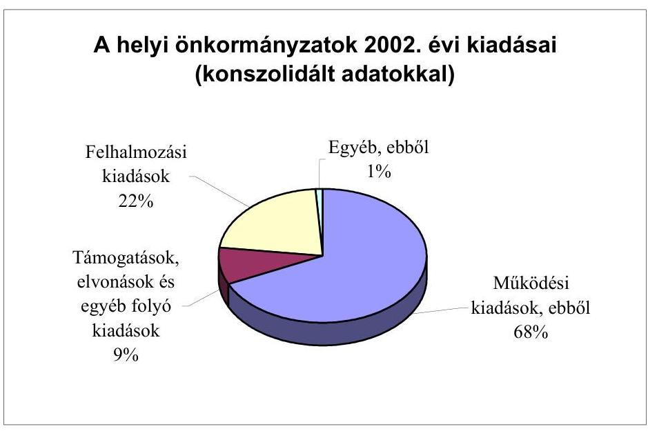

---

# 2002. évi bruttó bevételi és kiadási előirányzatok és a teljesítés alakulása önkormányzati típusonként (ellenőrzött önkormányzatok) 

| Önkormányzat típusa | Előirányzat |  | Bevétel összesen teljesítés |  | Kiadás összesen teljesítés |  | Bevétel megoszlása (\%) | Kiadás megoszlása (\%) |
| :--: | :--: | :--: | :--: | :--: | :--: | :--: | :--: | :--: |
|  | eredeti   (millió Ft) | módosított   (millió Ft) |  |  |  |  |  |  |
|  |  |  | millió Ft | $\%$ | millió Ft | $\%$ |  |  |
| Megyei önkormányzatok | 328796 | 426119 | 745885 | 175 | 588687 | 138 | 64 | 58 |
| Megyei jogú városok | 115560 | 144002 | 146976 | 102 | 138792 | 96 | 12 | 14 |
| Fővárosi kerületek | 68001 | 84251 | 84424 | 100 | 80691 | 96 | 7 | 8 |
| Városok | 121169 | 156560 | 160648 | 103 | 153780 | 98 | 13 | 15 |
| Nagyközségek | 13669 | 17884 | 17397 | 97 | 16453 | 92 | 1 | 1 |
| Községek | 29625 | 37711 | 37279 | 99 | 35634 | 94 | 3 | 4 |
| Összesen: | 676820 | 866527 | 1192609 | 138 | 1014037 | 117 | 100 | 100 |

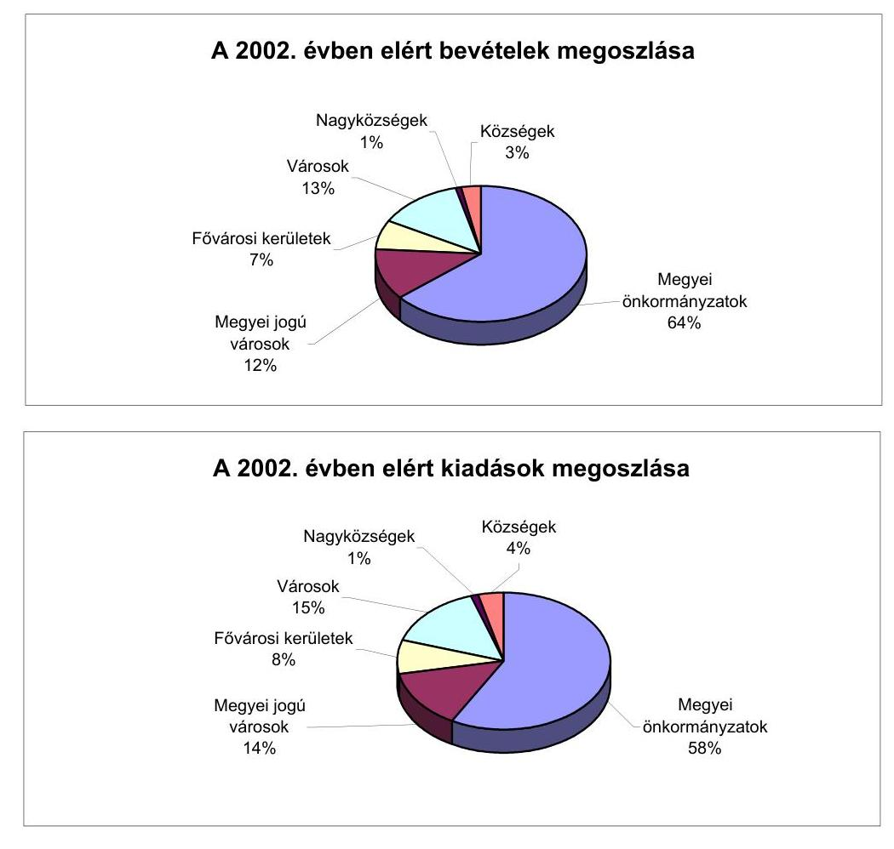

---

# Az önkormányzatok 2002. évi bruttó bevételeinek és kiadásainak alakulása 

Adatok: ezer Ft-ban

| Mérlegsor megnevezése | Eredeti | Módosított | Teljesítés |
| :--: | :--: | :--: | :--: |
|  | elöirányzat |  |  |
| Bevételek |  |  |  |
| Intézményi müködési bevételek | 178886013 | 226192140 | 228854100 |
| Kamatbevételek | 17575492 | 23345158 | 24213865 |
| Gépjármüadó | 14166395 | 14394407 | 14584071 |
| Helyi adók és kapcsolódó pótlékok, bírságok | 274519278 | 287286974 | 300323970 |
| Illetékek | 33580050 | 37414331 | 39771823 |
| Személyi jövedelemadó | 333957027 | 333006486 | 333006486 |
| Egyéb átengedett adók, adójellegủ bevételek | 2132859 | 2354299 | 2549705 |
| Önkorm. megillető bírságok és egyéb sajátos bevételek | 21216041 | 22920623 | 22835315 |
| Müködési célra átvett pénzeszközök | 308491529 | 374127685 | 376842509 |
| Költségvetési kiegészítések, visszatérülések | 0 | 1516381 | 110230580 |
| Felhalmozási és tőkejellegủ bevételek ebböl: | 159618779 | 146031389 | 105929171 |
| Tárgyi eszköz, immateriális javak értékesítése | 65801407 | 71061467 | 46313204 |
| Önkorm. lakások, egyéb helyiségek ért., cseréje | 34558217 | 30770160 | 29770478 |
| Részesedések értékesítése | 42907652 | 20116640 | 7036649 |
| Felhalmozási célra átvett pénzeszközök | 125524009 | 175625831 | 132987797 |
| Kölcsönök visszatérülése, igénybevétele | 7445632 | 12703899 | 13683130 |
| Saját bevételek összesen | 1477113104 | 1656919603 | 1705812522 |
| Önkormányzat költségvetési támogatása | 446566437 | 647660878 | 620643438 |
| Előző évi pénzmaradvány igénybevétele | 49378814 | 162501120 | 253813397 |
| Hitelek bevételei | 147714697 | 166232450 | 293502126 |
| Értékpapírok bevételei | 49878672 | 152283119 | 366558372 |
| Egyéb finanszírozás bevételei | 1368008 | 988671 | 42135626 |
| BEVÉTELEK MINDÖSSZESEN | 2172019732 | 2786585841 | 3282465481 |
| Kiadások |  |  |  |
| Személyi juttatások | 667923229 | 770565658 | 743167532 |
| Munkaadókat terhelő járulékok | 238897558 | 269523734 | 259885404 |
| Dologi kiadások | 484182729 | 589932955 | 560693559 |
| Egyéb folyó kiadások | 20783838 | 45026768 | 146948939 |
| Ellátottak pénzbeli juttatása | 5495222 | 6940482 | 6585914 |
| Müködési célú pénzeszköz átadás | 80785705 | 101395797 | 97658689 |
| Társadalom- és szociálpolitikai juttatások | 84543242 | 108163204 | 103401100 |
| Tervezett maradvány, eredmény, tartalék | 135044609 | 47387809 | 1343793 |
| Felújítás | 56575034 | 86909027 | 65946423 |
| Intézményi beruházási kiadások | 294635493 | 487356201 | 353835859 |
| Egyéb felhalmozási kiadások | 187462 | 645694 | 470807 |
| Részesedések vásárlása | 1017213 | 6503888 | 6760783 |
| Felhalmozási célú pénzeszköz átadások | 45257127 | 108647458 | 72368725 |
| Kölcsönök törlesztése, nyújtása | 7637987 | 13445934 | 12856515 |
| Hitelek törlesztése | 35419832 | 69670953 | 235747290 |
| Értékpapírok kiadásai | 13633452 | 74470279 | 315710189 |
| Egyéb finanszírozás kiadásai | 0 | 0 | 23323963 |
| KIADÁSOK MINDÖSSZESEN | 2172019732 | 2786585841 | 3006705484 |

Forrás: Államháztartási Hivatal Költségvetési Nyilvántartási és Adatfeldolgozási Főosztály éves költségvetési beszámoló 80 . számú űrlap

---

# Az ellenőrzött önkormányzatok 2002. évi bruttó bevételeinek és kiadásainak alakulása 

Adatok: ezer Ft-ban

| Mérlegsor megnevezése | Eredeti | Módosított | Teljesítés |
| :--: | :--: | :--: | :--: |
|  | elöirányzat |  |  |
| Bevételek |  |  |  |
| Intézményi müködési bevételek | 53397408 | 64531622 | 63838023 |
| Kamatbevételek | 10732292 | 14770086 | 14383171 |
| Gépjármüadó | 3202081 | 3263236 | 3261979 |
| Helyi adók és kapcsolódó pótlékok, bírságok | 112145107 | 109766450 | 116035697 |
| Illetékek | 12185880 | 13397438 | 14177117 |
| Személyi jövedelemadó | 78848251 | 78695962 | 78695962 |
| Egyéb átengedett adók, adójellegủ bevételek | 311935 | 345698 | 371471 |
| Önkorm. megillető bírságok és egyéb sajátos bevételek | 4770683 | 4872028 | 4976037 |
| Müködési célra átvett pénzeszközök | 107148695 | 129590098 | 130973874 |
| Költségvetési kiegészitések, visszatérülések | 0 | 275233 | 98589799 |
| Felhalmozási és tökejellegủ bevételek | 74196215 | 57997386 | 34249956 |
| ebböl: |  |  |  |
| Tárgyi eszköz, immateriális javak értékesítése | 23018567 | 25181135 | 13801541 |
| Önkorm. lakások, egyéb helyiségek ért., cseréje | 7224197 | 7405755 | 7518639 |
| Részesedések értékesítése | 36319812 | 14458432 | 2886226 |
| Felhalmozási célra átvett pénzeszközök | 27071863 | 40625774 | 27346911 |
| Kölcsönök visszatérülése, igénybevétele | 1506656 | 2429992 | 2671367 |
| Saját bevételek összesen | 485517066 | 520561003 | 589571364 |
| Önkormányzat költségvetési támogatása | 110298674 | 155369504 | 150112472 |
| Előző évi pénzmaradvány igénybevétele | 7903816 | 65004321 | 155476003 |
| Hitelek bevételei | 53072375 | 64849279 | 73620932 |
| Értékpapírok bevételei | 20021942 | 60617051 | 213094051 |
| Egyéb finanszírozás bevételei | 6677 | 125164 | 10733278 |
| BEVÉTELEK MINDÖSSZESEN | 676820550 | 866526322 | 1192608100 |
| Kiadások |  |  |  |
| Személyi juttatások | 185601689 | 218376835 | 209667809 |
| Munkaadókat terhelő járulékok | 67087131 | 76163640 | 73020770 |
| Dologi kiadások | 149316297 | 186682769 | 175547333 |
| Egyéb folyó kiadások | 6945456 | 20397098 | 116492890 |
| Ellátottak pénzbeli juttatása | 1906558 | 2356787 | 2234840 |
| Müködési célú pénzeszköz átadás | 38328826 | 44206395 | 42501299 |
| Társadalom- és szociálpolitikai juttatások | 15614537 | 20166800 | 19009718 |
| Tervezett maradvány, eredmény, tartalék | 79448181 | 16930531 | 200611 |
| Felújítás | 24401736 | 33438406 | 22945603 |
| Intézményi beruházási kiadások | 72917569 | 144305576 | 95708100 |
| Egyéb felhalmozási kiadások | 111875 | 121379 | 1188 |
| Részesedések vásárlása | 106815 | 4013383 | 4267145 |
| Felhalmozási célú pénzeszköz átadások | 24138710 | 64139937 | 34488782 |
| Kölcsönök törlesztése, nyújtása | 1862861 | 4722547 | 3404379 |
| Hitelek törlesztése | 7034718 | 14152414 | 30560845 |
| Értékpapírok kiadásai | 1997591 | 16351825 | 177290819 |
| Egyéb finanszírozás kiadásai | 0 | 0 | 6695161 |
| KIADÁSOK MINDÖSSZESEN | 676820550 | 866526322 | 1014037292 |

Forrás: Államháztartási Hivatal Költségvetési Nyilvántartási és Adatfeldolgozási Főosztály éves költségvetési beszámoló 80 . számú űrlap

---

# Dr. Kovács Árpád úr részére elnök 

Iktatószám:
$15114 / 1 / 2004$.

Állami Számvevőszék

1364 Budapest 4.
Pf. 54

## Tisztelt Elnök Úr!

A helyi és helyi kisebbségi önkormányzatok gazdálkodásának ellenőrzéséről készített jelentést köszönettel vettem. A tervezet átfogóan tartalmazza és tárgyilagosan elemzi az önkormányzati gazdálkodásban fellelhető problémákat, ellentmondásokat. Úgy vélem közös feladatunk, hogy mindezekre találjunk olyan megoldásokat, amelyek egyszerre képesek megfelelni a közpénzek felhasználása feletti ellenőrzésnek és az önkormányzatok polgáraikkal szembeni felciös gazdálkodásának.

Fentiek fontosságát jelzi, hogy mind az Állami Számvevőszék, mind a Pénzügyminisztérium mélyen részletekbe menően foglalkozik - közvetlen szakértői megbeszélésen keresztül is - a gazdálkodás színvonala, a pénzügyi fegyelem és az ellenőrzés területével, az esetleges szabályozási hiányosságok megszüntetésével.

Mindezek ismeretében a jelentés tervezetben megfogalmazott szándékokkal alapvetően egyctértek, szükségesnek tartok néhány dolgot külön is kiemelni a megállapítások közül.

Az államháztartás egyensúlyi helyzetének javításához szükséges rövid és hosszabb távú intézkedésekről szóló kormányhatározat végrehajtása már önálló témaként jeleníti meg a szakfeladatrend és a költségvetési címrend korszerüsitését. Megalkotásánál a cél az, hogy az új rendszer alkalmas legyen az államháztartás egészére érvényesen a feladatok tartalmi elkülönítésére, mérésére, valamint a kiadások és bevételek tervezésének, továbbá elszámolásának megalapozására úgy, hogy egyben az önkormányzati feladatellátás sajátosságait is magában foglalja.
A megvalósítás szakmai megalapozásában fontos szerepe van az érintett szakminisztériumoknak.

---

Az államháztartási joganyag ez évi módosításának az eddigieknél több lényeges szabályozási - újraszabályozási feladatot kell felvállalnia. Ennek során látom lehetőségét annak, hogy a számvevőszáki javaslatok megoldásra kerüljenek.

- Meg fogjuk határozni a helyi rendelet alkotáshoz elengedhetetlenül szükséges kritérium rendszert, amely alapján az önkormányzatok országosan egységesen eleget tudnak tenni az Âllamháztartásról szóló törvény 118 §-ában meghatározott mérlegek elkészítési és bemutatási kötelezettségüknek.
- A helyi kisebbségi önkormányzatokat érintően az államháztartás müködési rendjéről szóló kormányrendelet módosítása során ismételten áttekintjük a kötelezettségvállalásra, ellenjegyzésre, teljesítésre, valamint az elöirányzat módosításra vonatkozó szabályokat, és ahol még szükséges kiegészítjük azokat a helyi kisebbségi önkormányzatok sajátosságaival.
- Az államháztartásból „kifelé" juttatott pénzeszközök felhasználásának ellenőrzésével kapcsolatosan úgy vélem, hogy a probléma nyilván tágabb szabályozási kérdést vet fel, mint az önkormányzati szférától juttatott támogatások ellenőrzésének köre. Ezt a kérdést az államháztartás egészére kell megoldanunk.
- A nyilvános versenytárgyalás értékhatárának meghatározási igényével kapcsolatosan magam is egyetértek azzal az elvvel, hogy a nagy értékủ vagyon értékesítése, hasznosítási jogának átengedése a köz ellenőrzése mellett kell hogy megvalósuljon. Valóban szükséges találni olyan megoldást, - értékhatárt, esetleg differenciált intervallumot - ahol a törvényi szabályozás keretein belül érvényesülnek a helyi döntések.

Kérem Elnök urat, hogy a Számvevőszéki javaslatok véglegezése során észrevételeimet figyelembe venni szíveskedjék.

Budapest, 2004. július 9.
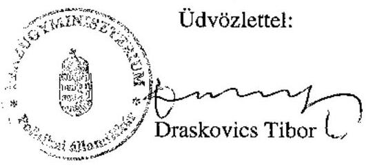

---

Baatószám: 1-a-2/29/2004.

Dr. Kovács Árpád árnak, elnök Áliami Számvevöszék

Budapest

# Tiszzett Elnok Úr! 

A helyi és a helyi kisebbségi önkormányzatrik gazdalkodásának átfogó ellenürzésérül szóló Jelentés megküldését köszönettel vettem, melynek elöremutató megállapításait munkánk során hasznosíthatjuk.

A Belügyminisztérium számára megfogalmazott javaslatokkal az alábbi pontositásokkal a javaslatok sorrendjében haladva - egvei értünk.

## 1. pont

Hangsúlyozni szükséges, hogy az önkormányrati kötelezö feladatok tekintetében a helyi önkormányzatokról szóló 1990. évi LXV. törvény (továbbiakban: Ötv.) kerettörvényként funkcionál. Ennek megfelelöen rendelkezik arról, hogy ,,törvény a helyi önkormányzatnak kötelezö feladat- és hatáskört is megállapithat. A kötelezöen ellátandó önkormányzati feladat- és hatáskörök meghatározásával egyidejüleg az Országgyülés biztositja az ellátásukhoz szükséges anyagi feltételeket, dönt a költségvetési hozzájárulás mértékéröl és módjáról. " Az önkormányzatok számára kötelezően ellátandó feladatról - az egyes ágazatok vonatkozásában - az ágazati törvények rendelkeznck.
A közigazgatási szolgáltatások korszerüsitési programjáról szóló 1113/2003. (XI. 11.) Korm. határozatnak megfelelöen folyamatban van az önkormányzati, valamint az államigazgatási szervek által ellátott feladat- és hatáskörök felülvizsgálata, melynek során a kötelezö feladatok egyértelmü megfogalmazásának igénye érvényesithetö valamennyi érintett jogszabály elökézeitövel szemben.

## 2. pont

A javaslatban megfogalmazottakkal egyetértck, az ezzel kapcsolatot szabályozási feladatok a helyi önkormányzatokról szóló törvény átfogó felülvizsgálatához igazodhatnak.

---

3. pont

A javaslatnak megfelelöen valóban elüremutatá lenne, ha az önkormányzati körben egységes informatikai és számvitelei rendszerek müködnének. Megjegyeznl kivánom azonban, hogy a hatékonyabb feladatellátás, a párhusamossággok elkerülése érdekében müködö kormányzati munkamegosztás az informatikai feladatok tekintetében az Informatikai és Hïrközlési Minisztérium elsü helyi felelösségét rögziti. Feladatkörük kiterjed a közigazgatási (kormányzati és önkormányzati) programok tervezésére, kivitelezésére és müködtetésére.
E munkamegosztásnak megfelelöen a javaslatban foglaltak megvalósitását a Belügyminixstérium csak kezdeményezheti az Informatikai és Hïrközlési Minisztérium felé.

Kérem, hogy pontosiró észrevételeimet a Jelentés véglegezése során figyelembe venni szíveskedjék.

Budapest, 2004. július „15"
Ödvözlettel.
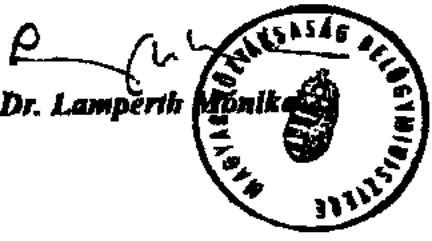