# JELENTÉS 

a Magyarországi Nemzeti és Etnikai Kisebbségekért Közalapítvány gazdálkodásának ellenőrzéséről

---

3. Önkormányzati és Területi Ellenőrzési Igazgatóság
3.1. Szabályszerűségi Ellenőrzések FőcsoportIktatószám: V-1020-48/2004.Témaszám: 689
Vizsgálat-azonosító szám: V0120
Az ellenőrzést felügyelte:
Dr. Lóránt Zoltán
főigazgató
Az ellenőrzés végrehajtásáért felelős:
Dr. Elek János
főigazgató-helyettes
Az ellenőrzést vezette:
Balázs Andrásné
főcsoportfőnök-helyettes
Az összefoglaló jelentést készítette:
Sas Imréné
számvevő tanácsadó
Az ellenőrzést végezték:
Sas Imréné
számvevő tanácsadó
Solymár Ágnes
számvevő tanácsos
A témához kapcsolódó eddig készített számvevőszéki jelentések:
címe
sorszáma
Jelentés a Nemzeti Gyermek és Ifjúsági Alapítvány pénzügyi- ..... 80
gazdasági ellenőrzéséről (1992)
Jelentés a Magyar Vállalkozásfejlesztési Alapítvány részére PHARE ..... 220
forrásból juttatott pénzügyi támogatások felhasználásának vizsgálatáról (1994)
Jelentés a fejezetek és intézményeik által az alapítványoknak ..... 306
juttatott állami pénzek és vagyon felhasználásának, működtetésének ellenőrzéséről (1996)
Jelentés a Magyar Alkotóművészeti Közalapítvány ..... 347
gazdálkodásának ellenőrzéséről (1997)
Jelentés a Gandhi Közalapítvány pénzügyi-gazdasági ..... 351
ellenőrzéséről (1997)
Jelentés a Magyarországi Cigányokért Közalapítvány pénzügyi- ..... 372
gazdasági ellenőrzéséről (1997)
Jelentés a Magyarországi Nemzeti és Etnikai Kisebbségekért ..... 373
Közalapítvány pénzügyi-gazdasági ellenőrzéséről (1997)

---

Jelentés a médiatörvény végrehajtásának pénzügyi - gazdasági 396 ellenőrzéséről (1997)
Jelentés a Magyar Rádió Közalapítvány és - kapcsolódó 9806 ellenőrzésként - a Magyar Rádió Részvénytársaság gazdálkodásának ellenőrzéséről
Jelentés a Magyar Televízió Közalapítvány és kapcsolódó ellenőrzés 9812 keretében a Magyar Televízió Rt. működésének és gazdálkodásának ellenőrzéséről
Jelentés a Nemzetközi Pető András Közalapítvány és - kapcsolódó 9822 ellenőrzésként - a Mozgássérültek Pető András Nevelőképző és Nevelőintézet pénzügyi-gazdasági ellenőrzéséről
Jelentés a Magyar Nemzeti Üdülési Alapítványnak juttatott állami 9906 eszközök felhasználásának és működtetésének pénzügyi-gazdasági ellenőrzéséről
Jelentés a sportcélú közalapítványok működésének pénzügyi- 9907 gazdasági ellenőrzéséről
Jelentés a Fogyatékos Gyermekek, Tanulók Felzárkóztatásáért 9915 Országos Közalapítvány működésének pénzügyi-gazdasági ellenőrzéséről
Jelentés a Nemzeti Gyermek és Ifjúsági Közalapítvány 0002 működésének pénzügyi-gazdasági ellenőrzéséről
Jelentés a Közoktatási Modernizációs Közalapítvány működésének 0011 ellenőrzéséről
Jelentés a Magyar Nemzeti Üdülési Alapítvány 0101 vagyongazdálkodásának ellenőrzéséről
Jelentés az Országos Foglalkoztatási Közalapítvány 0117 gazdálkodásának ellenőrzéséről
Jelentés az Új Kézfogás Közalapítvány gazdálkodásának 0136 ellenőrzéséről
Jelentés a közalapítványoknak és az alapítványoknak az 1998- 0228 2001. évek között juttatott nem normatív központi költségvetési támogatás felhasználásának ellenőrzéséről
Jelentés a Magyar Mozgókép Közalapítvány gazdálkodásának 0304 ellenőrzéséről
Jelentés a Magyar Alkotóművészeti Közalapítvány 0323 gazdálkodásának ellenőrzéséről
Jelentés az EU Kommunikációs Közalapítvány gazdálkodásának 0351 ellenőrzéséről
Jelentés a Magyarországi Zsidó Örökség Közalapítvány 0402 gazdálkodásának ellenőrzéséről
Jelentés a Magyarországi Cigányokért Közalapítvány 0427 gazdálkodásának ellenőrzéséről

---

# TARTALOMJEGYZÉK 

BEVEZETÉS ..... 7
I. ÖSSZEGZŐ MEGÁLLAPÍTÁSOK, KÖVETKEZTETÉSEK, JAVASLATOK ..... 11
II. RÉSZLETES MEGÁLLAPÍTÁSOK ..... 21

1. A közalapítvány működésének jogi, szervezeti feltételei ..... 21
1.1. A közalapítvány létrehozása, közhasznúsági bejegyzése, az alapító okirat módosításai ..... 21
1.2. Az alapító okirat és az SZMSZ ..... 23
1.3. A bankszámla feletti rendelkezés ..... 24
1.4. A kuratórium működése ..... 25
1.5. A közalapítványi iroda működése ..... 29
1.6. Az iratkezelési szabályzat, az iratok selejtezése, a felelősség megállapítása ..... 29
1.7. A felügyelő bizottság működése ..... 33
2. A könyvvezetés és a gazdálkodás szabályozottsága, szabályossága ..... 34
2.1. A gazdálkodási szabályzatok ..... 34
2.2. Az éves költségvetések ..... 36
2.3. A számviteli nyilvántartások rendszere és szabályossága ..... 36
2.3.1. A támogatások számviteli nyilvántartása ..... 37
2.3.2. A cél szerinti-, és a működési költségek elkülönítése ..... 37
2.4. Az éves beszámolók szabályossága, a beszámolási-, és auditálási kötelezettség teljesítése ..... 38
2.5. A bevételek, költségek, ráfordítások és a likviditás alakulása ..... 39
2.5.1. A közalapítvány bevételei ..... 39
2.5.2. A közalapítvány költségei és ráfordításai ..... 40
2.5.3. Tiszteletdíjak és költségtérítések ..... 42
2.5.4. A közalapítvány pénzügyi helyzete és likviditása ..... 42
3. A közalapítványnak nyújtott központi költségvetési támogatás ..... 42
4. A közalapítvány célszerinti támogatásai ..... 44
4.1. A támogatás rendszere ..... 44
4.2. A hazai kisebbségi sajtó működésének támogatása ..... 46
4.2.1. A sajtótámogatás szabályozottsága és a kifizetett támogatások ..... 46
4.2.2. A sajtótámogatás célszerű felhasználása, elszámoltatása ..... 48
4.3. A célprogramok pályázati támogatásai ..... 51
4.3.1. A céltámogatás szabályozottsága és a kifizetett támogatások ..... 51

---

4.3.2. A támogatások célszerű felhasználása és elszámoltatása ..... 52
4.4. A közalapítvány ösztöndíj támogatásai ..... 54
4.5. A kuratóriumi elnöki keret felhasználása ..... 54
5. Az intézkedési terv feladatainak teljesítése ..... 55

# MELLÉKLETEK 

1. számú Határozatképtelen kuratóriumi ülések és törvénysértő kuratóriumi határo- zatok
2. számú Az adatvédelmi biztos 1997. január 14-én kelt állásfoglalása
3. számú A 2002. február 14-én készült selejtezési jegyzőkönyv
4. számú A 2002. október 9-én készült selejtezési jegyzőkönyv
5. számú A MNEKK igazgatójának 2003. november 28-án kelt levele
6. számú Az adatvédelmi biztos 2004. március 3-án kelt állásfoglalása
7. számú A MNEKK eszközei és forrásai
8. számú A MNEKK eredmény-kimutatása
9. számú A MNEKK bevételei, költségei és ráfordításai
10. számú A MNEKK által adott támogatások
11. számú A MNEKK által magánszemélyeknek adott támogatások
12. számú A MNEKK által támogatott célfeladatok 1999-2003. években
13. számú A 2004. március 16-án készült selejtezési jegyzőkönyv
14. számú A 2004. május 19-én készült helyszíni ellenőrzési jegyzőkönyv a MNEKK irodaigazgatója személyes felelősségének megállapításáról
15. számú A MNEKK irodaigazgatójának írásos magyarázata a személyes felelősségének megállapításával kapcsolatosan
16. számú A MNEKK irodaigazgatójának a személyes felelőssége megállapításával kapcsolatosan adott írásos magyarázat elutasítása
17. számú A MEH politikai államtitkárának nemleges észrevétele

---

# RÖVIDÍTÉSEK JEGYZÉKE 

| Áht. | az államháztartásról szóló 1992. évi XXXVIII. törvény |
| :--: | :--: |
| ÁSZ törvény | az Állami Számvevőszékről szóló 1989. évi XXXVIII. törvény |
| Avtv. | a személyes adatok védelméről és a közérdekű adatok nyilvánosságáról szóló 1992. évi LXIII. törvény |
| adatvédelmi törvény | a személyes adatok védelméről és a közérdekű adatok nyilvánosságáról szóló 1992. évi LXIII. törvény |
| BM | Belügyminisztérium |
| FB | Felügyelő Bizottság |
| IM | Igazságügyi Minisztérium |
| Kh. tv. | a közhasznú szervezetekről szóló 1997. évi CLVI. törvény |
| Kincstár | Magyar Államkincstár |
| KSH | Központi Statisztikai Hivatal |
| Ltv. | a köziratokról, a közlevéltárakról és a magánlevéltári anyag védelméről szóló 1995. évi LXVI. törvény |
| MEH | Miniszterelnöki Hivatal |
| MNEKK | Magyarországi Nemzeti és Etnikai Kisebbségekért Közalapítvány |
| MTA | Magyar Tudományos Akadémia |
| NEKH | Nemzeti és Etnikai Kisebbségi Hivatal |
| Nek. tv. | a nemzeti és etnikai kisebbségek jogairól szóló 1993. évi LXXVII. törvény |
| NKÖM | Nemzeti Kulturális Örökség Minisztériuma |
| OGY | Országgyűlés |
| OM | Oktatási Minisztérium |
| PM | Pénzügyminisztérium |
| Ptk. | a Polgári Törvénykönyvről szóló 1959. évi IV. törvény |
| SZMSZ | Szervezeti és Működési Szabályzat |
| Szt.(új) | a számvitelről szóló 2000. évi C. törvény |
| Szt.(régi) | a számvitelről szóló 1991. évi XVIII. törvény |

---

.

---

# ÉRTELMEZÉSEK 

Az alapítvány bevételei

Az alapítvány költségei (kiadásai)

Az alapítvány kezelő
szervének költségei (kiadásai)

Cél szerinti tevékenység

Induló vagyon

Kiemelkedően közhasznú közalapítvány

Kisebbségek

Közalapítvány

Közfeladat

A vállalkozási tevékenység bevétele, valamint az alapítványi célú tevékenység bevételei (minden olyan bevétel, amely nem a vállalkozási tevékenységhez kapcsolódó befizetés, ideértve a céltámogatást is) [115/1992. (VII. 23.) Korm. rendelet 3. § (1) bekezdésének a) és b) pontja].
A vállalkozási tevékenység közvetlen költségei, az alapítványi célú tevékenység közvetlen költségei, az alapítvány kezelő szervének költségei (kiadásai) és az egyéb közvetett költségek (kiadások) [115/1992. (VII. 23.) Korm. rendelet 3. § (2) bekezdésének a) és b) és c) pontja].

Az alapítvány kezelő szervének üzemeltetési, fenntartási költségei (az alapító okiratok ezeket a költségeket tekintik a kuratórium és a munkaszervezet működési költségeinek).
Minden olyan tevékenység, amely az alapító okiratban megjelölt célkitűzés elérését közvetlenül szolgálja [Kh. tv. 26. § b) pontja].

A közalapítvány javára a célja megvalósításához az alapító okiratban meghatározott vagyon [Ptk. 74/A. § (1) bekezdése, 74/B. § (1) bekezdése]. A közalapítvány rendelkezésére legalább olyan mértékű vagyont kell bocsátani, amely a működése megkezdéséhez feltétlenül szükséges [Ptk. 74/B. § (4) bekezdése]. A közalapítványi vagyon pontos megjelölése nélkül a közalapítvány nem jöhet létre [BH2001. 303].
A kiemelkedően közhasznú közalapítványnak a közhasznú közalapítványokra előírt követelmények teljesítésén túl közhasznú tevékenysége során olyan közfeladatot kell ellátnia, amelyről törvény vagy törvény felhatalmazása alapján más jogszabály rendelkezése szerint, valamely állami szervnek vagy a helyi önkormányzatnak kell gondoskodnia, az alapító okirata szerinti tevékenységének és gazdálkodásának legfontosabb adatait a helyi vagy országos sajtó útján is nyilvánosságra hozza, továbbá a közhasznú tevékenységet maga látja el [Kh. tv. 5. § és a BH2001. 451 alapján].
Magyarországon honos népcsoportnak minősülnek: a bolgár, a cigány, a görög, a horvát, a lengyel, a német, az örmény, a román, a ruszin, a szerb, a szlovák, a szlovén és az ukrán [Nek. tv. 61. § (1) bekezdése].
A közalapítvány olyan alapítvány, amelyet az Országgyűlés, a Kormány, valamint a helyi önkormányzat vagy kisebbségi önkormányzat képviselő-testülete közfeladat ellátásának folyamatos biztosítása céljából hoz létre [Ptk. 74/G. § (1) bekezdése].
Közfeladat az az állami vagy helyi önkormányzati, kisebbségi önkormányzati feladat, amelynek ellátásáról -

---

Közhasznú egyszerüsített éves beszámoló

Közhasznú tevékenység

Közhasznúsági jelentés

Különleges adat

Személyes adat

Támogatás
Vezető tisztségviselő a
közalapítványoknál
jogszabály alapján - az államnak vagy az önkormányzatnak kell gondoskodnia [Ptk. 74/G. § (2) bekezdése].
A közhasznú nyilvántartásba vett közalapítványoknál mérlegből, közhasznú eredmény-kimutatásból és tájékoztató adatokból áll [224/2000. (XII. 19.) Korm. rendelet 6. § (8) bekezdése, illetve 4 . és 6 . számú melléklete].

A társadalom és az egyén közös érdekeinek kielégítésére irányuló, a közhasznú közalapítvány alapító okiratában szereplő cél szerinti tevékenység a törvényben meghatározott körben [Kh. tv. 26. § c) pontja].
Tartalmazza a számviteli beszámolót; a költségvetési támogatás felhasználását; a vagyon felhasználásával kapcsolatos kimutatást; a cél szerinti juttatások kimutatását; a központi költségvetési szervtől, az elkülönített állami pénzalaptól, a helyi önkormányzattól, a kisebbségi települési önkormányzattól, a települési önkormányzatok társulásától és mindezek szerveitől kapott támogatás mértékét; a közhasznú szervezet vezető tisztségviselőinek nyújtott juttatások értékét, illetve összegét; a közhasznú tevékenységről szóló rövid tartalmi beszámolót [Kh. tv. 19. § (3) bekezdése].

A faji eredetre, a nemzeti, nemzetiségi és etnikai hovatartozásra, a politikai véleményre vagy pártállásra, a vallásos vagy más meggyőződésre vonatkozó személyes adatok [Avtv. 2. § (2) bekezdés a) pontja].
A meghatározott természetes személlyel kapcsolatba hozható adat, az adatból levonható, az érintettre vonatkozó következtetés. A személyes adat az adatkezelés során mindaddig megőrzi e minőségét, amíg kapcsolata az érintettel helyreállítható [Avtv. 2. § (1) bekezdése].
Pénzbeli és nem pénzbeli juttatás [Kh. tv. 26. § j) pontja].
A közalapítvány kuratóriumának és felügyelő bizottságának elnöke és tagja, a közalapítvánnyal munkaviszonyban vagy munkavégzésre irányuló egyéb jogviszonyban álló, az alapító okirat szerint egyszemélyi felelős vezető feladatot ellátó személy [Kh. tv. 26. § m) pontja alapján].

---

# JELENTÉS 

## a Magyarországi Nemzeti és Etnikai Kisebbségekért Közalapítvány gazdálkodásának ellenőrzéséről

## BEVEZETÉS

A nonprofit szervezetek között 1994. január 1-jétől jelentek meg a közalapítványok, melyek megalakítására és működésére a Ptk. az alapítványok szabályozásán belül külön feltételeket és követelményeket határozott meg az alapítók körét, az ellátandó közfeladatokat, valamint a működés és gazdálkodás feltételeit illetően. Közalapítványt csak az Országgyűlés, a Kormány, valamint a helyi önkormányzat vagy kisebbségi önkormányzat képviselő-testülete hozhat létre közfeladat (állami, helyi önkormányzati vagy országos kisebbségi önkormányzati feladat) ellátásának folyamatos biztosítása céljából, de a közalapítvány létrehozása nem érinti az államnak, illetve az önkormányzatnak a feladat ellátására
 vonatkozó kötelezettségét. A közalapítványok a nyilvánosság előtt tevékenykednek, ezért alapító okiratukat, gazdálkodásuk legfontosabb adatait nyilvánosságra kell hozni.

A közpénzek törvényes, felelős és közhasznú felhasználása érdekében a Ptk. és a közhasznú szervezetekről szóló törvény részletesen meghatározta a közalapítvány vagyonkezelő szervezete (kuratóriuma) működésének, képviseletének, a tisztségviselők felelősségének és összeférhetetlenségének szabályait. A közalapítvány vagyonát kezelő szervezet (kuratórium) tagjai az alapítók bizalmából látják el feladatukat, de tőlük sem közvetlenül, sem közvetve nem függhetnek, az alapítók nem gyakorolhatnak meghatározó befolyást a közalapítvány vagyonának felhasználására.

A közalapítványok ellenőrzésére az alapítványoknál szigorúbb követelmények vonatkoznak, így az alapítóknak már az alapítással egy időben létre kell hozni a kuratórium ellenőrzésére jogosult ellenőrző szervet (ellenőrző vagy felügyelő bizottságot). Az Országgyűlés és a Kormány által alapított közalapítványoknál az Állami Számvevőszék nemcsak az állami támogatás felhasználását, hanem a gazdálkodás törvényességét és célszerűségét is jogosult ellenőrizni.

A 2003. év végén - az ún. média közalapítványokkal együtt - 50 működő, illetve bejegyzés alatt álló, az Országgyűlés és a Kormány által alapított közalapítvány volt. A 2004. évi költségvetési törvény - eredeti előirányzatként - a Kormány által alapított közalapítványoknak közvetlenül névre címzetten 35,6 milliárd Ft eredeti támogatási előirányzatot hagyott jóvá ${ }^{1}$, amelyből az államháztartás egyensúlyi helyzetének javításához szükséges rövid és hosszabb távú intézkedésekről szóló 2050/2004. (III. 11.) Korm. határozat 2,1 milliárd Ft-ot (5,9%-ot) zárolt.

Az Országgyűlés az éves költségvetési törvényekben az 1999-2003. években a Magyarországi Nemzeti és Etnikai Kisebbségekért Közalapítvány részére közvetlenül névre címzetten megközelítőleg 3 milliárd Ft támogatást hagyott jóvá. A 2004. évi éves költségvetési törvényben az eredeti támogatási előirányzat 500 millió Ft volt, amelyből a Kormány 109 millió Ft-ot (21,8%-ot) zárolt.

A Magyarországi Nemzeti és Etnikai Kisebbségekért Közalapítványt a Magyar Köztársaság Kormánya - az 1990. évben alapított azonos nevű alapítvány jogutódjaként, a nemzeti és etnikai kisebbségek jogairól szóló 1995. évi VI. törvénnyel módosított 1993. évi LXXVII. törvény 55. § (3) bekezdésének megfelelően - a 2187/1995. (VII. 4.) Korm. határozattal hozta létre. A Fővárosi Bíróság a közalapítványt a 13. Pk. 62.357/1990/27. számú, 2000. május 22-én kelt végzésével 1998. január 1. napjától kiemelkedően közhasznú szervezetté minősítette. A közalapítvány célja, hogy ösztönözze, segítse, sokoldalúan támogassa különösen a hazai nemzeti, etnikai közösségi lét fennmaradását, a magyarországi kisebbségek nemzeti és etnikai önazonosságának megőrzését, a hazai kisebbségek hagyományainak, nyelvének ápolását, fejlesztését, átörökítését, gondozását, tárgyi és szellemi kultúrájuk megmaradását.

Az Állami Számvevőszék a jogelőd alapítvány által felhasznált állami támogatást 1995-ben², a közalapítvány gazdálkodását - az Országgyűlés felkérésére ${ }^{3}$ - 1997-ben ${ }^{4}$ ellenőrizte, majd 2002-ben ${ }^{5}$ adatlapok kitöltésével beszámoltatta a 2001. év végéig kapott állami támogatás felhasználásáról.

Az 1995. évi ellenőrzés összefoglaló megállapítása szerint az alapító okirat szükséges módosításának elmaradása, ebből következően a felügyelő bizottság, valamint az alapítvány gazdálkodásának teljes körű szabályozottságát biztosító SZMSZ hiánya együttesen eredményezték a gazdálkodási szabálytalanságokat, a pénzügyi, számviteli, bizonylati fegyelem megsértését.

A gazdálkodás 1997. évi átfogó ellenőrzése feltárta, hogy

- a közalapítvány tevékenységéről sem a kuratórium, sem a felügyelő bizottság nem számolt be az alapítónak;
- a felügyelő bizottság nem ellenőrizte a kuratórium munkáját;
- az alapító okirat nem határozta meg a kuratóriumi tagokra vonatkozó összeférhetetlenségi szabályokat;
- a kuratóriumnak az éves központi költségvetési támogatások nagyságrendjének kialakítására nem volt ráhatása;
- a kisebbségeket támogató szervezetek között a közalapítvány által támogatott célok és kedvezményezettek köre nem volt megfelelően koordinált;
- a támogatottak által benyújtott elszámolások tartalmi szempontból kifogásolhatóak voltak;
- a kisebbségi lapok támogatásának szabályos felhasználása és a támogatási struktúra kialakítása érdekében a közalapítvány nem készített átfogó hatáselemzést a lapok kisebbségi politikát szolgáló belső tartalmának megítélése céljából;
- a közalapítvány induló vagyonának összege rendezetlen volt, és nem tartalmazta a jogelőd alapítvány által felajánlott vagyont;
- a számviteli rendszer nem biztosította az alapító okirat szerinti céltámogatásoknak és azok felhasználásának nyilvántartását.

A jelentés megállapításai alapján javasoltuk a Kormánynak, hogy módosítsa az alapító okiratot az összeférhetetlenségi szabályok megállapítása, valamint a kuratórium és a felügyelő bizottság rendszeres beszámoltatása érdekében, illetve a kuratóriumnak, hogy készítsen részletes intézkedési tervet a hiányosságok felszámolására.

A 2001 végéig kapott állami támogatás felhasználásáról készített tanúsítványokban a kuratórium arról adott számot, hogy a módosított alapító okiratot az alapító csak részben hozta nyilvánosságra, az alapító okirat az induló vagyon összegét nem tartalmazza, a gyakorlatban - az alapító okirattal ellentétesen - a kuratóriumon kívüli személyek (munkaszervezet alkalmazottai önállóan, vagy más személyek) gyakorolták a képviseleti jogot, az 1998-1999. években a közalapítványnál nem volt felügyelő bizottság, továbbá négy pályázat esetében a pályázókat a kuratórium csak összesítő jegyzék elkészíttetésével számoltatta be.

A Magyar Köztársaság miniszterelnöke 2003. július 17-én kelt levelében kérte, hogy az Állami Számvevőszék soron kívül ellenőrizze a közalapítvány elmúlt négyévi gazdálkodásában az állami költségvetésből juttatott támogatás felhasználását.

Az Állami Számvevőszék az Állami Számvevőszékről szóló 1989. évi XXXVIII. törvény 2. § (5) bekezdése alapján ellenőrzi a közalapítványoknál az állami költségvetésből nyújtott támogatás felhasználását, továbbá a Ptk. 74/G. § (8) bekezdése alapján a gazdálkodás törvényességét és célszerűségét.

Az ellenőrzés - egyben utóellenőrzés - célja az volt, hogy törvényességi és célszerűségi szempontból értékelje:

- a közalapítvány a kapott állami támogatást rendeltetésszerűen és eredményesen használta-e fel az alapító okiratban meghatározott céljainak megvalósítása érdekében;
- a közalapítvány működése és gazdálkodása elősegítette-e az alapító okiratban meghatározott célok és feladatok megvalósítását;
- a gazdálkodás és a könyvvezetés szabályozottsága biztosította-e a gazdálkodás törvényességét és célszerűségét;
- a közalapítvány alapítója, kuratóriuma, felügyelő bizottsága és a közalapítványi iroda megtett-e minden szükséges és eredményes intézkedést az Állami Számvevőszék korábbi ellenőrzései során feltárt hiányosságok megszüntetése érdekében.

Az ellenőrzés az 1999. január 1. - 2003. december 31. közötti időszakra terjedt ki.

# I. ÖSSZEGZŐ MEGÁLLAPÍTÁSOK, KÖVETKEZTETÉSEK, JAVASLATOK 

A MNEKK megalapítása óta közreműködik a hazai kisebbségek önazonosságának megőrzését, hagyományai gondozását, átörökítését, az anyanyelv ápolását, fejlesztését, szellemi és tárgyi emlékeik fennmaradását, a kisebbségi létből fakadó kulturális és politikai hátrányok mérséklését szolgáló tevékenységek támogatásában. A magyarországi nemzeti és etnikai kisebbségek állami támogatására többcsatornás támogatási és finanszírozási gyakorlat alakult ki, a források az egyes szaktárcák (IM, MEH, OM, NKÖM, BM), és az OGY fejezeti kezelésében lévő előirányzatokban jelentek meg. Az 1999-2003. évek között a kisebbségi célokra nyújtott támogatás - a kisebbségi normatív támogatás nélkül - összesen 21,5 milliárd Ft volt, amelyből a MNEKK közel 3 milliárd Ft felett rendelkezett ${ }^{6}$. A MNEKK szerepe a nemzeti és etnikai kisebbségek állami támogatásának felhasználásában visszaszorult: az Országgyűlés által jóváhagyott 1999. évi előirányzathoz képest 2003-ra a kisebbségi célú előirányzatok összesen 2,5-szeresére emelkedtek, miközben a MNEKK éves előirányzata csak 25,1%-kal nőtt. A MEH kisebbségi ügyekért felelős politikai államtitkárának 2004. április 7-én kelt tájékoztatása szerint a MNEKK finanszírozói és újraelosztó szerepe csökkenését részben a kisebbségi közösségek autonómiájának fokozatos fejlesztésére és erősítésére irányuló jogalkotói, kormányzati és kisebbségi törekvés okozta, részben pedig az, hogy az állami költségvetés mellett más természetes vagy jogi személyek nem vállaltak szerepet a közalapítvány forrásainak biztosításában.

A közalapítvány az ellenőrzött 1999-2003. évek között összesen mintegy 3,1 milliárd Ft bevételt realizált, ennek 95,5%-a állami támogatás volt. A pénzügyileg teljesített állami támogatás összege évről-évre növekedett, de a növekedés üteme csak a 2001. és 2003. években haladta meg a tárgyévi infláció mértékét, emiatt az ellenőrzött időszakban kapott támogatás reálértéke összeségében csökkent. Az Országgyűlés által a MNEKK számára jóváhagyott eredeti támogatási előirányzatokat a Kormány 1999-ben, 2000-ben és 2002-ben összesen 28,7 millió Ft-tal csökkentette ${ }^{7}$. A 2004. évi éves költségvetési törvény a MNEKK számára a 2003-ban teljesített 663 millió Ft támogatással szemben 500 millió Ft eredeti előirányzatot hagyott jóvá, amelyből 2004 márciusában a Kormány 109 millió Ft-ot zárolt ${ }^{8}$.

A közalapítvány alapító okiratában meghatározott feladatok ellátásához szükséges pénzeszközök mértékére a MNEKK kuratóriuma érdemi hatást nem tudott gyakorolni, mivel a támogatást finanszírozó minisztériumok a tervezés során nem igényelték a közalapítvány kuratóriumának közreműködését. A MEH kisebbségi ügyekért felelős politikai államtitkárának 2004. április 7-én kelt tájékoztatása szerint a MNEKK kuratóriumi elnöke egyben a NEKH elnöke is, és a tervezési időszakban a NEKH elnöke konkrét javaslatot terjeszt elő a költségvetés kisebbségi célú előirányzatainak mértékére és tartalmára vonatkozóan, amely javaslatot tartalmaz a MNEKK támogatásának mértékére is. A jelentős kisebbségi feladatot ellátó kormányzati szervek (OM, NKÖM, MEH, NEKH) saját költségvetésük tervezése során, a PM a költségvetés tervezetének benyújtása előtt folytat egyeztetést a kisebbségek képviselőivel. Álláspontunk szerint azonban fenti egyeztetések nem pótolják a MNEKK kuratóriumának érdemi közreműködését.

A Kormány a MNEKK-nél az alapító nevében és képviseletében eljáró kormányzati felelősként 2003. áprilisáig az igazságügy-minisztert, ezt követően a MEH kisebbségi ügyekért felelős politikai államtitkárát jelölte meg, e megbízatásnak megfelelően az 1999-2002. évek között a MNEKK támogatási előirányzata az IM, a 2003-2004. években a Miniszterelnökség fejezetben szerepelt. Az IM az 1999-2002. években az éves költségvetési támogatás cél szerinti felhasználására és elszámolására nem kötött szerződést a közalapítványnyal, és a cél szerinti felhasználásról sem kért elszámolást. A MEH a 2003. évi állami támogatás felhasználásával kapcsolatos előírásokat, az elszámolások benyújtásának határidejét és módját támogatási szerződésben rögzítette. (Az elszámolás a helyszíni ellenőrzés 2004. februári befejezésekor még nem volt esedékes.)

A kuratórium a kapott állami támogatás döntő többségét pályázati úton nyújtott támogatásokra fordította. Az 1999-2003. években pályázatokra 2,8 milliárd Ft-ot, a kapott állami támogatás 96,8%-át,
 illetve a MNEKK által adott támogatások 99,1%-át ítélte meg, ez az arány az eddig ellenőrzött közalapítványok között a legmagasabb⁹.

A kuratórium pályázati felhívásait nyilvánosságra hozta, a támogatásokat a törvényben elismert nemzeti és etnikai kisebbségek (a bolgár, a cigány, a görög, a horvát, a lengyel, a német, az örmény, a román, a ruszin, a szerb, a szlovák, a szlovén és az ukrán) részére nyújtotta. A pályázatok kiírásáról, elbí-

[^0]
[^0]:    ⁸ Az előirányzat-csökkentés az államháztartás egyensúlyi helyzetének javítása keretében történt.
    ⁹ Az eddig ellenőrzött közalapítványok közül például az EU Kommunikációs Közalapítvány pályázatok útján a támogatások 87,7%-át (2003., 0351. szám), a Magyar Mozgókép Közalapítvány 76,6%-át (2003., 0304. szám), a Magyarországi Zsidó Örökség Közalapítvány 40,7%-át (2004., 0402. szám) használta fel.

---

rálásának rendjéről, a támogatási szerződésről, valamint a támogatások odaítéléséről minden esetben a kuratórium döntött, a döntések előkészítését pedig a kuratóriumi tagokból megválasztott szakértő bizottságok végezték. A szerződések tartalmazták a támogatási összeget, a felhasználás időpontját, a pénzügyi elszámolás határidejét és a célprogramok teljesítéséről készített írásbeli beszámoló elkészítésének kötelezettségét, rögzítették a szerződésszegés eseteit, azok szankcióit. A nyertes pályázókkal megkötött, a kuratórium által elfogadott támogatási szerződést az SZMSZ-nek a Ptk.-val ellentétes előírása alapján az irodaigazgató írta alá. A kuratórium az általa kifizetett közel 2,8 milliárd Ft támogatás felhasználásának ellenőrzésére nem hozott létre és nem működtetett tanácsadó-értékelő rendszert, annak ellenére, hogy ezt az alapító okirat - a korábbi ÁSZ ellenőrzés javaslata alapján - a támogatások jogszerű felhasználásának folyamatos segítése, figyelemmel kísérése, értékelése és ellenőrzése céljából előírta. A tanácsadó-értékelő rendszer működtetésének pénzügyi forrását az alapító okirat szerint a kuratóriumnak a közalapítvány működési költségeire engedélyezett kereten belül kellett volna megteremtenie, de a kuratórium helytelenül - az ellenőrzési költségeken takarékoskodott.

A kuratórium által adományozott támogatások az országos terjesztésű kisebbségi lapok támogatására, a hazai kisebbségek általános identitásának megőrzését segítő célprogramokra, illetve a közép- és felsőfokú oktatásban tanulóknak és az alkotóknak adott ösztöndíj-támogatásokra irányultak. Az 1999-2003. évek között a támogatások 43,9%-át kisebbségi laptámogatásra, 41,5%-át célprogramokra, 13,7%-át tanulmányi és alkotói ösztöndíjakra, 0,9%-át az elnöki keret terhére (pl. kisebbségi rendezvényekhez, találkozókhoz, továbbképzésekhez nyújtott támogatásokra) fizette ki a közalapítvány. Az összes támogatás 15,6%-át magánszemélyek (7322 fő) részére ítélte meg a kuratórium, ennek 84,3%-át tanulmányi, illetve alkotói ösztöndíjként. A támogatások összegének 23,5%-át a cigány, 19,9%-át a német, 11,3%-át a szlovák, 10,5%-át a horvát kisebbségek által benyújtott pályázatok nyerték el. Az alapító okiratban meghatározott célok közül az érdekvédelmi tevékenység, valamint intézmények alapításának támogatására az ellenőrzött időszak alatt a kuratórium nem írt ki pályázatot, és az elnöki keret terhére sem adott e célokra támogatást. A MEH kisebbségi ügyekért felelős politikai államtitkárának 2004. április 7-én kelt tájékoztatása szerint intézmények alapítására és átvételére a költségvetés 2003-2004. években a Miniszterelnökség fejezetben nevesített előirányzatot biztosított, az érdekvédelmi tevékenység pedig más forrásból kap támogatást.

A kisebbségek országos terjesztésű írott sajtóját a kuratórium 1999-2003 között összesen több mint 1,2 milliárd Ft-tal támogatta, általában évenként és kisebbségenként egy-egy, a cigány kisebbségnél négy-öt lap kapott támogatást. A pályázatok szerint a lapokat átlagosan 73%-ban a MNEKK támogatásából tervezték finanszírozni, az előállított példányszámnak csupán 45%-os értékesítési arányával számoltak, valamint a lapok eladási ára a tervezett költségeknek csak 15%-át fedezte. Kifogásoltuk, hogy a kuratórium a támogatási szerződésekben nem biztosította a támogatások egységes elszámolásának és a cél szerinti felhasználás maradéktalan ellenőrzésének a feltételeit, mivel nem határozta meg az elszámolás konkrét módját és idejét, a csatolandó dokumentumok körét. Az elszámolások ellenőrzése kapcsán feltárt szabálytalanságoknál pedig a közalapítvány nem érvényesítette maradéktalanul a szerződésben rögzített szankciókat (az ellenőrzött támogatások közül 3 esetben nem kifogásolta meg

---

a szerződés szerint nem támogatható kifizetéseket, 2 esetben nem intézkedett a megmaradt támogatási összegnek a visszafizettetéséről).

A célprogramokra az öt év alatt adott több mint 1,1 milliárd Ft támogatás 40%-a hagyományőrző és kulturális rendezvények, 20%-a gyermek és ifjúsági táborok megszervezését szolgálta. A támogatások további 40%-át fordította a kuratórium a tudományos rendezvények, kutatói programok és kutatóműhelyek támogatására, közéleti szakemberek képzésére, a regionális és a helyi elektronikus média és kiadói tevékenység támogatására, közgyűjtemények gyarapításának elősegítésére, illetve a hitélethez kapcsolódó tevékenységek, az anyanyelvű színházi tevékenységek támogatására. A támogatások szabályosságának, célszerű felhasználásának és elszámoltatásának ellenőrzése során megállapítottuk, hogy a jóváhagyott támogatások célja összességében összhangban volt a közalapítványi és pályázati célokkal, a pályázók 96,5%-a a közalapítvány által előírt módon számolt el a támogatással.

Az ellenőrzés során a MNEKK irodaigazgatója személyes felelősségét állapítottuk meg a tanulmányi és alkotói ösztöndíj támogatások, ezen keresztül a közalapítvány vagyoni helyzete ellenőrzésének megnehezítése miatt. Az ellenőrzött időszakban a kuratórium összesen 0,4 milliárd Ft tanulmányi és alkotói ösztöndíj támogatást adott. Az e körbe tartozó támogatások pályáztatásának lebonyolítására, a támogatások odaítélésére és célszerű felhasználására irányuló ellenőrzést megnehezítette, hogy az 1999-2001. évi alkotói ösztöndíjak és az 1998/1999-2002/2003. évi tanulmányi ösztöndíjak pályázati dokumentumait (pályázatokat, támogatási szerződéseket és elszámolásokat) az ösztöndíjak odaítéléséről szóló kuratóriumi határozatok, valamint a kifizetések alapbizonylatai (banki átutalások) kivételével a MNEKK irodaigazgatója a közalapítvány szabálytalan tartalmú iratkezelési szabályzata alapján kiselejtezte. Ezek a dokumentumok számviteli bizonylatok voltak, így selejtezésükkel az irodaigazgató megszegte a hatályos számviteli törvények előírásait. A MNEKK a dokumentumok selejtezése helyett az ezekben feltüntetett különleges adatok törlésével eleget tehetett volna adatvédelmi kötelezettségének. A számvitel rendje megsértésének alapos gyanúja miatt az Állami Számvevőszék a felelősségre vonással kapcsolatos intézkedések megtételét kezdeményezte.

A közalapítvány iratkezelési szabályzatát - hatáskörét túllépve - a kuratórium helyett a MNEKK irodaigazgatója hagyta jóvá. A szabályzatot csak a 2002. szeptember 17-i módosítást követően egyeztették a Magyar Országos Levéltárral, amely annak tartalmával egyetértett. Az iratkezelési szabályzatban nem vették figyelembe a hatályos számviteli törvényekben előírt (2000-ig öt, 2001 után nyolc éves) megőrzési kötelezettséget, mivel a számviteli bizonylatnak minősülő pályázati dokumentumokat 2002-ig két év, azt követően öt év, az ösztöndíj pályázatokat egy év leteltével megsemmisíthetőnek minősítették. A 2004. I. negyedévében (a helyszíni ellenőrzés időpontjában) még meglévő, a 2002/2003. évben adományozott tanulmányi ösztöndíjak dokumentációjának megtekintését a MNEKK irodaigazgatója nem biztosította az Állami Számvevőszék ellenőrzést végző számvevői számára, mivel e dokumentumok a nemzetiségi és etnikai hovatartozásra vonatkozó adatokat is tartalmaztak, és az adatkezeléshez a törvény szerint az érintetteknek írásban hozzá kell járulniuk. Az adatvédelmi biztos állásfoglalása - amelyet csak a helyszíni ellenőrzés befeje-

---

zését követően kaptunk meg - nem igazolta az adatvédelmi törvény olyan értelmezését, amely korlátozza az Állami Számvevőszék ellenőrzési jogosultságát. Az állásfoglalás szerint, „amennyiben a betekintésnek célja nem az érintettek azonosítása, ellenőrzése, hanem az adatkezelő - jelen esetben a MNEKK - törvényes működésének, a kifizetései jogszerűségének ellenőrzése, ebben az esetben az olyan betekintés, amely nem jár együtt a megismerő oldaláról más adatkezelési művelettel (pl. ennek során felvétellel, tárolással), ekkor a betekintő nem válik adatkezelővé". Az Állami Számvevőszék ellenőrzést végző számvevői tehát jogosultak a különleges adatokat tartalmazó dokumentumokba is betekinteni. Az adatvédelmi biztos állásfoglalása megismerését követően a 2004. májusában ismételten megkísérelt ellenőrzés során megállapítottuk, hogy a MNEKK irodaigazgatója a 2002/2003. évben adományozott tanulmányi ösztöndíjak dokumentációját 2004. március 16-án - a számviteli törvénnyel ellentétesen - kiselejtezte.

A kuratórium az ülések határozatképességének megállapításánál törvénysértő gyakorlatot folytatott, mivel a jelenlévők számát nem az alapító okiratban megállapított létszámhoz, hanem az egyéni lemondásokkal csökkentett létszámhoz viszonyította. Emiatt az 1999-2003 közötti időszakban a kuratóriumi ülések 33%-a valójában határozatképtelen volt, az ezeken az üléseken hozott valamennyi kuratóriumi határozat (az összes határozat 25%-a) törvénysértő¹⁰. Nem tartotta be a kuratórium a minősített többséget igénylő határozatoknál sem az alapító okirat előírásait, így például az éves költségvetéseket 1999-2003 között, az éves beszámolókat 2000 óta, a 2000. és a 2003. évi célpályázatokat (a pályázatok kiírására és azok elbírálásának rendjére vonatkozóan), valamint a sajtótámogatásokat a 2001. év kivételével nem minősített többséggel fogadta el.

A kuratórium működőképességének zavarait elsősorban a nemzeti és etnikai kisebbségek jogairól szóló törvény és az ezzel összhangban lévő alapító okiratnak a kurátorok delegálására vonatkozó szabályai okozzák, amely szerint a kuratórium elnöke a Nemzeti és Etnikai Kisebbségi Hivatal mindenkori vezetője, a kuratórium személyi összetételének kialakításában pedig delegálási elv érvényesül. A kuratórium tagjai: a kisebbségek országos önkormányzatainak azok közgyűlése által megválasztott - egy-egy képviselője, országos önkormányzat hiányában az adott kisebbség szervezetei által választott személy, az Országgyűlésben képviselőcsoporttal rendelkező pártok által kijelölt egy-egy személy, továbbá a belügyminiszter, a külügyminiszter, a nemzeti kulturális örökség minisztere, az oktatási miniszter és a Kormány ifjúsági és sportfeladatokat ellátó tagja, valamint az MTA elnöke által kijelölt egy-egy személy.¹¹ A

[^0]
[^0]:    ¹⁰ A Legfőbb Ügyészség a Magyar Mozgókép Közalapítvány határozatképtelen kuratóriumi üléseken hozott határozataival kapcsolatos álláspontja szerint azokat a határozatokat, amelyeket nem az alapító okiratban meghatározott arányú megjelenéssel hoztak, törvénysértőnek kell tekinteni (lásd Jelentés a Magyar Mozgókép Közalapítvány gazdálkodásának ellenőrzéséről 2003. év, 0304.).
    ¹¹ A kisebbségi önkormányzati képviselők választásáról, valamint a nemzeti és etnikai kisebbségekre vonatkozó egyes törvények módosításáról szóló 2004. 03. 05-i T/9126. számú törvényjavaslat a kuratóriumi tagok delegálására vonatkozóan az OGY-ben képviselőcsoporttal rendelkező pártok helyett az OGY Emberi jogi, kisebbségi és vallás-

---

NEKH elnöki funkcióban történt személyi változások miatt a kuratórium elnöki tisztségében három alkalommal volt személyi változás. A kuratórium tagjainak megbízatása határozatlan időre szól, ennek ellenére az ellenőrzött időszak alatt a kuratórium személyi összetétele a delegáló szervezet megszűnése, lemondások, a delegáló minisztériummal való munkaviszony megszűnése stb. okok miatt 2000. májusáig öt, ezt követően kilenc kurátor személyében változott meg. Az 1998. és a 2002. évi országgyűlési választásokat követően megváltozott az Országgyűlésben képviselőcsoporttal rendelkező pártok száma, az országgyűlési, illetve a kisebbségi országos önkormányzati képviselők személyi összetétele, emiatt például a 2002-2003. években a pártok által delegált kurátorok már nem is vettek részt a kuratóriumi üléseken. A Kormány - mint alapító - a kurátori tisztségekről történt lemondások, illetve a kisebbségi törvény által meghatározott delegáló szervezetekben történt változások miatt nem módosította az alapító okiratot, jóllehet a kuratórium létszámát, a kuratóriumi elnök és a kurátorok személyének megnevezését az alapító okiratban kell rögzíteni, ezen változtatni csak az alapító okirat módosításával lehet, amely a Fővárosi Bíróság jogerős végzésével válik hatályossá. A kuratórium elnöke több ízben kérte az alapítót az alapító okirat aktualizálására, de ez nem történt meg.

A Kormány 1999-2003 között az alapító okiratot egy alkalommal módosította, de azt nem hozták nyilvánosságra,
 továbbá két kormányhatározatban is elfogadta az alapító okirat módosításával kapcsolatos előterjesztéseket, de e határozatok nem kerültek végrehajtásra. A határozatokban a Kormány – azonnali határidő megjelölésével – az igazságügy-minisztert hatalmazta fel arra, hogy az alapító okirat módosításának bírósági nyilvántartásba vétele során az alapító képviseletében eljárjon.

A Ptk. és az alapító okirat szerint a MNEKK-nél – mint közalapítványnál – kötelező felügyelő bizottság létrehozása. 1999–2003 között azonban ténylegesen csak 2000 szeptembere és 2001 májusa között működött a felügyelő bizottság, mivel a hatályos alapító okirat szerint kijelölt öttagú felügyelő bizottság elnöke és három tagja lemondott, de helyettük a Kormány új elnököt és tagokat nem jelölt ki és az alapító okiratot nem módosította. Az FB a beszámolási kötelezettségének egy évben sem tett eleget.

A belső szabályzatok közül a kuratórium – az alapító okirat felhatalmazásával – elkészítette és jóváhagyta a vagyonkezelési szabályzatot és az SZMSZ-t. Az SZMSZ a közalapítvány képviseletének, jegyzésének jogosultsága tekintetében nem volt összhangban a Ptk., illetve az alapító okirat előírásával. A vagyonkezelési szabályzatnak a törzsvagyonnal kapcsolatos része törvénysértő, mivel a vagyon felhasználási módjának szabályozására, ezen belül például a törzsvagyon, illetve a forgalomképes vagyoni kör meghatározására az alapító jogosult az alapító okirat keretei között. A MNEKK az ellenőrzött időszakban rendelkezett a hatályos törvényekben előírt gazdálkodási szabályzatokkal, ezek között a hatályos számviteli politikát a kuratórium jóváhagyta, de a leltárkészítési és leltározási-, valamint a pénzkezelési szabályzatok elfogadásáról nem
ügyi bizottsága, a delegáló miniszterek helyett pedig az alapító által történő kijelölést tartalmazza.

---

határozott, azokat – hatáskörét meghaladóan – az irodaigazgató hagyta jóvá. A közalapítvány számviteli politikája összhangban volt a mindenkor hatályos jogszabályi előírásokkal, kivéve a továbbutalási céllal kapott támogatások számviteli elszámolásának szabályozását, a számlarend aktualizálása azonban elmaradt.

A bankszámla és értékpapírszámla feletti rendelkezés módját, terjedelmét sem az alapító okirat, sem az SZMSZ, sem a vagyonkezelési és befektetési, sem a pénzkezelési szabályzatok nem szabályozták. 1999. márciustól a helyszíni ellenőrzés befejezéséig, az iroda igazgatója, a kuratórium elnöke, valamint a könyvelést végző cég alkalmazottai voltak jogosultak az aláírásra, így a külső könyvelő cég alkalmazottai önállóan – a kuratórium vagyonkezelési jogát csorbítva – rendelkeztek a bankszámla, ezen keresztül a közalapítvány vagyona felett. A banki aláírók körét a kuratóriumi elnök személyének változásával összhangban nem aktualizálták. Az értékpapírszámla felett a közalapítvány képviseletére jogosult kurátoron és kuratóriumi elnökön túl a MNEKK irodaigazgatója és a könyvelést végző cég alkalmazottai érdemben rendelkezhettek. A közalapítvány 2000. április 25-én kelt értékpapírszámla szerződését a kuratóriumi elnök meghatalmazása alapján a könyvelést végző kft. egyik alkalmazottja írta alá, aki így önállóan rendelkezett a MNEKK értékpapírjai felett. A kuratóriumi elnök által adott meghatalmazás ellentétes volt a Ptk.-val és az alapító okirattal, mivel a képviseleti jog gyakorlásáról a kuratóriumi elnök nem rendelkezhetett. A banki átutalási bizonylatokat – a MNEKK irodaigazgatója írásos utasításai alapján – a külső könyvelő cég banki aláírásra bejelentett alkalmazottai írták alá. Az ideiglenesen szabad pénzeszközök lekötését – a MNEKK irodaigazgatójával történt szóbeli egyeztetést követően – a könyvelő kft. meghatalmazott alkalmazottja végezte. Az irodaigazgató által adott írásos és szóbeli utasítások ellentétesek voltak a Ptk.-val és az alapító okirattal, mivel a képviseleti jog gyakorlásáról az irodaigazgató nem rendelkezhetett.

A közalapítvány – eltérően a leltározási szabályzat előírásától – mennyiségi felvétellel nem leltározott az ellenőrzött időszakban, de az immateriális javak és tárgyi eszközök folyamatosan vezetett egyedi nyilvántartását minden évben egyeztették a könyvvezetés adataival.

A pénzügyi helyzet az 1999–2003. években stabil volt, az év végi likvid eszközök (rövid lejáratú értékpapírok és pénzeszközök) állománya átlagosan 60 millió Ft felett volt, 2000-től az átmenetileg szabad pénzeszközöket a Kincstár által forgalmazott, államilag garantált értékpapírba fektették. Az értékpapír állománya az időszak alatt – az év végi mérlegadatok alapján – átlagosan az eszközök 54,5%-át tette ki. A kuratórium a működési költségekkel takarékosan gazdálkodott. Az ellenőrzött időszakban betartotta a működési költségeknek az alapító okiratban meghatározott – a mindenkori éves költségvetési támogatás 7%-a – mértékét $^{12}$, annak ellenére, hogy helytelenül a működési költ-

[^0]
[^0]:    $^{12}$ Az alapító okirat a működési költség mértékét a Közoktatási Modernizációs Közalapítványnál és a Fogyatékos Gyermekek, Tanulók Felzárkóztatásáért Országos Közalapítványnál az éves kiadások maximum 8%-ában, az EU Kommunikációs Közalapítványnál 10%-ában határozta meg.

---

ségek között kerültek elszámolásra az alapítványi célú tevékenység közvetlen költségei közül pl. a pályáztatással és támogatásokkal kapcsolatos hirdetési- és szakértői díjak, a postaköltségek és az alapítványi célú tevékenység egyéb közvetlen költségei is. Ez amiatt következett be, hogy a számviteli nyilvántartásokban nem különítették el teljes körűen a közalapítványi célú tevékenység közvetlen költségeit a kuratórium és a munkaszervezet költségeitől, illetve az egyéb közvetett költségektől $^{13}$. A kuratórium és a felügyelő bizottság tagjai az alapító okirattal összhangban, tiszteletdíjban nem részesültek, az ellenőrzött öt évben a kuratóriumi tagok által az SZMSZ előírásának megfelelően elszámolt és igazolt költségtérítés összesen egy millió Ft volt.

A közalapítvány gazdálkodásának legfontosabb adatait nyilvánosságra hozta, a kuratórium beszámolt az alapítónak a közalapítvány működéséről.

Az ÁSZ 1997. évi ellenőrzése során tett javaslatokból a következők nem teljesültek: A kuratórium a központi költségvetés tervezésekor nem tud érdemi befolyást gyakorolni a közalapítványi célok megvalósításához szükséges éves támogatás mértékére, mivel a minisztériumok a tervezés során nem igénylik a közreműködését. A kuratórium nem hozott létre és nem működtetett tanácsadó-értékelő rendszert a támogatások jog- és célszerű felhasználásának értékelésére és ellenőrzésére. A felügyelő bizottság sem a korábbi, sem pedig jelenleg ellenőrzött időszakban nem számolt be az alapítónak a közalapítványt ellenőrző tevékenysége tapasztalatairól.

A helyszíni ellenőrzés megállapításainak hasznosítása mellett javasoljuk:

# a Kormánynak 

1. Gondoskodjék a kuratórium működőképessé tételéről a lemondott, elhalálozott, illetve a delegálók által visszahívott kuratóriumi tagok helyett más személyek soron kívüli jelölésével és az alapító okirat erre vonatkozó módosításának a Fővárosi Bírósághoz történő benyújtásával.
2. Gondoskodjék az FB működőképessé tételéről a lemondott FB elnök és tagok helyett más személyek soron kívüli jelölésével és az alapító okirat erre vonatkozó módosításának a Fővárosi Bírósághoz történő benyújtásával.
3. Módosítsa, illetve egészítse ki a MNEKK alapító okiratát a következőkkel:
[^0]
[^0]:    $^{13}$ Korábban már a Közoktatási Modernizációs Közalapítványnál (2000., 0011. számú jelentés), az Országos Foglalkoztatási Közalapítványnál (2001., 0117. számú jelentés), az Új Kézfogás Közalapítványnál (2001., 0136. számú jelentés) és a Magyar Mozgókép Közalapítványnál (2003., 0304. számú jelentés) is megállapítottuk, hogy a számviteli nyilvántartásban nem teljes körűen különítették el a közalapítványi célú tevékenység közvetlen költségeit a kuratórium és a munkaszervezet költségeitől, illetve az egyéb közvetett költségeitől.

---

a) engedélyezze, hogy a kuratórium – figyelemmel a Ptk. 74/C. § (4) bekezdésének előírására – képviseleti jogot biztosíthasson a MNEKK irodaigazgatójának, megjelölve a képviseleti jog gyakorlásának módját, illetőleg terjedelmét;
b) módosítsa a támogatások jogszerű felhasználásának figyelemmel kísérését, értékelését és ellenőrzését biztosító tanácsadó-értékelő rendszer pénzügyi forrását, azt a működési költségek helyett az alapítványi célú tevékenység közvetlen költségei között jelölje meg.

# a MEH kisebbségi ügyekért felelős politikai államtitkárnak 

1. Gondoskodjék a MNEKK hatályos alapító okiratának a Magyar Közlönyben való nyilvánosságra hozásáról.
2. A MNEKK éves állami támogatási előirányzatának megtervezéséhez igényelje a kuratórium együttműködését is.

## a Magyarországi Nemzeti és Etnikai Kisebbségekért Közalapítvány kuratóriumának

1. Állítsa helyre a kuratórium működésének törvényességét, ennek keretében
a) tartsa be a hatályos alapító okiratnak a határozatképességre és a minősített döntésekre vonatkozó előírásait;
b) tételesen vizsgálja felül a határozatképtelen üléseken és a minősített többséghez szükséges szavazatok nélkül hozott törvénysértő határozatokat és intézkedjék ezek megerősítéséről, törléséről vagy a szükséges módosításokkal új határozatok meghozataláról;
c) intézkedjék, hogy csak az alapító okiratban képviseleti joggal felruházott személy gyakorolja a képviseleti jogot, beleértve a szerződések megkötését (vállalkozói, támogatási), valamint a bank- és értékpapírszámlákkal kapcsolatos rendelkezéseket is, haladéktalanul vonja vissza a könyvelő kft. alkalmazottainak bank- és értékpapírszámlák feletti rendelkezési jogát.
2. Érvényesítse a MNEKK irodaigazgatójának felelősségét
a) az iratkezelési szabályzat jogosulatlan jóváhagyásáért;
b) az iratkezelési szabályzatnak a hatályos számviteli törvényekkel – Szt. (régi) 84. § (1) és 87. § (1)–(2) bekezdés, valamint az Szt. (új) 166. § (1) és 169. § (1)–(2) bekezdés – ellentétes tartalmáért;
c) a jelentésben részletezett törvénysértő selejtezésekért.
3. Tételesen vizsgálja felül a belső szabályzatokat a következők figyelembevételével:

---

a) biztosítsa az SZMSZ, valamint a vagyonkezelési és befektetési szabályzat összhangját az alapító okirattal a képviseleti jogra, a közalapítvány vagyona feletti rendelkezési jogra és a törzsvagyonra vonatkozóan;
b) módosítsa az iratkezelési szabályzatban az iratok, bizonylatok megőrzésének időtartamát a hatályos számviteli törvény előírásainak megfelelően;
c) módosítsa a MNEKK számviteli politikáját – összhangban a hatályos 237/2003. (XII. 17.) Korm. rendelet 9. §-ával – a továbbutalási céllal kapott támogatások számviteli elszámolására vonatkozóan, határozza meg a MNEKK sajátosságait figyelembe véve a közalapítványi tevékenység közvetlen költségeibe (kiadásaiba), illetve a kuratórium és a munkaszervezet költségeibe (kiadásaiba) tartozó költségeket (kiadásokat), ezek elkülönítésének módját;
d) módosítsa a számlarendet a hatályos számviteli törvény előírásainak megfelelően, és hozza összhangba a MNEKK számviteli politikájával;
e) egészítse ki a pénzkezelési szabályzatot – összhangban a Ptk. 74/C. § (4) bekezdésével és a hatályos alapító okirattal – a bankszámla és értékpapírszámla felett rendelkezni jogosult személyek meghatározásával;
f) gondoskodjék az ellenőrzés által feltárt szabálytalan előírások törlését, illetve a hiányzó szabályozások pótlását követően valamennyi belső szabályzat jóváhagyásáról, hatálybaléptetéséről és maradéktalan alkalmazásáról.
4. Működjön együtt a MNEKK éves állami támogatási előirányzatának megtervezésében a MEH kisebbségi ügyekért felelős politikai államtitkárával.
5. Intézkedjék, hogy a kisebbségi sajtóorgánumok támogatására kötött szerződések – a támogatási cél sajátosságainak megfelelő differenciáltsággal – tartalmazzák a támogatás célját, az elszámolás határidejét, tartalmát, az elszámoláshoz csatolandó eredeti dokumentumokat, a szerződésszegés szankcióit, a közalapítványnak, vagy megbízottjának a támogatás felhasználására vonatkozó ellenőrzési jogosultságát. Az ellenőrzés során feltárt szabálytalanságoknál és dokumentált szerződésszegéseknél következetesen alkalmazzák a szerződésben rögzített szankciókat.
6. Hozza létre és működtesse az alapító okiratban meghatározott módon a tanácsadó-értékelő rendszert a kuratórium által adott támogatások jogszerű felhasználásának folyamatos segítése, figyelemmel kísérése, értékelése és ellenőrzése céljából.
7. Gondoskodjék – a leltárkészítési és leltározási szabályzat előírásának megfelelően – a tárgyi eszközök mennyiségi felvétellel történő leltározásáról.

# a Magyarországi Nemzeti és Etnikai Kisebbségekért Közalapítvány felügyelő bizottságának 

Gondoskodjék az alapító okiratban előírt ellenőrzési és beszámolási kötelezettsége maradéktalan teljesítéséről.

---

# II. RÉSZLETES MEGÁLLAPÍTÁSOK 

## 1. A KÖZALAPÍTVÁNY MŰKÖDÉSÉNEK JOGI, SZERVEZETI FELTÉTELEI

### 1.1. A közalapítvány létrehozása, közhasznúsági bejegyzése, az alapító okirat módosításai

A Magyar Köztársaság Kormánya – a nemzeti és etnikai kisebbségek jogairól szóló 1995. évi VI. törvénnyel módosított 1993. évi LXXVII. törvény 55. § (3) bekezdésének megfelelően – a 2187/1995. (VII. 4.) Korm. határozattal hozta létre a Magyarországi Nemzeti és Etnikai Kisebbségekért Közalapítványt a hazai kisebbségek
 önarazonosságának megőrzését, hagyományai gondozását, átörökítését, az anyanyelv ápolását, fejlesztését, szellemi és tárgyi emlékeik fennmaradását, a kisebbségi létből fakadó kulturális és politikai hátrányok mérséklését szolgáló tevékenységek támogatása céljából. A közalapítvány célja e törvényben meghatározott feladatok megvalósításának ösztönzése, segítése és sokoldalú támogatása.

Céljai megvalósítása érdekében a közalapítvány

- folyamatos és egyedi pályázatok útján támogatást nyújt a kisebbségi önkormányzatoknak, társadalmi szervezeteknek, közösségeknek, illetve személyeknek a jelzett törekvések megvalósítását szolgáló munkájához, kezdeményezéseihez; a tudományos kutatások szervezéséhez, finanszírozásához, a feltárt eredmények megjelentetéséhez; a kisebbségi közművelődés sokrétű tevékenységéhez, ösztönzéséhez, fejlesztéséhez;
- ösztöndíjakat adományoz, és támogatást nyújt ösztöndíjak alapításához;
- segíti az érdekvédelmi tevékenységet;
- támogatja intézmények alapítását;
- támogatást nyújt az anyanyelvi oktatáshoz kapcsolódó tevékenységhez, segíti a kisebbségi értelmiség itthon és külföldön történő képzését és továbbképzését;
- a lehetőségekhez képest biztosítja a hazai kisebbségi sajtó működésének feltételeit;
- támogatja a kisebbségi irodalmi, művészeti alkotások megjelenését, terjesztését;
- támogatja a hazai kisebbségek és anyaországaik közötti kapcsolatok ápolását, fenntartását;
- támogatja a kisebbségi témával foglalkozó hazai, valamint nemzetközi rendezvények szervezését;
- ösztönzi a kisebbségek vallási kultúrájának művelését, az anyanyelvi hitgyakorlást;
- támogatja a kisebbségi film- és színházművészetet.

A Kormány által alapított közalapítványok és alapítványok kormányzati felelőseinek kijelöléséről szóló 1117/1998. (IX. 18.) Korm. határozat az alapító nevében és képviseletében eljáróként az igazságügy-minisztert, az 1034/2003.

---

(IV. 24.) Korm. határozat az alapítót megillető jogkör gyakorlójának a MEH kisebbségi ügyekért felelős politikai államtitkárát jelölte meg.

Az ellenőrzött időszakban a közalapítvány alapító okiratát a Kormány - mint alapító - egy alkalommal (2000. áprilisában) módosította, jóllehet három kormányhatározatban [1073/1999. (VII. 6.), 1033/2000. (IV. 26.), 1053/2002. (V. 14.)] is határozott az alapító okirat módosításáról. Az időszak alatt tehát a 1073/1999. (VII. 6.) és a 1053/2002. (V. 14.) Korm. határozatok nem kerültek a helyszíni ellenőrzés befejezéséig - 2004. február 2-ig - végrehajtásra.

Mindkét kormányhatározatban a Kormány - mint alapító - módosította a MNEKK alapító okiratát és felhatalmazta az igazságügy-minisztert, hogy az alapító okirat módosításának bírósági nyilvántartásba vétele során az alapító képviseletében eljárjon, elrendelte továbbá a módosított alapító okirat Magyar Közlönyben történő közzétételét.

A Fővárosi Bíróság a MNEKK-et a nyilvántartásba vételre vonatkozó 13. Pk. 62.357/1990/27. számú, 2000. május 22-én kelt végzésével 1998. január 1. napjától - a Kh. tv. 27. § (1) bekezdésével összhangban - visszamenő hatállyal kiemelkedően közhasznú szervezetté minősítette a 26. § c) pontjának 13. alpontjában foglalt, a magyarországi nemzeti és etnikai kisebbségekkel kapcsolatos közhasznú tevékenység alapján. A módosított alapító okirat megfelelt a Kh. tv. 4. § (1) és 7. §-ban megfogalmazott előírásoknak.

Az alapító a Kh. tv. előírásai szerint módosította az alapító okiratot, és 1998. május 28-án - a törvényben előírt határidőn belül - beadta a Fővárosi Bíróságra, egyidejűleg kérte a közalapítvány kiemelkedően közhasznú szervezetként történő nyilvántartásba vételét.

A Fővárosi Bíróság az 1998. július 2-án kelt végzése szerint az alábbi témákban kért hiánypótlást: Kérte az alapítót, hogy csatolja az FB tagjainak nyilatkozatát arra nézve, hogy nem esnek a Kh. tv. 8. § (2) bekezdésében foglalt kizáró okok alá. Csatolják be a kuratórium új tagjainak nyilatkozatát arra nézve, hogy az alapítóval munkaviszonyban, vagy egyéb érdekeltségi viszonyban állnak-e, valamint nyilatkozzanak a tisztség elvállalásáról. Csatolni kérte - a Kh. tv. 7. § (2) bekezdésében foglaltakra - a kuratórium üléseire vonatkozó rendelkezést tartalmazó belső szabályzatot. Kérte az alapító okirat kiegészítését arra vonatkozóan, hogy a közalapítvány vállalkozási tevékenységet csak közhasznú céljainak megvalósítása érdekében, azokat nem veszélyeztetve végez, valamint az alapító okirat módosítását arra vonatkozóan, hogy a közalapítványi iroda igazgatójának amennyiben nem tagja a kuratóriumnak - képviseleti jog nem adható.

Az alapító hét alkalommal kérte a hiánypótlás megjelölt határidejének meghosszabbítását, azzal az indokkal, hogy a közalapítvány kuratóriumi tagjait delegáló szervezeteket a Nek. tv. 55/A. §-a határozza meg, és a kormányzati struktúraváltás következtében a törvény módosítása szükséges, így csak ezt követően tudja a kormány módosítani az alapító okiratot. Bár a hivatkozott törvénymódosítás 1999. január 1-jei hatállyal megtörtént, az alapító okirat módosítása további tizenhat hónapig elhúzódott és csak 2000. május 15-én nyújtotta be az alapító képviseletében eljáró igazságügy-miniszter a közalapítvány módosított és az 1033/2000. (IV. 26.) Korm. határozatával elfogadott alapító okiratát.

A MNEKK 2000. május 22-én bírósági nyilvántartásba vett és a helyszíni ellenőrzés befejezésekor hatályos alapító okirata megfelelt a Ptk.-ban, valamint a

---

Kh. tv.-ben előírt szabályozási követelményeknek. Az alapító az alapító okirat módosítását azonban a helyszíni ellenőrzés befejezéséig a Magyar Közlönyben a Ptk. 74/G. § (6) bekezdése és a 1033/2000. (IV. 26.) Korm. határozat 3. pontja előírásaival ellentétben - nem tette közzé, így az nyilvánosan nem hozzáférhető.

# 1.2. Az alapító okirat és az SZMSZ 

Az 1997. augusztustól 2000. májusig hatályban lévő alapító okirat V. fejezet 5. pontja nem felelt meg a Ptk. 74/C. § (4) bekezdésében előírtaknak, mert az alapító okirat rendelkezése lehetővé tette, hogy a közalapítványi iroda igazgatója számára a kuratórium elnöke képviseleti jogot adhasson.

A Ptk. 74/C. § (4) bekezdése szerint az alapítónak kell az alapító okiratban megjelölnie a képviseletre jogosult személyt, ha pedig a képviseletre többen jogosultak, úgy a képviseleti jog gyakorlásának módját, illetőleg terjedelmét is.

A 2000. májusistól hatályos alapító okiratból az alapító törölte az irodaigazgató képviseleti jogosultságát.

A MNEKK SZMSZ-eit (az időszak alatt kettő volt hatályban) a kuratórium - az alapító okirat felhatalmazása alapján és az abban meghatározott minősített többséggel - hagyta jóvá.

Az SZMSZ-t a kuratórium egy alkalommal - az alapító okirat változását követően - felülvizsgálta és módosította, majd a 62/2000. (VI. 15.) számú kuratóriumi határozatával 15 kurátor egybehangzó igen szavazatával elfogadta. A szabályzat meghatározta a közalapítvány belső jogviszonyait, szervezeti és irányítási rendszerét, ezen belül a kuratórium feladat-, hatás- és jogkörét, működési rendjét. Rögzítette továbbá a közalapítványi iroda és az igazgató feladatait, valamint a pályáztatási tevékenység főbb szabályait. Az SZMSZ az alapító okirattal összhangban szabályozta a kuratóriumi döntések Kh. tv. előírása szerinti megfelelő dokumentálását, meghatározta a kuratóriumi ülések jegyzőkönyvének formai és tartalmi előírásait.

Az SZMSZ a közalapítvány képviseletének, jegyzésének jogosultsága tekintetében nem volt összhangban a Ptk. 74/C. § (1) és (4) bekezdéseivel, illetve az alapító okirattal.

A Ptk. 74/C. § (1) bekezdése szerint az alapítvány képviselője az alapító által kijelölt, illetve létrehozott kezelő szerv, a (4) bekezdés szerint, ha az alapító az alapítvány kezelésére külön szervezetet hoz létre, az alapító okiratban rendelkeznie kell annak összetételéről és meg kell jelölnie az alapítvány képviseletére jogosult személyt, ha pedig a képviseletre többen jogosultak, úgy a képviseleti jog gyakorlásának módját, illetőleg terjedelmét is.

A MNEKK alapító okiratának V. fejezet 1. pontjában az alapító - összhangban a Ptk. vonatkozó előírásával - a MNEKK vagyonának kezelőjeként, a közalapítvány legfőbb döntéshozó szerveként, a kuratóriumot jelölte meg, az 5. pontban pedig a közalapítvány képviseletével az MTA által delegált kuratóriumi tagot hatalmazta fel. Az alapító okirat VII. fejezet 1/I. pontjában az alapító a kuratórium kizárólagos hatáskörébe utalta az SZMSZ és a vagyonkezelési és befektetési szabályzat elfogadását, módosítását. Ezek a szabályzatok azonban nem lehetnek ellentétesek a Ptk.-val és a bíróság által felülvizsgált és nyilvántartásba vett alapító

---

okirattal, így pl. nem bővíthetik az alapító okirattal szemben a képviseleti és rendelkezési jogot.

Az SZMSZ III. fejezete a közalapítványi iroda igazgatójának feladataként határozta meg a kuratórium döntése szerinti szerződések aláírását. A IV. fejezet 8. pontja értelmében a támogatási szerződések megkötése minden esetben a kuratórium által minősített többséggel elfogadott formaszerződés szerint történik.

Az SZMSZ felhatalmazása alapján, de a Ptk.-val ellentétesen a célszerinti támogatási szerződéseket, valamint a működéshez kapcsolódó vállalkozási, megbízási szerződéseket (pl. a közalapítvány könyvelését végző külső könyvelő céggel, a jogtanácsossal, az iroda helység bérleti szerződését) a közalapítvány nevében minden esetben az igazgató írta alá.

A Ptk. 74/C. § (4) bekezdése csak 2002. január 1-jétől teszi lehetővé, hogy az alapító az alapító okiratban úgy is rendelkezhet, hogy a kuratórium az alapítvány alkalmazottjának képviseleti jogot biztosíthat, megjelölve a képviseleti jog gyakorlásának módját, illetőleg terjedelmét. Az alapító azonban az alapító okiratot a helyszíni ellenőrzés befejezéséig nem módosította, így nem élt azzal a lehetőséggel, hogy a közalapítvány alkalmazottja számára is biztosítson képviseleti jogot.

# 1.3. A bankszámla feletti rendelkezés 

A bankszámla és értékpapírszámla feletti rendelkezés módját, terjedelmét sem az alapító okirat, sem az SZMSZ, sem a vagyonkezelési és befektetési, sem a pénzkezelési szabályzatok nem szabályozták. A bank- és értékpapírszámla feletti rendelkezés szabályozottsága és gyakorlata tekintetében az alábbiakat kifogásoltuk:

- A közalapítvány - az Áht. 18/C. § (6) bekezdésének d) pontja előírásaival ellentétesen - a Kincstárnál vezetett folyószámláján kívül egy kereskedelmi banknál is rendelkezett számlával.

A kereskedelmi banknál vezetett számla felett a 2000. májusig hatályos alapító okirat szerinti kuratóriumi elnök, az iroda igazgatója és a könyvelést végző cég alkalmazottai rendelkezhettek. A helyszíni ellenőrzés befejezéséig a bankszámlát nem szüntették meg, jóllehet arról kifizetés nem volt, azon csak jóváírás történt.

- A Kincstárnál vezetett számla tekintetében 1999. márciustól a helyszíni ellenőrzés befejezéséig, az iroda igazgatója, a kuratórium elnöke, valamint a könyvelést végző Kft. alkalmazottai voltak jogosultak az aláírásra. E szabályozás tehát megengedte, hogy a könyvelő cégnél dolgozó személyek önállóan - a kuratórium nélkül - rendelkezzenek a bankszámla, így a közalapítvány vagyona felett. Ez a gyakorlat ellentétes volt a Ptk. 74/C. § (1) bekezdésével, valamint az ellenőrzött időszakban hatályos alapító okiratok 6.1. pontjával. Az aláírók körét a kuratóriumi elnök személyének változása miatt az időszak alatt nem aktualizálták.

A Ptk. 74/C. § (1) bekezdése szerint az alapítvány képviselője az alapító által kijelölt, illetve létrehozott kezelő szerv, vagyis a kuratórium. Az alapító okiratok 6.1. pontja alapján a közalapítvány vagyonának kezelője a kuratórium.

---

- Az átmenetileg szabad pénzeszközeit a MNEKK 2000. évtől - összhangban az Áht. 18/C. § (7) bekezdésével - a Kincstár által forgalmazott, államilag garantált értékpapírba fektette. Kifogásoltuk azonban az értékpapírszámla feletti rendelkezés módját, mivel a közalapítvány képviseletére jogosult kurátoron, és a kuratórium elnökén kívül az iroda igazgatója, valamint a könyvelést végző cég alkalmazottai is jogosultak voltak az értékpapírszámla felett rendelkezni. Tekintettel arra, hogy minden aláíró - egyenrangúan - első helyen is jogosult volt aláírni, tehát az irodaigazgató és a könyvelést végző cég alkalmazottai is rendelkezhettek a közalapítvány pénzbefektetéseiről, ez ellentétes a képviseletre jogosult kuratóriumi tagnak az alapító okiratban meghatározott, és a Fővárosi Bíróság által nyilvántartásba vett képviseleti jogával.
- A közalapítvány 2000. április 25-én kelt értékpapírszámla szerződését a számlatulajdonos nevében - a kuratórium elnökének meghatalmazása alapján - a könyvelést végző Kft. egyik alkalmazottja írta alá, aki így önállóan rendelkezhetett a MNEKK értékpapírjai felett. A kuratóriumi
 elnöknek a meghatalmazása ellentétes volt a Ptk. 74/C. § (4) bekezdésével és az alapító okirattal, amelyek nem adtak lehetőséget arra, hogy a kuratóriumi elnök helyett más személy járjon el a MNEKK ügyeiben, illetve, hogy más személyt felhatalmazzon a közalapítvány képviseletével.

A Ptk. 74/C. § (4) bekezdése értelmében az alapítványi képviselő kijelölésének a joga csak az alapítót illeti meg, ezt a jogot más nem gyakorolhatja és ez a jog nem ruházható át a kuratóriumra.

A MNEKK átutalási bizonylatait – az irodaigazgató által írásba foglalt utasítások alapján – a külső könyvelő cég banki aláírásra bejelentett alkalmazottai írták alá. Az ideiglenesen szabad pénzeszközök lekötését – az irodaigazgatóval történt szóbeli egyeztetést követően – a könyvelő kft. meghatalmazott alkalmazottja végezte.

# 1.4. A kuratórium működése 

A közalapítványnál mind a 2000. május 22-ig tartó időszakban, mind a 2000. május 22-i bírósági végzéssel nyilvántartásba vett módosított alapító okirat szerint 26 tagú kuratórium működött.

Az ellenőrzött időszakban a kuratóriumi ülések – az alapító okirat előírása alapján – 33%-a volt határozatképtelen, így az ott meghozott kuratóriumi határozatok (az összes határozat 25%-a) törvénysértőnek minősültek.

A kuratórium törvénysértő működéséhez hozzájárult, hogy az alapító a tisztségekről történt lemondásoknak, a kisebbségi törvény által meghatározott delegáló szervezetekben történt változásoknak megfelelően nem módosította az alapító okiratot.

A Nek. tv. 55/A. § (3)-(7) bekezdéseivel összhangban lévő és az időszakban hatályos alapító okiratok szerint a kuratórium elnöke a Nemzeti és Etnikai Kisebbségi Hivatal mindenkori vezetője, a kuratórium személyi összetételének ki-

---

alakításában pedig a delegálási elv érvényesül, amely szerint a kuratórium tagjai:

- a kisebbségek országos önkormányzatainak – azok közgyűlése által megválasztott – egy-egy képviselője, országos önkormányzat hiányában az adott kisebbség szervezetei által választott személy,
- az Országgyűlésben képviselőcsoporttal rendelkező pártok által kijelölt egy-egy személy,
- a belügyminiszter, a külügyminiszter, a nemzeti kulturális örökség minisztere, az oktatási miniszter és a Kormány ifjúsági és sportfeladatokat ellátó tagja, valamint az MTA elnöke által kijelölt egy-egy személy.

A kuratórium törvényes működését elsősorban akadályozta az Országgyűlésben képviselőcsoporttal rendelkező pártok által delegált kurátorok számában és személyében bekövetkezett változások, továbbá a kormányzati struktúra – a delegáló miniszterek – változása.

A pártok által delegált kuratóriumi tagok kuratóriumi ülésen való részvételi aránya az ellenőrzött öt évben átlagosan 20,3% volt. Ezen belül 1999-ben volt a legkedvezőbb arány (44,6%), a legkedvezőtlenebb a 2002-2003. évek, amikor a pártok által delegált kurátorok nem vettek részt a kuratóriumi üléseken.

A miniszterek és az MTA elnöke által delegált kuratóriumi tagok kuratóriumi ülésen való részvételi aránya az időszak alatt átlagosan 42,9% volt. A legmagasabb részvételi arány (50%) a 2001. és 2002. években, a legalacsonyabb arány (32%) 1999-ben volt.

A kuratórium tagjainak megbízatása határozatlan időre szólt. Az ellenőrzött időszak alatt a kuratórium elnökének személye és a kuratórium személyi összetétele a közalapítványnál lévő dokumentumok alapján folyamatosan változott az alábbiak miatt:

- a 2000. májusig hatályos alapító okirat szerint kijelölt kurátorok közül összesen öt tag viszonya változott meg, mivel még 1998-ban egy tagot delegáló párt nem került be a Parlamentbe, egy tagnak megszűnt a delegáló minisztériumnál a munkaviszonya, egy tagnak megszűnt a delegáló szervezete, 1999-ben pedig két kurátort a delegáló szervezete visszahívott és mást delegált helyette;
- a 2000. májustól hatályos alapító okirat szerint kijelölt kurátorok közül összesen kilenc tag viszonya változott meg, mivel a 2000. év végén egy tag, 2001-ben 2 tag lemondott, 1 kurátor elhunyt, 2002-ben egy tag lemondott, egy tag munkaviszonya megszűnt az őt delegáló minisztériumnál, egy tag delegáló pártja nem került be a Parlamentbe, 2003-ban két tag lemondott;
- az 1999-2003. évek alatt három alkalommal változott továbbá a NEKH vezetője és ennek megfelelően a kuratórium elnökének személye is.

A kuratórium személyi összetételében bekövetkezett változásoknak megfelelően az alapító az alapító okiratot az időszak alatt nem módosította, ugyanakkor a kuratórium – ellentétesen a Ptk. vonatkozó rendelkezéseitől – a határozatképesség és a minősített határozatok megállapításánál figyelembe vette a tisztségviselők személyében bekövetkezett változásokat és az alapító okiratban meghatározott kuratóriumi létszámot ennek megfelelően csökkentette.

Tekintettel arra, hogy a Ptk. 74/C. § (1) bekezdése értelmében a kuratórium elnökének és tagjainak kijelölése kizárólag az alapító joga, így azt csak az alapító változtathatja meg az alapító okirat módosításával, amely az alapító okirat Fővárosi Bíróság általi bejegyzésével válik hatályossá.

A Ptk. 74/C. § (1) bekezdése szerint az alapító – az alapító okiratban – kijelölheti a kezelő szervet, illetőleg ilyen célra külön szervezetet is létrehozhat. A kezelő szerv (szervezet) az alapítvány képviselője. Az alapító az alapító okiratban úgy is rendelkezhet – a (3) bekezdésben foglalt követelmény keretei között – hogy a kezelő szerv (szervezet) vagy annak tagja kijelölése meghatározott időtartamra vagy feltétel bekövetkezéséig áll fenn. E rendelkezés azonban az időtartam lejárta, illetve a feltétel bekövetkezése esetén is csak az új kezelő szerv (szervezet), illetve az új tag kijelölésének bírósági nyilvántartásba vételével egyidejűleg válik hatályossá.

A kuratórium elnökének és irodaigazgatójának 2004. március 10-én kelt levele szerint több ízben kérték az alapítót az alapító okirat aktualizálására, de ez nem történt meg. A kuratórium a felügyelő bizottságtól kért állásfoglalást az ülések határozatképességének értelmezéséhez. Az FB elnökének értelmezése szerint a lemondott kurátor nem számít bele a kuratórium létszámába.

Az FB elnöke azonban tévesen értelmezte a Ptk. 74/C. § (1) bekezdését. Az alapító okiratnak a kuratórium létszámával és személyi összetételével kapcsolatos változása csak az alapító okirat erre vonatkozó módosításának bírósági nyilvántartásba vételével válik hatályossá (Ptk. 74/C. § (4) bekezdése). Ez azt jelenti, hogy a kuratórium – az egyes kurátorok lemondásától függetlenül – mindaddig az eredeti létszámú és személyi összetételű, amíg az alapító a bíróság által nyilvántartásba vett alapító okiratban ezt a létszámot és összetételt nem módosítja.

A kurátoroknak a saját kezdeményezésből történő lemondását a Ptk.-nak az alapítványokra vonatkozó szakaszai külön nem szabályozzák, de az alapító teendőire a Ptk. 74/C. § (6) bekezdése eligazítást ad. A lemondással ugyanis az érintett kurátor az alapítónak a felkért tisztségre adott korábbi elfogadó nyilatkozatát vonja vissza, azt jelezve, hogy a kuratórium munkájában a jövőben nem kíván részt venni, ezért az alapító gondoskodjék – a kuratórium működőképessége fenntartása érdekében – másik kurátor felkéréséről. Tehát a lemondás nem módosítja a kuratórium alapító okiratban rögzített és bírósági nyilvántartásba vett létszámát, így a határozatképesség megállapításához is az alapító okiratban rögzített létszámot kell figyelembe venni. Ezt az álláspontunkat a Legfőbb Ügyészség korábban – egy másik közalapítvány hasonló problémája esetében – már megerősítette. Tehát az FB elnöknek a határozatképesség megállapítására vonatkozó értelmezése és a kuratórium gyakorlata törvénysértő volt.

A MNEKK hatályos alapító okiratai szerint a kuratórium akkor határozatképes, ha az ülésen tagjainak több mint fele jelen van, vagyis az időszak alatt 14 kurátor jelenléte volt szükséges a határozatképes ülés megtartásához.

A kuratórium határozatait általában nyílt szavazással, az ülésen jelenlévő tagok egyszerű szótöbbségével hozza. Az alapító okiratban meghatározott körben hozott ún. minősített döntésekre – a kuratórium kizárólagos hatáskörébe tartozó döntések, valamint a működési költségekkel csökkentett tárgyévi költségvetési támogatás 25%-át meghaladó mértékű támogatások – vonatkozóan az alapító okirat előírása az időszakban az alábbiak szerint változott:

- a 2000. május 22-ig hatályban lévő alapító okirat szerint a kuratórium tagjai (26 fő) 2/3-os többségének, vagyis 18 kurátor támogató szavazata volt szükséges;
- a 2000. május 22-ét követően hatályban lévő alapító okirat szerint a kuratórium tagjai (26 fő) több mint a felének, vagyis 14 kurátor támogató szavazata volt szükséges.

A kuratóriumi ülésekről készített emlékeztetők mellékletét képező jelenléti ívek alapján megállapítottuk, hogy az ellenőrzött időszak alatt a hatályos alapító okiratok előírása alapján a megtartott 48 kuratóriumi ülésből 16 (33%) határozatképtelen volt, mivel az alapító okirat által előírt létszám (14 fő) nem volt jelen. Így az 1999-2003. évek alatt meghozott 786 határozatból 196-ot (25%) határozatképtelen kuratórium fogadott el. A határozatképtelen kuratóriumi üléseket és az azokon elfogadott határozatokat az 1. számú melléklet 1. és 2. pontjai tartalmazzák.

A kuratórium személyi összetétele megfelelt a Ptk. 74/C. § (3) bekezdésében foglalt előírásoknak, tekintettel arra, hogy a Kormány – mint alapító – a kuratóriumban sem közvetlenül, sem közvetve a vagyon felhasználására meghatározó befolyást nem gyakorolt.

Az alapító okirat tartalmazta – a Kh. tv.-vel összhangban – a kuratórium tagjaira vonatkozó összeférhetetlenségi szabályokat.

A kurátorok elfogadó nyilatkozatukban kijelentették, hogy az alapítóval, annak képviselőjével, valamint a kurátorokkal és a felügyelő bizottság tagjaival rokoni-, munka-, illetőleg egyéb, függőséget eredményező jogviszonyban nem állnak. Valamennyien nyilatkoztak továbbá arról, hogy a Kh. tv. 9. §-ban meghatározott összeférhetetlenségi okok személyükkel nem állnak fenn.

Az ellenőrzött időszak minden évében a kuratórium eleget tett az alapító okiratnak a kuratóriumi ülések gyakoriságára vonatkozó előírásának.

Az időszakban hatályos alapító okiratok értelmében a kuratórium szükség szerint, de évente legalább négy alkalommal ülésezik. 1999-ben 13, 2000-ben 9, 2001-ben 10, 2002-ben 8, 2003-ban 8 alkalommal ülésezett a kuratórium.

A kuratóriumi határozatok nyilvántartása megfelelt a Kh. tv. 7. § (2) bekezdése a) pontjának, mivel a szavazás eredményét – a döntést támogatók és ellenzők számát – a jegyzőkönyvek, illetve az abban foglalt határozatok minden esetben tartalmazták. A közalapítvány által vezetett nyilvántartásból egyértelműen megállapítható volt a kuratóriumi ülések időpontja, a résztvevők száma, az ülés esetleges elmaradásának indoka, a megtartott ülések határozatképessége, a döntéshozatalban résztvevők száma és szavazatuk. Az SZMSZ előírásának megfelelően a jegyzőkönyv vezetéséről, tartalmi helyességéről, kezeléséről, a személyes adatok védelméről a közalapítványi iroda igazgatója megfelelően gondoskodott. A kuratóriumi ülésekről készített jegyzőkönyveket – megfelelően az SZMSZ I. fejezet 9. pontjának – minden esetben az elnök és az alkalmanként megválasztott két kuratóriumi tag hitelesítették.

---

# 1.5. A közalapítványi iroda működése 

A MNEKK alapító okirata szerint a közalapítványi iroda a közalapítvány folyamatos működését, a kuratórium döntéseit előkészítő, végrehajtó, adminisztratív, pénzügyi, gazdálkodási feladatokat ellátó szervezeti egység, amelyet a kuratórium által kinevezett igazgató irányít. A közalapítvány munkaszervezetének létszáma az ellenőrzött időszakban 8 főről 6 főre csökkent. Az ellenőrzött időszak alatt a közalapítványnál foglalkoztatott dolgozók szabályos munkaszerződéssel és részletes munkaköri leírással rendelkeztek.

A munkaügyi-, pénzügyi- és számviteli tevékenységeket szerződés alapján külső könyvelő cég végezte, a jogi feladatokat megállapodás alapján külső szakértő végezte.

Az alapító okirat és az SZMSZ II. fejezete szerinti előírásoknak megfelelően a munkaszervezet vezetője felett a munkáltatói jogokat – az alkalmazás és a felmondás kivételével, amely a kuratórium hatásköre – a kuratórium elnöke, az alkalmazottak felett az irodaigazgató gyakorolta.

Az alapító okirat VII. fejezet 2. pontjának megfelelően a munkaszervezetet az ellenőrzött időszakban a kuratórium által kinevezett irodaigazgató vezette, aki ellátta az alapító okiratban és SZMSZ-ben számára
 meghatározott feladatokat. Az irodaigazgató az SZMSZ előírásainak megfelelően a közalapítványi iroda éves tevékenységéről rendszeresen beszámolt a kuratóriumnak. A beszámolókat a kuratórium minden évben határozatképes ülésen fogadta el.

A közalapítványnál függetlenített belső ellenőr az ellenőrzött időszak alatt nem volt. A belső ellenőrzési rendszer kialakítására és működtetésére vonatkozóan sem az alapító okirat, sem az SZMSZ előírást nem tartalmazott.

### 1.6. Az iratkezelési szabályzat, az iratok selejtezése, a felelősség megállapítása

Az alapító okirat szerint a működés részletes szabályait az SZMSZ-ben kell meghatározni, amelynek jóváhagyása a kuratórium kizárólagos hatáskörébe tartozik. Az ellenőrzött időszakban - helytelenül - az iroda igazgatója által kiadott két iratkezelési szabályzat volt hatályban, amelyekben többek között meghatározta az iratok selejtezésének és megsemmisítésének szabályait, a szabályzatokat a kuratórium nem hagyta jóvá.

Az alapító okirat alapján a közalapítvány vagyonának kezelője a kuratórium, így a vagyon kezelésének, működtetésének, felhasználásának, védelmének, stb. szabályait meghatározó valamennyi belső szabályzat jóváhagyására is a kuratórium jogosult.

A 2002. szeptember 17-ig hatályos szabályzat nem felelt meg a köziratokról, a közlevéltárakról és a magánlevéltári anyag védelméről szóló 1995. évi LXVI. tv. 9. §, valamint a 10. § (4) bekezdésének, mivel a szabályzatot csak a 2002. szeptember 17-i módosítást követően egyeztették a Magyar Országos Levéltárral. Az egyeztetés során a Magyar Országos Levéltár a szabályzat tartalmával egyetértett.

---

A 2002. szeptember 17-ig hatályos iratkezelési szabályzat alapján a pályázatokat és a hozzájuk csatolt szerződéseket, elszámolásokat az elszámolás időpontjától számított két évig, a 2002. szeptember 17-től hatályos szabályzat alapján öt évig őrzi meg az iroda, utána megsemmisíti azokat. Az ösztöndíjpályázatok dokumentációját mindkét iratkezelési szabályzat alapján a támogatási időszakot követő egy év elteltével kell megsemmisíteni. A pályázati kiírásra hiányosan vagy késve érkezett pályázatokat a beérkezéstől számított három hónapot követően kell megsemmisíteni.

Az adatvédelmi biztos 1997. január 14-én kelt állásfoglalása alapján (2. számú melléklet) „az adatkezelőnek (a pályázat kiírójának) nyilatkoznia kell arról, hogy a személyes adatot nem továbbítja, mások számára nem teszi hozzáférhetővé, továbbá arról is, hogy a pályázat elbírálását követően, a célhoz kötöttség követelményeit tiszteletben tartva, mikor fogja törölni az adatot."

A MNEKK az ösztöndíj pályázati adatlapokon fenti állásfoglalásra alapozva vállalt kötelezettséget arra, hogy az adatlapon lévő információkat szigorúan bizalmasan kezeli, csak a pályázat elbírálásához használja fel, az adatokat nem továbbítja, mások számára nem teszi hozzáférhetővé és azokat a nyertes pályázat esetén az elbírálástól számított egy év múlva, elutasított pályázatok esetében pedig az elbírálástól számított három hónap elteltével megsemmisíti.

Az iratkezelési szabályzatnak a pályázatok és ösztöndíjpályázatok dokumentációjának selejtezésére vonatkozó rendelkezése nem felelt meg az ellenőrzött időszakban hatályos Szt. (régi) 84. § (1) és 87. § (1)-(2) bekezdés, valamint az Szt. (új) 166. § (1) és 169. § (1)-(2) bekezdés előírásainak.

A számvitelről szóló 1991. évi XVIII. törvény (Szt. régi) 87. § (1)-(2) bekezdése szerint 2000. december 31-ig az éves beszámolót, az egyszerűsített éves beszámolót, az egyszerűsített mérleget, a költségvetés alapján gazdálkodó szerv a költségvetési beszámolót, valamint az azt alátámasztó főkönyvi kivonatot, leltárt és értékelést, továbbá a naplófőkönyvet, a pénztárkönyvet, valamint más, e törvény követelményeinek megfelelő nyilvántartást, az ezeket alátámasztó leltárt és az analitikus, illetve kiegészítő nyilvántartást olvasható formában, legalább tíz évig kellett megőrizni. A számviteli bizonylatot legalább az adó megállapításához való jog elévüléséig kellett olvasható formában, a könyvelési feljegyzések hivatkozása alapján visszakereshető módon megőrizni.

A számvitelről szóló 2000. évi C. törvény (új Szt.) 169. § (1)-(2) és (5) bekezdése szerint 2001. január 1-jétől az üzleti évről készített beszámolót, valamint az azt alátámasztó leltárt, értékelést, főkönyvi kivonatot, továbbá a naplófőkönyvet vagy más, a törvény követelményeinek megfelelő nyilvántartást olvasható formában legalább tíz évig kell megőrizni. A könyvviteli elszámolást közvetlenül és közvetetten alátámasztó számviteli bizonylatot (ideértve a főkönyvi számlákat, az analitikus, illetve részletező nyilvántartásokat is), legalább nyolc évig kell olvasható formában, a könyvelési feljegyzések hivatkozása alapján visszakereshető módon megőrizni. A bizonylat 2002. január 1-jétől elektronikus formában is megőrizhető, ha az alkalmazott módszer biztosítja az eredeti bizonylat összes adatának késedelem nélküli előállítását, folyamatos leolvashatóságát, illetve kizárja az utólagos módosítás lehetőségét, és az megfelel a 167. § (5) bekezdés szerinti feltételeknek.

A régi Szt. 84. § (1) bekezdése értelmében számviteli bizonylat minden olyan külső és belső okmány - függetlenül annak nyomdai vagy egyéb előállítási módjától -, amelyet a gazdasági esemény számviteli nyilvántartása céljára készítettek.

---

Az új Szt. 166. § (1) bekezdése értelmében számviteli bizonylat minden olyan a gazdálkodó által kiállított, készített, illetve a gazdálkodóval üzleti vagy egyéb kapcsolatban álló természetes személy vagy más gazdálkodó által kiállított, készített okmány (számla, számlát helyettesítő okmány, szerződés, megállapodás, kimutatás, hitelintézeti bizonylat, bankkivonat, jogszabályi rendelkezés, egyéb ilyennek minősíthető irat) - függetlenül annak nyomdai vagy egyéb előállítási módjától -, amelyet a gazdasági esemény számviteli nyilvántartása céljára készítettek, és amely rendelkezik az e törvényben meghatározott általános alaki és tartalmi kellékekkel.

A hatályos számviteli törvény előírásait a közalapítványra alkalmazva a kifizetett támogatások jogosságát és szabályosságát igazoló iratok - így a kifizetett alkotói és tanulmányi ösztöndíj-támogatásokra vonatkozó pályázati adatlapok, a tanulói/hallgatói jogviszonyról szóló igazolások, bizonyítvány másolatok, a támogatási szerződések, az alkotói ösztöndíjak elszámolási bizonylatai számviteli bizonylatok, így az iratkezelési szabályzatban a pályázati dokumentumok megőrzésére előírt két, illetve öt éves, valamint ösztöndíj pályázatok esetében az egy éves időtartam törvénysértő.

A személyes adatok védelméről és a közérdekű adatok nyilvánosságáról szóló 1992. évi LXIII. törvény alapján előírt adattörlési kötelezettség, valamint az Ltv. 9. §-ának előírásai nem adnak felhatalmazást az egyéb adatokat is tartalmazó és az Szt. alapján megőrzendő pályázati/támogatási iratok megsemmisítésére. Az Avtv. csak a különleges (védett) adat törlését írja elő, nem pedig az egész dokumentum megsemmisítését.

A hatályos Szt. előírásaival ellentétesen az 1999-2001. évi alkotói ösztöndíjakra és az 1998/1999-2002/2003. tanévek tanulmányi ösztöndíjakra vonatkozó dokumentációkat - az ösztöndíjak odaítéléséről szóló kuratóriumi határozatok, valamint a kifizetések alapbizonylatai (banki átutalások) kivételével - a MNEKK irodaigazgatója a szabálytalan tartalmú iratkezelési szabályzat alapján megsemmisíttette, ezért az ösztöndíj támogatások szabályozottságának, szabályosságának és célszerűségének ellenőrzése megnehezült.

A dokumentációk megsemmisítését az adatvédelmi törvényben a különleges adatokra (pl. a nemzetiségi és etnikai kisebbséghez tartozás) előírt fokozott biztonsági követelmények érvényesítése, az 1997-ben kelt adatvédelmi állásfoglalás téves értelmezése, valamint a hatályos Szt. előírásainak figyelmen kívül hagyása okozta.

A selejtezési jegyzőkönyvek (3., 4. és 13. számú mellékletek) alapján kiselejtezett dokumentumokból csak a pályázat tartalmazott különleges adatot, amelynek törlésével az Avtv.-ben előírt adattörlési kötelezettség a támogatási dokumentumok teljes körének megsemmisítése nélkül - a különleges adatok törlésével - teljesíthető lett volna. A selejtezési jegyzőkönyvek nem igazolják azt, hogy a selejtezés szempontja a különleges adatok megsemmisítése volt. A selejtezés időpontjában a felsorolt dokumentációk 8 éven belül készültek.

A 2002/2003. tanévekben adott tanulmányi ösztöndíjak dokumentumait az Avtv.-re hivatkozva a közalapítvány irodaigazgatója nem bocsátotta az ellenőrzés rendelkezésére (5. számú melléklet), mivel e dokumentumok a nemzetiségi és etnikai hovatartozásra vonatkozó adatokat is tartalmaztak, és

---

az adatkezeléshez a törvény szerint az érintetteknek írásban hozzá kell járulniuk (alkotói ösztöndíj támogatás 2002. évtől nem volt).

Az adatvédelmi biztosnak a helyszíni ellenőrzés befejezését követően adott állásfoglalása szerint (6. számú melléklet) „amennyiben a betekintésnek célja nem az érintettek azonosítása, ellenőrzése, hanem az adatkezelő - jelen esetben a MNEKK - törvényes működésének, a kifizetései jogszerűségének ellenőrzése, ebben az esetben az olyan betekintés, amely nem jár együtt a megismerő oldaláról más adatkezelési művelettel (pl. ennek során felvétellel, tárolással), ekkor a betekintő nem válik adatkezelővé". Az állásfoglalás szerint tehát az Állami Számvevőszék ellenőrei jogosultak lettek volna ezekbe a dokumentumokba is betekinteni.

Az ÁSZ törvény 24. § b) és c) pontja szerint a vizsgált szerv köteles az Állami Számvevőszék megbízásából ellenőrzést végző személy részére szóban vagy írásban tájékoztatást, magyarázatot megadni és a dokumentációs anyagokba a betekintést lehetővé tenni, az ellenőrzést végző személy kérésére az általa szolgáltatott adatok és rendelkezésre bocsátott dokumentáció teljességéről nyilatkozatot tenni.

Az adatvédelmi biztos állásfoglalása alapján az ÁSZ elnöke utasítást adott a 2002/2003. évben adományozott tanulmányi ösztöndíjak dokumentációjának pótlólagos ellenőrzésére, de a 2004. május 19-én megtartott helyszíni ellenőrzés megállapította, hogy az irodaigazgató a 2004. március 16-án készült selejtezési jegyzőkönyv tanúsága szerint (13. számú melléklet) a tanulmányi ösztöndíj támogatások ezen dokumentumait (pályázat, szerződés, levelezés) is megsemmisíttette, jóllehet a 2004. február 25-én átadott számvevői jelentéstervezet alapján már tudomással bírt arról, hogy e dokumentációk a számviteli törvény szabályai szerint nem semmisíthetők meg.

A 2004. május 19-én lefolytatott helyszíni ellenőrzésről felvett jegyzőkönyvben (14. számú melléklet) az ellenőrzést végző számvevők megállapították az irodaigazgató felelősségét, amelyre az ÁSZ törvényben előírt törvényes határidőn belül az irodaigazgató írásos magyarázatot adott (15. számú melléklet). Az írásos magyarázatot a számvevők elutasították (16. számú melléklet).

# A MNEKK irodaigazgatója felelős 

- az iratkezelési szabályzat jogosulatlan jóváhagyásáért;
- az iratkezelési szabályzatnak a hatályos számviteli törvényekkel - Szt. (régi) 84. § (1) és 87. § (1)-(2) bekezdés, valamint az Szt. (új) 166. § (1) és 169. § (1)-(2) bekezdés - ellentétes tartalmáért;
- az 1999-2001. évi alkotói ösztöndíjak és az 1998/1999-2001/2002. évi tanulmányi ösztöndíjak pályázati dokumentumainak (pályázatok, támogatási szerződések és elszámolások) az Szt. (régi) 84. § (1) és 87. § (1)-(2) bekezdésekbe, valamint az Szt. (új) 166. § (1) és 169. § (1)-(2) bekezdésébe, a 2002/2003. évben adományozott tanulmányi ösztöndíjak dokumentációjának (pályázatok, támogatási szerződések) az Szt. (új) 166. § (1) és 169. § (1)-(2) bekezdésébe ütköző megsemmisítéséért (kiselejtezéséért), ez által a közalapítvány által adományozott alkotói ösztöndíj és tanulmányi ösztöndíj támogatások törvényességi és célszerűségi ellenőrzésének, továbbá a közalapítvány teljes vagyoni helyzete ellenőrzésének megnehezítéséért.

---

# 1.7. A felügyelő bizottság működése 

A közalapítvány működésének és gazdálkodásának ellenőrzésére az alapító öt tagból álló felügyelő bizottságot nevezett ki határozatlan időtartamra szólóan. Az FB működését az alapító okirat VII. fejezet 3. pontja szabályozta részletesen. Ennek megfelelően az FB elnökének és tagjainak kijelölési joga az alapítót illeti meg.

Az FB elnöke az igazságügy-miniszter által kijelölt személy, tagjai pedig a következők:

- az Országgyűlés elnöke által kijelölt két személy, akik közül legalább az egyik ellenzéki pártot képvisel;
- az igazságügy-miniszter által kijelölt személy;
- a pénzügyminiszter által kijelölt személy.

Az alapító okirat teljes körűen tartalmazta - a Kh. tv. 8. § (2) bekezdésével összhangban - az FB tagjaira vonatkozó összeférhetetlenségi szabályokat. Az FB elnöke és tagjai nyilatkoztak tisztségük elfogadásáról, valamint arról, hogy a Kh. tv. 8. § (2) és 9. § (1) és (2) bekezdésében meghatározott összeférhetetlenségi okok személyükre vonatkozóan nem állnak fenn.

Az FB - megfelelően az alapító okirat előírásának - elkészítette az ügyrendjét, amely összhangban volt az alapító okirat előírásaival.

Az
 időszakban egy alkalommal, 2000. szeptember 5-én módosította az ügyrendet, melyet a 8/2000. (IX. 5.) számú határozatával elfogadott. Az ügyrend tartalmazta az FB feladatait és hatáskörét, működésének szabályait, üléseinek gyakoriságát, az ülések összehívásának és levezetésének rendjét, az ülésekről készített jegyzőkönyvek kötelező tartalmi és formai kellékeit.

Az FB az ellenőrzött időszakban - az alapító okirat előírásával és a saját maga által elkészített ügyrendjével ellentétesen - az alapító felé fennálló beszámolási kötelezettségének nem tett eleget.

Az időszakban hatályos mindkét alapító okirat, valamint az ügyrend szerint az FB tapasztalatairól évente beszámol az alapítónak.

A közalapítványnál FB ténylegesen csak 2000. szeptembertől 2001. májusig működött, az ezt megelőző és ezt követő időszak működéséről a közalapítvány irattárában - az irodaigazgató írásbeli nyilatkozata értelmében - dokumentumok nem voltak.

A 2000. májusban nyilvántartásba vett és jelenleg is hatályos alapító okirat szerint kijelölt öttagú FB egy tagja 2001. márciusban, további két tagja 2002. októberben és az elnöke 2002. májusban lemondtak tisztségükről. A lemondott tagok helyett a helyszíni ellenőrzés befejezéséig az alapító az alapító okiratot nem módosította, így új FB tagokat sem jelölt ki.

Az ellenőrzött időszakban az FB munkatervet csak a 2000. és 2001. évekre vonatkozóan készített, amelyek alapján a 2000. évi gazdálkodásról készített éves beszámolót és a közhasznúsági jelentést, a 2000. évi módosított és a 2001. évi költségvetés tervezetet, valamint a kuratórium ügyrendjét megtárgyalta és a kuratóriumnak elfogadásra javasolta.

Célvizsgálatot az időszak alatt az alábbi témákban végzett:

- a 2000. évben a közéleti szakemberek képzése témakörben támogatott pályázatok vizsgálata;

A bizottság az ötvenöt pályázatból hatot ellenőrzött és megállapította, hogy öt program esetében a célok megvalósultak, egy program azonban tartalmilag nem fedte a pályázatban megjelölt célt (nem képzés, hanem inkább vitafórum volt).

- a közalapítvány 2001. február 28-ai határnapi kintlévőségeiről készített tájékoztatót.

A tájékoztatóban megállapította, hogy a kintlévőségek behajtásához szükséges intézkedések megtörténtek.

Az alapító okirat az FB számára évente legalább két ülés megtartását, az ügyrend ennél gyakoribb - legalább negyedévenkénti - ülésezést írt elő. Az alapító okirat előírásának csak 2001. évben tettek eleget, míg az ügyrend előírásának egyik évben sem.

2000-ben csak egy alkalommal, 2001-ben négy alkalommal, de nem negyedévente, hanem csak az első félévben ülésezett az FB.

# 2. A KÖNYVVEZETÉS ÉS A GAZDÁLKODÁS SZABÁLYOZOTTSÁGA, SZABÁLYOSSÁGA 

### 2.1. A gazdálkodási szabályzatok

A közalapítvány rendelkezett az ellenőrzött időszakban hatályos Szt.-ben és a Kh. tv.-ben előírt szabályzatokkal.

A 2000. december 31-ig hatályos Szt. (régi) 14. § (3)-(5), valamint a 2001. január 1-jétől hatályos Szt. (új) 14. § (3)-(5) bekezdései szerint el kellett készíteni a számviteli politikát, és a számviteli politikán belül az eszközök és a források leltárkészítési és leltározási-, az eszközök és a források értékelési-, és a pénzkezelési szabályzatokat, valamint az Szt. (régi) 79. § (1) bekezdése, illetve az Szt. (új) 161. §-a szerint a számlarendet. A Kh. tv. 17. §-a szerint a befektetési tevékenységet folytató közhasznú szervezeteknek befektetési szabályzatot kellett készíteni.

A közalapítvány számviteli politikáját az Szt. (új) előírásának megfelelően aktualizálta. A számviteli politika tartalmazta, hogy a közalapítvány mit tekint a számviteli elszámolás, és az értékelés szempontjából lényegesnek, jelentősnek. A számviteli politikában a továbbutalási céllal kapott támogatások számviteli elszámolásának szabályozása azonban eltért a számviteli törvény szerinti egyes egyéb szervezetek beszámoló készítési és könyvvezetési kötelezettségének sajátosságairól szóló 224/2000. (XII. 19.) Korm. rendelet előírásától, az eltéréssel részletesen a 2.3.1. pont foglalkozik. A számviteli politika mellékletét képező számlarend tartalmazta a számlák számjelét, megnevezését és tartalmát, az egyes számlákat érintő gazdasági eseményeket, valamint a főkönyvi számlák és az analitikus nyilvántartások kapcsolatát. A számlarendet azonban a közalapítvány az Szt. (új) előírásának megfelelően nem aktualizálta, és eltért a MNEKK aktualizált számviteli politikájától is.

Az új Szt.-ben változott többek között a költségek csoportosítása, a használatbavételkor egy összegben elszámolható egyedi beszerzések értéke, amelyeket a számlarend a hatályos számviteli előírástól eltérően tartalmazott.

A kifizetett támogatások elszámolását a számviteli politika az egyéb ráfordítások, a számlarend pedig a személyi jellegű (magánszemélyek támogatása) és egyéb költségek (nem magánszemélyek támogatása) között határozta meg.

A közalapítvány külön értékelési szabályzattal nem rendelkezett, de az alkalmazott értékelési eljárásokat a számviteli politika teljes körűen - minden eszközre és forrásra kiterjedően - tartalmazta.

A pénzkezelési szabályzat tartalmazta a pénz kezelésével kapcsolatos szabályokat és feladatokat, a pénzzel való elszámolás bizonylatainak fajtáit és azok kezelését, a készpénzkészlet változásához kapcsolódó szabályokat, a készpénz elszámolás szabályait. Szabályozta a pénzmozgást megelőző utalványozást, meghatározta a pénztár napi záró egyenlegét. Nem határozta meg azonban a bankszámla és értékpapír számla felett rendelkezni jogosultak körét.

A 2002. és 2003. évi pénztári bizonylatok tételes ellenőrzése során megállapítottuk, hogy - összhangban a pénzkezelési szabályzattal - az irodaigazgató valamennyi kiadási alapbizonylatot (számlát) utalványozott.

A házipénztár havi záró egyenlege 2002. évben négy, 2003. évben - szeptember kivételével - minden hónapban meghaladta a pénzkezelési szabályzatban megjelölt 200000 forint záró egyenleget, öt alkalommal egymillió forint felett volt.

A leltárkészítési és leltározási szabályzat tartalmazta a leltározás szabályait, módját és bizonylatait, a leltárkülönbözetek megállapítását.

Az ellenőrzött időszakban a közalapítvány a tárgyi eszközökről folyamatos, tételes kimutatást vezetett, azt évenként egyeztetette a könyvvezetésével, azonban a leltározási szabályzat előírásától eltérően mennyiségi felvétellel nem leltározott.

A vagyonkezelési és befektetési szabályzat tartalmazta többek között a vagyon tagozódását, a vagyon feletti döntési jogköröket, a befektetések szabályait. Kifogásoltuk, hogy a kuratórium - annak ellenére, hogy az alapító okirat nem rendelkezett törzsvagyonról - a szabályzatban törzsvagyon elkülönítését írta elő, és meghatározta annak körét. A vagyon felhasználási módjáról, ezen belül a törzsvagyon meghatározásáról, elkülönítéséről, a forgalomképes vagyoni körről az alapító okiratnak kell rendelkeznie.

A kuratórium a vagyonkezelési és befektetési szabályzatot és a hatályos számviteli politikát elfogadta, de a leltárkészítési-, és leltározási, valamint a pénzkezelési szabályzatok elfogadásáról nem hozott határozatot.

A MNEKK alapító okirata alapján csak a vagyonkezelési és befektetési szabályzat elfogadása tartozik a kuratórium kizárólagos hatáskörébe, a további gazdálkodási szabályzatok jóváhagyásáról az alapító okirat nem rendelkezik. Tekintve, hogy a közalapítvány vagyonának kezelője a kuratórium, e szabályzatok jóváhagyása is a kuratórium joga.

# 2.2. Az éves költségvetések 

Az 1999-2003. évekre vonatkozóan a munkaszervezet elkészítette a közalapítvány éves költségvetéseit, melyeket a kuratórium minden évben megtárgyalt és az alapító okiratban megjelölt időpontig elfogadott. Az éves költségvetéseket elfogadó kuratóriumi határozatoknál azonban az ellenőrzött időszak egyetlen évében sem volt meg az alapító okiratban előírt minősített többség, így azok törvénysértő kuratóriumi határozatok voltak (1. számú melléklet 3. pontja). A MNEKK éves költségvetései teljes körűen tartalmazták a bevételek és a kiadások tervszámait. A közalapítvány 1999-2003. évekre elkészített költségvetései alapján a felhasználható források összegét biztonsággal tudta megtervezni, mivel a források $\mathbf{92 \%}$-át az éves költségvetési törvényekben jóváhagyott központi költségvetési támogatás tette ki, és a rendelkezésre álló források összegét csupán az előző évi pénzmaradvány növelte. A tervezéskor az alapítványi célú kiadásokat az alapító okiratban meghatározott felhasználási célok szerint vették figyelembe.

Az ellenőrzött időszakban az alapítványi célú támogatásoknak átlagosan 40,6\%-át a hazai kisebbségi sajtó, $40,1 \%$-át a különböző célprogramok támogatása, $14,4 \%$-át a tanulmányi és alkotói ösztöndíj tették ki, ezen kívül tartalmazta a költségvetés az elnöki keretre, a támogatási tartalékra, a kisebbségek napjának támogatására tervezett összegeket. A célprogramokon belül kulturális és tudományos rendezvények, táborok, kiadói tevékenység, kutatás és kutatóműhelyek, szakemberképzés, média, hitélet, színház, valamint a közgyűjtemények gyarapításának támogatását tervezték.

Az éves működési költséget az alapító okiratban előírt költségkeret - a mindenkori éves költségvetési támogatás $7 \%$-a - figyelembe vételével, az éves beszámolóval azonos kiadási jogcímek szerinti csoportosításban tervezték.

Az alapító okirat a működési költségekre meghatározott összeg terhére - a támogatások jogszerű felhasználásának figyelemmel kísérése, értékelése és ellenőrzése céljából - tanácsadó-értékelő rendszer működtetését írta elő. Az 1999-2000. években összesen 4 millió Ft-ot az ún. monitorok díja címen tartalmazott a működési költségek tervezett összege, a kuratórium azonban - a működési költségkeret betartása érdekében - nem működtetett tanácsadó-értékelő rendszert, ezáltal a támogatások célszerű felhasználását a támogatott szervezetek helyszíni ellenőrzésével nem ellenőriztette.

### 2.3. A számviteli nyilvántartások rendszere és szabályossága

A közalapítvány összhangban a vonatkozó jogszabályokkal a kettős könyvvitel rendszerében vezette nyilvántartásait, az ellenőrzött időszak minden évében közhasznú egyszerűsített éves beszámolót és közhasznúsági jelentést készített.

A közalapítványok éves beszámoló készítésének és könyvvezetési kötelezettségének a számviteli törvény általános előírásaitól eltérő sajátosságait 1999. január 1-jétől a 219/1998. (XII. 30.), 2001. január 1-jétől a 224/2000. (XII. 19.), gazdálkodási rendjét a 115/1992. (VII. 23.) Korm. rendeletek szabályozták. A Kh. tv. 19. §-a szerint a közhasznú közalapítvány köteles volt az éves beszámoló jóváhagyásával egyidejűleg közhasznúsági jelentést készíteni.

A közalapítvány könyvvezetését, készpénz és bankszámla forgalmának bonyolítását - megbízási szerződés alapján - külső könyvelő kft. végezte. Az éves beszámolót analitikus nyilvántartásokkal alátámasztott főkönyvi kivonat alapján állították össze.

Az immateriális javakról és tárgyi eszközökről folyamatos, tételes nyilvántartást vezettek, a kimutatásokban feltüntetett év végi állomány értéke megegyezett az éves beszámolókban kimutatott értékekkel. A szállítói kötelezettségek egyedi nyilvántartását a főkönyvi könyvelés keretében vezették.

# 2.3.1. A támogatások számviteli nyilvántartása 

Az ellenőrzött időszakban a támogatások nyilvántartása nem felelt meg a vonatkozó számviteli előírásoknak, mivel a közalapítvány a továbbutalási céllal kapott támogatásokat nem a kötelezettségek között számolta el. A közalapítvány eltérően a vonatkozó kormányrendeletek előírásától - egy elszámolás kivételével - a kapott támogatás teljes összegét a bevételek, a különböző szervezetek részére kifizetett támogatásokat pedig 2000-ig a költségek, azt követően az egyéb ráfordítások között számolta el. Csupán egy alkalommal érvényesítette a kötelezettségként való elszámolást, éspedig 2002. évben a cigány kisebbséghez tartozó tanulók tanulmányi ösztöndíj támogatásának ellátásra, egy másik közalapítvány részére átadott pénzeszközök elszámolásánál.

Az 1999. január 1. - 2000. december 31. között hatályos 219/1998. (XII. 30.) Korm. rendelet 22. § (6) bekezdése kimondta, hogy az alapítvány azokat a támogatásokat bevételként nem számolhatja el, amelyeket az alapító okiratában meghatározott feladatai fedezetére kap, de ezeket a feladatokat nem saját maga látja el, hanem azt pályázati úton végezteti. Az így kapott pénzeszközöket kötelezettségként kellett nyilvántartásba venni, majd a továbbutaláskor onnan kivezetni.

A 2001. január 1-jétől hatályos 224/2000. (XII. 19.) Korm. rendelet 16. § (5) bekezdése pedig úgy rendelkezett, hogy nem bevételként, hanem kötelezettségként kell kimutatni azt az alaptevékenység céljára kapott támogatást, amelyet az alapítótól, pályázati vagy egyéb más úton kap, és azt továbbutalja, illetve átadja olyan szervezet részére, amely a cél szerinti feladatot közvetlenül megvalósítja.

A továbbutalási céllal kapott támogatások számviteli elszámolását a 237/2003. (XII. 17.) Korm. rendelet módosította, mely szerint a közhasznú egyéb szervezetnél a továbbutalási céllal kapott támogatást egyéb bevételként kell kimutatni, továbbutalt összegét egyéb ráfordításként kell elszámolni. A kormányrendelet 12. § (2) bekezdése szerint
 azonban a módosított elszámolás első ízben csak a 2003. évről készített beszámolónál alkalmazható.

### 2.3.2. A cél szerinti-, és a működési költségek elkülönítése

A közalapítvány számviteli nyilvántartásában - eltérően az alapítványok gazdálkodási rendjéről szóló 115/1992. (VII. 23.) Korm. rendelet 3. § (2) bekezdése előírásától - nem különítette el teljes körűen az alapítványi célú közvetlen költségeket a kezelő- és munkaszervezet működési költségeitől.

---

A 115/1992. (VII. 23.) Korm. rendelet 3-5. §. szerint a közalapítvány bevételeit a vállalkozási tevékenység bevétele és az alapítványi célú tevékenység bevételei részletezésben, költségeit (kiadásait) a vállalkozási tevékenység közvetlen költségei; az alapítványi célú tevékenység közvetlen költségei; az alapítvány kezelő szervének költségei (kiadásai) és az egyéb közvetett költségek (kiadások) szerinti részletezésben elkülönítetten, a számviteli előírások szerint tartja nyilván.

A MNEKK a könyvvezetésében a kuratórium által adott támogatásokat - a főkönyvi könyvelés keretében - csak a 2001. évtől különítette el a közalapítvány működési költségeitől, továbbá az ellenőrzött időszakban a működési költségek között számolták el az alapítványi célú tevékenység közvetlen költségeit is (így pl. a pályáztatással és támogatásokkal kapcsolatos hirdetési- és szakértői díjakat, postaköltségeket és egyéb cél szerinti közvetlen költségeket).

# 2.4. Az éves beszámolók szabályossága, a beszámolási-, és auditálási kötelezettség teljesítése 

A MNEKK alapító okirata - a Kh. tv. 7. § (2) bekezdésének megfelelően - tartalmazta az éves beszámoló jóváhagyásának módjára vonatkozó szabályokat.

Az alapító okirat szerint a naptári évről éves beszámoló és közhasznúsági jelentés készül, amelyet a könyvvizsgáló jelentése és a felügyelő bizottság véleménye alapján a kuratórium fogad el. Az elfogadásához a kuratóriumi tagok minősített többségének támogató szavazata volt szükséges.

A MNEKK az ellenőrzött időszak minden évére elkészítette a közhasznú egyszerűsített éves beszámolót és a közhasznúsági jelentést. Az egyszerűsített éves beszámolót a kettős könyvvitel szerinti könyvvezetéssel támasztották alá.

A közalapítvány éves mérlegeit a 7. számú melléklet, az éves eredménykimutatásait a 8. számú melléklet tartalmazza.

A MNEKK a közhasznúsági jelentéseket a Kh. tv. 19. §-ával összhangban készítette el.

A jelentés tartalmazta a számviteli beszámolót, a költségvetési támogatás felhasználását, a vagyon felhasználásával kapcsolatos kimutatást, a cél szerinti juttatások kimutatását, a központi költségvetéstől kapott támogatás mértékét, a közhasznú szervezet vezető tisztségviselőinek nyújtott juttatások összegét, valamint a közhasznú tevékenységről szóló rövid tartalmi beszámolót.

A közalapítvány számviteli rendjének folyamatos ellenőrzését független könyvvizsgáló végezte. A könyvvizsgáló a közalapítvány közhasznú egyszerűsített éves beszámolóiról szöveges jelentést készített és a beszámolókat hitelesítő záradékkal látta el.

A felügyelő bizottság csak a 2000. évről készített éves beszámolót és közhasznúsági jelentést véleményezte és a kuratórium felé elfogadásra javasolta.

A felügyelő bizottság a 2000. évi közhasznúsági jelentést egybehangzó „igen" szavazattal, az éves beszámolót egy „nem" szavazattal javasolta elfogadásra a kuratóriumnak. (A „nem"-mel szavazó felügyelő bizottsági tag szerint a beszámoló nem felelt meg a vonatkozó számviteli előírásoknak, mivel a kapott támogatást a közalapítványnak nem bevételként, hanem kötelezettségként kellett nyilvántartásba venni.)

Az 1999. és a 2001. évekről készített beszámolót és közhasznúsági jelentést a felügyelő bizottság nem véleményezte, a 2002. évről készített beszámolót és közhasznúsági jelentést értékelő ülés pedig nem volt határozatképes.

A kuratórium az éves beszámolót és közhasznú jelentést az ellenőrzött időszak minden évében megtárgyalta, és elfogadta. Az éves beszámolókat elfogadó kuratóriumi határozatokból csak az 1999. évi beszámolóról hozott határozat tartalmazta a kuratóriumi tagok minősített többségének támogató szavazatát. A 2000-2002. évek beszámolóinak elfogadásáról hozott határozatoknál nem volt meg az alapító okiratban előírt minősített többség, így azok törvénysértő kuratóriumi határozatok voltak (1. számú melléklet 4. pontja).

A gazdálkodás legfontosabb adatainak a Ptk. által előírt nyilvánosságra hozatali kötelezettségét - az alapító okirat előírása szerint - a közalapítvány az 1999-2002. évekre vonatkozóan teljesítette, éves beszámolóit - a 2000. évtől a kapott költségvetési támogatás cél szerinti felhasználását is - országos napilap útján nyilvánosságra hozta.

A kuratórium - a Ptk. 74/G. § (8) bekezdésével összhangban - évente beszámolt az alapítónak a közalapítvány működéséről az alapító okirat előírásának megfelelően. Az ellenőrzött időszak minden évében a kuratórium megküldte a közalapítvány éves beszámolóját és közhasznúsági jelentését az alapítónak.

A kuratórium elnöke a 2002. évi beszámolót és közhasznúsági jelentést a kuratórium elfogadó határozatát megelőzően - a beszámolót tárgyaló ülésre szóló meghívó mellékleteként - küldte meg, a kuratórium a beszámolót változtatás nélkül elfogadta.

# 2.5. A bevételek, költségek, ráfordítások és a likviditás alakulása 

### 2.5.1. A közalapítvány bevételei

A MNEKK az 1999-2003. évek között összesen 3078 millió Ft bevétellel rendelkezett. A bevételek 95,5%-át az éves központi költségvetési támogatás tette ki 2940,6 millió Ft összegben. A költségvetési támogatás nominál értéke évről-évre növekedett, a növekedés üteme 2001-ig emelkedett, 2002-ben csökkent, 2003-ban ismét növekedett. Az emelkedés mértéke azonban csak 2001. és 2003. években érte el a KSH szerinti inflációs mértéket, így az ellenőrzött időszakban kapott támogatás reálértéke összességében csökkent.

Az ellenőrzött időszakban a költségvetési támogatás összege 1999-ben 515 millió Ft, 2000-ben 544,6 millió Ft, 2001-ben 600 millió Ft, 2002-ben 618 millió Ft, 2003-ban 663 millió Ft volt. Az emelkedés mértéke 2000-ben 5,7%, 2001-ben 10,2%, 2002-ben 3%, 2003-ban 7,3% volt.

Az egyéb támogatások összege 2 millió Ft volt, amelyet 2003-ban kapott a közalapítvány a Magyarországi Nemzetiségi Színházi Találkozó megrendezéséhez, ebből 1,5 millió Ft-ot a Nemzeti és Etnikai Kisebbségi Hivataltól és 0,5 millió Ft-ot a Nemzeti Kulturális Örökség Minisztériumától.

A MNEKK egyéb bevételek címen 85,2 millió Ft-ot számolt el, amelynek 86%-a (73,3 millió Ft) a kuratórium által adott támogatásokból - a támogatási szerződés nem megfelelő teljesítése és egyéb okok miatt - visszaérkezett támogatások, illetve arra felszámított késedelmi kamat összege volt. A fennmaradó 11,9 millió Ft különféle egyéb bevételből 7 millió Ft-ot céltartalék kivezetése miatt számoltak el, 2,8 millió Ft-ot az Igazságügyi Minisztériumtól kapott a közalapítvány a részére végzett pályáztatás lebonyolítási költségeire, a tárgyi eszközök eladásából származó bevétel 1,4 millió Ft, az egyéb bevétel összege 0,7 millió Ft volt.

A 7 millió Ft céltartalékot 2000-ben képezte a közalapítvány még a jogelőd alapítvány által adott, és vissza nem fizetett kölcsön miatt, amely összeget 2001-ben az új számviteli törvény előírásának megfelelően értékvesztés címen, az előző évben képzett céltartalék egyidejű kivezetésével elszámolt.

A pénzügyi műveletek bevétele 50,2 millió Ft volt, amely az átmenetileg szabad pénzeszközök befektetéséből származott. Az ellenőrzött időszakban a közalapítványnak költségvetésen kívülről származó bevétele nem volt, az egyéb bevételek és a pénzügyi műveletek bevételeinek a forrása is a kapott költségvetési támogatás volt.

A MNEKK bevételeit a 9. számú melléklet tartalmazza.

# 2.5.2. A közalapítvány költségei és ráfordításai 

Az ellenőrzött időszakban a közalapítvány összes költsége és ráfordítása 248,6 millió Ft volt, ebből a költségek összege 206,1 millió Ft, az egyéb ráfordítások 14,8 millió Ft, a pénzügyi műveletek ráfordítása 27,7 millió Ft volt.

Az egyéb ráfordításokból (14,8 millió Ft) 14 millió Ft a jogelőd alapítvány által adott, és vissza nem fizetett 7 millió Ft kölcsön céltartalék (2000-ben), illetve értékvesztésként (2001-ben) való elszámolása miatti ráfordítás.

A pénzügyi műveletek ráfordítása (27,7 millió Ft) a vásárolt rövid lejáratú értékpapírokban felhalmozott kamatot tartalmazta. A közalapítvány költségeinek és ráfordításainak alakulását a 9. számú melléklet mutatja be.

Az 1999-2003. évek alatt a közalapítvány összes költsége 206,1 millió Ft volt, amely az ugyanezen időszakban kapott központi költségvetési támogatásnak (2940,6 millió Ft) 7%-át tette ki. Az összes költség a kezelő- és munkaszervezet működési költségein kívül tartalmazta az alapítványi célú kifizetések közvetlen költségeit is. A MNEKK az ellenőrzött időszakban betartotta a működési költségeknek az alapító okiratban meghatározott - a mindenkori éves költségvetési támogatás 7%-a - mértékét.

Az ellenőrzött időszakban felhasználható működési költség 208,6 millió Ft volt, ebből a költségvetési támogatás 7%-a 205,8 millió Ft, az IM-től működési költségekre kapott támogatás 2,8 millió Ft volt.

---

A közalapítvány összes költsége jogcímenként az ellenőrzött időszakban az alábbiak szerint alakult:

- A személyi jellegű ráfordítások az ellenőrzött időszak alatt összesen 106,9 millió Ft-ot tettek ki, amely az összes költség 51,9%-a volt. Ezen belül 73,2 millió Ft-ot munkabérköltség, 27,3 millió Ft-ot bérjárulék, 6,4 millió Ft-ot személyi jellegű egyéb kifizetés jogcímeken számolták el. A személyi jellegű kifizetések aránya (51,9%) a működési költségeken belül az ÁSZ által korábban ellenőrzött közalapítványokhoz képest (átlagosan 67%) nem volt magas. Ebben közrejátszott az a tény, hogy a kuratórium és a felügyelő bizottság tagjai tiszteletdíjra nem voltak jogosultak, és nem is vettek fel.

A bérköltség az 1999. évi 11,9 millió Ft-ról a 2003. évre 18,5 millió Ft-ra nőtt. A havi bruttó átlagjövedelem 1999-ben 134000 Ft/fő, 2000-ben 132000 Ft/fő, 2001-ben 170000 Ft/fő, 2002-ben 206000 Ft/fő, 2003-ban 246000 Ft/fő volt. Az átlagbér növekedése 1999. és 2000. években nem érte el az éves infláció mértékét, a 2001. és 2003. évek között átlagosan 17,9%-kal haladta azt meg. A legmagasabb havi bruttó bér 2003. december 31-én 430000 forint, a legalacsonyabb 160000 forint volt. Az egyéb személyi jellegű kifizetések között a reprezentációs költségek, az alkalmazottak betegállománya miatti kifizetések, az adómentesen adható utazási- és étkezési költségtérítések szerepeltek.

- Az ellenőrzött időszakban az anyagjellegű ráfordítások összege 88,1 millió Ft volt. Ezen belül legjelentősebbek a helyiségbérleti díj 24 millió Ft, a könyvelési díj 17,3 millió Ft, a posta- és telefonköltség 16,5 millió Ft voltak.

A bérleti díj (24 millió Ft) az összes költség 11,6%-át tette ki, ebből 22,6 millió Ft irodabérleti díj, 0,8 millió Ft a kuratóriumi ülések céljára bérelt helyiségek díja, és 0,6 millió Ft garázs bérleti díj volt. Az iroda bérleti díj az 1999. évi 3,7 millió Ft-ról 2003. évre 5,2 millió Ft-ra emelkedett. (A közalapítvány - a működési költségek csökkentése érdekében - 2004. február hónaptól az általa bérelt irodahelyiség mintegy 40%-át felmondta.)

A könyvelési díj (17,3 millió Ft) az összes költség 8,4%-át alkotta, összege évenként átlagosan 3,5 millió Ft volt. 2004. január 1-jétől a könyvelést végző kft. - a szolgáltatás csökkenése miatt - 11%-kal csökkentette a vállalkozói díjat (2003-tól a kuratórium a tanulmányi ösztöndíjat Nemzetiségi Ifjúsági Díjjal váltotta fel, amelynek következtében csökkent a pénzügyi-számviteli szolgáltatás).

A posta- és telefon költség (16,5 millió Ft) az összes költség 8%-át tette ki, évente átlagosan 3,3 millió Ft volt. A közalapítvány egy mobil telefonnal rendelkezett, amely az irodaigazgató használatában volt. A kuratórium ugyan nem határozta meg az elszámolható mobiltelefon költségek mértékét, de az ellenőrzött időszakban elszámolt költséget (átlagosan havi 10700 Ft) - az egész országra kiterjedő, mintegy 15 ezer pályázó támogatása miatt - indokoltnak tartottuk.

Az időszak alatt elszámolt anyagköltség összesen 5,9 millió
 Ft (üzemanyag 1 millió Ft, nyomtatvány 2,9 millió Ft és egyéb anyag 2 millió Ft) a karbantartási, javítási költség 6 millió Ft, a jogi szakértői díj 4,1 millió Ft volt.

- Az értékcsökkenési leírás 11,1 millió Ft volt az immateriális javak és tárgyi eszközök után.

---

# 2.5.3. Tiszteletdíjak és költségtérítések 

Az alapító okirat alapján a kuratórium és a felügyelő bizottság tagjai tiszteletdíjra nem, csak – az SZMSZ által meghatározott módon és mértékben – költségtérítésre voltak jogosultak.

Az SZMSZ alapján a tisztségviselők jogosultak voltak utazási költségeik megtérítésére, vagy a hatályos jogszabályok alapján gépkocsi költségtérítésre.

A kuratórium és a felügyelő bizottság tagjai összhangban az alapító okirat előírásával nem részesültek tiszteletdíjban. Az ellenőrzött időszak öt éve alatt a kuratóriumi tagok az SZMSZ előírásának megfelelően összesen 1 millió Ft igazolt költségtérítést számoltak el a működési költségek között, ebből útiköltségre 0,7 millió Ft-ot, gépkocsi-költség megtérítésre 0,3 millió Ft-ot. A felügyelő bizottság tagjai nem számoltak el költségtérítést.

### 2.5.4. A közalapítvány pénzügyi helyzete és likviditása

A közalapítvány pénzügyi helyzete az 1999-2003. években stabil volt, az év végi likvid eszközök (rövid lejáratú értékpapírok és pénzeszközök) állománya átlagosan 60 millió Ft felett volt.

Az év végi likvid eszközök szükségességét egyrészt a hazai kisebbségi sajtó támogatásának következő év első negyedévi biztosítása, másrészt a kuratórium által odaítélt céltámogatások következő évre történő áthúzódása indokolta.

A MNEKK 2000-től az átmenetileg szabad pénzeszközeit – az Áht. 18/C. § (7) bekezdése, valamint a közalapítvány vagyonkezelési és befektetési szabályzata előírásának megfelelően – a Kincstár által forgalmazott államilag garantált értékpapírba fektette. Az értékpapír állománya az időszak alatt – az év végi mérlegadatok alapján – átlagosan az eszközök 54,5%-át tette ki.

A rövid lejáratú értékpapír-állomány a 2003. év végén volt legmagasabb, 90 millió Ft, 1999-ben 40 millió Ft, 2000-ben 36,9 millió Ft, 2002-ben 20 millió Ft volt, 2001. év végén nem volt értékpapír állománya a közalapítványnak.

Az ellenőrzött időszak alatt – a pénzügyi műveletek bevételei és ráfordításai különbözeteként – az értékpapírok árfolyamnyereségéből származó hozam összesen 22,5 millió Ft volt, amely az összes bevétel (3078 millió Ft) 0,7%-át jelentette.

## 3. A KÖZALAPÍTVÁNYNAK NYÚJTOTT KÖZPONTI KÖLTSÉGVETÉSI TÁMOGATÁS

A MNEKK az 1999-2003. évek alatt – a közalapítvány célja szerinti feladatok megvalósításához, valamint a kezelő és munkaszervezet működési költségeire összesen 2940,6 millió Ft központi költségvetési támogatást kapott.
1999. évben a költségvetési törvényben a MNEKK eredeti támogatási előirányzata 530 millió Ft volt, amely a központi költségvetés általános tartalékának megemeléséről, a gyógyító-megelőző ellátás zárolt céltartalékáról szóló 2028/1999. (II.

---

12.) Korm. határozat alapján 10 millió Ft-tal, valamint az 1999. júniusi, júliusi rendkívüli esőzés és vihar miatti védekezési, kárenyhítési költségek finanszírozásának végrehajtásáról szóló 2208/1999. (VIII. 18.) Korm. határozat alapján további 5 millió Ft-tal csökkent, így az 515 millió Ft tényleges támogatás 2,8%-kal volt kevesebb a költségvetési törvényben eredetileg elfogadott összegnél.
2000. évben a költségvetési törvényben a MNEKK eredeti támogatási előirányzata 556,3 millió Ft volt, amely a 2000. év elején kialakult árvízi katasztrófahelyzet pénzügyi fedezetének biztosításáról szóló 2076/2000. (IV. 11.) Korm. határozat alapján 11,7 millió Ft-tal (2,1%) csökkent, a tényleges támogatás 544,6 millió Ft volt.
2001. évben a költségvetési törvényben az eredeti előirányzat, és az év folyamán kapott támogatás egyaránt 600 millió Ft volt.
2002. évben a költségvetési törvényben a MNEKK eredeti támogatási előirányzata 620 millió Ft volt, amely a Dunán és mellékfolyóin 2002 augusztusában kialakult árhullám által okozott, még nem rendezett károk enyhítését szolgáló költségvetési előirányzatok átcsoportosításáról szóló 2363/2002. (XII. 5.) Korm. határozat alapján 2 millió Ft-tal csökkent, így 618 millió Ft volt az éves támogatás.
2003. évben a költségvetési törvényben az eredeti előirányzat és az év folyamán kapott támogatás egyaránt 663 millió Ft volt.

Az ellenőrzött időszakban a MNEKK kuratóriumának a központi költségvetési támogatás mértékére nem volt ráhatása, mivel a támogató minisztériumok az éves költségvetési támogatás tervezéséhez nem igényelték a közalapítvány közreműködését.

A 2004. évi költségvetési törvényben a MNEKK eredeti támogatási előirányzata 500 millió Ft, amelyből a Kormány – az államháztartás egyensúlyi helyzetének javításához szükséges rövid és hosszabb távú intézkedésekről szóló 2050/2004. (III. 11.) Korm. határozattal – 109 millió Ft-ot zárolt.

A 2004. évi eredeti előirányzat 25%-kal kevesebb az előző évben elfogadott támogatásnál, jóllehet a közalapítványnak a Nek. tv. 55. § (3) bekezdésében, illetve az alapító okiratban meghatározott célja és feladata nem változott. A 2004. éves költségvetési támogatás tervezéséhez a Nemzeti és Etnikai Kisebbségi Hivatal 2003. május 28-án készített javaslata a közalapítvány feladataihoz szükséges támogatást 796,2 millió Ft összegben tartalmazta. A szöveges indokolás alapján a tervezett előirányzat az előző évhez képest (663 millió Ft) tartalmazott 5%-os infláció miatti növekményt, valamint 100 millió Ft támogatás kiegészítést kisebbségi nyelvhasználati programra.

Az 1999-2002. években a támogató Igazságügyi Minisztérium a Kh. tv. vonatkozó előírásától eltérően az éves költségvetési támogatás cél szerinti felhasználására, és a felhasználás elszámolására vonatkozó szerződést nem kötött a közalapítvánnyal.

A Kh. tv. 14. § (2) bekezdése szerint a közhasznú (köz)alapítvány az államháztartás alrendszereitől – a normatív támogatás kivételével – csak írásbeli szerződés alapján részesülhet támogatásban.

---

A 2003. évre a Miniszterelnöki Hivatal – összhangban a Kh. tv. 14. § (2) bekezdésével – szerződésben rögzítette a támogatás felhasználásával kapcsolatos előírásokat, kikötötte az alapító okiratban meghatározott célok szerinti felhasználás kötelezettségét, meghatározta az elszámolások benyújtásának határidejét és módját. A 2003. évi támogatás elszámolása a helyszíni ellenőrzés 2004. februári befejezésekor még nem volt esedékes.

A közalapítvány az éves zárszámadáshoz kért – a tárgyévi költségvetési támogatás felhasználásáról szóló – adatszolgáltatást 2001-ig az IM, 2002. évről a MEH részére megküldte.

A közalapítvány az ellenőrzött időszakban a költségvetési támogatást előfinanszírozással, havi egyenlő ütemezésben kapta.

# 4. A KÖZALAPÍTVÁNY CÉLSZERINTI TÁMOGATÁSAI 

### 4.1. A támogatás rendszere

A MNEKK alapító okiratában meghatározott céljainak megvalósítása érdekében, azokkal összhangban, a Nek. tv.-ben elismert nemzeti és etnikai kisebbségek részére nyújtotta pályázati támogatásait. A támogatások főbb csoportjai az ún. céltámogatások, amelyek a hazai kisebbségek általános identitásának megőrzését segítik, a közép- és felsőfokú oktatásban tanulók ösztöndíjazása, alkotói ösztöndíjak, valamint az országos terjesztésű kisebbségi lapok támogatása.

A kuratórium az alapító okiratban meghatározott célok közül az érdekvédelmi tevékenység, valamint intézmények alapításának támogatására az ellenőrzött időszak alatt nem írt ki pályázatot és az elnöki keret terhére sem adott ilyen célra támogatást. A MEH kisebbségi ügyekért felelős politikai államtitkárának 2004. április 7-én kelt tájékoztatása szerint intézmények alapítására és átvételére a költségvetés 2003-2004. években a Miniszterelnökség fejezetben nevesített előirányzatot biztosított, az érdekvédelmi tevékenység pedig más forrásból kap támogatást.

A Ptk. 74/G. § (4) bekezdése alapján 2003. június 9-től közalapítvány csak olyan gazdálkodó szervezetben vehet részt, amelyben legalább többségi irányítást biztosító befolyással rendelkezik, és amelyben felelőssége nem haladja meg vagyoni hozzájárulása mértékét. Többségi irányítást biztosító befolyása van annak, aki tagsági (részvényes) jogai vagy a gazdálkodó szervezet más tagjával (részvényesével) kötött megállapodás alapján a szavazatok több mint ötven százalékával rendelkezik.

Az 1999-2003. években a kuratórium pályázati úton, illetve az elnöki keretből megvalósuló pályázatokra összesen 2872,1 millió Ft-ot ítélt meg, és 2758,3 millió Ft-ot fizetett ki, amely a közalapítvány összes költségeinek és ráfordításainak (3009,1 millió Ft-nak) a 91,7%-át tette ki. A támogatások 43,9%-át (1210,4 millió Ft-ot) kisebbségi laptámogatásra, 41,5%-át (1145,0 millió Ft-ot) célprogramokra, 13,7%-át (377,7 millió Ft-ot) tanulmányi és az alkotói ösztöndíjakra, 0,9%-át (25,2 millió Ft-ot) a kuratóriumi elnöki keretből megvalósuló támogatásokra fizetett ki a közalapítvány. A kuratórium az összes támo-

---

gatás 15,6%-át magánszemélyek részére ítélte meg, az időszak alatt 7322 fő részesült a MNEKK által nyújtott támogatásból. A magánszemélyeknek nyújtott támogatások (448 millió Ft) 77,7%-a tanulmányi ösztöndíjként, 6,7%-a alkotói ösztöndíjként került a pályázókhoz. Az időszak alatt a kuratórium által megítélt támogatási összeg 23,5%-át a cigány, 19,9%-át a német, 11,3%-át a szlovák, 10,5%-át a horvát kisebbségek által benyújtott pályázatok nyerték el.

A MNEKK által adott támogatásokat a 10-11. számú mellékletek tartalmazzák.
Az alapító okirat előírta, hogy a MNEKK a támogatásokat általában nyilvános pályázati rendszer keretei között nyújtja, a támogatások odaítélésekor meg kell határozni a támogatott elszámolási kötelezettségét, a támogatás felhasználásának rendjét, valamint ki kell kötni a közalapítvány ellenőrzési jogát. A támogatások odaítélésével, elszámolásával és a felhasználásuk ellenőrzésével kapcsolatos általános eljárási szabályokat – az alapító okirat előírásával összhangban – az SZMSZ, valamint 2001. áprilistól az SZMSZ mellett a kuratórium ügyrendje tartalmazta.

A szabályozás tartalmazta a pályázatok meghirdetésére, elbírálására, a támogatási szerződések megkötésére, a támogatásokkal való elszámolás módjára, a támogatási szerződések módosítására vonatkozó előírásokat, valamint a támogatás folyamatához kapcsolódó feladat- és hatásköröket.

A kuratórium az alapító okirat előírásától eltérően tanácsadó értékelő rendszert nem hozott létre és nem működtetett. A MNEKK alapító okirata előírta, hogy a kuratórium az általa nyújtott támogatások jogszerű felhasználásának folyamatos segítésére, figyelemmel kísérésére, értékelésére és ellenőrzésére tanácsadó értékelő rendszert hoz létre, a rendszer működtetéséről évenként készített beszámoló elfogadását pedig – a közalapítvány éves beszámolójának részeként – a kuratórium kizárólagos hatáskörébe utalta.

A központi költségvetésből kapott támogatás felhasználására a közalapítvány az időszak alatt összesen 34 pályázatot írt ki.

A MNEKK kuratóriuma a célprogramok és az írott sajtó támogatására vonatkozóan minden évben egy, a tanulmányi ösztöndíjra vonatkozóan az időszak alatt tizenhat, az alkotói és kutatói ösztöndíj támogatásra három pályázatot írt ki. Ezen kívül egy-egy pályázatot írt ki 1999-ben és 2000-ben a kisebbségek napja alkalmából megrendezésre kerülő képzőművészeti kiállításra, illetve fotókiállításra, 2003-ban (ösztöndíj helyett) a Nemzetiségi Ifjúsági Díjra, a 2004. évi Magyarországi Nemzetiségek színházi találkozójára, valamint a kisebbségek kutató műhelyei kutatási programjára.

A MNEKK a pályázati felhívásait minden esetben meghirdette egy országos napilapban (bár az időszak alatt hatályban lévő SZMSZ-ei két országos napilapban való közzétételt írtak elő), az általa támogatott kisebbségi sajtóban, valamint a közalapítvány internetes honlapján.

A kuratórium elnökének és irodaigazgatójának 2004. március 10-én kelt levele szerint a közalapítvány a TV és rádió kisebbségi műsoraiban, a Pályázatfigyelőben, a Sansz című újságban is közzétette pályázati felhívásait és eljutatta azokat az országos kisebbségi önkormányzatokhoz.

---

# 4.2. A hazai kisebbségi sajtó működésének támogatása 

### 4.2.1. A sajtótámogatás szabályozottsága és a kifizetett támogatások

Az alapító okirat előírta, hogy a közalapítvány a lehetőségekhez képest biztosítja a hazai kisebbségi sajtó működésének feltételeit. A kuratórium – az alapító okiratban meghatározott céllal összhangban – az ellenőrzött időszakban a kisebbségi kulturális támogatáson belül kiemelten támogatta a kisebbségek országos terjesztésű írott sajtóját.

Az ellenőrzött időszakban a kuratórium évente meghirdette az országos terjesztésű kisebbségi lapok támogatására szóló pályázatot, a pályázati felhívás 2003-tól tartalmazta a pályázatok elbírálásának szempontjait
 is. A pályázati felhívás, az adatlap és a támogatási szerződés elfogadásáról minden évben a kuratórium határozott. Pályázni csak a kuratórium által elfogadott adatlap benyújtásával, a köztartozások teljesítéséről szóló nyilatkozat becsatolásával lehetett.

Pályázhatott az a - 2003-tól elsősorban anyanyelven megjelenő - kisebbségi lap kiadója/tulajdonosa, aki a MNEKK-től az előző évben támogatást kapott, a támogatási szerződés feltételeit teljesítette, a támogatással elszámolt és köztartozásait teljesítette. Az a kiadó/laptulajdonos, aki az előző évben nem részesült támogatásban, de a pályázati felhívás időpontjáig országos terjesztésű kisebbségi újság két önálló lapszámát (2002-től három) kiadta, és nem volt köztartozása.

A beérkezett pályázatokat a - kuratóriumi tagokból álló - sajtóbizottság értékelte, és az előző évi teljesítéseket figyelembe véve támogatási javaslatot készített a kuratóriumnak, a támogatások odaítélésének kizárólagos joga a kuratóriumé volt.

A pályázatok elbírálásának időtartama a beérkezéstől számított mintegy három hét volt. A támogatások odaítélésének szempontjai voltak többek között:

- az előző évi támogatási szerződésben foglaltak maradéktalan teljesítése, a vállalt fejlesztések (tartalmi és formai) megvalósítása;
- az anyanyelv használatának aránya, megjelenés az interneten;
- mellékletek megjelentetése kisebbségi anyanyelvű kulturális, oktatási, vallási, ifjúsági témákban;
- a kisebbségi törvényben nevesített kisebbségenként egy-egy lapot mindenképpen - cigány kisebbségnél több lapot is - támogatott a közalapítvány.

Az ellenőrzött időszakban a sajtótámogatásokról - pályázati felhívás, adatlap és támogatási szerződés elfogadásáról, valamint a támogatások odaítéléséről hozott kuratóriumi határozatok a 2001. év kivételével nem érték el az alapító okiratban megjelölt, a kuratóriumi tagok minősített többségének támogató szavazatát, így azok törvénysértő határozatok voltak (1. számú melléklet 5. pontja).

A kuratórium döntése alapján a pályázatok nyerteseivel megkötött szerződés tartalmazta a pályázó vállalásait, ezen belül a támogatott lap megjelenésének gyakoriságát, példányszámát, terjedelmét, szöveg-kép arányát, terjesztési módját, formátumát, anyanyelv arányát, és előírta a megjelent lap megküldését a MNEKK részére a pályázati feladat figyelemmel kísérése céljából. A szerződés tartalmazta a támogatás cél szerinti felhasználásának és elszámolásának kötelezettségét, a támogatási összeg finanszírozását, a szerződésszegés szankcióit, de az elszámolás formáját és módját, a csatolandó dokumentumok körét nem határozta meg.

A szerződésszegések kategóriájába sorolták többek között a terjedelmi és gyakorisági követelmények megszegését, az elszámolás határidejének túllépését, a vállalástól eltérő teljesítést. A MNEKK munkaszervezete az ellenőrzött időszak minden évében - összesen 8 támogatottnál - felszámította az elszámolási határidő túllépése miatti késedelmi kamatot. A kuratórium 2000-ben és 2003-ban egy-egy támogatottnál elállt a támogatási szerződéstől, mivel a lap nem jelent meg, az addig kiutalt összeget visszafizettette. Azokban az esetekben, amikor a kiadvány nem a vállalt gyakoriság szerint jelent meg, a közalapítvány felfüggesztette a támogatások utalását.

Az ellenőrzött időszak öt éve alatt beérkezett 101 pályázatból 88 pályázatot (87%) támogatott, és 13 pályázatot utasított el a kuratórium. Az elutasítás indokai voltak: a kiadvány nem volt országos terjesztésű, vagy a nemzetiségi tartalma nem volt megfelelő, illetve nem kötődött nemzetiséghez, a pályázat határidő után érkezett, forráshiányt mindössze két alkalommal jelöltek meg.

Az ellenőrzött időszakban támogatott, évenként 17-18 kiadvány nemzetiségenként:

- 1999-ben és 2001-ben 4 cigány, 12 más kisebbség egy-egy lapja, egy interetnikus, összesen 17 kisebbségi lap kapott támogatást;
- 2000-ben 5 cigány, 12 más kisebbség egy-egy lapja és egy interetnikus, összesen 18 kisebbségi lap kapott támogatást;
- 2002-ben és 2003-ban 4 cigány, 2 román (1 lap megosztott támogatási összegével), 11 más kisebbség egy-egy lapja és egy interetnikus, összesen 18 lap kapott támogatást a közalapítványtól.

A hazai kisebbségi sajtó működésének támogatására az ellenőrzött időszakban összesen 1220,2 millió Ft támogatást ítélt meg a kuratórium, a kifizetett támogatás összege 1210,4 millió Ft volt, amely az összes cél szerinti támogatás (2758,3 millió Ft) 43,9%-a, az ugyanezen időszak alatt kapott központi költségvetési támogatás (2940,6 millió Ft) 41,2%-a volt.

Az országos terjesztésű kisebbségi sajtótermékek támogatására a kuratórium 1999-ben 206,6 millió Ft, 2000-ben 224 millió Ft, 2001-ben 245 millió Ft, 2002-ben 260,5 millió Ft, 2003-ban 284,1 millió Ft támogatást ítélt meg. A növekedés az előző évhez mérten 2000-ben 8,4%, 2001-ben 9,4%, 2002-ben 6,3%, 2003-ban 9% volt.

A támogatott sajtótermékek egy része hetenként vagy kéthetenként, másik része havonta vagy kéthavonta, illetve negyedévente jelent meg. A támogatás nemzetiségenként, és a lapok megjelenésének gyakorisága alapján a következők szerint oszlott meg:

- a támogatás 15,4%-át a cigány kisebbség havonta, vagy negyedévente megjelent kiadványai kapták,
- a hetenként megjelentetett öt - német, szerb, horvát, szlovák, román - kisebbségi lap részesedése 60,5%, kisebbségenként 11,1 - 13% között volt,
- a havonta, vagy kéthetente megjelentetett három - lengyel, örmény, szlovén kisebbség kiadványa a támogatás 13,5%-át tette ki, kisebbségenként 4-4,9% között,
- a kéthavonta, vagy negyedévente megjelentetett négy - bolgár, ruszin, ukrán, görög - kisebbség kiadványai 9,4%-ban részesedtek, kisebbségenként 2,1-2,5% között,
- egy kéthavonta megjelentetett interetnikus lap részaránya 1,2%-ot képviselt.

# 4.2.2. A sajtótámogatás célszerű felhasználása, elszámoltatása 

Az ellenőrzött időszakban a kuratórium által a hazai kisebbségi sajtó működésére odaítélt, és a közalapítvány által kifizetett támogatások szabályosságát, célszerű felhasználását és elszámoltatását reprezentatív mintavétellel ellenőriztük. Az ellenőrzött minta az összes támogatás 17%-át, a támogatási összegnek 20,6%-át fedte le.

Az ellenőrzött minta a közalapítvány által támogatott valamennyi kisebbség egy-egy, illetve a cigány kisebbség két kiadványának támogatását tartalmazta.

A támogatás finanszírozására vonatkozóan megállapítottuk:

- A kuratórium által odaítélt támogatási összeg alapja az 1997. évben készített szakértői modell-számítás volt, amely - figyelemmel a hasonló magyar lapokra - tartalmazta a lapkiadó tevékenységgel összefüggő költségeket a kisebbségi lapok egyenlő arányú támogatása céljából. A modellszámításban résztvevő szakértő azonban 1998-ban azt állapította meg, hogy a számítás néhány területen finomításra szorul, továbbá a közalapítvány támogatási elveiből hiányoznak az ösztönző támogatási formák. A modell-számítás szükséges módosítása nem történt meg.

A szakértő javasolta többek között a vásárlók számának pontosítását, a lapárak figyelembe vételét, az első- és másodközlések, a honoráriumköteles és honorárium-mentes anyagok arányának meghatározását és figyelembe vételét a támogatások odaítélésénél.

- Az alapító okirat a közalapítvány lehetőségeihez mérten történő laptámogatást határozott meg, ugyanakkor a kuratórium a kisebbségi lapokat kiemelten támogatta. A megítélt támogatás a támogatott lapok tervezett összes költségének átlagosan 73%-a volt, az egyes lapok arányszáma 55,5% és 98,3% között alakult. A pályázatok alapján megállapítható, hogy a kisebbségi lapokat csak 27%-ban tervezték más forrásból - lapeladásból 15%-ban, egyéb támogatásból (lapgazda) és hirdetési bevételből 12%-ban finanszírozni.
- A támogatott lapok eladási ára a tervezett költségeknek átlagosan mindössze 15%-át tette ki. Ez az arány négy lapnál (román, bolgár, szlovák, görög lapok) 2-5% között, öt lapnál pedig az átlag felett volt (interetnikus, örmény, cigány, német, szerb lapok).
- A pályázók átlagosan a lapok 45,3%-ának értékesítésével számoltak, ez egyben azt is jelentette, hogy a lapok mintegy 55%-át ellenérték nélkül tervezték felhasználni. A megmaradt példányokat intézmények, szervezetek, iskolák, könyvtárak részére, rendezvényekre, kiállításokra, reklám és ajándékozási célra használták fel. A mutatószám két lapnál volt kedvező, 80% (görög lap), illetve 90% (ruszin lap), a többi lapoknál 16,9% és 71,4% között változott. Három támogatott nem számolt lapeladásból származó bevétellel (lengyel, szlovén, cigány lapok).

A támogatások szabályosságára és elszámoltatására vonatkozóan az alábbiakat állapítottuk meg:

- Valamennyi támogatott a pályázati felhívásban megjelölt határidőben, a kuratórium által elfogadott adatlapon nyújtotta be a pályázatát, az előírt mellékleteket becsatolta. Az irodaigazgató a kuratórium döntése alapján a támogatott szervezettel minden esetben támogatási szerződést kötött.
- A közalapítvány által kifizetett támogatás egy alkalommal - 2003-ban a cigány kisebbség „Világunk" című lapjánál - a kuratórium által odaítélt éves támogatás alatt maradt, mivel kéthavi támogatást a közalapítvány azért nem fizetett ki, mert a lap két száma - az önkormányzati választások miatti személyi változások következtében - nem jelent meg. Ugyanezen támogatásnál a közalapítvány által kifizetett támogatás eltért a támogatási szerződéstől is. A szerződésben megjelölt támogatási összeg nem tartalmazta egy hónap (2003. április) támogatását, de a kuratórium határozott a támogatásról és a lap megjelent, így a kifizetés jogos volt.
- Az ellenőrzött támogatásoknál egy támogatott nem számolt el határidőben, emiatt a közalapítvány késedelmi kamatot érvényesített (3 napra), amelyet a támogatott befizetett. Egy támogatott pedig a megjelölt határidőre nem a teljes támogatási összeggel számolt el, de felszólításra az elszámolását kiegészítette.
- A sajtótámogatás elszámoltatására vonatkozó szabályzattal a közalapítvány nem rendelkezett. A támogatási szerződésben pedig a kuratórium nem határozta meg konkrétan az elszámolás formáját és módját, a csatolandó dokumentumok körét, valamint nem írta elő a támogatás számviteli elkülönítését a támogatott szervezet könyvvezetésében. A támogatások pénzügyi elszámolása így nem volt egységes, és nem biztosította maradéktalanul a támogatás cél szerinti felhasználásának ellenőrzését.

Az ellenőrzött tizenöt támogatásból kilenc támogatott (60%) elszámolásként költségek vagy számlák szerinti kimutatást készített, amelyet bizonylatokkal (számlák, megbízási szerződések) támasztott alá, ebből hat elszámolás a kifizetést igazoló okmányokat is tartalmazta. Öt támogatott (33%) csak összesítő jegyzékkel számolt el, de az elszámoláshoz nem csatolt bizonylatot. Egy szervezet az összesítő kimutatáshoz számviteli nyilvántartást (főkönyvi kivonatot, utókalkulációs listát) csatolt be.

- A támogatási szerződés szerint felhalmozási kiadásokat (beruházások, felújítások, egyéb felhalmozási célú kiadások) nem lehetett támogatni, ugyanakkor az elfogadott pénzügyi elszámolások három esetben tartalmaztak ilyen kifizetéseket, amelyeket az elszámolás ellenőrzése során a közalapítvány nem kifogásolt.

Számítógép és másológép beszerzés (Görög Országos Önkormányzat 2000. évi elszámolás), géppark és program beruházás (NOI Román Lap és Könyvkiadó 1999. évi elszámolás), személygépkocsi részletfizetés (Ruszin Élet Szerkesztősége 1999. évi elszámolás).

- A támogatási szerződés a támogatott részére a megmaradt támogatási összegre vonatkozó visszafizetési kötelezettséget írt elő. Az ellenőrzött elszámolások szerint két támogatott ezt a kötelezettséget nem teljesítette, és a közalapítvány sem intézkedett a visszafizetésre vonatkozóan.

Az elszámolások szerint 1999-ben egy támogatott („NOI" Román Lap és Könyvkiadó) 0,2 millió Ft, 2001-ben egy támogatott (Arménia Népe Kulturális Egyesület) 0,1 millió Ft maradványt nem fizetett vissza. Ebből az utóbbi támogatott a helyszíni ellenőrzést követően hiteles számlamásolatok benyújtásával igazolta a teljes támogatás felhasználását.

- A szerződésben - a támogatások célszerű felhasználásának ellenőrzése céljából - előírt köteles példányok megküldését a közalapítvány munkaszervezete figyelemmel kísérte, amennyiben a támogatott nem küldte meg, felszólította annak megküldésére. A 2002. és 2003. évekből a mintába választott támogatottak a köteles példányt a közalapítványhoz - egy kivétellel - megküldték (a megelőző évek köteles példányait a NEKH könyvtárának adta át a közalapítvány).

A német nemzetiségi, hetente megjelenő lap 52 számából a helyszíni ellenőrzés befejezésekor egy szám (42-ik) nem érkezett be a közalapítványhoz.

- A kuratórium szerződésszegésnek minősítette a támogatott lapoknak a támogatási szerződésben vállaltnál alacsonyabb példányszámban való megjelentetést, ugyanakkor annak ellenőrzése sem a köteles példányok, sem pedig a támogatott elszámolása alapján nem volt biztosított.

A köteles példányokon nem tüntették
 fel a megjelentetés példányszámát, és azt az elszámoláshoz benyújtott nyomdaszámlák sem tartalmazták az ellenőrzött elszámolások 50%-ánál.

- Az ellenőrzött években sem a tárgyévre megkötött, sem az előző évi támogatási szerződés módosítása nem rendelkezett az első negyedévi támogatás felhasználásáról és elszámolásáról. (A gyakorlatban a támogatott szervezetek a teljes naptári év támogatási összegének felhasználásáról számoltak el.)

A lapok megjelenésének biztosítása érdekében a kuratórium a tárgyévi pályázatok elbírálását (március vége) megelőzően döntött az első negyedév támogatásáról, az előző évi támogatás arányos részének biztosításával. Az irodaigazgató erről a támogatottat levélben értesítette, jelezve emiatt az előző évi szerződés módosításának szükségességét, amelyet a támogatott szervezet aláírásával elfogadott, de a felek külön szerződésmódosítást nem készítettek. A tárgyévi laptámogatásról szóló kuratóriumi döntést követően kötötték meg a tárgyévi támogatási szerződést a fennmaradó kilenc hónapra eső támogatási összegre.

---

# 4.3. A célprogramok pályázati támogatásai 

### 4.3.1. A céltámogatás szabályozottsága és a kifizetett támogatások

A MNEKK - az alapító okiratban megfogalmazott célokkal összhangban - a nemzeti és etnikai kisebbségek kultúrájának, önazonosságának megőrzéséért, fejlesztéséért végzett tevékenységek támogatását az ún. célprogramokra kiírt pályázatain keresztül valósította meg. A pályázatok kiírásáról, valamint a pályázatok elbírálásának rendjéről a kuratórium minden évben határozatot hozott, azonban az alapító okiratban és az SZMSZ-ben előírt minősített többség a 2000. és a 2003. évi célpályázatokra vonatkozóan nem volt meg (1. számú melléklet 6. pontja). A pályázati felhívásokat minden évben - konkrétan pályázható célok szerinti - tematikus egységekre írták ki az alábbi témákban:

- gyermek és ifjúsági táborok, tanulmányi kirándulások;
- hagyományőrző és kulturális rendezvények;
- tudományos rendezvények;
- kutatói programok;
- kisebbségi - közéleti szakemberek képzése;
- kisebbségi regionális és helyi elektronikus média;
- kiadói tevékenység;
- a kisebbségek hitéletéhez kapcsolódó anyanyelvi és közösségi tevékenységek;
- kisebbségek kutatóműhelyeinek támogatása;
- kisebbségi anyanyelvű színházi tevékenység;
- közgyűjtemény állományának gyarapítása.

A pályázati kiírásokban a kuratórium minden tematikus egységre vonatkozóan külön meghatározta a pályázati program célját, a támogatás elnyerésének feltételeit.

A pályázati kiírások tartalmazták, hogy kik pályázhatnak, a támogatás felhasználásának jogcímét, a kizáró okot, a pályázat benyújtásának határidejét és módját, az elbírálás szempontjait, a csatolandó dokumentumok körét, illetve 2000. évtől kezdődően a maximálisan igényelhető támogatás összegét is.

Az SZMSZ előírásának megfelelően a közalapítványi iroda a beérkezett pályázatokat nyilvántartásba vette, azokról számítógépes nyilvántartást vezetett. A kuratórium a pályázatok beérkezésének határidejét követő egy hónapon belül döntött a pályázatokról. A döntések előkészítését a kuratórium által létrehozott és megválasztott szakértő bizottságok végezték. A célprogramokra kiírt pályázati felhívásokra az időszak alatt összesen 14560 pályázat érkezett 4800 millió Ft összegre. Az elfogadott pályázatok száma 8237 db volt, 1188,9 millió Ft támogatási összeggel.

---

A legtöbb pályázat, összesen 3647 db 2000-ben érkezett a közalapítványhoz. Az ellenőrzött öt év alatt 45,2%-ról 67,6%-ra emelkedett az elfogadott pályázatok számának a beérkezett pályázatokhoz viszonyított aránya, amely abból adódott, hogy az évek alatt a pályázók által benyújtott pályázatok minősége formailag és tartalmilag folyamatosan javult.

A benyújtott pályázatokban igényelt 4800 millió Ft a megítélt összegnek (1188,9 millió Ft) több mint a négyszerese volt. Ez az arány az évek alatt folyamatosan javult, 1999-ben még hatszoros, 2003-ban már csak háromszoros volt, amelynek oka az volt, hogy a közalapítvány pályázati felhívásait az előző évek tapasztalataira alapozva írta ki (pld. célprogramonként meghatározta az igényelhető maximális támogatási összeget).

Az öt év alatt a programok támogatása évről évre emelkedett, legnagyobb mértékben (21%-al) 2003-ban. Az egy pályázatra adott összeg átlagosan 144 ezer Ft-ot tett ki, az egy pályázatra jutó legkisebb összeg (átlagosan 83 ezer Ft) a hitéleti tevékenység támogatása, a legmagasabb egy pályázatra jutó támogatási összeg (átlagosan 1,2 millió Ft) a kutató műhelyek támogatása esetében volt. A támogatások 60,3%-a két programra irányult, 41,6%-át hagyományőrző és kulturális rendezvények, 18,7%-át a gyermek és ifjúsági táborok támogatása tette ki.

A célprogramok adatait a 12. számú melléklet tartalmazza.
A támogatások megítélését követően a nyertes pályázókkal megkötött a kuratórium által elfogadott támogatási formaszerződést - az SZMSZ felhatalmazása alapján - az irodaigazgató írta alá. A támogatási szerződések tartalmazták a támogatási összeget, a felhasználás pontos időpontját, a pénzügyi elszámolás határidejét és módját, a tevékenység teljesítéséről készített írásbeli beszámoló elkészítésének kötelezettségét. A támogatási szerződések előírták, hogy a kuratórium a pályázati feladatok teljesítésének készültségi fokáról bármikor tájékoztatást, szükség esetén pénzügyi részelszámolást kérhet. A szerződések rögzítették a szerződésszegés eseteit (célok, programok egyoldalú megváltoztatása, az előírt határidők elmulasztása, nem megfelelő mennyiségű és minőségű teljesítés) és azok szankcióit. A szerződésekhez minden esetben elszámolási szabályzatot mellékeltek.

Az elszámolási szabályzat tartalmazta többek között a nem elszámolható költségek körét általánosan és speciálisan, az egyes témákra vonatkozóan is, az elszámolás módját (elszámolási lap és az azt alátámasztó hitelesített bizonylatok), a csatolandó bizonylatokat, a bizonylatok hitelesítésének módját.

A kuratórium a célprogramokra kiírt pályázati felhívásában ugyan nem írta elő, hogy a pályázóknak saját forrással is kell rendelkezniük, de a pályázati adatlapon meg kellett határozniuk az önerő nagyságát is. Az ellenőrzött időszakban a pályázók által vállalt saját erő a kuratórium által megítélt támogatási összegnek mintegy kétszeresét tette ki.

# 4.3.2. A támogatások célszerú felhasználása és elszámoltatása 

A célprogramokra adott támogatások szabályosságának, célszerú felhasználásának és elszámoltatásának ellenőrzését szisztematikus mintavétellel végeztük.

---

A támogatott 11 célprogramra megítélt 8237 db pályázat 2,8%-a, összesen 230 pályázat (minden támogatott kisebbséghez tartozóan) került a mintába. A mintába választott pályázatokra a kuratórium összesen 40,7 millió Ft támogatási összeget ítélt oda, ez az összes odaítélt összeg (1188,9 millió Ft) 3,4%-át tette ki.

Az ellenőrzött minta kisebbségenkénti megoszlása a teljes sokaság kisebbségenkénti megoszlását követte, mivel az ellenőrzött 230 pályázat 44,4%-át a cigány és a német kisebbséghez tartozó pályázók nyújtották be.

A támogatások szabályosságára és elszámolására vonatkozóan az alábbiakat állapítottuk meg:

- a támogatások célja minden esetben megfelelt a közalapítványi és a pályázati kiírásban megfogalmazott céloknak;
- csak olyan pályázónak ítéltek meg támogatást, akinek a pályázata megfelelt a pályázati kiírásban megfogalmazott előírásoknak;
- a pályázók minden esetben készítettek a megvalósítandó programjukhoz költségvetést;

A költségvetések alátámasztása érdekében a MNEKK a pályázatok mellékleteként kért a programok lebonyolításában résztvevő szolgáltatóktól árajánlatot (pl. buszbérlés, terembérlés, szállás, étkezés stb.), szakmai referenciákat, nyomdai, vagy kiadói árajánlatot.

- a támogatásokról a szakértői bizottság javaslata alapján a kuratórium döntött;

Az ellenőrzött pályázatok 91,4%-ánál a kuratórium a szakértői bizottságok által javasolt támogatási összeget elfogadta.

- a nyertes pályázókkal a kuratóriumi döntésnek megfelelően, a közalapítvány nevében az irodaigazgató minden esetben szerződést kötött;
- a támogatott programok finanszírozása egységes volt, a szerződés aláírásától számított harminc napon belül fizette ki a közalapítvány a támogatási összeget;
- a pályázók 7%-a a támogatási szerződésben meghatározott elszámolási határidőt túllépve, csak a közalapítvány felszólítására küldte el a pénzügyi elszámolását, 3,9%-a (9 pályázó) egyáltalán nem számolt el, mert a program meghiúsult, ebből hét támogatott a támogatási összeget, kamatokkal növelt értéken visszafizette a MNEKK-nek (egy millió Ft támogatás és ötvenezer Ft kamat);

Két pályázó - a közalapítvány többszöri felszólítása, valamint a kuratórium által módosított határidő letelte ellenére - a helyszíni ellenőrzés befejezéséig sem tett eleget a visszafizetési kötelezettségének. A két támogatottnak megítélt támogatási összeg 0,6 millió Ft volt. Az egyik pályázó kamatmentes részletfizetés engedélyezését kérte a kuratóriumtól, amelyről a kuratórium a helyszíni ellenőrzés befejezésekor még nem döntött. A másik pályázó esetében az elszámolási határidőt a kuratórium a támogatott kérésére 2001. március 31-ben határozta meg, ennek ellenére a helyszíni ellenőrzés befejezéséig a támogatott nem számolt el.

---

- a pályázók 96,5%-a számolt el a közalapítvány elszámolási szabályzatában előírt módon, vagyis a közalapítvány által kiadott ún. elszámolási lapon, hiteles számla másolatokkal és csatolandó bizonylatokkal alátámasztva;

A pályázók 3%-a (7 pályázó) nem írta rá a hitelesített számlamásolatra a „MNEKK támogatása terhére elszámolva" szöveget, annak ellenére, hogy ezt a közalapítvány elszámolási szabályzata előírta. Az elszámolásokat a MNEKK nem kifogásolta. Egy pályázónál a benyújtott számla teljesítési időpontja nem esett egybe a program támogatási szerződésben meghatározott időpontjával, ezért a kuratórium a 244/2003. (XII. 19.) számú határozata szerint késedelmi kamat felszámításáról döntött, amelyet a támogatott teljesített.

- a támogatottak 3%-a (7 pályázó) esetében volt szerződésszegés, amely miatt a MNEKK visszafizette a támogatási összeget és annak kamatait.

A szerződésszegés esete hat pályázónál a program meghiúsulása, így a támogatási összeggel való elszámolás hiánya miatt, egy pályázónál pedig a program támogatási szerződésben meghatározott időpontjának be nem tartása miatt következett be.

# 4.4. A közalapítvány ösztöndíj támogatásai 

A kuratórium az alapító okiratban meghatározott céllal összhangban támogatást nyújtott a nemzeti és etnikai kisebbségekhez tartozó magyar állampolgárságú közép- és felsőfokú oktatási intézményekben tanulók részére, továbbá ösztöndíjat nyújtott a kisebbségi alkotótevékenység támogatására. A támogatások elnyerésére a kuratórium minden évben pályázati felhívást jelentetett meg, a pályázati felhívások teljes körűen tartalmazták az ösztöndíj elnyerésének feltételeit. Az ellenőrzött időszakban a kuratórium 409,1 millió Ft (az összes támogatás 14,2%-a) tanulmányi ösztöndíjat adott 6085 fő részére, ebből 3983 fő középiskolában, 2102 fő felsőfokú intézményben tanult. Az egy főre jutó ösztöndíj a középiskolában tanulók esetében havi ötezer forint, a felsőoktatásban tanulóknál havi tízezer forint volt. Az 1999-2001. években nyújtott alkotói ösztöndíj 29,1 millió Ft volt 338 fő részére, egy főre átlagosan 86 ezer Ft támogatás jutott.

Az ellenőrzött időszak alatt adott tanulmányi és alkotói ösztöndíj támogatások szabályozottságát, szabályosságát és célszerűségét az 1999-2001. évi alkotói ösztöndíjak és az 1998/1999-2002/2003. évi tanulmányi ösztöndíjak pályázati dokumentumainak (pályázatok, támogatási szerződések és elszámolások) megsemmisítése (selejtezése) miatt az Állami Számvevőszék nem tudta ellenőrizni (lásd részletesen az 1.6. pontban).

### 4.5. A kuratóriumi elnöki keret felhasználása

A MNEKK alapító okirata, valamint SZMSZ-e alapján a kuratórium elnöke két kurátor írásos hozzájárulásával és a kuratórium utólagos tájékoztatási kötelezettségével, a közalapítvány céljaival összhangban, 2000. májusig évente 3 millió Ft, 2000. májustól a közalapítvány mindenkori éves költségvetési támogatásának 1%-a erejéig terjedő keretösszeg felhasználásáról dönthetett. A köz-

---

alapítvány az elnöki keret nagyságára vonatkozó előírást az ellenőrzött időszakban betartotta.

A kuratórium elnöke 1999-ben 3 millió Ft, 2000-ben 4,9 millió Ft, 2001-ben 5,3 millió Ft, 2002-ben 5,7 millió Ft, 2003-ban 5,9 millió Ft összegű támogatásról döntött az elnöki keret terhére, így az előírt éves költségvetési támogatás 1%-át egyik évben sem lépte túl.

Az ellenőrzött időszakban az elnöki keretből 158 pályázónak 24,8 millió Ft összegű támogatást ítéltek meg. Az időszak alatt a legmagasabb összeg 0,7 millió Ft volt 2003-ban, a legalacsonyabb 23 ezer Ft 1999-ben. A támogatások 46,8%-át (11,6 millió Ft-ot) a cigány, 21,4%-át (5,3 millió Ft-ot) a német, 10,5%-át a szlovák kisebbséghez tartozó pályázók nyerték el. Az elnöki keret terhére adott támogatások szabályosságának, célszerű felhasználásának és elszámoltatásának ellenőrzését mintavétellel végeztük.

Az éveken belüli
 szisztematikus mintavétellel kiválasztott 17 támogatás – összesen 2,7 millió Ft támogatási összeggel – az összes támogatásnak mind a számát, mind a támogatás összegét tekintve a 10,8 %-át jelentette.

A támogatások szabályosságára és elszámolására vonatkozóan az alábbiakat állapítottuk meg:

- a támogatások célja minden esetben megfelelt a közalapítványi céloknak;
- a támogatásokat minden esetben a kuratóriumi elnök, két kurátor ellenjegyzésével hagyta jóvá;
- a támogatásokat minden esetben szerződés alapján fizették ki;
- a támogatások 29 %-ánál (öt esetben) nem számoltak el határidőben, csak a MNEKK utólagos felszólítására, egy támogatás esetében még az elszámolás folyamatban volt;
- a támogatásokkal – két esetet kivéve – az előírt módon (hitelesített számla másolatokkal) számoltak el.

Két pályázó esetében (0,3 millió Ft összegben) nem valósult meg a program, ezért a MNEKK felszólította a támogatottakat a kamattal növelt támogatási összeg visszafizetésére, amely összeg a közalapítvány számlájára beérkezett.

# 5. AZ INTÉZKEDÉSI TERV FELADATAINAK TELJESÍTÉSE 

Az ÁSZ 1997. évi ellenőrzése során feltárt szabálytalanságok és hiányosságok megszüntetése és a javasolt feladatok megvalósítása érdekében a MEH politikai államtitkára és a kuratórium intézkedési tervet készített. Az intézkedési tervben foglalt feladatok az alábbiak szerint teljesültek:

- az alapító okiratban javasolt módosításokat – összeférhetetlenség szabályozása, az alapítónak való beszámolás konkrét határidejének megjelölése – az alapító elvégezte;
- a kuratóriumnak a központi költségvetés tervezésekor továbbra sem volt lehetősége érdemi befolyást gyakorolni a közalapítványi célok megvalósításá-

---

hoz szükséges éves támogatás mértékére, mivel a támogató minisztériumok nem igényelték a kuratórium közreműködését a támogatás megtervezésében;

- a kisebbségi lapok átfogó értékelésére a kuratórium által kiírt meghívásos pályázat eredményeként 1998-ban egy tanulmány készült, amely tartalmazta a kisebbségi sajtótermékek piacának jellemzőit (olvasók összetétele, elégedettsége);
- az alapító okirat rendelkezett a támogatások jogszerű felhasználásának folyamatos segítésére, figyelemmel kísérésére, értékelésére és ellenőrzésére tanácsadó értékelő rendszer létrehozásáról, annak pénzügyi forrását a működési költségkeretben jelölte meg. A kuratórium az értékelő rendszert az ellenőrzött időszakban nem működtette, tekintettel arra, hogy a működési költségkeretet (a mindenkori éves költségvetési támogatás 7 %-a) az alapító – a kuratórium többszöri kezdeményezése ellenére – nem emelte.
- a közalapítvány számviteli rendszerét a korábbi ellenőrzés javaslatának megfelelően átalakították, a jelenlegi számviteli rendszer alkalmas a cél szerinti támogatások nyilvántartására;
- a közalapítvány induló vagyonának összetételét az alapító okiratban rendezték. A mérlegben azonban a jogelőd alapítvány által felajánlott vagyon összegét csak tőkeváltozásként, a saját tőke részeként mutatta ki a közalapítvány, ennek oka az volt, hogy a jogelőd alapítvány felajánláskor nem készített vagyonmérleget és számviteli zárlatot;
- a felügyelő bizottság egyik évben sem számolt be az alapítónak ellenőrző tevékenysége tapasztalatairól.

Budapest, 2004. június 30.
Melléklet:  16 db 28 lap
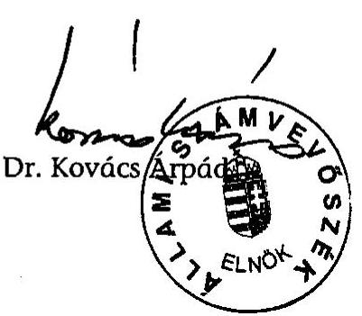

---

MELLÉKLETEK

---

1. számú melléklet a V-1020/2004. számú jelentéshez

# Határozatképtelen kuratóriumi ülések és törvénysértő kuratóriumi határozatok 

## 1. HATÁROZATKÉPTELEN KURATÓRIUMI ÜLÉSEK

Az ellenőrzött időszak alatt megtartott 48 kuratóriumi ülésből – az alábbiakban felsorolt – 16 (33%) ülés határozatképtelen volt, mivel az alapító okirat által előírt létszám (14 fő) nem volt jelen:

- 1999-ben a megtartott tizenhárom ülésből hét (III. 25; IV. 29; VI. 3; VII. 1; IX. 2; XI. 4; XII. 16);
- 2000-ben a kilenc ülésből két (I. 13; IV. 27);
- 2001-ben a tíz ülésből két (V. 17; V. 31);
- 2002-ben a nyolc ülésből két ülés (V. 30; X. 31);
- 2003-ban a megtartott nyolc kuratóriumi ülésből három ülés (I. 16; II. 20; IV. 24.) volt határozatképtelen.

## 2. HATÁROZATKÉPTELEN KURATÓRIUM ÁLTAL ELFOGADOTT HATÁROZATOK

Az 1999-2003 évek alatt meghozott 786 határozat mintegy 25 %-át (196) határozatképtelen kuratórium fogadta el.

### 2.1. 1999-ben 129 határozat közül 55 határozatot, köztük pl.:

- az 1999/2000-es tanévre szóló, középfokú és felsőfokú oktatási intézményben tanulók számára tanulmányi ösztöndíjpályázat kiírásáról (minősített többség szükséges);
- határozat a gyermek- és ifjúsági táborok, tanulmányi kirándulások I. fordulójára benyújtott pályázatokról;
- döntés a gyermek- és ifjúsági táborok, tanulmányi kirándulások (I.) tematikában beadott pályázatokról, az odaítélt támogatás összege 36.125.282,- Ft;
- határozat a hagyományőrző és kulturális rendezvények II. fordulójára beadott pályázatokról az odaítélt támogatás összege 33.154.468,- Ft;
- határozat az 1999/2000-es tanévre szóló felsőfokú tanulmányi ösztöndíjpályázatok elbírálásáról (minősített többség szükséges);

---

- határozat az országos terjesztésű kisebbségi írott sajtó 2000. év eleji finanszírozásáról (minősített többség szükséges);
- határozat az országos terjesztésű kisebbségi írott sajtó 2000. évi támogatására pályázati kiírásról és a sajtótámogatási szerződésről (minősített többség szükséges);
- határozat a 2000. évi célpályázati kiírásról, támogatási szerződésről és elszámolási szabályzatról (minősített többség szükséges).

2.2. 2000-ben a meghozott 122 határozat közül 22 határozatot, köztük pl.:

- határozat célpályázati elbírálási szempontokról (minősített többség szükséges);
- határozat a bizottságok összetételéről.

# 2.3. 2001-ben a meghozott 166 határozat közül 31 határozatot, köztük pl.: 

- határozat a gyermek- és ifjúsági táborok tematikában benyújtott pályázatokról, az odaítélt támogatás összege 46.184.730,- Ft;
- határozat a színházi tevékenység tematikában benyújtott pályázatokról, az odaítélt támogatás összege 5.081.000,- Ft;
- határozat a kutatói programok tematikában benyújtott pályázatokról, az odaítélt támogatás összege 12.675.000,- Ft.

### 2.4. 2002-ben a meghozott 125 határozat közül 28 határozatot, köztük pl.:

- határozat az anyanyelvű kulturális rendezvények témakör második szakaszában beadott pályázatokról, megítélt összeg 110.279.337,- Ft (minősített többség szükséges);
- határozat a kiadói tevékenység és kalendárium kiadása témakörben beadott pályázatokról odaítélt támogatás összege 32.800.000,-Ft;
- határozat a közgyűjtemény állományának gyarapítása témakörben beadott pályázatokról az odaítélt támogatás összege 7.258.000,-Ft;
- határozat az anyanyelvű hitéleti tevékenység témakörben beadott pályázatokról az odaítélt támogatás összege 5.801.000,-Ft.

### 2.5. 2003-ban a meghozott 244 határozat közül 60 határozatot, köztük pl.:

- határozat a 2003. évi kisebbségi sajtópályázat kiírásáról (minősített többség szükséges);

---

- határozat a MNEK Közalapítvány 2003. évi költségvetéséről (minősített többség szükséges);
- határozat a MNEKK 2002. évi tevékenységéről készült közhasznúsági jelentés elfogadásáról (minősített többség szükséges).

# 3. AZ ÉVES KÖLTSÉGVETÉSEKET ELFOGADÓ HATÁROZATOK 

Az éves költségvetéseket elfogadó kuratóriumi határozatok az ellenőrzött időszak egyetlen évében sem érték el az alapító okiratban megjelölt, a kuratóriumi tagok minősített többségének támogató szavazatát. A 2003. évi költségvetést elfogadó kuratóriumi ülés pedig határozatképtelen volt.

A kuratórium 1999-ben 15, 2000-ben 14, a 2001. és 2002. években 13 támogató szavazattal fogadta el az éves költségvetéseket (20/1999; 15/2000; 13/2001; 9/2002. számú kuratóriumi határozatok).

## 4. Az Éves beszámolókat elfogadó kuratóriumi határozatok

A 2000. és 2001. éves beszámolókat, valamint a 2001. évi közhasznúsági jelentést elfogadó kuratóriumi határozatok elfogadásánál nem volt meg az alapító okiratban előírt minősített többség. A 2002. évi beszámolót és közhasznúsági jelentést elfogadó kuratóriumi ülés az alapító okirat előírása alapján határozatképtelen volt.

A kuratórium a 2000. éves beszámolót 13, a 2001. éves beszámolót 12 támogató szavazattal fogadta el (56/2001; 40/2002. számú kuratóriumi határozatok). A 2001. éves közhasznúsági jelentést elfogadó kuratóriumi határozat szintén nem érte el az alapító okiratban előírt szavazattöbbséget (41/2002. számú kuratóriumi határozat, 12 igen szavazat).

## 5. A sajtótámogatásokról hozott határozatok

A sajtótámogatásokról – pályázati felhívás, adatlap és támogatási szerződés elfogadásáról, valamint a támogatások odaítéléséről – hozott kuratóriumi határozatok a 2001. év kivételével nem érték el az alapító okiratban megjelölt, a kuratóriumi tagok minősített többségének támogató szavazatát.

A pályáztatásról hozott határozatokat a kuratórium 1999-ben 15, 2000-ben 10, 2002-ben 13, 2003-ban 12 támogató szavazattal fogadta el (22/1999; 128/1999; 13/2002; 12/2003. számú kuratóriumi határozatok). Ebből a 2000. és 2003. évre szóló határozatait a kuratórium határozatképtelen ülésen hozta, mivel 11, illetve 13 határozatképes kurátor volt jelen (1999. XII. 16-i és 2003. II. 20-i kuratóriumi ülések).

A támogatások odaítéléséről hozott határozatokat a kuratórium 1999-ben 9, 2000-ben 10, 2002-ben 11, 2003-ban 13 támogató szavazattal fogadta el (57/1999; 18/2000; 29/2002; 20/2003. számú kuratóriumi határozatok).

---

# 6. A célpályázatokról hozott határozatok 

A pályázatok kiírásáról, valamint a pályázatok elbírálásának rendjéről a kuratórium minden évben határozatot hozott, azonban az alapító okiratban és az SZMSZ-ben előírt minősített többség a 2000. és a 2003. évi célpályázatokra vonatkozóan nem volt meg.

A 2000. évi célpályázati kiírásról, támogatási szerződésről és elszámolási szabályzatról szóló 129/1999. (XII. 16.) számú kuratóriumi határozatot a MNEKK kuratóriuma 10 egybehangzó igen szavazattal fogadta el. A döntés meghozatalakor hatályban lévő alapító okirat szerint a minősített többséghez 18 támogató szavazat volt szükséges.

A 2003. évi célpályázati támogatásra irányuló pályázati felhívás kiírásáról, a támogatási szerződésről, és az elszámolási javaslatról szóló 107/2002. (XII. 12.) számú kuratóriumi határozatot a MNEKK kuratóriuma 11 jelenlévő kurátor egyhangú igen szavazatával fogadta el. A 2003. évi célpályázatok elbírálási szempontjairól szóló 05/2003. (I. 16.) számú kuratórium határozatot a MNEKK kuratóriuma 11 egyhangú igen szavazatával fogadta el. A döntés meghozatalakor hatályban lévő alapító okirat szerint a minősített többséghez 14 támogató szavazat volt szükséges.

Budapest, 2004. június

---

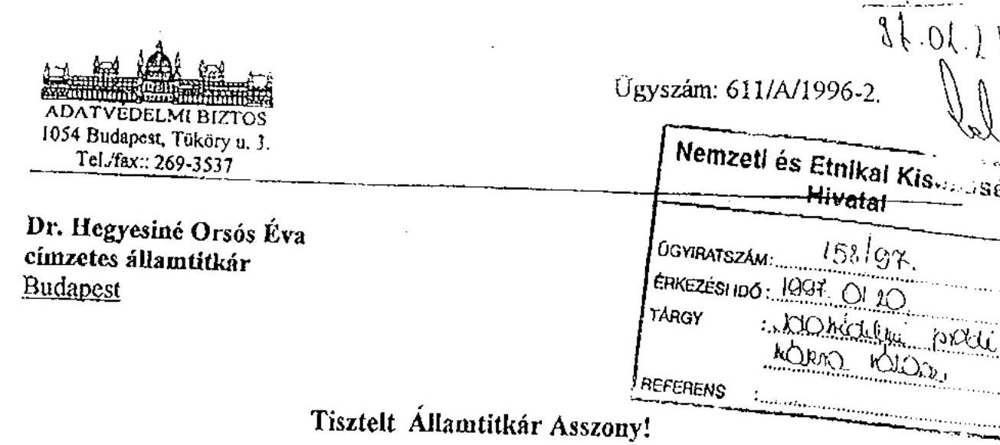

Tisztelt Államtitkár Asszony!

A Magyarországi Nemzeti és Etnikai Kisebbségekért Közalapítvány pályázati programja során jelentkező adatvédelmi problémákat tartalmazó levelét megkaptam, kérdéseire válaszom a következő.

1. "Van-e különbség az adatkezelő esetében hivatalos intézmény, államigazgatási szerv, magánüzem, személy vagy civil szervezet közötti? A közalapítvány a Ptk. értelmében civil szervezet?"
A személyes adatok védelméről és a közérdekű adatok nyilvánosságáról szóló 1992. évi LXIII. törvény 2.§ 7. pontja alapján adatkezelő valamely szerv vagy személy is lehet, közöttük a törvény nem tesz különbséget.
A Polgári Törvénykönyvről szóló 1959. évi IV. törvény nem ismeri a "civil szervezet" fogalmát. A civil szervezet alkotmányjogi, politológiai kategória, olyan szervezetet jelöl, melynek alapítója nem az állam, az állam valamely szerve, azt az Alkotmány 93. §-ában foglalt egyesülési jog alapján a polgárok hozzák létre. A Ptk. 74/0. § (1) bekezdése szerint "A közalapítvány olyan alapítvány, amelyet az Országgyűlés, a Kormány, valamint a helyi önkormányzat képviselő-testülete közfeladat ellátásának folyamatos biztosítása céljából hoz létre. Törvény közalapítvány létrehozását kötelezővé teheti". A közalapítványt nem polgárok hozzák létre, ezért nem tekinthető civil szervezetnek.
2. "Van-e joga a kuratóriumnak olyan pályázati adatlap elfogadására, amely nyílt kérdést tartalmaz a kisebbségi hovatartozásra?"
3. "Kizárható-e a pályázó, ha erre a kérdésre nem válaszol?"

A nemzeti és etnikai kisebbségek jogairól szóló 1993. évi LXXVII. törvény 7. § (1) bekezdése úgy rendelkezik, hogy valamely nemzeti, etnikai csoporthoz, kisebbséghez való tartozás vállalása és kinyilvánítása az egyén kizárólagos és elidegeníthetetlen joga és a kisebbségi csoporthoz való tartozás kérdésében nyilatkozatra senki sem kötelezhető.
Az Avtv. alapján a nemzeti, nemzetiségi és etnikai hovatartozásra vonatkozó adat, különleges adatnak minősül, ennek az a jelentősége, hogy csak akkor kezelhető, ha az adatkezeléshez az érintett írásban hozzájárul, vagy azt törvény elrendeli.
Álláspontom szerint a kisebbségi hovatartozásra vonatkozó kérdés szerepeltetése a támogatások elnyerését célzó pályázati adatlapokon nem sérti az Avtv. és a kisebbségi

---

törvény előírásait. A pályázatokon való részvételre senki sem kötelezhető. A kisebbségi pályázati programok célja a kisebbségekhez tartozók támogatása, a pályázatot elbíráló szervezet szabályzatától, mérlegelésétől függ, hogy kizárja-e a pályázatból azokat, akik nem nyilatkoznak kisebbségi hovatartozásukról, vagy nem vallják magukat valamely kisebbséghez tartozónak.
 Véleményem szerint ebben az esetben a kizárás nem kifogásolható, mivel a pályázóktól elvárható, hogy az ilyen programokban történő részvétel során – nem a nyilvánosság, de az elbíráló szerv előtt – vállalják hovatartozásukat. Fontos azonban megjegyezni, hogy az adatkezelő köteles betartani az adatkezelésre (beleértve a továbbítást is), adatbiztonságra vonatkozó szabályokat, az adatkezelés célhoz kötöttségének elvére tekintettel az adatok csak a cél megvalósulásához szükséges mértékben és ideig kezelhetők.
4. "A törvény 3.§ (5) bekezdése – az érintett kérelmére indult eljárásban a szükséges adatainak kezeléséhez való hozzájárulását vélelmezni kell, amely tényre az érintett figyelmét fel kell hívni – vonatkoztatható-e a pályázatra is?" Igen, de a pályázókat egyúttal tájékoztatni kell arról, hogy a hovatartozásukra vonatkozó adatra a pályázat elbírálásához van szükség. A tájékoztatóban az adatkezelőnek (a pályázat kiírójának) nyilatkoznia kell arról, hogy ezt az adatot nem továbbítja, mások számára nem teszi hozzáférhetővé, továbbá arról is, hogy a pályázat elbírálását követően, a célhoz kötöttség követelményeit tiszteletben tartva, mikor fogja törölni az adatot.

Budapest, 1997. január 11.
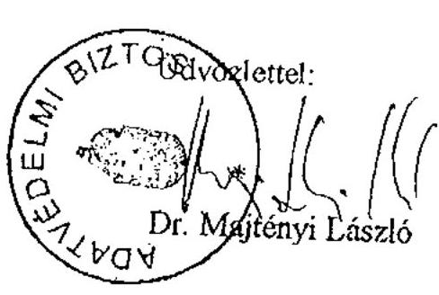

---

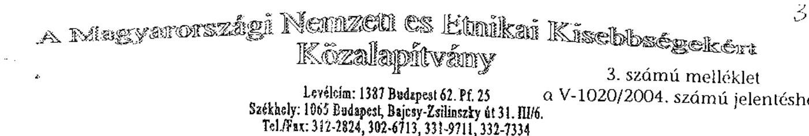

# Selejtezési Jegyzék

Készült 2002. február 14-én a Magyarországi Nemzeti és Etnikai Kisebbségekért Közalapítvány telephelyén (1065 Budapest, Bajcsy Zs. u. 31.)

Selejtezési Bizottság tagjai: Molnár Márton igazgató
Nagyné Varga Edit munkatárs

Az iratsemmisítést végző cég neve: Duparec Papírbegyűjtő és Feldolgozó Kft. (1205 Budapest, Duna u. 42.)

Selejtezésre került:

- 1999. évi alkotói ösztöndíjak anyagai (pályázat, szerződés, beszámoló, levelezés)
- 2000. évi alkotói ösztöndíjak anyagai (pályázat, szerződés, beszámoló, levelezés)
- 2001. évi alkotói ösztöndíjak anyagai (pályázat, szerződés, beszámoló, levelezés)
- 1998/99-es tanév tanulmányi ösztöndíjak anyagai (pályázat, szerződés, levelezés)
- 1999/2000-es tanév tanulmányi ösztöndíjak anyagai (pályázat, szerződés, levelezés)
- 2000/2001-es tanév tanulmányi ösztöndíjak anyagai (pályázat, szerződés, levelezés)

A selejtezés napján a selejtezési bizottság tagjainak ellenőrzésével a fenti iratanyagokat megsemmisítés céljából a Duparec Kft. munkatársa elszállította.

A selejtezési jegyzőkönyv mellékletét képezi az iratmegsemmisítés elvégzéséről szóló igazolás, valamint számlamásolat.
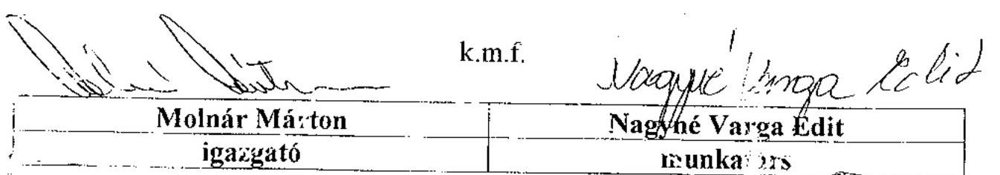

---

# A Magyarországi Nemzeti és Etnikai Kisebbségekért Közalapítvány

Levélcím: 1387 Budapest 62. Pf. 25
Székhely: 1068 Budapest, Benczúr u. 11.
Tel./Fax: 321-7360, 321-7364, 321-7370, 321-3352
E-mail: mnekk@szelero.hu
http://web.szelero.hu/mnekk
102/4/2002

## Selejtezési Jegyzék

Készült 2002. október 9-én a Magyarországi Nemzeti és Etnikai Kisebbségekért Közalapítvány telephelyén (1065 Budapest, Bajcsy Zs. u. 31.).

Selejtezési Bizottság tagjai: Molnár Márton igazgató
Nagyné Varga Edit munkatárs
Az iratmegsemmisítést végző neve: Böhm Rondo Recycling Kft. (1239 Budapest, Ócsai u. 5.)
A selejtezés a közokiratokról, a közlevéltárakról és a magánlevéltári anyag védelméről szóló, módosított 1995. évi LXVI. törvény (továbbiakban: Ltv.) 10. § (4)-(5) bekezdése, valamint a minisztériumok és az országos hatáskörű államigazgatási szervek iratkezelési mintaszabályzatáról szóló 40/1998. Korm.rendelet alapján a Magyarországi Nemzeti és Etnikai Kisebbségekért Közalapítványnak a Magyar Országos Levéltár által jóváhagyott iratkezelési szabályzata alapján történt.

Selejtezésre került:
> 1996-os anyag: Célpályázatok (pályázat, szerződés, beszámoló, elszámolás, levelezés)
> 1997-os anyag: Célpályázatok (pályázat, szerződés, beszámoló, elszámolás, levelezés)
> 2001/2002-es tanév megítélt tanulmányi ösztöndíj pályázatok anyagai (pályázat, szerződés, levelezés)

A selejtezés napján a selejtezési bizottság tagjainak jelenlétében a fentebb felsorolt iratanyagot megsemmisítés céljából a Böhm Rondo Kft. munkatársai elszállították.
A selejtezési jegyzőkönyv mellékletét képezi az iratmegsemmisítés elvégzését igazoló számlamásolat.
k.m.f.
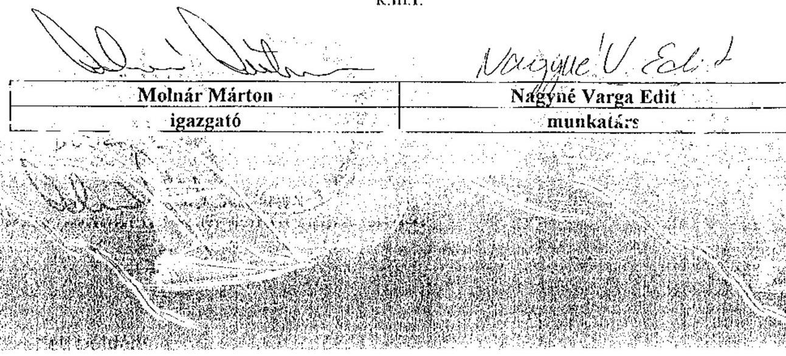

---

# A Magyarországi Nemzeti és Etnikai Kisebbségekért Közalapítvány

Levélcím: 1387 Budapest 62. Pf. 25
Székhely: 1068 Budapest, Benczúr u. 11.
Tel./Fax: 321-7360, 321-7364, 321-7370, 321-3352
E-mail: mnekk@szelero.hu
http://web.szelero.hu/mnekk
119/2003
Állami Számvevőszék
ügyintéző: Soós Ildikó
1097 Budapest
Lónyay u. 44.

Balázs Andrásné
Főcsoportfőnök-helyettes asszony
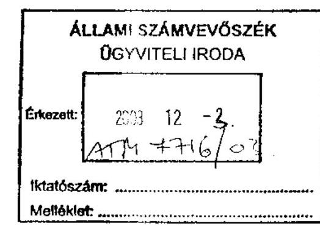

## Tisztelt Balázs Andrásné!

Telefonon történt megbeszélésükre hivatkozva tájékoztatom, hogy a Magyarországi Nemzeti és Etnikai Kisebbségekért Közalapítvány által támogatott ösztöndíjas tanulók adatait nem áll módomban az Önök rendelkezésére bocsátani, mivel az tartalmazza a támogatottak nemzetiségi és etnikai hovatartozását.
A nemzetiségi és etnikai hovatartozás az 1992. évi LXIII. törvény (a személyes adatok védelméről és a közérdekű adatok nyilvánosságáról) alapján a különleges adat (2. § 2. bekezdése) kategóriájába tartozik, amely kezelésére lehetőség abban az esetben van,
a., ha az érintett írásban hozzájárul;
b., ha az nemzetközi egyezményen alapul, vagy Alkotmányban biztosított alapvető jog érvényesítésére, továbbá a nemzetbiztonság, a bűnmegelőzés vagy a bűnüldözés érdekében törvény elrendeli;
c., illetve ha azt egyéb esetekben a törvény elrendeli.

Az 1989. évi XXXVIII. törvény (az Állami Számvevőszékről) 21. §-a szerint az Állami Számvevőszék megbízásából ellenőrzést végző két személy a 2-5 §-ban megjelölt szerveknél (ebbe a MNEKK is beletartozik) vizsgálatot tarthat, iratokat illetve más dokumentációt kérhet, és azokba akkor is betekinthet, ha az államtitkot vagy szolgálati titkot tartalmaznak.

---

Nincs azonban semmiféle utalás, illetve meghatározás sem az 1989. évi XXXVIII. törvényben, sem pedig az 1992. évi LXIII. törvényben arra vonatkozóan, hogy az Állami Számvevőszék a különleges adatok kezelésében eljárhat, illetve a különleges adatokat tartalmazó iratokba betekintést nyerhet.

Jogtanácsosunkkal egyeztetett jogértelmezésünk szerint, a fentiekből következően a kért adatok átadásával törvényt sértenénk.

Budapest, 2003. november 28.
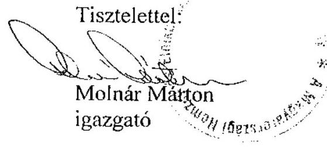

---

Adatvédelmi Biztos

# Dr. Kovács Árpád úrnak

Elnök

Állami Számvevőszék

Budapest

Tisztelt Elnök Úr!
Ügyszám: 175/K/2004-2.
Hiv.sz.: A-103-04/2004.

A. Etele úr
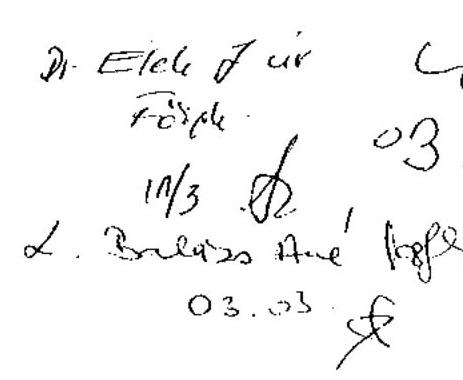

A Magyarországi Nemzeti és Etnikai Kisebbségekért Közalapítvány (a továbbiakban: MNEKK) elmúlt négyévi gazdálkodását érintő soron kívüli ellenőrzésük adatvédelmi vonatkozásait tartalmazó megkeresésével kapcsolatban a következőkről tájékoztatom:

Megkeresésében közölte, hogy a MNEKK igazgatója – hivatkozva Dr. Majtényi László korábbi adatvédelmi biztos 1997. január 14-én kelt állásfoglalására – a Közalapítvány által kisebbségi tanulóknak nyújtott ösztöndíj támogatások dokumentációjában szereplő különleges személyes adatok átadását nem tette lehetővé.

A korábbi adatvédelmi biztos állásfoglalásában foglaltakkal egyetértve osztom a MNEKK igazgatójának véleményét abban, hogy a kisebbségi hovatartozásra utaló személyes adat olyan különleges adatnak minősül, amely kezeléséhez vagy törvényi felhatalmazás, vagy az érintett írásbeli hozzájárulása szükséges. Az ilyen adatokat érzékeny voltukra tekintettel különös védelemben részesíti a jogalkotó, s ez a jogalkalmazóknak is kötelességük.

Elnök úr első kérdése az volt, hogy az ellenőrzés során a személyes adatokat tartalmazó dokumentumokba, nyilvántartásokba történő betekintés során adatkezelővé válik-e az Állami Számvevőszék?

A legutóbb a 2003. évi XLVIII. törvénnyel módosított személyes adatok védelméről és a közérdekű adatok nyilvánosságáról szóló 1992. évi LXIII. törvény (a továbbiakban: Avtv.) 2.§ 9. pontja szerint adatkezelés:
…az alkalmazott eljárástól függetlenül a személyes adatokon végzett bármely művelet vagy a műveletek összessége, így például gyűjtése, felvétele, rögzítése, rendszerezése, tárolása, megváltoztatása, felhasználása, továbbítása, nyilvánosságra hozatala, összehangolása vagy összekapcsolása, zárolása, törlése és megsemmisítése, valamint az adatok további felhasználásának megakadályozása. Adatkezelésnek számít a fénykép-, hang- vagy képfelvétel készítése, valamint a személy azonosítására alkalmas fizikai jellemzők (pl. ujj- vagy tenyérnyomat, DNS-minta, íriszkép) rögzítése is:

---

Az adatkezelés tehát az adatokkal végzett műveleteket jelenti.
Általánosságban a különféle dokumentumokba, nyilvántartásokba történő betekintés akkor minősül adatkezelésnek, ha a vizsgálatot lefolytató szerv olyan meghatározott természetes személlyel kapcsolatban kíván információt megismerni, akinek bizonyos adatait már kezeli, s a cél az adatokkal való valamilyen művelet elvégzése (pl. ellenőrzés, kiegészítés, stb.).

Amennyiben a betekintésnek célja nem az érintettek azonosítása, ellenőrzése, hanem az adatkezelő – jelen esetben a MNEKK – törvényes működésének, a kifizetései jogszerűségének ellenőrzése, ebben az esetben az olyan betekintés, amely nem jár együtt a megismerő oldaláról más adatkezelési művelettel (pl. ennek során felvétellel, tárolással), ekkor a betekintő nem válik adatkezelővé. Utóbbi esetben – harmadik kérdésére válaszolva – elmondható, hogy nem kell bejelentkezni az adatvédelmi nyilvántartásba.

Második kérdése az volt, hogy mivel az Állami Számvevőszék tekintetében konkrét törvényi felhatalmazás a vonatkozó jogszabályokban nem található a MNKK ellenőrzése során a támogatásban részesült személyek különleges személyes adatainak megismerésére, az ÁSZ. ellenőrzési kötelezettségét illetve jogosultságát biztosító törvényi rendelkezések megalapozzák-e a személyes adatok kezelését. Az Avtv. 1.§ (1) bekezdése szerint a törvény célja annak biztosítása, hogy személyes adatával mindenki maga rendelkezzen, az Alkotmánybíróság ezt nevezi információs önrendelkezési jognak. A személyes adatok védelméhez fűződő alkotmányos alapjog nem abszolút jog, bizonyos esetekben korlátozható, de csak akkor, ha megfelel az alkotmányosság és az Avtv. követelményeinek. Ennek megfelelően a nem az érintett hozzájárulásán alapuló adatkezelést törvényben kell elrendelni (Avtv. 3.§ (1) bekezdés), továbbá azt „csak meghatározott adatfajtára és adatkezelőre együttesen lehet megállapítani” (1.§ (3) bekezdés). Az Állami Számvevőszéknek nincs törvényi felhatalmazása nemzeti és etnikai kisebbségi hovatartozásra vonatkozó különleges személyes adatok kezelésére. Amennyiben Elnök úr úgy ítéli meg, hogy az Állami Számvevőszék megnövekvő hatásköre indokolttá teszi a jövőben különleges személyes adatok kezelését, javaslom, hogy kezdeményezzen ilyen irányú törvénymódosítást.

Elnök úr negyedik kérdése a pályázati anyagok teljes mértékű megsemmisítésének jogszerűségét érinti. Hivatali elődöm hivatkozott állásfoglalásában arra hívta fel a figyelmet, hogy az érintett pályázókat az adatkezelőnek tájékoztatnia kell az adatok tárolásának időtartamáról, törlésének idejéről. A hivatalos dokumentumok megőrzésének, tárolásának időtartamára, körülményeire – jellegüktől függően – különféle jogszabályi, törvényi előírások vonatkoznak. Amennyiben Önök úgy ítélik meg, hogy a MNKK megsértette a dokumentációk korábbi – de a pályázati tájékoztatóban szereplő időpontban történt – törlésével a számviteli törvényben foglalt 8 illetve 10 éves megőrzési időre vonatkozó előírást, álláspontom szerint ez nem adatvédelmi probléma, ezért erről nincs hatásköröm állást foglalni.

Kérem, hogy a jövőben is forduljon bizalommal hivatalomhoz a személyes adatok védelmét és a közérdekű adatok nyilvánosságát érintő megkeresésével.

Budapest, 2004. március

---

# A MNEKK ESZKÖZEI ÉS FORRÁSAI

|   |  |  |  |  |  | adatok: méltó Ft-ban, együttes pontosság  |
| --- | --- | --- | --- | --- | --- | --- | --- |
|  2002. |  2003. | 2004. | 2005. | 2006. | 2007. | 2008.  |
|  A. | Befektetett eszközök (I+II+III+IV) | 5,4 | 4,3 | 4,1 | 5,6 | 4,6 |   |
|   | I. Immateriális javak | 1,3 | 1,3 | 1,3 | 1,1 | 0,9 |   |
|   | II. Tárgyi eszközök |  |  |  |  |  |   |
|   | 1. Ingatlanok |  |  |  |  |  |   |
|   | 2. Műszaki és egyéb berendezések, gépek, járművek | 4,1 | 3,8 | 2,8 | 4,5 | 3,7 |   |
|   | 3. Beruházások, beruházásokra adott előlegek |  |  |  |  |  |   |
|   | III. Befektetett pénzügyi eszközök |  |  |  |  |  |   |
|   | 1. Részesedések |  |  |  |  |  |   |
|   | 2. Értékpapírok |  |  |  |  |  |   |
|   | 3. Adott kölcsönök (1 éven túl) |  |  |  |  |  |   |
|   | 4. Hosszú lejáratú

 bankbetétek (1 éven túl) |  |  |  |  |  |   |
|   | IV. Befektetett eszközök értékhelyesbítése |  |  |  |  |  |   |
|  B. | Forgóeszközök (I+II+III+IV) | 65,3 | 52,6 | 67,7 | 29,9 | 100,5 |   |
|   | I. Készletek |  |  |  |  |  |   |
|   | II. Követelések | 7,0 |  |  |  |  |   |
|   | 1. Követelések áruszállításból és szolgáltatásokból |  |  |  |  |  |   |
|   | 2. Váltókövetelések |  |  |  |  |  |   |
|   | 3. Rövid lejáratú kölcsönök |  |  |  |  |  |   |
|   | 4. Egyéb követelések | 7,0 |  |  |  |  |   |
|   | III. Értékpapírok | 40,0 | 36,9 |  | 20,0 | 90,0 |   |
|   | 1. Eladásra vásárolt kötvények |  |  |  |  |  |   |
|   | 2. Saját és eladásra vásárolt részvények, üzletrészek |  |  |  |  |  |   |
|   | 3. Egyéb értékpapírok | 40,0 | 36,9 |  | 20,0 | 90,0 |   |
|   | IV. Pénzeszközök | 18,3 | 15,7 | 67,7 | 9,9 | 10,5 |   |
|  C. | Aktív időbeli elhatárolások | 1,1 | 0,6 | 0,1 | 0,3 | 0,4 |   |
|   | Eszközök összesen (A+B+C) | 71,8 | 20,7 | 22,7 | 15,8 | 105,5 |   |
|  D. | Saját tőke (I+II+III) | 68,7 | 55,1 | 68,6 | 29,2 | 100,9 |   |
|   | I. Induló tőke | 310,1 | 310,1 | 310,1 | 310,1 | 310,1 |   |
|   | II. Tőkeváltozás | -241,4 | -255,0 | -241,5 | -280,9 | -209,2 |   |
|   | ebből: tárgyévi eredmény | 11,7 | -13,5 | 13,4 | -39,3 | 71,6 |   |
|   | III. Értékelési tartalék |  |  |  |  |  |   |
|  E. | Céltartalék |  |  |  |  |  |   |
|  F. | Kötelezettségek (I+II) | 2,8 | 2,0 | 2,9 | 2,1 | 3,8 |   |
|   | I. Hosszú lejáratú kötelezettségek |  |  |  |  |  |   |
|   | 1. Beruházási és fejlesztési hitelek |  |  |  |  |  |   |
|   | 2. Egyéb hosszú lejáratú hitelek |  |  |  |  |  |   |
|   | 3. Hosszú lejáratra kapott kölcsönök |  |  |  |  |  |   |
|   | 4. Egyéb hosszú lejáratú kötelezettségek |  |  |  |  |  |   |
|   | II. Rövid lejáratú kötelezettségek | 2,8 | 2,0 | 2,9 | 2,1 | 3,8 |   |
|   | 1. Követelések áruszállításból és szolgáltatásokból | 0,7 | 0,2 | 0,4 | 0,3 |  |   |
|   | 2. Rövid lejáratú hitelek és kölcsönök |  |  |  |  |  |   |
|   | 3. Köztartozások (adó, járulék, vám, illeték, stb) | 2,1 | 1,8 | 2,5 | 1,8 | 3,8 |   |
|   | 3/a. Ebből: 60 napon túl lejárt esedékességű tartozás |  |  |  |  |  |   |
|   | 4. Egyéb rövid lejáratú kötelezettségek |  |  |  |  |  |   |
|  G. | Passzív időbeli elhatárolások | 0,3 | 0,4 | 0,4 | 4,5 | 0,8 |   |
|   | Források összesen (D+E+F+G) | 273,8 | 273,8 | 273,8 | 255,8 | 255,8 |   |
|   | * előzetes adatok |  |  |  |  |  |   |

Alulírott az Állami Számvevőszékről szóló 1989. évi XXXVIII. törvény 24. § 9. pontja alapján aláírásommal kijelentem, hogy a feltüntetett adatok teljesek és a közalapítvány nyilvántartásaival mindenben egyeznek.

Budapest, 2004. január 30.

P.H. A képviselője jogosult aláírása

---

# A MNEKK EREDMÉNYKIMUTATÁSA

|  Megnevezés |  | 1999. év | 2000. év | 2001. év | 2002. év | 2003. év *  |
| --- | --- | --- | --- | --- | --- | --- |
|  A. Összes (közhasznú) tevékenység bevétele (1-4) |  | 570,5 | 565,2 | 626,6 | 608,9 | 681,8  |
|  1. (Közhasznú) célra, működésre kapott támogatás |  |  |  |  |  |   |
|  a) alapítótól |  | 515,0 | 544,6 | 600,0 | 593,0 | 663,0  |
|  b.) államháztartás alrendszeréből |  |  |  |  |  | 2,0  |
|  c.) más adományozótól |  |  |  |  |  |   |
|  2. Pályázati úton elnyert támogatás |  |  |  |  |  |   |
|  3. Cél szerinti (közhasznú) tevékenységből származó bevétel |  |  |  |  |  |   |
|  4. Egyéb bevétei |  | 55,5 | 20,6 | 26,6 | 15,9 | 16,8  |
|  B. Vállalkozási tevékenység bevétele |  |  |  |  |  |   |
|  C. Összes bevétel (A+B) |  | 570,5 | 565,2 | 626,6 | 608,9 | 681,8  |
|  D. Cél szerinti (közhasznú) tevékenység költségei és ráfordításai (1+2) |  | 558,8 | 578,7 | 613,2 | 648,2 | 610,2  |
|  1. Cél szerinti tevékenység közvetlen költségei és ráfordításai |  | 494,8 | 535,9 | 563,4 | 602,5 | 563,9  |
|  2. Működési költségek (kezelőszerv ktg-ei és egyéb közvetett ktg-ek) |  | 64,0 | 42,8 | 49,8 | 45,7 | 46,3  |
|  E. Vállalkozási tevékenység költségei és ráfordításai |  |  |  |  |  |   |
|  F. Összes tevékenység költségei és ráfordításai (D+E) |  | 558,8 | 578,7 | 613,2 | 648,2 | 610,2  |
|  G. Adózás előtti eredmény |  | 11,7 | -13,5 | 13,4 | -39,3 | 71,6  |
|  H. Adófizetési kötelezettség |  |  |  |  |  |   |
|  I. Tárgyévi eredmény (C-F-H) |  | 11,7 | -13,5 | 13,4 | -39,3 | 71,6  |

* előzetes adatok

Alulírott az Állami Számvevőszékről szóló 1989. évi XXXVIII. törvény 24. § 9. pontja alapján aláírásommal kijelentem, hogy a feltüntetett adatok teljesek és a közalapítvány nyilvántartásaival mindenben egyeznek.

Budapest, 2004. január 30.

---

9. számú melléklet a V-1020/2004. számú jelentésbe

# A MNEKK BEVÉTELEI, KÖLTSÉGEI ÉS RÁFORDÍTÁSAI

|  Sor szám | Megnevezés | 1999. | 2000. | 2001. | 2002. | 2003. | Összesen  |
| --- | --- | --- | --- | --- | --- | --- | --- |
|  1. | Éves költségvetési támogatás | 515,0 | 544,6 | 600,0 | 618,0 | 663,0 | 2 940,6  |
|  2. | Egyéb költségvetési támogatás |  |  |  |  | 2,0 | 2,0  |
|  3. | Egyéb bevételek | 16,4 | 14,6 | 22,7 | 15,0 | 16,5 | 85,2  |
|  3.1. | bírság, kötbér, késedelmi kamat | 3,4 | 2,7 | 2,3 | 0,6 | 0,9 | 9,9  |
|  3.2. | visszaérkezett céltámogatás | 12,7 | 11,3 | 11,8 | 11,4 | 15,5 | 62,7  |
|  3.3. | visszaérkezett ösztöndíj | 0,3 | 0,2 |  | 0,2 |  | 0,7  |
|  3.4. | különféle egyéb bevételek |  | 0,4 | 8,6 | 2,6 | 0,1 | 11,9  |
|  4. | Pénzügyi műveletek bevételei | 39,1 | 6,0 | 3,9 | 0,9 | 0,3 | 50,2  |
|  5. | Rendkívüli bevételek |  |  |  |  |  |   |
|  I. | Bevételek összesen (1+2+3+4) | 570,5 | 565,2 | 626,6 | 633,9 | 681,8 | 3 078,0  |
|  6. | Anyagköltségek | 1,3 | 1,2 | 1,5 | 1,1 | 0,8 | 5,9  |
|  6.1. | üzemanyag | 0,1 | 0,3 | 0,2 | 0,2 | 0,2 | 1,0  |
|  6.2. | nyomtatvány, irodaszer | 0,8 | 0,4 | 0,8 | 0,5 | 0,4 | 2,9  |
|  6.3. | egyéb anyagköltség | 0,4 | 0,5 | 0,5 | 0,4 | 0,2 | 2,0  |
|  7. | Igénybevett szolgáltatások értéke | 14,8 | 14,6 | 16,8 | 16,2 | 16,4 | 78,8  |
|  7.1. | helyiségbérleti díj | 4,3 | 4,6 | 5,2 | 4,7 | 5,2 | 24,0  |
|  7.2. | hirdetés, reklám, propaganda | 0,1 | 0,3 |

 | 0,2 | 0,3 | 0,3 | 1,2  |
|  7.3. | másológép bérleti díja | 0,8 | 0,8 | 0,7 |  |  | 2,3  |
|  7.4. | utazási és kiküldetési költség | 0,2 |  | 0,1 |  |  | 0,3  |
|  7.5. | karbantartási és javítási költség | 0,6 | 0,5 | 1,5 | 2,0 | 1,4 | 6,0  |
|  7.6. | posta és telefon költség | 2,7 | 3,6 | 3,3 | 3,4 | 3,5 | 16,5  |
|  7.7. | könyvelési díj | 3,4 | 3,1 | 3,4 | 3,7 | 3,7 | 17,3  |
|  7.8. | könyvvizsgálati díj | 0,3 | 0,5 | 0,2 | 0,2 |  | 1,2  |
|  7.9. | jogi tevékenység | 0,6 | 0,3 | 1,2 | 0,9 | 1,1 | 4,1  |
|  7.10. | egyéb igénybevett szolgáltatás | 1,8 | 0,9 | 1,0 | 1,0 | 1,2 | 5,9  |
|  8. | Egyéb szolgáltatások értéke | 0,3 | 0,3 | 1,2 | 1,0 | 0,6 | 3,4  |
|  8.1. | biztosítási díj | 0,2 | 0,3 | 0,4 | 0,3 | 0,4 | 1,6  |
|  8.2. | bankköltség | 0,1 |  |  |  |  | 0,1  |
|  8.3. | hatósági díj |  |  | 0,2 | 0,3 |  | 0,5  |
|  8.4. | különféle egyéb költség |  |  | 0,6 | 0,4 | 0,2 | 1,2  |
|  9. | Anyagjellegű ráfordítások (6+7+8) | 16,4 | 16,1 | 19,5 | 18,3 | 17,8 | 88,1  |
|  10. | Bérköltség | 11,9 | 11,0 | 14,3 | 17,5 | 18,5 | 73,2  |
|  11. | Személyi jellegű egyéb kifizetések | 0,9 | 1,8 | 1,0 | 1,2 | 1,5 | 6,4  |
|  11.1. | utaköltség költségtérítés kuratórium | 0,1 | 0,4 | 0,2 |  |  | 0,7  |
|  11.2. | utaköltség költségtérítés iroda | 0,2 | 0,3 | 0,1 | 0,2 | 0,5 | 1,3  |
|  11.3. | étkezési költségtérítés | 0,1 | 0,1 | 0,1 | 0,1 | 0,3 | 0,7  |
|  11.4. | gépkocsi költségtérítés kuratórium |  |  |  | 0,2 | 0,1 | 0,3  |
|  11.5. | betegszabadság | 0,2 | 0,3 | 0,2 | 0,2 | 0,2 | 1,1  |
|  11.6. | reprezentáció kuratórium | 0,2 | 0,3 | 0,2 | 0,3 | 0,2 | 1,2  |
|  11.7. | reprezentáció iroda | 0,1 | 0,1 | 0,1 | 0,1 | 0,1 | 0,5  |
|  11.8. | egyéb személyi jellegű kifizetés |  | 0,3 | 0,1 | 0,1 | 0,1 | 0,6  |
|  12. | Bérjárulékok | 4,7 | 4,9 | 5,3 | 6,1 | 6,3 | 27,3  |
|  13. | Személyi jellegű ráfordítások (10+11+12) | 17,5 | 17,7 | 20,6 | 24,8 | 26,3 | 106,9  |
|  14. | Értékcsökkenési leírás | 2,4 | 1,9 | 2,7 | 2,1 | 2,0 | 11,1  |
|  15. | Összes költség (9+13+14) | 36,3 | 35,7 | 42,8 | 45,2 | 46,1 | 206,1  |
|  16. | Egyéb ráfordítások |  | 7,1 | 7,0 | 0,5 | 0,2 | 14,8  |
|  16.1. | értékesített tárgyi eszközök értéke |  |  |  |  |  |   |
|  16.2. | egyéb ráfordítások |  | 7,1 | 7,0 | 0,5 | 0,2 | 14,8  |
|  17. | Pénzügyi műveletek ráfordítása | 27,7 |  |  |  |  | 27,7  |
|  18. | Rendkívüli ráfordítások |  |  |  |  |  |   |
|  II. | Költségek és ráfordítások összesen (15+16+17+18) | 64,0 | 42,8 | 49,8 | 45,7 | 46,3 | 248,6  |

Megjegyzés: a tanúsítvány nem tartalmazza a közalapítvány által kifizetett célszerinti támogatások összegét!

- előzetes adatok

Alulírott az Állami Számvevőszékról szóló 1989. évi XXXVIII. törvény 24. § c pontja alapján aláírásonnal kijelentem, hogy a feltüntetett adatok teljesek és a közalapítvány nyilvántartásaival mindenben egyeznek.

Budapest, 2004. január 30.

P. H. A képviseletre jogosult aláírása

---

# A MNEKK ÁLTAL ADOTT TÁMOGATÁSOK 

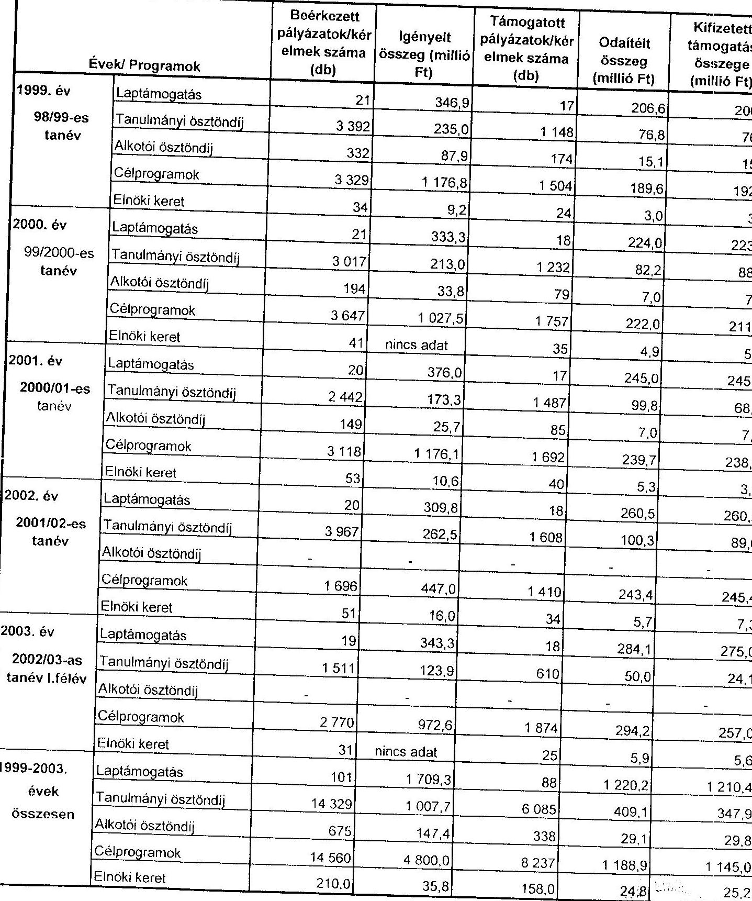

Alulírott az Állami Számvevőszékről szóló 1989. évi XXXVIII. törvény 24. § c) pontja alapján aláírásommal kijelentem, hogy a feltüntetett adatok teljesek és a közalapítvány nyilvántartásaival, okmányaival mindenben egyeznek.

---

1. számú melléklet a V-1020/2004. számú jelentéshez

A MNEKK ÁLTAL MAGÁNSZEMÉLYEKNEK ADOTT TÁMOGATÁSOK

|  Sor. szám | Támogatás | 1999. |  | 2000. |  | 2001. |  | 2002. |  | 2003. |  | Összesen |   |
| --- | --- | --- | --- | --- | --- | --- | --- | --- | --- | --- | --- | --- | --- |
|   |  |  | millió Ft |  | millió Ft |  | millió Ft |  | millió Ft |  | millió Ft |  | millió Ft  |
|  1. Tanulmányi ösztöndíjak |  | 1421 | 76,8 | 1353 | 88,6 | 1072 | 68,8 | 2150 | 69,6 | 577 | 24,1 | 6573 | 347,9  |
|  1.1. középfokú |  |  |  |  |  |  |  |  |  |  |  |  |   |
|  1.2. felsőfokú |  |  |  |  |  |  |  |  |  |  |  |  |   |
|  2. Alkotói ösztöndíjak |  | 168 | 15,8 | 76 | 7,0 | 88 | 7,0 | 0 | 0,0 | 0 | 0,0 | 329 | 29,6  |
|  3. Gyermek és ifjúsági táborok |  | 6 | 0,4 | 5 | 0,5 | 5 | 0,6 | 0 | 0,0 | 0 | 0,0 | 16 | 1,5  |
|  4. Hagyományőrző és kultúr rendezvények |  | 20 | 1,7 | 17 | 2,0 | 21 | 4,5 | 11 | 3,2 | 10 | 2,1 | 75 | 13,5  |
|  5. Tudományos rendezvények |  | 0 | 0,0 | 1 | 0,2 | 0 | 0,0 | 0 | 0,0 | 0 | 0,0 | 1 | 0,2  |
|  6. Kutatói programok |  | 4 | 0,2 | 54 | 5,6 | 34 | 4,3 | 20 | 3,7 | 28 | 4,3 | 141 | 19,1  |
|  7. Közéleti szakemberek képzése |  | 1 | 0,1 | 0 | 0,0 | 3 | 0,2 | 0 | 0,0 | 0 | 0,0 | 3 | 0,3  |
|  8.0. Média programok |  | 1 | 0,3 | 7 | 1,2 | 7 | 1,3 | 0 | 0,0 | 6 | 1,1 | 21 | 4,0  |
|  9.0. Kiadó tevékenység |  | 25 | 7,3 | 15 | 3,1 | 11 | 4,0 | 14 | 3,5 | 17 | 4,6 | 82 | 22,5  |
|  10. Hitéleti tevékenység |  | 2 | 0,2 | 3 | 0,4 | 6 | 0,5 | 1 | 0,0 | 3 | 0,2 | 15 | 1,3  |
|  11. Kutatói műhelyek |  | 0 | 0,0 | 0 | 0,0 | 0 | 0,0 | 0 | 0,0 | 0 | 0,0 | 0 | 0,0  |
|  12. Színházi tevékenység |  | 2 | 0,8 | 1 | 0,6 | 2 | 1,0 | 0 | 0,0 | 3 | 0,8 | 8 | 3,2  |
|  13. Közgyűjtemények gyarapítása |  | 2 | 0,4 | 1 | 0,2 | 0 | 0,0 | 1 | 0,0 | 0 | 0,0 | 4 | 0,6  |
|  14. Elnöki keret |  | 10 | 0,7 | 10 | 0,5 | 10 | 1,1 | 15 | 2,2 | 3 | 0,6 | 50 | 5,1  |
|  Összesen |  | 1664 | 104,7 | 1543 | 110,0 | 1255 | 93,3 | 2212 | 102,2 | 648 | 37,6 | 7322 | 448,0  |

Alulírott az Állami Számvevőszékről szóló 1989. évi XXXVIII. törvény 24. § (c) pontja alapján aláírásommal kijelentem, hogy a feltüntetett adatok teljesek és a közalapítvány nyilvántartásával, okmányával mindenben egyeznek.

Budapest, 2004. január 30.

P. H.

A képviselőjére jogosult aláírása

---

1. számú melléklet a V-1020/2004. számú jelentéshez

A MNEKK ÁLTAL TÁMOGATOTT CÉLFELADATOK 1999-2003. ÉVEKBEN

|  Kikötés/ Támogatás |  | Lap támogatása |  |  |  | Cél támogatás |  |  |  |  |  |  |  |  |  |  |  | értékadatok együttes jegyre kerekítve |  |  |  |   |
| --- | --- | --- | --- | --- | --- | --- | --- | --- | --- | --- | --- | --- | --- | --- | --- | --- | --- | --- | --- | --- | --- |
|   |  |  |  |  |  |  |  |  |  |  |  |  |  |  |  |  |  |  |  |  |   |
|  Kiadások/ Támogatás

 |  |  |  |  |  |  |  |  |  |  |  |  |  |  |  |  |  |  |  |  |   |
|   |  |  |  |  |  |  |  |  |  |  |  |  |  |  |  |  |  |  |  |  |   |
|  Bolgár | db (t2) | 2 | 16 |  |  |  |  |  |  |  |  |  |  |  |  |  |  |  |  |  |   |
|   | miből F1 | 30,7 | 4,0 |  |  |  |  |  |  |  |  |  |  |  |  |  |  |  |  |  |   |
|   |  |  |  |  |  |  |  |  |  |  |  |  |  |  |  |  |  |  |  |  |   |
|  Cigány | db (t2) | 20 | 378 |  |  |  |  |  |  |  |  |  |  |  |  |  |  |  |  |  |   |
|   | miből F1 | 188,4 | 88,4 |  |  |  |  |  |  |  |  |  |  |  |  |  |  |  |  |  |   |
|   |  |  |  |  |  |  |  |  |  |  |  |  |  |  |  |  |  |  |  |  |   |
|  Görög | db (t2) | 5 | 12 |  |  |  |  |  |  |  |  |  |  |  |  |  |  |  |  |  |   |
|   | miből F1 | 29,2 | 2,4 |  |  |  |  |  |  |  |  |  |  |  |  |  |  |  |  |  |   |
|   |  |  |  |  |  |  |  |  |  |  |  |  |  |  |  |  |  |  |  |  |   |
|  Horvát | db (t2) | 5 | 100 |  |  |  |  |  |  |  |  |  |  |  |  |  |  |  |  |  |   |
|   | miből F1 | 148,4 | 14,2 |  |  |  |  |  |  |  |  |  |  |  |  |  |  |  |  |  |   |
|   |  |  |  |  |  |  |  |  |  |  |  |  |  |  |  |  |  |  |  |  |   |
|  Lengyel | db (t2) | 6 | 27 |  |  |  |  |  |  |  |  |  |  |  |  |  |  |  |  |  |   |
|   | miből F1 | 10,7 | 5,5 |  |  |  |  |  |  |  |  |  |  |  |  |  |  |  |  |  |   |
|   |  |  |  |  |  |  |  |  |  |  |  |  |  |  |  |  |  |  |  |  |   |
|  Német | db (t2) | 5 | 410 |  |  |  |  |  |  |  |  |  |  |  |  |  |  |  |  |  |   |
|   | miből F1 | 116,6 | 73,6 |  |  |  |  |  |  |  |  |  |  |  |  |  |  |  |  |  |   |
|   |  |  |  |  |  |  |  |  |  |  |  |  |  |  |  |  |  |  |  |  |   |
|  Örmény | db (t2) | 5 | 12 |  |  |  |  |  |  |  |  |  |  |  |  |  |  |  |  |  |   |
|   | miből F1 | 46,3 | 2,2 |  |  |  |  |  |  |  |  |  |  |  |  |  |  |  |  |  |   |
|   |  |  |  |  |  |  |  |  |  |  |  |  |  |  |  |  |  |  |  |  |   |
|  Román | db (t2) | 5 | 31 |  |  |  |  |  |  |  |  |  |  |  |  |  |  |  |  |  |   |
|   | miből F1 | 139,0 | 9,2 |  |  |  |  |  |  |  |  |  |  |  |  |  |  |  |  |  |   |
|   |  |  |  |  |  |  |  |  |  |  |  |  |  |  |  |  |  |  |  |  |   |
|  Ruszín | db (t2) | 5 | 16 |  |  |  |  |  |  |  |  |  |  |  |  |  |  |  |  |  |   |
|   | miből F1 | 26,2 | 2,4 |  |  |  |  |  |  |  |  |  |  |  |  |  |  |  |  |  |   |
|   |  |  |  |  |  |  |  |  |  |  |  |  |  |  |  |  |  |  |  |  |   |
|  Szerb | db (t2) | 5 | 21 |  |  |  |  |  |  |  |  |  |  |  |  |  |  |  |  |  |   |
|   | miből F1 | 149,0 | 5,2 |  |  |  |  |  |  |  |  |  |  |  |  |  |  |  |  |  |   |
|   |  |  |  |  |  |  |  |  |  |  |  |  |  |  |  |  |  |  |  |  |   |
|  Szlovák | db (t2) | 5 | 191 |  |  |  |  |  |  |  |  |  |  |  |  |  |  |  |  |  |   |
|   | miből F1 | 147,2 | 27,2 |  |  |  |  |  |  |  |  |  |  |  |  |  |  |  |  |  |   |
|   |  |  |  |  |  |  |  |  |  |  |  |  |  |  |  |  |  |  |  |  |   |

 |  |  |  |  |  |  |  |  |  |  |  |  |  |   |
|  Szlovák | db (t2) | 5 | 23 |  |  |  |  |  |  |  |  |  |  |  |  |  |  |  |  |  |   |
|   | miből F1 | 147,2 | 27,2 |  |  |  |  |  |  |  |  |  |  |  |  |  |  |  |  |  |   |
|   |  |  |  |  |  |  |  |  |  |  |  |  |  |  |  |  |  |  |  |  |   |
|  Szerb | db (t2) | 5 | 23 |  |  |  |  |  |  |  |  |  |  |  |  |  |  |  |  |  |   |
|   | miből F1 | 55,8 | 5,1 |  |  |  |  |  |  |  |  |  |  |  |  |  |  |  |  |  |   |
|  Ukrán | db (t2) | 5 | 4 |  |  |  |  |  |  |  |  |  |  |  |  |  |  |  |  |  |   |
|   | miből F1 | 29,2 | 1,9 |  |  |  |  |  |  |  |  |  |  |  |  |  |  |  |  |  |   |
|   |  |  |  |  |  |  |  |  |  |  |  |  |  |  |  |  |  |  |  |  |   |
|  Internet | db (t2) | 5 | 18 |  |  |  |  |  |  |  |  |  |  |  |  |  |  |  |  |  |   |
|   | miből F1 | 14,4 | 3,6 |  |  |  |  |  |  |  |  |  |  |  |  |  |  |  |  |  |   |
|   |  |  |  |  |  |  |  |  |  |  |  |  |  |  |  |  |  |  |  |  |   |
|  Összesen | db (t2) | 88 | 1490 |  |  |  |  |  |  |  |  |  |  |  |  |  |  |  |  |  |   |
|   | miből F1 | 1220,2 | 222,7 |  |  |  |  |  |  |  |  |  |  |  |  |  |  |  |  |  |   |
|   |  |  |  |  |  |  |  |  |  |  |  |  |  |  |  |  |  |  |  |  |   |
|  Alulírott az Állami Számvevőszékről szóló 1989. évi XXXVIII. törvény 24. § e) pontja alapján aláírásommal kijelentem, hogy a felüzenet adatok teljesek és a kibővített nyilvántartásai valamennyiben egyeznek. |  |  |  |  |  |  |  |  |  |  |  |  |  |  |  |  |  |  |  |  |   |

Budapest, 2004. január 30.

P. H.

F. J. K. K.

---

A Magyarországi Nemzeti és Etnikai Kisebbségekért

# Közalapítvány 

Levélcím: 1327 Budapest 62. Pf. 23
Székhely: 1068 Budapest, Benczúr u. 11.
Tel./Fax: 321-7360, 321-7364, 321-7370, 321-3352
E-mail: mnokk@azalero.hu
http://web.azalero.hu/mnokk
32/2004.

## Selejtezési Jegyzőkönyv

Készült 2004. március 16-án a Magyarország Nemzeti és Etnikai Kisebbségekért Közalapítvány telephelyén (1068 Budapest, Benczúr u. 11. III. em.)

Selejtezési Bizottság tagjai: Molnár Márton igazgató
Nagyné Varga Edit munkatárs

Az iratsemmisítést végző cég neve: Böhm Rondo Recycling Szelektív Hulladékkezelő Kft. (1239 Budapest, Ocsai út 5.)

Selejtezésre került:
1998. évi célpályázatok (pályázat, szerződés, beszámoló, levelezés)

- 2002/2003-as tanév tanulmányi ösztöndíj pályázatok (pályázat, szerződés, levelezés)

A selejtezés napján a selejtezési bizottság tagjainak ellenőrzésével a fenti iratanyagokat megsemmisítés céljából a Böhm Rondo Kft. munkatársa elszállította.(szállító levél mellékelve)

A selejtezési jegyzőkönyv mellékletét képezi az iratmegsemmisítés elvégzéséről szóló igazolás, valamint számlamásolat.
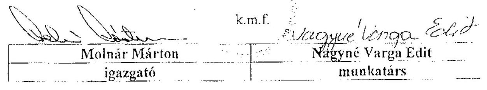

---

# Jegyzőkönyv 

Készült: 2004. május 19-én a Magyarországi Nemzeti és Etnikai Kisebbségekért Közalapítványnál (MNEKK).

Jelen vannak: Sas Imréné számvevő tanácsadó az Állami Számvevőszék (ÁSZ), Solymár Ágnes számvevő tanácsos az ÁSZ, és Molnár Márton közalapítványi irodaigazgató a MNEKK részéről.

Tárgy: A MNEKK által az 1999-2003. években nyújtott ösztöndíj támogatások helyszíni ellenőrzése, a V-1020-5/2003. számú program (Témaszám: 689) 3.5. pontja alapján

Az 1999-2003. években a MNEKK kuratóriuma összesen 0,4 milliárd Ft tanulmányi és alkotói ösztöndíj támogatást adott. Az e körbe tartozó támogatások pályáztatásának lebonyolítását, a támogatások odaítélését és célszerű felhasználását a V-1020-5/2003. programban eredetileg megjelölt helyszíni ellenőrzés időszakában (2004. január 5. - 2004. február 23. között) az ÁSZ számvevői az Állami Számvevőszékről szóló 1989. évi XXXVIII. tv. 21. §-ának megfelelően nem tudták ellenőrizni, mivel

- az 1999-2001. évi alkotói ösztöndíjak írásos és az 1998/1999-2001/2002. évi tanulmányi ösztöndíjak írásos pályázati dokumentumait (pályázatok, támogatási szerződések és az alkotói ösztöndíjakra vonatkozó elszámolások) a MNEKK irodaigazgatója 2002. évben az ösztöndíjak odaítéléséről szóló kuratóriumi határozatok, valamint a kifizetések alapbizonylatainak számító banki átutalások kivételével megsemmisítette;
- a helyszíni ellenőrzés időszakában még meglévő, a 2002/2003. évben adott tanulmányi ösztöndíjak dokumentációjának ellenőrzését a MNEKK irodaigazgatója amiatt nem biztosította, mert e dokumentumok a nemzetiségi és etnikai hovatartozásra vonatkozó, különleges adatokat is tartalmaztak, és az adatkezeléshez a törvény szerint az érintetteknek írásban hozzá kell járulniuk.

A pályázati dokumentációk megsemmisítése az adatvédelmi törvényben a különleges adatokra (a nemzetiségi és etnikai kisebbséghez tartozás) előírt fokozott biztonsági követelmények érvényesítése, a vonatkozó jogszabályok és az 1997-ben kelt adatvédelmi állásfoglalás téves értelmezése, a közalapítvány iratkezelési szabályzata alapján történt. A közalapítvány a dokumentumok megsemmisítése helyett a különleges adatok törlésével eleget tehetett volna adatvédelmi kötelezettségének.

Az iratkezelési szabályzatot csak a 2002. szeptember 17-i módosítása során egyeztette a közalapítvány a Magyar Országos Levéltárral, amely annak tartalmával egyetértett, az iratok selejtezése azonban ezt megelőzően, 2002. február 14-én elkezdődött.

Az iratkezelési szabályzatban nem vették figyelembe a hatályos számviteli törvényekben előírt (2000-ig öt, 2001 után nyolc éves) megőrzési kötelezettséget, mivel a számviteli bizonylatnak minősülő pályázati dokumentumokat 2002-ig két év, azt követően öt év, az ösztöndíj pályázatokat egy év leteltével megsemmisíthetőnek minősítették. A szabályzatot a kuratórium helyett a MNEKK irodaigazgatója hagyta jóvá. Az irodaigazgató a szabályzat jóváhagyásával hatáskörét túllépte, tekintve, hogy a Ptk. 74/C. (1) bekezdése, illetve az alapító okirat V/1. pontja alapján a közalapítvány vagyonának kezelője a kuratórium, így a vagyon kezelésének, működtetésének, felhasználásának, védelmének, stb. szabályait meghatározó valamennyi belső szabályzat jóváhagyására a kuratórium jogosult. Az alapító okirat szerint a működés részletes szabályait az SZMSZ-ben kell meghatározni, amelynek jóváhagyása a kuratórium kizárólagos hatáskörébe tartozik. Ezzel szemben az irodaigazgató a 2/1996. számú igazgatói utasítással iratkezelési szabályzatot adott ki, amelyben többek között meghatározta az iratok

---

selejtezésének és megsemmisítésének szabályait. Az iratkezelési szabályzatot a kuratórium nem hagyta jóvá.

Felelős: az iratkezelési szabályzat jogosulatlan jóváhagyásáért;
az iratkezelési szabályzatnak a hatályos számviteli törvényekkel - Szt. (régi) 84. § (1) és 87. § (1)-(2) bekezdés, valamint az Szt. (új) 166. § (1) és 169. § (1)-(2) bekezdés - ellentétes tartalmáért;
az 1999-2001. évi alkotói ösztöndíjak és az 1998/1999-2001/2002. évi tanulmányi ösztöndíjak pályázati dokumentumainak (pályázatok, támogatási szerződések és elszámolások) megsemmisítéséért és ezáltal az ÁSZ ellenőrzésének az Állami Számvevőszékről szóló 1989. évi XXXVIII. tv. 21. §-ának megfelelő végrehajtásának megakadályozásáért

# Molnár Márton irodaigazgató 

A 2004. február 25-én átadott V-1019-11/2003. számú számvevői jelentéstervezet 13. oldala tartalmazta, hogy a pályázati dokumentációk megőrzésére vonatkozó szabályozás nem felelt meg a hatályos számviteli törvény előírásának. A V-1020-12/2003. számú számvevői jelentéstervezet 21. oldala pedig azt tartalmazta, hogy az ÁSZ elnöke állásfoglalást kért az Országgyűlési Biztos Hivatala adatvédelmi biztosától arra nézve, hogy e konkrét esetben a különleges adatok pályázati anyagból való törlése kielégíti-e az adatvédelem követelményeit vagy az összefüggések és a természetes személlyel való kapcsolat helyreállíthatósága miatt a teljes anyag megsemmisítése szükséges és ezért jogszerű volt-e. Az irodaigazgató tehát tudomással bírt arról, hogy folyamatban van az adatvédelmi biztos állásfoglalásának kialakítása.

Az adatvédelmi biztos állásfoglalását az Állami Számvevőszék elnöke csak a helyszíni ellenőrzés befejezését követően kapta meg. Eszerint: „amennyiben a betekintésnek célja nem az érintettek azonosítása, ellenőrzése, hanem az adatkezelő - jelen esetben a MNEKK - törvényes működésének, a kifizetései jogszerűségének ellenőrzése, ebben az esetben az olyan betekintés, amely nem jár együtt a megismerő oldaláról más adatkezelési művelettel (pl. ennek során felvétellel, tárolással), ekkor a betekintő nem válik adatkezelővé". Így tehát az ÁSZ számvevői jogosultak lettek volna ezekbe a dokumentumokba is betekinteni, összhangban az Állami Számvevőszékről szóló 1989. évi XXXVIII. tv. 21. §-ával.

Az adatvédelmi biztos állásfoglalása alapján az ÁSZ elnöke 2004. május 17-én utasítást adott a 2002/2003. évben adományozott tanulmányi ösztöndíjak dokumentációjának
 pótlólagos ellenőrzésére.

Sas Imréné számvevő tanácsadó és Solymár Ágnes számvevő tanácsos az F-300-92/2004. számú megbízólevél szerint megkísérelték a 2002/2003. évi tanulmányi ösztöndíj-támogatások helyszíni ellenőrzését, de az ellenőrzés meghiúsult, mert az irodaigazgató a 2004. március 16-án készült selejtezési jegyzőkönyv tanúsága szerint a tanulmányi ösztöndíj támogatások dokumentumait (pályázat, szerződés, levelezés) megsemmisítette.

Felelős: a 2002/2003. évben adományozott tanulmányi ösztöndíjak dokumentációjának (pályázatok, támogatási szerződések) az Szt. (új) 166. § (1) és 169. § (1)-(2) bekezdésével ellentétes megsemmisítéséért;
az ÁSZ ellenőrzésének az Állami Számvevőszékről szóló 1989. évi XXXVIII. tv. 21. §-ának megfelelő végrehajtásának megakadályozásáért

## Molnár Márton irodaigazgató

---

k.m.f.

Sas Imréné
számvevő tanácsadó

Solymár Ágnes
számvevő tanácsos

Molnár Márton
irodaigazgató

# Záradék 

A 2004. május 19-én készült jegyzőkönyv tartalmát, benne a személyes felelősségemet megjelölő megállapításokat megismertem, a jegyzőkönyv 1 példányát átvettem.
Tudomásul veszem, hogy a megállapításokra az Állami Számvevőszékről szóló 1989. évi XXXVIII. törvény 23. §-a alapján a mai naptól számított 8 napon belül, tehát 2004. május 27-ig köteles vagyok írásbeli magyarázatot adni. Az írásbeli magyarázatot Sas Imréné számvevő tanácsadó nevére, az Állami Számvevőszék 1052. Budapest, Apáczai Cs. J. utca 10. címre kell eljuttatni.

Budapest, 2004. május 19.

---

# A Magyarországi Nemzeti és Etnikai Kisebbségekért Közalapítvány 

Levélcím: 1387 Budapest 62. Pf. 25
Székhely: 1068 Budapest, Benczúr u. 11.
Tel./Fax: 321-7360, 321-7364, 321-7370, 321-3352
E-mail: mnekk@szolero.hu
http://web.szolero.hu/mnekk
Állami Számvevőszék
Sas Imréné asszony
számvevő tanácsadó
Budapest
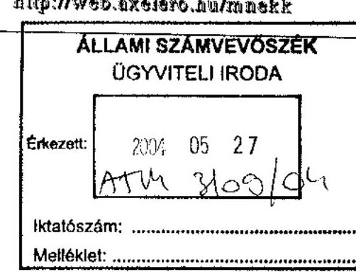

Tisztelt Számvevő Tanácsadó Asszony!

A Magyarországi Nemzeti és Etnikai Kisebbségekért Közalapítvány (továbbiakban MNEKK) által az 1990-2003. években nyújtott ösztöndíj támogatások helyszíni ellenőrzése, a V-1020-5/2003. számú program (témaszám: 689) 3.5. pontja alapján tárgyú 2004. május 19-én az MNEKK-nál készült jegyzőkönyv záradékának kötelezése alapján a személyes felelősségemet megjelölő megállapításokra az alábbi magyarázatokkal kívánok reagálni.
(Molnár Márton) „Felelős: az iratkezelési szabályzat jogosulatlan jóváhagyásáért."
Az iratkezelési szabályzat kiadmányozásának időpontjában hatályos Alapító Okirat így fogalmaz:
„2. Titkári Iroda
a) ...........Az iroda működésének szabályait, valamint a b. pontban foglaltaknak és az Alapító Okirat egyéb rendelkezéseivel összhangban - a titkár feladatait a kuratórium állapítja meg......"

Az 1996-ban aláírt iratkezelési szabályzat idején hatályos SZMSZ 3. pontja szerint: „ A Titkár az Alapító Okirat felhatalmazása alapján képviselheti a Közalapítványt az alábbiak szerint:

---

a) A Titkári Iroda működésével összefüggő ügyekben önállóan,
b) A Közalapítvány működésével kapcsolatos adminisztratív feladatok ellátása során ( APEH, TB, stb.) önállóan

Az 1997-es ügyészségi, valamint ÁSZ vizsgálat során egyik szerv sem emelt kifogást a szabályzattal kapcsolatban, nem állapította meg, hogy a szabályzat aláírásával a hatáskörömet túlléptem volna.

A MNEKK jelenleg hatályos SZMSZ-e a következőket tartalmazza:
III. fejezet A Közalapítványi Iroda és az Igazgató
„Az Alapító Okiratban foglaltakon túl, a jelen szabályzatban egyebütt meghatározottakon kívül az Igazgató feladatai a következők:.......elkészíti az ügyiratkezelési és pénzkezelési szabályzatot
..........- gondoskodik a Közalapítvány nyilvántartásának folyamatos, naprakész vezetéséről, az irattár kezeléséről, a selejtezésről.

Az ÁSZ által vizsgált időszakban hatályos Alapító Okiratok az inkriminált szabályzat elfogadását nem utalják a kuratórium kizárólagos hatáskörébe.

A kifogásolt iratkezelési szabályzat valóban ellentétes volt a hatályos számviteli törvényekkel. A selejtezés gyakorlata azonban nem, tehát a törvényesség nem sérült.

Az alkotói és a tanulmányi ösztöndíjak pályázati dokumentumainak megsemmisítése az 1997. január 14-én kelt Dr. Majtényi László adatvédelmi biztos által jegyzett, a kuratórium akkori elnökének írt állásfoglalása alapján történt.

Az adatlapot, amely az adatoknak az elbírálástól számított 1 év elteltével azok megsemmisítéséről (nem törléséről) biztosítja a pályázót, a kuratórium hagyta jóvá, s nem az iratkezelési szabályzat, hanem az adatvédelmi biztos állásfoglalása alapján.

Ez az állásfoglalás volt érvényben az ÁSZ vizsgálat idején is. Tudomásom volt arról, hogy a jelenlegi adatvédelmi biztostól is kértek állásfoglalást. Nem gondolhattam arra, hogy az állásfoglalás eltérhet a korábbitól.

A 2002/2003-as tanulmányi ösztöndíjak dokumentációját a vizsgálat ideje alatt nem semmisítettük meg.

A jelentés első változatát február 25-én kaptuk meg, a selejtezés március 16-án történt. Az adatvédelmi biztos állásfoglalását március 26-án kaptuk kézhez.

Összegezve a fentiekből adódóan:

---

Felelős vagyok azért, mert az adatvédelmi szabályzat nem felelt meg a számviteli törvény előírásainak. A selejtezési gyakorlat azonban megfelelt a törvénynek.

A jegyzőkönyv további terhemre rótt felelősség megállapításait nem találom megalapozottnak és érvényesnek.

Budapest 2004. május 26.
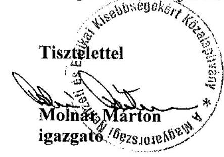

---

# Molnár Márton úr 

igazgató
Magyarországi Nemzeti és Etnikai Kisebbségekért Közalapítvány

## Budapest

1387 Budapest 62. Pf. 25.

## Tisztelt Igazgató Úr!

A V-1020-5/2003. számú program 3.5. pontja alapján 2004. május 19-én ismételten megkísérelttük a MNEKK által az 1999-2003. években nyújtott ösztöndíj támogatások helyszíni ellenőrzését. Az ellenőrzésről készült, személyes felelősségét megállapító jegyzőkönyvet a felelősségi záradék aláírásával annak tudomásulvételével vette át, hogy a megállapításokra az Állami Számvevőszékről szóló 1989. évi XXXVIII. törvény 23. §-a alapján 8 napon belül, azaz 2004. május 27-ig köteles írásbeli magyarázatot adni.

A 2004. május 26-án kelt, a személyes felelősségre vonatkozó írásos magyarázatát áttanulmányoztuk, és azt az alábbiak miatt elutasítjuk:

1. Fennállítjuk azt a megállapításunkat, hogy az iratkezelési szabályzatot jogosulatlanul hagyta jóvá.

A Ptk. 74/C. (1) bekezdése és ezzel összhangban az alapító okirat szerint a közalapítvány kezelője a kuratórium, így az alapító okiratban az alapító által külön nem részletezett működési szabályok megállapítására, ezeknek különféle elnevezésű belső szabályzatokban való jóváhagyására - amennyiben ezeket törvény nem utalja az alapító hatáskörébe - a kuratórium jogosult.

Az iratkezelési szabályzatok elkészítésekor hatályban lévő alapító okiratok ezek elfogadását - konkrétan megnevezve - valóban nem sorolták a kuratórium kizárólagos hatáskörébe, de fenti indokolás alapján erre csak a kuratóriumnak van hatásköre.

Írásos magyarázatában Ön is azt közölte (1. oldal), hogy az iratkezelési szabályzat kiadmányozásakor hatályos alapító okirat szerint az iroda működési szabályait és a titkár feladatait a kuratórium jogosult megállapítani.

- Az 1996-ban aláírt iratkezelési szabályzat idején az 1995. november 15-én kelt 57 MSZ volt hatályban, amely a titkár (irodaigazgató) képviseleti jogosultságának körét határozta meg, de ebben nem szerepel az iratkezelési szabályzat jóváhagyásával kapcsolatos felhatalmazás.

---

- A 2002-ben aláírt iratkezelési szabályzat idején a 2000. június 15-én kelt SZMSZ volt hatályban, amely nem az iratkezelési szabályzat jóváhagyását, hanem az ügyirat-kezelési és pénzkezelési szabályzat elkészítését, illetve az irattár kezeléséről, a selejtezésről való gondoskodást jelölte meg az igazgató feladatai között.

Írásos magyarázatában az iratkezelési szabályzatnak a hatályos számviteli törvényekkel ellentétes tartalmát Ön is elismerte.

A tanulmányi ösztöndíj, illetve a kisebbségi alkotók ösztöndíj támogatásainak pályázati dokumentációjának teljes körű megsemmisítését - magyarázatával ellentétben - az adatvédelmi biztos 1997. január 14-én kelt állásfoglalása nem írta elő. Az állásfoglalás a következőket tartalmazza: „az adatkezelőnek (a pályázat kiírójának) nyilatkoznia kell arról, hogy a pályázat elbírálását követően a célhoz kötöttség követelményét tiszteletben tartva mikor fogja törölni a hovatartozásra vonatkozó adatot."

A kuratórium által elfogadott, a kisebbségi alkotók ösztöndíj pályázatára készült adatlap nem tartalmazott kötelezettséget a kisebbségi hovatartozásra vonatkozó adat megsemmisítésére, a tanulmányi ösztöndíj-pályázathoz jóváhagyott adatlap pedig nem a pályázati dokumentáció, hanem a kisebbségi hovatartozásra vonatkozó adatok 3, illetve 1 év elteltét követő megsemmisítésére vonatkozó ígéretet tartalmazta. Az adatlapok e része 1999-2002. évek között nem változott. Az 1999. évi a kisebbségi alkotók ösztöndíj pályázatára készült adatlapon feltüntetésre került, hogy a nyertes pályázatok 5 év elteltével kerülnek megsemmisítésre, a többi évben készült adatlapok ezt a kitételt nem tartalmazták.

A pályázati dokumentációk teljes körű megsemmisítése tehát ellentétes volt a kuratórium által jóváhagyott adatlapok tartalmával is.

Fenti indokolásnak megfelelően fenntartjuk személyes felelősségét

- az iratkezelési szabályzat jogosulatlan jóváhagyásáért;
- az iratkezelési szabályzatnak a hatályos számviteli törvényekkel - Szt. (régi) 84. § (1) és 87. § (1)-(2) bekezdés, valamint az Szt. (új) 166. § (1) és 169. § (1)-(2) bekezdés - ellentétes tartalmáért;
- az 1999-2001. évi alkotói ösztöndíjak és az 1998/1999-2001/2002. évi tanulmányi ösztöndíjak pályázati dokumentumainak (pályázatok, támogatási szerződések és elszámolások) az Szt. (régi) 84. § (1) és 87. § (1)-(2) bekezdésekbe, valamint az Szt. (új) 166. § (1) és 169. § (1)-(2) bekezdésébe ütköző megsemmisítéséért és ez által az ÁSZ ellenőrzésének az Állami Számvevőszékről szóló 1989. évi XXXVIII. tv. 21. §-ának megfelelő végrehajtásának megakadályozásáért.

2. Fenntartjuk azt a megállapításunkat, hogy a 2002/2003. évben adott tanulmányi ösztöndíjak dokumentációját indokolatlanul és törvénysértően semmisítette meg:

---

- Tévesen értelmezte - az 1. pontban kifejtettek alapján - hogy a 2002/2003. évben adott tanulmányi ösztöndíjak dokumentációját az 1997. évi adatvédelmi biztosi állásfoglalás alapján meg lehet semmisíteni. Az adatvédelmi biztosnak az 1997. évi állásfoglalása értelmében a közalapítványnak - mint adatkezelőnek - a pályázókat arról kellett tájékoztatni, hogy a hovatartozásukra vonatkozó adatot mások számára nem teszi hozzáférhetővé, álláspontunk szerint a közalapítvány erre vonatkozó kötelezettségének a különleges adat törlésével eleget tett volna, ezt követően az ellenőrzés részére át kellett volna adni a dokumentációt. Az adatvédelmi biztos 2002. évi állásfoglalása is ezt erősítette meg, így tehát a két állásfoglalás nem tért el egymástól.
- A 2002/2003. évben adott tanulmányi ösztöndíjak dokumentációjának helyszíni ellenőrzését a 2003. november 28-i levelében foglaltak szerint a helyszíni ellenőrzés eredetileg tervezett 2004. január 5. - 2004. március 12. közötti időtartama alatt az Avtv.-re hivatkozva nem bocsátotta az ellenőrzés rendelkezésére. Emiatt az Állami Számvevőszék elnöke állásfoglalást kért az adatvédelmi biztostól. E tényt, illetve azt, hogy az állásfoglalás még nem érkezett meg az Állami Számvevőszékhez, a 2004. február 25-én átadott számvevői jelentéstervezet tartalmazta, így erről tudomással bírt.
- A számvevői jelentéstervezetben az is rögzítésre került, hogy a pályázati dokumentációk megsemmisítése ellentétes a hatályos számviteli törvényekkel, így tudomással bírt arról is, hogy a dokumentációk a számviteli törvény szabályai szerint sem semmisíthetők meg.
- A közalapítványnak 2004. januárjában tájékoztatásul megküldött ellenőrzési program tartalmazta, hogy a végleges jelentést 2004. május 12-ig tervezi az ÁSZ elnöke észrevételezés céljából a közalapítványnak megküldeni, így a közalapítványnál ismert volt, hogy az ÁSZ ellenőrzés tervezett befejezési határideje az ezt követő 8 nap eltelte.

Fenti indokolásnak megfelelően fenntartjuk személyes felelősségét

- a 2002/2003. évben adományozott tanulmányi ösztöndíjak dokumentációjának (pályázatok, támogatási szerződések) az Szt. (új) 166. § (1) és 169. § (1)(2) bekezdésével ellentétes megsemmisítéséért;
- az ÁSZ ellenőrzésének az Állami Számvevőszékről szóló 1989. évi XXXVIII. tv. 21. §-ának megfelelő végrehajtásának megakadályozásáért.

Budapest, 2004. június 8.
Tisztelettel:

Sas Imréné
számvevő tanácsadó

Solymár Ágnes
számvevő tanácsos

---

# 17. számú melléklet   a V-1020/2003. számú jelentéshez 

## V-1020-5/2003

MINISZTERELNÖKI HIVATAL
POLITIKAI ÁLLAMTITKÁR

Dr. Kovács Árpád úrnak
elnök
Állami Számvevőszék
Budapest

Tisztelt Elnök Úr!

A Magyarországi Nemzeti és Etnikai Kisebbségekért Közalapítvány gazdálkodásának ellenőrzéséről szóló jelentés-tervezettel - az egyeztetés során tett észrevételeink szerepeltetésére is figyelemmel - egyetértünk.

Budapest, 2004. július 9.

Tisztelettel:
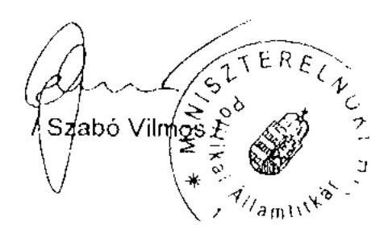

