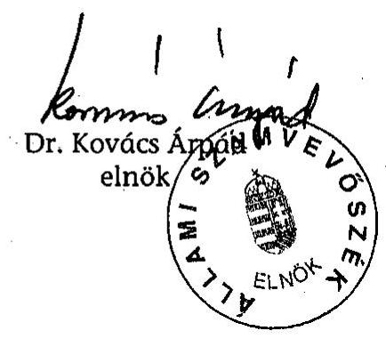
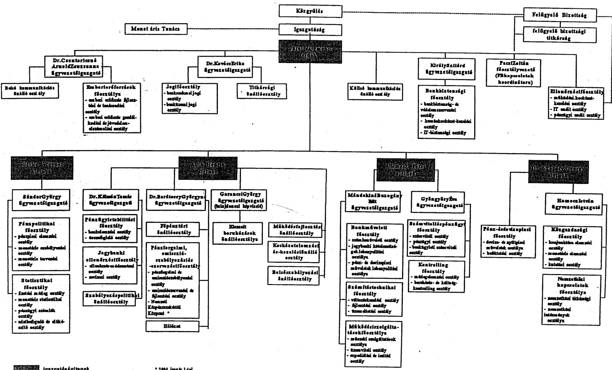
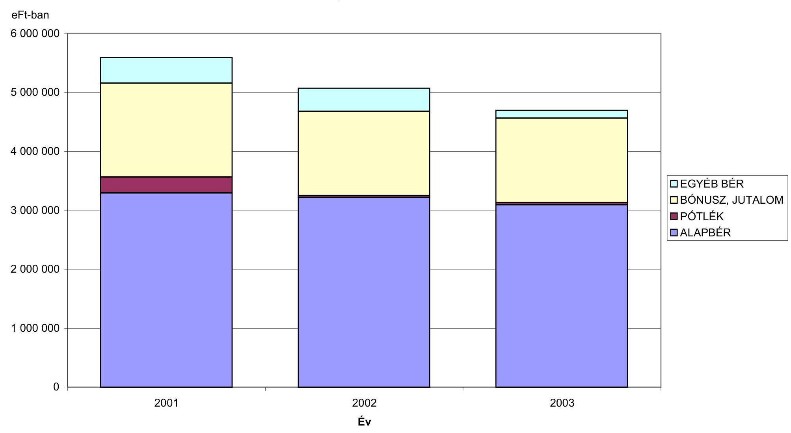
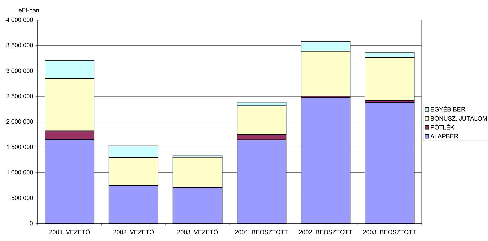
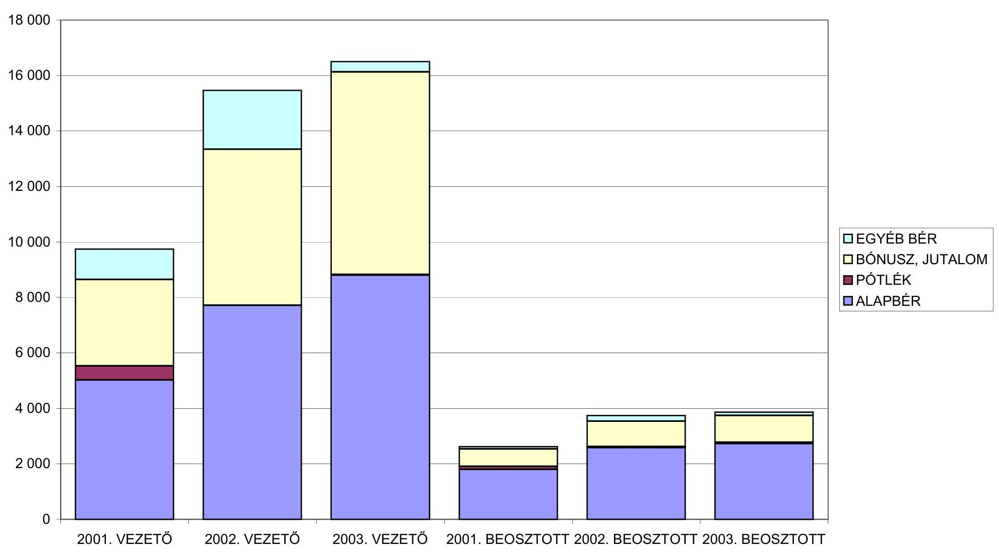

# JELENTÉS 

a Magyar Nemzeti Banknál alkalmazott teljesítményértékelési rendszer múködésének ellenőrzéséről

---

2. Államháztartás Központi Szintjét Ellenőrző Igazgatóság
2.1. Teljesítmény Ellenőrzési FőcsoportIktatószám: V-35-22/2003-2004.Témaszám: 685
Vizsgálat-azonosító szám: V0112
Az ellenőrzést felügyelte:
Bihary Zsigmond
föigazgató
Az ellenőrzés végrehajtásáért felelős:
Kemény Emil
főcsoportfőnök
Az ellenőrzést vezette:
Dr. Ocskovszki Jánosné
osztályvezető főtanácsos
Az ellenőrzést végezték:
Gaálné Izsó Éva Matuk Károly
számvevő számvevő
A témához kapcsolódó eddig készített számvevőszéki jelentések:a Magyar Nemzeti Bank belső (banküzemi) múködésének0328
ellenőrzése
a Magyar Nemzeti Bank 2002. évi múködésének ellenőrzése ..... 0340
a Magyar Nemzeti Bank múködésének ellenőrzése ..... 0238

---

# TARTALOMJEGYZÉK 

BEVEZETÉS ..... 5
I. ÖSSZEGZŐ MEGÁLLAPÍTÁSOK, KÖVETKEZTETÉSEK, JAVASLATOK ..... 7
II. RÉSZLETES MEGÁLLAPÍTÁSOK ..... 11

1. A teljesítményértékelési rendszer bevezetése ..... 11
1.1. A bevezetés előzményei ..... 11
1.2. A bevezetés döntési folyamatai és a belső kommunikáció ..... 12
2. A rendszer szabályozottsága, a múködés folyamata ..... 13
2.1. Szabályozottság és a szabályzatok betartása ..... 13
2.2. Az intézmény, a szakterületek és a munkavállalók éves célkitúzéseinek összhangja ..... 14
2.3. A munkaköri besorolási és a teljesítményértékelési rendszer kapcsolata ..... 16
2.4. Az értékelés folyamata ..... 17
3. A teljesítményértékelési rendszer hatása az intézményi célkitúzések megvalósítására, az egyéni munkateljesítményekre, az emberi erőforrás alrendszerekre ..... 18
3.1. A célkitúzések teljesítésének hatása az intézményi célok megvalósítására ..... 18
3.2. A teljesítményértékelési rendszer hatása az egyéni munkateljesítményekre és a munkavállalók motivációja ..... 19
3.3. A teljesítményértékelés eredményeinek hatása az emberi erőforrás tervezésére és fejlesztésére ..... 20
3.4. A teljesítményértékelési rendszer kapcsolata a személyes kiválasztással, a karriertervvel, a címadományozással és az erkölcsi elismeréssel ..... 21
4. A bonusz rendszer bevezetése, szabályszerű alkalmazása ..... 23
4.1. A fix és a teljesítménytől függő bonusz ..... 23
4.2. A bonusz elszámolása, a kifizetések szabályszerűsége ..... 24
4.3. A teljesítményértékelési és a bérrendszer kapcsolata, a jövedelmek változása ..... 25

---

# MELLÉKLETEK 

1. számú melléklet
2. számú melléklet
3. számú melléklet
4. számú melléklet
5. számú melléklet
6. számú melléklet
7. számú melléklet
8. számú melléklet
9. számú melléklet

Az MNB szervezeti felépítése
Az egyéni teljesítmény bonusz aránya az éves kitűzött („Jó" szintű teljesítményszinthez tartozó) bonusz kerethez viszonyítva 2002.
Az egyéni teljesítmény bonusz aránya az éves kitűzött („Jó" szintű teljesítményszinthez tartozó) bonusz kerethez viszonyítva 2003.
Az MNB jövedelemelemeinek adatai elnök és alelnökök nélkül (2001 - 2002 - 2003. évek)
Az MNB jövedelemelemeinek bemutatása 2001 - 2002 - 2003. elnök, alelnökök nélkül vezető, beosztott bontás nélkül (diagram)
Az MNB jövedelemelemeinek bemutatása 2001 - 2002 - 2003. elnök, alelnökök nélkül (diagram)
Az MNB fajlagos jövedelemelemeinek bemutatása 2001 - 2002 2003. elnök, alelnökök nélkül (diagram)

Kritériumok az MNB teljesítményértékelési rendszerének teljesít-mény-ellenőrzéséhez
Kérdésfa az MNB teljesítményértékelési rendszerének ellenőrzéséhez

---

# ÉRTELMEZÉSEK 

Teljesítménymenedzsment, olyan összetett és egységes irányítási, vezetési rendszer, teljesítményértékelés: amely a célkitűzés, mérés, visszacsatolás, értékelés és ösztönzés eszközeivel összehangolja a kiemelt fontosságú szervezeti célokat a munkavállalók munkaköri tevékenységével, és biztosítja a Bank eredményes múködését.
Munkakör-értékelés: a munkakör relatív értékének és a szervezetben elfoglalt fontosságának meghatározása. Az értékelés feltétele, hogy összegyűjtött naprakész munkaköri információk álljanak rendelkezésre az elemzéshez.
Bonusz: a tárgyévre az alapbéren felül fizethető bérjellegű juttatás, amely fix bonuszból és a teljesítmény bonuszból áll. A fix és a teljesítmény bonusz mértéke a munkavállalói besorolástól függően változik.
Fix bonusz: az alapbéren felül fizethető bérjellegű juttatás azon része, amelynek kifizetését a munkavállaló teljesítménye nem befolyásolja.
Teljesítmény bonusz: az alapbéren felül fizethető bérjellegű juttatás azon része, amelynek kifizetése a munkavállaló teljesítménye és a belső utasításban foglalt feltételek együttes teljesülése esetén történik.
Hay módszer: amerikai szakértők által kidolgozott munkakör elemzési és értékelési módszer, amelyet világszerte nemzetközi szervezeteknél és multinacionális cégeknél, valamint Magyarországon is alkalmaznak. A munkakör értékét a tudás, a problémamegoldás, és a felelősség határozza meg.
Költséggazda: a gazdálkodás egy kijelölt területéért banki szinten felelős szervezeti egység vezetője. Feladata a hozzárendelt költségnem(ek) éves keretösszegének betartása.

---

.

---

# JELENTÉS 

## a Magyar Nemzeti Banknál alkalmazott teljesítményértékelési rendszer múködésének ellenőrzéséről

## BEVEZETÉS

A Magyar Nemzeti Bank (továbbiakban: MNB) 2001. évi múködésének ellenőrzéséről készült - 2002 szeptemberében nyilvánosságra hozott - számvevőszéki jelentésben az MNB elnökének tett javaslatok között szerepelt, hogy követelje meg az új humánerőforrás alrendszerek hatékony, konzisztens múködtetését, és a változások eredményének folyamatos értékelését.

Az MNB 2002-ben teljesítményértékelési rendszert vezetett be, amelynek célja az emberi erőforrás hatékonyságának értékelése és az ösztönzés megteremtése volt. Ennek a rendszernek az alkotóelemei - a célkitúzés, a mérés, az értékelés, az elismerés és a visszacsatolás - együttesen olyan eszközök, amelyek alkalmazása biztosíthatja az MNB humán erőforrás gazdálkodása hatékonyságának növelését, fejlesztését.

Jelen vizsgálat a teljesítményértékelési rendszer múködésének ellenőrzésére irányult.

Az ellenőrzés célja annak értékelése volt, hogy

- a rendszer mennyiben segíti elő az egyéni teljesítmények növekedését, elismerését, és ezen keresztül hogyan biztosítja az intézményi célok elérését;
- az újonnan bevezetett és alkalmazott teljesítményértékelési rendszer szabályozottsága mennyiben teljes körú;
- a teljesítményértékelési rendszer múködtetése a belső szabályzatoknak hogyan felel meg;
- a rendszer hogyan hat a személyzeti politikára és hogyan kapcsolódik az emberi erőforrás alrendszerekhez.

A vizsgálat a rendszer bevezetésének időpontjától, 2002. január 1-től - a bevezetés körülményeit érintően az ezt megelőző időszakra - a helyszíni vizsgálat lezárásáig, 2004. március 5-ig tartó időszakra irányult. Az ellenőrzés egyrészt szabályszerűségi, másrészt gazdaságossági és eredményességi szempontok alapján értékelte a teljesítményértékelési rendszer múködését.

Az ellenőrzés a teljesítményértékelési rendszerre irányult, azonban a kapcsolódó területeken keresztül értékelte az Állami Számvevőszék (továbbiakban: ÁSZ) 2002. évi ajánlásának hasznosulását, összességében a vizsgálat átfogta csak-

---

nem teljes egészében az MNB emberi erőforrás rendszerét, személyzeti politikáját és gyakorlatát.

A teljesítményellenőrzési kritériumokra (8. sz. melléklet) épült kérdésfa alapján (9. sz. melléklet) végrehajtott ellenőrzés megállapításai az ÁSZ ellenőrzési tapasztalatain és a mintavétel keretében bekért dokumentumokon alapulnak. A tételes vizsgálatba bevont területeket az intézmény fő célkitűzései alapján - kivéve az MNB törvény 4. § (1)-(7) bekezdésében meghatározott feladatokkal kapcsolatosakat - meghatározott vizsgálati kritériumokat figyelembe véve jelöltük ki. Ebből következően megállapításaink az MNB működésének és gazdálkodásának területeit érintik.

Az ellenőrzés végrehajtására az MNB-ről szóló 2001. évi LVIII. tv. 45. §-ának (2) bekezdése, továbbá az ÁSZ-ról szóló 1989. évi XXXVIII. törvényben foglaltak adtak jogszabályi alapot.

Az ÁSZ 2002. évi ellenőrzése az intézmény 2001. évi múködésének és gazdálkodásának átfogó értékelésére, a 2003. évi ellenőrzések az MNB 2002. évi múködésén és gazdálkodásán belül, két vizsgálat keretében, az egyes területek mélyebb ellenőrzésére terjedt ki. A 2003. év során megkezdett harmadik, 2004-re áthúzódó jelen vizsgálatot követően az ÁSZ az MNB működésének ellenőrzését évi egy alkalommal fogja elvégzi.

A végleges jelentést egyeztettük az MNB elnökével, aki a törvényes határidőn belül észrevételt nem tett.

---

# I. ÖSSZEGZŐ MEGÁLLAPÍTÁSOK, KÖVETKEZTETÉSEK, JAVASLATOK 

Az MNB 2001. év októberében meghatározott középtávú intézményi célkitűzéseiben a banküzem korszerűsítésének fő irányai között határozta meg, hogy az emberi erőforrás gazdálkodás keretében megfelelően definiált feladatköröket, valamint rendszeres teljesítménymérést és -értékelést alakít ki.

A célokkal összhangban az intézmény 2002. évtől átalakította és korszerűsítette az emberi erőforrás gazdálkodására irányuló politikáját. E folyamat részeként bevezette a teljesítményértékelési rendszert, amelyet már harmadik éve egyre eredményesebben múködtet. Ezzel a szervezetben meghonosította a teljesítményközpontú értékrendet.

A teljesítményértékelési rendszer 2002- és 2003-ban hatékonyan támogatta az intézményi célok megvalósítását az egyes bankszervek célkitűzéseinek teljesítésén keresztül, folyamatosan segítve a szervezet eredményes múködését. A bankszervi célok elérését az egyéni célkitűzések jó színvonalú teljesítése tette lehetővé.

A teljesítményértékelési rendszer alkalmazásával az MNB stratégiai és éves céljai összhangban álltak és konkrétan megjelentek a szervezeti egységek feladatai között. A szervezet céljaiból és a munkaköri feladatokból vezették le az éves egyéni célkitűzéseket, a vezetőknél közvetlenül, a beosztott munkavállalóknál közvetetten, részfeladatokra bontás formájában. A korábbi évekkel ellentétben valamennyi munkavállaló részére írásban meghatározták az éves elvárásokat, amelyek teljesítését értékelték és dokumentálták.

A költséggazda vezetők célkitűzései a költségterv betartásával kapcsolatos teljesítménymutatót csak egy esetben tartalmaztak, így a terv betartásának számonkérése nem történt, történhetett meg a teljesítményértékelési rendszerben. Az MNB vezetésének megítélése szerint a költségtakarékos gazdálkodás biztosításához elegendő a szigorú szabályozás, ezért nem élt az ösztönzés eszközeivel.

A szakterületi célkitűzések megvalósítását az MNB felső vezetése folyamatosan, az igazgatóság pedig az éves és az évközi beszámolók alapján kísérte figyelemmel. 2002- és 2003-ban az igazgatóság a bankszervi beszámolókat megtárgyalta, de azok elfogadásáról, vagy tudomásulvételéről határozatot nem hozott. A szervezeti egységek értékelése és a vezetők minősítése alapvetően összhangot mutatott.

A teljesítményértékelés az intézményi célkitűzések alakulásáról nyújtott folyamatos tájékoztatással támogatta a szervezet irányítását. Az éves célkitűzések realizálásán túlmenően az MNB vezetése nyomon követte a középtávú intézményi célkitűzések teljesülését, a fő prioritású célkitűzések és az átfogó projektek megvalósulását. 2002. és a 2003. években a teljesítményértékelési rendszer működésének értékeléséről, az értékelés eredményeiről és a teljesítmény bonusz kifizetéséről tájékoztatók készültek az igazgatóság részére.

---

Az MNB vezetése stratégiai célként határozta meg a munkatársak ösztönzésének növelését, a jövedelmek teljesítményarányos és objektív differenciálását. A stratégiát támogató teljesítményértékelési rendszer hatása a szakterületi célkitűzéseken keresztül érvényesült, a munkateljesítménnyel kapcsolatos motivációs hatások kimutathatók.

Az MNB tv. 52. §-a szerint az igazgatóság felelős a múködés irányításáért, egyben az igazgatóság hagyja jóvá az MNB szervezetével és belső irányításával összefüggő kérdéseket és a Kollektív Szerződés módosítását. A szabályozással ellentétes, hogy egy teljesítményértékelési rendszer bevezetéséről nem az igazgatóság döntött. Az MNB vezetése úgy ítélte meg, hogy a teljesítménymenedzsment, illetve a teljesítményértékelési rendszer bevezetéséhez elégséges az MNB elnökének döntése.

Az egyéni és a bankszervi érdekeltség kialakításánál tanulmányozták a hazai és a nemzetközi gyakorlatban alkalmazott teljesítményértékelési módszereket, pl. az EBRD, az IMF és az ENSZ hasonló teljesítménymenedzsment rendszereit. A jegybankok kétféle elvet követnek a teljesítményértékelésben: vagy bérfejlesztéssel, vagy bonusszal ismerik el a teljesítményt. Az MNB vezetése az ösztönzés formájának megállapításakor a bonusz mellett döntött. A szakmai előkészítés megfelelő volt, a bevezetést megelőzően egyeztettek az érdekvédelmi szervezetekkel és módosították a Kollektív Szerződést. A teljesítményértékelési rendszer bevezetését terv szerint hajtották végre.

A teljesítményértékelés folyamatának belső szabályozottsága 2003-tól megfelelő, a szabályzatok teljes körűen és összehangoltan lefedik a tevékenységet. Az intézmény a teljesítményértékeléshez kapcsolódó területeket is - képzés, karrier, erkölcsi elismerés, címadományozás - komplexen és konzisztensen szabályozta.

A teljesítményértékelési rendszer múködtetésekor az MNB mindkét évben - a vezetői bonusz kifizetésének kivételével - a belső szabályzatainak megfelelően járt el. A rendszer alkalmazását a felügyelő bizottság az irányítása alá tartozó belső ellenőrzési szervezettel eddig nem vizsgáltatta annak ellenére, hogy az az emberi erőforrás gazdálkodás meghatározó eleme.

Az MNB a 2002-től alkalmazott munkaköri besorolási rendszerét a „Hay" mun-kakör-elemzési és értékelési módszertana alapján alakította ki. Minden munkakörben a munkakör értékét a tudás, a problémamegoldás és a felelősség alapján határozta meg. A munkaköri szintekhez kapcsolódik a bérrendszer, a képzés, a karrierfejlesztés és a teljesítményértékelés. A teljesítményértékelés és a munkaköri besorolás összhangját a munkaköri feladatokon, az éves célkitűzéseken és az érdekeltségi, bonusz rendszeren keresztül valósították meg. A munkaköri leírások és a teljesítményértékelések dokumentáltak, a nyilvántartások teljes körűek voltak.

A teljesítményértékelési rendszerben a munkavállalók részére fizetett bonusz fix és teljesítmény bonuszra oszlik. 2002- és 2003-ban a teljesítmény bonusz aránya a vezetői- és a szakértői munkakörökben dolgozó beosztottaknál $40 \%$, az ügyintézői munkakörökben dolgozó beosztottak esetében $30 \%$ volt, amelyek a teljesítmény növelésének ösztönzését mérsékelten támogatták. 2004-től a szakértői munkakörökben a teljesítmény bonusz $50 \%$-ra változott. A bonusz rend-

---

szerben - különösen azoknál a munkaköröknél, amelyeknél a munkavállalók ráhatása az intézményi célok elérése jelentősebb - alacsonyan állapították meg a teljesítménytől függő bonusz arányát. A magasabb arány hatékonyabban ösztönözné az egyéni teljesítményt és a jövedelmek teljesítmény szerinti jobb differenciálását is lehetővé tenné.

A bankszervek vezetői az egyéni teljesítmények értékelését követően osztják fel a bonusz keretet a munkavállalók között. Az egységesen - minden bankszervnél a „jó szintű" teljesítménynek megfelelően - megállapított keret korlátozottan teszi lehetővé az átlagon felüli teljesítmény kiemelt díjazását, a jelentősebb differenciálást. 2002- és 2003-ban a létszám 47, illetve $49 \%$-a az éves bonusz keretösszeg 95-105 \%-a közötti teljesítmény bonuszban részesült. 2002-ben a bonusz kifizetések tervezett összege 1816,4 M Ft, a tényleges kifizetés 1415,2 M Ft volt, az eltérést döntően a végrehajtott létszámcsökkentés és részben a kifizetési szabályok szigorítása eredményezte. 2003-ban a bonusz kifizetések összege megegyezett a tervezettel ( 1416 M Ft ). Az egy főre jutó bonusz az előző évhez viszonyítva 2002-ben 5,6 \%, 2003-ban 10,9 \%-kal emelkedett, alapvetően a bérfejlesztéssel összhangban.

A 2002-től alkalmazott új bérbesorolás a munkavállalók $80 \%$-ánál jelentett az előző évhez viszonyítva jövedelemnövekedést, 20 \%-ánál változatlan, vagy csökkenő jövedelmet eredményezett. A jövedelmek változására elsősorban az új személyi alapbérek és nem a bonusz bevezetése hatottak.

A 2002. év végén befejezett létszámleépítésekre és a minőségi cserékre a teljesítményértékelési rendszer eredményei csak részben voltak hatással. 2003-tól a létszám és a bér tervezésekor már hasznosították azokat és 2004-ben az intézmény munkaerő szükségletét az éves célkitűzések és a teljesítményértékelés eredményeinek ismeretében határozták meg.

Az új munkaerő kiválasztása a szervezetben kialakított érték- és követelményrendszerre épült. Az éves célkitűzések meghatározásakor állapították meg a munkavállalók egyéni fejlesztési, képzési terveit. Ezek végrehajtása biztosítja a személyi állomány folyamatos fejlesztését, az emberi erőforrás minőségének javítását és hatékonyságának növelését.

Az MNB 2002-ben a teljesítményértékelések eredményeinek figyelembevételével kialakította karrierfejlesztési programját. A felsővezetői, és a középvezetői karrierfejlesztési tervben alapvetően azok a munkatársak szerepelnek, akik kiemelkedő, vagy nagyon jó minősítést értek el. 2002- és 2003-ban erkölcsi elismerésben azokat részesítették, akiknek a minősítése a teljesítményértékelésnél kiemelkedő vagy nagyon jó volt. A karrierfejlesztésben, és az erkölcsi elismerés odaítélésében az MNB a hatályos szabályzatainak megfelelően járt el.

---

A helyszíni ellenőrzés megállapításainak hasznosítása mellett javasoljuk:

# a Magyar Nemzeti Bank elnökének 

1. Gondoskodjon a teljesítményértékelési rendszerben fizetett bonusz ösztönző hatásának növeléséről a fix és a teljesítménytől függő bonusz arányának megváltoztatásával és a keret képzés módszerének felülvizsgálatával, oly módon, hogy ez ne eredményezze a bonusz kifizetés összegének növekedését.
2. Intézkedjen a bonusz kifizetési szabályzat rendelkezéseinek maradéktalan betartásáról.
3. Mérlegelje, hogy a költségtakarékos gazdálkodás érdekében a költséggazda vezetők célkitúzésében és értékelésében szerepeljen a költségterv betartásának szempontja, mutatója.

## a felügyelő bizottságnak

Intézkedjen arról, hogy a teljesítményértékelési rendszer múködésének vizsgálata beépüljön az intézmény belső ellenőrzési szervezetének munkatervébe.

---

# II. RÉSZLETES MEGÁLLAPÍTÁSOK 

## 1. A TELJESÍTMÉNYÉRTÉKELÉSI RENDSZER BEVEZETÉSE

Az MNB 2002. évtől kezdődően összetett és egységes irányítási rendszert, teljesítménymenedzsment (teljesítményértékelési) rendszert múködtet. Ennek célja, hogy a szervezet eredményességének folyamatos növelése érdekében a célkitúzés, a mérés, az értékelés és a visszacsatolás folyamatában az ösztönzés eszközeivel összehangolja az intézmény kiemelt fontosságú céljait a munkavállalók munkaköri tevékenységével. A teljesítményértékelés kapcsolódik a szervezeti célrendszerhez, a munkaköri leíráshoz, az egyéni fejlesztési tervhez és az ösztönzési rendszerhez. A teljesítményértékelési rendszer bevezetésével az MNB stratégiai és éves céljai konkrétan és közvetlenül, évről-évre megjelennek a szervezeti egységek, azok vezetői és közvetve a beosztott munkavállalók éves egyéni célkitúzéseiben.

### 1.1. A bevezetés előzményei

A teljesítményértékelési rendszer bevezetésének előzményei az MNB középtávú stratégiájának kialakításáig, 2001 októberéig nyúlnak vissza. Az intézményi célkitúzések között szerepelt a banküzem korszerűsítésének feladatán belül, hogy az MNB az emberi erőforrás gazdálkodás keretében megfelelően definiált feladatköröket, valamint rendszeres teljesítménymérést és értékelést alakít ki.

Ennek megfelelően az emberi erőforrás gazdálkodás szakterület 2001 áprilisában kezdeményezte a korábbi érdekeltségi rendszer teljes felülvizsgálatát, átalakítását és egy olyan rendszerre történő áttérést, amely motiválja és megtartja a munkavállalókat és eszköz a felső vezetés számára egy teljesítményértékelésen alapuló, differenciált bérezési és juttatási rendszer múködtetéséhez.

A javaslat első feladatként a munkaköri leírások elemzésének és értékelésének elvégzését jelölte meg, amely megalapozta a bérsávok kialakítását, az alkalmazotti jövedelemcsomagot, az egyéb juttatások (cafeteria) rendszerét, illetve egyéb alrendszereket, pl. karrierfejlesztést, címadományozást. A folyamat eredményeképpen kialakították az MNB stratégiai céljaival összefüggő emberi erőforrás gazdálkodás politikát.

A teljesítményértékelési rendszer kiválasztásakor a szakmai szempontokat figyelembe véve az MNB maga mérte fel a piacon már létező rendszereket. Ezt követően kértek ajánlatot egy tanácsadó cégtől, amely 2001. július hónapban elkészítette az ösztönzés és teljesítménymenedzsment kidolgozásáról és bevezetéséről szóló ajánlat tervezetét. A teljes projekt megvalósulása 13,9 M Ft + ÁFA összeget jelentett volna. Az MNB az ajánlatból közvetlen módon csak a célkitúzés tréning megtartását és a teljesítménymenedzsment rendszerről készített koncepció auditálását vette igénybe, összesen 1,4 M Ft ellenében.

Az MNB teljesítményértékelési rendszerének kialakítását megelőzően elemezték és értékelték a korábbi premizáláson és jutalmazáson alapuló ösztönzést.

---

Három év összesített adatai alapján megállapították, hogy az előző rendszerben a munkavállalók $77 \%$-ánál a prémium és a jutalom összege mindössze $5 \%$-on belüli eltérést mutatott az átlaghoz képest. Úgy ítélték meg, hogy az ösztönzés nem a tényleges munkateljesítmény alapján történt, és nem volt egységes a Kollektív Szerződésben rögzített legfontosabb alapelvek, szabályok végrehajtása. Megállapításaikat az új értékelési módszer kialakításakor hasznosították, az átállásnál szempont volt, hogy a munkavállalók korábbi fix jövedelme alapvetően ne változzon meg.

Az Emberi erőforrások főosztálya áttekintette és elemezte a hazai és nemzetközi teljesítményértékelési módszereket is. Ez kiterjedt a hazai kereskedelmi banki tapasztalatokra, az EBRD, a Bank of England, az IMF és az ENSZ hasonló teljesítménymenedzsment rendszereire.

Az MNB illetékes képviselői részt vettek a jegybankok által szervezett nemzetközi teljesítményértékelési konferencián, amelyen információt szereztek arról, hogy a központi bankok kétféle elvet követnek a teljesítményértékelésben, bérfejlesztéssel vagy bonusszal ismerik el a teljesítményt.

Az MNB az ösztönzés eszközeként a bonuszt választotta és a jegybanki sajátosságok miatt nem alkalmaz a célok között és a teljesítmények értékelésénél mutatókat, volumeneket, arányszámokat.

# 1.2. A bevezetés döntési folyamatai és a belső kommunikáció 

Az MNB tv. 52. §-a szerint az igazgatóság felelős a működés irányításáért, egyben az igazgatóság hagyja jóvá az MNB szervezetével és belső irányításával összefüggő kérdéseket, továbbá hivatott elfogadni a Kollektív Szerződés lényeges módosítására irányuló javaslatokat. Ezzel szemben a teljesítményértékelési rendszer kialakításáról és bevezetéséről az MNB elnöke döntött. Az MNB vezetése úgy ítélte meg, hogy ezek a kérdések nem tartoznak az MNB tv. alapján az igazgatóság döntési hatáskörébe. Az MNB döntési eljárása nem volt összhangban a törvényi rendelkezéssel. A teljesítménymenedzsmenttel összefüggő egyéb döntések meghozatalában - intézményi és szakterületi célok meghatározása, Kollektív Szerződés módosítása - az igazgatóság járt el.

2001 decemberében vezetői műhelymunka keretében megbeszélést tartottak az MNB bérezési és ösztönzési elveinek átalakításáról, ezen belül a teljesítményértékelési rendszer bevezetéséről. Az elveket az MNB elnöke jóváhagyta.

A változtatások a következők voltak:
A személyi alapbéreknél a banki bérek piaci pozicionálását végezték el, és felállították az MNB új bértrendjét. Ennek során célként nem a bérek csökkentését tűzték ki, de ha a munkateljesítmény indokolta az éves jövedelmek befagyaszthatók és csökkenthetők voltak. Az alapbérfejlesztés mértékének megállapítását két fő döntési szempont, a munkavállaló bérbeállása, illetve teljesítménye határozta meg. Az azonos munkakörökben dolgozók bérkülönbségeinél a banki bérsáv szélessége a banki trend $\pm 20 \%$-a volt, kiemelkedő teljesítmény esetén a magas bérbeállású dolgozó a bérsávon túl alapbérfejlesztésben részesülhetett. A tervek között szerepelt a karrierfejlesztés, képzés korszerűsítése is. A pótlékok közül a cím és értékkezelési pótlékot beépítették az alapbérbe, a tanácsosi és főtanácsosi címek és pótlékok megszűntek, a túlóra, a műszakpótlék, az ügyeleti, a készenléti díj to-

---

vábbra is fennmaradtak. A költségtérítést minden dolgozónál befagyasztották és fix összegként fizetik ki havonta.

A bonusz bevezetésénél rögzítették, hogy fix bonuszra mindenki jogosult, a fix bonusz megállapítása munkaköri besorolásonként történt. Minden év novemberében értékelik a teljesítményeket, meghatározzák a teljesítmény bonusz összegét és javaslatot tesznek az alapbérfejlesztésre.

2001 decemberében szakmai fórumot rendeztek és bemutatták a teljesítményértékelési rendszert, amelyet egyeztettek az érdekvédelmi szervezetekkel (az Üzemi Tanáccsal, szakszervezettel) és ennek megfelelően módosították a Kollektív Szerződést.

A teljesítményértékelési rendszer bevezetését terv szerint, határidőre hajtották végre. Meghatározták az intézményi céloknak alárendelve a bankszervi célokat, amelyről tájékoztatták a középvezetőket. A bankszervi célokat osztályokra és egyénekre lebontották, a személyekre szóló fejlesztési terveket kidolgozták. A vezetőket felkészítették a teljesítményértékelési folyamat menedzselésére és az éves értékelésre. A 2003-as célkitűzések kialakításakor az előző év tapasztalatait figyelembe vették, annak alapján határozták meg a bankszervi célokat. A munkatársakkal az éves teljesítményértékelési megbeszéléseket megtartották, azokat dokumentálták és megállapodtak a teljesítmény és fejlesztési célokban.

Az MNB az ösztönzés változásáról részletesen tájékoztatta munkavállalóit. 2002 januárjában az MNB Hírmondó különszámában ismertették az új rendszert és külön kiadványt is megjelentettek. 2002 elején a felső- és középvezetők oktatáson vettek részt a bevezetés zökkenőmentes biztosítása érdekében. Az értékelő vezetők részére speciális útmutatót készítettek és tanfolyamokat szerveztek.

# 2. A RENDSZER SZABÁLYOZOTTSÁGA, A MŰKÖDÉS FOLYAMATA 

### 2.1. Szabályozottság és a szabályzatok betartása

2002-ben a teljesítményértékelési rendszert körlevél szabályozta, illetve más kiadványok segítették annak használatát. Ezekben komplex módon nyomon követhető volt a rendszer múködtetéséhez szükséges valamennyi előírás, amelyeket 2003-tól a szabályzatokban egységesítettek.

A szabályzatok zárt rendszert alkotva, teljes körűen és összehangoltan lefedik a teljesítményértékelési tevékenységet. Tartalmuk egyértelmű és közérthető, betartásukkal biztosítható a rendszer működtetése.

Elnöki utasítás rendelkezik a teljesítménymenedzsment rendszerről, amelyet ügyvezető igazgatói utasítás egészít ki a szabályozás részletes végrehajtásáról és külön utasítás szabályozza a bonusz kifizetésének rendjét. Az elnöki utasítás tartalmazza az MNB középtávú intézményi céljainak alárendelten meghatározott éves szintű kiemelt fontosságú célok, valamint a szakterületi és egyéni célkitűzések vertikális és horizontális összhangjának követelményét. E szerint az azonos szinten lévő célkitűzéseknek egymással, a magasabb szinten meghatározott célokkal, továbbá valamennyi célnak az összbanki célokkal összhang-

---

ban kell lennie. Az MNB vezetésének az összbanki célkitűzéseket be kell mutatnia a teljes vezetői körnek, majd az egyeztetett célokat az igazgatóságnak kell jóváhagynia. A végrehajtási utasítás részletezi a rendszer működésének folyamatát, pl., hogy a teljesítménycélokhoz rendelt fontossági sorrendet százalékban meghatározott súlyozással kell megállapítani. Rögzíti továbbá, hogy a teljesítményértékelés folyamatosan és kötetlen formában folytatott megbeszélés, illetve tevékenység, amely évente legalább egy alkalommal, az időszak közepén tételes és dokumentált értékelést jelent. A szabályzatot mellékletek egészítik ki, ezek: a tudásmátrix, a kompetenciák azonosított kritikus cselekvési szintjei, az egyéni célkitűzés, a teljesítménymenedzselés, a teljesítményértékelő megbeszélés folyamatai, végül a teljesítményértékelés szempontrendszere.

Szabályozási hiányosság, hogy nem rögzítették a teljesítmény bonusz kifizetését megelőző értékelés elkészítésének időpontját. Ennek ellenére sem történhetett volna meg, hogy a vezetői teljesítmény bonusz kifizetését (mintegy $20 \%$-ban) a szakterület értékelésének igazgatósági jóváhagyását megelőzően teljesítették.
2002. és 2003. években szabályozták a bonusz jogosultságot és a kifizetés rendjét. A bonusz éves szinten tervezett átlagos mértékéről az emberi erőforrás szakterület évente az érdekelteket közvetlenül tájékoztatta. A szabályzat szerint a fix bonusz időarányos részét és a fix bonusz előleget június elsején fizetik, azaz a juttatás egy összegű. A teljesítménytől függő bonusz fizetésének időpontja december 1-je. A szabályzatban foglaltaktól eltérően a vezetők részére 2002-ben és 2003-ban a fix bonuszt havonta fizették.

A szabályzatok betartásának ellenőrzését az Emberi erőforrások főosztálya végzi. Az éves összefoglaló értékelésen túl - amelyben szabálytalanságot nem tártak fel - az utasítások betartását külön nem ellenőrizték.

A teljesítményértékelési rendszer harmadik éve működik, az egyéni célkitűzéseket, az értékelést és a bonusz kifizetéseket eddig a felügyelő bizottság a belső ellenőrzéssel nem vizsgáltatta.

# 2.2. Az intézmény, a szakterületek és a munkavállalók éves célkitűzéseinek összhangja 

A 2002. és 2003. évekre kiválasztott tételek ellenőrzése kiterjedt: a teljesítménymenedzsment rendszer szabályzatainak betartására (a célkitűzések tartalma, prioritások), az éves banki és a szakterületi célok összhangjára, a szervezeti egységek és a vezetők céljainak megfeleltetésére, az egyéni és a szervezeti egység céljainak konzisztenciájára, a munkaköri leírások és a célkitűzések teljes körűségére, összhangjára, a tartalmi és formai követelményekre, az értékelési folyamatra, annak eredményére és az erkölcsi elismerési rendszer gyakorlatára. Az ellenőrzés az egyéni célkitűzésektől a vezetői és a bankszervi célkitűzésekig terjedően teljes körű, tételes vizsgálatot jelentett a Bankbiztonsági területeken, a Kiemelt Beruházások önálló osztályán és a Működési szolgáltatások főosztályán.

E három terület fő feladata volt az intézményi célkitűzések közül az új kihívásoknak megfelelő bankbiztonság elérése, a beruházási előirányzatok költségta-

---

karékos felhasználása és - a múködés ésszerűsítésével - költség hatékony és átlátható gazdálkodás megvalósítása.

Értékeltük a közvetlenül az elnök irányítása alá tartozó szakterületek, valamint a múködésért felelős alelnök hatáskörét érintő bankszervek célkitűzéseinek összhangját az összbanki célkitűzésekkel. (Az MNB, mint részvénytársaság felépítését a 1. sz. melléklet mutatja be.)

Közvetlen elnöki irányítás alá tartozó szakterületek: Belső kommunikációs önálló osztály, Külső kommunikációs önálló osztály, Emberi erőforrások főosztálya, Jogi főosztály, Titkársági önálló osztály, Bankbiztonsági főosztály. Közvetlen alelnöki szakterületek: Bankműveleti főosztály, Számítástechnikai főosztály, Múködési szolgáltatások főosztálya, Számviteli és pénzügyi főosztály, Kontrolling főosztály.

A 2002. évi - nem monetáris - főbb célkitűzések a következők voltak: „felkészülés az Európai Uniós integrációra; költség hatékony, átlátható gazdálkodás; a bank múködésének ésszerüsítése; teljesítményközpontú értékrend meghonosítása, a minőségi munka megbecsülése; papír nélküli iroda, irodaelektronizálás; új kihívásoknak megfelelő bankbiztonság; a külső és belső kommunikáció fejlesztése". Vezetői értekezleten a bankszervek vezetői bemutatták a szakterületi célkitűzéseket. Ezt követte az ügyvezető igazgatók, főosztályvezetők, osztályvezetők felkészítése az intézményi célok lebontása érdekében, majd a vezetők és a munkatársak egyéni célkitűzéseinek elkészítése.

A célok típusa szerint megkülönböztettek folyamatos, problémamegoldó és fejlesztési célokat, prioritás szerint pedig magas, közepes és alacsony prioritású célkitűzéseket. 2003-tól rögzítik a célok teljesítésének státuszát (nem elkezdett, folyamatban, kész, halasztva) és az időarányos teljesítést, így a célkitűzések teljesítése áttekinthető.

2003-ban a tapasztalatok alapján a célkitűzési folyamatot továbbfejlesztették. A célokat horizontálisan egyeztették az egész szervezet és a bankszervek munkáját érintően. A magas prioritású célok nemcsak a fő felelősöknél, hanem a közremúködő bankszerveknél is szerepeltek, a közepes és alacsony prioritású célok megjelenítése a felelős szervezeti egységnél történt meg. A 2002. évi nem teljesült célok közül nem minden feladat került be ismét a 2003-as célkitűzések közé, vezetői döntési hatáskörbe rendelték azok felvételét a következő évi feladatokhoz. Az egyeztetett bankszervi célokat az igazgatóság elé terjesztették, majd annak döntése alapján kialakították a munkatervet. Ezt követően határozták meg a célokhoz kapcsolódó feladatokat és határidőket. A 2004-es célok meghatározása már a továbbfejlesztett folyamat szerint történt.

2002- és 2003-ban a vezetők célkitűzései megalapozottak voltak, meghatározták a prioritásokat, és a vezetők egyéni célkitűzései szakterületük célkitűzéseivel összhangban álltak, a vertikális átvezetéseket elvégezték. A kiemelt intézményi célok a szakterületeknél és az egyéneknél egyaránt megjelentek.

A célkitűzések között a költségterv betartásával kapcsolatos felelősség nem szerepelt minden költséggazda vezetőnél. Ezért a tervteljesítés számonkérése sem lehetett teljes körű. E területen az MNB az ösztönzést nem alkalmazza, a szabályozás eszközével biztosítja a tervszerű költséggazdálkodást.

---

A Kiemelt beruházások főosztálya fő célkitűzései között 2003-ban a Logisztikai központ beruházásával kapcsolatos feladatok a főosztályvezetői és a beosztotti célok között is megjelentek. A Pénzjegynyomda, a KELER, a Bankjóléti kft értékesítése kizárólag az ügyvezető igazgató célkitűzései között szerepelt. A Bankbiztonsági főosztály munkatársai és vezetője bankszervi és egyéni célkitűzései összehangoltak voltak, azok három osztályvezetőjéből, kettő céljaiban is szerepeltek. A magas prioritású célok a társvezetők egyéni céljai között is ugyanolyan prioritással megjelentek. A szakterületi és egyéni célok összehangoltak voltak és ez vonatkozik a Működési szolgáltatások főosztályára is (ez utóbbi 2003-ban alakult át egyik fő célkitűzése révén - centralizáció során - Műszaki ellátási főosztályá).

Az egyes egyéni célok és az összbanki célkitűzések között közvetlen kapcsolat nincs, de a szakterületi célokon keresztül - banki célok összemérése a szakterületekkel, illetve szakterületi célok vizsgálata az egyéni célkitűzések tükrében közvetett módon az összefüggések fennállnak.

A munkatársak egyéni célkitűzései a szakterületük célkitűzéseivel összhangban voltak, a céloknál fontossági sorrendeket határoztak meg mind 2002-ben, mind 2003-ban. Az egyéni célkitűzéseket valamennyi munkavállaló a célkitűzési folyamat ütemezése szerinti időpontban megkapta, azok teljesítését értékelték és dokumentálták. Az éves célkitűzés és a munkaköri feladat összekapcsolását az egyéni célkitűzések kialakításának folyamatában végezték el. A munkaköri feladatokból és a szervezet céljaiból vezették le az éves egyéni célkitűzéseket, a vezetőknél közvetlenül, a beosztott munkavállalóknál közvetetten, részfeladatokra, részcélokra bontás formájában. Az elvárásoknál meghatározták azokat a paramétereket, pl. a feladat határidőre történő elvégzését, amelyek alapján a célok teljesítése mérhető volt.

Az Emberi erőforrások főosztálya az egyéni célkitűzések minőségi felülvizsgálatát, ellenőrzését minden célkitűzési folyamat végén, 2002-ben, 2003-ban, illetve 2004-ben is elvégezte, hiányosságot nem állapított meg.

# 2.3. A munkaköri besorolási és a teljesítményértékelési rendszer kapcsolata 

A munkaköri rendszerről a 2003 októberében kiadott elnöki és ügyvezető igazgatói utasítások rendelkeznek. 2002 januárjától a 2003. évi szabályzatok megjelenéséig a munkaköri rendszert nem szabályozták, 2001. év végéig a Kollektív Szerződés előírásai voltak irányadóak. A hatályos szabályzatok elveket és folyamatokat rögzítenek, a besorolást a munkaköri katalógus tartalmazza. Az MNB a „Hay" munkakör-elemzési és értékelési módszertana alapján kialakított munkaköri rendszert alkalmazza.

Az MNB a módszer szerinti eljárást követve, minden munkakörben a munkakör értékét a tudás, a problémamegoldás és a felelősség alapján határozta meg. A munkakörök értékelésének eredménye („Hay" pontszám) alapján alakították ki a besorolási rendszert, minden munkakörhöz egy besorolási szintet rendeltek hozzá. A besorolási szintek jelentik a kapcsolódási pontot az egyéb emberi erőforrás gazdálkodás területeivel, így a bérrendszerrel, a toborzással, a képzéssel, a karrierfejlesztéssel és a teljesítményértékelési rendszerrel.

---

A munkaköri besorolás kapcsolata a teljesítményértékelési rendszerrel a munkaköri feladatokon, az éves célkitűzéseken, valamint a hozzárendelt érdekeltségen, bonuszon keresztül valósul meg. A beosztott munkavállalóknál közvetlenül a besorolási szintekre épül a teljesítményértékelési rendszerben fizetett bonusz nagysága. A vezetöknél úgynevezett munkakörcsoportok szerint - ügyvezető igazgató, főosztályvezető, osztályvezető - határozták meg a bonusz mértékét.

Az ellenőrzésbe vont tételek esetében a munkaköri leírások teljes körűek és dokumentáltak voltak.

A munkaköri leírások tartalmazzák a munkakör célját, a fő felelősségeket, a munkakör ellátásához szükséges tudást, tapasztalatot, készségeket és képességeket. A munkaköri leírások a vezetők és a beosztott munkavállalók esetében a tartalmi követelményeknek megfelelnek. A munkaköri leírásokat a 2003-ban kiadott Szervezeti és Működési Szabályzatnak megfelelően pontosították.

A munkaköri rendszer karbantartása kiterjed a munkakörök értékére és a munkaköri leírásokra. A szervezeti egységek vezetői a munkaköri leírásokat évente egyszer áttekintették, a munkaköri leírások naprakészek. A munkakörök értékelését, felülvizsgálatát a Munkakör-értékelő Bizottság végzi. A munkakör értékének felülvizsgálata a szervezeti változások, a munkaköri tartalom jelentős változása, a munkaköri rendszer továbbfejlesztése, ésszerűsítése, illetve az évenkénti felülvizsgálat alapján történt.
2002. és 2003. években a vezetői munkakörök értékelését az igazgatóság hagyta jóvá. Az intézmény felső vezetése folyamatos tájékoztatást kapott a munkaköri rendszer múködési tapasztalatairól, így a munkaköri értékek változásáról, és a munkaköri leírások aktualizálásáról.

# 2.4. Az értékelés folyamata 

A szakterületi célok megvalósítását az MNB vezetése és az ügyvezető igazgatók folyamatosan, az igazgatóság a beszámolók alapján kísérte figyelemmel. Az értékelést az MNB vezetése végezte és az igazgatóság elé terjesztette. A szakterületi értékelések $20 \%$-a később készült el, mint ahogy a teljesítmény bonuszt kifizették.

Egy-egy igazgatósági ülés napirendjén olykor egyszerre két-három szakterületi beszámoló megtárgyalása is szerepelt a 2002- és 2003-as években. A beszámolók elfogadásáról az igazgatóság egy esetben sem hozott jóváhagyó határozatot, annak ellenére, hogy az utasítás igazgatósági jóváhagyást ír elő. Az egyes előterjesztések megfelelő részletezettséggel számoltak be az adott szakterület céljainak teljesüléséről.

A 2002- és a 2003. évi teljesítményértékelési rendszerről, a teljesítmény bonusz kifizetéséről tájékoztatók készültek az igazgatóság részére. Ezek részletesen tartalmazták a teljesítményértékelés folyamatát, eredményét, minőségét, a bonusz keret és az egyéni teljesítmény bonuszok meghatározását, a bonusz sávot és az egyéni bonuszok átlagos mértékét. Az éves értékelés valamennyi munkavállalóra elkészült.

---

A szakterületi és egyéni értékelések összhangban voltak. Látszólagos ellentmondás volt a Kiemelt beruházások önálló osztályánál 2003-ban, mivel az egyéni értékelések átlaga 3,2 a vezető értékelése pedig kiemelkedő (5) volt, mivel három fő célkitúzés elérése kizárólag a vezető egyéni feladatát képezte. A szervezeti egységek értékelése és a vezetők minősítése alapvetően összhangot mutatott.

Az egyéni értékeléseknél az egyes célkitűzések teljesítését hét fokozatú skálán értékelték és az összpontszám alapján öt minősítési kategóriát állapítottak meg (gyenge, elfogadható, jó, nagyon jó, kiemelkedő).

Év közben az egyéni célkitűzések időarányos részteljesítéseit is folyamatosan nyomon követték és megállapították a megvalósítást akadályozó tényezőket. Az értékelés szempontjai között fellelhetők szubjektív és objektív elemek is 20$80 \%$ arányban, a szubjektív értékelési elemek a képzési, oktatási céloknál jelentkeztek.

A 2002. év a teljesítményértékelés bevezetésének, az ehhez kapcsolódó tájékoztatás és oktatás, a múködtetés gyakorlati megvalósításának időszaka volt. 2003-ban vezetői igényként fogalmazódott meg a rendszer karbantartása, finomítása, de ez a rendszer elveit alapjaiban nem érintette. A 2003 szeptemberében végrehajtott felülvizsgálatkor a vezetők - a több területet érintő célkitűzések esetében - javasolták a végrehajtási időszakok ütemezését és egyeztetését, a megvalósítás alatt a fő felelős tájékoztatási kötelezettségét az esetleges módosulásról, projekt szinten a prioritások összehangolását, amelyeket a 2004. évi célkitűzések kialakításánál már figyelembe vettek.

2002- és 2003-ban a teljesítményértékelés folyamata dokumentált, nyilvántartása teljes körű volt.

# 3. A TELJESÍTMÉNYÉRTÉKELÉSI RENDSZER HATÁSA AZ INTÉZMÉNYI CÉLKITŰZÉSEK MEGVALÓSÍTÁSÁRA, AZ EGYÉNI MUNKATELJESÍTMÉNYEKRE, AZ EMBERI ERŐFORRÁS ALRENDSZEREKRE 

### 3.1. A célkitűzések teljesítésének hatása az intézményi célok megvalósítására

A 2002. évi MNB célkitűzések között szerepelt a teljesítményközpontú értékrend meghonosítása, amelyet a teljesítményértékelés bevezetésével megvalósítottak.

2002-ben és 2003-ban az intézményi célok megvalósítását a bankszervi célkitűzések teljesítése biztosította, amelyet az egyéni célkitűzések jó színvonalúnak értékelt végrehajtása támogatott.

A Kiemelt beruházások önálló osztályánál a vizsgált időszakban kiemelt célok voltak a Logisztikai Központ beruházás (hatékony végrehajtása), továbbá az MNB 100 \%-os befektetéseivel kapcsolatos döntések, feladatok végrehajtása. A szakterület a két témakört illetően külön előterjesztést készített az igazgatóság részére, amelyben rögzítette a célkitűzések teljesítését, illetve azok végrehajtását befolyásoló objektív tényezőket (pl. Logisztikai Központ beruházásának elhú-

---

zódásának okai). A Bankbiztonsági főosztály esetében az új kihívásoknak megfelelő bankbiztonság megteremtése az MNB fő célkitúzései között szerepelt. A főosztály a biztonság növelésének különböző területein tervezett célkitűzéseit teljesítette. Az MNB középtávú és éves fő célkitűzéseinél határozták meg a banküzem korszerűsítését, a folyamatok ésszerűsítését, kiemelten a számítástechnika és a műszaki ellátás területén az anyagi és emberi erőforrások célirányos, ésszerű felhasználásával. ${ }^{1}$ Ez érintette a Műszaki szolgáltatási főosztály feladatait és célkitűzéseit, amelyeket a főosztály végrehajtott.

A középtávú intézményi célkitűzések teljesüléséről, a 2003. évi fő prioritású célkitűzésekről és az átfogó projektek megvalósulásáról készített beszámoló összefoglaló elemzést szolgáltatott a vezetés részére a célkitűzések teljesítésének időbeni megvalósulásáról. Az értékelési rendszer biztosította, illetve folyamatosan segíti a szervezet eredményes múködését.

# 3.2. A teljesítményértékelési rendszer hatása az egyéni munkateljesítményekre és a munkavállalók motivációja 

Az MNB vezetése a teljesítményértékelés bevezetésénél célul tűzte ki a teljesítmények hatékonyabb menedzselését, a munkatársak motivációjának növelését, a jövedelmek teljesítményarányos és objektív differenciálását.

A teljesítményértékelés hatása az egyéni munkateljesítményekre az intézményi célkitűzéseken keresztül nem közvetlenül érvényesül, az egyéni munkateljesítményekre közvetlen hatást a szakterületi célkitűzések gyakorolnak. Ebben a zárt összefüggés rendszerben minden egyes szinten megjelennek a munkateljesítménnyel kapcsolatos motivációs hatások.

A teljesítményértékelés eredményeként 2002-ben a vezetőknél a kiemelkedő és a nagyon jó minősítés együttesen $44 \%$-ot, a jó minősítés $51 \%$-ot képviselt, a

[^0]
[^0]:    ${ }^{1}$ A 2003 augusztusában közzétett ÁSZ jelentés a Magyar Nemzeti Bank belső (banküzemi) múködésének ellenőrzéséről megállapította, hogy „Az MNB vezetése középtávú stratégiai céljai között határozta meg a jegybanki tevékenység színvonalas ellátását szolgáló hatékony banküzem megvalósítását a szükséges, minimális mértékú erőforrás felhasználása mellett. Az ennek érdekében tervezett racionalizálás és az átszervezés végrehajtása 2001-ben kezdődött el, és 2002-ben alapvetően befejeződött.
    ... Projekt keretében teljes körüen átszervezték a bankmúveleti, a müködési szolgáltatás és a számítástechnikai területeket. A szervezet átvilágitása komplex volt, kiterjedt a munkafolyamatok elemzésére, a külső és belső szabályozások áttekintésére és a szervezeti egységekre. Meghatározták az optimális folyamatokat, a feladat- és felelősségi köröket a minőségi követelmények és az ellenőrzési szempontok figyelembevételével.
    ... Az MNB kiemelt feladataihoz kapcsolódóan új szervezeti egységek jöttek létre, így a Kiemelt beruházok önálló osztálya a Logisztikai központ megvalósitására, és a Müködésfejlesztési osztály („elödje" az Intézményfejlesztési osztály megszünt), a müködési kockázatok kezelésének menedzselésére, az MNB müködési hatékonyságának növelése érdekében."

---

beosztott munkatársaknál a kiemelkedő és a nagyon jó minősítés együttesen $19 \%$-os, a jó minősítés $75 \%$-os volt. 2003-ban a vezetőknél a kiemelkedő és a nagyon jó minősítés együttesen $40 \%$, a jó minősítés $56 \%$, a beosztott munkatársaknál a kiemelkedő és a nagyon jó minősítés együttesen $26 \%$, a jó minősítés $70 \%$ volt. A vezetői és beosztotti arányok közelítése az értékelés tapasztalatainak és a motivációs hatás érvényesülésének eredménye.

Az intézményi, a bankszervi és az egyéni célkitűzések, a teljesítményértékelés folyamata, az anyagi és erkölcsi követelmények ismertek a munkavállalók számára, ez támogatja az egyéni célkitűzésekkel való azonosulást. A célkitűzési folyamatban való érdemi részvétel és a visszacsatolás a teljesítmény alakulásáról teljesítménynövelő hatású. A folyamatos teljesítménymérésen belül legalább egy alkalommal, az időszak közepén hivatalos teljesítmény-menedzselési megbeszélést folytatnak a munkavállalókkal és áttekintik a bankszervek célkitűzéseinek időarányos megvalósítását is.

Az értékelés eredménye motiválja a munkavállalókat a további teljesítménynövelésre. A sok jó teljesítménynél az egyénre gyakorolt ösztönző hatás mérséklődik, ezért fontos, hogy a vezetők a szükséges esetekben és személyeknél differenciáljanak. Az egyéni motivációt növelő tényezők a fejlődés és a karrier lehetősége, amelyeket a teljesítményértékelési rendszer és a karriermenedzsment program támogatnak.

A jövedelem ösztönző hatását tekintve a teljesítménytől függő bonusz hányad és annak nagysága elsősorban a vezetőket és a szakértői munkakörökben dolgozó beosztottakat teszi érdekeltté az egyéni teljesítmények növelésére. A teljesítmény bonusz az ügyintézői munkakörökben dolgozó beosztottakat csak részben motiválja, mivel annak átlagos mértéke egy hónap alapbérrel egyezik meg, és maximálisan másfél hónap lehet, a különbség az érdekeltséget tekintve nem számottevő.

A teljesítményértékelés bevezetését követően belső kérdőíveken keresztül tájékozódtak a bevezetett teljesítménymenedzsment rendszer 2002- és a 2003. évi tapasztalatairól és javaslatokról, de az alacsony válaszadási arány nem adott tárgyilagos képet a munkavállalók véleményéről.
2002. és 2003. években külső cég is felmérte a munkavállalók véleményét az intézmény általános megítéléséről, amely szerint a bevezetett változtatások az elégedettséget növelték.

# 3.3. A teljesítményértékelés eredményeinek hatása az emberi erőforrás tervezésére és fejlesztésére 

A teljesítményértékelési rendszer támogatja a személyi állomány minőségének folyamatos fejlesztését. Az intézmény szervezeti átalakítása 2002 végével befejeződött, ezért a teljesítményértékelés eredményei csak részben voltak hatással az akkori létszámleépítésekre és a minőségi cserékre. 2003-tól a teljesítményértékelés tapasztalatait már figyelembe vették a következő évi létszám és bér tervezésénél. A munkaerő tervezésekor a teljesítményértékelés eredményei alapján a gyenge minősítést elért munkatársak minőségi cseréjével számoltak. A telje-

---

sítmények évközi alakulásának értékelésekor a vezetők jelezték a munkavállalók felé az elmaradást és a teljesítmények növelésének szükségességét.

A létszámtervben a munkaerő mennyiségére és a minőségére vonatkozó elvárásokat az éves pozícióterv (meglévő státusz), a minőségi elvárások és a fejlesztési szükséglet alapján határozták meg. A létszám tervezését a bankszervek végzik az egységek feladatainak ellátásához szükséges munkaerő állomány mennyisége és minősége alapján, az igazgatósági előterjesztésben az új pozíció, státusz tervezéséhez részletes indoklást tesznek.

A 2004. évi MNB szintű létszámtervet az igazgatóság 2003 szeptemberében áttekintette és úgy határozott, hogy a tervet az éves célkitűzések ismeretében újra megtárgyalja, majd ezt követően azt az igazgatóság elfogadta. A határozat szerint a terv kapcsolódik a szervezeti változásokhoz, összefügg az európai uniós csatlakozásból adódó feladatokkal és igazodik az éves célkitűzésekhez.

A teljesítményértékelés során meghatározott egyéni fejlesztési terv az alapja a tervezett képzéseknek, amelyeket az éves egyéni célkitűzésekbe, mint fejlesztési célt beépítettek. Az éves teljesítményértékelő megbeszéléskor a vezető és a beosztott együttesen értékeli a munkavállaló éves fejlesztési célkitűzéseinek megvalósítását, a képzések eredményességét és meghatározzák a következő évi fejlesztési szükségletet.

2003 márciusában az MNB szabályozta a képzés rendjét, amely tartalmazza a rendszer kapcsolatát az egyéni, személyre szóló fejlesztési tervekkel. A fejlesztés, képzés fő irányait a szervezeti egységek a bank célkitűzéseiből az adott bankszervre lebontott egységszintű célok és a munkaköri elvárások alapján határozzák meg. Az Emberi erőforrások főosztálya végzi a fejlesztési igények összesítését és ellenőrzését a képzések szükségessége szempontjából és összehangolja a rendelkezésre álló erőforrásokkal. A költségtervet az éves pénzügyi terv részeként az igazgatóság hagyja jóvá. Ennek alapján kialakítják a képzési típusokat - külső intézmények és belső trénerek felkutatása - és összeállítják a banki képzési programot.

A 2002. és 2003. évi egyéni célkitűzésekről és a fejlesztési tervek elemzéséről összefoglalóban tájékoztatták a felső vezetést.

A folyamatos teljesítményértékelési tevékenység keretében évről-évre a munkaerő minőségének jellemzőire épített fejlesztési tervek és azok végrehajtása biztosítja az emberi erőforrás minőségének fejlesztését és hatékonyságának növelését.

# 3.4. A teljesítményértékelési rendszer kapcsolata a személyes kiválasztással, a karriertervvel, a címadományozással és az erkölcsi elismeréssel 

Az MNB a foglalkoztatás rendjét 2002 decemberében szabályozta. A személyes kiválasztást megelőzi az új munkakörnél a munkakör beazonosítása, meghatározása. Már létező munkakör esetében is a munkaköri leíráson túlmenően megállapítják a munkakör betöltéséhez szükséges gyakorlati képességeket, készségeket, valamint a fontosabb személyiségjegyeket. A személyes kiválasztás a munkaköri rendszerrel mutat közvetlen kapcsolatot, amely a szervezetben be-

---

azonosított érték- és követelmény rendszerre épül és az a teljesítményértékelés szempontrendszerében is megjelenik.

A karriermenedzsment programba - a rögzített elvek szerint - a teljesítményértékelés eredményei alapján a kiemelkedő és a nagyon jó minősítést elért munkavállalók kerülhettek be.

A karriermenedzsment vezetőkre, beosztottakra és a kulcsmunkakörökre (kiemelt fontosságú) irányul. Megkülönböztetik a fiatal tehetséget, a kulcsmunkakörben foglalkoztatottat és a vezetői utánpótlás potenciált. A kulcsmunkakörök betöltését belső utánpótlással, a kulcsemberek megtartásával és karrierpálya biztosításával oldják meg, ezért tudatosan szervezik a munkakörváltásokat. A karrierút vertikális és horizontális lehet az egyén előrelépése szempontjából. Az utánpótlástervek a megüresedő vezetői munkakörök belső forrásból történő betöltésére készülnek.

Az MNB vezetése és a Karrierfejlesztési Bizottság a karrierfejlesztési program keretében meghatározta a felsővezetői - főosztályvezető-helyettes, főosztályvezető, ügyvezető igazgató - és a középvezetői - osztályvezető, osztályvezetőhelyettes - utánpótlást. A rendszer operatív működtetését a közvetlen vezetők végzik, elkészítik az utánpótlási tervet, amelyet évente egyszer felülvizsgálnak. A kulcsmunkakörben foglalkoztatottak részére egyéni karriertervek készülnek, amelyben meghatározzák a fejlesztési célokat, a várható vezetői munkakör, illetve munkakörök követelményrendszereivel összhangban.

Az egyéni munkateljesítmény és a karrierterv között szoros és közvetlen kapcsolat mutatható ki. A felsővezetői karrierfejlesztési tervben szereplő személyek $75 \%$-a (6 fő) 2002. és 2003-as években kiemelkedő, vagy nagyon jó minősítést ért el. A középvezetői karrierfejlesztésnél megjelölt személyek közül 2002-ben $71 \%$ (5 fő), 2003-ban $57 \%$ (4 fő) volt a kiemelkedő, vagy nagyon jó értékelést elért munkavállalók aránya. A további személyek jó minősítést kaptak, így a rendszerbe kerülés és a rendszerben maradás feltételének elve nem teljes mértékben érvényesült, azonban a jó minősítésűek a nagyon jó minősítéshez közeli pontszámot értek el. A karriermenedzsment programban részt vevők közül a 2003. évi kinevezések a kiválasztásra vonatkozó szabályzat rendelkezésével összhangban voltak. A 2002. évben kialakított karriertervet a 2003. évi teljesítményértékelés eredményeinek ismeretében aktualizálták.

Az MNB 2003-tól kezdődően a címadományozást a munkaköri rendszerrel együttesen szabályozta. Az elnöki utasítás alapján a vezető közgazdász cím odaítéléséről 2003-ban az igazgatóság döntött.

A címadományozás keretében a főosztályvezetői cím az önálló osztály vezetője részére adható. A vezető-helyettesi címek a főosztályvezető-helyettes, a területi igazgató-helyettes és az osztályvezető-helyettes, amelyek adományozásáról az ügyvezető igazgatói utasítás tartalmaz rendelkezéseket. A szabályozás szerint minden szervezeti egységnél egy helyettesi cím adományozható, a címmel külön juttatás vagy más kedvezmény nem jár. A munkavállaló szakmai megbecsülését fejezi ki és nem jelent munkakörváltozást. 2003-ban a címadományozás miatt a bérbesorolás, illetve a személyi alapbér nem változott a belső szabályzat rendelkezésének megfelelően.

---

Az erkölcsi elismerés és a teljesítményértékelés eredménye szinkronban volt a vizsgált időszakban. Az erkölcsi elismerési rendszerről minden évben szabályzatot adtak ki, amelyekben az értékelések alapján módosításokat hajtottak végre. Mivel a kiemelkedő és nagyon jó minősítés kevés volt, ugyanakkor a jó minősítésű munkavállalók között is voltak olyan személyek, akik a minősítési kategóriájukban a legjobbak, ezért az elismerés feltételét enyhítették.

A 2004 januárjában kiadott utasítás alapján az MNB munkavállalóinak erkölcsi elismerésére a Popovics Sándor díj, a Magyar Nemzeti Bankért díj, Elnöki elismerő oklevél és 2004-től Az év embere, valamint - a banki munkaviszonyhoz kapcsolódó - Bankszolgálati jutalom szolgál. A Magyar Nemzeti Bankért díjnak az új szabályozás szerint a két évben elért jó minősítés a feltétele. Az Elnöki elismerő oklevél esetében az adományozás évében legalább jó minősítést kell a díjazottnak elérnie. 2002-ben a Magyar Nemzeti Bankért díjjal és az Elnöki elismerő oklevéllel a díjazottak 82,3 \%-a (20 fő), 2003-ban 90,3 \% (34 fő) kiemelkedő, vagy nagyon jó minősítést ért el.

Az MNB a teljesítményértékeléshez kapcsolódó területeket teljes körűen szabályozta és ezzel lehetővé tette annak hatékony, szabályszerű működtetését, az egységes gyakorlat megvalósítását. A teljesítményértékelési rendszerrel az emberi erőforrás alrendszereket összehangolták, évente értékelték a működési tapasztalatokat, a szükséges módosításokat elvégezték.

# 4. A BONUSZ RENDSZER BEVEZETÉSE, SZABÁLYSZERŰ ALKALMAZÁSA 

A munkavállalók részére fizetett bonusz a személyi alapbéren felüli bérjellegú juttatás, amely fix bonuszra és teljesítmény bonuszra oszlik. A kettő arányát, illetve nagyságát évente az éves bérpolitika megállapítása keretében határozza meg az MNB felső vezetése. (A fix és a teljesítmény bonusz mértéke a beosztott munkavállalóknál a munkaköri szinttől, a vezetőknél a besorolástól függ.) A fix bonusz kifizetése nem függ a munkavállaló teljesítményétől, míg a teljesítmény bonusz nagyságát a munkavállaló éves teljesítménye határozza meg. A bonusz a beosztottaknál a három és fél hónapnak megfelelő jutalmat váltotta fel, amelyből a korábbi rendszerben két hónapot garantáltan kifizettek (13. és 14. havi bér), a vezetői és a szakértői munkakörben dolgozók esetében pedig a prémiumot.

### 4.1. A fix és a teljesítménytől függő bonusz

A bonusz rendszeren belül a fix bonusz nagyságát és arányát a beosztott munkavállalók esetében a banki, a bankszervi célok teljesítésére történő ráhatás, illetve a korábbi besorolási rendszerben fizetett változó bér átlagos nagysága alapján határozták meg. 2002- és 2003-ban a vezetői és a szakértői munkakörökben a fix bonusz arányát $60 \%$-ban, a beosztottaknál $70 \%$-ban állapították meg. A döntésnél szerepet játszott az a megfontolás, hogy a vezetői körben jelentősebb a munkavállaló ráhatása az összbanki célok elérésére.

A bonusz rendszer bevezetésekor megállapított teljesítmény bonusz aránya (40, $30 \%$ ), annak ellenére, hogy azt a teljesítményértékelési rendszerhez kapcsolták, alacsonynak minősíthető, így kevésbé ösztönzi az egyéni teljesítményt és nehezíti a jövedelmek teljesítmény szerinti jobb differenciálását.

---

A bonusz rendszer átalakítására 2003 májusában javaslat készült, amely a fix és a teljesítmény bonusz arányának megváltoztatására irányult az ösztönzés intenzitásának növelése érdekében. Az MNB vezetése úgy döntött, hogy 2004től a szakértői munkakörben dolgozó munkavállalóknál a fix és a teljesítmény bonusz arányát 50-50 \%-ra változtatják. A teljesítmény bonusz arányának növekedése a létszám 32,6 \%-át érintette. 2004-től a magasabb munkaköri szintek felé haladva nem egyenletesen emelkedik a teljesítmény bonusz aránya (30, 50, 40\%). Megítélésünk szerint a magasabb vezetői munkakörökben az intézményi célok elérésére való ráhatás nem tükröződik a megállapított teljesítmény bonusz arányában.

2004-ben az értékelési rendszerben további változás, hogy a vezetők munkájának értékelésében egységes kritériumként $25 \%$-os súlyt kapott a vezetői kommunikáció és a beosztott munkatársak teljesítménymenedzselésének hatékonysága, a teljesítmények szerinti differenciálás, a beosztott munkavállalók motiválásának és folyamatos fejlődésének biztosítása. A változtatásokat a múködési tapasztalatok, a vezető munkatársak jelzései alapozták meg, amelyek a teljesítményértékelési és a bonusz rendszer szorosabb összekapcsolására irányultak. A változásokról felsővezetői döntés született.

# 4.2. A bonusz elszámolása, a kifizetések szabályszerűsége 

A teljesítmény bonusz keretet a „jó szintű" teljesítményhez kötődő éves átlagos teljesítmény bonusz nagysága/fő alapján állapították meg. Az egységesen és az adott évre véglegesen meghatározott bonusz keret miatt nincs differenciálás a szervezeti egységek minősítésétől függően, így az átcsoportosítási lehetőség nélkül nincs mód az átlagon felüli teljesítmény elismerésére.

Az alelnök határozta meg az ügyvezető igazgatók és a főosztályvezetők bonuszát, amely külön keret. Az osztályvezetők és a beosztott munkavállalók bonusza egy ügyvezetőségnél, szervezeti egységnél képzett keretet jelentett, amelyből a vezetők állapították meg a személyenkénti bonuszt.

A teljesítménytől függő bonusz mértékeknél minimum, közép és maximum értékek alkalmazhatók. A vezetők kezdeti tapasztalatlansága miatt mindkét évben az átlagos értéken, a bonusz közép alapján határozták meg az egyéni bonuszt. Ezzel a gyakorlattal a bonusz sávon belüli tól-ig lehetőséget nem használták ki és nem éltek a teljesítmények szerinti differenciálással.
2002. és 2003-ra vonatkozóan a bonusz keret felosztásának létszám szerinti eloszlását a 2. és 3. számú mellékletek tartalmazzák. Az adatok azt mutatják, hogy 2002-ben a létszám 47,4 \%-a, 2003-ban 48,9 \%-a az éves keretösszegének 95-105 \%-a közötti teljesítmény bonuszban részesült.

A rendszer 2003. szeptemberi áttekintésekor az intézmény vezető munkatársainak javaslatai szinte kizárólag a bonusz keret változtatására irányultak.

2003 novemberében az Emberi erőforrások főosztálya ellenőrizte a bonusz keretek betartását, az egyéni bonusz meghatározását. A bonusz keretek felosztásánál szabálytalanságot nem állapítottak meg, amelyet a jelen vizsgálat tapasztalatai is alátámasztottak.

---

2004-től a fix bonuszt az osztályvezetői munkakörben is havonta fizetik, így ezzel valamennyi vezetői munkakörben a fix bonusz kifizetését egységessé tették a szabályzatban rögzített ütemezéstől eltérően.

2002-ben a bonusz kifizetésre 1816,4 M Ft-ot terveztek, a tény kifizetés összege 1415,2 M Ft volt. Az eltérés indoka, hogy a kifizetések a létszámcsökkenés miatt a tervezettnél kevesebb munkavállalót érintettek, változtak, illetve szigorodtak a kifizetés szabályai, pl. a fizetés feltétele hat havi munkaviszony. A kifizetés 35 \%-át a teljesítmény bonusz, 65 \%-át a fix bonusz tette ki. 2003-ban a bonusz kifizetések tervezett és tényleges összege megegyezett ( 1416 M Ft ). Az egy főre jutó bonusz az előző évhez viszonyítva 2002-ben 5,6 \%-kal, 2003-ban 10,9 \%kal emelkedett a személyi alapbérek változásával összefüggésben.

# 4.3. A teljesítményértékelési és a bérrendszer kapcsolata, a jövedelmek változása 

Az új bérbesorolási és munkaköri rendszer bevezetése számottevő hatást gyakorolt a jövedelmek változására. 2002-ben a megváltozott besorolás a munkavállalók $80 \%$-ánál jelentett az előző évhez viszonyítva jövedelemnövekedést (átlagosan $15 \%$-ot), $20 \%$-ánál változatlan, vagy csökkenő (átlagosan $7 \%$ ) jövedelmet eredményezett. Az új bérbesorolási rendszer hatására a személyi alapbérek átstrukturálódtak, illetve nem volt egységes azok fejlesztésének mértéke. A jövedelmen belül a bonusz nagyság átlagos változása $+0,2,-0,5$, és $-2,1$ hónap volt.

A korábbiakban a jutalmat, a prémiumot és 2002-től a bonuszt is a személyi alapbérre vetítették (hónapokban kifejezve). Az egyéni jövedelmek változásában alapvetően nem a bonusz rendszer alkalmazása, hanem a személyi alapbérek módosulása játszott szerepet.
2003. év végén a teljesítményértékelés eredménye alapján határozták meg a következő évi bérfejlesztés mértékét.

Az MNB által munkavállalói részére kifizetett összes jövedelem (elnök és alelnökök nélkül) 2001. és 2003. között fokozatosan, összesen $16 \%$-kal csökkent, 5594 M Ft-ról 4699 M Ft-ra, alapvetően a két év alatt végrehajtott létszámcsökkenés következtében. (2003. évi átlaglétszám 288 fővel volt alacsonyabb, mint 2001-ben). A vezetők részére kifizetett összes jövedelem 2002-ben csökkent jelentősen ( $53 \%$-kal), a vezetői létszám mérséklődése és a beosztotti munkakörbe történt átsorolás miatt. Ez utóbbi következtében a beosztott munkavállalók jövedelme 2002-ben $50 \%$-kal növekedett. 2003-ban a vezetők jövedelem kifizetései a 2002. évihez képest $11 \%$-kal, a beosztottaké pedig mintegy $6 \%$-kal volt alacsonyabb.

Az egyes jövedelem elemek közül az alapbér 2,2 \% és $4 \%$-kal mérséklődött. A pótlékok 2002-ben radikális mértékben $88,7 \%$-kal csökkentek, mivel egyes jogcím szerinti pótlékokat megszüntettek, vagy alapbéresítettek. A 2002. évi bonusz kifizetés az előző évi jutalom és prémium összegének mintegy $90 \%$-a volt és ezen a szinten maradt 2003-ban is.

---

A fajlagos jutalom, illetve bonusz az előző évhez viszonyítva 2002-ben a vezetők esetében $80,2 \%$-kal, a beosztottaké $48,5 \%$-kal emelkedett. Az emelkedés mögött döntően a munkakör értékelési rendszerre való áttérés áll, az alacsonyabb szintű vezetőket beosztotti körbe sorolták, emellett a létszámcsökkentés is az alacsonyabb jövedelmű beosztottakat, vezetőket érintette. 2003-ban az előző évhez viszonyítva a beosztott munkavállalók fajlagos bonusz kifizetései 4,6 \%-kal, a vezetőké $30 \%$-kal növekedtek, amely utóbbi a vezetői összetétel változása miatt következett be.

A jövedelem és bonusz kifizetések adatait a 4. - 7. számú mellékletek tartalmazzák.

Budapest, 2004. július 21.

Melléklet: $\quad 9 \mathrm{db} \quad 11$ lap

---

# A MAGYAR NEMZETI BANK, MINT RÉSZVÉNYTÁRSASÁG FELÉPÍTÉSE (2003. November)

---

# Az egyéni teljesítménybonusz aránya az éves kitűzött ("Jó" szintű teljesítményszinthez tartozó) bonuszkerethez viszonyítva 

2002

| Kifizetett egyéni   teljesítménybonusz /   bonuszkeret | Létszám - fö |
| :--: | :--: |
| $0 \%$ | 3 |
| $0-50 \%$ | 4 |
| $50-80 \%$ | 52 |
| $80-90 \%$ | 89 |
| $90-95 \%$ | 74 |
| $95-100 \%$ | 138 |
| $100-105 \%$ | 303 |
| $105-110 \%$ | 95 |
| $110-120 \%$ | 90 |
| $120-130 \%$ | 46 |
| $130-140 \%$ | 23 |
| $140-150 \%$ | 6 |
| $150 \%$ felett | 7 |
| Összesen | 930 |

| Kifizetett egyéni   teljesítménybonusz /   bonuszkeret | Létszám-eloszlás |
| :--: | :--: |
| $0 \%$ | $0,3 \%$ |
| $0-50 \%$ | $0,4 \%$ |
| $50-80 \%$ | $5,6 \%$ |
| $80-90 \%$ | $9,6 \%$ |
| $90-95 \%$ | $8,0 \%$ |
| $95-100 \%$ | $14,8 \%$ |
| $100-105 \%$ | $32,6 \%$ |
| $105-110 \%$ | $10,2 \%$ |
| $110-120 \%$ | $9,7 \%$ |
| $120-130 \%$ | $4,9 \%$ |
| $130-140 \%$ | $2,5 \%$ |
| $140-150 \%$ | $0,6 \%$ |
| $150 \%$ felett | $0,8 \%$ |
| Összesen | $100 \%$ |

---

# Az egyéni teljesítménybonusz aránya az éves kitűzött ("Jó" szintű teljesítményszínthez tartozó) bonuszkerethez viszonyítva 

| Kifizetett egyéni teljesítménybonusz / bonuszkeret | Létszám - fö |
| :--: | :--: |
| $0 \%$ | 4 |
| 0-50\% | 1 |
| 50-80\% | 40 |
| 80-90\% | 125 |
| 90-95\% | 72 |
| 95-100\% | 194 |
| 100-105\% | 247 |
| 105-110\% | 100 |
| 110-120\% | 52 |
| 120-130\% | 49 |
| 130-140\% | 3 |
| 140 - 150\% | 5 |
| 150\% felett | 11 |
| Összesen | 903 |

| Kifizetett egyéni   teljesítménybonusz /   bonuszkeret | Létszám-eloszlás |
| :--: | :--: |
| $0 \%$ | $0,4 \%$ |
| $0-50 \%$ | $0,1 \%$ |
| $50-80 \%$ | $4,4 \%$ |
| $80-90 \%$ | $13,8 \%$ |
| $90-95 \%$ | $8,0 \%$ |
| $95-100 \%$ | $21,5 \%$ |
| $100-105 \%$ | $27,4 \%$ |
| $105-110 \%$ | $11,1 \%$ |
| $110-120 \%$ | $5,8 \%$ |
| $120-130 \%$ | $5,4 \%$ |
| $130-140 \%$ | $0,3 \%$ |
| $140-150 \%$ | $0,6 \%$ |
| $150 \%$ felett | $1,2 \%$ |
| Összesen | $100,0 \%$ |

---

Az MNB jövedelemelemeinek adatai elnök és alelnökök nélkül (2001-2002-2003. évek)

1. sz. melléklet a V-35-22/2003-2004. sz. jelentéshez

eFI-ban

|  Jövedelemelem | 2001 |  |  | 2002 |  |  | 2003 |  |  | Változás %-a 2002./2001. |  |  | Változás %-a 2003./2002. |  |   |
| --- | --- | --- | --- | --- | --- | --- | --- | --- | --- | --- | --- | --- | --- | --- | --- |
|   | VEZETŐ | BEOSZTOTT | ÖSSZESEN | VEZETŐ | BEOSZTOTT | ÖSSZESEN | VEZETŐ | BEOSZTOTT | ÖSSZESEN | VEZETŐ | BEOSZTOTT | ÖSSZESEN | VEZETŐ | BEOSZTOTT | ÖSSZESEN  |
|  ALAPBÉR | 1 651 131 | 1 641 878 | 3 293 009 | 747 295 | 2 473 168 | 3 220 463 | 710 669 | 2 380 738 | 3 091 407 | 45,3 | 150,6 | 97,8 | 95,1 | 96,3 | 96,0  |
|  PÖTLÉK | 168 073 | 103 510 | 271 583 | 486 | 30 192 | 30 678 | 1 133 | 39 715 | 40 848 | 0,3 | 29,2 | 11,3 | 233,1 | 131,5 | 133,1  |
|  BÓNUSZ, JUTALOM | 1 026 816 | 566 908 | 1 593 724 | 544 824 | 882 727 | 1 427 551 | 590 112 | 842 814 | 1 432 926 | 53,1 | 155,7 | 89,6 | 108,3 | 95,5 | 100,4  |
|  EGYÉB BÉR | 361 770 | 73 561 | 435 331 | 205 794 | 188 081 | 393 875 | 29 673 | 103 822 | 133 495 | 56,9 | 255,7 | 90,5 | 14,4 | 55,2 | 33,9  |
|  Összesen | 3 207 790 | 2 385 857 | 5 593 647 | 1 498 399 | 3 574 168 | 5 072 567 | 1 331 587 | 3 367 089 | 4 698 676 | 46,7 | 149,8 | 90,7 | 88,9 | 94,2 | 92,6  |

|  átlaglétszám | 329,1 | 912,2 | 1 241,3 | 96,9 | 956,3 | 1 053,2 | 80,7 | 872,7 | 953,4 | 80,7 | 872,7 | 953,4 | 80,7 | 872,7 | 953,4  |
| --- | --- | --- | --- | --- | --- | --- | --- | --- | --- | --- | --- | --- | --- | --- | --- |
|  Jövedelemelem (1 főre jutó) | VEZETŐ | BEOSZTOTT | ÖSSZESEN | VEZETŐ | BEOSZTOTT | ÖSSZESEN | VEZETŐ | BEOSZTOTT | ÖSSZESEN | VEZETŐ | BEOSZTOTT | ÖSSZESEN | VEZETŐ | BEOSZTOTT | ÖSSZESEN  |
|  ALAPBÉR | 5 017 | 1 800 | 2 653 | 7 711 | 2 586 | 3 058 | 8 805 | 2 728 | 3 242 | 153,7 | 143,7 | 115,3 | 114,2 | 105,5 | 106,0  |
|  PÖTLÉK | 511 | 113 | 219 | 5 | 32 | 29 | 14 | 45 | 43 | 1,0 | 27,8 | 13,3 | 279,9 | 144,1 | 147,1  |
|  BÓNUSZ, JUTALOM | 3 120 | 621 | 1 284 | 5 622 | 923 | 1 355 | 7 312 | 966 | 1 503 | 180,2 | 148,5 | *105,6 | **130,1 | 104,6 | 110,9  |
|  EGYÉB BÉR | 1 099 | 81 | 351 | 2 124 | 197 | 374 | 368 | 119 | 140 | 193,2 | 243,9 | 106,6 | 17,3 | 60,5 | 37,4  |
|  Összesen | 9 747 | 2 615 | 4 506 | 15 462 | 3 738 | 4 816 | 16 499 | 3 858 | 4 928 | 158,6 | 142,9 | 106,9 | 106,7 | 103,2 | 102,3  |

A fajlagos jutalom eltérés okai:

- 2002./2001. Az 1 főre jutó jutalom 5,6 %-kal növekedett, de ezen belül a vezetők mutatója 80, a beosztottaké 48,5%-kal emelkedett. Az emelkedés mögött döntően a HAY munkakör értékelési rendszerre való áttérés áll, az alacsonyabb szintű vezetők (osztályvezető-helyettesek, tanácsadók, főcsoport vezetők) a beosztotti körbe kerültek át, emellett a létszámcsökkentés is az alacsonyabb jövedelmű beosztottakat, vezetőket érintette.
- 2003./2002. A vezetők fajlagos jutalmának 30%-os növekedése mögött a vezetői összetétel változása áll (főosztályvezetői kinevezések).

---

5. sz. melléklet
a V-35-22/2003-2004. sz. jelentéshez

Az MNB jövedelemelemeinek bemutatása 2001-2002-2003. elnök, alelnökök nélkül,
vezető, beosztott bontás nélkül

---

6. sz. melléklet
a V-35-22/2003-2004. sz. jelentéshez

Az MNB jövedelemelemeinek bemutatása 2001-2002-2003. elnök, alelnökök nélkül

---

7. sz. melléklet
a V-35-22/2003-2004. sz. jelentéshez

Az MNB fajlagos jövedelemelemeinek bemutatása 2001-2002-2003. elnök, alelnökök nélkül

eFt/fő

---

# Kritériumok   az MNB teljesítményértékelési rendszerének teljesítmény-ellenőrzéséhez 

## Az ellenőrzés kritériumai a következők:

Szabályszerúségi kritériumok:

- Az MNB törvény 52. § (1) bekezdése döntési szintre vonatkozó előírásának betartása.
- A teljesítményértékelési rendszer teljes körű és konzisztens szabályozottsága.
- A rendszer szabályszerű működtetése.
- A teljesítményértékelési rendszer eredményeinek visszacsatolása.

## Eredményességi és gazdaságossági kritériumok:

- Az MNB működésének ésszerűsítésével költséghatékony és átlátható gazdálkodás elérése.
- Európai Uniós sztenderdeknek megfelelő bankbiztonság elérése.
- Beruházási előirányzatok költségtakarékos felhasználása.
- A szakterületre előírt célkitűzések megfeleltetése az MNB fő céljaival.
- A szakterületekre fő prioritásként meghatározott célkitűzések konzisztenziája.
- A teljesítményértékelési rendszeren keresztül a minőségi munka elismerése, a motivációs hatás biztosítása.
- A teljesítmény alakulásának folyamatos nyomon követése.
- A teljesítményértékelés eredményeinek visszacsatolása az emberi erőforrás alrendszerekhez.
- A teljesítményértékelés eredményeiből levont következtetések felhasználása a következő évi célkitűzések meghatározásához.

## A kritériumok kialakításának alapjai:

- A strukturált teljesítményellenőrzési kérdésfa.
- Az MNB igazgatósága részére készült előterjesztések és a hozott határozatok az éves intézményi és szakterületi célkitűzések teljesítésének elfogadásáról.
- Az MNB törvény alapján az ÁSZ ellenőrzési hatáskörébe tartozó szakterületek értékelései az egyéni célkitűzések teljesítéséről, kivéve az MNB törvény 4. § (1) - (7) bekezdésében meghatározott feladataikat.

---

# Kérdésfa 

## az MNB-nél alkalmazott teljesítményértékelési rendszer múködésének ellenőrzéséhez

## Fő kérdés: Biztosítja-e a teljesítményértékelési rendszer az intézményi célkitúzések elérését?

## 1. A rendszer bevezetése indokolt, megalapozott és körültekintő volt-e, és a döntési folyamat a megfelelő szinten történt-e?

1.1. Megfelelően indokolt és alátámasztott volt-e a rendszer bevezetése?
1.1.1. A bevezetés előtt értékelték-e a meglévő érdekeltségi rendszert? A megállapításokat hasznosították-e az új rendszer kiválasztásánál?
1.1.2. Milyen tájékozódás - hazai, nemzetközi - előzte meg az értékelési rendszer kiválasztását? Megvizsgálták-e a központi jegybankok, és a hazai pénzintézetek teljesítményértékelési rendszereit? A már működő rendszer bevezetésekor hogyan vették figyelembe a jegybanki sajátosságokat?
1.1.3. Volt-e szakmai projekt, illetve fórum a rendszer bevezetésére? Milyen egyeztetéseket folytattak az érdekvédelmi szervezetekkel, és hogyan vették figyelembe javaslataikat? A döntést az MNB törvénynek illetve a belső szabályzatnak megfelelően hozták-e meg?
1.2. A rendszer bevezetésénél mennyire körültekintően jártak el?
1.2.1. Elvégezték-e a munkavállalók megfelelő tájékoztatását, a vezetők oktatását?
1.2.2. Biztosították-e a zökkenőmentes átállást?

## 2. Hogyan szabályozták a teljesítményértékelési rendszer alkalmazását, múködtetését?

2.1. Kidolgozták-e a szükséges és megfelelő belső szabályzatokat?
2.1.1. A szabályzatok teljes körűek-e, összhangjuk kielégítő-e, egyértelműek-e és közérthetőek-e? A szabályzatok biztosítják-e a

---

rendszer múködtetését, a szabályzatokat betartják-e? Az utasítások betartását milyen rendszerességgel ellenőrzik, a megállapítások hogyan hasznosulnak? A szabályzatok módosítása indokolt volt-e?
2.2. Az intézményi, a szakterületi és az egyéni célkitúzések összhangban van-nak-e?
2.2.1. Hogyan szinkronizálják a célkitúzéseket, hogyan kontrollálják annak meglétét, és hogyan korrigálják az esetleges ellentmondásokat?
2.2.2. A célkitűzések az adott munkakörben és szakterületen minden esetben teljesíthető feladatot tartalmaznak-e? A kiemelt intézményi célok hogyan jelennek meg a szakterületi és egyéni célkitúzésekben? Van-e a célkitúzéseknek prioritásuk?
2.3. Szabályszerü-e a teljesítményértékelés folyamata?
2.3.1. Az értékelés szempontjai között milyen arányban vannak objektív és szubjektív elemek? Az egyéni értékelések és a bankszervek értékelése összhangban van-e? A folyamat megfelelően dokumentált-e, a nyilvántartások teljes körűek és napra-készek-e? Megfelelő-e a rendszer működésének értékelése és karbantartása?
2.3.2. Kellő részletezettségűek e az igazgatóság részére adott tájékoztatók, az igazgatóság minden esetben elfogadta-e a szakterületi értékeléseket?
2.3.3. A belső ellenőrzés vizsgálta-e a teljesítményértékelési rendszer működését, tett-e megállapításokat, és azok realizálódtak-e?
3. A rendszer múködése során biztosított-e az emberi erőforrás fejlesztése és ezen keresztül az intézményi célok elérése?
3.1. Milyen hatással van a rendszer az intézményi célok elérésére, és a humánerőforrás gazdálkodásra?
3.1.1. Teljeskörűek-e a munkaköri leírások és az egyéni célkitűzések? A teljesítményértékelés eredményeit hogyan hasznosítják a humán erőforrás tervezésénél és a fejlesztésnél? Hogyan veszik figyelembe a teljesítményértékeléseket az oktatási terv összeállításakor?
3.1.2. Megvalósul-e az értékelés, a címadományozás, és az erkölcsi elismerés összhangja? Mutatható-e ki kapcsolat az egyéni munkateljesítmény és a karrierterv között?

---

3.1.3. A bonusz rendszeren belül mi indokolta a fix bonusz bevezetését és magas arányának megállapítását? A teljesítménytől függő bonuszhányad megfelelően biztosítja-e a teljesítményeket és ösztönzi-e a munkavállalókat az egyéni teljesítmények fokozására?
3.1.4. A teljesítményértékelési rendszer hatása, hogyan jelenik meg a bérrendszerben, a jövedelmek változásában és differenciálásában?
3.1.5. Kimutatható-e az értékelési rendszer hatása az intézményi célkitűzések megvalósítására?
3.1.6. Kimutatható-e az intézményi célok hatékonyabb megvalósulása a teljesítményértékelési rendszer bevezetésének hatására a korábbi évekhez képest?