# JELENTÉS 

## a Munkaerőpiaci Alap működésének ellenőrzéséről

---

# Államháztartás Központi Szintjét Ellenőrző Igazgatóság 

2.3. Átfogó Ellenőrzési Főcsoport

Iktatószám: V-29-035/2003/2004.
Témaszám: 678
Vizsgálat-azonosító szám: V0104

## Az ellenőrzést felügyelte:

Bihary Zsigmond
főigazgató
Az ellenőrzés végrehajtásáért felelős:
Hegedűsné dr. Müllern Veronika
főcsoportfőnök
Az ellenőrzést vezette:
Dr. Kurucz István
osztályvezető főtanácsos
Az ellenőrzést végezték:

| Bartolák Márta számvevő | Dr. Horváth Erika számvevő | Reichert Margit számvevő |
| :--: | :--: | :--: |
| Beck Miklós számvevő | Huszár Sándorné számvevő tanácsos | Szihaminé Kovács Zsuzsanna számvevő |
| Borsos Ferenc számvevő tanácsos | Keszthelyi Zoltán számvevő | Szólya Ildikó számvevő |
| Csóry Györgyné számvevő tanácsos, tanácsadó | Knoppné Szabó Ildikó számvevő | Tóth Árpád számvevő tanácsos |
| Dombovári Nóra számvevő | Dr. Ligeti Miklós számvevő tanácsos, tanácsadó | Dr. Telkes Imre számvevő tanácsos |
| György Mária Terézia számvevő | Major Lászlóné számvevő tanácsos | Dr. Zsombor András számvevő |

## A témához kapcsolódó eddig készített számvevőszéki jelentések:

| címe | sorszáma |
| :-- | :--: |
| A Munkaerőpiaci Alap működésének pénzügyi-gazdasági ellenőrzése (1999.) | 9923 |
| A foglalkoztatást elősegítő támogatások felhasználásának ellenőrzése (2002.) | 0226 |
| Jelentés a szakképzési struktúra szerepéről a munkaerőpiaci igények kielégítésében (2003.) | 0321 |

Vélemény a Magyar Köztársaság éves költségvetéséről és jelentés a költségvetés végrehajtásának ellenőrzéséről

---

# TARTALOMJEGYZÉK 

BEVEZETÉS ..... 7
I. ÖSSZEGZŐ MEGÁLLAPÍTÁSOK, KÖVETKEZTETÉSEK, JAVASLATOK ..... 9
II. RÉSZLETES MEGÁLLAPÍTÁSOK ..... 17

1. A MUNKAERŐPIACI ALAP FELADATA, SZABÁLYOZOTTSÁGA, PÉNZÜGYI, GAZDÁLKODÁSI RENDJE ..... 17
1.1. A Munkaerőpiaci Alap működését meghatározó jogszabályi környezet, az Európai Uniós csatlakozásra való felkészülés feladatai ..... 17
1.2. A Munkaerőpiaci Alap működtetésének döntési mechanizmusa ..... 20
1.3. Az MPA feladatainak ellátásához szükséges források alakulása, a pénzeszközök felhasználása, valamint az Alap számviteli, beszámolási és könyvvizsgálati rendje ..... 23
1.3.1. Az Alap forrásainak tervezése, bevételeinek és kiadásainak alakulása ..... 23
1.3.2. Az Alap számviteli rendje, vagyonának alakulása ..... 25
2. A MUNKAERŐPIACI ALAP FORRÁSAINAK FELHASZNÁLÁSA ..... 26
2.1. Aktív foglalkoztatási eszközök ..... 26
2.1.1. Közhasznú foglalkoztatás ..... 26
2.1.2. Képzési-, bértámogatási-, munkahely teremtési eszközök felhasználásának hatékonysága, eredményessége ..... 28
2.1.3. A foglalkoztatási alaprész decentralizált keretéből támogatott egyéb programok ..... 38
2.1.4. A foglalkoztatási alaprész központi keretéből megvalósított programok ..... 41
2.2. A rehabilitációs alaprészből finanszírozott támogatások ..... 43
2.2.1. Az alaprész működési feltételei ..... 43
2.2.2. A központi és a decentralizált keret felhasználása ..... 44
2.3. A munkanélküliek ellátó (passzív) rendszere ..... 46
2.3.1. Az ellátásokat érintő változások jellemzői ..... 46
2.3.2. A munkanélküli ellátások kiadásai ..... 47
2.4. A fejlesztési és képzési alaprészből finanszírozott támogatások ..... 48
2.4.1. Az alaprész működésének feltételei ..... 48
2.4.2. Az alaprész forrása és felhasználása ..... 49
2.5. Bérgarancia kifizetések ..... 52

---

# 3. A MUNKAERŐPIACI SZERVEZET MŰKÖDÉSE, ELLENŐRZÉSI ÉS INFORMATIKAI RENDSZERE 

3.1. A munkaerőpiaci szervezet működése ..... 53
3.2. Az Alap működésének ellenőrzési rendszere ..... 55
3.3. A szervezet feladatait támogató informatikai rendszerek működése ..... 58

## MELLÉKLETEK

| 1/a. sz. melléklet | Foglalkoztatáspolitikai és Munkaügyi Minisztérium észrevétele |
| :--: | :--: |
| 1/b. sz. melléklet | Oktatási Minisztérium észrevétele |
| 2. sz. melléklet | Az MPA kezelését ellátó szervezet évenkénti változása |
| 3. sz. melléklet | A Munkaerőpiaci Alap bevételeinek alakulása 1999-2003. között |
| 3/a. sz. melléklet | A Munkaerőpiaci Alap bevételeinek jogcímenkénti megoszlása a 2003. évben |
| 4. sz. melléklet | A Munkaerőpiaci Alap kiadásainak alakulása 1999-2003. között |
| 4/a. sz. melléklet | A Munkaerőpiaci Alap kiadásainak jogcímenkénti megoszlása a 2003. évben |
| 5. sz. melléklet | A teljesítmény ellenőrzéshez alkalmazott kritériumok és mutatók |
| 5/a. sz. melléklet | A teljesítmény ellenőrzésbe vont programok megvalósulásának folyamata |
| 6. sz. melléklet | A korábbi számvevőszéki vizsgálatok utóellenőrzése |

---

# RÖVIDÍTÉSEK JEGYZÉKE 

| ÁFSZ | Állami Foglalkoztatási Szolgálat |
| :--: | :--: |
| Áht | Az államháztartásról szóló 1992. évi XXXVIII. törvény |
| APEH | Adó- és Pénzügyi Ellenőrzési Hivatal |
| Art | Az adózás rendjéről szóló 1990. évi XCI. törvény |
| ÁSZ | Állami Számvevőszék |
| Btv | A Bérgarancia Alapról szóló 1994. évi LXVI. törvény |
| Cstv | A csődeljárásról és felszámolási eljárásról szóló 1991. évi IL. törvény |
| ESZA | Európai Szociális Alap |
| EU | Európai Unió |
| EURES | Európai Foglalkoztatási Szolgálat |
| EUROFIT | Európai Foglalkozási Információs Tanácsadó |
| FA | Foglalkoztatási Alaprész |
| FH | Foglalkoztatási Hivatal |
| FIT | Foglalkoztatási Információs Tanácsadó |
| FKA | Fejlesztési és Képzési Alaprész |
| FKT | Fejlesztési és Képzési Tanács |
| Flt | A foglalkoztatás elősegítéséről és a munkanélküliek ellátásáról szóló 1991. évi IV. törvény |
| FMM | Foglalkoztatáspolitikai és Munkaügyi Minisztérium |
| GFS | Kormányzati pénzügyi statisztikai rendszer |
| GM | Gazdasági Minisztérium |
| HEFOP | Humánerőforrás-fejlesztési Operatív Program |
| ILO | Nemzetközi Munkaügyi Szervezet |
| KESZ | Kincstári Egységes Számla |
| MAT | Munkaerőpiaci Alap Irányító Testület |
| MKI | Munkaügyi Kutató Intézet |
| MPA | Munkaerőpiaci Alap |
| Mt | A Munka Törvénykönyvéről szóló 1992. évi XXII. törvény |
| MüM | Munkaügyi Minisztérium |
| NSZI | Nemzeti Szakképzési Intézet |
| OÉT | Országos Érdekegyeztető Tanács |
| OFK (OFA) | Országos Foglalkoztatási Közalapítvány |
| OGY | Országgyűlés |
| OKJ | Országos Képzési Jegyzék |
| OM | Oktatási Minisztérium |
| OMAI | Oktatási Minisztérium Alapkezelő Igazgatósága |
| OMK | Országos Munkaügyi Központ |
| OMMK | Országos Módszertani és Munkaügyi Központ |
| OSZT | Országos Szakképzési Tanács |
| PM | Pénzügyminisztérium |
| SZCSM | Szociális és Családügyi Minisztérium |
| Szht | A szakképzési hozzájárulásról és a képzési rendszer fejlesztésének támogatásáról szóló 2001. évi LI. törvény |
| SzMSz | Szervezeti és Működési Szabályzat |

---

# ÉRTELMEZÉSEK 

## Alapkezelő

## Alaprész

Foglalkoztatási alaprész

Szolidaritási alaprész

Képzési alaprész

Bérgarancia alaprész

Rehabilitációs alaprész

Működési alaprész

Foglalkoztatást elősegítő támogatások (aktív eszközök)

Foglalkoztatáspolitikai és Munkaügyi Minisztérium

A korábbi öt elkülönített állami pénzalap (Munkanélküliek Szolidaritási Alapja, Foglalkoztatási Alap, Szakképzési Alap, Rehabilitációs Alap, Bérgarancia Alap) összevonásával létrehozott Munkaerőpiaci Alap céljai szerinti kiadási jogcímek, melyek a korábbi alapok "jogutódjaként" a vonatkozó jogszabályokban meghatározott feladatok megvalósítására szolgálnak
A Munkaerőpiaci Alap azon kiadási jogcíme, melyből a foglalkoztatást elősegítő támogatások, a nem az ÁFSZ által végzett munkaerőpiaci szolgáltatások, a Munkaerőpiaci Alap Irányító Testületének működtetése, a megyei munkaügyi tanácsok működtetéséhez való hozzájárulás, valamint a keresetpótló juttatással kapcsolatos postaköltségek finanszírozása valósul meg
A munkanélkülieket - az Flt alapján - megillető ellátások fedezetét biztosító kiadási jogcím
Az alaprész rendeltetése a nemzetgazdaság és a munkaerőpiac által igényelt, korszerűen képzett szakemberek számának növelése, a szaktudásuk továbbfejlesztése, a gazdasági fejlődés, a hatékony foglalkoztatás érdekében, valamint az ezzel kapcsolatos társadalmi érdekek érvényre juttatásának finanszírozása. A szakképzési hozzájárulásról és a képzési rendszer fejlesztésének támogatásáról szóló törvény által meghatározott juttatások, a programok, valamint a szakképzés fejlesztését célzó közalapítványok támogatására használhatók fel
Az 1994. évi LXVI. törvényben foglaltak alapján - a munkavállalók szociális biztonságának elősegítése érdekében - a felszámolás alatt álló gazdálkodó szervezetek részére a munkavállalókkal szemben fennálló, kiegyenlítetlen bértartozásuk megelőlegezésére szolgál.
A megváltozott munkaképességű személyek foglalkoztatását elősegítő támogatások fedezetét biztosító kiemelt előirányzat
A munkaügyi szervezet részére a vonatkozó törvényekben meghatározott feladatok ellátására, az intézményrendszer fejlesztésére, valamint a Munkaerőpiaci Alap pénzeszközeit kezelő szervezet működtetésére és fejlesztésére szolgáló kiadási jogcím
A munkanélküliség megelőzésére, a foglalkoztatási feszültségek megszüntetésére, kezelésére és feloldására, valamint csökkentésére és hátrányos következményeinek enyhítésére szolgáló foglalkoztatáspolitikai eszközök

---

Munkanélküli ellátások (passzív eszközök)

A munkanélküliek részére - az Flt-ben meghatározott feltételek szerint - pénzbeli ellátásként munkanélküli járadék, nyugdíj előtti munkanélküli segély, valamint költségtérítés jár
A képzést a munkaügyi központ ajánlotta fel
Az ellátásban való részvétellel a képzés megkezdése előtt egyetértett a munkaügyi központ és a támogatás odaítéléséről meghozta a határozatot
Foglalkoztatási ráta A foglalkoztatottak aránya a 15-64 év közötti népességhez viszonyítva
Munkanélküliségi ráta
Tartósan munkanélküli

Tartósan munkanélküli

A 15-74 éves munkanélküliek száma a 15-74 éves gazdaságilag aktív - foglalkoztatott és munkanélküli - népesség százalékában (ILO definíció)
Aki legalább hat hónapja - a pályakezdők és a 45 éven felüliek esetében legalább három hónapja - munkanélküli

---

# 6

---

# JELENTÉS 

## a Munkaerőpiaci Alap működésének ellenőrzéséről

## BEVEZETÉS

Az ország Alkotmánya mindenki számára biztosítja a munkához való jogot, a munka és a foglalkozás szabad megválasztását. A 80-as és 90-es években történt politikai átalakulásokkal együtt járó gazdasági változások következtében a lakosság addig nem tapasztalható módon szembesült a munkahelyek elvesztésének következményeivel, a munkanélküliséggel. A társadalmi feszültségek és az Alkotmányban biztosított jogok között mutatkozó ellentétek feloldására törekedett az Országgyűlés és a mindenkori kormány a rendelkezésükre álló eszközeikkel, gazdasági lehetőségeiknek megfelelően.

A problémák kezelésére jogi alapot a foglalkoztatás elősegítéséről és a munkanélküliek ellátásáról szóló, többször módosított 1991. évi IV. törvény (Flt) teremtette meg. 1996. évtől létrejött az egységes Munkaerőpiaci Alap (MPA). A foglalkoztatás elősegítésével és a munkanélküliség kezelésével kapcsolatos állami feladatokat az országosan kiépített munkaerőpiaci szervezet látta el.

Az ellenőrzésünk időpontjában az MPA kezelése a Foglalkoztatáspolitikai és Munkaügyi Minisztérium (FMM) feladata volt. Az FMM felügyeleti szervként irányította az Állami Foglalkoztatási Szolgálatot (ÁFSZ), valamint az Alap felhasználásával kapcsolatos tervezési, beszámolási és számviteli feladatok végrehajtását. A fejlesztési és képzési alaprész tekintetében a foglalkoztatáspolitikai és munkaügyi miniszter, valamint az oktatási miniszter rendelkezési joga megoszlott.

Az 1999-2003. években az Alap bevételi előirányzata összesen 853 milliárd Ft, a módosított előirányzata 889 milliárd Ft, a teljesítése 914 milliárd Ft, az említett öt év együttes kiadási előirányzata és teljesítése - hasonló sorrendben - 893 milliárd Ft, 929 milliárd Ft és 947 milliárd Ft volt. A kiadás 33 milliárd Ft-tal meghaladta a bevételt, amit az előirányzat maradványokból finanszíroztak.

Az egységes MPA-t először 1999-ben ellenőrizte az Állami Számvevőszék (ÁSZ). A jelenlegi ellenőrzés része volt, hogy az Alap működésének értékelése mellett figyelemmel kísértük az Európai Unióhoz való csatlakozás előkészítésének az Alapot érintő fontosabb mozzanatait.

Az államháztartásról szóló 1992. évi XXXVIII. törvény 120/A § (1) bekezdése alapján az államháztartás külső ellenőrzésével kapcsolatos feladatokat az Állami Számvevőszék látja el. A jelen ellenőrzés végrehajtására az Állami Számvevőszékről szóló 1989. évi XXXVIII. törvény 1. § (2) bekezdése, a 2. § (1), (3), (5)-(7) bekezdései, valamint a 17. § (3) bekezdésében foglaltak adtak jogszabályi alapot.

---

Az ellenőrzés célja annak értékelése volt, hogy

- a jogszabályi környezet, az Alap feletti rendelkezési joggal felruházott minisztérium(ok) irányítási, felügyeleti és beszámoltatási tevékenysége, az érdekegyeztetés intézményrendszere mennyiben biztosította a rendelkezésre álló források célszerű felhasználását; az előirányzatok mértéke igazodott-e a jogszabályokban rögzített feladatokhoz, illetve a fejezet célkitűzéseihez;
- az Alap forrásaiból megvalósított támogatások, a szervezeti háttér kiépítettsége miként segítette a munkanélküli ellátó rendszer szabályos és célszerű működését;
- a munkaerőpiaci szervezet működésének és gazdálkodásának szervezeti, irányítási és ellenőrzési rendszerét, költségvetési, személyi és tárgyi feltételeit a szakmai feladatokkal

 összhangban alakították-e ki; az informatikai rendszereinek szabályozottsága, működtetése és fejlesztése támogatta-e a szakmai feladatok ellátását;
- mennyiben hasznosultak az előző számvevőszéki ellenőrzések megállapításai, javaslatai.

Az ellenőrzés az 1999-2003 közötti időszakra terjedt ki, a hangsúlyt a 2002-2003. évek vizsgálatára helyeztük. Az Alap éves beszámolóit megbízott könyvvizsgáló hitelesítette.

A korábbi ÁSZ ellenőrzés, valamint a jelenlegi ellenőrzés előkészítésének tapasztalatai alapján a teljesítmény-ellenőrzés módszerével vizsgáltuk a munkanélküliek foglalkoztatását, az elhelyezkedésüket segítő, egyes aktív foglalkoztatási eszközök hatékonyságát és eredményességét. A hatékonyság megítéléséhez értékeltük a képzést befejezettek, illetve a támogatásokban résztvevők számának, arányának alakulását. Az eredményesség szempontjából vizsgáltuk a képzési programot befejezők szakirányú elhelyezkedését, a támogatott munkavállalók munkaviszonyban maradását, illetve a támogatott vállalkozások működőképességét. A teljesítmény ellenőrzés célját és megvalósulását fókuszcsoport megbeszélések keretében egyeztettük, az ellenőrzésre kiválasztott témát és kritériumait előtanulmány alapozta meg.

Helyszíni ellenőrzést tartottunk a Foglalkoztatáspolitikai és Munkaügyi Minisztériumban, a Foglalkoztatási Hivatalban, a fővárosi és hat (Baranya-, Borsod-Abaúj-Zemplén-, Nógrád-, Pest-, Somogy-, Tolna-) megyei munkaügyi központban, valamint az Oktatási Minisztérium Alapkezelő Igazgatóságánál és a munkahelyteremtő beruházásokat illetően kérdőíves felmérést végeztünk húsz munkaügyi központnál.

A jelentést az Állami Számvevőszékről szóló 1989. évi XXXVIII. törvény 25. § (1) bekezdésének megfelelően megküldtük a foglalkoztatáspolitikai és munkaügyi miniszternek, valamint az oktatási miniszterének. A levelek másolatát a jelentés 1. sz. melléklete tartalmazza.

---

# I. ÖSSZEGZŐ MEGÁLLAPÍTÁSOK, KÖVETKEZTETÉSEK, JAVASLATOK 

A piacgazdaságba való átmenet alapvetően megváltoztatta a magyar munkaerő piacot, nőtt a munkanélküliség. A 90-es években 1993 februárjában volt a legtöbb a regisztrált munkanélküli: 705 ezer fő. A gazdaság élénkülése, a munkahely teremtő beruházások következtében csökkent a nyilvántartott munkanélküliek száma, amely az alapkezelő tájékoztatása szerint, az ellenőrzött időszakot megelőzően 1998 végén 404 ezerre, 2003. IV. negyedévében átlagosan 232 ezerre mérséklődött. Az ÁSZ vizsgálata a ténylegesen regisztrált munkanélküliek támogatására kiterjedő alaprészek felhasználására vonatkozott, a látens munkanélküliek létszámának alakulására nem volt rálátása.

Az ország különböző régióinak eltérő gazdasági helyzetéből következően az 1999-2003. években egyszerre volt jelen a munkanélküliség és a munkaerőhiány. Új munkahelyeket elsősorban a közép-magyarországi régióban (Budapest, Pest megye) és a közép, illetve a nyugat-dunántúli megyékben létesítettek, így tovább nőttek a regionális különbségek. A 2003. évben a legjobb munkaerőpiaci helyzetben a közép-magyarországi, a legrosszabb helyzetben az észak-magyarországi (Borsod-Abaúj-Zemplén, Heves, Nógrád megye) régió volt. Nőtt a munkanélküliség a Baranya, Somogy, Tolna megyéket magában foglaló dél-dunántúli és a Hajdú-Bihar, Jász-Nagykun-Szolnok, Szabolcs-Szatmár-Bereg megyéket érintő észak-alföldi régióban.

A munkanélküliség csökkentése elősegítése érdekében többször módosult az Flt. A 2000. évi módosítás fő célja az volt, hogy hatékonyabban segítse a munkanélküliek újbóli munkába állását és az így elért megtakarítások révén több pénz jusson a foglalkoztatás támogatására. A „segély helyett munka" elvének érvényesítése érdekében többek között bővítették a közhasznú foglalkoztatás lehetőségét, fontos szemponttá vált, hogy a munkanélküliség kezelésében ne az ellátások, hanem a munkaalkalmak teremtése kapjon nagyobb hangsúlyt.

A jogszabályi változások következtében egyes munkanélküli ellátások juttatásának (pl. a munkanélküli járadék) feltételei szigorodtak, más támogatás (pl. a jövedelempótló támogatás) fokozatosan megszűnt. Volt olyan program (pl. a munkahely megőrzése) ahol csak átmenetileg csökkent, illetve szünetelt a kifizetés. Bevezettek új eszközt is, a komplex munkaerőpiaci programot. A rászorultak részére az önkormányzatoknak a segély megállapításának feltételeként legalább 30 munkanapos - közcélú - foglalkoztatást kötelesek szervezni azzal a céllal, hogy az átmeneti foglalkoztatás hatására a segélyezettek minél nagyobb számban tudjanak munkaviszonyt létesíteni. ${ }^{1}$

1 Az ÁSZ 2002. évi, a foglalkoztatást elősegítő támogatások felhasználásának teljesítmény szempontú értékelése során megállapította, hogy az önkormányzatok nem tudták megfelelően igénybe venni a központi költségvetés által biztosított forrásokat. Megállapította azt is, hogy az azonos jellegű, de elkülönült finanszírozási alapokra támaszkodó közjellegű munkaprogramok -közhasznú, illetve közcélú foglalkoztatás, közmunka - működése a kellő összehangoltság hiányában sem célszerűnek, sem hatékonynak nem volt tekinthető.

---

Az ellenőrzött időszakban kiemelt feladat volt az európai uniós (EU) csatlakozásra való felkészülés. Ennek jegyében a Kormány és az EU Bizottság 2001-ben elkészítette a munkaerőpiaci feladatokat meghatározó közös foglalkoztatáspolitikai értékelést. A célok között elsőként nevesítette a foglalkoztatás növelésének szándékát, amelynek 2003. évi átlagos szintje Magyarországon 57%, az EU-ban 64% volt. ${ }^{2}$

A Kormány 2002-ben és 2003-ban elkészítette, és nyilvánosságra hozta a közös célok megvalósulásáról és a további feladatokról szóló Követő Jelentést. Az Európai Bizottság illetékes főigazgatósága a pozitív értékeléssel egyidejűleg felhívta a figyelmet többek között a nemek közötti esélyegyenlőség érvényesítésére, a munkahelyi egészség és biztonság fontosságára, a foglalkoztatási szint emelésére.

Elkészült a Humánerőforrás-Fejlesztési Operatív Program (HEFOP), amelynek célja a foglalkoztatási szint emelése, a munkaerő versenyképességének javítása és a társadalmi beilleszkedés elősegítése. A program végrehajtásáért, annak jogszerűségéért és hatékonyságáért az FMM felelős. A regionális alapon megszervezett információs tanácsadó szolgálat a csatlakozás időpontjától lehetővé teszi - a feltételek megteremtése esetén - a külföldön történő képzéshez és munkavállaláshoz való hozzáférést.

A szociális partnerek (munkaadók és munkavállalók) érdekképviseleti szervei uniós felkészülését az MPA foglalkoztatási alaprészéből (FA) finanszírozták. Ez az alaprész biztosított forrást a non-profit (civil) szervezetek felkészülésére is. Ezek a programok hozzájárultak az EU tagországokkal való együttműködés megalapozásához.

Az irányítás, a felügyelet folyamatos változása kedvezőtlenül hatott az Alappal kapcsolatos feladatok ellátására, a várható hatásait, költségigényét nem mérték fel sem kormányzati, sem minisztériumi szinten.

A munkaerőpiaci folyamatok változását követő jogalkotási tevékenység ellenére nem történt meg az ellátó, támogató és szolgáltató tevékenység jogszabályi hátterének rendszerszerű áttekintése, illetve az Flt átfogó jellegű módosítása, ${ }^{3}$ az MPA kezelését, felhasználását szabályozó miniszteri rendelet aktualizálása.

Az Alap feletti rendelkezési jogot megosztva gyakorolta az alapkezelést ellátó tárca minisztere és a Munkaerőpiaci Alap Irányító Testülete (MAT). A MAT eleget tett a döntési, véleményezési, kezdeményezési, beszámoltatási, ellenőrzési kötelezettségeinek és az ülések jegyzőkönyvei-, a határozatok alapján megállapítható, hogy betartotta a törvényi előírásokat. A MAT kapcsolatot tartott az Országos Érdekegyeztető Tanáccsal (OÉT) és annak szakbizottságával.

[^0]
[^0]:    ${ }^{2}$ Az Európai Unió 2010-ig 70%-ra akarja emelni a foglalkoztatási rátát, amely a foglalkoztatottak arányát mutatja a 15-64 év közötti népességhez viszonyítva.
    ${ }^{3}$ az FMM 2003 végén kezdte meg az 1991. évi IV. törvény és a kapcsolódó törvények, rendeletek felülvizsgálatát

---

A MAT és a megyei munkaügyi tanácsok közötti kapcsolatot nem szabályozta az Flt, a testületek közötti együttműködés eseti, alapvetően informális volt ${ }^{4}$. Az MPA felhasználásáról rendszeresen beszámoltak a munkaügyi központok a megyei testületek előtt.

Az aktív és passzív ellátásokat biztosító alaprészek felhasználását, a jogszabályi feltételek, a rendelkezésre álló keretek, valamint a változó igények egyaránt befolyásolták. Az aktív foglalkoztatási eszközökön belül 2000-től kibővítették a támogatható, közhasznúnak minősíthető tevékenységek körét az önkormányzatok által szervezett, a települést, illetve a lakosságot érintő feladatokkal. Az átlagosnál kedvezőtlenebb helyzetű régiókban a rendszeres szociális segélyben részesülő, vagy ellátással nem rendelkező, nem megfelelő egészségi állapotú munkanélküliek közcélú foglalkoztatására törekedtek. Nem javult a megváltozott munkaképességűek foglalkoztatása, mert az alkalmazásuk iránti munkáltatói igény nem változott.

A teljesítmény-ellenőrzésre kiválasztott - munkaerőpiaci képzéssel, foglal-koztatás-bővítő bértámogatással, a pályakezdő munkanélküliekkel, vállalkozóvá, illetve önfoglalkoztatóvá válással kapcsolatos - támogatások részaránya a foglalkoztatási alaprészen belüli kiadásnak, illetve az érintett létszámnak több mint ötven százaléka volt.

Az Alapkezelőnél, illetve a Foglalkoztatási Hivatalnál (FH) nem alakítottak ki hatékonysági és eredményességi kritériumokat, ezért a korábbi ÁSZ ellenőrzéshez hasonlóan a támogatások juttatásának befejezése után három hónappal elvégzett -önkéntes válaszadásokra épülő - követéses vizsgálatok tapasztalatait feldolgozó FH adatsorok alapján értékeltük a hatékonyságot és az eredményességet. Figyelembe vettük, hogy az ellenőrzött időszakban csökkent a munkanélküliek száma, ezért a támogatások hasznosulása értékelésénél az arányok alakulását, illetve azok viszonylagos stabilitását tekintettük meghatározó szempontnak.

A vizsgált eszközök felhasználását hatékonynak értékeltük, mert az ellenőrzött időszakban szinten maradt, illetve javult a képzésben résztvevők és az azt befejezők, valamint az egyéb támogatásokban részesülők aránya.

Eredményesnek minősítettük az eszközök hasznosulását, mert a korábbi (az eredményesnek értékelt 1996-1998 közötti) időszakhoz képest nem romlott a munkaerőpiaci képzésből, a támogatott foglalkoztatásból, a vállalkozóvá válás támogatásából kikerülők elhelyezkedési, illetve a támogatás nélkül is működőképes vállalkozások aránya.

A foglalkoztatási alaprész decentralizált keretéből támogatott programok köre a munkaerőpiaci folyamatoknak megfelelően változott. A támogatások egy része (például a járulékok átvállalása, a mobilitási támogatás) 1999-2002

[^0]
[^0]:    ${ }^{4}$ A szabályozás hiányát az 1999. évi ÁSZ ellenőrzés kifogásolta. Az Alapkezelő álláspontja szerint a két érdekképviselet közötti együttműködés törvényi rendezésére nincs mód.

---

között folyamatosan működött, más része (például a munkahelyteremtés és a közhasznú szervezetek támogatása) a jogszabályi változások következtében fokozatosan megszűnt. Bevezetett új eszköz a komplex munkaerőpiaci program sikeresnek tekinthető, amivel elsősorban a tartósan munkanélküliek helyzetén javítottak.

A foglalkoztatási alaprész központi keretéből megvalósított programokra jóváhagyott előirányzatokat minden évben módosították, azt az Alapkezelő a várható felhasználáshoz igazította. Az ellenőrzés keretében kérdőíves felmérést végeztünk húsz (a fővárosi és a megyei) munkaügyi központnál a központi keretből finanszírozott munkahelyteremtő beruházásokról, a támogatási rendszer 2003. évi tapasztalatairól. A munkaügyi központoktól kapott tájékoztatás szerint a lekötött 5,6 milliárd Ft-ból - a beruházások megvalósulását követően 5,5 ezer új munkahely jön létre, döntően a hátrányos helyzetű térségekben. A támogatott pályázók 95%-ával megkötötték a szerződést, a beruházások közel 70%-a megvalósult és a vállalkozások kétharmadánál megkezdődött a foglalkoztatás.

A rehabilitációs alaprész hozzájárult a rehabilitációs munkahelyek létrehozásához és megtartásához, a munkaképesség javítását segítő programokhoz, az alaprész kezelésével, működtetésével kapcsolatos költségekhez.

Az alaprész központi keretéből megvalósított programok megfeleltek az Flt-ben foglalt céloknak, de a kifizetések hasznosulásának rendszeres ellenőrzését még nem szervezték meg, az eljárási rend ezt nem tartalmazta. A decentralizált keretet érintő pályázati kiírások összhangban voltak az Flt-ben, a kapcsolódó miniszteri rendeletekben előírtakkal. Elmaradt azonban a támogatások várható munkaerőpiaci hatásainak elemzése, a konkrét követelmények megfogalmazása.

A munkaügyi központokban megteremtették a rehabilitációval kapcsolatos ügyintézés feltételeit, de a munkaügyi szervezet kialakításánál nem vették figyelembe az eltérő munkaerő-piaci helyzetet, így például a megváltozott munkaképességűek területenkénti eltérő létszámát.

A munkanélküli ellátásokhoz tartozott 1999-2003 között a munkanélküli járadék, a jövedelempótló támogatás, az előnyugdíj, a nyugdíj előtti munkanélküli segély, a pályakezdők munkanélküli segélye, az álláskeresést ösztönző juttatás. Az ellátási rendszer többször változott. Az Flt 2000. évi módosításával megszigorították a munkanélküli ellátáshoz jutás feltételeit. Az 1996. évben a pályakezdők munkanélküli segélyét, 1998-ban az előnyugdíjat törölték el, majd 2000 májusától megszűnt a rászorultsági alapon megítélt jövedelempótló támogatás, de a kifizetett összegek az ellenőrzött időszakban csak fokozatosan a jogosultsági idő megszűnésével - csökkentek.

A fejlesztési és képzési (korábban szakképzési, 2004-től képzési) alaprész feletti rendelkezési jog megosztott a foglalkoztatáspolitikai és munkaügyi, valamint az oktatási miniszter között. A szakképzési hozzájárulásból a felnőtt képzésre fordítható keret mértékét a két miniszter megállapodásban rögzítette. Az oktatási miniszter 2001 májusában létrehozta
 az alapkezelő

---

igazgatóságot, amelynek feladatai közé tartozott az előkészítés, a végrehajtás és az ellenőrzés.

Az alaprész felhasználását szabályozó törvény és a végrehajtási rendelet hiányos, illetve nem egyértelmű, ezért az alkalmazott gyakorlat is ellentmondásos volt. A jogszabály nem tartalmaz előírást arra vonatkozóan, hogy a központi keret terhére lehet-e egyedi döntéssel támogatást adni. Nem rendezi, hogy a támogatási szerződések módosítása milyen hatáskörbe tartozzon. Hiányzik a fejlesztő tevékenység fogalmának, a támogatás körének meghatározása. A nem egyértelmű szabályozás miatt az oktatási miniszter 2003-ban engedélyezte a határon túli ingatlan beruházás támogatását, amely nem volt célszerű. Ezt a gyakorlatot a Kormányzati Ellenőrzési Hivatal (KEHI) 2002-ben kifogásolta.

Az alaprész felosztásáról rendszerint áprilisban döntött az oktatási miniszter, ezért a keretek felhasználása 4-5 hónapos csúszással kezdődhetett meg. Az éven belüli felhasználása éppen ezért nem volt ütemezhető, így a kifizetések jelentős része (2003-ban a 60%-a) decemberre maradt. A rendelkezésre álló központi keret 95-98%-át egyedi döntés alapján fizették ki. Jellemzőnek tekinthető, hogy az előterjesztést megelőzően a támogatandó szervezetek alkalmasságának értékelése nem történt meg. A helyszíni ellenőrzés tapasztalatai szerint az Oktatási Minisztérium Alapkezelő Igazgatóságánál (OMAI) vezetett nyilvántartások nem biztosították az átláthatóságot, mert a gyakori - esetenként négy-ötszöri - szerződés módosítások során felülírták a gépi nyilvántartásban az eredeti adatokat. A sorozatos módosítási kérelmeket a szükséges feltételek kikötése, az esetleges szankciók érvényesítése nélkül fogadták el. ${ }^{5}$

A bérgarancia alaprész felszámolás alatt álló cégeknél a bérre, a végkielégítésre részben fedezetet nyújtott. A kérelmek többsége, 95-97%-a alkalmas volt az elbírálásra. A felszámolt cégek jellemzően kis- és közepes vállalkozások voltak, 10-20 fős átlagos létszámmal.

Az Alap költségvetési javaslatait a munkaerő-piaci folyamatok elemzésével alakították ki. A költségvetési törvények 1999-2002 között negatív egyenleggel, 2003-ban nulla szaldóval fogadták el a MPA éves előirányzatait.

Az MPA forrása döntően (96-97%-ban) a járulékbevételekből, valamint a szakképzési hozzájárulásból származott. Az Alapkezelő adatai alapján a bevétel 1999-2003 között 137 milliárd Ft-ról 221 milliárd Ft-ra nőtt, amelyben továbbra is meghatározó volt, 85-90%-os részaránnyal a járulék bevétel. A munkaadói járulék befizetés 73%-kal emelkedett. A munkavállalói járulékbevétel 2002-ig 61%-kal nőtt, 2003-ban a jóváhagyott 0,5 százalékpontos mérséklés következ-

[^0]
[^0]:    5 A felügyeletet ellátó helyettes államtitkárság a helyszíni ellenőrzés időszakában, 2004 februárjában intézkedett a lezáratlan és elhúzódó programok áttekintéséről és a maradványok visszafizetéséről, kezdeményezte az eljárásrendek kialakítását.

---

tében az előző évhez képest 40%-kal csökkent. A bevételek között jelentős volt a szakképzési hozzájárulás 8-9%-os részaránnyal.

Az MPA éves beszámolói szerint a kiadás 153 milliárd Ft-ról, 217 milliárd Ft-ra emelkedett. Az aktív és passzív ellátásokat biztosító alaprészek felhasználását a jogszabályi feltételek, a rendelkezésre álló keretek, változó igények, juttatások, támogatások és a költségek összegének növekedése egyaránt befolyásolták. Az ellenőrzött időszak utolsó évében az előző évhez képest kevesebb volt az aktív foglalkoztatási, a szakképzési célú kifizetés (a keretből több mint 5 milliárd Ft-ot az iskolarendszeren kívüli felnőtt képzés kapott), és a költségvetésen keresztül egyéb célokra átutalt összeg. Évről-évre növekvő összeget csoportosítottak át az aktív korúak rendszeres szociális segélyezésére, a közcélú munkavégzés kiadásaira. A megváltozott munkaképességűek foglalkoztatásának támogatására 2003-ban 16,9 milliárd Ft-ot fizettek be a központi költségvetésbe az MPA-ból. Az előirányzat tervezésében az Alapkezelő nem vett részt.

Az Alapkezelő megfelelően teljesítette az MPA-val összefüggő, a pénzügyi, számviteli adatok teljes körű feldolgozásával, a folyamatok irányításával és ellenőrzésével kapcsolatos feladatait. A megyei és országos beszámolók megbízhatóságát az egységes számlarend, a számviteli rendszer szervezettsége mellett az évenkénti könyvvizsgálat is elősegítette.

Az államháztartásról szóló törvény előírásainak megfelelően az Alap nem kezel vagyont. A munkaügyi központok mérlegében szereplő vagyoni eszközöket az FMM fejezet beszámolója tartalmazza. Az ellenőrzött időszakban jelentős mértékben csökkent (az 1996. évi 48 milliárd Ft-ról 2003-ban 14,6 milliárd Ft-ra) az induló tartalék előirányzat maradvány. Csökkent a tartósan adott kölcsönök, az értékvesztés elszámolása következtében az adósok, az egyéb követelések, és nőtt a rövid lejáratú kölcsönök állománya.

A munkaerőpiaci szervezet működési rendje szabályozott volt, amely biztosította az intézmények közötti együttműködést. A Foglalkoztatási Hivatal (FH) jogelődje, az Országos Módszertani és Munkaügyi Központ (OMMK) működésének finanszírozását 2000-ig az MPA biztosította. Amikor a Munkaügyi Kutató Intézetet (MKI) az OMMK-ba integrálták, akkor a költségvetésből is kaptak támogatást. A munkaügyi központok a működésükhöz szükséges forrásokat az Alaptól kapták. Az előirányzatokkal való gazdálkodás, a felhasználás és az elszámolás szabályszerű volt.

Az FH és a munkaügyi központok a szabályzataikban meghatározottak szerint végezték a felügyeleti, a hatósági és a belső ellenőrzési feladataikat. Az adott területen foglalkoztatottak szakmai képzettsége biztosította, hogy a végrehajtott ellenőrzések színvonala megfeleljen a szakmai követelményeknek. Az ellenőrzési kapacitás továbbra sem elegendő, amit már a korábbi ÁSZ ellenőrzés is megállapított. A kapacitás hiány az ellenőrzések elmaradásához, illetve átütemezéséhez vezetett.

Az informatikai irányítás folyamatos változása, valamint a szűkös források miatt jelentős volt az elmaradás, esetenként 10-15 éves technológiára épült az ágazat informatikai rendszere. Az európai uniós csatlakozással összhangban, 2004 májusában megkezdte működését az egységes magyar munkaügyi adat-

---

bázis, ami segítheti az EU által meghatározott feladatok végrehajtását, a szükséges információk naprakész elkészítését.

Az ágazati informatikai stratégia kidolgozásáért, a kormányzati szintű és ágazaton belüli fejlesztések koordinálásáért az FMM a felelős. A miniszter által jóváhagyott informatikai stratégiája csak az ÁFSZ-nek van.

A mindenkori felügyeletet ellátó minisztériumok nem fordítottak kellő figyelmet a meglévő informatikai rendszerek biztonságára, amelyre az ÁSZ, illetve a szakértői értékelések többször felhívták a figyelmet. A Foglalkoztatási Hivatal nem rendelkezik biztonsági szabályzatokkal.

A helyszíni ellenőrzés megállapításainak hasznosítása mellett javasoljuk:

# a Kormánynak 

vizsgálja felül a megváltozott munkaképességű személyek foglalkoztatási támogatásának és finanszírozásának rendszerét és intézkedjen a megfelelő felhasználás érdekében - a konkrét követelmények és a munkaerőpiaci hatások figyelembevételével a támogatási rendszer szükséges átalakításáról, az ehhez kapcsolódó intézményi háttér feltételeiről.

## a foglalkoztatáspolitikai és munkaügyi miniszternek

1. intézkedjen -a források biztosítása mellett - hogy a Foglalkoztatási Hivatalnál dolgozzák ki az alkalmazott informatikai rendszerek biztonságos működtetéséhez szükséges szabályokat és feltételeket;
2. teremtse meg az ellenőrzési feladatok és az ellenőrzési szervezet létszáma közötti összhangot.

## az oktatási miniszternek

1. kezdeményezze - a foglalkoztatáspolitikai és munkaügyi miniszterrel együttműködve - a képzési alaprészre vonatkozó szabályozások felülvizsgálatát annak érdekében, hogy egyértelművé váljanak a fejlesztési, a támogatási, a döntési feltételek, hatáskörök, a központi keret felhasználásának feltételei;
2. intézkedjen, hogy az alaprészből támogatandó szervezetek előzetes értékelése megtörténjen, a szerződéskötés, a szerződés-módosítás, a nyilvántartás, a teljesítés ellenőrzése, a szükséges szankciók érvényesítése az előírásoknak megfelelő és átlátható, illetve a keretek éven belüli felhasználása ütemezhető legyen.

---

ÖSSZEGZŐ MEGÁLLAPÍTÁSOK, KÖVETKEZTETÉSEK, JAVASLATOK

---

# II. RÉSZLETES MEGÁLLAPÍTÁSOK 

## 1. A MUNKAERŐPIACI ALAP FELADATA, SZABÁLYOZOTTSÁGA, PÉNZÜGYI, GAZDÁLKODÁSI RENDJE

### 1.1. A Munkaerőpiaci Alap működését meghatározó jogszabályi környezet, az Európai Uniós csatlakozásra való felkészülés feladatai

Az MPA-t 1996-ban öt elkülönített állami pénzalap (Foglalkoztatási, Szakképzési, Rehabilitációs, Bérgarancia, Szolidaritási) összevonásával hozták létre, amit a munkaerőpiaci problémák egységes kezelése, a foglalkoztatáspolitikához kapcsolódó eszközök hatékonyabb működtetése indokolt.

Az Alap működését a vizsgált időszakban folyamatos - a kormányzati struktúraváltozásokból, a munkaerőpiac helyzetének és céljainak módosulásából, a szervezetrendszer átalakításából, valamint az EU-s jogharmonizációs kötelezettségekből adódó - jogszabály-módosítások befolyásolták. Az Flt gyakori módosítása a törvény és a kapcsolódó rendeletek áttekinthetetlenségéhez, a foglalkoztatáspolitikai intézményrendszer széttagoltságához vezetett.

Az Flt 2000-től hatályos módosításával gyökeresen átalakult a munkanélküli ellátórendszer, mert a "segély helyett munka" elve került előtérbe. Az Flt. 2002. január 1-jével hatályos módosítása - az uniós csatlakozással összefüggő jogharmonizáció eredményeként - lehetőséget biztosított a PHARE, majd az Európai Szociális Alap társfinanszírozásával megvalósuló munkaerőpiaci programok MPA-ból történő hazai finanszírozására. Jelentős szakmai módosításokat tartalmazott az Flt-t is módosító 2002. évi LIII. törvény, mely 2003. január 1-jétől bővítette a foglalkoztatást elősegítő támogatások körét, lehetővé téve a részmunkaidős foglalkoztatás, továbbá a távmunka támogatását.

A munkaerőpiaci folyamatok változását követő jogalkotási tevékenység ellenére az Flt. átfogó módosítása, az ellátó, támogató és szolgáltató tevékenység jogszabályi hátterének rendszerszerű áttekintése a vizsgált időszakban nem történt meg, de 2003. év végén az FMM-ben megkezdődött és jelenleg is folyamatban van az Flt. felülvizsgálata.

A foglalkoztatási törvény felülvizsgálata várhatóan több törvény, valamint kormány- és miniszteri rendelet módosítását érinti. A koncepciónak megfelelően módosítást igényel például a szociális igazgatásról és az ellátásokról szóló 1993. évi III. törvény, a szakképzési hozzájárulásról és a képzési rendszer fejlesztésének támogatásáról szóló 2003. évi LXXXVI. törvény, a foglalkoztatást elősegítő támogatásokról, valamint az MPA-ból foglalkoztatási válsághelyzetek kezelésére nyújtható támogatásokról szóló 6/1996. (VII. 16.) MÜM rendelet, az Állami Foglalkoztatási Szolgálatról szóló 4/2002. (X. 17.) FMM rendelet.

---

Előfordult, hogy a részletesebb szabályozást tartalmazó miniszteri rendeletet nem aktualizálták vagy késett a kiadása. Az MPA kezelését és felhasználását szabályozó 1/1998. (I. 16.) MüM rendelet aktualizálása, az államháztartás működési rendjéről szóló 217/1998. (XII. 30.) Korm. rendelettel összhangban lévő módosítása a vizsgált időszakban elmaradt. Az Flt 2001. év július 1-jével hatályos módosításával, az Állami Foglalkoztatási Szolgálat (ÁFSZ) részeként létrejött a Foglalkoztatási Hivatal (FH). Az ÁFSZ irányítását és felépítését azonban csak 2002. évben - a 4/2002. (X. 17.) FMM rendeletben - szabályozták.

Az ellenőrzött időszakban a regisztrált munkanélküliek számát vizsgáltuk, amely, az alapkezelő adatai szerint az 1998. év végi 404 ezerről 2003. IV. negyedévében 232 ezerre csökkent. A munkanélküliségi ráta az 1998. évi 9,1%-kal szemben 2004. elején 6,0%-volt. Kedvezőtlen, hogy emelkedett a felsőfokú végzettségű, ezen belül a pályakezdő diplomás munkanélküliek száma, valamint az, hogy a munkanélküliek ötöde 15-24 év közötti fiatal.

A gazdasági átalakulás a foglalkoztatás és a munkanélküliség regionális különbségeinek kialakulásához vezetett. Az ország hátrányosabb helyzetű észak-magyarországi, észak- és délalföldi régióiban a munkanélküliség növekedése nagyobb intenzitású volt, mint a központi és a nyugati térségben. A magas munkanélküliséggel jellemezhető régiók általában a munkahelyteremtésben is elmaradtak.

A Kormány és az EU Bizottság 2001. évben elkészítette az uniós csatlakozásra való felkészülés munkaerőpiacot érintő feladatait, középtávú céljait meghatározó Közös Foglalkoztatáspolitikai Értékelést. A dokumentum az Európai Foglalkoztatási Stratégia megvalósítása érdekében egyeztetett munkaerőpiaci célok között elsőként nevesíti a foglalkoztatás növelésének szándékát. A magyarországi foglalkoztatási ráta 2003-ban 57%, az EU-s átlag 64% volt, amit 2010-ig 70%-os szintre akarnak emelni.

A Magyar Kormány a Bizottság részére 2002. és 2003. években Követő Jelentést készített a Közös Értékelésben kitűzött célok megvalósításáról, a már teljesített és a további feladatokról. Az Európai Bizottság Foglalkoztatási és Szociális Főigazgatósága 2003. év júliusában az FMM részére megküldött értékelésében a foglalkoztatás- és szociálpolitika terén elért eredményekről alkotott pozitív vélemény megfogalmazása mellett további intézkedésekre hívta fel a figyelmet. Többek között a munkajog terén, különös tekintettel a munkaidőről szóló irányelvnek megfelelő jogharmonizációra, a nemek közötti esélyegyenlőség érvényesítésének jogalkotási folyamatára, a munkahelyi egészségre és biztonságra, a foglalkoztatásra, valamint az
 Európai Szociális Alap (ESZA) fogadására.

Az Európai Bizottság Magyarország csatlakozási felkészüléséről készült, 2003. év szeptember végi állapotot tükröző átfogó monitoring jelentésének 13. fejezete ismertette, illetve értékelte a szociálpolitika és foglalkoztatás terén meghozott döntéseket és intézkedéseket, valamint a létrehozott szervezetrendszert.

Az összegzés szerint "a munkajog (...), a foglalkoztatáspolitika (...) területén Magyarország alapvetően teljesíti a tárgyalásokból fakadó vállalásokat

---

és kötelezettségeket és várhatóan képes lesz a csatlakozás időpontjától alkalmazni a közösségi vívmányokat."
"Magyarország teljesíti a kötelezettségek többségét (...) az Európai Szociális Alap vonatkozásában. (...) azonban további sürgős intézkedések szükségesek az irányítási, végrehajtási, nyomon követési, auditálási és ellenőrzési adminisztratív kapacitások erősítésére, országos és regionális szinten egyaránt. Figyelmet kell fordítani az antidiszkriminációs joganyag átvételére, és jelentős erőfeszítések szükségesek a roma kisebbség helyzetének javítására."

Az Európai Szociális Alap (ESZA) fogadására való felkészülés keretében elkészült a Humánerőforrás-fejlesztési Operatív Program, melynek célja a foglalkoztatási szint emelése, a munkaerő versenyképességének javítása és a társadalmi beilleszkedés elősegítése. A Program végrehajtásáért, a végrehajtás jogszerűségéért és hatékonyságáért az FMM-ben felállított Irányító Hatóság felel.

Az Európai Unió tagjaként Magyarország jogosulttá válik az unió fejlesztési támogatásainak igénybevételére, melyeket a Strukturális Alapok és a Kohéziós Alap nyújtanak. A támogatási célokat a Nemzeti Fejlesztési Terv és a hozzá kapcsolódó operatív programok határozzák meg.

A Strukturális Alapok forrásaiból a HEFOP részesedik a legnagyobb mértékben, amelynek teljes költségvetése a 2004-2006 közötti időszakra összesen 191 milliárd Ft (750 millió euró). Ebből 143,4 milliárd Ft (563 millió euró) a közösségi támogatás, amit a hazai - elsősorban központi - források további 47,6 milliárd Ft-tal (187 millió euró) egészítenek ki.

Az Európai Unióhoz való csatlakozás kezdeti időpontjától Magyarországon is működtetni kell a nemzetközi munkaerő-közvetítési, tájékoztatási és tanácsadási feladatokat ellátó Európai Foglalkoztatási Szolgálat (EURES) országos hálózatát. A FH 1998. évben megkezdte az EURES rendszerhez történő csatlakozásra való felkészülést, a tanácsadói hálózat hazai kiépítését, illetve a tanácsadók felkészítését, képzését. Az FH 2003. novemberében elkészítette a 2004-2007-es időszakra vonatkozó EURES Tevékenységi Tervét.

Az Európai Unió országaiban történő információszerzést, munkavállalást és tanulást az Európai Foglalkozási Információs Tanácsadó (EUROFIT) szolgálat segíti elő. Az FH által létrehozott Foglalkozási Információs Tanácsadó országos (FIT) hálózat a csatlakozás időpontjától lehetővé teszi a külföldön történő képzéshez és munkavállaláshoz való hozzáférést, illetve tájékoztatást ad ügyfeleinek azok feltételeiről.

Az 1999. évtől napjainkig tartó fejlesztési program keretében a munkaügyi központok a fővárosban és minden megyében kialakították a FIT-eket, összesen 12 kirendeltségen FIT bázisokat hoztak létre. A kirendeltségi hálózat további bővítése a 2004. évben 40 helyszínen folytatódik.

Az EUROFIT program további feladatai között szerepel többek között országmappák, szakma-ismertető filmek elkészítése, a FIT működési kézikönyv

EU ajánlásokhoz igazodó átdolgozása, a FIT honlap megjelenésének véglegesítése, internetes elérhetőség biztosítása a megyeközpontokban és a FIT bázisokon.

---

Az EURES és EUROFIT fejlesztési projektek támogatásához az MPA foglalkoztatási alaprésze 2000. évtől biztosított forrást.

A szociális partnerek (munkaadók és munkavállalók) érdekképviseleti szervei EU-s felkészülésének segítéséhez a vizsgált időszakban három, az MPA foglalkoztatási alaprészéből származó forrás állt rendelkezésre.

Az Európai Uniós csatlakozást elősegítő felkészülési program 1999. évtől kezdődően támogatta a szociális partnerek európai szociális párbeszédre vonatkozó ismereteinek bővítését.

A Munkaerőpiaci Alap Irányító Testülete (MAT) a szociális párbeszéd intézményeinek fejlesztésével, működtetésével kapcsolatos 2003. évi programok támogatására - az MPA foglalkoztatási alaprészének 2003. évi központi keretéből - a szociális partnerek EU integrációs felkészítő programjára, illetve a szociális partnerek európai uniós kapcsolatai építésének támogatására biztosított forrást.

Az FMM és az Országos Érdekegyeztető Tanács (OÉT) munkavállalói és munkáltatói oldalához tartozó országos érdekképviseleti szervek között 2003. év márciusában megállapodás született az Európai Unióhoz történő csatlakozásra való felkészülésből adódó többletfeladatok ellátásához szükséges támogatás nyújtásáról.

Az Országos Foglalkoztatási Közalapítvány (OFK-OFA) a foglalkoztatási célú civil szervezetek bevonásával 2001. év júniusában szakmai koncepciót dolgozott ki "A foglalkoztatási célú non-profit (civil) szervezetek Európai Uniós felkészülésének segítése" címmel, melynek megvalósításához 2001 és 2002 évekre az MPA foglalkoztatási alaprészéből biztosított forrást.

A szociális partnerek, valamint a foglalkoztatási célú civil szervezetek EU integrációját elősegítő felkészítő programok hozzájárultak az EU tagországokkal való együttműködés megalapozásához, valamint az EU intézményrendszerébe, a döntés-előkészítő szervezetekbe történő sikeres bekapcsolódáshoz.

# 1.2. A Munkaerőpiaci Alap működtetésének döntési mechanizmusa 

Az MPA-val kapcsolatos feladatok ellátása a vizsgált időszakban a kormányzati struktúraváltozással összefüggésben három minisztérium irányítása alá tartozott. A terület felügyeletét 1998-2000 évek között a Szociális és Családügyi Minisztérium (SZCSM), 2000. július 1-től 2002. június 30-ig a Gazdasági Minisztérium (GM), 2002. július 1-étől az FMM látta el. Az MPA-n belül a fejlesztési és képzési (korábban szakképzési) alaprész feletti rendelkezési jog 1999. évtől az oktatási miniszterhez került.

A vizsgált időszakban az alapkezeléssel foglalkozó szervezetet is állandó, sok esetben oda-vissza irányú, a következetességet nélkülöző változások jellemezték. A szervezeti és létszámváltozásokat a 2. sz. melléklet mutatja be.

A MüM-ben 1995. november 1-én megalakult az Alapkezelési Főosztály. 2000-ben a GM irányítása alatt átszervezték a főosztályt, így létrejött az MPA Tervezési és Kontrolling Főosztály, valamint a Pénzügyi és Számviteli Divízió.

---

A központi MPA egység a Pénzügyi és Számviteli Divízióból a 2001. július 1-én létrejött Foglalkoztatási Hivatalhoz került. A Divízió megmaradó részlegét összevonták az MPA Tervezési és Kontrolling Főosztállyal, amelyet 2002. évtől változatlan feladatokkal az FMM irányított, Tervezési-Elemzési és Felügyeleti Főosztály néven. Ekkor integrálódott a főosztályba a MAT Titkárság, 2003. január 1-től pedig a foglalkoztatással kapcsolatos feladatok is.

A központi MPA kezelése 2003. június 1-től az FH-tól visszakerült az FMM-hez, ugyanakkor - félév elteltével - ismét kiváltak a szervezetből a foglalkoztatási feladatok és új néven létrejött az MPA-t kezelő szervezeti egység, az MPA Alapkezelési Főosztály.

A helyszíni ellenőrzés idején kezdődött meg a szervezet újabb átalakítása. Létrehozták 2004. március 8-án az MPA Alapkezelő Főigazgatóságát, amit közvetlenül a miniszter irányít.

Az irányítás, a felügyelet, valamint a szervezet folyamatos változása, a stabilitás, a kiszámíthatóság hiánya kedvezőtlenül hatottak az MPA-val kapcsolatos feladatok ellátására, többletterhet jelentettek a létszámában állandóan változó apparátus számára. Az adott körülmények között a működőképesség fenntartása, a szervezet változásaihoz való alkalmazkodás jelentette a fő kihívást.

A kormányhatározatokban foglalt feladat átcsoportosítások, valamint a többszöri helyváltoztatással is együtt járó szervezet módosítások várható hatásait, költségigényét sem kormány, sem minisztériumi szinten előzetesen nem mérték fel, nem elemezték.

A MAT a foglalkoztatási és rehabilitációs alaprészt érintően elfogadott határozatai, az ülések jegyzőkönyvei alapján megállapítható, hogy az Flt-ben előírt feladatait a Testület a jogszabálynak megfelelően végezte el. A rehabilitációs és a foglalkoztatási alaprész tekintetében eltérő a MAT jogosultsága, mert az FA-t érintően teljes körű volt a testület hatásköre, ugyanakkor a rehabilitációs alaprész esetében kizárólag a központi és decentralizált keret arányáról, a decentralizálás elveiről, az átcsoportosításokról dönthetett a MAT.

Az MPA-n belül a fejlesztési és képzési alaprésszel kapcsolatos irányítási, felügyeleti feladatok megosztottak. Az MPA éves költségvetésének, valamint beszámolójának az elkészítéséért az FMM felel, az alaprész szakmai felügyelete az Oktatási Minisztérium (OM) feladata. Az MPA feletti rendelkezési jogot - az Flt. szerint - a kezelő tárca minisztere a Munkaerőpiaci Alap Irányító Testületével (MAT) megosztva gyakorolja.

A vizsgált időszakban a MAT (Kormány, a munkaadók és a munkavállalók érdekképviselete) mindössze néhány esetben nem tudott megegyezni az MPA pénzeszközeinek felhasználására vonatkozóan.

Az 1999. évben az Flt módosítása, az 1999. évi, valamint a 2001-2002. évi MPA költségvetése tárgyában nem jött létre megegyezés. Az előterjesztéseket a MAT különvéleményével együtt nyújtotta be a miniszter a Kormánynak.

Ugyancsak a miniszter döntött a Borsod-Abaúj-Zemplén megyei szénbánya bezárások következményeinek kezelésére szolgáló program indításáról, valamint az e célra biztosított 10 millió forintos keretösszeg felhasználásáról.

---

A MAT az Flt-ben és az ügyrendjében foglalt széleskörű döntési, véleményezési, kezdeményezési, beszámoltatási, ellenőrzési kötelezettségeinek - néhány kivétellel - eleget tett.

Az Flt 8. §-a alapján a Kormánynak naptári évenként foglalkoztatáspolitikai irányelveket kell kiadnia a várható munkaerő helyzetről és az ezzel kapcsolatos kormányzati intézkedésekről. Irányelvek hiányában a MAT nem tudott eleget tenni a 3 éves foglalkoztatáspolitikai stratégia meghatározására irányuló, az ügyrendben megfogalmazott feladatának.

A MAT által hozott határozatok, az ülések jegyzőkönyvei alapján megállapítható, hogy a Testület a döntéshozatal során az előírtak szerint járt el.

A MAT, mint legfőbb döntéshozó testület tevékenységének gyakorlása során kapcsolatot tartott a munkaerőpiaci érdekegyeztetés szerveivel, az Országos Érdekegyeztető Tanáccsal, annak szakbizottságával (a Munkaerőpiaci Bizottsággal), valamint a megyei munkaügyi tanácsokkal.

A megyei tanácsokban a munkaadók és a munkavállalók mellett az önkormányzatok képviseltetik magukat. Az MPA (foglalkoztatási és rehabilitációs alaprész) források 80-90%-ának decentralizált működtetésével, a döntések helyi szintre helyezésével érvényesült az EU-ban gyakran emlegetett szubszidiaritás elve.

Az Flt szerint a kormány az országos foglalkoztatáspolitikai kérdésekben a munkavállalók és munkaadók országos érdekegyeztető szerveivel az OÉT-ben egyeztet. Ennek során az OÉT évente beszámoltatatta a MAT-ot, továbbá kijelölte a munkájában résztvevő országos munkaadói és munkavállalói szövetségek útján a MAT munkaadói és munkavállalói képviselőit.

A MAT, valamint az OÉT Munkaerőpiaci Bizottságának a személyi összetételében átfedések, párhuzamosságok mutatkoztak, ettől részben formálissá vált a MAT éves beszámoltatása.

# A MAT és a megyei tanácsok közötti együttműködés jogszabályi alapjait az Flt. módosításával nem teremtették meg. ${ }^{6}$ 

Az ÁSZ 1999. évi vizsgálata felvetette, hogy a MAT és a tanácsok között a szükségszerűnek mutatkozó együttműködés nem alakult ki, ennek alapját törvényben nem rögzítették, hiányát a MAT ügyrendje sem pótolta.

A MAT a programok keretében támogatta a monitoring tevékenységet, részben a keretösszegből elkülönített pénzeszközökkel, részben a 2000. évben indított külön program formájában.

[^0]
[^0]:    ${ }^{6}$ Az Alapkezelő álláspontja szerint a két érdekképviseleti szerv közötti együttműködés törvényi rendezésére nincs mód.

---

A foglalkoztatáspolitikai döntések megalapozását szolgáló egységes, integrált monitoring rendszer azonban még nem működik, ami lehetővé tenné az MPA pénzeszközeinek folyamatos nyomon követését.

# 1.3. AZ MPA feladatainak ellátásához szükséges források alakulása, a pénzeszközök felhasználása, valamint az Alap számviteli, beszámolási és könyvvizsgálati rendje 

### 1.3.1. Az Alap forrásainak tervezése, bevételeinek és kiadásainak alakulása

A költségvetési javaslatokat a vizsgált időszakban a megyei (fővárosi) munkaügyi központok bevonásával, a munkaerőpiaci folyamatok elemzésével alakították ki. A kormányzati pénzügyi statisztikai rendszerű (GFS) tervezésből eredően az Alap költségvetését a költségvetési törvény 1999-2002 években negatív egyenleg, 2003. évben nullszaldó figyelembevételével fogadta el.

A GFS egyenleg 1999. évben -17 350,0 millió Ft, 2000. évben -3 780,0 millió Ft, 2001. évben -10 707,0 millió Ft, 2002. évben -8 012,9 millió Ft, 2003. évben 3915,8 millió Ft volt.

Az Alap eredeti bevételi előirányzatainak tervezésénél a jogszabályi változások, valamint a munkaerőpiac alakulásának, a foglalkoztatottak száma várható növekedésének figyelembe vétele mellett évente növekvő bértömeggel számoltak. A kiáramló bértömeget a makrogazdaság paraméterei alapján prognosztizálták.

Az Alap bevétele (3. sz. melléklet) 1999-2003. között 137,3 milliárd Ft-ról 220,7 milliárd Ft-ra emelkedett. A
 bevételek meghatározó részét a munkaadói és a munkavállalói járulék képezte. Együttes részarányuk 1999-ben 89%, 2003-ban 87,5% volt. A munkaadói járulék bevétele évről évre dinamikusan nőtt, az öt év alatt összesen 72,5%-kal. A munkavállalói járulék bevétele 1999-től 2002-ig összesen 60,8%-kal nőtt, a 2003. évi 0,5 százalékpontos mérséklés következtében a befizetett összeg az előző évhez képest 11,5%-kal, 13 milliárd Ft-tal csökkent. A bevételeken belül jelentős volt még a 8-9%-os részarányú, 11-20 milliárd Ft között változó szakképzési hozzájárulás.

Az Alap kiadása (4. sz. melléklet) az 1999. évi 152,6 milliárd Ft-ról, 2003-ban 216,8 milliárd Ft-ra nőtt. Az ellenőrzött időszakban változtak a belső arányok, mert az Flt módosításával 2000. májusától megszűnt a jövedelempótló támogatás nyújtásának lehetősége. A 2000. évtől minden évben jelentős összeget kellett befizetni a központi költségvetésbe (2003-ban összesen 32,5 milliárd Ft-ot, az MPA kiadások 15%-át) az aktív korúak rendszeres szociális segélyezésére, a közcélú munkavégzés kiadásaira, valamint az igazgatási feladatok finanszírozására. A megváltozott munkaképességűek foglalkoztatását szolgáló, a központi költségvetésbe fizetett támogatás 2003-ban 16,9 milliárd Ft volt. Az központi költségvetésbe átadott előirányzat tervezésében az Alapkezelő nem vett részt.

---

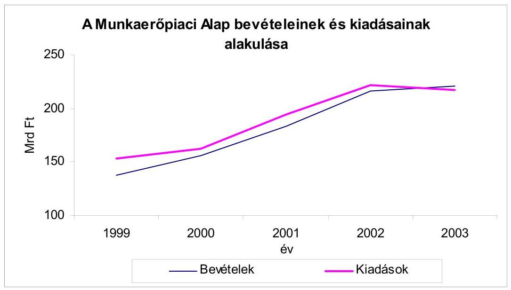

Az MPA-ból kivont pénzeszközök nagyságrendje, aránya évről évre növekedett. Az Alap több mint egynegyedét a költségvetési befizetések, valamint a Társadalombiztosítási Alapnak való pénzátadás alkotta. Az Alap pénzeszközeinek törvényben előírt egységes kezelése - az Alapkezelő szervtől független okok miatt - csak részben érvényesült, mert az Alap több olyan feladatot (például a szakképzést, az önkormányzatokhoz átcsoportosított feladatokat) finanszírozott, melyeknek tervezésére, felhasználására, ellenőrzésére nem volt befolyása az Alapkezelőnek.

A 2003. évben az MPA összes kiadásán belül meghatározó volt - együttesen 56%-os részaránnyal - az aktív foglalkoztatási eszközök, a munkanélküli ellátások kiadása. Ebben az évben 5,3 milliárd Ft-tal csökkent a szakképzési hozzájárulás kiadása, mert ezt az összeget - a két miniszter megállapodása alapján - az iskolarendszeren kívüli felnőttképzésre használta fel az FMM.

A decentralizált keretek előirányzatánál 2002-ben csak átmeneti feszültséget okozott, hogy a minimálbér 2001. évi növekedése miatti többletköltségek ellensúlyozására nem állt rendelkezésre forrás. A pályázatban meghirdetett vissza nem térítendő támogatások fedezetét - 2001-ben 1,8 milliárd Ft-ot, 2002-ben 15 milliárd Ft-ot - a foglalkoztatási alaprész forrásainak terhére a decentralizált keret csökkentésével és a központi keretbe való átcsoportosítással teremtették meg.

A kiadási előirányzatok között a meghatározó tételt jelentő munkanélküli ellátások egy főre jutó összege 1999-2003 között havi 20 ezer Ft-ról 35 ezer Ft-ra nőtt, miközben az ellátottak száma csökkent, havi 135 ezerről 107 ezerre. A decentralizált keretek nagyságát és az alaprészek összetételét alapvetően a megyénkénti munkaerőpiaci sajátosságok határozták meg.

A vizsgált időszakban tartós likviditási probléma nem volt. A fizetőképességet a tartalékok felhasználása mellett, fenntartották, Kincstári Egységes Számla (KESZ) hitel felvételére nem került sor. Az Alapkezelő a finanszírozási gyakorlatot - az Alap fizetőképességének fenntartása érdekében - 2001-től folyamatosan szigorította a munkaügyi központok számláján lévő pénzügyi keretek szabad felhasználását, kezdetben havonta, 2003-ban pedig hetente korlátozta, maximalizálta.

# 1.3.2. Az Alap számviteli rendje, vagyonának alakulása 

Az Alapkezelő szerv megfelelően működtette az MPA-val összefüggő pénzügyi, számviteli adatok teljes körű feldolgozását, a folyamat irányítását és ellenőrzését. Az MPA és megyei testületei havi, negyedéves, féléves és éves adatszolgáltatásaikat és beszámolóikat egységes számviteli rend figyelembevételével készítették el. Az Alapkezelő a szabályzatok mellett körlevelekben írta elő a megyei munkaügyi központok számviteli és beszámolási rendjét. A szakmai sajátosságokat a változó jogszabályi környezethez igazított, folyamatosan aktualizált, az országos számviteli politikával összhangban kialakított, területi számviteli politikák tartalmazták. A számviteli politika mellett a munkaügyi központok elkészítették a leltározási és leltárkészítési, a működtetési, a követelés-kezelési, valamint az utalványozási szabályzatokat.

Az országos és megyei (fővárosi) beszámolók megbízhatóságát az egységes számlarend, a számviteli rendszer magas fokú szervezettsége, a többoldalú ellenőrzés és a beszámolók könyvvizsgálata biztosította. A könyvvizsgáló az MPA beszámolóját minden évben hitelesítő záradékkal látta el.

Az MPA forrásából származó és a munkaügyi központok mérlegében szereplő vagyoni eszközöket a FMM költségvetési beszámolója tartalmazta. A vagyon alakulását több tényező együttesen befolyásolta. Az 1996. évi összevonáskor meglévő 48 milliárd Ft tartalék előirányzat 2002. december 31-ig 10,7 milliárd Ft-ra csökkent, majd 2003. december 31-ig 14,6 milliárd Ft-ra nőtt. Csökkent a tartósan adott kölcsönök, az adósok, az egyéb követelések, és nőtt a rövid lejáratú kölcsönök állománya.

A követelések visszatérülése a 2001. évi 1825,4 millió Ft-tal szemben 2002. évben 1667,7 millió Ft volt.

Az Alapot megillető járulékbevételeket az adózás rendjéről szóló 1990. évi XCI. törvény (Art), valamint az államháztartásról szóló 1992. évi XXXVIII. törvény (Áht) előírásai szerint az Adó- és Pénzügyi Ellenőrzési Hivatal (APEH) adók módjára hajtja be. ${ }^{7}$ Az APEH és a Kincstár valamint az Alap között létrejött Megállapodás alapján jelenleg a Kincstár a bevételt naponta átvezeti az MPA számlájára.

[^0]
[^0]:    7 Az ÁSZ 1999. évi vizsgálata megállapította, hogy az APEH a járulékokat késedelmesen utalta és ez az Alap fizetőképességének fenntartásában gondot okozott.

---

# 2. A MUNKAERŐPIACI ALAP FORRÁSAINAK FELHASZNÁLÁSA 

### 2.1. Aktív foglalkoztatási eszközök

A foglalkoztatási alaprész célja a foglalkoztatás elősegítése, a munkanélküliség megelőzése, hátrányos következményeinek enyhítését szolgáló támogatások nyújtása, valamint a képzésben résztvevők keresetpótló juttatásával kapcsolatos postaköltség finanszírozása.

Az aktív foglalkoztatási eszközök kiadása az 1999. évi 31,5 milliárd Ft-ról 2002-ben 57,7 milliárd Ft-ra nőtt, majd 2003-ban 53,5 milliárd Ft-ra csökkent, (az MPA összes kiadásán belüli aránya 20-26% között alakult) amelyből a foglalkoztatási és képzési támogatásokra fordított összeg 1999-2003 között 30,2 milliárd Ft-ról 53,5 milliárd Ft-ra emelkedett. Az egyes években (1999-2002 között) 1,3 - 3,6 milliárd Ft előirányzatot kapott a Gazdasági Minisztérium.
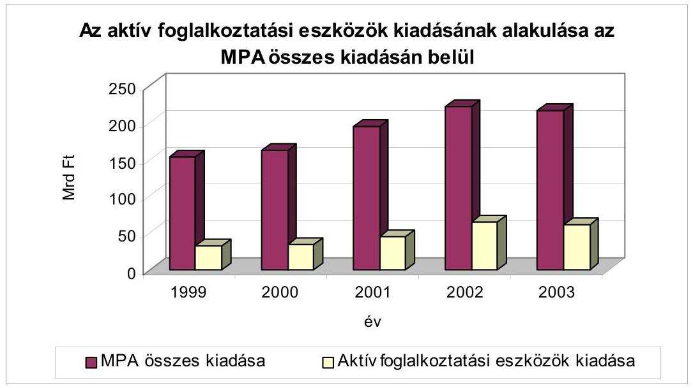

### 2.1.1. Közhasznú foglalkoztatás

A közhasznú munkavégzés támogatásának célja, hogy az Flt 16/A § (1) bekezdése a) pontjában részletezett tevékenységek ellátásával a hagyományos munkaerőpiacról (tartósan) kiszorult, kevés elhelyezkedési lehetőséggel rendelkező munkanélküliek átmeneti foglalkoztatását elősegítse.

Az MPA foglalkoztatási alaprészéből nyújtott támogatás időtartama 1 év, mértéke a közvetlen költségek, döntően a munkabér és járulékai 70%-a, (a támogatások 80-90%-ánál), amely az illetékes munkaügyi tanácsok döntése alapján maximum 2 évre meghosszabbítható, illetve 90%-ra növelhető.

---

A 90%-os támogatást elsősorban a halmozottan hátrányos helyzetű idősebb, valamint a roma munkanélküliek foglalkoztatásánál adták a munkaügyi központok.

A közhasznú foglalkoztatásra vonatkozó jogszabályokat többször módosították az ellenőrzött időszakban. Ennek során 1999. januárjától a támogatás feltételeinek változtatásával szűkítették a támogatásban részesíthetők körét, mert kizárták a rövid, esetenként egy-két napos megszakításokat beiktató, így akár több évig támogatott foglalkoztatást.

A törvény említett pontjának 2000. február 1-i módosításával kibővítették a támogatható, közhasznúnak minősíthető tevékenységek körét az önkormányzatok által szervezett, a települést, illetve a lakosságot érintő feladatokkal. ${ }^{8}$

Nem nyújtható támogatás 2003. januárjától olyan foglalkoztatáshoz, amely más munkáltatónál történő munkavégzésen, vagy munkaerő-kölcsönzésen alapul. A 2003. év októberétől az általános előírásoknál kedvezőbb feltételekkel támogatható a 45 éven felüliek munkavégzése, illetve a roma érdekképviseletiek által szervezett foglalkoztatás.

A jogszabályi módosítások során nem vették figyelembe az ÁSZ 1999. évi javaslatát, amely a nem támogatható munka- és tevékenységi körökre vonatkozó előírások felülvizsgálatát kezdeményezte. ${ }^{9}$

A decentralizált keretből és a központi forrásból 1999-ben együttesen 9,3 milliárd Ft-ot fizettek ki közhasznú foglalkoztatásra, amely 2003-ban meghaladta a 12 milliárd Ft-ot. A foglalkoztatási alaprész decentralizált keretének mintegy harmadát - jelentős megyei szóródással - minden évben erre a célra használták fel. Forrás hiány miatt igényt nem utasítottak el, de a támogatás mértéke, illetve időtartama csökkent.

Az átlagos felhasználási arány megyénként - évenként változóan - 12-40% között alakult és például a fővárosban, Pest-, Győr-Moson-Sopron, Vas megyében a képzésre fordított keret aránya volt a nagyobb. A foglalkoztatás átlagos ideje, Baranya megyében 4,4-ről 3,7 hónapra, Borsod-Abaúj-Zemplén megyében 3,1-ről 1,9 hónapra, Pest megyében 3,3-ról 2,4 hónapra csökkent.

Az ellenőrzött időszak első évében 120,6 ezer fő volt a közhasznú foglalkoztatásban résztvevők száma, amely közel 4%-kal haladta meg az előző évit. A 2000. május 1-ei jogszabályi módosítás következtében (jövedelempótló támogatásra már nem lehetett bekerülni) 2000-ben 93,4 ezerre, 22,5%-kal csökkent a foglalkoztatottak száma. A következő három évben az időszakos csökkenés, illetve növekedés ellenére a foglalkoztatottak száma 10-20%-kal alatta maradt a 2000. évi létszámnak, amely 2003-ban 76,9 ezer fő volt.

[^0]
[^0]:    ${ }^{8}$ Ez összhangban van az ÁSZ 1999. évi, az MPA működésének pénzügyi-gazdasági ellenőrzéséről szóló jelentésében foglaltakkal.
    ${ }^{9}$ Az SZCSM álláspontja szerint az Flt közvetett módon határozta meg a közhasznú munka fogalmát. Megítélésük szerint az ÁSZ javaslat elfogadása megnehezítette volna az egyes konkrét tevékenységek kiemelését.

---

Az ország hét régiójában a közhasznú foglalkoztatásra fordított kiadások és az alkalmazott létszám között szoros volt a kapcsolat.

A kedvezőbb gazdasági feltételekkel rendelkező nyugat-dunántúli régióban (Győr-Moson-Sopron, Vas-, Zala megye) az alaprész összes kiadásának 4-5%-át, a közép-dunántúli régióban (Fejér-, Komárom-, Veszprém megye) a 9-10%-át használták fel.

A kedvezőtlenebb helyzetű észak-magyarországi régióban (Borsod-Abaúj-Zemplén, Heves-, Nógrád megye) a kiadási részarány 20-24%, az észak-alföldi régióban (Hajdú-Bihar, Jász-Nagykun-Szolnok, Szabolcs-Szatmár-Bereg megye) 25-28%, az összes foglalkoztatotthoz viszonyított létszámarány 27-29%, illetve 22-24% között változott.

Az átlagosnál kedvezőtlenebb helyzetű régiókban a rendszeres szociális segélyben részesülő, vagy ellátással nem rendelkező, általában nem megfelelő egészségi állapotú munkanélküliek közcélú foglalkoztatására törekedtek. Ezekben a régiókban az egy főre jutó költségek is alacsonyabbak voltak a munka jellegével, illetve a bérszínvonallal összefüggésben.

A közcélú foglalkoztatásba bekapcsolódókból a tartósan munkanélküliek aránya az 1999. évi 26%-ról 2002-ben 6%-ra csökkent. A munkavállalási szándék elsősorban a jövedelempótló támogatás megszűnése miatt mérséklődött és azért, mert többen végeztek 180 napig köz- és egyéb munkát.

A munka jellegéből adódóan a felsőfokú végzettségű, pályakezdők aránya 2-3% volt, számuk 1,5-2 ezer között alakult. A mérsékelt munkáltatói igények miatt érdemben nem javult a megváltozott munkaképességűek foglalkoztatása. A közhasznú munkába bekapcsolódók mintegy négyötöde alacsony iskolai végzettségű volt és kommunális jellegű tevékenységet látott el. Egészségügyi, szociális feladatot 5-7%-uk, művelődési, közoktatási munkát 4-5%-uk végzett.

# 2.1.2. Képzési-, bértámogatási-, munkahelyteremtési eszközök felhasználásának hatékonysága, eredményessége 

A korábbi ÁSZ ellenőrzés, valamint a jelenlegi vizsgálat előkészítésének tapasztalatai és a kapcsolódó előtanulmány értékelése alapján teljesítményellenőrzésre kiválasztottuk a munkaerőpiaci képzést, a foglalkoztatás-bővítő bértámogatást, a pályakezdő munkanélküliekkel, a vállalkozóvá, illetve az önfoglalkoztatóvá válással kapcsolatos támogatásokat.

A felsorolt támogatásokban részesülők létszáma az 1999-2003. években 150-170 ezer között változott, amely a foglalkoztatási alaprészből finanszírozott létszám 53-60%-a volt. A teljesítményellenőrzéssel értékelt támogatásokra évenként 14-21 milliárd Ft közötti összegeket, - a felhasznált decentralizált keret 52-57%-át - fizették ki.

---

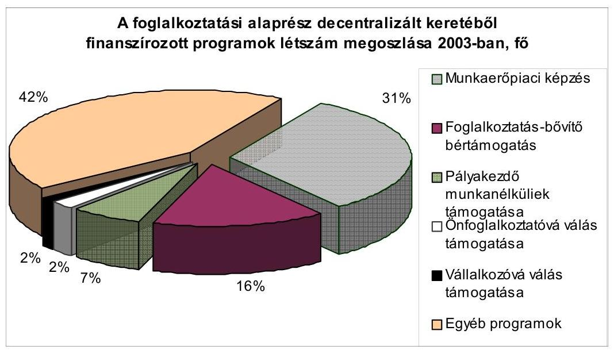

A hatékonysági és eredményességi kritériumok kialakításánál figyelembe vettük az FH-nak a követéses vizsgálatokkal kapcsolatos tapasztalatait, valamint azt, hogy az ellenőrzött időszakban csökkent a munkanélküliek száma, ezért a támogatások hasznosulása értékelésénél az
 arányok alakulását, illetve azok viszonylagos stabilitását tekintettük meghatározó szempontnak.

A vizsgált eszközök felhasználását hatékonynak értékeltük, mert az ellenőrzött időszakban szinten maradt, illetve javult a képzésben résztvevők és azt befejezők, valamint az egyéb támogatásokban részesülők aránya.

Eredményesnek minősítettük az eszközök hasznosulását, mert a korábbi (az 1996-1998. között eredményesnek értékelt) időszakhoz képest nem csökkent a munkaerőpiaci képzésből, a támogatott foglalkoztatásból, a vállalkozóvá válás támogatásából kikerülők elhelyezkedési-, illetve a támogatás nélkül is működőképes vállalkozások aránya. Az eszközcsoportok működtetése hozzájárult a munkanélküliség részbeni megelőzéséhez, a munkanélküliek számának mérsékléséhez.

A vizsgált eszközök tekintetében az Alapkezelő biztosította a működés feltételeit. A felhasználás kereteit évenként meghatározta a MAT, majd a megyei tanácsok a vonatkozó jogszabályi előírások és eljárási rendek alapján döntöttek a belső arányokról, figyelembe vették a gazdasági környezet változását, az eszközök alkalmazásának várható hatását, a regisztrált, kiemelten a hátrányos helyzetű munkanélküliek helyzetét. A munkaügyi központoknál a felhasználás szabályozottsága megfelelő volt. A munkaügyi tanácsok negyedévenként értékelték a keretek felhasználását és végrehajtották a szükségesnek ítélt átcsoportosításokat annak érdekében, hogy minden eszközcsoportnál egész évben legyen elegendő forrás.

Az ellenőrzött tevékenységek működését két egymástól elkülönülő, de országosan egységes, bár nem teljes körű informatikai rendszer segítette. Az egyik rendszer a képzéshez kapcsolódott, amely más informatikai programokkal együtt biztosította a pénzügyi számfejtéseket, kifizetéseket, de még nem volt alkalmas például a képzési adatok megyei szintű szinkronizálására, a visszakö-

---

vetelések nyomon követésére. A másik rendszer a vizsgált egyéb eszközök nyilvántartására szolgált, amely egyforma volt a létszám és a pénzügyi statisztika feldolgozásában, a teljesített pénzügyi tételek összesítésében, regisztrálásában, a lekérdezésekben, de eszközönként speciális funkciót látott el a kérelmeknél, határozatoknál, a megállapításoknál.

A befejezett támogatások mérésére 1994-től monitoring rendszert alkalmaztak. A program leválasztotta a vizsgálandó támogatásokat, ennek alapján készültek el a támogatás befejezését követően három hónappal az önkéntes válaszadások feldolgozásával az értékeléshez szükséges adattáblák. (A közhasznú foglalkoztatásnál a munkaügyi központok adatlapjait használták).

Nógrád megyében a központi információs program és módszertan segítségével 2003-ban kiterjesztették a monitoring tevékenységet. Az eddig alkalmazott 3 hónapos követés mellett 9-12 hónap elteltével is megvizsgálták a támogatások befejezése utáni elhelyezkedési arányt. A megszerzett tudás, munkatapasztalat hatása fokozatosan érvényesült és az említett idő elteltével mintegy felére csökkent a regisztráltak aránya azoknál, akik részt vettek az egyes programokban.

# A munkaerőpiaci képzés 

Képzési támogatás lehetett a kereset-kiegészítés, a keresetpótló juttatás, a képzéssel kapcsolatos költségek, amelyek közül megtéríthetők a képző intézmények által meghatározott képzési költség, az utazás-, a szállás-, az élelmezés kiadásai. Képzési támogatást abban az esetben adhattak, ha képzést a munkaügyi központ ajánlotta fel (ajánlott képzés), vagy az abban történő részvétellel a képzés megkezdése előtt egyetértett a központ (támogatott képzés) és a támogatás odaítéléséről a határozatot meghozta.

A foglalkoztatási alaprész decentralizált keretének képzésre fordított kiadása 1999-2003 között 8 milliárd Ft-ról 9,9 milliárd Ft-ra nőtt, ami évente kiegészült 400-900 millió Ft-tal, a munkaerőpiaci programokból, valamint a központi keretből átcsoportosított összeggel. Változott a kiadások összetétele, mert emelkedett a tanfolyami díjak aránya és csökkent a költségtérítési-, valamint a keresetpótló juttatások hányada.

A képzésre fordított kiadások alaprészen belüli aránya átlagosan 26-30% között változott. A megyék (a főváros) közötti szóródás jelentős volt, 13%-tól 51%-ig terjedt. Az átlagos aránytól való eltérések jellemzően fennálltak az ellenőrzött időszak egészében.

A megyék, illetve régiók részesedését befolyásolta az eltérő munkaerő-kereslet, a szakmai ismeret piacképessége, a képzési költségek eltérő színvonala.

Az alaprészből az átlag feletti arányban (40-45%-ban) részesedett például a főváros, a Pest-, a Győr-Moson-Sopron, a Vas megye, az átlag alatti volt például Békés-, Borsod-Abaúj-Zemplén, Csongrád-, Nógrád-, Szabolcs-Szatmár-Bereg megye. A többi megye évenként is változóan, általában 4-6%-kal tért el az átlagos értéktől.

A foglalkoztatási alaprész programjaiban résztvevők száma 313 ezerről 265 ezerre csökkent, ebből a képzésekben résztvevőké, évenként változóan 83 és 92

---

ezer között alakult, de a képzésben résztvevők aránya 27%-ról 32%-ra nőtt (1996-1998 között évente, átlagosan 77 ezren vettek részt a képzésben).
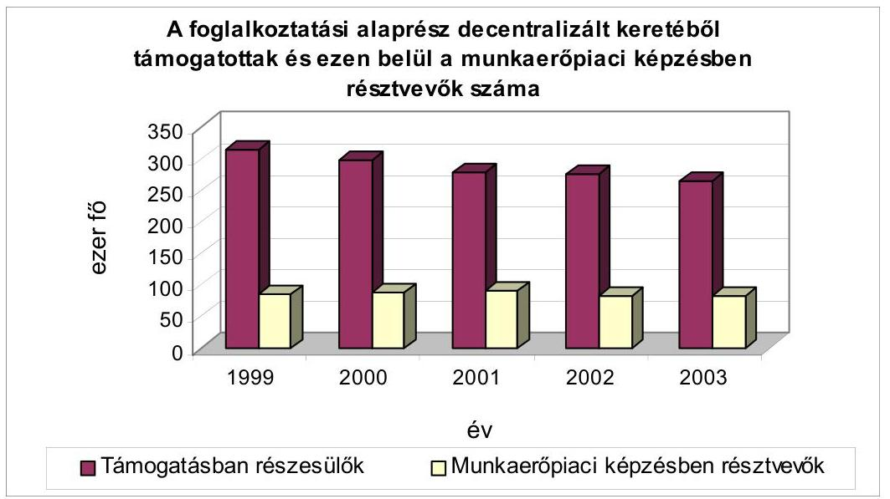

A munkaügyi központok a megyei (fővárosi) tanácsok egyetértésével határozták meg a támogatható képzési szakirányokat, a szakképesítési jegyzéket. Hangsúlyt helyeztek a hátrányos helyzetű rétegek (romák, tartósan munkanélküliek, szakképzetlenek) felzárkóztatására, esélyeik növelésére. A képzések szakmai rendszere jól kialakított és a szabályozásnak megfelelően működött.

Az oktatások szervezése, a képzéssel foglalkozók kiválasztása pályázati rendszerben történt. A képzési programokban résztvevők 90-95%-a munkanélküli és a beiskolázottak harmada-negyede (csökkenő arányban) pályakezdő munkanélküli volt. A képzést befejező munkanélküliek több mint háromnegyede az államilag is elismert, szakképesítést adó, az un. Országos Képzési Jegyzék (OKJ) szerinti tanfolyamot végezte el, 15-18%-uk a nem OKJ-s képzésben vett részt. Az utóbbi tanfolyamok többségében (80-90%-ban) hivatásos gépkocsivezetőket képeztek, valamint szakképzésre felkészítő reintegráló oktatást szerveztek. A munkanélküliek 5-8%-a - növekvő mértékben - nyelvi képzést kapott, amely elsősorban a pályakezdők körében volt népszerű.

A munkanélküliek által választott tanfolyamok közül gyakori volt az informatikai tevékenységhez, a pénzügyi, a számviteli, a különféle szakképzést biztosító, a gépkezelői munkákhoz kapcsolódó képzés és egyre kedveltebbé vált a szakmai oktatással együtt végzett nyelvoktatás.

A munkanélküliek, valamint a munkaviszonyban állók oktatása egyaránt eredményes volt. Az Alapkezelő tájékoztatása szerint az 1999-2003 években a munkanélküliek oktatásánál az ajánlott tanfolyamokat - az évenkénti 31-33 ezer fős induló létszám mellett - a 92-95%-uk befejezte, 43-48%-uk munkaviszonyban állt. Az elfogadott (egyénileg kezdeményezett), 17-

---

22 ezer fős induló létszámú tanfolyamokat a 95-98%-uk végezte el és 46-52%-uk munkaviszonyban volt. A munkában állók 80-85%-a, illetve 85-89%-a szakirányú munkát végzett. A mutatók nem maradtak el az 1996-1998 közötti évek hasonló adataitól.

A helyszíni ellenőrzés keretében értékelt munkaügyi központoknál az országosan kimutatott átlagos eltérésektől általában nagyobb volt a szóródás, esetenként (például Baranya megyében) 15-20 százalékpontos különbséggel.

A roma munkanélküliek elhelyezkedési esélyeinek javítását kiemelt feladatnak tekintették a munkaügyi központok. Pest megyében 2003-ban 116 fő kezdte meg felzárkóztató-, 118 fő a szakmai képzést. Borsod-Abaúj-Zemplén megyében a 184 tanfolyamra járó közül 2004 januárjában 82 fő fejezte be a képzést. A többiek számára 2004. végéig tart az oktatás.

A rendelkezésre álló adatok szerint az ellenőrzött időszakban a munkanélkülieknek szervezett, ajánlott képzésnél 609 óráról, 673 órára (10%-kal), az elfogadott képzésnél 361 óráról 418 órára (15%-kal) nőtt az oktatás átlagos ideje a tanfolyamok összetétele változásának következtében. Mindkét esetben pluszminusz 100-200 órával eltértek az egyes megyék adatai.

A 2002 évben Pest megyében az ajánlott tanfolyamnál 915 óra, az elfogadottnál 610 óra, Nógrád megyében az ajánlottnál 395 óra volt a képzés átlagos időtartama. A fővárosban átlagosan 599 órát fordítottak az elfogadott képzésekre. Az ajánlott képzéseknél általában Pest megyében, az elfogadottnál a fővárosban volt a legnagyobb az átlagos óraszám.

A munkanélküliek oktatásánál az egy főre jutó támogatás összege az ajánlott képzéseknél 152-206 ezer Ft, az elfogadottnál 81-109 ezer Ft, együttesen átlagosan 127-166 ezer Ft között alakult. Az egy fő egy képzési órájára jutó támogatás az ajánlottnál 198-225 Ft, az elfogadottnál 204-220 Ft között változott, amely 13,6%-os és 7,8%-os növekedést jelentett a 4 év alatt.

Az egy képzési óra átlagos költsége 2002-ben az ajánlott oktatásnál Győr-Moson-Sopron, és Nógrád megyében volt a legmagasabb, 278 Ft és 273 Ft, az elfogadott képzésnél Borsod-Abaúj-Zemplén megyében és a fővárosban, 288 Ft és 273 Ft kiadással.

A munkaviszonyban állók oktatásánál a tanfolyamot befejezettek aránya 97-99%-os, a képzés befejezése után is munkában állók aránya 93-95%-os, a szakirányú munkát végzőké 97-99%-os volt.

# A bértámogatás típusú eszközök 

## Foglalkoztatás-bővítő bértámogatás

A támogatás célja a munkaügyi központ által hosszabb ideje munkanélküliként nyilvántartott személyek munkába helyezési esélyeinek növelése a foglalkoztatásukhoz nyújtott támogatás folyósításával. A támogatás alanya az a munkaadó lehet, aki a munkaügyi központ által közvetített munkanélküli személyeket foglalkoztatja és vállalja a támogatás feltételeinek teljesítését.

---

A tartósan - legalább hat hónapja, a pályakezdők és 45 év felettiek esetében három hónapja - munkanélküliek foglalkoztatásához legfeljebb egy évi (45 éven felülieknél kétévi) időtartamra a munkabér 50-100%-ig terjedő foglalkoztatás-bővítő bértámogatás nyújtható a munkaadó részére. 2003 január 1-től nem adható támogatás olyan munkáltatónak, akit egy éven belül munkaügyi bírsággal sújtottak és nem nyújtható támogatás olyan foglalkoztatáshoz sem, amely kirendelésen, más munkáltatónál történő munkavégzésen, vagy munkaerő kölcsönzésen alapul. 2003 októberétől a 45 éven felüli, legalább 3 hónapja munkanélküli személy után a bér 70-100%-ig nyújtható támogatás.

A bértámogatásra fordított alaprész az 1999. évi 3,3 milliárd Ft-tal szemben 2003-ban 5,8 milliárd Ft-ra, 73%-kal, a decentralizált alaprészen belüli aránya átlagosan 11,9%-ról, 15,1%-ra nőtt. Az egyes megyék között és évenként is jelentős volt a szóródás 5,5%-tól 21,9%-ig terjedt.

A legalacsonyabb, tíz százalék alatti, például a fővárosban, Pest- és Somogy-, a legmagasabb (21-22%-os) Heves- és Csongrád megyében volt.
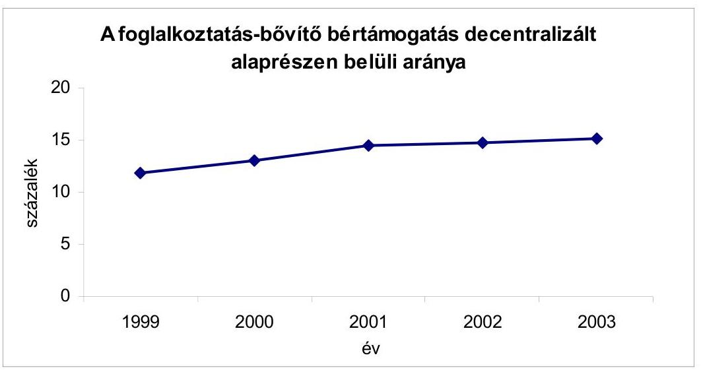

Az évről-évre növekvő összegű keretek ellenére minden évben csökkent a bértámogatással foglalkoztathatók száma, mert az átlagkeresetek, a bérköltség, ezáltal a fajlagos költségek gyorsabban nőttek.

Az átlagkereset 58,4%-kal, a minimálbér 122%-kal nőtt 1999-2002 között.
A bértámogatással foglalkoztatottak száma 1999-ben 51,7 ezer fő (ez 1,7 ezerrel több, mint 1998-ban), 2003-ban 41,1 ezer fő volt, Az FA programjaiban résztvevőkhöz viszonyított részaránya 16% maradt. A bértámogatási programon belül a pályakezdők aránya 7,4%-ról, 3,7%-ra mérséklődött, összhangban azzal a törekvéssel, hogy a foglalkoztatás-bővítő bértámogatással elsősorban a hátrányos helyzetű munkanélkülieket segítsék. A megváltozott munkaképességűek létszámaránya csökkent 2,1%-ról 1,7%-ra, amely a munkáltatói igények változását tükrözi.

---

A támogatási kérelmeket jellemzően az év első felében adták be a munkáltatók. Az igénylők (többségük kisvállalkozóként) a feldolgozóiparban, a kereskedelemben, a vendéglátásban létesített vállalkozásához keresett munkavállalókat. Elsősorban fizikai (többnyire betanított) munkakörre és minimálbér fizetésének vállalásával kértek támogatást. A kedvezőbb gazdasági helyzetben levők a beruházáshoz kapcsolódóan, a pénzügyi gondokkal küzdők a bérköltség terheinek csökkentéséhez pályázták meg a bértámogatást.

A támogatási idő átlagosan 6-7 hónap, a foglalkoztatás átlagos időtartama 14-15 hónap, ezen belül a fővárosban és Heves megyében közel 2 év, Hajdú-Bihar megyében egy év volt.

Nógrád megyében a támogatás maximumát 60%-ban, a folyósítás időtartamát 6 hónapban állapították meg. Pest megyében a támogatási idő lejárta után is kérték a bérjegyzéket a továbfoglalkoztatás ellenőrzéséhez. Baranya megyében az egyik leghatékonyabb támogatási eszközként értékelték. Előfordult azonban, hogy a támogatási idő lejárta után közös megegyezéssel szűnt meg a munkaviszony, amely korlátozta a szankcionálás lehetőségét.

# A munkaviszonyban állók aránya átlagosan 60-63% között változott, amely eredményesnek értékelhető. 

A munkaviszonyban állók megyei aránya 2002-ben 55-81% között változtak, ezen belül Fejér-, Komárom-, Pest-, Veszprém megyében 70% feletti, a fővárosban 80%-ot meghaladó volt.

## Pályakezdő munkanélküliek: a munkatapasztalat szerzés-, foglalkoztatásuk támogatása

Az előírások szerint a szakképzetlen vagy meghatározott szakképesítéssel rendelkező pályakezdőket a munkaügyi központok támogathatták, ha a munkaadó vállalta legalább 360 napig, napi négyórás
 munkaidőben a foglalkoztatásukat olyan munkakörben, ahol munkatapasztalatot szerezhettek. A támogatás mértéke a munkabér 50-100%-a lehetett, de megtéríthető volt a pályakezdő után fizetendő egészségügyi hozzájárulás is.

Foglalkoztatási támogatást kellett megállapítani annak a munkaadónak, aki a szakmunkásképző iskola, szakiskola és speciális szakiskola befejezését követően, a nála legalább egy tanéven át gyakorlati képzésben részesült pályakezdőt a szakképzettségének megfelelő munkakörben foglalkoztatta, legalább napi hatórás időtartamban. A támogatás 270 napra szólt, azzal a feltétellel, hogy a munkáltató további 90 napig a támogatás folyósítása nélkül köteles volt foglalkoztatni a pályakezdőt.

A pályakezdő munkanélküliek támogatására kifizetett összeg 1999-2003 között 2,1 milliárd Ft-ról 4,7 milliárd Ft-ra, több mint kétszeresére nőtt, alapvetően a bérköltségek változása miatt. Az eszközök alaprészen belüli aránya átlagosan 7,5%-ról 12,4%-ra emelkedett, megyénként jelentős szóródással.

---

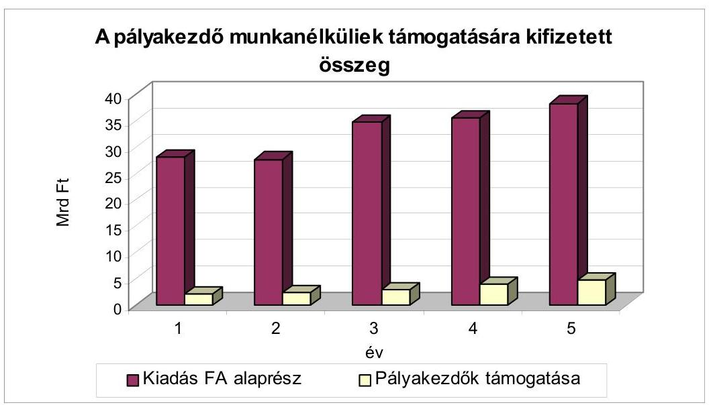

A legalacsonyabb arány a fővárosban volt, ahol a mutatók 1,9-3,6% között változtak és a legmagasabb Tolna és Nógrád megyében volt 12-15%-os, illetve 14-19%-os részaránnyal, amit befolyásolt a kedvezőtlenebb foglalkoztatási feltétel.

A kiadásokon belül 55 és 91 millió Ft között alakult a foglalkoztatási támogatás. A csökkenő összegű és arányú kifizetés összefüggött azzal, hogy a vállalkozók számára nem volt kellően ösztönző ez a támogatási forma.

A fővárosban nem volt ilyen igény 2003-ban.
A regisztrált munkanélküliek számának csökkenése, valamint a munkáltatói érdeklődés mérséklődése következtében a támogatott létszám az öt év alatt 21,1 ezerről 17,6 ezerre 16,6%-kal, az FA programjaiban résztvevőkhöz viszonyított részaránya 6,7%-ról 7%-ra nőtt, ezen belül a foglalkoztatási támogatást - egyre kisebb arányban - a pályakezdő munkanélküliek 3,2-10,2%-a után igényeltek. Az említett támogatási forma sajátossága, hogy a szerény felhasználás is az év második felére koncentrálódott.

A foglalkoztatás átlagos időtartama mind a két bértámogatási formánál megközelítette az egy évet. A bérköltségek növekedésének hatására az egy főre jutó támogatás (megyénként jelentősen eltérő) átlagos összege a munkatapasztalat szerzés esetében 211 ezer Ft-ról 526 ezer Ft-ra, a továbfoglalkoztatásnál 87 ezer Ft-ról 198 ezer Ft-ra emelkedett.

2002-ben a munkatapasztalat szerzés egy főre jutó támogatására Komárom-Esztergom megyében 682 ezer Ft-ot, Vas megyében 793 ezer Ft-ot, Tolna megyében átlagosan 432 ezer Ft-ot fizettek.

A fővárosban szakosított kirendeltség, az Ifjúsági Iroda látja el a pályakezdő fiatalokkal kapcsolatos ügyeket, kifizetéseket.

---

# A munkában álló pályakezdők arányát tekintve az eszközfelhasználás eredményes volt, mert az a munkatapasztalat szerzésénél 56-67%, a foglalkoztatási támogatásnál 68-84% között alakult. 

## A munkahelyteremtés támogatása

## Vállalkozóvá válás

A támogatást azok a munkanélküli járadékban részesülő személyek igényelhettek, akik vállalkozásba kezdtek. A támogatási formával elsősorban a vállalkozás indításakor jelentkező gondok megoldását kívánták megkönnyíteni a pénzügyi források részbeni biztosításával, a szükséges ismeretek megszerzésének elősegítésével.

A vállalkozóvá válás esetén 6 hónapig (a megváltozott munkaképességűek esetén 12 hónapig) támogatás adható a munkanélküli járadék összegének megfelelő mértékben, valamint a szaktanácsadás-, tanfolyami képzés-, a hitelfedezeti biztosítás költségei 50%-áig.

A vállalkozók szinte kizárólag (2001-2002-ben a 99%-ában) a járadéktámogatást vették igénybe, mert a jellemzően kényszervállalkozásoknál kevés volt a saját forrás, így pl. a hitelfelvételre sem volt módjuk.

A kismértékű érdeklődés miatt a vállalkozóvá válás finanszírozására előzőekben értékelt foglalkoztatási eszközökhöz képest nagyságrendekkel kisebb összeget kellett biztosítani. Az 1999-2003. évek között 355 millió Ft-ról 530 millió Ft-ra, 49,5%-kal emelkedett a kiadás, amely (a korábbi időszakhoz hasonlóan) a járadék növekedéséből adódott. A foglalkoztatási alaprészen belüli részarány 1,3-1,5%-os volt. Az egy vállalkozóra jutó támogatás értéke évről évre nőtt 1999-2002 években átlagosan 107-155 ezer Ft (évenként és megyénként 80 és 190 ezer Ft) között változott.

Az támogatott létszám 4,4 ezerről 5 ezerre nőtt, majd 2002-ben 4,3 ezerre, 2003-ban 4 ezerre csökkent, az FA-n belüli arány 1,4%-ról 2%-ra emelkedett (az 1996-1998 években 3,1-3,8 ezer között alakult a támogatott vállalkozói létszám). A vállalkozások mintegy harmada a szolgáltatás, negyede a kereskedelem, hatoda az építőipar, tizede a feldolgozóipar, a többi egyéb területen működött.

Az ellenőrzött időszakban az általában magasabb munkanélküliségi rátájú régiókban, pl. Borsod-Abaúj-Zemplén, Hajdú-Bihar, Szabolcs-Szatmár-Bereg megyében igényeltek támogatást. Forráshiány miatt kérelmet nem utasítottak el, de egyéb okok miatt igen.

Baranya megyében a kérelmek 15-20%-át utasították el, mert pl. a vállalkozói igazolványt már kiváltották, vagy nem főtevékenységként kívánták működtetni a vállalkozást, illetve azt a munkanélküli járadék kimerítése után kezdték meg.

A munkaügyi központok által végzett monitoring vizsgálatok adatai szerint a vállalkozók több mint egynegyede támogatás nélkül is elindította volna, de a háromnegyedüknek a munkaügyi központok által biztosított támogatás nélkül nem lett volna módja megkezdeni a vállalkozói tevékenységet.

---

# A támogatás befejezését követően három hónappal a vállalkozások 89-91%-a működött, évenként és megyénként 85-95% közötti szóródással (1997-ben 86-96%-os volt a működő vállalkozások aránya). 

A követéses vizsgálatok évről-évre kedvező mutatói azonban csak korlátozott információt adtak, mert a vállalkozások működőképességének megítéléséhez nem elegendő a három hónapos időszak. Nincs feldolgozott információ arra vonatkozóan, hogy a követési idő után milyen arányban szűntek meg vállalkozások, és az érintettek közül hányan kerültek vissza a munkanélküliek körébe.

A támogatás folyósításának befejezése után a vállalkozók harmada bizonytalan volt a vállalkozása fennmaradását illetően, több mint ötven százalékuk számára a szinten tartás volt az elérhető cél és mindössze tíz százalékuk látott reális lehetőséget a vállalkozás fejlesztésére.

A helyszíni ellenőrzés tapasztalatai szerint a vállalkozók a támogatás folyósításának befejezését követően nem teljesítették a bejelentési kötelezettségüket. A 6/1996. (VII. 16.) MüM rendelet előírásától eltérő gyakorlat arra vezethető vissza, hogy a munkaügyi központok határozatai nem tartalmaztak ilyen rendelkezéseket.

Az ellenőrzött 2003. évi határozatokban nem hívták fel a vállalkozók figyelmét a tevékenység befejezésére vonatkozó bejelentési kötelezettségükre. Nem írták elő számukra az együttműködés kötelezettségét sem, így a kiküldött kérdőívekre adandó válasz elmaradását nem lehetett számon kérni.

## Önfoglalkoztatóvá válás

A támogatás célja, hogy a munkanélküli önmaga foglalkoztatását munkaviszonyon kívüli tevékenységgel oldja meg. Támogatható az a munkanélküli, aki egyéni, vagy társas vállalkozást indít (illetve ahhoz csatlakozik), mezőgazdasági őstermelőként, vagy ehhez kapcsolódó szolgáltatási tevékenység keretében, valamint szövetkezeti tagként létesített vállalkozási jogviszonyt.

A támogatások összege (a munkaerőpiaci programból finanszírozott kiadásokkal együtt) 1999-ben 677,6 millió Ft, 2000-ben 792,4 millió Ft, 2001-ben 881,6 millió Ft, 2002-ben 603 millió Ft volt. Az utolsó évben tapasztalt csökkenésnek egyrészt az volt az oka, hogy az év közepén felosztott kiegészítő keret miatt nem volt lehetőség új pályázat kiírására, másrészt csökkent az érdeklődés, mert a támogatás összege egyre kevésbé volt elég az új vállalkozás beindításához, működtetéséhez. A támogatási feltételek többször változtak, amely szintén hatással volt az évenkénti kifizetések nagyságára.
1999. évben maximum 500 ezer Ft-ig terjedő kamatmentes tőkejuttatást lehetett kérni, viszonylag kedvező feltételekkel, mert a 18 hónap türelmi időt követően, a 19. hónaptól kezdődött a részletfizetés és a teljes összeget 60 hónap alatt kellett kifizetni. 2000-től a támogatási összeg felső határát 1 millió Ft-ra emelték, de a visszafizetés már a 13. hónaptól kezdődött. 2001-ben bővítették a támogatással megvásárolható eszközök körét.

---

A támogatottak száma 4-6 ezer között alakult, az FA-n belüli létszámarány 1,4%-ról 2,0%-ra nőtt. A hosszú, öt éves átfutási idő miatt már nem tekinthető kedvezőnek a növekedés, mert ezen belül az újonnan belépők száma minden évben kevesebb volt, így az 1999. évi 2,2 ezerről 2002-ben 800 főre csökkent. A csökkenés a szigorúbb feltételekkel, és a támogatási összeg relatív elértéktelenedésével magyarázható.

Több megyében gondot jelentett a támogatás jelzálog fedezetének biztosítása. Baranya megyében elsősorban azok tudtak pályázni, akik termőfölddel vagy szőlővel rendelkeztek. A fővárosban a 20%-os kötelező saját forrás biztosítása mellett az egy évre szóló üzleti terv benyújtását is megkívánták.

Borsod-Abaúj-Zemplén megyében a kötelező kellékek hiánya (pl. a 20%-os saját forrás igazolásának elmulasztása) miatt utasították el a kérelmet, vagy például azért, mert terhelt ingatlant ajánlottak fel fedezetként.

Az önfoglalkoztatóvá válás támogatásának eredményességét nem értékelték a munkaügyi központok. Az értékelés első ízben 2004. I. félévében lehetséges a vállalkozások fenntartása kötelezettségének lejártát követően.

Pest megyében, 2002-ben 100 fős minta alapján végeztek kérdőíves felmérést. A válaszolók 82%-a sikeresnek, vagy részben sikeresnek tartotta a vállalkozását, 30%-uk bővítette a tevékenységét, 38%-uk a jövőben tervezi a bővülést.

A megyei beszámolók és a helyszíni ellenőrzés során kiválasztott pályázati anyagok alapján megállapítható volt, hogy a vállalkozók teljesítették a vállalt kötelezettségüket és az ellenőrzés időpontjában is folytatták az önfoglalkoztató tevékenységüket.

# 2.1.3. A foglalkoztatási alaprész decentralizált keretéből támogatott egyéb programok 

Az ellenőrzött programok egy része (például a járulékok átvállalása, a mobilitási támogatás) 1999-2003. között folyamatosan működött, más része (például a munkahelyteremtés, a közhasznú szervezetek támogatása) a jogszabályi változások következtében fokozatosan megszűnt.

Volt olyan program (például a munkahely megőrzése), ahol csak átmenetileg csökkent, illetve szünetelt a kifizetés. Bevezettek új eszközt is a komplex munkaerőpiaci programot.

Járulékok átvállalása címen 2000. áprilisáig olyan munkáltató kaphatott támogatást, aki vállalta a jövedelempótló támogatásban részesülő munkanélküliek foglalkoztatását. A jövedelempótló támogatás 2000. májusi megszüntetését követően valamennyi munkahelyen igénybe vehették a járuléktámogatást.

Támogatásként 1999-2000-ben, évente 100-150 millió Ft-ot fizettek ki 2,5 - 4 ezer munkavállaló után, majd a 2001-2003 között a munkavállalói létszám 10-12 ezerre, a támogatási összeg 2003-ra részben a minimálbér növekedésének következtében mintegy 790 millió Ft-ra emelkedett.

---

A mobilitási támogatás összege évente 250-350 millió Ft között változott és 7-11 ezer munkavállalót érintett. A támogatás 90-95%-át utazási költségtérítésre a többit (néhány száz főre) lakhatási hozzájárulásként fizették ki a munkaügyi központok.

A munkahelyteremtéshez kapcsolódó támogatás nagysága 1999-ben 2,8 milliárd Ft volt, amelyből a hagyományos-, a közhasznú munkahelyteremtést, az önfoglalkoztatóvá válást támogatták és a 6,7 ezerből 2,2 ezer volt az új munkahelyek száma. A következő években munkahely teremtő támogatást a foglalkoztatási alaprészből nem lehetett megállapítani. Kifizetésekre az áthúzódó kötelezettségvállalások miatt került sor, 2003-ban 736 millió Ft összegben. A foglalkoztatási kötelezettségből adódóan évente 6-12 ezer főt érintett ez a támogatási forma.

Az Flt szerint a közhasznú szervezeteket akkor lehetett támogatni, ha a tevékenységük elsősorban a tartósan munkanélküliek, a megváltozott munkaképességű személyek, pályakezdő munkanélküliek hátrányos helyzetének megszüntetését segítette. A 6/1996. (VII. 16.) MüM rendelet 1998. évi módosításával összhangban a szervezetek számára kifizetett összeg jelentősen megnőtt. Az 1999-2000 évi, évente 160-180 millió Ft-os támogatás 5-6 szorosa volt az 1998. évi kiadásnak, 2000-ben 70 szervezet nyert a pályázaton, de a 2000. évi újabb jogszabály módosítás után az évenkénti kifizetés ismét csökkent, 2001-ben 66 millió Ft-ra, 2002-ben 14 millió Ft-ra. A közhasznú szervezetek közvetlen támogatásának megszüntetése után a munkaügyi központok elsősorban a komplex munkaerőpiaci programokon keresztül adtak támogatást.

A munkahely megőrzése támogatás 2001-ben szünetelt, 2002-től új feltételekkel ismét lehetővé vált a program szervezése. A 2002. évi módosítás szerint a támogatás fejében csak az érintett dolgozókat köteles foglalkoztatni a munkáltató. Jelentős volt a változás abban a tekintetben is, hogy nem írták elő a munkáltatónak a
 foglalkoztatási terv készítését, és nem igényeltek tőle anyagi biztosítékokat.

Egyes munkaügyi központok - a megyei tanácsok hozzájárulásával - helyi mérlegelési szempontokat alakítottak ki. Pest megyében például nem nyújtható támogatás, ha a foglalkoztatási gond a szezonális üzemelés, karbantartás vagy más gazdasági érdek miatt jelentkezett. Az érintett dolgozó foglalkoztatásához legfeljebb 6 hónapig adhattak támogatást.

Nógrád megyében a törvényi előírásnál szigorúbban szabályozták a zálogfedezetet, mert az ingatlannál 100%-ban, az ingóságnál 150%-ban határozták meg annak mértékét.

Az 1999-2000. évek között 600-900 millió Ft-ot fordítottak támogatásra, amely 7-10 ezer munkavállalót érintett. A támogatások 90%-át az átmeneti likviditási gondokkal küzdő szervezetek kapták, 1999-ben elsősorban a mezőgazdasági tevékenységet folytató, ár- és belvízkárokat szenvedő vállalkozások részesültek a munkahely-megőrző támogatásból, és részmunkaidős, csökkentett munkaidejű foglalkoztatásokat is finanszíroztak. A következő évben lényegében az áthúzódó kötelezettségvállalás összegét (2,5 millió Ft-ot) fizették ki, majd 2002-től újra nőtt a teljesítés és a 2003. évi 1,6 milliárd Ft-ból 12,7 ezer fő munkahelyének megőrzését biztosították.

---

A reintegrációs és térségfejlesztési programok 1999. évi - kísérleti jelleggel történő - elindításának az volt a célja, hogy segítséget adjon az egyes rétegek (például a mezőgazdasági munkanélküliek, a tartósan munkanélküli nők, az iskolai képzésből lemorzsolódott fiatalok) munkaerőpiaci helyzetének javításához, valamint a hátrányos helyzetű mikro régiók felzárkóztatásához a kistérségi társulások létrehozásával, a térségi foglalkoztatást szervező menedzserek beállításával.

Tizennyolc megyében meghirdetett 22 (ebből 13 reintegrációs, 9 térségfejlesztési) programban meghatározó volt a képzés és fontos szerepe volt a közhasznú foglalkoztatásnak, a bértámogatás jellegű eszközöknek.

A fővárosban elindították a 35-45 éves korú nők reintegrációs programját. Az 1802 megkeresésből 854 fő jelentkezett. A negyedüknek sikerült képzéssel, vagy elhelyezéssel segítséget adni és 15%-uk önállóan oldotta meg az elhelyezkedését.

Baranya megyében szociális foglalkoztatási, valamint teleház, illetve non-profit ügyintézői képzési-foglalkoztatási programot szerveztek.

Somogy megyében, 1999-ben indult és 2000-ben fejeződött be az un. kis térségi kezdeményezések Csurgó közelében térségfejlesztési program, amelybe 366 főt sikerült bevonni, 50%-uk közhasznú munkán vett részt, 30%-uk bértámogatást kapott.

Tolna megyében 21 menedzsert képeztek a mikro-régiók felzárkóztatása program keretében. Nógrád megyében a 3 éves szociális reintegráló program keretében 150 halmozottan hátrányos helyzetű munkanélkülinek a fele jutott támogatás nélkül és tartósan álláshoz. Borsod-Abaúj-Zemplén megyében 490-en felkészítő tréningen, 509-en közhasznú foglalkoztatásban vettek részt.

Az egyes megyékben, kistérségekben meghirdetett reintegrációs és térségfejlesztési programok végrehajtása eredményes volt, és megfelelő tapasztalatot adott a 2000-ben indított és részben párhuzamosan működő komplex munkaerőpiaci programok szervezéséhez.

A 2000. február 1-től érvényes szabályozás szerint az MPA pénzügyi fedezetet biztosított az előre meghatározott, összetett célok - a térségi foglalkoztatás, a munkaerőpiaci folyamatok befolyásolása, a hátrányos helyzetű rétegek foglalkoztatása - megvalósítása érdekében. A munkaerőpiaci szolgáltatások és a foglalkoztatást elősegítő támogatások egyidejűleg és egymásra épülve is nyújthatók. Ennek keretében elindított részben központi keretből finanszírozott komplex munkaerőpiaci programokra 2000-2002 között 5,3 milliárd Ft-ot használtak fel, amely az első két évben 9-9 ezer, 2002-ben 6,5 ezer fő támogatására volt elegendő.

A 2000. évben 27 programot indítottak, amelyből 13 a tartósan munkanélküliek helyzetének megoldásában kívánt segítséget adni. 2001-ben 70 programot szerveztek az országban és ennek negyede a tartósan munkanélkülieket támogató komplex program volt.

A fővárosban több sikeresnek értékelhető programot szerveztek, így a diplomás munkanélkülieknek, a tartósan munkanélküli nőknek, a hátrányos helyzetű munkanélküli roma fiataloknak, az értelmi sérülteknek. Pest megyében a cigány

---

népesség hátrányos helyzetének újra termelődésének megakadályozására szerveztek programot. Baranya megyében többféle, az un. tranzit foglalkoztatási, a roma referensi, és az 50 év körüli diplomás munkanélküliek elhelyezkedését segítő programokat indítottak.

Somogy megyében a roma foglalkoztatási, valamint a családi komplex program keretében segítettek az elhelyezkedésben. Tolna megyében „új esély és munkát mielőbb” megnevezéssel indítottak 2-3 évig tartó programot. Nógrád megyében 7, Borsod-Abaúj-Zemplén megyében 8 programot szerveztek a törvényben meghirdetett célokkal összhangban, elsősorban az egyes hátrányos helyzetű rétegek számára.

# 2.1.4. A foglalkoztatási alaprész központi keretéből megvalósított programok 

A MAT a központi keret meghatározása során figyelembe vette többek között az előző évről (évekről) áthúzódó kötelezettségek hatását, a keretet terhelő jogcímek (pl. az EU-s felkészülést segítő programok) pénzügyi igényeit, az új programok indításának lehetőségét. A jóváhagyott előirányzatokat minden évben módosították, mert azt az Alapkezelő a várható felhasználáshoz igazította. A teljesítés, a 2000. év kivételével meghaladta a 90%-ot.

Az Flt 43 § (2) bekezdése szerint a központi keret felhasználható például a foglalkoztatási, képzési, munkaerőpiaci programokra, a munkahely-teremtésre, a közalapítványok-, a foglalkoztatást elősegítő kutatások és programok támogatására, az érdekegyeztetés működtetésére, az EU-s programok hazai finanszírozására.

A felhasznált központi keret az 1999. évi 2,1 milliárd Ft-ról 2002-ben 18,6 milliárd Ft-ra, az FA-án belüli aránya 6,8%-ról 32,9%-ra nőtt. Az 1999-2001. évek között a felhasznált keretből a 100-500 millió Ft-os összegeket a képzésekre (például a büntetésüket töltők képzésére, Phare programra) és a pályaválasztási kiállításokra fordították. Az évenként 1-3 milliárd Ft közötti összegeket az 1997-ben létrehozott OFA foglalkoztatással (pl. a munkaerőpiac nem állami szerződéseinek segítésével, az új típusú foglalkoztatási eszközök bevezetésével, a foglalkoztatási társaságok szervezésével) kapcsolatos közfeladatai támogatására juttattak. A pénzügyi teljesítés adatait részben torzítja, hogy az OFA programoknál rendszeres volt az előfinanszírozás.

A központi keret előirányzatát és felhasználását jelentős mértékben megnövelte a magas élőmunka-igényű vállalkozások támogatása, amelyre 2001-ben a 7 milliárd Ft-ból 1,9 milliárd Ft-ot, 2002-ben a 18,6 milliárd Ft-ból 14,9 milliárd Ft-ot fizettek ki.

A 2001. évben a Gazdasági Minisztérium két fordulóban írt ki pályázatot a magas munkaigényű vállalkozások támogatására, illetve a minimálbér emeléséből adódó járulékteher különbözet átvállalására. Először csak az 5 főnél többet foglalkoztató, majd utána a legalább egy főt foglalkoztató vállalkozók is pályázhattak. Az első pályázatnál átlagosan háromhavi, a második pályázatnál egy évi többlet járulékteher összegét finanszírozták. Támogatást összesen 5246 pályázat kapott.

---

A pályázati feltételek nem biztosították maradéktalanul a program célok megvalósulását, mivel a pályázati kiírás a foglalkoztatási helyzet javítását, munkaerő megtartó képesség javítását célzó, a támogatás feltételeként előírt foglalkoztatási kötelezettséget nem tartalmazott. A pályázott összegeket a korábbi év foglalkoztatási adatai (a 2000. évi átlagos statisztikai állományi létszám) alapján határozta meg a pályázó. A támogatás nyújtását követően nem kellett az adott foglalkoztatást, illetve a működést biztosítani. Felhasználásra vonatkozó megkötés nem volt, ennek következtében a pályázónak sem a korábbi támogatási gyakorlatnak megfelelő továbbfoglalkoztatási, sem beszámolási kötelezettséget nem írtak elő.

A 2002. évi pályázatról megállapítottuk, hogy a programterv nem határozta meg az elvárt eredmény ismérveit, és az egyéb foglalkoztatási eszközökhöz képest nem tartalmazott feltételeket a foglalkoztatási szint fenntartására, hiányoztak a támogatás felhasználására vonatkozó feltételek. A 2002. évben felhasznált keretből 42,1 ezer pályázatot támogattak. Az érintett létszám meghaladta a 350 ezer főt.

A haderőreformhoz kapcsolódó csoportos létszámleépítésekre 2001-2002-ben 392 millió Ft-ot különítettek el a központi keretből. A programtervet a jogszabályi előírásoknak megfelelő tartalommal készítették el, amelyben meghatározták a célcsoportot és az intézményes kereteket. Az elvégzendő feladatok összehangolására létrehozták országos és megyei szinten a koordinációs bizottságokat, helyi szinten a munkába helyezést elősegítő bizottságokat. A programmal a költségkeret betartása mellett valósították meg a kitűzött célt.

A két év alatt mintegy 6,5 ezer fő került ki a polgári életbe. Ebből 3,5 ezer fő elhelyezkedését segítette a program, akik közül 1,5 ezren vették igénybe az elhelyezést segítő bizottságok szolgáltatásait. A program zárásakor 280 fő volt regisztrált munkanélküli, a támogatott létszám nyolc százaléka.

A munkahelyteremtő beruházásokkal új munkahelyek létrehozását, a meglévők bővítését, a tartós foglalkoztatást kívánták elősegíteni. A támogatási program 2002. novemberi előkészítésénél 4 milliárd Ft kiadási előirányzat mellett 4,5-5 ezer új munkahellyel számoltak.

A vissza nem térítendő támogatásra új munkahelyenként legfeljebb 1 millió Ft-ot szántak, amely az elmaradott térségben, kedvezőtlen helyzetű településeken megvalósított beruházások esetében kiegészíthető volt 200 ezer Ft-tal.

A helyszíni ellenőrzés keretében kérdőíves felmérést végeztünk a húsz (a fővárosi és megyei) munkaügyi központnál a támogatási rendszer 2003. évi tapasztalatairól.

A munkaügyi központok tájékoztatása szerint a 475 jóváhagyott pályázat alapján lekötött 5,6 milliárd Ft-ból a beruházások megvalósulását követően 5,5 ezer új munkahely jön létre, döntően a hátrányos helyzetű térségekben. A támogatott pályázók 95%-ával megkötötték a szerződést, a beruházások közel 70%-a megvalósult és a vállalkozások több mint kétharmadánál megkezdődött a foglalkoztatás. A megyék fele ellenőrizte a helyszínen a pályázatokat. A beruházás megvalósulásának, a foglalkoztatási

---

kötelezettség teljesítésének ellenőrzése 2004-ben kezdődik. A tapasztalatok alapján megállapítható, hogy a támogatottak eleget tettek a beszámolási kötelezettségüknek. A támogatás visszaköveteléséről egy esetben (Borsod-Abaúj-Zemplén megyében, 4,8 millió Ft értékben) intézkedtek.

# 2.2. A rehabilitációs alaprészből finanszírozott támogatások 

### 2.2.1. Az alaprész működési feltételei

Az EU 2003. július 22-én kiadott, a tagállamok foglalkoztatáspolitikai irányvonalairól szóló 2003/578/EK tanácsi határozatában kiemelt hangsúllyal szerepel a megváltozott munkaképességű, fogyatékkal élő emberek munkaerőpiaci esélyegyenlősége, a munkaerőpiacra csak segítséggel visszavezethető, vagy ott tartható emberek foglalkoztatásának igénye, amit az EU fontos szempontként fogalmazott meg Magyarország csatlakozási felkészüléséhez.

A megváltozott munkaképességűek foglalkoztatásának elősegítését a központi költségvetésbe történő befizetésen keresztül támogatta az MPA. A megváltozott munkaképességűek és rokkantak társadalombiztosítási és szociális ellátó rendszerének átalakításáról szóló 75/1997. (VII. 18.) OGY határozat rendelkezéseinek megfelelően a foglalkoztatási rehabilitáció beépült a munkaügyi központok tevékenységébe.

Az OGY határozat szerint minden rehabilitálható személynek meg kell adni a segítséget az állapotához igazodó foglalkozási rehabilitációhoz. Az új rendszer működése kezdési időpontjának 1999. január 1-jét jelölte meg.

A munkaügyi központok foglalkozási rehabilitációs eljárásáról, valamint a megváltozott munkaképességű munkanélküliek foglalkoztatását elősegítő egyes támogatásokról szóló 11/1998. (IV. 29.) MüM rendelet megjelenését követően szakmai irányelvek készültek a foglalkozási rehabilitáció eljárási módszertani kérdéseiről, amelynek kereteit 1998-ban törvénybe iktatták, és módosították a működéshez szükséges és ahhoz kapcsolódó adó, egészségügyi, foglalkozásegészségügyi jogszabályokat. A fogyatékos személyek jogairól és esélyegyenlőségük biztosításáról szóló 1999. január 1-től hatályos 1998. évi XXVI. törvény, többek között a rehabilitáció fejlesztésének folyamatos igényét jelölte meg. A legalább 40%-ban munkaképesség-változást szenvedett, megváltozott munkaképességű munkanélküliek foglalkoztatásának elősegítésére új (például rehabilitációs foglalkoztatást, munkahelyteremtést szolgáló) támogatásokat vezettek be.

Az OGY határozatot követően az 1998-ban készített szakértői tanulmány javaslatot tett az átalakítás legfontosabb területeire és a megvalósítás módjára. A tanulmányt valamint az 1999. augusztusában készített SzCsM-EüM-PM közös előterjesztést nem tárgyalta meg a kormány. A tárcaközi együttműködés intézményes folytatása elmaradt.

A munkaügyi központok foglalkozási rehabilitációval kapcsolatos tevékenységének irányítása többször módosult, 2000-2002 között ezt a feladatot a GM és az SZCSM látta el. Az FMM létrejöttével megszűnt a kettős felügyelet, de a munkaügyi központok szakmai irányításáért felelős FH-nál és a munkaügyi

---

központokban nem szabályozott ez a feladat és rendezetlen az FH kapcsolódó szakmai irányító tevékenysége.

Az OGY határozatot követően a megyei munkaügyi központokban megteremtették a rehabilitációval kapcsolatos ügyintézés feltételeit. Megyénként 1998-tól egységesen 3 főt állítottak be
 erre a feladatra, és a beruházási forráson belül külön keret biztosította az akadálymentes közlekedéshez szükséges átalakításokat. Az intézkedésnél azonban nem vették figyelembe az eltérő munkaerőpiaci helyzetet, például a megváltozott munkaképességű munkanélküliek számát.

Győr-Moson-Sopron megyében 4 fős munkacsoport látta el az átlagosan 880 fős megváltozott munkaképességű munkanélkülieket érintő feladatokat, a fővárosban a mintegy 2000 fő ügyeit 2 munkatárs intézte.

A MAT felkérte a munkaügyi tárcát a munkaügyi központok tevékenységének fejlesztését, a rehabilitációs alaprész felhasználása hatékonyságának növelését szolgáló koncepció összeállítására, amely a 2003. június 30-i határidőre nem készült el (a tárca tájékoztatása szerint az átfogó elemzés elvégzése 2004-ben várható).

# 2.2.2. A központi és a decentralizált keret felhasználása 

A rehabilitációs alaprészből fedezték a rehabilitációs munkahelyek létrehozását és megtartását, a munkaképesség javítását segítő programok, közalapítványok támogatását, valamint az alaprész kezelésével, működtetésével kapcsolatos költségeket.

A munkahelyteremtés és megtartás elősegítésére az 1999-2003. években 1,7-2,8 milliárd Ft-ot fordítottak. A működési kiadások jelentősen megemelkedtek. A 2000. évi 1,8 millió Ft-tal szemben, 2001-ben 36 millió Ft, 2002-ben 76 millió Ft volt, amelyről nem rendelkezett a vonatkozó miniszteri utasítás és az éves beszámolók sem adtak részletes tájékoztatást a felhasználásról.

## Az alaprész központi keretéből történő kifizetések

A 120-800 millió Ft között változó keretből megvalósított programok megfeleltek az Flt-ben foglalt céloknak.

A korábbi gyakorlattól eltérően, hogy az FMM 97 millió Ft-ba kerülő akadálymentesítését a központi alaprészből fedezi. A tárca indoklása szerint az épület jelenleg alkalmatlan az érintett érdekképviseleti szervezetek fogadására, és a mozgáskorlátozott munkatársaknak is körülményes a bejutás, ezért indokoltnak tartják a forrás igénybevételét.

Az ellenőrzött időszakban több olyan fejlesztési program elindítására, illetve megvalósítására került sor, amelyek segítették a foglalkoztatási lehetőségek bővítését, a fogyatékos és megváltozott munkaképességű személyek jobb informálását, a civil szervezetek közreműködését.

A rendelkezésre álló összegből a legtöbb támogatást közalapítványok kapták (a Fogyatékosok Esélye Közalapítvány, a Fogyatékos Gyermekekért Közalapítvány) többek között a segítő szolgálatok kialakítására, az integrált képzésbe nem vonhatók oktatásának megszervezésére. A kifizetések hasznosulásának rendszeres ellenőrzését nem szervezték meg, az eljárásrend ezt nem tartalmazza.

Tizenegy megyei munkaügyi központban már létrehozták a rehabilitációs információs centrumot, ahol az érintettek akadálymentes környezetben kaphatnak tájékoztatást az igénybe vehető szolgáltatásokról, ellátásokról, támogatásokról. A 2003. évi pályázaton további 5 megyei központ kapott lehetőséget a centrum létrehozására.

Az alaprészből fedezték a munkaügyi és a képző központok érintett munkatársainak, a foglalkoztatás-szervezőknek a speciális felkészítését, a tájékoztató anyagok készítését, a konzultációk szervezését, és a működési kiadásokat.

# Az alaprész decentralizált keretének felhasználása 

A decentralizált keret aránya az alaprész mintegy 70-90%-a volt. A munkaügyi központokban a megyei sajátosságokat figyelembe vevő eljárási rendek készültek. A tárca szakmai iránymutatásai, a pályázati kiírások összhangban voltak az Flt-ben, a kapcsolódó miniszteri rendeletekben foglaltakkal. Elmaradt a támogatások várható munkaerőpiaci hatásainak elemzése, az új, illetve a megőrizni kívánt munkahelyekkel kapcsolatos konkrét követelmények megfogalmazása.

Az ellenőrzött időszakban a legfontosabb cél volt a gazdálkodói szférában való foglalkoztatás segítése. Az 1998. évben még döntően a non-profit szervezetek pályáztak, de 2000-2003 között a pályázók többsége (85-90%-a) a vállalkozások közül került ki. A támogatás több mint 80%-a vissza nem térítendő tőkejuttatás volt. A megítélt összeg 70-80%-ából új munkahelyek létesültek. A pályázók fele-kétharmada kisvállalkozás volt és hasonló arányú volt az először pályázók száma.

A megvalósult beruházások következtében 1999-2002 között összesen 7521 új munkahely létesült és 3135 maradt meg. 1998-ban még fordított volt a megőrzött és az új munkahelyek aránya.

A 6/1996. (VII. 16.) MüM rendelet 1999. októberétől adott lehetőséget egy új támogatási forma igénybevételére. Eszerint a támogatás révén létrejött rehabilitációs munkahelyen történő munkavégzés megkezdésekor a megváltozott munkaképességű munkavállalók 3-6 havi munkabérének megfelelő összegű támogatás adható, ha a munkáltató nem tudná kifizetni az első néhány havi bért.

Az ellenőrzött időszakban egy munkáltató igényelte ezt az egyébként csak nagyon indokolt esetben adható támogatást. Az új támogatási forma bevezetése mögött meghúzódó jogalkotói szándékról a tárca nem tudott tájékoztatást adni.

# 2.3. A munkanélküliek ellátó (passzív) rendszere 

### 2.3.1. Az ellátásokat érintő változások jellemzői

A munkanélküli ellátásokba tartozott 1999-2003 között a munkanélküli járadék, a jövedelempótló támogatás, az előnyugdíj, a nyugdíj előtti munkanélküli segély, a pályakezdők munkanélküli segélye, az álláskeresést ösztönző juttatás. Az ellátások része volt a munkahelykereséssel kapcsolatos útiköltség térítés, a foglalkoztatás-egészségügyi vizsgálat díjának finanszírozása.

A munkanélküli ellátás rendszere évről évre módosult. Az ellenőrzött időszak előtt 1996-ban a pályakezdők munkanélküli segélyét, 1998-ban az előnyugdíjat törölték, majd 2000. májusától megszűnt a rászorultsági alapon megítélt jövedelempótló támogatás.

Az előnyugdíjnál csak 2001-ig, a másik két esetben még 2003-ban is voltak (fokozatosan csökkenő összegű) kifizetések.

Az előnyugdíj helyett bevezették a nyugdíj előtti munkanélküli segélyt. A segélyt annak lehetett megállapítani, aki már kimerítette a munkanélküli járadék folyósítási idejét. A segély összege a nyugdíjminimum 80%-a volt. A jövedelempótló támogatást felváltotta az aktív korú munkanélküliek rendszeres szociális segélye. A központi költségvetésbe átutalt összegből a helyi önkormányzatok állapították meg, és fizették ki a segélyt abban az esetben, ha a munkanélküli együttműködött az önkormányzattal és elfogadta a felajánlott minimálisan 30 napos foglalkoztatási lehetőséget.

A tömeges igény alapján a rendszeres szociális segélyekben részesülők száma a 2000. évi 38 ezerről 2002-ben 123 ezerre nőtt. A költségvetésnek átadott összeg a 2000. évi 1,9 milliárd Ft-ról 2003-ban 18,5 milliárd Ft-ra emelkedett.

Az Flt 2000. februári módosításával megszigorították a munkanélküli ellátáshoz (járadékhoz) jutás feltételeit, mert a folyósítási idő és a munkaviszony korábbi egy a négyhez arányát egy az öthöz arányra módosították és ezzel együtt a járadék folyósíthatóságának idejét egy évről, kilenc hónapra csökkentették. A megszorítással hátrányosabb helyzetbe kerültek a hosszabb munkaviszonnyal rendelkezők is.

A munkaerőpiaci szolgáltatásokról, valamint az azokhoz kapcsolódóan nyújtható támogatásokról szóló 30/2000. (IX. 15.) GM rendelet szabályozta a munkaügyi központok és kirendeltségek, valamint a munkáltatók kötelezettségeit. A kirendeltség az erre a célra kifejlesztett program alkalmazásával választotta ki az állásajánlatnak megfelelő munkanélküli adatait. A jogszabály nem biztosított szankcionálási lehetőséget. A munkáltatói bejelentési kötelezettség elmulasztása, a pontatlan vagy hiányos adatközlés miatt a kirendeltségek csak korlátozottan tudták ellátni ezen feladataikat.

A 2003. év júliusától álláskeresést ösztönző juttatást vezettek be, amellyel az volt a jogalkotó célja, hogy az állástalanokat (segélyezetteket) érdekeltté tegyék a regisztrációban maradásra, növeljék érdekeltségüket a munkaügyi központokkal való együttműködésben, ösztönözzék a munkanélküliek önálló, aktív álláskeresését.

# 2.3.2. A munkanélküli ellátások kiadásai 

A munkanélküli ellátások kiadásainak forrása a foglalkoztatáshoz kapcsolódó 3%-os munkaadói, és az 1,5%-os (2003-tól 1%-os) munkavállalói járulék. Az Flt 1991. évi elfogadásakor az ellátásokra való jogosultságot elsősorban a járulékfizetéshez, mint biztosítási feltételhez kötötték. Később a jogszerző idő vált főszabállyá, mert a munkavállalói járulék levonása és befizetése a munkaadó kötelezettsége és az esetleges elmulasztása miatt a munkavállaló munkanélküli járadékra való jogosultsága nem szűnhet meg.

Az MPA keretében a munkanélküliek (passzív) ellátására a szolidaritási alaprész és a jövedelempótló támogatás szolgált. A jogszabályi változások következtében az egyes ellátások nagysága és ezzel együtt az alaprészek MPA-n belüli arányai jelentősen módosultak. Az ellenőrzött időszak első évében a szolidaritási alaprész és a jövedelempótló támogatás együttes összege még 86,8 milliárd Ft, az MPA összes kiadásának az 56,9%-a volt, de 2003-ban - a jövedelempótló támogatás fokozatos megszűnésével - a részarány 31,2%-ra, 68,4 milliárd Ft-ra csökkent.

Az ellátásokban meghatározó volt a munkanélküli járadék, amelynek részaránya a szolidaritási alaprészen belül - az előnyugdíj kifizetéseinek megszűnése után - 95-96%-os volt. A járadékra és járulékaira fordított összeg az 1999. évi 52,5 milliárd Ft-ról 2003-ban 65,2 milliárd Ft-ra emelkedett. A törvény szerint a munkanélküli járadék megállapításának feltétele a munkanélküli állapot, a munkanélkülivé válást megelőző négy éven belül minimum 200 nap munkaviszony. Erre a járadékformára az jogosult, aki dolgozni akar, de munkaügyi központ nem tud számára megfelelő munkát ajánlani. A járadék összege a korábbi átlagkereset 65%-a (2000. februárjától a járadék folyósítása melletti kereső tevékenységet csak szüneteltetés esetén engedi meg a törvény).

Az ellátásban részesülők száma az 1999. évi 144,2 ezerről 2002-ben 107,7 ezerre, a regisztrált munkanélküliekhez viszonyított aránya 34%-ról 31%-ra csökkent. A csökkenéshez hozzájárult a munkanélküliek számának mérséklődése, valamint a folyósítás időtartamának megrövidítése.

A fokozatosan megszűnő, de a vállalt kötelezettséget még kiegyenlítő előnyugdíj összege 1999-2001 között fokozatosan 10,6 milliárd Ft-ról, mintegy 1 milliárd Ft-ra, az érintett létszám 31,8 ezerről 8,7 ezerre csökkent. Ezzel párhuzamosan a nyugdíj előtti munkanélküli segélyre az 1999. évi 636 millió Ft-tal szemben 2001-2003 között évente 1,8 - 1,9 milliárd Ft-ot fizettek ki, az ellátásban részesülők száma a 3,5 ezerről 7-8 ezerre emelkedett.

Jövedelempótló támogatást 1999-ben még 159,8 ezer fő kapott, a regisztrált munkanélküliek 39%-a, amely 2002-ben 9 ezerre (2,6%-ra) csökkent. Ezen időszakban a kiadás a 22,4 milliárd Ft-ról 1,4 milliárd Ft-ra mérséklődött, sőt 2003-ban már csak 201 millió Ft volt a kifizetett összeg.

# 2.4. A fejlesztési és képzési alaprészből finanszírozott támogatások 

A fejlesztési és képzési (korábban szakképzési, 2004-től képzési) alaprész (FKA) rendeltetése a nemzetgazdaság által igényelt, korszerűen képzett szakemberek számának növelése, tudásuk továbbfejlesztése, az Európai Unió által nyújtható támogatások strukturált tervezése és finanszírozási kereteinek kialakítása $^{10}$.

### 2.4.1. Az alaprész működésének feltételei

Az alaprész feletti rendelkezési jogot a foglalkoztatáspolitikai és munkaügyi miniszter az oktatási miniszterrel megosztva gyakorolja. Az oktatási miniszter jogosult dönteni a szakképzési hozzájárulás beszedéséről és felhasználásáról, de tájékoztatnia kell a foglalkoztatáspolitikai és munkaügyi minisztert az alaprész szakképzési és felsőoktatási célú pénzeszközeinek központi és decentralizált keretre történő felosztásáról, ezek elosztásáról, a támogatások odaítéléséről szóló döntésekről. Köteles évente tájékoztatni az Országos Szakképzési Tanács (OSZT) javaslatairól a Munkaerőpiaci Alap Irányító Testületet (MAT). $^{11}$

A felhasználásra vonatkozó rendelkezéseket a két miniszter megállapodásban rögzítette. A felhasználással kapcsolatos döntés előkészítő feladatokat az OSZT, illetve a szakképzési hozzájárulásról és a képzési rendszer fejlesztésének támogatásáról szóló 2001. évi LI. törvény (Szht), valamint a végrehajtásáról szóló 31/2001. (IX. 22.) OM rendelet alapján megalakult (FKT) látta el. Az FKT átvette a pénzügyi irányú döntés előkészítést, a programok indítását és lezárását. Az OSZT-nél a stratégiai és szakmai típusú feladatok maradtak. Az FKT mintegy másfél évig működött, utána ismét az OSZT volt felelős a feladatok végrehajtásáért.

Az oktatási miniszter 2001. májusában létrehozta a minisztérium Alapkezelő Igazgatóságát (OMAI), amelynek feladatai közé tartozott a források felhasználásának előkészítése, lebonyolítása, ellenőrzése.

A 2001. évi LI. törvény kiszélesítette a szakképzés fogalmát, bevonva a felsőoktatást is. A törvény 2002. decemberi módosítását követően a támogatható körbe került a gimnáziumokban szervezett informatikai oktatás.

A törvény és a miniszteri rendelet hiányos, illetve nem egyértelmű, ezért az alkalmazott gyakorlat is ellentmondásos volt. A törvény nem tartalmazott előírást arra vonatkozóan, hogy a központi keret terhére lehet-e egyedi döntéssel
 támogatást adni. Nem rendezte a jogszabály, hogy a támogatási

[^0]
[^0]:    ${ }^{10}$ Az ÁSZ 2003-ban vizsgálta a szakképzési struktúra szerepét a munkaerőpiaci igények kielégítésében. A jelentés megállapította többek között, hogy az alaprésznél nem érvényesült a szakképzés tartalmi fejlesztésére a gyakorlati képzés feltételeinek javítására vonatkozó cél.
    ${ }^{11}$ Az ÁSZ az 1999. évi ellenőrzése során javasolta a szakképzési hozzájárulás informatikai rendszerének kialakítását, az APEH-kel együttműködve, de az nem valósult meg a várható magas költségek miatt. Az Oktatási Minisztériumon belül kifejlesztették a komplex adatbázis kezelését segítő informatikai rendszert.

---

szerződések módosítása milyen hatáskörbe tartozik. A gyakorlatban a szerződések módosítását a két Tanács és az OMAI főigazgató végezte el (az OMAI kezdeményezte, hogy a végrehajtási rendelet szabályozza a döntési hatásköröket).

Az Szht 10. § (4) bekezdéséből hiányzik a fejlesztő tevékenység fogalmának meghatározása, ugyanakkor ezt a fogalmat a támogatási szerződések rendszeresen használták. Ez a bekezdés lehetővé tette a határon túli magyarok szakképzésének és felsőoktatásának támogatását, de nem adott további útmutatást és nem szabályozta megfelelően az egyéb támogatások feltételeit.

Az ellenőrzött időszakban elsősorban, a Határon Túli Magyarok Oktatásáért Apáczai Közalapítványon (Alapítvány) keresztül támogatták - többek között - a határon túli ingatlanvásárlást, beruházást, a kollégiumi elhelyezés-, a tanári lakás biztosítása érdekében. A Kormányzati Ellenőrzési Hivatal (KEHI) 2002-ben végzett vizsgálatát követően két szerződéshez kapcsolódó 2,3 milliárd Ft kötelezettségvállalással nem terhelt (2001. évben jóváhagyott) előirányzat visszafizetésére, zárolására került sor. Ennek ellenére 2003-ban az OSZT javaslatot tett és az oktatási miniszter döntést hozott kollégiumi elhelyezés támogatásáról. Az Alapítvánnyal kötött szerződésben engedélyezte 500 millió Ft értékű ingatlan beruházás finanszírozását.

A törvény 16. § (2) bekezdése nem határozza meg egyértelműen azt, hogy kinek a kötelezettsége a jelzálogjog bejegyeztetése, de ez - a törvényből kiindulva - az Alapkezelő Igazgatóság feladatai közé tartozott. Előfordult azonban, hogy a támogatást nyújtó OMAI helyett az Alapítvány javára írtak elő 5 évig tartó elidegenítési és terhelési tilalmat.

A központi keret felhasználásához kapcsolódó szerződések jogi támogatottsága nem volt kielégítő. A szerződés tervezetek előkészítését a témafelelősök végezték, bár mint az OMAI Jogi Iroda, mind a megbízási szerződéssel foglalkoztatott ügyvédi iroda szerződése tartalmazta ezt a feladatot. A szerződések ellenjegyzése megtörtént, de több jogi kérdés megoldatlan maradt. Hiányzott többek között az előírásoknak megfelelő támogatási cél elfogadása, a támogatott által vállalt feladat pontos leírása, a jelzálogjog kikötése.

A szerződésben rögzített előfinanszírozás miatt formális a kontroll, mert csak pénzügyi, szakmai beszámoló elfogadására vagy elutasítására van módja a támogató szervnek, de az utóbbi jogosultsággal még nem éltek.

# 2.4.2. Az alaprész forrása és felhasználása 

Az alaprész bevételeinek forrása a gazdálkodó szervezetek hozzájárulása, amely az ellenőrzött időszakban a bérköltség 1,5%-a volt. Az 1999. évi 10,8 milliárd Ft-os bevétel a következő 3 évben évente 17-22%-kal, 2003-ban 5%-kal nőtt és így elérte a 19,5 milliárd Ft-ot. A 80%-os emelkedés elsősorban a növekvő bérkiáramlás, valamint a javuló fizetési fegyelem hatását tükrözi. A bevétel emelkedését befolyásolta, hogy nőtt azok száma, akik a gyakorlati képzést a hozzájárulás befizetésével váltották meg.

---

A kötelezettség bevallásánál nem érvényesült a bruttó elszámolás elve, (erről a 2004. január 1-étől hatályos 2003. évi LXXXVI. törvény intézkedett), így a szakképzési hozzájárulás tényleges nagyságát megítélni nem lehetett, amely 5 év alatt - becslés szerint - 36 milliárd Ft-ról 60 milliárd fölé emelkedett. A becsült összeg mintegy 30%-át fizették be az alaprészhez. A többit, a jogszabálynak megfelelően a munkáltatónál folyó gyakorlati képzésre, a szakképző intézmények fejlesztési támogatására és a saját munkavállaló képzésére lehetett fordítani.

Öt év alatt a felhasználás több mint kétszeresére, 9,8 milliárd Ft-ról 20,6 milliárd Ft-ra nőtt. A 2000-2001-es években 25-30%-kal, a következő két évben 11-16%-kal emelkedett az évenkénti kiadás, (2003-ban az 5,3 milliárd Ft forrásátadással együtt.)

Az Szht 12. § (2) bekezdése alapján a két miniszter 2003. júliusában megállapodást kötött az FKA felosztásáról, illetve az iskolarendszeren kívüli felnőttképzés céljára szolgáló források átadásáról. Az OM a 20,6 milliárd Ft-ból 5,3 milliárd Ft-ot, a keret 26%-át utalta az FMM-nek.

Az FKA felhasználására vonatkozó stratégia tervezete a központi és decentralizált keret arányát 60-40%-ban jelölte meg, amely csak 1999-2000-ben teljesült.

Az 1999-2000-es években 39-41%-os, 2001-ben 15%-os, 2002-ben 22%-os, 2003-ban a teljes összegre vetítve 14%-os, a forrás megosztás után 18%-os volt a felhasznált decentralizált keret aránya.

Az oktatási miniszter rendszerint áprilisban döntött az FKA felhasználásáról, a forrás központi és decentralizált keretre történő megosztásáról, ezért a keretek felhasználása 4-5 hónapos csúszással kezdődhetett meg. Az éven belüli felhasználás nem volt ütemezhető, ezért a kifizetések jelentős része, 2003-ban 60%-a decemberre maradt, amely a munkaszervezést is megnehezítette.

# A központi keret felhasználása 

Az 1999-2003 közötti időszakban 6 milliárd Ft-ról 12,5 milliárd Ft-ra, mintegy kétszeresére nőtt az alaprészen belüli központi keret kiadása.

Az Szht szerint a központi keret terhére nyilvános pályázat útján beruházási célú támogatás nyújtható. A rendelkezésre álló források döntő részét (95-98%-át) azonban a pályáztatás nélkül, egyedi döntéssel használták fel. Jellemzőnek tekinthető, hogy az előterjesztést megelőzően a támogatandó szervezetek alkalmasságának értékelése nem történt meg.

A nyilvános pályázatok száma 2000-ben egy, 2001-ben és 2003-ban kettő-kettő volt. 2002-ben nem volt pályázati kiírás. 2001-ben a pályázati keret 274 millió Ft, 2003-ban 686 millió Ft volt.

A közalapítványok 2000-ben a központi keret 50%-át, 2001-ben a 27%-át kapták meg. A Nemzeti Szakképzési Intézet (NSZI) részesedése 16% és 24%, az OM szakfőosztályai kerete 6%, illetve 25% volt az említett két évben.

A helyszíni ellenőrzésünk tapasztalatai szerint az OMAI-nál vezetett nyilvántartás nem biztosítja az átláthatóságot, mert a gyakori szerződés módosítások során felülírták a gépi nyilvántartásban az eredeti adatokat.

---

Megállapítható, hogy az NSZI-vel 1999-2002-ben kötött szerződések többségét (29 szerződésből 24-et) módosították, esetenként négyszer-ötször. Egyes szerződések teljesítése több évig elhúzódott, mert a sorozatos módosítási kérelmeket jóváhagyták a szükséges feltételek kikötése, szankciók érvényesítése nélkül. (Az NSZI felügyeletét ellátó helyettes államtitkárság 2004. februárjában intézkedett a lezáratlan és elhúzódó programok áttekintéséről és a maradványok visszafizetéséről.)

# A decentralizált keret hasznosulása 

A decentralizált keretnél növekedés és csökkenés is előfordult, mert 1999-ben 3,9 milliárd Ft-ot, 2000-ben 5 milliárd Ft-ot, 2001-ben 2,4 milliárd Ft-ot, 2002-ben 4 milliárd Ft-ot, 2003-ban 2,8 milliárd Ft-ot fizettek ki erre a célra.

A keretet 1999-2001. I. féléve között megyékre osztották el. Az Szht alapján bevezették a regionális támogatási rendszert. A decentralizált keret megyék közötti felosztásánál a tanuló létszám, valamint az egy főre jutó SZJA reciprokának a figyelembe vételét javasolta az OSZT. A támogatásokról az oktatási miniszter döntött és a keretből a felsőoktatási intézmények is kaphattak. Az új rendszer lehetővé tette, hogy érvényre jussanak a régiók sajátosságai.

Az évenként kiírt pályázatokban többek között a szakképzés megszervezését, a tárgyi feltételek fejlesztését, a struktúraváltást, a szakmai specializáció segítését, a hátrányos helyzetű fiatalok támogatását, a nyelvi képzés eszközeinek korszerűsítését, a szakképzési centrumok kialakítását támogatták.

A benyújtott és elfogadott (1999 és 2000-ben mintegy másfélezer, 2001-ben hétszáz) pályázat felét, harmadát a vállalkozások adták be. A non-profit szervezetek aktivitása alacsony volt, mert a pályázataik aránya tíz százalék alatt maradt.

## Az alaprész felhasználásának ellenőrzése

A 2001. évi felügyeleti ellenőrzés az 1999-2001. időszakot értékelte, és hiányosságokat állapított meg a pályázatok kiírásánál, a szerződéskötésnél, a támogatások lebonyolításánál és ellenőrzésénél. Az ellenőrzés lezárása (a felelősök megnevezésével) megtörtént.

Az OMAI megalakulása után 2001. II. félévében létrehozták a belső ellenőrzés szervezetét. A 2002-től végzett ellenőrzéseik során megállapították többek között, hogy a bevételekhez kapcsolódó bevallások fele hibás, a támogatás fejében elvégzendő feladat meghatározása pontatlan volt, így az ellenőrzés, a jogérvényesítés is bizonytalanná vált, az előre kifizetett támogatásoknál gondot jelentett a szerződések betartatása.

Az Igazgatóság vezetőjének döntése következtében 2003-ban elmaradt a kötelezettségvállalások helyzetének, megalapozottságának, nyilvántartásának, a költségvetés tervezésének és felhasználásának a vizsgálata. Az elszámolások elhúzódása miatt nem ellenőrizték a szerződések teljesülését.

---

# 2.5. Bérgarancia kifizetések 

A Bérgarancia Alapról szóló 1994. évi LXVI. törvény (Btv) alapján létrehozott elkülönített állami pénzalap az ellenőrzött időszakban is lehetőséget biztosított arra, hogy a felszámolás alatt álló cégeknél a bérre, a végkielégítésre részben fedezetet nyújtson.

A Btv mellett a bérgaranciáról, a csődeljárásról és felszámolási eljárásról szóló 1991. évi IL. törvény (Cstv.) és a Munka Törvénykönyvéről szóló 1992. évi XXII. törvény (Mt) rendelkezik.

A Btv-t és a Cstv-t 2001-ben módosították. A Btv. 2001. január 1-i módosításánál a támogatás maximumát, a tárgyévet megelőző második év KSH által közzétett nemzetgazdasági havi bruttó átlagkereset négyszeresében határozták meg (korábban a kötelező legkisebb munkabér ötszöröse volt a felső határ). A 2001. decemberi módosítással megszűnt az a korlát, hogy támogatást csak az a gazdálkodó szervezet kaphatott, amelyik a felszámolás kezdő időpontja előtt legalább 12 hónapja működött.

Eltörölték azt az előírást, hogy csak a korábbi támogatást visszafizető gazdálkodó szervezet kaphat újabb segítséget, de bekerült a törvénybe a 60 napos visszafizetési határidő. Előírták a rendbírsági fizetési kötelezettséget a jogszabállyal ellentétes gyakorlat esetén, mert - az EU irányelveivel összhangban - a felszámolónak nemcsak lehetősége, de kötelezettsége is lett a bérgarancia támogatás igénylése, abban az esetben, ha fizetésképtelenné vált.

A Cstv. 2001. decemberi módosításával változott a tartozások kiegyenlítésének sorrendje, mert a bérgarancia alaprészből kapott támogatás a fennálló tartozások kielégítési sorrendjében hátrább került.

A jogszabályi változások befolyásolták a kérelmek számát, összegét, valamint a folyósítások mértékét, a támogatott létszám nagyságát. Az 1999. évi 476 millió Ft-os igénnyel szemben a 2002. évi összeg 1931 millió Ft-ra, a folyósítás értéke a 212 millió Ft-ról 2002-ben 1324 millió Ft-ra, 2003-ban 3420 millió Ft-ra nőtt.

Az évenként igényelt és folyósított összeg közötti mintegy 30%-os (1999-2000 között 50-60%-os) eltérés oka az volt, hogy a törvényi lehetőségnél nagyobb mértékű igényt nyújtottak be a felszámolók, jóllehet ismerték a feltételeket. A kérelmek többsége, 95-97%-a egyébként alkalmas volt az elbírálásra. A felszámolt cégek jellemzően kis- és középvállalkozások voltak, 10-20 fős átlagos létszámmal.

A támogatott létszám 2630-ról 7957-re, az 1 főre jutó támogatás 113 ezer Ft-ról 351 ezer Ft-ra emelkedett 2002 végére (az igényelt összeg 2003. I. félévében 2603 millió Ft, a létszám 7807, az 1 főre jutó támogatás 414 ezer Ft volt).

A támogatottak létszámának és a folyósított összeg nagyságának évenkénti és megyénkénti alakulására a jogszabályi feltételek módosulásán túlmenően hatással volt a felszámolandó cégek számának változása. A felszámolással érintett foglalkoztatottak mintegy 20%-a a fővároshoz kapcsolódott, és évenként változóan Bács-, Borsod-Abaúj-Zemplén, Jász-Nagykun-Szolnok, Szabolcs-Szatmár-Bereg, és Tolna megyében volt az átlagosnál nagyobb ez a létszám.

---

A bérgarancia támogatások visszafizetésének összege az 1999. évi 63 millió Ft-ról 2002-ben 237 millió Ft-ra emelkedett, a
 folyósításhoz viszonyított aránya a korábbi egyharmad-egynegyedről az egyhatodára csökkent (a 2003. I. félévben ez az arány $6 \%$-os, éves szinten $26 \%$-os volt).

# 3. A MUNKAERŐPIACI SZERVEZET MŰKÖDÉSE, ELLENŐRZÉSI ÉS INFORMATIKAI RENDSZERE 

### 3.1. A munkaerőpiaci szervezet működése

Az Flt szabályozta a munkanélküliség megelőzését, illetve csökkentését szolgáló eszközöket, a munkaerőpiaci szervezetrendszert, valamint ezek finanszírozási rendjét. A törvény meghatározta a munkaerőpiaci szervezet egységeinek struktúráját, hierarchiáját és a hatásköröket.

A Munkaerőpiaci Alap céljaival összefüggő állami feladatokat az országosan kiépített munkaerőpiaci szervezet látta el. Az Flt. 2001. évi módosításával létrejött az Állami Foglalkoztatási Szolgálat, amely a középirányítói feladatokat ellátó Foglalkoztatási Hivatalból, a fővárosi és megyei munkaügyi központokból (20) és helyi kirendeltségekből (173), valamint 9 munkaerő-fejlesztő és képző központból áll.

A munkaerőpiaci szervezet működési rendje, az FMM, a Foglalkoztatási Hivatal, a munkaügyi központok és a kirendeltségeik szintjén szabályozott volt.

A megyei munkaügyi központok Szervezeti és Működési Szabályzatai (SzMSzei) az alapító okirataikra épülve, azokkal összhangban határozták meg a szervezetek nagyságát, tagoltságát, a szervezetek feladat- és hatásköreit, és működési rendjét. A szervezetek tagoltsága követte a feladatok változásait. ${ }^{12}$ A szervezet működési rendje biztosította az intézmények közötti együttműködést, amely a foglalkoztatáspolitikai célok megvalósítását szolgálta.

Az Állami Foglalkoztatási Szolgálatról szóló 4/2002. (X. 9.) FMM rendeletnek megfelelően a Foglalkoztatási Hivatal ellátta a munkaügyi központok szakmai irányítási feladatait, amelynek keretében szabályzatokat készített, meghatározta a munkaügyi központok hatósági és szolgáltató tevékenységükre vonatkozó szakmai követelményeket, továbbá irányította, koordinálta és ellenőrizte a feladatok végrehajtását.

A megyei munkaügyi központok központi szervezeti egységei irányították és ellenőrizték a hozzájuk tartozó kirendeltségek tevékenységét, ennek keretében a minisztérium, az FH és a megyei munkaügyi tanácsok ajánlásainak megfelelően módszertani útmutatók, szakmai ajánlások készítésével segítették a hatósági és szolgáltató tevékenységet, gondoskodtak a munkatársak szakmai képzésé-

[^0]
[^0]:    ${ }^{12}$ Jelentős szervezeti változást jelentett, hogy 2000. január 1-től kivonták a munkabiztonsági és munkaügyi felügyelőségeket a megyei munkaügyi központok szervezetéből. A feladat átcsoportosítása következtében a munkaügyi szervezetek létszáma az 1999. évi 4811-ről 2000. év végére 4177 főre csökkent.

---

ről, biztosították a kirendeltségek szakmai tevékenységének ellátásához szükséges feltételeket.

Az ellenőrzött időszak második felében kiemelt feladat volt az EU-csatlakozással összefüggő integrációs ismeretek megszerzése, nyelvtanfolyamok indítása. Lehetőség volt a korszerű igazgatási módszerek elsajátítására, a vezetői ismeretek bővítésére.

Eltérő volt az egyes kirendeltségek leterheltsége. A fővárosban és a dunántúli megyékben 50-60, a kedvezőtlenebb adottságú keleti megyékben (pl. Borsod-Abaúj-Zemplén, Hajdú-Bihar, Szabolcs-Szatmár-Bereg megyékben) 110-140 fő volt az egy alkalmazottra jutó regisztrált létszám.

A munkaügyi központok ügyfél-elégedettségi vizsgálatokat végeztek. Tolna megyében 2003-ban a kirendeltségeken végzett három hetes vizsgálat során, az 1900 kitöltött kérdőív alapján megállapították, hogy az ügyfelek az alkalmazottak felkészültségét, segítőkészségét, gyorsaságát, udvariasságát négyesre, ötösre értékelték.

A munkaerőpiaci szervezet működésére fordított összeg 12,2 milliárd Ft-ról 21,6 milliárd Ft-ra nőtt. A működési kiadások aránya az összes kiadásokhoz viszonyítva $7,4 \%$ és $9,9 \%$ között változott.

A Foglalkoztatási Hivatal ${ }^{13}$ jogelődje működésének finanszírozását 2000-ig az MPA biztosította. Amikor a Munkaügyi Kutató Intézetet az OMMK-ba integrálták, akkor a költségvetéstől is kaptak támogatást. Az FH által lebonyolított, az EU-hoz történő csatlakozásra való felkészülés keretében indított programok jelentős része szintén költségvetési támogatással valósult meg.

A Nemzetközi Munkaügyi Szervezet (ILO) magyarországi szervezetének elhelyezésével kapcsolatos kiadások, valamint a 2002. évben bekövetkezett feladatváltozások miatt 2003. évben az előző évekhez képest mintegy kétszeresére nőtt a finanszírozásban a költségvetési támogatás összege.

Az összes bevételen belül 2002. év végéig 1-2% között változott az intézmény működési bevétele, valamint az egyéb működési célú pénzeszköz átvétel, de a dologi kiadások szempontjából meghatározó volt ezen előirányzatok teljesülése. Egyéb működési célú pénzeszközátvétel címén elért bevétel a 2001. évig főként más központi költségvetési szervek részére nyújtott szolgáltatások, illetve alapítványok részére végzett kutatások ellenértéke volt. A 2001. évet követően az ilyen jellegű tevékenységet jellemzően számlázott szolgáltatásként teljesítették. A 2003. évben az egyéb működési célú pénzátvétel, a bevételek és a működési bevételek korábbi eredeti előirányzatainak összevonásával és annak megemelésével a felügyeleti szerv kiegészítette az intézmény finanszírozásához szükséges forrásokat.

[^0]
[^0]:    ${ }^{13}$ A 2001. június 30-a előtt az FH elődje az Országos Módszertani és Munkaügyi Központ volt.

---

A Foglalkoztatási Hivatal létszáma a szervezet fejlesztésének megfelelően folyamatosan emelkedett ${ }^{14}$, a létszámnövekedéssel összhangban növekedtek a személyi juttatások, valamint a munkaadókat terhelő járulékok előirányzatai, amelyekkel azonban több évben, kisebb-nagyobb mértékben a dologi, illetve az intézményi beruházási kiadások fedezetét egészítették ki. Az előirányzat-átcsoportosításokat 1999. évben, saját hatáskörben, a későbbi években - az Áht. előírásainak megfelelően - felügyeleti hatáskörben hajtották végre.

A megyei munkaügyi központok saját bevételei nem voltak számottevőek, mert nem érték el az összes bevétel 1%-át és arányuk fokozatosan csökkent. A bevételek elsősorban a munkaügyi ellenőrzések során kiszabott rendbírságokból származtak, de a Munkaügyi Felügyelőségek 2000. évi kiválásával, ezzel a bevétellel nem lehetett számolni. A munkaügyi központok működéséhez szükséges forrásokat a MPA-ból biztosították. A megyei munkaügyi központok költségvetésének 50-60%-át a személyi juttatás és járulékai képezik.

Az Állami Foglalkoztatási Szolgálat együttes személyi juttatásai az 1999. évi 6,3 milliárd Ft-ról 2003. évben 11,4 milliárd Ft-ra emelkedtek. Az előirányzat-növelés döntően felügyeleti szervi hatáskörben történt, amelyet a többlet feladatokhoz kapcsolódó jutalmak és külső személyi juttatások mellett az ügykezelők, fizikai dolgozók helyzetét szabályozó a köztisztviselők jogállásáról szóló 1992. évi XXIII. törvény módosítása indokolt. A személyi juttatások 80-85%-a rendszeres juttatás, a kifizetett átlagos jutalom aránya ennek 3-8%-a volt. A külső személyi juttatások aránya 1-1,5% között alakult.

A munkaügyi központokban megfelelően szabályozták az eszközbeszerzést, az eszközökkel való gazdálkodást. A közbeszerzési eljárás keretében történő beszerzések értéke évenként 200-700 millió Ft között alakult, amelynek 60-90%-a építési beruházás volt, a többi rész a szolgáltatások vásárlásához kapcsolódott. A közbeszerzésekre a nyílt eljárás volt a jellemző.

A felügyeleti szerv döntése alapján az FH ellátta a központi beszerzési feladatokat, amely kiterjedt az immateriális javak (jellemzően szoftverek), az informatikai eszközök (gépek, berendezések) állománycsoportjára. A javakat, eszközöket térítésmentesen adta át a munkaügyi központoknak.

# 3.2. Az Alap működésének ellenőrzési rendszere 

Az ÁFSZ szervezeteiben az ellenőrzési rendszerek kialakításakor az államháztartásról szóló, többször módosított 1992. évi XXXVIII. törvény 97. §-ában, valamint a központi, a társadalombiztosítási és a köztestületi költségvetési szervek kormányzati, felügyeleti, valamint belső költségvetési ellenőrzéséről szóló 15/1999. (II. 5.) Korm. rendeletben és más jogszabályokban meghatározott követelményeket kellett figyelembe venni (a költségvetési szervek belső ellenőrzéséről szóló, 2004. januárjától hatályos 193/2003. (XI. 26.) Korm. rendelettel az említett kormányrendelet hatályát vesztette).

[^0]
[^0]:    ${ }^{14}$ Az FH létszáma 1999-ben 97, 2003 végén 166 fő volt.

---

Az ÁFSZ ellenőrzési szervezeti egységeiben 2003. év végén 120 fő dolgozott. Az FH-ban 4 pénzügyi ellenőrt és egy függetlenített belső ellenőrt, a megyei és fővárosi munkaügyi központokban összesen 116 ellenőrt foglalkoztattak, akik közül 73 fő hatósági, és 23 fő belső ellenőrzési feladatot látott el, 20 fő osztályvezető volt. A létszámleépítések nem érintették az ellenőrzési létszámkeretet. A hatósági és belső ellenőrök $87 \%$-a rendelkezett felsőfokú iskolai végzettséggel, a középfokú iskolai végzettségű munkatársak valamennyien rendelkeztek felsőfokú szakmai képesítéssel. A végrehajtott ellenőrzések minősége és színvonala megfelelt a követelményeknek. Az ellenőrzési kapacitás azonban továbbra sem elegendő, ahogyan ezt az 1999. évi ÁSZ ellenőrzés is megállapította. A kapacitás hiány az ellenőrzések elmaradásához, illetve átütemezéséhez vezetett.

A megyei munkaügyi központokban kialakított szervezeti struktúrában az ellenőrzési osztályok az igazgatók közvetlen irányítása alatt végezték munkájukat. A munkaügyi központok egyik felénél az osztályokon belül a belső ellenőrzési csoport vagy belső ellenőrök dolgoztak, a másik felénél a munkaerőpiaci ellenőrzés és a belső ellenőrzés szervezetileg is elkülönült egymástól. Az ellenőrzési osztályok ellátták az Flt-ben és a kapcsolódó jogszabályokban a munkaügyi központok hatáskörébe utalt hatósági ellenőrzési feladatokat.

# Az FH és a megyei munkaügyi központok ellenőrzési feladataikat saját ellenőrzési szabályzataikban meghatározottak szerint látták el. 

Ezek a szabályok összhangban voltak az ellenőrzött időszakban hatályos, a költségvetési szervekre vonatkozó ellenőrzési jogszabályokkal. Az ellenőrzési munka megfelelő színvonalú és minőségi elvégzését segítette az 1999. évben kiadott "Módszertani útmutató a Munkaerőpiaci Alapból nyújtott támogatások ellenőrzéséhez" c. kézikönyv, valamint az FH 2002-től évente kiadott ellenőrzési irányelv. ${ }^{15}$

Az FMM és az FH között 2002. évben létrejött együttműködési megállapodás alapján az FH végzi a megyei és fővárosi munkaügyi központok felügyeleti és költségvetési ellenőrzését. ${ }^{16}$

Az FH ellenőrzési feladatai 2001. év végén (a GM által jóváhagyott) SzMSz-ben részletesen nem jelentek meg. Az ellenőrzési feladatok ellátása az Ellenőrzési Irodára tartozott. Az Iroda szakmailag koordinálta a megyei munkaügyi központok hatósági ellenőrzési feladatait, ellátta a 15/1999. (II. 5.) Korm. rendeletben meghatározottak szerint a belső költségvetési ellenőrzést. A főigazgatói utasításban foglaltak alapján az Iroda ellátta az FH belső ellenőrzési feladatait is.

A megyei munkaügyi központoknál végrehajtott FH ellenőrzések megállapításai szerint a munkaügyi központok a minisztérium(ok) által jóváhagyott szer-

[^0]
[^0]:    ${ }^{15}$ Az 1999. évi ellenőrzés során javasolta az ÁSZ az irányelvek kiadását.
    ${ }^{16}$ 2001-ben a GM-től volt megbízása a feladat ellátására.

---

vezeti rend és működési szabályzatok alapján dolgoztak, a szervezetek nagysága, tagoltsága alkalmazkodott az időközi változásokhoz.

A szabályzatok, eljárásrendek a munkaügyi központok szakmai és gazdálkodási tevékenységét lefedték, aktualizálásuk általában megtörtént, de előfordult (Pest, Borsod-Abaúj-Zemplén megyében), hogy a közbeszerzési, a beruházási és az értékesítési szabályzatokat kiegészíteni, illetve pontosítani kellett. Tolna megyében 2002. évi felügyeleti ellenőrzés súlyos mulasztásokat, hiányosságokat tárt fel, amelyeknek következtében személyi felelősség megállapítására is sor került.

Az előirányzatokkal való gazdálkodás, a felhasználás és az ezekről szóló elszámolás megfelelő volt. Az előirányzatok felhasználásáról naprakész információval rendelkezett a vezetés. A kötelezettségvállalás nyilvántartásának programját 2002. évben vezették be, de a program még korrekcióra szorul.

A felügyeleti ellenőrzéseknek rendszeresen részét képezte a létszám és bérgazdálkodás előírásainak betartása, a kötelezően előírt létszámcsökkentések végrehajtásának figyelemmel kísérése.

A számviteli törvény költségvetési szervekre vonatkozó előírásainak ellenőrzése során megállapították, hogy azokat a munkaügyi központok a szabályzataikba belefoglalták és a gyakorlati végrehajtás során alkalmazták. A bizonylati rend, bizonylatkezelés, könyvelés, kötelezettségvállalás, utalványozás szabályait betartották. A költségvetési beszámolókat az előírásoknak megfelelően állították össze. A mérlegbeszámolókat könyvvizsgálóval ellenőriztették, az ellenőrzések hitelesítő megállapításal zárultak.

A munkaügyi központok a korábbi felügyeleti ellenőrzések során feltárt hiányosságok felszámolására intézkedtek, a végrehajtásról a felügyeletet ellátó minisztériumot tájékoztatták. Az intézkedési terv végrehajtásáról a belső- és felügyeleti ellenőrzés is meggyőződött.

A belső ellenőrzés megszervezéséért, szabályozásáért, működtetéséért a munkaügyi központok vezetői voltak a felelősek. A belső ellenőrzés vizsgálta az Alap eszközeinek felhasználását, a szervezet gazdálkodását. Ennek keretében ellenőrizték a kötelezettségvállalásokat, a kifizetések szabályszerűségét, a jogszabályok, a felügyeleti utasítások végrehajtását.
 Vizsgálták a szervezet beszámolójának valódiságát, a pénzgazdálkodás szabályszerűségét, a bizonylati fegyelmet.

A munkaerőpiaci eszközök hasznosulásának ellenőrzését az ügyrend valamint a jóváhagyott munkaterv és az ellenőrzési szempontok alapján végezték a munkaügyi központok. Az ellenőrzések fele a foglalkoztatási alaprész teljesülését értékelte. A munkaerőpiaci ellenőrzések tapasztalatai szerint az eszközök működtetése szabályszerű volt, teljesültek a jogszabályokban, az eljárási rendekben foglalt előírások, az ellenőrzött munkáltatók többsége betartotta a határozatban rögzített, a megállapodásban vállalt kötelezettségeit.

---

A közhasznú támogatások felhasználásának ellenőrzése során vizsgálták a foglalkoztatás jogszerűségét, ezen belül többek között a munkaviszony jellegét, a besorolás helyességét, a munkaköri leírásokat.

A foglalkoztatás-bővítő bértámogatás 2001. évi ellenőrzésénél az országosan 1208 esetből 26-nál, a 2002. évi 1492 esetből 52-nél állapítottak meg hiányosságot. A visszakövetelt összeg 2,8, illetve 4,4 millió Ft volt.

A magas élőmunka-igényű, 20 fő feletti vállalkozások támogatása 2002. évi ellenőrzésénél a 123 esetből 24-nél állapítottak meg eltérést, mert hiányos volt a benyújtott dokumentáció, nem volt jogos az igénylés, helytelenül értelmezték a munkaügyi statisztikai fogalmakat, a pályázathoz adott pontos útmutatás ellenére.

A bérgarancia támogatások ellenőrzése során a kérelemben feltüntetett adatok valódiságát, a kifizetést, a visszatérítést, a bankszámlák egyenlegét, a bevétel- és a kiadás alakulását vizsgálták. A támogatás összegéhez, a létszámhoz viszonyított ellenőrzések aránya 2002-ben elérte a 70-80%-ot.

Az 1999-2003. években a munkanélküli (passzív) ellátásokat érintő ellenőrzések száma 25-35 ezer között változott. Az ellenőrzöttek száma évenként 96-190 ezer volt, az ellátásban részesülők 6-8%-a. A visszakövetelt összeg 258-483 millió Ft között alakult, ami a munkanélküli juttatások 4-8 ezreléke. Az ellenőrzött időszakban a rendbírság összege évenként 3-11 millió Ft, a büntető feljelentések száma 17-53 volt.

# 3.3. A szervezet feladatait támogató informatikai rendszerek működése 

Az informatikai szakterület felelőse az FMM részéről a közigazgatási államtitkárhoz tartozó Informatikai Iroda, 2 köztisztviselővel. A központi államigazgatási szervek informatikai fejlesztésének koordinálásáról szóló 1039/1993. (V. 21.) Korm. határozat alapján a minisztérium felelős az ágazati informatikai stratégia kidolgozásáért, a kormányzati szintű és ágazaton belüli fejlesztések koordinálásáért. Az FMM-nél jelenleg folyik egy felmérés a minisztériumi informatikai stratégia megalapozásához, de ennek eredménye még nem ismert. ${ }^{17}$ Az ÁFSZ informatikai stratégiáját 2004. januárjában jóváhagyta a felügyeletet ellátó miniszter.

Az informatika helye, szerepe a vizsgált időszakban és előtte is számos alkalommal változott, ami hátrányosan befolyásolta a munkaerőpiaci szervezet informatikai rendszerének tervszerű, szisztematikus fejlesztését. Az informatikai irányítás folyamatos változása, valamint a fejlesztésre költhető szűkös források miatt elavult az informatikai rendszer, esetenként 10-15 éves technológiára épült.

A 80-as évek végén a tömeges munkanélküliség megjelenésekor első lépésként azokat a rendszereket fejlesztették ki a feladatért felelős Országos Munkaügyi

[^0]
[^0]:    ${ }^{17}$ Az 1999. évi ÁSZ vizsgálat már javasolta az informatikai, információs rendszer működésének felülvizsgálatát, a szervezet feladataihoz illeszkedő informatikai stratégia kidolgozását

---

Központnál (OMK-nál), amelyek közvetlenül a munkanélküli ellátást tették lehetővé, nevezetesen a segélyek számfejtő rendszerét (MNS), illetve az aktív foglalkoztatási eszközöket nyilvántartó programokat, amelyek közül több jelenleg is üzemel. A számítógépes programok egységes informatikai koncepció (pl. központi adatbázis) nélkül készültek. Különálló, de tartalmában egymással átfedésben levő adatállományokat használtak.

A munkaügyi informatika fejlesztéséhez az évenkénti 5-600 millió Ft csak a meglévő hálózat üzemeltetésére, a gépcserére volt elegendő. Az informatikai stratégiát megalapozó elemzés szerint évente kb. 5 milliárd Ft szükséges, három éven keresztül. (A 2004. évre vonatkozó fejlesztési javaslatot átadták a Miniszterelnöki Hivatalnak). Az Európai Szociális Alapból az ÁFSZ informatikai fejlesztésére fordítható összeg kb. 4 milliárd Ft lesz 2004-től 2006-ig.

A 4600 számítógépet és mintegy 200 (elavult szakmai program segítségével üzemeltető) rendszert már csak komoly erőfeszítésekkel lehet továbbfejleszteni. A rendszerek üzemeltetésének és fejlesztésének emberi erőforrás-igénye nagy. Jelenleg kb. 50 informatikai projekt indítása vált szükségessé.

A felsorolt problémák és akadályozó tényezők ellenére az ÁFSZ informatikai feladatokat ellátó szakemberei számos feladatot sikeresen megoldottak az ellenőrzött időszakban, így például biztosították a kódadatbázis, a tanácsadás, a statisztikai adattárház, a távmunka, a munkahelymegőrzés támogatása informatikai hátterét. Az utóbbi időben elkészített programok több mint kétharmada a központi adatbázisra épült. A programokat a megyei, illetve kirendeltségi adatbázisok segítségével működtették.

A programrendszerek generációváltását, továbbfejlesztését hátráltatta, hogy azok kétharmada nem rendelkezett teljes körű rendszertervvel. A programrendszereket a folyamatos jogszabályi, felhasználói igényeknek megfelelően változtatták, de elmaradt azok megfelelő dokumentálása, amely megnehezítette, hogy az FH a meglévő rendszereit integrált módon, a korszerűbb adatbázis-struktúrára és fejlesztői környezetre támaszkodva átszervezze.

A 2004. januárjáig bevezetett informatikai programok alkalmazása biztosította az intézményi működés folytonosságát, azonban számos tevékenységet nem támogatott. Az operatív feladatok ellátásához figyelembe vett informatikával támogatható funkciók száma elérte a 46-ot, amelyekből - a folyamatos követés ellenére - mindössze 17 a lefedett és 5 a részben lefedett.

Ennek a ténynek is köszönhetően a megyei vezetők között volt, aki az önálló informatikai háttér megteremtésére törekedett, nem bízva a FH információs rendszer teljesítőképességében. A helyi informatikai fejlesztések igyekeztek kikapcsolni a hiányzó központi rendszereket, így ezek ma is különféle plusz feladatokkal terhelik meg az ügyintézőket, valamint a megyei informatikusokat.

A Fővárosi Munkaügyi Központ, pl. kifejlesztett egy rendszert a decentralizált kiadási kötelezettség-vállalásainak és kapcsolódó folyamatainak a nyilvántartására. (A rendszertesztelés alatt állt a helyszíni ellenőrzéskor.)

A fejlesztések közül ki kell emelni az EURES rendszer fejlesztését, amelynek 2004. május 1-től működnie kell. A rendszer célja nemzetközi munkaerő-közvetítési

---

tájékoztatási és tanácsadási rendszerhez való csatlakozás feltételeinek kialakítása, az ÁFSZ szervezeti egységeiben az alkalmazás személyi és tárgyi követelményeinek megteremtése.

Kiemelt jelentősége van a társadalombiztosítási nyilvántartásokkal összehangolt egységes magyar munkaügyi adatbázis létrehozásának, amely 2004. május 1-től működik. ${ }^{18}$ Az adatbázis működtetésének elsődleges célja, hogy pontos és megbízható információkat nyújtson a munkaviszonyokról.

Az EU foglalkoztatáspolitikai irányelveinek teljesítése megköveteli a be nem jelentett munkavégzés átalakítását bejelentett munkaviszonyra, amit a rendszerhez való kötelező csatlakozás biztosít. Az EU-hoz történő csatlakozásból eredő elvárások és feladatok felmérése alapján az Állami Foglalkoztatási Szolgálat fejlesztésére uniós források is igénybe vehetők a HEFOP keretében.

# Az említett fejlesztések segítik a munkaügyi informatika fejlődését, 

mert alapvető cél az egységes hardver és szoftver környezet kialakítása az ÁFSZ-en belül, az országos központi adatbázisok használatának, EU-konform szolgáltatásoknak, az EU által meghatározott informatikai feladatoknak a megvalósítása, és a szükséges (vezetői, statisztikai, sajtó) információk gyors, naprakész biztosítása.

A folyamatban levő és rövidesen alkalmazásra kerülő fejlesztések pozitív értékelése mellett, minősíteni kell az ÁFSZ által kezelt informatikai rendszerek és adatbázisok biztonsági helyzetét. A számítógépes rendszerek ma már szerves részét képezik a szervezet adatnyilvántartásainak, feldolgozási és elszámolási folyamatainak, ezért az elektronikus adatvagyon és infrastruktúra megfelelő szintű védelme elengedhetetlen a megbízható feladatellátás és elszámolás érdekében. Az informatikai biztonság kiemelkedő fontosságát, ugyanakkor annak elhanyagolt állapotát a vizsgált időszak során többször is részletesen megismerhették a munkaerőpiaci szervezet és a felügyeletet ellátó minisztérium(ok) vezetői.

A felügyeletet ellátó Munkaügyi Minisztérium megbízásából 1998-ban külső vállalkozás vizsgálta a munkaerőpiaci szervezet informatikai biztonsági helyzetét. A jelentés megállapította többek között, hogy a tárca nem fordított kellő figyelmet a működés biztonságára, ezen belül az informatikai rendszereinek biztonságára sem. A biztonság minősítése érdekében lefolytatott eseti vizsgálatok megállapításait nem követték érdemi intézkedések.

Az 1998. évi vizsgálat úgy ítélte meg, hogy a központi szabályozók hiányában nem alakulhatott ki az irányított szervezetek részére egységes szabályozás. Az önálló szervezetek vezetői ebben a helyzetben beállítottságuktól függően vagy várakozó álláspontra helyezkedve csak a legalapvetőbb szabályozásokat végezték el, vagy felvállalták a felelősségükből adódó döntést, és önállóan elvégezték

[^0]
[^0]:    ${ }^{18}$ Az ÁSZ a foglalkoztatást elősegítő támogatások felhasználásának 2002. évi ellenőrzése kapcsán javasolta a Kormánynak az egységes munkaügyi információs rendszer létrehozását.

---

a szükséges szabályozásokat a biztonsággal összefüggő területeken is. Az utóbbi változat jelentős többletmunkát jelentett a munkaerőpiaci apparátus számára, így az intézményeknél érthetően nem mindenütt választották ezt a nehezebb utat.

A jelenlegi ellenőrzésünk tapasztalatai alapján az 1998-évi szakértői megállapítások még mindig érvényesek, mert lényegi előrelépés a biztonsági területen annak ellenére sem történt, hogy azóta is készültek hasonló tartalmú helyzetelemzések. ${ }^{19}$ Az átfogó biztonsági rendszer kialakításához továbbra is hiányoznak a nélkülözhetetlen alapok, így az adatvagyon, az infrastruktúra és a számítógéppel támogatott folyamatok részletes felmérése és biztonsági osztályokba sorolása, a fenyegetettségek kockázatelemzése, valamint a védelmi igények részletes meghatározása.

Az FH hatásköréről szóló 4/2002. (X. 17.) FMM rendelet 3. §-a, és az informatikai-szakmai és költséghatékonysági érvek is amellett szólnak, hogy az említett felmérések és kockázatelemzések elkészítését, valamint ezek alapján a biztonsági előírások és irányelvek meghatározását az FH-nak kellene végrehajtania és biztosítania a megyei (fővárosi) munkaügyi központok számára.

Komoly szabályozási hiányosság, hogy az FH nem rendelkezik informatikai biztonsági szabályzattal, működésfolytonossági- és katasztrófatervvel, illetve rendszerfejlesztésre vonatkozó minőségbiztosítási és biztonsági szabályzatokkal. Ez utóbbi szabályozások hiánya különösen nagy jelentőségű egy olyan szervezet esetében, amely feladatait tekintve országos kiterjedésű és országos hatáskörű nyilvántartási és elszámoló rendszereket fejleszt. A szabályozások kiemelten fontosak lennének ahhoz, hogy a fejlesztésekbe már a specifikáció során szisztematikusan beépüljenek a minőségi szolgáltatás és a megfelelő szintű biztonság adott rendszerre vonatkozó követelményei.

A biztonsági és minőségi szempontoknak a rendszerfejlesztés későbbi fázisaiban való érvényesítése a legtöbb esetben jelentős többletköltséggel jár, amely általában a fejlesztés megakadását vagy a szempontok figyelmen kívül hagyását eredményezheti.

A megyei (fővárosi) munkaügyi központok a saját informatikai biztonsági szabályzataikat kidolgozták, azonban ehhez érdemi szakmai segítséget sem a felügyeletüket ellátó minisztériumtól, sem a középirányító szervtől nem kaptak.

Elsősorban a megyei (fővárosi) munkaügyi központok érdeke - a lehetőleg minél jobb minőségű - biztonsági szabályozások kialakítása, hiszen közvetlen módon ők felelősek a munkanélküli ellátások, a foglalkoztatást elősegítő támogatások, a

[^0]
[^0]:    ${ }^{19}$ A központi költségvetés kontroll mechanizmusa 2001. évi ellenőrzése során az ÁSZ javaslatot tett a Kormánynak és a fejezetek felügyeletét ellátó vezetőknek az informatikai biztonsággal kapcsolatos teendőkre.

---

munkaerőpiaci szolgáltatások túlnyomó többségének nyújtásáért, amelyet megbízhatóan működő számítógépes rendszerek nélkül nem tudnának elvégezni.

A helyszíni ellenőrzés időszakában az FH számítógépközpontjának környezeti védelme nem volt megoldott. A szervertermekben nem volt füst- vagy tűzérzékelő berendezés, továbbá a termeken keresztül haladtak a központi fűtés vezetékei. Az esetleges éjszakai tűz- vagy vízkár esetén teljesen védetlenek lettek volna azok a központi számítógépek, amelyeken többek között az országos munkaadó-, egyén-, állás- és kódadatbázisok, statisztikai adattárházak vagy az egységes foglalkoztatási nyilvántartások működnek. (Az FH tájékoztatása szerint a számítógép-központ átköltöztetése megkezdődött és az új helyen megteremtik a biztonságos működtetés technikai feltételeit.)

Budapest, 2004. július 27.

Melléklet: $\quad 8 \mathrm{db} \quad 8$ lap
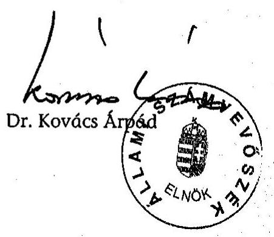

---

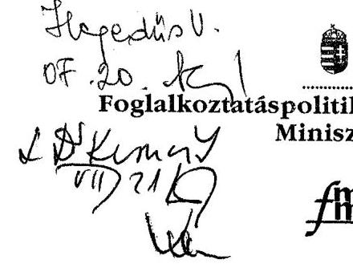

Iktatószám: 6990-2/2004

Dr. Kovács Árpád
elnök úr részére

Állami Számvevőszék

1/a. sz. melléklet
a V-29-044/2003/2004. sz. jelentéshez

1TTU/UK.
Bihory ~,
03.20-
V-19-045/2003/2004

# Tisztelt Elnök Úr! 

A Munkaerőpiaci Alap működésének ellenőrzéséről készített jelentésre észrevételt nem teszek.

Budapest, 2004. július 09.
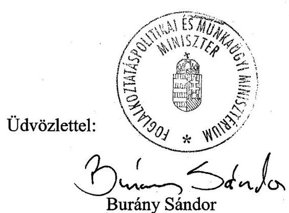

---

Iktatószám:
 19503-4/2004
Állami Számvevőszék
Dr. Kovács Árpád
elnök

# Budapest 

Apáczai Csere János u. 10.
1051
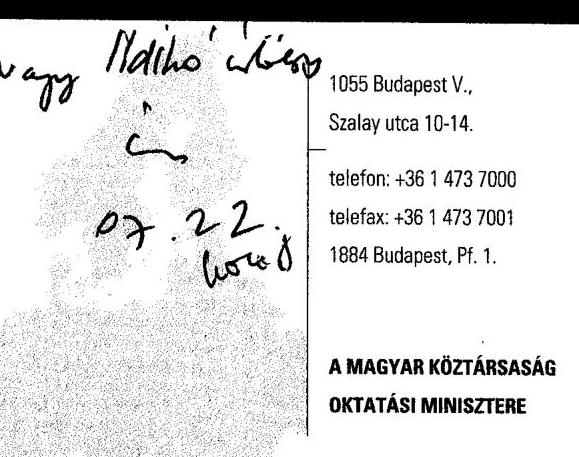

Tisztelt Elnök Úr!
Köszönjük, hogy szövegszerű javaslataink, észrevételeink maradéktalanul átvezetésre kerültek. További észrevételt a Munkaerő-piaci Alap működésének ellenőrzéséről készült jelentéshez nem teszünk.
Az Állami Számvevőszékről szóló 1989. XXXVIII. törvény értelmében, az ellenőrzés alapján elrendelt intézkedésekről - jelentés 15. oldal, javaslat az oktatási miniszternek 1. és 2. pont - az alábbi tájékoztatást adjuk:

1. A 2004. év harmadik negyedévének végén kezdeményezzük a foglalkoztatáspolitikai és munkaügyi miniszterrel együttműködve, a képzési alaprészre vonatkozó szabályozások felülvizsgálatát, a fejlesztési, a támogatási, a döntési feltételek, hatáskörök, a központi keret felhasználási feltételeinek egyértelművé válásának érdekében.
2. Elkészült az MPA képzési alaprészének központi keretéből finanszírozott pályázati eljárás lebonyolítását szabályozó eljárásrend, mely rendelkezik a döntés előkészítéséről, a támogatási szerződés megkötéséről, a szerződések módosításáról, a nyilvántartásokról, a támogatási célok megvalósításának ellenőrzéséről, a szükséges szankciók érvényesítéséről.
3. Elkészült az MPA képzési alaprészének decentralizált keretéből finanszírozandó pályázati eljárás lebonyolítását szabályozó eljárásrend, mely rendelkezik a támogatás céljáról, alanyairól, forrásról, a fejlesztések fő irányairól, a pályázati eljárás lebonyolításáról, a pályázati elvek kialakításáról, a pályázatok kiírásának szabályairól, a pályázatok fogadásáról, iktatásáról, rendszerezéséről, a döntés előkészítéséről, a döntés folyamatáról, a szerződéskötésről, teljesítésről, a nyomon követésről és az ellenőrzésről.

Az elkészült két eljárásrend lehetővé teszi, hogy az MPA képzési alaprészből finanszírozott pályáztatás az előírásoknak megfelelő, átlátható és ütemezhető legyen.

Budapest, 2004. július 21.
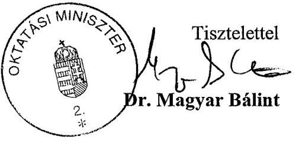

---

# Az MPA kezelését ellátó szervezet évenkénti változása 

## 1996-1998.

Az 1995. november 1-én megalakult Alapkezelési Főosztály két, illetve három osztályra tagolódott. A főosztályt megalakulásakor a Pénzügyi és Számviteli Osztály, valamint a Tervezési, Elemzési Osztály alkotta, majd később létrejött harmadikként a Szabályozási Osztály.

## 1998-2000. június 30.

Az 1998. év második felében a területi és a központi MPA kezelése feladatainak szétválasztásával, a Számviteli, valamint a Pénzügyi Osztály átszervezésével, Területi, illetve Központi MPA Osztály jött létre. Ezzel az osztályszervezet nem a funkciók, hanem az elvégzendő feladatok központi, illetve területi elhelyezkedése alapján tagolódott.

Az 1998. év júniusától a szakképzési alaprész szakmai irányítása, az alaprész kezelésével kapcsolatos pénzügyi, számviteli feladatokkal együtt átkerült az Oktatási Minisztériumba, de szakképzési alaprész szerepelt az egységes beszámolóban.

Ebben az időszakban az Alapkezelési Főosztály létszáma 15-22 fő között mozgott. A szakképzési alaprész kiválásakor a főosztály létszáma 5 fővel csökkent.

## 2000. július 1 - 2001. június 30.

A foglalkoztatáspolitikai feladatok teljes egészében átkerültek a Gazdasági Minisztériumba. Az Alapkezelési Főosztályt átszervezték. Létrejött az MPA Tervezési és Kontrolling Főosztály (7 fő), valamint a Pénzügyi és Számviteli Divízió (7 fő).

Az Alapkezelési Főosztály feladataihoz képest a Főosztály feladatai egyrészt csökkentek a Divízió feladatát képező operatív pénzügyi és számviteli feladatokkal, másrészt bővültek a tervezésen felüli új feladatokkal, mint az MPA-ból finanszírozott fejezeti kezelésű előirányzatok felhasználásának (munkaerőpiaci szervezet fejlesztése, munkaerőpiaci szervezet tartaléka) szakmai irányítása, a munkaerőpiaci programok szakmai felügyelete, az MPA EU-s társfinanszírozása előkészítésének megkezdése, az aktív eszközök működtetésével kapcsolatos kontrolling kialakítása.

---

# 2001. július 1 - 2002. május 31. 

A Foglalkoztatási Hivatal megalakulásával a Pénzügyi és Számviteli Divízióból a Központi MPA egység a Hivatalhoz került. Az MPA Tervezési és Kontrolling Főosztály, valamint a Pénzügyi és Számviteli Divízió megmaradt részlegének az összevonásával létrejött az MPA Tervezési, Elemzési és Felügyeleti Főosztály (7 fő).

## 2002. június 1 - 2002. augusztus 31.

Az MPA Tervezési, Elemzési és Felügyeleti Főosztály változatlan feladatokkal és létszámmal átkerült a Foglalkoztatáspolitikai és Munkaügyi Minisztériumba.

## 2002. szeptember 1 - 2002. december 31.

A Főosztály szervezetébe tagolódtak az MAT Titkárság feladatai, ami 4 fős létszámbővülést jelentett.

## 2003. január 1 - 2003. május 31.

A Főosztály szervezetébe integrálódtak a foglalkoztatással kapcsolatos feladatok, további 5 fővel.

## 2003. június 1 -

A Foglalkoztatási Hivatalból visszakerült a központi MPA kezelésének feladata, 5 fővel a Főosztályra.
2003. július 1-én elkerült a Főosztálytól a foglalkoztatással kapcsolatos feladat (a munkaügyi statisztika és nemzetközi adatszolgáltatás kivételével), és új néven 11 fővel megalakult a jelenleg is működő, MPA Alapkezelési Főosztály.

---

# A Munkaerőpiaci Alap bevételeinek alakulása 1999-2003 között

|  Megnevezés | 1999 |  |  | 2000 |  |  | 2001 |  |  | 2002 |  |  | 2003 |  |   |
| --- | --- | --- | --- | --- | --- | --- | --- | --- | --- | --- | --- | --- | --- | --- | --- |
|   | ei. | mód. ei. | telj. | ei. | mód. ei. | telj. | ei. | mód. ei. | telj. | ei. | mód. ei. | telj. | ei. | mód. ei. | telj.  |
|  BEVÉTELEK |  |  |  |  |  |  |  |  |  |  |  |  |  |  |   |
|  Munkaadói járulék | 85411,2 | 85411,2 | 84751,7 | 96927,9 | 96927,9 | 93623,0 | 104850,7 | 104850,7 | 110524,1 | 115964,8 | 121768,2 | 131610,3 | 143195,8 | 144130,8 | 146185,6  |
|  Munkavállalói járulék | 37878,0 | 37878,0 | 37334,1 | 43224,3 | 43224,3 | 42864,0 | 48058,4 | 48058,4 | 50537,4 | 53152,6 | 55732,5 | 60035,3 | 46100,0 | 46100,0 | 47141,3  |
|  Egyéb bevételek | 800,0 | 1727,8 | 2345,6 | 900,0 | 3337,4 | 3595,6 | 900,0 | 3159,9 | 3451,9 | 900,0 | 2274,5 | 3222,2 | 1400,0 | 3982,0 | 4182,5  |
|  Rehabilitációs hozzájárulás | 1700,0 | 1700,0 | 1769,6 | 2000,0 | 2000,0 | 2184,6 | 2100,0 | 2100,0 | 2499,4 | 2200,0 | 2200,0 | 2811,7 | 2776,6 | 2776,6 | 3284,1  |
|  Visszterhes támogatások törlesztése | 100,0 | 100,0 | 87,4 | 150,0 | 150,0 | 94,4 | 150,0 | 150,0 | 126,7 | 150,0 | 150,0 | 193,2 | 150,0 | 150,0 | 197,9  |
|  Szakképzési hozzájárulás | 7950,0 | 10280,0 | 10830,1 | 9150,0 | 12750,0 | 13185,5 | 11500,0 | 15760,0 | 15808,0 | 12000,0 | 18113,0 | 18480,2 | 18191,0 | 19332,0 | 19470,2  |
|  Szakképzési kamatmentes kölcsön visszafizetése | 50,0 | 50,0 | 118,1 | 50,0 | 50,0 | 94,7 | 50,0 | 74,0 | 85,3 | 50,0 | 50,0 | 43,2 | 40,0 | 34,0 | 48,0  |
|  Bérgarancia támogatás törlesztése | 200,0 | 200,0 | 63,1 | 200,0 | 200,0 | 108,2 | 600,0 | 600,0 | 216,7 | 900,0 | 900,0 | 237,4 | 900,0 | 900,0 | 236,8  |
|  BEVÉTELEK ÖSSZESEN | 134089,2 | 137347,0 | 137299,7 | 152602,2 | 158639,6 | 155750,0 | 168209,1 | 174753,0 | 183249,5 | 185317,4 | 201188,2 | 216633,5 | 212753,4 | 217405,4 | 220746,4  |

Budapest, 2004. április 30.

---

### **A Munkaerőpiaci Alap bevételeinek jogcímenkénti megoszlása a 2003. évben**

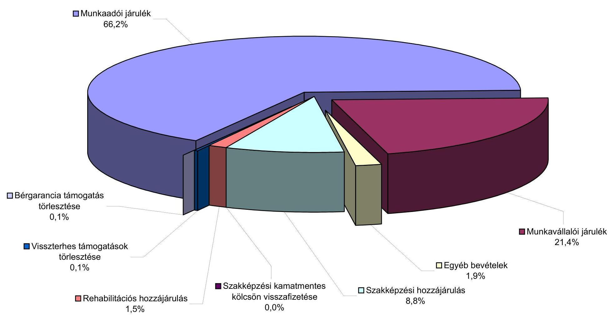

---

4. sz. melléklet a V-29-044/2003/2004. sz. jelentéshez

|  Megnevezés | 1999 |  |  | 2000 |  |  | 2001 |  |  | 2002 |  |  | 2003 |  |   |
| --- | --- | --- | --- | --- | --- | --- | --- | --- | --- | --- | --- | --- | --- | --- | --- |
|   | el. | mód. el. | telj. | el. | mód. el. | telj. | el. | mód. el. | telj. | el. | mód. el. | telj. | el. | mód. el. | telj.  |
|  Aktív foglalkoztatási eszközök (1) | 31350,0 | 32155,8 | 31452,9 | 32819,0 | 35187,0 | 34222,5 | 46655,5 | 47051,9 | 45339,7 | 53956,4 | 59266,4 | 57687,3 | 50340,3 | 54339,6 | 53464,6  |
|  Foglalkoztatási és képzési támogatások | 29850,0 | 30905,8 | 30202,9 | 30239,0 | 31607,0 | 30642,5 | 43281,5 | 43677,9 | 41965,7 | 50353,1 | 55663,1 | 54084,0 | 47980,3 | 54339,6 | 53464,6  |
|  GM célelőirányzatnak átadás | 1500,0 | 1250,0 | 1250,0 | 2580,0 | 2580,0 | 2580,0 | 3374,0 | 3374,0 | 3374,0 | 3603,3 | 3603,3 | 3603,3 |  |  |   |
|  Katasztrófa elhárítási célelőirányzatnak átadás |  |  |  |  | 1000,0 | 1000,0 |  |  |  |  |  |  |  |  |   |
|  Aktív foglalkoztatási eszközök tartalék |  |  |  |  |  |  |  |  |  |  |  |  | 2360,0 |  |   |
|  Szakképzési célú kifizetések (2) | 8000,0 | 10330,0 | 9768,0 | 9200,0 | 12800,0 | 12224,8 | 11550,0 | 15984,0 | 15983,0 | 12050,0 | 18560,0 | 18553,3 | 18231,0 | 15298,0 | 15296,6  |
|  Munkanélküli ellátások (3) | 61848,0 | 61848,0 | 64416,0 | 57196,4 | 57196,4 | 61719,4 | 48158,0 | 48158,0 | 56570,9 | 50662,4 | 50662,4 | 63222,1 | 68176,0 | 68176,0 | 68364,3  |
|  Jövedelempótló támogatás (4) | 25380,0 | 25380,0 | 22400,7 | 21850,5 | 21850,5 | 18908,6 | 6317,7 | 6317,7 | 8525,5 | 1043,3 | 1043,3 | 1390,0 | 200,0 | 200,0 | 200,7  |
|  Bérgarancia kifizetések (5) | 600,0 | 600,0 | 212,4 | 600,0 | 600,0 | 288,7 | 1200,0 | 1200,0 | 901,3 | 1600,0 | 1600,0 | 1324,4 | 1700,0 | 3565,0 | 3419,7  |
|  Rehabilitációs célú kifizetések (6) | 11690,0 | 11690,0 | 11643,8 | 15150,0 | 15150,0 | 15046,2 | 20250,0 | 20250,0 | 20130,7 | 21350,0 | 21350,0 | 21299,4 | 19826,6 | 19826,6 | 19743,0  |
|  Munkahelyteremtő támogatás | 1700,0 | 1700,0 | 1653,8 | 2150,0 | 2150,0 | 2046,2 | 2250,0 | 2250,0 | 2130,7 | 2350,0 | 2350,0 | 2299,4 | 2926,6 | 2926,6 | 2843,0  |
|  Megváltozott munkaképességű személyek foglalkoztatásának támogatása | 9990,0 | 9990,0 | 9990,0 | 13000,0 | 13000,0 | 13000,0 | 18000,0 | 18000,0 | 18000,0 | 20000,0 | 20000,0 | 20000,0 | 22000,0 | 22000,0 | 22000,0 |

 | 18000,0 | 18000,0 | 19000,0 | 19000,0 | 19000,0 | 16900,0 | 16900,0 | 16900,0  |
|  Alapkezelőnek átadott pénzeszköz (7) | 301,2 | 302,7 | 302,7 | 310,0 | 310,0 | 310,0 | 325,0 | 288,7 | 288,7 | 338,0 | 249,5 | 249,5 | 271,2 | 300,2 | 300,2  |
|  A munkaerőpiaci szervezet működése és fejlesztése (8) | 12100,0 | 12220,5 | 12220,5 | 11895,3 | 11964,7 | 11964,4 | 12857,9 | 14607,7 | 14607,7 | 13325,6 | 17464,9 | 17442,3 | 19893,7 | 21585,4 | 21569,1  |
|  Országos munkaerőpiaci szervezetnek átadott pénzeszköz | 11000,0 | 11019,5 | 11019,5 | 11045,3 | 11114,7 | 11114,7 | 11657,9 | 13407,7 | 13407,7 | 12125,6 | 16114,9 | 16096,1 | 18043,7 | 19735,4 | 19735,4  |
|  Országos munkaerőpiaci szervezet fejlesztési program | 1100,0 | 1201,0 | 1201,0 | 850,0 | 850,0 | 849,7 | 1200,0 | 1200,0 | 1200,0 | 1200,0 | 1350,0 | 1346,2 | 1250,0 | 1250,0 | 1233,7  |
|  Állami Foglalkoztatási Szolgálat PHARZ program társfinanszírozás |  |  |  |  |  |  |  |  |  |  |  |  | 600,0 | 600,0 | 600,0  |
|  Munkaerőpiaci szervezet központosított kerete | 170,0 | 170,0 | 170,0 | 200,0 | 200,0 | 200,0 | 206,0 | 206,0 | 206,0 | 206,0 | 206,0 | 206,0 | 206,0 | 206,0 | 206,0  |
|  TB alapnak átadás (9) |  |  |  |  |  |  | 2000,0 | 2000,0 | 2404,2 | 1000,0 | 1000,0 | 1978,5 | 1000,0 | 1000,0 | 1357,6  |
|  Munkanélküli ellátórendszer változásával összefüggő költségvetési befizetés (10) | 0,0 | 0,0 | 0,0 | 6817,0 | 6817,0 | 6817,0 | 29037,5 | 29037,5 | 29037,5 | 37426,1 | 37426,1 | 37426,1 | 32510,0 | 32510,0 | 32510,0  |
|  Munkanélküli járadékból kikerülő aktív korúak rendszeres szociális segélyezésére |  |  |  | 1827,0 | 1827,0 | 1827,0 | 17279,3 | 17279,3 | 17279,3 | 21546,0 | 21546,0 | 21546,0 | 18510,0 | 18510,0 | 18510,0  |
|  Közcélú munkavégzés kiadásaira |  |  |  | 3773,0 | 3773,0 | 3773,0 | 10488,2 | 10488,2 | 10488,2 | 14565,6 | 14565,6 | 14565,6 | 13000,0 | 13000,0 | 13000,0  |
|  Munkanélküli ellátórendszer átalakításához kötődő igazgatási feladatokra |  |  |  | 1217,0 | 1217,0 | 1217,0 | 1270,0 | 1270,0 | 1270,0 | 1314,5 | 1314,5 | 1314,5 | 1000,0 | 1000,0 | 1000,0  |
|  Országos Munkabiztonsági és Munkaügyi Főfelügyelőségnek átadott pénzeszköz (11) |  |  |  | 344,7 | 344,7 | 344,7 | 359,2 | 359,2 | 359,2 | 372,5 | 372,5 | 372,5 | 398,6 | 398,6 | 398,6  |
|  KIADÁSOK ÖSSZESEN (1+2+....+11) | 151439,2 | 154697,0 | 152587,0 | 156382,9 | 162420,3 | 162046,3 | 178916,8 | 185460,7 | 194354,4 | 193330,3 | 209201,1 | 221151,4 | 212753,4 | 217405,4 | 216830,6  |

Budapest, 2004. 04. 30.

---

4/a. sz. melléklet
a V-29-044/2003/2004. sz. jelentéshez

A Munkaerőpiaci Alap kiadásainak jogcímenkénti megoszlása a 2003. évben

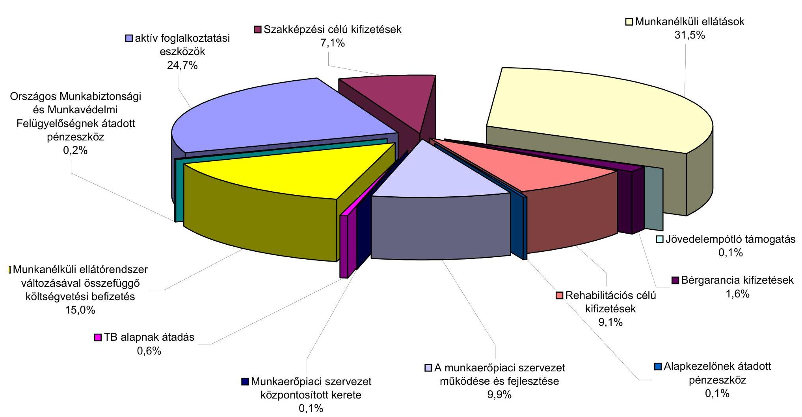

☐ aktív foglalkoztatási
eszközök
24,7%
☐ Szakképzési célú kifizetések
7,1%
☐ Munkanélküli ellátások
31,5%

Országos Munkabiztonsági
és Munkavédelmi
Felügyelőségnek átadott
pénzeszköz
0,2%
☐ Jövedelempótló támogatás
0,1%
☐ Munkanélküli ellátórendszer
változásával összefüggő
költségvetési befizetés
15,0%
☐ Rehabilitációs célú
kifizetések
9,1%
☐ Jövedelempótló támogatás
0,1%
☐ TB alapnak átadás
0,6%
☐ Munkaerőpiaci szervezet
központosított kerete
0,1%
☐ A munkaerőpiaci szervezet
működése és fejlesztése
9,9%
☐ Alapkezelőnek átadott
pénzeszköz
0,1%

---

# A hatékonyság és az eredményesség megítéléséhez alkalmazott ismér-

vek és mutatók a munkanélküliek elhelyezkedését segítő képzési-, bértámogatási-, munkahely teremtési eszközök teljesítmény ellenőrzéséhez

A hatékonysági és eredményességi kritériumok kialakításánál figyelembe vettük, hogy az ellenőrzött időszakban csökkent a munkanélküliek száma, ezért a támogatások hasznosulása értékelésénél az arányok alakulását, illetve azok viszonylagos stabilitását tekintettük meghatározó szempontnak.

## 1. Teljesítmény kritériumok

1.1. Az aktív munkaerőpiaci eszközök felhasználását akkor tekinthetjük hatékonynak, ha szinten maradt, illetve javult a képzésben résztvevők és azt befejezők-, valamint az egyéb támogatásokban részesülők aránya az ellenőrzött években;
1.2. Eredményesnek minősíthetjük az eszközök hasznosulását, ha a korábbi évekhez (az 1996-1998 közötti időszakhoz) képest nem romlott a munkaerőpiaci képzésből, a támogatott foglalkoztatásból, a vállalkozóvá válás támogatásból kikerülők elhelyezkedési-, valamint a támogatás nélkül is működőképes vállalkozásoknak az aránya.

## 2. Teljesítménymutatók

- a képzésben résztvevők és azt befejezők, valamint az egyéb támogatásokban részesülők,
- a munkát, azon belül szakirányú munkát találók,
- a munkában állók,
- a működő vállalkozások száma és aránya.

---

# A teljesítmény ellenőrzésbe vont programok megvalósulásának folyamata 

1. A Munkaerőpiaci Alap létrehozása, részeinek, illetve feladatainak meghatározása az 1995. évi CXXIV. törvénnyel
2. A foglalkoztatási alaprész (aktív munkaerőpiaci eszközök) feladatainak meghatározása, a felelős szervezetek kijelölése
3. Felelős szervezetek

- Irányító szervezetek
- Foglalkoztatáspolitikai és Munkaügyi Minisztérium, illetve jogelődjei
- Munkaerőpiaci Alap Irányító Testület (MAT)
- Megyei, fővárosi munkaügyi tanácsok
- Szakmai szervezetek: Foglalkoztatási Hivatal és jogelődjei; fővárosi, megyei munkaügyi központok; kirendeltségek, munkaerő-fejlesztő és képző központok

Rendeletek, határozatok, utasítások megjelentetése, a felelős szervezetek kijelölése
5. Éves konkrét feladatok, célok meghatározása
6. Források biztosítása
7. Célok, feladatok teljesítése:

Intézmények, munkáltatók: feladatok végrehajtása
Kedvezményezettek: A szerződésben vállaltak teljesítése

---

# A korábbi számvevőszéki vizsgálatok utóellenőrzése 

## 1. A Munkaerőpiaci Alap működésének pénzügyi-gazdasági ellenőrzése (1999)

## Az MPA-t felügyelő minisztérium(ok) intézkedései

Az SzCSM az Flt-ben szabályozott támogatások részletes feltételeit meghatározó az MPA-ból foglalkoztatási válsághelyzetek kezelésére nyújtható támogatásokról szóló 6/1996. (VIII. 16.) MüM rendelet módosítása keretében megvizsgálta a közhasznú munkaként nem támogatható munka és tevékenységi köröket. Azok tételes felsorolását - elfogadható indokok alapján - nem tartotta célszerűnek.

A minisztérium(ok) 2000-2003. között (2001. év kivételével) irányelveket adtak ki az MPA felhasználásának ellenőrzéséhez.

Az ÁSZ ajánlásának megfelelően 2002. májusában a GM, az APEH, az Államháztartási Hivatal és a Magyar Államkincstár között létrejött megállapodás alapján a járulékok és a szakképzési hozzájárulás napi egyenlegét az MPA főszámlájára utalja az APEH.

Nem készült el az ágazat(ok) középtávú informatikai terve. Az Állami Foglalkoztatási Szolgálatnál 2003-ban megkezdődött az adatok archiválási folyamatainak áttekintése.

A 2000. évi közmunka pályázatok elbírálásához kialakított szempontrendszer alapján a társadalmilag, gazdaságilag hátrányos helyzetű, magas munkanélküliségi rátával sújtott térségekből érkező pályázatok kaptak elsőbbséget. (Jelenleg a 2003-ban megalakult Közmunkatanács irányítja a közmunka programok szervezését).

## Oktatási Minisztérium intézkedései

A szakképzési hozzájárulás rendszerének hatékonyabb működtetése érdekében kezdeményezett ÁSZ javaslat nem valósult meg.

A szakképzési alaprész decentralizált keretének működtetésére az OM megállapodást kötött a munkaügyi központokkal.

---

Az OM-ben kifejlesztették a szakképzési hozzájáruláshoz kapcsolódó nyilvántartási rendszert, melyet a jogszabályi változások miatt csak részben alkalmaznak.

# 2. A központi költségvetés területén működő belső kontroll mechanizmusok ellenőrzése (2001.) 

Az ellenőrzés kapcsán az ÁSZ javasolta többek között az informatikai belső szabályzatok felülvizsgálatát, az informatikai szervezet megerősítését, figyelemmel az informatikai biztonságra, védelemre.

Az ellenőrzést követően a jelenlegi vizsgálatban az érintett minisztériumoknál az OM-ben átfogó szabályzat készült. Az SzCSM intézkedési tervben rögzítette a tárca feladatait.

## 3. A foglalkoztatást elősegítő támogatások ellenőrzése (2002.)

Az ÁSZ javaslatok kapcsán a foglalkoztatáspolitikai és munkaügyi miniszter tájékoztatást adott arról, hogy a közhasznú támogatási kérelmeket azonos elvek és eljárási szabályok alapján bírálják el. A munkaügyi központok 2003. évi feladattervébe bekerült az elővizsgálatok, a folyamatba épített és az utóellenőrzések összehangolása (az eljárási rendet folyamatosan aktualizálták, de egységes szerkezetben nem adták ki).

A miniszter intézkedést kezdeményezett, hogy a közhasznú munkavégzés keretében foglalkoztatottakra kiterjedjen a Munka Törvénykönyve szabályozása és a vonatkozó 49/1999. (III. 26.) Korm. rendelet módosításával a kizárólagosan állami tulajdonú gazdasági társaságok, a közhasznú társaságok is benyújthassanak pályázatot, valamint lehetővé váljon a kisebb önkormányzatok pályázatainál az előfinanszírozás.

## 4. A szakképzési struktúra szerepe a munkaerőpiaci igények kielégítésében (2003)

Az ÁSZ javaslatai az FMM, illetve az OM miniszterének szóltak.
A foglalkoztatáspolitikai és munkaügyi miniszter a válaszában jelezte, hogy a tárca és az Állami Foglalkoztatási Szolgálat kiemelten foglalkozik a szakmák munkaerőpiaci helyzetével, különös tekintettel a hiányszakmákra. A feladatok teljesítésére intézkedési terv készült.

Az oktatási miniszter arról tájékoztatta az ÁSZ-t, hogy megkezdődött a szakképzés fejlesztésére vonatkozó munka az OM, az FMM és a BM együttműködésével. Az együttműködés keretében foglalkoznak a szakképzéssel kapcsolatos térségi feladatokkal, hatáskörökkel, a gyakorlati képzési normatíva differenciált meghatározásával.

Az oktatási tárca kezdeményezésére a szakképzési hozzájárulásról és a képzés fejlesztésének támogatásáról szóló 2003. évi LXXXVI. törvényben szabályozták, hogy a szakképzési hozzájárulási kötelezettséget bruttó mó-

---

don mutassák be az adóbevallásban. A törvénnyel rendezték az ÁSZ ellenőrzés során felvetett számviteli, pénzügy-technikai problémát. A tárca vezetőjének véleménye szerint a törvény normaszövegébe jelentős mértékben beépültek a határon túli oktatással, az egyedi döntésekkel, a regionális fejlesztési és képzési bizottságok hatáskörével kapcsolatos ÁSZ ajánlások.

Az oktatási tárca úgy ítélte meg, hogy a munkakörök OKJ-ben történő szerepeltetésével lehetővé tette a szakképzés szerkezetét bemutató oktatási, és a munkaerőpiaci statisztikák adatainak összehasonlítását. Az OM bekapcsolódott az ÁFSZ adatszolgáltatási körébe tartozó feladatok kimutatásába. Véleményünk szerint így lehetővé válik az adatok elemzése.

# 5. A Magyar Köztársaság 2001 és 2002. évi költségvetése végrehajtásának ellenőrzése 

A pénzügyminisztériumnak szóló, mindkét évben rögzített ÁSZ javaslat kezdeményezte, hogy az MPA mérlege az APEH által beszedett járulékokhoz és hozzájárulásokhoz tartozó kintlévőségek adatait is tartalmazza. A miniszter 2002. évi válasza szerint a kérdés rendezésére a 249/2000. (XII. 24.) Korm. rendelet módosításával nyílt volna lehetőség, de az alapkezelő kifogása miatt erre nem került sor. A miniszter 2003-ban arról tájékoztatta az ÁSZ-t, hogy az említett kormányrendelet kiegészült az APEH és a VPOP - az elkülönített pénzalapok felé történt - adatszolgáltatási kötelezettségével. Az MPA beszámolójának határideje a tárgyévet követő május 31-re módosult.

Budapest, 2004. július
